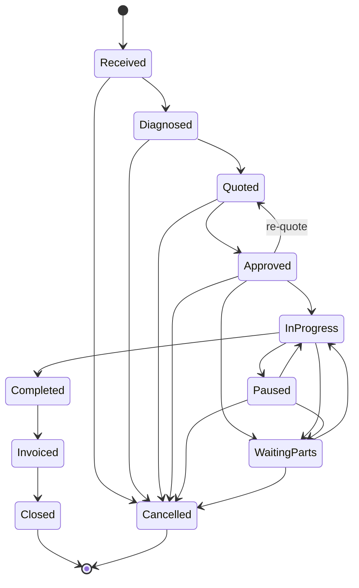

# Workshop — Work Order State Machine

> **Source of truth.** Any change to the `WorkOrderStatus` enum, the `StatusMachine` adjacency map, the event payloads, or the transition endpoints **must** be reflected here. If this doc and the code disagree, the code wins and the doc is a bug — fix the doc in the same PR as the code change.

This document describes the Work Order lifecycle as implemented under
`apps/api/app/Modules/Workshop/WorkOrder/`. It supersedes the earlier draft state
list in `docs/otospex/ROADMAP.md` §6.2 and any other pre-PR-8 artifact that
mentions `Draft`, `Parts Reserved`, or `Paid` as Work Order statuses. Those names
were never shipped.

Canonical code references:

| Concern | File |
|---------|------|
| Enum of states | `apps/api/app/Modules/Workshop/WorkOrder/Domain/Enums/WorkOrderStatus.php` |
| Adjacency map | `apps/api/app/Modules/Workshop/WorkOrder/Domain/Services/StatusMachine.php` |
| Single write path | `apps/api/app/Modules/Workshop/WorkOrder/Application/Services/WorkOrderTransitionService.php` |
| HTTP surface | `apps/api/app/Modules/Workshop/WorkOrder/Presentation/Controllers/WorkOrderTransitionController.php` |
| Request authorization | `apps/api/app/Modules/Workshop/WorkOrder/Presentation/Requests/{Transition,CaptureApproval,Cancel,Complete}Request.php` |

A dedicated PHPStan rule (`app/PHPStan/Rules/WorkOrderStatusWriteOnlyViaTransitionService.php`) enforces at static-analysis time that **no code path outside `WorkOrderTransitionService` may assign to `WorkOrder::$status`**. Do not try to bypass it.

---

## 1. States

Eleven states, encoded as `enum WorkOrderStatus: string`. Values are snake_case strings persisted verbatim in `work_orders.status` and in `work_order_status_transitions.{from,to}_status`.

| State | DB value | Business meaning |
|-------|----------|------------------|
| `Received` | `received` | Initial state. The WO has been created from intake (walk-in, appointment, online booking) but the technician has not yet inspected the vehicle. No quote exists. |
| `Diagnosed` | `diagnosed` | A technician has inspected the vehicle and the diagnosis is recorded on `work_orders.diagnosis`. Lines may be drafted but no quote document has been generated yet. |
| `Quoted` | `quoted` | A quote document has been generated (see `WorkOrderTransitionService::transition()` → `DocumentGenerationAdapter::generateQuote()`). The customer-facing price is binding. `work_orders.quote_document_id` is populated. |
| `Approved` | `approved` | The customer approved the quote. Approval evidence (method, captured_at, captured_by, reference) is persisted on the WO header via `WorkOrderTransitionService::captureApproval()`. Parts are reserved from inventory via `InventoryReservationAdapter::reserveFor()`. |
| `InProgress` | `in_progress` | The technician is actively working on the vehicle. `work_orders.started_at` is set on first entry (and preserved on re-entries from Paused / WaitingParts). |
| `Paused` | `paused` | Work is temporarily suspended for a reason that is not parts-related (e.g. lunch, shift end, awaiting customer callback). `work_orders.paused_at` is set. Time entries are closed by the Technician module listener. |
| `WaitingParts` | `waiting_parts` | Work is blocked on parts delivery. Distinct from Paused so reporting / dashboards can see blocked vs. idle WOs. |
| `Completed` | `completed` | Physical work is finished. `work_orders.completed_at` is set. Financials are frozen; no line edits allowed. |
| `Invoiced` | `invoiced` | An invoice document has been generated and posted. `work_orders.invoice_document_id` is populated. |
| `Closed` | `closed` | **Terminal.** Invoice has been paid / settled at the business level. No outgoing transitions. |
| `Cancelled` | `cancelled` | **Terminal.** WO was abandoned. `work_orders.cancelled_at` + `work_orders.cancellation_reason` are set. Reservations are released via `InventoryReservationAdapter::releaseFor()`. |

`WorkOrderStatus::isTerminal()` returns `true` only for `Closed` and `Cancelled`.

Note the absence of `Paid` as a distinct state: payment settlement lives on the
Document / Treasury side (`Document::fiscal_status`, `Payment::status`). The WO
moves from `Invoiced` straight to `Closed` when operations consider the job
done. Integrators wanting to know "is the customer paid up?" should query the
linked invoice document, not the WO.

---

## 2. Allowed transitions

The full adjacency map from `StatusMachine::allowedTargetsOf()`. Twenty directed edges. Self-loops are explicitly forbidden by `StatusMachine::isAllowed()` even if both states are identical.

### 2.1 Mermaid diagram



### 2.2 ASCII fallback (for environments without mermaid rendering)

```
                            +-----------+
 intake / create --------> |  Received |-------------------------+
                            +-----+-----+                         |
                                  | diagnose                      |
                                  v                               |
                            +-----+-----+                         |
                            | Diagnosed |-----------------+       |
                            +-----+-----+                 |       |
                                  | quote                 |       |
                                  v                       |       |
                            +-----+-----+                 |       |
                            |  Quoted   |<--- re-quote -+ |       |
                            +-----+-----+                \|       |
                                  | approve               +       |
                                  v                       |       |
                            +-----+-----+                 |       |
                            | Approved  |-----+           |       |
                            +-----+-----+     |           |       |
                             |    |  |        |           |       |
                             |    |  v        |           |       |
                             |    | +---------+---+       |       |
                             |    | |WaitingParts |<------+--+    |
                             |    | +---------+---+          |    |
                             |    v           |              |    |
                             | +-----------+  |              |    |
                             +>| InProgress|<-+              |    |
                               +-----+-----+                 |    |
                                 |  ^|  ^                    |    |
                                 |  ||  |                    |    |
                                 v  |v  |                    |    |
                              +-----+-+  +------+            |    |
                              | Paused|---------+------------+    |
                              +-------+                           |
                                 |                                |
                                 v                                |
                              +------+                            |
                              |Compl-|                            |
                              |eted  |                            |
                              +--+---+                            |
                                 | invoice                        |
                                 v                                |
                              +-------+                           |
                              |Invoiced|                          |
                              +---+---+                           |
                                 | close                          |
                                 v                                |
                              +------+                            |
                              |Closed| (terminal)                 |
                              +------+                            |
                                                                  v
                                                              +---------+
                                                              |Cancelled| (terminal)
                                                              +---------+
```

### 2.3 Transition table

Columns:

- **Allowed when**: business context for the edge. This is *not* enforced by `StatusMachine` itself — the machine only validates the edge topology. Additional business rules (e.g. "quote document must exist before Approved") are enforced inside `WorkOrderTransitionService::transition()` via pre-transition side effects.
- **Side effect (same tx)**: adapter call executed inside the transition's DB transaction. Failure rolls the transition back.
- **Event(s) emitted**: all events dispatched after the WO row is saved. Events are immutable (CLAUDE.md rule #8) — never rename.
- **Permission**: the `can:*` check on the corresponding `FormRequest::authorize()`. Required in addition to the `['api', 'auth:sanctum', SetPermissionsTeam::class, 'module:Workshop']` middleware stack.

| # | From | To | Allowed when | Side effect (same tx) | Event(s) emitted | Endpoint | Permission |
|---|------|----|--------------|-----------------------|-------------------|----------|------------|
| 1 | Received | Diagnosed | Technician has recorded `diagnosis` on the WO | — | `WorkOrderDiagnosed` | `POST /work-orders/{id}/transition` | `work-orders.transition` |
| 2 | Received | Cancelled | Customer cancelled before inspection | `releaseFor($wo)` | `WorkOrderCancelled` | `POST /work-orders/{id}/cancel` | `work-orders.cancel` |
| 3 | Diagnosed | Quoted | Lines drafted, quote payload valid | `generateQuote($wo)` → sets `quote_document_id` | `WorkOrderQuoted` | `POST /work-orders/{id}/transition` | `work-orders.transition` |
| 4 | Diagnosed | Cancelled | Customer declined post-diagnosis | `releaseFor($wo)` | `WorkOrderCancelled` | `POST /work-orders/{id}/cancel` | `work-orders.cancel` |
| 5 | Quoted | Approved | Approval evidence captured (`captureApproval()`) | `reserveFor($wo)` → returns list of `PartNeed` | `WorkOrderApproved`, optional `WorkOrderPartsNeeded` | `POST /work-orders/{id}/approval` | `work-orders.approve` |
| 6 | Quoted | Cancelled | Customer declined quote | `releaseFor($wo)` | `WorkOrderCancelled` | `POST /work-orders/{id}/cancel` | `work-orders.cancel` |
| 7 | Approved | InProgress | Technician starts work | — | `WorkOrderStarted` | `POST /work-orders/{id}/transition` | `work-orders.transition` |
| 8 | Approved | WaitingParts | Reserved parts not yet in stock | — | `WorkOrderWaitingParts` | `POST /work-orders/{id}/transition` | `work-orders.transition` |
| 9 | Approved | Quoted | Scope change requires re-quote (prior quote superseded) | `generateQuote($wo)` → overwrites `quote_document_id` | `WorkOrderQuoted` | `POST /work-orders/{id}/transition` | `work-orders.transition` |
| 10 | Approved | Cancelled | Customer pulled approval | `releaseFor($wo)` | `WorkOrderCancelled` | `POST /work-orders/{id}/cancel` | `work-orders.cancel` |
| 11 | InProgress | Paused | Shift end, lunch, etc. | — | `WorkOrderPaused` | `POST /work-orders/{id}/transition` | `work-orders.transition` |
| 12 | InProgress | WaitingParts | Additional parts needed mid-work | — | `WorkOrderWaitingParts` | `POST /work-orders/{id}/transition` | `work-orders.transition` |
| 13 | InProgress | Completed | Work finished | — | `WorkOrderCompleted` | `POST /work-orders/{id}/complete` | `work-orders.complete` |
| 14 | Paused | InProgress | Resume work | — | `WorkOrderStarted`, `WorkOrderResumed` (see §3.2) | `POST /work-orders/{id}/transition` | `work-orders.transition` |
| 15 | Paused | WaitingParts | Learned parts are the blocker | — | `WorkOrderWaitingParts` | `POST /work-orders/{id}/transition` | `work-orders.transition` |
| 16 | Paused | Cancelled | Customer pulled job while paused | `releaseFor($wo)` | `WorkOrderCancelled` | `POST /work-orders/{id}/cancel` | `work-orders.cancel` |
| 17 | WaitingParts | InProgress | Parts arrived, work resumed | — | `WorkOrderStarted`, `WorkOrderResumed` (see §3.2) if previously paused | `POST /work-orders/{id}/transition` | `work-orders.transition` |
| 18 | WaitingParts | Cancelled | Part unobtainable, customer cancelled | `releaseFor($wo)` | `WorkOrderCancelled` | `POST /work-orders/{id}/cancel` | `work-orders.cancel` |
| 19 | Completed | Invoiced | Finance generates invoice from WO | `generateInvoice($wo)` → sets `invoice_document_id` | `WorkOrderInvoiced` | `POST /work-orders/{id}/transition` | `work-orders.transition` |
| 20 | Invoiced | Closed | Invoice settled at the business level | — | `WorkOrderClosed` | `POST /work-orders/{id}/transition` | `work-orders.transition` |

---

## 3. Events

All events are `final readonly` classes under
`App\Modules\Workshop\WorkOrder\Domain\Events\`. Payload signatures are locked
(CLAUDE.md rule #8). Versioned replacements only.

### 3.1 Primary transition events

| Event | Emitted on | Key payload fields |
|-------|-----------|---------------------|
| `WorkOrderCreated` | WO insert (not a transition — pre-`Received` boundary) | `work_order_id`, `company_id`, `vehicle_id`, `created_at` |
| `WorkOrderDiagnosed` | → Diagnosed | `work_order_id`, `diagnosis`, `diagnosed_at` |
| `WorkOrderQuoted` | → Quoted (including Approved → Quoted re-quote) | `work_order_id`, `quote_document_id`, `estimated_grand_total`, `currency`, `quoted_at` |
| `WorkOrderApproved` | → Approved | `work_order_id`, `approval_method`, `estimated_grand_total`, `currency`, `approval_captured_at` |
| `WorkOrderStarted` | → InProgress (both first-time start and resume) | `work_order_id`, `primary_technician_profile_id`, `started_at` |
| `WorkOrderPaused` | → Paused | `work_order_id`, `reason_code`, `paused_at` |
| `WorkOrderWaitingParts` | → WaitingParts | `work_order_id`, `needs: list<PartNeed>`, `recorded_at` |
| `WorkOrderCompleted` | → Completed | `work_order_id`, `completion_mileage?`, `completed_at` |
| `WorkOrderInvoiced` | → Invoiced | `work_order_id`, `invoice_document_id`, `invoiced_at` |
| `WorkOrderClosed` | → Closed | `work_order_id`, `closed_at` |
| `WorkOrderCancelled` | → Cancelled | `work_order_id`, `reason_code`, `cancelled_at` |
| `WorkOrderLineUpdated` | Line CRUD (not a status transition) | — (out of scope of this doc) |

`Received` is the creation state and emits no lifecycle event on entry. Incoming
WO creation is signalled via `WorkOrderCreated`.

### 3.2 Companion / out-of-band events

Two events fire in addition to (not instead of) a primary transition event:

- **`WorkOrderResumed`** — emitted *after* `WorkOrderStarted` whenever a WO transitions to `InProgress` and its `paused_at` timestamp is non-null. In practice this fires for transitions 14 (Paused → InProgress) and any 17 (WaitingParts → InProgress) where the WO was previously paused in its lifetime. Plan C's `ReopenTimeEntryOnWorkOrderResumed` listener subscribes. Payload: `work_order_id`, `resumed_at`.
- **`WorkOrderPartsNeeded`** — emitted *after* `WorkOrderApproved` when `InventoryReservationAdapter::reserveFor()` returned a non-empty list of `PartNeed` value objects (i.e. at least one part was reserved or flagged as needed). Future procurement-agent listeners subscribe. Payload: `work_order_id`, `needs: list<PartNeed>`, `recorded_at`.

Both companion events are emitted **in the same DB transaction** as the primary event, after the WO row + `work_order_status_transitions` row are persisted.

---

## 4. Parallel branch: WaitingParts vs InProgress vs Paused

After `Approved`, an active WO lives in one of three non-terminal states that
form a fork-and-join: `InProgress`, `Paused`, `WaitingParts`. The three are
freely interchangeable (see edges 11, 12, 14, 15, 17) and converge back at
`InProgress → Completed`. Semantically:

- **`InProgress`** — technician is actively doing work.
- **`Paused`** — technician is temporarily away but *not* blocked on parts (lunch, shift end, waiting for customer callback).
- **`WaitingParts`** — technician is blocked on parts arrival. Distinct from `Paused` so operations dashboards / KPIs can distinguish idle-by-choice from idle-by-supply-chain.

Only `InProgress → Completed` exists. A `Paused` or `WaitingParts` WO must
first return to `InProgress` before it can be marked `Completed`. This is
intentional and enforces that completion is recorded while the technician is
actively holding the job.

The `work_orders.started_at` column is set on the **first** entry into
`InProgress` and preserved thereafter. The `work_orders.paused_at` column is
updated every time the WO enters `Paused` (used by `dispatchTransitionEvent()`
to detect that a subsequent `Paused → InProgress` should fire
`WorkOrderResumed`).

---

## 5. HTTP surface

Base prefix: `/api/v1/workshop`. Middleware stack: `['api', 'auth:sanctum', SetPermissionsTeam::class, 'module:Workshop']` (per CLAUDE.md rule #12).

| Method | Path | Controller action | Purpose | Required permission |
|--------|------|-------------------|---------|---------------------|
| `POST` | `/work-orders/{id}/transition` | `WorkOrderTransitionController::transition` | Generic transition by target `to_status` | `work-orders.transition` |
| `POST` | `/work-orders/{id}/approval` | `WorkOrderTransitionController::approve` | Capture approval evidence and transition to `Approved` | `work-orders.approve` |
| `POST` | `/work-orders/{id}/cancel` | `WorkOrderTransitionController::cancel` | Transition to `Cancelled` with reason | `work-orders.cancel` |
| `POST` | `/work-orders/{id}/complete` | `WorkOrderTransitionController::complete` | Transition to `Completed` with optional `completion_mileage` | `work-orders.complete` |

The `/transition` endpoint can drive *any* allowed edge where no dedicated
endpoint exists (e.g. Received → Diagnosed, InProgress → WaitingParts,
Invoiced → Closed). The dedicated endpoints (`/approval`, `/cancel`,
`/complete`) exist because they carry additional payload that the generic
`TransitionRequest` cannot validate (approval evidence, cancellation reason,
completion mileage).

### 5.1 Optimistic locking (409)

All four endpoints accept an optional `expected_updated_at` ISO-8601 timestamp on
the body. If present and the WO's current `updated_at` does not match, the
`WorkOrderTransitionService` throws `StaleWorkOrderException` and the HTTP
layer returns **HTTP 409** with:

```json
{
  "code": "WORK_ORDER_STALE",
  "message": "...",
  "work_order_id": "<uuid>",
  "expected_updated_at": "<ISO-8601>",
  "current_updated_at": "<ISO-8601>"
}
```

Callers should refresh the WO (re-read `updated_at`) and retry.

### 5.2 Illegal-transition error (422)

If the requested edge is not in the adjacency map from §2.3, the service
throws `WorkOrderTransitionException` and the HTTP layer returns **HTTP 422**
with:

```json
{
  "code": "INVALID_TRANSITION",
  "message": "Cannot transition WorkOrder <id> from <current> to <attempted>."
}
```

> **Note for external API clients.** The machine itself does not surface the
> allowed-targets list in this error payload today. If you need to drive a UI
> that only renders valid next-state buttons, read the full adjacency map from
> this document (§2.3) or from a future `GET /work-orders/{id}/allowed-transitions`
> endpoint (not yet implemented; open an RFC if you need it).

### 5.3 Permission denied (403)

Missing the required `can:*` permission returns **HTTP 403** via Laravel's
`FormRequest::authorize()` rejection. Missing the `module:Workshop` middleware
returns a structured tenant-scoping error. Missing auth returns **HTTP 401**.

---

## 6. Invariants enforced by the write path

`WorkOrderTransitionService` guarantees, for every transition:

1. **Single-writer rule.** The custom PHPStan rule `WorkOrderStatusWriteOnlyViaTransitionService` rejects any code that writes to `WorkOrder::$status` outside this service. All mutations flow through `transition()` (directly or via `captureApproval()`).
2. **Atomicity.** The WO update, the `work_order_status_transitions` audit row, the side-effect adapter calls (quote generation, invoice generation, part reservation/release), and the event dispatch all happen in a single DB transaction. A failure at any step rolls back the WO to its prior state.
3. **Audit trail.** Every successful transition writes a row to `work_order_status_transitions` with `from_status`, `to_status`, `reason_code?`, `triggered_by_user_id?`, `triggered_at`, and `context?`.
4. **Adjacency-only.** `StatusMachine::isAllowed()` is consulted before any side effect. Self-loops and out-of-adjacency edges are rejected uniformly with `WorkOrderTransitionException`.
5. **Timestamp stamping.** `started_at` (first entry into InProgress), `paused_at` (on entry to Paused), `completed_at` (on entry to Completed), and `cancelled_at` / `cancellation_reason` (on entry to Cancelled) are stamped atomically with the status change.

---

## 7. Historical note — reconciling the pre-PR-8 spec

Early planning drafts (see `docs/otospex/ROADMAP.md` §6.2 and the pre-merge
draft of `docs/sessions/2026-04-20-autospecs-gap-closure-spec.md`) listed a
state set of `Draft → Diagnosed → Quoted → Approved → Parts Reserved →
In Progress → Completed → Invoiced → Paid → Closed`. The shipped
implementation (PR #8) instead uses the eleven states documented here.
Specifically:

- **`Draft` did not ship.** WO creation lands directly in `Received` — an intake state with clearer business meaning. There is no distinction between "we have a WO skeleton" and "we have received the vehicle"; they are the same event.
- **`Parts Reserved` did not ship.** Part reservation is a side effect of the `Quoted → Approved` transition (`InventoryReservationAdapter::reserveFor()`), not a separate state. The `WorkOrderPartsNeeded` event carries the reservation outcome.
- **`Paid` did not ship.** Payment settlement is outside the WO aggregate. The WO knows about `Invoiced` and `Closed`; the linked invoice document and its Treasury payments carry the settlement state.
- **`Paused` and `WaitingParts` were added** after the draft to model the operational reality of garage work (shift ends, parts delays) without conflating them with cancellation.

The audit finding 🟠-7 (`docs/sessions/2026-04-21-autospecs-ops-audit.md`)
flagged the spec-vs-impl drift. The resolution was to adopt the implementation
as canonical rather than retrofit the spec names: WOs carry fiscal implications
(linked invoice documents, audit trails, hash-chain-adjacent transition rows)
and the existing state names are in production data. This doc is that
resolution.

Any future tightening of the state machine (new states, new edges, new events)
**must** update this doc in the same PR as the code change.
