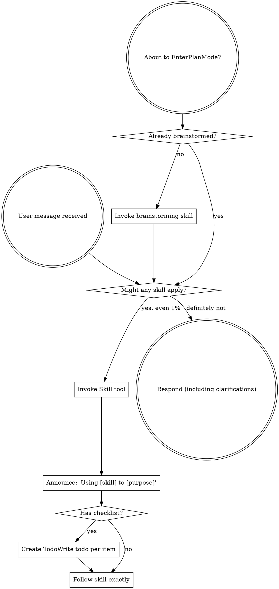

OpenAI Codex v0.128.0 (research preview)
--------
workdir: /Users/houssamr/Projects/syneriva/apps/erp-pos-stabperf
model: gpt-5.5
provider: openai
approval: never
sandbox: workspace-write [workdir, /tmp, $TMPDIR, /Users/houssamr/.codex/memories]
reasoning effort: high
reasoning summaries: none
session id: 019e1bb8-6e98-7393-a552-984b1b556f83
--------
user
changes against 'dev'
2026-05-12T10:25:32.487400Z  WARN codex_core_plugins::manifest: ignoring interface.defaultPrompt: prompt must be at most 128 characters path=/Users/houssamr/.codex/.tmp/plugins/plugins/build-ios-apps/.codex-plugin/plugin.json
2026-05-12T10:25:32.496109Z  WARN codex_core_plugins::manifest: ignoring interface.defaultPrompt: maximum of 3 prompts is supported path=/Users/houssamr/.codex/.tmp/plugins/plugins/plugin-eval/.codex-plugin/plugin.json
2026-05-12T10:25:32.572045Z  WARN codex_core_plugins::manifest: ignoring interface.defaultPrompt: maximum of 3 prompts is supported path=/Users/houssamr/.codex/.tmp/plugins/plugins/twilio-developer-kit/.codex-plugin/plugin.json
2026-05-12T10:25:32.572093Z  WARN codex_core_plugins::manifest: ignoring interface.defaultPrompt: maximum of 3 prompts is supported path=/Users/houssamr/.codex/.tmp/plugins/plugins/openai-developers/.codex-plugin/plugin.json
2026-05-12T10:25:33.354156Z  WARN codex_core::shell_snapshot: Failed to delete shell snapshot at "/Users/houssamr/.codex/shell_snapshots/019e0c39-127b-7db1-bfa8-559034f11c2f.1778321527429577000.sh": Os { code: 2, kind: NotFound, message: "No such file or directory" }
2026-05-12T10:25:34.296569Z  WARN codex_core::shell_snapshot: Failed to delete shell snapshot at "/Users/houssamr/.codex/shell_snapshots/019e1ba8-a06a-7b21-bd55-a11286f173aa.1778580496491552000.sh": Os { code: 2, kind: NotFound, message: "No such file or directory" }
2026-05-12T10:25:34.336869Z  WARN codex_core::shell_snapshot: Failed to delete shell snapshot at "/Users/houssamr/.codex/shell_snapshots/019e0c3e-ed36-7c32-9b39-a8262ad36b8e.1778321911119321000.sh": Os { code: 2, kind: NotFound, message: "No such file or directory" }
2026-05-12T10:25:35.791160Z  WARN codex_core_plugins::marketplace: skipping marketplace plugin with unsupported source path=/Users/houssamr/.codex/.tmp/marketplaces/.staging/marketplace-upgrade-zryGGW/.claude-plugin/marketplace.json plugin="fullstory"
2026-05-12T10:25:35.791291Z  WARN codex_core_plugins::marketplace: skipping marketplace plugin with unsupported source path=/Users/houssamr/.codex/.tmp/marketplaces/.staging/marketplace-upgrade-zryGGW/.claude-plugin/marketplace.json plugin="jfrog"
2026-05-12T10:25:35.791698Z  WARN codex_core_plugins::marketplace: skipping invalid marketplace plugin path=/Users/houssamr/.codex/.tmp/marketplaces/.staging/marketplace-upgrade-zryGGW/.claude-plugin/marketplace.json marketplace=claude-plugins-official error=invalid plugin name: only ASCII letters, digits, `_`, and `-` are allowed
2026-05-12T10:25:38.900831Z  WARN codex_core_plugins::marketplace: skipping marketplace plugin with unsupported source path=/Users/houssamr/.codex/.tmp/marketplaces/claude-plugins-official/.claude-plugin/marketplace.json plugin="fullstory"
2026-05-12T10:25:38.900962Z  WARN codex_core_plugins::marketplace: skipping marketplace plugin with unsupported source path=/Users/houssamr/.codex/.tmp/marketplaces/claude-plugins-official/.claude-plugin/marketplace.json plugin="jfrog"
2026-05-12T10:25:38.901375Z  WARN codex_core_plugins::marketplace: skipping invalid marketplace plugin path=/Users/houssamr/.codex/.tmp/marketplaces/claude-plugins-official/.claude-plugin/marketplace.json marketplace=claude-plugins-official error=invalid plugin name: only ASCII letters, digits, `_`, and `-` are allowed
2026-05-12T10:25:38.901610Z  WARN codex_core_plugins::marketplace: skipping marketplace plugin that failed to resolve path=/Users/houssamr/.codex/.tmp/marketplaces/ui-ux-pro-max-skill/.claude-plugin/marketplace.json plugin="ui-ux-pro-max" error=invalid marketplace file `/Users/houssamr/.codex/.tmp/marketplaces/ui-ux-pro-max-skill/.claude-plugin/marketplace.json`: local plugin source path must not be empty
2026-05-12T10:25:38.905062Z  WARN codex_core_plugins::manifest: ignoring interface.defaultPrompt: prompt must be at most 128 characters path=/Users/houssamr/.codex/.tmp/plugins/plugins/build-ios-apps/.codex-plugin/plugin.json
2026-05-12T10:25:38.906449Z  WARN codex_core_plugins::manifest: ignoring interface.defaultPrompt: maximum of 3 prompts is supported path=/Users/houssamr/.codex/.tmp/plugins/plugins/plugin-eval/.codex-plugin/plugin.json
2026-05-12T10:25:38.920449Z  WARN codex_core_plugins::manifest: ignoring interface.defaultPrompt: maximum of 3 prompts is supported path=/Users/houssamr/.codex/.tmp/plugins/plugins/twilio-developer-kit/.codex-plugin/plugin.json
2026-05-12T10:25:38.920488Z  WARN codex_core_plugins::manifest: ignoring interface.defaultPrompt: maximum of 3 prompts is supported path=/Users/houssamr/.codex/.tmp/plugins/plugins/openai-developers/.codex-plugin/plugin.json
2026-05-12T10:25:38.953083Z  WARN codex_core_skills::loader: ignoring interface.icon_small: icon path must not contain '..'
2026-05-12T10:25:38.953099Z  WARN codex_core_skills::loader: ignoring interface.icon_large: icon path must not contain '..'
2026-05-12T10:25:38.954020Z  WARN codex_core_skills::loader: ignoring interface.icon_small: icon path must not contain '..'
2026-05-12T10:25:38.954033Z  WARN codex_core_skills::loader: ignoring interface.icon_large: icon path must not contain '..'
2026-05-12T10:25:38.954978Z  WARN codex_core_skills::loader: ignoring interface.icon_small: icon path must not contain '..'
2026-05-12T10:25:38.955018Z  WARN codex_core_skills::loader: ignoring interface.icon_large: icon path must not contain '..'
2026-05-12T10:25:38.956301Z  WARN codex_core_skills::loader: ignoring interface.icon_small: icon path must not contain '..'
2026-05-12T10:25:38.956315Z  WARN codex_core_skills::loader: ignoring interface.icon_large: icon path must not contain '..'
2026-05-12T10:25:38.957358Z  WARN codex_core_skills::loader: ignoring interface.icon_small: icon path must not contain '..'
2026-05-12T10:25:38.957370Z  WARN codex_core_skills::loader: ignoring interface.icon_large: icon path must not contain '..'
2026-05-12T10:25:38.959747Z  WARN codex_core_skills::loader: ignoring interface.icon_small: icon path must not contain '..'
2026-05-12T10:25:38.959755Z  WARN codex_core_skills::loader: ignoring interface.icon_large: icon path must not contain '..'
2026-05-12T10:25:39.453387Z  WARN codex_core_plugins::marketplace: skipping marketplace plugin with unsupported source path=/Users/houssamr/.codex/.tmp/marketplaces/claude-plugins-official/.claude-plugin/marketplace.json plugin="fullstory"
2026-05-12T10:25:39.453495Z  WARN codex_core_plugins::marketplace: skipping marketplace plugin with unsupported source path=/Users/houssamr/.codex/.tmp/marketplaces/claude-plugins-official/.claude-plugin/marketplace.json plugin="jfrog"
2026-05-12T10:25:39.453822Z  WARN codex_core_plugins::marketplace: skipping invalid marketplace plugin path=/Users/houssamr/.codex/.tmp/marketplaces/claude-plugins-official/.claude-plugin/marketplace.json marketplace=claude-plugins-official error=invalid plugin name: only ASCII letters, digits, `_`, and `-` are allowed
2026-05-12T10:25:39.453939Z  WARN codex_core_plugins::marketplace: skipping marketplace plugin that failed to resolve path=/Users/houssamr/.codex/.tmp/marketplaces/ui-ux-pro-max-skill/.claude-plugin/marketplace.json plugin="ui-ux-pro-max" error=invalid marketplace file `/Users/houssamr/.codex/.tmp/marketplaces/ui-ux-pro-max-skill/.claude-plugin/marketplace.json`: local plugin source path must not be empty
2026-05-12T10:25:39.454980Z  WARN codex_core_plugins::manifest: ignoring interface.defaultPrompt: prompt must be at most 128 characters path=/Users/houssamr/.codex/.tmp/plugins/plugins/build-ios-apps/.codex-plugin/plugin.json
2026-05-12T10:25:39.455249Z  WARN codex_core_plugins::manifest: ignoring interface.defaultPrompt: maximum of 3 prompts is supported path=/Users/houssamr/.codex/.tmp/plugins/plugins/plugin-eval/.codex-plugin/plugin.json
2026-05-12T10:25:39.457575Z  WARN codex_core_plugins::manifest: ignoring interface.defaultPrompt: maximum of 3 prompts is supported path=/Users/houssamr/.codex/.tmp/plugins/plugins/twilio-developer-kit/.codex-plugin/plugin.json
2026-05-12T10:25:39.457605Z  WARN codex_core_plugins::manifest: ignoring interface.defaultPrompt: maximum of 3 prompts is supported path=/Users/houssamr/.codex/.tmp/plugins/plugins/openai-developers/.codex-plugin/plugin.json
2026-05-12T10:25:39.482468Z  WARN codex_core_skills::loader: ignoring interface.icon_small: icon path must not contain '..'
2026-05-12T10:25:39.482485Z  WARN codex_core_skills::loader: ignoring interface.icon_large: icon path must not contain '..'
2026-05-12T10:25:39.483409Z  WARN codex_core_skills::loader: ignoring interface.icon_small: icon path must not contain '..'
2026-05-12T10:25:39.483418Z  WARN codex_core_skills::loader: ignoring interface.icon_large: icon path must not contain '..'
2026-05-12T10:25:39.484233Z  WARN codex_core_skills::loader: ignoring interface.icon_small: icon path must not contain '..'
2026-05-12T10:25:39.484248Z  WARN codex_core_skills::loader: ignoring interface.icon_large: icon path must not contain '..'
2026-05-12T10:25:39.485043Z  WARN codex_core_skills::loader: ignoring interface.icon_small: icon path must not contain '..'
2026-05-12T10:25:39.485052Z  WARN codex_core_skills::loader: ignoring interface.icon_large: icon path must not contain '..'
2026-05-12T10:25:39.485862Z  WARN codex_core_skills::loader: ignoring interface.icon_small: icon path must not contain '..'
2026-05-12T10:25:39.485873Z  WARN codex_core_skills::loader: ignoring interface.icon_large: icon path must not contain '..'
2026-05-12T10:25:39.488318Z  WARN codex_core_skills::loader: ignoring interface.icon_small: icon path must not contain '..'
2026-05-12T10:25:39.488327Z  WARN codex_core_skills::loader: ignoring interface.icon_large: icon path must not contain '..'
2026-05-12T10:25:41.122738Z  WARN codex_core_plugins::marketplace: skipping marketplace plugin with unsupported source path=/Users/houssamr/.codex/.tmp/marketplaces/claude-plugins-official/.claude-plugin/marketplace.json plugin="fullstory"
2026-05-12T10:25:41.122975Z  WARN codex_core_plugins::marketplace: skipping marketplace plugin with unsupported source path=/Users/houssamr/.codex/.tmp/marketplaces/claude-plugins-official/.claude-plugin/marketplace.json plugin="jfrog"
2026-05-12T10:25:41.123765Z  WARN codex_core_plugins::marketplace: skipping invalid marketplace plugin path=/Users/houssamr/.codex/.tmp/marketplaces/claude-plugins-official/.claude-plugin/marketplace.json marketplace=claude-plugins-official error=invalid plugin name: only ASCII letters, digits, `_`, and `-` are allowed
2026-05-12T10:25:41.123857Z  WARN codex_core_plugins::marketplace: skipping marketplace plugin that failed to resolve path=/Users/houssamr/.codex/.tmp/marketplaces/ui-ux-pro-max-skill/.claude-plugin/marketplace.json plugin="ui-ux-pro-max" error=invalid marketplace file `/Users/houssamr/.codex/.tmp/marketplaces/ui-ux-pro-max-skill/.claude-plugin/marketplace.json`: local plugin source path must not be empty
2026-05-12T10:25:41.124592Z  WARN codex_core_plugins::manifest: ignoring interface.defaultPrompt: prompt must be at most 128 characters path=/Users/houssamr/.codex/.tmp/plugins/plugins/build-ios-apps/.codex-plugin/plugin.json
2026-05-12T10:25:41.124859Z  WARN codex_core_plugins::manifest: ignoring interface.defaultPrompt: maximum of 3 prompts is supported path=/Users/houssamr/.codex/.tmp/plugins/plugins/plugin-eval/.codex-plugin/plugin.json
2026-05-12T10:25:41.126586Z  WARN codex_core_plugins::manifest: ignoring interface.defaultPrompt: maximum of 3 prompts is supported path=/Users/houssamr/.codex/.tmp/plugins/plugins/twilio-developer-kit/.codex-plugin/plugin.json
2026-05-12T10:25:41.126612Z  WARN codex_core_plugins::manifest: ignoring interface.defaultPrompt: maximum of 3 prompts is supported path=/Users/houssamr/.codex/.tmp/plugins/plugins/openai-developers/.codex-plugin/plugin.json
2026-05-12T10:25:41.156942Z  WARN codex_core_skills::loader: ignoring interface.icon_small: icon path must not contain '..'
2026-05-12T10:25:41.156958Z  WARN codex_core_skills::loader: ignoring interface.icon_large: icon path must not contain '..'
2026-05-12T10:25:41.157862Z  WARN codex_core_skills::loader: ignoring interface.icon_small: icon path must not contain '..'
2026-05-12T10:25:41.157869Z  WARN codex_core_skills::loader: ignoring interface.icon_large: icon path must not contain '..'
2026-05-12T10:25:41.158699Z  WARN codex_core_skills::loader: ignoring interface.icon_small: icon path must not contain '..'
2026-05-12T10:25:41.158727Z  WARN codex_core_skills::loader: ignoring interface.icon_large: icon path must not contain '..'
2026-05-12T10:25:41.159599Z  WARN codex_core_skills::loader: ignoring interface.icon_small: icon path must not contain '..'
2026-05-12T10:25:41.159609Z  WARN codex_core_skills::loader: ignoring interface.icon_large: icon path must not contain '..'
2026-05-12T10:25:41.160419Z  WARN codex_core_skills::loader: ignoring interface.icon_small: icon path must not contain '..'
2026-05-12T10:25:41.160424Z  WARN codex_core_skills::loader: ignoring interface.icon_large: icon path must not contain '..'
2026-05-12T10:25:41.162218Z  WARN codex_core_skills::loader: ignoring interface.icon_small: icon path must not contain '..'
2026-05-12T10:25:41.162232Z  WARN codex_core_skills::loader: ignoring interface.icon_large: icon path must not contain '..'
2026-05-12T10:25:41.323532Z  WARN codex_core_plugins::marketplace: skipping marketplace plugin that failed to resolve path=/Users/houssamr/.codex/.tmp/marketplaces/.staging/marketplace-upgrade-jFDibN/.claude-plugin/marketplace.json plugin="ui-ux-pro-max" error=invalid marketplace file `/Users/houssamr/.codex/.tmp/marketplaces/.staging/marketplace-upgrade-jFDibN/.claude-plugin/marketplace.json`: local plugin source path must not be empty
2026-05-12T10:25:41.353122Z  WARN codex_core_plugins::marketplace: skipping marketplace plugin with unsupported source path=/Users/houssamr/.codex/.tmp/marketplaces/claude-plugins-official/.claude-plugin/marketplace.json plugin="fullstory"
2026-05-12T10:25:41.353244Z  WARN codex_core_plugins::marketplace: skipping marketplace plugin with unsupported source path=/Users/houssamr/.codex/.tmp/marketplaces/claude-plugins-official/.claude-plugin/marketplace.json plugin="jfrog"
2026-05-12T10:25:41.354076Z  WARN codex_core_plugins::marketplace: skipping invalid marketplace plugin path=/Users/houssamr/.codex/.tmp/marketplaces/claude-plugins-official/.claude-plugin/marketplace.json marketplace=claude-plugins-official error=invalid plugin name: only ASCII letters, digits, `_`, and `-` are allowed
2026-05-12T10:25:41.354212Z  WARN codex_core_plugins::marketplace: skipping marketplace plugin that failed to resolve path=/Users/houssamr/.codex/.tmp/marketplaces/ui-ux-pro-max-skill/.claude-plugin/marketplace.json plugin="ui-ux-pro-max" error=invalid marketplace file `/Users/houssamr/.codex/.tmp/marketplaces/ui-ux-pro-max-skill/.claude-plugin/marketplace.json`: local plugin source path must not be empty
2026-05-12T10:25:41.354395Z  WARN codex_core_plugins::loader: configured non-curated plugin no longer exists in discovered marketplaces during cache refresh plugin="browser-use" marketplace="openai-bundled"
2026-05-12T10:25:41.366038Z  WARN codex_core_plugins::loader: configured non-curated plugin no longer exists in discovered marketplaces during cache refresh plugin="documents" marketplace="openai-primary-runtime"
2026-05-12T10:25:41.370423Z  WARN codex_core_plugins::loader: configured non-curated plugin no longer exists in discovered marketplaces during cache refresh plugin="presentations" marketplace="openai-primary-runtime"
2026-05-12T10:25:41.370433Z  WARN codex_core_plugins::loader: configured non-curated plugin no longer exists in discovered marketplaces during cache refresh plugin="spreadsheets" marketplace="openai-primary-runtime"
2026-05-12T10:25:50.648857Z  WARN codex_otel::events::session_telemetry: metrics counter [codex.skill.injected] failed: tag value contains invalid characters: superpowers:using-superpowers
exec
/bin/zsh -lc "cat /Users/houssamr/.codex/plugins/cache/claude-plugins-official/superpowers/5.1.0/skills/using-superpowers/SKILL.md && printf '\\n---\\n' && cat /Users/houssamr/.codex/plugins/cache/claude-plugins-official/superpowers/5.1.0/skills/requesting-code-review/SKILL.md" in /Users/houssamr/Projects/syneriva/apps/erp-pos-stabperf
 succeeded in 0ms:
---
name: using-superpowers
description: Use when starting any conversation - establishes how to find and use skills, requiring Skill tool invocation before ANY response including clarifying questions
---

<SUBAGENT-STOP>
If you were dispatched as a subagent to execute a specific task, skip this skill.
</SUBAGENT-STOP>

<EXTREMELY-IMPORTANT>
If you think there is even a 1% chance a skill might apply to what you are doing, you ABSOLUTELY MUST invoke the skill.

IF A SKILL APPLIES TO YOUR TASK, YOU DO NOT HAVE A CHOICE. YOU MUST USE IT.

This is not negotiable. This is not optional. You cannot rationalize your way out of this.
</EXTREMELY-IMPORTANT>

## Instruction Priority

Superpowers skills override default system prompt behavior, but **user instructions always take precedence**:

1. **User's explicit instructions** (CLAUDE.md, GEMINI.md, AGENTS.md, direct requests) — highest priority
2. **Superpowers skills** — override default system behavior where they conflict
3. **Default system prompt** — lowest priority

If CLAUDE.md, GEMINI.md, or AGENTS.md says "don't use TDD" and a skill says "always use TDD," follow the user's instructions. The user is in control.

## How to Access Skills

**In Claude Code:** Use the `Skill` tool. When you invoke a skill, its content is loaded and presented to you—follow it directly. Never use the Read tool on skill files.

**In Copilot CLI:** Use the `skill` tool. Skills are auto-discovered from installed plugins. The `skill` tool works the same as Claude Code's `Skill` tool.

**In Gemini CLI:** Skills activate via the `activate_skill` tool. Gemini loads skill metadata at session start and activates the full content on demand.

**In other environments:** Check your platform's documentation for how skills are loaded.

## Platform Adaptation

Skills use Claude Code tool names. Non-CC platforms: see `references/copilot-tools.md` (Copilot CLI), `references/codex-tools.md` (Codex) for tool equivalents. Gemini CLI users get the tool mapping loaded automatically via GEMINI.md.

# Using Skills

## The Rule

**Invoke relevant or requested skills BEFORE any response or action.** Even a 1% chance a skill might apply means that you should invoke the skill to check. If an invoked skill turns out to be wrong for the situation, you don't need to use it.



## Red Flags

These thoughts mean STOP—you're rationalizing:

| Thought | Reality |
|---------|---------|
| "This is just a simple question" | Questions are tasks. Check for skills. |
| "I need more context first" | Skill check comes BEFORE clarifying questions. |
| "Let me explore the codebase first" | Skills tell you HOW to explore. Check first. |
| "I can check git/files quickly" | Files lack conversation context. Check for skills. |
| "Let me gather information first" | Skills tell you HOW to gather information. |
| "This doesn't need a formal skill" | If a skill exists, use it. |
| "I remember this skill" | Skills evolve. Read current version. |
| "This doesn't count as a task" | Action = task. Check for skills. |
| "The skill is overkill" | Simple things become complex. Use it. |
| "I'll just do this one thing first" | Check BEFORE doing anything. |
| "This feels productive" | Undisciplined action wastes time. Skills prevent this. |
| "I know what that means" | Knowing the concept ≠ using the skill. Invoke it. |

## Skill Priority

When multiple skills could apply, use this order:

1. **Process skills first** (brainstorming, debugging) - these determine HOW to approach the task
2. **Implementation skills second** (frontend-design, mcp-builder) - these guide execution

"Let's build X" → brainstorming first, then implementation skills.
"Fix this bug" → debugging first, then domain-specific skills.

## Skill Types

**Rigid** (TDD, debugging): Follow exactly. Don't adapt away discipline.

**Flexible** (patterns): Adapt principles to context.

The skill itself tells you which.

## User Instructions

Instructions say WHAT, not HOW. "Add X" or "Fix Y" doesn't mean skip workflows.

---
---
name: requesting-code-review
description: Use when completing tasks, implementing major features, or before merging to verify work meets requirements
---

# Requesting Code Review

Dispatch a code reviewer subagent to catch issues before they cascade. The reviewer gets precisely crafted context for evaluation — never your session's history. This keeps the reviewer focused on the work product, not your thought process, and preserves your own context for continued work.

**Core principle:** Review early, review often.

## When to Request Review

**Mandatory:**
- After each task in subagent-driven development
- After completing major feature
- Before merge to main

**Optional but valuable:**
- When stuck (fresh perspective)
- Before refactoring (baseline check)
- After fixing complex bug

## How to Request

**1. Get git SHAs:**
```bash
BASE_SHA=$(git rev-parse HEAD~1)  # or origin/main
HEAD_SHA=$(git rev-parse HEAD)
```

**2. Dispatch code reviewer subagent:**

Use Task tool with `general-purpose` type, fill template at `code-reviewer.md`

**Placeholders:**
- `{DESCRIPTION}` - Brief summary of what you built
- `{PLAN_OR_REQUIREMENTS}` - What it should do
- `{BASE_SHA}` - Starting commit
- `{HEAD_SHA}` - Ending commit

**3. Act on feedback:**
- Fix Critical issues immediately
- Fix Important issues before proceeding
- Note Minor issues for later
- Push back if reviewer is wrong (with reasoning)

## Example

```
[Just completed Task 2: Add verification function]

You: Let me request code review before proceeding.

BASE_SHA=$(git log --oneline | grep "Task 1" | head -1 | awk '{print $1}')
HEAD_SHA=$(git rev-parse HEAD)

[Dispatch code reviewer subagent]
  DESCRIPTION: Added verifyIndex() and repairIndex() with 4 issue types
  PLAN_OR_REQUIREMENTS: Task 2 from docs/superpowers/plans/deployment-plan.md
  BASE_SHA: a7981ec
  HEAD_SHA: 3df7661

[Subagent returns]:
  Strengths: Clean architecture, real tests
  Issues:
    Important: Missing progress indicators
    Minor: Magic number (100) for reporting interval
  Assessment: Ready to proceed

You: [Fix progress indicators]
[Continue to Task 3]
```

## Integration with Workflows

**Subagent-Driven Development:**
- Review after EACH task
- Catch issues before they compound
- Fix before moving to next task

**Executing Plans:**
- Review after each task or at natural checkpoints
- Get feedback, apply, continue

**Ad-Hoc Development:**
- Review before merge
- Review when stuck

## Red Flags

**Never:**
- Skip review because "it's simple"
- Ignore Critical issues
- Proceed with unfixed Important issues
- Argue with valid technical feedback

**If reviewer wrong:**
- Push back with technical reasoning
- Show code/tests that prove it works
- Request clarification

See template at: requesting-code-review/code-reviewer.md

2026-05-12T10:25:50.743060Z  WARN codex_protocol::openai_models: Model personality requested but model_messages is missing, falling back to base instructions. model=gpt-5.5 personality=pragmatic
2026-05-12T10:25:50.813425Z  WARN codex_core_plugins::marketplace: skipping marketplace plugin with unsupported source path=/Users/houssamr/.codex/.tmp/marketplaces/claude-plugins-official/.claude-plugin/marketplace.json plugin="fullstory"
2026-05-12T10:25:50.814307Z  WARN codex_core_plugins::marketplace: skipping marketplace plugin with unsupported source path=/Users/houssamr/.codex/.tmp/marketplaces/claude-plugins-official/.claude-plugin/marketplace.json plugin="jfrog"
2026-05-12T10:25:50.816584Z  WARN codex_core_plugins::marketplace: skipping invalid marketplace plugin path=/Users/houssamr/.codex/.tmp/marketplaces/claude-plugins-official/.claude-plugin/marketplace.json marketplace=claude-plugins-official error=invalid plugin name: only ASCII letters, digits, `_`, and `-` are allowed
2026-05-12T10:25:50.816926Z  WARN codex_core_plugins::marketplace: skipping marketplace plugin that failed to resolve path=/Users/houssamr/.codex/.tmp/marketplaces/ui-ux-pro-max-skill/.claude-plugin/marketplace.json plugin="ui-ux-pro-max" error=invalid marketplace file `/Users/houssamr/.codex/.tmp/marketplaces/ui-ux-pro-max-skill/.claude-plugin/marketplace.json`: local plugin source path must not be empty
2026-05-12T10:25:50.820878Z  WARN codex_core_plugins::manifest: ignoring interface.defaultPrompt: prompt must be at most 128 characters path=/Users/houssamr/.codex/.tmp/plugins/plugins/build-ios-apps/.codex-plugin/plugin.json
2026-05-12T10:25:50.822127Z  WARN codex_core_plugins::manifest: ignoring interface.defaultPrompt: maximum of 3 prompts is supported path=/Users/houssamr/.codex/.tmp/plugins/plugins/plugin-eval/.codex-plugin/plugin.json
2026-05-12T10:25:50.836861Z  WARN codex_core_plugins::manifest: ignoring interface.defaultPrompt: maximum of 3 prompts is supported path=/Users/houssamr/.codex/.tmp/plugins/plugins/twilio-developer-kit/.codex-plugin/plugin.json
2026-05-12T10:25:50.837014Z  WARN codex_core_plugins::manifest: ignoring interface.defaultPrompt: maximum of 3 prompts is supported path=/Users/houssamr/.codex/.tmp/plugins/plugins/openai-developers/.codex-plugin/plugin.json
2026-05-12T10:25:50.861059Z  WARN codex_core_skills::loader: ignoring interface.icon_small: icon path must not contain '..'
2026-05-12T10:25:50.861068Z  WARN codex_core_skills::loader: ignoring interface.icon_large: icon path must not contain '..'
2026-05-12T10:25:50.861882Z  WARN codex_core_skills::loader: ignoring interface.icon_small: icon path must not contain '..'
2026-05-12T10:25:50.861892Z  WARN codex_core_skills::loader: ignoring interface.icon_large: icon path must not contain '..'
2026-05-12T10:25:50.862574Z  WARN codex_core_skills::loader: ignoring interface.icon_small: icon path must not contain '..'
2026-05-12T10:25:50.862579Z  WARN codex_core_skills::loader: ignoring interface.icon_large: icon path must not contain '..'
2026-05-12T10:25:50.863249Z  WARN codex_core_skills::loader: ignoring interface.icon_small: icon path must not contain '..'
2026-05-12T10:25:50.863254Z  WARN codex_core_skills::loader: ignoring interface.icon_large: icon path must not contain '..'
2026-05-12T10:25:50.863946Z  WARN codex_core_skills::loader: ignoring interface.icon_small: icon path must not contain '..'
2026-05-12T10:25:50.863951Z  WARN codex_core_skills::loader: ignoring interface.icon_large: icon path must not contain '..'
2026-05-12T10:25:50.865969Z  WARN codex_core_skills::loader: ignoring interface.icon_small: icon path must not contain '..'
2026-05-12T10:25:50.865986Z  WARN codex_core_skills::loader: ignoring interface.icon_large: icon path must not contain '..'
exec
/bin/zsh -lc 'git diff 03c6832aea7f8be6c384a806ddb43db39ab944e3 --stat && git diff 03c6832aea7f8be6c384a806ddb43db39ab944e3' in /Users/houssamr/Projects/syneriva/apps/erp-pos-stabperf
 succeeded in 0ms:
 .../Services/ReportGenerationService.php           |  52 +++++++-
 .../Controllers/ZReportSyncController.php          |  80 ++++++-------
 .../POS/ServerSideZReportOverTenderTest.php        | 131 +++++++++++++++++++++
 .../POS/ZReportSyncControllerSchema2Test.php       |  65 ++++++----
 apps/pos/src/api/reportApi.ts                      |   7 +-
 .../pos/src/lib/sync/__tests__/syncService.test.ts |  11 ++
 6 files changed, 279 insertions(+), 67 deletions(-)
diff --git a/apps/api/app/Modules/POS/Application/Services/ReportGenerationService.php b/apps/api/app/Modules/POS/Application/Services/ReportGenerationService.php
index 900406ab..921035d8 100644
--- a/apps/api/app/Modules/POS/Application/Services/ReportGenerationService.php
+++ b/apps/api/app/Modules/POS/Application/Services/ReportGenerationService.php
@@ -471,6 +471,7 @@ private function resolveCurrencyCode(Terminal $terminal): string
 
     /**
      * Sum receipt_payments.amount for the shift, grouped by payment_method_id.
+     * Cash methods subtract receipt change_due once per receipt to mirror the POS device formula.
      * Always includes a row for every payment_method_id in $inputs (defaulting to '0.0000').
      *
      * Shift window driven by pos_receipts.posted_at — see REALIGNMENT-LOG 2026-04-26.
@@ -496,6 +497,34 @@ private function buildExpectedPerMethod(Shift $shift, array $inputs): array
             ->groupBy('pos_receipt_payments.payment_method_id')
             ->get();
 
+        $cashReceiptChanges = DB::query()
+            ->fromSub(
+                DB::table('pos_receipt_payments')
+                    ->join('pos_receipts', 'pos_receipt_payments.receipt_id', '=', 'pos_receipts.id')
+                    ->leftJoin('payment_methods', 'pos_receipt_payments.payment_method_id', '=', 'payment_methods.id')
+                    ->where('pos_receipts.terminal_id', $shift->terminal_id)
+                    ->where('pos_receipts.fiscal_status', FiscalStatus::Fiscalized->value)
+                    ->where('pos_receipts.is_voided', false)
+                    ->where('pos_receipts.is_training', false)
+                    ->whereBetween('pos_receipts.posted_at', [$shift->opened_at, now()])
+                    ->where(function ($query): void {
+                        $query->where('pos_receipt_payments.payment_method_code', 'CASH')
+                            ->orWhere(function ($legacy): void {
+                                $legacy->where(function ($snapshot): void {
+                                    $snapshot->whereNull('pos_receipt_payments.payment_method_code')
+                                        ->orWhere('pos_receipt_payments.payment_method_code', '');
+                                })->where('payment_methods.code', 'CASH');
+                            });
+                    })
+                    ->selectRaw('pos_receipt_payments.payment_method_id as payment_method_id, pos_receipts.id as receipt_id, MAX(COALESCE(pos_receipts.change_due, 0)) as change_due')
+                    ->groupBy('pos_receipt_payments.payment_method_id', 'pos_receipts.id'),
+                'cash_receipt_changes',
+            )
+            ->selectRaw('payment_method_id, SUM(change_due) as total_change_due')
+            ->groupBy('payment_method_id')
+            ->get()
+            ->keyBy('payment_method_id');
+
         foreach ($rows as $row) {
             /** @var string $pmId */
             $pmId = $row->payment_method_id;
@@ -503,7 +532,16 @@ private function buildExpectedPerMethod(Shift $shift, array $inputs): array
             $rawTotal = $row->total;
             /** @var numeric-string $totalString */
             $totalString = (string) ($rawTotal ?? '0');
-            $totals[$pmId] = bcadd($totalString, '0', $scale);
+            $total = bcadd($totalString, '0', $scale);
+
+            $changeRow = $cashReceiptChanges->get($pmId);
+            if ($changeRow !== null) {
+                /** @var string|float|int|null $rawChangeDue */
+                $rawChangeDue = $changeRow->total_change_due;
+                $total = bcsub($total, $this->normaliseNumericString($rawChangeDue), $scale);
+            }
+
+            $totals[$pmId] = $total;
         }
 
         // Ensure every input has an entry (default '0.0000' if no receipts yet for that method).
@@ -516,6 +554,18 @@ private function buildExpectedPerMethod(Shift $shift, array $inputs): array
         return $totals;
     }
 
+    /**
+     * @return numeric-string
+     */
+    private function normaliseNumericString(string|int|float|null $value): string
+    {
+        if (! is_numeric($value)) {
+            return '0';
+        }
+
+        return (string) $value;
+    }
+
     /**
      * Count receipt_payments rows for the shift, grouped by payment_method_id.
      * Used to populate CashCountBreakdownDTO::transactionCount, which validation seeds with 0.
diff --git a/apps/api/app/Modules/POS/Presentation/Controllers/ZReportSyncController.php b/apps/api/app/Modules/POS/Presentation/Controllers/ZReportSyncController.php
index 2716575c..086fb931 100644
--- a/apps/api/app/Modules/POS/Presentation/Controllers/ZReportSyncController.php
+++ b/apps/api/app/Modules/POS/Presentation/Controllers/ZReportSyncController.php
@@ -76,12 +76,18 @@ public function sync(Request $request): JsonResponse
 
             // ── Schema v2 fields ──────────────────────────────────────────────
             'cash_counts' => ['sometimes', 'array'],
-            'cash_counts.*.payment_method_id' => ['required_with:cash_counts', 'uuid'],
+            'cash_counts.*.payment_method_id' => ['required', 'uuid'],
             'cash_counts.*.denomination_id' => ['sometimes', 'nullable', 'uuid'],
-            'cash_counts.*.counted_quantity' => ['required_with:cash_counts', 'integer', 'min:0'],
-            'cash_counts.*.counted_amount' => ['required_with:cash_counts', 'string'],
+            'cash_counts.*.counted_quantity' => ['sometimes', 'integer', 'min:0'],
+            'cash_counts.*.counted_amount' => ['sometimes', 'string'],
             'cash_counts.*.denomination_name' => ['sometimes', 'nullable', 'string'],
             'cash_counts.*.denomination_value' => ['sometimes', 'nullable', 'string'],
+            'cash_counts.*.currency_code' => ['required', 'string', 'size:3'],
+            'cash_counts.*.expected_amount' => ['required', 'numeric'],
+            'cash_counts.*.actual_amount' => ['required', 'numeric'],
+            'cash_counts.*.variance_amount' => ['required', 'numeric'],
+            'cash_counts.*.variance_direction' => ['required', 'string', Rule::in(['over', 'under', 'balanced'])],
+            'cash_counts.*.transaction_count' => ['required', 'integer', 'min:0'],
 
             'shift_fields' => ['sometimes', 'nullable', 'array'],
             'shift_fields.variance_reason' => ['sometimes', 'nullable', 'string'],
@@ -213,64 +219,48 @@ public function sync(Request $request): JsonResponse
     }
 
     /**
-     * Aggregate denomination-level cash_counts by payment_method_id and build
-     * CashCountBreakdownDTO instances that the repository can persist.
-     *
-     * Because the sync payload only carries the counted (actual) amount —
-     * the expected amount is not transmitted as a separate per-method figure —
-     * we store expected_amount = 0.0000 and derive variance = actual - 0.
-     * The DB CHECK constraint (variance_amount = actual_amount - expected_amount)
-     * is satisfied when expected_amount = 0 and variance_amount = actual_amount.
+     * Build CashCountBreakdownDTO instances from the POS-device Z-report payload.
+     * The offline POS is the source of truth for this path, so the server archives
+     * each per-method breakdown verbatim instead of recomputing expected/variance.
      *
      * @param  array<int, array<string, mixed>>  $cashCounts
      * @return array<int, CashCountBreakdownDTO>
      */
     private function buildBreakdownsFromSyncPayload(array $cashCounts): array
     {
-        /** @var array<string, array{amount: numeric-string, qty: int}> $perMethod */
-        $perMethod = [];
-
-        foreach ($cashCounts as $entry) {
-            $methodId = (string) $entry['payment_method_id'];
-            /** @var numeric-string $rawAmount */
-            $rawAmount = is_numeric($entry['counted_amount'] ?? '0')
-                ? (string) ($entry['counted_amount'] ?? '0')
-                : '0';
-            $qty = (int) ($entry['counted_quantity'] ?? 0);
-
-            if (! isset($perMethod[$methodId])) {
-                $perMethod[$methodId] = ['amount' => '0.0000', 'qty' => 0];
-            }
-
-            /** @var numeric-string $runningAmount */
-            $runningAmount = $perMethod[$methodId]['amount'];
-            $perMethod[$methodId]['amount'] = bcadd($runningAmount, $rawAmount, 4);
-            $perMethod[$methodId]['qty'] += $qty;
-        }
-
         $breakdowns = [];
 
-        foreach ($perMethod as $methodId => $totals) {
-            /** @var numeric-string $actualAmount */
-            $actualAmount = $totals['amount'];
-            $expectedAmount = '0.0000';
-            // variance = actual - expected = actual - 0 (satisfies DB CHECK)
-            $varianceAmount = $actualAmount;
+        foreach ($cashCounts as $entry) {
+            $expectedAmount = $this->normaliseNumericString($entry['expected_amount'] ?? null);
+            $actualAmount = $this->normaliseNumericString($entry['actual_amount'] ?? null);
+            $varianceAmount = $this->normaliseNumericString($entry['variance_amount'] ?? null);
 
             $breakdowns[] = new CashCountBreakdownDTO(
-                paymentMethodId: $methodId,
-                currencyCode: 'XXX', // currency not transmitted per-method in sync payload
-                expectedAmount: $expectedAmount,
-                actualAmount: $actualAmount,
-                varianceAmount: $varianceAmount,
-                varianceDirection: VarianceDirection::fromSignedAmount($varianceAmount),
-                transactionCount: $totals['qty'],
+                paymentMethodId: (string) $entry['payment_method_id'],
+                currencyCode: (string) $entry['currency_code'],
+                expectedAmount: bcadd($expectedAmount, '0', 4),
+                actualAmount: bcadd($actualAmount, '0', 4),
+                varianceAmount: bcadd($varianceAmount, '0', 4),
+                varianceDirection: VarianceDirection::from((string) $entry['variance_direction']),
+                transactionCount: (int) $entry['transaction_count'],
             );
         }
 
         return $breakdowns;
     }
 
+    /**
+     * @return numeric-string
+     */
+    private function normaliseNumericString(string|int|float|null $value): string
+    {
+        if (! is_numeric($value)) {
+            return '0';
+        }
+
+        return (string) $value;
+    }
+
     /**
      * Apply shift_fields (and optional manager_user_id) to the pos_shifts row.
      *
diff --git a/apps/api/tests/Feature/POS/ServerSideZReportOverTenderTest.php b/apps/api/tests/Feature/POS/ServerSideZReportOverTenderTest.php
new file mode 100644
index 00000000..d75eb085
--- /dev/null
+++ b/apps/api/tests/Feature/POS/ServerSideZReportOverTenderTest.php
@@ -0,0 +1,131 @@
+<?php
+
+declare(strict_types=1);
+
+namespace Tests\Feature\POS;
+
+use App\Modules\Company\Domain\Company;
+use App\Modules\Company\Domain\Location;
+use App\Modules\Identity\Domain\User;
+use App\Modules\POS\Application\Services\ReportGenerationService;
+use App\Modules\POS\Domain\DTOs\CashCountInputDTO;
+use App\Modules\POS\Domain\Enums\FiscalStatus;
+use App\Modules\POS\Domain\Enums\ShiftStatus;
+use App\Modules\POS\Domain\Receipt;
+use App\Modules\POS\Domain\ReceiptPayment;
+use App\Modules\POS\Domain\Shift;
+use App\Modules\POS\Domain\Terminal;
+use App\Modules\POS\Domain\ZReportCount;
+use App\Modules\Tenant\Domain\Tenant;
+use App\Modules\Treasury\Domain\PaymentMethod;
+use Illuminate\Foundation\Testing\RefreshDatabase;
+use Illuminate\Support\Carbon;
+use Illuminate\Support\Str;
+use Tests\TestCase;
+
+final class ServerSideZReportOverTenderTest extends TestCase
+{
+    use RefreshDatabase;
+
+    public function test_server_side_z_report_cash_expected_subtracts_receipt_change_due_once(): void
+    {
+        $tenant = Tenant::factory()->create();
+        $company = Company::factory()->create([
+            'tenant_id' => $tenant->id,
+            'currency' => 'EUR',
+        ]);
+        $location = Location::factory()->create(['company_id' => $company->id]);
+        $cashier = User::factory()->create(['tenant_id' => $tenant->id]);
+        $terminal = Terminal::factory()->create([
+            'tenant_id' => $tenant->id,
+            'company_id' => $company->id,
+            'location_id' => $location->id,
+        ]);
+        $cashMethod = PaymentMethod::factory()->create([
+            'tenant_id' => $tenant->id,
+            'company_id' => $company->id,
+            'code' => 'CASH',
+            'name' => 'Cash',
+            'is_physical' => true,
+            'is_active' => true,
+        ]);
+
+        Shift::create([
+            'terminal_id' => $terminal->id,
+            'cashier_id' => $cashier->id,
+            'shift_number' => 1,
+            'status' => ShiftStatus::Open,
+            'opened_at' => Carbon::now()->subHour(),
+            'opening_cash' => '0.0000',
+        ]);
+
+        $this->seedCashReceipt($terminal, $cashier, $cashMethod, 1, '50.000', '50.000', '0.000', 1);
+        $this->seedCashReceipt($terminal, $cashier, $cashMethod, 2, '50.000', '120.000', '70.000', 2);
+
+        /** @var ReportGenerationService $service */
+        $service = $this->app->make(ReportGenerationService::class);
+        $zReport = $service->generateZReport(
+            $terminal,
+            $cashier,
+            [new CashCountInputDTO(
+                paymentMethodId: $cashMethod->id,
+                currencyCode: 'EUR',
+                actualAmount: '100.0000',
+            )],
+        );
+
+        $count = ZReportCount::where('z_report_id', $zReport->id)
+            ->where('payment_method_id', $cashMethod->id)
+            ->first();
+
+        $this->assertNotNull($count);
+        $this->assertSame('100.0000', $count->expected_amount);
+        $this->assertSame('100.0000', $count->actual_amount);
+        $this->assertSame('0.0000', $count->variance_amount);
+    }
+
+    private function seedCashReceipt(
+        Terminal $terminal,
+        User $cashier,
+        PaymentMethod $cashMethod,
+        int $sequence,
+        string $total,
+        string $tendered,
+        string $changeDue,
+        int $postedAtOffsetMinutes,
+    ): void {
+        $receipt = Receipt::create([
+            'tenant_id' => $terminal->tenant_id,
+            'company_id' => $terminal->company_id,
+            'location_id' => $terminal->location_id,
+            'terminal_id' => $terminal->id,
+            'receipt_number' => sprintf('T001-C001-L01-POS01-2026-%08d', $sequence),
+            'chain_sequence' => $sequence,
+            'receipt_year' => 2026,
+            'fiscal_hash' => hash('sha256', 'fiscal-'.$sequence),
+            'previous_hash' => null,
+            'vat_breakdown_hash' => hash('sha256', 'vat-'.$sequence),
+            'payment_methods_hash' => hash('sha256', 'pay-'.$sequence),
+            'posted_at' => Carbon::now()->subHour()->addMinutes($postedAtOffsetMinutes),
+            'cashier_id' => $cashier->id,
+            'cashier_name' => $cashier->name,
+            'subtotal' => $total,
+            'tax_amount' => '0.000',
+            'total' => $total,
+            'currency' => 'EUR',
+            'change_due' => $changeDue,
+            'fiscal_status' => FiscalStatus::Fiscalized->value,
+            'is_voided' => false,
+            'is_training' => false,
+        ]);
+
+        ReceiptPayment::create([
+            'id' => Str::uuid()->toString(),
+            'receipt_id' => $receipt->id,
+            'payment_method_id' => $cashMethod->id,
+            'payment_type' => 'CASH',
+            'payment_method_code' => 'CASH',
+            'amount' => $tendered,
+        ]);
+    }
+}
diff --git a/apps/api/tests/Feature/POS/ZReportSyncControllerSchema2Test.php b/apps/api/tests/Feature/POS/ZReportSyncControllerSchema2Test.php
index 46caf47c..73a6fa36 100644
--- a/apps/api/tests/Feature/POS/ZReportSyncControllerSchema2Test.php
+++ b/apps/api/tests/Feature/POS/ZReportSyncControllerSchema2Test.php
@@ -95,17 +95,49 @@ public function test_cash_counts_are_persisted_to_z_report_counts(): void
 
         $zReportId = $response->json('data.id');
 
-        // Two denomination entries for the same payment method → aggregated to one row.
         $this->assertDatabaseCount('pos_z_report_counts', 1);
 
         $row = ZReportCount::where('z_report_id', $zReportId)->first();
         $this->assertNotNull($row);
         $this->assertSame($this->cashMethod->id, $row->payment_method_id);
+        $this->assertSame('EUR', $row->currency_code);
+        $this->assertSame('100.0000', $row->expected_amount);
+        $this->assertSame('100.0000', $row->actual_amount);
+        $this->assertSame('0.0000', $row->variance_amount);
+        $this->assertSame('balanced', $row->variance_direction);
+        $this->assertSame(2, $row->transaction_count);
+    }
+
+    public function test_legacy_denomination_only_cash_counts_payload_is_rejected(): void
+    {
+        Sanctum::actingAs($this->cashier);
+        Event::fake();
 
-        // Sum of both denomination counted_amounts: 50.00 + 20.00 = 70.00
-        $this->assertSame('70.0000', $row->actual_amount);
-        // transaction_count = sum of counted_quantities: 5 + 4 = 9
-        $this->assertSame(9, $row->transaction_count);
+        $payload = array_merge($this->buildV1Payload(), [
+            'cash_counts' => [
+                [
+                    'payment_method_id' => $this->cashMethod->id,
+                    'counted_quantity' => 5,
+                    'counted_amount' => '50.00',
+                ],
+            ],
+        ]);
+
+        $response = $this->postJson('/api/v1/pos/reports/z/sync', $payload);
+
+        $response->assertStatus(422);
+        $errors = $response->json('error.errors');
+        $this->assertIsArray($errors);
+        foreach ([
+            'cash_counts.0.expected_amount',
+            'cash_counts.0.actual_amount',
+            'cash_counts.0.variance_amount',
+            'cash_counts.0.variance_direction',
+            'cash_counts.0.currency_code',
+            'cash_counts.0.transaction_count',
+        ] as $field) {
+            $this->assertArrayHasKey($field, $errors);
+        }
     }
 
     // ─────────────────────────────────────────────────────────────────────────
@@ -124,7 +156,7 @@ public function test_shift_fields_are_applied_to_pos_shifts(): void
         $this->assertNotNull($shift);
 
         // actual_cash from shift_fields
-        $this->assertSame('70.0000', (string) $shift->actual_cash);
+        $this->assertSame('100.0000', (string) $shift->actual_cash);
         // variance_amount from shift_fields
         $this->assertSame('-5.0000', (string) $shift->variance);
         // variance_severity normalised from 'medium' → 'warning'
@@ -234,25 +266,18 @@ private function buildSchema2Payload(): array
             'cash_counts' => [
                 [
                     'payment_method_id' => $this->cashMethod->id,
-                    'denomination_id' => null,
-                    'counted_quantity' => 5,
-                    'counted_amount' => '50.00',
-                    'denomination_name' => '10',
-                    'denomination_value' => '10.00',
-                ],
-                [
-                    'payment_method_id' => $this->cashMethod->id,
-                    'denomination_id' => null,
-                    'counted_quantity' => 4,
-                    'counted_amount' => '20.00',
-                    'denomination_name' => '5',
-                    'denomination_value' => '5.00',
+                    'currency_code' => 'EUR',
+                    'expected_amount' => '100.000',
+                    'actual_amount' => '100.000',
+                    'variance_amount' => '0.000',
+                    'variance_direction' => 'balanced',
+                    'transaction_count' => 2,
                 ],
             ],
             'shift_fields' => [
                 'variance_reason' => 'Short count from till reset',
                 'variance_severity' => 'medium',
-                'actual_cash' => '70.0000',
+                'actual_cash' => '100.0000',
                 'variance_amount' => '-5.0000',
             ],
             'manager_user_id' => $this->manager->id,
diff --git a/apps/pos/src/api/reportApi.ts b/apps/pos/src/api/reportApi.ts
index 0b63793d..5eb096c9 100644
--- a/apps/pos/src/api/reportApi.ts
+++ b/apps/pos/src/api/reportApi.ts
@@ -196,7 +196,12 @@ function localZReportToResponse(report: LocalZReport, decimals: number): ZReport
   };
 }
 
-/** Server-only Z-report generation (for admin dashboard fallback). */
+/**
+ * Server-only Z-report generation for admin/tooling fallback.
+ *
+ * @deprecated POS close is offline-first. Keep this helper out of the cashier close path;
+ * web admin still uses the backend route through apps/web.
+ */
 export async function generateZReportServer(terminalId: string): Promise<ZReportResponse> {
   return apiPost<ZReportResponse>('/pos/reports/z', { terminal_id: terminalId });
 }
diff --git a/apps/pos/src/lib/sync/__tests__/syncService.test.ts b/apps/pos/src/lib/sync/__tests__/syncService.test.ts
index 09f6696e..26c1c636 100644
--- a/apps/pos/src/lib/sync/__tests__/syncService.test.ts
+++ b/apps/pos/src/lib/sync/__tests__/syncService.test.ts
@@ -1475,6 +1475,17 @@ describe('zReportToSyncPayload', () => {
 
     expect(Array.isArray(payload['cash_counts'])).toBe(true);
     expect((payload['cash_counts'] as unknown[]).length).toBe(1);
+    expect(payload['cash_counts']).toEqual([
+      {
+        payment_method_id: 'pm-cash',
+        currency_code: 'EUR',
+        expected_amount: '150.00',
+        actual_amount: '148.00',
+        variance_amount: '-2.00',
+        variance_direction: 'under',
+        transaction_count: 1,
+      },
+    ]);
     expect(payload['shift_fields']).toEqual({
       blind_count_used: true,
       variance_severity: 'warning',

2026-05-12T10:25:58.588094Z  WARN codex_protocol::openai_models: Model personality requested but model_messages is missing, falling back to base instructions. model=gpt-5.5 personality=pragmatic
2026-05-12T10:25:58.643174Z  WARN codex_core_plugins::marketplace: skipping marketplace plugin with unsupported source path=/Users/houssamr/.codex/.tmp/marketplaces/claude-plugins-official/.claude-plugin/marketplace.json plugin="fullstory"
2026-05-12T10:25:58.644066Z  WARN codex_core_plugins::marketplace: skipping marketplace plugin with unsupported source path=/Users/houssamr/.codex/.tmp/marketplaces/claude-plugins-official/.claude-plugin/marketplace.json plugin="jfrog"
2026-05-12T10:25:58.645734Z  WARN codex_core_plugins::marketplace: skipping invalid marketplace plugin path=/Users/houssamr/.codex/.tmp/marketplaces/claude-plugins-official/.claude-plugin/marketplace.json marketplace=claude-plugins-official error=invalid plugin name: only ASCII letters, digits, `_`, and `-` are allowed
2026-05-12T10:25:58.646191Z  WARN codex_core_plugins::marketplace: skipping marketplace plugin that failed to resolve path=/Users/houssamr/.codex/.tmp/marketplaces/ui-ux-pro-max-skill/.claude-plugin/marketplace.json plugin="ui-ux-pro-max" error=invalid marketplace file `/Users/houssamr/.codex/.tmp/marketplaces/ui-ux-pro-max-skill/.claude-plugin/marketplace.json`: local plugin source path must not be empty
2026-05-12T10:25:58.650603Z  WARN codex_core_plugins::manifest: ignoring interface.defaultPrompt: prompt must be at most 128 characters path=/Users/houssamr/.codex/.tmp/plugins/plugins/build-ios-apps/.codex-plugin/plugin.json
2026-05-12T10:25:58.652071Z  WARN codex_core_plugins::manifest: ignoring interface.defaultPrompt: maximum of 3 prompts is supported path=/Users/houssamr/.codex/.tmp/plugins/plugins/plugin-eval/.codex-plugin/plugin.json
2026-05-12T10:25:58.665497Z  WARN codex_core_plugins::manifest: ignoring interface.defaultPrompt: maximum of 3 prompts is supported path=/Users/houssamr/.codex/.tmp/plugins/plugins/twilio-developer-kit/.codex-plugin/plugin.json
2026-05-12T10:25:58.665672Z  WARN codex_core_plugins::manifest: ignoring interface.defaultPrompt: maximum of 3 prompts is supported path=/Users/houssamr/.codex/.tmp/plugins/plugins/openai-developers/.codex-plugin/plugin.json
2026-05-12T10:25:58.691968Z  WARN codex_core_skills::loader: ignoring interface.icon_small: icon path must not contain '..'
2026-05-12T10:25:58.691982Z  WARN codex_core_skills::loader: ignoring interface.icon_large: icon path must not contain '..'
2026-05-12T10:25:58.692798Z  WARN codex_core_skills::loader: ignoring interface.icon_small: icon path must not contain '..'
2026-05-12T10:25:58.692805Z  WARN codex_core_skills::loader: ignoring interface.icon_large: icon path must not contain '..'
2026-05-12T10:25:58.693779Z  WARN codex_core_skills::loader: ignoring interface.icon_small: icon path must not contain '..'
2026-05-12T10:25:58.693792Z  WARN codex_core_skills::loader: ignoring interface.icon_large: icon path must not contain '..'
2026-05-12T10:25:58.694740Z  WARN codex_core_skills::loader: ignoring interface.icon_small: icon path must not contain '..'
2026-05-12T10:25:58.694750Z  WARN codex_core_skills::loader: ignoring interface.icon_large: icon path must not contain '..'
2026-05-12T10:25:58.695623Z  WARN codex_core_skills::loader: ignoring interface.icon_small: icon path must not contain '..'
2026-05-12T10:25:58.695633Z  WARN codex_core_skills::loader: ignoring interface.icon_large: icon path must not contain '..'
2026-05-12T10:25:58.697710Z  WARN codex_core_skills::loader: ignoring interface.icon_small: icon path must not contain '..'
2026-05-12T10:25:58.697714Z  WARN codex_core_skills::loader: ignoring interface.icon_large: icon path must not contain '..'
exec
/bin/zsh -lc "grep -R \"function zReportToSyncPayload\\|zReportToSyncPayload\\|cash_counts\" -n apps/pos/src apps/api/app/Modules/POS apps/web/src | head -80" in /Users/houssamr/Projects/syneriva/apps/erp-pos-stabperf
2026-05-12T10:26:13.876089Z  WARN codex_protocol::openai_models: Model personality requested but model_messages is missing, falling back to base instructions. model=gpt-5.5 personality=pragmatic
2026-05-12T10:26:13.928821Z  WARN codex_core_plugins::marketplace: skipping marketplace plugin with unsupported source path=/Users/houssamr/.codex/.tmp/marketplaces/claude-plugins-official/.claude-plugin/marketplace.json plugin="fullstory"
2026-05-12T10:26:13.929827Z  WARN codex_core_plugins::marketplace: skipping marketplace plugin with unsupported source path=/Users/houssamr/.codex/.tmp/marketplaces/claude-plugins-official/.claude-plugin/marketplace.json plugin="jfrog"
2026-05-12T10:26:13.932233Z  WARN codex_core_plugins::marketplace: skipping invalid marketplace plugin path=/Users/houssamr/.codex/.tmp/marketplaces/claude-plugins-official/.claude-plugin/marketplace.json marketplace=claude-plugins-official error=invalid plugin name: only ASCII letters, digits, `_`, and `-` are allowed
2026-05-12T10:26:13.932744Z  WARN codex_core_plugins::marketplace: skipping marketplace plugin that failed to resolve path=/Users/houssamr/.codex/.tmp/marketplaces/ui-ux-pro-max-skill/.claude-plugin/marketplace.json plugin="ui-ux-pro-max" error=invalid marketplace file `/Users/houssamr/.codex/.tmp/marketplaces/ui-ux-pro-max-skill/.claude-plugin/marketplace.json`: local plugin source path must not be empty
2026-05-12T10:26:13.936926Z  WARN codex_core_plugins::manifest: ignoring interface.defaultPrompt: prompt must be at most 128 characters path=/Users/houssamr/.codex/.tmp/plugins/plugins/build-ios-apps/.codex-plugin/plugin.json
2026-05-12T10:26:13.938208Z  WARN codex_core_plugins::manifest: ignoring interface.defaultPrompt: maximum of 3 prompts is supported path=/Users/houssamr/.codex/.tmp/plugins/plugins/plugin-eval/.codex-plugin/plugin.json
2026-05-12T10:26:13.953777Z  WARN codex_core_plugins::manifest: ignoring interface.defaultPrompt: maximum of 3 prompts is supported path=/Users/houssamr/.codex/.tmp/plugins/plugins/twilio-developer-kit/.codex-plugin/plugin.json
2026-05-12T10:26:13.954201Z  WARN codex_core_plugins::manifest: ignoring interface.defaultPrompt: maximum of 3 prompts is supported path=/Users/houssamr/.codex/.tmp/plugins/plugins/openai-developers/.codex-plugin/plugin.json
 succeeded in 584ms:
apps/pos/src/components/Header.tsx:226:    lastZReportCashCountsRef.current = zReport.cash_counts ?? null;
apps/pos/src/lib/printing.ts:154:  cash_counts?: ZReceiptCashCountRow[];
apps/pos/src/lib/printing.ts:232:    cash_counts: input.cashCounts,
apps/pos/src/lib/fiscal/zReportHashService.ts:62:  if (Array.isArray(result['cash_counts'])) {
apps/pos/src/lib/fiscal/zReportHashService.ts:63:    result['cash_counts'] = (result['cash_counts'] as Array<Record<string, unknown>>).map(
apps/pos/src/lib/fiscal/__tests__/zReportHashService.test.ts:20: *   - cash_counts[].expected_amount / actual_amount / variance_amount
apps/pos/src/lib/fiscal/__tests__/zReportHashService.test.ts:47:    cash_counts: [
apps/pos/src/lib/fiscal/__tests__/zReportHashService.test.ts:92:  it('normalizes cash_counts[] monetary amounts to scale 3', () => {
apps/pos/src/lib/fiscal/__tests__/zReportHashService.test.ts:94:    const cc = result['cash_counts'] as Array<Record<string, unknown>>;
apps/pos/src/lib/__tests__/printing.test.ts:5:  it('includes cash_counts + manager_name + variance_reason in the payload when present', () => {
apps/pos/src/lib/__tests__/printing.test.ts:22:    expect(data.cash_counts).toHaveLength(1);
apps/pos/src/lib/__tests__/printing.test.ts:23:    const firstCount = data.cash_counts?.[0];
apps/pos/src/lib/sync/syncService.ts:489:      await apiPost('/pos/reports/z/sync', zReportToSyncPayload(zReport));
apps/pos/src/lib/sync/syncService.ts:549:export function zReportToSyncPayload(report: LocalZReport): Record<string, unknown> {
apps/pos/src/lib/sync/syncService.ts:565:    cash_counts: report.cash_counts ?? [],
apps/pos/src/lib/sync/__tests__/syncService.test.ts:1406:// ─── zReportToSyncPayload ─────────────────────────────────────────────────────
apps/pos/src/lib/sync/__tests__/syncService.test.ts:1408:describe('zReportToSyncPayload', () => {
apps/pos/src/lib/sync/__tests__/syncService.test.ts:1411:  it('includes cash_counts array in sync payload when LocalZReport has cash_counts', async () => {
apps/pos/src/lib/sync/__tests__/syncService.test.ts:1412:    const { zReportToSyncPayload } = await import('../syncService');
apps/pos/src/lib/sync/__tests__/syncService.test.ts:1447:        cash_counts: cashCounts,
apps/pos/src/lib/sync/__tests__/syncService.test.ts:1462:      cash_counts: cashCounts,
apps/pos/src/lib/sync/__tests__/syncService.test.ts:1474:    const payload = zReportToSyncPayload(report);
apps/pos/src/lib/sync/__tests__/syncService.test.ts:1476:    expect(Array.isArray(payload['cash_counts'])).toBe(true);
apps/pos/src/lib/sync/__tests__/syncService.test.ts:1477:    expect((payload['cash_counts'] as unknown[]).length).toBe(1);
apps/pos/src/lib/sync/__tests__/syncService.test.ts:1478:    expect(payload['cash_counts']).toEqual([
apps/pos/src/lib/sync/__tests__/syncService.test.ts:1504:    const { zReportToSyncPayload } = await import('../syncService');
apps/pos/src/lib/sync/__tests__/syncService.test.ts:1539:      // No cash_counts, shift_fields, manager_user_id, tolerance_summary, currency_code
apps/pos/src/lib/sync/__tests__/syncService.test.ts:1542:    const payload = zReportToSyncPayload(report);
apps/pos/src/lib/sync/__tests__/syncService.test.ts:1544:    expect(payload['cash_counts']).toEqual([]);
apps/pos/src/lib/offline/zReportService.ts:161:  //     Adds schema_version=2, cash_counts[], and tolerance_summary to report_data.
apps/pos/src/lib/offline/zReportService.ts:229:    // Stamp schema_version = 2 and cash_counts into report_data
apps/pos/src/lib/offline/zReportService.ts:231:    reportData.cash_counts = countEntries;
apps/pos/src/lib/offline/zReportService.ts:321:    cash_counts: cashCountEntries ?? undefined,
apps/pos/src/lib/offline/types.ts:99:  cash_counts?: ZReportCountEntry[];
apps/pos/src/lib/offline/types.ts:143:  cash_counts?: ZReportCountEntry[];
apps/pos/src/lib/offline/__tests__/zReportService.test.ts:161:      // cash_counts should be absent on the LocalZReport
apps/pos/src/lib/offline/__tests__/zReportService.test.ts:162:      expect(report.cash_counts).toBeUndefined();
apps/pos/src/lib/offline/__tests__/zReportService.test.ts:208:    it('stamps report_data.cash_counts with computed variances', async () => {
apps/pos/src/lib/offline/__tests__/zReportService.test.ts:216:      expect(Array.isArray(report.report_data.cash_counts)).toBe(true);
apps/pos/src/lib/offline/__tests__/zReportService.test.ts:217:      const counts = report.report_data.cash_counts ?? [];
apps/pos/src/lib/offline/__tests__/zReportService.test.ts:243:    it('exposes cash_counts on the returned LocalZReport object', async () => {
apps/pos/src/lib/offline/__tests__/zReportService.test.ts:251:      expect(Array.isArray(report.cash_counts)).toBe(true);
apps/pos/src/lib/offline/__tests__/zReportService.test.ts:252:      expect(report.cash_counts).toHaveLength(1);
apps/pos/src/api/reportApi.ts:58:  cash_counts?: import('@/lib/offline/types').ZReportCountEntry[];
apps/pos/src/api/reportApi.ts:166:    cash_counts: report.cash_counts,
apps/api/app/Modules/POS/Application/DTOs/ValidationError.php:16:        /** @var string e.g. 'cash_counts.0.currency_code' */
apps/api/app/Modules/POS/Application/Services/ReportGenerationService.php:251:                $reportData['cash_counts'] = array_map(
apps/api/app/Modules/POS/Application/Services/CashCountValidationService.php:54:                    field: "cash_counts.{$index}.payment_method_id",
apps/api/app/Modules/POS/Application/Services/CashCountValidationService.php:68:                    field: "cash_counts.{$index}.currency_code",
apps/api/app/Modules/POS/Application/Services/CashCountValidationService.php:77:                    field: "cash_counts.{$index}.actual_amount",
apps/api/app/Modules/POS/Application/Services/CashCountValidationService.php:89:                    field: "cash_counts.{$index}.payment_method_id",
apps/api/app/Modules/POS/Application/Services/CashCountValidationService.php:95:                    field: "cash_counts.{$index}.payment_method_id",
apps/api/app/Modules/POS/Domain/Services/ZReportHashService.php:111:        if (isset($reportData['cash_counts']) && is_array($reportData['cash_counts'])) {
apps/api/app/Modules/POS/Domain/Services/ZReportHashService.php:112:            $reportData['cash_counts'] = array_map(
apps/api/app/Modules/POS/Domain/Services/ZReportHashService.php:118:                $reportData['cash_counts'],
apps/api/app/Modules/POS/Presentation/Requests/GenerateZReportRequest.php:17: * - cash_counts: nullable array of per-payment-method cash counts
apps/api/app/Modules/POS/Presentation/Requests/GenerateZReportRequest.php:61:            'cash_counts' => 'nullable|array',
apps/api/app/Modules/POS/Presentation/Requests/GenerateZReportRequest.php:63:            'cash_counts.*.payment_method_id' => [
apps/api/app/Modules/POS/Presentation/Requests/GenerateZReportRequest.php:67:            'cash_counts.*.currency_code' => ['required', 'string', 'size:3'],
apps/api/app/Modules/POS/Presentation/Requests/GenerateZReportRequest.php:68:            'cash_counts.*.actual_amount' => ['required', 'string', 'regex:/^\d+(\.\d{1,4})?$/'],
apps/api/app/Modules/POS/Presentation/Requests/GenerateZReportRequest.php:132:        return array_values($this->input('cash_counts', []) ?: []);
apps/api/app/Modules/POS/Presentation/Controllers/ZReportSyncController.php:35: *  - cash_counts[]        — per-denomination entries from the physical count
apps/api/app/Modules/POS/Presentation/Controllers/ZReportSyncController.php:78:            'cash_counts' => ['sometimes', 'array'],
apps/api/app/Modules/POS/Presentation/Controllers/ZReportSyncController.php:79:            'cash_counts.*.payment_method_id' => ['required', 'uuid'],
apps/api/app/Modules/POS/Presentation/Controllers/ZReportSyncController.php:80:            'cash_counts.*.denomination_id' => ['sometimes', 'nullable', 'uuid'],
apps/api/app/Modules/POS/Presentation/Controllers/ZReportSyncController.php:81:            'cash_counts.*.counted_quantity' => ['sometimes', 'integer', 'min:0'],
apps/api/app/Modules/POS/Presentation/Controllers/ZReportSyncController.php:82:            'cash_counts.*.counted_amount' => ['sometimes', 'string'],
apps/api/app/Modules/POS/Presentation/Controllers/ZReportSyncController.php:83:            'cash_counts.*.denomination_name' => ['sometimes', 'nullable', 'string'],
apps/api/app/Modules/POS/Presentation/Controllers/ZReportSyncController.php:84:            'cash_counts.*.denomination_value' => ['sometimes', 'nullable', 'string'],
apps/api/app/Modules/POS/Presentation/Controllers/ZReportSyncController.php:85:            'cash_counts.*.currency_code' => ['required', 'string', 'size:3'],
apps/api/app/Modules/POS/Presentation/Controllers/ZReportSyncController.php:86:            'cash_counts.*.expected_amount' => ['required', 'numeric'],
apps/api/app/Modules/POS/Presentation/Controllers/ZReportSyncController.php:87:            'cash_counts.*.actual_amount' => ['required', 'numeric'],
apps/api/app/Modules/POS/Presentation/Controllers/ZReportSyncController.php:88:            'cash_counts.*.variance_amount' => ['required', 'numeric'],
apps/api/app/Modules/POS/Presentation/Controllers/ZReportSyncController.php:89:            'cash_counts.*.variance_direction' => ['required', 'string', Rule::in(['over', 'under', 'balanced'])],
apps/api/app/Modules/POS/Presentation/Controllers/ZReportSyncController.php:90:            'cash_counts.*.transaction_count' => ['required', 'integer', 'min:0'],
apps/api/app/Modules/POS/Presentation/Controllers/ZReportSyncController.php:160:        $rawCashCounts = isset($validated['cash_counts']) && is_array($validated['cash_counts'])
apps/api/app/Modules/POS/Presentation/Controllers/ZReportSyncController.php:161:            ? $validated['cash_counts']
apps/api/app/Modules/POS/Presentation/Controllers/ReportController.php:107:     * Accepts an optional cash_counts array. When omitted the legacy path is used
apps/api/app/Modules/POS/Presentation/Controllers/ReportController.php:131:            // Build cash-count input DTOs when cash_counts is present (non-empty array).

2026-05-12T10:26:13.981816Z  WARN codex_core_skills::loader: ignoring interface.icon_small: icon path must not contain '..'
2026-05-12T10:26:13.981830Z  WARN codex_core_skills::loader: ignoring interface.icon_large: icon path must not contain '..'
2026-05-12T10:26:13.982797Z  WARN codex_core_skills::loader: ignoring interface.icon_small: icon path must not contain '..'
2026-05-12T10:26:13.982811Z  WARN codex_core_skills::loader: ignoring interface.icon_large: icon path must not contain '..'
2026-05-12T10:26:13.983677Z  WARN codex_core_skills::loader: ignoring interface.icon_small: icon path must not contain '..'
2026-05-12T10:26:13.983686Z  WARN codex_core_skills::loader: ignoring interface.icon_large: icon path must not contain '..'
2026-05-12T10:26:13.984561Z  WARN codex_core_skills::loader: ignoring interface.icon_small: icon path must not contain '..'
2026-05-12T10:26:13.984568Z  WARN codex_core_skills::loader: ignoring interface.icon_large: icon path must not contain '..'
2026-05-12T10:26:13.985513Z  WARN codex_core_skills::loader: ignoring interface.icon_small: icon path must not contain '..'
2026-05-12T10:26:13.985521Z  WARN codex_core_skills::loader: ignoring interface.icon_large: icon path must not contain '..'
2026-05-12T10:26:13.987487Z  WARN codex_core_skills::loader: ignoring interface.icon_small: icon path must not contain '..'
2026-05-12T10:26:13.987503Z  WARN codex_core_skills::loader: ignoring interface.icon_large: icon path must not contain '..'
exec
/bin/zsh -lc "sed -n '520,590p' apps/pos/src/lib/sync/syncService.ts && sed -n '1,180p' apps/pos/src/lib/offline/types.ts && sed -n '200,340p' apps/pos/src/lib/offline/zReportService.ts" in /Users/houssamr/Projects/syneriva/apps/erp-pos-stabperf
 succeeded in 0ms:
  const errors: string[] = [];

  for (const op of pending) {
    try {
      await updateCashDrawerOpStatus(db, op.id, 'syncing');
      await apiPost('/pos/cash-drawer/sync', {
        idempotency_key: op.idempotency_key,
        type: op.type,
        amount: op.amount,
        reason: op.reason,
        terminal_id: op.terminal_id,
        shift_id: op.shift_id,
        operator_id: op.operator_id,
        created_at: op.created_at,
      });
      await updateCashDrawerOpStatus(db, op.id, 'synced');
      await logSyncOperation(db, 'push', 'cash_drawer_op', op.id, 'success');
      pushed++;
    } catch (error) {
      const message = coerceSyncError(error);
      await updateCashDrawerOpStatus(db, op.id, 'failed', message);
      await logSyncOperation(db, 'push', 'cash_drawer_op', op.id, 'error', message);
      errors.push(`Cash drawer ${op.type} ${op.id}: ${message}`);
    }
  }

  return { pushed, errors };
}

export function zReportToSyncPayload(report: LocalZReport): Record<string, unknown> {
  return {
    id: report.id,
    terminal_id: report.terminal_id,
    shift_id: report.shift_id,
    z_number: report.z_number,
    formatted_z_number: report.formatted_z_number,
    generated_at: report.generated_at,
    fiscal_hash: report.fiscal_hash,
    previous_hash: report.previous_hash,
    hash_sequence: report.hash_sequence,
    report_data: report.report_data,
    opening_cash: report.opening_cash,
    expected_cash: report.expected_cash,
    receipt_snapshots: report.receipt_snapshots,
    grand_totals: report.grand_totals,
    cash_counts: report.cash_counts ?? [],
    shift_fields: report.shift_fields ?? null,
    manager_user_id: report.manager_user_id ?? null,
    tolerance_summary: report.tolerance_summary ?? {
      totalAmount: '0.000',
      currencyCode: report.currency_code ?? 'EUR',
      writeoffCount: 0,
    },
  };
}

/**
 * Pull products delta from server with pagination.
 * Uses per_page=500 and loops until a page returns fewer than 500 items.
 * Consumes the `deleted_ids` tombstone list returned by the server when
 * `updated_since` is present, removing locally-cached rows for soft-deleted
 * server-side products.
 */
/**
 * T2.1 Step A — typed error class for `pullProductsCore` rejections.
 *
 * Distinguishes the three classes of failure the foreground caller
 * (`pullProductsForeground` → `productStore.fetchProducts`) needs to
 * surface to the cashier-facing error banner: HTTP 5xx (server is down /
 * overloaded), network (Tauri-side fetch failure / no DNS / no route),
 * and parse (server returned non-JSON or malformed JSON).
/**
 * Types for offline Z-report generation and multi-country fiscal export.
 */

// ─── Receipt Snapshot (per-receipt data stored inside each Z-report) ─────────

export interface ReceiptSnapshotTaxLine {
  /** Tax rate percentage — stored as number for sorting (not a monetary value) */
  rate: number;
  net_amount: string;
  tax_amount: string;
  gross_amount: string;
}

export interface ReceiptSnapshotLine {
  description: string;
  quantity: number;
  unit_price: string;
  total: string;
  /** Tax rate percentage — stored as number (not a monetary value) */
  tax_rate: number;
  discount_amount: string;
}

export interface ReceiptSnapshot {
  receipt_number: string;
  fiscal_hash: string;
  hash_sequence: number;
  created_at: string;

  total_ht: string;
  total_ttc: string;
  total_tax: string;

  tax_lines: ReceiptSnapshotTaxLine[];

  payment_type: string;
  payment_amount: string;
  change_given: string;

  lines: ReceiptSnapshotLine[];

  voided: boolean;
  void_reason: string | null;
  refund_of: string | null;

  operator_id: string;
  operator_name: string;
}

// ─── Z-Report Data (aggregated shift totals) ────────────────────────────────

export interface ZReportVatBreakdown {
  tax_rate: number;
  net_amount: string;
  vat_amount: string;
  gross_amount: string;
}

export interface ZReportPaymentMethod {
  payment_type: string;
  total_amount: string;
  transaction_count: number;
}

export interface ZReportCountEntry {
  payment_method_id: string;
  currency_code: string;
  expected_amount: string;
  actual_amount: string;
  variance_amount: string;
  variance_direction: 'over' | 'under' | 'balanced';
  transaction_count: number;
}

export interface ZReportToleranceSummary {
  /** Decimal string with 3dp — must match server ZReportHashService shape */
  totalAmount: string;
  currencyCode: string;
  writeoffCount: number;
}

export interface ZReportData {
  sales_count: number;
  gross_sales: string;
  net_sales: string;
  tax_amount: string;
  refunds_count: number;
  refunds_amount: string;
  voided_count: number;
  vat_breakdown: ZReportVatBreakdown[];
  payment_methods: ZReportPaymentMethod[];
  opening_cash?: string;
  expected_cash?: string;
  variance?: string | null;
  /** Present only on schema_version 2 reports (when cash counts are provided). */
  schema_version?: number;
  /** Per-tender cash count data stamped into report_data for hash input. */
  cash_counts?: ZReportCountEntry[];
  /** Tolerance write-off summary (zero-shape when no write-offs occurred). */
  tolerance_summary?: ZReportToleranceSummary | null;
}

// ─── Grand Totals (perpetual counters) ───────────────────────────────────────

// Monetary cumulative fields are decimal strings to preserve multi-decimal
// precision (TND uses 3 decimals). Stored as TEXT in SQLite since v21.
export interface GrandTotals {
  cumulative_sales: string;
  cumulative_tax: string;
  cumulative_refunds: string;
  perpetual_grand_total: string;
  receipt_count_lifetime: number;
}

// ─── Local Z-Report (SQLite row) ────────────────────────────────────────────

export interface LocalZReportShiftFields {
  blind_count_used: boolean;
  variance_severity: string | null;
  variance_reason: string | null;
  manager_override_by: string | null;
}

export interface LocalZReport {
  id: string;
  terminal_id: string;
  shift_id: string;
  z_number: number;
  formatted_z_number: string;
  generated_at: string;
  fiscal_hash: string;
  previous_hash: string;
  hash_sequence: number;
  report_data: ZReportData;
  opening_cash: string;
  expected_cash: string;
  receipt_snapshots: ReceiptSnapshot[];
  grand_totals: GrandTotals;
  synced: boolean;
  synced_at: string | null;
  /** Per-tender cash count rows (present when cash counting was performed). */
  cash_counts?: ZReportCountEntry[];
  /** Shift-level fields from the v22 extended columns. */
  shift_fields?: LocalZReportShiftFields | null;
  /** UUID of the manager who authorized an over-threshold variance, if any. */
  manager_user_id?: string | null;
  /** Tolerance write-off summary. Present when schema_version === 2. */
  tolerance_summary?: ZReportToleranceSummary | null;
  /** ISO 4217 currency code for the shift (used in tolerance_summary fallback). */
  currency_code?: string;
}

// ─── Z-Chain State (subset of terminal_state for Z-report chain) ─────────────

export interface ZChainState {
  z_last_hash: string;
  z_hash_sequence: number;
  z_number: number;
  cumulative_sales: string;
  cumulative_tax: string;
  cumulative_refunds: string;
  perpetual_grand_total: string;
  receipt_count_lifetime: number;
}
      const entry: ZReportCountEntry = {
        payment_method_id: input.payment_method_id,
        currency_code: input.currency_code,
        expected_amount: expectedAmount,
        actual_amount: bcformat(input.actual_amount, decimals),
        variance_amount: variance,
        variance_direction: varianceDirection,
        transaction_count: receipts.filter(
          (r) => r.payment_method_id === input.payment_method_id,
        ).length,
      };

      countEntries.push(entry);
      countRows.push({
        id: crypto.randomUUID(),
        z_report_id: '', // filled in after we know the Z-report id below
        payment_method_id: entry.payment_method_id,
        currency_code: entry.currency_code,
        expected_amount: entry.expected_amount,
        actual_amount: entry.actual_amount,
        variance_amount: entry.variance_amount,
        variance_direction: entry.variance_direction,
        transaction_count: entry.transaction_count,
      });
    }

    cashCountEntries = countEntries;
    zReportCountRows = countRows;

    // Stamp schema_version = 2 and cash_counts into report_data
    reportData.schema_version = 2;
    reportData.cash_counts = countEntries;
    // Tolerance zero-shape (3dp amount, integer count) — byte-matches server ZReportHashService
    // TODO(payment-tolerance-v3): when offline A1 short-pay ships, this
    // tolerance_summary must aggregate `tolerance_writeoff` over the
    // shift's local receipts (the data is already in
    // endOfDayPreview.ts:184-192). Hash chain stability across
    // offline-generated → server-synced Zs depends on this.
    reportData.tolerance_summary = {
      totalAmount: '0.000',
      currencyCode: companyCurrency,
      writeoffCount: 0,
    };
  }

  // 6. Build receipt snapshots for fiscal export
  const receiptSnapshots = buildReceiptSnapshots(receipts, paymentMethodMap);

  // 7. Increment Z-number
  const newZNumber = zChainState.z_number + 1;
  const formattedZNumber = `Z${String(newZNumber).padStart(4, '0')}`;
  const newHashSequence = zChainState.z_hash_sequence + 1;
  const generatedAt = toIso8601(new Date());

  // 8. Compute fiscal hash (must match server format exactly)
  const fiscalHash = await computeZReportHash({
    previousHash: zChainState.z_last_hash,
    zNumber: newZNumber,
    terminalId,
    generatedAt,
    reportData,
  });

  // 9. Compute updated grand totals using Big.js (no IEEE 754 coercion).
  const grossSalesStr = reportData.gross_sales;
  const taxStr = reportData.tax_amount;
  const refundsStr = reportData.refunds_amount;
  const salesCount = reportData.sales_count;

  const netDeltaStr = bcsub(grossSalesStr, refundsStr, CUMULATIVE_SCALE);
  const grandTotals: GrandTotals = {
    cumulative_sales: bcadd(zChainState.cumulative_sales, grossSalesStr, CUMULATIVE_SCALE),
    cumulative_tax: bcadd(zChainState.cumulative_tax, taxStr, CUMULATIVE_SCALE),
    cumulative_refunds: bcadd(zChainState.cumulative_refunds, refundsStr, CUMULATIVE_SCALE),
    perpetual_grand_total: bcadd(zChainState.perpetual_grand_total, netDeltaStr, CUMULATIVE_SCALE),
    receipt_count_lifetime: zChainState.receipt_count_lifetime + salesCount,
  };

  // 10. Build shift_fields when cash count opts are provided.
  //     Compute variance_severity from the aggregated per-tender variances when
  //     fraud settings thresholds are available; otherwise leave null.
  const zReportId = crypto.randomUUID();

  let varianceSeverity: string | null = null;
  if (cashCountEntries !== null && opts.fraudSettings != null) {
    const severityResult = computeCashCountSeverity(
      cashCountEntries,
      opts.fraudSettings,
      decimals,
    );
    varianceSeverity = severityResult.severity;
  }

  const shiftFields =
    cashCountEntries !== null
      ? {
          blind_count_used: opts.blindCountUsed ?? false,
          variance_severity: varianceSeverity,
          variance_reason: opts.varianceReason ?? null,
          manager_override_by: opts.managerUserId ?? null,
        }
      : null;

  // 11. Build the Z-report record
  const zReport: LocalZReport = {
    id: zReportId,
    terminal_id: terminalId,
    shift_id: shiftId,
    z_number: newZNumber,
    formatted_z_number: formattedZNumber,
    generated_at: generatedAt,
    fiscal_hash: fiscalHash,
    previous_hash: zChainState.z_last_hash,
    hash_sequence: newHashSequence,
    report_data: reportData,
    opening_cash: reportData.opening_cash ?? new Big(openingCash).toFixed(decimals),
    expected_cash: reportData.expected_cash ?? new Big(expectedCash).toFixed(decimals),
    receipt_snapshots: receiptSnapshots,
    grand_totals: grandTotals,
    synced: false,
    synced_at: null,
    cash_counts: cashCountEntries ?? undefined,
    shift_fields: shiftFields,
    manager_user_id: opts.managerUserId ?? null,
    tolerance_summary: cashCountEntries !== null
      ? { totalAmount: '0.000', currencyCode: companyCurrency, writeoffCount: 0 }
      : undefined,
    currency_code: companyCurrency,
  };

  // Fix z_report_id on count rows now that we have the report id
  if (zReportCountRows !== null) {
    for (const row of zReportCountRows) {
      row.z_report_id = zReportId;
    }
  }

  // 12. Persist atomically: insert Z-report + (optionally) cash count rows + advance Z-chain + update grand totals
  await db.execute('BEGIN TRANSACTION');
  try {
    await insertZReport(db, zReport);

2026-05-12T10:26:20.606247Z  WARN codex_protocol::openai_models: Model personality requested but model_messages is missing, falling back to base instructions. model=gpt-5.5 personality=pragmatic
2026-05-12T10:26:20.660892Z  WARN codex_core_plugins::marketplace: skipping marketplace plugin with unsupported source path=/Users/houssamr/.codex/.tmp/marketplaces/claude-plugins-official/.claude-plugin/marketplace.json plugin="fullstory"
2026-05-12T10:26:20.661016Z  WARN codex_core_plugins::marketplace: skipping marketplace plugin with unsupported source path=/Users/houssamr/.codex/.tmp/marketplaces/claude-plugins-official/.claude-plugin/marketplace.json plugin="jfrog"
2026-05-12T10:26:20.661394Z  WARN codex_core_plugins::marketplace: skipping invalid marketplace plugin path=/Users/houssamr/.codex/.tmp/marketplaces/claude-plugins-official/.claude-plugin/marketplace.json marketplace=claude-plugins-official error=invalid plugin name: only ASCII letters, digits, `_`, and `-` are allowed
2026-05-12T10:26:20.661456Z  WARN codex_core_plugins::marketplace: skipping marketplace plugin that failed to resolve path=/Users/houssamr/.codex/.tmp/marketplaces/ui-ux-pro-max-skill/.claude-plugin/marketplace.json plugin="ui-ux-pro-max" error=invalid marketplace file `/Users/houssamr/.codex/.tmp/marketplaces/ui-ux-pro-max-skill/.claude-plugin/marketplace.json`: local plugin source path must not be empty
2026-05-12T10:26:20.662242Z  WARN codex_core_plugins::manifest: ignoring interface.defaultPrompt: prompt must be at most 128 characters path=/Users/houssamr/.codex/.tmp/plugins/plugins/build-ios-apps/.codex-plugin/plugin.json
2026-05-12T10:26:20.662501Z  WARN codex_core_plugins::manifest: ignoring interface.defaultPrompt: maximum of 3 prompts is supported path=/Users/houssamr/.codex/.tmp/plugins/plugins/plugin-eval/.codex-plugin/plugin.json
2026-05-12T10:26:20.666018Z  WARN codex_core_plugins::manifest: ignoring interface.defaultPrompt: maximum of 3 prompts is supported path=/Users/houssamr/.codex/.tmp/plugins/plugins/twilio-developer-kit/.codex-plugin/plugin.json
2026-05-12T10:26:20.666092Z  WARN codex_core_plugins::manifest: ignoring interface.defaultPrompt: maximum of 3 prompts is supported path=/Users/houssamr/.codex/.tmp/plugins/plugins/openai-developers/.codex-plugin/plugin.json
2026-05-12T10:26:20.692211Z  WARN codex_core_skills::loader: ignoring interface.icon_small: icon path must not contain '..'
2026-05-12T10:26:20.692282Z  WARN codex_core_skills::loader: ignoring interface.icon_large: icon path must not contain '..'
2026-05-12T10:26:20.693745Z  WARN codex_core_skills::loader: ignoring interface.icon_small: icon path must not contain '..'
2026-05-12T10:26:20.693755Z  WARN codex_core_skills::loader: ignoring interface.icon_large: icon path must not contain '..'
2026-05-12T10:26:20.694685Z  WARN codex_core_skills::loader: ignoring interface.icon_small: icon path must not contain '..'
2026-05-12T10:26:20.694690Z  WARN codex_core_skills::loader: ignoring interface.icon_large: icon path must not contain '..'
2026-05-12T10:26:20.695508Z  WARN codex_core_skills::loader: ignoring interface.icon_small: icon path must not contain '..'
2026-05-12T10:26:20.695512Z  WARN codex_core_skills::loader: ignoring interface.icon_large: icon path must not contain '..'
2026-05-12T10:26:20.696540Z  WARN codex_core_skills::loader: ignoring interface.icon_small: icon path must not contain '..'
2026-05-12T10:26:20.696542Z  WARN codex_core_skills::loader: ignoring interface.icon_large: icon path must not contain '..'
2026-05-12T10:26:20.698629Z  WARN codex_core_skills::loader: ignoring interface.icon_small: icon path must not contain '..'
2026-05-12T10:26:20.698642Z  WARN codex_core_skills::loader: ignoring interface.icon_large: icon path must not contain '..'
exec
/bin/zsh -lc "sed -n '1,280p' apps/api/app/Modules/POS/Presentation/Controllers/ZReportSyncController.php && sed -n '1,360p' apps/api/app/Modules/POS/Application/Services/ReportGenerationService.php" in /Users/houssamr/Projects/syneriva/apps/erp-pos-stabperf
 succeeded in 0ms:
<?php

declare(strict_types=1);

namespace App\Modules\POS\Presentation\Controllers;

use App\Http\Controllers\Controller;
use App\Modules\Company\Domain\Company;
use App\Modules\Company\Services\CompanyContext;
use App\Modules\POS\Domain\DTOs\CashCountBreakdownDTO;
use App\Modules\POS\Domain\DTOs\VarianceAmount;
use App\Modules\POS\Domain\Events\CashCountRecorded;
use App\Modules\POS\Domain\Services\ZReportHashService;
use App\Modules\POS\Domain\Shift;
use App\Modules\POS\Domain\Terminal;
use App\Modules\POS\Domain\ZReport;
use App\Modules\POS\Infrastructure\Repositories\ZReportCountRepository;
use App\Shared\Domain\Enums\VarianceDirection;
use App\Shared\Domain\Enums\VarianceSeverity;
use Illuminate\Http\JsonResponse;
use Illuminate\Http\Request;
use Illuminate\Support\Carbon;
use Illuminate\Support\Facades\DB;
use Illuminate\Support\Facades\Event;
use Illuminate\Support\Facades\Gate;
use Illuminate\Validation\Rule;

/**
 * Handles Z-report synchronization from offline POS terminals.
 *
 * Accepts locally-generated Z-reports, verifies hash chain continuity,
 * and stores them in the server database for fiscal export.
 *
 * Schema v2 adds:
 *  - cash_counts[]        — per-denomination entries from the physical count
 *  - shift_fields         — aggregate variance metadata to stamp on pos_shifts
 *  - manager_user_id      — UUID of manager who approved the count
 *  - tolerance_summary    — write-off totals for the shift period
 */
final class ZReportSyncController extends Controller
{
    public function __construct(
        private readonly CompanyContext $companyContext,
        private readonly ZReportHashService $zReportHashService,
        private readonly ZReportCountRepository $zReportCountRepository,
    ) {}

    /**
     * Sync a Z-report from an offline terminal.
     *
     * POST /api/v1/pos/reports/z/sync
     *
     * Validates hash chain continuity and stores the Z-report.
     * Returns 201 on success, 409 on duplicate, 422 on chain break.
     */
    public function sync(Request $request): JsonResponse
    {
        Gate::authorize('pos.operate_terminal');

        $validated = $request->validate([
            // ── Core (v1) fields ──────────────────────────────────────────────
            'id' => ['required', 'string', 'uuid'],
            'terminal_id' => ['required', 'string', 'uuid'],
            'shift_id' => ['required', 'string', 'uuid'],
            'z_number' => ['required', 'integer', 'min:1'],
            'formatted_z_number' => ['required', 'string'],
            'generated_at' => ['required', 'string'],
            'fiscal_hash' => ['required', 'string', 'size:64'],
            'previous_hash' => ['required', 'string'],
            'hash_sequence' => ['required', 'integer', 'min:1'],
            'report_data' => ['required', 'array'],
            'opening_cash' => ['required', 'numeric'],
            'expected_cash' => ['required', 'numeric'],
            'receipt_snapshots' => ['present', 'array'],
            'grand_totals' => ['present', 'array'],

            // ── Schema v2 fields ──────────────────────────────────────────────
            'cash_counts' => ['sometimes', 'array'],
            'cash_counts.*.payment_method_id' => ['required', 'uuid'],
            'cash_counts.*.denomination_id' => ['sometimes', 'nullable', 'uuid'],
            'cash_counts.*.counted_quantity' => ['sometimes', 'integer', 'min:0'],
            'cash_counts.*.counted_amount' => ['sometimes', 'string'],
            'cash_counts.*.denomination_name' => ['sometimes', 'nullable', 'string'],
            'cash_counts.*.denomination_value' => ['sometimes', 'nullable', 'string'],
            'cash_counts.*.currency_code' => ['required', 'string', 'size:3'],
            'cash_counts.*.expected_amount' => ['required', 'numeric'],
            'cash_counts.*.actual_amount' => ['required', 'numeric'],
            'cash_counts.*.variance_amount' => ['required', 'numeric'],
            'cash_counts.*.variance_direction' => ['required', 'string', Rule::in(['over', 'under', 'balanced'])],
            'cash_counts.*.transaction_count' => ['required', 'integer', 'min:0'],

            'shift_fields' => ['sometimes', 'nullable', 'array'],
            'shift_fields.variance_reason' => ['sometimes', 'nullable', 'string'],
            'shift_fields.variance_severity' => ['sometimes', 'nullable', 'string', Rule::in(['none', 'low', 'medium', 'high', 'critical', 'info', 'warning'])],
            'shift_fields.actual_cash' => ['sometimes', 'nullable', 'string'],
            'shift_fields.variance_amount' => ['sometimes', 'nullable', 'string'],

            'manager_user_id' => ['sometimes', 'nullable', 'uuid'],

            'tolerance_summary' => ['sometimes', 'nullable', 'array'],
            'tolerance_summary.writeoffCount' => ['sometimes', 'integer'],
            'tolerance_summary.totalAmount' => ['sometimes', 'string'],
            'tolerance_summary.currencyCode' => ['sometimes', 'string', 'size:3'],
        ]);

        $companyId = $this->companyContext->getCompanyId();

        // Verify terminal belongs to company
        /** @var Terminal $terminal */
        $terminal = Terminal::where('company_id', $companyId)
            ->findOrFail($validated['terminal_id']);

        // Check for duplicate (idempotent sync)
        $existing = ZReport::forTerminal($terminal->id)
            ->byZNumber((int) $validated['z_number'])
            ->first();

        if ($existing !== null) {
            if ($existing->fiscal_hash === $validated['fiscal_hash']) {
                return response()->json([
                    'data' => [
                        'status' => 'duplicate',
                        'id' => $existing->id,
                    ],
                ], 200);
            }

            return response()->json([
                'error' => [
                    'code' => 'HASH_MISMATCH',
                    'message' => 'Z-report with same z_number exists but fiscal_hash differs.',
                ],
            ], 409);
        }

        // Verify hash chain continuity
        $previousZHash = $this->zReportHashService->getPreviousZHash($terminal);
        $expectedPrevious = $previousZHash ?? 'GENESIS';

        if ($validated['previous_hash'] !== $expectedPrevious) {
            return response()->json([
                'error' => [
                    'code' => 'CHAIN_BREAK',
                    'message' => 'Z-report previous_hash does not match server chain.',
                    'expected' => $expectedPrevious,
                    'received' => $validated['previous_hash'],
                ],
            ], 422);
        }

        // Merge tolerance_summary into report_data before storage so the
        // JSONB column carries the full schema-v2 content.
        /** @var array<string, mixed> $reportData */
        $reportData = (array) $validated['report_data'];
        if (isset($validated['tolerance_summary']) && is_array($validated['tolerance_summary'])) {
            $reportData['tolerance_summary'] = $validated['tolerance_summary'];
        }

        /** @var array<int, array<string, mixed>>|null $rawCashCounts */
        $rawCashCounts = isset($validated['cash_counts']) && is_array($validated['cash_counts'])
            ? $validated['cash_counts']
            : null;

        /** @var array<string, mixed>|null $shiftFields */
        $shiftFields = isset($validated['shift_fields']) && is_array($validated['shift_fields'])
            ? $validated['shift_fields']
            : null;

        /** @var string|null $managerUserId */
        $managerUserId = isset($validated['manager_user_id']) && is_string($validated['manager_user_id'])
            ? $validated['manager_user_id']
            : null;

        // Store Z-report within a transaction, then persist any schema-v2 extras.
        $zReport = DB::transaction(function () use ($validated, $terminal, $reportData, $rawCashCounts, $shiftFields, $managerUserId): ZReport {
            $zReport = ZReport::create([
                'id' => $validated['id'],
                'terminal_id' => $terminal->id,
                'shift_id' => $validated['shift_id'],
                'z_number' => $validated['z_number'],
                'fiscal_hash' => $validated['fiscal_hash'],
                'previous_z_hash' => $validated['previous_hash'] === 'GENESIS' ? null : $validated['previous_hash'],
                'report_data' => $reportData,
                'receipt_snapshots' => $validated['receipt_snapshots'],
                'grand_totals' => $validated['grand_totals'],
                'generated_by' => auth()->id(),
                'generated_at' => Carbon::parse($validated['generated_at']),
            ]);

            // ── Persist per-denomination cash counts ─────────────────────────
            if ($rawCashCounts !== null && $rawCashCounts !== []) {
                $breakdowns = $this->buildBreakdownsFromSyncPayload($rawCashCounts);
                $this->zReportCountRepository->createMany($zReport->id, $breakdowns);
            }

            // ── Stamp shift_fields onto pos_shifts ───────────────────────────
            if ($shiftFields !== null) {
                $this->applyShiftFields(
                    (string) $validated['shift_id'],
                    $shiftFields,
                    $managerUserId,
                );
            }

            return $zReport;
        });

        // ── Dispatch CashCountRecorded event (outside transaction) ────────────
        if ($rawCashCounts !== null && $rawCashCounts !== []) {
            $this->dispatchCashCountRecorded($zReport, $terminal, $validated, $rawCashCounts, $shiftFields, $managerUserId);
        }

        return response()->json([
            'data' => [
                'status' => 'synced',
                'id' => $zReport->id,
            ],
        ], 201);
    }

    /**
     * Build CashCountBreakdownDTO instances from the POS-device Z-report payload.
     * The offline POS is the source of truth for this path, so the server archives
     * each per-method breakdown verbatim instead of recomputing expected/variance.
     *
     * @param  array<int, array<string, mixed>>  $cashCounts
     * @return array<int, CashCountBreakdownDTO>
     */
    private function buildBreakdownsFromSyncPayload(array $cashCounts): array
    {
        $breakdowns = [];

        foreach ($cashCounts as $entry) {
            $expectedAmount = $this->normaliseNumericString($entry['expected_amount'] ?? null);
            $actualAmount = $this->normaliseNumericString($entry['actual_amount'] ?? null);
            $varianceAmount = $this->normaliseNumericString($entry['variance_amount'] ?? null);

            $breakdowns[] = new CashCountBreakdownDTO(
                paymentMethodId: (string) $entry['payment_method_id'],
                currencyCode: (string) $entry['currency_code'],
                expectedAmount: bcadd($expectedAmount, '0', 4),
                actualAmount: bcadd($actualAmount, '0', 4),
                varianceAmount: bcadd($varianceAmount, '0', 4),
                varianceDirection: VarianceDirection::from((string) $entry['variance_direction']),
                transactionCount: (int) $entry['transaction_count'],
            );
        }

        return $breakdowns;
    }

    /**
     * @return numeric-string
     */
    private function normaliseNumericString(string|int|float|null $value): string
    {
        if (! is_numeric($value)) {
            return '0';
        }

        return (string) $value;
    }

    /**
     * Apply shift_fields (and optional manager_user_id) to the pos_shifts row.
     *
     * @param  array<string, mixed>  $shiftFields
     */
    private function applyShiftFields(string $shiftId, array $shiftFields, ?string $managerUserId): void
    {
        $shift = Shift::find($shiftId);

        if (! $shift instanceof Shift) {
            return;
        }

        /** @var array<string, mixed> $updates */
        $updates = [];

        if (array_key_exists('actual_cash', $shiftFields) && $shiftFields['actual_cash'] !== null) {
<?php

declare(strict_types=1);

namespace App\Modules\POS\Application\Services;

use App\Modules\Company\Domain\Company;
use App\Modules\Identity\Domain\User;
use App\Modules\POS\Application\DTOs\CashCountValidationResultDTO;
use App\Modules\POS\Application\Exceptions\CashCountValidationException;
use App\Modules\POS\Application\Exceptions\UnauthorizedManagerException;
use App\Modules\POS\Domain\DTOs\CashCountBreakdownDTO;
use App\Modules\POS\Domain\DTOs\CashCountInputDTO;
use App\Modules\POS\Domain\Enums\FiscalStatus;
use App\Modules\POS\Domain\Enums\ReceiptType;
use App\Modules\POS\Domain\Events\CashCountRecorded;
use App\Modules\POS\Domain\Events\ZReportGenerated;
use App\Modules\POS\Domain\Exceptions\ShiftNotOpenException;
use App\Modules\POS\Domain\Receipt;
use App\Modules\POS\Domain\Services\CashDrawerService;
use App\Modules\POS\Domain\Services\GrandtotalService;
use App\Modules\POS\Domain\Services\ShiftManagementService;
use App\Modules\POS\Domain\Services\ZReportHashService;
use App\Modules\POS\Domain\Shift;
use App\Modules\POS\Domain\Terminal;
use App\Modules\POS\Domain\XReport;
use App\Modules\POS\Domain\ZReport;
use App\Modules\POS\Infrastructure\Repositories\ZReportCountRepository;
use App\Modules\Treasury\Application\Services\PaymentToleranceQueryService;
use App\Modules\Voucher\Domain\Enums\VoucherEvent;
use App\Modules\Voucher\Domain\VoucherLedger;
use App\Shared\Contracts\CurrencyScaleResolverInterface;
use Barryvdh\DomPDF\Facade\Pdf;
use Barryvdh\DomPDF\PDF as DomPdf;
use Carbon\Carbon;
use Illuminate\Support\Facades\DB;
use NumberFormatter;

/**
 * Application service for generating POS reports.
 *
 * Handles:
 * - X Reports: Mid-shift snapshots (non-destructive, read-only)
 * - Z Reports: End-of-day closings (destructive, closes shift, creates grand totals)
 *   Optionally accepts per-tender cash-count inputs (PR-2 cash-counting cluster).
 */
final class ReportGenerationService
{
    public function __construct(
        private readonly ShiftManagementService $shiftManagementService,
        private readonly CashDrawerService $cashDrawerService,
        private readonly ZReportHashService $zReportHashService,
        private readonly GrandtotalService $grandtotalService,
        private readonly CurrencyScaleResolverInterface $scaleResolver,
        private readonly CashCountValidationService $cashCountValidationService,
        private readonly FraudSettingsResolver $fraudSettingsResolver,
        private readonly ZReportCountRepository $zReportCountRepository,
        private readonly PaymentToleranceQueryService $paymentToleranceQueryService,
    ) {}

    private function scale(): int
    {
        return $this->scaleResolver->getScale();
    }

    /**
     * Generate X report (mid-shift snapshot)
     *
     * X reports are non-destructive snapshots that can be generated multiple times
     * during a shift. They show cumulative totals from shift opening.
     *
     * Business Rules:
     * - Can be generated multiple times per shift
     * - Does NOT close the shift
     * - Does NOT affect grand totals
     * - No hash chain (not fiscally critical)
     * - Requires an open shift
     *
     * @param  Terminal  $terminal  The terminal to generate report for
     * @param  User  $generatedBy  User generating the report
     *
     * @throws ShiftNotOpenException If no open shift exists
     */
    public function generateXReport(
        Terminal $terminal,
        User $generatedBy
    ): XReport {
        // Get current open shift
        $shift = $this->shiftManagementService->getCurrentShift($terminal);

        if (! $shift) {
            throw ShiftNotOpenException::noOpenShift($terminal->id);
        }

        // Calculate snapshot data
        $snapshotData = $this->calculateShiftTotals($terminal, $shift->opened_at, now());

        // Create X report
        return XReport::create([
            'terminal_id' => $terminal->id,
            'shift_id' => $shift->id,
            'generated_by' => $generatedBy->id,
            'snapshot_data' => $snapshotData,
            'generated_at' => now(),
        ]);
    }

    /**
     * Generate Z report (end-of-day closing)
     *
     * Z reports are fiscally critical closings that:
     * - Close the current shift
     * - Create a GRANDTOTAL_DAILY event
     * - Are hash chained (previous_z_hash)
     * - Have sequential z_number that never resets
     *
     * Business Rules:
     * - Can only be generated once per shift (idempotent: re-call returns existing with was_reused=true)
     * - MUST have an open shift
     * - Sequential z_number never resets
     * - Hash chained to previous Z report
     *
     * Cash-count flow (when $cashCountInputs is non-null):
     * - Validates per-tender amounts via CashCountValidationService (tier: info/warning/critical)
     * - Enforces $varianceReason when severity > Info
     * - Enforces $managerOverrideBy (caller has pre-verified the PIN) when severity = Critical
     *   AND require_manager_pin_above_hard is true on company fraud settings
     * - Stamps report_data.schema_version = 2 for deterministic hashing
     * - Persists pos_z_report_counts rows per tender
     * - Updates pos_shifts metadata (blind_count_used, manager_override_by, variance_severity, notes)
     * - Fires CashCountRecorded event after commit
     *
     * Backwards compatibility: legacy callers pass only ($terminal, $generatedBy) and the
     * cash-count branch is fully skipped.
     *
     * @param  Terminal  $terminal  The terminal to generate report for
     * @param  User  $generatedBy  User generating the report
     * @param  array<int, CashCountInputDTO>|null  $cashCountInputs  Optional per-tender counted amounts
     * @param  string|null  $varianceReason  Required when computed severity > Info
     * @param  string|null  $managerOverrideBy  User id of the manager whose PIN authorised a Critical variance
     * @param  bool  $blindCountUsed  Whether the cashier counted without seeing the expected total
     *
     * @throws ShiftNotOpenException If no open shift exists
     * @throws CashCountValidationException If validation fails or required gates aren't satisfied
     * @throws UnauthorizedManagerException If $managerOverrideBy doesn't carry pos.close_shift_with_variance
     */
    public function generateZReport(
        Terminal $terminal,
        User $generatedBy,
        ?array $cashCountInputs = null,
        ?string $varianceReason = null,
        ?string $managerOverrideBy = null,
        bool $blindCountUsed = false,
    ): ZReport {
        return DB::transaction(function () use (
            $terminal,
            $generatedBy,
            $cashCountInputs,
            $varianceReason,
            $managerOverrideBy,
            $blindCountUsed,
        ) {
            // Get current open shift
            $shift = $this->shiftManagementService->getCurrentShift($terminal);

            if (! $shift) {
                throw ShiftNotOpenException::noOpenShift($terminal->id);
            }

            // Idempotency guard: if a Z report already exists for this shift, return it.
            // We deliberately skip ALL cash-count persistence on the second call so callers
            // can safely retry without producing duplicate pos_z_report_counts rows.
            $existing = ZReport::query()->where('shift_id', $shift->id)->first();
            if ($existing !== null) {
                $existing->setAttribute('was_reused', true);

                return $existing;
            }

            // Determine schema version for this Z report based on terminal's fiscal_schema_version.
            // Terminals at v3 emit the full sale/return/voucher split; v2 and below use the
            // existing cash-count path.
            $terminalSchemaVersion = (int) ($terminal->fiscal_schema_version ?? 2);

            // Calculate base shift totals (sales, VAT, payment-type aggregates).
            $reportData = $this->calculateShiftTotals($terminal, $shift->opened_at, now(), $terminalSchemaVersion);

            // Add cash drawer information.
            $reportData['opening_cash'] = $shift->opening_cash;
            $reportData['expected_cash'] = $this->cashDrawerService->calculateExpectedCash($shift);
            $reportData['variance'] = null;  // Will be set when shift is closed

            // Cash-count branch.
            $validation = null;
            $perTenderWithCounts = [];
            $currencyCode = $this->resolveCurrencyCode($terminal);

            // For v3 terminals without cash-count input, stamp schema_version=3 so the
            // hash normalizer picks up the new monetary keys (refunds_amount, vouchers_*).
            if ($terminalSchemaVersion >= 3 && $cashCountInputs === null) {
                $reportData['schema_version'] = 3;
            }

            if ($cashCountInputs !== null) {
                $expectedPerMethod = $this->buildExpectedPerMethod($shift, $cashCountInputs);
                $transactionCounts = $this->buildTransactionCountsPerMethod($shift, $cashCountInputs);

                $settings = $this->fraudSettingsResolver->forCompany($terminal->company_id);

                $validation = $this->cashCountValidationService->validate(
                    $cashCountInputs,
                    $settings,
                    $currencyCode,
                    $expectedPerMethod,
                );

                if (! $validation->isValid()) {
                    throw CashCountValidationException::fromValidationErrors($validation->errors);
                }

                // Enforce orchestration gates.
                if ($validation->needsReason && trim((string) $varianceReason) === '') {
                    throw CashCountValidationException::missingRequirement(
                        code: 'variance_reason_required',
                        field: 'variance_reason',
                        message: 'A variance reason is required when the computed severity is above Info.',
                    );
                }

                if ($validation->needsManagerPin && $managerOverrideBy === null) {
                    throw CashCountValidationException::missingRequirement(
                        code: 'manager_pin_required',
                        field: 'manager_override_by',
                        message: 'Manager PIN authorisation is required for a Critical variance.',
                    );
                }

                // If a manager override is supplied, verify the manager belongs to the same tenant
                // and actually holds the pos.close_shift_with_variance permission.
                if ($managerOverrideBy !== null) {
                    $this->assertManagerCanOverride($managerOverrideBy, $terminal->tenant_id);
                }

                // Stamp transaction counts onto the per-tender breakdowns.
                $perTenderWithCounts = $this->stampTransactionCounts($validation->perTender, $transactionCounts);

                // Stamp cash-count blocks onto report_data.
                // Use schema_version=3 for v3 terminals so the hash normalizer processes
                // the new refunds_amount / vouchers_* keys.
                $reportData['schema_version'] = $terminalSchemaVersion >= 3 ? 3 : 2;
                $reportData['cash_counts'] = array_map(
                    fn (CashCountBreakdownDTO $b): array => [
                        'payment_method_id' => $b->paymentMethodId,
                        'currency_code' => $b->currencyCode,
                        'expected_amount' => $b->expectedAmount,
                        'actual_amount' => $b->actualAmount,
                        'variance_amount' => $b->varianceAmount,
                        'variance_direction' => $b->varianceDirection->value,
                        'transaction_count' => $b->transactionCount,
                    ],
                    $perTenderWithCounts,
                );
                $reportData['variance_summary'] = [
                    'aggregate_amount' => $validation->aggregateVariance->amount,
                    'aggregate_direction' => $validation->aggregateVariance->direction()->value,
                    'severity' => $validation->severity->value,
                    'currency_code' => $currencyCode,
                ];
                // Live tolerance summary from the public Treasury query service (Phase 2 / Task 12).
                // Key shape MUST match the TolerancePaymentTotalsDTO contract (v1.1) exactly:
                // camelCase totalAmount/currencyCode/writeoffCount, with totalAmount as a scale-3
                // decimal STRING. Adding/renaming keys would break every existing Z-report hash.
                // For shifts with zero writeoffs the DTO emits totalAmount='0.000' and
                // writeoffCount=0 — bit-for-bit identical to the Phase-1 placeholder, so the
                // pre-wiring hash is preserved (forward-compat verified by hash-replay test).
                $toleranceTotals = $this->paymentToleranceQueryService->totalForShift($shift->id);
                $reportData['tolerance_summary'] = [
                    'totalAmount' => $toleranceTotals->totalAmount,
                    'currencyCode' => $toleranceTotals->currencyCode,
                    'writeoffCount' => $toleranceTotals->writeoffCount,
                ];
            }

            // Get next Z number and previous Z hash.
            $zNumber = $this->zReportHashService->getNextZNumber($terminal);
            $previousZHash = $this->zReportHashService->getPreviousZHash($terminal);

            // Extend the prior Z's grand_totals with this shift's numbers so that
            // `pullZChainState` has a non-null payload for online-only tenants.
            // Without this, offline POS clients pulling Z-chain state would clobber
            // their locally-accumulated cumulative counters with zeros.
            $grandTotals = $this->computeGrandTotals($terminal, $reportData);

            // Create Z report (without hash initially)
            $zReport = new ZReport([
                'terminal_id' => $terminal->id,
                'shift_id' => $shift->id,
                'z_number' => $zNumber,
                'previous_z_hash' => $previousZHash,
                'report_data' => $reportData,
                'grand_totals' => $grandTotals,
                'generated_by' => $generatedBy->id,
                'generated_at' => now(),
            ]);

            // Calculate fiscal hash.
            $zReport->fiscal_hash = $this->zReportHashService->calculateHash($zReport, $previousZHash);

            // Save Z report.
            $zReport->save();

            // Create GRANDTOTAL_DAILY event.
            $this->grandtotalService->createGrandtotalEvent(
                $terminal,
                'DAILY',
                $shift->opened_at,
                now(),
                $generatedBy
            );

            // Note: Shift will be closed separately via ShiftManagementService::closeShift()
            // Z report generation and shift closing are separate operations to allow
            // for actual cash counting after Z report is printed.

            // Persist per-tender cash-count rows + update shift metadata.
            if ($validation !== null) {
                $this->zReportCountRepository->createMany($zReport->id, $perTenderWithCounts);
                $this->updateShiftWithCashCount(
                    $shift,
                    $perTenderWithCounts,
                    $validation,
                    $blindCountUsed,
                    $managerOverrideBy,
                    $varianceReason,
                );
            }

            /** @var ZReport $freshReport */
            $freshReport = $zReport->fresh();
            $freshReport->setAttribute('was_reused', false);

            DB::afterCommit(function () use ($freshReport, $terminal): void {
                event(new ZReportGenerated(
                    zReportId: $freshReport->id,
                    companyId: $terminal->company_id,
                    terminalId: $terminal->id,
                    zNumber: $freshReport->z_number,
                    fiscalHash: $freshReport->fiscal_hash,
                    generatedAt: $freshReport->generated_at->toIso8601String(),
                ));
            });

            if ($validation !== null) {
                $cashierId = $generatedBy->id;
                $cashierName = $generatedBy->name;
                $tenantId = $terminal->tenant_id;
                $companyId = $terminal->company_id;
                $terminalCode = $terminal->code;
                $zNumber = $freshReport->z_number;


2026-05-12T10:26:26.175095Z  WARN codex_protocol::openai_models: Model personality requested but model_messages is missing, falling back to base instructions. model=gpt-5.5 personality=pragmatic
2026-05-12T10:26:26.217403Z  WARN codex_core_plugins::marketplace: skipping marketplace plugin with unsupported source path=/Users/houssamr/.codex/.tmp/marketplaces/claude-plugins-official/.claude-plugin/marketplace.json plugin="fullstory"
2026-05-12T10:26:26.217725Z  WARN codex_core_plugins::marketplace: skipping marketplace plugin with unsupported source path=/Users/houssamr/.codex/.tmp/marketplaces/claude-plugins-official/.claude-plugin/marketplace.json plugin="jfrog"
2026-05-12T10:26:26.218300Z  WARN codex_core_plugins::marketplace: skipping invalid marketplace plugin path=/Users/houssamr/.codex/.tmp/marketplaces/claude-plugins-official/.claude-plugin/marketplace.json marketplace=claude-plugins-official error=invalid plugin name: only ASCII letters, digits, `_`, and `-` are allowed
2026-05-12T10:26:26.218368Z  WARN codex_core_plugins::marketplace: skipping marketplace plugin that failed to resolve path=/Users/houssamr/.codex/.tmp/marketplaces/ui-ux-pro-max-skill/.claude-plugin/marketplace.json plugin="ui-ux-pro-max" error=invalid marketplace file `/Users/houssamr/.codex/.tmp/marketplaces/ui-ux-pro-max-skill/.claude-plugin/marketplace.json`: local plugin source path must not be empty
2026-05-12T10:26:26.219208Z  WARN codex_core_plugins::manifest: ignoring interface.defaultPrompt: prompt must be at most 128 characters path=/Users/houssamr/.codex/.tmp/plugins/plugins/build-ios-apps/.codex-plugin/plugin.json
2026-05-12T10:26:26.219667Z  WARN codex_core_plugins::manifest: ignoring interface.defaultPrompt: maximum of 3 prompts is supported path=/Users/houssamr/.codex/.tmp/plugins/plugins/plugin-eval/.codex-plugin/plugin.json
2026-05-12T10:26:26.221917Z  WARN codex_core_plugins::manifest: ignoring interface.defaultPrompt: maximum of 3 prompts is supported path=/Users/houssamr/.codex/.tmp/plugins/plugins/twilio-developer-kit/.codex-plugin/plugin.json
2026-05-12T10:26:26.221953Z  WARN codex_core_plugins::manifest: ignoring interface.defaultPrompt: maximum of 3 prompts is supported path=/Users/houssamr/.codex/.tmp/plugins/plugins/openai-developers/.codex-plugin/plugin.json
2026-05-12T10:26:26.243118Z  WARN codex_core_skills::loader: ignoring interface.icon_small: icon path must not contain '..'
2026-05-12T10:26:26.243133Z  WARN codex_core_skills::loader: ignoring interface.icon_large: icon path must not contain '..'
2026-05-12T10:26:26.243896Z  WARN codex_core_skills::loader: ignoring interface.icon_small: icon path must not contain '..'
2026-05-12T10:26:26.243906Z  WARN codex_core_skills::loader: ignoring interface.icon_large: icon path must not contain '..'
2026-05-12T10:26:26.244777Z  WARN codex_core_skills::loader: ignoring interface.icon_small: icon path must not contain '..'
2026-05-12T10:26:26.244788Z  WARN codex_core_skills::loader: ignoring interface.icon_large: icon path must not contain '..'
2026-05-12T10:26:26.245677Z  WARN codex_core_skills::loader: ignoring interface.icon_small: icon path must not contain '..'
2026-05-12T10:26:26.245688Z  WARN codex_core_skills::loader: ignoring interface.icon_large: icon path must not contain '..'
2026-05-12T10:26:26.246541Z  WARN codex_core_skills::loader: ignoring interface.icon_small: icon path must not contain '..'
2026-05-12T10:26:26.246552Z  WARN codex_core_skills::loader: ignoring interface.icon_large: icon path must not contain '..'
2026-05-12T10:26:26.248358Z  WARN codex_core_skills::loader: ignoring interface.icon_small: icon path must not contain '..'
2026-05-12T10:26:26.248441Z  WARN codex_core_skills::loader: ignoring interface.icon_large: icon path must not contain '..'
exec
/bin/zsh -lc "sed -n '280,620p' apps/api/app/Modules/POS/Presentation/Controllers/ZReportSyncController.php && sed -n '360,620p' apps/api/app/Modules/POS/Application/Services/ReportGenerationService.php" in /Users/houssamr/Projects/syneriva/apps/erp-pos-stabperf
 succeeded in 0ms:
        if (array_key_exists('actual_cash', $shiftFields) && $shiftFields['actual_cash'] !== null) {
            $updates['actual_cash'] = (string) $shiftFields['actual_cash'];
        }

        if (array_key_exists('variance_amount', $shiftFields) && $shiftFields['variance_amount'] !== null) {
            $updates['variance'] = (string) $shiftFields['variance_amount'];
        }

        if (array_key_exists('variance_severity', $shiftFields) && $shiftFields['variance_severity'] !== null) {
            $updates['variance_severity'] = $this->normaliseVarianceSeverity((string) $shiftFields['variance_severity']);
        }

        if (array_key_exists('variance_reason', $shiftFields) && $shiftFields['variance_reason'] !== null) {
            $existingNotes = is_string($shift->notes) ? $shift->notes : '';
            $separator = $existingNotes !== '' ? "\n" : '';
            $updates['notes'] = $existingNotes.$separator.'Variance reason: '.(string) $shiftFields['variance_reason'];
        }

        if ($managerUserId !== null) {
            $updates['manager_override_by'] = $managerUserId;
        }

        if ($updates !== []) {
            $shift->update($updates);
        }
    }

    /**
     * Normalise variance_severity from the POS (which may send 'none'/'low'/'medium'/'high'/'critical')
     * to the three-value set accepted by the DB CHECK constraint: 'info', 'warning', 'critical'.
     */
    private function normaliseVarianceSeverity(string $severity): string
    {
        return match ($severity) {
            'none', 'low' => VarianceSeverity::Info->value,
            'medium' => VarianceSeverity::Warning->value,
            'high',
            'critical' => VarianceSeverity::Critical->value,
            default => $severity, // 'info', 'warning', 'critical' pass through
        };
    }

    /**
     * Build and dispatch the CashCountRecorded domain event.
     *
     * Several fields required by the event (tenantId, companyId, currencyCode) are
     * loaded from the already-persisted ZReport / Terminal rather than re-passed
     * through the HTTP payload to avoid duplication of trusted data.
     *
     * @param  array<string, mixed>  $validated
     * @param  array<int, array<string, mixed>>  $rawCashCounts
     * @param  array<string, mixed>|null  $shiftFields
     */
    private function dispatchCashCountRecorded(
        ZReport $zReport,
        Terminal $terminal,
        array $validated,
        array $rawCashCounts,
        ?array $shiftFields,
        ?string $managerUserId,
    ): void {
        /** @var numeric-string $varianceRaw */
        $varianceRaw = ($shiftFields !== null && isset($shiftFields['variance_amount']) && is_string($shiftFields['variance_amount']))
            ? $shiftFields['variance_amount']
            : '0.0000';

        $severityRaw = ($shiftFields !== null && isset($shiftFields['variance_severity']) && is_string($shiftFields['variance_severity']))
            ? $this->normaliseVarianceSeverity($shiftFields['variance_severity'])
            : VarianceSeverity::Info->value;

        $company = Company::find($terminal->company_id);
        $currencyCode = ($company instanceof Company) ? $company->currency : 'XXX';
        $tenantId = (string) $terminal->tenant_id;

        $aggregateVariance = new VarianceAmount(
            amount: $varianceRaw,
            currencyCode: $currencyCode,
        );

        $breakdowns = $this->buildBreakdownsFromSyncPayload($rawCashCounts);

        $severity = VarianceSeverity::tryFrom($severityRaw) ?? VarianceSeverity::Info;
        $varianceDirection = VarianceDirection::fromSignedAmount($varianceRaw);

        $cashierId = (string) (auth()->id() ?? $zReport->generated_by);

        Event::dispatch(new CashCountRecorded(
            zReportId: $zReport->id,
            shiftId: (string) $validated['shift_id'],
            terminalId: $terminal->id,
            tenantId: $tenantId,
            companyId: $terminal->company_id,
            cashierId: $cashierId,
            managerOverrideBy: $managerUserId,
            blindCountUsed: false,
            currencyCode: $currencyCode,
            aggregateVariance: $aggregateVariance,
            varianceDirection: $varianceDirection,
            severity: $severity,
            tenderBreakdown: $breakdowns,
            descriptionCode: 'pos.cash_count.'.$severity->value,
            descriptionParams: [
                'severity' => $severity->value,
                'aggregate_amount' => $aggregateVariance->abs(),
                'currency_code' => $currencyCode,
                'cashier_name' => null,
                'manager_name' => null,
                'terminal_code' => $terminal->code,
                'z_number' => $zReport->z_number,
            ],
            recordedAt: Carbon::parse($validated['generated_at'])->toIso8601String(),
        ));
    }
}

                // Resolve manager name once, inside the transaction, so we have it for the event.
                $managerName = null;
                if ($managerOverrideBy !== null) {
                    /** @var User|null $managerUser */
                    $managerUser = User::find($managerOverrideBy);
                    $managerName = $managerUser?->name;
                }

                DB::afterCommit(function () use (
                    $freshReport,
                    $shift,
                    $terminal,
                    $tenantId,
                    $companyId,
                    $cashierId,
                    $cashierName,
                    $managerOverrideBy,
                    $managerName,
                    $blindCountUsed,
                    $currencyCode,
                    $terminalCode,
                    $zNumber,
                    $validation,
                    $perTenderWithCounts,
                ): void {
                    event(new CashCountRecorded(
                        zReportId: $freshReport->id,
                        shiftId: $shift->id,
                        terminalId: $terminal->id,
                        tenantId: $tenantId,
                        companyId: $companyId,
                        cashierId: $cashierId,
                        managerOverrideBy: $managerOverrideBy,
                        blindCountUsed: $blindCountUsed,
                        currencyCode: $currencyCode,
                        aggregateVariance: $validation->aggregateVariance,
                        varianceDirection: $validation->aggregateVariance->direction(),
                        severity: $validation->severity,
                        tenderBreakdown: $perTenderWithCounts,
                        descriptionCode: 'pos.cash_count.'.$validation->severity->value,
                        descriptionParams: [
                            'severity' => $validation->severity->value,
                            'aggregate_amount' => $validation->aggregateVariance->amount,
                            'currency_code' => $currencyCode,
                            'cashier_name' => $cashierName,
                            'manager_name' => $managerName,
                            'terminal_code' => $terminalCode,
                            'z_number' => $zNumber,
                        ],
                        recordedAt: now()->toIso8601String(),
                    ));
                });
            }

            return $freshReport;
        });
    }

    /**
     * Generate PDF for a Z report.
     *
     * @param  ZReport  $zReport  The Z report to generate PDF for
     */
    public function generatePdf(ZReport $zReport): DomPdf
    {
        $zReport->load(['terminal', 'generatedBy']);

        /** @var Terminal $terminal */
        $terminal = $zReport->terminal;

        /** @var Company $company */
        $company = Company::findOrFail($terminal->company_id);

        $data = $this->preparePdfData($zReport, $company);

        $pdf = Pdf::loadView('pos.z-report', $data);

        // A4 paper for Z reports (unlike thermal receipt)
        $pdf->setPaper('a4', 'portrait');

        $pdf->setOption('isHtml5ParserEnabled', true);
        $pdf->setOption('isRemoteEnabled', true);
        $pdf->setOption('defaultFont', 'DejaVu Sans');

        return $pdf;
    }

    /**
     * Get filename for the Z report PDF.
     */
    public function getZReportFilename(ZReport $zReport): string
    {
        return sprintf('z-report-%s.pdf', $zReport->getFormattedZNumber());
    }

    /**
     * Resolve the currency code that the cash-count submission is denominated in.
     * Falls back to 'EUR' if neither company nor scale resolver can produce one.
     */
    private function resolveCurrencyCode(Terminal $terminal): string
    {
        /** @var Company|null $company */
        $company = Company::find($terminal->company_id);

        if ($company !== null && $company->currency !== '') {
            return $company->currency;
        }

        return 'EUR';
    }

    /**
     * Sum receipt_payments.amount for the shift, grouped by payment_method_id.
     * Cash methods subtract receipt change_due once per receipt to mirror the POS device formula.
     * Always includes a row for every payment_method_id in $inputs (defaulting to '0.0000').
     *
     * Shift window driven by pos_receipts.posted_at — see REALIGNMENT-LOG 2026-04-26.
     *
     * @param  array<int, CashCountInputDTO>  $inputs
     * @return array<string, string> payment_method_id → scale-4 numeric-string
     */
    private function buildExpectedPerMethod(Shift $shift, array $inputs): array
    {
        $scale = 4;

        /** @var array<string, string> $totals */
        $totals = [];

        $rows = DB::table('pos_receipt_payments')
            ->join('pos_receipts', 'pos_receipt_payments.receipt_id', '=', 'pos_receipts.id')
            ->where('pos_receipts.terminal_id', $shift->terminal_id)
            ->where('pos_receipts.fiscal_status', FiscalStatus::Fiscalized->value)
            ->where('pos_receipts.is_voided', false)
            ->where('pos_receipts.is_training', false)
            ->whereBetween('pos_receipts.posted_at', [$shift->opened_at, now()])
            ->selectRaw('pos_receipt_payments.payment_method_id as payment_method_id, SUM(pos_receipt_payments.amount) as total')
            ->groupBy('pos_receipt_payments.payment_method_id')
            ->get();

        $cashReceiptChanges = DB::query()
            ->fromSub(
                DB::table('pos_receipt_payments')
                    ->join('pos_receipts', 'pos_receipt_payments.receipt_id', '=', 'pos_receipts.id')
                    ->leftJoin('payment_methods', 'pos_receipt_payments.payment_method_id', '=', 'payment_methods.id')
                    ->where('pos_receipts.terminal_id', $shift->terminal_id)
                    ->where('pos_receipts.fiscal_status', FiscalStatus::Fiscalized->value)
                    ->where('pos_receipts.is_voided', false)
                    ->where('pos_receipts.is_training', false)
                    ->whereBetween('pos_receipts.posted_at', [$shift->opened_at, now()])
                    ->where(function ($query): void {
                        $query->where('pos_receipt_payments.payment_method_code', 'CASH')
                            ->orWhere(function ($legacy): void {
                                $legacy->where(function ($snapshot): void {
                                    $snapshot->whereNull('pos_receipt_payments.payment_method_code')
                                        ->orWhere('pos_receipt_payments.payment_method_code', '');
                                })->where('payment_methods.code', 'CASH');
                            });
                    })
                    ->selectRaw('pos_receipt_payments.payment_method_id as payment_method_id, pos_receipts.id as receipt_id, MAX(COALESCE(pos_receipts.change_due, 0)) as change_due')
                    ->groupBy('pos_receipt_payments.payment_method_id', 'pos_receipts.id'),
                'cash_receipt_changes',
            )
            ->selectRaw('payment_method_id, SUM(change_due) as total_change_due')
            ->groupBy('payment_method_id')
            ->get()
            ->keyBy('payment_method_id');

        foreach ($rows as $row) {
            /** @var string $pmId */
            $pmId = $row->payment_method_id;
            /** @var string|float|int|null $rawTotal */
            $rawTotal = $row->total;
            /** @var numeric-string $totalString */
            $totalString = (string) ($rawTotal ?? '0');
            $total = bcadd($totalString, '0', $scale);

            $changeRow = $cashReceiptChanges->get($pmId);
            if ($changeRow !== null) {
                /** @var string|float|int|null $rawChangeDue */
                $rawChangeDue = $changeRow->total_change_due;
                $total = bcsub($total, $this->normaliseNumericString($rawChangeDue), $scale);
            }

            $totals[$pmId] = $total;
        }

        // Ensure every input has an entry (default '0.0000' if no receipts yet for that method).
        foreach ($inputs as $input) {
            if (! array_key_exists($input->paymentMethodId, $totals)) {
                $totals[$input->paymentMethodId] = '0.0000';
            }
        }

        return $totals;
    }

    /**
     * @return numeric-string
     */
    private function normaliseNumericString(string|int|float|null $value): string
    {
        if (! is_numeric($value)) {
            return '0';
        }

        return (string) $value;
    }

    /**
     * Count receipt_payments rows for the shift, grouped by payment_method_id.
     * Used to populate CashCountBreakdownDTO::transactionCount, which validation seeds with 0.
     *
     * Shift window driven by pos_receipts.posted_at — see REALIGNMENT-LOG 2026-04-26.
     *
     * @param  array<int, CashCountInputDTO>  $inputs
     * @return array<string, int>
     */
    private function buildTransactionCountsPerMethod(Shift $shift, array $inputs): array
    {
        /** @var array<string, int> $counts */
        $counts = [];

        $rows = DB::table('pos_receipt_payments')
            ->join('pos_receipts', 'pos_receipt_payments.receipt_id', '=', 'pos_receipts.id')
            ->where('pos_receipts.terminal_id', $shift->terminal_id)
            ->where('pos_receipts.fiscal_status', FiscalStatus::Fiscalized->value)
            ->where('pos_receipts.is_voided', false)
            ->where('pos_receipts.is_training', false)
            ->whereBetween('pos_receipts.posted_at', [$shift->opened_at, now()])
            ->selectRaw('pos_receipt_payments.payment_method_id as payment_method_id, COUNT(*) as cnt')
            ->groupBy('pos_receipt_payments.payment_method_id')
            ->get();

        foreach ($rows as $row) {
            /** @var string $pmId */
            $pmId = $row->payment_method_id;
            /** @var int|string|null $cnt */
            $cnt = $row->cnt;
            $counts[$pmId] = (int) ($cnt ?? 0);
        }

        foreach ($inputs as $input) {
            if (! array_key_exists($input->paymentMethodId, $counts)) {
                $counts[$input->paymentMethodId] = 0;
            }
        }

        return $counts;
    }

    /**
     * Re-build the per-tender breakdowns with non-zero transaction counts populated from the shift's
     * receipts. The validation service deliberately seeds them with 0 because it has no DB access.
     *
     * @param  array<int, CashCountBreakdownDTO>  $perTender
     * @param  array<string, int>  $transactionCounts
     * @return array<int, CashCountBreakdownDTO>
     */
    private function stampTransactionCounts(array $perTender, array $transactionCounts): array
    {

2026-05-12T10:26:31.375547Z  WARN codex_protocol::openai_models: Model personality requested but model_messages is missing, falling back to base instructions. model=gpt-5.5 personality=pragmatic
2026-05-12T10:26:31.433283Z  WARN codex_core_plugins::marketplace: skipping marketplace plugin with unsupported source path=/Users/houssamr/.codex/.tmp/marketplaces/claude-plugins-official/.claude-plugin/marketplace.json plugin="fullstory"
2026-05-12T10:26:31.433406Z  WARN codex_core_plugins::marketplace: skipping marketplace plugin with unsupported source path=/Users/houssamr/.codex/.tmp/marketplaces/claude-plugins-official/.claude-plugin/marketplace.json plugin="jfrog"
2026-05-12T10:26:31.433774Z  WARN codex_core_plugins::marketplace: skipping invalid marketplace plugin path=/Users/houssamr/.codex/.tmp/marketplaces/claude-plugins-official/.claude-plugin/marketplace.json marketplace=claude-plugins-official error=invalid plugin name: only ASCII letters, digits, `_`, and `-` are allowed
2026-05-12T10:26:31.433832Z  WARN codex_core_plugins::marketplace: skipping marketplace plugin that failed to resolve path=/Users/houssamr/.codex/.tmp/marketplaces/ui-ux-pro-max-skill/.claude-plugin/marketplace.json plugin="ui-ux-pro-max" error=invalid marketplace file `/Users/houssamr/.codex/.tmp/marketplaces/ui-ux-pro-max-skill/.claude-plugin/marketplace.json`: local plugin source path must not be empty
2026-05-12T10:26:31.434612Z  WARN codex_core_plugins::manifest: ignoring interface.defaultPrompt: prompt must be at most 128 characters path=/Users/houssamr/.codex/.tmp/plugins/plugins/build-ios-apps/.codex-plugin/plugin.json
2026-05-12T10:26:31.435053Z  WARN codex_core_plugins::manifest: ignoring interface.defaultPrompt: maximum of 3 prompts is supported path=/Users/houssamr/.codex/.tmp/plugins/plugins/plugin-eval/.codex-plugin/plugin.json
2026-05-12T10:26:31.438023Z  WARN codex_core_plugins::manifest: ignoring interface.defaultPrompt: maximum of 3 prompts is supported path=/Users/houssamr/.codex/.tmp/plugins/plugins/twilio-developer-kit/.codex-plugin/plugin.json
2026-05-12T10:26:31.438065Z  WARN codex_core_plugins::manifest: ignoring interface.defaultPrompt: maximum of 3 prompts is supported path=/Users/houssamr/.codex/.tmp/plugins/plugins/openai-developers/.codex-plugin/plugin.json
2026-05-12T10:26:31.458407Z  WARN codex_core_skills::loader: ignoring interface.icon_small: icon path must not contain '..'
2026-05-12T10:26:31.458420Z  WARN codex_core_skills::loader: ignoring interface.icon_large: icon path must not contain '..'
2026-05-12T10:26:31.459192Z  WARN codex_core_skills::loader: ignoring interface.icon_small: icon path must not contain '..'
2026-05-12T10:26:31.459201Z  WARN codex_core_skills::loader: ignoring interface.icon_large: icon path must not contain '..'
2026-05-12T10:26:31.459953Z  WARN codex_core_skills::loader: ignoring interface.icon_small: icon path must not contain '..'
2026-05-12T10:26:31.459959Z  WARN codex_core_skills::loader: ignoring interface.icon_large: icon path must not contain '..'
2026-05-12T10:26:31.460765Z  WARN codex_core_skills::loader: ignoring interface.icon_small: icon path must not contain '..'
2026-05-12T10:26:31.460798Z  WARN codex_core_skills::loader: ignoring interface.icon_large: icon path must not contain '..'
2026-05-12T10:26:31.461814Z  WARN codex_core_skills::loader: ignoring interface.icon_small: icon path must not contain '..'
2026-05-12T10:26:31.461825Z  WARN codex_core_skills::loader: ignoring interface.icon_large: icon path must not contain '..'
2026-05-12T10:26:31.463327Z  WARN codex_core_skills::loader: ignoring interface.icon_small: icon path must not contain '..'
2026-05-12T10:26:31.463340Z  WARN codex_core_skills::loader: ignoring interface.icon_large: icon path must not contain '..'
exec
/bin/zsh -lc "grep -R \"class PaymentMethod\" -n apps/api/app apps/api/database | head -20 && grep -R \"Schema::create('payment\" -n apps/api/database/migrations | head -20" in /Users/houssamr/Projects/syneriva/apps/erp-pos-stabperf
2026-05-12T10:26:45.650355Z  WARN codex_protocol::openai_models: Model personality requested but model_messages is missing, falling back to base instructions. model=gpt-5.5 personality=pragmatic
2026-05-12T10:26:45.683387Z  WARN codex_core_plugins::marketplace: skipping marketplace plugin with unsupported source path=/Users/houssamr/.codex/.tmp/marketplaces/claude-plugins-official/.claude-plugin/marketplace.json plugin="fullstory"
2026-05-12T10:26:45.683510Z  WARN codex_core_plugins::marketplace: skipping marketplace plugin with unsupported source path=/Users/houssamr/.codex/.tmp/marketplaces/claude-plugins-official/.claude-plugin/marketplace.json plugin="jfrog"
2026-05-12T10:26:45.683884Z  WARN codex_core_plugins::marketplace: skipping invalid marketplace plugin path=/Users/houssamr/.codex/.tmp/marketplaces/claude-plugins-official/.claude-plugin/marketplace.json marketplace=claude-plugins-official error=invalid plugin name: only ASCII letters, digits, `_`, and `-` are allowed
2026-05-12T10:26:45.683943Z  WARN codex_core_plugins::marketplace: skipping marketplace plugin that failed to resolve path=/Users/houssamr/.codex/.tmp/marketplaces/ui-ux-pro-max-skill/.claude-plugin/marketplace.json plugin="ui-ux-pro-max" error=invalid marketplace file `/Users/houssamr/.codex/.tmp/marketplaces/ui-ux-pro-max-skill/.claude-plugin/marketplace.json`: local plugin source path must not be empty
2026-05-12T10:26:45.685288Z  WARN codex_core_plugins::manifest: ignoring interface.defaultPrompt: prompt must be at most 128 characters path=/Users/houssamr/.codex/.tmp/plugins/plugins/build-ios-apps/.codex-plugin/plugin.json
2026-05-12T10:26:45.685568Z  WARN codex_core_plugins::manifest: ignoring interface.defaultPrompt: maximum of 3 prompts is supported path=/Users/houssamr/.codex/.tmp/plugins/plugins/plugin-eval/.codex-plugin/plugin.json
2026-05-12T10:26:45.688657Z  WARN codex_core_plugins::manifest: ignoring interface.defaultPrompt: maximum of 3 prompts is supported path=/Users/houssamr/.codex/.tmp/plugins/plugins/twilio-developer-kit/.codex-plugin/plugin.json
2026-05-12T10:26:45.688693Z  WARN codex_core_plugins::manifest: ignoring interface.defaultPrompt: maximum of 3 prompts is supported path=/Users/houssamr/.codex/.tmp/plugins/plugins/openai-developers/.codex-plugin/plugin.json
2026-05-12T10:26:45.713694Z  WARN codex_core_skills::loader: ignoring interface.icon_small: icon path must not contain '..'
2026-05-12T10:26:45.713708Z  WARN codex_core_skills::loader: ignoring interface.icon_large: icon path must not contain '..'
2026-05-12T10:26:45.714431Z  WARN codex_core_skills::loader: ignoring interface.icon_small: icon path must not contain '..'
2026-05-12T10:26:45.714436Z  WARN codex_core_skills::loader: ignoring interface.icon_large: icon path must not contain '..'
2026-05-12T10:26:45.715097Z  WARN codex_core_skills::loader: ignoring interface.icon_small: icon path must not contain '..'
2026-05-12T10:26:45.715102Z  WARN codex_core_skills::loader: ignoring interface.icon_large: icon path must not contain '..'
2026-05-12T10:26:45.715727Z  WARN codex_core_skills::loader: ignoring interface.icon_small: icon path must not contain '..'
2026-05-12T10:26:45.715733Z  WARN codex_core_skills::loader: ignoring interface.icon_large: icon path must not contain '..'
2026-05-12T10:26:45.716431Z  WARN codex_core_skills::loader: ignoring interface.icon_small: icon path must not contain '..'
2026-05-12T10:26:45.716437Z  WARN codex_core_skills::loader: ignoring interface.icon_large: icon path must not contain '..'
2026-05-12T10:26:45.717870Z  WARN codex_core_skills::loader: ignoring interface.icon_small: icon path must not contain '..'
2026-05-12T10:26:45.717882Z  WARN codex_core_skills::loader: ignoring interface.icon_large: icon path must not contain '..'
 succeeded in 310ms:
apps/api/app/Modules/Treasury/Infrastructure/Repositories/PaymentMethodRepository.php:9:final class PaymentMethodRepository
apps/api/app/Modules/Treasury/Domain/PaymentMethod.php:46:class PaymentMethod extends Model
apps/api/app/Modules/Treasury/Presentation/Controllers/PaymentMethodController.php:15:class PaymentMethodController extends Controller
apps/api/database/seeders/PaymentMethodSeeder.php:14:class PaymentMethodSeeder extends Seeder
apps/api/database/factories/PaymentMethodFactory.php:14:class PaymentMethodFactory extends Factory
apps/api/database/migrations/2025_11_30_120000_create_treasury_tables.php:13:        Schema::create('payment_repositories', function (Blueprint $table): void {
apps/api/database/migrations/2025_11_30_120000_create_treasury_tables.php:50:        Schema::create('payment_methods', function (Blueprint $table): void {
apps/api/database/migrations/2025_11_30_120000_create_treasury_tables.php:89:        Schema::create('payment_instruments', function (Blueprint $table): void {
apps/api/database/migrations/2025_11_30_120000_create_treasury_tables.php:139:        Schema::create('payments', function (Blueprint $table): void {
apps/api/database/migrations/2025_11_30_120000_create_treasury_tables.php:171:        Schema::create('payment_allocations', function (Blueprint $table): void {

exec
/bin/zsh -lc "sed -n '46,120p' apps/api/app/Modules/Treasury/Domain/PaymentMethod.php && grep -R \"payment_method_code\" -n apps/api apps/pos/src | head -100" in /Users/houssamr/Projects/syneriva/apps/erp-pos-stabperf
2026-05-12T10:26:51.826265Z  WARN codex_protocol::openai_models: Model personality requested but model_messages is missing, falling back to base instructions. model=gpt-5.5 personality=pragmatic
2026-05-12T10:26:51.866532Z  WARN codex_core_plugins::marketplace: skipping marketplace plugin with unsupported source path=/Users/houssamr/.codex/.tmp/marketplaces/claude-plugins-official/.claude-plugin/marketplace.json plugin="fullstory"
2026-05-12T10:26:51.866868Z  WARN codex_core_plugins::marketplace: skipping marketplace plugin with unsupported source path=/Users/houssamr/.codex/.tmp/marketplaces/claude-plugins-official/.claude-plugin/marketplace.json plugin="jfrog"
2026-05-12T10:26:51.867331Z  WARN codex_core_plugins::marketplace: skipping invalid marketplace plugin path=/Users/houssamr/.codex/.tmp/marketplaces/claude-plugins-official/.claude-plugin/marketplace.json marketplace=claude-plugins-official error=invalid plugin name: only ASCII letters, digits, `_`, and `-` are allowed
2026-05-12T10:26:51.867402Z  WARN codex_core_plugins::marketplace: skipping marketplace plugin that failed to resolve path=/Users/houssamr/.codex/.tmp/marketplaces/ui-ux-pro-max-skill/.claude-plugin/marketplace.json plugin="ui-ux-pro-max" error=invalid marketplace file `/Users/houssamr/.codex/.tmp/marketplaces/ui-ux-pro-max-skill/.claude-plugin/marketplace.json`: local plugin source path must not be empty
2026-05-12T10:26:51.868313Z  WARN codex_core_plugins::manifest: ignoring interface.defaultPrompt: prompt must be at most 128 characters path=/Users/houssamr/.codex/.tmp/plugins/plugins/build-ios-apps/.codex-plugin/plugin.json
2026-05-12T10:26:51.868923Z  WARN codex_core_plugins::manifest: ignoring interface.defaultPrompt: maximum of 3 prompts is supported path=/Users/houssamr/.codex/.tmp/plugins/plugins/plugin-eval/.codex-plugin/plugin.json
2026-05-12T10:26:51.871170Z  WARN codex_core_plugins::manifest: ignoring interface.defaultPrompt: maximum of 3 prompts is supported path=/Users/houssamr/.codex/.tmp/plugins/plugins/twilio-developer-kit/.codex-plugin/plugin.json
2026-05-12T10:26:51.871202Z  WARN codex_core_plugins::manifest: ignoring interface.defaultPrompt: maximum of 3 prompts is supported path=/Users/houssamr/.codex/.tmp/plugins/plugins/openai-developers/.codex-plugin/plugin.json
2026-05-12T10:26:51.893925Z  WARN codex_core_skills::loader: ignoring interface.icon_small: icon path must not contain '..'
2026-05-12T10:26:51.893935Z  WARN codex_core_skills::loader: ignoring interface.icon_large: icon path must not contain '..'
2026-05-12T10:26:51.894542Z  WARN codex_core_skills::loader: ignoring interface.icon_small: icon path must not contain '..'
2026-05-12T10:26:51.894547Z  WARN codex_core_skills::loader: ignoring interface.icon_large: icon path must not contain '..'
2026-05-12T10:26:51.894955Z  WARN codex_core_skills::loader: ignoring interface.icon_small: icon path must not contain '..'
2026-05-12T10:26:51.894959Z  WARN codex_core_skills::loader: ignoring interface.icon_large: icon path must not contain '..'
2026-05-12T10:26:51.895301Z  WARN codex_core_skills::loader: ignoring interface.icon_small: icon path must not contain '..'
2026-05-12T10:26:51.895304Z  WARN codex_core_skills::loader: ignoring interface.icon_large: icon path must not contain '..'
2026-05-12T10:26:51.895620Z  WARN codex_core_skills::loader: ignoring interface.icon_small: icon path must not contain '..'
2026-05-12T10:26:51.895622Z  WARN codex_core_skills::loader: ignoring interface.icon_large: icon path must not contain '..'
2026-05-12T10:26:51.897197Z  WARN codex_core_skills::loader: ignoring interface.icon_small: icon path must not contain '..'
2026-05-12T10:26:51.897203Z  WARN codex_core_skills::loader: ignoring interface.icon_large: icon path must not contain '..'
2026-05-12T10:26:56.461427Z  WARN codex_protocol::openai_models: Model personality requested but model_messages is missing, falling back to base instructions. model=gpt-5.5 personality=pragmatic
2026-05-12T10:26:56.501902Z  WARN codex_core_plugins::marketplace: skipping marketplace plugin with unsupported source path=/Users/houssamr/.codex/.tmp/marketplaces/claude-plugins-official/.claude-plugin/marketplace.json plugin="fullstory"
2026-05-12T10:26:56.502025Z  WARN codex_core_plugins::marketplace: skipping marketplace plugin with unsupported source path=/Users/houssamr/.codex/.tmp/marketplaces/claude-plugins-official/.claude-plugin/marketplace.json plugin="jfrog"
2026-05-12T10:26:56.502788Z  WARN codex_core_plugins::marketplace: skipping invalid marketplace plugin path=/Users/houssamr/.codex/.tmp/marketplaces/claude-plugins-official/.claude-plugin/marketplace.json marketplace=claude-plugins-official error=invalid plugin name: only ASCII letters, digits, `_`, and `-` are allowed
2026-05-12T10:26:56.502944Z  WARN codex_core_plugins::marketplace: skipping marketplace plugin that failed to resolve path=/Users/houssamr/.codex/.tmp/marketplaces/ui-ux-pro-max-skill/.claude-plugin/marketplace.json plugin="ui-ux-pro-max" error=invalid marketplace file `/Users/houssamr/.codex/.tmp/marketplaces/ui-ux-pro-max-skill/.claude-plugin/marketplace.json`: local plugin source path must not be empty
2026-05-12T10:26:56.503995Z  WARN codex_core_plugins::manifest: ignoring interface.defaultPrompt: prompt must be at most 128 characters path=/Users/houssamr/.codex/.tmp/plugins/plugins/build-ios-apps/.codex-plugin/plugin.json
2026-05-12T10:26:56.504272Z  WARN codex_core_plugins::manifest: ignoring interface.defaultPrompt: maximum of 3 prompts is supported path=/Users/houssamr/.codex/.tmp/plugins/plugins/plugin-eval/.codex-plugin/plugin.json
2026-05-12T10:26:56.507394Z  WARN codex_core_plugins::manifest: ignoring interface.defaultPrompt: maximum of 3 prompts is supported path=/Users/houssamr/.codex/.tmp/plugins/plugins/twilio-developer-kit/.codex-plugin/plugin.json
2026-05-12T10:26:56.507506Z  WARN codex_core_plugins::manifest: ignoring interface.defaultPrompt: maximum of 3 prompts is supported path=/Users/houssamr/.codex/.tmp/plugins/plugins/openai-developers/.codex-plugin/plugin.json
2026-05-12T10:26:56.534634Z  WARN codex_core_skills::loader: ignoring interface.icon_small: icon path must not contain '..'
2026-05-12T10:26:56.534651Z  WARN codex_core_skills::loader: ignoring interface.icon_large: icon path must not contain '..'
2026-05-12T10:26:56.535788Z  WARN codex_core_skills::loader: ignoring interface.icon_small: icon path must not contain '..'
2026-05-12T10:26:56.535803Z  WARN codex_core_skills::loader: ignoring interface.icon_large: icon path must not contain '..'
2026-05-12T10:26:56.536766Z  WARN codex_core_skills::loader: ignoring interface.icon_small: icon path must not contain '..'
2026-05-12T10:26:56.536774Z  WARN codex_core_skills::loader: ignoring interface.icon_large: icon path must not contain '..'
2026-05-12T10:26:56.537626Z  WARN codex_core_skills::loader: ignoring interface.icon_small: icon path must not contain '..'
2026-05-12T10:26:56.537638Z  WARN codex_core_skills::loader: ignoring interface.icon_large: icon path must not contain '..'
2026-05-12T10:26:56.538710Z  WARN codex_core_skills::loader: ignoring interface.icon_small: icon path must not contain '..'
2026-05-12T10:26:56.538726Z  WARN codex_core_skills::loader: ignoring interface.icon_large: icon path must not contain '..'
2026-05-12T10:26:56.540713Z  WARN codex_core_skills::loader: ignoring interface.icon_small: icon path must not contain '..'
2026-05-12T10:26:56.540728Z  WARN codex_core_skills::loader: ignoring interface.icon_large: icon path must not contain '..'
 succeeded in 5737ms:
apps/api/database/migrations/2026_05_07_000001_add_payment_method_code_to_pos_receipt_payments.php:13: * Adds `payment_method_code` to `pos_receipt_payments` as an immutable snapshot
apps/api/database/migrations/2026_05_07_000001_add_payment_method_code_to_pos_receipt_payments.php:39:            $table->string('payment_method_code', 64)->nullable()->after('payment_type');
apps/api/database/migrations/2026_05_07_000001_add_payment_method_code_to_pos_receipt_payments.php:47:                   SET payment_method_code = pm.code
apps/api/database/migrations/2026_05_07_000001_add_payment_method_code_to_pos_receipt_payments.php:50:                   AND prp.payment_method_code IS NULL
apps/api/database/migrations/2026_05_07_000001_add_payment_method_code_to_pos_receipt_payments.php:56:                   SET payment_method_code = (
apps/api/database/migrations/2026_05_07_000001_add_payment_method_code_to_pos_receipt_payments.php:61:                 WHERE payment_method_code IS NULL
apps/api/database/migrations/2026_05_07_000001_add_payment_method_code_to_pos_receipt_payments.php:67:            DB::statement('ALTER TABLE pos_receipt_payments ALTER COLUMN payment_method_code SET NOT NULL');
apps/api/database/migrations/2026_05_07_000001_add_payment_method_code_to_pos_receipt_payments.php:69:                'COMMENT ON COLUMN pos_receipt_payments.payment_method_code IS '
apps/api/database/migrations/2026_05_07_000001_add_payment_method_code_to_pos_receipt_payments.php:76:                $table->string('payment_method_code', 64)->nullable(false)->change();
apps/api/database/migrations/2026_05_07_000001_add_payment_method_code_to_pos_receipt_payments.php:84:            $table->dropColumn('payment_method_code');
apps/api/app/Modules/POS/Application/Services/ReceiptPaymentService.php:285:                // payment_method_code is an immutable snapshot of payment_methods.code
apps/api/app/Modules/POS/Application/Services/ReceiptPaymentService.php:302:                    'payment_method_code' => $paymentMethod->code,
apps/api/app/Modules/POS/Application/Services/Fiscal/V3/V3ReceiptHashComputer.php:119:        //   method_code        = strtolower(payment_method_code)  — the tender identifier (cash,
apps/api/app/Modules/POS/Application/Services/Fiscal/V3/V3ReceiptHashComputer.php:140:                    'method_code' => strtolower((string) $payment->payment_method_code),
apps/api/app/Modules/POS/Application/Services/ReceiptSyncService.php:542:            //     payment_method_code is an immutable snapshot of payment_methods.code
apps/api/app/Modules/POS/Application/Services/ReceiptSyncService.php:603:                    'payment_method_code' => $entry['method_code'],
apps/api/app/Modules/POS/Application/Services/ReportGenerationService.php:511:                        $query->where('pos_receipt_payments.payment_method_code', 'CASH')
apps/api/app/Modules/POS/Application/Services/ReportGenerationService.php:514:                                    $snapshot->whereNull('pos_receipt_payments.payment_method_code')
apps/api/app/Modules/POS/Application/Services/ReportGenerationService.php:515:                                        ->orWhere('pos_receipt_payments.payment_method_code', '');
apps/api/app/Modules/POS/Domain/Exceptions/InstrumentRequiredException.php:11: * Thrown when a payment row whose `payment_method_code` requires an
apps/api/app/Modules/POS/Domain/ReceiptPayment.php:37: * @property string $payment_method_code Immutable snapshot of payment method code
apps/api/app/Modules/POS/Domain/ReceiptPayment.php:78:        'payment_method_code',
apps/api/app/Modules/POS/Domain/ReceiptPayment.php:90:     * Defensive auto-snapshot for `payment_method_code`.
apps/api/app/Modules/POS/Domain/ReceiptPayment.php:95:     * being inserted with a `payment_method_id` but no `payment_method_code`, fetch
apps/api/app/Modules/POS/Domain/ReceiptPayment.php:113:            // string type for `$payment_method_code` and would treat a direct
apps/api/app/Modules/POS/Domain/ReceiptPayment.php:115:            $existing = $payment->getAttribute('payment_method_code');
apps/api/app/Modules/POS/Domain/ReceiptPayment.php:123:                $payment->payment_method_code = $method->code;
apps/api/app/Modules/POS/Presentation/Resources/CashCountResource.php:26:            'payment_method_code' => $this->whenLoaded('paymentMethod', fn () => $this->paymentMethod->code),
apps/api/tests/Unit/POS/ZReportResourceWithCountsTest.php:73:    public function test_payment_method_code_and_name_resolve_when_loaded(): void
apps/api/tests/Unit/POS/ZReportResourceWithCountsTest.php:84:        $this->assertSame('CASH', $cashCount['payment_method_code']);
apps/api/tests/Feature/POS/OfflineV3CutoverSyncTest.php:294:            'payment_method_code' => $this->paymentMethod->code,
apps/api/tests/Feature/POS/OfflineV3CutoverSyncTest.php:302:            'payment_method_code' => $this->voucherMethod->code,
apps/api/tests/Feature/POS/OfflineV3CutoverSyncTest.php:407:        $this->assertSame($this->voucherMethod->code, $voucherPayment->payment_method_code);
apps/api/tests/Feature/POS/ReceiptSyncServiceVoucherRedemptionTest.php:156:            'payment_method_code' => 'store_voucher',
apps/api/tests/Feature/POS/ReceiptPaymentServiceVoucherRedemptionTest.php:367:            'payment_method_code' => 'cash',
apps/api/tests/Feature/POS/V3ReceiptHashComputerTest.php:46: *   - `method_code` is read from the new `payment_method_code` snapshot column
apps/api/tests/Feature/POS/V3ReceiptHashComputerTest.php:153:            // payment_method_code defaults from the linked PaymentMethod via the
apps/api/tests/Feature/POS/V3ReceiptHashComputerTest.php:166:            'payment_method_code' => 'STORE_VOUCHER',
apps/api/tests/Feature/POS/V3ReceiptHashComputerTest.php:272:     * The model's `creating` hook auto-snapshots `payment_method_code` from the
apps/api/tests/Feature/POS/V3ReceiptHashComputerTest.php:278:    public function test_creating_a_receipt_payment_auto_snapshots_payment_method_code_from_linked_method(): void
apps/api/tests/Feature/POS/V3ReceiptHashComputerTest.php:298:        $this->assertSame('STORE_VOUCHER', $payment->payment_method_code);
apps/api/tests/Feature/POS/V3ReceiptHashComputerTest.php:302:     * `payment_method_code` is NOT NULL at the schema level. A raw insert that
apps/api/tests/Feature/POS/V3ReceiptHashComputerTest.php:307:    public function test_payment_method_code_is_required_at_database_level(): void
apps/api/tests/Feature/POS/V3ReceiptHashComputerTest.php:325:            // payment_method_code intentionally omitted — must fail NOT NULL.
apps/api/tests/Feature/POS/StoreReceiptPaymentsInstrumentBindingTest.php:188:        $this->assertSame('store_voucher', $persistedPayment->payment_method_code);
apps/api/tests/Feature/POS/StoreReceiptPaymentsInstrumentBindingTest.php:450:        $this->assertSame('cash', $persistedPayment->payment_method_code);
apps/api/tests/Feature/POS/ServerSideZReportOverTenderTest.php:127:            'payment_method_code' => 'CASH',
apps/api/tests/Feature/Treasury/PaymentMethodTest.php:197:    public function test_cannot_create_duplicate_payment_method_code(): void
apps/api/.phpunit.result.cache:1:{"version":2,"defects":{"Tests\\Feature\\Seeders\\ParapharmacySeederTest::test_T1_0_scale_5_via_env_var_produces_5000_products":7,"Tests\\Feature\\Seeders\\ParapharmacySeederTest::test_T1_0_scale_5_preserves_category_distribution":7,"Tests\\Feature\\Authorization\\RefundFlowPermissionsTest::test_manager_does_not_have_admin_only_permissions":7,"Tests\\Feature\\Identity\\AuthenticationTest::test_t14_pos_client_header_issues_12_month_token":7,"Tests\\Feature\\Identity\\AuthenticationTest::test_t14_pos_token_with_past_per_token_expiry_is_rejected":7,"Tests\\Feature\\Identity\\AuthenticationTest::test_t14_pos_token_authenticates_after_global_30day_ttl":7,"Tests\\Feature\\POS\\InstrumentSerialMigrationTest::test_instrument_serial_column_exists":1,"Tests\\Feature\\POS\\InstrumentSerialMigrationTest::test_voucher_serial_column_no_longer_exists":1,"Tests\\Feature\\POS\\InstrumentSerialMigrationTest::test_instrument_type_column_exists_and_is_nullable":1,"Tests\\Feature\\POS\\InstrumentSerialMigrationTest::test_instrument_type_check_constraint_exists":1,"Tests\\Feature\\POS\\InstrumentSerialMigrationTest::test_invalid_instrument_type_fails_check_constraint_on_postgres":1,"Tests\\Feature\\POS\\Migrations\\EcoTaxFieldsMigrationTest::test_pos_receipt_lines_has_eco_tax_amount_column":1,"Tests\\Feature\\POS\\Migrations\\EcoTaxFieldsMigrationTest::test_pos_receipt_lines_has_eco_tax_rate_column":1,"Tests\\Feature\\POS\\Migrations\\EcoTaxFieldsMigrationTest::test_pos_receipt_lines_has_eco_tax_category_column":1,"Tests\\Feature\\POS\\Migrations\\EcoTaxFieldsMigrationTest::test_document_lines_has_eco_tax_amount_column":1,"Tests\\Feature\\POS\\Migrations\\EcoTaxFieldsMigrationTest::test_document_lines_has_eco_tax_rate_column":1,"Tests\\Feature\\POS\\Migrations\\EcoTaxFieldsMigrationTest::test_document_lines_has_eco_tax_category_column":1,"Tests\\Feature\\POS\\Migrations\\EcoTaxFieldsMigrationTest::test_pos_receipt_lines_eco_tax_columns_default_null":1,"Tests\\Feature\\POS\\Migrations\\EcoTaxFieldsMigrationTest::test_document_lines_eco_tax_columns_default_null":1,"Tests\\Feature\\POS\\Migrations\\PendingSealMigrationTest::test_pos_receipts_fiscal_hash_is_nullable":1,"Tests\\Feature\\POS\\Migrations\\PendingSealMigrationTest::test_pos_receipts_chain_sequence_is_nullable":1,"Tests\\Feature\\POS\\Migrations\\PendingSealMigrationTest::test_pos_terminals_has_fiscal_schema_version_default_2":1,"Tests\\Feature\\POS\\Migrations\\PendingSealMigrationTest::test_fiscal_status_check_constraint_includes_pending_seal":1,"Tests\\Feature\\POS\\Migrations\\PendingSealMigrationTest::test_immutability_trigger_allows_pending_seal_to_fiscalized":2,"Tests\\Feature\\POS\\Migrations\\PendingSealMigrationTest::test_immutability_trigger_rejects_fiscalized_to_pending_seal":2,"Tests\\Unit\\Compliance\\CompanyFraudSettingsCashControlsTest::test_rejects_soft_greater_than_or_equal_to_hard":1,"Tests\\Feature\\POS\\ReceiptCreationServiceTrainingModeTest::test_training_receipt_persists_chain_sequence_null_not_zero":7,"Tests\\Feature\\Scheduling\\MigrationSchemaTest::test_btree_gist_extension_enabled_on_postgres":1,"Tests\\Feature\\Scheduling\\MigrationSchemaTest::test_no_bay_overlap_exclusion_constraint_exists_on_postgres":1,"Tests\\Feature\\Scheduling\\MigrationSchemaTest::test_chk_appt_range_check_constraint_exists_on_postgres":1,"Tests\\Feature\\Scheduling\\MigrationSchemaTest::test_scheduling_appointment_services_service_ref_type_check_constraint_exists_on_postgres":1,"Tests\\Feature\\POS\\MenuTenantMultiCategoryFixtureTest::test_fixture_creates_menu_tenant_with_same_product_in_two_categories_at_distinct_prices":8,"Tests\\Unit\\POS\\ReceiptVoidServiceTest::test_voiding_cash_over_tender_refunds_net_drawer_cash_not_tendered_amount":7,"Tests\\Unit\\POS\\PosShiftsScale4Test::test_pos_shifts_monetary_columns_are_decimal_16_4":1,"Tests\\Unit\\POS\\ZReportCountModelTest::test_rejects_check_violation_variance_direction_mismatches_sign":1,"Tests\\Unit\\POS\\ZReportCountModelTest::test_rejects_check_violation_variance_equals_actual_minus_expected":1,"Tests\\Unit\\POS\\ReceiptVoidServiceTest::test_voiding_pre_fix_legacy_over_tender_refunds_net_drawer_cash":7,"Tests\\Unit\\POS\\ReceiptVoidServiceTest::test_voiding_tolerance_short_pay_refunds_tendered_cash_not_full_total":7,"Tests\\Feature\\POS\\CatalogChannelEventBroadcastTest::test_menu_category_save_dispatches_catalog_channel_event_with_resolved_tenant":7,"Tests\\Feature\\POS\\CatalogChannelEventBroadcastTest::test_sync_items_endpoint_dispatches_catalog_channel_event_despite_mass_delete":7,"Tests\\Feature\\POS\\CatalogChannelEventBroadcastTest::test_remove_item_endpoint_dispatches_catalog_channel_event_despite_mass_delete":8,"Tests\\Feature\\POS\\ZReportSyncControllerSchema2Test::test_cash_counts_are_persisted_to_z_report_counts":7,"Tests\\Feature\\POS\\ZReportSyncControllerSchema2Test::test_legacy_denomination_only_cash_counts_payload_is_rejected":7,"Tests\\Feature\\POS\\ServerSideZReportOverTenderTest::test_server_side_z_report_cash_expected_subtracts_receipt_change_due_once":8},"times":{"Tests\\Feature\\Seeders\\ParapharmacySeederTest::test_T1_0_default_scale_produces_1000_products":1.509,"Tests\\Feature\\Seeders\\ParapharmacySeederTest::test_T1_0_scale_5_via_env_var_produces_5000_products":4.776,"Tests\\Feature\\Seeders\\ParapharmacySeederTest::test_T1_0_scale_5_preserves_category_distribution":4.783,"Tests\\Feature\\Seeders\\ParapharmacySeederTest::test_T1_0_invalid_scale_falls_back_to_default":1.369,"Tests\\Feature\\Seeders\\ParapharmacySeederTest::test_t1_0_default_scale_produces_1000_products":1.607,"Tests\\Feature\\Seeders\\ParapharmacySeederTest::test_t1_0_scale_5_via_env_var_produces_5000_products":4.634,"Tests\\Feature\\Seeders\\ParapharmacySeederTest::test_t1_0_scale_5_preserves_category_distribution":4.264,"Tests\\Feature\\Seeders\\ParapharmacySeederTest::test_t1_0_invalid_scale_falls_back_to_default":1.249,"Tests\\Feature\\Seeders\\ParapharmacySeederTest::test_t1_0_scale_5_produces_globally_unique_barcodes":4.367,"Tests\\Feature\\Seeders\\ParapharmacySeederTest::test_t1_0_default_scale_produces_globally_unique_skus":1.354,"Tests\\Feature\\Authorization\\RefundFlowPermissionsTest::test_admin_has_all_refund_permissions":0.055,"Tests\\Feature\\Authorization\\RefundFlowPermissionsTest::test_cashier_has_basic_refund_permissions":0.033,"Tests\\Feature\\Authorization\\RefundFlowPermissionsTest::test_cashier_does_not_have_manager_permissions":0.025,"Tests\\Feature\\Authorization\\RefundFlowPermissionsTest::test_cashier_does_not_have_admin_only_permissions":0.034,"Tests\\Feature\\Authorization\\RefundFlowPermissionsTest::test_manager_has_operations_level_refund_permissions":0.051,"Tests\\Feature\\Authorization\\RefundFlowPermissionsTest::test_manager_does_not_have_admin_only_permissions":0.034,"Tests\\Feature\\Authorization\\RefundFlowPermissionsTest::test_all_sixteen_refund_flow_permissions_exist_in_database":0.003,"Tests\\Feature\\Identity\\AuthenticationTest::test_t14_pos_client_header_issues_12_month_token":0.014,"Tests\\Feature\\Identity\\AuthenticationTest::test_t14_default_login_keeps_30_day_default_no_per_token_expiry":0.006,"Tests\\Feature\\Identity\\AuthenticationTest::test_t14_unknown_client_type_falls_through_to_default":0.007,"Tests\\Feature\\Identity\\AuthenticationTest::test_user_can_login_with_valid_credentials":0.048,"Tests\\Feature\\Identity\\AuthenticationTest::test_user_cannot_login_with_invalid_credentials":0.215,"Tests\\Feature\\Identity\\AuthenticationTest::test_inactive_user_cannot_login":0.003,"Tests\\Feature\\Identity\\AuthenticationTest::test_authenticated_user_can_get_their_profile":0.008,"Tests\\Feature\\Identity\\AuthenticationTest::test_unauthenticated_user_cannot_access_protected_routes":0.004,"Tests\\Feature\\Identity\\AuthenticationTest::test_user_can_logout":0.018,"Tests\\Feature\\Identity\\AuthenticationTest::test_login_requires_email_and_password":0.003,"Tests\\Feature\\Identity\\AuthenticationTest::test_login_validates_email_format":0.004,"Tests\\Feature\\Identity\\AuthenticationTest::test_login_with_device_info_creates_device_record":0.008,"Tests\\Feature\\Identity\\AuthenticationTest::test_user_can_register_with_valid_data":0.343,"Tests\\Feature\\Identity\\AuthenticationTest::test_register_requires_all_mandatory_fields":0.003,"Tests\\Feature\\Identity\\AuthenticationTest::test_register_requires_unique_email":0.004,"Tests\\Feature\\Identity\\AuthenticationTest::test_register_requires_password_confirmation":0.003,"Tests\\Feature\\Identity\\AuthenticationTest::test_register_sets_default_currency_for_country":0.26,"Tests\\Feature\\Identity\\AuthenticationTest::test_register_with_optional_company_fields":0.249,"Tests\\Feature\\Identity\\AuthenticationTest::test_register_rejects_weak_password":0.003,"Tests\\Feature\\Identity\\AuthenticationTest::test_register_sets_tenant_regional_fields_from_country":0.264,"Tests\\Feature\\Identity\\AuthenticationTest::test_register_accepts_strong_password":0.256,"Tests\\Feature\\Identity\\AuthenticationTest::test_login_does_not_validate_password_strength":0.007,"Tests\\Feature\\Identity\\AuthenticationTest::test_forgot_password_returns_success_for_existing_email":0.21,"Tests\\Feature\\Identity\\AuthenticationTest::test_forgot_password_returns_success_for_nonexistent_email":0.209,"Tests\\Feature\\Identity\\AuthenticationTest::test_forgot_password_requires_valid_email":0.002,"Tests\\Feature\\Identity\\AuthenticationTest::test_reset_password_with_invalid_token_fails":0.204,"Tests\\Feature\\Identity\\AuthenticationTest::test_reset_password_requires_strong_password":0.002,"Tests\\Feature\\Identity\\AuthenticationTest::test_t14_pos_token_authenticates_after_global_30day_ttl":0.014,"Tests\\Feature\\Identity\\AuthenticationTest::test_t14_pos_token_with_past_per_token_expiry_is_rejected":0.006,"Tests\\Feature\\Identity\\AuthenticationTest::test_t14_callback_overrides_global_ttl_when_per_token_expiry_is_future":0.002,"Tests\\Feature\\Identity\\AuthenticationTest::test_t14_callback_rejects_token_with_past_per_token_expiry":0.002,"Tests\\Feature\\Identity\\AuthenticationTest::test_t14_callback_falls_through_to_default_when_no_per_token_expiry":0.003,"Tests\\Feature\\Identity\\AuthenticationTest::test_t14_callback_rejects_token_with_no_tokenable_even_if_expiry_future":0.001,"Tests\\Feature\\Identity\\AuthenticationTest::test_t14_pos_header_without_device_id_falls_through_to_default":0.005,"Tests\\Feature\\Identity\\AuthenticationTest::test_t14_pos_header_with_browser_platform_falls_through":0.006,"Tests\\Feature\\Identity\\AuthenticationTest::test_t14_pos_header_with_mobile_platform_falls_through":0.014,"Tests\\Feature\\Identity\\AuthenticationTest::test_t14_pos_long_token_works_for_windows_and_linux_platforms":0.014,"Tests\\Feature\\Identity\\AuthenticationTest::test_t14_pos_client_header_issues_pos_scoped_abilities_token":0.007,"Tests\\Feature\\Identity\\AuthenticationTest::test_t14_default_login_keeps_catchall_abilities_for_web_backoffice":0.008,"Tests\\Feature\\Identity\\AuthenticationTest::test_t14_register_with_pos_client_header_issues_pos_scoped_abilities":0.311,"Tests\\Feature\\Identity\\GuardConsistencyTest::test_user_model_returns_sanctum_as_default_guard":0,"Tests\\Feature\\Identity\\GuardConsistencyTest::test_auth_config_has_sanctum_guard_defined":0,"Tests\\Feature\\Identity\\GuardConsistencyTest::test_all_permissions_use_sanctum_guard":0.229,"Tests\\Feature\\Identity\\GuardConsistencyTest::test_all_roles_use_sanctum_guard":0.236,"Tests\\Feature\\Identity\\GuardConsistencyTest::test_permission_seeder_uses_sanctum_guard":0.085,"Tests\\Feature\\Identity\\GuardConsistencyTest::test_user_with_role_can_check_permissions_using_can_method":0.469,"Tests\\Feature\\Identity\\GuardConsistencyTest::test_user_with_role_can_check_permissions_using_has_permission_to":0.256,"Tests\\Feature\\Identity\\GuardConsistencyTest::test_api_endpoint_respects_permissions_for_authenticated_user":0.489,"Tests\\Feature\\Identity\\GuardConsistencyTest::test_unauthenticated_user_cannot_access_protected_endpoints":0.002,"Tests\\Feature\\Identity\\GuardConsistencyTest::test_user_without_permission_gets_forbidden":0.479,"Tests\\Feature\\Identity\\RBACTest::test_roles_are_created_by_seeder":0.001,"Tests\\Feature\\Identity\\RBACTest::test_permissions_are_created_by_seeder":0.001,"Tests\\Feature\\Identity\\RBACTest::test_admin_role_has_all_permissions":0.009,"Tests\\Feature\\Identity\\RBACTest::test_user_can_be_assigned_role":0.031,"Tests\\Feature\\Identity\\RBACTest::test_user_can_have_multiple_roles":0.026,"Tests\\Feature\\Identity\\RBACTest::test_authenticated_user_can_list_roles":0.022,"Tests\\Feature\\Identity\\RBACTest::test_authenticated_user_can_list_permissions":0.009,"Tests\\Feature\\Identity\\RBACTest::test_admin_can_assign_role_to_user":0.005,"Tests\\Feature\\Identity\\RBACTest::test_admin_can_remove_role_from_user":0.005,"Tests\\Feature\\Identity\\RBACTest::test_can_get_user_roles":0.01,"Tests\\Feature\\Identity\\RBACTest::test_cashier_has_limited_permissions":0.044,"Tests\\Feature\\Identity\\RBACTest::test_accountant_has_financial_permissions":0.034,"Tests\\Feature\\Identity\\SanctumSpaAuthTest::test_login_establishes_session_with_cookies":0.004,"Tests\\Feature\\Identity\\SanctumSpaAuthTest::test_authenticated_user_can_access_me_endpoint":0.006,"Tests\\Feature\\Identity\\SanctumSpaAuthTest::test_logout_invalidates_token":0.001,"Tests\\Feature\\Identity\\SanctumSpaAuthTest::test_auth_routes_have_api_middleware":0,"Tests\\Feature\\Identity\\SanctumSpaAuthTest::test_protected_routes_work_with_token_auth":0.004,"Tests\\Feature\\Identity\\SanctumSpaAuthTest::test_unauthenticated_requests_return_401":0.002,"Tests\\Feature\\Identity\\SanctumSpaAuthTest::test_invalid_credentials_return_validation_error":0.213,"Tests\\Feature\\Identity\\SanctumSpaAuthTest::test_inactive_user_cannot_login":0.002,"Tests\\Feature\\Identity\\SanctumSpaAuthTest::test_login_returns_valid_user_data":0.004,"Tests\\Feature\\Identity\\SanctumSpaAuthTest::test_logout_all_revokes_all_tokens":0.003,"Tests\\Feature\\Identity\\SanctumSpaAuthTest::test_user_model_supports_login_metadata":0.001,"Tests\\Feature\\Identity\\SanctumSpaAuthTest::test_me_endpoint_returns_proper_structure":0.002,"Tests\\Feature\\Identity\\UserManagement\\CreateUserTest::test_unauthenticated_user_cannot_create_user":0.003,"Tests\\Feature\\Identity\\UserManagement\\CreateUserTest::test_name_is_required":0.032,"Tests\\Feature\\Identity\\UserManagement\\CreateUserTest::test_email_is_required":0.029,"Tests\\Feature\\Identity\\UserManagement\\CreateUserTest::test_email_must_be_valid":0.029,"Tests\\Feature\\Identity\\UserManagement\\CreateUserTest::test_email_must_be_unique_within_tenant":0.035,"Tests\\Feature\\Identity\\UserManagement\\CreateUserTest::test_same_email_allowed_in_different_tenants":0.028,"Tests\\Feature\\Identity\\UserManagement\\CreateUserTest::test_role_is_required":0.028,"Tests\\Feature\\Identity\\UserManagement\\CreateUserTest::test_role_must_exist":0.028,"Tests\\Feature\\Identity\\UserManagement\\CreateUserTest::test_phone_format_validation":0.037,"Tests\\Feature\\Identity\\UserManagement\\CreateUserTest::test_successful_creation_returns_201":0.03,"Tests\\Feature\\Identity\\UserManagement\\CreateUserTest::test_new_user_is_assigned_role":0.03,"Tests\\Feature\\Identity\\UserManagement\\CreateUserTest::test_new_user_receives_invitation_email":0.028,"Tests\\Feature\\Identity\\UserManagement\\CreateUserTest::test_user_without_permission_cannot_create_user":0.003,"Tests\\Feature\\Identity\\UserManagement\\CreateUserTest::test_can_set_optional_locale":0.034,"Tests\\Feature\\Identity\\UserManagement\\CreateUserTest::test_can_set_optional_timezone":0.031,"Tests\\Feature\\Identity\\UserManagement\\CreateUserTest::test_can_create_cashier_without_email":0.031,"Tests\\Feature\\Identity\\UserManagement\\CreateUserTest::test_non_cashier_requires_email":0.034,"Tests\\Feature\\Identity\\UserManagement\\CreateUserTest::test_creation_is_logged_to_audit_trail":0.03,"Tests\\Feature\\Identity\\UserManagement\\DeleteUserTest::test_unauthenticated_user_cannot_delete_user":0.002,"Tests\\Feature\\Identity\\UserManagement\\DeleteUserTest::test_admin_can_delete_user":0.033,"Tests\\Feature\\Identity\\UserManagement\\DeleteUserTest::test_cannot_delete_user_from_different_tenant":0.028,"Tests\\Feature\\Identity\\UserManagement\\DeleteUserTest::test_user_without_permission_cannot_delete_user":0.003,"Tests\\Feature\\Identity\\UserManagement\\DeleteUserTest::test_cannot_delete_self":0.031,"Tests\\Feature\\Identity\\UserManagement\\DeleteUserTest::test_delete_returns_404_for_nonexistent_user":0.036,"Tests\\Feature\\Identity\\UserManagement\\DeleteUserTest::test_delete_is_logged_to_audit_trail":0.031,"Tests\\Feature\\Identity\\UserManagement\\DeleteUserTest::test_deleted_user_tokens_are_revoked":0.025,"Tests\\Feature\\Identity\\UserManagement\\ListUsersTest::test_unauthenticated_user_cannot_list_users":0.002,"Tests\\Feature\\Identity\\UserManagement\\ListUsersTest::test_admin_can_list_users":0.028,"Tests\\Feature\\Identity\\UserManagement\\ListUsersTest::test_users_are_paginated":0.063,"Tests\\Feature\\Identity\\UserManagement\\ListUsersTest::test_can_filter_users_by_status":0.029,"Tests\\Feature\\Identity\\UserManagement\\ListUsersTest::test_can_search_users_by_name":0.044,"Tests\\Feature\\Identity\\UserManagement\\ListUsersTest::test_can_search_users_by_email":0.035,"Tests\\Feature\\Identity\\UserManagement\\ListUsersTest::test_users_are_scoped_to_tenant":0.028,"Tests\\Feature\\Identity\\UserManagement\\ListUsersTest::test_index_filters_by_role_when_role_param_provided":0.035,"Tests\\Feature\\Identity\\UserManagement\\ListUsersTest::test_index_returns_all_users_when_no_role_param":0.031,"Tests\\Feature\\Identity\\UserManagement\\ListUsersTest::test_user_without_permission_cannot_list_users":0.003,"Tests\\Feature\\Identity\\UserManagement\\SetPosPinTest::test_admin_can_set_a_pin_and_it_is_hashed":0.032,"Tests\\Feature\\Identity\\UserManagement\\SetPosPinTest::test_admin_can_clear_an_existing_pin":0.031,"Tests\\Feature\\Identity\\UserManagement\\SetPosPinTest::test_pin_must_be_4_to_6_digits":0.041,"Tests\\Feature\\Identity\\UserManagement\\SetPosPinTest::test_pin_must_be_unique_within_tenant":0.031,"Tests\\Feature\\Identity\\UserManagement\\SetPosPinTest::test_same_pin_can_be_reused_in_a_different_tenant":0.031,"Tests\\Feature\\Identity\\UserManagement\\SetPosPinTest::test_unauthenticated_user_cannot_set_pin":0.002,"Tests\\Feature\\Identity\\UserManagement\\SetPosPinTest::test_user_without_permission_cannot_set_pin":0.003,"Tests\\Feature\\Identity\\UserManagement\\SetPosPinTest::test_cannot_set_pin_for_user_in_different_tenant":0.029,"Tests\\Feature\\Identity\\UserManagement\\SetPosPinTest::test_set_pin_is_logged_to_audit_trail":0.03,"Tests\\Feature\\Identity\\UserManagement\\SetPosPinTest::test_cleared_pin_is_logged_to_audit_trail":0.032,"Tests\\Feature\\Identity\\UserManagement\\SetPosPinTest::test_pos_pin_set_and_cleared_audit_events_share_the_same_namespace":0.033,"Tests\\Feature\\Identity\\UserManagement\\UpdateUserTest::test_unauthenticated_user_cannot_update_user":0.002,"Tests\\Feature\\Identity\\UserManagement\\UpdateUserTest::test_can_update_user_name":0.028,"Tests\\Feature\\Identity\\UserManagement\\UpdateUserTest::test_can_update_user_email":0.025,"Tests\\Feature\\Identity\\UserManagement\\UpdateUserTest::test_cannot_update_email_to_existing_email_in_tenant":0.035,"Tests\\Feature\\Identity\\UserManagement\\UpdateUserTest::test_can_update_user_phone":0.024,"Tests\\Feature\\Identity\\UserManagement\\UpdateUserTest::test_phone_format_validation":0.027,"Tests\\Feature\\Identity\\UserManagement\\UpdateUserTest::test_can_update_user_locale":0.029,"Tests\\Feature\\Identity\\UserManagement\\UpdateUserTest::test_can_update_user_timezone":0.03,"Tests\\Feature\\Identity\\UserManagement\\UpdateUserTest::test_can_update_user_role":0.026,"Tests\\Feature\\Identity\\UserManagement\\UpdateUserTest::test_role_must_exist":0.027,"Tests\\Feature\\Identity\\UserManagement\\UpdateUserTest::test_cannot_update_user_from_different_tenant":0.025,"Tests\\Feature\\Identity\\UserManagement\\UpdateUserTest::test_user_without_permission_cannot_update_user":0.003,"Tests\\Feature\\Identity\\UserManagement\\UpdateUserTest::test_update_returns_404_for_nonexistent_user":0.024,"Tests\\Feature\\Identity\\UserManagement\\UpdateUserTest::test_update_is_logged_to_audit_trail":0.028,"Tests\\Feature\\Identity\\UserManagement\\UpdateUserTest::test_can_update_multiple_fields_at_once":0.037,"Tests\\Feature\\Identity\\UserManagement\\UserActionsTest::test_can_activate_inactive_user":0.031,"Tests\\Feature\\Identity\\UserManagement\\UserActionsTest::test_cannot_activate_already_active_user":0.026,"Tests\\Feature\\Identity\\UserManagement\\UserActionsTest::test_unauthenticated_user_cannot_activate_user":0.002,"Tests\\Feature\\Identity\\UserManagement\\UserActionsTest::test_activate_is_logged_to_audit_trail":0.025,"Tests\\Feature\\Identity\\UserManagement\\UserActionsTest::test_can_deactivate_active_user":0.031,"Tests\\Feature\\Identity\\UserManagement\\UserActionsTest::test_cannot_deactivate_already_inactive_user":0.03,"Tests\\Feature\\Identity\\UserManagement\\UserActionsTest::test_cannot_deactivate_self":0.026,"Tests\\Feature\\Identity\\UserManagement\\UserActionsTest::test_unauthenticated_user_cannot_deactivate_user":0.003,"Tests\\Feature\\Identity\\UserManagement\\UserActionsTest::test_deactivate_is_logged_to_audit_trail":0.024,"Tests\\Feature\\Identity\\UserManagement\\UserActionsTest::test_deactivated_user_tokens_are_revoked":0.027,"Tests\\Feature\\Identity\\UserManagement\\UserActionsTest::test_can_trigger_password_reset":0.027,"Tests\\Feature\\Identity\\UserManagement\\UserActionsTest::test_unauthenticated_user_cannot_trigger_password_reset":0.003,"Tests\\Feature\\Identity\\UserManagement\\UserActionsTest::test_user_without_permission_cannot_trigger_password_reset":0.004,"Tests\\Feature\\Identity\\UserManagement\\UserActionsTest::test_cannot_trigger_password_reset_for_user_from_different_tenant":0.03,"Tests\\Feature\\Identity\\UserManagement\\UserActionsTest::test_password_reset_is_logged_to_audit_trail":0.028,"Tests\\Feature\\Identity\\UserManagement\\UserActionsTest::test_can_get_single_user":0.03,"Tests\\Feature\\Identity\\UserManagement\\UserActionsTest::test_cannot_get_user_from_different_tenant":0.028,"Tests\\Feature\\Identity\\UserManagement\\UserActionsTest::test_unauthenticated_user_cannot_get_user":0.002,"Tests\\Feature\\Identity\\UserManagement\\UserActionsTest::test_user_without_permission_cannot_get_user":0.005,"Tests\\Feature\\Identity\\UserManagement\\UserActionsTest::test_get_returns_404_for_nonexistent_user":0.033,"Tests\\Feature\\Identity\\UserUpdateDiscountTest::test_update_user_discount_permissions":0.027,"Tests\\Feature\\Identity\\UserUpdateDiscountTest::test_update_user_can_clear_discount_percent":0.034,"Tests\\Feature\\Identity\\UserUpdateDiscountTest::test_update_user_rejects_invalid_discount_percent":0.029,"Tests\\Feature\\POS\\ReceiptSyncServiceV3Test::test_sync_v2_payload_against_v2_terminal_recomputes_legacy_hash_and_matches_offline":0.033,"Tests\\Feature\\POS\\ReceiptSyncServiceV3Test::test_sync_v3_payload_against_v3_terminal_recomputes_v3_hash_and_matches_offline":0.025,"Tests\\Feature\\POS\\ReceiptSyncServiceV3Test::test_sync_rejects_v2_payload_against_v3_terminal_post_cutover":0.007,"Tests\\Feature\\POS\\ReceiptSyncServiceV3Test::test_sync_rejects_payload_when_offline_hash_does_not_match_server_recompute":0.012,"Tests\\Feature\\POS\\ReceiptSyncServiceV3Test::test_sync_v3_payload_finalizes_via_finalization_service_not_inline_seal":0.017,"Tests\\Feature\\POS\\ReceiptSyncServiceV3Test::test_sync_receipt_request_rejects_payload_missing_fiscal_schema_version_with_422":0.01,"Tests\\Feature\\POS\\ReceiptSyncServiceV3Test::test_sync_receipt_request_rejects_invalid_fiscal_schema_version_with_422":0.006,"Tests\\Feature\\POS\\ReceiptSyncServiceInstrumentGuardTest::test_sync_writer_rejects_store_voucher_payment_row_with_null_instrument_fields":0.005,"Tests\\Feature\\POS\\ReceiptSyncServiceInstrumentGuardTest::test_sync_writer_rejects_store_voucher_payment_row_with_empty_instrument_serial":0.007,"Tests\\Feature\\POS\\ReceiptSyncServiceVoucherRedemptionTest::test_offline_sync_with_store_voucher_payment_invokes_redemption_service":0.244,"Tests\\Feature\\POS\\ReceiptSyncServiceVoucherRedemptionTest::test_offline_sync_with_insufficient_voucher_balance_rolls_back_receipt":0.234,"Tests\\Feature\\POS\\ReceiptSyncServiceVoucherRedemptionTest::test_offline_sync_with_unknown_voucher_rolls_back_receipt":0.007,"Tests\\Feature\\POS\\ReceiptSyncServiceVoucherRedemptionTest::test_offline_sync_with_currency_mismatch_rolls_back_receipt":0.237,"Tests\\Feature\\POS\\ReceiptSyncServiceVoucherRedemptionTest::test_offline_sync_idempotent_replay_does_not_double_redeem":0.241,"Tests\\Feature\\POS\\ReceiptSyncServiceVoucherRedemptionTest::test_offline_sync_cash_only_payment_does_not_invoke_redemption":0.246,"Tests\\Feature\\POS\\SyncReceiptsRequestTest::test_sync_payload_missing_method_code_returns_422":0.006,"Tests\\Feature\\POS\\SyncReceiptsRequestTest::test_sync_payload_with_empty_string_method_code_returns_422":0.006,"Tests\\Feature\\POS\\SyncReceiptsRequestTest::test_sync_payload_with_method_code_succeeds":0.011,"Tests\\Feature\\POS\\SyncReceiptsRequestTest::test_sync_payload_store_voucher_with_null_instrument_fields_returns_422":0.005,"Tests\\Feature\\POS\\SyncReceiptsRequestTest::test_sync_payload_store_voucher_uppercase_with_null_instrument_fields_returns_422":0.004,"Tests\\Feature\\POS\\SyncReceiptsRequestTest::test_sync_payload_restaurant_voucher_with_null_instrument_fields_returns_422":0.014,"Tests\\Feature\\POS\\SyncReceiptsRequestTest::test_sync_payload_gift_card_with_null_instrument_fields_returns_422":0.004,"Tests\\Feature\\POS\\SyncReceiptsRequestTest::test_sync_payload_store_voucher_with_empty_instrument_fields_returns_422":0.004,"Tests\\Feature\\POS\\SyncReceiptsRequestTest::test_sync_payload_cash_with_null_instrument_fields_still_passes_validation":0.012,"Tests\\Feature\\POS\\ReceiptSyncServiceTrainingModeTest::test_t27_training_payload_persists_with_sentinel_hash_and_skips_chain_advance":0.013,"Tests\\Feature\\POS\\ReceiptSyncServiceTrainingModeTest::test_t27_training_payload_skips_offline_fiscal_hash_mismatch_check":0.011,"Tests\\Feature\\POS\\ReceiptSyncServiceTrainingModeTest::test_t27_training_payload_skips_hash_chain_continuity_check":0.011,"Tests\\Feature\\POS\\ReceiptSyncServiceTrainingModeTest::test_t27_payload_without_is_training_defaults_to_production_path":0.013,"Tests\\Feature\\POS\\ReceiptSyncServiceTrainingModeTest::test_t27_training_receipt_excluded_from_production_scoped_query":0.011,"Tests\\Feature\\POS\\AnalyticsTest::test_requires_authentication":0.158,"Tests\\Feature\\POS\\AnalyticsTest::test_requires_view_reports_permission":0.086,"Tests\\Feature\\POS\\AnalyticsTest::test_validates_required_date_range":0.023,"Tests\\Feature\\POS\\AnalyticsTest::test_validates_date_range_order":0.157,"Tests\\Feature\\POS\\AnalyticsTest::test_validates_max_90_day_range":0.014,"Tests\\Feature\\POS\\AnalyticsTest::test_summary_returns_correct_aggregations":0.034,"Tests\\Feature\\POS\\AnalyticsTest::test_summary_excludes_voided_receipts":0.007,"Tests\\Feature\\POS\\AnalyticsTest::test_company_scoping_isolation":0.019,"Tests\\Feature\\POS\\AnalyticsTest::test_sales_by_category_endpoint":0.011,"Tests\\Feature\\POS\\AnalyticsTest::test_sales_by_product_endpoint":0.012,"Tests\\Feature\\POS\\AnalyticsTest::test_sales_by_period_endpoint":0.012,"Tests\\Feature\\POS\\AnalyticsTest::test_cashiers_endpoint":0.068,"Tests\\Feature\\POS\\AnalyticsTest::test_discounts_endpoint":0.01,"Tests\\Feature\\POS\\AnalyticsTest::test_customers_endpoint":0.01,"Tests\\Feature\\POS\\AnalyticsTest::test_fnb_endpoint":0.047,"Tests\\Feature\\POS\\AnalyticsTest::test_invalid_granularity_rejected":0.009,"Tests\\Feature\\POS\\AuthorizedManagersControllerTest::test_returns_users_with_close_shift_permission":0.005,"Tests\\Feature\\POS\\AuthorizedManagersControllerTest::test_response_exposes_only_id_and_name":0.014,"Tests\\Feature\\POS\\AuthorizedManagersControllerTest::test_suspended_membership_excludes_user":0.057,"Tests\\Feature\\POS\\AuthorizedManagersControllerTest::test_unauthenticated_request_returns_401":0.003,"Tests\\Feature\\POS\\BroadcastTerminalEventsListenerTest::test_terminal_activated_event_triggers_broadcast":0.002,"Tests\\Feature\\POS\\BroadcastTerminalEventsListenerTest::test_broadcast_event_has_correct_channel":0.003,"Tests\\Feature\\POS\\BroadcastTerminalEventsListenerTest::test_broadcast_event_has_correct_payload":0,"Tests\\Feature\\POS\\BroadcastTerminalEventsListenerTest::test_broadcast_event_name_is_terminal_activated":0.001,"Tests\\Feature\\POS\\CashCountToleranceVarianceRegressionTest::test_severity_is_balanced_when_actual_cash_matches_tendered_total_with_tolerance_receipts":0.293,"Tests\\Feature\\POS\\ComboReceiptTest::test_receipt_with_fixed_bundle_composite_item_stores_combo_components":0.043,"Tests\\Feature\\POS\\ComboReceiptTest::test_fixed_bundle_vat_decomposition_with_different_tax_rates":0.045,"Tests\\Feature\\POS\\ComboReceiptTest::test_stock_deduction_cascades_through_sub_recipes":0.039,"Tests\\Feature\\POS\\ComboReceiptTest::test_standard_pricing_mode_composite_item_does_not_store_combo_components":0.033,"Tests\\Feature\\POS\\ComboReceiptTest::test_vat_decomposition_service_method_returns_correct_structure":0.031,"Tests\\Feature\\POS\\CustomerHistorySearchAuditControllerTest::test_returns_paginated_list_with_meta":0.012,"Tests\\Feature\\POS\\CustomerHistorySearchAuditControllerTest::test_meta_rejected_total_counts_full_filtered_dataset":0.009,"Tests\\Feature\\POS\\CustomerHistorySearchAuditControllerTest::test_filter_by_cashier_id":0.006,"Tests\\Feature\\POS\\CustomerHistorySearchAuditControllerTest::test_filter_by_was_rejected_true_returns_only_rejected_rows":0.007,"Tests\\Feature\\POS\\CustomerHistorySearchAuditControllerTest::test_tenant_isolation":0.006,"Tests\\Feature\\POS\\CustomerHistorySearchAuditControllerTest::test_403_without_pos_search_customer_full_history":0.005,"Tests\\Feature\\POS\\CustomerHistorySearchServiceTest::test_rejects_partial_name_input":0.002,"Tests\\Feature\\POS\\CustomerHistorySearchServiceTest::test_rejects_partial_name_and_writes_audit_row":0.002,"Tests\\Feature\\POS\\CustomerHistorySearchServiceTest::test_rejects_short_string":0,"Tests\\Feature\\POS\\CustomerHistorySearchServiceTest::test_accepts_full_email":0.006,"Tests\\Feature\\POS\\CustomerHistorySearchServiceTest::test_accepts_e164_phone":0.003,"Tests\\Feature\\POS\\CustomerHistorySearchServiceTest::test_accepts_partner_uuid_from_qr_scan":0.003,"Tests\\Feature\\POS\\CustomerHistorySearchServiceTest::test_scopes_results_to_this_terminal_only":0.004,"Tests\\Feature\\POS\\CustomerHistorySearchServiceTest::test_respects_window_days":0.003,"Tests\\Feature\\POS\\CustomerHistorySearchServiceTest::test_writes_audit_row_on_every_successful_search":0.002,"Tests\\Feature\\POS\\CustomerHistorySearchServiceTest::test_writes_audit_row_on_rejected_search":0.001,"Tests\\Feature\\POS\\CustomerHistorySearchServiceTest::test_audit_row_stores_hash_not_raw_input":0.003,"Tests\\Feature\\POS\\CustomerHistorySearchServiceTest::test_rate_limit_per_cashier_per_day":0.003,"Tests\\Feature\\POS\\CustomerHistorySearchServiceTest::test_rate_limit_writes_audit_row_with_rate_limit_reason":0.002,"Tests\\Feature\\POS\\CustomerHistorySearchServiceTest::test_emits_broad_customer_search_alert_when_same_partner_searched_repeatedly":0.004,"Tests\\Feature\\POS\\CustomerHistorySearchServiceTest::test_no_alert_emitted_below_threshold":0.006,"Tests\\Feature\\POS\\CustomerHistorySearchServiceTest::test_cashier_without_full_history_permission_does_not_see_receipts_outside_window":0.003,"Tests\\Feature\\POS\\CustomerHistorySearchServiceTest::test_cashier_with_full_history_permission_sees_receipts_outside_short_window":0.342,"Tests\\Feature\\POS\\CustomerHistorySearchServiceTest::test_cashier_with_full_history_permission_sees_receipts_outside_window_in_search_by_partner":0.346,"Tests\\Feature\\POS\\CustomerHistorySearchServiceTest::test_cashier_without_full_history_permission_cannot_see_old_receipts_in_search_by_partner":0.006,"Tests\\Feature\\POS\\DiscountEnforcementTest::test_transaction_discount_saved_and_reflected_in_total":0.031,"Tests\\Feature\\POS\\DiscountEnforcementTest::test_line_discount_percentage_exceeding_limit_returns_422":0.015,"Tests\\Feature\\POS\\DiscountEnforcementTest::test_transaction_discount_exceeding_10_percent_without_reason_returns_422":0.02,"Tests\\Feature\\POS\\DiscountEnforcementTest::test_cashier_without_discount_permission_returns_422":0.008,"Tests\\Feature\\POS\\DiscountEnforcementTest::test_line_discount_fixed_amount_applied_correctly":0.017,"Tests\\Feature\\POS\\DiscountEnforcementTest::test_receipt_without_discount_works_as_before":0.027,"Tests\\Feature\\POS\\DiscountEnforcementTest::test_transaction_discount_within_10_percent_without_reason_succeeds":0.022,"Tests\\Feature\\POS\\ExchangeServiceTest::test_exchange_request_table_exists_with_correct_schema":0.001,"Tests\\Feature\\POS\\ExchangeServiceTest::test_unique_constraint_on_company_and_exchange_request_id":0.003,"Tests\\Feature\\POS\\ExchangeServiceTest::test_exchange_request_status_transitions":0.004,"Tests\\Feature\\POS\\ExchangeServiceTest::test_process_exchange_writes_idempotency_row_on_success":0.061,"Tests\\Feature\\POS\\ExchangeServiceTest::test_process_exchange_returns_existing_triple_on_replay_with_same_request_id":0.03,"Tests\\Feature\\POS\\ExchangeServiceTest::test_process_exchange_throws_409_on_concurrent_pending":0.004,"Tests\\Feature\\POS\\ExchangeServiceTest::test_process_exchange_replays_failed_state":0.049,"Tests\\Feature\\POS\\ExchangeServiceTest::test_both_halves_share_the_same_exchange_group_id":0.034,"Tests\\Feature\\POS\\ExchangeServiceTest::test_both_halves_are_fiscalized":0.033,"Tests\\Feature\\POS\\ExchangeServiceTest::test_sale_receipt_chains_after_return_receipt":0.033,"Tests\\Feature\\POS\\ExchangeServiceTest::test_same_sku_return_plus_sale_produces_two_movements":0.029,"Tests\\Feature\\POS\\ExchangeServiceTest::test_process_exchange_with_negative_net_and_voucher_destination_issues_voucher":0.045,"Tests\\Feature\\POS\\ExchangeServiceTest::test_process_exchange_with_negative_net_and_cash_destination_records_cash_drawer_refund":0.029,"Tests\\Feature\\POS\\ExchangeServiceTest::test_process_exchange_with_positive_net_and_no_tenders_throws":0.024,"Tests\\Feature\\POS\\FiscalSchemaCutoverServiceTest::test_cutover_succeeds_on_idle_drained_terminal":0.002,"Tests\\Feature\\POS\\FiscalSchemaCutoverServiceTest::test_cutover_refuses_on_open_shift":0.001,"Tests\\Feature\\POS\\FiscalSchemaCutoverServiceTest::test_cutover_refuses_on_un_z_reported_receipts":0.004,"Tests\\Feature\\POS\\FiscalSchemaCutoverServiceTest::test_cutover_refuses_on_unsynced_offline_queue":0.002,"Tests\\Feature\\POS\\FiscalSchemaCutoverServiceTest::test_cutover_refuses_without_permission":0.006,"Tests\\Feature\\POS\\FiscalSchemaCutoverServiceTest::test_concurrent_cutover_attempts_serialize_via_for_update":0.002,"Tests\\Feature\\POS\\FiscalStatusFilterTest::test_z_report_aggregation_excludes_pending_seal_receipts":0.003,"Tests\\Feature\\POS\\FiscalStatusFilterTest::test_verify_chain_command_excludes_pending_seal_receipts":0.015,"Tests\\Feature\\POS\\FiscalStatusFilterTest::test_nf525_provider_only_emits_fiscalized_receipts":0.011,"Tests\\Feature\\POS\\FraudSettingsPosControllerContractTest::test_response_is_200":0.003,"Tests\\Feature\\POS\\FraudSettingsPosControllerContractTest::test_data_keys_are_camel_case":0.003,"Tests\\Feature\\POS\\FraudSettingsPosControllerContractTest::test_data_keys_are_not_snake_case":0.003,"Tests\\Feature\\POS\\FraudSettingsPosControllerTest::test_returns_defaults_when_no_row_exists":0.002,"Tests\\Feature\\POS\\FraudSettingsPosControllerTest::test_returns_persisted_values_when_row_exists":0.003,"Tests\\Feature\\POS\\GenerateZReportEndToEndTest::test_generate_z_report_without_cash_counts_returns_201":0.01,"Tests\\Feature\\POS\\GenerateZReportEndToEndTest::test_generate_z_report_with_balanced_cash_counts_returns_201":0.012,"Tests\\Feature\\POS\\GenerateZReportEndToEndTest::test_generate_z_report_with_critical_variance_and_manager_returns_201":0.013,"Tests\\Feature\\POS\\GenerateZReportEndToEndTest::test_generate_z_report_with_critical_variance_and_no_manager_returns_422":0.018,"Tests\\Feature\\POS\\GenerateZReportEndToEndTest::test_generate_z_report_with_malformed_actual_amount_returns_422":0.006,"Tests\\Feature\\POS\\GenerateZReportEndToEndTest::test_generate_z_report_with_cross_company_terminal_returns_403":0.222,"Tests\\Feature\\POS\\GenerateZReportRequestValidationTest::test_valid_payload_with_cash_counts_passes":0.005,"Tests\\Feature\\POS\\GenerateZReportRequestValidationTest::test_valid_payload_without_cash_counts_passes":0.003,"Tests\\Feature\\POS\\GenerateZReportRequestValidationTest::test_missing_payment_method_id_in_cash_counts_row_returns_422":0.005,"Tests\\Feature\\POS\\GenerateZReportRequestValidationTest::test_actual_amount_with_scale_5_returns_422":0.005,"Tests\\Feature\\POS\\GenerateZReportRequestValidationTest::test_manager_without_variance_permission_returns_422":0.005,"Tests\\Feature\\POS\\GenerateZReportRequestValidationTest::test_cross_tenant_manager_returns_422":0.006,"Tests\\Feature\\POS\\GenerateZReportRequestValidationTest::test_typed_accessors_return_defaults_when_fields_absent":0.001,"Tests\\Feature\\POS\\GenerateZReportRequestValidationTest::test_typed_accessors_return_correct_values":0,"Tests\\Feature\\POS\\GenerateZReportToleranceSummaryTest::test_z_report_data_emits_zero_shape_tolerance_summary":0.225,"Tests\\Feature\\POS\\GenerateZReportToleranceSummaryTest::test_zero_shape_tolerance_field_participates_in_hash_deterministically":0.23,"Tests\\Feature\\POS\\GenerateZReportToleranceWiringTest::test_constructor_injects_payment_tolerance_query_service":0,"Tests\\Feature\\POS\\GenerateZReportToleranceWiringTest::test_zero_writeoff_shift_produces_identical_hash_to_phase_1_placeholder":0.22,"Tests\\Feature\\POS\\GenerateZReportToleranceWiringTest::test_nonzero_writeoff_shift_produces_different_deterministic_hash":0.224,"Tests\\Feature\\POS\\GenerateZReportWithCountsTest::test_happy_path_balanced_count_persists_and_fires_event":0.006,"Tests\\Feature\\POS\\GenerateZReportWithCountsTest::test_warning_tier_with_reason_persists_severity_and_notes":0.005,"Tests\\Feature\\POS\\GenerateZReportWithCountsTest::test_critical_tier_with_manager_override_succeeds":0.008,"Tests\\Feature\\POS\\GenerateZReportWithCountsTest::test_critical_without_manager_throws_manager_pin_required":0.003,"Tests\\Feature\\POS\\GenerateZReportWithCountsTest::test_warning_without_reason_throws_variance_reason_required":0.004,"Tests\\Feature\\POS\\GenerateZReportWithCountsTest::test_legacy_path_without_cash_counts_remains_backwards_compatible":0.003,"Tests\\Feature\\POS\\GenerateZReportWithCountsTest::test_idempotent_recall_returns_existing_z_without_duplicating_counts":0.007,"Tests\\Feature\\POS\\GenerateZReportWithCountsTest::test_close_shift_preserves_cash_count_values_set_by_generate_z_report":0.009,"Tests\\Feature\\POS\\GenerateZReportWithCountsTest::test_cash_count_recorded_description_params_contain_rich_context":0.004,"Tests\\Feature\\POS\\GenerateZReportWithCountsTest::test_cross_tenant_manager_override_throws_unauthorized":0.006,"Tests\\Feature\\POS\\HashGoldenByteTest::test_normalize_for_hash_produces_scale3_monetary_strings":0,"Tests\\Feature\\POS\\HashGoldenByteTest::test_normalize_for_hash_skips_v1_payloads":0,"Tests\\Feature\\POS\\HashGoldenByteTest::test_golden_byte_hash_matches_canonical_payload":0,"Tests\\Feature\\POS\\HeldOrderTest::test_hold_order_creates_held_order_successfully":0.003,"Tests\\Feature\\POS\\HeldOrderTest::test_hold_order_without_label":0.003,"Tests\\Feature\\POS\\HeldOrderTest::test_hold_order_with_custom_expiry":0.005,"Tests\\Feature\\POS\\HeldOrderTest::test_hold_order_fails_with_empty_cart":0.003,"Tests\\Feature\\POS\\HeldOrderTest::test_hold_order_fails_without_terminal_id":0.003,"Tests\\Feature\\POS\\HeldOrderTest::test_list_held_orders_returns_active_orders":0.004,"Tests\\Feature\\POS\\HeldOrderTest::test_list_held_orders_filters_by_shift":0.004,"Tests\\Feature\\POS\\HeldOrderTest::test_list_held_orders_excludes_expired":0.009,"Tests\\Feature\\POS\\HeldOrderTest::test_show_held_order":0.015,"Tests\\Feature\\POS\\HeldOrderTest::test_recall_held_order":0.003,"Tests\\Feature\\POS\\HeldOrderTest::test_recall_already_recalled_order_fails":0.003,"Tests\\Feature\\POS\\HeldOrderTest::test_recall_expired_order_fails":0.003,"Tests\\Feature\\POS\\HeldOrderTest::test_discard_held_order":0.003,"Tests\\Feature\\POS\\HeldOrderTest::test_discard_nonexistent_order_returns_404":0.002,"Tests\\Feature\\POS\\InstrumentSerialMigrationTest::test_instrument_serial_column_exists":0.001,"Tests\\Feature\\POS\\InstrumentSerialMigrationTest::test_voucher_serial_column_no_longer_exists":0,"Tests\\Feature\\POS\\InstrumentSerialMigrationTest::test_instrument_type_column_exists_and_is_nullable":0,"Tests\\Feature\\POS\\InstrumentSerialMigrationTest::test_instrument_type_check_constraint_exists":0,"Tests\\Feature\\POS\\InstrumentSerialMigrationTest::test_new_row_with_store_voucher_instrument_type_succeeds":0.224,"Tests\\Feature\\POS\\InstrumentSerialMigrationTest::test_row_with_null_instrument_type_succeeds":0.224,"Tests\\Feature\\POS\\InstrumentSerialMigrationTest::test_restaurant_voucher_instrument_type_row_succeeds":0.224,"Tests\\Feature\\POS\\InstrumentSerialMigrationTest::test_instrument_type_is_cast_to_enum":0.222,"Tests\\Feature\\POS\\InstrumentSerialMigrationTest::test_invalid_instrument_type_fails_check_constraint_on_postgres":0.001,"Tests\\Feature\\POS\\KitchenDisplayTest::test_kitchen_orders_returns_sent_and_ready_orders":0.01,"Tests\\Feature\\POS\\KitchenDisplayTest::test_update_line_status_sent_to_preparing":0.006,"Tests\\Feature\\POS\\KitchenDisplayTest::test_update_line_status_preparing_to_ready":0.005,"Tests\\Feature\\POS\\KitchenDisplayTest::test_invalid_line_status_transition_fails":0.004,"Tests\\Feature\\POS\\KitchenDisplayTest::test_all_lines_ready_auto_transitions_order_to_ready":0.01,"Tests\\Feature\\POS\\KitchenDisplayTest::test_bump_order_marks_all_lines_ready":0.01,"Tests\\Feature\\POS\\KitchenDisplayTest::test_mark_order_served":0.009,"Tests\\Feature\\POS\\KitchenDisplayTest::test_mark_served_fails_when_not_ready":0.004,"Tests\\Feature\\POS\\KitchenDisplayTest::test_cancel_line_from_any_status":0.006,"Tests\\Feature\\POS\\KitchenDisplayTest::test_order_table_assignment_on_create":0.008,"Tests\\Feature\\POS\\KitchenDisplayTest::test_table_released_on_order_close":0.026,"Tests\\Feature\\POS\\KitchenDisplayTest::test_table_released_on_order_cancel":0.009,"Tests\\Feature\\POS\\KitchenDisplayTest::test_cannot_assign_occupied_table":0.004,"Tests\\Feature\\POS\\ManagerPinControllerTest::test_valid_pin_returns_valid_true_with_user_name":0.008,"Tests\\Feature\\POS\\ManagerPinControllerTest::test_wrong_pin_returns_valid_false":0.006,"Tests\\Feature\\POS\\ManagerPinControllerTest::test_manager_without_permission_returns_valid_false":0.006,"Tests\\Feature\\POS\\ManagerPinControllerTest::test_rate_limit_blocks_fourth_attempt":0.037,"Tests\\Feature\\POS\\ManagerPinControllerTest::test_cross_tenant_manager_returns_valid_false":0.005,"Tests\\Feature\\POS\\Migrations\\EcoTaxFieldsMigrationTest::test_pos_receipt_lines_has_eco_tax_amount_column":0.001,"Tests\\Feature\\POS\\Migrations\\EcoTaxFieldsMigrationTest::test_pos_receipt_lines_has_eco_tax_rate_column":0,"Tests\\Feature\\POS\\Migrations\\EcoTaxFieldsMigrationTest::test_pos_receipt_lines_has_eco_tax_category_column":0,"Tests\\Feature\\POS\\Migrations\\EcoTaxFieldsMigrationTest::test_document_lines_has_eco_tax_amount_column":0.001,"Tests\\Feature\\POS\\Migrations\\EcoTaxFieldsMigrationTest::test_document_lines_has_eco_tax_rate_column":0,"Tests\\Feature\\POS\\Migrations\\EcoTaxFieldsMigrationTest::test_document_lines_has_eco_tax_category_column":0,"Tests\\Feature\\POS\\Migrations\\EcoTaxFieldsMigrationTest::test_pos_receipt_lines_eco_tax_columns_default_null":0,"Tests\\Feature\\POS\\Migrations\\EcoTaxFieldsMigrationTest::test_document_lines_eco_tax_columns_default_null":0,"Tests\\Feature\\POS\\Migrations\\PendingSealMigrationTest::test_pos_receipts_fiscal_hash_is_nullable":0,"Tests\\Feature\\POS\\Migrations\\PendingSealMigrationTest::test_pos_receipts_chain_sequence_is_nullable":0,"Tests\\Feature\\POS\\Migrations\\PendingSealMigrationTest::test_pos_terminals_has_fiscal_schema_version_default_2":0,"Tests\\Feature\\POS\\Migrations\\PendingSealMigrationTest::test_fiscal_status_check_constraint_includes_pending_seal":0,"Tests\\Feature\\POS\\Migrations\\PendingSealMigrationTest::test_immutability_trigger_allows_pending_seal_to_fiscalized":0.008,"Tests\\Feature\\POS\\Migrations\\PendingSealMigrationTest::test_immutability_trigger_rejects_fiscalized_to_pending_seal":0,"Tests\\Feature\\POS\\Nf525DataProviderRefundExtensionTest::test_nf525_data_provider_populates_exchange_group_id_for_exchange_receipts":0.006,"Tests\\Feature\\POS\\Nf525DataProviderRefundExtensionTest::test_nf525_data_provider_populates_audit_fields_for_return_receipts_with_override":0.011,"Tests\\Feature\\POS\\Nf525DataProviderRefundExtensionTest::test_nf525_data_provider_populates_voucher_ledger_entries_for_credit_notes_that_issued_vouchers":0.459,"Tests\\Feature\\POS\\Nf525DataProviderRefundExtensionTest::test_nf525_data_provider_populates_voucher_ledger_entries_for_sale_receipts_that_redeemed_vouchers":0.45,"Tests\\Feature\\POS\\Nf525DataProviderRefundExtensionTest::test_nf525_data_provider_populates_instrument_type_serial_on_voucher_payments":0.005,"Tests\\Feature\\POS\\OfflineV3CutoverSyncTest::test_v3_terminal_accepts_offline_receipt_sealed_with_canonical_v3_hash":0.023,"Tests\\Feature\\POS\\OfflineV3CutoverSyncTest::test_v3_terminal_accepts_offline_voucher_payment_with_instrument_fields_intact":0.249,"Tests\\Feature\\POS\\OfflineV3CutoverSyncTest::test_v3_terminal_rejects_store_voucher_payment_with_null_instrument_fields":0.006,"Tests\\Feature\\POS\\OrderManagementTest::test_create_order_succeeds":0.005,"Tests\\Feature\\POS\\OrderManagementTest::test_create_order_with_customer_and_consumption_mode":0.008,"Tests\\Feature\\POS\\OrderManagementTest::test_create_order_generates_sequential_numbers":0.016,"Tests\\Feature\\POS\\OrderManagementTest::test_create_order_fails_without_terminal":0.004,"Tests\\Feature\\POS\\OrderManagementTest::test_add_line_to_order":0.009,"Tests\\Feature\\POS\\OrderManagementTest::test_add_line_fails_on_closed_order":0.008,"Tests\\Feature\\POS\\OrderManagementTest::test_modify_line_on_order":0.014,"Tests\\Feature\\POS\\OrderManagementTest::test_remove_line_from_order":0.013,"Tests\\Feature\\POS\\OrderManagementTest::test_send_order_to_kitchen":0.009,"Tests\\Feature\\POS\\OrderManagementTest::test_send_to_kitchen_fails_without_lines":0.004,"Tests\\Feature\\POS\\OrderManagementTest::test_cancel_order":0.005,"Tests\\Feature\\POS\\OrderManagementTest::test_cancel_closed_order_fails":0.008,"Tests\\Feature\\POS\\OrderManagementTest::test_list_orders_with_filters":0.005,"Tests\\Feature\\POS\\OrderManagementTest::test_list_orders_filter_by_status":0.006,"Tests\\Feature\\POS\\OrderManagementTest::test_list_active_orders":0.005,"Tests\\Feature\\POS\\OrderManagementTest::test_show_order_with_lines":0.012,"Tests\\Feature\\POS\\PermissionEnforcementTest::test_terminal_index_requires_manage_terminals_permission":0.004,"Tests\\Feature\\POS\\PermissionEnforcementTest::test_web_terminal_requires_operate_terminal_permission":0.005,"Tests\\Feature\\POS\\PermissionEnforcementTest::test_shift_index_requires_operate_terminal_permission":0.005,"Tests\\Feature\\POS\\PermissionEnforcementTest::test_receipt_index_requires_view_receipts_permission":0.006,"Tests\\Feature\\POS\\PermissionEnforcementTest::test_receipt_void_requires_void_receipts_permission":0.008,"Tests\\Feature\\POS\\PermissionEnforcementTest::test_report_x_requires_view_reports_permission":0.008,"Tests\\Feature\\POS\\PermissionEnforcementTest::test_cash_drawer_balance_requires_operate_terminal_permission":0.005,"Tests\\Feature\\POS\\PinDataEndpointTest::test_pin_data_returns_all_operators_with_pins":0.05,"Tests\\Feature\\POS\\PinDataEndpointTest::test_pin_data_excludes_users_without_pins":0.038,"Tests\\Feature\\POS\\PosAuthSyncPinsTest::test_sync_pins_upserts_for_self":0.005,"Tests\\Feature\\POS\\PosAuthSyncPinsTest::test_sync_pins_is_idempotent":0.005,"Tests\\Feature\\POS\\PosAuthSyncPinsTest::test_sync_pins_rejects_cross_tenant_user":0.007,"Tests\\Feature\\POS\\PosAuthSyncPinsTest::test_sync_pins_requires_permission":0.006,"Tests\\Feature\\POS\\PosAuthVerifyPinTest::test_verify_pin_grants_discount_to_admin_regardless_of_db":0.034,"Tests\\Feature\\POS\\PosAuthVerifyPinTest::test_setup_pin_grants_discount_to_admin_regardless_of_db":0.038,"Tests\\Feature\\POS\\PosAuthVerifyPinTest::test_pin_data_grants_discount_to_admin_regardless_of_db":0.038,"Tests\\Feature\\POS\\PosAuthVerifyPinTest::test_verify_pin_does_not_grant_discount_to_non_admin":0.035,"Tests\\Feature\\POS\\ReceiptChainVerificationTest::test_verify_receipt_chain_returns_valid_for_empty_chain":0.008,"Tests\\Feature\\POS\\ReceiptChainVerificationTest::test_verify_receipt_chain_returns_chain_stats":0.007,"Tests\\Feature\\POS\\ReceiptChainVerificationTest::test_verify_receipt_chain_requires_authorization":0.004,"Tests\\Feature\\POS\\ReceiptChainVerificationTest::test_verify_receipt_chain_enforces_company_ownership":0.232,"Tests\\Feature\\POS\\ReceiptChainVerificationTest::test_verify_receipt_chain_requires_valid_terminal_id":0.006,"Tests\\Feature\\POS\\ReceiptChainVerificationTest::test_verify_receipt_chain_detects_broken_chain":0.028,"Tests\\Feature\\POS\\ReceiptCreationServicePendingSealTest::test_create_writes_pending_seal_receipt_without_fiscal_hash":0.036,"Tests\\Feature\\POS\\ReceiptCreationServicePendingSealTest::test_create_does_not_advance_terminal_last_hash":0.054,"Tests\\Feature\\POS\\ReceiptCreationServicePendingSealTest::test_create_advances_terminal_current_sequence_for_receipt_number_uniqueness":0.018,"Tests\\Feature\\POS\\ReceiptCreationServicePendingSealTest::test_create_persists_lines_and_vat_breakdown_correctly":0.017,"Tests\\Feature\\POS\\ReceiptCreationServicePendingSealTest::test_two_sequential_creates_produce_unique_receipt_numbers":0.027,"Tests\\Feature\\POS\\ReceiptEventLifecycleTest::test_receipt_drafted_fires_from_creation_service":0.02,"Tests\\Feature\\POS\\ReceiptEventLifecycleTest::test_receipt_drafted_carries_receipt_id_and_cashier_id":0.033,"Tests\\Feature\\POS\\ReceiptEventLifecycleTest::test_receipt_created_fires_from_finalization_service_with_non_null_fiscal_data":0.006,"Tests\\Feature\\POS\\ReceiptEventLifecycleTest::test_receipt_created_fiscal_hash_matches_persisted_value":0.009,"Tests\\Feature\\POS\\ReceiptFinalizationServiceTest::test_finalize_v2_cash_only_produces_legacy_hash_byte_for_byte":0.01,"Tests\\Feature\\POS\\ReceiptFinalizationServiceTest::test_finalize_advances_terminal_last_hash_and_sequence":0.03,"Tests\\Feature\\POS\\ReceiptFinalizationServiceTest::test_finalize_is_idempotent_on_already_fiscalized_receipt":0.011,"Tests\\Feature\\POS\\ReceiptFinalizationServiceTest::test_finalize_throws_on_voided_receipt":0.01,"Tests\\Feature\\POS\\ReceiptFinalizationServiceTest::test_finalize_v3_produces_canonical_hash_from_fixture_01":0.02,"Tests\\Feature\\POS\\ReceiptLookupServiceTest::test_find_by_qr_token_returns_receipt_for_valid_token":0.004,"Tests\\Feature\\POS\\ReceiptLookupServiceTest::test_find_by_qr_token_throws_for_receipt_on_other_terminal":0.003,"Tests\\Feature\\POS\\ReceiptLookupServiceTest::test_find_by_qr_token_throws_for_receipt_in_other_tenant":0.266,"Tests\\Feature\\POS\\ReceiptLookupServiceTest::test_find_by_qr_token_throws_for_voided_receipt":0.003,"Tests\\Feature\\POS\\ReceiptLookupServiceTest::test_find_by_receipt_number_works_for_typed_input":0.003,"Tests\\Feature\\POS\\ReceiptLookupServiceTest::test_find_by_receipt_number_throws_for_other_terminal_receipt":0.002,"Tests\\Feature\\POS\\ReceiptLookupServiceTest::test_find_by_receipt_number_throws_for_missing_number":0.002,"Tests\\Feature\\POS\\ReceiptPaymentFlowTest::test_complete_receipt_payment_flow_with_single_payment":0.044,"Tests\\Feature\\POS\\ReceiptPaymentFlowTest::test_complete_receipt_payment_flow_with_split_payment":0.047,"Tests\\Feature\\POS\\ReceiptPaymentFlowTest::test_overpayment_returns_correct_change":0.083,"Tests\\Feature\\POS\\ReceiptPaymentFlowTest::test_underpayment_returns_validation_error":0.041,"Tests\\Feature\\POS\\ReceiptPaymentFlowTest::test_payment_with_invalid_payment_method_returns_validation_error":0.012,"Tests\\Feature\\POS\\ReceiptPaymentFlowTest::test_payment_without_payments_array_returns_validation_error":0.009,"Tests\\Feature\\POS\\ReceiptPaymentFlowTest::test_payment_with_zero_amount_returns_validation_error":0.012,"Tests\\Feature\\POS\\ReceiptPaymentServiceFinalizationTest::test_pay_finalizes_pending_receipt_when_fully_tendered":0.023,"Tests\\Feature\\POS\\ReceiptPaymentServiceFinalizationTest::test_pay_finalizes_within_tolerance_short_pay":0.024,"Tests\\Feature\\POS\\ReceiptPaymentServiceFinalizationTest::test_pay_finalizes_overpayment_receipt_with_change":0.018,"Tests\\Feature\\POS\\ReceiptPaymentServiceFinalizationTest::test_pay_is_idempotent_on_already_fiscalized_receipt":0.003,"Tests\\Feature\\POS\\ReceiptPaymentServiceFinalizationTest::test_change_due_and_fiscal_hash_persisted_together_on_receipt_row":0.034,"Tests\\Feature\\POS\\ReceiptPaymentServiceFinalizationTest::test_order_to_receipt_produces_pending_seal_draft":0.032,"Tests\\Feature\\POS\\ReceiptPaymentServiceInstrumentGuardTest::test_process_receipt_payments_throws_when_store_voucher_lacks_instrument_fields":0.008,"Tests\\Feature\\POS\\ReceiptPaymentServiceInstrumentGuardTest::test_process_receipt_payments_throws_when_store_voucher_has_empty_instrument_serial":0.005,"Tests\\Feature\\POS\\ReceiptPaymentServiceInstrumentGuardTest::test_process_receipt_payments_succeeds_when_store_voucher_carries_full_instrument_pair":0.237,"Tests\\Feature\\POS\\ReceiptPaymentServiceToleranceTest::test_short_pay_within_tolerance_persists_writeoff_and_posts_gl_658":0.016,"Tests\\Feature\\POS\\ReceiptPaymentServiceToleranceTest::test_short_pay_outside_tolerance_throws_and_persists_nothing":0.004,"Tests\\Feature\\POS\\ReceiptPaymentServiceToleranceTest::test_exact_tender_unchanged_no_tolerance_recorded":0.016,"Tests\\Feature\\POS\\ReceiptPaymentServiceToleranceTest::test_overpay_unchanged_change_due_nonzero_no_tolerance":0.013,"Tests\\Feature\\POS\\ReceiptPaymentServiceToleranceTest::test_short_pay_with_no_open_shift_throws_shift_not_open_exception":0.012,"Tests\\Feature\\POS\\ReceiptPaymentServiceToleranceTest::test_atomicity_gl_failure_rolls_back_receipt_and_shift_writes":0.009,"Tests\\Feature\\POS\\ReceiptPaymentServiceVoucherRedemptionTest::test_voucher_redemption_writes_ledger_row_and_decrements_balance":0.238,"Tests\\Feature\\POS\\ReceiptPaymentServiceVoucherRedemptionTest::test_full_redemption_transitions_voucher_to_fully_redeemed":0.246,"Tests\\Feature\\POS\\ReceiptPaymentServiceVoucherRedemptionTest::test_redemption_with_insufficient_balance_throws_and_rolls_back_receipt_payment":0.231,"Tests\\Feature\\POS\\ReceiptPaymentServiceVoucherRedemptionTest::test_redemption_against_unknown_voucher_throws_invalid_status_and_rolls_back":0.005,"Tests\\Feature\\POS\\ReceiptPaymentServiceVoucherRedemptionTest::test_redemption_against_expired_voucher_throws_and_rolls_back":0.222,"Tests\\Feature\\POS\\ReceiptPaymentServiceVoucherRedemptionTest::test_cash_payment_does_no_t_invoke_voucher_redemption":0.013,"Tests\\Feature\\POS\\ReceiptPdfChangeDueTest::test_pdf_uses_stored_change_due_when_present":0.223,"Tests\\Feature\\POS\\ReceiptPdfChangeDueTest::test_pdf_falls_back_to_computed_change_when_stored_is_null":0.228,"Tests\\Feature\\POS\\ReceiptPdfChangeDueTest::test_pdf_renders_content_without_error_for_stored_change_due":0.364,"Tests\\Feature\\POS\\ReceiptPdfGenerationTest::it_generates_pdf_with_fiscal_hash":0.324,"Tests\\Feature\\POS\\ReceiptPdfGenerationTest::it_generates_pdf_content_as_binary_string":0.336,"Tests\\Feature\\POS\\ReceiptPdfGenerationTest::it_generates_correct_filename":0.228,"Tests\\Feature\\POS\\ReceiptPdfGenerationTest::it_includes_return_banner_for_return_receipt":0.32,"Tests\\Feature\\POS\\ReceiptPdfGenerationTest::it_renders_return_receipt_html_with_return_banner":0.229,"Tests\\Feature\\POS\\ReceiptPdfGenerationTest::it_does_not_show_return_banner_for_sale_receipt":0.226,"Tests\\Feature\\POS\\ReceiptPrintAuditTest::test_first_pdf_download_creates_original_print_record":0.094,"Tests\\Feature\\POS\\ReceiptPrintAuditTest::test_second_pdf_download_creates_duplicate_print_record":0.196,"Tests\\Feature\\POS\\ReceiptPrintAuditTest::test_stream_pdf_also_creates_print_record":0.103,"Tests\\Feature\\POS\\ReceiptPrintAuditTest::test_get_copy_count_returns_correct_count":0.005,"Tests\\Feature\\POS\\ReceiptPrintAuditTest::test_get_print_history_returns_all_prints_ordered_by_printed_at":0.004,"Tests\\Feature\\POS\\ReceiptPrintAuditTest::test_receipt_printed_domain_event_is_dispatched":0.002,"Tests\\Feature\\POS\\ReceiptPrintAuditTest::test_mixed_print_methods_increment_copy_number_correctly":0.006,"Tests\\Feature\\POS\\ReceiptPrintAuditTest::test_print_records_are_immutable_no_updated_at":0.003,"Tests\\Feature\\POS\\ReceiptPrintQrTokenTest::test_issuance_service_returns_token_when_active_key_exists":0.218,"Tests\\Feature\\POS\\ReceiptPrintQrTokenTest::test_issuance_service_returns_null_when_no_active_key":0.224,"Tests\\Feature\\POS\\ReceiptPrintQrTokenTest::test_issuance_service_picks_most_recent_active_key":0.221,"Tests\\Feature\\POS\\ReceiptPrintQrTokenTest::test_issuance_service_ignores_inactive_keys":0.225,"Tests\\Feature\\POS\\ReceiptPrintQrTokenTest::test_issuance_service_ignores_retired_keys":0.223,"Tests\\Feature\\POS\\ReceiptPrintQrTokenTest::test_sale_receipt_includes_qr_token_when_active_key_exists":0.221,"Tests\\Feature\\POS\\ReceiptPrintQrTokenTest::test_sale_receipt_omits_qr_section_when_no_active_key":0.221,"Tests\\Feature\\POS\\ReceiptPrintQrTokenTest::test_refund_receipt_references_original_qr":0.231,"Tests\\Feature\\POS\\ReceiptPrintQrTokenTest::test_refund_receipt_omits_original_ref_when_no_original_token":0.226,"Tests\\Feature\\POS\\ReceiptPrintQrTokenTest::test_qr_token_is_verifiable_after_render":0.225,"Tests\\Feature\\POS\\ReceiptPrintQrTokenTest::test_pdf_service_prepare_data_includes_qr_token_when_key_exists":0.227,"Tests\\Feature\\POS\\ReceiptQrIndexSyncServiceTest::test_dto_carries_partner_id_when_receipt_has_a_partner":0.002,"Tests\\Feature\\POS\\ReceiptQrIndexSyncServiceTest::test_dto_carries_null_when_receipt_has_no_partner":0.002,"Tests\\Feature\\POS\\ReceiptQrIndexSyncServiceTest::test_http_response_includes_partner_id_field":0.006,"Tests\\Feature\\POS\\ReceiptReturnFlowTest::test_show_receipt_includes_returned_quantity_per_line":0.007,"Tests\\Feature\\POS\\ReceiptReturnFlowTest::test_show_receipt_returns_zero_returned_quantity_when_no_returns":0.007,"Tests\\Feature\\POS\\ReceiptReturnFlowTest::test_show_receipt_excludes_voided_returns_from_returned_quantity":0.006,"Tests\\Feature\\POS\\ReceiptReturnFlowTest::test_receipt_type_filter_returns_only_matching_type":0.018,"Tests\\Feature\\POS\\ReceiptReturnFlowTest::test_returned_quantity_correct_with_duplicate_product_lines":0.009,"Tests\\Feature\\POS\\ReceiptReturnFlowTest::test_process_return_creates_return_receipt":0.014,"Tests\\Feature\\POS\\ReceiptReturnFlowTest::test_process_return_forced_voucher_includes_issued_voucher_payload":0.026,"Tests\\Feature\\POS\\ReceiptReturnFlowTest::test_process_return_rejects_over_return":0.007,"Tests\\Feature\\POS\\ReceiptReturnFlowTest::test_process_return_rejects_voided_receipt":0.005,"Tests\\Feature\\POS\\ReceiptReturnFlowTest::test_process_return_rejects_return_of_return":0.005,"Tests\\Feature\\POS\\ReceiptReturnFlowTest::test_process_return_cumulative_quantities":0.039,"Tests\\Feature\\POS\\ReceiptReturnFlowTest::test_process_return_restores_stock":0.013,"Tests\\Feature\\POS\\ReceiptReturnRefactorTest::test_return_receipt_is_fiscalized_after_process_return":0.008,"Tests\\Feature\\POS\\ReceiptReturnRefactorTest::test_terminal_chain_advances_exactly_once":0.011,"Tests\\Feature\\POS\\ReceiptReturnRefactorTest::test_return_receipt_type_is_return_and_totals_are_negative":0.008,"Tests\\Feature\\POS\\ReceiptReturnRefactorTest::test_audit_fields_persisted_on_return_receipt":0.01,"Tests\\Feature\\POS\\ReceiptReturnRefactorTest::test_refund_request_id_persisted_on_return_receipt":0.008,"Tests\\Feature\\POS\\ReceiptReturnRefactorTest::test_throws_manager_override_required_when_refund_exceeds_threshold":0.004,"Tests\\Feature\\POS\\ReceiptReturnRefactorTest::test_does_not_throw_manager_override_when_authorizer_supplied":0.008,"Tests\\Feature\\POS\\ReceiptReturnRefactorTest::test_throws_daily_cap_exceeded_when_cap_reached":0.016,"Tests\\Feature\\POS\\ReceiptReturnRefactorTest::test_daily_cap_not_enforced_when_cap_is_null":0.011,"Tests\\Feature\\POS\\ReceiptReturnRefactorTest::test_out_of_window_voucher_only_policy_sets_out_of_window_flag":0.019,"Tests\\Feature\\POS\\ReceiptReturnRefactorTest::test_voucher_ledger_receipt_id_matches_return_receipt":0.017,"Tests\\Feature\\POS\\ReceiptReturnRefactorTest::test_mid_transaction_failure_rolls_back_everything":0.007,"Tests\\Feature\\POS\\ReceiptReturnRefactorTest::test_same_refund_request_id_returns_existing_receipt":0.008,"Tests\\Feature\\POS\\ReceiptReturnRefactorTest::test_different_refund_request_ids_produce_separate_receipts":0.016,"Tests\\Feature\\POS\\ReceiptReturnRefactorTest::test_fiscal_hash_set_and_matches_terminal_last_hash":0.007,"Tests\\Feature\\POS\\RestaurantVoucherRejectionTest::test_issuance_service_rejects_restaurant_voucher_kind":0.001,"Tests\\Feature\\POS\\RestaurantVoucherRejectionTest::test_issuance_service_rejects_restaurant_voucher_from_exchange_surplus":0.001,"Tests\\Feature\\POS\\RestaurantVoucherRejectionTest::test_issuance_service_rejects_gift_card_kind":0.001,"Tests\\Feature\\POS\\RestaurantVoucherRejectionTest::test_redemption_service_rejects_restaurant_voucher_kind":0.001,"Tests\\Feature\\POS\\RestaurantVoucherRejectionTest::test_redemption_service_rejects_gift_card_kind":0.001,"Tests\\Feature\\POS\\RestaurantVoucherRejectionTest::test_legacy_write_to_pos_receipt_payments_with_instrument_serial_succeeds":0.004,"Tests\\Feature\\POS\\RestaurantVoucherRejectionTest::test_issuance_service_accepts_store_voucher_kind":0.004,"Tests\\Feature\\POS\\ShiftCloseRequiresZReportTest::test_close_without_z_report_returns_422":0.011,"Tests\\Feature\\POS\\ShiftCloseRequiresZReportTest::test_close_after_z_report_succeeds":0.009,"Tests\\Feature\\POS\\StoreReceiptPaymentsInstrumentBindingTest::test_voucher_payment_persists_instrument_type_and_serial":0.24,"Tests\\Feature\\POS\\StoreReceiptPaymentsInstrumentBindingTest::test_instrument_type_without_serial_returns_422":0.004,"Tests\\Feature\\POS\\StoreReceiptPaymentsInstrumentBindingTest::test_instrument_serial_without_type_returns_422":0.006,"Tests\\Feature\\POS\\StoreReceiptPaymentsInstrumentBindingTest::test_invalid_instrument_type_returns_422":0.006,"Tests\\Feature\\POS\\StoreReceiptPaymentsInstrumentBindingTest::test_store_voucher_method_with_null_instrument_fields_returns_422":0.004,"Tests\\Feature\\POS\\StoreReceiptPaymentsInstrumentBindingTest::test_store_voucher_method_with_empty_string_instrument_fields_returns_422":0.004,"Tests\\Feature\\POS\\StoreReceiptPaymentsInstrumentBindingTest::test_restaurant_voucher_method_with_null_instrument_fields_returns_422":0.004,"Tests\\Feature\\POS\\StoreReceiptPaymentsInstrumentBindingTest::test_gift_card_method_with_null_instrument_fields_returns_422":0.005,"Tests\\Feature\\POS\\StoreReceiptPaymentsInstrumentBindingTest::test_cash_method_with_null_instrument_fields_still_succeeds":0.012,"Tests\\Feature\\POS\\StoreReceiptPaymentsTenantIsolationTest::test_cross_tenant_payment_method_id_is_rejected":0.005,"Tests\\Feature\\POS\\StoreReceiptPaymentsTenantIsolationTest::test_cross_tenant_repository_id_is_rejected":0.005,"Tests\\Feature\\POS\\StoreReceiptPaymentsTenantIsolationTest::test_cross_tenant_customer_id_is_rejected":0.004,"Tests\\Feature\\POS\\StoreReceiptPaymentsTenantIsolationTest::test_same_tenant_cross_company_is_rejected":0.235,"Tests\\Feature\\POS\\StoreReceiptPaymentsTenantIsolationTest::test_service_rejects_cross_tenant_customer_id_when_form_request_is_bypassed":0.002,"Tests\\Feature\\POS\\StoreReceiptPaymentsTenantIsolationTest::test_same_tenant_payment_succeeds_as_control":0.019,"Tests\\Feature\\POS\\StoreReceiptPaymentsToleranceAuthorizationTest::test_short_pay_denied_when_user_lacks_apply_tolerance_permission":0.006,"Tests\\Feature\\POS\\StoreReceiptPaymentsToleranceAuthorizationTest::test_short_pay_authorized_when_user_has_apply_tolerance_permission":0.022,"Tests\\Feature\\POS\\StoreReceiptPaymentsToleranceAuthorizationTest::test_exact_tender_does_not_require_apply_tolerance_permission":0.021,"Tests\\Feature\\POS\\StoreReceiptPaymentsToleranceAuthorizationTest::test_short_pay_returns_409_when_no_open_shift_on_terminal":0.018,"Tests\\Feature\\POS\\StoreReceiptPaymentsToleranceAuthorizationTest::test_seeder_grants_apply_tolerance_to_cashier_role":0.27,"Tests\\Feature\\POS\\Sync\\ReceiptQrIndexControllerTest::test_returns_only_receipts_for_this_terminal":0.008,"Tests\\Feature\\POS\\Sync\\ReceiptQrIndexControllerTest::test_excludes_pending_seal_receipts":0.012,"Tests\\Feature\\POS\\Sync\\ReceiptQrIndexControllerTest::test_qr_token_populated_when_active_signing_key_exists":0.005,"Tests\\Feature\\POS\\Sync\\ReceiptQrIndexControllerTest::test_qr_token_null_when_no_active_signing_key":0.004,"Tests\\Feature\\POS\\Sync\\VoucherLedgerSyncControllerTest::test_returns_ledger_for_vouchers_redeemable_at_this_terminal":0.007,"Tests\\Feature\\POS\\Sync\\VoucherLedgerSyncControllerTest::test_excludes_ledger_for_other_terminals_vouchers":0.007,"Tests\\Feature\\POS\\Sync\\VoucherLedgerSyncControllerTest::test_respects_created_at_cursor":0.006,"Tests\\Feature\\POS\\Sync\\VoucherLedgerSyncControllerTest::test_serializes_event_in_pascal_case":0.006,"Tests\\Feature\\POS\\Sync\\VoucherLedgerSyncControllerTest::test_returns_synced_status_and_synced_at_for_server_pulled_rows":0.007,"Tests\\Feature\\POS\\Sync\\VoucherLedgerSyncControllerTest::test_pushes_redemption_creates_ledger_row_with_gl_journal_entry_id":0.012,"Tests\\Feature\\POS\\Sync\\VoucherLedgerSyncControllerTest::test_idempotent_on_client_id":0.021,"Tests\\Feature\\POS\\Sync\\VoucherLedgerSyncControllerTest::test_rejects_voucher_for_other_terminal":0.009,"Tests\\Feature\\POS\\Sync\\VoucherLedgerSyncControllerTest::test_rejects_unknown_voucher_id":0.006,"Tests\\Feature\\POS\\Sync\\VoucherLedgerSyncControllerTest::test_rejects_unsupported_event_kind":0.009,"Tests\\Feature\\POS\\Sync\\VoucherLedgerSyncControllerTest::test_returns_403_without_pos_operate_terminal_permission":0.011,"Tests\\Feature\\POS\\Sync\\VoucherSyncControllerTest::test_returns_only_vouchers_redeemable_at_this_terminal":0.446,"Tests\\Feature\\POS\\Sync\\VoucherSyncControllerTest::test_respects_updated_since_cursor":0.447,"Tests\\Feature\\POS\\Sync\\VoucherSyncControllerTest::test_paginates_at_100_per_page":2.338,"Tests\\Feature\\POS\\Sync\\VoucherSyncControllerTest::test_serializes_enums_in_pascal_case":0.229,"Tests\\Feature\\POS\\Sync\\VoucherSyncControllerTest::test_returns_401_without_auth":0.003,"Tests\\Feature\\POS\\Sync\\VoucherSyncControllerTest::test_returns_403_without_pos_operate_terminal_permission":0.003,"Tests\\Feature\\POS\\SyncPullTest::test_pull_returns_all_reference_data":0.008,"Tests\\Feature\\POS\\SyncPullTest::test_pull_with_updated_since_returns_delta":0.005,"Tests\\Feature\\POS\\SyncPullTest::test_pull_returns_etag_header":0.013,"Tests\\Feature\\POS\\SyncPullTest::test_pull_returns_304_when_etag_matches":0.006,"Tests\\Feature\\POS\\SyncPullTest::test_pull_terminal_config_includes_hash_chain_state":0.004,"Tests\\Feature\\POS\\SyncReceiptsTest::test_sync_single_receipt_success":0.02,"Tests\\Feature\\POS\\SyncReceiptsTest::test_sync_response_exposes_terminal_last_hash_on_every_result":0.043,"Tests\\Feature\\POS\\SyncReceiptsTest::test_sync_persists_change_due_from_payload":0.025,"Tests\\Feature\\POS\\SyncReceiptsTest::test_sync_duplicate_receipt_returns_duplicate_status":0.024,"Tests\\Feature\\POS\\SyncReceiptsTest::test_sync_batch_with_chain_break_propagation":0.032,"Tests\\Feature\\POS\\SyncReceiptsTest::test_sync_requires_authentication":0.029,"Tests\\Feature\\POS\\SyncReceiptsTest::test_sync_validates_required_fields":0.004,"Tests\\Feature\\POS\\SyncReceiptsTest::test_sync_with_batch_format":0.031,"Tests\\Feature\\POS\\SyncReceiptsTest::test_sync_receipt_with_split_payments_persists_all_payment_rows":0.026,"Tests\\Feature\\POS\\SyncReceiptsTest::test_sync_receipt_persists_fnb_consumption_mode_and_table_id":0.021,"Tests\\Feature\\POS\\SyncShiftCloseTest::test_sync_close_shift_with_offline_timestamp":0.005,"Tests\\Feature\\POS\\SyncShiftCloseTest::test_sync_close_shift_already_closed_returns_error":0.003,"Tests\\Feature\\POS\\SyncShiftCloseTest::test_sync_close_shift_validates_required_fields":0.002,"Tests\\Feature\\POS\\SyncShiftCloseTest::test_sync_close_shift_requires_valid_date":0.003,"Tests\\Feature\\POS\\TableManagementTest::test_create_floor_succeeds":0.003,"Tests\\Feature\\POS\\TableManagementTest::test_list_floors_returns_floors_with_tables":0.003,"Tests\\Feature\\POS\\TableManagementTest::test_update_floor_succeeds":0.003,"Tests\\Feature\\POS\\TableManagementTest::test_delete_floor_succeeds_when_no_tables":0.003,"Tests\\Feature\\POS\\TableManagementTest::test_delete_floor_fails_when_has_tables":0.003,"Tests\\Feature\\POS\\TableManagementTest::test_create_table_succeeds":0.007,"Tests\\Feature\\POS\\TableManagementTest::test_list_tables_with_floor_filter":0.003,"Tests\\Feature\\POS\\TableManagementTest::test_update_table_succeeds":0.003,"Tests\\Feature\\POS\\TableManagementTest::test_delete_table_succeeds_when_available":0.003,"Tests\\Feature\\POS\\TableManagementTest::test_delete_table_fails_when_occupied":0.002,"Tests\\Feature\\POS\\TableManagementTest::test_set_table_status_succeeds":0.008,"Tests\\Feature\\POS\\TableManagementTest::test_release_table_succeeds":0.007,"Tests\\Feature\\POS\\TenantSigningKeySchemaTest::test_schema_has_required_columns":0.002,"Tests\\Feature\\POS\\TenantSigningKeySchemaTest::test_default_purpose_is_receipt_qr":0.001,"Tests\\Feature\\POS\\TenantSigningKeySchemaTest::test_default_algorithm_is_hmac_sha256_128":0.001,"Tests\\Feature\\POS\\TenantSigningKeySchemaTest::test_retired_at_is_nullable":0.001,"Tests\\Feature\\POS\\TenantSigningKeySchemaTest::test_unique_tenant_kid_constraint_prevents_duplicates":0.001,"Tests\\Feature\\POS\\TenantSigningKeySchemaTest::test_same_kid_allowed_on_different_tenants":0.002,"Tests\\Feature\\POS\\TenantSigningKeySchemaTest::test_key_material_is_encrypted_at_rest":0.001,"Tests\\Feature\\POS\\TenantSigningKeySchemaTest::test_key_material_decrypts_correctly_via_model":0.002,"Tests\\Feature\\POS\\TenantSigningKeySchemaTest::test_key_material_not_exposed_in_to_array":0.001,"Tests\\Feature\\POS\\TenantSigningKeySchemaTest::test_key_material_not_exposed_in_to_json":0.001,"Tests\\Feature\\POS\\TenantSigningKeySchemaTest::test_active_scope_excludes_inactive_keys":0.001,"Tests\\Feature\\POS\\TenantSigningKeySchemaTest::test_active_scope_excludes_retired_keys":0.001,"Tests\\Feature\\POS\\TenantSigningKeySchemaTest::test_by_tenant_scope_filters_by_purpose":0.003,"Tests\\Feature\\POS\\TenantSigningKeySchemaTest::test_factory_retired_state_sets_retired_at_and_is_active_false":0.001,"Tests\\Feature\\POS\\TerminalActivationTest::test_activate_terminal_sets_active_and_dispatches_event":0.004,"Tests\\Feature\\POS\\TerminalActivationTest::test_activate_terminal_requires_manage_terminals_permission":0.003,"Tests\\Feature\\POS\\TerminalActivationTest::test_activate_terminal_clears_deactivation_fields":0.004,"Tests\\Feature\\POS\\TerminalDeviceLookupTest::test_find_by_device_returns_terminal_with_matching_hardware_identifier":0.005,"Tests\\Feature\\POS\\TerminalDeviceLookupTest::test_find_by_device_returns_null_when_no_match":0.011,"Tests\\Feature\\POS\\TerminalDeviceLookupTest::test_find_by_device_scoped_to_company":0.225,"Tests\\Feature\\POS\\TerminalDeviceLookupTest::test_find_by_device_requires_operate_terminal_permission":0.004,"Tests\\Feature\\POS\\TerminalDiscountSettingsTest::test_update_terminal_discount_settings":0.006,"Tests\\Feature\\POS\\TerminalDiscountSettingsTest::test_discount_settings_appear_in_terminal_response":0.005,"Tests\\Feature\\POS\\TerminalDiscountSettingsTest::test_max_discount_percent_rejects_values_above_100":0.003,"Tests\\Feature\\POS\\TerminalDiscountSettingsTest::test_max_discount_percent_rejects_negative_values":0.002,"Tests\\Feature\\POS\\TerminalLifecycleEventsTest::test_activation_creates_audit_trail_entry":0.029,"Tests\\Feature\\POS\\TerminalLifecycleEventsTest::test_deactivation_creates_audit_trail_entry":0.028,"Tests\\Feature\\POS\\TerminalLifecycleEventsTest::test_deactivation_without_reason_creates_audit_trail":0.081,"Tests\\Feature\\POS\\TerminalLifecycleEventsTest::test_software_version_change_creates_audit_entry":0.049,"Tests\\Feature\\POS\\TerminalLifecycleEventsTest::test_software_version_same_value_does_not_create_audit_entry":0.07,"Tests\\Feature\\POS\\TerminalLifecycleEventsTest::test_terminal_lifecycle_events_appear_in_jet_export":0.07,"Tests\\Feature\\POS\\TerminalLifecycleEventsTest::test_jet_export_header_includes_software_version":0.07,"Tests\\Feature\\POS\\TrainingModeTest::test_training_receipt_excluded_from_hash_chain":0.022,"Tests\\Feature\\POS\\TrainingModeTest::test_training_receipt_excluded_from_z_report_totals":0.004,"Tests\\Feature\\POS\\TrainingModeTest::test_training_receipt_excluded_from_grand_total_calculations":0.004,"Tests\\Feature\\POS\\TrainingModeTest::test_training_receipt_excluded_from_jet_export":0.005,"Tests\\Feature\\POS\\TrainingModeTest::test_training_receipt_gets_trn_prefix":0.002,"Tests\\Feature\\POS\\TrainingModeTest::test_toggle_training_mode_dispatches_event":0.011,"Tests\\Feature\\POS\\TrainingModeTest::test_toggle_training_mode_toggles_back":0.013,"Tests\\Feature\\POS\\TrainingModeTest::test_cannot_toggle_training_mode_with_open_shift":0.008,"Tests\\Feature\\POS\\TrainingModeTest::test_production_scope_on_terminal":0.002,"Tests\\Feature\\POS\\TrainingModeTest::test_production_scope_on_receipt":0.004,"Tests\\Feature\\POS\\V2ToV3ChainReplayTest::test_scenario_1_empty_shift_cutover_then_v3_chain_passes":0.008,"Tests\\Feature\\POS\\V2ToV3ChainReplayTest::test_scenario_2_just_after_z_cutover_v2_then_v3_chain_passes":0.003,"Tests\\Feature\\POS\\V2ToV3ChainReplayTest::test_scenario_3_pending_receipts_sync_first_then_cutover_succeeds":0.005,"Tests\\Feature\\POS\\V2ToV3ChainReplayTest::test_scenario_4_cutover_refuses_for_already_v3_terminal":0.008,"Tests\\Feature\\POS\\V2ToV3ChainReplayTest::test_scenario_5_concurrent_cutover_attempts_second_gets_already_at_v3":0.005,"Tests\\Feature\\POS\\V2ToV3ChainReplayTest::test_legacy_hash_tests_still_verify_under_v2_path":0.004,"Tests\\Feature\\POS\\V3ReceiptHashComputerTest::test_compute_binds_instrument_type_and_serial_into_hash_for_store_voucher_receipt":0.458,"Tests\\Feature\\POS\\V3ReceiptHashComputerTest::test_compute_preserves_fixture_01_canonical_hash_for_cash_only_receipt":0.005,"Tests\\Feature\\POS\\V3ReceiptHashComputerTest::test_creating_a_receipt_payment_auto_snapshots_payment_method_code_from_linked_method":0.002,"Tests\\Feature\\POS\\V3ReceiptHashComputerTest::test_payment_method_code_is_required_at_database_level":0.002,"Tests\\Feature\\POS\\V3ReceiptHashComputerTest::test_v3_hash_serializes_expiry_extended_voucher_ledger_event":0.506,"Tests\\Feature\\POS\\VerifyPosChainCommandTest::test_command_exits_zero_with_valid_empty_chains":0.008,"Tests\\Feature\\POS\\VerifyPosChainCommandTest::test_command_exits_zero_when_no_terminals_found":0.007,"Tests\\Feature\\POS\\VerifyPosChainCommandTest::test_command_filters_by_type_receipts":0.006,"Tests\\Feature\\POS\\VerifyPosChainCommandTest::test_command_filters_by_type_z_reports":0.004,"Tests\\Feature\\POS\\VerifyPosChainCommandTest::test_command_rejects_invalid_type":0.002,"Tests\\Feature\\POS\\VerifyPosChainCommandTest::test_command_filters_by_company":0.227,"Tests\\Feature\\POS\\VerifyPosChainCommandTest::test_command_exits_one_when_receipt_chain_is_broken":0.007,"Tests\\Feature\\POS\\VerifyPosChainCommandTest::test_command_reports_terminal_not_found":0.002,"Tests\\Feature\\POS\\ZReportGrandTotalsPopulatedTest::test_new_z_report_cumulative_sales_equals_prior_plus_shift_total":0.016,"Tests\\Feature\\POS\\ZReportGrandTotalsPopulatedTest::test_first_z_report_cumulative_sales_equals_shift_total":0.01,"Tests\\Feature\\POS\\ZReportPdfTest::it_generates_z_report_pdf":0.188,"Tests\\Feature\\POS\\ZReportPdfTest::it_generates_correct_z_report_filename":0.002,"Tests\\Feature\\POS\\ZReportPdfTest::it_renders_z_report_html_with_company_header":0.002,"Tests\\Feature\\POS\\ZReportPdfTest::it_renders_z_report_html_with_sales_summary":0.002,"Tests\\Feature\\POS\\ZReportPdfTest::it_renders_z_report_html_with_fiscal_hash":0.004,"Tests\\Feature\\POS\\ZReportPdfTest::it_renders_genesis_indicator_for_first_z_report":0.002,"Tests\\Feature\\POS\\ZReportPdfTest::it_downloads_z_report_pdf_via_api":0.234,"Tests\\Feature\\POS\\ZReportPdfTest::it_returns_403_for_z_report_pdf_of_other_company":0.258,"Tests\\Feature\\POS\\ZReportPdfTest::it_renders_vat_breakdown_table":0.002,"Tests\\Feature\\POS\\ZReportPdfTest::it_renders_payment_methods_table":0.002,"Tests\\Feature\\POS\\ZReportSyncControllerSchema2Test::test_schema2_sync_returns_201":0.005,"Tests\\Feature\\POS\\ZReportSyncControllerSchema2Test::test_cash_counts_are_persisted_to_z_report_counts":0.017,"Tests\\Feature\\POS\\ZReportSyncControllerSchema2Test::test_shift_fields_are_applied_to_pos_shifts":0.005,"Tests\\Feature\\POS\\ZReportSyncControllerSchema2Test::test_tolerance_summary_stored_in_report_data":0.013,"Tests\\Feature\\POS\\ZReportSyncControllerSchema2Test::test_cash_count_recorded_event_is_dispatched":0.008,"Tests\\Feature\\POS\\ZReportSyncControllerSchema2Test::test_v1_only_payload_succeeds_without_counts_or_event":0.006,"Tests\\Feature\\POS\\ZReportSyncControllerSchema2Test::test_duplicate_sync_returns_200_duplicate":0.015,"Tests\\Feature\\POS\\ZReportV3AggregationTest::test_z_report_split_counts_sales_and_returns_separately":0.002,"Tests\\Feature\\POS\\ZReportV3AggregationTest::test_z_report_voucher_counters_at_v3_include_issued_and_redeemed":0.473,"Tests\\Feature\\POS\\ZReportV3AggregationTest::test_z_report_v2_omits_voucher_counters_for_backward_compat":0.001,"Tests\\Feature\\POS\\ReceiptSyncServiceTrainingModeTest::test_t27_failed_training_receipt_does_not_poison_subsequent_production_receipt":0.017,"Tests\\Feature\\POS\\ReceiptSyncServiceTrainingModeTest::test_t27_is_training_truthy_string_is_treated_as_training":0.01,"Tests\\Feature\\POS\\ReceiptSyncServiceTrainingModeTest::test_t27_is_training_falsy_string_is_treated_as_production":0.014,"Tests\\Feature\\POS\\ReceiptSyncServiceTrainingModeTest::test_t27_nf525_chain_verifier_excludes_training_receipts":0.013,"Tests\\Feature\\POS\\ReceiptSyncServiceTrainingModeTest::test_t27_failed_production_receipt_does_not_skip_subsequent_training_receipt":0.027,"Tests\\Unit\\Compliance\\CompanyFraudSettingsCashControlsTest::test_new_fields_have_correct_defaults":0.217,"Tests\\Unit\\Compliance\\CompanyFraudSettingsCashControlsTest::test_rejects_soft_greater_than_or_equal_to_hard":0,"Tests\\Unit\\Compliance\\CompanyFraudSettingsVerticalDefaultsTest::test_otospex_company_gets_blind_count_enabled":0.219,"Tests\\Unit\\Compliance\\CompanyFraudSettingsVerticalDefaultsTest::test_izipos_company_gets_blind_count_disabled":0.221,"Tests\\Unit\\Compliance\\CompanyFraudSettingsVerticalDefaultsTest::test_ensure_for_company_is_idempotent":0.221,"Tests\\Unit\\Compliance\\FiscalHashServiceTest::test_fiscal_hash_service_class_exists":0,"Tests\\Unit\\Compliance\\FiscalHashServiceTest::test_reference_fixture_is_self_consistent":0.001,"Tests\\Unit\\Compliance\\FiscalHashServiceTest::test_calculates_genesis_hash_correctly":0,"Tests\\Unit\\Compliance\\FiscalHashServiceTest::test_calculates_chained_hash_correctly":0,"Tests\\Unit\\Compliance\\FiscalHashServiceTest::test_calculates_all_test_vectors_correctly":0,"Tests\\Unit\\Compliance\\FiscalHashServiceTest::test_verify_chain_returns_true_for_valid_chain":0,"Tests\\Unit\\Compliance\\FiscalHashServiceTest::test_verify_chain_returns_false_for_tampered_document":0.001,"Tests\\Unit\\Compliance\\FiscalHashServiceTest::test_verify_chain_returns_false_for_broken_chain":0.001,"Tests\\Unit\\Compliance\\FiscalHashServiceTest::test_serialize_document_for_hashing":0,"Tests\\Unit\\Compliance\\HashChainReferenceTest::test_vectors_are_self_consistent":0,"Tests\\Unit\\Compliance\\HashChainReferenceTest::test_genesis_hash_is_calculated_correctly":0,"Tests\\Unit\\Compliance\\HashChainReferenceTest::test_chained_hash_is_calculated_correctly":0,"Tests\\Unit\\Compliance\\HashChainReferenceTest::test_chain_integrity":0,"Tests\\Unit\\Compliance\\HashChainReferenceTest::test_hash_format_is_lowercase_hex":0,"Tests\\Unit\\Compliance\\Nf525ContractIsolationTest::test_nf525_export_controller_does_not_import_pos_domain":0.001,"Tests\\Unit\\Compliance\\Nf525ContractIsolationTest::test_nf525_jet_export_service_does_not_import_pos_domain":0,"Tests\\Unit\\Compliance\\Nf525ContractIsolationTest::test_nf525_xml_builder_does_not_import_pos_domain":0,"Tests\\Unit\\Compliance\\Nf525ContractIsolationTest::test_nf525_export_directory_has_no_pos_domain_imports":0,"Tests\\Unit\\Compliance\\Nf525ExportServiceWithStubProviderTest::test_compliance_can_render_xml_using_only_a_contract_stub":0,"Tests\\Unit\\Compliance\\OpenFraudAlertForShiftVarianceTest::test_zero_variance_skips_alert_creation":0.217,"Tests\\Unit\\Compliance\\OpenFraudAlertForShiftVarianceTest::test_info_severity_with_none_email_threshold_creates_alert_but_no_email":0.216,"Tests\\Unit\\Compliance\\OpenFraudAlertForShiftVarianceTest::test_critical_severity_at_critical_threshold_creates_alert_and_emails":0.219,"Tests\\Unit\\Compliance\\OpenFraudAlertForShiftVarianceTest::test_idempotency_same_event_twice_creates_one_alert":0.22,"Tests\\Unit\\Compliance\\OpenFraudAlertForShiftVarianceTest::test_description_params_persisted_with_expected_keys":0.219,"Tests\\Unit\\Compliance\\OpenFraudAlertForShiftVarianceTest::test_description_column_is_populated_with_fallback_string":0.218,"Tests\\Feature\\POS\\ReceiptCreationServiceTrainingModeTest::test_training_receipt_persists_chain_sequence_null_not_zero":0.019,"Tests\\Feature\\POS\\ReceiptCreationServiceTrainingModeTest::test_training_receipt_is_marked_training_and_fiscalized":0.019,"Tests\\Feature\\POS\\ReceiptCreationServiceTrainingModeTest::test_training_receipt_uses_placeholder_fiscal_hash":0.067,"Tests\\Feature\\POS\\ReceiptCreationServiceTrainingModeTest::test_training_receipt_does_not_advance_terminal_sequence":0.017,"Tests\\Feature\\Accounting\\AccountingEventsExtendedTest::test_journal_entry_posted_event_has_correct_event_name":0.009,"Tests\\Feature\\Accounting\\AccountingEventsExtendedTest::test_journal_entry_posted_event_has_correct_aggregate_id":0,"Tests\\Feature\\Accounting\\AccountingEventsExtendedTest::test_journal_entry_posted_event_has_correct_audit_payload":0,"Tests\\Feature\\Accounting\\AccountingEventsExtendedTest::test_journal_entry_posted_event_can_be_dispatched":0.002,"Tests\\Feature\\Accounting\\AccountingEventsExtendedTest::test_opening_balance_posted_event_has_correct_event_name":0,"Tests\\Feature\\Accounting\\AccountingEventsExtendedTest::test_opening_balance_posted_event_has_correct_aggregate_id":0,"Tests\\Feature\\Accounting\\AccountingEventsExtendedTest::test_opening_balance_posted_event_has_correct_audit_payload":0,"Tests\\Feature\\Accounting\\AccountingEventsExtendedTest::test_opening_balance_posted_event_can_be_dispatched":0,"Tests\\Feature\\Accounting\\AccountingEventsTest::test_journal_entry_created_event_dispatched_on_invoice_posting":0.008,"Tests\\Feature\\Accounting\\AccountingEventsTest::test_journal_entry_created_event_dispatched_on_credit_note_posting":0.01,"Tests\\Feature\\Accounting\\ChartOfAccountsServiceTest::test_seeded_accounts_have_system_purposes":0.232,"Tests\\Feature\\Accounting\\ChartOfAccountsServiceTest::test_get_account_by_purpose_returns_correct_account":0.226,"Tests\\Feature\\Accounting\\ChartOfAccountsServiceTest::test_get_accounts_with_purposes_returns_all_accounts":0.233,"Tests\\Feature\\Accounting\\ChartOfAccountsServiceTest::test_assign_purpose_updates_account":0.222,"Tests\\Feature\\Accounting\\ChartOfAccountsServiceTest::test_assign_purpose_fails_if_already_assigned":0.234,"Tests\\Feature\\Accounting\\ChartOfAccountsServiceTest::test_remove_purpose_clears_account_purpose":0.214,"Tests\\Feature\\Accounting\\ChartOfAccountsServiceTest::test_get_available_purposes_returns_all_purposes":0.001,"Tests\\Feature\\Accounting\\CreditNoteGLIntegrationTest::test_credit_note_posting_creates_gl_reversal_entries":0.015,"Tests\\Feature\\Accounting\\DocumentGLIntegrationTest::test_gl_entry_can_be_posted":0.026,"Tests\\Feature\\Accounting\\DocumentGLIntegrationTest::test_posted_entry_cannot_be_reposted":0.025,"Tests\\Feature\\Accounting\\GLIntegrationTest::test_posting_invoice_creates_journal_entry":0.006,"Tests\\Feature\\Accounting\\GLIntegrationTest::test_posting_journal_entry_adds_hash":0.006,"Tests\\Feature\\Accounting\\InvoiceAndCreditNoteGLIntegrationTest::test_posting_invoice_automatically_creates_complete_gl_entries":0.012,"Tests\\Feature\\Accounting\\InvoiceAndCreditNoteGLIntegrationTest::test_posting_credit_note_automatically_creates_gl_reversal":0.014,"Tests\\Feature\\Accounting\\InvoiceAndCreditNoteGLIntegrationTest::test_invoice_posting_succeeds_independently_of_gl_creation":0.008,"Tests\\Feature\\Accounting\\InvoiceGLIntegrationTest::test_invoice_posting_creates_complete_gl_entries":0.019,"Tests\\Feature\\Accounting\\InvoicePostedListenerTest::test_invoice_posted_listener_is_registered":0.001,"Tests\\Feature\\Accounting\\InvoicePostedListenerTest::test_invoice_posted_event_creates_gl_entries":0.011,"Tests\\Feature\\Accounting\\InvoicePostedListenerTest::test_invoice_posted_event_creates_balanced_entries":0.014,"Tests\\Feature\\Accounting\\InvoicePostedListenerTest::test_multiple_invoice_posted_events_create_separate_gl_entries":0.023,"Tests\\Feature\\Accounting\\InvoicePostedListenerTest::test_invoice_posted_event_with_multiple_tax_rates":0.017,"Tests\\Feature\\Accounting\\InvoicePostedListenerTest::test_invoice_posted_event_with_zero_tax":0.012,"Tests\\Feature\\Accounting\\InvoicePostedListenerTest::test_invoice_posted_event_gl_entry_includes_invoice_number":0.012,"Tests\\Feature\\Accounting\\InvoicePostedListenerTest::test_invoice_posted_event_distinguishes_product_and_service_revenue":0.013,"Tests\\Feature\\Accounting\\OpeningBalanceBatchTest::test_post_batch_creates_journal_entry_and_lines":0.037,"Tests\\Feature\\Accounting\\OpeningBalanceBatchTest::test_cannot_post_already_posted_batch":0.013,"Tests\\Feature\\Accounting\\OpeningBalanceBatchTest::test_unauthorized_user_cannot_post_batch":0.006,"Tests\\Feature\\Accounting\\OpeningBalanceBatchTest::test_opening_balance_posted_event_dispatched_on_post":0.013,"Tests\\Feature\\Accounting\\OpeningBalanceBatchTest::test_cannot_post_locked_batch":0.004,"Tests\\Feature\\Accounting\\PartnerBalanceServiceTest::test_only_posted_entries_affect_balance":0.002,"Tests\\Feature\\Accounting\\Reports\\TrialBalanceTest::test_trial_balance_with_posted_entries_shows_correct_balances":0.023,"Tests\\Feature\\Cart\\CartConversionTest::it_groups_items_by_supplier_for_multiple_pos":0.05,"Tests\\Feature\\Catalog\\CompositeItemComboTest::it_can_create_a_composite_item_with_fixed_bundle_pricing_mode":0.007,"Tests\\Feature\\Catalog\\CompositeItemComboTest::it_defaults_pricing_mode_to_standard":0.004,"Tests\\Feature\\Catalog\\CompositeItemComboTest::it_can_update_pricing_mode_from_standard_to_fixed_bundle":0.005,"Tests\\Feature\\Catalog\\CompositeItemComboTest::it_rejects_invalid_pricing_mode":0.005,"Tests\\Feature\\Catalog\\CompositeItemComboTest::it_can_add_a_composite_item_as_a_recipe_component":0.007,"Tests\\Feature\\Catalog\\CompositeItemComboTest::it_calculates_cost_with_nested_composite_item_components":0.006,"Tests\\Feature\\Catalog\\CompositeItemComboTest::it_checks_availability_with_nested_composite_items":0.006,"Tests\\Feature\\Catalog\\CompositeItemComboTest::it_returns_availability_via_api_with_nested_components":0.007,"Tests\\Feature\\Catalog\\CompositeItemComboTest::it_handles_deeply_nested_composite_items_without_infinite_loop":0.006,"Tests\\Feature\\Catalog\\CompositeItemComboTest::it_returns_recipe_line_data_with_component_type_and_name_for_composite_items":0.01,"Tests\\Feature\\Catalog\\CompositeItemComboTest::it_rejects_direct_circular_reference":0.008,"Tests\\Feature\\Catalog\\CompositeItemComboTest::it_rejects_indirect_circular_reference":0.009,"Tests\\Feature\\Catalog\\CompositeItemComboTest::it_rejects_circular_reference_on_update":0.008,"Tests\\Feature\\Catalog\\CompositeItemCrudTest::it_can_create_a_composite_item":0.005,"Tests\\Feature\\Catalog\\CompositeItemCrudTest::it_can_list_composite_items":0.005,"Tests\\Feature\\Catalog\\CompositeItemCrudTest::it_can_show_a_composite_item_with_relations":0.013,"Tests\\Feature\\Catalog\\CompositeItemCrudTest::it_can_update_a_composite_item":0.009,"Tests\\Feature\\Catalog\\CompositeItemCrudTest::it_can_delete_a_composite_item":0.004,"Tests\\Feature\\Catalog\\CompositeItemCrudTest::it_can_duplicate_a_composite_item":0.005,"Tests\\Feature\\Catalog\\CompositeItemCrudTest::it_enforces_unique_code_per_company":0.004,"Tests\\Feature\\Catalog\\CompositeItemCrudTest::it_scopes_items_to_current_company":0.227,"Tests\\Feature\\Catalog\\CompositeItemCrudTest::it_can_search_composite_items":0.012,"Tests\\Feature\\Company\\CompanyIdMigrationTest::test_payment_repositories_table_has_company_id_column":0.001,"Tests\\Feature\\Company\\CompanyTaxStatusChangeTest::test_allows_tax_status_change_when_no_posted_documents":0.007,"Tests\\Feature\\Company\\CompanyTaxStatusChangeTest::test_allows_tax_status_change_when_only_confirmed_but_not_posted_invoices":0.006,"Tests\\Feature\\Company\\CompanyTaxStatusChangeTest::test_allows_tax_status_change_when_only_non_fiscal_documents_posted":0.007,"Tests\\Feature\\Company\\CompanyTaxStatusChangeTest::test_blocks_tax_status_change_when_posted_invoice_exists":0.018,"Tests\\Feature\\Company\\CompanyTaxStatusChangeTest::test_blocks_tax_status_change_when_posted_credit_note_exists":0.007,"Tests\\Feature\\Company\\CompanyTaxStatusChangeTest::test_allows_other_company_updates_when_posted_documents_exist":0.008,"Tests\\Feature\\Company\\LocationTest::test_location_has_pos_settings":0.001,"Tests\\Feature\\Company\\ReceiptSettingsTest::test_get_pos_settings_includes_receipt_customization_fields":0.01,"Tests\\Feature\\Compliance\\DomainEventSubscriberTest::test_invoice_posted_event_creates_audit_entry":0.003,"Tests\\Feature\\Compliance\\UninvoicedDNReportTest::test_generate_reversal_entry_creates_opposite_entry":0.004,"Tests\\Feature\\Document\\CreateDocumentTest::test_line_quantity_must_be_positive":0.03,"Tests\\Feature\\Document\\CreditNoteAllocationTest::it_creates_credit_note_allocation_when_posting":0.007,"Tests\\Feature\\Document\\CreditNoteIntegrationTest::it_creates_credit_note_from_posted_invoice":0.008,"Tests\\Feature\\Document\\CreditNoteIntegrationTest::it_posts_confirmed_credit_note":0.016,"Tests\\Feature\\Document\\CreditNoteIntegrationTest::it_prevents_posting_draft_credit_note":0.005,"Tests\\Feature\\Document\\DeleteDocumentTest::test_cannot_delete_posted_invoice":0.032,"Tests\\Feature\\Document\\DocumentAdditionalCostTest::test_validates_amount_is_positive":0.013,"Tests\\Feature\\Document\\DocumentPostingServiceTest::test_posting_invoice_creates_fiscal_hash":0.002,"Tests\\Feature\\Document\\DocumentPostingServiceTest::test_posting_credit_note_creates_fiscal_hash":0.002,"Tests\\Feature\\Document\\DocumentPostingServiceTest::test_posting_non_fiscal_document_does_not_create_hash":0.003,"Tests\\Feature\\Document\\DocumentPostingServiceTest::test_sequential_invoices_create_linked_hash_chain":0.005,"Tests\\Feature\\Document\\DocumentPostingServiceTest::test_invoice_and_credit_note_have_separate_chains":0.005,"Tests\\Feature\\Document\\DocumentPostingServiceTest::test_hash_chain_is_verifiable":0.005,"Tests\\Feature\\Document\\DocumentPostingServiceTest::test_posting_unconfirmed_document_throws_exception":0.001,"Tests\\Feature\\Document\\DocumentPostingServiceTest::test_cancelling_posted_invoice_dispatches_event":0.005,"Tests\\Feature\\Document\\DocumentPostingServiceTest::test_cancelling_non_fiscal_document_does_not_dispatch_event":0.004,"Tests\\Feature\\Document\\DocumentPostingServiceTest::test_cancelling_unposted_document_throws_exception":0.001,"Tests\\Feature\\Document\\DocumentPostingServiceTest::test_different_companies_have_separate_chains":0.231,"Tests\\Feature\\Document\\InvoiceDeliveryNoteConfirmationTest::test_cannot_post_invoice_with_draft_delivery_notes":0.027,"Tests\\Feature\\Document\\InvoiceDeliveryNoteConfirmationTest::test_confirm_deliveries_and_post_workflow":0.044,"Tests\\Feature\\Document\\InvoiceDeliveryNoteConfirmationTest::test_confirm_deliveries_and_post_atomic_behavior":0.048,"Tests\\Feature\\Document\\InvoiceDeliveryNoteConfirmationTest::test_service_only_invoice_can_be_posted_directly":0.021,"Tests\\Feature\\Document\\InvoiceDeliveryNoteConfirmationTest::test_invoice_posts_normally_when_dn_already_confirmed":0.041,"Tests\\Feature\\Document\\PartialDeliveryTest::test_only_lines_with_positive_quantities_included_in_delivery":0.008,"Tests\\Feature\\Document\\Types\\CreditNoteDocumentTest::test_credit_note_can_be_posted":0.011,"Tests\\Feature\\Document\\Types\\CreditNoteDocumentTest::test_draft_credit_note_cannot_be_posted":0.005,"Tests\\Feature\\Document\\Types\\InvoiceDocumentTest::test_invoice_can_be_posted":0.013,"Tests\\Feature\\Document\\Types\\InvoiceDocumentTest::test_draft_invoice_cannot_be_posted":0.004,"Tests\\Feature\\Document\\Types\\InvoiceDocumentTest::test_posted_invoice_cannot_be_modified":0.005,"Tests\\Feature\\Document\\Types\\InvoiceDocumentTest::test_posted_invoice_cannot_be_cancelled":0.006,"Tests\\Feature\\Document\\Types\\InvoiceDocumentTest::test_posted_invoice_can_be_credited":0.007,"Tests\\Feature\\Document\\Types\\InvoiceDocumentTest::test_only_posted_invoice_can_be_credited":0.004,"Tests\\Feature\\Document\\Types\\QuoteControllerTest::test_cannot_update_posted_quote":0.004,"Tests\\Feature\\Document\\Types\\QuoteControllerTest::test_cannot_confirm_posted_quote":0.005,"Tests\\Feature\\Document\\UpdateDocumentTest::test_cannot_update_posted_document":0.029,"Tests\\Feature\\EventSourcing\\EventStoreTest::test_invoice_posted_event_class_exists":0,"Tests\\Feature\\EventSourcing\\EventStoreTest::test_can_store_invoice_posted_event":0.005,"Tests\\Feature\\Loyalty\\LoyaltyPOSControllerTest::test_member_lookup_returns_member_with_enrollments":0.01,"Tests\\Feature\\Loyalty\\LoyaltyPOSControllerTest::test_member_lookup_normalizes_phone":0.003,"Tests\\Feature\\Loyalty\\LoyaltyPOSControllerTest::test_member_lookup_returns_404_for_unknown_phone":0.004,"Tests\\Feature\\Loyalty\\LoyaltyPOSControllerTest::test_tenant_isolation_member_lookup":0.006,"Tests\\Feature\\Loyalty\\LoyaltyPOSControllerTest::test_rewards_lists_available_rewards_for_enrollment":0.009,"Tests\\Feature\\Loyalty\\LoyaltyPOSControllerTest::test_rewards_endpoint_scoped_to_tenant":0.006,"Tests\\Feature\\Loyalty\\LoyaltyPOSControllerTest::test_unauthenticated_user_cannot_access_pos_loyalty":0.002,"Tests\\Feature\\Loyalty\\LoyaltyPOSControllerTest::test_user_without_pos_permission_cannot_access":0.005,"Tests\\Feature\\Loyalty\\LoyaltyPOSControllerTest::test_preview_earning_returns_points":0.004,"Tests\\Feature\\Menu\\MenuCrudTest::test_can_add_composite_item_to_category":0.008,"Tests\\Feature\\Menu\\MenuCrudTest::test_active_menu_excludes_soft_deleted_composite_items":0.008,"Tests\\Feature\\Migration\\RequiredCompanyIdTest::test_payment_repositories_table_company_id_is_required":0.001,"Tests\\Feature\\Modules\\Document\\CloseInvoiceWithToleranceEndpointTest::test_returns_422_invalid_status_when_invoice_is_confirmed_not_posted":0.004,"Tests\\Feature\\Modules\\Document\\PostedDocumentImmutabilityTest::patch_description_on_posted_invoice_is_rejected_with_422":0.035,"Tests\\Feature\\Modules\\Document\\PostedDocumentImmutabilityTest::patch_notes_on_posted_invoice_is_rejected_with_422":0.043,"Tests\\Feature\\Modules\\Document\\PostedDocumentImmutabilityTest::description_and_notes_remain_unchanged_after_rejected_update_on_posted_invoice":0.034,"Tests\\Feature\\Permissions\\CashCountPermissionsTest::test_pos_close_shift_with_variance_permission_exists":0.001,"Tests\\Feature\\Permissions\\CashCountPermissionsTest::test_pos_configure_cash_count_permission_exists":0.001,"Tests\\Feature\\Pricing\\CheckMarginTest::test_validates_sell_price_is_positive":0.012,"Tests\\Feature\\Progression\\GrowthAdvisorHttpClientTest::test_register_company_sends_post_request":0.003,"Tests\\Feature\\Progression\\GrowthAdvisorHttpClientTest::test_activate_module_sends_post":0.001,"Tests\\Feature\\Progression\\GrowthAdvisorHttpClientTest::test_accept_recommendation_sends_post":0.001,"Tests\\Feature\\Progression\\GrowthAdvisorHttpClientTest::test_dismiss_recommendation_sends_post":0.001,"Tests\\Feature\\Scheduling\\EloquentAppointmentRepositoryTest::test_binding_is_eloquent_impl":0,"Tests\\Feature\\Scheduling\\EloquentAppointmentRepositoryTest::test_find_by_id_returns_appointment":0.224,"Tests\\Feature\\Scheduling\\EloquentAppointmentRepositoryTest::test_find_by_id_returns_null_when_missing":0.001,"Tests\\Feature\\Scheduling\\EloquentAppointmentRepositoryTest::test_find_for_update_returns_appointment_inside_transaction":0.221,"Tests\\Feature\\Scheduling\\EloquentAppointmentRepositoryTest::test_find_for_update_throws_when_missing":0.001,"Tests\\Feature\\Scheduling\\EloquentAppointmentRepositoryTest::test_find_overlapping_returns_overlapping_appointments":0.223,"Tests\\Feature\\Scheduling\\EloquentAppointmentRepositoryTest::test_find_overlapping_excludes_cancelled_and_no_show":0.222,"Tests\\Feature\\Scheduling\\EloquentAppointmentRepositoryTest::test_find_overlapping_respects_exclude_appointment_id":0.222,"Tests\\Feature\\Scheduling\\EloquentAppointmentRepositoryTest::test_find_overlapping_boundary_half_open":0.221,"Tests\\Feature\\Scheduling\\EloquentAppointmentRepositoryTest::test_find_by_work_order_id_returns_appointment":0.224,"Tests\\Feature\\Scheduling\\EloquentAppointmentRepositoryTest::test_find_by_work_order_id_returns_null_when_missing":0.001,"Tests\\Feature\\Scheduling\\EloquentAppointmentRepositoryTest::test_paginate_filters_by_status":0.225,"Tests\\Feature\\Scheduling\\EloquentAppointmentRepositoryTest::test_save_persists_appointment":0.218,"Tests\\Feature\\Scheduling\\EloquentAppointmentRepositoryTest::test_find_by_company_in_date_range":0.224,"Tests\\Feature\\Scheduling\\FreeSlotsQueryTest::test_rejects_non_positive_duration":0.22,"Tests\\Feature\\Scheduling\\MigrationSchemaTest::test_btree_gist_extension_enabled_on_postgres":0,"Tests\\Feature\\Scheduling\\MigrationSchemaTest::test_no_bay_overlap_exclusion_constraint_exists_on_postgres":0,"Tests\\Feature\\Scheduling\\MigrationSchemaTest::test_chk_appt_range_check_constraint_exists_on_postgres":0,"Tests\\Feature\\Scheduling\\MigrationSchemaTest::test_scheduling_appointment_services_service_ref_type_check_constraint_exists_on_postgres":0,"Tests\\Feature\\Scheduling\\UpcomingAppointmentsQueryTest::test_rejects_non_positive_limit":0.218,"Tests\\Feature\\Taxation\\VatDataRepositoryTest::test_aggregates_invoice_tax_details_as_output":0.004,"Tests\\Feature\\Taxation\\VatDataRepositoryTest::test_aggregates_expense_tax_details_as_input":0.002,"Tests\\Feature\\Taxation\\VatDataRepositoryTest::test_groups_by_tax_rate":0.002,"Tests\\Feature\\Taxation\\VatDataRepositoryTest::test_excludes_stamp_duty_from_aggregation":0.002,"Tests\\Feature\\Taxation\\VatDataRepositoryTest::test_filters_by_date_range":0.004,"Tests\\Feature\\Treasury\\BankReconciliationTest::test_can_filter_reconciliations_by_repository":0.009,"Tests\\Feature\\Treasury\\MultiPaymentTest::test_record_deposit_creates_unallocated_payment":0.003,"Tests\\Feature\\Treasury\\MultiPaymentTest::test_deposit_amount_must_be_positive":0.001,"Tests\\Feature\\Treasury\\MultiPaymentTest::test_apply_deposit_to_document":0.003,"Tests\\Feature\\Treasury\\MultiPaymentTest::test_apply_deposit_exceeds_unallocated_amount":0.002,"Tests\\Feature\\Treasury\\MultiPaymentTest::test_get_unallocated_deposit_balance":0.005,"Tests\\Feature\\Treasury\\MultiPaymentTest::test_partial_deposit_application":0.004,"Tests\\Feature\\Treasury\\MultiPaymentTest::test_split_payment_with_different_repositories":0.003,"Tests\\Feature\\Treasury\\MultiPaymentTest::test_apply_deposit_only_completed_deposits":0.001,"Tests\\Feature\\Treasury\\PaymentInstrumentTest::test_can_deposit_instrument_to_bank":0.009,"Tests\\Feature\\Treasury\\PaymentInstrumentTest::test_can_clear_deposited_instrument":0.014,"Tests\\Feature\\Treasury\\PaymentInstrumentTest::test_can_bounce_deposited_instrument":0.009,"Tests\\Feature\\Treasury\\PaymentInstrumentTest::test_can_transfer_instrument_between_repositories":0.007,"Tests\\Feature\\Treasury\\PaymentRefundProrationTest::test_positive_amount_document_payment_is_not_backfilled":0.002,"Tests\\Feature\\Treasury\\PaymentRefundTest::test_partial_refund_amount_must_be_positive":0.002,"Tests\\Feature\\Treasury\\PaymentRepositoryTest::test_can_list_payment_repositories":0.005,"Tests\\Feature\\Treasury\\PaymentRepositoryTest::test_can_create_cash_register":0.008,"Tests\\Feature\\Treasury\\PaymentRepositoryTest::test_can_create_bank_account_with_details":0.006,"Tests\\Feature\\Treasury\\PaymentRepositoryTest::test_can_create_safe_for_checks":0.005,"Tests\\Feature\\Treasury\\PaymentRepositoryTest::test_can_create_virtual_repository":0.009,"Tests\\Feature\\Treasury\\PaymentRepositoryTest::test_cannot_create_duplicate_repository_code":0.007,"Tests\\Feature\\Treasury\\PaymentRepositoryTest::test_can_update_repository":0.009,"Tests\\Feature\\Treasury\\PaymentRepositoryTest::test_can_show_single_repository":0.006,"Tests\\Feature\\Treasury\\PaymentRepositoryTest::test_can_get_repository_balance":0.005,"Tests\\Feature\\Treasury\\PaymentRepositoryTest::test_unauthorized_user_cannot_create_repository":0.004,"Tests\\Feature\\Treasury\\PaymentRepositoryTest::test_repositories_are_tenant_isolated":0.222,"Tests\\Feature\\Treasury\\TreasuryEventDispatchTest::test_deposit_instrument_dispatches_instrument_deposited_event":0.029,"Tests\\Feature\\Treasury\\TreasuryEventDispatchTest::test_payment_store_dispatches_repository_balance_changed_event":0.029,"Tests\\Feature\\Treasury\\TreasuryEventsExtendedTest::test_instrument_deposited_event_has_correct_properties":0,"Tests\\Feature\\Treasury\\TreasuryEventsExtendedTest::test_instrument_deposited_event_name":0,"Tests\\Feature\\Treasury\\TreasuryEventsExtendedTest::test_instrument_deposited_event_audit_payload":0,"Tests\\Feature\\Treasury\\TreasuryEventsExtendedTest::test_repository_balance_changed_event_has_correct_properties":0,"Tests\\Feature\\Treasury\\TreasuryEventsExtendedTest::test_repository_balance_changed_event_name":0,"Tests\\Feature\\Treasury\\TreasuryEventsExtendedTest::test_repository_balance_changed_event_audit_payload":0.001,"Tests\\Feature\\Workshop\\Bundle\\AddComponentTest::test_quantity_must_be_positive":0.002,"Tests\\Feature\\Workshop\\Bundle\\BundleComponentStoreTest::test_post_rejects_nested_bundle_that_creates_cycle_with_422":0.007,"Tests\\Feature\\Workshop\\Bundle\\BundleComponentStoreTest::test_post_rejects_self_reference_with_422":0.008,"Tests\\Feature\\Workshop\\Bundle\\BundleRepositoryTest::test_find_with_components_and_applicabilities_eager_loads_relations":0.002,"Tests\\Feature\\Workshop\\Bundle\\BundleRepositoryTest::test_applicable_for_vehicle_returns_universal_and_matching":0.006,"Tests\\Feature\\Workshop\\Bundle\\BundleRepositoryTest::test_applicable_for_vehicle_without_vehicle_returns_only_universal":0.002,"Tests\\Feature\\Workshop\\Bundle\\BundleRepositoryTest::test_paginate_for_company_filters_by_active_flag":0.004,"Tests\\Feature\\Workshop\\Technician\\RepositoryBindingsTest::test_availability_service_interface_resolves":0,"Tests\\Feature\\Workshop\\Technician\\RepositoryBindingsTest::test_profile_repo_interface_resolves":0,"Tests\\Feature\\Workshop\\Technician\\RepositoryBindingsTest::test_certification_repo_interface_resolves":0,"Tests\\Feature\\Workshop\\Technician\\RepositoryBindingsTest::test_time_off_repo_interface_resolves":0,"Tests\\Feature\\Workshop\\Technician\\RepositoryBindingsTest::test_time_entry_repo_interface_resolves":0.001,"Tests\\Feature\\Workshop\\WorkOrder\\DocumentVehicleContextWrittenOnInvoiceTest::test_invoice_posted_from_wo_with_vehicle_writes_context_with_snapshot":0.011,"Tests\\Feature\\Workshop\\WorkOrder\\RepositoriesTest::test_work_order_repo_find_by_id":0.216,"Tests\\Feature\\Workshop\\WorkOrder\\RepositoriesTest::test_work_order_repo_returns_null_for_unknown":0.001,"Tests\\Feature\\Workshop\\WorkOrder\\RepositoriesTest::test_work_order_repo_paginate_filters_by_tenant_and_company":0.435,"Tests\\Feature\\Workshop\\WorkOrder\\RepositoriesTest::test_work_order_repo_list_by_statuses":0.22,"Tests\\Feature\\Workshop\\WorkOrder\\RepositoriesTest::test_work_order_line_repo_list_for_work_order":0.226,"Tests\\Feature\\Workshop\\WorkOrder\\RepositoriesTest::test_work_order_line_repo_list_part_lines_only":0.223,"Tests\\Feature\\Workshop\\WorkOrder\\RepositoriesTest::test_sequence_generates_monotonic_numbers":0.222,"Tests\\Feature\\Workshop\\WorkOrder\\RepositoriesTest::test_sequence_is_scoped_per_company":0.432,"Tests\\Feature\\POS\\ReceiptCreationServiceTrainingModeTest::test_training_receipt_advances_terminal_sequence":0.024,"Tests\\Feature\\POS\\ReceiptCreationServiceTrainingModeTest::test_two_sequential_training_receipts_have_unique_numbers":0.038,"Tests\\Feature\\POS\\MenuTenantMultiCategoryFixtureTest::test_fixture_creates_menu_tenant_with_same_product_in_two_categories_at_distinct_prices":0.229,"Tests\\Unit\\POS\\ReceiptVoidServiceTest::test_voiding_marks_receipt_as_voided":0.013,"Tests\\Unit\\POS\\ReceiptVoidServiceTest::test_already_voided_receipt_throws_exception":0.002,"Tests\\Unit\\POS\\ReceiptVoidServiceTest::test_voiding_reverses_stock_movements":0.01,"Tests\\Unit\\POS\\ReceiptVoidServiceTest::test_voiding_records_cash_drawer_refund":0.007,"Tests\\Unit\\POS\\ReceiptVoidServiceTest::test_voiding_cash_over_tender_refunds_net_drawer_cash_not_tendered_amount":0.007,"Tests\\Unit\\POS\\ReceiptVoidServiceTest::test_voiding_cash_with_null_change_due_refunds_full_payment_amount":0.004,"Tests\\Unit\\POS\\ReceiptVoidServiceTest::test_voiding_skips_cash_drawer_when_no_open_shift":0.005,"Tests\\Feature\\POS\\SyncReceiptsTest::test_sync_offline_cash_over_tender_round_trip_persists_tendered_amount_and_change":0.027,"Tests\\Unit\\POS\\CashCountInputDTOTest::test_from_array_populates_properties":0.027,"Tests\\Unit\\POS\\CashCountInputDTOTest::test_from_array_with_tnd_currency":0,"Tests\\Unit\\POS\\CashCountInputDTOTest::test_from_array_missing_required_key_throws":0.001,"Tests\\Unit\\POS\\CashCountValidationServiceTest::test_happy_path_balanced_returns_info_no_flags":0.002,"Tests\\Unit\\POS\\CashCountValidationServiceTest::test_over_by_soft_threshold_returns_info":0.001,"Tests\\Unit\\POS\\CashCountValidationServiceTest::test_over_by_soft_plus_one_unit_returns_warning":0.001,"Tests\\Unit\\POS\\CashCountValidationServiceTest::test_over_by_hard_plus_one_returns_critical_with_pin":0.001,"Tests\\Unit\\POS\\CashCountValidationServiceTest::test_under_by_hard_plus_one_returns_critical":0.001,"Tests\\Unit\\POS\\CashCountValidationServiceTest::test_critical_without_require_manager_pin_does_not_need_pin":0.001,"Tests\\Unit\\POS\\CashCountValidationServiceTest::test_tnd_scale_precision_small_variance_is_info":0.001,"Tests\\Unit\\POS\\CashCountValidationServiceTest::test_currency_mismatch_produces_validation_error":0.002,"Tests\\Unit\\POS\\CashCountValidationServiceTest::test_duplicate_payment_method_id_produces_validation_error":0.002,"Tests\\Unit\\POS\\CashCountValidationServiceTest::test_non_physical_payment_method_produces_validation_error":0.001,"Tests\\Unit\\POS\\CashCountValidationServiceTest::test_malformed_amount_scale5_produces_validation_error":0.001,"Tests\\Unit\\POS\\CashCountValidationServiceTest::test_malformed_amount_non_numeric_produces_validation_error":0.002,"Tests\\Unit\\POS\\CashCountValidationServiceTest::test_unknown_payment_method_id_produces_validation_error":0.001,"Tests\\Unit\\POS\\CashDrawerServiceTest::test_record_opening_creates_operation":0.003,"Tests\\Unit\\POS\\CashDrawerServiceTest::test_record_sale_creates_operation_with_receipt":0.002,"Tests\\Unit\\POS\\CashDrawerServiceTest::test_record_refund_creates_operation_with_receipt":0.004,"Tests\\Unit\\POS\\CashDrawerServiceTest::test_calculate_expected_cash_formula":0.009,"Tests\\Unit\\POS\\CashDrawerServiceTest::test_calculate_expected_cash_excludes_closing":0.002,"Tests\\Unit\\POS\\CashDrawerServiceTest::test_get_total_by_type":0.003,"Tests\\Unit\\POS\\CashDrawerServiceTest::test_get_shift_operations_ordered_by_created_at":0.005,"Tests\\Unit\\POS\\ConsumptionModeEnumTest::test_sur_place_has_correct_value":0,"Tests\\Unit\\POS\\ConsumptionModeEnumTest::test_a_emporter_has_correct_value":0,"Tests\\Unit\\POS\\ConsumptionModeEnumTest::test_can_be_created_from_string":0,"Tests\\Unit\\POS\\ConsumptionModeEnumTest::test_try_from_returns_null_for_invalid":0,"Tests\\Unit\\POS\\DiscountCalculationServiceTest::test_cashier_without_permission_cannot_apply_line_discount":0.002,"Tests\\Unit\\POS\\DiscountCalculationServiceTest::test_cashier_without_permission_cannot_apply_transaction_discount":0.001,"Tests\\Unit\\POS\\DiscountCalculationServiceTest::test_line_discounts_blocked_when_terminal_disables":0.001,"Tests\\Unit\\POS\\DiscountCalculationServiceTest::test_transaction_discounts_blocked_when_terminal_disables":0.001,"Tests\\Unit\\POS\\DiscountCalculationServiceTest::test_discount_exceeding_terminal_limit_is_rejected":0.001,"Tests\\Unit\\POS\\DiscountCalculationServiceTest::test_discount_exceeding_cashier_limit_is_rejected":0.001,"Tests\\Unit\\POS\\DiscountCalculationServiceTest::test_most_restrictive_limit_enforced_terminal":0.001,"Tests\\Unit\\POS\\DiscountCalculationServiceTest::test_most_restrictive_limit_enforced_cashier":0.001,"Tests\\Unit\\POS\\DiscountCalculationServiceTest::test_cashier_null_limit_uses_terminal_limit":0.001,"Tests\\Unit\\POS\\DiscountCalculationServiceTest::test_reason_required_for_high_discounts":0.001,"Tests\\Unit\\POS\\DiscountCalculationServiceTest::test_high_discount_with_reason_is_accepted":0.001,"Tests\\Unit\\POS\\DiscountCalculationServiceTest::test_empty_string_reason_treated_as_missing":0.001,"Tests\\Unit\\POS\\DiscountCalculationServiceTest::test_discount_at_threshold_does_not_require_reason":0.002,"Tests\\Unit\\POS\\DiscountCalculationServiceTest::test_calculate_line_discount_from_percentage":0,"Tests\\Unit\\POS\\DiscountCalculationServiceTest::test_calculate_discount_with_decimal_base":0,"Tests\\Unit\\POS\\DiscountCalculationServiceTest::test_discount_calculation_rounds_to_two_decimals":0,"Tests\\Unit\\POS\\DiscountCalculationServiceTest::test_fixed_discount_validation":0,"Tests\\Unit\\POS\\DiscountCalculationServiceTest::test_fixed_discount_cannot_exceed_base_amount":0.001,"Tests\\Unit\\POS\\DiscountCalculationServiceTest::test_valid_discount_within_all_limits":0.002,"Tests\\Unit\\POS\\DiscountCalculationServiceTest::test_discount_at_exact_limit_is_accepted":0.001,"Tests\\Unit\\POS\\DiscountOrchestratorServiceTest::test_no_discounts_returns_empty_breakdown":0,"Tests\\Unit\\POS\\DiscountOrchestratorServiceTest::test_manual_discount_only":0,"Tests\\Unit\\POS\\DiscountOrchestratorServiceTest::test_zero_manual_discount_is_ignored":0,"Tests\\Unit\\POS\\DiscountOrchestratorServiceTest::test_promotion_discounts_collected":0,"Tests\\Unit\\POS\\DiscountOrchestratorServiceTest::test_coupon_discount_collected":0,"Tests\\Unit\\POS\\DiscountOrchestratorServiceTest::test_loyalty_discount_collected":0,"Tests\\Unit\\POS\\DiscountOrchestratorServiceTest::test_all_sources_combine":0,"Tests\\Unit\\POS\\DiscountOrchestratorServiceTest::test_promotion_failure_does_not_block_checkout":0,"Tests\\Unit\\POS\\DiscountOrchestratorServiceTest::test_coupon_failure_does_not_block_checkout":0,"Tests\\Unit\\POS\\DiscountOrchestratorServiceTest::test_line_level_promotion_tracked_by_product":0,"Tests\\Unit\\POS\\DiscountOrchestratorServiceTest::test_null_coupon_result_is_skipped":0,"Tests\\Unit\\POS\\DiscountStackingServiceTest::test_empty_candidates_returns_zero_breakdown":0,"Tests\\Unit\\POS\\DiscountStackingServiceTest::test_single_manual_discount_passes_through":0,"Tests\\Unit\\POS\\DiscountStackingServiceTest::test_non_exclusive_same_group_stack_additively":0,"Tests\\Unit\\POS\\DiscountStackingServiceTest::test_exclusive_wins_within_group":0,"Tests\\Unit\\POS\\DiscountStackingServiceTest::test_highest_priority_exclusive_wins":0,"Tests\\Unit\\POS\\DiscountStackingServiceTest::test_different_groups_combine":0,"Tests\\Unit\\POS\\DiscountStackingServiceTest::test_total_capped_at_subtotal":0,"Tests\\Unit\\POS\\DiscountStackingServiceTest::test_line_level_discounts_tracked_separately":0,"Tests\\Unit\\POS\\DiscountStackingServiceTest::test_multiple_line_discounts_for_same_product_stack":0,"Tests\\Unit\\POS\\DiscountStackingServiceTest::test_proportional_scaling_when_exceeding_subtotal":0,"Tests\\Unit\\POS\\DiscountStackingServiceTest::test_to_array_includes_all_fields":0,"Tests\\Unit\\POS\\Domain\\Enums\\PaymentInstrumentKindTest::test_enum_has_expected_cases":0,"Tests\\Unit\\POS\\Domain\\Enums\\PaymentInstrumentKindTest::test_requires_instrument_for_store_voucher":0,"Tests\\Unit\\POS\\Domain\\Enums\\PaymentInstrumentKindTest::test_requires_instrument_for_restaurant_voucher":0,"Tests\\Unit\\POS\\Domain\\Enums\\PaymentInstrumentKindTest::test_requires_instrument_for_gift_card":0,"Tests\\Unit\\POS\\Domain\\Enums\\PaymentInstrumentKindTest::test_normalizes_uppercase_method_code":0,"Tests\\Unit\\POS\\Domain\\Enums\\PaymentInstrumentKindTest::test_normalizes_whitespace_in_method_code":0,"Tests\\Unit\\POS\\Domain\\Enums\\PaymentInstrumentKindTest::test_does_not_require_instrument_for_cash":0,"Tests\\Unit\\POS\\Domain\\Enums\\PaymentInstrumentKindTest::test_does_not_require_instrument_for_card":0,"Tests\\Unit\\POS\\Domain\\Enums\\PaymentInstrumentKindTest::test_does_not_require_instrument_for_empty_string":0,"Tests\\Unit\\POS\\Domain\\Enums\\PaymentInstrumentKindTest::test_does_not_require_instrument_for_none_sentinel":0,"Tests\\Unit\\POS\\Domain\\Enums\\PaymentInstrumentKindTest::test_does_not_require_instrument_for_unknown_method_code":0,"Tests\\Unit\\POS\\Fiscal\\ReceiptQrTokenSignerTest::test_sign_then_verify_round_trip":0.001,"Tests\\Unit\\POS\\Fiscal\\ReceiptQrTokenSignerTest::test_token_has_four_colon_separated_parts":0.001,"Tests\\Unit\\POS\\Fiscal\\ReceiptQrTokenSignerTest::test_verify_rejects_tampered_mac":0.001,"Tests\\Unit\\POS\\Fiscal\\ReceiptQrTokenSignerTest::test_verify_rejects_wrong_kid":0.001,"Tests\\Unit\\POS\\Fiscal\\ReceiptQrTokenSignerTest::test_wrong_kid_error_message_is_generic":0.002,"Tests\\Unit\\POS\\Fiscal\\ReceiptQrTokenSignerTest::test_verify_rejects_retired_kid":0.001,"Tests\\Unit\\POS\\Fiscal\\ReceiptQrTokenSignerTest::test_verify_rejects_cross_tenant_token":0.224,"Tests\\Unit\\POS\\Fiscal\\ReceiptQrTokenSignerTest::test_cross_tenant_error_message_matches_tampered_mac_message":0.22,"Tests\\Unit\\POS\\Fiscal\\ReceiptQrTokenSignerTest::test_verify_rejects_token_with_too_few_parts":0.001,"Tests\\Unit\\POS\\Fiscal\\ReceiptQrTokenSignerTest::test_verify_rejects_empty_token":0.001,"Tests\\Unit\\POS\\Fiscal\\ReceiptQrTokenSignerTest::test_verify_rejects_wrong_version":0.001,"Tests\\Unit\\POS\\Fiscal\\ReceiptQrTokenSignerTest::test_verify_uses_hash_equals_for_constant_time_compare":0.001,"Tests\\Unit\\POS\\Fiscal\\V3\\CanonicalJsonEncoderTest::test_encodes_empty_object_as_rf_c_8785":0.001,"Tests\\Unit\\POS\\Fiscal\\V3\\CanonicalJsonEncoderTest::test_sorts_keys_lexicographically":0,"Tests\\Unit\\POS\\Fiscal\\V3\\CanonicalJsonEncoderTest::test_serializes_null_as_null_token":0,"Tests\\Unit\\POS\\Fiscal\\V3\\CanonicalJsonEncoderTest::test_decimal_strings_passthrough_without_quoting":0,"Tests\\Unit\\POS\\Fiscal\\V3\\CanonicalJsonEncoderTest::test_escapes_unicode_per_rf_c_8785":0,"Tests\\Unit\\POS\\Fiscal\\V3\\CanonicalJsonEncoderTest::test_arrays_preserve_order":0,"Tests\\Unit\\POS\\Fiscal\\V3\\CanonicalJsonEncoderTest::test_throws_on_non_integer_numbers":0,"Tests\\Unit\\POS\\Fiscal\\V3\\CanonicalJsonEncoderTest::test_handles_booleans":0,"Tests\\Unit\\POS\\Fiscal\\V3\\CanonicalJsonEncoderTest::test_encodes_empty_list_as_brackets":0,"Tests\\Unit\\POS\\Fiscal\\V3\\CanonicalPayloadBuilderTest::test_builds_v3_payload_for_cash_only_eur_receipt":0.001,"Tests\\Unit\\POS\\Fiscal\\V3\\CanonicalPayloadBuilderTest::test_builds_v3_payload_for_mixed_tender_tnd_receipt":0,"Tests\\Unit\\POS\\Fiscal\\V3\\CanonicalPayloadBuilderTest::test_builds_v3_payload_for_voucher_tender_eur_receipt":0,"Tests\\Unit\\POS\\Fiscal\\V3\\CanonicalPayloadBuilderTest::test_builds_v3_payload_for_stacked_vouchers_eur_receipt":0,"Tests\\Unit\\POS\\Fiscal\\V3\\CanonicalPayloadBuilderTest::test_builds_v3_payload_for_return_with_voucher_issuance_eur_receipt":0,"Tests\\Unit\\POS\\Fiscal\\V3\\CanonicalPayloadBuilderTest::test_builds_v3_payload_for_exchange_pair_eur_receipt":0,"Tests\\Unit\\POS\\Fiscal\\V3\\CanonicalPayloadBuilderTest::test_builds_v3_payload_for_tnd_residual_receipt":0,"Tests\\Unit\\POS\\Fiscal\\V3\\CanonicalPayloadBuilderTest::test_builds_v3_payload_for_store_voucher_binding_eur_receipt":0,"Tests\\Unit\\POS\\Fiscal\\V3\\FixtureIntegrityTest::test_all_expected_fixture_files_exist":0.001,"Tests\\Unit\\POS\\Fiscal\\V3\\FixtureIntegrityTest::test_fixture_directory_contains_no_unguarded_files":0.001,"Tests\\Unit\\POS\\Fiscal\\V3\\FixtureIntegrityTest::test_fixture_file_content_hash_matches_manifest with data set \"01-cash-only-eur.json\"":0.001,"Tests\\Unit\\POS\\Fiscal\\V3\\FixtureIntegrityTest::test_fixture_file_content_hash_matches_manifest with data set \"02-mixed-tender-tnd.json\"":0.001,"Tests\\Unit\\POS\\Fiscal\\V3\\FixtureIntegrityTest::test_fixture_file_content_hash_matches_manifest with data set \"03-voucher-tender-eur.json\"":0.001,"Tests\\Unit\\POS\\Fiscal\\V3\\FixtureIntegrityTest::test_fixture_file_content_hash_matches_manifest with data set \"04-stacked-vouchers-eur.json\"":0.001,"Tests\\Unit\\POS\\Fiscal\\V3\\FixtureIntegrityTest::test_fixture_file_content_hash_matches_manifest with data set \"05-return-with-voucher-issuance-eur.json\"":0,"Tests\\Unit\\POS\\Fiscal\\V3\\FixtureIntegrityTest::test_fixture_file_content_hash_matches_manifest with data set \"06-exchange-pair-eur.json\"":0,"Tests\\Unit\\POS\\Fiscal\\V3\\FixtureIntegrityTest::test_fixture_file_content_hash_matches_manifest with data set \"07-tnd-residual.json\"":0.001,"Tests\\Unit\\POS\\Fiscal\\V3\\FixtureIntegrityTest::test_fixture_file_content_hash_matches_manifest with data set \"08-store-voucher-binding-eur.json\"":0,"Tests\\Unit\\POS\\FraudSettingsResolverTest::test_returns_defaults_when_no_settings_row_exists":0.225,"Tests\\Unit\\POS\\FraudSettingsResolverTest::test_returns_persisted_values_when_settings_row_exists":0.225,"Tests\\Unit\\POS\\FraudSettingsResolverTest::test_for_location_signature_delegates_to_for_company":0.223,"Tests\\Unit\\POS\\GrandtotalServiceTest::test_period_totals_uses_correct_columns":0.003,"Tests\\Unit\\POS\\GrandtotalServiceTest::test_voided_receipts_counted_as_refunds":0.002,"Tests\\Unit\\POS\\GrandtotalServiceTest::test_perpetual_totals_uses_correct_columns":0.003,"Tests\\Unit\\POS\\GrandtotalServiceTest::test_voided_receipts_excluded_from_perpetual_totals":0.003,"Tests\\Unit\\POS\\GrandtotalServiceTest::test_empty_terminal_perpetual_totals":0.002,"Tests\\Unit\\POS\\HashInputScale4EquivalenceTest::test_hash_input_normalizes_all_monetary_fields_to_scale_3_for_schema_v2":0,"Tests\\Unit\\POS\\HashInputScale4EquivalenceTest::test_hash_input_leaves_v1_reports_at_original_scale":0,"Tests\\Unit\\POS\\HashInputScale4EquivalenceTest::test_scale_drift_within_same_currency_normalizes_to_equal_hash":0,"Tests\\Unit\\POS\\HashInputScale4EquivalenceTest::test_currency_code_is_part_of_hash_input":0,"Tests\\Unit\\POS\\HeldOrderServiceTest::test_hold_order_creates_a_held_order":0.002,"Tests\\Unit\\POS\\HeldOrderServiceTest::test_hold_order_with_null_label":0.002,"Tests\\Unit\\POS\\HeldOrderServiceTest::test_hold_order_with_custom_expiry":0.002,"Tests\\Unit\\POS\\HeldOrderServiceTest::test_hold_order_with_null_expiry":0.002,"Tests\\Unit\\POS\\HeldOrderServiceTest::test_hold_order_fails_with_empty_lines":0.001,"Tests\\Unit\\POS\\HeldOrderServiceTest::test_hold_order_fails_with_no_lines_key":0.001,"Tests\\Unit\\POS\\HeldOrderServiceTest::test_recall_order_changes_status_to_recalled":0.002,"Tests\\Unit\\POS\\HeldOrderServiceTest::test_recall_already_recalled_order_throws":0.003,"Tests\\Unit\\POS\\HeldOrderServiceTest::test_recall_expired_order_throws":0.002,"Tests\\Unit\\POS\\HeldOrderServiceTest::test_discard_order_deletes_from_database":0.002,"Tests\\Unit\\POS\\HeldOrderServiceTest::test_list_held_orders_returns_only_active":0.003,"Tests\\Unit\\POS\\HeldOrderServiceTest::test_list_held_orders_excludes_past_expiry":0.003,"Tests\\Unit\\POS\\HeldOrderServiceTest::test_list_held_orders_includes_null_expiry":0.002,"Tests\\Unit\\POS\\HeldOrderServiceTest::test_list_held_orders_filters_by_shift":0.003,"Tests\\Unit\\POS\\HeldOrderServiceTest::test_expire_orders_sets_status_to_expired":0.002,"Tests\\Unit\\POS\\HeldOrderServiceTest::test_expire_orders_returns_zero_when_none_expired":0.001,"Tests\\Unit\\POS\\Nf525DataProviderContractTest::test_pos_provider_implements_the_contract":0,"Tests\\Unit\\POS\\Nf525DataProviderContractTest::test_provider_declares_every_contract_method_with_matching_signature":0,"Tests\\Unit\\POS\\OrderManagementServiceTest::test_create_order_sets_correct_defaults":0.001,"Tests\\Unit\\POS\\OrderManagementServiceTest::test_create_order_increments_order_number":0.005,"Tests\\Unit\\POS\\OrderManagementServiceTest::test_add_line_calculates_totals":0.005,"Tests\\Unit\\POS\\OrderManagementServiceTest::test_add_line_with_discount":0.004,"Tests\\Unit\\POS\\OrderManagementServiceTest::test_modify_line_updates_quantity":0.005,"Tests\\Unit\\POS\\OrderManagementServiceTest::test_remove_line_recalculates_totals":0.005,"Tests\\Unit\\POS\\OrderManagementServiceTest::test_send_to_kitchen_changes_status":0.009,"Tests\\Unit\\POS\\OrderManagementServiceTest::test_send_to_kitchen_fails_without_lines":0.004,"Tests\\Unit\\POS\\OrderManagementServiceTest::test_cancel_order_sets_cancelled_status":0.004,"Tests\\Unit\\POS\\OrderManagementServiceTest::test_cancel_closed_order_throws":0.004,"Tests\\Unit\\POS\\OrderManagementServiceTest::test_add_line_to_closed_order_throws":0.004,"Tests\\Unit\\POS\\OrderToReceiptServiceTest::test_convert_to_receipt_maps_lines_correctly":0.015,"Tests\\Unit\\POS\\OrderToReceiptServiceTest::test_convert_empty_order_throws":0,"Tests\\Unit\\POS\\PinVerifierTest::test_valid_pin_returns_true":0.003,"Tests\\Unit\\POS\\PinVerifierTest::test_wrong_pin_returns_false":0.003,"Tests\\Unit\\POS\\PinVerifierTest::test_unknown_user_returns_false":0,"Tests\\Unit\\POS\\PinVerifierTest::test_user_without_pin_returns_false":0.001,"Tests\\Unit\\POS\\PinVerifierTest::test_malformed_user_id_returns_false":0,"Tests\\Unit\\POS\\PosShiftsScale4Test::test_pos_shifts_monetary_columns_are_decimal_16_4":0.001,"Tests\\Unit\\POS\\PosShiftsScale4Test::test_shift_stores_4_decimal_value_roundtrip":0.22,"Tests\\Unit\\POS\\PosShiftsScale4Test::test_shift_accepts_new_cash_count_metadata_columns":0.224,"Tests\\Unit\\POS\\ReceiptPaymentServiceTest::test_single_payment_method_success":0.232,"Tests\\Unit\\POS\\ReceiptPaymentServiceTest::test_split_payment_success":0.229,"Tests\\Unit\\POS\\ReceiptPaymentServiceTest::test_overpayment_returns_correct_change":0.238,"Tests\\Unit\\POS\\ReceiptPaymentServiceTest::test_underpayment_throws_when_no_tolerance_settings_configured":0.228,"Tests\\Unit\\POS\\ReceiptPaymentServiceTest::test_underpayment_within_tolerance_takes_writeoff_path":0.238,"Tests\\Unit\\POS\\ReceiptPaymentServiceTest::test_calls_tolerance_checker_with_strict_false_for_underpayment":0.235,"Tests\\Unit\\POS\\ReceiptPaymentServiceTest::test_receipt_already_paid_throws_exception":0.225,"Tests\\Unit\\POS\\ReceiptPaymentServiceTest::test_repository_without_gl_account_throws_exception":0.221,"Tests\\Unit\\POS\\ReceiptPaymentServiceTest::test_treasury_payment_linked_to_journal_entry":0.233,"Tests\\Unit\\POS\\ReceiptPaymentServiceTest::test_receipt_payment_linked_to_treasury_payment":0.231,"Tests\\Unit\\POS\\ReceiptPaymentServiceTest::test_validate_payment_amounts_returns_true_for_valid_payments":0,"Tests\\Unit\\POS\\ReceiptPaymentServiceTest::test_validate_payment_amounts_allows_overpayment":0,"Tests\\Unit\\POS\\ReceiptPaymentServiceTest::test_validate_payment_amounts_returns_false_for_underpayment":0,"Tests\\Unit\\POS\\ReceiptPaymentServiceTest::test_calculate_change_returns_correct_amount":0,"Tests\\Unit\\POS\\ReceiptPaymentServiceTest::test_calculate_change_returns_zero_for_exact_payment":0,"Tests\\Unit\\POS\\ReceiptReturnServiceTest::test_return_receipt_has_correct_discount_amount":0.011,"Tests\\Unit\\POS\\ReceiptReturnServiceTest::test_return_receipt_has_proportional_discount_for_partial_return":0.008,"Tests\\Unit\\POS\\ReceiptReturnServiceTest::test_stock_restore_logs_warning_when_no_stock_level":0.013,"Tests\\Unit\\POS\\ReceiptReturnServiceTest::test_stock_restore_does_not_log_warning_when_stock_level_exists":0.01,"Tests\\Unit\\POS\\ReportGenerationIdempotencyTest::test_second_generate_z_report_for_same_shift_returns_existing":0.013,"Tests\\Unit\\POS\\ReportGenerationServiceTest::test_calculate_shift_totals_uses_correct_columns":0.003,"Tests\\Unit\\POS\\ReportGenerationServiceTest::test_voided_receipts_excluded_from_totals":0.004,"Tests\\Unit\\POS\\ReportGenerationServiceTest::test_multiple_receipts_aggregated_correctly":0.003,"Tests\\Unit\\POS\\ReportGenerationServiceTest::test_empty_period_returns_zeros":0.003,"Tests\\Unit\\POS\\ReportGenerationServiceTest::test_boundary_receipt_is_attributed_by_posted_at_not_created_at":0.003,"Tests\\Unit\\POS\\Services\\RefundDestinationResolverTest::test_in_window_returns_requested_when_policy_allows":0.006,"Tests\\Unit\\POS\\Services\\RefundDestinationResolverTest::test_in_window_throws_when_destination_not_in_allowed_list":0.001,"Tests\\Unit\\POS\\Services\\RefundDestinationResolverTest::test_out_of_window_voucher_only_forces_store_voucher":0.001,"Tests\\Unit\\POS\\Services\\RefundDestinationResolverTest::test_out_of_window_voucher_only_returns_store_voucher_when_already_requested":0.001,"Tests\\Unit\\POS\\Services\\RefundDestinationResolverTest::test_out_of_window_refuse_blocks_without_permission":0.001,"Tests\\Unit\\POS\\Services\\RefundDestinationResolverTest::test_out_of_window_refuse_allows_with_permission":0.002,"Tests\\Unit\\POS\\Services\\RefundDestinationResolverTest::test_out_of_window_refuse_with_permission_still_validates_allowed_list":0.001,"Tests\\Unit\\POS\\Services\\ZReportHashServiceV3Test::test_v3_normalize_handles_new_monetary_keys":0,"Tests\\Unit\\POS\\Services\\ZReportHashServiceV3Test::test_v2_reports_still_normalize_under_legacy_path":0,"Tests\\Unit\\POS\\Services\\ZReportHashServiceV3Test::test_v1_reports_pass_through_unchanged":0,"Tests\\Unit\\POS\\Services\\ZReportHashServiceV3Test::test_v3_normalize_skips_absent_new_keys_without_error":0,"Tests\\Unit\\POS\\ShiftApplyToleranceWriteoffTest::test_atomic_increment_on_apply_tolerance_writeoff":0.225,"Tests\\Unit\\POS\\ShiftManagementServiceTest::test_open_shift_creates_shift_with_correct_attributes":0.005,"Tests\\Unit\\POS\\ShiftManagementServiceTest::test_open_shift_increments_shift_number":0.011,"Tests\\Unit\\POS\\ShiftManagementServiceTest::test_open_shift_throws_when_shift_already_open":0.004,"Tests\\Unit\\POS\\ShiftManagementServiceTest::test_open_shift_creates_opening_cash_drawer_operation":0.003,"Tests\\Unit\\POS\\ShiftManagementServiceTest::test_close_shift_updates_status_and_calculates_variance":0.006,"Tests\\Unit\\POS\\ShiftManagementServiceTest::test_close_shift_throws_when_shift_not_open":0.006,"Tests\\Unit\\POS\\ShiftManagementServiceTest::test_get_current_shift_returns_open_shift":0.004,"Tests\\Unit\\POS\\ShiftManagementServiceTest::test_has_open_shift_returns_false_when_no_shift":0.001,"Tests\\Unit\\POS\\ShiftStatusEnumTest::test_open_has_correct_value":0,"Tests\\Unit\\POS\\ShiftStatusEnumTest::test_closed_has_correct_value":0,"Tests\\Unit\\POS\\ShiftStatusEnumTest::test_can_be_created_from_string":0,"Tests\\Unit\\POS\\ShiftStatusEnumTest::test_invalid_value_throws_error":0,"Tests\\Unit\\POS\\ShiftStatusEnumTest::test_try_from_returns_null_for_invalid":0,"Tests\\Unit\\POS\\TransactionDiscountValidationTest::test_validates_transaction_discount_successfully":0,"Tests\\Unit\\POS\\TransactionDiscountValidationTest::test_rejects_transaction_discount_when_cashier_not_authorized":0,"Tests\\Unit\\POS\\TransactionDiscountValidationTest::test_rejects_transaction_discount_when_disabled_on_terminal":0,"Tests\\Unit\\POS\\TransactionDiscountValidationTest::test_rejects_discount_exceeding_terminal_limit":0,"Tests\\Unit\\POS\\TransactionDiscountValidationTest::test_rejects_discount_exceeding_cashier_limit":0,"Tests\\Unit\\POS\\TransactionDiscountValidationTest::test_requires_reason_for_discounts_above_10_percent":0,"Tests\\Unit\\POS\\TransactionDiscountValidationTest::test_accepts_discount_above_10_percent_with_reason":0,"Tests\\Unit\\POS\\TransactionDiscountValidationTest::test_rejects_discount_exceeding_subtotal":0,"Tests\\Unit\\POS\\TransactionDiscountValidationTest::test_uses_most_restrictive_limit":0,"Tests\\Unit\\POS\\TransactionDiscountValidationTest::test_calculates_discount_percentage_correctly":0,"Tests\\Unit\\POS\\TransactionDiscountValidationTest::test_rejects_zero_or_negative_subtotal":0,"Tests\\Unit\\POS\\VarianceAmountTest::test_direction_returns_over_for_positive_amount":0,"Tests\\Unit\\POS\\VarianceAmountTest::test_direction_returns_under_for_negative_amount":0,"Tests\\Unit\\POS\\VarianceAmountTest::test_direction_returns_balanced_for_zero":0,"Tests\\Unit\\POS\\VarianceAmountTest::test_abs_strips_minus_sign":0,"Tests\\Unit\\POS\\VarianceAmountTest::test_abs_positive_amount_unchanged":0,"Tests\\Unit\\POS\\VarianceAmountTest::test_abs_zero_amount":0,"Tests\\Unit\\POS\\VarianceAmountTest::test_is_zero_returns_true_for_zero":0,"Tests\\Unit\\POS\\VarianceAmountTest::test_is_zero_returns_false_for_nonzero_positive":0,"Tests\\Unit\\POS\\VarianceAmountTest::test_is_zero_returns_false_for_nonzero_negative":0,"Tests\\Unit\\POS\\VatRoundingPrecisionTest::vat_calculation_with_bcmath_matches_expected with data set \"TND: 100.000 * 19%\"":0,"Tests\\Unit\\POS\\VatRoundingPrecisionTest::vat_calculation_with_bcmath_matches_expected with data set \"TND: 5.000 * 19%\"":0,"Tests\\Unit\\POS\\VatRoundingPrecisionTest::vat_calculation_with_bcmath_matches_expected with data set \"TND: 10.500 * 19%\"":0,"Tests\\Unit\\POS\\VatRoundingPrecisionTest::vat_calculation_with_bcmath_matches_expected with data set \"TND: 1.000 * 7%\"":0,"Tests\\Unit\\POS\\VatRoundingPrecisionTest::vat_calculation_with_bcmath_matches_expected with data set \"TND: 33.333 * 19%\"":0,"Tests\\Unit\\POS\\VatRoundingPrecisionTest::vat_calculation_with_bcmath_matches_expected with data set \"TND: 0.840 * 19%\"":0,"Tests\\Unit\\POS\\VatRoundingPrecisionTest::vat_calculation_with_bcmath_matches_expected with data set \"EUR: 100.00 * 20%\"":0,"Tests\\Unit\\POS\\VatRoundingPrecisionTest::vat_calculation_with_bcmath_matches_expected with data set \"EUR: 33.33 * 20%\"":0,"Tests\\Unit\\POS\\VatRoundingPrecisionTest::vat_calculation_with_bcmath_matches_expected with data set \"EUR: 19.99 * 20%\"":0,"Tests\\Unit\\POS\\VatRoundingPrecisionTest::vat_calculation_with_bcmath_matches_expected with data set \"Zero net\"":0,"Tests\\Unit\\POS\\VatRoundingPrecisionTest::vat_calculation_with_bcmath_matches_expected with data set \"Zero rate\"":0,"Tests\\Unit\\POS\\VatRoundingPrecisionTest::vat_calculation_with_bcmath_matches_expected with data set \"TND: 10.000 * 13% = 1.300 (exact)\"":0,"Tests\\Unit\\POS\\VatRoundingPrecisionTest::vat_calculation_with_bcmath_matches_expected with data set \"EUR: 10.00 * 5.5% = 0.55 (exact)\"":0,"Tests\\Unit\\POS\\VatRoundingPrecisionTest::vat_precision_matches_old_float_for_common_values":0,"Tests\\Unit\\POS\\VatRoundingPrecisionTest::composite_item_vat_decomposition_sums_correctly":0,"Tests\\Unit\\POS\\VatRoundingPrecisionTest::receipt_total_equals_sum_of_line_totals_despite_vat_recalculation with data set \"TND 5.000 at 19% (the reported bug)\"":0,"Tests\\Unit\\POS\\VatRoundingPrecisionTest::receipt_total_equals_sum_of_line_totals_despite_vat_recalculation with data set \"TND 5.000 at 7%\"":0,"Tests\\Unit\\POS\\VatRoundingPrecisionTest::receipt_total_equals_sum_of_line_totals_despite_vat_recalculation with data set \"TND 5.000 at 13%\"":0,"Tests\\Unit\\POS\\VatRoundingPrecisionTest::receipt_total_equals_sum_of_line_totals_despite_vat_recalculation with data set \"TND 1.000 at 19%\"":0,"Tests\\Unit\\POS\\VatRoundingPrecisionTest::receipt_total_equals_sum_of_line_totals_despite_vat_recalculation with data set \"TND 10.000 at 19%\"":0,"Tests\\Unit\\POS\\VatRoundingPrecisionTest::receipt_total_equals_sum_of_line_totals_despite_vat_recalculation with data set \"TND 10.500 at 19%\"":0,"Tests\\Unit\\POS\\VatRoundingPrecisionTest::receipt_total_equals_sum_of_line_totals_despite_vat_recalculation with data set \"TND 25.000 at 19%\"":0,"Tests\\Unit\\POS\\VatRoundingPrecisionTest::receipt_total_equals_sum_of_line_totals_despite_vat_recalculation with data set \"TND 99.990 at 19%\"":0,"Tests\\Unit\\POS\\VatRoundingPrecisionTest::receipt_total_equals_sum_of_line_totals_despite_vat_recalculation with data set \"TND 0.500 at 7%\"":0,"Tests\\Unit\\POS\\VatRoundingPrecisionTest::receipt_total_equals_sum_of_line_totals_despite_vat_recalculation with data set \"TND 3.500 at 7%\"":0,"Tests\\Unit\\POS\\VatRoundingPrecisionTest::receipt_total_equals_sum_of_line_totals_despite_vat_recalculation with data set \"EUR 19.99 at 20%\"":0,"Tests\\Unit\\POS\\VatRoundingPrecisionTest::receipt_total_equals_sum_of_line_totals_despite_vat_recalculation with data set \"EUR 100.00 at 20%\"":0,"Tests\\Unit\\POS\\VatRoundingPrecisionTest::receipt_total_equals_sum_of_line_totals_despite_vat_recalculation with data set \"EUR 33.33 at 5.5%\"":0,"Tests\\Unit\\POS\\VatRoundingPrecisionTest::receipt_total_equals_sum_of_line_totals_despite_vat_recalculation with data set \"TND 5.000 at 0%\"":0,"Tests\\Unit\\POS\\VatRoundingPrecisionTest::receipt_total_with_discount_preserves_precision":0,"Tests\\Unit\\POS\\VatRoundingPrecisionTest::multiple_lines_with_different_tax_rates_preserve_total":0,"Tests\\Unit\\POS\\ZReportCountModelTest::test_creates_a_z_report_count_row":0.233,"Tests\\Unit\\POS\\ZReportCountModelTest::test_rejects_check_violation_variance_direction_mismatches_sign":0,"Tests\\Unit\\POS\\ZReportCountModelTest::test_rejects_check_violation_variance_equals_actual_minus_expected":0,"Tests\\Unit\\POS\\ZReportCountModelTest::test_unique_constraint_prevents_duplicate_method_per_z_report":0.223,"Tests\\Unit\\POS\\ZReportHashServiceTest::test_calculate_hash_returns_sha256":0.002,"Tests\\Unit\\POS\\ZReportHashServiceTest::test_calculate_hash_uses_genesis_when_no_previous_hash":0.002,"Tests\\Unit\\POS\\ZReportHashServiceTest::test_calculate_hash_is_deterministic":0.001,"Tests\\Unit\\POS\\ZReportHashServiceTest::test_calculate_hash_changes_with_different_previous_hash":0.002,"Tests\\Unit\\POS\\ZReportHashServiceTest::test_get_next_z_number_returns_1_for_first_report":0.001,"Tests\\Unit\\POS\\ZReportHashServiceTest::test_get_next_z_number_increments":0.002,"Tests\\Unit\\POS\\ZReportHashServiceTest::test_verify_chain_returns_true_for_valid_chain":0.003,"Tests\\Unit\\POS\\ZReportHashServiceTest::test_verify_chain_returns_false_for_tampered_hash":0.004,"Tests\\Unit\\POS\\ZReportHashServiceTest::test_find_chain_break_returns_null_for_valid_chain":0.002,"Tests\\Unit\\POS\\ZReportHashServiceTest::test_verify_chain_returns_true_for_empty_terminal":0.001,"Tests\\Unit\\POS\\ZReportResourceWithCountsTest::test_counts_collection_serialises_all_three_tenders":0.225,"Tests\\Unit\\POS\\ZReportResourceWithCountsTest::test_each_count_has_required_fields":0.228,"Tests\\Unit\\POS\\ZReportResourceWithCountsTest::test_payment_method_code_and_name_resolve_when_loaded":0.228,"Tests\\Unit\\POS\\ZReportResourceWithCountsTest::test_variance_severity_reflects_shift_value":0.221,"Tests\\Unit\\POS\\ZReportResourceWithCountsTest::test_blind_count_used_is_bool":0.225,"Tests\\Unit\\POS\\ZReportResourceWithCountsTest::test_counts_absent_when_relation_not_loaded":0.226,"Tests\\Feature\\POS\\GenerateZReportEndToEndTest::test_generate_z_report_with_cross_company_terminal_returns_422":0.231,"Tests\\Feature\\POS\\HeldOrderTenantIsolationTest::test_expire_orders_does_not_flip_other_tenants_held_orders":0.002,"Tests\\Feature\\POS\\HeldOrderTenantIsolationTest::test_list_does_not_surface_cross_tenant_held_order":0.006,"Tests\\Feature\\POS\\HeldOrderTenantIsolationTest::test_show_rejects_cross_tenant_held_order_id":0.005,"Tests\\Feature\\POS\\HeldOrderTenantIsolationTest::test_recall_rejects_cross_tenant_held_order_id":0.006,"Tests\\Feature\\POS\\HeldOrderTenantIsolationTest::test_discard_rejects_cross_tenant_held_order_id":0.004,"Tests\\Feature\\POS\\HeldOrderTenantIsolationTest::test_command_iterates_per_tenant":0.004,"Tests\\Feature\\POS\\ManagerPinControllerTest::test_cross_tenant_manager_returns_422":0.007,"Tests\\Feature\\POS\\PosStabilizationTenantIsolationTest::test_claim_terminal_refuses_cross_tenant_terminal_id":0.004,"Tests\\Feature\\POS\\PosStabilizationTenantIsolationTest::test_claim_terminal_accepts_same_tenant_terminal_id":0.027,"Tests\\Feature\\POS\\PosStabilizationTenantIsolationTest::test_update_terminal_refuses_cross_tenant_location_id":0.003,"Tests\\Feature\\POS\\PosStabilizationTenantIsolationTest::test_update_terminal_accepts_same_tenant_location_id":0.033,"Tests\\Feature\\POS\\PosStabilizationTenantIsolationTest::test_request_terminal_refuses_cross_tenant_location_id":0.003,"Tests\\Feature\\POS\\PosStabilizationTenantIsolationTest::test_create_terminal_refuses_cross_tenant_location_id":0.003,"Tests\\Feature\\POS\\PosStabilizationTenantIsolationTest::test_generate_x_report_refuses_cross_tenant_terminal_id":0.029,"Tests\\Feature\\POS\\PosStabilizationTenantIsolationTest::test_verify_z_report_chain_refuses_cross_tenant_terminal_id":0.031,"Tests\\Feature\\POS\\PosStabilizationTenantIsolationTest::test_verify_receipt_chain_refuses_cross_tenant_terminal_id":0.027,"Tests\\Feature\\POS\\PosStabilizationTenantIsolationTest::test_claim_terminal_exists_query_includes_tenant_and_company":0.028,"Tests\\Feature\\POS\\PosStabilizationTenantIsolationTest::test_generate_z_report_refuses_cross_tenant_terminal_id":0.034,"Tests\\Feature\\POS\\PosStabilizationTenantIsolationTest::test_add_order_line_refuses_cross_tenant_product_id":0.006,"Tests\\Feature\\POS\\PosStabilizationTenantIsolationTest::test_open_shift_refuses_cross_tenant_terminal_code":0.004,"Tests\\Feature\\POS\\PosStabilizationTenantIsolationTest::test_open_shift_refuses_cross_tenant_cashier_id":0.004,"Tests\\Feature\\POS\\PosStabilizationTenantIsolationTest::test_create_order_refuses_cross_tenant_terminal_id":0.004,"Tests\\Feature\\POS\\PosStabilizationTenantIsolationTest::test_create_order_refuses_cross_tenant_partner_id":0.006,"Tests\\Feature\\POS\\PosStabilizationTenantIsolationTest::test_store_receipt_refuses_cross_tenant_terminal_id":0.006,"Tests\\Feature\\POS\\PosStabilizationTenantIsolationTest::test_store_receipt_refuses_cross_tenant_product_id_on_lines":0.005,"Tests\\Feature\\POS\\PosStabilizationTenantIsolationTest::test_store_receipt_refuses_cross_tenant_modifier_group_id_on_lines":0.006,"Tests\\Feature\\POS\\PosStabilizationTenantIsolationTest::test_store_receipt_refuses_cross_tenant_modifier_id_on_lines":0.004,"Tests\\Feature\\POS\\PosStabilizationTenantIsolationTest::test_store_receipt_refuses_cross_tenant_customer_id":0.004,"Tests\\Feature\\POS\\PosStabilizationTenantIsolationTest::test_store_receipt_refuses_cross_tenant_contact_id":0.006,"Tests\\Feature\\POS\\PosStabilizationTenantIsolationTest::test_generate_z_report_refuses_cross_tenant_payment_method_id_in_cash_counts":0.035,"Tests\\Feature\\POS\\PosStabilizationTenantIsolationTest::test_generate_z_report_refuses_cross_tenant_manager_user_id":0.027,"Tests\\Feature\\POS\\PosStabilizationTenantIsolationTest::test_store_return_refuses_cross_tenant_terminal_id":0.005,"Tests\\Feature\\POS\\PosStabilizationTenantIsolationTest::test_verify_manager_pin_refuses_cross_tenant_user_id":0.003,"Tests\\Feature\\POS\\PosStabilizationTenantIsolationTest::test_create_table_refuses_cross_tenant_floor_id":0.006,"Tests\\Feature\\POS\\PosStabilizationTenantIsolationTest::test_update_table_refuses_cross_tenant_floor_id":0.004,"Tests\\Feature\\POS\\PosStabilizationTenantIsolationTest::test_store_receipt_refuses_cross_tenant_composite_item_id_on_lines":0.033,"Tests\\Feature\\POS\\PosStabilizationTenantIsolationTest::test_voucher_ledger_sync_refuses_cross_tenant_terminal_id_via_validator":0.004,"Tests\\Feature\\POS\\PosStabilizationTenantIsolationTest::test_voucher_ledger_push_service_rejects_cross_tenant_terminal_via_company_context":0.002,"Tests\\Feature\\POS\\PosStabilizationTenantIsolationTest::test_loyalty_pos_preview_earning_refuses_cross_tenant_enrollment":0.039,"Tests\\Feature\\POS\\PosStabilizationTenantIsolationTest::test_loyalty_pos_earn_refuses_cross_tenant_enrollment":0.03,"Tests\\Feature\\POS\\PosStabilizationTenantIsolationTest::test_loyalty_pos_redeem_refuses_cross_tenant_enrollment_or_reward":0.026,"Tests\\Feature\\POS\\PosStabilizationTenantIsolationTest::test_order_management_service_partner_find_uses_scoped_query_pattern":0.001,"Tests\\Feature\\POS\\PosStabilizationTenantIsolationTest::test_voucher_ledger_push_service_voucher_lookup_query_includes_tenant_predicate":0.008,"Tests\\Feature\\POS\\PosStabilizationTenantIsolationTest::test_get_or_create_web_terminal_refuses_cross_tenant_location_via_validator":0.066,"Tests\\Feature\\POS\\PosStabilizationTenantIsolationTest::test_get_or_create_web_terminal_accepts_same_tenant_location":0.043,"Tests\\Feature\\POS\\PosStabilizationTenantIsolationTest::test_get_or_create_web_terminal_locations_query_includes_company_predicate":0.056,"Tests\\Feature\\POS\\PosStabilizationTenantIsolationTest::test_sync_receipts_refuses_cross_tenant_product_id_via_validator":0.017,"Tests\\Feature\\POS\\PosStabilizationTenantIsolationTest::test_sync_receipts_refuses_cross_tenant_composite_item_id_via_validator":0.019,"Tests\\Feature\\POS\\PosStabilizationTenantIsolationTest::test_receipt_sync_idempotency_key_lookup_is_scoped_by_tenant_and_company":0.022,"Tests\\Feature\\POS\\PosStabilizationTenantIsolationTest::test_release_table_refuses_cross_tenant_table_id":0.041,"Tests\\Feature\\POS\\PosStabilizationTenantIsolationTest::test_release_table_table_lookup_includes_tenant_and_company_predicates":0.033,"Tests\\Feature\\POS\\PosStabilizationTenantIsolationTest::test_create_order_refuses_cross_tenant_table_id":0.005,"Tests\\Feature\\POS\\PosStabilizationTenantIsolationTest::test_cancel_order_refuses_cross_tenant_order_id":0.028,"Tests\\Feature\\POS\\PosStabilizationTenantIsolationTest::test_send_to_kitchen_refuses_cross_tenant_order_id":0.03,"Tests\\Feature\\POS\\PosStabilizationTenantIsolationTest::test_close_order_refuses_cross_tenant_order_id":0.029,"Tests\\Feature\\POS\\PosStabilizationTenantIsolationTest::test_remove_line_refuses_cross_tenant_order_id":0.036,"Tests\\Feature\\POS\\PosStabilizationTenantIsolationTest::test_kitchen_bump_refuses_cross_tenant_order_id":0.037,"Tests\\Feature\\POS\\PosStabilizationTenantIsolationTest::test_cancel_order_lookup_includes_tenant_and_company_predicates":0.028,"Tests\\Feature\\POS\\PosStabilizationTenantIsolationTest::test_setup_creates_per_tenant_resources_correctly":0.065,"Tests\\Unit\\POS\\ReceiptVoidServiceTest::test_voiding_pre_fix_legacy_over_tender_refunds_net_drawer_cash":0.007,"Tests\\Unit\\POS\\ReceiptVoidServiceTest::test_voiding_tolerance_short_pay_refunds_tendered_cash_not_full_total":0.007,"Tests\\Feature\\POS\\CatalogChannelEventBroadcastTest::test_channel_name_matches_pattern":0,"Tests\\Feature\\POS\\CatalogChannelEventBroadcastTest::test_broadcast_as_returns_catalog_changed":0.001,"Tests\\Feature\\POS\\CatalogChannelEventBroadcastTest::test_broadcast_with_carries_reason_and_timestamp_only":0.004,"Tests\\Feature\\POS\\CatalogChannelEventBroadcastTest::test_product_save_dispatches_catalog_channel_event":0.23,"Tests\\Feature\\POS\\CatalogChannelEventBroadcastTest::test_product_delete_dispatches_catalog_channel_event":0.258,"Tests\\Feature\\POS\\CatalogChannelEventBroadcastTest::test_menu_save_dispatches_catalog_channel_event":0.363,"Tests\\Feature\\POS\\CatalogChannelEventBroadcastTest::test_menu_category_save_dispatches_catalog_channel_event_with_resolved_tenant":0.273,"Tests\\Feature\\POS\\CatalogChannelEventBroadcastTest::test_sync_items_endpoint_dispatches_catalog_channel_event_despite_mass_delete":0.368,"Tests\\Feature\\POS\\CatalogChannelEventBroadcastTest::test_remove_item_endpoint_dispatches_catalog_channel_event_despite_mass_delete":0.235,"Tests\\Feature\\POS\\CatalogChannelEventBroadcastTest::test_composite_item_save_dispatches_catalog_channel_event":0.236,"Tests\\Feature\\POS\\CatalogChannelEventBroadcastTest::test_modifier_group_save_dispatches_catalog_channel_event":0.426,"Tests\\Feature\\POS\\CatalogChannelEventBroadcastTest::test_modifier_save_dispatches_catalog_channel_event_with_resolved_tenant":0.274,"Tests\\Feature\\POS\\CatalogChannelEventBroadcastTest::test_modifier_group_assign_endpoint_dispatches_catalog_channel_event_despite_pivot_write":0.28,"Tests\\Feature\\POS\\CatalogChannelEventBroadcastTest::test_modifier_group_remove_endpoint_dispatches_catalog_channel_event_despite_pivot_write":0.293,"Tests\\Feature\\POS\\ZReportSyncControllerSchema2Test::test_legacy_denomination_only_cash_counts_payload_is_rejected":0.004,"Tests\\Feature\\POS\\ServerSideZReportOverTenderTest::test_server_side_z_report_cash_expected_subtracts_receipt_change_due_once":0.23}}
apps/pos/src/components/pos/EndOfDayPreviewModal.tsx:295:                      <tr key={row.payment_method_code} className="border-b border-gray-100">
apps/pos/src/components/pos/EndOfDayPreviewModal.tsx:296:                        <td className="py-2">{row.payment_method_code}</td>
apps/pos/src/components/pos/CashReconciliationSection.tsx:52:  payment_method_code: string;
apps/pos/src/components/pos/CashReconciliationSection.tsx:111:      const isCash = p.payment_method_code === 'CASH';
apps/pos/src/components/pos/CashReconciliationSection.tsx:115:        payment_method_code: p.payment_method_code,
apps/pos/src/components/pos/CashReconciliationSection.tsx:116:        payment_method_name: p.payment_method_name ?? p.payment_method_code,
apps/pos/src/components/pos/EndOfDayPreviewModal.test.tsx:97:    { payment_method_id: 'pm-cash', payment_method_code: 'CASH', is_physical: true, total_amount: '30.00', transaction_count: 2 },
apps/pos/src/components/pos/EndOfDayPreviewModal.test.tsx:98:    { payment_method_id: 'pm-card', payment_method_code: 'CARD', is_physical: false, total_amount: '15.00', transaction_count: 1 },
apps/pos/src/components/pos/organisms/CashCountTable.tsx:9:  payment_method_code: string;
apps/pos/src/components/pos/organisms/CashCountTable.tsx:101:                data-testid={`tender-row-${tender.payment_method_code}`}
apps/pos/src/components/pos/organisms/CashCountTable.tsx:108:                      data-testid={`tender-electronic-${tender.payment_method_code}`}
apps/pos/src/components/pos/organisms/CashCountTable.tsx:134:                      data-testid={`tender-actual-input-${tender.payment_method_code}`}
apps/pos/src/components/pos/organisms/CashCountTable.tsx:146:                    data-testid={`tender-variance-${tender.payment_method_code}`}
apps/pos/src/components/pos/organisms/CashCountTable.test.tsx:12:  payment_method_code: 'CASH',
apps/pos/src/components/pos/organisms/CashCountTable.test.tsx:22:  payment_method_code: 'CARD',
apps/pos/src/components/pos/CashReconciliationSection.test.tsx:42:    payment_method_code: string;
apps/pos/src/components/pos/CashReconciliationSection.test.tsx:66:    payment_method_code: 'CASH',
apps/pos/src/components/pos/CashReconciliationSection.test.tsx:118:    it('renders payment_method_name when provided instead of payment_method_code', () => {
apps/pos/src/components/pos/CashReconciliationSection.test.tsx:122:          payment_method_code: 'CASH',
apps/pos/src/components/pos/CashReconciliationSection.test.tsx:135:    it('falls back to payment_method_code when payment_method_name is undefined at runtime', () => {
apps/pos/src/components/pos/CashReconciliationSection.test.tsx:144:          payment_method_code: 'CASH',
apps/pos/src/components/pos/CashReconciliationSection.test.tsx:172:          payment_method_code: 'CASH',
apps/pos/src/components/pos/CashReconciliationSection.test.tsx:180:          payment_method_code: 'CARD',
apps/pos/src/components/pos/CashReconciliationSection.test.tsx:243:          payment_method_code: 'CASH',
apps/pos/src/components/pos/CashReconciliationSection.test.tsx:251:          payment_method_code: 'CARD',
apps/pos/src/components/pos/CashReconciliationSection.test.tsx:301:          payment_method_code: 'CASH',
apps/pos/src/components/Header.tsx:264:          code: m.payment_method_code,
apps/pos/src/lib/sync/syncService.ts:85:   * MUST persist the same string into `pos_receipt_payments.payment_method_code`
apps/pos/src/lib/offline/endOfDayPreview.ts:33:  payment_method_code: string;
apps/pos/src/lib/offline/endOfDayPreview.ts:54:  payment_method_code: string;
apps/pos/src/lib/offline/endOfDayPreview.ts:137:      payment_method_code: string;
apps/pos/src/lib/offline/endOfDayPreview.ts:168:      const method = methodByCode.get(p.payment_method_code);
apps/pos/src/lib/offline/endOfDayPreview.ts:174:        payment_method_code: method.code,
apps/pos/src/lib/offline/endOfDayPreview.ts:202:        payment_method_code: method.code,
apps/pos/src/lib/offline/__tests__/endOfDayPreview.test.ts:34:              { payment_method_code: 'CASH', amount: '10.00', change_due: '0.00', tolerance_writeoff: '0.00' },
apps/pos/src/lib/offline/__tests__/endOfDayPreview.test.ts:47:              { payment_method_code: 'CARD', amount: '20.00', change_due: '0.00', tolerance_writeoff: '0.00' },
apps/pos/src/lib/offline/__tests__/endOfDayPreview.test.ts:88:    const cashMethod = preview.payment_methods.find((p) => p.payment_method_code === 'CASH')!;
apps/pos/src/lib/offline/__tests__/endOfDayPreview.test.ts:89:    const cardMethod = preview.payment_methods.find((p) => p.payment_method_code === 'CARD')!;
apps/pos/src/lib/offline/__tests__/endOfDayPreview.test.ts:125:              { payment_method_code: 'CASH', amount: '10.00', change_due: '0.00', tolerance_writeoff: '0.00' },
apps/pos/src/lib/offline/__tests__/endOfDayPreview.test.ts:143:    const cash = preview.payment_methods.find((p) => p.payment_method_code === 'CASH')!;
apps/pos/src/lib/offline/__tests__/endOfDayPreview.test.ts:175:    const codes = preview.payment_methods.map((p) => p.payment_method_code).sort();
apps/pos/src/lib/offline/__tests__/endOfDayPreview.test.ts:177:    const cash = preview.payment_methods.find((p) => p.payment_method_code === 'CASH')!;
apps/pos/src/lib/offline/__tests__/endOfDayPreview.test.ts:192:              { payment_method_code: 'CARD', amount: '30.00', change_due: '0.00', tolerance_writeoff: '0.00' },
apps/pos/src/lib/offline/__tests__/endOfDayPreview.test.ts:217:    const codes = preview.payment_methods.map((p) => p.payment_method_code).sort();
apps/pos/src/lib/offline/__tests__/endOfDayPreview.test.ts:219:    const cash = preview.payment_methods.find((p) => p.payment_method_code === 'CASH')!;
apps/pos/src/lib/offline/__tests__/endOfDayPreview.test.ts:223:    const card = preview.payment_methods.find((p) => p.payment_method_code === 'CARD')!;
apps/pos/src/lib/offline/__tests__/cashTenderedFormula.test.ts:18:              { payment_method_code: 'CASH', amount: '100.100', change_due: '0.000', tolerance_writeoff: '0.020' },
apps/pos/src/lib/offline/__tests__/cashTenderedFormula.test.ts:29:              { payment_method_code: 'CASH', amount: '50.000', change_due: '0.000', tolerance_writeoff: '0.000' },

exec
/bin/zsh -lc "sed -n '1,120p' apps/api/database/seeders/PaymentMethodSeeder.php && sed -n '1,120p' apps/api/database/factories/PaymentMethodFactory.php && sed -n '330,390p' apps/api/tests/Feature/POS/ReceiptPaymentServiceVoucherRedemptionTest.php && sed -n '430,465p' apps/api/tests/Feature/POS/StoreReceiptPaymentsInstrumentBindingTest.php" in /Users/houssamr/Projects/syneriva/apps/erp-pos-stabperf
 succeeded in 0ms:
<?php

declare(strict_types=1);

namespace Database\Seeders;

use App\Modules\Company\Domain\Company;
use App\Modules\Tenant\Domain\Tenant;
use App\Modules\Treasury\Domain\Enums\FeeType;
use App\Modules\Treasury\Domain\PaymentMethod;
use Illuminate\Database\Seeder;
use Illuminate\Support\Str;

class PaymentMethodSeeder extends Seeder
{
    /**
     * Run the database seeds.
     *
     * @param  Company|null  $company  Optional specific company to seed for (used during registration)
     */
    public function run(?Company $company = null): void
    {
        // If a specific company is provided, seed only for that company
        if ($company !== null) {
            $tenant = Tenant::find($company->tenant_id);
            if ($tenant === null) {
                return;
            }
            $this->seedPaymentMethodsForCompany($company, $tenant);

            return;
        }

        // Otherwise, seed for first/demo company (dev mode)
        $tenant = Tenant::first();
        $firstCompany = Company::first();

        if (! $tenant || ! $firstCompany) {
            $this->command?->error('No tenant or company found. Please run DatabaseSeeder first.');

            return;
        }

        $this->seedPaymentMethodsForCompany($firstCompany, $tenant);
    }

    /**
     * Seed payment methods for a specific company.
     */
    private function seedPaymentMethodsForCompany(Company $company, Tenant $tenant): void
    {
        $methods = $this->getCountryPaymentMethods($company->country_code);

        foreach ($methods as $method) {
            PaymentMethod::create(array_merge([
                'id' => Str::uuid()->toString(),
                'tenant_id' => $tenant->id,
                'company_id' => $company->id,
            ], $method));
        }

        $this->command?->info('Created '.count($methods).' payment methods for '.$company->country_code.' company: '.$company->name);
    }

    /**
     * Get payment methods based on country code.
     *
     * @return array<int, array<string, mixed>>
     */
    private function getCountryPaymentMethods(string $countryCode): array
    {
        return match (strtoupper($countryCode)) {
            'TN' => $this->getTunisiaPaymentMethods(),
            'FR' => $this->getFrancePaymentMethods(),
            default => $this->getDefaultPaymentMethods(),
        };
    }

    /**
     * Get Tunisia-specific payment methods.
     *
     * @return array<int, array<string, mixed>>
     */
    private function getTunisiaPaymentMethods(): array
    {
        return [
            // Cash - Espèces
            [
                'code' => 'CASH',
                'name' => 'Espèces',
                'is_physical' => true,
                'has_maturity' => false,
                'requires_third_party' => false,
                'is_push' => true,
                'has_deducted_fees' => false,
                'is_restricted' => false,
                'fee_type' => FeeType::None,
                'fee_fixed' => '0.00',
                'fee_percent' => '0.00',
                'position' => 1,
                'is_active' => true,
            ],
            // Check - Chèque
            [
                'code' => 'CHECK',
                'name' => 'Chèque',
                'is_physical' => true,
                'has_maturity' => true,
                'requires_third_party' => false,
                'is_push' => true,
                'has_deducted_fees' => false,
                'is_restricted' => false,
                'fee_type' => FeeType::None,
                'fee_fixed' => '0.00',
                'fee_percent' => '0.00',
                'position' => 2,
                'is_active' => true,
            ],
            // Bank Draft / Promissory Note - Traite
            [
<?php

declare(strict_types=1);

namespace Database\Factories;

use App\Modules\Treasury\Domain\PaymentMethod;
use Illuminate\Database\Eloquent\Factories\Factory;
use Illuminate\Support\Str;

/**
 * @extends Factory<PaymentMethod>
 */
class PaymentMethodFactory extends Factory
{
    protected $model = PaymentMethod::class;

    /**
     * @return array<string, mixed>
     */
    public function definition(): array
    {
        return [
            'tenant_id' => null,
            'company_id' => null,
            'code' => strtoupper(Str::random(6)),
            'name' => $this->faker->randomElement(['Cash', 'Credit Card', 'Debit Card', 'Check', 'Bank Transfer']),
            'is_physical' => false,
            'has_maturity' => false,
            'requires_third_party' => false,
            'is_push' => true,
            'has_deducted_fees' => false,
            'is_restricted' => false,
            'is_active' => true,
            'position' => 0,
        ];
    }
}
        $cashAccount = Account::where([
            'company_id' => $this->company->id,
            'system_purpose' => SystemAccountPurpose::Cash->value,
        ])->firstOrFail();

        $cashRepo = PaymentRepository::create([
            'tenant_id' => $this->tenant->id,
            'company_id' => $this->company->id,
            'name' => 'Cash Drawer',
            'code' => 'CASH-01',
            'type' => RepositoryType::CashRegister->value,
            'gl_account_id' => $cashAccount->id,
            'currency' => 'EUR',
        ]);

        $receipt = $this->seedPendingSealReceipt('15.000');

        /** @var ReceiptPaymentService $service */
        $service = $this->app->make(ReceiptPaymentService::class);

        $service->processReceiptPayments(
            receiptId: $receipt->id,
            payments: [[
                'amount' => '15.000',
                'payment_method_id' => $cashMethod->id,
                'repository_id' => $cashRepo->id,
            ]],
        );

        // No voucher_ledger rows should exist for this receipt.
        $this->assertDatabaseMissing('voucher_ledger', [
            'receipt_id' => $receipt->id,
        ]);

        // Receipt payment was created normally.
        $this->assertDatabaseHas('pos_receipt_payments', [
            'receipt_id' => $receipt->id,
            'payment_method_code' => 'cash',
            'instrument_serial' => null,
        ]);
    }

    private static int $receiptCounter = 0;

    private function seedPendingSealReceipt(string $total): Receipt
    {
        return Receipt::factory()->pendingSeal()->create([
            'tenant_id' => $this->tenant->id,
            'company_id' => $this->company->id,
            'location_id' => $this->location->id,
            'terminal_id' => $this->terminal->id,
            'cashier_id' => $this->cashier->id,
            'total' => $total,
            'subtotal' => $total,
            'tax_amount' => '0.000',
            'currency' => 'EUR',
            'receipt_number' => sprintf('LOC-POS01-%d-%08d', date('Y'), ++self::$receiptCounter),
        ]);
    }

    private function seedVoucher(string $code, string $balance): Voucher
        $response = $this->postJson("/api/v1/pos/receipts/{$receipt->id}/payments", [
            'payments' => [[
                'amount' => '10.000',
                'payment_method_id' => $cashMethod->id,
                'repository_id' => $cashRepo->id,
                // No instrument fields — this is the legitimate cash-only shape.
            ]],
        ]);

        $this->assertContains(
            $response->status(),
            [200, 201],
            'Cash payment with null instrument fields must succeed; got '.$response->status().': '.$response->getContent(),
        );

        $persistedPayment = ReceiptPayment::query()
            ->where('receipt_id', $receipt->id)
            ->firstOrFail();
        $this->assertNull($persistedPayment->instrument_type);
        $this->assertNull($persistedPayment->instrument_serial);
        $this->assertSame('cash', $persistedPayment->payment_method_code);
    }

    private function seedReceipt(string $total): Receipt
    {
        return Receipt::create([
            'tenant_id' => $this->tenant->id,
            'company_id' => $this->company->id,
            'location_id' => $this->location->id,
            'terminal_id' => $this->terminal->id,
            'receipt_number' => sprintf('T001-C001-L01-POS01-2026-%08d', ++self::$receiptCounter),
            'chain_sequence' => null,
            'receipt_year' => 2026,
            'fiscal_status' => FiscalStatus::PendingSeal,
            'fiscal_hash' => null,
            'previous_hash' => null,

2026-05-12T10:27:06.757816Z  WARN codex_protocol::openai_models: Model personality requested but model_messages is missing, falling back to base instructions. model=gpt-5.5 personality=pragmatic
2026-05-12T10:27:06.812447Z  WARN codex_core_plugins::marketplace: skipping marketplace plugin with unsupported source path=/Users/houssamr/.codex/.tmp/marketplaces/claude-plugins-official/.claude-plugin/marketplace.json plugin="fullstory"
2026-05-12T10:27:06.812571Z  WARN codex_core_plugins::marketplace: skipping marketplace plugin with unsupported source path=/Users/houssamr/.codex/.tmp/marketplaces/claude-plugins-official/.claude-plugin/marketplace.json plugin="jfrog"
2026-05-12T10:27:06.813165Z  WARN codex_core_plugins::marketplace: skipping invalid marketplace plugin path=/Users/houssamr/.codex/.tmp/marketplaces/claude-plugins-official/.claude-plugin/marketplace.json marketplace=claude-plugins-official error=invalid plugin name: only ASCII letters, digits, `_`, and `-` are allowed
2026-05-12T10:27:06.813258Z  WARN codex_core_plugins::marketplace: skipping marketplace plugin that failed to resolve path=/Users/houssamr/.codex/.tmp/marketplaces/ui-ux-pro-max-skill/.claude-plugin/marketplace.json plugin="ui-ux-pro-max" error=invalid marketplace file `/Users/houssamr/.codex/.tmp/marketplaces/ui-ux-pro-max-skill/.claude-plugin/marketplace.json`: local plugin source path must not be empty
2026-05-12T10:27:06.823015Z  WARN codex_core_plugins::manifest: ignoring interface.defaultPrompt: prompt must be at most 128 characters path=/Users/houssamr/.codex/.tmp/plugins/plugins/build-ios-apps/.codex-plugin/plugin.json
2026-05-12T10:27:06.823436Z  WARN codex_core_plugins::manifest: ignoring interface.defaultPrompt: maximum of 3 prompts is supported path=/Users/houssamr/.codex/.tmp/plugins/plugins/plugin-eval/.codex-plugin/plugin.json
2026-05-12T10:27:06.826961Z  WARN codex_core_plugins::manifest: ignoring interface.defaultPrompt: maximum of 3 prompts is supported path=/Users/houssamr/.codex/.tmp/plugins/plugins/twilio-developer-kit/.codex-plugin/plugin.json
2026-05-12T10:27:06.827003Z  WARN codex_core_plugins::manifest: ignoring interface.defaultPrompt: maximum of 3 prompts is supported path=/Users/houssamr/.codex/.tmp/plugins/plugins/openai-developers/.codex-plugin/plugin.json
2026-05-12T10:27:06.866991Z  WARN codex_core_skills::loader: ignoring interface.icon_small: icon path must not contain '..'
2026-05-12T10:27:06.867012Z  WARN codex_core_skills::loader: ignoring interface.icon_large: icon path must not contain '..'
2026-05-12T10:27:06.867375Z  WARN codex_core_skills::loader: ignoring interface.icon_small: icon path must not contain '..'
2026-05-12T10:27:06.867379Z  WARN codex_core_skills::loader: ignoring interface.icon_large: icon path must not contain '..'
2026-05-12T10:27:06.867876Z  WARN codex_core_skills::loader: ignoring interface.icon_small: icon path must not contain '..'
2026-05-12T10:27:06.867879Z  WARN codex_core_skills::loader: ignoring interface.icon_large: icon path must not contain '..'
2026-05-12T10:27:06.868263Z  WARN codex_core_skills::loader: ignoring interface.icon_small: icon path must not contain '..'
2026-05-12T10:27:06.868266Z  WARN codex_core_skills::loader: ignoring interface.icon_large: icon path must not contain '..'
2026-05-12T10:27:06.868839Z  WARN codex_core_skills::loader: ignoring interface.icon_small: icon path must not contain '..'
2026-05-12T10:27:06.868842Z  WARN codex_core_skills::loader: ignoring interface.icon_large: icon path must not contain '..'
2026-05-12T10:27:06.869982Z  WARN codex_core_skills::loader: ignoring interface.icon_small: icon path must not contain '..'
2026-05-12T10:27:06.869988Z  WARN codex_core_skills::loader: ignoring interface.icon_large: icon path must not contain '..'
exec
/bin/zsh -lc "grep -n \"cashMethod\" -n apps/api/tests/Feature/POS/ReceiptPaymentServiceVoucherRedemptionTest.php | head -20 && grep -n \"code' => 'cash'\\|'code' => 'CASH'\" apps/api/tests/Feature/POS/ReceiptPaymentServiceVoucherRedemptionTest.php apps/api/tests/Feature/POS/StoreReceiptPaymentsInstrumentBindingTest.php" in /Users/houssamr/Projects/syneriva/apps/erp-pos-stabperf
 succeeded in 0ms:
323:        $cashMethod = PaymentMethod::create([
354:                'payment_method_id' => $cashMethod->id,
apps/api/tests/Feature/POS/ReceiptPaymentServiceVoucherRedemptionTest.php:327:            'code' => 'cash',
apps/api/tests/Feature/POS/ReceiptPaymentServiceVoucherRedemptionTest.php:367:            'payment_method_code' => 'cash',
apps/api/tests/Feature/POS/StoreReceiptPaymentsInstrumentBindingTest.php:416:            'code' => 'cash',

2026-05-12T10:27:16.355591Z  WARN codex_protocol::openai_models: Model personality requested but model_messages is missing, falling back to base instructions. model=gpt-5.5 personality=pragmatic
2026-05-12T10:27:16.405031Z  WARN codex_core_plugins::marketplace: skipping marketplace plugin with unsupported source path=/Users/houssamr/.codex/.tmp/marketplaces/claude-plugins-official/.claude-plugin/marketplace.json plugin="fullstory"
2026-05-12T10:27:16.405158Z  WARN codex_core_plugins::marketplace: skipping marketplace plugin with unsupported source path=/Users/houssamr/.codex/.tmp/marketplaces/claude-plugins-official/.claude-plugin/marketplace.json plugin="jfrog"
2026-05-12T10:27:16.405568Z  WARN codex_core_plugins::marketplace: skipping invalid marketplace plugin path=/Users/houssamr/.codex/.tmp/marketplaces/claude-plugins-official/.claude-plugin/marketplace.json marketplace=claude-plugins-official error=invalid plugin name: only ASCII letters, digits, `_`, and `-` are allowed
2026-05-12T10:27:16.405641Z  WARN codex_core_plugins::marketplace: skipping marketplace plugin that failed to resolve path=/Users/houssamr/.codex/.tmp/marketplaces/ui-ux-pro-max-skill/.claude-plugin/marketplace.json plugin="ui-ux-pro-max" error=invalid marketplace file `/Users/houssamr/.codex/.tmp/marketplaces/ui-ux-pro-max-skill/.claude-plugin/marketplace.json`: local plugin source path must not be empty
2026-05-12T10:27:16.406632Z  WARN codex_core_plugins::manifest: ignoring interface.defaultPrompt: prompt must be at most 128 characters path=/Users/houssamr/.codex/.tmp/plugins/plugins/build-ios-apps/.codex-plugin/plugin.json
2026-05-12T10:27:16.406904Z  WARN codex_core_plugins::manifest: ignoring interface.defaultPrompt: maximum of 3 prompts is supported path=/Users/houssamr/.codex/.tmp/plugins/plugins/plugin-eval/.codex-plugin/plugin.json
2026-05-12T10:27:16.409730Z  WARN codex_core_plugins::manifest: ignoring interface.defaultPrompt: maximum of 3 prompts is supported path=/Users/houssamr/.codex/.tmp/plugins/plugins/twilio-developer-kit/.codex-plugin/plugin.json
2026-05-12T10:27:16.409767Z  WARN codex_core_plugins::manifest: ignoring interface.defaultPrompt: maximum of 3 prompts is supported path=/Users/houssamr/.codex/.tmp/plugins/plugins/openai-developers/.codex-plugin/plugin.json
2026-05-12T10:27:16.438460Z  WARN codex_core_skills::loader: ignoring interface.icon_small: icon path must not contain '..'
2026-05-12T10:27:16.438475Z  WARN codex_core_skills::loader: ignoring interface.icon_large: icon path must not contain '..'
2026-05-12T10:27:16.439362Z  WARN codex_core_skills::loader: ignoring interface.icon_small: icon path must not contain '..'
2026-05-12T10:27:16.439374Z  WARN codex_core_skills::loader: ignoring interface.icon_large: icon path must not contain '..'
2026-05-12T10:27:16.440246Z  WARN codex_core_skills::loader: ignoring interface.icon_small: icon path must not contain '..'
2026-05-12T10:27:16.440257Z  WARN codex_core_skills::loader: ignoring interface.icon_large: icon path must not contain '..'
2026-05-12T10:27:16.441214Z  WARN codex_core_skills::loader: ignoring interface.icon_small: icon path must not contain '..'
2026-05-12T10:27:16.441230Z  WARN codex_core_skills::loader: ignoring interface.icon_large: icon path must not contain '..'
2026-05-12T10:27:16.442290Z  WARN codex_core_skills::loader: ignoring interface.icon_small: icon path must not contain '..'
2026-05-12T10:27:16.442302Z  WARN codex_core_skills::loader: ignoring interface.icon_large: icon path must not contain '..'
2026-05-12T10:27:16.444436Z  WARN codex_core_skills::loader: ignoring interface.icon_small: icon path must not contain '..'
2026-05-12T10:27:16.444449Z  WARN codex_core_skills::loader: ignoring interface.icon_large: icon path must not contain '..'
exec
/bin/zsh -lc "sed -n '1,200p' apps/api/app/Modules/POS/Infrastructure/Repositories/ZReportCountRepository.php && grep -R \"pos_z_report_counts\" -n apps/api/database/migrations | head -30" in /Users/houssamr/Projects/syneriva/apps/erp-pos-stabperf
 succeeded in 0ms:
<?php

declare(strict_types=1);

namespace App\Modules\POS\Infrastructure\Repositories;

use App\Modules\POS\Domain\DTOs\CashCountBreakdownDTO;
use App\Modules\POS\Domain\ZReportCount;

/**
 * Persists per-tender cash-count rows for a Z report.
 *
 * Owned by the POS module. Used by ReportGenerationService when a Z report is generated
 * with cash-count inputs (Task 18 / PR-2 of the cash-counting cluster).
 */
final class ZReportCountRepository
{
    /**
     * Persist all per-tender breakdowns for a Z report in a single batch.
     *
     * The unique index `pos_z_report_counts_unique_method_per_z` (z_report_id, payment_method_id)
     * enforces one row per tender per Z. The CHECK constraints in PostgreSQL enforce that
     * variance_amount = actual_amount - expected_amount and that the direction matches the sign.
     *
     * @param  array<int, CashCountBreakdownDTO>  $breakdowns
     */
    public function createMany(string $zReportId, array $breakdowns): void
    {
        foreach ($breakdowns as $breakdown) {
            ZReportCount::create([
                'z_report_id' => $zReportId,
                'payment_method_id' => $breakdown->paymentMethodId,
                'currency_code' => $breakdown->currencyCode,
                'expected_amount' => $breakdown->expectedAmount,
                'actual_amount' => $breakdown->actualAmount,
                'variance_amount' => $breakdown->varianceAmount,
                'variance_direction' => $breakdown->varianceDirection->value,
                'transaction_count' => $breakdown->transactionCount,
            ]);
        }
    }
}
apps/api/database/migrations/2026_04_25_000001_create_pos_z_report_counts_table.php:14:        Schema::create('pos_z_report_counts', function (Blueprint $table): void {
apps/api/database/migrations/2026_04_25_000001_create_pos_z_report_counts_table.php:26:            $table->unique(['z_report_id', 'payment_method_id'], 'pos_z_report_counts_unique_method_per_z');
apps/api/database/migrations/2026_04_25_000001_create_pos_z_report_counts_table.php:31:            DB::statement('ALTER TABLE pos_z_report_counts ADD CONSTRAINT pos_z_report_counts_variance_calc
apps/api/database/migrations/2026_04_25_000001_create_pos_z_report_counts_table.php:33:            DB::statement('ALTER TABLE pos_z_report_counts ADD CONSTRAINT pos_z_report_counts_amounts_positive
apps/api/database/migrations/2026_04_25_000001_create_pos_z_report_counts_table.php:35:            DB::statement("ALTER TABLE pos_z_report_counts ADD CONSTRAINT pos_z_report_counts_direction_sign
apps/api/database/migrations/2026_04_25_000001_create_pos_z_report_counts_table.php:41:            DB::statement('ALTER TABLE pos_z_report_counts ADD CONSTRAINT pos_z_report_counts_currency_len
apps/api/database/migrations/2026_04_25_000001_create_pos_z_report_counts_table.php:43:            DB::statement("COMMENT ON TABLE pos_z_report_counts IS 'Per-tender cash count rows for end-of-shift Z reports'");
apps/api/database/migrations/2026_04_25_000001_create_pos_z_report_counts_table.php:49:        Schema::dropIfExists('pos_z_report_counts');

2026-05-12T10:27:34.539579Z  WARN codex_protocol::openai_models: Model personality requested but model_messages is missing, falling back to base instructions. model=gpt-5.5 personality=pragmatic
2026-05-12T10:27:34.581343Z  WARN codex_core_plugins::marketplace: skipping marketplace plugin with unsupported source path=/Users/houssamr/.codex/.tmp/marketplaces/claude-plugins-official/.claude-plugin/marketplace.json plugin="fullstory"
2026-05-12T10:27:34.581466Z  WARN codex_core_plugins::marketplace: skipping marketplace plugin with unsupported source path=/Users/houssamr/.codex/.tmp/marketplaces/claude-plugins-official/.claude-plugin/marketplace.json plugin="jfrog"
2026-05-12T10:27:34.582291Z  WARN codex_core_plugins::marketplace: skipping invalid marketplace plugin path=/Users/houssamr/.codex/.tmp/marketplaces/claude-plugins-official/.claude-plugin/marketplace.json marketplace=claude-plugins-official error=invalid plugin name: only ASCII letters, digits, `_`, and `-` are allowed
2026-05-12T10:27:34.582436Z  WARN codex_core_plugins::marketplace: skipping marketplace plugin that failed to resolve path=/Users/houssamr/.codex/.tmp/marketplaces/ui-ux-pro-max-skill/.claude-plugin/marketplace.json plugin="ui-ux-pro-max" error=invalid marketplace file `/Users/houssamr/.codex/.tmp/marketplaces/ui-ux-pro-max-skill/.claude-plugin/marketplace.json`: local plugin source path must not be empty
2026-05-12T10:27:34.583722Z  WARN codex_core_plugins::manifest: ignoring interface.defaultPrompt: prompt must be at most 128 characters path=/Users/houssamr/.codex/.tmp/plugins/plugins/build-ios-apps/.codex-plugin/plugin.json
2026-05-12T10:27:34.584119Z  WARN codex_core_plugins::manifest: ignoring interface.defaultPrompt: maximum of 3 prompts is supported path=/Users/houssamr/.codex/.tmp/plugins/plugins/plugin-eval/.codex-plugin/plugin.json
2026-05-12T10:27:34.586319Z  WARN codex_core_plugins::manifest: ignoring interface.defaultPrompt: maximum of 3 prompts is supported path=/Users/houssamr/.codex/.tmp/plugins/plugins/twilio-developer-kit/.codex-plugin/plugin.json
2026-05-12T10:27:34.586351Z  WARN codex_core_plugins::manifest: ignoring interface.defaultPrompt: maximum of 3 prompts is supported path=/Users/houssamr/.codex/.tmp/plugins/plugins/openai-developers/.codex-plugin/plugin.json
2026-05-12T10:27:34.607078Z  WARN codex_core_skills::loader: ignoring interface.icon_small: icon path must not contain '..'
2026-05-12T10:27:34.607090Z  WARN codex_core_skills::loader: ignoring interface.icon_large: icon path must not contain '..'
2026-05-12T10:27:34.607937Z  WARN codex_core_skills::loader: ignoring interface.icon_small: icon path must not contain '..'
2026-05-12T10:27:34.607947Z  WARN codex_core_skills::loader: ignoring interface.icon_large: icon path must not contain '..'
2026-05-12T10:27:34.608762Z  WARN codex_core_skills::loader: ignoring interface.icon_small: icon path must not contain '..'
2026-05-12T10:27:34.608769Z  WARN codex_core_skills::loader: ignoring interface.icon_large: icon path must not contain '..'
2026-05-12T10:27:34.609476Z  WARN codex_core_skills::loader: ignoring interface.icon_small: icon path must not contain '..'
2026-05-12T10:27:34.609482Z  WARN codex_core_skills::loader: ignoring interface.icon_large: icon path must not contain '..'
2026-05-12T10:27:34.610154Z  WARN codex_core_skills::loader: ignoring interface.icon_small: icon path must not contain '..'
2026-05-12T10:27:34.610160Z  WARN codex_core_skills::loader: ignoring interface.icon_large: icon path must not contain '..'
2026-05-12T10:27:34.611512Z  WARN codex_core_skills::loader: ignoring interface.icon_small: icon path must not contain '..'
2026-05-12T10:27:34.611520Z  WARN codex_core_skills::loader: ignoring interface.icon_large: icon path must not contain '..'
exec
/bin/zsh -lc "sed -n '1,60p' apps/api/database/migrations/2026_04_25_000001_create_pos_z_report_counts_table.php && grep -R \"cash_counts\" -n apps/api/app/Modules/POS/Domain/Services/ZReportHashService.php apps/pos/src/lib/fiscal/zReportHashService.ts" in /Users/houssamr/Projects/syneriva/apps/erp-pos-stabperf
 succeeded in 0ms:
<?php

declare(strict_types=1);

use Illuminate\Database\Migrations\Migration;
use Illuminate\Database\Schema\Blueprint;
use Illuminate\Support\Facades\DB;
use Illuminate\Support\Facades\Schema;

return new class extends Migration
{
    public function up(): void
    {
        Schema::create('pos_z_report_counts', function (Blueprint $table): void {
            $table->uuid('id')->primary();
            $table->foreignUuid('z_report_id')->constrained('pos_z_reports')->restrictOnDelete();
            $table->foreignUuid('payment_method_id')->constrained('payment_methods')->restrictOnDelete();
            $table->char('currency_code', 3);
            $table->decimal('expected_amount', 16, 4);
            $table->decimal('actual_amount', 16, 4);
            $table->decimal('variance_amount', 16, 4);
            $table->string('variance_direction', 10);
            $table->integer('transaction_count')->default(0);
            $table->timestamp('created_at')->useCurrent();

            $table->unique(['z_report_id', 'payment_method_id'], 'pos_z_report_counts_unique_method_per_z');
            $table->index('payment_method_id');
        });

        if (DB::connection()->getDriverName() === 'pgsql') {
            DB::statement('ALTER TABLE pos_z_report_counts ADD CONSTRAINT pos_z_report_counts_variance_calc
                CHECK (variance_amount = actual_amount - expected_amount)');
            DB::statement('ALTER TABLE pos_z_report_counts ADD CONSTRAINT pos_z_report_counts_amounts_positive
                CHECK (expected_amount >= 0 AND actual_amount >= 0)');
            DB::statement("ALTER TABLE pos_z_report_counts ADD CONSTRAINT pos_z_report_counts_direction_sign
                CHECK (
                    (variance_direction = 'balanced' AND variance_amount = 0)
                    OR (variance_direction = 'over' AND variance_amount > 0)
                    OR (variance_direction = 'under' AND variance_amount < 0)
                )");
            DB::statement('ALTER TABLE pos_z_report_counts ADD CONSTRAINT pos_z_report_counts_currency_len
                CHECK (length(currency_code) = 3)');
            DB::statement("COMMENT ON TABLE pos_z_report_counts IS 'Per-tender cash count rows for end-of-shift Z reports'");
        }
    }

    public function down(): void
    {
        Schema::dropIfExists('pos_z_report_counts');
    }
};
apps/api/app/Modules/POS/Domain/Services/ZReportHashService.php:111:        if (isset($reportData['cash_counts']) && is_array($reportData['cash_counts'])) {
apps/api/app/Modules/POS/Domain/Services/ZReportHashService.php:112:            $reportData['cash_counts'] = array_map(
apps/api/app/Modules/POS/Domain/Services/ZReportHashService.php:118:                $reportData['cash_counts'],
apps/pos/src/lib/fiscal/zReportHashService.ts:62:  if (Array.isArray(result['cash_counts'])) {
apps/pos/src/lib/fiscal/zReportHashService.ts:63:    result['cash_counts'] = (result['cash_counts'] as Array<Record<string, unknown>>).map(

2026-05-12T10:27:41.014619Z  WARN codex_protocol::openai_models: Model personality requested but model_messages is missing, falling back to base instructions. model=gpt-5.5 personality=pragmatic
2026-05-12T10:27:41.046507Z  WARN codex_core_plugins::marketplace: skipping marketplace plugin with unsupported source path=/Users/houssamr/.codex/.tmp/marketplaces/claude-plugins-official/.claude-plugin/marketplace.json plugin="fullstory"
2026-05-12T10:27:41.046664Z  WARN codex_core_plugins::marketplace: skipping marketplace plugin with unsupported source path=/Users/houssamr/.codex/.tmp/marketplaces/claude-plugins-official/.claude-plugin/marketplace.json plugin="jfrog"
2026-05-12T10:27:41.047347Z  WARN codex_core_plugins::marketplace: skipping invalid marketplace plugin path=/Users/houssamr/.codex/.tmp/marketplaces/claude-plugins-official/.claude-plugin/marketplace.json marketplace=claude-plugins-official error=invalid plugin name: only ASCII letters, digits, `_`, and `-` are allowed
2026-05-12T10:27:41.047486Z  WARN codex_core_plugins::marketplace: skipping marketplace plugin that failed to resolve path=/Users/houssamr/.codex/.tmp/marketplaces/ui-ux-pro-max-skill/.claude-plugin/marketplace.json plugin="ui-ux-pro-max" error=invalid marketplace file `/Users/houssamr/.codex/.tmp/marketplaces/ui-ux-pro-max-skill/.claude-plugin/marketplace.json`: local plugin source path must not be empty
2026-05-12T10:27:41.049263Z  WARN codex_core_plugins::manifest: ignoring interface.defaultPrompt: prompt must be at most 128 characters path=/Users/houssamr/.codex/.tmp/plugins/plugins/build-ios-apps/.codex-plugin/plugin.json
2026-05-12T10:27:41.049771Z  WARN codex_core_plugins::manifest: ignoring interface.defaultPrompt: maximum of 3 prompts is supported path=/Users/houssamr/.codex/.tmp/plugins/plugins/plugin-eval/.codex-plugin/plugin.json
2026-05-12T10:27:41.052155Z  WARN codex_core_plugins::manifest: ignoring interface.defaultPrompt: maximum of 3 prompts is supported path=/Users/houssamr/.codex/.tmp/plugins/plugins/twilio-developer-kit/.codex-plugin/plugin.json
2026-05-12T10:27:41.052189Z  WARN codex_core_plugins::manifest: ignoring interface.defaultPrompt: maximum of 3 prompts is supported path=/Users/houssamr/.codex/.tmp/plugins/plugins/openai-developers/.codex-plugin/plugin.json
2026-05-12T10:27:41.072768Z  WARN codex_core_skills::loader: ignoring interface.icon_small: icon path must not contain '..'
2026-05-12T10:27:41.072782Z  WARN codex_core_skills::loader: ignoring interface.icon_large: icon path must not contain '..'
2026-05-12T10:27:41.073488Z  WARN codex_core_skills::loader: ignoring interface.icon_small: icon path must not contain '..'
2026-05-12T10:27:41.073497Z  WARN codex_core_skills::loader: ignoring interface.icon_large: icon path must not contain '..'
2026-05-12T10:27:41.074259Z  WARN codex_core_skills::loader: ignoring interface.icon_small: icon path must not contain '..'
2026-05-12T10:27:41.074266Z  WARN codex_core_skills::loader: ignoring interface.icon_large: icon path must not contain '..'
2026-05-12T10:27:41.075228Z  WARN codex_core_skills::loader: ignoring interface.icon_small: icon path must not contain '..'
2026-05-12T10:27:41.075239Z  WARN codex_core_skills::loader: ignoring interface.icon_large: icon path must not contain '..'
2026-05-12T10:27:41.076090Z  WARN codex_core_skills::loader: ignoring interface.icon_small: icon path must not contain '..'
2026-05-12T10:27:41.076106Z  WARN codex_core_skills::loader: ignoring interface.icon_large: icon path must not contain '..'
2026-05-12T10:27:41.078408Z  WARN codex_core_skills::loader: ignoring interface.icon_small: icon path must not contain '..'
2026-05-12T10:27:41.078423Z  WARN codex_core_skills::loader: ignoring interface.icon_large: icon path must not contain '..'
exec
/bin/zsh -lc "sed -n '130,215p' apps/pos/src/lib/offline/endOfDayPreview.ts && sed -n '260,310p' apps/api/app/Modules/POS/Application/Services/ReceiptPaymentService.php" in /Users/houssamr/Projects/syneriva/apps/erp-pos-stabperf
 succeeded in 0ms:
  let toleranceCount = 0;

  const vatByRate = new Map<string, { net: string; vat: string; gross: string }>();
  const perMethod = new Map<
    string,
    {
      payment_method_id: string;
      payment_method_code: string;
      payment_method_name: string;
      is_physical: boolean;
      total_amount: string;
      transaction_count: number;
    }
  >();

  for (const receipt of receipts) {
    grossSales = bcadd(grossSales, receipt.total);
    netSales = bcadd(netSales, receipt.subtotal);
    taxAmount = bcadd(taxAmount, receipt.tax_amount);

    // VAT breakdown from receipt lines
    const lines = JSON.parse(receipt.lines || '[]') as ReceiptLineJson[];
    for (const line of lines) {
      const rate = line.tax_rate ?? '0';
      const lineVat = line.tax_amount ?? '0';
      const lineNet = line.line_total ?? '0';
      const lineGross = bcadd(lineNet, lineVat);

      const existing = vatByRate.get(rate) ?? { net: '0', vat: '0', gross: '0' };
      existing.net = bcadd(existing.net, lineNet);
      existing.vat = bcadd(existing.vat, lineVat);
      existing.gross = bcadd(existing.gross, lineGross);
      vatByRate.set(rate, existing);
    }

    // Per-payment aggregation from payments_json
    const payments = JSON.parse(receipt.payments_json || '[]') as PaymentJsonRow[];
    for (const p of payments) {
      const method = methodByCode.get(p.payment_method_code);
      if (!method) continue;

      const key = method.code;
      const existing = perMethod.get(key) ?? {
        payment_method_id: method.id,
        payment_method_code: method.code,
        payment_method_name: method.name,
        is_physical: method.is_physical === 1,
        total_amount: '0',
        transaction_count: 0,
      };
      existing.total_amount = bcadd(existing.total_amount, p.amount);
      existing.transaction_count += 1;
      perMethod.set(key, existing);

      if (method.code === 'CASH') {
        cashTenderedSum = bcadd(cashTenderedSum, p.amount);
        cashChangeDueSum = bcadd(cashChangeDueSum, p.change_due ?? '0');
        const writeoff = p.tolerance_writeoff ?? '0';
        if (writeoff !== '' && bccomp(writeoff, '0') !== 0) {
          toleranceTotal = bcadd(toleranceTotal, writeoff);
          toleranceCount += 1;
        }
      }
    }
  }

  // 3b. Seed all enabled physical methods that had no transactions
  for (const method of paymentMethods) {
    if (method.is_physical !== 1) continue;
    if (!perMethod.has(method.code)) {
      perMethod.set(method.code, {
        payment_method_id: method.id,
        payment_method_code: method.code,
        payment_method_name: method.name,
        is_physical: true,
        total_amount: '0',
        transaction_count: 0,
      });
    }
  }

  // 4. expected_cash = opening + Σ(CASH tendered) − Σ(change_due)
  const expectedCash = bcsub(bcadd(openingCash, cashTenderedSum), cashChangeDueSum);

  // 5. Build VAT breakdown sorted by rate ascending
  const vatBreakdown: VatBreakdownItem[] = Array.from(vatByRate.entries())
                    'currency' => $receipt->currency,
                    'payment_date' => $receipt->posted_at,
                    'status' => PaymentStatus::Completed,
                    'payment_type' => PaymentType::POS,
                    'reference' => "POS Receipt {$receipt->receipt_number} - Payment ".($index + 1),
                    'notes' => 'POS payment ('.($index + 1).' of '.count($payments).')',
                ]);

                // Create GL entry for this payment
                $journalEntry = $this->generalLedgerService->createPOSPaymentEntry(
                    payment: $treasuryPayment,
                    receipt: $receipt,
                    repository: $repository
                );

                // Link journal entry to payment
                $treasuryPayment->update(['journal_entry_id' => $journalEntry->id]);

                // Post the journal entry immediately (no draft state for POS)
                $this->generalLedgerService->postEntry(
                    $journalEntry,
                    $receipt->cashier
                );

                // Create ReceiptPayment record linked to Treasury payment.
                // payment_method_code is an immutable snapshot of payment_methods.code
                // bound into the v3 canonical fiscal hash (Codex review B2, 2026-04-30).
                //
                // Codex review B3 (2026-04-30): coerce instrument_type to the
                // PaymentInstrumentKind enum so the cast on the model accepts it.
                // Fail loudly on an unknown string — the request validator's `in:`
                // rule should make this unreachable, but we don't trust string
                // inputs to enums.
                $instrumentTypeValue = $paymentData['instrument_type'] ?? null;
                $instrumentType = $instrumentTypeValue !== null
                    ? PaymentInstrumentKind::from($instrumentTypeValue)
                    : null;
                $receiptPayment = ReceiptPayment::create([
                    'id' => Str::uuid()->toString(),
                    'receipt_id' => $receipt->id,
                    'payment_method_id' => $paymentData['payment_method_id'],
                    'payment_type' => $paymentMethod->name,
                    'payment_method_code' => $paymentMethod->code,
                    'amount' => $paymentData['amount'],
                    'card_last_four' => $paymentData['card_last_four'] ?? null,
                    'transaction_reference' => $paymentData['transaction_reference'] ?? null,
                    'authorization_code' => $paymentData['authorization_code'] ?? null,
                    'instrument_type' => $instrumentType,
                    'instrument_serial' => $paymentData['instrument_serial'] ?? null,
                    'treasury_payment_id' => $treasuryPayment->id,
                ]);

2026-05-12T10:27:58.065182Z  WARN codex_protocol::openai_models: Model personality requested but model_messages is missing, falling back to base instructions. model=gpt-5.5 personality=pragmatic
2026-05-12T10:27:58.116194Z  WARN codex_core_plugins::marketplace: skipping marketplace plugin with unsupported source path=/Users/houssamr/.codex/.tmp/marketplaces/claude-plugins-official/.claude-plugin/marketplace.json plugin="fullstory"
2026-05-12T10:27:58.117559Z  WARN codex_core_plugins::marketplace: skipping marketplace plugin with unsupported source path=/Users/houssamr/.codex/.tmp/marketplaces/claude-plugins-official/.claude-plugin/marketplace.json plugin="jfrog"
2026-05-12T10:27:58.119880Z  WARN codex_core_plugins::marketplace: skipping invalid marketplace plugin path=/Users/houssamr/.codex/.tmp/marketplaces/claude-plugins-official/.claude-plugin/marketplace.json marketplace=claude-plugins-official error=invalid plugin name: only ASCII letters, digits, `_`, and `-` are allowed
2026-05-12T10:27:58.120351Z  WARN codex_core_plugins::marketplace: skipping marketplace plugin that failed to resolve path=/Users/houssamr/.codex/.tmp/marketplaces/ui-ux-pro-max-skill/.claude-plugin/marketplace.json plugin="ui-ux-pro-max" error=invalid marketplace file `/Users/houssamr/.codex/.tmp/marketplaces/ui-ux-pro-max-skill/.claude-plugin/marketplace.json`: local plugin source path must not be empty
2026-05-12T10:27:58.124290Z  WARN codex_core_plugins::manifest: ignoring interface.defaultPrompt: prompt must be at most 128 characters path=/Users/houssamr/.codex/.tmp/plugins/plugins/build-ios-apps/.codex-plugin/plugin.json
2026-05-12T10:27:58.125643Z  WARN codex_core_plugins::manifest: ignoring interface.defaultPrompt: maximum of 3 prompts is supported path=/Users/houssamr/.codex/.tmp/plugins/plugins/plugin-eval/.codex-plugin/plugin.json
2026-05-12T10:27:58.139826Z  WARN codex_core_plugins::manifest: ignoring interface.defaultPrompt: maximum of 3 prompts is supported path=/Users/houssamr/.codex/.tmp/plugins/plugins/twilio-developer-kit/.codex-plugin/plugin.json
2026-05-12T10:27:58.139992Z  WARN codex_core_plugins::manifest: ignoring interface.defaultPrompt: maximum of 3 prompts is supported path=/Users/houssamr/.codex/.tmp/plugins/plugins/openai-developers/.codex-plugin/plugin.json
2026-05-12T10:27:58.167237Z  WARN codex_core_skills::loader: ignoring interface.icon_small: icon path must not contain '..'
2026-05-12T10:27:58.167250Z  WARN codex_core_skills::loader: ignoring interface.icon_large: icon path must not contain '..'
2026-05-12T10:27:58.168138Z  WARN codex_core_skills::loader: ignoring interface.icon_small: icon path must not contain '..'
2026-05-12T10:27:58.168149Z  WARN codex_core_skills::loader: ignoring interface.icon_large: icon path must not contain '..'
2026-05-12T10:27:58.168834Z  WARN codex_core_skills::loader: ignoring interface.icon_small: icon path must not contain '..'
2026-05-12T10:27:58.168838Z  WARN codex_core_skills::loader: ignoring interface.icon_large: icon path must not contain '..'
2026-05-12T10:27:58.169577Z  WARN codex_core_skills::loader: ignoring interface.icon_small: icon path must not contain '..'
2026-05-12T10:27:58.169587Z  WARN codex_core_skills::loader: ignoring interface.icon_large: icon path must not contain '..'
2026-05-12T10:27:58.170322Z  WARN codex_core_skills::loader: ignoring interface.icon_small: icon path must not contain '..'
2026-05-12T10:27:58.170333Z  WARN codex_core_skills::loader: ignoring interface.icon_large: icon path must not contain '..'
2026-05-12T10:27:58.172015Z  WARN codex_core_skills::loader: ignoring interface.icon_small: icon path must not contain '..'
2026-05-12T10:27:58.172026Z  WARN codex_core_skills::loader: ignoring interface.icon_large: icon path must not contain '..'
exec
/bin/zsh -lc "grep -R \"function calculateExpectedCash\" -n apps/api/app/Modules/POS && sed -n '1,160p' apps/api/app/Modules/POS/Domain/Services/CashDrawerService.php" in /Users/houssamr/Projects/syneriva/apps/erp-pos-stabperf
 succeeded in 0ms:
apps/api/app/Modules/POS/Domain/Services/CashDrawerService.php:223:    public function calculateExpectedCash(Shift $shift): string
<?php

declare(strict_types=1);

namespace App\Modules\POS\Domain\Services;

use App\Modules\Identity\Domain\User;
use App\Modules\POS\Domain\CashDrawerOperation;
use App\Modules\POS\Domain\Events\CashDrawerOperationRecorded;
use App\Modules\POS\Domain\Shift;
use App\Modules\POS\Domain\Terminal;
use App\Shared\Contracts\CurrencyScaleResolverInterface;
use App\Shared\Domain\CurrencyScale;
use Illuminate\Database\Eloquent\Collection;

/**
 * Service for managing cash drawer operations.
 *
 * Handles all cash movements during a shift including:
 * - Opening balance (OPENING)
 * - Sales receipts (SALE)
 * - Refunds (REFUND)
 * - Safe deposits (DEPOSIT)
 * - Payouts for refunds/petty cash (PAYOUT)
 * - Closing balance (CLOSING)
 *
 * All operations are immutable once created (audit trail).
 */
final class CashDrawerService
{
    public function __construct(
        private readonly CurrencyScaleResolverInterface $scaleResolver,
    ) {}

    private function scale(): int
    {
        return $this->scaleResolver->getScale();
    }

    /**
     * Record opening cash drawer operation
     *
     * Called when a shift is opened with the cashier's declared starting balance.
     *
     * @param  Shift  $shift  The shift being opened
     * @param  string  $amount  Opening cash amount (decimal string)
     * @param  User  $user  User opening the shift
     */
    public function recordOpening(
        Shift $shift,
        string $amount,
        User $user
    ): CashDrawerOperation {
        return CashDrawerOperation::create([
            'shift_id' => $shift->id,
            'operation_type' => 'OPENING',
            'amount' => $amount,
            'user_id' => $user->id,
            'reason' => 'Shift opened with declared starting balance',
            'receipt_id' => null,
        ]);
    }

    /**
     * Record closing cash drawer operation
     *
     * Called when a shift is closed with the counted cash amount.
     *
     * @param  Shift  $shift  The shift being closed
     * @param  string  $amount  Actual cash counted (decimal string)
     * @param  User  $user  User closing the shift
     */
    public function recordClosing(
        Shift $shift,
        string $amount,
        User $user
    ): CashDrawerOperation {
        return CashDrawerOperation::create([
            'shift_id' => $shift->id,
            'operation_type' => 'CLOSING',
            'amount' => $amount,
            'user_id' => $user->id,
            'reason' => 'Shift closed with cash count',
            'receipt_id' => null,
        ]);
    }

    /**
     * Record cash deposit to safe (safe drop)
     *
     * Used when cashier moves large bills from register to safe during shift.
     * This is a removal from the drawer (negative to expected balance).
     *
     * @param  Shift  $shift  The shift to record deposit for
     * @param  string  $amount  Amount deposited to safe (positive decimal)
     * @param  User  $user  User performing the deposit
     * @param  string  $reason  Reason for deposit
     */
    public function recordDeposit(
        Shift $shift,
        string $amount,
        User $user,
        string $reason
    ): CashDrawerOperation {
        $operation = CashDrawerOperation::create([
            'shift_id' => $shift->id,
            'operation_type' => 'DEPOSIT',
            'amount' => $amount,
            'user_id' => $user->id,
            'reason' => $reason,
            'receipt_id' => null,
        ]);

        $this->dispatchOperationEvent($operation, $shift);

        return $operation;
    }

    /**
     * Record cash payout (refund, petty cash)
     *
     * Used when cashier pays out cash from register (not related to a sale).
     * This is a removal from the drawer (negative to expected balance).
     *
     * @param  Shift  $shift  The shift to record payout for
     * @param  string  $amount  Amount paid out (positive decimal)
     * @param  User  $user  User performing the payout
     * @param  string  $reason  Reason for payout
     */
    public function recordPayout(
        Shift $shift,
        string $amount,
        User $user,
        string $reason
    ): CashDrawerOperation {
        $operation = CashDrawerOperation::create([
            'shift_id' => $shift->id,
            'operation_type' => 'PAYOUT',
            'amount' => $amount,
            'user_id' => $user->id,
            'reason' => $reason,
            'receipt_id' => null,
        ]);

        $this->dispatchOperationEvent($operation, $shift);

        return $operation;
    }

    /**
     * Record cash sale from receipt
     *
     * Called when a receipt with cash payment is completed.
     *
     * @param  Shift  $shift  The shift to record sale for
     * @param  string  $amount  Cash amount from sale (positive decimal)
     * @param  User  $user  User completing the sale
     * @param  string  $receiptId  Receipt UUID reference
     */
    public function recordSale(

2026-05-12T10:28:06.587209Z  WARN codex_protocol::openai_models: Model personality requested but model_messages is missing, falling back to base instructions. model=gpt-5.5 personality=pragmatic
2026-05-12T10:28:06.642187Z  WARN codex_core_plugins::marketplace: skipping marketplace plugin with unsupported source path=/Users/houssamr/.codex/.tmp/marketplaces/claude-plugins-official/.claude-plugin/marketplace.json plugin="fullstory"
2026-05-12T10:28:06.643154Z  WARN codex_core_plugins::marketplace: skipping marketplace plugin with unsupported source path=/Users/houssamr/.codex/.tmp/marketplaces/claude-plugins-official/.claude-plugin/marketplace.json plugin="jfrog"
2026-05-12T10:28:06.645345Z  WARN codex_core_plugins::marketplace: skipping invalid marketplace plugin path=/Users/houssamr/.codex/.tmp/marketplaces/claude-plugins-official/.claude-plugin/marketplace.json marketplace=claude-plugins-official error=invalid plugin name: only ASCII letters, digits, `_`, and `-` are allowed
2026-05-12T10:28:06.645835Z  WARN codex_core_plugins::marketplace: skipping marketplace plugin that failed to resolve path=/Users/houssamr/.codex/.tmp/marketplaces/ui-ux-pro-max-skill/.claude-plugin/marketplace.json plugin="ui-ux-pro-max" error=invalid marketplace file `/Users/houssamr/.codex/.tmp/marketplaces/ui-ux-pro-max-skill/.claude-plugin/marketplace.json`: local plugin source path must not be empty
2026-05-12T10:28:06.649450Z  WARN codex_core_plugins::manifest: ignoring interface.defaultPrompt: prompt must be at most 128 characters path=/Users/houssamr/.codex/.tmp/plugins/plugins/build-ios-apps/.codex-plugin/plugin.json
2026-05-12T10:28:06.650749Z  WARN codex_core_plugins::manifest: ignoring interface.defaultPrompt: maximum of 3 prompts is supported path=/Users/houssamr/.codex/.tmp/plugins/plugins/plugin-eval/.codex-plugin/plugin.json
2026-05-12T10:28:06.664675Z  WARN codex_core_plugins::manifest: ignoring interface.defaultPrompt: maximum of 3 prompts is supported path=/Users/houssamr/.codex/.tmp/plugins/plugins/twilio-developer-kit/.codex-plugin/plugin.json
2026-05-12T10:28:06.664842Z  WARN codex_core_plugins::manifest: ignoring interface.defaultPrompt: maximum of 3 prompts is supported path=/Users/houssamr/.codex/.tmp/plugins/plugins/openai-developers/.codex-plugin/plugin.json
2026-05-12T10:28:06.699273Z  WARN codex_core_skills::loader: ignoring interface.icon_small: icon path must not contain '..'
2026-05-12T10:28:06.699341Z  WARN codex_core_skills::loader: ignoring interface.icon_large: icon path must not contain '..'
2026-05-12T10:28:06.701052Z  WARN codex_core_skills::loader: ignoring interface.icon_small: icon path must not contain '..'
2026-05-12T10:28:06.701066Z  WARN codex_core_skills::loader: ignoring interface.icon_large: icon path must not contain '..'
2026-05-12T10:28:06.702361Z  WARN codex_core_skills::loader: ignoring interface.icon_small: icon path must not contain '..'
2026-05-12T10:28:06.702371Z  WARN codex_core_skills::loader: ignoring interface.icon_large: icon path must not contain '..'
2026-05-12T10:28:06.703854Z  WARN codex_core_skills::loader: ignoring interface.icon_small: icon path must not contain '..'
2026-05-12T10:28:06.703863Z  WARN codex_core_skills::loader: ignoring interface.icon_large: icon path must not contain '..'
2026-05-12T10:28:06.704938Z  WARN codex_core_skills::loader: ignoring interface.icon_small: icon path must not contain '..'
2026-05-12T10:28:06.704951Z  WARN codex_core_skills::loader: ignoring interface.icon_large: icon path must not contain '..'
2026-05-12T10:28:06.707786Z  WARN codex_core_skills::loader: ignoring interface.icon_small: icon path must not contain '..'
2026-05-12T10:28:06.707801Z  WARN codex_core_skills::loader: ignoring interface.icon_large: icon path must not contain '..'
exec
/bin/zsh -lc "sed -n '160,280p' apps/api/app/Modules/POS/Domain/Services/CashDrawerService.php" in /Users/houssamr/Projects/syneriva/apps/erp-pos-stabperf
 succeeded in 0ms:
    public function recordSale(
        Shift $shift,
        string $amount,
        User $user,
        string $receiptId
    ): CashDrawerOperation {
        return CashDrawerOperation::create([
            'shift_id' => $shift->id,
            'operation_type' => 'SALE',
            'amount' => $amount,
            'user_id' => $user->id,
            'reason' => 'Cash sale',
            'receipt_id' => $receiptId,
        ]);
    }

    /**
     * Record cash refund from receipt
     *
     * Called when a cash refund is issued (return/void).
     *
     * @param  Shift  $shift  The shift to record refund for
     * @param  string  $amount  Cash refund amount (positive decimal)
     * @param  User  $user  User processing the refund
     * @param  string  $receiptId  Receipt UUID reference
     */
    public function recordRefund(
        Shift $shift,
        string $amount,
        User $user,
        string $receiptId
    ): CashDrawerOperation {
        $operation = CashDrawerOperation::create([
            'shift_id' => $shift->id,
            'operation_type' => 'REFUND',
            'amount' => $amount,
            'user_id' => $user->id,
            'reason' => 'Cash refund',
            'receipt_id' => $receiptId,
        ]);

        $this->dispatchOperationEvent($operation, $shift);

        return $operation;
    }

    /**
     * Calculate expected cash in drawer
     *
     * Formula:
     * Expected = Opening + Sales - Refunds - Deposits - Payouts
     *
     * Business Rules:
     * - OPENING: Adds to balance (initial amount)
     * - SALE: Adds to balance (cash in)
     * - REFUND: Subtracts from balance (cash out)
     * - DEPOSIT: Subtracts from balance (moved to safe)
     * - PAYOUT: Subtracts from balance (cash out for refunds/petty cash)
     * - CLOSING: Not included in calculation (it's the actual count)
     *
     * @param  Shift  $shift  The shift to calculate for
     * @return string Expected cash amount (decimal string)
     */
    public function calculateExpectedCash(Shift $shift): string
    {
        $operations = CashDrawerOperation::where('shift_id', $shift->id)
            ->where('operation_type', '!=', 'CLOSING')  // Exclude closing operation
            ->get();

        $expected = '0.00';

        foreach ($operations as $operation) {
            switch ($operation->operation_type) {
                case 'OPENING':
                case 'SALE':
                    // Add to balance
                    $expected = bcadd($expected, $operation->amount, $this->scale());
                    break;

                case 'REFUND':
                case 'DEPOSIT':
                case 'PAYOUT':
                    // Subtract from balance
                    $expected = bcsub($expected, $operation->amount, $this->scale());
                    break;
            }
        }

        return $expected;
    }

    /**
     * Get all operations for a shift
     *
     * @param  Shift  $shift  The shift to get operations for
     * @return Collection<int, CashDrawerOperation>
     */
    public function getShiftOperations(Shift $shift)
    {
        return CashDrawerOperation::where('shift_id', $shift->id)
            ->orderBy('created_at')
            ->get();
    }

    /**
     * Get operations by type for a shift
     *
     * @param  Shift  $shift  The shift to get operations for
     * @param  string  $operationType  Operation type filter
     * @return Collection<int, CashDrawerOperation>
     */
    public function getOperationsByType(Shift $shift, string $operationType)
    {
        return CashDrawerOperation::where('shift_id', $shift->id)
            ->where('operation_type', $operationType)
            ->orderBy('created_at')
            ->get();
    }

    /**
     * Get total amount by operation type

2026-05-12T10:28:10.735530Z  WARN codex_protocol::openai_models: Model personality requested but model_messages is missing, falling back to base instructions. model=gpt-5.5 personality=pragmatic
2026-05-12T10:28:10.772487Z  WARN codex_core_plugins::marketplace: skipping marketplace plugin with unsupported source path=/Users/houssamr/.codex/.tmp/marketplaces/claude-plugins-official/.claude-plugin/marketplace.json plugin="fullstory"
2026-05-12T10:28:10.772712Z  WARN codex_core_plugins::marketplace: skipping marketplace plugin with unsupported source path=/Users/houssamr/.codex/.tmp/marketplaces/claude-plugins-official/.claude-plugin/marketplace.json plugin="jfrog"
2026-05-12T10:28:10.773280Z  WARN codex_core_plugins::marketplace: skipping invalid marketplace plugin path=/Users/houssamr/.codex/.tmp/marketplaces/claude-plugins-official/.claude-plugin/marketplace.json marketplace=claude-plugins-official error=invalid plugin name: only ASCII letters, digits, `_`, and `-` are allowed
2026-05-12T10:28:10.773356Z  WARN codex_core_plugins::marketplace: skipping marketplace plugin that failed to resolve path=/Users/houssamr/.codex/.tmp/marketplaces/ui-ux-pro-max-skill/.claude-plugin/marketplace.json plugin="ui-ux-pro-max" error=invalid marketplace file `/Users/houssamr/.codex/.tmp/marketplaces/ui-ux-pro-max-skill/.claude-plugin/marketplace.json`: local plugin source path must not be empty
2026-05-12T10:28:10.774835Z  WARN codex_core_plugins::manifest: ignoring interface.defaultPrompt: prompt must be at most 128 characters path=/Users/houssamr/.codex/.tmp/plugins/plugins/build-ios-apps/.codex-plugin/plugin.json
2026-05-12T10:28:10.775140Z  WARN codex_core_plugins::manifest: ignoring interface.defaultPrompt: maximum of 3 prompts is supported path=/Users/houssamr/.codex/.tmp/plugins/plugins/plugin-eval/.codex-plugin/plugin.json
2026-05-12T10:28:10.779365Z  WARN codex_core_plugins::manifest: ignoring interface.defaultPrompt: maximum of 3 prompts is supported path=/Users/houssamr/.codex/.tmp/plugins/plugins/twilio-developer-kit/.codex-plugin/plugin.json
2026-05-12T10:28:10.779463Z  WARN codex_core_plugins::manifest: ignoring interface.defaultPrompt: maximum of 3 prompts is supported path=/Users/houssamr/.codex/.tmp/plugins/plugins/openai-developers/.codex-plugin/plugin.json
2026-05-12T10:28:10.798640Z  WARN codex_core_skills::loader: ignoring interface.icon_small: icon path must not contain '..'
2026-05-12T10:28:10.798653Z  WARN codex_core_skills::loader: ignoring interface.icon_large: icon path must not contain '..'
2026-05-12T10:28:10.799369Z  WARN codex_core_skills::loader: ignoring interface.icon_small: icon path must not contain '..'
2026-05-12T10:28:10.799375Z  WARN codex_core_skills::loader: ignoring interface.icon_large: icon path must not contain '..'
2026-05-12T10:28:10.800159Z  WARN codex_core_skills::loader: ignoring interface.icon_small: icon path must not contain '..'
2026-05-12T10:28:10.800167Z  WARN codex_core_skills::loader: ignoring interface.icon_large: icon path must not contain '..'
2026-05-12T10:28:10.800903Z  WARN codex_core_skills::loader: ignoring interface.icon_small: icon path must not contain '..'
2026-05-12T10:28:10.800909Z  WARN codex_core_skills::loader: ignoring interface.icon_large: icon path must not contain '..'
2026-05-12T10:28:10.801570Z  WARN codex_core_skills::loader: ignoring interface.icon_small: icon path must not contain '..'
2026-05-12T10:28:10.801575Z  WARN codex_core_skills::loader: ignoring interface.icon_large: icon path must not contain '..'
2026-05-12T10:28:10.803055Z  WARN codex_core_skills::loader: ignoring interface.icon_small: icon path must not contain '..'
2026-05-12T10:28:10.803063Z  WARN codex_core_skills::loader: ignoring interface.icon_large: icon path must not contain '..'
exec
/bin/zsh -lc 'php artisan test tests/Feature/POS/ServerSideZReportOverTenderTest.php tests/Feature/POS/ZReportSyncControllerSchema2Test.php' in /Users/houssamr/Projects/syneriva/apps/erp-pos-stabperf/apps/api
2026-05-12T10:28:17.571181Z  WARN codex_protocol::openai_models: Model personality requested but model_messages is missing, falling back to base instructions. model=gpt-5.5 personality=pragmatic
2026-05-12T10:28:17.614359Z  WARN codex_core_plugins::marketplace: skipping marketplace plugin with unsupported source path=/Users/houssamr/.codex/.tmp/marketplaces/claude-plugins-official/.claude-plugin/marketplace.json plugin="fullstory"
2026-05-12T10:28:17.614636Z  WARN codex_core_plugins::marketplace: skipping marketplace plugin with unsupported source path=/Users/houssamr/.codex/.tmp/marketplaces/claude-plugins-official/.claude-plugin/marketplace.json plugin="jfrog"
2026-05-12T10:28:17.615065Z  WARN codex_core_plugins::marketplace: skipping invalid marketplace plugin path=/Users/houssamr/.codex/.tmp/marketplaces/claude-plugins-official/.claude-plugin/marketplace.json marketplace=claude-plugins-official error=invalid plugin name: only ASCII letters, digits, `_`, and `-` are allowed
2026-05-12T10:28:17.615129Z  WARN codex_core_plugins::marketplace: skipping marketplace plugin that failed to resolve path=/Users/houssamr/.codex/.tmp/marketplaces/ui-ux-pro-max-skill/.claude-plugin/marketplace.json plugin="ui-ux-pro-max" error=invalid marketplace file `/Users/houssamr/.codex/.tmp/marketplaces/ui-ux-pro-max-skill/.claude-plugin/marketplace.json`: local plugin source path must not be empty
2026-05-12T10:28:17.616708Z  WARN codex_core_plugins::manifest: ignoring interface.defaultPrompt: prompt must be at most 128 characters path=/Users/houssamr/.codex/.tmp/plugins/plugins/build-ios-apps/.codex-plugin/plugin.json
2026-05-12T10:28:17.617246Z  WARN codex_core_plugins::manifest: ignoring interface.defaultPrompt: maximum of 3 prompts is supported path=/Users/houssamr/.codex/.tmp/plugins/plugins/plugin-eval/.codex-plugin/plugin.json
2026-05-12T10:28:17.619271Z  WARN codex_core_plugins::manifest: ignoring interface.defaultPrompt: maximum of 3 prompts is supported path=/Users/houssamr/.codex/.tmp/plugins/plugins/twilio-developer-kit/.codex-plugin/plugin.json
2026-05-12T10:28:17.619305Z  WARN codex_core_plugins::manifest: ignoring interface.defaultPrompt: maximum of 3 prompts is supported path=/Users/houssamr/.codex/.tmp/plugins/plugins/openai-developers/.codex-plugin/plugin.json
2026-05-12T10:28:17.641519Z  WARN codex_core_skills::loader: ignoring interface.icon_small: icon path must not contain '..'
2026-05-12T10:28:17.641534Z  WARN codex_core_skills::loader: ignoring interface.icon_large: icon path must not contain '..'
2026-05-12T10:28:17.642465Z  WARN codex_core_skills::loader: ignoring interface.icon_small: icon path must not contain '..'
2026-05-12T10:28:17.642474Z  WARN codex_core_skills::loader: ignoring interface.icon_large: icon path must not contain '..'
2026-05-12T10:28:17.643146Z  WARN codex_core_skills::loader: ignoring interface.icon_small: icon path must not contain '..'
2026-05-12T10:28:17.643153Z  WARN codex_core_skills::loader: ignoring interface.icon_large: icon path must not contain '..'
2026-05-12T10:28:17.643791Z  WARN codex_core_skills::loader: ignoring interface.icon_small: icon path must not contain '..'
2026-05-12T10:28:17.643796Z  WARN codex_core_skills::loader: ignoring interface.icon_large: icon path must not contain '..'
2026-05-12T10:28:17.644445Z  WARN codex_core_skills::loader: ignoring interface.icon_small: icon path must not contain '..'
2026-05-12T10:28:17.644452Z  WARN codex_core_skills::loader: ignoring interface.icon_large: icon path must not contain '..'
2026-05-12T10:28:17.645651Z  WARN codex_core_skills::loader: ignoring interface.icon_small: icon path must not contain '..'
2026-05-12T10:28:17.645660Z  WARN codex_core_skills::loader: ignoring interface.icon_large: icon path must not contain '..'
2026-05-12T10:28:22.024461Z  WARN codex_protocol::openai_models: Model personality requested but model_messages is missing, falling back to base instructions. model=gpt-5.5 personality=pragmatic
2026-05-12T10:28:22.073523Z  WARN codex_core_plugins::marketplace: skipping marketplace plugin with unsupported source path=/Users/houssamr/.codex/.tmp/marketplaces/claude-plugins-official/.claude-plugin/marketplace.json plugin="fullstory"
2026-05-12T10:28:22.073767Z  WARN codex_core_plugins::marketplace: skipping marketplace plugin with unsupported source path=/Users/houssamr/.codex/.tmp/marketplaces/claude-plugins-official/.claude-plugin/marketplace.json plugin="jfrog"
2026-05-12T10:28:22.074627Z  WARN codex_core_plugins::marketplace: skipping invalid marketplace plugin path=/Users/houssamr/.codex/.tmp/marketplaces/claude-plugins-official/.claude-plugin/marketplace.json marketplace=claude-plugins-official error=invalid plugin name: only ASCII letters, digits, `_`, and `-` are allowed
2026-05-12T10:28:22.074807Z  WARN codex_core_plugins::marketplace: skipping marketplace plugin that failed to resolve path=/Users/houssamr/.codex/.tmp/marketplaces/ui-ux-pro-max-skill/.claude-plugin/marketplace.json plugin="ui-ux-pro-max" error=invalid marketplace file `/Users/houssamr/.codex/.tmp/marketplaces/ui-ux-pro-max-skill/.claude-plugin/marketplace.json`: local plugin source path must not be empty
2026-05-12T10:28:22.076041Z  WARN codex_core_plugins::manifest: ignoring interface.defaultPrompt: prompt must be at most 128 characters path=/Users/houssamr/.codex/.tmp/plugins/plugins/build-ios-apps/.codex-plugin/plugin.json
2026-05-12T10:28:22.076366Z  WARN codex_core_plugins::manifest: ignoring interface.defaultPrompt: maximum of 3 prompts is supported path=/Users/houssamr/.codex/.tmp/plugins/plugins/plugin-eval/.codex-plugin/plugin.json
2026-05-12T10:28:22.078522Z  WARN codex_core_plugins::manifest: ignoring interface.defaultPrompt: maximum of 3 prompts is supported path=/Users/houssamr/.codex/.tmp/plugins/plugins/twilio-developer-kit/.codex-plugin/plugin.json
2026-05-12T10:28:22.078554Z  WARN codex_core_plugins::manifest: ignoring interface.defaultPrompt: maximum of 3 prompts is supported path=/Users/houssamr/.codex/.tmp/plugins/plugins/openai-developers/.codex-plugin/plugin.json
2026-05-12T10:28:22.099596Z  WARN codex_core_skills::loader: ignoring interface.icon_small: icon path must not contain '..'
2026-05-12T10:28:22.099610Z  WARN codex_core_skills::loader: ignoring interface.icon_large: icon path must not contain '..'
2026-05-12T10:28:22.100437Z  WARN codex_core_skills::loader: ignoring interface.icon_small: icon path must not contain '..'
2026-05-12T10:28:22.100447Z  WARN codex_core_skills::loader: ignoring interface.icon_large: icon path must not contain '..'
2026-05-12T10:28:22.101379Z  WARN codex_core_skills::loader: ignoring interface.icon_small: icon path must not contain '..'
2026-05-12T10:28:22.101389Z  WARN codex_core_skills::loader: ignoring interface.icon_large: icon path must not contain '..'
2026-05-12T10:28:22.102269Z  WARN codex_core_skills::loader: ignoring interface.icon_small: icon path must not contain '..'
2026-05-12T10:28:22.102290Z  WARN codex_core_skills::loader: ignoring interface.icon_large: icon path must not contain '..'
2026-05-12T10:28:22.103372Z  WARN codex_core_skills::loader: ignoring interface.icon_small: icon path must not contain '..'
2026-05-12T10:28:22.103384Z  WARN codex_core_skills::loader: ignoring interface.icon_large: icon path must not contain '..'
2026-05-12T10:28:22.105100Z  WARN codex_core_skills::loader: ignoring interface.icon_small: icon path must not contain '..'
2026-05-12T10:28:22.105114Z  WARN codex_core_skills::loader: ignoring interface.icon_large: icon path must not contain '..'
 succeeded in 5560ms:

=== Product Unit Migration Results ===
Total products with units: 0
Successfully mapped: 0
Unmapped: 0 unique units

   PASS  Tests\Feature\POS\ServerSideZReportOverTenderTest
  ✓ server side z report cash expected subtracts receipt change due onc… 2.09s  

   PASS  Tests\Feature\POS\ZReportSyncControllerSchema2Test
  ✓ schema2 sync returns 201                                             0.33s  
  ✓ cash counts are persisted to z report counts                         0.29s  
  ✓ legacy denomination only cash counts payload is rejected             0.29s  
  ✓ shift fields are applied to pos shifts                               0.31s  
  ✓ tolerance summary stored in report data                              0.30s  
  ✓ cash count recorded event is dispatched                              0.29s  
  ✓ v1 only payload succeeds without counts or event                     0.27s  
  ✓ duplicate sync returns 200 duplicate                                 0.27s  

  Tests:    9 passed (48 assertions)
  Duration: 4.49s


exec
/bin/zsh -lc "grep -R \"over.*tender\\|change_due\\|CashCountInputDTO\" -n apps/api/tests/Feature/POS apps/api/tests/Unit/POS | head -120" in /Users/houssamr/Projects/syneriva/apps/erp-pos-stabperf
 succeeded in 0ms:
apps/api/tests/Feature/POS/OfflineV3CutoverSyncTest.php:123:            'change_due' => '0.000',
apps/api/tests/Feature/POS/OfflineV3CutoverSyncTest.php:182:            'change_due' => '0.000',
apps/api/tests/Feature/POS/OfflineV3CutoverSyncTest.php:284:            'change_due' => '0.000',
apps/api/tests/Feature/POS/OfflineV3CutoverSyncTest.php:356:            'change_due' => '0.000',
apps/api/tests/Feature/POS/OfflineV3CutoverSyncTest.php:473:            'change_due' => '0.000',
apps/api/tests/Feature/POS/ReceiptPdfChangeDueTest.php:22: * Verifies ReceiptPdfService renders the persisted change_due value (BG6).
apps/api/tests/Feature/POS/ReceiptPdfChangeDueTest.php:28:    public function test_pdf_uses_stored_change_due_when_present(): void
apps/api/tests/Feature/POS/ReceiptPdfChangeDueTest.php:49:        // Legacy row: change_due is null, but payments exceed total.
apps/api/tests/Feature/POS/ReceiptPdfChangeDueTest.php:67:    public function test_pdf_renders_content_without_error_for_stored_change_due(): void
apps/api/tests/Feature/POS/ReceiptPdfChangeDueTest.php:137:            'change_due' => $changeDue,
apps/api/tests/Feature/POS/ReceiptPaymentServiceFinalizationTest.php:219:        // tolerance_writeoff and change_due must be persisted on the fiscalized receipt
apps/api/tests/Feature/POS/ReceiptPaymentServiceFinalizationTest.php:221:        $this->assertSame('0.000', $fresh->change_due);
apps/api/tests/Feature/POS/ReceiptPaymentServiceFinalizationTest.php:241:        $this->assertSame('2.000', $result['change_due']);
apps/api/tests/Feature/POS/ReceiptPaymentServiceFinalizationTest.php:247:        $this->assertSame('2.000', $fresh->change_due);
apps/api/tests/Feature/POS/ReceiptPaymentServiceFinalizationTest.php:286:    public function test_change_due_and_fiscal_hash_persisted_together_on_receipt_row(): void
apps/api/tests/Feature/POS/ReceiptPaymentServiceFinalizationTest.php:288:        // Ensures change_due is written atomically with the fiscal hash transition
apps/api/tests/Feature/POS/ReceiptPaymentServiceFinalizationTest.php:304:        $this->assertSame('5.000', $fresh->change_due);
apps/api/tests/Feature/POS/ReceiptPaymentFlowTest.php:93:                'change_due',
apps/api/tests/Feature/POS/ReceiptPaymentFlowTest.php:98:        $this->assertEquals('0.000', $data['change_due']);
apps/api/tests/Feature/POS/ReceiptPaymentFlowTest.php:209:        $this->assertEquals('0.000', $data['change_due']);
apps/api/tests/Feature/POS/ReceiptPaymentFlowTest.php:253:        $this->assertEquals('4.500', $data['change_due']);
apps/api/tests/Feature/POS/SyncReceiptsRequestTest.php:245:            'change_due' => '0.00',
apps/api/tests/Feature/POS/GenerateZReportToleranceSummaryTest.php:11:use App\Modules\POS\Domain\DTOs\CashCountInputDTO;
apps/api/tests/Feature/POS/GenerateZReportToleranceSummaryTest.php:45:            [new CashCountInputDTO(
apps/api/tests/Feature/POS/GenerateZReportToleranceSummaryTest.php:75:            [new CashCountInputDTO(
apps/api/tests/Feature/POS/ReceiptSyncServiceTrainingModeTest.php:582:            'change_due' => '0.00',
apps/api/tests/Feature/POS/SyncReceiptsTest.php:127:    public function test_sync_persists_change_due_from_payload(): void
apps/api/tests/Feature/POS/SyncReceiptsTest.php:133:            'change_due' => '5.00',
apps/api/tests/Feature/POS/SyncReceiptsTest.php:151:            'change_due' => '5.000',
apps/api/tests/Feature/POS/SyncReceiptsTest.php:155:    public function test_sync_offline_cash_over_tender_round_trip_persists_tendered_amount_and_change(): void
apps/api/tests/Feature/POS/SyncReceiptsTest.php:157:        // Bug 2 round-trip regression — proves the full offline cash over-tender
apps/api/tests/Feature/POS/SyncReceiptsTest.php:160:        //   - receipt.total < payments[].amount (over-tender)
apps/api/tests/Feature/POS/SyncReceiptsTest.php:161:        //   - change_due > 0
apps/api/tests/Feature/POS/SyncReceiptsTest.php:163:        // as the tendered amount and `pos_receipts.change_due` as the change
apps/api/tests/Feature/POS/SyncReceiptsTest.php:168:            'idempotency_key' => 'over-tender-roundtrip-1',
apps/api/tests/Feature/POS/SyncReceiptsTest.php:171:            'change_due' => '10.00',
apps/api/tests/Feature/POS/SyncReceiptsTest.php:187:        $receipt = Receipt::where('idempotency_key', 'over-tender-roundtrip-1')->first();
apps/api/tests/Feature/POS/SyncReceiptsTest.php:190:        $this->assertEquals('10.000', $receipt->change_due);
apps/api/tests/Feature/POS/SyncReceiptsTest.php:196:        // Consistency: cashier-facing expected_cash = opening + Σ(amount) − Σ(change_due)
apps/api/tests/Feature/POS/SyncReceiptsTest.php:199:        $netDrawerCashEntry = bcsub((string) $cashPayment->amount, (string) $receipt->change_due, 3);
apps/api/tests/Feature/POS/SyncReceiptsTest.php:412:            'change_due' => '0.00',
apps/api/tests/Feature/POS/ReceiptPaymentServiceToleranceTest.php:45: * change_due is guaranteed ≥ 0 post-A1.
apps/api/tests/Feature/POS/ReceiptPaymentServiceToleranceTest.php:177:        $this->assertSame('0.000', $result['change_due']);
apps/api/tests/Feature/POS/ReceiptPaymentServiceToleranceTest.php:182:        $this->assertSame('0.000', $receipt->change_due);
apps/api/tests/Feature/POS/ReceiptPaymentServiceToleranceTest.php:244:        $this->assertSame('0.000', $result['change_due']);
apps/api/tests/Feature/POS/ReceiptPaymentServiceToleranceTest.php:260:    public function test_overpay_unchanged_change_due_nonzero_no_tolerance(): void
apps/api/tests/Feature/POS/ReceiptPaymentServiceToleranceTest.php:276:        $this->assertSame('2.000', $result['change_due']);
apps/api/tests/Feature/POS/GenerateZReportWithCountsTest.php:16:use App\Modules\POS\Domain\DTOs\CashCountInputDTO;
apps/api/tests/Feature/POS/GenerateZReportWithCountsTest.php:142:        $inputs = [new CashCountInputDTO(
apps/api/tests/Feature/POS/GenerateZReportWithCountsTest.php:211:        $inputs = [new CashCountInputDTO(
apps/api/tests/Feature/POS/GenerateZReportWithCountsTest.php:247:        $inputs = [new CashCountInputDTO(
apps/api/tests/Feature/POS/GenerateZReportWithCountsTest.php:282:        $inputs = [new CashCountInputDTO(
apps/api/tests/Feature/POS/GenerateZReportWithCountsTest.php:305:        $inputs = [new CashCountInputDTO(
apps/api/tests/Feature/POS/GenerateZReportWithCountsTest.php:357:        $inputs = [new CashCountInputDTO(
apps/api/tests/Feature/POS/GenerateZReportWithCountsTest.php:392:        $inputs = [new CashCountInputDTO(
apps/api/tests/Feature/POS/GenerateZReportWithCountsTest.php:440:        $inputs = [new CashCountInputDTO(
apps/api/tests/Feature/POS/GenerateZReportWithCountsTest.php:492:        $inputs = [new CashCountInputDTO(
apps/api/tests/Feature/POS/ReceiptSyncServiceV3Test.php:187:            'change_due' => '0.000',
apps/api/tests/Feature/POS/ReceiptSyncServiceV3Test.php:346:            'change_due' => '0.000',
apps/api/tests/Feature/POS/ReceiptSyncServiceV3Test.php:500:            'change_due' => '0.00',
apps/api/tests/Feature/POS/GenerateZReportToleranceWiringTest.php:11:use App\Modules\POS\Domain\DTOs\CashCountInputDTO;
apps/api/tests/Feature/POS/GenerateZReportToleranceWiringTest.php:88:            [new CashCountInputDTO(
apps/api/tests/Feature/POS/GenerateZReportToleranceWiringTest.php:140:            [new CashCountInputDTO(
apps/api/tests/Feature/POS/GenerateZReportToleranceWiringTest.php:255:            'change_due' => '0.000',
apps/api/tests/Feature/POS/ServerSideZReportOverTenderTest.php:11:use App\Modules\POS\Domain\DTOs\CashCountInputDTO;
apps/api/tests/Feature/POS/ServerSideZReportOverTenderTest.php:30:    public function test_server_side_z_report_cash_expected_subtracts_receipt_change_due_once(): void
apps/api/tests/Feature/POS/ServerSideZReportOverTenderTest.php:70:            [new CashCountInputDTO(
apps/api/tests/Feature/POS/ServerSideZReportOverTenderTest.php:116:            'change_due' => $changeDue,
apps/api/tests/Feature/POS/CashCountToleranceVarianceRegressionTest.php:11:use App\Modules\POS\Domain\DTOs\CashCountInputDTO;
apps/api/tests/Feature/POS/CashCountToleranceVarianceRegressionTest.php:32: *                 − Σ(change_due)
apps/api/tests/Feature/POS/CashCountToleranceVarianceRegressionTest.php:89:            [new CashCountInputDTO(
apps/api/tests/Feature/POS/CashCountToleranceVarianceRegressionTest.php:180:            'change_due' => '0.000',
apps/api/tests/Unit/POS/CashCountInputDTOTest.php:7:use App\Modules\POS\Domain\DTOs\CashCountInputDTO;
apps/api/tests/Unit/POS/CashCountInputDTOTest.php:10:class CashCountInputDTOTest extends TestCase
apps/api/tests/Unit/POS/CashCountInputDTOTest.php:14:        $dto = CashCountInputDTO::from([
apps/api/tests/Unit/POS/CashCountInputDTOTest.php:27:        $dto = CashCountInputDTO::from([
apps/api/tests/Unit/POS/CashCountInputDTOTest.php:41:        CashCountInputDTO::from([
apps/api/tests/Unit/POS/ReceiptVoidServiceTest.php:190:    public function test_voiding_cash_over_tender_refunds_net_drawer_cash_not_tendered_amount(): void
apps/api/tests/Unit/POS/ReceiptVoidServiceTest.php:192:        // Bug 2 follow-up — when the cashier over-tendered (€20 for a €10
apps/api/tests/Unit/POS/ReceiptVoidServiceTest.php:200:            'change_due' => '10.000',
apps/api/tests/Unit/POS/ReceiptVoidServiceTest.php:246:        // `receipt.total`), `change_due = 0`, and the gap is recorded in
apps/api/tests/Unit/POS/ReceiptVoidServiceTest.php:255:            'change_due' => '0.000',
apps/api/tests/Unit/POS/ReceiptVoidServiceTest.php:297:    public function test_voiding_pre_fix_legacy_over_tender_refunds_net_drawer_cash(): void
apps/api/tests/Unit/POS/ReceiptVoidServiceTest.php:300:        // `pos_receipt_payments.amount = cart total` AND `change_due > 0`
apps/api/tests/Unit/POS/ReceiptVoidServiceTest.php:301:        // (the cart-total amount was the Bug 2 bug; change_due was already
apps/api/tests/Unit/POS/ReceiptVoidServiceTest.php:306:        // Without this fix, the void would compute `cash_sum − change_due
apps/api/tests/Unit/POS/ReceiptVoidServiceTest.php:307:        // = total − change_due` and (for cart-total-shape over-tender)
apps/api/tests/Unit/POS/ReceiptVoidServiceTest.php:309:        // the change_due amount.
apps/api/tests/Unit/POS/ReceiptVoidServiceTest.php:314:            'change_due' => '10.000',
apps/api/tests/Unit/POS/ReceiptVoidServiceTest.php:355:    public function test_voiding_cash_with_null_change_due_refunds_full_payment_amount(): void
apps/api/tests/Unit/POS/ReceiptVoidServiceTest.php:358:        // change_due = NULL. Treat NULL as 0; refund the full payment.amount.
apps/api/tests/Unit/POS/ReceiptVoidServiceTest.php:360:            'change_due' => null,
apps/api/tests/Unit/POS/ReceiptVoidServiceTest.php:388:        $this->service->voidReceipt($receipt, $this->cashier, 'NULL change_due void test');
apps/api/tests/Unit/POS/CashCountValidationServiceTest.php:10:use App\Modules\POS\Domain\DTOs\CashCountInputDTO;
apps/api/tests/Unit/POS/CashCountValidationServiceTest.php:58:        $input = new CashCountInputDTO(
apps/api/tests/Unit/POS/CashCountValidationServiceTest.php:92:        $input = new CashCountInputDTO(
apps/api/tests/Unit/POS/CashCountValidationServiceTest.php:125:        $input = new CashCountInputDTO(
apps/api/tests/Unit/POS/CashCountValidationServiceTest.php:157:        $input = new CashCountInputDTO(
apps/api/tests/Unit/POS/CashCountValidationServiceTest.php:190:        $input = new CashCountInputDTO(
apps/api/tests/Unit/POS/CashCountValidationServiceTest.php:233:        $input = new CashCountInputDTO(
apps/api/tests/Unit/POS/CashCountValidationServiceTest.php:266:        $input = new CashCountInputDTO(
apps/api/tests/Unit/POS/CashCountValidationServiceTest.php:299:        $input = new CashCountInputDTO(
apps/api/tests/Unit/POS/CashCountValidationServiceTest.php:329:        $input1 = new CashCountInputDTO(
apps/api/tests/Unit/POS/CashCountValidationServiceTest.php:334:        $input2 = new CashCountInputDTO(
apps/api/tests/Unit/POS/CashCountValidationServiceTest.php:364:        $input = new CashCountInputDTO(
apps/api/tests/Unit/POS/CashCountValidationServiceTest.php:394:        $input = new CashCountInputDTO(
apps/api/tests/Unit/POS/CashCountValidationServiceTest.php:424:        $input = new CashCountInputDTO(
apps/api/tests/Unit/POS/CashCountValidationServiceTest.php:450:        $input = new CashCountInputDTO(
apps/api/tests/Unit/POS/ReceiptPaymentServiceTest.php:105:        $this->assertArrayHasKey('change_due', $result);
apps/api/tests/Unit/POS/ReceiptPaymentServiceTest.php:109:        $this->assertEquals('0.000', $result['change_due']);
apps/api/tests/Unit/POS/ReceiptPaymentServiceTest.php:175:        $this->assertEquals('0.000', $result['change_due']);
apps/api/tests/Unit/POS/ReceiptPaymentServiceTest.php:216:        $this->assertEquals('4.500', $result['change_due']);
apps/api/tests/Unit/POS/ReceiptPaymentServiceTest.php:295:        $this->assertSame('0.000', $result['change_due']);

2026-05-12T10:28:29.787687Z  WARN codex_protocol::openai_models: Model personality requested but model_messages is missing, falling back to base instructions. model=gpt-5.5 personality=pragmatic
2026-05-12T10:28:29.830872Z  WARN codex_core_plugins::marketplace: skipping marketplace plugin with unsupported source path=/Users/houssamr/.codex/.tmp/marketplaces/claude-plugins-official/.claude-plugin/marketplace.json plugin="fullstory"
2026-05-12T10:28:29.830995Z  WARN codex_core_plugins::marketplace: skipping marketplace plugin with unsupported source path=/Users/houssamr/.codex/.tmp/marketplaces/claude-plugins-official/.claude-plugin/marketplace.json plugin="jfrog"
2026-05-12T10:28:29.831389Z  WARN codex_core_plugins::marketplace: skipping invalid marketplace plugin path=/Users/houssamr/.codex/.tmp/marketplaces/claude-plugins-official/.claude-plugin/marketplace.json marketplace=claude-plugins-official error=invalid plugin name: only ASCII letters, digits, `_`, and `-` are allowed
2026-05-12T10:28:29.831450Z  WARN codex_core_plugins::marketplace: skipping marketplace plugin that failed to resolve path=/Users/houssamr/.codex/.tmp/marketplaces/ui-ux-pro-max-skill/.claude-plugin/marketplace.json plugin="ui-ux-pro-max" error=invalid marketplace file `/Users/houssamr/.codex/.tmp/marketplaces/ui-ux-pro-max-skill/.claude-plugin/marketplace.json`: local plugin source path must not be empty
2026-05-12T10:28:29.832242Z  WARN codex_core_plugins::manifest: ignoring interface.defaultPrompt: prompt must be at most 128 characters path=/Users/houssamr/.codex/.tmp/plugins/plugins/build-ios-apps/.codex-plugin/plugin.json
2026-05-12T10:28:29.832576Z  WARN codex_core_plugins::manifest: ignoring interface.defaultPrompt: maximum of 3 prompts is supported path=/Users/houssamr/.codex/.tmp/plugins/plugins/plugin-eval/.codex-plugin/plugin.json
2026-05-12T10:28:29.835250Z  WARN codex_core_plugins::manifest: ignoring interface.defaultPrompt: maximum of 3 prompts is supported path=/Users/houssamr/.codex/.tmp/plugins/plugins/twilio-developer-kit/.codex-plugin/plugin.json
2026-05-12T10:28:29.835282Z  WARN codex_core_plugins::manifest: ignoring interface.defaultPrompt: maximum of 3 prompts is supported path=/Users/houssamr/.codex/.tmp/plugins/plugins/openai-developers/.codex-plugin/plugin.json
2026-05-12T10:28:29.855077Z  WARN codex_core_skills::loader: ignoring interface.icon_small: icon path must not contain '..'
2026-05-12T10:28:29.855091Z  WARN codex_core_skills::loader: ignoring interface.icon_large: icon path must not contain '..'
2026-05-12T10:28:29.855812Z  WARN codex_core_skills::loader: ignoring interface.icon_small: icon path must not contain '..'
2026-05-12T10:28:29.855819Z  WARN codex_core_skills::loader: ignoring interface.icon_large: icon path must not contain '..'
2026-05-12T10:28:29.856643Z  WARN codex_core_skills::loader: ignoring interface.icon_small: icon path must not contain '..'
2026-05-12T10:28:29.856653Z  WARN codex_core_skills::loader: ignoring interface.icon_large: icon path must not contain '..'
2026-05-12T10:28:29.857316Z  WARN codex_core_skills::loader: ignoring interface.icon_small: icon path must not contain '..'
2026-05-12T10:28:29.857320Z  WARN codex_core_skills::loader: ignoring interface.icon_large: icon path must not contain '..'
2026-05-12T10:28:29.858001Z  WARN codex_core_skills::loader: ignoring interface.icon_small: icon path must not contain '..'
2026-05-12T10:28:29.858009Z  WARN codex_core_skills::loader: ignoring interface.icon_large: icon path must not contain '..'
2026-05-12T10:28:29.859577Z  WARN codex_core_skills::loader: ignoring interface.icon_small: icon path must not contain '..'
2026-05-12T10:28:29.859585Z  WARN codex_core_skills::loader: ignoring interface.icon_large: icon path must not contain '..'
exec
/bin/zsh -lc "sed -n '1,220p' apps/api/tests/Feature/POS/CashCountToleranceVarianceRegressionTest.php && sed -n '150,210p' apps/api/tests/Feature/POS/SyncReceiptsTest.php" in /Users/houssamr/Projects/syneriva/apps/erp-pos-stabperf
 succeeded in 0ms:
<?php

declare(strict_types=1);

namespace Tests\Feature\POS;

use App\Modules\Company\Domain\Company;
use App\Modules\Company\Domain\Location;
use App\Modules\Identity\Domain\User;
use App\Modules\POS\Application\Services\ReportGenerationService;
use App\Modules\POS\Domain\DTOs\CashCountInputDTO;
use App\Modules\POS\Domain\Enums\ShiftStatus;
use App\Modules\POS\Domain\Receipt;
use App\Modules\POS\Domain\ReceiptPayment;
use App\Modules\POS\Domain\Shift;
use App\Modules\POS\Domain\Terminal;
use App\Modules\Tenant\Domain\Tenant;
use App\Modules\Treasury\Domain\PaymentMethod;
use App\Shared\Domain\Enums\VarianceSeverity;
use Illuminate\Foundation\Testing\RefreshDatabase;
use Illuminate\Support\Carbon;
use Illuminate\Support\Str;
use Tests\TestCase;

/**
 * Phase 2 / Task 11 — cash-variance integrity in the presence of tolerance writeoffs.
 *
 * The v1.1 interface contract resolved cash-variance to:
 *
 *   expected_cash = opening_float
 *                 + Σ(pos_receipt_payments.amount for cash payments)
 *                 − Σ(change_due)
 *                 − Σ(refunds)
 *
 * Crucially, the formula does NOT subtract any tolerance term. The "amount"
 * column already stores what the cashier physically tendered, so a €100 receipt
 * with €99.70 tender + €0.30 tolerance write-off contributes +€99.70 to drawer
 * cash — exactly what the cashier expects to count. Adding a tolerance
 * subtraction would silently understate the expected cash and turn a balanced
 * drawer into a phantom shortage.
 *
 * Regression: with one normal receipt and one tolerance receipt in the shift,
 * counting exactly the tendered total must produce VarianceSeverity::Info
 * (balanced), proving the formula is drawer-cash-only.
 */
final class CashCountToleranceVarianceRegressionTest extends TestCase
{
    use RefreshDatabase;

    public function test_severity_is_balanced_when_actual_cash_matches_tendered_total_with_tolerance_receipts(): void
    {
        [$service, $terminal, $cashier, $cashMethod, $shift] = $this->scaffold();

        // Receipt #1: normal, €50 receipt, €50 tendered, no tolerance.
        $this->seedCashReceipt(
            terminal: $terminal,
            cashier: $cashier,
            cashMethodId: $cashMethod->id,
            sequence: 1,
            total: '50.000',
            tendered: '50.000',
            toleranceWriteoff: null,
            postedAtOffsetMinutes: 1,
        );

        // Receipt #2: tolerance short-pay, €100 receipt, €99.700 tendered, €0.300 written off to GL 658.
        $this->seedCashReceipt(
            terminal: $terminal,
            cashier: $cashier,
            cashMethodId: $cashMethod->id,
            sequence: 2,
            total: '100.000',
            tendered: '99.700',
            toleranceWriteoff: '0.300',
            postedAtOffsetMinutes: 2,
        );

        // The validator's expectedPerMethod sums pos_receipt_payments.amount only
        // (opening cash is shift-level, not per-tender). So the cashier's per-tender
        // count is the sum of what was tendered for that method:
        //   50.000 + 99.700 = 149.700.
        // If anyone subtracted the 0.300 tolerance, expected would slip to 149.400
        // and an exact 149.700 count would register as +0.300 over (Warning/Critical).
        $expectedActual = '149.7000';

        $z = $service->generateZReport(
            $terminal,
            $cashier,
            [new CashCountInputDTO(
                paymentMethodId: $cashMethod->id,
                currencyCode: 'EUR',
                actualAmount: $expectedActual,
            )],
        );

        /** @var array<string, mixed> $reportData */
        $reportData = $z->report_data;

        // The aggregate variance is balanced when expected = actual.
        $this->assertArrayHasKey('variance_summary', $reportData);
        $variance = $reportData['variance_summary'];
        $this->assertSame('0.0000', $variance['aggregate_amount']);
        $this->assertSame(VarianceSeverity::Info->value, $variance['severity']);

        // And the per-tender expected matches the *tendered* total — proving the
        // expected-cash query summed pos_receipt_payments.amount (not receipt.total).
        $cashRow = collect($reportData['cash_counts'])
            ->firstWhere('payment_method_id', $cashMethod->id);
        $this->assertNotNull($cashRow);
        $this->assertSame('149.7000', $cashRow['expected_amount']);
    }

    /**
     * @return array{0: ReportGenerationService, 1: Terminal, 2: User, 3: PaymentMethod, 4: Shift}
     */
    private function scaffold(): array
    {
        $tenant = Tenant::factory()->create();
        $company = Company::factory()->create([
            'tenant_id' => $tenant->id,
            'currency' => 'EUR',
        ]);
        $location = Location::factory()->create(['company_id' => $company->id]);
        $cashier = User::factory()->create(['tenant_id' => $tenant->id]);
        $terminal = Terminal::factory()->create([
            'tenant_id' => $tenant->id,
            'company_id' => $company->id,
            'location_id' => $location->id,
        ]);
        $shift = Shift::create([
            'terminal_id' => $terminal->id,
            'cashier_id' => $cashier->id,
            'shift_number' => 1,
            'status' => ShiftStatus::Open,
            'opened_at' => Carbon::now()->subHour(),
            'opening_cash' => '100.0000',
        ]);
        $cash = PaymentMethod::factory()->create([
            'tenant_id' => $tenant->id,
            'company_id' => $company->id,
            'code' => 'CASH',
            'is_physical' => true,
        ]);

        /** @var ReportGenerationService $service */
        $service = $this->app->make(ReportGenerationService::class);

        return [$service, $terminal, $cashier, $cash, $shift];
    }

    private function seedCashReceipt(
        Terminal $terminal,
        User $cashier,
        string $cashMethodId,
        int $sequence,
        string $total,
        string $tendered,
        ?string $toleranceWriteoff,
        int $postedAtOffsetMinutes,
    ): Receipt {
        $receipt = Receipt::create([
            'tenant_id' => $terminal->tenant_id,
            'company_id' => $terminal->company_id,
            'location_id' => $terminal->location_id,
            'terminal_id' => $terminal->id,
            'receipt_number' => sprintf('T001-C001-L01-POS01-2026-%08d', $sequence),
            'chain_sequence' => $sequence,
            'receipt_year' => 2026,
            'fiscal_hash' => hash('sha256', 'fiscal-'.$sequence),
            'previous_hash' => null,
            'vat_breakdown_hash' => hash('sha256', 'vat-'.$sequence),
            'payment_methods_hash' => hash('sha256', 'pay-'.$sequence),
            'posted_at' => Carbon::now()->subHour()->addMinutes($postedAtOffsetMinutes),
            'cashier_id' => $cashier->id,
            'cashier_name' => $cashier->name,
            'subtotal' => $total,
            'tax_amount' => '0.000',
            'total' => $total,
            'currency' => 'EUR',
            'change_due' => '0.000',
            'tolerance_writeoff' => $toleranceWriteoff,
            'is_voided' => false,
            'is_training' => false,
        ]);

        ReceiptPayment::create([
            'id' => Str::uuid()->toString(),
            'receipt_id' => $receipt->id,
            'payment_method_id' => $cashMethodId,
            'payment_type' => 'CASH',
            'amount' => $tendered,
        ]);

        return $receipt;
    }
}
            'idempotency_key' => 'change-due-1',
            'change_due' => '5.000',
        ]);
    }

    public function test_sync_offline_cash_over_tender_round_trip_persists_tendered_amount_and_change(): void
    {
        // Bug 2 round-trip regression — proves the full offline cash over-tender
        // flow survives the wire boundary:
        //   - payments[].amount = tendered (post-Bug-2 contract)
        //   - receipt.total < payments[].amount (over-tender)
        //   - change_due > 0
        // After sync, the server must persist `pos_receipt_payments.amount`
        // as the tendered amount and `pos_receipts.change_due` as the change
        // returned. Fiscal-hash verification must pass (status=synced),
        // proving the hash input shape is consistent client-side and
        // server-side under the new contract.
        $payload = $this->buildReceiptPayload([
            'idempotency_key' => 'over-tender-roundtrip-1',
            'total' => '10.00',
            'tendered_amount' => '20.00',
            'change_due' => '10.00',
            'payments' => [
                [
                    'payment_method_id' => $this->paymentMethod->id,
                    'repository_id' => $this->paymentRepo->id,
                    'amount' => '20.00',
                    'method_code' => $this->paymentMethod->code,
                ],
            ],
        ]);

        $response = $this->postJson('/api/v1/pos/receipts/sync', $payload);

        $response->assertStatus(200);
        $response->assertJsonPath('data.results.0.status', 'synced');

        $receipt = Receipt::where('idempotency_key', 'over-tender-roundtrip-1')->first();
        $this->assertNotNull($receipt);
        $this->assertEquals('10.000', $receipt->total);
        $this->assertEquals('10.000', $receipt->change_due);

        $cashPayment = $receipt->payments->firstWhere('payment_method_id', $this->paymentMethod->id);
        $this->assertNotNull($cashPayment);
        $this->assertEquals('20.000', $cashPayment->amount);

        // Consistency: cashier-facing expected_cash = opening + Σ(amount) − Σ(change_due)
        // For this row that's +20 − 10 = +10 net, which equals receipt.total —
        // the drawer math that fell apart with Bug 2's `amount = total` shape.
        $netDrawerCashEntry = bcsub((string) $cashPayment->amount, (string) $receipt->change_due, 3);
        $this->assertEquals($receipt->total, $netDrawerCashEntry);
    }

    public function test_sync_duplicate_receipt_returns_duplicate_status(): void
    {
        $payload = $this->buildReceiptPayload();

        // First sync
        $this->postJson('/api/v1/pos/receipts/sync', $payload);

        // Reset terminal hash for second sync attempt (idempotency should catch it)

2026-05-12T10:28:41.621373Z  WARN codex_protocol::openai_models: Model personality requested but model_messages is missing, falling back to base instructions. model=gpt-5.5 personality=pragmatic
2026-05-12T10:28:41.677117Z  WARN codex_core_plugins::marketplace: skipping marketplace plugin with unsupported source path=/Users/houssamr/.codex/.tmp/marketplaces/claude-plugins-official/.claude-plugin/marketplace.json plugin="fullstory"
2026-05-12T10:28:41.677246Z  WARN codex_core_plugins::marketplace: skipping marketplace plugin with unsupported source path=/Users/houssamr/.codex/.tmp/marketplaces/claude-plugins-official/.claude-plugin/marketplace.json plugin="jfrog"
2026-05-12T10:28:41.677645Z  WARN codex_core_plugins::marketplace: skipping invalid marketplace plugin path=/Users/houssamr/.codex/.tmp/marketplaces/claude-plugins-official/.claude-plugin/marketplace.json marketplace=claude-plugins-official error=invalid plugin name: only ASCII letters, digits, `_`, and `-` are allowed
2026-05-12T10:28:41.677709Z  WARN codex_core_plugins::marketplace: skipping marketplace plugin that failed to resolve path=/Users/houssamr/.codex/.tmp/marketplaces/ui-ux-pro-max-skill/.claude-plugin/marketplace.json plugin="ui-ux-pro-max" error=invalid marketplace file `/Users/houssamr/.codex/.tmp/marketplaces/ui-ux-pro-max-skill/.claude-plugin/marketplace.json`: local plugin source path must not be empty
2026-05-12T10:28:41.678518Z  WARN codex_core_plugins::manifest: ignoring interface.defaultPrompt: prompt must be at most 128 characters path=/Users/houssamr/.codex/.tmp/plugins/plugins/build-ios-apps/.codex-plugin/plugin.json
2026-05-12T10:28:41.678783Z  WARN codex_core_plugins::manifest: ignoring interface.defaultPrompt: maximum of 3 prompts is supported path=/Users/houssamr/.codex/.tmp/plugins/plugins/plugin-eval/.codex-plugin/plugin.json
2026-05-12T10:28:41.680866Z  WARN codex_core_plugins::manifest: ignoring interface.defaultPrompt: maximum of 3 prompts is supported path=/Users/houssamr/.codex/.tmp/plugins/plugins/twilio-developer-kit/.codex-plugin/plugin.json
2026-05-12T10:28:41.680897Z  WARN codex_core_plugins::manifest: ignoring interface.defaultPrompt: maximum of 3 prompts is supported path=/Users/houssamr/.codex/.tmp/plugins/plugins/openai-developers/.codex-plugin/plugin.json
2026-05-12T10:28:41.716987Z  WARN codex_core_skills::loader: ignoring interface.icon_small: icon path must not contain '..'
2026-05-12T10:28:41.716998Z  WARN codex_core_skills::loader: ignoring interface.icon_large: icon path must not contain '..'
2026-05-12T10:28:41.717959Z  WARN codex_core_skills::loader: ignoring interface.icon_small: icon path must not contain '..'
2026-05-12T10:28:41.717965Z  WARN codex_core_skills::loader: ignoring interface.icon_large: icon path must not contain '..'
2026-05-12T10:28:41.718864Z  WARN codex_core_skills::loader: ignoring interface.icon_small: icon path must not contain '..'
2026-05-12T10:28:41.718867Z  WARN codex_core_skills::loader: ignoring interface.icon_large: icon path must not contain '..'
2026-05-12T10:28:41.719659Z  WARN codex_core_skills::loader: ignoring interface.icon_small: icon path must not contain '..'
2026-05-12T10:28:41.719668Z  WARN codex_core_skills::loader: ignoring interface.icon_large: icon path must not contain '..'
2026-05-12T10:28:41.720388Z  WARN codex_core_skills::loader: ignoring interface.icon_small: icon path must not contain '..'
2026-05-12T10:28:41.720391Z  WARN codex_core_skills::loader: ignoring interface.icon_large: icon path must not contain '..'
2026-05-12T10:28:41.721997Z  WARN codex_core_skills::loader: ignoring interface.icon_small: icon path must not contain '..'
2026-05-12T10:28:41.722001Z  WARN codex_core_skills::loader: ignoring interface.icon_large: icon path must not contain '..'
exec
/bin/zsh -lc "nl -ba apps/api/app/Modules/POS/Application/Services/ReportGenerationService.php | sed -n '500,535p' && nl -ba apps/api/app/Modules/POS/Presentation/Controllers/ZReportSyncController.php | sed -n '75,95p' && nl -ba apps/api/app/Modules/POS/Presentation/Controllers/ZReportSyncController.php | sed -n '230,255p'" in /Users/houssamr/Projects/syneriva/apps/erp-pos-stabperf
 succeeded in 0ms:
   500	        $cashReceiptChanges = DB::query()
   501	            ->fromSub(
   502	                DB::table('pos_receipt_payments')
   503	                    ->join('pos_receipts', 'pos_receipt_payments.receipt_id', '=', 'pos_receipts.id')
   504	                    ->leftJoin('payment_methods', 'pos_receipt_payments.payment_method_id', '=', 'payment_methods.id')
   505	                    ->where('pos_receipts.terminal_id', $shift->terminal_id)
   506	                    ->where('pos_receipts.fiscal_status', FiscalStatus::Fiscalized->value)
   507	                    ->where('pos_receipts.is_voided', false)
   508	                    ->where('pos_receipts.is_training', false)
   509	                    ->whereBetween('pos_receipts.posted_at', [$shift->opened_at, now()])
   510	                    ->where(function ($query): void {
   511	                        $query->where('pos_receipt_payments.payment_method_code', 'CASH')
   512	                            ->orWhere(function ($legacy): void {
   513	                                $legacy->where(function ($snapshot): void {
   514	                                    $snapshot->whereNull('pos_receipt_payments.payment_method_code')
   515	                                        ->orWhere('pos_receipt_payments.payment_method_code', '');
   516	                                })->where('payment_methods.code', 'CASH');
   517	                            });
   518	                    })
   519	                    ->selectRaw('pos_receipt_payments.payment_method_id as payment_method_id, pos_receipts.id as receipt_id, MAX(COALESCE(pos_receipts.change_due, 0)) as change_due')
   520	                    ->groupBy('pos_receipt_payments.payment_method_id', 'pos_receipts.id'),
   521	                'cash_receipt_changes',
   522	            )
   523	            ->selectRaw('payment_method_id, SUM(change_due) as total_change_due')
   524	            ->groupBy('payment_method_id')
   525	            ->get()
   526	            ->keyBy('payment_method_id');
   527	
   528	        foreach ($rows as $row) {
   529	            /** @var string $pmId */
   530	            $pmId = $row->payment_method_id;
   531	            /** @var string|float|int|null $rawTotal */
   532	            $rawTotal = $row->total;
   533	            /** @var numeric-string $totalString */
   534	            $totalString = (string) ($rawTotal ?? '0');
   535	            $total = bcadd($totalString, '0', $scale);
    75	            'grand_totals' => ['present', 'array'],
    76	
    77	            // ── Schema v2 fields ──────────────────────────────────────────────
    78	            'cash_counts' => ['sometimes', 'array'],
    79	            'cash_counts.*.payment_method_id' => ['required', 'uuid'],
    80	            'cash_counts.*.denomination_id' => ['sometimes', 'nullable', 'uuid'],
    81	            'cash_counts.*.counted_quantity' => ['sometimes', 'integer', 'min:0'],
    82	            'cash_counts.*.counted_amount' => ['sometimes', 'string'],
    83	            'cash_counts.*.denomination_name' => ['sometimes', 'nullable', 'string'],
    84	            'cash_counts.*.denomination_value' => ['sometimes', 'nullable', 'string'],
    85	            'cash_counts.*.currency_code' => ['required', 'string', 'size:3'],
    86	            'cash_counts.*.expected_amount' => ['required', 'numeric'],
    87	            'cash_counts.*.actual_amount' => ['required', 'numeric'],
    88	            'cash_counts.*.variance_amount' => ['required', 'numeric'],
    89	            'cash_counts.*.variance_direction' => ['required', 'string', Rule::in(['over', 'under', 'balanced'])],
    90	            'cash_counts.*.transaction_count' => ['required', 'integer', 'min:0'],
    91	
    92	            'shift_fields' => ['sometimes', 'nullable', 'array'],
    93	            'shift_fields.variance_reason' => ['sometimes', 'nullable', 'string'],
    94	            'shift_fields.variance_severity' => ['sometimes', 'nullable', 'string', Rule::in(['none', 'low', 'medium', 'high', 'critical', 'info', 'warning'])],
    95	            'shift_fields.actual_cash' => ['sometimes', 'nullable', 'string'],
   230	    {
   231	        $breakdowns = [];
   232	
   233	        foreach ($cashCounts as $entry) {
   234	            $expectedAmount = $this->normaliseNumericString($entry['expected_amount'] ?? null);
   235	            $actualAmount = $this->normaliseNumericString($entry['actual_amount'] ?? null);
   236	            $varianceAmount = $this->normaliseNumericString($entry['variance_amount'] ?? null);
   237	
   238	            $breakdowns[] = new CashCountBreakdownDTO(
   239	                paymentMethodId: (string) $entry['payment_method_id'],
   240	                currencyCode: (string) $entry['currency_code'],
   241	                expectedAmount: bcadd($expectedAmount, '0', 4),
   242	                actualAmount: bcadd($actualAmount, '0', 4),
   243	                varianceAmount: bcadd($varianceAmount, '0', 4),
   244	                varianceDirection: VarianceDirection::from((string) $entry['variance_direction']),
   245	                transactionCount: (int) $entry['transaction_count'],
   246	            );
   247	        }
   248	
   249	        return $breakdowns;
   250	    }
   251	
   252	    /**
   253	     * @return numeric-string
   254	     */
   255	    private function normaliseNumericString(string|int|float|null $value): string

2026-05-12T10:29:03.557424Z  WARN codex_protocol::openai_models: Model personality requested but model_messages is missing, falling back to base instructions. model=gpt-5.5 personality=pragmatic
2026-05-12T10:29:03.611453Z  WARN codex_core_plugins::marketplace: skipping marketplace plugin with unsupported source path=/Users/houssamr/.codex/.tmp/marketplaces/claude-plugins-official/.claude-plugin/marketplace.json plugin="fullstory"
2026-05-12T10:29:03.611700Z  WARN codex_core_plugins::marketplace: skipping marketplace plugin with unsupported source path=/Users/houssamr/.codex/.tmp/marketplaces/claude-plugins-official/.claude-plugin/marketplace.json plugin="jfrog"
2026-05-12T10:29:03.612366Z  WARN codex_core_plugins::marketplace: skipping invalid marketplace plugin path=/Users/houssamr/.codex/.tmp/marketplaces/claude-plugins-official/.claude-plugin/marketplace.json marketplace=claude-plugins-official error=invalid plugin name: only ASCII letters, digits, `_`, and `-` are allowed
2026-05-12T10:29:03.612491Z  WARN codex_core_plugins::marketplace: skipping marketplace plugin that failed to resolve path=/Users/houssamr/.codex/.tmp/marketplaces/ui-ux-pro-max-skill/.claude-plugin/marketplace.json plugin="ui-ux-pro-max" error=invalid marketplace file `/Users/houssamr/.codex/.tmp/marketplaces/ui-ux-pro-max-skill/.claude-plugin/marketplace.json`: local plugin source path must not be empty
2026-05-12T10:29:03.613764Z  WARN codex_core_plugins::manifest: ignoring interface.defaultPrompt: prompt must be at most 128 characters path=/Users/houssamr/.codex/.tmp/plugins/plugins/build-ios-apps/.codex-plugin/plugin.json
2026-05-12T10:29:03.614101Z  WARN codex_core_plugins::manifest: ignoring interface.defaultPrompt: maximum of 3 prompts is supported path=/Users/houssamr/.codex/.tmp/plugins/plugins/plugin-eval/.codex-plugin/plugin.json
2026-05-12T10:29:03.617802Z  WARN codex_core_plugins::manifest: ignoring interface.defaultPrompt: maximum of 3 prompts is supported path=/Users/houssamr/.codex/.tmp/plugins/plugins/twilio-developer-kit/.codex-plugin/plugin.json
2026-05-12T10:29:03.617855Z  WARN codex_core_plugins::manifest: ignoring interface.defaultPrompt: maximum of 3 prompts is supported path=/Users/houssamr/.codex/.tmp/plugins/plugins/openai-developers/.codex-plugin/plugin.json
2026-05-12T10:29:03.652994Z  WARN codex_core_skills::loader: ignoring interface.icon_small: icon path must not contain '..'
2026-05-12T10:29:03.653009Z  WARN codex_core_skills::loader: ignoring interface.icon_large: icon path must not contain '..'
2026-05-12T10:29:03.654290Z  WARN codex_core_skills::loader: ignoring interface.icon_small: icon path must not contain '..'
2026-05-12T10:29:03.654352Z  WARN codex_core_skills::loader: ignoring interface.icon_large: icon path must not contain '..'
2026-05-12T10:29:03.655586Z  WARN codex_core_skills::loader: ignoring interface.icon_small: icon path must not contain '..'
2026-05-12T10:29:03.655600Z  WARN codex_core_skills::loader: ignoring interface.icon_large: icon path must not contain '..'
2026-05-12T10:29:03.656916Z  WARN codex_core_skills::loader: ignoring interface.icon_small: icon path must not contain '..'
2026-05-12T10:29:03.656947Z  WARN codex_core_skills::loader: ignoring interface.icon_large: icon path must not contain '..'
2026-05-12T10:29:03.658406Z  WARN codex_core_skills::loader: ignoring interface.icon_small: icon path must not contain '..'
2026-05-12T10:29:03.658420Z  WARN codex_core_skills::loader: ignoring interface.icon_large: icon path must not contain '..'
2026-05-12T10:29:03.661183Z  WARN codex_core_skills::loader: ignoring interface.icon_small: icon path must not contain '..'
2026-05-12T10:29:03.661197Z  WARN codex_core_skills::loader: ignoring interface.icon_large: icon path must not contain '..'
exec
/bin/zsh -lc "sed -n '1,140p' apps/api/app/Modules/POS/Domain/ZReportCount.php" in /Users/houssamr/Projects/syneriva/apps/erp-pos-stabperf
 succeeded in 0ms:
<?php

declare(strict_types=1);

namespace App\Modules\POS\Domain;

use App\Modules\Treasury\Domain\PaymentMethod;
use Illuminate\Database\Eloquent\Concerns\HasUuids;
use Illuminate\Database\Eloquent\Model;
use Illuminate\Database\Eloquent\Relations\BelongsTo;
use Illuminate\Support\Carbon;

/**
 * Per-tender cash count row for an end-of-shift Z report.
 *
 * @property string $id
 * @property string $z_report_id
 * @property string $payment_method_id
 * @property string $currency_code
 * @property string $expected_amount
 * @property string $actual_amount
 * @property string $variance_amount
 * @property string $variance_direction
 * @property int $transaction_count
 * @property Carbon $created_at
 * @property-read ZReport $zReport
 * @property-read PaymentMethod $paymentMethod
 */
final class ZReportCount extends Model
{
    use HasUuids;

    protected $table = 'pos_z_report_counts';

    public $timestamps = false;

    protected $fillable = [
        'z_report_id',
        'payment_method_id',
        'currency_code',
        'expected_amount',
        'actual_amount',
        'variance_amount',
        'variance_direction',
        'transaction_count',
    ];

    protected function casts(): array
    {
        return [
            'expected_amount' => 'decimal:4',
            'actual_amount' => 'decimal:4',
            'variance_amount' => 'decimal:4',
            'transaction_count' => 'integer',
            'created_at' => 'datetime',
        ];
    }

    /** @return BelongsTo<ZReport, $this> */
    public function zReport(): BelongsTo
    {
        return $this->belongsTo(ZReport::class);
    }

    /** @return BelongsTo<PaymentMethod, $this> */
    public function paymentMethod(): BelongsTo
    {
        return $this->belongsTo(PaymentMethod::class);
    }
}

2026-05-12T10:29:12.225780Z  WARN codex_protocol::openai_models: Model personality requested but model_messages is missing, falling back to base instructions. model=gpt-5.5 personality=pragmatic
2026-05-12T10:29:12.256240Z  WARN codex_core_plugins::marketplace: skipping marketplace plugin with unsupported source path=/Users/houssamr/.codex/.tmp/marketplaces/claude-plugins-official/.claude-plugin/marketplace.json plugin="fullstory"
2026-05-12T10:29:12.256578Z  WARN codex_core_plugins::marketplace: skipping marketplace plugin with unsupported source path=/Users/houssamr/.codex/.tmp/marketplaces/claude-plugins-official/.claude-plugin/marketplace.json plugin="jfrog"
2026-05-12T10:29:12.258267Z  WARN codex_core_plugins::marketplace: skipping invalid marketplace plugin path=/Users/houssamr/.codex/.tmp/marketplaces/claude-plugins-official/.claude-plugin/marketplace.json marketplace=claude-plugins-official error=invalid plugin name: only ASCII letters, digits, `_`, and `-` are allowed
2026-05-12T10:29:12.259123Z  WARN codex_core_plugins::marketplace: skipping marketplace plugin that failed to resolve path=/Users/houssamr/.codex/.tmp/marketplaces/ui-ux-pro-max-skill/.claude-plugin/marketplace.json plugin="ui-ux-pro-max" error=invalid marketplace file `/Users/houssamr/.codex/.tmp/marketplaces/ui-ux-pro-max-skill/.claude-plugin/marketplace.json`: local plugin source path must not be empty
2026-05-12T10:29:12.261271Z  WARN codex_core_plugins::manifest: ignoring interface.defaultPrompt: prompt must be at most 128 characters path=/Users/houssamr/.codex/.tmp/plugins/plugins/build-ios-apps/.codex-plugin/plugin.json
2026-05-12T10:29:12.261710Z  WARN codex_core_plugins::manifest: ignoring interface.defaultPrompt: maximum of 3 prompts is supported path=/Users/houssamr/.codex/.tmp/plugins/plugins/plugin-eval/.codex-plugin/plugin.json
2026-05-12T10:29:12.263957Z  WARN codex_core_plugins::manifest: ignoring interface.defaultPrompt: maximum of 3 prompts is supported path=/Users/houssamr/.codex/.tmp/plugins/plugins/twilio-developer-kit/.codex-plugin/plugin.json
2026-05-12T10:29:12.263988Z  WARN codex_core_plugins::manifest: ignoring interface.defaultPrompt: maximum of 3 prompts is supported path=/Users/houssamr/.codex/.tmp/plugins/plugins/openai-developers/.codex-plugin/plugin.json
2026-05-12T10:29:12.320272Z  WARN codex_core_skills::loader: ignoring interface.icon_small: icon path must not contain '..'
2026-05-12T10:29:12.320289Z  WARN codex_core_skills::loader: ignoring interface.icon_large: icon path must not contain '..'
2026-05-12T10:29:12.321920Z  WARN codex_core_skills::loader: ignoring interface.icon_small: icon path must not contain '..'
2026-05-12T10:29:12.321933Z  WARN codex_core_skills::loader: ignoring interface.icon_large: icon path must not contain '..'
2026-05-12T10:29:12.322848Z  WARN codex_core_skills::loader: ignoring interface.icon_small: icon path must not contain '..'
2026-05-12T10:29:12.322857Z  WARN codex_core_skills::loader: ignoring interface.icon_large: icon path must not contain '..'
2026-05-12T10:29:12.323625Z  WARN codex_core_skills::loader: ignoring interface.icon_small: icon path must not contain '..'
2026-05-12T10:29:12.323632Z  WARN codex_core_skills::loader: ignoring interface.icon_large: icon path must not contain '..'
2026-05-12T10:29:12.324906Z  WARN codex_core_skills::loader: ignoring interface.icon_small: icon path must not contain '..'
2026-05-12T10:29:12.324918Z  WARN codex_core_skills::loader: ignoring interface.icon_large: icon path must not contain '..'
2026-05-12T10:29:12.327301Z  WARN codex_core_skills::loader: ignoring interface.icon_small: icon path must not contain '..'
2026-05-12T10:29:12.327312Z  WARN codex_core_skills::loader: ignoring interface.icon_large: icon path must not contain '..'
exec
/bin/zsh -lc "grep -R \"payment_methods.*code\\|code' =>.*payment\" -n apps/api/app/Modules/Treasury/Presentation apps/api/app/Modules/Treasury | head -80" in /Users/houssamr/Projects/syneriva/apps/erp-pos-stabperf
 succeeded in 0ms:
apps/api/app/Modules/Treasury/Presentation/Controllers/PaymentMethodController.php:64:                Rule::unique('payment_methods', 'code')->where('tenant_id', $tenantId),
apps/api/app/Modules/Treasury/Presentation/Controllers/PaymentMethodController.php:138:                Rule::unique('payment_methods', 'code')
apps/api/app/Modules/Treasury/Presentation/Controllers/PaymentController.php:910:                'code' => $payment->paymentMethod->code,
apps/api/app/Modules/Treasury/Presentation/Controllers/PaymentInstrumentController.php:356:                'code' => $instrument->paymentMethod->code,
apps/api/app/Modules/Treasury/Presentation/Controllers/PaymentMethodController.php:64:                Rule::unique('payment_methods', 'code')->where('tenant_id', $tenantId),
apps/api/app/Modules/Treasury/Presentation/Controllers/PaymentMethodController.php:138:                Rule::unique('payment_methods', 'code')
apps/api/app/Modules/Treasury/Presentation/Controllers/PaymentController.php:910:                'code' => $payment->paymentMethod->code,
apps/api/app/Modules/Treasury/Presentation/Controllers/PaymentInstrumentController.php:356:                'code' => $instrument->paymentMethod->code,

2026-05-12T10:29:38.870541Z  WARN codex_protocol::openai_models: Model personality requested but model_messages is missing, falling back to base instructions. model=gpt-5.5 personality=pragmatic
2026-05-12T10:29:38.927027Z  WARN codex_core_plugins::marketplace: skipping marketplace plugin with unsupported source path=/Users/houssamr/.codex/.tmp/marketplaces/claude-plugins-official/.claude-plugin/marketplace.json plugin="fullstory"
2026-05-12T10:29:38.927272Z  WARN codex_core_plugins::marketplace: skipping marketplace plugin with unsupported source path=/Users/houssamr/.codex/.tmp/marketplaces/claude-plugins-official/.claude-plugin/marketplace.json plugin="jfrog"
2026-05-12T10:29:38.927930Z  WARN codex_core_plugins::marketplace: skipping invalid marketplace plugin path=/Users/houssamr/.codex/.tmp/marketplaces/claude-plugins-official/.claude-plugin/marketplace.json marketplace=claude-plugins-official error=invalid plugin name: only ASCII letters, digits, `_`, and `-` are allowed
2026-05-12T10:29:38.928275Z  WARN codex_core_plugins::marketplace: skipping marketplace plugin that failed to resolve path=/Users/houssamr/.codex/.tmp/marketplaces/ui-ux-pro-max-skill/.claude-plugin/marketplace.json plugin="ui-ux-pro-max" error=invalid marketplace file `/Users/houssamr/.codex/.tmp/marketplaces/ui-ux-pro-max-skill/.claude-plugin/marketplace.json`: local plugin source path must not be empty
2026-05-12T10:29:38.929241Z  WARN codex_core_plugins::manifest: ignoring interface.defaultPrompt: prompt must be at most 128 characters path=/Users/houssamr/.codex/.tmp/plugins/plugins/build-ios-apps/.codex-plugin/plugin.json
2026-05-12T10:29:38.929510Z  WARN codex_core_plugins::manifest: ignoring interface.defaultPrompt: maximum of 3 prompts is supported path=/Users/houssamr/.codex/.tmp/plugins/plugins/plugin-eval/.codex-plugin/plugin.json
2026-05-12T10:29:38.932763Z  WARN codex_core_plugins::manifest: ignoring interface.defaultPrompt: maximum of 3 prompts is supported path=/Users/houssamr/.codex/.tmp/plugins/plugins/twilio-developer-kit/.codex-plugin/plugin.json
2026-05-12T10:29:38.932796Z  WARN codex_core_plugins::manifest: ignoring interface.defaultPrompt: maximum of 3 prompts is supported path=/Users/houssamr/.codex/.tmp/plugins/plugins/openai-developers/.codex-plugin/plugin.json
2026-05-12T10:29:38.959837Z  WARN codex_core_skills::loader: ignoring interface.icon_small: icon path must not contain '..'
2026-05-12T10:29:38.959869Z  WARN codex_core_skills::loader: ignoring interface.icon_large: icon path must not contain '..'
2026-05-12T10:29:38.960783Z  WARN codex_core_skills::loader: ignoring interface.icon_small: icon path must not contain '..'
2026-05-12T10:29:38.960795Z  WARN codex_core_skills::loader: ignoring interface.icon_large: icon path must not contain '..'
2026-05-12T10:29:38.961519Z  WARN codex_core_skills::loader: ignoring interface.icon_small: icon path must not contain '..'
2026-05-12T10:29:38.961532Z  WARN codex_core_skills::loader: ignoring interface.icon_large: icon path must not contain '..'
2026-05-12T10:29:38.962359Z  WARN codex_core_skills::loader: ignoring interface.icon_small: icon path must not contain '..'
2026-05-12T10:29:38.962372Z  WARN codex_core_skills::loader: ignoring interface.icon_large: icon path must not contain '..'
2026-05-12T10:29:38.963172Z  WARN codex_core_skills::loader: ignoring interface.icon_small: icon path must not contain '..'
2026-05-12T10:29:38.963188Z  WARN codex_core_skills::loader: ignoring interface.icon_large: icon path must not contain '..'
2026-05-12T10:29:38.964782Z  WARN codex_core_skills::loader: ignoring interface.icon_small: icon path must not contain '..'
2026-05-12T10:29:38.964795Z  WARN codex_core_skills::loader: ignoring interface.icon_large: icon path must not contain '..'
exec
/bin/zsh -lc "sed -n '45,75p' apps/api/app/Modules/Treasury/Presentation/Controllers/PaymentMethodController.php && sed -n '125,145p' apps/api/app/Modules/Treasury/Presentation/Controllers/PaymentMethodController.php" in /Users/houssamr/Projects/syneriva/apps/erp-pos-stabperf
 succeeded in 0ms:
            ->where('tenant_id', $tenantId)
            ->findOrFail($id);

        return response()->json([
            'data' => $this->formatMethod($method),
        ]);
    }

    public function store(Request $request): JsonResponse
    {
        $companyId = $this->companyContext->requireCompanyId();
        $company = $this->companyContext->requireCompany();
        $tenantId = $company->tenant_id;

        $validated = $request->validate([
            'code' => [
                'required',
                'string',
                'max:30',
                Rule::unique('payment_methods', 'code')->where('tenant_id', $tenantId),
            ],
            'name' => ['required', 'string', 'max:100'],
            'is_physical' => ['nullable', 'boolean'],
            'has_maturity' => ['nullable', 'boolean'],
            'requires_third_party' => ['nullable', 'boolean'],
            'is_push' => ['nullable', 'boolean'],
            'has_deducted_fees' => ['nullable', 'boolean'],
            'is_restricted' => ['nullable', 'boolean'],
            'fee_type' => ['nullable', 'string', Rule::in(['none', 'fixed', 'percentage', 'mixed'])],
            'fee_fixed' => ['nullable', 'numeric', 'min:0'],
            'fee_percent' => ['nullable', 'numeric', 'min:0', 'max:100'],
        $companyId = $this->companyContext->requireCompanyId();
        $company = $this->companyContext->requireCompany();
        $tenantId = $company->tenant_id;

        $method = PaymentMethod::query()
            ->where('tenant_id', $tenantId)
            ->findOrFail($id);

        $validated = $request->validate([
            'code' => [
                'sometimes',
                'string',
                'max:30',
                Rule::unique('payment_methods', 'code')
                    ->where('tenant_id', $tenantId)
                    ->ignore($method->id),
            ],
            'name' => ['sometimes', 'string', 'max:100'],
            'is_physical' => ['sometimes', 'boolean'],
            'has_maturity' => ['sometimes', 'boolean'],
            'requires_third_party' => ['sometimes', 'boolean'],

2026-05-12T10:29:44.222779Z  WARN codex_protocol::openai_models: Model personality requested but model_messages is missing, falling back to base instructions. model=gpt-5.5 personality=pragmatic
2026-05-12T10:29:44.267186Z  WARN codex_core_plugins::marketplace: skipping marketplace plugin with unsupported source path=/Users/houssamr/.codex/.tmp/marketplaces/claude-plugins-official/.claude-plugin/marketplace.json plugin="fullstory"
2026-05-12T10:29:44.267345Z  WARN codex_core_plugins::marketplace: skipping marketplace plugin with unsupported source path=/Users/houssamr/.codex/.tmp/marketplaces/claude-plugins-official/.claude-plugin/marketplace.json plugin="jfrog"
2026-05-12T10:29:44.268131Z  WARN codex_core_plugins::marketplace: skipping invalid marketplace plugin path=/Users/houssamr/.codex/.tmp/marketplaces/claude-plugins-official/.claude-plugin/marketplace.json marketplace=claude-plugins-official error=invalid plugin name: only ASCII letters, digits, `_`, and `-` are allowed
2026-05-12T10:29:44.268204Z  WARN codex_core_plugins::marketplace: skipping marketplace plugin that failed to resolve path=/Users/houssamr/.codex/.tmp/marketplaces/ui-ux-pro-max-skill/.claude-plugin/marketplace.json plugin="ui-ux-pro-max" error=invalid marketplace file `/Users/houssamr/.codex/.tmp/marketplaces/ui-ux-pro-max-skill/.claude-plugin/marketplace.json`: local plugin source path must not be empty
2026-05-12T10:29:44.269689Z  WARN codex_core_plugins::manifest: ignoring interface.defaultPrompt: prompt must be at most 128 characters path=/Users/houssamr/.codex/.tmp/plugins/plugins/build-ios-apps/.codex-plugin/plugin.json
2026-05-12T10:29:44.270735Z  WARN codex_core_plugins::manifest: ignoring interface.defaultPrompt: maximum of 3 prompts is supported path=/Users/houssamr/.codex/.tmp/plugins/plugins/plugin-eval/.codex-plugin/plugin.json
2026-05-12T10:29:44.274900Z  WARN codex_core_plugins::manifest: ignoring interface.defaultPrompt: maximum of 3 prompts is supported path=/Users/houssamr/.codex/.tmp/plugins/plugins/twilio-developer-kit/.codex-plugin/plugin.json
2026-05-12T10:29:44.274968Z  WARN codex_core_plugins::manifest: ignoring interface.defaultPrompt: maximum of 3 prompts is supported path=/Users/houssamr/.codex/.tmp/plugins/plugins/openai-developers/.codex-plugin/plugin.json
2026-05-12T10:29:44.294915Z  WARN codex_core_skills::loader: ignoring interface.icon_small: icon path must not contain '..'
2026-05-12T10:29:44.294927Z  WARN codex_core_skills::loader: ignoring interface.icon_large: icon path must not contain '..'
2026-05-12T10:29:44.295690Z  WARN codex_core_skills::loader: ignoring interface.icon_small: icon path must not contain '..'
2026-05-12T10:29:44.295699Z  WARN codex_core_skills::loader: ignoring interface.icon_large: icon path must not contain '..'
2026-05-12T10:29:44.296404Z  WARN codex_core_skills::loader: ignoring interface.icon_small: icon path must not contain '..'
2026-05-12T10:29:44.296412Z  WARN codex_core_skills::loader: ignoring interface.icon_large: icon path must not contain '..'
2026-05-12T10:29:44.297103Z  WARN codex_core_skills::loader: ignoring interface.icon_small: icon path must not contain '..'
2026-05-12T10:29:44.297112Z  WARN codex_core_skills::loader: ignoring interface.icon_large: icon path must not contain '..'
2026-05-12T10:29:44.297804Z  WARN codex_core_skills::loader: ignoring interface.icon_small: icon path must not contain '..'
2026-05-12T10:29:44.297812Z  WARN codex_core_skills::loader: ignoring interface.icon_large: icon path must not contain '..'
2026-05-12T10:29:44.299401Z  WARN codex_core_skills::loader: ignoring interface.icon_small: icon path must not contain '..'
2026-05-12T10:29:44.299411Z  WARN codex_core_skills::loader: ignoring interface.icon_large: icon path must not contain '..'
2026-05-12T10:30:12.323507Z  WARN codex_protocol::openai_models: Model personality requested but model_messages is missing, falling back to base instructions. model=gpt-5.5 personality=pragmatic
codex
The targeted tests pass, but the patch has regressions for supported lowercase cash method codes and malformed sync payloads can now bypass validation until persistence. These should be addressed before considering the change correct.

Full review comments:

- [P2] Match cash payment codes case-insensitively — /Users/houssamr/Projects/syneriva/apps/erp-pos-stabperf/apps/api/app/Modules/POS/Application/Services/ReportGenerationService.php:511-516
  When a tenant has a cash payment method saved as `cash` (the payment-method API does not force uppercase, and existing receipt-payment tests use lowercase codes), over-tendered receipts will not match either `CASH` comparison here, so `change_due` is not subtracted and an otherwise balanced cash count is reported as short. Normalize or compare the snapshot/legacy method code case-insensitively before classifying cash rows.

- [P2] Validate synced variance arithmetic before persistence — /Users/houssamr/Projects/syneriva/apps/erp-pos-stabperf/apps/api/app/Modules/POS/Presentation/Controllers/ZReportSyncController.php:241-244
  When a client sends inconsistent count totals, such as `expected_amount=100`, `actual_amount=100`, `variance_amount=1`, validation accepts the payload and this path persists the client-provided values verbatim. On PostgreSQL that trips the `pos_z_report_counts` CHECK constraints inside the transaction and returns a server error; on databases without those checks it can store contradictory cash-count rows. Validate or recompute `variance_amount` and `variance_direction` before creating the DTOs.
The targeted tests pass, but the patch has regressions for supported lowercase cash method codes and malformed sync payloads can now bypass validation until persistence. These should be addressed before considering the change correct.

Full review comments:

- [P2] Match cash payment codes case-insensitively — /Users/houssamr/Projects/syneriva/apps/erp-pos-stabperf/apps/api/app/Modules/POS/Application/Services/ReportGenerationService.php:511-516
  When a tenant has a cash payment method saved as `cash` (the payment-method API does not force uppercase, and existing receipt-payment tests use lowercase codes), over-tendered receipts will not match either `CASH` comparison here, so `change_due` is not subtracted and an otherwise balanced cash count is reported as short. Normalize or compare the snapshot/legacy method code case-insensitively before classifying cash rows.

- [P2] Validate synced variance arithmetic before persistence — /Users/houssamr/Projects/syneriva/apps/erp-pos-stabperf/apps/api/app/Modules/POS/Presentation/Controllers/ZReportSyncController.php:241-244
  When a client sends inconsistent count totals, such as `expected_amount=100`, `actual_amount=100`, `variance_amount=1`, validation accepts the payload and this path persists the client-provided values verbatim. On PostgreSQL that trips the `pos_z_report_counts` CHECK constraints inside the transaction and returns a server error; on databases without those checks it can store contradictory cash-count rows. Validate or recompute `variance_amount` and `variance_direction` before creating the DTOs.
