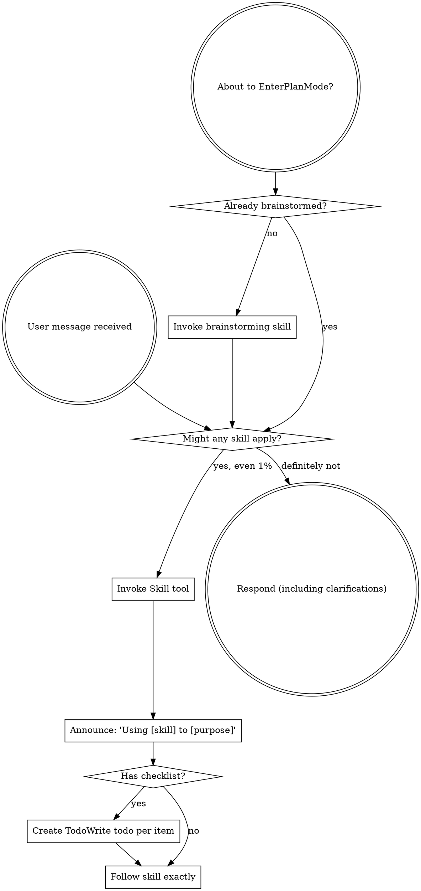

2026-05-12T10:37:38.029084Z  WARN codex_core_plugins::manifest: ignoring interface.defaultPrompt: prompt must be at most 128 characters path=/Users/houssamr/.codex/.tmp/plugins/plugins/build-ios-apps/.codex-plugin/plugin.json
2026-05-12T10:37:38.029327Z  WARN codex_core_plugins::manifest: ignoring interface.defaultPrompt: maximum of 3 prompts is supported path=/Users/houssamr/.codex/.tmp/plugins/plugins/plugin-eval/.codex-plugin/plugin.json
2026-05-12T10:37:38.032519Z  WARN codex_core_plugins::manifest: ignoring interface.defaultPrompt: maximum of 3 prompts is supported path=/Users/houssamr/.codex/.tmp/plugins/plugins/twilio-developer-kit/.codex-plugin/plugin.json
2026-05-12T10:37:38.032552Z  WARN codex_core_plugins::manifest: ignoring interface.defaultPrompt: maximum of 3 prompts is supported path=/Users/houssamr/.codex/.tmp/plugins/plugins/openai-developers/.codex-plugin/plugin.json
OpenAI Codex v0.128.0 (research preview)
--------
workdir: /Users/houssamr/Projects/syneriva/apps/erp-pos-stabperf
model: gpt-5.5
provider: openai
approval: never
sandbox: workspace-write [workdir, /tmp, $TMPDIR, /Users/houssamr/.codex/memories]
reasoning effort: high
reasoning summaries: none
session id: 019e1bc3-8450-7c73-8ee0-66ee50d649c4
--------
user
changes against 'dev'
2026-05-12T10:37:39.811670Z  WARN codex_core::shell_snapshot: Failed to delete shell snapshot at "/Users/houssamr/.codex/shell_snapshots/019e0c4d-3f96-7102-9eab-d3599174e432.1778322849713050000.sh": Os { code: 2, kind: NotFound, message: "No such file or directory" }
2026-05-12T10:37:40.906419Z  WARN codex_core_plugins::marketplace: skipping marketplace plugin with unsupported source path=/Users/houssamr/.codex/.tmp/marketplaces/.staging/marketplace-upgrade-17lMzn/.claude-plugin/marketplace.json plugin="fullstory"
2026-05-12T10:37:40.906673Z  WARN codex_core_plugins::marketplace: skipping marketplace plugin with unsupported source path=/Users/houssamr/.codex/.tmp/marketplaces/.staging/marketplace-upgrade-17lMzn/.claude-plugin/marketplace.json plugin="jfrog"
2026-05-12T10:37:40.907053Z  WARN codex_core_plugins::marketplace: skipping invalid marketplace plugin path=/Users/houssamr/.codex/.tmp/marketplaces/.staging/marketplace-upgrade-17lMzn/.claude-plugin/marketplace.json marketplace=claude-plugins-official error=invalid plugin name: only ASCII letters, digits, `_`, and `-` are allowed
2026-05-12T10:37:46.306301Z  WARN codex_core_plugins::marketplace: skipping marketplace plugin with unsupported source path=/Users/houssamr/.codex/.tmp/marketplaces/claude-plugins-official/.claude-plugin/marketplace.json plugin="fullstory"
2026-05-12T10:37:46.306538Z  WARN codex_core_plugins::marketplace: skipping marketplace plugin with unsupported source path=/Users/houssamr/.codex/.tmp/marketplaces/claude-plugins-official/.claude-plugin/marketplace.json plugin="jfrog"
2026-05-12T10:37:46.307362Z  WARN codex_core_plugins::marketplace: skipping invalid marketplace plugin path=/Users/houssamr/.codex/.tmp/marketplaces/claude-plugins-official/.claude-plugin/marketplace.json marketplace=claude-plugins-official error=invalid plugin name: only ASCII letters, digits, `_`, and `-` are allowed
2026-05-12T10:37:46.307536Z  WARN codex_core_plugins::marketplace: skipping marketplace plugin that failed to resolve path=/Users/houssamr/.codex/.tmp/marketplaces/ui-ux-pro-max-skill/.claude-plugin/marketplace.json plugin="ui-ux-pro-max" error=invalid marketplace file `/Users/houssamr/.codex/.tmp/marketplaces/ui-ux-pro-max-skill/.claude-plugin/marketplace.json`: local plugin source path must not be empty
2026-05-12T10:37:46.309088Z  WARN codex_core_plugins::manifest: ignoring interface.defaultPrompt: prompt must be at most 128 characters path=/Users/houssamr/.codex/.tmp/plugins/plugins/build-ios-apps/.codex-plugin/plugin.json
2026-05-12T10:37:46.309651Z  WARN codex_core_plugins::manifest: ignoring interface.defaultPrompt: maximum of 3 prompts is supported path=/Users/houssamr/.codex/.tmp/plugins/plugins/plugin-eval/.codex-plugin/plugin.json
2026-05-12T10:37:46.314012Z  WARN codex_core_plugins::manifest: ignoring interface.defaultPrompt: maximum of 3 prompts is supported path=/Users/houssamr/.codex/.tmp/plugins/plugins/twilio-developer-kit/.codex-plugin/plugin.json
2026-05-12T10:37:46.314054Z  WARN codex_core_plugins::manifest: ignoring interface.defaultPrompt: maximum of 3 prompts is supported path=/Users/houssamr/.codex/.tmp/plugins/plugins/openai-developers/.codex-plugin/plugin.json
2026-05-12T10:37:46.334137Z  WARN codex_core_skills::loader: ignoring interface.icon_small: icon path must not contain '..'
2026-05-12T10:37:46.334146Z  WARN codex_core_skills::loader: ignoring interface.icon_large: icon path must not contain '..'
2026-05-12T10:37:46.334840Z  WARN codex_core_skills::loader: ignoring interface.icon_small: icon path must not contain '..'
2026-05-12T10:37:46.334843Z  WARN codex_core_skills::loader: ignoring interface.icon_large: icon path must not contain '..'
2026-05-12T10:37:46.335506Z  WARN codex_core_skills::loader: ignoring interface.icon_small: icon path must not contain '..'
2026-05-12T10:37:46.335510Z  WARN codex_core_skills::loader: ignoring interface.icon_large: icon path must not contain '..'
2026-05-12T10:37:46.336112Z  WARN codex_core_skills::loader: ignoring interface.icon_small: icon path must not contain '..'
2026-05-12T10:37:46.336123Z  WARN codex_core_skills::loader: ignoring interface.icon_large: icon path must not contain '..'
2026-05-12T10:37:46.336982Z  WARN codex_core_skills::loader: ignoring interface.icon_small: icon path must not contain '..'
2026-05-12T10:37:46.336996Z  WARN codex_core_skills::loader: ignoring interface.icon_large: icon path must not contain '..'
2026-05-12T10:37:46.338544Z  WARN codex_core_skills::loader: ignoring interface.icon_small: icon path must not contain '..'
2026-05-12T10:37:46.338553Z  WARN codex_core_skills::loader: ignoring interface.icon_large: icon path must not contain '..'
2026-05-12T10:37:47.162016Z  WARN codex_core_plugins::marketplace: skipping marketplace plugin that failed to resolve path=/Users/houssamr/.codex/.tmp/marketplaces/.staging/marketplace-upgrade-8IKJlP/.claude-plugin/marketplace.json plugin="ui-ux-pro-max" error=invalid marketplace file `/Users/houssamr/.codex/.tmp/marketplaces/.staging/marketplace-upgrade-8IKJlP/.claude-plugin/marketplace.json`: local plugin source path must not be empty
2026-05-12T10:37:47.192471Z  WARN codex_core_plugins::marketplace: skipping marketplace plugin with unsupported source path=/Users/houssamr/.codex/.tmp/marketplaces/claude-plugins-official/.claude-plugin/marketplace.json plugin="fullstory"
2026-05-12T10:37:47.192610Z  WARN codex_core_plugins::marketplace: skipping marketplace plugin with unsupported source path=/Users/houssamr/.codex/.tmp/marketplaces/claude-plugins-official/.claude-plugin/marketplace.json plugin="jfrog"
2026-05-12T10:37:47.193007Z  WARN codex_core_plugins::marketplace: skipping invalid marketplace plugin path=/Users/houssamr/.codex/.tmp/marketplaces/claude-plugins-official/.claude-plugin/marketplace.json marketplace=claude-plugins-official error=invalid plugin name: only ASCII letters, digits, `_`, and `-` are allowed
2026-05-12T10:37:47.193175Z  WARN codex_core_plugins::marketplace: skipping marketplace plugin that failed to resolve path=/Users/houssamr/.codex/.tmp/marketplaces/ui-ux-pro-max-skill/.claude-plugin/marketplace.json plugin="ui-ux-pro-max" error=invalid marketplace file `/Users/houssamr/.codex/.tmp/marketplaces/ui-ux-pro-max-skill/.claude-plugin/marketplace.json`: local plugin source path must not be empty
2026-05-12T10:37:47.193374Z  WARN codex_core_plugins::loader: configured non-curated plugin no longer exists in discovered marketplaces during cache refresh plugin="browser-use" marketplace="openai-bundled"
2026-05-12T10:37:47.202294Z  WARN codex_core_plugins::loader: configured non-curated plugin no longer exists in discovered marketplaces during cache refresh plugin="documents" marketplace="openai-primary-runtime"
2026-05-12T10:37:47.205728Z  WARN codex_core_plugins::loader: configured non-curated plugin no longer exists in discovered marketplaces during cache refresh plugin="presentations" marketplace="openai-primary-runtime"
2026-05-12T10:37:47.205741Z  WARN codex_core_plugins::loader: configured non-curated plugin no longer exists in discovered marketplaces during cache refresh plugin="spreadsheets" marketplace="openai-primary-runtime"
2026-05-12T10:37:50.222990Z  WARN codex_core_plugins::marketplace: skipping marketplace plugin with unsupported source path=/Users/houssamr/.codex/.tmp/marketplaces/claude-plugins-official/.claude-plugin/marketplace.json plugin="fullstory"
2026-05-12T10:37:50.223132Z  WARN codex_core_plugins::marketplace: skipping marketplace plugin with unsupported source path=/Users/houssamr/.codex/.tmp/marketplaces/claude-plugins-official/.claude-plugin/marketplace.json plugin="jfrog"
2026-05-12T10:37:50.223520Z  WARN codex_core_plugins::marketplace: skipping invalid marketplace plugin path=/Users/houssamr/.codex/.tmp/marketplaces/claude-plugins-official/.claude-plugin/marketplace.json marketplace=claude-plugins-official error=invalid plugin name: only ASCII letters, digits, `_`, and `-` are allowed
2026-05-12T10:37:50.223583Z  WARN codex_core_plugins::marketplace: skipping marketplace plugin that failed to resolve path=/Users/houssamr/.codex/.tmp/marketplaces/ui-ux-pro-max-skill/.claude-plugin/marketplace.json plugin="ui-ux-pro-max" error=invalid marketplace file `/Users/houssamr/.codex/.tmp/marketplaces/ui-ux-pro-max-skill/.claude-plugin/marketplace.json`: local plugin source path must not be empty
2026-05-12T10:37:50.224443Z  WARN codex_core_plugins::manifest: ignoring interface.defaultPrompt: prompt must be at most 128 characters path=/Users/houssamr/.codex/.tmp/plugins/plugins/build-ios-apps/.codex-plugin/plugin.json
2026-05-12T10:37:50.224721Z  WARN codex_core_plugins::manifest: ignoring interface.defaultPrompt: maximum of 3 prompts is supported path=/Users/houssamr/.codex/.tmp/plugins/plugins/plugin-eval/.codex-plugin/plugin.json
2026-05-12T10:37:50.245070Z  WARN codex_core_plugins::manifest: ignoring interface.defaultPrompt: maximum of 3 prompts is supported path=/Users/houssamr/.codex/.tmp/plugins/plugins/twilio-developer-kit/.codex-plugin/plugin.json
2026-05-12T10:37:50.245205Z  WARN codex_core_plugins::manifest: ignoring interface.defaultPrompt: maximum of 3 prompts is supported path=/Users/houssamr/.codex/.tmp/plugins/plugins/openai-developers/.codex-plugin/plugin.json
2026-05-12T10:37:50.271614Z  WARN codex_core_skills::loader: ignoring interface.icon_small: icon path must not contain '..'
2026-05-12T10:37:50.271676Z  WARN codex_core_skills::loader: ignoring interface.icon_large: icon path must not contain '..'
2026-05-12T10:37:50.272658Z  WARN codex_core_skills::loader: ignoring interface.icon_small: icon path must not contain '..'
2026-05-12T10:37:50.272674Z  WARN codex_core_skills::loader: ignoring interface.icon_large: icon path must not contain '..'
2026-05-12T10:37:50.273833Z  WARN codex_core_skills::loader: ignoring interface.icon_small: icon path must not contain '..'
2026-05-12T10:37:50.273845Z  WARN codex_core_skills::loader: ignoring interface.icon_large: icon path must not contain '..'
2026-05-12T10:37:50.274589Z  WARN codex_core_skills::loader: ignoring interface.icon_small: icon path must not contain '..'
2026-05-12T10:37:50.274599Z  WARN codex_core_skills::loader: ignoring interface.icon_large: icon path must not contain '..'
2026-05-12T10:37:50.275411Z  WARN codex_core_skills::loader: ignoring interface.icon_small: icon path must not contain '..'
2026-05-12T10:37:50.275419Z  WARN codex_core_skills::loader: ignoring interface.icon_large: icon path must not contain '..'
2026-05-12T10:37:50.277372Z  WARN codex_core_skills::loader: ignoring interface.icon_small: icon path must not contain '..'
2026-05-12T10:37:50.277389Z  WARN codex_core_skills::loader: ignoring interface.icon_large: icon path must not contain '..'
2026-05-12T10:37:52.084818Z  WARN codex_core_plugins::marketplace: skipping marketplace plugin with unsupported source path=/Users/houssamr/.codex/.tmp/marketplaces/claude-plugins-official/.claude-plugin/marketplace.json plugin="fullstory"
2026-05-12T10:37:52.084919Z  WARN codex_core_plugins::marketplace: skipping marketplace plugin with unsupported source path=/Users/houssamr/.codex/.tmp/marketplaces/claude-plugins-official/.claude-plugin/marketplace.json plugin="jfrog"
2026-05-12T10:37:52.085196Z  WARN codex_core_plugins::marketplace: skipping invalid marketplace plugin path=/Users/houssamr/.codex/.tmp/marketplaces/claude-plugins-official/.claude-plugin/marketplace.json marketplace=claude-plugins-official error=invalid plugin name: only ASCII letters, digits, `_`, and `-` are allowed
2026-05-12T10:37:52.085237Z  WARN codex_core_plugins::marketplace: skipping marketplace plugin that failed to resolve path=/Users/houssamr/.codex/.tmp/marketplaces/ui-ux-pro-max-skill/.claude-plugin/marketplace.json plugin="ui-ux-pro-max" error=invalid marketplace file `/Users/houssamr/.codex/.tmp/marketplaces/ui-ux-pro-max-skill/.claude-plugin/marketplace.json`: local plugin source path must not be empty
2026-05-12T10:37:52.085932Z  WARN codex_core_plugins::manifest: ignoring interface.defaultPrompt: prompt must be at most 128 characters path=/Users/houssamr/.codex/.tmp/plugins/plugins/build-ios-apps/.codex-plugin/plugin.json
2026-05-12T10:37:52.086455Z  WARN codex_core_plugins::manifest: ignoring interface.defaultPrompt: maximum of 3 prompts is supported path=/Users/houssamr/.codex/.tmp/plugins/plugins/plugin-eval/.codex-plugin/plugin.json
2026-05-12T10:37:52.088260Z  WARN codex_core_plugins::manifest: ignoring interface.defaultPrompt: maximum of 3 prompts is supported path=/Users/houssamr/.codex/.tmp/plugins/plugins/twilio-developer-kit/.codex-plugin/plugin.json
2026-05-12T10:37:52.088290Z  WARN codex_core_plugins::manifest: ignoring interface.defaultPrompt: maximum of 3 prompts is supported path=/Users/houssamr/.codex/.tmp/plugins/plugins/openai-developers/.codex-plugin/plugin.json
2026-05-12T10:37:52.114658Z  WARN codex_core_skills::loader: ignoring interface.icon_small: icon path must not contain '..'
2026-05-12T10:37:52.114673Z  WARN codex_core_skills::loader: ignoring interface.icon_large: icon path must not contain '..'
2026-05-12T10:37:52.115480Z  WARN codex_core_skills::loader: ignoring interface.icon_small: icon path must not contain '..'
2026-05-12T10:37:52.115490Z  WARN codex_core_skills::loader: ignoring interface.icon_large: icon path must not contain '..'
2026-05-12T10:37:52.116245Z  WARN codex_core_skills::loader: ignoring interface.icon_small: icon path must not contain '..'
2026-05-12T10:37:52.116254Z  WARN codex_core_skills::loader: ignoring interface.icon_large: icon path must not contain '..'
2026-05-12T10:37:52.116971Z  WARN codex_core_skills::loader: ignoring interface.icon_small: icon path must not contain '..'
2026-05-12T10:37:52.116981Z  WARN codex_core_skills::loader: ignoring interface.icon_large: icon path must not contain '..'
2026-05-12T10:37:52.118011Z  WARN codex_core_skills::loader: ignoring interface.icon_small: icon path must not contain '..'
2026-05-12T10:37:52.118028Z  WARN codex_core_skills::loader: ignoring interface.icon_large: icon path must not contain '..'
2026-05-12T10:37:52.120070Z  WARN codex_core_skills::loader: ignoring interface.icon_small: icon path must not contain '..'
2026-05-12T10:37:52.120080Z  WARN codex_core_skills::loader: ignoring interface.icon_large: icon path must not contain '..'
2026-05-12T10:38:03.877291Z  WARN codex_otel::events::session_telemetry: metrics counter [codex.skill.injected] failed: tag value contains invalid characters: superpowers:using-superpowers
exec
/bin/zsh -lc "sed -n '1,160p' /Users/houssamr/.codex/plugins/cache/claude-plugins-official/superpowers/5.1.0/skills/using-superpowers/SKILL.md && git diff 03c6832aea7f8be6c384a806ddb43db39ab944e3 --stat" in /Users/houssamr/Projects/syneriva/apps/erp-pos-stabperf
 succeeded in 0ms:
---
name: using-superpowers
description: Use when starting any conversation - establishes how to find and use skills, requiring Skill tool invocation before ANY response including clarifying questions
---

<SUBAGENT-STOP>
If you were dispatched as a subagent to execute a specific task, skip this skill.
</SUBAGENT-STOP>

<EXTREMELY-IMPORTANT>
If you think there is even a 1% chance a skill might apply to what you are doing, you ABSOLUTELY MUST invoke the skill.

IF A SKILL APPLIES TO YOUR TASK, YOU DO NOT HAVE A CHOICE. YOU MUST USE IT.

This is not negotiable. This is not optional. You cannot rationalize your way out of this.
</EXTREMELY-IMPORTANT>

## Instruction Priority

Superpowers skills override default system prompt behavior, but **user instructions always take precedence**:

1. **User's explicit instructions** (CLAUDE.md, GEMINI.md, AGENTS.md, direct requests) — highest priority
2. **Superpowers skills** — override default system behavior where they conflict
3. **Default system prompt** — lowest priority

If CLAUDE.md, GEMINI.md, or AGENTS.md says "don't use TDD" and a skill says "always use TDD," follow the user's instructions. The user is in control.

## How to Access Skills

**In Claude Code:** Use the `Skill` tool. When you invoke a skill, its content is loaded and presented to you—follow it directly. Never use the Read tool on skill files.

**In Copilot CLI:** Use the `skill` tool. Skills are auto-discovered from installed plugins. The `skill` tool works the same as Claude Code's `Skill` tool.

**In Gemini CLI:** Skills activate via the `activate_skill` tool. Gemini loads skill metadata at session start and activates the full content on demand.

**In other environments:** Check your platform's documentation for how skills are loaded.

## Platform Adaptation

Skills use Claude Code tool names. Non-CC platforms: see `references/copilot-tools.md` (Copilot CLI), `references/codex-tools.md` (Codex) for tool equivalents. Gemini CLI users get the tool mapping loaded automatically via GEMINI.md.

# Using Skills

## The Rule

**Invoke relevant or requested skills BEFORE any response or action.** Even a 1% chance a skill might apply means that you should invoke the skill to check. If an invoked skill turns out to be wrong for the situation, you don't need to use it.

## Red Flags

These thoughts mean STOP—you're rationalizing:

| Thought | Reality |
|---------|---------|
| "This is just a simple question" | Questions are tasks. Check for skills. |
| "I need more context first" | Skill check comes BEFORE clarifying questions. |
| "Let me explore the codebase first" | Skills tell you HOW to explore. Check first. |
| "I can check git/files quickly" | Files lack conversation context. Check for skills. |
| "Let me gather information first" | Skills tell you HOW to gather information. |
| "This doesn't need a formal skill" | If a skill exists, use it. |
| "I remember this skill" | Skills evolve. Read current version. |
| "This doesn't count as a task" | Action = task. Check for skills. |
| "The skill is overkill" | Simple things become complex. Use it. |
| "I'll just do this one thing first" | Check BEFORE doing anything. |
| "This feels productive" | Undisciplined action wastes time. Skills prevent this. |
| "I know what that means" | Knowing the concept ≠ using the skill. Invoke it. |

## Skill Priority

When multiple skills could apply, use this order:

1. **Process skills first** (brainstorming, debugging) - these determine HOW to approach the task
2. **Implementation skills second** (frontend-design, mcp-builder) - these guide execution

"Let's build X" → brainstorming first, then implementation skills.
"Fix this bug" → debugging first, then domain-specific skills.

## Skill Types

**Rigid** (TDD, debugging): Follow exactly. Don't adapt away discipline.

**Flexible** (patterns): Adapt principles to context.

The skill itself tells you which.

## User Instructions

Instructions say WHAT, not HOW. "Add X" or "Fix Y" doesn't mean skip workflows.
 .../Services/ReportGenerationService.php           |  52 +++++++-
 .../Controllers/ZReportSyncController.php          | 129 ++++++++++++-------
 .../POS/ServerSideZReportOverTenderTest.php        | 142 +++++++++++++++++++++
 .../POS/ZReportSyncControllerSchema2Test.php       |  83 +++++++++---
 apps/pos/src/api/reportApi.ts                      |   7 +-
 .../pos/src/lib/sync/__tests__/syncService.test.ts |  11 ++
 6 files changed, 358 insertions(+), 66 deletions(-)

2026-05-12T10:38:03.990245Z  WARN codex_protocol::openai_models: Model personality requested but model_messages is missing, falling back to base instructions. model=gpt-5.5 personality=pragmatic
2026-05-12T10:38:04.041780Z  WARN codex_core_plugins::marketplace: skipping marketplace plugin with unsupported source path=/Users/houssamr/.codex/.tmp/marketplaces/claude-plugins-official/.claude-plugin/marketplace.json plugin="fullstory"
2026-05-12T10:38:04.041990Z  WARN codex_core_plugins::marketplace: skipping marketplace plugin with unsupported source path=/Users/houssamr/.codex/.tmp/marketplaces/claude-plugins-official/.claude-plugin/marketplace.json plugin="jfrog"
2026-05-12T10:38:04.042888Z  WARN codex_core_plugins::marketplace: skipping invalid marketplace plugin path=/Users/houssamr/.codex/.tmp/marketplaces/claude-plugins-official/.claude-plugin/marketplace.json marketplace=claude-plugins-official error=invalid plugin name: only ASCII letters, digits, `_`, and `-` are allowed
2026-05-12T10:38:04.042994Z  WARN codex_core_plugins::marketplace: skipping marketplace plugin that failed to resolve path=/Users/houssamr/.codex/.tmp/marketplaces/ui-ux-pro-max-skill/.claude-plugin/marketplace.json plugin="ui-ux-pro-max" error=invalid marketplace file `/Users/houssamr/.codex/.tmp/marketplaces/ui-ux-pro-max-skill/.claude-plugin/marketplace.json`: local plugin source path must not be empty
2026-05-12T10:38:04.044926Z  WARN codex_core_plugins::manifest: ignoring interface.defaultPrompt: prompt must be at most 128 characters path=/Users/houssamr/.codex/.tmp/plugins/plugins/build-ios-apps/.codex-plugin/plugin.json
2026-05-12T10:38:04.045606Z  WARN codex_core_plugins::manifest: ignoring interface.defaultPrompt: maximum of 3 prompts is supported path=/Users/houssamr/.codex/.tmp/plugins/plugins/plugin-eval/.codex-plugin/plugin.json
2026-05-12T10:38:04.050404Z  WARN codex_core_plugins::manifest: ignoring interface.defaultPrompt: maximum of 3 prompts is supported path=/Users/houssamr/.codex/.tmp/plugins/plugins/twilio-developer-kit/.codex-plugin/plugin.json
2026-05-12T10:38:04.050441Z  WARN codex_core_plugins::manifest: ignoring interface.defaultPrompt: maximum of 3 prompts is supported path=/Users/houssamr/.codex/.tmp/plugins/plugins/openai-developers/.codex-plugin/plugin.json
2026-05-12T10:38:04.106515Z  WARN codex_core_skills::loader: ignoring interface.icon_small: icon path must not contain '..'
2026-05-12T10:38:04.106539Z  WARN codex_core_skills::loader: ignoring interface.icon_large: icon path must not contain '..'
2026-05-12T10:38:04.107397Z  WARN codex_core_skills::loader: ignoring interface.icon_small: icon path must not contain '..'
2026-05-12T10:38:04.107403Z  WARN codex_core_skills::loader: ignoring interface.icon_large: icon path must not contain '..'
2026-05-12T10:38:04.108252Z  WARN codex_core_skills::loader: ignoring interface.icon_small: icon path must not contain '..'
2026-05-12T10:38:04.108262Z  WARN codex_core_skills::loader: ignoring interface.icon_large: icon path must not contain '..'
2026-05-12T10:38:04.109068Z  WARN codex_core_skills::loader: ignoring interface.icon_small: icon path must not contain '..'
2026-05-12T10:38:04.109128Z  WARN codex_core_skills::loader: ignoring interface.icon_large: icon path must not contain '..'
2026-05-12T10:38:04.110036Z  WARN codex_core_skills::loader: ignoring interface.icon_small: icon path must not contain '..'
2026-05-12T10:38:04.110058Z  WARN codex_core_skills::loader: ignoring interface.icon_large: icon path must not contain '..'
2026-05-12T10:38:04.111841Z  WARN codex_core_skills::loader: ignoring interface.icon_small: icon path must not contain '..'
2026-05-12T10:38:04.111861Z  WARN codex_core_skills::loader: ignoring interface.icon_large: icon path must not contain '..'
exec
/bin/zsh -lc 'git diff 03c6832aea7f8be6c384a806ddb43db39ab944e3 -- apps/api/app/Services/ReportGenerationService.php apps/api/app/Http/Controllers/ZReportSyncController.php apps/api/tests/Feature/POS/ServerSideZReportOverTenderTest.php apps/api/tests/Feature/POS/ZReportSyncControllerSchema2Test.php apps/pos/src/api/reportApi.ts apps/pos/src/lib/sync/__tests__/syncService.test.ts' in /Users/houssamr/Projects/syneriva/apps/erp-pos-stabperf
 succeeded in 0ms:
diff --git a/apps/api/tests/Feature/POS/ServerSideZReportOverTenderTest.php b/apps/api/tests/Feature/POS/ServerSideZReportOverTenderTest.php
new file mode 100644
index 00000000..a97767d9
--- /dev/null
+++ b/apps/api/tests/Feature/POS/ServerSideZReportOverTenderTest.php
@@ -0,0 +1,142 @@
+<?php
+
+declare(strict_types=1);
+
+namespace Tests\Feature\POS;
+
+use App\Modules\Company\Domain\Company;
+use App\Modules\Company\Domain\Location;
+use App\Modules\Identity\Domain\User;
+use App\Modules\POS\Application\Services\ReportGenerationService;
+use App\Modules\POS\Domain\DTOs\CashCountInputDTO;
+use App\Modules\POS\Domain\Enums\FiscalStatus;
+use App\Modules\POS\Domain\Enums\ShiftStatus;
+use App\Modules\POS\Domain\Receipt;
+use App\Modules\POS\Domain\ReceiptPayment;
+use App\Modules\POS\Domain\Shift;
+use App\Modules\POS\Domain\Terminal;
+use App\Modules\POS\Domain\ZReportCount;
+use App\Modules\Tenant\Domain\Tenant;
+use App\Modules\Treasury\Domain\PaymentMethod;
+use Illuminate\Foundation\Testing\RefreshDatabase;
+use Illuminate\Support\Carbon;
+use Illuminate\Support\Str;
+use Tests\TestCase;
+
+final class ServerSideZReportOverTenderTest extends TestCase
+{
+    use RefreshDatabase;
+
+    public function test_server_side_z_report_cash_expected_subtracts_receipt_change_due_once(): void
+    {
+        $this->assertCashExpectedSubtractsReceiptChangeDue('CASH', 'CASH');
+    }
+
+    public function test_server_side_z_report_treats_lowercase_cash_code_as_cash(): void
+    {
+        $this->assertCashExpectedSubtractsReceiptChangeDue('cash', 'cash');
+    }
+
+    private function assertCashExpectedSubtractsReceiptChangeDue(string $methodCode, string $paymentMethodCode): void
+    {
+        $tenant = Tenant::factory()->create();
+        $company = Company::factory()->create([
+            'tenant_id' => $tenant->id,
+            'currency' => 'EUR',
+        ]);
+        $location = Location::factory()->create(['company_id' => $company->id]);
+        $cashier = User::factory()->create(['tenant_id' => $tenant->id]);
+        $terminal = Terminal::factory()->create([
+            'tenant_id' => $tenant->id,
+            'company_id' => $company->id,
+            'location_id' => $location->id,
+        ]);
+        $cashMethod = PaymentMethod::factory()->create([
+            'tenant_id' => $tenant->id,
+            'company_id' => $company->id,
+            'code' => $methodCode,
+            'name' => 'Cash',
+            'is_physical' => true,
+            'is_active' => true,
+        ]);
+
+        Shift::create([
+            'terminal_id' => $terminal->id,
+            'cashier_id' => $cashier->id,
+            'shift_number' => 1,
+            'status' => ShiftStatus::Open,
+            'opened_at' => Carbon::now()->subHour(),
+            'opening_cash' => '0.0000',
+        ]);
+
+        $this->seedCashReceipt($terminal, $cashier, $cashMethod, $paymentMethodCode, 1, '50.000', '50.000', '0.000', 1);
+        $this->seedCashReceipt($terminal, $cashier, $cashMethod, $paymentMethodCode, 2, '50.000', '120.000', '70.000', 2);
+
+        /** @var ReportGenerationService $service */
+        $service = $this->app->make(ReportGenerationService::class);
+        $zReport = $service->generateZReport(
+            $terminal,
+            $cashier,
+            [new CashCountInputDTO(
+                paymentMethodId: $cashMethod->id,
+                currencyCode: 'EUR',
+                actualAmount: '100.0000',
+            )],
+        );
+
+        $count = ZReportCount::where('z_report_id', $zReport->id)
+            ->where('payment_method_id', $cashMethod->id)
+            ->first();
+
+        $this->assertNotNull($count);
+        $this->assertSame('100.0000', $count->expected_amount);
+        $this->assertSame('100.0000', $count->actual_amount);
+        $this->assertSame('0.0000', $count->variance_amount);
+    }
+
+    private function seedCashReceipt(
+        Terminal $terminal,
+        User $cashier,
+        PaymentMethod $cashMethod,
+        string $paymentMethodCode,
+        int $sequence,
+        string $total,
+        string $tendered,
+        string $changeDue,
+        int $postedAtOffsetMinutes,
+    ): void {
+        $receipt = Receipt::create([
+            'tenant_id' => $terminal->tenant_id,
+            'company_id' => $terminal->company_id,
+            'location_id' => $terminal->location_id,
+            'terminal_id' => $terminal->id,
+            'receipt_number' => sprintf('T001-C001-L01-POS01-2026-%08d', $sequence),
+            'chain_sequence' => $sequence,
+            'receipt_year' => 2026,
+            'fiscal_hash' => hash('sha256', 'fiscal-'.$sequence),
+            'previous_hash' => null,
+            'vat_breakdown_hash' => hash('sha256', 'vat-'.$sequence),
+            'payment_methods_hash' => hash('sha256', 'pay-'.$sequence),
+            'posted_at' => Carbon::now()->subHour()->addMinutes($postedAtOffsetMinutes),
+            'cashier_id' => $cashier->id,
+            'cashier_name' => $cashier->name,
+            'subtotal' => $total,
+            'tax_amount' => '0.000',
+            'total' => $total,
+            'currency' => 'EUR',
+            'change_due' => $changeDue,
+            'fiscal_status' => FiscalStatus::Fiscalized->value,
+            'is_voided' => false,
+            'is_training' => false,
+        ]);
+
+        ReceiptPayment::create([
+            'id' => Str::uuid()->toString(),
+            'receipt_id' => $receipt->id,
+            'payment_method_id' => $cashMethod->id,
+            'payment_type' => 'CASH',
+            'payment_method_code' => $paymentMethodCode,
+            'amount' => $tendered,
+        ]);
+    }
+}
diff --git a/apps/api/tests/Feature/POS/ZReportSyncControllerSchema2Test.php b/apps/api/tests/Feature/POS/ZReportSyncControllerSchema2Test.php
index 46caf47c..c8de41fe 100644
--- a/apps/api/tests/Feature/POS/ZReportSyncControllerSchema2Test.php
+++ b/apps/api/tests/Feature/POS/ZReportSyncControllerSchema2Test.php
@@ -95,17 +95,67 @@ public function test_cash_counts_are_persisted_to_z_report_counts(): void
 
         $zReportId = $response->json('data.id');
 
-        // Two denomination entries for the same payment method → aggregated to one row.
         $this->assertDatabaseCount('pos_z_report_counts', 1);
 
         $row = ZReportCount::where('z_report_id', $zReportId)->first();
         $this->assertNotNull($row);
         $this->assertSame($this->cashMethod->id, $row->payment_method_id);
+        $this->assertSame('EUR', $row->currency_code);
+        $this->assertSame('100.0000', $row->expected_amount);
+        $this->assertSame('100.0000', $row->actual_amount);
+        $this->assertSame('0.0000', $row->variance_amount);
+        $this->assertSame('balanced', $row->variance_direction);
+        $this->assertSame(2, $row->transaction_count);
+    }
+
+    public function test_legacy_denomination_only_cash_counts_payload_is_rejected(): void
+    {
+        Sanctum::actingAs($this->cashier);
+        Event::fake();
+
+        $payload = array_merge($this->buildV1Payload(), [
+            'cash_counts' => [
+                [
+                    'payment_method_id' => $this->cashMethod->id,
+                    'counted_quantity' => 5,
+                    'counted_amount' => '50.00',
+                ],
+            ],
+        ]);
+
+        $response = $this->postJson('/api/v1/pos/reports/z/sync', $payload);
 
-        // Sum of both denomination counted_amounts: 50.00 + 20.00 = 70.00
-        $this->assertSame('70.0000', $row->actual_amount);
-        // transaction_count = sum of counted_quantities: 5 + 4 = 9
-        $this->assertSame(9, $row->transaction_count);
+        $response->assertStatus(422);
+        $errors = $response->json('error.errors');
+        $this->assertIsArray($errors);
+        foreach ([
+            'cash_counts.0.expected_amount',
+            'cash_counts.0.actual_amount',
+            'cash_counts.0.variance_amount',
+            'cash_counts.0.variance_direction',
+            'cash_counts.0.currency_code',
+            'cash_counts.0.transaction_count',
+        ] as $field) {
+            $this->assertArrayHasKey($field, $errors);
+        }
+    }
+
+    public function test_inconsistent_cash_count_variance_payload_is_rejected_before_persistence(): void
+    {
+        Sanctum::actingAs($this->cashier);
+        Event::fake();
+
+        $payload = $this->buildSchema2Payload();
+        $payload['cash_counts'][0]['variance_amount'] = '1.000';
+        $payload['cash_counts'][0]['variance_direction'] = 'over';
+
+        $response = $this->postJson('/api/v1/pos/reports/z/sync', $payload);
+
+        $response->assertStatus(422);
+        $errors = $response->json('error.errors');
+        $this->assertIsArray($errors);
+        $this->assertArrayHasKey('cash_counts.0.variance_amount', $errors);
+        $this->assertDatabaseCount('pos_z_report_counts', 0);
     }
 
     // ─────────────────────────────────────────────────────────────────────────
@@ -124,7 +174,7 @@ public function test_shift_fields_are_applied_to_pos_shifts(): void
         $this->assertNotNull($shift);
 
         // actual_cash from shift_fields
-        $this->assertSame('70.0000', (string) $shift->actual_cash);
+        $this->assertSame('100.0000', (string) $shift->actual_cash);
         // variance_amount from shift_fields
         $this->assertSame('-5.0000', (string) $shift->variance);
         // variance_severity normalised from 'medium' → 'warning'
@@ -234,25 +284,18 @@ private function buildSchema2Payload(): array
             'cash_counts' => [
                 [
                     'payment_method_id' => $this->cashMethod->id,
-                    'denomination_id' => null,
-                    'counted_quantity' => 5,
-                    'counted_amount' => '50.00',
-                    'denomination_name' => '10',
-                    'denomination_value' => '10.00',
-                ],
-                [
-                    'payment_method_id' => $this->cashMethod->id,
-                    'denomination_id' => null,
-                    'counted_quantity' => 4,
-                    'counted_amount' => '20.00',
-                    'denomination_name' => '5',
-                    'denomination_value' => '5.00',
+                    'currency_code' => 'EUR',
+                    'expected_amount' => '100.000',
+                    'actual_amount' => '100.000',
+                    'variance_amount' => '0.000',
+                    'variance_direction' => 'balanced',
+                    'transaction_count' => 2,
                 ],
             ],
             'shift_fields' => [
                 'variance_reason' => 'Short count from till reset',
                 'variance_severity' => 'medium',
-                'actual_cash' => '70.0000',
+                'actual_cash' => '100.0000',
                 'variance_amount' => '-5.0000',
             ],
             'manager_user_id' => $this->manager->id,
diff --git a/apps/pos/src/api/reportApi.ts b/apps/pos/src/api/reportApi.ts
index 0b63793d..5eb096c9 100644
--- a/apps/pos/src/api/reportApi.ts
+++ b/apps/pos/src/api/reportApi.ts
@@ -196,7 +196,12 @@ function localZReportToResponse(report: LocalZReport, decimals: number): ZReport
   };
 }
 
-/** Server-only Z-report generation (for admin dashboard fallback). */
+/**
+ * Server-only Z-report generation for admin/tooling fallback.
+ *
+ * @deprecated POS close is offline-first. Keep this helper out of the cashier close path;
+ * web admin still uses the backend route through apps/web.
+ */
 export async function generateZReportServer(terminalId: string): Promise<ZReportResponse> {
   return apiPost<ZReportResponse>('/pos/reports/z', { terminal_id: terminalId });
 }
diff --git a/apps/pos/src/lib/sync/__tests__/syncService.test.ts b/apps/pos/src/lib/sync/__tests__/syncService.test.ts
index 09f6696e..26c1c636 100644
--- a/apps/pos/src/lib/sync/__tests__/syncService.test.ts
+++ b/apps/pos/src/lib/sync/__tests__/syncService.test.ts
@@ -1475,6 +1475,17 @@ describe('zReportToSyncPayload', () => {
 
     expect(Array.isArray(payload['cash_counts'])).toBe(true);
     expect((payload['cash_counts'] as unknown[]).length).toBe(1);
+    expect(payload['cash_counts']).toEqual([
+      {
+        payment_method_id: 'pm-cash',
+        currency_code: 'EUR',
+        expected_amount: '150.00',
+        actual_amount: '148.00',
+        variance_amount: '-2.00',
+        variance_direction: 'under',
+        transaction_count: 1,
+      },
+    ]);
     expect(payload['shift_fields']).toEqual({
       blind_count_used: true,
       variance_severity: 'warning',

2026-05-12T10:38:13.228389Z  WARN codex_protocol::openai_models: Model personality requested but model_messages is missing, falling back to base instructions. model=gpt-5.5 personality=pragmatic
2026-05-12T10:38:13.274254Z  WARN codex_core_plugins::marketplace: skipping marketplace plugin with unsupported source path=/Users/houssamr/.codex/.tmp/marketplaces/claude-plugins-official/.claude-plugin/marketplace.json plugin="fullstory"
2026-05-12T10:38:13.274356Z  WARN codex_core_plugins::marketplace: skipping marketplace plugin with unsupported source path=/Users/houssamr/.codex/.tmp/marketplaces/claude-plugins-official/.claude-plugin/marketplace.json plugin="jfrog"
2026-05-12T10:38:13.274646Z  WARN codex_core_plugins::marketplace: skipping invalid marketplace plugin path=/Users/houssamr/.codex/.tmp/marketplaces/claude-plugins-official/.claude-plugin/marketplace.json marketplace=claude-plugins-official error=invalid plugin name: only ASCII letters, digits, `_`, and `-` are allowed
2026-05-12T10:38:13.274691Z  WARN codex_core_plugins::marketplace: skipping marketplace plugin that failed to resolve path=/Users/houssamr/.codex/.tmp/marketplaces/ui-ux-pro-max-skill/.claude-plugin/marketplace.json plugin="ui-ux-pro-max" error=invalid marketplace file `/Users/houssamr/.codex/.tmp/marketplaces/ui-ux-pro-max-skill/.claude-plugin/marketplace.json`: local plugin source path must not be empty
2026-05-12T10:38:13.275513Z  WARN codex_core_plugins::manifest: ignoring interface.defaultPrompt: prompt must be at most 128 characters path=/Users/houssamr/.codex/.tmp/plugins/plugins/build-ios-apps/.codex-plugin/plugin.json
2026-05-12T10:38:13.275729Z  WARN codex_core_plugins::manifest: ignoring interface.defaultPrompt: maximum of 3 prompts is supported path=/Users/houssamr/.codex/.tmp/plugins/plugins/plugin-eval/.codex-plugin/plugin.json
2026-05-12T10:38:13.278319Z  WARN codex_core_plugins::manifest: ignoring interface.defaultPrompt: maximum of 3 prompts is supported path=/Users/houssamr/.codex/.tmp/plugins/plugins/twilio-developer-kit/.codex-plugin/plugin.json
2026-05-12T10:38:13.278347Z  WARN codex_core_plugins::manifest: ignoring interface.defaultPrompt: maximum of 3 prompts is supported path=/Users/houssamr/.codex/.tmp/plugins/plugins/openai-developers/.codex-plugin/plugin.json
2026-05-12T10:38:13.298089Z  WARN codex_core_skills::loader: ignoring interface.icon_small: icon path must not contain '..'
2026-05-12T10:38:13.298107Z  WARN codex_core_skills::loader: ignoring interface.icon_large: icon path must not contain '..'
2026-05-12T10:38:13.298828Z  WARN codex_core_skills::loader: ignoring interface.icon_small: icon path must not contain '..'
2026-05-12T10:38:13.298836Z  WARN codex_core_skills::loader: ignoring interface.icon_large: icon path must not contain '..'
2026-05-12T10:38:13.299500Z  WARN codex_core_skills::loader: ignoring interface.icon_small: icon path must not contain '..'
2026-05-12T10:38:13.299506Z  WARN codex_core_skills::loader: ignoring interface.icon_large: icon path must not contain '..'
2026-05-12T10:38:13.300131Z  WARN codex_core_skills::loader: ignoring interface.icon_small: icon path must not contain '..'
2026-05-12T10:38:13.300138Z  WARN codex_core_skills::loader: ignoring interface.icon_large: icon path must not contain '..'
2026-05-12T10:38:13.300782Z  WARN codex_core_skills::loader: ignoring interface.icon_small: icon path must not contain '..'
2026-05-12T10:38:13.300790Z  WARN codex_core_skills::loader: ignoring interface.icon_large: icon path must not contain '..'
2026-05-12T10:38:13.302117Z  WARN codex_core_skills::loader: ignoring interface.icon_small: icon path must not contain '..'
2026-05-12T10:38:13.302125Z  WARN codex_core_skills::loader: ignoring interface.icon_large: icon path must not contain '..'
exec
/bin/zsh -lc 'git diff 03c6832aea7f8be6c384a806ddb43db39ab944e3 -- apps/api/app/Modules/POS/Application/Services/ReportGenerationService.php apps/api/app/Modules/POS/Presentation/Http/Controllers/ZReportSyncController.php apps/api/app/Services/ReportGenerationService.php apps/api/app/Http/Controllers/ZReportSyncController.php' in /Users/houssamr/Projects/syneriva/apps/erp-pos-stabperf
 succeeded in 0ms:
diff --git a/apps/api/app/Modules/POS/Application/Services/ReportGenerationService.php b/apps/api/app/Modules/POS/Application/Services/ReportGenerationService.php
index 900406ab..62bad73a 100644
--- a/apps/api/app/Modules/POS/Application/Services/ReportGenerationService.php
+++ b/apps/api/app/Modules/POS/Application/Services/ReportGenerationService.php
@@ -471,6 +471,7 @@ private function resolveCurrencyCode(Terminal $terminal): string
 
     /**
      * Sum receipt_payments.amount for the shift, grouped by payment_method_id.
+     * Cash methods subtract receipt change_due once per receipt to mirror the POS device formula.
      * Always includes a row for every payment_method_id in $inputs (defaulting to '0.0000').
      *
      * Shift window driven by pos_receipts.posted_at — see REALIGNMENT-LOG 2026-04-26.
@@ -496,6 +497,34 @@ private function buildExpectedPerMethod(Shift $shift, array $inputs): array
             ->groupBy('pos_receipt_payments.payment_method_id')
             ->get();
 
+        $cashReceiptChanges = DB::query()
+            ->fromSub(
+                DB::table('pos_receipt_payments')
+                    ->join('pos_receipts', 'pos_receipt_payments.receipt_id', '=', 'pos_receipts.id')
+                    ->leftJoin('payment_methods', 'pos_receipt_payments.payment_method_id', '=', 'payment_methods.id')
+                    ->where('pos_receipts.terminal_id', $shift->terminal_id)
+                    ->where('pos_receipts.fiscal_status', FiscalStatus::Fiscalized->value)
+                    ->where('pos_receipts.is_voided', false)
+                    ->where('pos_receipts.is_training', false)
+                    ->whereBetween('pos_receipts.posted_at', [$shift->opened_at, now()])
+                    ->where(function ($query): void {
+                        $query->whereRaw('UPPER(pos_receipt_payments.payment_method_code) = ?', ['CASH'])
+                            ->orWhere(function ($legacy): void {
+                                $legacy->where(function ($snapshot): void {
+                                    $snapshot->whereNull('pos_receipt_payments.payment_method_code')
+                                        ->orWhere('pos_receipt_payments.payment_method_code', '');
+                                })->whereRaw('UPPER(payment_methods.code) = ?', ['CASH']);
+                            });
+                    })
+                    ->selectRaw('pos_receipt_payments.payment_method_id as payment_method_id, pos_receipts.id as receipt_id, MAX(COALESCE(pos_receipts.change_due, 0)) as change_due')
+                    ->groupBy('pos_receipt_payments.payment_method_id', 'pos_receipts.id'),
+                'cash_receipt_changes',
+            )
+            ->selectRaw('payment_method_id, SUM(change_due) as total_change_due')
+            ->groupBy('payment_method_id')
+            ->get()
+            ->keyBy('payment_method_id');
+
         foreach ($rows as $row) {
             /** @var string $pmId */
             $pmId = $row->payment_method_id;
@@ -503,7 +532,16 @@ private function buildExpectedPerMethod(Shift $shift, array $inputs): array
             $rawTotal = $row->total;
             /** @var numeric-string $totalString */
             $totalString = (string) ($rawTotal ?? '0');
-            $totals[$pmId] = bcadd($totalString, '0', $scale);
+            $total = bcadd($totalString, '0', $scale);
+
+            $changeRow = $cashReceiptChanges->get($pmId);
+            if ($changeRow !== null) {
+                /** @var string|float|int|null $rawChangeDue */
+                $rawChangeDue = $changeRow->total_change_due;
+                $total = bcsub($total, $this->normaliseNumericString($rawChangeDue), $scale);
+            }
+
+            $totals[$pmId] = $total;
         }
 
         // Ensure every input has an entry (default '0.0000' if no receipts yet for that method).
@@ -516,6 +554,18 @@ private function buildExpectedPerMethod(Shift $shift, array $inputs): array
         return $totals;
     }
 
+    /**
+     * @return numeric-string
+     */
+    private function normaliseNumericString(string|int|float|null $value): string
+    {
+        if (! is_numeric($value)) {
+            return '0';
+        }
+
+        return (string) $value;
+    }
+
     /**
      * Count receipt_payments rows for the shift, grouped by payment_method_id.
      * Used to populate CashCountBreakdownDTO::transactionCount, which validation seeds with 0.

2026-05-12T10:38:19.103124Z  WARN codex_protocol::openai_models: Model personality requested but model_messages is missing, falling back to base instructions. model=gpt-5.5 personality=pragmatic
2026-05-12T10:38:19.148351Z  WARN codex_core_plugins::marketplace: skipping marketplace plugin with unsupported source path=/Users/houssamr/.codex/.tmp/marketplaces/claude-plugins-official/.claude-plugin/marketplace.json plugin="fullstory"
2026-05-12T10:38:19.148490Z  WARN codex_core_plugins::marketplace: skipping marketplace plugin with unsupported source path=/Users/houssamr/.codex/.tmp/marketplaces/claude-plugins-official/.claude-plugin/marketplace.json plugin="jfrog"
2026-05-12T10:38:19.149211Z  WARN codex_core_plugins::marketplace: skipping invalid marketplace plugin path=/Users/houssamr/.codex/.tmp/marketplaces/claude-plugins-official/.claude-plugin/marketplace.json marketplace=claude-plugins-official error=invalid plugin name: only ASCII letters, digits, `_`, and `-` are allowed
2026-05-12T10:38:19.149317Z  WARN codex_core_plugins::marketplace: skipping marketplace plugin that failed to resolve path=/Users/houssamr/.codex/.tmp/marketplaces/ui-ux-pro-max-skill/.claude-plugin/marketplace.json plugin="ui-ux-pro-max" error=invalid marketplace file `/Users/houssamr/.codex/.tmp/marketplaces/ui-ux-pro-max-skill/.claude-plugin/marketplace.json`: local plugin source path must not be empty
2026-05-12T10:38:19.150223Z  WARN codex_core_plugins::manifest: ignoring interface.defaultPrompt: prompt must be at most 128 characters path=/Users/houssamr/.codex/.tmp/plugins/plugins/build-ios-apps/.codex-plugin/plugin.json
2026-05-12T10:38:19.150691Z  WARN codex_core_plugins::manifest: ignoring interface.defaultPrompt: maximum of 3 prompts is supported path=/Users/houssamr/.codex/.tmp/plugins/plugins/plugin-eval/.codex-plugin/plugin.json
2026-05-12T10:38:19.154962Z  WARN codex_core_plugins::manifest: ignoring interface.defaultPrompt: maximum of 3 prompts is supported path=/Users/houssamr/.codex/.tmp/plugins/plugins/twilio-developer-kit/.codex-plugin/plugin.json
2026-05-12T10:38:19.155006Z  WARN codex_core_plugins::manifest: ignoring interface.defaultPrompt: maximum of 3 prompts is supported path=/Users/houssamr/.codex/.tmp/plugins/plugins/openai-developers/.codex-plugin/plugin.json
2026-05-12T10:38:19.175934Z  WARN codex_core_skills::loader: ignoring interface.icon_small: icon path must not contain '..'
2026-05-12T10:38:19.175948Z  WARN codex_core_skills::loader: ignoring interface.icon_large: icon path must not contain '..'
2026-05-12T10:38:19.176639Z  WARN codex_core_skills::loader: ignoring interface.icon_small: icon path must not contain '..'
2026-05-12T10:38:19.176647Z  WARN codex_core_skills::loader: ignoring interface.icon_large: icon path must not contain '..'
2026-05-12T10:38:19.177436Z  WARN codex_core_skills::loader: ignoring interface.icon_small: icon path must not contain '..'
2026-05-12T10:38:19.177446Z  WARN codex_core_skills::loader: ignoring interface.icon_large: icon path must not contain '..'
2026-05-12T10:38:19.178315Z  WARN codex_core_skills::loader: ignoring interface.icon_small: icon path must not contain '..'
2026-05-12T10:38:19.178353Z  WARN codex_core_skills::loader: ignoring interface.icon_large: icon path must not contain '..'
2026-05-12T10:38:19.179435Z  WARN codex_core_skills::loader: ignoring interface.icon_small: icon path must not contain '..'
2026-05-12T10:38:19.179451Z  WARN codex_core_skills::loader: ignoring interface.icon_large: icon path must not contain '..'
2026-05-12T10:38:19.181383Z  WARN codex_core_skills::loader: ignoring interface.icon_small: icon path must not contain '..'
2026-05-12T10:38:19.181399Z  WARN codex_core_skills::loader: ignoring interface.icon_large: icon path must not contain '..'
exec
/bin/zsh -lc 'git diff 03c6832aea7f8be6c384a806ddb43db39ab944e3 -- apps/api/app/Modules/POS/Presentation/Http/Controllers/ZReportSyncController.php' in /Users/houssamr/Projects/syneriva/apps/erp-pos-stabperf
 succeeded in 0ms:
2026-05-12T10:38:23.718385Z  WARN codex_protocol::openai_models: Model personality requested but model_messages is missing, falling back to base instructions. model=gpt-5.5 personality=pragmatic
2026-05-12T10:38:23.758056Z  WARN codex_core_plugins::marketplace: skipping marketplace plugin with unsupported source path=/Users/houssamr/.codex/.tmp/marketplaces/claude-plugins-official/.claude-plugin/marketplace.json plugin="fullstory"
2026-05-12T10:38:23.758250Z  WARN codex_core_plugins::marketplace: skipping marketplace plugin with unsupported source path=/Users/houssamr/.codex/.tmp/marketplaces/claude-plugins-official/.claude-plugin/marketplace.json plugin="jfrog"
2026-05-12T10:38:23.758833Z  WARN codex_core_plugins::marketplace: skipping invalid marketplace plugin path=/Users/houssamr/.codex/.tmp/marketplaces/claude-plugins-official/.claude-plugin/marketplace.json marketplace=claude-plugins-official error=invalid plugin name: only ASCII letters, digits, `_`, and `-` are allowed
2026-05-12T10:38:23.758887Z  WARN codex_core_plugins::marketplace: skipping marketplace plugin that failed to resolve path=/Users/houssamr/.codex/.tmp/marketplaces/ui-ux-pro-max-skill/.claude-plugin/marketplace.json plugin="ui-ux-pro-max" error=invalid marketplace file `/Users/houssamr/.codex/.tmp/marketplaces/ui-ux-pro-max-skill/.claude-plugin/marketplace.json`: local plugin source path must not be empty
2026-05-12T10:38:23.760115Z  WARN codex_core_plugins::manifest: ignoring interface.defaultPrompt: prompt must be at most 128 characters path=/Users/houssamr/.codex/.tmp/plugins/plugins/build-ios-apps/.codex-plugin/plugin.json
2026-05-12T10:38:23.760490Z  WARN codex_core_plugins::manifest: ignoring interface.defaultPrompt: maximum of 3 prompts is supported path=/Users/houssamr/.codex/.tmp/plugins/plugins/plugin-eval/.codex-plugin/plugin.json
2026-05-12T10:38:23.762224Z  WARN codex_core_plugins::manifest: ignoring interface.defaultPrompt: maximum of 3 prompts is supported path=/Users/houssamr/.codex/.tmp/plugins/plugins/twilio-developer-kit/.codex-plugin/plugin.json
2026-05-12T10:38:23.762248Z  WARN codex_core_plugins::manifest: ignoring interface.defaultPrompt: maximum of 3 prompts is supported path=/Users/houssamr/.codex/.tmp/plugins/plugins/openai-developers/.codex-plugin/plugin.json
2026-05-12T10:38:23.780618Z  WARN codex_core_skills::loader: ignoring interface.icon_small: icon path must not contain '..'
2026-05-12T10:38:23.780631Z  WARN codex_core_skills::loader: ignoring interface.icon_large: icon path must not contain '..'
2026-05-12T10:38:23.781266Z  WARN codex_core_skills::loader: ignoring interface.icon_small: icon path must not contain '..'
2026-05-12T10:38:23.781271Z  WARN codex_core_skills::loader: ignoring interface.icon_large: icon path must not contain '..'
2026-05-12T10:38:23.781925Z  WARN codex_core_skills::loader: ignoring interface.icon_small: icon path must not contain '..'
2026-05-12T10:38:23.781933Z  WARN codex_core_skills::loader: ignoring interface.icon_large: icon path must not contain '..'
2026-05-12T10:38:23.782694Z  WARN codex_core_skills::loader: ignoring interface.icon_small: icon path must not contain '..'
2026-05-12T10:38:23.782703Z  WARN codex_core_skills::loader: ignoring interface.icon_large: icon path must not contain '..'
2026-05-12T10:38:23.783334Z  WARN codex_core_skills::loader: ignoring interface.icon_small: icon path must not contain '..'
2026-05-12T10:38:23.783340Z  WARN codex_core_skills::loader: ignoring interface.icon_large: icon path must not contain '..'
2026-05-12T10:38:23.784663Z  WARN codex_core_skills::loader: ignoring interface.icon_small: icon path must not contain '..'
2026-05-12T10:38:23.784672Z  WARN codex_core_skills::loader: ignoring interface.icon_large: icon path must not contain '..'
exec
/bin/zsh -lc "git diff --name-only 03c6832aea7f8be6c384a806ddb43db39ab944e3 && find apps/api/app -path '*ZReportSyncController.php' -o -path '*ReportGenerationService.php'" in /Users/houssamr/Projects/syneriva/apps/erp-pos-stabperf
 succeeded in 0ms:
apps/api/app/Modules/POS/Application/Services/ReportGenerationService.php
apps/api/app/Modules/POS/Presentation/Controllers/ZReportSyncController.php
apps/api/tests/Feature/POS/ServerSideZReportOverTenderTest.php
apps/api/tests/Feature/POS/ZReportSyncControllerSchema2Test.php
apps/pos/src/api/reportApi.ts
apps/pos/src/lib/sync/__tests__/syncService.test.ts
apps/api/app/Modules/Taxation/Application/Services/VatReportGenerationService.php
apps/api/app/Modules/POS/Application/Services/ReportGenerationService.php
apps/api/app/Modules/POS/Presentation/Controllers/ZReportSyncController.php

2026-05-12T10:38:29.449236Z  WARN codex_protocol::openai_models: Model personality requested but model_messages is missing, falling back to base instructions. model=gpt-5.5 personality=pragmatic
2026-05-12T10:38:29.484201Z  WARN codex_core_plugins::marketplace: skipping marketplace plugin with unsupported source path=/Users/houssamr/.codex/.tmp/marketplaces/claude-plugins-official/.claude-plugin/marketplace.json plugin="fullstory"
2026-05-12T10:38:29.484338Z  WARN codex_core_plugins::marketplace: skipping marketplace plugin with unsupported source path=/Users/houssamr/.codex/.tmp/marketplaces/claude-plugins-official/.claude-plugin/marketplace.json plugin="jfrog"
2026-05-12T10:38:29.484954Z  WARN codex_core_plugins::marketplace: skipping invalid marketplace plugin path=/Users/houssamr/.codex/.tmp/marketplaces/claude-plugins-official/.claude-plugin/marketplace.json marketplace=claude-plugins-official error=invalid plugin name: only ASCII letters, digits, `_`, and `-` are allowed
2026-05-12T10:38:29.485068Z  WARN codex_core_plugins::marketplace: skipping marketplace plugin that failed to resolve path=/Users/houssamr/.codex/.tmp/marketplaces/ui-ux-pro-max-skill/.claude-plugin/marketplace.json plugin="ui-ux-pro-max" error=invalid marketplace file `/Users/houssamr/.codex/.tmp/marketplaces/ui-ux-pro-max-skill/.claude-plugin/marketplace.json`: local plugin source path must not be empty
2026-05-12T10:38:29.485922Z  WARN codex_core_plugins::manifest: ignoring interface.defaultPrompt: prompt must be at most 128 characters path=/Users/houssamr/.codex/.tmp/plugins/plugins/build-ios-apps/.codex-plugin/plugin.json
2026-05-12T10:38:29.486175Z  WARN codex_core_plugins::manifest: ignoring interface.defaultPrompt: maximum of 3 prompts is supported path=/Users/houssamr/.codex/.tmp/plugins/plugins/plugin-eval/.codex-plugin/plugin.json
2026-05-12T10:38:29.487933Z  WARN codex_core_plugins::manifest: ignoring interface.defaultPrompt: maximum of 3 prompts is supported path=/Users/houssamr/.codex/.tmp/plugins/plugins/twilio-developer-kit/.codex-plugin/plugin.json
2026-05-12T10:38:29.487958Z  WARN codex_core_plugins::manifest: ignoring interface.defaultPrompt: maximum of 3 prompts is supported path=/Users/houssamr/.codex/.tmp/plugins/plugins/openai-developers/.codex-plugin/plugin.json
2026-05-12T10:38:29.506888Z  WARN codex_core_skills::loader: ignoring interface.icon_small: icon path must not contain '..'
2026-05-12T10:38:29.506902Z  WARN codex_core_skills::loader: ignoring interface.icon_large: icon path must not contain '..'
2026-05-12T10:38:29.507707Z  WARN codex_core_skills::loader: ignoring interface.icon_small: icon path must not contain '..'
2026-05-12T10:38:29.507721Z  WARN codex_core_skills::loader: ignoring interface.icon_large: icon path must not contain '..'
2026-05-12T10:38:29.508382Z  WARN codex_core_skills::loader: ignoring interface.icon_small: icon path must not contain '..'
2026-05-12T10:38:29.508422Z  WARN codex_core_skills::loader: ignoring interface.icon_large: icon path must not contain '..'
2026-05-12T10:38:29.509207Z  WARN codex_core_skills::loader: ignoring interface.icon_small: icon path must not contain '..'
2026-05-12T10:38:29.509215Z  WARN codex_core_skills::loader: ignoring interface.icon_large: icon path must not contain '..'
2026-05-12T10:38:29.509840Z  WARN codex_core_skills::loader: ignoring interface.icon_small: icon path must not contain '..'
2026-05-12T10:38:29.509845Z  WARN codex_core_skills::loader: ignoring interface.icon_large: icon path must not contain '..'
2026-05-12T10:38:29.510905Z  WARN codex_core_skills::loader: ignoring interface.icon_small: icon path must not contain '..'
2026-05-12T10:38:29.510910Z  WARN codex_core_skills::loader: ignoring interface.icon_large: icon path must not contain '..'
exec
/bin/zsh -lc 'git diff 03c6832aea7f8be6c384a806ddb43db39ab944e3 -- apps/api/app/Modules/POS/Presentation/Controllers/ZReportSyncController.php' in /Users/houssamr/Projects/syneriva/apps/erp-pos-stabperf
 succeeded in 0ms:
diff --git a/apps/api/app/Modules/POS/Presentation/Controllers/ZReportSyncController.php b/apps/api/app/Modules/POS/Presentation/Controllers/ZReportSyncController.php
index 2716575c..1c313edc 100644
--- a/apps/api/app/Modules/POS/Presentation/Controllers/ZReportSyncController.php
+++ b/apps/api/app/Modules/POS/Presentation/Controllers/ZReportSyncController.php
@@ -76,12 +76,18 @@ public function sync(Request $request): JsonResponse
 
             // ── Schema v2 fields ──────────────────────────────────────────────
             'cash_counts' => ['sometimes', 'array'],
-            'cash_counts.*.payment_method_id' => ['required_with:cash_counts', 'uuid'],
+            'cash_counts.*.payment_method_id' => ['required', 'uuid'],
             'cash_counts.*.denomination_id' => ['sometimes', 'nullable', 'uuid'],
-            'cash_counts.*.counted_quantity' => ['required_with:cash_counts', 'integer', 'min:0'],
-            'cash_counts.*.counted_amount' => ['required_with:cash_counts', 'string'],
+            'cash_counts.*.counted_quantity' => ['sometimes', 'integer', 'min:0'],
+            'cash_counts.*.counted_amount' => ['sometimes', 'string'],
             'cash_counts.*.denomination_name' => ['sometimes', 'nullable', 'string'],
             'cash_counts.*.denomination_value' => ['sometimes', 'nullable', 'string'],
+            'cash_counts.*.currency_code' => ['required', 'string', 'size:3'],
+            'cash_counts.*.expected_amount' => ['required', 'numeric'],
+            'cash_counts.*.actual_amount' => ['required', 'numeric'],
+            'cash_counts.*.variance_amount' => ['required', 'numeric'],
+            'cash_counts.*.variance_direction' => ['required', 'string', Rule::in(['over', 'under', 'balanced'])],
+            'cash_counts.*.transaction_count' => ['required', 'integer', 'min:0'],
 
             'shift_fields' => ['sometimes', 'nullable', 'array'],
             'shift_fields.variance_reason' => ['sometimes', 'nullable', 'string'],
@@ -99,6 +105,21 @@ public function sync(Request $request): JsonResponse
 
         $companyId = $this->companyContext->getCompanyId();
 
+        /** @var array<int, array<string, mixed>> $cashCountsForValidation */
+        $cashCountsForValidation = isset($validated['cash_counts']) && is_array($validated['cash_counts'])
+            ? $validated['cash_counts']
+            : [];
+        $cashCountErrors = $this->validateCashCountBreakdownArithmetic($cashCountsForValidation);
+        if ($cashCountErrors !== []) {
+            return response()->json([
+                'error' => [
+                    'code' => 'VALIDATION_ERROR',
+                    'message' => 'The synced cash-count breakdown is internally inconsistent.',
+                    'errors' => $cashCountErrors,
+                ],
+            ], 422);
+        }
+
         // Verify terminal belongs to company
         /** @var Terminal $terminal */
         $terminal = Terminal::where('company_id', $companyId)
@@ -213,62 +234,82 @@ public function sync(Request $request): JsonResponse
     }
 
     /**
-     * Aggregate denomination-level cash_counts by payment_method_id and build
-     * CashCountBreakdownDTO instances that the repository can persist.
-     *
-     * Because the sync payload only carries the counted (actual) amount —
-     * the expected amount is not transmitted as a separate per-method figure —
-     * we store expected_amount = 0.0000 and derive variance = actual - 0.
-     * The DB CHECK constraint (variance_amount = actual_amount - expected_amount)
-     * is satisfied when expected_amount = 0 and variance_amount = actual_amount.
+     * Build CashCountBreakdownDTO instances from the POS-device Z-report payload.
+     * The offline POS is the source of truth for this path, so the server archives
+     * each per-method breakdown verbatim instead of recomputing expected/variance.
      *
      * @param  array<int, array<string, mixed>>  $cashCounts
      * @return array<int, CashCountBreakdownDTO>
      */
     private function buildBreakdownsFromSyncPayload(array $cashCounts): array
     {
-        /** @var array<string, array{amount: numeric-string, qty: int}> $perMethod */
-        $perMethod = [];
+        $breakdowns = [];
 
         foreach ($cashCounts as $entry) {
-            $methodId = (string) $entry['payment_method_id'];
-            /** @var numeric-string $rawAmount */
-            $rawAmount = is_numeric($entry['counted_amount'] ?? '0')
-                ? (string) ($entry['counted_amount'] ?? '0')
-                : '0';
-            $qty = (int) ($entry['counted_quantity'] ?? 0);
-
-            if (! isset($perMethod[$methodId])) {
-                $perMethod[$methodId] = ['amount' => '0.0000', 'qty' => 0];
-            }
+            $expectedAmount = $this->normaliseNumericString($entry['expected_amount'] ?? null);
+            $actualAmount = $this->normaliseNumericString($entry['actual_amount'] ?? null);
+            $varianceAmount = $this->normaliseNumericString($entry['variance_amount'] ?? null);
 
-            /** @var numeric-string $runningAmount */
-            $runningAmount = $perMethod[$methodId]['amount'];
-            $perMethod[$methodId]['amount'] = bcadd($runningAmount, $rawAmount, 4);
-            $perMethod[$methodId]['qty'] += $qty;
+            $breakdowns[] = new CashCountBreakdownDTO(
+                paymentMethodId: (string) $entry['payment_method_id'],
+                currencyCode: (string) $entry['currency_code'],
+                expectedAmount: bcadd($expectedAmount, '0', 4),
+                actualAmount: bcadd($actualAmount, '0', 4),
+                varianceAmount: bcadd($varianceAmount, '0', 4),
+                varianceDirection: VarianceDirection::from((string) $entry['variance_direction']),
+                transactionCount: (int) $entry['transaction_count'],
+            );
         }
 
-        $breakdowns = [];
+        return $breakdowns;
+    }
+
+    /**
+     * @param  array<int, array<string, mixed>>  $cashCounts
+     * @return array<string, list<string>>
+     */
+    private function validateCashCountBreakdownArithmetic(array $cashCounts): array
+    {
+        $errors = [];
+
+        foreach ($cashCounts as $index => $entry) {
+            $expectedAmount = $this->normaliseNumericString($entry['expected_amount'] ?? null);
+            $actualAmount = $this->normaliseNumericString($entry['actual_amount'] ?? null);
+            $varianceAmount = $this->normaliseNumericString($entry['variance_amount'] ?? null);
+            $calculatedVariance = bcsub($actualAmount, $expectedAmount, 4);
+            $normalisedVariance = bcadd($varianceAmount, '0', 4);
+
+            if (bccomp($calculatedVariance, $normalisedVariance, 4) !== 0) {
+                $errors["cash_counts.{$index}.variance_amount"] = [
+                    'The variance_amount must equal actual_amount minus expected_amount.',
+                ];
+            }
 
-        foreach ($perMethod as $methodId => $totals) {
-            /** @var numeric-string $actualAmount */
-            $actualAmount = $totals['amount'];
-            $expectedAmount = '0.0000';
-            // variance = actual - expected = actual - 0 (satisfies DB CHECK)
-            $varianceAmount = $actualAmount;
+            $direction = is_string($entry['variance_direction'] ?? null)
+                ? $entry['variance_direction']
+                : '';
+            $expectedDirection = VarianceDirection::fromSignedAmount($calculatedVariance)->value;
 
-            $breakdowns[] = new CashCountBreakdownDTO(
-                paymentMethodId: $methodId,
-                currencyCode: 'XXX', // currency not transmitted per-method in sync payload
-                expectedAmount: $expectedAmount,
-                actualAmount: $actualAmount,
-                varianceAmount: $varianceAmount,
-                varianceDirection: VarianceDirection::fromSignedAmount($varianceAmount),
-                transactionCount: $totals['qty'],
-            );
+            if ($direction !== $expectedDirection) {
+                $errors["cash_counts.{$index}.variance_direction"] = [
+                    'The variance_direction must match the sign of actual_amount minus expected_amount.',
+                ];
+            }
         }
 
-        return $breakdowns;
+        return $errors;
+    }
+
+    /**
+     * @return numeric-string
+     */
+    private function normaliseNumericString(string|int|float|null $value): string
+    {
+        if (! is_numeric($value)) {
+            return '0';
+        }
+
+        return (string) $value;
     }
 
     /**

2026-05-12T10:38:34.378068Z  WARN codex_protocol::openai_models: Model personality requested but model_messages is missing, falling back to base instructions. model=gpt-5.5 personality=pragmatic
2026-05-12T10:38:34.413960Z  WARN codex_core_plugins::marketplace: skipping marketplace plugin with unsupported source path=/Users/houssamr/.codex/.tmp/marketplaces/claude-plugins-official/.claude-plugin/marketplace.json plugin="fullstory"
2026-05-12T10:38:34.414078Z  WARN codex_core_plugins::marketplace: skipping marketplace plugin with unsupported source path=/Users/houssamr/.codex/.tmp/marketplaces/claude-plugins-official/.claude-plugin/marketplace.json plugin="jfrog"
2026-05-12T10:38:34.414392Z  WARN codex_core_plugins::marketplace: skipping invalid marketplace plugin path=/Users/houssamr/.codex/.tmp/marketplaces/claude-plugins-official/.claude-plugin/marketplace.json marketplace=claude-plugins-official error=invalid plugin name: only ASCII letters, digits, `_`, and `-` are allowed
2026-05-12T10:38:34.414441Z  WARN codex_core_plugins::marketplace: skipping marketplace plugin that failed to resolve path=/Users/houssamr/.codex/.tmp/marketplaces/ui-ux-pro-max-skill/.claude-plugin/marketplace.json plugin="ui-ux-pro-max" error=invalid marketplace file `/Users/houssamr/.codex/.tmp/marketplaces/ui-ux-pro-max-skill/.claude-plugin/marketplace.json`: local plugin source path must not be empty
2026-05-12T10:38:34.415079Z  WARN codex_core_plugins::manifest: ignoring interface.defaultPrompt: prompt must be at most 128 characters path=/Users/houssamr/.codex/.tmp/plugins/plugins/build-ios-apps/.codex-plugin/plugin.json
2026-05-12T10:38:34.415288Z  WARN codex_core_plugins::manifest: ignoring interface.defaultPrompt: maximum of 3 prompts is supported path=/Users/houssamr/.codex/.tmp/plugins/plugins/plugin-eval/.codex-plugin/plugin.json
2026-05-12T10:38:34.417263Z  WARN codex_core_plugins::manifest: ignoring interface.defaultPrompt: maximum of 3 prompts is supported path=/Users/houssamr/.codex/.tmp/plugins/plugins/twilio-developer-kit/.codex-plugin/plugin.json
2026-05-12T10:38:34.417542Z  WARN codex_core_plugins::manifest: ignoring interface.defaultPrompt: maximum of 3 prompts is supported path=/Users/houssamr/.codex/.tmp/plugins/plugins/openai-developers/.codex-plugin/plugin.json
2026-05-12T10:38:34.435766Z  WARN codex_core_skills::loader: ignoring interface.icon_small: icon path must not contain '..'
2026-05-12T10:38:34.435779Z  WARN codex_core_skills::loader: ignoring interface.icon_large: icon path must not contain '..'
2026-05-12T10:38:34.436395Z  WARN codex_core_skills::loader: ignoring interface.icon_small: icon path must not contain '..'
2026-05-12T10:38:34.436402Z  WARN codex_core_skills::loader: ignoring interface.icon_large: icon path must not contain '..'
2026-05-12T10:38:34.437080Z  WARN codex_core_skills::loader: ignoring interface.icon_small: icon path must not contain '..'
2026-05-12T10:38:34.437089Z  WARN codex_core_skills::loader: ignoring interface.icon_large: icon path must not contain '..'
2026-05-12T10:38:34.437702Z  WARN codex_core_skills::loader: ignoring interface.icon_small: icon path must not contain '..'
2026-05-12T10:38:34.437707Z  WARN codex_core_skills::loader: ignoring interface.icon_large: icon path must not contain '..'
2026-05-12T10:38:34.438409Z  WARN codex_core_skills::loader: ignoring interface.icon_small: icon path must not contain '..'
2026-05-12T10:38:34.438417Z  WARN codex_core_skills::loader: ignoring interface.icon_large: icon path must not contain '..'
2026-05-12T10:38:34.439870Z  WARN codex_core_skills::loader: ignoring interface.icon_small: icon path must not contain '..'
2026-05-12T10:38:34.439882Z  WARN codex_core_skills::loader: ignoring interface.icon_large: icon path must not contain '..'
exec
/bin/zsh -lc "sed -n '1,360p' apps/api/app/Modules/POS/Presentation/Controllers/ZReportSyncController.php && sed -n '420,610p' apps/api/app/Modules/POS/Application/Services/ReportGenerationService.php" in /Users/houssamr/Projects/syneriva/apps/erp-pos-stabperf
 succeeded in 0ms:
<?php

declare(strict_types=1);

namespace App\Modules\POS\Presentation\Controllers;

use App\Http\Controllers\Controller;
use App\Modules\Company\Domain\Company;
use App\Modules\Company\Services\CompanyContext;
use App\Modules\POS\Domain\DTOs\CashCountBreakdownDTO;
use App\Modules\POS\Domain\DTOs\VarianceAmount;
use App\Modules\POS\Domain\Events\CashCountRecorded;
use App\Modules\POS\Domain\Services\ZReportHashService;
use App\Modules\POS\Domain\Shift;
use App\Modules\POS\Domain\Terminal;
use App\Modules\POS\Domain\ZReport;
use App\Modules\POS\Infrastructure\Repositories\ZReportCountRepository;
use App\Shared\Domain\Enums\VarianceDirection;
use App\Shared\Domain\Enums\VarianceSeverity;
use Illuminate\Http\JsonResponse;
use Illuminate\Http\Request;
use Illuminate\Support\Carbon;
use Illuminate\Support\Facades\DB;
use Illuminate\Support\Facades\Event;
use Illuminate\Support\Facades\Gate;
use Illuminate\Validation\Rule;

/**
 * Handles Z-report synchronization from offline POS terminals.
 *
 * Accepts locally-generated Z-reports, verifies hash chain continuity,
 * and stores them in the server database for fiscal export.
 *
 * Schema v2 adds:
 *  - cash_counts[]        — per-denomination entries from the physical count
 *  - shift_fields         — aggregate variance metadata to stamp on pos_shifts
 *  - manager_user_id      — UUID of manager who approved the count
 *  - tolerance_summary    — write-off totals for the shift period
 */
final class ZReportSyncController extends Controller
{
    public function __construct(
        private readonly CompanyContext $companyContext,
        private readonly ZReportHashService $zReportHashService,
        private readonly ZReportCountRepository $zReportCountRepository,
    ) {}

    /**
     * Sync a Z-report from an offline terminal.
     *
     * POST /api/v1/pos/reports/z/sync
     *
     * Validates hash chain continuity and stores the Z-report.
     * Returns 201 on success, 409 on duplicate, 422 on chain break.
     */
    public function sync(Request $request): JsonResponse
    {
        Gate::authorize('pos.operate_terminal');

        $validated = $request->validate([
            // ── Core (v1) fields ──────────────────────────────────────────────
            'id' => ['required', 'string', 'uuid'],
            'terminal_id' => ['required', 'string', 'uuid'],
            'shift_id' => ['required', 'string', 'uuid'],
            'z_number' => ['required', 'integer', 'min:1'],
            'formatted_z_number' => ['required', 'string'],
            'generated_at' => ['required', 'string'],
            'fiscal_hash' => ['required', 'string', 'size:64'],
            'previous_hash' => ['required', 'string'],
            'hash_sequence' => ['required', 'integer', 'min:1'],
            'report_data' => ['required', 'array'],
            'opening_cash' => ['required', 'numeric'],
            'expected_cash' => ['required', 'numeric'],
            'receipt_snapshots' => ['present', 'array'],
            'grand_totals' => ['present', 'array'],

            // ── Schema v2 fields ──────────────────────────────────────────────
            'cash_counts' => ['sometimes', 'array'],
            'cash_counts.*.payment_method_id' => ['required', 'uuid'],
            'cash_counts.*.denomination_id' => ['sometimes', 'nullable', 'uuid'],
            'cash_counts.*.counted_quantity' => ['sometimes', 'integer', 'min:0'],
            'cash_counts.*.counted_amount' => ['sometimes', 'string'],
            'cash_counts.*.denomination_name' => ['sometimes', 'nullable', 'string'],
            'cash_counts.*.denomination_value' => ['sometimes', 'nullable', 'string'],
            'cash_counts.*.currency_code' => ['required', 'string', 'size:3'],
            'cash_counts.*.expected_amount' => ['required', 'numeric'],
            'cash_counts.*.actual_amount' => ['required', 'numeric'],
            'cash_counts.*.variance_amount' => ['required', 'numeric'],
            'cash_counts.*.variance_direction' => ['required', 'string', Rule::in(['over', 'under', 'balanced'])],
            'cash_counts.*.transaction_count' => ['required', 'integer', 'min:0'],

            'shift_fields' => ['sometimes', 'nullable', 'array'],
            'shift_fields.variance_reason' => ['sometimes', 'nullable', 'string'],
            'shift_fields.variance_severity' => ['sometimes', 'nullable', 'string', Rule::in(['none', 'low', 'medium', 'high', 'critical', 'info', 'warning'])],
            'shift_fields.actual_cash' => ['sometimes', 'nullable', 'string'],
            'shift_fields.variance_amount' => ['sometimes', 'nullable', 'string'],

            'manager_user_id' => ['sometimes', 'nullable', 'uuid'],

            'tolerance_summary' => ['sometimes', 'nullable', 'array'],
            'tolerance_summary.writeoffCount' => ['sometimes', 'integer'],
            'tolerance_summary.totalAmount' => ['sometimes', 'string'],
            'tolerance_summary.currencyCode' => ['sometimes', 'string', 'size:3'],
        ]);

        $companyId = $this->companyContext->getCompanyId();

        /** @var array<int, array<string, mixed>> $cashCountsForValidation */
        $cashCountsForValidation = isset($validated['cash_counts']) && is_array($validated['cash_counts'])
            ? $validated['cash_counts']
            : [];
        $cashCountErrors = $this->validateCashCountBreakdownArithmetic($cashCountsForValidation);
        if ($cashCountErrors !== []) {
            return response()->json([
                'error' => [
                    'code' => 'VALIDATION_ERROR',
                    'message' => 'The synced cash-count breakdown is internally inconsistent.',
                    'errors' => $cashCountErrors,
                ],
            ], 422);
        }

        // Verify terminal belongs to company
        /** @var Terminal $terminal */
        $terminal = Terminal::where('company_id', $companyId)
            ->findOrFail($validated['terminal_id']);

        // Check for duplicate (idempotent sync)
        $existing = ZReport::forTerminal($terminal->id)
            ->byZNumber((int) $validated['z_number'])
            ->first();

        if ($existing !== null) {
            if ($existing->fiscal_hash === $validated['fiscal_hash']) {
                return response()->json([
                    'data' => [
                        'status' => 'duplicate',
                        'id' => $existing->id,
                    ],
                ], 200);
            }

            return response()->json([
                'error' => [
                    'code' => 'HASH_MISMATCH',
                    'message' => 'Z-report with same z_number exists but fiscal_hash differs.',
                ],
            ], 409);
        }

        // Verify hash chain continuity
        $previousZHash = $this->zReportHashService->getPreviousZHash($terminal);
        $expectedPrevious = $previousZHash ?? 'GENESIS';

        if ($validated['previous_hash'] !== $expectedPrevious) {
            return response()->json([
                'error' => [
                    'code' => 'CHAIN_BREAK',
                    'message' => 'Z-report previous_hash does not match server chain.',
                    'expected' => $expectedPrevious,
                    'received' => $validated['previous_hash'],
                ],
            ], 422);
        }

        // Merge tolerance_summary into report_data before storage so the
        // JSONB column carries the full schema-v2 content.
        /** @var array<string, mixed> $reportData */
        $reportData = (array) $validated['report_data'];
        if (isset($validated['tolerance_summary']) && is_array($validated['tolerance_summary'])) {
            $reportData['tolerance_summary'] = $validated['tolerance_summary'];
        }

        /** @var array<int, array<string, mixed>>|null $rawCashCounts */
        $rawCashCounts = isset($validated['cash_counts']) && is_array($validated['cash_counts'])
            ? $validated['cash_counts']
            : null;

        /** @var array<string, mixed>|null $shiftFields */
        $shiftFields = isset($validated['shift_fields']) && is_array($validated['shift_fields'])
            ? $validated['shift_fields']
            : null;

        /** @var string|null $managerUserId */
        $managerUserId = isset($validated['manager_user_id']) && is_string($validated['manager_user_id'])
            ? $validated['manager_user_id']
            : null;

        // Store Z-report within a transaction, then persist any schema-v2 extras.
        $zReport = DB::transaction(function () use ($validated, $terminal, $reportData, $rawCashCounts, $shiftFields, $managerUserId): ZReport {
            $zReport = ZReport::create([
                'id' => $validated['id'],
                'terminal_id' => $terminal->id,
                'shift_id' => $validated['shift_id'],
                'z_number' => $validated['z_number'],
                'fiscal_hash' => $validated['fiscal_hash'],
                'previous_z_hash' => $validated['previous_hash'] === 'GENESIS' ? null : $validated['previous_hash'],
                'report_data' => $reportData,
                'receipt_snapshots' => $validated['receipt_snapshots'],
                'grand_totals' => $validated['grand_totals'],
                'generated_by' => auth()->id(),
                'generated_at' => Carbon::parse($validated['generated_at']),
            ]);

            // ── Persist per-denomination cash counts ─────────────────────────
            if ($rawCashCounts !== null && $rawCashCounts !== []) {
                $breakdowns = $this->buildBreakdownsFromSyncPayload($rawCashCounts);
                $this->zReportCountRepository->createMany($zReport->id, $breakdowns);
            }

            // ── Stamp shift_fields onto pos_shifts ───────────────────────────
            if ($shiftFields !== null) {
                $this->applyShiftFields(
                    (string) $validated['shift_id'],
                    $shiftFields,
                    $managerUserId,
                );
            }

            return $zReport;
        });

        // ── Dispatch CashCountRecorded event (outside transaction) ────────────
        if ($rawCashCounts !== null && $rawCashCounts !== []) {
            $this->dispatchCashCountRecorded($zReport, $terminal, $validated, $rawCashCounts, $shiftFields, $managerUserId);
        }

        return response()->json([
            'data' => [
                'status' => 'synced',
                'id' => $zReport->id,
            ],
        ], 201);
    }

    /**
     * Build CashCountBreakdownDTO instances from the POS-device Z-report payload.
     * The offline POS is the source of truth for this path, so the server archives
     * each per-method breakdown verbatim instead of recomputing expected/variance.
     *
     * @param  array<int, array<string, mixed>>  $cashCounts
     * @return array<int, CashCountBreakdownDTO>
     */
    private function buildBreakdownsFromSyncPayload(array $cashCounts): array
    {
        $breakdowns = [];

        foreach ($cashCounts as $entry) {
            $expectedAmount = $this->normaliseNumericString($entry['expected_amount'] ?? null);
            $actualAmount = $this->normaliseNumericString($entry['actual_amount'] ?? null);
            $varianceAmount = $this->normaliseNumericString($entry['variance_amount'] ?? null);

            $breakdowns[] = new CashCountBreakdownDTO(
                paymentMethodId: (string) $entry['payment_method_id'],
                currencyCode: (string) $entry['currency_code'],
                expectedAmount: bcadd($expectedAmount, '0', 4),
                actualAmount: bcadd($actualAmount, '0', 4),
                varianceAmount: bcadd($varianceAmount, '0', 4),
                varianceDirection: VarianceDirection::from((string) $entry['variance_direction']),
                transactionCount: (int) $entry['transaction_count'],
            );
        }

        return $breakdowns;
    }

    /**
     * @param  array<int, array<string, mixed>>  $cashCounts
     * @return array<string, list<string>>
     */
    private function validateCashCountBreakdownArithmetic(array $cashCounts): array
    {
        $errors = [];

        foreach ($cashCounts as $index => $entry) {
            $expectedAmount = $this->normaliseNumericString($entry['expected_amount'] ?? null);
            $actualAmount = $this->normaliseNumericString($entry['actual_amount'] ?? null);
            $varianceAmount = $this->normaliseNumericString($entry['variance_amount'] ?? null);
            $calculatedVariance = bcsub($actualAmount, $expectedAmount, 4);
            $normalisedVariance = bcadd($varianceAmount, '0', 4);

            if (bccomp($calculatedVariance, $normalisedVariance, 4) !== 0) {
                $errors["cash_counts.{$index}.variance_amount"] = [
                    'The variance_amount must equal actual_amount minus expected_amount.',
                ];
            }

            $direction = is_string($entry['variance_direction'] ?? null)
                ? $entry['variance_direction']
                : '';
            $expectedDirection = VarianceDirection::fromSignedAmount($calculatedVariance)->value;

            if ($direction !== $expectedDirection) {
                $errors["cash_counts.{$index}.variance_direction"] = [
                    'The variance_direction must match the sign of actual_amount minus expected_amount.',
                ];
            }
        }

        return $errors;
    }

    /**
     * @return numeric-string
     */
    private function normaliseNumericString(string|int|float|null $value): string
    {
        if (! is_numeric($value)) {
            return '0';
        }

        return (string) $value;
    }

    /**
     * Apply shift_fields (and optional manager_user_id) to the pos_shifts row.
     *
     * @param  array<string, mixed>  $shiftFields
     */
    private function applyShiftFields(string $shiftId, array $shiftFields, ?string $managerUserId): void
    {
        $shift = Shift::find($shiftId);

        if (! $shift instanceof Shift) {
            return;
        }

        /** @var array<string, mixed> $updates */
        $updates = [];

        if (array_key_exists('actual_cash', $shiftFields) && $shiftFields['actual_cash'] !== null) {
            $updates['actual_cash'] = (string) $shiftFields['actual_cash'];
        }

        if (array_key_exists('variance_amount', $shiftFields) && $shiftFields['variance_amount'] !== null) {
            $updates['variance'] = (string) $shiftFields['variance_amount'];
        }

        if (array_key_exists('variance_severity', $shiftFields) && $shiftFields['variance_severity'] !== null) {
            $updates['variance_severity'] = $this->normaliseVarianceSeverity((string) $shiftFields['variance_severity']);
        }

        if (array_key_exists('variance_reason', $shiftFields) && $shiftFields['variance_reason'] !== null) {
            $existingNotes = is_string($shift->notes) ? $shift->notes : '';
            $separator = $existingNotes !== '' ? "\n" : '';
            $updates['notes'] = $existingNotes.$separator.'Variance reason: '.(string) $shiftFields['variance_reason'];
        }

        if ($managerUserId !== null) {
            $updates['manager_override_by'] = $managerUserId;
        }

        if ($updates !== []) {
            $shift->update($updates);
        }
    }

    /**
     * Normalise variance_severity from the POS (which may send 'none'/'low'/'medium'/'high'/'critical')
     * to the three-value set accepted by the DB CHECK constraint: 'info', 'warning', 'critical'.
     * Generate PDF for a Z report.
     *
     * @param  ZReport  $zReport  The Z report to generate PDF for
     */
    public function generatePdf(ZReport $zReport): DomPdf
    {
        $zReport->load(['terminal', 'generatedBy']);

        /** @var Terminal $terminal */
        $terminal = $zReport->terminal;

        /** @var Company $company */
        $company = Company::findOrFail($terminal->company_id);

        $data = $this->preparePdfData($zReport, $company);

        $pdf = Pdf::loadView('pos.z-report', $data);

        // A4 paper for Z reports (unlike thermal receipt)
        $pdf->setPaper('a4', 'portrait');

        $pdf->setOption('isHtml5ParserEnabled', true);
        $pdf->setOption('isRemoteEnabled', true);
        $pdf->setOption('defaultFont', 'DejaVu Sans');

        return $pdf;
    }

    /**
     * Get filename for the Z report PDF.
     */
    public function getZReportFilename(ZReport $zReport): string
    {
        return sprintf('z-report-%s.pdf', $zReport->getFormattedZNumber());
    }

    /**
     * Resolve the currency code that the cash-count submission is denominated in.
     * Falls back to 'EUR' if neither company nor scale resolver can produce one.
     */
    private function resolveCurrencyCode(Terminal $terminal): string
    {
        /** @var Company|null $company */
        $company = Company::find($terminal->company_id);

        if ($company !== null && $company->currency !== '') {
            return $company->currency;
        }

        return 'EUR';
    }

    /**
     * Sum receipt_payments.amount for the shift, grouped by payment_method_id.
     * Cash methods subtract receipt change_due once per receipt to mirror the POS device formula.
     * Always includes a row for every payment_method_id in $inputs (defaulting to '0.0000').
     *
     * Shift window driven by pos_receipts.posted_at — see REALIGNMENT-LOG 2026-04-26.
     *
     * @param  array<int, CashCountInputDTO>  $inputs
     * @return array<string, string> payment_method_id → scale-4 numeric-string
     */
    private function buildExpectedPerMethod(Shift $shift, array $inputs): array
    {
        $scale = 4;

        /** @var array<string, string> $totals */
        $totals = [];

        $rows = DB::table('pos_receipt_payments')
            ->join('pos_receipts', 'pos_receipt_payments.receipt_id', '=', 'pos_receipts.id')
            ->where('pos_receipts.terminal_id', $shift->terminal_id)
            ->where('pos_receipts.fiscal_status', FiscalStatus::Fiscalized->value)
            ->where('pos_receipts.is_voided', false)
            ->where('pos_receipts.is_training', false)
            ->whereBetween('pos_receipts.posted_at', [$shift->opened_at, now()])
            ->selectRaw('pos_receipt_payments.payment_method_id as payment_method_id, SUM(pos_receipt_payments.amount) as total')
            ->groupBy('pos_receipt_payments.payment_method_id')
            ->get();

        $cashReceiptChanges = DB::query()
            ->fromSub(
                DB::table('pos_receipt_payments')
                    ->join('pos_receipts', 'pos_receipt_payments.receipt_id', '=', 'pos_receipts.id')
                    ->leftJoin('payment_methods', 'pos_receipt_payments.payment_method_id', '=', 'payment_methods.id')
                    ->where('pos_receipts.terminal_id', $shift->terminal_id)
                    ->where('pos_receipts.fiscal_status', FiscalStatus::Fiscalized->value)
                    ->where('pos_receipts.is_voided', false)
                    ->where('pos_receipts.is_training', false)
                    ->whereBetween('pos_receipts.posted_at', [$shift->opened_at, now()])
                    ->where(function ($query): void {
                        $query->whereRaw('UPPER(pos_receipt_payments.payment_method_code) = ?', ['CASH'])
                            ->orWhere(function ($legacy): void {
                                $legacy->where(function ($snapshot): void {
                                    $snapshot->whereNull('pos_receipt_payments.payment_method_code')
                                        ->orWhere('pos_receipt_payments.payment_method_code', '');
                                })->whereRaw('UPPER(payment_methods.code) = ?', ['CASH']);
                            });
                    })
                    ->selectRaw('pos_receipt_payments.payment_method_id as payment_method_id, pos_receipts.id as receipt_id, MAX(COALESCE(pos_receipts.change_due, 0)) as change_due')
                    ->groupBy('pos_receipt_payments.payment_method_id', 'pos_receipts.id'),
                'cash_receipt_changes',
            )
            ->selectRaw('payment_method_id, SUM(change_due) as total_change_due')
            ->groupBy('payment_method_id')
            ->get()
            ->keyBy('payment_method_id');

        foreach ($rows as $row) {
            /** @var string $pmId */
            $pmId = $row->payment_method_id;
            /** @var string|float|int|null $rawTotal */
            $rawTotal = $row->total;
            /** @var numeric-string $totalString */
            $totalString = (string) ($rawTotal ?? '0');
            $total = bcadd($totalString, '0', $scale);

            $changeRow = $cashReceiptChanges->get($pmId);
            if ($changeRow !== null) {
                /** @var string|float|int|null $rawChangeDue */
                $rawChangeDue = $changeRow->total_change_due;
                $total = bcsub($total, $this->normaliseNumericString($rawChangeDue), $scale);
            }

            $totals[$pmId] = $total;
        }

        // Ensure every input has an entry (default '0.0000' if no receipts yet for that method).
        foreach ($inputs as $input) {
            if (! array_key_exists($input->paymentMethodId, $totals)) {
                $totals[$input->paymentMethodId] = '0.0000';
            }
        }

        return $totals;
    }

    /**
     * @return numeric-string
     */
    private function normaliseNumericString(string|int|float|null $value): string
    {
        if (! is_numeric($value)) {
            return '0';
        }

        return (string) $value;
    }

    /**
     * Count receipt_payments rows for the shift, grouped by payment_method_id.
     * Used to populate CashCountBreakdownDTO::transactionCount, which validation seeds with 0.
     *
     * Shift window driven by pos_receipts.posted_at — see REALIGNMENT-LOG 2026-04-26.
     *
     * @param  array<int, CashCountInputDTO>  $inputs
     * @return array<string, int>
     */
    private function buildTransactionCountsPerMethod(Shift $shift, array $inputs): array
    {
        /** @var array<string, int> $counts */
        $counts = [];

        $rows = DB::table('pos_receipt_payments')
            ->join('pos_receipts', 'pos_receipt_payments.receipt_id', '=', 'pos_receipts.id')
            ->where('pos_receipts.terminal_id', $shift->terminal_id)
            ->where('pos_receipts.fiscal_status', FiscalStatus::Fiscalized->value)
            ->where('pos_receipts.is_voided', false)
            ->where('pos_receipts.is_training', false)
            ->whereBetween('pos_receipts.posted_at', [$shift->opened_at, now()])
            ->selectRaw('pos_receipt_payments.payment_method_id as payment_method_id, COUNT(*) as cnt')
            ->groupBy('pos_receipt_payments.payment_method_id')
            ->get();

        foreach ($rows as $row) {
            /** @var string $pmId */
            $pmId = $row->payment_method_id;
            /** @var int|string|null $cnt */
            $cnt = $row->cnt;
            $counts[$pmId] = (int) ($cnt ?? 0);
        }

        foreach ($inputs as $input) {
            if (! array_key_exists($input->paymentMethodId, $counts)) {
                $counts[$input->paymentMethodId] = 0;
            }
        }

        return $counts;
    }

2026-05-12T10:38:39.653397Z  WARN codex_protocol::openai_models: Model personality requested but model_messages is missing, falling back to base instructions. model=gpt-5.5 personality=pragmatic
2026-05-12T10:38:39.721997Z  WARN codex_core_plugins::marketplace: skipping marketplace plugin with unsupported source path=/Users/houssamr/.codex/.tmp/marketplaces/claude-plugins-official/.claude-plugin/marketplace.json plugin="fullstory"
2026-05-12T10:38:39.722127Z  WARN codex_core_plugins::marketplace: skipping marketplace plugin with unsupported source path=/Users/houssamr/.codex/.tmp/marketplaces/claude-plugins-official/.claude-plugin/marketplace.json plugin="jfrog"
2026-05-12T10:38:39.722851Z  WARN codex_core_plugins::marketplace: skipping invalid marketplace plugin path=/Users/houssamr/.codex/.tmp/marketplaces/claude-plugins-official/.claude-plugin/marketplace.json marketplace=claude-plugins-official error=invalid plugin name: only ASCII letters, digits, `_`, and `-` are allowed
2026-05-12T10:38:39.723001Z  WARN codex_core_plugins::marketplace: skipping marketplace plugin that failed to resolve path=/Users/houssamr/.codex/.tmp/marketplaces/ui-ux-pro-max-skill/.claude-plugin/marketplace.json plugin="ui-ux-pro-max" error=invalid marketplace file `/Users/houssamr/.codex/.tmp/marketplaces/ui-ux-pro-max-skill/.claude-plugin/marketplace.json`: local plugin source path must not be empty
2026-05-12T10:38:39.724576Z  WARN codex_core_plugins::manifest: ignoring interface.defaultPrompt: prompt must be at most 128 characters path=/Users/houssamr/.codex/.tmp/plugins/plugins/build-ios-apps/.codex-plugin/plugin.json
2026-05-12T10:38:39.724965Z  WARN codex_core_plugins::manifest: ignoring interface.defaultPrompt: maximum of 3 prompts is supported path=/Users/houssamr/.codex/.tmp/plugins/plugins/plugin-eval/.codex-plugin/plugin.json
2026-05-12T10:38:39.728629Z  WARN codex_core_plugins::manifest: ignoring interface.defaultPrompt: maximum of 3 prompts is supported path=/Users/houssamr/.codex/.tmp/plugins/plugins/twilio-developer-kit/.codex-plugin/plugin.json
2026-05-12T10:38:39.728675Z  WARN codex_core_plugins::manifest: ignoring interface.defaultPrompt: maximum of 3 prompts is supported path=/Users/houssamr/.codex/.tmp/plugins/plugins/openai-developers/.codex-plugin/plugin.json
2026-05-12T10:38:39.778870Z  WARN codex_core_skills::loader: ignoring interface.icon_small: icon path must not contain '..'
2026-05-12T10:38:39.778884Z  WARN codex_core_skills::loader: ignoring interface.icon_large: icon path must not contain '..'
2026-05-12T10:38:39.780806Z  WARN codex_core_skills::loader: ignoring interface.icon_small: icon path must not contain '..'
2026-05-12T10:38:39.780815Z  WARN codex_core_skills::loader: ignoring interface.icon_large: icon path must not contain '..'
2026-05-12T10:38:39.781990Z  WARN codex_core_skills::loader: ignoring interface.icon_small: icon path must not contain '..'
2026-05-12T10:38:39.782013Z  WARN codex_core_skills::loader: ignoring interface.icon_large: icon path must not contain '..'
2026-05-12T10:38:39.783177Z  WARN codex_core_skills::loader: ignoring interface.icon_small: icon path must not contain '..'
2026-05-12T10:38:39.783191Z  WARN codex_core_skills::loader: ignoring interface.icon_large: icon path must not contain '..'
2026-05-12T10:38:39.784493Z  WARN codex_core_skills::loader: ignoring interface.icon_small: icon path must not contain '..'
2026-05-12T10:38:39.784503Z  WARN codex_core_skills::loader: ignoring interface.icon_large: icon path must not contain '..'
2026-05-12T10:38:39.786236Z  WARN codex_core_skills::loader: ignoring interface.icon_small: icon path must not contain '..'
2026-05-12T10:38:39.786248Z  WARN codex_core_skills::loader: ignoring interface.icon_large: icon path must not contain '..'
exec
/bin/zsh -lc "grep -R \"class ZReportCountRepository\\|pos_z_report_counts\\|unique.*z_report\" -n apps/api/app apps/api/database apps/api/tests | head -100 && sed -n '1,220p' apps/api/app/Modules/POS/Infrastructure/Repositories/ZReportCountRepository.php && grep -R \"CREATE TABLE.*pos_z_report_counts\\|pos_z_report_counts\" -n apps/api/database/migrations | head -50" in /Users/houssamr/Projects/syneriva/apps/erp-pos-stabperf
2026-05-12T10:38:52.835292Z  WARN codex_protocol::openai_models: Model personality requested but model_messages is missing, falling back to base instructions. model=gpt-5.5 personality=pragmatic
2026-05-12T10:38:52.879789Z  WARN codex_core_plugins::marketplace: skipping marketplace plugin with unsupported source path=/Users/houssamr/.codex/.tmp/marketplaces/claude-plugins-official/.claude-plugin/marketplace.json plugin="fullstory"
2026-05-12T10:38:52.880082Z  WARN codex_core_plugins::marketplace: skipping marketplace plugin with unsupported source path=/Users/houssamr/.codex/.tmp/marketplaces/claude-plugins-official/.claude-plugin/marketplace.json plugin="jfrog"
2026-05-12T10:38:52.880902Z  WARN codex_core_plugins::marketplace: skipping invalid marketplace plugin path=/Users/houssamr/.codex/.tmp/marketplaces/claude-plugins-official/.claude-plugin/marketplace.json marketplace=claude-plugins-official error=invalid plugin name: only ASCII letters, digits, `_`, and `-` are allowed
2026-05-12T10:38:52.881086Z  WARN codex_core_plugins::marketplace: skipping marketplace plugin that failed to resolve path=/Users/houssamr/.codex/.tmp/marketplaces/ui-ux-pro-max-skill/.claude-plugin/marketplace.json plugin="ui-ux-pro-max" error=invalid marketplace file `/Users/houssamr/.codex/.tmp/marketplaces/ui-ux-pro-max-skill/.claude-plugin/marketplace.json`: local plugin source path must not be empty
2026-05-12T10:38:52.882748Z  WARN codex_core_plugins::manifest: ignoring interface.defaultPrompt: prompt must be at most 128 characters path=/Users/houssamr/.codex/.tmp/plugins/plugins/build-ios-apps/.codex-plugin/plugin.json
2026-05-12T10:38:52.883277Z  WARN codex_core_plugins::manifest: ignoring interface.defaultPrompt: maximum of 3 prompts is supported path=/Users/houssamr/.codex/.tmp/plugins/plugins/plugin-eval/.codex-plugin/plugin.json
2026-05-12T10:38:52.885722Z  WARN codex_core_plugins::manifest: ignoring interface.defaultPrompt: maximum of 3 prompts is supported path=/Users/houssamr/.codex/.tmp/plugins/plugins/twilio-developer-kit/.codex-plugin/plugin.json
2026-05-12T10:38:52.885762Z  WARN codex_core_plugins::manifest: ignoring interface.defaultPrompt: maximum of 3 prompts is supported path=/Users/houssamr/.codex/.tmp/plugins/plugins/openai-developers/.codex-plugin/plugin.json
2026-05-12T10:38:52.908795Z  WARN codex_core_skills::loader: ignoring interface.icon_small: icon path must not contain '..'
2026-05-12T10:38:52.908805Z  WARN codex_core_skills::loader: ignoring interface.icon_large: icon path must not contain '..'
2026-05-12T10:38:52.909674Z  WARN codex_core_skills::loader: ignoring interface.icon_small: icon path must not contain '..'
2026-05-12T10:38:52.909685Z  WARN codex_core_skills::loader: ignoring interface.icon_large: icon path must not contain '..'
2026-05-12T10:38:52.910435Z  WARN codex_core_skills::loader: ignoring interface.icon_small: icon path must not contain '..'
2026-05-12T10:38:52.910446Z  WARN codex_core_skills::loader: ignoring interface.icon_large: icon path must not contain '..'
2026-05-12T10:38:52.911223Z  WARN codex_core_skills::loader: ignoring interface.icon_small: icon path must not contain '..'
2026-05-12T10:38:52.911232Z  WARN codex_core_skills::loader: ignoring interface.icon_large: icon path must not contain '..'
2026-05-12T10:38:52.911932Z  WARN codex_core_skills::loader: ignoring interface.icon_small: icon path must not contain '..'
2026-05-12T10:38:52.911939Z  WARN codex_core_skills::loader: ignoring interface.icon_large: icon path must not contain '..'
2026-05-12T10:38:52.913741Z  WARN codex_core_skills::loader: ignoring interface.icon_small: icon path must not contain '..'
2026-05-12T10:38:52.913752Z  WARN codex_core_skills::loader: ignoring interface.icon_large: icon path must not contain '..'
 succeeded in 912ms:
apps/api/app/Modules/Compliance/Infrastructure/Repositories/FraudAlertRepository.php:15:     * Relies on the partial unique index on (metadata->>'z_report_id', alert_type) from PR-1.
apps/api/app/Modules/POS/Application/Services/ReportGenerationService.php:129:     * - Persists pos_z_report_counts rows per tender
apps/api/app/Modules/POS/Application/Services/ReportGenerationService.php:172:            // can safely retry without producing duplicate pos_z_report_counts rows.
apps/api/app/Modules/POS/Infrastructure/Repositories/ZReportCountRepository.php:16:final class ZReportCountRepository
apps/api/app/Modules/POS/Infrastructure/Repositories/ZReportCountRepository.php:21:     * The unique index `pos_z_report_counts_unique_method_per_z` (z_report_id, payment_method_id)
apps/api/app/Modules/POS/Domain/ZReportCount.php:33:    protected $table = 'pos_z_report_counts';
apps/api/database/migrations/2026_04_24_000002_add_z_report_alert_type_unique_index_to_fraud_alerts.php:18:        // Mirrors the sibling pattern in 2026_04_23_000001_add_shift_id_unique_to_pos_z_reports.
apps/api/database/migrations/2026_04_23_000001_add_shift_id_unique_to_pos_z_reports.php:34:            $table->unique('shift_id', 'pos_z_reports_shift_id_unique');
apps/api/database/migrations/2026_04_25_000001_create_pos_z_report_counts_table.php:14:        Schema::create('pos_z_report_counts', function (Blueprint $table): void {
apps/api/database/migrations/2026_04_25_000001_create_pos_z_report_counts_table.php:26:            $table->unique(['z_report_id', 'payment_method_id'], 'pos_z_report_counts_unique_method_per_z');
apps/api/database/migrations/2026_04_25_000001_create_pos_z_report_counts_table.php:31:            DB::statement('ALTER TABLE pos_z_report_counts ADD CONSTRAINT pos_z_report_counts_variance_calc
apps/api/database/migrations/2026_04_25_000001_create_pos_z_report_counts_table.php:33:            DB::statement('ALTER TABLE pos_z_report_counts ADD CONSTRAINT pos_z_report_counts_amounts_positive
apps/api/database/migrations/2026_04_25_000001_create_pos_z_report_counts_table.php:35:            DB::statement("ALTER TABLE pos_z_report_counts ADD CONSTRAINT pos_z_report_counts_direction_sign
apps/api/database/migrations/2026_04_25_000001_create_pos_z_report_counts_table.php:41:            DB::statement('ALTER TABLE pos_z_report_counts ADD CONSTRAINT pos_z_report_counts_currency_len
apps/api/database/migrations/2026_04_25_000001_create_pos_z_report_counts_table.php:43:            DB::statement("COMMENT ON TABLE pos_z_report_counts IS 'Per-tender cash count rows for end-of-shift Z reports'");
apps/api/database/migrations/2026_04_25_000001_create_pos_z_report_counts_table.php:49:        Schema::dropIfExists('pos_z_report_counts');
apps/api/database/migrations/2026_01_08_190644_create_pos_z_reports_table.php:59:            $table->unique(['terminal_id', 'z_number'], 'pos_z_reports_terminal_z_number');
apps/api/tests/Unit/POS/ZReportCountModelTest.php:87:    public function test_unique_constraint_prevents_duplicate_method_per_z_report(): void
apps/api/tests/Feature/Compliance/FraudAlertStructuredDescriptionTest.php:50:    public function test_unique_index_prevents_duplicate_shift_variance_alerts_per_z_report(): void
apps/api/tests/Feature/POS/ZReportSyncControllerSchema2Test.php:32: *  2. cash_counts are persisted to pos_z_report_counts (aggregated by payment_method_id)
apps/api/tests/Feature/POS/ZReportSyncControllerSchema2Test.php:84:    // 2. cash_counts persisted to pos_z_report_counts
apps/api/tests/Feature/POS/ZReportSyncControllerSchema2Test.php:98:        $this->assertDatabaseCount('pos_z_report_counts', 1);
apps/api/tests/Feature/POS/ZReportSyncControllerSchema2Test.php:158:        $this->assertDatabaseCount('pos_z_report_counts', 0);
apps/api/tests/Feature/POS/ZReportSyncControllerSchema2Test.php:250:        $this->assertDatabaseCount('pos_z_report_counts', 0);
<?php

declare(strict_types=1);

namespace App\Modules\POS\Infrastructure\Repositories;

use App\Modules\POS\Domain\DTOs\CashCountBreakdownDTO;
use App\Modules\POS\Domain\ZReportCount;

/**
 * Persists per-tender cash-count rows for a Z report.
 *
 * Owned by the POS module. Used by ReportGenerationService when a Z report is generated
 * with cash-count inputs (Task 18 / PR-2 of the cash-counting cluster).
 */
final class ZReportCountRepository
{
    /**
     * Persist all per-tender breakdowns for a Z report in a single batch.
     *
     * The unique index `pos_z_report_counts_unique_method_per_z` (z_report_id, payment_method_id)
     * enforces one row per tender per Z. The CHECK constraints in PostgreSQL enforce that
     * variance_amount = actual_amount - expected_amount and that the direction matches the sign.
     *
     * @param  array<int, CashCountBreakdownDTO>  $breakdowns
     */
    public function createMany(string $zReportId, array $breakdowns): void
    {
        foreach ($breakdowns as $breakdown) {
            ZReportCount::create([
                'z_report_id' => $zReportId,
                'payment_method_id' => $breakdown->paymentMethodId,
                'currency_code' => $breakdown->currencyCode,
                'expected_amount' => $breakdown->expectedAmount,
                'actual_amount' => $breakdown->actualAmount,
                'variance_amount' => $breakdown->varianceAmount,
                'variance_direction' => $breakdown->varianceDirection->value,
                'transaction_count' => $breakdown->transactionCount,
            ]);
        }
    }
}
apps/api/database/migrations/2026_04_25_000001_create_pos_z_report_counts_table.php:14:        Schema::create('pos_z_report_counts', function (Blueprint $table): void {
apps/api/database/migrations/2026_04_25_000001_create_pos_z_report_counts_table.php:26:            $table->unique(['z_report_id', 'payment_method_id'], 'pos_z_report_counts_unique_method_per_z');
apps/api/database/migrations/2026_04_25_000001_create_pos_z_report_counts_table.php:31:            DB::statement('ALTER TABLE pos_z_report_counts ADD CONSTRAINT pos_z_report_counts_variance_calc
apps/api/database/migrations/2026_04_25_000001_create_pos_z_report_counts_table.php:33:            DB::statement('ALTER TABLE pos_z_report_counts ADD CONSTRAINT pos_z_report_counts_amounts_positive
apps/api/database/migrations/2026_04_25_000001_create_pos_z_report_counts_table.php:35:            DB::statement("ALTER TABLE pos_z_report_counts ADD CONSTRAINT pos_z_report_counts_direction_sign
apps/api/database/migrations/2026_04_25_000001_create_pos_z_report_counts_table.php:41:            DB::statement('ALTER TABLE pos_z_report_counts ADD CONSTRAINT pos_z_report_counts_currency_len
apps/api/database/migrations/2026_04_25_000001_create_pos_z_report_counts_table.php:43:            DB::statement("COMMENT ON TABLE pos_z_report_counts IS 'Per-tender cash count rows for end-of-shift Z reports'");
apps/api/database/migrations/2026_04_25_000001_create_pos_z_report_counts_table.php:49:        Schema::dropIfExists('pos_z_report_counts');

exec
/bin/zsh -lc "grep -R \"function zReportToSyncPayload\\|zReportToSyncPayload\\|cash_counts\" -n apps/pos/src apps/api/app packages | head -200" in /Users/houssamr/Projects/syneriva/apps/erp-pos-stabperf
2026-05-12T10:39:01.016571Z  WARN codex_protocol::openai_models: Model personality requested but model_messages is missing, falling back to base instructions. model=gpt-5.5 personality=pragmatic
2026-05-12T10:39:01.050736Z  WARN codex_core_plugins::marketplace: skipping marketplace plugin with unsupported source path=/Users/houssamr/.codex/.tmp/marketplaces/claude-plugins-official/.claude-plugin/marketplace.json plugin="fullstory"
2026-05-12T10:39:01.050864Z  WARN codex_core_plugins::marketplace: skipping marketplace plugin with unsupported source path=/Users/houssamr/.codex/.tmp/marketplaces/claude-plugins-official/.claude-plugin/marketplace.json plugin="jfrog"
2026-05-12T10:39:01.051748Z  WARN codex_core_plugins::marketplace: skipping invalid marketplace plugin path=/Users/houssamr/.codex/.tmp/marketplaces/claude-plugins-official/.claude-plugin/marketplace.json marketplace=claude-plugins-official error=invalid plugin name: only ASCII letters, digits, `_`, and `-` are allowed
2026-05-12T10:39:01.051909Z  WARN codex_core_plugins::marketplace: skipping marketplace plugin that failed to resolve path=/Users/houssamr/.codex/.tmp/marketplaces/ui-ux-pro-max-skill/.claude-plugin/marketplace.json plugin="ui-ux-pro-max" error=invalid marketplace file `/Users/houssamr/.codex/.tmp/marketplaces/ui-ux-pro-max-skill/.claude-plugin/marketplace.json`: local plugin source path must not be empty
2026-05-12T10:39:01.053615Z  WARN codex_core_plugins::manifest: ignoring interface.defaultPrompt: prompt must be at most 128 characters path=/Users/houssamr/.codex/.tmp/plugins/plugins/build-ios-apps/.codex-plugin/plugin.json
2026-05-12T10:39:01.054187Z  WARN codex_core_plugins::manifest: ignoring interface.defaultPrompt: maximum of 3 prompts is supported path=/Users/houssamr/.codex/.tmp/plugins/plugins/plugin-eval/.codex-plugin/plugin.json
2026-05-12T10:39:01.056449Z  WARN codex_core_plugins::manifest: ignoring interface.defaultPrompt: maximum of 3 prompts is supported path=/Users/houssamr/.codex/.tmp/plugins/plugins/twilio-developer-kit/.codex-plugin/plugin.json
2026-05-12T10:39:01.056485Z  WARN codex_core_plugins::manifest: ignoring interface.defaultPrompt: maximum of 3 prompts is supported path=/Users/houssamr/.codex/.tmp/plugins/plugins/openai-developers/.codex-plugin/plugin.json
2026-05-12T10:39:01.076430Z  WARN codex_core_skills::loader: ignoring interface.icon_small: icon path must not contain '..'
2026-05-12T10:39:01.076442Z  WARN codex_core_skills::loader: ignoring interface.icon_large: icon path must not contain '..'
2026-05-12T10:39:01.077089Z  WARN codex_core_skills::loader: ignoring interface.icon_small: icon path must not contain '..'
2026-05-12T10:39:01.077099Z  WARN codex_core_skills::loader: ignoring interface.icon_large: icon path must not contain '..'
2026-05-12T10:39:01.077720Z  WARN codex_core_skills::loader: ignoring interface.icon_small: icon path must not contain '..'
2026-05-12T10:39:01.077726Z  WARN codex_core_skills::loader: ignoring interface.icon_large: icon path must not contain '..'
2026-05-12T10:39:01.078303Z  WARN codex_core_skills::loader: ignoring interface.icon_small: icon path must not contain '..'
2026-05-12T10:39:01.078310Z  WARN codex_core_skills::loader: ignoring interface.icon_large: icon path must not contain '..'
2026-05-12T10:39:01.078954Z  WARN codex_core_skills::loader: ignoring interface.icon_small: icon path must not contain '..'
2026-05-12T10:39:01.078961Z  WARN codex_core_skills::loader: ignoring interface.icon_large: icon path must not contain '..'
2026-05-12T10:39:01.080506Z  WARN codex_core_skills::loader: ignoring interface.icon_small: icon path must not contain '..'
2026-05-12T10:39:01.080515Z  WARN codex_core_skills::loader: ignoring interface.icon_large: icon path must not contain '..'
 succeeded in 493ms:
apps/pos/src/components/Header.tsx:226:    lastZReportCashCountsRef.current = zReport.cash_counts ?? null;
apps/pos/src/lib/printing.ts:154:  cash_counts?: ZReceiptCashCountRow[];
apps/pos/src/lib/printing.ts:232:    cash_counts: input.cashCounts,
apps/pos/src/lib/fiscal/zReportHashService.ts:62:  if (Array.isArray(result['cash_counts'])) {
apps/pos/src/lib/fiscal/zReportHashService.ts:63:    result['cash_counts'] = (result['cash_counts'] as Array<Record<string, unknown>>).map(
apps/pos/src/lib/fiscal/__tests__/zReportHashService.test.ts:20: *   - cash_counts[].expected_amount / actual_amount / variance_amount
apps/pos/src/lib/fiscal/__tests__/zReportHashService.test.ts:47:    cash_counts: [
apps/pos/src/lib/fiscal/__tests__/zReportHashService.test.ts:92:  it('normalizes cash_counts[] monetary amounts to scale 3', () => {
apps/pos/src/lib/fiscal/__tests__/zReportHashService.test.ts:94:    const cc = result['cash_counts'] as Array<Record<string, unknown>>;
apps/pos/src/lib/__tests__/printing.test.ts:5:  it('includes cash_counts + manager_name + variance_reason in the payload when present', () => {
apps/pos/src/lib/__tests__/printing.test.ts:22:    expect(data.cash_counts).toHaveLength(1);
apps/pos/src/lib/__tests__/printing.test.ts:23:    const firstCount = data.cash_counts?.[0];
apps/pos/src/lib/sync/syncService.ts:489:      await apiPost('/pos/reports/z/sync', zReportToSyncPayload(zReport));
apps/pos/src/lib/sync/syncService.ts:549:export function zReportToSyncPayload(report: LocalZReport): Record<string, unknown> {
apps/pos/src/lib/sync/syncService.ts:565:    cash_counts: report.cash_counts ?? [],
apps/pos/src/lib/sync/__tests__/syncService.test.ts:1406:// ─── zReportToSyncPayload ─────────────────────────────────────────────────────
apps/pos/src/lib/sync/__tests__/syncService.test.ts:1408:describe('zReportToSyncPayload', () => {
apps/pos/src/lib/sync/__tests__/syncService.test.ts:1411:  it('includes cash_counts array in sync payload when LocalZReport has cash_counts', async () => {
apps/pos/src/lib/sync/__tests__/syncService.test.ts:1412:    const { zReportToSyncPayload } = await import('../syncService');
apps/pos/src/lib/sync/__tests__/syncService.test.ts:1447:        cash_counts: cashCounts,
apps/pos/src/lib/sync/__tests__/syncService.test.ts:1462:      cash_counts: cashCounts,
apps/pos/src/lib/sync/__tests__/syncService.test.ts:1474:    const payload = zReportToSyncPayload(report);
apps/pos/src/lib/sync/__tests__/syncService.test.ts:1476:    expect(Array.isArray(payload['cash_counts'])).toBe(true);
apps/pos/src/lib/sync/__tests__/syncService.test.ts:1477:    expect((payload['cash_counts'] as unknown[]).length).toBe(1);
apps/pos/src/lib/sync/__tests__/syncService.test.ts:1478:    expect(payload['cash_counts']).toEqual([
apps/pos/src/lib/sync/__tests__/syncService.test.ts:1504:    const { zReportToSyncPayload } = await import('../syncService');
apps/pos/src/lib/sync/__tests__/syncService.test.ts:1539:      // No cash_counts, shift_fields, manager_user_id, tolerance_summary, currency_code
apps/pos/src/lib/sync/__tests__/syncService.test.ts:1542:    const payload = zReportToSyncPayload(report);
apps/pos/src/lib/sync/__tests__/syncService.test.ts:1544:    expect(payload['cash_counts']).toEqual([]);
apps/pos/src/lib/offline/zReportService.ts:161:  //     Adds schema_version=2, cash_counts[], and tolerance_summary to report_data.
apps/pos/src/lib/offline/zReportService.ts:229:    // Stamp schema_version = 2 and cash_counts into report_data
apps/pos/src/lib/offline/zReportService.ts:231:    reportData.cash_counts = countEntries;
apps/pos/src/lib/offline/zReportService.ts:321:    cash_counts: cashCountEntries ?? undefined,
apps/pos/src/lib/offline/types.ts:99:  cash_counts?: ZReportCountEntry[];
apps/pos/src/lib/offline/types.ts:143:  cash_counts?: ZReportCountEntry[];
apps/pos/src/lib/offline/__tests__/zReportService.test.ts:161:      // cash_counts should be absent on the LocalZReport
apps/pos/src/lib/offline/__tests__/zReportService.test.ts:162:      expect(report.cash_counts).toBeUndefined();
apps/pos/src/lib/offline/__tests__/zReportService.test.ts:208:    it('stamps report_data.cash_counts with computed variances', async () => {
apps/pos/src/lib/offline/__tests__/zReportService.test.ts:216:      expect(Array.isArray(report.report_data.cash_counts)).toBe(true);
apps/pos/src/lib/offline/__tests__/zReportService.test.ts:217:      const counts = report.report_data.cash_counts ?? [];
apps/pos/src/lib/offline/__tests__/zReportService.test.ts:243:    it('exposes cash_counts on the returned LocalZReport object', async () => {
apps/pos/src/lib/offline/__tests__/zReportService.test.ts:251:      expect(Array.isArray(report.cash_counts)).toBe(true);
apps/pos/src/lib/offline/__tests__/zReportService.test.ts:252:      expect(report.cash_counts).toHaveLength(1);
apps/pos/src/api/reportApi.ts:58:  cash_counts?: import('@/lib/offline/types').ZReportCountEntry[];
apps/pos/src/api/reportApi.ts:166:    cash_counts: report.cash_counts,
apps/api/app/Modules/POS/Application/DTOs/ValidationError.php:16:        /** @var string e.g. 'cash_counts.0.currency_code' */
apps/api/app/Modules/POS/Application/Services/ReportGenerationService.php:251:                $reportData['cash_counts'] = array_map(
apps/api/app/Modules/POS/Application/Services/CashCountValidationService.php:54:                    field: "cash_counts.{$index}.payment_method_id",
apps/api/app/Modules/POS/Application/Services/CashCountValidationService.php:68:                    field: "cash_counts.{$index}.currency_code",
apps/api/app/Modules/POS/Application/Services/CashCountValidationService.php:77:                    field: "cash_counts.{$index}.actual_amount",
apps/api/app/Modules/POS/Application/Services/CashCountValidationService.php:89:                    field: "cash_counts.{$index}.payment_method_id",
apps/api/app/Modules/POS/Application/Services/CashCountValidationService.php:95:                    field: "cash_counts.{$index}.payment_method_id",
apps/api/app/Modules/POS/Domain/Services/ZReportHashService.php:111:        if (isset($reportData['cash_counts']) && is_array($reportData['cash_counts'])) {
apps/api/app/Modules/POS/Domain/Services/ZReportHashService.php:112:            $reportData['cash_counts'] = array_map(
apps/api/app/Modules/POS/Domain/Services/ZReportHashService.php:118:                $reportData['cash_counts'],
apps/api/app/Modules/POS/Presentation/Requests/GenerateZReportRequest.php:17: * - cash_counts: nullable array of per-payment-method cash counts
apps/api/app/Modules/POS/Presentation/Requests/GenerateZReportRequest.php:61:            'cash_counts' => 'nullable|array',
apps/api/app/Modules/POS/Presentation/Requests/GenerateZReportRequest.php:63:            'cash_counts.*.payment_method_id' => [
apps/api/app/Modules/POS/Presentation/Requests/GenerateZReportRequest.php:67:            'cash_counts.*.currency_code' => ['required', 'string', 'size:3'],
apps/api/app/Modules/POS/Presentation/Requests/GenerateZReportRequest.php:68:            'cash_counts.*.actual_amount' => ['required', 'string', 'regex:/^\d+(\.\d{1,4})?$/'],
apps/api/app/Modules/POS/Presentation/Requests/GenerateZReportRequest.php:132:        return array_values($this->input('cash_counts', []) ?: []);
apps/api/app/Modules/POS/Presentation/Controllers/ZReportSyncController.php:35: *  - cash_counts[]        — per-denomination entries from the physical count
apps/api/app/Modules/POS/Presentation/Controllers/ZReportSyncController.php:78:            'cash_counts' => ['sometimes', 'array'],
apps/api/app/Modules/POS/Presentation/Controllers/ZReportSyncController.php:79:            'cash_counts.*.payment_method_id' => ['required', 'uuid'],
apps/api/app/Modules/POS/Presentation/Controllers/ZReportSyncController.php:80:            'cash_counts.*.denomination_id' => ['sometimes', 'nullable', 'uuid'],
apps/api/app/Modules/POS/Presentation/Controllers/ZReportSyncController.php:81:            'cash_counts.*.counted_quantity' => ['sometimes', 'integer', 'min:0'],
apps/api/app/Modules/POS/Presentation/Controllers/ZReportSyncController.php:82:            'cash_counts.*.counted_amount' => ['sometimes', 'string'],
apps/api/app/Modules/POS/Presentation/Controllers/ZReportSyncController.php:83:            'cash_counts.*.denomination_name' => ['sometimes', 'nullable', 'string'],
apps/api/app/Modules/POS/Presentation/Controllers/ZReportSyncController.php:84:            'cash_counts.*.denomination_value' => ['sometimes', 'nullable', 'string'],
apps/api/app/Modules/POS/Presentation/Controllers/ZReportSyncController.php:85:            'cash_counts.*.currency_code' => ['required', 'string', 'size:3'],
apps/api/app/Modules/POS/Presentation/Controllers/ZReportSyncController.php:86:            'cash_counts.*.expected_amount' => ['required', 'numeric'],
apps/api/app/Modules/POS/Presentation/Controllers/ZReportSyncController.php:87:            'cash_counts.*.actual_amount' => ['required', 'numeric'],
apps/api/app/Modules/POS/Presentation/Controllers/ZReportSyncController.php:88:            'cash_counts.*.variance_amount' => ['required', 'numeric'],
apps/api/app/Modules/POS/Presentation/Controllers/ZReportSyncController.php:89:            'cash_counts.*.variance_direction' => ['required', 'string', Rule::in(['over', 'under', 'balanced'])],
apps/api/app/Modules/POS/Presentation/Controllers/ZReportSyncController.php:90:            'cash_counts.*.transaction_count' => ['required', 'integer', 'min:0'],
apps/api/app/Modules/POS/Presentation/Controllers/ZReportSyncController.php:109:        $cashCountsForValidation = isset($validated['cash_counts']) && is_array($validated['cash_counts'])
apps/api/app/Modules/POS/Presentation/Controllers/ZReportSyncController.php:110:            ? $validated['cash_counts']
apps/api/app/Modules/POS/Presentation/Controllers/ZReportSyncController.php:175:        $rawCashCounts = isset($validated['cash_counts']) && is_array($validated['cash_counts'])
apps/api/app/Modules/POS/Presentation/Controllers/ZReportSyncController.php:176:            ? $validated['cash_counts']
apps/api/app/Modules/POS/Presentation/Controllers/ZReportSyncController.php:283:                $errors["cash_counts.{$index}.variance_amount"] = [
apps/api/app/Modules/POS/Presentation/Controllers/ZReportSyncController.php:294:                $errors["cash_counts.{$index}.variance_direction"] = [
apps/api/app/Modules/POS/Presentation/Controllers/ReportController.php:107:     * Accepts an optional cash_counts array. When omitted the legacy path is used
apps/api/app/Modules/POS/Presentation/Controllers/ReportController.php:131:            // Build cash-count input DTOs when cash_counts is present (non-empty array).

exec
/bin/zsh -lc "sed -n '130,360p' apps/pos/src/lib/offline/zReportService.ts && sed -n '530,585p' apps/pos/src/lib/sync/syncService.ts && sed -n '80,160p' apps/pos/src/lib/offline/types.ts && sed -n '230,280p' apps/api/app/Modules/POS/Application/Services/ReportGenerationService.php" in /Users/houssamr/Projects/syneriva/apps/erp-pos-stabperf
 succeeded in 0ms:
  // already apply on the canonical reporting path.
  const receipts = await queryAll<OfflineReceipt>(
    db,
    `SELECT * FROM offline_receipts
     WHERE terminal_id = $1 AND created_at >= $2 AND is_training = 0
     ORDER BY hash_sequence ASC`,
    [terminalId, shiftOpenedAt]
  );

  if (receipts.length === 0) {
    throw new Error('Cannot generate Z-report for a shift with no receipts.');
  }

  // Build payment method lookup for names
  const paymentMethodMap = await buildPaymentMethodMap(db);

  // 4. Compute report data
  const reportData = aggregateReportData(receipts, paymentMethodMap, decimals);

  // 5. Compute expected cash BEFORE hashing — must be embedded in report_data
  // to match the server's ReportGenerationService which adds opening_cash/expected_cash
  // to report_data before hash computation.
  const cashPayments = reportData.payment_methods.find((p) => p.payment_type === 'CASH');
  const cashSales = cashPayments ? cashPayments.total_amount : '0';
  const expectedCash = bcadd(openingCash, cashSales, decimals);

  reportData.opening_cash = new Big(openingCash).toFixed(decimals);
  reportData.expected_cash = new Big(expectedCash).toFixed(decimals);
  reportData.variance = null;

  // 5b. Compute cash count rows when opts.cashCounts is provided.
  //     Adds schema_version=2, cash_counts[], and tolerance_summary to report_data.
  const companyCurrency = company?.currency ?? 'EUR';
  let zReportCountRows: ZReportCountRow[] | null = null;
  let cashCountEntries: ZReportCountEntry[] | null = null;

  if (opts.cashCounts && opts.cashCounts.length > 0) {
    // Build a map of payment_method_id → expected_amount for the entries provided.
    // For CASH, expected = opening_cash + Σ(cash_sales from receipts).
    // For other physical methods, expected = Σ(sales for that method from receipts).
    const pmIdToSales = new Map<string, string>();
    for (const pm of reportData.payment_methods) {
      // Look up the payment_method_id from the code
      const pmId = [...paymentMethodMap.entries()].find(([, code]) => code === pm.payment_type)?.[0];
      if (pmId) {
        pmIdToSales.set(pmId, pm.total_amount);
      }
    }

    const countEntries: ZReportCountEntry[] = [];
    const countRows: ZReportCountRow[] = [];

    for (const input of opts.cashCounts) {
      // Compute expected_amount for this payment method
      const methodSales = pmIdToSales.get(input.payment_method_id) ?? '0';
      const methodCode = paymentMethodMap.get(input.payment_method_id) ?? '';

      // For CASH: expected = opening_float + cash_receipts_amount
      // For others: expected = sales_amount for that method
      const expectedAmount =
        methodCode === 'CASH'
          ? bcformat(expectedCash, decimals)
          : bcformat(methodSales, decimals);

      // variance = actual - expected (positive = over, negative = under)
      const variance = bcsub(input.actual_amount, expectedAmount, decimals);
      const varianceCmp = bccomp(variance, '0');
      const varianceDirection: 'over' | 'under' | 'balanced' =
        varianceCmp > 0 ? 'over' : varianceCmp < 0 ? 'under' : 'balanced';

      const entry: ZReportCountEntry = {
        payment_method_id: input.payment_method_id,
        currency_code: input.currency_code,
        expected_amount: expectedAmount,
        actual_amount: bcformat(input.actual_amount, decimals),
        variance_amount: variance,
        variance_direction: varianceDirection,
        transaction_count: receipts.filter(
          (r) => r.payment_method_id === input.payment_method_id,
        ).length,
      };

      countEntries.push(entry);
      countRows.push({
        id: crypto.randomUUID(),
        z_report_id: '', // filled in after we know the Z-report id below
        payment_method_id: entry.payment_method_id,
        currency_code: entry.currency_code,
        expected_amount: entry.expected_amount,
        actual_amount: entry.actual_amount,
        variance_amount: entry.variance_amount,
        variance_direction: entry.variance_direction,
        transaction_count: entry.transaction_count,
      });
    }

    cashCountEntries = countEntries;
    zReportCountRows = countRows;

    // Stamp schema_version = 2 and cash_counts into report_data
    reportData.schema_version = 2;
    reportData.cash_counts = countEntries;
    // Tolerance zero-shape (3dp amount, integer count) — byte-matches server ZReportHashService
    // TODO(payment-tolerance-v3): when offline A1 short-pay ships, this
    // tolerance_summary must aggregate `tolerance_writeoff` over the
    // shift's local receipts (the data is already in
    // endOfDayPreview.ts:184-192). Hash chain stability across
    // offline-generated → server-synced Zs depends on this.
    reportData.tolerance_summary = {
      totalAmount: '0.000',
      currencyCode: companyCurrency,
      writeoffCount: 0,
    };
  }

  // 6. Build receipt snapshots for fiscal export
  const receiptSnapshots = buildReceiptSnapshots(receipts, paymentMethodMap);

  // 7. Increment Z-number
  const newZNumber = zChainState.z_number + 1;
  const formattedZNumber = `Z${String(newZNumber).padStart(4, '0')}`;
  const newHashSequence = zChainState.z_hash_sequence + 1;
  const generatedAt = toIso8601(new Date());

  // 8. Compute fiscal hash (must match server format exactly)
  const fiscalHash = await computeZReportHash({
    previousHash: zChainState.z_last_hash,
    zNumber: newZNumber,
    terminalId,
    generatedAt,
    reportData,
  });

  // 9. Compute updated grand totals using Big.js (no IEEE 754 coercion).
  const grossSalesStr = reportData.gross_sales;
  const taxStr = reportData.tax_amount;
  const refundsStr = reportData.refunds_amount;
  const salesCount = reportData.sales_count;

  const netDeltaStr = bcsub(grossSalesStr, refundsStr, CUMULATIVE_SCALE);
  const grandTotals: GrandTotals = {
    cumulative_sales: bcadd(zChainState.cumulative_sales, grossSalesStr, CUMULATIVE_SCALE),
    cumulative_tax: bcadd(zChainState.cumulative_tax, taxStr, CUMULATIVE_SCALE),
    cumulative_refunds: bcadd(zChainState.cumulative_refunds, refundsStr, CUMULATIVE_SCALE),
    perpetual_grand_total: bcadd(zChainState.perpetual_grand_total, netDeltaStr, CUMULATIVE_SCALE),
    receipt_count_lifetime: zChainState.receipt_count_lifetime + salesCount,
  };

  // 10. Build shift_fields when cash count opts are provided.
  //     Compute variance_severity from the aggregated per-tender variances when
  //     fraud settings thresholds are available; otherwise leave null.
  const zReportId = crypto.randomUUID();

  let varianceSeverity: string | null = null;
  if (cashCountEntries !== null && opts.fraudSettings != null) {
    const severityResult = computeCashCountSeverity(
      cashCountEntries,
      opts.fraudSettings,
      decimals,
    );
    varianceSeverity = severityResult.severity;
  }

  const shiftFields =
    cashCountEntries !== null
      ? {
          blind_count_used: opts.blindCountUsed ?? false,
          variance_severity: varianceSeverity,
          variance_reason: opts.varianceReason ?? null,
          manager_override_by: opts.managerUserId ?? null,
        }
      : null;

  // 11. Build the Z-report record
  const zReport: LocalZReport = {
    id: zReportId,
    terminal_id: terminalId,
    shift_id: shiftId,
    z_number: newZNumber,
    formatted_z_number: formattedZNumber,
    generated_at: generatedAt,
    fiscal_hash: fiscalHash,
    previous_hash: zChainState.z_last_hash,
    hash_sequence: newHashSequence,
    report_data: reportData,
    opening_cash: reportData.opening_cash ?? new Big(openingCash).toFixed(decimals),
    expected_cash: reportData.expected_cash ?? new Big(expectedCash).toFixed(decimals),
    receipt_snapshots: receiptSnapshots,
    grand_totals: grandTotals,
    synced: false,
    synced_at: null,
    cash_counts: cashCountEntries ?? undefined,
    shift_fields: shiftFields,
    manager_user_id: opts.managerUserId ?? null,
    tolerance_summary: cashCountEntries !== null
      ? { totalAmount: '0.000', currencyCode: companyCurrency, writeoffCount: 0 }
      : undefined,
    currency_code: companyCurrency,
  };

  // Fix z_report_id on count rows now that we have the report id
  if (zReportCountRows !== null) {
    for (const row of zReportCountRows) {
      row.z_report_id = zReportId;
    }
  }

  // 12. Persist atomically: insert Z-report + (optionally) cash count rows + advance Z-chain + update grand totals
  await db.execute('BEGIN TRANSACTION');
  try {
    await insertZReport(db, zReport);
    if (zReportCountRows !== null && zReportCountRows.length > 0) {
      await insertZReportCounts(db, zReportCountRows);
    }
    await advanceZChain(db, terminalId, fiscalHash, newHashSequence, newZNumber);
    await updateGrandTotals(db, terminalId, grossSalesStr, taxStr, refundsStr, salesCount);
    await db.execute('COMMIT');
  } catch (error) {
    await db.execute('ROLLBACK');
    throw error;
  }

  return zReport;
}

// ─── Helpers ─────────────────────────────────────────────────────────────────

async function buildPaymentMethodMap(db: Database): Promise<Map<string, string>> {
  const methods = await queryAll<{ id: string; code: string }>(
    db,
    'SELECT id, code FROM payment_methods'
        terminal_id: op.terminal_id,
        shift_id: op.shift_id,
        operator_id: op.operator_id,
        created_at: op.created_at,
      });
      await updateCashDrawerOpStatus(db, op.id, 'synced');
      await logSyncOperation(db, 'push', 'cash_drawer_op', op.id, 'success');
      pushed++;
    } catch (error) {
      const message = coerceSyncError(error);
      await updateCashDrawerOpStatus(db, op.id, 'failed', message);
      await logSyncOperation(db, 'push', 'cash_drawer_op', op.id, 'error', message);
      errors.push(`Cash drawer ${op.type} ${op.id}: ${message}`);
    }
  }

  return { pushed, errors };
}

export function zReportToSyncPayload(report: LocalZReport): Record<string, unknown> {
  return {
    id: report.id,
    terminal_id: report.terminal_id,
    shift_id: report.shift_id,
    z_number: report.z_number,
    formatted_z_number: report.formatted_z_number,
    generated_at: report.generated_at,
    fiscal_hash: report.fiscal_hash,
    previous_hash: report.previous_hash,
    hash_sequence: report.hash_sequence,
    report_data: report.report_data,
    opening_cash: report.opening_cash,
    expected_cash: report.expected_cash,
    receipt_snapshots: report.receipt_snapshots,
    grand_totals: report.grand_totals,
    cash_counts: report.cash_counts ?? [],
    shift_fields: report.shift_fields ?? null,
    manager_user_id: report.manager_user_id ?? null,
    tolerance_summary: report.tolerance_summary ?? {
      totalAmount: '0.000',
      currencyCode: report.currency_code ?? 'EUR',
      writeoffCount: 0,
    },
  };
}

/**
 * Pull products delta from server with pagination.
 * Uses per_page=500 and loops until a page returns fewer than 500 items.
 * Consumes the `deleted_ids` tombstone list returned by the server when
 * `updated_since` is present, removing locally-cached rows for soft-deleted
 * server-side products.
 */
/**
 * T2.1 Step A — typed error class for `pullProductsCore` rejections.
 *
  writeoffCount: number;
}

export interface ZReportData {
  sales_count: number;
  gross_sales: string;
  net_sales: string;
  tax_amount: string;
  refunds_count: number;
  refunds_amount: string;
  voided_count: number;
  vat_breakdown: ZReportVatBreakdown[];
  payment_methods: ZReportPaymentMethod[];
  opening_cash?: string;
  expected_cash?: string;
  variance?: string | null;
  /** Present only on schema_version 2 reports (when cash counts are provided). */
  schema_version?: number;
  /** Per-tender cash count data stamped into report_data for hash input. */
  cash_counts?: ZReportCountEntry[];
  /** Tolerance write-off summary (zero-shape when no write-offs occurred). */
  tolerance_summary?: ZReportToleranceSummary | null;
}

// ─── Grand Totals (perpetual counters) ───────────────────────────────────────

// Monetary cumulative fields are decimal strings to preserve multi-decimal
// precision (TND uses 3 decimals). Stored as TEXT in SQLite since v21.
export interface GrandTotals {
  cumulative_sales: string;
  cumulative_tax: string;
  cumulative_refunds: string;
  perpetual_grand_total: string;
  receipt_count_lifetime: number;
}

// ─── Local Z-Report (SQLite row) ────────────────────────────────────────────

export interface LocalZReportShiftFields {
  blind_count_used: boolean;
  variance_severity: string | null;
  variance_reason: string | null;
  manager_override_by: string | null;
}

export interface LocalZReport {
  id: string;
  terminal_id: string;
  shift_id: string;
  z_number: number;
  formatted_z_number: string;
  generated_at: string;
  fiscal_hash: string;
  previous_hash: string;
  hash_sequence: number;
  report_data: ZReportData;
  opening_cash: string;
  expected_cash: string;
  receipt_snapshots: ReceiptSnapshot[];
  grand_totals: GrandTotals;
  synced: boolean;
  synced_at: string | null;
  /** Per-tender cash count rows (present when cash counting was performed). */
  cash_counts?: ZReportCountEntry[];
  /** Shift-level fields from the v22 extended columns. */
  shift_fields?: LocalZReportShiftFields | null;
  /** UUID of the manager who authorized an over-threshold variance, if any. */
  manager_user_id?: string | null;
  /** Tolerance write-off summary. Present when schema_version === 2. */
  tolerance_summary?: ZReportToleranceSummary | null;
  /** ISO 4217 currency code for the shift (used in tolerance_summary fallback). */
  currency_code?: string;
}

// ─── Z-Chain State (subset of terminal_state for Z-report chain) ─────────────

export interface ZChainState {
  z_last_hash: string;
  z_hash_sequence: number;
  z_number: number;
  cumulative_sales: string;
                if ($validation->needsManagerPin && $managerOverrideBy === null) {
                    throw CashCountValidationException::missingRequirement(
                        code: 'manager_pin_required',
                        field: 'manager_override_by',
                        message: 'Manager PIN authorisation is required for a Critical variance.',
                    );
                }

                // If a manager override is supplied, verify the manager belongs to the same tenant
                // and actually holds the pos.close_shift_with_variance permission.
                if ($managerOverrideBy !== null) {
                    $this->assertManagerCanOverride($managerOverrideBy, $terminal->tenant_id);
                }

                // Stamp transaction counts onto the per-tender breakdowns.
                $perTenderWithCounts = $this->stampTransactionCounts($validation->perTender, $transactionCounts);

                // Stamp cash-count blocks onto report_data.
                // Use schema_version=3 for v3 terminals so the hash normalizer processes
                // the new refunds_amount / vouchers_* keys.
                $reportData['schema_version'] = $terminalSchemaVersion >= 3 ? 3 : 2;
                $reportData['cash_counts'] = array_map(
                    fn (CashCountBreakdownDTO $b): array => [
                        'payment_method_id' => $b->paymentMethodId,
                        'currency_code' => $b->currencyCode,
                        'expected_amount' => $b->expectedAmount,
                        'actual_amount' => $b->actualAmount,
                        'variance_amount' => $b->varianceAmount,
                        'variance_direction' => $b->varianceDirection->value,
                        'transaction_count' => $b->transactionCount,
                    ],
                    $perTenderWithCounts,
                );
                $reportData['variance_summary'] = [
                    'aggregate_amount' => $validation->aggregateVariance->amount,
                    'aggregate_direction' => $validation->aggregateVariance->direction()->value,
                    'severity' => $validation->severity->value,
                    'currency_code' => $currencyCode,
                ];
                // Live tolerance summary from the public Treasury query service (Phase 2 / Task 12).
                // Key shape MUST match the TolerancePaymentTotalsDTO contract (v1.1) exactly:
                // camelCase totalAmount/currencyCode/writeoffCount, with totalAmount as a scale-3
                // decimal STRING. Adding/renaming keys would break every existing Z-report hash.
                // For shifts with zero writeoffs the DTO emits totalAmount='0.000' and
                // writeoffCount=0 — bit-for-bit identical to the Phase-1 placeholder, so the
                // pre-wiring hash is preserved (forward-compat verified by hash-replay test).
                $toleranceTotals = $this->paymentToleranceQueryService->totalForShift($shift->id);
                $reportData['tolerance_summary'] = [
                    'totalAmount' => $toleranceTotals->totalAmount,
                    'currencyCode' => $toleranceTotals->currencyCode,
                    'writeoffCount' => $toleranceTotals->writeoffCount,

2026-05-12T10:39:07.273443Z  WARN codex_protocol::openai_models: Model personality requested but model_messages is missing, falling back to base instructions. model=gpt-5.5 personality=pragmatic
2026-05-12T10:39:07.309595Z  WARN codex_core_plugins::marketplace: skipping marketplace plugin with unsupported source path=/Users/houssamr/.codex/.tmp/marketplaces/claude-plugins-official/.claude-plugin/marketplace.json plugin="fullstory"
2026-05-12T10:39:07.309897Z  WARN codex_core_plugins::marketplace: skipping marketplace plugin with unsupported source path=/Users/houssamr/.codex/.tmp/marketplaces/claude-plugins-official/.claude-plugin/marketplace.json plugin="jfrog"
2026-05-12T10:39:07.310632Z  WARN codex_core_plugins::marketplace: skipping invalid marketplace plugin path=/Users/houssamr/.codex/.tmp/marketplaces/claude-plugins-official/.claude-plugin/marketplace.json marketplace=claude-plugins-official error=invalid plugin name: only ASCII letters, digits, `_`, and `-` are allowed
2026-05-12T10:39:07.310707Z  WARN codex_core_plugins::marketplace: skipping marketplace plugin that failed to resolve path=/Users/houssamr/.codex/.tmp/marketplaces/ui-ux-pro-max-skill/.claude-plugin/marketplace.json plugin="ui-ux-pro-max" error=invalid marketplace file `/Users/houssamr/.codex/.tmp/marketplaces/ui-ux-pro-max-skill/.claude-plugin/marketplace.json`: local plugin source path must not be empty
2026-05-12T10:39:07.311550Z  WARN codex_core_plugins::manifest: ignoring interface.defaultPrompt: prompt must be at most 128 characters path=/Users/houssamr/.codex/.tmp/plugins/plugins/build-ios-apps/.codex-plugin/plugin.json
2026-05-12T10:39:07.311829Z  WARN codex_core_plugins::manifest: ignoring interface.defaultPrompt: maximum of 3 prompts is supported path=/Users/houssamr/.codex/.tmp/plugins/plugins/plugin-eval/.codex-plugin/plugin.json
2026-05-12T10:39:07.313916Z  WARN codex_core_plugins::manifest: ignoring interface.defaultPrompt: maximum of 3 prompts is supported path=/Users/houssamr/.codex/.tmp/plugins/plugins/twilio-developer-kit/.codex-plugin/plugin.json
2026-05-12T10:39:07.313946Z  WARN codex_core_plugins::manifest: ignoring interface.defaultPrompt: maximum of 3 prompts is supported path=/Users/houssamr/.codex/.tmp/plugins/plugins/openai-developers/.codex-plugin/plugin.json
2026-05-12T10:39:07.340124Z  WARN codex_core_skills::loader: ignoring interface.icon_small: icon path must not contain '..'
2026-05-12T10:39:07.340137Z  WARN codex_core_skills::loader: ignoring interface.icon_large: icon path must not contain '..'
2026-05-12T10:39:07.340901Z  WARN codex_core_skills::loader: ignoring interface.icon_small: icon path must not contain '..'
2026-05-12T10:39:07.340910Z  WARN codex_core_skills::loader: ignoring interface.icon_large: icon path must not contain '..'
2026-05-12T10:39:07.341768Z  WARN codex_core_skills::loader: ignoring interface.icon_small: icon path must not contain '..'
2026-05-12T10:39:07.341781Z  WARN codex_core_skills::loader: ignoring interface.icon_large: icon path must not contain '..'
2026-05-12T10:39:07.342873Z  WARN codex_core_skills::loader: ignoring interface.icon_small: icon path must not contain '..'
2026-05-12T10:39:07.342882Z  WARN codex_core_skills::loader: ignoring interface.icon_large: icon path must not contain '..'
2026-05-12T10:39:07.343961Z  WARN codex_core_skills::loader: ignoring interface.icon_small: icon path must not contain '..'
2026-05-12T10:39:07.343974Z  WARN codex_core_skills::loader: ignoring interface.icon_large: icon path must not contain '..'
2026-05-12T10:39:07.345812Z  WARN codex_core_skills::loader: ignoring interface.icon_small: icon path must not contain '..'
2026-05-12T10:39:07.345826Z  WARN codex_core_skills::loader: ignoring interface.icon_large: icon path must not contain '..'
exec
/bin/zsh -lc "grep -R \"function aggregateReportData\\|const aggregateReportData\" -n apps/pos/src/lib/offline apps/pos/src | head -20 && sed -n '420,560p' apps/pos/src/lib/offline/zReportService.ts && grep -R \"change_due\\|changeDue\" -n apps/pos/src/lib/offline apps/pos/src/lib | head -100" in /Users/houssamr/Projects/syneriva/apps/erp-pos-stabperf
2026-05-12T10:39:15.775074Z  WARN codex_protocol::openai_models: Model personality requested but model_messages is missing, falling back to base instructions. model=gpt-5.5 personality=pragmatic
2026-05-12T10:39:15.812682Z  WARN codex_core_plugins::marketplace: skipping marketplace plugin with unsupported source path=/Users/houssamr/.codex/.tmp/marketplaces/claude-plugins-official/.claude-plugin/marketplace.json plugin="fullstory"
2026-05-12T10:39:15.812805Z  WARN codex_core_plugins::marketplace: skipping marketplace plugin with unsupported source path=/Users/houssamr/.codex/.tmp/marketplaces/claude-plugins-official/.claude-plugin/marketplace.json plugin="jfrog"
2026-05-12T10:39:15.813188Z  WARN codex_core_plugins::marketplace: skipping invalid marketplace plugin path=/Users/houssamr/.codex/.tmp/marketplaces/claude-plugins-official/.claude-plugin/marketplace.json marketplace=claude-plugins-official error=invalid plugin name: only ASCII letters, digits, `_`, and `-` are allowed
2026-05-12T10:39:15.813257Z  WARN codex_core_plugins::marketplace: skipping marketplace plugin that failed to resolve path=/Users/houssamr/.codex/.tmp/marketplaces/ui-ux-pro-max-skill/.claude-plugin/marketplace.json plugin="ui-ux-pro-max" error=invalid marketplace file `/Users/houssamr/.codex/.tmp/marketplaces/ui-ux-pro-max-skill/.claude-plugin/marketplace.json`: local plugin source path must not be empty
2026-05-12T10:39:15.814692Z  WARN codex_core_plugins::manifest: ignoring interface.defaultPrompt: prompt must be at most 128 characters path=/Users/houssamr/.codex/.tmp/plugins/plugins/build-ios-apps/.codex-plugin/plugin.json
2026-05-12T10:39:15.815197Z  WARN codex_core_plugins::manifest: ignoring interface.defaultPrompt: maximum of 3 prompts is supported path=/Users/houssamr/.codex/.tmp/plugins/plugins/plugin-eval/.codex-plugin/plugin.json
2026-05-12T10:39:15.817475Z  WARN codex_core_plugins::manifest: ignoring interface.defaultPrompt: maximum of 3 prompts is supported path=/Users/houssamr/.codex/.tmp/plugins/plugins/twilio-developer-kit/.codex-plugin/plugin.json
2026-05-12T10:39:15.817619Z  WARN codex_core_plugins::manifest: ignoring interface.defaultPrompt: maximum of 3 prompts is supported path=/Users/houssamr/.codex/.tmp/plugins/plugins/openai-developers/.codex-plugin/plugin.json
2026-05-12T10:39:15.838053Z  WARN codex_core_skills::loader: ignoring interface.icon_small: icon path must not contain '..'
2026-05-12T10:39:15.838067Z  WARN codex_core_skills::loader: ignoring interface.icon_large: icon path must not contain '..'
2026-05-12T10:39:15.839126Z  WARN codex_core_skills::loader: ignoring interface.icon_small: icon path must not contain '..'
2026-05-12T10:39:15.839148Z  WARN codex_core_skills::loader: ignoring interface.icon_large: icon path must not contain '..'
2026-05-12T10:39:15.840189Z  WARN codex_core_skills::loader: ignoring interface.icon_small: icon path must not contain '..'
2026-05-12T10:39:15.840203Z  WARN codex_core_skills::loader: ignoring interface.icon_large: icon path must not contain '..'
2026-05-12T10:39:15.840981Z  WARN codex_core_skills::loader: ignoring interface.icon_small: icon path must not contain '..'
2026-05-12T10:39:15.840992Z  WARN codex_core_skills::loader: ignoring interface.icon_large: icon path must not contain '..'
2026-05-12T10:39:15.841787Z  WARN codex_core_skills::loader: ignoring interface.icon_small: icon path must not contain '..'
2026-05-12T10:39:15.841798Z  WARN codex_core_skills::loader: ignoring interface.icon_large: icon path must not contain '..'
2026-05-12T10:39:15.844038Z  WARN codex_core_skills::loader: ignoring interface.icon_small: icon path must not contain '..'
2026-05-12T10:39:15.844061Z  WARN codex_core_skills::loader: ignoring interface.icon_large: icon path must not contain '..'
 succeeded in 136ms:
apps/pos/src/lib/offline/zReportService.ts:507:      change_given: receipt.change_due ?? '0',
apps/pos/src/lib/offline/receiptService.ts:90:  changeDue: number;
apps/pos/src/lib/offline/receiptService.ts:320:        changeDue: parseFloat(existing.change_due ?? '0'),
apps/pos/src/lib/offline/receiptService.ts:435:  const changeDueRaw = bcsub(String(input.tenderedAmount), total);
apps/pos/src/lib/offline/receiptService.ts:436:  const changeDueFormatted = bccomp(changeDueRaw, '0') >= 0 ? bcformat(changeDueRaw, decimals) : bcformat('0', decimals);
apps/pos/src/lib/offline/receiptService.ts:496:    change_due: changeDueFormatted,
apps/pos/src/lib/offline/receiptService.ts:636:    changeDue: parseFloat(changeDueFormatted),
apps/pos/src/lib/offline/endOfDayPreview.ts:11: *                 − Σ(pos_receipts.change_due for cash-paid receipts)
apps/pos/src/lib/offline/endOfDayPreview.ts:35:  change_due?: string;
apps/pos/src/lib/offline/endOfDayPreview.ts:186:        cashChangeDueSum = bcadd(cashChangeDueSum, p.change_due ?? '0');
apps/pos/src/lib/offline/endOfDayPreview.ts:211:  // 4. expected_cash = opening + Σ(CASH tendered) − Σ(change_due)
apps/pos/src/lib/offline/offlineCheckoutService.ts:61:  changeDue: number;
apps/pos/src/lib/offline/offlineCheckoutService.ts:118:  const changeDue = Math.max(0, input.tenderedAmount - totalAmount);
apps/pos/src/lib/offline/offlineCheckoutService.ts:128:    changeDue,
apps/pos/src/lib/offline/offlineCheckoutService.ts:170:    changeDue: result.changeDue,
apps/pos/src/lib/offline/__tests__/receiptService.test.ts:130:    expect(result.changeDue).toBe(50);
apps/pos/src/lib/offline/__tests__/receiptService.test.ts:224:    expect(result.changeDue).toBe(20);
apps/pos/src/lib/offline/__tests__/endOfDayPreview.test.ts:34:              { payment_method_code: 'CASH', amount: '10.00', change_due: '0.00', tolerance_writeoff: '0.00' },
apps/pos/src/lib/offline/__tests__/endOfDayPreview.test.ts:47:              { payment_method_code: 'CARD', amount: '20.00', change_due: '0.00', tolerance_writeoff: '0.00' },
apps/pos/src/lib/offline/__tests__/endOfDayPreview.test.ts:125:              { payment_method_code: 'CASH', amount: '10.00', change_due: '0.00', tolerance_writeoff: '0.00' },
apps/pos/src/lib/offline/__tests__/endOfDayPreview.test.ts:192:              { payment_method_code: 'CARD', amount: '30.00', change_due: '0.00', tolerance_writeoff: '0.00' },
apps/pos/src/lib/offline/__tests__/zReportService.test.ts:101:      change_due: '0.00',
apps/pos/src/lib/offline/__tests__/offlineCheckoutService.test.ts:89:      change_due: '50.00',
apps/pos/src/lib/offline/__tests__/offlineCheckoutService.test.ts:97:    expect(result.changeDue).toBe(50);
apps/pos/src/lib/offline/__tests__/offlineCheckoutService.test.ts:117:      changeDue: 50,
apps/pos/src/lib/offline/__tests__/offlineCheckoutService.test.ts:128:    expect(result.changeDue).toBe(50);
apps/pos/src/lib/offline/__tests__/offlineCheckoutService.test.ts:142:      changeDue: 50,
apps/pos/src/lib/offline/__tests__/offlineCheckoutService.test.ts:173:      changeDue: 50,
apps/pos/src/lib/offline/__tests__/offlineCheckoutService.test.ts:200:      changeDue: 55,
apps/pos/src/lib/offline/__tests__/offlineCheckoutService.test.ts:213:    expect(result.changeDue).toBe(55);
apps/pos/src/lib/offline/__tests__/offlineCheckoutService.test.ts:241:      change_due: '0.00',
apps/pos/src/lib/offline/__tests__/offlineCheckoutService.test.ts:303:      change_due: '0.00',
apps/pos/src/lib/offline/__tests__/cashTenderedFormula.test.ts:18:              { payment_method_code: 'CASH', amount: '100.100', change_due: '0.000', tolerance_writeoff: '0.020' },
apps/pos/src/lib/offline/__tests__/cashTenderedFormula.test.ts:29:              { payment_method_code: 'CASH', amount: '50.000', change_due: '0.000', tolerance_writeoff: '0.000' },
apps/pos/src/lib/printing.ts:68:  change_due?: string;
apps/pos/src/lib/printing.ts:132:  change_due: string;
apps/pos/src/lib/printing.ts:219:    change_due: '0.00',
apps/pos/src/lib/__tests__/buildReceiptData.test.ts:30:    changeDue: 0,
apps/pos/src/lib/__tests__/buildReceiptData.test.ts:162:  it('returns change_due as a plain decimal string when payment equals total', () => {
apps/pos/src/lib/__tests__/buildReceiptData.test.ts:169:    expect(typeof result.change_due).toBe('string');
apps/pos/src/lib/__tests__/buildReceiptData.test.ts:170:    expect(result.change_due).toBe('0.00');
apps/pos/src/lib/__tests__/buildReceiptData.test.ts:173:  it('returns correct change_due string when overpayment occurs', () => {
apps/pos/src/lib/__tests__/buildReceiptData.test.ts:189:    expect(typeof result.change_due).toBe('string');
apps/pos/src/lib/__tests__/buildReceiptData.test.ts:190:    expect(result.change_due).toBe('10.00');
apps/pos/src/lib/__tests__/buildReceiptData.test.ts:193:  it('change_due is a string and not the result of .toFixed() on a string', () => {
apps/pos/src/lib/__tests__/buildReceiptData.test.ts:194:    // This test directly guards the original bug: changeDue was already a
apps/pos/src/lib/__tests__/buildReceiptData.test.ts:196:    // throw "changeDue.toFixed is not a function" at runtime.
apps/pos/src/lib/__tests__/buildReceiptData.test.ts:213:    expect(result.change_due).toBe('4.50');
apps/pos/src/lib/__tests__/buildReceiptData.test.ts:238:    expect(result.change_due).toBe('0.00');
apps/pos/src/lib/__tests__/buildReceiptData.test.ts:424:    expect(result.change_due).toBe('0.10');
apps/pos/src/lib/__tests__/buildReceiptData.test.ts:452:    expect(result.change_due).toBe('0.100');
apps/pos/src/lib/__tests__/buildReceiptData.test.ts:508:    expect(result.change_due).toBe('0');
apps/pos/src/lib/__tests__/buildReceiptData.locale.test.ts:28:  changeDue: 5,
apps/pos/src/lib/refundFlow/__tests__/hydrateFromReceipt.test.ts:39:    change_due: null,
apps/pos/src/lib/db/migrations.ts:111:        change_due TEXT,
apps/pos/src/lib/db/repositories/offlineReceiptRepository.ts:49:  change_due: string | null;
apps/pos/src/lib/db/repositories/offlineReceiptRepository.ts:91:      tendered_amount, change_due, payment_method_id, payment_repository_id, status,
apps/pos/src/lib/db/repositories/offlineReceiptRepository.ts:102:      receipt.change_due, receipt.payment_method_id, receipt.payment_repository_id,
apps/pos/src/lib/db/repositories/__tests__/offlineReceiptRepository.cleanup.test.ts:69:    change_due: '0.00',
apps/pos/src/lib/db/repositories/__tests__/offlineReceiptRepository.cleanup.test.ts:98:      tendered_amount, change_due, payment_method_id, payment_repository_id,
apps/pos/src/lib/db/repositories/__tests__/offlineReceiptRepository.cleanup.test.ts:110:      r.tendered_amount, r.change_due, r.payment_method_id, r.payment_repository_id,
apps/pos/src/lib/db/repositories/__tests__/offlineReceiptRepository.cleanup.test.ts:203:        tendered_amount, change_due, payment_method_id, payment_repository_id,
apps/pos/src/lib/db/repositories/__tests__/offlineReceiptRepository.cleanup.test.ts:215:        r.tendered_amount, r.change_due, r.payment_method_id, r.payment_repository_id,
apps/pos/src/lib/db/repositories/__tests__/offlineReceiptRepository.insert.test.ts:41:    change_due: '0.00',
apps/pos/src/lib/db/__tests__/migrations.v28.test.ts:128:        tendered_amount, change_due, payment_method_id, payment_repository_id,
apps/pos/src/lib/sync/syncService.ts:127:  change_due: string | null;
apps/pos/src/lib/sync/syncService.ts:1864:    change_due: receipt.change_due,
apps/pos/src/lib/buildReceiptData.ts:100:  const changeDue = bccomp(totalPayments, receipt.total) > 0
apps/pos/src/lib/buildReceiptData.ts:158:    change_due: changeDue,
apps/pos/src/lib/buildReceiptData.ts:257:    change_due: bcformat(result.changeDue, decimals),
apps/pos/src/lib/buildReceiptData.ts:294:    change_due: t('changeDue'),
apps/pos/src/lib/offline/zReportService.ts:507:      change_given: receipt.change_due ?? '0',
apps/pos/src/lib/offline/receiptService.ts:90:  changeDue: number;
apps/pos/src/lib/offline/receiptService.ts:320:        changeDue: parseFloat(existing.change_due ?? '0'),
apps/pos/src/lib/offline/receiptService.ts:435:  const changeDueRaw = bcsub(String(input.tenderedAmount), total);
apps/pos/src/lib/offline/receiptService.ts:436:  const changeDueFormatted = bccomp(changeDueRaw, '0') >= 0 ? bcformat(changeDueRaw, decimals) : bcformat('0', decimals);
apps/pos/src/lib/offline/receiptService.ts:496:    change_due: changeDueFormatted,
apps/pos/src/lib/offline/receiptService.ts:636:    changeDue: parseFloat(changeDueFormatted),
apps/pos/src/lib/offline/endOfDayPreview.ts:11: *                 − Σ(pos_receipts.change_due for cash-paid receipts)
apps/pos/src/lib/offline/endOfDayPreview.ts:35:  change_due?: string;
apps/pos/src/lib/offline/endOfDayPreview.ts:186:        cashChangeDueSum = bcadd(cashChangeDueSum, p.change_due ?? '0');
apps/pos/src/lib/offline/endOfDayPreview.ts:211:  // 4. expected_cash = opening + Σ(CASH tendered) − Σ(change_due)
apps/pos/src/lib/offline/offlineCheckoutService.ts:61:  changeDue: number;
apps/pos/src/lib/offline/offlineCheckoutService.ts:118:  const changeDue = Math.max(0, input.tenderedAmount - totalAmount);
apps/pos/src/lib/offline/offlineCheckoutService.ts:128:    changeDue,
apps/pos/src/lib/offline/offlineCheckoutService.ts:170:    changeDue: result.changeDue,
apps/pos/src/lib/offline/__tests__/receiptService.test.ts:130:    expect(result.changeDue).toBe(50);
apps/pos/src/lib/offline/__tests__/receiptService.test.ts:224:    expect(result.changeDue).toBe(20);
apps/pos/src/lib/offline/__tests__/endOfDayPreview.test.ts:34:              { payment_method_code: 'CASH', amount: '10.00', change_due: '0.00', tolerance_writeoff: '0.00' },
apps/pos/src/lib/offline/__tests__/endOfDayPreview.test.ts:47:              { payment_method_code: 'CARD', amount: '20.00', change_due: '0.00', tolerance_writeoff: '0.00' },
apps/pos/src/lib/offline/__tests__/endOfDayPreview.test.ts:125:              { payment_method_code: 'CASH', amount: '10.00', change_due: '0.00', tolerance_writeoff: '0.00' },
apps/pos/src/lib/offline/__tests__/endOfDayPreview.test.ts:192:              { payment_method_code: 'CARD', amount: '30.00', change_due: '0.00', tolerance_writeoff: '0.00' },
apps/pos/src/lib/offline/__tests__/zReportService.test.ts:101:      change_due: '0.00',
apps/pos/src/lib/offline/__tests__/offlineCheckoutService.test.ts:89:      change_due: '50.00',
apps/pos/src/lib/offline/__tests__/offlineCheckoutService.test.ts:97:    expect(result.changeDue).toBe(50);
apps/pos/src/lib/offline/__tests__/offlineCheckoutService.test.ts:117:      changeDue: 50,
apps/pos/src/lib/offline/__tests__/offlineCheckoutService.test.ts:128:    expect(result.changeDue).toBe(50);
apps/pos/src/lib/offline/__tests__/offlineCheckoutService.test.ts:142:      changeDue: 50,
apps/pos/src/lib/offline/__tests__/offlineCheckoutService.test.ts:173:      changeDue: 50,
apps/pos/src/lib/offline/__tests__/offlineCheckoutService.test.ts:200:      changeDue: 55,

exec
/bin/zsh -lc "sed -n '360,440p' apps/pos/src/lib/offline/zReportService.ts && sed -n '160,220p' apps/pos/src/lib/offline/endOfDayPreview.ts" in /Users/houssamr/Projects/syneriva/apps/erp-pos-stabperf
 succeeded in 0ms:
    'SELECT id, code FROM payment_methods'
  );
  const map = new Map<string, string>();
  for (const m of methods) {
    map.set(m.id, m.code);
  }
  return map;
}

function aggregateReportData(
  receipts: OfflineReceipt[],
  paymentMethodMap: Map<string, string>,
  decimals: number,
): ZReportData {
  let grossSales = '0';
  let netSales = '0';
  let taxAmount = '0';
  let salesCount = 0;
  // Void/refund counters are always 0 offline — voiding and refunding
  // are server-side operations tracked after sync.
  const refundsCount = 0;
  let refundsAmount = '0';
  const voidedCount = 0;

  const vatByRate = new Map<string, { net: string; vat: string; gross: string }>();
  const paymentByType = new Map<string, { amount: string; count: number }>();

  for (const receipt of receipts) {
    // Skip voided receipts (status === 'voided' or similar) — for now we count all
    // since offline receipts don't have a voided flag. Voided receipts are tracked server-side.
    salesCount++;
    grossSales = bcadd(grossSales, receipt.total);
    netSales = bcadd(netSales, receipt.subtotal);
    taxAmount = bcadd(taxAmount, receipt.tax_amount);

    // VAT breakdown from receipt lines
    const lines = JSON.parse(receipt.lines) as ReceiptLineJson[];
    for (const line of lines) {
      const rate = line.tax_rate ?? '0';
      const lineVat = line.tax_amount ?? '0';
      const lineNet = line.line_total ?? '0';
      const lineGross = bcadd(lineNet, lineVat);

      const existing = vatByRate.get(rate) ?? { net: '0', vat: '0', gross: '0' };
      existing.net = bcadd(existing.net, lineNet);
      existing.vat = bcadd(existing.vat, lineVat);
      existing.gross = bcadd(existing.gross, lineGross);
      vatByRate.set(rate, existing);
    }

    // Payment method breakdown
    const methodCode = paymentMethodMap.get(receipt.payment_method_id) ?? 'UNKNOWN';
    const existing = paymentByType.get(methodCode) ?? { amount: '0', count: 0 };
    existing.amount = bcadd(existing.amount, receipt.total);
    existing.count += 1;
    paymentByType.set(methodCode, existing);
  }

  const vatBreakdown: ZReportVatBreakdown[] = [];
  for (const [rate, totals] of vatByRate) {
    vatBreakdown.push({
      tax_rate: parseFloat(rate),
      net_amount: bcformat(totals.net, decimals),
      vat_amount: bcformat(totals.vat, decimals),
      gross_amount: bcformat(totals.gross, decimals),
    });
  }
  vatBreakdown.sort((a, b) => a.tax_rate - b.tax_rate);

  const paymentMethods: ZReportPaymentMethod[] = [];
  for (const [type, data] of paymentByType) {
    paymentMethods.push({
      payment_type: type,
      total_amount: bcformat(data.amount, decimals),
      transaction_count: data.count,
    });
  }

  return {
    sales_count: salesCount,
    gross_sales: bcformat(grossSales, decimals),
      existing.vat = bcadd(existing.vat, lineVat);
      existing.gross = bcadd(existing.gross, lineGross);
      vatByRate.set(rate, existing);
    }

    // Per-payment aggregation from payments_json
    const payments = JSON.parse(receipt.payments_json || '[]') as PaymentJsonRow[];
    for (const p of payments) {
      const method = methodByCode.get(p.payment_method_code);
      if (!method) continue;

      const key = method.code;
      const existing = perMethod.get(key) ?? {
        payment_method_id: method.id,
        payment_method_code: method.code,
        payment_method_name: method.name,
        is_physical: method.is_physical === 1,
        total_amount: '0',
        transaction_count: 0,
      };
      existing.total_amount = bcadd(existing.total_amount, p.amount);
      existing.transaction_count += 1;
      perMethod.set(key, existing);

      if (method.code === 'CASH') {
        cashTenderedSum = bcadd(cashTenderedSum, p.amount);
        cashChangeDueSum = bcadd(cashChangeDueSum, p.change_due ?? '0');
        const writeoff = p.tolerance_writeoff ?? '0';
        if (writeoff !== '' && bccomp(writeoff, '0') !== 0) {
          toleranceTotal = bcadd(toleranceTotal, writeoff);
          toleranceCount += 1;
        }
      }
    }
  }

  // 3b. Seed all enabled physical methods that had no transactions
  for (const method of paymentMethods) {
    if (method.is_physical !== 1) continue;
    if (!perMethod.has(method.code)) {
      perMethod.set(method.code, {
        payment_method_id: method.id,
        payment_method_code: method.code,
        payment_method_name: method.name,
        is_physical: true,
        total_amount: '0',
        transaction_count: 0,
      });
    }
  }

  // 4. expected_cash = opening + Σ(CASH tendered) − Σ(change_due)
  const expectedCash = bcsub(bcadd(openingCash, cashTenderedSum), cashChangeDueSum);

  // 5. Build VAT breakdown sorted by rate ascending
  const vatBreakdown: VatBreakdownItem[] = Array.from(vatByRate.entries())
    .sort(([a], [b]) => parseFloat(a) - parseFloat(b))
    .map(([rate, totals]) => ({
      tax_rate: parseFloat(rate),
      net_amount: bcformat(totals.net, scale),
      vat_amount: bcformat(totals.vat, scale),

2026-05-12T10:39:22.601017Z  WARN codex_protocol::openai_models: Model personality requested but model_messages is missing, falling back to base instructions. model=gpt-5.5 personality=pragmatic
2026-05-12T10:39:22.639487Z  WARN codex_core_plugins::marketplace: skipping marketplace plugin with unsupported source path=/Users/houssamr/.codex/.tmp/marketplaces/claude-plugins-official/.claude-plugin/marketplace.json plugin="fullstory"
2026-05-12T10:39:22.639714Z  WARN codex_core_plugins::marketplace: skipping marketplace plugin with unsupported source path=/Users/houssamr/.codex/.tmp/marketplaces/claude-plugins-official/.claude-plugin/marketplace.json plugin="jfrog"
2026-05-12T10:39:22.640530Z  WARN codex_core_plugins::marketplace: skipping invalid marketplace plugin path=/Users/houssamr/.codex/.tmp/marketplaces/claude-plugins-official/.claude-plugin/marketplace.json marketplace=claude-plugins-official error=invalid plugin name: only ASCII letters, digits, `_`, and `-` are allowed
2026-05-12T10:39:22.640670Z  WARN codex_core_plugins::marketplace: skipping marketplace plugin that failed to resolve path=/Users/houssamr/.codex/.tmp/marketplaces/ui-ux-pro-max-skill/.claude-plugin/marketplace.json plugin="ui-ux-pro-max" error=invalid marketplace file `/Users/houssamr/.codex/.tmp/marketplaces/ui-ux-pro-max-skill/.claude-plugin/marketplace.json`: local plugin source path must not be empty
2026-05-12T10:39:22.641692Z  WARN codex_core_plugins::manifest: ignoring interface.defaultPrompt: prompt must be at most 128 characters path=/Users/houssamr/.codex/.tmp/plugins/plugins/build-ios-apps/.codex-plugin/plugin.json
2026-05-12T10:39:22.641970Z  WARN codex_core_plugins::manifest: ignoring interface.defaultPrompt: maximum of 3 prompts is supported path=/Users/houssamr/.codex/.tmp/plugins/plugins/plugin-eval/.codex-plugin/plugin.json
2026-05-12T10:39:22.644501Z  WARN codex_core_plugins::manifest: ignoring interface.defaultPrompt: maximum of 3 prompts is supported path=/Users/houssamr/.codex/.tmp/plugins/plugins/twilio-developer-kit/.codex-plugin/plugin.json
2026-05-12T10:39:22.644533Z  WARN codex_core_plugins::manifest: ignoring interface.defaultPrompt: maximum of 3 prompts is supported path=/Users/houssamr/.codex/.tmp/plugins/plugins/openai-developers/.codex-plugin/plugin.json
2026-05-12T10:39:22.666458Z  WARN codex_core_skills::loader: ignoring interface.icon_small: icon path must not contain '..'
2026-05-12T10:39:22.666472Z  WARN codex_core_skills::loader: ignoring interface.icon_large: icon path must not contain '..'
2026-05-12T10:39:22.667504Z  WARN codex_core_skills::loader: ignoring interface.icon_small: icon path must not contain '..'
2026-05-12T10:39:22.667516Z  WARN codex_core_skills::loader: ignoring interface.icon_large: icon path must not contain '..'
2026-05-12T10:39:22.668490Z  WARN codex_core_skills::loader: ignoring interface.icon_small: icon path must not contain '..'
2026-05-12T10:39:22.668501Z  WARN codex_core_skills::loader: ignoring interface.icon_large: icon path must not contain '..'
2026-05-12T10:39:22.669396Z  WARN codex_core_skills::loader: ignoring interface.icon_small: icon path must not contain '..'
2026-05-12T10:39:22.669409Z  WARN codex_core_skills::loader: ignoring interface.icon_large: icon path must not contain '..'
2026-05-12T10:39:22.670207Z  WARN codex_core_skills::loader: ignoring interface.icon_small: icon path must not contain '..'
2026-05-12T10:39:22.670220Z  WARN codex_core_skills::loader: ignoring interface.icon_large: icon path must not contain '..'
2026-05-12T10:39:22.671796Z  WARN codex_core_skills::loader: ignoring interface.icon_small: icon path must not contain '..'
2026-05-12T10:39:22.671807Z  WARN codex_core_skills::loader: ignoring interface.icon_large: icon path must not contain '..'
exec
/bin/zsh -lc "php -r \"var_dump(is_numeric('1e3')); echo bcadd('1e3','0',4), PHP_EOL;\"" in /Users/houssamr/Projects/syneriva/apps/erp-pos-stabperf
2026-05-12T10:40:04.014015Z  WARN codex_protocol::openai_models: Model personality requested but model_messages is missing, falling back to base instructions. model=gpt-5.5 personality=pragmatic
 exited 255 in 237ms:
PHP Fatal error:  Uncaught ValueError: bcadd(): Argument #1 ($num1) is not well-formed in Command line code:1
Stack trace:
#0 Command line code(1): bcadd('1e3', '0', 4)
#1 {main}
  thrown in Command line code on line 1
bool(true)

Fatal error: Uncaught ValueError: bcadd(): Argument #1 ($num1) is not well-formed in Command line code:1
Stack trace:
#0 Command line code(1): bcadd('1e3', '0', 4)
#1 {main}
  thrown in Command line code on line 1

2026-05-12T10:40:04.565763Z  WARN codex_core_plugins::marketplace: skipping marketplace plugin with unsupported source path=/Users/houssamr/.codex/.tmp/marketplaces/claude-plugins-official/.claude-plugin/marketplace.json plugin="fullstory"
2026-05-12T10:40:04.566406Z  WARN codex_core_plugins::marketplace: skipping marketplace plugin with unsupported source path=/Users/houssamr/.codex/.tmp/marketplaces/claude-plugins-official/.claude-plugin/marketplace.json plugin="jfrog"
2026-05-12T10:40:04.569551Z  WARN codex_core_plugins::marketplace: skipping invalid marketplace plugin path=/Users/houssamr/.codex/.tmp/marketplaces/claude-plugins-official/.claude-plugin/marketplace.json marketplace=claude-plugins-official error=invalid plugin name: only ASCII letters, digits, `_`, and `-` are allowed
2026-05-12T10:40:04.571376Z  WARN codex_core_plugins::marketplace: skipping marketplace plugin that failed to resolve path=/Users/houssamr/.codex/.tmp/marketplaces/ui-ux-pro-max-skill/.claude-plugin/marketplace.json plugin="ui-ux-pro-max" error=invalid marketplace file `/Users/houssamr/.codex/.tmp/marketplaces/ui-ux-pro-max-skill/.claude-plugin/marketplace.json`: local plugin source path must not be empty
2026-05-12T10:40:04.576083Z  WARN codex_core_plugins::manifest: ignoring interface.defaultPrompt: prompt must be at most 128 characters path=/Users/houssamr/.codex/.tmp/plugins/plugins/build-ios-apps/.codex-plugin/plugin.json
2026-05-12T10:40:04.579238Z  WARN codex_core_plugins::manifest: ignoring interface.defaultPrompt: maximum of 3 prompts is supported path=/Users/houssamr/.codex/.tmp/plugins/plugins/plugin-eval/.codex-plugin/plugin.json
2026-05-12T10:40:04.600631Z  WARN codex_core_plugins::manifest: ignoring interface.defaultPrompt: maximum of 3 prompts is supported path=/Users/houssamr/.codex/.tmp/plugins/plugins/twilio-developer-kit/.codex-plugin/plugin.json
2026-05-12T10:40:04.600791Z  WARN codex_core_plugins::manifest: ignoring interface.defaultPrompt: maximum of 3 prompts is supported path=/Users/houssamr/.codex/.tmp/plugins/plugins/openai-developers/.codex-plugin/plugin.json
2026-05-12T10:40:04.933664Z  WARN codex_core_skills::loader: ignoring interface.icon_small: icon path must not contain '..'
2026-05-12T10:40:04.933682Z  WARN codex_core_skills::loader: ignoring interface.icon_large: icon path must not contain '..'
2026-05-12T10:40:04.952645Z  WARN codex_core_skills::loader: ignoring interface.icon_small: icon path must not contain '..'
2026-05-12T10:40:04.952656Z  WARN codex_core_skills::loader: ignoring interface.icon_large: icon path must not contain '..'
2026-05-12T10:40:04.961648Z  WARN codex_core_skills::loader: ignoring interface.icon_small: icon path must not contain '..'
2026-05-12T10:40:04.961679Z  WARN codex_core_skills::loader: ignoring interface.icon_large: icon path must not contain '..'
2026-05-12T10:40:04.977022Z  WARN codex_core_skills::loader: ignoring interface.icon_small: icon path must not contain '..'
2026-05-12T10:40:04.977471Z  WARN codex_core_skills::loader: ignoring interface.icon_large: icon path must not contain '..'
2026-05-12T10:40:04.992955Z  WARN codex_core_skills::loader: ignoring interface.icon_small: icon path must not contain '..'
2026-05-12T10:40:04.992976Z  WARN codex_core_skills::loader: ignoring interface.icon_large: icon path must not contain '..'
2026-05-12T10:40:05.025641Z  WARN codex_core_skills::loader: ignoring interface.icon_small: icon path must not contain '..'
2026-05-12T10:40:05.025659Z  WARN codex_core_skills::loader: ignoring interface.icon_large: icon path must not contain '..'
exec
/bin/zsh -lc "sed -n '100,230p' apps/api/app/Modules/POS/Application/Services/ReportGenerationService.php && sed -n '1,120p' apps/api/app/Modules/POS/Application/Services/ReportGenerationService.php" in /Users/houssamr/Projects/syneriva/apps/erp-pos-stabperf
 succeeded in 0ms:
            'terminal_id' => $terminal->id,
            'shift_id' => $shift->id,
            'generated_by' => $generatedBy->id,
            'snapshot_data' => $snapshotData,
            'generated_at' => now(),
        ]);
    }

    /**
     * Generate Z report (end-of-day closing)
     *
     * Z reports are fiscally critical closings that:
     * - Close the current shift
     * - Create a GRANDTOTAL_DAILY event
     * - Are hash chained (previous_z_hash)
     * - Have sequential z_number that never resets
     *
     * Business Rules:
     * - Can only be generated once per shift (idempotent: re-call returns existing with was_reused=true)
     * - MUST have an open shift
     * - Sequential z_number never resets
     * - Hash chained to previous Z report
     *
     * Cash-count flow (when $cashCountInputs is non-null):
     * - Validates per-tender amounts via CashCountValidationService (tier: info/warning/critical)
     * - Enforces $varianceReason when severity > Info
     * - Enforces $managerOverrideBy (caller has pre-verified the PIN) when severity = Critical
     *   AND require_manager_pin_above_hard is true on company fraud settings
     * - Stamps report_data.schema_version = 2 for deterministic hashing
     * - Persists pos_z_report_counts rows per tender
     * - Updates pos_shifts metadata (blind_count_used, manager_override_by, variance_severity, notes)
     * - Fires CashCountRecorded event after commit
     *
     * Backwards compatibility: legacy callers pass only ($terminal, $generatedBy) and the
     * cash-count branch is fully skipped.
     *
     * @param  Terminal  $terminal  The terminal to generate report for
     * @param  User  $generatedBy  User generating the report
     * @param  array<int, CashCountInputDTO>|null  $cashCountInputs  Optional per-tender counted amounts
     * @param  string|null  $varianceReason  Required when computed severity > Info
     * @param  string|null  $managerOverrideBy  User id of the manager whose PIN authorised a Critical variance
     * @param  bool  $blindCountUsed  Whether the cashier counted without seeing the expected total
     *
     * @throws ShiftNotOpenException If no open shift exists
     * @throws CashCountValidationException If validation fails or required gates aren't satisfied
     * @throws UnauthorizedManagerException If $managerOverrideBy doesn't carry pos.close_shift_with_variance
     */
    public function generateZReport(
        Terminal $terminal,
        User $generatedBy,
        ?array $cashCountInputs = null,
        ?string $varianceReason = null,
        ?string $managerOverrideBy = null,
        bool $blindCountUsed = false,
    ): ZReport {
        return DB::transaction(function () use (
            $terminal,
            $generatedBy,
            $cashCountInputs,
            $varianceReason,
            $managerOverrideBy,
            $blindCountUsed,
        ) {
            // Get current open shift
            $shift = $this->shiftManagementService->getCurrentShift($terminal);

            if (! $shift) {
                throw ShiftNotOpenException::noOpenShift($terminal->id);
            }

            // Idempotency guard: if a Z report already exists for this shift, return it.
            // We deliberately skip ALL cash-count persistence on the second call so callers
            // can safely retry without producing duplicate pos_z_report_counts rows.
            $existing = ZReport::query()->where('shift_id', $shift->id)->first();
            if ($existing !== null) {
                $existing->setAttribute('was_reused', true);

                return $existing;
            }

            // Determine schema version for this Z report based on terminal's fiscal_schema_version.
            // Terminals at v3 emit the full sale/return/voucher split; v2 and below use the
            // existing cash-count path.
            $terminalSchemaVersion = (int) ($terminal->fiscal_schema_version ?? 2);

            // Calculate base shift totals (sales, VAT, payment-type aggregates).
            $reportData = $this->calculateShiftTotals($terminal, $shift->opened_at, now(), $terminalSchemaVersion);

            // Add cash drawer information.
            $reportData['opening_cash'] = $shift->opening_cash;
            $reportData['expected_cash'] = $this->cashDrawerService->calculateExpectedCash($shift);
            $reportData['variance'] = null;  // Will be set when shift is closed

            // Cash-count branch.
            $validation = null;
            $perTenderWithCounts = [];
            $currencyCode = $this->resolveCurrencyCode($terminal);

            // For v3 terminals without cash-count input, stamp schema_version=3 so the
            // hash normalizer picks up the new monetary keys (refunds_amount, vouchers_*).
            if ($terminalSchemaVersion >= 3 && $cashCountInputs === null) {
                $reportData['schema_version'] = 3;
            }

            if ($cashCountInputs !== null) {
                $expectedPerMethod = $this->buildExpectedPerMethod($shift, $cashCountInputs);
                $transactionCounts = $this->buildTransactionCountsPerMethod($shift, $cashCountInputs);

                $settings = $this->fraudSettingsResolver->forCompany($terminal->company_id);

                $validation = $this->cashCountValidationService->validate(
                    $cashCountInputs,
                    $settings,
                    $currencyCode,
                    $expectedPerMethod,
                );

                if (! $validation->isValid()) {
                    throw CashCountValidationException::fromValidationErrors($validation->errors);
                }

                // Enforce orchestration gates.
                if ($validation->needsReason && trim((string) $varianceReason) === '') {
                    throw CashCountValidationException::missingRequirement(
                        code: 'variance_reason_required',
                        field: 'variance_reason',
                        message: 'A variance reason is required when the computed severity is above Info.',
                    );
                }

                if ($validation->needsManagerPin && $managerOverrideBy === null) {
<?php

declare(strict_types=1);

namespace App\Modules\POS\Application\Services;

use App\Modules\Company\Domain\Company;
use App\Modules\Identity\Domain\User;
use App\Modules\POS\Application\DTOs\CashCountValidationResultDTO;
use App\Modules\POS\Application\Exceptions\CashCountValidationException;
use App\Modules\POS\Application\Exceptions\UnauthorizedManagerException;
use App\Modules\POS\Domain\DTOs\CashCountBreakdownDTO;
use App\Modules\POS\Domain\DTOs\CashCountInputDTO;
use App\Modules\POS\Domain\Enums\FiscalStatus;
use App\Modules\POS\Domain\Enums\ReceiptType;
use App\Modules\POS\Domain\Events\CashCountRecorded;
use App\Modules\POS\Domain\Events\ZReportGenerated;
use App\Modules\POS\Domain\Exceptions\ShiftNotOpenException;
use App\Modules\POS\Domain\Receipt;
use App\Modules\POS\Domain\Services\CashDrawerService;
use App\Modules\POS\Domain\Services\GrandtotalService;
use App\Modules\POS\Domain\Services\ShiftManagementService;
use App\Modules\POS\Domain\Services\ZReportHashService;
use App\Modules\POS\Domain\Shift;
use App\Modules\POS\Domain\Terminal;
use App\Modules\POS\Domain\XReport;
use App\Modules\POS\Domain\ZReport;
use App\Modules\POS\Infrastructure\Repositories\ZReportCountRepository;
use App\Modules\Treasury\Application\Services\PaymentToleranceQueryService;
use App\Modules\Voucher\Domain\Enums\VoucherEvent;
use App\Modules\Voucher\Domain\VoucherLedger;
use App\Shared\Contracts\CurrencyScaleResolverInterface;
use Barryvdh\DomPDF\Facade\Pdf;
use Barryvdh\DomPDF\PDF as DomPdf;
use Carbon\Carbon;
use Illuminate\Support\Facades\DB;
use NumberFormatter;

/**
 * Application service for generating POS reports.
 *
 * Handles:
 * - X Reports: Mid-shift snapshots (non-destructive, read-only)
 * - Z Reports: End-of-day closings (destructive, closes shift, creates grand totals)
 *   Optionally accepts per-tender cash-count inputs (PR-2 cash-counting cluster).
 */
final class ReportGenerationService
{
    public function __construct(
        private readonly ShiftManagementService $shiftManagementService,
        private readonly CashDrawerService $cashDrawerService,
        private readonly ZReportHashService $zReportHashService,
        private readonly GrandtotalService $grandtotalService,
        private readonly CurrencyScaleResolverInterface $scaleResolver,
        private readonly CashCountValidationService $cashCountValidationService,
        private readonly FraudSettingsResolver $fraudSettingsResolver,
        private readonly ZReportCountRepository $zReportCountRepository,
        private readonly PaymentToleranceQueryService $paymentToleranceQueryService,
    ) {}

    private function scale(): int
    {
        return $this->scaleResolver->getScale();
    }

    /**
     * Generate X report (mid-shift snapshot)
     *
     * X reports are non-destructive snapshots that can be generated multiple times
     * during a shift. They show cumulative totals from shift opening.
     *
     * Business Rules:
     * - Can be generated multiple times per shift
     * - Does NOT close the shift
     * - Does NOT affect grand totals
     * - No hash chain (not fiscally critical)
     * - Requires an open shift
     *
     * @param  Terminal  $terminal  The terminal to generate report for
     * @param  User  $generatedBy  User generating the report
     *
     * @throws ShiftNotOpenException If no open shift exists
     */
    public function generateXReport(
        Terminal $terminal,
        User $generatedBy
    ): XReport {
        // Get current open shift
        $shift = $this->shiftManagementService->getCurrentShift($terminal);

        if (! $shift) {
            throw ShiftNotOpenException::noOpenShift($terminal->id);
        }

        // Calculate snapshot data
        $snapshotData = $this->calculateShiftTotals($terminal, $shift->opened_at, now());

        // Create X report
        return XReport::create([
            'terminal_id' => $terminal->id,
            'shift_id' => $shift->id,
            'generated_by' => $generatedBy->id,
            'snapshot_data' => $snapshotData,
            'generated_at' => now(),
        ]);
    }

    /**
     * Generate Z report (end-of-day closing)
     *
     * Z reports are fiscally critical closings that:
     * - Close the current shift
     * - Create a GRANDTOTAL_DAILY event
     * - Are hash chained (previous_z_hash)
     * - Have sequential z_number that never resets
     *
     * Business Rules:
     * - Can only be generated once per shift (idempotent: re-call returns existing with was_reused=true)
     * - MUST have an open shift
     * - Sequential z_number never resets

2026-05-12T10:40:24.097789Z  WARN codex_protocol::openai_models: Model personality requested but model_messages is missing, falling back to base instructions. model=gpt-5.5 personality=pragmatic
2026-05-12T10:40:24.137023Z  WARN codex_core_plugins::marketplace: skipping marketplace plugin with unsupported source path=/Users/houssamr/.codex/.tmp/marketplaces/claude-plugins-official/.claude-plugin/marketplace.json plugin="fullstory"
2026-05-12T10:40:24.137151Z  WARN codex_core_plugins::marketplace: skipping marketplace plugin with unsupported source path=/Users/houssamr/.codex/.tmp/marketplaces/claude-plugins-official/.claude-plugin/marketplace.json plugin="jfrog"
2026-05-12T10:40:24.137521Z  WARN codex_core_plugins::marketplace: skipping invalid marketplace plugin path=/Users/houssamr/.codex/.tmp/marketplaces/claude-plugins-official/.claude-plugin/marketplace.json marketplace=claude-plugins-official error=invalid plugin name: only ASCII letters, digits, `_`, and `-` are allowed
2026-05-12T10:40:24.137587Z  WARN codex_core_plugins::marketplace: skipping marketplace plugin that failed to resolve path=/Users/houssamr/.codex/.tmp/marketplaces/ui-ux-pro-max-skill/.claude-plugin/marketplace.json plugin="ui-ux-pro-max" error=invalid marketplace file `/Users/houssamr/.codex/.tmp/marketplaces/ui-ux-pro-max-skill/.claude-plugin/marketplace.json`: local plugin source path must not be empty
2026-05-12T10:40:24.138393Z  WARN codex_core_plugins::manifest: ignoring interface.defaultPrompt: prompt must be at most 128 characters path=/Users/houssamr/.codex/.tmp/plugins/plugins/build-ios-apps/.codex-plugin/plugin.json
2026-05-12T10:40:24.138654Z  WARN codex_core_plugins::manifest: ignoring interface.defaultPrompt: maximum of 3 prompts is supported path=/Users/houssamr/.codex/.tmp/plugins/plugins/plugin-eval/.codex-plugin/plugin.json
2026-05-12T10:40:24.140703Z  WARN codex_core_plugins::manifest: ignoring interface.defaultPrompt: maximum of 3 prompts is supported path=/Users/houssamr/.codex/.tmp/plugins/plugins/twilio-developer-kit/.codex-plugin/plugin.json
2026-05-12T10:40:24.140737Z  WARN codex_core_plugins::manifest: ignoring interface.defaultPrompt: maximum of 3 prompts is supported path=/Users/houssamr/.codex/.tmp/plugins/plugins/openai-developers/.codex-plugin/plugin.json
2026-05-12T10:40:24.161802Z  WARN codex_core_skills::loader: ignoring interface.icon_small: icon path must not contain '..'
2026-05-12T10:40:24.161816Z  WARN codex_core_skills::loader: ignoring interface.icon_large: icon path must not contain '..'
2026-05-12T10:40:24.162553Z  WARN codex_core_skills::loader: ignoring interface.icon_small: icon path must not contain '..'
2026-05-12T10:40:24.162560Z  WARN codex_core_skills::loader: ignoring interface.icon_large: icon path must not contain '..'
2026-05-12T10:40:24.163233Z  WARN codex_core_skills::loader: ignoring interface.icon_small: icon path must not contain '..'
2026-05-12T10:40:24.163241Z  WARN codex_core_skills::loader: ignoring interface.icon_large: icon path must not contain '..'
2026-05-12T10:40:24.163920Z  WARN codex_core_skills::loader: ignoring interface.icon_small: icon path must not contain '..'
2026-05-12T10:40:24.163928Z  WARN codex_core_skills::loader: ignoring interface.icon_large: icon path must not contain '..'
2026-05-12T10:40:24.164630Z  WARN codex_core_skills::loader: ignoring interface.icon_small: icon path must not contain '..'
2026-05-12T10:40:24.164638Z  WARN codex_core_skills::loader: ignoring interface.icon_large: icon path must not contain '..'
2026-05-12T10:40:24.166056Z  WARN codex_core_skills::loader: ignoring interface.icon_small: icon path must not contain '..'
2026-05-12T10:40:24.166066Z  WARN codex_core_skills::loader: ignoring interface.icon_large: icon path must not contain '..'
exec
/bin/zsh -lc "grep -R \"function calculateExpectedCash\" -n apps/api/app/Modules/POS apps/api/app | head -20 && sed -n '1,160p' apps/api/app/Modules/POS/Domain/Services/CashDrawerService.php" in /Users/houssamr/Projects/syneriva/apps/erp-pos-stabperf
2026-05-12T10:40:29.993950Z  WARN codex_protocol::openai_models: Model personality requested but model_messages is missing, falling back to base instructions. model=gpt-5.5 personality=pragmatic
2026-05-12T10:40:30.028609Z  WARN codex_core_plugins::marketplace: skipping marketplace plugin with unsupported source path=/Users/houssamr/.codex/.tmp/marketplaces/claude-plugins-official/.claude-plugin/marketplace.json plugin="fullstory"
2026-05-12T10:40:30.028730Z  WARN codex_core_plugins::marketplace: skipping marketplace plugin with unsupported source path=/Users/houssamr/.codex/.tmp/marketplaces/claude-plugins-official/.claude-plugin/marketplace.json plugin="jfrog"
2026-05-12T10:40:30.029451Z  WARN codex_core_plugins::marketplace: skipping invalid marketplace plugin path=/Users/houssamr/.codex/.tmp/marketplaces/claude-plugins-official/.claude-plugin/marketplace.json marketplace=claude-plugins-official error=invalid plugin name: only ASCII letters, digits, `_`, and `-` are allowed
2026-05-12T10:40:30.029581Z  WARN codex_core_plugins::marketplace: skipping marketplace plugin that failed to resolve path=/Users/houssamr/.codex/.tmp/marketplaces/ui-ux-pro-max-skill/.claude-plugin/marketplace.json plugin="ui-ux-pro-max" error=invalid marketplace file `/Users/houssamr/.codex/.tmp/marketplaces/ui-ux-pro-max-skill/.claude-plugin/marketplace.json`: local plugin source path must not be empty
2026-05-12T10:40:30.030479Z  WARN codex_core_plugins::manifest: ignoring interface.defaultPrompt: prompt must be at most 128 characters path=/Users/houssamr/.codex/.tmp/plugins/plugins/build-ios-apps/.codex-plugin/plugin.json
2026-05-12T10:40:30.030737Z  WARN codex_core_plugins::manifest: ignoring interface.defaultPrompt: maximum of 3 prompts is supported path=/Users/houssamr/.codex/.tmp/plugins/plugins/plugin-eval/.codex-plugin/plugin.json
2026-05-12T10:40:30.032761Z  WARN codex_core_plugins::manifest: ignoring interface.defaultPrompt: maximum of 3 prompts is supported path=/Users/houssamr/.codex/.tmp/plugins/plugins/twilio-developer-kit/.codex-plugin/plugin.json
2026-05-12T10:40:30.032791Z  WARN codex_core_plugins::manifest: ignoring interface.defaultPrompt: maximum of 3 prompts is supported path=/Users/houssamr/.codex/.tmp/plugins/plugins/openai-developers/.codex-plugin/plugin.json
2026-05-12T10:40:30.052918Z  WARN codex_core_skills::loader: ignoring interface.icon_small: icon path must not contain '..'
2026-05-12T10:40:30.052932Z  WARN codex_core_skills::loader: ignoring interface.icon_large: icon path must not contain '..'
2026-05-12T10:40:30.053661Z  WARN codex_core_skills::loader: ignoring interface.icon_small: icon path must not contain '..'
2026-05-12T10:40:30.053668Z  WARN codex_core_skills::loader: ignoring interface.icon_large: icon path must not contain '..'
2026-05-12T10:40:30.054378Z  WARN codex_core_skills::loader: ignoring interface.icon_small: icon path must not contain '..'
2026-05-12T10:40:30.054384Z  WARN codex_core_skills::loader: ignoring interface.icon_large: icon path must not contain '..'
2026-05-12T10:40:30.055110Z  WARN codex_core_skills::loader: ignoring interface.icon_small: icon path must not contain '..'
2026-05-12T10:40:30.055117Z  WARN codex_core_skills::loader: ignoring interface.icon_large: icon path must not contain '..'
2026-05-12T10:40:30.055816Z  WARN codex_core_skills::loader: ignoring interface.icon_small: icon path must not contain '..'
2026-05-12T10:40:30.055826Z  WARN codex_core_skills::loader: ignoring interface.icon_large: icon path must not contain '..'
2026-05-12T10:40:30.057233Z  WARN codex_core_skills::loader: ignoring interface.icon_small: icon path must not contain '..'
2026-05-12T10:40:30.057243Z  WARN codex_core_skills::loader: ignoring interface.icon_large: icon path must not contain '..'
 succeeded in 242ms:
apps/api/app/Modules/POS/Domain/Services/CashDrawerService.php:223:    public function calculateExpectedCash(Shift $shift): string
apps/api/app/Modules/POS/Domain/Services/CashDrawerService.php:223:    public function calculateExpectedCash(Shift $shift): string
<?php

declare(strict_types=1);

namespace App\Modules\POS\Domain\Services;

use App\Modules\Identity\Domain\User;
use App\Modules\POS\Domain\CashDrawerOperation;
use App\Modules\POS\Domain\Events\CashDrawerOperationRecorded;
use App\Modules\POS\Domain\Shift;
use App\Modules\POS\Domain\Terminal;
use App\Shared\Contracts\CurrencyScaleResolverInterface;
use App\Shared\Domain\CurrencyScale;
use Illuminate\Database\Eloquent\Collection;

/**
 * Service for managing cash drawer operations.
 *
 * Handles all cash movements during a shift including:
 * - Opening balance (OPENING)
 * - Sales receipts (SALE)
 * - Refunds (REFUND)
 * - Safe deposits (DEPOSIT)
 * - Payouts for refunds/petty cash (PAYOUT)
 * - Closing balance (CLOSING)
 *
 * All operations are immutable once created (audit trail).
 */
final class CashDrawerService
{
    public function __construct(
        private readonly CurrencyScaleResolverInterface $scaleResolver,
    ) {}

    private function scale(): int
    {
        return $this->scaleResolver->getScale();
    }

    /**
     * Record opening cash drawer operation
     *
     * Called when a shift is opened with the cashier's declared starting balance.
     *
     * @param  Shift  $shift  The shift being opened
     * @param  string  $amount  Opening cash amount (decimal string)
     * @param  User  $user  User opening the shift
     */
    public function recordOpening(
        Shift $shift,
        string $amount,
        User $user
    ): CashDrawerOperation {
        return CashDrawerOperation::create([
            'shift_id' => $shift->id,
            'operation_type' => 'OPENING',
            'amount' => $amount,
            'user_id' => $user->id,
            'reason' => 'Shift opened with declared starting balance',
            'receipt_id' => null,
        ]);
    }

    /**
     * Record closing cash drawer operation
     *
     * Called when a shift is closed with the counted cash amount.
     *
     * @param  Shift  $shift  The shift being closed
     * @param  string  $amount  Actual cash counted (decimal string)
     * @param  User  $user  User closing the shift
     */
    public function recordClosing(
        Shift $shift,
        string $amount,
        User $user
    ): CashDrawerOperation {
        return CashDrawerOperation::create([
            'shift_id' => $shift->id,
            'operation_type' => 'CLOSING',
            'amount' => $amount,
            'user_id' => $user->id,
            'reason' => 'Shift closed with cash count',
            'receipt_id' => null,
        ]);
    }

    /**
     * Record cash deposit to safe (safe drop)
     *
     * Used when cashier moves large bills from register to safe during shift.
     * This is a removal from the drawer (negative to expected balance).
     *
     * @param  Shift  $shift  The shift to record deposit for
     * @param  string  $amount  Amount deposited to safe (positive decimal)
     * @param  User  $user  User performing the deposit
     * @param  string  $reason  Reason for deposit
     */
    public function recordDeposit(
        Shift $shift,
        string $amount,
        User $user,
        string $reason
    ): CashDrawerOperation {
        $operation = CashDrawerOperation::create([
            'shift_id' => $shift->id,
            'operation_type' => 'DEPOSIT',
            'amount' => $amount,
            'user_id' => $user->id,
            'reason' => $reason,
            'receipt_id' => null,
        ]);

        $this->dispatchOperationEvent($operation, $shift);

        return $operation;
    }

    /**
     * Record cash payout (refund, petty cash)
     *
     * Used when cashier pays out cash from register (not related to a sale).
     * This is a removal from the drawer (negative to expected balance).
     *
     * @param  Shift  $shift  The shift to record payout for
     * @param  string  $amount  Amount paid out (positive decimal)
     * @param  User  $user  User performing the payout
     * @param  string  $reason  Reason for payout
     */
    public function recordPayout(
        Shift $shift,
        string $amount,
        User $user,
        string $reason
    ): CashDrawerOperation {
        $operation = CashDrawerOperation::create([
            'shift_id' => $shift->id,
            'operation_type' => 'PAYOUT',
            'amount' => $amount,
            'user_id' => $user->id,
            'reason' => $reason,
            'receipt_id' => null,
        ]);

        $this->dispatchOperationEvent($operation, $shift);

        return $operation;
    }

    /**
     * Record cash sale from receipt
     *
     * Called when a receipt with cash payment is completed.
     *
     * @param  Shift  $shift  The shift to record sale for
     * @param  string  $amount  Cash amount from sale (positive decimal)
     * @param  User  $user  User completing the sale
     * @param  string  $receiptId  Receipt UUID reference
     */
    public function recordSale(

exec
/bin/zsh -lc "sed -n '200,280p' apps/api/app/Modules/POS/Domain/Services/CashDrawerService.php" in /Users/houssamr/Projects/syneriva/apps/erp-pos-stabperf
 succeeded in 0ms:

        $this->dispatchOperationEvent($operation, $shift);

        return $operation;
    }

    /**
     * Calculate expected cash in drawer
     *
     * Formula:
     * Expected = Opening + Sales - Refunds - Deposits - Payouts
     *
     * Business Rules:
     * - OPENING: Adds to balance (initial amount)
     * - SALE: Adds to balance (cash in)
     * - REFUND: Subtracts from balance (cash out)
     * - DEPOSIT: Subtracts from balance (moved to safe)
     * - PAYOUT: Subtracts from balance (cash out for refunds/petty cash)
     * - CLOSING: Not included in calculation (it's the actual count)
     *
     * @param  Shift  $shift  The shift to calculate for
     * @return string Expected cash amount (decimal string)
     */
    public function calculateExpectedCash(Shift $shift): string
    {
        $operations = CashDrawerOperation::where('shift_id', $shift->id)
            ->where('operation_type', '!=', 'CLOSING')  // Exclude closing operation
            ->get();

        $expected = '0.00';

        foreach ($operations as $operation) {
            switch ($operation->operation_type) {
                case 'OPENING':
                case 'SALE':
                    // Add to balance
                    $expected = bcadd($expected, $operation->amount, $this->scale());
                    break;

                case 'REFUND':
                case 'DEPOSIT':
                case 'PAYOUT':
                    // Subtract from balance
                    $expected = bcsub($expected, $operation->amount, $this->scale());
                    break;
            }
        }

        return $expected;
    }

    /**
     * Get all operations for a shift
     *
     * @param  Shift  $shift  The shift to get operations for
     * @return Collection<int, CashDrawerOperation>
     */
    public function getShiftOperations(Shift $shift)
    {
        return CashDrawerOperation::where('shift_id', $shift->id)
            ->orderBy('created_at')
            ->get();
    }

    /**
     * Get operations by type for a shift
     *
     * @param  Shift  $shift  The shift to get operations for
     * @param  string  $operationType  Operation type filter
     * @return Collection<int, CashDrawerOperation>
     */
    public function getOperationsByType(Shift $shift, string $operationType)
    {
        return CashDrawerOperation::where('shift_id', $shift->id)
            ->where('operation_type', $operationType)
            ->orderBy('created_at')
            ->get();
    }

    /**
     * Get total amount by operation type

2026-05-12T10:40:35.104232Z  WARN codex_protocol::openai_models: Model personality requested but model_messages is missing, falling back to base instructions. model=gpt-5.5 personality=pragmatic
2026-05-12T10:40:35.137707Z  WARN codex_core_plugins::marketplace: skipping marketplace plugin with unsupported source path=/Users/houssamr/.codex/.tmp/marketplaces/claude-plugins-official/.claude-plugin/marketplace.json plugin="fullstory"
2026-05-12T10:40:35.137810Z  WARN codex_core_plugins::marketplace: skipping marketplace plugin with unsupported source path=/Users/houssamr/.codex/.tmp/marketplaces/claude-plugins-official/.claude-plugin/marketplace.json plugin="jfrog"
2026-05-12T10:40:35.138091Z  WARN codex_core_plugins::marketplace: skipping invalid marketplace plugin path=/Users/houssamr/.codex/.tmp/marketplaces/claude-plugins-official/.claude-plugin/marketplace.json marketplace=claude-plugins-official error=invalid plugin name: only ASCII letters, digits, `_`, and `-` are allowed
2026-05-12T10:40:35.138134Z  WARN codex_core_plugins::marketplace: skipping marketplace plugin that failed to resolve path=/Users/houssamr/.codex/.tmp/marketplaces/ui-ux-pro-max-skill/.claude-plugin/marketplace.json plugin="ui-ux-pro-max" error=invalid marketplace file `/Users/houssamr/.codex/.tmp/marketplaces/ui-ux-pro-max-skill/.claude-plugin/marketplace.json`: local plugin source path must not be empty
2026-05-12T10:40:35.138823Z  WARN codex_core_plugins::manifest: ignoring interface.defaultPrompt: prompt must be at most 128 characters path=/Users/houssamr/.codex/.tmp/plugins/plugins/build-ios-apps/.codex-plugin/plugin.json
2026-05-12T10:40:35.139034Z  WARN codex_core_plugins::manifest: ignoring interface.defaultPrompt: maximum of 3 prompts is supported path=/Users/houssamr/.codex/.tmp/plugins/plugins/plugin-eval/.codex-plugin/plugin.json
2026-05-12T10:40:35.140589Z  WARN codex_core_plugins::manifest: ignoring interface.defaultPrompt: maximum of 3 prompts is supported path=/Users/houssamr/.codex/.tmp/plugins/plugins/twilio-developer-kit/.codex-plugin/plugin.json
2026-05-12T10:40:35.140615Z  WARN codex_core_plugins::manifest: ignoring interface.defaultPrompt: maximum of 3 prompts is supported path=/Users/houssamr/.codex/.tmp/plugins/plugins/openai-developers/.codex-plugin/plugin.json
2026-05-12T10:40:35.158682Z  WARN codex_core_skills::loader: ignoring interface.icon_small: icon path must not contain '..'
2026-05-12T10:40:35.158695Z  WARN codex_core_skills::loader: ignoring interface.icon_large: icon path must not contain '..'
2026-05-12T10:40:35.159520Z  WARN codex_core_skills::loader: ignoring interface.icon_small: icon path must not contain '..'
2026-05-12T10:40:35.159529Z  WARN codex_core_skills::loader: ignoring interface.icon_large: icon path must not contain '..'
2026-05-12T10:40:35.160364Z  WARN codex_core_skills::loader: ignoring interface.icon_small: icon path must not contain '..'
2026-05-12T10:40:35.160374Z  WARN codex_core_skills::loader: ignoring interface.icon_large: icon path must not contain '..'
2026-05-12T10:40:35.161042Z  WARN codex_core_skills::loader: ignoring interface.icon_small: icon path must not contain '..'
2026-05-12T10:40:35.161047Z  WARN codex_core_skills::loader: ignoring interface.icon_large: icon path must not contain '..'
2026-05-12T10:40:35.161748Z  WARN codex_core_skills::loader: ignoring interface.icon_small: icon path must not contain '..'
2026-05-12T10:40:35.161754Z  WARN codex_core_skills::loader: ignoring interface.icon_large: icon path must not contain '..'
2026-05-12T10:40:35.162956Z  WARN codex_core_skills::loader: ignoring interface.icon_small: icon path must not contain '..'
2026-05-12T10:40:35.162961Z  WARN codex_core_skills::loader: ignoring interface.icon_large: icon path must not contain '..'
exec
/bin/zsh -lc "sed -n '1,70p' apps/api/database/migrations/2026_04_25_000001_create_pos_z_report_counts_table.php && nl -ba apps/api/app/Modules/POS/Presentation/Controllers/ZReportSyncController.php | sed -n '72,96p;270,320p'" in /Users/houssamr/Projects/syneriva/apps/erp-pos-stabperf
 succeeded in 0ms:
<?php

declare(strict_types=1);

use Illuminate\Database\Migrations\Migration;
use Illuminate\Database\Schema\Blueprint;
use Illuminate\Support\Facades\DB;
use Illuminate\Support\Facades\Schema;

return new class extends Migration
{
    public function up(): void
    {
        Schema::create('pos_z_report_counts', function (Blueprint $table): void {
            $table->uuid('id')->primary();
            $table->foreignUuid('z_report_id')->constrained('pos_z_reports')->restrictOnDelete();
            $table->foreignUuid('payment_method_id')->constrained('payment_methods')->restrictOnDelete();
            $table->char('currency_code', 3);
            $table->decimal('expected_amount', 16, 4);
            $table->decimal('actual_amount', 16, 4);
            $table->decimal('variance_amount', 16, 4);
            $table->string('variance_direction', 10);
            $table->integer('transaction_count')->default(0);
            $table->timestamp('created_at')->useCurrent();

            $table->unique(['z_report_id', 'payment_method_id'], 'pos_z_report_counts_unique_method_per_z');
            $table->index('payment_method_id');
        });

        if (DB::connection()->getDriverName() === 'pgsql') {
            DB::statement('ALTER TABLE pos_z_report_counts ADD CONSTRAINT pos_z_report_counts_variance_calc
                CHECK (variance_amount = actual_amount - expected_amount)');
            DB::statement('ALTER TABLE pos_z_report_counts ADD CONSTRAINT pos_z_report_counts_amounts_positive
                CHECK (expected_amount >= 0 AND actual_amount >= 0)');
            DB::statement("ALTER TABLE pos_z_report_counts ADD CONSTRAINT pos_z_report_counts_direction_sign
                CHECK (
                    (variance_direction = 'balanced' AND variance_amount = 0)
                    OR (variance_direction = 'over' AND variance_amount > 0)
                    OR (variance_direction = 'under' AND variance_amount < 0)
                )");
            DB::statement('ALTER TABLE pos_z_report_counts ADD CONSTRAINT pos_z_report_counts_currency_len
                CHECK (length(currency_code) = 3)');
            DB::statement("COMMENT ON TABLE pos_z_report_counts IS 'Per-tender cash count rows for end-of-shift Z reports'");
        }
    }

    public function down(): void
    {
        Schema::dropIfExists('pos_z_report_counts');
    }
};
    72	            'opening_cash' => ['required', 'numeric'],
    73	            'expected_cash' => ['required', 'numeric'],
    74	            'receipt_snapshots' => ['present', 'array'],
    75	            'grand_totals' => ['present', 'array'],
    76	
    77	            // ── Schema v2 fields ──────────────────────────────────────────────
    78	            'cash_counts' => ['sometimes', 'array'],
    79	            'cash_counts.*.payment_method_id' => ['required', 'uuid'],
    80	            'cash_counts.*.denomination_id' => ['sometimes', 'nullable', 'uuid'],
    81	            'cash_counts.*.counted_quantity' => ['sometimes', 'integer', 'min:0'],
    82	            'cash_counts.*.counted_amount' => ['sometimes', 'string'],
    83	            'cash_counts.*.denomination_name' => ['sometimes', 'nullable', 'string'],
    84	            'cash_counts.*.denomination_value' => ['sometimes', 'nullable', 'string'],
    85	            'cash_counts.*.currency_code' => ['required', 'string', 'size:3'],
    86	            'cash_counts.*.expected_amount' => ['required', 'numeric'],
    87	            'cash_counts.*.actual_amount' => ['required', 'numeric'],
    88	            'cash_counts.*.variance_amount' => ['required', 'numeric'],
    89	            'cash_counts.*.variance_direction' => ['required', 'string', Rule::in(['over', 'under', 'balanced'])],
    90	            'cash_counts.*.transaction_count' => ['required', 'integer', 'min:0'],
    91	
    92	            'shift_fields' => ['sometimes', 'nullable', 'array'],
    93	            'shift_fields.variance_reason' => ['sometimes', 'nullable', 'string'],
    94	            'shift_fields.variance_severity' => ['sometimes', 'nullable', 'string', Rule::in(['none', 'low', 'medium', 'high', 'critical', 'info', 'warning'])],
    95	            'shift_fields.actual_cash' => ['sometimes', 'nullable', 'string'],
    96	            'shift_fields.variance_amount' => ['sometimes', 'nullable', 'string'],
   270	     */
   271	    private function validateCashCountBreakdownArithmetic(array $cashCounts): array
   272	    {
   273	        $errors = [];
   274	
   275	        foreach ($cashCounts as $index => $entry) {
   276	            $expectedAmount = $this->normaliseNumericString($entry['expected_amount'] ?? null);
   277	            $actualAmount = $this->normaliseNumericString($entry['actual_amount'] ?? null);
   278	            $varianceAmount = $this->normaliseNumericString($entry['variance_amount'] ?? null);
   279	            $calculatedVariance = bcsub($actualAmount, $expectedAmount, 4);
   280	            $normalisedVariance = bcadd($varianceAmount, '0', 4);
   281	
   282	            if (bccomp($calculatedVariance, $normalisedVariance, 4) !== 0) {
   283	                $errors["cash_counts.{$index}.variance_amount"] = [
   284	                    'The variance_amount must equal actual_amount minus expected_amount.',
   285	                ];
   286	            }
   287	
   288	            $direction = is_string($entry['variance_direction'] ?? null)
   289	                ? $entry['variance_direction']
   290	                : '';
   291	            $expectedDirection = VarianceDirection::fromSignedAmount($calculatedVariance)->value;
   292	
   293	            if ($direction !== $expectedDirection) {
   294	                $errors["cash_counts.{$index}.variance_direction"] = [
   295	                    'The variance_direction must match the sign of actual_amount minus expected_amount.',
   296	                ];
   297	            }
   298	        }
   299	
   300	        return $errors;
   301	    }
   302	
   303	    /**
   304	     * @return numeric-string
   305	     */
   306	    private function normaliseNumericString(string|int|float|null $value): string
   307	    {
   308	        if (! is_numeric($value)) {
   309	            return '0';
   310	        }
   311	
   312	        return (string) $value;
   313	    }
   314	
   315	    /**
   316	     * Apply shift_fields (and optional manager_user_id) to the pos_shifts row.
   317	     *
   318	     * @param  array<string, mixed>  $shiftFields
   319	     */
   320	    private function applyShiftFields(string $shiftId, array $shiftFields, ?string $managerUserId): void

2026-05-12T10:40:59.360518Z  WARN codex_protocol::openai_models: Model personality requested but model_messages is missing, falling back to base instructions. model=gpt-5.5 personality=pragmatic
2026-05-12T10:40:59.404994Z  WARN codex_core_plugins::marketplace: skipping marketplace plugin with unsupported source path=/Users/houssamr/.codex/.tmp/marketplaces/claude-plugins-official/.claude-plugin/marketplace.json plugin="fullstory"
2026-05-12T10:40:59.406879Z  WARN codex_core_plugins::marketplace: skipping marketplace plugin with unsupported source path=/Users/houssamr/.codex/.tmp/marketplaces/claude-plugins-official/.claude-plugin/marketplace.json plugin="jfrog"
2026-05-12T10:40:59.408941Z  WARN codex_core_plugins::marketplace: skipping invalid marketplace plugin path=/Users/houssamr/.codex/.tmp/marketplaces/claude-plugins-official/.claude-plugin/marketplace.json marketplace=claude-plugins-official error=invalid plugin name: only ASCII letters, digits, `_`, and `-` are allowed
2026-05-12T10:40:59.409821Z  WARN codex_core_plugins::marketplace: skipping marketplace plugin that failed to resolve path=/Users/houssamr/.codex/.tmp/marketplaces/ui-ux-pro-max-skill/.claude-plugin/marketplace.json plugin="ui-ux-pro-max" error=invalid marketplace file `/Users/houssamr/.codex/.tmp/marketplaces/ui-ux-pro-max-skill/.claude-plugin/marketplace.json`: local plugin source path must not be empty
2026-05-12T10:40:59.416362Z  WARN codex_core_plugins::manifest: ignoring interface.defaultPrompt: prompt must be at most 128 characters path=/Users/houssamr/.codex/.tmp/plugins/plugins/build-ios-apps/.codex-plugin/plugin.json
2026-05-12T10:40:59.418519Z  WARN codex_core_plugins::manifest: ignoring interface.defaultPrompt: maximum of 3 prompts is supported path=/Users/houssamr/.codex/.tmp/plugins/plugins/plugin-eval/.codex-plugin/plugin.json
2026-05-12T10:40:59.436954Z  WARN codex_core_plugins::manifest: ignoring interface.defaultPrompt: maximum of 3 prompts is supported path=/Users/houssamr/.codex/.tmp/plugins/plugins/twilio-developer-kit/.codex-plugin/plugin.json
2026-05-12T10:40:59.437113Z  WARN codex_core_plugins::manifest: ignoring interface.defaultPrompt: maximum of 3 prompts is supported path=/Users/houssamr/.codex/.tmp/plugins/plugins/openai-developers/.codex-plugin/plugin.json
2026-05-12T10:40:59.459487Z  WARN codex_core_skills::loader: ignoring interface.icon_small: icon path must not contain '..'
2026-05-12T10:40:59.459501Z  WARN codex_core_skills::loader: ignoring interface.icon_large: icon path must not contain '..'
2026-05-12T10:40:59.460267Z  WARN codex_core_skills::loader: ignoring interface.icon_small: icon path must not contain '..'
2026-05-12T10:40:59.460274Z  WARN codex_core_skills::loader: ignoring interface.icon_large: icon path must not contain '..'
2026-05-12T10:40:59.461289Z  WARN codex_core_skills::loader: ignoring interface.icon_small: icon path must not contain '..'
2026-05-12T10:40:59.461299Z  WARN codex_core_skills::loader: ignoring interface.icon_large: icon path must not contain '..'
2026-05-12T10:40:59.462055Z  WARN codex_core_skills::loader: ignoring interface.icon_small: icon path must not contain '..'
2026-05-12T10:40:59.462060Z  WARN codex_core_skills::loader: ignoring interface.icon_large: icon path must not contain '..'
2026-05-12T10:40:59.462777Z  WARN codex_core_skills::loader: ignoring interface.icon_small: icon path must not contain '..'
2026-05-12T10:40:59.462783Z  WARN codex_core_skills::loader: ignoring interface.icon_large: icon path must not contain '..'
2026-05-12T10:40:59.464425Z  WARN codex_core_skills::loader: ignoring interface.icon_small: icon path must not contain '..'
2026-05-12T10:40:59.464434Z  WARN codex_core_skills::loader: ignoring interface.icon_large: icon path must not contain '..'
exec
/bin/zsh -lc 'grep -R "cashCounts" -n apps/pos/src | head -100' in /Users/houssamr/Projects/syneriva/apps/erp-pos-stabperf
 succeeded in 0ms:
apps/pos/src/components/pos/CashReconciliationSection.tsx:28:  cashCounts: Array<{
apps/pos/src/components/pos/CashReconciliationSection.tsx:216:    const cashCounts = physicalTenders
apps/pos/src/components/pos/CashReconciliationSection.tsx:226:        cashCounts,
apps/pos/src/components/pos/EndOfDayPreviewModal.test.tsx:480:      expect(payloadArg.cashCounts).toHaveLength(1);
apps/pos/src/components/pos/EndOfDayPreviewModal.test.tsx:481:      expect(payloadArg.cashCounts[0]).toMatchObject({
apps/pos/src/components/pos/EndOfDayPreviewModal.test.tsx:485:      expect(payloadArg.cashCounts[0].actual_amount).toMatch(/^130/);
apps/pos/src/components/Header.tsx:203:          cashCounts: cashCountPayload.cashCounts,
apps/pos/src/components/Header.tsx:313:      cashCounts: cashCountRows,
apps/pos/src/lib/printing.ts:187:  cashCounts?: ZReceiptCashCountRow[];
apps/pos/src/lib/printing.ts:232:    cash_counts: input.cashCounts,
apps/pos/src/lib/__tests__/printing.test.ts:14:      cashCounts: [
apps/pos/src/lib/sync/__tests__/syncService.test.ts:1414:    const cashCounts = [
apps/pos/src/lib/sync/__tests__/syncService.test.ts:1447:        cash_counts: cashCounts,
apps/pos/src/lib/sync/__tests__/syncService.test.ts:1462:      cash_counts: cashCounts,
apps/pos/src/lib/offline/zReportService.ts:54:  cashCounts?: CashCountInputForGeneration[];
apps/pos/src/lib/offline/zReportService.ts:160:  // 5b. Compute cash count rows when opts.cashCounts is provided.
apps/pos/src/lib/offline/zReportService.ts:166:  if (opts.cashCounts && opts.cashCounts.length > 0) {
apps/pos/src/lib/offline/zReportService.ts:182:    for (const input of opts.cashCounts) {
apps/pos/src/lib/offline/__tests__/zReportService.test.ts:154:    it('generates a Z-report with schema_version absent (or 1) when no cashCounts provided', async () => {
apps/pos/src/lib/offline/__tests__/zReportService.test.ts:159:      // No cashCounts opted in — report_data should not have schema_version 2
apps/pos/src/lib/offline/__tests__/zReportService.test.ts:165:    it('does NOT call insertZReportCounts when no cashCounts are provided', async () => {
apps/pos/src/lib/offline/__tests__/zReportService.test.ts:193:    const cashCounts = [
apps/pos/src/lib/offline/__tests__/zReportService.test.ts:197:    it('stamps report_data.schema_version = 2 when cashCounts are provided', async () => {
apps/pos/src/lib/offline/__tests__/zReportService.test.ts:202:        { cashCounts },
apps/pos/src/lib/offline/__tests__/zReportService.test.ts:213:        { cashCounts },
apps/pos/src/lib/offline/__tests__/zReportService.test.ts:233:        { cashCounts },
apps/pos/src/lib/offline/__tests__/zReportService.test.ts:248:        { cashCounts },
apps/pos/src/lib/offline/__tests__/zReportService.test.ts:260:        { cashCounts },
apps/pos/src/lib/offline/__tests__/zReportService.test.ts:284:          cashCounts,
apps/pos/src/lib/offline/__tests__/zReportService.test.ts:315:        { cashCounts, fraudSettings },
apps/pos/src/lib/offline/__tests__/zReportService.test.ts:337:        { cashCounts: balancedCounts, fraudSettings },
apps/pos/src/lib/offline/__tests__/zReportService.test.ts:360:        { cashCounts: largeMissCounts, fraudSettings },
apps/pos/src/lib/offline/__tests__/zReportService.test.ts:375:        { cashCounts: overCounts },
apps/pos/src/lib/offline/__tests__/zReportService.test.ts:392:        { cashCounts: balancedCounts },
apps/pos/src/lib/offline/__tests__/zReportService.test.ts:405:        { cashCounts },

2026-05-12T10:41:16.412692Z  WARN codex_protocol::openai_models: Model personality requested but model_messages is missing, falling back to base instructions. model=gpt-5.5 personality=pragmatic
2026-05-12T10:41:16.544206Z  WARN codex_core_plugins::marketplace: skipping marketplace plugin with unsupported source path=/Users/houssamr/.codex/.tmp/marketplaces/claude-plugins-official/.claude-plugin/marketplace.json plugin="fullstory"
2026-05-12T10:41:16.544525Z  WARN codex_core_plugins::marketplace: skipping marketplace plugin with unsupported source path=/Users/houssamr/.codex/.tmp/marketplaces/claude-plugins-official/.claude-plugin/marketplace.json plugin="jfrog"
2026-05-12T10:41:16.545333Z  WARN codex_core_plugins::marketplace: skipping invalid marketplace plugin path=/Users/houssamr/.codex/.tmp/marketplaces/claude-plugins-official/.claude-plugin/marketplace.json marketplace=claude-plugins-official error=invalid plugin name: only ASCII letters, digits, `_`, and `-` are allowed
2026-05-12T10:41:16.545408Z  WARN codex_core_plugins::marketplace: skipping marketplace plugin that failed to resolve path=/Users/houssamr/.codex/.tmp/marketplaces/ui-ux-pro-max-skill/.claude-plugin/marketplace.json plugin="ui-ux-pro-max" error=invalid marketplace file `/Users/houssamr/.codex/.tmp/marketplaces/ui-ux-pro-max-skill/.claude-plugin/marketplace.json`: local plugin source path must not be empty
2026-05-12T10:41:16.546268Z  WARN codex_core_plugins::manifest: ignoring interface.defaultPrompt: prompt must be at most 128 characters path=/Users/houssamr/.codex/.tmp/plugins/plugins/build-ios-apps/.codex-plugin/plugin.json
2026-05-12T10:41:16.546570Z  WARN codex_core_plugins::manifest: ignoring interface.defaultPrompt: maximum of 3 prompts is supported path=/Users/houssamr/.codex/.tmp/plugins/plugins/plugin-eval/.codex-plugin/plugin.json
2026-05-12T10:41:16.549547Z  WARN codex_core_plugins::manifest: ignoring interface.defaultPrompt: maximum of 3 prompts is supported path=/Users/houssamr/.codex/.tmp/plugins/plugins/twilio-developer-kit/.codex-plugin/plugin.json
2026-05-12T10:41:16.549739Z  WARN codex_core_plugins::manifest: ignoring interface.defaultPrompt: maximum of 3 prompts is supported path=/Users/houssamr/.codex/.tmp/plugins/plugins/openai-developers/.codex-plugin/plugin.json
2026-05-12T10:41:16.689209Z  WARN codex_core_skills::loader: ignoring interface.icon_small: icon path must not contain '..'
2026-05-12T10:41:16.689224Z  WARN codex_core_skills::loader: ignoring interface.icon_large: icon path must not contain '..'
2026-05-12T10:41:16.691266Z  WARN codex_core_skills::loader: ignoring interface.icon_small: icon path must not contain '..'
2026-05-12T10:41:16.691280Z  WARN codex_core_skills::loader: ignoring interface.icon_large: icon path must not contain '..'
2026-05-12T10:41:16.692518Z  WARN codex_core_skills::loader: ignoring interface.icon_small: icon path must not contain '..'
2026-05-12T10:41:16.692528Z  WARN codex_core_skills::loader: ignoring interface.icon_large: icon path must not contain '..'
2026-05-12T10:41:16.693568Z  WARN codex_core_skills::loader: ignoring interface.icon_small: icon path must not contain '..'
2026-05-12T10:41:16.693582Z  WARN codex_core_skills::loader: ignoring interface.icon_large: icon path must not contain '..'
2026-05-12T10:41:16.695339Z  WARN codex_core_skills::loader: ignoring interface.icon_small: icon path must not contain '..'
2026-05-12T10:41:16.695354Z  WARN codex_core_skills::loader: ignoring interface.icon_large: icon path must not contain '..'
2026-05-12T10:41:16.698974Z  WARN codex_core_skills::loader: ignoring interface.icon_small: icon path must not contain '..'
2026-05-12T10:41:16.698989Z  WARN codex_core_skills::loader: ignoring interface.icon_large: icon path must not contain '..'
exec
/bin/zsh -lc "sed -n '180,240p' apps/pos/src/components/pos/CashReconciliationSection.tsx && sed -n '280,330p' apps/pos/src/components/Header.tsx" in /Users/houssamr/Projects/syneriva/apps/erp-pos-stabperf
 succeeded in 0ms:
      {
        cash_variance_over_soft: fraudSettings.cash_variance_over_soft,
        cash_variance_over_hard: fraudSettings.cash_variance_over_hard,
        cash_variance_under_soft: fraudSettings.cash_variance_under_soft,
        cash_variance_under_hard: fraudSettings.cash_variance_under_hard,
      },
      scale,
    ).severity;
  }, [physicalTenders, actuals, fraudSettings, scale]);
  const allPhysicalFilled = physicalTenders.every((tender) => {
    const raw = actuals[tender.payment_method_id];
    return raw !== undefined && raw !== '' && raw !== '.';
  });

  // Only treat severity as "needs reason" once user has actually entered values for all
  // physical tenders; otherwise the severity could be misleading mid-entry.
  const needsReason =
    allPhysicalFilled &&
    aggregateSeverity !== 'balanced' &&
    aggregateSeverity !== 'info';
  const needsManagerPin =
    allPhysicalFilled &&
    aggregateSeverity === 'critical' &&
    fraudSettings.require_manager_pin_above_hard;

  const reasonOk = !needsReason || reason.trim() !== '';
  const managerOk = !needsManagerPin || verifiedManager !== null;
  const isReady = allPhysicalFilled && committed && reasonOk && managerOk;

  // Notify parent. Use a ref-based stable callback reference to avoid effect storms.
  const onChangeRef = useRef(onChange);
  useEffect(() => {
    onChangeRef.current = onChange;
  }, [onChange]);

  useEffect(() => {
    const cashCounts = physicalTenders
      .map((tender) => ({
        payment_method_id: tender.payment_method_id,
        currency_code: tender.currency_code,
        actual_amount: actuals[tender.payment_method_id] ?? '',
      }))
      .filter((c) => c.actual_amount !== '');

    onChangeRef.current(
      {
        cashCounts,
        varianceReason: needsReason ? reason : null,
        managerUserId: verifiedManager?.id ?? null,
        blindCountUsed: blindMode,
      },
      isReady,
    );
  }, [
    physicalTenders,
    actuals,
    reason,
    verifiedManager,
    needsReason,
    blindMode,
    isReady,
              variance: entry.variance_amount,
              direction: entry.variance_direction,
            };
          })
        : undefined;

    // Aggregate total variance magnitude for display
    const currency = company?.currency ?? 'EUR';
    const scale = getCurrencyDecimals(currency);
    const aggregateVariance =
      cashCountRows && cashCountRows.length > 0
        ? cashCountRows.reduce((acc, row) => {
            const absVariance = bccomp(row.variance, '0') < 0
              ? bcsub('0', row.variance, scale)
              : bcformat(row.variance, scale);
            return bcadd(acc, absVariance, scale);
          }, bcformat('0', scale))
        : null;

    // Resolve manager name from authorizedManagers list
    const managerName =
      payload?.managerUserId
        ? (authorizedManagers.find((m) => m.id === payload.managerUserId)?.name ?? null)
        : null;

    const receiptData = buildZReceiptData({
      companyName: company?.name ?? '',
      formattedZNumber: result.formattedZNumber,
      dateTime: new Date().toISOString(),
      terminalName: terminal?.name ?? '',
      operatorName: operator?.name ?? '',
      currencySymbol: '',
      wasReused: result.wasReused,
      cashCounts: cashCountRows,
      managerName,
      varianceReason: payload?.varianceReason ?? null,
      varianceSeverity: null,
      aggregateVariance,
      labels: buildReceiptLabels(),
    });

    void printReceipt(receiptData, printerConfig, getPrintSettingsFromStore()).catch(
      (err: unknown) => {
        toast.error(err instanceof Error ? err.message : t('reports.endOfDay.printError', 'Failed to send receipt to printer.'));
      },
    );
  };

  const handleExitFullscreen = async () => {
    useSettingsStore.getState().setFullscreen(false);
    await applyFullscreen(false);

2026-05-12T10:41:23.000617Z  WARN codex_protocol::openai_models: Model personality requested but model_messages is missing, falling back to base instructions. model=gpt-5.5 personality=pragmatic
2026-05-12T10:41:23.105542Z  WARN codex_core_plugins::marketplace: skipping marketplace plugin with unsupported source path=/Users/houssamr/.codex/.tmp/marketplaces/claude-plugins-official/.claude-plugin/marketplace.json plugin="fullstory"
2026-05-12T10:41:23.105674Z  WARN codex_core_plugins::marketplace: skipping marketplace plugin with unsupported source path=/Users/houssamr/.codex/.tmp/marketplaces/claude-plugins-official/.claude-plugin/marketplace.json plugin="jfrog"
2026-05-12T10:41:23.106084Z  WARN codex_core_plugins::marketplace: skipping invalid marketplace plugin path=/Users/houssamr/.codex/.tmp/marketplaces/claude-plugins-official/.claude-plugin/marketplace.json marketplace=claude-plugins-official error=invalid plugin name: only ASCII letters, digits, `_`, and `-` are allowed
2026-05-12T10:41:23.106488Z  WARN codex_core_plugins::marketplace: skipping marketplace plugin that failed to resolve path=/Users/houssamr/.codex/.tmp/marketplaces/ui-ux-pro-max-skill/.claude-plugin/marketplace.json plugin="ui-ux-pro-max" error=invalid marketplace file `/Users/houssamr/.codex/.tmp/marketplaces/ui-ux-pro-max-skill/.claude-plugin/marketplace.json`: local plugin source path must not be empty
2026-05-12T10:41:23.107388Z  WARN codex_core_plugins::manifest: ignoring interface.defaultPrompt: prompt must be at most 128 characters path=/Users/houssamr/.codex/.tmp/plugins/plugins/build-ios-apps/.codex-plugin/plugin.json
2026-05-12T10:41:23.107673Z  WARN codex_core_plugins::manifest: ignoring interface.defaultPrompt: maximum of 3 prompts is supported path=/Users/houssamr/.codex/.tmp/plugins/plugins/plugin-eval/.codex-plugin/plugin.json
2026-05-12T10:41:23.109882Z  WARN codex_core_plugins::manifest: ignoring interface.defaultPrompt: maximum of 3 prompts is supported path=/Users/houssamr/.codex/.tmp/plugins/plugins/twilio-developer-kit/.codex-plugin/plugin.json
2026-05-12T10:41:23.109914Z  WARN codex_core_plugins::manifest: ignoring interface.defaultPrompt: maximum of 3 prompts is supported path=/Users/houssamr/.codex/.tmp/plugins/plugins/openai-developers/.codex-plugin/plugin.json
2026-05-12T10:41:23.133835Z  WARN codex_core_skills::loader: ignoring interface.icon_small: icon path must not contain '..'
2026-05-12T10:41:23.133848Z  WARN codex_core_skills::loader: ignoring interface.icon_large: icon path must not contain '..'
2026-05-12T10:41:23.134546Z  WARN codex_core_skills::loader: ignoring interface.icon_small: icon path must not contain '..'
2026-05-12T10:41:23.134555Z  WARN codex_core_skills::loader: ignoring interface.icon_large: icon path must not contain '..'
2026-05-12T10:41:23.135382Z  WARN codex_core_skills::loader: ignoring interface.icon_small: icon path must not contain '..'
2026-05-12T10:41:23.135393Z  WARN codex_core_skills::loader: ignoring interface.icon_large: icon path must not contain '..'
2026-05-12T10:41:23.136224Z  WARN codex_core_skills::loader: ignoring interface.icon_small: icon path must not contain '..'
2026-05-12T10:41:23.136232Z  WARN codex_core_skills::loader: ignoring interface.icon_large: icon path must not contain '..'
2026-05-12T10:41:23.136962Z  WARN codex_core_skills::loader: ignoring interface.icon_small: icon path must not contain '..'
2026-05-12T10:41:23.136969Z  WARN codex_core_skills::loader: ignoring interface.icon_large: icon path must not contain '..'
2026-05-12T10:41:23.138723Z  WARN codex_core_skills::loader: ignoring interface.icon_small: icon path must not contain '..'
2026-05-12T10:41:23.138733Z  WARN codex_core_skills::loader: ignoring interface.icon_large: icon path must not contain '..'
exec
/bin/zsh -lc "grep -R \"ReceiptPayment::create\\|pos_receipt_payments\" -n apps/api/app/Modules/POS apps/api/tests | head -100" in /Users/houssamr/Projects/syneriva/apps/erp-pos-stabperf
2026-05-12T10:41:39.620101Z  WARN codex_protocol::openai_models: Model personality requested but model_messages is missing, falling back to base instructions. model=gpt-5.5 personality=pragmatic
2026-05-12T10:41:39.665536Z  WARN codex_core_plugins::marketplace: skipping marketplace plugin with unsupported source path=/Users/houssamr/.codex/.tmp/marketplaces/claude-plugins-official/.claude-plugin/marketplace.json plugin="fullstory"
2026-05-12T10:41:39.665823Z  WARN codex_core_plugins::marketplace: skipping marketplace plugin with unsupported source path=/Users/houssamr/.codex/.tmp/marketplaces/claude-plugins-official/.claude-plugin/marketplace.json plugin="jfrog"
2026-05-12T10:41:39.666564Z  WARN codex_core_plugins::marketplace: skipping invalid marketplace plugin path=/Users/houssamr/.codex/.tmp/marketplaces/claude-plugins-official/.claude-plugin/marketplace.json marketplace=claude-plugins-official error=invalid plugin name: only ASCII letters, digits, `_`, and `-` are allowed
2026-05-12T10:41:39.666645Z  WARN codex_core_plugins::marketplace: skipping marketplace plugin that failed to resolve path=/Users/houssamr/.codex/.tmp/marketplaces/ui-ux-pro-max-skill/.claude-plugin/marketplace.json plugin="ui-ux-pro-max" error=invalid marketplace file `/Users/houssamr/.codex/.tmp/marketplaces/ui-ux-pro-max-skill/.claude-plugin/marketplace.json`: local plugin source path must not be empty
2026-05-12T10:41:39.668597Z  WARN codex_core_plugins::manifest: ignoring interface.defaultPrompt: prompt must be at most 128 characters path=/Users/houssamr/.codex/.tmp/plugins/plugins/build-ios-apps/.codex-plugin/plugin.json
2026-05-12T10:41:39.669162Z  WARN codex_core_plugins::manifest: ignoring interface.defaultPrompt: maximum of 3 prompts is supported path=/Users/houssamr/.codex/.tmp/plugins/plugins/plugin-eval/.codex-plugin/plugin.json
2026-05-12T10:41:39.672723Z  WARN codex_core_plugins::manifest: ignoring interface.defaultPrompt: maximum of 3 prompts is supported path=/Users/houssamr/.codex/.tmp/plugins/plugins/twilio-developer-kit/.codex-plugin/plugin.json
2026-05-12T10:41:39.672761Z  WARN codex_core_plugins::manifest: ignoring interface.defaultPrompt: maximum of 3 prompts is supported path=/Users/houssamr/.codex/.tmp/plugins/plugins/openai-developers/.codex-plugin/plugin.json
2026-05-12T10:41:39.697136Z  WARN codex_core_skills::loader: ignoring interface.icon_small: icon path must not contain '..'
2026-05-12T10:41:39.697150Z  WARN codex_core_skills::loader: ignoring interface.icon_large: icon path must not contain '..'
2026-05-12T10:41:39.697976Z  WARN codex_core_skills::loader: ignoring interface.icon_small: icon path must not contain '..'
2026-05-12T10:41:39.697987Z  WARN codex_core_skills::loader: ignoring interface.icon_large: icon path must not contain '..'
2026-05-12T10:41:39.698737Z  WARN codex_core_skills::loader: ignoring interface.icon_small: icon path must not contain '..'
2026-05-12T10:41:39.698745Z  WARN codex_core_skills::loader: ignoring interface.icon_large: icon path must not contain '..'
2026-05-12T10:41:39.699506Z  WARN codex_core_skills::loader: ignoring interface.icon_small: icon path must not contain '..'
2026-05-12T10:41:39.699514Z  WARN codex_core_skills::loader: ignoring interface.icon_large: icon path must not contain '..'
2026-05-12T10:41:39.700233Z  WARN codex_core_skills::loader: ignoring interface.icon_small: icon path must not contain '..'
2026-05-12T10:41:39.700242Z  WARN codex_core_skills::loader: ignoring interface.icon_large: icon path must not contain '..'
2026-05-12T10:41:39.701734Z  WARN codex_core_skills::loader: ignoring interface.icon_small: icon path must not contain '..'
2026-05-12T10:41:39.701743Z  WARN codex_core_skills::loader: ignoring interface.icon_large: icon path must not contain '..'
 succeeded in 362ms:
apps/api/app/Modules/POS/Application/Services/ReceiptPaymentService.php:61:     * voucher serial into `pos_receipt_payments`. Both fields together (or both
apps/api/app/Modules/POS/Application/Services/ReceiptPaymentService.php:219:                // its `code` snapshot into pos_receipt_payments and the v3
apps/api/app/Modules/POS/Application/Services/ReceiptPaymentService.php:297:                $receiptPayment = ReceiptPayment::create([
apps/api/app/Modules/POS/Application/Services/ReceiptPaymentService.php:364:            // contract, pos_receipt_payments.amount continues to store the tendered amount.
apps/api/app/Modules/POS/Application/Services/ReceiptSyncService.php:598:                ReceiptPayment::create([
apps/api/app/Modules/POS/Application/Services/Nf525DataProvider.php:62: *   `pos_receipt_payments` (renamed/added by refund flow §3.3) flow into
apps/api/app/Modules/POS/Application/Services/ReportGenerationService.php:489:        $rows = DB::table('pos_receipt_payments')
apps/api/app/Modules/POS/Application/Services/ReportGenerationService.php:490:            ->join('pos_receipts', 'pos_receipt_payments.receipt_id', '=', 'pos_receipts.id')
apps/api/app/Modules/POS/Application/Services/ReportGenerationService.php:496:            ->selectRaw('pos_receipt_payments.payment_method_id as payment_method_id, SUM(pos_receipt_payments.amount) as total')
apps/api/app/Modules/POS/Application/Services/ReportGenerationService.php:497:            ->groupBy('pos_receipt_payments.payment_method_id')
apps/api/app/Modules/POS/Application/Services/ReportGenerationService.php:502:                DB::table('pos_receipt_payments')
apps/api/app/Modules/POS/Application/Services/ReportGenerationService.php:503:                    ->join('pos_receipts', 'pos_receipt_payments.receipt_id', '=', 'pos_receipts.id')
apps/api/app/Modules/POS/Application/Services/ReportGenerationService.php:504:                    ->leftJoin('payment_methods', 'pos_receipt_payments.payment_method_id', '=', 'payment_methods.id')
apps/api/app/Modules/POS/Application/Services/ReportGenerationService.php:511:                        $query->whereRaw('UPPER(pos_receipt_payments.payment_method_code) = ?', ['CASH'])
apps/api/app/Modules/POS/Application/Services/ReportGenerationService.php:514:                                    $snapshot->whereNull('pos_receipt_payments.payment_method_code')
apps/api/app/Modules/POS/Application/Services/ReportGenerationService.php:515:                                        ->orWhere('pos_receipt_payments.payment_method_code', '');
apps/api/app/Modules/POS/Application/Services/ReportGenerationService.php:519:                    ->selectRaw('pos_receipt_payments.payment_method_id as payment_method_id, pos_receipts.id as receipt_id, MAX(COALESCE(pos_receipts.change_due, 0)) as change_due')
apps/api/app/Modules/POS/Application/Services/ReportGenerationService.php:520:                    ->groupBy('pos_receipt_payments.payment_method_id', 'pos_receipts.id'),
apps/api/app/Modules/POS/Application/Services/ReportGenerationService.php:583:        $rows = DB::table('pos_receipt_payments')
apps/api/app/Modules/POS/Application/Services/ReportGenerationService.php:584:            ->join('pos_receipts', 'pos_receipt_payments.receipt_id', '=', 'pos_receipts.id')
apps/api/app/Modules/POS/Application/Services/ReportGenerationService.php:590:            ->selectRaw('pos_receipt_payments.payment_method_id as payment_method_id, COUNT(*) as cnt')
apps/api/app/Modules/POS/Application/Services/ReportGenerationService.php:591:            ->groupBy('pos_receipt_payments.payment_method_id')
apps/api/app/Modules/POS/Application/Services/PosAnalyticsService.php:43:        $payments = DB::table('pos_receipt_payments')
apps/api/app/Modules/POS/Application/Services/PosAnalyticsService.php:44:            ->join('pos_receipts', 'pos_receipts.id', '=', 'pos_receipt_payments.receipt_id')
apps/api/app/Modules/POS/Application/Services/PosAnalyticsService.php:48:            ->groupBy('pos_receipt_payments.payment_type')
apps/api/app/Modules/POS/Application/Services/PosAnalyticsService.php:49:            ->selectRaw('pos_receipt_payments.payment_type')
apps/api/app/Modules/POS/Application/Services/PosAnalyticsService.php:50:            ->selectRaw('COALESCE(SUM(pos_receipt_payments.amount), 0) as total')
apps/api/app/Modules/POS/Domain/Enums/PaymentInstrumentKind.php:11: *   Originally, pos_receipt_payments had a `voucher_serial` column whose only
apps/api/app/Modules/POS/Domain/Exceptions/RestaurantVoucherNotYetSupportedException.php:15: * pos_receipt_payments (legacy path for existing restaurant-voucher serial rows),
apps/api/app/Modules/POS/Domain/ReceiptPayment.php:64:    protected $table = 'pos_receipt_payments';
apps/api/app/Modules/POS/Presentation/Requests/StoreReceiptPaymentsRequest.php:133:            // into pos_receipt_payments — without this the v3 chain cannot reconstruct
apps/api/tests/Unit/POS/ReceiptVoidServiceTest.php:171:        ReceiptPayment::create([
apps/api/tests/Unit/POS/ReceiptVoidServiceTest.php:222:        ReceiptPayment::create([
apps/api/tests/Unit/POS/ReceiptVoidServiceTest.php:277:        ReceiptPayment::create([
apps/api/tests/Unit/POS/ReceiptVoidServiceTest.php:300:        // `pos_receipt_payments.amount = cart total` AND `change_due > 0`
apps/api/tests/Unit/POS/ReceiptVoidServiceTest.php:336:        ReceiptPayment::create([
apps/api/tests/Unit/POS/ReceiptVoidServiceTest.php:381:        ReceiptPayment::create([
apps/api/tests/Unit/POS/ReceiptPaymentServiceTest.php:112:        $this->assertDatabaseHas('pos_receipt_payments', [
apps/api/tests/Unit/POS/ReceiptPaymentServiceTest.php:178:        $this->assertDatabaseCount('pos_receipt_payments', 2);
apps/api/tests/Unit/POS/ReceiptPaymentServiceTest.php:571:        $this->assertDatabaseHas('pos_receipt_payments', [
apps/api/tests/Feature/POS/OfflineV3CutoverSyncTest.php:55: * the voucher serial from `pos_receipt_payments` (the bug Codex flagged).
apps/api/tests/Feature/POS/OfflineV3CutoverSyncTest.php:128:        ReceiptPayment::create([
apps/api/tests/Feature/POS/OfflineV3CutoverSyncTest.php:223:     * intact on the persisted `pos_receipt_payments` row, AND the server's
apps/api/tests/Feature/POS/OfflineV3CutoverSyncTest.php:289:        ReceiptPayment::create([
apps/api/tests/Feature/POS/OfflineV3CutoverSyncTest.php:297:        ReceiptPayment::create([
apps/api/tests/Feature/POS/ReceiptPaymentFlowTest.php:103:        $this->assertDatabaseHas('pos_receipt_payments', [
apps/api/tests/Feature/POS/ReceiptPaymentFlowTest.php:214:        $this->assertDatabaseCount('pos_receipt_payments', 2);
apps/api/tests/Feature/POS/ReceiptFinalizationServiceTest.php:96:        ReceiptPayment::create([
apps/api/tests/Feature/POS/ReceiptFinalizationServiceTest.php:156:        ReceiptPayment::create([
apps/api/tests/Feature/POS/ReceiptFinalizationServiceTest.php:319:        ReceiptPayment::create([
apps/api/tests/Feature/POS/AnalyticsTest.php:345:        ReceiptPayment::create([
apps/api/tests/Feature/POS/AnalyticsTest.php:380:        ReceiptPayment::create([
apps/api/tests/Feature/POS/ReceiptSyncServiceVoucherRedemptionTest.php:51: * `ReceiptSyncService::syncBatch()` only writes `pos_receipt_payments` rows
apps/api/tests/Feature/POS/ReceiptSyncServiceVoucherRedemptionTest.php:153:        $this->assertDatabaseHas('pos_receipt_payments', [
apps/api/tests/Feature/POS/ReceiptSyncServiceVoucherRedemptionTest.php:211:        $this->assertDatabaseMissing('pos_receipt_payments', [
apps/api/tests/Feature/POS/FiscalStatusFilterTest.php:109:        $row = DB::table('pos_receipt_payments')
apps/api/tests/Feature/POS/FiscalStatusFilterTest.php:110:            ->join('pos_receipts', 'pos_receipt_payments.receipt_id', '=', 'pos_receipts.id')
apps/api/tests/Feature/POS/FiscalStatusFilterTest.php:116:            ->selectRaw('SUM(pos_receipt_payments.amount) as total, COUNT(*) as cnt')
apps/api/tests/Feature/POS/FiscalStatusFilterTest.php:265:        ReceiptPayment::create([
apps/api/tests/Feature/POS/Nf525DataProviderRefundExtensionTest.php:203:        ReceiptPayment::create([
apps/api/tests/Feature/POS/SyncReceiptsTest.php:162:        // After sync, the server must persist `pos_receipt_payments.amount`
apps/api/tests/Feature/POS/ReceiptPaymentServiceVoucherRedemptionTest.php:157:        $this->assertDatabaseHas('pos_receipt_payments', [
apps/api/tests/Feature/POS/ReceiptPaymentServiceVoucherRedemptionTest.php:233:            // pos_receipt_payments row, no voucher_ledger row, voucher
apps/api/tests/Feature/POS/ReceiptPaymentServiceVoucherRedemptionTest.php:235:            $this->assertDatabaseMissing('pos_receipt_payments', [
apps/api/tests/Feature/POS/ReceiptPaymentServiceVoucherRedemptionTest.php:270:            $this->assertDatabaseMissing('pos_receipt_payments', [
apps/api/tests/Feature/POS/ReceiptPaymentServiceVoucherRedemptionTest.php:313:            $this->assertDatabaseMissing('pos_receipt_payments', [
apps/api/tests/Feature/POS/ReceiptPaymentServiceVoucherRedemptionTest.php:365:        $this->assertDatabaseHas('pos_receipt_payments', [
apps/api/tests/Feature/POS/InstrumentSerialMigrationTest.php:29: * pos_receipt_payments.voucher_serial → instrument_serial rename
apps/api/tests/Feature/POS/InstrumentSerialMigrationTest.php:61:            "WHERE table_name = 'pos_receipt_payments' AND column_name = 'instrument_serial'"
apps/api/tests/Feature/POS/InstrumentSerialMigrationTest.php:64:        $this->assertNotNull($row, 'instrument_serial column should exist on pos_receipt_payments');
apps/api/tests/Feature/POS/InstrumentSerialMigrationTest.php:75:            "WHERE table_name = 'pos_receipt_payments' AND column_name = 'voucher_serial'"
apps/api/tests/Feature/POS/InstrumentSerialMigrationTest.php:92:            "WHERE table_name = 'pos_receipt_payments' AND column_name = 'instrument_type'"
apps/api/tests/Feature/POS/InstrumentSerialMigrationTest.php:95:        $this->assertNotNull($row, 'instrument_type column should exist on pos_receipt_payments');
apps/api/tests/Feature/POS/InstrumentSerialMigrationTest.php:107:            "WHERE table_name = 'pos_receipt_payments' ".
apps/api/tests/Feature/POS/InstrumentSerialMigrationTest.php:108:            "AND constraint_name = 'pos_receipt_payments_instrument_type_check'"
apps/api/tests/Feature/POS/InstrumentSerialMigrationTest.php:113:            'CHECK constraint pos_receipt_payments_instrument_type_check should exist'
apps/api/tests/Feature/POS/InstrumentSerialMigrationTest.php:180:        $payment = ReceiptPayment::create([
apps/api/tests/Feature/POS/InstrumentSerialMigrationTest.php:198:        $payment = ReceiptPayment::create([
apps/api/tests/Feature/POS/InstrumentSerialMigrationTest.php:218:        $payment = ReceiptPayment::create([
apps/api/tests/Feature/POS/InstrumentSerialMigrationTest.php:240:        $payment = ReceiptPayment::create([
apps/api/tests/Feature/POS/InstrumentSerialMigrationTest.php:268:        DB::table('pos_receipt_payments')->insert([
apps/api/tests/Feature/POS/ReceiptPdfGenerationTest.php:334:        ReceiptPayment::create([
apps/api/tests/Feature/POS/V3ReceiptHashComputerTest.php:48: *   - `instrument_type` is read from `pos_receipt_payments.instrument_type`
apps/api/tests/Feature/POS/V3ReceiptHashComputerTest.php:50: *   - `instrument_serial` is read from `pos_receipt_payments.instrument_serial`.
apps/api/tests/Feature/POS/V3ReceiptHashComputerTest.php:148:        ReceiptPayment::create([
apps/api/tests/Feature/POS/V3ReceiptHashComputerTest.php:161:        ReceiptPayment::create([
apps/api/tests/Feature/POS/V3ReceiptHashComputerTest.php:249:        ReceiptPayment::create([
apps/api/tests/Feature/POS/V3ReceiptHashComputerTest.php:289:        $payment = ReceiptPayment::create([
apps/api/tests/Feature/POS/V3ReceiptHashComputerTest.php:320:        DB::table('pos_receipt_payments')->insert([
apps/api/tests/Feature/POS/V3ReceiptHashComputerTest.php:387:            ReceiptPayment::create([
apps/api/tests/Feature/POS/ReceiptPrintQrTokenTest.php:415:        ReceiptPayment::create([
apps/api/tests/Feature/POS/ReceiptEventLifecycleTest.php:242:        ReceiptPayment::create([
apps/api/tests/Feature/POS/RestaurantVoucherRejectionTest.php:42: * Also verifies the legacy path (writing pos_receipt_payments with instrument_serial
apps/api/tests/Feature/POS/RestaurantVoucherRejectionTest.php:185:    // Legacy path: writing to pos_receipt_payments directly still works
apps/api/tests/Feature/POS/RestaurantVoucherRejectionTest.php:190:    public function test_legacy_write_to_pos_receipt_payments_with_instrument_serial_succeeds(): void
apps/api/tests/Feature/POS/RestaurantVoucherRejectionTest.php:222:        $payment = ReceiptPayment::create([
apps/api/tests/Feature/POS/GenerateZReportWithCountsTest.php:574:        ReceiptPayment::create([
apps/api/tests/Feature/POS/ReceiptSyncServiceV3Test.php:193:        ReceiptPayment::create([
apps/api/tests/Feature/POS/ReceiptSyncServiceV3Test.php:351:        ReceiptPayment::create([
apps/api/tests/Feature/POS/GenerateZReportToleranceWiringTest.php:261:        ReceiptPayment::create([

exec
/bin/zsh -lc "sed -n '330,375p' apps/api/app/Modules/POS/Application/Services/ReceiptPaymentService.php && sed -n '580,620p' apps/api/app/Modules/POS/Application/Services/ReceiptSyncService.php" in /Users/houssamr/Projects/syneriva/apps/erp-pos-stabperf
 succeeded in 0ms:
                // The call inherits the wrapping DB::transaction(), so any
                // VoucherRedemptionException (insufficient balance, expired,
                // duplicate, terminal mismatch, currency mismatch, customer
                // mismatch) rolls back the receipt payment + treasury
                // payment + GL entry too — atomic, no partial chain state.
                if ($instrumentType === PaymentInstrumentKind::StoreVoucher) {
                    $instrumentSerial = $paymentData['instrument_serial'] ?? null;
                    if (! is_string($instrumentSerial) || $instrumentSerial === '') {
                        // Defense-in-depth: B4 guard above already enforces
                        // this, but assert again here so the redemption call
                        // never runs with an empty serial. The B4 throw site
                        // is the real fence; this is unreachable.
                        throw InstrumentRequiredException::forMethodCode($methodCode);
                    }

                    $this->voucherRedemptionService->redeem(new VoucherRedemptionRequest(
                        voucherCode: $instrumentSerial,
                        appliedAmount: $paymentData['amount'],
                        currency: (string) $receipt->currency,
                        receiptId: $receipt->id,
                        cashierId: (string) $receipt->cashier_id,
                        terminalId: (string) $receipt->terminal_id,
                        partnerId: $scopedCustomerId,
                        instrumentKind: PaymentInstrumentKind::StoreVoucher,
                    ));
                }
            }

            // A1 — Tolerance write-off: same-transaction GL post + shift increment.
            // tolerance_writeoff and change_due are set on the model without calling
            // save() here. finalize() below will persist them atomically together with
            // the fiscal_hash and the pending_seal → fiscalized status transition,
            // so a single UPDATE satisfies the immutability trigger.
            // PaymentRecorded event is intentionally untouched (Rule #8). Per the v1.1
            // contract, pos_receipt_payments.amount continues to store the tendered amount.
            if (bccomp($toleranceAmount, '0', self::SCALE) > 0) {
                $toleranceEntry = $this->generalLedgerService->createPOSPaymentToleranceEntry(
                    companyId: $companyId,
                    receiptId: $receipt->id,
                    amount: $toleranceAmount,
                    date: $receipt->posted_at,
                );
                $this->generalLedgerService->postEntry($toleranceEntry, $receipt->cashier);

                // Stage fields on the model — finalize() will persist them.
                $receipt->tolerance_writeoff = $toleranceAmount;
                // syncBatch() catch block converts this to SyncStatus::Failed
                // for batch reporting.
                $methodCode = (string) $entry['method_code'];
                if (PaymentInstrumentKind::requiresInstrumentForMethodCode($methodCode)) {
                    $instrumentTypeInput = $entry['instrument_type'] ?? null;
                    $instrumentSerialInput = $entry['instrument_serial'] ?? null;
                    if (
                        ! is_string($instrumentTypeInput) || $instrumentTypeInput === ''
                        || ! is_string($instrumentSerialInput) || $instrumentSerialInput === ''
                    ) {
                        throw InstrumentRequiredException::forMethodCode($methodCode);
                    }
                }

                $instrumentTypeValue = $entry['instrument_type'] ?? null;
                $instrumentType = $instrumentTypeValue !== null && $instrumentTypeValue !== ''
                    ? PaymentInstrumentKind::from($instrumentTypeValue)
                    : null;
                ReceiptPayment::create([
                    'id' => Str::uuid()->toString(),
                    'receipt_id' => $receipt->id,
                    'payment_method_id' => $entry['payment_method_id'],
                    'payment_type' => $method->code,
                    'payment_method_code' => $entry['method_code'],
                    'amount' => $entry['amount'],
                    'card_last_four' => $entry['card_last_four'] ?? null,
                    'transaction_reference' => $entry['transaction_reference'] ?? null,
                    'instrument_type' => $instrumentType,
                    'instrument_serial' => $entry['instrument_serial'] ?? null,
                ]);
            }

            // 12. Finalize: ReceiptFinalizationService computes the hash using the
            //     version-appropriate path (v2 legacy or v3 canonical) and advances
            //     the terminal's chain counters under the existing FOR UPDATE lock.
            //     The service runs its own DB::transaction() which is nested inside
            //     ours — it will reuse this transaction (Laravel savepoints).
            //
            //     T2.7 — training receipts skip finalize entirely. The fiscal_hash
            //     sentinel was set inline at step 8 (sha256('TRAINING-' || receipt_id))
            //     and the chain is not advanced. Mirrors the online training path's

2026-05-12T10:41:45.109142Z  WARN codex_protocol::openai_models: Model personality requested but model_messages is missing, falling back to base instructions. model=gpt-5.5 personality=pragmatic
2026-05-12T10:41:45.145429Z  WARN codex_core_plugins::marketplace: skipping marketplace plugin with unsupported source path=/Users/houssamr/.codex/.tmp/marketplaces/claude-plugins-official/.claude-plugin/marketplace.json plugin="fullstory"
2026-05-12T10:41:45.145659Z  WARN codex_core_plugins::marketplace: skipping marketplace plugin with unsupported source path=/Users/houssamr/.codex/.tmp/marketplaces/claude-plugins-official/.claude-plugin/marketplace.json plugin="jfrog"
2026-05-12T10:41:45.146523Z  WARN codex_core_plugins::marketplace: skipping invalid marketplace plugin path=/Users/houssamr/.codex/.tmp/marketplaces/claude-plugins-official/.claude-plugin/marketplace.json marketplace=claude-plugins-official error=invalid plugin name: only ASCII letters, digits, `_`, and `-` are allowed
2026-05-12T10:41:45.146637Z  WARN codex_core_plugins::marketplace: skipping marketplace plugin that failed to resolve path=/Users/houssamr/.codex/.tmp/marketplaces/ui-ux-pro-max-skill/.claude-plugin/marketplace.json plugin="ui-ux-pro-max" error=invalid marketplace file `/Users/houssamr/.codex/.tmp/marketplaces/ui-ux-pro-max-skill/.claude-plugin/marketplace.json`: local plugin source path must not be empty
2026-05-12T10:41:45.147638Z  WARN codex_core_plugins::manifest: ignoring interface.defaultPrompt: prompt must be at most 128 characters path=/Users/houssamr/.codex/.tmp/plugins/plugins/build-ios-apps/.codex-plugin/plugin.json
2026-05-12T10:41:45.148260Z  WARN codex_core_plugins::manifest: ignoring interface.defaultPrompt: maximum of 3 prompts is supported path=/Users/houssamr/.codex/.tmp/plugins/plugins/plugin-eval/.codex-plugin/plugin.json
2026-05-12T10:41:45.151075Z  WARN codex_core_plugins::manifest: ignoring interface.defaultPrompt: maximum of 3 prompts is supported path=/Users/houssamr/.codex/.tmp/plugins/plugins/twilio-developer-kit/.codex-plugin/plugin.json
2026-05-12T10:41:45.151159Z  WARN codex_core_plugins::manifest: ignoring interface.defaultPrompt: maximum of 3 prompts is supported path=/Users/houssamr/.codex/.tmp/plugins/plugins/openai-developers/.codex-plugin/plugin.json
2026-05-12T10:41:45.171056Z  WARN codex_core_skills::loader: ignoring interface.icon_small: icon path must not contain '..'
2026-05-12T10:41:45.171070Z  WARN codex_core_skills::loader: ignoring interface.icon_large: icon path must not contain '..'
2026-05-12T10:41:45.171931Z  WARN codex_core_skills::loader: ignoring interface.icon_small: icon path must not contain '..'
2026-05-12T10:41:45.171943Z  WARN codex_core_skills::loader: ignoring interface.icon_large: icon path must not contain '..'
2026-05-12T10:41:45.172925Z  WARN codex_core_skills::loader: ignoring interface.icon_small: icon path must not contain '..'
2026-05-12T10:41:45.172931Z  WARN codex_core_skills::loader: ignoring interface.icon_large: icon path must not contain '..'
2026-05-12T10:41:45.174032Z  WARN codex_core_skills::loader: ignoring interface.icon_small: icon path must not contain '..'
2026-05-12T10:41:45.174044Z  WARN codex_core_skills::loader: ignoring interface.icon_large: icon path must not contain '..'
2026-05-12T10:41:45.174782Z  WARN codex_core_skills::loader: ignoring interface.icon_small: icon path must not contain '..'
2026-05-12T10:41:45.174790Z  WARN codex_core_skills::loader: ignoring interface.icon_large: icon path must not contain '..'
2026-05-12T10:41:45.176236Z  WARN codex_core_skills::loader: ignoring interface.icon_small: icon path must not contain '..'
2026-05-12T10:41:45.176242Z  WARN codex_core_skills::loader: ignoring interface.icon_large: icon path must not contain '..'
exec
/bin/zsh -lc 'ls apps/api | head && test -d apps/api/vendor && echo vendor-yes || echo vendor-no && cd apps/api && php artisan test --filter=ZReportSyncControllerSchema2Test --stop-on-failure' in /Users/houssamr/Projects/syneriva/apps/erp-pos-stabperf
2026-05-12T10:42:08.838509Z  WARN codex_protocol::openai_models: Model personality requested but model_messages is missing, falling back to base instructions. model=gpt-5.5 personality=pragmatic
2026-05-12T10:42:08.883497Z  WARN codex_core_plugins::marketplace: skipping marketplace plugin with unsupported source path=/Users/houssamr/.codex/.tmp/marketplaces/claude-plugins-official/.claude-plugin/marketplace.json plugin="fullstory"
2026-05-12T10:42:08.883795Z  WARN codex_core_plugins::marketplace: skipping marketplace plugin with unsupported source path=/Users/houssamr/.codex/.tmp/marketplaces/claude-plugins-official/.claude-plugin/marketplace.json plugin="jfrog"
2026-05-12T10:42:08.884611Z  WARN codex_core_plugins::marketplace: skipping invalid marketplace plugin path=/Users/houssamr/.codex/.tmp/marketplaces/claude-plugins-official/.claude-plugin/marketplace.json marketplace=claude-plugins-official error=invalid plugin name: only ASCII letters, digits, `_`, and `-` are allowed
2026-05-12T10:42:08.884769Z  WARN codex_core_plugins::marketplace: skipping marketplace plugin that failed to resolve path=/Users/houssamr/.codex/.tmp/marketplaces/ui-ux-pro-max-skill/.claude-plugin/marketplace.json plugin="ui-ux-pro-max" error=invalid marketplace file `/Users/houssamr/.codex/.tmp/marketplaces/ui-ux-pro-max-skill/.claude-plugin/marketplace.json`: local plugin source path must not be empty
2026-05-12T10:42:08.885840Z  WARN codex_core_plugins::manifest: ignoring interface.defaultPrompt: prompt must be at most 128 characters path=/Users/houssamr/.codex/.tmp/plugins/plugins/build-ios-apps/.codex-plugin/plugin.json
2026-05-12T10:42:08.886362Z  WARN codex_core_plugins::manifest: ignoring interface.defaultPrompt: maximum of 3 prompts is supported path=/Users/houssamr/.codex/.tmp/plugins/plugins/plugin-eval/.codex-plugin/plugin.json
2026-05-12T10:42:08.890468Z  WARN codex_core_plugins::manifest: ignoring interface.defaultPrompt: maximum of 3 prompts is supported path=/Users/houssamr/.codex/.tmp/plugins/plugins/twilio-developer-kit/.codex-plugin/plugin.json
2026-05-12T10:42:08.890535Z  WARN codex_core_plugins::manifest: ignoring interface.defaultPrompt: maximum of 3 prompts is supported path=/Users/houssamr/.codex/.tmp/plugins/plugins/openai-developers/.codex-plugin/plugin.json
2026-05-12T10:42:08.912879Z  WARN codex_core_skills::loader: ignoring interface.icon_small: icon path must not contain '..'
2026-05-12T10:42:08.912891Z  WARN codex_core_skills::loader: ignoring interface.icon_large: icon path must not contain '..'
2026-05-12T10:42:08.913777Z  WARN codex_core_skills::loader: ignoring interface.icon_small: icon path must not contain '..'
2026-05-12T10:42:08.913791Z  WARN codex_core_skills::loader: ignoring interface.icon_large: icon path must not contain '..'
2026-05-12T10:42:08.914541Z  WARN codex_core_skills::loader: ignoring interface.icon_small: icon path must not contain '..'
2026-05-12T10:42:08.914551Z  WARN codex_core_skills::loader: ignoring interface.icon_large: icon path must not contain '..'
2026-05-12T10:42:08.915252Z  WARN codex_core_skills::loader: ignoring interface.icon_small: icon path must not contain '..'
2026-05-12T10:42:08.915260Z  WARN codex_core_skills::loader: ignoring interface.icon_large: icon path must not contain '..'
2026-05-12T10:42:08.915947Z  WARN codex_core_skills::loader: ignoring interface.icon_small: icon path must not contain '..'
2026-05-12T10:42:08.915954Z  WARN codex_core_skills::loader: ignoring interface.icon_large: icon path must not contain '..'
2026-05-12T10:42:08.917422Z  WARN codex_core_skills::loader: ignoring interface.icon_small: icon path must not contain '..'
2026-05-12T10:42:08.917432Z  WARN codex_core_skills::loader: ignoring interface.icon_large: icon path must not contain '..'
2026-05-12T10:42:14.123506Z  WARN codex_protocol::openai_models: Model personality requested but model_messages is missing, falling back to base instructions. model=gpt-5.5 personality=pragmatic
2026-05-12T10:42:14.199152Z  WARN codex_core_plugins::marketplace: skipping marketplace plugin with unsupported source path=/Users/houssamr/.codex/.tmp/marketplaces/claude-plugins-official/.claude-plugin/marketplace.json plugin="fullstory"
2026-05-12T10:42:14.199413Z  WARN codex_core_plugins::marketplace: skipping marketplace plugin with unsupported source path=/Users/houssamr/.codex/.tmp/marketplaces/claude-plugins-official/.claude-plugin/marketplace.json plugin="jfrog"
2026-05-12T10:42:14.200412Z  WARN codex_core_plugins::marketplace: skipping invalid marketplace plugin path=/Users/houssamr/.codex/.tmp/marketplaces/claude-plugins-official/.claude-plugin/marketplace.json marketplace=claude-plugins-official error=invalid plugin name: only ASCII letters, digits, `_`, and `-` are allowed
2026-05-12T10:42:14.200510Z  WARN codex_core_plugins::marketplace: skipping marketplace plugin that failed to resolve path=/Users/houssamr/.codex/.tmp/marketplaces/ui-ux-pro-max-skill/.claude-plugin/marketplace.json plugin="ui-ux-pro-max" error=invalid marketplace file `/Users/houssamr/.codex/.tmp/marketplaces/ui-ux-pro-max-skill/.claude-plugin/marketplace.json`: local plugin source path must not be empty
2026-05-12T10:42:14.201830Z  WARN codex_core_plugins::manifest: ignoring interface.defaultPrompt: prompt must be at most 128 characters path=/Users/houssamr/.codex/.tmp/plugins/plugins/build-ios-apps/.codex-plugin/plugin.json
2026-05-12T10:42:14.202109Z  WARN codex_core_plugins::manifest: ignoring interface.defaultPrompt: maximum of 3 prompts is supported path=/Users/houssamr/.codex/.tmp/plugins/plugins/plugin-eval/.codex-plugin/plugin.json
2026-05-12T10:42:14.205606Z  WARN codex_core_plugins::manifest: ignoring interface.defaultPrompt: maximum of 3 prompts is supported path=/Users/houssamr/.codex/.tmp/plugins/plugins/twilio-developer-kit/.codex-plugin/plugin.json
2026-05-12T10:42:14.205646Z  WARN codex_core_plugins::manifest: ignoring interface.defaultPrompt: maximum of 3 prompts is supported path=/Users/houssamr/.codex/.tmp/plugins/plugins/openai-developers/.codex-plugin/plugin.json
 succeeded in 6392ms:

   WARN  Metadata found in doc-comment for method Tests\Unit\Application\Sweep\Scanners\ClusterResolverTest::test_triaged_modules_resolve_to_their_assigned_cluster(). Metadata in doc-comments is deprecated and will no longer be supported in PHPUnit 12. Update your test code to use attributes instead.

   WARN  Metadata found in doc-comment for method Tests\Unit\Company\Application\Services\CountryFiscalRulesProviderTest::it_provides_tunisia_rules(). Metadata in doc-comments is deprecated and will no longer be supported in PHPUnit 12. Update your test code to use attributes instead.

   WARN  Metadata found in doc-comment for method Tests\Unit\Company\Application\Services\CountryFiscalRulesProviderTest::it_provides_france_rules(). Metadata in doc-comments is deprecated and will no longer be supported in PHPUnit 12. Update your test code to use attributes instead.

   WARN  Metadata found in doc-comment for method Tests\Unit\Company\Application\Services\CountryFiscalRulesProviderTest::it_provides_generic_rules_for_country_without_dedicated_config(). Metadata in doc-comments is deprecated and will no longer be supported in PHPUnit 12. Update your test code to use attributes instead.

   WARN  Metadata found in doc-comment for method Tests\Unit\Company\Application\Services\CountryFiscalRulesProviderTest::it_calculates_correct_years_for_january_start(). Metadata in doc-comments is deprecated and will no longer be supported in PHPUnit 12. Update your test code to use attributes instead.

   WARN  Metadata found in doc-comment for method Tests\Unit\Company\Application\Services\CountryFiscalRulesProviderTest::it_calculates_correct_years_for_july_start(). Metadata in doc-comments is deprecated and will no longer be supported in PHPUnit 12. Update your test code to use attributes instead.

   WARN  Metadata found in doc-comment for method Tests\Unit\Document\CreditNoteServiceTest::it_creates_credit_note_from_invoice(). Metadata in doc-comments is deprecated and will no longer be supported in PHPUnit 12. Update your test code to use attributes instead.

   WARN  Metadata found in doc-comment for method Tests\Unit\Document\CreditNoteServiceTest::it_creates_partial_credit_note(). Metadata in doc-comments is deprecated and will no longer be supported in PHPUnit 12. Update your test code to use attributes instead.

   WARN  Metadata found in doc-comment for method Tests\Unit\Document\CreditNoteServiceTest::it_validates_credit_note_amount_not_exceeding_invoice(). Metadata in doc-comments is deprecated and will no longer be supported in PHPUnit 12. Update your test code to use attributes instead.

   WARN  Metadata found in doc-comment for method Tests\Unit\Document\CreditNoteServiceTest::it_validates_credit_note_amount_with_existing_credit_notes(). Metadata in doc-comments is deprecated and will no longer be supported in PHPUnit 12. Update your test code to use attributes instead.

   WARN  Metadata found in doc-comment for method Tests\Unit\Document\CreditNoteServiceTest::it_only_creates_credit_notes_for_posted_invoices(). Metadata in doc-comments is deprecated and will no longer be supported in PHPUnit 12. Update your test code to use attributes instead.

   WARN  Metadata found in doc-comment for method Tests\Unit\Document\CreditNoteServiceTest::it_generates_sequential_credit_note_numbers(). Metadata in doc-comments is deprecated and will no longer be supported in PHPUnit 12. Update your test code to use attributes instead.

   WARN  Metadata found in doc-comment for method Tests\Unit\Loyalty\Application\EarningProcessingServiceTest::it_earns_points_successfully(). Metadata in doc-comments is deprecated and will no longer be supported in PHPUnit 12. Update your test code to use attributes instead.

   WARN  Metadata found in doc-comment for class Tests\Unit\Loyalty\Application\EarningProcessingServiceTest. Metadata in doc-comments is deprecated and will no longer be supported in PHPUnit 12. Update your test code to use attributes instead.

   WARN  Metadata found in doc-comment for method Tests\Unit\Loyalty\Application\EarningProcessingServiceTest::it_throws_exception_when_enrollment_not_found(). Metadata in doc-comments is deprecated and will no longer be supported in PHPUnit 12. Update your test code to use attributes instead.

   WARN  Metadata found in doc-comment for method Tests\Unit\Loyalty\Application\EarningProcessingServiceTest::it_throws_exception_for_duplicate_earning(). Metadata in doc-comments is deprecated and will no longer be supported in PHPUnit 12. Update your test code to use attributes instead.

   WARN  Metadata found in doc-comment for method Tests\Unit\Loyalty\Application\EarningProcessingServiceTest::it_returns_zero_points_when_no_rules_configured(). Metadata in doc-comments is deprecated and will no longer be supported in PHPUnit 12. Update your test code to use attributes instead.

   WARN  Metadata found in doc-comment for method Tests\Unit\Loyalty\Application\EarningProcessingServiceTest::it_returns_zero_points_when_transaction_does_not_qualify(). Metadata in doc-comments is deprecated and will no longer be supported in PHPUnit 12. Update your test code to use attributes instead.

   WARN  Metadata found in doc-comment for method Tests\Unit\Loyalty\Application\EarningProcessingServiceTest::it_updates_enrollment_balances_correctly(). Metadata in doc-comments is deprecated and will no longer be supported in PHPUnit 12. Update your test code to use attributes instead.

   WARN  Metadata found in doc-comment for method Tests\Unit\Loyalty\Application\EarningProcessingServiceTest::it_previews_earning_without_saving(). Metadata in doc-comments is deprecated and will no longer be supported in PHPUnit 12. Update your test code to use attributes instead.

   WARN  Metadata found in doc-comment for method Tests\Unit\Loyalty\Application\EarningProcessingServiceTest::it_previews_zero_when_no_rules_configured(). Metadata in doc-comments is deprecated and will no longer be supported in PHPUnit 12. Update your test code to use attributes instead.

   WARN  Metadata found in doc-comment for method Tests\Unit\Loyalty\Application\EarningProcessingServiceTest::it_throws_exception_when_previewing_for_nonexistent_enrollment(). Metadata in doc-comments is deprecated and will no longer be supported in PHPUnit 12. Update your test code to use attributes instead.

   WARN  Metadata found in doc-comment for method Tests\Unit\Loyalty\Application\MemberEnrollmentServiceTest::it_enrolls_member_successfully_without_welcome_bonus(). Metadata in doc-comments is deprecated and will no longer be supported in PHPUnit 12. Update your test code to use attributes instead.

   WARN  Metadata found in doc-comment for class Tests\Unit\Loyalty\Application\MemberEnrollmentServiceTest. Metadata in doc-comments is deprecated and will no longer be supported in PHPUnit 12. Update your test code to use attributes instead.

   WARN  Metadata found in doc-comment for method Tests\Unit\Loyalty\Application\MemberEnrollmentServiceTest::it_enrolls_member_with_welcome_bonus(). Metadata in doc-comments is deprecated and will no longer be supported in PHPUnit 12. Update your test code to use attributes instead.

   WARN  Metadata found in doc-comment for method Tests\Unit\Loyalty\Application\MemberEnrollmentServiceTest::it_throws_exception_when_member_not_found(). Metadata in doc-comments is deprecated and will no longer be supported in PHPUnit 12. Update your test code to use attributes instead.

   WARN  Metadata found in doc-comment for method Tests\Unit\Loyalty\Application\MemberEnrollmentServiceTest::it_throws_exception_when_program_not_found(). Metadata in doc-comments is deprecated and will no longer be supported in PHPUnit 12. Update your test code to use attributes instead.

   WARN  Metadata found in doc-comment for method Tests\Unit\Loyalty\Application\MemberEnrollmentServiceTest::it_throws_exception_when_program_not_active(). Metadata in doc-comments is deprecated and will no longer be supported in PHPUnit 12. Update your test code to use attributes instead.

   WARN  Metadata found in doc-comment for method Tests\Unit\Loyalty\Application\MemberEnrollmentServiceTest::it_throws_exception_when_member_already_enrolled(). Metadata in doc-comments is deprecated and will no longer be supported in PHPUnit 12. Update your test code to use attributes instead.

   WARN  Metadata found in doc-comment for method Tests\Unit\Loyalty\Application\MemberEnrollmentServiceTest::it_opts_out_member_successfully(). Metadata in doc-comments is deprecated and will no longer be supported in PHPUnit 12. Update your test code to use attributes instead.

   WARN  Metadata found in doc-comment for method Tests\Unit\Loyalty\Application\MemberEnrollmentServiceTest::it_throws_exception_when_opting_out_nonexistent_enrollment(). Metadata in doc-comments is deprecated and will no longer be supported in PHPUnit 12. Update your test code to use attributes instead.

   WARN  Metadata found in doc-comment for method Tests\Unit\Loyalty\Application\MemberEnrollmentServiceTest::it_reactivates_enrollment_successfully(). Metadata in doc-comments is deprecated and will no longer be supported in PHPUnit 12. Update your test code to use attributes instead.

   WARN  Metadata found in doc-comment for method Tests\Unit\Loyalty\Application\MemberEnrollmentServiceTest::it_throws_exception_when_reactivating_nonexistent_enrollment(). Metadata in doc-comments is deprecated and will no longer be supported in PHPUnit 12. Update your test code to use attributes instead.

   WARN  Metadata found in doc-comment for method Tests\Unit\Loyalty\Application\MemberEnrollmentServiceTest::it_ignores_zero_welcome_bonus(). Metadata in doc-comments is deprecated and will no longer be supported in PHPUnit 12. Update your test code to use attributes instead.

   WARN  Metadata found in doc-comment for method Tests\Unit\Loyalty\Application\MemberEnrollmentServiceTest::it_ignores_negative_welcome_bonus(). Metadata in doc-comments is deprecated and will no longer be supported in PHPUnit 12. Update your test code to use attributes instead.

   WARN  Metadata found in doc-comment for method Tests\Unit\Loyalty\Application\PointAdjustmentServiceTest::it_rejects_non_active_enrollment(). Metadata in doc-comments is deprecated and will no longer be supported in PHPUnit 12. Update your test code to use attributes instead.

   WARN  Metadata found in doc-comment for class Tests\Unit\Loyalty\Application\PointAdjustmentServiceTest. Metadata in doc-comments is deprecated and will no longer be supported in PHPUnit 12. Update your test code to use attributes instead.

   WARN  Metadata found in doc-comment for method Tests\Unit\Loyalty\Application\PointAdjustmentServiceTest::it_rejects_suspended_enrollment(). Metadata in doc-comments is deprecated and will no longer be supported in PHPUnit 12. Update your test code to use attributes instead.

   WARN  Metadata found in doc-comment for method Tests\Unit\Loyalty\Application\PointAdjustmentServiceTest::it_rejects_debit_exceeding_balance(). Metadata in doc-comments is deprecated and will no longer be supported in PHPUnit 12. Update your test code to use attributes instead.

   WARN  Metadata found in doc-comment for method Tests\Unit\Loyalty\Application\PointAdjustmentServiceTest::it_allows_debit_equal_to_balance(). Metadata in doc-comments is deprecated and will no longer be supported in PHPUnit 12. Update your test code to use attributes instead.

   WARN  Metadata found in doc-comment for method Tests\Unit\Loyalty\Application\ProgramManagementServiceTest::it_creates_program_successfully(). Metadata in doc-comments is deprecated and will no longer be supported in PHPUnit 12. Update your test code to use attributes instead.

   WARN  Metadata found in doc-comment for class Tests\Unit\Loyalty\Application\ProgramManagementServiceTest. Metadata in doc-comments is deprecated and will no longer be supported in PHPUnit 12. Update your test code to use attributes instead.

   WARN  Metadata found in doc-comment for method Tests\Unit\Loyalty\Application\ProgramManagementServiceTest::it_throws_exception_when_creating_without_name(). Metadata in doc-comments is deprecated and will no longer be supported in PHPUnit 12. Update your test code to use attributes instead.

   WARN  Metadata found in doc-comment for method Tests\Unit\Loyalty\Application\ProgramManagementServiceTest::it_throws_exception_when_creating_without_type(). Metadata in doc-comments is deprecated and will no longer be supported in PHPUnit 12. Update your test code to use attributes instead.

   WARN  Metadata found in doc-comment for method Tests\Unit\Loyalty\Application\ProgramManagementServiceTest::it_updates_program_successfully(). Metadata in doc-comments is deprecated and will no longer be supported in PHPUnit 12. Update your test code to use attributes instead.

   WARN  Metadata found in doc-comment for method Tests\Unit\Loyalty\Application\ProgramManagementServiceTest::it_throws_exception_when_updating_nonexistent_program(). Metadata in doc-comments is deprecated and will no longer be supported in PHPUnit 12. Update your test code to use attributes instead.

   WARN  Metadata found in doc-comment for method Tests\Unit\Loyalty\Application\ProgramManagementServiceTest::it_gets_program_by_id(). Metadata in doc-comments is deprecated and will no longer be supported in PHPUnit 12. Update your test code to use attributes instead.

   WARN  Metadata found in doc-comment for method Tests\Unit\Loyalty\Application\ProgramManagementServiceTest::it_throws_exception_when_getting_nonexistent_program(). Metadata in doc-comments is deprecated and will no longer be supported in PHPUnit 12. Update your test code to use attributes instead.

   WARN  Metadata found in doc-comment for method Tests\Unit\Loyalty\Application\ProgramManagementServiceTest::it_gets_programs_by_tenant(). Metadata in doc-comments is deprecated and will no longer be supported in PHPUnit 12. Update your test code to use attributes instead.

   WARN  Metadata found in doc-comment for method Tests\Unit\Loyalty\Application\ProgramManagementServiceTest::it_gets_active_programs(). Metadata in doc-comments is deprecated and will no longer be supported in PHPUnit 12. Update your test code to use attributes instead.

   WARN  Metadata found in doc-comment for method Tests\Unit\Loyalty\Application\ProgramManagementServiceTest::it_activates_program_successfully(). Metadata in doc-comments is deprecated and will no longer be supported in PHPUnit 12. Update your test code to use attributes instead.

   WARN  Metadata found in doc-comment for method Tests\Unit\Loyalty\Application\ProgramManagementServiceTest::it_returns_program_when_already_active(). Metadata in doc-comments is deprecated and will no longer be supported in PHPUnit 12. Update your test code to use attributes instead.

   WARN  Metadata found in doc-comment for method Tests\Unit\Loyalty\Application\ProgramManagementServiceTest::it_deactivates_program_successfully(). Metadata in doc-comments is deprecated and will no longer be supported in PHPUnit 12. Update your test code to use attributes instead.

   WARN  Metadata found in doc-comment for method Tests\Unit\Loyalty\Application\ProgramManagementServiceTest::it_returns_program_when_already_inactive(). Metadata in doc-comments is deprecated and will no longer be supported in PHPUnit 12. Update your test code to use attributes instead.

   WARN  Metadata found in doc-comment for method Tests\Unit\Loyalty\Application\ProgramManagementServiceTest::it_deletes_inactive_program(). Metadata in doc-comments is deprecated and will no longer be supported in PHPUnit 12. Update your test code to use attributes instead.

   WARN  Metadata found in doc-comment for method Tests\Unit\Loyalty\Application\ProgramManagementServiceTest::it_throws_exception_when_deleting_active_program(). Metadata in doc-comments is deprecated and will no longer be supported in PHPUnit 12. Update your test code to use attributes instead.

   WARN  Metadata found in doc-comment for method Tests\Unit\Loyalty\Application\ProgramManagementServiceTest::it_throws_exception_when_deleting_nonexistent_program(). Metadata in doc-comments is deprecated and will no longer be supported in PHPUnit 12. Update your test code to use attributes instead.

   WARN  Metadata found in doc-comment for method Tests\Unit\Loyalty\Application\RedemptionProcessingServiceTest::it_redeems_reward_successfully(). Metadata in doc-comments is deprecated and will no longer be supported in PHPUnit 12. Update your test code to use attributes instead.

   WARN  Metadata found in doc-comment for class Tests\Unit\Loyalty\Application\RedemptionProcessingServiceTest. Metadata in doc-comments is deprecated and will no longer be supported in PHPUnit 12. Update your test code to use attributes instead.

   WARN  Metadata found in doc-comment for method Tests\Unit\Loyalty\Application\RedemptionProcessingServiceTest::it_throws_exception_when_enrollment_not_found(). Metadata in doc-comments is deprecated and will no longer be supported in PHPUnit 12. Update your test code to use attributes instead.

   WARN  Metadata found in doc-comment for method Tests\Unit\Loyalty\Application\RedemptionProcessingServiceTest::it_throws_exception_when_reward_not_found(). Metadata in doc-comments is deprecated and will no longer be supported in PHPUnit 12. Update your test code to use attributes instead.

   WARN  Metadata found in doc-comment for method Tests\Unit\Loyalty\Application\RedemptionProcessingServiceTest::it_throws_exception_when_reward_not_active(). Metadata in doc-comments is deprecated and will no longer be supported in PHPUnit 12. Update your test code to use attributes instead.

   WARN  Metadata found in doc-comment for method Tests\Unit\Loyalty\Application\RedemptionProcessingServiceTest::it_throws_exception_when_insufficient_points(). Metadata in doc-comments is deprecated and will no longer be supported in PHPUnit 12. Update your test code to use attributes instead.

   WARN  Metadata found in doc-comment for method Tests\Unit\Loyalty\Application\RedemptionProcessingServiceTest::it_updates_enrollment_balances_correctly(). Metadata in doc-comments is deprecated and will no longer be supported in PHPUnit 12. Update your test code to use attributes instead.

   WARN  Metadata found in doc-comment for method Tests\Unit\Loyalty\Application\RedemptionProcessingServiceTest::it_checks_redemption_eligibility_successfully(). Metadata in doc-comments is deprecated and will no longer be supported in PHPUnit 12. Update your test code to use attributes instead.

   WARN  Metadata found in doc-comment for method Tests\Unit\Loyalty\Application\RedemptionProcessingServiceTest::it_returns_false_when_checking_nonexistent_enrollment(). Metadata in doc-comments is deprecated and will no longer be supported in PHPUnit 12. Update your test code to use attributes instead.

   WARN  Metadata found in doc-comment for method Tests\Unit\Loyalty\Application\RedemptionProcessingServiceTest::it_returns_false_when_checking_nonexistent_reward(). Metadata in doc-comments is deprecated and will no longer be supported in PHPUnit 12. Update your test code to use attributes instead.

   WARN  Metadata found in doc-comment for method Tests\Unit\Loyalty\Application\RedemptionProcessingServiceTest::it_returns_false_when_checking_inactive_reward(). Metadata in doc-comments is deprecated and will no longer be supported in PHPUnit 12. Update your test code to use attributes instead.

   WARN  Metadata found in doc-comment for method Tests\Unit\Loyalty\Application\RedemptionProcessingServiceTest::it_returns_false_when_checking_insufficient_points(). Metadata in doc-comments is deprecated and will no longer be supported in PHPUnit 12. Update your test code to use attributes instead.

   WARN  Metadata found in doc-comment for method Tests\Unit\Loyalty\Application\TierManagementServiceTest::it_upgrades_tier_successfully(). Metadata in doc-comments is deprecated and will no longer be supported in PHPUnit 12. Update your test code to use attributes instead.

   WARN  Metadata found in doc-comment for class Tests\Unit\Loyalty\Application\TierManagementServiceTest. Metadata in doc-comments is deprecated and will no longer be supported in PHPUnit 12. Update your test code to use attributes instead.

   WARN  Metadata found in doc-comment for method Tests\Unit\Loyalty\Application\TierManagementServiceTest::it_downgrades_tier_successfully(). Metadata in doc-comments is deprecated and will no longer be supported in PHPUnit 12. Update your test code to use attributes instead.

   WARN  Metadata found in doc-comment for method Tests\Unit\Loyalty\Application\TierManagementServiceTest::it_does_not_change_tier_when_member_still_qualifies(). Metadata in doc-comments is deprecated and will no longer be supported in PHPUnit 12. Update your test code to use attributes instead.

   WARN  Metadata found in doc-comment for method Tests\Unit\Loyalty\Application\TierManagementServiceTest::it_returns_no_change_when_no_tiers_configured(). Metadata in doc-comments is deprecated and will no longer be supported in PHPUnit 12. Update your test code to use attributes instead.

   WARN  Metadata found in doc-comment for method Tests\Unit\Loyalty\Application\TierManagementServiceTest::it_throws_exception_when_enrollment_not_found(). Metadata in doc-comments is deprecated and will no longer be supported in PHPUnit 12. Update your test code to use attributes instead.

   WARN  Metadata found in doc-comment for method Tests\Unit\Loyalty\Application\TierManagementServiceTest::it_checks_tier_qualification_without_applying(). Metadata in doc-comments is deprecated and will no longer be supported in PHPUnit 12. Update your test code to use attributes instead.

   WARN  Metadata found in doc-comment for method Tests\Unit\Loyalty\Application\TierManagementServiceTest::it_returns_false_when_checking_with_no_tiers(). Metadata in doc-comments is deprecated and will no longer be supported in PHPUnit 12. Update your test code to use attributes instead.

   WARN  Metadata found in doc-comment for method Tests\Unit\Loyalty\Application\TierManagementServiceTest::it_assigns_tier_manually(). Metadata in doc-comments is deprecated and will no longer be supported in PHPUnit 12. Update your test code to use attributes instead.

   WARN  Metadata found in doc-comment for method Tests\Unit\Loyalty\Application\TierManagementServiceTest::it_throws_exception_when_manually_assigning_nonexistent_tier(). Metadata in doc-comments is deprecated and will no longer be supported in PHPUnit 12. Update your test code to use attributes instead.

   WARN  Metadata found in doc-comment for method Tests\Unit\Loyalty\Application\TierManagementServiceTest::it_throws_exception_when_manually_assigning_to_wrong_program(). Metadata in doc-comments is deprecated and will no longer be supported in PHPUnit 12. Update your test code to use attributes instead.

   WARN  Metadata found in doc-comment for method Tests\Unit\Loyalty\Application\TierManagementServiceTest::it_returns_no_change_when_manually_assigning_same_tier(). Metadata in doc-comments is deprecated and will no longer be supported in PHPUnit 12. Update your test code to use attributes instead.

   WARN  Metadata found in doc-comment for method Tests\Unit\Loyalty\Services\PointEarningServiceTest::it_calculates_points_for_spend_rule_type(). Metadata in doc-comments is deprecated and will no longer be supported in PHPUnit 12. Update your test code to use attributes instead.

   WARN  Metadata found in doc-comment for method Tests\Unit\Loyalty\Services\PointEarningServiceTest::it_calculates_points_for_item_rule_type(). Metadata in doc-comments is deprecated and will no longer be supported in PHPUnit 12. Update your test code to use attributes instead.

   WARN  Metadata found in doc-comment for method Tests\Unit\Loyalty\Services\PointEarningServiceTest::it_calculates_points_for_category_rule_type(). Metadata in doc-comments is deprecated and will no longer be supported in PHPUnit 12. Update your test code to use attributes instead.

   WARN  Metadata found in doc-comment for method Tests\Unit\Loyalty\Services\PointEarningServiceTest::it_calculates_points_for_quantity_rule_type(). Metadata in doc-comments is deprecated and will no longer be supported in PHPUnit 12. Update your test code to use attributes instead.

   WARN  Metadata found in doc-comment for method Tests\Unit\Loyalty\Services\PointEarningServiceTest::it_calculates_points_for_visit_rule_type(). Metadata in doc-comments is deprecated and will no longer be supported in PHPUnit 12. Update your test code to use attributes instead.

   WARN  Metadata found in doc-comment for method Tests\Unit\Loyalty\Services\PointEarningServiceTest::it_calculates_points_for_threshold_rule_type(). Metadata in doc-comments is deprecated and will no longer be supported in PHPUnit 12. Update your test code to use attributes instead.

   WARN  Metadata found in doc-comment for method Tests\Unit\Loyalty\Services\PointEarningServiceTest::it_calculates_zero_points_for_threshold_not_met(). Metadata in doc-comments is deprecated and will no longer be supported in PHPUnit 12. Update your test code to use attributes instead.

   WARN  Metadata found in doc-comment for method Tests\Unit\Loyalty\Services\PointEarningServiceTest::it_applies_tier_multiplier_from_enrollment(). Metadata in doc-comments is deprecated and will no longer be supported in PHPUnit 12. Update your test code to use attributes instead.

   WARN  Metadata found in doc-comment for method Tests\Unit\Loyalty\Services\PointEarningServiceTest::it_respects_max_earn_per_transaction_cap(). Metadata in doc-comments is deprecated and will no longer be supported in PHPUnit 12. Update your test code to use attributes instead.

   WARN  Metadata found in doc-comment for method Tests\Unit\Loyalty\Services\PointEarningServiceTest::it_respects_max_earn_per_day_cap(). Metadata in doc-comments is deprecated and will no longer be supported in PHPUnit 12. Update your test code to use attributes instead.

   WARN  Metadata found in doc-comment for method Tests\Unit\Loyalty\Services\PointEarningServiceTest::it_returns_zero_when_daily_cap_already_reached(). Metadata in doc-comments is deprecated and will no longer be supported in PHPUnit 12. Update your test code to use attributes instead.

   WARN  Metadata found in doc-comment for method Tests\Unit\Loyalty\Services\PointEarningServiceTest::it_detects_rule_applies_when_all_conditions_match(). Metadata in doc-comments is deprecated and will no longer be supported in PHPUnit 12. Update your test code to use attributes instead.

   WARN  Metadata found in doc-comment for method Tests\Unit\Loyalty\Services\PointEarningServiceTest::it_detects_rule_does_not_apply_when_conditions_fail(). Metadata in doc-comments is deprecated and will no longer be supported in PHPUnit 12. Update your test code to use attributes instead.

   WARN  Metadata found in doc-comment for method Tests\Unit\Loyalty\Services\PointEarningServiceTest::it_detects_rule_applies_when_no_conditions_specified(). Metadata in doc-comments is deprecated and will no longer be supported in PHPUnit 12. Update your test code to use attributes instead.

   WARN  Metadata found in doc-comment for method Tests\Unit\Loyalty\Services\PointEarningServiceTest::it_returns_zero_points_when_rule_inactive(). Metadata in doc-comments is deprecated and will no longer be supported in PHPUnit 12. Update your test code to use attributes instead.

   WARN  Metadata found in doc-comment for method Tests\Unit\Loyalty\Services\PointEarningServiceTest::it_returns_zero_points_when_outside_date_range(). Metadata in doc-comments is deprecated and will no longer be supported in PHPUnit 12. Update your test code to use attributes instead.

   WARN  Metadata found in doc-comment for method Tests\Unit\Loyalty\Services\PointEarningServiceTest::it_handles_time_based_conditions(). Metadata in doc-comments is deprecated and will no longer be supported in PHPUnit 12. Update your test code to use attributes instead.

   WARN  Metadata found in doc-comment for method Tests\Unit\Loyalty\Services\PointEarningServiceTest::it_returns_zero_for_time_rule_outside_hours(). Metadata in doc-comments is deprecated and will no longer be supported in PHPUnit 12. Update your test code to use attributes instead.

   WARN  Metadata found in doc-comment for method Tests\Unit\Loyalty\Services\PointEarningServiceTest::it_applies_both_tier_multiplier_and_transaction_cap(). Metadata in doc-comments is deprecated and will no longer be supported in PHPUnit 12. Update your test code to use attributes instead.

   WARN  Metadata found in doc-comment for method Tests\Unit\Loyalty\Services\StampCardServiceTest::it_qualifies_when_transaction_matches_qualifying_products(). Metadata in doc-comments is deprecated and will no longer be supported in PHPUnit 12. Update your test code to use attributes instead.

   WARN  Metadata found in doc-comment for method Tests\Unit\Loyalty\Services\StampCardServiceTest::it_does_not_qualify_when_transaction_missing_qualifying_products(). Metadata in doc-comments is deprecated and will no longer be supported in PHPUnit 12. Update your test code to use attributes instead.

   WARN  Metadata found in doc-comment for method Tests\Unit\Loyalty\Services\StampCardServiceTest::it_qualifies_when_no_qualifying_items_configured(). Metadata in doc-comments is deprecated and will no longer be supported in PHPUnit 12. Update your test code to use attributes instead.

   WARN  Metadata found in doc-comment for method Tests\Unit\Loyalty\Services\StampCardServiceTest::it_qualifies_when_transaction_matches_qualifying_categories(). Metadata in doc-comments is deprecated and will no longer be supported in PHPUnit 12. Update your test code to use attributes instead.

   WARN  Metadata found in doc-comment for method Tests\Unit\Loyalty\Services\StampCardServiceTest::it_does_not_qualify_when_product_is_excluded(). Metadata in doc-comments is deprecated and will no longer be supported in PHPUnit 12. Update your test code to use attributes instead.

   WARN  Metadata found in doc-comment for method Tests\Unit\Loyalty\Services\StampCardServiceTest::it_does_not_qualify_when_category_is_excluded(). Metadata in doc-comments is deprecated and will no longer be supported in PHPUnit 12. Update your test code to use attributes instead.

   WARN  Metadata found in doc-comment for method Tests\Unit\Loyalty\Services\StampCardServiceTest::it_calculates_stamps_returns_one_for_basic_qualifying_transaction(). Metadata in doc-comments is deprecated and will no longer be supported in PHPUnit 12. Update your test code to use attributes instead.

   WARN  Metadata found in doc-comment for method Tests\Unit\Loyalty\Services\StampCardServiceTest::it_calculates_stamps_returns_multiple_for_multiple_qualifying_items(). Metadata in doc-comments is deprecated and will no longer be supported in PHPUnit 12. Update your test code to use attributes instead.

   WARN  Metadata found in doc-comment for method Tests\Unit\Loyalty\Services\StampCardServiceTest::it_calculates_stamps_returns_zero_for_non_qualifying_transaction(). Metadata in doc-comments is deprecated and will no longer be supported in PHPUnit 12. Update your test code to use attributes instead.

   WARN  Metadata found in doc-comment for method Tests\Unit\Loyalty\Services\StampCardServiceTest::it_calculates_stamps_applies_stamp_multiplier(). Metadata in doc-comments is deprecated and will no longer be supported in PHPUnit 12. Update your test code to use attributes instead.

   WARN  Metadata found in doc-comment for method Tests\Unit\Loyalty\Services\StampCardServiceTest::it_respects_min_price_qualification(). Metadata in doc-comments is deprecated and will no longer be supported in PHPUnit 12. Update your test code to use attributes instead.

   WARN  Metadata found in doc-comment for method Tests\Unit\Loyalty\Services\StampCardServiceTest::it_respects_max_price_qualification(). Metadata in doc-comments is deprecated and will no longer be supported in PHPUnit 12. Update your test code to use attributes instead.

   WARN  Metadata found in doc-comment for method Tests\Unit\Loyalty\Services\StampCardServiceTest::it_checks_if_card_is_complete(). Metadata in doc-comments is deprecated and will no longer be supported in PHPUnit 12. Update your test code to use attributes instead.

   WARN  Metadata found in doc-comment for method Tests\Unit\Loyalty\Services\StampCardServiceTest::it_checks_if_card_is_complete_when_exceeds_required(). Metadata in doc-comments is deprecated and will no longer be supported in PHPUnit 12. Update your test code to use attributes instead.

   WARN  Metadata found in doc-comment for method Tests\Unit\Loyalty\Services\StampCardServiceTest::it_calculates_stamps_remaining(). Metadata in doc-comments is deprecated and will no longer be supported in PHPUnit 12. Update your test code to use attributes instead.

   WARN  Metadata found in doc-comment for method Tests\Unit\Loyalty\Services\StampCardServiceTest::it_returns_zero_stamps_remaining_when_complete(). Metadata in doc-comments is deprecated and will no longer be supported in PHPUnit 12. Update your test code to use attributes instead.

   WARN  Metadata found in doc-comment for method Tests\Unit\Loyalty\Services\StampCardServiceTest::it_returns_zero_stamps_remaining_when_over_complete(). Metadata in doc-comments is deprecated and will no longer be supported in PHPUnit 12. Update your test code to use attributes instead.

   WARN  Metadata found in doc-comment for method Tests\Unit\Loyalty\Services\StampCardServiceTest::it_calculates_progress_percentage(). Metadata in doc-comments is deprecated and will no longer be supported in PHPUnit 12. Update your test code to use attributes instead.

   WARN  Metadata found in doc-comment for method Tests\Unit\Loyalty\Services\StampCardServiceTest::it_returns_hundred_percent_when_complete(). Metadata in doc-comments is deprecated and will no longer be supported in PHPUnit 12. Update your test code to use attributes instead.

   WARN  Metadata found in doc-comment for method Tests\Unit\Loyalty\Services\StampCardServiceTest::it_caps_progress_percentage_at_hundred(). Metadata in doc-comments is deprecated and will no longer be supported in PHPUnit 12. Update your test code to use attributes instead.

   WARN  Metadata found in doc-comment for method Tests\Unit\Loyalty\Services\StampCardServiceTest::it_returns_zero_progress_percentage_when_stamps_required_is_zero(). Metadata in doc-comments is deprecated and will no longer be supported in PHPUnit 12. Update your test code to use attributes instead.

   WARN  Metadata found in doc-comment for method Tests\Unit\Loyalty\Services\StampCardServiceTest::it_handles_empty_transaction_items(). Metadata in doc-comments is deprecated and will no longer be supported in PHPUnit 12. Update your test code to use attributes instead.

   WARN  Metadata found in doc-comment for method Tests\Unit\Loyalty\Services\StampCardServiceTest::it_handles_missing_items_key_in_transaction(). Metadata in doc-comments is deprecated and will no longer be supported in PHPUnit 12. Update your test code to use attributes instead.

   WARN  Metadata found in doc-comment for method Tests\Unit\Marketplace\MarketplaceOrderServiceTest::it_calculates_commission_from_subtotal_and_rate(). Metadata in doc-comments is deprecated and will no longer be supported in PHPUnit 12. Update your test code to use attributes instead.

   WARN  Metadata found in doc-comment for method Tests\Unit\Marketplace\MarketplaceOrderServiceTest::it_updates_seller_volume_counters(). Metadata in doc-comments is deprecated and will no longer be supported in PHPUnit 12. Update your test code to use attributes instead.

   WARN  Metadata found in doc-comment for method Tests\Unit\Marketplace\MarketplaceOrderServiceTest::it_creates_order_with_pending_status(). Metadata in doc-comments is deprecated and will no longer be supported in PHPUnit 12. Update your test code to use attributes instead.

   WARN  Metadata found in doc-comment for method Tests\Unit\PlatformIntegration\PlatformHttpClientTest::it_opens_circuit_after_three_failures(). Metadata in doc-comments is deprecated and will no longer be supported in PHPUnit 12. Update your test code to use attributes instead.

   WARN  Metadata found in doc-comment for method Tests\Unit\PlatformIntegration\PlatformHttpClientTest::it_retries_on_429_response(). Metadata in doc-comments is deprecated and will no longer be supported in PHPUnit 12. Update your test code to use attributes instead.

   WARN  Metadata found in doc-comment for method Tests\Unit\PlatformIntegration\PlatformHttpClientTest::it_returns_response_on_success(). Metadata in doc-comments is deprecated and will no longer be supported in PHPUnit 12. Update your test code to use attributes instead.

   WARN  Metadata found in doc-comment for method Tests\Unit\Product\ParapharmacyProductMetadataTest::it_can_create_parapharmacy_metadata_with_all_fields(). Metadata in doc-comments is deprecated and will no longer be supported in PHPUnit 12. Update your test code to use attributes instead.

   WARN  Metadata found in doc-comment for method Tests\Unit\Product\ParapharmacyProductMetadataTest::it_belongs_to_a_product(). Metadata in doc-comments is deprecated and will no longer be supported in PHPUnit 12. Update your test code to use attributes instead.

   WARN  Metadata found in doc-comment for method Tests\Unit\Product\ParapharmacyProductMetadataTest::it_casts_enums_correctly(). Metadata in doc-comments is deprecated and will no longer be supported in PHPUnit 12. Update your test code to use attributes instead.

   WARN  Metadata found in doc-comment for method Tests\Unit\Product\ParapharmacyProductMetadataTest::it_has_relational_collections_for_ingredients_and_components(). Metadata in doc-comments is deprecated and will no longer be supported in PHPUnit 12. Update your test code to use attributes instead.

   WARN  Metadata found in doc-comment for method Tests\Unit\Product\ParapharmacyProductMetadataTest::it_has_requires_consultation_default_false(). Metadata in doc-comments is deprecated and will no longer be supported in PHPUnit 12. Update your test code to use attributes instead.

   WARN  Metadata found in doc-comment for method Tests\Unit\Product\ParapharmacyProductMetadataTest::it_can_create_metadata_with_minimal_fields(). Metadata in doc-comments is deprecated and will no longer be supported in PHPUnit 12. Update your test code to use attributes instead.

   WARN  Metadata found in doc-comment for method Tests\Unit\Product\ParapharmacyProductMetadataTest::product_can_have_parapharmacy_metadata(). Metadata in doc-comments is deprecated and will no longer be supported in PHPUnit 12. Update your test code to use attributes instead.

   WARN  Metadata found in doc-comment for method Tests\Unit\Product\ParapharmacyProductMetadataTest::metadata_is_deleted_when_product_is_deleted(). Metadata in doc-comments is deprecated and will no longer be supported in PHPUnit 12. Update your test code to use attributes instead.

   WARN  Metadata found in doc-comment for method Tests\Unit\Taxation\CertificatePDFServiceTest::it_generates_qr_code_for_certificate(). Metadata in doc-comments is deprecated and will no longer be supported in PHPUnit 12. Update your test code to use attributes instead.

   WARN  Metadata found in doc-comment for method Tests\Unit\Taxation\CertificatePDFServiceTest::it_generates_html_with_certificate_data(). Metadata in doc-comments is deprecated and will no longer be supported in PHPUnit 12. Update your test code to use attributes instead.

   WARN  Metadata found in doc-comment for method Tests\Unit\Taxation\CertificatePDFServiceTest::it_generates_pdf_object(). Metadata in doc-comments is deprecated and will no longer be supported in PHPUnit 12. Update your test code to use attributes instead.

   WARN  Metadata found in doc-comment for method Tests\Unit\Taxation\CertificatePDFServiceTest::it_generates_correct_filename(). Metadata in doc-comments is deprecated and will no longer be supported in PHPUnit 12. Update your test code to use attributes instead.

   WARN  Metadata found in doc-comment for method Tests\Unit\Taxation\CertificatePDFServiceTest::it_saves_pdf_to_storage(). Metadata in doc-comments is deprecated and will no longer be supported in PHPUnit 12. Update your test code to use attributes instead.

   WARN  Metadata found in doc-comment for method Tests\Unit\Taxation\CertificatePDFServiceTest::it_includes_qr_code_in_generated_html(). Metadata in doc-comments is deprecated and will no longer be supported in PHPUnit 12. Update your test code to use attributes instead.

   WARN  Metadata found in doc-comment for method Tests\Unit\Taxation\CertificatePDFServiceTest::it_gets_pdf_content_as_string(). Metadata in doc-comments is deprecated and will no longer be supported in PHPUnit 12. Update your test code to use attributes instead.

   WARN  Metadata found in doc-comment for method Tests\Unit\Taxation\TaxCalculationServiceTest::it_calculates_single_percentage_tax(). Metadata in doc-comments is deprecated and will no longer be supported in PHPUnit 12. Update your test code to use attributes instead.

   WARN  Metadata found in doc-comment for method Tests\Unit\Taxation\TaxCalculationServiceTest::it_calculates_fixed_amount_tax(). Metadata in doc-comments is deprecated and will no longer be supported in PHPUnit 12. Update your test code to use attributes instead.

   WARN  Metadata found in doc-comment for method Tests\Unit\Taxation\TaxCalculationServiceTest::it_returns_exemption_info_for_exempt_partner(). Metadata in doc-comments is deprecated and will no longer be supported in PHPUnit 12. Update your test code to use attributes instead.

   WARN  Metadata found in doc-comment for method Tests\Unit\Taxation\WithholdingCalculationServiceTest::it_calculates_withholding_for_professional_services(). Metadata in doc-comments is deprecated and will no longer be supported in PHPUnit 12. Update your test code to use attributes instead.

   WARN  Metadata found in doc-comment for method Tests\Unit\Taxation\WithholdingCalculationServiceTest::it_calculates_withholding_for_individual_forfait_regime(). Metadata in doc-comments is deprecated and will no longer be supported in PHPUnit 12. Update your test code to use attributes instead.

   WARN  Metadata found in doc-comment for method Tests\Unit\Taxation\WithholdingCalculationServiceTest::it_returns_null_when_no_rule_matches(). Metadata in doc-comments is deprecated and will no longer be supported in PHPUnit 12. Update your test code to use attributes instead.

   WARN  Metadata found in doc-comment for method Tests\Unit\Taxation\WithholdingCalculationServiceTest::it_respects_minimum_amount_threshold(). Metadata in doc-comments is deprecated and will no longer be supported in PHPUnit 12. Update your test code to use attributes instead.

   WARN  Metadata found in doc-comment for method Tests\Unit\Taxation\WithholdingCalculationServiceTest::it_allows_manual_override(). Metadata in doc-comments is deprecated and will no longer be supported in PHPUnit 12. Update your test code to use attributes instead.

   WARN  Metadata found in doc-comment for method Tests\Unit\Taxation\WithholdingCalculationServiceTest::it_selects_most_specific_rule_when_multiple_match(). Metadata in doc-comments is deprecated and will no longer be supported in PHPUnit 12. Update your test code to use attributes instead.

   WARN  Metadata found in doc-comment for method Tests\Unit\Taxation\WithholdingCalculationServiceTest::it_handles_decimal_precision_correctly(). Metadata in doc-comments is deprecated and will no longer be supported in PHPUnit 12. Update your test code to use attributes instead.

   WARN  Metadata found in doc-comment for method Tests\Unit\Treasury\PaymentAllocationServiceTest::it_previews_fifo_allocation_for_exact_payment(). Metadata in doc-comments is deprecated and will no longer be supported in PHPUnit 12. Update your test code to use attributes instead.

   WARN  Metadata found in doc-comment for method Tests\Unit\Treasury\PaymentAllocationServiceTest::it_previews_fifo_allocation_for_partial_payment(). Metadata in doc-comments is deprecated and will no longer be supported in PHPUnit 12. Update your test code to use attributes instead.

   WARN  Metadata found in doc-comment for method Tests\Unit\Treasury\PaymentAllocationServiceTest::it_previews_due_date_allocation(). Metadata in doc-comments is deprecated and will no longer be supported in PHPUnit 12. Update your test code to use attributes instead.

   WARN  Metadata found in doc-comment for method Tests\Unit\Treasury\PaymentAllocationServiceTest::it_handles_overpayment_within_tolerance(). Metadata in doc-comments is deprecated and will no longer be supported in PHPUnit 12. Update your test code to use attributes instead.

   WARN  Metadata found in doc-comment for method Tests\Unit\Treasury\PaymentAllocationServiceTest::it_handles_underpayment_within_tolerance(). Metadata in doc-comments is deprecated and will no longer be supported in PHPUnit 12. Update your test code to use attributes instead.

   WARN  Metadata found in doc-comment for method Tests\Unit\Treasury\PaymentAllocationServiceTest::it_creates_credit_balance_for_excess_payment(). Metadata in doc-comments is deprecated and will no longer be supported in PHPUnit 12. Update your test code to use attributes instead.

   WARN  Metadata found in doc-comment for method Tests\Unit\Treasury\PaymentAllocationServiceTest::it_applies_allocation_and_creates_records(). Metadata in doc-comments is deprecated and will no longer be supported in PHPUnit 12. Update your test code to use attributes instead.

   WARN  Metadata found in doc-comment for method Tests\Unit\Treasury\PaymentAllocationServiceTolerancePersistenceTest::tolerance_writeoff_column_is_persisted_on_allocation_row_for_underpayment(). Metadata in doc-comments is deprecated and will no longer be supported in PHPUnit 12. Update your test code to use attributes instead.

   WARN  Metadata found in doc-comment for method Tests\Unit\Treasury\PaymentToleranceServiceTest::it_returns_country_default_tolerance_settings_when_company_has_no_override(). Metadata in doc-comments is deprecated and will no longer be supported in PHPUnit 12. Update your test code to use attributes instead.

   WARN  Metadata found in doc-comment for method Tests\Unit\Treasury\PaymentToleranceServiceTest::it_returns_company_override_when_set(). Metadata in doc-comments is deprecated and will no longer be supported in PHPUnit 12. Update your test code to use attributes instead.

   WARN  Metadata found in doc-comment for method Tests\Unit\Treasury\PaymentToleranceServiceTest::it_uses_system_defaults_when_no_country_or_company_settings(). Metadata in doc-comments is deprecated and will no longer be supported in PHPUnit 12. Update your test code to use attributes instead.

   WARN  Metadata found in doc-comment for method Tests\Unit\Uom\UnitConversionServiceTest::it_converts_kilograms_to_grams_correctly(). Metadata in doc-comments is deprecated and will no longer be supported in PHPUnit 12. Update your test code to use attributes instead.

   WARN  Metadata found in doc-comment for method Tests\Unit\Uom\UnitConversionServiceTest::it_converts_grams_to_kilograms_correctly(). Metadata in doc-comments is deprecated and will no longer be supported in PHPUnit 12. Update your test code to use attributes instead.

   WARN  Metadata found in doc-comment for method Tests\Unit\Uom\UnitConversionServiceTest::it_throws_exception_when_converting_incompatible_units(). Metadata in doc-comments is deprecated and will no longer be supported in PHPUnit 12. Update your test code to use attributes instead.

   WARN  Metadata found in doc-comment for method Tests\Unit\Uom\UnitConversionServiceTest::it_can_check_if_units_are_convertible(). Metadata in doc-comments is deprecated and will no longer be supported in PHPUnit 12. Update your test code to use attributes instead.

   WARN  Metadata found in doc-comment for method Tests\Unit\Uom\UnitConversionServiceTest::it_returns_false_for_incompatible_units(). Metadata in doc-comments is deprecated and will no longer be supported in PHPUnit 12. Update your test code to use attributes instead.

   WARN  Metadata found in doc-comment for method Tests\Unit\Uom\UnitConversionServiceTest::it_respects_decimal_places_with_half_up_rounding(). Metadata in doc-comments is deprecated and will no longer be supported in PHPUnit 12. Update your test code to use attributes instead.

   WARN  Metadata found in doc-comment for method Tests\Unit\Uom\UnitConversionServiceTest::it_respects_floor_rounding_method(). Metadata in doc-comments is deprecated and will no longer be supported in PHPUnit 12. Update your test code to use attributes instead.

   WARN  Metadata found in doc-comment for method Tests\Unit\Uom\UnitConversionServiceTest::it_respects_ceil_rounding_method(). Metadata in doc-comments is deprecated and will no longer be supported in PHPUnit 12. Update your test code to use attributes instead.

   WARN  Metadata found in doc-comment for method Tests\Unit\Uom\UnitConversionServiceTest::it_gets_conversion_factor_between_compatible_units(). Metadata in doc-comments is deprecated and will no longer be supported in PHPUnit 12. Update your test code to use attributes instead.

   WARN  Metadata found in doc-comment for method Tests\Unit\Uom\UnitConversionServiceTest::it_returns_zero_conversion_factor_for_incompatible_units(). Metadata in doc-comments is deprecated and will no longer be supported in PHPUnit 12. Update your test code to use attributes instead.

   WARN  Metadata found in doc-comment for method Tests\Unit\Workshop\WorkOrder\StatusMachineTest::test_allowed_edge(). Metadata in doc-comments is deprecated and will no longer be supported in PHPUnit 12. Update your test code to use attributes instead.

   WARN  Metadata found in doc-comment for method Tests\Unit\Workshop\WorkOrder\StatusMachineTest::test_forbidden_edge(). Metadata in doc-comments is deprecated and will no longer be supported in PHPUnit 12. Update your test code to use attributes instead.

   WARN  Metadata found in doc-comment for method Tests\Feature\Cart\CartConversionTest::it_converts_catalog_items_to_purchase_order(). Metadata in doc-comments is deprecated and will no longer be supported in PHPUnit 12. Update your test code to use attributes instead.

   WARN  Metadata found in doc-comment for method Tests\Feature\Cart\CartConversionTest::it_converts_to_sales_order_with_customer(). Metadata in doc-comments is deprecated and will no longer be supported in PHPUnit 12. Update your test code to use attributes instead.

   WARN  Metadata found in doc-comment for method Tests\Feature\Cart\CartConversionTest::it_groups_items_by_supplier_for_multiple_pos(). Metadata in doc-comments is deprecated and will no longer be supported in PHPUnit 12. Update your test code to use attributes instead.

   WARN  Metadata found in doc-comment for method Tests\Feature\Cart\CartConversionTest::it_sets_cart_status_to_partial_when_marketplace_items_remain(). Metadata in doc-comments is deprecated and will no longer be supported in PHPUnit 12. Update your test code to use attributes instead.

   WARN  Metadata found in doc-comment for method Tests\Feature\Cart\CatalogCartTest::it_creates_cart_for_user(). Metadata in doc-comments is deprecated and will no longer be supported in PHPUnit 12. Update your test code to use attributes instead.

   WARN  Metadata found in doc-comment for method Tests\Feature\Cart\CatalogCartTest::it_adds_catalog_item_to_cart(). Metadata in doc-comments is deprecated and will no longer be supported in PHPUnit 12. Update your test code to use attributes instead.

   WARN  Metadata found in doc-comment for method Tests\Feature\Cart\CatalogCartTest::it_adds_manual_item_to_cart(). Metadata in doc-comments is deprecated and will no longer be supported in PHPUnit 12. Update your test code to use attributes instead.

   WARN  Metadata found in doc-comment for method Tests\Feature\Cart\CatalogCartTest::it_shares_cart_with_team_members(). Metadata in doc-comments is deprecated and will no longer be supported in PHPUnit 12. Update your test code to use attributes instead.

   WARN  Metadata found in doc-comment for method Tests\Feature\Cart\CatalogCartTest::it_removes_item_from_cart(). Metadata in doc-comments is deprecated and will no longer be supported in PHPUnit 12. Update your test code to use attributes instead.

   WARN  Metadata found in doc-comment for method Tests\Feature\Cart\CatalogCartTest::it_requires_catalog_cart_create_permission(). Metadata in doc-comments is deprecated and will no longer be supported in PHPUnit 12. Update your test code to use attributes instead.

   WARN  Metadata found in doc-comment for method Tests\Feature\Cart\MarketplaceCheckoutTest::it_checks_out_marketplace_items_creating_order(). Metadata in doc-comments is deprecated and will no longer be supported in PHPUnit 12. Update your test code to use attributes instead.

   WARN  Metadata found in doc-comment for method Tests\Feature\Cart\MarketplaceCheckoutTest::it_validates_reservations_before_checkout(). Metadata in doc-comments is deprecated and will no longer be supported in PHPUnit 12. Update your test code to use attributes instead.

   WARN  Metadata found in doc-comment for method Tests\Feature\Cart\MarketplaceCheckoutTest::it_creates_po_in_buyer_and_so_in_seller_system(). Metadata in doc-comments is deprecated and will no longer be supported in PHPUnit 12. Update your test code to use attributes instead.

   WARN  Metadata found in doc-comment for method Tests\Feature\Catalog\CompositeItemComboTest::it_can_create_a_composite_item_with_fixed_bundle_pricing_mode(). Metadata in doc-comments is deprecated and will no longer be supported in PHPUnit 12. Update your test code to use attributes instead.

   WARN  Metadata found in doc-comment for method Tests\Feature\Catalog\CompositeItemComboTest::it_defaults_pricing_mode_to_standard(). Metadata in doc-comments is deprecated and will no longer be supported in PHPUnit 12. Update your test code to use attributes instead.

   WARN  Metadata found in doc-comment for method Tests\Feature\Catalog\CompositeItemComboTest::it_can_update_pricing_mode_from_standard_to_fixed_bundle(). Metadata in doc-comments is deprecated and will no longer be supported in PHPUnit 12. Update your test code to use attributes instead.

   WARN  Metadata found in doc-comment for method Tests\Feature\Catalog\CompositeItemComboTest::it_rejects_invalid_pricing_mode(). Metadata in doc-comments is deprecated and will no longer be supported in PHPUnit 12. Update your test code to use attributes instead.

   WARN  Metadata found in doc-comment for method Tests\Feature\Catalog\CompositeItemComboTest::it_can_add_a_composite_item_as_a_recipe_component(). Metadata in doc-comments is deprecated and will no longer be supported in PHPUnit 12. Update your test code to use attributes instead.

   WARN  Metadata found in doc-comment for method Tests\Feature\Catalog\CompositeItemComboTest::it_calculates_cost_with_nested_composite_item_components(). Metadata in doc-comments is deprecated and will no longer be supported in PHPUnit 12. Update your test code to use attributes instead.

   WARN  Metadata found in doc-comment for method Tests\Feature\Catalog\CompositeItemComboTest::it_checks_availability_with_nested_composite_items(). Metadata in doc-comments is deprecated and will no longer be supported in PHPUnit 12. Update your test code to use attributes instead.

   WARN  Metadata found in doc-comment for method Tests\Feature\Catalog\CompositeItemComboTest::it_returns_availability_via_api_with_nested_components(). Metadata in doc-comments is deprecated and will no longer be supported in PHPUnit 12. Update your test code to use attributes instead.

   WARN  Metadata found in doc-comment for method Tests\Feature\Catalog\CompositeItemComboTest::it_handles_deeply_nested_composite_items_without_infinite_loop(). Metadata in doc-comments is deprecated and will no longer be supported in PHPUnit 12. Update your test code to use attributes instead.

   WARN  Metadata found in doc-comment for method Tests\Feature\Catalog\CompositeItemComboTest::it_returns_recipe_line_data_with_component_type_and_name_for_composite_items(). Metadata in doc-comments is deprecated and will no longer be supported in PHPUnit 12. Update your test code to use attributes instead.

   WARN  Metadata found in doc-comment for method Tests\Feature\Catalog\CompositeItemComboTest::it_rejects_direct_circular_reference(). Metadata in doc-comments is deprecated and will no longer be supported in PHPUnit 12. Update your test code to use attributes instead.

   WARN  Metadata found in doc-comment for method Tests\Feature\Catalog\CompositeItemComboTest::it_rejects_indirect_circular_reference(). Metadata in doc-comments is deprecated and will no longer be supported in PHPUnit 12. Update your test code to use attributes instead.

   WARN  Metadata found in doc-comment for method Tests\Feature\Catalog\CompositeItemComboTest::it_rejects_circular_reference_on_update(). Metadata in doc-comments is deprecated and will no longer be supported in PHPUnit 12. Update your test code to use attributes instead.

   WARN  Metadata found in doc-comment for method Tests\Feature\Catalog\CompositeItemCrudTest::it_can_create_a_composite_item(). Metadata in doc-comments is deprecated and will no longer be supported in PHPUnit 12. Update your test code to use attributes instead.

   WARN  Metadata found in doc-comment for method Tests\Feature\Catalog\CompositeItemCrudTest::it_can_list_composite_items(). Metadata in doc-comments is deprecated and will no longer be supported in PHPUnit 12. Update your test code to use attributes instead.

   WARN  Metadata found in doc-comment for method Tests\Feature\Catalog\CompositeItemCrudTest::it_can_show_a_composite_item_with_relations(). Metadata in doc-comments is deprecated and will no longer be supported in PHPUnit 12. Update your test code to use attributes instead.

   WARN  Metadata found in doc-comment for method Tests\Feature\Catalog\CompositeItemCrudTest::it_can_update_a_composite_item(). Metadata in doc-comments is deprecated and will no longer be supported in PHPUnit 12. Update your test code to use attributes instead.

   WARN  Metadata found in doc-comment for method Tests\Feature\Catalog\CompositeItemCrudTest::it_can_delete_a_composite_item(). Metadata in doc-comments is deprecated and will no longer be supported in PHPUnit 12. Update your test code to use attributes instead.

   WARN  Metadata found in doc-comment for method Tests\Feature\Catalog\CompositeItemCrudTest::it_can_duplicate_a_composite_item(). Metadata in doc-comments is deprecated and will no longer be supported in PHPUnit 12. Update your test code to use attributes instead.

   WARN  Metadata found in doc-comment for method Tests\Feature\Catalog\CompositeItemCrudTest::it_enforces_unique_code_per_company(). Metadata in doc-comments is deprecated and will no longer be supported in PHPUnit 12. Update your test code to use attributes instead.

   WARN  Metadata found in doc-comment for method Tests\Feature\Catalog\CompositeItemCrudTest::it_scopes_items_to_current_company(). Metadata in doc-comments is deprecated and will no longer be supported in PHPUnit 12. Update your test code to use attributes instead.

   WARN  Metadata found in doc-comment for method Tests\Feature\Catalog\CompositeItemCrudTest::it_can_search_composite_items(). Metadata in doc-comments is deprecated and will no longer be supported in PHPUnit 12. Update your test code to use attributes instead.

   WARN  Metadata found in doc-comment for method Tests\Feature\Catalog\RecipeActivationTest::it_can_create_a_recipe(). Metadata in doc-comments is deprecated and will no longer be supported in PHPUnit 12. Update your test code to use attributes instead.

   WARN  Metadata found in doc-comment for method Tests\Feature\Catalog\RecipeActivationTest::it_activates_a_recipe_and_deactivates_others(). Metadata in doc-comments is deprecated and will no longer be supported in PHPUnit 12. Update your test code to use attributes instead.

   WARN  Metadata found in doc-comment for method Tests\Feature\Catalog\RecipeActivationTest::it_auto_increments_recipe_version(). Metadata in doc-comments is deprecated and will no longer be supported in PHPUnit 12. Update your test code to use attributes instead.

   WARN  Metadata found in doc-comment for method Tests\Feature\Catalog\RecipeActivationTest::it_can_add_recipe_lines(). Metadata in doc-comments is deprecated and will no longer be supported in PHPUnit 12. Update your test code to use attributes instead.

   WARN  Metadata found in doc-comment for method Tests\Feature\Catalog\RecipeActivationTest::it_can_update_and_delete_recipe_lines(). Metadata in doc-comments is deprecated and will no longer be supported in PHPUnit 12. Update your test code to use attributes instead.

   WARN  Metadata found in doc-comment for method Tests\Feature\Catalog\RecipeActivationTest::it_can_create_and_manage_variants(). Metadata in doc-comments is deprecated and will no longer be supported in PHPUnit 12. Update your test code to use attributes instead.

   WARN  Metadata found in doc-comment for method Tests\Feature\Catalog\RecipeActivationTest::it_can_manage_modifier_groups(). Metadata in doc-comments is deprecated and will no longer be supported in PHPUnit 12. Update your test code to use attributes instead.

   WARN  Metadata found in doc-comment for method Tests\Feature\Catalog\RecipeCostTest::it_calculates_recipe_cost_from_component_cost_prices(). Metadata in doc-comments is deprecated and will no longer be supported in PHPUnit 12. Update your test code to use attributes instead.

   WARN  Metadata found in doc-comment for method Tests\Feature\Catalog\RecipeCostTest::it_applies_wastage_percent_to_cost_calculation(). Metadata in doc-comments is deprecated and will no longer be supported in PHPUnit 12. Update your test code to use attributes instead.

   WARN  Metadata found in doc-comment for method Tests\Feature\Catalog\RecipeCostTest::it_calculates_cost_via_api(). Metadata in doc-comments is deprecated and will no longer be supported in PHPUnit 12. Update your test code to use attributes instead.

   WARN  Metadata found in doc-comment for method Tests\Feature\Compliance\FiscalHardeningE2ETest::test_sealed_document_immutability_blocks_total_change(). Metadata in doc-comments is deprecated and will no longer be supported in PHPUnit 12. Update your test code to use attributes instead.

   WARN  Metadata found in doc-comment for method Tests\Feature\Compliance\FiscalHardeningE2ETest::test_sealed_document_immutability_blocks_subtotal_change(). Metadata in doc-comments is deprecated and will no longer be supported in PHPUnit 12. Update your test code to use attributes instead.

   WARN  Metadata found in doc-comment for method Tests\Feature\Compliance\FiscalHardeningE2ETest::test_sealed_document_immutability_blocks_document_number_change(). Metadata in doc-comments is deprecated and will no longer be supported in PHPUnit 12. Update your test code to use attributes instead.

   WARN  Metadata found in doc-comment for method Tests\Feature\Compliance\FiscalHardeningE2ETest::test_sealed_document_immutability_blocks_fiscal_hash_change(). Metadata in doc-comments is deprecated and will no longer be supported in PHPUnit 12. Update your test code to use attributes instead.

   WARN  Metadata found in doc-comment for method Tests\Feature\Document\CreditNoteAllocationTest::it_creates_credit_note_allocation_when_posting(). Metadata in doc-comments is deprecated and will no longer be supported in PHPUnit 12. Update your test code to use attributes instead.

   WARN  Metadata found in doc-comment for method Tests\Feature\Document\CreditNoteAllocationTest::it_reduces_invoice_balance_due_when_credit_note_is_allocated(). Metadata in doc-comments is deprecated and will no longer be supported in PHPUnit 12. Update your test code to use attributes instead.

   WARN  Metadata found in doc-comment for method Tests\Feature\Document\CreditNoteAllocationTest::it_allows_multiple_credit_notes_for_same_invoice(). Metadata in doc-comments is deprecated and will no longer be supported in PHPUnit 12. Update your test code to use attributes instead.

   WARN  Metadata found in doc-comment for method Tests\Feature\Document\CreditNoteAllocationTest::it_marks_invoice_as_paid_when_fully_credited(). Metadata in doc-comments is deprecated and will no longer be supported in PHPUnit 12. Update your test code to use attributes instead.

   WARN  Metadata found in doc-comment for method Tests\Feature\Document\CreditNoteAllocationTest::it_considers_both_payments_and_credits_for_payment_status(). Metadata in doc-comments is deprecated and will no longer be supported in PHPUnit 12. Update your test code to use attributes instead.

   WARN  Metadata found in doc-comment for method Tests\Feature\Document\CreditNoteAllocationTest::it_updates_balance_due_automatically_via_trigger(). Metadata in doc-comments is deprecated and will no longer be supported in PHPUnit 12. Update your test code to use attributes instead.

   WARN  Metadata found in doc-comment for method Tests\Feature\Document\CreditNoteAllocationTest::it_includes_credit_allocations_in_outstanding_amount(). Metadata in doc-comments is deprecated and will no longer be supported in PHPUnit 12. Update your test code to use attributes instead.

   WARN  Metadata found in doc-comment for method Tests\Feature\Document\CreditNoteAllocationTest::it_throws_exception_when_allocating_draft_credit_note(). Metadata in doc-comments is deprecated and will no longer be supported in PHPUnit 12. Update your test code to use attributes instead.

   WARN  Metadata found in doc-comment for method Tests\Feature\Document\CreditNoteAllocationTest::it_throws_exception_when_credit_note_has_no_source_invoice(). Metadata in doc-comments is deprecated and will no longer be supported in PHPUnit 12. Update your test code to use attributes instead.

   WARN  Metadata found in doc-comment for method Tests\Feature\Document\CreditNoteIntegrationTest::it_creates_credit_note_from_posted_invoice(). Metadata in doc-comments is deprecated and will no longer be supported in PHPUnit 12. Update your test code to use attributes instead.

   WARN  Metadata found in doc-comment for method Tests\Feature\Document\CreditNoteIntegrationTest::it_creates_partial_credit_note(). Metadata in doc-comments is deprecated and will no longer be supported in PHPUnit 12. Update your test code to use attributes instead.

   WARN  Metadata found in doc-comment for method Tests\Feature\Document\CreditNoteIntegrationTest::it_lists_credit_notes_for_invoice(). Metadata in doc-comments is deprecated and will no longer be supported in PHPUnit 12. Update your test code to use attributes instead.

   WARN  Metadata found in doc-comment for method Tests\Feature\Document\CreditNoteIntegrationTest::it_shows_single_credit_note(). Metadata in doc-comments is deprecated and will no longer be supported in PHPUnit 12. Update your test code to use attributes instead.

   WARN  Metadata found in doc-comment for method Tests\Feature\Document\CreditNoteIntegrationTest::it_prevents_credit_note_exceeding_invoice_total(). Metadata in doc-comments is deprecated and will no longer be supported in PHPUnit 12. Update your test code to use attributes instead.

   WARN  Metadata found in doc-comment for method Tests\Feature\Document\CreditNoteIntegrationTest::it_prevents_cumulative_credit_notes_exceeding_invoice_total(). Metadata in doc-comments is deprecated and will no longer be supported in PHPUnit 12. Update your test code to use attributes instead.

   WARN  Metadata found in doc-comment for method Tests\Feature\Document\CreditNoteIntegrationTest::it_prevents_credit_note_for_draft_invoice(). Metadata in doc-comments is deprecated and will no longer be supported in PHPUnit 12. Update your test code to use attributes instead.

   WARN  Metadata found in doc-comment for method Tests\Feature\Document\CreditNoteIntegrationTest::it_validates_credit_note_request(). Metadata in doc-comments is deprecated and will no longer be supported in PHPUnit 12. Update your test code to use attributes instead.

   WARN  Metadata found in doc-comment for method Tests\Feature\Document\CreditNoteIntegrationTest::it_calculates_proportional_tax_for_partial_credit_note(). Metadata in doc-comments is deprecated and will no longer be supported in PHPUnit 12. Update your test code to use attributes instead.

   WARN  Metadata found in doc-comment for method Tests\Feature\Document\CreditNoteIntegrationTest::it_generates_sequential_credit_note_numbers(). Metadata in doc-comments is deprecated and will no longer be supported in PHPUnit 12. Update your test code to use attributes instead.

   WARN  Metadata found in doc-comment for method Tests\Feature\Document\CreditNoteIntegrationTest::it_creates_credit_note_with_line_items(). Metadata in doc-comments is deprecated and will no longer be supported in PHPUnit 12. Update your test code to use attributes instead.

   WARN  Metadata found in doc-comment for method Tests\Feature\Document\CreditNoteIntegrationTest::it_confirms_draft_credit_note(). Metadata in doc-comments is deprecated and will no longer be supported in PHPUnit 12. Update your test code to use attributes instead.

   WARN  Metadata found in doc-comment for method Tests\Feature\Document\CreditNoteIntegrationTest::it_prevents_confirming_already_confirmed_credit_note(). Metadata in doc-comments is deprecated and will no longer be supported in PHPUnit 12. Update your test code to use attributes instead.

   WARN  Metadata found in doc-comment for method Tests\Feature\Document\CreditNoteIntegrationTest::it_posts_confirmed_credit_note(). Metadata in doc-comments is deprecated and will no longer be supported in PHPUnit 12. Update your test code to use attributes instead.

   WARN  Metadata found in doc-comment for method Tests\Feature\Document\CreditNoteIntegrationTest::it_prevents_posting_draft_credit_note(). Metadata in doc-comments is deprecated and will no longer be supported in PHPUnit 12. Update your test code to use attributes instead.

   WARN  Metadata found in doc-comment for method Tests\Feature\Document\ReturnNoteIntegrationTest::it_lists_return_notes(). Metadata in doc-comments is deprecated and will no longer be supported in PHPUnit 12. Update your test code to use attributes instead.

   WARN  Metadata found in doc-comment for method Tests\Feature\Document\ReturnNoteIntegrationTest::it_shows_a_single_return_note(). Metadata in doc-comments is deprecated and will no longer be supported in PHPUnit 12. Update your test code to use attributes instead.

   WARN  Metadata found in doc-comment for method Tests\Feature\Document\ReturnNoteIntegrationTest::it_creates_a_draft_return_note(). Metadata in doc-comments is deprecated and will no longer be supported in PHPUnit 12. Update your test code to use attributes instead.

   WARN  Metadata found in doc-comment for method Tests\Feature\Document\ReturnNoteIntegrationTest::it_updates_a_draft_return_note(). Metadata in doc-comments is deprecated and will no longer be supported in PHPUnit 12. Update your test code to use attributes instead.

   WARN  Metadata found in doc-comment for method Tests\Feature\Document\ReturnNoteIntegrationTest::it_prevents_updating_confirmed_return_note(). Metadata in doc-comments is deprecated and will no longer be supported in PHPUnit 12. Update your test code to use attributes instead.

   WARN  Metadata found in doc-comment for method Tests\Feature\Document\ReturnNoteIntegrationTest::it_deletes_a_draft_return_note(). Metadata in doc-comments is deprecated and will no longer be supported in PHPUnit 12. Update your test code to use attributes instead.

   WARN  Metadata found in doc-comment for method Tests\Feature\Document\ReturnNoteIntegrationTest::it_prevents_deleting_confirmed_return_note(). Metadata in doc-comments is deprecated and will no longer be supported in PHPUnit 12. Update your test code to use attributes instead.

   WARN  Metadata found in doc-comment for method Tests\Feature\Document\ReturnNoteIntegrationTest::it_confirms_draft_return_note(). Metadata in doc-comments is deprecated and will no longer be supported in PHPUnit 12. Update your test code to use attributes instead.

   WARN  Metadata found in doc-comment for method Tests\Feature\Document\ReturnNoteIntegrationTest::it_returns_success_when_confirming_already_confirmed_return_note(). Metadata in doc-comments is deprecated and will no longer be supported in PHPUnit 12. Update your test code to use attributes instead.

   WARN  Metadata found in doc-comment for method Tests\Feature\Inventory\InventoryTenantIsolationTest::it_scopes_get_or_create_stock_level_by_company(). Metadata in doc-comments is deprecated and will no longer be supported in PHPUnit 12. Update your test code to use attributes instead.

   WARN  Metadata found in doc-comment for method Tests\Feature\Inventory\InventoryTenantIsolationTest::it_scopes_record_movement_location_lookup_by_company(). Metadata in doc-comments is deprecated and will no longer be supported in PHPUnit 12. Update your test code to use attributes instead.

   WARN  Metadata found in doc-comment for method Tests\Feature\Inventory\InventoryTenantIsolationTest::it_rejects_cross_company_item_id_in_trigger_third_count_validator(). Metadata in doc-comments is deprecated and will no longer be supported in PHPUnit 12. Update your test code to use attributes instead.

   WARN  Metadata found in doc-comment for method Tests\Feature\Inventory\InventoryTenantIsolationTest::it_scopes_fraud_system_user_to_alert_tenant(). Metadata in doc-comments is deprecated and will no longer be supported in PHPUnit 12. Update your test code to use attributes instead.

   WARN  Metadata found in doc-comment for method Tests\Feature\Inventory\InventoryTenantIsolationTest::it_persists_tenant_id_on_inventory_counting_draft_create(). Metadata in doc-comments is deprecated and will no longer be supported in PHPUnit 12. Update your test code to use attributes instead.

   WARN  Metadata found in doc-comment for method Tests\Feature\Inventory\InventoryTenantIsolationTest::it_locks_stock_level_tuples_with_company_id(). Metadata in doc-comments is deprecated and will no longer be supported in PHPUnit 12. Update your test code to use attributes instead.

   WARN  Metadata found in doc-comment for method Tests\Feature\Inventory\InventoryTenantIsolationTest::it_scopes_release_by_source_to_caller_tenant_and_company(). Metadata in doc-comments is deprecated and will no longer be supported in PHPUnit 12. Update your test code to use attributes instead.

   WARN  Metadata found in doc-comment for class Tests\Feature\Loyalty\PointAdjustmentTest. Metadata in doc-comments is deprecated and will no longer be supported in PHPUnit 12. Update your test code to use attributes instead.

   WARN  Metadata found in doc-comment for class Tests\Feature\Loyalty\TransactionListingTest. Metadata in doc-comments is deprecated and will no longer be supported in PHPUnit 12. Update your test code to use attributes instead.

   WARN  Metadata found in doc-comment for method Tests\Feature\Marketplace\ListingSyncTest::it_syncs_active_product_to_listing(). Metadata in doc-comments is deprecated and will no longer be supported in PHPUnit 12. Update your test code to use attributes instead.

   WARN  Metadata found in doc-comment for method Tests\Feature\Marketplace\ListingSyncTest::it_delists_inactive_product(). Metadata in doc-comments is deprecated and will no longer be supported in PHPUnit 12. Update your test code to use attributes instead.

   WARN  Metadata found in doc-comment for method Tests\Feature\Marketplace\ListingSyncTest::it_delists_product_without_price(). Metadata in doc-comments is deprecated and will no longer be supported in PHPUnit 12. Update your test code to use attributes instead.

   WARN  Metadata found in doc-comment for method Tests\Feature\Marketplace\ListingSyncTest::it_updates_existing_listing_on_price_change(). Metadata in doc-comments is deprecated and will no longer be supported in PHPUnit 12. Update your test code to use attributes instead.

   WARN  Metadata found in doc-comment for method Tests\Feature\Marketplace\MarketplaceListingTest::it_lists_marketplace_listings_by_country_and_article_number(). Metadata in doc-comments is deprecated and will no longer be supported in PHPUnit 12. Update your test code to use attributes instead.

   WARN  Metadata found in doc-comment for method Tests\Feature\Marketplace\MarketplaceListingTest::it_returns_anonymous_listings_without_seller_identity(). Metadata in doc-comments is deprecated and will no longer be supported in PHPUnit 12. Update your test code to use attributes instead.

   WARN  Metadata found in doc-comment for method Tests\Feature\Marketplace\MarketplaceListingTest::it_filters_by_barcode(). Metadata in doc-comments is deprecated and will no longer be supported in PHPUnit 12. Update your test code to use attributes instead.

   WARN  Metadata found in doc-comment for method Tests\Feature\Marketplace\MarketplaceListingTest::it_only_returns_active_available_listings(). Metadata in doc-comments is deprecated and will no longer be supported in PHPUnit 12. Update your test code to use attributes instead.

   WARN  Metadata found in doc-comment for method Tests\Feature\Marketplace\MarketplaceListingTest::it_requires_marketplace_browse_permission(). Metadata in doc-comments is deprecated and will no longer be supported in PHPUnit 12. Update your test code to use attributes instead.

   WARN  Metadata found in doc-comment for method Tests\Feature\Marketplace\MarketplaceOrderTest::it_creates_marketplace_order_with_po_and_so(). Metadata in doc-comments is deprecated and will no longer be supported in PHPUnit 12. Update your test code to use attributes instead.

   WARN  Metadata found in doc-comment for method Tests\Feature\Marketplace\MarketplaceOrderTest::it_auto_creates_partner_records_on_first_order(). Metadata in doc-comments is deprecated and will no longer be supported in PHPUnit 12. Update your test code to use attributes instead.

   WARN  Metadata found in doc-comment for method Tests\Feature\Marketplace\MarketplaceOrderTest::it_cancels_marketplace_order_and_releases_reservations(). Metadata in doc-comments is deprecated and will no longer be supported in PHPUnit 12. Update your test code to use attributes instead.

   WARN  Metadata found in doc-comment for method Tests\Feature\Marketplace\MarketplaceOrderTest::it_requires_marketplace_order_permission(). Metadata in doc-comments is deprecated and will no longer be supported in PHPUnit 12. Update your test code to use attributes instead.

   WARN  Metadata found in doc-comment for method Tests\Feature\Marketplace\MarketplaceOrderTest::it_calculates_commission_correctly(). Metadata in doc-comments is deprecated and will no longer be supported in PHPUnit 12. Update your test code to use attributes instead.

   WARN  Metadata found in doc-comment for method Tests\Feature\Marketplace\MarketplaceTenantIsolationTest::sync_on_stock_change_rejects_event_with_cross_company_product_id(). Metadata in doc-comments is deprecated and will no longer be supported in PHPUnit 12. Update your test code to use attributes instead.

   WARN  Metadata found in doc-comment for method Tests\Feature\Marketplace\MarketplaceTenantIsolationTest::sync_on_stock_change_resolves_when_event_company_matches_product_company(). Metadata in doc-comments is deprecated and will no longer be supported in PHPUnit 12. Update your test code to use attributes instead.

   WARN  Metadata found in doc-comment for method Tests\Feature\Marketplace\MarketplaceTenantIsolationTest::sync_on_price_change_requires_company_id_in_event_payload(). Metadata in doc-comments is deprecated and will no longer be supported in PHPUnit 12. Update your test code to use attributes instead.

   WARN  Metadata found in doc-comment for method Tests\Feature\Marketplace\MarketplaceTenantIsolationTest::sync_on_price_change_rejects_event_with_cross_company_product_id(). Metadata in doc-comments is deprecated and will no longer be supported in PHPUnit 12. Update your test code to use attributes instead.

   WARN  Metadata found in doc-comment for method Tests\Feature\Marketplace\PriceComparisonTest::it_finds_cheaper_marketplace_alternatives(). Metadata in doc-comments is deprecated and will no longer be supported in PHPUnit 12. Update your test code to use attributes instead.

   WARN  Metadata found in doc-comment for method Tests\Feature\Marketplace\PriceComparisonTest::it_returns_null_when_no_cheaper_option(). Metadata in doc-comments is deprecated and will no longer be supported in PHPUnit 12. Update your test code to use attributes instead.

   WARN  Metadata found in doc-comment for method Tests\Feature\Marketplace\PriceComparisonTest::it_calculates_savings_correctly(). Metadata in doc-comments is deprecated and will no longer be supported in PHPUnit 12. Update your test code to use attributes instead.

   WARN  Metadata found in doc-comment for method Tests\Feature\Marketplace\StockReservationTest::it_creates_reservation_on_add_to_cart(). Metadata in doc-comments is deprecated and will no longer be supported in PHPUnit 12. Update your test code to use attributes instead.

   WARN  Metadata found in doc-comment for method Tests\Feature\Marketplace\StockReservationTest::it_releases_reservation_on_remove_from_cart(). Metadata in doc-comments is deprecated and will no longer be supported in PHPUnit 12. Update your test code to use attributes instead.

   WARN  Metadata found in doc-comment for method Tests\Feature\Marketplace\StockReservationTest::it_enforces_re_reserve_anti_abuse_limit(). Metadata in doc-comments is deprecated and will no longer be supported in PHPUnit 12. Update your test code to use attributes instead.

   WARN  Metadata found in doc-comment for method Tests\Feature\Marketplace\StockReservationTest::it_rejects_reservation_when_stock_insufficient(). Metadata in doc-comments is deprecated and will no longer be supported in PHPUnit 12. Update your test code to use attributes instead.

   WARN  Metadata found in doc-comment for method Tests\Feature\Menu\MenuCrudTest::test_check_constraint_prevents_both_fks_set(). Metadata in doc-comments is deprecated and will no longer be supported in PHPUnit 12. Update your test code to use attributes instead.

   WARN  Metadata found in doc-comment for method Tests\Feature\Menu\MenuCrudTest::test_check_constraint_prevents_both_fks_null(). Metadata in doc-comments is deprecated and will no longer be supported in PHPUnit 12. Update your test code to use attributes instead.

   WARN  Metadata found in doc-comment for method Tests\Feature\POS\ReceiptPdfGenerationTest::it_generates_pdf_with_fiscal_hash(). Metadata in doc-comments is deprecated and will no longer be supported in PHPUnit 12. Update your test code to use attributes instead.

   WARN  Metadata found in doc-comment for method Tests\Feature\POS\ReceiptPdfGenerationTest::it_generates_pdf_content_as_binary_string(). Metadata in doc-comments is deprecated and will no longer be supported in PHPUnit 12. Update your test code to use attributes instead.

   WARN  Metadata found in doc-comment for method Tests\Feature\POS\ReceiptPdfGenerationTest::it_generates_correct_filename(). Metadata in doc-comments is deprecated and will no longer be supported in PHPUnit 12. Update your test code to use attributes instead.

   WARN  Metadata found in doc-comment for method Tests\Feature\POS\ReceiptPdfGenerationTest::it_includes_return_banner_for_return_receipt(). Metadata in doc-comments is deprecated and will no longer be supported in PHPUnit 12. Update your test code to use attributes instead.

   WARN  Metadata found in doc-comment for method Tests\Feature\POS\ReceiptPdfGenerationTest::it_renders_return_receipt_html_with_return_banner(). Metadata in doc-comments is deprecated and will no longer be supported in PHPUnit 12. Update your test code to use attributes instead.

   WARN  Metadata found in doc-comment for method Tests\Feature\POS\ReceiptPdfGenerationTest::it_does_not_show_return_banner_for_sale_receipt(). Metadata in doc-comments is deprecated and will no longer be supported in PHPUnit 12. Update your test code to use attributes instead.

   WARN  Metadata found in doc-comment for method Tests\Feature\POS\ZReportPdfTest::it_generates_z_report_pdf(). Metadata in doc-comments is deprecated and will no longer be supported in PHPUnit 12. Update your test code to use attributes instead.

   WARN  Metadata found in doc-comment for method Tests\Feature\POS\ZReportPdfTest::it_generates_correct_z_report_filename(). Metadata in doc-comments is deprecated and will no longer be supported in PHPUnit 12. Update your test code to use attributes instead.

   WARN  Metadata found in doc-comment for method Tests\Feature\POS\ZReportPdfTest::it_renders_z_report_html_with_company_header(). Metadata in doc-comments is deprecated and will no longer be supported in PHPUnit 12. Update your test code to use attributes instead.

   WARN  Metadata found in doc-comment for method Tests\Feature\POS\ZReportPdfTest::it_renders_z_report_html_with_sales_summary(). Metadata in doc-comments is deprecated and will no longer be supported in PHPUnit 12. Update your test code to use attributes instead.

   WARN  Metadata found in doc-comment for method Tests\Feature\POS\ZReportPdfTest::it_renders_z_report_html_with_fiscal_hash(). Metadata in doc-comments is deprecated and will no longer be supported in PHPUnit 12. Update your test code to use attributes instead.

   WARN  Metadata found in doc-comment for method Tests\Feature\POS\ZReportPdfTest::it_renders_genesis_indicator_for_first_z_report(). Metadata in doc-comments is deprecated and will no longer be supported in PHPUnit 12. Update your test code to use attributes instead.

   WARN  Metadata found in doc-comment for method Tests\Feature\POS\ZReportPdfTest::it_downloads_z_report_pdf_via_api(). Metadata in doc-comments is deprecated and will no longer be supported in PHPUnit 12. Update your test code to use attributes instead.

   WARN  Metadata found in doc-comment for method Tests\Feature\POS\ZReportPdfTest::it_returns_403_for_z_report_pdf_of_other_company(). Metadata in doc-comments is deprecated and will no longer be supported in PHPUnit 12. Update your test code to use attributes instead.

   WARN  Metadata found in doc-comment for method Tests\Feature\POS\ZReportPdfTest::it_renders_vat_breakdown_table(). Metadata in doc-comments is deprecated and will no longer be supported in PHPUnit 12. Update your test code to use attributes instead.

   WARN  Metadata found in doc-comment for method Tests\Feature\POS\ZReportPdfTest::it_renders_payment_methods_table(). Metadata in doc-comments is deprecated and will no longer be supported in PHPUnit 12. Update your test code to use attributes instead.

   WARN  Metadata found in doc-comment for method Tests\Feature\PlatformIntegration\CatalogBrowseTest::it_returns_manufacturers_from_platform(). Metadata in doc-comments is deprecated and will no longer be supported in PHPUnit 12. Update your test code to use attributes instead.

   WARN  Metadata found in doc-comment for method Tests\Feature\PlatformIntegration\CatalogBrowseTest::it_returns_model_series_for_manufacturer(). Metadata in doc-comments is deprecated and will no longer be supported in PHPUnit 12. Update your test code to use attributes instead.

   WARN  Metadata found in doc-comment for method Tests\Feature\PlatformIntegration\CatalogBrowseTest::it_returns_vehicle_articles(). Metadata in doc-comments is deprecated and will no longer be supported in PHPUnit 12. Update your test code to use attributes instead.

   WARN  Metadata found in doc-comment for method Tests\Feature\PlatformIntegration\CatalogBrowseTest::it_returns_search_tree_roots(). Metadata in doc-comments is deprecated and will no longer be supported in PHPUnit 12. Update your test code to use attributes instead.

   WARN  Metadata found in doc-comment for method Tests\Feature\PlatformIntegration\CatalogBrowseTest::it_enriches_articles_with_local_inventory_status(). Metadata in doc-comments is deprecated and will no longer be supported in PHPUnit 12. Update your test code to use attributes instead.

   WARN  Metadata found in doc-comment for method Tests\Feature\PlatformIntegration\VerticalCatalogScopeTest::it_passes_tire_shop_vertical_to_platform_api(). Metadata in doc-comments is deprecated and will no longer be supported in PHPUnit 12. Update your test code to use attributes instead.

   WARN  Metadata found in doc-comment for method Tests\Feature\PlatformIntegration\VerticalCatalogScopeTest::it_passes_car_glass_vertical_to_platform_api(). Metadata in doc-comments is deprecated and will no longer be supported in PHPUnit 12. Update your test code to use attributes instead.

   WARN  Metadata found in doc-comment for method Tests\Feature\PlatformIntegration\VerticalCatalogScopeTest::it_does_not_pass_vertical_for_general_automotive_tenant(). Metadata in doc-comments is deprecated and will no longer be supported in PHPUnit 12. Update your test code to use attributes instead.

   WARN  Metadata found in doc-comment for method Tests\Feature\Product\AutomotiveProductTest::it_can_create_product_with_automotive_metadata_via_api(). Metadata in doc-comments is deprecated and will no longer be supported in PHPUnit 12. Update your test code to use attributes instead.

   WARN  Metadata found in doc-comment for method Tests\Feature\Product\AutomotiveProductTest::it_can_update_product_automotive_metadata_via_api(). Metadata in doc-comments is deprecated and will no longer be supported in PHPUnit 12. Update your test code to use attributes instead.

   WARN  Metadata found in doc-comment for method Tests\Feature\Product\AutomotiveProductTest::it_loads_automotive_metadata_when_fetching_single_product(). Metadata in doc-comments is deprecated and will no longer be supported in PHPUnit 12. Update your test code to use attributes instead.

   WARN  Metadata found in doc-comment for method Tests\Feature\Product\AutomotiveProductTest::it_loads_automotive_metadata_when_listing_products(). Metadata in doc-comments is deprecated and will no longer be supported in PHPUnit 12. Update your test code to use attributes instead.

   WARN  Metadata found in doc-comment for method Tests\Feature\Product\AutomotiveProductTest::it_cascades_delete_metadata_when_product_is_deleted(). Metadata in doc-comments is deprecated and will no longer be supported in PHPUnit 12. Update your test code to use attributes instead.

   WARN  Metadata found in doc-comment for method Tests\Feature\Product\AutomotiveProductTest::it_does_not_load_automotive_metadata_for_non_automotive_vertical(). Metadata in doc-comments is deprecated and will no longer be supported in PHPUnit 12. Update your test code to use attributes instead.

   WARN  Metadata found in doc-comment for method Tests\Feature\Product\AutomotiveProductTest::it_validates_automotive_metadata_enum_values(). Metadata in doc-comments is deprecated and will no longer be supported in PHPUnit 12. Update your test code to use attributes instead.

   WARN  Metadata found in doc-comment for method Tests\Feature\Product\AutomotiveProductTest::it_validates_automotive_metadata_nested_structure(). Metadata in doc-comments is deprecated and will no longer be supported in PHPUnit 12. Update your test code to use attributes instead.

   WARN  Metadata found in doc-comment for method Tests\Feature\Product\AutomotiveProductTest::it_creates_tire_specific_metadata(). Metadata in doc-comments is deprecated and will no longer be supported in PHPUnit 12. Update your test code to use attributes instead.

   WARN  Metadata found in doc-comment for method Tests\Feature\Product\AutomotiveProductTest::it_creates_glass_specific_metadata(). Metadata in doc-comments is deprecated and will no longer be supported in PHPUnit 12. Update your test code to use attributes instead.

   WARN  Metadata found in doc-comment for method Tests\Feature\Product\ParapharmacyProductTest::it_can_create_product_with_parapharmacy_metadata_via_api(). Metadata in doc-comments is deprecated and will no longer be supported in PHPUnit 12. Update your test code to use attributes instead.

   WARN  Metadata found in doc-comment for method Tests\Feature\Product\ParapharmacyProductTest::it_can_update_product_parapharmacy_metadata_via_api(). Metadata in doc-comments is deprecated and will no longer be supported in PHPUnit 12. Update your test code to use attributes instead.

   WARN  Metadata found in doc-comment for method Tests\Feature\Product\ParapharmacyProductTest::it_loads_parapharmacy_metadata_when_fetching_single_product(). Metadata in doc-comments is deprecated and will no longer be supported in PHPUnit 12. Update your test code to use attributes instead.

   WARN  Metadata found in doc-comment for method Tests\Feature\Product\ParapharmacyProductTest::it_loads_parapharmacy_metadata_when_listing_products(). Metadata in doc-comments is deprecated and will no longer be supported in PHPUnit 12. Update your test code to use attributes instead.

   WARN  Metadata found in doc-comment for method Tests\Feature\Product\ParapharmacyProductTest::it_cascades_delete_metadata_when_product_is_deleted(). Metadata in doc-comments is deprecated and will no longer be supported in PHPUnit 12. Update your test code to use attributes instead.

   WARN  Metadata found in doc-comment for method Tests\Feature\Product\ParapharmacyProductTest::it_does_not_load_parapharmacy_metadata_for_non_parapharmacy_vertical(). Metadata in doc-comments is deprecated and will no longer be supported in PHPUnit 12. Update your test code to use attributes instead.

   WARN  Metadata found in doc-comment for method Tests\Feature\Product\ParapharmacyProductTest::parapharmacy_metadata_category_is_required_when_metadata_provided(). Metadata in doc-comments is deprecated and will no longer be supported in PHPUnit 12. Update your test code to use attributes instead.

   WARN  Metadata found in doc-comment for method Tests\Feature\Product\ParapharmacyProductTest::parapharmacy_metadata_validates_enum_values(). Metadata in doc-comments is deprecated and will no longer be supported in PHPUnit 12. Update your test code to use attributes instead.

   WARN  Metadata found in doc-comment for method Tests\Feature\Product\ParapharmacyProductTest::parapharmacy_metadata_validates_active_ingredients_structure(). Metadata in doc-comments is deprecated and will no longer be supported in PHPUnit 12. Update your test code to use attributes instead.

   WARN  Metadata found in doc-comment for method Tests\Feature\Product\ProductStockLevelsTest::it_returns_stock_levels_with_totals(). Metadata in doc-comments is deprecated and will no longer be supported in PHPUnit 12. Update your test code to use attributes instead.

   WARN  Metadata found in doc-comment for method Tests\Feature\Product\ProductStockLevelsTest::it_calculates_incoming_stock_from_confirmed_purchase_orders(). Metadata in doc-comments is deprecated and will no longer be supported in PHPUnit 12. Update your test code to use attributes instead.

   WARN  Metadata found in doc-comment for method Tests\Feature\Product\ProductStockLevelsTest::it_excludes_draft_purchase_orders_from_incoming_stock(). Metadata in doc-comments is deprecated and will no longer be supported in PHPUnit 12. Update your test code to use attributes instead.

   WARN  Metadata found in doc-comment for method Tests\Feature\Product\ProductStockLevelsTest::it_excludes_fully_received_purchase_orders_from_incoming(). Metadata in doc-comments is deprecated and will no longer be supported in PHPUnit 12. Update your test code to use attributes instead.

   WARN  Metadata found in doc-comment for method Tests\Feature\Product\ProductStockLevelsTest::it_groups_incoming_stock_by_location(). Metadata in doc-comments is deprecated and will no longer be supported in PHPUnit 12. Update your test code to use attributes instead.

   WARN  Metadata found in doc-comment for method Tests\Feature\Product\ProductStockLevelsTest::it_returns_404_for_non_existent_product(). Metadata in doc-comments is deprecated and will no longer be supported in PHPUnit 12. Update your test code to use attributes instead.

   WARN  Metadata found in doc-comment for method Tests\Feature\Product\ProductStockLevelsTest::it_requires_authentication(). Metadata in doc-comments is deprecated and will no longer be supported in PHPUnit 12. Update your test code to use attributes instead.

   WARN  Metadata found in doc-comment for method Tests\Feature\Product\ProductStockLevelsTest::it_prevents_access_to_other_company_products(). Metadata in doc-comments is deprecated and will no longer be supported in PHPUnit 12. Update your test code to use attributes instead.

   WARN  Metadata found in doc-comment for method Tests\Feature\Security\WorkshopModuleAccessControlTest::test_retail_vertical_cannot_access_workshop_route(). Metadata in doc-comments is deprecated and will no longer be supported in PHPUnit 12. Update your test code to use attributes instead.

   WARN  Metadata found in doc-comment for method Tests\Feature\Taxation\SalesWithholdingTrackingTest::it_records_withholding_on_sales_invoice(). Metadata in doc-comments is deprecated and will no longer be supported in PHPUnit 12. Update your test code to use attributes instead.

   WARN  Metadata found in doc-comment for method Tests\Feature\Taxation\SalesWithholdingTrackingTest::it_prevents_duplicate_withholding_records(). Metadata in doc-comments is deprecated and will no longer be supported in PHPUnit 12. Update your test code to use attributes instead.

   WARN  Metadata found in doc-comment for method Tests\Feature\Taxation\SalesWithholdingTrackingTest::it_lists_all_tracking_records(). Metadata in doc-comments is deprecated and will no longer be supported in PHPUnit 12. Update your test code to use attributes instead.

   WARN  Metadata found in doc-comment for method Tests\Feature\Taxation\SalesWithholdingTrackingTest::it_filters_pending_tracking_records(). Metadata in doc-comments is deprecated and will no longer be supported in PHPUnit 12. Update your test code to use attributes instead.

   WARN  Metadata found in doc-comment for method Tests\Feature\Taxation\SalesWithholdingTrackingTest::it_marks_certificate_as_received(). Metadata in doc-comments is deprecated and will no longer be supported in PHPUnit 12. Update your test code to use attributes instead.

   WARN  Metadata found in doc-comment for method Tests\Feature\Taxation\SalesWithholdingTrackingTest::it_prevents_marking_already_received_certificate(). Metadata in doc-comments is deprecated and will no longer be supported in PHPUnit 12. Update your test code to use attributes instead.

   WARN  Metadata found in doc-comment for method Tests\Feature\Taxation\SalesWithholdingTrackingTest::it_validates_required_fields(). Metadata in doc-comments is deprecated and will no longer be supported in PHPUnit 12. Update your test code to use attributes instead.

   WARN  Metadata found in doc-comment for method Tests\Feature\Taxation\TEJExportServiceTest::it_generates_single_certificate_xml(). Metadata in doc-comments is deprecated and will no longer be supported in PHPUnit 12. Update your test code to use attributes instead.

   WARN  Metadata found in doc-comment for method Tests\Feature\Taxation\TEJExportServiceTest::it_generates_batch_xml_for_multiple_certificates(). Metadata in doc-comments is deprecated and will no longer be supported in PHPUnit 12. Update your test code to use attributes instead.

   WARN  Metadata found in doc-comment for method Tests\Feature\Taxation\TEJExportServiceTest::it_escapes_xml_special_characters(). Metadata in doc-comments is deprecated and will no longer be supported in PHPUnit 12. Update your test code to use attributes instead.

   WARN  Metadata found in doc-comment for method Tests\Feature\Taxation\TEJExportServiceTest::it_throws_exception_for_empty_batch(). Metadata in doc-comments is deprecated and will no longer be supported in PHPUnit 12. Update your test code to use attributes instead.

   WARN  Metadata found in doc-comment for method Tests\Feature\Taxation\TEJExportServiceTest::it_includes_period_from_issued_date(). Metadata in doc-comments is deprecated and will no longer be supported in PHPUnit 12. Update your test code to use attributes instead.

   WARN  Metadata found in doc-comment for method Tests\Feature\Taxation\TEJExportServiceTest::it_generates_correct_filename_for_single_certificate(). Metadata in doc-comments is deprecated and will no longer be supported in PHPUnit 12. Update your test code to use attributes instead.

   WARN  Metadata found in doc-comment for method Tests\Feature\Taxation\TEJExportServiceTest::it_generates_correct_filename_for_batch(). Metadata in doc-comments is deprecated and will no longer be supported in PHPUnit 12. Update your test code to use attributes instead.

   WARN  Metadata found in doc-comment for method Tests\Feature\Taxation\TEJExportServiceTest::it_saves_xml_to_storage(). Metadata in doc-comments is deprecated and will no longer be supported in PHPUnit 12. Update your test code to use attributes instead.

   WARN  Metadata found in doc-comment for method Tests\Feature\Taxation\TEJExportServiceTest::it_includes_transaction_type_when_rule_has_one(). Metadata in doc-comments is deprecated and will no longer be supported in PHPUnit 12. Update your test code to use attributes instead.

   WARN  Metadata found in doc-comment for method Tests\Feature\Taxation\WithholdingCertificateTest::it_creates_certificate_from_payment(). Metadata in doc-comments is deprecated and will no longer be supported in PHPUnit 12. Update your test code to use attributes instead.

   WARN  Metadata found in doc-comment for method Tests\Feature\Taxation\WithholdingCertificateTest::it_issues_certificate_with_hash_chain(). Metadata in doc-comments is deprecated and will no longer be supported in PHPUnit 12. Update your test code to use attributes instead.

   WARN  Metadata found in doc-comment for method Tests\Feature\Taxation\WithholdingCertificateTest::it_creates_sequential_hash_chain(). Metadata in doc-comments is deprecated and will no longer be supported in PHPUnit 12. Update your test code to use attributes instead.

   WARN  Metadata found in doc-comment for method Tests\Feature\Taxation\WithholdingCertificateTest::it_submits_certificate_to_tej(). Metadata in doc-comments is deprecated and will no longer be supported in PHPUnit 12. Update your test code to use attributes instead.

   WARN  Metadata found in doc-comment for method Tests\Feature\Taxation\WithholdingCertificateTest::it_voids_certificate(). Metadata in doc-comments is deprecated and will no longer be supported in PHPUnit 12. Update your test code to use attributes instead.

   WARN  Metadata found in doc-comment for method Tests\Feature\Taxation\WithholdingCertificateTest::it_allows_manual_override(). Metadata in doc-comments is deprecated and will no longer be supported in PHPUnit 12. Update your test code to use attributes instead.

   WARN  Metadata found in doc-comment for method Tests\Feature\Taxation\WithholdingCertificateTest::it_prevents_issuing_already_issued_certificate(). Metadata in doc-comments is deprecated and will no longer be supported in PHPUnit 12. Update your test code to use attributes instead.

   WARN  Metadata found in doc-comment for method Tests\Feature\Taxation\WithholdingCertificateTest::it_generates_sequential_certificate_numbers_per_year(). Metadata in doc-comments is deprecated and will no longer be supported in PHPUnit 12. Update your test code to use attributes instead.

   WARN  Metadata found in doc-comment for method Tests\Feature\Taxation\WithholdingLifecycleTest::it_completes_full_lifecycle_payment_to_certificate_to_hash_chain(). Metadata in doc-comments is deprecated and will no longer be supported in PHPUnit 12. Update your test code to use attributes instead.

   WARN  Metadata found in doc-comment for method Tests\Feature\Taxation\WithholdingLifecycleTest::it_prevents_modification_of_issued_certificate(). Metadata in doc-comments is deprecated and will no longer be supported in PHPUnit 12. Update your test code to use attributes instead.

   WARN  Metadata found in doc-comment for method Tests\Feature\Taxation\WithholdingLifecycleTest::it_generates_sequential_certificate_numbers_per_year(). Metadata in doc-comments is deprecated and will no longer be supported in PHPUnit 12. Update your test code to use attributes instead.

   WARN  Metadata found in doc-comment for method Tests\Feature\Taxation\WithholdingLifecycleTest::it_builds_correct_hash_chain_across_multiple_certificates(). Metadata in doc-comments is deprecated and will no longer be supported in PHPUnit 12. Update your test code to use attributes instead.

   WARN  Metadata found in doc-comment for method Tests\Feature\Taxation\WithholdingLifecycleTest::it_completes_lifecycle_through_tej_submission(). Metadata in doc-comments is deprecated and will no longer be supported in PHPUnit 12. Update your test code to use attributes instead.

   WARN  Metadata found in doc-comment for method Tests\Feature\Taxation\WithholdingLifecycleTest::it_voids_certificate_and_chain_remains_valid(). Metadata in doc-comments is deprecated and will no longer be supported in PHPUnit 12. Update your test code to use attributes instead.

   WARN  Metadata found in doc-comment for method Tests\Feature\Taxation\WithholdingLifecycleTest::it_handles_manual_override_in_lifecycle(). Metadata in doc-comments is deprecated and will no longer be supported in PHPUnit 12. Update your test code to use attributes instead.

   WARN  Metadata found in doc-comment for method Tests\Feature\Taxation\WithholdingLifecycleTest::it_maintains_separate_chains_per_direction(). Metadata in doc-comments is deprecated and will no longer be supported in PHPUnit 12. Update your test code to use attributes instead.

   WARN  Metadata found in doc-comment for method Tests\Feature\Treasury\PaymentRegistrationFlowTest::it_registers_payment_against_single_invoice(). Metadata in doc-comments is deprecated and will no longer be supported in PHPUnit 12. Update your test code to use attributes instead.

   WARN  Metadata found in doc-comment for method Tests\Feature\Treasury\PaymentRegistrationFlowTest::it_handles_partial_payment(). Metadata in doc-comments is deprecated and will no longer be supported in PHPUnit 12. Update your test code to use attributes instead.

   WARN  Metadata found in doc-comment for method Tests\Feature\Treasury\PaymentRegistrationFlowTest::it_handles_multiple_payments_to_same_invoice(). Metadata in doc-comments is deprecated and will no longer be supported in PHPUnit 12. Update your test code to use attributes instead.

   WARN  Metadata found in doc-comment for method Tests\Feature\Treasury\PaymentRegistrationFlowTest::it_retrieves_payment_history_for_document(). Metadata in doc-comments is deprecated and will no longer be supported in PHPUnit 12. Update your test code to use attributes instead.

   WARN  Metadata found in doc-comment for method Tests\Feature\Treasury\PaymentRegistrationFlowTest::it_returns_empty_allocations_for_unpaid_invoice(). Metadata in doc-comments is deprecated and will no longer be supported in PHPUnit 12. Update your test code to use attributes instead.

   WARN  Metadata found in doc-comment for method Tests\Feature\Treasury\PaymentRegistrationFlowTest::it_orders_allocations_by_created_date_descending(). Metadata in doc-comments is deprecated and will no longer be supported in PHPUnit 12. Update your test code to use attributes instead.

   WARN  Metadata found in doc-comment for method Tests\Feature\Treasury\SmartPaymentIntegrationTest::it_gets_tolerance_settings_for_company(). Metadata in doc-comments is deprecated and will no longer be supported in PHPUnit 12. Update your test code to use attributes instead.

   WARN  Metadata found in doc-comment for method Tests\Feature\Treasury\SmartPaymentIntegrationTest::it_previews_fifo_allocation_for_multiple_invoices(). Metadata in doc-comments is deprecated and will no longer be supported in PHPUnit 12. Update your test code to use attributes instead.

   WARN  Metadata found in doc-comment for method Tests\Feature\Treasury\SmartPaymentIntegrationTest::it_previews_due_date_allocation_prioritizing_overdue(). Metadata in doc-comments is deprecated and will no longer be supported in PHPUnit 12. Update your test code to use attributes instead.

   WARN  Metadata found in doc-comment for method Tests\Feature\Treasury\SmartPaymentIntegrationTest::it_previews_manual_allocation(). Metadata in doc-comments is deprecated and will no longer be supported in PHPUnit 12. Update your test code to use attributes instead.

   WARN  Metadata found in doc-comment for method Tests\Feature\Treasury\SmartPaymentIntegrationTest::it_handles_overpayment_within_tolerance(). Metadata in doc-comments is deprecated and will no longer be supported in PHPUnit 12. Update your test code to use attributes instead.

   WARN  Metadata found in doc-comment for method Tests\Feature\Treasury\SmartPaymentIntegrationTest::it_handles_underpayment_within_tolerance(). Metadata in doc-comments is deprecated and will no longer be supported in PHPUnit 12. Update your test code to use attributes instead.

   WARN  Metadata found in doc-comment for method Tests\Feature\Treasury\SmartPaymentIntegrationTest::it_applies_allocation_to_payment(). Metadata in doc-comments is deprecated and will no longer be supported in PHPUnit 12. Update your test code to use attributes instead.

   WARN  Metadata found in doc-comment for method Tests\Feature\Treasury\SmartPaymentIntegrationTest::it_handles_manual_allocation_with_excess(). Metadata in doc-comments is deprecated and will no longer be supported in PHPUnit 12. Update your test code to use attributes instead.

   WARN  Metadata found in doc-comment for method Tests\Feature\Treasury\SmartPaymentIntegrationTest::it_creates_customer_advance_gl_entry_for_excess_amount(). Metadata in doc-comments is deprecated and will no longer be supported in PHPUnit 12. Update your test code to use attributes instead.

   WARN  Metadata found in doc-comment for method Tests\Feature\Treasury\SmartPaymentIntegrationTest::it_creates_pure_advance_payment_when_no_open_invoices(). Metadata in doc-comments is deprecated and will no longer be supported in PHPUnit 12. Update your test code to use attributes instead.

   WARN  Metadata found in doc-comment for method Tests\Feature\Treasury\SmartPaymentIntegrationTest::it_returns_open_invoices_for_partner(). Metadata in doc-comments is deprecated and will no longer be supported in PHPUnit 12. Update your test code to use attributes instead.

   WARN  Metadata found in doc-comment for method Tests\Feature\Treasury\SmartPaymentIntegrationTest::it_returns_404_for_non_existent_partner(). Metadata in doc-comments is deprecated and will no longer be supported in PHPUnit 12. Update your test code to use attributes instead.

   WARN  Metadata found in doc-comment for method Tests\Feature\Voucher\VoucherListSourceFilterTest::test_filter_accepts_all_six_lowercase_storage_values(). Metadata in doc-comments is deprecated and will no longer be supported in PHPUnit 12. Update your test code to use attributes instead.

=== Product Unit Migration Results ===
Total products with units: 0
Successfully mapped: 0
Unmapped: 0 unique units

   PASS  Tests\Feature\POS\ZReportSyncControllerSchema2Test
  ✓ schema2 sync returns 201                                             2.26s  
  ✓ cash counts are persisted to z report counts                         0.30s  
  ✓ legacy denomination only cash counts payload is rejected             0.28s  
  ✓ inconsistent cash count variance payload is rejected before persist… 0.29s  
  ✓ shift fields are applied to pos shifts                               0.28s  
  ✓ tolerance summary stored in report data                              0.29s  
  ✓ cash count recorded event is dispatched                              0.29s  
  ✓ v1 only payload succeeds without counts or event                     0.31s  
  ✓ duplicate sync returns 200 duplicate                                 0.30s  

  Tests:    9 passed (48 assertions)
  Duration: 5.37s

2026-05-12T10:42:14.240583Z  WARN codex_core_skills::loader: ignoring interface.icon_small: icon path must not contain '..'
2026-05-12T10:42:14.240598Z  WARN codex_core_skills::loader: ignoring interface.icon_large: icon path must not contain '..'
2026-05-12T10:42:14.241775Z  WARN codex_core_skills::loader: ignoring interface.icon_small: icon path must not contain '..'
2026-05-12T10:42:14.241787Z  WARN codex_core_skills::loader: ignoring interface.icon_large: icon path must not contain '..'
2026-05-12T10:42:14.244058Z  WARN codex_core_skills::loader: ignoring interface.icon_small: icon path must not contain '..'
2026-05-12T10:42:14.244072Z  WARN codex_core_skills::loader: ignoring interface.icon_large: icon path must not contain '..'
2026-05-12T10:42:14.244975Z  WARN codex_core_skills::loader: ignoring interface.icon_small: icon path must not contain '..'
2026-05-12T10:42:14.244983Z  WARN codex_core_skills::loader: ignoring interface.icon_large: icon path must not contain '..'
2026-05-12T10:42:14.245997Z  WARN codex_core_skills::loader: ignoring interface.icon_small: icon path must not contain '..'
2026-05-12T10:42:14.246019Z  WARN codex_core_skills::loader: ignoring interface.icon_large: icon path must not contain '..'
2026-05-12T10:42:14.247937Z  WARN codex_core_skills::loader: ignoring interface.icon_small: icon path must not contain '..'
2026-05-12T10:42:14.247945Z  WARN codex_core_skills::loader: ignoring interface.icon_large: icon path must not contain '..'
exec
/bin/zsh -lc "git diff 03c6832aea7f8be6c384a806ddb43db39ab944e3 --check && git diff 03c6832aea7f8be6c384a806ddb43db39ab944e3 -- apps/pos/src/lib/sync/__tests__/syncService.test.ts | sed -n '1,120p'" in /Users/houssamr/Projects/syneriva/apps/erp-pos-stabperf
 succeeded in 0ms:
diff --git a/apps/pos/src/lib/sync/__tests__/syncService.test.ts b/apps/pos/src/lib/sync/__tests__/syncService.test.ts
index 09f6696e..26c1c636 100644
--- a/apps/pos/src/lib/sync/__tests__/syncService.test.ts
+++ b/apps/pos/src/lib/sync/__tests__/syncService.test.ts
@@ -1475,6 +1475,17 @@ describe('zReportToSyncPayload', () => {
 
     expect(Array.isArray(payload['cash_counts'])).toBe(true);
     expect((payload['cash_counts'] as unknown[]).length).toBe(1);
+    expect(payload['cash_counts']).toEqual([
+      {
+        payment_method_id: 'pm-cash',
+        currency_code: 'EUR',
+        expected_amount: '150.00',
+        actual_amount: '148.00',
+        variance_amount: '-2.00',
+        variance_direction: 'under',
+        transaction_count: 1,
+      },
+    ]);
     expect(payload['shift_fields']).toEqual({
       blind_count_used: true,
       variance_severity: 'warning',

2026-05-12T10:42:21.936078Z  WARN codex_protocol::openai_models: Model personality requested but model_messages is missing, falling back to base instructions. model=gpt-5.5 personality=pragmatic
2026-05-12T10:42:21.984514Z  WARN codex_core_plugins::marketplace: skipping marketplace plugin with unsupported source path=/Users/houssamr/.codex/.tmp/marketplaces/claude-plugins-official/.claude-plugin/marketplace.json plugin="fullstory"
2026-05-12T10:42:21.984780Z  WARN codex_core_plugins::marketplace: skipping marketplace plugin with unsupported source path=/Users/houssamr/.codex/.tmp/marketplaces/claude-plugins-official/.claude-plugin/marketplace.json plugin="jfrog"
2026-05-12T10:42:21.985593Z  WARN codex_core_plugins::marketplace: skipping invalid marketplace plugin path=/Users/houssamr/.codex/.tmp/marketplaces/claude-plugins-official/.claude-plugin/marketplace.json marketplace=claude-plugins-official error=invalid plugin name: only ASCII letters, digits, `_`, and `-` are allowed
2026-05-12T10:42:21.985722Z  WARN codex_core_plugins::marketplace: skipping marketplace plugin that failed to resolve path=/Users/houssamr/.codex/.tmp/marketplaces/ui-ux-pro-max-skill/.claude-plugin/marketplace.json plugin="ui-ux-pro-max" error=invalid marketplace file `/Users/houssamr/.codex/.tmp/marketplaces/ui-ux-pro-max-skill/.claude-plugin/marketplace.json`: local plugin source path must not be empty
2026-05-12T10:42:21.986679Z  WARN codex_core_plugins::manifest: ignoring interface.defaultPrompt: prompt must be at most 128 characters path=/Users/houssamr/.codex/.tmp/plugins/plugins/build-ios-apps/.codex-plugin/plugin.json
2026-05-12T10:42:21.986982Z  WARN codex_core_plugins::manifest: ignoring interface.defaultPrompt: maximum of 3 prompts is supported path=/Users/houssamr/.codex/.tmp/plugins/plugins/plugin-eval/.codex-plugin/plugin.json
2026-05-12T10:42:21.990125Z  WARN codex_core_plugins::manifest: ignoring interface.defaultPrompt: maximum of 3 prompts is supported path=/Users/houssamr/.codex/.tmp/plugins/plugins/twilio-developer-kit/.codex-plugin/plugin.json
2026-05-12T10:42:21.990163Z  WARN codex_core_plugins::manifest: ignoring interface.defaultPrompt: maximum of 3 prompts is supported path=/Users/houssamr/.codex/.tmp/plugins/plugins/openai-developers/.codex-plugin/plugin.json
2026-05-12T10:42:22.010311Z  WARN codex_core_skills::loader: ignoring interface.icon_small: icon path must not contain '..'
2026-05-12T10:42:22.010325Z  WARN codex_core_skills::loader: ignoring interface.icon_large: icon path must not contain '..'
2026-05-12T10:42:22.011158Z  WARN codex_core_skills::loader: ignoring interface.icon_small: icon path must not contain '..'
2026-05-12T10:42:22.011172Z  WARN codex_core_skills::loader: ignoring interface.icon_large: icon path must not contain '..'
2026-05-12T10:42:22.012117Z  WARN codex_core_skills::loader: ignoring interface.icon_small: icon path must not contain '..'
2026-05-12T10:42:22.012126Z  WARN codex_core_skills::loader: ignoring interface.icon_large: icon path must not contain '..'
2026-05-12T10:42:22.013627Z  WARN codex_core_skills::loader: ignoring interface.icon_small: icon path must not contain '..'
2026-05-12T10:42:22.013652Z  WARN codex_core_skills::loader: ignoring interface.icon_large: icon path must not contain '..'
2026-05-12T10:42:22.014540Z  WARN codex_core_skills::loader: ignoring interface.icon_small: icon path must not contain '..'
2026-05-12T10:42:22.014545Z  WARN codex_core_skills::loader: ignoring interface.icon_large: icon path must not contain '..'
2026-05-12T10:42:22.015911Z  WARN codex_core_skills::loader: ignoring interface.icon_small: icon path must not contain '..'
2026-05-12T10:42:22.015922Z  WARN codex_core_skills::loader: ignoring interface.icon_large: icon path must not contain '..'
exec
/bin/zsh -lc 'cd apps/api && php artisan test --filter=ServerSideZReportOverTenderTest --stop-on-failure' in /Users/houssamr/Projects/syneriva/apps/erp-pos-stabperf
2026-05-12T10:43:00.567163Z  WARN codex_protocol::openai_models: Model personality requested but model_messages is missing, falling back to base instructions. model=gpt-5.5 personality=pragmatic
2026-05-12T10:43:00.648026Z  WARN codex_core_plugins::marketplace: skipping marketplace plugin with unsupported source path=/Users/houssamr/.codex/.tmp/marketplaces/claude-plugins-official/.claude-plugin/marketplace.json plugin="fullstory"
2026-05-12T10:43:00.648784Z  WARN codex_core_plugins::marketplace: skipping marketplace plugin with unsupported source path=/Users/houssamr/.codex/.tmp/marketplaces/claude-plugins-official/.claude-plugin/marketplace.json plugin="jfrog"
2026-05-12T10:43:00.652130Z  WARN codex_core_plugins::marketplace: skipping invalid marketplace plugin path=/Users/houssamr/.codex/.tmp/marketplaces/claude-plugins-official/.claude-plugin/marketplace.json marketplace=claude-plugins-official error=invalid plugin name: only ASCII letters, digits, `_`, and `-` are allowed
2026-05-12T10:43:00.652665Z  WARN codex_core_plugins::marketplace: skipping marketplace plugin that failed to resolve path=/Users/houssamr/.codex/.tmp/marketplaces/ui-ux-pro-max-skill/.claude-plugin/marketplace.json plugin="ui-ux-pro-max" error=invalid marketplace file `/Users/houssamr/.codex/.tmp/marketplaces/ui-ux-pro-max-skill/.claude-plugin/marketplace.json`: local plugin source path must not be empty
2026-05-12T10:43:00.656913Z  WARN codex_core_plugins::manifest: ignoring interface.defaultPrompt: prompt must be at most 128 characters path=/Users/houssamr/.codex/.tmp/plugins/plugins/build-ios-apps/.codex-plugin/plugin.json
2026-05-12T10:43:00.659647Z  WARN codex_core_plugins::manifest: ignoring interface.defaultPrompt: maximum of 3 prompts is supported path=/Users/houssamr/.codex/.tmp/plugins/plugins/plugin-eval/.codex-plugin/plugin.json
2026-05-12T10:43:00.674184Z  WARN codex_core_plugins::manifest: ignoring interface.defaultPrompt: maximum of 3 prompts is supported path=/Users/houssamr/.codex/.tmp/plugins/plugins/twilio-developer-kit/.codex-plugin/plugin.json
2026-05-12T10:43:00.674227Z  WARN codex_core_plugins::manifest: ignoring interface.defaultPrompt: maximum of 3 prompts is supported path=/Users/houssamr/.codex/.tmp/plugins/plugins/openai-developers/.codex-plugin/plugin.json
2026-05-12T10:43:00.701337Z  WARN codex_core_skills::loader: ignoring interface.icon_small: icon path must not contain '..'
2026-05-12T10:43:00.701390Z  WARN codex_core_skills::loader: ignoring interface.icon_large: icon path must not contain '..'
2026-05-12T10:43:00.702405Z  WARN codex_core_skills::loader: ignoring interface.icon_small: icon path must not contain '..'
2026-05-12T10:43:00.702409Z  WARN codex_core_skills::loader: ignoring interface.icon_large: icon path must not contain '..'
2026-05-12T10:43:00.703377Z  WARN codex_core_skills::loader: ignoring interface.icon_small: icon path must not contain '..'
2026-05-12T10:43:00.703383Z  WARN codex_core_skills::loader: ignoring interface.icon_large: icon path must not contain '..'
2026-05-12T10:43:00.704780Z  WARN codex_core_skills::loader: ignoring interface.icon_small: icon path must not contain '..'
2026-05-12T10:43:00.704796Z  WARN codex_core_skills::loader: ignoring interface.icon_large: icon path must not contain '..'
2026-05-12T10:43:00.705908Z  WARN codex_core_skills::loader: ignoring interface.icon_small: icon path must not contain '..'
2026-05-12T10:43:00.705916Z  WARN codex_core_skills::loader: ignoring interface.icon_large: icon path must not contain '..'
2026-05-12T10:43:00.708385Z  WARN codex_core_skills::loader: ignoring interface.icon_small: icon path must not contain '..'
2026-05-12T10:43:00.708391Z  WARN codex_core_skills::loader: ignoring interface.icon_large: icon path must not contain '..'
 succeeded in 4263ms:

   WARN  Metadata found in doc-comment for method Tests\Unit\Application\Sweep\Scanners\ClusterResolverTest::test_triaged_modules_resolve_to_their_assigned_cluster(). Metadata in doc-comments is deprecated and will no longer be supported in PHPUnit 12. Update your test code to use attributes instead.

   WARN  Metadata found in doc-comment for method Tests\Unit\Company\Application\Services\CountryFiscalRulesProviderTest::it_provides_tunisia_rules(). Metadata in doc-comments is deprecated and will no longer be supported in PHPUnit 12. Update your test code to use attributes instead.

   WARN  Metadata found in doc-comment for method Tests\Unit\Company\Application\Services\CountryFiscalRulesProviderTest::it_provides_france_rules(). Metadata in doc-comments is deprecated and will no longer be supported in PHPUnit 12. Update your test code to use attributes instead.

   WARN  Metadata found in doc-comment for method Tests\Unit\Company\Application\Services\CountryFiscalRulesProviderTest::it_provides_generic_rules_for_country_without_dedicated_config(). Metadata in doc-comments is deprecated and will no longer be supported in PHPUnit 12. Update your test code to use attributes instead.

   WARN  Metadata found in doc-comment for method Tests\Unit\Company\Application\Services\CountryFiscalRulesProviderTest::it_calculates_correct_years_for_january_start(). Metadata in doc-comments is deprecated and will no longer be supported in PHPUnit 12. Update your test code to use attributes instead.

   WARN  Metadata found in doc-comment for method Tests\Unit\Company\Application\Services\CountryFiscalRulesProviderTest::it_calculates_correct_years_for_july_start(). Metadata in doc-comments is deprecated and will no longer be supported in PHPUnit 12. Update your test code to use attributes instead.

   WARN  Metadata found in doc-comment for method Tests\Unit\Document\CreditNoteServiceTest::it_creates_credit_note_from_invoice(). Metadata in doc-comments is deprecated and will no longer be supported in PHPUnit 12. Update your test code to use attributes instead.

   WARN  Metadata found in doc-comment for method Tests\Unit\Document\CreditNoteServiceTest::it_creates_partial_credit_note(). Metadata in doc-comments is deprecated and will no longer be supported in PHPUnit 12. Update your test code to use attributes instead.

   WARN  Metadata found in doc-comment for method Tests\Unit\Document\CreditNoteServiceTest::it_validates_credit_note_amount_not_exceeding_invoice(). Metadata in doc-comments is deprecated and will no longer be supported in PHPUnit 12. Update your test code to use attributes instead.

   WARN  Metadata found in doc-comment for method Tests\Unit\Document\CreditNoteServiceTest::it_validates_credit_note_amount_with_existing_credit_notes(). Metadata in doc-comments is deprecated and will no longer be supported in PHPUnit 12. Update your test code to use attributes instead.

   WARN  Metadata found in doc-comment for method Tests\Unit\Document\CreditNoteServiceTest::it_only_creates_credit_notes_for_posted_invoices(). Metadata in doc-comments is deprecated and will no longer be supported in PHPUnit 12. Update your test code to use attributes instead.

   WARN  Metadata found in doc-comment for method Tests\Unit\Document\CreditNoteServiceTest::it_generates_sequential_credit_note_numbers(). Metadata in doc-comments is deprecated and will no longer be supported in PHPUnit 12. Update your test code to use attributes instead.

   WARN  Metadata found in doc-comment for method Tests\Unit\Loyalty\Application\EarningProcessingServiceTest::it_earns_points_successfully(). Metadata in doc-comments is deprecated and will no longer be supported in PHPUnit 12. Update your test code to use attributes instead.

   WARN  Metadata found in doc-comment for class Tests\Unit\Loyalty\Application\EarningProcessingServiceTest. Metadata in doc-comments is deprecated and will no longer be supported in PHPUnit 12. Update your test code to use attributes instead.

   WARN  Metadata found in doc-comment for method Tests\Unit\Loyalty\Application\EarningProcessingServiceTest::it_throws_exception_when_enrollment_not_found(). Metadata in doc-comments is deprecated and will no longer be supported in PHPUnit 12. Update your test code to use attributes instead.

   WARN  Metadata found in doc-comment for method Tests\Unit\Loyalty\Application\EarningProcessingServiceTest::it_throws_exception_for_duplicate_earning(). Metadata in doc-comments is deprecated and will no longer be supported in PHPUnit 12. Update your test code to use attributes instead.

   WARN  Metadata found in doc-comment for method Tests\Unit\Loyalty\Application\EarningProcessingServiceTest::it_returns_zero_points_when_no_rules_configured(). Metadata in doc-comments is deprecated and will no longer be supported in PHPUnit 12. Update your test code to use attributes instead.

   WARN  Metadata found in doc-comment for method Tests\Unit\Loyalty\Application\EarningProcessingServiceTest::it_returns_zero_points_when_transaction_does_not_qualify(). Metadata in doc-comments is deprecated and will no longer be supported in PHPUnit 12. Update your test code to use attributes instead.

   WARN  Metadata found in doc-comment for method Tests\Unit\Loyalty\Application\EarningProcessingServiceTest::it_updates_enrollment_balances_correctly(). Metadata in doc-comments is deprecated and will no longer be supported in PHPUnit 12. Update your test code to use attributes instead.

   WARN  Metadata found in doc-comment for method Tests\Unit\Loyalty\Application\EarningProcessingServiceTest::it_previews_earning_without_saving(). Metadata in doc-comments is deprecated and will no longer be supported in PHPUnit 12. Update your test code to use attributes instead.

   WARN  Metadata found in doc-comment for method Tests\Unit\Loyalty\Application\EarningProcessingServiceTest::it_previews_zero_when_no_rules_configured(). Metadata in doc-comments is deprecated and will no longer be supported in PHPUnit 12. Update your test code to use attributes instead.

   WARN  Metadata found in doc-comment for method Tests\Unit\Loyalty\Application\EarningProcessingServiceTest::it_throws_exception_when_previewing_for_nonexistent_enrollment(). Metadata in doc-comments is deprecated and will no longer be supported in PHPUnit 12. Update your test code to use attributes instead.

   WARN  Metadata found in doc-comment for method Tests\Unit\Loyalty\Application\MemberEnrollmentServiceTest::it_enrolls_member_successfully_without_welcome_bonus(). Metadata in doc-comments is deprecated and will no longer be supported in PHPUnit 12. Update your test code to use attributes instead.

   WARN  Metadata found in doc-comment for class Tests\Unit\Loyalty\Application\MemberEnrollmentServiceTest. Metadata in doc-comments is deprecated and will no longer be supported in PHPUnit 12. Update your test code to use attributes instead.

   WARN  Metadata found in doc-comment for method Tests\Unit\Loyalty\Application\MemberEnrollmentServiceTest::it_enrolls_member_with_welcome_bonus(). Metadata in doc-comments is deprecated and will no longer be supported in PHPUnit 12. Update your test code to use attributes instead.

   WARN  Metadata found in doc-comment for method Tests\Unit\Loyalty\Application\MemberEnrollmentServiceTest::it_throws_exception_when_member_not_found(). Metadata in doc-comments is deprecated and will no longer be supported in PHPUnit 12. Update your test code to use attributes instead.

   WARN  Metadata found in doc-comment for method Tests\Unit\Loyalty\Application\MemberEnrollmentServiceTest::it_throws_exception_when_program_not_found(). Metadata in doc-comments is deprecated and will no longer be supported in PHPUnit 12. Update your test code to use attributes instead.

   WARN  Metadata found in doc-comment for method Tests\Unit\Loyalty\Application\MemberEnrollmentServiceTest::it_throws_exception_when_program_not_active(). Metadata in doc-comments is deprecated and will no longer be supported in PHPUnit 12. Update your test code to use attributes instead.

   WARN  Metadata found in doc-comment for method Tests\Unit\Loyalty\Application\MemberEnrollmentServiceTest::it_throws_exception_when_member_already_enrolled(). Metadata in doc-comments is deprecated and will no longer be supported in PHPUnit 12. Update your test code to use attributes instead.

   WARN  Metadata found in doc-comment for method Tests\Unit\Loyalty\Application\MemberEnrollmentServiceTest::it_opts_out_member_successfully(). Metadata in doc-comments is deprecated and will no longer be supported in PHPUnit 12. Update your test code to use attributes instead.

   WARN  Metadata found in doc-comment for method Tests\Unit\Loyalty\Application\MemberEnrollmentServiceTest::it_throws_exception_when_opting_out_nonexistent_enrollment(). Metadata in doc-comments is deprecated and will no longer be supported in PHPUnit 12. Update your test code to use attributes instead.

   WARN  Metadata found in doc-comment for method Tests\Unit\Loyalty\Application\MemberEnrollmentServiceTest::it_reactivates_enrollment_successfully(). Metadata in doc-comments is deprecated and will no longer be supported in PHPUnit 12. Update your test code to use attributes instead.

   WARN  Metadata found in doc-comment for method Tests\Unit\Loyalty\Application\MemberEnrollmentServiceTest::it_throws_exception_when_reactivating_nonexistent_enrollment(). Metadata in doc-comments is deprecated and will no longer be supported in PHPUnit 12. Update your test code to use attributes instead.

   WARN  Metadata found in doc-comment for method Tests\Unit\Loyalty\Application\MemberEnrollmentServiceTest::it_ignores_zero_welcome_bonus(). Metadata in doc-comments is deprecated and will no longer be supported in PHPUnit 12. Update your test code to use attributes instead.

   WARN  Metadata found in doc-comment for method Tests\Unit\Loyalty\Application\MemberEnrollmentServiceTest::it_ignores_negative_welcome_bonus(). Metadata in doc-comments is deprecated and will no longer be supported in PHPUnit 12. Update your test code to use attributes instead.

   WARN  Metadata found in doc-comment for method Tests\Unit\Loyalty\Application\PointAdjustmentServiceTest::it_rejects_non_active_enrollment(). Metadata in doc-comments is deprecated and will no longer be supported in PHPUnit 12. Update your test code to use attributes instead.

   WARN  Metadata found in doc-comment for class Tests\Unit\Loyalty\Application\PointAdjustmentServiceTest. Metadata in doc-comments is deprecated and will no longer be supported in PHPUnit 12. Update your test code to use attributes instead.

   WARN  Metadata found in doc-comment for method Tests\Unit\Loyalty\Application\PointAdjustmentServiceTest::it_rejects_suspended_enrollment(). Metadata in doc-comments is deprecated and will no longer be supported in PHPUnit 12. Update your test code to use attributes instead.

   WARN  Metadata found in doc-comment for method Tests\Unit\Loyalty\Application\PointAdjustmentServiceTest::it_rejects_debit_exceeding_balance(). Metadata in doc-comments is deprecated and will no longer be supported in PHPUnit 12. Update your test code to use attributes instead.

   WARN  Metadata found in doc-comment for method Tests\Unit\Loyalty\Application\PointAdjustmentServiceTest::it_allows_debit_equal_to_balance(). Metadata in doc-comments is deprecated and will no longer be supported in PHPUnit 12. Update your test code to use attributes instead.

   WARN  Metadata found in doc-comment for method Tests\Unit\Loyalty\Application\ProgramManagementServiceTest::it_creates_program_successfully(). Metadata in doc-comments is deprecated and will no longer be supported in PHPUnit 12. Update your test code to use attributes instead.

   WARN  Metadata found in doc-comment for class Tests\Unit\Loyalty\Application\ProgramManagementServiceTest. Metadata in doc-comments is deprecated and will no longer be supported in PHPUnit 12. Update your test code to use attributes instead.

   WARN  Metadata found in doc-comment for method Tests\Unit\Loyalty\Application\ProgramManagementServiceTest::it_throws_exception_when_creating_without_name(). Metadata in doc-comments is deprecated and will no longer be supported in PHPUnit 12. Update your test code to use attributes instead.

   WARN  Metadata found in doc-comment for method Tests\Unit\Loyalty\Application\ProgramManagementServiceTest::it_throws_exception_when_creating_without_type(). Metadata in doc-comments is deprecated and will no longer be supported in PHPUnit 12. Update your test code to use attributes instead.

   WARN  Metadata found in doc-comment for method Tests\Unit\Loyalty\Application\ProgramManagementServiceTest::it_updates_program_successfully(). Metadata in doc-comments is deprecated and will no longer be supported in PHPUnit 12. Update your test code to use attributes instead.

   WARN  Metadata found in doc-comment for method Tests\Unit\Loyalty\Application\ProgramManagementServiceTest::it_throws_exception_when_updating_nonexistent_program(). Metadata in doc-comments is deprecated and will no longer be supported in PHPUnit 12. Update your test code to use attributes instead.

   WARN  Metadata found in doc-comment for method Tests\Unit\Loyalty\Application\ProgramManagementServiceTest::it_gets_program_by_id(). Metadata in doc-comments is deprecated and will no longer be supported in PHPUnit 12. Update your test code to use attributes instead.

   WARN  Metadata found in doc-comment for method Tests\Unit\Loyalty\Application\ProgramManagementServiceTest::it_throws_exception_when_getting_nonexistent_program(). Metadata in doc-comments is deprecated and will no longer be supported in PHPUnit 12. Update your test code to use attributes instead.

   WARN  Metadata found in doc-comment for method Tests\Unit\Loyalty\Application\ProgramManagementServiceTest::it_gets_programs_by_tenant(). Metadata in doc-comments is deprecated and will no longer be supported in PHPUnit 12. Update your test code to use attributes instead.

   WARN  Metadata found in doc-comment for method Tests\Unit\Loyalty\Application\ProgramManagementServiceTest::it_gets_active_programs(). Metadata in doc-comments is deprecated and will no longer be supported in PHPUnit 12. Update your test code to use attributes instead.

   WARN  Metadata found in doc-comment for method Tests\Unit\Loyalty\Application\ProgramManagementServiceTest::it_activates_program_successfully(). Metadata in doc-comments is deprecated and will no longer be supported in PHPUnit 12. Update your test code to use attributes instead.

   WARN  Metadata found in doc-comment for method Tests\Unit\Loyalty\Application\ProgramManagementServiceTest::it_returns_program_when_already_active(). Metadata in doc-comments is deprecated and will no longer be supported in PHPUnit 12. Update your test code to use attributes instead.

   WARN  Metadata found in doc-comment for method Tests\Unit\Loyalty\Application\ProgramManagementServiceTest::it_deactivates_program_successfully(). Metadata in doc-comments is deprecated and will no longer be supported in PHPUnit 12. Update your test code to use attributes instead.

   WARN  Metadata found in doc-comment for method Tests\Unit\Loyalty\Application\ProgramManagementServiceTest::it_returns_program_when_already_inactive(). Metadata in doc-comments is deprecated and will no longer be supported in PHPUnit 12. Update your test code to use attributes instead.

   WARN  Metadata found in doc-comment for method Tests\Unit\Loyalty\Application\ProgramManagementServiceTest::it_deletes_inactive_program(). Metadata in doc-comments is deprecated and will no longer be supported in PHPUnit 12. Update your test code to use attributes instead.

   WARN  Metadata found in doc-comment for method Tests\Unit\Loyalty\Application\ProgramManagementServiceTest::it_throws_exception_when_deleting_active_program(). Metadata in doc-comments is deprecated and will no longer be supported in PHPUnit 12. Update your test code to use attributes instead.

   WARN  Metadata found in doc-comment for method Tests\Unit\Loyalty\Application\ProgramManagementServiceTest::it_throws_exception_when_deleting_nonexistent_program(). Metadata in doc-comments is deprecated and will no longer be supported in PHPUnit 12. Update your test code to use attributes instead.

   WARN  Metadata found in doc-comment for method Tests\Unit\Loyalty\Application\RedemptionProcessingServiceTest::it_redeems_reward_successfully(). Metadata in doc-comments is deprecated and will no longer be supported in PHPUnit 12. Update your test code to use attributes instead.

   WARN  Metadata found in doc-comment for class Tests\Unit\Loyalty\Application\RedemptionProcessingServiceTest. Metadata in doc-comments is deprecated and will no longer be supported in PHPUnit 12. Update your test code to use attributes instead.

   WARN  Metadata found in doc-comment for method Tests\Unit\Loyalty\Application\RedemptionProcessingServiceTest::it_throws_exception_when_enrollment_not_found(). Metadata in doc-comments is deprecated and will no longer be supported in PHPUnit 12. Update your test code to use attributes instead.

   WARN  Metadata found in doc-comment for method Tests\Unit\Loyalty\Application\RedemptionProcessingServiceTest::it_throws_exception_when_reward_not_found(). Metadata in doc-comments is deprecated and will no longer be supported in PHPUnit 12. Update your test code to use attributes instead.

   WARN  Metadata found in doc-comment for method Tests\Unit\Loyalty\Application\RedemptionProcessingServiceTest::it_throws_exception_when_reward_not_active(). Metadata in doc-comments is deprecated and will no longer be supported in PHPUnit 12. Update your test code to use attributes instead.

   WARN  Metadata found in doc-comment for method Tests\Unit\Loyalty\Application\RedemptionProcessingServiceTest::it_throws_exception_when_insufficient_points(). Metadata in doc-comments is deprecated and will no longer be supported in PHPUnit 12. Update your test code to use attributes instead.

   WARN  Metadata found in doc-comment for method Tests\Unit\Loyalty\Application\RedemptionProcessingServiceTest::it_updates_enrollment_balances_correctly(). Metadata in doc-comments is deprecated and will no longer be supported in PHPUnit 12. Update your test code to use attributes instead.

   WARN  Metadata found in doc-comment for method Tests\Unit\Loyalty\Application\RedemptionProcessingServiceTest::it_checks_redemption_eligibility_successfully(). Metadata in doc-comments is deprecated and will no longer be supported in PHPUnit 12. Update your test code to use attributes instead.

   WARN  Metadata found in doc-comment for method Tests\Unit\Loyalty\Application\RedemptionProcessingServiceTest::it_returns_false_when_checking_nonexistent_enrollment(). Metadata in doc-comments is deprecated and will no longer be supported in PHPUnit 12. Update your test code to use attributes instead.

   WARN  Metadata found in doc-comment for method Tests\Unit\Loyalty\Application\RedemptionProcessingServiceTest::it_returns_false_when_checking_nonexistent_reward(). Metadata in doc-comments is deprecated and will no longer be supported in PHPUnit 12. Update your test code to use attributes instead.

   WARN  Metadata found in doc-comment for method Tests\Unit\Loyalty\Application\RedemptionProcessingServiceTest::it_returns_false_when_checking_inactive_reward(). Metadata in doc-comments is deprecated and will no longer be supported in PHPUnit 12. Update your test code to use attributes instead.

   WARN  Metadata found in doc-comment for method Tests\Unit\Loyalty\Application\RedemptionProcessingServiceTest::it_returns_false_when_checking_insufficient_points(). Metadata in doc-comments is deprecated and will no longer be supported in PHPUnit 12. Update your test code to use attributes instead.

   WARN  Metadata found in doc-comment for method Tests\Unit\Loyalty\Application\TierManagementServiceTest::it_upgrades_tier_successfully(). Metadata in doc-comments is deprecated and will no longer be supported in PHPUnit 12. Update your test code to use attributes instead.

   WARN  Metadata found in doc-comment for class Tests\Unit\Loyalty\Application\TierManagementServiceTest. Metadata in doc-comments is deprecated and will no longer be supported in PHPUnit 12. Update your test code to use attributes instead.

   WARN  Metadata found in doc-comment for method Tests\Unit\Loyalty\Application\TierManagementServiceTest::it_downgrades_tier_successfully(). Metadata in doc-comments is deprecated and will no longer be supported in PHPUnit 12. Update your test code to use attributes instead.

   WARN  Metadata found in doc-comment for method Tests\Unit\Loyalty\Application\TierManagementServiceTest::it_does_not_change_tier_when_member_still_qualifies(). Metadata in doc-comments is deprecated and will no longer be supported in PHPUnit 12. Update your test code to use attributes instead.

   WARN  Metadata found in doc-comment for method Tests\Unit\Loyalty\Application\TierManagementServiceTest::it_returns_no_change_when_no_tiers_configured(). Metadata in doc-comments is deprecated and will no longer be supported in PHPUnit 12. Update your test code to use attributes instead.

   WARN  Metadata found in doc-comment for method Tests\Unit\Loyalty\Application\TierManagementServiceTest::it_throws_exception_when_enrollment_not_found(). Metadata in doc-comments is deprecated and will no longer be supported in PHPUnit 12. Update your test code to use attributes instead.

   WARN  Metadata found in doc-comment for method Tests\Unit\Loyalty\Application\TierManagementServiceTest::it_checks_tier_qualification_without_applying(). Metadata in doc-comments is deprecated and will no longer be supported in PHPUnit 12. Update your test code to use attributes instead.

   WARN  Metadata found in doc-comment for method Tests\Unit\Loyalty\Application\TierManagementServiceTest::it_returns_false_when_checking_with_no_tiers(). Metadata in doc-comments is deprecated and will no longer be supported in PHPUnit 12. Update your test code to use attributes instead.

   WARN  Metadata found in doc-comment for method Tests\Unit\Loyalty\Application\TierManagementServiceTest::it_assigns_tier_manually(). Metadata in doc-comments is deprecated and will no longer be supported in PHPUnit 12. Update your test code to use attributes instead.

   WARN  Metadata found in doc-comment for method Tests\Unit\Loyalty\Application\TierManagementServiceTest::it_throws_exception_when_manually_assigning_nonexistent_tier(). Metadata in doc-comments is deprecated and will no longer be supported in PHPUnit 12. Update your test code to use attributes instead.

   WARN  Metadata found in doc-comment for method Tests\Unit\Loyalty\Application\TierManagementServiceTest::it_throws_exception_when_manually_assigning_to_wrong_program(). Metadata in doc-comments is deprecated and will no longer be supported in PHPUnit 12. Update your test code to use attributes instead.

   WARN  Metadata found in doc-comment for method Tests\Unit\Loyalty\Application\TierManagementServiceTest::it_returns_no_change_when_manually_assigning_same_tier(). Metadata in doc-comments is deprecated and will no longer be supported in PHPUnit 12. Update your test code to use attributes instead.

   WARN  Metadata found in doc-comment for method Tests\Unit\Loyalty\Services\PointEarningServiceTest::it_calculates_points_for_spend_rule_type(). Metadata in doc-comments is deprecated and will no longer be supported in PHPUnit 12. Update your test code to use attributes instead.

   WARN  Metadata found in doc-comment for method Tests\Unit\Loyalty\Services\PointEarningServiceTest::it_calculates_points_for_item_rule_type(). Metadata in doc-comments is deprecated and will no longer be supported in PHPUnit 12. Update your test code to use attributes instead.

   WARN  Metadata found in doc-comment for method Tests\Unit\Loyalty\Services\PointEarningServiceTest::it_calculates_points_for_category_rule_type(). Metadata in doc-comments is deprecated and will no longer be supported in PHPUnit 12. Update your test code to use attributes instead.

   WARN  Metadata found in doc-comment for method Tests\Unit\Loyalty\Services\PointEarningServiceTest::it_calculates_points_for_quantity_rule_type(). Metadata in doc-comments is deprecated and will no longer be supported in PHPUnit 12. Update your test code to use attributes instead.

   WARN  Metadata found in doc-comment for method Tests\Unit\Loyalty\Services\PointEarningServiceTest::it_calculates_points_for_visit_rule_type(). Metadata in doc-comments is deprecated and will no longer be supported in PHPUnit 12. Update your test code to use attributes instead.

   WARN  Metadata found in doc-comment for method Tests\Unit\Loyalty\Services\PointEarningServiceTest::it_calculates_points_for_threshold_rule_type(). Metadata in doc-comments is deprecated and will no longer be supported in PHPUnit 12. Update your test code to use attributes instead.

   WARN  Metadata found in doc-comment for method Tests\Unit\Loyalty\Services\PointEarningServiceTest::it_calculates_zero_points_for_threshold_not_met(). Metadata in doc-comments is deprecated and will no longer be supported in PHPUnit 12. Update your test code to use attributes instead.

   WARN  Metadata found in doc-comment for method Tests\Unit\Loyalty\Services\PointEarningServiceTest::it_applies_tier_multiplier_from_enrollment(). Metadata in doc-comments is deprecated and will no longer be supported in PHPUnit 12. Update your test code to use attributes instead.

   WARN  Metadata found in doc-comment for method Tests\Unit\Loyalty\Services\PointEarningServiceTest::it_respects_max_earn_per_transaction_cap(). Metadata in doc-comments is deprecated and will no longer be supported in PHPUnit 12. Update your test code to use attributes instead.

   WARN  Metadata found in doc-comment for method Tests\Unit\Loyalty\Services\PointEarningServiceTest::it_respects_max_earn_per_day_cap(). Metadata in doc-comments is deprecated and will no longer be supported in PHPUnit 12. Update your test code to use attributes instead.

   WARN  Metadata found in doc-comment for method Tests\Unit\Loyalty\Services\PointEarningServiceTest::it_returns_zero_when_daily_cap_already_reached(). Metadata in doc-comments is deprecated and will no longer be supported in PHPUnit 12. Update your test code to use attributes instead.

   WARN  Metadata found in doc-comment for method Tests\Unit\Loyalty\Services\PointEarningServiceTest::it_detects_rule_applies_when_all_conditions_match(). Metadata in doc-comments is deprecated and will no longer be supported in PHPUnit 12. Update your test code to use attributes instead.

   WARN  Metadata found in doc-comment for method Tests\Unit\Loyalty\Services\PointEarningServiceTest::it_detects_rule_does_not_apply_when_conditions_fail(). Metadata in doc-comments is deprecated and will no longer be supported in PHPUnit 12. Update your test code to use attributes instead.

   WARN  Metadata found in doc-comment for method Tests\Unit\Loyalty\Services\PointEarningServiceTest::it_detects_rule_applies_when_no_conditions_specified(). Metadata in doc-comments is deprecated and will no longer be supported in PHPUnit 12. Update your test code to use attributes instead.

   WARN  Metadata found in doc-comment for method Tests\Unit\Loyalty\Services\PointEarningServiceTest::it_returns_zero_points_when_rule_inactive(). Metadata in doc-comments is deprecated and will no longer be supported in PHPUnit 12. Update your test code to use attributes instead.

   WARN  Metadata found in doc-comment for method Tests\Unit\Loyalty\Services\PointEarningServiceTest::it_returns_zero_points_when_outside_date_range(). Metadata in doc-comments is deprecated and will no longer be supported in PHPUnit 12. Update your test code to use attributes instead.

   WARN  Metadata found in doc-comment for method Tests\Unit\Loyalty\Services\PointEarningServiceTest::it_handles_time_based_conditions(). Metadata in doc-comments is deprecated and will no longer be supported in PHPUnit 12. Update your test code to use attributes instead.

   WARN  Metadata found in doc-comment for method Tests\Unit\Loyalty\Services\PointEarningServiceTest::it_returns_zero_for_time_rule_outside_hours(). Metadata in doc-comments is deprecated and will no longer be supported in PHPUnit 12. Update your test code to use attributes instead.

   WARN  Metadata found in doc-comment for method Tests\Unit\Loyalty\Services\PointEarningServiceTest::it_applies_both_tier_multiplier_and_transaction_cap(). Metadata in doc-comments is deprecated and will no longer be supported in PHPUnit 12. Update your test code to use attributes instead.

   WARN  Metadata found in doc-comment for method Tests\Unit\Loyalty\Services\StampCardServiceTest::it_qualifies_when_transaction_matches_qualifying_products(). Metadata in doc-comments is deprecated and will no longer be supported in PHPUnit 12. Update your test code to use attributes instead.

   WARN  Metadata found in doc-comment for method Tests\Unit\Loyalty\Services\StampCardServiceTest::it_does_not_qualify_when_transaction_missing_qualifying_products(). Metadata in doc-comments is deprecated and will no longer be supported in PHPUnit 12. Update your test code to use attributes instead.

   WARN  Metadata found in doc-comment for method Tests\Unit\Loyalty\Services\StampCardServiceTest::it_qualifies_when_no_qualifying_items_configured(). Metadata in doc-comments is deprecated and will no longer be supported in PHPUnit 12. Update your test code to use attributes instead.

   WARN  Metadata found in doc-comment for method Tests\Unit\Loyalty\Services\StampCardServiceTest::it_qualifies_when_transaction_matches_qualifying_categories(). Metadata in doc-comments is deprecated and will no longer be supported in PHPUnit 12. Update your test code to use attributes instead.

   WARN  Metadata found in doc-comment for method Tests\Unit\Loyalty\Services\StampCardServiceTest::it_does_not_qualify_when_product_is_excluded(). Metadata in doc-comments is deprecated and will no longer be supported in PHPUnit 12. Update your test code to use attributes instead.

   WARN  Metadata found in doc-comment for method Tests\Unit\Loyalty\Services\StampCardServiceTest::it_does_not_qualify_when_category_is_excluded(). Metadata in doc-comments is deprecated and will no longer be supported in PHPUnit 12. Update your test code to use attributes instead.

   WARN  Metadata found in doc-comment for method Tests\Unit\Loyalty\Services\StampCardServiceTest::it_calculates_stamps_returns_one_for_basic_qualifying_transaction(). Metadata in doc-comments is deprecated and will no longer be supported in PHPUnit 12. Update your test code to use attributes instead.

   WARN  Metadata found in doc-comment for method Tests\Unit\Loyalty\Services\StampCardServiceTest::it_calculates_stamps_returns_multiple_for_multiple_qualifying_items(). Metadata in doc-comments is deprecated and will no longer be supported in PHPUnit 12. Update your test code to use attributes instead.

   WARN  Metadata found in doc-comment for method Tests\Unit\Loyalty\Services\StampCardServiceTest::it_calculates_stamps_returns_zero_for_non_qualifying_transaction(). Metadata in doc-comments is deprecated and will no longer be supported in PHPUnit 12. Update your test code to use attributes instead.

   WARN  Metadata found in doc-comment for method Tests\Unit\Loyalty\Services\StampCardServiceTest::it_calculates_stamps_applies_stamp_multiplier(). Metadata in doc-comments is deprecated and will no longer be supported in PHPUnit 12. Update your test code to use attributes instead.

   WARN  Metadata found in doc-comment for method Tests\Unit\Loyalty\Services\StampCardServiceTest::it_respects_min_price_qualification(). Metadata in doc-comments is deprecated and will no longer be supported in PHPUnit 12. Update your test code to use attributes instead.

   WARN  Metadata found in doc-comment for method Tests\Unit\Loyalty\Services\StampCardServiceTest::it_respects_max_price_qualification(). Metadata in doc-comments is deprecated and will no longer be supported in PHPUnit 12. Update your test code to use attributes instead.

   WARN  Metadata found in doc-comment for method Tests\Unit\Loyalty\Services\StampCardServiceTest::it_checks_if_card_is_complete(). Metadata in doc-comments is deprecated and will no longer be supported in PHPUnit 12. Update your test code to use attributes instead.

   WARN  Metadata found in doc-comment for method Tests\Unit\Loyalty\Services\StampCardServiceTest::it_checks_if_card_is_complete_when_exceeds_required(). Metadata in doc-comments is deprecated and will no longer be supported in PHPUnit 12. Update your test code to use attributes instead.

   WARN  Metadata found in doc-comment for method Tests\Unit\Loyalty\Services\StampCardServiceTest::it_calculates_stamps_remaining(). Metadata in doc-comments is deprecated and will no longer be supported in PHPUnit 12. Update your test code to use attributes instead.

   WARN  Metadata found in doc-comment for method Tests\Unit\Loyalty\Services\StampCardServiceTest::it_returns_zero_stamps_remaining_when_complete(). Metadata in doc-comments is deprecated and will no longer be supported in PHPUnit 12. Update your test code to use attributes instead.

   WARN  Metadata found in doc-comment for method Tests\Unit\Loyalty\Services\StampCardServiceTest::it_returns_zero_stamps_remaining_when_over_complete(). Metadata in doc-comments is deprecated and will no longer be supported in PHPUnit 12. Update your test code to use attributes instead.

   WARN  Metadata found in doc-comment for method Tests\Unit\Loyalty\Services\StampCardServiceTest::it_calculates_progress_percentage(). Metadata in doc-comments is deprecated and will no longer be supported in PHPUnit 12. Update your test code to use attributes instead.

   WARN  Metadata found in doc-comment for method Tests\Unit\Loyalty\Services\StampCardServiceTest::it_returns_hundred_percent_when_complete(). Metadata in doc-comments is deprecated and will no longer be supported in PHPUnit 12. Update your test code to use attributes instead.

   WARN  Metadata found in doc-comment for method Tests\Unit\Loyalty\Services\StampCardServiceTest::it_caps_progress_percentage_at_hundred(). Metadata in doc-comments is deprecated and will no longer be supported in PHPUnit 12. Update your test code to use attributes instead.

   WARN  Metadata found in doc-comment for method Tests\Unit\Loyalty\Services\StampCardServiceTest::it_returns_zero_progress_percentage_when_stamps_required_is_zero(). Metadata in doc-comments is deprecated and will no longer be supported in PHPUnit 12. Update your test code to use attributes instead.

   WARN  Metadata found in doc-comment for method Tests\Unit\Loyalty\Services\StampCardServiceTest::it_handles_empty_transaction_items(). Metadata in doc-comments is deprecated and will no longer be supported in PHPUnit 12. Update your test code to use attributes instead.

   WARN  Metadata found in doc-comment for method Tests\Unit\Loyalty\Services\StampCardServiceTest::it_handles_missing_items_key_in_transaction(). Metadata in doc-comments is deprecated and will no longer be supported in PHPUnit 12. Update your test code to use attributes instead.

   WARN  Metadata found in doc-comment for method Tests\Unit\Marketplace\MarketplaceOrderServiceTest::it_calculates_commission_from_subtotal_and_rate(). Metadata in doc-comments is deprecated and will no longer be supported in PHPUnit 12. Update your test code to use attributes instead.

   WARN  Metadata found in doc-comment for method Tests\Unit\Marketplace\MarketplaceOrderServiceTest::it_updates_seller_volume_counters(). Metadata in doc-comments is deprecated and will no longer be supported in PHPUnit 12. Update your test code to use attributes instead.

   WARN  Metadata found in doc-comment for method Tests\Unit\Marketplace\MarketplaceOrderServiceTest::it_creates_order_with_pending_status(). Metadata in doc-comments is deprecated and will no longer be supported in PHPUnit 12. Update your test code to use attributes instead.

   WARN  Metadata found in doc-comment for method Tests\Unit\PlatformIntegration\PlatformHttpClientTest::it_opens_circuit_after_three_failures(). Metadata in doc-comments is deprecated and will no longer be supported in PHPUnit 12. Update your test code to use attributes instead.

   WARN  Metadata found in doc-comment for method Tests\Unit\PlatformIntegration\PlatformHttpClientTest::it_retries_on_429_response(). Metadata in doc-comments is deprecated and will no longer be supported in PHPUnit 12. Update your test code to use attributes instead.

   WARN  Metadata found in doc-comment for method Tests\Unit\PlatformIntegration\PlatformHttpClientTest::it_returns_response_on_success(). Metadata in doc-comments is deprecated and will no longer be supported in PHPUnit 12. Update your test code to use attributes instead.

   WARN  Metadata found in doc-comment for method Tests\Unit\Product\ParapharmacyProductMetadataTest::it_can_create_parapharmacy_metadata_with_all_fields(). Metadata in doc-comments is deprecated and will no longer be supported in PHPUnit 12. Update your test code to use attributes instead.

   WARN  Metadata found in doc-comment for method Tests\Unit\Product\ParapharmacyProductMetadataTest::it_belongs_to_a_product(). Metadata in doc-comments is deprecated and will no longer be supported in PHPUnit 12. Update your test code to use attributes instead.

   WARN  Metadata found in doc-comment for method Tests\Unit\Product\ParapharmacyProductMetadataTest::it_casts_enums_correctly(). Metadata in doc-comments is deprecated and will no longer be supported in PHPUnit 12. Update your test code to use attributes instead.

   WARN  Metadata found in doc-comment for method Tests\Unit\Product\ParapharmacyProductMetadataTest::it_has_relational_collections_for_ingredients_and_components(). Metadata in doc-comments is deprecated and will no longer be supported in PHPUnit 12. Update your test code to use attributes instead.

   WARN  Metadata found in doc-comment for method Tests\Unit\Product\ParapharmacyProductMetadataTest::it_has_requires_consultation_default_false(). Metadata in doc-comments is deprecated and will no longer be supported in PHPUnit 12. Update your test code to use attributes instead.

   WARN  Metadata found in doc-comment for method Tests\Unit\Product\ParapharmacyProductMetadataTest::it_can_create_metadata_with_minimal_fields(). Metadata in doc-comments is deprecated and will no longer be supported in PHPUnit 12. Update your test code to use attributes instead.

   WARN  Metadata found in doc-comment for method Tests\Unit\Product\ParapharmacyProductMetadataTest::product_can_have_parapharmacy_metadata(). Metadata in doc-comments is deprecated and will no longer be supported in PHPUnit 12. Update your test code to use attributes instead.

   WARN  Metadata found in doc-comment for method Tests\Unit\Product\ParapharmacyProductMetadataTest::metadata_is_deleted_when_product_is_deleted(). Metadata in doc-comments is deprecated and will no longer be supported in PHPUnit 12. Update your test code to use attributes instead.

   WARN  Metadata found in doc-comment for method Tests\Unit\Taxation\CertificatePDFServiceTest::it_generates_qr_code_for_certificate(). Metadata in doc-comments is deprecated and will no longer be supported in PHPUnit 12. Update your test code to use attributes instead.

   WARN  Metadata found in doc-comment for method Tests\Unit\Taxation\CertificatePDFServiceTest::it_generates_html_with_certificate_data(). Metadata in doc-comments is deprecated and will no longer be supported in PHPUnit 12. Update your test code to use attributes instead.

   WARN  Metadata found in doc-comment for method Tests\Unit\Taxation\CertificatePDFServiceTest::it_generates_pdf_object(). Metadata in doc-comments is deprecated and will no longer be supported in PHPUnit 12. Update your test code to use attributes instead.

   WARN  Metadata found in doc-comment for method Tests\Unit\Taxation\CertificatePDFServiceTest::it_generates_correct_filename(). Metadata in doc-comments is deprecated and will no longer be supported in PHPUnit 12. Update your test code to use attributes instead.

   WARN  Metadata found in doc-comment for method Tests\Unit\Taxation\CertificatePDFServiceTest::it_saves_pdf_to_storage(). Metadata in doc-comments is deprecated and will no longer be supported in PHPUnit 12. Update your test code to use attributes instead.

   WARN  Metadata found in doc-comment for method Tests\Unit\Taxation\CertificatePDFServiceTest::it_includes_qr_code_in_generated_html(). Metadata in doc-comments is deprecated and will no longer be supported in PHPUnit 12. Update your test code to use attributes instead.

   WARN  Metadata found in doc-comment for method Tests\Unit\Taxation\CertificatePDFServiceTest::it_gets_pdf_content_as_string(). Metadata in doc-comments is deprecated and will no longer be supported in PHPUnit 12. Update your test code to use attributes instead.

   WARN  Metadata found in doc-comment for method Tests\Unit\Taxation\TaxCalculationServiceTest::it_calculates_single_percentage_tax(). Metadata in doc-comments is deprecated and will no longer be supported in PHPUnit 12. Update your test code to use attributes instead.

   WARN  Metadata found in doc-comment for method Tests\Unit\Taxation\TaxCalculationServiceTest::it_calculates_fixed_amount_tax(). Metadata in doc-comments is deprecated and will no longer be supported in PHPUnit 12. Update your test code to use attributes instead.

   WARN  Metadata found in doc-comment for method Tests\Unit\Taxation\TaxCalculationServiceTest::it_returns_exemption_info_for_exempt_partner(). Metadata in doc-comments is deprecated and will no longer be supported in PHPUnit 12. Update your test code to use attributes instead.

   WARN  Metadata found in doc-comment for method Tests\Unit\Taxation\WithholdingCalculationServiceTest::it_calculates_withholding_for_professional_services(). Metadata in doc-comments is deprecated and will no longer be supported in PHPUnit 12. Update your test code to use attributes instead.

   WARN  Metadata found in doc-comment for method Tests\Unit\Taxation\WithholdingCalculationServiceTest::it_calculates_withholding_for_individual_forfait_regime(). Metadata in doc-comments is deprecated and will no longer be supported in PHPUnit 12. Update your test code to use attributes instead.

   WARN  Metadata found in doc-comment for method Tests\Unit\Taxation\WithholdingCalculationServiceTest::it_returns_null_when_no_rule_matches(). Metadata in doc-comments is deprecated and will no longer be supported in PHPUnit 12. Update your test code to use attributes instead.

   WARN  Metadata found in doc-comment for method Tests\Unit\Taxation\WithholdingCalculationServiceTest::it_respects_minimum_amount_threshold(). Metadata in doc-comments is deprecated and will no longer be supported in PHPUnit 12. Update your test code to use attributes instead.

   WARN  Metadata found in doc-comment for method Tests\Unit\Taxation\WithholdingCalculationServiceTest::it_allows_manual_override(). Metadata in doc-comments is deprecated and will no longer be supported in PHPUnit 12. Update your test code to use attributes instead.

   WARN  Metadata found in doc-comment for method Tests\Unit\Taxation\WithholdingCalculationServiceTest::it_selects_most_specific_rule_when_multiple_match(). Metadata in doc-comments is deprecated and will no longer be supported in PHPUnit 12. Update your test code to use attributes instead.

   WARN  Metadata found in doc-comment for method Tests\Unit\Taxation\WithholdingCalculationServiceTest::it_handles_decimal_precision_correctly(). Metadata in doc-comments is deprecated and will no longer be supported in PHPUnit 12. Update your test code to use attributes instead.

   WARN  Metadata found in doc-comment for method Tests\Unit\Treasury\PaymentAllocationServiceTest::it_previews_fifo_allocation_for_exact_payment(). Metadata in doc-comments is deprecated and will no longer be supported in PHPUnit 12. Update your test code to use attributes instead.

   WARN  Metadata found in doc-comment for method Tests\Unit\Treasury\PaymentAllocationServiceTest::it_previews_fifo_allocation_for_partial_payment(). Metadata in doc-comments is deprecated and will no longer be supported in PHPUnit 12. Update your test code to use attributes instead.

   WARN  Metadata found in doc-comment for method Tests\Unit\Treasury\PaymentAllocationServiceTest::it_previews_due_date_allocation(). Metadata in doc-comments is deprecated and will no longer be supported in PHPUnit 12. Update your test code to use attributes instead.

   WARN  Metadata found in doc-comment for method Tests\Unit\Treasury\PaymentAllocationServiceTest::it_handles_overpayment_within_tolerance(). Metadata in doc-comments is deprecated and will no longer be supported in PHPUnit 12. Update your test code to use attributes instead.

   WARN  Metadata found in doc-comment for method Tests\Unit\Treasury\PaymentAllocationServiceTest::it_handles_underpayment_within_tolerance(). Metadata in doc-comments is deprecated and will no longer be supported in PHPUnit 12. Update your test code to use attributes instead.

   WARN  Metadata found in doc-comment for method Tests\Unit\Treasury\PaymentAllocationServiceTest::it_creates_credit_balance_for_excess_payment(). Metadata in doc-comments is deprecated and will no longer be supported in PHPUnit 12. Update your test code to use attributes instead.

   WARN  Metadata found in doc-comment for method Tests\Unit\Treasury\PaymentAllocationServiceTest::it_applies_allocation_and_creates_records(). Metadata in doc-comments is deprecated and will no longer be supported in PHPUnit 12. Update your test code to use attributes instead.

   WARN  Metadata found in doc-comment for method Tests\Unit\Treasury\PaymentAllocationServiceTolerancePersistenceTest::tolerance_writeoff_column_is_persisted_on_allocation_row_for_underpayment(). Metadata in doc-comments is deprecated and will no longer be supported in PHPUnit 12. Update your test code to use attributes instead.

   WARN  Metadata found in doc-comment for method Tests\Unit\Treasury\PaymentToleranceServiceTest::it_returns_country_default_tolerance_settings_when_company_has_no_override(). Metadata in doc-comments is deprecated and will no longer be supported in PHPUnit 12. Update your test code to use attributes instead.

   WARN  Metadata found in doc-comment for method Tests\Unit\Treasury\PaymentToleranceServiceTest::it_returns_company_override_when_set(). Metadata in doc-comments is deprecated and will no longer be supported in PHPUnit 12. Update your test code to use attributes instead.

   WARN  Metadata found in doc-comment for method Tests\Unit\Treasury\PaymentToleranceServiceTest::it_uses_system_defaults_when_no_country_or_company_settings(). Metadata in doc-comments is deprecated and will no longer be supported in PHPUnit 12. Update your test code to use attributes instead.

   WARN  Metadata found in doc-comment for method Tests\Unit\Uom\UnitConversionServiceTest::it_converts_kilograms_to_grams_correctly(). Metadata in doc-comments is deprecated and will no longer be supported in PHPUnit 12. Update your test code to use attributes instead.

   WARN  Metadata found in doc-comment for method Tests\Unit\Uom\UnitConversionServiceTest::it_converts_grams_to_kilograms_correctly(). Metadata in doc-comments is deprecated and will no longer be supported in PHPUnit 12. Update your test code to use attributes instead.

   WARN  Metadata found in doc-comment for method Tests\Unit\Uom\UnitConversionServiceTest::it_throws_exception_when_converting_incompatible_units(). Metadata in doc-comments is deprecated and will no longer be supported in PHPUnit 12. Update your test code to use attributes instead.

   WARN  Metadata found in doc-comment for method Tests\Unit\Uom\UnitConversionServiceTest::it_can_check_if_units_are_convertible(). Metadata in doc-comments is deprecated and will no longer be supported in PHPUnit 12. Update your test code to use attributes instead.

   WARN  Metadata found in doc-comment for method Tests\Unit\Uom\UnitConversionServiceTest::it_returns_false_for_incompatible_units(). Metadata in doc-comments is deprecated and will no longer be supported in PHPUnit 12. Update your test code to use attributes instead.

   WARN  Metadata found in doc-comment for method Tests\Unit\Uom\UnitConversionServiceTest::it_respects_decimal_places_with_half_up_rounding(). Metadata in doc-comments is deprecated and will no longer be supported in PHPUnit 12. Update your test code to use attributes instead.

   WARN  Metadata found in doc-comment for method Tests\Unit\Uom\UnitConversionServiceTest::it_respects_floor_rounding_method(). Metadata in doc-comments is deprecated and will no longer be supported in PHPUnit 12. Update your test code to use attributes instead.

   WARN  Metadata found in doc-comment for method Tests\Unit\Uom\UnitConversionServiceTest::it_respects_ceil_rounding_method(). Metadata in doc-comments is deprecated and will no longer be supported in PHPUnit 12. Update your test code to use attributes instead.

   WARN  Metadata found in doc-comment for method Tests\Unit\Uom\UnitConversionServiceTest::it_gets_conversion_factor_between_compatible_units(). Metadata in doc-comments is deprecated and will no longer be supported in PHPUnit 12. Update your test code to use attributes instead.

   WARN  Metadata found in doc-comment for method Tests\Unit\Uom\UnitConversionServiceTest::it_returns_zero_conversion_factor_for_incompatible_units(). Metadata in doc-comments is deprecated and will no longer be supported in PHPUnit 12. Update your test code to use attributes instead.

   WARN  Metadata found in doc-comment for method Tests\Unit\Workshop\WorkOrder\StatusMachineTest::test_allowed_edge(). Metadata in doc-comments is deprecated and will no longer be supported in PHPUnit 12. Update your test code to use attributes instead.

   WARN  Metadata found in doc-comment for method Tests\Unit\Workshop\WorkOrder\StatusMachineTest::test_forbidden_edge(). Metadata in doc-comments is deprecated and will no longer be supported in PHPUnit 12. Update your test code to use attributes instead.

   WARN  Metadata found in doc-comment for method Tests\Feature\Cart\CartConversionTest::it_converts_catalog_items_to_purchase_order(). Metadata in doc-comments is deprecated and will no longer be supported in PHPUnit 12. Update your test code to use attributes instead.

   WARN  Metadata found in doc-comment for method Tests\Feature\Cart\CartConversionTest::it_converts_to_sales_order_with_customer(). Metadata in doc-comments is deprecated and will no longer be supported in PHPUnit 12. Update your test code to use attributes instead.

   WARN  Metadata found in doc-comment for method Tests\Feature\Cart\CartConversionTest::it_groups_items_by_supplier_for_multiple_pos(). Metadata in doc-comments is deprecated and will no longer be supported in PHPUnit 12. Update your test code to use attributes instead.

   WARN  Metadata found in doc-comment for method Tests\Feature\Cart\CartConversionTest::it_sets_cart_status_to_partial_when_marketplace_items_remain(). Metadata in doc-comments is deprecated and will no longer be supported in PHPUnit 12. Update your test code to use attributes instead.

   WARN  Metadata found in doc-comment for method Tests\Feature\Cart\CatalogCartTest::it_creates_cart_for_user(). Metadata in doc-comments is deprecated and will no longer be supported in PHPUnit 12. Update your test code to use attributes instead.

   WARN  Metadata found in doc-comment for method Tests\Feature\Cart\CatalogCartTest::it_adds_catalog_item_to_cart(). Metadata in doc-comments is deprecated and will no longer be supported in PHPUnit 12. Update your test code to use attributes instead.

   WARN  Metadata found in doc-comment for method Tests\Feature\Cart\CatalogCartTest::it_adds_manual_item_to_cart(). Metadata in doc-comments is deprecated and will no longer be supported in PHPUnit 12. Update your test code to use attributes instead.

   WARN  Metadata found in doc-comment for method Tests\Feature\Cart\CatalogCartTest::it_shares_cart_with_team_members(). Metadata in doc-comments is deprecated and will no longer be supported in PHPUnit 12. Update your test code to use attributes instead.

   WARN  Metadata found in doc-comment for method Tests\Feature\Cart\CatalogCartTest::it_removes_item_from_cart(). Metadata in doc-comments is deprecated and will no longer be supported in PHPUnit 12. Update your test code to use attributes instead.

   WARN  Metadata found in doc-comment for method Tests\Feature\Cart\CatalogCartTest::it_requires_catalog_cart_create_permission(). Metadata in doc-comments is deprecated and will no longer be supported in PHPUnit 12. Update your test code to use attributes instead.

   WARN  Metadata found in doc-comment for method Tests\Feature\Cart\MarketplaceCheckoutTest::it_checks_out_marketplace_items_creating_order(). Metadata in doc-comments is deprecated and will no longer be supported in PHPUnit 12. Update your test code to use attributes instead.

   WARN  Metadata found in doc-comment for method Tests\Feature\Cart\MarketplaceCheckoutTest::it_validates_reservations_before_checkout(). Metadata in doc-comments is deprecated and will no longer be supported in PHPUnit 12. Update your test code to use attributes instead.

   WARN  Metadata found in doc-comment for method Tests\Feature\Cart\MarketplaceCheckoutTest::it_creates_po_in_buyer_and_so_in_seller_system(). Metadata in doc-comments is deprecated and will no longer be supported in PHPUnit 12. Update your test code to use attributes instead.

   WARN  Metadata found in doc-comment for method Tests\Feature\Catalog\CompositeItemComboTest::it_can_create_a_composite_item_with_fixed_bundle_pricing_mode(). Metadata in doc-comments is deprecated and will no longer be supported in PHPUnit 12. Update your test code to use attributes instead.

   WARN  Metadata found in doc-comment for method Tests\Feature\Catalog\CompositeItemComboTest::it_defaults_pricing_mode_to_standard(). Metadata in doc-comments is deprecated and will no longer be supported in PHPUnit 12. Update your test code to use attributes instead.

   WARN  Metadata found in doc-comment for method Tests\Feature\Catalog\CompositeItemComboTest::it_can_update_pricing_mode_from_standard_to_fixed_bundle(). Metadata in doc-comments is deprecated and will no longer be supported in PHPUnit 12. Update your test code to use attributes instead.

   WARN  Metadata found in doc-comment for method Tests\Feature\Catalog\CompositeItemComboTest::it_rejects_invalid_pricing_mode(). Metadata in doc-comments is deprecated and will no longer be supported in PHPUnit 12. Update your test code to use attributes instead.

   WARN  Metadata found in doc-comment for method Tests\Feature\Catalog\CompositeItemComboTest::it_can_add_a_composite_item_as_a_recipe_component(). Metadata in doc-comments is deprecated and will no longer be supported in PHPUnit 12. Update your test code to use attributes instead.

   WARN  Metadata found in doc-comment for method Tests\Feature\Catalog\CompositeItemComboTest::it_calculates_cost_with_nested_composite_item_components(). Metadata in doc-comments is deprecated and will no longer be supported in PHPUnit 12. Update your test code to use attributes instead.

   WARN  Metadata found in doc-comment for method Tests\Feature\Catalog\CompositeItemComboTest::it_checks_availability_with_nested_composite_items(). Metadata in doc-comments is deprecated and will no longer be supported in PHPUnit 12. Update your test code to use attributes instead.

   WARN  Metadata found in doc-comment for method Tests\Feature\Catalog\CompositeItemComboTest::it_returns_availability_via_api_with_nested_components(). Metadata in doc-comments is deprecated and will no longer be supported in PHPUnit 12. Update your test code to use attributes instead.

   WARN  Metadata found in doc-comment for method Tests\Feature\Catalog\CompositeItemComboTest::it_handles_deeply_nested_composite_items_without_infinite_loop(). Metadata in doc-comments is deprecated and will no longer be supported in PHPUnit 12. Update your test code to use attributes instead.

   WARN  Metadata found in doc-comment for method Tests\Feature\Catalog\CompositeItemComboTest::it_returns_recipe_line_data_with_component_type_and_name_for_composite_items(). Metadata in doc-comments is deprecated and will no longer be supported in PHPUnit 12. Update your test code to use attributes instead.

   WARN  Metadata found in doc-comment for method Tests\Feature\Catalog\CompositeItemComboTest::it_rejects_direct_circular_reference(). Metadata in doc-comments is deprecated and will no longer be supported in PHPUnit 12. Update your test code to use attributes instead.

   WARN  Metadata found in doc-comment for method Tests\Feature\Catalog\CompositeItemComboTest::it_rejects_indirect_circular_reference(). Metadata in doc-comments is deprecated and will no longer be supported in PHPUnit 12. Update your test code to use attributes instead.

   WARN  Metadata found in doc-comment for method Tests\Feature\Catalog\CompositeItemComboTest::it_rejects_circular_reference_on_update(). Metadata in doc-comments is deprecated and will no longer be supported in PHPUnit 12. Update your test code to use attributes instead.

   WARN  Metadata found in doc-comment for method Tests\Feature\Catalog\CompositeItemCrudTest::it_can_create_a_composite_item(). Metadata in doc-comments is deprecated and will no longer be supported in PHPUnit 12. Update your test code to use attributes instead.

   WARN  Metadata found in doc-comment for method Tests\Feature\Catalog\CompositeItemCrudTest::it_can_list_composite_items(). Metadata in doc-comments is deprecated and will no longer be supported in PHPUnit 12. Update your test code to use attributes instead.

   WARN  Metadata found in doc-comment for method Tests\Feature\Catalog\CompositeItemCrudTest::it_can_show_a_composite_item_with_relations(). Metadata in doc-comments is deprecated and will no longer be supported in PHPUnit 12. Update your test code to use attributes instead.

   WARN  Metadata found in doc-comment for method Tests\Feature\Catalog\CompositeItemCrudTest::it_can_update_a_composite_item(). Metadata in doc-comments is deprecated and will no longer be supported in PHPUnit 12. Update your test code to use attributes instead.

   WARN  Metadata found in doc-comment for method Tests\Feature\Catalog\CompositeItemCrudTest::it_can_delete_a_composite_item(). Metadata in doc-comments is deprecated and will no longer be supported in PHPUnit 12. Update your test code to use attributes instead.

   WARN  Metadata found in doc-comment for method Tests\Feature\Catalog\CompositeItemCrudTest::it_can_duplicate_a_composite_item(). Metadata in doc-comments is deprecated and will no longer be supported in PHPUnit 12. Update your test code to use attributes instead.

   WARN  Metadata found in doc-comment for method Tests\Feature\Catalog\CompositeItemCrudTest::it_enforces_unique_code_per_company(). Metadata in doc-comments is deprecated and will no longer be supported in PHPUnit 12. Update your test code to use attributes instead.

   WARN  Metadata found in doc-comment for method Tests\Feature\Catalog\CompositeItemCrudTest::it_scopes_items_to_current_company(). Metadata in doc-comments is deprecated and will no longer be supported in PHPUnit 12. Update your test code to use attributes instead.

   WARN  Metadata found in doc-comment for method Tests\Feature\Catalog\CompositeItemCrudTest::it_can_search_composite_items(). Metadata in doc-comments is deprecated and will no longer be supported in PHPUnit 12. Update your test code to use attributes instead.

   WARN  Metadata found in doc-comment for method Tests\Feature\Catalog\RecipeActivationTest::it_can_create_a_recipe(). Metadata in doc-comments is deprecated and will no longer be supported in PHPUnit 12. Update your test code to use attributes instead.

   WARN  Metadata found in doc-comment for method Tests\Feature\Catalog\RecipeActivationTest::it_activates_a_recipe_and_deactivates_others(). Metadata in doc-comments is deprecated and will no longer be supported in PHPUnit 12. Update your test code to use attributes instead.

   WARN  Metadata found in doc-comment for method Tests\Feature\Catalog\RecipeActivationTest::it_auto_increments_recipe_version(). Metadata in doc-comments is deprecated and will no longer be supported in PHPUnit 12. Update your test code to use attributes instead.

   WARN  Metadata found in doc-comment for method Tests\Feature\Catalog\RecipeActivationTest::it_can_add_recipe_lines(). Metadata in doc-comments is deprecated and will no longer be supported in PHPUnit 12. Update your test code to use attributes instead.

   WARN  Metadata found in doc-comment for method Tests\Feature\Catalog\RecipeActivationTest::it_can_update_and_delete_recipe_lines(). Metadata in doc-comments is deprecated and will no longer be supported in PHPUnit 12. Update your test code to use attributes instead.

   WARN  Metadata found in doc-comment for method Tests\Feature\Catalog\RecipeActivationTest::it_can_create_and_manage_variants(). Metadata in doc-comments is deprecated and will no longer be supported in PHPUnit 12. Update your test code to use attributes instead.

   WARN  Metadata found in doc-comment for method Tests\Feature\Catalog\RecipeActivationTest::it_can_manage_modifier_groups(). Metadata in doc-comments is deprecated and will no longer be supported in PHPUnit 12. Update your test code to use attributes instead.

   WARN  Metadata found in doc-comment for method Tests\Feature\Catalog\RecipeCostTest::it_calculates_recipe_cost_from_component_cost_prices(). Metadata in doc-comments is deprecated and will no longer be supported in PHPUnit 12. Update your test code to use attributes instead.

   WARN  Metadata found in doc-comment for method Tests\Feature\Catalog\RecipeCostTest::it_applies_wastage_percent_to_cost_calculation(). Metadata in doc-comments is deprecated and will no longer be supported in PHPUnit 12. Update your test code to use attributes instead.

   WARN  Metadata found in doc-comment for method Tests\Feature\Catalog\RecipeCostTest::it_calculates_cost_via_api(). Metadata in doc-comments is deprecated and will no longer be supported in PHPUnit 12. Update your test code to use attributes instead.

   WARN  Metadata found in doc-comment for method Tests\Feature\Compliance\FiscalHardeningE2ETest::test_sealed_document_immutability_blocks_total_change(). Metadata in doc-comments is deprecated and will no longer be supported in PHPUnit 12. Update your test code to use attributes instead.

   WARN  Metadata found in doc-comment for method Tests\Feature\Compliance\FiscalHardeningE2ETest::test_sealed_document_immutability_blocks_subtotal_change(). Metadata in doc-comments is deprecated and will no longer be supported in PHPUnit 12. Update your test code to use attributes instead.

   WARN  Metadata found in doc-comment for method Tests\Feature\Compliance\FiscalHardeningE2ETest::test_sealed_document_immutability_blocks_document_number_change(). Metadata in doc-comments is deprecated and will no longer be supported in PHPUnit 12. Update your test code to use attributes instead.

   WARN  Metadata found in doc-comment for method Tests\Feature\Compliance\FiscalHardeningE2ETest::test_sealed_document_immutability_blocks_fiscal_hash_change(). Metadata in doc-comments is deprecated and will no longer be supported in PHPUnit 12. Update your test code to use attributes instead.

   WARN  Metadata found in doc-comment for method Tests\Feature\Document\CreditNoteAllocationTest::it_creates_credit_note_allocation_when_posting(). Metadata in doc-comments is deprecated and will no longer be supported in PHPUnit 12. Update your test code to use attributes instead.

   WARN  Metadata found in doc-comment for method Tests\Feature\Document\CreditNoteAllocationTest::it_reduces_invoice_balance_due_when_credit_note_is_allocated(). Metadata in doc-comments is deprecated and will no longer be supported in PHPUnit 12. Update your test code to use attributes instead.

   WARN  Metadata found in doc-comment for method Tests\Feature\Document\CreditNoteAllocationTest::it_allows_multiple_credit_notes_for_same_invoice(). Metadata in doc-comments is deprecated and will no longer be supported in PHPUnit 12. Update your test code to use attributes instead.

   WARN  Metadata found in doc-comment for method Tests\Feature\Document\CreditNoteAllocationTest::it_marks_invoice_as_paid_when_fully_credited(). Metadata in doc-comments is deprecated and will no longer be supported in PHPUnit 12. Update your test code to use attributes instead.

   WARN  Metadata found in doc-comment for method Tests\Feature\Document\CreditNoteAllocationTest::it_considers_both_payments_and_credits_for_payment_status(). Metadata in doc-comments is deprecated and will no longer be supported in PHPUnit 12. Update your test code to use attributes instead.

   WARN  Metadata found in doc-comment for method Tests\Feature\Document\CreditNoteAllocationTest::it_updates_balance_due_automatically_via_trigger(). Metadata in doc-comments is deprecated and will no longer be supported in PHPUnit 12. Update your test code to use attributes instead.

   WARN  Metadata found in doc-comment for method Tests\Feature\Document\CreditNoteAllocationTest::it_includes_credit_allocations_in_outstanding_amount(). Metadata in doc-comments is deprecated and will no longer be supported in PHPUnit 12. Update your test code to use attributes instead.

   WARN  Metadata found in doc-comment for method Tests\Feature\Document\CreditNoteAllocationTest::it_throws_exception_when_allocating_draft_credit_note(). Metadata in doc-comments is deprecated and will no longer be supported in PHPUnit 12. Update your test code to use attributes instead.

   WARN  Metadata found in doc-comment for method Tests\Feature\Document\CreditNoteAllocationTest::it_throws_exception_when_credit_note_has_no_source_invoice(). Metadata in doc-comments is deprecated and will no longer be supported in PHPUnit 12. Update your test code to use attributes instead.

   WARN  Metadata found in doc-comment for method Tests\Feature\Document\CreditNoteIntegrationTest::it_creates_credit_note_from_posted_invoice(). Metadata in doc-comments is deprecated and will no longer be supported in PHPUnit 12. Update your test code to use attributes instead.

   WARN  Metadata found in doc-comment for method Tests\Feature\Document\CreditNoteIntegrationTest::it_creates_partial_credit_note(). Metadata in doc-comments is deprecated and will no longer be supported in PHPUnit 12. Update your test code to use attributes instead.

   WARN  Metadata found in doc-comment for method Tests\Feature\Document\CreditNoteIntegrationTest::it_lists_credit_notes_for_invoice(). Metadata in doc-comments is deprecated and will no longer be supported in PHPUnit 12. Update your test code to use attributes instead.

   WARN  Metadata found in doc-comment for method Tests\Feature\Document\CreditNoteIntegrationTest::it_shows_single_credit_note(). Metadata in doc-comments is deprecated and will no longer be supported in PHPUnit 12. Update your test code to use attributes instead.

   WARN  Metadata found in doc-comment for method Tests\Feature\Document\CreditNoteIntegrationTest::it_prevents_credit_note_exceeding_invoice_total(). Metadata in doc-comments is deprecated and will no longer be supported in PHPUnit 12. Update your test code to use attributes instead.

   WARN  Metadata found in doc-comment for method Tests\Feature\Document\CreditNoteIntegrationTest::it_prevents_cumulative_credit_notes_exceeding_invoice_total(). Metadata in doc-comments is deprecated and will no longer be supported in PHPUnit 12. Update your test code to use attributes instead.

   WARN  Metadata found in doc-comment for method Tests\Feature\Document\CreditNoteIntegrationTest::it_prevents_credit_note_for_draft_invoice(). Metadata in doc-comments is deprecated and will no longer be supported in PHPUnit 12. Update your test code to use attributes instead.

   WARN  Metadata found in doc-comment for method Tests\Feature\Document\CreditNoteIntegrationTest::it_validates_credit_note_request(). Metadata in doc-comments is deprecated and will no longer be supported in PHPUnit 12. Update your test code to use attributes instead.

   WARN  Metadata found in doc-comment for method Tests\Feature\Document\CreditNoteIntegrationTest::it_calculates_proportional_tax_for_partial_credit_note(). Metadata in doc-comments is deprecated and will no longer be supported in PHPUnit 12. Update your test code to use attributes instead.

   WARN  Metadata found in doc-comment for method Tests\Feature\Document\CreditNoteIntegrationTest::it_generates_sequential_credit_note_numbers(). Metadata in doc-comments is deprecated and will no longer be supported in PHPUnit 12. Update your test code to use attributes instead.

   WARN  Metadata found in doc-comment for method Tests\Feature\Document\CreditNoteIntegrationTest::it_creates_credit_note_with_line_items(). Metadata in doc-comments is deprecated and will no longer be supported in PHPUnit 12. Update your test code to use attributes instead.

   WARN  Metadata found in doc-comment for method Tests\Feature\Document\CreditNoteIntegrationTest::it_confirms_draft_credit_note(). Metadata in doc-comments is deprecated and will no longer be supported in PHPUnit 12. Update your test code to use attributes instead.

   WARN  Metadata found in doc-comment for method Tests\Feature\Document\CreditNoteIntegrationTest::it_prevents_confirming_already_confirmed_credit_note(). Metadata in doc-comments is deprecated and will no longer be supported in PHPUnit 12. Update your test code to use attributes instead.

   WARN  Metadata found in doc-comment for method Tests\Feature\Document\CreditNoteIntegrationTest::it_posts_confirmed_credit_note(). Metadata in doc-comments is deprecated and will no longer be supported in PHPUnit 12. Update your test code to use attributes instead.

   WARN  Metadata found in doc-comment for method Tests\Feature\Document\CreditNoteIntegrationTest::it_prevents_posting_draft_credit_note(). Metadata in doc-comments is deprecated and will no longer be supported in PHPUnit 12. Update your test code to use attributes instead.

   WARN  Metadata found in doc-comment for method Tests\Feature\Document\ReturnNoteIntegrationTest::it_lists_return_notes(). Metadata in doc-comments is deprecated and will no longer be supported in PHPUnit 12. Update your test code to use attributes instead.

   WARN  Metadata found in doc-comment for method Tests\Feature\Document\ReturnNoteIntegrationTest::it_shows_a_single_return_note(). Metadata in doc-comments is deprecated and will no longer be supported in PHPUnit 12. Update your test code to use attributes instead.

   WARN  Metadata found in doc-comment for method Tests\Feature\Document\ReturnNoteIntegrationTest::it_creates_a_draft_return_note(). Metadata in doc-comments is deprecated and will no longer be supported in PHPUnit 12. Update your test code to use attributes instead.

   WARN  Metadata found in doc-comment for method Tests\Feature\Document\ReturnNoteIntegrationTest::it_updates_a_draft_return_note(). Metadata in doc-comments is deprecated and will no longer be supported in PHPUnit 12. Update your test code to use attributes instead.

   WARN  Metadata found in doc-comment for method Tests\Feature\Document\ReturnNoteIntegrationTest::it_prevents_updating_confirmed_return_note(). Metadata in doc-comments is deprecated and will no longer be supported in PHPUnit 12. Update your test code to use attributes instead.

   WARN  Metadata found in doc-comment for method Tests\Feature\Document\ReturnNoteIntegrationTest::it_deletes_a_draft_return_note(). Metadata in doc-comments is deprecated and will no longer be supported in PHPUnit 12. Update your test code to use attributes instead.

   WARN  Metadata found in doc-comment for method Tests\Feature\Document\ReturnNoteIntegrationTest::it_prevents_deleting_confirmed_return_note(). Metadata in doc-comments is deprecated and will no longer be supported in PHPUnit 12. Update your test code to use attributes instead.

   WARN  Metadata found in doc-comment for method Tests\Feature\Document\ReturnNoteIntegrationTest::it_confirms_draft_return_note(). Metadata in doc-comments is deprecated and will no longer be supported in PHPUnit 12. Update your test code to use attributes instead.

   WARN  Metadata found in doc-comment for method Tests\Feature\Document\ReturnNoteIntegrationTest::it_returns_success_when_confirming_already_confirmed_return_note(). Metadata in doc-comments is deprecated and will no longer be supported in PHPUnit 12. Update your test code to use attributes instead.

   WARN  Metadata found in doc-comment for method Tests\Feature\Inventory\InventoryTenantIsolationTest::it_scopes_get_or_create_stock_level_by_company(). Metadata in doc-comments is deprecated and will no longer be supported in PHPUnit 12. Update your test code to use attributes instead.

   WARN  Metadata found in doc-comment for method Tests\Feature\Inventory\InventoryTenantIsolationTest::it_scopes_record_movement_location_lookup_by_company(). Metadata in doc-comments is deprecated and will no longer be supported in PHPUnit 12. Update your test code to use attributes instead.

   WARN  Metadata found in doc-comment for method Tests\Feature\Inventory\InventoryTenantIsolationTest::it_rejects_cross_company_item_id_in_trigger_third_count_validator(). Metadata in doc-comments is deprecated and will no longer be supported in PHPUnit 12. Update your test code to use attributes instead.

   WARN  Metadata found in doc-comment for method Tests\Feature\Inventory\InventoryTenantIsolationTest::it_scopes_fraud_system_user_to_alert_tenant(). Metadata in doc-comments is deprecated and will no longer be supported in PHPUnit 12. Update your test code to use attributes instead.

   WARN  Metadata found in doc-comment for method Tests\Feature\Inventory\InventoryTenantIsolationTest::it_persists_tenant_id_on_inventory_counting_draft_create(). Metadata in doc-comments is deprecated and will no longer be supported in PHPUnit 12. Update your test code to use attributes instead.

   WARN  Metadata found in doc-comment for method Tests\Feature\Inventory\InventoryTenantIsolationTest::it_locks_stock_level_tuples_with_company_id(). Metadata in doc-comments is deprecated and will no longer be supported in PHPUnit 12. Update your test code to use attributes instead.

   WARN  Metadata found in doc-comment for method Tests\Feature\Inventory\InventoryTenantIsolationTest::it_scopes_release_by_source_to_caller_tenant_and_company(). Metadata in doc-comments is deprecated and will no longer be supported in PHPUnit 12. Update your test code to use attributes instead.

   WARN  Metadata found in doc-comment for class Tests\Feature\Loyalty\PointAdjustmentTest. Metadata in doc-comments is deprecated and will no longer be supported in PHPUnit 12. Update your test code to use attributes instead.

   WARN  Metadata found in doc-comment for class Tests\Feature\Loyalty\TransactionListingTest. Metadata in doc-comments is deprecated and will no longer be supported in PHPUnit 12. Update your test code to use attributes instead.

   WARN  Metadata found in doc-comment for method Tests\Feature\Marketplace\ListingSyncTest::it_syncs_active_product_to_listing(). Metadata in doc-comments is deprecated and will no longer be supported in PHPUnit 12. Update your test code to use attributes instead.

   WARN  Metadata found in doc-comment for method Tests\Feature\Marketplace\ListingSyncTest::it_delists_inactive_product(). Metadata in doc-comments is deprecated and will no longer be supported in PHPUnit 12. Update your test code to use attributes instead.

   WARN  Metadata found in doc-comment for method Tests\Feature\Marketplace\ListingSyncTest::it_delists_product_without_price(). Metadata in doc-comments is deprecated and will no longer be supported in PHPUnit 12. Update your test code to use attributes instead.

   WARN  Metadata found in doc-comment for method Tests\Feature\Marketplace\ListingSyncTest::it_updates_existing_listing_on_price_change(). Metadata in doc-comments is deprecated and will no longer be supported in PHPUnit 12. Update your test code to use attributes instead.

   WARN  Metadata found in doc-comment for method Tests\Feature\Marketplace\MarketplaceListingTest::it_lists_marketplace_listings_by_country_and_article_number(). Metadata in doc-comments is deprecated and will no longer be supported in PHPUnit 12. Update your test code to use attributes instead.

   WARN  Metadata found in doc-comment for method Tests\Feature\Marketplace\MarketplaceListingTest::it_returns_anonymous_listings_without_seller_identity(). Metadata in doc-comments is deprecated and will no longer be supported in PHPUnit 12. Update your test code to use attributes instead.

   WARN  Metadata found in doc-comment for method Tests\Feature\Marketplace\MarketplaceListingTest::it_filters_by_barcode(). Metadata in doc-comments is deprecated and will no longer be supported in PHPUnit 12. Update your test code to use attributes instead.

   WARN  Metadata found in doc-comment for method Tests\Feature\Marketplace\MarketplaceListingTest::it_only_returns_active_available_listings(). Metadata in doc-comments is deprecated and will no longer be supported in PHPUnit 12. Update your test code to use attributes instead.

   WARN  Metadata found in doc-comment for method Tests\Feature\Marketplace\MarketplaceListingTest::it_requires_marketplace_browse_permission(). Metadata in doc-comments is deprecated and will no longer be supported in PHPUnit 12. Update your test code to use attributes instead.

   WARN  Metadata found in doc-comment for method Tests\Feature\Marketplace\MarketplaceOrderTest::it_creates_marketplace_order_with_po_and_so(). Metadata in doc-comments is deprecated and will no longer be supported in PHPUnit 12. Update your test code to use attributes instead.

   WARN  Metadata found in doc-comment for method Tests\Feature\Marketplace\MarketplaceOrderTest::it_auto_creates_partner_records_on_first_order(). Metadata in doc-comments is deprecated and will no longer be supported in PHPUnit 12. Update your test code to use attributes instead.

   WARN  Metadata found in doc-comment for method Tests\Feature\Marketplace\MarketplaceOrderTest::it_cancels_marketplace_order_and_releases_reservations(). Metadata in doc-comments is deprecated and will no longer be supported in PHPUnit 12. Update your test code to use attributes instead.

   WARN  Metadata found in doc-comment for method Tests\Feature\Marketplace\MarketplaceOrderTest::it_requires_marketplace_order_permission(). Metadata in doc-comments is deprecated and will no longer be supported in PHPUnit 12. Update your test code to use attributes instead.

   WARN  Metadata found in doc-comment for method Tests\Feature\Marketplace\MarketplaceOrderTest::it_calculates_commission_correctly(). Metadata in doc-comments is deprecated and will no longer be supported in PHPUnit 12. Update your test code to use attributes instead.

   WARN  Metadata found in doc-comment for method Tests\Feature\Marketplace\MarketplaceTenantIsolationTest::sync_on_stock_change_rejects_event_with_cross_company_product_id(). Metadata in doc-comments is deprecated and will no longer be supported in PHPUnit 12. Update your test code to use attributes instead.

   WARN  Metadata found in doc-comment for method Tests\Feature\Marketplace\MarketplaceTenantIsolationTest::sync_on_stock_change_resolves_when_event_company_matches_product_company(). Metadata in doc-comments is deprecated and will no longer be supported in PHPUnit 12. Update your test code to use attributes instead.

   WARN  Metadata found in doc-comment for method Tests\Feature\Marketplace\MarketplaceTenantIsolationTest::sync_on_price_change_requires_company_id_in_event_payload(). Metadata in doc-comments is deprecated and will no longer be supported in PHPUnit 12. Update your test code to use attributes instead.

   WARN  Metadata found in doc-comment for method Tests\Feature\Marketplace\MarketplaceTenantIsolationTest::sync_on_price_change_rejects_event_with_cross_company_product_id(). Metadata in doc-comments is deprecated and will no longer be supported in PHPUnit 12. Update your test code to use attributes instead.

   WARN  Metadata found in doc-comment for method Tests\Feature\Marketplace\PriceComparisonTest::it_finds_cheaper_marketplace_alternatives(). Metadata in doc-comments is deprecated and will no longer be supported in PHPUnit 12. Update your test code to use attributes instead.

   WARN  Metadata found in doc-comment for method Tests\Feature\Marketplace\PriceComparisonTest::it_returns_null_when_no_cheaper_option(). Metadata in doc-comments is deprecated and will no longer be supported in PHPUnit 12. Update your test code to use attributes instead.

   WARN  Metadata found in doc-comment for method Tests\Feature\Marketplace\PriceComparisonTest::it_calculates_savings_correctly(). Metadata in doc-comments is deprecated and will no longer be supported in PHPUnit 12. Update your test code to use attributes instead.

   WARN  Metadata found in doc-comment for method Tests\Feature\Marketplace\StockReservationTest::it_creates_reservation_on_add_to_cart(). Metadata in doc-comments is deprecated and will no longer be supported in PHPUnit 12. Update your test code to use attributes instead.

   WARN  Metadata found in doc-comment for method Tests\Feature\Marketplace\StockReservationTest::it_releases_reservation_on_remove_from_cart(). Metadata in doc-comments is deprecated and will no longer be supported in PHPUnit 12. Update your test code to use attributes instead.

   WARN  Metadata found in doc-comment for method Tests\Feature\Marketplace\StockReservationTest::it_enforces_re_reserve_anti_abuse_limit(). Metadata in doc-comments is deprecated and will no longer be supported in PHPUnit 12. Update your test code to use attributes instead.

   WARN  Metadata found in doc-comment for method Tests\Feature\Marketplace\StockReservationTest::it_rejects_reservation_when_stock_insufficient(). Metadata in doc-comments is deprecated and will no longer be supported in PHPUnit 12. Update your test code to use attributes instead.

   WARN  Metadata found in doc-comment for method Tests\Feature\Menu\MenuCrudTest::test_check_constraint_prevents_both_fks_set(). Metadata in doc-comments is deprecated and will no longer be supported in PHPUnit 12. Update your test code to use attributes instead.

   WARN  Metadata found in doc-comment for method Tests\Feature\Menu\MenuCrudTest::test_check_constraint_prevents_both_fks_null(). Metadata in doc-comments is deprecated and will no longer be supported in PHPUnit 12. Update your test code to use attributes instead.

   WARN  Metadata found in doc-comment for method Tests\Feature\POS\ReceiptPdfGenerationTest::it_generates_pdf_with_fiscal_hash(). Metadata in doc-comments is deprecated and will no longer be supported in PHPUnit 12. Update your test code to use attributes instead.

   WARN  Metadata found in doc-comment for method Tests\Feature\POS\ReceiptPdfGenerationTest::it_generates_pdf_content_as_binary_string(). Metadata in doc-comments is deprecated and will no longer be supported in PHPUnit 12. Update your test code to use attributes instead.

   WARN  Metadata found in doc-comment for method Tests\Feature\POS\ReceiptPdfGenerationTest::it_generates_correct_filename(). Metadata in doc-comments is deprecated and will no longer be supported in PHPUnit 12. Update your test code to use attributes instead.

   WARN  Metadata found in doc-comment for method Tests\Feature\POS\ReceiptPdfGenerationTest::it_includes_return_banner_for_return_receipt(). Metadata in doc-comments is deprecated and will no longer be supported in PHPUnit 12. Update your test code to use attributes instead.

   WARN  Metadata found in doc-comment for method Tests\Feature\POS\ReceiptPdfGenerationTest::it_renders_return_receipt_html_with_return_banner(). Metadata in doc-comments is deprecated and will no longer be supported in PHPUnit 12. Update your test code to use attributes instead.

   WARN  Metadata found in doc-comment for method Tests\Feature\POS\ReceiptPdfGenerationTest::it_does_not_show_return_banner_for_sale_receipt(). Metadata in doc-comments is deprecated and will no longer be supported in PHPUnit 12. Update your test code to use attributes instead.

   WARN  Metadata found in doc-comment for method Tests\Feature\POS\ZReportPdfTest::it_generates_z_report_pdf(). Metadata in doc-comments is deprecated and will no longer be supported in PHPUnit 12. Update your test code to use attributes instead.

   WARN  Metadata found in doc-comment for method Tests\Feature\POS\ZReportPdfTest::it_generates_correct_z_report_filename(). Metadata in doc-comments is deprecated and will no longer be supported in PHPUnit 12. Update your test code to use attributes instead.

   WARN  Metadata found in doc-comment for method Tests\Feature\POS\ZReportPdfTest::it_renders_z_report_html_with_company_header(). Metadata in doc-comments is deprecated and will no longer be supported in PHPUnit 12. Update your test code to use attributes instead.

   WARN  Metadata found in doc-comment for method Tests\Feature\POS\ZReportPdfTest::it_renders_z_report_html_with_sales_summary(). Metadata in doc-comments is deprecated and will no longer be supported in PHPUnit 12. Update your test code to use attributes instead.

   WARN  Metadata found in doc-comment for method Tests\Feature\POS\ZReportPdfTest::it_renders_z_report_html_with_fiscal_hash(). Metadata in doc-comments is deprecated and will no longer be supported in PHPUnit 12. Update your test code to use attributes instead.

   WARN  Metadata found in doc-comment for method Tests\Feature\POS\ZReportPdfTest::it_renders_genesis_indicator_for_first_z_report(). Metadata in doc-comments is deprecated and will no longer be supported in PHPUnit 12. Update your test code to use attributes instead.

   WARN  Metadata found in doc-comment for method Tests\Feature\POS\ZReportPdfTest::it_downloads_z_report_pdf_via_api(). Metadata in doc-comments is deprecated and will no longer be supported in PHPUnit 12. Update your test code to use attributes instead.

   WARN  Metadata found in doc-comment for method Tests\Feature\POS\ZReportPdfTest::it_returns_403_for_z_report_pdf_of_other_company(). Metadata in doc-comments is deprecated and will no longer be supported in PHPUnit 12. Update your test code to use attributes instead.

   WARN  Metadata found in doc-comment for method Tests\Feature\POS\ZReportPdfTest::it_renders_vat_breakdown_table(). Metadata in doc-comments is deprecated and will no longer be supported in PHPUnit 12. Update your test code to use attributes instead.

   WARN  Metadata found in doc-comment for method Tests\Feature\POS\ZReportPdfTest::it_renders_payment_methods_table(). Metadata in doc-comments is deprecated and will no longer be supported in PHPUnit 12. Update your test code to use attributes instead.

   WARN  Metadata found in doc-comment for method Tests\Feature\PlatformIntegration\CatalogBrowseTest::it_returns_manufacturers_from_platform(). Metadata in doc-comments is deprecated and will no longer be supported in PHPUnit 12. Update your test code to use attributes instead.

   WARN  Metadata found in doc-comment for method Tests\Feature\PlatformIntegration\CatalogBrowseTest::it_returns_model_series_for_manufacturer(). Metadata in doc-comments is deprecated and will no longer be supported in PHPUnit 12. Update your test code to use attributes instead.

   WARN  Metadata found in doc-comment for method Tests\Feature\PlatformIntegration\CatalogBrowseTest::it_returns_vehicle_articles(). Metadata in doc-comments is deprecated and will no longer be supported in PHPUnit 12. Update your test code to use attributes instead.

   WARN  Metadata found in doc-comment for method Tests\Feature\PlatformIntegration\CatalogBrowseTest::it_returns_search_tree_roots(). Metadata in doc-comments is deprecated and will no longer be supported in PHPUnit 12. Update your test code to use attributes instead.

   WARN  Metadata found in doc-comment for method Tests\Feature\PlatformIntegration\CatalogBrowseTest::it_enriches_articles_with_local_inventory_status(). Metadata in doc-comments is deprecated and will no longer be supported in PHPUnit 12. Update your test code to use attributes instead.

   WARN  Metadata found in doc-comment for method Tests\Feature\PlatformIntegration\VerticalCatalogScopeTest::it_passes_tire_shop_vertical_to_platform_api(). Metadata in doc-comments is deprecated and will no longer be supported in PHPUnit 12. Update your test code to use attributes instead.

   WARN  Metadata found in doc-comment for method Tests\Feature\PlatformIntegration\VerticalCatalogScopeTest::it_passes_car_glass_vertical_to_platform_api(). Metadata in doc-comments is deprecated and will no longer be supported in PHPUnit 12. Update your test code to use attributes instead.

   WARN  Metadata found in doc-comment for method Tests\Feature\PlatformIntegration\VerticalCatalogScopeTest::it_does_not_pass_vertical_for_general_automotive_tenant(). Metadata in doc-comments is deprecated and will no longer be supported in PHPUnit 12. Update your test code to use attributes instead.

   WARN  Metadata found in doc-comment for method Tests\Feature\Product\AutomotiveProductTest::it_can_create_product_with_automotive_metadata_via_api(). Metadata in doc-comments is deprecated and will no longer be supported in PHPUnit 12. Update your test code to use attributes instead.

   WARN  Metadata found in doc-comment for method Tests\Feature\Product\AutomotiveProductTest::it_can_update_product_automotive_metadata_via_api(). Metadata in doc-comments is deprecated and will no longer be supported in PHPUnit 12. Update your test code to use attributes instead.

   WARN  Metadata found in doc-comment for method Tests\Feature\Product\AutomotiveProductTest::it_loads_automotive_metadata_when_fetching_single_product(). Metadata in doc-comments is deprecated and will no longer be supported in PHPUnit 12. Update your test code to use attributes instead.

   WARN  Metadata found in doc-comment for method Tests\Feature\Product\AutomotiveProductTest::it_loads_automotive_metadata_when_listing_products(). Metadata in doc-comments is deprecated and will no longer be supported in PHPUnit 12. Update your test code to use attributes instead.

   WARN  Metadata found in doc-comment for method Tests\Feature\Product\AutomotiveProductTest::it_cascades_delete_metadata_when_product_is_deleted(). Metadata in doc-comments is deprecated and will no longer be supported in PHPUnit 12. Update your test code to use attributes instead.

   WARN  Metadata found in doc-comment for method Tests\Feature\Product\AutomotiveProductTest::it_does_not_load_automotive_metadata_for_non_automotive_vertical(). Metadata in doc-comments is deprecated and will no longer be supported in PHPUnit 12. Update your test code to use attributes instead.

   WARN  Metadata found in doc-comment for method Tests\Feature\Product\AutomotiveProductTest::it_validates_automotive_metadata_enum_values(). Metadata in doc-comments is deprecated and will no longer be supported in PHPUnit 12. Update your test code to use attributes instead.

   WARN  Metadata found in doc-comment for method Tests\Feature\Product\AutomotiveProductTest::it_validates_automotive_metadata_nested_structure(). Metadata in doc-comments is deprecated and will no longer be supported in PHPUnit 12. Update your test code to use attributes instead.

   WARN  Metadata found in doc-comment for method Tests\Feature\Product\AutomotiveProductTest::it_creates_tire_specific_metadata(). Metadata in doc-comments is deprecated and will no longer be supported in PHPUnit 12. Update your test code to use attributes instead.

   WARN  Metadata found in doc-comment for method Tests\Feature\Product\AutomotiveProductTest::it_creates_glass_specific_metadata(). Metadata in doc-comments is deprecated and will no longer be supported in PHPUnit 12. Update your test code to use attributes instead.

   WARN  Metadata found in doc-comment for method Tests\Feature\Product\ParapharmacyProductTest::it_can_create_product_with_parapharmacy_metadata_via_api(). Metadata in doc-comments is deprecated and will no longer be supported in PHPUnit 12. Update your test code to use attributes instead.

   WARN  Metadata found in doc-comment for method Tests\Feature\Product\ParapharmacyProductTest::it_can_update_product_parapharmacy_metadata_via_api(). Metadata in doc-comments is deprecated and will no longer be supported in PHPUnit 12. Update your test code to use attributes instead.

   WARN  Metadata found in doc-comment for method Tests\Feature\Product\ParapharmacyProductTest::it_loads_parapharmacy_metadata_when_fetching_single_product(). Metadata in doc-comments is deprecated and will no longer be supported in PHPUnit 12. Update your test code to use attributes instead.

   WARN  Metadata found in doc-comment for method Tests\Feature\Product\ParapharmacyProductTest::it_loads_parapharmacy_metadata_when_listing_products(). Metadata in doc-comments is deprecated and will no longer be supported in PHPUnit 12. Update your test code to use attributes instead.

   WARN  Metadata found in doc-comment for method Tests\Feature\Product\ParapharmacyProductTest::it_cascades_delete_metadata_when_product_is_deleted(). Metadata in doc-comments is deprecated and will no longer be supported in PHPUnit 12. Update your test code to use attributes instead.

   WARN  Metadata found in doc-comment for method Tests\Feature\Product\ParapharmacyProductTest::it_does_not_load_parapharmacy_metadata_for_non_parapharmacy_vertical(). Metadata in doc-comments is deprecated and will no longer be supported in PHPUnit 12. Update your test code to use attributes instead.

   WARN  Metadata found in doc-comment for method Tests\Feature\Product\ParapharmacyProductTest::parapharmacy_metadata_category_is_required_when_metadata_provided(). Metadata in doc-comments is deprecated and will no longer be supported in PHPUnit 12. Update your test code to use attributes instead.

   WARN  Metadata found in doc-comment for method Tests\Feature\Product\ParapharmacyProductTest::parapharmacy_metadata_validates_enum_values(). Metadata in doc-comments is deprecated and will no longer be supported in PHPUnit 12. Update your test code to use attributes instead.

   WARN  Metadata found in doc-comment for method Tests\Feature\Product\ParapharmacyProductTest::parapharmacy_metadata_validates_active_ingredients_structure(). Metadata in doc-comments is deprecated and will no longer be supported in PHPUnit 12. Update your test code to use attributes instead.

   WARN  Metadata found in doc-comment for method Tests\Feature\Product\ProductStockLevelsTest::it_returns_stock_levels_with_totals(). Metadata in doc-comments is deprecated and will no longer be supported in PHPUnit 12. Update your test code to use attributes instead.

   WARN  Metadata found in doc-comment for method Tests\Feature\Product\ProductStockLevelsTest::it_calculates_incoming_stock_from_confirmed_purchase_orders(). Metadata in doc-comments is deprecated and will no longer be supported in PHPUnit 12. Update your test code to use attributes instead.

   WARN  Metadata found in doc-comment for method Tests\Feature\Product\ProductStockLevelsTest::it_excludes_draft_purchase_orders_from_incoming_stock(). Metadata in doc-comments is deprecated and will no longer be supported in PHPUnit 12. Update your test code to use attributes instead.

   WARN  Metadata found in doc-comment for method Tests\Feature\Product\ProductStockLevelsTest::it_excludes_fully_received_purchase_orders_from_incoming(). Metadata in doc-comments is deprecated and will no longer be supported in PHPUnit 12. Update your test code to use attributes instead.

   WARN  Metadata found in doc-comment for method Tests\Feature\Product\ProductStockLevelsTest::it_groups_incoming_stock_by_location(). Metadata in doc-comments is deprecated and will no longer be supported in PHPUnit 12. Update your test code to use attributes instead.

   WARN  Metadata found in doc-comment for method Tests\Feature\Product\ProductStockLevelsTest::it_returns_404_for_non_existent_product(). Metadata in doc-comments is deprecated and will no longer be supported in PHPUnit 12. Update your test code to use attributes instead.

   WARN  Metadata found in doc-comment for method Tests\Feature\Product\ProductStockLevelsTest::it_requires_authentication(). Metadata in doc-comments is deprecated and will no longer be supported in PHPUnit 12. Update your test code to use attributes instead.

   WARN  Metadata found in doc-comment for method Tests\Feature\Product\ProductStockLevelsTest::it_prevents_access_to_other_company_products(). Metadata in doc-comments is deprecated and will no longer be supported in PHPUnit 12. Update your test code to use attributes instead.

   WARN  Metadata found in doc-comment for method Tests\Feature\Security\WorkshopModuleAccessControlTest::test_retail_vertical_cannot_access_workshop_route(). Metadata in doc-comments is deprecated and will no longer be supported in PHPUnit 12. Update your test code to use attributes instead.

   WARN  Metadata found in doc-comment for method Tests\Feature\Taxation\SalesWithholdingTrackingTest::it_records_withholding_on_sales_invoice(). Metadata in doc-comments is deprecated and will no longer be supported in PHPUnit 12. Update your test code to use attributes instead.

   WARN  Metadata found in doc-comment for method Tests\Feature\Taxation\SalesWithholdingTrackingTest::it_prevents_duplicate_withholding_records(). Metadata in doc-comments is deprecated and will no longer be supported in PHPUnit 12. Update your test code to use attributes instead.

   WARN  Metadata found in doc-comment for method Tests\Feature\Taxation\SalesWithholdingTrackingTest::it_lists_all_tracking_records(). Metadata in doc-comments is deprecated and will no longer be supported in PHPUnit 12. Update your test code to use attributes instead.

   WARN  Metadata found in doc-comment for method Tests\Feature\Taxation\SalesWithholdingTrackingTest::it_filters_pending_tracking_records(). Metadata in doc-comments is deprecated and will no longer be supported in PHPUnit 12. Update your test code to use attributes instead.

   WARN  Metadata found in doc-comment for method Tests\Feature\Taxation\SalesWithholdingTrackingTest::it_marks_certificate_as_received(). Metadata in doc-comments is deprecated and will no longer be supported in PHPUnit 12. Update your test code to use attributes instead.

   WARN  Metadata found in doc-comment for method Tests\Feature\Taxation\SalesWithholdingTrackingTest::it_prevents_marking_already_received_certificate(). Metadata in doc-comments is deprecated and will no longer be supported in PHPUnit 12. Update your test code to use attributes instead.

   WARN  Metadata found in doc-comment for method Tests\Feature\Taxation\SalesWithholdingTrackingTest::it_validates_required_fields(). Metadata in doc-comments is deprecated and will no longer be supported in PHPUnit 12. Update your test code to use attributes instead.

   WARN  Metadata found in doc-comment for method Tests\Feature\Taxation\TEJExportServiceTest::it_generates_single_certificate_xml(). Metadata in doc-comments is deprecated and will no longer be supported in PHPUnit 12. Update your test code to use attributes instead.

   WARN  Metadata found in doc-comment for method Tests\Feature\Taxation\TEJExportServiceTest::it_generates_batch_xml_for_multiple_certificates(). Metadata in doc-comments is deprecated and will no longer be supported in PHPUnit 12. Update your test code to use attributes instead.

   WARN  Metadata found in doc-comment for method Tests\Feature\Taxation\TEJExportServiceTest::it_escapes_xml_special_characters(). Metadata in doc-comments is deprecated and will no longer be supported in PHPUnit 12. Update your test code to use attributes instead.

   WARN  Metadata found in doc-comment for method Tests\Feature\Taxation\TEJExportServiceTest::it_throws_exception_for_empty_batch(). Metadata in doc-comments is deprecated and will no longer be supported in PHPUnit 12. Update your test code to use attributes instead.

   WARN  Metadata found in doc-comment for method Tests\Feature\Taxation\TEJExportServiceTest::it_includes_period_from_issued_date(). Metadata in doc-comments is deprecated and will no longer be supported in PHPUnit 12. Update your test code to use attributes instead.

   WARN  Metadata found in doc-comment for method Tests\Feature\Taxation\TEJExportServiceTest::it_generates_correct_filename_for_single_certificate(). Metadata in doc-comments is deprecated and will no longer be supported in PHPUnit 12. Update your test code to use attributes instead.

   WARN  Metadata found in doc-comment for method Tests\Feature\Taxation\TEJExportServiceTest::it_generates_correct_filename_for_batch(). Metadata in doc-comments is deprecated and will no longer be supported in PHPUnit 12. Update your test code to use attributes instead.

   WARN  Metadata found in doc-comment for method Tests\Feature\Taxation\TEJExportServiceTest::it_saves_xml_to_storage(). Metadata in doc-comments is deprecated and will no longer be supported in PHPUnit 12. Update your test code to use attributes instead.

   WARN  Metadata found in doc-comment for method Tests\Feature\Taxation\TEJExportServiceTest::it_includes_transaction_type_when_rule_has_one(). Metadata in doc-comments is deprecated and will no longer be supported in PHPUnit 12. Update your test code to use attributes instead.

   WARN  Metadata found in doc-comment for method Tests\Feature\Taxation\WithholdingCertificateTest::it_creates_certificate_from_payment(). Metadata in doc-comments is deprecated and will no longer be supported in PHPUnit 12. Update your test code to use attributes instead.

   WARN  Metadata found in doc-comment for method Tests\Feature\Taxation\WithholdingCertificateTest::it_issues_certificate_with_hash_chain(). Metadata in doc-comments is deprecated and will no longer be supported in PHPUnit 12. Update your test code to use attributes instead.

   WARN  Metadata found in doc-comment for method Tests\Feature\Taxation\WithholdingCertificateTest::it_creates_sequential_hash_chain(). Metadata in doc-comments is deprecated and will no longer be supported in PHPUnit 12. Update your test code to use attributes instead.

   WARN  Metadata found in doc-comment for method Tests\Feature\Taxation\WithholdingCertificateTest::it_submits_certificate_to_tej(). Metadata in doc-comments is deprecated and will no longer be supported in PHPUnit 12. Update your test code to use attributes instead.

   WARN  Metadata found in doc-comment for method Tests\Feature\Taxation\WithholdingCertificateTest::it_voids_certificate(). Metadata in doc-comments is deprecated and will no longer be supported in PHPUnit 12. Update your test code to use attributes instead.

   WARN  Metadata found in doc-comment for method Tests\Feature\Taxation\WithholdingCertificateTest::it_allows_manual_override(). Metadata in doc-comments is deprecated and will no longer be supported in PHPUnit 12. Update your test code to use attributes instead.

   WARN  Metadata found in doc-comment for method Tests\Feature\Taxation\WithholdingCertificateTest::it_prevents_issuing_already_issued_certificate(). Metadata in doc-comments is deprecated and will no longer be supported in PHPUnit 12. Update your test code to use attributes instead.

   WARN  Metadata found in doc-comment for method Tests\Feature\Taxation\WithholdingCertificateTest::it_generates_sequential_certificate_numbers_per_year(). Metadata in doc-comments is deprecated and will no longer be supported in PHPUnit 12. Update your test code to use attributes instead.

   WARN  Metadata found in doc-comment for method Tests\Feature\Taxation\WithholdingLifecycleTest::it_completes_full_lifecycle_payment_to_certificate_to_hash_chain(). Metadata in doc-comments is deprecated and will no longer be supported in PHPUnit 12. Update your test code to use attributes instead.

   WARN  Metadata found in doc-comment for method Tests\Feature\Taxation\WithholdingLifecycleTest::it_prevents_modification_of_issued_certificate(). Metadata in doc-comments is deprecated and will no longer be supported in PHPUnit 12. Update your test code to use attributes instead.

   WARN  Metadata found in doc-comment for method Tests\Feature\Taxation\WithholdingLifecycleTest::it_generates_sequential_certificate_numbers_per_year(). Metadata in doc-comments is deprecated and will no longer be supported in PHPUnit 12. Update your test code to use attributes instead.

   WARN  Metadata found in doc-comment for method Tests\Feature\Taxation\WithholdingLifecycleTest::it_builds_correct_hash_chain_across_multiple_certificates(). Metadata in doc-comments is deprecated and will no longer be supported in PHPUnit 12. Update your test code to use attributes instead.

   WARN  Metadata found in doc-comment for method Tests\Feature\Taxation\WithholdingLifecycleTest::it_completes_lifecycle_through_tej_submission(). Metadata in doc-comments is deprecated and will no longer be supported in PHPUnit 12. Update your test code to use attributes instead.

   WARN  Metadata found in doc-comment for method Tests\Feature\Taxation\WithholdingLifecycleTest::it_voids_certificate_and_chain_remains_valid(). Metadata in doc-comments is deprecated and will no longer be supported in PHPUnit 12. Update your test code to use attributes instead.

   WARN  Metadata found in doc-comment for method Tests\Feature\Taxation\WithholdingLifecycleTest::it_handles_manual_override_in_lifecycle(). Metadata in doc-comments is deprecated and will no longer be supported in PHPUnit 12. Update your test code to use attributes instead.

   WARN  Metadata found in doc-comment for method Tests\Feature\Taxation\WithholdingLifecycleTest::it_maintains_separate_chains_per_direction(). Metadata in doc-comments is deprecated and will no longer be supported in PHPUnit 12. Update your test code to use attributes instead.

   WARN  Metadata found in doc-comment for method Tests\Feature\Treasury\PaymentRegistrationFlowTest::it_registers_payment_against_single_invoice(). Metadata in doc-comments is deprecated and will no longer be supported in PHPUnit 12. Update your test code to use attributes instead.

   WARN  Metadata found in doc-comment for method Tests\Feature\Treasury\PaymentRegistrationFlowTest::it_handles_partial_payment(). Metadata in doc-comments is deprecated and will no longer be supported in PHPUnit 12. Update your test code to use attributes instead.

   WARN  Metadata found in doc-comment for method Tests\Feature\Treasury\PaymentRegistrationFlowTest::it_handles_multiple_payments_to_same_invoice(). Metadata in doc-comments is deprecated and will no longer be supported in PHPUnit 12. Update your test code to use attributes instead.

   WARN  Metadata found in doc-comment for method Tests\Feature\Treasury\PaymentRegistrationFlowTest::it_retrieves_payment_history_for_document(). Metadata in doc-comments is deprecated and will no longer be supported in PHPUnit 12. Update your test code to use attributes instead.

   WARN  Metadata found in doc-comment for method Tests\Feature\Treasury\PaymentRegistrationFlowTest::it_returns_empty_allocations_for_unpaid_invoice(). Metadata in doc-comments is deprecated and will no longer be supported in PHPUnit 12. Update your test code to use attributes instead.

   WARN  Metadata found in doc-comment for method Tests\Feature\Treasury\PaymentRegistrationFlowTest::it_orders_allocations_by_created_date_descending(). Metadata in doc-comments is deprecated and will no longer be supported in PHPUnit 12. Update your test code to use attributes instead.

   WARN  Metadata found in doc-comment for method Tests\Feature\Treasury\SmartPaymentIntegrationTest::it_gets_tolerance_settings_for_company(). Metadata in doc-comments is deprecated and will no longer be supported in PHPUnit 12. Update your test code to use attributes instead.

   WARN  Metadata found in doc-comment for method Tests\Feature\Treasury\SmartPaymentIntegrationTest::it_previews_fifo_allocation_for_multiple_invoices(). Metadata in doc-comments is deprecated and will no longer be supported in PHPUnit 12. Update your test code to use attributes instead.

   WARN  Metadata found in doc-comment for method Tests\Feature\Treasury\SmartPaymentIntegrationTest::it_previews_due_date_allocation_prioritizing_overdue(). Metadata in doc-comments is deprecated and will no longer be supported in PHPUnit 12. Update your test code to use attributes instead.

   WARN  Metadata found in doc-comment for method Tests\Feature\Treasury\SmartPaymentIntegrationTest::it_previews_manual_allocation(). Metadata in doc-comments is deprecated and will no longer be supported in PHPUnit 12. Update your test code to use attributes instead.

   WARN  Metadata found in doc-comment for method Tests\Feature\Treasury\SmartPaymentIntegrationTest::it_handles_overpayment_within_tolerance(). Metadata in doc-comments is deprecated and will no longer be supported in PHPUnit 12. Update your test code to use attributes instead.

   WARN  Metadata found in doc-comment for method Tests\Feature\Treasury\SmartPaymentIntegrationTest::it_handles_underpayment_within_tolerance(). Metadata in doc-comments is deprecated and will no longer be supported in PHPUnit 12. Update your test code to use attributes instead.

   WARN  Metadata found in doc-comment for method Tests\Feature\Treasury\SmartPaymentIntegrationTest::it_applies_allocation_to_payment(). Metadata in doc-comments is deprecated and will no longer be supported in PHPUnit 12. Update your test code to use attributes instead.

   WARN  Metadata found in doc-comment for method Tests\Feature\Treasury\SmartPaymentIntegrationTest::it_handles_manual_allocation_with_excess(). Metadata in doc-comments is deprecated and will no longer be supported in PHPUnit 12. Update your test code to use attributes instead.

   WARN  Metadata found in doc-comment for method Tests\Feature\Treasury\SmartPaymentIntegrationTest::it_creates_customer_advance_gl_entry_for_excess_amount(). Metadata in doc-comments is deprecated and will no longer be supported in PHPUnit 12. Update your test code to use attributes instead.

   WARN  Metadata found in doc-comment for method Tests\Feature\Treasury\SmartPaymentIntegrationTest::it_creates_pure_advance_payment_when_no_open_invoices(). Metadata in doc-comments is deprecated and will no longer be supported in PHPUnit 12. Update your test code to use attributes instead.

   WARN  Metadata found in doc-comment for method Tests\Feature\Treasury\SmartPaymentIntegrationTest::it_returns_open_invoices_for_partner(). Metadata in doc-comments is deprecated and will no longer be supported in PHPUnit 12. Update your test code to use attributes instead.

   WARN  Metadata found in doc-comment for method Tests\Feature\Treasury\SmartPaymentIntegrationTest::it_returns_404_for_non_existent_partner(). Metadata in doc-comments is deprecated and will no longer be supported in PHPUnit 12. Update your test code to use attributes instead.

   WARN  Metadata found in doc-comment for method Tests\Feature\Voucher\VoucherListSourceFilterTest::test_filter_accepts_all_six_lowercase_storage_values(). Metadata in doc-comments is deprecated and will no longer be supported in PHPUnit 12. Update your test code to use attributes instead.

=== Product Unit Migration Results ===
Total products with units: 0
Successfully mapped: 0
Unmapped: 0 unique units

   PASS  Tests\Feature\POS\ServerSideZReportOverTenderTest
  ✓ server side z report cash expected subtracts receipt change due onc… 2.16s  
  ✓ server side z report treats lowercase cash code as cash              0.29s  

  Tests:    2 passed (8 assertions)
  Duration: 3.28s

2026-05-12T10:43:05.427171Z  WARN codex_protocol::openai_models: Model personality requested but model_messages is missing, falling back to base instructions. model=gpt-5.5 personality=pragmatic
2026-05-12T10:43:05.465877Z  WARN codex_core_plugins::marketplace: skipping marketplace plugin with unsupported source path=/Users/houssamr/.codex/.tmp/marketplaces/claude-plugins-official/.claude-plugin/marketplace.json plugin="fullstory"
2026-05-12T10:43:05.466107Z  WARN codex_core_plugins::marketplace: skipping marketplace plugin with unsupported source path=/Users/houssamr/.codex/.tmp/marketplaces/claude-plugins-official/.claude-plugin/marketplace.json plugin="jfrog"
2026-05-12T10:43:05.466695Z  WARN codex_core_plugins::marketplace: skipping invalid marketplace plugin path=/Users/houssamr/.codex/.tmp/marketplaces/claude-plugins-official/.claude-plugin/marketplace.json marketplace=claude-plugins-official error=invalid plugin name: only ASCII letters, digits, `_`, and `-` are allowed
2026-05-12T10:43:05.466772Z  WARN codex_core_plugins::marketplace: skipping marketplace plugin that failed to resolve path=/Users/houssamr/.codex/.tmp/marketplaces/ui-ux-pro-max-skill/.claude-plugin/marketplace.json plugin="ui-ux-pro-max" error=invalid marketplace file `/Users/houssamr/.codex/.tmp/marketplaces/ui-ux-pro-max-skill/.claude-plugin/marketplace.json`: local plugin source path must not be empty
2026-05-12T10:43:05.467588Z  WARN codex_core_plugins::manifest: ignoring interface.defaultPrompt: prompt must be at most 128 characters path=/Users/houssamr/.codex/.tmp/plugins/plugins/build-ios-apps/.codex-plugin/plugin.json
2026-05-12T10:43:05.467854Z  WARN codex_core_plugins::manifest: ignoring interface.defaultPrompt: maximum of 3 prompts is supported path=/Users/houssamr/.codex/.tmp/plugins/plugins/plugin-eval/.codex-plugin/plugin.json
2026-05-12T10:43:05.469915Z  WARN codex_core_plugins::manifest: ignoring interface.defaultPrompt: maximum of 3 prompts is supported path=/Users/houssamr/.codex/.tmp/plugins/plugins/twilio-developer-kit/.codex-plugin/plugin.json
2026-05-12T10:43:05.469945Z  WARN codex_core_plugins::manifest: ignoring interface.defaultPrompt: maximum of 3 prompts is supported path=/Users/houssamr/.codex/.tmp/plugins/plugins/openai-developers/.codex-plugin/plugin.json
2026-05-12T10:43:05.490200Z  WARN codex_core_skills::loader: ignoring interface.icon_small: icon path must not contain '..'
2026-05-12T10:43:05.490212Z  WARN codex_core_skills::loader: ignoring interface.icon_large: icon path must not contain '..'
2026-05-12T10:43:05.490878Z  WARN codex_core_skills::loader: ignoring interface.icon_small: icon path must not contain '..'
2026-05-12T10:43:05.490883Z  WARN codex_core_skills::loader: ignoring interface.icon_large: icon path must not contain '..'
2026-05-12T10:43:05.491580Z  WARN codex_core_skills::loader: ignoring interface.icon_small: icon path must not contain '..'
2026-05-12T10:43:05.491588Z  WARN codex_core_skills::loader: ignoring interface.icon_large: icon path must not contain '..'
2026-05-12T10:43:05.492323Z  WARN codex_core_skills::loader: ignoring interface.icon_small: icon path must not contain '..'
2026-05-12T10:43:05.492332Z  WARN codex_core_skills::loader: ignoring interface.icon_large: icon path must not contain '..'
2026-05-12T10:43:05.493004Z  WARN codex_core_skills::loader: ignoring interface.icon_small: icon path must not contain '..'
2026-05-12T10:43:05.493013Z  WARN codex_core_skills::loader: ignoring interface.icon_large: icon path must not contain '..'
2026-05-12T10:43:05.494466Z  WARN codex_core_skills::loader: ignoring interface.icon_small: icon path must not contain '..'
2026-05-12T10:43:05.494474Z  WARN codex_core_skills::loader: ignoring interface.icon_large: icon path must not contain '..'
2026-05-12T10:43:33.504063Z  WARN codex_protocol::openai_models: Model personality requested but model_messages is missing, falling back to base instructions. model=gpt-5.5 personality=pragmatic
codex
The patch adds useful schema-v2 validation and over-tender handling, but the new monetary validation accepts inputs that can crash bcmath or violate the DB constraints during sync. This should be fixed so malformed sync payloads fail validation cleanly.

Review comment:

- [P2] Tighten synced amount validation before bcmath — /Users/houssamr/Projects/syneriva/apps/erp-pos-stabperf/apps/api/app/Modules/POS/Presentation/Controllers/ZReportSyncController.php:86-88
  When the POS sync payload includes values accepted by Laravel's `numeric` rule but not by downstream invariants, this can turn into a 500 instead of a 422. For example, `expected_amount=-1`, `actual_amount=0`, `variance_amount=1`, `variance_direction=over` passes these rules and the arithmetic check, then PostgreSQL rejects it against `pos_z_report_counts_amounts_positive`; likewise `1e3` passes `numeric` but `bcsub`/`bcadd` throws a `ValueError`. Constrain these monetary fields to the same plain-decimal format expected by bcmath and make expected/actual non-negative while keeping variance signed.
The patch adds useful schema-v2 validation and over-tender handling, but the new monetary validation accepts inputs that can crash bcmath or violate the DB constraints during sync. This should be fixed so malformed sync payloads fail validation cleanly.

Review comment:

- [P2] Tighten synced amount validation before bcmath — /Users/houssamr/Projects/syneriva/apps/erp-pos-stabperf/apps/api/app/Modules/POS/Presentation/Controllers/ZReportSyncController.php:86-88
  When the POS sync payload includes values accepted by Laravel's `numeric` rule but not by downstream invariants, this can turn into a 500 instead of a 422. For example, `expected_amount=-1`, `actual_amount=0`, `variance_amount=1`, `variance_direction=over` passes these rules and the arithmetic check, then PostgreSQL rejects it against `pos_z_report_counts_amounts_positive`; likewise `1e3` passes `numeric` but `bcsub`/`bcadd` throws a `ValueError`. Constrain these monetary fields to the same plain-decimal format expected by bcmath and make expected/actual non-negative while keeping variance signed.
