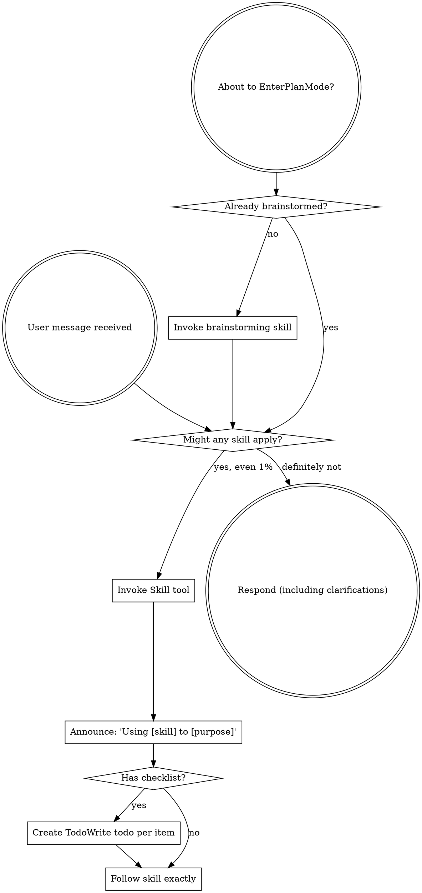

OpenAI Codex v0.128.0 (research preview)
--------
workdir: /Users/houssamr/Projects/syneriva/apps/erp-pos-stabperf
model: gpt-5.5
provider: openai
approval: never
sandbox: workspace-write [workdir, /tmp, $TMPDIR, /Users/houssamr/.codex/memories]
reasoning effort: high
reasoning summaries: none
session id: 019e1bcf-4eb1-7640-8394-f257d736b4c7
--------
user
changes against 'dev'
2026-05-12T10:50:32.453122Z  WARN codex_core_plugins::manifest: ignoring interface.defaultPrompt: prompt must be at most 128 characters path=/Users/houssamr/.codex/.tmp/plugins/plugins/build-ios-apps/.codex-plugin/plugin.json
2026-05-12T10:50:32.453393Z  WARN codex_core_plugins::manifest: ignoring interface.defaultPrompt: maximum of 3 prompts is supported path=/Users/houssamr/.codex/.tmp/plugins/plugins/plugin-eval/.codex-plugin/plugin.json
2026-05-12T10:50:32.456433Z  WARN codex_core_plugins::manifest: ignoring interface.defaultPrompt: maximum of 3 prompts is supported path=/Users/houssamr/.codex/.tmp/plugins/plugins/twilio-developer-kit/.codex-plugin/plugin.json
2026-05-12T10:50:32.456473Z  WARN codex_core_plugins::manifest: ignoring interface.defaultPrompt: maximum of 3 prompts is supported path=/Users/houssamr/.codex/.tmp/plugins/plugins/openai-developers/.codex-plugin/plugin.json
2026-05-12T10:50:36.543762Z  WARN codex_core_plugins::marketplace: skipping marketplace plugin with unsupported source path=/Users/houssamr/.codex/.tmp/marketplaces/.staging/marketplace-upgrade-65R0no/.claude-plugin/marketplace.json plugin="fullstory"
2026-05-12T10:50:36.543922Z  WARN codex_core_plugins::marketplace: skipping marketplace plugin with unsupported source path=/Users/houssamr/.codex/.tmp/marketplaces/.staging/marketplace-upgrade-65R0no/.claude-plugin/marketplace.json plugin="jfrog"
2026-05-12T10:50:36.544278Z  WARN codex_core_plugins::marketplace: skipping invalid marketplace plugin path=/Users/houssamr/.codex/.tmp/marketplaces/.staging/marketplace-upgrade-65R0no/.claude-plugin/marketplace.json marketplace=claude-plugins-official error=invalid plugin name: only ASCII letters, digits, `_`, and `-` are allowed
2026-05-12T10:50:38.089802Z  WARN codex_core_plugins::marketplace: skipping marketplace plugin with unsupported source path=/Users/houssamr/.codex/.tmp/marketplaces/claude-plugins-official/.claude-plugin/marketplace.json plugin="fullstory"
2026-05-12T10:50:38.089928Z  WARN codex_core_plugins::marketplace: skipping marketplace plugin with unsupported source path=/Users/houssamr/.codex/.tmp/marketplaces/claude-plugins-official/.claude-plugin/marketplace.json plugin="jfrog"
2026-05-12T10:50:38.090536Z  WARN codex_core_plugins::marketplace: skipping invalid marketplace plugin path=/Users/houssamr/.codex/.tmp/marketplaces/claude-plugins-official/.claude-plugin/marketplace.json marketplace=claude-plugins-official error=invalid plugin name: only ASCII letters, digits, `_`, and `-` are allowed
2026-05-12T10:50:38.090698Z  WARN codex_core_plugins::marketplace: skipping marketplace plugin that failed to resolve path=/Users/houssamr/.codex/.tmp/marketplaces/ui-ux-pro-max-skill/.claude-plugin/marketplace.json plugin="ui-ux-pro-max" error=invalid marketplace file `/Users/houssamr/.codex/.tmp/marketplaces/ui-ux-pro-max-skill/.claude-plugin/marketplace.json`: local plugin source path must not be empty
2026-05-12T10:50:38.091810Z  WARN codex_core_plugins::manifest: ignoring interface.defaultPrompt: prompt must be at most 128 characters path=/Users/houssamr/.codex/.tmp/plugins/plugins/build-ios-apps/.codex-plugin/plugin.json
2026-05-12T10:50:38.092415Z  WARN codex_core_plugins::manifest: ignoring interface.defaultPrompt: maximum of 3 prompts is supported path=/Users/houssamr/.codex/.tmp/plugins/plugins/plugin-eval/.codex-plugin/plugin.json
2026-05-12T10:50:38.095309Z  WARN codex_core_plugins::manifest: ignoring interface.defaultPrompt: maximum of 3 prompts is supported path=/Users/houssamr/.codex/.tmp/plugins/plugins/twilio-developer-kit/.codex-plugin/plugin.json
2026-05-12T10:50:38.095353Z  WARN codex_core_plugins::manifest: ignoring interface.defaultPrompt: maximum of 3 prompts is supported path=/Users/houssamr/.codex/.tmp/plugins/plugins/openai-developers/.codex-plugin/plugin.json
2026-05-12T10:50:38.117033Z  WARN codex_core_skills::loader: ignoring interface.icon_small: icon path must not contain '..'
2026-05-12T10:50:38.117041Z  WARN codex_core_skills::loader: ignoring interface.icon_large: icon path must not contain '..'
2026-05-12T10:50:38.117931Z  WARN codex_core_skills::loader: ignoring interface.icon_small: icon path must not contain '..'
2026-05-12T10:50:38.117935Z  WARN codex_core_skills::loader: ignoring interface.icon_large: icon path must not contain '..'
2026-05-12T10:50:38.118652Z  WARN codex_core_skills::loader: ignoring interface.icon_small: icon path must not contain '..'
2026-05-12T10:50:38.118685Z  WARN codex_core_skills::loader: ignoring interface.icon_large: icon path must not contain '..'
2026-05-12T10:50:38.119408Z  WARN codex_core_skills::loader: ignoring interface.icon_small: icon path must not contain '..'
2026-05-12T10:50:38.119411Z  WARN codex_core_skills::loader: ignoring interface.icon_large: icon path must not contain '..'
2026-05-12T10:50:38.120138Z  WARN codex_core_skills::loader: ignoring interface.icon_small: icon path must not contain '..'
2026-05-12T10:50:38.120148Z  WARN codex_core_skills::loader: ignoring interface.icon_large: icon path must not contain '..'
2026-05-12T10:50:38.121687Z  WARN codex_core_skills::loader: ignoring interface.icon_small: icon path must not contain '..'
2026-05-12T10:50:38.121696Z  WARN codex_core_skills::loader: ignoring interface.icon_large: icon path must not contain '..'
2026-05-12T10:50:38.704096Z  WARN codex_core_plugins::marketplace: skipping marketplace plugin with unsupported source path=/Users/houssamr/.codex/.tmp/marketplaces/claude-plugins-official/.claude-plugin/marketplace.json plugin="fullstory"
2026-05-12T10:50:38.704308Z  WARN codex_core_plugins::marketplace: skipping marketplace plugin with unsupported source path=/Users/houssamr/.codex/.tmp/marketplaces/claude-plugins-official/.claude-plugin/marketplace.json plugin="jfrog"
2026-05-12T10:50:38.704980Z  WARN codex_core_plugins::marketplace: skipping invalid marketplace plugin path=/Users/houssamr/.codex/.tmp/marketplaces/claude-plugins-official/.claude-plugin/marketplace.json marketplace=claude-plugins-official error=invalid plugin name: only ASCII letters, digits, `_`, and `-` are allowed
2026-05-12T10:50:38.705095Z  WARN codex_core_plugins::marketplace: skipping marketplace plugin that failed to resolve path=/Users/houssamr/.codex/.tmp/marketplaces/ui-ux-pro-max-skill/.claude-plugin/marketplace.json plugin="ui-ux-pro-max" error=invalid marketplace file `/Users/houssamr/.codex/.tmp/marketplaces/ui-ux-pro-max-skill/.claude-plugin/marketplace.json`: local plugin source path must not be empty
2026-05-12T10:50:38.705976Z  WARN codex_core_plugins::manifest: ignoring interface.defaultPrompt: prompt must be at most 128 characters path=/Users/houssamr/.codex/.tmp/plugins/plugins/build-ios-apps/.codex-plugin/plugin.json
2026-05-12T10:50:38.706212Z  WARN codex_core_plugins::manifest: ignoring interface.defaultPrompt: maximum of 3 prompts is supported path=/Users/houssamr/.codex/.tmp/plugins/plugins/plugin-eval/.codex-plugin/plugin.json
2026-05-12T10:50:38.708036Z  WARN codex_core_plugins::manifest: ignoring interface.defaultPrompt: maximum of 3 prompts is supported path=/Users/houssamr/.codex/.tmp/plugins/plugins/twilio-developer-kit/.codex-plugin/plugin.json
2026-05-12T10:50:38.708063Z  WARN codex_core_plugins::manifest: ignoring interface.defaultPrompt: maximum of 3 prompts is supported path=/Users/houssamr/.codex/.tmp/plugins/plugins/openai-developers/.codex-plugin/plugin.json
2026-05-12T10:50:38.724887Z  WARN codex_core_skills::loader: ignoring interface.icon_small: icon path must not contain '..'
2026-05-12T10:50:38.724899Z  WARN codex_core_skills::loader: ignoring interface.icon_large: icon path must not contain '..'
2026-05-12T10:50:38.725751Z  WARN codex_core_skills::loader: ignoring interface.icon_small: icon path must not contain '..'
2026-05-12T10:50:38.725757Z  WARN codex_core_skills::loader: ignoring interface.icon_large: icon path must not contain '..'
2026-05-12T10:50:38.726547Z  WARN codex_core_skills::loader: ignoring interface.icon_small: icon path must not contain '..'
2026-05-12T10:50:38.726561Z  WARN codex_core_skills::loader: ignoring interface.icon_large: icon path must not contain '..'
2026-05-12T10:50:38.727224Z  WARN codex_core_skills::loader: ignoring interface.icon_small: icon path must not contain '..'
2026-05-12T10:50:38.727235Z  WARN codex_core_skills::loader: ignoring interface.icon_large: icon path must not contain '..'
2026-05-12T10:50:38.727873Z  WARN codex_core_skills::loader: ignoring interface.icon_small: icon path must not contain '..'
2026-05-12T10:50:38.727883Z  WARN codex_core_skills::loader: ignoring interface.icon_large: icon path must not contain '..'
2026-05-12T10:50:38.729063Z  WARN codex_core_skills::loader: ignoring interface.icon_small: icon path must not contain '..'
2026-05-12T10:50:38.729071Z  WARN codex_core_skills::loader: ignoring interface.icon_large: icon path must not contain '..'
2026-05-12T10:50:39.486077Z  WARN codex_core_plugins::marketplace: skipping marketplace plugin with unsupported source path=/Users/houssamr/.codex/.tmp/marketplaces/claude-plugins-official/.claude-plugin/marketplace.json plugin="fullstory"
2026-05-12T10:50:39.486300Z  WARN codex_core_plugins::marketplace: skipping marketplace plugin with unsupported source path=/Users/houssamr/.codex/.tmp/marketplaces/claude-plugins-official/.claude-plugin/marketplace.json plugin="jfrog"
2026-05-12T10:50:39.487143Z  WARN codex_core_plugins::marketplace: skipping invalid marketplace plugin path=/Users/houssamr/.codex/.tmp/marketplaces/claude-plugins-official/.claude-plugin/marketplace.json marketplace=claude-plugins-official error=invalid plugin name: only ASCII letters, digits, `_`, and `-` are allowed
2026-05-12T10:50:39.487278Z  WARN codex_core_plugins::marketplace: skipping marketplace plugin that failed to resolve path=/Users/houssamr/.codex/.tmp/marketplaces/ui-ux-pro-max-skill/.claude-plugin/marketplace.json plugin="ui-ux-pro-max" error=invalid marketplace file `/Users/houssamr/.codex/.tmp/marketplaces/ui-ux-pro-max-skill/.claude-plugin/marketplace.json`: local plugin source path must not be empty
2026-05-12T10:50:39.488826Z  WARN codex_core_plugins::manifest: ignoring interface.defaultPrompt: prompt must be at most 128 characters path=/Users/houssamr/.codex/.tmp/plugins/plugins/build-ios-apps/.codex-plugin/plugin.json
2026-05-12T10:50:39.489413Z  WARN codex_core_plugins::manifest: ignoring interface.defaultPrompt: maximum of 3 prompts is supported path=/Users/houssamr/.codex/.tmp/plugins/plugins/plugin-eval/.codex-plugin/plugin.json
2026-05-12T10:50:39.491633Z  WARN codex_core_plugins::manifest: ignoring interface.defaultPrompt: maximum of 3 prompts is supported path=/Users/houssamr/.codex/.tmp/plugins/plugins/twilio-developer-kit/.codex-plugin/plugin.json
2026-05-12T10:50:39.491667Z  WARN codex_core_plugins::manifest: ignoring interface.defaultPrompt: maximum of 3 prompts is supported path=/Users/houssamr/.codex/.tmp/plugins/plugins/openai-developers/.codex-plugin/plugin.json
2026-05-12T10:50:39.510182Z  WARN codex_core_skills::loader: ignoring interface.icon_small: icon path must not contain '..'
2026-05-12T10:50:39.510194Z  WARN codex_core_skills::loader: ignoring interface.icon_large: icon path must not contain '..'
2026-05-12T10:50:39.511043Z  WARN codex_core_skills::loader: ignoring interface.icon_small: icon path must not contain '..'
2026-05-12T10:50:39.511054Z  WARN codex_core_skills::loader: ignoring interface.icon_large: icon path must not contain '..'
2026-05-12T10:50:39.511764Z  WARN codex_core_skills::loader: ignoring interface.icon_small: icon path must not contain '..'
2026-05-12T10:50:39.511771Z  WARN codex_core_skills::loader: ignoring interface.icon_large: icon path must not contain '..'
2026-05-12T10:50:39.512424Z  WARN codex_core_skills::loader: ignoring interface.icon_small: icon path must not contain '..'
2026-05-12T10:50:39.512431Z  WARN codex_core_skills::loader: ignoring interface.icon_large: icon path must not contain '..'
2026-05-12T10:50:39.513171Z  WARN codex_core_skills::loader: ignoring interface.icon_small: icon path must not contain '..'
2026-05-12T10:50:39.513180Z  WARN codex_core_skills::loader: ignoring interface.icon_large: icon path must not contain '..'
2026-05-12T10:50:39.514423Z  WARN codex_core_skills::loader: ignoring interface.icon_small: icon path must not contain '..'
2026-05-12T10:50:39.514433Z  WARN codex_core_skills::loader: ignoring interface.icon_large: icon path must not contain '..'
2026-05-12T10:50:43.158929Z  WARN codex_core_plugins::marketplace: skipping marketplace plugin that failed to resolve path=/Users/houssamr/.codex/.tmp/marketplaces/.staging/marketplace-upgrade-5itR71/.claude-plugin/marketplace.json plugin="ui-ux-pro-max" error=invalid marketplace file `/Users/houssamr/.codex/.tmp/marketplaces/.staging/marketplace-upgrade-5itR71/.claude-plugin/marketplace.json`: local plugin source path must not be empty
2026-05-12T10:50:43.188197Z  WARN codex_core_plugins::marketplace: skipping marketplace plugin with unsupported source path=/Users/houssamr/.codex/.tmp/marketplaces/claude-plugins-official/.claude-plugin/marketplace.json plugin="fullstory"
2026-05-12T10:50:43.188604Z  WARN codex_core_plugins::marketplace: skipping marketplace plugin with unsupported source path=/Users/houssamr/.codex/.tmp/marketplaces/claude-plugins-official/.claude-plugin/marketplace.json plugin="jfrog"
2026-05-12T10:50:43.189493Z  WARN codex_core_plugins::marketplace: skipping invalid marketplace plugin path=/Users/houssamr/.codex/.tmp/marketplaces/claude-plugins-official/.claude-plugin/marketplace.json marketplace=claude-plugins-official error=invalid plugin name: only ASCII letters, digits, `_`, and `-` are allowed
2026-05-12T10:50:43.189654Z  WARN codex_core_plugins::marketplace: skipping marketplace plugin that failed to resolve path=/Users/houssamr/.codex/.tmp/marketplaces/ui-ux-pro-max-skill/.claude-plugin/marketplace.json plugin="ui-ux-pro-max" error=invalid marketplace file `/Users/houssamr/.codex/.tmp/marketplaces/ui-ux-pro-max-skill/.claude-plugin/marketplace.json`: local plugin source path must not be empty
2026-05-12T10:50:43.189850Z  WARN codex_core_plugins::loader: configured non-curated plugin no longer exists in discovered marketplaces during cache refresh plugin="browser-use" marketplace="openai-bundled"
2026-05-12T10:50:43.198668Z  WARN codex_core_plugins::loader: configured non-curated plugin no longer exists in discovered marketplaces during cache refresh plugin="documents" marketplace="openai-primary-runtime"
2026-05-12T10:50:43.200824Z  WARN codex_core_plugins::loader: configured non-curated plugin no longer exists in discovered marketplaces during cache refresh plugin="presentations" marketplace="openai-primary-runtime"
2026-05-12T10:50:43.200830Z  WARN codex_core_plugins::loader: configured non-curated plugin no longer exists in discovered marketplaces during cache refresh plugin="spreadsheets" marketplace="openai-primary-runtime"
2026-05-12T10:50:49.520922Z  WARN codex_otel::events::session_telemetry: metrics counter [codex.skill.injected] failed: tag value contains invalid characters: superpowers:using-superpowers
exec
/bin/zsh -lc "cat /Users/houssamr/.codex/plugins/cache/claude-plugins-official/superpowers/5.1.0/skills/using-superpowers/SKILL.md && printf '\\n---REQUESTING REVIEW---\\n' && cat /Users/houssamr/.codex/plugins/cache/claude-plugins-official/superpowers/5.1.0/skills/requesting-code-review/SKILL.md" in /Users/houssamr/Projects/syneriva/apps/erp-pos-stabperf
 succeeded in 0ms:
---
name: using-superpowers
description: Use when starting any conversation - establishes how to find and use skills, requiring Skill tool invocation before ANY response including clarifying questions
---

<SUBAGENT-STOP>
If you were dispatched as a subagent to execute a specific task, skip this skill.
</SUBAGENT-STOP>

<EXTREMELY-IMPORTANT>
If you think there is even a 1% chance a skill might apply to what you are doing, you ABSOLUTELY MUST invoke the skill.

IF A SKILL APPLIES TO YOUR TASK, YOU DO NOT HAVE A CHOICE. YOU MUST USE IT.

This is not negotiable. This is not optional. You cannot rationalize your way out of this.
</EXTREMELY-IMPORTANT>

## Instruction Priority

Superpowers skills override default system prompt behavior, but **user instructions always take precedence**:

1. **User's explicit instructions** (CLAUDE.md, GEMINI.md, AGENTS.md, direct requests) — highest priority
2. **Superpowers skills** — override default system behavior where they conflict
3. **Default system prompt** — lowest priority

If CLAUDE.md, GEMINI.md, or AGENTS.md says "don't use TDD" and a skill says "always use TDD," follow the user's instructions. The user is in control.

## How to Access Skills

**In Claude Code:** Use the `Skill` tool. When you invoke a skill, its content is loaded and presented to you—follow it directly. Never use the Read tool on skill files.

**In Copilot CLI:** Use the `skill` tool. Skills are auto-discovered from installed plugins. The `skill` tool works the same as Claude Code's `Skill` tool.

**In Gemini CLI:** Skills activate via the `activate_skill` tool. Gemini loads skill metadata at session start and activates the full content on demand.

**In other environments:** Check your platform's documentation for how skills are loaded.

## Platform Adaptation

Skills use Claude Code tool names. Non-CC platforms: see `references/copilot-tools.md` (Copilot CLI), `references/codex-tools.md` (Codex) for tool equivalents. Gemini CLI users get the tool mapping loaded automatically via GEMINI.md.

# Using Skills

## The Rule

**Invoke relevant or requested skills BEFORE any response or action.** Even a 1% chance a skill might apply means that you should invoke the skill to check. If an invoked skill turns out to be wrong for the situation, you don't need to use it.



## Red Flags

These thoughts mean STOP—you're rationalizing:

| Thought | Reality |
|---------|---------|
| "This is just a simple question" | Questions are tasks. Check for skills. |
| "I need more context first" | Skill check comes BEFORE clarifying questions. |
| "Let me explore the codebase first" | Skills tell you HOW to explore. Check first. |
| "I can check git/files quickly" | Files lack conversation context. Check for skills. |
| "Let me gather information first" | Skills tell you HOW to gather information. |
| "This doesn't need a formal skill" | If a skill exists, use it. |
| "I remember this skill" | Skills evolve. Read current version. |
| "This doesn't count as a task" | Action = task. Check for skills. |
| "The skill is overkill" | Simple things become complex. Use it. |
| "I'll just do this one thing first" | Check BEFORE doing anything. |
| "This feels productive" | Undisciplined action wastes time. Skills prevent this. |
| "I know what that means" | Knowing the concept ≠ using the skill. Invoke it. |

## Skill Priority

When multiple skills could apply, use this order:

1. **Process skills first** (brainstorming, debugging) - these determine HOW to approach the task
2. **Implementation skills second** (frontend-design, mcp-builder) - these guide execution

"Let's build X" → brainstorming first, then implementation skills.
"Fix this bug" → debugging first, then domain-specific skills.

## Skill Types

**Rigid** (TDD, debugging): Follow exactly. Don't adapt away discipline.

**Flexible** (patterns): Adapt principles to context.

The skill itself tells you which.

## User Instructions

Instructions say WHAT, not HOW. "Add X" or "Fix Y" doesn't mean skip workflows.

---REQUESTING REVIEW---
---
name: requesting-code-review
description: Use when completing tasks, implementing major features, or before merging to verify work meets requirements
---

# Requesting Code Review

Dispatch a code reviewer subagent to catch issues before they cascade. The reviewer gets precisely crafted context for evaluation — never your session's history. This keeps the reviewer focused on the work product, not your thought process, and preserves your own context for continued work.

**Core principle:** Review early, review often.

## When to Request Review

**Mandatory:**
- After each task in subagent-driven development
- After completing major feature
- Before merge to main

**Optional but valuable:**
- When stuck (fresh perspective)
- Before refactoring (baseline check)
- After fixing complex bug

## How to Request

**1. Get git SHAs:**
```bash
BASE_SHA=$(git rev-parse HEAD~1)  # or origin/main
HEAD_SHA=$(git rev-parse HEAD)
```

**2. Dispatch code reviewer subagent:**

Use Task tool with `general-purpose` type, fill template at `code-reviewer.md`

**Placeholders:**
- `{DESCRIPTION}` - Brief summary of what you built
- `{PLAN_OR_REQUIREMENTS}` - What it should do
- `{BASE_SHA}` - Starting commit
- `{HEAD_SHA}` - Ending commit

**3. Act on feedback:**
- Fix Critical issues immediately
- Fix Important issues before proceeding
- Note Minor issues for later
- Push back if reviewer is wrong (with reasoning)

## Example

```
[Just completed Task 2: Add verification function]

You: Let me request code review before proceeding.

BASE_SHA=$(git log --oneline | grep "Task 1" | head -1 | awk '{print $1}')
HEAD_SHA=$(git rev-parse HEAD)

[Dispatch code reviewer subagent]
  DESCRIPTION: Added verifyIndex() and repairIndex() with 4 issue types
  PLAN_OR_REQUIREMENTS: Task 2 from docs/superpowers/plans/deployment-plan.md
  BASE_SHA: a7981ec
  HEAD_SHA: 3df7661

[Subagent returns]:
  Strengths: Clean architecture, real tests
  Issues:
    Important: Missing progress indicators
    Minor: Magic number (100) for reporting interval
  Assessment: Ready to proceed

You: [Fix progress indicators]
[Continue to Task 3]
```

## Integration with Workflows

**Subagent-Driven Development:**
- Review after EACH task
- Catch issues before they compound
- Fix before moving to next task

**Executing Plans:**
- Review after each task or at natural checkpoints
- Get feedback, apply, continue

**Ad-Hoc Development:**
- Review before merge
- Review when stuck

## Red Flags

**Never:**
- Skip review because "it's simple"
- Ignore Critical issues
- Proceed with unfixed Important issues
- Argue with valid technical feedback

**If reviewer wrong:**
- Push back with technical reasoning
- Show code/tests that prove it works
- Request clarification

See template at: requesting-code-review/code-reviewer.md

2026-05-12T10:50:49.611129Z  WARN codex_protocol::openai_models: Model personality requested but model_messages is missing, falling back to base instructions. model=gpt-5.5 personality=pragmatic
2026-05-12T10:50:49.667542Z  WARN codex_core_plugins::marketplace: skipping marketplace plugin with unsupported source path=/Users/houssamr/.codex/.tmp/marketplaces/claude-plugins-official/.claude-plugin/marketplace.json plugin="fullstory"
2026-05-12T10:50:49.667660Z  WARN codex_core_plugins::marketplace: skipping marketplace plugin with unsupported source path=/Users/houssamr/.codex/.tmp/marketplaces/claude-plugins-official/.claude-plugin/marketplace.json plugin="jfrog"
2026-05-12T10:50:49.668025Z  WARN codex_core_plugins::marketplace: skipping invalid marketplace plugin path=/Users/houssamr/.codex/.tmp/marketplaces/claude-plugins-official/.claude-plugin/marketplace.json marketplace=claude-plugins-official error=invalid plugin name: only ASCII letters, digits, `_`, and `-` are allowed
2026-05-12T10:50:49.668088Z  WARN codex_core_plugins::marketplace: skipping marketplace plugin that failed to resolve path=/Users/houssamr/.codex/.tmp/marketplaces/ui-ux-pro-max-skill/.claude-plugin/marketplace.json plugin="ui-ux-pro-max" error=invalid marketplace file `/Users/houssamr/.codex/.tmp/marketplaces/ui-ux-pro-max-skill/.claude-plugin/marketplace.json`: local plugin source path must not be empty
2026-05-12T10:50:49.673088Z  WARN codex_core_plugins::manifest: ignoring interface.defaultPrompt: prompt must be at most 128 characters path=/Users/houssamr/.codex/.tmp/plugins/plugins/build-ios-apps/.codex-plugin/plugin.json
2026-05-12T10:50:49.675217Z  WARN codex_core_plugins::manifest: ignoring interface.defaultPrompt: maximum of 3 prompts is supported path=/Users/houssamr/.codex/.tmp/plugins/plugins/plugin-eval/.codex-plugin/plugin.json
2026-05-12T10:50:49.692326Z  WARN codex_core_plugins::manifest: ignoring interface.defaultPrompt: maximum of 3 prompts is supported path=/Users/houssamr/.codex/.tmp/plugins/plugins/twilio-developer-kit/.codex-plugin/plugin.json
2026-05-12T10:50:49.692477Z  WARN codex_core_plugins::manifest: ignoring interface.defaultPrompt: maximum of 3 prompts is supported path=/Users/houssamr/.codex/.tmp/plugins/plugins/openai-developers/.codex-plugin/plugin.json
2026-05-12T10:50:49.711271Z  WARN codex_core_skills::loader: ignoring interface.icon_small: icon path must not contain '..'
2026-05-12T10:50:49.711275Z  WARN codex_core_skills::loader: ignoring interface.icon_large: icon path must not contain '..'
2026-05-12T10:50:49.711934Z  WARN codex_core_skills::loader: ignoring interface.icon_small: icon path must not contain '..'
2026-05-12T10:50:49.711943Z  WARN codex_core_skills::loader: ignoring interface.icon_large: icon path must not contain '..'
2026-05-12T10:50:49.712644Z  WARN codex_core_skills::loader: ignoring interface.icon_small: icon path must not contain '..'
2026-05-12T10:50:49.712649Z  WARN codex_core_skills::loader: ignoring interface.icon_large: icon path must not contain '..'
2026-05-12T10:50:49.713314Z  WARN codex_core_skills::loader: ignoring interface.icon_small: icon path must not contain '..'
2026-05-12T10:50:49.713319Z  WARN codex_core_skills::loader: ignoring interface.icon_large: icon path must not contain '..'
2026-05-12T10:50:49.713956Z  WARN codex_core_skills::loader: ignoring interface.icon_small: icon path must not contain '..'
2026-05-12T10:50:49.713963Z  WARN codex_core_skills::loader: ignoring interface.icon_large: icon path must not contain '..'
2026-05-12T10:50:49.715460Z  WARN codex_core_skills::loader: ignoring interface.icon_small: icon path must not contain '..'
2026-05-12T10:50:49.715468Z  WARN codex_core_skills::loader: ignoring interface.icon_large: icon path must not contain '..'
exec
/bin/zsh -lc 'git status --short && git diff --stat 03c6832aea7f8be6c384a806ddb43db39ab944e3 && git diff --name-only 03c6832aea7f8be6c384a806ddb43db39ab944e3' in /Users/houssamr/Projects/syneriva/apps/erp-pos-stabperf
 succeeded in 0ms:
M  apps/api/app/Modules/POS/Application/Services/ReportGenerationService.php
MM apps/api/app/Modules/POS/Presentation/Controllers/ZReportSyncController.php
A  apps/api/tests/Feature/POS/ServerSideZReportOverTenderTest.php
MM apps/api/tests/Feature/POS/ZReportSyncControllerSchema2Test.php
M  apps/pos/src/api/reportApi.ts
M  apps/pos/src/lib/sync/__tests__/syncService.test.ts
?? docs/superpowers/reviews/2026-05-12-pos-go-live-pr1-codex-review-round1.md
?? docs/superpowers/reviews/2026-05-12-pos-go-live-pr1-codex-review-round2.md
?? docs/superpowers/reviews/2026-05-12-pos-go-live-pr1-codex-review-round3.md
 .../Services/ReportGenerationService.php           |  52 +++++++-
 .../Controllers/ZReportSyncController.php          | 129 ++++++++++++-------
 .../POS/ServerSideZReportOverTenderTest.php        | 142 +++++++++++++++++++++
 .../POS/ZReportSyncControllerSchema2Test.php       | 123 +++++++++++++++---
 apps/pos/src/api/reportApi.ts                      |   7 +-
 .../pos/src/lib/sync/__tests__/syncService.test.ts |  11 ++
 6 files changed, 398 insertions(+), 66 deletions(-)
apps/api/app/Modules/POS/Application/Services/ReportGenerationService.php
apps/api/app/Modules/POS/Presentation/Controllers/ZReportSyncController.php
apps/api/tests/Feature/POS/ServerSideZReportOverTenderTest.php
apps/api/tests/Feature/POS/ZReportSyncControllerSchema2Test.php
apps/pos/src/api/reportApi.ts
apps/pos/src/lib/sync/__tests__/syncService.test.ts

2026-05-12T10:50:55.718665Z  WARN codex_protocol::openai_models: Model personality requested but model_messages is missing, falling back to base instructions. model=gpt-5.5 personality=pragmatic
2026-05-12T10:50:55.755907Z  WARN codex_core_plugins::marketplace: skipping marketplace plugin with unsupported source path=/Users/houssamr/.codex/.tmp/marketplaces/claude-plugins-official/.claude-plugin/marketplace.json plugin="fullstory"
2026-05-12T10:50:55.756137Z  WARN codex_core_plugins::marketplace: skipping marketplace plugin with unsupported source path=/Users/houssamr/.codex/.tmp/marketplaces/claude-plugins-official/.claude-plugin/marketplace.json plugin="jfrog"
2026-05-12T10:50:55.756930Z  WARN codex_core_plugins::marketplace: skipping invalid marketplace plugin path=/Users/houssamr/.codex/.tmp/marketplaces/claude-plugins-official/.claude-plugin/marketplace.json marketplace=claude-plugins-official error=invalid plugin name: only ASCII letters, digits, `_`, and `-` are allowed
2026-05-12T10:50:55.757053Z  WARN codex_core_plugins::marketplace: skipping marketplace plugin that failed to resolve path=/Users/houssamr/.codex/.tmp/marketplaces/ui-ux-pro-max-skill/.claude-plugin/marketplace.json plugin="ui-ux-pro-max" error=invalid marketplace file `/Users/houssamr/.codex/.tmp/marketplaces/ui-ux-pro-max-skill/.claude-plugin/marketplace.json`: local plugin source path must not be empty
2026-05-12T10:50:55.758002Z  WARN codex_core_plugins::manifest: ignoring interface.defaultPrompt: prompt must be at most 128 characters path=/Users/houssamr/.codex/.tmp/plugins/plugins/build-ios-apps/.codex-plugin/plugin.json
2026-05-12T10:50:55.758379Z  WARN codex_core_plugins::manifest: ignoring interface.defaultPrompt: maximum of 3 prompts is supported path=/Users/houssamr/.codex/.tmp/plugins/plugins/plugin-eval/.codex-plugin/plugin.json
2026-05-12T10:50:55.762372Z  WARN codex_core_plugins::manifest: ignoring interface.defaultPrompt: maximum of 3 prompts is supported path=/Users/houssamr/.codex/.tmp/plugins/plugins/twilio-developer-kit/.codex-plugin/plugin.json
2026-05-12T10:50:55.762439Z  WARN codex_core_plugins::manifest: ignoring interface.defaultPrompt: maximum of 3 prompts is supported path=/Users/houssamr/.codex/.tmp/plugins/plugins/openai-developers/.codex-plugin/plugin.json
2026-05-12T10:50:55.780314Z  WARN codex_core_skills::loader: ignoring interface.icon_small: icon path must not contain '..'
2026-05-12T10:50:55.780326Z  WARN codex_core_skills::loader: ignoring interface.icon_large: icon path must not contain '..'
2026-05-12T10:50:55.781015Z  WARN codex_core_skills::loader: ignoring interface.icon_small: icon path must not contain '..'
2026-05-12T10:50:55.781025Z  WARN codex_core_skills::loader: ignoring interface.icon_large: icon path must not contain '..'
2026-05-12T10:50:55.781726Z  WARN codex_core_skills::loader: ignoring interface.icon_small: icon path must not contain '..'
2026-05-12T10:50:55.781732Z  WARN codex_core_skills::loader: ignoring interface.icon_large: icon path must not contain '..'
2026-05-12T10:50:55.782423Z  WARN codex_core_skills::loader: ignoring interface.icon_small: icon path must not contain '..'
2026-05-12T10:50:55.782429Z  WARN codex_core_skills::loader: ignoring interface.icon_large: icon path must not contain '..'
2026-05-12T10:50:55.783076Z  WARN codex_core_skills::loader: ignoring interface.icon_small: icon path must not contain '..'
2026-05-12T10:50:55.783082Z  WARN codex_core_skills::loader: ignoring interface.icon_large: icon path must not contain '..'
2026-05-12T10:50:55.784441Z  WARN codex_core_skills::loader: ignoring interface.icon_small: icon path must not contain '..'
2026-05-12T10:50:55.784447Z  WARN codex_core_skills::loader: ignoring interface.icon_large: icon path must not contain '..'
exec
/bin/zsh -lc 'git diff 03c6832aea7f8be6c384a806ddb43db39ab944e3 -- apps/api/app/Modules/POS/Application/Services/ReportGenerationService.php apps/api/app/Modules/POS/Presentation/Controllers/ZReportSyncController.php apps/pos/src/api/reportApi.ts apps/pos/src/lib/sync/__tests__/syncService.test.ts' in /Users/houssamr/Projects/syneriva/apps/erp-pos-stabperf
 succeeded in 0ms:
diff --git a/apps/api/app/Modules/POS/Application/Services/ReportGenerationService.php b/apps/api/app/Modules/POS/Application/Services/ReportGenerationService.php
index 900406ab..62bad73a 100644
--- a/apps/api/app/Modules/POS/Application/Services/ReportGenerationService.php
+++ b/apps/api/app/Modules/POS/Application/Services/ReportGenerationService.php
@@ -471,6 +471,7 @@ private function resolveCurrencyCode(Terminal $terminal): string
 
     /**
      * Sum receipt_payments.amount for the shift, grouped by payment_method_id.
+     * Cash methods subtract receipt change_due once per receipt to mirror the POS device formula.
      * Always includes a row for every payment_method_id in $inputs (defaulting to '0.0000').
      *
      * Shift window driven by pos_receipts.posted_at — see REALIGNMENT-LOG 2026-04-26.
@@ -496,6 +497,34 @@ private function buildExpectedPerMethod(Shift $shift, array $inputs): array
             ->groupBy('pos_receipt_payments.payment_method_id')
             ->get();
 
+        $cashReceiptChanges = DB::query()
+            ->fromSub(
+                DB::table('pos_receipt_payments')
+                    ->join('pos_receipts', 'pos_receipt_payments.receipt_id', '=', 'pos_receipts.id')
+                    ->leftJoin('payment_methods', 'pos_receipt_payments.payment_method_id', '=', 'payment_methods.id')
+                    ->where('pos_receipts.terminal_id', $shift->terminal_id)
+                    ->where('pos_receipts.fiscal_status', FiscalStatus::Fiscalized->value)
+                    ->where('pos_receipts.is_voided', false)
+                    ->where('pos_receipts.is_training', false)
+                    ->whereBetween('pos_receipts.posted_at', [$shift->opened_at, now()])
+                    ->where(function ($query): void {
+                        $query->whereRaw('UPPER(pos_receipt_payments.payment_method_code) = ?', ['CASH'])
+                            ->orWhere(function ($legacy): void {
+                                $legacy->where(function ($snapshot): void {
+                                    $snapshot->whereNull('pos_receipt_payments.payment_method_code')
+                                        ->orWhere('pos_receipt_payments.payment_method_code', '');
+                                })->whereRaw('UPPER(payment_methods.code) = ?', ['CASH']);
+                            });
+                    })
+                    ->selectRaw('pos_receipt_payments.payment_method_id as payment_method_id, pos_receipts.id as receipt_id, MAX(COALESCE(pos_receipts.change_due, 0)) as change_due')
+                    ->groupBy('pos_receipt_payments.payment_method_id', 'pos_receipts.id'),
+                'cash_receipt_changes',
+            )
+            ->selectRaw('payment_method_id, SUM(change_due) as total_change_due')
+            ->groupBy('payment_method_id')
+            ->get()
+            ->keyBy('payment_method_id');
+
         foreach ($rows as $row) {
             /** @var string $pmId */
             $pmId = $row->payment_method_id;
@@ -503,7 +532,16 @@ private function buildExpectedPerMethod(Shift $shift, array $inputs): array
             $rawTotal = $row->total;
             /** @var numeric-string $totalString */
             $totalString = (string) ($rawTotal ?? '0');
-            $totals[$pmId] = bcadd($totalString, '0', $scale);
+            $total = bcadd($totalString, '0', $scale);
+
+            $changeRow = $cashReceiptChanges->get($pmId);
+            if ($changeRow !== null) {
+                /** @var string|float|int|null $rawChangeDue */
+                $rawChangeDue = $changeRow->total_change_due;
+                $total = bcsub($total, $this->normaliseNumericString($rawChangeDue), $scale);
+            }
+
+            $totals[$pmId] = $total;
         }
 
         // Ensure every input has an entry (default '0.0000' if no receipts yet for that method).
@@ -516,6 +554,18 @@ private function buildExpectedPerMethod(Shift $shift, array $inputs): array
         return $totals;
     }
 
+    /**
+     * @return numeric-string
+     */
+    private function normaliseNumericString(string|int|float|null $value): string
+    {
+        if (! is_numeric($value)) {
+            return '0';
+        }
+
+        return (string) $value;
+    }
+
     /**
      * Count receipt_payments rows for the shift, grouped by payment_method_id.
      * Used to populate CashCountBreakdownDTO::transactionCount, which validation seeds with 0.
diff --git a/apps/api/app/Modules/POS/Presentation/Controllers/ZReportSyncController.php b/apps/api/app/Modules/POS/Presentation/Controllers/ZReportSyncController.php
index 2716575c..7ee4e245 100644
--- a/apps/api/app/Modules/POS/Presentation/Controllers/ZReportSyncController.php
+++ b/apps/api/app/Modules/POS/Presentation/Controllers/ZReportSyncController.php
@@ -76,12 +76,18 @@ public function sync(Request $request): JsonResponse
 
             // ── Schema v2 fields ──────────────────────────────────────────────
             'cash_counts' => ['sometimes', 'array'],
-            'cash_counts.*.payment_method_id' => ['required_with:cash_counts', 'uuid'],
+            'cash_counts.*.payment_method_id' => ['required', 'uuid'],
             'cash_counts.*.denomination_id' => ['sometimes', 'nullable', 'uuid'],
-            'cash_counts.*.counted_quantity' => ['required_with:cash_counts', 'integer', 'min:0'],
-            'cash_counts.*.counted_amount' => ['required_with:cash_counts', 'string'],
+            'cash_counts.*.counted_quantity' => ['sometimes', 'integer', 'min:0'],
+            'cash_counts.*.counted_amount' => ['sometimes', 'string'],
             'cash_counts.*.denomination_name' => ['sometimes', 'nullable', 'string'],
             'cash_counts.*.denomination_value' => ['sometimes', 'nullable', 'string'],
+            'cash_counts.*.currency_code' => ['required', 'string', 'size:3'],
+            'cash_counts.*.expected_amount' => ['required', 'regex:/^\d+(?:\.\d{1,4})?$/'],
+            'cash_counts.*.actual_amount' => ['required', 'regex:/^\d+(?:\.\d{1,4})?$/'],
+            'cash_counts.*.variance_amount' => ['required', 'regex:/^-?\d+(?:\.\d{1,4})?$/'],
+            'cash_counts.*.variance_direction' => ['required', 'string', Rule::in(['over', 'under', 'balanced'])],
+            'cash_counts.*.transaction_count' => ['required', 'integer', 'min:0'],
 
             'shift_fields' => ['sometimes', 'nullable', 'array'],
             'shift_fields.variance_reason' => ['sometimes', 'nullable', 'string'],
@@ -99,6 +105,21 @@ public function sync(Request $request): JsonResponse
 
         $companyId = $this->companyContext->getCompanyId();
 
+        /** @var array<int, array<string, mixed>> $cashCountsForValidation */
+        $cashCountsForValidation = isset($validated['cash_counts']) && is_array($validated['cash_counts'])
+            ? $validated['cash_counts']
+            : [];
+        $cashCountErrors = $this->validateCashCountBreakdownArithmetic($cashCountsForValidation);
+        if ($cashCountErrors !== []) {
+            return response()->json([
+                'error' => [
+                    'code' => 'VALIDATION_ERROR',
+                    'message' => 'The synced cash-count breakdown is internally inconsistent.',
+                    'errors' => $cashCountErrors,
+                ],
+            ], 422);
+        }
+
         // Verify terminal belongs to company
         /** @var Terminal $terminal */
         $terminal = Terminal::where('company_id', $companyId)
@@ -213,62 +234,82 @@ public function sync(Request $request): JsonResponse
     }
 
     /**
-     * Aggregate denomination-level cash_counts by payment_method_id and build
-     * CashCountBreakdownDTO instances that the repository can persist.
-     *
-     * Because the sync payload only carries the counted (actual) amount —
-     * the expected amount is not transmitted as a separate per-method figure —
-     * we store expected_amount = 0.0000 and derive variance = actual - 0.
-     * The DB CHECK constraint (variance_amount = actual_amount - expected_amount)
-     * is satisfied when expected_amount = 0 and variance_amount = actual_amount.
+     * Build CashCountBreakdownDTO instances from the POS-device Z-report payload.
+     * The offline POS is the source of truth for this path, so the server archives
+     * each per-method breakdown verbatim instead of recomputing expected/variance.
      *
      * @param  array<int, array<string, mixed>>  $cashCounts
      * @return array<int, CashCountBreakdownDTO>
      */
     private function buildBreakdownsFromSyncPayload(array $cashCounts): array
     {
-        /** @var array<string, array{amount: numeric-string, qty: int}> $perMethod */
-        $perMethod = [];
+        $breakdowns = [];
 
         foreach ($cashCounts as $entry) {
-            $methodId = (string) $entry['payment_method_id'];
-            /** @var numeric-string $rawAmount */
-            $rawAmount = is_numeric($entry['counted_amount'] ?? '0')
-                ? (string) ($entry['counted_amount'] ?? '0')
-                : '0';
-            $qty = (int) ($entry['counted_quantity'] ?? 0);
-
-            if (! isset($perMethod[$methodId])) {
-                $perMethod[$methodId] = ['amount' => '0.0000', 'qty' => 0];
-            }
+            $expectedAmount = $this->normaliseNumericString($entry['expected_amount'] ?? null);
+            $actualAmount = $this->normaliseNumericString($entry['actual_amount'] ?? null);
+            $varianceAmount = $this->normaliseNumericString($entry['variance_amount'] ?? null);
 
-            /** @var numeric-string $runningAmount */
-            $runningAmount = $perMethod[$methodId]['amount'];
-            $perMethod[$methodId]['amount'] = bcadd($runningAmount, $rawAmount, 4);
-            $perMethod[$methodId]['qty'] += $qty;
+            $breakdowns[] = new CashCountBreakdownDTO(
+                paymentMethodId: (string) $entry['payment_method_id'],
+                currencyCode: (string) $entry['currency_code'],
+                expectedAmount: bcadd($expectedAmount, '0', 4),
+                actualAmount: bcadd($actualAmount, '0', 4),
+                varianceAmount: bcadd($varianceAmount, '0', 4),
+                varianceDirection: VarianceDirection::from((string) $entry['variance_direction']),
+                transactionCount: (int) $entry['transaction_count'],
+            );
         }
 
-        $breakdowns = [];
+        return $breakdowns;
+    }
+
+    /**
+     * @param  array<int, array<string, mixed>>  $cashCounts
+     * @return array<string, list<string>>
+     */
+    private function validateCashCountBreakdownArithmetic(array $cashCounts): array
+    {
+        $errors = [];
+
+        foreach ($cashCounts as $index => $entry) {
+            $expectedAmount = $this->normaliseNumericString($entry['expected_amount'] ?? null);
+            $actualAmount = $this->normaliseNumericString($entry['actual_amount'] ?? null);
+            $varianceAmount = $this->normaliseNumericString($entry['variance_amount'] ?? null);
+            $calculatedVariance = bcsub($actualAmount, $expectedAmount, 4);
+            $normalisedVariance = bcadd($varianceAmount, '0', 4);
+
+            if (bccomp($calculatedVariance, $normalisedVariance, 4) !== 0) {
+                $errors["cash_counts.{$index}.variance_amount"] = [
+                    'The variance_amount must equal actual_amount minus expected_amount.',
+                ];
+            }
 
-        foreach ($perMethod as $methodId => $totals) {
-            /** @var numeric-string $actualAmount */
-            $actualAmount = $totals['amount'];
-            $expectedAmount = '0.0000';
-            // variance = actual - expected = actual - 0 (satisfies DB CHECK)
-            $varianceAmount = $actualAmount;
+            $direction = is_string($entry['variance_direction'] ?? null)
+                ? $entry['variance_direction']
+                : '';
+            $expectedDirection = VarianceDirection::fromSignedAmount($calculatedVariance)->value;
 
-            $breakdowns[] = new CashCountBreakdownDTO(
-                paymentMethodId: $methodId,
-                currencyCode: 'XXX', // currency not transmitted per-method in sync payload
-                expectedAmount: $expectedAmount,
-                actualAmount: $actualAmount,
-                varianceAmount: $varianceAmount,
-                varianceDirection: VarianceDirection::fromSignedAmount($varianceAmount),
-                transactionCount: $totals['qty'],
-            );
+            if ($direction !== $expectedDirection) {
+                $errors["cash_counts.{$index}.variance_direction"] = [
+                    'The variance_direction must match the sign of actual_amount minus expected_amount.',
+                ];
+            }
         }
 
-        return $breakdowns;
+        return $errors;
+    }
+
+    /**
+     * @return numeric-string
+     */
+    private function normaliseNumericString(string|int|float|null $value): string
+    {
+        if (! is_numeric($value)) {
+            return '0';
+        }
+
+        return (string) $value;
     }
 
     /**
diff --git a/apps/pos/src/api/reportApi.ts b/apps/pos/src/api/reportApi.ts
index 0b63793d..5eb096c9 100644
--- a/apps/pos/src/api/reportApi.ts
+++ b/apps/pos/src/api/reportApi.ts
@@ -196,7 +196,12 @@ function localZReportToResponse(report: LocalZReport, decimals: number): ZReport
   };
 }
 
-/** Server-only Z-report generation (for admin dashboard fallback). */
+/**
+ * Server-only Z-report generation for admin/tooling fallback.
+ *
+ * @deprecated POS close is offline-first. Keep this helper out of the cashier close path;
+ * web admin still uses the backend route through apps/web.
+ */
 export async function generateZReportServer(terminalId: string): Promise<ZReportResponse> {
   return apiPost<ZReportResponse>('/pos/reports/z', { terminal_id: terminalId });
 }
diff --git a/apps/pos/src/lib/sync/__tests__/syncService.test.ts b/apps/pos/src/lib/sync/__tests__/syncService.test.ts
index 09f6696e..26c1c636 100644
--- a/apps/pos/src/lib/sync/__tests__/syncService.test.ts
+++ b/apps/pos/src/lib/sync/__tests__/syncService.test.ts
@@ -1475,6 +1475,17 @@ describe('zReportToSyncPayload', () => {
 
     expect(Array.isArray(payload['cash_counts'])).toBe(true);
     expect((payload['cash_counts'] as unknown[]).length).toBe(1);
+    expect(payload['cash_counts']).toEqual([
+      {
+        payment_method_id: 'pm-cash',
+        currency_code: 'EUR',
+        expected_amount: '150.00',
+        actual_amount: '148.00',
+        variance_amount: '-2.00',
+        variance_direction: 'under',
+        transaction_count: 1,
+      },
+    ]);
     expect(payload['shift_fields']).toEqual({
       blind_count_used: true,
       variance_severity: 'warning',

2026-05-12T10:51:02.966219Z  WARN codex_protocol::openai_models: Model personality requested but model_messages is missing, falling back to base instructions. model=gpt-5.5 personality=pragmatic
2026-05-12T10:51:03.003346Z  WARN codex_core_plugins::marketplace: skipping marketplace plugin with unsupported source path=/Users/houssamr/.codex/.tmp/marketplaces/claude-plugins-official/.claude-plugin/marketplace.json plugin="fullstory"
2026-05-12T10:51:03.003559Z  WARN codex_core_plugins::marketplace: skipping marketplace plugin with unsupported source path=/Users/houssamr/.codex/.tmp/marketplaces/claude-plugins-official/.claude-plugin/marketplace.json plugin="jfrog"
2026-05-12T10:51:03.004205Z  WARN codex_core_plugins::marketplace: skipping invalid marketplace plugin path=/Users/houssamr/.codex/.tmp/marketplaces/claude-plugins-official/.claude-plugin/marketplace.json marketplace=claude-plugins-official error=invalid plugin name: only ASCII letters, digits, `_`, and `-` are allowed
2026-05-12T10:51:03.004307Z  WARN codex_core_plugins::marketplace: skipping marketplace plugin that failed to resolve path=/Users/houssamr/.codex/.tmp/marketplaces/ui-ux-pro-max-skill/.claude-plugin/marketplace.json plugin="ui-ux-pro-max" error=invalid marketplace file `/Users/houssamr/.codex/.tmp/marketplaces/ui-ux-pro-max-skill/.claude-plugin/marketplace.json`: local plugin source path must not be empty
2026-05-12T10:51:03.005603Z  WARN codex_core_plugins::manifest: ignoring interface.defaultPrompt: prompt must be at most 128 characters path=/Users/houssamr/.codex/.tmp/plugins/plugins/build-ios-apps/.codex-plugin/plugin.json
2026-05-12T10:51:03.005981Z  WARN codex_core_plugins::manifest: ignoring interface.defaultPrompt: maximum of 3 prompts is supported path=/Users/houssamr/.codex/.tmp/plugins/plugins/plugin-eval/.codex-plugin/plugin.json
2026-05-12T10:51:03.007634Z  WARN codex_core_plugins::manifest: ignoring interface.defaultPrompt: maximum of 3 prompts is supported path=/Users/houssamr/.codex/.tmp/plugins/plugins/twilio-developer-kit/.codex-plugin/plugin.json
2026-05-12T10:51:03.007659Z  WARN codex_core_plugins::manifest: ignoring interface.defaultPrompt: maximum of 3 prompts is supported path=/Users/houssamr/.codex/.tmp/plugins/plugins/openai-developers/.codex-plugin/plugin.json
2026-05-12T10:51:03.023984Z  WARN codex_core_skills::loader: ignoring interface.icon_small: icon path must not contain '..'
2026-05-12T10:51:03.023994Z  WARN codex_core_skills::loader: ignoring interface.icon_large: icon path must not contain '..'
2026-05-12T10:51:03.024587Z  WARN codex_core_skills::loader: ignoring interface.icon_small: icon path must not contain '..'
2026-05-12T10:51:03.024593Z  WARN codex_core_skills::loader: ignoring interface.icon_large: icon path must not contain '..'
2026-05-12T10:51:03.025202Z  WARN codex_core_skills::loader: ignoring interface.icon_small: icon path must not contain '..'
2026-05-12T10:51:03.025208Z  WARN codex_core_skills::loader: ignoring interface.icon_large: icon path must not contain '..'
2026-05-12T10:51:03.025805Z  WARN codex_core_skills::loader: ignoring interface.icon_small: icon path must not contain '..'
2026-05-12T10:51:03.025810Z  WARN codex_core_skills::loader: ignoring interface.icon_large: icon path must not contain '..'
2026-05-12T10:51:03.026423Z  WARN codex_core_skills::loader: ignoring interface.icon_small: icon path must not contain '..'
2026-05-12T10:51:03.026428Z  WARN codex_core_skills::loader: ignoring interface.icon_large: icon path must not contain '..'
2026-05-12T10:51:03.027633Z  WARN codex_core_skills::loader: ignoring interface.icon_small: icon path must not contain '..'
2026-05-12T10:51:03.027639Z  WARN codex_core_skills::loader: ignoring interface.icon_large: icon path must not contain '..'
exec
/bin/zsh -lc 'git diff 03c6832aea7f8be6c384a806ddb43db39ab944e3 -- apps/api/tests/Feature/POS/ServerSideZReportOverTenderTest.php apps/api/tests/Feature/POS/ZReportSyncControllerSchema2Test.php' in /Users/houssamr/Projects/syneriva/apps/erp-pos-stabperf
 succeeded in 0ms:
diff --git a/apps/api/tests/Feature/POS/ServerSideZReportOverTenderTest.php b/apps/api/tests/Feature/POS/ServerSideZReportOverTenderTest.php
new file mode 100644
index 00000000..a97767d9
--- /dev/null
+++ b/apps/api/tests/Feature/POS/ServerSideZReportOverTenderTest.php
@@ -0,0 +1,142 @@
+<?php
+
+declare(strict_types=1);
+
+namespace Tests\Feature\POS;
+
+use App\Modules\Company\Domain\Company;
+use App\Modules\Company\Domain\Location;
+use App\Modules\Identity\Domain\User;
+use App\Modules\POS\Application\Services\ReportGenerationService;
+use App\Modules\POS\Domain\DTOs\CashCountInputDTO;
+use App\Modules\POS\Domain\Enums\FiscalStatus;
+use App\Modules\POS\Domain\Enums\ShiftStatus;
+use App\Modules\POS\Domain\Receipt;
+use App\Modules\POS\Domain\ReceiptPayment;
+use App\Modules\POS\Domain\Shift;
+use App\Modules\POS\Domain\Terminal;
+use App\Modules\POS\Domain\ZReportCount;
+use App\Modules\Tenant\Domain\Tenant;
+use App\Modules\Treasury\Domain\PaymentMethod;
+use Illuminate\Foundation\Testing\RefreshDatabase;
+use Illuminate\Support\Carbon;
+use Illuminate\Support\Str;
+use Tests\TestCase;
+
+final class ServerSideZReportOverTenderTest extends TestCase
+{
+    use RefreshDatabase;
+
+    public function test_server_side_z_report_cash_expected_subtracts_receipt_change_due_once(): void
+    {
+        $this->assertCashExpectedSubtractsReceiptChangeDue('CASH', 'CASH');
+    }
+
+    public function test_server_side_z_report_treats_lowercase_cash_code_as_cash(): void
+    {
+        $this->assertCashExpectedSubtractsReceiptChangeDue('cash', 'cash');
+    }
+
+    private function assertCashExpectedSubtractsReceiptChangeDue(string $methodCode, string $paymentMethodCode): void
+    {
+        $tenant = Tenant::factory()->create();
+        $company = Company::factory()->create([
+            'tenant_id' => $tenant->id,
+            'currency' => 'EUR',
+        ]);
+        $location = Location::factory()->create(['company_id' => $company->id]);
+        $cashier = User::factory()->create(['tenant_id' => $tenant->id]);
+        $terminal = Terminal::factory()->create([
+            'tenant_id' => $tenant->id,
+            'company_id' => $company->id,
+            'location_id' => $location->id,
+        ]);
+        $cashMethod = PaymentMethod::factory()->create([
+            'tenant_id' => $tenant->id,
+            'company_id' => $company->id,
+            'code' => $methodCode,
+            'name' => 'Cash',
+            'is_physical' => true,
+            'is_active' => true,
+        ]);
+
+        Shift::create([
+            'terminal_id' => $terminal->id,
+            'cashier_id' => $cashier->id,
+            'shift_number' => 1,
+            'status' => ShiftStatus::Open,
+            'opened_at' => Carbon::now()->subHour(),
+            'opening_cash' => '0.0000',
+        ]);
+
+        $this->seedCashReceipt($terminal, $cashier, $cashMethod, $paymentMethodCode, 1, '50.000', '50.000', '0.000', 1);
+        $this->seedCashReceipt($terminal, $cashier, $cashMethod, $paymentMethodCode, 2, '50.000', '120.000', '70.000', 2);
+
+        /** @var ReportGenerationService $service */
+        $service = $this->app->make(ReportGenerationService::class);
+        $zReport = $service->generateZReport(
+            $terminal,
+            $cashier,
+            [new CashCountInputDTO(
+                paymentMethodId: $cashMethod->id,
+                currencyCode: 'EUR',
+                actualAmount: '100.0000',
+            )],
+        );
+
+        $count = ZReportCount::where('z_report_id', $zReport->id)
+            ->where('payment_method_id', $cashMethod->id)
+            ->first();
+
+        $this->assertNotNull($count);
+        $this->assertSame('100.0000', $count->expected_amount);
+        $this->assertSame('100.0000', $count->actual_amount);
+        $this->assertSame('0.0000', $count->variance_amount);
+    }
+
+    private function seedCashReceipt(
+        Terminal $terminal,
+        User $cashier,
+        PaymentMethod $cashMethod,
+        string $paymentMethodCode,
+        int $sequence,
+        string $total,
+        string $tendered,
+        string $changeDue,
+        int $postedAtOffsetMinutes,
+    ): void {
+        $receipt = Receipt::create([
+            'tenant_id' => $terminal->tenant_id,
+            'company_id' => $terminal->company_id,
+            'location_id' => $terminal->location_id,
+            'terminal_id' => $terminal->id,
+            'receipt_number' => sprintf('T001-C001-L01-POS01-2026-%08d', $sequence),
+            'chain_sequence' => $sequence,
+            'receipt_year' => 2026,
+            'fiscal_hash' => hash('sha256', 'fiscal-'.$sequence),
+            'previous_hash' => null,
+            'vat_breakdown_hash' => hash('sha256', 'vat-'.$sequence),
+            'payment_methods_hash' => hash('sha256', 'pay-'.$sequence),
+            'posted_at' => Carbon::now()->subHour()->addMinutes($postedAtOffsetMinutes),
+            'cashier_id' => $cashier->id,
+            'cashier_name' => $cashier->name,
+            'subtotal' => $total,
+            'tax_amount' => '0.000',
+            'total' => $total,
+            'currency' => 'EUR',
+            'change_due' => $changeDue,
+            'fiscal_status' => FiscalStatus::Fiscalized->value,
+            'is_voided' => false,
+            'is_training' => false,
+        ]);
+
+        ReceiptPayment::create([
+            'id' => Str::uuid()->toString(),
+            'receipt_id' => $receipt->id,
+            'payment_method_id' => $cashMethod->id,
+            'payment_type' => 'CASH',
+            'payment_method_code' => $paymentMethodCode,
+            'amount' => $tendered,
+        ]);
+    }
+}
diff --git a/apps/api/tests/Feature/POS/ZReportSyncControllerSchema2Test.php b/apps/api/tests/Feature/POS/ZReportSyncControllerSchema2Test.php
index 46caf47c..83b23f85 100644
--- a/apps/api/tests/Feature/POS/ZReportSyncControllerSchema2Test.php
+++ b/apps/api/tests/Feature/POS/ZReportSyncControllerSchema2Test.php
@@ -95,17 +95,107 @@ public function test_cash_counts_are_persisted_to_z_report_counts(): void
 
         $zReportId = $response->json('data.id');
 
-        // Two denomination entries for the same payment method → aggregated to one row.
         $this->assertDatabaseCount('pos_z_report_counts', 1);
 
         $row = ZReportCount::where('z_report_id', $zReportId)->first();
         $this->assertNotNull($row);
         $this->assertSame($this->cashMethod->id, $row->payment_method_id);
+        $this->assertSame('EUR', $row->currency_code);
+        $this->assertSame('100.0000', $row->expected_amount);
+        $this->assertSame('100.0000', $row->actual_amount);
+        $this->assertSame('0.0000', $row->variance_amount);
+        $this->assertSame('balanced', $row->variance_direction);
+        $this->assertSame(2, $row->transaction_count);
+    }
+
+    public function test_legacy_denomination_only_cash_counts_payload_is_rejected(): void
+    {
+        Sanctum::actingAs($this->cashier);
+        Event::fake();
+
+        $payload = array_merge($this->buildV1Payload(), [
+            'cash_counts' => [
+                [
+                    'payment_method_id' => $this->cashMethod->id,
+                    'counted_quantity' => 5,
+                    'counted_amount' => '50.00',
+                ],
+            ],
+        ]);
+
+        $response = $this->postJson('/api/v1/pos/reports/z/sync', $payload);
+
+        $response->assertStatus(422);
+        $errors = $response->json('error.errors');
+        $this->assertIsArray($errors);
+        foreach ([
+            'cash_counts.0.expected_amount',
+            'cash_counts.0.actual_amount',
+            'cash_counts.0.variance_amount',
+            'cash_counts.0.variance_direction',
+            'cash_counts.0.currency_code',
+            'cash_counts.0.transaction_count',
+        ] as $field) {
+            $this->assertArrayHasKey($field, $errors);
+        }
+    }
+
+    public function test_inconsistent_cash_count_variance_payload_is_rejected_before_persistence(): void
+    {
+        Sanctum::actingAs($this->cashier);
+        Event::fake();
+
+        $payload = $this->buildSchema2Payload();
+        $payload['cash_counts'][0]['variance_amount'] = '1.000';
+        $payload['cash_counts'][0]['variance_direction'] = 'over';
+
+        $response = $this->postJson('/api/v1/pos/reports/z/sync', $payload);
+
+        $response->assertStatus(422);
+        $errors = $response->json('error.errors');
+        $this->assertIsArray($errors);
+        $this->assertArrayHasKey('cash_counts.0.variance_amount', $errors);
+        $this->assertDatabaseCount('pos_z_report_counts', 0);
+    }
+
+    public function test_scientific_notation_cash_count_amounts_are_rejected_before_persistence(): void
+    {
+        Sanctum::actingAs($this->cashier);
+        Event::fake();
+
+        $payload = $this->buildSchema2Payload();
+        $payload['cash_counts'][0]['expected_amount'] = '1e3';
+        $payload['cash_counts'][0]['actual_amount'] = '1000.0000';
+        $payload['cash_counts'][0]['variance_amount'] = '0.0000';
+
+        $response = $this->postJson('/api/v1/pos/reports/z/sync', $payload);
 
-        // Sum of both denomination counted_amounts: 50.00 + 20.00 = 70.00
-        $this->assertSame('70.0000', $row->actual_amount);
-        // transaction_count = sum of counted_quantities: 5 + 4 = 9
-        $this->assertSame(9, $row->transaction_count);
+        $response->assertStatus(422);
+        $errors = $response->json('error.errors');
+        $this->assertIsArray($errors);
+        $this->assertArrayHasKey('cash_counts.0.expected_amount', $errors);
+        $this->assertDatabaseCount('pos_z_report_counts', 0);
+    }
+
+    public function test_negative_expected_or_actual_cash_count_amounts_are_rejected_before_persistence(): void
+    {
+        Sanctum::actingAs($this->cashier);
+        Event::fake();
+
+        $payload = $this->buildSchema2Payload();
+        $payload['cash_counts'][0]['expected_amount'] = '-1.0000';
+        $payload['cash_counts'][0]['actual_amount'] = '-1.0000';
+        $payload['cash_counts'][0]['variance_amount'] = '0.0000';
+        $payload['cash_counts'][0]['variance_direction'] = 'balanced';
+
+        $response = $this->postJson('/api/v1/pos/reports/z/sync', $payload);
+
+        $response->assertStatus(422);
+        $errors = $response->json('error.errors');
+        $this->assertIsArray($errors);
+        $this->assertArrayHasKey('cash_counts.0.expected_amount', $errors);
+        $this->assertArrayHasKey('cash_counts.0.actual_amount', $errors);
+        $this->assertDatabaseCount('pos_z_report_counts', 0);
     }
 
     // ─────────────────────────────────────────────────────────────────────────
@@ -124,7 +214,7 @@ public function test_shift_fields_are_applied_to_pos_shifts(): void
         $this->assertNotNull($shift);
 
         // actual_cash from shift_fields
-        $this->assertSame('70.0000', (string) $shift->actual_cash);
+        $this->assertSame('100.0000', (string) $shift->actual_cash);
         // variance_amount from shift_fields
         $this->assertSame('-5.0000', (string) $shift->variance);
         // variance_severity normalised from 'medium' → 'warning'
@@ -234,25 +324,18 @@ private function buildSchema2Payload(): array
             'cash_counts' => [
                 [
                     'payment_method_id' => $this->cashMethod->id,
-                    'denomination_id' => null,
-                    'counted_quantity' => 5,
-                    'counted_amount' => '50.00',
-                    'denomination_name' => '10',
-                    'denomination_value' => '10.00',
-                ],
-                [
-                    'payment_method_id' => $this->cashMethod->id,
-                    'denomination_id' => null,
-                    'counted_quantity' => 4,
-                    'counted_amount' => '20.00',
-                    'denomination_name' => '5',
-                    'denomination_value' => '5.00',
+                    'currency_code' => 'EUR',
+                    'expected_amount' => '100.000',
+                    'actual_amount' => '100.000',
+                    'variance_amount' => '0.000',
+                    'variance_direction' => 'balanced',
+                    'transaction_count' => 2,
                 ],
             ],
             'shift_fields' => [
                 'variance_reason' => 'Short count from till reset',
                 'variance_severity' => 'medium',
-                'actual_cash' => '70.0000',
+                'actual_cash' => '100.0000',
                 'variance_amount' => '-5.0000',
             ],
             'manager_user_id' => $this->manager->id,

2026-05-12T10:51:08.473317Z  WARN codex_protocol::openai_models: Model personality requested but model_messages is missing, falling back to base instructions. model=gpt-5.5 personality=pragmatic
2026-05-12T10:51:08.506707Z  WARN codex_core_plugins::marketplace: skipping marketplace plugin with unsupported source path=/Users/houssamr/.codex/.tmp/marketplaces/claude-plugins-official/.claude-plugin/marketplace.json plugin="fullstory"
2026-05-12T10:51:08.506916Z  WARN codex_core_plugins::marketplace: skipping marketplace plugin with unsupported source path=/Users/houssamr/.codex/.tmp/marketplaces/claude-plugins-official/.claude-plugin/marketplace.json plugin="jfrog"
2026-05-12T10:51:08.507556Z  WARN codex_core_plugins::marketplace: skipping invalid marketplace plugin path=/Users/houssamr/.codex/.tmp/marketplaces/claude-plugins-official/.claude-plugin/marketplace.json marketplace=claude-plugins-official error=invalid plugin name: only ASCII letters, digits, `_`, and `-` are allowed
2026-05-12T10:51:08.507642Z  WARN codex_core_plugins::marketplace: skipping marketplace plugin that failed to resolve path=/Users/houssamr/.codex/.tmp/marketplaces/ui-ux-pro-max-skill/.claude-plugin/marketplace.json plugin="ui-ux-pro-max" error=invalid marketplace file `/Users/houssamr/.codex/.tmp/marketplaces/ui-ux-pro-max-skill/.claude-plugin/marketplace.json`: local plugin source path must not be empty
2026-05-12T10:51:08.508442Z  WARN codex_core_plugins::manifest: ignoring interface.defaultPrompt: prompt must be at most 128 characters path=/Users/houssamr/.codex/.tmp/plugins/plugins/build-ios-apps/.codex-plugin/plugin.json
2026-05-12T10:51:08.508835Z  WARN codex_core_plugins::manifest: ignoring interface.defaultPrompt: maximum of 3 prompts is supported path=/Users/houssamr/.codex/.tmp/plugins/plugins/plugin-eval/.codex-plugin/plugin.json
2026-05-12T10:51:08.511268Z  WARN codex_core_plugins::manifest: ignoring interface.defaultPrompt: maximum of 3 prompts is supported path=/Users/houssamr/.codex/.tmp/plugins/plugins/twilio-developer-kit/.codex-plugin/plugin.json
2026-05-12T10:51:08.511322Z  WARN codex_core_plugins::manifest: ignoring interface.defaultPrompt: maximum of 3 prompts is supported path=/Users/houssamr/.codex/.tmp/plugins/plugins/openai-developers/.codex-plugin/plugin.json
2026-05-12T10:51:08.529068Z  WARN codex_core_skills::loader: ignoring interface.icon_small: icon path must not contain '..'
2026-05-12T10:51:08.529080Z  WARN codex_core_skills::loader: ignoring interface.icon_large: icon path must not contain '..'
2026-05-12T10:51:08.529682Z  WARN codex_core_skills::loader: ignoring interface.icon_small: icon path must not contain '..'
2026-05-12T10:51:08.529688Z  WARN codex_core_skills::loader: ignoring interface.icon_large: icon path must not contain '..'
2026-05-12T10:51:08.530343Z  WARN codex_core_skills::loader: ignoring interface.icon_small: icon path must not contain '..'
2026-05-12T10:51:08.530349Z  WARN codex_core_skills::loader: ignoring interface.icon_large: icon path must not contain '..'
2026-05-12T10:51:08.530991Z  WARN codex_core_skills::loader: ignoring interface.icon_small: icon path must not contain '..'
2026-05-12T10:51:08.530996Z  WARN codex_core_skills::loader: ignoring interface.icon_large: icon path must not contain '..'
2026-05-12T10:51:08.531597Z  WARN codex_core_skills::loader: ignoring interface.icon_small: icon path must not contain '..'
2026-05-12T10:51:08.531603Z  WARN codex_core_skills::loader: ignoring interface.icon_large: icon path must not contain '..'
2026-05-12T10:51:08.532969Z  WARN codex_core_skills::loader: ignoring interface.icon_small: icon path must not contain '..'
2026-05-12T10:51:08.532978Z  WARN codex_core_skills::loader: ignoring interface.icon_large: icon path must not contain '..'
exec
/bin/zsh -lc "sed -n '1,280p' apps/api/app/Modules/POS/Presentation/Controllers/ZReportSyncController.php && sed -n '430,590p' apps/api/app/Modules/POS/Application/Services/ReportGenerationService.php" in /Users/houssamr/Projects/syneriva/apps/erp-pos-stabperf
 succeeded in 0ms:
<?php

declare(strict_types=1);

namespace App\Modules\POS\Presentation\Controllers;

use App\Http\Controllers\Controller;
use App\Modules\Company\Domain\Company;
use App\Modules\Company\Services\CompanyContext;
use App\Modules\POS\Domain\DTOs\CashCountBreakdownDTO;
use App\Modules\POS\Domain\DTOs\VarianceAmount;
use App\Modules\POS\Domain\Events\CashCountRecorded;
use App\Modules\POS\Domain\Services\ZReportHashService;
use App\Modules\POS\Domain\Shift;
use App\Modules\POS\Domain\Terminal;
use App\Modules\POS\Domain\ZReport;
use App\Modules\POS\Infrastructure\Repositories\ZReportCountRepository;
use App\Shared\Domain\Enums\VarianceDirection;
use App\Shared\Domain\Enums\VarianceSeverity;
use Illuminate\Http\JsonResponse;
use Illuminate\Http\Request;
use Illuminate\Support\Carbon;
use Illuminate\Support\Facades\DB;
use Illuminate\Support\Facades\Event;
use Illuminate\Support\Facades\Gate;
use Illuminate\Validation\Rule;

/**
 * Handles Z-report synchronization from offline POS terminals.
 *
 * Accepts locally-generated Z-reports, verifies hash chain continuity,
 * and stores them in the server database for fiscal export.
 *
 * Schema v2 adds:
 *  - cash_counts[]        — per-denomination entries from the physical count
 *  - shift_fields         — aggregate variance metadata to stamp on pos_shifts
 *  - manager_user_id      — UUID of manager who approved the count
 *  - tolerance_summary    — write-off totals for the shift period
 */
final class ZReportSyncController extends Controller
{
    public function __construct(
        private readonly CompanyContext $companyContext,
        private readonly ZReportHashService $zReportHashService,
        private readonly ZReportCountRepository $zReportCountRepository,
    ) {}

    /**
     * Sync a Z-report from an offline terminal.
     *
     * POST /api/v1/pos/reports/z/sync
     *
     * Validates hash chain continuity and stores the Z-report.
     * Returns 201 on success, 409 on duplicate, 422 on chain break.
     */
    public function sync(Request $request): JsonResponse
    {
        Gate::authorize('pos.operate_terminal');

        $validated = $request->validate([
            // ── Core (v1) fields ──────────────────────────────────────────────
            'id' => ['required', 'string', 'uuid'],
            'terminal_id' => ['required', 'string', 'uuid'],
            'shift_id' => ['required', 'string', 'uuid'],
            'z_number' => ['required', 'integer', 'min:1'],
            'formatted_z_number' => ['required', 'string'],
            'generated_at' => ['required', 'string'],
            'fiscal_hash' => ['required', 'string', 'size:64'],
            'previous_hash' => ['required', 'string'],
            'hash_sequence' => ['required', 'integer', 'min:1'],
            'report_data' => ['required', 'array'],
            'opening_cash' => ['required', 'numeric'],
            'expected_cash' => ['required', 'numeric'],
            'receipt_snapshots' => ['present', 'array'],
            'grand_totals' => ['present', 'array'],

            // ── Schema v2 fields ──────────────────────────────────────────────
            'cash_counts' => ['sometimes', 'array'],
            'cash_counts.*.payment_method_id' => ['required', 'uuid'],
            'cash_counts.*.denomination_id' => ['sometimes', 'nullable', 'uuid'],
            'cash_counts.*.counted_quantity' => ['sometimes', 'integer', 'min:0'],
            'cash_counts.*.counted_amount' => ['sometimes', 'string'],
            'cash_counts.*.denomination_name' => ['sometimes', 'nullable', 'string'],
            'cash_counts.*.denomination_value' => ['sometimes', 'nullable', 'string'],
            'cash_counts.*.currency_code' => ['required', 'string', 'size:3'],
            'cash_counts.*.expected_amount' => ['required', 'regex:/^\d+(?:\.\d{1,4})?$/'],
            'cash_counts.*.actual_amount' => ['required', 'regex:/^\d+(?:\.\d{1,4})?$/'],
            'cash_counts.*.variance_amount' => ['required', 'regex:/^-?\d+(?:\.\d{1,4})?$/'],
            'cash_counts.*.variance_direction' => ['required', 'string', Rule::in(['over', 'under', 'balanced'])],
            'cash_counts.*.transaction_count' => ['required', 'integer', 'min:0'],

            'shift_fields' => ['sometimes', 'nullable', 'array'],
            'shift_fields.variance_reason' => ['sometimes', 'nullable', 'string'],
            'shift_fields.variance_severity' => ['sometimes', 'nullable', 'string', Rule::in(['none', 'low', 'medium', 'high', 'critical', 'info', 'warning'])],
            'shift_fields.actual_cash' => ['sometimes', 'nullable', 'string'],
            'shift_fields.variance_amount' => ['sometimes', 'nullable', 'string'],

            'manager_user_id' => ['sometimes', 'nullable', 'uuid'],

            'tolerance_summary' => ['sometimes', 'nullable', 'array'],
            'tolerance_summary.writeoffCount' => ['sometimes', 'integer'],
            'tolerance_summary.totalAmount' => ['sometimes', 'string'],
            'tolerance_summary.currencyCode' => ['sometimes', 'string', 'size:3'],
        ]);

        $companyId = $this->companyContext->getCompanyId();

        /** @var array<int, array<string, mixed>> $cashCountsForValidation */
        $cashCountsForValidation = isset($validated['cash_counts']) && is_array($validated['cash_counts'])
            ? $validated['cash_counts']
            : [];
        $cashCountErrors = $this->validateCashCountBreakdownArithmetic($cashCountsForValidation);
        if ($cashCountErrors !== []) {
            return response()->json([
                'error' => [
                    'code' => 'VALIDATION_ERROR',
                    'message' => 'The synced cash-count breakdown is internally inconsistent.',
                    'errors' => $cashCountErrors,
                ],
            ], 422);
        }

        // Verify terminal belongs to company
        /** @var Terminal $terminal */
        $terminal = Terminal::where('company_id', $companyId)
            ->findOrFail($validated['terminal_id']);

        // Check for duplicate (idempotent sync)
        $existing = ZReport::forTerminal($terminal->id)
            ->byZNumber((int) $validated['z_number'])
            ->first();

        if ($existing !== null) {
            if ($existing->fiscal_hash === $validated['fiscal_hash']) {
                return response()->json([
                    'data' => [
                        'status' => 'duplicate',
                        'id' => $existing->id,
                    ],
                ], 200);
            }

            return response()->json([
                'error' => [
                    'code' => 'HASH_MISMATCH',
                    'message' => 'Z-report with same z_number exists but fiscal_hash differs.',
                ],
            ], 409);
        }

        // Verify hash chain continuity
        $previousZHash = $this->zReportHashService->getPreviousZHash($terminal);
        $expectedPrevious = $previousZHash ?? 'GENESIS';

        if ($validated['previous_hash'] !== $expectedPrevious) {
            return response()->json([
                'error' => [
                    'code' => 'CHAIN_BREAK',
                    'message' => 'Z-report previous_hash does not match server chain.',
                    'expected' => $expectedPrevious,
                    'received' => $validated['previous_hash'],
                ],
            ], 422);
        }

        // Merge tolerance_summary into report_data before storage so the
        // JSONB column carries the full schema-v2 content.
        /** @var array<string, mixed> $reportData */
        $reportData = (array) $validated['report_data'];
        if (isset($validated['tolerance_summary']) && is_array($validated['tolerance_summary'])) {
            $reportData['tolerance_summary'] = $validated['tolerance_summary'];
        }

        /** @var array<int, array<string, mixed>>|null $rawCashCounts */
        $rawCashCounts = isset($validated['cash_counts']) && is_array($validated['cash_counts'])
            ? $validated['cash_counts']
            : null;

        /** @var array<string, mixed>|null $shiftFields */
        $shiftFields = isset($validated['shift_fields']) && is_array($validated['shift_fields'])
            ? $validated['shift_fields']
            : null;

        /** @var string|null $managerUserId */
        $managerUserId = isset($validated['manager_user_id']) && is_string($validated['manager_user_id'])
            ? $validated['manager_user_id']
            : null;

        // Store Z-report within a transaction, then persist any schema-v2 extras.
        $zReport = DB::transaction(function () use ($validated, $terminal, $reportData, $rawCashCounts, $shiftFields, $managerUserId): ZReport {
            $zReport = ZReport::create([
                'id' => $validated['id'],
                'terminal_id' => $terminal->id,
                'shift_id' => $validated['shift_id'],
                'z_number' => $validated['z_number'],
                'fiscal_hash' => $validated['fiscal_hash'],
                'previous_z_hash' => $validated['previous_hash'] === 'GENESIS' ? null : $validated['previous_hash'],
                'report_data' => $reportData,
                'receipt_snapshots' => $validated['receipt_snapshots'],
                'grand_totals' => $validated['grand_totals'],
                'generated_by' => auth()->id(),
                'generated_at' => Carbon::parse($validated['generated_at']),
            ]);

            // ── Persist per-denomination cash counts ─────────────────────────
            if ($rawCashCounts !== null && $rawCashCounts !== []) {
                $breakdowns = $this->buildBreakdownsFromSyncPayload($rawCashCounts);
                $this->zReportCountRepository->createMany($zReport->id, $breakdowns);
            }

            // ── Stamp shift_fields onto pos_shifts ───────────────────────────
            if ($shiftFields !== null) {
                $this->applyShiftFields(
                    (string) $validated['shift_id'],
                    $shiftFields,
                    $managerUserId,
                );
            }

            return $zReport;
        });

        // ── Dispatch CashCountRecorded event (outside transaction) ────────────
        if ($rawCashCounts !== null && $rawCashCounts !== []) {
            $this->dispatchCashCountRecorded($zReport, $terminal, $validated, $rawCashCounts, $shiftFields, $managerUserId);
        }

        return response()->json([
            'data' => [
                'status' => 'synced',
                'id' => $zReport->id,
            ],
        ], 201);
    }

    /**
     * Build CashCountBreakdownDTO instances from the POS-device Z-report payload.
     * The offline POS is the source of truth for this path, so the server archives
     * each per-method breakdown verbatim instead of recomputing expected/variance.
     *
     * @param  array<int, array<string, mixed>>  $cashCounts
     * @return array<int, CashCountBreakdownDTO>
     */
    private function buildBreakdownsFromSyncPayload(array $cashCounts): array
    {
        $breakdowns = [];

        foreach ($cashCounts as $entry) {
            $expectedAmount = $this->normaliseNumericString($entry['expected_amount'] ?? null);
            $actualAmount = $this->normaliseNumericString($entry['actual_amount'] ?? null);
            $varianceAmount = $this->normaliseNumericString($entry['variance_amount'] ?? null);

            $breakdowns[] = new CashCountBreakdownDTO(
                paymentMethodId: (string) $entry['payment_method_id'],
                currencyCode: (string) $entry['currency_code'],
                expectedAmount: bcadd($expectedAmount, '0', 4),
                actualAmount: bcadd($actualAmount, '0', 4),
                varianceAmount: bcadd($varianceAmount, '0', 4),
                varianceDirection: VarianceDirection::from((string) $entry['variance_direction']),
                transactionCount: (int) $entry['transaction_count'],
            );
        }

        return $breakdowns;
    }

    /**
     * @param  array<int, array<string, mixed>>  $cashCounts
     * @return array<string, list<string>>
     */
    private function validateCashCountBreakdownArithmetic(array $cashCounts): array
    {
        $errors = [];

        foreach ($cashCounts as $index => $entry) {
            $expectedAmount = $this->normaliseNumericString($entry['expected_amount'] ?? null);
            $actualAmount = $this->normaliseNumericString($entry['actual_amount'] ?? null);
            $varianceAmount = $this->normaliseNumericString($entry['variance_amount'] ?? null);
            $calculatedVariance = bcsub($actualAmount, $expectedAmount, 4);
            $normalisedVariance = bcadd($varianceAmount, '0', 4);

        /** @var Company $company */
        $company = Company::findOrFail($terminal->company_id);

        $data = $this->preparePdfData($zReport, $company);

        $pdf = Pdf::loadView('pos.z-report', $data);

        // A4 paper for Z reports (unlike thermal receipt)
        $pdf->setPaper('a4', 'portrait');

        $pdf->setOption('isHtml5ParserEnabled', true);
        $pdf->setOption('isRemoteEnabled', true);
        $pdf->setOption('defaultFont', 'DejaVu Sans');

        return $pdf;
    }

    /**
     * Get filename for the Z report PDF.
     */
    public function getZReportFilename(ZReport $zReport): string
    {
        return sprintf('z-report-%s.pdf', $zReport->getFormattedZNumber());
    }

    /**
     * Resolve the currency code that the cash-count submission is denominated in.
     * Falls back to 'EUR' if neither company nor scale resolver can produce one.
     */
    private function resolveCurrencyCode(Terminal $terminal): string
    {
        /** @var Company|null $company */
        $company = Company::find($terminal->company_id);

        if ($company !== null && $company->currency !== '') {
            return $company->currency;
        }

        return 'EUR';
    }

    /**
     * Sum receipt_payments.amount for the shift, grouped by payment_method_id.
     * Cash methods subtract receipt change_due once per receipt to mirror the POS device formula.
     * Always includes a row for every payment_method_id in $inputs (defaulting to '0.0000').
     *
     * Shift window driven by pos_receipts.posted_at — see REALIGNMENT-LOG 2026-04-26.
     *
     * @param  array<int, CashCountInputDTO>  $inputs
     * @return array<string, string> payment_method_id → scale-4 numeric-string
     */
    private function buildExpectedPerMethod(Shift $shift, array $inputs): array
    {
        $scale = 4;

        /** @var array<string, string> $totals */
        $totals = [];

        $rows = DB::table('pos_receipt_payments')
            ->join('pos_receipts', 'pos_receipt_payments.receipt_id', '=', 'pos_receipts.id')
            ->where('pos_receipts.terminal_id', $shift->terminal_id)
            ->where('pos_receipts.fiscal_status', FiscalStatus::Fiscalized->value)
            ->where('pos_receipts.is_voided', false)
            ->where('pos_receipts.is_training', false)
            ->whereBetween('pos_receipts.posted_at', [$shift->opened_at, now()])
            ->selectRaw('pos_receipt_payments.payment_method_id as payment_method_id, SUM(pos_receipt_payments.amount) as total')
            ->groupBy('pos_receipt_payments.payment_method_id')
            ->get();

        $cashReceiptChanges = DB::query()
            ->fromSub(
                DB::table('pos_receipt_payments')
                    ->join('pos_receipts', 'pos_receipt_payments.receipt_id', '=', 'pos_receipts.id')
                    ->leftJoin('payment_methods', 'pos_receipt_payments.payment_method_id', '=', 'payment_methods.id')
                    ->where('pos_receipts.terminal_id', $shift->terminal_id)
                    ->where('pos_receipts.fiscal_status', FiscalStatus::Fiscalized->value)
                    ->where('pos_receipts.is_voided', false)
                    ->where('pos_receipts.is_training', false)
                    ->whereBetween('pos_receipts.posted_at', [$shift->opened_at, now()])
                    ->where(function ($query): void {
                        $query->whereRaw('UPPER(pos_receipt_payments.payment_method_code) = ?', ['CASH'])
                            ->orWhere(function ($legacy): void {
                                $legacy->where(function ($snapshot): void {
                                    $snapshot->whereNull('pos_receipt_payments.payment_method_code')
                                        ->orWhere('pos_receipt_payments.payment_method_code', '');
                                })->whereRaw('UPPER(payment_methods.code) = ?', ['CASH']);
                            });
                    })
                    ->selectRaw('pos_receipt_payments.payment_method_id as payment_method_id, pos_receipts.id as receipt_id, MAX(COALESCE(pos_receipts.change_due, 0)) as change_due')
                    ->groupBy('pos_receipt_payments.payment_method_id', 'pos_receipts.id'),
                'cash_receipt_changes',
            )
            ->selectRaw('payment_method_id, SUM(change_due) as total_change_due')
            ->groupBy('payment_method_id')
            ->get()
            ->keyBy('payment_method_id');

        foreach ($rows as $row) {
            /** @var string $pmId */
            $pmId = $row->payment_method_id;
            /** @var string|float|int|null $rawTotal */
            $rawTotal = $row->total;
            /** @var numeric-string $totalString */
            $totalString = (string) ($rawTotal ?? '0');
            $total = bcadd($totalString, '0', $scale);

            $changeRow = $cashReceiptChanges->get($pmId);
            if ($changeRow !== null) {
                /** @var string|float|int|null $rawChangeDue */
                $rawChangeDue = $changeRow->total_change_due;
                $total = bcsub($total, $this->normaliseNumericString($rawChangeDue), $scale);
            }

            $totals[$pmId] = $total;
        }

        // Ensure every input has an entry (default '0.0000' if no receipts yet for that method).
        foreach ($inputs as $input) {
            if (! array_key_exists($input->paymentMethodId, $totals)) {
                $totals[$input->paymentMethodId] = '0.0000';
            }
        }

        return $totals;
    }

    /**
     * @return numeric-string
     */
    private function normaliseNumericString(string|int|float|null $value): string
    {
        if (! is_numeric($value)) {
            return '0';
        }

        return (string) $value;
    }

    /**
     * Count receipt_payments rows for the shift, grouped by payment_method_id.
     * Used to populate CashCountBreakdownDTO::transactionCount, which validation seeds with 0.
     *
     * Shift window driven by pos_receipts.posted_at — see REALIGNMENT-LOG 2026-04-26.
     *
     * @param  array<int, CashCountInputDTO>  $inputs
     * @return array<string, int>
     */
    private function buildTransactionCountsPerMethod(Shift $shift, array $inputs): array
    {
        /** @var array<string, int> $counts */
        $counts = [];

        $rows = DB::table('pos_receipt_payments')
            ->join('pos_receipts', 'pos_receipt_payments.receipt_id', '=', 'pos_receipts.id')
            ->where('pos_receipts.terminal_id', $shift->terminal_id)
            ->where('pos_receipts.fiscal_status', FiscalStatus::Fiscalized->value)
            ->where('pos_receipts.is_voided', false)
            ->where('pos_receipts.is_training', false)
            ->whereBetween('pos_receipts.posted_at', [$shift->opened_at, now()])
            ->selectRaw('pos_receipt_payments.payment_method_id as payment_method_id, COUNT(*) as cnt')

2026-05-12T10:51:14.225602Z  WARN codex_protocol::openai_models: Model personality requested but model_messages is missing, falling back to base instructions. model=gpt-5.5 personality=pragmatic
2026-05-12T10:51:14.261403Z  WARN codex_core_plugins::marketplace: skipping marketplace plugin with unsupported source path=/Users/houssamr/.codex/.tmp/marketplaces/claude-plugins-official/.claude-plugin/marketplace.json plugin="fullstory"
2026-05-12T10:51:14.261642Z  WARN codex_core_plugins::marketplace: skipping marketplace plugin with unsupported source path=/Users/houssamr/.codex/.tmp/marketplaces/claude-plugins-official/.claude-plugin/marketplace.json plugin="jfrog"
2026-05-12T10:51:14.262371Z  WARN codex_core_plugins::marketplace: skipping invalid marketplace plugin path=/Users/houssamr/.codex/.tmp/marketplaces/claude-plugins-official/.claude-plugin/marketplace.json marketplace=claude-plugins-official error=invalid plugin name: only ASCII letters, digits, `_`, and `-` are allowed
2026-05-12T10:51:14.262506Z  WARN codex_core_plugins::marketplace: skipping marketplace plugin that failed to resolve path=/Users/houssamr/.codex/.tmp/marketplaces/ui-ux-pro-max-skill/.claude-plugin/marketplace.json plugin="ui-ux-pro-max" error=invalid marketplace file `/Users/houssamr/.codex/.tmp/marketplaces/ui-ux-pro-max-skill/.claude-plugin/marketplace.json`: local plugin source path must not be empty
2026-05-12T10:51:14.264046Z  WARN codex_core_plugins::manifest: ignoring interface.defaultPrompt: prompt must be at most 128 characters path=/Users/houssamr/.codex/.tmp/plugins/plugins/build-ios-apps/.codex-plugin/plugin.json
2026-05-12T10:51:14.264454Z  WARN codex_core_plugins::manifest: ignoring interface.defaultPrompt: maximum of 3 prompts is supported path=/Users/houssamr/.codex/.tmp/plugins/plugins/plugin-eval/.codex-plugin/plugin.json
2026-05-12T10:51:14.268687Z  WARN codex_core_plugins::manifest: ignoring interface.defaultPrompt: maximum of 3 prompts is supported path=/Users/houssamr/.codex/.tmp/plugins/plugins/twilio-developer-kit/.codex-plugin/plugin.json
2026-05-12T10:51:14.268728Z  WARN codex_core_plugins::manifest: ignoring interface.defaultPrompt: maximum of 3 prompts is supported path=/Users/houssamr/.codex/.tmp/plugins/plugins/openai-developers/.codex-plugin/plugin.json
2026-05-12T10:51:14.283110Z  WARN codex_core_skills::loader: ignoring interface.icon_small: icon path must not contain '..'
2026-05-12T10:51:14.283122Z  WARN codex_core_skills::loader: ignoring interface.icon_large: icon path must not contain '..'
2026-05-12T10:51:14.283963Z  WARN codex_core_skills::loader: ignoring interface.icon_small: icon path must not contain '..'
2026-05-12T10:51:14.283977Z  WARN codex_core_skills::loader: ignoring interface.icon_large: icon path must not contain '..'
2026-05-12T10:51:14.285120Z  WARN codex_core_skills::loader: ignoring interface.icon_small: icon path must not contain '..'
2026-05-12T10:51:14.285134Z  WARN codex_core_skills::loader: ignoring interface.icon_large: icon path must not contain '..'
2026-05-12T10:51:14.285773Z  WARN codex_core_skills::loader: ignoring interface.icon_small: icon path must not contain '..'
2026-05-12T10:51:14.285778Z  WARN codex_core_skills::loader: ignoring interface.icon_large: icon path must not contain '..'
2026-05-12T10:51:14.286283Z  WARN codex_core_skills::loader: ignoring interface.icon_small: icon path must not contain '..'
2026-05-12T10:51:14.286286Z  WARN codex_core_skills::loader: ignoring interface.icon_large: icon path must not contain '..'
2026-05-12T10:51:14.288272Z  WARN codex_core_skills::loader: ignoring interface.icon_small: icon path must not contain '..'
2026-05-12T10:51:14.288279Z  WARN codex_core_skills::loader: ignoring interface.icon_large: icon path must not contain '..'
exec
/bin/zsh -lc "sed -n '230,520p' apps/api/app/Modules/POS/Presentation/Controllers/ZReportSyncController.php" in /Users/houssamr/Projects/syneriva/apps/erp-pos-stabperf
 succeeded in 0ms:
                'status' => 'synced',
                'id' => $zReport->id,
            ],
        ], 201);
    }

    /**
     * Build CashCountBreakdownDTO instances from the POS-device Z-report payload.
     * The offline POS is the source of truth for this path, so the server archives
     * each per-method breakdown verbatim instead of recomputing expected/variance.
     *
     * @param  array<int, array<string, mixed>>  $cashCounts
     * @return array<int, CashCountBreakdownDTO>
     */
    private function buildBreakdownsFromSyncPayload(array $cashCounts): array
    {
        $breakdowns = [];

        foreach ($cashCounts as $entry) {
            $expectedAmount = $this->normaliseNumericString($entry['expected_amount'] ?? null);
            $actualAmount = $this->normaliseNumericString($entry['actual_amount'] ?? null);
            $varianceAmount = $this->normaliseNumericString($entry['variance_amount'] ?? null);

            $breakdowns[] = new CashCountBreakdownDTO(
                paymentMethodId: (string) $entry['payment_method_id'],
                currencyCode: (string) $entry['currency_code'],
                expectedAmount: bcadd($expectedAmount, '0', 4),
                actualAmount: bcadd($actualAmount, '0', 4),
                varianceAmount: bcadd($varianceAmount, '0', 4),
                varianceDirection: VarianceDirection::from((string) $entry['variance_direction']),
                transactionCount: (int) $entry['transaction_count'],
            );
        }

        return $breakdowns;
    }

    /**
     * @param  array<int, array<string, mixed>>  $cashCounts
     * @return array<string, list<string>>
     */
    private function validateCashCountBreakdownArithmetic(array $cashCounts): array
    {
        $errors = [];

        foreach ($cashCounts as $index => $entry) {
            $expectedAmount = $this->normaliseNumericString($entry['expected_amount'] ?? null);
            $actualAmount = $this->normaliseNumericString($entry['actual_amount'] ?? null);
            $varianceAmount = $this->normaliseNumericString($entry['variance_amount'] ?? null);
            $calculatedVariance = bcsub($actualAmount, $expectedAmount, 4);
            $normalisedVariance = bcadd($varianceAmount, '0', 4);

            if (bccomp($calculatedVariance, $normalisedVariance, 4) !== 0) {
                $errors["cash_counts.{$index}.variance_amount"] = [
                    'The variance_amount must equal actual_amount minus expected_amount.',
                ];
            }

            $direction = is_string($entry['variance_direction'] ?? null)
                ? $entry['variance_direction']
                : '';
            $expectedDirection = VarianceDirection::fromSignedAmount($calculatedVariance)->value;

            if ($direction !== $expectedDirection) {
                $errors["cash_counts.{$index}.variance_direction"] = [
                    'The variance_direction must match the sign of actual_amount minus expected_amount.',
                ];
            }
        }

        return $errors;
    }

    /**
     * @return numeric-string
     */
    private function normaliseNumericString(string|int|float|null $value): string
    {
        if (! is_numeric($value)) {
            return '0';
        }

        return (string) $value;
    }

    /**
     * Apply shift_fields (and optional manager_user_id) to the pos_shifts row.
     *
     * @param  array<string, mixed>  $shiftFields
     */
    private function applyShiftFields(string $shiftId, array $shiftFields, ?string $managerUserId): void
    {
        $shift = Shift::find($shiftId);

        if (! $shift instanceof Shift) {
            return;
        }

        /** @var array<string, mixed> $updates */
        $updates = [];

        if (array_key_exists('actual_cash', $shiftFields) && $shiftFields['actual_cash'] !== null) {
            $updates['actual_cash'] = (string) $shiftFields['actual_cash'];
        }

        if (array_key_exists('variance_amount', $shiftFields) && $shiftFields['variance_amount'] !== null) {
            $updates['variance'] = (string) $shiftFields['variance_amount'];
        }

        if (array_key_exists('variance_severity', $shiftFields) && $shiftFields['variance_severity'] !== null) {
            $updates['variance_severity'] = $this->normaliseVarianceSeverity((string) $shiftFields['variance_severity']);
        }

        if (array_key_exists('variance_reason', $shiftFields) && $shiftFields['variance_reason'] !== null) {
            $existingNotes = is_string($shift->notes) ? $shift->notes : '';
            $separator = $existingNotes !== '' ? "\n" : '';
            $updates['notes'] = $existingNotes.$separator.'Variance reason: '.(string) $shiftFields['variance_reason'];
        }

        if ($managerUserId !== null) {
            $updates['manager_override_by'] = $managerUserId;
        }

        if ($updates !== []) {
            $shift->update($updates);
        }
    }

    /**
     * Normalise variance_severity from the POS (which may send 'none'/'low'/'medium'/'high'/'critical')
     * to the three-value set accepted by the DB CHECK constraint: 'info', 'warning', 'critical'.
     */
    private function normaliseVarianceSeverity(string $severity): string
    {
        return match ($severity) {
            'none', 'low' => VarianceSeverity::Info->value,
            'medium' => VarianceSeverity::Warning->value,
            'high',
            'critical' => VarianceSeverity::Critical->value,
            default => $severity, // 'info', 'warning', 'critical' pass through
        };
    }

    /**
     * Build and dispatch the CashCountRecorded domain event.
     *
     * Several fields required by the event (tenantId, companyId, currencyCode) are
     * loaded from the already-persisted ZReport / Terminal rather than re-passed
     * through the HTTP payload to avoid duplication of trusted data.
     *
     * @param  array<string, mixed>  $validated
     * @param  array<int, array<string, mixed>>  $rawCashCounts
     * @param  array<string, mixed>|null  $shiftFields
     */
    private function dispatchCashCountRecorded(
        ZReport $zReport,
        Terminal $terminal,
        array $validated,
        array $rawCashCounts,
        ?array $shiftFields,
        ?string $managerUserId,
    ): void {
        /** @var numeric-string $varianceRaw */
        $varianceRaw = ($shiftFields !== null && isset($shiftFields['variance_amount']) && is_string($shiftFields['variance_amount']))
            ? $shiftFields['variance_amount']
            : '0.0000';

        $severityRaw = ($shiftFields !== null && isset($shiftFields['variance_severity']) && is_string($shiftFields['variance_severity']))
            ? $this->normaliseVarianceSeverity($shiftFields['variance_severity'])
            : VarianceSeverity::Info->value;

        $company = Company::find($terminal->company_id);
        $currencyCode = ($company instanceof Company) ? $company->currency : 'XXX';
        $tenantId = (string) $terminal->tenant_id;

        $aggregateVariance = new VarianceAmount(
            amount: $varianceRaw,
            currencyCode: $currencyCode,
        );

        $breakdowns = $this->buildBreakdownsFromSyncPayload($rawCashCounts);

        $severity = VarianceSeverity::tryFrom($severityRaw) ?? VarianceSeverity::Info;
        $varianceDirection = VarianceDirection::fromSignedAmount($varianceRaw);

        $cashierId = (string) (auth()->id() ?? $zReport->generated_by);

        Event::dispatch(new CashCountRecorded(
            zReportId: $zReport->id,
            shiftId: (string) $validated['shift_id'],
            terminalId: $terminal->id,
            tenantId: $tenantId,
            companyId: $terminal->company_id,
            cashierId: $cashierId,
            managerOverrideBy: $managerUserId,
            blindCountUsed: false,
            currencyCode: $currencyCode,
            aggregateVariance: $aggregateVariance,
            varianceDirection: $varianceDirection,
            severity: $severity,
            tenderBreakdown: $breakdowns,
            descriptionCode: 'pos.cash_count.'.$severity->value,
            descriptionParams: [
                'severity' => $severity->value,
                'aggregate_amount' => $aggregateVariance->abs(),
                'currency_code' => $currencyCode,
                'cashier_name' => null,
                'manager_name' => null,
                'terminal_code' => $terminal->code,
                'z_number' => $zReport->z_number,
            ],
            recordedAt: Carbon::parse($validated['generated_at'])->toIso8601String(),
        ));
    }
}

2026-05-12T10:51:19.444249Z  WARN codex_protocol::openai_models: Model personality requested but model_messages is missing, falling back to base instructions. model=gpt-5.5 personality=pragmatic
2026-05-12T10:51:19.495212Z  WARN codex_core_plugins::marketplace: skipping marketplace plugin with unsupported source path=/Users/houssamr/.codex/.tmp/marketplaces/claude-plugins-official/.claude-plugin/marketplace.json plugin="fullstory"
2026-05-12T10:51:19.495460Z  WARN codex_core_plugins::marketplace: skipping marketplace plugin with unsupported source path=/Users/houssamr/.codex/.tmp/marketplaces/claude-plugins-official/.claude-plugin/marketplace.json plugin="jfrog"
2026-05-12T10:51:19.496137Z  WARN codex_core_plugins::marketplace: skipping invalid marketplace plugin path=/Users/houssamr/.codex/.tmp/marketplaces/claude-plugins-official/.claude-plugin/marketplace.json marketplace=claude-plugins-official error=invalid plugin name: only ASCII letters, digits, `_`, and `-` are allowed
2026-05-12T10:51:19.496219Z  WARN codex_core_plugins::marketplace: skipping marketplace plugin that failed to resolve path=/Users/houssamr/.codex/.tmp/marketplaces/ui-ux-pro-max-skill/.claude-plugin/marketplace.json plugin="ui-ux-pro-max" error=invalid marketplace file `/Users/houssamr/.codex/.tmp/marketplaces/ui-ux-pro-max-skill/.claude-plugin/marketplace.json`: local plugin source path must not be empty
2026-05-12T10:51:19.498758Z  WARN codex_core_plugins::manifest: ignoring interface.defaultPrompt: prompt must be at most 128 characters path=/Users/houssamr/.codex/.tmp/plugins/plugins/build-ios-apps/.codex-plugin/plugin.json
2026-05-12T10:51:19.499164Z  WARN codex_core_plugins::manifest: ignoring interface.defaultPrompt: maximum of 3 prompts is supported path=/Users/houssamr/.codex/.tmp/plugins/plugins/plugin-eval/.codex-plugin/plugin.json
2026-05-12T10:51:19.502971Z  WARN codex_core_plugins::manifest: ignoring interface.defaultPrompt: maximum of 3 prompts is supported path=/Users/houssamr/.codex/.tmp/plugins/plugins/twilio-developer-kit/.codex-plugin/plugin.json
2026-05-12T10:51:19.503016Z  WARN codex_core_plugins::manifest: ignoring interface.defaultPrompt: maximum of 3 prompts is supported path=/Users/houssamr/.codex/.tmp/plugins/plugins/openai-developers/.codex-plugin/plugin.json
2026-05-12T10:51:19.516104Z  WARN codex_core_skills::loader: ignoring interface.icon_small: icon path must not contain '..'
2026-05-12T10:51:19.516123Z  WARN codex_core_skills::loader: ignoring interface.icon_large: icon path must not contain '..'
2026-05-12T10:51:19.516644Z  WARN codex_core_skills::loader: ignoring interface.icon_small: icon path must not contain '..'
2026-05-12T10:51:19.516650Z  WARN codex_core_skills::loader: ignoring interface.icon_large: icon path must not contain '..'
2026-05-12T10:51:19.517015Z  WARN codex_core_skills::loader: ignoring interface.icon_small: icon path must not contain '..'
2026-05-12T10:51:19.517018Z  WARN codex_core_skills::loader: ignoring interface.icon_large: icon path must not contain '..'
2026-05-12T10:51:19.517334Z  WARN codex_core_skills::loader: ignoring interface.icon_small: icon path must not contain '..'
2026-05-12T10:51:19.517337Z  WARN codex_core_skills::loader: ignoring interface.icon_large: icon path must not contain '..'
2026-05-12T10:51:19.517752Z  WARN codex_core_skills::loader: ignoring interface.icon_small: icon path must not contain '..'
2026-05-12T10:51:19.517766Z  WARN codex_core_skills::loader: ignoring interface.icon_large: icon path must not contain '..'
2026-05-12T10:51:19.518489Z  WARN codex_core_skills::loader: ignoring interface.icon_small: icon path must not contain '..'
2026-05-12T10:51:19.518493Z  WARN codex_core_skills::loader: ignoring interface.icon_large: icon path must not contain '..'
exec
/bin/zsh -lc "grep -R \"function zReportToSyncPayload\\|zReportToSyncPayload\\|cash_counts\" -n apps/pos/src apps/api/app apps/api/tests/Feature/POS | head -100" in /Users/houssamr/Projects/syneriva/apps/erp-pos-stabperf
2026-05-12T10:51:24.864731Z  WARN codex_protocol::openai_models: Model personality requested but model_messages is missing, falling back to base instructions. model=gpt-5.5 personality=pragmatic
2026-05-12T10:51:24.897450Z  WARN codex_core_plugins::marketplace: skipping marketplace plugin with unsupported source path=/Users/houssamr/.codex/.tmp/marketplaces/claude-plugins-official/.claude-plugin/marketplace.json plugin="fullstory"
2026-05-12T10:51:24.897572Z  WARN codex_core_plugins::marketplace: skipping marketplace plugin with unsupported source path=/Users/houssamr/.codex/.tmp/marketplaces/claude-plugins-official/.claude-plugin/marketplace.json plugin="jfrog"
2026-05-12T10:51:24.897942Z  WARN codex_core_plugins::marketplace: skipping invalid marketplace plugin path=/Users/houssamr/.codex/.tmp/marketplaces/claude-plugins-official/.claude-plugin/marketplace.json marketplace=claude-plugins-official error=invalid plugin name: only ASCII letters, digits, `_`, and `-` are allowed
2026-05-12T10:51:24.898003Z  WARN codex_core_plugins::marketplace: skipping marketplace plugin that failed to resolve path=/Users/houssamr/.codex/.tmp/marketplaces/ui-ux-pro-max-skill/.claude-plugin/marketplace.json plugin="ui-ux-pro-max" error=invalid marketplace file `/Users/houssamr/.codex/.tmp/marketplaces/ui-ux-pro-max-skill/.claude-plugin/marketplace.json`: local plugin source path must not be empty
2026-05-12T10:51:24.898790Z  WARN codex_core_plugins::manifest: ignoring interface.defaultPrompt: prompt must be at most 128 characters path=/Users/houssamr/.codex/.tmp/plugins/plugins/build-ios-apps/.codex-plugin/plugin.json
2026-05-12T10:51:24.899070Z  WARN codex_core_plugins::manifest: ignoring interface.defaultPrompt: maximum of 3 prompts is supported path=/Users/houssamr/.codex/.tmp/plugins/plugins/plugin-eval/.codex-plugin/plugin.json
2026-05-12T10:51:24.901751Z  WARN codex_core_plugins::manifest: ignoring interface.defaultPrompt: maximum of 3 prompts is supported path=/Users/houssamr/.codex/.tmp/plugins/plugins/twilio-developer-kit/.codex-plugin/plugin.json
2026-05-12T10:51:24.901783Z  WARN codex_core_plugins::manifest: ignoring interface.defaultPrompt: maximum of 3 prompts is supported path=/Users/houssamr/.codex/.tmp/plugins/plugins/openai-developers/.codex-plugin/plugin.json
2026-05-12T10:51:24.921153Z  WARN codex_core_skills::loader: ignoring interface.icon_small: icon path must not contain '..'
2026-05-12T10:51:24.921165Z  WARN codex_core_skills::loader: ignoring interface.icon_large: icon path must not contain '..'
2026-05-12T10:51:24.921855Z  WARN codex_core_skills::loader: ignoring interface.icon_small: icon path must not contain '..'
2026-05-12T10:51:24.921860Z  WARN codex_core_skills::loader: ignoring interface.icon_large: icon path must not contain '..'
2026-05-12T10:51:24.922558Z  WARN codex_core_skills::loader: ignoring interface.icon_small: icon path must not contain '..'
2026-05-12T10:51:24.922564Z  WARN codex_core_skills::loader: ignoring interface.icon_large: icon path must not contain '..'
2026-05-12T10:51:24.923278Z  WARN codex_core_skills::loader: ignoring interface.icon_small: icon path must not contain '..'
2026-05-12T10:51:24.923283Z  WARN codex_core_skills::loader: ignoring interface.icon_large: icon path must not contain '..'
2026-05-12T10:51:24.923956Z  WARN codex_core_skills::loader: ignoring interface.icon_small: icon path must not contain '..'
2026-05-12T10:51:24.923963Z  WARN codex_core_skills::loader: ignoring interface.icon_large: icon path must not contain '..'
2026-05-12T10:51:24.925510Z  WARN codex_core_skills::loader: ignoring interface.icon_small: icon path must not contain '..'
2026-05-12T10:51:24.925524Z  WARN codex_core_skills::loader: ignoring interface.icon_large: icon path must not contain '..'
 succeeded in 462ms:
apps/pos/src/components/Header.tsx:226:    lastZReportCashCountsRef.current = zReport.cash_counts ?? null;
apps/pos/src/lib/printing.ts:154:  cash_counts?: ZReceiptCashCountRow[];
apps/pos/src/lib/printing.ts:232:    cash_counts: input.cashCounts,
apps/pos/src/lib/fiscal/zReportHashService.ts:62:  if (Array.isArray(result['cash_counts'])) {
apps/pos/src/lib/fiscal/zReportHashService.ts:63:    result['cash_counts'] = (result['cash_counts'] as Array<Record<string, unknown>>).map(
apps/pos/src/lib/fiscal/__tests__/zReportHashService.test.ts:20: *   - cash_counts[].expected_amount / actual_amount / variance_amount
apps/pos/src/lib/fiscal/__tests__/zReportHashService.test.ts:47:    cash_counts: [
apps/pos/src/lib/fiscal/__tests__/zReportHashService.test.ts:92:  it('normalizes cash_counts[] monetary amounts to scale 3', () => {
apps/pos/src/lib/fiscal/__tests__/zReportHashService.test.ts:94:    const cc = result['cash_counts'] as Array<Record<string, unknown>>;
apps/pos/src/lib/__tests__/printing.test.ts:5:  it('includes cash_counts + manager_name + variance_reason in the payload when present', () => {
apps/pos/src/lib/__tests__/printing.test.ts:22:    expect(data.cash_counts).toHaveLength(1);
apps/pos/src/lib/__tests__/printing.test.ts:23:    const firstCount = data.cash_counts?.[0];
apps/pos/src/lib/sync/syncService.ts:489:      await apiPost('/pos/reports/z/sync', zReportToSyncPayload(zReport));
apps/pos/src/lib/sync/syncService.ts:549:export function zReportToSyncPayload(report: LocalZReport): Record<string, unknown> {
apps/pos/src/lib/sync/syncService.ts:565:    cash_counts: report.cash_counts ?? [],
apps/pos/src/lib/sync/__tests__/syncService.test.ts:1406:// ─── zReportToSyncPayload ─────────────────────────────────────────────────────
apps/pos/src/lib/sync/__tests__/syncService.test.ts:1408:describe('zReportToSyncPayload', () => {
apps/pos/src/lib/sync/__tests__/syncService.test.ts:1411:  it('includes cash_counts array in sync payload when LocalZReport has cash_counts', async () => {
apps/pos/src/lib/sync/__tests__/syncService.test.ts:1412:    const { zReportToSyncPayload } = await import('../syncService');
apps/pos/src/lib/sync/__tests__/syncService.test.ts:1447:        cash_counts: cashCounts,
apps/pos/src/lib/sync/__tests__/syncService.test.ts:1462:      cash_counts: cashCounts,
apps/pos/src/lib/sync/__tests__/syncService.test.ts:1474:    const payload = zReportToSyncPayload(report);
apps/pos/src/lib/sync/__tests__/syncService.test.ts:1476:    expect(Array.isArray(payload['cash_counts'])).toBe(true);
apps/pos/src/lib/sync/__tests__/syncService.test.ts:1477:    expect((payload['cash_counts'] as unknown[]).length).toBe(1);
apps/pos/src/lib/sync/__tests__/syncService.test.ts:1478:    expect(payload['cash_counts']).toEqual([
apps/pos/src/lib/sync/__tests__/syncService.test.ts:1504:    const { zReportToSyncPayload } = await import('../syncService');
apps/pos/src/lib/sync/__tests__/syncService.test.ts:1539:      // No cash_counts, shift_fields, manager_user_id, tolerance_summary, currency_code
apps/pos/src/lib/sync/__tests__/syncService.test.ts:1542:    const payload = zReportToSyncPayload(report);
apps/pos/src/lib/sync/__tests__/syncService.test.ts:1544:    expect(payload['cash_counts']).toEqual([]);
apps/pos/src/lib/offline/zReportService.ts:161:  //     Adds schema_version=2, cash_counts[], and tolerance_summary to report_data.
apps/pos/src/lib/offline/zReportService.ts:229:    // Stamp schema_version = 2 and cash_counts into report_data
apps/pos/src/lib/offline/zReportService.ts:231:    reportData.cash_counts = countEntries;
apps/pos/src/lib/offline/zReportService.ts:321:    cash_counts: cashCountEntries ?? undefined,
apps/pos/src/lib/offline/types.ts:99:  cash_counts?: ZReportCountEntry[];
apps/pos/src/lib/offline/types.ts:143:  cash_counts?: ZReportCountEntry[];
apps/pos/src/lib/offline/__tests__/zReportService.test.ts:161:      // cash_counts should be absent on the LocalZReport
apps/pos/src/lib/offline/__tests__/zReportService.test.ts:162:      expect(report.cash_counts).toBeUndefined();
apps/pos/src/lib/offline/__tests__/zReportService.test.ts:208:    it('stamps report_data.cash_counts with computed variances', async () => {
apps/pos/src/lib/offline/__tests__/zReportService.test.ts:216:      expect(Array.isArray(report.report_data.cash_counts)).toBe(true);
apps/pos/src/lib/offline/__tests__/zReportService.test.ts:217:      const counts = report.report_data.cash_counts ?? [];
apps/pos/src/lib/offline/__tests__/zReportService.test.ts:243:    it('exposes cash_counts on the returned LocalZReport object', async () => {
apps/pos/src/lib/offline/__tests__/zReportService.test.ts:251:      expect(Array.isArray(report.cash_counts)).toBe(true);
apps/pos/src/lib/offline/__tests__/zReportService.test.ts:252:      expect(report.cash_counts).toHaveLength(1);
apps/pos/src/api/reportApi.ts:58:  cash_counts?: import('@/lib/offline/types').ZReportCountEntry[];
apps/pos/src/api/reportApi.ts:166:    cash_counts: report.cash_counts,
apps/api/app/Modules/POS/Application/DTOs/ValidationError.php:16:        /** @var string e.g. 'cash_counts.0.currency_code' */
apps/api/app/Modules/POS/Application/Services/ReportGenerationService.php:251:                $reportData['cash_counts'] = array_map(
apps/api/app/Modules/POS/Application/Services/CashCountValidationService.php:54:                    field: "cash_counts.{$index}.payment_method_id",
apps/api/app/Modules/POS/Application/Services/CashCountValidationService.php:68:                    field: "cash_counts.{$index}.currency_code",
apps/api/app/Modules/POS/Application/Services/CashCountValidationService.php:77:                    field: "cash_counts.{$index}.actual_amount",
apps/api/app/Modules/POS/Application/Services/CashCountValidationService.php:89:                    field: "cash_counts.{$index}.payment_method_id",
apps/api/app/Modules/POS/Application/Services/CashCountValidationService.php:95:                    field: "cash_counts.{$index}.payment_method_id",
apps/api/app/Modules/POS/Domain/Services/ZReportHashService.php:111:        if (isset($reportData['cash_counts']) && is_array($reportData['cash_counts'])) {
apps/api/app/Modules/POS/Domain/Services/ZReportHashService.php:112:            $reportData['cash_counts'] = array_map(
apps/api/app/Modules/POS/Domain/Services/ZReportHashService.php:118:                $reportData['cash_counts'],
apps/api/app/Modules/POS/Presentation/Requests/GenerateZReportRequest.php:17: * - cash_counts: nullable array of per-payment-method cash counts
apps/api/app/Modules/POS/Presentation/Requests/GenerateZReportRequest.php:61:            'cash_counts' => 'nullable|array',
apps/api/app/Modules/POS/Presentation/Requests/GenerateZReportRequest.php:63:            'cash_counts.*.payment_method_id' => [
apps/api/app/Modules/POS/Presentation/Requests/GenerateZReportRequest.php:67:            'cash_counts.*.currency_code' => ['required', 'string', 'size:3'],
apps/api/app/Modules/POS/Presentation/Requests/GenerateZReportRequest.php:68:            'cash_counts.*.actual_amount' => ['required', 'string', 'regex:/^\d+(\.\d{1,4})?$/'],
apps/api/app/Modules/POS/Presentation/Requests/GenerateZReportRequest.php:132:        return array_values($this->input('cash_counts', []) ?: []);
apps/api/app/Modules/POS/Presentation/Controllers/ZReportSyncController.php:35: *  - cash_counts[]        — per-denomination entries from the physical count
apps/api/app/Modules/POS/Presentation/Controllers/ZReportSyncController.php:78:            'cash_counts' => ['sometimes', 'array'],
apps/api/app/Modules/POS/Presentation/Controllers/ZReportSyncController.php:79:            'cash_counts.*.payment_method_id' => ['required', 'uuid'],
apps/api/app/Modules/POS/Presentation/Controllers/ZReportSyncController.php:80:            'cash_counts.*.denomination_id' => ['sometimes', 'nullable', 'uuid'],
apps/api/app/Modules/POS/Presentation/Controllers/ZReportSyncController.php:81:            'cash_counts.*.counted_quantity' => ['sometimes', 'integer', 'min:0'],
apps/api/app/Modules/POS/Presentation/Controllers/ZReportSyncController.php:82:            'cash_counts.*.counted_amount' => ['sometimes', 'string'],
apps/api/app/Modules/POS/Presentation/Controllers/ZReportSyncController.php:83:            'cash_counts.*.denomination_name' => ['sometimes', 'nullable', 'string'],
apps/api/app/Modules/POS/Presentation/Controllers/ZReportSyncController.php:84:            'cash_counts.*.denomination_value' => ['sometimes', 'nullable', 'string'],
apps/api/app/Modules/POS/Presentation/Controllers/ZReportSyncController.php:85:            'cash_counts.*.currency_code' => ['required', 'string', 'size:3'],
apps/api/app/Modules/POS/Presentation/Controllers/ZReportSyncController.php:86:            'cash_counts.*.expected_amount' => ['required', 'regex:/^\d+(?:\.\d{1,4})?$/'],
apps/api/app/Modules/POS/Presentation/Controllers/ZReportSyncController.php:87:            'cash_counts.*.actual_amount' => ['required', 'regex:/^\d+(?:\.\d{1,4})?$/'],
apps/api/app/Modules/POS/Presentation/Controllers/ZReportSyncController.php:88:            'cash_counts.*.variance_amount' => ['required', 'regex:/^-?\d+(?:\.\d{1,4})?$/'],
apps/api/app/Modules/POS/Presentation/Controllers/ZReportSyncController.php:89:            'cash_counts.*.variance_direction' => ['required', 'string', Rule::in(['over', 'under', 'balanced'])],
apps/api/app/Modules/POS/Presentation/Controllers/ZReportSyncController.php:90:            'cash_counts.*.transaction_count' => ['required', 'integer', 'min:0'],
apps/api/app/Modules/POS/Presentation/Controllers/ZReportSyncController.php:109:        $cashCountsForValidation = isset($validated['cash_counts']) && is_array($validated['cash_counts'])
apps/api/app/Modules/POS/Presentation/Controllers/ZReportSyncController.php:110:            ? $validated['cash_counts']
apps/api/app/Modules/POS/Presentation/Controllers/ZReportSyncController.php:175:        $rawCashCounts = isset($validated['cash_counts']) && is_array($validated['cash_counts'])
apps/api/app/Modules/POS/Presentation/Controllers/ZReportSyncController.php:176:            ? $validated['cash_counts']
apps/api/app/Modules/POS/Presentation/Controllers/ZReportSyncController.php:283:                $errors["cash_counts.{$index}.variance_amount"] = [
apps/api/app/Modules/POS/Presentation/Controllers/ZReportSyncController.php:294:                $errors["cash_counts.{$index}.variance_direction"] = [
apps/api/app/Modules/POS/Presentation/Controllers/ReportController.php:107:     * Accepts an optional cash_counts array. When omitted the legacy path is used
apps/api/app/Modules/POS/Presentation/Controllers/ReportController.php:131:            // Build cash-count input DTOs when cash_counts is present (non-empty array).
apps/api/tests/Feature/POS/ZReportSyncControllerSchema2Test.php:31: *  1. Schema-v2 sync (cash_counts + shift_fields + manager_user_id + tolerance_summary) → 201
apps/api/tests/Feature/POS/ZReportSyncControllerSchema2Test.php:32: *  2. cash_counts are persisted to pos_z_report_counts (aggregated by payment_method_id)
apps/api/tests/Feature/POS/ZReportSyncControllerSchema2Test.php:84:    // 2. cash_counts persisted to pos_z_report_counts
apps/api/tests/Feature/POS/ZReportSyncControllerSchema2Test.php:87:    public function test_cash_counts_are_persisted_to_z_report_counts(): void
apps/api/tests/Feature/POS/ZReportSyncControllerSchema2Test.php:111:    public function test_legacy_denomination_only_cash_counts_payload_is_rejected(): void
apps/api/tests/Feature/POS/ZReportSyncControllerSchema2Test.php:117:            'cash_counts' => [
apps/api/tests/Feature/POS/ZReportSyncControllerSchema2Test.php:132:            'cash_counts.0.expected_amount',
apps/api/tests/Feature/POS/ZReportSyncControllerSchema2Test.php:133:            'cash_counts.0.actual_amount',
apps/api/tests/Feature/POS/ZReportSyncControllerSchema2Test.php:134:            'cash_counts.0.variance_amount',
apps/api/tests/Feature/POS/ZReportSyncControllerSchema2Test.php:135:            'cash_counts.0.variance_direction',
apps/api/tests/Feature/POS/ZReportSyncControllerSchema2Test.php:136:            'cash_counts.0.currency_code',
apps/api/tests/Feature/POS/ZReportSyncControllerSchema2Test.php:137:            'cash_counts.0.transaction_count',
apps/api/tests/Feature/POS/ZReportSyncControllerSchema2Test.php:149:        $payload['cash_counts'][0]['variance_amount'] = '1.000';
apps/api/tests/Feature/POS/ZReportSyncControllerSchema2Test.php:150:        $payload['cash_counts'][0]['variance_direction'] = 'over';
apps/api/tests/Feature/POS/ZReportSyncControllerSchema2Test.php:157:        $this->assertArrayHasKey('cash_counts.0.variance_amount', $errors);
apps/api/tests/Feature/POS/ZReportSyncControllerSchema2Test.php:167:        $payload['cash_counts'][0]['expected_amount'] = '1e3';
apps/api/tests/Feature/POS/ZReportSyncControllerSchema2Test.php:168:        $payload['cash_counts'][0]['actual_amount'] = '1000.0000';

exec
/bin/zsh -lc "sed -n '80,130p' apps/pos/src/lib/offline/types.ts && sed -n '200,340p' apps/pos/src/lib/offline/zReportService.ts && sed -n '540,575p' apps/pos/src/lib/sync/syncService.ts && sed -n '90,140p' apps/api/app/Modules/POS/Domain/Services/ZReportHashService.php" in /Users/houssamr/Projects/syneriva/apps/erp-pos-stabperf
 succeeded in 0ms:
  writeoffCount: number;
}

export interface ZReportData {
  sales_count: number;
  gross_sales: string;
  net_sales: string;
  tax_amount: string;
  refunds_count: number;
  refunds_amount: string;
  voided_count: number;
  vat_breakdown: ZReportVatBreakdown[];
  payment_methods: ZReportPaymentMethod[];
  opening_cash?: string;
  expected_cash?: string;
  variance?: string | null;
  /** Present only on schema_version 2 reports (when cash counts are provided). */
  schema_version?: number;
  /** Per-tender cash count data stamped into report_data for hash input. */
  cash_counts?: ZReportCountEntry[];
  /** Tolerance write-off summary (zero-shape when no write-offs occurred). */
  tolerance_summary?: ZReportToleranceSummary | null;
}

// ─── Grand Totals (perpetual counters) ───────────────────────────────────────

// Monetary cumulative fields are decimal strings to preserve multi-decimal
// precision (TND uses 3 decimals). Stored as TEXT in SQLite since v21.
export interface GrandTotals {
  cumulative_sales: string;
  cumulative_tax: string;
  cumulative_refunds: string;
  perpetual_grand_total: string;
  receipt_count_lifetime: number;
}

// ─── Local Z-Report (SQLite row) ────────────────────────────────────────────

export interface LocalZReportShiftFields {
  blind_count_used: boolean;
  variance_severity: string | null;
  variance_reason: string | null;
  manager_override_by: string | null;
}

export interface LocalZReport {
  id: string;
  terminal_id: string;
  shift_id: string;
  z_number: number;
  formatted_z_number: string;
      const entry: ZReportCountEntry = {
        payment_method_id: input.payment_method_id,
        currency_code: input.currency_code,
        expected_amount: expectedAmount,
        actual_amount: bcformat(input.actual_amount, decimals),
        variance_amount: variance,
        variance_direction: varianceDirection,
        transaction_count: receipts.filter(
          (r) => r.payment_method_id === input.payment_method_id,
        ).length,
      };

      countEntries.push(entry);
      countRows.push({
        id: crypto.randomUUID(),
        z_report_id: '', // filled in after we know the Z-report id below
        payment_method_id: entry.payment_method_id,
        currency_code: entry.currency_code,
        expected_amount: entry.expected_amount,
        actual_amount: entry.actual_amount,
        variance_amount: entry.variance_amount,
        variance_direction: entry.variance_direction,
        transaction_count: entry.transaction_count,
      });
    }

    cashCountEntries = countEntries;
    zReportCountRows = countRows;

    // Stamp schema_version = 2 and cash_counts into report_data
    reportData.schema_version = 2;
    reportData.cash_counts = countEntries;
    // Tolerance zero-shape (3dp amount, integer count) — byte-matches server ZReportHashService
    // TODO(payment-tolerance-v3): when offline A1 short-pay ships, this
    // tolerance_summary must aggregate `tolerance_writeoff` over the
    // shift's local receipts (the data is already in
    // endOfDayPreview.ts:184-192). Hash chain stability across
    // offline-generated → server-synced Zs depends on this.
    reportData.tolerance_summary = {
      totalAmount: '0.000',
      currencyCode: companyCurrency,
      writeoffCount: 0,
    };
  }

  // 6. Build receipt snapshots for fiscal export
  const receiptSnapshots = buildReceiptSnapshots(receipts, paymentMethodMap);

  // 7. Increment Z-number
  const newZNumber = zChainState.z_number + 1;
  const formattedZNumber = `Z${String(newZNumber).padStart(4, '0')}`;
  const newHashSequence = zChainState.z_hash_sequence + 1;
  const generatedAt = toIso8601(new Date());

  // 8. Compute fiscal hash (must match server format exactly)
  const fiscalHash = await computeZReportHash({
    previousHash: zChainState.z_last_hash,
    zNumber: newZNumber,
    terminalId,
    generatedAt,
    reportData,
  });

  // 9. Compute updated grand totals using Big.js (no IEEE 754 coercion).
  const grossSalesStr = reportData.gross_sales;
  const taxStr = reportData.tax_amount;
  const refundsStr = reportData.refunds_amount;
  const salesCount = reportData.sales_count;

  const netDeltaStr = bcsub(grossSalesStr, refundsStr, CUMULATIVE_SCALE);
  const grandTotals: GrandTotals = {
    cumulative_sales: bcadd(zChainState.cumulative_sales, grossSalesStr, CUMULATIVE_SCALE),
    cumulative_tax: bcadd(zChainState.cumulative_tax, taxStr, CUMULATIVE_SCALE),
    cumulative_refunds: bcadd(zChainState.cumulative_refunds, refundsStr, CUMULATIVE_SCALE),
    perpetual_grand_total: bcadd(zChainState.perpetual_grand_total, netDeltaStr, CUMULATIVE_SCALE),
    receipt_count_lifetime: zChainState.receipt_count_lifetime + salesCount,
  };

  // 10. Build shift_fields when cash count opts are provided.
  //     Compute variance_severity from the aggregated per-tender variances when
  //     fraud settings thresholds are available; otherwise leave null.
  const zReportId = crypto.randomUUID();

  let varianceSeverity: string | null = null;
  if (cashCountEntries !== null && opts.fraudSettings != null) {
    const severityResult = computeCashCountSeverity(
      cashCountEntries,
      opts.fraudSettings,
      decimals,
    );
    varianceSeverity = severityResult.severity;
  }

  const shiftFields =
    cashCountEntries !== null
      ? {
          blind_count_used: opts.blindCountUsed ?? false,
          variance_severity: varianceSeverity,
          variance_reason: opts.varianceReason ?? null,
          manager_override_by: opts.managerUserId ?? null,
        }
      : null;

  // 11. Build the Z-report record
  const zReport: LocalZReport = {
    id: zReportId,
    terminal_id: terminalId,
    shift_id: shiftId,
    z_number: newZNumber,
    formatted_z_number: formattedZNumber,
    generated_at: generatedAt,
    fiscal_hash: fiscalHash,
    previous_hash: zChainState.z_last_hash,
    hash_sequence: newHashSequence,
    report_data: reportData,
    opening_cash: reportData.opening_cash ?? new Big(openingCash).toFixed(decimals),
    expected_cash: reportData.expected_cash ?? new Big(expectedCash).toFixed(decimals),
    receipt_snapshots: receiptSnapshots,
    grand_totals: grandTotals,
    synced: false,
    synced_at: null,
    cash_counts: cashCountEntries ?? undefined,
    shift_fields: shiftFields,
    manager_user_id: opts.managerUserId ?? null,
    tolerance_summary: cashCountEntries !== null
      ? { totalAmount: '0.000', currencyCode: companyCurrency, writeoffCount: 0 }
      : undefined,
    currency_code: companyCurrency,
  };

  // Fix z_report_id on count rows now that we have the report id
  if (zReportCountRows !== null) {
    for (const row of zReportCountRows) {
      row.z_report_id = zReportId;
    }
  }

  // 12. Persist atomically: insert Z-report + (optionally) cash count rows + advance Z-chain + update grand totals
  await db.execute('BEGIN TRANSACTION');
  try {
    await insertZReport(db, zReport);
      await updateCashDrawerOpStatus(db, op.id, 'failed', message);
      await logSyncOperation(db, 'push', 'cash_drawer_op', op.id, 'error', message);
      errors.push(`Cash drawer ${op.type} ${op.id}: ${message}`);
    }
  }

  return { pushed, errors };
}

export function zReportToSyncPayload(report: LocalZReport): Record<string, unknown> {
  return {
    id: report.id,
    terminal_id: report.terminal_id,
    shift_id: report.shift_id,
    z_number: report.z_number,
    formatted_z_number: report.formatted_z_number,
    generated_at: report.generated_at,
    fiscal_hash: report.fiscal_hash,
    previous_hash: report.previous_hash,
    hash_sequence: report.hash_sequence,
    report_data: report.report_data,
    opening_cash: report.opening_cash,
    expected_cash: report.expected_cash,
    receipt_snapshots: report.receipt_snapshots,
    grand_totals: report.grand_totals,
    cash_counts: report.cash_counts ?? [],
    shift_fields: report.shift_fields ?? null,
    manager_user_id: report.manager_user_id ?? null,
    tolerance_summary: report.tolerance_summary ?? {
      totalAmount: '0.000',
      currencyCode: report.currency_code ?? 'EUR',
      writeoffCount: 0,
    },
  };
}

            return $reportData;
        }

        // ── v2+ shared normalization keys ────────────────────────────────────────
        $monetaryKeys = ['opening_cash', 'expected_cash', 'actual_cash', 'variance', 'gross_sales', 'net_sales', 'tax_amount'];

        // ── v3-only additional keys ───────────────────────────────────────────────
        if ($schemaVersion >= 3) {
            $monetaryKeys = array_merge($monetaryKeys, [
                'refunds_amount',
                'vouchers_issued_amount',
                'vouchers_redeemed_amount',
            ]);
        }

        foreach ($monetaryKeys as $key) {
            if (isset($reportData[$key]) && is_string($reportData[$key])) {
                $reportData[$key] = CurrencyScale::bcformat($reportData[$key], 3);
            }
        }

        if (isset($reportData['cash_counts']) && is_array($reportData['cash_counts'])) {
            $reportData['cash_counts'] = array_map(
                fn (array $row): array => array_merge($row, [
                    'expected_amount' => CurrencyScale::bcformat((string) $row['expected_amount'], 3),
                    'actual_amount' => CurrencyScale::bcformat((string) $row['actual_amount'], 3),
                    'variance_amount' => CurrencyScale::bcformat((string) $row['variance_amount'], 3),
                ]),
                $reportData['cash_counts'],
            );
        }

        if (isset($reportData['variance_summary']) && is_array($reportData['variance_summary'])
            && isset($reportData['variance_summary']['aggregate_amount'])) {
            $reportData['variance_summary']['aggregate_amount'] = CurrencyScale::bcformat(
                (string) $reportData['variance_summary']['aggregate_amount'], 3
            );
        }

        if (isset($reportData['tolerance_summary']) && is_array($reportData['tolerance_summary'])
            && isset($reportData['tolerance_summary']['totalAmount'])) {
            $reportData['tolerance_summary']['totalAmount'] = CurrencyScale::bcformat(
                (string) $reportData['tolerance_summary']['totalAmount'], 3
            );
        }

        if (isset($reportData['payment_methods']) && is_array($reportData['payment_methods'])) {
            $reportData['payment_methods'] = array_map(
                fn (array $row): array => isset($row['total_amount']) && is_string($row['total_amount'])
                    ? array_merge($row, ['total_amount' => CurrencyScale::bcformat($row['total_amount'], 3)])
                    : $row,

2026-05-12T10:51:30.991940Z  WARN codex_protocol::openai_models: Model personality requested but model_messages is missing, falling back to base instructions. model=gpt-5.5 personality=pragmatic
2026-05-12T10:51:31.024748Z  WARN codex_core_plugins::marketplace: skipping marketplace plugin with unsupported source path=/Users/houssamr/.codex/.tmp/marketplaces/claude-plugins-official/.claude-plugin/marketplace.json plugin="fullstory"
2026-05-12T10:51:31.024974Z  WARN codex_core_plugins::marketplace: skipping marketplace plugin with unsupported source path=/Users/houssamr/.codex/.tmp/marketplaces/claude-plugins-official/.claude-plugin/marketplace.json plugin="jfrog"
2026-05-12T10:51:31.025556Z  WARN codex_core_plugins::marketplace: skipping invalid marketplace plugin path=/Users/houssamr/.codex/.tmp/marketplaces/claude-plugins-official/.claude-plugin/marketplace.json marketplace=claude-plugins-official error=invalid plugin name: only ASCII letters, digits, `_`, and `-` are allowed
2026-05-12T10:51:31.025625Z  WARN codex_core_plugins::marketplace: skipping marketplace plugin that failed to resolve path=/Users/houssamr/.codex/.tmp/marketplaces/ui-ux-pro-max-skill/.claude-plugin/marketplace.json plugin="ui-ux-pro-max" error=invalid marketplace file `/Users/houssamr/.codex/.tmp/marketplaces/ui-ux-pro-max-skill/.claude-plugin/marketplace.json`: local plugin source path must not be empty
2026-05-12T10:51:31.026520Z  WARN codex_core_plugins::manifest: ignoring interface.defaultPrompt: prompt must be at most 128 characters path=/Users/houssamr/.codex/.tmp/plugins/plugins/build-ios-apps/.codex-plugin/plugin.json
2026-05-12T10:51:31.026776Z  WARN codex_core_plugins::manifest: ignoring interface.defaultPrompt: maximum of 3 prompts is supported path=/Users/houssamr/.codex/.tmp/plugins/plugins/plugin-eval/.codex-plugin/plugin.json
2026-05-12T10:51:31.028799Z  WARN codex_core_plugins::manifest: ignoring interface.defaultPrompt: maximum of 3 prompts is supported path=/Users/houssamr/.codex/.tmp/plugins/plugins/twilio-developer-kit/.codex-plugin/plugin.json
2026-05-12T10:51:31.028829Z  WARN codex_core_plugins::manifest: ignoring interface.defaultPrompt: maximum of 3 prompts is supported path=/Users/houssamr/.codex/.tmp/plugins/plugins/openai-developers/.codex-plugin/plugin.json
2026-05-12T10:51:31.046492Z  WARN codex_core_skills::loader: ignoring interface.icon_small: icon path must not contain '..'
2026-05-12T10:51:31.046502Z  WARN codex_core_skills::loader: ignoring interface.icon_large: icon path must not contain '..'
2026-05-12T10:51:31.047182Z  WARN codex_core_skills::loader: ignoring interface.icon_small: icon path must not contain '..'
2026-05-12T10:51:31.047188Z  WARN codex_core_skills::loader: ignoring interface.icon_large: icon path must not contain '..'
2026-05-12T10:51:31.047826Z  WARN codex_core_skills::loader: ignoring interface.icon_small: icon path must not contain '..'
2026-05-12T10:51:31.047833Z  WARN codex_core_skills::loader: ignoring interface.icon_large: icon path must not contain '..'
2026-05-12T10:51:31.048505Z  WARN codex_core_skills::loader: ignoring interface.icon_small: icon path must not contain '..'
2026-05-12T10:51:31.048511Z  WARN codex_core_skills::loader: ignoring interface.icon_large: icon path must not contain '..'
2026-05-12T10:51:31.049153Z  WARN codex_core_skills::loader: ignoring interface.icon_small: icon path must not contain '..'
2026-05-12T10:51:31.049159Z  WARN codex_core_skills::loader: ignoring interface.icon_large: icon path must not contain '..'
2026-05-12T10:51:31.050481Z  WARN codex_core_skills::loader: ignoring interface.icon_small: icon path must not contain '..'
2026-05-12T10:51:31.050487Z  WARN codex_core_skills::loader: ignoring interface.icon_large: icon path must not contain '..'
exec
/bin/zsh -lc "sed -n '1,120p' apps/pos/src/lib/offline/types.ts && sed -n '140,235p' apps/pos/src/lib/offline/zReportService.ts" in /Users/houssamr/Projects/syneriva/apps/erp-pos-stabperf
 succeeded in 0ms:
/**
 * Types for offline Z-report generation and multi-country fiscal export.
 */

// ─── Receipt Snapshot (per-receipt data stored inside each Z-report) ─────────

export interface ReceiptSnapshotTaxLine {
  /** Tax rate percentage — stored as number for sorting (not a monetary value) */
  rate: number;
  net_amount: string;
  tax_amount: string;
  gross_amount: string;
}

export interface ReceiptSnapshotLine {
  description: string;
  quantity: number;
  unit_price: string;
  total: string;
  /** Tax rate percentage — stored as number (not a monetary value) */
  tax_rate: number;
  discount_amount: string;
}

export interface ReceiptSnapshot {
  receipt_number: string;
  fiscal_hash: string;
  hash_sequence: number;
  created_at: string;

  total_ht: string;
  total_ttc: string;
  total_tax: string;

  tax_lines: ReceiptSnapshotTaxLine[];

  payment_type: string;
  payment_amount: string;
  change_given: string;

  lines: ReceiptSnapshotLine[];

  voided: boolean;
  void_reason: string | null;
  refund_of: string | null;

  operator_id: string;
  operator_name: string;
}

// ─── Z-Report Data (aggregated shift totals) ────────────────────────────────

export interface ZReportVatBreakdown {
  tax_rate: number;
  net_amount: string;
  vat_amount: string;
  gross_amount: string;
}

export interface ZReportPaymentMethod {
  payment_type: string;
  total_amount: string;
  transaction_count: number;
}

export interface ZReportCountEntry {
  payment_method_id: string;
  currency_code: string;
  expected_amount: string;
  actual_amount: string;
  variance_amount: string;
  variance_direction: 'over' | 'under' | 'balanced';
  transaction_count: number;
}

export interface ZReportToleranceSummary {
  /** Decimal string with 3dp — must match server ZReportHashService shape */
  totalAmount: string;
  currencyCode: string;
  writeoffCount: number;
}

export interface ZReportData {
  sales_count: number;
  gross_sales: string;
  net_sales: string;
  tax_amount: string;
  refunds_count: number;
  refunds_amount: string;
  voided_count: number;
  vat_breakdown: ZReportVatBreakdown[];
  payment_methods: ZReportPaymentMethod[];
  opening_cash?: string;
  expected_cash?: string;
  variance?: string | null;
  /** Present only on schema_version 2 reports (when cash counts are provided). */
  schema_version?: number;
  /** Per-tender cash count data stamped into report_data for hash input. */
  cash_counts?: ZReportCountEntry[];
  /** Tolerance write-off summary (zero-shape when no write-offs occurred). */
  tolerance_summary?: ZReportToleranceSummary | null;
}

// ─── Grand Totals (perpetual counters) ───────────────────────────────────────

// Monetary cumulative fields are decimal strings to preserve multi-decimal
// precision (TND uses 3 decimals). Stored as TEXT in SQLite since v21.
export interface GrandTotals {
  cumulative_sales: string;
  cumulative_tax: string;
  cumulative_refunds: string;
  perpetual_grand_total: string;
  receipt_count_lifetime: number;
}

// ─── Local Z-Report (SQLite row) ────────────────────────────────────────────

export interface LocalZReportShiftFields {
  blind_count_used: boolean;
  variance_severity: string | null;
    throw new Error('Cannot generate Z-report for a shift with no receipts.');
  }

  // Build payment method lookup for names
  const paymentMethodMap = await buildPaymentMethodMap(db);

  // 4. Compute report data
  const reportData = aggregateReportData(receipts, paymentMethodMap, decimals);

  // 5. Compute expected cash BEFORE hashing — must be embedded in report_data
  // to match the server's ReportGenerationService which adds opening_cash/expected_cash
  // to report_data before hash computation.
  const cashPayments = reportData.payment_methods.find((p) => p.payment_type === 'CASH');
  const cashSales = cashPayments ? cashPayments.total_amount : '0';
  const expectedCash = bcadd(openingCash, cashSales, decimals);

  reportData.opening_cash = new Big(openingCash).toFixed(decimals);
  reportData.expected_cash = new Big(expectedCash).toFixed(decimals);
  reportData.variance = null;

  // 5b. Compute cash count rows when opts.cashCounts is provided.
  //     Adds schema_version=2, cash_counts[], and tolerance_summary to report_data.
  const companyCurrency = company?.currency ?? 'EUR';
  let zReportCountRows: ZReportCountRow[] | null = null;
  let cashCountEntries: ZReportCountEntry[] | null = null;

  if (opts.cashCounts && opts.cashCounts.length > 0) {
    // Build a map of payment_method_id → expected_amount for the entries provided.
    // For CASH, expected = opening_cash + Σ(cash_sales from receipts).
    // For other physical methods, expected = Σ(sales for that method from receipts).
    const pmIdToSales = new Map<string, string>();
    for (const pm of reportData.payment_methods) {
      // Look up the payment_method_id from the code
      const pmId = [...paymentMethodMap.entries()].find(([, code]) => code === pm.payment_type)?.[0];
      if (pmId) {
        pmIdToSales.set(pmId, pm.total_amount);
      }
    }

    const countEntries: ZReportCountEntry[] = [];
    const countRows: ZReportCountRow[] = [];

    for (const input of opts.cashCounts) {
      // Compute expected_amount for this payment method
      const methodSales = pmIdToSales.get(input.payment_method_id) ?? '0';
      const methodCode = paymentMethodMap.get(input.payment_method_id) ?? '';

      // For CASH: expected = opening_float + cash_receipts_amount
      // For others: expected = sales_amount for that method
      const expectedAmount =
        methodCode === 'CASH'
          ? bcformat(expectedCash, decimals)
          : bcformat(methodSales, decimals);

      // variance = actual - expected (positive = over, negative = under)
      const variance = bcsub(input.actual_amount, expectedAmount, decimals);
      const varianceCmp = bccomp(variance, '0');
      const varianceDirection: 'over' | 'under' | 'balanced' =
        varianceCmp > 0 ? 'over' : varianceCmp < 0 ? 'under' : 'balanced';

      const entry: ZReportCountEntry = {
        payment_method_id: input.payment_method_id,
        currency_code: input.currency_code,
        expected_amount: expectedAmount,
        actual_amount: bcformat(input.actual_amount, decimals),
        variance_amount: variance,
        variance_direction: varianceDirection,
        transaction_count: receipts.filter(
          (r) => r.payment_method_id === input.payment_method_id,
        ).length,
      };

      countEntries.push(entry);
      countRows.push({
        id: crypto.randomUUID(),
        z_report_id: '', // filled in after we know the Z-report id below
        payment_method_id: entry.payment_method_id,
        currency_code: entry.currency_code,
        expected_amount: entry.expected_amount,
        actual_amount: entry.actual_amount,
        variance_amount: entry.variance_amount,
        variance_direction: entry.variance_direction,
        transaction_count: entry.transaction_count,
      });
    }

    cashCountEntries = countEntries;
    zReportCountRows = countRows;

    // Stamp schema_version = 2 and cash_counts into report_data
    reportData.schema_version = 2;
    reportData.cash_counts = countEntries;
    // Tolerance zero-shape (3dp amount, integer count) — byte-matches server ZReportHashService
    // TODO(payment-tolerance-v3): when offline A1 short-pay ships, this
    // tolerance_summary must aggregate `tolerance_writeoff` over the
    // shift's local receipts (the data is already in

2026-05-12T10:51:36.146202Z  WARN codex_protocol::openai_models: Model personality requested but model_messages is missing, falling back to base instructions. model=gpt-5.5 personality=pragmatic
2026-05-12T10:51:36.180605Z  WARN codex_core_plugins::marketplace: skipping marketplace plugin with unsupported source path=/Users/houssamr/.codex/.tmp/marketplaces/claude-plugins-official/.claude-plugin/marketplace.json plugin="fullstory"
2026-05-12T10:51:36.180868Z  WARN codex_core_plugins::marketplace: skipping marketplace plugin with unsupported source path=/Users/houssamr/.codex/.tmp/marketplaces/claude-plugins-official/.claude-plugin/marketplace.json plugin="jfrog"
2026-05-12T10:51:36.181737Z  WARN codex_core_plugins::marketplace: skipping invalid marketplace plugin path=/Users/houssamr/.codex/.tmp/marketplaces/claude-plugins-official/.claude-plugin/marketplace.json marketplace=claude-plugins-official error=invalid plugin name: only ASCII letters, digits, `_`, and `-` are allowed
2026-05-12T10:51:36.181881Z  WARN codex_core_plugins::marketplace: skipping marketplace plugin that failed to resolve path=/Users/houssamr/.codex/.tmp/marketplaces/ui-ux-pro-max-skill/.claude-plugin/marketplace.json plugin="ui-ux-pro-max" error=invalid marketplace file `/Users/houssamr/.codex/.tmp/marketplaces/ui-ux-pro-max-skill/.claude-plugin/marketplace.json`: local plugin source path must not be empty
2026-05-12T10:51:36.183432Z  WARN codex_core_plugins::manifest: ignoring interface.defaultPrompt: prompt must be at most 128 characters path=/Users/houssamr/.codex/.tmp/plugins/plugins/build-ios-apps/.codex-plugin/plugin.json
2026-05-12T10:51:36.183768Z  WARN codex_core_plugins::manifest: ignoring interface.defaultPrompt: maximum of 3 prompts is supported path=/Users/houssamr/.codex/.tmp/plugins/plugins/plugin-eval/.codex-plugin/plugin.json
2026-05-12T10:51:36.185835Z  WARN codex_core_plugins::manifest: ignoring interface.defaultPrompt: maximum of 3 prompts is supported path=/Users/houssamr/.codex/.tmp/plugins/plugins/twilio-developer-kit/.codex-plugin/plugin.json
2026-05-12T10:51:36.185865Z  WARN codex_core_plugins::manifest: ignoring interface.defaultPrompt: maximum of 3 prompts is supported path=/Users/houssamr/.codex/.tmp/plugins/plugins/openai-developers/.codex-plugin/plugin.json
2026-05-12T10:51:36.205183Z  WARN codex_core_skills::loader: ignoring interface.icon_small: icon path must not contain '..'
2026-05-12T10:51:36.205197Z  WARN codex_core_skills::loader: ignoring interface.icon_large: icon path must not contain '..'
2026-05-12T10:51:36.205945Z  WARN codex_core_skills::loader: ignoring interface.icon_small: icon path must not contain '..'
2026-05-12T10:51:36.205952Z  WARN codex_core_skills::loader: ignoring interface.icon_large: icon path must not contain '..'
2026-05-12T10:51:36.206705Z  WARN codex_core_skills::loader: ignoring interface.icon_small: icon path must not contain '..'
2026-05-12T10:51:36.206714Z  WARN codex_core_skills::loader: ignoring interface.icon_large: icon path must not contain '..'
2026-05-12T10:51:36.207483Z  WARN codex_core_skills::loader: ignoring interface.icon_small: icon path must not contain '..'
2026-05-12T10:51:36.207503Z  WARN codex_core_skills::loader: ignoring interface.icon_large: icon path must not contain '..'
2026-05-12T10:51:36.208456Z  WARN codex_core_skills::loader: ignoring interface.icon_small: icon path must not contain '..'
2026-05-12T10:51:36.208464Z  WARN codex_core_skills::loader: ignoring interface.icon_large: icon path must not contain '..'
2026-05-12T10:51:36.210511Z  WARN codex_core_skills::loader: ignoring interface.icon_small: icon path must not contain '..'
2026-05-12T10:51:36.210520Z  WARN codex_core_skills::loader: ignoring interface.icon_large: icon path must not contain '..'
exec
/bin/zsh -lc "sed -n '1,320p' apps/api/app/Modules/POS/Application/Services/ReportGenerationService.php" in /Users/houssamr/Projects/syneriva/apps/erp-pos-stabperf
 succeeded in 0ms:
<?php

declare(strict_types=1);

namespace App\Modules\POS\Application\Services;

use App\Modules\Company\Domain\Company;
use App\Modules\Identity\Domain\User;
use App\Modules\POS\Application\DTOs\CashCountValidationResultDTO;
use App\Modules\POS\Application\Exceptions\CashCountValidationException;
use App\Modules\POS\Application\Exceptions\UnauthorizedManagerException;
use App\Modules\POS\Domain\DTOs\CashCountBreakdownDTO;
use App\Modules\POS\Domain\DTOs\CashCountInputDTO;
use App\Modules\POS\Domain\Enums\FiscalStatus;
use App\Modules\POS\Domain\Enums\ReceiptType;
use App\Modules\POS\Domain\Events\CashCountRecorded;
use App\Modules\POS\Domain\Events\ZReportGenerated;
use App\Modules\POS\Domain\Exceptions\ShiftNotOpenException;
use App\Modules\POS\Domain\Receipt;
use App\Modules\POS\Domain\Services\CashDrawerService;
use App\Modules\POS\Domain\Services\GrandtotalService;
use App\Modules\POS\Domain\Services\ShiftManagementService;
use App\Modules\POS\Domain\Services\ZReportHashService;
use App\Modules\POS\Domain\Shift;
use App\Modules\POS\Domain\Terminal;
use App\Modules\POS\Domain\XReport;
use App\Modules\POS\Domain\ZReport;
use App\Modules\POS\Infrastructure\Repositories\ZReportCountRepository;
use App\Modules\Treasury\Application\Services\PaymentToleranceQueryService;
use App\Modules\Voucher\Domain\Enums\VoucherEvent;
use App\Modules\Voucher\Domain\VoucherLedger;
use App\Shared\Contracts\CurrencyScaleResolverInterface;
use Barryvdh\DomPDF\Facade\Pdf;
use Barryvdh\DomPDF\PDF as DomPdf;
use Carbon\Carbon;
use Illuminate\Support\Facades\DB;
use NumberFormatter;

/**
 * Application service for generating POS reports.
 *
 * Handles:
 * - X Reports: Mid-shift snapshots (non-destructive, read-only)
 * - Z Reports: End-of-day closings (destructive, closes shift, creates grand totals)
 *   Optionally accepts per-tender cash-count inputs (PR-2 cash-counting cluster).
 */
final class ReportGenerationService
{
    public function __construct(
        private readonly ShiftManagementService $shiftManagementService,
        private readonly CashDrawerService $cashDrawerService,
        private readonly ZReportHashService $zReportHashService,
        private readonly GrandtotalService $grandtotalService,
        private readonly CurrencyScaleResolverInterface $scaleResolver,
        private readonly CashCountValidationService $cashCountValidationService,
        private readonly FraudSettingsResolver $fraudSettingsResolver,
        private readonly ZReportCountRepository $zReportCountRepository,
        private readonly PaymentToleranceQueryService $paymentToleranceQueryService,
    ) {}

    private function scale(): int
    {
        return $this->scaleResolver->getScale();
    }

    /**
     * Generate X report (mid-shift snapshot)
     *
     * X reports are non-destructive snapshots that can be generated multiple times
     * during a shift. They show cumulative totals from shift opening.
     *
     * Business Rules:
     * - Can be generated multiple times per shift
     * - Does NOT close the shift
     * - Does NOT affect grand totals
     * - No hash chain (not fiscally critical)
     * - Requires an open shift
     *
     * @param  Terminal  $terminal  The terminal to generate report for
     * @param  User  $generatedBy  User generating the report
     *
     * @throws ShiftNotOpenException If no open shift exists
     */
    public function generateXReport(
        Terminal $terminal,
        User $generatedBy
    ): XReport {
        // Get current open shift
        $shift = $this->shiftManagementService->getCurrentShift($terminal);

        if (! $shift) {
            throw ShiftNotOpenException::noOpenShift($terminal->id);
        }

        // Calculate snapshot data
        $snapshotData = $this->calculateShiftTotals($terminal, $shift->opened_at, now());

        // Create X report
        return XReport::create([
            'terminal_id' => $terminal->id,
            'shift_id' => $shift->id,
            'generated_by' => $generatedBy->id,
            'snapshot_data' => $snapshotData,
            'generated_at' => now(),
        ]);
    }

    /**
     * Generate Z report (end-of-day closing)
     *
     * Z reports are fiscally critical closings that:
     * - Close the current shift
     * - Create a GRANDTOTAL_DAILY event
     * - Are hash chained (previous_z_hash)
     * - Have sequential z_number that never resets
     *
     * Business Rules:
     * - Can only be generated once per shift (idempotent: re-call returns existing with was_reused=true)
     * - MUST have an open shift
     * - Sequential z_number never resets
     * - Hash chained to previous Z report
     *
     * Cash-count flow (when $cashCountInputs is non-null):
     * - Validates per-tender amounts via CashCountValidationService (tier: info/warning/critical)
     * - Enforces $varianceReason when severity > Info
     * - Enforces $managerOverrideBy (caller has pre-verified the PIN) when severity = Critical
     *   AND require_manager_pin_above_hard is true on company fraud settings
     * - Stamps report_data.schema_version = 2 for deterministic hashing
     * - Persists pos_z_report_counts rows per tender
     * - Updates pos_shifts metadata (blind_count_used, manager_override_by, variance_severity, notes)
     * - Fires CashCountRecorded event after commit
     *
     * Backwards compatibility: legacy callers pass only ($terminal, $generatedBy) and the
     * cash-count branch is fully skipped.
     *
     * @param  Terminal  $terminal  The terminal to generate report for
     * @param  User  $generatedBy  User generating the report
     * @param  array<int, CashCountInputDTO>|null  $cashCountInputs  Optional per-tender counted amounts
     * @param  string|null  $varianceReason  Required when computed severity > Info
     * @param  string|null  $managerOverrideBy  User id of the manager whose PIN authorised a Critical variance
     * @param  bool  $blindCountUsed  Whether the cashier counted without seeing the expected total
     *
     * @throws ShiftNotOpenException If no open shift exists
     * @throws CashCountValidationException If validation fails or required gates aren't satisfied
     * @throws UnauthorizedManagerException If $managerOverrideBy doesn't carry pos.close_shift_with_variance
     */
    public function generateZReport(
        Terminal $terminal,
        User $generatedBy,
        ?array $cashCountInputs = null,
        ?string $varianceReason = null,
        ?string $managerOverrideBy = null,
        bool $blindCountUsed = false,
    ): ZReport {
        return DB::transaction(function () use (
            $terminal,
            $generatedBy,
            $cashCountInputs,
            $varianceReason,
            $managerOverrideBy,
            $blindCountUsed,
        ) {
            // Get current open shift
            $shift = $this->shiftManagementService->getCurrentShift($terminal);

            if (! $shift) {
                throw ShiftNotOpenException::noOpenShift($terminal->id);
            }

            // Idempotency guard: if a Z report already exists for this shift, return it.
            // We deliberately skip ALL cash-count persistence on the second call so callers
            // can safely retry without producing duplicate pos_z_report_counts rows.
            $existing = ZReport::query()->where('shift_id', $shift->id)->first();
            if ($existing !== null) {
                $existing->setAttribute('was_reused', true);

                return $existing;
            }

            // Determine schema version for this Z report based on terminal's fiscal_schema_version.
            // Terminals at v3 emit the full sale/return/voucher split; v2 and below use the
            // existing cash-count path.
            $terminalSchemaVersion = (int) ($terminal->fiscal_schema_version ?? 2);

            // Calculate base shift totals (sales, VAT, payment-type aggregates).
            $reportData = $this->calculateShiftTotals($terminal, $shift->opened_at, now(), $terminalSchemaVersion);

            // Add cash drawer information.
            $reportData['opening_cash'] = $shift->opening_cash;
            $reportData['expected_cash'] = $this->cashDrawerService->calculateExpectedCash($shift);
            $reportData['variance'] = null;  // Will be set when shift is closed

            // Cash-count branch.
            $validation = null;
            $perTenderWithCounts = [];
            $currencyCode = $this->resolveCurrencyCode($terminal);

            // For v3 terminals without cash-count input, stamp schema_version=3 so the
            // hash normalizer picks up the new monetary keys (refunds_amount, vouchers_*).
            if ($terminalSchemaVersion >= 3 && $cashCountInputs === null) {
                $reportData['schema_version'] = 3;
            }

            if ($cashCountInputs !== null) {
                $expectedPerMethod = $this->buildExpectedPerMethod($shift, $cashCountInputs);
                $transactionCounts = $this->buildTransactionCountsPerMethod($shift, $cashCountInputs);

                $settings = $this->fraudSettingsResolver->forCompany($terminal->company_id);

                $validation = $this->cashCountValidationService->validate(
                    $cashCountInputs,
                    $settings,
                    $currencyCode,
                    $expectedPerMethod,
                );

                if (! $validation->isValid()) {
                    throw CashCountValidationException::fromValidationErrors($validation->errors);
                }

                // Enforce orchestration gates.
                if ($validation->needsReason && trim((string) $varianceReason) === '') {
                    throw CashCountValidationException::missingRequirement(
                        code: 'variance_reason_required',
                        field: 'variance_reason',
                        message: 'A variance reason is required when the computed severity is above Info.',
                    );
                }

                if ($validation->needsManagerPin && $managerOverrideBy === null) {
                    throw CashCountValidationException::missingRequirement(
                        code: 'manager_pin_required',
                        field: 'manager_override_by',
                        message: 'Manager PIN authorisation is required for a Critical variance.',
                    );
                }

                // If a manager override is supplied, verify the manager belongs to the same tenant
                // and actually holds the pos.close_shift_with_variance permission.
                if ($managerOverrideBy !== null) {
                    $this->assertManagerCanOverride($managerOverrideBy, $terminal->tenant_id);
                }

                // Stamp transaction counts onto the per-tender breakdowns.
                $perTenderWithCounts = $this->stampTransactionCounts($validation->perTender, $transactionCounts);

                // Stamp cash-count blocks onto report_data.
                // Use schema_version=3 for v3 terminals so the hash normalizer processes
                // the new refunds_amount / vouchers_* keys.
                $reportData['schema_version'] = $terminalSchemaVersion >= 3 ? 3 : 2;
                $reportData['cash_counts'] = array_map(
                    fn (CashCountBreakdownDTO $b): array => [
                        'payment_method_id' => $b->paymentMethodId,
                        'currency_code' => $b->currencyCode,
                        'expected_amount' => $b->expectedAmount,
                        'actual_amount' => $b->actualAmount,
                        'variance_amount' => $b->varianceAmount,
                        'variance_direction' => $b->varianceDirection->value,
                        'transaction_count' => $b->transactionCount,
                    ],
                    $perTenderWithCounts,
                );
                $reportData['variance_summary'] = [
                    'aggregate_amount' => $validation->aggregateVariance->amount,
                    'aggregate_direction' => $validation->aggregateVariance->direction()->value,
                    'severity' => $validation->severity->value,
                    'currency_code' => $currencyCode,
                ];
                // Live tolerance summary from the public Treasury query service (Phase 2 / Task 12).
                // Key shape MUST match the TolerancePaymentTotalsDTO contract (v1.1) exactly:
                // camelCase totalAmount/currencyCode/writeoffCount, with totalAmount as a scale-3
                // decimal STRING. Adding/renaming keys would break every existing Z-report hash.
                // For shifts with zero writeoffs the DTO emits totalAmount='0.000' and
                // writeoffCount=0 — bit-for-bit identical to the Phase-1 placeholder, so the
                // pre-wiring hash is preserved (forward-compat verified by hash-replay test).
                $toleranceTotals = $this->paymentToleranceQueryService->totalForShift($shift->id);
                $reportData['tolerance_summary'] = [
                    'totalAmount' => $toleranceTotals->totalAmount,
                    'currencyCode' => $toleranceTotals->currencyCode,
                    'writeoffCount' => $toleranceTotals->writeoffCount,
                ];
            }

            // Get next Z number and previous Z hash.
            $zNumber = $this->zReportHashService->getNextZNumber($terminal);
            $previousZHash = $this->zReportHashService->getPreviousZHash($terminal);

            // Extend the prior Z's grand_totals with this shift's numbers so that
            // `pullZChainState` has a non-null payload for online-only tenants.
            // Without this, offline POS clients pulling Z-chain state would clobber
            // their locally-accumulated cumulative counters with zeros.
            $grandTotals = $this->computeGrandTotals($terminal, $reportData);

            // Create Z report (without hash initially)
            $zReport = new ZReport([
                'terminal_id' => $terminal->id,
                'shift_id' => $shift->id,
                'z_number' => $zNumber,
                'previous_z_hash' => $previousZHash,
                'report_data' => $reportData,
                'grand_totals' => $grandTotals,
                'generated_by' => $generatedBy->id,
                'generated_at' => now(),
            ]);

            // Calculate fiscal hash.
            $zReport->fiscal_hash = $this->zReportHashService->calculateHash($zReport, $previousZHash);

            // Save Z report.
            $zReport->save();

            // Create GRANDTOTAL_DAILY event.
            $this->grandtotalService->createGrandtotalEvent(
                $terminal,
                'DAILY',
                $shift->opened_at,
                now(),
                $generatedBy
            );


2026-05-12T10:51:42.061841Z  WARN codex_protocol::openai_models: Model personality requested but model_messages is missing, falling back to base instructions. model=gpt-5.5 personality=pragmatic
2026-05-12T10:51:42.100436Z  WARN codex_core_plugins::marketplace: skipping marketplace plugin with unsupported source path=/Users/houssamr/.codex/.tmp/marketplaces/claude-plugins-official/.claude-plugin/marketplace.json plugin="fullstory"
2026-05-12T10:51:42.100719Z  WARN codex_core_plugins::marketplace: skipping marketplace plugin with unsupported source path=/Users/houssamr/.codex/.tmp/marketplaces/claude-plugins-official/.claude-plugin/marketplace.json plugin="jfrog"
2026-05-12T10:51:42.101714Z  WARN codex_core_plugins::marketplace: skipping invalid marketplace plugin path=/Users/houssamr/.codex/.tmp/marketplaces/claude-plugins-official/.claude-plugin/marketplace.json marketplace=claude-plugins-official error=invalid plugin name: only ASCII letters, digits, `_`, and `-` are allowed
2026-05-12T10:51:42.101845Z  WARN codex_core_plugins::marketplace: skipping marketplace plugin that failed to resolve path=/Users/houssamr/.codex/.tmp/marketplaces/ui-ux-pro-max-skill/.claude-plugin/marketplace.json plugin="ui-ux-pro-max" error=invalid marketplace file `/Users/houssamr/.codex/.tmp/marketplaces/ui-ux-pro-max-skill/.claude-plugin/marketplace.json`: local plugin source path must not be empty
2026-05-12T10:51:42.103564Z  WARN codex_core_plugins::manifest: ignoring interface.defaultPrompt: prompt must be at most 128 characters path=/Users/houssamr/.codex/.tmp/plugins/plugins/build-ios-apps/.codex-plugin/plugin.json
2026-05-12T10:51:42.104170Z  WARN codex_core_plugins::manifest: ignoring interface.defaultPrompt: maximum of 3 prompts is supported path=/Users/houssamr/.codex/.tmp/plugins/plugins/plugin-eval/.codex-plugin/plugin.json
2026-05-12T10:51:42.108573Z  WARN codex_core_plugins::manifest: ignoring interface.defaultPrompt: maximum of 3 prompts is supported path=/Users/houssamr/.codex/.tmp/plugins/plugins/twilio-developer-kit/.codex-plugin/plugin.json
2026-05-12T10:51:42.108635Z  WARN codex_core_plugins::manifest: ignoring interface.defaultPrompt: maximum of 3 prompts is supported path=/Users/houssamr/.codex/.tmp/plugins/plugins/openai-developers/.codex-plugin/plugin.json
2026-05-12T10:51:42.128011Z  WARN codex_core_skills::loader: ignoring interface.icon_small: icon path must not contain '..'
2026-05-12T10:51:42.128024Z  WARN codex_core_skills::loader: ignoring interface.icon_large: icon path must not contain '..'
2026-05-12T10:51:42.128715Z  WARN codex_core_skills::loader: ignoring interface.icon_small: icon path must not contain '..'
2026-05-12T10:51:42.128720Z  WARN codex_core_skills::loader: ignoring interface.icon_large: icon path must not contain '..'
2026-05-12T10:51:42.129412Z  WARN codex_core_skills::loader: ignoring interface.icon_small: icon path must not contain '..'
2026-05-12T10:51:42.129419Z  WARN codex_core_skills::loader: ignoring interface.icon_large: icon path must not contain '..'
2026-05-12T10:51:42.130136Z  WARN codex_core_skills::loader: ignoring interface.icon_small: icon path must not contain '..'
2026-05-12T10:51:42.130142Z  WARN codex_core_skills::loader: ignoring interface.icon_large: icon path must not contain '..'
2026-05-12T10:51:42.130829Z  WARN codex_core_skills::loader: ignoring interface.icon_small: icon path must not contain '..'
2026-05-12T10:51:42.130837Z  WARN codex_core_skills::loader: ignoring interface.icon_large: icon path must not contain '..'
2026-05-12T10:51:42.132183Z  WARN codex_core_skills::loader: ignoring interface.icon_small: icon path must not contain '..'
2026-05-12T10:51:42.132191Z  WARN codex_core_skills::loader: ignoring interface.icon_large: icon path must not contain '..'
exec
/bin/zsh -lc "sed -n '320,470p' apps/api/app/Modules/POS/Application/Services/ReportGenerationService.php && sed -n '1,130p' apps/api/app/Modules/POS/Application/Services/CashCountValidationService.php" in /Users/houssamr/Projects/syneriva/apps/erp-pos-stabperf
 succeeded in 0ms:

            // Note: Shift will be closed separately via ShiftManagementService::closeShift()
            // Z report generation and shift closing are separate operations to allow
            // for actual cash counting after Z report is printed.

            // Persist per-tender cash-count rows + update shift metadata.
            if ($validation !== null) {
                $this->zReportCountRepository->createMany($zReport->id, $perTenderWithCounts);
                $this->updateShiftWithCashCount(
                    $shift,
                    $perTenderWithCounts,
                    $validation,
                    $blindCountUsed,
                    $managerOverrideBy,
                    $varianceReason,
                );
            }

            /** @var ZReport $freshReport */
            $freshReport = $zReport->fresh();
            $freshReport->setAttribute('was_reused', false);

            DB::afterCommit(function () use ($freshReport, $terminal): void {
                event(new ZReportGenerated(
                    zReportId: $freshReport->id,
                    companyId: $terminal->company_id,
                    terminalId: $terminal->id,
                    zNumber: $freshReport->z_number,
                    fiscalHash: $freshReport->fiscal_hash,
                    generatedAt: $freshReport->generated_at->toIso8601String(),
                ));
            });

            if ($validation !== null) {
                $cashierId = $generatedBy->id;
                $cashierName = $generatedBy->name;
                $tenantId = $terminal->tenant_id;
                $companyId = $terminal->company_id;
                $terminalCode = $terminal->code;
                $zNumber = $freshReport->z_number;

                // Resolve manager name once, inside the transaction, so we have it for the event.
                $managerName = null;
                if ($managerOverrideBy !== null) {
                    /** @var User|null $managerUser */
                    $managerUser = User::find($managerOverrideBy);
                    $managerName = $managerUser?->name;
                }

                DB::afterCommit(function () use (
                    $freshReport,
                    $shift,
                    $terminal,
                    $tenantId,
                    $companyId,
                    $cashierId,
                    $cashierName,
                    $managerOverrideBy,
                    $managerName,
                    $blindCountUsed,
                    $currencyCode,
                    $terminalCode,
                    $zNumber,
                    $validation,
                    $perTenderWithCounts,
                ): void {
                    event(new CashCountRecorded(
                        zReportId: $freshReport->id,
                        shiftId: $shift->id,
                        terminalId: $terminal->id,
                        tenantId: $tenantId,
                        companyId: $companyId,
                        cashierId: $cashierId,
                        managerOverrideBy: $managerOverrideBy,
                        blindCountUsed: $blindCountUsed,
                        currencyCode: $currencyCode,
                        aggregateVariance: $validation->aggregateVariance,
                        varianceDirection: $validation->aggregateVariance->direction(),
                        severity: $validation->severity,
                        tenderBreakdown: $perTenderWithCounts,
                        descriptionCode: 'pos.cash_count.'.$validation->severity->value,
                        descriptionParams: [
                            'severity' => $validation->severity->value,
                            'aggregate_amount' => $validation->aggregateVariance->amount,
                            'currency_code' => $currencyCode,
                            'cashier_name' => $cashierName,
                            'manager_name' => $managerName,
                            'terminal_code' => $terminalCode,
                            'z_number' => $zNumber,
                        ],
                        recordedAt: now()->toIso8601String(),
                    ));
                });
            }

            return $freshReport;
        });
    }

    /**
     * Generate PDF for a Z report.
     *
     * @param  ZReport  $zReport  The Z report to generate PDF for
     */
    public function generatePdf(ZReport $zReport): DomPdf
    {
        $zReport->load(['terminal', 'generatedBy']);

        /** @var Terminal $terminal */
        $terminal = $zReport->terminal;

        /** @var Company $company */
        $company = Company::findOrFail($terminal->company_id);

        $data = $this->preparePdfData($zReport, $company);

        $pdf = Pdf::loadView('pos.z-report', $data);

        // A4 paper for Z reports (unlike thermal receipt)
        $pdf->setPaper('a4', 'portrait');

        $pdf->setOption('isHtml5ParserEnabled', true);
        $pdf->setOption('isRemoteEnabled', true);
        $pdf->setOption('defaultFont', 'DejaVu Sans');

        return $pdf;
    }

    /**
     * Get filename for the Z report PDF.
     */
    public function getZReportFilename(ZReport $zReport): string
    {
        return sprintf('z-report-%s.pdf', $zReport->getFormattedZNumber());
    }

    /**
     * Resolve the currency code that the cash-count submission is denominated in.
     * Falls back to 'EUR' if neither company nor scale resolver can produce one.
     */
    private function resolveCurrencyCode(Terminal $terminal): string
    {
        /** @var Company|null $company */
        $company = Company::find($terminal->company_id);

        if ($company !== null && $company->currency !== '') {
            return $company->currency;
        }

        return 'EUR';
    }
<?php

declare(strict_types=1);

namespace App\Modules\POS\Application\Services;

use App\Modules\POS\Application\DTOs\CashCountValidationResultDTO;
use App\Modules\POS\Application\DTOs\FraudSettingsDTO;
use App\Modules\POS\Application\DTOs\ValidationError;
use App\Modules\POS\Domain\DTOs\CashCountBreakdownDTO;
use App\Modules\POS\Domain\DTOs\CashCountInputDTO;
use App\Modules\POS\Domain\DTOs\VarianceAmount;
use App\Modules\Treasury\Infrastructure\Repositories\PaymentMethodRepository;
use App\Shared\Domain\Enums\VarianceDirection;
use App\Shared\Domain\Enums\VarianceSeverity;

/**
 * Validates a cash-count submission and computes tiered variance severity.
 *
 * Design decision (Task 16): The fourth argument `array $expectedPerMethod` maps
 * payment_method_id → expected_amount string. This is explicit Option A — the caller
 * (Task 18 orchestrator) builds the expected totals from receipt payments before calling
 * this service, keeping the POS frontend free from computing expected amounts itself and
 * keeping this service pure and easily testable with arbitrary fixtures.
 */
final class CashCountValidationService
{
    public function __construct(
        private readonly PaymentMethodRepository $paymentMethodRepository,
    ) {}

    /**
     * Validate a cash-count submission and compute variance severity.
     *
     * @param  array<CashCountInputDTO>  $inputs
     * @param  array<string, string>  $expectedPerMethod  payment_method_id → scale-4 decimal string
     */
    public function validate(
        array $inputs,
        FraudSettingsDTO $settings,
        string $currencyCode,
        array $expectedPerMethod,
    ): CashCountValidationResultDTO {
        /** @var array<ValidationError> $errors */
        $errors = [];

        // ── Duplicate check ──────────────────────────────────────────────────
        /** @var array<string, int> $seenIds */
        $seenIds = [];
        foreach ($inputs as $index => $input) {
            if (isset($seenIds[$input->paymentMethodId])) {
                $errors[] = new ValidationError(
                    code: 'duplicate_payment_method',
                    field: "cash_counts.{$index}.payment_method_id",
                    message: "Payment method '{$input->paymentMethodId}' appears more than once.",
                );
            } else {
                $seenIds[$input->paymentMethodId] = $index;
            }
        }

        // ── Per-row validation ────────────────────────────────────────────────
        foreach ($inputs as $index => $input) {
            // Currency code mismatch
            if ($input->currencyCode !== $currencyCode) {
                $errors[] = new ValidationError(
                    code: 'currency_mismatch',
                    field: "cash_counts.{$index}.currency_code",
                    message: "Currency '{$input->currencyCode}' does not match shift currency '{$currencyCode}'.",
                );
            }

            // Actual amount format: must match /^\d+(\.\d{1,4})?$/
            if (preg_match('/^\d+(\.\d{1,4})?$/', $input->actualAmount) !== 1) {
                $errors[] = new ValidationError(
                    code: 'amount_format',
                    field: "cash_counts.{$index}.actual_amount",
                    message: "Amount '{$input->actualAmount}' is not a valid decimal with up to 4 decimal places.",
                );
            }

            // Payment method existence and physical check (only if not already a duplicate — still check
            // but allow the repo lookup; the duplicate check above already marks an error)
            $method = $this->paymentMethodRepository->findById($input->paymentMethodId);

            if ($method === null) {
                $errors[] = new ValidationError(
                    code: 'method_not_found',
                    field: "cash_counts.{$index}.payment_method_id",
                    message: "Payment method '{$input->paymentMethodId}' was not found.",
                );
            } elseif (! $method->is_physical) {
                $errors[] = new ValidationError(
                    code: 'method_not_physical',
                    field: "cash_counts.{$index}.payment_method_id",
                    message: "Payment method '{$input->paymentMethodId}' is not a physical (cash-like) method.",
                );
            }
        }

        // If there are validation errors, return early with a no-op result.
        // The severity/flags are meaningless when inputs are invalid.
        if ($errors !== []) {
            return new CashCountValidationResultDTO(
                aggregateVariance: new VarianceAmount(amount: '0.0000', currencyCode: $currencyCode),
                severity: VarianceSeverity::Info,
                needsReason: false,
                needsManagerPin: false,
                perTender: [],
                errors: $errors,
            );
        }

        // ── Build per-tender breakdowns ───────────────────────────────────────
        /** @var array<CashCountBreakdownDTO> $breakdowns */
        $breakdowns = [];
        /** @var numeric-string $aggregate */
        $aggregate = '0.0000';

        foreach ($inputs as $input) {
            /** @var numeric-string $expected */
            $expected = $expectedPerMethod[$input->paymentMethodId] ?? '0.0000';
            /** @var numeric-string $actualAmount */
            $actualAmount = $input->actualAmount;
            $variance = bcsub($actualAmount, $expected, 4);
            $direction = VarianceDirection::fromSignedAmount($variance);

            $breakdowns[] = new CashCountBreakdownDTO(
                paymentMethodId: $input->paymentMethodId,
                currencyCode: $input->currencyCode,

2026-05-12T10:51:47.156894Z  WARN codex_protocol::openai_models: Model personality requested but model_messages is missing, falling back to base instructions. model=gpt-5.5 personality=pragmatic
2026-05-12T10:51:47.192823Z  WARN codex_core_plugins::marketplace: skipping marketplace plugin with unsupported source path=/Users/houssamr/.codex/.tmp/marketplaces/claude-plugins-official/.claude-plugin/marketplace.json plugin="fullstory"
2026-05-12T10:51:47.193045Z  WARN codex_core_plugins::marketplace: skipping marketplace plugin with unsupported source path=/Users/houssamr/.codex/.tmp/marketplaces/claude-plugins-official/.claude-plugin/marketplace.json plugin="jfrog"
2026-05-12T10:51:47.193860Z  WARN codex_core_plugins::marketplace: skipping invalid marketplace plugin path=/Users/houssamr/.codex/.tmp/marketplaces/claude-plugins-official/.claude-plugin/marketplace.json marketplace=claude-plugins-official error=invalid plugin name: only ASCII letters, digits, `_`, and `-` are allowed
2026-05-12T10:51:47.193984Z  WARN codex_core_plugins::marketplace: skipping marketplace plugin that failed to resolve path=/Users/houssamr/.codex/.tmp/marketplaces/ui-ux-pro-max-skill/.claude-plugin/marketplace.json plugin="ui-ux-pro-max" error=invalid marketplace file `/Users/houssamr/.codex/.tmp/marketplaces/ui-ux-pro-max-skill/.claude-plugin/marketplace.json`: local plugin source path must not be empty
2026-05-12T10:51:47.194953Z  WARN codex_core_plugins::manifest: ignoring interface.defaultPrompt: prompt must be at most 128 characters path=/Users/houssamr/.codex/.tmp/plugins/plugins/build-ios-apps/.codex-plugin/plugin.json
2026-05-12T10:51:47.195215Z  WARN codex_core_plugins::manifest: ignoring interface.defaultPrompt: maximum of 3 prompts is supported path=/Users/houssamr/.codex/.tmp/plugins/plugins/plugin-eval/.codex-plugin/plugin.json
2026-05-12T10:51:47.197256Z  WARN codex_core_plugins::manifest: ignoring interface.defaultPrompt: maximum of 3 prompts is supported path=/Users/houssamr/.codex/.tmp/plugins/plugins/twilio-developer-kit/.codex-plugin/plugin.json
2026-05-12T10:51:47.197286Z  WARN codex_core_plugins::manifest: ignoring interface.defaultPrompt: maximum of 3 prompts is supported path=/Users/houssamr/.codex/.tmp/plugins/plugins/openai-developers/.codex-plugin/plugin.json
2026-05-12T10:51:47.215538Z  WARN codex_core_skills::loader: ignoring interface.icon_small: icon path must not contain '..'
2026-05-12T10:51:47.215550Z  WARN codex_core_skills::loader: ignoring interface.icon_large: icon path must not contain '..'
2026-05-12T10:51:47.216160Z  WARN codex_core_skills::loader: ignoring interface.icon_small: icon path must not contain '..'
2026-05-12T10:51:47.216166Z  WARN codex_core_skills::loader: ignoring interface.icon_large: icon path must not contain '..'
2026-05-12T10:51:47.216826Z  WARN codex_core_skills::loader: ignoring interface.icon_small: icon path must not contain '..'
2026-05-12T10:51:47.216833Z  WARN codex_core_skills::loader: ignoring interface.icon_large: icon path must not contain '..'
2026-05-12T10:51:47.217488Z  WARN codex_core_skills::loader: ignoring interface.icon_small: icon path must not contain '..'
2026-05-12T10:51:47.217494Z  WARN codex_core_skills::loader: ignoring interface.icon_large: icon path must not contain '..'
2026-05-12T10:51:47.218163Z  WARN codex_core_skills::loader: ignoring interface.icon_small: icon path must not contain '..'
2026-05-12T10:51:47.218168Z  WARN codex_core_skills::loader: ignoring interface.icon_large: icon path must not contain '..'
2026-05-12T10:51:47.219490Z  WARN codex_core_skills::loader: ignoring interface.icon_small: icon path must not contain '..'
2026-05-12T10:51:47.219496Z  WARN codex_core_skills::loader: ignoring interface.icon_large: icon path must not contain '..'
exec
/bin/zsh -lc "sed -n '130,260p' apps/api/app/Modules/POS/Application/Services/CashCountValidationService.php && grep -R \"calculateExpectedCash\" -n apps/api/app/Modules/POS apps/pos/src | head -20" in /Users/houssamr/Projects/syneriva/apps/erp-pos-stabperf
 succeeded in 0ms:
                currencyCode: $input->currencyCode,
                expectedAmount: $expected,
                actualAmount: $actualAmount,
                varianceAmount: $variance,
                varianceDirection: $direction,
                transactionCount: 0,
            );

            $aggregate = bcadd($aggregate, $variance, 4);
        }

        // ── Compute aggregate variance ────────────────────────────────────────
        $aggregateVariance = new VarianceAmount(amount: $aggregate, currencyCode: $currencyCode);

        // ── Compute severity tier ─────────────────────────────────────────────
        /** @var numeric-string $absVariance */
        $absVariance = ltrim($aggregate, '-');
        $direction = VarianceDirection::fromSignedAmount($aggregate);

        /**
         * @var array{numeric-string, numeric-string} $thresholds
         */
        $thresholds = match ($direction) {
            VarianceDirection::Over => [$settings->cashVarianceOverSoft, $settings->cashVarianceOverHard],
            VarianceDirection::Under => [$settings->cashVarianceUnderSoft, $settings->cashVarianceUnderHard],
            VarianceDirection::Balanced => [$settings->cashVarianceOverSoft, $settings->cashVarianceOverHard],
        };
        [$soft, $hard] = $thresholds;

        $severity = $this->computeSeverity($absVariance, $soft, $hard);

        // ── Compute flags ─────────────────────────────────────────────────────
        $needsReason = ($severity !== VarianceSeverity::Info) && bccomp($absVariance, '0', 4) > 0;
        $needsManagerPin = ($severity === VarianceSeverity::Critical) && $settings->requireManagerPinAboveHard;

        return new CashCountValidationResultDTO(
            aggregateVariance: $aggregateVariance,
            severity: $severity,
            needsReason: $needsReason,
            needsManagerPin: $needsManagerPin,
            perTender: $breakdowns,
            errors: [],
        );
    }

    /**
     * Classify the absolute variance string against soft and hard thresholds.
     *
     * @param  numeric-string  $absVariance  Non-negative scale-4 decimal string (leading '-' already stripped)
     * @param  numeric-string  $soft  Scale-4 decimal threshold string
     * @param  numeric-string  $hard  Scale-4 decimal threshold string
     */
    private function computeSeverity(string $absVariance, string $soft, string $hard): VarianceSeverity
    {
        // Exact zero → Info (short-circuit, avoids spurious comparisons)
        if (bccomp($absVariance, '0', 4) === 0) {
            return VarianceSeverity::Info;
        }

        if (bccomp($absVariance, $soft, 4) <= 0) {
            return VarianceSeverity::Info;
        }

        if (bccomp($absVariance, $hard, 4) <= 0) {
            return VarianceSeverity::Warning;
        }

        return VarianceSeverity::Critical;
    }
}
apps/api/app/Modules/POS/Application/Services/ReportGenerationService.php:190:            $reportData['expected_cash'] = $this->cashDrawerService->calculateExpectedCash($shift);
apps/api/app/Modules/POS/Domain/Services/CashDrawerService.php:223:    public function calculateExpectedCash(Shift $shift): string
apps/api/app/Modules/POS/Domain/Services/ShiftManagementService.php:146:            $expectedCash = $this->cashDrawerService->calculateExpectedCash($shift);
apps/api/app/Modules/POS/Presentation/Controllers/CashDrawerController.php:177:        $expectedCash = $this->cashDrawerService->calculateExpectedCash($shift);

2026-05-12T10:51:52.048296Z  WARN codex_protocol::openai_models: Model personality requested but model_messages is missing, falling back to base instructions. model=gpt-5.5 personality=pragmatic
2026-05-12T10:51:52.082601Z  WARN codex_core_plugins::marketplace: skipping marketplace plugin with unsupported source path=/Users/houssamr/.codex/.tmp/marketplaces/claude-plugins-official/.claude-plugin/marketplace.json plugin="fullstory"
2026-05-12T10:51:52.082867Z  WARN codex_core_plugins::marketplace: skipping marketplace plugin with unsupported source path=/Users/houssamr/.codex/.tmp/marketplaces/claude-plugins-official/.claude-plugin/marketplace.json plugin="jfrog"
2026-05-12T10:51:52.083715Z  WARN codex_core_plugins::marketplace: skipping invalid marketplace plugin path=/Users/houssamr/.codex/.tmp/marketplaces/claude-plugins-official/.claude-plugin/marketplace.json marketplace=claude-plugins-official error=invalid plugin name: only ASCII letters, digits, `_`, and `-` are allowed
2026-05-12T10:51:52.083856Z  WARN codex_core_plugins::marketplace: skipping marketplace plugin that failed to resolve path=/Users/houssamr/.codex/.tmp/marketplaces/ui-ux-pro-max-skill/.claude-plugin/marketplace.json plugin="ui-ux-pro-max" error=invalid marketplace file `/Users/houssamr/.codex/.tmp/marketplaces/ui-ux-pro-max-skill/.claude-plugin/marketplace.json`: local plugin source path must not be empty
2026-05-12T10:51:52.084814Z  WARN codex_core_plugins::manifest: ignoring interface.defaultPrompt: prompt must be at most 128 characters path=/Users/houssamr/.codex/.tmp/plugins/plugins/build-ios-apps/.codex-plugin/plugin.json
2026-05-12T10:51:52.085196Z  WARN codex_core_plugins::manifest: ignoring interface.defaultPrompt: maximum of 3 prompts is supported path=/Users/houssamr/.codex/.tmp/plugins/plugins/plugin-eval/.codex-plugin/plugin.json
2026-05-12T10:51:52.087315Z  WARN codex_core_plugins::manifest: ignoring interface.defaultPrompt: maximum of 3 prompts is supported path=/Users/houssamr/.codex/.tmp/plugins/plugins/twilio-developer-kit/.codex-plugin/plugin.json
2026-05-12T10:51:52.087347Z  WARN codex_core_plugins::manifest: ignoring interface.defaultPrompt: maximum of 3 prompts is supported path=/Users/houssamr/.codex/.tmp/plugins/plugins/openai-developers/.codex-plugin/plugin.json
2026-05-12T10:51:52.104955Z  WARN codex_core_skills::loader: ignoring interface.icon_small: icon path must not contain '..'
2026-05-12T10:51:52.104965Z  WARN codex_core_skills::loader: ignoring interface.icon_large: icon path must not contain '..'
2026-05-12T10:51:52.105731Z  WARN codex_core_skills::loader: ignoring interface.icon_small: icon path must not contain '..'
2026-05-12T10:51:52.105740Z  WARN codex_core_skills::loader: ignoring interface.icon_large: icon path must not contain '..'
2026-05-12T10:51:52.106487Z  WARN codex_core_skills::loader: ignoring interface.icon_small: icon path must not contain '..'
2026-05-12T10:51:52.106496Z  WARN codex_core_skills::loader: ignoring interface.icon_large: icon path must not contain '..'
2026-05-12T10:51:52.107199Z  WARN codex_core_skills::loader: ignoring interface.icon_small: icon path must not contain '..'
2026-05-12T10:51:52.107208Z  WARN codex_core_skills::loader: ignoring interface.icon_large: icon path must not contain '..'
2026-05-12T10:51:52.107869Z  WARN codex_core_skills::loader: ignoring interface.icon_small: icon path must not contain '..'
2026-05-12T10:51:52.107875Z  WARN codex_core_skills::loader: ignoring interface.icon_large: icon path must not contain '..'
2026-05-12T10:51:52.109172Z  WARN codex_core_skills::loader: ignoring interface.icon_small: icon path must not contain '..'
2026-05-12T10:51:52.109178Z  WARN codex_core_skills::loader: ignoring interface.icon_large: icon path must not contain '..'
exec
/bin/zsh -lc "sed -n '200,260p' apps/api/app/Modules/POS/Domain/Services/CashDrawerService.php && sed -n '1,120p' apps/api/app/Modules/POS/Domain/DTOs/CashCountInputDTO.php && sed -n '1,120p' apps/api/app/Modules/POS/Domain/DTOs/CashCountBreakdownDTO.php" in /Users/houssamr/Projects/syneriva/apps/erp-pos-stabperf
 succeeded in 0ms:

        $this->dispatchOperationEvent($operation, $shift);

        return $operation;
    }

    /**
     * Calculate expected cash in drawer
     *
     * Formula:
     * Expected = Opening + Sales - Refunds - Deposits - Payouts
     *
     * Business Rules:
     * - OPENING: Adds to balance (initial amount)
     * - SALE: Adds to balance (cash in)
     * - REFUND: Subtracts from balance (cash out)
     * - DEPOSIT: Subtracts from balance (moved to safe)
     * - PAYOUT: Subtracts from balance (cash out for refunds/petty cash)
     * - CLOSING: Not included in calculation (it's the actual count)
     *
     * @param  Shift  $shift  The shift to calculate for
     * @return string Expected cash amount (decimal string)
     */
    public function calculateExpectedCash(Shift $shift): string
    {
        $operations = CashDrawerOperation::where('shift_id', $shift->id)
            ->where('operation_type', '!=', 'CLOSING')  // Exclude closing operation
            ->get();

        $expected = '0.00';

        foreach ($operations as $operation) {
            switch ($operation->operation_type) {
                case 'OPENING':
                case 'SALE':
                    // Add to balance
                    $expected = bcadd($expected, $operation->amount, $this->scale());
                    break;

                case 'REFUND':
                case 'DEPOSIT':
                case 'PAYOUT':
                    // Subtract from balance
                    $expected = bcsub($expected, $operation->amount, $this->scale());
                    break;
            }
        }

        return $expected;
    }

    /**
     * Get all operations for a shift
     *
     * @param  Shift  $shift  The shift to get operations for
     * @return Collection<int, CashDrawerOperation>
     */
    public function getShiftOperations(Shift $shift)
    {
        return CashDrawerOperation::where('shift_id', $shift->id)
            ->orderBy('created_at')
<?php

declare(strict_types=1);

namespace App\Modules\POS\Domain\DTOs;

use Spatie\LaravelData\Data;
use Spatie\TypeScriptTransformer\Attributes\TypeScript;

#[TypeScript]
class CashCountInputDTO extends Data
{
    public function __construct(
        public readonly string $paymentMethodId,
        public readonly string $currencyCode,
        public readonly string $actualAmount,
    ) {}
}
<?php

declare(strict_types=1);

namespace App\Modules\POS\Domain\DTOs;

use App\Shared\Domain\Enums\VarianceDirection;
use Spatie\LaravelData\Data;
use Spatie\TypeScriptTransformer\Attributes\TypeScript;

#[TypeScript]
class CashCountBreakdownDTO extends Data
{
    public function __construct(
        public readonly string $paymentMethodId,
        public readonly string $currencyCode,
        public readonly string $expectedAmount,
        public readonly string $actualAmount,
        public readonly string $varianceAmount,
        public readonly VarianceDirection $varianceDirection,
        public readonly int $transactionCount,
    ) {}
}

2026-05-12T10:51:58.280018Z  WARN codex_protocol::openai_models: Model personality requested but model_messages is missing, falling back to base instructions. model=gpt-5.5 personality=pragmatic
2026-05-12T10:51:58.318011Z  WARN codex_core_plugins::marketplace: skipping marketplace plugin with unsupported source path=/Users/houssamr/.codex/.tmp/marketplaces/claude-plugins-official/.claude-plugin/marketplace.json plugin="fullstory"
2026-05-12T10:51:58.318107Z  WARN codex_core_plugins::marketplace: skipping marketplace plugin with unsupported source path=/Users/houssamr/.codex/.tmp/marketplaces/claude-plugins-official/.claude-plugin/marketplace.json plugin="jfrog"
2026-05-12T10:51:58.318501Z  WARN codex_core_plugins::marketplace: skipping invalid marketplace plugin path=/Users/houssamr/.codex/.tmp/marketplaces/claude-plugins-official/.claude-plugin/marketplace.json marketplace=claude-plugins-official error=invalid plugin name: only ASCII letters, digits, `_`, and `-` are allowed
2026-05-12T10:51:58.318686Z  WARN codex_core_plugins::marketplace: skipping marketplace plugin that failed to resolve path=/Users/houssamr/.codex/.tmp/marketplaces/ui-ux-pro-max-skill/.claude-plugin/marketplace.json plugin="ui-ux-pro-max" error=invalid marketplace file `/Users/houssamr/.codex/.tmp/marketplaces/ui-ux-pro-max-skill/.claude-plugin/marketplace.json`: local plugin source path must not be empty
2026-05-12T10:51:58.319877Z  WARN codex_core_plugins::manifest: ignoring interface.defaultPrompt: prompt must be at most 128 characters path=/Users/houssamr/.codex/.tmp/plugins/plugins/build-ios-apps/.codex-plugin/plugin.json
2026-05-12T10:51:58.320095Z  WARN codex_core_plugins::manifest: ignoring interface.defaultPrompt: maximum of 3 prompts is supported path=/Users/houssamr/.codex/.tmp/plugins/plugins/plugin-eval/.codex-plugin/plugin.json
2026-05-12T10:51:58.322851Z  WARN codex_core_plugins::manifest: ignoring interface.defaultPrompt: maximum of 3 prompts is supported path=/Users/houssamr/.codex/.tmp/plugins/plugins/twilio-developer-kit/.codex-plugin/plugin.json
2026-05-12T10:51:58.322911Z  WARN codex_core_plugins::manifest: ignoring interface.defaultPrompt: maximum of 3 prompts is supported path=/Users/houssamr/.codex/.tmp/plugins/plugins/openai-developers/.codex-plugin/plugin.json
2026-05-12T10:51:58.343721Z  WARN codex_core_skills::loader: ignoring interface.icon_small: icon path must not contain '..'
2026-05-12T10:51:58.343741Z  WARN codex_core_skills::loader: ignoring interface.icon_large: icon path must not contain '..'
2026-05-12T10:51:58.344438Z  WARN codex_core_skills::loader: ignoring interface.icon_small: icon path must not contain '..'
2026-05-12T10:51:58.344446Z  WARN codex_core_skills::loader: ignoring interface.icon_large: icon path must not contain '..'
2026-05-12T10:51:58.345112Z  WARN codex_core_skills::loader: ignoring interface.icon_small: icon path must not contain '..'
2026-05-12T10:51:58.345119Z  WARN codex_core_skills::loader: ignoring interface.icon_large: icon path must not contain '..'
2026-05-12T10:51:58.345773Z  WARN codex_core_skills::loader: ignoring interface.icon_small: icon path must not contain '..'
2026-05-12T10:51:58.345778Z  WARN codex_core_skills::loader: ignoring interface.icon_large: icon path must not contain '..'
2026-05-12T10:51:58.346312Z  WARN codex_core_skills::loader: ignoring interface.icon_small: icon path must not contain '..'
2026-05-12T10:51:58.346316Z  WARN codex_core_skills::loader: ignoring interface.icon_large: icon path must not contain '..'
2026-05-12T10:51:58.347465Z  WARN codex_core_skills::loader: ignoring interface.icon_small: icon path must not contain '..'
2026-05-12T10:51:58.347469Z  WARN codex_core_skills::loader: ignoring interface.icon_large: icon path must not contain '..'
exec
/bin/zsh -lc "grep -R \"pos_z_report_counts\\|class ZReportCountRepository\" -n apps/api/database apps/api/app/Modules/POS | head -80 && sed -n '1,200p' apps/api/app/Modules/POS/Infrastructure/Repositories/ZReportCountRepository.php" in /Users/houssamr/Projects/syneriva/apps/erp-pos-stabperf
2026-05-12T10:52:17.153581Z  WARN codex_protocol::openai_models: Model personality requested but model_messages is missing, falling back to base instructions. model=gpt-5.5 personality=pragmatic
2026-05-12T10:52:17.209320Z  WARN codex_core_plugins::marketplace: skipping marketplace plugin with unsupported source path=/Users/houssamr/.codex/.tmp/marketplaces/claude-plugins-official/.claude-plugin/marketplace.json plugin="fullstory"
2026-05-12T10:52:17.209886Z  WARN codex_core_plugins::marketplace: skipping marketplace plugin with unsupported source path=/Users/houssamr/.codex/.tmp/marketplaces/claude-plugins-official/.claude-plugin/marketplace.json plugin="jfrog"
2026-05-12T10:52:17.212774Z  WARN codex_core_plugins::marketplace: skipping invalid marketplace plugin path=/Users/houssamr/.codex/.tmp/marketplaces/claude-plugins-official/.claude-plugin/marketplace.json marketplace=claude-plugins-official error=invalid plugin name: only ASCII letters, digits, `_`, and `-` are allowed
2026-05-12T10:52:17.213411Z  WARN codex_core_plugins::marketplace: skipping marketplace plugin that failed to resolve path=/Users/houssamr/.codex/.tmp/marketplaces/ui-ux-pro-max-skill/.claude-plugin/marketplace.json plugin="ui-ux-pro-max" error=invalid marketplace file `/Users/houssamr/.codex/.tmp/marketplaces/ui-ux-pro-max-skill/.claude-plugin/marketplace.json`: local plugin source path must not be empty
2026-05-12T10:52:17.219043Z  WARN codex_core_plugins::manifest: ignoring interface.defaultPrompt: prompt must be at most 128 characters path=/Users/houssamr/.codex/.tmp/plugins/plugins/build-ios-apps/.codex-plugin/plugin.json
2026-05-12T10:52:17.221124Z  WARN codex_core_plugins::manifest: ignoring interface.defaultPrompt: maximum of 3 prompts is supported path=/Users/houssamr/.codex/.tmp/plugins/plugins/plugin-eval/.codex-plugin/plugin.json
2026-05-12T10:52:17.239308Z  WARN codex_core_plugins::manifest: ignoring interface.defaultPrompt: maximum of 3 prompts is supported path=/Users/houssamr/.codex/.tmp/plugins/plugins/twilio-developer-kit/.codex-plugin/plugin.json
2026-05-12T10:52:17.239480Z  WARN codex_core_plugins::manifest: ignoring interface.defaultPrompt: maximum of 3 prompts is supported path=/Users/houssamr/.codex/.tmp/plugins/plugins/openai-developers/.codex-plugin/plugin.json
2026-05-12T10:52:17.253193Z  WARN codex_core_skills::loader: ignoring interface.icon_small: icon path must not contain '..'
2026-05-12T10:52:17.253204Z  WARN codex_core_skills::loader: ignoring interface.icon_large: icon path must not contain '..'
 succeeded in 145ms:
apps/api/database/migrations/2026_04_25_000001_create_pos_z_report_counts_table.php:14:        Schema::create('pos_z_report_counts', function (Blueprint $table): void {
apps/api/database/migrations/2026_04_25_000001_create_pos_z_report_counts_table.php:26:            $table->unique(['z_report_id', 'payment_method_id'], 'pos_z_report_counts_unique_method_per_z');
apps/api/database/migrations/2026_04_25_000001_create_pos_z_report_counts_table.php:31:            DB::statement('ALTER TABLE pos_z_report_counts ADD CONSTRAINT pos_z_report_counts_variance_calc
apps/api/database/migrations/2026_04_25_000001_create_pos_z_report_counts_table.php:33:            DB::statement('ALTER TABLE pos_z_report_counts ADD CONSTRAINT pos_z_report_counts_amounts_positive
apps/api/database/migrations/2026_04_25_000001_create_pos_z_report_counts_table.php:35:            DB::statement("ALTER TABLE pos_z_report_counts ADD CONSTRAINT pos_z_report_counts_direction_sign
apps/api/database/migrations/2026_04_25_000001_create_pos_z_report_counts_table.php:41:            DB::statement('ALTER TABLE pos_z_report_counts ADD CONSTRAINT pos_z_report_counts_currency_len
apps/api/database/migrations/2026_04_25_000001_create_pos_z_report_counts_table.php:43:            DB::statement("COMMENT ON TABLE pos_z_report_counts IS 'Per-tender cash count rows for end-of-shift Z reports'");
apps/api/database/migrations/2026_04_25_000001_create_pos_z_report_counts_table.php:49:        Schema::dropIfExists('pos_z_report_counts');
apps/api/app/Modules/POS/Application/Services/ReportGenerationService.php:129:     * - Persists pos_z_report_counts rows per tender
apps/api/app/Modules/POS/Application/Services/ReportGenerationService.php:172:            // can safely retry without producing duplicate pos_z_report_counts rows.
apps/api/app/Modules/POS/Infrastructure/Repositories/ZReportCountRepository.php:16:final class ZReportCountRepository
apps/api/app/Modules/POS/Infrastructure/Repositories/ZReportCountRepository.php:21:     * The unique index `pos_z_report_counts_unique_method_per_z` (z_report_id, payment_method_id)
apps/api/app/Modules/POS/Domain/ZReportCount.php:33:    protected $table = 'pos_z_report_counts';
<?php

declare(strict_types=1);

namespace App\Modules\POS\Infrastructure\Repositories;

use App\Modules\POS\Domain\DTOs\CashCountBreakdownDTO;
use App\Modules\POS\Domain\ZReportCount;

/**
 * Persists per-tender cash-count rows for a Z report.
 *
 * Owned by the POS module. Used by ReportGenerationService when a Z report is generated
 * with cash-count inputs (Task 18 / PR-2 of the cash-counting cluster).
 */
final class ZReportCountRepository
{
    /**
     * Persist all per-tender breakdowns for a Z report in a single batch.
     *
     * The unique index `pos_z_report_counts_unique_method_per_z` (z_report_id, payment_method_id)
     * enforces one row per tender per Z. The CHECK constraints in PostgreSQL enforce that
     * variance_amount = actual_amount - expected_amount and that the direction matches the sign.
     *
     * @param  array<int, CashCountBreakdownDTO>  $breakdowns
     */
    public function createMany(string $zReportId, array $breakdowns): void
    {
        foreach ($breakdowns as $breakdown) {
            ZReportCount::create([
                'z_report_id' => $zReportId,
                'payment_method_id' => $breakdown->paymentMethodId,
                'currency_code' => $breakdown->currencyCode,
                'expected_amount' => $breakdown->expectedAmount,
                'actual_amount' => $breakdown->actualAmount,
                'variance_amount' => $breakdown->varianceAmount,
                'variance_direction' => $breakdown->varianceDirection->value,
                'transaction_count' => $breakdown->transactionCount,
            ]);
        }
    }
}

2026-05-12T10:52:17.253695Z  WARN codex_core_skills::loader: ignoring interface.icon_small: icon path must not contain '..'
2026-05-12T10:52:17.253698Z  WARN codex_core_skills::loader: ignoring interface.icon_large: icon path must not contain '..'
2026-05-12T10:52:17.254172Z  WARN codex_core_skills::loader: ignoring interface.icon_small: icon path must not contain '..'
2026-05-12T10:52:17.254175Z  WARN codex_core_skills::loader: ignoring interface.icon_large: icon path must not contain '..'
2026-05-12T10:52:17.254647Z  WARN codex_core_skills::loader: ignoring interface.icon_small: icon path must not contain '..'
2026-05-12T10:52:17.254654Z  WARN codex_core_skills::loader: ignoring interface.icon_large: icon path must not contain '..'
2026-05-12T10:52:17.255207Z  WARN codex_core_skills::loader: ignoring interface.icon_small: icon path must not contain '..'
2026-05-12T10:52:17.255209Z  WARN codex_core_skills::loader: ignoring interface.icon_large: icon path must not contain '..'
2026-05-12T10:52:17.256195Z  WARN codex_core_skills::loader: ignoring interface.icon_small: icon path must not contain '..'
2026-05-12T10:52:17.256202Z  WARN codex_core_skills::loader: ignoring interface.icon_large: icon path must not contain '..'
exec
/bin/zsh -lc "sed -n '1,80p' apps/api/database/migrations/2026_04_25_000001_create_pos_z_report_counts_table.php && sed -n '1,100p' apps/api/app/Modules/POS/Domain/ZReportCount.php" in /Users/houssamr/Projects/syneriva/apps/erp-pos-stabperf
 succeeded in 0ms:
<?php

declare(strict_types=1);

use Illuminate\Database\Migrations\Migration;
use Illuminate\Database\Schema\Blueprint;
use Illuminate\Support\Facades\DB;
use Illuminate\Support\Facades\Schema;

return new class extends Migration
{
    public function up(): void
    {
        Schema::create('pos_z_report_counts', function (Blueprint $table): void {
            $table->uuid('id')->primary();
            $table->foreignUuid('z_report_id')->constrained('pos_z_reports')->restrictOnDelete();
            $table->foreignUuid('payment_method_id')->constrained('payment_methods')->restrictOnDelete();
            $table->char('currency_code', 3);
            $table->decimal('expected_amount', 16, 4);
            $table->decimal('actual_amount', 16, 4);
            $table->decimal('variance_amount', 16, 4);
            $table->string('variance_direction', 10);
            $table->integer('transaction_count')->default(0);
            $table->timestamp('created_at')->useCurrent();

            $table->unique(['z_report_id', 'payment_method_id'], 'pos_z_report_counts_unique_method_per_z');
            $table->index('payment_method_id');
        });

        if (DB::connection()->getDriverName() === 'pgsql') {
            DB::statement('ALTER TABLE pos_z_report_counts ADD CONSTRAINT pos_z_report_counts_variance_calc
                CHECK (variance_amount = actual_amount - expected_amount)');
            DB::statement('ALTER TABLE pos_z_report_counts ADD CONSTRAINT pos_z_report_counts_amounts_positive
                CHECK (expected_amount >= 0 AND actual_amount >= 0)');
            DB::statement("ALTER TABLE pos_z_report_counts ADD CONSTRAINT pos_z_report_counts_direction_sign
                CHECK (
                    (variance_direction = 'balanced' AND variance_amount = 0)
                    OR (variance_direction = 'over' AND variance_amount > 0)
                    OR (variance_direction = 'under' AND variance_amount < 0)
                )");
            DB::statement('ALTER TABLE pos_z_report_counts ADD CONSTRAINT pos_z_report_counts_currency_len
                CHECK (length(currency_code) = 3)');
            DB::statement("COMMENT ON TABLE pos_z_report_counts IS 'Per-tender cash count rows for end-of-shift Z reports'");
        }
    }

    public function down(): void
    {
        Schema::dropIfExists('pos_z_report_counts');
    }
};
<?php

declare(strict_types=1);

namespace App\Modules\POS\Domain;

use App\Modules\Treasury\Domain\PaymentMethod;
use Illuminate\Database\Eloquent\Concerns\HasUuids;
use Illuminate\Database\Eloquent\Model;
use Illuminate\Database\Eloquent\Relations\BelongsTo;
use Illuminate\Support\Carbon;

/**
 * Per-tender cash count row for an end-of-shift Z report.
 *
 * @property string $id
 * @property string $z_report_id
 * @property string $payment_method_id
 * @property string $currency_code
 * @property string $expected_amount
 * @property string $actual_amount
 * @property string $variance_amount
 * @property string $variance_direction
 * @property int $transaction_count
 * @property Carbon $created_at
 * @property-read ZReport $zReport
 * @property-read PaymentMethod $paymentMethod
 */
final class ZReportCount extends Model
{
    use HasUuids;

    protected $table = 'pos_z_report_counts';

    public $timestamps = false;

    protected $fillable = [
        'z_report_id',
        'payment_method_id',
        'currency_code',
        'expected_amount',
        'actual_amount',
        'variance_amount',
        'variance_direction',
        'transaction_count',
    ];

    protected function casts(): array
    {
        return [
            'expected_amount' => 'decimal:4',
            'actual_amount' => 'decimal:4',
            'variance_amount' => 'decimal:4',
            'transaction_count' => 'integer',
            'created_at' => 'datetime',
        ];
    }

    /** @return BelongsTo<ZReport, $this> */
    public function zReport(): BelongsTo
    {
        return $this->belongsTo(ZReport::class);
    }

    /** @return BelongsTo<PaymentMethod, $this> */
    public function paymentMethod(): BelongsTo
    {
        return $this->belongsTo(PaymentMethod::class);
    }
}

2026-05-12T10:52:22.296559Z  WARN codex_protocol::openai_models: Model personality requested but model_messages is missing, falling back to base instructions. model=gpt-5.5 personality=pragmatic
2026-05-12T10:52:22.343344Z  WARN codex_core_plugins::marketplace: skipping marketplace plugin with unsupported source path=/Users/houssamr/.codex/.tmp/marketplaces/claude-plugins-official/.claude-plugin/marketplace.json plugin="fullstory"
2026-05-12T10:52:22.343473Z  WARN codex_core_plugins::marketplace: skipping marketplace plugin with unsupported source path=/Users/houssamr/.codex/.tmp/marketplaces/claude-plugins-official/.claude-plugin/marketplace.json plugin="jfrog"
2026-05-12T10:52:22.343860Z  WARN codex_core_plugins::marketplace: skipping invalid marketplace plugin path=/Users/houssamr/.codex/.tmp/marketplaces/claude-plugins-official/.claude-plugin/marketplace.json marketplace=claude-plugins-official error=invalid plugin name: only ASCII letters, digits, `_`, and `-` are allowed
2026-05-12T10:52:22.343927Z  WARN codex_core_plugins::marketplace: skipping marketplace plugin that failed to resolve path=/Users/houssamr/.codex/.tmp/marketplaces/ui-ux-pro-max-skill/.claude-plugin/marketplace.json plugin="ui-ux-pro-max" error=invalid marketplace file `/Users/houssamr/.codex/.tmp/marketplaces/ui-ux-pro-max-skill/.claude-plugin/marketplace.json`: local plugin source path must not be empty
2026-05-12T10:52:22.345427Z  WARN codex_core_plugins::manifest: ignoring interface.defaultPrompt: prompt must be at most 128 characters path=/Users/houssamr/.codex/.tmp/plugins/plugins/build-ios-apps/.codex-plugin/plugin.json
2026-05-12T10:52:22.346125Z  WARN codex_core_plugins::manifest: ignoring interface.defaultPrompt: maximum of 3 prompts is supported path=/Users/houssamr/.codex/.tmp/plugins/plugins/plugin-eval/.codex-plugin/plugin.json
2026-05-12T10:52:22.353426Z  WARN codex_core_plugins::manifest: ignoring interface.defaultPrompt: maximum of 3 prompts is supported path=/Users/houssamr/.codex/.tmp/plugins/plugins/twilio-developer-kit/.codex-plugin/plugin.json
2026-05-12T10:52:22.353468Z  WARN codex_core_plugins::manifest: ignoring interface.defaultPrompt: maximum of 3 prompts is supported path=/Users/houssamr/.codex/.tmp/plugins/plugins/openai-developers/.codex-plugin/plugin.json
2026-05-12T10:52:22.379410Z  WARN codex_core_skills::loader: ignoring interface.icon_small: icon path must not contain '..'
2026-05-12T10:52:22.379480Z  WARN codex_core_skills::loader: ignoring interface.icon_large: icon path must not contain '..'
2026-05-12T10:52:22.380427Z  WARN codex_core_skills::loader: ignoring interface.icon_small: icon path must not contain '..'
2026-05-12T10:52:22.380438Z  WARN codex_core_skills::loader: ignoring interface.icon_large: icon path must not contain '..'
2026-05-12T10:52:22.381179Z  WARN codex_core_skills::loader: ignoring interface.icon_small: icon path must not contain '..'
2026-05-12T10:52:22.381189Z  WARN codex_core_skills::loader: ignoring interface.icon_large: icon path must not contain '..'
2026-05-12T10:52:22.382265Z  WARN codex_core_skills::loader: ignoring interface.icon_small: icon path must not contain '..'
2026-05-12T10:52:22.382276Z  WARN codex_core_skills::loader: ignoring interface.icon_large: icon path must not contain '..'
2026-05-12T10:52:22.383099Z  WARN codex_core_skills::loader: ignoring interface.icon_small: icon path must not contain '..'
2026-05-12T10:52:22.383112Z  WARN codex_core_skills::loader: ignoring interface.icon_large: icon path must not contain '..'
2026-05-12T10:52:22.384883Z  WARN codex_core_skills::loader: ignoring interface.icon_small: icon path must not contain '..'
2026-05-12T10:52:22.384896Z  WARN codex_core_skills::loader: ignoring interface.icon_large: icon path must not contain '..'
exec
/bin/zsh -lc "git show 03c6832aea7f8be6c384a806ddb43db39ab944e3:apps/pos/src/lib/offline/types.ts | sed -n '50,110p'; git show 03c6832aea7f8be6c384a806ddb43db39ab944e3:apps/pos/src/lib/offline/zReportService.ts | sed -n '145,230p'; git show 03c6832aea7f8be6c384a806ddb43db39ab944e3:apps/api/app/Modules/POS/Presentation/Controllers/ZReportSyncController.php | sed -n '60,120p'" in /Users/houssamr/Projects/syneriva/apps/erp-pos-stabperf
 succeeded in 0ms:

// ─── Z-Report Data (aggregated shift totals) ────────────────────────────────

export interface ZReportVatBreakdown {
  tax_rate: number;
  net_amount: string;
  vat_amount: string;
  gross_amount: string;
}

export interface ZReportPaymentMethod {
  payment_type: string;
  total_amount: string;
  transaction_count: number;
}

export interface ZReportCountEntry {
  payment_method_id: string;
  currency_code: string;
  expected_amount: string;
  actual_amount: string;
  variance_amount: string;
  variance_direction: 'over' | 'under' | 'balanced';
  transaction_count: number;
}

export interface ZReportToleranceSummary {
  /** Decimal string with 3dp — must match server ZReportHashService shape */
  totalAmount: string;
  currencyCode: string;
  writeoffCount: number;
}

export interface ZReportData {
  sales_count: number;
  gross_sales: string;
  net_sales: string;
  tax_amount: string;
  refunds_count: number;
  refunds_amount: string;
  voided_count: number;
  vat_breakdown: ZReportVatBreakdown[];
  payment_methods: ZReportPaymentMethod[];
  opening_cash?: string;
  expected_cash?: string;
  variance?: string | null;
  /** Present only on schema_version 2 reports (when cash counts are provided). */
  schema_version?: number;
  /** Per-tender cash count data stamped into report_data for hash input. */
  cash_counts?: ZReportCountEntry[];
  /** Tolerance write-off summary (zero-shape when no write-offs occurred). */
  tolerance_summary?: ZReportToleranceSummary | null;
}

// ─── Grand Totals (perpetual counters) ───────────────────────────────────────

// Monetary cumulative fields are decimal strings to preserve multi-decimal
// precision (TND uses 3 decimals). Stored as TEXT in SQLite since v21.
export interface GrandTotals {
  cumulative_sales: string;
  cumulative_tax: string;

  // 4. Compute report data
  const reportData = aggregateReportData(receipts, paymentMethodMap, decimals);

  // 5. Compute expected cash BEFORE hashing — must be embedded in report_data
  // to match the server's ReportGenerationService which adds opening_cash/expected_cash
  // to report_data before hash computation.
  const cashPayments = reportData.payment_methods.find((p) => p.payment_type === 'CASH');
  const cashSales = cashPayments ? cashPayments.total_amount : '0';
  const expectedCash = bcadd(openingCash, cashSales, decimals);

  reportData.opening_cash = new Big(openingCash).toFixed(decimals);
  reportData.expected_cash = new Big(expectedCash).toFixed(decimals);
  reportData.variance = null;

  // 5b. Compute cash count rows when opts.cashCounts is provided.
  //     Adds schema_version=2, cash_counts[], and tolerance_summary to report_data.
  const companyCurrency = company?.currency ?? 'EUR';
  let zReportCountRows: ZReportCountRow[] | null = null;
  let cashCountEntries: ZReportCountEntry[] | null = null;

  if (opts.cashCounts && opts.cashCounts.length > 0) {
    // Build a map of payment_method_id → expected_amount for the entries provided.
    // For CASH, expected = opening_cash + Σ(cash_sales from receipts).
    // For other physical methods, expected = Σ(sales for that method from receipts).
    const pmIdToSales = new Map<string, string>();
    for (const pm of reportData.payment_methods) {
      // Look up the payment_method_id from the code
      const pmId = [...paymentMethodMap.entries()].find(([, code]) => code === pm.payment_type)?.[0];
      if (pmId) {
        pmIdToSales.set(pmId, pm.total_amount);
      }
    }

    const countEntries: ZReportCountEntry[] = [];
    const countRows: ZReportCountRow[] = [];

    for (const input of opts.cashCounts) {
      // Compute expected_amount for this payment method
      const methodSales = pmIdToSales.get(input.payment_method_id) ?? '0';
      const methodCode = paymentMethodMap.get(input.payment_method_id) ?? '';

      // For CASH: expected = opening_float + cash_receipts_amount
      // For others: expected = sales_amount for that method
      const expectedAmount =
        methodCode === 'CASH'
          ? bcformat(expectedCash, decimals)
          : bcformat(methodSales, decimals);

      // variance = actual - expected (positive = over, negative = under)
      const variance = bcsub(input.actual_amount, expectedAmount, decimals);
      const varianceCmp = bccomp(variance, '0');
      const varianceDirection: 'over' | 'under' | 'balanced' =
        varianceCmp > 0 ? 'over' : varianceCmp < 0 ? 'under' : 'balanced';

      const entry: ZReportCountEntry = {
        payment_method_id: input.payment_method_id,
        currency_code: input.currency_code,
        expected_amount: expectedAmount,
        actual_amount: bcformat(input.actual_amount, decimals),
        variance_amount: variance,
        variance_direction: varianceDirection,
        transaction_count: receipts.filter(
          (r) => r.payment_method_id === input.payment_method_id,
        ).length,
      };

      countEntries.push(entry);
      countRows.push({
        id: crypto.randomUUID(),
        z_report_id: '', // filled in after we know the Z-report id below
        payment_method_id: entry.payment_method_id,
        currency_code: entry.currency_code,
        expected_amount: entry.expected_amount,
        actual_amount: entry.actual_amount,
        variance_amount: entry.variance_amount,
        variance_direction: entry.variance_direction,
        transaction_count: entry.transaction_count,
      });
    }

    cashCountEntries = countEntries;
    zReportCountRows = countRows;

    // Stamp schema_version = 2 and cash_counts into report_data
    reportData.schema_version = 2;
        $validated = $request->validate([
            // ── Core (v1) fields ──────────────────────────────────────────────
            'id' => ['required', 'string', 'uuid'],
            'terminal_id' => ['required', 'string', 'uuid'],
            'shift_id' => ['required', 'string', 'uuid'],
            'z_number' => ['required', 'integer', 'min:1'],
            'formatted_z_number' => ['required', 'string'],
            'generated_at' => ['required', 'string'],
            'fiscal_hash' => ['required', 'string', 'size:64'],
            'previous_hash' => ['required', 'string'],
            'hash_sequence' => ['required', 'integer', 'min:1'],
            'report_data' => ['required', 'array'],
            'opening_cash' => ['required', 'numeric'],
            'expected_cash' => ['required', 'numeric'],
            'receipt_snapshots' => ['present', 'array'],
            'grand_totals' => ['present', 'array'],

            // ── Schema v2 fields ──────────────────────────────────────────────
            'cash_counts' => ['sometimes', 'array'],
            'cash_counts.*.payment_method_id' => ['required_with:cash_counts', 'uuid'],
            'cash_counts.*.denomination_id' => ['sometimes', 'nullable', 'uuid'],
            'cash_counts.*.counted_quantity' => ['required_with:cash_counts', 'integer', 'min:0'],
            'cash_counts.*.counted_amount' => ['required_with:cash_counts', 'string'],
            'cash_counts.*.denomination_name' => ['sometimes', 'nullable', 'string'],
            'cash_counts.*.denomination_value' => ['sometimes', 'nullable', 'string'],

            'shift_fields' => ['sometimes', 'nullable', 'array'],
            'shift_fields.variance_reason' => ['sometimes', 'nullable', 'string'],
            'shift_fields.variance_severity' => ['sometimes', 'nullable', 'string', Rule::in(['none', 'low', 'medium', 'high', 'critical', 'info', 'warning'])],
            'shift_fields.actual_cash' => ['sometimes', 'nullable', 'string'],
            'shift_fields.variance_amount' => ['sometimes', 'nullable', 'string'],

            'manager_user_id' => ['sometimes', 'nullable', 'uuid'],

            'tolerance_summary' => ['sometimes', 'nullable', 'array'],
            'tolerance_summary.writeoffCount' => ['sometimes', 'integer'],
            'tolerance_summary.totalAmount' => ['sometimes', 'string'],
            'tolerance_summary.currencyCode' => ['sometimes', 'string', 'size:3'],
        ]);

        $companyId = $this->companyContext->getCompanyId();

        // Verify terminal belongs to company
        /** @var Terminal $terminal */
        $terminal = Terminal::where('company_id', $companyId)
            ->findOrFail($validated['terminal_id']);

        // Check for duplicate (idempotent sync)
        $existing = ZReport::forTerminal($terminal->id)
            ->byZNumber((int) $validated['z_number'])
            ->first();

        if ($existing !== null) {
            if ($existing->fiscal_hash === $validated['fiscal_hash']) {
                return response()->json([
                    'data' => [
                        'status' => 'duplicate',
                        'id' => $existing->id,
                    ],
                ], 200);
            }

2026-05-12T10:52:43.727738Z  WARN codex_protocol::openai_models: Model personality requested but model_messages is missing, falling back to base instructions. model=gpt-5.5 personality=pragmatic
2026-05-12T10:52:43.767617Z  WARN codex_core_plugins::marketplace: skipping marketplace plugin with unsupported source path=/Users/houssamr/.codex/.tmp/marketplaces/claude-plugins-official/.claude-plugin/marketplace.json plugin="fullstory"
2026-05-12T10:52:43.767843Z  WARN codex_core_plugins::marketplace: skipping marketplace plugin with unsupported source path=/Users/houssamr/.codex/.tmp/marketplaces/claude-plugins-official/.claude-plugin/marketplace.json plugin="jfrog"
2026-05-12T10:52:43.768673Z  WARN codex_core_plugins::marketplace: skipping invalid marketplace plugin path=/Users/houssamr/.codex/.tmp/marketplaces/claude-plugins-official/.claude-plugin/marketplace.json marketplace=claude-plugins-official error=invalid plugin name: only ASCII letters, digits, `_`, and `-` are allowed
2026-05-12T10:52:43.768793Z  WARN codex_core_plugins::marketplace: skipping marketplace plugin that failed to resolve path=/Users/houssamr/.codex/.tmp/marketplaces/ui-ux-pro-max-skill/.claude-plugin/marketplace.json plugin="ui-ux-pro-max" error=invalid marketplace file `/Users/houssamr/.codex/.tmp/marketplaces/ui-ux-pro-max-skill/.claude-plugin/marketplace.json`: local plugin source path must not be empty
2026-05-12T10:52:43.769810Z  WARN codex_core_plugins::manifest: ignoring interface.defaultPrompt: prompt must be at most 128 characters path=/Users/houssamr/.codex/.tmp/plugins/plugins/build-ios-apps/.codex-plugin/plugin.json
2026-05-12T10:52:43.770236Z  WARN codex_core_plugins::manifest: ignoring interface.defaultPrompt: maximum of 3 prompts is supported path=/Users/houssamr/.codex/.tmp/plugins/plugins/plugin-eval/.codex-plugin/plugin.json
2026-05-12T10:52:43.773874Z  WARN codex_core_plugins::manifest: ignoring interface.defaultPrompt: maximum of 3 prompts is supported path=/Users/houssamr/.codex/.tmp/plugins/plugins/twilio-developer-kit/.codex-plugin/plugin.json
2026-05-12T10:52:43.773910Z  WARN codex_core_plugins::manifest: ignoring interface.defaultPrompt: maximum of 3 prompts is supported path=/Users/houssamr/.codex/.tmp/plugins/plugins/openai-developers/.codex-plugin/plugin.json
2026-05-12T10:52:43.790993Z  WARN codex_core_skills::loader: ignoring interface.icon_small: icon path must not contain '..'
2026-05-12T10:52:43.791003Z  WARN codex_core_skills::loader: ignoring interface.icon_large: icon path must not contain '..'
2026-05-12T10:52:43.791738Z  WARN codex_core_skills::loader: ignoring interface.icon_small: icon path must not contain '..'
2026-05-12T10:52:43.791747Z  WARN codex_core_skills::loader: ignoring interface.icon_large: icon path must not contain '..'
2026-05-12T10:52:43.792453Z  WARN codex_core_skills::loader: ignoring interface.icon_small: icon path must not contain '..'
2026-05-12T10:52:43.792462Z  WARN codex_core_skills::loader: ignoring interface.icon_large: icon path must not contain '..'
2026-05-12T10:52:43.793175Z  WARN codex_core_skills::loader: ignoring interface.icon_small: icon path must not contain '..'
2026-05-12T10:52:43.793194Z  WARN codex_core_skills::loader: ignoring interface.icon_large: icon path must not contain '..'
2026-05-12T10:52:43.793862Z  WARN codex_core_skills::loader: ignoring interface.icon_small: icon path must not contain '..'
2026-05-12T10:52:43.793868Z  WARN codex_core_skills::loader: ignoring interface.icon_large: icon path must not contain '..'
2026-05-12T10:52:43.795154Z  WARN codex_core_skills::loader: ignoring interface.icon_small: icon path must not contain '..'
2026-05-12T10:52:43.795160Z  WARN codex_core_skills::loader: ignoring interface.icon_large: icon path must not contain '..'
exec
/bin/zsh -lc "grep -R \"change_due\\|payment_method_code\" -n apps/api/app/Modules/POS apps/pos/src/lib | head -120" in /Users/houssamr/Projects/syneriva/apps/erp-pos-stabperf
 succeeded in 0ms:
apps/api/app/Modules/POS/Application/DTOs/SyncReceiptPayload.php:168:            changeDue: isset($data['change_due']) ? (string) $data['change_due'] : null,
apps/api/app/Modules/POS/Application/Services/ReceiptPaymentService.php:66:     * @return array{receipt: Receipt, receipt_payments: array<int, ReceiptPayment>, treasury_payments: array<int, Payment>, change_due: numeric-string, tolerance_writeoff: numeric-string}
apps/api/app/Modules/POS/Application/Services/ReceiptPaymentService.php:141:            // change_due is guaranteed ≥ 0 post-A1 — the previous unconditional bcsub
apps/api/app/Modules/POS/Application/Services/ReceiptPaymentService.php:285:                // payment_method_code is an immutable snapshot of payment_methods.code
apps/api/app/Modules/POS/Application/Services/ReceiptPaymentService.php:302:                    'payment_method_code' => $paymentMethod->code,
apps/api/app/Modules/POS/Application/Services/ReceiptPaymentService.php:359:            // tolerance_writeoff and change_due are set on the model without calling
apps/api/app/Modules/POS/Application/Services/ReceiptPaymentService.php:376:                $receipt->change_due = $changeDue;
apps/api/app/Modules/POS/Application/Services/ReceiptPaymentService.php:393:                // Stage change_due on the model — finalize() will persist it.
apps/api/app/Modules/POS/Application/Services/ReceiptPaymentService.php:394:                $receipt->change_due = $changeDue;
apps/api/app/Modules/POS/Application/Services/ReceiptPaymentService.php:398:            // persist all staged fields (change_due, tolerance_writeoff, fiscal_hash,
apps/api/app/Modules/POS/Application/Services/ReceiptPaymentService.php:426:                'change_due' => $changeDue,
apps/api/app/Modules/POS/Application/Services/Fiscal/V3/V3ReceiptHashComputer.php:119:        //   method_code        = strtolower(payment_method_code)  — the tender identifier (cash,
apps/api/app/Modules/POS/Application/Services/Fiscal/V3/V3ReceiptHashComputer.php:140:                    'method_code' => strtolower((string) $payment->payment_method_code),
apps/api/app/Modules/POS/Application/Services/ReceiptSyncService.php:501:                'change_due' => $changeDueNorm,
apps/api/app/Modules/POS/Application/Services/ReceiptSyncService.php:542:            //     payment_method_code is an immutable snapshot of payment_methods.code
apps/api/app/Modules/POS/Application/Services/ReceiptSyncService.php:603:                    'payment_method_code' => $entry['method_code'],
apps/api/app/Modules/POS/Application/Services/ReportGenerationService.php:474:     * Cash methods subtract receipt change_due once per receipt to mirror the POS device formula.
apps/api/app/Modules/POS/Application/Services/ReportGenerationService.php:511:                        $query->whereRaw('UPPER(pos_receipt_payments.payment_method_code) = ?', ['CASH'])
apps/api/app/Modules/POS/Application/Services/ReportGenerationService.php:514:                                    $snapshot->whereNull('pos_receipt_payments.payment_method_code')
apps/api/app/Modules/POS/Application/Services/ReportGenerationService.php:515:                                        ->orWhere('pos_receipt_payments.payment_method_code', '');
apps/api/app/Modules/POS/Application/Services/ReportGenerationService.php:519:                    ->selectRaw('pos_receipt_payments.payment_method_id as payment_method_id, pos_receipts.id as receipt_id, MAX(COALESCE(pos_receipts.change_due, 0)) as change_due')
apps/api/app/Modules/POS/Application/Services/ReportGenerationService.php:523:            ->selectRaw('payment_method_id, SUM(change_due) as total_change_due')
apps/api/app/Modules/POS/Application/Services/ReportGenerationService.php:540:                $rawChangeDue = $changeRow->total_change_due;
apps/api/app/Modules/POS/Application/Services/ReceiptPdfService.php:118:        if ($receipt->change_due !== null) {
apps/api/app/Modules/POS/Application/Services/ReceiptPdfService.php:119:            $changeGiven = CurrencyScale::bcformat((string) $receipt->change_due, $this->scale());
apps/api/app/Modules/POS/Domain/Exceptions/InstrumentRequiredException.php:11: * Thrown when a payment row whose `payment_method_code` requires an
apps/api/app/Modules/POS/Domain/Receipt.php:59: * @property numeric-string|null $change_due Cash change returned to customer; NULL on legacy rows
apps/api/app/Modules/POS/Domain/Receipt.php:156:        'change_due',
apps/api/app/Modules/POS/Domain/Receipt.php:200:            'change_due' => 'decimal:3',
apps/api/app/Modules/POS/Domain/ReceiptPayment.php:37: * @property string $payment_method_code Immutable snapshot of payment method code
apps/api/app/Modules/POS/Domain/ReceiptPayment.php:78:        'payment_method_code',
apps/api/app/Modules/POS/Domain/ReceiptPayment.php:90:     * Defensive auto-snapshot for `payment_method_code`.
apps/api/app/Modules/POS/Domain/ReceiptPayment.php:95:     * being inserted with a `payment_method_id` but no `payment_method_code`, fetch
apps/api/app/Modules/POS/Domain/ReceiptPayment.php:113:            // string type for `$payment_method_code` and would treat a direct
apps/api/app/Modules/POS/Domain/ReceiptPayment.php:115:            $existing = $payment->getAttribute('payment_method_code');
apps/api/app/Modules/POS/Domain/ReceiptPayment.php:123:                $payment->payment_method_code = $method->code;
apps/api/app/Modules/POS/Presentation/Resources/CashCountResource.php:26:            'payment_method_code' => $this->whenLoaded('paymentMethod', fn () => $this->paymentMethod->code),
apps/api/app/Modules/POS/Presentation/Requests/SyncReceiptsRequest.php:103:            'receipts.*.change_due' => ['nullable', 'numeric'],
apps/pos/src/lib/printing.ts:68:  change_due?: string;
apps/pos/src/lib/printing.ts:132:  change_due: string;
apps/pos/src/lib/printing.ts:219:    change_due: '0.00',
apps/pos/src/lib/__tests__/buildReceiptData.test.ts:162:  it('returns change_due as a plain decimal string when payment equals total', () => {
apps/pos/src/lib/__tests__/buildReceiptData.test.ts:169:    expect(typeof result.change_due).toBe('string');
apps/pos/src/lib/__tests__/buildReceiptData.test.ts:170:    expect(result.change_due).toBe('0.00');
apps/pos/src/lib/__tests__/buildReceiptData.test.ts:173:  it('returns correct change_due string when overpayment occurs', () => {
apps/pos/src/lib/__tests__/buildReceiptData.test.ts:189:    expect(typeof result.change_due).toBe('string');
apps/pos/src/lib/__tests__/buildReceiptData.test.ts:190:    expect(result.change_due).toBe('10.00');
apps/pos/src/lib/__tests__/buildReceiptData.test.ts:193:  it('change_due is a string and not the result of .toFixed() on a string', () => {
apps/pos/src/lib/__tests__/buildReceiptData.test.ts:213:    expect(result.change_due).toBe('4.50');
apps/pos/src/lib/__tests__/buildReceiptData.test.ts:238:    expect(result.change_due).toBe('0.00');
apps/pos/src/lib/__tests__/buildReceiptData.test.ts:424:    expect(result.change_due).toBe('0.10');
apps/pos/src/lib/__tests__/buildReceiptData.test.ts:452:    expect(result.change_due).toBe('0.100');
apps/pos/src/lib/__tests__/buildReceiptData.test.ts:508:    expect(result.change_due).toBe('0');
apps/pos/src/lib/refundFlow/__tests__/hydrateFromReceipt.test.ts:39:    change_due: null,
apps/pos/src/lib/db/migrations.ts:111:        change_due TEXT,
apps/pos/src/lib/db/repositories/offlineReceiptRepository.ts:49:  change_due: string | null;
apps/pos/src/lib/db/repositories/offlineReceiptRepository.ts:91:      tendered_amount, change_due, payment_method_id, payment_repository_id, status,
apps/pos/src/lib/db/repositories/offlineReceiptRepository.ts:102:      receipt.change_due, receipt.payment_method_id, receipt.payment_repository_id,
apps/pos/src/lib/db/repositories/__tests__/offlineReceiptRepository.cleanup.test.ts:69:    change_due: '0.00',
apps/pos/src/lib/db/repositories/__tests__/offlineReceiptRepository.cleanup.test.ts:98:      tendered_amount, change_due, payment_method_id, payment_repository_id,
apps/pos/src/lib/db/repositories/__tests__/offlineReceiptRepository.cleanup.test.ts:110:      r.tendered_amount, r.change_due, r.payment_method_id, r.payment_repository_id,
apps/pos/src/lib/db/repositories/__tests__/offlineReceiptRepository.cleanup.test.ts:203:        tendered_amount, change_due, payment_method_id, payment_repository_id,
apps/pos/src/lib/db/repositories/__tests__/offlineReceiptRepository.cleanup.test.ts:215:        r.tendered_amount, r.change_due, r.payment_method_id, r.payment_repository_id,
apps/pos/src/lib/db/repositories/__tests__/offlineReceiptRepository.insert.test.ts:41:    change_due: '0.00',
apps/pos/src/lib/db/__tests__/migrations.v28.test.ts:128:        tendered_amount, change_due, payment_method_id, payment_repository_id,
apps/pos/src/lib/sync/syncService.ts:85:   * MUST persist the same string into `pos_receipt_payments.payment_method_code`
apps/pos/src/lib/sync/syncService.ts:127:  change_due: string | null;
apps/pos/src/lib/sync/syncService.ts:1864:    change_due: receipt.change_due,
apps/pos/src/lib/buildReceiptData.ts:158:    change_due: changeDue,
apps/pos/src/lib/buildReceiptData.ts:257:    change_due: bcformat(result.changeDue, decimals),
apps/pos/src/lib/buildReceiptData.ts:294:    change_due: t('changeDue'),
apps/pos/src/lib/offline/zReportService.ts:507:      change_given: receipt.change_due ?? '0',
apps/pos/src/lib/offline/receiptService.ts:320:        changeDue: parseFloat(existing.change_due ?? '0'),
apps/pos/src/lib/offline/receiptService.ts:496:    change_due: changeDueFormatted,
apps/pos/src/lib/offline/endOfDayPreview.ts:11: *                 − Σ(pos_receipts.change_due for cash-paid receipts)
apps/pos/src/lib/offline/endOfDayPreview.ts:33:  payment_method_code: string;
apps/pos/src/lib/offline/endOfDayPreview.ts:35:  change_due?: string;
apps/pos/src/lib/offline/endOfDayPreview.ts:54:  payment_method_code: string;
apps/pos/src/lib/offline/endOfDayPreview.ts:137:      payment_method_code: string;
apps/pos/src/lib/offline/endOfDayPreview.ts:168:      const method = methodByCode.get(p.payment_method_code);
apps/pos/src/lib/offline/endOfDayPreview.ts:174:        payment_method_code: method.code,
apps/pos/src/lib/offline/endOfDayPreview.ts:186:        cashChangeDueSum = bcadd(cashChangeDueSum, p.change_due ?? '0');
apps/pos/src/lib/offline/endOfDayPreview.ts:202:        payment_method_code: method.code,
apps/pos/src/lib/offline/endOfDayPreview.ts:211:  // 4. expected_cash = opening + Σ(CASH tendered) − Σ(change_due)
apps/pos/src/lib/offline/__tests__/endOfDayPreview.test.ts:34:              { payment_method_code: 'CASH', amount: '10.00', change_due: '0.00', tolerance_writeoff: '0.00' },
apps/pos/src/lib/offline/__tests__/endOfDayPreview.test.ts:47:              { payment_method_code: 'CARD', amount: '20.00', change_due: '0.00', tolerance_writeoff: '0.00' },
apps/pos/src/lib/offline/__tests__/endOfDayPreview.test.ts:88:    const cashMethod = preview.payment_methods.find((p) => p.payment_method_code === 'CASH')!;
apps/pos/src/lib/offline/__tests__/endOfDayPreview.test.ts:89:    const cardMethod = preview.payment_methods.find((p) => p.payment_method_code === 'CARD')!;
apps/pos/src/lib/offline/__tests__/endOfDayPreview.test.ts:125:              { payment_method_code: 'CASH', amount: '10.00', change_due: '0.00', tolerance_writeoff: '0.00' },
apps/pos/src/lib/offline/__tests__/endOfDayPreview.test.ts:143:    const cash = preview.payment_methods.find((p) => p.payment_method_code === 'CASH')!;
apps/pos/src/lib/offline/__tests__/endOfDayPreview.test.ts:175:    const codes = preview.payment_methods.map((p) => p.payment_method_code).sort();
apps/pos/src/lib/offline/__tests__/endOfDayPreview.test.ts:177:    const cash = preview.payment_methods.find((p) => p.payment_method_code === 'CASH')!;
apps/pos/src/lib/offline/__tests__/endOfDayPreview.test.ts:192:              { payment_method_code: 'CARD', amount: '30.00', change_due: '0.00', tolerance_writeoff: '0.00' },
apps/pos/src/lib/offline/__tests__/endOfDayPreview.test.ts:217:    const codes = preview.payment_methods.map((p) => p.payment_method_code).sort();
apps/pos/src/lib/offline/__tests__/endOfDayPreview.test.ts:219:    const cash = preview.payment_methods.find((p) => p.payment_method_code === 'CASH')!;
apps/pos/src/lib/offline/__tests__/endOfDayPreview.test.ts:223:    const card = preview.payment_methods.find((p) => p.payment_method_code === 'CARD')!;
apps/pos/src/lib/offline/__tests__/zReportService.test.ts:101:      change_due: '0.00',
apps/pos/src/lib/offline/__tests__/offlineCheckoutService.test.ts:89:      change_due: '50.00',
apps/pos/src/lib/offline/__tests__/offlineCheckoutService.test.ts:241:      change_due: '0.00',
apps/pos/src/lib/offline/__tests__/offlineCheckoutService.test.ts:303:      change_due: '0.00',
apps/pos/src/lib/offline/__tests__/cashTenderedFormula.test.ts:18:              { payment_method_code: 'CASH', amount: '100.100', change_due: '0.000', tolerance_writeoff: '0.020' },
apps/pos/src/lib/offline/__tests__/cashTenderedFormula.test.ts:29:              { payment_method_code: 'CASH', amount: '50.000', change_due: '0.000', tolerance_writeoff: '0.000' },

2026-05-12T10:52:55.428287Z  WARN codex_protocol::openai_models: Model personality requested but model_messages is missing, falling back to base instructions. model=gpt-5.5 personality=pragmatic
2026-05-12T10:52:55.465580Z  WARN codex_core_plugins::marketplace: skipping marketplace plugin with unsupported source path=/Users/houssamr/.codex/.tmp/marketplaces/claude-plugins-official/.claude-plugin/marketplace.json plugin="fullstory"
2026-05-12T10:52:55.465801Z  WARN codex_core_plugins::marketplace: skipping marketplace plugin with unsupported source path=/Users/houssamr/.codex/.tmp/marketplaces/claude-plugins-official/.claude-plugin/marketplace.json plugin="jfrog"
2026-05-12T10:52:55.466610Z  WARN codex_core_plugins::marketplace: skipping invalid marketplace plugin path=/Users/houssamr/.codex/.tmp/marketplaces/claude-plugins-official/.claude-plugin/marketplace.json marketplace=claude-plugins-official error=invalid plugin name: only ASCII letters, digits, `_`, and `-` are allowed
2026-05-12T10:52:55.466725Z  WARN codex_core_plugins::marketplace: skipping marketplace plugin that failed to resolve path=/Users/houssamr/.codex/.tmp/marketplaces/ui-ux-pro-max-skill/.claude-plugin/marketplace.json plugin="ui-ux-pro-max" error=invalid marketplace file `/Users/houssamr/.codex/.tmp/marketplaces/ui-ux-pro-max-skill/.claude-plugin/marketplace.json`: local plugin source path must not be empty
2026-05-12T10:52:55.467711Z  WARN codex_core_plugins::manifest: ignoring interface.defaultPrompt: prompt must be at most 128 characters path=/Users/houssamr/.codex/.tmp/plugins/plugins/build-ios-apps/.codex-plugin/plugin.json
2026-05-12T10:52:55.467979Z  WARN codex_core_plugins::manifest: ignoring interface.defaultPrompt: maximum of 3 prompts is supported path=/Users/houssamr/.codex/.tmp/plugins/plugins/plugin-eval/.codex-plugin/plugin.json
2026-05-12T10:52:55.470008Z  WARN codex_core_plugins::manifest: ignoring interface.defaultPrompt: maximum of 3 prompts is supported path=/Users/houssamr/.codex/.tmp/plugins/plugins/twilio-developer-kit/.codex-plugin/plugin.json
2026-05-12T10:52:55.470038Z  WARN codex_core_plugins::manifest: ignoring interface.defaultPrompt: maximum of 3 prompts is supported path=/Users/houssamr/.codex/.tmp/plugins/plugins/openai-developers/.codex-plugin/plugin.json
2026-05-12T10:52:55.487477Z  WARN codex_core_skills::loader: ignoring interface.icon_small: icon path must not contain '..'
2026-05-12T10:52:55.487488Z  WARN codex_core_skills::loader: ignoring interface.icon_large: icon path must not contain '..'
2026-05-12T10:52:55.488130Z  WARN codex_core_skills::loader: ignoring interface.icon_small: icon path must not contain '..'
2026-05-12T10:52:55.488136Z  WARN codex_core_skills::loader: ignoring interface.icon_large: icon path must not contain '..'
2026-05-12T10:52:55.488798Z  WARN codex_core_skills::loader: ignoring interface.icon_small: icon path must not contain '..'
2026-05-12T10:52:55.488804Z  WARN codex_core_skills::loader: ignoring interface.icon_large: icon path must not contain '..'
2026-05-12T10:52:55.489462Z  WARN codex_core_skills::loader: ignoring interface.icon_small: icon path must not contain '..'
2026-05-12T10:52:55.489468Z  WARN codex_core_skills::loader: ignoring interface.icon_large: icon path must not contain '..'
2026-05-12T10:52:55.490147Z  WARN codex_core_skills::loader: ignoring interface.icon_small: icon path must not contain '..'
2026-05-12T10:52:55.490154Z  WARN codex_core_skills::loader: ignoring interface.icon_large: icon path must not contain '..'
2026-05-12T10:52:55.491448Z  WARN codex_core_skills::loader: ignoring interface.icon_small: icon path must not contain '..'
2026-05-12T10:52:55.491455Z  WARN codex_core_skills::loader: ignoring interface.icon_large: icon path must not contain '..'
exec
/bin/zsh -lc "sed -n '130,220p' apps/pos/src/lib/offline/endOfDayPreview.ts && sed -n '430,540p' apps/pos/src/lib/offline/zReportService.ts" in /Users/houssamr/Projects/syneriva/apps/erp-pos-stabperf
 succeeded in 0ms:
  let toleranceCount = 0;

  const vatByRate = new Map<string, { net: string; vat: string; gross: string }>();
  const perMethod = new Map<
    string,
    {
      payment_method_id: string;
      payment_method_code: string;
      payment_method_name: string;
      is_physical: boolean;
      total_amount: string;
      transaction_count: number;
    }
  >();

  for (const receipt of receipts) {
    grossSales = bcadd(grossSales, receipt.total);
    netSales = bcadd(netSales, receipt.subtotal);
    taxAmount = bcadd(taxAmount, receipt.tax_amount);

    // VAT breakdown from receipt lines
    const lines = JSON.parse(receipt.lines || '[]') as ReceiptLineJson[];
    for (const line of lines) {
      const rate = line.tax_rate ?? '0';
      const lineVat = line.tax_amount ?? '0';
      const lineNet = line.line_total ?? '0';
      const lineGross = bcadd(lineNet, lineVat);

      const existing = vatByRate.get(rate) ?? { net: '0', vat: '0', gross: '0' };
      existing.net = bcadd(existing.net, lineNet);
      existing.vat = bcadd(existing.vat, lineVat);
      existing.gross = bcadd(existing.gross, lineGross);
      vatByRate.set(rate, existing);
    }

    // Per-payment aggregation from payments_json
    const payments = JSON.parse(receipt.payments_json || '[]') as PaymentJsonRow[];
    for (const p of payments) {
      const method = methodByCode.get(p.payment_method_code);
      if (!method) continue;

      const key = method.code;
      const existing = perMethod.get(key) ?? {
        payment_method_id: method.id,
        payment_method_code: method.code,
        payment_method_name: method.name,
        is_physical: method.is_physical === 1,
        total_amount: '0',
        transaction_count: 0,
      };
      existing.total_amount = bcadd(existing.total_amount, p.amount);
      existing.transaction_count += 1;
      perMethod.set(key, existing);

      if (method.code === 'CASH') {
        cashTenderedSum = bcadd(cashTenderedSum, p.amount);
        cashChangeDueSum = bcadd(cashChangeDueSum, p.change_due ?? '0');
        const writeoff = p.tolerance_writeoff ?? '0';
        if (writeoff !== '' && bccomp(writeoff, '0') !== 0) {
          toleranceTotal = bcadd(toleranceTotal, writeoff);
          toleranceCount += 1;
        }
      }
    }
  }

  // 3b. Seed all enabled physical methods that had no transactions
  for (const method of paymentMethods) {
    if (method.is_physical !== 1) continue;
    if (!perMethod.has(method.code)) {
      perMethod.set(method.code, {
        payment_method_id: method.id,
        payment_method_code: method.code,
        payment_method_name: method.name,
        is_physical: true,
        total_amount: '0',
        transaction_count: 0,
      });
    }
  }

  // 4. expected_cash = opening + Σ(CASH tendered) − Σ(change_due)
  const expectedCash = bcsub(bcadd(openingCash, cashTenderedSum), cashChangeDueSum);

  // 5. Build VAT breakdown sorted by rate ascending
  const vatBreakdown: VatBreakdownItem[] = Array.from(vatByRate.entries())
    .sort(([a], [b]) => parseFloat(a) - parseFloat(b))
    .map(([rate, totals]) => ({
      tax_rate: parseFloat(rate),
      net_amount: bcformat(totals.net, scale),
      vat_amount: bcformat(totals.vat, scale),
  for (const [type, data] of paymentByType) {
    paymentMethods.push({
      payment_type: type,
      total_amount: bcformat(data.amount, decimals),
      transaction_count: data.count,
    });
  }

  return {
    sales_count: salesCount,
    gross_sales: bcformat(grossSales, decimals),
    net_sales: bcformat(netSales, decimals),
    tax_amount: bcformat(taxAmount, decimals),
    refunds_count: refundsCount,
    refunds_amount: bcformat(refundsAmount, decimals),
    voided_count: voidedCount,
    vat_breakdown: vatBreakdown,
    payment_methods: paymentMethods,
  };
}

function buildReceiptSnapshots(
  receipts: OfflineReceipt[],
  paymentMethodMap: Map<string, string>,
): ReceiptSnapshot[] {
  return receipts.map((receipt) => {
    const lines = JSON.parse(receipt.lines) as ReceiptLineJson[];
    const methodCode = paymentMethodMap.get(receipt.payment_method_id) ?? 'UNKNOWN';

    // Build tax lines grouped by rate.
    // Map key is a numeric tax rate (percentage, not monetary) for sort stability.
    const taxByRate = new Map<number, { rate: number; net: string; vat: string; gross: string }>();
    for (const line of lines) {
      // tax_rate is a percentage — parseFloat is intentional and correct here
      const rate = parseFloat(line.tax_rate ?? '0');
      const lineNet = line.line_total ?? '0';
      const lineVat = line.tax_amount ?? '0';
      const lineGross = bcadd(lineNet, lineVat);

      const existing = taxByRate.get(rate) ?? { rate, net: '0', vat: '0', gross: '0' };
      existing.net = bcadd(existing.net, lineNet);
      existing.vat = bcadd(existing.vat, lineVat);
      existing.gross = bcadd(existing.gross, lineGross);
      taxByRate.set(rate, existing);
    }

    const taxLines: ReceiptSnapshotTaxLine[] = Array.from(taxByRate.values()).map((t) => ({
      rate: t.rate,
      net_amount: t.net,
      tax_amount: t.vat,
      gross_amount: t.gross,
    }));

    const snapshotLines: ReceiptSnapshotLine[] = lines.map((line) => ({
      description: line.name ?? '',
      quantity: line.quantity ?? 1,
      unit_price: line.unit_price ?? '0',
      total: line.line_total ?? '0',
      // tax_rate is a percentage — parseFloat is intentional and correct here
      tax_rate: parseFloat(line.tax_rate ?? '0'),
      discount_amount: line.discount_amount ?? '0',
    }));

    return {
      receipt_number: receipt.receipt_number,
      fiscal_hash: receipt.fiscal_hash,
      hash_sequence: receipt.hash_sequence,
      created_at: receipt.created_at,

      total_ht: receipt.subtotal,
      total_ttc: receipt.total,
      total_tax: receipt.tax_amount,

      tax_lines: taxLines,

      payment_type: methodCode,
      payment_amount: receipt.total,
      change_given: receipt.change_due ?? '0',

      lines: snapshotLines,

      voided: false,
      void_reason: null,
      refund_of: null,

      operator_id: receipt.operator_id,
      operator_name: receipt.operator_name,
    };
  });
}

2026-05-12T10:53:00.334827Z  WARN codex_protocol::openai_models: Model personality requested but model_messages is missing, falling back to base instructions. model=gpt-5.5 personality=pragmatic
2026-05-12T10:53:00.398000Z  WARN codex_core_plugins::marketplace: skipping marketplace plugin with unsupported source path=/Users/houssamr/.codex/.tmp/marketplaces/claude-plugins-official/.claude-plugin/marketplace.json plugin="fullstory"
2026-05-12T10:53:00.398122Z  WARN codex_core_plugins::marketplace: skipping marketplace plugin with unsupported source path=/Users/houssamr/.codex/.tmp/marketplaces/claude-plugins-official/.claude-plugin/marketplace.json plugin="jfrog"
2026-05-12T10:53:00.398487Z  WARN codex_core_plugins::marketplace: skipping invalid marketplace plugin path=/Users/houssamr/.codex/.tmp/marketplaces/claude-plugins-official/.claude-plugin/marketplace.json marketplace=claude-plugins-official error=invalid plugin name: only ASCII letters, digits, `_`, and `-` are allowed
2026-05-12T10:53:00.398550Z  WARN codex_core_plugins::marketplace: skipping marketplace plugin that failed to resolve path=/Users/houssamr/.codex/.tmp/marketplaces/ui-ux-pro-max-skill/.claude-plugin/marketplace.json plugin="ui-ux-pro-max" error=invalid marketplace file `/Users/houssamr/.codex/.tmp/marketplaces/ui-ux-pro-max-skill/.claude-plugin/marketplace.json`: local plugin source path must not be empty
2026-05-12T10:53:00.399384Z  WARN codex_core_plugins::manifest: ignoring interface.defaultPrompt: prompt must be at most 128 characters path=/Users/houssamr/.codex/.tmp/plugins/plugins/build-ios-apps/.codex-plugin/plugin.json
2026-05-12T10:53:00.399660Z  WARN codex_core_plugins::manifest: ignoring interface.defaultPrompt: maximum of 3 prompts is supported path=/Users/houssamr/.codex/.tmp/plugins/plugins/plugin-eval/.codex-plugin/plugin.json
2026-05-12T10:53:00.401795Z  WARN codex_core_plugins::manifest: ignoring interface.defaultPrompt: maximum of 3 prompts is supported path=/Users/houssamr/.codex/.tmp/plugins/plugins/twilio-developer-kit/.codex-plugin/plugin.json
2026-05-12T10:53:00.401831Z  WARN codex_core_plugins::manifest: ignoring interface.defaultPrompt: maximum of 3 prompts is supported path=/Users/houssamr/.codex/.tmp/plugins/plugins/openai-developers/.codex-plugin/plugin.json
2026-05-12T10:53:00.430222Z  WARN codex_core_skills::loader: ignoring interface.icon_small: icon path must not contain '..'
2026-05-12T10:53:00.430237Z  WARN codex_core_skills::loader: ignoring interface.icon_large: icon path must not contain '..'
2026-05-12T10:53:00.431120Z  WARN codex_core_skills::loader: ignoring interface.icon_small: icon path must not contain '..'
2026-05-12T10:53:00.431131Z  WARN codex_core_skills::loader: ignoring interface.icon_large: icon path must not contain '..'
2026-05-12T10:53:00.432108Z  WARN codex_core_skills::loader: ignoring interface.icon_small: icon path must not contain '..'
2026-05-12T10:53:00.432114Z  WARN codex_core_skills::loader: ignoring interface.icon_large: icon path must not contain '..'
2026-05-12T10:53:00.434247Z  WARN codex_core_skills::loader: ignoring interface.icon_small: icon path must not contain '..'
2026-05-12T10:53:00.434254Z  WARN codex_core_skills::loader: ignoring interface.icon_large: icon path must not contain '..'
2026-05-12T10:53:00.437606Z  WARN codex_core_skills::loader: ignoring interface.icon_small: icon path must not contain '..'
2026-05-12T10:53:00.437615Z  WARN codex_core_skills::loader: ignoring interface.icon_large: icon path must not contain '..'
2026-05-12T10:53:00.438442Z  WARN codex_core_skills::loader: ignoring interface.icon_small: icon path must not contain '..'
2026-05-12T10:53:00.438446Z  WARN codex_core_skills::loader: ignoring interface.icon_large: icon path must not contain '..'
exec
/bin/zsh -lc 'grep -n "function aggregateReportData" -A90 apps/pos/src/lib/offline/zReportService.ts' in /Users/houssamr/Projects/syneriva/apps/erp-pos-stabperf
 succeeded in 0ms:
369:function aggregateReportData(
370-  receipts: OfflineReceipt[],
371-  paymentMethodMap: Map<string, string>,
372-  decimals: number,
373-): ZReportData {
374-  let grossSales = '0';
375-  let netSales = '0';
376-  let taxAmount = '0';
377-  let salesCount = 0;
378-  // Void/refund counters are always 0 offline — voiding and refunding
379-  // are server-side operations tracked after sync.
380-  const refundsCount = 0;
381-  let refundsAmount = '0';
382-  const voidedCount = 0;
383-
384-  const vatByRate = new Map<string, { net: string; vat: string; gross: string }>();
385-  const paymentByType = new Map<string, { amount: string; count: number }>();
386-
387-  for (const receipt of receipts) {
388-    // Skip voided receipts (status === 'voided' or similar) — for now we count all
389-    // since offline receipts don't have a voided flag. Voided receipts are tracked server-side.
390-    salesCount++;
391-    grossSales = bcadd(grossSales, receipt.total);
392-    netSales = bcadd(netSales, receipt.subtotal);
393-    taxAmount = bcadd(taxAmount, receipt.tax_amount);
394-
395-    // VAT breakdown from receipt lines
396-    const lines = JSON.parse(receipt.lines) as ReceiptLineJson[];
397-    for (const line of lines) {
398-      const rate = line.tax_rate ?? '0';
399-      const lineVat = line.tax_amount ?? '0';
400-      const lineNet = line.line_total ?? '0';
401-      const lineGross = bcadd(lineNet, lineVat);
402-
403-      const existing = vatByRate.get(rate) ?? { net: '0', vat: '0', gross: '0' };
404-      existing.net = bcadd(existing.net, lineNet);
405-      existing.vat = bcadd(existing.vat, lineVat);
406-      existing.gross = bcadd(existing.gross, lineGross);
407-      vatByRate.set(rate, existing);
408-    }
409-
410-    // Payment method breakdown
411-    const methodCode = paymentMethodMap.get(receipt.payment_method_id) ?? 'UNKNOWN';
412-    const existing = paymentByType.get(methodCode) ?? { amount: '0', count: 0 };
413-    existing.amount = bcadd(existing.amount, receipt.total);
414-    existing.count += 1;
415-    paymentByType.set(methodCode, existing);
416-  }
417-
418-  const vatBreakdown: ZReportVatBreakdown[] = [];
419-  for (const [rate, totals] of vatByRate) {
420-    vatBreakdown.push({
421-      tax_rate: parseFloat(rate),
422-      net_amount: bcformat(totals.net, decimals),
423-      vat_amount: bcformat(totals.vat, decimals),
424-      gross_amount: bcformat(totals.gross, decimals),
425-    });
426-  }
427-  vatBreakdown.sort((a, b) => a.tax_rate - b.tax_rate);
428-
429-  const paymentMethods: ZReportPaymentMethod[] = [];
430-  for (const [type, data] of paymentByType) {
431-    paymentMethods.push({
432-      payment_type: type,
433-      total_amount: bcformat(data.amount, decimals),
434-      transaction_count: data.count,
435-    });
436-  }
437-
438-  return {
439-    sales_count: salesCount,
440-    gross_sales: bcformat(grossSales, decimals),
441-    net_sales: bcformat(netSales, decimals),
442-    tax_amount: bcformat(taxAmount, decimals),
443-    refunds_count: refundsCount,
444-    refunds_amount: bcformat(refundsAmount, decimals),
445-    voided_count: voidedCount,
446-    vat_breakdown: vatBreakdown,
447-    payment_methods: paymentMethods,
448-  };
449-}
450-
451-function buildReceiptSnapshots(
452-  receipts: OfflineReceipt[],
453-  paymentMethodMap: Map<string, string>,
454-): ReceiptSnapshot[] {
455-  return receipts.map((receipt) => {
456-    const lines = JSON.parse(receipt.lines) as ReceiptLineJson[];
457-    const methodCode = paymentMethodMap.get(receipt.payment_method_id) ?? 'UNKNOWN';
458-
459-    // Build tax lines grouped by rate.

2026-05-12T10:53:05.249162Z  WARN codex_protocol::openai_models: Model personality requested but model_messages is missing, falling back to base instructions. model=gpt-5.5 personality=pragmatic
2026-05-12T10:53:05.281488Z  WARN codex_core_plugins::marketplace: skipping marketplace plugin with unsupported source path=/Users/houssamr/.codex/.tmp/marketplaces/claude-plugins-official/.claude-plugin/marketplace.json plugin="fullstory"
2026-05-12T10:53:05.281736Z  WARN codex_core_plugins::marketplace: skipping marketplace plugin with unsupported source path=/Users/houssamr/.codex/.tmp/marketplaces/claude-plugins-official/.claude-plugin/marketplace.json plugin="jfrog"
2026-05-12T10:53:05.282505Z  WARN codex_core_plugins::marketplace: skipping invalid marketplace plugin path=/Users/houssamr/.codex/.tmp/marketplaces/claude-plugins-official/.claude-plugin/marketplace.json marketplace=claude-plugins-official error=invalid plugin name: only ASCII letters, digits, `_`, and `-` are allowed
2026-05-12T10:53:05.282625Z  WARN codex_core_plugins::marketplace: skipping marketplace plugin that failed to resolve path=/Users/houssamr/.codex/.tmp/marketplaces/ui-ux-pro-max-skill/.claude-plugin/marketplace.json plugin="ui-ux-pro-max" error=invalid marketplace file `/Users/houssamr/.codex/.tmp/marketplaces/ui-ux-pro-max-skill/.claude-plugin/marketplace.json`: local plugin source path must not be empty
2026-05-12T10:53:05.283568Z  WARN codex_core_plugins::manifest: ignoring interface.defaultPrompt: prompt must be at most 128 characters path=/Users/houssamr/.codex/.tmp/plugins/plugins/build-ios-apps/.codex-plugin/plugin.json
2026-05-12T10:53:05.283832Z  WARN codex_core_plugins::manifest: ignoring interface.defaultPrompt: maximum of 3 prompts is supported path=/Users/houssamr/.codex/.tmp/plugins/plugins/plugin-eval/.codex-plugin/plugin.json
2026-05-12T10:53:05.285896Z  WARN codex_core_plugins::manifest: ignoring interface.defaultPrompt: maximum of 3 prompts is supported path=/Users/houssamr/.codex/.tmp/plugins/plugins/twilio-developer-kit/.codex-plugin/plugin.json
2026-05-12T10:53:05.285926Z  WARN codex_core_plugins::manifest: ignoring interface.defaultPrompt: maximum of 3 prompts is supported path=/Users/houssamr/.codex/.tmp/plugins/plugins/openai-developers/.codex-plugin/plugin.json
2026-05-12T10:53:05.303317Z  WARN codex_core_skills::loader: ignoring interface.icon_small: icon path must not contain '..'
2026-05-12T10:53:05.303335Z  WARN codex_core_skills::loader: ignoring interface.icon_large: icon path must not contain '..'
2026-05-12T10:53:05.304002Z  WARN codex_core_skills::loader: ignoring interface.icon_small: icon path must not contain '..'
2026-05-12T10:53:05.304009Z  WARN codex_core_skills::loader: ignoring interface.icon_large: icon path must not contain '..'
2026-05-12T10:53:05.304653Z  WARN codex_core_skills::loader: ignoring interface.icon_small: icon path must not contain '..'
2026-05-12T10:53:05.304659Z  WARN codex_core_skills::loader: ignoring interface.icon_large: icon path must not contain '..'
2026-05-12T10:53:05.305333Z  WARN codex_core_skills::loader: ignoring interface.icon_small: icon path must not contain '..'
2026-05-12T10:53:05.305339Z  WARN codex_core_skills::loader: ignoring interface.icon_large: icon path must not contain '..'
2026-05-12T10:53:05.305975Z  WARN codex_core_skills::loader: ignoring interface.icon_small: icon path must not contain '..'
2026-05-12T10:53:05.305980Z  WARN codex_core_skills::loader: ignoring interface.icon_large: icon path must not contain '..'
2026-05-12T10:53:05.307248Z  WARN codex_core_skills::loader: ignoring interface.icon_small: icon path must not contain '..'
2026-05-12T10:53:05.307253Z  WARN codex_core_skills::loader: ignoring interface.icon_large: icon path must not contain '..'
exec
/bin/zsh -lc "grep -R \"opening_cash\\|buildExpectedPerMethod\\|expected_amount\" -n apps/api/tests/Feature/POS apps/api/tests/Unit/POS | head -120" in /Users/houssamr/Projects/syneriva/apps/erp-pos-stabperf
 succeeded in 0ms:
apps/api/tests/Feature/POS/OfflineV3CutoverSyncTest.php:535:            'opening_cash' => '100.00',
apps/api/tests/Feature/POS/DiscountEnforcementTest.php:151:            'opening_cash' => '100.00',
apps/api/tests/Feature/POS/DiscountEnforcementTest.php:307:            'opening_cash' => '100.00',
apps/api/tests/Feature/POS/SyncShiftCloseTest.php:152:            'opening_cash' => '100.00',
apps/api/tests/Feature/POS/ShiftCloseRequiresZReportTest.php:132:            'opening_cash' => '100.00',
apps/api/tests/Feature/POS/StoreReceiptPaymentsToleranceAuthorizationTest.php:261:            'opening_cash' => '100.000',
apps/api/tests/Feature/POS/HeldOrderTest.php:167:            'opening_cash' => '100.000',
apps/api/tests/Feature/POS/HeldOrderTest.php:362:            'opening_cash' => '100.000',
apps/api/tests/Feature/POS/ReceiptReturnRefactorTest.php:500:            'opening_cash' => '100.000',
apps/api/tests/Feature/POS/ReceiptCreationServicePendingSealTest.php:79:            'opening_cash' => '0.0000',
apps/api/tests/Feature/POS/ReceiptCreationServiceTrainingModeTest.php:88:            'opening_cash' => '0.0000',
apps/api/tests/Feature/POS/ReceiptPaymentServiceFinalizationTest.php:106:            'opening_cash' => '0.000',
apps/api/tests/Feature/POS/ZReportSyncControllerSchema2Test.php:104:        $this->assertSame('100.0000', $row->expected_amount);
apps/api/tests/Feature/POS/ZReportSyncControllerSchema2Test.php:132:            'cash_counts.0.expected_amount',
apps/api/tests/Feature/POS/ZReportSyncControllerSchema2Test.php:167:        $payload['cash_counts'][0]['expected_amount'] = '1e3';
apps/api/tests/Feature/POS/ZReportSyncControllerSchema2Test.php:176:        $this->assertArrayHasKey('cash_counts.0.expected_amount', $errors);
apps/api/tests/Feature/POS/ZReportSyncControllerSchema2Test.php:186:        $payload['cash_counts'][0]['expected_amount'] = '-1.0000';
apps/api/tests/Feature/POS/ZReportSyncControllerSchema2Test.php:196:        $this->assertArrayHasKey('cash_counts.0.expected_amount', $errors);
apps/api/tests/Feature/POS/ZReportSyncControllerSchema2Test.php:328:                    'expected_amount' => '100.000',
apps/api/tests/Feature/POS/ZReportSyncControllerSchema2Test.php:368:            'opening_cash' => '0.00',
apps/api/tests/Feature/POS/ZReportSyncControllerSchema2Test.php:424:            'opening_cash' => '75.0000',
apps/api/tests/Feature/POS/SyncReceiptsRequestTest.php:307:            'opening_cash' => '100.00',
apps/api/tests/Feature/POS/ZReportV3AggregationTest.php:261:            'opening_cash' => '100.00',
apps/api/tests/Feature/POS/ZReportGrandTotalsPopulatedTest.php:91:            'opening_cash' => '100.000',
apps/api/tests/Feature/POS/ZReportGrandTotalsPopulatedTest.php:119:            'opening_cash' => '100.000',
apps/api/tests/Feature/POS/ZReportGrandTotalsPopulatedTest.php:152:            'opening_cash' => '100.000',
apps/api/tests/Feature/POS/ReceiptSyncServiceInstrumentGuardTest.php:211:            'opening_cash' => '100.00',
apps/api/tests/Feature/POS/GenerateZReportEndToEndTest.php:285:            'opening_cash' => '0.0000',
apps/api/tests/Feature/POS/ReceiptSyncServiceVoucherRedemptionTest.php:558:            'opening_cash' => '100.00',
apps/api/tests/Feature/POS/GenerateZReportToleranceSummaryTest.php:151:            'opening_cash' => '100.0000',
apps/api/tests/Feature/POS/ReceiptSyncServiceTrainingModeTest.php:623:            'opening_cash' => '100.00',
apps/api/tests/Feature/POS/FiscalStatusFilterTest.php:30: *   1. ReportGenerationService::buildExpectedPerMethod()        (Z-report tender sum)
apps/api/tests/Feature/POS/FiscalStatusFilterTest.php:80:    // Z-report aggregation (buildExpectedPerMethod + buildTransactionCountsPerMethod)
apps/api/tests/Feature/POS/FiscalStatusFilterTest.php:88:     * because buildExpectedPerMethod is private; the Z-report route would also
apps/api/tests/Feature/POS/FiscalStatusFilterTest.php:235:            'opening_cash' => '0.0000',
apps/api/tests/Feature/POS/ExchangeServiceTest.php:612:            'opening_cash' => '100.000',
apps/api/tests/Feature/POS/V2ToV3ChainReplayTest.php:374:            'opening_cash' => '0.00',
apps/api/tests/Feature/POS/SyncReceiptsTest.php:514:            'opening_cash' => '100.00',
apps/api/tests/Feature/POS/KitchenDisplayTest.php:421:            'opening_cash' => '100.000',
apps/api/tests/Feature/POS/ReceiptPaymentServiceVoucherRedemptionTest.php:104:            'opening_cash' => '0.000',
apps/api/tests/Feature/POS/ReceiptPaymentServiceToleranceTest.php:107:            'opening_cash' => '100.000',
apps/api/tests/Feature/POS/HeldOrderTenantIsolationTest.php:374:            'opening_cash' => '100.000',
apps/api/tests/Feature/POS/FiscalSchemaCutoverServiceTest.php:233:            'opening_cash' => '0.00',
apps/api/tests/Feature/POS/FiscalSchemaCutoverServiceTest.php:245:            'opening_cash' => '0.00',
apps/api/tests/Feature/POS/PosStabilizationTenantIsolationTest.php:614:                'opening_cash' => '100.00',
apps/api/tests/Feature/POS/PosStabilizationTenantIsolationTest.php:624:                'opening_cash' => '100.00',
apps/api/tests/Feature/POS/PosStabilizationTenantIsolationTest.php:1779:            'opening_cash' => '50.00',
apps/api/tests/Feature/POS/PosStabilizationTenantIsolationTest.php:1921:            'opening_cash' => '50.00',
apps/api/tests/Feature/POS/HashGoldenByteTest.php:24:     *   - top-level monetary strings (opening_cash, expected_cash, gross_sales, net_sales, tax_amount)
apps/api/tests/Feature/POS/HashGoldenByteTest.php:26:     *   - cash_counts[].expected_amount / actual_amount / variance_amount
apps/api/tests/Feature/POS/HashGoldenByteTest.php:37:            'opening_cash' => '10.00',
apps/api/tests/Feature/POS/HashGoldenByteTest.php:58:                    'expected_amount' => '820.00',
apps/api/tests/Feature/POS/HashGoldenByteTest.php:85:        $this->assertSame('10.000', $normalized['opening_cash']);
apps/api/tests/Feature/POS/HashGoldenByteTest.php:92:        $this->assertSame('820.000', $normalized['cash_counts'][0]['expected_amount']);
apps/api/tests/Feature/POS/HashGoldenByteTest.php:102:        $v1Payload = ['opening_cash' => '10.00', 'gross_sales' => '100.00'];
apps/api/tests/Feature/POS/ComboReceiptTest.php:530:            'opening_cash' => '100.00',
apps/api/tests/Feature/POS/ReceiptEventLifecycleTest.php:89:            'opening_cash' => '0.0000',
apps/api/tests/Feature/POS/GenerateZReportWithCountsTest.php:131:            'opening_cash' => '50.0000',
apps/api/tests/Feature/POS/GenerateZReportWithCountsTest.php:160:        $this->assertSame('100.0000', $count->expected_amount);
apps/api/tests/Feature/POS/StoreReceiptPaymentsInstrumentBindingTest.php:141:            'opening_cash' => '0.000',
apps/api/tests/Feature/POS/StoreReceiptPaymentsTenantIsolationTest.php:176:            'opening_cash' => '0.000',
apps/api/tests/Feature/POS/TrainingModeTest.php:287:            'opening_cash' => '0.000',
apps/api/tests/Feature/POS/ReceiptReturnFlowTest.php:850:            'opening_cash' => '100.000',
apps/api/tests/Feature/POS/ReceiptPaymentServiceInstrumentGuardTest.php:93:            'opening_cash' => '0.000',
apps/api/tests/Feature/POS/ReceiptSyncServiceV3Test.php:543:            'opening_cash' => '100.00',
apps/api/tests/Feature/POS/OrderManagementTest.php:386:            'opening_cash' => '100.000',
apps/api/tests/Feature/POS/GenerateZReportToleranceWiringTest.php:209:            'opening_cash' => '100.0000',
apps/api/tests/Feature/POS/ZReportPdfTest.php:338:            'opening_cash' => '100.00',
apps/api/tests/Feature/POS/ZReportPdfTest.php:408:            'opening_cash' => '100.00',
apps/api/tests/Feature/POS/ServerSideZReportOverTenderTest.php:69:            'opening_cash' => '0.0000',
apps/api/tests/Feature/POS/ServerSideZReportOverTenderTest.php:92:        $this->assertSame('100.0000', $count->expected_amount);
apps/api/tests/Feature/POS/CashCountToleranceVarianceRegressionTest.php:110:        $this->assertSame('149.7000', $cashRow['expected_amount']);
apps/api/tests/Feature/POS/CashCountToleranceVarianceRegressionTest.php:136:            'opening_cash' => '100.0000',
apps/api/tests/Unit/POS/ReceiptReturnServiceTest.php:305:            'opening_cash' => '100.00',
apps/api/tests/Unit/POS/ReceiptVoidServiceTest.php:434:            'opening_cash' => '100.00',
apps/api/tests/Unit/POS/ShiftApplyToleranceWriteoffTest.php:47:            'opening_cash' => '100.000',
apps/api/tests/Unit/POS/ZReportHashServiceTest.php:264:            'opening_cash' => '100.00',
apps/api/tests/Unit/POS/ZReportHashServiceTest.php:285:            'opening_cash' => '100.00',
apps/api/tests/Unit/POS/CashDrawerServiceTest.php:182:            'opening_cash' => '100.00',
apps/api/tests/Unit/POS/HashInputScale4EquivalenceTest.php:24:            'opening_cash' => '10.00',
apps/api/tests/Unit/POS/HashInputScale4EquivalenceTest.php:28:                'expected_amount' => '830.00',
apps/api/tests/Unit/POS/HashInputScale4EquivalenceTest.php:36:        $this->assertSame('10.000', $normalized['opening_cash']);
apps/api/tests/Unit/POS/HashInputScale4EquivalenceTest.php:37:        $this->assertSame('830.000', $normalized['cash_counts'][0]['expected_amount']);
apps/api/tests/Unit/POS/HashInputScale4EquivalenceTest.php:44:        $reportData = ['opening_cash' => '10.000'];
apps/api/tests/Unit/POS/HashInputScale4EquivalenceTest.php:47:        $this->assertSame('10.000', $normalized['opening_cash']);
apps/api/tests/Unit/POS/HashInputScale4EquivalenceTest.php:56:            'opening_cash' => '10.00',
apps/api/tests/Unit/POS/HashInputScale4EquivalenceTest.php:60:                'expected_amount' => '100.00',
apps/api/tests/Unit/POS/HashInputScale4EquivalenceTest.php:67:            'opening_cash' => '10.0000',
apps/api/tests/Unit/POS/HashInputScale4EquivalenceTest.php:71:                'expected_amount' => '100.0000',
apps/api/tests/Unit/POS/HashInputScale4EquivalenceTest.php:92:            'opening_cash' => '10.00',
apps/api/tests/Unit/POS/HashInputScale4EquivalenceTest.php:96:                'expected_amount' => '100.00',
apps/api/tests/Unit/POS/ShiftManagementServiceTest.php:62:        $this->assertEquals('100.0000', $shift->opening_cash);
apps/api/tests/Unit/POS/ShiftManagementServiceTest.php:86:    public function test_open_shift_creates_opening_cash_drawer_operation(): void
apps/api/tests/Unit/POS/PosShiftsScale4Test.php:31:              AND column_name IN ('opening_cash','expected_cash','actual_cash','variance')
apps/api/tests/Unit/POS/PosShiftsScale4Test.php:57:            'opening_cash' => '100.1234',
apps/api/tests/Unit/POS/PosShiftsScale4Test.php:66:        $this->assertSame('100.1234', $fresh->opening_cash);
apps/api/tests/Unit/POS/PosShiftsScale4Test.php:84:            'opening_cash' => '100.0000',
apps/api/tests/Unit/POS/ZReportCountModelTest.php:34:            'expected_amount' => '830.0000',
apps/api/tests/Unit/POS/ZReportCountModelTest.php:41:        $this->assertSame('830.0000', $count->expected_amount);
apps/api/tests/Unit/POS/ZReportCountModelTest.php:58:            'expected_amount' => '100.0000',
apps/api/tests/Unit/POS/ZReportCountModelTest.php:79:            'expected_amount' => '100.0000',
apps/api/tests/Unit/POS/ZReportCountModelTest.php:95:            'expected_amount' => '100.0000',
apps/api/tests/Unit/POS/ZReportCountModelTest.php:107:            'expected_amount' => '200.0000',
apps/api/tests/Unit/POS/ZReportCountModelTest.php:135:            'opening_cash' => '100.0000',
apps/api/tests/Unit/POS/HeldOrderServiceTest.php:249:            'opening_cash' => '100.000',
apps/api/tests/Unit/POS/HeldOrderServiceTest.php:384:            'opening_cash' => '100.000',
apps/api/tests/Unit/POS/OrderManagementServiceTest.php:313:            'opening_cash' => '100.000',
apps/api/tests/Unit/POS/ZReportResourceWithCountsTest.php:61:            $this->assertArrayHasKey('expected_amount', $count);
apps/api/tests/Unit/POS/ZReportResourceWithCountsTest.php:67:            $this->assertIsString($count['expected_amount']);
apps/api/tests/Unit/POS/ZReportResourceWithCountsTest.php:142:            'opening_cash' => '100.0000',
apps/api/tests/Unit/POS/ZReportResourceWithCountsTest.php:199:            'expected_amount' => '800.0000',
apps/api/tests/Unit/POS/ZReportResourceWithCountsTest.php:210:            'expected_amount' => '300.0000',
apps/api/tests/Unit/POS/ZReportResourceWithCountsTest.php:221:            'expected_amount' => '100.0000',
apps/api/tests/Unit/POS/ReceiptPaymentServiceTest.php:407:            'opening_cash' => '100.000',

2026-05-12T10:53:20.053896Z  WARN codex_protocol::openai_models: Model personality requested but model_messages is missing, falling back to base instructions. model=gpt-5.5 personality=pragmatic
2026-05-12T10:53:20.096703Z  WARN codex_core_plugins::marketplace: skipping marketplace plugin with unsupported source path=/Users/houssamr/.codex/.tmp/marketplaces/claude-plugins-official/.claude-plugin/marketplace.json plugin="fullstory"
2026-05-12T10:53:20.096894Z  WARN codex_core_plugins::marketplace: skipping marketplace plugin with unsupported source path=/Users/houssamr/.codex/.tmp/marketplaces/claude-plugins-official/.claude-plugin/marketplace.json plugin="jfrog"
2026-05-12T10:53:20.097706Z  WARN codex_core_plugins::marketplace: skipping invalid marketplace plugin path=/Users/houssamr/.codex/.tmp/marketplaces/claude-plugins-official/.claude-plugin/marketplace.json marketplace=claude-plugins-official error=invalid plugin name: only ASCII letters, digits, `_`, and `-` are allowed
2026-05-12T10:53:20.097866Z  WARN codex_core_plugins::marketplace: skipping marketplace plugin that failed to resolve path=/Users/houssamr/.codex/.tmp/marketplaces/ui-ux-pro-max-skill/.claude-plugin/marketplace.json plugin="ui-ux-pro-max" error=invalid marketplace file `/Users/houssamr/.codex/.tmp/marketplaces/ui-ux-pro-max-skill/.claude-plugin/marketplace.json`: local plugin source path must not be empty
2026-05-12T10:53:20.098791Z  WARN codex_core_plugins::manifest: ignoring interface.defaultPrompt: prompt must be at most 128 characters path=/Users/houssamr/.codex/.tmp/plugins/plugins/build-ios-apps/.codex-plugin/plugin.json
2026-05-12T10:53:20.099039Z  WARN codex_core_plugins::manifest: ignoring interface.defaultPrompt: maximum of 3 prompts is supported path=/Users/houssamr/.codex/.tmp/plugins/plugins/plugin-eval/.codex-plugin/plugin.json
2026-05-12T10:53:20.100948Z  WARN codex_core_plugins::manifest: ignoring interface.defaultPrompt: maximum of 3 prompts is supported path=/Users/houssamr/.codex/.tmp/plugins/plugins/twilio-developer-kit/.codex-plugin/plugin.json
2026-05-12T10:53:20.100973Z  WARN codex_core_plugins::manifest: ignoring interface.defaultPrompt: maximum of 3 prompts is supported path=/Users/houssamr/.codex/.tmp/plugins/plugins/openai-developers/.codex-plugin/plugin.json
2026-05-12T10:53:20.126444Z  WARN codex_core_skills::loader: ignoring interface.icon_small: icon path must not contain '..'
2026-05-12T10:53:20.126460Z  WARN codex_core_skills::loader: ignoring interface.icon_large: icon path must not contain '..'
2026-05-12T10:53:20.127357Z  WARN codex_core_skills::loader: ignoring interface.icon_small: icon path must not contain '..'
2026-05-12T10:53:20.127367Z  WARN codex_core_skills::loader: ignoring interface.icon_large: icon path must not contain '..'
2026-05-12T10:53:20.128138Z  WARN codex_core_skills::loader: ignoring interface.icon_small: icon path must not contain '..'
2026-05-12T10:53:20.128149Z  WARN codex_core_skills::loader: ignoring interface.icon_large: icon path must not contain '..'
2026-05-12T10:53:20.129491Z  WARN codex_core_skills::loader: ignoring interface.icon_small: icon path must not contain '..'
2026-05-12T10:53:20.129500Z  WARN codex_core_skills::loader: ignoring interface.icon_large: icon path must not contain '..'
2026-05-12T10:53:20.130467Z  WARN codex_core_skills::loader: ignoring interface.icon_small: icon path must not contain '..'
2026-05-12T10:53:20.130477Z  WARN codex_core_skills::loader: ignoring interface.icon_large: icon path must not contain '..'
2026-05-12T10:53:20.132377Z  WARN codex_core_skills::loader: ignoring interface.icon_small: icon path must not contain '..'
2026-05-12T10:53:20.132386Z  WARN codex_core_skills::loader: ignoring interface.icon_large: icon path must not contain '..'
exec
/bin/zsh -lc "sed -n '110,180p' apps/api/tests/Feature/POS/GenerateZReportWithCountsTest.php && sed -n '90,125p' apps/api/tests/Feature/POS/CashCountToleranceVarianceRegressionTest.php" in /Users/houssamr/Projects/syneriva/apps/erp-pos-stabperf
 succeeded in 0ms:
        $this->terminal = Terminal::factory()->create([
            'tenant_id' => $this->tenant->id,
            'company_id' => $this->company->id,
            'location_id' => $this->location->id,
        ]);

        $this->cashMethod = PaymentMethod::factory()->create([
            'tenant_id' => $this->tenant->id,
            'company_id' => $this->company->id,
            'code' => 'CASH',
            'name' => 'Cash',
            'is_physical' => true,
            'is_active' => true,
        ]);

        $this->shift = Shift::create([
            'terminal_id' => $this->terminal->id,
            'cashier_id' => $this->cashier->id,
            'shift_number' => 1,
            'status' => ShiftStatus::Open,
            'opened_at' => now()->subHour(),
            'opening_cash' => '50.0000',
        ]);
    }

    public function test_happy_path_balanced_count_persists_and_fires_event(): void
    {
        $this->setFraudSettings(softOver: '1.0000', hardOver: '20.0000', softUnder: '1.0000', hardUnder: '20.0000');
        $this->seedReceiptWithCashPayment(amount: '100.0000');

        Event::fake();

        $inputs = [new CashCountInputDTO(
            paymentMethodId: $this->cashMethod->id,
            currencyCode: 'EUR',
            actualAmount: '100.0000',
        )];

        $z = $this->service->generateZReport(
            $this->terminal,
            $this->cashier,
            $inputs,
            null,
            null,
            false,
        );

        $this->assertSame(1, ZReportCount::where('z_report_id', $z->id)->count());
        $count = ZReportCount::where('z_report_id', $z->id)->first();
        $this->assertNotNull($count);
        $this->assertSame('100.0000', $count->expected_amount);
        $this->assertSame('100.0000', $count->actual_amount);
        $this->assertSame('0.0000', $count->variance_amount);
        $this->assertSame('balanced', $count->variance_direction);
        $this->assertSame(1, $count->transaction_count);

        $shift = $this->shift->fresh();
        $this->assertNotNull($shift);
        $this->assertSame('100.0000', (string) $shift->actual_cash);
        $this->assertSame('0.0000', (string) $shift->variance);
        $this->assertSame('info', $shift->variance_severity);
        $this->assertFalse($shift->blind_count_used);
        $this->assertNull($shift->manager_override_by);

        $reportData = $z->report_data;
        $this->assertSame(2, $reportData['schema_version']);
        $this->assertIsArray($reportData['cash_counts']);
        $this->assertCount(1, $reportData['cash_counts']);
        $this->assertSame('balanced', $reportData['variance_summary']['aggregate_direction']);
        $this->assertSame('info', $reportData['variance_summary']['severity']);
        $this->assertSame([
                paymentMethodId: $cashMethod->id,
                currencyCode: 'EUR',
                actualAmount: $expectedActual,
            )],
        );

        /** @var array<string, mixed> $reportData */
        $reportData = $z->report_data;

        // The aggregate variance is balanced when expected = actual.
        $this->assertArrayHasKey('variance_summary', $reportData);
        $variance = $reportData['variance_summary'];
        $this->assertSame('0.0000', $variance['aggregate_amount']);
        $this->assertSame(VarianceSeverity::Info->value, $variance['severity']);

        // And the per-tender expected matches the *tendered* total — proving the
        // expected-cash query summed pos_receipt_payments.amount (not receipt.total).
        $cashRow = collect($reportData['cash_counts'])
            ->firstWhere('payment_method_id', $cashMethod->id);
        $this->assertNotNull($cashRow);
        $this->assertSame('149.7000', $cashRow['expected_amount']);
    }

    /**
     * @return array{0: ReportGenerationService, 1: Terminal, 2: User, 3: PaymentMethod, 4: Shift}
     */
    private function scaffold(): array
    {
        $tenant = Tenant::factory()->create();
        $company = Company::factory()->create([
            'tenant_id' => $tenant->id,
            'currency' => 'EUR',
        ]);
        $location = Location::factory()->create(['company_id' => $company->id]);
        $cashier = User::factory()->create(['tenant_id' => $tenant->id]);
        $terminal = Terminal::factory()->create([

2026-05-12T10:53:25.357440Z  WARN codex_protocol::openai_models: Model personality requested but model_messages is missing, falling back to base instructions. model=gpt-5.5 personality=pragmatic
2026-05-12T10:53:25.388386Z  WARN codex_core_plugins::marketplace: skipping marketplace plugin with unsupported source path=/Users/houssamr/.codex/.tmp/marketplaces/claude-plugins-official/.claude-plugin/marketplace.json plugin="fullstory"
2026-05-12T10:53:25.388615Z  WARN codex_core_plugins::marketplace: skipping marketplace plugin with unsupported source path=/Users/houssamr/.codex/.tmp/marketplaces/claude-plugins-official/.claude-plugin/marketplace.json plugin="jfrog"
2026-05-12T10:53:25.389441Z  WARN codex_core_plugins::marketplace: skipping invalid marketplace plugin path=/Users/houssamr/.codex/.tmp/marketplaces/claude-plugins-official/.claude-plugin/marketplace.json marketplace=claude-plugins-official error=invalid plugin name: only ASCII letters, digits, `_`, and `-` are allowed
2026-05-12T10:53:25.389565Z  WARN codex_core_plugins::marketplace: skipping marketplace plugin that failed to resolve path=/Users/houssamr/.codex/.tmp/marketplaces/ui-ux-pro-max-skill/.claude-plugin/marketplace.json plugin="ui-ux-pro-max" error=invalid marketplace file `/Users/houssamr/.codex/.tmp/marketplaces/ui-ux-pro-max-skill/.claude-plugin/marketplace.json`: local plugin source path must not be empty
2026-05-12T10:53:25.390477Z  WARN codex_core_plugins::manifest: ignoring interface.defaultPrompt: prompt must be at most 128 characters path=/Users/houssamr/.codex/.tmp/plugins/plugins/build-ios-apps/.codex-plugin/plugin.json
2026-05-12T10:53:25.390742Z  WARN codex_core_plugins::manifest: ignoring interface.defaultPrompt: maximum of 3 prompts is supported path=/Users/houssamr/.codex/.tmp/plugins/plugins/plugin-eval/.codex-plugin/plugin.json
2026-05-12T10:53:25.392777Z  WARN codex_core_plugins::manifest: ignoring interface.defaultPrompt: maximum of 3 prompts is supported path=/Users/houssamr/.codex/.tmp/plugins/plugins/twilio-developer-kit/.codex-plugin/plugin.json
2026-05-12T10:53:25.392808Z  WARN codex_core_plugins::manifest: ignoring interface.defaultPrompt: maximum of 3 prompts is supported path=/Users/houssamr/.codex/.tmp/plugins/plugins/openai-developers/.codex-plugin/plugin.json
2026-05-12T10:53:25.410301Z  WARN codex_core_skills::loader: ignoring interface.icon_small: icon path must not contain '..'
2026-05-12T10:53:25.410311Z  WARN codex_core_skills::loader: ignoring interface.icon_large: icon path must not contain '..'
2026-05-12T10:53:25.410961Z  WARN codex_core_skills::loader: ignoring interface.icon_small: icon path must not contain '..'
2026-05-12T10:53:25.410966Z  WARN codex_core_skills::loader: ignoring interface.icon_large: icon path must not contain '..'
2026-05-12T10:53:25.411615Z  WARN codex_core_skills::loader: ignoring interface.icon_small: icon path must not contain '..'
2026-05-12T10:53:25.411620Z  WARN codex_core_skills::loader: ignoring interface.icon_large: icon path must not contain '..'
2026-05-12T10:53:25.412370Z  WARN codex_core_skills::loader: ignoring interface.icon_small: icon path must not contain '..'
2026-05-12T10:53:25.412379Z  WARN codex_core_skills::loader: ignoring interface.icon_large: icon path must not contain '..'
2026-05-12T10:53:25.413041Z  WARN codex_core_skills::loader: ignoring interface.icon_small: icon path must not contain '..'
2026-05-12T10:53:25.413047Z  WARN codex_core_skills::loader: ignoring interface.icon_large: icon path must not contain '..'
2026-05-12T10:53:25.414320Z  WARN codex_core_skills::loader: ignoring interface.icon_small: icon path must not contain '..'
2026-05-12T10:53:25.414326Z  WARN codex_core_skills::loader: ignoring interface.icon_large: icon path must not contain '..'
exec
/bin/zsh -lc "sed -n '1,155p' apps/api/tests/Feature/POS/CashCountToleranceVarianceRegressionTest.php" in /Users/houssamr/Projects/syneriva/apps/erp-pos-stabperf
 succeeded in 0ms:
<?php

declare(strict_types=1);

namespace Tests\Feature\POS;

use App\Modules\Company\Domain\Company;
use App\Modules\Company\Domain\Location;
use App\Modules\Identity\Domain\User;
use App\Modules\POS\Application\Services\ReportGenerationService;
use App\Modules\POS\Domain\DTOs\CashCountInputDTO;
use App\Modules\POS\Domain\Enums\ShiftStatus;
use App\Modules\POS\Domain\Receipt;
use App\Modules\POS\Domain\ReceiptPayment;
use App\Modules\POS\Domain\Shift;
use App\Modules\POS\Domain\Terminal;
use App\Modules\Tenant\Domain\Tenant;
use App\Modules\Treasury\Domain\PaymentMethod;
use App\Shared\Domain\Enums\VarianceSeverity;
use Illuminate\Foundation\Testing\RefreshDatabase;
use Illuminate\Support\Carbon;
use Illuminate\Support\Str;
use Tests\TestCase;

/**
 * Phase 2 / Task 11 — cash-variance integrity in the presence of tolerance writeoffs.
 *
 * The v1.1 interface contract resolved cash-variance to:
 *
 *   expected_cash = opening_float
 *                 + Σ(pos_receipt_payments.amount for cash payments)
 *                 − Σ(change_due)
 *                 − Σ(refunds)
 *
 * Crucially, the formula does NOT subtract any tolerance term. The "amount"
 * column already stores what the cashier physically tendered, so a €100 receipt
 * with €99.70 tender + €0.30 tolerance write-off contributes +€99.70 to drawer
 * cash — exactly what the cashier expects to count. Adding a tolerance
 * subtraction would silently understate the expected cash and turn a balanced
 * drawer into a phantom shortage.
 *
 * Regression: with one normal receipt and one tolerance receipt in the shift,
 * counting exactly the tendered total must produce VarianceSeverity::Info
 * (balanced), proving the formula is drawer-cash-only.
 */
final class CashCountToleranceVarianceRegressionTest extends TestCase
{
    use RefreshDatabase;

    public function test_severity_is_balanced_when_actual_cash_matches_tendered_total_with_tolerance_receipts(): void
    {
        [$service, $terminal, $cashier, $cashMethod, $shift] = $this->scaffold();

        // Receipt #1: normal, €50 receipt, €50 tendered, no tolerance.
        $this->seedCashReceipt(
            terminal: $terminal,
            cashier: $cashier,
            cashMethodId: $cashMethod->id,
            sequence: 1,
            total: '50.000',
            tendered: '50.000',
            toleranceWriteoff: null,
            postedAtOffsetMinutes: 1,
        );

        // Receipt #2: tolerance short-pay, €100 receipt, €99.700 tendered, €0.300 written off to GL 658.
        $this->seedCashReceipt(
            terminal: $terminal,
            cashier: $cashier,
            cashMethodId: $cashMethod->id,
            sequence: 2,
            total: '100.000',
            tendered: '99.700',
            toleranceWriteoff: '0.300',
            postedAtOffsetMinutes: 2,
        );

        // The validator's expectedPerMethod sums pos_receipt_payments.amount only
        // (opening cash is shift-level, not per-tender). So the cashier's per-tender
        // count is the sum of what was tendered for that method:
        //   50.000 + 99.700 = 149.700.
        // If anyone subtracted the 0.300 tolerance, expected would slip to 149.400
        // and an exact 149.700 count would register as +0.300 over (Warning/Critical).
        $expectedActual = '149.7000';

        $z = $service->generateZReport(
            $terminal,
            $cashier,
            [new CashCountInputDTO(
                paymentMethodId: $cashMethod->id,
                currencyCode: 'EUR',
                actualAmount: $expectedActual,
            )],
        );

        /** @var array<string, mixed> $reportData */
        $reportData = $z->report_data;

        // The aggregate variance is balanced when expected = actual.
        $this->assertArrayHasKey('variance_summary', $reportData);
        $variance = $reportData['variance_summary'];
        $this->assertSame('0.0000', $variance['aggregate_amount']);
        $this->assertSame(VarianceSeverity::Info->value, $variance['severity']);

        // And the per-tender expected matches the *tendered* total — proving the
        // expected-cash query summed pos_receipt_payments.amount (not receipt.total).
        $cashRow = collect($reportData['cash_counts'])
            ->firstWhere('payment_method_id', $cashMethod->id);
        $this->assertNotNull($cashRow);
        $this->assertSame('149.7000', $cashRow['expected_amount']);
    }

    /**
     * @return array{0: ReportGenerationService, 1: Terminal, 2: User, 3: PaymentMethod, 4: Shift}
     */
    private function scaffold(): array
    {
        $tenant = Tenant::factory()->create();
        $company = Company::factory()->create([
            'tenant_id' => $tenant->id,
            'currency' => 'EUR',
        ]);
        $location = Location::factory()->create(['company_id' => $company->id]);
        $cashier = User::factory()->create(['tenant_id' => $tenant->id]);
        $terminal = Terminal::factory()->create([
            'tenant_id' => $tenant->id,
            'company_id' => $company->id,
            'location_id' => $location->id,
        ]);
        $shift = Shift::create([
            'terminal_id' => $terminal->id,
            'cashier_id' => $cashier->id,
            'shift_number' => 1,
            'status' => ShiftStatus::Open,
            'opened_at' => Carbon::now()->subHour(),
            'opening_cash' => '100.0000',
        ]);
        $cash = PaymentMethod::factory()->create([
            'tenant_id' => $tenant->id,
            'company_id' => $company->id,
            'code' => 'CASH',
            'is_physical' => true,
        ]);

        /** @var ReportGenerationService $service */
        $service = $this->app->make(ReportGenerationService::class);

        return [$service, $terminal, $cashier, $cash, $shift];
    }

    private function seedCashReceipt(
        Terminal $terminal,
        User $cashier,
        string $cashMethodId,
        int $sequence,

2026-05-12T10:53:32.089850Z  WARN codex_protocol::openai_models: Model personality requested but model_messages is missing, falling back to base instructions. model=gpt-5.5 personality=pragmatic
2026-05-12T10:53:32.121593Z  WARN codex_core_plugins::marketplace: skipping marketplace plugin with unsupported source path=/Users/houssamr/.codex/.tmp/marketplaces/claude-plugins-official/.claude-plugin/marketplace.json plugin="fullstory"
2026-05-12T10:53:32.121821Z  WARN codex_core_plugins::marketplace: skipping marketplace plugin with unsupported source path=/Users/houssamr/.codex/.tmp/marketplaces/claude-plugins-official/.claude-plugin/marketplace.json plugin="jfrog"
2026-05-12T10:53:32.122644Z  WARN codex_core_plugins::marketplace: skipping invalid marketplace plugin path=/Users/houssamr/.codex/.tmp/marketplaces/claude-plugins-official/.claude-plugin/marketplace.json marketplace=claude-plugins-official error=invalid plugin name: only ASCII letters, digits, `_`, and `-` are allowed
2026-05-12T10:53:32.122768Z  WARN codex_core_plugins::marketplace: skipping marketplace plugin that failed to resolve path=/Users/houssamr/.codex/.tmp/marketplaces/ui-ux-pro-max-skill/.claude-plugin/marketplace.json plugin="ui-ux-pro-max" error=invalid marketplace file `/Users/houssamr/.codex/.tmp/marketplaces/ui-ux-pro-max-skill/.claude-plugin/marketplace.json`: local plugin source path must not be empty
2026-05-12T10:53:32.123750Z  WARN codex_core_plugins::manifest: ignoring interface.defaultPrompt: prompt must be at most 128 characters path=/Users/houssamr/.codex/.tmp/plugins/plugins/build-ios-apps/.codex-plugin/plugin.json
2026-05-12T10:53:32.124277Z  WARN codex_core_plugins::manifest: ignoring interface.defaultPrompt: maximum of 3 prompts is supported path=/Users/houssamr/.codex/.tmp/plugins/plugins/plugin-eval/.codex-plugin/plugin.json
2026-05-12T10:53:32.126439Z  WARN codex_core_plugins::manifest: ignoring interface.defaultPrompt: maximum of 3 prompts is supported path=/Users/houssamr/.codex/.tmp/plugins/plugins/twilio-developer-kit/.codex-plugin/plugin.json
2026-05-12T10:53:32.126470Z  WARN codex_core_plugins::manifest: ignoring interface.defaultPrompt: maximum of 3 prompts is supported path=/Users/houssamr/.codex/.tmp/plugins/plugins/openai-developers/.codex-plugin/plugin.json
2026-05-12T10:53:32.144059Z  WARN codex_core_skills::loader: ignoring interface.icon_small: icon path must not contain '..'
2026-05-12T10:53:32.144071Z  WARN codex_core_skills::loader: ignoring interface.icon_large: icon path must not contain '..'
2026-05-12T10:53:32.144716Z  WARN codex_core_skills::loader: ignoring interface.icon_small: icon path must not contain '..'
2026-05-12T10:53:32.144724Z  WARN codex_core_skills::loader: ignoring interface.icon_large: icon path must not contain '..'
2026-05-12T10:53:32.145368Z  WARN codex_core_skills::loader: ignoring interface.icon_small: icon path must not contain '..'
2026-05-12T10:53:32.145374Z  WARN codex_core_skills::loader: ignoring interface.icon_large: icon path must not contain '..'
2026-05-12T10:53:32.146039Z  WARN codex_core_skills::loader: ignoring interface.icon_small: icon path must not contain '..'
2026-05-12T10:53:32.146046Z  WARN codex_core_skills::loader: ignoring interface.icon_large: icon path must not contain '..'
2026-05-12T10:53:32.146734Z  WARN codex_core_skills::loader: ignoring interface.icon_small: icon path must not contain '..'
2026-05-12T10:53:32.146740Z  WARN codex_core_skills::loader: ignoring interface.icon_large: icon path must not contain '..'
2026-05-12T10:53:32.148018Z  WARN codex_core_skills::loader: ignoring interface.icon_small: icon path must not contain '..'
2026-05-12T10:53:32.148024Z  WARN codex_core_skills::loader: ignoring interface.icon_large: icon path must not contain '..'
exec
/bin/zsh -lc "sed -n '155,230p' apps/api/tests/Feature/POS/CashCountToleranceVarianceRegressionTest.php" in /Users/houssamr/Projects/syneriva/apps/erp-pos-stabperf
 succeeded in 0ms:
        int $sequence,
        string $total,
        string $tendered,
        ?string $toleranceWriteoff,
        int $postedAtOffsetMinutes,
    ): Receipt {
        $receipt = Receipt::create([
            'tenant_id' => $terminal->tenant_id,
            'company_id' => $terminal->company_id,
            'location_id' => $terminal->location_id,
            'terminal_id' => $terminal->id,
            'receipt_number' => sprintf('T001-C001-L01-POS01-2026-%08d', $sequence),
            'chain_sequence' => $sequence,
            'receipt_year' => 2026,
            'fiscal_hash' => hash('sha256', 'fiscal-'.$sequence),
            'previous_hash' => null,
            'vat_breakdown_hash' => hash('sha256', 'vat-'.$sequence),
            'payment_methods_hash' => hash('sha256', 'pay-'.$sequence),
            'posted_at' => Carbon::now()->subHour()->addMinutes($postedAtOffsetMinutes),
            'cashier_id' => $cashier->id,
            'cashier_name' => $cashier->name,
            'subtotal' => $total,
            'tax_amount' => '0.000',
            'total' => $total,
            'currency' => 'EUR',
            'change_due' => '0.000',
            'tolerance_writeoff' => $toleranceWriteoff,
            'is_voided' => false,
            'is_training' => false,
        ]);

        ReceiptPayment::create([
            'id' => Str::uuid()->toString(),
            'receipt_id' => $receipt->id,
            'payment_method_id' => $cashMethodId,
            'payment_type' => 'CASH',
            'amount' => $tendered,
        ]);

        return $receipt;
    }
}

2026-05-12T10:53:36.695969Z  WARN codex_protocol::openai_models: Model personality requested but model_messages is missing, falling back to base instructions. model=gpt-5.5 personality=pragmatic
2026-05-12T10:53:36.735733Z  WARN codex_core_plugins::marketplace: skipping marketplace plugin with unsupported source path=/Users/houssamr/.codex/.tmp/marketplaces/claude-plugins-official/.claude-plugin/marketplace.json plugin="fullstory"
2026-05-12T10:53:36.735906Z  WARN codex_core_plugins::marketplace: skipping marketplace plugin with unsupported source path=/Users/houssamr/.codex/.tmp/marketplaces/claude-plugins-official/.claude-plugin/marketplace.json plugin="jfrog"
2026-05-12T10:53:36.736467Z  WARN codex_core_plugins::marketplace: skipping invalid marketplace plugin path=/Users/houssamr/.codex/.tmp/marketplaces/claude-plugins-official/.claude-plugin/marketplace.json marketplace=claude-plugins-official error=invalid plugin name: only ASCII letters, digits, `_`, and `-` are allowed
2026-05-12T10:53:36.736551Z  WARN codex_core_plugins::marketplace: skipping marketplace plugin that failed to resolve path=/Users/houssamr/.codex/.tmp/marketplaces/ui-ux-pro-max-skill/.claude-plugin/marketplace.json plugin="ui-ux-pro-max" error=invalid marketplace file `/Users/houssamr/.codex/.tmp/marketplaces/ui-ux-pro-max-skill/.claude-plugin/marketplace.json`: local plugin source path must not be empty
2026-05-12T10:53:36.737281Z  WARN codex_core_plugins::manifest: ignoring interface.defaultPrompt: prompt must be at most 128 characters path=/Users/houssamr/.codex/.tmp/plugins/plugins/build-ios-apps/.codex-plugin/plugin.json
2026-05-12T10:53:36.737555Z  WARN codex_core_plugins::manifest: ignoring interface.defaultPrompt: maximum of 3 prompts is supported path=/Users/houssamr/.codex/.tmp/plugins/plugins/plugin-eval/.codex-plugin/plugin.json
2026-05-12T10:53:36.740845Z  WARN codex_core_plugins::manifest: ignoring interface.defaultPrompt: maximum of 3 prompts is supported path=/Users/houssamr/.codex/.tmp/plugins/plugins/twilio-developer-kit/.codex-plugin/plugin.json
2026-05-12T10:53:36.740901Z  WARN codex_core_plugins::manifest: ignoring interface.defaultPrompt: maximum of 3 prompts is supported path=/Users/houssamr/.codex/.tmp/plugins/plugins/openai-developers/.codex-plugin/plugin.json
2026-05-12T10:53:36.758816Z  WARN codex_core_skills::loader: ignoring interface.icon_small: icon path must not contain '..'
2026-05-12T10:53:36.758830Z  WARN codex_core_skills::loader: ignoring interface.icon_large: icon path must not contain '..'
2026-05-12T10:53:36.759513Z  WARN codex_core_skills::loader: ignoring interface.icon_small: icon path must not contain '..'
2026-05-12T10:53:36.759520Z  WARN codex_core_skills::loader: ignoring interface.icon_large: icon path must not contain '..'
2026-05-12T10:53:36.760242Z  WARN codex_core_skills::loader: ignoring interface.icon_small: icon path must not contain '..'
2026-05-12T10:53:36.760249Z  WARN codex_core_skills::loader: ignoring interface.icon_large: icon path must not contain '..'
2026-05-12T10:53:36.760864Z  WARN codex_core_skills::loader: ignoring interface.icon_small: icon path must not contain '..'
2026-05-12T10:53:36.760871Z  WARN codex_core_skills::loader: ignoring interface.icon_large: icon path must not contain '..'
2026-05-12T10:53:36.761524Z  WARN codex_core_skills::loader: ignoring interface.icon_small: icon path must not contain '..'
2026-05-12T10:53:36.761532Z  WARN codex_core_skills::loader: ignoring interface.icon_large: icon path must not contain '..'
2026-05-12T10:53:36.762855Z  WARN codex_core_skills::loader: ignoring interface.icon_small: icon path must not contain '..'
2026-05-12T10:53:36.762864Z  WARN codex_core_skills::loader: ignoring interface.icon_large: icon path must not contain '..'
exec
/bin/zsh -lc "nl -ba apps/api/app/Modules/POS/Presentation/Controllers/ZReportSyncController.php | sed -n '76,118p;260,304p;190,206p' && nl -ba apps/api/app/Modules/POS/Application/Services/ReportGenerationService.php | sed -n '492,545p'" in /Users/houssamr/Projects/syneriva/apps/erp-pos-stabperf
 succeeded in 0ms:
    76	
    77	            // ── Schema v2 fields ──────────────────────────────────────────────
    78	            'cash_counts' => ['sometimes', 'array'],
    79	            'cash_counts.*.payment_method_id' => ['required', 'uuid'],
    80	            'cash_counts.*.denomination_id' => ['sometimes', 'nullable', 'uuid'],
    81	            'cash_counts.*.counted_quantity' => ['sometimes', 'integer', 'min:0'],
    82	            'cash_counts.*.counted_amount' => ['sometimes', 'string'],
    83	            'cash_counts.*.denomination_name' => ['sometimes', 'nullable', 'string'],
    84	            'cash_counts.*.denomination_value' => ['sometimes', 'nullable', 'string'],
    85	            'cash_counts.*.currency_code' => ['required', 'string', 'size:3'],
    86	            'cash_counts.*.expected_amount' => ['required', 'regex:/^\d+(?:\.\d{1,4})?$/'],
    87	            'cash_counts.*.actual_amount' => ['required', 'regex:/^\d+(?:\.\d{1,4})?$/'],
    88	            'cash_counts.*.variance_amount' => ['required', 'regex:/^-?\d+(?:\.\d{1,4})?$/'],
    89	            'cash_counts.*.variance_direction' => ['required', 'string', Rule::in(['over', 'under', 'balanced'])],
    90	            'cash_counts.*.transaction_count' => ['required', 'integer', 'min:0'],
    91	
    92	            'shift_fields' => ['sometimes', 'nullable', 'array'],
    93	            'shift_fields.variance_reason' => ['sometimes', 'nullable', 'string'],
    94	            'shift_fields.variance_severity' => ['sometimes', 'nullable', 'string', Rule::in(['none', 'low', 'medium', 'high', 'critical', 'info', 'warning'])],
    95	            'shift_fields.actual_cash' => ['sometimes', 'nullable', 'string'],
    96	            'shift_fields.variance_amount' => ['sometimes', 'nullable', 'string'],
    97	
    98	            'manager_user_id' => ['sometimes', 'nullable', 'uuid'],
    99	
   100	            'tolerance_summary' => ['sometimes', 'nullable', 'array'],
   101	            'tolerance_summary.writeoffCount' => ['sometimes', 'integer'],
   102	            'tolerance_summary.totalAmount' => ['sometimes', 'string'],
   103	            'tolerance_summary.currencyCode' => ['sometimes', 'string', 'size:3'],
   104	        ]);
   105	
   106	        $companyId = $this->companyContext->getCompanyId();
   107	
   108	        /** @var array<int, array<string, mixed>> $cashCountsForValidation */
   109	        $cashCountsForValidation = isset($validated['cash_counts']) && is_array($validated['cash_counts'])
   110	            ? $validated['cash_counts']
   111	            : [];
   112	        $cashCountErrors = $this->validateCashCountBreakdownArithmetic($cashCountsForValidation);
   113	        if ($cashCountErrors !== []) {
   114	            return response()->json([
   115	                'error' => [
   116	                    'code' => 'VALIDATION_ERROR',
   117	                    'message' => 'The synced cash-count breakdown is internally inconsistent.',
   118	                    'errors' => $cashCountErrors,
   190	        $zReport = DB::transaction(function () use ($validated, $terminal, $reportData, $rawCashCounts, $shiftFields, $managerUserId): ZReport {
   191	            $zReport = ZReport::create([
   192	                'id' => $validated['id'],
   193	                'terminal_id' => $terminal->id,
   194	                'shift_id' => $validated['shift_id'],
   195	                'z_number' => $validated['z_number'],
   196	                'fiscal_hash' => $validated['fiscal_hash'],
   197	                'previous_z_hash' => $validated['previous_hash'] === 'GENESIS' ? null : $validated['previous_hash'],
   198	                'report_data' => $reportData,
   199	                'receipt_snapshots' => $validated['receipt_snapshots'],
   200	                'grand_totals' => $validated['grand_totals'],
   201	                'generated_by' => auth()->id(),
   202	                'generated_at' => Carbon::parse($validated['generated_at']),
   203	            ]);
   204	
   205	            // ── Persist per-denomination cash counts ─────────────────────────
   206	            if ($rawCashCounts !== null && $rawCashCounts !== []) {
   260	                transactionCount: (int) $entry['transaction_count'],
   261	            );
   262	        }
   263	
   264	        return $breakdowns;
   265	    }
   266	
   267	    /**
   268	     * @param  array<int, array<string, mixed>>  $cashCounts
   269	     * @return array<string, list<string>>
   270	     */
   271	    private function validateCashCountBreakdownArithmetic(array $cashCounts): array
   272	    {
   273	        $errors = [];
   274	
   275	        foreach ($cashCounts as $index => $entry) {
   276	            $expectedAmount = $this->normaliseNumericString($entry['expected_amount'] ?? null);
   277	            $actualAmount = $this->normaliseNumericString($entry['actual_amount'] ?? null);
   278	            $varianceAmount = $this->normaliseNumericString($entry['variance_amount'] ?? null);
   279	            $calculatedVariance = bcsub($actualAmount, $expectedAmount, 4);
   280	            $normalisedVariance = bcadd($varianceAmount, '0', 4);
   281	
   282	            if (bccomp($calculatedVariance, $normalisedVariance, 4) !== 0) {
   283	                $errors["cash_counts.{$index}.variance_amount"] = [
   284	                    'The variance_amount must equal actual_amount minus expected_amount.',
   285	                ];
   286	            }
   287	
   288	            $direction = is_string($entry['variance_direction'] ?? null)
   289	                ? $entry['variance_direction']
   290	                : '';
   291	            $expectedDirection = VarianceDirection::fromSignedAmount($calculatedVariance)->value;
   292	
   293	            if ($direction !== $expectedDirection) {
   294	                $errors["cash_counts.{$index}.variance_direction"] = [
   295	                    'The variance_direction must match the sign of actual_amount minus expected_amount.',
   296	                ];
   297	            }
   298	        }
   299	
   300	        return $errors;
   301	    }
   302	
   303	    /**
   304	     * @return numeric-string
   492	            ->where('pos_receipts.fiscal_status', FiscalStatus::Fiscalized->value)
   493	            ->where('pos_receipts.is_voided', false)
   494	            ->where('pos_receipts.is_training', false)
   495	            ->whereBetween('pos_receipts.posted_at', [$shift->opened_at, now()])
   496	            ->selectRaw('pos_receipt_payments.payment_method_id as payment_method_id, SUM(pos_receipt_payments.amount) as total')
   497	            ->groupBy('pos_receipt_payments.payment_method_id')
   498	            ->get();
   499	
   500	        $cashReceiptChanges = DB::query()
   501	            ->fromSub(
   502	                DB::table('pos_receipt_payments')
   503	                    ->join('pos_receipts', 'pos_receipt_payments.receipt_id', '=', 'pos_receipts.id')
   504	                    ->leftJoin('payment_methods', 'pos_receipt_payments.payment_method_id', '=', 'payment_methods.id')
   505	                    ->where('pos_receipts.terminal_id', $shift->terminal_id)
   506	                    ->where('pos_receipts.fiscal_status', FiscalStatus::Fiscalized->value)
   507	                    ->where('pos_receipts.is_voided', false)
   508	                    ->where('pos_receipts.is_training', false)
   509	                    ->whereBetween('pos_receipts.posted_at', [$shift->opened_at, now()])
   510	                    ->where(function ($query): void {
   511	                        $query->whereRaw('UPPER(pos_receipt_payments.payment_method_code) = ?', ['CASH'])
   512	                            ->orWhere(function ($legacy): void {
   513	                                $legacy->where(function ($snapshot): void {
   514	                                    $snapshot->whereNull('pos_receipt_payments.payment_method_code')
   515	                                        ->orWhere('pos_receipt_payments.payment_method_code', '');
   516	                                })->whereRaw('UPPER(payment_methods.code) = ?', ['CASH']);
   517	                            });
   518	                    })
   519	                    ->selectRaw('pos_receipt_payments.payment_method_id as payment_method_id, pos_receipts.id as receipt_id, MAX(COALESCE(pos_receipts.change_due, 0)) as change_due')
   520	                    ->groupBy('pos_receipt_payments.payment_method_id', 'pos_receipts.id'),
   521	                'cash_receipt_changes',
   522	            )
   523	            ->selectRaw('payment_method_id, SUM(change_due) as total_change_due')
   524	            ->groupBy('payment_method_id')
   525	            ->get()
   526	            ->keyBy('payment_method_id');
   527	
   528	        foreach ($rows as $row) {
   529	            /** @var string $pmId */
   530	            $pmId = $row->payment_method_id;
   531	            /** @var string|float|int|null $rawTotal */
   532	            $rawTotal = $row->total;
   533	            /** @var numeric-string $totalString */
   534	            $totalString = (string) ($rawTotal ?? '0');
   535	            $total = bcadd($totalString, '0', $scale);
   536	
   537	            $changeRow = $cashReceiptChanges->get($pmId);
   538	            if ($changeRow !== null) {
   539	                /** @var string|float|int|null $rawChangeDue */
   540	                $rawChangeDue = $changeRow->total_change_due;
   541	                $total = bcsub($total, $this->normaliseNumericString($rawChangeDue), $scale);
   542	            }
   543	
   544	            $totals[$pmId] = $total;
   545	        }

2026-05-12T10:54:06.096161Z  WARN codex_protocol::openai_models: Model personality requested but model_messages is missing, falling back to base instructions. model=gpt-5.5 personality=pragmatic
2026-05-12T10:54:06.135142Z  WARN codex_core_plugins::marketplace: skipping marketplace plugin with unsupported source path=/Users/houssamr/.codex/.tmp/marketplaces/claude-plugins-official/.claude-plugin/marketplace.json plugin="fullstory"
2026-05-12T10:54:06.135881Z  WARN codex_core_plugins::marketplace: skipping marketplace plugin with unsupported source path=/Users/houssamr/.codex/.tmp/marketplaces/claude-plugins-official/.claude-plugin/marketplace.json plugin="jfrog"
2026-05-12T10:54:06.137611Z  WARN codex_core_plugins::marketplace: skipping invalid marketplace plugin path=/Users/houssamr/.codex/.tmp/marketplaces/claude-plugins-official/.claude-plugin/marketplace.json marketplace=claude-plugins-official error=invalid plugin name: only ASCII letters, digits, `_`, and `-` are allowed
2026-05-12T10:54:06.137929Z  WARN codex_core_plugins::marketplace: skipping marketplace plugin that failed to resolve path=/Users/houssamr/.codex/.tmp/marketplaces/ui-ux-pro-max-skill/.claude-plugin/marketplace.json plugin="ui-ux-pro-max" error=invalid marketplace file `/Users/houssamr/.codex/.tmp/marketplaces/ui-ux-pro-max-skill/.claude-plugin/marketplace.json`: local plugin source path must not be empty
2026-05-12T10:54:06.141563Z  WARN codex_core_plugins::manifest: ignoring interface.defaultPrompt: prompt must be at most 128 characters path=/Users/houssamr/.codex/.tmp/plugins/plugins/build-ios-apps/.codex-plugin/plugin.json
2026-05-12T10:54:06.142699Z  WARN codex_core_plugins::manifest: ignoring interface.defaultPrompt: maximum of 3 prompts is supported path=/Users/houssamr/.codex/.tmp/plugins/plugins/plugin-eval/.codex-plugin/plugin.json
2026-05-12T10:54:06.156521Z  WARN codex_core_plugins::manifest: ignoring interface.defaultPrompt: maximum of 3 prompts is supported path=/Users/houssamr/.codex/.tmp/plugins/plugins/twilio-developer-kit/.codex-plugin/plugin.json
2026-05-12T10:54:06.156671Z  WARN codex_core_plugins::manifest: ignoring interface.defaultPrompt: maximum of 3 prompts is supported path=/Users/houssamr/.codex/.tmp/plugins/plugins/openai-developers/.codex-plugin/plugin.json
2026-05-12T10:54:06.175725Z  WARN codex_core_skills::loader: ignoring interface.icon_small: icon path must not contain '..'
2026-05-12T10:54:06.175729Z  WARN codex_core_skills::loader: ignoring interface.icon_large: icon path must not contain '..'
2026-05-12T10:54:06.176399Z  WARN codex_core_skills::loader: ignoring interface.icon_small: icon path must not contain '..'
2026-05-12T10:54:06.176408Z  WARN codex_core_skills::loader: ignoring interface.icon_large: icon path must not contain '..'
2026-05-12T10:54:06.177147Z  WARN codex_core_skills::loader: ignoring interface.icon_small: icon path must not contain '..'
2026-05-12T10:54:06.177154Z  WARN codex_core_skills::loader: ignoring interface.icon_large: icon path must not contain '..'
2026-05-12T10:54:06.177888Z  WARN codex_core_skills::loader: ignoring interface.icon_small: icon path must not contain '..'
2026-05-12T10:54:06.177893Z  WARN codex_core_skills::loader: ignoring interface.icon_large: icon path must not contain '..'
2026-05-12T10:54:06.178541Z  WARN codex_core_skills::loader: ignoring interface.icon_small: icon path must not contain '..'
2026-05-12T10:54:06.178547Z  WARN codex_core_skills::loader: ignoring interface.icon_large: icon path must not contain '..'
2026-05-12T10:54:06.180049Z  WARN codex_core_skills::loader: ignoring interface.icon_small: icon path must not contain '..'
2026-05-12T10:54:06.180057Z  WARN codex_core_skills::loader: ignoring interface.icon_large: icon path must not contain '..'
exec
/bin/zsh -lc "grep -R \"CashDrawerOperation\\|recordSale\\|operation_type.*SALE\\|SALE\" -n apps/api/app/Modules/POS/Application/Services/ReceiptPaymentService.php apps/api/app/Modules/POS/Domain/Services/CashDrawerService.php apps/api/app/Modules/POS | head -120" in /Users/houssamr/Projects/syneriva/apps/erp-pos-stabperf
 succeeded in 0ms:
apps/api/app/Modules/POS/Domain/Services/CashDrawerService.php:8:use App\Modules\POS\Domain\CashDrawerOperation;
apps/api/app/Modules/POS/Domain/Services/CashDrawerService.php:9:use App\Modules\POS\Domain\Events\CashDrawerOperationRecorded;
apps/api/app/Modules/POS/Domain/Services/CashDrawerService.php:21: * - Sales receipts (SALE)
apps/api/app/Modules/POS/Domain/Services/CashDrawerService.php:53:    ): CashDrawerOperation {
apps/api/app/Modules/POS/Domain/Services/CashDrawerService.php:54:        return CashDrawerOperation::create([
apps/api/app/Modules/POS/Domain/Services/CashDrawerService.php:77:    ): CashDrawerOperation {
apps/api/app/Modules/POS/Domain/Services/CashDrawerService.php:78:        return CashDrawerOperation::create([
apps/api/app/Modules/POS/Domain/Services/CashDrawerService.php:104:    ): CashDrawerOperation {
apps/api/app/Modules/POS/Domain/Services/CashDrawerService.php:105:        $operation = CashDrawerOperation::create([
apps/api/app/Modules/POS/Domain/Services/CashDrawerService.php:135:    ): CashDrawerOperation {
apps/api/app/Modules/POS/Domain/Services/CashDrawerService.php:136:        $operation = CashDrawerOperation::create([
apps/api/app/Modules/POS/Domain/Services/CashDrawerService.php:160:    public function recordSale(
apps/api/app/Modules/POS/Domain/Services/CashDrawerService.php:165:    ): CashDrawerOperation {
apps/api/app/Modules/POS/Domain/Services/CashDrawerService.php:166:        return CashDrawerOperation::create([
apps/api/app/Modules/POS/Domain/Services/CashDrawerService.php:168:            'operation_type' => 'SALE',
apps/api/app/Modules/POS/Domain/Services/CashDrawerService.php:191:    ): CashDrawerOperation {
apps/api/app/Modules/POS/Domain/Services/CashDrawerService.php:192:        $operation = CashDrawerOperation::create([
apps/api/app/Modules/POS/Domain/Services/CashDrawerService.php:214:     * - SALE: Adds to balance (cash in)
apps/api/app/Modules/POS/Domain/Services/CashDrawerService.php:225:        $operations = CashDrawerOperation::where('shift_id', $shift->id)
apps/api/app/Modules/POS/Domain/Services/CashDrawerService.php:234:                case 'SALE':
apps/api/app/Modules/POS/Domain/Services/CashDrawerService.php:255:     * @return Collection<int, CashDrawerOperation>
apps/api/app/Modules/POS/Domain/Services/CashDrawerService.php:259:        return CashDrawerOperation::where('shift_id', $shift->id)
apps/api/app/Modules/POS/Domain/Services/CashDrawerService.php:269:     * @return Collection<int, CashDrawerOperation>
apps/api/app/Modules/POS/Domain/Services/CashDrawerService.php:273:        return CashDrawerOperation::where('shift_id', $shift->id)
apps/api/app/Modules/POS/Domain/Services/CashDrawerService.php:288:        $total = CashDrawerOperation::where('shift_id', $shift->id)
apps/api/app/Modules/POS/Domain/Services/CashDrawerService.php:296:     * Dispatch CashDrawerOperationRecorded event for audit trail.
apps/api/app/Modules/POS/Domain/Services/CashDrawerService.php:299:     * OPENING, CLOSING, and SALE are covered by their own domain events.
apps/api/app/Modules/POS/Domain/Services/CashDrawerService.php:301:    private function dispatchOperationEvent(CashDrawerOperation $operation, Shift $shift): void
apps/api/app/Modules/POS/Domain/Services/CashDrawerService.php:308:        event(new CashDrawerOperationRecorded(
apps/api/app/Modules/POS/Application/Services/Nf525DataProvider.php:9:use App\Modules\POS\Domain\CashDrawerOperation;
apps/api/app/Modules/POS/Application/Services/Nf525DataProvider.php:23:use App\Shared\Contracts\Compliance\DTOs\Nf525CashDrawerOperationData;
apps/api/app/Modules/POS/Application/Services/Nf525DataProvider.php:200:            $cashOps = CashDrawerOperation::whereIn('shift_id', $shiftIds)
apps/api/app/Modules/POS/Application/Services/Nf525DataProvider.php:205:                $cashDrawerOperations[] = $this->mapCashDrawerOperation($op);
apps/api/app/Modules/POS/Application/Services/Nf525DataProvider.php:711:    private function mapCashDrawerOperation(CashDrawerOperation $op): Nf525CashDrawerOperationData
apps/api/app/Modules/POS/Application/Services/Nf525DataProvider.php:713:        return new Nf525CashDrawerOperationData(
apps/api/app/Modules/POS/Application/Services/ExchangeService.php:244:            // Customer pays the net difference on the SALE half
apps/api/app/Modules/POS/Domain/CashDrawerOperation.php:22: * @property string $operation_type OPENING, SALE, REFUND, DEPOSIT, PAYOUT, CLOSING
apps/api/app/Modules/POS/Domain/CashDrawerOperation.php:26: * @property string|null $receipt_id Receipt reference (for SALE/REFUND)
apps/api/app/Modules/POS/Domain/CashDrawerOperation.php:35:class CashDrawerOperation extends Model
apps/api/app/Modules/POS/Domain/CashDrawerOperation.php:109:        return in_array($this->operation_type, ['OPENING', 'SALE']);
apps/api/app/Modules/POS/Domain/CashDrawerOperation.php:163:            'SALE' => 'Sale',
apps/api/app/Modules/POS/Domain/Events/CashDrawerOperationRecorded.php:15:final class CashDrawerOperationRecorded extends DomainEvent
apps/api/app/Modules/POS/Domain/Services/CashDrawerService.php:8:use App\Modules\POS\Domain\CashDrawerOperation;
apps/api/app/Modules/POS/Domain/Services/CashDrawerService.php:9:use App\Modules\POS\Domain\Events\CashDrawerOperationRecorded;
apps/api/app/Modules/POS/Domain/Services/CashDrawerService.php:21: * - Sales receipts (SALE)
apps/api/app/Modules/POS/Domain/Services/CashDrawerService.php:53:    ): CashDrawerOperation {
apps/api/app/Modules/POS/Domain/Services/CashDrawerService.php:54:        return CashDrawerOperation::create([
apps/api/app/Modules/POS/Domain/Services/CashDrawerService.php:77:    ): CashDrawerOperation {
apps/api/app/Modules/POS/Domain/Services/CashDrawerService.php:78:        return CashDrawerOperation::create([
apps/api/app/Modules/POS/Domain/Services/CashDrawerService.php:104:    ): CashDrawerOperation {
apps/api/app/Modules/POS/Domain/Services/CashDrawerService.php:105:        $operation = CashDrawerOperation::create([
apps/api/app/Modules/POS/Domain/Services/CashDrawerService.php:135:    ): CashDrawerOperation {
apps/api/app/Modules/POS/Domain/Services/CashDrawerService.php:136:        $operation = CashDrawerOperation::create([
apps/api/app/Modules/POS/Domain/Services/CashDrawerService.php:160:    public function recordSale(
apps/api/app/Modules/POS/Domain/Services/CashDrawerService.php:165:    ): CashDrawerOperation {
apps/api/app/Modules/POS/Domain/Services/CashDrawerService.php:166:        return CashDrawerOperation::create([
apps/api/app/Modules/POS/Domain/Services/CashDrawerService.php:168:            'operation_type' => 'SALE',
apps/api/app/Modules/POS/Domain/Services/CashDrawerService.php:191:    ): CashDrawerOperation {
apps/api/app/Modules/POS/Domain/Services/CashDrawerService.php:192:        $operation = CashDrawerOperation::create([
apps/api/app/Modules/POS/Domain/Services/CashDrawerService.php:214:     * - SALE: Adds to balance (cash in)
apps/api/app/Modules/POS/Domain/Services/CashDrawerService.php:225:        $operations = CashDrawerOperation::where('shift_id', $shift->id)
apps/api/app/Modules/POS/Domain/Services/CashDrawerService.php:234:                case 'SALE':
apps/api/app/Modules/POS/Domain/Services/CashDrawerService.php:255:     * @return Collection<int, CashDrawerOperation>
apps/api/app/Modules/POS/Domain/Services/CashDrawerService.php:259:        return CashDrawerOperation::where('shift_id', $shift->id)
apps/api/app/Modules/POS/Domain/Services/CashDrawerService.php:269:     * @return Collection<int, CashDrawerOperation>
apps/api/app/Modules/POS/Domain/Services/CashDrawerService.php:273:        return CashDrawerOperation::where('shift_id', $shift->id)
apps/api/app/Modules/POS/Domain/Services/CashDrawerService.php:288:        $total = CashDrawerOperation::where('shift_id', $shift->id)
apps/api/app/Modules/POS/Domain/Services/CashDrawerService.php:296:     * Dispatch CashDrawerOperationRecorded event for audit trail.
apps/api/app/Modules/POS/Domain/Services/CashDrawerService.php:299:     * OPENING, CLOSING, and SALE are covered by their own domain events.
apps/api/app/Modules/POS/Domain/Services/CashDrawerService.php:301:    private function dispatchOperationEvent(CashDrawerOperation $operation, Shift $shift): void
apps/api/app/Modules/POS/Domain/Services/CashDrawerService.php:308:        event(new CashDrawerOperationRecorded(
apps/api/app/Modules/POS/Presentation/Resources/CashDrawerOperationResource.php:7:use App\Modules\POS\Domain\CashDrawerOperation;
apps/api/app/Modules/POS/Presentation/Resources/CashDrawerOperationResource.php:12: * @mixin CashDrawerOperation
apps/api/app/Modules/POS/Presentation/Resources/CashDrawerOperationResource.php:14:final class CashDrawerOperationResource extends JsonResource
apps/api/app/Modules/POS/Presentation/Controllers/CashDrawerController.php:14:use App\Modules\POS\Presentation\Resources\CashDrawerOperationResource;
apps/api/app/Modules/POS/Presentation/Controllers/CashDrawerController.php:77:            'data' => CashDrawerOperationResource::make($operation),
apps/api/app/Modules/POS/Presentation/Controllers/CashDrawerController.php:124:            'data' => CashDrawerOperationResource::make($operation),
apps/api/app/Modules/POS/Presentation/Controllers/CashDrawerController.php:152:            'data' => CashDrawerOperationResource::collection($operations),
apps/api/app/Modules/POS/Presentation/Controllers/CashDrawerController.php:181:        $salesAmount = $this->cashDrawerService->getTotalByType($shift, 'SALE');

2026-05-12T10:54:24.094646Z  WARN codex_protocol::openai_models: Model personality requested but model_messages is missing, falling back to base instructions. model=gpt-5.5 personality=pragmatic
2026-05-12T10:54:24.138333Z  WARN codex_core_plugins::marketplace: skipping marketplace plugin with unsupported source path=/Users/houssamr/.codex/.tmp/marketplaces/claude-plugins-official/.claude-plugin/marketplace.json plugin="fullstory"
2026-05-12T10:54:24.138557Z  WARN codex_core_plugins::marketplace: skipping marketplace plugin with unsupported source path=/Users/houssamr/.codex/.tmp/marketplaces/claude-plugins-official/.claude-plugin/marketplace.json plugin="jfrog"
2026-05-12T10:54:24.139270Z  WARN codex_core_plugins::marketplace: skipping invalid marketplace plugin path=/Users/houssamr/.codex/.tmp/marketplaces/claude-plugins-official/.claude-plugin/marketplace.json marketplace=claude-plugins-official error=invalid plugin name: only ASCII letters, digits, `_`, and `-` are allowed
2026-05-12T10:54:24.139438Z  WARN codex_core_plugins::marketplace: skipping marketplace plugin that failed to resolve path=/Users/houssamr/.codex/.tmp/marketplaces/ui-ux-pro-max-skill/.claude-plugin/marketplace.json plugin="ui-ux-pro-max" error=invalid marketplace file `/Users/houssamr/.codex/.tmp/marketplaces/ui-ux-pro-max-skill/.claude-plugin/marketplace.json`: local plugin source path must not be empty
2026-05-12T10:54:24.140829Z  WARN codex_core_plugins::manifest: ignoring interface.defaultPrompt: prompt must be at most 128 characters path=/Users/houssamr/.codex/.tmp/plugins/plugins/build-ios-apps/.codex-plugin/plugin.json
2026-05-12T10:54:24.141380Z  WARN codex_core_plugins::manifest: ignoring interface.defaultPrompt: maximum of 3 prompts is supported path=/Users/houssamr/.codex/.tmp/plugins/plugins/plugin-eval/.codex-plugin/plugin.json
2026-05-12T10:54:24.143476Z  WARN codex_core_plugins::manifest: ignoring interface.defaultPrompt: maximum of 3 prompts is supported path=/Users/houssamr/.codex/.tmp/plugins/plugins/twilio-developer-kit/.codex-plugin/plugin.json
2026-05-12T10:54:24.143515Z  WARN codex_core_plugins::manifest: ignoring interface.defaultPrompt: maximum of 3 prompts is supported path=/Users/houssamr/.codex/.tmp/plugins/plugins/openai-developers/.codex-plugin/plugin.json
2026-05-12T10:54:24.165487Z  WARN codex_core_skills::loader: ignoring interface.icon_small: icon path must not contain '..'
2026-05-12T10:54:24.165498Z  WARN codex_core_skills::loader: ignoring interface.icon_large: icon path must not contain '..'
2026-05-12T10:54:24.166337Z  WARN codex_core_skills::loader: ignoring interface.icon_small: icon path must not contain '..'
2026-05-12T10:54:24.166347Z  WARN codex_core_skills::loader: ignoring interface.icon_large: icon path must not contain '..'
2026-05-12T10:54:24.167226Z  WARN codex_core_skills::loader: ignoring interface.icon_small: icon path must not contain '..'
2026-05-12T10:54:24.167236Z  WARN codex_core_skills::loader: ignoring interface.icon_large: icon path must not contain '..'
2026-05-12T10:54:24.168101Z  WARN codex_core_skills::loader: ignoring interface.icon_small: icon path must not contain '..'
2026-05-12T10:54:24.168112Z  WARN codex_core_skills::loader: ignoring interface.icon_large: icon path must not contain '..'
2026-05-12T10:54:24.168931Z  WARN codex_core_skills::loader: ignoring interface.icon_small: icon path must not contain '..'
2026-05-12T10:54:24.168940Z  WARN codex_core_skills::loader: ignoring interface.icon_large: icon path must not contain '..'
2026-05-12T10:54:24.170583Z  WARN codex_core_skills::loader: ignoring interface.icon_small: icon path must not contain '..'
2026-05-12T10:54:24.170592Z  WARN codex_core_skills::loader: ignoring interface.icon_large: icon path must not contain '..'
exec
/bin/zsh -lc "sed -n '150,180p' apps/api/app/Modules/POS/Domain/Services/CashDrawerService.php && grep -n \"recordSale\" -R apps/api/app/Modules/POS/Application/Services/ReceiptPaymentService.php apps/api/app/Modules/POS | head -20" in /Users/houssamr/Projects/syneriva/apps/erp-pos-stabperf
 succeeded in 0ms:
    /**
     * Record cash sale from receipt
     *
     * Called when a receipt with cash payment is completed.
     *
     * @param  Shift  $shift  The shift to record sale for
     * @param  string  $amount  Cash amount from sale (positive decimal)
     * @param  User  $user  User completing the sale
     * @param  string  $receiptId  Receipt UUID reference
     */
    public function recordSale(
        Shift $shift,
        string $amount,
        User $user,
        string $receiptId
    ): CashDrawerOperation {
        return CashDrawerOperation::create([
            'shift_id' => $shift->id,
            'operation_type' => 'SALE',
            'amount' => $amount,
            'user_id' => $user->id,
            'reason' => 'Cash sale',
            'receipt_id' => $receiptId,
        ]);
    }

    /**
     * Record cash refund from receipt
     *
     * Called when a cash refund is issued (return/void).
     *
apps/api/app/Modules/POS/Domain/Services/CashDrawerService.php:160:    public function recordSale(

2026-05-12T10:54:30.358969Z  WARN codex_protocol::openai_models: Model personality requested but model_messages is missing, falling back to base instructions. model=gpt-5.5 personality=pragmatic
2026-05-12T10:54:30.396900Z  WARN codex_core_plugins::marketplace: skipping marketplace plugin with unsupported source path=/Users/houssamr/.codex/.tmp/marketplaces/claude-plugins-official/.claude-plugin/marketplace.json plugin="fullstory"
2026-05-12T10:54:30.397126Z  WARN codex_core_plugins::marketplace: skipping marketplace plugin with unsupported source path=/Users/houssamr/.codex/.tmp/marketplaces/claude-plugins-official/.claude-plugin/marketplace.json plugin="jfrog"
2026-05-12T10:54:30.398025Z  WARN codex_core_plugins::marketplace: skipping invalid marketplace plugin path=/Users/houssamr/.codex/.tmp/marketplaces/claude-plugins-official/.claude-plugin/marketplace.json marketplace=claude-plugins-official error=invalid plugin name: only ASCII letters, digits, `_`, and `-` are allowed
2026-05-12T10:54:30.398172Z  WARN codex_core_plugins::marketplace: skipping marketplace plugin that failed to resolve path=/Users/houssamr/.codex/.tmp/marketplaces/ui-ux-pro-max-skill/.claude-plugin/marketplace.json plugin="ui-ux-pro-max" error=invalid marketplace file `/Users/houssamr/.codex/.tmp/marketplaces/ui-ux-pro-max-skill/.claude-plugin/marketplace.json`: local plugin source path must not be empty
2026-05-12T10:54:30.399087Z  WARN codex_core_plugins::manifest: ignoring interface.defaultPrompt: prompt must be at most 128 characters path=/Users/houssamr/.codex/.tmp/plugins/plugins/build-ios-apps/.codex-plugin/plugin.json
2026-05-12T10:54:30.399351Z  WARN codex_core_plugins::manifest: ignoring interface.defaultPrompt: maximum of 3 prompts is supported path=/Users/houssamr/.codex/.tmp/plugins/plugins/plugin-eval/.codex-plugin/plugin.json
2026-05-12T10:54:30.401404Z  WARN codex_core_plugins::manifest: ignoring interface.defaultPrompt: maximum of 3 prompts is supported path=/Users/houssamr/.codex/.tmp/plugins/plugins/twilio-developer-kit/.codex-plugin/plugin.json
2026-05-12T10:54:30.401442Z  WARN codex_core_plugins::manifest: ignoring interface.defaultPrompt: maximum of 3 prompts is supported path=/Users/houssamr/.codex/.tmp/plugins/plugins/openai-developers/.codex-plugin/plugin.json
2026-05-12T10:54:30.417705Z  WARN codex_core_skills::loader: ignoring interface.icon_small: icon path must not contain '..'
2026-05-12T10:54:30.417717Z  WARN codex_core_skills::loader: ignoring interface.icon_large: icon path must not contain '..'
2026-05-12T10:54:30.418379Z  WARN codex_core_skills::loader: ignoring interface.icon_small: icon path must not contain '..'
2026-05-12T10:54:30.418384Z  WARN codex_core_skills::loader: ignoring interface.icon_large: icon path must not contain '..'
2026-05-12T10:54:30.419047Z  WARN codex_core_skills::loader: ignoring interface.icon_small: icon path must not contain '..'
2026-05-12T10:54:30.419053Z  WARN codex_core_skills::loader: ignoring interface.icon_large: icon path must not contain '..'
2026-05-12T10:54:30.419700Z  WARN codex_core_skills::loader: ignoring interface.icon_small: icon path must not contain '..'
2026-05-12T10:54:30.419706Z  WARN codex_core_skills::loader: ignoring interface.icon_large: icon path must not contain '..'
2026-05-12T10:54:30.420331Z  WARN codex_core_skills::loader: ignoring interface.icon_small: icon path must not contain '..'
2026-05-12T10:54:30.420336Z  WARN codex_core_skills::loader: ignoring interface.icon_large: icon path must not contain '..'
2026-05-12T10:54:30.421605Z  WARN codex_core_skills::loader: ignoring interface.icon_small: icon path must not contain '..'
2026-05-12T10:54:30.421614Z  WARN codex_core_skills::loader: ignoring interface.icon_large: icon path must not contain '..'
exec
/bin/zsh -lc "sed -n '300,455p' apps/api/tests/Feature/POS/ZReportSyncControllerSchema2Test.php" in /Users/houssamr/Projects/syneriva/apps/erp-pos-stabperf
 succeeded in 0ms:
        Sanctum::actingAs($this->cashier);
        Event::fake();

        $payload = $this->buildV1Payload();

        $this->postJson('/api/v1/pos/reports/z/sync', $payload)->assertStatus(201);
        $second = $this->postJson('/api/v1/pos/reports/z/sync', $payload);

        $second->assertStatus(200);
        $second->assertJsonPath('data.status', 'duplicate');
    }

    // ─────────────────────────────────────────────────────────────────────────
    // Helpers
    // ─────────────────────────────────────────────────────────────────────────

    /**
     * Build a valid schema-v2 sync payload.
     *
     * @return array<string, mixed>
     */
    private function buildSchema2Payload(): array
    {
        return array_merge($this->buildV1Payload(), [
            'cash_counts' => [
                [
                    'payment_method_id' => $this->cashMethod->id,
                    'currency_code' => 'EUR',
                    'expected_amount' => '100.000',
                    'actual_amount' => '100.000',
                    'variance_amount' => '0.000',
                    'variance_direction' => 'balanced',
                    'transaction_count' => 2,
                ],
            ],
            'shift_fields' => [
                'variance_reason' => 'Short count from till reset',
                'variance_severity' => 'medium',
                'actual_cash' => '100.0000',
                'variance_amount' => '-5.0000',
            ],
            'manager_user_id' => $this->manager->id,
            'tolerance_summary' => [
                'writeoffCount' => 2,
                'totalAmount' => '3.500',
                'currencyCode' => 'EUR',
            ],
        ]);
    }

    /**
     * Build a valid schema-v1 sync payload (no schema-v2 fields).
     *
     * @return array<string, mixed>
     */
    private function buildV1Payload(): array
    {
        return [
            'id' => Str::uuid()->toString(),
            'terminal_id' => $this->terminal->id,
            'shift_id' => $this->shift->id,
            'z_number' => 1,
            'formatted_z_number' => 'Z0001',
            'generated_at' => now()->toIso8601String(),
            'fiscal_hash' => str_repeat('a', 64),
            'previous_hash' => 'GENESIS',
            'hash_sequence' => 1,
            'report_data' => ['sales_count' => 10, 'gross_sales' => '100.00'],
            'opening_cash' => '0.00',
            'expected_cash' => '75.00',
            'receipt_snapshots' => [],
            'grand_totals' => [],
        ];
    }

    private function setupTestData(): void
    {
        $this->tenant = Tenant::factory()->create();
        $this->company = Company::factory()->create([
            'tenant_id' => $this->tenant->id,
            'currency' => 'EUR',
        ]);

        $this->cashier = User::factory()->create(['tenant_id' => $this->tenant->id]);
        $this->manager = User::factory()->create(['tenant_id' => $this->tenant->id]);

        UserCompanyMembership::create([
            'user_id' => $this->cashier->id,
            'company_id' => $this->company->id,
            'role' => 'cashier',
        ]);
        UserCompanyMembership::create([
            'user_id' => $this->manager->id,
            'company_id' => $this->company->id,
            'role' => 'manager',
        ]);

        app(PermissionRegistrar::class)->setPermissionsTeamId($this->tenant->id);
        Permission::findOrCreate(self::PERMISSION, 'sanctum');
        $this->cashier->givePermissionTo(self::PERMISSION);

        $this->location = Location::factory()->create(['company_id' => $this->company->id]);

        $this->terminal = Terminal::factory()->create([
            'tenant_id' => $this->tenant->id,
            'company_id' => $this->company->id,
            'location_id' => $this->location->id,
        ]);

        $this->cashMethod = PaymentMethod::factory()->create([
            'tenant_id' => $this->tenant->id,
            'company_id' => $this->company->id,
            'code' => 'CASH',
            'name' => 'Cash',
            'is_physical' => true,
            'is_active' => true,
        ]);

        $this->shift = Shift::create([
            'terminal_id' => $this->terminal->id,
            'cashier_id' => $this->cashier->id,
            'shift_number' => 1,
            'status' => ShiftStatus::Open,
            'opened_at' => now()->subHour(),
            'opening_cash' => '75.0000',
        ]);
    }
}

2026-05-12T10:54:59.984020Z  WARN codex_protocol::openai_models: Model personality requested but model_messages is missing, falling back to base instructions. model=gpt-5.5 personality=pragmatic
2026-05-12T10:55:00.030211Z  WARN codex_core_plugins::marketplace: skipping marketplace plugin with unsupported source path=/Users/houssamr/.codex/.tmp/marketplaces/claude-plugins-official/.claude-plugin/marketplace.json plugin="fullstory"
2026-05-12T10:55:00.030547Z  WARN codex_core_plugins::marketplace: skipping marketplace plugin with unsupported source path=/Users/houssamr/.codex/.tmp/marketplaces/claude-plugins-official/.claude-plugin/marketplace.json plugin="jfrog"
2026-05-12T10:55:00.031411Z  WARN codex_core_plugins::marketplace: skipping invalid marketplace plugin path=/Users/houssamr/.codex/.tmp/marketplaces/claude-plugins-official/.claude-plugin/marketplace.json marketplace=claude-plugins-official error=invalid plugin name: only ASCII letters, digits, `_`, and `-` are allowed
2026-05-12T10:55:00.031555Z  WARN codex_core_plugins::marketplace: skipping marketplace plugin that failed to resolve path=/Users/houssamr/.codex/.tmp/marketplaces/ui-ux-pro-max-skill/.claude-plugin/marketplace.json plugin="ui-ux-pro-max" error=invalid marketplace file `/Users/houssamr/.codex/.tmp/marketplaces/ui-ux-pro-max-skill/.claude-plugin/marketplace.json`: local plugin source path must not be empty
2026-05-12T10:55:00.032550Z  WARN codex_core_plugins::manifest: ignoring interface.defaultPrompt: prompt must be at most 128 characters path=/Users/houssamr/.codex/.tmp/plugins/plugins/build-ios-apps/.codex-plugin/plugin.json
2026-05-12T10:55:00.032817Z  WARN codex_core_plugins::manifest: ignoring interface.defaultPrompt: maximum of 3 prompts is supported path=/Users/houssamr/.codex/.tmp/plugins/plugins/plugin-eval/.codex-plugin/plugin.json
2026-05-12T10:55:00.034903Z  WARN codex_core_plugins::manifest: ignoring interface.defaultPrompt: maximum of 3 prompts is supported path=/Users/houssamr/.codex/.tmp/plugins/plugins/twilio-developer-kit/.codex-plugin/plugin.json
2026-05-12T10:55:00.034933Z  WARN codex_core_plugins::manifest: ignoring interface.defaultPrompt: maximum of 3 prompts is supported path=/Users/houssamr/.codex/.tmp/plugins/plugins/openai-developers/.codex-plugin/plugin.json
2026-05-12T10:55:00.052868Z  WARN codex_core_skills::loader: ignoring interface.icon_small: icon path must not contain '..'
2026-05-12T10:55:00.052878Z  WARN codex_core_skills::loader: ignoring interface.icon_large: icon path must not contain '..'
2026-05-12T10:55:00.053572Z  WARN codex_core_skills::loader: ignoring interface.icon_small: icon path must not contain '..'
2026-05-12T10:55:00.053579Z  WARN codex_core_skills::loader: ignoring interface.icon_large: icon path must not contain '..'
2026-05-12T10:55:00.054247Z  WARN codex_core_skills::loader: ignoring interface.icon_small: icon path must not contain '..'
2026-05-12T10:55:00.054254Z  WARN codex_core_skills::loader: ignoring interface.icon_large: icon path must not contain '..'
2026-05-12T10:55:00.054942Z  WARN codex_core_skills::loader: ignoring interface.icon_small: icon path must not contain '..'
2026-05-12T10:55:00.054951Z  WARN codex_core_skills::loader: ignoring interface.icon_large: icon path must not contain '..'
2026-05-12T10:55:00.055594Z  WARN codex_core_skills::loader: ignoring interface.icon_small: icon path must not contain '..'
2026-05-12T10:55:00.055600Z  WARN codex_core_skills::loader: ignoring interface.icon_large: icon path must not contain '..'
2026-05-12T10:55:00.056912Z  WARN codex_core_skills::loader: ignoring interface.icon_small: icon path must not contain '..'
2026-05-12T10:55:00.056918Z  WARN codex_core_skills::loader: ignoring interface.icon_large: icon path must not contain '..'
exec
/bin/zsh -lc 'grep -n "function calculateShiftTotals" -A120 apps/api/app/Modules/POS/Application/Services/ReportGenerationService.php' in /Users/houssamr/Projects/syneriva/apps/erp-pos-stabperf
 succeeded in 0ms:
884:    private function calculateShiftTotals(Terminal $terminal, $startTime, $endTime, int $schemaVersion = 1): array
885-    {
886-        // Get all production receipts in period (exclude training).
887-        // Uses posted_at (the fiscal timestamp) as the canonical shift-window column
888-        // to match PaymentToleranceQueryService::shiftReceiptsQuery.
889-        $receipts = Receipt::where('terminal_id', $terminal->id)
890-            ->where('is_training', false)
891-            ->whereBetween('posted_at', [$startTime, $endTime])
892-            ->with(['vatDetails', 'payments'])
893-            ->get();
894-
895-        $grossSales = '0.00';
896-        $netSales = '0.00';
897-        $taxAmount = '0.00';
898-        $salesCount = 0;
899-        $refundsCount = 0;
900-        $refundsAmount = '0.00';
901-        $voidedCount = 0;
902-
903-        // VAT breakdown by rate
904-        $vatBreakdown = [];
905-
906-        // Payment methods breakdown
907-        $paymentMethods = [];
908-
909-        foreach ($receipts as $receipt) {
910-            if ($receipt->is_voided) {
911-                $voidedCount++;
912-
913-                continue;
914-            }
915-
916-            if ($receipt->receipt_type === ReceiptType::Return) {
917-                // Return receipts: accumulate refund counters only.
918-                $refundsCount++;
919-                $refundsAmount = bcadd($refundsAmount, $receipt->total, $this->scale());
920-
921-                continue;
922-            }
923-
924-            // Sale receipt (default path)
925-            $salesCount++;
926-            $grossSales = bcadd($grossSales, $receipt->total, $this->scale());
927-            $taxAmount = bcadd($taxAmount, $receipt->tax_amount, $this->scale());
928-            $netSales = bcadd($netSales, $receipt->subtotal, $this->scale());
929-
930-            // Aggregate VAT breakdown
931-            foreach ($receipt->vatDetails as $vatDetail) {
932-                $rate = (string) $vatDetail->tax_rate;
933-                if (! isset($vatBreakdown[$rate])) {
934-                    $vatBreakdown[$rate] = [
935-                        'tax_rate' => $vatDetail->tax_rate,
936-                        'net_amount' => '0.00',
937-                        'vat_amount' => '0.00',
938-                        'gross_amount' => '0.00',
939-                    ];
940-                }
941-                $vatBreakdown[$rate]['net_amount'] = bcadd($vatBreakdown[$rate]['net_amount'], $vatDetail->net_amount, $this->scale());
942-                $vatBreakdown[$rate]['vat_amount'] = bcadd($vatBreakdown[$rate]['vat_amount'], $vatDetail->vat_amount, $this->scale());
943-                $vatBreakdown[$rate]['gross_amount'] = bcadd($vatBreakdown[$rate]['gross_amount'], $vatDetail->gross_amount, $this->scale());
944-            }
945-
946-            // Aggregate payment methods
947-            foreach ($receipt->payments as $payment) {
948-                $method = $payment->payment_type;
949-                if (! isset($paymentMethods[$method])) {
950-                    $paymentMethods[$method] = [
951-                        'payment_type' => $payment->payment_type,
952-                        'total_amount' => '0.00',
953-                        'transaction_count' => 0,
954-                    ];
955-                }
956-                $paymentMethods[$method]['total_amount'] = bcadd($paymentMethods[$method]['total_amount'], $payment->amount, $this->scale());
957-                $paymentMethods[$method]['transaction_count']++;
958-            }
959-        }
960-
961-        $result = [
962-            'sales_count' => $salesCount,
963-            'gross_sales' => $grossSales,
964-            'net_sales' => $netSales,
965-            'tax_amount' => $taxAmount,
966-            'refunds_count' => $refundsCount,
967-            'refunds_amount' => $refundsAmount,
968-            'voided_count' => $voidedCount,
969-            'vat_breakdown' => array_values($vatBreakdown),
970-            'payment_methods' => array_values($paymentMethods),
971-        ];
972-
973-        // v3 reports include voucher counters from voucher_ledger for the window.
974-        if ($schemaVersion >= 3) {
975-            $voucherCounters = $this->calculateVoucherCounters($terminal, $startTime, $endTime);
976-            $result = array_merge($result, $voucherCounters);
977-        }
978-
979-        return $result;
980-    }
981-
982-    /**
983-     * Calculate voucher counters for the shift window from voucher_ledger.
984-     * Called only for schema_version >= 3 reports.
985-     *
986-     * @param  \Illuminate\Support\Carbon  $startTime
987-     * @param  \Illuminate\Support\Carbon  $endTime
988-     * @return array{
989-     *     vouchers_issued_count: int,
990-     *     vouchers_issued_amount: string,
991-     *     vouchers_redeemed_count: int,
992-     *     vouchers_redeemed_amount: string,
993-     * }
994-     */
995-    private function calculateVoucherCounters(Terminal $terminal, $startTime, $endTime): array
996-    {
997-        $issuedCount = 0;
998-        $issuedAmount = '0.00';
999-        $redeemedCount = 0;
1000-        $redeemedAmount = '0.00';
1001-
1002-        // Issued events: positive amount entries for this terminal in the window.
1003-        // VoucherEvent::Issued has a positive amount (credit issued).
1004-        $issuedRows = VoucherLedger::where('terminal_id', $terminal->id)

2026-05-12T10:55:14.335858Z  WARN codex_protocol::openai_models: Model personality requested but model_messages is missing, falling back to base instructions. model=gpt-5.5 personality=pragmatic
2026-05-12T10:55:14.379447Z  WARN codex_core_plugins::marketplace: skipping marketplace plugin with unsupported source path=/Users/houssamr/.codex/.tmp/marketplaces/claude-plugins-official/.claude-plugin/marketplace.json plugin="fullstory"
2026-05-12T10:55:14.379679Z  WARN codex_core_plugins::marketplace: skipping marketplace plugin with unsupported source path=/Users/houssamr/.codex/.tmp/marketplaces/claude-plugins-official/.claude-plugin/marketplace.json plugin="jfrog"
2026-05-12T10:55:14.380478Z  WARN codex_core_plugins::marketplace: skipping invalid marketplace plugin path=/Users/houssamr/.codex/.tmp/marketplaces/claude-plugins-official/.claude-plugin/marketplace.json marketplace=claude-plugins-official error=invalid plugin name: only ASCII letters, digits, `_`, and `-` are allowed
2026-05-12T10:55:14.380604Z  WARN codex_core_plugins::marketplace: skipping marketplace plugin that failed to resolve path=/Users/houssamr/.codex/.tmp/marketplaces/ui-ux-pro-max-skill/.claude-plugin/marketplace.json plugin="ui-ux-pro-max" error=invalid marketplace file `/Users/houssamr/.codex/.tmp/marketplaces/ui-ux-pro-max-skill/.claude-plugin/marketplace.json`: local plugin source path must not be empty
2026-05-12T10:55:14.381565Z  WARN codex_core_plugins::manifest: ignoring interface.defaultPrompt: prompt must be at most 128 characters path=/Users/houssamr/.codex/.tmp/plugins/plugins/build-ios-apps/.codex-plugin/plugin.json
2026-05-12T10:55:14.382067Z  WARN codex_core_plugins::manifest: ignoring interface.defaultPrompt: maximum of 3 prompts is supported path=/Users/houssamr/.codex/.tmp/plugins/plugins/plugin-eval/.codex-plugin/plugin.json
2026-05-12T10:55:14.384282Z  WARN codex_core_plugins::manifest: ignoring interface.defaultPrompt: maximum of 3 prompts is supported path=/Users/houssamr/.codex/.tmp/plugins/plugins/twilio-developer-kit/.codex-plugin/plugin.json
2026-05-12T10:55:14.384314Z  WARN codex_core_plugins::manifest: ignoring interface.defaultPrompt: maximum of 3 prompts is supported path=/Users/houssamr/.codex/.tmp/plugins/plugins/openai-developers/.codex-plugin/plugin.json
2026-05-12T10:55:14.401697Z  WARN codex_core_skills::loader: ignoring interface.icon_small: icon path must not contain '..'
2026-05-12T10:55:14.401707Z  WARN codex_core_skills::loader: ignoring interface.icon_large: icon path must not contain '..'
2026-05-12T10:55:14.402354Z  WARN codex_core_skills::loader: ignoring interface.icon_small: icon path must not contain '..'
2026-05-12T10:55:14.402360Z  WARN codex_core_skills::loader: ignoring interface.icon_large: icon path must not contain '..'
2026-05-12T10:55:14.403096Z  WARN codex_core_skills::loader: ignoring interface.icon_small: icon path must not contain '..'
2026-05-12T10:55:14.403104Z  WARN codex_core_skills::loader: ignoring interface.icon_large: icon path must not contain '..'
2026-05-12T10:55:14.403857Z  WARN codex_core_skills::loader: ignoring interface.icon_small: icon path must not contain '..'
2026-05-12T10:55:14.403866Z  WARN codex_core_skills::loader: ignoring interface.icon_large: icon path must not contain '..'
2026-05-12T10:55:14.404593Z  WARN codex_core_skills::loader: ignoring interface.icon_small: icon path must not contain '..'
2026-05-12T10:55:14.404603Z  WARN codex_core_skills::loader: ignoring interface.icon_large: icon path must not contain '..'
2026-05-12T10:55:14.405983Z  WARN codex_core_skills::loader: ignoring interface.icon_small: icon path must not contain '..'
2026-05-12T10:55:14.405992Z  WARN codex_core_skills::loader: ignoring interface.icon_large: icon path must not contain '..'
exec
/bin/zsh -lc "sed -n '120,160p' apps/api/app/Modules/POS/Application/Services/ReceiptPaymentService.php && sed -n '260,310p' apps/api/app/Modules/POS/Application/Services/ReceiptPaymentService.php" in /Users/houssamr/Projects/syneriva/apps/erp-pos-stabperf
 succeeded in 0ms:
            if ($receipt->fiscal_status === FiscalStatus::Fiscalized || $receipt->payments()->exists()) {
                throw new \RuntimeException('Receipt has already been paid');
            }

            if ($receipt->fiscal_status === FiscalStatus::Voided) {
                throw new \RuntimeException('Cannot record payment on a voided receipt');
            }

            // Calculate total paid
            $totalPaid = '0.000';
            foreach ($payments as &$payment) {
                $payment['amount'] = CurrencyScale::bcformat($payment['amount'], self::SCALE);
                if (bccomp($payment['amount'], '0', self::SCALE) <= 0) {
                    throw new \InvalidArgumentException('Payment amount must be greater than zero');
                }
                $totalPaid = bcadd($totalPaid, $payment['amount'], self::SCALE);
            }
            unset($payment);

            // Three-way branch (A1): exact / overpay / short-pay-within-tolerance.
            // Outside-tolerance short-pay still rejects.
            // change_due is guaranteed ≥ 0 post-A1 — the previous unconditional bcsub
            // would produce a negative when short-pay was admitted.
            $totalsCompare = bccomp($totalPaid, $receipt->total, self::SCALE);
            $changeDue = '0.000';
            $toleranceAmount = '0.000';

            if ($totalsCompare > 0) {
                $changeDue = bcsub($totalPaid, $receipt->total, self::SCALE);
            } elseif ($totalsCompare < 0) {
                // Resolve country code for the typed contract surface — A1 lives behind
                // PaymentToleranceCheckerContract, which is country/currency-keyed.
                /** @var Company $company */
                $company = Company::query()->findOrFail($companyId);

                // Shortfall is the absolute gap, rebased at scale 4 to match the contract.
                $shortfall = bcsub((string) $receipt->total, $totalPaid, 4);

                $check = $this->toleranceChecker->check(
                    shortfall: $shortfall,
                    invoiceTotal: (string) $receipt->total,
                    'currency' => $receipt->currency,
                    'payment_date' => $receipt->posted_at,
                    'status' => PaymentStatus::Completed,
                    'payment_type' => PaymentType::POS,
                    'reference' => "POS Receipt {$receipt->receipt_number} - Payment ".($index + 1),
                    'notes' => 'POS payment ('.($index + 1).' of '.count($payments).')',
                ]);

                // Create GL entry for this payment
                $journalEntry = $this->generalLedgerService->createPOSPaymentEntry(
                    payment: $treasuryPayment,
                    receipt: $receipt,
                    repository: $repository
                );

                // Link journal entry to payment
                $treasuryPayment->update(['journal_entry_id' => $journalEntry->id]);

                // Post the journal entry immediately (no draft state for POS)
                $this->generalLedgerService->postEntry(
                    $journalEntry,
                    $receipt->cashier
                );

                // Create ReceiptPayment record linked to Treasury payment.
                // payment_method_code is an immutable snapshot of payment_methods.code
                // bound into the v3 canonical fiscal hash (Codex review B2, 2026-04-30).
                //
                // Codex review B3 (2026-04-30): coerce instrument_type to the
                // PaymentInstrumentKind enum so the cast on the model accepts it.
                // Fail loudly on an unknown string — the request validator's `in:`
                // rule should make this unreachable, but we don't trust string
                // inputs to enums.
                $instrumentTypeValue = $paymentData['instrument_type'] ?? null;
                $instrumentType = $instrumentTypeValue !== null
                    ? PaymentInstrumentKind::from($instrumentTypeValue)
                    : null;
                $receiptPayment = ReceiptPayment::create([
                    'id' => Str::uuid()->toString(),
                    'receipt_id' => $receipt->id,
                    'payment_method_id' => $paymentData['payment_method_id'],
                    'payment_type' => $paymentMethod->name,
                    'payment_method_code' => $paymentMethod->code,
                    'amount' => $paymentData['amount'],
                    'card_last_four' => $paymentData['card_last_four'] ?? null,
                    'transaction_reference' => $paymentData['transaction_reference'] ?? null,
                    'authorization_code' => $paymentData['authorization_code'] ?? null,
                    'instrument_type' => $instrumentType,
                    'instrument_serial' => $paymentData['instrument_serial'] ?? null,
                    'treasury_payment_id' => $treasuryPayment->id,
                ]);

2026-05-12T10:55:55.799469Z  WARN codex_protocol::openai_models: Model personality requested but model_messages is missing, falling back to base instructions. model=gpt-5.5 personality=pragmatic
2026-05-12T10:55:55.837247Z  WARN codex_core_plugins::marketplace: skipping marketplace plugin with unsupported source path=/Users/houssamr/.codex/.tmp/marketplaces/claude-plugins-official/.claude-plugin/marketplace.json plugin="fullstory"
2026-05-12T10:55:55.837426Z  WARN codex_core_plugins::marketplace: skipping marketplace plugin with unsupported source path=/Users/houssamr/.codex/.tmp/marketplaces/claude-plugins-official/.claude-plugin/marketplace.json plugin="jfrog"
2026-05-12T10:55:55.838112Z  WARN codex_core_plugins::marketplace: skipping invalid marketplace plugin path=/Users/houssamr/.codex/.tmp/marketplaces/claude-plugins-official/.claude-plugin/marketplace.json marketplace=claude-plugins-official error=invalid plugin name: only ASCII letters, digits, `_`, and `-` are allowed
2026-05-12T10:55:55.838210Z  WARN codex_core_plugins::marketplace: skipping marketplace plugin that failed to resolve path=/Users/houssamr/.codex/.tmp/marketplaces/ui-ux-pro-max-skill/.claude-plugin/marketplace.json plugin="ui-ux-pro-max" error=invalid marketplace file `/Users/houssamr/.codex/.tmp/marketplaces/ui-ux-pro-max-skill/.claude-plugin/marketplace.json`: local plugin source path must not be empty
2026-05-12T10:55:55.839025Z  WARN codex_core_plugins::manifest: ignoring interface.defaultPrompt: prompt must be at most 128 characters path=/Users/houssamr/.codex/.tmp/plugins/plugins/build-ios-apps/.codex-plugin/plugin.json
2026-05-12T10:55:55.839431Z  WARN codex_core_plugins::manifest: ignoring interface.defaultPrompt: maximum of 3 prompts is supported path=/Users/houssamr/.codex/.tmp/plugins/plugins/plugin-eval/.codex-plugin/plugin.json
2026-05-12T10:55:55.841403Z  WARN codex_core_plugins::manifest: ignoring interface.defaultPrompt: maximum of 3 prompts is supported path=/Users/houssamr/.codex/.tmp/plugins/plugins/twilio-developer-kit/.codex-plugin/plugin.json
2026-05-12T10:55:55.841428Z  WARN codex_core_plugins::manifest: ignoring interface.defaultPrompt: maximum of 3 prompts is supported path=/Users/houssamr/.codex/.tmp/plugins/plugins/openai-developers/.codex-plugin/plugin.json
2026-05-12T10:55:55.858620Z  WARN codex_core_skills::loader: ignoring interface.icon_small: icon path must not contain '..'
2026-05-12T10:55:55.858630Z  WARN codex_core_skills::loader: ignoring interface.icon_large: icon path must not contain '..'
2026-05-12T10:55:55.859302Z  WARN codex_core_skills::loader: ignoring interface.icon_small: icon path must not contain '..'
2026-05-12T10:55:55.859311Z  WARN codex_core_skills::loader: ignoring interface.icon_large: icon path must not contain '..'
2026-05-12T10:55:55.859918Z  WARN codex_core_skills::loader: ignoring interface.icon_small: icon path must not contain '..'
2026-05-12T10:55:55.859924Z  WARN codex_core_skills::loader: ignoring interface.icon_large: icon path must not contain '..'
2026-05-12T10:55:55.860555Z  WARN codex_core_skills::loader: ignoring interface.icon_small: icon path must not contain '..'
2026-05-12T10:55:55.860563Z  WARN codex_core_skills::loader: ignoring interface.icon_large: icon path must not contain '..'
2026-05-12T10:55:55.861180Z  WARN codex_core_skills::loader: ignoring interface.icon_small: icon path must not contain '..'
2026-05-12T10:55:55.861189Z  WARN codex_core_skills::loader: ignoring interface.icon_large: icon path must not contain '..'
2026-05-12T10:55:55.862534Z  WARN codex_core_skills::loader: ignoring interface.icon_small: icon path must not contain '..'
2026-05-12T10:55:55.862542Z  WARN codex_core_skills::loader: ignoring interface.icon_large: icon path must not contain '..'
exec
/bin/zsh -lc "sed -n '340,430p' apps/api/app/Modules/POS/Application/Services/ReceiptPaymentService.php" in /Users/houssamr/Projects/syneriva/apps/erp-pos-stabperf
 succeeded in 0ms:
                        // never runs with an empty serial. The B4 throw site
                        // is the real fence; this is unreachable.
                        throw InstrumentRequiredException::forMethodCode($methodCode);
                    }

                    $this->voucherRedemptionService->redeem(new VoucherRedemptionRequest(
                        voucherCode: $instrumentSerial,
                        appliedAmount: $paymentData['amount'],
                        currency: (string) $receipt->currency,
                        receiptId: $receipt->id,
                        cashierId: (string) $receipt->cashier_id,
                        terminalId: (string) $receipt->terminal_id,
                        partnerId: $scopedCustomerId,
                        instrumentKind: PaymentInstrumentKind::StoreVoucher,
                    ));
                }
            }

            // A1 — Tolerance write-off: same-transaction GL post + shift increment.
            // tolerance_writeoff and change_due are set on the model without calling
            // save() here. finalize() below will persist them atomically together with
            // the fiscal_hash and the pending_seal → fiscalized status transition,
            // so a single UPDATE satisfies the immutability trigger.
            // PaymentRecorded event is intentionally untouched (Rule #8). Per the v1.1
            // contract, pos_receipt_payments.amount continues to store the tendered amount.
            if (bccomp($toleranceAmount, '0', self::SCALE) > 0) {
                $toleranceEntry = $this->generalLedgerService->createPOSPaymentToleranceEntry(
                    companyId: $companyId,
                    receiptId: $receipt->id,
                    amount: $toleranceAmount,
                    date: $receipt->posted_at,
                );
                $this->generalLedgerService->postEntry($toleranceEntry, $receipt->cashier);

                // Stage fields on the model — finalize() will persist them.
                $receipt->tolerance_writeoff = $toleranceAmount;
                $receipt->change_due = $changeDue;

                try {
                    /** @var Shift $shift */
                    $shift = Shift::query()
                        ->where('terminal_id', $receipt->terminal_id)
                        ->where('status', ShiftStatus::Open)
                        ->lockForUpdate()
                        ->firstOrFail();
                } catch (ModelNotFoundException) {
                    // Operational gap (prior shift closed, new one not yet opened)
                    // surfaces here as a generic Eloquent miss. Re-wrap so the cashier
                    // sees a domain-level error and not "Model [Shift] not found".
                    throw ShiftNotOpenException::noOpenShift($receipt->terminal_id);
                }
                $shift->applyToleranceWriteoff($toleranceAmount);
            } else {
                // Stage change_due on the model — finalize() will persist it.
                $receipt->change_due = $changeDue;
            }

            // Finalize the receipt: compute fiscal_hash, advance terminal chain, and
            // persist all staged fields (change_due, tolerance_writeoff, fiscal_hash,
            // chain_sequence, fiscal_status) in a single pending_seal → fiscalized UPDATE.
            // This call is inside the wrapping DB::transaction(), so a finalization
            // failure (e.g., unsupported schema version) rolls back the payment writes too.
            $receipt = $this->finalizationService->finalize($receipt);

            /** @var Receipt $freshReceipt */
            $freshReceipt = $receipt->fresh(['lines', 'vatDetails', 'payments']);

            // Dispatch event for cross-module listeners (loyalty, analytics).
            // The scoped customer id is what landed on treasury_payments and
            // (where applicable) the voucher redemption — emit the same value
            // here so downstream listeners see a consistent view.
            DB::afterCommit(function () use ($receipt, $companyId, $scopedCustomerId): void {
                event(new ReceiptCompleted(
                    receiptId: $receipt->id,
                    tenantId: $receipt->tenant_id,
                    companyId: $companyId,
                    customerId: $scopedCustomerId,
                    totalAmount: $receipt->total,
                    currency: $receipt->currency,
                ));
            });

            return [
                'receipt' => $freshReceipt,
                'receipt_payments' => $receiptPayments,
                'treasury_payments' => $treasuryPayments,
                'change_due' => $changeDue,
                'tolerance_writeoff' => $toleranceAmount,
            ];
        });
    }

2026-05-12T10:56:32.955217Z  WARN codex_protocol::openai_models: Model personality requested but model_messages is missing, falling back to base instructions. model=gpt-5.5 personality=pragmatic
2026-05-12T10:56:32.988448Z  WARN codex_core_plugins::marketplace: skipping marketplace plugin with unsupported source path=/Users/houssamr/.codex/.tmp/marketplaces/claude-plugins-official/.claude-plugin/marketplace.json plugin="fullstory"
2026-05-12T10:56:32.988678Z  WARN codex_core_plugins::marketplace: skipping marketplace plugin with unsupported source path=/Users/houssamr/.codex/.tmp/marketplaces/claude-plugins-official/.claude-plugin/marketplace.json plugin="jfrog"
2026-05-12T10:56:32.989443Z  WARN codex_core_plugins::marketplace: skipping invalid marketplace plugin path=/Users/houssamr/.codex/.tmp/marketplaces/claude-plugins-official/.claude-plugin/marketplace.json marketplace=claude-plugins-official error=invalid plugin name: only ASCII letters, digits, `_`, and `-` are allowed
2026-05-12T10:56:32.989563Z  WARN codex_core_plugins::marketplace: skipping marketplace plugin that failed to resolve path=/Users/houssamr/.codex/.tmp/marketplaces/ui-ux-pro-max-skill/.claude-plugin/marketplace.json plugin="ui-ux-pro-max" error=invalid marketplace file `/Users/houssamr/.codex/.tmp/marketplaces/ui-ux-pro-max-skill/.claude-plugin/marketplace.json`: local plugin source path must not be empty
2026-05-12T10:56:32.991239Z  WARN codex_core_plugins::manifest: ignoring interface.defaultPrompt: prompt must be at most 128 characters path=/Users/houssamr/.codex/.tmp/plugins/plugins/build-ios-apps/.codex-plugin/plugin.json
2026-05-12T10:56:32.991856Z  WARN codex_core_plugins::manifest: ignoring interface.defaultPrompt: maximum of 3 prompts is supported path=/Users/houssamr/.codex/.tmp/plugins/plugins/plugin-eval/.codex-plugin/plugin.json
2026-05-12T10:56:32.995779Z  WARN codex_core_plugins::manifest: ignoring interface.defaultPrompt: maximum of 3 prompts is supported path=/Users/houssamr/.codex/.tmp/plugins/plugins/twilio-developer-kit/.codex-plugin/plugin.json
2026-05-12T10:56:32.995828Z  WARN codex_core_plugins::manifest: ignoring interface.defaultPrompt: maximum of 3 prompts is supported path=/Users/houssamr/.codex/.tmp/plugins/plugins/openai-developers/.codex-plugin/plugin.json
2026-05-12T10:56:33.017789Z  WARN codex_core_skills::loader: ignoring interface.icon_small: icon path must not contain '..'
2026-05-12T10:56:33.017802Z  WARN codex_core_skills::loader: ignoring interface.icon_large: icon path must not contain '..'
2026-05-12T10:56:33.018568Z  WARN codex_core_skills::loader: ignoring interface.icon_small: icon path must not contain '..'
2026-05-12T10:56:33.018579Z  WARN codex_core_skills::loader: ignoring interface.icon_large: icon path must not contain '..'
2026-05-12T10:56:33.019282Z  WARN codex_core_skills::loader: ignoring interface.icon_small: icon path must not contain '..'
2026-05-12T10:56:33.019291Z  WARN codex_core_skills::loader: ignoring interface.icon_large: icon path must not contain '..'
2026-05-12T10:56:33.019948Z  WARN codex_core_skills::loader: ignoring interface.icon_small: icon path must not contain '..'
2026-05-12T10:56:33.019953Z  WARN codex_core_skills::loader: ignoring interface.icon_large: icon path must not contain '..'
2026-05-12T10:56:33.020610Z  WARN codex_core_skills::loader: ignoring interface.icon_small: icon path must not contain '..'
2026-05-12T10:56:33.020616Z  WARN codex_core_skills::loader: ignoring interface.icon_large: icon path must not contain '..'
2026-05-12T10:56:33.021911Z  WARN codex_core_skills::loader: ignoring interface.icon_small: icon path must not contain '..'
2026-05-12T10:56:33.021917Z  WARN codex_core_skills::loader: ignoring interface.icon_large: icon path must not contain '..'
2026-05-12T10:57:33.810120Z  WARN codex_protocol::openai_models: Model personality requested but model_messages is missing, falling back to base instructions. model=gpt-5.5 personality=pragmatic
codex
The patch introduces a discrete validation gap where duplicate cash-count rows can bypass request validation and fail at the database unique constraint. This should be handled as an API validation error before the transaction attempts persistence.

Review comment:

- [P2] Reject duplicate cash-count payment methods — /Users/houssamr/Projects/syneriva/apps/erp-pos-stabperf/apps/api/app/Modules/POS/Presentation/Controllers/ZReportSyncController.php:275-275
  When a sync payload contains two `cash_counts` entries with the same `payment_method_id`, this validation only checks each row's arithmetic. `buildBreakdownsFromSyncPayload()` then emits both rows and `createMany()` inserts them into `pos_z_report_counts`, where the unique index on `(z_report_id, payment_method_id)` rejects the second insert, returning a database error/500 instead of a 422. This was previously avoided by aggregating rows per method; add duplicate validation or aggregate before persisting.
The patch introduces a discrete validation gap where duplicate cash-count rows can bypass request validation and fail at the database unique constraint. This should be handled as an API validation error before the transaction attempts persistence.

Review comment:

- [P2] Reject duplicate cash-count payment methods — /Users/houssamr/Projects/syneriva/apps/erp-pos-stabperf/apps/api/app/Modules/POS/Presentation/Controllers/ZReportSyncController.php:275-275
  When a sync payload contains two `cash_counts` entries with the same `payment_method_id`, this validation only checks each row's arithmetic. `buildBreakdownsFromSyncPayload()` then emits both rows and `createMany()` inserts them into `pos_z_report_counts`, where the unique index on `(z_report_id, payment_method_id)` rejects the second insert, returning a database error/500 instead of a 422. This was previously avoided by aggregating rows per method; add duplicate validation or aggregate before persisting.
2026-05-12T10:57:34.131691Z  WARN codex_core::shell_snapshot: Failed to delete shell snapshot at AbsolutePathBuf("/Users/houssamr/.codex/shell_snapshots/019e1bcf-4eb1-7640-8394-f257d736b4c7.1778583031496888000.sh"): Os { code: 2, kind: NotFound, message: "No such file or directory" }
