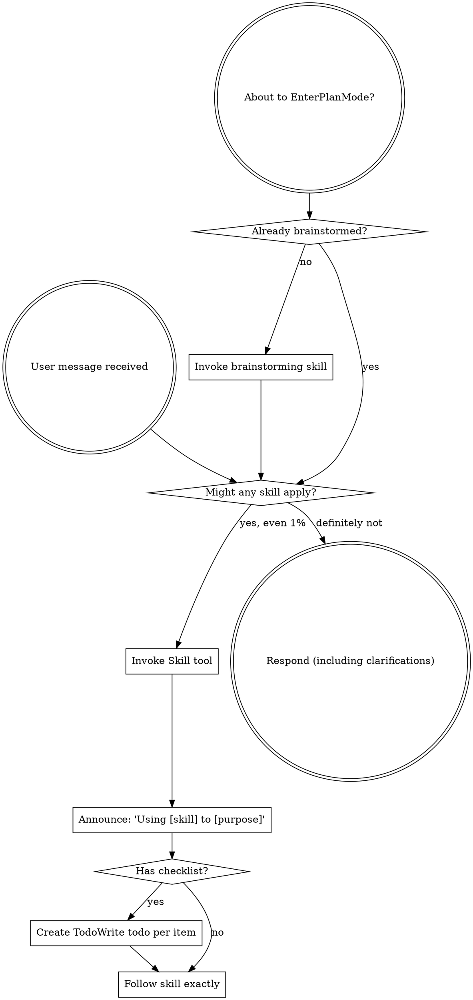

OpenAI Codex v0.128.0 (research preview)
--------
workdir: /Users/houssamr/Projects/syneriva/apps/erp-pos-stabperf
model: gpt-5.5
provider: openai
approval: never
sandbox: workspace-write [workdir, /tmp, $TMPDIR, /Users/houssamr/.codex/memories]
reasoning effort: high
reasoning summaries: none
session id: 019e1be6-dfd6-7b92-bbf1-0eac2ea5af0b
--------
user
changes against 'dev'
2026-05-12T11:16:16.551875Z  WARN codex_core::shell_snapshot: Failed to delete shell snapshot at "/Users/houssamr/.codex/shell_snapshots/019e0c64-3bcc-7a91-8e89-29c4873ed8a7.1778324356089831000.sh": Os { code: 2, kind: NotFound, message: "No such file or directory" }
2026-05-12T11:16:16.807673Z  WARN codex_core_plugins::manifest: ignoring interface.defaultPrompt: prompt must be at most 128 characters path=/Users/houssamr/.codex/.tmp/plugins/plugins/build-ios-apps/.codex-plugin/plugin.json
2026-05-12T11:16:16.809299Z  WARN codex_core_plugins::manifest: ignoring interface.defaultPrompt: maximum of 3 prompts is supported path=/Users/houssamr/.codex/.tmp/plugins/plugins/plugin-eval/.codex-plugin/plugin.json
2026-05-12T11:16:16.825288Z  WARN codex_core_plugins::manifest: ignoring interface.defaultPrompt: maximum of 3 prompts is supported path=/Users/houssamr/.codex/.tmp/plugins/plugins/twilio-developer-kit/.codex-plugin/plugin.json
2026-05-12T11:16:16.825326Z  WARN codex_core_plugins::manifest: ignoring interface.defaultPrompt: maximum of 3 prompts is supported path=/Users/houssamr/.codex/.tmp/plugins/plugins/openai-developers/.codex-plugin/plugin.json
2026-05-12T11:16:19.431542Z  WARN codex_core_plugins::marketplace: skipping marketplace plugin with unsupported source path=/Users/houssamr/.codex/.tmp/marketplaces/.staging/marketplace-upgrade-IY1bSf/.claude-plugin/marketplace.json plugin="fullstory"
2026-05-12T11:16:19.431680Z  WARN codex_core_plugins::marketplace: skipping marketplace plugin with unsupported source path=/Users/houssamr/.codex/.tmp/marketplaces/.staging/marketplace-upgrade-IY1bSf/.claude-plugin/marketplace.json plugin="jfrog"
2026-05-12T11:16:19.432041Z  WARN codex_core_plugins::marketplace: skipping invalid marketplace plugin path=/Users/houssamr/.codex/.tmp/marketplaces/.staging/marketplace-upgrade-IY1bSf/.claude-plugin/marketplace.json marketplace=claude-plugins-official error=invalid plugin name: only ASCII letters, digits, `_`, and `-` are allowed
2026-05-12T11:16:22.491567Z  WARN codex_core_plugins::marketplace: skipping marketplace plugin with unsupported source path=/Users/houssamr/.codex/.tmp/marketplaces/claude-plugins-official/.claude-plugin/marketplace.json plugin="fullstory"
2026-05-12T11:16:22.491710Z  WARN codex_core_plugins::marketplace: skipping marketplace plugin with unsupported source path=/Users/houssamr/.codex/.tmp/marketplaces/claude-plugins-official/.claude-plugin/marketplace.json plugin="jfrog"
2026-05-12T11:16:22.492340Z  WARN codex_core_plugins::marketplace: skipping invalid marketplace plugin path=/Users/houssamr/.codex/.tmp/marketplaces/claude-plugins-official/.claude-plugin/marketplace.json marketplace=claude-plugins-official error=invalid plugin name: only ASCII letters, digits, `_`, and `-` are allowed
2026-05-12T11:16:22.492470Z  WARN codex_core_plugins::marketplace: skipping marketplace plugin that failed to resolve path=/Users/houssamr/.codex/.tmp/marketplaces/ui-ux-pro-max-skill/.claude-plugin/marketplace.json plugin="ui-ux-pro-max" error=invalid marketplace file `/Users/houssamr/.codex/.tmp/marketplaces/ui-ux-pro-max-skill/.claude-plugin/marketplace.json`: local plugin source path must not be empty
2026-05-12T11:16:22.493379Z  WARN codex_core_plugins::manifest: ignoring interface.defaultPrompt: prompt must be at most 128 characters path=/Users/houssamr/.codex/.tmp/plugins/plugins/build-ios-apps/.codex-plugin/plugin.json
2026-05-12T11:16:22.493689Z  WARN codex_core_plugins::manifest: ignoring interface.defaultPrompt: maximum of 3 prompts is supported path=/Users/houssamr/.codex/.tmp/plugins/plugins/plugin-eval/.codex-plugin/plugin.json
2026-05-12T11:16:22.496084Z  WARN codex_core_plugins::manifest: ignoring interface.defaultPrompt: maximum of 3 prompts is supported path=/Users/houssamr/.codex/.tmp/plugins/plugins/twilio-developer-kit/.codex-plugin/plugin.json
2026-05-12T11:16:22.496122Z  WARN codex_core_plugins::manifest: ignoring interface.defaultPrompt: maximum of 3 prompts is supported path=/Users/houssamr/.codex/.tmp/plugins/plugins/openai-developers/.codex-plugin/plugin.json
2026-05-12T11:16:22.552713Z  WARN codex_core_skills::loader: ignoring interface.icon_small: icon path must not contain '..'
2026-05-12T11:16:22.552739Z  WARN codex_core_skills::loader: ignoring interface.icon_large: icon path must not contain '..'
2026-05-12T11:16:22.554506Z  WARN codex_core_skills::loader: ignoring interface.icon_small: icon path must not contain '..'
2026-05-12T11:16:22.554516Z  WARN codex_core_skills::loader: ignoring interface.icon_large: icon path must not contain '..'
2026-05-12T11:16:22.555697Z  WARN codex_core_skills::loader: ignoring interface.icon_small: icon path must not contain '..'
2026-05-12T11:16:22.555713Z  WARN codex_core_skills::loader: ignoring interface.icon_large: icon path must not contain '..'
2026-05-12T11:16:22.556846Z  WARN codex_core_skills::loader: ignoring interface.icon_small: icon path must not contain '..'
2026-05-12T11:16:22.556854Z  WARN codex_core_skills::loader: ignoring interface.icon_large: icon path must not contain '..'
2026-05-12T11:16:22.558521Z  WARN codex_core_skills::loader: ignoring interface.icon_small: icon path must not contain '..'
2026-05-12T11:16:22.558529Z  WARN codex_core_skills::loader: ignoring interface.icon_large: icon path must not contain '..'
2026-05-12T11:16:22.561216Z  WARN codex_core_skills::loader: ignoring interface.icon_small: icon path must not contain '..'
2026-05-12T11:16:22.561227Z  WARN codex_core_skills::loader: ignoring interface.icon_large: icon path must not contain '..'
2026-05-12T11:16:24.381089Z  WARN codex_core_plugins::marketplace: skipping marketplace plugin with unsupported source path=/Users/houssamr/.codex/.tmp/marketplaces/claude-plugins-official/.claude-plugin/marketplace.json plugin="fullstory"
2026-05-12T11:16:24.381253Z  WARN codex_core_plugins::marketplace: skipping marketplace plugin with unsupported source path=/Users/houssamr/.codex/.tmp/marketplaces/claude-plugins-official/.claude-plugin/marketplace.json plugin="jfrog"
2026-05-12T11:16:24.381942Z  WARN codex_core_plugins::marketplace: skipping invalid marketplace plugin path=/Users/houssamr/.codex/.tmp/marketplaces/claude-plugins-official/.claude-plugin/marketplace.json marketplace=claude-plugins-official error=invalid plugin name: only ASCII letters, digits, `_`, and `-` are allowed
2026-05-12T11:16:24.382063Z  WARN codex_core_plugins::marketplace: skipping marketplace plugin that failed to resolve path=/Users/houssamr/.codex/.tmp/marketplaces/ui-ux-pro-max-skill/.claude-plugin/marketplace.json plugin="ui-ux-pro-max" error=invalid marketplace file `/Users/houssamr/.codex/.tmp/marketplaces/ui-ux-pro-max-skill/.claude-plugin/marketplace.json`: local plugin source path must not be empty
2026-05-12T11:16:24.383377Z  WARN codex_core_plugins::manifest: ignoring interface.defaultPrompt: prompt must be at most 128 characters path=/Users/houssamr/.codex/.tmp/plugins/plugins/build-ios-apps/.codex-plugin/plugin.json
2026-05-12T11:16:24.383811Z  WARN codex_core_plugins::manifest: ignoring interface.defaultPrompt: maximum of 3 prompts is supported path=/Users/houssamr/.codex/.tmp/plugins/plugins/plugin-eval/.codex-plugin/plugin.json
2026-05-12T11:16:24.387158Z  WARN codex_core_plugins::manifest: ignoring interface.defaultPrompt: maximum of 3 prompts is supported path=/Users/houssamr/.codex/.tmp/plugins/plugins/twilio-developer-kit/.codex-plugin/plugin.json
2026-05-12T11:16:24.387211Z  WARN codex_core_plugins::manifest: ignoring interface.defaultPrompt: maximum of 3 prompts is supported path=/Users/houssamr/.codex/.tmp/plugins/plugins/openai-developers/.codex-plugin/plugin.json
2026-05-12T11:16:24.404842Z  WARN codex_core_skills::loader: ignoring interface.icon_small: icon path must not contain '..'
2026-05-12T11:16:24.404855Z  WARN codex_core_skills::loader: ignoring interface.icon_large: icon path must not contain '..'
2026-05-12T11:16:24.405503Z  WARN codex_core_skills::loader: ignoring interface.icon_small: icon path must not contain '..'
2026-05-12T11:16:24.405511Z  WARN codex_core_skills::loader: ignoring interface.icon_large: icon path must not contain '..'
2026-05-12T11:16:24.406212Z  WARN codex_core_skills::loader: ignoring interface.icon_small: icon path must not contain '..'
2026-05-12T11:16:24.406219Z  WARN codex_core_skills::loader: ignoring interface.icon_large: icon path must not contain '..'
2026-05-12T11:16:24.406850Z  WARN codex_core_skills::loader: ignoring interface.icon_small: icon path must not contain '..'
2026-05-12T11:16:24.406855Z  WARN codex_core_skills::loader: ignoring interface.icon_large: icon path must not contain '..'
2026-05-12T11:16:24.407457Z  WARN codex_core_skills::loader: ignoring interface.icon_small: icon path must not contain '..'
2026-05-12T11:16:24.407463Z  WARN codex_core_skills::loader: ignoring interface.icon_large: icon path must not contain '..'
2026-05-12T11:16:24.408835Z  WARN codex_core_skills::loader: ignoring interface.icon_small: icon path must not contain '..'
2026-05-12T11:16:24.408842Z  WARN codex_core_skills::loader: ignoring interface.icon_large: icon path must not contain '..'
2026-05-12T11:16:24.907932Z  WARN codex_core_plugins::marketplace: skipping marketplace plugin that failed to resolve path=/Users/houssamr/.codex/.tmp/marketplaces/.staging/marketplace-upgrade-DYp5UW/.claude-plugin/marketplace.json plugin="ui-ux-pro-max" error=invalid marketplace file `/Users/houssamr/.codex/.tmp/marketplaces/.staging/marketplace-upgrade-DYp5UW/.claude-plugin/marketplace.json`: local plugin source path must not be empty
2026-05-12T11:16:24.940174Z  WARN codex_core_plugins::marketplace: skipping marketplace plugin with unsupported source path=/Users/houssamr/.codex/.tmp/marketplaces/claude-plugins-official/.claude-plugin/marketplace.json plugin="fullstory"
2026-05-12T11:16:24.940322Z  WARN codex_core_plugins::marketplace: skipping marketplace plugin with unsupported source path=/Users/houssamr/.codex/.tmp/marketplaces/claude-plugins-official/.claude-plugin/marketplace.json plugin="jfrog"
2026-05-12T11:16:24.940779Z  WARN codex_core_plugins::marketplace: skipping invalid marketplace plugin path=/Users/houssamr/.codex/.tmp/marketplaces/claude-plugins-official/.claude-plugin/marketplace.json marketplace=claude-plugins-official error=invalid plugin name: only ASCII letters, digits, `_`, and `-` are allowed
2026-05-12T11:16:24.940844Z  WARN codex_core_plugins::marketplace: skipping marketplace plugin that failed to resolve path=/Users/houssamr/.codex/.tmp/marketplaces/ui-ux-pro-max-skill/.claude-plugin/marketplace.json plugin="ui-ux-pro-max" error=invalid marketplace file `/Users/houssamr/.codex/.tmp/marketplaces/ui-ux-pro-max-skill/.claude-plugin/marketplace.json`: local plugin source path must not be empty
2026-05-12T11:16:24.940929Z  WARN codex_core_plugins::loader: configured non-curated plugin no longer exists in discovered marketplaces during cache refresh plugin="browser-use" marketplace="openai-bundled"
2026-05-12T11:16:24.948860Z  WARN codex_core_plugins::loader: configured non-curated plugin no longer exists in discovered marketplaces during cache refresh plugin="documents" marketplace="openai-primary-runtime"
2026-05-12T11:16:24.951112Z  WARN codex_core_plugins::loader: configured non-curated plugin no longer exists in discovered marketplaces during cache refresh plugin="presentations" marketplace="openai-primary-runtime"
2026-05-12T11:16:24.951116Z  WARN codex_core_plugins::loader: configured non-curated plugin no longer exists in discovered marketplaces during cache refresh plugin="spreadsheets" marketplace="openai-primary-runtime"
2026-05-12T11:16:27.508809Z  WARN codex_core_plugins::marketplace: skipping marketplace plugin with unsupported source path=/Users/houssamr/.codex/.tmp/marketplaces/claude-plugins-official/.claude-plugin/marketplace.json plugin="fullstory"
2026-05-12T11:16:27.509033Z  WARN codex_core_plugins::marketplace: skipping marketplace plugin with unsupported source path=/Users/houssamr/.codex/.tmp/marketplaces/claude-plugins-official/.claude-plugin/marketplace.json plugin="jfrog"
2026-05-12T11:16:27.509791Z  WARN codex_core_plugins::marketplace: skipping invalid marketplace plugin path=/Users/houssamr/.codex/.tmp/marketplaces/claude-plugins-official/.claude-plugin/marketplace.json marketplace=claude-plugins-official error=invalid plugin name: only ASCII letters, digits, `_`, and `-` are allowed
2026-05-12T11:16:27.509927Z  WARN codex_core_plugins::marketplace: skipping marketplace plugin that failed to resolve path=/Users/houssamr/.codex/.tmp/marketplaces/ui-ux-pro-max-skill/.claude-plugin/marketplace.json plugin="ui-ux-pro-max" error=invalid marketplace file `/Users/houssamr/.codex/.tmp/marketplaces/ui-ux-pro-max-skill/.claude-plugin/marketplace.json`: local plugin source path must not be empty
2026-05-12T11:16:27.511388Z  WARN codex_core_plugins::manifest: ignoring interface.defaultPrompt: prompt must be at most 128 characters path=/Users/houssamr/.codex/.tmp/plugins/plugins/build-ios-apps/.codex-plugin/plugin.json
2026-05-12T11:16:27.511671Z  WARN codex_core_plugins::manifest: ignoring interface.defaultPrompt: maximum of 3 prompts is supported path=/Users/houssamr/.codex/.tmp/plugins/plugins/plugin-eval/.codex-plugin/plugin.json
2026-05-12T11:16:27.513950Z  WARN codex_core_plugins::manifest: ignoring interface.defaultPrompt: maximum of 3 prompts is supported path=/Users/houssamr/.codex/.tmp/plugins/plugins/twilio-developer-kit/.codex-plugin/plugin.json
2026-05-12T11:16:27.513984Z  WARN codex_core_plugins::manifest: ignoring interface.defaultPrompt: maximum of 3 prompts is supported path=/Users/houssamr/.codex/.tmp/plugins/plugins/openai-developers/.codex-plugin/plugin.json
2026-05-12T11:16:27.549127Z  WARN codex_core_skills::loader: ignoring interface.icon_small: icon path must not contain '..'
2026-05-12T11:16:27.549141Z  WARN codex_core_skills::loader: ignoring interface.icon_large: icon path must not contain '..'
2026-05-12T11:16:27.549978Z  WARN codex_core_skills::loader: ignoring interface.icon_small: icon path must not contain '..'
2026-05-12T11:16:27.549986Z  WARN codex_core_skills::loader: ignoring interface.icon_large: icon path must not contain '..'
2026-05-12T11:16:27.550694Z  WARN codex_core_skills::loader: ignoring interface.icon_small: icon path must not contain '..'
2026-05-12T11:16:27.550702Z  WARN codex_core_skills::loader: ignoring interface.icon_large: icon path must not contain '..'
2026-05-12T11:16:27.551364Z  WARN codex_core_skills::loader: ignoring interface.icon_small: icon path must not contain '..'
2026-05-12T11:16:27.551372Z  WARN codex_core_skills::loader: ignoring interface.icon_large: icon path must not contain '..'
2026-05-12T11:16:27.552075Z  WARN codex_core_skills::loader: ignoring interface.icon_small: icon path must not contain '..'
2026-05-12T11:16:27.552082Z  WARN codex_core_skills::loader: ignoring interface.icon_large: icon path must not contain '..'
2026-05-12T11:16:27.553527Z  WARN codex_core_skills::loader: ignoring interface.icon_small: icon path must not contain '..'
2026-05-12T11:16:27.553534Z  WARN codex_core_skills::loader: ignoring interface.icon_large: icon path must not contain '..'
2026-05-12T11:16:35.281843Z  WARN codex_otel::events::session_telemetry: metrics counter [codex.skill.injected] failed: tag value contains invalid characters: superpowers:using-superpowers
exec
/bin/zsh -lc 'cat /Users/houssamr/.codex/plugins/cache/claude-plugins-official/superpowers/5.1.0/skills/using-superpowers/SKILL.md && git diff --stat 03c6832aea7f8be6c384a806ddb43db39ab944e3' in /Users/houssamr/Projects/syneriva/apps/erp-pos-stabperf
 succeeded in 0ms:
---
name: using-superpowers
description: Use when starting any conversation - establishes how to find and use skills, requiring Skill tool invocation before ANY response including clarifying questions
---

<SUBAGENT-STOP>
If you were dispatched as a subagent to execute a specific task, skip this skill.
</SUBAGENT-STOP>

<EXTREMELY-IMPORTANT>
If you think there is even a 1% chance a skill might apply to what you are doing, you ABSOLUTELY MUST invoke the skill.

IF A SKILL APPLIES TO YOUR TASK, YOU DO NOT HAVE A CHOICE. YOU MUST USE IT.

This is not negotiable. This is not optional. You cannot rationalize your way out of this.
</EXTREMELY-IMPORTANT>

## Instruction Priority

Superpowers skills override default system prompt behavior, but **user instructions always take precedence**:

1. **User's explicit instructions** (CLAUDE.md, GEMINI.md, AGENTS.md, direct requests) — highest priority
2. **Superpowers skills** — override default system behavior where they conflict
3. **Default system prompt** — lowest priority

If CLAUDE.md, GEMINI.md, or AGENTS.md says "don't use TDD" and a skill says "always use TDD," follow the user's instructions. The user is in control.

## How to Access Skills

**In Claude Code:** Use the `Skill` tool. When you invoke a skill, its content is loaded and presented to you—follow it directly. Never use the Read tool on skill files.

**In Copilot CLI:** Use the `skill` tool. Skills are auto-discovered from installed plugins. The `skill` tool works the same as Claude Code's `Skill` tool.

**In Gemini CLI:** Skills activate via the `activate_skill` tool. Gemini loads skill metadata at session start and activates the full content on demand.

**In other environments:** Check your platform's documentation for how skills are loaded.

## Platform Adaptation

Skills use Claude Code tool names. Non-CC platforms: see `references/copilot-tools.md` (Copilot CLI), `references/codex-tools.md` (Codex) for tool equivalents. Gemini CLI users get the tool mapping loaded automatically via GEMINI.md.

# Using Skills

## The Rule

**Invoke relevant or requested skills BEFORE any response or action.** Even a 1% chance a skill might apply means that you should invoke the skill to check. If an invoked skill turns out to be wrong for the situation, you don't need to use it.

## Red Flags

These thoughts mean STOP—you're rationalizing:

| Thought | Reality |
|---------|---------|
| "This is just a simple question" | Questions are tasks. Check for skills. |
| "I need more context first" | Skill check comes BEFORE clarifying questions. |
| "Let me explore the codebase first" | Skills tell you HOW to explore. Check first. |
| "I can check git/files quickly" | Files lack conversation context. Check for skills. |
| "Let me gather information first" | Skills tell you HOW to gather information. |
| "This doesn't need a formal skill" | If a skill exists, use it. |
| "I remember this skill" | Skills evolve. Read current version. |
| "This doesn't count as a task" | Action = task. Check for skills. |
| "The skill is overkill" | Simple things become complex. Use it. |
| "I'll just do this one thing first" | Check BEFORE doing anything. |
| "This feels productive" | Undisciplined action wastes time. Skills prevent this. |
| "I know what that means" | Knowing the concept ≠ using the skill. Invoke it. |

## Skill Priority

When multiple skills could apply, use this order:

1. **Process skills first** (brainstorming, debugging) - these determine HOW to approach the task
2. **Implementation skills second** (frontend-design, mcp-builder) - these guide execution

"Let's build X" → brainstorming first, then implementation skills.
"Fix this bug" → debugging first, then domain-specific skills.

## Skill Types

**Rigid** (TDD, debugging): Follow exactly. Don't adapt away discipline.

**Flexible** (patterns): Adapt principles to context.

The skill itself tells you which.

## User Instructions

Instructions say WHAT, not HOW. "Add X" or "Fix Y" doesn't mean skip workflows.
 .../Services/ReportGenerationService.php           |  43 ++++-
 .../Controllers/ZReportSyncController.php          | 129 +++++++++-----
 .../POS/ServerSideZReportOverTenderTest.php        | 198 +++++++++++++++++++++
 .../POS/ZReportSyncControllerSchema2Test.php       | 148 ++++++++++++---
 apps/pos/src/api/reportApi.ts                      |   7 +-
 .../pos/src/lib/sync/__tests__/syncService.test.ts |  11 ++
 6 files changed, 470 insertions(+), 66 deletions(-)

2026-05-12T11:16:35.387282Z  WARN codex_protocol::openai_models: Model personality requested but model_messages is missing, falling back to base instructions. model=gpt-5.5 personality=pragmatic
2026-05-12T11:16:35.444886Z  WARN codex_core_plugins::marketplace: skipping marketplace plugin with unsupported source path=/Users/houssamr/.codex/.tmp/marketplaces/claude-plugins-official/.claude-plugin/marketplace.json plugin="fullstory"
2026-05-12T11:16:35.445129Z  WARN codex_core_plugins::marketplace: skipping marketplace plugin with unsupported source path=/Users/houssamr/.codex/.tmp/marketplaces/claude-plugins-official/.claude-plugin/marketplace.json plugin="jfrog"
2026-05-12T11:16:35.445912Z  WARN codex_core_plugins::marketplace: skipping invalid marketplace plugin path=/Users/houssamr/.codex/.tmp/marketplaces/claude-plugins-official/.claude-plugin/marketplace.json marketplace=claude-plugins-official error=invalid plugin name: only ASCII letters, digits, `_`, and `-` are allowed
2026-05-12T11:16:35.446032Z  WARN codex_core_plugins::marketplace: skipping marketplace plugin that failed to resolve path=/Users/houssamr/.codex/.tmp/marketplaces/ui-ux-pro-max-skill/.claude-plugin/marketplace.json plugin="ui-ux-pro-max" error=invalid marketplace file `/Users/houssamr/.codex/.tmp/marketplaces/ui-ux-pro-max-skill/.claude-plugin/marketplace.json`: local plugin source path must not be empty
2026-05-12T11:16:35.447014Z  WARN codex_core_plugins::manifest: ignoring interface.defaultPrompt: prompt must be at most 128 characters path=/Users/houssamr/.codex/.tmp/plugins/plugins/build-ios-apps/.codex-plugin/plugin.json
2026-05-12T11:16:35.447284Z  WARN codex_core_plugins::manifest: ignoring interface.defaultPrompt: maximum of 3 prompts is supported path=/Users/houssamr/.codex/.tmp/plugins/plugins/plugin-eval/.codex-plugin/plugin.json
2026-05-12T11:16:35.449342Z  WARN codex_core_plugins::manifest: ignoring interface.defaultPrompt: maximum of 3 prompts is supported path=/Users/houssamr/.codex/.tmp/plugins/plugins/twilio-developer-kit/.codex-plugin/plugin.json
2026-05-12T11:16:35.449372Z  WARN codex_core_plugins::manifest: ignoring interface.defaultPrompt: maximum of 3 prompts is supported path=/Users/houssamr/.codex/.tmp/plugins/plugins/openai-developers/.codex-plugin/plugin.json
2026-05-12T11:16:35.466918Z  WARN codex_core_skills::loader: ignoring interface.icon_small: icon path must not contain '..'
2026-05-12T11:16:35.466928Z  WARN codex_core_skills::loader: ignoring interface.icon_large: icon path must not contain '..'
2026-05-12T11:16:35.467692Z  WARN codex_core_skills::loader: ignoring interface.icon_small: icon path must not contain '..'
2026-05-12T11:16:35.467700Z  WARN codex_core_skills::loader: ignoring interface.icon_large: icon path must not contain '..'
2026-05-12T11:16:35.468599Z  WARN codex_core_skills::loader: ignoring interface.icon_small: icon path must not contain '..'
2026-05-12T11:16:35.468608Z  WARN codex_core_skills::loader: ignoring interface.icon_large: icon path must not contain '..'
2026-05-12T11:16:35.469585Z  WARN codex_core_skills::loader: ignoring interface.icon_small: icon path must not contain '..'
2026-05-12T11:16:35.469588Z  WARN codex_core_skills::loader: ignoring interface.icon_large: icon path must not contain '..'
2026-05-12T11:16:35.470928Z  WARN codex_core_skills::loader: ignoring interface.icon_small: icon path must not contain '..'
2026-05-12T11:16:35.470938Z  WARN codex_core_skills::loader: ignoring interface.icon_large: icon path must not contain '..'
2026-05-12T11:16:35.472268Z  WARN codex_core_skills::loader: ignoring interface.icon_small: icon path must not contain '..'
2026-05-12T11:16:35.472274Z  WARN codex_core_skills::loader: ignoring interface.icon_large: icon path must not contain '..'
exec
/bin/zsh -lc 'git diff 03c6832aea7f8be6c384a806ddb43db39ab944e3 -- apps/api/app/Domain/POS/Services/ReportGenerationService.php apps/api/app/Http/Controllers/ZReportSyncController.php apps/api/tests/Feature/POS/ServerSideZReportOverTenderTest.php apps/api/tests/Feature/POS/ZReportSyncControllerSchema2Test.php apps/pos/src/api/reportApi.ts apps/pos/src/lib/sync/__tests__/syncService.test.ts' in /Users/houssamr/Projects/syneriva/apps/erp-pos-stabperf
 succeeded in 0ms:
diff --git a/apps/api/tests/Feature/POS/ServerSideZReportOverTenderTest.php b/apps/api/tests/Feature/POS/ServerSideZReportOverTenderTest.php
new file mode 100644
index 00000000..eab4fd75
--- /dev/null
+++ b/apps/api/tests/Feature/POS/ServerSideZReportOverTenderTest.php
@@ -0,0 +1,198 @@
+<?php
+
+declare(strict_types=1);
+
+namespace Tests\Feature\POS;
+
+use App\Modules\Company\Domain\Company;
+use App\Modules\Company\Domain\Location;
+use App\Modules\Identity\Domain\User;
+use App\Modules\POS\Application\Services\ReportGenerationService;
+use App\Modules\POS\Domain\DTOs\CashCountInputDTO;
+use App\Modules\POS\Domain\Enums\FiscalStatus;
+use App\Modules\POS\Domain\Enums\ShiftStatus;
+use App\Modules\POS\Domain\Receipt;
+use App\Modules\POS\Domain\ReceiptPayment;
+use App\Modules\POS\Domain\Shift;
+use App\Modules\POS\Domain\Terminal;
+use App\Modules\POS\Domain\ZReportCount;
+use App\Modules\Tenant\Domain\Tenant;
+use App\Modules\Treasury\Domain\PaymentMethod;
+use Illuminate\Foundation\Testing\RefreshDatabase;
+use Illuminate\Support\Carbon;
+use Illuminate\Support\Str;
+use Tests\TestCase;
+
+final class ServerSideZReportOverTenderTest extends TestCase
+{
+    use RefreshDatabase;
+
+    public function test_server_side_z_report_cash_expected_subtracts_receipt_change_due_once(): void
+    {
+        $this->assertCashExpectedSubtractsReceiptChangeDue('CASH', 'CASH');
+    }
+
+    public function test_server_side_z_report_treats_lowercase_cash_code_as_cash(): void
+    {
+        $this->assertCashExpectedSubtractsReceiptChangeDue('cash', 'cash');
+    }
+
+    public function test_server_side_z_report_does_not_subtract_change_due_from_legacy_net_cash_rows(): void
+    {
+        $tenant = Tenant::factory()->create();
+        $company = Company::factory()->create([
+            'tenant_id' => $tenant->id,
+            'currency' => 'EUR',
+        ]);
+        $location = Location::factory()->create(['company_id' => $company->id]);
+        $cashier = User::factory()->create(['tenant_id' => $tenant->id]);
+        $terminal = Terminal::factory()->create([
+            'tenant_id' => $tenant->id,
+            'company_id' => $company->id,
+            'location_id' => $location->id,
+        ]);
+        $cashMethod = PaymentMethod::factory()->create([
+            'tenant_id' => $tenant->id,
+            'company_id' => $company->id,
+            'code' => 'CASH',
+            'name' => 'Cash',
+            'is_physical' => true,
+            'is_active' => true,
+        ]);
+
+        Shift::create([
+            'terminal_id' => $terminal->id,
+            'cashier_id' => $cashier->id,
+            'shift_number' => 1,
+            'status' => ShiftStatus::Open,
+            'opened_at' => Carbon::now()->subHour(),
+            'opening_cash' => '0.0000',
+        ]);
+
+        $this->seedCashReceipt($terminal, $cashier, $cashMethod, '', 1, '10.000', '10.000', '10.000', 1);
+
+        /** @var ReportGenerationService $service */
+        $service = $this->app->make(ReportGenerationService::class);
+        $zReport = $service->generateZReport(
+            $terminal,
+            $cashier,
+            [new CashCountInputDTO(
+                paymentMethodId: $cashMethod->id,
+                currencyCode: 'EUR',
+                actualAmount: '10.0000',
+            )],
+        );
+
+        $count = ZReportCount::where('z_report_id', $zReport->id)
+            ->where('payment_method_id', $cashMethod->id)
+            ->first();
+
+        $this->assertNotNull($count);
+        $this->assertSame('10.0000', $count->expected_amount);
+        $this->assertSame('10.0000', $count->actual_amount);
+        $this->assertSame('0.0000', $count->variance_amount);
+    }
+
+    private function assertCashExpectedSubtractsReceiptChangeDue(string $methodCode, string $paymentMethodCode): void
+    {
+        $tenant = Tenant::factory()->create();
+        $company = Company::factory()->create([
+            'tenant_id' => $tenant->id,
+            'currency' => 'EUR',
+        ]);
+        $location = Location::factory()->create(['company_id' => $company->id]);
+        $cashier = User::factory()->create(['tenant_id' => $tenant->id]);
+        $terminal = Terminal::factory()->create([
+            'tenant_id' => $tenant->id,
+            'company_id' => $company->id,
+            'location_id' => $location->id,
+        ]);
+        $cashMethod = PaymentMethod::factory()->create([
+            'tenant_id' => $tenant->id,
+            'company_id' => $company->id,
+            'code' => $methodCode,
+            'name' => 'Cash',
+            'is_physical' => true,
+            'is_active' => true,
+        ]);
+
+        Shift::create([
+            'terminal_id' => $terminal->id,
+            'cashier_id' => $cashier->id,
+            'shift_number' => 1,
+            'status' => ShiftStatus::Open,
+            'opened_at' => Carbon::now()->subHour(),
+            'opening_cash' => '0.0000',
+        ]);
+
+        $this->seedCashReceipt($terminal, $cashier, $cashMethod, $paymentMethodCode, 1, '50.000', '50.000', '0.000', 1);
+        $this->seedCashReceipt($terminal, $cashier, $cashMethod, $paymentMethodCode, 2, '50.000', '120.000', '70.000', 2);
+
+        /** @var ReportGenerationService $service */
+        $service = $this->app->make(ReportGenerationService::class);
+        $zReport = $service->generateZReport(
+            $terminal,
+            $cashier,
+            [new CashCountInputDTO(
+                paymentMethodId: $cashMethod->id,
+                currencyCode: 'EUR',
+                actualAmount: '100.0000',
+            )],
+        );
+
+        $count = ZReportCount::where('z_report_id', $zReport->id)
+            ->where('payment_method_id', $cashMethod->id)
+            ->first();
+
+        $this->assertNotNull($count);
+        $this->assertSame('100.0000', $count->expected_amount);
+        $this->assertSame('100.0000', $count->actual_amount);
+        $this->assertSame('0.0000', $count->variance_amount);
+    }
+
+    private function seedCashReceipt(
+        Terminal $terminal,
+        User $cashier,
+        PaymentMethod $cashMethod,
+        string $paymentMethodCode,
+        int $sequence,
+        string $total,
+        string $tendered,
+        string $changeDue,
+        int $postedAtOffsetMinutes,
+    ): void {
+        $receipt = Receipt::create([
+            'tenant_id' => $terminal->tenant_id,
+            'company_id' => $terminal->company_id,
+            'location_id' => $terminal->location_id,
+            'terminal_id' => $terminal->id,
+            'receipt_number' => sprintf('T001-C001-L01-POS01-2026-%08d', $sequence),
+            'chain_sequence' => $sequence,
+            'receipt_year' => 2026,
+            'fiscal_hash' => hash('sha256', 'fiscal-'.$sequence),
+            'previous_hash' => null,
+            'vat_breakdown_hash' => hash('sha256', 'vat-'.$sequence),
+            'payment_methods_hash' => hash('sha256', 'pay-'.$sequence),
+            'posted_at' => Carbon::now()->subHour()->addMinutes($postedAtOffsetMinutes),
+            'cashier_id' => $cashier->id,
+            'cashier_name' => $cashier->name,
+            'subtotal' => $total,
+            'tax_amount' => '0.000',
+            'total' => $total,
+            'currency' => 'EUR',
+            'change_due' => $changeDue,
+            'fiscal_status' => FiscalStatus::Fiscalized->value,
+            'is_voided' => false,
+            'is_training' => false,
+        ]);
+
+        ReceiptPayment::create([
+            'id' => Str::uuid()->toString(),
+            'receipt_id' => $receipt->id,
+            'payment_method_id' => $cashMethod->id,
+            'payment_type' => 'CASH',
+            'payment_method_code' => $paymentMethodCode,
+            'amount' => $tendered,
+        ]);
+    }
+}
diff --git a/apps/api/tests/Feature/POS/ZReportSyncControllerSchema2Test.php b/apps/api/tests/Feature/POS/ZReportSyncControllerSchema2Test.php
index 46caf47c..264b4cb2 100644
--- a/apps/api/tests/Feature/POS/ZReportSyncControllerSchema2Test.php
+++ b/apps/api/tests/Feature/POS/ZReportSyncControllerSchema2Test.php
@@ -95,17 +95,132 @@ public function test_cash_counts_are_persisted_to_z_report_counts(): void
 
         $zReportId = $response->json('data.id');
 
-        // Two denomination entries for the same payment method → aggregated to one row.
         $this->assertDatabaseCount('pos_z_report_counts', 1);
 
         $row = ZReportCount::where('z_report_id', $zReportId)->first();
         $this->assertNotNull($row);
         $this->assertSame($this->cashMethod->id, $row->payment_method_id);
+        $this->assertSame('EUR', $row->currency_code);
+        $this->assertSame('100.0000', $row->expected_amount);
+        $this->assertSame('100.0000', $row->actual_amount);
+        $this->assertSame('0.0000', $row->variance_amount);
+        $this->assertSame('balanced', $row->variance_direction);
+        $this->assertSame(2, $row->transaction_count);
+    }
+
+    public function test_legacy_denomination_only_cash_counts_payload_is_rejected(): void
+    {
+        Sanctum::actingAs($this->cashier);
+        Event::fake();
+
+        $payload = array_merge($this->buildV1Payload(), [
+            'cash_counts' => [
+                [
+                    'payment_method_id' => $this->cashMethod->id,
+                    'counted_quantity' => 5,
+                    'counted_amount' => '50.00',
+                ],
+            ],
+        ]);
+
+        $response = $this->postJson('/api/v1/pos/reports/z/sync', $payload);
+
+        $response->assertStatus(422);
+        $errors = $response->json('error.errors');
+        $this->assertIsArray($errors);
+        foreach ([
+            'cash_counts.0.expected_amount',
+            'cash_counts.0.actual_amount',
+            'cash_counts.0.variance_amount',
+            'cash_counts.0.variance_direction',
+            'cash_counts.0.currency_code',
+            'cash_counts.0.transaction_count',
+        ] as $field) {
+            $this->assertArrayHasKey($field, $errors);
+        }
+    }
+
+    public function test_inconsistent_cash_count_variance_payload_is_rejected_before_persistence(): void
+    {
+        Sanctum::actingAs($this->cashier);
+        Event::fake();
+
+        $payload = $this->buildSchema2Payload();
+        $payload['cash_counts'][0]['variance_amount'] = '1.000';
+        $payload['cash_counts'][0]['variance_direction'] = 'over';
+
+        $response = $this->postJson('/api/v1/pos/reports/z/sync', $payload);
+
+        $response->assertStatus(422);
+        $errors = $response->json('error.errors');
+        $this->assertIsArray($errors);
+        $this->assertArrayHasKey('cash_counts.0.variance_amount', $errors);
+        $this->assertDatabaseCount('pos_z_report_counts', 0);
+    }
+
+    public function test_scientific_notation_cash_count_amounts_are_rejected_before_persistence(): void
+    {
+        Sanctum::actingAs($this->cashier);
+        Event::fake();
 
-        // Sum of both denomination counted_amounts: 50.00 + 20.00 = 70.00
-        $this->assertSame('70.0000', $row->actual_amount);
-        // transaction_count = sum of counted_quantities: 5 + 4 = 9
-        $this->assertSame(9, $row->transaction_count);
+        $payload = $this->buildSchema2Payload();
+        $payload['cash_counts'][0]['expected_amount'] = '1e3';
+        $payload['cash_counts'][0]['actual_amount'] = '1000.0000';
+        $payload['cash_counts'][0]['variance_amount'] = '0.0000';
+
+        $response = $this->postJson('/api/v1/pos/reports/z/sync', $payload);
+
+        $response->assertStatus(422);
+        $errors = $response->json('error.errors');
+        $this->assertIsArray($errors);
+        $this->assertArrayHasKey('cash_counts.0.expected_amount', $errors);
+        $this->assertDatabaseCount('pos_z_report_counts', 0);
+    }
+
+    public function test_negative_expected_or_actual_cash_count_amounts_are_rejected_before_persistence(): void
+    {
+        Sanctum::actingAs($this->cashier);
+        Event::fake();
+
+        $payload = $this->buildSchema2Payload();
+        $payload['cash_counts'][0]['expected_amount'] = '-1.0000';
+        $payload['cash_counts'][0]['actual_amount'] = '-1.0000';
+        $payload['cash_counts'][0]['variance_amount'] = '0.0000';
+        $payload['cash_counts'][0]['variance_direction'] = 'balanced';
+
+        $response = $this->postJson('/api/v1/pos/reports/z/sync', $payload);
+
+        $response->assertStatus(422);
+        $errors = $response->json('error.errors');
+        $this->assertIsArray($errors);
+        $this->assertArrayHasKey('cash_counts.0.expected_amount', $errors);
+        $this->assertArrayHasKey('cash_counts.0.actual_amount', $errors);
+        $this->assertDatabaseCount('pos_z_report_counts', 0);
+    }
+
+    public function test_duplicate_cash_count_payment_methods_are_rejected_before_persistence(): void
+    {
+        Sanctum::actingAs($this->cashier);
+        Event::fake();
+
+        $payload = $this->buildSchema2Payload();
+        $payload['cash_counts'][] = [
+            'payment_method_id' => $this->cashMethod->id,
+            'currency_code' => 'EUR',
+            'expected_amount' => '50.0000',
+            'actual_amount' => '50.0000',
+            'variance_amount' => '0.0000',
+            'variance_direction' => 'balanced',
+            'transaction_count' => 1,
+        ];
+
+        $response = $this->postJson('/api/v1/pos/reports/z/sync', $payload);
+
+        $response->assertStatus(422);
+        $errors = $response->json('error.errors');
+        $this->assertIsArray($errors);
+        $this->assertArrayHasKey('cash_counts.1.payment_method_id', $errors);
+        $this->assertDatabaseCount('pos_z_report_counts', 0);
     }
 
     // ─────────────────────────────────────────────────────────────────────────
@@ -124,7 +239,7 @@ public function test_shift_fields_are_applied_to_pos_shifts(): void
         $this->assertNotNull($shift);
 
         // actual_cash from shift_fields
-        $this->assertSame('70.0000', (string) $shift->actual_cash);
+        $this->assertSame('100.0000', (string) $shift->actual_cash);
         // variance_amount from shift_fields
         $this->assertSame('-5.0000', (string) $shift->variance);
         // variance_severity normalised from 'medium' → 'warning'
@@ -234,25 +349,18 @@ private function buildSchema2Payload(): array
             'cash_counts' => [
                 [
                     'payment_method_id' => $this->cashMethod->id,
-                    'denomination_id' => null,
-                    'counted_quantity' => 5,
-                    'counted_amount' => '50.00',
-                    'denomination_name' => '10',
-                    'denomination_value' => '10.00',
-                ],
-                [
-                    'payment_method_id' => $this->cashMethod->id,
-                    'denomination_id' => null,
-                    'counted_quantity' => 4,
-                    'counted_amount' => '20.00',
-                    'denomination_name' => '5',
-                    'denomination_value' => '5.00',
+                    'currency_code' => 'EUR',
+                    'expected_amount' => '100.000',
+                    'actual_amount' => '100.000',
+                    'variance_amount' => '0.000',
+                    'variance_direction' => 'balanced',
+                    'transaction_count' => 2,
                 ],
             ],
             'shift_fields' => [
                 'variance_reason' => 'Short count from till reset',
                 'variance_severity' => 'medium',
-                'actual_cash' => '70.0000',
+                'actual_cash' => '100.0000',
                 'variance_amount' => '-5.0000',
             ],
             'manager_user_id' => $this->manager->id,
diff --git a/apps/pos/src/api/reportApi.ts b/apps/pos/src/api/reportApi.ts
index 0b63793d..5eb096c9 100644
--- a/apps/pos/src/api/reportApi.ts
+++ b/apps/pos/src/api/reportApi.ts
@@ -196,7 +196,12 @@ function localZReportToResponse(report: LocalZReport, decimals: number): ZReport
   };
 }
 
-/** Server-only Z-report generation (for admin dashboard fallback). */
+/**
+ * Server-only Z-report generation for admin/tooling fallback.
+ *
+ * @deprecated POS close is offline-first. Keep this helper out of the cashier close path;
+ * web admin still uses the backend route through apps/web.
+ */
 export async function generateZReportServer(terminalId: string): Promise<ZReportResponse> {
   return apiPost<ZReportResponse>('/pos/reports/z', { terminal_id: terminalId });
 }
diff --git a/apps/pos/src/lib/sync/__tests__/syncService.test.ts b/apps/pos/src/lib/sync/__tests__/syncService.test.ts
index 09f6696e..26c1c636 100644
--- a/apps/pos/src/lib/sync/__tests__/syncService.test.ts
+++ b/apps/pos/src/lib/sync/__tests__/syncService.test.ts
@@ -1475,6 +1475,17 @@ describe('zReportToSyncPayload', () => {
 
     expect(Array.isArray(payload['cash_counts'])).toBe(true);
     expect((payload['cash_counts'] as unknown[]).length).toBe(1);
+    expect(payload['cash_counts']).toEqual([
+      {
+        payment_method_id: 'pm-cash',
+        currency_code: 'EUR',
+        expected_amount: '150.00',
+        actual_amount: '148.00',
+        variance_amount: '-2.00',
+        variance_direction: 'under',
+        transaction_count: 1,
+      },
+    ]);
     expect(payload['shift_fields']).toEqual({
       blind_count_used: true,
       variance_severity: 'warning',

2026-05-12T11:16:43.504417Z  WARN codex_protocol::openai_models: Model personality requested but model_messages is missing, falling back to base instructions. model=gpt-5.5 personality=pragmatic
2026-05-12T11:16:43.546931Z  WARN codex_core_plugins::marketplace: skipping marketplace plugin with unsupported source path=/Users/houssamr/.codex/.tmp/marketplaces/claude-plugins-official/.claude-plugin/marketplace.json plugin="fullstory"
2026-05-12T11:16:43.547119Z  WARN codex_core_plugins::marketplace: skipping marketplace plugin with unsupported source path=/Users/houssamr/.codex/.tmp/marketplaces/claude-plugins-official/.claude-plugin/marketplace.json plugin="jfrog"
2026-05-12T11:16:43.547686Z  WARN codex_core_plugins::marketplace: skipping invalid marketplace plugin path=/Users/houssamr/.codex/.tmp/marketplaces/claude-plugins-official/.claude-plugin/marketplace.json marketplace=claude-plugins-official error=invalid plugin name: only ASCII letters, digits, `_`, and `-` are allowed
2026-05-12T11:16:43.547773Z  WARN codex_core_plugins::marketplace: skipping marketplace plugin that failed to resolve path=/Users/houssamr/.codex/.tmp/marketplaces/ui-ux-pro-max-skill/.claude-plugin/marketplace.json plugin="ui-ux-pro-max" error=invalid marketplace file `/Users/houssamr/.codex/.tmp/marketplaces/ui-ux-pro-max-skill/.claude-plugin/marketplace.json`: local plugin source path must not be empty
2026-05-12T11:16:43.549325Z  WARN codex_core_plugins::manifest: ignoring interface.defaultPrompt: prompt must be at most 128 characters path=/Users/houssamr/.codex/.tmp/plugins/plugins/build-ios-apps/.codex-plugin/plugin.json
2026-05-12T11:16:43.549808Z  WARN codex_core_plugins::manifest: ignoring interface.defaultPrompt: maximum of 3 prompts is supported path=/Users/houssamr/.codex/.tmp/plugins/plugins/plugin-eval/.codex-plugin/plugin.json
2026-05-12T11:16:43.553162Z  WARN codex_core_plugins::manifest: ignoring interface.defaultPrompt: maximum of 3 prompts is supported path=/Users/houssamr/.codex/.tmp/plugins/plugins/twilio-developer-kit/.codex-plugin/plugin.json
2026-05-12T11:16:43.553193Z  WARN codex_core_plugins::manifest: ignoring interface.defaultPrompt: maximum of 3 prompts is supported path=/Users/houssamr/.codex/.tmp/plugins/plugins/openai-developers/.codex-plugin/plugin.json
2026-05-12T11:16:43.571120Z  WARN codex_core_skills::loader: ignoring interface.icon_small: icon path must not contain '..'
2026-05-12T11:16:43.571131Z  WARN codex_core_skills::loader: ignoring interface.icon_large: icon path must not contain '..'
2026-05-12T11:16:43.571783Z  WARN codex_core_skills::loader: ignoring interface.icon_small: icon path must not contain '..'
2026-05-12T11:16:43.571809Z  WARN codex_core_skills::loader: ignoring interface.icon_large: icon path must not contain '..'
2026-05-12T11:16:43.572472Z  WARN codex_core_skills::loader: ignoring interface.icon_small: icon path must not contain '..'
2026-05-12T11:16:43.572477Z  WARN codex_core_skills::loader: ignoring interface.icon_large: icon path must not contain '..'
2026-05-12T11:16:43.573133Z  WARN codex_core_skills::loader: ignoring interface.icon_small: icon path must not contain '..'
2026-05-12T11:16:43.573139Z  WARN codex_core_skills::loader: ignoring interface.icon_large: icon path must not contain '..'
2026-05-12T11:16:43.573779Z  WARN codex_core_skills::loader: ignoring interface.icon_small: icon path must not contain '..'
2026-05-12T11:16:43.573786Z  WARN codex_core_skills::loader: ignoring interface.icon_large: icon path must not contain '..'
2026-05-12T11:16:43.575116Z  WARN codex_core_skills::loader: ignoring interface.icon_small: icon path must not contain '..'
2026-05-12T11:16:43.575124Z  WARN codex_core_skills::loader: ignoring interface.icon_large: icon path must not contain '..'
exec
/bin/zsh -lc 'git diff 03c6832aea7f8be6c384a806ddb43db39ab944e3 -- apps/api/app/Domain/POS/Services/ReportGenerationService.php apps/api/app/Http/Controllers/ZReportSyncController.php' in /Users/houssamr/Projects/syneriva/apps/erp-pos-stabperf
 succeeded in 0ms:
2026-05-12T11:16:51.168182Z  WARN codex_protocol::openai_models: Model personality requested but model_messages is missing, falling back to base instructions. model=gpt-5.5 personality=pragmatic
2026-05-12T11:16:51.303188Z  WARN codex_core_plugins::marketplace: skipping marketplace plugin with unsupported source path=/Users/houssamr/.codex/.tmp/marketplaces/claude-plugins-official/.claude-plugin/marketplace.json plugin="fullstory"
2026-05-12T11:16:51.303423Z  WARN codex_core_plugins::marketplace: skipping marketplace plugin with unsupported source path=/Users/houssamr/.codex/.tmp/marketplaces/claude-plugins-official/.claude-plugin/marketplace.json plugin="jfrog"
2026-05-12T11:16:51.304281Z  WARN codex_core_plugins::marketplace: skipping invalid marketplace plugin path=/Users/houssamr/.codex/.tmp/marketplaces/claude-plugins-official/.claude-plugin/marketplace.json marketplace=claude-plugins-official error=invalid plugin name: only ASCII letters, digits, `_`, and `-` are allowed
2026-05-12T11:16:51.304411Z  WARN codex_core_plugins::marketplace: skipping marketplace plugin that failed to resolve path=/Users/houssamr/.codex/.tmp/marketplaces/ui-ux-pro-max-skill/.claude-plugin/marketplace.json plugin="ui-ux-pro-max" error=invalid marketplace file `/Users/houssamr/.codex/.tmp/marketplaces/ui-ux-pro-max-skill/.claude-plugin/marketplace.json`: local plugin source path must not be empty
2026-05-12T11:16:51.306222Z  WARN codex_core_plugins::manifest: ignoring interface.defaultPrompt: prompt must be at most 128 characters path=/Users/houssamr/.codex/.tmp/plugins/plugins/build-ios-apps/.codex-plugin/plugin.json
2026-05-12T11:16:51.306642Z  WARN codex_core_plugins::manifest: ignoring interface.defaultPrompt: maximum of 3 prompts is supported path=/Users/houssamr/.codex/.tmp/plugins/plugins/plugin-eval/.codex-plugin/plugin.json
2026-05-12T11:16:51.309341Z  WARN codex_core_plugins::manifest: ignoring interface.defaultPrompt: maximum of 3 prompts is supported path=/Users/houssamr/.codex/.tmp/plugins/plugins/twilio-developer-kit/.codex-plugin/plugin.json
2026-05-12T11:16:51.309383Z  WARN codex_core_plugins::manifest: ignoring interface.defaultPrompt: maximum of 3 prompts is supported path=/Users/houssamr/.codex/.tmp/plugins/plugins/openai-developers/.codex-plugin/plugin.json
2026-05-12T11:16:51.357554Z  WARN codex_core_skills::loader: ignoring interface.icon_small: icon path must not contain '..'
2026-05-12T11:16:51.357567Z  WARN codex_core_skills::loader: ignoring interface.icon_large: icon path must not contain '..'
2026-05-12T11:16:51.358782Z  WARN codex_core_skills::loader: ignoring interface.icon_small: icon path must not contain '..'
2026-05-12T11:16:51.358795Z  WARN codex_core_skills::loader: ignoring interface.icon_large: icon path must not contain '..'
2026-05-12T11:16:51.360330Z  WARN codex_core_skills::loader: ignoring interface.icon_small: icon path must not contain '..'
2026-05-12T11:16:51.360373Z  WARN codex_core_skills::loader: ignoring interface.icon_large: icon path must not contain '..'
2026-05-12T11:16:51.361125Z  WARN codex_core_skills::loader: ignoring interface.icon_small: icon path must not contain '..'
2026-05-12T11:16:51.361132Z  WARN codex_core_skills::loader: ignoring interface.icon_large: icon path must not contain '..'
2026-05-12T11:16:51.361872Z  WARN codex_core_skills::loader: ignoring interface.icon_small: icon path must not contain '..'
2026-05-12T11:16:51.361879Z  WARN codex_core_skills::loader: ignoring interface.icon_large: icon path must not contain '..'
2026-05-12T11:16:51.363633Z  WARN codex_core_skills::loader: ignoring interface.icon_small: icon path must not contain '..'
2026-05-12T11:16:51.363642Z  WARN codex_core_skills::loader: ignoring interface.icon_large: icon path must not contain '..'
exec
/bin/zsh -lc 'git diff --name-only 03c6832aea7f8be6c384a806ddb43db39ab944e3' in /Users/houssamr/Projects/syneriva/apps/erp-pos-stabperf
 succeeded in 0ms:
apps/api/app/Modules/POS/Application/Services/ReportGenerationService.php
apps/api/app/Modules/POS/Presentation/Controllers/ZReportSyncController.php
apps/api/tests/Feature/POS/ServerSideZReportOverTenderTest.php
apps/api/tests/Feature/POS/ZReportSyncControllerSchema2Test.php
apps/pos/src/api/reportApi.ts
apps/pos/src/lib/sync/__tests__/syncService.test.ts

2026-05-12T11:16:56.475119Z  WARN codex_protocol::openai_models: Model personality requested but model_messages is missing, falling back to base instructions. model=gpt-5.5 personality=pragmatic
2026-05-12T11:16:56.513271Z  WARN codex_core_plugins::marketplace: skipping marketplace plugin with unsupported source path=/Users/houssamr/.codex/.tmp/marketplaces/claude-plugins-official/.claude-plugin/marketplace.json plugin="fullstory"
2026-05-12T11:16:56.513657Z  WARN codex_core_plugins::marketplace: skipping marketplace plugin with unsupported source path=/Users/houssamr/.codex/.tmp/marketplaces/claude-plugins-official/.claude-plugin/marketplace.json plugin="jfrog"
2026-05-12T11:16:56.514144Z  WARN codex_core_plugins::marketplace: skipping invalid marketplace plugin path=/Users/houssamr/.codex/.tmp/marketplaces/claude-plugins-official/.claude-plugin/marketplace.json marketplace=claude-plugins-official error=invalid plugin name: only ASCII letters, digits, `_`, and `-` are allowed
2026-05-12T11:16:56.514348Z  WARN codex_core_plugins::marketplace: skipping marketplace plugin that failed to resolve path=/Users/houssamr/.codex/.tmp/marketplaces/ui-ux-pro-max-skill/.claude-plugin/marketplace.json plugin="ui-ux-pro-max" error=invalid marketplace file `/Users/houssamr/.codex/.tmp/marketplaces/ui-ux-pro-max-skill/.claude-plugin/marketplace.json`: local plugin source path must not be empty
2026-05-12T11:16:56.515298Z  WARN codex_core_plugins::manifest: ignoring interface.defaultPrompt: prompt must be at most 128 characters path=/Users/houssamr/.codex/.tmp/plugins/plugins/build-ios-apps/.codex-plugin/plugin.json
2026-05-12T11:16:56.515663Z  WARN codex_core_plugins::manifest: ignoring interface.defaultPrompt: maximum of 3 prompts is supported path=/Users/houssamr/.codex/.tmp/plugins/plugins/plugin-eval/.codex-plugin/plugin.json
2026-05-12T11:16:56.517928Z  WARN codex_core_plugins::manifest: ignoring interface.defaultPrompt: maximum of 3 prompts is supported path=/Users/houssamr/.codex/.tmp/plugins/plugins/twilio-developer-kit/.codex-plugin/plugin.json
2026-05-12T11:16:56.517960Z  WARN codex_core_plugins::manifest: ignoring interface.defaultPrompt: maximum of 3 prompts is supported path=/Users/houssamr/.codex/.tmp/plugins/plugins/openai-developers/.codex-plugin/plugin.json
2026-05-12T11:16:56.535710Z  WARN codex_core_skills::loader: ignoring interface.icon_small: icon path must not contain '..'
2026-05-12T11:16:56.535722Z  WARN codex_core_skills::loader: ignoring interface.icon_large: icon path must not contain '..'
2026-05-12T11:16:56.536532Z  WARN codex_core_skills::loader: ignoring interface.icon_small: icon path must not contain '..'
2026-05-12T11:16:56.536541Z  WARN codex_core_skills::loader: ignoring interface.icon_large: icon path must not contain '..'
2026-05-12T11:16:56.537196Z  WARN codex_core_skills::loader: ignoring interface.icon_small: icon path must not contain '..'
2026-05-12T11:16:56.537203Z  WARN codex_core_skills::loader: ignoring interface.icon_large: icon path must not contain '..'
2026-05-12T11:16:56.537900Z  WARN codex_core_skills::loader: ignoring interface.icon_small: icon path must not contain '..'
2026-05-12T11:16:56.537907Z  WARN codex_core_skills::loader: ignoring interface.icon_large: icon path must not contain '..'
2026-05-12T11:16:56.538538Z  WARN codex_core_skills::loader: ignoring interface.icon_small: icon path must not contain '..'
2026-05-12T11:16:56.538544Z  WARN codex_core_skills::loader: ignoring interface.icon_large: icon path must not contain '..'
2026-05-12T11:16:56.539866Z  WARN codex_core_skills::loader: ignoring interface.icon_small: icon path must not contain '..'
2026-05-12T11:16:56.539872Z  WARN codex_core_skills::loader: ignoring interface.icon_large: icon path must not contain '..'
exec
/bin/zsh -lc 'git diff 03c6832aea7f8be6c384a806ddb43db39ab944e3 -- apps/api/app/Modules/POS/Application/Services/ReportGenerationService.php apps/api/app/Modules/POS/Presentation/Controllers/ZReportSyncController.php' in /Users/houssamr/Projects/syneriva/apps/erp-pos-stabperf
 succeeded in 0ms:
diff --git a/apps/api/app/Modules/POS/Application/Services/ReportGenerationService.php b/apps/api/app/Modules/POS/Application/Services/ReportGenerationService.php
index 900406ab..a6a77023 100644
--- a/apps/api/app/Modules/POS/Application/Services/ReportGenerationService.php
+++ b/apps/api/app/Modules/POS/Application/Services/ReportGenerationService.php
@@ -471,6 +471,7 @@ private function resolveCurrencyCode(Terminal $terminal): string
 
     /**
      * Sum receipt_payments.amount for the shift, grouped by payment_method_id.
+     * Cash methods subtract receipt change_due once per receipt to mirror the POS device formula.
      * Always includes a row for every payment_method_id in $inputs (defaulting to '0.0000').
      *
      * Shift window driven by pos_receipts.posted_at — see REALIGNMENT-LOG 2026-04-26.
@@ -496,6 +497,25 @@ private function buildExpectedPerMethod(Shift $shift, array $inputs): array
             ->groupBy('pos_receipt_payments.payment_method_id')
             ->get();
 
+        $cashReceiptChanges = DB::query()
+            ->fromSub(
+                DB::table('pos_receipt_payments')
+                    ->join('pos_receipts', 'pos_receipt_payments.receipt_id', '=', 'pos_receipts.id')
+                    ->where('pos_receipts.terminal_id', $shift->terminal_id)
+                    ->where('pos_receipts.fiscal_status', FiscalStatus::Fiscalized->value)
+                    ->where('pos_receipts.is_voided', false)
+                    ->where('pos_receipts.is_training', false)
+                    ->whereBetween('pos_receipts.posted_at', [$shift->opened_at, now()])
+                    ->whereRaw('UPPER(pos_receipt_payments.payment_method_code) = ?', ['CASH'])
+                    ->selectRaw('pos_receipt_payments.payment_method_id as payment_method_id, pos_receipts.id as receipt_id, MAX(COALESCE(pos_receipts.change_due, 0)) as change_due')
+                    ->groupBy('pos_receipt_payments.payment_method_id', 'pos_receipts.id'),
+                'cash_receipt_changes',
+            )
+            ->selectRaw('payment_method_id, SUM(change_due) as total_change_due')
+            ->groupBy('payment_method_id')
+            ->get()
+            ->keyBy('payment_method_id');
+
         foreach ($rows as $row) {
             /** @var string $pmId */
             $pmId = $row->payment_method_id;
@@ -503,7 +523,16 @@ private function buildExpectedPerMethod(Shift $shift, array $inputs): array
             $rawTotal = $row->total;
             /** @var numeric-string $totalString */
             $totalString = (string) ($rawTotal ?? '0');
-            $totals[$pmId] = bcadd($totalString, '0', $scale);
+            $total = bcadd($totalString, '0', $scale);
+
+            $changeRow = $cashReceiptChanges->get($pmId);
+            if ($changeRow !== null) {
+                /** @var string|float|int|null $rawChangeDue */
+                $rawChangeDue = $changeRow->total_change_due;
+                $total = bcsub($total, $this->normaliseNumericString($rawChangeDue), $scale);
+            }
+
+            $totals[$pmId] = $total;
         }
 
         // Ensure every input has an entry (default '0.0000' if no receipts yet for that method).
@@ -516,6 +545,18 @@ private function buildExpectedPerMethod(Shift $shift, array $inputs): array
         return $totals;
     }
 
+    /**
+     * @return numeric-string
+     */
+    private function normaliseNumericString(string|int|float|null $value): string
+    {
+        if (! is_numeric($value)) {
+            return '0';
+        }
+
+        return (string) $value;
+    }
+
     /**
      * Count receipt_payments rows for the shift, grouped by payment_method_id.
      * Used to populate CashCountBreakdownDTO::transactionCount, which validation seeds with 0.
diff --git a/apps/api/app/Modules/POS/Presentation/Controllers/ZReportSyncController.php b/apps/api/app/Modules/POS/Presentation/Controllers/ZReportSyncController.php
index 2716575c..90e2f989 100644
--- a/apps/api/app/Modules/POS/Presentation/Controllers/ZReportSyncController.php
+++ b/apps/api/app/Modules/POS/Presentation/Controllers/ZReportSyncController.php
@@ -76,12 +76,18 @@ public function sync(Request $request): JsonResponse
 
             // ── Schema v2 fields ──────────────────────────────────────────────
             'cash_counts' => ['sometimes', 'array'],
-            'cash_counts.*.payment_method_id' => ['required_with:cash_counts', 'uuid'],
+            'cash_counts.*.payment_method_id' => ['required', 'uuid', 'distinct'],
             'cash_counts.*.denomination_id' => ['sometimes', 'nullable', 'uuid'],
-            'cash_counts.*.counted_quantity' => ['required_with:cash_counts', 'integer', 'min:0'],
-            'cash_counts.*.counted_amount' => ['required_with:cash_counts', 'string'],
+            'cash_counts.*.counted_quantity' => ['sometimes', 'integer', 'min:0'],
+            'cash_counts.*.counted_amount' => ['sometimes', 'string'],
             'cash_counts.*.denomination_name' => ['sometimes', 'nullable', 'string'],
             'cash_counts.*.denomination_value' => ['sometimes', 'nullable', 'string'],
+            'cash_counts.*.currency_code' => ['required', 'string', 'size:3'],
+            'cash_counts.*.expected_amount' => ['required', 'regex:/^\d+(?:\.\d{1,4})?$/'],
+            'cash_counts.*.actual_amount' => ['required', 'regex:/^\d+(?:\.\d{1,4})?$/'],
+            'cash_counts.*.variance_amount' => ['required', 'regex:/^-?\d+(?:\.\d{1,4})?$/'],
+            'cash_counts.*.variance_direction' => ['required', 'string', Rule::in(['over', 'under', 'balanced'])],
+            'cash_counts.*.transaction_count' => ['required', 'integer', 'min:0'],
 
             'shift_fields' => ['sometimes', 'nullable', 'array'],
             'shift_fields.variance_reason' => ['sometimes', 'nullable', 'string'],
@@ -99,6 +105,21 @@ public function sync(Request $request): JsonResponse
 
         $companyId = $this->companyContext->getCompanyId();
 
+        /** @var array<int, array<string, mixed>> $cashCountsForValidation */
+        $cashCountsForValidation = isset($validated['cash_counts']) && is_array($validated['cash_counts'])
+            ? $validated['cash_counts']
+            : [];
+        $cashCountErrors = $this->validateCashCountBreakdownArithmetic($cashCountsForValidation);
+        if ($cashCountErrors !== []) {
+            return response()->json([
+                'error' => [
+                    'code' => 'VALIDATION_ERROR',
+                    'message' => 'The synced cash-count breakdown is internally inconsistent.',
+                    'errors' => $cashCountErrors,
+                ],
+            ], 422);
+        }
+
         // Verify terminal belongs to company
         /** @var Terminal $terminal */
         $terminal = Terminal::where('company_id', $companyId)
@@ -213,62 +234,82 @@ public function sync(Request $request): JsonResponse
     }
 
     /**
-     * Aggregate denomination-level cash_counts by payment_method_id and build
-     * CashCountBreakdownDTO instances that the repository can persist.
-     *
-     * Because the sync payload only carries the counted (actual) amount —
-     * the expected amount is not transmitted as a separate per-method figure —
-     * we store expected_amount = 0.0000 and derive variance = actual - 0.
-     * The DB CHECK constraint (variance_amount = actual_amount - expected_amount)
-     * is satisfied when expected_amount = 0 and variance_amount = actual_amount.
+     * Build CashCountBreakdownDTO instances from the POS-device Z-report payload.
+     * The offline POS is the source of truth for this path, so the server archives
+     * each per-method breakdown verbatim instead of recomputing expected/variance.
      *
      * @param  array<int, array<string, mixed>>  $cashCounts
      * @return array<int, CashCountBreakdownDTO>
      */
     private function buildBreakdownsFromSyncPayload(array $cashCounts): array
     {
-        /** @var array<string, array{amount: numeric-string, qty: int}> $perMethod */
-        $perMethod = [];
+        $breakdowns = [];
 
         foreach ($cashCounts as $entry) {
-            $methodId = (string) $entry['payment_method_id'];
-            /** @var numeric-string $rawAmount */
-            $rawAmount = is_numeric($entry['counted_amount'] ?? '0')
-                ? (string) ($entry['counted_amount'] ?? '0')
-                : '0';
-            $qty = (int) ($entry['counted_quantity'] ?? 0);
-
-            if (! isset($perMethod[$methodId])) {
-                $perMethod[$methodId] = ['amount' => '0.0000', 'qty' => 0];
-            }
+            $expectedAmount = $this->normaliseNumericString($entry['expected_amount'] ?? null);
+            $actualAmount = $this->normaliseNumericString($entry['actual_amount'] ?? null);
+            $varianceAmount = $this->normaliseNumericString($entry['variance_amount'] ?? null);
 
-            /** @var numeric-string $runningAmount */
-            $runningAmount = $perMethod[$methodId]['amount'];
-            $perMethod[$methodId]['amount'] = bcadd($runningAmount, $rawAmount, 4);
-            $perMethod[$methodId]['qty'] += $qty;
+            $breakdowns[] = new CashCountBreakdownDTO(
+                paymentMethodId: (string) $entry['payment_method_id'],
+                currencyCode: (string) $entry['currency_code'],
+                expectedAmount: bcadd($expectedAmount, '0', 4),
+                actualAmount: bcadd($actualAmount, '0', 4),
+                varianceAmount: bcadd($varianceAmount, '0', 4),
+                varianceDirection: VarianceDirection::from((string) $entry['variance_direction']),
+                transactionCount: (int) $entry['transaction_count'],
+            );
         }
 
-        $breakdowns = [];
+        return $breakdowns;
+    }
+
+    /**
+     * @param  array<int, array<string, mixed>>  $cashCounts
+     * @return array<string, list<string>>
+     */
+    private function validateCashCountBreakdownArithmetic(array $cashCounts): array
+    {
+        $errors = [];
+
+        foreach ($cashCounts as $index => $entry) {
+            $expectedAmount = $this->normaliseNumericString($entry['expected_amount'] ?? null);
+            $actualAmount = $this->normaliseNumericString($entry['actual_amount'] ?? null);
+            $varianceAmount = $this->normaliseNumericString($entry['variance_amount'] ?? null);
+            $calculatedVariance = bcsub($actualAmount, $expectedAmount, 4);
+            $normalisedVariance = bcadd($varianceAmount, '0', 4);
+
+            if (bccomp($calculatedVariance, $normalisedVariance, 4) !== 0) {
+                $errors["cash_counts.{$index}.variance_amount"] = [
+                    'The variance_amount must equal actual_amount minus expected_amount.',
+                ];
+            }
 
-        foreach ($perMethod as $methodId => $totals) {
-            /** @var numeric-string $actualAmount */
-            $actualAmount = $totals['amount'];
-            $expectedAmount = '0.0000';
-            // variance = actual - expected = actual - 0 (satisfies DB CHECK)
-            $varianceAmount = $actualAmount;
+            $direction = is_string($entry['variance_direction'] ?? null)
+                ? $entry['variance_direction']
+                : '';
+            $expectedDirection = VarianceDirection::fromSignedAmount($calculatedVariance)->value;
 
-            $breakdowns[] = new CashCountBreakdownDTO(
-                paymentMethodId: $methodId,
-                currencyCode: 'XXX', // currency not transmitted per-method in sync payload
-                expectedAmount: $expectedAmount,
-                actualAmount: $actualAmount,
-                varianceAmount: $varianceAmount,
-                varianceDirection: VarianceDirection::fromSignedAmount($varianceAmount),
-                transactionCount: $totals['qty'],
-            );
+            if ($direction !== $expectedDirection) {
+                $errors["cash_counts.{$index}.variance_direction"] = [
+                    'The variance_direction must match the sign of actual_amount minus expected_amount.',
+                ];
+            }
         }
 
-        return $breakdowns;
+        return $errors;
+    }
+
+    /**
+     * @return numeric-string
+     */
+    private function normaliseNumericString(string|int|float|null $value): string
+    {
+        if (! is_numeric($value)) {
+            return '0';
+        }
+
+        return (string) $value;
     }
 
     /**

2026-05-12T11:17:01.719637Z  WARN codex_protocol::openai_models: Model personality requested but model_messages is missing, falling back to base instructions. model=gpt-5.5 personality=pragmatic
2026-05-12T11:17:01.756272Z  WARN codex_core_plugins::marketplace: skipping marketplace plugin with unsupported source path=/Users/houssamr/.codex/.tmp/marketplaces/claude-plugins-official/.claude-plugin/marketplace.json plugin="fullstory"
2026-05-12T11:17:01.756443Z  WARN codex_core_plugins::marketplace: skipping marketplace plugin with unsupported source path=/Users/houssamr/.codex/.tmp/marketplaces/claude-plugins-official/.claude-plugin/marketplace.json plugin="jfrog"
2026-05-12T11:17:01.757166Z  WARN codex_core_plugins::marketplace: skipping invalid marketplace plugin path=/Users/houssamr/.codex/.tmp/marketplaces/claude-plugins-official/.claude-plugin/marketplace.json marketplace=claude-plugins-official error=invalid plugin name: only ASCII letters, digits, `_`, and `-` are allowed
2026-05-12T11:17:01.757267Z  WARN codex_core_plugins::marketplace: skipping marketplace plugin that failed to resolve path=/Users/houssamr/.codex/.tmp/marketplaces/ui-ux-pro-max-skill/.claude-plugin/marketplace.json plugin="ui-ux-pro-max" error=invalid marketplace file `/Users/houssamr/.codex/.tmp/marketplaces/ui-ux-pro-max-skill/.claude-plugin/marketplace.json`: local plugin source path must not be empty
2026-05-12T11:17:01.758727Z  WARN codex_core_plugins::manifest: ignoring interface.defaultPrompt: prompt must be at most 128 characters path=/Users/houssamr/.codex/.tmp/plugins/plugins/build-ios-apps/.codex-plugin/plugin.json
2026-05-12T11:17:01.759197Z  WARN codex_core_plugins::manifest: ignoring interface.defaultPrompt: maximum of 3 prompts is supported path=/Users/houssamr/.codex/.tmp/plugins/plugins/plugin-eval/.codex-plugin/plugin.json
2026-05-12T11:17:01.762463Z  WARN codex_core_plugins::manifest: ignoring interface.defaultPrompt: maximum of 3 prompts is supported path=/Users/houssamr/.codex/.tmp/plugins/plugins/twilio-developer-kit/.codex-plugin/plugin.json
2026-05-12T11:17:01.762514Z  WARN codex_core_plugins::manifest: ignoring interface.defaultPrompt: maximum of 3 prompts is supported path=/Users/houssamr/.codex/.tmp/plugins/plugins/openai-developers/.codex-plugin/plugin.json
2026-05-12T11:17:01.779357Z  WARN codex_core_skills::loader: ignoring interface.icon_small: icon path must not contain '..'
2026-05-12T11:17:01.779368Z  WARN codex_core_skills::loader: ignoring interface.icon_large: icon path must not contain '..'
2026-05-12T11:17:01.780051Z  WARN codex_core_skills::loader: ignoring interface.icon_small: icon path must not contain '..'
2026-05-12T11:17:01.780070Z  WARN codex_core_skills::loader: ignoring interface.icon_large: icon path must not contain '..'
2026-05-12T11:17:01.780812Z  WARN codex_core_skills::loader: ignoring interface.icon_small: icon path must not contain '..'
2026-05-12T11:17:01.780820Z  WARN codex_core_skills::loader: ignoring interface.icon_large: icon path must not contain '..'
2026-05-12T11:17:01.781460Z  WARN codex_core_skills::loader: ignoring interface.icon_small: icon path must not contain '..'
2026-05-12T11:17:01.781469Z  WARN codex_core_skills::loader: ignoring interface.icon_large: icon path must not contain '..'
2026-05-12T11:17:01.782149Z  WARN codex_core_skills::loader: ignoring interface.icon_small: icon path must not contain '..'
2026-05-12T11:17:01.782157Z  WARN codex_core_skills::loader: ignoring interface.icon_large: icon path must not contain '..'
2026-05-12T11:17:01.783394Z  WARN codex_core_skills::loader: ignoring interface.icon_small: icon path must not contain '..'
2026-05-12T11:17:01.783400Z  WARN codex_core_skills::loader: ignoring interface.icon_large: icon path must not contain '..'
exec
/bin/zsh -lc "sed -n '1,320p' apps/api/app/Modules/POS/Presentation/Controllers/ZReportSyncController.php && sed -n '430,590p' apps/api/app/Modules/POS/Application/Services/ReportGenerationService.php" in /Users/houssamr/Projects/syneriva/apps/erp-pos-stabperf
 succeeded in 0ms:
<?php

declare(strict_types=1);

namespace App\Modules\POS\Presentation\Controllers;

use App\Http\Controllers\Controller;
use App\Modules\Company\Domain\Company;
use App\Modules\Company\Services\CompanyContext;
use App\Modules\POS\Domain\DTOs\CashCountBreakdownDTO;
use App\Modules\POS\Domain\DTOs\VarianceAmount;
use App\Modules\POS\Domain\Events\CashCountRecorded;
use App\Modules\POS\Domain\Services\ZReportHashService;
use App\Modules\POS\Domain\Shift;
use App\Modules\POS\Domain\Terminal;
use App\Modules\POS\Domain\ZReport;
use App\Modules\POS\Infrastructure\Repositories\ZReportCountRepository;
use App\Shared\Domain\Enums\VarianceDirection;
use App\Shared\Domain\Enums\VarianceSeverity;
use Illuminate\Http\JsonResponse;
use Illuminate\Http\Request;
use Illuminate\Support\Carbon;
use Illuminate\Support\Facades\DB;
use Illuminate\Support\Facades\Event;
use Illuminate\Support\Facades\Gate;
use Illuminate\Validation\Rule;

/**
 * Handles Z-report synchronization from offline POS terminals.
 *
 * Accepts locally-generated Z-reports, verifies hash chain continuity,
 * and stores them in the server database for fiscal export.
 *
 * Schema v2 adds:
 *  - cash_counts[]        — per-denomination entries from the physical count
 *  - shift_fields         — aggregate variance metadata to stamp on pos_shifts
 *  - manager_user_id      — UUID of manager who approved the count
 *  - tolerance_summary    — write-off totals for the shift period
 */
final class ZReportSyncController extends Controller
{
    public function __construct(
        private readonly CompanyContext $companyContext,
        private readonly ZReportHashService $zReportHashService,
        private readonly ZReportCountRepository $zReportCountRepository,
    ) {}

    /**
     * Sync a Z-report from an offline terminal.
     *
     * POST /api/v1/pos/reports/z/sync
     *
     * Validates hash chain continuity and stores the Z-report.
     * Returns 201 on success, 409 on duplicate, 422 on chain break.
     */
    public function sync(Request $request): JsonResponse
    {
        Gate::authorize('pos.operate_terminal');

        $validated = $request->validate([
            // ── Core (v1) fields ──────────────────────────────────────────────
            'id' => ['required', 'string', 'uuid'],
            'terminal_id' => ['required', 'string', 'uuid'],
            'shift_id' => ['required', 'string', 'uuid'],
            'z_number' => ['required', 'integer', 'min:1'],
            'formatted_z_number' => ['required', 'string'],
            'generated_at' => ['required', 'string'],
            'fiscal_hash' => ['required', 'string', 'size:64'],
            'previous_hash' => ['required', 'string'],
            'hash_sequence' => ['required', 'integer', 'min:1'],
            'report_data' => ['required', 'array'],
            'opening_cash' => ['required', 'numeric'],
            'expected_cash' => ['required', 'numeric'],
            'receipt_snapshots' => ['present', 'array'],
            'grand_totals' => ['present', 'array'],

            // ── Schema v2 fields ──────────────────────────────────────────────
            'cash_counts' => ['sometimes', 'array'],
            'cash_counts.*.payment_method_id' => ['required', 'uuid', 'distinct'],
            'cash_counts.*.denomination_id' => ['sometimes', 'nullable', 'uuid'],
            'cash_counts.*.counted_quantity' => ['sometimes', 'integer', 'min:0'],
            'cash_counts.*.counted_amount' => ['sometimes', 'string'],
            'cash_counts.*.denomination_name' => ['sometimes', 'nullable', 'string'],
            'cash_counts.*.denomination_value' => ['sometimes', 'nullable', 'string'],
            'cash_counts.*.currency_code' => ['required', 'string', 'size:3'],
            'cash_counts.*.expected_amount' => ['required', 'regex:/^\d+(?:\.\d{1,4})?$/'],
            'cash_counts.*.actual_amount' => ['required', 'regex:/^\d+(?:\.\d{1,4})?$/'],
            'cash_counts.*.variance_amount' => ['required', 'regex:/^-?\d+(?:\.\d{1,4})?$/'],
            'cash_counts.*.variance_direction' => ['required', 'string', Rule::in(['over', 'under', 'balanced'])],
            'cash_counts.*.transaction_count' => ['required', 'integer', 'min:0'],

            'shift_fields' => ['sometimes', 'nullable', 'array'],
            'shift_fields.variance_reason' => ['sometimes', 'nullable', 'string'],
            'shift_fields.variance_severity' => ['sometimes', 'nullable', 'string', Rule::in(['none', 'low', 'medium', 'high', 'critical', 'info', 'warning'])],
            'shift_fields.actual_cash' => ['sometimes', 'nullable', 'string'],
            'shift_fields.variance_amount' => ['sometimes', 'nullable', 'string'],

            'manager_user_id' => ['sometimes', 'nullable', 'uuid'],

            'tolerance_summary' => ['sometimes', 'nullable', 'array'],
            'tolerance_summary.writeoffCount' => ['sometimes', 'integer'],
            'tolerance_summary.totalAmount' => ['sometimes', 'string'],
            'tolerance_summary.currencyCode' => ['sometimes', 'string', 'size:3'],
        ]);

        $companyId = $this->companyContext->getCompanyId();

        /** @var array<int, array<string, mixed>> $cashCountsForValidation */
        $cashCountsForValidation = isset($validated['cash_counts']) && is_array($validated['cash_counts'])
            ? $validated['cash_counts']
            : [];
        $cashCountErrors = $this->validateCashCountBreakdownArithmetic($cashCountsForValidation);
        if ($cashCountErrors !== []) {
            return response()->json([
                'error' => [
                    'code' => 'VALIDATION_ERROR',
                    'message' => 'The synced cash-count breakdown is internally inconsistent.',
                    'errors' => $cashCountErrors,
                ],
            ], 422);
        }

        // Verify terminal belongs to company
        /** @var Terminal $terminal */
        $terminal = Terminal::where('company_id', $companyId)
            ->findOrFail($validated['terminal_id']);

        // Check for duplicate (idempotent sync)
        $existing = ZReport::forTerminal($terminal->id)
            ->byZNumber((int) $validated['z_number'])
            ->first();

        if ($existing !== null) {
            if ($existing->fiscal_hash === $validated['fiscal_hash']) {
                return response()->json([
                    'data' => [
                        'status' => 'duplicate',
                        'id' => $existing->id,
                    ],
                ], 200);
            }

            return response()->json([
                'error' => [
                    'code' => 'HASH_MISMATCH',
                    'message' => 'Z-report with same z_number exists but fiscal_hash differs.',
                ],
            ], 409);
        }

        // Verify hash chain continuity
        $previousZHash = $this->zReportHashService->getPreviousZHash($terminal);
        $expectedPrevious = $previousZHash ?? 'GENESIS';

        if ($validated['previous_hash'] !== $expectedPrevious) {
            return response()->json([
                'error' => [
                    'code' => 'CHAIN_BREAK',
                    'message' => 'Z-report previous_hash does not match server chain.',
                    'expected' => $expectedPrevious,
                    'received' => $validated['previous_hash'],
                ],
            ], 422);
        }

        // Merge tolerance_summary into report_data before storage so the
        // JSONB column carries the full schema-v2 content.
        /** @var array<string, mixed> $reportData */
        $reportData = (array) $validated['report_data'];
        if (isset($validated['tolerance_summary']) && is_array($validated['tolerance_summary'])) {
            $reportData['tolerance_summary'] = $validated['tolerance_summary'];
        }

        /** @var array<int, array<string, mixed>>|null $rawCashCounts */
        $rawCashCounts = isset($validated['cash_counts']) && is_array($validated['cash_counts'])
            ? $validated['cash_counts']
            : null;

        /** @var array<string, mixed>|null $shiftFields */
        $shiftFields = isset($validated['shift_fields']) && is_array($validated['shift_fields'])
            ? $validated['shift_fields']
            : null;

        /** @var string|null $managerUserId */
        $managerUserId = isset($validated['manager_user_id']) && is_string($validated['manager_user_id'])
            ? $validated['manager_user_id']
            : null;

        // Store Z-report within a transaction, then persist any schema-v2 extras.
        $zReport = DB::transaction(function () use ($validated, $terminal, $reportData, $rawCashCounts, $shiftFields, $managerUserId): ZReport {
            $zReport = ZReport::create([
                'id' => $validated['id'],
                'terminal_id' => $terminal->id,
                'shift_id' => $validated['shift_id'],
                'z_number' => $validated['z_number'],
                'fiscal_hash' => $validated['fiscal_hash'],
                'previous_z_hash' => $validated['previous_hash'] === 'GENESIS' ? null : $validated['previous_hash'],
                'report_data' => $reportData,
                'receipt_snapshots' => $validated['receipt_snapshots'],
                'grand_totals' => $validated['grand_totals'],
                'generated_by' => auth()->id(),
                'generated_at' => Carbon::parse($validated['generated_at']),
            ]);

            // ── Persist per-denomination cash counts ─────────────────────────
            if ($rawCashCounts !== null && $rawCashCounts !== []) {
                $breakdowns = $this->buildBreakdownsFromSyncPayload($rawCashCounts);
                $this->zReportCountRepository->createMany($zReport->id, $breakdowns);
            }

            // ── Stamp shift_fields onto pos_shifts ───────────────────────────
            if ($shiftFields !== null) {
                $this->applyShiftFields(
                    (string) $validated['shift_id'],
                    $shiftFields,
                    $managerUserId,
                );
            }

            return $zReport;
        });

        // ── Dispatch CashCountRecorded event (outside transaction) ────────────
        if ($rawCashCounts !== null && $rawCashCounts !== []) {
            $this->dispatchCashCountRecorded($zReport, $terminal, $validated, $rawCashCounts, $shiftFields, $managerUserId);
        }

        return response()->json([
            'data' => [
                'status' => 'synced',
                'id' => $zReport->id,
            ],
        ], 201);
    }

    /**
     * Build CashCountBreakdownDTO instances from the POS-device Z-report payload.
     * The offline POS is the source of truth for this path, so the server archives
     * each per-method breakdown verbatim instead of recomputing expected/variance.
     *
     * @param  array<int, array<string, mixed>>  $cashCounts
     * @return array<int, CashCountBreakdownDTO>
     */
    private function buildBreakdownsFromSyncPayload(array $cashCounts): array
    {
        $breakdowns = [];

        foreach ($cashCounts as $entry) {
            $expectedAmount = $this->normaliseNumericString($entry['expected_amount'] ?? null);
            $actualAmount = $this->normaliseNumericString($entry['actual_amount'] ?? null);
            $varianceAmount = $this->normaliseNumericString($entry['variance_amount'] ?? null);

            $breakdowns[] = new CashCountBreakdownDTO(
                paymentMethodId: (string) $entry['payment_method_id'],
                currencyCode: (string) $entry['currency_code'],
                expectedAmount: bcadd($expectedAmount, '0', 4),
                actualAmount: bcadd($actualAmount, '0', 4),
                varianceAmount: bcadd($varianceAmount, '0', 4),
                varianceDirection: VarianceDirection::from((string) $entry['variance_direction']),
                transactionCount: (int) $entry['transaction_count'],
            );
        }

        return $breakdowns;
    }

    /**
     * @param  array<int, array<string, mixed>>  $cashCounts
     * @return array<string, list<string>>
     */
    private function validateCashCountBreakdownArithmetic(array $cashCounts): array
    {
        $errors = [];

        foreach ($cashCounts as $index => $entry) {
            $expectedAmount = $this->normaliseNumericString($entry['expected_amount'] ?? null);
            $actualAmount = $this->normaliseNumericString($entry['actual_amount'] ?? null);
            $varianceAmount = $this->normaliseNumericString($entry['variance_amount'] ?? null);
            $calculatedVariance = bcsub($actualAmount, $expectedAmount, 4);
            $normalisedVariance = bcadd($varianceAmount, '0', 4);

            if (bccomp($calculatedVariance, $normalisedVariance, 4) !== 0) {
                $errors["cash_counts.{$index}.variance_amount"] = [
                    'The variance_amount must equal actual_amount minus expected_amount.',
                ];
            }

            $direction = is_string($entry['variance_direction'] ?? null)
                ? $entry['variance_direction']
                : '';
            $expectedDirection = VarianceDirection::fromSignedAmount($calculatedVariance)->value;

            if ($direction !== $expectedDirection) {
                $errors["cash_counts.{$index}.variance_direction"] = [
                    'The variance_direction must match the sign of actual_amount minus expected_amount.',
                ];
            }
        }

        return $errors;
    }

    /**
     * @return numeric-string
     */
    private function normaliseNumericString(string|int|float|null $value): string
    {
        if (! is_numeric($value)) {
            return '0';
        }

        return (string) $value;
    }

    /**
     * Apply shift_fields (and optional manager_user_id) to the pos_shifts row.
     *
     * @param  array<string, mixed>  $shiftFields
     */
    private function applyShiftFields(string $shiftId, array $shiftFields, ?string $managerUserId): void

        /** @var Company $company */
        $company = Company::findOrFail($terminal->company_id);

        $data = $this->preparePdfData($zReport, $company);

        $pdf = Pdf::loadView('pos.z-report', $data);

        // A4 paper for Z reports (unlike thermal receipt)
        $pdf->setPaper('a4', 'portrait');

        $pdf->setOption('isHtml5ParserEnabled', true);
        $pdf->setOption('isRemoteEnabled', true);
        $pdf->setOption('defaultFont', 'DejaVu Sans');

        return $pdf;
    }

    /**
     * Get filename for the Z report PDF.
     */
    public function getZReportFilename(ZReport $zReport): string
    {
        return sprintf('z-report-%s.pdf', $zReport->getFormattedZNumber());
    }

    /**
     * Resolve the currency code that the cash-count submission is denominated in.
     * Falls back to 'EUR' if neither company nor scale resolver can produce one.
     */
    private function resolveCurrencyCode(Terminal $terminal): string
    {
        /** @var Company|null $company */
        $company = Company::find($terminal->company_id);

        if ($company !== null && $company->currency !== '') {
            return $company->currency;
        }

        return 'EUR';
    }

    /**
     * Sum receipt_payments.amount for the shift, grouped by payment_method_id.
     * Cash methods subtract receipt change_due once per receipt to mirror the POS device formula.
     * Always includes a row for every payment_method_id in $inputs (defaulting to '0.0000').
     *
     * Shift window driven by pos_receipts.posted_at — see REALIGNMENT-LOG 2026-04-26.
     *
     * @param  array<int, CashCountInputDTO>  $inputs
     * @return array<string, string> payment_method_id → scale-4 numeric-string
     */
    private function buildExpectedPerMethod(Shift $shift, array $inputs): array
    {
        $scale = 4;

        /** @var array<string, string> $totals */
        $totals = [];

        $rows = DB::table('pos_receipt_payments')
            ->join('pos_receipts', 'pos_receipt_payments.receipt_id', '=', 'pos_receipts.id')
            ->where('pos_receipts.terminal_id', $shift->terminal_id)
            ->where('pos_receipts.fiscal_status', FiscalStatus::Fiscalized->value)
            ->where('pos_receipts.is_voided', false)
            ->where('pos_receipts.is_training', false)
            ->whereBetween('pos_receipts.posted_at', [$shift->opened_at, now()])
            ->selectRaw('pos_receipt_payments.payment_method_id as payment_method_id, SUM(pos_receipt_payments.amount) as total')
            ->groupBy('pos_receipt_payments.payment_method_id')
            ->get();

        $cashReceiptChanges = DB::query()
            ->fromSub(
                DB::table('pos_receipt_payments')
                    ->join('pos_receipts', 'pos_receipt_payments.receipt_id', '=', 'pos_receipts.id')
                    ->where('pos_receipts.terminal_id', $shift->terminal_id)
                    ->where('pos_receipts.fiscal_status', FiscalStatus::Fiscalized->value)
                    ->where('pos_receipts.is_voided', false)
                    ->where('pos_receipts.is_training', false)
                    ->whereBetween('pos_receipts.posted_at', [$shift->opened_at, now()])
                    ->whereRaw('UPPER(pos_receipt_payments.payment_method_code) = ?', ['CASH'])
                    ->selectRaw('pos_receipt_payments.payment_method_id as payment_method_id, pos_receipts.id as receipt_id, MAX(COALESCE(pos_receipts.change_due, 0)) as change_due')
                    ->groupBy('pos_receipt_payments.payment_method_id', 'pos_receipts.id'),
                'cash_receipt_changes',
            )
            ->selectRaw('payment_method_id, SUM(change_due) as total_change_due')
            ->groupBy('payment_method_id')
            ->get()
            ->keyBy('payment_method_id');

        foreach ($rows as $row) {
            /** @var string $pmId */
            $pmId = $row->payment_method_id;
            /** @var string|float|int|null $rawTotal */
            $rawTotal = $row->total;
            /** @var numeric-string $totalString */
            $totalString = (string) ($rawTotal ?? '0');
            $total = bcadd($totalString, '0', $scale);

            $changeRow = $cashReceiptChanges->get($pmId);
            if ($changeRow !== null) {
                /** @var string|float|int|null $rawChangeDue */
                $rawChangeDue = $changeRow->total_change_due;
                $total = bcsub($total, $this->normaliseNumericString($rawChangeDue), $scale);
            }

            $totals[$pmId] = $total;
        }

        // Ensure every input has an entry (default '0.0000' if no receipts yet for that method).
        foreach ($inputs as $input) {
            if (! array_key_exists($input->paymentMethodId, $totals)) {
                $totals[$input->paymentMethodId] = '0.0000';
            }
        }

        return $totals;
    }

    /**
     * @return numeric-string
     */
    private function normaliseNumericString(string|int|float|null $value): string
    {
        if (! is_numeric($value)) {
            return '0';
        }

        return (string) $value;
    }

    /**
     * Count receipt_payments rows for the shift, grouped by payment_method_id.
     * Used to populate CashCountBreakdownDTO::transactionCount, which validation seeds with 0.
     *
     * Shift window driven by pos_receipts.posted_at — see REALIGNMENT-LOG 2026-04-26.
     *
     * @param  array<int, CashCountInputDTO>  $inputs
     * @return array<string, int>
     */
    private function buildTransactionCountsPerMethod(Shift $shift, array $inputs): array
    {
        /** @var array<string, int> $counts */
        $counts = [];

        $rows = DB::table('pos_receipt_payments')
            ->join('pos_receipts', 'pos_receipt_payments.receipt_id', '=', 'pos_receipts.id')
            ->where('pos_receipts.terminal_id', $shift->terminal_id)
            ->where('pos_receipts.fiscal_status', FiscalStatus::Fiscalized->value)
            ->where('pos_receipts.is_voided', false)
            ->where('pos_receipts.is_training', false)
            ->whereBetween('pos_receipts.posted_at', [$shift->opened_at, now()])
            ->selectRaw('pos_receipt_payments.payment_method_id as payment_method_id, COUNT(*) as cnt')
            ->groupBy('pos_receipt_payments.payment_method_id')
            ->get();

        foreach ($rows as $row) {
            /** @var string $pmId */
            $pmId = $row->payment_method_id;
            /** @var int|string|null $cnt */
            $cnt = $row->cnt;
            $counts[$pmId] = (int) ($cnt ?? 0);

2026-05-12T11:17:10.217482Z  WARN codex_protocol::openai_models: Model personality requested but model_messages is missing, falling back to base instructions. model=gpt-5.5 personality=pragmatic
2026-05-12T11:17:10.254377Z  WARN codex_core_plugins::marketplace: skipping marketplace plugin with unsupported source path=/Users/houssamr/.codex/.tmp/marketplaces/claude-plugins-official/.claude-plugin/marketplace.json plugin="fullstory"
2026-05-12T11:17:10.254496Z  WARN codex_core_plugins::marketplace: skipping marketplace plugin with unsupported source path=/Users/houssamr/.codex/.tmp/marketplaces/claude-plugins-official/.claude-plugin/marketplace.json plugin="jfrog"
2026-05-12T11:17:10.255131Z  WARN codex_core_plugins::marketplace: skipping invalid marketplace plugin path=/Users/houssamr/.codex/.tmp/marketplaces/claude-plugins-official/.claude-plugin/marketplace.json marketplace=claude-plugins-official error=invalid plugin name: only ASCII letters, digits, `_`, and `-` are allowed
2026-05-12T11:17:10.255285Z  WARN codex_core_plugins::marketplace: skipping marketplace plugin that failed to resolve path=/Users/houssamr/.codex/.tmp/marketplaces/ui-ux-pro-max-skill/.claude-plugin/marketplace.json plugin="ui-ux-pro-max" error=invalid marketplace file `/Users/houssamr/.codex/.tmp/marketplaces/ui-ux-pro-max-skill/.claude-plugin/marketplace.json`: local plugin source path must not be empty
2026-05-12T11:17:10.256308Z  WARN codex_core_plugins::manifest: ignoring interface.defaultPrompt: prompt must be at most 128 characters path=/Users/houssamr/.codex/.tmp/plugins/plugins/build-ios-apps/.codex-plugin/plugin.json
2026-05-12T11:17:10.256652Z  WARN codex_core_plugins::manifest: ignoring interface.defaultPrompt: maximum of 3 prompts is supported path=/Users/houssamr/.codex/.tmp/plugins/plugins/plugin-eval/.codex-plugin/plugin.json
2026-05-12T11:17:10.259673Z  WARN codex_core_plugins::manifest: ignoring interface.defaultPrompt: maximum of 3 prompts is supported path=/Users/houssamr/.codex/.tmp/plugins/plugins/twilio-developer-kit/.codex-plugin/plugin.json
2026-05-12T11:17:10.259705Z  WARN codex_core_plugins::manifest: ignoring interface.defaultPrompt: maximum of 3 prompts is supported path=/Users/houssamr/.codex/.tmp/plugins/plugins/openai-developers/.codex-plugin/plugin.json
2026-05-12T11:17:10.275928Z  WARN codex_core_skills::loader: ignoring interface.icon_small: icon path must not contain '..'
2026-05-12T11:17:10.275940Z  WARN codex_core_skills::loader: ignoring interface.icon_large: icon path must not contain '..'
2026-05-12T11:17:10.276551Z  WARN codex_core_skills::loader: ignoring interface.icon_small: icon path must not contain '..'
2026-05-12T11:17:10.276557Z  WARN codex_core_skills::loader: ignoring interface.icon_large: icon path must not contain '..'
2026-05-12T11:17:10.277258Z  WARN codex_core_skills::loader: ignoring interface.icon_small: icon path must not contain '..'
2026-05-12T11:17:10.277267Z  WARN codex_core_skills::loader: ignoring interface.icon_large: icon path must not contain '..'
2026-05-12T11:17:10.277908Z  WARN codex_core_skills::loader: ignoring interface.icon_small: icon path must not contain '..'
2026-05-12T11:17:10.277918Z  WARN codex_core_skills::loader: ignoring interface.icon_large: icon path must not contain '..'
2026-05-12T11:17:10.278576Z  WARN codex_core_skills::loader: ignoring interface.icon_small: icon path must not contain '..'
2026-05-12T11:17:10.278584Z  WARN codex_core_skills::loader: ignoring interface.icon_large: icon path must not contain '..'
2026-05-12T11:17:10.279896Z  WARN codex_core_skills::loader: ignoring interface.icon_small: icon path must not contain '..'
2026-05-12T11:17:10.279902Z  WARN codex_core_skills::loader: ignoring interface.icon_large: icon path must not contain '..'
exec
/bin/zsh -lc "sed -n '320,620p' apps/api/app/Modules/POS/Presentation/Controllers/ZReportSyncController.php" in /Users/houssamr/Projects/syneriva/apps/erp-pos-stabperf
 succeeded in 0ms:
    private function applyShiftFields(string $shiftId, array $shiftFields, ?string $managerUserId): void
    {
        $shift = Shift::find($shiftId);

        if (! $shift instanceof Shift) {
            return;
        }

        /** @var array<string, mixed> $updates */
        $updates = [];

        if (array_key_exists('actual_cash', $shiftFields) && $shiftFields['actual_cash'] !== null) {
            $updates['actual_cash'] = (string) $shiftFields['actual_cash'];
        }

        if (array_key_exists('variance_amount', $shiftFields) && $shiftFields['variance_amount'] !== null) {
            $updates['variance'] = (string) $shiftFields['variance_amount'];
        }

        if (array_key_exists('variance_severity', $shiftFields) && $shiftFields['variance_severity'] !== null) {
            $updates['variance_severity'] = $this->normaliseVarianceSeverity((string) $shiftFields['variance_severity']);
        }

        if (array_key_exists('variance_reason', $shiftFields) && $shiftFields['variance_reason'] !== null) {
            $existingNotes = is_string($shift->notes) ? $shift->notes : '';
            $separator = $existingNotes !== '' ? "\n" : '';
            $updates['notes'] = $existingNotes.$separator.'Variance reason: '.(string) $shiftFields['variance_reason'];
        }

        if ($managerUserId !== null) {
            $updates['manager_override_by'] = $managerUserId;
        }

        if ($updates !== []) {
            $shift->update($updates);
        }
    }

    /**
     * Normalise variance_severity from the POS (which may send 'none'/'low'/'medium'/'high'/'critical')
     * to the three-value set accepted by the DB CHECK constraint: 'info', 'warning', 'critical'.
     */
    private function normaliseVarianceSeverity(string $severity): string
    {
        return match ($severity) {
            'none', 'low' => VarianceSeverity::Info->value,
            'medium' => VarianceSeverity::Warning->value,
            'high',
            'critical' => VarianceSeverity::Critical->value,
            default => $severity, // 'info', 'warning', 'critical' pass through
        };
    }

    /**
     * Build and dispatch the CashCountRecorded domain event.
     *
     * Several fields required by the event (tenantId, companyId, currencyCode) are
     * loaded from the already-persisted ZReport / Terminal rather than re-passed
     * through the HTTP payload to avoid duplication of trusted data.
     *
     * @param  array<string, mixed>  $validated
     * @param  array<int, array<string, mixed>>  $rawCashCounts
     * @param  array<string, mixed>|null  $shiftFields
     */
    private function dispatchCashCountRecorded(
        ZReport $zReport,
        Terminal $terminal,
        array $validated,
        array $rawCashCounts,
        ?array $shiftFields,
        ?string $managerUserId,
    ): void {
        /** @var numeric-string $varianceRaw */
        $varianceRaw = ($shiftFields !== null && isset($shiftFields['variance_amount']) && is_string($shiftFields['variance_amount']))
            ? $shiftFields['variance_amount']
            : '0.0000';

        $severityRaw = ($shiftFields !== null && isset($shiftFields['variance_severity']) && is_string($shiftFields['variance_severity']))
            ? $this->normaliseVarianceSeverity($shiftFields['variance_severity'])
            : VarianceSeverity::Info->value;

        $company = Company::find($terminal->company_id);
        $currencyCode = ($company instanceof Company) ? $company->currency : 'XXX';
        $tenantId = (string) $terminal->tenant_id;

        $aggregateVariance = new VarianceAmount(
            amount: $varianceRaw,
            currencyCode: $currencyCode,
        );

        $breakdowns = $this->buildBreakdownsFromSyncPayload($rawCashCounts);

        $severity = VarianceSeverity::tryFrom($severityRaw) ?? VarianceSeverity::Info;
        $varianceDirection = VarianceDirection::fromSignedAmount($varianceRaw);

        $cashierId = (string) (auth()->id() ?? $zReport->generated_by);

        Event::dispatch(new CashCountRecorded(
            zReportId: $zReport->id,
            shiftId: (string) $validated['shift_id'],
            terminalId: $terminal->id,
            tenantId: $tenantId,
            companyId: $terminal->company_id,
            cashierId: $cashierId,
            managerOverrideBy: $managerUserId,
            blindCountUsed: false,
            currencyCode: $currencyCode,
            aggregateVariance: $aggregateVariance,
            varianceDirection: $varianceDirection,
            severity: $severity,
            tenderBreakdown: $breakdowns,
            descriptionCode: 'pos.cash_count.'.$severity->value,
            descriptionParams: [
                'severity' => $severity->value,
                'aggregate_amount' => $aggregateVariance->abs(),
                'currency_code' => $currencyCode,
                'cashier_name' => null,
                'manager_name' => null,
                'terminal_code' => $terminal->code,
                'z_number' => $zReport->z_number,
            ],
            recordedAt: Carbon::parse($validated['generated_at'])->toIso8601String(),
        ));
    }
}

2026-05-12T11:17:15.072852Z  WARN codex_protocol::openai_models: Model personality requested but model_messages is missing, falling back to base instructions. model=gpt-5.5 personality=pragmatic
2026-05-12T11:17:15.105774Z  WARN codex_core_plugins::marketplace: skipping marketplace plugin with unsupported source path=/Users/houssamr/.codex/.tmp/marketplaces/claude-plugins-official/.claude-plugin/marketplace.json plugin="fullstory"
2026-05-12T11:17:15.105951Z  WARN codex_core_plugins::marketplace: skipping marketplace plugin with unsupported source path=/Users/houssamr/.codex/.tmp/marketplaces/claude-plugins-official/.claude-plugin/marketplace.json plugin="jfrog"
2026-05-12T11:17:15.106634Z  WARN codex_core_plugins::marketplace: skipping invalid marketplace plugin path=/Users/houssamr/.codex/.tmp/marketplaces/claude-plugins-official/.claude-plugin/marketplace.json marketplace=claude-plugins-official error=invalid plugin name: only ASCII letters, digits, `_`, and `-` are allowed
2026-05-12T11:17:15.106735Z  WARN codex_core_plugins::marketplace: skipping marketplace plugin that failed to resolve path=/Users/houssamr/.codex/.tmp/marketplaces/ui-ux-pro-max-skill/.claude-plugin/marketplace.json plugin="ui-ux-pro-max" error=invalid marketplace file `/Users/houssamr/.codex/.tmp/marketplaces/ui-ux-pro-max-skill/.claude-plugin/marketplace.json`: local plugin source path must not be empty
2026-05-12T11:17:15.107634Z  WARN codex_core_plugins::manifest: ignoring interface.defaultPrompt: prompt must be at most 128 characters path=/Users/houssamr/.codex/.tmp/plugins/plugins/build-ios-apps/.codex-plugin/plugin.json
2026-05-12T11:17:15.107989Z  WARN codex_core_plugins::manifest: ignoring interface.defaultPrompt: maximum of 3 prompts is supported path=/Users/houssamr/.codex/.tmp/plugins/plugins/plugin-eval/.codex-plugin/plugin.json
2026-05-12T11:17:15.109776Z  WARN codex_core_plugins::manifest: ignoring interface.defaultPrompt: maximum of 3 prompts is supported path=/Users/houssamr/.codex/.tmp/plugins/plugins/twilio-developer-kit/.codex-plugin/plugin.json
2026-05-12T11:17:15.109804Z  WARN codex_core_plugins::manifest: ignoring interface.defaultPrompt: maximum of 3 prompts is supported path=/Users/houssamr/.codex/.tmp/plugins/plugins/openai-developers/.codex-plugin/plugin.json
2026-05-12T11:17:15.126896Z  WARN codex_core_skills::loader: ignoring interface.icon_small: icon path must not contain '..'
2026-05-12T11:17:15.126905Z  WARN codex_core_skills::loader: ignoring interface.icon_large: icon path must not contain '..'
2026-05-12T11:17:15.127537Z  WARN codex_core_skills::loader: ignoring interface.icon_small: icon path must not contain '..'
2026-05-12T11:17:15.127543Z  WARN codex_core_skills::loader: ignoring interface.icon_large: icon path must not contain '..'
2026-05-12T11:17:15.128176Z  WARN codex_core_skills::loader: ignoring interface.icon_small: icon path must not contain '..'
2026-05-12T11:17:15.128180Z  WARN codex_core_skills::loader: ignoring interface.icon_large: icon path must not contain '..'
2026-05-12T11:17:15.128864Z  WARN codex_core_skills::loader: ignoring interface.icon_small: icon path must not contain '..'
2026-05-12T11:17:15.128870Z  WARN codex_core_skills::loader: ignoring interface.icon_large: icon path must not contain '..'
2026-05-12T11:17:15.129520Z  WARN codex_core_skills::loader: ignoring interface.icon_small: icon path must not contain '..'
2026-05-12T11:17:15.129525Z  WARN codex_core_skills::loader: ignoring interface.icon_large: icon path must not contain '..'
2026-05-12T11:17:15.130735Z  WARN codex_core_skills::loader: ignoring interface.icon_small: icon path must not contain '..'
2026-05-12T11:17:15.130742Z  WARN codex_core_skills::loader: ignoring interface.icon_large: icon path must not contain '..'
exec
/bin/zsh -lc 'rg "payment_method_code|payment_type|change_due|expected_amount|cash_counts" apps/pos/src apps/api/app apps/api/database -n | head -n 200' in /Users/houssamr/Projects/syneriva/apps/erp-pos-stabperf
 succeeded in 0ms:
apps/api/database/factories/PaymentFactory.php:81:            'payment_type' => PaymentType::DocumentPayment,
apps/api/database/factories/ReceiptPaymentFactory.php:25:            'payment_type' => 'Cash',
apps/pos/src/types/receipt.ts:16:  change_due?: string
apps/pos/src/types/receipt.ts:149:    payment_type: string;
apps/pos/src/types/receipt.ts:174:  change_due: string;
apps/pos/src/components/Header.tsx:226:    lastZReportCashCountsRef.current = zReport.cash_counts ?? null;
apps/pos/src/components/Header.tsx:264:          code: m.payment_method_code,
apps/pos/src/components/Header.tsx:278:              expected: entry.expected_amount,
apps/pos/src/api/reportApi.ts:24:  payment_type: string;
apps/pos/src/api/reportApi.ts:58:  cash_counts?: import('@/lib/offline/types').ZReportCountEntry[];
apps/pos/src/api/reportApi.ts:85:  payment_type: string;
apps/pos/src/api/reportApi.ts:166:    cash_counts: report.cash_counts,
apps/pos/src/api/reportApi.ts:191:        payment_type: p.payment_type,
apps/pos/src/api/reportApi.ts:406:      payment_type: type,
apps/pos/src/api/reportApi.ts:456:        payment_type: methodCode,
apps/api/database/migrations/2025_12_06_100002_add_payment_type_to_payments.php:15:            $table->string('payment_type', 30)->default('document_payment')->after('status');
apps/api/database/migrations/2025_12_06_100002_add_payment_type_to_payments.php:17:            $table->index('payment_type');
apps/api/database/migrations/2025_12_06_100002_add_payment_type_to_payments.php:24:            $table->dropIndex(['payment_type']);
apps/api/database/migrations/2025_12_06_100002_add_payment_type_to_payments.php:25:            $table->dropColumn('payment_type');
apps/pos/src/components/pos/CashReconciliationSection.test.tsx:42:    payment_method_code: string;
apps/pos/src/components/pos/CashReconciliationSection.test.tsx:66:    payment_method_code: 'CASH',
apps/pos/src/components/pos/CashReconciliationSection.test.tsx:118:    it('renders payment_method_name when provided instead of payment_method_code', () => {
apps/pos/src/components/pos/CashReconciliationSection.test.tsx:122:          payment_method_code: 'CASH',
apps/pos/src/components/pos/CashReconciliationSection.test.tsx:135:    it('falls back to payment_method_code when payment_method_name is undefined at runtime', () => {
apps/pos/src/components/pos/CashReconciliationSection.test.tsx:144:          payment_method_code: 'CASH',
apps/pos/src/components/pos/CashReconciliationSection.test.tsx:172:          payment_method_code: 'CASH',
apps/pos/src/components/pos/CashReconciliationSection.test.tsx:180:          payment_method_code: 'CARD',
apps/pos/src/components/pos/CashReconciliationSection.test.tsx:243:          payment_method_code: 'CASH',
apps/pos/src/components/pos/CashReconciliationSection.test.tsx:251:          payment_method_code: 'CARD',
apps/pos/src/components/pos/CashReconciliationSection.test.tsx:301:          payment_method_code: 'CASH',
apps/pos/src/lib/offline/getOfflineReceiptForPrint.ts:106:      payment_type: method?.code ?? 'unknown',
apps/pos/src/components/pos/XReportModal.tsx:100:                    <tr key={row.payment_type} className="border-b border-gray-100">
apps/pos/src/components/pos/XReportModal.tsx:101:                      <td className="py-2">{row.payment_type}</td>
apps/pos/src/lib/offline/__tests__/cashTenderedFormula.test.ts:18:              { payment_method_code: 'CASH', amount: '100.100', change_due: '0.000', tolerance_writeoff: '0.020' },
apps/pos/src/lib/offline/__tests__/cashTenderedFormula.test.ts:29:              { payment_method_code: 'CASH', amount: '50.000', change_due: '0.000', tolerance_writeoff: '0.000' },
apps/pos/src/components/pos/organisms/CashCountTable.test.tsx:12:  payment_method_code: 'CASH',
apps/pos/src/components/pos/organisms/CashCountTable.test.tsx:15:  expected_amount: '100.0000',
apps/pos/src/components/pos/organisms/CashCountTable.test.tsx:22:  payment_method_code: 'CARD',
apps/pos/src/components/pos/organisms/CashCountTable.test.tsx:25:  expected_amount: '50.0000',
apps/pos/src/lib/offline/__tests__/offlineCheckoutService.test.ts:89:      change_due: '50.00',
apps/pos/src/lib/offline/__tests__/offlineCheckoutService.test.ts:241:      change_due: '0.00',
apps/pos/src/lib/offline/__tests__/offlineCheckoutService.test.ts:303:      change_due: '0.00',
apps/pos/src/components/pos/organisms/CashCountTable.tsx:9:  payment_method_code: string;
apps/pos/src/components/pos/organisms/CashCountTable.tsx:12:  expected_amount: string;
apps/pos/src/components/pos/organisms/CashCountTable.tsx:101:                data-testid={`tender-row-${tender.payment_method_code}`}
apps/pos/src/components/pos/organisms/CashCountTable.tsx:108:                      data-testid={`tender-electronic-${tender.payment_method_code}`}
apps/pos/src/components/pos/organisms/CashCountTable.tsx:119:                    {tender.expected_amount}
apps/pos/src/components/pos/organisms/CashCountTable.tsx:134:                      data-testid={`tender-actual-input-${tender.payment_method_code}`}
apps/pos/src/components/pos/organisms/CashCountTable.tsx:140:                    {tender.expected_amount}
apps/pos/src/components/pos/organisms/CashCountTable.tsx:146:                    data-testid={`tender-variance-${tender.payment_method_code}`}
apps/pos/src/lib/offline/__tests__/getOfflineReceiptForPrint.test.ts:53:    expect(result.payments[0]!.payment_type).toBe('CASH');
apps/pos/src/lib/offline/__tests__/getOfflineReceiptForPrint.test.ts:85:    expect(result.payments[0]!.payment_type).toBe('CASH');
apps/pos/src/lib/offline/__tests__/getOfflineReceiptForPrint.test.ts:88:    expect(result.payments[1]!.payment_type).toBe('unknown');
apps/pos/src/lib/offline/__tests__/zReportService.test.ts:101:      change_due: '0.00',
apps/pos/src/lib/offline/__tests__/zReportService.test.ts:161:      // cash_counts should be absent on the LocalZReport
apps/pos/src/lib/offline/__tests__/zReportService.test.ts:162:      expect(report.cash_counts).toBeUndefined();
apps/pos/src/lib/offline/__tests__/zReportService.test.ts:208:    it('stamps report_data.cash_counts with computed variances', async () => {
apps/pos/src/lib/offline/__tests__/zReportService.test.ts:216:      expect(Array.isArray(report.report_data.cash_counts)).toBe(true);
apps/pos/src/lib/offline/__tests__/zReportService.test.ts:217:      const counts = report.report_data.cash_counts ?? [];
apps/pos/src/lib/offline/__tests__/zReportService.test.ts:222:      expect(row.expected_amount).toBe('150.00');
apps/pos/src/lib/offline/__tests__/zReportService.test.ts:243:    it('exposes cash_counts on the returned LocalZReport object', async () => {
apps/pos/src/lib/offline/__tests__/zReportService.test.ts:251:      expect(Array.isArray(report.cash_counts)).toBe(true);
apps/pos/src/lib/offline/__tests__/zReportService.test.ts:252:      expect(report.cash_counts).toHaveLength(1);
apps/pos/src/lib/offline/__tests__/zReportService.test.ts:271:      expect(row.expected_amount).toBe('150.00');
apps/pos/src/lib/offline/__tests__/endOfDayPreview.test.ts:34:              { payment_method_code: 'CASH', amount: '10.00', change_due: '0.00', tolerance_writeoff: '0.00' },
apps/pos/src/lib/offline/__tests__/endOfDayPreview.test.ts:47:              { payment_method_code: 'CARD', amount: '20.00', change_due: '0.00', tolerance_writeoff: '0.00' },
apps/pos/src/lib/offline/__tests__/endOfDayPreview.test.ts:88:    const cashMethod = preview.payment_methods.find((p) => p.payment_method_code === 'CASH')!;
apps/pos/src/lib/offline/__tests__/endOfDayPreview.test.ts:89:    const cardMethod = preview.payment_methods.find((p) => p.payment_method_code === 'CARD')!;
apps/pos/src/lib/offline/__tests__/endOfDayPreview.test.ts:125:              { payment_method_code: 'CASH', amount: '10.00', change_due: '0.00', tolerance_writeoff: '0.00' },
apps/pos/src/lib/offline/__tests__/endOfDayPreview.test.ts:143:    const cash = preview.payment_methods.find((p) => p.payment_method_code === 'CASH')!;
apps/pos/src/lib/offline/__tests__/endOfDayPreview.test.ts:175:    const codes = preview.payment_methods.map((p) => p.payment_method_code).sort();
apps/pos/src/lib/offline/__tests__/endOfDayPreview.test.ts:177:    const cash = preview.payment_methods.find((p) => p.payment_method_code === 'CASH')!;
apps/pos/src/lib/offline/__tests__/endOfDayPreview.test.ts:192:              { payment_method_code: 'CARD', amount: '30.00', change_due: '0.00', tolerance_writeoff: '0.00' },
apps/pos/src/lib/offline/__tests__/endOfDayPreview.test.ts:217:    const codes = preview.payment_methods.map((p) => p.payment_method_code).sort();
apps/pos/src/lib/offline/__tests__/endOfDayPreview.test.ts:219:    const cash = preview.payment_methods.find((p) => p.payment_method_code === 'CASH')!;
apps/pos/src/lib/offline/__tests__/endOfDayPreview.test.ts:223:    const card = preview.payment_methods.find((p) => p.payment_method_code === 'CARD')!;
apps/pos/src/components/pos/EndOfDayPreviewModal.test.tsx:97:    { payment_method_id: 'pm-cash', payment_method_code: 'CASH', is_physical: true, total_amount: '30.00', transaction_count: 2 },
apps/pos/src/components/pos/EndOfDayPreviewModal.test.tsx:98:    { payment_method_id: 'pm-card', payment_method_code: 'CARD', is_physical: false, total_amount: '15.00', transaction_count: 1 },
apps/api/database/migrations/2026_05_03_000004_add_refund_audit_columns_and_unique_index_to_payments.php:28: *   WHERE payment_type = 'refund' AND original_payment_id IS NOT NULL
apps/api/database/migrations/2026_05_03_000004_add_refund_audit_columns_and_unique_index_to_payments.php:32: *   carry both FK columns. Non-refund rows (payment_type != 'refund') and
apps/api/database/migrations/2026_05_03_000004_add_refund_audit_columns_and_unique_index_to_payments.php:50:            $table->uuid('original_payment_id')->nullable()->after('payment_type');
apps/api/database/migrations/2026_05_03_000004_add_refund_audit_columns_and_unique_index_to_payments.php:65:                "WHERE payment_type = 'refund' ".
apps/api/database/migrations/2026_05_03_000004_add_refund_audit_columns_and_unique_index_to_payments.php:74:                "WHERE payment_type = 'refund' ".
apps/pos/src/lib/offline/__tests__/receiptService.test.ts:618:          payment_type: 'pos',
apps/pos/src/lib/offline/__tests__/receiptService.test.ts:690:            payment_type: 'pos',
apps/pos/src/lib/offline/types.ts:37:  payment_type: string;
apps/pos/src/lib/offline/types.ts:61:  payment_type: string;
apps/pos/src/lib/offline/types.ts:69:  expected_amount: string;
apps/pos/src/lib/offline/types.ts:99:  cash_counts?: ZReportCountEntry[];
apps/pos/src/lib/offline/types.ts:143:  cash_counts?: ZReportCountEntry[];
apps/pos/src/lib/offline/endOfDayPreview.ts:11: *                 − Σ(pos_receipts.change_due for cash-paid receipts)
apps/pos/src/lib/offline/endOfDayPreview.ts:33:  payment_method_code: string;
apps/pos/src/lib/offline/endOfDayPreview.ts:35:  change_due?: string;
apps/pos/src/lib/offline/endOfDayPreview.ts:54:  payment_method_code: string;
apps/pos/src/lib/offline/endOfDayPreview.ts:137:      payment_method_code: string;
apps/pos/src/lib/offline/endOfDayPreview.ts:168:      const method = methodByCode.get(p.payment_method_code);
apps/pos/src/lib/offline/endOfDayPreview.ts:174:        payment_method_code: method.code,
apps/pos/src/lib/offline/endOfDayPreview.ts:186:        cashChangeDueSum = bcadd(cashChangeDueSum, p.change_due ?? '0');
apps/pos/src/lib/offline/endOfDayPreview.ts:202:        payment_method_code: method.code,
apps/pos/src/lib/offline/endOfDayPreview.ts:211:  // 4. expected_cash = opening + Σ(CASH tendered) − Σ(change_due)
apps/pos/src/lib/offline/receiptService.ts:196: *   - `payment_type = 'pos'` for every row (matches V3ReceiptHashComputer.php's
apps/pos/src/lib/offline/receiptService.ts:223:      payment_type: 'pos',
apps/pos/src/lib/offline/receiptService.ts:320:        changeDue: parseFloat(existing.change_due ?? '0'),
apps/pos/src/lib/offline/receiptService.ts:496:    change_due: changeDueFormatted,
apps/api/database/migrations/2026_04_25_000001_create_pos_z_report_counts_table.php:19:            $table->decimal('expected_amount', 16, 4);
apps/api/database/migrations/2026_04_25_000001_create_pos_z_report_counts_table.php:32:                CHECK (variance_amount = actual_amount - expected_amount)');
apps/api/database/migrations/2026_04_25_000001_create_pos_z_report_counts_table.php:34:                CHECK (expected_amount >= 0 AND actual_amount >= 0)');
apps/pos/src/components/pos/ZReportModal.tsx:215:                      <tr key={row.payment_type} className="border-b border-gray-100">
apps/pos/src/components/pos/ZReportModal.tsx:216:                        <td className="py-2">{row.payment_type}</td>
apps/pos/src/lib/offline/zReportService.ts:152:  const cashPayments = reportData.payment_methods.find((p) => p.payment_type === 'CASH');
apps/pos/src/lib/offline/zReportService.ts:161:  //     Adds schema_version=2, cash_counts[], and tolerance_summary to report_data.
apps/pos/src/lib/offline/zReportService.ts:167:    // Build a map of payment_method_id → expected_amount for the entries provided.
apps/pos/src/lib/offline/zReportService.ts:173:      const pmId = [...paymentMethodMap.entries()].find(([, code]) => code === pm.payment_type)?.[0];
apps/pos/src/lib/offline/zReportService.ts:183:      // Compute expected_amount for this payment method
apps/pos/src/lib/offline/zReportService.ts:203:        expected_amount: expectedAmount,
apps/pos/src/lib/offline/zReportService.ts:218:        expected_amount: entry.expected_amount,
apps/pos/src/lib/offline/zReportService.ts:229:    // Stamp schema_version = 2 and cash_counts into report_data
apps/pos/src/lib/offline/zReportService.ts:231:    reportData.cash_counts = countEntries;
apps/pos/src/lib/offline/zReportService.ts:321:    cash_counts: cashCountEntries ?? undefined,
apps/pos/src/lib/offline/zReportService.ts:432:      payment_type: type,
apps/pos/src/lib/offline/zReportService.ts:505:      payment_type: methodCode,
apps/pos/src/lib/offline/zReportService.ts:507:      change_given: receipt.change_due ?? '0',
apps/api/database/migrations/2026_01_08_190640_create_pos_receipt_payments_table.php:35:            $table->string('payment_type', 50);
apps/api/database/migrations/2026_01_08_190640_create_pos_receipt_payments_table.php:66:            DB::statement('COMMENT ON COLUMN pos_receipt_payments.payment_type IS \'Immutable snapshot: Payment type at time of transaction\'');
apps/pos/src/components/pos/CashReconciliationSection.tsx:52:  payment_method_code: string;
apps/pos/src/components/pos/CashReconciliationSection.tsx:55:  expected_amount: string;
apps/pos/src/components/pos/CashReconciliationSection.tsx:111:      const isCash = p.payment_method_code === 'CASH';
apps/pos/src/components/pos/CashReconciliationSection.tsx:115:        payment_method_code: p.payment_method_code,
apps/pos/src/components/pos/CashReconciliationSection.tsx:116:        payment_method_name: p.payment_method_name ?? p.payment_method_code,
apps/pos/src/components/pos/CashReconciliationSection.tsx:118:        expected_amount: bcformat(expected, scale),
apps/pos/src/components/pos/CashReconciliationSection.tsx:137:      const diff = bcsub(raw, tender.expected_amount, scale);
apps/pos/src/components/pos/CashReconciliationSection.tsx:171:        const variance = bcsub(raw, tender.expected_amount, scale);
apps/pos/src/components/pos/TodaySalesPanel.tsx:17:  return receipt.payments.map((p) => p.payment_type).join(' + ');
apps/pos/src/components/pos/EndOfDayPreviewModal.tsx:295:                      <tr key={row.payment_method_code} className="border-b border-gray-100">
apps/pos/src/components/pos/EndOfDayPreviewModal.tsx:296:                        <td className="py-2">{row.payment_method_code}</td>
apps/pos/src/components/pos/TodaySalesPanel.test.tsx:78:    payments: [{ id: 'p-1', payment_type: 'CASH', amount: '50.00' }],
apps/pos/src/components/pos/TodaySalesPanel.test.tsx:93:    payments: [{ id: 'p-2', payment_type: 'CARD', amount: '75.00' }],
apps/pos/src/components/pos/TodaySalesPanel.test.tsx:107:    payments: [{ id: 'p-3', payment_type: 'CASH', amount: '20.00' }],
apps/pos/src/lib/fiscal/v3/canonicalPayload.ts:28:    payment_type: string;
apps/pos/src/lib/buildReceiptData.ts:158:    change_due: changeDue,
apps/pos/src/lib/buildReceiptData.ts:257:    change_due: bcformat(result.changeDue, decimals),
apps/pos/src/lib/buildReceiptData.ts:294:    change_due: t('changeDue'),
apps/pos/src/lib/fiscal/v3/__fixtures__/v3-golden-hashes/01-cash-only-eur.json:9:    "payments": [{"method_code": "cash", "payment_type": "pos", "amount": "12.50", "instrument_type": null, "instrument_serial": null}],
apps/pos/src/lib/fiscal/v3/__fixtures__/v3-golden-hashes/04-stacked-vouchers-eur.json:10:      {"method_code": "cash", "payment_type": "pos", "amount": "30.00", "instrument_type": null, "instrument_serial": null},
apps/pos/src/lib/fiscal/v3/__fixtures__/v3-golden-hashes/04-stacked-vouchers-eur.json:11:      {"method_code": "store_voucher", "payment_type": "pos", "amount": "10.00", "instrument_type": "store_voucher", "instrument_serial": "OTSP-ZZZZZZ999999-M"},
apps/pos/src/lib/fiscal/v3/__fixtures__/v3-golden-hashes/04-stacked-vouchers-eur.json:12:      {"method_code": "store_voucher", "payment_type": "pos", "amount": "10.00", "instrument_type": "store_voucher", "instrument_serial": "OTSP-AAAAAA111111-X"}
apps/pos/src/lib/fiscal/v3/__fixtures__/v3-golden-hashes/03-voucher-tender-eur.json:10:      {"method_code": "cash", "payment_type": "pos", "amount": "25.00", "instrument_type": null, "instrument_serial": null},
apps/pos/src/lib/fiscal/v3/__fixtures__/v3-golden-hashes/03-voucher-tender-eur.json:11:      {"method_code": "store_voucher", "payment_type": "pos", "amount": "5.00", "instrument_type": "store_voucher", "instrument_serial": "OTSP-ABCDEF123456-K"}
apps/pos/src/lib/fiscal/v3/__fixtures__/v3-golden-hashes/05-return-with-voucher-issuance-eur.json:10:      {"method_code": "store_voucher", "payment_type": "refund", "amount": "-10.00", "instrument_type": "store_voucher", "instrument_serial": "OTSP-NEWVC000001-P"}
apps/pos/src/lib/fiscal/v3/__fixtures__/v3-golden-hashes/08-store-voucher-binding-eur.json:10:      {"method_code": "cash", "payment_type": "pos", "amount": "15.00", "instrument_type": null, "instrument_serial": null},
apps/pos/src/lib/fiscal/v3/__fixtures__/v3-golden-hashes/08-store-voucher-binding-eur.json:11:      {"method_code": "store_voucher", "payment_type": "pos", "amount": "15.00", "instrument_type": "store_voucher", "instrument_serial": "SVC-2026-0001"}
apps/pos/src/lib/fiscal/v3/__fixtures__/v3-golden-hashes/07-tnd-residual.json:10:      {"method_code": "cash", "payment_type": "pos", "amount": "3.215", "instrument_type": null, "instrument_serial": null},
apps/pos/src/lib/fiscal/v3/__fixtures__/v3-golden-hashes/07-tnd-residual.json:11:      {"method_code": "store_voucher", "payment_type": "pos", "amount": "12.535", "instrument_type": "store_voucher", "instrument_serial": "OTSP-TNDVCH000001-Q"}
apps/pos/src/lib/sync/__tests__/syncService.test.ts:1411:  it('includes cash_counts array in sync payload when LocalZReport has cash_counts', async () => {
apps/pos/src/lib/sync/__tests__/syncService.test.ts:1418:        expected_amount: '150.00',
apps/pos/src/lib/sync/__tests__/syncService.test.ts:1447:        cash_counts: cashCounts,
apps/pos/src/lib/sync/__tests__/syncService.test.ts:1462:      cash_counts: cashCounts,
apps/pos/src/lib/sync/__tests__/syncService.test.ts:1476:    expect(Array.isArray(payload['cash_counts'])).toBe(true);
apps/pos/src/lib/sync/__tests__/syncService.test.ts:1477:    expect((payload['cash_counts'] as unknown[]).length).toBe(1);
apps/pos/src/lib/sync/__tests__/syncService.test.ts:1478:    expect(payload['cash_counts']).toEqual([
apps/pos/src/lib/sync/__tests__/syncService.test.ts:1482:        expected_amount: '150.00',
apps/pos/src/lib/sync/__tests__/syncService.test.ts:1539:      // No cash_counts, shift_fields, manager_user_id, tolerance_summary, currency_code
apps/pos/src/lib/sync/__tests__/syncService.test.ts:1544:    expect(payload['cash_counts']).toEqual([]);
apps/pos/src/lib/fiscal/v3/__fixtures__/v3-golden-hashes/06-exchange-pair-eur.json:10:      {"method_code": "cash", "payment_type": "pos", "amount": "45.00", "instrument_type": null, "instrument_serial": null}
apps/pos/src/lib/fiscal/v3/__fixtures__/v3-golden-hashes/02-mixed-tender-tnd.json:13:      {"method_code": "card", "payment_type": "pos", "amount": "15.000", "instrument_type": null, "instrument_serial": null},
apps/pos/src/lib/fiscal/v3/__fixtures__/v3-golden-hashes/02-mixed-tender-tnd.json:14:      {"method_code": "cash", "payment_type": "pos", "amount": "10.000", "instrument_type": null, "instrument_serial": null}
apps/pos/src/lib/fiscal/__tests__/zReportHashService.test.ts:20: *   - cash_counts[].expected_amount / actual_amount / variance_amount
apps/pos/src/lib/fiscal/__tests__/zReportHashService.test.ts:44:      { payment_type: 'CASH', total_amount: '820.00', transaction_count: 2 },
apps/pos/src/lib/fiscal/__tests__/zReportHashService.test.ts:45:      { payment_type: 'CARD', total_amount: '612.50', transaction_count: 1 },
apps/pos/src/lib/fiscal/__tests__/zReportHashService.test.ts:47:    cash_counts: [
apps/pos/src/lib/fiscal/__tests__/zReportHashService.test.ts:51:        expected_amount: '820.00',
apps/pos/src/lib/fiscal/__tests__/zReportHashService.test.ts:92:  it('normalizes cash_counts[] monetary amounts to scale 3', () => {
apps/pos/src/lib/fiscal/__tests__/zReportHashService.test.ts:94:    const cc = result['cash_counts'] as Array<Record<string, unknown>>;
apps/pos/src/lib/fiscal/__tests__/zReportHashService.test.ts:96:    expect(cc[0]!['expected_amount']).toBe('820.000');
apps/pos/src/lib/fiscal/zReportHashService.ts:62:  if (Array.isArray(result['cash_counts'])) {
apps/pos/src/lib/fiscal/zReportHashService.ts:63:    result['cash_counts'] = (result['cash_counts'] as Array<Record<string, unknown>>).map(
apps/pos/src/lib/fiscal/zReportHashService.ts:66:        expected_amount: bcformat(String(row['expected_amount']), 3),
apps/pos/src/lib/sync/syncService.ts:85:   * MUST persist the same string into `pos_receipt_payments.payment_method_code`
apps/pos/src/lib/sync/syncService.ts:127:  change_due: string | null;
apps/pos/src/lib/sync/syncService.ts:565:    cash_counts: report.cash_counts ?? [],
apps/pos/src/lib/sync/syncService.ts:1864:    change_due: receipt.change_due,
apps/pos/src/lib/db/__tests__/migrations.v28.test.ts:128:        tendered_amount, change_due, payment_method_id, payment_repository_id,
apps/pos/src/lib/printing.ts:68:  change_due?: string;
apps/pos/src/lib/printing.ts:132:  change_due: string;
apps/pos/src/lib/printing.ts:154:  cash_counts?: ZReceiptCashCountRow[];
apps/pos/src/lib/printing.ts:219:    change_due: '0.00',
apps/pos/src/lib/printing.ts:232:    cash_counts: input.cashCounts,
apps/pos/src/lib/db/__tests__/migration22.integration.test.ts:65:    expect(byName['expected_amount']).toBe('TEXT');
apps/pos/src/lib/db/__tests__/migration22.integration.test.ts:140:         expected_amount, actual_amount, variance_amount, variance_direction, transaction_count)
apps/pos/src/lib/db/__tests__/migration22.integration.test.ts:148:      expected_amount: string;
apps/pos/src/lib/db/__tests__/migration22.integration.test.ts:151:      'SELECT id, variance_amount, expected_amount, actual_amount FROM z_report_counts WHERE id = $1',
apps/pos/src/lib/db/__tests__/migration22.integration.test.ts:157:    expect(rows[0]!.expected_amount).toStrictEqual('100.500');
apps/pos/src/lib/db/__tests__/migration22.integration.test.ts:221:         expected_amount, actual_amount, variance_amount, variance_direction)
apps/pos/src/lib/db/__tests__/migration22.integration.test.ts:229:         expected_amount, actual_amount, variance_amount, variance_direction)
apps/pos/src/lib/db/__tests__/migration22.integration.test.ts:248:         expected_amount, actual_amount, variance_amount, variance_direction)
apps/pos/src/lib/db/__tests__/migration22.integration.test.ts:257:           expected_amount, actual_amount, variance_amount, variance_direction)
apps/api/database/migrations/2026_05_07_000001_add_payment_method_code_to_pos_receipt_payments.php:13: * Adds `payment_method_code` to `pos_receipt_payments` as an immutable snapshot
apps/api/database/migrations/2026_05_07_000001_add_payment_method_code_to_pos_receipt_payments.php:39:            $table->string('payment_method_code', 64)->nullable()->after('payment_type');
apps/api/database/migrations/2026_05_07_000001_add_payment_method_code_to_pos_receipt_payments.php:47:                   SET payment_method_code = pm.code
apps/api/database/migrations/2026_05_07_000001_add_payment_method_code_to_pos_receipt_payments.php:50:                   AND prp.payment_method_code IS NULL

2026-05-12T11:17:27.260992Z  WARN codex_protocol::openai_models: Model personality requested but model_messages is missing, falling back to base instructions. model=gpt-5.5 personality=pragmatic
2026-05-12T11:17:27.308191Z  WARN codex_core_plugins::marketplace: skipping marketplace plugin with unsupported source path=/Users/houssamr/.codex/.tmp/marketplaces/claude-plugins-official/.claude-plugin/marketplace.json plugin="fullstory"
2026-05-12T11:17:27.308316Z  WARN codex_core_plugins::marketplace: skipping marketplace plugin with unsupported source path=/Users/houssamr/.codex/.tmp/marketplaces/claude-plugins-official/.claude-plugin/marketplace.json plugin="jfrog"
2026-05-12T11:17:27.308979Z  WARN codex_core_plugins::marketplace: skipping invalid marketplace plugin path=/Users/houssamr/.codex/.tmp/marketplaces/claude-plugins-official/.claude-plugin/marketplace.json marketplace=claude-plugins-official error=invalid plugin name: only ASCII letters, digits, `_`, and `-` are allowed
2026-05-12T11:17:27.309139Z  WARN codex_core_plugins::marketplace: skipping marketplace plugin that failed to resolve path=/Users/houssamr/.codex/.tmp/marketplaces/ui-ux-pro-max-skill/.claude-plugin/marketplace.json plugin="ui-ux-pro-max" error=invalid marketplace file `/Users/houssamr/.codex/.tmp/marketplaces/ui-ux-pro-max-skill/.claude-plugin/marketplace.json`: local plugin source path must not be empty
2026-05-12T11:17:27.310766Z  WARN codex_core_plugins::manifest: ignoring interface.defaultPrompt: prompt must be at most 128 characters path=/Users/houssamr/.codex/.tmp/plugins/plugins/build-ios-apps/.codex-plugin/plugin.json
2026-05-12T11:17:27.311336Z  WARN codex_core_plugins::manifest: ignoring interface.defaultPrompt: maximum of 3 prompts is supported path=/Users/houssamr/.codex/.tmp/plugins/plugins/plugin-eval/.codex-plugin/plugin.json
2026-05-12T11:17:27.315561Z  WARN codex_core_plugins::manifest: ignoring interface.defaultPrompt: maximum of 3 prompts is supported path=/Users/houssamr/.codex/.tmp/plugins/plugins/twilio-developer-kit/.codex-plugin/plugin.json
2026-05-12T11:17:27.315629Z  WARN codex_core_plugins::manifest: ignoring interface.defaultPrompt: maximum of 3 prompts is supported path=/Users/houssamr/.codex/.tmp/plugins/plugins/openai-developers/.codex-plugin/plugin.json
2026-05-12T11:17:27.335616Z  WARN codex_core_skills::loader: ignoring interface.icon_small: icon path must not contain '..'
2026-05-12T11:17:27.335629Z  WARN codex_core_skills::loader: ignoring interface.icon_large: icon path must not contain '..'
2026-05-12T11:17:27.344864Z  WARN codex_core_skills::loader: ignoring interface.icon_small: icon path must not contain '..'
2026-05-12T11:17:27.344879Z  WARN codex_core_skills::loader: ignoring interface.icon_large: icon path must not contain '..'
2026-05-12T11:17:27.348450Z  WARN codex_core_skills::loader: ignoring interface.icon_small: icon path must not contain '..'
2026-05-12T11:17:27.348461Z  WARN codex_core_skills::loader: ignoring interface.icon_large: icon path must not contain '..'
2026-05-12T11:17:27.349426Z  WARN codex_core_skills::loader: ignoring interface.icon_small: icon path must not contain '..'
2026-05-12T11:17:27.349466Z  WARN codex_core_skills::loader: ignoring interface.icon_large: icon path must not contain '..'
2026-05-12T11:17:27.350398Z  WARN codex_core_skills::loader: ignoring interface.icon_small: icon path must not contain '..'
2026-05-12T11:17:27.350405Z  WARN codex_core_skills::loader: ignoring interface.icon_large: icon path must not contain '..'
2026-05-12T11:17:27.352576Z  WARN codex_core_skills::loader: ignoring interface.icon_small: icon path must not contain '..'
2026-05-12T11:17:27.352584Z  WARN codex_core_skills::loader: ignoring interface.icon_large: icon path must not contain '..'
exec
/bin/zsh -lc "sed -n '130,240p' apps/pos/src/lib/offline/zReportService.ts && sed -n '540,575p' apps/pos/src/lib/sync/syncService.ts && sed -n '70,100p' apps/pos/src/lib/sync/syncService.ts" in /Users/houssamr/Projects/syneriva/apps/erp-pos-stabperf
 succeeded in 0ms:
  // already apply on the canonical reporting path.
  const receipts = await queryAll<OfflineReceipt>(
    db,
    `SELECT * FROM offline_receipts
     WHERE terminal_id = $1 AND created_at >= $2 AND is_training = 0
     ORDER BY hash_sequence ASC`,
    [terminalId, shiftOpenedAt]
  );

  if (receipts.length === 0) {
    throw new Error('Cannot generate Z-report for a shift with no receipts.');
  }

  // Build payment method lookup for names
  const paymentMethodMap = await buildPaymentMethodMap(db);

  // 4. Compute report data
  const reportData = aggregateReportData(receipts, paymentMethodMap, decimals);

  // 5. Compute expected cash BEFORE hashing — must be embedded in report_data
  // to match the server's ReportGenerationService which adds opening_cash/expected_cash
  // to report_data before hash computation.
  const cashPayments = reportData.payment_methods.find((p) => p.payment_type === 'CASH');
  const cashSales = cashPayments ? cashPayments.total_amount : '0';
  const expectedCash = bcadd(openingCash, cashSales, decimals);

  reportData.opening_cash = new Big(openingCash).toFixed(decimals);
  reportData.expected_cash = new Big(expectedCash).toFixed(decimals);
  reportData.variance = null;

  // 5b. Compute cash count rows when opts.cashCounts is provided.
  //     Adds schema_version=2, cash_counts[], and tolerance_summary to report_data.
  const companyCurrency = company?.currency ?? 'EUR';
  let zReportCountRows: ZReportCountRow[] | null = null;
  let cashCountEntries: ZReportCountEntry[] | null = null;

  if (opts.cashCounts && opts.cashCounts.length > 0) {
    // Build a map of payment_method_id → expected_amount for the entries provided.
    // For CASH, expected = opening_cash + Σ(cash_sales from receipts).
    // For other physical methods, expected = Σ(sales for that method from receipts).
    const pmIdToSales = new Map<string, string>();
    for (const pm of reportData.payment_methods) {
      // Look up the payment_method_id from the code
      const pmId = [...paymentMethodMap.entries()].find(([, code]) => code === pm.payment_type)?.[0];
      if (pmId) {
        pmIdToSales.set(pmId, pm.total_amount);
      }
    }

    const countEntries: ZReportCountEntry[] = [];
    const countRows: ZReportCountRow[] = [];

    for (const input of opts.cashCounts) {
      // Compute expected_amount for this payment method
      const methodSales = pmIdToSales.get(input.payment_method_id) ?? '0';
      const methodCode = paymentMethodMap.get(input.payment_method_id) ?? '';

      // For CASH: expected = opening_float + cash_receipts_amount
      // For others: expected = sales_amount for that method
      const expectedAmount =
        methodCode === 'CASH'
          ? bcformat(expectedCash, decimals)
          : bcformat(methodSales, decimals);

      // variance = actual - expected (positive = over, negative = under)
      const variance = bcsub(input.actual_amount, expectedAmount, decimals);
      const varianceCmp = bccomp(variance, '0');
      const varianceDirection: 'over' | 'under' | 'balanced' =
        varianceCmp > 0 ? 'over' : varianceCmp < 0 ? 'under' : 'balanced';

      const entry: ZReportCountEntry = {
        payment_method_id: input.payment_method_id,
        currency_code: input.currency_code,
        expected_amount: expectedAmount,
        actual_amount: bcformat(input.actual_amount, decimals),
        variance_amount: variance,
        variance_direction: varianceDirection,
        transaction_count: receipts.filter(
          (r) => r.payment_method_id === input.payment_method_id,
        ).length,
      };

      countEntries.push(entry);
      countRows.push({
        id: crypto.randomUUID(),
        z_report_id: '', // filled in after we know the Z-report id below
        payment_method_id: entry.payment_method_id,
        currency_code: entry.currency_code,
        expected_amount: entry.expected_amount,
        actual_amount: entry.actual_amount,
        variance_amount: entry.variance_amount,
        variance_direction: entry.variance_direction,
        transaction_count: entry.transaction_count,
      });
    }

    cashCountEntries = countEntries;
    zReportCountRows = countRows;

    // Stamp schema_version = 2 and cash_counts into report_data
    reportData.schema_version = 2;
    reportData.cash_counts = countEntries;
    // Tolerance zero-shape (3dp amount, integer count) — byte-matches server ZReportHashService
    // TODO(payment-tolerance-v3): when offline A1 short-pay ships, this
    // tolerance_summary must aggregate `tolerance_writeoff` over the
    // shift's local receipts (the data is already in
    // endOfDayPreview.ts:184-192). Hash chain stability across
    // offline-generated → server-synced Zs depends on this.
    reportData.tolerance_summary = {
      totalAmount: '0.000',
      currencyCode: companyCurrency,
      await updateCashDrawerOpStatus(db, op.id, 'failed', message);
      await logSyncOperation(db, 'push', 'cash_drawer_op', op.id, 'error', message);
      errors.push(`Cash drawer ${op.type} ${op.id}: ${message}`);
    }
  }

  return { pushed, errors };
}

export function zReportToSyncPayload(report: LocalZReport): Record<string, unknown> {
  return {
    id: report.id,
    terminal_id: report.terminal_id,
    shift_id: report.shift_id,
    z_number: report.z_number,
    formatted_z_number: report.formatted_z_number,
    generated_at: report.generated_at,
    fiscal_hash: report.fiscal_hash,
    previous_hash: report.previous_hash,
    hash_sequence: report.hash_sequence,
    report_data: report.report_data,
    opening_cash: report.opening_cash,
    expected_cash: report.expected_cash,
    receipt_snapshots: report.receipt_snapshots,
    grand_totals: report.grand_totals,
    cash_counts: report.cash_counts ?? [],
    shift_fields: report.shift_fields ?? null,
    manager_user_id: report.manager_user_id ?? null,
    tolerance_summary: report.tolerance_summary ?? {
      totalAmount: '0.000',
      currencyCode: report.currency_code ?? 'EUR',
      writeoffCount: 0,
    },
  };
}

import type { POSProduct } from '@/types/product';
import type { PaymentMethod, PaymentRepository } from '@/types/payment';
import { usePaymentStore } from '@/stores/paymentStore';
import { serializeErrorForLog } from '@/lib/errorLogging';
import { FetchTimeoutError } from '@/lib/fetchWithTimeout';

interface SyncReceiptPayloadPayment {
  payment_method_id: string;
  repository_id: string;
  amount: string;
  card_last_four: string | null;
  transaction_reference: string | null;
  /**
   * Snapshot of `payment_methods.code` at the time the offline receipt was
   * sealed. The POS computes the v3 fiscal hash with this value; the server
   * MUST persist the same string into `pos_receipt_payments.payment_method_code`
   * or the recomputed hash will diverge. Codex review B3 (2026-04-30).
   *
   * B3-followup audit (Finding 2, 2026-05-01): this field is REQUIRED on the
   * sync wire (server validator promoted from `nullable` to `required`). A
   * payload that emits `method_code: ''` (e.g. legacy synthesized fallback
   * for pre-v16 receipts with NULL payments_json) will be rejected with 422.
   * That outcome is correct — those payloads cannot reproduce the offline
   * hash anyway, so failing loud at the wire is preferable to a silent
   * server-side fallback that the audit explicitly flagged.
   */
  method_code: string;
  /**
   * Voucher / instrument discriminator. Bound into the v3 fiscal hash by
   * `buildCanonicalPayload`. Null for non-instrument tenders (cash, card).
   * Codex review B3 (2026-04-30).

2026-05-12T11:17:33.890737Z  WARN codex_protocol::openai_models: Model personality requested but model_messages is missing, falling back to base instructions. model=gpt-5.5 personality=pragmatic
2026-05-12T11:17:33.933840Z  WARN codex_core_plugins::marketplace: skipping marketplace plugin with unsupported source path=/Users/houssamr/.codex/.tmp/marketplaces/claude-plugins-official/.claude-plugin/marketplace.json plugin="fullstory"
2026-05-12T11:17:33.934106Z  WARN codex_core_plugins::marketplace: skipping marketplace plugin with unsupported source path=/Users/houssamr/.codex/.tmp/marketplaces/claude-plugins-official/.claude-plugin/marketplace.json plugin="jfrog"
2026-05-12T11:17:33.934914Z  WARN codex_core_plugins::marketplace: skipping invalid marketplace plugin path=/Users/houssamr/.codex/.tmp/marketplaces/claude-plugins-official/.claude-plugin/marketplace.json marketplace=claude-plugins-official error=invalid plugin name: only ASCII letters, digits, `_`, and `-` are allowed
2026-05-12T11:17:33.935056Z  WARN codex_core_plugins::marketplace: skipping marketplace plugin that failed to resolve path=/Users/houssamr/.codex/.tmp/marketplaces/ui-ux-pro-max-skill/.claude-plugin/marketplace.json plugin="ui-ux-pro-max" error=invalid marketplace file `/Users/houssamr/.codex/.tmp/marketplaces/ui-ux-pro-max-skill/.claude-plugin/marketplace.json`: local plugin source path must not be empty
2026-05-12T11:17:33.936757Z  WARN codex_core_plugins::manifest: ignoring interface.defaultPrompt: prompt must be at most 128 characters path=/Users/houssamr/.codex/.tmp/plugins/plugins/build-ios-apps/.codex-plugin/plugin.json
2026-05-12T11:17:33.937278Z  WARN codex_core_plugins::manifest: ignoring interface.defaultPrompt: maximum of 3 prompts is supported path=/Users/houssamr/.codex/.tmp/plugins/plugins/plugin-eval/.codex-plugin/plugin.json
2026-05-12T11:17:33.940978Z  WARN codex_core_plugins::manifest: ignoring interface.defaultPrompt: maximum of 3 prompts is supported path=/Users/houssamr/.codex/.tmp/plugins/plugins/twilio-developer-kit/.codex-plugin/plugin.json
2026-05-12T11:17:33.941014Z  WARN codex_core_plugins::manifest: ignoring interface.defaultPrompt: maximum of 3 prompts is supported path=/Users/houssamr/.codex/.tmp/plugins/plugins/openai-developers/.codex-plugin/plugin.json
2026-05-12T11:17:33.973418Z  WARN codex_core_skills::loader: ignoring interface.icon_small: icon path must not contain '..'
2026-05-12T11:17:33.973431Z  WARN codex_core_skills::loader: ignoring interface.icon_large: icon path must not contain '..'
2026-05-12T11:17:33.974889Z  WARN codex_core_skills::loader: ignoring interface.icon_small: icon path must not contain '..'
2026-05-12T11:17:33.974898Z  WARN codex_core_skills::loader: ignoring interface.icon_large: icon path must not contain '..'
2026-05-12T11:17:33.975768Z  WARN codex_core_skills::loader: ignoring interface.icon_small: icon path must not contain '..'
2026-05-12T11:17:33.975776Z  WARN codex_core_skills::loader: ignoring interface.icon_large: icon path must not contain '..'
2026-05-12T11:17:33.976793Z  WARN codex_core_skills::loader: ignoring interface.icon_small: icon path must not contain '..'
2026-05-12T11:17:33.976801Z  WARN codex_core_skills::loader: ignoring interface.icon_large: icon path must not contain '..'
2026-05-12T11:17:33.977732Z  WARN codex_core_skills::loader: ignoring interface.icon_small: icon path must not contain '..'
2026-05-12T11:17:33.977740Z  WARN codex_core_skills::loader: ignoring interface.icon_large: icon path must not contain '..'
2026-05-12T11:17:33.979443Z  WARN codex_core_skills::loader: ignoring interface.icon_small: icon path must not contain '..'
2026-05-12T11:17:33.979453Z  WARN codex_core_skills::loader: ignoring interface.icon_large: icon path must not contain '..'
exec
/bin/zsh -lc "sed -n '390,540p' apps/pos/src/lib/offline/zReportService.ts && sed -n '130,230p' apps/pos/src/lib/offline/endOfDayPreview.ts" in /Users/houssamr/Projects/syneriva/apps/erp-pos-stabperf
 succeeded in 0ms:
    salesCount++;
    grossSales = bcadd(grossSales, receipt.total);
    netSales = bcadd(netSales, receipt.subtotal);
    taxAmount = bcadd(taxAmount, receipt.tax_amount);

    // VAT breakdown from receipt lines
    const lines = JSON.parse(receipt.lines) as ReceiptLineJson[];
    for (const line of lines) {
      const rate = line.tax_rate ?? '0';
      const lineVat = line.tax_amount ?? '0';
      const lineNet = line.line_total ?? '0';
      const lineGross = bcadd(lineNet, lineVat);

      const existing = vatByRate.get(rate) ?? { net: '0', vat: '0', gross: '0' };
      existing.net = bcadd(existing.net, lineNet);
      existing.vat = bcadd(existing.vat, lineVat);
      existing.gross = bcadd(existing.gross, lineGross);
      vatByRate.set(rate, existing);
    }

    // Payment method breakdown
    const methodCode = paymentMethodMap.get(receipt.payment_method_id) ?? 'UNKNOWN';
    const existing = paymentByType.get(methodCode) ?? { amount: '0', count: 0 };
    existing.amount = bcadd(existing.amount, receipt.total);
    existing.count += 1;
    paymentByType.set(methodCode, existing);
  }

  const vatBreakdown: ZReportVatBreakdown[] = [];
  for (const [rate, totals] of vatByRate) {
    vatBreakdown.push({
      tax_rate: parseFloat(rate),
      net_amount: bcformat(totals.net, decimals),
      vat_amount: bcformat(totals.vat, decimals),
      gross_amount: bcformat(totals.gross, decimals),
    });
  }
  vatBreakdown.sort((a, b) => a.tax_rate - b.tax_rate);

  const paymentMethods: ZReportPaymentMethod[] = [];
  for (const [type, data] of paymentByType) {
    paymentMethods.push({
      payment_type: type,
      total_amount: bcformat(data.amount, decimals),
      transaction_count: data.count,
    });
  }

  return {
    sales_count: salesCount,
    gross_sales: bcformat(grossSales, decimals),
    net_sales: bcformat(netSales, decimals),
    tax_amount: bcformat(taxAmount, decimals),
    refunds_count: refundsCount,
    refunds_amount: bcformat(refundsAmount, decimals),
    voided_count: voidedCount,
    vat_breakdown: vatBreakdown,
    payment_methods: paymentMethods,
  };
}

function buildReceiptSnapshots(
  receipts: OfflineReceipt[],
  paymentMethodMap: Map<string, string>,
): ReceiptSnapshot[] {
  return receipts.map((receipt) => {
    const lines = JSON.parse(receipt.lines) as ReceiptLineJson[];
    const methodCode = paymentMethodMap.get(receipt.payment_method_id) ?? 'UNKNOWN';

    // Build tax lines grouped by rate.
    // Map key is a numeric tax rate (percentage, not monetary) for sort stability.
    const taxByRate = new Map<number, { rate: number; net: string; vat: string; gross: string }>();
    for (const line of lines) {
      // tax_rate is a percentage — parseFloat is intentional and correct here
      const rate = parseFloat(line.tax_rate ?? '0');
      const lineNet = line.line_total ?? '0';
      const lineVat = line.tax_amount ?? '0';
      const lineGross = bcadd(lineNet, lineVat);

      const existing = taxByRate.get(rate) ?? { rate, net: '0', vat: '0', gross: '0' };
      existing.net = bcadd(existing.net, lineNet);
      existing.vat = bcadd(existing.vat, lineVat);
      existing.gross = bcadd(existing.gross, lineGross);
      taxByRate.set(rate, existing);
    }

    const taxLines: ReceiptSnapshotTaxLine[] = Array.from(taxByRate.values()).map((t) => ({
      rate: t.rate,
      net_amount: t.net,
      tax_amount: t.vat,
      gross_amount: t.gross,
    }));

    const snapshotLines: ReceiptSnapshotLine[] = lines.map((line) => ({
      description: line.name ?? '',
      quantity: line.quantity ?? 1,
      unit_price: line.unit_price ?? '0',
      total: line.line_total ?? '0',
      // tax_rate is a percentage — parseFloat is intentional and correct here
      tax_rate: parseFloat(line.tax_rate ?? '0'),
      discount_amount: line.discount_amount ?? '0',
    }));

    return {
      receipt_number: receipt.receipt_number,
      fiscal_hash: receipt.fiscal_hash,
      hash_sequence: receipt.hash_sequence,
      created_at: receipt.created_at,

      total_ht: receipt.subtotal,
      total_ttc: receipt.total,
      total_tax: receipt.tax_amount,

      tax_lines: taxLines,

      payment_type: methodCode,
      payment_amount: receipt.total,
      change_given: receipt.change_due ?? '0',

      lines: snapshotLines,

      voided: false,
      void_reason: null,
      refund_of: null,

      operator_id: receipt.operator_id,
      operator_name: receipt.operator_name,
    };
  });
}
  let toleranceCount = 0;

  const vatByRate = new Map<string, { net: string; vat: string; gross: string }>();
  const perMethod = new Map<
    string,
    {
      payment_method_id: string;
      payment_method_code: string;
      payment_method_name: string;
      is_physical: boolean;
      total_amount: string;
      transaction_count: number;
    }
  >();

  for (const receipt of receipts) {
    grossSales = bcadd(grossSales, receipt.total);
    netSales = bcadd(netSales, receipt.subtotal);
    taxAmount = bcadd(taxAmount, receipt.tax_amount);

    // VAT breakdown from receipt lines
    const lines = JSON.parse(receipt.lines || '[]') as ReceiptLineJson[];
    for (const line of lines) {
      const rate = line.tax_rate ?? '0';
      const lineVat = line.tax_amount ?? '0';
      const lineNet = line.line_total ?? '0';
      const lineGross = bcadd(lineNet, lineVat);

      const existing = vatByRate.get(rate) ?? { net: '0', vat: '0', gross: '0' };
      existing.net = bcadd(existing.net, lineNet);
      existing.vat = bcadd(existing.vat, lineVat);
      existing.gross = bcadd(existing.gross, lineGross);
      vatByRate.set(rate, existing);
    }

    // Per-payment aggregation from payments_json
    const payments = JSON.parse(receipt.payments_json || '[]') as PaymentJsonRow[];
    for (const p of payments) {
      const method = methodByCode.get(p.payment_method_code);
      if (!method) continue;

      const key = method.code;
      const existing = perMethod.get(key) ?? {
        payment_method_id: method.id,
        payment_method_code: method.code,
        payment_method_name: method.name,
        is_physical: method.is_physical === 1,
        total_amount: '0',
        transaction_count: 0,
      };
      existing.total_amount = bcadd(existing.total_amount, p.amount);
      existing.transaction_count += 1;
      perMethod.set(key, existing);

      if (method.code === 'CASH') {
        cashTenderedSum = bcadd(cashTenderedSum, p.amount);
        cashChangeDueSum = bcadd(cashChangeDueSum, p.change_due ?? '0');
        const writeoff = p.tolerance_writeoff ?? '0';
        if (writeoff !== '' && bccomp(writeoff, '0') !== 0) {
          toleranceTotal = bcadd(toleranceTotal, writeoff);
          toleranceCount += 1;
        }
      }
    }
  }

  // 3b. Seed all enabled physical methods that had no transactions
  for (const method of paymentMethods) {
    if (method.is_physical !== 1) continue;
    if (!perMethod.has(method.code)) {
      perMethod.set(method.code, {
        payment_method_id: method.id,
        payment_method_code: method.code,
        payment_method_name: method.name,
        is_physical: true,
        total_amount: '0',
        transaction_count: 0,
      });
    }
  }

  // 4. expected_cash = opening + Σ(CASH tendered) − Σ(change_due)
  const expectedCash = bcsub(bcadd(openingCash, cashTenderedSum), cashChangeDueSum);

  // 5. Build VAT breakdown sorted by rate ascending
  const vatBreakdown: VatBreakdownItem[] = Array.from(vatByRate.entries())
    .sort(([a], [b]) => parseFloat(a) - parseFloat(b))
    .map(([rate, totals]) => ({
      tax_rate: parseFloat(rate),
      net_amount: bcformat(totals.net, scale),
      vat_amount: bcformat(totals.vat, scale),
      gross_amount: bcformat(totals.gross, scale),
    }));

  // 6. Build payment methods breakdown
  const paymentMethodsResult: PaymentMethodItem[] = Array.from(perMethod.values()).map((m) => ({
    ...m,
    total_amount: bcformat(m.total_amount, scale),
  }));

  return {

2026-05-12T11:17:40.124036Z  WARN codex_protocol::openai_models: Model personality requested but model_messages is missing, falling back to base instructions. model=gpt-5.5 personality=pragmatic
2026-05-12T11:17:40.164728Z  WARN codex_core_plugins::marketplace: skipping marketplace plugin with unsupported source path=/Users/houssamr/.codex/.tmp/marketplaces/claude-plugins-official/.claude-plugin/marketplace.json plugin="fullstory"
2026-05-12T11:17:40.164959Z  WARN codex_core_plugins::marketplace: skipping marketplace plugin with unsupported source path=/Users/houssamr/.codex/.tmp/marketplaces/claude-plugins-official/.claude-plugin/marketplace.json plugin="jfrog"
2026-05-12T11:17:40.165699Z  WARN codex_core_plugins::marketplace: skipping invalid marketplace plugin path=/Users/houssamr/.codex/.tmp/marketplaces/claude-plugins-official/.claude-plugin/marketplace.json marketplace=claude-plugins-official error=invalid plugin name: only ASCII letters, digits, `_`, and `-` are allowed
2026-05-12T11:17:40.165841Z  WARN codex_core_plugins::marketplace: skipping marketplace plugin that failed to resolve path=/Users/houssamr/.codex/.tmp/marketplaces/ui-ux-pro-max-skill/.claude-plugin/marketplace.json plugin="ui-ux-pro-max" error=invalid marketplace file `/Users/houssamr/.codex/.tmp/marketplaces/ui-ux-pro-max-skill/.claude-plugin/marketplace.json`: local plugin source path must not be empty
2026-05-12T11:17:40.168027Z  WARN codex_core_plugins::manifest: ignoring interface.defaultPrompt: prompt must be at most 128 characters path=/Users/houssamr/.codex/.tmp/plugins/plugins/build-ios-apps/.codex-plugin/plugin.json
2026-05-12T11:17:40.168551Z  WARN codex_core_plugins::manifest: ignoring interface.defaultPrompt: maximum of 3 prompts is supported path=/Users/houssamr/.codex/.tmp/plugins/plugins/plugin-eval/.codex-plugin/plugin.json
2026-05-12T11:17:40.172976Z  WARN codex_core_plugins::manifest: ignoring interface.defaultPrompt: maximum of 3 prompts is supported path=/Users/houssamr/.codex/.tmp/plugins/plugins/twilio-developer-kit/.codex-plugin/plugin.json
2026-05-12T11:17:40.173041Z  WARN codex_core_plugins::manifest: ignoring interface.defaultPrompt: maximum of 3 prompts is supported path=/Users/houssamr/.codex/.tmp/plugins/plugins/openai-developers/.codex-plugin/plugin.json
2026-05-12T11:17:40.193439Z  WARN codex_core_skills::loader: ignoring interface.icon_small: icon path must not contain '..'
2026-05-12T11:17:40.193452Z  WARN codex_core_skills::loader: ignoring interface.icon_large: icon path must not contain '..'
2026-05-12T11:17:40.194062Z  WARN codex_core_skills::loader: ignoring interface.icon_small: icon path must not contain '..'
2026-05-12T11:17:40.194067Z  WARN codex_core_skills::loader: ignoring interface.icon_large: icon path must not contain '..'
2026-05-12T11:17:40.194726Z  WARN codex_core_skills::loader: ignoring interface.icon_small: icon path must not contain '..'
2026-05-12T11:17:40.194733Z  WARN codex_core_skills::loader: ignoring interface.icon_large: icon path must not contain '..'
2026-05-12T11:17:40.195434Z  WARN codex_core_skills::loader: ignoring interface.icon_small: icon path must not contain '..'
2026-05-12T11:17:40.195441Z  WARN codex_core_skills::loader: ignoring interface.icon_large: icon path must not contain '..'
2026-05-12T11:17:40.196103Z  WARN codex_core_skills::loader: ignoring interface.icon_small: icon path must not contain '..'
2026-05-12T11:17:40.196109Z  WARN codex_core_skills::loader: ignoring interface.icon_large: icon path must not contain '..'
2026-05-12T11:17:40.197610Z  WARN codex_core_skills::loader: ignoring interface.icon_small: icon path must not contain '..'
2026-05-12T11:17:40.197617Z  WARN codex_core_skills::loader: ignoring interface.icon_large: icon path must not contain '..'
exec
/bin/zsh -lc "sed -n '1,200p' apps/api/app/Modules/POS/Infrastructure/Repositories/ZReportCountRepository.php && sed -n '1,120p' apps/api/database/migrations/2026_04_25_000001_create_pos_z_report_counts_table.php" in /Users/houssamr/Projects/syneriva/apps/erp-pos-stabperf
 succeeded in 0ms:
<?php

declare(strict_types=1);

namespace App\Modules\POS\Infrastructure\Repositories;

use App\Modules\POS\Domain\DTOs\CashCountBreakdownDTO;
use App\Modules\POS\Domain\ZReportCount;

/**
 * Persists per-tender cash-count rows for a Z report.
 *
 * Owned by the POS module. Used by ReportGenerationService when a Z report is generated
 * with cash-count inputs (Task 18 / PR-2 of the cash-counting cluster).
 */
final class ZReportCountRepository
{
    /**
     * Persist all per-tender breakdowns for a Z report in a single batch.
     *
     * The unique index `pos_z_report_counts_unique_method_per_z` (z_report_id, payment_method_id)
     * enforces one row per tender per Z. The CHECK constraints in PostgreSQL enforce that
     * variance_amount = actual_amount - expected_amount and that the direction matches the sign.
     *
     * @param  array<int, CashCountBreakdownDTO>  $breakdowns
     */
    public function createMany(string $zReportId, array $breakdowns): void
    {
        foreach ($breakdowns as $breakdown) {
            ZReportCount::create([
                'z_report_id' => $zReportId,
                'payment_method_id' => $breakdown->paymentMethodId,
                'currency_code' => $breakdown->currencyCode,
                'expected_amount' => $breakdown->expectedAmount,
                'actual_amount' => $breakdown->actualAmount,
                'variance_amount' => $breakdown->varianceAmount,
                'variance_direction' => $breakdown->varianceDirection->value,
                'transaction_count' => $breakdown->transactionCount,
            ]);
        }
    }
}
<?php

declare(strict_types=1);

use Illuminate\Database\Migrations\Migration;
use Illuminate\Database\Schema\Blueprint;
use Illuminate\Support\Facades\DB;
use Illuminate\Support\Facades\Schema;

return new class extends Migration
{
    public function up(): void
    {
        Schema::create('pos_z_report_counts', function (Blueprint $table): void {
            $table->uuid('id')->primary();
            $table->foreignUuid('z_report_id')->constrained('pos_z_reports')->restrictOnDelete();
            $table->foreignUuid('payment_method_id')->constrained('payment_methods')->restrictOnDelete();
            $table->char('currency_code', 3);
            $table->decimal('expected_amount', 16, 4);
            $table->decimal('actual_amount', 16, 4);
            $table->decimal('variance_amount', 16, 4);
            $table->string('variance_direction', 10);
            $table->integer('transaction_count')->default(0);
            $table->timestamp('created_at')->useCurrent();

            $table->unique(['z_report_id', 'payment_method_id'], 'pos_z_report_counts_unique_method_per_z');
            $table->index('payment_method_id');
        });

        if (DB::connection()->getDriverName() === 'pgsql') {
            DB::statement('ALTER TABLE pos_z_report_counts ADD CONSTRAINT pos_z_report_counts_variance_calc
                CHECK (variance_amount = actual_amount - expected_amount)');
            DB::statement('ALTER TABLE pos_z_report_counts ADD CONSTRAINT pos_z_report_counts_amounts_positive
                CHECK (expected_amount >= 0 AND actual_amount >= 0)');
            DB::statement("ALTER TABLE pos_z_report_counts ADD CONSTRAINT pos_z_report_counts_direction_sign
                CHECK (
                    (variance_direction = 'balanced' AND variance_amount = 0)
                    OR (variance_direction = 'over' AND variance_amount > 0)
                    OR (variance_direction = 'under' AND variance_amount < 0)
                )");
            DB::statement('ALTER TABLE pos_z_report_counts ADD CONSTRAINT pos_z_report_counts_currency_len
                CHECK (length(currency_code) = 3)');
            DB::statement("COMMENT ON TABLE pos_z_report_counts IS 'Per-tender cash count rows for end-of-shift Z reports'");
        }
    }

    public function down(): void
    {
        Schema::dropIfExists('pos_z_report_counts');
    }
};

2026-05-12T11:17:58.386972Z  WARN codex_protocol::openai_models: Model personality requested but model_messages is missing, falling back to base instructions. model=gpt-5.5 personality=pragmatic
2026-05-12T11:17:58.421542Z  WARN codex_core_plugins::marketplace: skipping marketplace plugin with unsupported source path=/Users/houssamr/.codex/.tmp/marketplaces/claude-plugins-official/.claude-plugin/marketplace.json plugin="fullstory"
2026-05-12T11:17:58.421790Z  WARN codex_core_plugins::marketplace: skipping marketplace plugin with unsupported source path=/Users/houssamr/.codex/.tmp/marketplaces/claude-plugins-official/.claude-plugin/marketplace.json plugin="jfrog"
2026-05-12T11:17:58.422463Z  WARN codex_core_plugins::marketplace: skipping invalid marketplace plugin path=/Users/houssamr/.codex/.tmp/marketplaces/claude-plugins-official/.claude-plugin/marketplace.json marketplace=claude-plugins-official error=invalid plugin name: only ASCII letters, digits, `_`, and `-` are allowed
2026-05-12T11:17:58.422526Z  WARN codex_core_plugins::marketplace: skipping marketplace plugin that failed to resolve path=/Users/houssamr/.codex/.tmp/marketplaces/ui-ux-pro-max-skill/.claude-plugin/marketplace.json plugin="ui-ux-pro-max" error=invalid marketplace file `/Users/houssamr/.codex/.tmp/marketplaces/ui-ux-pro-max-skill/.claude-plugin/marketplace.json`: local plugin source path must not be empty
2026-05-12T11:17:58.423251Z  WARN codex_core_plugins::manifest: ignoring interface.defaultPrompt: prompt must be at most 128 characters path=/Users/houssamr/.codex/.tmp/plugins/plugins/build-ios-apps/.codex-plugin/plugin.json
2026-05-12T11:17:58.423496Z  WARN codex_core_plugins::manifest: ignoring interface.defaultPrompt: maximum of 3 prompts is supported path=/Users/houssamr/.codex/.tmp/plugins/plugins/plugin-eval/.codex-plugin/plugin.json
2026-05-12T11:17:58.425198Z  WARN codex_core_plugins::manifest: ignoring interface.defaultPrompt: maximum of 3 prompts is supported path=/Users/houssamr/.codex/.tmp/plugins/plugins/twilio-developer-kit/.codex-plugin/plugin.json
2026-05-12T11:17:58.425222Z  WARN codex_core_plugins::manifest: ignoring interface.defaultPrompt: maximum of 3 prompts is supported path=/Users/houssamr/.codex/.tmp/plugins/plugins/openai-developers/.codex-plugin/plugin.json
2026-05-12T11:17:58.449769Z  WARN codex_core_skills::loader: ignoring interface.icon_small: icon path must not contain '..'
2026-05-12T11:17:58.449778Z  WARN codex_core_skills::loader: ignoring interface.icon_large: icon path must not contain '..'
2026-05-12T11:17:58.450238Z  WARN codex_core_skills::loader: ignoring interface.icon_small: icon path must not contain '..'
2026-05-12T11:17:58.450244Z  WARN codex_core_skills::loader: ignoring interface.icon_large: icon path must not contain '..'
2026-05-12T11:17:58.450933Z  WARN codex_core_skills::loader: ignoring interface.icon_small: icon path must not contain '..'
2026-05-12T11:17:58.450943Z  WARN codex_core_skills::loader: ignoring interface.icon_large: icon path must not contain '..'
2026-05-12T11:17:58.451723Z  WARN codex_core_skills::loader: ignoring interface.icon_small: icon path must not contain '..'
2026-05-12T11:17:58.451730Z  WARN codex_core_skills::loader: ignoring interface.icon_large: icon path must not contain '..'
2026-05-12T11:17:58.452522Z  WARN codex_core_skills::loader: ignoring interface.icon_small: icon path must not contain '..'
2026-05-12T11:17:58.452530Z  WARN codex_core_skills::loader: ignoring interface.icon_large: icon path must not contain '..'
2026-05-12T11:17:58.454010Z  WARN codex_core_skills::loader: ignoring interface.icon_small: icon path must not contain '..'
2026-05-12T11:17:58.454013Z  WARN codex_core_skills::loader: ignoring interface.icon_large: icon path must not contain '..'
exec
/bin/zsh -lc "sed -n '1,170p' apps/api/app/Modules/POS/Application/Services/ReportGenerationService.php && sed -n '300,430p' apps/api/app/Modules/POS/Application/Services/ReportGenerationService.php" in /Users/houssamr/Projects/syneriva/apps/erp-pos-stabperf
 succeeded in 0ms:
<?php

declare(strict_types=1);

namespace App\Modules\POS\Application\Services;

use App\Modules\Company\Domain\Company;
use App\Modules\Identity\Domain\User;
use App\Modules\POS\Application\DTOs\CashCountValidationResultDTO;
use App\Modules\POS\Application\Exceptions\CashCountValidationException;
use App\Modules\POS\Application\Exceptions\UnauthorizedManagerException;
use App\Modules\POS\Domain\DTOs\CashCountBreakdownDTO;
use App\Modules\POS\Domain\DTOs\CashCountInputDTO;
use App\Modules\POS\Domain\Enums\FiscalStatus;
use App\Modules\POS\Domain\Enums\ReceiptType;
use App\Modules\POS\Domain\Events\CashCountRecorded;
use App\Modules\POS\Domain\Events\ZReportGenerated;
use App\Modules\POS\Domain\Exceptions\ShiftNotOpenException;
use App\Modules\POS\Domain\Receipt;
use App\Modules\POS\Domain\Services\CashDrawerService;
use App\Modules\POS\Domain\Services\GrandtotalService;
use App\Modules\POS\Domain\Services\ShiftManagementService;
use App\Modules\POS\Domain\Services\ZReportHashService;
use App\Modules\POS\Domain\Shift;
use App\Modules\POS\Domain\Terminal;
use App\Modules\POS\Domain\XReport;
use App\Modules\POS\Domain\ZReport;
use App\Modules\POS\Infrastructure\Repositories\ZReportCountRepository;
use App\Modules\Treasury\Application\Services\PaymentToleranceQueryService;
use App\Modules\Voucher\Domain\Enums\VoucherEvent;
use App\Modules\Voucher\Domain\VoucherLedger;
use App\Shared\Contracts\CurrencyScaleResolverInterface;
use Barryvdh\DomPDF\Facade\Pdf;
use Barryvdh\DomPDF\PDF as DomPdf;
use Carbon\Carbon;
use Illuminate\Support\Facades\DB;
use NumberFormatter;

/**
 * Application service for generating POS reports.
 *
 * Handles:
 * - X Reports: Mid-shift snapshots (non-destructive, read-only)
 * - Z Reports: End-of-day closings (destructive, closes shift, creates grand totals)
 *   Optionally accepts per-tender cash-count inputs (PR-2 cash-counting cluster).
 */
final class ReportGenerationService
{
    public function __construct(
        private readonly ShiftManagementService $shiftManagementService,
        private readonly CashDrawerService $cashDrawerService,
        private readonly ZReportHashService $zReportHashService,
        private readonly GrandtotalService $grandtotalService,
        private readonly CurrencyScaleResolverInterface $scaleResolver,
        private readonly CashCountValidationService $cashCountValidationService,
        private readonly FraudSettingsResolver $fraudSettingsResolver,
        private readonly ZReportCountRepository $zReportCountRepository,
        private readonly PaymentToleranceQueryService $paymentToleranceQueryService,
    ) {}

    private function scale(): int
    {
        return $this->scaleResolver->getScale();
    }

    /**
     * Generate X report (mid-shift snapshot)
     *
     * X reports are non-destructive snapshots that can be generated multiple times
     * during a shift. They show cumulative totals from shift opening.
     *
     * Business Rules:
     * - Can be generated multiple times per shift
     * - Does NOT close the shift
     * - Does NOT affect grand totals
     * - No hash chain (not fiscally critical)
     * - Requires an open shift
     *
     * @param  Terminal  $terminal  The terminal to generate report for
     * @param  User  $generatedBy  User generating the report
     *
     * @throws ShiftNotOpenException If no open shift exists
     */
    public function generateXReport(
        Terminal $terminal,
        User $generatedBy
    ): XReport {
        // Get current open shift
        $shift = $this->shiftManagementService->getCurrentShift($terminal);

        if (! $shift) {
            throw ShiftNotOpenException::noOpenShift($terminal->id);
        }

        // Calculate snapshot data
        $snapshotData = $this->calculateShiftTotals($terminal, $shift->opened_at, now());

        // Create X report
        return XReport::create([
            'terminal_id' => $terminal->id,
            'shift_id' => $shift->id,
            'generated_by' => $generatedBy->id,
            'snapshot_data' => $snapshotData,
            'generated_at' => now(),
        ]);
    }

    /**
     * Generate Z report (end-of-day closing)
     *
     * Z reports are fiscally critical closings that:
     * - Close the current shift
     * - Create a GRANDTOTAL_DAILY event
     * - Are hash chained (previous_z_hash)
     * - Have sequential z_number that never resets
     *
     * Business Rules:
     * - Can only be generated once per shift (idempotent: re-call returns existing with was_reused=true)
     * - MUST have an open shift
     * - Sequential z_number never resets
     * - Hash chained to previous Z report
     *
     * Cash-count flow (when $cashCountInputs is non-null):
     * - Validates per-tender amounts via CashCountValidationService (tier: info/warning/critical)
     * - Enforces $varianceReason when severity > Info
     * - Enforces $managerOverrideBy (caller has pre-verified the PIN) when severity = Critical
     *   AND require_manager_pin_above_hard is true on company fraud settings
     * - Stamps report_data.schema_version = 2 for deterministic hashing
     * - Persists pos_z_report_counts rows per tender
     * - Updates pos_shifts metadata (blind_count_used, manager_override_by, variance_severity, notes)
     * - Fires CashCountRecorded event after commit
     *
     * Backwards compatibility: legacy callers pass only ($terminal, $generatedBy) and the
     * cash-count branch is fully skipped.
     *
     * @param  Terminal  $terminal  The terminal to generate report for
     * @param  User  $generatedBy  User generating the report
     * @param  array<int, CashCountInputDTO>|null  $cashCountInputs  Optional per-tender counted amounts
     * @param  string|null  $varianceReason  Required when computed severity > Info
     * @param  string|null  $managerOverrideBy  User id of the manager whose PIN authorised a Critical variance
     * @param  bool  $blindCountUsed  Whether the cashier counted without seeing the expected total
     *
     * @throws ShiftNotOpenException If no open shift exists
     * @throws CashCountValidationException If validation fails or required gates aren't satisfied
     * @throws UnauthorizedManagerException If $managerOverrideBy doesn't carry pos.close_shift_with_variance
     */
    public function generateZReport(
        Terminal $terminal,
        User $generatedBy,
        ?array $cashCountInputs = null,
        ?string $varianceReason = null,
        ?string $managerOverrideBy = null,
        bool $blindCountUsed = false,
    ): ZReport {
        return DB::transaction(function () use (
            $terminal,
            $generatedBy,
            $cashCountInputs,
            $varianceReason,
            $managerOverrideBy,
            $blindCountUsed,
        ) {
            // Get current open shift
            $shift = $this->shiftManagementService->getCurrentShift($terminal);

            if (! $shift) {
                throw ShiftNotOpenException::noOpenShift($terminal->id);
            }

            // Idempotency guard: if a Z report already exists for this shift, return it.
                'report_data' => $reportData,
                'grand_totals' => $grandTotals,
                'generated_by' => $generatedBy->id,
                'generated_at' => now(),
            ]);

            // Calculate fiscal hash.
            $zReport->fiscal_hash = $this->zReportHashService->calculateHash($zReport, $previousZHash);

            // Save Z report.
            $zReport->save();

            // Create GRANDTOTAL_DAILY event.
            $this->grandtotalService->createGrandtotalEvent(
                $terminal,
                'DAILY',
                $shift->opened_at,
                now(),
                $generatedBy
            );

            // Note: Shift will be closed separately via ShiftManagementService::closeShift()
            // Z report generation and shift closing are separate operations to allow
            // for actual cash counting after Z report is printed.

            // Persist per-tender cash-count rows + update shift metadata.
            if ($validation !== null) {
                $this->zReportCountRepository->createMany($zReport->id, $perTenderWithCounts);
                $this->updateShiftWithCashCount(
                    $shift,
                    $perTenderWithCounts,
                    $validation,
                    $blindCountUsed,
                    $managerOverrideBy,
                    $varianceReason,
                );
            }

            /** @var ZReport $freshReport */
            $freshReport = $zReport->fresh();
            $freshReport->setAttribute('was_reused', false);

            DB::afterCommit(function () use ($freshReport, $terminal): void {
                event(new ZReportGenerated(
                    zReportId: $freshReport->id,
                    companyId: $terminal->company_id,
                    terminalId: $terminal->id,
                    zNumber: $freshReport->z_number,
                    fiscalHash: $freshReport->fiscal_hash,
                    generatedAt: $freshReport->generated_at->toIso8601String(),
                ));
            });

            if ($validation !== null) {
                $cashierId = $generatedBy->id;
                $cashierName = $generatedBy->name;
                $tenantId = $terminal->tenant_id;
                $companyId = $terminal->company_id;
                $terminalCode = $terminal->code;
                $zNumber = $freshReport->z_number;

                // Resolve manager name once, inside the transaction, so we have it for the event.
                $managerName = null;
                if ($managerOverrideBy !== null) {
                    /** @var User|null $managerUser */
                    $managerUser = User::find($managerOverrideBy);
                    $managerName = $managerUser?->name;
                }

                DB::afterCommit(function () use (
                    $freshReport,
                    $shift,
                    $terminal,
                    $tenantId,
                    $companyId,
                    $cashierId,
                    $cashierName,
                    $managerOverrideBy,
                    $managerName,
                    $blindCountUsed,
                    $currencyCode,
                    $terminalCode,
                    $zNumber,
                    $validation,
                    $perTenderWithCounts,
                ): void {
                    event(new CashCountRecorded(
                        zReportId: $freshReport->id,
                        shiftId: $shift->id,
                        terminalId: $terminal->id,
                        tenantId: $tenantId,
                        companyId: $companyId,
                        cashierId: $cashierId,
                        managerOverrideBy: $managerOverrideBy,
                        blindCountUsed: $blindCountUsed,
                        currencyCode: $currencyCode,
                        aggregateVariance: $validation->aggregateVariance,
                        varianceDirection: $validation->aggregateVariance->direction(),
                        severity: $validation->severity,
                        tenderBreakdown: $perTenderWithCounts,
                        descriptionCode: 'pos.cash_count.'.$validation->severity->value,
                        descriptionParams: [
                            'severity' => $validation->severity->value,
                            'aggregate_amount' => $validation->aggregateVariance->amount,
                            'currency_code' => $currencyCode,
                            'cashier_name' => $cashierName,
                            'manager_name' => $managerName,
                            'terminal_code' => $terminalCode,
                            'z_number' => $zNumber,
                        ],
                        recordedAt: now()->toIso8601String(),
                    ));
                });
            }

            return $freshReport;
        });
    }

    /**
     * Generate PDF for a Z report.
     *
     * @param  ZReport  $zReport  The Z report to generate PDF for
     */
    public function generatePdf(ZReport $zReport): DomPdf
    {
        $zReport->load(['terminal', 'generatedBy']);

        /** @var Terminal $terminal */
        $terminal = $zReport->terminal;

2026-05-12T11:18:04.361850Z  WARN codex_protocol::openai_models: Model personality requested but model_messages is missing, falling back to base instructions. model=gpt-5.5 personality=pragmatic
2026-05-12T11:18:04.405448Z  WARN codex_core_plugins::marketplace: skipping marketplace plugin with unsupported source path=/Users/houssamr/.codex/.tmp/marketplaces/claude-plugins-official/.claude-plugin/marketplace.json plugin="fullstory"
2026-05-12T11:18:04.405787Z  WARN codex_core_plugins::marketplace: skipping marketplace plugin with unsupported source path=/Users/houssamr/.codex/.tmp/marketplaces/claude-plugins-official/.claude-plugin/marketplace.json plugin="jfrog"
2026-05-12T11:18:04.406359Z  WARN codex_core_plugins::marketplace: skipping invalid marketplace plugin path=/Users/houssamr/.codex/.tmp/marketplaces/claude-plugins-official/.claude-plugin/marketplace.json marketplace=claude-plugins-official error=invalid plugin name: only ASCII letters, digits, `_`, and `-` are allowed
2026-05-12T11:18:04.406441Z  WARN codex_core_plugins::marketplace: skipping marketplace plugin that failed to resolve path=/Users/houssamr/.codex/.tmp/marketplaces/ui-ux-pro-max-skill/.claude-plugin/marketplace.json plugin="ui-ux-pro-max" error=invalid marketplace file `/Users/houssamr/.codex/.tmp/marketplaces/ui-ux-pro-max-skill/.claude-plugin/marketplace.json`: local plugin source path must not be empty
2026-05-12T11:18:04.407323Z  WARN codex_core_plugins::manifest: ignoring interface.defaultPrompt: prompt must be at most 128 characters path=/Users/houssamr/.codex/.tmp/plugins/plugins/build-ios-apps/.codex-plugin/plugin.json
2026-05-12T11:18:04.407581Z  WARN codex_core_plugins::manifest: ignoring interface.defaultPrompt: maximum of 3 prompts is supported path=/Users/houssamr/.codex/.tmp/plugins/plugins/plugin-eval/.codex-plugin/plugin.json
2026-05-12T11:18:04.409815Z  WARN codex_core_plugins::manifest: ignoring interface.defaultPrompt: maximum of 3 prompts is supported path=/Users/houssamr/.codex/.tmp/plugins/plugins/twilio-developer-kit/.codex-plugin/plugin.json
2026-05-12T11:18:04.409854Z  WARN codex_core_plugins::manifest: ignoring interface.defaultPrompt: maximum of 3 prompts is supported path=/Users/houssamr/.codex/.tmp/plugins/plugins/openai-developers/.codex-plugin/plugin.json
2026-05-12T11:18:04.433506Z  WARN codex_core_skills::loader: ignoring interface.icon_small: icon path must not contain '..'
2026-05-12T11:18:04.433521Z  WARN codex_core_skills::loader: ignoring interface.icon_large: icon path must not contain '..'
2026-05-12T11:18:04.434284Z  WARN codex_core_skills::loader: ignoring interface.icon_small: icon path must not contain '..'
2026-05-12T11:18:04.434293Z  WARN codex_core_skills::loader: ignoring interface.icon_large: icon path must not contain '..'
2026-05-12T11:18:04.435080Z  WARN codex_core_skills::loader: ignoring interface.icon_small: icon path must not contain '..'
2026-05-12T11:18:04.435089Z  WARN codex_core_skills::loader: ignoring interface.icon_large: icon path must not contain '..'
2026-05-12T11:18:04.435836Z  WARN codex_core_skills::loader: ignoring interface.icon_small: icon path must not contain '..'
2026-05-12T11:18:04.435845Z  WARN codex_core_skills::loader: ignoring interface.icon_large: icon path must not contain '..'
2026-05-12T11:18:04.436583Z  WARN codex_core_skills::loader: ignoring interface.icon_small: icon path must not contain '..'
2026-05-12T11:18:04.436592Z  WARN codex_core_skills::loader: ignoring interface.icon_large: icon path must not contain '..'
2026-05-12T11:18:04.438262Z  WARN codex_core_skills::loader: ignoring interface.icon_small: icon path must not contain '..'
2026-05-12T11:18:04.438271Z  WARN codex_core_skills::loader: ignoring interface.icon_large: icon path must not contain '..'
exec
/bin/zsh -lc "sed -n '170,320p' apps/api/app/Modules/POS/Application/Services/ReportGenerationService.php" in /Users/houssamr/Projects/syneriva/apps/erp-pos-stabperf
 succeeded in 0ms:
            // Idempotency guard: if a Z report already exists for this shift, return it.
            // We deliberately skip ALL cash-count persistence on the second call so callers
            // can safely retry without producing duplicate pos_z_report_counts rows.
            $existing = ZReport::query()->where('shift_id', $shift->id)->first();
            if ($existing !== null) {
                $existing->setAttribute('was_reused', true);

                return $existing;
            }

            // Determine schema version for this Z report based on terminal's fiscal_schema_version.
            // Terminals at v3 emit the full sale/return/voucher split; v2 and below use the
            // existing cash-count path.
            $terminalSchemaVersion = (int) ($terminal->fiscal_schema_version ?? 2);

            // Calculate base shift totals (sales, VAT, payment-type aggregates).
            $reportData = $this->calculateShiftTotals($terminal, $shift->opened_at, now(), $terminalSchemaVersion);

            // Add cash drawer information.
            $reportData['opening_cash'] = $shift->opening_cash;
            $reportData['expected_cash'] = $this->cashDrawerService->calculateExpectedCash($shift);
            $reportData['variance'] = null;  // Will be set when shift is closed

            // Cash-count branch.
            $validation = null;
            $perTenderWithCounts = [];
            $currencyCode = $this->resolveCurrencyCode($terminal);

            // For v3 terminals without cash-count input, stamp schema_version=3 so the
            // hash normalizer picks up the new monetary keys (refunds_amount, vouchers_*).
            if ($terminalSchemaVersion >= 3 && $cashCountInputs === null) {
                $reportData['schema_version'] = 3;
            }

            if ($cashCountInputs !== null) {
                $expectedPerMethod = $this->buildExpectedPerMethod($shift, $cashCountInputs);
                $transactionCounts = $this->buildTransactionCountsPerMethod($shift, $cashCountInputs);

                $settings = $this->fraudSettingsResolver->forCompany($terminal->company_id);

                $validation = $this->cashCountValidationService->validate(
                    $cashCountInputs,
                    $settings,
                    $currencyCode,
                    $expectedPerMethod,
                );

                if (! $validation->isValid()) {
                    throw CashCountValidationException::fromValidationErrors($validation->errors);
                }

                // Enforce orchestration gates.
                if ($validation->needsReason && trim((string) $varianceReason) === '') {
                    throw CashCountValidationException::missingRequirement(
                        code: 'variance_reason_required',
                        field: 'variance_reason',
                        message: 'A variance reason is required when the computed severity is above Info.',
                    );
                }

                if ($validation->needsManagerPin && $managerOverrideBy === null) {
                    throw CashCountValidationException::missingRequirement(
                        code: 'manager_pin_required',
                        field: 'manager_override_by',
                        message: 'Manager PIN authorisation is required for a Critical variance.',
                    );
                }

                // If a manager override is supplied, verify the manager belongs to the same tenant
                // and actually holds the pos.close_shift_with_variance permission.
                if ($managerOverrideBy !== null) {
                    $this->assertManagerCanOverride($managerOverrideBy, $terminal->tenant_id);
                }

                // Stamp transaction counts onto the per-tender breakdowns.
                $perTenderWithCounts = $this->stampTransactionCounts($validation->perTender, $transactionCounts);

                // Stamp cash-count blocks onto report_data.
                // Use schema_version=3 for v3 terminals so the hash normalizer processes
                // the new refunds_amount / vouchers_* keys.
                $reportData['schema_version'] = $terminalSchemaVersion >= 3 ? 3 : 2;
                $reportData['cash_counts'] = array_map(
                    fn (CashCountBreakdownDTO $b): array => [
                        'payment_method_id' => $b->paymentMethodId,
                        'currency_code' => $b->currencyCode,
                        'expected_amount' => $b->expectedAmount,
                        'actual_amount' => $b->actualAmount,
                        'variance_amount' => $b->varianceAmount,
                        'variance_direction' => $b->varianceDirection->value,
                        'transaction_count' => $b->transactionCount,
                    ],
                    $perTenderWithCounts,
                );
                $reportData['variance_summary'] = [
                    'aggregate_amount' => $validation->aggregateVariance->amount,
                    'aggregate_direction' => $validation->aggregateVariance->direction()->value,
                    'severity' => $validation->severity->value,
                    'currency_code' => $currencyCode,
                ];
                // Live tolerance summary from the public Treasury query service (Phase 2 / Task 12).
                // Key shape MUST match the TolerancePaymentTotalsDTO contract (v1.1) exactly:
                // camelCase totalAmount/currencyCode/writeoffCount, with totalAmount as a scale-3
                // decimal STRING. Adding/renaming keys would break every existing Z-report hash.
                // For shifts with zero writeoffs the DTO emits totalAmount='0.000' and
                // writeoffCount=0 — bit-for-bit identical to the Phase-1 placeholder, so the
                // pre-wiring hash is preserved (forward-compat verified by hash-replay test).
                $toleranceTotals = $this->paymentToleranceQueryService->totalForShift($shift->id);
                $reportData['tolerance_summary'] = [
                    'totalAmount' => $toleranceTotals->totalAmount,
                    'currencyCode' => $toleranceTotals->currencyCode,
                    'writeoffCount' => $toleranceTotals->writeoffCount,
                ];
            }

            // Get next Z number and previous Z hash.
            $zNumber = $this->zReportHashService->getNextZNumber($terminal);
            $previousZHash = $this->zReportHashService->getPreviousZHash($terminal);

            // Extend the prior Z's grand_totals with this shift's numbers so that
            // `pullZChainState` has a non-null payload for online-only tenants.
            // Without this, offline POS clients pulling Z-chain state would clobber
            // their locally-accumulated cumulative counters with zeros.
            $grandTotals = $this->computeGrandTotals($terminal, $reportData);

            // Create Z report (without hash initially)
            $zReport = new ZReport([
                'terminal_id' => $terminal->id,
                'shift_id' => $shift->id,
                'z_number' => $zNumber,
                'previous_z_hash' => $previousZHash,
                'report_data' => $reportData,
                'grand_totals' => $grandTotals,
                'generated_by' => $generatedBy->id,
                'generated_at' => now(),
            ]);

            // Calculate fiscal hash.
            $zReport->fiscal_hash = $this->zReportHashService->calculateHash($zReport, $previousZHash);

            // Save Z report.
            $zReport->save();

            // Create GRANDTOTAL_DAILY event.
            $this->grandtotalService->createGrandtotalEvent(
                $terminal,
                'DAILY',
                $shift->opened_at,
                now(),
                $generatedBy
            );

2026-05-12T11:18:08.826729Z  WARN codex_protocol::openai_models: Model personality requested but model_messages is missing, falling back to base instructions. model=gpt-5.5 personality=pragmatic
2026-05-12T11:18:08.872306Z  WARN codex_core_plugins::marketplace: skipping marketplace plugin with unsupported source path=/Users/houssamr/.codex/.tmp/marketplaces/claude-plugins-official/.claude-plugin/marketplace.json plugin="fullstory"
2026-05-12T11:18:08.872450Z  WARN codex_core_plugins::marketplace: skipping marketplace plugin with unsupported source path=/Users/houssamr/.codex/.tmp/marketplaces/claude-plugins-official/.claude-plugin/marketplace.json plugin="jfrog"
2026-05-12T11:18:08.872907Z  WARN codex_core_plugins::marketplace: skipping invalid marketplace plugin path=/Users/houssamr/.codex/.tmp/marketplaces/claude-plugins-official/.claude-plugin/marketplace.json marketplace=claude-plugins-official error=invalid plugin name: only ASCII letters, digits, `_`, and `-` are allowed
2026-05-12T11:18:08.872993Z  WARN codex_core_plugins::marketplace: skipping marketplace plugin that failed to resolve path=/Users/houssamr/.codex/.tmp/marketplaces/ui-ux-pro-max-skill/.claude-plugin/marketplace.json plugin="ui-ux-pro-max" error=invalid marketplace file `/Users/houssamr/.codex/.tmp/marketplaces/ui-ux-pro-max-skill/.claude-plugin/marketplace.json`: local plugin source path must not be empty
2026-05-12T11:18:08.873957Z  WARN codex_core_plugins::manifest: ignoring interface.defaultPrompt: prompt must be at most 128 characters path=/Users/houssamr/.codex/.tmp/plugins/plugins/build-ios-apps/.codex-plugin/plugin.json
2026-05-12T11:18:08.874326Z  WARN codex_core_plugins::manifest: ignoring interface.defaultPrompt: maximum of 3 prompts is supported path=/Users/houssamr/.codex/.tmp/plugins/plugins/plugin-eval/.codex-plugin/plugin.json
2026-05-12T11:18:08.877047Z  WARN codex_core_plugins::manifest: ignoring interface.defaultPrompt: maximum of 3 prompts is supported path=/Users/houssamr/.codex/.tmp/plugins/plugins/twilio-developer-kit/.codex-plugin/plugin.json
2026-05-12T11:18:08.877087Z  WARN codex_core_plugins::manifest: ignoring interface.defaultPrompt: maximum of 3 prompts is supported path=/Users/houssamr/.codex/.tmp/plugins/plugins/openai-developers/.codex-plugin/plugin.json
2026-05-12T11:18:08.899307Z  WARN codex_core_skills::loader: ignoring interface.icon_small: icon path must not contain '..'
2026-05-12T11:18:08.899319Z  WARN codex_core_skills::loader: ignoring interface.icon_large: icon path must not contain '..'
2026-05-12T11:18:08.900122Z  WARN codex_core_skills::loader: ignoring interface.icon_small: icon path must not contain '..'
2026-05-12T11:18:08.900131Z  WARN codex_core_skills::loader: ignoring interface.icon_large: icon path must not contain '..'
2026-05-12T11:18:08.901155Z  WARN codex_core_skills::loader: ignoring interface.icon_small: icon path must not contain '..'
2026-05-12T11:18:08.901199Z  WARN codex_core_skills::loader: ignoring interface.icon_large: icon path must not contain '..'
2026-05-12T11:18:08.902163Z  WARN codex_core_skills::loader: ignoring interface.icon_small: icon path must not contain '..'
2026-05-12T11:18:08.902170Z  WARN codex_core_skills::loader: ignoring interface.icon_large: icon path must not contain '..'
2026-05-12T11:18:08.903018Z  WARN codex_core_skills::loader: ignoring interface.icon_small: icon path must not contain '..'
2026-05-12T11:18:08.903027Z  WARN codex_core_skills::loader: ignoring interface.icon_large: icon path must not contain '..'
2026-05-12T11:18:08.904610Z  WARN codex_core_skills::loader: ignoring interface.icon_small: icon path must not contain '..'
2026-05-12T11:18:08.904621Z  WARN codex_core_skills::loader: ignoring interface.icon_large: icon path must not contain '..'
exec
/bin/zsh -lc "rg \"function calculateExpectedCash|calculateExpectedCash\" apps/api/app -n && sed -n '1,180p' apps/api/app/Modules/POS/Domain/Services/CashDrawerService.php" in /Users/houssamr/Projects/syneriva/apps/erp-pos-stabperf
 succeeded in 0ms:
apps/api/app/Modules/POS/Presentation/Controllers/CashDrawerController.php:177:        $expectedCash = $this->cashDrawerService->calculateExpectedCash($shift);
apps/api/app/Modules/POS/Application/Services/ReportGenerationService.php:190:            $reportData['expected_cash'] = $this->cashDrawerService->calculateExpectedCash($shift);
apps/api/app/Modules/POS/Domain/Services/ShiftManagementService.php:146:            $expectedCash = $this->cashDrawerService->calculateExpectedCash($shift);
apps/api/app/Modules/POS/Domain/Services/CashDrawerService.php:223:    public function calculateExpectedCash(Shift $shift): string
<?php

declare(strict_types=1);

namespace App\Modules\POS\Domain\Services;

use App\Modules\Identity\Domain\User;
use App\Modules\POS\Domain\CashDrawerOperation;
use App\Modules\POS\Domain\Events\CashDrawerOperationRecorded;
use App\Modules\POS\Domain\Shift;
use App\Modules\POS\Domain\Terminal;
use App\Shared\Contracts\CurrencyScaleResolverInterface;
use App\Shared\Domain\CurrencyScale;
use Illuminate\Database\Eloquent\Collection;

/**
 * Service for managing cash drawer operations.
 *
 * Handles all cash movements during a shift including:
 * - Opening balance (OPENING)
 * - Sales receipts (SALE)
 * - Refunds (REFUND)
 * - Safe deposits (DEPOSIT)
 * - Payouts for refunds/petty cash (PAYOUT)
 * - Closing balance (CLOSING)
 *
 * All operations are immutable once created (audit trail).
 */
final class CashDrawerService
{
    public function __construct(
        private readonly CurrencyScaleResolverInterface $scaleResolver,
    ) {}

    private function scale(): int
    {
        return $this->scaleResolver->getScale();
    }

    /**
     * Record opening cash drawer operation
     *
     * Called when a shift is opened with the cashier's declared starting balance.
     *
     * @param  Shift  $shift  The shift being opened
     * @param  string  $amount  Opening cash amount (decimal string)
     * @param  User  $user  User opening the shift
     */
    public function recordOpening(
        Shift $shift,
        string $amount,
        User $user
    ): CashDrawerOperation {
        return CashDrawerOperation::create([
            'shift_id' => $shift->id,
            'operation_type' => 'OPENING',
            'amount' => $amount,
            'user_id' => $user->id,
            'reason' => 'Shift opened with declared starting balance',
            'receipt_id' => null,
        ]);
    }

    /**
     * Record closing cash drawer operation
     *
     * Called when a shift is closed with the counted cash amount.
     *
     * @param  Shift  $shift  The shift being closed
     * @param  string  $amount  Actual cash counted (decimal string)
     * @param  User  $user  User closing the shift
     */
    public function recordClosing(
        Shift $shift,
        string $amount,
        User $user
    ): CashDrawerOperation {
        return CashDrawerOperation::create([
            'shift_id' => $shift->id,
            'operation_type' => 'CLOSING',
            'amount' => $amount,
            'user_id' => $user->id,
            'reason' => 'Shift closed with cash count',
            'receipt_id' => null,
        ]);
    }

    /**
     * Record cash deposit to safe (safe drop)
     *
     * Used when cashier moves large bills from register to safe during shift.
     * This is a removal from the drawer (negative to expected balance).
     *
     * @param  Shift  $shift  The shift to record deposit for
     * @param  string  $amount  Amount deposited to safe (positive decimal)
     * @param  User  $user  User performing the deposit
     * @param  string  $reason  Reason for deposit
     */
    public function recordDeposit(
        Shift $shift,
        string $amount,
        User $user,
        string $reason
    ): CashDrawerOperation {
        $operation = CashDrawerOperation::create([
            'shift_id' => $shift->id,
            'operation_type' => 'DEPOSIT',
            'amount' => $amount,
            'user_id' => $user->id,
            'reason' => $reason,
            'receipt_id' => null,
        ]);

        $this->dispatchOperationEvent($operation, $shift);

        return $operation;
    }

    /**
     * Record cash payout (refund, petty cash)
     *
     * Used when cashier pays out cash from register (not related to a sale).
     * This is a removal from the drawer (negative to expected balance).
     *
     * @param  Shift  $shift  The shift to record payout for
     * @param  string  $amount  Amount paid out (positive decimal)
     * @param  User  $user  User performing the payout
     * @param  string  $reason  Reason for payout
     */
    public function recordPayout(
        Shift $shift,
        string $amount,
        User $user,
        string $reason
    ): CashDrawerOperation {
        $operation = CashDrawerOperation::create([
            'shift_id' => $shift->id,
            'operation_type' => 'PAYOUT',
            'amount' => $amount,
            'user_id' => $user->id,
            'reason' => $reason,
            'receipt_id' => null,
        ]);

        $this->dispatchOperationEvent($operation, $shift);

        return $operation;
    }

    /**
     * Record cash sale from receipt
     *
     * Called when a receipt with cash payment is completed.
     *
     * @param  Shift  $shift  The shift to record sale for
     * @param  string  $amount  Cash amount from sale (positive decimal)
     * @param  User  $user  User completing the sale
     * @param  string  $receiptId  Receipt UUID reference
     */
    public function recordSale(
        Shift $shift,
        string $amount,
        User $user,
        string $receiptId
    ): CashDrawerOperation {
        return CashDrawerOperation::create([
            'shift_id' => $shift->id,
            'operation_type' => 'SALE',
            'amount' => $amount,
            'user_id' => $user->id,
            'reason' => 'Cash sale',
            'receipt_id' => $receiptId,
        ]);
    }

    /**
     * Record cash refund from receipt
     *
     * Called when a cash refund is issued (return/void).
     *

2026-05-12T11:18:14.362699Z  WARN codex_protocol::openai_models: Model personality requested but model_messages is missing, falling back to base instructions. model=gpt-5.5 personality=pragmatic
2026-05-12T11:18:14.434134Z  WARN codex_core_plugins::marketplace: skipping marketplace plugin with unsupported source path=/Users/houssamr/.codex/.tmp/marketplaces/claude-plugins-official/.claude-plugin/marketplace.json plugin="fullstory"
2026-05-12T11:18:14.434454Z  WARN codex_core_plugins::marketplace: skipping marketplace plugin with unsupported source path=/Users/houssamr/.codex/.tmp/marketplaces/claude-plugins-official/.claude-plugin/marketplace.json plugin="jfrog"
2026-05-12T11:18:14.435425Z  WARN codex_core_plugins::marketplace: skipping invalid marketplace plugin path=/Users/houssamr/.codex/.tmp/marketplaces/claude-plugins-official/.claude-plugin/marketplace.json marketplace=claude-plugins-official error=invalid plugin name: only ASCII letters, digits, `_`, and `-` are allowed
2026-05-12T11:18:14.435589Z  WARN codex_core_plugins::marketplace: skipping marketplace plugin that failed to resolve path=/Users/houssamr/.codex/.tmp/marketplaces/ui-ux-pro-max-skill/.claude-plugin/marketplace.json plugin="ui-ux-pro-max" error=invalid marketplace file `/Users/houssamr/.codex/.tmp/marketplaces/ui-ux-pro-max-skill/.claude-plugin/marketplace.json`: local plugin source path must not be empty
2026-05-12T11:18:14.437327Z  WARN codex_core_plugins::manifest: ignoring interface.defaultPrompt: prompt must be at most 128 characters path=/Users/houssamr/.codex/.tmp/plugins/plugins/build-ios-apps/.codex-plugin/plugin.json
2026-05-12T11:18:14.437887Z  WARN codex_core_plugins::manifest: ignoring interface.defaultPrompt: maximum of 3 prompts is supported path=/Users/houssamr/.codex/.tmp/plugins/plugins/plugin-eval/.codex-plugin/plugin.json
2026-05-12T11:18:14.441983Z  WARN codex_core_plugins::manifest: ignoring interface.defaultPrompt: maximum of 3 prompts is supported path=/Users/houssamr/.codex/.tmp/plugins/plugins/twilio-developer-kit/.codex-plugin/plugin.json
2026-05-12T11:18:14.442022Z  WARN codex_core_plugins::manifest: ignoring interface.defaultPrompt: maximum of 3 prompts is supported path=/Users/houssamr/.codex/.tmp/plugins/plugins/openai-developers/.codex-plugin/plugin.json
2026-05-12T11:18:14.463716Z  WARN codex_core_skills::loader: ignoring interface.icon_small: icon path must not contain '..'
2026-05-12T11:18:14.463738Z  WARN codex_core_skills::loader: ignoring interface.icon_large: icon path must not contain '..'
2026-05-12T11:18:14.464500Z  WARN codex_core_skills::loader: ignoring interface.icon_small: icon path must not contain '..'
2026-05-12T11:18:14.464508Z  WARN codex_core_skills::loader: ignoring interface.icon_large: icon path must not contain '..'
2026-05-12T11:18:14.465292Z  WARN codex_core_skills::loader: ignoring interface.icon_small: icon path must not contain '..'
2026-05-12T11:18:14.465298Z  WARN codex_core_skills::loader: ignoring interface.icon_large: icon path must not contain '..'
2026-05-12T11:18:14.466735Z  WARN codex_core_skills::loader: ignoring interface.icon_small: icon path must not contain '..'
2026-05-12T11:18:14.466751Z  WARN codex_core_skills::loader: ignoring interface.icon_large: icon path must not contain '..'
2026-05-12T11:18:14.469346Z  WARN codex_core_skills::loader: ignoring interface.icon_small: icon path must not contain '..'
2026-05-12T11:18:14.469361Z  WARN codex_core_skills::loader: ignoring interface.icon_large: icon path must not contain '..'
2026-05-12T11:18:14.471426Z  WARN codex_core_skills::loader: ignoring interface.icon_small: icon path must not contain '..'
2026-05-12T11:18:14.471436Z  WARN codex_core_skills::loader: ignoring interface.icon_large: icon path must not contain '..'
exec
/bin/zsh -lc "sed -n '210,290p' apps/api/app/Modules/POS/Domain/Services/CashDrawerService.php" in /Users/houssamr/Projects/syneriva/apps/erp-pos-stabperf
 succeeded in 0ms:
     * Expected = Opening + Sales - Refunds - Deposits - Payouts
     *
     * Business Rules:
     * - OPENING: Adds to balance (initial amount)
     * - SALE: Adds to balance (cash in)
     * - REFUND: Subtracts from balance (cash out)
     * - DEPOSIT: Subtracts from balance (moved to safe)
     * - PAYOUT: Subtracts from balance (cash out for refunds/petty cash)
     * - CLOSING: Not included in calculation (it's the actual count)
     *
     * @param  Shift  $shift  The shift to calculate for
     * @return string Expected cash amount (decimal string)
     */
    public function calculateExpectedCash(Shift $shift): string
    {
        $operations = CashDrawerOperation::where('shift_id', $shift->id)
            ->where('operation_type', '!=', 'CLOSING')  // Exclude closing operation
            ->get();

        $expected = '0.00';

        foreach ($operations as $operation) {
            switch ($operation->operation_type) {
                case 'OPENING':
                case 'SALE':
                    // Add to balance
                    $expected = bcadd($expected, $operation->amount, $this->scale());
                    break;

                case 'REFUND':
                case 'DEPOSIT':
                case 'PAYOUT':
                    // Subtract from balance
                    $expected = bcsub($expected, $operation->amount, $this->scale());
                    break;
            }
        }

        return $expected;
    }

    /**
     * Get all operations for a shift
     *
     * @param  Shift  $shift  The shift to get operations for
     * @return Collection<int, CashDrawerOperation>
     */
    public function getShiftOperations(Shift $shift)
    {
        return CashDrawerOperation::where('shift_id', $shift->id)
            ->orderBy('created_at')
            ->get();
    }

    /**
     * Get operations by type for a shift
     *
     * @param  Shift  $shift  The shift to get operations for
     * @param  string  $operationType  Operation type filter
     * @return Collection<int, CashDrawerOperation>
     */
    public function getOperationsByType(Shift $shift, string $operationType)
    {
        return CashDrawerOperation::where('shift_id', $shift->id)
            ->where('operation_type', $operationType)
            ->orderBy('created_at')
            ->get();
    }

    /**
     * Get total amount by operation type
     *
     * @param  Shift  $shift  The shift to calculate for
     * @param  string  $operationType  Operation type to sum
     * @return string Total amount (decimal string)
     */
    public function getTotalByType(Shift $shift, string $operationType): string
    {
        $total = CashDrawerOperation::where('shift_id', $shift->id)
            ->where('operation_type', $operationType)
            ->sum('amount');

2026-05-12T11:18:18.790375Z  WARN codex_protocol::openai_models: Model personality requested but model_messages is missing, falling back to base instructions. model=gpt-5.5 personality=pragmatic
2026-05-12T11:18:18.834016Z  WARN codex_core_plugins::marketplace: skipping marketplace plugin with unsupported source path=/Users/houssamr/.codex/.tmp/marketplaces/claude-plugins-official/.claude-plugin/marketplace.json plugin="fullstory"
2026-05-12T11:18:18.834204Z  WARN codex_core_plugins::marketplace: skipping marketplace plugin with unsupported source path=/Users/houssamr/.codex/.tmp/marketplaces/claude-plugins-official/.claude-plugin/marketplace.json plugin="jfrog"
2026-05-12T11:18:18.834768Z  WARN codex_core_plugins::marketplace: skipping invalid marketplace plugin path=/Users/houssamr/.codex/.tmp/marketplaces/claude-plugins-official/.claude-plugin/marketplace.json marketplace=claude-plugins-official error=invalid plugin name: only ASCII letters, digits, `_`, and `-` are allowed
2026-05-12T11:18:18.834866Z  WARN codex_core_plugins::marketplace: skipping marketplace plugin that failed to resolve path=/Users/houssamr/.codex/.tmp/marketplaces/ui-ux-pro-max-skill/.claude-plugin/marketplace.json plugin="ui-ux-pro-max" error=invalid marketplace file `/Users/houssamr/.codex/.tmp/marketplaces/ui-ux-pro-max-skill/.claude-plugin/marketplace.json`: local plugin source path must not be empty
2026-05-12T11:18:18.835677Z  WARN codex_core_plugins::manifest: ignoring interface.defaultPrompt: prompt must be at most 128 characters path=/Users/houssamr/.codex/.tmp/plugins/plugins/build-ios-apps/.codex-plugin/plugin.json
2026-05-12T11:18:18.835900Z  WARN codex_core_plugins::manifest: ignoring interface.defaultPrompt: maximum of 3 prompts is supported path=/Users/houssamr/.codex/.tmp/plugins/plugins/plugin-eval/.codex-plugin/plugin.json
2026-05-12T11:18:18.837705Z  WARN codex_core_plugins::manifest: ignoring interface.defaultPrompt: maximum of 3 prompts is supported path=/Users/houssamr/.codex/.tmp/plugins/plugins/twilio-developer-kit/.codex-plugin/plugin.json
2026-05-12T11:18:18.837737Z  WARN codex_core_plugins::manifest: ignoring interface.defaultPrompt: maximum of 3 prompts is supported path=/Users/houssamr/.codex/.tmp/plugins/plugins/openai-developers/.codex-plugin/plugin.json
2026-05-12T11:18:18.861711Z  WARN codex_core_skills::loader: ignoring interface.icon_small: icon path must not contain '..'
2026-05-12T11:18:18.861725Z  WARN codex_core_skills::loader: ignoring interface.icon_large: icon path must not contain '..'
2026-05-12T11:18:18.862663Z  WARN codex_core_skills::loader: ignoring interface.icon_small: icon path must not contain '..'
2026-05-12T11:18:18.862673Z  WARN codex_core_skills::loader: ignoring interface.icon_large: icon path must not contain '..'
2026-05-12T11:18:18.863683Z  WARN codex_core_skills::loader: ignoring interface.icon_small: icon path must not contain '..'
2026-05-12T11:18:18.863692Z  WARN codex_core_skills::loader: ignoring interface.icon_large: icon path must not contain '..'
2026-05-12T11:18:18.864691Z  WARN codex_core_skills::loader: ignoring interface.icon_small: icon path must not contain '..'
2026-05-12T11:18:18.864701Z  WARN codex_core_skills::loader: ignoring interface.icon_large: icon path must not contain '..'
2026-05-12T11:18:18.865643Z  WARN codex_core_skills::loader: ignoring interface.icon_small: icon path must not contain '..'
2026-05-12T11:18:18.865653Z  WARN codex_core_skills::loader: ignoring interface.icon_large: icon path must not contain '..'
2026-05-12T11:18:18.868121Z  WARN codex_core_skills::loader: ignoring interface.icon_small: icon path must not contain '..'
2026-05-12T11:18:18.868131Z  WARN codex_core_skills::loader: ignoring interface.icon_large: icon path must not contain '..'
exec
/bin/zsh -lc "sed -n '1810,1895p' apps/pos/src/lib/sync/syncService.ts && rg \"ReceiptPayment|payment_method_code\" apps/api/app/Modules/POS/Presentation/Controllers -n" in /Users/houssamr/Projects/syneriva/apps/erp-pos-stabperf
 succeeded in 0ms:
            : null,
          instrument_serial: typeof p.instrument_serial === 'string' ? p.instrument_serial : null,
        };
      });
    } catch (parseError) {
      // v16+ receipt with malformed payments_json — fall back but log loudly.
      console.warn(
        `[sync] malformed payments_json for receipt ${receipt.receipt_number}; falling back to flat columns`,
        parseError,
      );
      parsedPayments = synthesize();
    }
  }

  // Codex review B1: stamp the version this receipt was sealed under. We do
  // NOT default-to-2 here — that would silently let a v3-sealed receipt sync
  // as v2 if the column ever read back as undefined.
  //
  // B3-followup audit (Finding 4, 2026-05-01): the prior implementation said
  // "any unexpected value is a schema bug and should fail loudly" in this
  // comment but actually coerced anything that wasn't 3 to 2 silently. Now
  // it actually fails loudly. The error names the receipt and the bad value
  // so an on-call engineer can locate the row in the offline_receipts table.
  // The server's hard-reject path remains as a defense in depth for any
  // payload that slips through — but we should not be sending it in the
  // first place.
  const fiscalSchemaVersion: 2 | 3 = (() => {
    if (receipt.fiscal_schema_version === 2 || receipt.fiscal_schema_version === 3) {
      return receipt.fiscal_schema_version;
    }
    throw new Error(
      `[sync] Receipt ${receipt.receipt_number} (idempotency_key=${receipt.idempotency_key}) ` +
      `has invalid fiscal_schema_version=${String(receipt.fiscal_schema_version)}; ` +
      `expected 2 or 3. This indicates a schema or migration bug — investigate the offline_receipts row.`,
    );
  })();

  return {
    idempotency_key: receipt.idempotency_key,
    receipt_number: receipt.receipt_number,
    terminal_id: receipt.terminal_id,
    operator_id: receipt.operator_id,
    lines: unpackCompositeIdsOnLines(JSON.parse(receipt.lines) as unknown[]),
    subtotal: receipt.subtotal,
    tax_amount: receipt.tax_amount,
    discount_amount: receipt.discount_amount,
    total: receipt.total,
    currency: receipt.currency,
    offline_fiscal_hash: receipt.fiscal_hash,
    previous_hash: receipt.previous_hash,
    hash_sequence: receipt.hash_sequence,
    transaction_discount_amount: receipt.transaction_discount_amount,
    transaction_discount_reason: receipt.transaction_discount_reason,
    tendered_amount: receipt.tendered_amount,
    change_due: receipt.change_due,
    payment_method_id: receipt.payment_method_id,
    payment_repository_id: receipt.payment_repository_id,
    created_at: receipt.created_at,
    payments: parsedPayments,
    consumption_mode: receipt.consumption_mode,
    table_id: receipt.table_id,
    fiscal_schema_version: fiscalSchemaVersion,
    // T2.7 — coerce SQLite-native 0|1 to boolean. The column is NOT NULL
    // DEFAULT 0, so a strict `=== 1` test correctly emits false for legacy
    // pre-T2.7 rows that were backfilled with 0.
    is_training: receipt.is_training === 1,
  };
}

/**
 * Test-only export of `receiptToPayload`.
 *
 * B3-followup audit (Finding 3, 2026-05-01): the `OfflineV3CutoverSyncTest`
 * voucher case precomputes the expected hash via PHP `ReceiptFinalizationService`
 * rather than the TS canonicalizer. That bridge is correct (PHP=PHP) but it
 * does not catch a future TS-only drift in `receiptService.ts:167-173` (canonical
 * input builder) or `syncService.ts:receiptToPayload` (wire payload parser).
 *
 * The TS-side test at `receiptService.test.ts` ("the wire payload produced by
 * receiptToPayload matches the canonical input the hash was sealed against")
 * imports this symbol to assert the production sync code path produces a wire
 * payload from which the server can reproduce the offline-sealed hash. Drift
 * in either mapper will fail that test loudly.
 *
 * Naming: prefixed with `__test_` so it is unmistakable that this is not
 * production API. The implementation it points at IS production code.
apps/api/app/Modules/POS/Presentation/Controllers/ReceiptController.php:11:use App\Modules\POS\Application\Services\ReceiptPaymentService;
apps/api/app/Modules/POS/Presentation/Controllers/ReceiptController.php:24:use App\Modules\POS\Presentation\Requests\StoreReceiptPaymentsRequest;
apps/api/app/Modules/POS/Presentation/Controllers/ReceiptController.php:46:        private readonly ReceiptPaymentService $receiptPaymentService,
apps/api/app/Modules/POS/Presentation/Controllers/ReceiptController.php:494:    public function storePayments(StoreReceiptPaymentsRequest $request, string $id): JsonResponse
apps/api/app/Modules/POS/Presentation/Controllers/ReceiptController.php:499:            $result = $this->receiptPaymentService->processReceiptPayments(

2026-05-12T11:18:24.979367Z  WARN codex_protocol::openai_models: Model personality requested but model_messages is missing, falling back to base instructions. model=gpt-5.5 personality=pragmatic
2026-05-12T11:18:25.015465Z  WARN codex_core_plugins::marketplace: skipping marketplace plugin with unsupported source path=/Users/houssamr/.codex/.tmp/marketplaces/claude-plugins-official/.claude-plugin/marketplace.json plugin="fullstory"
2026-05-12T11:18:25.015691Z  WARN codex_core_plugins::marketplace: skipping marketplace plugin with unsupported source path=/Users/houssamr/.codex/.tmp/marketplaces/claude-plugins-official/.claude-plugin/marketplace.json plugin="jfrog"
2026-05-12T11:18:25.016428Z  WARN codex_core_plugins::marketplace: skipping invalid marketplace plugin path=/Users/houssamr/.codex/.tmp/marketplaces/claude-plugins-official/.claude-plugin/marketplace.json marketplace=claude-plugins-official error=invalid plugin name: only ASCII letters, digits, `_`, and `-` are allowed
2026-05-12T11:18:25.016545Z  WARN codex_core_plugins::marketplace: skipping marketplace plugin that failed to resolve path=/Users/houssamr/.codex/.tmp/marketplaces/ui-ux-pro-max-skill/.claude-plugin/marketplace.json plugin="ui-ux-pro-max" error=invalid marketplace file `/Users/houssamr/.codex/.tmp/marketplaces/ui-ux-pro-max-skill/.claude-plugin/marketplace.json`: local plugin source path must not be empty
2026-05-12T11:18:25.017460Z  WARN codex_core_plugins::manifest: ignoring interface.defaultPrompt: prompt must be at most 128 characters path=/Users/houssamr/.codex/.tmp/plugins/plugins/build-ios-apps/.codex-plugin/plugin.json
2026-05-12T11:18:25.017722Z  WARN codex_core_plugins::manifest: ignoring interface.defaultPrompt: maximum of 3 prompts is supported path=/Users/houssamr/.codex/.tmp/plugins/plugins/plugin-eval/.codex-plugin/plugin.json
2026-05-12T11:18:25.019750Z  WARN codex_core_plugins::manifest: ignoring interface.defaultPrompt: maximum of 3 prompts is supported path=/Users/houssamr/.codex/.tmp/plugins/plugins/twilio-developer-kit/.codex-plugin/plugin.json
2026-05-12T11:18:25.019780Z  WARN codex_core_plugins::manifest: ignoring interface.defaultPrompt: maximum of 3 prompts is supported path=/Users/houssamr/.codex/.tmp/plugins/plugins/openai-developers/.codex-plugin/plugin.json
2026-05-12T11:18:25.037257Z  WARN codex_core_skills::loader: ignoring interface.icon_small: icon path must not contain '..'
2026-05-12T11:18:25.037266Z  WARN codex_core_skills::loader: ignoring interface.icon_large: icon path must not contain '..'
2026-05-12T11:18:25.037888Z  WARN codex_core_skills::loader: ignoring interface.icon_small: icon path must not contain '..'
2026-05-12T11:18:25.037892Z  WARN codex_core_skills::loader: ignoring interface.icon_large: icon path must not contain '..'
2026-05-12T11:18:25.038555Z  WARN codex_core_skills::loader: ignoring interface.icon_small: icon path must not contain '..'
2026-05-12T11:18:25.038562Z  WARN codex_core_skills::loader: ignoring interface.icon_large: icon path must not contain '..'
2026-05-12T11:18:25.039238Z  WARN codex_core_skills::loader: ignoring interface.icon_small: icon path must not contain '..'
2026-05-12T11:18:25.039245Z  WARN codex_core_skills::loader: ignoring interface.icon_large: icon path must not contain '..'
2026-05-12T11:18:25.039889Z  WARN codex_core_skills::loader: ignoring interface.icon_small: icon path must not contain '..'
2026-05-12T11:18:25.039895Z  WARN codex_core_skills::loader: ignoring interface.icon_large: icon path must not contain '..'
2026-05-12T11:18:25.041193Z  WARN codex_core_skills::loader: ignoring interface.icon_small: icon path must not contain '..'
2026-05-12T11:18:25.041199Z  WARN codex_core_skills::loader: ignoring interface.icon_large: icon path must not contain '..'
exec
/bin/zsh -lc 'rg "pos_receipt_payments|payment_method_code|method_code|change_due" apps/api/app/Modules/POS -n | head -n 200' in /Users/houssamr/Projects/syneriva/apps/erp-pos-stabperf
 succeeded in 0ms:
apps/api/app/Modules/POS/Presentation/Resources/CashCountResource.php:26:            'payment_method_code' => $this->whenLoaded('paymentMethod', fn () => $this->paymentMethod->code),
apps/api/app/Modules/POS/Domain/Enums/PaymentInstrumentKind.php:11: *   Originally, pos_receipt_payments had a `voucher_serial` column whose only
apps/api/app/Modules/POS/Domain/Enums/PaymentInstrumentKind.php:55:     * raw client-supplied `method_code` (online: `payment_methods.code` looked
apps/api/app/Modules/POS/Domain/Receipt.php:59: * @property numeric-string|null $change_due Cash change returned to customer; NULL on legacy rows
apps/api/app/Modules/POS/Domain/Receipt.php:156:        'change_due',
apps/api/app/Modules/POS/Domain/Receipt.php:200:            'change_due' => 'decimal:3',
apps/api/app/Modules/POS/Domain/ReceiptPayment.php:37: * @property string $payment_method_code Immutable snapshot of payment method code
apps/api/app/Modules/POS/Domain/ReceiptPayment.php:64:    protected $table = 'pos_receipt_payments';
apps/api/app/Modules/POS/Domain/ReceiptPayment.php:78:        'payment_method_code',
apps/api/app/Modules/POS/Domain/ReceiptPayment.php:90:     * Defensive auto-snapshot for `payment_method_code`.
apps/api/app/Modules/POS/Domain/ReceiptPayment.php:95:     * being inserted with a `payment_method_id` but no `payment_method_code`, fetch
apps/api/app/Modules/POS/Domain/ReceiptPayment.php:113:            // string type for `$payment_method_code` and would treat a direct
apps/api/app/Modules/POS/Domain/ReceiptPayment.php:115:            $existing = $payment->getAttribute('payment_method_code');
apps/api/app/Modules/POS/Domain/ReceiptPayment.php:123:                $payment->payment_method_code = $method->code;
apps/api/app/Modules/POS/Domain/Exceptions/InstrumentRequiredException.php:11: * Thrown when a payment row whose `payment_method_code` requires an
apps/api/app/Modules/POS/Domain/Exceptions/InstrumentRequiredException.php:21: * sealed with `method_code = store_voucher` and `instrument_serial = null`
apps/api/app/Modules/POS/Domain/Services/Fiscal/V3/CanonicalPayloadBuilder.php:37:     *   - `method_code` is the case-normalised snapshot of `payment_methods.code`
apps/api/app/Modules/POS/Domain/Services/Fiscal/V3/CanonicalPayloadBuilder.php:54:     *   payments: list<array{method_code: string, payment_type: string, amount: string, instrument_type: ?string, instrument_serial: ?string}>,
apps/api/app/Modules/POS/Domain/Services/Fiscal/V3/CanonicalPayloadBuilder.php:66:            return [$a['method_code'], $a['instrument_type'] ?? '', $a['instrument_serial'] ?? '', $a['amount']]
apps/api/app/Modules/POS/Domain/Services/Fiscal/V3/CanonicalPayloadBuilder.php:67:                <=> [$b['method_code'], $b['instrument_type'] ?? '', $b['instrument_serial'] ?? '', $b['amount']];
apps/api/app/Modules/POS/Domain/Exceptions/RestaurantVoucherNotYetSupportedException.php:15: * pos_receipt_payments (legacy path for existing restaurant-voucher serial rows),
apps/api/app/Modules/POS/Application/Services/PosAnalyticsService.php:43:        $payments = DB::table('pos_receipt_payments')
apps/api/app/Modules/POS/Application/Services/PosAnalyticsService.php:44:            ->join('pos_receipts', 'pos_receipts.id', '=', 'pos_receipt_payments.receipt_id')
apps/api/app/Modules/POS/Application/Services/PosAnalyticsService.php:48:            ->groupBy('pos_receipt_payments.payment_type')
apps/api/app/Modules/POS/Application/Services/PosAnalyticsService.php:49:            ->selectRaw('pos_receipt_payments.payment_type')
apps/api/app/Modules/POS/Application/Services/PosAnalyticsService.php:50:            ->selectRaw('COALESCE(SUM(pos_receipt_payments.amount), 0) as total')
apps/api/app/Modules/POS/Presentation/Requests/StoreReceiptPaymentsRequest.php:133:            // into pos_receipt_payments — without this the v3 chain cannot reconstruct
apps/api/app/Modules/POS/Presentation/Requests/StoreReceiptPaymentsRequest.php:224:                // `method_code = store_voucher, instrument_serial = null`,
apps/api/app/Modules/POS/Presentation/Requests/SyncReceiptsRequest.php:103:            'receipts.*.change_due' => ['nullable', 'numeric'],
apps/api/app/Modules/POS/Presentation/Requests/SyncReceiptsRequest.php:116:            // method_code is the snapshot the client hashed against — preferred
apps/api/app/Modules/POS/Presentation/Requests/SyncReceiptsRequest.php:123:            // in theory queue a voucher-bearing receipt with no method_code and
apps/api/app/Modules/POS/Presentation/Requests/SyncReceiptsRequest.php:125:            // The fallback is the wrong contract: method_code is the hash-input
apps/api/app/Modules/POS/Presentation/Requests/SyncReceiptsRequest.php:129:            // B3), so no production client is sending a missing method_code.
apps/api/app/Modules/POS/Presentation/Requests/SyncReceiptsRequest.php:130:            'receipts.*.payments.*.method_code' => ['required', 'string', 'max:64'],
apps/api/app/Modules/POS/Presentation/Requests/SyncReceiptsRequest.php:219:                    // On the sync wire, `method_code` is the client-supplied
apps/api/app/Modules/POS/Presentation/Requests/SyncReceiptsRequest.php:226:                    // `method_code: store_voucher` with both instrument fields
apps/api/app/Modules/POS/Presentation/Requests/SyncReceiptsRequest.php:231:                    $methodCode = $payment['method_code'] ?? null;
apps/api/app/Modules/POS/Presentation/Requests/SyncReceiptsRequest.php:233:                        // The base `required` rule on method_code will surface
apps/api/app/Modules/POS/Presentation/Requests/SyncReceiptsRequest.php:242:                                "instrument_type is required when method_code is {$methodCode}",
apps/api/app/Modules/POS/Presentation/Requests/SyncReceiptsRequest.php:248:                                "instrument_serial is required when method_code is {$methodCode}",
apps/api/app/Modules/POS/Application/Services/ReceiptSyncService.php:501:                'change_due' => $changeDueNorm,
apps/api/app/Modules/POS/Application/Services/ReceiptSyncService.php:542:            //     payment_method_code is an immutable snapshot of payment_methods.code
apps/api/app/Modules/POS/Application/Services/ReceiptSyncService.php:546:            //     with `method_code`, `instrument_type`, and `instrument_serial`
apps/api/app/Modules/POS/Application/Services/ReceiptSyncService.php:553:            //     to a live `PaymentMethod::code` lookup when `method_code` was
apps/api/app/Modules/POS/Application/Services/ReceiptSyncService.php:554:            //     absent has been deleted. `method_code` is now REQUIRED on the
apps/api/app/Modules/POS/Application/Services/ReceiptSyncService.php:575:                // receipt could still be sealed with `method_code = store_voucher`
apps/api/app/Modules/POS/Application/Services/ReceiptSyncService.php:582:                $methodCode = (string) $entry['method_code'];
apps/api/app/Modules/POS/Application/Services/ReceiptSyncService.php:603:                    'payment_method_code' => $entry['method_code'],
apps/api/app/Modules/POS/Application/Services/ReceiptSyncService.php:693:                        // a non-empty serial when method_code requires it.
apps/api/app/Modules/POS/Application/Services/ReceiptSyncService.php:695:                        throw InstrumentRequiredException::forMethodCode((string) $entry['method_code']);
apps/api/app/Modules/POS/Application/Services/Nf525DataProvider.php:62: *   `pos_receipt_payments` (renamed/added by refund flow §3.3) flow into
apps/api/app/Modules/POS/Application/Services/ReceiptPaymentService.php:61:     * voucher serial into `pos_receipt_payments`. Both fields together (or both
apps/api/app/Modules/POS/Application/Services/ReceiptPaymentService.php:66:     * @return array{receipt: Receipt, receipt_payments: array<int, ReceiptPayment>, treasury_payments: array<int, Payment>, change_due: numeric-string, tolerance_writeoff: numeric-string}
apps/api/app/Modules/POS/Application/Services/ReceiptPaymentService.php:141:            // change_due is guaranteed ≥ 0 post-A1 — the previous unconditional bcsub
apps/api/app/Modules/POS/Application/Services/ReceiptPaymentService.php:219:                // its `code` snapshot into pos_receipt_payments and the v3
apps/api/app/Modules/POS/Application/Services/ReceiptPaymentService.php:232:                // sealed with `method_code = store_voucher` and
apps/api/app/Modules/POS/Application/Services/ReceiptPaymentService.php:285:                // payment_method_code is an immutable snapshot of payment_methods.code
apps/api/app/Modules/POS/Application/Services/ReceiptPaymentService.php:302:                    'payment_method_code' => $paymentMethod->code,
apps/api/app/Modules/POS/Application/Services/ReceiptPaymentService.php:359:            // tolerance_writeoff and change_due are set on the model without calling
apps/api/app/Modules/POS/Application/Services/ReceiptPaymentService.php:364:            // contract, pos_receipt_payments.amount continues to store the tendered amount.
apps/api/app/Modules/POS/Application/Services/ReceiptPaymentService.php:376:                $receipt->change_due = $changeDue;
apps/api/app/Modules/POS/Application/Services/ReceiptPaymentService.php:393:                // Stage change_due on the model — finalize() will persist it.
apps/api/app/Modules/POS/Application/Services/ReceiptPaymentService.php:394:                $receipt->change_due = $changeDue;
apps/api/app/Modules/POS/Application/Services/ReceiptPaymentService.php:398:            // persist all staged fields (change_due, tolerance_writeoff, fiscal_hash,
apps/api/app/Modules/POS/Application/Services/ReceiptPaymentService.php:426:                'change_due' => $changeDue,
apps/api/app/Modules/POS/Application/Services/ReportGenerationService.php:474:     * Cash methods subtract receipt change_due once per receipt to mirror the POS device formula.
apps/api/app/Modules/POS/Application/Services/ReportGenerationService.php:489:        $rows = DB::table('pos_receipt_payments')
apps/api/app/Modules/POS/Application/Services/ReportGenerationService.php:490:            ->join('pos_receipts', 'pos_receipt_payments.receipt_id', '=', 'pos_receipts.id')
apps/api/app/Modules/POS/Application/Services/ReportGenerationService.php:496:            ->selectRaw('pos_receipt_payments.payment_method_id as payment_method_id, SUM(pos_receipt_payments.amount) as total')
apps/api/app/Modules/POS/Application/Services/ReportGenerationService.php:497:            ->groupBy('pos_receipt_payments.payment_method_id')
apps/api/app/Modules/POS/Application/Services/ReportGenerationService.php:502:                DB::table('pos_receipt_payments')
apps/api/app/Modules/POS/Application/Services/ReportGenerationService.php:503:                    ->join('pos_receipts', 'pos_receipt_payments.receipt_id', '=', 'pos_receipts.id')
apps/api/app/Modules/POS/Application/Services/ReportGenerationService.php:509:                    ->whereRaw('UPPER(pos_receipt_payments.payment_method_code) = ?', ['CASH'])
apps/api/app/Modules/POS/Application/Services/ReportGenerationService.php:510:                    ->selectRaw('pos_receipt_payments.payment_method_id as payment_method_id, pos_receipts.id as receipt_id, MAX(COALESCE(pos_receipts.change_due, 0)) as change_due')
apps/api/app/Modules/POS/Application/Services/ReportGenerationService.php:511:                    ->groupBy('pos_receipt_payments.payment_method_id', 'pos_receipts.id'),
apps/api/app/Modules/POS/Application/Services/ReportGenerationService.php:514:            ->selectRaw('payment_method_id, SUM(change_due) as total_change_due')
apps/api/app/Modules/POS/Application/Services/ReportGenerationService.php:531:                $rawChangeDue = $changeRow->total_change_due;
apps/api/app/Modules/POS/Application/Services/ReportGenerationService.php:574:        $rows = DB::table('pos_receipt_payments')
apps/api/app/Modules/POS/Application/Services/ReportGenerationService.php:575:            ->join('pos_receipts', 'pos_receipt_payments.receipt_id', '=', 'pos_receipts.id')
apps/api/app/Modules/POS/Application/Services/ReportGenerationService.php:581:            ->selectRaw('pos_receipt_payments.payment_method_id as payment_method_id, COUNT(*) as cnt')
apps/api/app/Modules/POS/Application/Services/ReportGenerationService.php:582:            ->groupBy('pos_receipt_payments.payment_method_id')
apps/api/app/Modules/POS/Application/DTOs/SyncReceiptPayload.php:37:     * @param  array<int, array{payment_method_id: string, repository_id: string, amount: string, card_last_four?: string|null, transaction_reference?: string|null, method_code: string, instrument_type?: string|null, instrument_serial?: string|null}>  $payments  Per-payment entries (split-pay support).
apps/api/app/Modules/POS/Application/DTOs/SyncReceiptPayload.php:38:     *                                                                                                                                                                                                                                                                 Codex review B3 (2026-04-30) added `method_code`, `instrument_type`, and `instrument_serial`
apps/api/app/Modules/POS/Application/DTOs/SyncReceiptPayload.php:40:     *                                                                                                                                                                                                                                                                 recomputing a hash from null instrument fields. method_code is the snapshot the
apps/api/app/Modules/POS/Application/DTOs/SyncReceiptPayload.php:42:     *                                                                                                                                                                                                                                                                 B3-followup audit (Finding 2, 2026-05-01): method_code is REQUIRED on the wire and
apps/api/app/Modules/POS/Application/DTOs/SyncReceiptPayload.php:86:        /** @var array<int, array{payment_method_id: string, repository_id: string, amount: string, card_last_four?: string|null, transaction_reference?: string|null, method_code: string, instrument_type?: string|null, instrument_serial?: string|null}> */
apps/api/app/Modules/POS/Application/DTOs/SyncReceiptPayload.php:103:        // Codex review B3 (2026-04-30): preserve method_code, instrument_type, and
apps/api/app/Modules/POS/Application/DTOs/SyncReceiptPayload.php:109:        // B3-followup audit (Finding 2, 2026-05-01): method_code is REQUIRED.
apps/api/app/Modules/POS/Application/DTOs/SyncReceiptPayload.php:111:        // a missing/empty method_code means an upstream path bypassed validation,
apps/api/app/Modules/POS/Application/DTOs/SyncReceiptPayload.php:116:            if (! isset($p['method_code']) || ! is_string($p['method_code']) || $p['method_code'] === '') {
apps/api/app/Modules/POS/Application/DTOs/SyncReceiptPayload.php:118:                    'SyncReceiptPayload.fromArray: payment row is missing required `method_code` (expected the snapshot the POS hashed against).'
apps/api/app/Modules/POS/Application/DTOs/SyncReceiptPayload.php:128:                'method_code' => (string) $p['method_code'],
apps/api/app/Modules/POS/Application/DTOs/SyncReceiptPayload.php:168:            changeDue: isset($data['change_due']) ? (string) $data['change_due'] : null,
apps/api/app/Modules/POS/Application/Services/ReceiptPdfService.php:118:        if ($receipt->change_due !== null) {
apps/api/app/Modules/POS/Application/Services/ReceiptPdfService.php:119:            $changeGiven = CurrencyScale::bcformat((string) $receipt->change_due, $this->scale());
apps/api/app/Modules/POS/Application/Services/Fiscal/V3/V3ReceiptHashComputer.php:79:     *   payments: list<array{method_code: string, payment_type: string, amount: numeric-string, instrument_type: string|null, instrument_serial: string|null}>,
apps/api/app/Modules/POS/Application/Services/Fiscal/V3/V3ReceiptHashComputer.php:119:        //   method_code        = strtolower(payment_method_code)  — the tender identifier (cash,
apps/api/app/Modules/POS/Application/Services/Fiscal/V3/V3ReceiptHashComputer.php:136:        /** @var list<array{method_code: string, payment_type: string, amount: numeric-string, instrument_type: string|null, instrument_serial: string|null}> $payments */
apps/api/app/Modules/POS/Application/Services/Fiscal/V3/V3ReceiptHashComputer.php:140:                    'method_code' => strtolower((string) $payment->payment_method_code),

2026-05-12T11:18:29.405235Z  WARN codex_protocol::openai_models: Model personality requested but model_messages is missing, falling back to base instructions. model=gpt-5.5 personality=pragmatic
2026-05-12T11:18:29.436147Z  WARN codex_core_plugins::marketplace: skipping marketplace plugin with unsupported source path=/Users/houssamr/.codex/.tmp/marketplaces/claude-plugins-official/.claude-plugin/marketplace.json plugin="fullstory"
2026-05-12T11:18:29.436401Z  WARN codex_core_plugins::marketplace: skipping marketplace plugin with unsupported source path=/Users/houssamr/.codex/.tmp/marketplaces/claude-plugins-official/.claude-plugin/marketplace.json plugin="jfrog"
2026-05-12T11:18:29.436957Z  WARN codex_core_plugins::marketplace: skipping invalid marketplace plugin path=/Users/houssamr/.codex/.tmp/marketplaces/claude-plugins-official/.claude-plugin/marketplace.json marketplace=claude-plugins-official error=invalid plugin name: only ASCII letters, digits, `_`, and `-` are allowed
2026-05-12T11:18:29.437024Z  WARN codex_core_plugins::marketplace: skipping marketplace plugin that failed to resolve path=/Users/houssamr/.codex/.tmp/marketplaces/ui-ux-pro-max-skill/.claude-plugin/marketplace.json plugin="ui-ux-pro-max" error=invalid marketplace file `/Users/houssamr/.codex/.tmp/marketplaces/ui-ux-pro-max-skill/.claude-plugin/marketplace.json`: local plugin source path must not be empty
2026-05-12T11:18:29.437884Z  WARN codex_core_plugins::manifest: ignoring interface.defaultPrompt: prompt must be at most 128 characters path=/Users/houssamr/.codex/.tmp/plugins/plugins/build-ios-apps/.codex-plugin/plugin.json
2026-05-12T11:18:29.438144Z  WARN codex_core_plugins::manifest: ignoring interface.defaultPrompt: maximum of 3 prompts is supported path=/Users/houssamr/.codex/.tmp/plugins/plugins/plugin-eval/.codex-plugin/plugin.json
2026-05-12T11:18:29.440199Z  WARN codex_core_plugins::manifest: ignoring interface.defaultPrompt: maximum of 3 prompts is supported path=/Users/houssamr/.codex/.tmp/plugins/plugins/twilio-developer-kit/.codex-plugin/plugin.json
2026-05-12T11:18:29.440229Z  WARN codex_core_plugins::manifest: ignoring interface.defaultPrompt: maximum of 3 prompts is supported path=/Users/houssamr/.codex/.tmp/plugins/plugins/openai-developers/.codex-plugin/plugin.json
2026-05-12T11:18:29.459789Z  WARN codex_core_skills::loader: ignoring interface.icon_small: icon path must not contain '..'
2026-05-12T11:18:29.459803Z  WARN codex_core_skills::loader: ignoring interface.icon_large: icon path must not contain '..'
2026-05-12T11:18:29.460571Z  WARN codex_core_skills::loader: ignoring interface.icon_small: icon path must not contain '..'
2026-05-12T11:18:29.460580Z  WARN codex_core_skills::loader: ignoring interface.icon_large: icon path must not contain '..'
2026-05-12T11:18:29.461265Z  WARN codex_core_skills::loader: ignoring interface.icon_small: icon path must not contain '..'
2026-05-12T11:18:29.461273Z  WARN codex_core_skills::loader: ignoring interface.icon_large: icon path must not contain '..'
2026-05-12T11:18:29.461964Z  WARN codex_core_skills::loader: ignoring interface.icon_small: icon path must not contain '..'
2026-05-12T11:18:29.461972Z  WARN codex_core_skills::loader: ignoring interface.icon_large: icon path must not contain '..'
2026-05-12T11:18:29.462648Z  WARN codex_core_skills::loader: ignoring interface.icon_small: icon path must not contain '..'
2026-05-12T11:18:29.462655Z  WARN codex_core_skills::loader: ignoring interface.icon_large: icon path must not contain '..'
2026-05-12T11:18:29.464027Z  WARN codex_core_skills::loader: ignoring interface.icon_small: icon path must not contain '..'
2026-05-12T11:18:29.464032Z  WARN codex_core_skills::loader: ignoring interface.icon_large: icon path must not contain '..'
exec
/bin/zsh -lc "sed -n '470,620p' apps/api/app/Modules/POS/Application/Services/ReceiptSyncService.php && sed -n '120,160p' apps/api/app/Modules/POS/Application/Services/ReceiptPaymentService.php && sed -n '340,370p' apps/api/app/Modules/POS/Application/Services/ReceiptPaymentService.php" in /Users/houssamr/Projects/syneriva/apps/erp-pos-stabperf
 succeeded in 0ms:
            //    `chain_sequence = 0` for training receipts. That path also
            //    fails this constraint and needs a follow-up fix to NULL —
            //    OUT OF SCOPE for this PR (T2.7 backend offline-sync slice).
            //    Tracked in the kickoff doc + this PR's body.
            $receiptId = Str::uuid()->toString();
            $isTraining = $payload->isTraining;
            $trainingFiscalHash = $isTraining ? hash('sha256', 'TRAINING-'.$receiptId) : null;

            $receipt = new Receipt([
                'tenant_id' => $terminal->tenant_id,
                'company_id' => $companyId,
                'location_id' => $terminal->location_id,
                'terminal_id' => $terminal->id,
                'receipt_number' => $payload->receiptNumber,
                'receipt_type' => ReceiptType::Sale,
                // Training: NULL (CHECK constraint forbids 0; NULL keeps rows
                // outside the chain in a way that's both valid against the
                // CHECK and accepted by the unique constraint on (terminal_id,
                // receipt_year, chain_sequence)). Production: null until
                // finalizationService sets the production sequence.
                'chain_sequence' => null,
                'receipt_year' => $currentYear,
                // Training receipts are never part of any chain — no previous_hash.
                'previous_hash' => null,
                'posted_at' => $postedAt,
                'cashier_id' => $cashierId,
                'cashier_name' => $cashierName,
                'subtotal' => $subtotalNorm,
                'tax_amount' => $taxAmountNorm,
                'discount_amount' => $discountAmountNorm,
                'total' => $total,
                'change_due' => $changeDueNorm,
                'currency' => $payload->currency,
                'consumption_mode' => $payload->consumptionMode !== null
                    ? ConsumptionMode::from($payload->consumptionMode)
                    : null,
                'table_id' => $payload->tableId,
                // Training: Fiscalized inline (no pending_seal → finalize transition).
                'fiscal_status' => $isTraining ? FiscalStatus::Fiscalized : FiscalStatus::PendingSeal,
                // Training: inline sentinel hash; production: null until finalize.
                'fiscal_hash' => $trainingFiscalHash,
                'is_training' => $isTraining,
                'is_voided' => false,
                'vat_breakdown_hash' => $vatHash,
                'payment_methods_hash' => $paymentHash,
                'idempotency_key' => $payload->idempotencyKey,
                'synced_at' => Carbon::now(),
                'notes' => null,
            ]);

            $receipt->id = $receiptId;
            $receipt->setRelation('terminal', $terminal);
            $receipt->save();

            // 9. Create receipt lines
            foreach ($receiptLines as $lineData) {
                ReceiptLine::create(array_merge($lineData, [
                    'id' => Str::uuid()->toString(),
                    'receipt_id' => $receipt->id,
                ]));
            }

            // 10. Create VAT details
            foreach ($vatAggregates as $vatData) {
                ReceiptVatDetail::create(array_merge($vatData, [
                    'id' => Str::uuid()->toString(),
                    'receipt_id' => $receipt->id,
                ]));
            }

            // 11. Create payment records
            //     (Phase 1: voucher ledger entries are empty.)
            //     payment_method_code is an immutable snapshot of payment_methods.code
            //     bound into the v3 canonical fiscal hash (Codex review B2, 2026-04-30).
            //
            //     Codex review B3 (2026-04-30): the offline POS sealed the v3 hash
            //     with `method_code`, `instrument_type`, and `instrument_serial`
            //     populated. We MUST persist them on the synced row or the server's
            //     post-finalize hash recomputation reads null and rejects the
            //     receipt as a chain break. instrument_type is coerced through the
            //     PaymentInstrumentKind enum so an unknown string fails fast.
            //
            //     B3-followup audit (Finding 2, 2026-05-01): the previous fallback
            //     to a live `PaymentMethod::code` lookup when `method_code` was
            //     absent has been deleted. `method_code` is now REQUIRED on the
            //     wire (`SyncReceiptsRequest.php`) and required-or-throw in the DTO
            //     (`SyncReceiptPayload::fromArray()`). The client-supplied snapshot
            //     is the only acceptable input — anything else risks silent hash-
            //     input substitution that the audit explicitly flagged.
            foreach ($payload->payments as $entry) {
                // api.pos-stabilization.026 — scope PaymentMethod::findOrFail
                // by the anchoring terminal's tenant + company. Cross-tenant
                // payment_method_id raises ModelNotFoundException, aborting
                // the sync transaction before any ReceiptPayment row is written.
                $method = PaymentMethod::query()
                    ->where('tenant_id', $terminal->tenant_id)
                    ->where('company_id', $terminal->company_id)
                    ->findOrFail($entry['payment_method_id']);

                // Codex review B4 (2026-04-30): defense-in-depth at the sync
                // writer. The HTTP request validator (SyncReceiptsRequest)
                // rejects this shape with 422, but a programmatic caller —
                // a queue retry job, a backfill script, a future controller —
                // bypasses FormRequest validation and constructs
                // SyncReceiptPayload directly. Without this guard, a v3
                // receipt could still be sealed with `method_code = store_voucher`
                // and `instrument_serial = null` — the same fiscal-hash hole
                // B4 closes "once and for all." The throw happens before the
                // ReceiptPayment write so the enclosing DB::transaction()
                // rolls back cleanly with no partial chain state. The
                // syncBatch() catch block converts this to SyncStatus::Failed
                // for batch reporting.
                $methodCode = (string) $entry['method_code'];
                if (PaymentInstrumentKind::requiresInstrumentForMethodCode($methodCode)) {
                    $instrumentTypeInput = $entry['instrument_type'] ?? null;
                    $instrumentSerialInput = $entry['instrument_serial'] ?? null;
                    if (
                        ! is_string($instrumentTypeInput) || $instrumentTypeInput === ''
                        || ! is_string($instrumentSerialInput) || $instrumentSerialInput === ''
                    ) {
                        throw InstrumentRequiredException::forMethodCode($methodCode);
                    }
                }

                $instrumentTypeValue = $entry['instrument_type'] ?? null;
                $instrumentType = $instrumentTypeValue !== null && $instrumentTypeValue !== ''
                    ? PaymentInstrumentKind::from($instrumentTypeValue)
                    : null;
                ReceiptPayment::create([
                    'id' => Str::uuid()->toString(),
                    'receipt_id' => $receipt->id,
                    'payment_method_id' => $entry['payment_method_id'],
                    'payment_type' => $method->code,
                    'payment_method_code' => $entry['method_code'],
                    'amount' => $entry['amount'],
                    'card_last_four' => $entry['card_last_four'] ?? null,
                    'transaction_reference' => $entry['transaction_reference'] ?? null,
                    'instrument_type' => $instrumentType,
                    'instrument_serial' => $entry['instrument_serial'] ?? null,
                ]);
            }

            // 12. Finalize: ReceiptFinalizationService computes the hash using the
            //     version-appropriate path (v2 legacy or v3 canonical) and advances
            //     the terminal's chain counters under the existing FOR UPDATE lock.
            //     The service runs its own DB::transaction() which is nested inside
            //     ours — it will reuse this transaction (Laravel savepoints).
            //
            //     T2.7 — training receipts skip finalize entirely. The fiscal_hash
            //     sentinel was set inline at step 8 (sha256('TRAINING-' || receipt_id))
            //     and the chain is not advanced. Mirrors the online training path's
            if ($receipt->fiscal_status === FiscalStatus::Fiscalized || $receipt->payments()->exists()) {
                throw new \RuntimeException('Receipt has already been paid');
            }

            if ($receipt->fiscal_status === FiscalStatus::Voided) {
                throw new \RuntimeException('Cannot record payment on a voided receipt');
            }

            // Calculate total paid
            $totalPaid = '0.000';
            foreach ($payments as &$payment) {
                $payment['amount'] = CurrencyScale::bcformat($payment['amount'], self::SCALE);
                if (bccomp($payment['amount'], '0', self::SCALE) <= 0) {
                    throw new \InvalidArgumentException('Payment amount must be greater than zero');
                }
                $totalPaid = bcadd($totalPaid, $payment['amount'], self::SCALE);
            }
            unset($payment);

            // Three-way branch (A1): exact / overpay / short-pay-within-tolerance.
            // Outside-tolerance short-pay still rejects.
            // change_due is guaranteed ≥ 0 post-A1 — the previous unconditional bcsub
            // would produce a negative when short-pay was admitted.
            $totalsCompare = bccomp($totalPaid, $receipt->total, self::SCALE);
            $changeDue = '0.000';
            $toleranceAmount = '0.000';

            if ($totalsCompare > 0) {
                $changeDue = bcsub($totalPaid, $receipt->total, self::SCALE);
            } elseif ($totalsCompare < 0) {
                // Resolve country code for the typed contract surface — A1 lives behind
                // PaymentToleranceCheckerContract, which is country/currency-keyed.
                /** @var Company $company */
                $company = Company::query()->findOrFail($companyId);

                // Shortfall is the absolute gap, rebased at scale 4 to match the contract.
                $shortfall = bcsub((string) $receipt->total, $totalPaid, 4);

                $check = $this->toleranceChecker->check(
                    shortfall: $shortfall,
                    invoiceTotal: (string) $receipt->total,
                        // never runs with an empty serial. The B4 throw site
                        // is the real fence; this is unreachable.
                        throw InstrumentRequiredException::forMethodCode($methodCode);
                    }

                    $this->voucherRedemptionService->redeem(new VoucherRedemptionRequest(
                        voucherCode: $instrumentSerial,
                        appliedAmount: $paymentData['amount'],
                        currency: (string) $receipt->currency,
                        receiptId: $receipt->id,
                        cashierId: (string) $receipt->cashier_id,
                        terminalId: (string) $receipt->terminal_id,
                        partnerId: $scopedCustomerId,
                        instrumentKind: PaymentInstrumentKind::StoreVoucher,
                    ));
                }
            }

            // A1 — Tolerance write-off: same-transaction GL post + shift increment.
            // tolerance_writeoff and change_due are set on the model without calling
            // save() here. finalize() below will persist them atomically together with
            // the fiscal_hash and the pending_seal → fiscalized status transition,
            // so a single UPDATE satisfies the immutability trigger.
            // PaymentRecorded event is intentionally untouched (Rule #8). Per the v1.1
            // contract, pos_receipt_payments.amount continues to store the tendered amount.
            if (bccomp($toleranceAmount, '0', self::SCALE) > 0) {
                $toleranceEntry = $this->generalLedgerService->createPOSPaymentToleranceEntry(
                    companyId: $companyId,
                    receiptId: $receipt->id,
                    amount: $toleranceAmount,
                    date: $receipt->posted_at,

2026-05-12T11:18:35.578804Z  WARN codex_protocol::openai_models: Model personality requested but model_messages is missing, falling back to base instructions. model=gpt-5.5 personality=pragmatic
2026-05-12T11:18:35.645289Z  WARN codex_core_plugins::marketplace: skipping marketplace plugin with unsupported source path=/Users/houssamr/.codex/.tmp/marketplaces/claude-plugins-official/.claude-plugin/marketplace.json plugin="fullstory"
2026-05-12T11:18:35.645427Z  WARN codex_core_plugins::marketplace: skipping marketplace plugin with unsupported source path=/Users/houssamr/.codex/.tmp/marketplaces/claude-plugins-official/.claude-plugin/marketplace.json plugin="jfrog"
2026-05-12T11:18:35.645922Z  WARN codex_core_plugins::marketplace: skipping invalid marketplace plugin path=/Users/houssamr/.codex/.tmp/marketplaces/claude-plugins-official/.claude-plugin/marketplace.json marketplace=claude-plugins-official error=invalid plugin name: only ASCII letters, digits, `_`, and `-` are allowed
2026-05-12T11:18:35.645985Z  WARN codex_core_plugins::marketplace: skipping marketplace plugin that failed to resolve path=/Users/houssamr/.codex/.tmp/marketplaces/ui-ux-pro-max-skill/.claude-plugin/marketplace.json plugin="ui-ux-pro-max" error=invalid marketplace file `/Users/houssamr/.codex/.tmp/marketplaces/ui-ux-pro-max-skill/.claude-plugin/marketplace.json`: local plugin source path must not be empty
2026-05-12T11:18:35.646861Z  WARN codex_core_plugins::manifest: ignoring interface.defaultPrompt: prompt must be at most 128 characters path=/Users/houssamr/.codex/.tmp/plugins/plugins/build-ios-apps/.codex-plugin/plugin.json
2026-05-12T11:18:35.647157Z  WARN codex_core_plugins::manifest: ignoring interface.defaultPrompt: maximum of 3 prompts is supported path=/Users/houssamr/.codex/.tmp/plugins/plugins/plugin-eval/.codex-plugin/plugin.json
2026-05-12T11:18:35.649434Z  WARN codex_core_plugins::manifest: ignoring interface.defaultPrompt: maximum of 3 prompts is supported path=/Users/houssamr/.codex/.tmp/plugins/plugins/twilio-developer-kit/.codex-plugin/plugin.json
2026-05-12T11:18:35.649465Z  WARN codex_core_plugins::manifest: ignoring interface.defaultPrompt: maximum of 3 prompts is supported path=/Users/houssamr/.codex/.tmp/plugins/plugins/openai-developers/.codex-plugin/plugin.json
2026-05-12T11:18:35.733561Z  WARN codex_core_skills::loader: ignoring interface.icon_small: icon path must not contain '..'
2026-05-12T11:18:35.733576Z  WARN codex_core_skills::loader: ignoring interface.icon_large: icon path must not contain '..'
2026-05-12T11:18:35.734354Z  WARN codex_core_skills::loader: ignoring interface.icon_small: icon path must not contain '..'
2026-05-12T11:18:35.734364Z  WARN codex_core_skills::loader: ignoring interface.icon_large: icon path must not contain '..'
2026-05-12T11:18:35.735265Z  WARN codex_core_skills::loader: ignoring interface.icon_small: icon path must not contain '..'
2026-05-12T11:18:35.735275Z  WARN codex_core_skills::loader: ignoring interface.icon_large: icon path must not contain '..'
2026-05-12T11:18:35.736845Z  WARN codex_core_skills::loader: ignoring interface.icon_small: icon path must not contain '..'
2026-05-12T11:18:35.736899Z  WARN codex_core_skills::loader: ignoring interface.icon_large: icon path must not contain '..'
2026-05-12T11:18:35.738062Z  WARN codex_core_skills::loader: ignoring interface.icon_small: icon path must not contain '..'
2026-05-12T11:18:35.738069Z  WARN codex_core_skills::loader: ignoring interface.icon_large: icon path must not contain '..'
2026-05-12T11:18:35.740084Z  WARN codex_core_skills::loader: ignoring interface.icon_small: icon path must not contain '..'
2026-05-12T11:18:35.740093Z  WARN codex_core_skills::loader: ignoring interface.icon_large: icon path must not contain '..'
exec
/bin/zsh -lc "sed -n '1,220p' apps/api/app/Modules/POS/Application/Services/CashCountValidationService.php && rg \"generateZReport\\(.*CashCount|CashCountInputDTO|opening_cash\" apps/api/tests -n | head -n 100" in /Users/houssamr/Projects/syneriva/apps/erp-pos-stabperf
 succeeded in 0ms:
<?php

declare(strict_types=1);

namespace App\Modules\POS\Application\Services;

use App\Modules\POS\Application\DTOs\CashCountValidationResultDTO;
use App\Modules\POS\Application\DTOs\FraudSettingsDTO;
use App\Modules\POS\Application\DTOs\ValidationError;
use App\Modules\POS\Domain\DTOs\CashCountBreakdownDTO;
use App\Modules\POS\Domain\DTOs\CashCountInputDTO;
use App\Modules\POS\Domain\DTOs\VarianceAmount;
use App\Modules\Treasury\Infrastructure\Repositories\PaymentMethodRepository;
use App\Shared\Domain\Enums\VarianceDirection;
use App\Shared\Domain\Enums\VarianceSeverity;

/**
 * Validates a cash-count submission and computes tiered variance severity.
 *
 * Design decision (Task 16): The fourth argument `array $expectedPerMethod` maps
 * payment_method_id → expected_amount string. This is explicit Option A — the caller
 * (Task 18 orchestrator) builds the expected totals from receipt payments before calling
 * this service, keeping the POS frontend free from computing expected amounts itself and
 * keeping this service pure and easily testable with arbitrary fixtures.
 */
final class CashCountValidationService
{
    public function __construct(
        private readonly PaymentMethodRepository $paymentMethodRepository,
    ) {}

    /**
     * Validate a cash-count submission and compute variance severity.
     *
     * @param  array<CashCountInputDTO>  $inputs
     * @param  array<string, string>  $expectedPerMethod  payment_method_id → scale-4 decimal string
     */
    public function validate(
        array $inputs,
        FraudSettingsDTO $settings,
        string $currencyCode,
        array $expectedPerMethod,
    ): CashCountValidationResultDTO {
        /** @var array<ValidationError> $errors */
        $errors = [];

        // ── Duplicate check ──────────────────────────────────────────────────
        /** @var array<string, int> $seenIds */
        $seenIds = [];
        foreach ($inputs as $index => $input) {
            if (isset($seenIds[$input->paymentMethodId])) {
                $errors[] = new ValidationError(
                    code: 'duplicate_payment_method',
                    field: "cash_counts.{$index}.payment_method_id",
                    message: "Payment method '{$input->paymentMethodId}' appears more than once.",
                );
            } else {
                $seenIds[$input->paymentMethodId] = $index;
            }
        }

        // ── Per-row validation ────────────────────────────────────────────────
        foreach ($inputs as $index => $input) {
            // Currency code mismatch
            if ($input->currencyCode !== $currencyCode) {
                $errors[] = new ValidationError(
                    code: 'currency_mismatch',
                    field: "cash_counts.{$index}.currency_code",
                    message: "Currency '{$input->currencyCode}' does not match shift currency '{$currencyCode}'.",
                );
            }

            // Actual amount format: must match /^\d+(\.\d{1,4})?$/
            if (preg_match('/^\d+(\.\d{1,4})?$/', $input->actualAmount) !== 1) {
                $errors[] = new ValidationError(
                    code: 'amount_format',
                    field: "cash_counts.{$index}.actual_amount",
                    message: "Amount '{$input->actualAmount}' is not a valid decimal with up to 4 decimal places.",
                );
            }

            // Payment method existence and physical check (only if not already a duplicate — still check
            // but allow the repo lookup; the duplicate check above already marks an error)
            $method = $this->paymentMethodRepository->findById($input->paymentMethodId);

            if ($method === null) {
                $errors[] = new ValidationError(
                    code: 'method_not_found',
                    field: "cash_counts.{$index}.payment_method_id",
                    message: "Payment method '{$input->paymentMethodId}' was not found.",
                );
            } elseif (! $method->is_physical) {
                $errors[] = new ValidationError(
                    code: 'method_not_physical',
                    field: "cash_counts.{$index}.payment_method_id",
                    message: "Payment method '{$input->paymentMethodId}' is not a physical (cash-like) method.",
                );
            }
        }

        // If there are validation errors, return early with a no-op result.
        // The severity/flags are meaningless when inputs are invalid.
        if ($errors !== []) {
            return new CashCountValidationResultDTO(
                aggregateVariance: new VarianceAmount(amount: '0.0000', currencyCode: $currencyCode),
                severity: VarianceSeverity::Info,
                needsReason: false,
                needsManagerPin: false,
                perTender: [],
                errors: $errors,
            );
        }

        // ── Build per-tender breakdowns ───────────────────────────────────────
        /** @var array<CashCountBreakdownDTO> $breakdowns */
        $breakdowns = [];
        /** @var numeric-string $aggregate */
        $aggregate = '0.0000';

        foreach ($inputs as $input) {
            /** @var numeric-string $expected */
            $expected = $expectedPerMethod[$input->paymentMethodId] ?? '0.0000';
            /** @var numeric-string $actualAmount */
            $actualAmount = $input->actualAmount;
            $variance = bcsub($actualAmount, $expected, 4);
            $direction = VarianceDirection::fromSignedAmount($variance);

            $breakdowns[] = new CashCountBreakdownDTO(
                paymentMethodId: $input->paymentMethodId,
                currencyCode: $input->currencyCode,
                expectedAmount: $expected,
                actualAmount: $actualAmount,
                varianceAmount: $variance,
                varianceDirection: $direction,
                transactionCount: 0,
            );

            $aggregate = bcadd($aggregate, $variance, 4);
        }

        // ── Compute aggregate variance ────────────────────────────────────────
        $aggregateVariance = new VarianceAmount(amount: $aggregate, currencyCode: $currencyCode);

        // ── Compute severity tier ─────────────────────────────────────────────
        /** @var numeric-string $absVariance */
        $absVariance = ltrim($aggregate, '-');
        $direction = VarianceDirection::fromSignedAmount($aggregate);

        /**
         * @var array{numeric-string, numeric-string} $thresholds
         */
        $thresholds = match ($direction) {
            VarianceDirection::Over => [$settings->cashVarianceOverSoft, $settings->cashVarianceOverHard],
            VarianceDirection::Under => [$settings->cashVarianceUnderSoft, $settings->cashVarianceUnderHard],
            VarianceDirection::Balanced => [$settings->cashVarianceOverSoft, $settings->cashVarianceOverHard],
        };
        [$soft, $hard] = $thresholds;

        $severity = $this->computeSeverity($absVariance, $soft, $hard);

        // ── Compute flags ─────────────────────────────────────────────────────
        $needsReason = ($severity !== VarianceSeverity::Info) && bccomp($absVariance, '0', 4) > 0;
        $needsManagerPin = ($severity === VarianceSeverity::Critical) && $settings->requireManagerPinAboveHard;

        return new CashCountValidationResultDTO(
            aggregateVariance: $aggregateVariance,
            severity: $severity,
            needsReason: $needsReason,
            needsManagerPin: $needsManagerPin,
            perTender: $breakdowns,
            errors: [],
        );
    }

    /**
     * Classify the absolute variance string against soft and hard thresholds.
     *
     * @param  numeric-string  $absVariance  Non-negative scale-4 decimal string (leading '-' already stripped)
     * @param  numeric-string  $soft  Scale-4 decimal threshold string
     * @param  numeric-string  $hard  Scale-4 decimal threshold string
     */
    private function computeSeverity(string $absVariance, string $soft, string $hard): VarianceSeverity
    {
        // Exact zero → Info (short-circuit, avoids spurious comparisons)
        if (bccomp($absVariance, '0', 4) === 0) {
            return VarianceSeverity::Info;
        }

        if (bccomp($absVariance, $soft, 4) <= 0) {
            return VarianceSeverity::Info;
        }

        if (bccomp($absVariance, $hard, 4) <= 0) {
            return VarianceSeverity::Warning;
        }

        return VarianceSeverity::Critical;
    }
}
apps/api/tests/Integration/POS/HashGoldenByteTest.php:21:            'opening_cash' => $fixture['shift']['opening_cash'],
apps/api/tests/Integration/POS/HashGoldenByteTest.php:30:        $expected = '{"schema_version":2,"opening_cash":"10.0000","gross_sales":"1432.5000","net_sales":"1203.7800","tax_amount":"228.7200","cash_counts":[{"payment_method_id":"11111111-1111-1111-1111-111111111111","currency_code":"EUR","expected_amount":"830.0000","actual_amount":"830.0000","variance_amount":"0.0000"}]}';
apps/api/tests/Fixtures/z-report-v2-eur.json:3:    "opening_cash": "10.00",
apps/api/tests/Feature/Promotion/PromotionReceiptIntegrationTest.php:345:            'opening_cash' => '100.00',
apps/api/tests/Feature/POS/CashCountToleranceVarianceRegressionTest.php:11:use App\Modules\POS\Domain\DTOs\CashCountInputDTO;
apps/api/tests/Feature/POS/CashCountToleranceVarianceRegressionTest.php:89:            [new CashCountInputDTO(
apps/api/tests/Feature/POS/CashCountToleranceVarianceRegressionTest.php:136:            'opening_cash' => '100.0000',
apps/api/tests/Feature/POS/ServerSideZReportOverTenderTest.php:11:use App\Modules\POS\Domain\DTOs\CashCountInputDTO;
apps/api/tests/Feature/POS/ServerSideZReportOverTenderTest.php:69:            'opening_cash' => '0.0000',
apps/api/tests/Feature/POS/ServerSideZReportOverTenderTest.php:79:            [new CashCountInputDTO(
apps/api/tests/Feature/POS/ServerSideZReportOverTenderTest.php:125:            'opening_cash' => '0.0000',
apps/api/tests/Feature/POS/ServerSideZReportOverTenderTest.php:136:            [new CashCountInputDTO(
apps/api/tests/Feature/POS/ZReportPdfTest.php:338:            'opening_cash' => '100.00',
apps/api/tests/Feature/POS/ZReportPdfTest.php:408:            'opening_cash' => '100.00',
apps/api/tests/Feature/POS/GenerateZReportToleranceWiringTest.php:11:use App\Modules\POS\Domain\DTOs\CashCountInputDTO;
apps/api/tests/Feature/POS/GenerateZReportToleranceWiringTest.php:88:            [new CashCountInputDTO(
apps/api/tests/Feature/POS/GenerateZReportToleranceWiringTest.php:140:            [new CashCountInputDTO(
apps/api/tests/Feature/POS/GenerateZReportToleranceWiringTest.php:209:            'opening_cash' => '100.0000',
apps/api/tests/Unit/Treasury/PaymentToleranceQueryServiceTest.php:217:            'opening_cash' => '100.000',
apps/api/tests/Feature/POS/ZReportGrandTotalsPopulatedTest.php:91:            'opening_cash' => '100.000',
apps/api/tests/Feature/POS/ZReportGrandTotalsPopulatedTest.php:119:            'opening_cash' => '100.000',
apps/api/tests/Feature/POS/ZReportGrandTotalsPopulatedTest.php:152:            'opening_cash' => '100.000',
apps/api/tests/Feature/POS/OrderManagementTest.php:386:            'opening_cash' => '100.000',
apps/api/tests/Feature/POS/ReceiptSyncServiceV3Test.php:543:            'opening_cash' => '100.00',
apps/api/tests/Feature/POS/ZReportV3AggregationTest.php:261:            'opening_cash' => '100.00',
apps/api/tests/Feature/POS/SyncReceiptsRequestTest.php:307:            'opening_cash' => '100.00',
apps/api/tests/Feature/POS/ZReportSyncControllerSchema2Test.php:393:            'opening_cash' => '0.00',
apps/api/tests/Feature/POS/ZReportSyncControllerSchema2Test.php:449:            'opening_cash' => '75.0000',
apps/api/tests/Feature/POS/ReceiptPaymentServiceInstrumentGuardTest.php:93:            'opening_cash' => '0.000',
apps/api/tests/Feature/POS/HeldOrderTest.php:167:            'opening_cash' => '100.000',
apps/api/tests/Feature/POS/HeldOrderTest.php:362:            'opening_cash' => '100.000',
apps/api/tests/Feature/POS/ReceiptPaymentServiceFinalizationTest.php:106:            'opening_cash' => '0.000',
apps/api/tests/Feature/POS/ReceiptReturnFlowTest.php:850:            'opening_cash' => '100.000',
apps/api/tests/Feature/POS/StoreReceiptPaymentsToleranceAuthorizationTest.php:261:            'opening_cash' => '100.000',
apps/api/tests/Feature/POS/ShiftCloseRequiresZReportTest.php:132:            'opening_cash' => '100.00',
apps/api/tests/Feature/POS/TrainingModeTest.php:287:            'opening_cash' => '0.000',
apps/api/tests/Feature/POS/ReceiptReturnRefactorTest.php:500:            'opening_cash' => '100.000',
apps/api/tests/Feature/POS/StoreReceiptPaymentsTenantIsolationTest.php:176:            'opening_cash' => '0.000',
apps/api/tests/Feature/POS/ReceiptCreationServiceTrainingModeTest.php:88:            'opening_cash' => '0.0000',
apps/api/tests/Feature/POS/ReceiptCreationServicePendingSealTest.php:79:            'opening_cash' => '0.0000',
apps/api/tests/Feature/POS/StoreReceiptPaymentsInstrumentBindingTest.php:141:            'opening_cash' => '0.000',
apps/api/tests/Feature/POS/SyncShiftCloseTest.php:152:            'opening_cash' => '100.00',
apps/api/tests/Feature/POS/ReceiptPaymentServiceVoucherRedemptionTest.php:104:            'opening_cash' => '0.000',
apps/api/tests/Feature/POS/FiscalStatusFilterTest.php:235:            'opening_cash' => '0.0000',
apps/api/tests/Feature/POS/DiscountEnforcementTest.php:151:            'opening_cash' => '100.00',
apps/api/tests/Feature/POS/DiscountEnforcementTest.php:307:            'opening_cash' => '100.00',
apps/api/tests/Feature/POS/GenerateZReportWithCountsTest.php:16:use App\Modules\POS\Domain\DTOs\CashCountInputDTO;
apps/api/tests/Feature/POS/GenerateZReportWithCountsTest.php:131:            'opening_cash' => '50.0000',
apps/api/tests/Feature/POS/GenerateZReportWithCountsTest.php:142:        $inputs = [new CashCountInputDTO(
apps/api/tests/Feature/POS/GenerateZReportWithCountsTest.php:211:        $inputs = [new CashCountInputDTO(
apps/api/tests/Feature/POS/GenerateZReportWithCountsTest.php:247:        $inputs = [new CashCountInputDTO(
apps/api/tests/Feature/POS/GenerateZReportWithCountsTest.php:282:        $inputs = [new CashCountInputDTO(
apps/api/tests/Feature/POS/GenerateZReportWithCountsTest.php:305:        $inputs = [new CashCountInputDTO(
apps/api/tests/Feature/POS/GenerateZReportWithCountsTest.php:357:        $inputs = [new CashCountInputDTO(
apps/api/tests/Feature/POS/GenerateZReportWithCountsTest.php:392:        $inputs = [new CashCountInputDTO(
apps/api/tests/Feature/POS/GenerateZReportWithCountsTest.php:440:        $inputs = [new CashCountInputDTO(
apps/api/tests/Feature/POS/GenerateZReportWithCountsTest.php:492:        $inputs = [new CashCountInputDTO(
apps/api/tests/Feature/POS/ReceiptSyncServiceTrainingModeTest.php:623:            'opening_cash' => '100.00',
apps/api/tests/Feature/POS/KitchenDisplayTest.php:421:            'opening_cash' => '100.000',
apps/api/tests/Feature/POS/ReceiptEventLifecycleTest.php:89:            'opening_cash' => '0.0000',
apps/api/tests/Feature/POS/GenerateZReportToleranceSummaryTest.php:11:use App\Modules\POS\Domain\DTOs\CashCountInputDTO;
apps/api/tests/Feature/POS/GenerateZReportToleranceSummaryTest.php:45:            [new CashCountInputDTO(
apps/api/tests/Feature/POS/GenerateZReportToleranceSummaryTest.php:75:            [new CashCountInputDTO(
apps/api/tests/Feature/POS/GenerateZReportToleranceSummaryTest.php:151:            'opening_cash' => '100.0000',
apps/api/tests/Feature/POS/OfflineV3CutoverSyncTest.php:535:            'opening_cash' => '100.00',
apps/api/tests/Feature/POS/SyncReceiptsTest.php:514:            'opening_cash' => '100.00',
apps/api/tests/Feature/POS/ReceiptSyncServiceVoucherRedemptionTest.php:558:            'opening_cash' => '100.00',
apps/api/tests/Feature/POS/V2ToV3ChainReplayTest.php:374:            'opening_cash' => '0.00',
apps/api/tests/Feature/POS/ReceiptSyncServiceInstrumentGuardTest.php:211:            'opening_cash' => '100.00',
apps/api/tests/Feature/POS/GenerateZReportEndToEndTest.php:285:            'opening_cash' => '0.0000',
apps/api/tests/Feature/POS/ComboReceiptTest.php:530:            'opening_cash' => '100.00',
apps/api/tests/Feature/POS/FiscalSchemaCutoverServiceTest.php:233:            'opening_cash' => '0.00',
apps/api/tests/Feature/POS/FiscalSchemaCutoverServiceTest.php:245:            'opening_cash' => '0.00',
apps/api/tests/Feature/POS/ExchangeServiceTest.php:612:            'opening_cash' => '100.000',
apps/api/tests/Feature/POS/HashGoldenByteTest.php:24:     *   - top-level monetary strings (opening_cash, expected_cash, gross_sales, net_sales, tax_amount)
apps/api/tests/Feature/POS/HashGoldenByteTest.php:37:            'opening_cash' => '10.00',
apps/api/tests/Feature/POS/HashGoldenByteTest.php:85:        $this->assertSame('10.000', $normalized['opening_cash']);
apps/api/tests/Feature/POS/HashGoldenByteTest.php:102:        $v1Payload = ['opening_cash' => '10.00', 'gross_sales' => '100.00'];
apps/api/tests/Feature/POS/ReceiptPaymentServiceToleranceTest.php:107:            'opening_cash' => '100.000',
apps/api/tests/Feature/POS/HeldOrderTenantIsolationTest.php:374:            'opening_cash' => '100.000',
apps/api/tests/Feature/POS/PosStabilizationTenantIsolationTest.php:614:                'opening_cash' => '100.00',
apps/api/tests/Feature/POS/PosStabilizationTenantIsolationTest.php:624:                'opening_cash' => '100.00',
apps/api/tests/Feature/POS/PosStabilizationTenantIsolationTest.php:1779:            'opening_cash' => '50.00',
apps/api/tests/Feature/POS/PosStabilizationTenantIsolationTest.php:1921:            'opening_cash' => '50.00',
apps/api/tests/Unit/POS/ShiftApplyToleranceWriteoffTest.php:47:            'opening_cash' => '100.000',
apps/api/tests/Unit/POS/CashCountInputDTOTest.php:7:use App\Modules\POS\Domain\DTOs\CashCountInputDTO;
apps/api/tests/Unit/POS/CashCountInputDTOTest.php:10:class CashCountInputDTOTest extends TestCase
apps/api/tests/Unit/POS/CashCountInputDTOTest.php:14:        $dto = CashCountInputDTO::from([
apps/api/tests/Unit/POS/CashCountInputDTOTest.php:27:        $dto = CashCountInputDTO::from([
apps/api/tests/Unit/POS/CashCountInputDTOTest.php:41:        CashCountInputDTO::from([
apps/api/tests/Unit/POS/PosShiftsScale4Test.php:31:              AND column_name IN ('opening_cash','expected_cash','actual_cash','variance')
apps/api/tests/Unit/POS/PosShiftsScale4Test.php:57:            'opening_cash' => '100.1234',
apps/api/tests/Unit/POS/PosShiftsScale4Test.php:66:        $this->assertSame('100.1234', $fresh->opening_cash);
apps/api/tests/Unit/POS/PosShiftsScale4Test.php:84:            'opening_cash' => '100.0000',
apps/api/tests/Unit/POS/HashInputScale4EquivalenceTest.php:24:            'opening_cash' => '10.00',
apps/api/tests/Unit/POS/HashInputScale4EquivalenceTest.php:36:        $this->assertSame('10.000', $normalized['opening_cash']);
apps/api/tests/Unit/POS/HashInputScale4EquivalenceTest.php:44:        $reportData = ['opening_cash' => '10.000'];
apps/api/tests/Unit/POS/HashInputScale4EquivalenceTest.php:47:        $this->assertSame('10.000', $normalized['opening_cash']);
apps/api/tests/Unit/POS/HashInputScale4EquivalenceTest.php:56:            'opening_cash' => '10.00',
apps/api/tests/Unit/POS/HashInputScale4EquivalenceTest.php:67:            'opening_cash' => '10.0000',

2026-05-12T11:18:43.829387Z  WARN codex_protocol::openai_models: Model personality requested but model_messages is missing, falling back to base instructions. model=gpt-5.5 personality=pragmatic
2026-05-12T11:18:43.860610Z  WARN codex_core_plugins::marketplace: skipping marketplace plugin with unsupported source path=/Users/houssamr/.codex/.tmp/marketplaces/claude-plugins-official/.claude-plugin/marketplace.json plugin="fullstory"
2026-05-12T11:18:43.860962Z  WARN codex_core_plugins::marketplace: skipping marketplace plugin with unsupported source path=/Users/houssamr/.codex/.tmp/marketplaces/claude-plugins-official/.claude-plugin/marketplace.json plugin="jfrog"
2026-05-12T11:18:43.861754Z  WARN codex_core_plugins::marketplace: skipping invalid marketplace plugin path=/Users/houssamr/.codex/.tmp/marketplaces/claude-plugins-official/.claude-plugin/marketplace.json marketplace=claude-plugins-official error=invalid plugin name: only ASCII letters, digits, `_`, and `-` are allowed
2026-05-12T11:18:43.861879Z  WARN codex_core_plugins::marketplace: skipping marketplace plugin that failed to resolve path=/Users/houssamr/.codex/.tmp/marketplaces/ui-ux-pro-max-skill/.claude-plugin/marketplace.json plugin="ui-ux-pro-max" error=invalid marketplace file `/Users/houssamr/.codex/.tmp/marketplaces/ui-ux-pro-max-skill/.claude-plugin/marketplace.json`: local plugin source path must not be empty
2026-05-12T11:18:43.863131Z  WARN codex_core_plugins::manifest: ignoring interface.defaultPrompt: prompt must be at most 128 characters path=/Users/houssamr/.codex/.tmp/plugins/plugins/build-ios-apps/.codex-plugin/plugin.json
2026-05-12T11:18:43.863777Z  WARN codex_core_plugins::manifest: ignoring interface.defaultPrompt: maximum of 3 prompts is supported path=/Users/houssamr/.codex/.tmp/plugins/plugins/plugin-eval/.codex-plugin/plugin.json
2026-05-12T11:18:43.865632Z  WARN codex_core_plugins::manifest: ignoring interface.defaultPrompt: maximum of 3 prompts is supported path=/Users/houssamr/.codex/.tmp/plugins/plugins/twilio-developer-kit/.codex-plugin/plugin.json
2026-05-12T11:18:43.865663Z  WARN codex_core_plugins::manifest: ignoring interface.defaultPrompt: maximum of 3 prompts is supported path=/Users/houssamr/.codex/.tmp/plugins/plugins/openai-developers/.codex-plugin/plugin.json
2026-05-12T11:18:43.882818Z  WARN codex_core_skills::loader: ignoring interface.icon_small: icon path must not contain '..'
2026-05-12T11:18:43.882828Z  WARN codex_core_skills::loader: ignoring interface.icon_large: icon path must not contain '..'
2026-05-12T11:18:43.883475Z  WARN codex_core_skills::loader: ignoring interface.icon_small: icon path must not contain '..'
2026-05-12T11:18:43.883481Z  WARN codex_core_skills::loader: ignoring interface.icon_large: icon path must not contain '..'
2026-05-12T11:18:43.884095Z  WARN codex_core_skills::loader: ignoring interface.icon_small: icon path must not contain '..'
2026-05-12T11:18:43.884100Z  WARN codex_core_skills::loader: ignoring interface.icon_large: icon path must not contain '..'
2026-05-12T11:18:43.884724Z  WARN codex_core_skills::loader: ignoring interface.icon_small: icon path must not contain '..'
2026-05-12T11:18:43.884731Z  WARN codex_core_skills::loader: ignoring interface.icon_large: icon path must not contain '..'
2026-05-12T11:18:43.885427Z  WARN codex_core_skills::loader: ignoring interface.icon_small: icon path must not contain '..'
2026-05-12T11:18:43.885448Z  WARN codex_core_skills::loader: ignoring interface.icon_large: icon path must not contain '..'
2026-05-12T11:18:43.886888Z  WARN codex_core_skills::loader: ignoring interface.icon_small: icon path must not contain '..'
2026-05-12T11:18:43.886897Z  WARN codex_core_skills::loader: ignoring interface.icon_large: icon path must not contain '..'
exec
/bin/zsh -lc "sed -n '120,180p' apps/api/tests/Feature/POS/GenerateZReportWithCountsTest.php && sed -n '180,230p' apps/api/tests/Feature/POS/GenerateZReportWithCountsTest.php" in /Users/houssamr/Projects/syneriva/apps/erp-pos-stabperf
 succeeded in 0ms:
            'name' => 'Cash',
            'is_physical' => true,
            'is_active' => true,
        ]);

        $this->shift = Shift::create([
            'terminal_id' => $this->terminal->id,
            'cashier_id' => $this->cashier->id,
            'shift_number' => 1,
            'status' => ShiftStatus::Open,
            'opened_at' => now()->subHour(),
            'opening_cash' => '50.0000',
        ]);
    }

    public function test_happy_path_balanced_count_persists_and_fires_event(): void
    {
        $this->setFraudSettings(softOver: '1.0000', hardOver: '20.0000', softUnder: '1.0000', hardUnder: '20.0000');
        $this->seedReceiptWithCashPayment(amount: '100.0000');

        Event::fake();

        $inputs = [new CashCountInputDTO(
            paymentMethodId: $this->cashMethod->id,
            currencyCode: 'EUR',
            actualAmount: '100.0000',
        )];

        $z = $this->service->generateZReport(
            $this->terminal,
            $this->cashier,
            $inputs,
            null,
            null,
            false,
        );

        $this->assertSame(1, ZReportCount::where('z_report_id', $z->id)->count());
        $count = ZReportCount::where('z_report_id', $z->id)->first();
        $this->assertNotNull($count);
        $this->assertSame('100.0000', $count->expected_amount);
        $this->assertSame('100.0000', $count->actual_amount);
        $this->assertSame('0.0000', $count->variance_amount);
        $this->assertSame('balanced', $count->variance_direction);
        $this->assertSame(1, $count->transaction_count);

        $shift = $this->shift->fresh();
        $this->assertNotNull($shift);
        $this->assertSame('100.0000', (string) $shift->actual_cash);
        $this->assertSame('0.0000', (string) $shift->variance);
        $this->assertSame('info', $shift->variance_severity);
        $this->assertFalse($shift->blind_count_used);
        $this->assertNull($shift->manager_override_by);

        $reportData = $z->report_data;
        $this->assertSame(2, $reportData['schema_version']);
        $this->assertIsArray($reportData['cash_counts']);
        $this->assertCount(1, $reportData['cash_counts']);
        $this->assertSame('balanced', $reportData['variance_summary']['aggregate_direction']);
        $this->assertSame('info', $reportData['variance_summary']['severity']);
        $this->assertSame([
        $this->assertSame([
            'totalAmount' => '0.000',
            'currencyCode' => 'EUR',
            'writeoffCount' => 0,
        ], $reportData['tolerance_summary']);

        Event::assertDispatched(CashCountRecorded::class, function (CashCountRecorded $e) use ($z): bool {
            return $e->zReportId === $z->id
                && $e->shiftId === $this->shift->id
                && $e->terminalId === $this->terminal->id
                && $e->tenantId === $this->tenant->id
                && $e->companyId === $this->company->id
                && $e->cashierId === $this->cashier->id
                && $e->managerOverrideBy === null
                && $e->blindCountUsed === false
                && $e->currencyCode === 'EUR'
                && $e->severity->value === 'info'
                && $e->varianceDirection->value === 'balanced'
                && count($e->tenderBreakdown) === 1
                && $e->descriptionCode === 'pos.cash_count.info'
                && $e->recordedAt !== '';
        });
    }

    public function test_warning_tier_with_reason_persists_severity_and_notes(): void
    {
        $this->setFraudSettings(softOver: '1.0000', hardOver: '20.0000', softUnder: '1.0000', hardUnder: '20.0000');
        $this->seedReceiptWithCashPayment(amount: '100.0000');

        Event::fake();

        $inputs = [new CashCountInputDTO(
            paymentMethodId: $this->cashMethod->id,
            currencyCode: 'EUR',
            actualAmount: '101.5000', // +1.5 → over soft (1.0) but under hard (20.0) → warning
        )];

        $z = $this->service->generateZReport(
            $this->terminal,
            $this->cashier,
            $inputs,
            'Cashier overage from change drawer reset',
            null,
            false,
        );

        $shift = $this->shift->fresh();
        $this->assertNotNull($shift);
        $this->assertSame('warning', $shift->variance_severity);
        $this->assertSame('1.5000', (string) $shift->variance);
        $this->assertNotNull($shift->notes);

2026-05-12T11:18:49.661379Z  WARN codex_protocol::openai_models: Model personality requested but model_messages is missing, falling back to base instructions. model=gpt-5.5 personality=pragmatic
2026-05-12T11:18:49.705601Z  WARN codex_core_plugins::marketplace: skipping marketplace plugin with unsupported source path=/Users/houssamr/.codex/.tmp/marketplaces/claude-plugins-official/.claude-plugin/marketplace.json plugin="fullstory"
2026-05-12T11:18:49.705886Z  WARN codex_core_plugins::marketplace: skipping marketplace plugin with unsupported source path=/Users/houssamr/.codex/.tmp/marketplaces/claude-plugins-official/.claude-plugin/marketplace.json plugin="jfrog"
2026-05-12T11:18:49.706787Z  WARN codex_core_plugins::marketplace: skipping invalid marketplace plugin path=/Users/houssamr/.codex/.tmp/marketplaces/claude-plugins-official/.claude-plugin/marketplace.json marketplace=claude-plugins-official error=invalid plugin name: only ASCII letters, digits, `_`, and `-` are allowed
2026-05-12T11:18:49.706927Z  WARN codex_core_plugins::marketplace: skipping marketplace plugin that failed to resolve path=/Users/houssamr/.codex/.tmp/marketplaces/ui-ux-pro-max-skill/.claude-plugin/marketplace.json plugin="ui-ux-pro-max" error=invalid marketplace file `/Users/houssamr/.codex/.tmp/marketplaces/ui-ux-pro-max-skill/.claude-plugin/marketplace.json`: local plugin source path must not be empty
2026-05-12T11:18:49.708131Z  WARN codex_core_plugins::manifest: ignoring interface.defaultPrompt: prompt must be at most 128 characters path=/Users/houssamr/.codex/.tmp/plugins/plugins/build-ios-apps/.codex-plugin/plugin.json
2026-05-12T11:18:49.708611Z  WARN codex_core_plugins::manifest: ignoring interface.defaultPrompt: maximum of 3 prompts is supported path=/Users/houssamr/.codex/.tmp/plugins/plugins/plugin-eval/.codex-plugin/plugin.json
2026-05-12T11:18:49.710878Z  WARN codex_core_plugins::manifest: ignoring interface.defaultPrompt: maximum of 3 prompts is supported path=/Users/houssamr/.codex/.tmp/plugins/plugins/twilio-developer-kit/.codex-plugin/plugin.json
2026-05-12T11:18:49.710910Z  WARN codex_core_plugins::manifest: ignoring interface.defaultPrompt: maximum of 3 prompts is supported path=/Users/houssamr/.codex/.tmp/plugins/plugins/openai-developers/.codex-plugin/plugin.json
2026-05-12T11:18:49.730949Z  WARN codex_core_skills::loader: ignoring interface.icon_small: icon path must not contain '..'
2026-05-12T11:18:49.730966Z  WARN codex_core_skills::loader: ignoring interface.icon_large: icon path must not contain '..'
2026-05-12T11:18:49.731914Z  WARN codex_core_skills::loader: ignoring interface.icon_small: icon path must not contain '..'
2026-05-12T11:18:49.731927Z  WARN codex_core_skills::loader: ignoring interface.icon_large: icon path must not contain '..'
2026-05-12T11:18:49.733284Z  WARN codex_core_skills::loader: ignoring interface.icon_small: icon path must not contain '..'
2026-05-12T11:18:49.733289Z  WARN codex_core_skills::loader: ignoring interface.icon_large: icon path must not contain '..'
2026-05-12T11:18:49.734287Z  WARN codex_core_skills::loader: ignoring interface.icon_small: icon path must not contain '..'
2026-05-12T11:18:49.734292Z  WARN codex_core_skills::loader: ignoring interface.icon_large: icon path must not contain '..'
2026-05-12T11:18:49.735427Z  WARN codex_core_skills::loader: ignoring interface.icon_small: icon path must not contain '..'
2026-05-12T11:18:49.735439Z  WARN codex_core_skills::loader: ignoring interface.icon_large: icon path must not contain '..'
2026-05-12T11:18:49.737212Z  WARN codex_core_skills::loader: ignoring interface.icon_small: icon path must not contain '..'
2026-05-12T11:18:49.737222Z  WARN codex_core_skills::loader: ignoring interface.icon_large: icon path must not contain '..'
exec
/bin/zsh -lc 'git diff --unified=80 03c6832aea7f8be6c384a806ddb43db39ab944e3 -- apps/api/app/Modules/POS/Application/Services/ReportGenerationService.php apps/api/app/Modules/POS/Presentation/Controllers/ZReportSyncController.php' in /Users/houssamr/Projects/syneriva/apps/erp-pos-stabperf
 succeeded in 0ms:
diff --git a/apps/api/app/Modules/POS/Application/Services/ReportGenerationService.php b/apps/api/app/Modules/POS/Application/Services/ReportGenerationService.php
index 900406ab..a6a77023 100644
--- a/apps/api/app/Modules/POS/Application/Services/ReportGenerationService.php
+++ b/apps/api/app/Modules/POS/Application/Services/ReportGenerationService.php
@@ -394,205 +394,246 @@ public function generateZReport(
                         blindCountUsed: $blindCountUsed,
                         currencyCode: $currencyCode,
                         aggregateVariance: $validation->aggregateVariance,
                         varianceDirection: $validation->aggregateVariance->direction(),
                         severity: $validation->severity,
                         tenderBreakdown: $perTenderWithCounts,
                         descriptionCode: 'pos.cash_count.'.$validation->severity->value,
                         descriptionParams: [
                             'severity' => $validation->severity->value,
                             'aggregate_amount' => $validation->aggregateVariance->amount,
                             'currency_code' => $currencyCode,
                             'cashier_name' => $cashierName,
                             'manager_name' => $managerName,
                             'terminal_code' => $terminalCode,
                             'z_number' => $zNumber,
                         ],
                         recordedAt: now()->toIso8601String(),
                     ));
                 });
             }
 
             return $freshReport;
         });
     }
 
     /**
      * Generate PDF for a Z report.
      *
      * @param  ZReport  $zReport  The Z report to generate PDF for
      */
     public function generatePdf(ZReport $zReport): DomPdf
     {
         $zReport->load(['terminal', 'generatedBy']);
 
         /** @var Terminal $terminal */
         $terminal = $zReport->terminal;
 
         /** @var Company $company */
         $company = Company::findOrFail($terminal->company_id);
 
         $data = $this->preparePdfData($zReport, $company);
 
         $pdf = Pdf::loadView('pos.z-report', $data);
 
         // A4 paper for Z reports (unlike thermal receipt)
         $pdf->setPaper('a4', 'portrait');
 
         $pdf->setOption('isHtml5ParserEnabled', true);
         $pdf->setOption('isRemoteEnabled', true);
         $pdf->setOption('defaultFont', 'DejaVu Sans');
 
         return $pdf;
     }
 
     /**
      * Get filename for the Z report PDF.
      */
     public function getZReportFilename(ZReport $zReport): string
     {
         return sprintf('z-report-%s.pdf', $zReport->getFormattedZNumber());
     }
 
     /**
      * Resolve the currency code that the cash-count submission is denominated in.
      * Falls back to 'EUR' if neither company nor scale resolver can produce one.
      */
     private function resolveCurrencyCode(Terminal $terminal): string
     {
         /** @var Company|null $company */
         $company = Company::find($terminal->company_id);
 
         if ($company !== null && $company->currency !== '') {
             return $company->currency;
         }
 
         return 'EUR';
     }
 
     /**
      * Sum receipt_payments.amount for the shift, grouped by payment_method_id.
+     * Cash methods subtract receipt change_due once per receipt to mirror the POS device formula.
      * Always includes a row for every payment_method_id in $inputs (defaulting to '0.0000').
      *
      * Shift window driven by pos_receipts.posted_at — see REALIGNMENT-LOG 2026-04-26.
      *
      * @param  array<int, CashCountInputDTO>  $inputs
      * @return array<string, string> payment_method_id → scale-4 numeric-string
      */
     private function buildExpectedPerMethod(Shift $shift, array $inputs): array
     {
         $scale = 4;
 
         /** @var array<string, string> $totals */
         $totals = [];
 
         $rows = DB::table('pos_receipt_payments')
             ->join('pos_receipts', 'pos_receipt_payments.receipt_id', '=', 'pos_receipts.id')
             ->where('pos_receipts.terminal_id', $shift->terminal_id)
             ->where('pos_receipts.fiscal_status', FiscalStatus::Fiscalized->value)
             ->where('pos_receipts.is_voided', false)
             ->where('pos_receipts.is_training', false)
             ->whereBetween('pos_receipts.posted_at', [$shift->opened_at, now()])
             ->selectRaw('pos_receipt_payments.payment_method_id as payment_method_id, SUM(pos_receipt_payments.amount) as total')
             ->groupBy('pos_receipt_payments.payment_method_id')
             ->get();
 
+        $cashReceiptChanges = DB::query()
+            ->fromSub(
+                DB::table('pos_receipt_payments')
+                    ->join('pos_receipts', 'pos_receipt_payments.receipt_id', '=', 'pos_receipts.id')
+                    ->where('pos_receipts.terminal_id', $shift->terminal_id)
+                    ->where('pos_receipts.fiscal_status', FiscalStatus::Fiscalized->value)
+                    ->where('pos_receipts.is_voided', false)
+                    ->where('pos_receipts.is_training', false)
+                    ->whereBetween('pos_receipts.posted_at', [$shift->opened_at, now()])
+                    ->whereRaw('UPPER(pos_receipt_payments.payment_method_code) = ?', ['CASH'])
+                    ->selectRaw('pos_receipt_payments.payment_method_id as payment_method_id, pos_receipts.id as receipt_id, MAX(COALESCE(pos_receipts.change_due, 0)) as change_due')
+                    ->groupBy('pos_receipt_payments.payment_method_id', 'pos_receipts.id'),
+                'cash_receipt_changes',
+            )
+            ->selectRaw('payment_method_id, SUM(change_due) as total_change_due')
+            ->groupBy('payment_method_id')
+            ->get()
+            ->keyBy('payment_method_id');
+
         foreach ($rows as $row) {
             /** @var string $pmId */
             $pmId = $row->payment_method_id;
             /** @var string|float|int|null $rawTotal */
             $rawTotal = $row->total;
             /** @var numeric-string $totalString */
             $totalString = (string) ($rawTotal ?? '0');
-            $totals[$pmId] = bcadd($totalString, '0', $scale);
+            $total = bcadd($totalString, '0', $scale);
+
+            $changeRow = $cashReceiptChanges->get($pmId);
+            if ($changeRow !== null) {
+                /** @var string|float|int|null $rawChangeDue */
+                $rawChangeDue = $changeRow->total_change_due;
+                $total = bcsub($total, $this->normaliseNumericString($rawChangeDue), $scale);
+            }
+
+            $totals[$pmId] = $total;
         }
 
         // Ensure every input has an entry (default '0.0000' if no receipts yet for that method).
         foreach ($inputs as $input) {
             if (! array_key_exists($input->paymentMethodId, $totals)) {
                 $totals[$input->paymentMethodId] = '0.0000';
             }
         }
 
         return $totals;
     }
 
+    /**
+     * @return numeric-string
+     */
+    private function normaliseNumericString(string|int|float|null $value): string
+    {
+        if (! is_numeric($value)) {
+            return '0';
+        }
+
+        return (string) $value;
+    }
+
     /**
      * Count receipt_payments rows for the shift, grouped by payment_method_id.
      * Used to populate CashCountBreakdownDTO::transactionCount, which validation seeds with 0.
      *
      * Shift window driven by pos_receipts.posted_at — see REALIGNMENT-LOG 2026-04-26.
      *
      * @param  array<int, CashCountInputDTO>  $inputs
      * @return array<string, int>
      */
     private function buildTransactionCountsPerMethod(Shift $shift, array $inputs): array
     {
         /** @var array<string, int> $counts */
         $counts = [];
 
         $rows = DB::table('pos_receipt_payments')
             ->join('pos_receipts', 'pos_receipt_payments.receipt_id', '=', 'pos_receipts.id')
             ->where('pos_receipts.terminal_id', $shift->terminal_id)
             ->where('pos_receipts.fiscal_status', FiscalStatus::Fiscalized->value)
             ->where('pos_receipts.is_voided', false)
             ->where('pos_receipts.is_training', false)
             ->whereBetween('pos_receipts.posted_at', [$shift->opened_at, now()])
             ->selectRaw('pos_receipt_payments.payment_method_id as payment_method_id, COUNT(*) as cnt')
             ->groupBy('pos_receipt_payments.payment_method_id')
             ->get();
 
         foreach ($rows as $row) {
             /** @var string $pmId */
             $pmId = $row->payment_method_id;
             /** @var int|string|null $cnt */
             $cnt = $row->cnt;
             $counts[$pmId] = (int) ($cnt ?? 0);
         }
 
         foreach ($inputs as $input) {
             if (! array_key_exists($input->paymentMethodId, $counts)) {
                 $counts[$input->paymentMethodId] = 0;
             }
         }
 
         return $counts;
     }
 
     /**
      * Re-build the per-tender breakdowns with non-zero transaction counts populated from the shift's
      * receipts. The validation service deliberately seeds them with 0 because it has no DB access.
      *
      * @param  array<int, CashCountBreakdownDTO>  $perTender
      * @param  array<string, int>  $transactionCounts
      * @return array<int, CashCountBreakdownDTO>
      */
     private function stampTransactionCounts(array $perTender, array $transactionCounts): array
     {
         return array_map(
             fn (CashCountBreakdownDTO $b): CashCountBreakdownDTO => new CashCountBreakdownDTO(
                 paymentMethodId: $b->paymentMethodId,
                 currencyCode: $b->currencyCode,
                 expectedAmount: $b->expectedAmount,
                 actualAmount: $b->actualAmount,
                 varianceAmount: $b->varianceAmount,
                 varianceDirection: $b->varianceDirection,
                 transactionCount: $transactionCounts[$b->paymentMethodId] ?? 0,
             ),
             $perTender,
         );
     }
 
     /**
      * Update pos_shifts with cash-count metadata. Called only when cash counts were submitted.
      *
      * @param  array<int, CashCountBreakdownDTO>  $perTender
      */
     private function updateShiftWithCashCount(
         Shift $shift,
         array $perTender,
         CashCountValidationResultDTO $validation,
         bool $blindCountUsed,
         ?string $managerOverrideBy,
         ?string $varianceReason,
     ): void {
         $scale = 4;
diff --git a/apps/api/app/Modules/POS/Presentation/Controllers/ZReportSyncController.php b/apps/api/app/Modules/POS/Presentation/Controllers/ZReportSyncController.php
index 2716575c..90e2f989 100644
--- a/apps/api/app/Modules/POS/Presentation/Controllers/ZReportSyncController.php
+++ b/apps/api/app/Modules/POS/Presentation/Controllers/ZReportSyncController.php
@@ -1,351 +1,392 @@
 <?php
 
 declare(strict_types=1);
 
 namespace App\Modules\POS\Presentation\Controllers;
 
 use App\Http\Controllers\Controller;
 use App\Modules\Company\Domain\Company;
 use App\Modules\Company\Services\CompanyContext;
 use App\Modules\POS\Domain\DTOs\CashCountBreakdownDTO;
 use App\Modules\POS\Domain\DTOs\VarianceAmount;
 use App\Modules\POS\Domain\Events\CashCountRecorded;
 use App\Modules\POS\Domain\Services\ZReportHashService;
 use App\Modules\POS\Domain\Shift;
 use App\Modules\POS\Domain\Terminal;
 use App\Modules\POS\Domain\ZReport;
 use App\Modules\POS\Infrastructure\Repositories\ZReportCountRepository;
 use App\Shared\Domain\Enums\VarianceDirection;
 use App\Shared\Domain\Enums\VarianceSeverity;
 use Illuminate\Http\JsonResponse;
 use Illuminate\Http\Request;
 use Illuminate\Support\Carbon;
 use Illuminate\Support\Facades\DB;
 use Illuminate\Support\Facades\Event;
 use Illuminate\Support\Facades\Gate;
 use Illuminate\Validation\Rule;
 
 /**
  * Handles Z-report synchronization from offline POS terminals.
  *
  * Accepts locally-generated Z-reports, verifies hash chain continuity,
  * and stores them in the server database for fiscal export.
  *
  * Schema v2 adds:
  *  - cash_counts[]        — per-denomination entries from the physical count
  *  - shift_fields         — aggregate variance metadata to stamp on pos_shifts
  *  - manager_user_id      — UUID of manager who approved the count
  *  - tolerance_summary    — write-off totals for the shift period
  */
 final class ZReportSyncController extends Controller
 {
     public function __construct(
         private readonly CompanyContext $companyContext,
         private readonly ZReportHashService $zReportHashService,
         private readonly ZReportCountRepository $zReportCountRepository,
     ) {}
 
     /**
      * Sync a Z-report from an offline terminal.
      *
      * POST /api/v1/pos/reports/z/sync
      *
      * Validates hash chain continuity and stores the Z-report.
      * Returns 201 on success, 409 on duplicate, 422 on chain break.
      */
     public function sync(Request $request): JsonResponse
     {
         Gate::authorize('pos.operate_terminal');
 
         $validated = $request->validate([
             // ── Core (v1) fields ──────────────────────────────────────────────
             'id' => ['required', 'string', 'uuid'],
             'terminal_id' => ['required', 'string', 'uuid'],
             'shift_id' => ['required', 'string', 'uuid'],
             'z_number' => ['required', 'integer', 'min:1'],
             'formatted_z_number' => ['required', 'string'],
             'generated_at' => ['required', 'string'],
             'fiscal_hash' => ['required', 'string', 'size:64'],
             'previous_hash' => ['required', 'string'],
             'hash_sequence' => ['required', 'integer', 'min:1'],
             'report_data' => ['required', 'array'],
             'opening_cash' => ['required', 'numeric'],
             'expected_cash' => ['required', 'numeric'],
             'receipt_snapshots' => ['present', 'array'],
             'grand_totals' => ['present', 'array'],
 
             // ── Schema v2 fields ──────────────────────────────────────────────
             'cash_counts' => ['sometimes', 'array'],
-            'cash_counts.*.payment_method_id' => ['required_with:cash_counts', 'uuid'],
+            'cash_counts.*.payment_method_id' => ['required', 'uuid', 'distinct'],
             'cash_counts.*.denomination_id' => ['sometimes', 'nullable', 'uuid'],
-            'cash_counts.*.counted_quantity' => ['required_with:cash_counts', 'integer', 'min:0'],
-            'cash_counts.*.counted_amount' => ['required_with:cash_counts', 'string'],
+            'cash_counts.*.counted_quantity' => ['sometimes', 'integer', 'min:0'],
+            'cash_counts.*.counted_amount' => ['sometimes', 'string'],
             'cash_counts.*.denomination_name' => ['sometimes', 'nullable', 'string'],
             'cash_counts.*.denomination_value' => ['sometimes', 'nullable', 'string'],
+            'cash_counts.*.currency_code' => ['required', 'string', 'size:3'],
+            'cash_counts.*.expected_amount' => ['required', 'regex:/^\d+(?:\.\d{1,4})?$/'],
+            'cash_counts.*.actual_amount' => ['required', 'regex:/^\d+(?:\.\d{1,4})?$/'],
+            'cash_counts.*.variance_amount' => ['required', 'regex:/^-?\d+(?:\.\d{1,4})?$/'],
+            'cash_counts.*.variance_direction' => ['required', 'string', Rule::in(['over', 'under', 'balanced'])],
+            'cash_counts.*.transaction_count' => ['required', 'integer', 'min:0'],
 
             'shift_fields' => ['sometimes', 'nullable', 'array'],
             'shift_fields.variance_reason' => ['sometimes', 'nullable', 'string'],
             'shift_fields.variance_severity' => ['sometimes', 'nullable', 'string', Rule::in(['none', 'low', 'medium', 'high', 'critical', 'info', 'warning'])],
             'shift_fields.actual_cash' => ['sometimes', 'nullable', 'string'],
             'shift_fields.variance_amount' => ['sometimes', 'nullable', 'string'],
 
             'manager_user_id' => ['sometimes', 'nullable', 'uuid'],
 
             'tolerance_summary' => ['sometimes', 'nullable', 'array'],
             'tolerance_summary.writeoffCount' => ['sometimes', 'integer'],
             'tolerance_summary.totalAmount' => ['sometimes', 'string'],
             'tolerance_summary.currencyCode' => ['sometimes', 'string', 'size:3'],
         ]);
 
         $companyId = $this->companyContext->getCompanyId();
 
+        /** @var array<int, array<string, mixed>> $cashCountsForValidation */
+        $cashCountsForValidation = isset($validated['cash_counts']) && is_array($validated['cash_counts'])
+            ? $validated['cash_counts']
+            : [];
+        $cashCountErrors = $this->validateCashCountBreakdownArithmetic($cashCountsForValidation);
+        if ($cashCountErrors !== []) {
+            return response()->json([
+                'error' => [
+                    'code' => 'VALIDATION_ERROR',
+                    'message' => 'The synced cash-count breakdown is internally inconsistent.',
+                    'errors' => $cashCountErrors,
+                ],
+            ], 422);
+        }
+
         // Verify terminal belongs to company
         /** @var Terminal $terminal */
         $terminal = Terminal::where('company_id', $companyId)
             ->findOrFail($validated['terminal_id']);
 
         // Check for duplicate (idempotent sync)
         $existing = ZReport::forTerminal($terminal->id)
             ->byZNumber((int) $validated['z_number'])
             ->first();
 
         if ($existing !== null) {
             if ($existing->fiscal_hash === $validated['fiscal_hash']) {
                 return response()->json([
                     'data' => [
                         'status' => 'duplicate',
                         'id' => $existing->id,
                     ],
                 ], 200);
             }
 
             return response()->json([
                 'error' => [
                     'code' => 'HASH_MISMATCH',
                     'message' => 'Z-report with same z_number exists but fiscal_hash differs.',
                 ],
             ], 409);
         }
 
         // Verify hash chain continuity
         $previousZHash = $this->zReportHashService->getPreviousZHash($terminal);
         $expectedPrevious = $previousZHash ?? 'GENESIS';
 
         if ($validated['previous_hash'] !== $expectedPrevious) {
             return response()->json([
                 'error' => [
                     'code' => 'CHAIN_BREAK',
                     'message' => 'Z-report previous_hash does not match server chain.',
                     'expected' => $expectedPrevious,
                     'received' => $validated['previous_hash'],
                 ],
             ], 422);
         }
 
         // Merge tolerance_summary into report_data before storage so the
         // JSONB column carries the full schema-v2 content.
         /** @var array<string, mixed> $reportData */
         $reportData = (array) $validated['report_data'];
         if (isset($validated['tolerance_summary']) && is_array($validated['tolerance_summary'])) {
             $reportData['tolerance_summary'] = $validated['tolerance_summary'];
         }
 
         /** @var array<int, array<string, mixed>>|null $rawCashCounts */
         $rawCashCounts = isset($validated['cash_counts']) && is_array($validated['cash_counts'])
             ? $validated['cash_counts']
             : null;
 
         /** @var array<string, mixed>|null $shiftFields */
         $shiftFields = isset($validated['shift_fields']) && is_array($validated['shift_fields'])
             ? $validated['shift_fields']
             : null;
 
         /** @var string|null $managerUserId */
         $managerUserId = isset($validated['manager_user_id']) && is_string($validated['manager_user_id'])
             ? $validated['manager_user_id']
             : null;
 
         // Store Z-report within a transaction, then persist any schema-v2 extras.
         $zReport = DB::transaction(function () use ($validated, $terminal, $reportData, $rawCashCounts, $shiftFields, $managerUserId): ZReport {
             $zReport = ZReport::create([
                 'id' => $validated['id'],
                 'terminal_id' => $terminal->id,
                 'shift_id' => $validated['shift_id'],
                 'z_number' => $validated['z_number'],
                 'fiscal_hash' => $validated['fiscal_hash'],
                 'previous_z_hash' => $validated['previous_hash'] === 'GENESIS' ? null : $validated['previous_hash'],
                 'report_data' => $reportData,
                 'receipt_snapshots' => $validated['receipt_snapshots'],
                 'grand_totals' => $validated['grand_totals'],
                 'generated_by' => auth()->id(),
                 'generated_at' => Carbon::parse($validated['generated_at']),
             ]);
 
             // ── Persist per-denomination cash counts ─────────────────────────
             if ($rawCashCounts !== null && $rawCashCounts !== []) {
                 $breakdowns = $this->buildBreakdownsFromSyncPayload($rawCashCounts);
                 $this->zReportCountRepository->createMany($zReport->id, $breakdowns);
             }
 
             // ── Stamp shift_fields onto pos_shifts ───────────────────────────
             if ($shiftFields !== null) {
                 $this->applyShiftFields(
                     (string) $validated['shift_id'],
                     $shiftFields,
                     $managerUserId,
                 );
             }
 
             return $zReport;
         });
 
         // ── Dispatch CashCountRecorded event (outside transaction) ────────────
         if ($rawCashCounts !== null && $rawCashCounts !== []) {
             $this->dispatchCashCountRecorded($zReport, $terminal, $validated, $rawCashCounts, $shiftFields, $managerUserId);
         }
 
         return response()->json([
             'data' => [
                 'status' => 'synced',
                 'id' => $zReport->id,
             ],
         ], 201);
     }
 
     /**
-     * Aggregate denomination-level cash_counts by payment_method_id and build
-     * CashCountBreakdownDTO instances that the repository can persist.
-     *
-     * Because the sync payload only carries the counted (actual) amount —
-     * the expected amount is not transmitted as a separate per-method figure —
-     * we store expected_amount = 0.0000 and derive variance = actual - 0.
-     * The DB CHECK constraint (variance_amount = actual_amount - expected_amount)
-     * is satisfied when expected_amount = 0 and variance_amount = actual_amount.
+     * Build CashCountBreakdownDTO instances from the POS-device Z-report payload.
+     * The offline POS is the source of truth for this path, so the server archives
+     * each per-method breakdown verbatim instead of recomputing expected/variance.
      *
      * @param  array<int, array<string, mixed>>  $cashCounts
      * @return array<int, CashCountBreakdownDTO>
      */
     private function buildBreakdownsFromSyncPayload(array $cashCounts): array
     {
-        /** @var array<string, array{amount: numeric-string, qty: int}> $perMethod */
-        $perMethod = [];
+        $breakdowns = [];
 
         foreach ($cashCounts as $entry) {
-            $methodId = (string) $entry['payment_method_id'];
-            /** @var numeric-string $rawAmount */
-            $rawAmount = is_numeric($entry['counted_amount'] ?? '0')
-                ? (string) ($entry['counted_amount'] ?? '0')
-                : '0';
-            $qty = (int) ($entry['counted_quantity'] ?? 0);
-
-            if (! isset($perMethod[$methodId])) {
-                $perMethod[$methodId] = ['amount' => '0.0000', 'qty' => 0];
-            }
+            $expectedAmount = $this->normaliseNumericString($entry['expected_amount'] ?? null);
+            $actualAmount = $this->normaliseNumericString($entry['actual_amount'] ?? null);
+            $varianceAmount = $this->normaliseNumericString($entry['variance_amount'] ?? null);
 
-            /** @var numeric-string $runningAmount */
-            $runningAmount = $perMethod[$methodId]['amount'];
-            $perMethod[$methodId]['amount'] = bcadd($runningAmount, $rawAmount, 4);
-            $perMethod[$methodId]['qty'] += $qty;
+            $breakdowns[] = new CashCountBreakdownDTO(
+                paymentMethodId: (string) $entry['payment_method_id'],
+                currencyCode: (string) $entry['currency_code'],
+                expectedAmount: bcadd($expectedAmount, '0', 4),
+                actualAmount: bcadd($actualAmount, '0', 4),
+                varianceAmount: bcadd($varianceAmount, '0', 4),
+                varianceDirection: VarianceDirection::from((string) $entry['variance_direction']),
+                transactionCount: (int) $entry['transaction_count'],
+            );
         }
 
-        $breakdowns = [];
+        return $breakdowns;
+    }
+
+    /**
+     * @param  array<int, array<string, mixed>>  $cashCounts
+     * @return array<string, list<string>>
+     */
+    private function validateCashCountBreakdownArithmetic(array $cashCounts): array
+    {
+        $errors = [];
+
+        foreach ($cashCounts as $index => $entry) {
+            $expectedAmount = $this->normaliseNumericString($entry['expected_amount'] ?? null);
+            $actualAmount = $this->normaliseNumericString($entry['actual_amount'] ?? null);
+            $varianceAmount = $this->normaliseNumericString($entry['variance_amount'] ?? null);
+            $calculatedVariance = bcsub($actualAmount, $expectedAmount, 4);
+            $normalisedVariance = bcadd($varianceAmount, '0', 4);
+
+            if (bccomp($calculatedVariance, $normalisedVariance, 4) !== 0) {
+                $errors["cash_counts.{$index}.variance_amount"] = [
+                    'The variance_amount must equal actual_amount minus expected_amount.',
+                ];
+            }
 
-        foreach ($perMethod as $methodId => $totals) {
-            /** @var numeric-string $actualAmount */
-            $actualAmount = $totals['amount'];
-            $expectedAmount = '0.0000';
-            // variance = actual - expected = actual - 0 (satisfies DB CHECK)
-            $varianceAmount = $actualAmount;
+            $direction = is_string($entry['variance_direction'] ?? null)
+                ? $entry['variance_direction']
+                : '';
+            $expectedDirection = VarianceDirection::fromSignedAmount($calculatedVariance)->value;
 
-            $breakdowns[] = new CashCountBreakdownDTO(
-                paymentMethodId: $methodId,
-                currencyCode: 'XXX', // currency not transmitted per-method in sync payload
-                expectedAmount: $expectedAmount,
-                actualAmount: $actualAmount,
-                varianceAmount: $varianceAmount,
-                varianceDirection: VarianceDirection::fromSignedAmount($varianceAmount),
-                transactionCount: $totals['qty'],
-            );
+            if ($direction !== $expectedDirection) {
+                $errors["cash_counts.{$index}.variance_direction"] = [
+                    'The variance_direction must match the sign of actual_amount minus expected_amount.',
+                ];
+            }
         }
 
-        return $breakdowns;
+        return $errors;
+    }
+
+    /**
+     * @return numeric-string
+     */
+    private function normaliseNumericString(string|int|float|null $value): string
+    {
+        if (! is_numeric($value)) {
+            return '0';
+        }
+
+        return (string) $value;
     }
 
     /**
      * Apply shift_fields (and optional manager_user_id) to the pos_shifts row.
      *
      * @param  array<string, mixed>  $shiftFields
      */
     private function applyShiftFields(string $shiftId, array $shiftFields, ?string $managerUserId): void
     {
         $shift = Shift::find($shiftId);
 
         if (! $shift instanceof Shift) {
             return;
         }
 
         /** @var array<string, mixed> $updates */
         $updates = [];
 
         if (array_key_exists('actual_cash', $shiftFields) && $shiftFields['actual_cash'] !== null) {
             $updates['actual_cash'] = (string) $shiftFields['actual_cash'];
         }
 
         if (array_key_exists('variance_amount', $shiftFields) && $shiftFields['variance_amount'] !== null) {
             $updates['variance'] = (string) $shiftFields['variance_amount'];
         }
 
         if (array_key_exists('variance_severity', $shiftFields) && $shiftFields['variance_severity'] !== null) {
             $updates['variance_severity'] = $this->normaliseVarianceSeverity((string) $shiftFields['variance_severity']);
         }
 
         if (array_key_exists('variance_reason', $shiftFields) && $shiftFields['variance_reason'] !== null) {
             $existingNotes = is_string($shift->notes) ? $shift->notes : '';
             $separator = $existingNotes !== '' ? "\n" : '';
             $updates['notes'] = $existingNotes.$separator.'Variance reason: '.(string) $shiftFields['variance_reason'];
         }
 
         if ($managerUserId !== null) {
             $updates['manager_override_by'] = $managerUserId;
         }
 
         if ($updates !== []) {
             $shift->update($updates);
         }
     }
 
     /**
      * Normalise variance_severity from the POS (which may send 'none'/'low'/'medium'/'high'/'critical')
      * to the three-value set accepted by the DB CHECK constraint: 'info', 'warning', 'critical'.
      */
     private function normaliseVarianceSeverity(string $severity): string
     {
         return match ($severity) {
             'none', 'low' => VarianceSeverity::Info->value,
             'medium' => VarianceSeverity::Warning->value,
             'high',
             'critical' => VarianceSeverity::Critical->value,
             default => $severity, // 'info', 'warning', 'critical' pass through
         };
     }
 
     /**
      * Build and dispatch the CashCountRecorded domain event.
      *
      * Several fields required by the event (tenantId, companyId, currencyCode) are
      * loaded from the already-persisted ZReport / Terminal rather than re-passed
      * through the HTTP payload to avoid duplication of trusted data.
      *
      * @param  array<string, mixed>  $validated
      * @param  array<int, array<string, mixed>>  $rawCashCounts
      * @param  array<string, mixed>|null  $shiftFields
      */
     private function dispatchCashCountRecorded(
         ZReport $zReport,
         Terminal $terminal,
         array $validated,
         array $rawCashCounts,
         ?array $shiftFields,
         ?string $managerUserId,
     ): void {
         /** @var numeric-string $varianceRaw */

2026-05-12T11:19:06.306481Z  WARN codex_protocol::openai_models: Model personality requested but model_messages is missing, falling back to base instructions. model=gpt-5.5 personality=pragmatic
2026-05-12T11:19:06.344229Z  WARN codex_core_plugins::marketplace: skipping marketplace plugin with unsupported source path=/Users/houssamr/.codex/.tmp/marketplaces/claude-plugins-official/.claude-plugin/marketplace.json plugin="fullstory"
2026-05-12T11:19:06.344357Z  WARN codex_core_plugins::marketplace: skipping marketplace plugin with unsupported source path=/Users/houssamr/.codex/.tmp/marketplaces/claude-plugins-official/.claude-plugin/marketplace.json plugin="jfrog"
2026-05-12T11:19:06.344750Z  WARN codex_core_plugins::marketplace: skipping invalid marketplace plugin path=/Users/houssamr/.codex/.tmp/marketplaces/claude-plugins-official/.claude-plugin/marketplace.json marketplace=claude-plugins-official error=invalid plugin name: only ASCII letters, digits, `_`, and `-` are allowed
2026-05-12T11:19:06.344813Z  WARN codex_core_plugins::marketplace: skipping marketplace plugin that failed to resolve path=/Users/houssamr/.codex/.tmp/marketplaces/ui-ux-pro-max-skill/.claude-plugin/marketplace.json plugin="ui-ux-pro-max" error=invalid marketplace file `/Users/houssamr/.codex/.tmp/marketplaces/ui-ux-pro-max-skill/.claude-plugin/marketplace.json`: local plugin source path must not be empty
2026-05-12T11:19:06.345693Z  WARN codex_core_plugins::manifest: ignoring interface.defaultPrompt: prompt must be at most 128 characters path=/Users/houssamr/.codex/.tmp/plugins/plugins/build-ios-apps/.codex-plugin/plugin.json
2026-05-12T11:19:06.346026Z  WARN codex_core_plugins::manifest: ignoring interface.defaultPrompt: maximum of 3 prompts is supported path=/Users/houssamr/.codex/.tmp/plugins/plugins/plugin-eval/.codex-plugin/plugin.json
2026-05-12T11:19:06.348872Z  WARN codex_core_plugins::manifest: ignoring interface.defaultPrompt: maximum of 3 prompts is supported path=/Users/houssamr/.codex/.tmp/plugins/plugins/twilio-developer-kit/.codex-plugin/plugin.json
2026-05-12T11:19:06.348902Z  WARN codex_core_plugins::manifest: ignoring interface.defaultPrompt: maximum of 3 prompts is supported path=/Users/houssamr/.codex/.tmp/plugins/plugins/openai-developers/.codex-plugin/plugin.json
2026-05-12T11:19:06.362621Z  WARN codex_core_skills::loader: ignoring interface.icon_small: icon path must not contain '..'
2026-05-12T11:19:06.362631Z  WARN codex_core_skills::loader: ignoring interface.icon_large: icon path must not contain '..'
2026-05-12T11:19:06.363024Z  WARN codex_core_skills::loader: ignoring interface.icon_small: icon path must not contain '..'
2026-05-12T11:19:06.363027Z  WARN codex_core_skills::loader: ignoring interface.icon_large: icon path must not contain '..'
2026-05-12T11:19:06.363446Z  WARN codex_core_skills::loader: ignoring interface.icon_small: icon path must not contain '..'
2026-05-12T11:19:06.363449Z  WARN codex_core_skills::loader: ignoring interface.icon_large: icon path must not contain '..'
2026-05-12T11:19:06.363825Z  WARN codex_core_skills::loader: ignoring interface.icon_small: icon path must not contain '..'
2026-05-12T11:19:06.363829Z  WARN codex_core_skills::loader: ignoring interface.icon_large: icon path must not contain '..'
2026-05-12T11:19:06.364164Z  WARN codex_core_skills::loader: ignoring interface.icon_small: icon path must not contain '..'
2026-05-12T11:19:06.364167Z  WARN codex_core_skills::loader: ignoring interface.icon_large: icon path must not contain '..'
2026-05-12T11:19:06.364831Z  WARN codex_core_skills::loader: ignoring interface.icon_small: icon path must not contain '..'
2026-05-12T11:19:06.364833Z  WARN codex_core_skills::loader: ignoring interface.icon_large: icon path must not contain '..'
exec
/bin/zsh -lc 'php artisan test tests/Feature/POS/ZReportSyncControllerSchema2Test.php tests/Feature/POS/ServerSideZReportOverTenderTest.php' in /Users/houssamr/Projects/syneriva/apps/erp-pos-stabperf/apps/api
2026-05-12T11:19:13.929552Z  WARN codex_protocol::openai_models: Model personality requested but model_messages is missing, falling back to base instructions. model=gpt-5.5 personality=pragmatic
2026-05-12T11:19:13.966199Z  WARN codex_core_plugins::marketplace: skipping marketplace plugin with unsupported source path=/Users/houssamr/.codex/.tmp/marketplaces/claude-plugins-official/.claude-plugin/marketplace.json plugin="fullstory"
2026-05-12T11:19:13.966475Z  WARN codex_core_plugins::marketplace: skipping marketplace plugin with unsupported source path=/Users/houssamr/.codex/.tmp/marketplaces/claude-plugins-official/.claude-plugin/marketplace.json plugin="jfrog"
2026-05-12T11:19:13.967249Z  WARN codex_core_plugins::marketplace: skipping invalid marketplace plugin path=/Users/houssamr/.codex/.tmp/marketplaces/claude-plugins-official/.claude-plugin/marketplace.json marketplace=claude-plugins-official error=invalid plugin name: only ASCII letters, digits, `_`, and `-` are allowed
2026-05-12T11:19:13.967322Z  WARN codex_core_plugins::marketplace: skipping marketplace plugin that failed to resolve path=/Users/houssamr/.codex/.tmp/marketplaces/ui-ux-pro-max-skill/.claude-plugin/marketplace.json plugin="ui-ux-pro-max" error=invalid marketplace file `/Users/houssamr/.codex/.tmp/marketplaces/ui-ux-pro-max-skill/.claude-plugin/marketplace.json`: local plugin source path must not be empty
2026-05-12T11:19:13.968207Z  WARN codex_core_plugins::manifest: ignoring interface.defaultPrompt: prompt must be at most 128 characters path=/Users/houssamr/.codex/.tmp/plugins/plugins/build-ios-apps/.codex-plugin/plugin.json
2026-05-12T11:19:13.968516Z  WARN codex_core_plugins::manifest: ignoring interface.defaultPrompt: maximum of 3 prompts is supported path=/Users/houssamr/.codex/.tmp/plugins/plugins/plugin-eval/.codex-plugin/plugin.json
2026-05-12T11:19:13.970734Z  WARN codex_core_plugins::manifest: ignoring interface.defaultPrompt: maximum of 3 prompts is supported path=/Users/houssamr/.codex/.tmp/plugins/plugins/twilio-developer-kit/.codex-plugin/plugin.json
2026-05-12T11:19:13.970767Z  WARN codex_core_plugins::manifest: ignoring interface.defaultPrompt: maximum of 3 prompts is supported path=/Users/houssamr/.codex/.tmp/plugins/plugins/openai-developers/.codex-plugin/plugin.json
2026-05-12T11:19:13.990850Z  WARN codex_core_skills::loader: ignoring interface.icon_small: icon path must not contain '..'
2026-05-12T11:19:13.990863Z  WARN codex_core_skills::loader: ignoring interface.icon_large: icon path must not contain '..'
2026-05-12T11:19:13.991691Z  WARN codex_core_skills::loader: ignoring interface.icon_small: icon path must not contain '..'
2026-05-12T11:19:13.991704Z  WARN codex_core_skills::loader: ignoring interface.icon_large: icon path must not contain '..'
2026-05-12T11:19:13.992397Z  WARN codex_core_skills::loader: ignoring interface.icon_small: icon path must not contain '..'
2026-05-12T11:19:13.992405Z  WARN codex_core_skills::loader: ignoring interface.icon_large: icon path must not contain '..'
2026-05-12T11:19:13.993185Z  WARN codex_core_skills::loader: ignoring interface.icon_small: icon path must not contain '..'
2026-05-12T11:19:13.993194Z  WARN codex_core_skills::loader: ignoring interface.icon_large: icon path must not contain '..'
2026-05-12T11:19:13.993950Z  WARN codex_core_skills::loader: ignoring interface.icon_small: icon path must not contain '..'
2026-05-12T11:19:13.993958Z  WARN codex_core_skills::loader: ignoring interface.icon_large: icon path must not contain '..'
2026-05-12T11:19:13.995548Z  WARN codex_core_skills::loader: ignoring interface.icon_small: icon path must not contain '..'
2026-05-12T11:19:13.995557Z  WARN codex_core_skills::loader: ignoring interface.icon_large: icon path must not contain '..'
2026-05-12T11:19:19.700821Z  WARN codex_protocol::openai_models: Model personality requested but model_messages is missing, falling back to base instructions. model=gpt-5.5 personality=pragmatic
2026-05-12T11:19:19.739591Z  WARN codex_core_plugins::marketplace: skipping marketplace plugin with unsupported source path=/Users/houssamr/.codex/.tmp/marketplaces/claude-plugins-official/.claude-plugin/marketplace.json plugin="fullstory"
2026-05-12T11:19:19.739960Z  WARN codex_core_plugins::marketplace: skipping marketplace plugin with unsupported source path=/Users/houssamr/.codex/.tmp/marketplaces/claude-plugins-official/.claude-plugin/marketplace.json plugin="jfrog"
2026-05-12T11:19:19.740797Z  WARN codex_core_plugins::marketplace: skipping invalid marketplace plugin path=/Users/houssamr/.codex/.tmp/marketplaces/claude-plugins-official/.claude-plugin/marketplace.json marketplace=claude-plugins-official error=invalid plugin name: only ASCII letters, digits, `_`, and `-` are allowed
2026-05-12T11:19:19.740929Z  WARN codex_core_plugins::marketplace: skipping marketplace plugin that failed to resolve path=/Users/houssamr/.codex/.tmp/marketplaces/ui-ux-pro-max-skill/.claude-plugin/marketplace.json plugin="ui-ux-pro-max" error=invalid marketplace file `/Users/houssamr/.codex/.tmp/marketplaces/ui-ux-pro-max-skill/.claude-plugin/marketplace.json`: local plugin source path must not be empty
2026-05-12T11:19:19.742629Z  WARN codex_core_plugins::manifest: ignoring interface.defaultPrompt: prompt must be at most 128 characters path=/Users/houssamr/.codex/.tmp/plugins/plugins/build-ios-apps/.codex-plugin/plugin.json
2026-05-12T11:19:19.743155Z  WARN codex_core_plugins::manifest: ignoring interface.defaultPrompt: maximum of 3 prompts is supported path=/Users/houssamr/.codex/.tmp/plugins/plugins/plugin-eval/.codex-plugin/plugin.json
2026-05-12T11:19:19.746787Z  WARN codex_core_plugins::manifest: ignoring interface.defaultPrompt: maximum of 3 prompts is supported path=/Users/houssamr/.codex/.tmp/plugins/plugins/twilio-developer-kit/.codex-plugin/plugin.json
2026-05-12T11:19:19.746830Z  WARN codex_core_plugins::manifest: ignoring interface.defaultPrompt: maximum of 3 prompts is supported path=/Users/houssamr/.codex/.tmp/plugins/plugins/openai-developers/.codex-plugin/plugin.json
2026-05-12T11:19:19.774485Z  WARN codex_core_skills::loader: ignoring interface.icon_small: icon path must not contain '..'
2026-05-12T11:19:19.774499Z  WARN codex_core_skills::loader: ignoring interface.icon_large: icon path must not contain '..'
2026-05-12T11:19:19.775332Z  WARN codex_core_skills::loader: ignoring interface.icon_small: icon path must not contain '..'
2026-05-12T11:19:19.775343Z  WARN codex_core_skills::loader: ignoring interface.icon_large: icon path must not contain '..'
2026-05-12T11:19:19.776213Z  WARN codex_core_skills::loader: ignoring interface.icon_small: icon path must not contain '..'
2026-05-12T11:19:19.776224Z  WARN codex_core_skills::loader: ignoring interface.icon_large: icon path must not contain '..'
2026-05-12T11:19:19.777101Z  WARN codex_core_skills::loader: ignoring interface.icon_small: icon path must not contain '..'
2026-05-12T11:19:19.777112Z  WARN codex_core_skills::loader: ignoring interface.icon_large: icon path must not contain '..'
2026-05-12T11:19:19.777916Z  WARN codex_core_skills::loader: ignoring interface.icon_small: icon path must not contain '..'
2026-05-12T11:19:19.777925Z  WARN codex_core_skills::loader: ignoring interface.icon_large: icon path must not contain '..'
2026-05-12T11:19:19.779365Z  WARN codex_core_skills::loader: ignoring interface.icon_small: icon path must not contain '..'
2026-05-12T11:19:19.779373Z  WARN codex_core_skills::loader: ignoring interface.icon_large: icon path must not contain '..'
 succeeded in 6877ms:

=== Product Unit Migration Results ===
Total products with units: 0
Successfully mapped: 0
Unmapped: 0 unique units

   PASS  Tests\Feature\POS\ZReportSyncControllerSchema2Test
  ✓ schema2 sync returns 201                                             2.03s  
  ✓ cash counts are persisted to z report counts                         0.28s  
  ✓ legacy denomination only cash counts payload is rejected             0.27s  
  ✓ inconsistent cash count variance payload is rejected before persist… 0.27s  
  ✓ scientific notation cash count amounts are rejected before persiste… 0.28s  
  ✓ negative expected or actual cash count amounts are rejected before…  0.27s  
  ✓ duplicate cash count payment methods are rejected before persistenc… 0.27s  
  ✓ shift fields are applied to pos shifts                               0.27s  
  ✓ tolerance summary stored in report data                              0.29s  
  ✓ cash count recorded event is dispatched                              0.27s  
  ✓ v1 only payload succeeds without counts or event                     0.28s  
  ✓ duplicate sync returns 200 duplicate                                 0.28s  

   PASS  Tests\Feature\POS\ServerSideZReportOverTenderTest
  ✓ server side z report cash expected subtracts receipt change due onc… 0.29s  
  ✓ server side z report treats lowercase cash code as cash              0.27s  
  ✓ server side z report does not subtract change due from legacy net c… 0.27s  

  Tests:    15 passed (73 assertions)
  Duration: 5.95s

exec
/bin/zsh -lc "nl -ba apps/api/app/Modules/POS/Application/Services/ReportGenerationService.php | sed -n '500,535p'; nl -ba apps/api/app/Modules/POS/Presentation/Controllers/ZReportSyncController.php | sed -n '70,95p'" in /Users/houssamr/Projects/syneriva/apps/erp-pos-stabperf
 succeeded in 0ms:
   500	        $cashReceiptChanges = DB::query()
   501	            ->fromSub(
   502	                DB::table('pos_receipt_payments')
   503	                    ->join('pos_receipts', 'pos_receipt_payments.receipt_id', '=', 'pos_receipts.id')
   504	                    ->where('pos_receipts.terminal_id', $shift->terminal_id)
   505	                    ->where('pos_receipts.fiscal_status', FiscalStatus::Fiscalized->value)
   506	                    ->where('pos_receipts.is_voided', false)
   507	                    ->where('pos_receipts.is_training', false)
   508	                    ->whereBetween('pos_receipts.posted_at', [$shift->opened_at, now()])
   509	                    ->whereRaw('UPPER(pos_receipt_payments.payment_method_code) = ?', ['CASH'])
   510	                    ->selectRaw('pos_receipt_payments.payment_method_id as payment_method_id, pos_receipts.id as receipt_id, MAX(COALESCE(pos_receipts.change_due, 0)) as change_due')
   511	                    ->groupBy('pos_receipt_payments.payment_method_id', 'pos_receipts.id'),
   512	                'cash_receipt_changes',
   513	            )
   514	            ->selectRaw('payment_method_id, SUM(change_due) as total_change_due')
   515	            ->groupBy('payment_method_id')
   516	            ->get()
   517	            ->keyBy('payment_method_id');
   518	
   519	        foreach ($rows as $row) {
   520	            /** @var string $pmId */
   521	            $pmId = $row->payment_method_id;
   522	            /** @var string|float|int|null $rawTotal */
   523	            $rawTotal = $row->total;
   524	            /** @var numeric-string $totalString */
   525	            $totalString = (string) ($rawTotal ?? '0');
   526	            $total = bcadd($totalString, '0', $scale);
   527	
   528	            $changeRow = $cashReceiptChanges->get($pmId);
   529	            if ($changeRow !== null) {
   530	                /** @var string|float|int|null $rawChangeDue */
   531	                $rawChangeDue = $changeRow->total_change_due;
   532	                $total = bcsub($total, $this->normaliseNumericString($rawChangeDue), $scale);
   533	            }
   534	
   535	            $totals[$pmId] = $total;
    70	            'hash_sequence' => ['required', 'integer', 'min:1'],
    71	            'report_data' => ['required', 'array'],
    72	            'opening_cash' => ['required', 'numeric'],
    73	            'expected_cash' => ['required', 'numeric'],
    74	            'receipt_snapshots' => ['present', 'array'],
    75	            'grand_totals' => ['present', 'array'],
    76	
    77	            // ── Schema v2 fields ──────────────────────────────────────────────
    78	            'cash_counts' => ['sometimes', 'array'],
    79	            'cash_counts.*.payment_method_id' => ['required', 'uuid', 'distinct'],
    80	            'cash_counts.*.denomination_id' => ['sometimes', 'nullable', 'uuid'],
    81	            'cash_counts.*.counted_quantity' => ['sometimes', 'integer', 'min:0'],
    82	            'cash_counts.*.counted_amount' => ['sometimes', 'string'],
    83	            'cash_counts.*.denomination_name' => ['sometimes', 'nullable', 'string'],
    84	            'cash_counts.*.denomination_value' => ['sometimes', 'nullable', 'string'],
    85	            'cash_counts.*.currency_code' => ['required', 'string', 'size:3'],
    86	            'cash_counts.*.expected_amount' => ['required', 'regex:/^\d+(?:\.\d{1,4})?$/'],
    87	            'cash_counts.*.actual_amount' => ['required', 'regex:/^\d+(?:\.\d{1,4})?$/'],
    88	            'cash_counts.*.variance_amount' => ['required', 'regex:/^-?\d+(?:\.\d{1,4})?$/'],
    89	            'cash_counts.*.variance_direction' => ['required', 'string', Rule::in(['over', 'under', 'balanced'])],
    90	            'cash_counts.*.transaction_count' => ['required', 'integer', 'min:0'],
    91	
    92	            'shift_fields' => ['sometimes', 'nullable', 'array'],
    93	            'shift_fields.variance_reason' => ['sometimes', 'nullable', 'string'],
    94	            'shift_fields.variance_severity' => ['sometimes', 'nullable', 'string', Rule::in(['none', 'low', 'medium', 'high', 'critical', 'info', 'warning'])],
    95	            'shift_fields.actual_cash' => ['sometimes', 'nullable', 'string'],

2026-05-12T11:19:41.786669Z  WARN codex_protocol::openai_models: Model personality requested but model_messages is missing, falling back to base instructions. model=gpt-5.5 personality=pragmatic
2026-05-12T11:19:41.822811Z  WARN codex_core_plugins::marketplace: skipping marketplace plugin with unsupported source path=/Users/houssamr/.codex/.tmp/marketplaces/claude-plugins-official/.claude-plugin/marketplace.json plugin="fullstory"
2026-05-12T11:19:41.823120Z  WARN codex_core_plugins::marketplace: skipping marketplace plugin with unsupported source path=/Users/houssamr/.codex/.tmp/marketplaces/claude-plugins-official/.claude-plugin/marketplace.json plugin="jfrog"
2026-05-12T11:19:41.824009Z  WARN codex_core_plugins::marketplace: skipping invalid marketplace plugin path=/Users/houssamr/.codex/.tmp/marketplaces/claude-plugins-official/.claude-plugin/marketplace.json marketplace=claude-plugins-official error=invalid plugin name: only ASCII letters, digits, `_`, and `-` are allowed
2026-05-12T11:19:41.824153Z  WARN codex_core_plugins::marketplace: skipping marketplace plugin that failed to resolve path=/Users/houssamr/.codex/.tmp/marketplaces/ui-ux-pro-max-skill/.claude-plugin/marketplace.json plugin="ui-ux-pro-max" error=invalid marketplace file `/Users/houssamr/.codex/.tmp/marketplaces/ui-ux-pro-max-skill/.claude-plugin/marketplace.json`: local plugin source path must not be empty
2026-05-12T11:19:41.825093Z  WARN codex_core_plugins::manifest: ignoring interface.defaultPrompt: prompt must be at most 128 characters path=/Users/houssamr/.codex/.tmp/plugins/plugins/build-ios-apps/.codex-plugin/plugin.json
2026-05-12T11:19:41.825362Z  WARN codex_core_plugins::manifest: ignoring interface.defaultPrompt: maximum of 3 prompts is supported path=/Users/houssamr/.codex/.tmp/plugins/plugins/plugin-eval/.codex-plugin/plugin.json
2026-05-12T11:19:41.827547Z  WARN codex_core_plugins::manifest: ignoring interface.defaultPrompt: maximum of 3 prompts is supported path=/Users/houssamr/.codex/.tmp/plugins/plugins/twilio-developer-kit/.codex-plugin/plugin.json
2026-05-12T11:19:41.827580Z  WARN codex_core_plugins::manifest: ignoring interface.defaultPrompt: maximum of 3 prompts is supported path=/Users/houssamr/.codex/.tmp/plugins/plugins/openai-developers/.codex-plugin/plugin.json
2026-05-12T11:19:41.852200Z  WARN codex_core_skills::loader: ignoring interface.icon_small: icon path must not contain '..'
2026-05-12T11:19:41.852214Z  WARN codex_core_skills::loader: ignoring interface.icon_large: icon path must not contain '..'
2026-05-12T11:19:41.853062Z  WARN codex_core_skills::loader: ignoring interface.icon_small: icon path must not contain '..'
2026-05-12T11:19:41.853070Z  WARN codex_core_skills::loader: ignoring interface.icon_large: icon path must not contain '..'
2026-05-12T11:19:41.853937Z  WARN codex_core_skills::loader: ignoring interface.icon_small: icon path must not contain '..'
2026-05-12T11:19:41.853944Z  WARN codex_core_skills::loader: ignoring interface.icon_large: icon path must not contain '..'
2026-05-12T11:19:41.854831Z  WARN codex_core_skills::loader: ignoring interface.icon_small: icon path must not contain '..'
2026-05-12T11:19:41.854838Z  WARN codex_core_skills::loader: ignoring interface.icon_large: icon path must not contain '..'
2026-05-12T11:19:41.855664Z  WARN codex_core_skills::loader: ignoring interface.icon_small: icon path must not contain '..'
2026-05-12T11:19:41.855672Z  WARN codex_core_skills::loader: ignoring interface.icon_large: icon path must not contain '..'
2026-05-12T11:19:41.857535Z  WARN codex_core_skills::loader: ignoring interface.icon_small: icon path must not contain '..'
2026-05-12T11:19:41.857543Z  WARN codex_core_skills::loader: ignoring interface.icon_large: icon path must not contain '..'
exec
/bin/zsh -lc "sed -n '250,315p' apps/api/app/Modules/POS/Application/Services/ReceiptPaymentService.php && sed -n '400,435p' apps/api/app/Modules/POS/Application/Services/ReceiptPaymentService.php" in /Users/houssamr/Projects/syneriva/apps/erp-pos-stabperf
 succeeded in 0ms:

                // Create Treasury Payment record
                $treasuryPayment = Payment::create([
                    'id' => Str::uuid()->toString(),
                    'tenant_id' => $receipt->tenant_id,
                    'company_id' => $companyId,
                    'partner_id' => $scopedCustomerId,
                    'payment_method_id' => $paymentData['payment_method_id'],
                    'repository_id' => $paymentData['repository_id'],
                    'amount' => $paymentData['amount'],
                    'currency' => $receipt->currency,
                    'payment_date' => $receipt->posted_at,
                    'status' => PaymentStatus::Completed,
                    'payment_type' => PaymentType::POS,
                    'reference' => "POS Receipt {$receipt->receipt_number} - Payment ".($index + 1),
                    'notes' => 'POS payment ('.($index + 1).' of '.count($payments).')',
                ]);

                // Create GL entry for this payment
                $journalEntry = $this->generalLedgerService->createPOSPaymentEntry(
                    payment: $treasuryPayment,
                    receipt: $receipt,
                    repository: $repository
                );

                // Link journal entry to payment
                $treasuryPayment->update(['journal_entry_id' => $journalEntry->id]);

                // Post the journal entry immediately (no draft state for POS)
                $this->generalLedgerService->postEntry(
                    $journalEntry,
                    $receipt->cashier
                );

                // Create ReceiptPayment record linked to Treasury payment.
                // payment_method_code is an immutable snapshot of payment_methods.code
                // bound into the v3 canonical fiscal hash (Codex review B2, 2026-04-30).
                //
                // Codex review B3 (2026-04-30): coerce instrument_type to the
                // PaymentInstrumentKind enum so the cast on the model accepts it.
                // Fail loudly on an unknown string — the request validator's `in:`
                // rule should make this unreachable, but we don't trust string
                // inputs to enums.
                $instrumentTypeValue = $paymentData['instrument_type'] ?? null;
                $instrumentType = $instrumentTypeValue !== null
                    ? PaymentInstrumentKind::from($instrumentTypeValue)
                    : null;
                $receiptPayment = ReceiptPayment::create([
                    'id' => Str::uuid()->toString(),
                    'receipt_id' => $receipt->id,
                    'payment_method_id' => $paymentData['payment_method_id'],
                    'payment_type' => $paymentMethod->name,
                    'payment_method_code' => $paymentMethod->code,
                    'amount' => $paymentData['amount'],
                    'card_last_four' => $paymentData['card_last_four'] ?? null,
                    'transaction_reference' => $paymentData['transaction_reference'] ?? null,
                    'authorization_code' => $paymentData['authorization_code'] ?? null,
                    'instrument_type' => $instrumentType,
                    'instrument_serial' => $paymentData['instrument_serial'] ?? null,
                    'treasury_payment_id' => $treasuryPayment->id,
                ]);

                $receiptPayments[] = $receiptPayment;
                $treasuryPayments[] = $treasuryPayment;

                // Codex review B5 (2026-05-01): for store_voucher payments,
            // This call is inside the wrapping DB::transaction(), so a finalization
            // failure (e.g., unsupported schema version) rolls back the payment writes too.
            $receipt = $this->finalizationService->finalize($receipt);

            /** @var Receipt $freshReceipt */
            $freshReceipt = $receipt->fresh(['lines', 'vatDetails', 'payments']);

            // Dispatch event for cross-module listeners (loyalty, analytics).
            // The scoped customer id is what landed on treasury_payments and
            // (where applicable) the voucher redemption — emit the same value
            // here so downstream listeners see a consistent view.
            DB::afterCommit(function () use ($receipt, $companyId, $scopedCustomerId): void {
                event(new ReceiptCompleted(
                    receiptId: $receipt->id,
                    tenantId: $receipt->tenant_id,
                    companyId: $companyId,
                    customerId: $scopedCustomerId,
                    totalAmount: $receipt->total,
                    currency: $receipt->currency,
                ));
            });

            return [
                'receipt' => $freshReceipt,
                'receipt_payments' => $receiptPayments,
                'treasury_payments' => $treasuryPayments,
                'change_due' => $changeDue,
                'tolerance_writeoff' => $toleranceAmount,
            ];
        });
    }

    /**
     * Validate payment amounts match receipt total (allowing overpayment).
     *
     * @param  array<int, array{amount: numeric-string}>  $payments

2026-05-12T11:20:05.790480Z  WARN codex_protocol::openai_models: Model personality requested but model_messages is missing, falling back to base instructions. model=gpt-5.5 personality=pragmatic
2026-05-12T11:20:05.823551Z  WARN codex_core_plugins::marketplace: skipping marketplace plugin with unsupported source path=/Users/houssamr/.codex/.tmp/marketplaces/claude-plugins-official/.claude-plugin/marketplace.json plugin="fullstory"
2026-05-12T11:20:05.823800Z  WARN codex_core_plugins::marketplace: skipping marketplace plugin with unsupported source path=/Users/houssamr/.codex/.tmp/marketplaces/claude-plugins-official/.claude-plugin/marketplace.json plugin="jfrog"
2026-05-12T11:20:05.824698Z  WARN codex_core_plugins::marketplace: skipping invalid marketplace plugin path=/Users/houssamr/.codex/.tmp/marketplaces/claude-plugins-official/.claude-plugin/marketplace.json marketplace=claude-plugins-official error=invalid plugin name: only ASCII letters, digits, `_`, and `-` are allowed
2026-05-12T11:20:05.824832Z  WARN codex_core_plugins::marketplace: skipping marketplace plugin that failed to resolve path=/Users/houssamr/.codex/.tmp/marketplaces/ui-ux-pro-max-skill/.claude-plugin/marketplace.json plugin="ui-ux-pro-max" error=invalid marketplace file `/Users/houssamr/.codex/.tmp/marketplaces/ui-ux-pro-max-skill/.claude-plugin/marketplace.json`: local plugin source path must not be empty
2026-05-12T11:20:05.825834Z  WARN codex_core_plugins::manifest: ignoring interface.defaultPrompt: prompt must be at most 128 characters path=/Users/houssamr/.codex/.tmp/plugins/plugins/build-ios-apps/.codex-plugin/plugin.json
2026-05-12T11:20:05.826116Z  WARN codex_core_plugins::manifest: ignoring interface.defaultPrompt: maximum of 3 prompts is supported path=/Users/houssamr/.codex/.tmp/plugins/plugins/plugin-eval/.codex-plugin/plugin.json
2026-05-12T11:20:05.828222Z  WARN codex_core_plugins::manifest: ignoring interface.defaultPrompt: maximum of 3 prompts is supported path=/Users/houssamr/.codex/.tmp/plugins/plugins/twilio-developer-kit/.codex-plugin/plugin.json
2026-05-12T11:20:05.828252Z  WARN codex_core_plugins::manifest: ignoring interface.defaultPrompt: maximum of 3 prompts is supported path=/Users/houssamr/.codex/.tmp/plugins/plugins/openai-developers/.codex-plugin/plugin.json
2026-05-12T11:20:05.846117Z  WARN codex_core_skills::loader: ignoring interface.icon_small: icon path must not contain '..'
2026-05-12T11:20:05.846128Z  WARN codex_core_skills::loader: ignoring interface.icon_large: icon path must not contain '..'
2026-05-12T11:20:05.846821Z  WARN codex_core_skills::loader: ignoring interface.icon_small: icon path must not contain '..'
2026-05-12T11:20:05.846832Z  WARN codex_core_skills::loader: ignoring interface.icon_large: icon path must not contain '..'
2026-05-12T11:20:05.847577Z  WARN codex_core_skills::loader: ignoring interface.icon_small: icon path must not contain '..'
2026-05-12T11:20:05.847586Z  WARN codex_core_skills::loader: ignoring interface.icon_large: icon path must not contain '..'
2026-05-12T11:20:05.848298Z  WARN codex_core_skills::loader: ignoring interface.icon_small: icon path must not contain '..'
2026-05-12T11:20:05.848307Z  WARN codex_core_skills::loader: ignoring interface.icon_large: icon path must not contain '..'
2026-05-12T11:20:05.848908Z  WARN codex_core_skills::loader: ignoring interface.icon_small: icon path must not contain '..'
2026-05-12T11:20:05.848914Z  WARN codex_core_skills::loader: ignoring interface.icon_large: icon path must not contain '..'
2026-05-12T11:20:05.850069Z  WARN codex_core_skills::loader: ignoring interface.icon_small: icon path must not contain '..'
2026-05-12T11:20:05.850074Z  WARN codex_core_skills::loader: ignoring interface.icon_large: icon path must not contain '..'
exec
/bin/zsh -lc 'php artisan test tests/Feature/POS/GenerateZReportWithCountsTest.php tests/Feature/POS/GenerateZReportToleranceSummaryTest.php tests/Feature/POS/GenerateZReportToleranceWiringTest.php' in /Users/houssamr/Projects/syneriva/apps/erp-pos-stabperf/apps/api
2026-05-12T11:20:19.402118Z  WARN codex_protocol::openai_models: Model personality requested but model_messages is missing, falling back to base instructions. model=gpt-5.5 personality=pragmatic
2026-05-12T11:20:19.439873Z  WARN codex_core_plugins::marketplace: skipping marketplace plugin with unsupported source path=/Users/houssamr/.codex/.tmp/marketplaces/claude-plugins-official/.claude-plugin/marketplace.json plugin="fullstory"
2026-05-12T11:20:19.440293Z  WARN codex_core_plugins::marketplace: skipping marketplace plugin with unsupported source path=/Users/houssamr/.codex/.tmp/marketplaces/claude-plugins-official/.claude-plugin/marketplace.json plugin="jfrog"
2026-05-12T11:20:19.440719Z  WARN codex_core_plugins::marketplace: skipping invalid marketplace plugin path=/Users/houssamr/.codex/.tmp/marketplaces/claude-plugins-official/.claude-plugin/marketplace.json marketplace=claude-plugins-official error=invalid plugin name: only ASCII letters, digits, `_`, and `-` are allowed
2026-05-12T11:20:19.440796Z  WARN codex_core_plugins::marketplace: skipping marketplace plugin that failed to resolve path=/Users/houssamr/.codex/.tmp/marketplaces/ui-ux-pro-max-skill/.claude-plugin/marketplace.json plugin="ui-ux-pro-max" error=invalid marketplace file `/Users/houssamr/.codex/.tmp/marketplaces/ui-ux-pro-max-skill/.claude-plugin/marketplace.json`: local plugin source path must not be empty
2026-05-12T11:20:19.441623Z  WARN codex_core_plugins::manifest: ignoring interface.defaultPrompt: prompt must be at most 128 characters path=/Users/houssamr/.codex/.tmp/plugins/plugins/build-ios-apps/.codex-plugin/plugin.json
2026-05-12T11:20:19.441883Z  WARN codex_core_plugins::manifest: ignoring interface.defaultPrompt: maximum of 3 prompts is supported path=/Users/houssamr/.codex/.tmp/plugins/plugins/plugin-eval/.codex-plugin/plugin.json
2026-05-12T11:20:19.444056Z  WARN codex_core_plugins::manifest: ignoring interface.defaultPrompt: maximum of 3 prompts is supported path=/Users/houssamr/.codex/.tmp/plugins/plugins/twilio-developer-kit/.codex-plugin/plugin.json
2026-05-12T11:20:19.444085Z  WARN codex_core_plugins::manifest: ignoring interface.defaultPrompt: maximum of 3 prompts is supported path=/Users/houssamr/.codex/.tmp/plugins/plugins/openai-developers/.codex-plugin/plugin.json
2026-05-12T11:20:19.465055Z  WARN codex_core_skills::loader: ignoring interface.icon_small: icon path must not contain '..'
2026-05-12T11:20:19.465072Z  WARN codex_core_skills::loader: ignoring interface.icon_large: icon path must not contain '..'
2026-05-12T11:20:19.465817Z  WARN codex_core_skills::loader: ignoring interface.icon_small: icon path must not contain '..'
2026-05-12T11:20:19.465825Z  WARN codex_core_skills::loader: ignoring interface.icon_large: icon path must not contain '..'
2026-05-12T11:20:19.466665Z  WARN codex_core_skills::loader: ignoring interface.icon_small: icon path must not contain '..'
2026-05-12T11:20:19.466673Z  WARN codex_core_skills::loader: ignoring interface.icon_large: icon path must not contain '..'
2026-05-12T11:20:19.467403Z  WARN codex_core_skills::loader: ignoring interface.icon_small: icon path must not contain '..'
2026-05-12T11:20:19.467410Z  WARN codex_core_skills::loader: ignoring interface.icon_large: icon path must not contain '..'
2026-05-12T11:20:19.468145Z  WARN codex_core_skills::loader: ignoring interface.icon_small: icon path must not contain '..'
2026-05-12T11:20:19.468150Z  WARN codex_core_skills::loader: ignoring interface.icon_large: icon path must not contain '..'
2026-05-12T11:20:19.469771Z  WARN codex_core_skills::loader: ignoring interface.icon_small: icon path must not contain '..'
2026-05-12T11:20:19.469778Z  WARN codex_core_skills::loader: ignoring interface.icon_large: icon path must not contain '..'
2026-05-12T11:20:24.819024Z  WARN codex_protocol::openai_models: Model personality requested but model_messages is missing, falling back to base instructions. model=gpt-5.5 personality=pragmatic
2026-05-12T11:20:24.854513Z  WARN codex_core_plugins::marketplace: skipping marketplace plugin with unsupported source path=/Users/houssamr/.codex/.tmp/marketplaces/claude-plugins-official/.claude-plugin/marketplace.json plugin="fullstory"
2026-05-12T11:20:24.854615Z  WARN codex_core_plugins::marketplace: skipping marketplace plugin with unsupported source path=/Users/houssamr/.codex/.tmp/marketplaces/claude-plugins-official/.claude-plugin/marketplace.json plugin="jfrog"
2026-05-12T11:20:24.855173Z  WARN codex_core_plugins::marketplace: skipping invalid marketplace plugin path=/Users/houssamr/.codex/.tmp/marketplaces/claude-plugins-official/.claude-plugin/marketplace.json marketplace=claude-plugins-official error=invalid plugin name: only ASCII letters, digits, `_`, and `-` are allowed
2026-05-12T11:20:24.855271Z  WARN codex_core_plugins::marketplace: skipping marketplace plugin that failed to resolve path=/Users/houssamr/.codex/.tmp/marketplaces/ui-ux-pro-max-skill/.claude-plugin/marketplace.json plugin="ui-ux-pro-max" error=invalid marketplace file `/Users/houssamr/.codex/.tmp/marketplaces/ui-ux-pro-max-skill/.claude-plugin/marketplace.json`: local plugin source path must not be empty
2026-05-12T11:20:24.856580Z  WARN codex_core_plugins::manifest: ignoring interface.defaultPrompt: prompt must be at most 128 characters path=/Users/houssamr/.codex/.tmp/plugins/plugins/build-ios-apps/.codex-plugin/plugin.json
2026-05-12T11:20:24.857040Z  WARN codex_core_plugins::manifest: ignoring interface.defaultPrompt: maximum of 3 prompts is supported path=/Users/houssamr/.codex/.tmp/plugins/plugins/plugin-eval/.codex-plugin/plugin.json
2026-05-12T11:20:24.859067Z  WARN codex_core_plugins::manifest: ignoring interface.defaultPrompt: maximum of 3 prompts is supported path=/Users/houssamr/.codex/.tmp/plugins/plugins/twilio-developer-kit/.codex-plugin/plugin.json
2026-05-12T11:20:24.859095Z  WARN codex_core_plugins::manifest: ignoring interface.defaultPrompt: maximum of 3 prompts is supported path=/Users/houssamr/.codex/.tmp/plugins/plugins/openai-developers/.codex-plugin/plugin.json
2026-05-12T11:20:24.875823Z  WARN codex_core_skills::loader: ignoring interface.icon_small: icon path must not contain '..'
2026-05-12T11:20:24.875835Z  WARN codex_core_skills::loader: ignoring interface.icon_large: icon path must not contain '..'
2026-05-12T11:20:24.876484Z  WARN codex_core_skills::loader: ignoring interface.icon_small: icon path must not contain '..'
2026-05-12T11:20:24.876491Z  WARN codex_core_skills::loader: ignoring interface.icon_large: icon path must not contain '..'
2026-05-12T11:20:24.877100Z  WARN codex_core_skills::loader: ignoring interface.icon_small: icon path must not contain '..'
2026-05-12T11:20:24.877105Z  WARN codex_core_skills::loader: ignoring interface.icon_large: icon path must not contain '..'
2026-05-12T11:20:24.877716Z  WARN codex_core_skills::loader: ignoring interface.icon_small: icon path must not contain '..'
2026-05-12T11:20:24.877722Z  WARN codex_core_skills::loader: ignoring interface.icon_large: icon path must not contain '..'
2026-05-12T11:20:24.878357Z  WARN codex_core_skills::loader: ignoring interface.icon_small: icon path must not contain '..'
2026-05-12T11:20:24.878363Z  WARN codex_core_skills::loader: ignoring interface.icon_large: icon path must not contain '..'
2026-05-12T11:20:24.879559Z  WARN codex_core_skills::loader: ignoring interface.icon_small: icon path must not contain '..'
2026-05-12T11:20:24.879564Z  WARN codex_core_skills::loader: ignoring interface.icon_large: icon path must not contain '..'
 succeeded in 6522ms:

=== Product Unit Migration Results ===
Total products with units: 0
Successfully mapped: 0
Unmapped: 0 unique units

   PASS  Tests\Feature\POS\GenerateZReportWithCountsTest
  ✓ happy path balanced count persists and fires event                   1.99s  
  ✓ warning tier with reason persists severity and notes                 0.28s  
  ✓ critical tier with manager override succeeds                         0.27s  
  ✓ critical without manager throws manager pin required                 0.27s  
  ✓ warning without reason throws variance reason required               0.26s  
  ✓ legacy path without cash counts remains backwards compatible         0.27s  
  ✓ idempotent recall returns existing z without duplicating counts      0.27s  
  ✓ close shift preserves cash count values set by generate z report     0.28s  
  ✓ cash count recorded description params contain rich context          0.28s  
  ✓ cross tenant manager override throws unauthorized                    0.27s  

   PASS  Tests\Feature\POS\GenerateZReportToleranceSummaryTest
  ✓ z report data emits zero shape tolerance summary                     0.28s  
  ✓ zero shape tolerance field participates in hash deterministically    0.27s  

   PASS  Tests\Feature\POS\GenerateZReportToleranceWiringTest
  ✓ constructor injects payment tolerance query service                  0.04s  
  ✓ zero writeoff shift produces identical hash to phase 1 placeholder   0.27s  
  ✓ nonzero writeoff shift produces different deterministic hash         0.27s  

  Tests:    15 passed (83 assertions)
  Duration: 5.62s

exec
/bin/zsh -lc "rg \"function calculateShiftTotals\" -n apps/api/app/Modules/POS/Application/Services/ReportGenerationService.php && sed -n '650,820p' apps/api/app/Modules/POS/Application/Services/ReportGenerationService.php" in /Users/houssamr/Projects/syneriva/apps/erp-pos-stabperf
 succeeded in 0ms:
875:    private function calculateShiftTotals(Terminal $terminal, $startTime, $endTime, int $schemaVersion = 1): array
        }

        $updates = [
            'actual_cash' => $actualCash,
            'variance' => $validation->aggregateVariance->amount,
            'blind_count_used' => $blindCountUsed,
            'manager_override_by' => $managerOverrideBy,
            'variance_severity' => $validation->severity->value,
        ];

        if ($varianceReason !== null && trim($varianceReason) !== '') {
            $existingNotes = $shift->notes;
            $reasonLine = 'Variance reason: '.trim($varianceReason);
            $updates['notes'] = $existingNotes !== null && $existingNotes !== ''
                ? $existingNotes."\n".$reasonLine
                : $reasonLine;
        }

        $shift->update($updates);
    }

    /**
     * Verify the user supplied as $managerOverrideBy actually carries
     * pos.close_shift_with_variance within the correct tenant scope, and that the
     * manager belongs to the same tenant as the terminal being closed.
     *
     * Cross-tenant managers are rejected outright — a manager from a different tenant
     * must never be allowed to authorise a cash-count override on another tenant's terminal.
     * This check is simpler and more secure than relying on Spatie team-scope alone, because
     * the Spatie team id is set from the CURRENT USER (the cashier) via SetPermissionsTeam
     * middleware, which may not be the same as the manager's tenant in edge cases.
     *
     * @throws UnauthorizedManagerException
     */
    private function assertManagerCanOverride(string $managerOverrideBy, string $terminalTenantId): void
    {
        /** @var User|null $manager */
        $manager = User::find($managerOverrideBy);

        if ($manager === null) {
            throw UnauthorizedManagerException::notFound($managerOverrideBy);
        }

        if ($manager->tenant_id !== $terminalTenantId) {
            throw UnauthorizedManagerException::crossTenant($managerOverrideBy);
        }

        if (! $manager->can('pos.close_shift_with_variance')) {
            throw UnauthorizedManagerException::lacksPermission($managerOverrideBy);
        }
    }

    /**
     * Prepare data for the Z report PDF template.
     *
     * @return array<string, mixed>
     */
    private function preparePdfData(ZReport $zReport, Company $company): array
    {
        $locale = $company->locale ?? 'en';
        $currency = $company->currency ?? 'EUR';
        $reportData = $zReport->report_data;
        $salesCount = $reportData['sales_count'] ?? 0;
        $grossSales = $reportData['gross_sales'] ?? '0.00';

        $averageTicket = $salesCount > 0
            ? bcdiv($grossSales, (string) $salesCount, $this->scale())
            : '0.00';

        return [
            'zReport' => $zReport,
            'company' => $company,
            'terminal' => $zReport->terminal,
            'generatedByName' => $zReport->generatedBy->name,
            'reportData' => $reportData,
            'vatBreakdown' => $reportData['vat_breakdown'] ?? [],
            'paymentMethods' => $reportData['payment_methods'] ?? [],
            'averageTicket' => $averageTicket,
            'hasVariance' => $zReport->hasVariance($this->scale()),
            'locale' => $locale,
            'currency' => $currency,
            'formatMoney' => fn (string|float|null $amount) => $this->formatMoney($amount, $currency, $locale),
            'formatDateTime' => fn (Carbon|string|null $date) => $this->formatDateTime($date, $locale),
            'formatNumber' => fn (string|float|null $number, int $decimals = 2) => $this->formatNumber($number, $decimals, $locale),
        ];
    }

    /**
     * Format money amount with currency.
     */
    private function formatMoney(string|float|null $amount, string $currency, string $locale): string
    {
        if ($amount === null) {
            return number_format(0, $this->scale(), '.', '');
        }

        $amount = is_string($amount) ? (float) $amount : $amount;

        $formatter = new NumberFormatter($locale, NumberFormatter::CURRENCY);
        $result = $formatter->formatCurrency($amount, $currency);

        return $result !== false ? $result : number_format($amount, $this->scale()).' '.$currency;
    }

    /**
     * Format date and time according to locale.
     */
    private function formatDateTime(Carbon|string|null $date, string $locale): string
    {
        if ($date === null) {
            return '';
        }

        $carbon = $date instanceof Carbon ? $date : Carbon::parse($date);

        /** @var Carbon $localizedCarbon */
        $localizedCarbon = $carbon->locale($locale);

        return $localizedCarbon->isoFormat('L LT');
    }

    /**
     * Format number with locale-specific formatting.
     */
    private function formatNumber(string|float|null $number, int $decimals, string $locale): string
    {
        if ($number === null) {
            return '0';
        }

        $number = is_string($number) ? (float) $number : $number;

        $formatter = new NumberFormatter($locale, NumberFormatter::DECIMAL);
        $formatter->setAttribute(NumberFormatter::FRACTION_DIGITS, $decimals);

        $result = $formatter->format($number);

        return $result !== false ? $result : number_format($number, $decimals);
    }

    /**
     * Compute cumulative grand totals by extending the previous Z-report's
     * grand_totals with this shift's numbers.
     *
     * Shape must match the `ZChainStateResponse` contract consumed by the
     * POS client (apps/pos/src/lib/sync/syncService.ts → pullZChainState).
     *
     * @param  array<string, mixed>  $reportData  Output of calculateShiftTotals()
     * @return array{
     *     cumulative_sales: string,
     *     cumulative_tax: string,
     *     cumulative_refunds: string,
     *     perpetual_grand_total: string,
     *     receipt_count_lifetime: int,
     * }
     */
    private function computeGrandTotals(Terminal $terminal, array $reportData): array
    {
        $previous = ZReport::where('terminal_id', $terminal->id)
            ->orderByDesc('z_number')
            ->first();

        // Defensive numeric coercion — if a prior Z's grand_totals entry is ever
        // written with a non-numeric value (external sync, manual DB fix), bcadd
        // would emit a warning and silently return '0', zeroing the cumulative
        // chain. Reject explicitly instead.
        $priorSales = $this->priorNumeric($previous?->grand_totals['cumulative_sales'] ?? null);
        $priorTax = $this->priorNumeric($previous?->grand_totals['cumulative_tax'] ?? null);
        $priorRefunds = $this->priorNumeric($previous?->grand_totals['cumulative_refunds'] ?? null);
        $priorPerpetual = $this->priorNumeric($previous?->grand_totals['perpetual_grand_total'] ?? null);
        $priorCount = (int) ($previous?->grand_totals['receipt_count_lifetime'] ?? 0);

2026-05-12T11:20:52.405515Z  WARN codex_protocol::openai_models: Model personality requested but model_messages is missing, falling back to base instructions. model=gpt-5.5 personality=pragmatic
2026-05-12T11:20:52.450267Z  WARN codex_core_plugins::marketplace: skipping marketplace plugin with unsupported source path=/Users/houssamr/.codex/.tmp/marketplaces/claude-plugins-official/.claude-plugin/marketplace.json plugin="fullstory"
2026-05-12T11:20:52.451307Z  WARN codex_core_plugins::marketplace: skipping marketplace plugin with unsupported source path=/Users/houssamr/.codex/.tmp/marketplaces/claude-plugins-official/.claude-plugin/marketplace.json plugin="jfrog"
2026-05-12T11:20:52.453211Z  WARN codex_core_plugins::marketplace: skipping invalid marketplace plugin path=/Users/houssamr/.codex/.tmp/marketplaces/claude-plugins-official/.claude-plugin/marketplace.json marketplace=claude-plugins-official error=invalid plugin name: only ASCII letters, digits, `_`, and `-` are allowed
2026-05-12T11:20:52.453710Z  WARN codex_core_plugins::marketplace: skipping marketplace plugin that failed to resolve path=/Users/houssamr/.codex/.tmp/marketplaces/ui-ux-pro-max-skill/.claude-plugin/marketplace.json plugin="ui-ux-pro-max" error=invalid marketplace file `/Users/houssamr/.codex/.tmp/marketplaces/ui-ux-pro-max-skill/.claude-plugin/marketplace.json`: local plugin source path must not be empty
2026-05-12T11:20:52.459133Z  WARN codex_core_plugins::manifest: ignoring interface.defaultPrompt: prompt must be at most 128 characters path=/Users/houssamr/.codex/.tmp/plugins/plugins/build-ios-apps/.codex-plugin/plugin.json
2026-05-12T11:20:52.460972Z  WARN codex_core_plugins::manifest: ignoring interface.defaultPrompt: maximum of 3 prompts is supported path=/Users/houssamr/.codex/.tmp/plugins/plugins/plugin-eval/.codex-plugin/plugin.json
2026-05-12T11:20:52.478105Z  WARN codex_core_plugins::manifest: ignoring interface.defaultPrompt: maximum of 3 prompts is supported path=/Users/houssamr/.codex/.tmp/plugins/plugins/twilio-developer-kit/.codex-plugin/plugin.json
2026-05-12T11:20:52.478257Z  WARN codex_core_plugins::manifest: ignoring interface.defaultPrompt: maximum of 3 prompts is supported path=/Users/houssamr/.codex/.tmp/plugins/plugins/openai-developers/.codex-plugin/plugin.json
2026-05-12T11:20:52.498060Z  WARN codex_core_skills::loader: ignoring interface.icon_small: icon path must not contain '..'
2026-05-12T11:20:52.498070Z  WARN codex_core_skills::loader: ignoring interface.icon_large: icon path must not contain '..'
2026-05-12T11:20:52.498697Z  WARN codex_core_skills::loader: ignoring interface.icon_small: icon path must not contain '..'
2026-05-12T11:20:52.498702Z  WARN codex_core_skills::loader: ignoring interface.icon_large: icon path must not contain '..'
2026-05-12T11:20:52.499344Z  WARN codex_core_skills::loader: ignoring interface.icon_small: icon path must not contain '..'
2026-05-12T11:20:52.499349Z  WARN codex_core_skills::loader: ignoring interface.icon_large: icon path must not contain '..'
2026-05-12T11:20:52.499992Z  WARN codex_core_skills::loader: ignoring interface.icon_small: icon path must not contain '..'
2026-05-12T11:20:52.499997Z  WARN codex_core_skills::loader: ignoring interface.icon_large: icon path must not contain '..'
2026-05-12T11:20:52.500691Z  WARN codex_core_skills::loader: ignoring interface.icon_small: icon path must not contain '..'
2026-05-12T11:20:52.500699Z  WARN codex_core_skills::loader: ignoring interface.icon_large: icon path must not contain '..'
2026-05-12T11:20:52.502197Z  WARN codex_core_skills::loader: ignoring interface.icon_small: icon path must not contain '..'
2026-05-12T11:20:52.502204Z  WARN codex_core_skills::loader: ignoring interface.icon_large: icon path must not contain '..'
exec
/bin/zsh -lc "sed -n '875,1010p' apps/api/app/Modules/POS/Application/Services/ReportGenerationService.php" in /Users/houssamr/Projects/syneriva/apps/erp-pos-stabperf
 succeeded in 0ms:
    private function calculateShiftTotals(Terminal $terminal, $startTime, $endTime, int $schemaVersion = 1): array
    {
        // Get all production receipts in period (exclude training).
        // Uses posted_at (the fiscal timestamp) as the canonical shift-window column
        // to match PaymentToleranceQueryService::shiftReceiptsQuery.
        $receipts = Receipt::where('terminal_id', $terminal->id)
            ->where('is_training', false)
            ->whereBetween('posted_at', [$startTime, $endTime])
            ->with(['vatDetails', 'payments'])
            ->get();

        $grossSales = '0.00';
        $netSales = '0.00';
        $taxAmount = '0.00';
        $salesCount = 0;
        $refundsCount = 0;
        $refundsAmount = '0.00';
        $voidedCount = 0;

        // VAT breakdown by rate
        $vatBreakdown = [];

        // Payment methods breakdown
        $paymentMethods = [];

        foreach ($receipts as $receipt) {
            if ($receipt->is_voided) {
                $voidedCount++;

                continue;
            }

            if ($receipt->receipt_type === ReceiptType::Return) {
                // Return receipts: accumulate refund counters only.
                $refundsCount++;
                $refundsAmount = bcadd($refundsAmount, $receipt->total, $this->scale());

                continue;
            }

            // Sale receipt (default path)
            $salesCount++;
            $grossSales = bcadd($grossSales, $receipt->total, $this->scale());
            $taxAmount = bcadd($taxAmount, $receipt->tax_amount, $this->scale());
            $netSales = bcadd($netSales, $receipt->subtotal, $this->scale());

            // Aggregate VAT breakdown
            foreach ($receipt->vatDetails as $vatDetail) {
                $rate = (string) $vatDetail->tax_rate;
                if (! isset($vatBreakdown[$rate])) {
                    $vatBreakdown[$rate] = [
                        'tax_rate' => $vatDetail->tax_rate,
                        'net_amount' => '0.00',
                        'vat_amount' => '0.00',
                        'gross_amount' => '0.00',
                    ];
                }
                $vatBreakdown[$rate]['net_amount'] = bcadd($vatBreakdown[$rate]['net_amount'], $vatDetail->net_amount, $this->scale());
                $vatBreakdown[$rate]['vat_amount'] = bcadd($vatBreakdown[$rate]['vat_amount'], $vatDetail->vat_amount, $this->scale());
                $vatBreakdown[$rate]['gross_amount'] = bcadd($vatBreakdown[$rate]['gross_amount'], $vatDetail->gross_amount, $this->scale());
            }

            // Aggregate payment methods
            foreach ($receipt->payments as $payment) {
                $method = $payment->payment_type;
                if (! isset($paymentMethods[$method])) {
                    $paymentMethods[$method] = [
                        'payment_type' => $payment->payment_type,
                        'total_amount' => '0.00',
                        'transaction_count' => 0,
                    ];
                }
                $paymentMethods[$method]['total_amount'] = bcadd($paymentMethods[$method]['total_amount'], $payment->amount, $this->scale());
                $paymentMethods[$method]['transaction_count']++;
            }
        }

        $result = [
            'sales_count' => $salesCount,
            'gross_sales' => $grossSales,
            'net_sales' => $netSales,
            'tax_amount' => $taxAmount,
            'refunds_count' => $refundsCount,
            'refunds_amount' => $refundsAmount,
            'voided_count' => $voidedCount,
            'vat_breakdown' => array_values($vatBreakdown),
            'payment_methods' => array_values($paymentMethods),
        ];

        // v3 reports include voucher counters from voucher_ledger for the window.
        if ($schemaVersion >= 3) {
            $voucherCounters = $this->calculateVoucherCounters($terminal, $startTime, $endTime);
            $result = array_merge($result, $voucherCounters);
        }

        return $result;
    }

    /**
     * Calculate voucher counters for the shift window from voucher_ledger.
     * Called only for schema_version >= 3 reports.
     *
     * @param  \Illuminate\Support\Carbon  $startTime
     * @param  \Illuminate\Support\Carbon  $endTime
     * @return array{
     *     vouchers_issued_count: int,
     *     vouchers_issued_amount: string,
     *     vouchers_redeemed_count: int,
     *     vouchers_redeemed_amount: string,
     * }
     */
    private function calculateVoucherCounters(Terminal $terminal, $startTime, $endTime): array
    {
        $issuedCount = 0;
        $issuedAmount = '0.00';
        $redeemedCount = 0;
        $redeemedAmount = '0.00';

        // Issued events: positive amount entries for this terminal in the window.
        // VoucherEvent::Issued has a positive amount (credit issued).
        $issuedRows = VoucherLedger::where('terminal_id', $terminal->id)
            ->whereIn('event', [VoucherEvent::Issued->value])
            ->whereBetween('occurred_at', [$startTime, $endTime])
            ->get(['amount']);

        foreach ($issuedRows as $row) {
            $issuedCount++;
            /** @var numeric-string $amount */
            $amount = (string) $row->amount;
            $issuedAmount = bcadd($issuedAmount, $amount, $this->scale());
        }

        // Redeemed events: negative amount entries for this terminal in the window.
        // Use absolute value for the counter.
        $redeemedRows = VoucherLedger::where('terminal_id', $terminal->id)
            ->whereIn('event', [VoucherEvent::Redeemed->value, VoucherEvent::PartiallyRedeemed->value])

2026-05-12T11:20:56.764378Z  WARN codex_protocol::openai_models: Model personality requested but model_messages is missing, falling back to base instructions. model=gpt-5.5 personality=pragmatic
2026-05-12T11:20:56.798479Z  WARN codex_core_plugins::marketplace: skipping marketplace plugin with unsupported source path=/Users/houssamr/.codex/.tmp/marketplaces/claude-plugins-official/.claude-plugin/marketplace.json plugin="fullstory"
2026-05-12T11:20:56.798651Z  WARN codex_core_plugins::marketplace: skipping marketplace plugin with unsupported source path=/Users/houssamr/.codex/.tmp/marketplaces/claude-plugins-official/.claude-plugin/marketplace.json plugin="jfrog"
2026-05-12T11:20:56.799310Z  WARN codex_core_plugins::marketplace: skipping invalid marketplace plugin path=/Users/houssamr/.codex/.tmp/marketplaces/claude-plugins-official/.claude-plugin/marketplace.json marketplace=claude-plugins-official error=invalid plugin name: only ASCII letters, digits, `_`, and `-` are allowed
2026-05-12T11:20:56.799404Z  WARN codex_core_plugins::marketplace: skipping marketplace plugin that failed to resolve path=/Users/houssamr/.codex/.tmp/marketplaces/ui-ux-pro-max-skill/.claude-plugin/marketplace.json plugin="ui-ux-pro-max" error=invalid marketplace file `/Users/houssamr/.codex/.tmp/marketplaces/ui-ux-pro-max-skill/.claude-plugin/marketplace.json`: local plugin source path must not be empty
2026-05-12T11:20:56.800788Z  WARN codex_core_plugins::manifest: ignoring interface.defaultPrompt: prompt must be at most 128 characters path=/Users/houssamr/.codex/.tmp/plugins/plugins/build-ios-apps/.codex-plugin/plugin.json
2026-05-12T11:20:56.801300Z  WARN codex_core_plugins::manifest: ignoring interface.defaultPrompt: maximum of 3 prompts is supported path=/Users/houssamr/.codex/.tmp/plugins/plugins/plugin-eval/.codex-plugin/plugin.json
2026-05-12T11:20:56.804675Z  WARN codex_core_plugins::manifest: ignoring interface.defaultPrompt: maximum of 3 prompts is supported path=/Users/houssamr/.codex/.tmp/plugins/plugins/twilio-developer-kit/.codex-plugin/plugin.json
2026-05-12T11:20:56.804731Z  WARN codex_core_plugins::manifest: ignoring interface.defaultPrompt: maximum of 3 prompts is supported path=/Users/houssamr/.codex/.tmp/plugins/plugins/openai-developers/.codex-plugin/plugin.json
2026-05-12T11:20:56.820317Z  WARN codex_core_skills::loader: ignoring interface.icon_small: icon path must not contain '..'
2026-05-12T11:20:56.820327Z  WARN codex_core_skills::loader: ignoring interface.icon_large: icon path must not contain '..'
2026-05-12T11:20:56.820846Z  WARN codex_core_skills::loader: ignoring interface.icon_small: icon path must not contain '..'
2026-05-12T11:20:56.820851Z  WARN codex_core_skills::loader: ignoring interface.icon_large: icon path must not contain '..'
2026-05-12T11:20:56.821397Z  WARN codex_core_skills::loader: ignoring interface.icon_small: icon path must not contain '..'
2026-05-12T11:20:56.821402Z  WARN codex_core_skills::loader: ignoring interface.icon_large: icon path must not contain '..'
2026-05-12T11:20:56.821960Z  WARN codex_core_skills::loader: ignoring interface.icon_small: icon path must not contain '..'
2026-05-12T11:20:56.821965Z  WARN codex_core_skills::loader: ignoring interface.icon_large: icon path must not contain '..'
2026-05-12T11:20:56.822492Z  WARN codex_core_skills::loader: ignoring interface.icon_small: icon path must not contain '..'
2026-05-12T11:20:56.822498Z  WARN codex_core_skills::loader: ignoring interface.icon_large: icon path must not contain '..'
2026-05-12T11:20:56.823639Z  WARN codex_core_skills::loader: ignoring interface.icon_small: icon path must not contain '..'
2026-05-12T11:20:56.823645Z  WARN codex_core_skills::loader: ignoring interface.icon_large: icon path must not contain '..'
exec
/bin/zsh -lc "sed -n '55,85p' apps/pos/src/lib/offline/types.ts && sed -n '1,70p' apps/pos/src/api/reportApi.ts" in /Users/houssamr/Projects/syneriva/apps/erp-pos-stabperf
 succeeded in 0ms:
  net_amount: string;
  vat_amount: string;
  gross_amount: string;
}

export interface ZReportPaymentMethod {
  payment_type: string;
  total_amount: string;
  transaction_count: number;
}

export interface ZReportCountEntry {
  payment_method_id: string;
  currency_code: string;
  expected_amount: string;
  actual_amount: string;
  variance_amount: string;
  variance_direction: 'over' | 'under' | 'balanced';
  transaction_count: number;
}

export interface ZReportToleranceSummary {
  /** Decimal string with 3dp — must match server ZReportHashService shape */
  totalAmount: string;
  currencyCode: string;
  writeoffCount: number;
}

export interface ZReportData {
  sales_count: number;
  gross_sales: string;
import Big from 'big.js';
import { apiGet, apiPost } from '@/lib/api';
import { getDatabase } from '@/lib/db';
import { queryAll } from '@/lib/db';
import { getCurrencyDecimals } from '@/lib/currency';
import { bcadd, bcformat } from '@/lib/decimal';
import { useAuthStore } from '@/stores/authStore';
import { generateZReport as generateLocalZReport } from '@/lib/offline/zReportService';
import type { GenerateZReportOpts } from '@/lib/offline/zReportService';
import { getAllPaymentMethods } from '@/lib/db/repositories/paymentRepository';
import type { OfflineReceipt } from '@/lib/db/repositories/offlineReceiptRepository';
import type { LocalZReport } from '@/lib/offline/types';

export type { GenerateZReportOpts };

export interface VatBreakdownItem {
  tax_rate: number;
  net_amount: string;
  vat_amount: string;
  gross_amount: string;
}

export interface PaymentMethodItem {
  payment_type: string;
  total_amount: string;
  transaction_count: number;
}

export interface XReportResponse {
  id: string;
  terminal_id: string;
  shift_id: string | null;
  generated_by: string;
  generated_at: string;
  sales_count: number;
  gross_sales: string;
  net_sales: string;
  tax_amount: string;
  refunds_count: number;
  vat_breakdown: VatBreakdownItem[];
  payment_methods: PaymentMethodItem[];
}

export interface ZReportResponse {
  id: string;
  terminal_id: string;
  shift_id: string;
  z_number: number;
  fiscal_hash: string;
  previous_z_hash: string | null;
  generated_by: string;
  generated_at: string;
  is_first_z_report: boolean;
  formatted_z_number: string;
  /** True when this Z was already generated for the shift and returned idempotently. */
  was_reused?: boolean;
  /** Per-tender cash count rows — only present when cash counts were captured at shift close. */
  cash_counts?: import('@/lib/offline/types').ZReportCountEntry[];
  sales_count: number;
  gross_sales: string;
  opening_cash: string;
  expected_cash: string;
  actual_cash: string;
  variance: string;
  has_variance: boolean;
  report_data: {
    sales_count: number;
    gross_sales: string;
    net_sales: string;
    tax_amount: string;

2026-05-12T11:21:15.788553Z  WARN codex_protocol::openai_models: Model personality requested but model_messages is missing, falling back to base instructions. model=gpt-5.5 personality=pragmatic
2026-05-12T11:21:15.838704Z  WARN codex_core_plugins::marketplace: skipping marketplace plugin with unsupported source path=/Users/houssamr/.codex/.tmp/marketplaces/claude-plugins-official/.claude-plugin/marketplace.json plugin="fullstory"
2026-05-12T11:21:15.839612Z  WARN codex_core_plugins::marketplace: skipping marketplace plugin with unsupported source path=/Users/houssamr/.codex/.tmp/marketplaces/claude-plugins-official/.claude-plugin/marketplace.json plugin="jfrog"
2026-05-12T11:21:15.841639Z  WARN codex_core_plugins::marketplace: skipping invalid marketplace plugin path=/Users/houssamr/.codex/.tmp/marketplaces/claude-plugins-official/.claude-plugin/marketplace.json marketplace=claude-plugins-official error=invalid plugin name: only ASCII letters, digits, `_`, and `-` are allowed
2026-05-12T11:21:15.841895Z  WARN codex_core_plugins::marketplace: skipping marketplace plugin that failed to resolve path=/Users/houssamr/.codex/.tmp/marketplaces/ui-ux-pro-max-skill/.claude-plugin/marketplace.json plugin="ui-ux-pro-max" error=invalid marketplace file `/Users/houssamr/.codex/.tmp/marketplaces/ui-ux-pro-max-skill/.claude-plugin/marketplace.json`: local plugin source path must not be empty
2026-05-12T11:21:15.845013Z  WARN codex_core_plugins::manifest: ignoring interface.defaultPrompt: prompt must be at most 128 characters path=/Users/houssamr/.codex/.tmp/plugins/plugins/build-ios-apps/.codex-plugin/plugin.json
2026-05-12T11:21:15.846259Z  WARN codex_core_plugins::manifest: ignoring interface.defaultPrompt: maximum of 3 prompts is supported path=/Users/houssamr/.codex/.tmp/plugins/plugins/plugin-eval/.codex-plugin/plugin.json
2026-05-12T11:21:15.859488Z  WARN codex_core_plugins::manifest: ignoring interface.defaultPrompt: maximum of 3 prompts is supported path=/Users/houssamr/.codex/.tmp/plugins/plugins/twilio-developer-kit/.codex-plugin/plugin.json
2026-05-12T11:21:15.859527Z  WARN codex_core_plugins::manifest: ignoring interface.defaultPrompt: maximum of 3 prompts is supported path=/Users/houssamr/.codex/.tmp/plugins/plugins/openai-developers/.codex-plugin/plugin.json
2026-05-12T11:21:15.880894Z  WARN codex_core_skills::loader: ignoring interface.icon_small: icon path must not contain '..'
2026-05-12T11:21:15.880915Z  WARN codex_core_skills::loader: ignoring interface.icon_large: icon path must not contain '..'
2026-05-12T11:21:15.881652Z  WARN codex_core_skills::loader: ignoring interface.icon_small: icon path must not contain '..'
2026-05-12T11:21:15.881659Z  WARN codex_core_skills::loader: ignoring interface.icon_large: icon path must not contain '..'
2026-05-12T11:21:15.882411Z  WARN codex_core_skills::loader: ignoring interface.icon_small: icon path must not contain '..'
2026-05-12T11:21:15.882417Z  WARN codex_core_skills::loader: ignoring interface.icon_large: icon path must not contain '..'
2026-05-12T11:21:15.883078Z  WARN codex_core_skills::loader: ignoring interface.icon_small: icon path must not contain '..'
2026-05-12T11:21:15.883082Z  WARN codex_core_skills::loader: ignoring interface.icon_large: icon path must not contain '..'
2026-05-12T11:21:15.883752Z  WARN codex_core_skills::loader: ignoring interface.icon_small: icon path must not contain '..'
2026-05-12T11:21:15.883757Z  WARN codex_core_skills::loader: ignoring interface.icon_large: icon path must not contain '..'
2026-05-12T11:21:15.885215Z  WARN codex_core_skills::loader: ignoring interface.icon_small: icon path must not contain '..'
2026-05-12T11:21:15.885221Z  WARN codex_core_skills::loader: ignoring interface.icon_large: icon path must not contain '..'
2026-05-12T11:21:34.690561Z  WARN codex_protocol::openai_models: Model personality requested but model_messages is missing, falling back to base instructions. model=gpt-5.5 personality=pragmatic
codex
No actionable regressions were found in the changed code. The targeted backend tests for Z-report sync and server-side Z-report generation pass.
No actionable regressions were found in the changed code. The targeted backend tests for Z-report sync and server-side Z-report generation pass.
