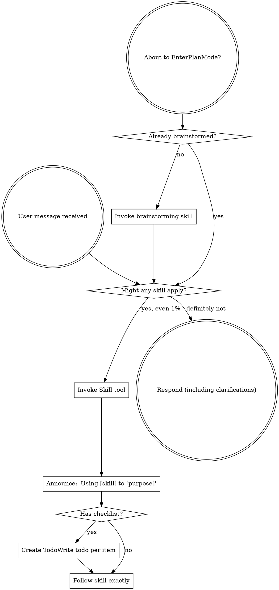

OpenAI Codex v0.128.0 (research preview)
--------
workdir: /Users/houssamr/Projects/syneriva/apps/erp-pos-stabperf
model: gpt-5.5
provider: openai
approval: never
sandbox: workspace-write [workdir, /tmp, $TMPDIR, /Users/houssamr/.codex/memories]
reasoning effort: high
reasoning summaries: none
session id: 019e1bf5-ab79-70c0-8d22-a8b8ed63b056
--------
user
changes against 'dev'
2026-05-12T11:32:27.480721Z  WARN codex_core_plugins::manifest: ignoring interface.defaultPrompt: prompt must be at most 128 characters path=/Users/houssamr/.codex/.tmp/plugins/plugins/build-ios-apps/.codex-plugin/plugin.json
2026-05-12T11:32:27.480974Z  WARN codex_core_plugins::manifest: ignoring interface.defaultPrompt: maximum of 3 prompts is supported path=/Users/houssamr/.codex/.tmp/plugins/plugins/plugin-eval/.codex-plugin/plugin.json
2026-05-12T11:32:27.482724Z  WARN codex_core_plugins::manifest: ignoring interface.defaultPrompt: maximum of 3 prompts is supported path=/Users/houssamr/.codex/.tmp/plugins/plugins/twilio-developer-kit/.codex-plugin/plugin.json
2026-05-12T11:32:27.482752Z  WARN codex_core_plugins::manifest: ignoring interface.defaultPrompt: maximum of 3 prompts is supported path=/Users/houssamr/.codex/.tmp/plugins/plugins/openai-developers/.codex-plugin/plugin.json
2026-05-12T11:32:31.547679Z  WARN codex_core_plugins::marketplace: skipping marketplace plugin with unsupported source path=/Users/houssamr/.codex/.tmp/marketplaces/.staging/marketplace-upgrade-5NV0hh/.claude-plugin/marketplace.json plugin="fullstory"
2026-05-12T11:32:31.547927Z  WARN codex_core_plugins::marketplace: skipping marketplace plugin with unsupported source path=/Users/houssamr/.codex/.tmp/marketplaces/.staging/marketplace-upgrade-5NV0hh/.claude-plugin/marketplace.json plugin="jfrog"
2026-05-12T11:32:31.548785Z  WARN codex_core_plugins::marketplace: skipping invalid marketplace plugin path=/Users/houssamr/.codex/.tmp/marketplaces/.staging/marketplace-upgrade-5NV0hh/.claude-plugin/marketplace.json marketplace=claude-plugins-official error=invalid plugin name: only ASCII letters, digits, `_`, and `-` are allowed
2026-05-12T11:32:34.798864Z  WARN codex_core_plugins::marketplace: skipping marketplace plugin with unsupported source path=/Users/houssamr/.codex/.tmp/marketplaces/claude-plugins-official/.claude-plugin/marketplace.json plugin="fullstory"
2026-05-12T11:32:34.798986Z  WARN codex_core_plugins::marketplace: skipping marketplace plugin with unsupported source path=/Users/houssamr/.codex/.tmp/marketplaces/claude-plugins-official/.claude-plugin/marketplace.json plugin="jfrog"
2026-05-12T11:32:34.799979Z  WARN codex_core_plugins::marketplace: skipping invalid marketplace plugin path=/Users/houssamr/.codex/.tmp/marketplaces/claude-plugins-official/.claude-plugin/marketplace.json marketplace=claude-plugins-official error=invalid plugin name: only ASCII letters, digits, `_`, and `-` are allowed
2026-05-12T11:32:34.800360Z  WARN codex_core_plugins::marketplace: skipping marketplace plugin that failed to resolve path=/Users/houssamr/.codex/.tmp/marketplaces/ui-ux-pro-max-skill/.claude-plugin/marketplace.json plugin="ui-ux-pro-max" error=invalid marketplace file `/Users/houssamr/.codex/.tmp/marketplaces/ui-ux-pro-max-skill/.claude-plugin/marketplace.json`: local plugin source path must not be empty
2026-05-12T11:32:34.801757Z  WARN codex_core_plugins::manifest: ignoring interface.defaultPrompt: prompt must be at most 128 characters path=/Users/houssamr/.codex/.tmp/plugins/plugins/build-ios-apps/.codex-plugin/plugin.json
2026-05-12T11:32:34.802305Z  WARN codex_core_plugins::manifest: ignoring interface.defaultPrompt: maximum of 3 prompts is supported path=/Users/houssamr/.codex/.tmp/plugins/plugins/plugin-eval/.codex-plugin/plugin.json
2026-05-12T11:32:34.806783Z  WARN codex_core_plugins::manifest: ignoring interface.defaultPrompt: maximum of 3 prompts is supported path=/Users/houssamr/.codex/.tmp/plugins/plugins/twilio-developer-kit/.codex-plugin/plugin.json
2026-05-12T11:32:34.806892Z  WARN codex_core_plugins::manifest: ignoring interface.defaultPrompt: maximum of 3 prompts is supported path=/Users/houssamr/.codex/.tmp/plugins/plugins/openai-developers/.codex-plugin/plugin.json
2026-05-12T11:32:34.832929Z  WARN codex_core_skills::loader: ignoring interface.icon_small: icon path must not contain '..'
2026-05-12T11:32:34.832945Z  WARN codex_core_skills::loader: ignoring interface.icon_large: icon path must not contain '..'
2026-05-12T11:32:34.833849Z  WARN codex_core_skills::loader: ignoring interface.icon_small: icon path must not contain '..'
2026-05-12T11:32:34.833882Z  WARN codex_core_skills::loader: ignoring interface.icon_large: icon path must not contain '..'
2026-05-12T11:32:34.835389Z  WARN codex_core_skills::loader: ignoring interface.icon_small: icon path must not contain '..'
2026-05-12T11:32:34.835404Z  WARN codex_core_skills::loader: ignoring interface.icon_large: icon path must not contain '..'
2026-05-12T11:32:34.838208Z  WARN codex_core_skills::loader: ignoring interface.icon_small: icon path must not contain '..'
2026-05-12T11:32:34.838223Z  WARN codex_core_skills::loader: ignoring interface.icon_large: icon path must not contain '..'
2026-05-12T11:32:34.839331Z  WARN codex_core_skills::loader: ignoring interface.icon_small: icon path must not contain '..'
2026-05-12T11:32:34.839347Z  WARN codex_core_skills::loader: ignoring interface.icon_large: icon path must not contain '..'
2026-05-12T11:32:34.843060Z  WARN codex_core_skills::loader: ignoring interface.icon_small: icon path must not contain '..'
2026-05-12T11:32:34.843075Z  WARN codex_core_skills::loader: ignoring interface.icon_large: icon path must not contain '..'
2026-05-12T11:32:35.597852Z  WARN codex_core_plugins::marketplace: skipping marketplace plugin with unsupported source path=/Users/houssamr/.codex/.tmp/marketplaces/claude-plugins-official/.claude-plugin/marketplace.json plugin="fullstory"
2026-05-12T11:32:35.598020Z  WARN codex_core_plugins::marketplace: skipping marketplace plugin with unsupported source path=/Users/houssamr/.codex/.tmp/marketplaces/claude-plugins-official/.claude-plugin/marketplace.json plugin="jfrog"
2026-05-12T11:32:35.598533Z  WARN codex_core_plugins::marketplace: skipping invalid marketplace plugin path=/Users/houssamr/.codex/.tmp/marketplaces/claude-plugins-official/.claude-plugin/marketplace.json marketplace=claude-plugins-official error=invalid plugin name: only ASCII letters, digits, `_`, and `-` are allowed
2026-05-12T11:32:35.598589Z  WARN codex_core_plugins::marketplace: skipping marketplace plugin that failed to resolve path=/Users/houssamr/.codex/.tmp/marketplaces/ui-ux-pro-max-skill/.claude-plugin/marketplace.json plugin="ui-ux-pro-max" error=invalid marketplace file `/Users/houssamr/.codex/.tmp/marketplaces/ui-ux-pro-max-skill/.claude-plugin/marketplace.json`: local plugin source path must not be empty
2026-05-12T11:32:35.599277Z  WARN codex_core_plugins::manifest: ignoring interface.defaultPrompt: prompt must be at most 128 characters path=/Users/houssamr/.codex/.tmp/plugins/plugins/build-ios-apps/.codex-plugin/plugin.json
2026-05-12T11:32:35.599486Z  WARN codex_core_plugins::manifest: ignoring interface.defaultPrompt: maximum of 3 prompts is supported path=/Users/houssamr/.codex/.tmp/plugins/plugins/plugin-eval/.codex-plugin/plugin.json
2026-05-12T11:32:35.601075Z  WARN codex_core_plugins::manifest: ignoring interface.defaultPrompt: maximum of 3 prompts is supported path=/Users/houssamr/.codex/.tmp/plugins/plugins/twilio-developer-kit/.codex-plugin/plugin.json
2026-05-12T11:32:35.601100Z  WARN codex_core_plugins::manifest: ignoring interface.defaultPrompt: maximum of 3 prompts is supported path=/Users/houssamr/.codex/.tmp/plugins/plugins/openai-developers/.codex-plugin/plugin.json
2026-05-12T11:32:35.623550Z  WARN codex_core_skills::loader: ignoring interface.icon_small: icon path must not contain '..'
2026-05-12T11:32:35.623560Z  WARN codex_core_skills::loader: ignoring interface.icon_large: icon path must not contain '..'
2026-05-12T11:32:35.624672Z  WARN codex_core_skills::loader: ignoring interface.icon_small: icon path must not contain '..'
2026-05-12T11:32:35.624676Z  WARN codex_core_skills::loader: ignoring interface.icon_large: icon path must not contain '..'
2026-05-12T11:32:35.626764Z  WARN codex_core_skills::loader: ignoring interface.icon_small: icon path must not contain '..'
2026-05-12T11:32:35.626776Z  WARN codex_core_skills::loader: ignoring interface.icon_large: icon path must not contain '..'
2026-05-12T11:32:35.627531Z  WARN codex_core_skills::loader: ignoring interface.icon_small: icon path must not contain '..'
2026-05-12T11:32:35.627541Z  WARN codex_core_skills::loader: ignoring interface.icon_large: icon path must not contain '..'
2026-05-12T11:32:35.628254Z  WARN codex_core_skills::loader: ignoring interface.icon_small: icon path must not contain '..'
2026-05-12T11:32:35.628262Z  WARN codex_core_skills::loader: ignoring interface.icon_large: icon path must not contain '..'
2026-05-12T11:32:35.629577Z  WARN codex_core_skills::loader: ignoring interface.icon_small: icon path must not contain '..'
2026-05-12T11:32:35.629585Z  WARN codex_core_skills::loader: ignoring interface.icon_large: icon path must not contain '..'
2026-05-12T11:32:37.687681Z  WARN codex_core_plugins::marketplace: skipping marketplace plugin with unsupported source path=/Users/houssamr/.codex/.tmp/marketplaces/claude-plugins-official/.claude-plugin/marketplace.json plugin="fullstory"
2026-05-12T11:32:37.687821Z  WARN codex_core_plugins::marketplace: skipping marketplace plugin with unsupported source path=/Users/houssamr/.codex/.tmp/marketplaces/claude-plugins-official/.claude-plugin/marketplace.json plugin="jfrog"
2026-05-12T11:32:37.688225Z  WARN codex_core_plugins::marketplace: skipping invalid marketplace plugin path=/Users/houssamr/.codex/.tmp/marketplaces/claude-plugins-official/.claude-plugin/marketplace.json marketplace=claude-plugins-official error=invalid plugin name: only ASCII letters, digits, `_`, and `-` are allowed
2026-05-12T11:32:37.688294Z  WARN codex_core_plugins::marketplace: skipping marketplace plugin that failed to resolve path=/Users/houssamr/.codex/.tmp/marketplaces/ui-ux-pro-max-skill/.claude-plugin/marketplace.json plugin="ui-ux-pro-max" error=invalid marketplace file `/Users/houssamr/.codex/.tmp/marketplaces/ui-ux-pro-max-skill/.claude-plugin/marketplace.json`: local plugin source path must not be empty
2026-05-12T11:32:37.691910Z  WARN codex_core_plugins::manifest: ignoring interface.defaultPrompt: prompt must be at most 128 characters path=/Users/houssamr/.codex/.tmp/plugins/plugins/build-ios-apps/.codex-plugin/plugin.json
2026-05-12T11:32:37.692439Z  WARN codex_core_plugins::manifest: ignoring interface.defaultPrompt: maximum of 3 prompts is supported path=/Users/houssamr/.codex/.tmp/plugins/plugins/plugin-eval/.codex-plugin/plugin.json
2026-05-12T11:32:37.694806Z  WARN codex_core_plugins::manifest: ignoring interface.defaultPrompt: maximum of 3 prompts is supported path=/Users/houssamr/.codex/.tmp/plugins/plugins/twilio-developer-kit/.codex-plugin/plugin.json
2026-05-12T11:32:37.694843Z  WARN codex_core_plugins::manifest: ignoring interface.defaultPrompt: maximum of 3 prompts is supported path=/Users/houssamr/.codex/.tmp/plugins/plugins/openai-developers/.codex-plugin/plugin.json
2026-05-12T11:32:37.725275Z  WARN codex_core_skills::loader: ignoring interface.icon_small: icon path must not contain '..'
2026-05-12T11:32:37.725292Z  WARN codex_core_skills::loader: ignoring interface.icon_large: icon path must not contain '..'
2026-05-12T11:32:37.726710Z  WARN codex_core_skills::loader: ignoring interface.icon_small: icon path must not contain '..'
2026-05-12T11:32:37.726718Z  WARN codex_core_skills::loader: ignoring interface.icon_large: icon path must not contain '..'
2026-05-12T11:32:37.727769Z  WARN codex_core_skills::loader: ignoring interface.icon_small: icon path must not contain '..'
2026-05-12T11:32:37.727775Z  WARN codex_core_skills::loader: ignoring interface.icon_large: icon path must not contain '..'
2026-05-12T11:32:37.728658Z  WARN codex_core_skills::loader: ignoring interface.icon_small: icon path must not contain '..'
2026-05-12T11:32:37.728668Z  WARN codex_core_skills::loader: ignoring interface.icon_large: icon path must not contain '..'
2026-05-12T11:32:37.729717Z  WARN codex_core_skills::loader: ignoring interface.icon_small: icon path must not contain '..'
2026-05-12T11:32:37.729727Z  WARN codex_core_skills::loader: ignoring interface.icon_large: icon path must not contain '..'
2026-05-12T11:32:37.732401Z  WARN codex_core_skills::loader: ignoring interface.icon_small: icon path must not contain '..'
2026-05-12T11:32:37.732414Z  WARN codex_core_skills::loader: ignoring interface.icon_large: icon path must not contain '..'
2026-05-12T11:32:45.330469Z  WARN codex_core_plugins::marketplace: skipping marketplace plugin that failed to resolve path=/Users/houssamr/.codex/.tmp/marketplaces/.staging/marketplace-upgrade-GsSHNV/.claude-plugin/marketplace.json plugin="ui-ux-pro-max" error=invalid marketplace file `/Users/houssamr/.codex/.tmp/marketplaces/.staging/marketplace-upgrade-GsSHNV/.claude-plugin/marketplace.json`: local plugin source path must not be empty
2026-05-12T11:32:45.364183Z  WARN codex_core_plugins::marketplace: skipping marketplace plugin with unsupported source path=/Users/houssamr/.codex/.tmp/marketplaces/claude-plugins-official/.claude-plugin/marketplace.json plugin="fullstory"
2026-05-12T11:32:45.364300Z  WARN codex_core_plugins::marketplace: skipping marketplace plugin with unsupported source path=/Users/houssamr/.codex/.tmp/marketplaces/claude-plugins-official/.claude-plugin/marketplace.json plugin="jfrog"
2026-05-12T11:32:45.364658Z  WARN codex_core_plugins::marketplace: skipping invalid marketplace plugin path=/Users/houssamr/.codex/.tmp/marketplaces/claude-plugins-official/.claude-plugin/marketplace.json marketplace=claude-plugins-official error=invalid plugin name: only ASCII letters, digits, `_`, and `-` are allowed
2026-05-12T11:32:45.364717Z  WARN codex_core_plugins::marketplace: skipping marketplace plugin that failed to resolve path=/Users/houssamr/.codex/.tmp/marketplaces/ui-ux-pro-max-skill/.claude-plugin/marketplace.json plugin="ui-ux-pro-max" error=invalid marketplace file `/Users/houssamr/.codex/.tmp/marketplaces/ui-ux-pro-max-skill/.claude-plugin/marketplace.json`: local plugin source path must not be empty
2026-05-12T11:32:45.364800Z  WARN codex_core_plugins::loader: configured non-curated plugin no longer exists in discovered marketplaces during cache refresh plugin="browser-use" marketplace="openai-bundled"
2026-05-12T11:32:45.372861Z  WARN codex_core_plugins::loader: configured non-curated plugin no longer exists in discovered marketplaces during cache refresh plugin="documents" marketplace="openai-primary-runtime"
2026-05-12T11:32:45.374791Z  WARN codex_core_plugins::loader: configured non-curated plugin no longer exists in discovered marketplaces during cache refresh plugin="presentations" marketplace="openai-primary-runtime"
2026-05-12T11:32:45.374795Z  WARN codex_core_plugins::loader: configured non-curated plugin no longer exists in discovered marketplaces during cache refresh plugin="spreadsheets" marketplace="openai-primary-runtime"
2026-05-12T11:32:48.997056Z  WARN codex_otel::events::session_telemetry: metrics counter [codex.skill.injected] failed: tag value contains invalid characters: superpowers:using-superpowers
exec
/bin/zsh -lc 'cat /Users/houssamr/.codex/plugins/cache/claude-plugins-official/superpowers/5.1.0/skills/using-superpowers/SKILL.md && git diff --stat 04b8a3466bc39547a34eb236ffb7e5eeb604566e' in /Users/houssamr/Projects/syneriva/apps/erp-pos-stabperf
 succeeded in 0ms:
---
name: using-superpowers
description: Use when starting any conversation - establishes how to find and use skills, requiring Skill tool invocation before ANY response including clarifying questions
---

<SUBAGENT-STOP>
If you were dispatched as a subagent to execute a specific task, skip this skill.
</SUBAGENT-STOP>

<EXTREMELY-IMPORTANT>
If you think there is even a 1% chance a skill might apply to what you are doing, you ABSOLUTELY MUST invoke the skill.

IF A SKILL APPLIES TO YOUR TASK, YOU DO NOT HAVE A CHOICE. YOU MUST USE IT.

This is not negotiable. This is not optional. You cannot rationalize your way out of this.
</EXTREMELY-IMPORTANT>

## Instruction Priority

Superpowers skills override default system prompt behavior, but **user instructions always take precedence**:

1. **User's explicit instructions** (CLAUDE.md, GEMINI.md, AGENTS.md, direct requests) — highest priority
2. **Superpowers skills** — override default system behavior where they conflict
3. **Default system prompt** — lowest priority

If CLAUDE.md, GEMINI.md, or AGENTS.md says "don't use TDD" and a skill says "always use TDD," follow the user's instructions. The user is in control.

## How to Access Skills

**In Claude Code:** Use the `Skill` tool. When you invoke a skill, its content is loaded and presented to you—follow it directly. Never use the Read tool on skill files.

**In Copilot CLI:** Use the `skill` tool. Skills are auto-discovered from installed plugins. The `skill` tool works the same as Claude Code's `Skill` tool.

**In Gemini CLI:** Skills activate via the `activate_skill` tool. Gemini loads skill metadata at session start and activates the full content on demand.

**In other environments:** Check your platform's documentation for how skills are loaded.

## Platform Adaptation

Skills use Claude Code tool names. Non-CC platforms: see `references/copilot-tools.md` (Copilot CLI), `references/codex-tools.md` (Codex) for tool equivalents. Gemini CLI users get the tool mapping loaded automatically via GEMINI.md.

# Using Skills

## The Rule

**Invoke relevant or requested skills BEFORE any response or action.** Even a 1% chance a skill might apply means that you should invoke the skill to check. If an invoked skill turns out to be wrong for the situation, you don't need to use it.

## Red Flags

These thoughts mean STOP—you're rationalizing:

| Thought | Reality |
|---------|---------|
| "This is just a simple question" | Questions are tasks. Check for skills. |
| "I need more context first" | Skill check comes BEFORE clarifying questions. |
| "Let me explore the codebase first" | Skills tell you HOW to explore. Check first. |
| "I can check git/files quickly" | Files lack conversation context. Check for skills. |
| "Let me gather information first" | Skills tell you HOW to gather information. |
| "This doesn't need a formal skill" | If a skill exists, use it. |
| "I remember this skill" | Skills evolve. Read current version. |
| "This doesn't count as a task" | Action = task. Check for skills. |
| "The skill is overkill" | Simple things become complex. Use it. |
| "I'll just do this one thing first" | Check BEFORE doing anything. |
| "This feels productive" | Undisciplined action wastes time. Skills prevent this. |
| "I know what that means" | Knowing the concept ≠ using the skill. Invoke it. |

## Skill Priority

When multiple skills could apply, use this order:

1. **Process skills first** (brainstorming, debugging) - these determine HOW to approach the task
2. **Implementation skills second** (frontend-design, mcp-builder) - these guide execution

"Let's build X" → brainstorming first, then implementation skills.
"Fix this bug" → debugging first, then domain-specific skills.

## Skill Types

**Rigid** (TDD, debugging): Follow exactly. Don't adapt away discipline.

**Flexible** (patterns): Adapt principles to context.

The skill itself tells you which.

## User Instructions

Instructions say WHAT, not HOW. "Add X" or "Fix Y" doesn't mean skip workflows.
 .../pos/src-tauri/src/printing/receipt_template.rs | 220 +++++++++++++++++++--
 .../pos/src/lib/__tests__/buildReceiptData.test.ts |  13 ++
 2 files changed, 214 insertions(+), 19 deletions(-)

2026-05-12T11:32:49.100213Z  WARN codex_protocol::openai_models: Model personality requested but model_messages is missing, falling back to base instructions. model=gpt-5.5 personality=pragmatic
2026-05-12T11:32:49.129351Z  WARN codex_core_plugins::marketplace: skipping marketplace plugin with unsupported source path=/Users/houssamr/.codex/.tmp/marketplaces/claude-plugins-official/.claude-plugin/marketplace.json plugin="fullstory"
2026-05-12T11:32:49.129577Z  WARN codex_core_plugins::marketplace: skipping marketplace plugin with unsupported source path=/Users/houssamr/.codex/.tmp/marketplaces/claude-plugins-official/.claude-plugin/marketplace.json plugin="jfrog"
2026-05-12T11:32:49.130279Z  WARN codex_core_plugins::marketplace: skipping invalid marketplace plugin path=/Users/houssamr/.codex/.tmp/marketplaces/claude-plugins-official/.claude-plugin/marketplace.json marketplace=claude-plugins-official error=invalid plugin name: only ASCII letters, digits, `_`, and `-` are allowed
2026-05-12T11:32:49.130411Z  WARN codex_core_plugins::marketplace: skipping marketplace plugin that failed to resolve path=/Users/houssamr/.codex/.tmp/marketplaces/ui-ux-pro-max-skill/.claude-plugin/marketplace.json plugin="ui-ux-pro-max" error=invalid marketplace file `/Users/houssamr/.codex/.tmp/marketplaces/ui-ux-pro-max-skill/.claude-plugin/marketplace.json`: local plugin source path must not be empty
2026-05-12T11:32:49.131356Z  WARN codex_core_plugins::manifest: ignoring interface.defaultPrompt: prompt must be at most 128 characters path=/Users/houssamr/.codex/.tmp/plugins/plugins/build-ios-apps/.codex-plugin/plugin.json
2026-05-12T11:32:49.131620Z  WARN codex_core_plugins::manifest: ignoring interface.defaultPrompt: maximum of 3 prompts is supported path=/Users/houssamr/.codex/.tmp/plugins/plugins/plugin-eval/.codex-plugin/plugin.json
2026-05-12T11:32:49.133669Z  WARN codex_core_plugins::manifest: ignoring interface.defaultPrompt: maximum of 3 prompts is supported path=/Users/houssamr/.codex/.tmp/plugins/plugins/twilio-developer-kit/.codex-plugin/plugin.json
2026-05-12T11:32:49.133699Z  WARN codex_core_plugins::manifest: ignoring interface.defaultPrompt: maximum of 3 prompts is supported path=/Users/houssamr/.codex/.tmp/plugins/plugins/openai-developers/.codex-plugin/plugin.json
2026-05-12T11:32:49.150752Z  WARN codex_core_skills::loader: ignoring interface.icon_small: icon path must not contain '..'
2026-05-12T11:32:49.150762Z  WARN codex_core_skills::loader: ignoring interface.icon_large: icon path must not contain '..'
2026-05-12T11:32:49.151379Z  WARN codex_core_skills::loader: ignoring interface.icon_small: icon path must not contain '..'
2026-05-12T11:32:49.151384Z  WARN codex_core_skills::loader: ignoring interface.icon_large: icon path must not contain '..'
2026-05-12T11:32:49.152018Z  WARN codex_core_skills::loader: ignoring interface.icon_small: icon path must not contain '..'
2026-05-12T11:32:49.152023Z  WARN codex_core_skills::loader: ignoring interface.icon_large: icon path must not contain '..'
2026-05-12T11:32:49.152869Z  WARN codex_core_skills::loader: ignoring interface.icon_small: icon path must not contain '..'
2026-05-12T11:32:49.152878Z  WARN codex_core_skills::loader: ignoring interface.icon_large: icon path must not contain '..'
2026-05-12T11:32:49.153773Z  WARN codex_core_skills::loader: ignoring interface.icon_small: icon path must not contain '..'
2026-05-12T11:32:49.153783Z  WARN codex_core_skills::loader: ignoring interface.icon_large: icon path must not contain '..'
2026-05-12T11:32:49.155332Z  WARN codex_core_skills::loader: ignoring interface.icon_small: icon path must not contain '..'
2026-05-12T11:32:49.155340Z  WARN codex_core_skills::loader: ignoring interface.icon_large: icon path must not contain '..'
exec
/bin/zsh -lc 'git diff --find-renames --find-copies --stat 04b8a3466bc39547a34eb236ffb7e5eeb604566e && git diff --find-renames --find-copies 04b8a3466bc39547a34eb236ffb7e5eeb604566e -- apps/pos/src-tauri/src/printing/receipt_template.rs apps/pos/src/lib/__tests__/buildReceiptData.test.ts' in /Users/houssamr/Projects/syneriva/apps/erp-pos-stabperf
 succeeded in 0ms:
 .../pos/src-tauri/src/printing/receipt_template.rs | 220 +++++++++++++++++++--
 .../pos/src/lib/__tests__/buildReceiptData.test.ts |  13 ++
 2 files changed, 214 insertions(+), 19 deletions(-)
diff --git a/apps/pos/src-tauri/src/printing/receipt_template.rs b/apps/pos/src-tauri/src/printing/receipt_template.rs
index 018b15a7..f816b75a 100644
--- a/apps/pos/src-tauri/src/printing/receipt_template.rs
+++ b/apps/pos/src-tauri/src/printing/receipt_template.rs
@@ -239,7 +239,10 @@ pub fn format_receipt(data: &ReceiptData) -> Vec<u8> {
 }
 
 /// Format receipt with optional print settings.
-pub fn format_receipt_with_settings(data: &ReceiptData, settings: Option<&PrintSettings>) -> Vec<u8> {
+pub fn format_receipt_with_settings(
+    data: &ReceiptData,
+    settings: Option<&PrintSettings>,
+) -> Vec<u8> {
     let columns = settings.map_or(42, |s| s.columns);
     let mut b = EscPosBuilder::with_columns(columns);
 
@@ -262,25 +265,50 @@ pub fn format_receipt_with_settings(data: &ReceiptData, settings: Option<&PrintS
 
     b.text_line(&data.company.address_line1);
     if let Some(ref addr2) = data.company.address_line2 {
-        b.text_line(addr2);
+        if let Some(line) = non_empty_trimmed(addr2) {
+            b.text_line(line);
+        }
+    }
+
+    let postal_city = [data.company.postal_code.trim(), data.company.city.trim()]
+        .into_iter()
+        .filter(|part| !part.is_empty())
+        .collect::<Vec<_>>()
+        .join(" ");
+    if !postal_city.is_empty() {
+        b.text_line(&postal_city);
     }
-    b.text_line(&format!(
-        "{} {}",
-        data.company.postal_code, data.company.city
-    ));
+
     if let Some(ref phone) = data.company.phone {
-        b.text_line(&format!("{} {}", data.label(|l| &l.tel, "Tel:"), phone));
+        if let Some(value) = non_empty_trimmed(phone) {
+            b.text_line(&format!("{} {}", data.label(|l| &l.tel, "Tel:"), value));
+        }
+    }
+    if let Some(tax_id) = non_empty_trimmed(&data.company.tax_id) {
+        b.text_line(&format!(
+            "{} {}",
+            data.label(|l| &l.tax_id, "Tax ID:"),
+            tax_id
+        ));
     }
-    b.text_line(&format!("{} {}", data.label(|l| &l.tax_id, "Tax ID:"), data.company.tax_id));
 
     b.align(Alignment::Left);
     b.separator('-');
 
     // ── Receipt Meta ──
-    b.two_column(&data.label(|l| &l.receipt, "Receipt:"), &data.receipt_number);
+    b.two_column(
+        &data.label(|l| &l.receipt, "Receipt:"),
+        &data.receipt_number,
+    );
     b.two_column(&data.label(|l| &l.date, "Date:"), &data.date_time);
-    b.two_column(&data.label(|l| &l.terminal, "Terminal:"), &data.terminal_name);
-    b.two_column(&data.label(|l| &l.operator, "Operator:"), &data.operator_name);
+    b.two_column(
+        &data.label(|l| &l.terminal, "Terminal:"),
+        &data.terminal_name,
+    );
+    b.two_column(
+        &data.label(|l| &l.operator, "Operator:"),
+        &data.operator_name,
+    );
 
     if data.show_customer.unwrap_or(true) {
         if let Some(ref customer) = data.customer_name {
@@ -387,20 +415,33 @@ pub fn format_receipt_with_settings(data: &ReceiptData, settings: Option<&PrintS
     b.separator('=');
 
     // ── Totals ──
-    b.two_column(&data.label(|l| &l.subtotal, "Subtotal:"), &format!("{}{}", data.currency_symbol, data.subtotal));
+    b.two_column(
+        &data.label(|l| &l.subtotal, "Subtotal:"),
+        &format!("{}{}", data.currency_symbol, data.subtotal),
+    );
 
     if data.discount_amount != "0.00" && data.discount_amount != "0" {
         b.two_column(
-            &format!("{}:", data.label(|l| &l.discount, "Discount").trim_end_matches(':')),
+            &format!(
+                "{}:",
+                data.label(|l| &l.discount, "Discount")
+                    .trim_end_matches(':')
+            ),
             &format!("-{}{}", data.currency_symbol, data.discount_amount),
         );
     }
 
-    b.two_column(&data.label(|l| &l.tax, "Tax:"), &format!("{}{}", data.currency_symbol, data.tax_amount));
+    b.two_column(
+        &data.label(|l| &l.tax, "Tax:"),
+        &format!("{}{}", data.currency_symbol, data.tax_amount),
+    );
 
     b.bold(true);
     b.font_size(FontSize::DoubleHeight);
-    b.two_column(&data.label(|l| &l.total, "TOTAL:"), &format!("{}{}", data.currency_symbol, data.total));
+    b.two_column(
+        &data.label(|l| &l.total, "TOTAL:"),
+        &format!("{}{}", data.currency_symbol, data.total),
+    );
     b.font_size(FontSize::Normal);
     b.bold(false);
 
@@ -526,7 +567,13 @@ pub fn format_receipt_with_settings(data: &ReceiptData, settings: Option<&PrintS
     b.empty_line();
     let default_thank_you = data.label(|l| &l.thank_you, "Thank you for your purchase!");
     let footer = settings
-        .and_then(|s| if s.footer_text.is_empty() { None } else { Some(s.footer_text.clone()) })
+        .and_then(|s| {
+            if s.footer_text.is_empty() {
+                None
+            } else {
+                Some(s.footer_text.clone())
+            }
+        })
         .unwrap_or(default_thank_you);
     b.text_line(&footer);
     b.empty_line();
@@ -552,7 +599,13 @@ pub fn format_receipt_with_settings(data: &ReceiptData, settings: Option<&PrintS
             if let Some(agg) = &data.aggregate_variance {
                 let has_over = counts.iter().any(|r| r.direction == "over");
                 let has_under = counts.iter().any(|r| r.direction == "under");
-                let dir = if has_over { "+" } else if has_under { "-" } else { " " };
+                let dir = if has_over {
+                    "+"
+                } else if has_under {
+                    "-"
+                } else {
+                    " "
+                };
                 b.text_line(&format!(
                     "{} {} {}",
                     data.label(|l| &l.cash_count_total_variance, "Total variance:"),
@@ -589,6 +642,15 @@ pub fn format_receipt_with_settings(data: &ReceiptData, settings: Option<&PrintS
     b.build()
 }
 
+fn non_empty_trimmed(value: &str) -> Option<&str> {
+    let trimmed = value.trim();
+    if trimmed.is_empty() {
+        None
+    } else {
+        Some(trimmed)
+    }
+}
+
 fn format_cash_count_header(data: &ReceiptData, cols: usize) -> String {
     let tender_w = (cols / 4).min(10);
     let tender_label = data.label(|l| &l.cash_count_col_tender, "Tender");
@@ -710,7 +772,9 @@ pub fn format_test_page_with_columns(columns: Option<u8>) -> Vec<u8> {
     // Column ruler
     b.align(Alignment::Left);
     b.select_font(true);
-    let ruler: String = (0..cols as u32).map(|i| char::from(b'0' + ((i % 10) as u8))).collect();
+    let ruler: String = (0..cols as u32)
+        .map(|i| char::from(b'0' + ((i % 10) as u8)))
+        .collect();
     b.text_line(&ruler);
     b.select_font(false);
 
@@ -787,7 +851,125 @@ mod tests_z_cash_counts {
         let text = String::from_utf8_lossy(&bytes);
         assert!(text.contains("CASH"), "should contain tender code CASH");
         assert!(text.contains("Jean"), "should contain manager name");
-        assert!(text.contains("till miscount"), "should contain variance reason");
+        assert!(
+            text.contains("till miscount"),
+            "should contain variance reason"
+        );
+    }
+
+    #[test]
+    fn receipt_header_omits_blank_optional_legal_fields() {
+        let mut company = make_company();
+        company.name = "Test Shop".to_string();
+        company.address_line1 = "12 Main Street".to_string();
+        company.address_line2 = Some("   ".to_string());
+        company.city = " ".to_string();
+        company.postal_code = "".to_string();
+        company.tax_id = "  ".to_string();
+        company.phone = Some("\t".to_string());
+
+        let data = ReceiptData {
+            company,
+            receipt_number: "R001".to_string(),
+            date_time: "2026-05-12T10:00:00Z".to_string(),
+            terminal_name: "T1".to_string(),
+            operator_name: "Alice".to_string(),
+            lines: vec![],
+            subtotal: "0.00".to_string(),
+            discount_amount: "0.00".to_string(),
+            tax_amount: "0.00".to_string(),
+            total: "0.00".to_string(),
+            currency_symbol: "€".to_string(),
+            vat_breakdown: vec![],
+            payments: vec![],
+            change_due: "0.00".to_string(),
+            tolerance_writeoff: None,
+            has_tolerance: false,
+            fiscal_hash: None,
+            fiscal_signature: None,
+            customer_name: None,
+            notes: None,
+            labels: None,
+            show_vat_breakdown: Some(false),
+            show_fiscal_info: Some(false),
+            show_payment_details: Some(false),
+            show_customer: Some(false),
+            is_reprint: Some(false),
+            cash_counts: None,
+            manager_name: None,
+            variance_reason: None,
+            variance_severity: None,
+            aggregate_variance: None,
+            qr_token: None,
+            receipt_kind: None,
+            original_receipt_number: None,
+            original_receipt_qr_token: None,
+        };
+
+        let bytes = format_receipt_with_settings(&data, None);
+        let text = String::from_utf8_lossy(&bytes);
+
+        assert!(text.contains("Test Shop"));
+        assert!(text.contains("12 Main Street"));
+        assert!(!text.contains("Tax ID:"));
+        assert!(!text.contains("Tel:"));
+    }
+
+    #[test]
+    fn receipt_header_trims_present_optional_legal_fields() {
+        let mut company = make_company();
+        company.address_line1 = "12 Main Street".to_string();
+        company.address_line2 = Some(" Suite 4 ".to_string());
+        company.city = " Paris ".to_string();
+        company.postal_code = " 75001 ".to_string();
+        company.tax_id = " FR123 ".to_string();
+        company.phone = Some(" 0102030405 ".to_string());
+
+        let data = ReceiptData {
+            company,
+            receipt_number: "R001".to_string(),
+            date_time: "2026-05-12T10:00:00Z".to_string(),
+            terminal_name: "T1".to_string(),
+            operator_name: "Alice".to_string(),
+            lines: vec![],
+            subtotal: "0.00".to_string(),
+            discount_amount: "0.00".to_string(),
+            tax_amount: "0.00".to_string(),
+            total: "0.00".to_string(),
+            currency_symbol: "€".to_string(),
+            vat_breakdown: vec![],
+            payments: vec![],
+            change_due: "0.00".to_string(),
+            tolerance_writeoff: None,
+            has_tolerance: false,
+            fiscal_hash: None,
+            fiscal_signature: None,
+            customer_name: None,
+            notes: None,
+            labels: None,
+            show_vat_breakdown: Some(false),
+            show_fiscal_info: Some(false),
+            show_payment_details: Some(false),
+            show_customer: Some(false),
+            is_reprint: Some(false),
+            cash_counts: None,
+            manager_name: None,
+            variance_reason: None,
+            variance_severity: None,
+            aggregate_variance: None,
+            qr_token: None,
+            receipt_kind: None,
+            original_receipt_number: None,
+            original_receipt_qr_token: None,
+        };
+
+        let bytes = format_receipt_with_settings(&data, None);
+        let text = String::from_utf8_lossy(&bytes);
+
+        assert!(text.contains("Suite 4"));
+        assert!(text.contains("75001 Paris"));
+        assert!(text.contains("Tax ID: FR123"));
+        assert!(text.contains("Tel: 0102030405"));
     }
 }
 
diff --git a/apps/pos/src/lib/__tests__/buildReceiptData.test.ts b/apps/pos/src/lib/__tests__/buildReceiptData.test.ts
index 56c4d129..fcb6f7b1 100644
--- a/apps/pos/src/lib/__tests__/buildReceiptData.test.ts
+++ b/apps/pos/src/lib/__tests__/buildReceiptData.test.ts
@@ -249,6 +249,19 @@ describe('buildEscPosReceiptData', () => {
     const result = buildEscPosReceiptData(receipt);
     expect(result.is_reprint).toBeUndefined();
   });
+
+  it('keeps blank company tax_id as an empty string for Rust-side omission', () => {
+    const receipt = makeReceipt({
+      company: {
+        ...makeReceipt().company,
+        tax_id: null,
+      },
+    });
+
+    const result = buildEscPosReceiptData(receipt);
+
+    expect(result.company.tax_id).toBe('');
+  });
 });
 
 // ── Phase H Block 2 — receipt QR token + refund metadata ─────────────────────

2026-05-12T11:32:57.697024Z  WARN codex_protocol::openai_models: Model personality requested but model_messages is missing, falling back to base instructions. model=gpt-5.5 personality=pragmatic
2026-05-12T11:32:57.759936Z  WARN codex_core_plugins::marketplace: skipping marketplace plugin with unsupported source path=/Users/houssamr/.codex/.tmp/marketplaces/claude-plugins-official/.claude-plugin/marketplace.json plugin="fullstory"
2026-05-12T11:32:57.760161Z  WARN codex_core_plugins::marketplace: skipping marketplace plugin with unsupported source path=/Users/houssamr/.codex/.tmp/marketplaces/claude-plugins-official/.claude-plugin/marketplace.json plugin="jfrog"
2026-05-12T11:32:57.760724Z  WARN codex_core_plugins::marketplace: skipping invalid marketplace plugin path=/Users/houssamr/.codex/.tmp/marketplaces/claude-plugins-official/.claude-plugin/marketplace.json marketplace=claude-plugins-official error=invalid plugin name: only ASCII letters, digits, `_`, and `-` are allowed
2026-05-12T11:32:57.760793Z  WARN codex_core_plugins::marketplace: skipping marketplace plugin that failed to resolve path=/Users/houssamr/.codex/.tmp/marketplaces/ui-ux-pro-max-skill/.claude-plugin/marketplace.json plugin="ui-ux-pro-max" error=invalid marketplace file `/Users/houssamr/.codex/.tmp/marketplaces/ui-ux-pro-max-skill/.claude-plugin/marketplace.json`: local plugin source path must not be empty
2026-05-12T11:32:57.761700Z  WARN codex_core_plugins::manifest: ignoring interface.defaultPrompt: prompt must be at most 128 characters path=/Users/houssamr/.codex/.tmp/plugins/plugins/build-ios-apps/.codex-plugin/plugin.json
2026-05-12T11:32:57.762183Z  WARN codex_core_plugins::manifest: ignoring interface.defaultPrompt: maximum of 3 prompts is supported path=/Users/houssamr/.codex/.tmp/plugins/plugins/plugin-eval/.codex-plugin/plugin.json
2026-05-12T11:32:57.764452Z  WARN codex_core_plugins::manifest: ignoring interface.defaultPrompt: maximum of 3 prompts is supported path=/Users/houssamr/.codex/.tmp/plugins/plugins/twilio-developer-kit/.codex-plugin/plugin.json
2026-05-12T11:32:57.764483Z  WARN codex_core_plugins::manifest: ignoring interface.defaultPrompt: maximum of 3 prompts is supported path=/Users/houssamr/.codex/.tmp/plugins/plugins/openai-developers/.codex-plugin/plugin.json
2026-05-12T11:32:57.781421Z  WARN codex_core_skills::loader: ignoring interface.icon_small: icon path must not contain '..'
2026-05-12T11:32:57.781431Z  WARN codex_core_skills::loader: ignoring interface.icon_large: icon path must not contain '..'
2026-05-12T11:32:57.782094Z  WARN codex_core_skills::loader: ignoring interface.icon_small: icon path must not contain '..'
2026-05-12T11:32:57.782099Z  WARN codex_core_skills::loader: ignoring interface.icon_large: icon path must not contain '..'
2026-05-12T11:32:57.782754Z  WARN codex_core_skills::loader: ignoring interface.icon_small: icon path must not contain '..'
2026-05-12T11:32:57.782759Z  WARN codex_core_skills::loader: ignoring interface.icon_large: icon path must not contain '..'
2026-05-12T11:32:57.783407Z  WARN codex_core_skills::loader: ignoring interface.icon_small: icon path must not contain '..'
2026-05-12T11:32:57.783414Z  WARN codex_core_skills::loader: ignoring interface.icon_large: icon path must not contain '..'
2026-05-12T11:32:57.784048Z  WARN codex_core_skills::loader: ignoring interface.icon_small: icon path must not contain '..'
2026-05-12T11:32:57.784053Z  WARN codex_core_skills::loader: ignoring interface.icon_large: icon path must not contain '..'
2026-05-12T11:32:57.785383Z  WARN codex_core_skills::loader: ignoring interface.icon_small: icon path must not contain '..'
2026-05-12T11:32:57.785391Z  WARN codex_core_skills::loader: ignoring interface.icon_large: icon path must not contain '..'
exec
/bin/zsh -lc "sed -n '1,260p' apps/pos/src-tauri/src/printing/receipt_template.rs && sed -n '260,680p' apps/pos/src-tauri/src/printing/receipt_template.rs && sed -n '1,320p' apps/pos/src/lib/__tests__/buildReceiptData.test.ts" in /Users/houssamr/Projects/syneriva/apps/erp-pos-stabperf
 succeeded in 0ms:
use serde::{Deserialize, Serialize};

use super::escpos::{Alignment, CutMode, EscPosBuilder, FontSize, QrErrorCorrection};

/// Per-tender cash count row for Z-report printing.
#[derive(Debug, Clone, Serialize, Deserialize)]
pub struct ZReceiptCashCountRow {
    pub code: String,
    pub name: String,
    pub expected: String,
    pub actual: String,
    pub variance: String,
    pub direction: String,
}

/// Receipt data structure passed from the frontend via JSON.
#[derive(Debug, Clone, Serialize, Deserialize)]
pub struct ReceiptData {
    /// Company / store information
    pub company: CompanyInfo,
    /// Receipt metadata
    pub receipt_number: String,
    pub date_time: String,
    pub terminal_name: String,
    pub operator_name: String,
    /// Line items
    pub lines: Vec<ReceiptLine>,
    /// Totals
    pub subtotal: String,
    pub discount_amount: String,
    pub tax_amount: String,
    pub total: String,
    pub currency_symbol: String,
    /// VAT breakdown
    pub vat_breakdown: Vec<VatBreakdownLine>,
    /// Payment methods used
    pub payments: Vec<PaymentLine>,
    pub change_due: String,
    /// Cash-sale tolerance write-off (GL 658). When `has_tolerance` is true,
    /// the formatter prints a "Rounding -X.XX" line using this string verbatim.
    /// Absent on legacy receipts and on receipts without applied tolerance.
    #[serde(default)]
    pub tolerance_writeoff: Option<String>,
    /// Precomputed flag from the TS boundary: true iff `tolerance_writeoff`
    /// represents a positive monetary value. Computing this on the Rust side
    /// would require parsing a monetary string into f64, which is a precision
    /// smell even when the parsed value is only compared to zero.
    #[serde(default)]
    pub has_tolerance: bool,
    /// Fiscal compliance
    pub fiscal_hash: Option<String>,
    pub fiscal_signature: Option<String>,
    /// Optional customer info
    pub customer_name: Option<String>,
    /// Optional notes
    pub notes: Option<String>,
    /// Localized labels (optional — English defaults if absent)
    pub labels: Option<ReceiptLabels>,
    /// Visibility flags — all default to true when absent (backward compatible)
    pub show_vat_breakdown: Option<bool>,
    pub show_fiscal_info: Option<bool>,
    pub show_payment_details: Option<bool>,
    pub show_customer: Option<bool>,
    /// When true, a bold centred DUPLICATA banner is printed after the receipt
    /// metadata block to indicate this is a copy of an already-issued document.
    pub is_reprint: Option<bool>,
    /// Z-report cash-count block (optional — only set when closing a shift with cash counts).
    pub cash_counts: Option<Vec<ZReceiptCashCountRow>>,
    pub manager_name: Option<String>,
    pub variance_reason: Option<String>,
    pub variance_severity: Option<String>,
    pub aggregate_variance: Option<String>,
    /// Signed QR token (`v:kid:receipt_uuid:mac`) for THIS receipt. When present,
    /// a centred QR + human-readable token is rendered at the footer. Absent /
    /// null on offline receipts whose token has not been signed by the server.
    #[serde(default)]
    pub qr_token: Option<String>,
    /// Receipt-kind discriminator. `"refund"` triggers the
    /// REMBOURSEMENT/REFUND header and the original-ticket reference block;
    /// any other value (or absent) is treated as a sale receipt.
    #[serde(default)]
    pub receipt_kind: Option<String>,
    /// On refund receipts: the original sale receipt's number.
    #[serde(default)]
    pub original_receipt_number: Option<String>,
    /// On refund receipts: the original sale receipt's QR token, re-printed
    /// at the top of the refund receipt so the original can still be scanned
    /// for further partial refunds.
    #[serde(default)]
    pub original_receipt_qr_token: Option<String>,
}

/// Localized receipt labels. All fields optional with English defaults.
#[derive(Debug, Clone, Serialize, Deserialize)]
pub struct ReceiptLabels {
    pub receipt: Option<String>,
    pub date: Option<String>,
    pub terminal: Option<String>,
    pub operator: Option<String>,
    pub customer: Option<String>,
    pub item: Option<String>,
    pub qty: Option<String>,
    pub amount: Option<String>,
    pub subtotal: Option<String>,
    pub discount: Option<String>,
    pub tax: Option<String>,
    pub total: Option<String>,
    pub payments: Option<String>,
    pub change_due: Option<String>,
    pub rounding: Option<String>,
    pub vat_rate: Option<String>,
    pub taxable: Option<String>,
    pub tax_col: Option<String>,
    pub thank_you: Option<String>,
    pub tax_id: Option<String>,
    pub tel: Option<String>,
    pub cash_count_section_title: Option<String>,
    pub cash_count_total_variance: Option<String>,
    pub cash_count_approved_by: Option<String>,
    pub cash_count_reason: Option<String>,
    pub cash_count_col_tender: Option<String>,
    pub cash_count_col_expected: Option<String>,
    pub cash_count_col_actual: Option<String>,
    pub cash_count_col_variance: Option<String>,
    /// Refund-receipt header label (e.g. "REMBOURSEMENT" / "REFUND" / "AVOIR").
    pub refund_header: Option<String>,
    /// "Original ticket:" label printed on refund receipts.
    pub original_ticket: Option<String>,
    /// "Scan original ticket:" label above the original-receipt QR re-print.
    pub original_qr_label: Option<String>,
}

impl ReceiptData {
    /// Get a localized label with English fallback.
    fn label(&self, getter: impl Fn(&ReceiptLabels) -> &Option<String>, default: &str) -> String {
        self.labels
            .as_ref()
            .and_then(|l| getter(l).as_ref())
            .map(|s| s.clone())
            .unwrap_or_else(|| default.to_string())
    }
}

#[derive(Debug, Clone, Serialize, Deserialize)]
pub struct CompanyInfo {
    pub name: String,
    pub address_line1: String,
    pub address_line2: Option<String>,
    pub city: String,
    pub postal_code: String,
    pub country: String,
    pub tax_id: String,
    pub phone: Option<String>,
}

#[derive(Debug, Clone, Serialize, Deserialize)]
pub struct ReceiptLine {
    pub name: String,
    pub quantity: String,
    pub unit_price: String,
    pub line_total: String,
    pub modifiers: Option<Vec<ModifierLine>>,
    pub discount: Option<String>,
}

#[derive(Debug, Clone, Serialize, Deserialize)]
pub struct ModifierLine {
    pub name: String,
    pub price: String,
}

#[derive(Debug, Clone, Serialize, Deserialize)]
pub struct VatBreakdownLine {
    pub rate: String,
    pub taxable: String,
    pub tax: String,
}

#[derive(Debug, Clone, Serialize, Deserialize)]
pub struct PaymentLine {
    pub method: String,
    pub amount: String,
}

/// Print settings passed from the frontend.
#[derive(Debug, Clone, Serialize, Deserialize)]
pub struct PrintSettings {
    pub columns: u8,
    pub cut_mode: String,
    pub encoding: String,
    pub footer_text: String,
    pub copies: u32,
}

/// Cash drawer kick settings passed from the frontend.
#[derive(Debug, Clone, Serialize, Deserialize)]
pub struct DrawerKickSettings {
    pub pin: u8,
    pub pulse_on: u8,
    pub pulse_off: u8,
    pub beep: bool,
}

impl PrintSettings {
    pub(crate) fn code_page(&self) -> u8 {
        match self.encoding.as_str() {
            "cp858" => 19,
            "cp1252" => 16,
            _ => 0, // cp437
        }
    }

    /// Return the `encoding_rs` encoding matching the configured code page.
    pub(crate) fn encoding_rs(&self) -> &'static encoding_rs::Encoding {
        match self.encoding.as_str() {
            "cp1252" => encoding_rs::WINDOWS_1252,
            "cp858" => encoding_rs::WINDOWS_1252, // CP858 ≈ CP850 + euro; 1252 covers French needs
            _ => encoding_rs::WINDOWS_1252,       // default to 1252 instead of cp437
        }
    }

    pub(crate) fn cut_mode_enum(&self) -> Option<CutMode> {
        match self.cut_mode.as_str() {
            "full" => Some(CutMode::Full),
            "partial" => Some(CutMode::Partial),
            _ => None, // "none"
        }
    }

    /// Returns `true` when cutting is enabled (i.e. `cut_mode` is not `"none"`).
    pub(crate) fn is_cut_enabled(&self) -> bool {
        self.cut_mode != "none"
    }
}

/// Format receipt data into ESC/POS commands ready to send to a printer.
pub fn format_receipt(data: &ReceiptData) -> Vec<u8> {
    format_receipt_with_settings(data, None)
}

/// Format receipt with optional print settings.
pub fn format_receipt_with_settings(
    data: &ReceiptData,
    settings: Option<&PrintSettings>,
) -> Vec<u8> {
    let columns = settings.map_or(42, |s| s.columns);
    let mut b = EscPosBuilder::with_columns(columns);

    // Set encoding and code page if specified (after initialize, which is called in with_columns)
    if let Some(s) = settings {
        b.set_encoding(s.encoding_rs());
        let page = s.code_page();
        if page != 0 {
            b.set_code_page(page);
        }
    }

    // ── Company Header ──
    b.align(Alignment::Center);
    b.font_size(FontSize::DoubleWidthHeight);
    b.font_size(FontSize::DoubleWidthHeight);
    b.bold(true);
    b.text_line(&data.company.name);
    b.bold(false);
    b.font_size(FontSize::Normal);

    b.text_line(&data.company.address_line1);
    if let Some(ref addr2) = data.company.address_line2 {
        if let Some(line) = non_empty_trimmed(addr2) {
            b.text_line(line);
        }
    }

    let postal_city = [data.company.postal_code.trim(), data.company.city.trim()]
        .into_iter()
        .filter(|part| !part.is_empty())
        .collect::<Vec<_>>()
        .join(" ");
    if !postal_city.is_empty() {
        b.text_line(&postal_city);
    }

    if let Some(ref phone) = data.company.phone {
        if let Some(value) = non_empty_trimmed(phone) {
            b.text_line(&format!("{} {}", data.label(|l| &l.tel, "Tel:"), value));
        }
    }
    if let Some(tax_id) = non_empty_trimmed(&data.company.tax_id) {
        b.text_line(&format!(
            "{} {}",
            data.label(|l| &l.tax_id, "Tax ID:"),
            tax_id
        ));
    }

    b.align(Alignment::Left);
    b.separator('-');

    // ── Receipt Meta ──
    b.two_column(
        &data.label(|l| &l.receipt, "Receipt:"),
        &data.receipt_number,
    );
    b.two_column(&data.label(|l| &l.date, "Date:"), &data.date_time);
    b.two_column(
        &data.label(|l| &l.terminal, "Terminal:"),
        &data.terminal_name,
    );
    b.two_column(
        &data.label(|l| &l.operator, "Operator:"),
        &data.operator_name,
    );

    if data.show_customer.unwrap_or(true) {
        if let Some(ref customer) = data.customer_name {
            b.two_column(&data.label(|l| &l.customer, "Customer:"), customer);
        }
    }

    // ── DUPLICATA banner (reprint indicator) ──
    if data.is_reprint == Some(true) {
        b.align(Alignment::Center);
        b.font_size(FontSize::DoubleWidthHeight);
        b.bold(true);
        b.text_line("DUPLICATA");
        b.bold(false);
        b.font_size(FontSize::Normal);
        b.align(Alignment::Left);
    }

    // ── REMBOURSEMENT / REFUND banner (refund receipts only) ──
    // Gated on receipt_kind == "refund". Sale receipts (default) skip this block.
    let is_refund = data
        .receipt_kind
        .as_deref()
        .map(|k| k.eq_ignore_ascii_case("refund"))
        .unwrap_or(false);

    if is_refund {
        b.align(Alignment::Center);
        b.font_size(FontSize::DoubleWidthHeight);
        b.bold(true);
        b.text_line(&data.label(|l| &l.refund_header, "REFUND"));
        b.bold(false);
        b.font_size(FontSize::Normal);
        b.align(Alignment::Left);

        // Original ticket reference + original-ticket QR re-print
        if let Some(ref orig_num) = data.original_receipt_number {
            b.two_column(
                &data.label(|l| &l.original_ticket, "Original ticket:"),
                orig_num,
            );
        }

        if let Some(ref orig_token) = data.original_receipt_qr_token {
            b.align(Alignment::Center);
            b.empty_line();
            b.select_font(true); // Font B (smaller) for the label
            b.text_line(&data.label(|l| &l.original_qr_label, "Scan original ticket:"));
            b.select_font(false);
            b.qr_code(orig_token, 4, QrErrorCorrection::M);
            b.empty_line();
            b.align(Alignment::Left);
        }
    }

    b.separator('=');

    // ── Line Items ──
    // Header
    b.bold(true);
    b.three_column(
        &data.label(|l| &l.item, "Item"),
        &data.label(|l| &l.qty, "Qty"),
        &data.label(|l| &l.amount, "Amount"),
    );
    b.bold(false);
    b.separator('-');

    for line in &data.lines {
        // Product name on its own line if long
        let qty_price = format!("{} x {}", line.quantity, line.unit_price);
        let total_str = format!("{}{}", data.currency_symbol, line.line_total);

        if line.name.len() > 20 {
            // Long name: print name on first line, details on second
            b.text_line(&line.name);
            b.two_column(&format!("  {}", qty_price), &total_str);
        } else {
            b.text_line(&line.name);
            b.two_column(&format!("  {}", qty_price), &total_str);
        }

        // Modifiers
        if let Some(ref modifiers) = line.modifiers {
            for modifier in modifiers {
                let mod_price = if modifier.price == "0.00" || modifier.price == "0" {
                    String::new()
                } else {
                    format!("+{}{}", data.currency_symbol, modifier.price)
                };
                b.two_column(&format!("  + {}", modifier.name), &mod_price);
            }
        }

        // Line discount
        if let Some(ref discount) = line.discount {
            b.two_column(
                &format!("  {}", data.label(|l| &l.discount, "Discount")),
                &format!("-{}{}", data.currency_symbol, discount),
            );
        }
    }

    b.separator('=');

    // ── Totals ──
    b.two_column(
        &data.label(|l| &l.subtotal, "Subtotal:"),
        &format!("{}{}", data.currency_symbol, data.subtotal),
    );

    if data.discount_amount != "0.00" && data.discount_amount != "0" {
        b.two_column(
            &format!(
                "{}:",
                data.label(|l| &l.discount, "Discount")
                    .trim_end_matches(':')
            ),
            &format!("-{}{}", data.currency_symbol, data.discount_amount),
        );
    }

    b.two_column(
        &data.label(|l| &l.tax, "Tax:"),
        &format!("{}{}", data.currency_symbol, data.tax_amount),
    );

    b.bold(true);
    b.font_size(FontSize::DoubleHeight);
    b.two_column(
        &data.label(|l| &l.total, "TOTAL:"),
        &format!("{}{}", data.currency_symbol, data.total),
    );
    b.font_size(FontSize::Normal);
    b.bold(false);

    // ── VAT Breakdown ──
    if data.show_vat_breakdown.unwrap_or(true) && !data.vat_breakdown.is_empty() {
        b.separator('-');
        b.bold(true);
        b.three_column(
            &data.label(|l| &l.vat_rate, "VAT %"),
            &data.label(|l| &l.taxable, "Taxable"),
            &data.label(|l| &l.tax_col, "Tax"),
        );
        b.bold(false);

        for vat in &data.vat_breakdown {
            b.three_column(
                &format!("{}%", vat.rate),
                &format!("{}{}", data.currency_symbol, vat.taxable),
                &format!("{}{}", data.currency_symbol, vat.tax),
            );
        }
    }

    // ── Payments ──
    if data.show_payment_details.unwrap_or(true) {
        b.separator('-');
        b.bold(true);
        b.text_line(&data.label(|l| &l.payments, "Payments:"));
        b.bold(false);

        for payment in &data.payments {
            b.two_column(
                &format!("  {}", payment.method),
                &format!("{}{}", data.currency_symbol, payment.amount),
            );
        }

        if data.change_due != "0.00" && data.change_due != "0" {
            b.bold(true);
            b.two_column(
                &data.label(|l| &l.change_due, "Change Due:"),
                &format!("{}{}", data.currency_symbol, data.change_due),
            );
            b.bold(false);
        }

        // ── Tolerance write-off (Rounding line) ──
        // Printed only when a non-zero tolerance write-off is present on the receipt.
        // The TS layer (buildReceiptData) precomputes `has_tolerance` from the
        // monetary string using arbitrary-precision decimal — Rust does not parse
        // the monetary value here.
        if data.has_tolerance {
            if let Some(ref tolerance) = data.tolerance_writeoff {
                b.two_column(
                    &data.label(|l| &l.rounding, "Rounding"),
                    &format!("-{}{}", data.currency_symbol, tolerance),
                );
            }
        }
    }

    // ── Notes ──
    if let Some(ref notes) = data.notes {
        b.separator('-');
        b.text_line(notes);
    }

    // ── Fiscal Compliance Footer ──
    if data.show_fiscal_info.unwrap_or(true)
        && (data.fiscal_hash.is_some() || data.fiscal_signature.is_some())
    {
        b.separator('-');
        b.select_font(true); // Font B (smaller) for compliance data
        b.align(Alignment::Center);

        if let Some(ref hash) = data.fiscal_hash {
            // Show first 16 and last 16 chars of the hash for readability
            let display_hash = if hash.len() > 32 {
                format!("{}...{}", &hash[..16], &hash[hash.len() - 16..])
            } else {
                hash.clone()
            };
            b.text_line(&format!("Hash: {}", display_hash));
        }

        if let Some(ref sig) = data.fiscal_signature {
            b.text_line(&format!("Sig: {}", sig));
        }

        // QR code with full hash for verification
        if let Some(ref hash) = data.fiscal_hash {
            b.empty_line();
            b.qr_code(hash, 4, QrErrorCorrection::M);
            b.empty_line();
        }

        b.select_font(false); // Back to Font A
    }

    // ── Receipt QR token (scannable for return / partial refund) ──
    // The QR encodes the canonical `v:kid:receipt_uuid:mac` token signed by
    // the backend's ReceiptQrTokenSigner. Any terminal can scan a printed
    // receipt to start a return — see voucherRepository.findReceiptByQrToken.
    // Distinct from the fiscal_hash QR above (compliance-only) — this one
    // is workflow-facing.
    if let Some(ref token) = data.qr_token {
        if !token.is_empty() {
            b.separator('-');
            b.align(Alignment::Center);
            b.empty_line();
            b.qr_code(token, 4, QrErrorCorrection::M);
            b.empty_line();
            // Human-readable token below the QR (small font) so it can be
            // typed in if the QR is damaged.
            b.select_font(true);
            b.text_line(token);
            b.select_font(false);
        }
    }

    // ── Footer ──
    b.align(Alignment::Center);
    b.empty_line();
    let default_thank_you = data.label(|l| &l.thank_you, "Thank you for your purchase!");
    let footer = settings
        .and_then(|s| {
            if s.footer_text.is_empty() {
                None
            } else {
                Some(s.footer_text.clone())
            }
        })
        .unwrap_or(default_thank_you);
    b.text_line(&footer);
    b.empty_line();

    // ── Cash-Count block (Z-report only) ──
    if let Some(counts) = &data.cash_counts {
        if !counts.is_empty() {
            b.separator('-');
            b.align(Alignment::Center);
            b.bold(true);
            b.text_line(&data.label(|l| &l.cash_count_section_title, "CASH COUNT"));
            b.bold(false);
            b.align(Alignment::Left);
            let cols = columns as usize;
            let header = format_cash_count_header(data, cols);
            b.text_line(&header);
            b.separator('-');
            for row in counts {
                let line = format_cash_count_row(row, cols);
                b.text_line(&line);
            }
            b.separator('-');
            if let Some(agg) = &data.aggregate_variance {
                let has_over = counts.iter().any(|r| r.direction == "over");
                let has_under = counts.iter().any(|r| r.direction == "under");
                let dir = if has_over {
                    "+"
                } else if has_under {
                    "-"
                } else {
                    " "
                };
                b.text_line(&format!(
                    "{} {} {}",
                    data.label(|l| &l.cash_count_total_variance, "Total variance:"),
                    agg,
                    dir,
                ));
            }
            if let Some(mgr) = &data.manager_name {
                b.text_line(&format!(
                    "{} {}",
                    data.label(|l| &l.cash_count_approved_by, "Approved by:"),
                    mgr,
                ));
            }
            if let Some(reason) = &data.variance_reason {
                b.text_line(&format!(
                    "{} {}",
                    data.label(|l| &l.cash_count_reason, "Reason:"),
                    reason,
                ));
            }
        }
    }

    // Feed and cut
    b.feed_lines(4);
    let cut = settings.and_then(|s| s.cut_mode_enum());
    if let Some(mode) = cut {
        b.cut(mode);
    } else if settings.map_or(true, |s| s.cut_mode != "none") {
        b.cut(CutMode::Partial);
    }

    b.build()
}

fn non_empty_trimmed(value: &str) -> Option<&str> {
    let trimmed = value.trim();
    if trimmed.is_empty() {
        None
    } else {
        Some(trimmed)
    }
}

fn format_cash_count_header(data: &ReceiptData, cols: usize) -> String {
    let tender_w = (cols / 4).min(10);
    let tender_label = data.label(|l| &l.cash_count_col_tender, "Tender");
    let expected_label = data.label(|l| &l.cash_count_col_expected, "Expected");
    let actual_label = data.label(|l| &l.cash_count_col_actual, "Actual");
    let variance_label = data.label(|l| &l.cash_count_col_variance, "Variance");
    let tender_truncated: String = tender_label.chars().take(tender_w).collect();
    format!(
        "{:<tender_w$} {:>9} {:>9} {:>9}",
        tender_truncated,
        &expected_label[..expected_label.len().min(9)],
        &actual_label[..actual_label.len().min(9)],
        &variance_label[..variance_label.len().min(9)],
        tender_w = tender_w,
    )
}

fn format_cash_count_row(row: &ZReceiptCashCountRow, cols: usize) -> String {
    let tender_w = (cols / 4).min(10);
    let dir_char = match row.direction.as_str() {
        "over" => "+",
        "under" => "-",
        _ => " ",
    };
    let name_truncated: String = row.name.chars().take(tender_w).collect();
    format!(
        "{:<tender_w$} {:>9} {:>9} {:>8}{}",
import { describe, it, expect, vi } from 'vitest';

// buildReceiptData uses i18next.t() for receipt labels — stub it out so the
// test runs without the full i18n initialisation.
vi.mock('i18next', () => ({
  default: {
    t: (key: string) => key,
  },
}));

// decimal.ts imports currency.ts which imports useAuthStore at module level.
vi.mock('@/stores/authStore', () => ({
  useAuthStore: vi.fn(),
}));

import { buildEscPosReceiptData } from '../buildReceiptData';
import type { FullReceiptResponse } from '@/types/receipt';
import type { CheckoutResult } from '@/lib/offline/offlineCheckoutService';

/** Minimal but valid CheckoutResult fixture for offline-receipt tests */
function makeOfflineCheckoutResult(overrides: Partial<CheckoutResult> = {}): CheckoutResult {
  return {
    isOffline: true,
    receiptId: 'offline-rcpt-001',
    receiptNumber: 'R-T1-2026-00000001',
    total: '20.00',
    subtotal: '20.00',
    taxAmount: '0.00',
    discountAmount: '0.00',
    changeDue: 0,
    currency: 'EUR',
    // fiscalHash is optional (string | undefined)
    onlineReceipt: null,
    onlinePayment: null,
    ...overrides,
  };
}

/** Minimal but valid FullReceiptResponse fixture */
function makeReceipt(overrides: Partial<FullReceiptResponse> = {}): FullReceiptResponse {
  return {
    id: 'rcpt-001',
    receipt_number: 'RC-001',
    receipt_type: 'sale',
    posted_at: '2024-01-15T10:00:00Z',
    cashier_name: 'Alice',
    subtotal: '10.00',
    tax_amount: '0.00',
    discount_amount: '0.00',
    total: '10.00',
    tolerance_writeoff: null,
    currency: 'EUR',
    fiscal_hash: null,
    customer_name: null,
    notes: null,
    company: {
      name: 'Test Shop',
      address_street: null,
      address_street_2: null,
      address_city: null,
      address_postal_code: null,
      country_code: 'FR',
      tax_id: null,
      phone: null,
    },
    terminal: { id: 'term-1', name: 'Terminal 1', code: 'T1' },
    lines: [
      {
        id: 'line-1',
        line_number: 1,
        product_id: null,
        composite_item_id: null,
        menu_category_id: null,
        product_code: 'PROD-1',
        product_name: 'Coffee',
        quantity: '1',
        unit_price: '10.00',
        line_total: '10.00',
        tax_rate: '0.00',
        tax_amount: '0.00',
        discount_amount: '0.00',
        modifiers: null,
      },
    ],
    vat_details: [],
    payments: [
      {
        id: 'pay-1',
        payment_method_id: 'pm-1',
        payment_type: 'cash',
        amount: '10.00',
        payment_method: { id: 'pm-1', name: 'Cash', code: 'CASH' },
      },
    ],
    ...overrides,
  };
}

describe('buildEscPosReceiptData — tolerance write-off (Phase 2 / Task 10)', () => {
  it('formats tolerance_writeoff to currency display scale (EUR → 2 decimals)', () => {
    // Storage scale is 3 (TND-compatible). Display scale must match the currency.
    // EUR has 2 decimals, so '0.020' (storage) → '0.02' (display).
    const receipt = makeReceipt({
      currency: 'EUR',
      tolerance_writeoff: '0.020',
    });

    const result = buildEscPosReceiptData(receipt);

    expect(result.tolerance_writeoff).toBe('0.02');
  });

  it('passes tolerance_writeoff = null when receipt has no tolerance applied', () => {
    const receipt = makeReceipt({ tolerance_writeoff: null });

    const result = buildEscPosReceiptData(receipt);

    expect(result.tolerance_writeoff).toBeNull();
  });

  it('exposes the rounding label via labels.rounding (i18n key, not hardcoded)', () => {
    const receipt = makeReceipt({ tolerance_writeoff: '0.020' });

    const result = buildEscPosReceiptData(receipt);

    // The mocked i18next.t returns its key — we expect the receiptLabel.rounding key.
    expect(result.labels?.rounding).toBe('pos:receiptLabel.rounding');
  });

  it.each([
    ['0.020', true, 'positive write-off'],
    ['0.001', true, 'sub-cent positive write-off'],
  ])(
    'sets has_tolerance=true for %s (%s)',
    (writeoff, expected, _label) => {
      const receipt = makeReceipt({ tolerance_writeoff: writeoff });

      const result = buildEscPosReceiptData(receipt);

      expect(result.has_tolerance).toBe(expected);
    },
  );

  it.each([
    ['0', 'literal zero'],
    ['0.000', 'zero at scale 3'],
    ['', 'empty string'],
    [null, 'null'],
  ])(
    'sets has_tolerance=false for %s (%s)',
    (writeoff, _label) => {
      const receipt = makeReceipt({ tolerance_writeoff: writeoff });

      const result = buildEscPosReceiptData(receipt);

      expect(result.has_tolerance).toBe(false);
    },
  );
});

describe('buildEscPosReceiptData', () => {
  it('returns change_due as a plain decimal string when payment equals total', () => {
    const receipt = makeReceipt();
    const result = buildEscPosReceiptData(receipt);

    // No change due — result must be a string formatted to the currency's
    // decimal places (2 for EUR), not the result of calling .toFixed() on a
    // string (which would have thrown "toFixed is not a function").
    expect(typeof result.change_due).toBe('string');
    expect(result.change_due).toBe('0.00');
  });

  it('returns correct change_due string when overpayment occurs', () => {
    // Customer pays 20.00 on a 10.00 total — change should be 10.00
    const receipt = makeReceipt({
      payments: [
        {
          id: 'pay-1',
          payment_method_id: 'pm-1',
          payment_type: 'cash',
          amount: '20.00',
          payment_method: { id: 'pm-1', name: 'Cash', code: 'CASH' },
        },
      ],
    });

    const result = buildEscPosReceiptData(receipt);

    expect(typeof result.change_due).toBe('string');
    expect(result.change_due).toBe('10.00');
  });

  it('change_due is a string and not the result of .toFixed() on a string', () => {
    // This test directly guards the original bug: changeDue was already a
    // string from bcsub() / (0).toFixed() — calling .toFixed() on it would
    // throw "changeDue.toFixed is not a function" at runtime.
    // If the function returns without throwing, the bug is fixed.
    const receipt = makeReceipt({
      total: '15.50',
      payments: [
        {
          id: 'pay-1',
          payment_method_id: 'pm-1',
          payment_type: 'cash',
          amount: '20.00',
          payment_method: { id: 'pm-1', name: 'Cash', code: 'CASH' },
        },
      ],
    });

    expect(() => buildEscPosReceiptData(receipt)).not.toThrow();
    const result = buildEscPosReceiptData(receipt);
    expect(result.change_due).toBe('4.50');
  });

  it('handles multiple payments summing to exact total', () => {
    const receipt = makeReceipt({
      total: '30.00',
      payments: [
        {
          id: 'pay-1',
          payment_method_id: 'pm-1',
          payment_type: 'cash',
          amount: '20.00',
          payment_method: { id: 'pm-1', name: 'Cash', code: 'CASH' },
        },
        {
          id: 'pay-2',
          payment_method_id: 'pm-2',
          payment_type: 'card',
          amount: '10.00',
          payment_method: { id: 'pm-2', name: 'Card', code: 'CARD' },
        },
      ],
    });

    const result = buildEscPosReceiptData(receipt);
    expect(result.change_due).toBe('0.00');
  });

  it('sets is_reprint=true when isReprint flag is passed', () => {
    const receipt = makeReceipt();
    const result = buildEscPosReceiptData(receipt, undefined, true);
    expect(result.is_reprint).toBe(true);
  });

  it('leaves is_reprint undefined by default', () => {
    const receipt = makeReceipt();
    const result = buildEscPosReceiptData(receipt);
    expect(result.is_reprint).toBeUndefined();
  });

  it('keeps blank company tax_id as an empty string for Rust-side omission', () => {
    const receipt = makeReceipt({
      company: {
        ...makeReceipt().company,
        tax_id: null,
      },
    });

    const result = buildEscPosReceiptData(receipt);

    expect(result.company.tax_id).toBe('');
  });
});

// ── Phase H Block 2 — receipt QR token + refund metadata ─────────────────────

describe('buildEscPosReceiptData — Phase H Block 2 (sale QR / refund header / cross-refs)', () => {
  it('emits qr_token on a sale receipt when one is provided', () => {
    const receipt = makeReceipt();
    const token =
      'v:k1:c0ffee00-1111-2222-3333-444455556666:f00dbeefcafe1234abcd5678fedcba98';

    const result = buildEscPosReceiptData(receipt, undefined, false, {
      qrToken: token,
    });

    expect(result.qr_token).toBe(token);
    expect(result.receipt_kind).toBe('sale');
    expect(result.original_receipt_number).toBeNull();
    expect(result.original_receipt_qr_token).toBeNull();
  });

  it('emits qr_token = null on a sale receipt when none is provided (back-compat)', () => {
    const receipt = makeReceipt();
    const result = buildEscPosReceiptData(receipt);

    expect(result.qr_token).toBeNull();
    expect(result.receipt_kind).toBe('sale');
  });

  it('infers receipt_kind = "refund" from receipt_type === "return" and surfaces all refund cross-refs', () => {
    const refundToken =
      'v:k1:c0ffee00-1111-2222-3333-444455556666:f00dbeefcafe1234abcd5678fedcba98';
    const originalToken =
      'v:k1:abadcafe-aaaa-bbbb-cccc-dddddddddddd:1234567890abcdef1234567890abcdef';

    const receipt = makeReceipt({
      receipt_type: 'return',
      total: '-10.00',
      subtotal: '-10.00',
    });

    const result = buildEscPosReceiptData(receipt, undefined, false, {
      qrToken: refundToken,
      originalReceiptNumber: 'R-T1-2026-00000123',
      originalReceiptQrToken: originalToken,
    });

    expect(result.receipt_kind).toBe('refund');
    expect(result.qr_token).toBe(refundToken);
    expect(result.original_receipt_number).toBe('R-T1-2026-00000123');
    expect(result.original_receipt_qr_token).toBe(originalToken);
  });

  it('honours an explicit receiptKind override even when receipt_type says "sale"', () => {
    const receipt = makeReceipt({ receipt_type: 'sale' });

    const result = buildEscPosReceiptData(receipt, undefined, false, {

2026-05-12T11:33:04.284666Z  WARN codex_protocol::openai_models: Model personality requested but model_messages is missing, falling back to base instructions. model=gpt-5.5 personality=pragmatic
2026-05-12T11:33:04.329758Z  WARN codex_core_plugins::marketplace: skipping marketplace plugin with unsupported source path=/Users/houssamr/.codex/.tmp/marketplaces/claude-plugins-official/.claude-plugin/marketplace.json plugin="fullstory"
2026-05-12T11:33:04.329981Z  WARN codex_core_plugins::marketplace: skipping marketplace plugin with unsupported source path=/Users/houssamr/.codex/.tmp/marketplaces/claude-plugins-official/.claude-plugin/marketplace.json plugin="jfrog"
2026-05-12T11:33:04.330785Z  WARN codex_core_plugins::marketplace: skipping invalid marketplace plugin path=/Users/houssamr/.codex/.tmp/marketplaces/claude-plugins-official/.claude-plugin/marketplace.json marketplace=claude-plugins-official error=invalid plugin name: only ASCII letters, digits, `_`, and `-` are allowed
2026-05-12T11:33:04.330948Z  WARN codex_core_plugins::marketplace: skipping marketplace plugin that failed to resolve path=/Users/houssamr/.codex/.tmp/marketplaces/ui-ux-pro-max-skill/.claude-plugin/marketplace.json plugin="ui-ux-pro-max" error=invalid marketplace file `/Users/houssamr/.codex/.tmp/marketplaces/ui-ux-pro-max-skill/.claude-plugin/marketplace.json`: local plugin source path must not be empty
2026-05-12T11:33:04.331939Z  WARN codex_core_plugins::manifest: ignoring interface.defaultPrompt: prompt must be at most 128 characters path=/Users/houssamr/.codex/.tmp/plugins/plugins/build-ios-apps/.codex-plugin/plugin.json
2026-05-12T11:33:04.332207Z  WARN codex_core_plugins::manifest: ignoring interface.defaultPrompt: maximum of 3 prompts is supported path=/Users/houssamr/.codex/.tmp/plugins/plugins/plugin-eval/.codex-plugin/plugin.json
2026-05-12T11:33:04.334248Z  WARN codex_core_plugins::manifest: ignoring interface.defaultPrompt: maximum of 3 prompts is supported path=/Users/houssamr/.codex/.tmp/plugins/plugins/twilio-developer-kit/.codex-plugin/plugin.json
2026-05-12T11:33:04.334278Z  WARN codex_core_plugins::manifest: ignoring interface.defaultPrompt: maximum of 3 prompts is supported path=/Users/houssamr/.codex/.tmp/plugins/plugins/openai-developers/.codex-plugin/plugin.json
2026-05-12T11:33:04.351803Z  WARN codex_core_skills::loader: ignoring interface.icon_small: icon path must not contain '..'
2026-05-12T11:33:04.351813Z  WARN codex_core_skills::loader: ignoring interface.icon_large: icon path must not contain '..'
2026-05-12T11:33:04.352515Z  WARN codex_core_skills::loader: ignoring interface.icon_small: icon path must not contain '..'
2026-05-12T11:33:04.352522Z  WARN codex_core_skills::loader: ignoring interface.icon_large: icon path must not contain '..'
2026-05-12T11:33:04.353206Z  WARN codex_core_skills::loader: ignoring interface.icon_small: icon path must not contain '..'
2026-05-12T11:33:04.353211Z  WARN codex_core_skills::loader: ignoring interface.icon_large: icon path must not contain '..'
2026-05-12T11:33:04.353891Z  WARN codex_core_skills::loader: ignoring interface.icon_small: icon path must not contain '..'
2026-05-12T11:33:04.353897Z  WARN codex_core_skills::loader: ignoring interface.icon_large: icon path must not contain '..'
2026-05-12T11:33:04.354532Z  WARN codex_core_skills::loader: ignoring interface.icon_small: icon path must not contain '..'
2026-05-12T11:33:04.354538Z  WARN codex_core_skills::loader: ignoring interface.icon_large: icon path must not contain '..'
2026-05-12T11:33:04.355914Z  WARN codex_core_skills::loader: ignoring interface.icon_small: icon path must not contain '..'
2026-05-12T11:33:04.355922Z  WARN codex_core_skills::loader: ignoring interface.icon_large: icon path must not contain '..'
exec
/bin/zsh -lc "sed -n '1,260p' apps/pos/src/lib/buildReceiptData.ts && sed -n '260,620p' apps/pos/src/lib/buildReceiptData.ts && git diff 04b8a3466bc39547a34eb236ffb7e5eeb604566e -- apps/pos/src/lib/buildReceiptData.ts" in /Users/houssamr/Projects/syneriva/apps/erp-pos-stabperf
 succeeded in 0ms:
import i18next from 'i18next';
import type { FullReceiptResponse } from '@/types/receipt';
import type {
  ReceiptData,
  ReceiptLabels,
  VoucherTicketData,
  VoucherTicketLabels,
} from '@/lib/printing';
import type { CartItem } from '@/types/cart';
import type { CheckoutResult } from '@/lib/offline/offlineCheckoutService';
import { bcadd, bcsub, bccomp, bcformat } from '@/lib/decimal';
import { getCurrencyDecimals } from '@/lib/currency';

function formatReceiptDateTime(date: Date, locale: string): string {
  try {
    return new Intl.DateTimeFormat(locale, {
      year: 'numeric',
      month: '2-digit',
      day: '2-digit',
      hour: '2-digit',
      minute: '2-digit',
      second: '2-digit',
      hour12: false,
    }).format(date);
  } catch {
    // Invalid locale — fall back to en-GB (day-month-year), safer default for EU tenants.
    return new Intl.DateTimeFormat('en-GB', {
      year: 'numeric',
      month: '2-digit',
      day: '2-digit',
      hour: '2-digit',
      minute: '2-digit',
      second: '2-digit',
      hour12: false,
    }).format(date);
  }
}

function getCurrencySymbol(currencyCode: string): string {
  try {
    const parts = new Intl.NumberFormat('en', {
      style: 'currency',
      currency: currencyCode,
    }).formatToParts(0);
    return parts.find((p) => p.type === 'currency')?.value ?? currencyCode;
  } catch {
    return currencyCode;
  }
}

/** Receipt visibility settings matching company receipt configuration. */
export interface ReceiptVisibilitySettings {
  show_vat_breakdown?: boolean;
  show_fiscal_info?: boolean;
  show_payment_details?: boolean;
  show_customer?: boolean;
}

/**
 * Optional refund-specific extras printed on REMBOURSEMENT/REFUND receipts.
 * The fields are passed straight through to the Rust formatter, which gates
 * the AVOIR header + original-ticket reference block on `receipt_kind`.
 *
 * `qrToken` (when supplied) overrides any inference from the API response;
 * callers typically look it up via `findReceiptByQrToken` /
 * `findReceiptByNumber` in voucherRepository.ts before calling here.
 */
export interface ReceiptExtras {
  /** Receipt's own signed QR token (`v:kid:receipt_uuid:mac`). Null = no QR section. */
  qrToken?: string | null;
  /** Override the receipt-kind discriminator. Defaults to inferring from `receipt.receipt_type`. */
  receiptKind?: 'sale' | 'refund';
  /** Original (sale) receipt number — only meaningful on refund receipts. */
  originalReceiptNumber?: string | null;
  /** Original (sale) receipt's QR token — printed for further partial refunds. */
  originalReceiptQrToken?: string | null;
}

/**
 * Transforms a full receipt API response into the ESC/POS ReceiptData
 * structure expected by the Tauri thermal printing backend.
 *
 * @param receipt Full receipt response from the API
 * @param visibilitySettings Optional visibility flags from company receipt settings
 * @param isReprint True if this is a duplicata of an already-issued receipt
 * @param extras Optional QR token + refund cross-references
 */
export function buildEscPosReceiptData(
  receipt: FullReceiptResponse,
  visibilitySettings?: ReceiptVisibilitySettings,
  isReprint?: boolean,
  extras?: ReceiptExtras,
): ReceiptData {
  const currencySymbol = getCurrencySymbol(receipt.currency);
  const decimals = getCurrencyDecimals(receipt.currency);
  const totalPayments = receipt.payments.reduce(
    (sum, p) => bcadd(sum, p.amount, decimals),
    '0',
  );
  const changeDue = bccomp(totalPayments, receipt.total) > 0
    ? bcsub(totalPayments, receipt.total, decimals)
    : (0).toFixed(decimals);
  // Compute has_tolerance on the TS side using arbitrary-precision decimal.
  // The Rust receipt formatter reads this flag directly and never parses
  // monetary strings (recurring lesson: parseFloat on monetary values is a
  // smell, even when the parsed value is only compared to zero today).
  const toleranceWriteoff = receipt.tolerance_writeoff;
  const hasTolerance =
    toleranceWriteoff !== null
    && toleranceWriteoff !== ''
    && bccomp(toleranceWriteoff, '0') > 0;

  // Receipt-kind discriminator. Explicit override wins; otherwise infer from
  // receipt_type ('return' = refund, anything else = sale).
  const receiptKind: 'sale' | 'refund' =
    extras?.receiptKind ?? (receipt.receipt_type === 'return' ? 'refund' : 'sale');

  return {
    company: {
      name: receipt.company.name,
      address_line1: receipt.company.address_street ?? '',
      address_line2: receipt.company.address_street_2 ?? null,
      city: receipt.company.address_city ?? '',
      postal_code: receipt.company.address_postal_code ?? '',
      country: receipt.company.country_code,
      tax_id: receipt.company.tax_id ?? '',
      phone: receipt.company.phone ?? null,
    },
    receipt_number: receipt.receipt_number,
    date_time: receipt.posted_at,
    terminal_name: receipt.terminal.name,
    operator_name: receipt.cashier_name,
    lines: receipt.lines.map((line) => ({
      name: line.product_name,
      quantity: line.quantity,
      unit_price: bcformat(line.unit_price, decimals),
      line_total: bcformat(line.line_total, decimals),
      modifiers: line.modifiers,
      discount:
        bccomp(line.discount_amount, '0') > 0
          ? bcformat(line.discount_amount, decimals)
          : null,
    })),
    subtotal: bcformat(receipt.subtotal, decimals),
    discount_amount: bcformat(receipt.discount_amount, decimals),
    tax_amount: bcformat(receipt.tax_amount, decimals),
    total: bcformat(receipt.total, decimals),
    currency_symbol: currencySymbol,
    vat_breakdown: receipt.vat_details.map((vat) => ({
      rate: vat.tax_rate,
      taxable: bcformat(vat.net_amount, decimals),
      tax: bcformat(vat.vat_amount, decimals),
    })),
    payments: receipt.payments.map((p) => ({
      method: p.payment_method.name,
      amount: bcformat(p.amount, decimals),
    })),
    change_due: changeDue,
    tolerance_writeoff: toleranceWriteoff !== null && toleranceWriteoff !== ''
      ? bcformat(toleranceWriteoff, decimals)
      : null,
    has_tolerance: hasTolerance,
    fiscal_hash: receipt.fiscal_hash,
    fiscal_signature: null,
    customer_name: receipt.customer_name,
    notes: receipt.notes,
    labels: buildReceiptLabels(),
    show_vat_breakdown: visibilitySettings?.show_vat_breakdown,
    show_fiscal_info: visibilitySettings?.show_fiscal_info,
    show_payment_details: visibilitySettings?.show_payment_details,
    show_customer: visibilitySettings?.show_customer,
    is_reprint: isReprint ?? undefined,
    qr_token: extras?.qrToken ?? null,
    receipt_kind: receiptKind,
    original_receipt_number: extras?.originalReceiptNumber ?? null,
    original_receipt_qr_token: extras?.originalReceiptQrToken ?? null,
  };
}

/**
 * Builds ESC/POS receipt data from local cart data when the receipt was
 * created offline and the server cannot be reached for the full receipt.
 */
export function buildEscPosFromOfflineReceipt(
  result: CheckoutResult,
  cartItems: CartItem[],
  companyName: string,
  terminalName: string,
  operatorName: string,
  paymentMethodName: string,
  visibilitySettings?: ReceiptVisibilitySettings,
  locale: string = 'en',
  extras?: ReceiptExtras,
): ReceiptData {
  const currencySymbol = getCurrencySymbol(result.currency);
  const decimals = getCurrencyDecimals(result.currency);

  // Build VAT breakdown from cart items
  const vatByRate = new Map<string, { taxable: number; tax: number }>();
  for (const item of cartItems) {
    const rate = item.tax_rate;
    const tax = parseFloat(item.tax_amount);
    if (tax === 0) continue;
    const lineTotal = parseFloat(item.line_total);
    const taxable = lineTotal - tax;
    const existing = vatByRate.get(rate) ?? { taxable: 0, tax: 0 };
    vatByRate.set(rate, {
      taxable: existing.taxable + taxable,
      tax: existing.tax + tax,
    });
  }

  return {
    company: {
      name: companyName,
      address_line1: '',
      address_line2: null,
      city: '',
      postal_code: '',
      country: '',
      tax_id: '',
      phone: null,
    },
    receipt_number: result.receiptNumber,
    date_time: formatReceiptDateTime(new Date(), locale),
    terminal_name: terminalName,
    operator_name: operatorName,
    lines: cartItems.map((item) => ({
      name: item.product.name,
      quantity: String(item.quantity),
      unit_price: bcformat(item.unit_price, decimals),
      line_total: bcformat(item.line_total, decimals),
      modifiers: item.product.selectedModifiers?.map((m) => ({
        name: m.name,
        price: bcformat(m.price_adjustment, decimals),
      })) ?? null,
      discount: item.discount_amount && bccomp(item.discount_amount, '0') > 0
        ? bcformat(item.discount_amount, decimals)
        : null,
    })),
    subtotal: bcformat(result.subtotal, decimals),
    discount_amount: bcformat(result.discountAmount, decimals),
    tax_amount: bcformat(result.taxAmount, decimals),
    total: bcformat(result.total, decimals),
    currency_symbol: currencySymbol,
    vat_breakdown: Array.from(vatByRate.entries())
      .sort(([a], [b]) => a.localeCompare(b))
      .map(([rate, { taxable, tax }]) => ({
        rate,
        taxable: bcformat(taxable, decimals),
        tax: bcformat(tax, decimals),
      })),
    payments: [{
      method: paymentMethodName,
      amount: bcformat(result.total, decimals),
    }],
    change_due: bcformat(result.changeDue, decimals),
    tolerance_writeoff: null,
    has_tolerance: false,
    fiscal_hash: result.fiscalHash ?? null,
    fiscal_hash: result.fiscalHash ?? null,
    fiscal_signature: null,
    customer_name: null,
    notes: null,
    labels: buildReceiptLabels(),
    show_vat_breakdown: visibilitySettings?.show_vat_breakdown,
    show_fiscal_info: visibilitySettings?.show_fiscal_info,
    show_payment_details: visibilitySettings?.show_payment_details,
    show_customer: visibilitySettings?.show_customer,
    qr_token: extras?.qrToken ?? null,
    receipt_kind: extras?.receiptKind ?? 'sale',
    original_receipt_number: extras?.originalReceiptNumber ?? null,
    original_receipt_qr_token: extras?.originalReceiptQrToken ?? null,
  };
}

/** Build localized receipt labels from i18n. */
export function buildReceiptLabels(): ReceiptLabels {
  const t = (key: string) => i18next.t(`pos:receiptLabel.${key}`);
  const cc = (key: string) => i18next.t(`pos:cash_count.${key}`);
  return {
    receipt: t('receipt'),
    date: t('date'),
    terminal: t('terminal'),
    operator: t('operator'),
    customer: t('customer'),
    item: t('item'),
    qty: t('qty'),
    amount: t('amount'),
    subtotal: t('subtotal'),
    discount: t('discount'),
    tax: t('tax'),
    total: t('total'),
    payments: t('payments'),
    change_due: t('changeDue'),
    rounding: t('rounding'),
    vat_rate: t('vatRate'),
    taxable: t('taxable'),
    tax_col: t('taxCol'),
    thank_you: t('thankYou'),
    tax_id: t('taxId'),
    tel: t('tel'),
    cash_count_section_title: cc('section_title'),
    cash_count_total_variance: cc('table.variance'),
    cash_count_approved_by: i18next.t('pos:cash_count.manager_pin.verified', { name: '' }).trimEnd(),
    cash_count_reason: cc('reason_label'),
    cash_count_col_tender: cc('table.tender'),
    cash_count_col_expected: cc('table.expected'),
    cash_count_col_actual: cc('table.actual'),
    cash_count_col_variance: cc('table.variance'),
    refund_header: t('refundHeader'),
    original_ticket: t('originalTicket'),
    original_qr_label: t('originalQrLabel'),
  };
}

/** Build localized voucher-ticket labels from i18n. */
export function buildVoucherTicketLabels(): VoucherTicketLabels {
  const t = (key: string) => i18next.t(`pos:receiptLabel.voucherTicket.${key}`);
  return {
    header: t('header'),
    code: t('code'),
    balance: t('balance'),
    expires: t('expires'),
    no_expiry: t('noExpiry'),
    mode_bearer: t('modeBearer'),
    mode_customer_bound: t('modeCustomerBound'),
    redemption_mode: t('redemptionMode'),
    issued_by: t('issuedBy'),
    issued_at: t('issuedAt'),
    terms: t('terms'),
  };
}

// ─── Voucher ticket builder ─────────────────────────────────────────────────

/**
 * Input shape for assembling a voucher ticket from server response or local
 * voucher record. Decoupled from the API DTO to keep the builder pure and
 * easy to test.
 *
 * Monetary values are decimal strings at the currency's display scale; the
 * formatter uses bcformat to render at the right precision.
 */
export interface VoucherTicketInput {
  code: string;
  initialBalance: string;
  currency: string;
  expiresAt: string | null;
  redemptionMode: 'Bearer' | 'CustomerBound';
  issuedAt: string;
  companyName: string;
  companyAddressLine1?: string | null;
  companyAddressLine2?: string | null;
  companyCity?: string | null;
  companyPostalCode?: string | null;
  companyCountry?: string | null;
  companyTaxId?: string | null;
  companyPhone?: string | null;
  terminalName: string;
  operatorName: string;
}

/**
 * Transform a voucher record (from the server's refund response) into the
 * VoucherTicketData payload sent to the Tauri `print_voucher_ticket` command.
 *
 * Currency-aware display: the initial_balance string is formatted to the
 * currency's native precision (EUR=2, TND=3, JPY=0, …) using bcformat.
 */
export function buildVoucherTicketData(input: VoucherTicketInput): VoucherTicketData {
  const decimals = getCurrencyDecimals(input.currency);
  const currencySymbol = getCurrencySymbol(input.currency);

  return {
    company: {
      name: input.companyName,
      address_line1: input.companyAddressLine1 ?? '',
      address_line2: input.companyAddressLine2 ?? null,
      city: input.companyCity ?? '',
      postal_code: input.companyPostalCode ?? '',
      country: input.companyCountry ?? '',
      tax_id: input.companyTaxId ?? '',
      phone: input.companyPhone ?? null,
    },
    code: input.code,
    initial_balance: bcformat(input.initialBalance, decimals),
    currency_symbol: currencySymbol,
    expires_at: input.expiresAt,
    redemption_mode: input.redemptionMode,
    issued_at: input.issuedAt,
    terminal_name: input.terminalName,
    operator_name: input.operatorName,
    labels: buildVoucherTicketLabels(),
  };
}

2026-05-12T11:33:11.625725Z  WARN codex_protocol::openai_models: Model personality requested but model_messages is missing, falling back to base instructions. model=gpt-5.5 personality=pragmatic
2026-05-12T11:33:11.662593Z  WARN codex_core_plugins::marketplace: skipping marketplace plugin with unsupported source path=/Users/houssamr/.codex/.tmp/marketplaces/claude-plugins-official/.claude-plugin/marketplace.json plugin="fullstory"
2026-05-12T11:33:11.662824Z  WARN codex_core_plugins::marketplace: skipping marketplace plugin with unsupported source path=/Users/houssamr/.codex/.tmp/marketplaces/claude-plugins-official/.claude-plugin/marketplace.json plugin="jfrog"
2026-05-12T11:33:11.663425Z  WARN codex_core_plugins::marketplace: skipping invalid marketplace plugin path=/Users/houssamr/.codex/.tmp/marketplaces/claude-plugins-official/.claude-plugin/marketplace.json marketplace=claude-plugins-official error=invalid plugin name: only ASCII letters, digits, `_`, and `-` are allowed
2026-05-12T11:33:11.663495Z  WARN codex_core_plugins::marketplace: skipping marketplace plugin that failed to resolve path=/Users/houssamr/.codex/.tmp/marketplaces/ui-ux-pro-max-skill/.claude-plugin/marketplace.json plugin="ui-ux-pro-max" error=invalid marketplace file `/Users/houssamr/.codex/.tmp/marketplaces/ui-ux-pro-max-skill/.claude-plugin/marketplace.json`: local plugin source path must not be empty
2026-05-12T11:33:11.664393Z  WARN codex_core_plugins::manifest: ignoring interface.defaultPrompt: prompt must be at most 128 characters path=/Users/houssamr/.codex/.tmp/plugins/plugins/build-ios-apps/.codex-plugin/plugin.json
2026-05-12T11:33:11.664965Z  WARN codex_core_plugins::manifest: ignoring interface.defaultPrompt: maximum of 3 prompts is supported path=/Users/houssamr/.codex/.tmp/plugins/plugins/plugin-eval/.codex-plugin/plugin.json
2026-05-12T11:33:11.667491Z  WARN codex_core_plugins::manifest: ignoring interface.defaultPrompt: maximum of 3 prompts is supported path=/Users/houssamr/.codex/.tmp/plugins/plugins/twilio-developer-kit/.codex-plugin/plugin.json
2026-05-12T11:33:11.667524Z  WARN codex_core_plugins::manifest: ignoring interface.defaultPrompt: maximum of 3 prompts is supported path=/Users/houssamr/.codex/.tmp/plugins/plugins/openai-developers/.codex-plugin/plugin.json
2026-05-12T11:33:11.684919Z  WARN codex_core_skills::loader: ignoring interface.icon_small: icon path must not contain '..'
2026-05-12T11:33:11.684961Z  WARN codex_core_skills::loader: ignoring interface.icon_large: icon path must not contain '..'
2026-05-12T11:33:11.685774Z  WARN codex_core_skills::loader: ignoring interface.icon_small: icon path must not contain '..'
2026-05-12T11:33:11.685783Z  WARN codex_core_skills::loader: ignoring interface.icon_large: icon path must not contain '..'
2026-05-12T11:33:11.686574Z  WARN codex_core_skills::loader: ignoring interface.icon_small: icon path must not contain '..'
2026-05-12T11:33:11.686584Z  WARN codex_core_skills::loader: ignoring interface.icon_large: icon path must not contain '..'
2026-05-12T11:33:11.687345Z  WARN codex_core_skills::loader: ignoring interface.icon_small: icon path must not contain '..'
2026-05-12T11:33:11.687355Z  WARN codex_core_skills::loader: ignoring interface.icon_large: icon path must not contain '..'
2026-05-12T11:33:11.688049Z  WARN codex_core_skills::loader: ignoring interface.icon_small: icon path must not contain '..'
2026-05-12T11:33:11.688059Z  WARN codex_core_skills::loader: ignoring interface.icon_large: icon path must not contain '..'
2026-05-12T11:33:11.689429Z  WARN codex_core_skills::loader: ignoring interface.icon_small: icon path must not contain '..'
2026-05-12T11:33:11.689437Z  WARN codex_core_skills::loader: ignoring interface.icon_large: icon path must not contain '..'
exec
/bin/zsh -lc 'grep -R "''^edition" -n apps/pos/src-tauri/Cargo.toml apps/pos/src-tauri/**/Cargo.toml 2>/dev/null || true && nl -ba apps/pos/src-tauri/src/printing/receipt_template.rs | sed -n '"'250,290p'" in /Users/houssamr/Projects/syneriva/apps/erp-pos-stabperf
 succeeded in 0ms:
apps/pos/src-tauri/Cargo.toml:6:edition = "2021"
apps/pos/src-tauri/Cargo.toml:6:edition = "2021"
   250	    if let Some(s) = settings {
   251	        b.set_encoding(s.encoding_rs());
   252	        let page = s.code_page();
   253	        if page != 0 {
   254	            b.set_code_page(page);
   255	        }
   256	    }
   257	
   258	    // ── Company Header ──
   259	    b.align(Alignment::Center);
   260	    b.font_size(FontSize::DoubleWidthHeight);
   261	    b.bold(true);
   262	    b.text_line(&data.company.name);
   263	    b.bold(false);
   264	    b.font_size(FontSize::Normal);
   265	
   266	    b.text_line(&data.company.address_line1);
   267	    if let Some(ref addr2) = data.company.address_line2 {
   268	        if let Some(line) = non_empty_trimmed(addr2) {
   269	            b.text_line(line);
   270	        }
   271	    }
   272	
   273	    let postal_city = [data.company.postal_code.trim(), data.company.city.trim()]
   274	        .into_iter()
   275	        .filter(|part| !part.is_empty())
   276	        .collect::<Vec<_>>()
   277	        .join(" ");
   278	    if !postal_city.is_empty() {
   279	        b.text_line(&postal_city);
   280	    }
   281	
   282	    if let Some(ref phone) = data.company.phone {
   283	        if let Some(value) = non_empty_trimmed(phone) {
   284	            b.text_line(&format!("{} {}", data.label(|l| &l.tel, "Tel:"), value));
   285	        }
   286	    }
   287	    if let Some(tax_id) = non_empty_trimmed(&data.company.tax_id) {
   288	        b.text_line(&format!(
   289	            "{} {}",
   290	            data.label(|l| &l.tax_id, "Tax ID:"),

2026-05-12T11:33:34.825104Z  WARN codex_protocol::openai_models: Model personality requested but model_messages is missing, falling back to base instructions. model=gpt-5.5 personality=pragmatic
2026-05-12T11:33:34.883773Z  WARN codex_core_plugins::marketplace: skipping marketplace plugin with unsupported source path=/Users/houssamr/.codex/.tmp/marketplaces/claude-plugins-official/.claude-plugin/marketplace.json plugin="fullstory"
2026-05-12T11:33:34.884537Z  WARN codex_core_plugins::marketplace: skipping marketplace plugin with unsupported source path=/Users/houssamr/.codex/.tmp/marketplaces/claude-plugins-official/.claude-plugin/marketplace.json plugin="jfrog"
2026-05-12T11:33:34.886703Z  WARN codex_core_plugins::marketplace: skipping invalid marketplace plugin path=/Users/houssamr/.codex/.tmp/marketplaces/claude-plugins-official/.claude-plugin/marketplace.json marketplace=claude-plugins-official error=invalid plugin name: only ASCII letters, digits, `_`, and `-` are allowed
2026-05-12T11:33:34.887029Z  WARN codex_core_plugins::marketplace: skipping marketplace plugin that failed to resolve path=/Users/houssamr/.codex/.tmp/marketplaces/ui-ux-pro-max-skill/.claude-plugin/marketplace.json plugin="ui-ux-pro-max" error=invalid marketplace file `/Users/houssamr/.codex/.tmp/marketplaces/ui-ux-pro-max-skill/.claude-plugin/marketplace.json`: local plugin source path must not be empty
2026-05-12T11:33:34.890977Z  WARN codex_core_plugins::manifest: ignoring interface.defaultPrompt: prompt must be at most 128 characters path=/Users/houssamr/.codex/.tmp/plugins/plugins/build-ios-apps/.codex-plugin/plugin.json
2026-05-12T11:33:34.892559Z  WARN codex_core_plugins::manifest: ignoring interface.defaultPrompt: maximum of 3 prompts is supported path=/Users/houssamr/.codex/.tmp/plugins/plugins/plugin-eval/.codex-plugin/plugin.json
2026-05-12T11:33:34.907649Z  WARN codex_core_plugins::manifest: ignoring interface.defaultPrompt: maximum of 3 prompts is supported path=/Users/houssamr/.codex/.tmp/plugins/plugins/twilio-developer-kit/.codex-plugin/plugin.json
2026-05-12T11:33:34.907815Z  WARN codex_core_plugins::manifest: ignoring interface.defaultPrompt: maximum of 3 prompts is supported path=/Users/houssamr/.codex/.tmp/plugins/plugins/openai-developers/.codex-plugin/plugin.json
2026-05-12T11:33:34.927925Z  WARN codex_core_skills::loader: ignoring interface.icon_small: icon path must not contain '..'
2026-05-12T11:33:34.927939Z  WARN codex_core_skills::loader: ignoring interface.icon_large: icon path must not contain '..'
2026-05-12T11:33:34.928693Z  WARN codex_core_skills::loader: ignoring interface.icon_small: icon path must not contain '..'
2026-05-12T11:33:34.928699Z  WARN codex_core_skills::loader: ignoring interface.icon_large: icon path must not contain '..'
2026-05-12T11:33:34.929367Z  WARN codex_core_skills::loader: ignoring interface.icon_small: icon path must not contain '..'
2026-05-12T11:33:34.929372Z  WARN codex_core_skills::loader: ignoring interface.icon_large: icon path must not contain '..'
2026-05-12T11:33:34.930180Z  WARN codex_core_skills::loader: ignoring interface.icon_small: icon path must not contain '..'
2026-05-12T11:33:34.930189Z  WARN codex_core_skills::loader: ignoring interface.icon_large: icon path must not contain '..'
2026-05-12T11:33:34.930954Z  WARN codex_core_skills::loader: ignoring interface.icon_small: icon path must not contain '..'
2026-05-12T11:33:34.930959Z  WARN codex_core_skills::loader: ignoring interface.icon_large: icon path must not contain '..'
2026-05-12T11:33:34.932474Z  WARN codex_core_skills::loader: ignoring interface.icon_small: icon path must not contain '..'
2026-05-12T11:33:34.932482Z  WARN codex_core_skills::loader: ignoring interface.icon_large: icon path must not contain '..'
exec
/bin/zsh -lc 'cargo test -q receipt_header --manifest-path apps/pos/src-tauri/Cargo.toml' in /Users/houssamr/Projects/syneriva/apps/erp-pos-stabperf
2026-05-12T11:33:45.954921Z  WARN codex_protocol::openai_models: Model personality requested but model_messages is missing, falling back to base instructions. model=gpt-5.5 personality=pragmatic
2026-05-12T11:33:46.010884Z  WARN codex_core_plugins::marketplace: skipping marketplace plugin with unsupported source path=/Users/houssamr/.codex/.tmp/marketplaces/claude-plugins-official/.claude-plugin/marketplace.json plugin="fullstory"
2026-05-12T11:33:46.011662Z  WARN codex_core_plugins::marketplace: skipping marketplace plugin with unsupported source path=/Users/houssamr/.codex/.tmp/marketplaces/claude-plugins-official/.claude-plugin/marketplace.json plugin="jfrog"
2026-05-12T11:33:46.013831Z  WARN codex_core_plugins::marketplace: skipping invalid marketplace plugin path=/Users/houssamr/.codex/.tmp/marketplaces/claude-plugins-official/.claude-plugin/marketplace.json marketplace=claude-plugins-official error=invalid plugin name: only ASCII letters, digits, `_`, and `-` are allowed
2026-05-12T11:33:46.014127Z  WARN codex_core_plugins::marketplace: skipping marketplace plugin that failed to resolve path=/Users/houssamr/.codex/.tmp/marketplaces/ui-ux-pro-max-skill/.claude-plugin/marketplace.json plugin="ui-ux-pro-max" error=invalid marketplace file `/Users/houssamr/.codex/.tmp/marketplaces/ui-ux-pro-max-skill/.claude-plugin/marketplace.json`: local plugin source path must not be empty
2026-05-12T11:33:46.017697Z  WARN codex_core_plugins::manifest: ignoring interface.defaultPrompt: prompt must be at most 128 characters path=/Users/houssamr/.codex/.tmp/plugins/plugins/build-ios-apps/.codex-plugin/plugin.json
2026-05-12T11:33:46.018855Z  WARN codex_core_plugins::manifest: ignoring interface.defaultPrompt: maximum of 3 prompts is supported path=/Users/houssamr/.codex/.tmp/plugins/plugins/plugin-eval/.codex-plugin/plugin.json
2026-05-12T11:33:46.032467Z  WARN codex_core_plugins::manifest: ignoring interface.defaultPrompt: maximum of 3 prompts is supported path=/Users/houssamr/.codex/.tmp/plugins/plugins/twilio-developer-kit/.codex-plugin/plugin.json
2026-05-12T11:33:46.032611Z  WARN codex_core_plugins::manifest: ignoring interface.defaultPrompt: maximum of 3 prompts is supported path=/Users/houssamr/.codex/.tmp/plugins/plugins/openai-developers/.codex-plugin/plugin.json
2026-05-12T11:33:46.052065Z  WARN codex_core_skills::loader: ignoring interface.icon_small: icon path must not contain '..'
2026-05-12T11:33:46.052077Z  WARN codex_core_skills::loader: ignoring interface.icon_large: icon path must not contain '..'
2026-05-12T11:33:46.052902Z  WARN codex_core_skills::loader: ignoring interface.icon_small: icon path must not contain '..'
2026-05-12T11:33:46.052910Z  WARN codex_core_skills::loader: ignoring interface.icon_large: icon path must not contain '..'
2026-05-12T11:33:46.053606Z  WARN codex_core_skills::loader: ignoring interface.icon_small: icon path must not contain '..'
2026-05-12T11:33:46.053613Z  WARN codex_core_skills::loader: ignoring interface.icon_large: icon path must not contain '..'
 succeeded in 695ms:
warning: variants `Template`, `NoPrinter`, and `PrinterNotFound` are never constructed
  --> src/printing/mod.rs:37:5
   |
31 | pub enum PrintError {
   |          ---------- variants in this enum
...
37 |     Template(String),
   |     ^^^^^^^^
38 |     #[error("No printer configured")]
39 |     NoPrinter,
   |     ^^^^^^^^^
40 |     #[error("Printer not found: {0}")]
41 |     PrinterNotFound(String),
   |     ^^^^^^^^^^^^^^^
   |
   = note: `PrintError` has a derived impl for the trait `Debug`, but this is intentionally ignored during dead code analysis
   = note: `#[warn(dead_code)]` (part of `#[warn(unused)]`) on by default

warning: variants `Ean13` and `Code39` are never constructed
  --> src/printing/escpos.rs:55:5
   |
53 | pub enum BarcodeSystem {
   |          ------------- variants in this enum
54 |     Code128,
55 |     Ean13,
   |     ^^^^^
56 |     Code39,
   |     ^^^^^^
   |
   = note: `BarcodeSystem` has derived impls for the traits `Clone` and `Debug`, but these are intentionally ignored during dead code analysis

warning: variants `L`, `Q`, and `H` are never constructed
  --> src/printing/escpos.rs:72:5
   |
71 | pub enum QrErrorCorrection {
   |          ----------------- variants in this enum
72 |     L,
   |     ^
73 |     M,
74 |     Q,
   |     ^
75 |     H,
   |     ^
   |
   = note: `QrErrorCorrection` has derived impls for the traits `Clone` and `Debug`, but these are intentionally ignored during dead code analysis

warning: method `columns` is never used
   --> src/printing/escpos.rs:389:12
    |
 98 | impl EscPosBuilder {
    | ------------------ method in this implementation
...
389 |     pub fn columns(&self) -> u8 {
    |            ^^^^^^^

warning: function `format_receipt` is never used
   --> src/printing/receipt_template.rs:237:8
    |
237 | pub fn format_receipt(data: &ReceiptData) -> Vec<u8> {
    |        ^^^^^^^^^^^^^^

warning: function `format_test_page` is never used
   --> src/printing/receipt_template.rs:691:8
    |
691 | pub fn format_test_page() -> Vec<u8> {
    |        ^^^^^^^^^^^^^^^^

warning: function `format_drawer_kick` is never used
   --> src/printing/receipt_template.rs:977:8
    |
977 | pub fn format_drawer_kick() -> Vec<u8> {
    |        ^^^^^^^^^^^^^^^^^^

running 2 tests
..
test result: ok. 2 passed; 0 failed; 0 ignored; 0 measured; 19 filtered out; finished in 0.00s

running 0 tests

test result: ok. 0 passed; 0 failed; 0 ignored; 0 measured; 0 filtered out; finished in 0.00s

2026-05-12T11:33:46.054439Z  WARN codex_core_skills::loader: ignoring interface.icon_small: icon path must not contain '..'
2026-05-12T11:33:46.054445Z  WARN codex_core_skills::loader: ignoring interface.icon_large: icon path must not contain '..'
2026-05-12T11:33:46.055155Z  WARN codex_core_skills::loader: ignoring interface.icon_small: icon path must not contain '..'
2026-05-12T11:33:46.055161Z  WARN codex_core_skills::loader: ignoring interface.icon_large: icon path must not contain '..'
2026-05-12T11:33:46.056678Z  WARN codex_core_skills::loader: ignoring interface.icon_small: icon path must not contain '..'
2026-05-12T11:33:46.056684Z  WARN codex_core_skills::loader: ignoring interface.icon_large: icon path must not contain '..'
exec
/bin/zsh -lc 'git diff --unified=80 04b8a3466bc39547a34eb236ffb7e5eeb604566e -- apps/pos/src-tauri/src/printing/receipt_template.rs' in /Users/houssamr/Projects/syneriva/apps/erp-pos-stabperf
 succeeded in 0ms:
diff --git a/apps/pos/src-tauri/src/printing/receipt_template.rs b/apps/pos/src-tauri/src/printing/receipt_template.rs
index 018b15a7..f816b75a 100644
--- a/apps/pos/src-tauri/src/printing/receipt_template.rs
+++ b/apps/pos/src-tauri/src/printing/receipt_template.rs
@@ -162,653 +162,835 @@ pub struct ReceiptLine {
     pub modifiers: Option<Vec<ModifierLine>>,
     pub discount: Option<String>,
 }
 
 #[derive(Debug, Clone, Serialize, Deserialize)]
 pub struct ModifierLine {
     pub name: String,
     pub price: String,
 }
 
 #[derive(Debug, Clone, Serialize, Deserialize)]
 pub struct VatBreakdownLine {
     pub rate: String,
     pub taxable: String,
     pub tax: String,
 }
 
 #[derive(Debug, Clone, Serialize, Deserialize)]
 pub struct PaymentLine {
     pub method: String,
     pub amount: String,
 }
 
 /// Print settings passed from the frontend.
 #[derive(Debug, Clone, Serialize, Deserialize)]
 pub struct PrintSettings {
     pub columns: u8,
     pub cut_mode: String,
     pub encoding: String,
     pub footer_text: String,
     pub copies: u32,
 }
 
 /// Cash drawer kick settings passed from the frontend.
 #[derive(Debug, Clone, Serialize, Deserialize)]
 pub struct DrawerKickSettings {
     pub pin: u8,
     pub pulse_on: u8,
     pub pulse_off: u8,
     pub beep: bool,
 }
 
 impl PrintSettings {
     pub(crate) fn code_page(&self) -> u8 {
         match self.encoding.as_str() {
             "cp858" => 19,
             "cp1252" => 16,
             _ => 0, // cp437
         }
     }
 
     /// Return the `encoding_rs` encoding matching the configured code page.
     pub(crate) fn encoding_rs(&self) -> &'static encoding_rs::Encoding {
         match self.encoding.as_str() {
             "cp1252" => encoding_rs::WINDOWS_1252,
             "cp858" => encoding_rs::WINDOWS_1252, // CP858 ≈ CP850 + euro; 1252 covers French needs
             _ => encoding_rs::WINDOWS_1252,       // default to 1252 instead of cp437
         }
     }
 
     pub(crate) fn cut_mode_enum(&self) -> Option<CutMode> {
         match self.cut_mode.as_str() {
             "full" => Some(CutMode::Full),
             "partial" => Some(CutMode::Partial),
             _ => None, // "none"
         }
     }
 
     /// Returns `true` when cutting is enabled (i.e. `cut_mode` is not `"none"`).
     pub(crate) fn is_cut_enabled(&self) -> bool {
         self.cut_mode != "none"
     }
 }
 
 /// Format receipt data into ESC/POS commands ready to send to a printer.
 pub fn format_receipt(data: &ReceiptData) -> Vec<u8> {
     format_receipt_with_settings(data, None)
 }
 
 /// Format receipt with optional print settings.
-pub fn format_receipt_with_settings(data: &ReceiptData, settings: Option<&PrintSettings>) -> Vec<u8> {
+pub fn format_receipt_with_settings(
+    data: &ReceiptData,
+    settings: Option<&PrintSettings>,
+) -> Vec<u8> {
     let columns = settings.map_or(42, |s| s.columns);
     let mut b = EscPosBuilder::with_columns(columns);
 
     // Set encoding and code page if specified (after initialize, which is called in with_columns)
     if let Some(s) = settings {
         b.set_encoding(s.encoding_rs());
         let page = s.code_page();
         if page != 0 {
             b.set_code_page(page);
         }
     }
 
     // ── Company Header ──
     b.align(Alignment::Center);
     b.font_size(FontSize::DoubleWidthHeight);
     b.bold(true);
     b.text_line(&data.company.name);
     b.bold(false);
     b.font_size(FontSize::Normal);
 
     b.text_line(&data.company.address_line1);
     if let Some(ref addr2) = data.company.address_line2 {
-        b.text_line(addr2);
+        if let Some(line) = non_empty_trimmed(addr2) {
+            b.text_line(line);
+        }
+    }
+
+    let postal_city = [data.company.postal_code.trim(), data.company.city.trim()]
+        .into_iter()
+        .filter(|part| !part.is_empty())
+        .collect::<Vec<_>>()
+        .join(" ");
+    if !postal_city.is_empty() {
+        b.text_line(&postal_city);
     }
-    b.text_line(&format!(
-        "{} {}",
-        data.company.postal_code, data.company.city
-    ));
+
     if let Some(ref phone) = data.company.phone {
-        b.text_line(&format!("{} {}", data.label(|l| &l.tel, "Tel:"), phone));
+        if let Some(value) = non_empty_trimmed(phone) {
+            b.text_line(&format!("{} {}", data.label(|l| &l.tel, "Tel:"), value));
+        }
+    }
+    if let Some(tax_id) = non_empty_trimmed(&data.company.tax_id) {
+        b.text_line(&format!(
+            "{} {}",
+            data.label(|l| &l.tax_id, "Tax ID:"),
+            tax_id
+        ));
     }
-    b.text_line(&format!("{} {}", data.label(|l| &l.tax_id, "Tax ID:"), data.company.tax_id));
 
     b.align(Alignment::Left);
     b.separator('-');
 
     // ── Receipt Meta ──
-    b.two_column(&data.label(|l| &l.receipt, "Receipt:"), &data.receipt_number);
+    b.two_column(
+        &data.label(|l| &l.receipt, "Receipt:"),
+        &data.receipt_number,
+    );
     b.two_column(&data.label(|l| &l.date, "Date:"), &data.date_time);
-    b.two_column(&data.label(|l| &l.terminal, "Terminal:"), &data.terminal_name);
-    b.two_column(&data.label(|l| &l.operator, "Operator:"), &data.operator_name);
+    b.two_column(
+        &data.label(|l| &l.terminal, "Terminal:"),
+        &data.terminal_name,
+    );
+    b.two_column(
+        &data.label(|l| &l.operator, "Operator:"),
+        &data.operator_name,
+    );
 
     if data.show_customer.unwrap_or(true) {
         if let Some(ref customer) = data.customer_name {
             b.two_column(&data.label(|l| &l.customer, "Customer:"), customer);
         }
     }
 
     // ── DUPLICATA banner (reprint indicator) ──
     if data.is_reprint == Some(true) {
         b.align(Alignment::Center);
         b.font_size(FontSize::DoubleWidthHeight);
         b.bold(true);
         b.text_line("DUPLICATA");
         b.bold(false);
         b.font_size(FontSize::Normal);
         b.align(Alignment::Left);
     }
 
     // ── REMBOURSEMENT / REFUND banner (refund receipts only) ──
     // Gated on receipt_kind == "refund". Sale receipts (default) skip this block.
     let is_refund = data
         .receipt_kind
         .as_deref()
         .map(|k| k.eq_ignore_ascii_case("refund"))
         .unwrap_or(false);
 
     if is_refund {
         b.align(Alignment::Center);
         b.font_size(FontSize::DoubleWidthHeight);
         b.bold(true);
         b.text_line(&data.label(|l| &l.refund_header, "REFUND"));
         b.bold(false);
         b.font_size(FontSize::Normal);
         b.align(Alignment::Left);
 
         // Original ticket reference + original-ticket QR re-print
         if let Some(ref orig_num) = data.original_receipt_number {
             b.two_column(
                 &data.label(|l| &l.original_ticket, "Original ticket:"),
                 orig_num,
             );
         }
 
         if let Some(ref orig_token) = data.original_receipt_qr_token {
             b.align(Alignment::Center);
             b.empty_line();
             b.select_font(true); // Font B (smaller) for the label
             b.text_line(&data.label(|l| &l.original_qr_label, "Scan original ticket:"));
             b.select_font(false);
             b.qr_code(orig_token, 4, QrErrorCorrection::M);
             b.empty_line();
             b.align(Alignment::Left);
         }
     }
 
     b.separator('=');
 
     // ── Line Items ──
     // Header
     b.bold(true);
     b.three_column(
         &data.label(|l| &l.item, "Item"),
         &data.label(|l| &l.qty, "Qty"),
         &data.label(|l| &l.amount, "Amount"),
     );
     b.bold(false);
     b.separator('-');
 
     for line in &data.lines {
         // Product name on its own line if long
         let qty_price = format!("{} x {}", line.quantity, line.unit_price);
         let total_str = format!("{}{}", data.currency_symbol, line.line_total);
 
         if line.name.len() > 20 {
             // Long name: print name on first line, details on second
             b.text_line(&line.name);
             b.two_column(&format!("  {}", qty_price), &total_str);
         } else {
             b.text_line(&line.name);
             b.two_column(&format!("  {}", qty_price), &total_str);
         }
 
         // Modifiers
         if let Some(ref modifiers) = line.modifiers {
             for modifier in modifiers {
                 let mod_price = if modifier.price == "0.00" || modifier.price == "0" {
                     String::new()
                 } else {
                     format!("+{}{}", data.currency_symbol, modifier.price)
                 };
                 b.two_column(&format!("  + {}", modifier.name), &mod_price);
             }
         }
 
         // Line discount
         if let Some(ref discount) = line.discount {
             b.two_column(
                 &format!("  {}", data.label(|l| &l.discount, "Discount")),
                 &format!("-{}{}", data.currency_symbol, discount),
             );
         }
     }
 
     b.separator('=');
 
     // ── Totals ──
-    b.two_column(&data.label(|l| &l.subtotal, "Subtotal:"), &format!("{}{}", data.currency_symbol, data.subtotal));
+    b.two_column(
+        &data.label(|l| &l.subtotal, "Subtotal:"),
+        &format!("{}{}", data.currency_symbol, data.subtotal),
+    );
 
     if data.discount_amount != "0.00" && data.discount_amount != "0" {
         b.two_column(
-            &format!("{}:", data.label(|l| &l.discount, "Discount").trim_end_matches(':')),
+            &format!(
+                "{}:",
+                data.label(|l| &l.discount, "Discount")
+                    .trim_end_matches(':')
+            ),
             &format!("-{}{}", data.currency_symbol, data.discount_amount),
         );
     }
 
-    b.two_column(&data.label(|l| &l.tax, "Tax:"), &format!("{}{}", data.currency_symbol, data.tax_amount));
+    b.two_column(
+        &data.label(|l| &l.tax, "Tax:"),
+        &format!("{}{}", data.currency_symbol, data.tax_amount),
+    );
 
     b.bold(true);
     b.font_size(FontSize::DoubleHeight);
-    b.two_column(&data.label(|l| &l.total, "TOTAL:"), &format!("{}{}", data.currency_symbol, data.total));
+    b.two_column(
+        &data.label(|l| &l.total, "TOTAL:"),
+        &format!("{}{}", data.currency_symbol, data.total),
+    );
     b.font_size(FontSize::Normal);
     b.bold(false);
 
     // ── VAT Breakdown ──
     if data.show_vat_breakdown.unwrap_or(true) && !data.vat_breakdown.is_empty() {
         b.separator('-');
         b.bold(true);
         b.three_column(
             &data.label(|l| &l.vat_rate, "VAT %"),
             &data.label(|l| &l.taxable, "Taxable"),
             &data.label(|l| &l.tax_col, "Tax"),
         );
         b.bold(false);
 
         for vat in &data.vat_breakdown {
             b.three_column(
                 &format!("{}%", vat.rate),
                 &format!("{}{}", data.currency_symbol, vat.taxable),
                 &format!("{}{}", data.currency_symbol, vat.tax),
             );
         }
     }
 
     // ── Payments ──
     if data.show_payment_details.unwrap_or(true) {
         b.separator('-');
         b.bold(true);
         b.text_line(&data.label(|l| &l.payments, "Payments:"));
         b.bold(false);
 
         for payment in &data.payments {
             b.two_column(
                 &format!("  {}", payment.method),
                 &format!("{}{}", data.currency_symbol, payment.amount),
             );
         }
 
         if data.change_due != "0.00" && data.change_due != "0" {
             b.bold(true);
             b.two_column(
                 &data.label(|l| &l.change_due, "Change Due:"),
                 &format!("{}{}", data.currency_symbol, data.change_due),
             );
             b.bold(false);
         }
 
         // ── Tolerance write-off (Rounding line) ──
         // Printed only when a non-zero tolerance write-off is present on the receipt.
         // The TS layer (buildReceiptData) precomputes `has_tolerance` from the
         // monetary string using arbitrary-precision decimal — Rust does not parse
         // the monetary value here.
         if data.has_tolerance {
             if let Some(ref tolerance) = data.tolerance_writeoff {
                 b.two_column(
                     &data.label(|l| &l.rounding, "Rounding"),
                     &format!("-{}{}", data.currency_symbol, tolerance),
                 );
             }
         }
     }
 
     // ── Notes ──
     if let Some(ref notes) = data.notes {
         b.separator('-');
         b.text_line(notes);
     }
 
     // ── Fiscal Compliance Footer ──
     if data.show_fiscal_info.unwrap_or(true)
         && (data.fiscal_hash.is_some() || data.fiscal_signature.is_some())
     {
         b.separator('-');
         b.select_font(true); // Font B (smaller) for compliance data
         b.align(Alignment::Center);
 
         if let Some(ref hash) = data.fiscal_hash {
             // Show first 16 and last 16 chars of the hash for readability
             let display_hash = if hash.len() > 32 {
                 format!("{}...{}", &hash[..16], &hash[hash.len() - 16..])
             } else {
                 hash.clone()
             };
             b.text_line(&format!("Hash: {}", display_hash));
         }
 
         if let Some(ref sig) = data.fiscal_signature {
             b.text_line(&format!("Sig: {}", sig));
         }
 
         // QR code with full hash for verification
         if let Some(ref hash) = data.fiscal_hash {
             b.empty_line();
             b.qr_code(hash, 4, QrErrorCorrection::M);
             b.empty_line();
         }
 
         b.select_font(false); // Back to Font A
     }
 
     // ── Receipt QR token (scannable for return / partial refund) ──
     // The QR encodes the canonical `v:kid:receipt_uuid:mac` token signed by
     // the backend's ReceiptQrTokenSigner. Any terminal can scan a printed
     // receipt to start a return — see voucherRepository.findReceiptByQrToken.
     // Distinct from the fiscal_hash QR above (compliance-only) — this one
     // is workflow-facing.
     if let Some(ref token) = data.qr_token {
         if !token.is_empty() {
             b.separator('-');
             b.align(Alignment::Center);
             b.empty_line();
             b.qr_code(token, 4, QrErrorCorrection::M);
             b.empty_line();
             // Human-readable token below the QR (small font) so it can be
             // typed in if the QR is damaged.
             b.select_font(true);
             b.text_line(token);
             b.select_font(false);
         }
     }
 
     // ── Footer ──
     b.align(Alignment::Center);
     b.empty_line();
     let default_thank_you = data.label(|l| &l.thank_you, "Thank you for your purchase!");
     let footer = settings
-        .and_then(|s| if s.footer_text.is_empty() { None } else { Some(s.footer_text.clone()) })
+        .and_then(|s| {
+            if s.footer_text.is_empty() {
+                None
+            } else {
+                Some(s.footer_text.clone())
+            }
+        })
         .unwrap_or(default_thank_you);
     b.text_line(&footer);
     b.empty_line();
 
     // ── Cash-Count block (Z-report only) ──
     if let Some(counts) = &data.cash_counts {
         if !counts.is_empty() {
             b.separator('-');
             b.align(Alignment::Center);
             b.bold(true);
             b.text_line(&data.label(|l| &l.cash_count_section_title, "CASH COUNT"));
             b.bold(false);
             b.align(Alignment::Left);
             let cols = columns as usize;
             let header = format_cash_count_header(data, cols);
             b.text_line(&header);
             b.separator('-');
             for row in counts {
                 let line = format_cash_count_row(row, cols);
                 b.text_line(&line);
             }
             b.separator('-');
             if let Some(agg) = &data.aggregate_variance {
                 let has_over = counts.iter().any(|r| r.direction == "over");
                 let has_under = counts.iter().any(|r| r.direction == "under");
-                let dir = if has_over { "+" } else if has_under { "-" } else { " " };
+                let dir = if has_over {
+                    "+"
+                } else if has_under {
+                    "-"
+                } else {
+                    " "
+                };
                 b.text_line(&format!(
                     "{} {} {}",
                     data.label(|l| &l.cash_count_total_variance, "Total variance:"),
                     agg,
                     dir,
                 ));
             }
             if let Some(mgr) = &data.manager_name {
                 b.text_line(&format!(
                     "{} {}",
                     data.label(|l| &l.cash_count_approved_by, "Approved by:"),
                     mgr,
                 ));
             }
             if let Some(reason) = &data.variance_reason {
                 b.text_line(&format!(
                     "{} {}",
                     data.label(|l| &l.cash_count_reason, "Reason:"),
                     reason,
                 ));
             }
         }
     }
 
     // Feed and cut
     b.feed_lines(4);
     let cut = settings.and_then(|s| s.cut_mode_enum());
     if let Some(mode) = cut {
         b.cut(mode);
     } else if settings.map_or(true, |s| s.cut_mode != "none") {
         b.cut(CutMode::Partial);
     }
 
     b.build()
 }
 
+fn non_empty_trimmed(value: &str) -> Option<&str> {
+    let trimmed = value.trim();
+    if trimmed.is_empty() {
+        None
+    } else {
+        Some(trimmed)
+    }
+}
+
 fn format_cash_count_header(data: &ReceiptData, cols: usize) -> String {
     let tender_w = (cols / 4).min(10);
     let tender_label = data.label(|l| &l.cash_count_col_tender, "Tender");
     let expected_label = data.label(|l| &l.cash_count_col_expected, "Expected");
     let actual_label = data.label(|l| &l.cash_count_col_actual, "Actual");
     let variance_label = data.label(|l| &l.cash_count_col_variance, "Variance");
     let tender_truncated: String = tender_label.chars().take(tender_w).collect();
     format!(
         "{:<tender_w$} {:>9} {:>9} {:>9}",
         tender_truncated,
         &expected_label[..expected_label.len().min(9)],
         &actual_label[..actual_label.len().min(9)],
         &variance_label[..variance_label.len().min(9)],
         tender_w = tender_w,
     )
 }
 
 fn format_cash_count_row(row: &ZReceiptCashCountRow, cols: usize) -> String {
     let tender_w = (cols / 4).min(10);
     let dir_char = match row.direction.as_str() {
         "over" => "+",
         "under" => "-",
         _ => " ",
     };
     let name_truncated: String = row.name.chars().take(tender_w).collect();
     format!(
         "{:<tender_w$} {:>9} {:>9} {:>8}{}",
         &name_truncated,
         row.expected,
         row.actual,
         row.variance,
         dir_char,
         tender_w = tender_w,
     )
 }
 
 /// Format a test page for printer alignment verification.
 pub fn format_test_page() -> Vec<u8> {
     format_test_page_with_columns(None)
 }
 
 /// Format a test page with optional column width.
 pub fn format_test_page_with_columns(columns: Option<u8>) -> Vec<u8> {
     let cols = columns.unwrap_or(42);
     let mut b = EscPosBuilder::with_columns(cols);
 
     b.align(Alignment::Center);
     b.font_size(FontSize::DoubleWidthHeight);
     b.bold(true);
     b.text_line("IziPOS Test Print");
     b.bold(false);
     b.font_size(FontSize::Normal);
     b.empty_line();
 
     b.align(Alignment::Left);
     b.separator('=');
 
     // Test alignment
     b.align(Alignment::Left);
     b.text_line("Left aligned text");
     b.align(Alignment::Center);
     b.text_line("Center aligned text");
     b.align(Alignment::Right);
     b.text_line("Right aligned text");
 
     b.align(Alignment::Left);
     b.separator('-');
 
     // Test two-column
     b.bold(true);
     b.text_line("Two-column layout:");
     b.bold(false);
     b.two_column("Left side", "Right side");
     b.two_column("Product Name", "10.00");
     b.two_column("Long product name here", "1,234.56");
 
     b.separator('-');
 
     // Test font sizes
     b.text_line("Normal text");
     b.font_size(FontSize::DoubleWidth);
     b.text_line("Double width");
     b.font_size(FontSize::DoubleHeight);
     b.text_line("Double height");
     b.font_size(FontSize::DoubleWidthHeight);
     b.text_line("Double W+H");
     b.font_size(FontSize::Normal);
 
     b.separator('-');
 
     // Test bold/underline
     b.bold(true);
     b.text_line("Bold text");
     b.bold(false);
     b.underline(true);
     b.text_line("Underlined text");
     b.underline(false);
 
     b.separator('-');
 
     // Test barcode
     b.align(Alignment::Center);
     b.text_line("Barcode test:");
     b.barcode_height(60);
     b.barcode_width(3);
     b.barcode_hri_position(2);
     b.barcode(super::escpos::BarcodeSystem::Code128, "IZIPOS001");
     b.empty_line();
 
     // Test QR
     b.text_line("QR Code test:");
     b.qr_code("https://izipos.app/test", 6, QrErrorCorrection::M);
     b.empty_line();
 
     b.separator('=');
     b.text_line("Printer OK");
     b.empty_line();
 
     // Column ruler
     b.align(Alignment::Left);
     b.select_font(true);
-    let ruler: String = (0..cols as u32).map(|i| char::from(b'0' + ((i % 10) as u8))).collect();
+    let ruler: String = (0..cols as u32)
+        .map(|i| char::from(b'0' + ((i % 10) as u8)))
+        .collect();
     b.text_line(&ruler);
     b.select_font(false);
 
     b.feed_lines(4);
     b.cut(CutMode::Partial);
 
     b.build()
 }
 
 #[cfg(test)]
 mod tests_z_cash_counts {
     use super::*;
 
     fn make_company() -> CompanyInfo {
         CompanyInfo {
             name: "Test Shop".to_string(),
             address_line1: "".to_string(),
             address_line2: None,
             city: "".to_string(),
             postal_code: "".to_string(),
             country: "".to_string(),
             tax_id: "".to_string(),
             phone: None,
         }
     }
 
     #[test]
     fn z_receipt_includes_cash_count_block_when_present() {
         let data = ReceiptData {
             company: make_company(),
             receipt_number: "Z0042".to_string(),
             date_time: "2026-04-25T10:00:00Z".to_string(),
             terminal_name: "T1".to_string(),
             operator_name: "Alice".to_string(),
             lines: vec![],
             subtotal: "0.00".to_string(),
             discount_amount: "0.00".to_string(),
             tax_amount: "0.00".to_string(),
             total: "0.00".to_string(),
             currency_symbol: "€".to_string(),
             vat_breakdown: vec![],
             payments: vec![],
             change_due: "0.00".to_string(),
             tolerance_writeoff: None,
             has_tolerance: false,
             fiscal_hash: None,
             fiscal_signature: None,
             customer_name: None,
             notes: None,
             labels: None,
             show_vat_breakdown: Some(false),
             show_fiscal_info: Some(false),
             show_payment_details: Some(false),
             show_customer: Some(false),
             is_reprint: Some(false),
             cash_counts: Some(vec![ZReceiptCashCountRow {
                 code: "CASH".to_string(),
                 name: "Cash".to_string(),
                 expected: "150.00".to_string(),
                 actual: "155.00".to_string(),
                 variance: "5.00".to_string(),
                 direction: "over".to_string(),
             }]),
             manager_name: Some("Jean".to_string()),
             variance_reason: Some("till miscount".to_string()),
             variance_severity: Some("warning".to_string()),
             aggregate_variance: Some("5.00".to_string()),
             qr_token: None,
             receipt_kind: None,
             original_receipt_number: None,
             original_receipt_qr_token: None,
         };
         let bytes = format_receipt_with_settings(&data, None);
         let text = String::from_utf8_lossy(&bytes);
         assert!(text.contains("CASH"), "should contain tender code CASH");
         assert!(text.contains("Jean"), "should contain manager name");
-        assert!(text.contains("till miscount"), "should contain variance reason");
+        assert!(
+            text.contains("till miscount"),
+            "should contain variance reason"
+        );
+    }
+
+    #[test]
+    fn receipt_header_omits_blank_optional_legal_fields() {
+        let mut company = make_company();
+        company.name = "Test Shop".to_string();
+        company.address_line1 = "12 Main Street".to_string();
+        company.address_line2 = Some("   ".to_string());
+        company.city = " ".to_string();
+        company.postal_code = "".to_string();
+        company.tax_id = "  ".to_string();
+        company.phone = Some("\t".to_string());
+
+        let data = ReceiptData {
+            company,
+            receipt_number: "R001".to_string(),
+            date_time: "2026-05-12T10:00:00Z".to_string(),
+            terminal_name: "T1".to_string(),
+            operator_name: "Alice".to_string(),
+            lines: vec![],
+            subtotal: "0.00".to_string(),
+            discount_amount: "0.00".to_string(),
+            tax_amount: "0.00".to_string(),
+            total: "0.00".to_string(),
+            currency_symbol: "€".to_string(),
+            vat_breakdown: vec![],
+            payments: vec![],
+            change_due: "0.00".to_string(),
+            tolerance_writeoff: None,
+            has_tolerance: false,
+            fiscal_hash: None,
+            fiscal_signature: None,
+            customer_name: None,
+            notes: None,
+            labels: None,
+            show_vat_breakdown: Some(false),
+            show_fiscal_info: Some(false),
+            show_payment_details: Some(false),
+            show_customer: Some(false),
+            is_reprint: Some(false),
+            cash_counts: None,
+            manager_name: None,
+            variance_reason: None,
+            variance_severity: None,
+            aggregate_variance: None,
+            qr_token: None,
+            receipt_kind: None,
+            original_receipt_number: None,
+            original_receipt_qr_token: None,
+        };
+
+        let bytes = format_receipt_with_settings(&data, None);
+        let text = String::from_utf8_lossy(&bytes);
+
+        assert!(text.contains("Test Shop"));
+        assert!(text.contains("12 Main Street"));
+        assert!(!text.contains("Tax ID:"));
+        assert!(!text.contains("Tel:"));
+    }
+
+    #[test]
+    fn receipt_header_trims_present_optional_legal_fields() {
+        let mut company = make_company();
+        company.address_line1 = "12 Main Street".to_string();
+        company.address_line2 = Some(" Suite 4 ".to_string());
+        company.city = " Paris ".to_string();
+        company.postal_code = " 75001 ".to_string();
+        company.tax_id = " FR123 ".to_string();
+        company.phone = Some(" 0102030405 ".to_string());
+
+        let data = ReceiptData {
+            company,
+            receipt_number: "R001".to_string(),
+            date_time: "2026-05-12T10:00:00Z".to_string(),
+            terminal_name: "T1".to_string(),
+            operator_name: "Alice".to_string(),
+            lines: vec![],
+            subtotal: "0.00".to_string(),
+            discount_amount: "0.00".to_string(),
+            tax_amount: "0.00".to_string(),
+            total: "0.00".to_string(),
+            currency_symbol: "€".to_string(),
+            vat_breakdown: vec![],
+            payments: vec![],
+            change_due: "0.00".to_string(),
+            tolerance_writeoff: None,
+            has_tolerance: false,
+            fiscal_hash: None,
+            fiscal_signature: None,
+            customer_name: None,
+            notes: None,
+            labels: None,
+            show_vat_breakdown: Some(false),
+            show_fiscal_info: Some(false),
+            show_payment_details: Some(false),
+            show_customer: Some(false),
+            is_reprint: Some(false),
+            cash_counts: None,
+            manager_name: None,
+            variance_reason: None,
+            variance_severity: None,
+            aggregate_variance: None,
+            qr_token: None,
+            receipt_kind: None,
+            original_receipt_number: None,
+            original_receipt_qr_token: None,
+        };
+
+        let bytes = format_receipt_with_settings(&data, None);
+        let text = String::from_utf8_lossy(&bytes);
+
+        assert!(text.contains("Suite 4"));
+        assert!(text.contains("75001 Paris"));
+        assert!(text.contains("Tax ID: FR123"));
+        assert!(text.contains("Tel: 0102030405"));
     }
 }
 
 /// Generate a cash drawer kick command only.
 pub fn format_drawer_kick() -> Vec<u8> {
     format_drawer_kick_with_settings(None)
 }
 
 /// Generate a cash drawer kick command with optional settings.
 pub fn format_drawer_kick_with_settings(settings: Option<&DrawerKickSettings>) -> Vec<u8> {
     let mut b = EscPosBuilder::new();
     match settings {
         Some(s) => {
             b.cash_drawer_kick_custom(s.pin, s.pulse_on, s.pulse_off);
             if s.beep {
                 b.beep();
             }
         }
         None => {
             b.cash_drawer_kick(0);
         }
     }
     b.build()
 }

2026-05-12T11:33:58.888010Z  WARN codex_protocol::openai_models: Model personality requested but model_messages is missing, falling back to base instructions. model=gpt-5.5 personality=pragmatic
2026-05-12T11:33:58.932566Z  WARN codex_core_plugins::marketplace: skipping marketplace plugin with unsupported source path=/Users/houssamr/.codex/.tmp/marketplaces/claude-plugins-official/.claude-plugin/marketplace.json plugin="fullstory"
2026-05-12T11:33:58.933339Z  WARN codex_core_plugins::marketplace: skipping marketplace plugin with unsupported source path=/Users/houssamr/.codex/.tmp/marketplaces/claude-plugins-official/.claude-plugin/marketplace.json plugin="jfrog"
2026-05-12T11:33:58.935484Z  WARN codex_core_plugins::marketplace: skipping invalid marketplace plugin path=/Users/houssamr/.codex/.tmp/marketplaces/claude-plugins-official/.claude-plugin/marketplace.json marketplace=claude-plugins-official error=invalid plugin name: only ASCII letters, digits, `_`, and `-` are allowed
2026-05-12T11:33:58.935770Z  WARN codex_core_plugins::marketplace: skipping marketplace plugin that failed to resolve path=/Users/houssamr/.codex/.tmp/marketplaces/ui-ux-pro-max-skill/.claude-plugin/marketplace.json plugin="ui-ux-pro-max" error=invalid marketplace file `/Users/houssamr/.codex/.tmp/marketplaces/ui-ux-pro-max-skill/.claude-plugin/marketplace.json`: local plugin source path must not be empty
2026-05-12T11:33:58.939524Z  WARN codex_core_plugins::manifest: ignoring interface.defaultPrompt: prompt must be at most 128 characters path=/Users/houssamr/.codex/.tmp/plugins/plugins/build-ios-apps/.codex-plugin/plugin.json
2026-05-12T11:33:58.940652Z  WARN codex_core_plugins::manifest: ignoring interface.defaultPrompt: maximum of 3 prompts is supported path=/Users/houssamr/.codex/.tmp/plugins/plugins/plugin-eval/.codex-plugin/plugin.json
2026-05-12T11:33:58.954333Z  WARN codex_core_plugins::manifest: ignoring interface.defaultPrompt: maximum of 3 prompts is supported path=/Users/houssamr/.codex/.tmp/plugins/plugins/twilio-developer-kit/.codex-plugin/plugin.json
2026-05-12T11:33:58.954467Z  WARN codex_core_plugins::manifest: ignoring interface.defaultPrompt: maximum of 3 prompts is supported path=/Users/houssamr/.codex/.tmp/plugins/plugins/openai-developers/.codex-plugin/plugin.json
2026-05-12T11:33:58.973072Z  WARN codex_core_skills::loader: ignoring interface.icon_small: icon path must not contain '..'
2026-05-12T11:33:58.973076Z  WARN codex_core_skills::loader: ignoring interface.icon_large: icon path must not contain '..'
2026-05-12T11:33:58.973847Z  WARN codex_core_skills::loader: ignoring interface.icon_small: icon path must not contain '..'
2026-05-12T11:33:58.973856Z  WARN codex_core_skills::loader: ignoring interface.icon_large: icon path must not contain '..'
2026-05-12T11:33:58.974566Z  WARN codex_core_skills::loader: ignoring interface.icon_small: icon path must not contain '..'
2026-05-12T11:33:58.974572Z  WARN codex_core_skills::loader: ignoring interface.icon_large: icon path must not contain '..'
2026-05-12T11:33:58.975231Z  WARN codex_core_skills::loader: ignoring interface.icon_small: icon path must not contain '..'
2026-05-12T11:33:58.975236Z  WARN codex_core_skills::loader: ignoring interface.icon_large: icon path must not contain '..'
2026-05-12T11:33:58.975885Z  WARN codex_core_skills::loader: ignoring interface.icon_small: icon path must not contain '..'
2026-05-12T11:33:58.975891Z  WARN codex_core_skills::loader: ignoring interface.icon_large: icon path must not contain '..'
2026-05-12T11:33:58.977313Z  WARN codex_core_skills::loader: ignoring interface.icon_small: icon path must not contain '..'
2026-05-12T11:33:58.977319Z  WARN codex_core_skills::loader: ignoring interface.icon_large: icon path must not contain '..'
exec
/bin/zsh -lc 'cargo test -q --manifest-path apps/pos/src-tauri/Cargo.toml' in /Users/houssamr/Projects/syneriva/apps/erp-pos-stabperf
2026-05-12T11:34:23.515385Z  WARN codex_protocol::openai_models: Model personality requested but model_messages is missing, falling back to base instructions. model=gpt-5.5 personality=pragmatic
2026-05-12T11:34:23.560667Z  WARN codex_core_plugins::marketplace: skipping marketplace plugin with unsupported source path=/Users/houssamr/.codex/.tmp/marketplaces/claude-plugins-official/.claude-plugin/marketplace.json plugin="fullstory"
2026-05-12T11:34:23.561440Z  WARN codex_core_plugins::marketplace: skipping marketplace plugin with unsupported source path=/Users/houssamr/.codex/.tmp/marketplaces/claude-plugins-official/.claude-plugin/marketplace.json plugin="jfrog"
2026-05-12T11:34:23.563565Z  WARN codex_core_plugins::marketplace: skipping invalid marketplace plugin path=/Users/houssamr/.codex/.tmp/marketplaces/claude-plugins-official/.claude-plugin/marketplace.json marketplace=claude-plugins-official error=invalid plugin name: only ASCII letters, digits, `_`, and `-` are allowed
2026-05-12T11:34:23.563852Z  WARN codex_core_plugins::marketplace: skipping marketplace plugin that failed to resolve path=/Users/houssamr/.codex/.tmp/marketplaces/ui-ux-pro-max-skill/.claude-plugin/marketplace.json plugin="ui-ux-pro-max" error=invalid marketplace file `/Users/houssamr/.codex/.tmp/marketplaces/ui-ux-pro-max-skill/.claude-plugin/marketplace.json`: local plugin source path must not be empty
2026-05-12T11:34:23.567806Z  WARN codex_core_plugins::manifest: ignoring interface.defaultPrompt: prompt must be at most 128 characters path=/Users/houssamr/.codex/.tmp/plugins/plugins/build-ios-apps/.codex-plugin/plugin.json
2026-05-12T11:34:23.569077Z  WARN codex_core_plugins::manifest: ignoring interface.defaultPrompt: maximum of 3 prompts is supported path=/Users/houssamr/.codex/.tmp/plugins/plugins/plugin-eval/.codex-plugin/plugin.json
2026-05-12T11:34:23.582739Z  WARN codex_core_plugins::manifest: ignoring interface.defaultPrompt: maximum of 3 prompts is supported path=/Users/houssamr/.codex/.tmp/plugins/plugins/twilio-developer-kit/.codex-plugin/plugin.json
2026-05-12T11:34:23.582888Z  WARN codex_core_plugins::manifest: ignoring interface.defaultPrompt: maximum of 3 prompts is supported path=/Users/houssamr/.codex/.tmp/plugins/plugins/openai-developers/.codex-plugin/plugin.json
2026-05-12T11:34:23.604192Z  WARN codex_core_skills::loader: ignoring interface.icon_small: icon path must not contain '..'
2026-05-12T11:34:23.604197Z  WARN codex_core_skills::loader: ignoring interface.icon_large: icon path must not contain '..'
2026-05-12T11:34:23.604967Z  WARN codex_core_skills::loader: ignoring interface.icon_small: icon path must not contain '..'
2026-05-12T11:34:23.604975Z  WARN codex_core_skills::loader: ignoring interface.icon_large: icon path must not contain '..'
2026-05-12T11:34:23.605733Z  WARN codex_core_skills::loader: ignoring interface.icon_small: icon path must not contain '..'
2026-05-12T11:34:23.605738Z  WARN codex_core_skills::loader: ignoring interface.icon_large: icon path must not contain '..'
2026-05-12T11:34:23.606428Z  WARN codex_core_skills::loader: ignoring interface.icon_small: icon path must not contain '..'
2026-05-12T11:34:23.606434Z  WARN codex_core_skills::loader: ignoring interface.icon_large: icon path must not contain '..'
2026-05-12T11:34:23.607112Z  WARN codex_core_skills::loader: ignoring interface.icon_small: icon path must not contain '..'
2026-05-12T11:34:23.607117Z  WARN codex_core_skills::loader: ignoring interface.icon_large: icon path must not contain '..'
2026-05-12T11:34:23.608597Z  WARN codex_core_skills::loader: ignoring interface.icon_small: icon path must not contain '..'
2026-05-12T11:34:23.608603Z  WARN codex_core_skills::loader: ignoring interface.icon_large: icon path must not contain '..'
 succeeded in 1428ms:
warning: variants `Template`, `NoPrinter`, and `PrinterNotFound` are never constructed
  --> src/printing/mod.rs:37:5
   |
31 | pub enum PrintError {
   |          ---------- variants in this enum
...
37 |     Template(String),
   |     ^^^^^^^^
38 |     #[error("No printer configured")]
39 |     NoPrinter,
   |     ^^^^^^^^^
40 |     #[error("Printer not found: {0}")]
41 |     PrinterNotFound(String),
   |     ^^^^^^^^^^^^^^^
   |
   = note: `PrintError` has a derived impl for the trait `Debug`, but this is intentionally ignored during dead code analysis
   = note: `#[warn(dead_code)]` (part of `#[warn(unused)]`) on by default

warning: variants `Ean13` and `Code39` are never constructed
  --> src/printing/escpos.rs:55:5
   |
53 | pub enum BarcodeSystem {
   |          ------------- variants in this enum
54 |     Code128,
55 |     Ean13,
   |     ^^^^^
56 |     Code39,
   |     ^^^^^^
   |
   = note: `BarcodeSystem` has derived impls for the traits `Clone` and `Debug`, but these are intentionally ignored during dead code analysis

warning: variants `L`, `Q`, and `H` are never constructed
  --> src/printing/escpos.rs:72:5
   |
71 | pub enum QrErrorCorrection {
   |          ----------------- variants in this enum
72 |     L,
   |     ^
73 |     M,
74 |     Q,
   |     ^
75 |     H,
   |     ^
   |
   = note: `QrErrorCorrection` has derived impls for the traits `Clone` and `Debug`, but these are intentionally ignored during dead code analysis

warning: method `columns` is never used
   --> src/printing/escpos.rs:389:12
    |
 98 | impl EscPosBuilder {
    | ------------------ method in this implementation
...
389 |     pub fn columns(&self) -> u8 {
    |            ^^^^^^^

warning: function `format_receipt` is never used
   --> src/printing/receipt_template.rs:237:8
    |
237 | pub fn format_receipt(data: &ReceiptData) -> Vec<u8> {
    |        ^^^^^^^^^^^^^^

warning: function `format_test_page` is never used
   --> src/printing/receipt_template.rs:691:8
    |
691 | pub fn format_test_page() -> Vec<u8> {
    |        ^^^^^^^^^^^^^^^^

warning: function `format_drawer_kick` is never used
   --> src/printing/receipt_template.rs:977:8
    |
977 | pub fn format_drawer_kick() -> Vec<u8> {
    |        ^^^^^^^^^^^^^^^^^^

running 21 tests
.....................
test result: ok. 21 passed; 0 failed; 0 ignored; 0 measured; 0 filtered out; finished in 0.00s

running 0 tests

test result: ok. 0 passed; 0 failed; 0 ignored; 0 measured; 0 filtered out; finished in 0.00s

running 0 tests

test result: ok. 0 passed; 0 failed; 0 ignored; 0 measured; 0 filtered out; finished in 0.00s

2026-05-12T11:34:30.077603Z  WARN codex_protocol::openai_models: Model personality requested but model_messages is missing, falling back to base instructions. model=gpt-5.5 personality=pragmatic
codex
The diff only changes receipt header formatting to trim and omit blank optional legal fields, with targeted Rust and TypeScript tests covering the new behavior. I did not identify any introduced correctness issues.
The diff only changes receipt header formatting to trim and omit blank optional legal fields, with targeted Rust and TypeScript tests covering the new behavior. I did not identify any introduced correctness issues.
