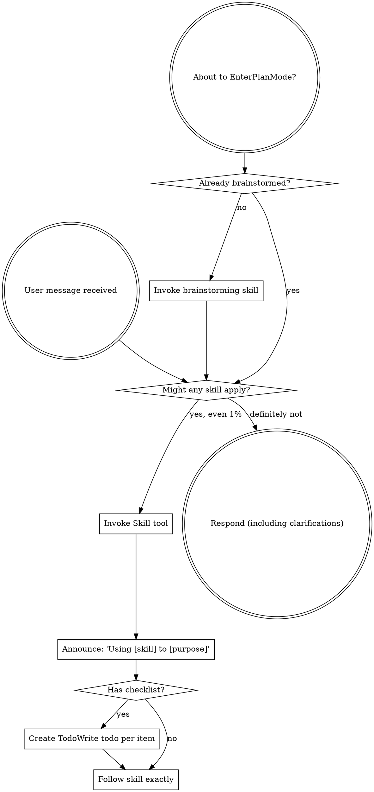

OpenAI Codex v0.128.0 (research preview)
--------
workdir: /Users/houssamr/Projects/syneriva/apps/erp-pos-stabperf
model: gpt-5.5
provider: openai
approval: never
sandbox: workspace-write [workdir, /tmp, $TMPDIR, /Users/houssamr/.codex/memories]
reasoning effort: high
reasoning summaries: none
session id: 019e1c05-56ac-77f0-bbe3-1e163339aa8f
--------
user
changes against 'dev'
2026-05-12T11:49:33.326744Z  WARN codex_core_plugins::manifest: ignoring interface.defaultPrompt: prompt must be at most 128 characters path=/Users/houssamr/.codex/.tmp/plugins/plugins/build-ios-apps/.codex-plugin/plugin.json
2026-05-12T11:49:33.328175Z  WARN codex_core_plugins::manifest: ignoring interface.defaultPrompt: maximum of 3 prompts is supported path=/Users/houssamr/.codex/.tmp/plugins/plugins/plugin-eval/.codex-plugin/plugin.json
2026-05-12T11:49:33.342456Z  WARN codex_core_plugins::manifest: ignoring interface.defaultPrompt: maximum of 3 prompts is supported path=/Users/houssamr/.codex/.tmp/plugins/plugins/twilio-developer-kit/.codex-plugin/plugin.json
2026-05-12T11:49:33.342496Z  WARN codex_core_plugins::manifest: ignoring interface.defaultPrompt: maximum of 3 prompts is supported path=/Users/houssamr/.codex/.tmp/plugins/plugins/openai-developers/.codex-plugin/plugin.json
2026-05-12T11:49:35.868453Z  WARN codex_core_plugins::marketplace: skipping marketplace plugin with unsupported source path=/Users/houssamr/.codex/.tmp/marketplaces/.staging/marketplace-upgrade-96Hok8/.claude-plugin/marketplace.json plugin="fullstory"
2026-05-12T11:49:35.868788Z  WARN codex_core_plugins::marketplace: skipping marketplace plugin with unsupported source path=/Users/houssamr/.codex/.tmp/marketplaces/.staging/marketplace-upgrade-96Hok8/.claude-plugin/marketplace.json plugin="jfrog"
2026-05-12T11:49:35.869258Z  WARN codex_core_plugins::marketplace: skipping invalid marketplace plugin path=/Users/houssamr/.codex/.tmp/marketplaces/.staging/marketplace-upgrade-96Hok8/.claude-plugin/marketplace.json marketplace=claude-plugins-official error=invalid plugin name: only ASCII letters, digits, `_`, and `-` are allowed
2026-05-12T11:49:38.741232Z  WARN codex_core_plugins::marketplace: skipping marketplace plugin with unsupported source path=/Users/houssamr/.codex/.tmp/marketplaces/claude-plugins-official/.claude-plugin/marketplace.json plugin="fullstory"
2026-05-12T11:49:38.741367Z  WARN codex_core_plugins::marketplace: skipping marketplace plugin with unsupported source path=/Users/houssamr/.codex/.tmp/marketplaces/claude-plugins-official/.claude-plugin/marketplace.json plugin="jfrog"
2026-05-12T11:49:38.741996Z  WARN codex_core_plugins::marketplace: skipping invalid marketplace plugin path=/Users/houssamr/.codex/.tmp/marketplaces/claude-plugins-official/.claude-plugin/marketplace.json marketplace=claude-plugins-official error=invalid plugin name: only ASCII letters, digits, `_`, and `-` are allowed
2026-05-12T11:49:38.742424Z  WARN codex_core_plugins::marketplace: skipping marketplace plugin that failed to resolve path=/Users/houssamr/.codex/.tmp/marketplaces/ui-ux-pro-max-skill/.claude-plugin/marketplace.json plugin="ui-ux-pro-max" error=invalid marketplace file `/Users/houssamr/.codex/.tmp/marketplaces/ui-ux-pro-max-skill/.claude-plugin/marketplace.json`: local plugin source path must not be empty
2026-05-12T11:49:38.743261Z  WARN codex_core_plugins::manifest: ignoring interface.defaultPrompt: prompt must be at most 128 characters path=/Users/houssamr/.codex/.tmp/plugins/plugins/build-ios-apps/.codex-plugin/plugin.json
2026-05-12T11:49:38.743540Z  WARN codex_core_plugins::manifest: ignoring interface.defaultPrompt: maximum of 3 prompts is supported path=/Users/houssamr/.codex/.tmp/plugins/plugins/plugin-eval/.codex-plugin/plugin.json
2026-05-12T11:49:38.748771Z  WARN codex_core_plugins::manifest: ignoring interface.defaultPrompt: maximum of 3 prompts is supported path=/Users/houssamr/.codex/.tmp/plugins/plugins/twilio-developer-kit/.codex-plugin/plugin.json
2026-05-12T11:49:38.748808Z  WARN codex_core_plugins::manifest: ignoring interface.defaultPrompt: maximum of 3 prompts is supported path=/Users/houssamr/.codex/.tmp/plugins/plugins/openai-developers/.codex-plugin/plugin.json
2026-05-12T11:49:38.751833Z  WARN codex_core_plugins::marketplace: skipping marketplace plugin with unsupported source path=/Users/houssamr/.codex/.tmp/marketplaces/claude-plugins-official/.claude-plugin/marketplace.json plugin="fullstory"
2026-05-12T11:49:38.751923Z  WARN codex_core_plugins::marketplace: skipping marketplace plugin with unsupported source path=/Users/houssamr/.codex/.tmp/marketplaces/claude-plugins-official/.claude-plugin/marketplace.json plugin="jfrog"
2026-05-12T11:49:38.752308Z  WARN codex_core_plugins::marketplace: skipping invalid marketplace plugin path=/Users/houssamr/.codex/.tmp/marketplaces/claude-plugins-official/.claude-plugin/marketplace.json marketplace=claude-plugins-official error=invalid plugin name: only ASCII letters, digits, `_`, and `-` are allowed
2026-05-12T11:49:38.752352Z  WARN codex_core_plugins::marketplace: skipping marketplace plugin that failed to resolve path=/Users/houssamr/.codex/.tmp/marketplaces/ui-ux-pro-max-skill/.claude-plugin/marketplace.json plugin="ui-ux-pro-max" error=invalid marketplace file `/Users/houssamr/.codex/.tmp/marketplaces/ui-ux-pro-max-skill/.claude-plugin/marketplace.json`: local plugin source path must not be empty
2026-05-12T11:49:38.752989Z  WARN codex_core_plugins::manifest: ignoring interface.defaultPrompt: prompt must be at most 128 characters path=/Users/houssamr/.codex/.tmp/plugins/plugins/build-ios-apps/.codex-plugin/plugin.json
2026-05-12T11:49:38.755771Z  WARN codex_core_plugins::manifest: ignoring interface.defaultPrompt: maximum of 3 prompts is supported path=/Users/houssamr/.codex/.tmp/plugins/plugins/plugin-eval/.codex-plugin/plugin.json
2026-05-12T11:49:38.759053Z  WARN codex_core_plugins::manifest: ignoring interface.defaultPrompt: maximum of 3 prompts is supported path=/Users/houssamr/.codex/.tmp/plugins/plugins/twilio-developer-kit/.codex-plugin/plugin.json
2026-05-12T11:49:38.759101Z  WARN codex_core_plugins::manifest: ignoring interface.defaultPrompt: maximum of 3 prompts is supported path=/Users/houssamr/.codex/.tmp/plugins/plugins/openai-developers/.codex-plugin/plugin.json
2026-05-12T11:49:38.790154Z  WARN codex_core_skills::loader: ignoring interface.icon_small: icon path must not contain '..'
2026-05-12T11:49:38.790153Z  WARN codex_core_skills::loader: ignoring interface.icon_small: icon path must not contain '..'
2026-05-12T11:49:38.790169Z  WARN codex_core_skills::loader: ignoring interface.icon_large: icon path must not contain '..'
2026-05-12T11:49:38.790173Z  WARN codex_core_skills::loader: ignoring interface.icon_large: icon path must not contain '..'
2026-05-12T11:49:38.791127Z  WARN codex_core_skills::loader: ignoring interface.icon_small: icon path must not contain '..'
2026-05-12T11:49:38.791127Z  WARN codex_core_skills::loader: ignoring interface.icon_small: icon path must not contain '..'
2026-05-12T11:49:38.791137Z  WARN codex_core_skills::loader: ignoring interface.icon_large: icon path must not contain '..'
2026-05-12T11:49:38.791143Z  WARN codex_core_skills::loader: ignoring interface.icon_large: icon path must not contain '..'
2026-05-12T11:49:38.791930Z  WARN codex_core_skills::loader: ignoring interface.icon_small: icon path must not contain '..'
2026-05-12T11:49:38.791939Z  WARN codex_core_skills::loader: ignoring interface.icon_large: icon path must not contain '..'
2026-05-12T11:49:38.791933Z  WARN codex_core_skills::loader: ignoring interface.icon_small: icon path must not contain '..'
2026-05-12T11:49:38.791947Z  WARN codex_core_skills::loader: ignoring interface.icon_large: icon path must not contain '..'
2026-05-12T11:49:38.792807Z  WARN codex_core_skills::loader: ignoring interface.icon_small: icon path must not contain '..'
2026-05-12T11:49:38.792807Z  WARN codex_core_skills::loader: ignoring interface.icon_small: icon path must not contain '..'
2026-05-12T11:49:38.792817Z  WARN codex_core_skills::loader: ignoring interface.icon_large: icon path must not contain '..'
2026-05-12T11:49:38.792821Z  WARN codex_core_skills::loader: ignoring interface.icon_large: icon path must not contain '..'
2026-05-12T11:49:38.793826Z  WARN codex_core_skills::loader: ignoring interface.icon_small: icon path must not contain '..'
2026-05-12T11:49:38.793836Z  WARN codex_core_skills::loader: ignoring interface.icon_large: icon path must not contain '..'
2026-05-12T11:49:38.793828Z  WARN codex_core_skills::loader: ignoring interface.icon_small: icon path must not contain '..'
2026-05-12T11:49:38.793844Z  WARN codex_core_skills::loader: ignoring interface.icon_large: icon path must not contain '..'
2026-05-12T11:49:38.796040Z  WARN codex_core_skills::loader: ignoring interface.icon_small: icon path must not contain '..'
2026-05-12T11:49:38.796052Z  WARN codex_core_skills::loader: ignoring interface.icon_large: icon path must not contain '..'
2026-05-12T11:49:38.796051Z  WARN codex_core_skills::loader: ignoring interface.icon_small: icon path must not contain '..'
2026-05-12T11:49:38.796058Z  WARN codex_core_skills::loader: ignoring interface.icon_large: icon path must not contain '..'
2026-05-12T11:49:40.243270Z  WARN codex_core_plugins::marketplace: skipping marketplace plugin with unsupported source path=/Users/houssamr/.codex/.tmp/marketplaces/claude-plugins-official/.claude-plugin/marketplace.json plugin="fullstory"
2026-05-12T11:49:40.243571Z  WARN codex_core_plugins::marketplace: skipping marketplace plugin with unsupported source path=/Users/houssamr/.codex/.tmp/marketplaces/claude-plugins-official/.claude-plugin/marketplace.json plugin="jfrog"
2026-05-12T11:49:40.244378Z  WARN codex_core_plugins::marketplace: skipping invalid marketplace plugin path=/Users/houssamr/.codex/.tmp/marketplaces/claude-plugins-official/.claude-plugin/marketplace.json marketplace=claude-plugins-official error=invalid plugin name: only ASCII letters, digits, `_`, and `-` are allowed
2026-05-12T11:49:40.244513Z  WARN codex_core_plugins::marketplace: skipping marketplace plugin that failed to resolve path=/Users/houssamr/.codex/.tmp/marketplaces/ui-ux-pro-max-skill/.claude-plugin/marketplace.json plugin="ui-ux-pro-max" error=invalid marketplace file `/Users/houssamr/.codex/.tmp/marketplaces/ui-ux-pro-max-skill/.claude-plugin/marketplace.json`: local plugin source path must not be empty
2026-05-12T11:49:40.245600Z  WARN codex_core_plugins::manifest: ignoring interface.defaultPrompt: prompt must be at most 128 characters path=/Users/houssamr/.codex/.tmp/plugins/plugins/build-ios-apps/.codex-plugin/plugin.json
2026-05-12T11:49:40.245867Z  WARN codex_core_plugins::manifest: ignoring interface.defaultPrompt: maximum of 3 prompts is supported path=/Users/houssamr/.codex/.tmp/plugins/plugins/plugin-eval/.codex-plugin/plugin.json
2026-05-12T11:49:40.250321Z  WARN codex_core_plugins::manifest: ignoring interface.defaultPrompt: maximum of 3 prompts is supported path=/Users/houssamr/.codex/.tmp/plugins/plugins/twilio-developer-kit/.codex-plugin/plugin.json
2026-05-12T11:49:40.250475Z  WARN codex_core_plugins::manifest: ignoring interface.defaultPrompt: maximum of 3 prompts is supported path=/Users/houssamr/.codex/.tmp/plugins/plugins/openai-developers/.codex-plugin/plugin.json
2026-05-12T11:49:40.272502Z  WARN codex_core_skills::loader: ignoring interface.icon_small: icon path must not contain '..'
2026-05-12T11:49:40.272517Z  WARN codex_core_skills::loader: ignoring interface.icon_large: icon path must not contain '..'
2026-05-12T11:49:40.273367Z  WARN codex_core_skills::loader: ignoring interface.icon_small: icon path must not contain '..'
2026-05-12T11:49:40.273377Z  WARN codex_core_skills::loader: ignoring interface.icon_large: icon path must not contain '..'
2026-05-12T11:49:40.274065Z  WARN codex_core_skills::loader: ignoring interface.icon_small: icon path must not contain '..'
2026-05-12T11:49:40.274073Z  WARN codex_core_skills::loader: ignoring interface.icon_large: icon path must not contain '..'
2026-05-12T11:49:40.274771Z  WARN codex_core_skills::loader: ignoring interface.icon_small: icon path must not contain '..'
2026-05-12T11:49:40.274781Z  WARN codex_core_skills::loader: ignoring interface.icon_large: icon path must not contain '..'
2026-05-12T11:49:40.275429Z  WARN codex_core_skills::loader: ignoring interface.icon_small: icon path must not contain '..'
2026-05-12T11:49:40.275437Z  WARN codex_core_skills::loader: ignoring interface.icon_large: icon path must not contain '..'
2026-05-12T11:49:40.276762Z  WARN codex_core_skills::loader: ignoring interface.icon_small: icon path must not contain '..'
2026-05-12T11:49:40.276771Z  WARN codex_core_skills::loader: ignoring interface.icon_large: icon path must not contain '..'
2026-05-12T11:49:41.896955Z  WARN codex_core_plugins::marketplace: skipping marketplace plugin that failed to resolve path=/Users/houssamr/.codex/.tmp/marketplaces/.staging/marketplace-upgrade-vZswTn/.claude-plugin/marketplace.json plugin="ui-ux-pro-max" error=invalid marketplace file `/Users/houssamr/.codex/.tmp/marketplaces/.staging/marketplace-upgrade-vZswTn/.claude-plugin/marketplace.json`: local plugin source path must not be empty
2026-05-12T11:49:41.934091Z  WARN codex_core_plugins::marketplace: skipping marketplace plugin with unsupported source path=/Users/houssamr/.codex/.tmp/marketplaces/claude-plugins-official/.claude-plugin/marketplace.json plugin="fullstory"
2026-05-12T11:49:41.934209Z  WARN codex_core_plugins::marketplace: skipping marketplace plugin with unsupported source path=/Users/houssamr/.codex/.tmp/marketplaces/claude-plugins-official/.claude-plugin/marketplace.json plugin="jfrog"
2026-05-12T11:49:41.934580Z  WARN codex_core_plugins::marketplace: skipping invalid marketplace plugin path=/Users/houssamr/.codex/.tmp/marketplaces/claude-plugins-official/.claude-plugin/marketplace.json marketplace=claude-plugins-official error=invalid plugin name: only ASCII letters, digits, `_`, and `-` are allowed
2026-05-12T11:49:41.934637Z  WARN codex_core_plugins::marketplace: skipping marketplace plugin that failed to resolve path=/Users/houssamr/.codex/.tmp/marketplaces/ui-ux-pro-max-skill/.claude-plugin/marketplace.json plugin="ui-ux-pro-max" error=invalid marketplace file `/Users/houssamr/.codex/.tmp/marketplaces/ui-ux-pro-max-skill/.claude-plugin/marketplace.json`: local plugin source path must not be empty
2026-05-12T11:49:41.934728Z  WARN codex_core_plugins::loader: configured non-curated plugin no longer exists in discovered marketplaces during cache refresh plugin="browser-use" marketplace="openai-bundled"
2026-05-12T11:49:41.949220Z  WARN codex_core_plugins::loader: configured non-curated plugin no longer exists in discovered marketplaces during cache refresh plugin="documents" marketplace="openai-primary-runtime"
2026-05-12T11:49:41.953209Z  WARN codex_core_plugins::loader: configured non-curated plugin no longer exists in discovered marketplaces during cache refresh plugin="presentations" marketplace="openai-primary-runtime"
2026-05-12T11:49:41.953225Z  WARN codex_core_plugins::loader: configured non-curated plugin no longer exists in discovered marketplaces during cache refresh plugin="spreadsheets" marketplace="openai-primary-runtime"
2026-05-12T11:49:52.192354Z  WARN codex_otel::events::session_telemetry: metrics counter [codex.skill.injected] failed: tag value contains invalid characters: superpowers:using-superpowers
exec
/bin/zsh -lc "sed -n '1,160p' /Users/houssamr/.codex/plugins/cache/claude-plugins-official/superpowers/5.1.0/skills/using-superpowers/SKILL.md && git diff 198c36305038b2cb9cb265085f9185cb7b71e24c --stat" in /Users/houssamr/Projects/syneriva/apps/erp-pos-stabperf
 succeeded in 0ms:
---
name: using-superpowers
description: Use when starting any conversation - establishes how to find and use skills, requiring Skill tool invocation before ANY response including clarifying questions
---

<SUBAGENT-STOP>
If you were dispatched as a subagent to execute a specific task, skip this skill.
</SUBAGENT-STOP>

<EXTREMELY-IMPORTANT>
If you think there is even a 1% chance a skill might apply to what you are doing, you ABSOLUTELY MUST invoke the skill.

IF A SKILL APPLIES TO YOUR TASK, YOU DO NOT HAVE A CHOICE. YOU MUST USE IT.

This is not negotiable. This is not optional. You cannot rationalize your way out of this.
</EXTREMELY-IMPORTANT>

## Instruction Priority

Superpowers skills override default system prompt behavior, but **user instructions always take precedence**:

1. **User's explicit instructions** (CLAUDE.md, GEMINI.md, AGENTS.md, direct requests) — highest priority
2. **Superpowers skills** — override default system behavior where they conflict
3. **Default system prompt** — lowest priority

If CLAUDE.md, GEMINI.md, or AGENTS.md says "don't use TDD" and a skill says "always use TDD," follow the user's instructions. The user is in control.

## How to Access Skills

**In Claude Code:** Use the `Skill` tool. When you invoke a skill, its content is loaded and presented to you—follow it directly. Never use the Read tool on skill files.

**In Copilot CLI:** Use the `skill` tool. Skills are auto-discovered from installed plugins. The `skill` tool works the same as Claude Code's `Skill` tool.

**In Gemini CLI:** Skills activate via the `activate_skill` tool. Gemini loads skill metadata at session start and activates the full content on demand.

**In other environments:** Check your platform's documentation for how skills are loaded.

## Platform Adaptation

Skills use Claude Code tool names. Non-CC platforms: see `references/copilot-tools.md` (Copilot CLI), `references/codex-tools.md` (Codex) for tool equivalents. Gemini CLI users get the tool mapping loaded automatically via GEMINI.md.

# Using Skills

## The Rule

**Invoke relevant or requested skills BEFORE any response or action.** Even a 1% chance a skill might apply means that you should invoke the skill to check. If an invoked skill turns out to be wrong for the situation, you don't need to use it.

## Red Flags

These thoughts mean STOP—you're rationalizing:

| Thought | Reality |
|---------|---------|
| "This is just a simple question" | Questions are tasks. Check for skills. |
| "I need more context first" | Skill check comes BEFORE clarifying questions. |
| "Let me explore the codebase first" | Skills tell you HOW to explore. Check first. |
| "I can check git/files quickly" | Files lack conversation context. Check for skills. |
| "Let me gather information first" | Skills tell you HOW to gather information. |
| "This doesn't need a formal skill" | If a skill exists, use it. |
| "I remember this skill" | Skills evolve. Read current version. |
| "This doesn't count as a task" | Action = task. Check for skills. |
| "The skill is overkill" | Simple things become complex. Use it. |
| "I'll just do this one thing first" | Check BEFORE doing anything. |
| "This feels productive" | Undisciplined action wastes time. Skills prevent this. |
| "I know what that means" | Knowing the concept ≠ using the skill. Invoke it. |

## Skill Priority

When multiple skills could apply, use this order:

1. **Process skills first** (brainstorming, debugging) - these determine HOW to approach the task
2. **Implementation skills second** (frontend-design, mcp-builder) - these guide execution

"Let's build X" → brainstorming first, then implementation skills.
"Fix this bug" → debugging first, then domain-specific skills.

## Skill Types

**Rigid** (TDD, debugging): Follow exactly. Don't adapt away discipline.

**Flexible** (patterns): Adapt principles to context.

The skill itself tells you which.

## User Instructions

Instructions say WHAT, not HOW. "Add X" or "Fix Y" doesn't mean skip workflows.
 apps/pos/src/api/discountApi.ts                    |   6 +-
 .../organisms/DiscountModal/DiscountModal.tsx      |  22 +++-
 .../DiscountModal/__tests__/DiscountModal.test.tsx |   2 +
 .../LineDiscountModal/LineDiscountModal.tsx        |  22 +++-
 .../__tests__/LineDiscountModal.test.tsx           |   2 +
 apps/pos/src/lib/db/migrations.ts                  |  15 +++
 .../lib/db/repositories/operatorPinRepository.ts   |  33 +++++
 apps/pos/src/locales/en/pos.json                   |   3 +
 apps/pos/src/locales/fr/pos.json                   |   3 +
 apps/pos/src/pages/HomePage.tsx                    |  11 +-
 .../pos/src/stores/__tests__/operatorStore.test.ts | 146 ++++++++++++++++++++-
 apps/pos/src/stores/operatorStore.ts               |  77 ++++++++++-
 apps/pos/src/stores/terminalStore.ts               |   3 +
 13 files changed, 327 insertions(+), 18 deletions(-)

2026-05-12T11:49:52.308545Z  WARN codex_protocol::openai_models: Model personality requested but model_messages is missing, falling back to base instructions. model=gpt-5.5 personality=pragmatic
2026-05-12T11:49:52.366953Z  WARN codex_core_plugins::marketplace: skipping marketplace plugin with unsupported source path=/Users/houssamr/.codex/.tmp/marketplaces/claude-plugins-official/.claude-plugin/marketplace.json plugin="fullstory"
2026-05-12T11:49:52.367068Z  WARN codex_core_plugins::marketplace: skipping marketplace plugin with unsupported source path=/Users/houssamr/.codex/.tmp/marketplaces/claude-plugins-official/.claude-plugin/marketplace.json plugin="jfrog"
2026-05-12T11:49:52.367434Z  WARN codex_core_plugins::marketplace: skipping invalid marketplace plugin path=/Users/houssamr/.codex/.tmp/marketplaces/claude-plugins-official/.claude-plugin/marketplace.json marketplace=claude-plugins-official error=invalid plugin name: only ASCII letters, digits, `_`, and `-` are allowed
2026-05-12T11:49:52.367511Z  WARN codex_core_plugins::marketplace: skipping marketplace plugin that failed to resolve path=/Users/houssamr/.codex/.tmp/marketplaces/ui-ux-pro-max-skill/.claude-plugin/marketplace.json plugin="ui-ux-pro-max" error=invalid marketplace file `/Users/houssamr/.codex/.tmp/marketplaces/ui-ux-pro-max-skill/.claude-plugin/marketplace.json`: local plugin source path must not be empty
2026-05-12T11:49:52.371254Z  WARN codex_core_plugins::manifest: ignoring interface.defaultPrompt: prompt must be at most 128 characters path=/Users/houssamr/.codex/.tmp/plugins/plugins/build-ios-apps/.codex-plugin/plugin.json
2026-05-12T11:49:52.372398Z  WARN codex_core_plugins::manifest: ignoring interface.defaultPrompt: maximum of 3 prompts is supported path=/Users/houssamr/.codex/.tmp/plugins/plugins/plugin-eval/.codex-plugin/plugin.json
2026-05-12T11:49:52.386101Z  WARN codex_core_plugins::manifest: ignoring interface.defaultPrompt: maximum of 3 prompts is supported path=/Users/houssamr/.codex/.tmp/plugins/plugins/twilio-developer-kit/.codex-plugin/plugin.json
2026-05-12T11:49:52.386231Z  WARN codex_core_plugins::manifest: ignoring interface.defaultPrompt: maximum of 3 prompts is supported path=/Users/houssamr/.codex/.tmp/plugins/plugins/openai-developers/.codex-plugin/plugin.json
2026-05-12T11:49:52.405671Z  WARN codex_core_skills::loader: ignoring interface.icon_small: icon path must not contain '..'
2026-05-12T11:49:52.405676Z  WARN codex_core_skills::loader: ignoring interface.icon_large: icon path must not contain '..'
2026-05-12T11:49:52.406374Z  WARN codex_core_skills::loader: ignoring interface.icon_small: icon path must not contain '..'
2026-05-12T11:49:52.406383Z  WARN codex_core_skills::loader: ignoring interface.icon_large: icon path must not contain '..'
2026-05-12T11:49:52.407025Z  WARN codex_core_skills::loader: ignoring interface.icon_small: icon path must not contain '..'
2026-05-12T11:49:52.407031Z  WARN codex_core_skills::loader: ignoring interface.icon_large: icon path must not contain '..'
2026-05-12T11:49:52.407694Z  WARN codex_core_skills::loader: ignoring interface.icon_small: icon path must not contain '..'
2026-05-12T11:49:52.407700Z  WARN codex_core_skills::loader: ignoring interface.icon_large: icon path must not contain '..'
2026-05-12T11:49:52.408396Z  WARN codex_core_skills::loader: ignoring interface.icon_small: icon path must not contain '..'
2026-05-12T11:49:52.408402Z  WARN codex_core_skills::loader: ignoring interface.icon_large: icon path must not contain '..'
2026-05-12T11:49:52.409847Z  WARN codex_core_skills::loader: ignoring interface.icon_small: icon path must not contain '..'
2026-05-12T11:49:52.409853Z  WARN codex_core_skills::loader: ignoring interface.icon_large: icon path must not contain '..'
exec
/bin/zsh -lc 'git diff 198c36305038b2cb9cb265085f9185cb7b71e24c -- apps/pos/src/api/discountApi.ts apps/pos/src/components/organisms/DiscountModal/DiscountModal.tsx apps/pos/src/components/organisms/LineDiscountModal/LineDiscountModal.tsx apps/pos/src/lib/db/migrations.ts apps/pos/src/lib/db/repositories/operatorPinRepository.ts apps/pos/src/pages/HomePage.tsx apps/pos/src/stores/operatorStore.ts apps/pos/src/stores/terminalStore.ts' in /Users/houssamr/Projects/syneriva/apps/erp-pos-stabperf
 succeeded in 0ms:
diff --git a/apps/pos/src/api/discountApi.ts b/apps/pos/src/api/discountApi.ts
index e7184664..7b501319 100644
--- a/apps/pos/src/api/discountApi.ts
+++ b/apps/pos/src/api/discountApi.ts
@@ -6,6 +6,8 @@ export interface DiscountPermissions {
   requiresReason: boolean;
 }

-export async function fetchDiscountPermissions(): Promise<DiscountPermissions> {
-  return apiGet<DiscountPermissions>('/pos/discount-permissions');
+export async function fetchDiscountPermissions(terminalCode: string): Promise<DiscountPermissions> {
+  return apiGet<DiscountPermissions>('/pos/discount-permissions', {
+    terminal_code: terminalCode,
+  });
 }
diff --git a/apps/pos/src/components/organisms/DiscountModal/DiscountModal.tsx b/apps/pos/src/components/organisms/DiscountModal/DiscountModal.tsx
index be9fb8cc..274d8646 100644
--- a/apps/pos/src/components/organisms/DiscountModal/DiscountModal.tsx
+++ b/apps/pos/src/components/organisms/DiscountModal/DiscountModal.tsx
@@ -18,6 +18,8 @@ export interface DiscountModalProps {
   }) => void;
   canDiscount: boolean;
   maxDiscountPercent: number;
+  terminalMaxDiscountPercent: number;
+  disabledReason?: string;
   requiresReason: boolean;
 }

@@ -30,6 +32,8 @@ export function DiscountModal({
   onApplyTransactionDiscount,
   canDiscount,
   maxDiscountPercent,
+  terminalMaxDiscountPercent,
+  disabledReason,
   requiresReason,
 }: DiscountModalProps) {
   const { t } = useTranslation('pos');
@@ -97,9 +101,10 @@ export function DiscountModal({
   const numericValue = parseFloat(value) || 0;
   const percentageExceeded =
     discountType === 'percentage' && numericValue > maxDiscountPercent;
-  const needsManagerOverride = !canDiscount || percentageExceeded;
+  const isDiscountDisabled = disabledReason !== undefined;
+  const needsManagerOverride = !isDiscountDisabled && (!canDiscount || percentageExceeded);
   const isValid =
-    numericValue > 0 && (!requiresReason || reason.trim().length > 0);
+    !isDiscountDisabled && numericValue > 0 && (!requiresReason || reason.trim().length > 0);

   const handleApply = useCallback(() => {
     if (!isValid) return;
@@ -134,7 +139,8 @@ export function DiscountModal({
         return;
       }

-      const managerMax = manager.max_discount_percent ?? 100;
+      const managerLimit = manager.max_discount_percent ?? terminalMaxDiscountPercent;
+      const managerMax = Math.min(managerLimit, terminalMaxDiscountPercent);
       if (discountType === 'percentage' && parseFloat(value) > managerMax) {
         setManagerError(t('discount.managerDenied'));
         return;
@@ -155,7 +161,7 @@ export function DiscountModal({
     } finally {
       setVerifyingPin(false);
     }
-  }, [managerPin, discountType, value, reason, onApplyTransactionDiscount, onClose, t]);
+  }, [managerPin, discountType, value, reason, terminalMaxDiscountPercent, onApplyTransactionDiscount, onClose, t]);

   if (!isOpen) return null;

@@ -265,8 +271,10 @@ export function DiscountModal({
                   <button
                     key={key}
                     onClick={() => handleNumpadPress(key)}
+                    disabled={isDiscountDisabled}
                     className={cn(
                       'flex items-center justify-center rounded-xl text-xl font-semibold transition-colors',
+                      isDiscountDisabled && 'cursor-not-allowed opacity-50',
                       key === 'C'
                         ? 'bg-red-50 text-red-700 hover:bg-red-100'
                         : 'bg-gray-50 text-gray-900 hover:bg-gray-100 active:bg-gray-200',
@@ -325,6 +333,12 @@ export function DiscountModal({
           ) : (
             <>
               {/* Max exceeded warning — shown as info since manager can override */}
+              {disabledReason && (
+                

+                  {disabledReason}
+                

+              )}
+
               {needsManagerOverride && numericValue > 0 && (
                 

                   {!canDiscount
diff --git a/apps/pos/src/components/organisms/LineDiscountModal/LineDiscountModal.tsx b/apps/pos/src/components/organisms/LineDiscountModal/LineDiscountModal.tsx
index 6e6dceeb..7121c479 100644
--- a/apps/pos/src/components/organisms/LineDiscountModal/LineDiscountModal.tsx
+++ b/apps/pos/src/components/organisms/LineDiscountModal/LineDiscountModal.tsx
@@ -19,6 +19,8 @@ export interface LineDiscountModalProps {
   itemName: string;
   canDiscount: boolean;
   maxDiscountPercent: number;
+  terminalMaxDiscountPercent: number;
+  disabledReason?: string;
 }

 const NUMPAD_KEYS = ['1', '2', '3', '4', '5', '6', '7', '8', '9', '.', '0', 'C'];
@@ -31,6 +33,8 @@ export function LineDiscountModal({
   itemName,
   canDiscount,
   maxDiscountPercent,
+  terminalMaxDiscountPercent,
+  disabledReason,
 }: LineDiscountModalProps) {
   const { t } = useTranslation('pos');
   const dialogRef = useRef<HTMLDivElement>(null);
@@ -96,8 +100,9 @@ export function LineDiscountModal({
   const numericValue = parseFloat(value) || 0;
   const percentageExceeded =
     discountType === 'percentage' && numericValue > maxDiscountPercent;
-  const needsManagerOverride = !canDiscount || percentageExceeded;
-  const isValid = numericValue > 0;
+  const isDiscountDisabled = disabledReason !== undefined;
+  const needsManagerOverride = !isDiscountDisabled && (!canDiscount || percentageExceeded);
+  const isValid = !isDiscountDisabled && numericValue > 0;

   const handleApply = useCallback(() => {
     if (!isValid) return;
@@ -132,7 +137,8 @@ export function LineDiscountModal({
         return;
       }

-      const managerMax = manager.max_discount_percent ?? 100;
+      const managerLimit = manager.max_discount_percent ?? terminalMaxDiscountPercent;
+      const managerMax = Math.min(managerLimit, terminalMaxDiscountPercent);
       if (discountType === 'percentage' && parseFloat(value) > managerMax) {
         setManagerError(t('discount.managerDenied'));
         return;
@@ -153,7 +159,7 @@ export function LineDiscountModal({
     } finally {
       setVerifyingPin(false);
     }
-  }, [managerPin, discountType, value, reason, onApply, onClose, t]);
+  }, [managerPin, discountType, value, reason, terminalMaxDiscountPercent, onApply, onClose, t]);

   if (!isOpen) return null;

@@ -263,8 +269,10 @@ export function LineDiscountModal({
                   <button
                     key={key}
                     onClick={() => handleNumpadPress(key)}
+                    disabled={isDiscountDisabled}
                     className={cn(
                       'flex items-center justify-center rounded-xl text-xl font-semibold transition-colors',
+                      isDiscountDisabled && 'cursor-not-allowed opacity-50',
                       key === 'C'
                         ? 'bg-red-50 text-red-700 hover:bg-red-100'
                         : 'bg-gray-50 text-gray-900 hover:bg-gray-100 active:bg-gray-200',
@@ -328,6 +336,12 @@ export function LineDiscountModal({
           ) : (
             <>
               {/* Max exceeded warning — shown as info since manager can override */}
+              {disabledReason && (
+                

+                  {disabledReason}
+                

+              )}
+
               {needsManagerOverride && numericValue > 0 && (
                 

                   {!canDiscount
diff --git a/apps/pos/src/lib/db/migrations.ts b/apps/pos/src/lib/db/migrations.ts
index a87a40ae..8d0c5899 100644
--- a/apps/pos/src/lib/db/migrations.ts
+++ b/apps/pos/src/lib/db/migrations.ts
@@ -827,4 +827,19 @@ export const migrations: Migration[] = [
         AND sync_error LIKE '%database is locked%';
     `,
   },
+  {
+    version: 33,
+    name: 'add_operator_discount_permission_cache_timestamp',
+    sql: '',
+    async run(db) {
+      try {
+        await db.execute('ALTER TABLE operator_pins ADD COLUMN discount_permissions_fetched_at TEXT');
+      } catch (error) {
+        const msg = error instanceof Error ? error.message : '';
+        if (!msg.includes('duplicate column')) {
+          throw error;
+        }
+      }
+    },
+  },
 ];
diff --git a/apps/pos/src/lib/db/repositories/operatorPinRepository.ts b/apps/pos/src/lib/db/repositories/operatorPinRepository.ts
index 29e3b46c..97da6a72 100644
--- a/apps/pos/src/lib/db/repositories/operatorPinRepository.ts
+++ b/apps/pos/src/lib/db/repositories/operatorPinRepository.ts
@@ -1,5 +1,7 @@
 import type Database from '@tauri-apps/plugin-sql';
 import { queryAll, queryOne, execute } from '@/lib/db';
+import { resolveCachedDiscountStatus } from '@/lib/discountPermissions';
+import type { DiscountPermissionStatus } from '@/lib/discountPermissions';

 export interface CachedOperator {
   id: string;
@@ -10,6 +12,8 @@ export interface CachedOperator {
   permissions: string[];
   can_discount: boolean;
   max_discount_percent: number | null;
+  discount_permissions_fetched_at: string | null;
+  discount_permissions_status: DiscountPermissionStatus;
 }

 interface OperatorPinRow {
@@ -21,6 +25,7 @@ interface OperatorPinRow {
   permissions: string;
   can_discount: number;
   max_discount_percent: number | null;
+  discount_permissions_fetched_at?: string | null;
 }

 function rowToOperator(row: OperatorPinRow): CachedOperator {
@@ -33,6 +38,8 @@ function rowToOperator(row: OperatorPinRow): CachedOperator {
     permissions: JSON.parse(row.permissions) as string[],
     can_discount: row.can_discount === 1,
     max_discount_percent: row.max_discount_percent,
+    discount_permissions_fetched_at: row.discount_permissions_fetched_at ?? null,
+    discount_permissions_status: resolveCachedDiscountStatus(row.discount_permissions_fetched_at),
   };
 }

@@ -82,6 +89,32 @@ export async function upsertOperators(
   }
 }

+export async function updateOperatorDiscountPermissions(
+  db: Database,
+  operatorId: string,
+  permissions: {
+    can_discount: boolean;
+    max_discount_percent: number | null;
+    fetched_at: string;
+  },
+): Promise<void> {
+  await execute(
+    db,
+    `UPDATE operator_pins
+     SET can_discount = $1,
+         max_discount_percent = $2,
+         discount_permissions_fetched_at = $3,
+         synced_at = datetime('now')
+     WHERE id = $4`,
+    [
+      permissions.can_discount ? 1 : 0,
+      permissions.max_discount_percent,
+      permissions.fetched_at,
+      operatorId,
+    ],
+  );
+}
+
 export async function hasOperatorPins(db: Database): Promise<boolean> {
   const result = await queryOne<{ count: number }>(db, 'SELECT COUNT(*) as count FROM operator_pins');
   return (result?.count ?? 0) > 0;
diff --git a/apps/pos/src/pages/HomePage.tsx b/apps/pos/src/pages/HomePage.tsx
index 8adf0a04..4f443192 100644
--- a/apps/pos/src/pages/HomePage.tsx
+++ b/apps/pos/src/pages/HomePage.tsx
@@ -23,6 +23,7 @@ import { ReceiptLocatorScreen } from '@/components/pos/ReceiptLocatorScreen';
 import { ResumeRefundDraftBanner } from '@/components/pos/ResumeRefundDraftBanner';
 import { getErrorMessage } from '@/lib/api';
 import { useCurrency } from '@/lib/currency';
+import { resolveDiscountAccess } from '@/lib/discountPermissions';
 import { fetchReceipt } from '@/api/receiptApi';
 import { buildEscPosReceiptData } from '@/lib/buildReceiptData';
 import type { ReceiptVisibilitySettings } from '@/lib/buildReceiptData';
@@ -198,8 +199,10 @@ export function HomePage() {
   const [discountItemId, setDiscountItemId] = useState<string | null>(null);

   // Operator discount permissions
-  const canDiscount = operator?.can_discount ?? true;
-  const maxDiscountPct = operator?.max_discount_percent ?? 100;
+  const discountAccess = resolveDiscountAccess(operator, terminal?.max_discount_percent);
+  const canDiscount = discountAccess.canDiscount;
+  const maxDiscountPct = discountAccess.maxDiscountPercent;
+  const discountDisabledReason = discountAccess.disabledReason;

   // Barcode scanner
   const [scanMessage, setScanMessage] = useState<{ text: string; type: 'success' | 'error' | 'info' } | null>(null);
@@ -1161,6 +1164,8 @@ export function HomePage() {
         onApplyTransactionDiscount={handleApplyTransactionDiscount}
         canDiscount={canDiscount}
         maxDiscountPercent={maxDiscountPct}
+        terminalMaxDiscountPercent={terminal?.max_discount_percent ?? 0}
+        disabledReason={discountDisabledReason ? t(`pos:${discountDisabledReason}`) : undefined}
         requiresReason={true}
       />

@@ -1172,6 +1177,8 @@ export function HomePage() {
         itemName={discountItem?.product.name ?? ''}
         canDiscount={canDiscount}
         maxDiscountPercent={maxDiscountPct}
+        terminalMaxDiscountPercent={terminal?.max_discount_percent ?? 0}
+        disabledReason={discountDisabledReason ? t(`pos:${discountDisabledReason}`) : undefined}
       />

       {/* Modifier selection modal */}
diff --git a/apps/pos/src/stores/operatorStore.ts b/apps/pos/src/stores/operatorStore.ts
index 3a3d94ba..7fc79092 100644
--- a/apps/pos/src/stores/operatorStore.ts
+++ b/apps/pos/src/stores/operatorStore.ts
@@ -1,10 +1,18 @@
 import { create } from 'zustand';
 import bcrypt from 'bcryptjs';
 import { apiGet, apiPost } from '@/lib/api';
+import { fetchDiscountPermissions } from '@/api/discountApi';
 import { getDatabase } from '@/lib/db';
-import { getAllOperators, hasOperatorPins, upsertOperators } from '@/lib/db/repositories/operatorPinRepository';
+import {
+  getAllOperators,
+  hasOperatorPins,
+  updateOperatorDiscountPermissions,
+  upsertOperators,
+} from '@/lib/db/repositories/operatorPinRepository';
 import { enqueuePinUpdate } from '@/lib/db/repositories/queuedPinUpdateRepository';
 import { useAuthStore } from '@/stores/authStore';
+import { useTerminalStore } from '@/stores/terminalStore';
+import type { DiscountPermissionStatus } from '@/lib/discountPermissions';

 export interface Operator {
   id: string;
@@ -14,6 +22,7 @@ export interface Operator {
   permissions: string[];
   can_discount: boolean;
   max_discount_percent: number | null;
+  discount_permissions_status?: DiscountPermissionStatus;
 }

 interface OperatorState {
@@ -46,6 +55,50 @@ async function getDb(): Promise<import('@tauri-apps/plugin-sql').default> {
   return getDatabase(companyId ?? '');
 }

+function operatorWithUnavailableDiscounts(operator: Operator): Operator {
+  return {
+    ...operator,
+    can_discount: false,
+    max_discount_percent: null,
+    discount_permissions_status: 'unavailable',
+  };
+}
+
+async function resolveOnlineDiscountPermissions(operator: Operator): Promise<Operator> {
+  const terminalCode = useTerminalStore.getState().terminal?.code;
+  if (!terminalCode) {
+    return operatorWithUnavailableDiscounts(operator);
+  }
+
+  let permissions;
+  try {
+    permissions = await fetchDiscountPermissions(terminalCode);
+  } catch (error) {
+    console.debug('[POS] Discount permission fetch failed:', error);
+    return operatorWithUnavailableDiscounts(operator);
+  }
+
+  const resolved: Operator = {
+    ...operator,
+    can_discount: permissions.canDiscount,
+    max_discount_percent: permissions.maxDiscountPercent,
+    discount_permissions_status: 'fresh',
+  };
+
+  try {
+    const db = await getDb();
+    await updateOperatorDiscountPermissions(db, operator.id, {
+      can_discount: permissions.canDiscount,
+      max_discount_percent: permissions.maxDiscountPercent,
+      fetched_at: new Date().toISOString(),
+    });
+  } catch (error) {
+    console.debug('[POS] Failed to cache discount permissions:', error);
+  }
+
+  return resolved;
+}
+
 export const useOperatorStore = create<OperatorStore>()((set) => ({
   ...initialState,

@@ -67,8 +120,9 @@ export const useOperatorStore = create<OperatorStore>()((set) => ({
             email: op.email,
             roles: op.roles,
             permissions: op.permissions,
-            can_discount: op.can_discount,
-            max_discount_percent: op.max_discount_percent,
+            can_discount: op.discount_permissions_status === 'fresh' ? op.can_discount : false,
+            max_discount_percent: op.discount_permissions_status === 'fresh' ? op.max_discount_percent : null,
+            discount_permissions_status: op.discount_permissions_status,
           };
           break;
         }
@@ -88,12 +142,27 @@ export const useOperatorStore = create<OperatorStore>()((set) => ({
       void apiPost<Operator>('/pos/auth/verify-pin', { pin }).catch((err: unknown) => {
         console.debug('[POS] PIN telemetry call failed (offline-accepted):', err);
       });
+      void resolveOnlineDiscountPermissions(offlineMatch)
+        .then((operator) => {
+          if (useOperatorStore.getState().operator?.id !== offlineMatch.id) {
+            return;
+          }
+          set({
+            operator,
+            lastActivity: Date.now(),
+          });
+        })
+        .catch((err: unknown) => {
+          console.debug('[POS] Discount permission refresh failed (offline-accepted):', err);
+        });
       return;
     }

     // Offline miss — fall through to API as the source of truth.
     try {
-      const operator = await apiPost<Operator>('/pos/auth/verify-pin', { pin });
+      const operator = await resolveOnlineDiscountPermissions(
+        await apiPost<Operator>('/pos/auth/verify-pin', { pin }),
+      );
       set({
         operator,
         isLocked: false,
diff --git a/apps/pos/src/stores/terminalStore.ts b/apps/pos/src/stores/terminalStore.ts
index 43904cf6..5d2ce08b 100644
--- a/apps/pos/src/stores/terminalStore.ts
+++ b/apps/pos/src/stores/terminalStore.ts
@@ -36,6 +36,9 @@ export interface Terminal {
    * the cashier never confuses training and production at a glance.
    */
   is_training_mode: boolean;
+  max_discount_percent?: number;
+  allow_line_discounts?: boolean;
+  allow_transaction_discounts?: boolean;
   hardware_identifier: string | null;
   location: {
     id: string;

2026-05-12T11:49:59.930542Z  WARN codex_protocol::openai_models: Model personality requested but model_messages is missing, falling back to base instructions. model=gpt-5.5 personality=pragmatic
2026-05-12T11:49:59.973061Z  WARN codex_core_plugins::marketplace: skipping marketplace plugin with unsupported source path=/Users/houssamr/.codex/.tmp/marketplaces/claude-plugins-official/.claude-plugin/marketplace.json plugin="fullstory"
2026-05-12T11:49:59.973179Z  WARN codex_core_plugins::marketplace: skipping marketplace plugin with unsupported source path=/Users/houssamr/.codex/.tmp/marketplaces/claude-plugins-official/.claude-plugin/marketplace.json plugin="jfrog"
2026-05-12T11:49:59.973532Z  WARN codex_core_plugins::marketplace: skipping invalid marketplace plugin path=/Users/houssamr/.codex/.tmp/marketplaces/claude-plugins-official/.claude-plugin/marketplace.json marketplace=claude-plugins-official error=invalid plugin name: only ASCII letters, digits, `_`, and `-` are allowed
2026-05-12T11:49:59.973591Z  WARN codex_core_plugins::marketplace: skipping marketplace plugin that failed to resolve path=/Users/houssamr/.codex/.tmp/marketplaces/ui-ux-pro-max-skill/.claude-plugin/marketplace.json plugin="ui-ux-pro-max" error=invalid marketplace file `/Users/houssamr/.codex/.tmp/marketplaces/ui-ux-pro-max-skill/.claude-plugin/marketplace.json`: local plugin source path must not be empty
2026-05-12T11:49:59.976536Z  WARN codex_core_plugins::manifest: ignoring interface.defaultPrompt: prompt must be at most 128 characters path=/Users/houssamr/.codex/.tmp/plugins/plugins/build-ios-apps/.codex-plugin/plugin.json
2026-05-12T11:49:59.977731Z  WARN codex_core_plugins::manifest: ignoring interface.defaultPrompt: maximum of 3 prompts is supported path=/Users/houssamr/.codex/.tmp/plugins/plugins/plugin-eval/.codex-plugin/plugin.json
2026-05-12T11:49:59.990712Z  WARN codex_core_plugins::manifest: ignoring interface.defaultPrompt: maximum of 3 prompts is supported path=/Users/houssamr/.codex/.tmp/plugins/plugins/twilio-developer-kit/.codex-plugin/plugin.json
2026-05-12T11:49:59.990848Z  WARN codex_core_plugins::manifest: ignoring interface.defaultPrompt: maximum of 3 prompts is supported path=/Users/houssamr/.codex/.tmp/plugins/plugins/openai-developers/.codex-plugin/plugin.json
2026-05-12T11:50:00.011877Z  WARN codex_core_skills::loader: ignoring interface.icon_small: icon path must not contain '..'
2026-05-12T11:50:00.011889Z  WARN codex_core_skills::loader: ignoring interface.icon_large: icon path must not contain '..'
2026-05-12T11:50:00.012726Z  WARN codex_core_skills::loader: ignoring interface.icon_small: icon path must not contain '..'
2026-05-12T11:50:00.012733Z  WARN codex_core_skills::loader: ignoring interface.icon_large: icon path must not contain '..'
2026-05-12T11:50:00.013386Z  WARN codex_core_skills::loader: ignoring interface.icon_small: icon path must not contain '..'
2026-05-12T11:50:00.013392Z  WARN codex_core_skills::loader: ignoring interface.icon_large: icon path must not contain '..'
2026-05-12T11:50:00.014058Z  WARN codex_core_skills::loader: ignoring interface.icon_small: icon path must not contain '..'
2026-05-12T11:50:00.014063Z  WARN codex_core_skills::loader: ignoring interface.icon_large: icon path must not contain '..'
2026-05-12T11:50:00.015220Z  WARN codex_core_skills::loader: ignoring interface.icon_small: icon path must not contain '..'
2026-05-12T11:50:00.015224Z  WARN codex_core_skills::loader: ignoring interface.icon_large: icon path must not contain '..'
2026-05-12T11:50:00.017632Z  WARN codex_core_skills::loader: ignoring interface.icon_small: icon path must not contain '..'
2026-05-12T11:50:00.017644Z  WARN codex_core_skills::loader: ignoring interface.icon_large: icon path must not contain '..'
exec
/bin/zsh -lc "git diff 198c36305038b2cb9cb265085f9185cb7b71e24c -- apps/pos/src/stores/__tests__/operatorStore.test.ts apps/pos/src/components/organisms/DiscountModal/__tests__/DiscountModal.test.tsx apps/pos/src/components/organisms/LineDiscountModal/__tests__/LineDiscountModal.test.tsx apps/pos/src/locales/en/pos.json apps/pos/src/locales/fr/pos.json && ls apps/pos/src/lib | grep discount && sed -n '1,220p' apps/pos/src/lib/discountPermissions.ts" in /Users/houssamr/Projects/syneriva/apps/erp-pos-stabperf
 succeeded in 0ms:
diff --git a/apps/pos/src/components/organisms/DiscountModal/__tests__/DiscountModal.test.tsx b/apps/pos/src/components/organisms/DiscountModal/__tests__/DiscountModal.test.tsx
index 8e9a7b47..b06e8733 100644
--- a/apps/pos/src/components/organisms/DiscountModal/__tests__/DiscountModal.test.tsx
+++ b/apps/pos/src/components/organisms/DiscountModal/__tests__/DiscountModal.test.tsx
@@ -18,6 +18,7 @@ function renderModal(overrides: Partial<Parameters<typeof DiscountModal>[0]> = {
     onApplyTransactionDiscount: vi.fn(),
     canDiscount: true,
     maxDiscountPercent: 100,
+    terminalMaxDiscountPercent: 100,
     requiresReason: false,
   };
   return render(<DiscountModal {...defaults} {...overrides} />);
@@ -109,6 +110,7 @@ describe('DiscountModal — focus management (PR #97 follow-up)', () => {
             onApplyTransactionDiscount={vi.fn()}
             canDiscount
             maxDiscountPercent={100}
+            terminalMaxDiscountPercent={100}
             requiresReason={false}
           />
         </>
diff --git a/apps/pos/src/components/organisms/LineDiscountModal/__tests__/LineDiscountModal.test.tsx b/apps/pos/src/components/organisms/LineDiscountModal/__tests__/LineDiscountModal.test.tsx
index 18465c10..1bb47afe 100644
--- a/apps/pos/src/components/organisms/LineDiscountModal/__tests__/LineDiscountModal.test.tsx
+++ b/apps/pos/src/components/organisms/LineDiscountModal/__tests__/LineDiscountModal.test.tsx
@@ -19,6 +19,7 @@ function renderModal(overrides: Partial<Parameters<typeof LineDiscountModal>[0]>
     itemName: 'Espresso',
     canDiscount: true,
     maxDiscountPercent: 100,
+    terminalMaxDiscountPercent: 100,
   };
   return render(<LineDiscountModal {...defaults} {...overrides} />);
 }
@@ -88,6 +89,7 @@ describe('LineDiscountModal — focus management (PR #97 follow-up)', () => {
             itemName="Espresso"
             canDiscount
             maxDiscountPercent={100}
+            terminalMaxDiscountPercent={100}
           />
         </>
       );
diff --git a/apps/pos/src/locales/en/pos.json b/apps/pos/src/locales/en/pos.json
index 5a050146..37c3a8c9 100644
--- a/apps/pos/src/locales/en/pos.json
+++ b/apps/pos/src/locales/en/pos.json
@@ -278,6 +278,9 @@
     "maxExceeded": "Maximum discount is {{max}}%",
     "transactionDiscount": "Transaction Discount",
     "notAllowed": "You are not allowed to apply discounts. Please ask a manager.",
+    "requiresOperator": "Sign in with an operator PIN before applying discounts.",
+    "permissionsUnavailable": "Discount permissions are unavailable for this terminal.",
+    "permissionsStale": "Discount permissions are stale. Go online to refresh before applying discounts.",
     "removeLineDiscount": "Remove discount",
     "managerApproval": "Manager Approval Required",
     "enterManagerPin": "Enter manager PIN to authorize this discount",
diff --git a/apps/pos/src/locales/fr/pos.json b/apps/pos/src/locales/fr/pos.json
index 57319be4..f574b577 100644
--- a/apps/pos/src/locales/fr/pos.json
+++ b/apps/pos/src/locales/fr/pos.json
@@ -278,6 +278,9 @@
     "maxExceeded": "La remise maximale est de {{max}}%",
     "transactionDiscount": "Remise sur transaction",
     "notAllowed": "Vous n'êtes pas autorisé à appliquer des remises. Veuillez demander à un responsable.",
+    "requiresOperator": "Connectez-vous avec un PIN opérateur avant d'appliquer des remises.",
+    "permissionsUnavailable": "Les autorisations de remise ne sont pas disponibles pour ce terminal.",
+    "permissionsStale": "Les autorisations de remise sont expirées. Connectez-vous pour les actualiser avant d'appliquer des remises.",
     "removeLineDiscount": "Supprimer la remise",
     "managerApproval": "Approbation du responsable requise",
     "enterManagerPin": "Entrez le PIN du responsable pour autoriser cette remise",
diff --git a/apps/pos/src/stores/__tests__/operatorStore.test.ts b/apps/pos/src/stores/__tests__/operatorStore.test.ts
index 3610ed68..d0dbee5e 100644
--- a/apps/pos/src/stores/__tests__/operatorStore.test.ts
+++ b/apps/pos/src/stores/__tests__/operatorStore.test.ts
@@ -14,9 +14,14 @@ vi.mock('@/lib/db', () => ({
 vi.mock('@/lib/db/repositories/operatorPinRepository', () => ({
   getAllOperators: vi.fn().mockResolvedValue([]),
   hasOperatorPins: vi.fn().mockResolvedValue(false),
+  updateOperatorDiscountPermissions: vi.fn().mockResolvedValue(undefined),
   upsertOperators: vi.fn().mockResolvedValue(undefined),
 }));

+vi.mock('@/api/discountApi', () => ({
+  fetchDiscountPermissions: vi.fn(),
+}));
+
 vi.mock('@/lib/db/repositories/queuedPinUpdateRepository', () => ({
   enqueuePinUpdate: vi.fn().mockResolvedValue(undefined),
   getPendingPinUpdates: vi.fn().mockResolvedValue([]),
@@ -45,11 +50,25 @@ vi.mock('@/stores/authStore', () => ({
   },
 }));

+let _terminalState: Record<string, unknown> = {
+  terminal: { id: 'term-1', code: 'POS01', max_discount_percent: 10 },
+};
+vi.mock('@/stores/terminalStore', () => ({
+  useTerminalStore: {
+    getState: vi.fn(() => _terminalState),
+  },
+}));
+
 // bcryptjs is not mocked — we use the real library for hash verification tests
 import bcrypt from 'bcryptjs';
+import { fetchDiscountPermissions } from '@/api/discountApi';
 import { apiGet, apiPost } from '@/lib/api';
 import { getDatabase } from '@/lib/db';
-import { getAllOperators, hasOperatorPins } from '@/lib/db/repositories/operatorPinRepository';
+import {
+  getAllOperators,
+  hasOperatorPins,
+  updateOperatorDiscountPermissions,
+} from '@/lib/db/repositories/operatorPinRepository';

 const mockDb = {
   execute: vi.fn().mockResolvedValue({ rowsAffected: 0 }),
@@ -73,6 +92,9 @@ const PIN_1234_HASH = bcrypt.hashSync('1234', 10);
 describe('operatorStore', () => {
   beforeEach(() => {
     _authState = { companyId: 'company-1', user: defaultUser };
+    _terminalState = {
+      terminal: { id: 'term-1', code: 'POS01', max_discount_percent: 10 },
+    };
     useOperatorStore.setState({
       operator: null,
       isLocked: false,
@@ -81,6 +103,11 @@ describe('operatorStore', () => {
     });
     vi.clearAllMocks();
     vi.mocked(getDatabase).mockResolvedValue(mockDb);
+    vi.mocked(fetchDiscountPermissions).mockResolvedValue({
+      canDiscount: true,
+      maxDiscountPercent: 10,
+      requiresReason: false,
+    });
   });

   it('has correct initial state', () => {
@@ -102,6 +129,8 @@ describe('operatorStore', () => {
       permissions: ['pos.sell'],
       can_discount: true,
       max_discount_percent: 10,
+      discount_permissions_fetched_at: new Date().toISOString(),
+      discount_permissions_status: 'fresh',
     }]);

     await useOperatorStore.getState().verifyPin('1234');
@@ -126,6 +155,8 @@ describe('operatorStore', () => {
       permissions: ['pos.sell'],
       can_discount: true,
       max_discount_percent: 10,
+      discount_permissions_fetched_at: new Date().toISOString(),
+      discount_permissions_status: 'fresh',
     }]);

     await useOperatorStore.getState().verifyPin('1234');
@@ -147,6 +178,8 @@ describe('operatorStore', () => {
       permissions: ['pos.sell'],
       can_discount: true,
       max_discount_percent: 10,
+      discount_permissions_fetched_at: new Date().toISOString(),
+      discount_permissions_status: 'fresh',
     }]);
     vi.mocked(apiPost).mockResolvedValue(mockOperator);

@@ -154,7 +187,10 @@ describe('operatorStore', () => {

     const state = useOperatorStore.getState();
     // API matched on a different operator (mockOperator).
-    expect(state.operator).toEqual(mockOperator);
+    expect(state.operator).toEqual({
+      ...mockOperator,
+      discount_permissions_status: 'fresh',
+    });
     expect(state.isLocked).toBe(false);
   });

@@ -168,6 +204,8 @@ describe('operatorStore', () => {
       permissions: ['pos.sell'],
       can_discount: true,
       max_discount_percent: 10,
+      discount_permissions_fetched_at: new Date().toISOString(),
+      discount_permissions_status: 'fresh',
     }]);
     vi.mocked(apiPost).mockRejectedValue(new Error('Network error'));

@@ -187,6 +225,8 @@ describe('operatorStore', () => {
       permissions: ['pos.sell'],
       can_discount: true,
       max_discount_percent: 10,
+      discount_permissions_fetched_at: new Date().toISOString(),
+      discount_permissions_status: 'fresh',
     }]);
     vi.mocked(apiPost).mockRejectedValue(new Error('500 server error'));

@@ -210,6 +250,8 @@ describe('operatorStore', () => {
       permissions: ['pos.sell'],
       can_discount: true,
       max_discount_percent: 10,
+      discount_permissions_fetched_at: new Date().toISOString(),
+      discount_permissions_status: 'fresh',
     }]);

     await expect(
@@ -231,6 +273,8 @@ describe('operatorStore', () => {
         permissions: ['pos.sell'],
         can_discount: false,
         max_discount_percent: null,
+        discount_permissions_fetched_at: new Date().toISOString(),
+        discount_permissions_status: 'fresh',
       },
       {
         id: 'op-2',
@@ -241,6 +285,8 @@ describe('operatorStore', () => {
         permissions: ['pos.manage'],
         can_discount: true,
         max_discount_percent: 50,
+        discount_permissions_fetched_at: new Date().toISOString(),
+        discount_permissions_status: 'fresh',
       },
     ]);

@@ -383,6 +429,8 @@ describe('operatorStore', () => {
       permissions: ['pos.sell'],
       can_discount: true,
       max_discount_percent: 10,
+      discount_permissions_fetched_at: new Date().toISOString(),
+      discount_permissions_status: 'fresh',
     }]);

     // Under offline-first, the first try must succeed on the local hash
@@ -393,6 +441,100 @@ describe('operatorStore', () => {
     expect(useOperatorStore.getState().operator!.id).toBe('op-1');
   });

+  it('verifyPin uses fresh cached discount permissions for an offline match', async () => {
+    vi.mocked(fetchDiscountPermissions).mockImplementationOnce(() => new Promise<never>(() => {}));
+    vi.mocked(getAllOperators).mockResolvedValue([{
+      id: 'op-1',
+      name: 'Jane Cashier',
+      email: 'jane@example.com',
+      pin_hash: PIN_1234_HASH,
+      roles: ['cashier'],
+      permissions: ['pos.sell'],
+      can_discount: true,
+      max_discount_percent: 7,
+      discount_permissions_fetched_at: new Date().toISOString(),
+      discount_permissions_status: 'fresh',
+    }]);
+
+    await useOperatorStore.getState().verifyPin('1234');
+
+    expect(useOperatorStore.getState().operator).toEqual(expect.objectContaining({
+      id: 'op-1',
+      can_discount: true,
+      max_discount_percent: 7,
+      discount_permissions_status: 'fresh',
+    }));
+  });
+
+  it('verifyPin fails closed when an offline cached permission is stale', async () => {
+    vi.mocked(fetchDiscountPermissions).mockImplementationOnce(() => new Promise<never>(() => {}));
+    vi.mocked(getAllOperators).mockResolvedValue([{
+      id: 'op-1',
+      name: 'Jane Cashier',
+      email: 'jane@example.com',
+      pin_hash: PIN_1234_HASH,
+      roles: ['cashier'],
+      permissions: ['pos.sell'],
+      can_discount: true,
+      max_discount_percent: 7,
+      discount_permissions_fetched_at: '2026-05-10T10:00:00.000Z',
+      discount_permissions_status: 'stale',
+    }]);
+
+    await useOperatorStore.getState().verifyPin('1234');
+
+    expect(useOperatorStore.getState().operator).toEqual(expect.objectContaining({
+      id: 'op-1',
+      can_discount: false,
+      max_discount_percent: null,
+      discount_permissions_status: 'stale',
+    }));
+  });
+
+  it('verifyPin fetches terminal-aware permissions after online API success and caches them', async () => {
+    vi.mocked(getAllOperators).mockResolvedValue([]);
+    vi.mocked(apiPost).mockResolvedValue(mockOperator);
+    vi.mocked(fetchDiscountPermissions).mockResolvedValue({
+      canDiscount: true,
+      maxDiscountPercent: 6,
+      requiresReason: true,
+    });
+
+    await useOperatorStore.getState().verifyPin('9999');
+
+    expect(fetchDiscountPermissions).toHaveBeenCalledWith('POS01');
+    expect(updateOperatorDiscountPermissions).toHaveBeenCalledWith(
+      mockDb,
+      'op-1',
+      expect.objectContaining({
+        can_discount: true,
+        max_discount_percent: 6,
+        fetched_at: expect.any(String),
+      }),
+    );
+    expect(useOperatorStore.getState().operator).toEqual(expect.objectContaining({
+      id: 'op-1',
+      max_discount_percent: 6,
+      discount_permissions_status: 'fresh',
+    }));
+  });
+
+  it('verifyPin fails closed when terminal context is unavailable after online API success', async () => {
+    _terminalState = { terminal: null };
+    vi.mocked(getAllOperators).mockResolvedValue([]);
+    vi.mocked(apiPost).mockResolvedValue(mockOperator);
+
+    await useOperatorStore.getState().verifyPin('9999');
+
+    expect(fetchDiscountPermissions).not.toHaveBeenCalled();
+    expect(useOperatorStore.getState().operator).toEqual(expect.objectContaining({
+      id: 'op-1',
+      can_discount: false,
+      max_discount_percent: null,
+      discount_permissions_status: 'unavailable',
+    }));
+  });
+
   it('lock sets isLocked to true', () => {
     useOperatorStore.getState().lock();
     expect(useOperatorStore.getState().isLocked).toBe(true);
discountPermissions.ts
import type { Operator } from '@/stores/operatorStore';

export const DISCOUNT_PERMISSION_CACHE_TTL_MS = 24 * 60 * 60 * 1000;

export type DiscountPermissionStatus = 'fresh' | 'unavailable' | 'stale';

export interface DiscountAccessState {
  canDiscount: boolean;
  maxDiscountPercent: number;
  disabledReason: string | null;
}

export function resolveDiscountAccess(
  operator: Pick<Operator, 'can_discount' | 'max_discount_percent' | 'discount_permissions_status'> | null,
  terminalMaxDiscountPercent: number | null | undefined,
): DiscountAccessState {
  if (operator === null) {
    return {
      canDiscount: false,
      maxDiscountPercent: 0,
      disabledReason: 'discount.requiresOperator',
    };
  }

  if (operator.discount_permissions_status === 'stale') {
    return {
      canDiscount: false,
      maxDiscountPercent: 0,
      disabledReason: 'discount.permissionsStale',
    };
  }

  if (operator.discount_permissions_status === 'unavailable') {
    return {
      canDiscount: false,
      maxDiscountPercent: 0,
      disabledReason: 'discount.permissionsUnavailable',
    };
  }

  if (!operator.can_discount) {
    return {
      canDiscount: false,
      maxDiscountPercent: 0,
      disabledReason: 'discount.notAllowed',
    };
  }

  if (typeof terminalMaxDiscountPercent !== 'number' || terminalMaxDiscountPercent <= 0) {
    return {
      canDiscount: false,
      maxDiscountPercent: 0,
      disabledReason: 'discount.permissionsUnavailable',
    };
  }

  const operatorLimit = operator.max_discount_percent ?? terminalMaxDiscountPercent;
  const effectiveLimit = Math.min(operatorLimit, terminalMaxDiscountPercent);

  if (effectiveLimit <= 0) {
    return {
      canDiscount: false,
      maxDiscountPercent: 0,
      disabledReason: 'discount.permissionsUnavailable',
    };
  }

  return {
    canDiscount: true,
    maxDiscountPercent: effectiveLimit,
    disabledReason: null,
  };
}

export function resolveCachedDiscountStatus(
  fetchedAt: string | null | undefined,
  nowMs: number = Date.now(),
): DiscountPermissionStatus {
  if (!fetchedAt) {
    return 'unavailable';
  }

  const fetchedAtMs = Date.parse(fetchedAt);
  if (!Number.isFinite(fetchedAtMs)) {
    return 'unavailable';
  }

  return nowMs - fetchedAtMs > DISCOUNT_PERMISSION_CACHE_TTL_MS ? 'stale' : 'fresh';
}

2026-05-12T11:50:08.749521Z  WARN codex_protocol::openai_models: Model personality requested but model_messages is missing, falling back to base instructions. model=gpt-5.5 personality=pragmatic
2026-05-12T11:50:08.787886Z  WARN codex_core_plugins::marketplace: skipping marketplace plugin with unsupported source path=/Users/houssamr/.codex/.tmp/marketplaces/claude-plugins-official/.claude-plugin/marketplace.json plugin="fullstory"
2026-05-12T11:50:08.788008Z  WARN codex_core_plugins::marketplace: skipping marketplace plugin with unsupported source path=/Users/houssamr/.codex/.tmp/marketplaces/claude-plugins-official/.claude-plugin/marketplace.json plugin="jfrog"
2026-05-12T11:50:08.788438Z  WARN codex_core_plugins::marketplace: skipping invalid marketplace plugin path=/Users/houssamr/.codex/.tmp/marketplaces/claude-plugins-official/.claude-plugin/marketplace.json marketplace=claude-plugins-official error=invalid plugin name: only ASCII letters, digits, `_`, and `-` are allowed
2026-05-12T11:50:08.788512Z  WARN codex_core_plugins::marketplace: skipping marketplace plugin that failed to resolve path=/Users/houssamr/.codex/.tmp/marketplaces/ui-ux-pro-max-skill/.claude-plugin/marketplace.json plugin="ui-ux-pro-max" error=invalid marketplace file `/Users/houssamr/.codex/.tmp/marketplaces/ui-ux-pro-max-skill/.claude-plugin/marketplace.json`: local plugin source path must not be empty
2026-05-12T11:50:08.791552Z  WARN codex_core_plugins::manifest: ignoring interface.defaultPrompt: prompt must be at most 128 characters path=/Users/houssamr/.codex/.tmp/plugins/plugins/build-ios-apps/.codex-plugin/plugin.json
2026-05-12T11:50:08.792804Z  WARN codex_core_plugins::manifest: ignoring interface.defaultPrompt: maximum of 3 prompts is supported path=/Users/houssamr/.codex/.tmp/plugins/plugins/plugin-eval/.codex-plugin/plugin.json
2026-05-12T11:50:08.805906Z  WARN codex_core_plugins::manifest: ignoring interface.defaultPrompt: maximum of 3 prompts is supported path=/Users/houssamr/.codex/.tmp/plugins/plugins/twilio-developer-kit/.codex-plugin/plugin.json
2026-05-12T11:50:08.806041Z  WARN codex_core_plugins::manifest: ignoring interface.defaultPrompt: maximum of 3 prompts is supported path=/Users/houssamr/.codex/.tmp/plugins/plugins/openai-developers/.codex-plugin/plugin.json
2026-05-12T11:50:08.826062Z  WARN codex_core_skills::loader: ignoring interface.icon_small: icon path must not contain '..'
2026-05-12T11:50:08.826065Z  WARN codex_core_skills::loader: ignoring interface.icon_large: icon path must not contain '..'
2026-05-12T11:50:08.826814Z  WARN codex_core_skills::loader: ignoring interface.icon_small: icon path must not contain '..'
2026-05-12T11:50:08.826823Z  WARN codex_core_skills::loader: ignoring interface.icon_large: icon path must not contain '..'
2026-05-12T11:50:08.827523Z  WARN codex_core_skills::loader: ignoring interface.icon_small: icon path must not contain '..'
2026-05-12T11:50:08.827529Z  WARN codex_core_skills::loader: ignoring interface.icon_large: icon path must not contain '..'
2026-05-12T11:50:08.828202Z  WARN codex_core_skills::loader: ignoring interface.icon_small: icon path must not contain '..'
2026-05-12T11:50:08.828207Z  WARN codex_core_skills::loader: ignoring interface.icon_large: icon path must not contain '..'
2026-05-12T11:50:08.828870Z  WARN codex_core_skills::loader: ignoring interface.icon_small: icon path must not contain '..'
2026-05-12T11:50:08.828877Z  WARN codex_core_skills::loader: ignoring interface.icon_large: icon path must not contain '..'
2026-05-12T11:50:08.832325Z  WARN codex_core_skills::loader: ignoring interface.icon_small: icon path must not contain '..'
2026-05-12T11:50:08.832338Z  WARN codex_core_skills::loader: ignoring interface.icon_large: icon path must not contain '..'
exec
/bin/zsh -lc 'git status --short && git diff 198c36305038b2cb9cb265085f9185cb7b71e24c --name-status' in /Users/houssamr/Projects/syneriva/apps/erp-pos-stabperf
 succeeded in 0ms:
 M apps/pos/src/api/discountApi.ts
 M apps/pos/src/components/organisms/DiscountModal/DiscountModal.tsx
 M apps/pos/src/components/organisms/DiscountModal/__tests__/DiscountModal.test.tsx
 M apps/pos/src/components/organisms/LineDiscountModal/LineDiscountModal.tsx
 M apps/pos/src/components/organisms/LineDiscountModal/__tests__/LineDiscountModal.test.tsx
 M apps/pos/src/lib/db/migrations.ts
 M apps/pos/src/lib/db/repositories/operatorPinRepository.ts
 M apps/pos/src/locales/en/pos.json
 M apps/pos/src/locales/fr/pos.json
 M apps/pos/src/pages/HomePage.tsx
 M apps/pos/src/stores/__tests__/operatorStore.test.ts
 M apps/pos/src/stores/operatorStore.ts
 M apps/pos/src/stores/terminalStore.ts
?? apps/pos/src/api/__tests__/discountApi.terminalContext.test.ts
?? apps/pos/src/lib/discountPermissions.ts
?? apps/pos/src/pages/__tests__/HomePage.discountFailClosed.test.ts
?? docs/superpowers/reviews/2026-05-12-pos-go-live-pr3-codex-review-round1.md
M	apps/pos/src/api/discountApi.ts
M	apps/pos/src/components/organisms/DiscountModal/DiscountModal.tsx
M	apps/pos/src/components/organisms/DiscountModal/__tests__/DiscountModal.test.tsx
M	apps/pos/src/components/organisms/LineDiscountModal/LineDiscountModal.tsx
M	apps/pos/src/components/organisms/LineDiscountModal/__tests__/LineDiscountModal.test.tsx
M	apps/pos/src/lib/db/migrations.ts
M	apps/pos/src/lib/db/repositories/operatorPinRepository.ts
M	apps/pos/src/locales/en/pos.json
M	apps/pos/src/locales/fr/pos.json
M	apps/pos/src/pages/HomePage.tsx
M	apps/pos/src/stores/__tests__/operatorStore.test.ts
M	apps/pos/src/stores/operatorStore.ts
M	apps/pos/src/stores/terminalStore.ts

2026-05-12T11:50:14.204511Z  WARN codex_protocol::openai_models: Model personality requested but model_messages is missing, falling back to base instructions. model=gpt-5.5 personality=pragmatic
2026-05-12T11:50:14.243739Z  WARN codex_core_plugins::marketplace: skipping marketplace plugin with unsupported source path=/Users/houssamr/.codex/.tmp/marketplaces/claude-plugins-official/.claude-plugin/marketplace.json plugin="fullstory"
2026-05-12T11:50:14.243827Z  WARN codex_core_plugins::marketplace: skipping marketplace plugin with unsupported source path=/Users/houssamr/.codex/.tmp/marketplaces/claude-plugins-official/.claude-plugin/marketplace.json plugin="jfrog"
2026-05-12T11:50:14.244099Z  WARN codex_core_plugins::marketplace: skipping invalid marketplace plugin path=/Users/houssamr/.codex/.tmp/marketplaces/claude-plugins-official/.claude-plugin/marketplace.json marketplace=claude-plugins-official error=invalid plugin name: only ASCII letters, digits, `_`, and `-` are allowed
2026-05-12T11:50:14.244149Z  WARN codex_core_plugins::marketplace: skipping marketplace plugin that failed to resolve path=/Users/houssamr/.codex/.tmp/marketplaces/ui-ux-pro-max-skill/.claude-plugin/marketplace.json plugin="ui-ux-pro-max" error=invalid marketplace file `/Users/houssamr/.codex/.tmp/marketplaces/ui-ux-pro-max-skill/.claude-plugin/marketplace.json`: local plugin source path must not be empty
2026-05-12T11:50:14.246930Z  WARN codex_core_plugins::manifest: ignoring interface.defaultPrompt: prompt must be at most 128 characters path=/Users/houssamr/.codex/.tmp/plugins/plugins/build-ios-apps/.codex-plugin/plugin.json
2026-05-12T11:50:14.248150Z  WARN codex_core_plugins::manifest: ignoring interface.defaultPrompt: maximum of 3 prompts is supported path=/Users/houssamr/.codex/.tmp/plugins/plugins/plugin-eval/.codex-plugin/plugin.json
2026-05-12T11:50:14.261030Z  WARN codex_core_plugins::manifest: ignoring interface.defaultPrompt: maximum of 3 prompts is supported path=/Users/houssamr/.codex/.tmp/plugins/plugins/twilio-developer-kit/.codex-plugin/plugin.json
2026-05-12T11:50:14.261156Z  WARN codex_core_plugins::manifest: ignoring interface.defaultPrompt: maximum of 3 prompts is supported path=/Users/houssamr/.codex/.tmp/plugins/plugins/openai-developers/.codex-plugin/plugin.json
2026-05-12T11:50:14.278869Z  WARN codex_core_skills::loader: ignoring interface.icon_small: icon path must not contain '..'
2026-05-12T11:50:14.278872Z  WARN codex_core_skills::loader: ignoring interface.icon_large: icon path must not contain '..'
2026-05-12T11:50:14.279567Z  WARN codex_core_skills::loader: ignoring interface.icon_small: icon path must not contain '..'
2026-05-12T11:50:14.279576Z  WARN codex_core_skills::loader: ignoring interface.icon_large: icon path must not contain '..'
2026-05-12T11:50:14.280198Z  WARN codex_core_skills::loader: ignoring interface.icon_small: icon path must not contain '..'
2026-05-12T11:50:14.280204Z  WARN codex_core_skills::loader: ignoring interface.icon_large: icon path must not contain '..'
2026-05-12T11:50:14.280939Z  WARN codex_core_skills::loader: ignoring interface.icon_small: icon path must not contain '..'
2026-05-12T11:50:14.280947Z  WARN codex_core_skills::loader: ignoring interface.icon_large: icon path must not contain '..'
2026-05-12T11:50:14.281567Z  WARN codex_core_skills::loader: ignoring interface.icon_small: icon path must not contain '..'
2026-05-12T11:50:14.281572Z  WARN codex_core_skills::loader: ignoring interface.icon_large: icon path must not contain '..'
2026-05-12T11:50:14.282931Z  WARN codex_core_skills::loader: ignoring interface.icon_small: icon path must not contain '..'
2026-05-12T11:50:14.282936Z  WARN codex_core_skills::loader: ignoring interface.icon_large: icon path must not contain '..'
exec
/bin/zsh -lc 'rg "fetchDiscountPermissions|DiscountModal|LineDiscountModal|resolveDiscountAccess|discount_permissions" apps/pos/src -n' in /Users/houssamr/Projects/syneriva/apps/erp-pos-stabperf
 succeeded in 0ms:
apps/pos/src/lib/discountPermissions.ts:13:export function resolveDiscountAccess(
apps/pos/src/lib/discountPermissions.ts:14:  operator: Pick<Operator, 'can_discount' | 'max_discount_percent' | 'discount_permissions_status'> | null,
apps/pos/src/lib/discountPermissions.ts:25:  if (operator.discount_permissions_status === 'stale') {
apps/pos/src/lib/discountPermissions.ts:33:  if (operator.discount_permissions_status === 'unavailable') {
apps/pos/src/pages/HomePage.tsx:26:import { resolveDiscountAccess } from '@/lib/discountPermissions';
apps/pos/src/pages/HomePage.tsx:42:import { DiscountModal } from '@/components/organisms/DiscountModal';
apps/pos/src/pages/HomePage.tsx:43:import { LineDiscountModal } from '@/components/organisms/LineDiscountModal';
apps/pos/src/pages/HomePage.tsx:177:  const [showDiscountModal, setShowDiscountModal] = useState(false);
apps/pos/src/pages/HomePage.tsx:202:  const discountAccess = resolveDiscountAccess(operator, terminal?.max_discount_percent);
apps/pos/src/pages/HomePage.tsx:1071:          onDiscount={() => setShowDiscountModal(true)}
apps/pos/src/pages/HomePage.tsx:1161:      <DiscountModal
apps/pos/src/pages/HomePage.tsx:1162:        isOpen={showDiscountModal}
apps/pos/src/pages/HomePage.tsx:1163:        onClose={() => setShowDiscountModal(false)}
apps/pos/src/pages/HomePage.tsx:1173:      <LineDiscountModal
apps/pos/src/pages/__tests__/HomePage.discountFailClosed.test.ts:2:import { resolveDiscountAccess } from '@/lib/discountPermissions';
apps/pos/src/pages/__tests__/HomePage.discountFailClosed.test.ts:14:    discount_permissions_status: 'fresh',
apps/pos/src/pages/__tests__/HomePage.discountFailClosed.test.ts:21:    expect(resolveDiscountAccess(null, 10)).toEqual({
apps/pos/src/pages/__tests__/HomePage.discountFailClosed.test.ts:29:    expect(resolveDiscountAccess(makeOperator({ can_discount: false }), 10)).toEqual({
apps/pos/src/pages/__tests__/HomePage.discountFailClosed.test.ts:37:    expect(resolveDiscountAccess(makeOperator({ max_discount_percent: null }), 10)).toEqual({
apps/pos/src/pages/__tests__/HomePage.discountFailClosed.test.ts:45:    expect(resolveDiscountAccess(makeOperator({ max_discount_percent: 5 }), 10)).toEqual({
apps/pos/src/pages/__tests__/HomePage.discountFailClosed.test.ts:53:    expect(resolveDiscountAccess(makeOperator(), 0)).toEqual({
apps/pos/src/pages/__tests__/HomePage.discountFailClosed.test.ts:61:    expect(resolveDiscountAccess(makeOperator({ discount_permissions_status: 'stale' }), 10)).toEqual({
apps/pos/src/stores/operatorStore.ts:4:import { fetchDiscountPermissions } from '@/api/discountApi';
apps/pos/src/stores/operatorStore.ts:25:  discount_permissions_status?: DiscountPermissionStatus;
apps/pos/src/stores/operatorStore.ts:63:    discount_permissions_status: 'unavailable',
apps/pos/src/stores/operatorStore.ts:75:    permissions = await fetchDiscountPermissions(terminalCode);
apps/pos/src/stores/operatorStore.ts:85:    discount_permissions_status: 'fresh',
apps/pos/src/stores/operatorStore.ts:123:            can_discount: op.discount_permissions_status === 'fresh' ? op.can_discount : false,
apps/pos/src/stores/operatorStore.ts:124:            max_discount_percent: op.discount_permissions_status === 'fresh' ? op.max_discount_percent : null,
apps/pos/src/stores/operatorStore.ts:125:            discount_permissions_status: op.discount_permissions_status,
apps/pos/src/components/organisms/DiscountModal/index.ts:1:export { DiscountModal } from './DiscountModal';
apps/pos/src/components/organisms/DiscountModal/index.ts:2:export type { DiscountModalProps } from './DiscountModal';
apps/pos/src/stores/__tests__/operatorStore.test.ts:22:  fetchDiscountPermissions: vi.fn(),
apps/pos/src/stores/__tests__/operatorStore.test.ts:64:import { fetchDiscountPermissions } from '@/api/discountApi';
apps/pos/src/stores/__tests__/operatorStore.test.ts:106:    vi.mocked(fetchDiscountPermissions).mockResolvedValue({
apps/pos/src/stores/__tests__/operatorStore.test.ts:132:      discount_permissions_fetched_at: new Date().toISOString(),
apps/pos/src/stores/__tests__/operatorStore.test.ts:133:      discount_permissions_status: 'fresh',
apps/pos/src/stores/__tests__/operatorStore.test.ts:158:      discount_permissions_fetched_at: new Date().toISOString(),
apps/pos/src/stores/__tests__/operatorStore.test.ts:159:      discount_permissions_status: 'fresh',
apps/pos/src/stores/__tests__/operatorStore.test.ts:181:      discount_permissions_fetched_at: new Date().toISOString(),
apps/pos/src/stores/__tests__/operatorStore.test.ts:182:      discount_permissions_status: 'fresh',
apps/pos/src/stores/__tests__/operatorStore.test.ts:192:      discount_permissions_status: 'fresh',
apps/pos/src/stores/__tests__/operatorStore.test.ts:207:      discount_permissions_fetched_at: new Date().toISOString(),
apps/pos/src/stores/__tests__/operatorStore.test.ts:208:      discount_permissions_status: 'fresh',
apps/pos/src/stores/__tests__/operatorStore.test.ts:228:      discount_permissions_fetched_at: new Date().toISOString(),
apps/pos/src/stores/__tests__/operatorStore.test.ts:229:      discount_permissions_status: 'fresh',
apps/pos/src/stores/__tests__/operatorStore.test.ts:253:      discount_permissions_fetched_at: new Date().toISOString(),
apps/pos/src/stores/__tests__/operatorStore.test.ts:254:      discount_permissions_status: 'fresh',
apps/pos/src/stores/__tests__/operatorStore.test.ts:276:        discount_permissions_fetched_at: new Date().toISOString(),
apps/pos/src/stores/__tests__/operatorStore.test.ts:277:        discount_permissions_status: 'fresh',
apps/pos/src/stores/__tests__/operatorStore.test.ts:288:        discount_permissions_fetched_at: new Date().toISOString(),
apps/pos/src/stores/__tests__/operatorStore.test.ts:289:        discount_permissions_status: 'fresh',
apps/pos/src/stores/__tests__/operatorStore.test.ts:432:      discount_permissions_fetched_at: new Date().toISOString(),
apps/pos/src/stores/__tests__/operatorStore.test.ts:433:      discount_permissions_status: 'fresh',
apps/pos/src/stores/__tests__/operatorStore.test.ts:445:    vi.mocked(fetchDiscountPermissions).mockImplementationOnce(() => new Promise<never>(() => {}));
apps/pos/src/stores/__tests__/operatorStore.test.ts:455:      discount_permissions_fetched_at: new Date().toISOString(),
apps/pos/src/stores/__tests__/operatorStore.test.ts:456:      discount_permissions_status: 'fresh',
apps/pos/src/stores/__tests__/operatorStore.test.ts:465:      discount_permissions_status: 'fresh',
apps/pos/src/stores/__tests__/operatorStore.test.ts:470:    vi.mocked(fetchDiscountPermissions).mockImplementationOnce(() => new Promise<never>(() => {}));
apps/pos/src/stores/__tests__/operatorStore.test.ts:480:      discount_permissions_fetched_at: '2026-05-10T10:00:00.000Z',
apps/pos/src/stores/__tests__/operatorStore.test.ts:481:      discount_permissions_status: 'stale',
apps/pos/src/stores/__tests__/operatorStore.test.ts:490:      discount_permissions_status: 'stale',
apps/pos/src/stores/__tests__/operatorStore.test.ts:497:    vi.mocked(fetchDiscountPermissions).mockResolvedValue({
apps/pos/src/stores/__tests__/operatorStore.test.ts:505:    expect(fetchDiscountPermissions).toHaveBeenCalledWith('POS01');
apps/pos/src/stores/__tests__/operatorStore.test.ts:518:      discount_permissions_status: 'fresh',
apps/pos/src/stores/__tests__/operatorStore.test.ts:529:    expect(fetchDiscountPermissions).not.toHaveBeenCalled();
apps/pos/src/stores/__tests__/operatorStore.test.ts:534:      discount_permissions_status: 'unavailable',
apps/pos/src/components/organisms/DiscountModal/__tests__/DiscountModal.test.tsx:4:import { DiscountModal } from '../DiscountModal';
apps/pos/src/components/organisms/DiscountModal/__tests__/DiscountModal.test.tsx:14:function renderModal(overrides: Partial<Parameters<typeof DiscountModal>[0]> = {}) {
apps/pos/src/components/organisms/DiscountModal/__tests__/DiscountModal.test.tsx:24:  return render(<DiscountModal {...defaults} {...overrides} />);
apps/pos/src/components/organisms/DiscountModal/__tests__/DiscountModal.test.tsx:27:describe('DiscountModal', () => {
apps/pos/src/components/organisms/DiscountModal/__tests__/DiscountModal.test.tsx:83:describe('DiscountModal — focus management (PR #97 follow-up)', () => {
apps/pos/src/components/organisms/DiscountModal/__tests__/DiscountModal.test.tsx:107:          <DiscountModal
apps/pos/src/api/__tests__/discountApi.terminalContext.test.ts:2:import { fetchDiscountPermissions } from '@/api/discountApi';
apps/pos/src/api/__tests__/discountApi.terminalContext.test.ts:9:describe('fetchDiscountPermissions', () => {
apps/pos/src/api/__tests__/discountApi.terminalContext.test.ts:17:    await expect(fetchDiscountPermissions('POS01')).resolves.toEqual({
apps/pos/src/components/organisms/DiscountModal/DiscountModal.tsx:11:export interface DiscountModalProps {
apps/pos/src/components/organisms/DiscountModal/DiscountModal.tsx:29:export function DiscountModal({
apps/pos/src/components/organisms/DiscountModal/DiscountModal.tsx:38:}: DiscountModalProps) {
apps/pos/src/api/discountApi.ts:9:export async function fetchDiscountPermissions(terminalCode: string): Promise<DiscountPermissions> {
apps/pos/src/components/organisms/LineDiscountModal/index.ts:1:export { LineDiscountModal } from './LineDiscountModal';
apps/pos/src/components/organisms/LineDiscountModal/index.ts:2:export type { LineDiscountModalProps } from './LineDiscountModal';
apps/pos/src/components/pos/DiscountModal.tsx:9:interface DiscountModalProps {
apps/pos/src/components/pos/DiscountModal.tsx:27:export function DiscountModal({
apps/pos/src/components/pos/DiscountModal.tsx:34:}: DiscountModalProps) {
apps/pos/src/components/organisms/LineDiscountModal/__tests__/LineDiscountModal.test.tsx:4:import { LineDiscountModal } from '../LineDiscountModal';
apps/pos/src/components/organisms/LineDiscountModal/__tests__/LineDiscountModal.test.tsx:14:function renderModal(overrides: Partial<Parameters<typeof LineDiscountModal>[0]> = {}) {
apps/pos/src/components/organisms/LineDiscountModal/__tests__/LineDiscountModal.test.tsx:24:  return render(<LineDiscountModal {...defaults} {...overrides} />);
apps/pos/src/components/organisms/LineDiscountModal/__tests__/LineDiscountModal.test.tsx:27:describe('LineDiscountModal', () => {
apps/pos/src/components/organisms/LineDiscountModal/__tests__/LineDiscountModal.test.tsx:65:describe('LineDiscountModal — focus management (PR #97 follow-up)', () => {
apps/pos/src/components/organisms/LineDiscountModal/__tests__/LineDiscountModal.test.tsx:85:          <LineDiscountModal
apps/pos/src/components/organisms/LineDiscountModal/LineDiscountModal.tsx:11:export interface LineDiscountModalProps {
apps/pos/src/components/organisms/LineDiscountModal/LineDiscountModal.tsx:29:export function LineDiscountModal({
apps/pos/src/components/organisms/LineDiscountModal/LineDiscountModal.tsx:38:}: LineDiscountModalProps) {
apps/pos/src/lib/db/migrations.ts:836:        await db.execute('ALTER TABLE operator_pins ADD COLUMN discount_permissions_fetched_at TEXT');
apps/pos/src/lib/db/repositories/operatorPinRepository.ts:15:  discount_permissions_fetched_at: string | null;
apps/pos/src/lib/db/repositories/operatorPinRepository.ts:16:  discount_permissions_status: DiscountPermissionStatus;
apps/pos/src/lib/db/repositories/operatorPinRepository.ts:28:  discount_permissions_fetched_at?: string | null;
apps/pos/src/lib/db/repositories/operatorPinRepository.ts:41:    discount_permissions_fetched_at: row.discount_permissions_fetched_at ?? null,
apps/pos/src/lib/db/repositories/operatorPinRepository.ts:42:    discount_permissions_status: resolveCachedDiscountStatus(row.discount_permissions_fetched_at),
apps/pos/src/lib/db/repositories/operatorPinRepository.ts:106:         discount_permissions_fetched_at = $3,

2026-05-12T11:50:29.273419Z  WARN codex_protocol::openai_models: Model personality requested but model_messages is missing, falling back to base instructions. model=gpt-5.5 personality=pragmatic
2026-05-12T11:50:29.313757Z  WARN codex_core_plugins::marketplace: skipping marketplace plugin with unsupported source path=/Users/houssamr/.codex/.tmp/marketplaces/claude-plugins-official/.claude-plugin/marketplace.json plugin="fullstory"
2026-05-12T11:50:29.314379Z  WARN codex_core_plugins::marketplace: skipping marketplace plugin with unsupported source path=/Users/houssamr/.codex/.tmp/marketplaces/claude-plugins-official/.claude-plugin/marketplace.json plugin="jfrog"
2026-05-12T11:50:29.316468Z  WARN codex_core_plugins::marketplace: skipping invalid marketplace plugin path=/Users/houssamr/.codex/.tmp/marketplaces/claude-plugins-official/.claude-plugin/marketplace.json marketplace=claude-plugins-official error=invalid plugin name: only ASCII letters, digits, `_`, and `-` are allowed
2026-05-12T11:50:29.316746Z  WARN codex_core_plugins::marketplace: skipping marketplace plugin that failed to resolve path=/Users/houssamr/.codex/.tmp/marketplaces/ui-ux-pro-max-skill/.claude-plugin/marketplace.json plugin="ui-ux-pro-max" error=invalid marketplace file `/Users/houssamr/.codex/.tmp/marketplaces/ui-ux-pro-max-skill/.claude-plugin/marketplace.json`: local plugin source path must not be empty
2026-05-12T11:50:29.321338Z  WARN codex_core_plugins::manifest: ignoring interface.defaultPrompt: prompt must be at most 128 characters path=/Users/houssamr/.codex/.tmp/plugins/plugins/build-ios-apps/.codex-plugin/plugin.json
2026-05-12T11:50:29.322582Z  WARN codex_core_plugins::manifest: ignoring interface.defaultPrompt: maximum of 3 prompts is supported path=/Users/houssamr/.codex/.tmp/plugins/plugins/plugin-eval/.codex-plugin/plugin.json
2026-05-12T11:50:29.337614Z  WARN codex_core_plugins::manifest: ignoring interface.defaultPrompt: maximum of 3 prompts is supported path=/Users/houssamr/.codex/.tmp/plugins/plugins/twilio-developer-kit/.codex-plugin/plugin.json
2026-05-12T11:50:29.337754Z  WARN codex_core_plugins::manifest: ignoring interface.defaultPrompt: maximum of 3 prompts is supported path=/Users/houssamr/.codex/.tmp/plugins/plugins/openai-developers/.codex-plugin/plugin.json
2026-05-12T11:50:29.357599Z  WARN codex_core_skills::loader: ignoring interface.icon_small: icon path must not contain '..'
2026-05-12T11:50:29.357607Z  WARN codex_core_skills::loader: ignoring interface.icon_large: icon path must not contain '..'
2026-05-12T11:50:29.358590Z  WARN codex_core_skills::loader: ignoring interface.icon_small: icon path must not contain '..'
2026-05-12T11:50:29.358604Z  WARN codex_core_skills::loader: ignoring interface.icon_large: icon path must not contain '..'
2026-05-12T11:50:29.359479Z  WARN codex_core_skills::loader: ignoring interface.icon_small: icon path must not contain '..'
2026-05-12T11:50:29.359493Z  WARN codex_core_skills::loader: ignoring interface.icon_large: icon path must not contain '..'
2026-05-12T11:50:29.360269Z  WARN codex_core_skills::loader: ignoring interface.icon_small: icon path must not contain '..'
2026-05-12T11:50:29.360277Z  WARN codex_core_skills::loader: ignoring interface.icon_large: icon path must not contain '..'
2026-05-12T11:50:29.360971Z  WARN codex_core_skills::loader: ignoring interface.icon_small: icon path must not contain '..'
2026-05-12T11:50:29.360977Z  WARN codex_core_skills::loader: ignoring interface.icon_large: icon path must not contain '..'
2026-05-12T11:50:29.362397Z  WARN codex_core_skills::loader: ignoring interface.icon_small: icon path must not contain '..'
2026-05-12T11:50:29.362403Z  WARN codex_core_skills::loader: ignoring interface.icon_large: icon path must not contain '..'
exec
/bin/zsh -lc "sed -n '1,260p' apps/pos/src/stores/operatorStore.ts && sed -n '1,220p' apps/pos/src/lib/db/repositories/operatorPinRepository.ts && sed -n '1,120p' apps/pos/src/api/__tests__/discountApi.terminalContext.test.ts && sed -n '1,120p' apps/pos/src/pages/__tests__/HomePage.discountFailClosed.test.ts" in /Users/houssamr/Projects/syneriva/apps/erp-pos-stabperf
 succeeded in 0ms:
import { create } from 'zustand';
import bcrypt from 'bcryptjs';
import { apiGet, apiPost } from '@/lib/api';
import { fetchDiscountPermissions } from '@/api/discountApi';
import { getDatabase } from '@/lib/db';
import {
  getAllOperators,
  hasOperatorPins,
  updateOperatorDiscountPermissions,
  upsertOperators,
} from '@/lib/db/repositories/operatorPinRepository';
import { enqueuePinUpdate } from '@/lib/db/repositories/queuedPinUpdateRepository';
import { useAuthStore } from '@/stores/authStore';
import { useTerminalStore } from '@/stores/terminalStore';
import type { DiscountPermissionStatus } from '@/lib/discountPermissions';

export interface Operator {
  id: string;
  name: string;
  email: string;
  roles: string[];
  permissions: string[];
  can_discount: boolean;
  max_discount_percent: number | null;
  discount_permissions_status?: DiscountPermissionStatus;
}

interface OperatorState {
  operator: Operator | null;
  isLocked: boolean;
  lastActivity: number;
  hasPins: boolean | null;
}

interface OperatorActions {
  verifyPin: (pin: string) => Promise<void>;
  setupPin: (pin: string) => Promise<void>;
  checkHasPins: (opts?: { signal?: AbortSignal }) => Promise<boolean>;
  lock: () => void;
  clearOperator: () => void;
  resetActivityTimer: () => void;
}

type OperatorStore = OperatorState & OperatorActions;

const initialState: OperatorState = {
  operator: null,
  isLocked: false,
  lastActivity: Date.now(),
  hasPins: null,
};

async function getDb(): Promise<import('@tauri-apps/plugin-sql').default> {
  const { companyId } = useAuthStore.getState();
  return getDatabase(companyId ?? '');
}

function operatorWithUnavailableDiscounts(operator: Operator): Operator {
  return {
    ...operator,
    can_discount: false,
    max_discount_percent: null,
    discount_permissions_status: 'unavailable',
  };
}

async function resolveOnlineDiscountPermissions(operator: Operator): Promise<Operator> {
  const terminalCode = useTerminalStore.getState().terminal?.code;
  if (!terminalCode) {
    return operatorWithUnavailableDiscounts(operator);
  }

  let permissions;
  try {
    permissions = await fetchDiscountPermissions(terminalCode);
  } catch (error) {
    console.debug('[POS] Discount permission fetch failed:', error);
    return operatorWithUnavailableDiscounts(operator);
  }

  const resolved: Operator = {
    ...operator,
    can_discount: permissions.canDiscount,
    max_discount_percent: permissions.maxDiscountPercent,
    discount_permissions_status: 'fresh',
  };

  try {
    const db = await getDb();
    await updateOperatorDiscountPermissions(db, operator.id, {
      can_discount: permissions.canDiscount,
      max_discount_percent: permissions.maxDiscountPercent,
      fetched_at: new Date().toISOString(),
    });
  } catch (error) {
    console.debug('[POS] Failed to cache discount permissions:', error);
  }

  return resolved;
}

export const useOperatorStore = create<OperatorStore>()((set) => ({
  ...initialState,

  verifyPin: async (pin: string) => {
    // Offline-first: check cached bcrypt hashes in SQLite BEFORE the API.
    // The POS is offline-first, so authentication should be offline-first too.
    // If the local cache matches, accept immediately and fire the API call in
    // the background for server-side activity tracking (telemetry).
    let offlineMatch: Operator | null = null;
    try {
      const db = await getDb();
      const operators = await getAllOperators(db);

      for (const op of operators) {
        if (bcrypt.compareSync(pin, op.pin_hash)) {
          offlineMatch = {
            id: op.id,
            name: op.name,
            email: op.email,
            roles: op.roles,
            permissions: op.permissions,
            can_discount: op.discount_permissions_status === 'fresh' ? op.can_discount : false,
            max_discount_percent: op.discount_permissions_status === 'fresh' ? op.max_discount_percent : null,
            discount_permissions_status: op.discount_permissions_status,
          };
          break;
        }
      }
    } catch (dbError) {
      console.warn('[POS] Offline PIN verification layer unavailable:', dbError);
    }

    if (offlineMatch !== null) {
      set({
        operator: offlineMatch,
        isLocked: false,
        lastActivity: Date.now(),
      });
      // Fire-and-forget telemetry: tell the server we verified a PIN.
      // Any failure here is swallowed — it must not affect UX.
      void apiPost<Operator>('/pos/auth/verify-pin', { pin }).catch((err: unknown) => {
        console.debug('[POS] PIN telemetry call failed (offline-accepted):', err);
      });
      void resolveOnlineDiscountPermissions(offlineMatch)
        .then((operator) => {
          if (useOperatorStore.getState().operator?.id !== offlineMatch.id) {
            return;
          }
          set({
            operator,
            lastActivity: Date.now(),
          });
        })
        .catch((err: unknown) => {
          console.debug('[POS] Discount permission refresh failed (offline-accepted):', err);
        });
      return;
    }

    // Offline miss — fall through to API as the source of truth.
    try {
      const operator = await resolveOnlineDiscountPermissions(
        await apiPost<Operator>('/pos/auth/verify-pin', { pin }),
      );
      set({
        operator,
        isLocked: false,
        lastActivity: Date.now(),
      });
    } catch {
      throw new Error('Invalid PIN');
    }
  },

  setupPin: async (pin: string) => {
    const { user } = useAuthStore.getState();
    if (!user) {
      throw new Error('No authenticated user; log in before setting up a PIN.');
    }

    // Hash locally so the SQLite row matches the bcrypt verification path.
    const pinHash = bcrypt.hashSync(pin, 10);
    const db = await getDb();

    // Always write the local cache first so the PIN works offline immediately.
    const isAdmin = user.roles.includes('super_admin') || user.roles.includes('admin');
    await upsertOperators(db, [{
      id: user.id,
      name: user.name,
      email: user.email ?? '',
      pin_hash: pinHash,
      roles: user.roles,
      permissions: user.permissions,
      can_discount: isAdmin,
      max_discount_percent: isAdmin ? 100 : null,
    }]);

    // Try the backend now (fire-and-forget semantics on failure).
    try {
      const operator = await apiPost<Operator>('/pos/auth/setup-pin', { pin });
      set({
        operator,
        isLocked: false,
        lastActivity: Date.now(),
        hasPins: true,
      });
      return;
    } catch {
      // Backend unreachable — enqueue for next sync cycle.
      await enqueuePinUpdate(db, { userId: user.id, pinHash });
      set({
        operator: {
          id: user.id,
          name: user.name,
          email: user.email ?? '',
          roles: user.roles,
          permissions: user.permissions,
          can_discount: isAdmin,
          max_discount_percent: isAdmin ? 100 : null,
        },
        isLocked: false,
        lastActivity: Date.now(),
        hasPins: true,
      });
    }
  },

  checkHasPins: async (opts?: { signal?: AbortSignal }) => {
    try {
      const result = await apiGet<{ has_pins: boolean }>('/pos/auth/has-pins', undefined, {
        signal: opts?.signal,
      });
      if (opts?.signal?.aborted) {
        return false;
      }
      set({ hasPins: result.has_pins });
      return result.has_pins;
    } catch (error) {
      if (opts?.signal?.aborted) {
        throw error;
      }
      // Offline fallback: check local SQLite cache
      try {
        const db = await getDb();
        const hasPins = await hasOperatorPins(db);
        if (opts?.signal?.aborted) {
          return false;
        }
        set({ hasPins });
        return hasPins;
      } catch {
        return false;
      }
    }
  },

  lock: () => {
    set({ isLocked: true });
  },
import type Database from '@tauri-apps/plugin-sql';
import { queryAll, queryOne, execute } from '@/lib/db';
import { resolveCachedDiscountStatus } from '@/lib/discountPermissions';
import type { DiscountPermissionStatus } from '@/lib/discountPermissions';

export interface CachedOperator {
  id: string;
  name: string;
  email: string;
  pin_hash: string;
  roles: string[];
  permissions: string[];
  can_discount: boolean;
  max_discount_percent: number | null;
  discount_permissions_fetched_at: string | null;
  discount_permissions_status: DiscountPermissionStatus;
}

interface OperatorPinRow {
  id: string;
  name: string;
  email: string;
  pin_hash: string;
  roles: string;
  permissions: string;
  can_discount: number;
  max_discount_percent: number | null;
  discount_permissions_fetched_at?: string | null;
}

function rowToOperator(row: OperatorPinRow): CachedOperator {
  return {
    id: row.id,
    name: row.name,
    email: row.email,
    pin_hash: row.pin_hash,
    roles: JSON.parse(row.roles) as string[],
    permissions: JSON.parse(row.permissions) as string[],
    can_discount: row.can_discount === 1,
    max_discount_percent: row.max_discount_percent,
    discount_permissions_fetched_at: row.discount_permissions_fetched_at ?? null,
    discount_permissions_status: resolveCachedDiscountStatus(row.discount_permissions_fetched_at),
  };
}

export async function getAllOperators(db: Database): Promise<CachedOperator[]> {
  const rows = await queryAll<OperatorPinRow>(db, 'SELECT * FROM operator_pins ORDER BY name');
  return rows.map(rowToOperator);
}

export async function getOperatorById(db: Database, id: string): Promise<CachedOperator | null> {
  const row = await queryOne<OperatorPinRow>(
    db,
    'SELECT * FROM operator_pins WHERE id = $1',
    [id]
  );
  return row ? rowToOperator(row) : null;
}

export async function upsertOperators(
  db: Database,
  operators: Array<{
    id: string;
    name: string;
    email: string;
    pin_hash: string;
    roles: string[];
    permissions: string[];
    can_discount: boolean;
    max_discount_percent: number | null;
  }>,
): Promise<void> {
  for (const op of operators) {
    await execute(
      db,
      `INSERT INTO operator_pins (id, name, email, pin_hash, roles, permissions, can_discount, max_discount_percent, synced_at)
       VALUES ($1, $2, $3, $4, $5, $6, $7, $8, datetime('now'))
       ON CONFLICT(id) DO UPDATE SET
         name = excluded.name, email = excluded.email, pin_hash = excluded.pin_hash,
         roles = excluded.roles, permissions = excluded.permissions,
         can_discount = excluded.can_discount, max_discount_percent = excluded.max_discount_percent,
         synced_at = datetime('now')`,
      [
        op.id, op.name, op.email, op.pin_hash,
        JSON.stringify(op.roles), JSON.stringify(op.permissions),
        op.can_discount ? 1 : 0, op.max_discount_percent,
      ]
    );
  }
}

export async function updateOperatorDiscountPermissions(
  db: Database,
  operatorId: string,
  permissions: {
    can_discount: boolean;
    max_discount_percent: number | null;
    fetched_at: string;
  },
): Promise<void> {
  await execute(
    db,
    `UPDATE operator_pins
     SET can_discount = $1,
         max_discount_percent = $2,
         discount_permissions_fetched_at = $3,
         synced_at = datetime('now')
     WHERE id = $4`,
    [
      permissions.can_discount ? 1 : 0,
      permissions.max_discount_percent,
      permissions.fetched_at,
      operatorId,
    ],
  );
}

export async function hasOperatorPins(db: Database): Promise<boolean> {
  const result = await queryOne<{ count: number }>(db, 'SELECT COUNT(*) as count FROM operator_pins');
  return (result?.count ?? 0) > 0;
}
import { describe, expect, it, vi } from 'vitest';
import { fetchDiscountPermissions } from '@/api/discountApi';
import { apiGet } from '@/lib/api';

vi.mock('@/lib/api', () => ({
  apiGet: vi.fn(),
}));

describe('fetchDiscountPermissions', () => {
  it('sends terminal context and returns the unwrapped API payload', async () => {
    vi.mocked(apiGet).mockResolvedValueOnce({
      canDiscount: true,
      maxDiscountPercent: 10,
      requiresReason: false,
    });

    await expect(fetchDiscountPermissions('POS01')).resolves.toEqual({
      canDiscount: true,
      maxDiscountPercent: 10,
      requiresReason: false,
    });

    expect(apiGet).toHaveBeenCalledWith('/pos/discount-permissions', {
      terminal_code: 'POS01',
    });
  });
});
import { describe, expect, it } from 'vitest';
import { resolveDiscountAccess } from '@/lib/discountPermissions';
import type { Operator } from '@/stores/operatorStore';

function makeOperator(overrides: Partial<Operator> = {}): Operator {
  return {
    id: 'op-1',
    name: 'Cashier',
    email: 'cashier@example.com',
    roles: ['cashier'],
    permissions: ['pos.sell'],
    can_discount: true,
    max_discount_percent: null,
    discount_permissions_status: 'fresh',
    ...overrides,
  };
}

describe('HomePage discount fail-closed resolution', () => {
  it('disables discounts when no operator is loaded', () => {
    expect(resolveDiscountAccess(null, 10)).toEqual({
      canDiscount: false,
      maxDiscountPercent: 0,
      disabledReason: 'discount.requiresOperator',
    });
  });

  it('disables discounts when the operator cannot discount', () => {
    expect(resolveDiscountAccess(makeOperator({ can_discount: false }), 10)).toEqual({
      canDiscount: false,
      maxDiscountPercent: 0,
      disabledReason: 'discount.notAllowed',
    });
  });

  it('uses the terminal limit when the operator has no individual cap', () => {
    expect(resolveDiscountAccess(makeOperator({ max_discount_percent: null }), 10)).toEqual({
      canDiscount: true,
      maxDiscountPercent: 10,
      disabledReason: null,
    });
  });

  it('uses the lower operator limit when both operator and terminal limits exist', () => {
    expect(resolveDiscountAccess(makeOperator({ max_discount_percent: 5 }), 10)).toEqual({
      canDiscount: true,
      maxDiscountPercent: 5,
      disabledReason: null,
    });
  });

  it('disables discounts when the terminal limit is zero', () => {
    expect(resolveDiscountAccess(makeOperator(), 0)).toEqual({
      canDiscount: false,
      maxDiscountPercent: 0,
      disabledReason: 'discount.permissionsUnavailable',
    });
  });

  it('disables discounts when cached permissions are stale', () => {
    expect(resolveDiscountAccess(makeOperator({ discount_permissions_status: 'stale' }), 10)).toEqual({
      canDiscount: false,
      maxDiscountPercent: 0,
      disabledReason: 'discount.permissionsStale',
    });
  });
});

2026-05-12T11:50:36.257240Z  WARN codex_protocol::openai_models: Model personality requested but model_messages is missing, falling back to base instructions. model=gpt-5.5 personality=pragmatic
2026-05-12T11:50:36.298525Z  WARN codex_core_plugins::marketplace: skipping marketplace plugin with unsupported source path=/Users/houssamr/.codex/.tmp/marketplaces/claude-plugins-official/.claude-plugin/marketplace.json plugin="fullstory"
2026-05-12T11:50:36.299109Z  WARN codex_core_plugins::marketplace: skipping marketplace plugin with unsupported source path=/Users/houssamr/.codex/.tmp/marketplaces/claude-plugins-official/.claude-plugin/marketplace.json plugin="jfrog"
2026-05-12T11:50:36.300864Z  WARN codex_core_plugins::marketplace: skipping invalid marketplace plugin path=/Users/houssamr/.codex/.tmp/marketplaces/claude-plugins-official/.claude-plugin/marketplace.json marketplace=claude-plugins-official error=invalid plugin name: only ASCII letters, digits, `_`, and `-` are allowed
2026-05-12T11:50:36.301166Z  WARN codex_core_plugins::marketplace: skipping marketplace plugin that failed to resolve path=/Users/houssamr/.codex/.tmp/marketplaces/ui-ux-pro-max-skill/.claude-plugin/marketplace.json plugin="ui-ux-pro-max" error=invalid marketplace file `/Users/houssamr/.codex/.tmp/marketplaces/ui-ux-pro-max-skill/.claude-plugin/marketplace.json`: local plugin source path must not be empty
2026-05-12T11:50:36.303951Z  WARN codex_core_plugins::manifest: ignoring interface.defaultPrompt: prompt must be at most 128 characters path=/Users/houssamr/.codex/.tmp/plugins/plugins/build-ios-apps/.codex-plugin/plugin.json
2026-05-12T11:50:36.305035Z  WARN codex_core_plugins::manifest: ignoring interface.defaultPrompt: maximum of 3 prompts is supported path=/Users/houssamr/.codex/.tmp/plugins/plugins/plugin-eval/.codex-plugin/plugin.json
2026-05-12T11:50:36.317402Z  WARN codex_core_plugins::manifest: ignoring interface.defaultPrompt: maximum of 3 prompts is supported path=/Users/houssamr/.codex/.tmp/plugins/plugins/twilio-developer-kit/.codex-plugin/plugin.json
2026-05-12T11:50:36.317530Z  WARN codex_core_plugins::manifest: ignoring interface.defaultPrompt: maximum of 3 prompts is supported path=/Users/houssamr/.codex/.tmp/plugins/plugins/openai-developers/.codex-plugin/plugin.json
2026-05-12T11:50:36.335045Z  WARN codex_core_skills::loader: ignoring interface.icon_small: icon path must not contain '..'
2026-05-12T11:50:36.335048Z  WARN codex_core_skills::loader: ignoring interface.icon_large: icon path must not contain '..'
2026-05-12T11:50:36.335829Z  WARN codex_core_skills::loader: ignoring interface.icon_small: icon path must not contain '..'
2026-05-12T11:50:36.335839Z  WARN codex_core_skills::loader: ignoring interface.icon_large: icon path must not contain '..'
2026-05-12T11:50:36.336487Z  WARN codex_core_skills::loader: ignoring interface.icon_small: icon path must not contain '..'
2026-05-12T11:50:36.336493Z  WARN codex_core_skills::loader: ignoring interface.icon_large: icon path must not contain '..'
2026-05-12T11:50:36.337116Z  WARN codex_core_skills::loader: ignoring interface.icon_small: icon path must not contain '..'
2026-05-12T11:50:36.337121Z  WARN codex_core_skills::loader: ignoring interface.icon_large: icon path must not contain '..'
2026-05-12T11:50:36.337805Z  WARN codex_core_skills::loader: ignoring interface.icon_small: icon path must not contain '..'
2026-05-12T11:50:36.337810Z  WARN codex_core_skills::loader: ignoring interface.icon_large: icon path must not contain '..'
2026-05-12T11:50:36.339181Z  WARN codex_core_skills::loader: ignoring interface.icon_small: icon path must not contain '..'
2026-05-12T11:50:36.339187Z  WARN codex_core_skills::loader: ignoring interface.icon_large: icon path must not contain '..'
exec
/bin/zsh -lc 'rg "discount-permissions|canDiscount|maxDiscountPercent|max_discount_percent" -n .' in /Users/houssamr/Projects/syneriva/apps/erp-pos-stabperf
2026-05-12T11:50:42.021439Z  WARN codex_protocol::openai_models: Model personality requested but model_messages is missing, falling back to base instructions. model=gpt-5.5 personality=pragmatic
2026-05-12T11:50:42.059283Z  WARN codex_core_plugins::marketplace: skipping marketplace plugin with unsupported source path=/Users/houssamr/.codex/.tmp/marketplaces/claude-plugins-official/.claude-plugin/marketplace.json plugin="fullstory"
2026-05-12T11:50:42.059821Z  WARN codex_core_plugins::marketplace: skipping marketplace plugin with unsupported source path=/Users/houssamr/.codex/.tmp/marketplaces/claude-plugins-official/.claude-plugin/marketplace.json plugin="jfrog"
2026-05-12T11:50:42.061628Z  WARN codex_core_plugins::marketplace: skipping invalid marketplace plugin path=/Users/houssamr/.codex/.tmp/marketplaces/claude-plugins-official/.claude-plugin/marketplace.json marketplace=claude-plugins-official error=invalid plugin name: only ASCII letters, digits, `_`, and `-` are allowed
2026-05-12T11:50:42.061928Z  WARN codex_core_plugins::marketplace: skipping marketplace plugin that failed to resolve path=/Users/houssamr/.codex/.tmp/marketplaces/ui-ux-pro-max-skill/.claude-plugin/marketplace.json plugin="ui-ux-pro-max" error=invalid marketplace file `/Users/houssamr/.codex/.tmp/marketplaces/ui-ux-pro-max-skill/.claude-plugin/marketplace.json`: local plugin source path must not be empty
2026-05-12T11:50:42.064916Z  WARN codex_core_plugins::manifest: ignoring interface.defaultPrompt: prompt must be at most 128 characters path=/Users/houssamr/.codex/.tmp/plugins/plugins/build-ios-apps/.codex-plugin/plugin.json
2026-05-12T11:50:42.066141Z  WARN codex_core_plugins::manifest: ignoring interface.defaultPrompt: maximum of 3 prompts is supported path=/Users/houssamr/.codex/.tmp/plugins/plugins/plugin-eval/.codex-plugin/plugin.json
2026-05-12T11:50:42.079183Z  WARN codex_core_plugins::manifest: ignoring interface.defaultPrompt: maximum of 3 prompts is supported path=/Users/houssamr/.codex/.tmp/plugins/plugins/twilio-developer-kit/.codex-plugin/plugin.json
2026-05-12T11:50:42.079316Z  WARN codex_core_plugins::manifest: ignoring interface.defaultPrompt: maximum of 3 prompts is supported path=/Users/houssamr/.codex/.tmp/plugins/plugins/openai-developers/.codex-plugin/plugin.json
2026-05-12T11:50:42.097904Z  WARN codex_core_skills::loader: ignoring interface.icon_small: icon path must not contain '..'
2026-05-12T11:50:42.097908Z  WARN codex_core_skills::loader: ignoring interface.icon_large: icon path must not contain '..'
2026-05-12T11:50:42.098608Z  WARN codex_core_skills::loader: ignoring interface.icon_small: icon path must not contain '..'
2026-05-12T11:50:42.098617Z  WARN codex_core_skills::loader: ignoring interface.icon_large: icon path must not contain '..'
2026-05-12T11:50:42.099307Z  WARN codex_core_skills::loader: ignoring interface.icon_small: icon path must not contain '..'
2026-05-12T11:50:42.099313Z  WARN codex_core_skills::loader: ignoring interface.icon_large: icon path must not contain '..'
2026-05-12T11:50:42.099991Z  WARN codex_core_skills::loader: ignoring interface.icon_small: icon path must not contain '..'
2026-05-12T11:50:42.099996Z  WARN codex_core_skills::loader: ignoring interface.icon_large: icon path must not contain '..'
2026-05-12T11:50:42.100660Z  WARN codex_core_skills::loader: ignoring interface.icon_small: icon path must not contain '..'
2026-05-12T11:50:42.100666Z  WARN codex_core_skills::loader: ignoring interface.icon_large: icon path must not contain '..'
2026-05-12T11:50:42.102083Z  WARN codex_core_skills::loader: ignoring interface.icon_small: icon path must not contain '..'
2026-05-12T11:50:42.102089Z  WARN codex_core_skills::loader: ignoring interface.icon_large: icon path must not contain '..'
 succeeded in 132ms:
./apps/api/app/Modules/POS/Domain/Services/DiscountCalculationService.php:200:        $terminalLimit = (float) $terminal->max_discount_percent;
./apps/api/app/Modules/POS/Domain/Services/DiscountCalculationService.php:201:        $cashierLimit = $cashier->max_discount_percent !== null
./apps/api/app/Modules/POS/Domain/Services/DiscountCalculationService.php:202:            ? (float) $cashier->max_discount_percent
./apps/api/app/Modules/POS/Domain/Terminal.php:48: * @property float $max_discount_percent Maximum allowed discount percentage (0-100)
./apps/api/app/Modules/POS/Domain/Terminal.php:110:        'max_discount_percent',
./apps/api/app/Modules/POS/Domain/Terminal.php:129:            'max_discount_percent' => 'float',
./apps/api/app/Modules/POS/Domain/Exceptions/DiscountExceedsLimitException.php:13: * - Cashier tries to apply discount > their max_discount_percent
./apps/api/app/Modules/POS/Domain/Exceptions/DiscountExceedsLimitException.php:14: * - Cashier tries to apply discount > terminal's max_discount_percent
./apps/api/app/Modules/POS/routes.php:106:    Route::get('/pos/discount-permissions', [DiscountController::class, 'getPermissions']);

exec
/bin/zsh -lc "sed -n '35,115p' apps/api/app/Modules/POS/Presentation/Controllers/DiscountController.php && sed -n '1,80p' apps/pos/src/lib/api.ts" in /Users/houssamr/Projects/syneriva/apps/erp-pos-stabperf
 succeeded in 0ms:
     * GET /api/v1/pos/discount-permissions
     *
     * Headers:
     * - X-Terminal-Code: Terminal code (e.g., POS01)
     */
    public function getPermissions(Request $request): JsonResponse
    {
        /** @var User|null $user */
        $user = $request->user();
        if ($user === null) {
            return response()->json([
                'error' => [
                    'code' => 'UNAUTHORIZED',
                    'message' => 'User not authenticated',
                ],
            ], 401);
        }

        $terminalCode = $request->header('X-Terminal-Code') ?? $request->query('terminal_code');
        if ($terminalCode === null) {
            return response()->json([
                'error' => [
                    'code' => 'TERMINAL_CODE_REQUIRED',
                    'message' => 'X-Terminal-Code header or terminal_code query parameter is required',
                ],
            ], 422);
        }

        $companyId = $this->companyContext->getCompanyId();
        if ($companyId === null) {
            return response()->json([
                'error' => [
                    'code' => 'COMPANY_REQUIRED',
                    'message' => 'Company context is required',
                ],
            ], 422);
        }

        $terminal = Terminal::forCompany($companyId)
            ->byCode($terminalCode)
            ->first();

        if ($terminal === null) {
            return response()->json([
                'error' => [
                    'code' => 'TERMINAL_NOT_FOUND',
                    'message' => 'Terminal not found',
                ],
            ], 404);
        }

        // Calculate effective limit (most restrictive)
        $effectiveLimit = $this->calculateEffectiveLimit($terminal, $user);

        // User can discount only if:
        // 1. User has can_discount permission
        // 2. Terminal allows discounts
        $canDiscount = $user->can_discount && (
            $terminal->allow_line_discounts ||
            $terminal->allow_transaction_discounts
        );

        return response()->json([
            'data' => [
                'canDiscount' => $canDiscount,
                'canApplyLineDiscounts' => $user->can_discount && $terminal->allow_line_discounts,
                'canApplyTransactionDiscounts' => $user->can_discount && $terminal->allow_transaction_discounts,
                'maxDiscountPercent' => $effectiveLimit,
                'requiresReason' => $effectiveLimit > 10.00,
                'effectiveLimit' => $effectiveLimit,
            ],
        ]);
    }

    /**
     * Preview all discount sources for a cart without persisting.
     *
     * POST /api/v1/pos/cart/preview-discounts
     */
    public function previewDiscounts(Request $request): JsonResponse
    {
import i18n from '@/lib/i18n';
import { useAuthStore } from '@/stores/authStore';
import { serializeErrorForLog } from '@/lib/errorLogging';
import { fetchWithTimeout } from '@/lib/fetchWithTimeout';

/**
 * T0.3 — default request timeout (read / overall) for non-receipt traffic.
 * Receipt sync POSTs override to 30s via the `opts.timeoutMs` parameter on
 * `apiPost`; health probes use connectivity.ts's own 5s.
 */
const DEFAULT_REQUEST_TIMEOUT_MS = 10_000;

export interface ApiResponse<T> {
  data: T;
  meta: {
    timestamp: string;
    request_id: string;
  };
}

export interface ApiError {
  error: {
    code: string;
    message: string;
    details?: Record<string, unknown>;
  };
  meta: {
    timestamp: string;
    request_id: string;
  };
}

export function getErrorMessage(error: unknown): string {
  if (error instanceof ApiRequestError) {
    return error.apiMessage;
  }
  if (error instanceof Error) {
    return error.message;
  }
  return i18n.t('errors.unexpected', { ns: 'pos' });
}

export class ApiRequestError extends Error {
  constructor(
    public readonly status: number,
    public readonly apiMessage: string,
    public readonly code: string,
    public readonly details?: Record<string, unknown>,
  ) {
    super(apiMessage);
    this.name = 'ApiRequestError';
  }
}

function getBaseUrl(): string {
  const { serverUrl } = useAuthStore.getState();
  if (!serverUrl) throw new Error('Server URL not configured');
  return `${serverUrl}/api/v1`;
}

function getHeaders(): Record<string, string> {
  const { token, companyId } = useAuthStore.getState();
  const headers: Record<string, string> = {
    'Content-Type': 'application/json',
    Accept: 'application/json',
    // T1.4 — announces this client to the backend's AuthController, which
    // then issues a 12-month per-token expiry on /auth/login (instead of
    // the 30-day global sanctum default). Web back-office clients omit
    // this header and stay on the default. Set on every outbound request
    // (not just /auth/login) so future server-side routing decisions
    // (e.g. preferred response shape, telemetry) can also key on it.
    'X-Client-Type': 'pos-tauri',
  };
  if (token) {
    headers['Authorization'] = `Bearer ${token}`;
  }
  if (companyId) {
    headers['X-Company-Id'] = companyId;
  }
  return headers;

2026-05-12T11:50:46.930346Z  WARN codex_protocol::openai_models: Model personality requested but model_messages is missing, falling back to base instructions. model=gpt-5.5 personality=pragmatic
2026-05-12T11:50:46.963936Z  WARN codex_core_plugins::marketplace: skipping marketplace plugin with unsupported source path=/Users/houssamr/.codex/.tmp/marketplaces/claude-plugins-official/.claude-plugin/marketplace.json plugin="fullstory"
2026-05-12T11:50:46.964056Z  WARN codex_core_plugins::marketplace: skipping marketplace plugin with unsupported source path=/Users/houssamr/.codex/.tmp/marketplaces/claude-plugins-official/.claude-plugin/marketplace.json plugin="jfrog"
2026-05-12T11:50:46.964585Z  WARN codex_core_plugins::marketplace: skipping invalid marketplace plugin path=/Users/houssamr/.codex/.tmp/marketplaces/claude-plugins-official/.claude-plugin/marketplace.json marketplace=claude-plugins-official error=invalid plugin name: only ASCII letters, digits, `_`, and `-` are allowed
2026-05-12T11:50:46.964648Z  WARN codex_core_plugins::marketplace: skipping marketplace plugin that failed to resolve path=/Users/houssamr/.codex/.tmp/marketplaces/ui-ux-pro-max-skill/.claude-plugin/marketplace.json plugin="ui-ux-pro-max" error=invalid marketplace file `/Users/houssamr/.codex/.tmp/marketplaces/ui-ux-pro-max-skill/.claude-plugin/marketplace.json`: local plugin source path must not be empty
2026-05-12T11:50:46.966313Z  WARN codex_core_plugins::manifest: ignoring interface.defaultPrompt: prompt must be at most 128 characters path=/Users/houssamr/.codex/.tmp/plugins/plugins/build-ios-apps/.codex-plugin/plugin.json
2026-05-12T11:50:46.966945Z  WARN codex_core_plugins::manifest: ignoring interface.defaultPrompt: maximum of 3 prompts is supported path=/Users/houssamr/.codex/.tmp/plugins/plugins/plugin-eval/.codex-plugin/plugin.json
2026-05-12T11:50:46.970967Z  WARN codex_core_plugins::manifest: ignoring interface.defaultPrompt: maximum of 3 prompts is supported path=/Users/houssamr/.codex/.tmp/plugins/plugins/twilio-developer-kit/.codex-plugin/plugin.json
2026-05-12T11:50:46.970997Z  WARN codex_core_plugins::manifest: ignoring interface.defaultPrompt: maximum of 3 prompts is supported path=/Users/houssamr/.codex/.tmp/plugins/plugins/openai-developers/.codex-plugin/plugin.json
2026-05-12T11:50:46.989289Z  WARN codex_core_skills::loader: ignoring interface.icon_small: icon path must not contain '..'
2026-05-12T11:50:46.989303Z  WARN codex_core_skills::loader: ignoring interface.icon_large: icon path must not contain '..'
2026-05-12T11:50:46.990038Z  WARN codex_core_skills::loader: ignoring interface.icon_small: icon path must not contain '..'
2026-05-12T11:50:46.990049Z  WARN codex_core_skills::loader: ignoring interface.icon_large: icon path must not contain '..'
2026-05-12T11:50:46.990874Z  WARN codex_core_skills::loader: ignoring interface.icon_small: icon path must not contain '..'
2026-05-12T11:50:46.990906Z  WARN codex_core_skills::loader: ignoring interface.icon_large: icon path must not contain '..'
2026-05-12T11:50:46.992877Z  WARN codex_core_skills::loader: ignoring interface.icon_small: icon path must not contain '..'
2026-05-12T11:50:46.992883Z  WARN codex_core_skills::loader: ignoring interface.icon_large: icon path must not contain '..'
2026-05-12T11:50:46.993644Z  WARN codex_core_skills::loader: ignoring interface.icon_small: icon path must not contain '..'
2026-05-12T11:50:46.993647Z  WARN codex_core_skills::loader: ignoring interface.icon_large: icon path must not contain '..'
2026-05-12T11:50:46.995481Z  WARN codex_core_skills::loader: ignoring interface.icon_small: icon path must not contain '..'
2026-05-12T11:50:46.995486Z  WARN codex_core_skills::loader: ignoring interface.icon_large: icon path must not contain '..'
exec
/bin/zsh -lc "sed -n '80,180p' apps/pos/src/lib/api.ts" in /Users/houssamr/Projects/syneriva/apps/erp-pos-stabperf
 succeeded in 0ms:
  return headers;
}

/**
 * Per-call timeout override (T0.3). Null/undefined → DEFAULT_REQUEST_TIMEOUT_MS.
 * Used by callers like the receipt-sync POST at syncService.ts that need a
 * 30s ceiling instead of the 10s default.
 *
 * T1.1 Step 1.5: `signal` lets callers thread a user-initiated cancellation
 * AbortSignal (e.g. LoginPage's Cancel-after-8s button) all the way down to
 * fetchWithTimeout, which combines it with its internal timeout controller.
 * Aborting the user signal rejects the in-flight request without the JS
 * side waiting on the 10s timeout to fire.
 */
export interface ApiRequestOptions {
  timeoutMs?: number;
  signal?: AbortSignal;
}

async function request<T>(
  method: string,
  url: string,
  body?: unknown,
  params?: Record<string, unknown>,
  opts?: ApiRequestOptions,
): Promise<T> {
  let fullUrl = `${getBaseUrl()}${url}`;

  if (params) {
    const searchParams = new URLSearchParams();
    for (const [key, value] of Object.entries(params)) {
      if (value !== undefined && value !== null) {
        searchParams.set(key, String(value));
      }
    }
    const qs = searchParams.toString();
    if (qs) fullUrl += `?${qs}`;
  }

  // T0.3: replace the previous bare `fetch(... { connectTimeout: 10000 })`
  // with the AbortController+race wrapper. connectTimeout still bounds the
  // TCP-connect phase (Tauri plugin-http enforces it Rust-side); timeoutMs
  // bounds the entire request (connect + send + read).
  const timeoutMs = opts?.timeoutMs ?? DEFAULT_REQUEST_TIMEOUT_MS;
  const response = await fetchWithTimeout(fullUrl, {
    method,
    headers: getHeaders(),
    body: body ? JSON.stringify(body) : undefined,
    connectTimeout: 10_000,
    signal: opts?.signal,
  }, timeoutMs);

  if (response.status === 401) {
    // Do NOT call logout() here — authStore.initialize() handles 401 from /auth/me.
    // Calling logout() on any 401 causes a race condition during startup where
    // terminal/sync API calls can trigger logout before session validation completes.
    // Callers should handle 401 errors explicitly if needed.
    throw new ApiRequestError(401, 'Unauthorized', 'UNAUTHORIZED');
  }

  if (!response.ok) {
    let apiMessage = `Request failed (${String(response.status)})`;
    let code = 'UNKNOWN';
    let details: Record<string, unknown> | undefined;

    try {
      const errorBody = (await response.json()) as { error?: ApiError['error'] };
      if (errorBody.error) {
        apiMessage = errorBody.error.message;
        code = errorBody.error.code;
        details = errorBody.error.details;
      }
    } catch (parseError) {
      // Response wasn't JSON — log so a non-JSON 5xx (HTML/proxy error page,
      // gateway timeout body, etc.) is visible in devtools rather than vanishing.
      console.error('[POS][api] non-JSON error body', {
        ...serializeErrorForLog(parseError),
        status: response.status,
        url: fullUrl,
        method,
      });
    }

    throw new ApiRequestError(response.status, apiMessage, code, details);
  }

  const json = (await response.json()) as ApiResponse<T>;
  return json.data;
}

export async function apiGet<T>(
  url: string,
  params?: Record<string, unknown>,
  opts?: ApiRequestOptions,
): Promise<T> {
  return request<T>('GET', url, undefined, params, opts);
}

export async function apiPost<T>(
  url: string,
  data?: unknown,

2026-05-12T11:50:50.463401Z  WARN codex_protocol::openai_models: Model personality requested but model_messages is missing, falling back to base instructions. model=gpt-5.5 personality=pragmatic
2026-05-12T11:50:50.502687Z  WARN codex_core_plugins::marketplace: skipping marketplace plugin with unsupported source path=/Users/houssamr/.codex/.tmp/marketplaces/claude-plugins-official/.claude-plugin/marketplace.json plugin="fullstory"
2026-05-12T11:50:50.503004Z  WARN codex_core_plugins::marketplace: skipping marketplace plugin with unsupported source path=/Users/houssamr/.codex/.tmp/marketplaces/claude-plugins-official/.claude-plugin/marketplace.json plugin="jfrog"
2026-05-12T11:50:50.503680Z  WARN codex_core_plugins::marketplace: skipping invalid marketplace plugin path=/Users/houssamr/.codex/.tmp/marketplaces/claude-plugins-official/.claude-plugin/marketplace.json marketplace=claude-plugins-official error=invalid plugin name: only ASCII letters, digits, `_`, and `-` are allowed
2026-05-12T11:50:50.503756Z  WARN codex_core_plugins::marketplace: skipping marketplace plugin that failed to resolve path=/Users/houssamr/.codex/.tmp/marketplaces/ui-ux-pro-max-skill/.claude-plugin/marketplace.json plugin="ui-ux-pro-max" error=invalid marketplace file `/Users/houssamr/.codex/.tmp/marketplaces/ui-ux-pro-max-skill/.claude-plugin/marketplace.json`: local plugin source path must not be empty
2026-05-12T11:50:50.504634Z  WARN codex_core_plugins::manifest: ignoring interface.defaultPrompt: prompt must be at most 128 characters path=/Users/houssamr/.codex/.tmp/plugins/plugins/build-ios-apps/.codex-plugin/plugin.json
2026-05-12T11:50:50.505049Z  WARN codex_core_plugins::manifest: ignoring interface.defaultPrompt: maximum of 3 prompts is supported path=/Users/houssamr/.codex/.tmp/plugins/plugins/plugin-eval/.codex-plugin/plugin.json
2026-05-12T11:50:50.509110Z  WARN codex_core_plugins::manifest: ignoring interface.defaultPrompt: maximum of 3 prompts is supported path=/Users/houssamr/.codex/.tmp/plugins/plugins/twilio-developer-kit/.codex-plugin/plugin.json
2026-05-12T11:50:50.509175Z  WARN codex_core_plugins::manifest: ignoring interface.defaultPrompt: maximum of 3 prompts is supported path=/Users/houssamr/.codex/.tmp/plugins/plugins/openai-developers/.codex-plugin/plugin.json
2026-05-12T11:50:50.536424Z  WARN codex_core_skills::loader: ignoring interface.icon_small: icon path must not contain '..'
2026-05-12T11:50:50.536439Z  WARN codex_core_skills::loader: ignoring interface.icon_large: icon path must not contain '..'
2026-05-12T11:50:50.537189Z  WARN codex_core_skills::loader: ignoring interface.icon_small: icon path must not contain '..'
2026-05-12T11:50:50.537198Z  WARN codex_core_skills::loader: ignoring interface.icon_large: icon path must not contain '..'
2026-05-12T11:50:50.538177Z  WARN codex_core_skills::loader: ignoring interface.icon_small: icon path must not contain '..'
2026-05-12T11:50:50.538188Z  WARN codex_core_skills::loader: ignoring interface.icon_large: icon path must not contain '..'
2026-05-12T11:50:50.538915Z  WARN codex_core_skills::loader: ignoring interface.icon_small: icon path must not contain '..'
2026-05-12T11:50:50.538926Z  WARN codex_core_skills::loader: ignoring interface.icon_large: icon path must not contain '..'
2026-05-12T11:50:50.539833Z  WARN codex_core_skills::loader: ignoring interface.icon_small: icon path must not contain '..'
2026-05-12T11:50:50.539853Z  WARN codex_core_skills::loader: ignoring interface.icon_large: icon path must not contain '..'
2026-05-12T11:50:50.541354Z  WARN codex_core_skills::loader: ignoring interface.icon_small: icon path must not contain '..'
2026-05-12T11:50:50.541363Z  WARN codex_core_skills::loader: ignoring interface.icon_large: icon path must not contain '..'
exec
/bin/zsh -lc "sed -n '1,170p' apps/api/app/Modules/POS/Presentation/Controllers/PosAuthController.php && sed -n '1,110p' apps/pos/src/stores/authStore.ts" in /Users/houssamr/Projects/syneriva/apps/erp-pos-stabperf
 succeeded in 0ms:
<?php

declare(strict_types=1);

namespace App\Modules\POS\Presentation\Controllers;

use App\Http\Controllers\Controller;
use App\Modules\Identity\Domain\User;
use App\Modules\POS\Presentation\Requests\VerifyPinRequest;
use Illuminate\Http\JsonResponse;
use Illuminate\Http\Request;
use Illuminate\Support\Facades\DB;
use Illuminate\Support\Facades\Gate;
use Illuminate\Support\Facades\Hash;
use Illuminate\Validation\ValidationException;

final class PosAuthController extends Controller
{
    /**
     * Verify a POS PIN and return the matching operator.
     *
     * POST /api/v1/pos/auth/verify-pin
     */
    public function verifyPin(VerifyPinRequest $request): JsonResponse
    {
        Gate::authorize('pos.operate_terminal');

        /** @var User $currentUser */
        $currentUser = $request->user();
        $pin = $request->validated('pin');

        $users = User::where('tenant_id', $currentUser->tenant_id)
            ->whereNotNull('pos_pin')
            ->get();

        foreach ($users as $user) {
            if ($user->pos_pin !== null && Hash::check($pin, $user->pos_pin)) {
                $isAdmin = $user->hasRole(['super_admin', 'admin']);

                return response()->json([
                    'data' => [
                        'id' => $user->id,
                        'name' => $user->name,
                        'email' => $user->email,
                        'roles' => $user->getRoleNames()->values()->all(),
                        'permissions' => $user->getAllPermissions()->pluck('name')->values()->all(),
                        'can_discount' => $isAdmin || $user->can_discount,
                        'max_discount_percent' => $isAdmin ? 100.0 : $user->max_discount_percent,
                    ],
                ]);
            }
        }

        return response()->json([
            'error' => [
                'code' => 'INVALID_PIN',
                'message' => 'Invalid PIN',
            ],
        ], 422);
    }

    /**
     * Set up a POS PIN for the currently authenticated user.
     *
     * POST /api/v1/pos/auth/setup-pin
     */
    public function setupPin(Request $request): JsonResponse
    {
        Gate::authorize('pos.operate_terminal');

        $validated = $request->validate([
            'pin' => ['required', 'string', 'digits_between:4,6'],
        ]);

        /** @var User $user */
        $user = $request->user();
        $pin = $validated['pin'];

        // Check uniqueness within tenant
        $existingUsers = User::where('tenant_id', $user->tenant_id)
            ->where('id', '!=', $user->id)
            ->whereNotNull('pos_pin')
            ->get();

        foreach ($existingUsers as $existingUser) {
            if ($existingUser->pos_pin !== null && Hash::check($pin, $existingUser->pos_pin)) {
                throw ValidationException::withMessages([
                    'pin' => ['This PIN is already used by another user.'],
                ]);
            }
        }

        $user->update(['pos_pin' => $pin]);

        $isAdmin = $user->hasRole(['super_admin', 'admin']);

        return response()->json([
            'data' => [
                'id' => $user->id,
                'name' => $user->name,
                'email' => $user->email,
                'roles' => $user->getRoleNames()->values()->all(),
                'permissions' => $user->getAllPermissions()->pluck('name')->values()->all(),
                'can_discount' => $isAdmin || $user->can_discount,
                'max_discount_percent' => $isAdmin ? 100.0 : $user->max_discount_percent,
            ],
        ]);
    }

    /**
     * Get all operators with PINs for offline sync.
     *
     * GET /api/v1/pos/auth/pin-data
     *
     * Returns PIN hashes so the POS can verify PINs offline.
     */
    public function pinData(Request $request): JsonResponse
    {
        Gate::authorize('pos.operate_terminal');

        /** @var User $currentUser */
        $currentUser = $request->user();

        $operators = User::where('tenant_id', $currentUser->tenant_id)
            ->whereNotNull('pos_pin')
            ->get();

        $data = $operators->map(function (User $user): array {
            $isAdmin = $user->hasRole(['super_admin', 'admin']);

            return [
                'id' => $user->id,
                'name' => $user->name,
                'email' => $user->email,
                'pin_hash' => $user->pos_pin,
                'roles' => $user->getRoleNames()->values()->all(),
                'permissions' => $user->getAllPermissions()->pluck('name')->values()->all(),
                'can_discount' => $isAdmin || (bool) $user->can_discount,
                'max_discount_percent' => $isAdmin ? 100.0 : $user->max_discount_percent,
            ];
        })->values()->all();

        return response()->json(['data' => $data]);
    }

    /**
     * Sync queued PIN updates from offline POS terminals.
     *
     * POST /api/v1/pos/auth/sync-pins
     *
     * Body: { updates: [{ user_id: uuid, pin_hash: string }, ...] }
     *
     * Idempotent: re-sending the same hash for a user is a no-op.
     * Tenant-scoped: only users in the caller's tenant may be updated.
     * Uses DB::table() to bypass the 'hashed' cast on pos_pin so the
     * already-bcrypt-hashed value from the client is stored verbatim.
     */
    public function syncPins(Request $request): JsonResponse
    {
        Gate::authorize('pos.operate_terminal');

        $validated = $request->validate([
            'updates' => ['required', 'array', 'min:1', 'max:50'],
            'updates.*.user_id' => ['required', 'uuid'],
            'updates.*.pin_hash' => ['required', 'string', 'min:20'],
        ]);

        /** @var User $currentUser */
        $currentUser = $request->user();

import { create } from 'zustand';
import { platform } from '@tauri-apps/plugin-os';
import { apiGet, apiPost, ApiRequestError } from '@/lib/api';
import { disconnectEcho } from '@/lib/echo';
import {
  getStoredValue,
  setStoredValue,
  removeStoredValue,
  StorageKeys,
} from '@/lib/storage';
import { getDeviceId } from '@/lib/device';
import { useTerminalStore } from '@/stores/terminalStore';
import { clearScanCache } from '@/lib/scan/scanResolutionCache';

export interface User {
  id: string;
  name: string;
  email: string;
  tenantId: string;
  phone: string | null;
  status: string;
  locale: string | null;
  timezone: string | null;
  roles: string[];
  permissions: string[];
  emailVerified: boolean;
}

export interface Company {
  id: string;
  name: string;
  legalName: string;
  countryCode: string;
  currency: string;
  locale: string;
  timezone: string;
}

interface AuthState {
  user: User | null;
  token: string | null;
  serverUrl: string | null;
  companyId: string | null;
  companies: Company[];
  isAuthenticated: boolean;
  isLoading: boolean;
  isInitialized: boolean;
}

interface AuthActions {
  login: (
    email: string,
    password: string,
    opts?: { signal?: AbortSignal },
  ) => Promise<void>;
  logout: () => void;
  checkSession: (opts?: { signal?: AbortSignal }) => Promise<void>;
  setCompany: (companyId: string) => void;
  initialize: (opts?: { signal?: AbortSignal }) => Promise<void>;
  refreshCompanyConfig: () => Promise<void>;
  fetchCompanies: (opts?: { signal?: AbortSignal }) => Promise<void>;
}

type AuthStore = AuthState & AuthActions;

const initialState: AuthState = {
  user: null,
  token: null,
  serverUrl: null,
  companyId: null,
  companies: [],
  isAuthenticated: false,
  isLoading: false,
  isInitialized: false,
};

function getTauriPlatform(): string {
  const p = platform();
  // Map Tauri platform names to backend-accepted values
  const platformMap: Record<string, string> = {
    macos: 'macos',
    windows: 'windows',
    linux: 'linux',
  };
  return platformMap[p] ?? 'macos';
}

function getServerUrl(): string {
  const envUrl = import.meta.env.VITE_API_URL as string | undefined;
  if (envUrl) return envUrl.replace(/\/+$/, '');
  // Fallback for development
  return 'http://localhost:8002';
}

export const useAuthStore = create<AuthStore>()((set, get) => ({
  ...initialState,

  initialize: async (opts?: { signal?: AbortSignal }) => {
    const serverUrl = getServerUrl();
    set({ isLoading: true, serverUrl });
    try {
      const token = await getStoredValue<string>(StorageKeys.TOKEN);
      const user = await getStoredValue<User>(StorageKeys.USER);
      const companyId = await getStoredValue<string>(StorageKeys.COMPANY_ID);
      const companies = await getStoredValue<Company[]>(StorageKeys.COMPANIES);

      if (token && user) {
        set({
          token,
          user,

2026-05-12T11:50:59.246709Z  WARN codex_protocol::openai_models: Model personality requested but model_messages is missing, falling back to base instructions. model=gpt-5.5 personality=pragmatic
2026-05-12T11:50:59.286724Z  WARN codex_core_plugins::marketplace: skipping marketplace plugin with unsupported source path=/Users/houssamr/.codex/.tmp/marketplaces/claude-plugins-official/.claude-plugin/marketplace.json plugin="fullstory"
2026-05-12T11:50:59.286946Z  WARN codex_core_plugins::marketplace: skipping marketplace plugin with unsupported source path=/Users/houssamr/.codex/.tmp/marketplaces/claude-plugins-official/.claude-plugin/marketplace.json plugin="jfrog"
2026-05-12T11:50:59.287808Z  WARN codex_core_plugins::marketplace: skipping invalid marketplace plugin path=/Users/houssamr/.codex/.tmp/marketplaces/claude-plugins-official/.claude-plugin/marketplace.json marketplace=claude-plugins-official error=invalid plugin name: only ASCII letters, digits, `_`, and `-` are allowed
2026-05-12T11:50:59.287937Z  WARN codex_core_plugins::marketplace: skipping marketplace plugin that failed to resolve path=/Users/houssamr/.codex/.tmp/marketplaces/ui-ux-pro-max-skill/.claude-plugin/marketplace.json plugin="ui-ux-pro-max" error=invalid marketplace file `/Users/houssamr/.codex/.tmp/marketplaces/ui-ux-pro-max-skill/.claude-plugin/marketplace.json`: local plugin source path must not be empty
2026-05-12T11:50:59.288877Z  WARN codex_core_plugins::manifest: ignoring interface.defaultPrompt: prompt must be at most 128 characters path=/Users/houssamr/.codex/.tmp/plugins/plugins/build-ios-apps/.codex-plugin/plugin.json
2026-05-12T11:50:59.289169Z  WARN codex_core_plugins::manifest: ignoring interface.defaultPrompt: maximum of 3 prompts is supported path=/Users/houssamr/.codex/.tmp/plugins/plugins/plugin-eval/.codex-plugin/plugin.json
2026-05-12T11:50:59.291354Z  WARN codex_core_plugins::manifest: ignoring interface.defaultPrompt: maximum of 3 prompts is supported path=/Users/houssamr/.codex/.tmp/plugins/plugins/twilio-developer-kit/.codex-plugin/plugin.json
2026-05-12T11:50:59.291386Z  WARN codex_core_plugins::manifest: ignoring interface.defaultPrompt: maximum of 3 prompts is supported path=/Users/houssamr/.codex/.tmp/plugins/plugins/openai-developers/.codex-plugin/plugin.json
2026-05-12T11:50:59.312050Z  WARN codex_core_skills::loader: ignoring interface.icon_small: icon path must not contain '..'
2026-05-12T11:50:59.312061Z  WARN codex_core_skills::loader: ignoring interface.icon_large: icon path must not contain '..'
2026-05-12T11:50:59.312711Z  WARN codex_core_skills::loader: ignoring interface.icon_small: icon path must not contain '..'
2026-05-12T11:50:59.312716Z  WARN codex_core_skills::loader: ignoring interface.icon_large: icon path must not contain '..'
2026-05-12T11:50:59.313352Z  WARN codex_core_skills::loader: ignoring interface.icon_small: icon path must not contain '..'
2026-05-12T11:50:59.313367Z  WARN codex_core_skills::loader: ignoring interface.icon_large: icon path must not contain '..'
2026-05-12T11:50:59.314033Z  WARN codex_core_skills::loader: ignoring interface.icon_small: icon path must not contain '..'
2026-05-12T11:50:59.314039Z  WARN codex_core_skills::loader: ignoring interface.icon_large: icon path must not contain '..'
2026-05-12T11:50:59.314713Z  WARN codex_core_skills::loader: ignoring interface.icon_small: icon path must not contain '..'
2026-05-12T11:50:59.314719Z  WARN codex_core_skills::loader: ignoring interface.icon_large: icon path must not contain '..'
2026-05-12T11:50:59.315993Z  WARN codex_core_skills::loader: ignoring interface.icon_small: icon path must not contain '..'
2026-05-12T11:50:59.315999Z  WARN codex_core_skills::loader: ignoring interface.icon_large: icon path must not contain '..'
exec
/bin/zsh -lc "rg \"pin-data|upsertOperators|getAllOperators\" apps/pos/src -n && sed -n '120,180p' apps/api/app/Modules/POS/Presentation/Controllers/PosAuthController.php" in /Users/houssamr/Projects/syneriva/apps/erp-pos-stabperf
 succeeded in 0ms:
apps/pos/src/__tests__/integration/offlineFirstFlow.test.ts:79:  upsertOperators: vi.fn().mockResolvedValue(undefined),
apps/pos/src/stores/operatorStore.ts:7:  getAllOperators,
apps/pos/src/stores/operatorStore.ts:10:  upsertOperators,
apps/pos/src/stores/operatorStore.ts:113:      const operators = await getAllOperators(db);
apps/pos/src/stores/operatorStore.ts:188:    await upsertOperators(db, [{
apps/pos/src/stores/__tests__/operatorStore.test.ts:15:  getAllOperators: vi.fn().mockResolvedValue([]),
apps/pos/src/stores/__tests__/operatorStore.test.ts:18:  upsertOperators: vi.fn().mockResolvedValue(undefined),
apps/pos/src/stores/__tests__/operatorStore.test.ts:68:  getAllOperators,
apps/pos/src/stores/__tests__/operatorStore.test.ts:123:    vi.mocked(getAllOperators).mockResolvedValue([{
apps/pos/src/stores/__tests__/operatorStore.test.ts:149:    vi.mocked(getAllOperators).mockResolvedValue([{
apps/pos/src/stores/__tests__/operatorStore.test.ts:172:    vi.mocked(getAllOperators).mockResolvedValue([{
apps/pos/src/stores/__tests__/operatorStore.test.ts:198:    vi.mocked(getAllOperators).mockResolvedValue([{
apps/pos/src/stores/__tests__/operatorStore.test.ts:219:    vi.mocked(getAllOperators).mockResolvedValue([{
apps/pos/src/stores/__tests__/operatorStore.test.ts:244:    vi.mocked(getAllOperators).mockResolvedValue([{
apps/pos/src/stores/__tests__/operatorStore.test.ts:266:    vi.mocked(getAllOperators).mockResolvedValue([
apps/pos/src/stores/__tests__/operatorStore.test.ts:313:    const { upsertOperators } = await import('@/lib/db/repositories/operatorPinRepository');
apps/pos/src/stores/__tests__/operatorStore.test.ts:334:    expect(upsertOperators).toHaveBeenCalled();
apps/pos/src/stores/__tests__/operatorStore.test.ts:423:    vi.mocked(getAllOperators).mockResolvedValue([{
apps/pos/src/stores/__tests__/operatorStore.test.ts:446:    vi.mocked(getAllOperators).mockResolvedValue([{
apps/pos/src/stores/__tests__/operatorStore.test.ts:471:    vi.mocked(getAllOperators).mockResolvedValue([{
apps/pos/src/stores/__tests__/operatorStore.test.ts:495:    vi.mocked(getAllOperators).mockResolvedValue([]);
apps/pos/src/stores/__tests__/operatorStore.test.ts:524:    vi.mocked(getAllOperators).mockResolvedValue([]);
apps/pos/src/lib/sync/__tests__/syncService.test.ts:49:  upsertOperators: vi.fn().mockResolvedValue(undefined),
apps/pos/src/lib/sync/syncService.ts:14:import { upsertOperators } from '@/lib/db/repositories/operatorPinRepository';
apps/pos/src/lib/sync/syncService.ts:904:    const operators = await apiGet<OperatorPinData[]>('/pos/auth/pin-data');
apps/pos/src/lib/sync/syncService.ts:905:    await upsertOperators(db, operators);
apps/pos/src/lib/db/repositories/operatorPinRepository.ts:46:export async function getAllOperators(db: Database): Promise<CachedOperator[]> {
apps/pos/src/lib/db/repositories/operatorPinRepository.ts:60:export async function upsertOperators(

        /** @var User $currentUser */
        $currentUser = $request->user();

        $operators = User::where('tenant_id', $currentUser->tenant_id)
            ->whereNotNull('pos_pin')
            ->get();

        $data = $operators->map(function (User $user): array {
            $isAdmin = $user->hasRole(['super_admin', 'admin']);

            return [
                'id' => $user->id,
                'name' => $user->name,
                'email' => $user->email,
                'pin_hash' => $user->pos_pin,
                'roles' => $user->getRoleNames()->values()->all(),
                'permissions' => $user->getAllPermissions()->pluck('name')->values()->all(),
                'can_discount' => $isAdmin || (bool) $user->can_discount,
                'max_discount_percent' => $isAdmin ? 100.0 : $user->max_discount_percent,
            ];
        })->values()->all();

        return response()->json(['data' => $data]);
    }

    /**
     * Sync queued PIN updates from offline POS terminals.
     *
     * POST /api/v1/pos/auth/sync-pins
     *
     * Body: { updates: [{ user_id: uuid, pin_hash: string }, ...] }
     *
     * Idempotent: re-sending the same hash for a user is a no-op.
     * Tenant-scoped: only users in the caller's tenant may be updated.
     * Uses DB::table() to bypass the 'hashed' cast on pos_pin so the
     * already-bcrypt-hashed value from the client is stored verbatim.
     */
    public function syncPins(Request $request): JsonResponse
    {
        Gate::authorize('pos.operate_terminal');

        $validated = $request->validate([
            'updates' => ['required', 'array', 'min:1', 'max:50'],
            'updates.*.user_id' => ['required', 'uuid'],
            'updates.*.pin_hash' => ['required', 'string', 'min:20'],
        ]);

        /** @var User $currentUser */
        $currentUser = $request->user();

        $userIds = array_column($validated['updates'], 'user_id');
        $usersInTenant = User::where('tenant_id', $currentUser->tenant_id)
            ->whereIn('id', $userIds)
            ->get()
            ->keyBy('id');

        if ($usersInTenant->count() !== count($userIds)) {
            throw ValidationException::withMessages([
                'updates' => ['One or more users are outside the current tenant.'],
            ]);

2026-05-12T11:51:13.199989Z  WARN codex_protocol::openai_models: Model personality requested but model_messages is missing, falling back to base instructions. model=gpt-5.5 personality=pragmatic
2026-05-12T11:51:13.250124Z  WARN codex_core_plugins::marketplace: skipping marketplace plugin with unsupported source path=/Users/houssamr/.codex/.tmp/marketplaces/claude-plugins-official/.claude-plugin/marketplace.json plugin="fullstory"
2026-05-12T11:51:13.250645Z  WARN codex_core_plugins::marketplace: skipping marketplace plugin with unsupported source path=/Users/houssamr/.codex/.tmp/marketplaces/claude-plugins-official/.claude-plugin/marketplace.json plugin="jfrog"
2026-05-12T11:51:13.252408Z  WARN codex_core_plugins::marketplace: skipping invalid marketplace plugin path=/Users/houssamr/.codex/.tmp/marketplaces/claude-plugins-official/.claude-plugin/marketplace.json marketplace=claude-plugins-official error=invalid plugin name: only ASCII letters, digits, `_`, and `-` are allowed
2026-05-12T11:51:13.252729Z  WARN codex_core_plugins::marketplace: skipping marketplace plugin that failed to resolve path=/Users/houssamr/.codex/.tmp/marketplaces/ui-ux-pro-max-skill/.claude-plugin/marketplace.json plugin="ui-ux-pro-max" error=invalid marketplace file `/Users/houssamr/.codex/.tmp/marketplaces/ui-ux-pro-max-skill/.claude-plugin/marketplace.json`: local plugin source path must not be empty
2026-05-12T11:51:13.256535Z  WARN codex_core_plugins::manifest: ignoring interface.defaultPrompt: prompt must be at most 128 characters path=/Users/houssamr/.codex/.tmp/plugins/plugins/build-ios-apps/.codex-plugin/plugin.json
2026-05-12T11:51:13.257692Z  WARN codex_core_plugins::manifest: ignoring interface.defaultPrompt: maximum of 3 prompts is supported path=/Users/houssamr/.codex/.tmp/plugins/plugins/plugin-eval/.codex-plugin/plugin.json
2026-05-12T11:51:13.271513Z  WARN codex_core_plugins::manifest: ignoring interface.defaultPrompt: maximum of 3 prompts is supported path=/Users/houssamr/.codex/.tmp/plugins/plugins/twilio-developer-kit/.codex-plugin/plugin.json
2026-05-12T11:51:13.271644Z  WARN codex_core_plugins::manifest: ignoring interface.defaultPrompt: maximum of 3 prompts is supported path=/Users/houssamr/.codex/.tmp/plugins/plugins/openai-developers/.codex-plugin/plugin.json
2026-05-12T11:51:13.291039Z  WARN codex_core_skills::loader: ignoring interface.icon_small: icon path must not contain '..'
2026-05-12T11:51:13.291049Z  WARN codex_core_skills::loader: ignoring interface.icon_large: icon path must not contain '..'
2026-05-12T11:51:13.291769Z  WARN codex_core_skills::loader: ignoring interface.icon_small: icon path must not contain '..'
2026-05-12T11:51:13.291776Z  WARN codex_core_skills::loader: ignoring interface.icon_large: icon path must not contain '..'
2026-05-12T11:51:13.292448Z  WARN codex_core_skills::loader: ignoring interface.icon_small: icon path must not contain '..'
2026-05-12T11:51:13.292454Z  WARN codex_core_skills::loader: ignoring interface.icon_large: icon path must not contain '..'
2026-05-12T11:51:13.293164Z  WARN codex_core_skills::loader: ignoring interface.icon_small: icon path must not contain '..'
2026-05-12T11:51:13.293170Z  WARN codex_core_skills::loader: ignoring interface.icon_large: icon path must not contain '..'
2026-05-12T11:51:13.293825Z  WARN codex_core_skills::loader: ignoring interface.icon_small: icon path must not contain '..'
2026-05-12T11:51:13.293830Z  WARN codex_core_skills::loader: ignoring interface.icon_large: icon path must not contain '..'
2026-05-12T11:51:13.295319Z  WARN codex_core_skills::loader: ignoring interface.icon_small: icon path must not contain '..'
2026-05-12T11:51:13.295326Z  WARN codex_core_skills::loader: ignoring interface.icon_large: icon path must not contain '..'
exec
/bin/zsh -lc "sed -n '1,380p' apps/pos/src/components/organisms/DiscountModal/DiscountModal.tsx && sed -n '1,370p' apps/pos/src/components/organisms/LineDiscountModal/LineDiscountModal.tsx" in /Users/houssamr/Projects/syneriva/apps/erp-pos-stabperf
 succeeded in 0ms:
import { useState, useCallback, useEffect, useRef } from 'react';
import { useTranslation } from 'react-i18next';
import { ArrowLeft } from 'lucide-react';
import { apiPost } from '@/lib/api';
import { cn } from '@/lib/utils';
import { useFocusTrap } from '@/hooks/useFocusTrap';
import type { Operator } from '@/stores/operatorStore';

type DiscountType = 'percentage' | 'fixed';

export interface DiscountModalProps {
  isOpen: boolean;
  onClose: () => void;
  onApplyTransactionDiscount: (data: {
    type: 'percentage' | 'fixed';
    value: string;
    reason: string;
  }) => void;
  canDiscount: boolean;
  maxDiscountPercent: number;
  terminalMaxDiscountPercent: number;
  disabledReason?: string;
  requiresReason: boolean;
}

const NUMPAD_KEYS = ['1', '2', '3', '4', '5', '6', '7', '8', '9', '.', '0', 'C'];
const PIN_KEYS = ['1', '2', '3', '4', '5', '6', '7', '8', '9', '', '0', 'C'];

export function DiscountModal({
  isOpen,
  onClose,
  onApplyTransactionDiscount,
  canDiscount,
  maxDiscountPercent,
  terminalMaxDiscountPercent,
  disabledReason,
  requiresReason,
}: DiscountModalProps) {
  const { t } = useTranslation('pos');
  const dialogRef = useRef<HTMLDivElement>(null);
  useFocusTrap({ isActive: isOpen, containerRef: dialogRef });

  const [discountType, setDiscountType] = useState<DiscountType>('percentage');
  const [value, setValue] = useState('');
  const [reason, setReason] = useState('');

  // Manager approval state
  const [needsApproval, setNeedsApproval] = useState(false);
  const [managerPin, setManagerPin] = useState('');
  const [managerError, setManagerError] = useState<string | null>(null);
  const [verifyingPin, setVerifyingPin] = useState(false);

  // Reset state when modal opens/closes
  useEffect(() => {
    if (isOpen) {
      setValue('');
      setReason('');
      setDiscountType('percentage');
      setNeedsApproval(false);
      setManagerPin('');
      setManagerError(null);
    }
  }, [isOpen]);

  // Escape closes the view, but not while the manager PIN entry is active
  // (pressing Escape mid-PIN would silently discard the approval attempt)
  useEffect(() => {
    if (!isOpen || needsApproval) return;
    const handleEscape = (e: KeyboardEvent) => {
      if (e.key === 'Escape') onClose();
    };
    window.addEventListener('keydown', handleEscape);
    return () => window.removeEventListener('keydown', handleEscape);
  }, [isOpen, needsApproval, onClose]);

  const handleNumpadPress = useCallback((key: string) => {
    if (key === 'C') {
      setValue('');
      return;
    }
    setValue((prev) => {
      if (key === '.' && prev.includes('.')) return prev;
      if (prev === '0' && key !== '.') return key;
      return prev + key;
    });
  }, []);

  const handlePinPress = useCallback((key: string) => {
    if (key === '') return;
    if (key === 'C') {
      setManagerPin('');
      setManagerError(null);
      return;
    }
    setManagerPin((prev) => {
      if (prev.length >= 6) return prev;
      return prev + key;
    });
  }, []);

  const numericValue = parseFloat(value) || 0;
  const percentageExceeded =
    discountType === 'percentage' && numericValue > maxDiscountPercent;
  const isDiscountDisabled = disabledReason !== undefined;
  const needsManagerOverride = !isDiscountDisabled && (!canDiscount || percentageExceeded);
  const isValid =
    !isDiscountDisabled && numericValue > 0 && (!requiresReason || reason.trim().length > 0);

  const handleApply = useCallback(() => {
    if (!isValid) return;

    if (needsManagerOverride) {
      setNeedsApproval(true);
      setManagerPin('');
      setManagerError(null);
      return;
    }

    onApplyTransactionDiscount({
      type: discountType,
      value,
      reason: reason.trim(),
    });

    setValue('');
    setReason('');
    onClose();
  }, [isValid, needsManagerOverride, discountType, value, reason, onApplyTransactionDiscount, onClose]);

  const handleManagerPinSubmit = useCallback(async () => {
    if (managerPin.length < 4) return;
    setManagerError(null);
    setVerifyingPin(true);
    try {
      const manager = await apiPost<Operator>('/pos/auth/verify-pin', { pin: managerPin });

      if (!manager.can_discount) {
        setManagerError(t('discount.managerDenied'));
        return;
      }

      const managerLimit = manager.max_discount_percent ?? terminalMaxDiscountPercent;
      const managerMax = Math.min(managerLimit, terminalMaxDiscountPercent);
      if (discountType === 'percentage' && parseFloat(value) > managerMax) {
        setManagerError(t('discount.managerDenied'));
        return;
      }

      onApplyTransactionDiscount({
        type: discountType,
        value,
        reason: reason.trim(),
      });
      setValue('');
      setReason('');
      setManagerPin('');
      setNeedsApproval(false);
      onClose();
    } catch {
      setManagerError(t('discount.invalidPin'));
    } finally {
      setVerifyingPin(false);
    }
  }, [managerPin, discountType, value, reason, terminalMaxDiscountPercent, onApplyTransactionDiscount, onClose, t]);

  if (!isOpen) return null;

  return (
    

      {/* Header */}
      

        <button
          onClick={onClose}
          className="flex items-center gap-2 rounded-lg px-3 py-2 text-sm text-gray-500 hover:bg-gray-100 hover:text-gray-900"
        >
          <ArrowLeft className="h-4 w-4" />
          {t('discount.cancel')}
        </button>
        
          {t('discount.transactionDiscount')}
        
        

      

      

        {/* Left: Toggle + Value + Numpad OR Manager PIN */}
        

          {needsApproval ? (
            <>
              {/* Manager approval mode */}
              

                <h3 className="text-lg font-bold text-gray-900">
                  {t('discount.managerApproval')}
                </h3>
                

                  {t('discount.enterManagerPin')}
                

              

              {/* PIN display */}
              

                {'•'.repeat(managerPin.length) || '\u00A0'}
              

              {/* PIN numpad */}
              

                {PIN_KEYS.map((key, idx) => (
                  <button
                    key={`pin-${String(idx)}`}
                    onClick={() => handlePinPress(key)}
                    disabled={key === ''}
                    className={cn(
                      'flex items-center justify-center rounded-xl text-xl font-semibold transition-colors',
                      key === ''
                        ? 'invisible'
                        : key === 'C'
                          ? 'bg-red-50 text-red-700 hover:bg-red-100'
                          : 'bg-gray-50 text-gray-900 hover:bg-gray-100 active:bg-gray-200',
                    )}
                  >
                    {key}
                  </button>
                ))}
              

            </>
          ) : (
            <>
              {/* Normal discount entry mode */}
              {/* Discount type toggle */}
              

                <button
                  onClick={() => setDiscountType('percentage')}
                  className={cn(
                    'flex-1 rounded-md px-3 py-2 text-sm font-medium transition-colors',
                    discountType === 'percentage'
                      ? 'bg-white text-gray-900 shadow-sm'
                      : 'text-gray-700 hover:text-gray-900',
                  )}
                >
                  {t('discount.percentage')}
                </button>
                <button
                  onClick={() => setDiscountType('fixed')}
                  className={cn(
                    'flex-1 rounded-md px-3 py-2 text-sm font-medium transition-colors',
                    discountType === 'fixed'
                      ? 'bg-white text-gray-900 shadow-sm'
                      : 'text-gray-700 hover:text-gray-900',
                  )}
                >
                  {t('discount.fixed')}
                </button>
              

              {/* Value display */}
              

                {value || '0'}
                {discountType === 'percentage' ? '%' : ''}
              

              {/* Numpad */}
              

                {NUMPAD_KEYS.map((key) => (
                  <button
                    key={key}
                    onClick={() => handleNumpadPress(key)}
                    disabled={isDiscountDisabled}
                    className={cn(
                      'flex items-center justify-center rounded-xl text-xl font-semibold transition-colors',
                      isDiscountDisabled && 'cursor-not-allowed opacity-50',
                      key === 'C'
                        ? 'bg-red-50 text-red-700 hover:bg-red-100'
                        : 'bg-gray-50 text-gray-900 hover:bg-gray-100 active:bg-gray-200',
                    )}
                  >
                    {key}
                  </button>
                ))}
              

            </>
          )}
        

        {/* Right: Summary + Reason + Apply/Authorize */}
        

          {needsApproval ? (
            <>
              {/* Show the discount that will be applied */}
              

                {discountType === 'percentage'
                  ? `${value}% ${t('discount.transactionDiscount').toLowerCase()}`
                  : `${value} ${t('discount.transactionDiscount').toLowerCase()}`}
              

              {/* Manager error */}
              {managerError && (
                

                  {managerError}
                

              )}

              {/* Spacer */}
              

              {/* Authorize button */}
              <button
                onClick={() => void handleManagerPinSubmit()}
                disabled={managerPin.length < 4 || verifyingPin}
                className="mb-2 flex min-h-[56px] w-full items-center justify-center rounded-xl bg-blue-600 px-6 py-4 text-lg font-semibold text-white transition-colors hover:bg-blue-700 disabled:cursor-not-allowed disabled:opacity-50"
              >
                {verifyingPin ? t('discount.verifyingPin') : t('discount.authorize')}
              </button>

              {/* Back button */}
              <button
                onClick={() => {
                  setNeedsApproval(false);
                  setManagerPin('');
                  setManagerError(null);
                }}
                className="flex min-h-[44px] w-full items-center justify-center rounded-xl border border-gray-300 px-6 py-3 text-sm font-medium text-gray-700 transition-colors hover:bg-gray-50"
              >
                {t('cashPayment.back')}
              </button>
            </>
          ) : (
            <>
              {/* Max exceeded warning — shown as info since manager can override */}
              {disabledReason && (
                

                  {disabledReason}
                

              )}

              {needsManagerOverride && numericValue > 0 && (
                

                  {!canDiscount
                    ? t('discount.managerApproval')
                    : t('discount.maxExceeded', { max: maxDiscountPercent })}
                

              )}

              {/* Spacer to push content toward center */}
              

              {/* Reason */}
              

                <label className="mb-1 block text-sm font-medium text-gray-700">
                  {t('discount.reason')}
                  {requiresReason &&  *}
                </label>
                <input
                  type="text"
                  value={reason}
                  onChange={(e) => setReason(e.target.value)}
                  className="w-full rounded-lg border border-gray-300 px-3 py-2.5 text-sm focus:border-blue-500 focus:ring-2 focus:ring-blue-500 focus:outline-none"
                />
              

              {/* Apply button */}
              <button
                onClick={handleApply}
                disabled={!isValid}
                className="flex min-h-[56px] w-full items-center justify-center rounded-xl bg-blue-600 px-6 py-4 text-lg font-semibold text-white transition-colors hover:bg-blue-700 disabled:cursor-not-allowed disabled:opacity-50"
              >
                {t('discount.apply')}
              </button>
            </>
          )}
        

      

    

  );
import { useState, useCallback, useEffect, useRef } from 'react';
import { useTranslation } from 'react-i18next';
import { ArrowLeft } from 'lucide-react';
import { apiPost } from '@/lib/api';
import { cn } from '@/lib/utils';
import { useFocusTrap } from '@/hooks/useFocusTrap';
import type { Operator } from '@/stores/operatorStore';

type DiscountType = 'percentage' | 'fixed';

export interface LineDiscountModalProps {
  isOpen: boolean;
  onClose: () => void;
  onApply: (data: {
    type: DiscountType;
    value: string;
    reason: string;
  }) => void;
  itemName: string;
  canDiscount: boolean;
  maxDiscountPercent: number;
  terminalMaxDiscountPercent: number;
  disabledReason?: string;
}

const NUMPAD_KEYS = ['1', '2', '3', '4', '5', '6', '7', '8', '9', '.', '0', 'C'];
const PIN_KEYS = ['1', '2', '3', '4', '5', '6', '7', '8', '9', '', '0', 'C'];

export function LineDiscountModal({
  isOpen,
  onClose,
  onApply,
  itemName,
  canDiscount,
  maxDiscountPercent,
  terminalMaxDiscountPercent,
  disabledReason,
}: LineDiscountModalProps) {
  const { t } = useTranslation('pos');
  const dialogRef = useRef<HTMLDivElement>(null);
  useFocusTrap({ isActive: isOpen, containerRef: dialogRef });

  const [discountType, setDiscountType] = useState<DiscountType>('percentage');
  const [value, setValue] = useState('');
  const [reason, setReason] = useState('');

  // Manager approval state
  const [needsApproval, setNeedsApproval] = useState(false);
  const [managerPin, setManagerPin] = useState('');
  const [managerError, setManagerError] = useState<string | null>(null);
  const [verifyingPin, setVerifyingPin] = useState(false);

  // Reset state when modal opens/closes
  useEffect(() => {
    if (isOpen) {
      setValue('');
      setReason('');
      setDiscountType('percentage');
      setNeedsApproval(false);
      setManagerPin('');
      setManagerError(null);
    }
  }, [isOpen]);

  // Escape closes the view, but not while the manager PIN entry is active
  useEffect(() => {
    if (!isOpen || needsApproval) return;
    const handleEscape = (e: KeyboardEvent) => {
      if (e.key === 'Escape') onClose();
    };
    window.addEventListener('keydown', handleEscape);
    return () => window.removeEventListener('keydown', handleEscape);
  }, [isOpen, needsApproval, onClose]);

  const handleNumpadPress = useCallback((key: string) => {
    if (key === 'C') {
      setValue('');
      return;
    }
    setValue((prev) => {
      if (key === '.' && prev.includes('.')) return prev;
      if (prev === '0' && key !== '.') return key;
      return prev + key;
    });
  }, []);

  const handlePinPress = useCallback((key: string) => {
    if (key === '') return;
    if (key === 'C') {
      setManagerPin('');
      setManagerError(null);
      return;
    }
    setManagerPin((prev) => {
      if (prev.length >= 6) return prev;
      return prev + key;
    });
  }, []);

  const numericValue = parseFloat(value) || 0;
  const percentageExceeded =
    discountType === 'percentage' && numericValue > maxDiscountPercent;
  const isDiscountDisabled = disabledReason !== undefined;
  const needsManagerOverride = !isDiscountDisabled && (!canDiscount || percentageExceeded);
  const isValid = !isDiscountDisabled && numericValue > 0;

  const handleApply = useCallback(() => {
    if (!isValid) return;

    if (needsManagerOverride) {
      setNeedsApproval(true);
      setManagerPin('');
      setManagerError(null);
      return;
    }

    onApply({
      type: discountType,
      value,
      reason: reason.trim(),
    });

    setValue('');
    setReason('');
    onClose();
  }, [isValid, needsManagerOverride, discountType, value, reason, onApply, onClose]);

  const handleManagerPinSubmit = useCallback(async () => {
    if (managerPin.length < 4) return;
    setManagerError(null);
    setVerifyingPin(true);
    try {
      const manager = await apiPost<Operator>('/pos/auth/verify-pin', { pin: managerPin });

      if (!manager.can_discount) {
        setManagerError(t('discount.managerDenied'));
        return;
      }

      const managerLimit = manager.max_discount_percent ?? terminalMaxDiscountPercent;
      const managerMax = Math.min(managerLimit, terminalMaxDiscountPercent);
      if (discountType === 'percentage' && parseFloat(value) > managerMax) {
        setManagerError(t('discount.managerDenied'));
        return;
      }

      onApply({
        type: discountType,
        value,
        reason: reason.trim(),
      });
      setValue('');
      setReason('');
      setManagerPin('');
      setNeedsApproval(false);
      onClose();
    } catch {
      setManagerError(t('discount.invalidPin'));
    } finally {
      setVerifyingPin(false);
    }
  }, [managerPin, discountType, value, reason, terminalMaxDiscountPercent, onApply, onClose, t]);

  if (!isOpen) return null;

  return (
    

      {/* Header */}
      

        <button
          onClick={onClose}
          className="flex items-center gap-2 rounded-lg px-3 py-2 text-sm text-gray-500 hover:bg-gray-100 hover:text-gray-900"
        >
          <ArrowLeft className="h-4 w-4" />
          {t('discount.cancel')}
        </button>
        
          {t('cart.itemDiscount')}
        
        

      

      

        {/* Left: Toggle + Value + Numpad OR Manager PIN */}
        

          {needsApproval ? (
            <>
              {/* Manager approval mode */}
              

                <h3 className="text-lg font-bold text-gray-900">
                  {t('discount.managerApproval')}
                </h3>
                

                  {t('discount.enterManagerPin')}
                

              

              {/* PIN display */}
              

                {'•'.repeat(managerPin.length) || '\u00A0'}
              

              {/* PIN numpad */}
              

                {PIN_KEYS.map((key, idx) => (
                  <button
                    key={`pin-${String(idx)}`}
                    onClick={() => handlePinPress(key)}
                    disabled={key === ''}
                    className={cn(
                      'flex items-center justify-center rounded-xl text-xl font-semibold transition-colors',
                      key === ''
                        ? 'invisible'
                        : key === 'C'
                          ? 'bg-red-50 text-red-700 hover:bg-red-100'
                          : 'bg-gray-50 text-gray-900 hover:bg-gray-100 active:bg-gray-200',
                    )}
                  >
                    {key}
                  </button>
                ))}
              

            </>
          ) : (
            <>
              {/* Normal discount entry mode */}
              {/* Discount type toggle */}
              

                <button
                  onClick={() => setDiscountType('percentage')}
                  className={cn(
                    'flex-1 rounded-md px-3 py-2 text-sm font-medium transition-colors',
                    discountType === 'percentage'
                      ? 'bg-white text-gray-900 shadow-sm'
                      : 'text-gray-700 hover:text-gray-900',
                  )}
                >
                  {t('discount.percentage')}
                </button>
                <button
                  onClick={() => setDiscountType('fixed')}
                  className={cn(
                    'flex-1 rounded-md px-3 py-2 text-sm font-medium transition-colors',
                    discountType === 'fixed'
                      ? 'bg-white text-gray-900 shadow-sm'
                      : 'text-gray-700 hover:text-gray-900',
                  )}
                >
                  {t('discount.fixed')}
                </button>
              

              {/* Value display */}
              

                {value || '0'}
                {discountType === 'percentage' ? '%' : ''}
              

              {/* Numpad */}
              

                {NUMPAD_KEYS.map((key) => (
                  <button
                    key={key}
                    onClick={() => handleNumpadPress(key)}
                    disabled={isDiscountDisabled}
                    className={cn(
                      'flex items-center justify-center rounded-xl text-xl font-semibold transition-colors',
                      isDiscountDisabled && 'cursor-not-allowed opacity-50',
                      key === 'C'
                        ? 'bg-red-50 text-red-700 hover:bg-red-100'
                        : 'bg-gray-50 text-gray-900 hover:bg-gray-100 active:bg-gray-200',
                    )}
                  >
                    {key}
                  </button>
                ))}
              

            </>
          )}
        

        {/* Right: Item name + Summary + Reason + Apply/Authorize */}
        

          {/* Item name — always visible */}
          

            {itemName}
          

          {needsApproval ? (
            <>
              {/* Show the discount that will be applied */}
              

                {discountType === 'percentage'
                  ? `${value}% ${t('cart.itemDiscount').toLowerCase()}`
                  : `${value} ${t('cart.itemDiscount').toLowerCase()}`}
              

              {/* Manager error */}
              {managerError && (
                

                  {managerError}
                

              )}

              {/* Spacer */}
              

              {/* Authorize button */}
              <button
                onClick={() => void handleManagerPinSubmit()}
                disabled={managerPin.length < 4 || verifyingPin}
                className="mb-2 flex min-h-[56px] w-full items-center justify-center rounded-xl bg-blue-600 px-6 py-4 text-lg font-semibold text-white transition-colors hover:bg-blue-700 disabled:cursor-not-allowed disabled:opacity-50"
              >
                {verifyingPin ? t('discount.verifyingPin') : t('discount.authorize')}
              </button>

              {/* Back button */}
              <button
                onClick={() => {
                  setNeedsApproval(false);
                  setManagerPin('');
                  setManagerError(null);
                }}
                className="flex min-h-[44px] w-full items-center justify-center rounded-xl border border-gray-300 px-6 py-3 text-sm font-medium text-gray-700 transition-colors hover:bg-gray-50"
              >
                {t('cashPayment.back')}
              </button>
            </>
          ) : (
            <>
              {/* Max exceeded warning — shown as info since manager can override */}
              {disabledReason && (
                

                  {disabledReason}
                

              )}

              {needsManagerOverride && numericValue > 0 && (
                

                  {!canDiscount
                    ? t('discount.managerApproval')
                    : t('discount.maxExceeded', { max: maxDiscountPercent })}
                

              )}

              {/* Spacer to push content toward center */}
              

              {/* Reason */}
              

                <label className="mb-1 block text-sm font-medium text-gray-700">
                  {t('discount.reason')}
                </label>
                <input
                  type="text"
                  value={reason}
                  onChange={(e) => setReason(e.target.value)}
                  className="w-full rounded-lg border border-gray-300 px-3 py-2.5 text-sm focus:border-blue-500 focus:ring-2 focus:ring-blue-500 focus:outline-none"
                />
              

              {/* Apply button */}
              <button

2026-05-12T11:51:31.409973Z  WARN codex_protocol::openai_models: Model personality requested but model_messages is missing, falling back to base instructions. model=gpt-5.5 personality=pragmatic
2026-05-12T11:51:31.453163Z  WARN codex_core_plugins::marketplace: skipping marketplace plugin with unsupported source path=/Users/houssamr/.codex/.tmp/marketplaces/claude-plugins-official/.claude-plugin/marketplace.json plugin="fullstory"
2026-05-12T11:51:31.453885Z  WARN codex_core_plugins::marketplace: skipping marketplace plugin with unsupported source path=/Users/houssamr/.codex/.tmp/marketplaces/claude-plugins-official/.claude-plugin/marketplace.json plugin="jfrog"
2026-05-12T11:51:31.455856Z  WARN codex_core_plugins::marketplace: skipping invalid marketplace plugin path=/Users/houssamr/.codex/.tmp/marketplaces/claude-plugins-official/.claude-plugin/marketplace.json marketplace=claude-plugins-official error=invalid plugin name: only ASCII letters, digits, `_`, and `-` are allowed
2026-05-12T11:51:31.456282Z  WARN codex_core_plugins::marketplace: skipping marketplace plugin that failed to resolve path=/Users/houssamr/.codex/.tmp/marketplaces/ui-ux-pro-max-skill/.claude-plugin/marketplace.json plugin="ui-ux-pro-max" error=invalid marketplace file `/Users/houssamr/.codex/.tmp/marketplaces/ui-ux-pro-max-skill/.claude-plugin/marketplace.json`: local plugin source path must not be empty
2026-05-12T11:51:31.460094Z  WARN codex_core_plugins::manifest: ignoring interface.defaultPrompt: prompt must be at most 128 characters path=/Users/houssamr/.codex/.tmp/plugins/plugins/build-ios-apps/.codex-plugin/plugin.json
2026-05-12T11:51:31.461240Z  WARN codex_core_plugins::manifest: ignoring interface.defaultPrompt: maximum of 3 prompts is supported path=/Users/houssamr/.codex/.tmp/plugins/plugins/plugin-eval/.codex-plugin/plugin.json
2026-05-12T11:51:31.475021Z  WARN codex_core_plugins::manifest: ignoring interface.defaultPrompt: maximum of 3 prompts is supported path=/Users/houssamr/.codex/.tmp/plugins/plugins/twilio-developer-kit/.codex-plugin/plugin.json
2026-05-12T11:51:31.475152Z  WARN codex_core_plugins::manifest: ignoring interface.defaultPrompt: maximum of 3 prompts is supported path=/Users/houssamr/.codex/.tmp/plugins/plugins/openai-developers/.codex-plugin/plugin.json
2026-05-12T11:51:31.493561Z  WARN codex_core_skills::loader: ignoring interface.icon_small: icon path must not contain '..'
2026-05-12T11:51:31.493564Z  WARN codex_core_skills::loader: ignoring interface.icon_large: icon path must not contain '..'
2026-05-12T11:51:31.494317Z  WARN codex_core_skills::loader: ignoring interface.icon_small: icon path must not contain '..'
2026-05-12T11:51:31.494325Z  WARN codex_core_skills::loader: ignoring interface.icon_large: icon path must not contain '..'
2026-05-12T11:51:31.494974Z  WARN codex_core_skills::loader: ignoring interface.icon_small: icon path must not contain '..'
2026-05-12T11:51:31.494979Z  WARN codex_core_skills::loader: ignoring interface.icon_large: icon path must not contain '..'
2026-05-12T11:51:31.495651Z  WARN codex_core_skills::loader: ignoring interface.icon_small: icon path must not contain '..'
2026-05-12T11:51:31.495656Z  WARN codex_core_skills::loader: ignoring interface.icon_large: icon path must not contain '..'
2026-05-12T11:51:31.496346Z  WARN codex_core_skills::loader: ignoring interface.icon_small: icon path must not contain '..'
2026-05-12T11:51:31.496354Z  WARN codex_core_skills::loader: ignoring interface.icon_large: icon path must not contain '..'
2026-05-12T11:51:31.497819Z  WARN codex_core_skills::loader: ignoring interface.icon_small: icon path must not contain '..'
2026-05-12T11:51:31.497825Z  WARN codex_core_skills::loader: ignoring interface.icon_large: icon path must not contain '..'
exec
/bin/zsh -lc "sed -n '370,520p' apps/pos/src/components/organisms/LineDiscountModal/LineDiscountModal.tsx" in /Users/houssamr/Projects/syneriva/apps/erp-pos-stabperf
 succeeded in 0ms:
              <button
                onClick={handleApply}
                disabled={!isValid}
                className="flex min-h-[56px] w-full items-center justify-center rounded-xl bg-blue-600 px-6 py-4 text-lg font-semibold text-white transition-colors hover:bg-blue-700 disabled:cursor-not-allowed disabled:opacity-50"
              >
                {t('cart.applyDiscount')}
              </button>
            </>
          )}
        

      

    

  );
}

2026-05-12T11:51:35.915305Z  WARN codex_protocol::openai_models: Model personality requested but model_messages is missing, falling back to base instructions. model=gpt-5.5 personality=pragmatic
2026-05-12T11:51:35.945166Z  WARN codex_core_plugins::marketplace: skipping marketplace plugin with unsupported source path=/Users/houssamr/.codex/.tmp/marketplaces/claude-plugins-official/.claude-plugin/marketplace.json plugin="fullstory"
2026-05-12T11:51:35.945329Z  WARN codex_core_plugins::marketplace: skipping marketplace plugin with unsupported source path=/Users/houssamr/.codex/.tmp/marketplaces/claude-plugins-official/.claude-plugin/marketplace.json plugin="jfrog"
2026-05-12T11:51:35.945953Z  WARN codex_core_plugins::marketplace: skipping invalid marketplace plugin path=/Users/houssamr/.codex/.tmp/marketplaces/claude-plugins-official/.claude-plugin/marketplace.json marketplace=claude-plugins-official error=invalid plugin name: only ASCII letters, digits, `_`, and `-` are allowed
2026-05-12T11:51:35.946042Z  WARN codex_core_plugins::marketplace: skipping marketplace plugin that failed to resolve path=/Users/houssamr/.codex/.tmp/marketplaces/ui-ux-pro-max-skill/.claude-plugin/marketplace.json plugin="ui-ux-pro-max" error=invalid marketplace file `/Users/houssamr/.codex/.tmp/marketplaces/ui-ux-pro-max-skill/.claude-plugin/marketplace.json`: local plugin source path must not be empty
2026-05-12T11:51:35.946812Z  WARN codex_core_plugins::manifest: ignoring interface.defaultPrompt: prompt must be at most 128 characters path=/Users/houssamr/.codex/.tmp/plugins/plugins/build-ios-apps/.codex-plugin/plugin.json
2026-05-12T11:51:35.947128Z  WARN codex_core_plugins::manifest: ignoring interface.defaultPrompt: maximum of 3 prompts is supported path=/Users/houssamr/.codex/.tmp/plugins/plugins/plugin-eval/.codex-plugin/plugin.json
2026-05-12T11:51:35.950045Z  WARN codex_core_plugins::manifest: ignoring interface.defaultPrompt: maximum of 3 prompts is supported path=/Users/houssamr/.codex/.tmp/plugins/plugins/twilio-developer-kit/.codex-plugin/plugin.json
2026-05-12T11:51:35.950094Z  WARN codex_core_plugins::manifest: ignoring interface.defaultPrompt: maximum of 3 prompts is supported path=/Users/houssamr/.codex/.tmp/plugins/plugins/openai-developers/.codex-plugin/plugin.json
2026-05-12T11:51:35.967592Z  WARN codex_core_skills::loader: ignoring interface.icon_small: icon path must not contain '..'
2026-05-12T11:51:35.967603Z  WARN codex_core_skills::loader: ignoring interface.icon_large: icon path must not contain '..'
2026-05-12T11:51:35.968245Z  WARN codex_core_skills::loader: ignoring interface.icon_small: icon path must not contain '..'
2026-05-12T11:51:35.968253Z  WARN codex_core_skills::loader: ignoring interface.icon_large: icon path must not contain '..'
2026-05-12T11:51:35.968897Z  WARN codex_core_skills::loader: ignoring interface.icon_small: icon path must not contain '..'
2026-05-12T11:51:35.968905Z  WARN codex_core_skills::loader: ignoring interface.icon_large: icon path must not contain '..'
2026-05-12T11:51:35.969541Z  WARN codex_core_skills::loader: ignoring interface.icon_small: icon path must not contain '..'
2026-05-12T11:51:35.969546Z  WARN codex_core_skills::loader: ignoring interface.icon_large: icon path must not contain '..'
2026-05-12T11:51:35.970173Z  WARN codex_core_skills::loader: ignoring interface.icon_small: icon path must not contain '..'
2026-05-12T11:51:35.970179Z  WARN codex_core_skills::loader: ignoring interface.icon_large: icon path must not contain '..'
2026-05-12T11:51:35.971391Z  WARN codex_core_skills::loader: ignoring interface.icon_small: icon path must not contain '..'
2026-05-12T11:51:35.971397Z  WARN codex_core_skills::loader: ignoring interface.icon_large: icon path must not contain '..'
exec
/bin/zsh -lc "nl -ba apps/pos/src/stores/operatorStore.ts | sed -n '68,90p;136,156p' && nl -ba apps/pos/src/pages/HomePage.tsx | sed -n '1158,1182p' && nl -ba apps/pos/src/components/organisms/DiscountModal/DiscountModal.tsx | sed -n '96,106p' && nl -ba apps/pos/src/components/organisms/LineDiscountModal/LineDiscountModal.tsx | sed -n '96,106p'" in /Users/houssamr/Projects/syneriva/apps/erp-pos-stabperf
 succeeded in 0ms:
    68	  const terminalCode = useTerminalStore.getState().terminal?.code;
    69	  if (!terminalCode) {
    70	    return operatorWithUnavailableDiscounts(operator);
    71	  }
    72
    73	  let permissions;
    74	  try {
    75	    permissions = await fetchDiscountPermissions(terminalCode);
    76	  } catch (error) {
    77	    console.debug('[POS] Discount permission fetch failed:', error);
    78	    return operatorWithUnavailableDiscounts(operator);
    79	  }
    80
    81	  const resolved: Operator = {
    82	    ...operator,
    83	    can_discount: permissions.canDiscount,
    84	    max_discount_percent: permissions.maxDiscountPercent,
    85	    discount_permissions_status: 'fresh',
    86	  };
    87
    88	  try {
    89	    const db = await getDb();
    90	    await updateOperatorDiscountPermissions(db, operator.id, {
   136	        operator: offlineMatch,
   137	        isLocked: false,
   138	        lastActivity: Date.now(),
   139	      });
   140	      // Fire-and-forget telemetry: tell the server we verified a PIN.
   141	      // Any failure here is swallowed — it must not affect UX.
   142	      void apiPost<Operator>('/pos/auth/verify-pin', { pin }).catch((err: unknown) => {
   143	        console.debug('[POS] PIN telemetry call failed (offline-accepted):', err);
   144	      });
   145	      void resolveOnlineDiscountPermissions(offlineMatch)
   146	        .then((operator) => {
   147	          if (useOperatorStore.getState().operator?.id !== offlineMatch.id) {
   148	            return;
   149	          }
   150	          set({
   151	            operator,
   152	            lastActivity: Date.now(),
   153	          });
   154	        })
   155	        .catch((err: unknown) => {
   156	          console.debug('[POS] Discount permission refresh failed (offline-accepted):', err);
  1158	      />
  1159
  1160	      {/* Discount modal (transaction-only) */}
  1161	      <DiscountModal
  1162	        isOpen={showDiscountModal}
  1163	        onClose={() => setShowDiscountModal(false)}
  1164	        onApplyTransactionDiscount={handleApplyTransactionDiscount}
  1165	        canDiscount={canDiscount}
  1166	        maxDiscountPercent={maxDiscountPct}
  1167	        terminalMaxDiscountPercent={terminal?.max_discount_percent ?? 0}
  1168	        disabledReason={discountDisabledReason ? t(`pos:${discountDisabledReason}`) : undefined}
  1169	        requiresReason={true}
  1170	      />
  1171
  1172	      {/* Line discount modal */}
  1173	      <LineDiscountModal
  1174	        isOpen={discountItemId !== null}
  1175	        onClose={() => setDiscountItemId(null)}
  1176	        onApply={handleApplyLineDiscount}
  1177	        itemName={discountItem?.product.name ?? ''}
  1178	        canDiscount={canDiscount}
  1179	        maxDiscountPercent={maxDiscountPct}
  1180	        terminalMaxDiscountPercent={terminal?.max_discount_percent ?? 0}
  1181	        disabledReason={discountDisabledReason ? t(`pos:${discountDisabledReason}`) : undefined}
  1182	      />
    96	      if (prev.length >= 6) return prev;
    97	      return prev + key;
    98	    });
    99	  }, []);
   100
   101	  const numericValue = parseFloat(value) || 0;
   102	  const percentageExceeded =
   103	    discountType === 'percentage' && numericValue > maxDiscountPercent;
   104	  const isDiscountDisabled = disabledReason !== undefined;
   105	  const needsManagerOverride = !isDiscountDisabled && (!canDiscount || percentageExceeded);
   106	  const isValid =
    96	      return prev + key;
    97	    });
    98	  }, []);
    99
   100	  const numericValue = parseFloat(value) || 0;
   101	  const percentageExceeded =
   102	    discountType === 'percentage' && numericValue > maxDiscountPercent;
   103	  const isDiscountDisabled = disabledReason !== undefined;
   104	  const needsManagerOverride = !isDiscountDisabled && (!canDiscount || percentageExceeded);
   105	  const isValid = !isDiscountDisabled && numericValue > 0;
   106

2026-05-12T11:52:11.154596Z  WARN codex_protocol::openai_models: Model personality requested but model_messages is missing, falling back to base instructions. model=gpt-5.5 personality=pragmatic
2026-05-12T11:52:11.203631Z  WARN codex_core_plugins::marketplace: skipping marketplace plugin with unsupported source path=/Users/houssamr/.codex/.tmp/marketplaces/claude-plugins-official/.claude-plugin/marketplace.json plugin="fullstory"
2026-05-12T11:52:11.204227Z  WARN codex_core_plugins::marketplace: skipping marketplace plugin with unsupported source path=/Users/houssamr/.codex/.tmp/marketplaces/claude-plugins-official/.claude-plugin/marketplace.json plugin="jfrog"
2026-05-12T11:52:11.206118Z  WARN codex_core_plugins::marketplace: skipping invalid marketplace plugin path=/Users/houssamr/.codex/.tmp/marketplaces/claude-plugins-official/.claude-plugin/marketplace.json marketplace=claude-plugins-official error=invalid plugin name: only ASCII letters, digits, `_`, and `-` are allowed
2026-05-12T11:52:11.206473Z  WARN codex_core_plugins::marketplace: skipping marketplace plugin that failed to resolve path=/Users/houssamr/.codex/.tmp/marketplaces/ui-ux-pro-max-skill/.claude-plugin/marketplace.json plugin="ui-ux-pro-max" error=invalid marketplace file `/Users/houssamr/.codex/.tmp/marketplaces/ui-ux-pro-max-skill/.claude-plugin/marketplace.json`: local plugin source path must not be empty
2026-05-12T11:52:11.210546Z  WARN codex_core_plugins::manifest: ignoring interface.defaultPrompt: prompt must be at most 128 characters path=/Users/houssamr/.codex/.tmp/plugins/plugins/build-ios-apps/.codex-plugin/plugin.json
2026-05-12T11:52:11.211978Z  WARN codex_core_plugins::manifest: ignoring interface.defaultPrompt: maximum of 3 prompts is supported path=/Users/houssamr/.codex/.tmp/plugins/plugins/plugin-eval/.codex-plugin/plugin.json
2026-05-12T11:52:11.227663Z  WARN codex_core_plugins::manifest: ignoring interface.defaultPrompt: maximum of 3 prompts is supported path=/Users/houssamr/.codex/.tmp/plugins/plugins/twilio-developer-kit/.codex-plugin/plugin.json
2026-05-12T11:52:11.227835Z  WARN codex_core_plugins::manifest: ignoring interface.defaultPrompt: maximum of 3 prompts is supported path=/Users/houssamr/.codex/.tmp/plugins/plugins/openai-developers/.codex-plugin/plugin.json
2026-05-12T11:52:11.247678Z  WARN codex_core_skills::loader: ignoring interface.icon_small: icon path must not contain '..'
2026-05-12T11:52:11.247689Z  WARN codex_core_skills::loader: ignoring interface.icon_large: icon path must not contain '..'
2026-05-12T11:52:11.248523Z  WARN codex_core_skills::loader: ignoring interface.icon_small: icon path must not contain '..'
2026-05-12T11:52:11.248536Z  WARN codex_core_skills::loader: ignoring interface.icon_large: icon path must not contain '..'
2026-05-12T11:52:11.249298Z  WARN codex_core_skills::loader: ignoring interface.icon_small: icon path must not contain '..'
2026-05-12T11:52:11.249306Z  WARN codex_core_skills::loader: ignoring interface.icon_large: icon path must not contain '..'
2026-05-12T11:52:11.250052Z  WARN codex_core_skills::loader: ignoring interface.icon_small: icon path must not contain '..'
2026-05-12T11:52:11.250058Z  WARN codex_core_skills::loader: ignoring interface.icon_large: icon path must not contain '..'
2026-05-12T11:52:11.250731Z  WARN codex_core_skills::loader: ignoring interface.icon_small: icon path must not contain '..'
2026-05-12T11:52:11.250737Z  WARN codex_core_skills::loader: ignoring interface.icon_large: icon path must not contain '..'
2026-05-12T11:52:11.252267Z  WARN codex_core_skills::loader: ignoring interface.icon_small: icon path must not contain '..'
2026-05-12T11:52:11.252273Z  WARN codex_core_skills::loader: ignoring interface.icon_large: icon path must not contain '..'
exec
/bin/zsh -lc 'git ls-files apps/pos/src/lib/discountPermissions.ts apps/pos/src/api/__tests__/discountApi.terminalContext.test.ts apps/pos/src/pages/__tests__/HomePage.discountFailClosed.test.ts' in /Users/houssamr/Projects/syneriva/apps/erp-pos-stabperf
 succeeded in 0ms:
2026-05-12T11:53:04.513369Z  WARN codex_protocol::openai_models: Model personality requested but model_messages is missing, falling back to base instructions. model=gpt-5.5 personality=pragmatic
2026-05-12T11:53:04.565415Z  WARN codex_core_plugins::marketplace: skipping marketplace plugin with unsupported source path=/Users/houssamr/.codex/.tmp/marketplaces/claude-plugins-official/.claude-plugin/marketplace.json plugin="fullstory"
2026-05-12T11:53:04.566399Z  WARN codex_core_plugins::marketplace: skipping marketplace plugin with unsupported source path=/Users/houssamr/.codex/.tmp/marketplaces/claude-plugins-official/.claude-plugin/marketplace.json plugin="jfrog"
2026-05-12T11:53:04.569305Z  WARN codex_core_plugins::marketplace: skipping invalid marketplace plugin path=/Users/houssamr/.codex/.tmp/marketplaces/claude-plugins-official/.claude-plugin/marketplace.json marketplace=claude-plugins-official error=invalid plugin name: only ASCII letters, digits, `_`, and `-` are allowed
2026-05-12T11:53:04.569726Z  WARN codex_core_plugins::marketplace: skipping marketplace plugin that failed to resolve path=/Users/houssamr/.codex/.tmp/marketplaces/ui-ux-pro-max-skill/.claude-plugin/marketplace.json plugin="ui-ux-pro-max" error=invalid marketplace file `/Users/houssamr/.codex/.tmp/marketplaces/ui-ux-pro-max-skill/.claude-plugin/marketplace.json`: local plugin source path must not be empty
2026-05-12T11:53:04.575274Z  WARN codex_core_plugins::manifest: ignoring interface.defaultPrompt: prompt must be at most 128 characters path=/Users/houssamr/.codex/.tmp/plugins/plugins/build-ios-apps/.codex-plugin/plugin.json
2026-05-12T11:53:04.577190Z  WARN codex_core_plugins::manifest: ignoring interface.defaultPrompt: maximum of 3 prompts is supported path=/Users/houssamr/.codex/.tmp/plugins/plugins/plugin-eval/.codex-plugin/plugin.json
2026-05-12T11:53:04.594631Z  WARN codex_core_plugins::manifest: ignoring interface.defaultPrompt: maximum of 3 prompts is supported path=/Users/houssamr/.codex/.tmp/plugins/plugins/twilio-developer-kit/.codex-plugin/plugin.json
2026-05-12T11:53:04.594805Z  WARN codex_core_plugins::manifest: ignoring interface.defaultPrompt: maximum of 3 prompts is supported path=/Users/houssamr/.codex/.tmp/plugins/plugins/openai-developers/.codex-plugin/plugin.json
2026-05-12T11:53:04.619137Z  WARN codex_core_skills::loader: ignoring interface.icon_small: icon path must not contain '..'
2026-05-12T11:53:04.619151Z  WARN codex_core_skills::loader: ignoring interface.icon_large: icon path must not contain '..'
2026-05-12T11:53:04.620109Z  WARN codex_core_skills::loader: ignoring interface.icon_small: icon path must not contain '..'
2026-05-12T11:53:04.620114Z  WARN codex_core_skills::loader: ignoring interface.icon_large: icon path must not contain '..'
2026-05-12T11:53:04.620823Z  WARN codex_core_skills::loader: ignoring interface.icon_small: icon path must not contain '..'
2026-05-12T11:53:04.620829Z  WARN codex_core_skills::loader: ignoring interface.icon_large: icon path must not contain '..'
2026-05-12T11:53:04.621501Z  WARN codex_core_skills::loader: ignoring interface.icon_small: icon path must not contain '..'
2026-05-12T11:53:04.621507Z  WARN codex_core_skills::loader: ignoring interface.icon_large: icon path must not contain '..'
2026-05-12T11:53:04.622210Z  WARN codex_core_skills::loader: ignoring interface.icon_small: icon path must not contain '..'
2026-05-12T11:53:04.622217Z  WARN codex_core_skills::loader: ignoring interface.icon_large: icon path must not contain '..'
2026-05-12T11:53:04.623690Z  WARN codex_core_skills::loader: ignoring interface.icon_small: icon path must not contain '..'
2026-05-12T11:53:04.623696Z  WARN codex_core_skills::loader: ignoring interface.icon_large: icon path must not contain '..'
exec
/bin/zsh -lc "nl -ba apps/pos/src/stores/operatorStore.ts | sed -n '1,22p' && nl -ba apps/pos/src/pages/HomePage.tsx | sed -n '20,30p' && nl -ba apps/pos/src/lib/db/repositories/operatorPinRepository.ts | sed -n '1,8p'" in /Users/houssamr/Projects/syneriva/apps/erp-pos-stabperf
 succeeded in 0ms:
     1	import { create } from 'zustand';
     2	import bcrypt from 'bcryptjs';
     3	import { apiGet, apiPost } from '@/lib/api';
     4	import { fetchDiscountPermissions } from '@/api/discountApi';
     5	import { getDatabase } from '@/lib/db';
     6	import {
     7	  getAllOperators,
     8	  hasOperatorPins,
     9	  updateOperatorDiscountPermissions,
    10	  upsertOperators,
    11	} from '@/lib/db/repositories/operatorPinRepository';
    12	import { enqueuePinUpdate } from '@/lib/db/repositories/queuedPinUpdateRepository';
    13	import { useAuthStore } from '@/stores/authStore';
    14	import { useTerminalStore } from '@/stores/terminalStore';
    15	import type { DiscountPermissionStatus } from '@/lib/discountPermissions';
    16
    17	export interface Operator {
    18	  id: string;
    19	  name: string;
    20	  email: string;
    21	  roles: string[];
    22	  permissions: string[];
    20	import { hydrateFromReceipt } from '@/lib/refundFlow/hydrateFromReceipt';
    21	import { ReceiptScanConfirmationSheet } from '@/components/pos/ReceiptScanConfirmationSheet';
    22	import { ReceiptLocatorScreen } from '@/components/pos/ReceiptLocatorScreen';
    23	import { ResumeRefundDraftBanner } from '@/components/pos/ResumeRefundDraftBanner';
    24	import { getErrorMessage } from '@/lib/api';
    25	import { useCurrency } from '@/lib/currency';
    26	import { resolveDiscountAccess } from '@/lib/discountPermissions';
    27	import { fetchReceipt } from '@/api/receiptApi';
    28	import { buildEscPosReceiptData } from '@/lib/buildReceiptData';
    29	import type { ReceiptVisibilitySettings } from '@/lib/buildReceiptData';
    30	import type { ReceiptData } from '@/lib/printing';
     1	import type Database from '@tauri-apps/plugin-sql';
     2	import { queryAll, queryOne, execute } from '@/lib/db';
     3	import { resolveCachedDiscountStatus } from '@/lib/discountPermissions';
     4	import type { DiscountPermissionStatus } from '@/lib/discountPermissions';
     5
     6	export interface CachedOperator {
     7	  id: string;
     8	  name: string;

2026-05-12T11:53:30.436673Z  WARN codex_protocol::openai_models: Model personality requested but model_messages is missing, falling back to base instructions. model=gpt-5.5 personality=pragmatic
2026-05-12T11:53:30.478823Z  WARN codex_core_plugins::marketplace: skipping marketplace plugin with unsupported source path=/Users/houssamr/.codex/.tmp/marketplaces/claude-plugins-official/.claude-plugin/marketplace.json plugin="fullstory"
2026-05-12T11:53:30.479455Z  WARN codex_core_plugins::marketplace: skipping marketplace plugin with unsupported source path=/Users/houssamr/.codex/.tmp/marketplaces/claude-plugins-official/.claude-plugin/marketplace.json plugin="jfrog"
2026-05-12T11:53:30.481421Z  WARN codex_core_plugins::marketplace: skipping invalid marketplace plugin path=/Users/houssamr/.codex/.tmp/marketplaces/claude-plugins-official/.claude-plugin/marketplace.json marketplace=claude-plugins-official error=invalid plugin name: only ASCII letters, digits, `_`, and `-` are allowed
2026-05-12T11:53:30.481738Z  WARN codex_core_plugins::marketplace: skipping marketplace plugin that failed to resolve path=/Users/houssamr/.codex/.tmp/marketplaces/ui-ux-pro-max-skill/.claude-plugin/marketplace.json plugin="ui-ux-pro-max" error=invalid marketplace file `/Users/houssamr/.codex/.tmp/marketplaces/ui-ux-pro-max-skill/.claude-plugin/marketplace.json`: local plugin source path must not be empty
2026-05-12T11:53:30.485343Z  WARN codex_core_plugins::manifest: ignoring interface.defaultPrompt: prompt must be at most 128 characters path=/Users/houssamr/.codex/.tmp/plugins/plugins/build-ios-apps/.codex-plugin/plugin.json
2026-05-12T11:53:30.486619Z  WARN codex_core_plugins::manifest: ignoring interface.defaultPrompt: maximum of 3 prompts is supported path=/Users/houssamr/.codex/.tmp/plugins/plugins/plugin-eval/.codex-plugin/plugin.json
2026-05-12T11:53:30.500244Z  WARN codex_core_plugins::manifest: ignoring interface.defaultPrompt: maximum of 3 prompts is supported path=/Users/houssamr/.codex/.tmp/plugins/plugins/twilio-developer-kit/.codex-plugin/plugin.json
2026-05-12T11:53:30.500377Z  WARN codex_core_plugins::manifest: ignoring interface.defaultPrompt: maximum of 3 prompts is supported path=/Users/houssamr/.codex/.tmp/plugins/plugins/openai-developers/.codex-plugin/plugin.json
2026-05-12T11:53:30.519268Z  WARN codex_core_skills::loader: ignoring interface.icon_small: icon path must not contain '..'
2026-05-12T11:53:30.519271Z  WARN codex_core_skills::loader: ignoring interface.icon_large: icon path must not contain '..'
2026-05-12T11:53:30.520000Z  WARN codex_core_skills::loader: ignoring interface.icon_small: icon path must not contain '..'
2026-05-12T11:53:30.520009Z  WARN codex_core_skills::loader: ignoring interface.icon_large: icon path must not contain '..'
2026-05-12T11:53:30.520721Z  WARN codex_core_skills::loader: ignoring interface.icon_small: icon path must not contain '..'
2026-05-12T11:53:30.520725Z  WARN codex_core_skills::loader: ignoring interface.icon_large: icon path must not contain '..'
2026-05-12T11:53:30.521363Z  WARN codex_core_skills::loader: ignoring interface.icon_small: icon path must not contain '..'
2026-05-12T11:53:30.521369Z  WARN codex_core_skills::loader: ignoring interface.icon_large: icon path must not contain '..'
2026-05-12T11:53:30.522021Z  WARN codex_core_skills::loader: ignoring interface.icon_small: icon path must not contain '..'
2026-05-12T11:53:30.522026Z  WARN codex_core_skills::loader: ignoring interface.icon_large: icon path must not contain '..'
2026-05-12T11:53:30.523465Z  WARN codex_core_skills::loader: ignoring interface.icon_small: icon path must not contain '..'
2026-05-12T11:53:30.523471Z  WARN codex_core_skills::loader: ignoring interface.icon_large: icon path must not contain '..'
2026-05-12T11:54:30.786574Z  WARN codex_protocol::openai_models: Model personality requested but model_messages is missing, falling back to base instructions. model=gpt-5.5 personality=pragmatic
codex
The patch introduces a build-breaking missing tracked module and changes discount permission resolution in ways that can apply the wrong user's permissions and block the existing manager override flow.

Full review comments:

- [P1] Add the referenced discountPermissions module — /Users/houssamr/Projects/syneriva/apps/erp-pos-stabperf/apps/pos/src/pages/HomePage.tsx:26-26
  This import points at `@/lib/discountPermissions`, but that file is not included in the tracked diff, so a checkout of the proposed patch will fail during Vite/TypeScript resolution with `Cannot find module '@/lib/discountPermissions'`. Include the new module in the change or remove the import.

- [P1] Use operator-specific discount permissions — /Users/houssamr/Projects/syneriva/apps/erp-pos-stabperf/apps/pos/src/stores/operatorStore.ts:75-75
  When the entered PIN belongs to a different operator than the authenticated bearer user, `/pos/discount-permissions` is evaluated for the bearer user, but the result is then written onto the PIN-matched operator. This can grant a cashier the logged-in admin's discount limit, or incorrectly deny a manager, and also corrupts the local cache for that operator.

- [P2] Preserve manager approval for cashiers without discounts — /Users/houssamr/Projects/syneriva/apps/erp-pos-stabperf/apps/pos/src/pages/HomePage.tsx:1168-1168
  For a signed-in cashier with `can_discount=false`, `discountDisabledReason` becomes `discount.notAllowed`, and passing it here makes the modal hard-disable input before the existing `!canDiscount` manager-approval path can run. This regresses the normal cashier-asks-manager flow; only missing, stale, or unavailable permission states should hard-disable entry.
The patch introduces a build-breaking missing tracked module and changes discount permission resolution in ways that can apply the wrong user's permissions and block the existing manager override flow.

Full review comments:

- [P1] Add the referenced discountPermissions module — /Users/houssamr/Projects/syneriva/apps/erp-pos-stabperf/apps/pos/src/pages/HomePage.tsx:26-26
  This import points at `@/lib/discountPermissions`, but that file is not included in the tracked diff, so a checkout of the proposed patch will fail during Vite/TypeScript resolution with `Cannot find module '@/lib/discountPermissions'`. Include the new module in the change or remove the import.

- [P1] Use operator-specific discount permissions — /Users/houssamr/Projects/syneriva/apps/erp-pos-stabperf/apps/pos/src/stores/operatorStore.ts:75-75
  When the entered PIN belongs to a different operator than the authenticated bearer user, `/pos/discount-permissions` is evaluated for the bearer user, but the result is then written onto the PIN-matched operator. This can grant a cashier the logged-in admin's discount limit, or incorrectly deny a manager, and also corrupts the local cache for that operator.

- [P2] Preserve manager approval for cashiers without discounts — /Users/houssamr/Projects/syneriva/apps/erp-pos-stabperf/apps/pos/src/pages/HomePage.tsx:1168-1168
  For a signed-in cashier with `can_discount=false`, `discountDisabledReason` becomes `discount.notAllowed`, and passing it here makes the modal hard-disable input before the existing `!canDiscount` manager-approval path can run. This regresses the normal cashier-asks-manager flow; only missing, stale, or unavailable permission states should hard-disable entry.
