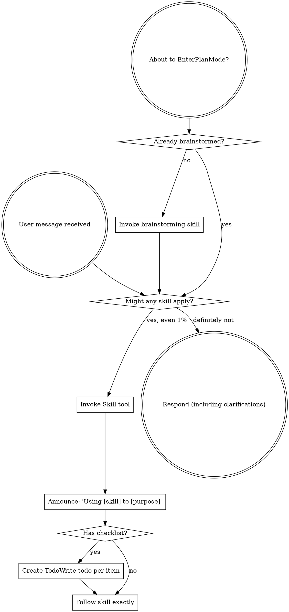

OpenAI Codex v0.128.0 (research preview)
--------
workdir: /Users/houssamr/Projects/syneriva/apps/erp-pos-stabperf
model: gpt-5.5
provider: openai
approval: never
sandbox: workspace-write [workdir, /tmp, $TMPDIR, /Users/houssamr/.codex/memories]
reasoning effort: high
reasoning summaries: none
session id: 019e1c29-ce20-7eb0-bbab-85fa857a222d
--------
user
changes against 'dev'
2026-05-12T12:29:23.097017Z  WARN codex_core_plugins::manifest: ignoring interface.defaultPrompt: prompt must be at most 128 characters path=/Users/houssamr/.codex/.tmp/plugins/plugins/build-ios-apps/.codex-plugin/plugin.json
2026-05-12T12:29:23.097545Z  WARN codex_core_plugins::manifest: ignoring interface.defaultPrompt: maximum of 3 prompts is supported path=/Users/houssamr/.codex/.tmp/plugins/plugins/plugin-eval/.codex-plugin/plugin.json
2026-05-12T12:29:23.100886Z  WARN codex_core_plugins::manifest: ignoring interface.defaultPrompt: maximum of 3 prompts is supported path=/Users/houssamr/.codex/.tmp/plugins/plugins/twilio-developer-kit/.codex-plugin/plugin.json
2026-05-12T12:29:23.100926Z  WARN codex_core_plugins::manifest: ignoring interface.defaultPrompt: maximum of 3 prompts is supported path=/Users/houssamr/.codex/.tmp/plugins/plugins/openai-developers/.codex-plugin/plugin.json
2026-05-12T12:29:25.467246Z  WARN codex_core_plugins::marketplace: skipping marketplace plugin with unsupported source path=/Users/houssamr/.codex/.tmp/marketplaces/.staging/marketplace-upgrade-T88LA2/.claude-plugin/marketplace.json plugin="fullstory"
2026-05-12T12:29:25.467503Z  WARN codex_core_plugins::marketplace: skipping marketplace plugin with unsupported source path=/Users/houssamr/.codex/.tmp/marketplaces/.staging/marketplace-upgrade-T88LA2/.claude-plugin/marketplace.json plugin="jfrog"
2026-05-12T12:29:25.468180Z  WARN codex_core_plugins::marketplace: skipping invalid marketplace plugin path=/Users/houssamr/.codex/.tmp/marketplaces/.staging/marketplace-upgrade-T88LA2/.claude-plugin/marketplace.json marketplace=claude-plugins-official error=invalid plugin name: only ASCII letters, digits, `_`, and `-` are allowed
2026-05-12T12:29:29.187827Z  WARN codex_core_plugins::marketplace: skipping marketplace plugin with unsupported source path=/Users/houssamr/.codex/.tmp/marketplaces/claude-plugins-official/.claude-plugin/marketplace.json plugin="fullstory"
2026-05-12T12:29:29.188154Z  WARN codex_core_plugins::marketplace: skipping marketplace plugin with unsupported source path=/Users/houssamr/.codex/.tmp/marketplaces/claude-plugins-official/.claude-plugin/marketplace.json plugin="jfrog"
2026-05-12T12:29:29.188928Z  WARN codex_core_plugins::marketplace: skipping invalid marketplace plugin path=/Users/houssamr/.codex/.tmp/marketplaces/claude-plugins-official/.claude-plugin/marketplace.json marketplace=claude-plugins-official error=invalid plugin name: only ASCII letters, digits, `_`, and `-` are allowed
2026-05-12T12:29:29.189090Z  WARN codex_core_plugins::marketplace: skipping marketplace plugin that failed to resolve path=/Users/houssamr/.codex/.tmp/marketplaces/ui-ux-pro-max-skill/.claude-plugin/marketplace.json plugin="ui-ux-pro-max" error=invalid marketplace file `/Users/houssamr/.codex/.tmp/marketplaces/ui-ux-pro-max-skill/.claude-plugin/marketplace.json`: local plugin source path must not be empty
2026-05-12T12:29:29.190622Z  WARN codex_core_plugins::manifest: ignoring interface.defaultPrompt: prompt must be at most 128 characters path=/Users/houssamr/.codex/.tmp/plugins/plugins/build-ios-apps/.codex-plugin/plugin.json
2026-05-12T12:29:29.191165Z  WARN codex_core_plugins::manifest: ignoring interface.defaultPrompt: maximum of 3 prompts is supported path=/Users/houssamr/.codex/.tmp/plugins/plugins/plugin-eval/.codex-plugin/plugin.json
2026-05-12T12:29:29.193942Z  WARN codex_core_plugins::manifest: ignoring interface.defaultPrompt: maximum of 3 prompts is supported path=/Users/houssamr/.codex/.tmp/plugins/plugins/twilio-developer-kit/.codex-plugin/plugin.json
2026-05-12T12:29:29.193977Z  WARN codex_core_plugins::manifest: ignoring interface.defaultPrompt: maximum of 3 prompts is supported path=/Users/houssamr/.codex/.tmp/plugins/plugins/openai-developers/.codex-plugin/plugin.json
2026-05-12T12:29:29.239947Z  WARN codex_core_skills::loader: ignoring interface.icon_small: icon path must not contain '..'
2026-05-12T12:29:29.239962Z  WARN codex_core_skills::loader: ignoring interface.icon_large: icon path must not contain '..'
2026-05-12T12:29:29.241037Z  WARN codex_core_skills::loader: ignoring interface.icon_small: icon path must not contain '..'
2026-05-12T12:29:29.241046Z  WARN codex_core_skills::loader: ignoring interface.icon_large: icon path must not contain '..'
2026-05-12T12:29:29.242200Z  WARN codex_core_skills::loader: ignoring interface.icon_small: icon path must not contain '..'
2026-05-12T12:29:29.242210Z  WARN codex_core_skills::loader: ignoring interface.icon_large: icon path must not contain '..'
2026-05-12T12:29:29.243297Z  WARN codex_core_skills::loader: ignoring interface.icon_small: icon path must not contain '..'
2026-05-12T12:29:29.243308Z  WARN codex_core_skills::loader: ignoring interface.icon_large: icon path must not contain '..'
2026-05-12T12:29:29.244287Z  WARN codex_core_skills::loader: ignoring interface.icon_small: icon path must not contain '..'
2026-05-12T12:29:29.244295Z  WARN codex_core_skills::loader: ignoring interface.icon_large: icon path must not contain '..'
2026-05-12T12:29:29.245852Z  WARN codex_core_skills::loader: ignoring interface.icon_small: icon path must not contain '..'
2026-05-12T12:29:29.245862Z  WARN codex_core_skills::loader: ignoring interface.icon_large: icon path must not contain '..'
2026-05-12T12:29:30.893559Z  WARN codex_core_plugins::marketplace: skipping marketplace plugin with unsupported source path=/Users/houssamr/.codex/.tmp/marketplaces/claude-plugins-official/.claude-plugin/marketplace.json plugin="fullstory"
2026-05-12T12:29:30.893805Z  WARN codex_core_plugins::marketplace: skipping marketplace plugin with unsupported source path=/Users/houssamr/.codex/.tmp/marketplaces/claude-plugins-official/.claude-plugin/marketplace.json plugin="jfrog"
2026-05-12T12:29:30.894557Z  WARN codex_core_plugins::marketplace: skipping invalid marketplace plugin path=/Users/houssamr/.codex/.tmp/marketplaces/claude-plugins-official/.claude-plugin/marketplace.json marketplace=claude-plugins-official error=invalid plugin name: only ASCII letters, digits, `_`, and `-` are allowed
2026-05-12T12:29:30.894680Z  WARN codex_core_plugins::marketplace: skipping marketplace plugin that failed to resolve path=/Users/houssamr/.codex/.tmp/marketplaces/ui-ux-pro-max-skill/.claude-plugin/marketplace.json plugin="ui-ux-pro-max" error=invalid marketplace file `/Users/houssamr/.codex/.tmp/marketplaces/ui-ux-pro-max-skill/.claude-plugin/marketplace.json`: local plugin source path must not be empty
2026-05-12T12:29:30.896013Z  WARN codex_core_plugins::manifest: ignoring interface.defaultPrompt: prompt must be at most 128 characters path=/Users/houssamr/.codex/.tmp/plugins/plugins/build-ios-apps/.codex-plugin/plugin.json
2026-05-12T12:29:30.896485Z  WARN codex_core_plugins::manifest: ignoring interface.defaultPrompt: maximum of 3 prompts is supported path=/Users/houssamr/.codex/.tmp/plugins/plugins/plugin-eval/.codex-plugin/plugin.json
2026-05-12T12:29:30.898831Z  WARN codex_core_plugins::manifest: ignoring interface.defaultPrompt: maximum of 3 prompts is supported path=/Users/houssamr/.codex/.tmp/plugins/plugins/twilio-developer-kit/.codex-plugin/plugin.json
2026-05-12T12:29:30.898866Z  WARN codex_core_plugins::manifest: ignoring interface.defaultPrompt: maximum of 3 prompts is supported path=/Users/houssamr/.codex/.tmp/plugins/plugins/openai-developers/.codex-plugin/plugin.json
2026-05-12T12:29:30.918390Z  WARN codex_core_plugins::marketplace: skipping marketplace plugin with unsupported source path=/Users/houssamr/.codex/.tmp/marketplaces/claude-plugins-official/.claude-plugin/marketplace.json plugin="fullstory"
2026-05-12T12:29:30.918571Z  WARN codex_core_plugins::marketplace: skipping marketplace plugin with unsupported source path=/Users/houssamr/.codex/.tmp/marketplaces/claude-plugins-official/.claude-plugin/marketplace.json plugin="jfrog"
2026-05-12T12:29:30.919033Z  WARN codex_core_plugins::marketplace: skipping invalid marketplace plugin path=/Users/houssamr/.codex/.tmp/marketplaces/claude-plugins-official/.claude-plugin/marketplace.json marketplace=claude-plugins-official error=invalid plugin name: only ASCII letters, digits, `_`, and `-` are allowed
2026-05-12T12:29:30.919088Z  WARN codex_core_plugins::marketplace: skipping marketplace plugin that failed to resolve path=/Users/houssamr/.codex/.tmp/marketplaces/ui-ux-pro-max-skill/.claude-plugin/marketplace.json plugin="ui-ux-pro-max" error=invalid marketplace file `/Users/houssamr/.codex/.tmp/marketplaces/ui-ux-pro-max-skill/.claude-plugin/marketplace.json`: local plugin source path must not be empty
2026-05-12T12:29:30.919205Z  WARN codex_core_skills::loader: ignoring interface.icon_small: icon path must not contain '..'
2026-05-12T12:29:30.919213Z  WARN codex_core_skills::loader: ignoring interface.icon_large: icon path must not contain '..'
2026-05-12T12:29:30.919905Z  WARN codex_core_plugins::manifest: ignoring interface.defaultPrompt: prompt must be at most 128 characters path=/Users/houssamr/.codex/.tmp/plugins/plugins/build-ios-apps/.codex-plugin/plugin.json
2026-05-12T12:29:30.919908Z  WARN codex_core_skills::loader: ignoring interface.icon_small: icon path must not contain '..'
2026-05-12T12:29:30.919914Z  WARN codex_core_skills::loader: ignoring interface.icon_large: icon path must not contain '..'
2026-05-12T12:29:30.920115Z  WARN codex_core_plugins::manifest: ignoring interface.defaultPrompt: maximum of 3 prompts is supported path=/Users/houssamr/.codex/.tmp/plugins/plugins/plugin-eval/.codex-plugin/plugin.json
2026-05-12T12:29:30.920692Z  WARN codex_core_skills::loader: ignoring interface.icon_small: icon path must not contain '..'
2026-05-12T12:29:30.920698Z  WARN codex_core_skills::loader: ignoring interface.icon_large: icon path must not contain '..'
2026-05-12T12:29:30.921432Z  WARN codex_core_skills::loader: ignoring interface.icon_small: icon path must not contain '..'
2026-05-12T12:29:30.921440Z  WARN codex_core_skills::loader: ignoring interface.icon_large: icon path must not contain '..'
2026-05-12T12:29:30.922114Z  WARN codex_core_skills::loader: ignoring interface.icon_small: icon path must not contain '..'
2026-05-12T12:29:30.922121Z  WARN codex_core_skills::loader: ignoring interface.icon_large: icon path must not contain '..'
2026-05-12T12:29:30.922582Z  WARN codex_core_plugins::manifest: ignoring interface.defaultPrompt: maximum of 3 prompts is supported path=/Users/houssamr/.codex/.tmp/plugins/plugins/twilio-developer-kit/.codex-plugin/plugin.json
2026-05-12T12:29:30.922611Z  WARN codex_core_plugins::manifest: ignoring interface.defaultPrompt: maximum of 3 prompts is supported path=/Users/houssamr/.codex/.tmp/plugins/plugins/openai-developers/.codex-plugin/plugin.json
2026-05-12T12:29:30.923776Z  WARN codex_core_skills::loader: ignoring interface.icon_small: icon path must not contain '..'
2026-05-12T12:29:30.923786Z  WARN codex_core_skills::loader: ignoring interface.icon_large: icon path must not contain '..'
2026-05-12T12:29:30.940848Z  WARN codex_core_skills::loader: ignoring interface.icon_small: icon path must not contain '..'
2026-05-12T12:29:30.940865Z  WARN codex_core_skills::loader: ignoring interface.icon_large: icon path must not contain '..'
2026-05-12T12:29:30.941722Z  WARN codex_core_skills::loader: ignoring interface.icon_small: icon path must not contain '..'
2026-05-12T12:29:30.941730Z  WARN codex_core_skills::loader: ignoring interface.icon_large: icon path must not contain '..'
2026-05-12T12:29:30.942337Z  WARN codex_core_skills::loader: ignoring interface.icon_small: icon path must not contain '..'
2026-05-12T12:29:30.942343Z  WARN codex_core_skills::loader: ignoring interface.icon_large: icon path must not contain '..'
2026-05-12T12:29:30.942980Z  WARN codex_core_skills::loader: ignoring interface.icon_small: icon path must not contain '..'
2026-05-12T12:29:30.942988Z  WARN codex_core_skills::loader: ignoring interface.icon_large: icon path must not contain '..'
2026-05-12T12:29:30.943680Z  WARN codex_core_skills::loader: ignoring interface.icon_small: icon path must not contain '..'
2026-05-12T12:29:30.943687Z  WARN codex_core_skills::loader: ignoring interface.icon_large: icon path must not contain '..'
2026-05-12T12:29:30.945058Z  WARN codex_core_skills::loader: ignoring interface.icon_small: icon path must not contain '..'
2026-05-12T12:29:30.945067Z  WARN codex_core_skills::loader: ignoring interface.icon_large: icon path must not contain '..'
2026-05-12T12:29:32.416703Z  WARN codex_core_plugins::marketplace: skipping marketplace plugin that failed to resolve path=/Users/houssamr/.codex/.tmp/marketplaces/.staging/marketplace-upgrade-a2Wr6n/.claude-plugin/marketplace.json plugin="ui-ux-pro-max" error=invalid marketplace file `/Users/houssamr/.codex/.tmp/marketplaces/.staging/marketplace-upgrade-a2Wr6n/.claude-plugin/marketplace.json`: local plugin source path must not be empty
2026-05-12T12:29:32.450785Z  WARN codex_core_plugins::marketplace: skipping marketplace plugin with unsupported source path=/Users/houssamr/.codex/.tmp/marketplaces/claude-plugins-official/.claude-plugin/marketplace.json plugin="fullstory"
2026-05-12T12:29:32.450902Z  WARN codex_core_plugins::marketplace: skipping marketplace plugin with unsupported source path=/Users/houssamr/.codex/.tmp/marketplaces/claude-plugins-official/.claude-plugin/marketplace.json plugin="jfrog"
2026-05-12T12:29:32.451354Z  WARN codex_core_plugins::marketplace: skipping invalid marketplace plugin path=/Users/houssamr/.codex/.tmp/marketplaces/claude-plugins-official/.claude-plugin/marketplace.json marketplace=claude-plugins-official error=invalid plugin name: only ASCII letters, digits, `_`, and `-` are allowed
2026-05-12T12:29:32.451515Z  WARN codex_core_plugins::marketplace: skipping marketplace plugin that failed to resolve path=/Users/houssamr/.codex/.tmp/marketplaces/ui-ux-pro-max-skill/.claude-plugin/marketplace.json plugin="ui-ux-pro-max" error=invalid marketplace file `/Users/houssamr/.codex/.tmp/marketplaces/ui-ux-pro-max-skill/.claude-plugin/marketplace.json`: local plugin source path must not be empty
2026-05-12T12:29:32.451765Z  WARN codex_core_plugins::loader: configured non-curated plugin no longer exists in discovered marketplaces during cache refresh plugin="browser-use" marketplace="openai-bundled"
2026-05-12T12:29:32.459993Z  WARN codex_core_plugins::loader: configured non-curated plugin no longer exists in discovered marketplaces during cache refresh plugin="documents" marketplace="openai-primary-runtime"
2026-05-12T12:29:32.461902Z  WARN codex_core_plugins::loader: configured non-curated plugin no longer exists in discovered marketplaces during cache refresh plugin="presentations" marketplace="openai-primary-runtime"
2026-05-12T12:29:32.461907Z  WARN codex_core_plugins::loader: configured non-curated plugin no longer exists in discovered marketplaces during cache refresh plugin="spreadsheets" marketplace="openai-primary-runtime"
2026-05-12T12:29:39.701805Z  WARN codex_otel::events::session_telemetry: metrics counter [codex.skill.injected] failed: tag value contains invalid characters: superpowers:using-superpowers
exec
/bin/zsh -lc 'cat /Users/houssamr/.codex/plugins/cache/claude-plugins-official/superpowers/5.1.0/skills/using-superpowers/SKILL.md && git diff 198c36305038b2cb9cb265085f9185cb7b71e24c --stat' in /Users/houssamr/Projects/syneriva/apps/erp-pos-stabperf
 succeeded in 0ms:
---
name: using-superpowers
description: Use when starting any conversation - establishes how to find and use skills, requiring Skill tool invocation before ANY response including clarifying questions
---

<SUBAGENT-STOP>
If you were dispatched as a subagent to execute a specific task, skip this skill.
</SUBAGENT-STOP>

<EXTREMELY-IMPORTANT>
If you think there is even a 1% chance a skill might apply to what you are doing, you ABSOLUTELY MUST invoke the skill.

IF A SKILL APPLIES TO YOUR TASK, YOU DO NOT HAVE A CHOICE. YOU MUST USE IT.

This is not negotiable. This is not optional. You cannot rationalize your way out of this.
</EXTREMELY-IMPORTANT>

## Instruction Priority

Superpowers skills override default system prompt behavior, but **user instructions always take precedence**:

1. **User's explicit instructions** (CLAUDE.md, GEMINI.md, AGENTS.md, direct requests) — highest priority
2. **Superpowers skills** — override default system behavior where they conflict
3. **Default system prompt** — lowest priority

If CLAUDE.md, GEMINI.md, or AGENTS.md says "don't use TDD" and a skill says "always use TDD," follow the user's instructions. The user is in control.

## How to Access Skills

**In Claude Code:** Use the `Skill` tool. When you invoke a skill, its content is loaded and presented to you—follow it directly. Never use the Read tool on skill files.

**In Copilot CLI:** Use the `skill` tool. Skills are auto-discovered from installed plugins. The `skill` tool works the same as Claude Code's `Skill` tool.

**In Gemini CLI:** Skills activate via the `activate_skill` tool. Gemini loads skill metadata at session start and activates the full content on demand.

**In other environments:** Check your platform's documentation for how skills are loaded.

## Platform Adaptation

Skills use Claude Code tool names. Non-CC platforms: see `references/copilot-tools.md` (Copilot CLI), `references/codex-tools.md` (Codex) for tool equivalents. Gemini CLI users get the tool mapping loaded automatically via GEMINI.md.

# Using Skills

## The Rule

**Invoke relevant or requested skills BEFORE any response or action.** Even a 1% chance a skill might apply means that you should invoke the skill to check. If an invoked skill turns out to be wrong for the situation, you don't need to use it.

## Red Flags

These thoughts mean STOP—you're rationalizing:

| Thought | Reality |
|---------|---------|
| "This is just a simple question" | Questions are tasks. Check for skills. |
| "I need more context first" | Skill check comes BEFORE clarifying questions. |
| "Let me explore the codebase first" | Skills tell you HOW to explore. Check first. |
| "I can check git/files quickly" | Files lack conversation context. Check for skills. |
| "Let me gather information first" | Skills tell you HOW to gather information. |
| "This doesn't need a formal skill" | If a skill exists, use it. |
| "I remember this skill" | Skills evolve. Read current version. |
| "This doesn't count as a task" | Action = task. Check for skills. |
| "The skill is overkill" | Simple things become complex. Use it. |
| "I'll just do this one thing first" | Check BEFORE doing anything. |
| "This feels productive" | Undisciplined action wastes time. Skills prevent this. |
| "I know what that means" | Knowing the concept ≠ using the skill. Invoke it. |

## Skill Priority

When multiple skills could apply, use this order:

1. **Process skills first** (brainstorming, debugging) - these determine HOW to approach the task
2. **Implementation skills second** (frontend-design, mcp-builder) - these guide execution

"Let's build X" → brainstorming first, then implementation skills.
"Fix this bug" → debugging first, then domain-specific skills.

## Skill Types

**Rigid** (TDD, debugging): Follow exactly. Don't adapt away discipline.

**Flexible** (patterns): Adapt principles to context.

The skill itself tells you which.

## User Instructions

Instructions say WHAT, not HOW. "Add X" or "Fix Y" doesn't mean skip workflows.
 .../Controllers/DiscountController.php             |    42 +-
 .../__tests__/discountApi.terminalContext.test.ts  |    34 +
 apps/pos/src/api/discountApi.ts                    |    13 +-
 .../organisms/DiscountModal/DiscountModal.tsx      |    22 +-
 .../DiscountModal/__tests__/DiscountModal.test.tsx |     2 +
 .../LineDiscountModal/LineDiscountModal.tsx        |    22 +-
 .../__tests__/LineDiscountModal.test.tsx           |     2 +
 apps/pos/src/lib/db/migrations.ts                  |    45 +
 .../lib/db/repositories/operatorPinRepository.ts   |    56 +-
 apps/pos/src/lib/discountPermissions.ts            |   102 +
 apps/pos/src/locales/en/pos.json                   |     3 +
 apps/pos/src/locales/fr/pos.json                   |     3 +
 apps/pos/src/pages/HomePage.tsx                    |    33 +-
 .../__tests__/HomePage.discountFailClosed.test.ts  |   105 +
 .../pos/src/stores/__tests__/operatorStore.test.ts |   256 +-
 .../pos/src/stores/__tests__/terminalStore.test.ts |    21 +
 apps/pos/src/stores/operatorStore.ts               |   102 +-
 apps/pos/src/stores/terminalStore.ts               |     6 +
 ...26-05-12-pos-go-live-pr3-codex-review-round1.md |  3654 ++++
 ...26-05-12-pos-go-live-pr3-codex-review-round2.md |  5667 ++++++
 ...26-05-12-pos-go-live-pr3-codex-review-round3.md | 17863 +++++++++++++++++++
 21 files changed, 28014 insertions(+), 39 deletions(-)

2026-05-12T12:29:39.824635Z  WARN codex_protocol::openai_models: Model personality requested but model_messages is missing, falling back to base instructions. model=gpt-5.5 personality=pragmatic
2026-05-12T12:29:39.890996Z  WARN codex_core_plugins::marketplace: skipping marketplace plugin with unsupported source path=/Users/houssamr/.codex/.tmp/marketplaces/claude-plugins-official/.claude-plugin/marketplace.json plugin="fullstory"
2026-05-12T12:29:39.891119Z  WARN codex_core_plugins::marketplace: skipping marketplace plugin with unsupported source path=/Users/houssamr/.codex/.tmp/marketplaces/claude-plugins-official/.claude-plugin/marketplace.json plugin="jfrog"
2026-05-12T12:29:39.891482Z  WARN codex_core_plugins::marketplace: skipping invalid marketplace plugin path=/Users/houssamr/.codex/.tmp/marketplaces/claude-plugins-official/.claude-plugin/marketplace.json marketplace=claude-plugins-official error=invalid plugin name: only ASCII letters, digits, `_`, and `-` are allowed
2026-05-12T12:29:39.891544Z  WARN codex_core_plugins::marketplace: skipping marketplace plugin that failed to resolve path=/Users/houssamr/.codex/.tmp/marketplaces/ui-ux-pro-max-skill/.claude-plugin/marketplace.json plugin="ui-ux-pro-max" error=invalid marketplace file `/Users/houssamr/.codex/.tmp/marketplaces/ui-ux-pro-max-skill/.claude-plugin/marketplace.json`: local plugin source path must not be empty
2026-05-12T12:29:39.892332Z  WARN codex_core_plugins::manifest: ignoring interface.defaultPrompt: prompt must be at most 128 characters path=/Users/houssamr/.codex/.tmp/plugins/plugins/build-ios-apps/.codex-plugin/plugin.json
2026-05-12T12:29:39.892589Z  WARN codex_core_plugins::manifest: ignoring interface.defaultPrompt: maximum of 3 prompts is supported path=/Users/houssamr/.codex/.tmp/plugins/plugins/plugin-eval/.codex-plugin/plugin.json
2026-05-12T12:29:39.894611Z  WARN codex_core_plugins::manifest: ignoring interface.defaultPrompt: maximum of 3 prompts is supported path=/Users/houssamr/.codex/.tmp/plugins/plugins/twilio-developer-kit/.codex-plugin/plugin.json
2026-05-12T12:29:39.894640Z  WARN codex_core_plugins::manifest: ignoring interface.defaultPrompt: maximum of 3 prompts is supported path=/Users/houssamr/.codex/.tmp/plugins/plugins/openai-developers/.codex-plugin/plugin.json
2026-05-12T12:29:39.919718Z  WARN codex_core_skills::loader: ignoring interface.icon_small: icon path must not contain '..'
2026-05-12T12:29:39.919735Z  WARN codex_core_skills::loader: ignoring interface.icon_large: icon path must not contain '..'
2026-05-12T12:29:39.920752Z  WARN codex_core_skills::loader: ignoring interface.icon_small: icon path must not contain '..'
2026-05-12T12:29:39.920763Z  WARN codex_core_skills::loader: ignoring interface.icon_large: icon path must not contain '..'
2026-05-12T12:29:39.921824Z  WARN codex_core_skills::loader: ignoring interface.icon_small: icon path must not contain '..'
2026-05-12T12:29:39.921837Z  WARN codex_core_skills::loader: ignoring interface.icon_large: icon path must not contain '..'
2026-05-12T12:29:39.922613Z  WARN codex_core_skills::loader: ignoring interface.icon_small: icon path must not contain '..'
2026-05-12T12:29:39.922622Z  WARN codex_core_skills::loader: ignoring interface.icon_large: icon path must not contain '..'
2026-05-12T12:29:39.923395Z  WARN codex_core_skills::loader: ignoring interface.icon_small: icon path must not contain '..'
2026-05-12T12:29:39.923404Z  WARN codex_core_skills::loader: ignoring interface.icon_large: icon path must not contain '..'
2026-05-12T12:29:39.925082Z  WARN codex_core_skills::loader: ignoring interface.icon_small: icon path must not contain '..'
2026-05-12T12:29:39.925111Z  WARN codex_core_skills::loader: ignoring interface.icon_large: icon path must not contain '..'
exec
/bin/zsh -lc 'git diff 198c36305038b2cb9cb265085f9185cb7b71e24c -- apps/pos/src/api/discountApi.ts apps/pos/src/lib/discountPermissions.ts apps/pos/src/stores/operatorStore.ts apps/pos/src/stores/terminalStore.ts apps/pos/src/lib/db/repositories/operatorPinRepository.ts apps/pos/src/lib/db/migrations.ts apps/api/app/Http/Controllers/DiscountController.php apps/pos/src/pages/HomePage.tsx apps/pos/src/components/organisms/DiscountModal/DiscountModal.tsx apps/pos/src/components/organisms/LineDiscountModal/LineDiscountModal.tsx' in /Users/houssamr/Projects/syneriva/apps/erp-pos-stabperf
 succeeded in 0ms:
diff --git a/apps/pos/src/api/discountApi.ts b/apps/pos/src/api/discountApi.ts
index e7184664..492fd59f 100644
--- a/apps/pos/src/api/discountApi.ts
+++ b/apps/pos/src/api/discountApi.ts
@@ -2,10 +2,19 @@ import { apiGet } from '@/lib/api';

 export interface DiscountPermissions {
   canDiscount: boolean;
+  terminalAllowsDiscounts: boolean;
+  canApplyLineDiscounts: boolean;
+  canApplyTransactionDiscounts: boolean;
   maxDiscountPercent: number;
   requiresReason: boolean;
 }

-export async function fetchDiscountPermissions(): Promise<DiscountPermissions> {
-  return apiGet<DiscountPermissions>('/pos/discount-permissions');
+export async function fetchDiscountPermissions(
+  terminalCode: string,
+  operatorId?: string,
+): Promise<DiscountPermissions> {
+  return apiGet<DiscountPermissions>('/pos/discount-permissions', {
+    terminal_code: terminalCode,
+    operator_id: operatorId,
+  });
 }
diff --git a/apps/pos/src/components/organisms/DiscountModal/DiscountModal.tsx b/apps/pos/src/components/organisms/DiscountModal/DiscountModal.tsx
index be9fb8cc..274d8646 100644
--- a/apps/pos/src/components/organisms/DiscountModal/DiscountModal.tsx
+++ b/apps/pos/src/components/organisms/DiscountModal/DiscountModal.tsx
@@ -18,6 +18,8 @@ export interface DiscountModalProps {
   }) => void;
   canDiscount: boolean;
   maxDiscountPercent: number;
+  terminalMaxDiscountPercent: number;
+  disabledReason?: string;
   requiresReason: boolean;
 }

@@ -30,6 +32,8 @@ export function DiscountModal({
   onApplyTransactionDiscount,
   canDiscount,
   maxDiscountPercent,
+  terminalMaxDiscountPercent,
+  disabledReason,
   requiresReason,
 }: DiscountModalProps) {
   const { t } = useTranslation('pos');
@@ -97,9 +101,10 @@ export function DiscountModal({
   const numericValue = parseFloat(value) || 0;
   const percentageExceeded =
     discountType === 'percentage' && numericValue > maxDiscountPercent;
-  const needsManagerOverride = !canDiscount || percentageExceeded;
+  const isDiscountDisabled = disabledReason !== undefined;
+  const needsManagerOverride = !isDiscountDisabled && (!canDiscount || percentageExceeded);
   const isValid =
-    numericValue > 0 && (!requiresReason || reason.trim().length > 0);
+    !isDiscountDisabled && numericValue > 0 && (!requiresReason || reason.trim().length > 0);

   const handleApply = useCallback(() => {
     if (!isValid) return;
@@ -134,7 +139,8 @@ export function DiscountModal({
         return;
       }

-      const managerMax = manager.max_discount_percent ?? 100;
+      const managerLimit = manager.max_discount_percent ?? terminalMaxDiscountPercent;
+      const managerMax = Math.min(managerLimit, terminalMaxDiscountPercent);
       if (discountType === 'percentage' && parseFloat(value) > managerMax) {
         setManagerError(t('discount.managerDenied'));
         return;
@@ -155,7 +161,7 @@ export function DiscountModal({
     } finally {
       setVerifyingPin(false);
     }
-  }, [managerPin, discountType, value, reason, onApplyTransactionDiscount, onClose, t]);
+  }, [managerPin, discountType, value, reason, terminalMaxDiscountPercent, onApplyTransactionDiscount, onClose, t]);

   if (!isOpen) return null;

@@ -265,8 +271,10 @@ export function DiscountModal({
                   <button
                     key={key}
                     onClick={() => handleNumpadPress(key)}
+                    disabled={isDiscountDisabled}
                     className={cn(
                       'flex items-center justify-center rounded-xl text-xl font-semibold transition-colors',
+                      isDiscountDisabled && 'cursor-not-allowed opacity-50',
                       key === 'C'
                         ? 'bg-red-50 text-red-700 hover:bg-red-100'
                         : 'bg-gray-50 text-gray-900 hover:bg-gray-100 active:bg-gray-200',
@@ -325,6 +333,12 @@ export function DiscountModal({
           ) : (
             <>
               {/* Max exceeded warning — shown as info since manager can override */}
+              {disabledReason && (
+                

+                  {disabledReason}
+                

+              )}
+
               {needsManagerOverride && numericValue > 0 && (
                 

                   {!canDiscount
diff --git a/apps/pos/src/components/organisms/LineDiscountModal/LineDiscountModal.tsx b/apps/pos/src/components/organisms/LineDiscountModal/LineDiscountModal.tsx
index 6e6dceeb..7121c479 100644
--- a/apps/pos/src/components/organisms/LineDiscountModal/LineDiscountModal.tsx
+++ b/apps/pos/src/components/organisms/LineDiscountModal/LineDiscountModal.tsx
@@ -19,6 +19,8 @@ export interface LineDiscountModalProps {
   itemName: string;
   canDiscount: boolean;
   maxDiscountPercent: number;
+  terminalMaxDiscountPercent: number;
+  disabledReason?: string;
 }

 const NUMPAD_KEYS = ['1', '2', '3', '4', '5', '6', '7', '8', '9', '.', '0', 'C'];
@@ -31,6 +33,8 @@ export function LineDiscountModal({
   itemName,
   canDiscount,
   maxDiscountPercent,
+  terminalMaxDiscountPercent,
+  disabledReason,
 }: LineDiscountModalProps) {
   const { t } = useTranslation('pos');
   const dialogRef = useRef<HTMLDivElement>(null);
@@ -96,8 +100,9 @@ export function LineDiscountModal({
   const numericValue = parseFloat(value) || 0;
   const percentageExceeded =
     discountType === 'percentage' && numericValue > maxDiscountPercent;
-  const needsManagerOverride = !canDiscount || percentageExceeded;
-  const isValid = numericValue > 0;
+  const isDiscountDisabled = disabledReason !== undefined;
+  const needsManagerOverride = !isDiscountDisabled && (!canDiscount || percentageExceeded);
+  const isValid = !isDiscountDisabled && numericValue > 0;

   const handleApply = useCallback(() => {
     if (!isValid) return;
@@ -132,7 +137,8 @@ export function LineDiscountModal({
         return;
       }

-      const managerMax = manager.max_discount_percent ?? 100;
+      const managerLimit = manager.max_discount_percent ?? terminalMaxDiscountPercent;
+      const managerMax = Math.min(managerLimit, terminalMaxDiscountPercent);
       if (discountType === 'percentage' && parseFloat(value) > managerMax) {
         setManagerError(t('discount.managerDenied'));
         return;
@@ -153,7 +159,7 @@ export function LineDiscountModal({
     } finally {
       setVerifyingPin(false);
     }
-  }, [managerPin, discountType, value, reason, onApply, onClose, t]);
+  }, [managerPin, discountType, value, reason, terminalMaxDiscountPercent, onApply, onClose, t]);

   if (!isOpen) return null;

@@ -263,8 +269,10 @@ export function LineDiscountModal({
                   <button
                     key={key}
                     onClick={() => handleNumpadPress(key)}
+                    disabled={isDiscountDisabled}
                     className={cn(
                       'flex items-center justify-center rounded-xl text-xl font-semibold transition-colors',
+                      isDiscountDisabled && 'cursor-not-allowed opacity-50',
                       key === 'C'
                         ? 'bg-red-50 text-red-700 hover:bg-red-100'
                         : 'bg-gray-50 text-gray-900 hover:bg-gray-100 active:bg-gray-200',
@@ -328,6 +336,12 @@ export function LineDiscountModal({
           ) : (
             <>
               {/* Max exceeded warning — shown as info since manager can override */}
+              {disabledReason && (
+                

+                  {disabledReason}
+                

+              )}
+
               {needsManagerOverride && numericValue > 0 && (
                 

                   {!canDiscount
diff --git a/apps/pos/src/lib/db/migrations.ts b/apps/pos/src/lib/db/migrations.ts
index a87a40ae..29ad7883 100644
--- a/apps/pos/src/lib/db/migrations.ts
+++ b/apps/pos/src/lib/db/migrations.ts
@@ -827,4 +827,49 @@ export const migrations: Migration[] = [
         AND sync_error LIKE '%database is locked%';
     `,
   },
+  {
+    version: 33,
+    name: 'add_operator_discount_permission_cache_timestamp',
+    sql: '',
+    async run(db) {
+      try {
+        await db.execute('ALTER TABLE operator_pins ADD COLUMN discount_permissions_fetched_at TEXT');
+      } catch (error) {
+        const msg = error instanceof Error ? error.message : '';
+        if (!msg.includes('duplicate column')) {
+          throw error;
+        }
+      }
+    },
+  },
+  {
+    version: 34,
+    name: 'add_operator_discount_permission_cache_status',
+    sql: '',
+    async run(db) {
+      try {
+        await db.execute("ALTER TABLE operator_pins ADD COLUMN discount_permissions_status TEXT DEFAULT 'unavailable'");
+      } catch (error) {
+        const msg = error instanceof Error ? error.message : '';
+        if (!msg.includes('duplicate column')) {
+          throw error;
+        }
+      }
+    },
+  },
+  {
+    version: 35,
+    name: 'add_operator_discount_permission_terminal_code',
+    sql: '',
+    async run(db) {
+      try {
+        await db.execute('ALTER TABLE operator_pins ADD COLUMN discount_permissions_terminal_code TEXT');
+      } catch (error) {
+        const msg = error instanceof Error ? error.message : '';
+        if (!msg.includes('duplicate column')) {
+          throw error;
+        }
+      }
+    },
+  },
 ];
diff --git a/apps/pos/src/lib/db/repositories/operatorPinRepository.ts b/apps/pos/src/lib/db/repositories/operatorPinRepository.ts
index 29e3b46c..0b3dac28 100644
--- a/apps/pos/src/lib/db/repositories/operatorPinRepository.ts
+++ b/apps/pos/src/lib/db/repositories/operatorPinRepository.ts
@@ -1,5 +1,7 @@
 import type Database from '@tauri-apps/plugin-sql';
 import { queryAll, queryOne, execute } from '@/lib/db';
+import { resolveCachedDiscountStatus } from '@/lib/discountPermissions';
+import type { DiscountPermissionStatus } from '@/lib/discountPermissions';

 export interface CachedOperator {
   id: string;
@@ -10,6 +12,9 @@ export interface CachedOperator {
   permissions: string[];
   can_discount: boolean;
   max_discount_percent: number | null;
+  discount_permissions_fetched_at: string | null;
+  discount_permissions_terminal_code: string | null;
+  discount_permissions_status: DiscountPermissionStatus;
 }

 interface OperatorPinRow {
@@ -21,9 +26,18 @@ interface OperatorPinRow {
   permissions: string;
   can_discount: number;
   max_discount_percent: number | null;
+  discount_permissions_fetched_at?: string | null;
+  discount_permissions_terminal_code?: string | null;
+  discount_permissions_status?: DiscountPermissionStatus | null;
 }

 function rowToOperator(row: OperatorPinRow): CachedOperator {
+  const cacheStatus = resolveCachedDiscountStatus(row.discount_permissions_fetched_at);
+  const permissionStatus =
+    cacheStatus === 'fresh' && row.discount_permissions_status === 'terminal_denied'
+      ? 'terminal_denied'
+      : cacheStatus;
+
   return {
     id: row.id,
     name: row.name,
@@ -33,6 +47,9 @@ function rowToOperator(row: OperatorPinRow): CachedOperator {
     permissions: JSON.parse(row.permissions) as string[],
     can_discount: row.can_discount === 1,
     max_discount_percent: row.max_discount_percent,
+    discount_permissions_fetched_at: row.discount_permissions_fetched_at ?? null,
+    discount_permissions_terminal_code: row.discount_permissions_terminal_code ?? null,
+    discount_permissions_status: permissionStatus,
   };
 }

@@ -66,12 +83,15 @@ export async function upsertOperators(
   for (const op of operators) {
     await execute(
       db,
-      `INSERT INTO operator_pins (id, name, email, pin_hash, roles, permissions, can_discount, max_discount_percent, synced_at)
-       VALUES ($1, $2, $3, $4, $5, $6, $7, $8, datetime('now'))
+      `INSERT INTO operator_pins (id, name, email, pin_hash, roles, permissions, can_discount, max_discount_percent, synced_at, discount_permissions_fetched_at, discount_permissions_terminal_code, discount_permissions_status)
+       VALUES ($1, $2, $3, $4, $5, $6, $7, $8, datetime('now'), NULL, NULL, 'unavailable')
        ON CONFLICT(id) DO UPDATE SET
          name = excluded.name, email = excluded.email, pin_hash = excluded.pin_hash,
          roles = excluded.roles, permissions = excluded.permissions,
          can_discount = excluded.can_discount, max_discount_percent = excluded.max_discount_percent,
+         discount_permissions_fetched_at = NULL,
+         discount_permissions_terminal_code = NULL,
+         discount_permissions_status = 'unavailable',
          synced_at = datetime('now')`,
       [
         op.id, op.name, op.email, op.pin_hash,
@@ -82,6 +102,38 @@ export async function upsertOperators(
   }
 }

+export async function updateOperatorDiscountPermissions(
+  db: Database,
+  operatorId: string,
+  permissions: {
+    can_discount: boolean;
+    max_discount_percent: number | null;
+    fetched_at: string;
+    terminal_code: string;
+    status: Extract<DiscountPermissionStatus, 'fresh' | 'terminal_denied'>;
+  },
+): Promise<void> {
+  await execute(
+    db,
+    `UPDATE operator_pins
+     SET can_discount = $1,
+         max_discount_percent = $2,
+         discount_permissions_fetched_at = $3,
+         discount_permissions_terminal_code = $4,
+         discount_permissions_status = $5,
+         synced_at = datetime('now')
+     WHERE id = $6`,
+    [
+      permissions.can_discount ? 1 : 0,
+      permissions.max_discount_percent,
+      permissions.fetched_at,
+      permissions.terminal_code,
+      permissions.status,
+      operatorId,
+    ],
+  );
+}
+
 export async function hasOperatorPins(db: Database): Promise<boolean> {
   const result = await queryOne<{ count: number }>(db, 'SELECT COUNT(*) as count FROM operator_pins');
   return (result?.count ?? 0) > 0;
diff --git a/apps/pos/src/lib/discountPermissions.ts b/apps/pos/src/lib/discountPermissions.ts
new file mode 100644
index 00000000..83c654e9
--- /dev/null
+++ b/apps/pos/src/lib/discountPermissions.ts
@@ -0,0 +1,102 @@
+import type { Operator } from '@/stores/operatorStore';
+
+export const DISCOUNT_PERMISSION_CACHE_TTL_MS = 24 * 60 * 60 * 1000;
+
+export type DiscountPermissionStatus = 'fresh' | 'terminal_denied' | 'unavailable' | 'stale';
+
+export interface DiscountAccessState {
+  canDiscount: boolean;
+  maxDiscountPercent: number;
+  disabledReason: string | null;
+}
+
+export function resolveDiscountAccess(
+  operator: Pick<Operator, 'can_discount' | 'max_discount_percent' | 'discount_permissions_status'> | null,
+  terminalMaxDiscountPercent: number | null | undefined,
+  terminalAllowsDiscounts: boolean | null | undefined,
+): DiscountAccessState {
+  if (operator === null) {
+    return {
+      canDiscount: false,
+      maxDiscountPercent: 0,
+      disabledReason: 'discount.requiresOperator',
+    };
+  }
+
+  if (operator.discount_permissions_status === 'terminal_denied') {
+    return {
+      canDiscount: false,
+      maxDiscountPercent: 0,
+      disabledReason: 'discount.permissionsUnavailable',
+    };
+  }
+
+  if (operator.discount_permissions_status === 'stale') {
+    return {
+      canDiscount: false,
+      maxDiscountPercent: 0,
+      disabledReason: 'discount.permissionsStale',
+    };
+  }
+
+  if (operator.discount_permissions_status !== 'fresh') {
+    return {
+      canDiscount: false,
+      maxDiscountPercent: 0,
+      disabledReason: 'discount.permissionsUnavailable',
+    };
+  }
+
+  if (
+    terminalAllowsDiscounts !== true
+    || typeof terminalMaxDiscountPercent !== 'number'
+    || terminalMaxDiscountPercent <= 0
+  ) {
+    return {
+      canDiscount: false,
+      maxDiscountPercent: 0,
+      disabledReason: 'discount.permissionsUnavailable',
+    };
+  }
+
+  if (!operator.can_discount) {
+    return {
+      canDiscount: false,
+      maxDiscountPercent: 0,
+      disabledReason: null,
+    };
+  }
+
+  const operatorLimit = operator.max_discount_percent ?? terminalMaxDiscountPercent;
+  const effectiveLimit = Math.min(operatorLimit, terminalMaxDiscountPercent);
+
+  if (effectiveLimit <= 0) {
+    return {
+      canDiscount: false,
+      maxDiscountPercent: 0,
+      disabledReason: 'discount.permissionsUnavailable',
+    };
+  }
+
+  return {
+    canDiscount: true,
+    maxDiscountPercent: effectiveLimit,
+    disabledReason: null,
+  };
+}
+
+export function resolveCachedDiscountStatus(
+  fetchedAt: string | null | undefined,
+  nowMs: number = Date.now(),
+): DiscountPermissionStatus {
+  if (!fetchedAt) {
+    return 'unavailable';
+  }
+
+  const fetchedAtMs = Date.parse(fetchedAt);
+  if (!Number.isFinite(fetchedAtMs)) {
+    return 'unavailable';
+  }
+
+  return nowMs - fetchedAtMs > DISCOUNT_PERMISSION_CACHE_TTL_MS ? 'stale' : 'fresh';
+}
diff --git a/apps/pos/src/pages/HomePage.tsx b/apps/pos/src/pages/HomePage.tsx
index 8adf0a04..064e764e 100644
--- a/apps/pos/src/pages/HomePage.tsx
+++ b/apps/pos/src/pages/HomePage.tsx
@@ -23,6 +23,7 @@ import { ReceiptLocatorScreen } from '@/components/pos/ReceiptLocatorScreen';
 import { ResumeRefundDraftBanner } from '@/components/pos/ResumeRefundDraftBanner';
 import { getErrorMessage } from '@/lib/api';
 import { useCurrency } from '@/lib/currency';
+import { resolveDiscountAccess } from '@/lib/discountPermissions';
 import { fetchReceipt } from '@/api/receiptApi';
 import { buildEscPosReceiptData } from '@/lib/buildReceiptData';
 import type { ReceiptVisibilitySettings } from '@/lib/buildReceiptData';
@@ -198,8 +199,16 @@ export function HomePage() {
   const [discountItemId, setDiscountItemId] = useState<string | null>(null);

   // Operator discount permissions
-  const canDiscount = operator?.can_discount ?? true;
-  const maxDiscountPct = operator?.max_discount_percent ?? 100;
+  const transactionDiscountAccess = resolveDiscountAccess(
+    operator,
+    terminal?.max_discount_percent,
+    terminal?.allow_transaction_discounts,
+  );
+  const lineDiscountAccess = resolveDiscountAccess(
+    operator,
+    terminal?.max_discount_percent,
+    terminal?.allow_line_discounts,
+  );

   // Barcode scanner
   const [scanMessage, setScanMessage] = useState<{ text: string; type: 'success' | 'error' | 'info' } | null>(null);
@@ -1159,8 +1168,14 @@ export function HomePage() {
         isOpen={showDiscountModal}
         onClose={() => setShowDiscountModal(false)}
         onApplyTransactionDiscount={handleApplyTransactionDiscount}
-        canDiscount={canDiscount}
-        maxDiscountPercent={maxDiscountPct}
+        canDiscount={transactionDiscountAccess.canDiscount}
+        maxDiscountPercent={transactionDiscountAccess.maxDiscountPercent}
+        terminalMaxDiscountPercent={terminal?.max_discount_percent ?? 0}
+        disabledReason={
+          transactionDiscountAccess.disabledReason
+            ? t(`pos:${transactionDiscountAccess.disabledReason}`)
+            : undefined
+        }
         requiresReason={true}
       />

@@ -1170,8 +1185,14 @@ export function HomePage() {
         onClose={() => setDiscountItemId(null)}
         onApply={handleApplyLineDiscount}
         itemName={discountItem?.product.name ?? ''}
-        canDiscount={canDiscount}
-        maxDiscountPercent={maxDiscountPct}
+        canDiscount={lineDiscountAccess.canDiscount}
+        maxDiscountPercent={lineDiscountAccess.maxDiscountPercent}
+        terminalMaxDiscountPercent={terminal?.max_discount_percent ?? 0}
+        disabledReason={
+          lineDiscountAccess.disabledReason
+            ? t(`pos:${lineDiscountAccess.disabledReason}`)
+            : undefined
+        }
       />

       {/* Modifier selection modal */}
diff --git a/apps/pos/src/stores/operatorStore.ts b/apps/pos/src/stores/operatorStore.ts
index 3a3d94ba..e33d827e 100644
--- a/apps/pos/src/stores/operatorStore.ts
+++ b/apps/pos/src/stores/operatorStore.ts
@@ -1,10 +1,18 @@
 import { create } from 'zustand';
 import bcrypt from 'bcryptjs';
 import { apiGet, apiPost } from '@/lib/api';
+import { fetchDiscountPermissions } from '@/api/discountApi';
 import { getDatabase } from '@/lib/db';
-import { getAllOperators, hasOperatorPins, upsertOperators } from '@/lib/db/repositories/operatorPinRepository';
+import {
+  getAllOperators,
+  hasOperatorPins,
+  updateOperatorDiscountPermissions,
+  upsertOperators,
+} from '@/lib/db/repositories/operatorPinRepository';
 import { enqueuePinUpdate } from '@/lib/db/repositories/queuedPinUpdateRepository';
 import { useAuthStore } from '@/stores/authStore';
+import { useTerminalStore } from '@/stores/terminalStore';
+import type { DiscountPermissionStatus } from '@/lib/discountPermissions';

 export interface Operator {
   id: string;
@@ -14,6 +22,7 @@ export interface Operator {
   permissions: string[];
   can_discount: boolean;
   max_discount_percent: number | null;
+  discount_permissions_status?: DiscountPermissionStatus;
 }

 interface OperatorState {
@@ -46,6 +55,55 @@ async function getDb(): Promise<import('@tauri-apps/plugin-sql').default> {
   return getDatabase(companyId ?? '');
 }

+function operatorWithUnavailableDiscounts(operator: Operator): Operator {
+  return {
+    ...operator,
+    can_discount: false,
+    max_discount_percent: null,
+    discount_permissions_status: 'unavailable',
+  };
+}
+
+async function resolveOnlineDiscountPermissions(operator: Operator): Promise<Operator> {
+  const terminalCode = useTerminalStore.getState().terminal?.code;
+  if (!terminalCode) {
+    return operatorWithUnavailableDiscounts(operator);
+  }
+
+  let permissions;
+  try {
+    permissions = await fetchDiscountPermissions(terminalCode, operator.id);
+  } catch (error) {
+    console.debug('[POS] Discount permission fetch failed:', error);
+    return operatorWithUnavailableDiscounts(operator);
+  }
+
+  const status: Extract<DiscountPermissionStatus, 'fresh' | 'terminal_denied'> =
+    permissions.terminalAllowsDiscounts ? 'fresh' : 'terminal_denied';
+
+  const resolved: Operator = {
+    ...operator,
+    can_discount: permissions.canDiscount,
+    max_discount_percent: permissions.maxDiscountPercent,
+    discount_permissions_status: status,
+  };
+
+  try {
+    const db = await getDb();
+    await updateOperatorDiscountPermissions(db, operator.id, {
+      can_discount: permissions.canDiscount,
+      max_discount_percent: permissions.maxDiscountPercent,
+      fetched_at: new Date().toISOString(),
+      terminal_code: terminalCode,
+      status,
+    });
+  } catch (error) {
+    console.debug('[POS] Failed to cache discount permissions:', error);
+  }
+
+  return resolved;
+}
+
 export const useOperatorStore = create<OperatorStore>()((set) => ({
   ...initialState,

@@ -58,17 +116,23 @@ export const useOperatorStore = create<OperatorStore>()((set) => ({
     try {
       const db = await getDb();
       const operators = await getAllOperators(db);
+      const terminalCode = useTerminalStore.getState().terminal?.code ?? null;

       for (const op of operators) {
         if (bcrypt.compareSync(pin, op.pin_hash)) {
+          const discountPermissionStatus =
+            terminalCode !== null && op.discount_permissions_terminal_code === terminalCode
+              ? op.discount_permissions_status
+              : 'unavailable';
           offlineMatch = {
             id: op.id,
             name: op.name,
             email: op.email,
             roles: op.roles,
             permissions: op.permissions,
-            can_discount: op.can_discount,
-            max_discount_percent: op.max_discount_percent,
+            can_discount: discountPermissionStatus === 'fresh' ? op.can_discount : false,
+            max_discount_percent: discountPermissionStatus === 'fresh' ? op.max_discount_percent : null,
+            discount_permissions_status: discountPermissionStatus,
           };
           break;
         }
@@ -88,12 +152,33 @@ export const useOperatorStore = create<OperatorStore>()((set) => ({
       void apiPost<Operator>('/pos/auth/verify-pin', { pin }).catch((err: unknown) => {
         console.debug('[POS] PIN telemetry call failed (offline-accepted):', err);
       });
+      void resolveOnlineDiscountPermissions(offlineMatch)
+        .then((operator) => {
+          if (useOperatorStore.getState().operator?.id !== offlineMatch.id) {
+            return;
+          }
+          if (
+            offlineMatch.discount_permissions_status === 'fresh'
+            && operator.discount_permissions_status === 'unavailable'
+          ) {
+            return;
+          }
+          set({
+            operator,
+            lastActivity: Date.now(),
+          });
+        })
+        .catch((err: unknown) => {
+          console.debug('[POS] Discount permission refresh failed (offline-accepted):', err);
+        });
       return;
     }

     // Offline miss — fall through to API as the source of truth.
     try {
-      const operator = await apiPost<Operator>('/pos/auth/verify-pin', { pin });
+      const operator = await resolveOnlineDiscountPermissions(
+        await apiPost<Operator>('/pos/auth/verify-pin', { pin }),
+      );
       set({
         operator,
         isLocked: false,
@@ -129,7 +214,9 @@ export const useOperatorStore = create<OperatorStore>()((set) => ({

     // Try the backend now (fire-and-forget semantics on failure).
     try {
-      const operator = await apiPost<Operator>('/pos/auth/setup-pin', { pin });
+      const operator = await resolveOnlineDiscountPermissions(
+        await apiPost<Operator>('/pos/auth/setup-pin', { pin }),
+      );
       set({
         operator,
         isLocked: false,
@@ -147,8 +234,9 @@ export const useOperatorStore = create<OperatorStore>()((set) => ({
           email: user.email ?? '',
           roles: user.roles,
           permissions: user.permissions,
-          can_discount: isAdmin,
-          max_discount_percent: isAdmin ? 100 : null,
+          can_discount: false,
+          max_discount_percent: null,
+          discount_permissions_status: 'unavailable',
         },
         isLocked: false,
         lastActivity: Date.now(),
diff --git a/apps/pos/src/stores/terminalStore.ts b/apps/pos/src/stores/terminalStore.ts
index 43904cf6..f8150498 100644
--- a/apps/pos/src/stores/terminalStore.ts
+++ b/apps/pos/src/stores/terminalStore.ts
@@ -36,6 +36,9 @@ export interface Terminal {
    * the cashier never confuses training and production at a glance.
    */
   is_training_mode: boolean;
+  max_discount_percent?: number;
+  allow_line_discounts?: boolean;
+  allow_transaction_discounts?: boolean;
   hardware_identifier: string | null;
   location: {
     id: string;
@@ -599,6 +602,9 @@ export const useTerminalStore = create<TerminalStore>()((set, get) => ({
         && stillCurrent.is_active === fresh.is_active
         && stillCurrent.name === fresh.name
         && stillCurrent.code === fresh.code
+        && stillCurrent.max_discount_percent === fresh.max_discount_percent
+        && stillCurrent.allow_line_discounts === fresh.allow_line_discounts
+        && stillCurrent.allow_transaction_discounts === fresh.allow_transaction_discounts
       ) {
         return;
       }

2026-05-12T12:29:48.938749Z  WARN codex_protocol::openai_models: Model personality requested but model_messages is missing, falling back to base instructions. model=gpt-5.5 personality=pragmatic
2026-05-12T12:29:48.991701Z  WARN codex_core_plugins::marketplace: skipping marketplace plugin with unsupported source path=/Users/houssamr/.codex/.tmp/marketplaces/claude-plugins-official/.claude-plugin/marketplace.json plugin="fullstory"
2026-05-12T12:29:48.991822Z  WARN codex_core_plugins::marketplace: skipping marketplace plugin with unsupported source path=/Users/houssamr/.codex/.tmp/marketplaces/claude-plugins-official/.claude-plugin/marketplace.json plugin="jfrog"
2026-05-12T12:29:48.992492Z  WARN codex_core_plugins::marketplace: skipping invalid marketplace plugin path=/Users/houssamr/.codex/.tmp/marketplaces/claude-plugins-official/.claude-plugin/marketplace.json marketplace=claude-plugins-official error=invalid plugin name: only ASCII letters, digits, `_`, and `-` are allowed
2026-05-12T12:29:48.992639Z  WARN codex_core_plugins::marketplace: skipping marketplace plugin that failed to resolve path=/Users/houssamr/.codex/.tmp/marketplaces/ui-ux-pro-max-skill/.claude-plugin/marketplace.json plugin="ui-ux-pro-max" error=invalid marketplace file `/Users/houssamr/.codex/.tmp/marketplaces/ui-ux-pro-max-skill/.claude-plugin/marketplace.json`: local plugin source path must not be empty
2026-05-12T12:29:48.993629Z  WARN codex_core_plugins::manifest: ignoring interface.defaultPrompt: prompt must be at most 128 characters path=/Users/houssamr/.codex/.tmp/plugins/plugins/build-ios-apps/.codex-plugin/plugin.json
2026-05-12T12:29:48.993892Z  WARN codex_core_plugins::manifest: ignoring interface.defaultPrompt: maximum of 3 prompts is supported path=/Users/houssamr/.codex/.tmp/plugins/plugins/plugin-eval/.codex-plugin/plugin.json
2026-05-12T12:29:48.995910Z  WARN codex_core_plugins::manifest: ignoring interface.defaultPrompt: maximum of 3 prompts is supported path=/Users/houssamr/.codex/.tmp/plugins/plugins/twilio-developer-kit/.codex-plugin/plugin.json
2026-05-12T12:29:48.995940Z  WARN codex_core_plugins::manifest: ignoring interface.defaultPrompt: maximum of 3 prompts is supported path=/Users/houssamr/.codex/.tmp/plugins/plugins/openai-developers/.codex-plugin/plugin.json
2026-05-12T12:29:49.013463Z  WARN codex_core_skills::loader: ignoring interface.icon_small: icon path must not contain '..'
2026-05-12T12:29:49.013476Z  WARN codex_core_skills::loader: ignoring interface.icon_large: icon path must not contain '..'
2026-05-12T12:29:49.014213Z  WARN codex_core_skills::loader: ignoring interface.icon_small: icon path must not contain '..'
2026-05-12T12:29:49.014223Z  WARN codex_core_skills::loader: ignoring interface.icon_large: icon path must not contain '..'
2026-05-12T12:29:49.014900Z  WARN codex_core_skills::loader: ignoring interface.icon_small: icon path must not contain '..'
2026-05-12T12:29:49.014908Z  WARN codex_core_skills::loader: ignoring interface.icon_large: icon path must not contain '..'
2026-05-12T12:29:49.015633Z  WARN codex_core_skills::loader: ignoring interface.icon_small: icon path must not contain '..'
2026-05-12T12:29:49.015641Z  WARN codex_core_skills::loader: ignoring interface.icon_large: icon path must not contain '..'
2026-05-12T12:29:49.016361Z  WARN codex_core_skills::loader: ignoring interface.icon_small: icon path must not contain '..'
2026-05-12T12:29:49.016369Z  WARN codex_core_skills::loader: ignoring interface.icon_large: icon path must not contain '..'
2026-05-12T12:29:49.017669Z  WARN codex_core_skills::loader: ignoring interface.icon_small: icon path must not contain '..'
2026-05-12T12:29:49.017674Z  WARN codex_core_skills::loader: ignoring interface.icon_large: icon path must not contain '..'
exec
/bin/zsh -lc 'git diff 198c36305038b2cb9cb265085f9185cb7b71e24c -- apps/api/app/Http/Controllers/DiscountController.php apps/api routes apps/pos/src/api/__tests__/discountApi.terminalContext.test.ts apps/pos/src/stores/__tests__/operatorStore.test.ts apps/pos/src/stores/__tests__/terminalStore.test.ts apps/pos/src/pages/__tests__/HomePage.discountFailClosed.test.ts' in /Users/houssamr/Projects/syneriva/apps/erp-pos-stabperf
 succeeded in 0ms:
diff --git a/apps/api/app/Modules/POS/Presentation/Controllers/DiscountController.php b/apps/api/app/Modules/POS/Presentation/Controllers/DiscountController.php
index cda30b5f..b14c9514 100644
--- a/apps/api/app/Modules/POS/Presentation/Controllers/DiscountController.php
+++ b/apps/api/app/Modules/POS/Presentation/Controllers/DiscountController.php
@@ -83,22 +83,44 @@ public function getPermissions(Request $request): JsonResponse
             ], 404);
         }

+        $discountUser = $user;
+        $operatorId = $request->query('operator_id');
+        if (is_string($operatorId) && $operatorId !== '') {
+            $operator = User::where('tenant_id', $user->tenant_id)
+                ->whereKey($operatorId)
+                ->first();
+
+            if (! $operator instanceof User) {
+                return response()->json([
+                    'error' => [
+                        'code' => 'OPERATOR_NOT_FOUND',
+                        'message' => 'Operator not found',
+                    ],
+                ], 404);
+            }
+
+            $discountUser = $operator;
+        }
+
+        $isAdmin = $discountUser->hasRole(['super_admin', 'admin']);
+        $canUserDiscount = $isAdmin || $discountUser->can_discount;
+
         // Calculate effective limit (most restrictive)
-        $effectiveLimit = $this->calculateEffectiveLimit($terminal, $user);
+        $effectiveLimit = $this->calculateEffectiveLimit($terminal, $discountUser, $isAdmin);

         // User can discount only if:
         // 1. User has can_discount permission
         // 2. Terminal allows discounts
-        $canDiscount = $user->can_discount && (
-            $terminal->allow_line_discounts ||
-            $terminal->allow_transaction_discounts
-        );
+        $terminalAllowsDiscounts = $terminal->allow_line_discounts ||
+            $terminal->allow_transaction_discounts;
+        $canDiscount = $canUserDiscount && $terminalAllowsDiscounts;

         return response()->json([
             'data' => [
                 'canDiscount' => $canDiscount,
-                'canApplyLineDiscounts' => $user->can_discount && $terminal->allow_line_discounts,
-                'canApplyTransactionDiscounts' => $user->can_discount && $terminal->allow_transaction_discounts,
+                'terminalAllowsDiscounts' => $terminalAllowsDiscounts,
+                'canApplyLineDiscounts' => $canUserDiscount && $terminal->allow_line_discounts,
+                'canApplyTransactionDiscounts' => $canUserDiscount && $terminal->allow_transaction_discounts,
                 'maxDiscountPercent' => $effectiveLimit,
                 'requiresReason' => $effectiveLimit > 10.00,
                 'effectiveLimit' => $effectiveLimit,
@@ -184,16 +206,14 @@ public function previewDiscounts(Request $request): JsonResponse

     /**
      * Calculate the effective discount limit (most restrictive)
-     *
-     * @param  User  $user
      */
-    private function calculateEffectiveLimit(Terminal $terminal, $user): float
+    private function calculateEffectiveLimit(Terminal $terminal, User $user, bool $isAdmin): float
     {
         // Terminal limit
         $terminalLimit = $terminal->max_discount_percent;

         // User limit (null means no individual limit, use terminal limit)
-        $userLimit = $user->max_discount_percent ?? $terminalLimit;
+        $userLimit = $isAdmin ? 100.0 : ($user->max_discount_percent ?? $terminalLimit);

         // Return the most restrictive (minimum of the two)
         return min($terminalLimit, $userLimit);
diff --git a/apps/pos/src/api/__tests__/discountApi.terminalContext.test.ts b/apps/pos/src/api/__tests__/discountApi.terminalContext.test.ts
new file mode 100644
index 00000000..db5315c4
--- /dev/null
+++ b/apps/pos/src/api/__tests__/discountApi.terminalContext.test.ts
@@ -0,0 +1,34 @@
+import { describe, expect, it, vi } from 'vitest';
+import { fetchDiscountPermissions } from '@/api/discountApi';
+import { apiGet } from '@/lib/api';
+
+vi.mock('@/lib/api', () => ({
+  apiGet: vi.fn(),
+}));
+
+describe('fetchDiscountPermissions', () => {
+  it('sends terminal context and returns the unwrapped API payload', async () => {
+    vi.mocked(apiGet).mockResolvedValueOnce({
+      canDiscount: true,
+      terminalAllowsDiscounts: true,
+      canApplyLineDiscounts: true,
+      canApplyTransactionDiscounts: true,
+      maxDiscountPercent: 10,
+      requiresReason: false,
+    });
+
+    await expect(fetchDiscountPermissions('POS01', 'op-1')).resolves.toEqual({
+      canDiscount: true,
+      terminalAllowsDiscounts: true,
+      canApplyLineDiscounts: true,
+      canApplyTransactionDiscounts: true,
+      maxDiscountPercent: 10,
+      requiresReason: false,
+    });
+
+    expect(apiGet).toHaveBeenCalledWith('/pos/discount-permissions', {
+      terminal_code: 'POS01',
+      operator_id: 'op-1',
+    });
+  });
+});
diff --git a/apps/pos/src/pages/__tests__/HomePage.discountFailClosed.test.ts b/apps/pos/src/pages/__tests__/HomePage.discountFailClosed.test.ts
new file mode 100644
index 00000000..3dbcdd01
--- /dev/null
+++ b/apps/pos/src/pages/__tests__/HomePage.discountFailClosed.test.ts
@@ -0,0 +1,105 @@
+import { describe, expect, it } from 'vitest';
+import { resolveDiscountAccess } from '@/lib/discountPermissions';
+import type { Operator } from '@/stores/operatorStore';
+
+function makeOperator(overrides: Partial<Operator> = {}): Operator {
+  return {
+    id: 'op-1',
+    name: 'Cashier',
+    email: 'cashier@example.com',
+    roles: ['cashier'],
+    permissions: ['pos.sell'],
+    can_discount: true,
+    max_discount_percent: null,
+    discount_permissions_status: 'fresh',
+    ...overrides,
+  };
+}
+
+describe('HomePage discount fail-closed resolution', () => {
+  it('disables discounts when no operator is loaded', () => {
+    expect(resolveDiscountAccess(null, 10, true)).toEqual({
+      canDiscount: false,
+      maxDiscountPercent: 0,
+      disabledReason: 'discount.requiresOperator',
+    });
+  });
+
+  it('requires manager approval when the operator cannot discount', () => {
+    expect(resolveDiscountAccess(makeOperator({ can_discount: false }), 10, true)).toEqual({
+      canDiscount: false,
+      maxDiscountPercent: 0,
+      disabledReason: null,
+    });
+  });
+
+  it('hard-disables discounts when the terminal denied them', () => {
+    expect(resolveDiscountAccess(makeOperator({
+      can_discount: false,
+      discount_permissions_status: 'terminal_denied',
+    }), 10, true)).toEqual({
+      canDiscount: false,
+      maxDiscountPercent: 0,
+      disabledReason: 'discount.permissionsUnavailable',
+    });
+  });
+
+  it('hard-disables discounts when permission status is missing', () => {
+    const operator = makeOperator();
+    delete operator.discount_permissions_status;
+
+    expect(resolveDiscountAccess(operator, 10, true)).toEqual({
+      canDiscount: false,
+      maxDiscountPercent: 0,
+      disabledReason: 'discount.permissionsUnavailable',
+    });
+  });
+
+  it('uses the terminal limit when the operator has no individual cap', () => {
+    expect(resolveDiscountAccess(makeOperator({ max_discount_percent: null }), 10, true)).toEqual({
+      canDiscount: true,
+      maxDiscountPercent: 10,
+      disabledReason: null,
+    });
+  });
+
+  it('uses the lower operator limit when both operator and terminal limits exist', () => {
+    expect(resolveDiscountAccess(makeOperator({ max_discount_percent: 5 }), 10, true)).toEqual({
+      canDiscount: true,
+      maxDiscountPercent: 5,
+      disabledReason: null,
+    });
+  });
+
+  it('disables discounts when the terminal limit is zero', () => {
+    expect(resolveDiscountAccess(makeOperator(), 0, true)).toEqual({
+      canDiscount: false,
+      maxDiscountPercent: 0,
+      disabledReason: 'discount.permissionsUnavailable',
+    });
+  });
+
+  it('hard-disables discounts when the operator needs manager approval but the terminal limit is zero', () => {
+    expect(resolveDiscountAccess(makeOperator({ can_discount: false }), 0, true)).toEqual({
+      canDiscount: false,
+      maxDiscountPercent: 0,
+      disabledReason: 'discount.permissionsUnavailable',
+    });
+  });
+
+  it('disables discounts when cached permissions are stale', () => {
+    expect(resolveDiscountAccess(makeOperator({ discount_permissions_status: 'stale' }), 10, true)).toEqual({
+      canDiscount: false,
+      maxDiscountPercent: 0,
+      disabledReason: 'discount.permissionsStale',
+    });
+  });
+
+  it('hard-disables discounts when that discount type is disabled on the terminal', () => {
+    expect(resolveDiscountAccess(makeOperator(), 10, false)).toEqual({
+      canDiscount: false,
+      maxDiscountPercent: 0,
+      disabledReason: 'discount.permissionsUnavailable',
+    });
+  });
+});
diff --git a/apps/pos/src/stores/__tests__/operatorStore.test.ts b/apps/pos/src/stores/__tests__/operatorStore.test.ts
index 3610ed68..483c7824 100644
--- a/apps/pos/src/stores/__tests__/operatorStore.test.ts
+++ b/apps/pos/src/stores/__tests__/operatorStore.test.ts
@@ -14,9 +14,14 @@ vi.mock('@/lib/db', () => ({
 vi.mock('@/lib/db/repositories/operatorPinRepository', () => ({
   getAllOperators: vi.fn().mockResolvedValue([]),
   hasOperatorPins: vi.fn().mockResolvedValue(false),
+  updateOperatorDiscountPermissions: vi.fn().mockResolvedValue(undefined),
   upsertOperators: vi.fn().mockResolvedValue(undefined),
 }));

+vi.mock('@/api/discountApi', () => ({
+  fetchDiscountPermissions: vi.fn(),
+}));
+
 vi.mock('@/lib/db/repositories/queuedPinUpdateRepository', () => ({
   enqueuePinUpdate: vi.fn().mockResolvedValue(undefined),
   getPendingPinUpdates: vi.fn().mockResolvedValue([]),
@@ -45,11 +50,25 @@ vi.mock('@/stores/authStore', () => ({
   },
 }));

+let _terminalState: Record<string, unknown> = {
+  terminal: { id: 'term-1', code: 'POS01', max_discount_percent: 10 },
+};
+vi.mock('@/stores/terminalStore', () => ({
+  useTerminalStore: {
+    getState: vi.fn(() => _terminalState),
+  },
+}));
+
 // bcryptjs is not mocked — we use the real library for hash verification tests
 import bcrypt from 'bcryptjs';
+import { fetchDiscountPermissions } from '@/api/discountApi';
 import { apiGet, apiPost } from '@/lib/api';
 import { getDatabase } from '@/lib/db';
-import { getAllOperators, hasOperatorPins } from '@/lib/db/repositories/operatorPinRepository';
+import {
+  getAllOperators,
+  hasOperatorPins,
+  updateOperatorDiscountPermissions,
+} from '@/lib/db/repositories/operatorPinRepository';

 const mockDb = {
   execute: vi.fn().mockResolvedValue({ rowsAffected: 0 }),
@@ -73,6 +92,9 @@ const PIN_1234_HASH = bcrypt.hashSync('1234', 10);
 describe('operatorStore', () => {
   beforeEach(() => {
     _authState = { companyId: 'company-1', user: defaultUser };
+    _terminalState = {
+      terminal: { id: 'term-1', code: 'POS01', max_discount_percent: 10 },
+    };
     useOperatorStore.setState({
       operator: null,
       isLocked: false,
@@ -81,6 +103,14 @@ describe('operatorStore', () => {
     });
     vi.clearAllMocks();
     vi.mocked(getDatabase).mockResolvedValue(mockDb);
+    vi.mocked(fetchDiscountPermissions).mockResolvedValue({
+      canDiscount: true,
+      terminalAllowsDiscounts: true,
+      canApplyLineDiscounts: true,
+      canApplyTransactionDiscounts: true,
+      maxDiscountPercent: 10,
+      requiresReason: false,
+    });
   });

   it('has correct initial state', () => {
@@ -102,6 +132,9 @@ describe('operatorStore', () => {
       permissions: ['pos.sell'],
       can_discount: true,
       max_discount_percent: 10,
+      discount_permissions_fetched_at: new Date().toISOString(),
+      discount_permissions_terminal_code: 'POS01',
+      discount_permissions_status: 'fresh',
     }]);

     await useOperatorStore.getState().verifyPin('1234');
@@ -126,6 +159,9 @@ describe('operatorStore', () => {
       permissions: ['pos.sell'],
       can_discount: true,
       max_discount_percent: 10,
+      discount_permissions_fetched_at: new Date().toISOString(),
+      discount_permissions_terminal_code: 'POS01',
+      discount_permissions_status: 'fresh',
     }]);

     await useOperatorStore.getState().verifyPin('1234');
@@ -147,6 +183,9 @@ describe('operatorStore', () => {
       permissions: ['pos.sell'],
       can_discount: true,
       max_discount_percent: 10,
+      discount_permissions_fetched_at: new Date().toISOString(),
+      discount_permissions_terminal_code: 'POS01',
+      discount_permissions_status: 'fresh',
     }]);
     vi.mocked(apiPost).mockResolvedValue(mockOperator);

@@ -154,7 +193,10 @@ describe('operatorStore', () => {

     const state = useOperatorStore.getState();
     // API matched on a different operator (mockOperator).
-    expect(state.operator).toEqual(mockOperator);
+    expect(state.operator).toEqual({
+      ...mockOperator,
+      discount_permissions_status: 'fresh',
+    });
     expect(state.isLocked).toBe(false);
   });

@@ -168,6 +210,9 @@ describe('operatorStore', () => {
       permissions: ['pos.sell'],
       can_discount: true,
       max_discount_percent: 10,
+      discount_permissions_fetched_at: new Date().toISOString(),
+      discount_permissions_terminal_code: 'POS01',
+      discount_permissions_status: 'fresh',
     }]);
     vi.mocked(apiPost).mockRejectedValue(new Error('Network error'));

@@ -187,6 +232,9 @@ describe('operatorStore', () => {
       permissions: ['pos.sell'],
       can_discount: true,
       max_discount_percent: 10,
+      discount_permissions_fetched_at: new Date().toISOString(),
+      discount_permissions_terminal_code: 'POS01',
+      discount_permissions_status: 'fresh',
     }]);
     vi.mocked(apiPost).mockRejectedValue(new Error('500 server error'));

@@ -210,6 +258,9 @@ describe('operatorStore', () => {
       permissions: ['pos.sell'],
       can_discount: true,
       max_discount_percent: 10,
+      discount_permissions_fetched_at: new Date().toISOString(),
+      discount_permissions_terminal_code: 'POS01',
+      discount_permissions_status: 'fresh',
     }]);

     await expect(
@@ -231,6 +282,9 @@ describe('operatorStore', () => {
         permissions: ['pos.sell'],
         can_discount: false,
         max_discount_percent: null,
+        discount_permissions_fetched_at: new Date().toISOString(),
+        discount_permissions_terminal_code: 'POS01',
+        discount_permissions_status: 'fresh',
       },
       {
         id: 'op-2',
@@ -241,6 +295,9 @@ describe('operatorStore', () => {
         permissions: ['pos.manage'],
         can_discount: true,
         max_discount_percent: 50,
+        discount_permissions_fetched_at: new Date().toISOString(),
+        discount_permissions_terminal_code: 'POS01',
+        discount_permissions_status: 'fresh',
       },
     ]);

@@ -256,7 +313,10 @@ describe('operatorStore', () => {
     await useOperatorStore.getState().setupPin('5678');

     const state = useOperatorStore.getState();
-    expect(state.operator).toEqual(mockOperator);
+    expect(state.operator).toEqual({
+      ...mockOperator,
+      discount_permissions_status: 'fresh',
+    });
     expect(state.hasPins).toBe(true);
     expect(state.isLocked).toBe(false);
   });
@@ -383,6 +443,9 @@ describe('operatorStore', () => {
       permissions: ['pos.sell'],
       can_discount: true,
       max_discount_percent: 10,
+      discount_permissions_fetched_at: new Date().toISOString(),
+      discount_permissions_terminal_code: 'POS01',
+      discount_permissions_status: 'fresh',
     }]);

     // Under offline-first, the first try must succeed on the local hash
@@ -393,6 +456,193 @@ describe('operatorStore', () => {
     expect(useOperatorStore.getState().operator!.id).toBe('op-1');
   });

+  it('verifyPin uses fresh cached discount permissions for an offline match', async () => {
+    vi.mocked(fetchDiscountPermissions).mockImplementationOnce(() => new Promise<never>(() => {}));
+    vi.mocked(getAllOperators).mockResolvedValue([{
+      id: 'op-1',
+      name: 'Jane Cashier',
+      email: 'jane@example.com',
+      pin_hash: PIN_1234_HASH,
+      roles: ['cashier'],
+      permissions: ['pos.sell'],
+      can_discount: true,
+      max_discount_percent: 7,
+      discount_permissions_fetched_at: new Date().toISOString(),
+      discount_permissions_terminal_code: 'POS01',
+      discount_permissions_status: 'fresh',
+    }]);
+
+    await useOperatorStore.getState().verifyPin('1234');
+
+    expect(useOperatorStore.getState().operator).toEqual(expect.objectContaining({
+      id: 'op-1',
+      can_discount: true,
+      max_discount_percent: 7,
+      discount_permissions_status: 'fresh',
+    }));
+  });
+
+  it('verifyPin fails closed when an offline cached permission is stale', async () => {
+    vi.mocked(fetchDiscountPermissions).mockImplementationOnce(() => new Promise<never>(() => {}));
+    vi.mocked(getAllOperators).mockResolvedValue([{
+      id: 'op-1',
+      name: 'Jane Cashier',
+      email: 'jane@example.com',
+      pin_hash: PIN_1234_HASH,
+      roles: ['cashier'],
+      permissions: ['pos.sell'],
+      can_discount: true,
+      max_discount_percent: 7,
+      discount_permissions_fetched_at: '2026-05-10T10:00:00.000Z',
+      discount_permissions_terminal_code: 'POS01',
+      discount_permissions_status: 'stale',
+    }]);
+
+    await useOperatorStore.getState().verifyPin('1234');
+
+    expect(useOperatorStore.getState().operator).toEqual(expect.objectContaining({
+      id: 'op-1',
+      can_discount: false,
+      max_discount_percent: null,
+      discount_permissions_status: 'stale',
+    }));
+  });
+
+  it('verifyPin fails closed when cached permissions belong to another terminal', async () => {
+    vi.mocked(fetchDiscountPermissions).mockImplementationOnce(() => new Promise<never>(() => {}));
+    vi.mocked(getAllOperators).mockResolvedValue([{
+      id: 'op-1',
+      name: 'Jane Cashier',
+      email: 'jane@example.com',
+      pin_hash: PIN_1234_HASH,
+      roles: ['cashier'],
+      permissions: ['pos.sell'],
+      can_discount: true,
+      max_discount_percent: 7,
+      discount_permissions_fetched_at: new Date().toISOString(),
+      discount_permissions_terminal_code: 'OTHER',
+      discount_permissions_status: 'fresh',
+    }]);
+
+    await useOperatorStore.getState().verifyPin('1234');
+
+    expect(useOperatorStore.getState().operator).toEqual(expect.objectContaining({
+      id: 'op-1',
+      can_discount: false,
+      max_discount_percent: null,
+      discount_permissions_status: 'unavailable',
+    }));
+  });
+
+  it('verifyPin fetches terminal-aware permissions after online API success and caches them', async () => {
+    vi.mocked(getAllOperators).mockResolvedValue([]);
+    vi.mocked(apiPost).mockResolvedValue(mockOperator);
+    vi.mocked(fetchDiscountPermissions).mockResolvedValue({
+      canDiscount: true,
+      terminalAllowsDiscounts: true,
+      canApplyLineDiscounts: true,
+      canApplyTransactionDiscounts: true,
+      maxDiscountPercent: 6,
+      requiresReason: true,
+    });
+
+    await useOperatorStore.getState().verifyPin('9999');
+
+    expect(fetchDiscountPermissions).toHaveBeenCalledWith('POS01', 'op-1');
+    expect(updateOperatorDiscountPermissions).toHaveBeenCalledWith(
+      mockDb,
+      'op-1',
+      expect.objectContaining({
+        can_discount: true,
+        max_discount_percent: 6,
+        fetched_at: expect.any(String),
+        terminal_code: 'POS01',
+        status: 'fresh',
+      }),
+    );
+    expect(useOperatorStore.getState().operator).toEqual(expect.objectContaining({
+      id: 'op-1',
+      max_discount_percent: 6,
+      discount_permissions_status: 'fresh',
+    }));
+  });
+
+  it('verifyPin preserves terminal denial as a hard discount stop', async () => {
+    vi.mocked(getAllOperators).mockResolvedValue([]);
+    vi.mocked(apiPost).mockResolvedValue(mockOperator);
+    vi.mocked(fetchDiscountPermissions).mockResolvedValue({
+      canDiscount: false,
+      terminalAllowsDiscounts: false,
+      canApplyLineDiscounts: false,
+      canApplyTransactionDiscounts: false,
+      maxDiscountPercent: 10,
+      requiresReason: false,
+    });
+
+    await useOperatorStore.getState().verifyPin('9999');
+
+    expect(updateOperatorDiscountPermissions).toHaveBeenCalledWith(
+      mockDb,
+      'op-1',
+      expect.objectContaining({
+        can_discount: false,
+        max_discount_percent: 10,
+        terminal_code: 'POS01',
+        status: 'terminal_denied',
+      }),
+    );
+    expect(useOperatorStore.getState().operator).toEqual(expect.objectContaining({
+      id: 'op-1',
+      can_discount: false,
+      max_discount_percent: 10,
+      discount_permissions_status: 'terminal_denied',
+    }));
+  });
+
+  it('verifyPin keeps a fresh cached permission when the background refresh fails', async () => {
+    vi.mocked(fetchDiscountPermissions).mockRejectedValueOnce(new Error('offline'));
+    vi.mocked(getAllOperators).mockResolvedValue([{
+      id: 'op-1',
+      name: 'Jane Cashier',
+      email: 'jane@example.com',
+      pin_hash: PIN_1234_HASH,
+      roles: ['cashier'],
+      permissions: ['pos.sell'],
+      can_discount: true,
+      max_discount_percent: 7,
+      discount_permissions_fetched_at: new Date().toISOString(),
+      discount_permissions_terminal_code: 'POS01',
+      discount_permissions_status: 'fresh',
+    }]);
+
+    await useOperatorStore.getState().verifyPin('1234');
+    await Promise.resolve();
+    await Promise.resolve();
+
+    expect(useOperatorStore.getState().operator).toEqual(expect.objectContaining({
+      id: 'op-1',
+      can_discount: true,
+      max_discount_percent: 7,
+      discount_permissions_status: 'fresh',
+    }));
+  });
+
+  it('verifyPin fails closed when terminal context is unavailable after online API success', async () => {
+    _terminalState = { terminal: null };
+    vi.mocked(getAllOperators).mockResolvedValue([]);
+    vi.mocked(apiPost).mockResolvedValue(mockOperator);
+
+    await useOperatorStore.getState().verifyPin('9999');
+
+    expect(fetchDiscountPermissions).not.toHaveBeenCalled();
+    expect(useOperatorStore.getState().operator).toEqual(expect.objectContaining({
+      id: 'op-1',
+      can_discount: false,
+      max_discount_percent: null,
+      discount_permissions_status: 'unavailable',
+    }));
+  });
+
   it('lock sets isLocked to true', () => {
     useOperatorStore.getState().lock();
     expect(useOperatorStore.getState().isLocked).toBe(true);
diff --git a/apps/pos/src/stores/__tests__/terminalStore.test.ts b/apps/pos/src/stores/__tests__/terminalStore.test.ts
index d3da133e..d05b4b2d 100644
--- a/apps/pos/src/stores/__tests__/terminalStore.test.ts
+++ b/apps/pos/src/stores/__tests__/terminalStore.test.ts
@@ -238,4 +238,25 @@ describe('terminalStore', () => {
     expect(setStoredValue).toHaveBeenCalledWith('current_shift', mockShift);
     expect(useTerminalStore.getState().shift).toEqual(mockShift);
   });
+
+  it('refreshTerminalRecord publishes discount setting changes during an active session', async () => {
+    const cached = {
+      ...mockTerminal,
+      max_discount_percent: 20,
+      allow_line_discounts: true,
+      allow_transaction_discounts: true,
+    };
+    const fresh = {
+      ...cached,
+      max_discount_percent: 5,
+      allow_line_discounts: false,
+    };
+    useTerminalStore.setState({ terminal: cached });
+    vi.mocked(apiGet).mockResolvedValue(fresh);
+
+    await useTerminalStore.getState().refreshTerminalRecord();
+
+    expect(setStoredValue).toHaveBeenCalledWith('terminal', fresh);
+    expect(useTerminalStore.getState().terminal).toEqual(fresh);
+  });
 });

2026-05-12T12:29:57.776176Z  WARN codex_protocol::openai_models: Model personality requested but model_messages is missing, falling back to base instructions. model=gpt-5.5 personality=pragmatic
2026-05-12T12:29:57.818688Z  WARN codex_core_plugins::marketplace: skipping marketplace plugin with unsupported source path=/Users/houssamr/.codex/.tmp/marketplaces/claude-plugins-official/.claude-plugin/marketplace.json plugin="fullstory"
2026-05-12T12:29:57.818972Z  WARN codex_core_plugins::marketplace: skipping marketplace plugin with unsupported source path=/Users/houssamr/.codex/.tmp/marketplaces/claude-plugins-official/.claude-plugin/marketplace.json plugin="jfrog"
2026-05-12T12:29:57.819494Z  WARN codex_core_plugins::marketplace: skipping invalid marketplace plugin path=/Users/houssamr/.codex/.tmp/marketplaces/claude-plugins-official/.claude-plugin/marketplace.json marketplace=claude-plugins-official error=invalid plugin name: only ASCII letters, digits, `_`, and `-` are allowed
2026-05-12T12:29:57.819570Z  WARN codex_core_plugins::marketplace: skipping marketplace plugin that failed to resolve path=/Users/houssamr/.codex/.tmp/marketplaces/ui-ux-pro-max-skill/.claude-plugin/marketplace.json plugin="ui-ux-pro-max" error=invalid marketplace file `/Users/houssamr/.codex/.tmp/marketplaces/ui-ux-pro-max-skill/.claude-plugin/marketplace.json`: local plugin source path must not be empty
2026-05-12T12:29:57.820720Z  WARN codex_core_plugins::manifest: ignoring interface.defaultPrompt: prompt must be at most 128 characters path=/Users/houssamr/.codex/.tmp/plugins/plugins/build-ios-apps/.codex-plugin/plugin.json
2026-05-12T12:29:57.821001Z  WARN codex_core_plugins::manifest: ignoring interface.defaultPrompt: maximum of 3 prompts is supported path=/Users/houssamr/.codex/.tmp/plugins/plugins/plugin-eval/.codex-plugin/plugin.json
2026-05-12T12:29:57.823345Z  WARN codex_core_plugins::manifest: ignoring interface.defaultPrompt: maximum of 3 prompts is supported path=/Users/houssamr/.codex/.tmp/plugins/plugins/twilio-developer-kit/.codex-plugin/plugin.json
2026-05-12T12:29:57.823382Z  WARN codex_core_plugins::manifest: ignoring interface.defaultPrompt: maximum of 3 prompts is supported path=/Users/houssamr/.codex/.tmp/plugins/plugins/openai-developers/.codex-plugin/plugin.json
2026-05-12T12:29:57.850476Z  WARN codex_core_skills::loader: ignoring interface.icon_small: icon path must not contain '..'
2026-05-12T12:29:57.850488Z  WARN codex_core_skills::loader: ignoring interface.icon_large: icon path must not contain '..'
2026-05-12T12:29:57.851364Z  WARN codex_core_skills::loader: ignoring interface.icon_small: icon path must not contain '..'
2026-05-12T12:29:57.851374Z  WARN codex_core_skills::loader: ignoring interface.icon_large: icon path must not contain '..'
2026-05-12T12:29:57.852319Z  WARN codex_core_skills::loader: ignoring interface.icon_small: icon path must not contain '..'
2026-05-12T12:29:57.852336Z  WARN codex_core_skills::loader: ignoring interface.icon_large: icon path must not contain '..'
2026-05-12T12:29:57.853199Z  WARN codex_core_skills::loader: ignoring interface.icon_small: icon path must not contain '..'
2026-05-12T12:29:57.853209Z  WARN codex_core_skills::loader: ignoring interface.icon_large: icon path must not contain '..'
2026-05-12T12:29:57.854125Z  WARN codex_core_skills::loader: ignoring interface.icon_small: icon path must not contain '..'
2026-05-12T12:29:57.854134Z  WARN codex_core_skills::loader: ignoring interface.icon_large: icon path must not contain '..'
2026-05-12T12:29:57.855937Z  WARN codex_core_skills::loader: ignoring interface.icon_small: icon path must not contain '..'
2026-05-12T12:29:57.855947Z  WARN codex_core_skills::loader: ignoring interface.icon_large: icon path must not contain '..'
exec
/bin/zsh -lc "sed -n '1,220p' apps/pos/src/lib/api.ts && sed -n '1,260p' apps/pos/src/stores/operatorStore.ts && sed -n '1,140p' apps/pos/src/lib/db/repositories/operatorPinRepository.ts" in /Users/houssamr/Projects/syneriva/apps/erp-pos-stabperf
 succeeded in 0ms:
import i18n from '@/lib/i18n';
import { useAuthStore } from '@/stores/authStore';
import { serializeErrorForLog } from '@/lib/errorLogging';
import { fetchWithTimeout } from '@/lib/fetchWithTimeout';

/**
 * T0.3 — default request timeout (read / overall) for non-receipt traffic.
 * Receipt sync POSTs override to 30s via the `opts.timeoutMs` parameter on
 * `apiPost`; health probes use connectivity.ts's own 5s.
 */
const DEFAULT_REQUEST_TIMEOUT_MS = 10_000;

export interface ApiResponse<T> {
  data: T;
  meta: {
    timestamp: string;
    request_id: string;
  };
}

export interface ApiError {
  error: {
    code: string;
    message: string;
    details?: Record<string, unknown>;
  };
  meta: {
    timestamp: string;
    request_id: string;
  };
}

export function getErrorMessage(error: unknown): string {
  if (error instanceof ApiRequestError) {
    return error.apiMessage;
  }
  if (error instanceof Error) {
    return error.message;
  }
  return i18n.t('errors.unexpected', { ns: 'pos' });
}

export class ApiRequestError extends Error {
  constructor(
    public readonly status: number,
    public readonly apiMessage: string,
    public readonly code: string,
    public readonly details?: Record<string, unknown>,
  ) {
    super(apiMessage);
    this.name = 'ApiRequestError';
  }
}

function getBaseUrl(): string {
  const { serverUrl } = useAuthStore.getState();
  if (!serverUrl) throw new Error('Server URL not configured');
  return `${serverUrl}/api/v1`;
}

function getHeaders(): Record<string, string> {
  const { token, companyId } = useAuthStore.getState();
  const headers: Record<string, string> = {
    'Content-Type': 'application/json',
    Accept: 'application/json',
    // T1.4 — announces this client to the backend's AuthController, which
    // then issues a 12-month per-token expiry on /auth/login (instead of
    // the 30-day global sanctum default). Web back-office clients omit
    // this header and stay on the default. Set on every outbound request
    // (not just /auth/login) so future server-side routing decisions
    // (e.g. preferred response shape, telemetry) can also key on it.
    'X-Client-Type': 'pos-tauri',
  };
  if (token) {
    headers['Authorization'] = `Bearer ${token}`;
  }
  if (companyId) {
    headers['X-Company-Id'] = companyId;
  }
  return headers;
}

/**
 * Per-call timeout override (T0.3). Null/undefined → DEFAULT_REQUEST_TIMEOUT_MS.
 * Used by callers like the receipt-sync POST at syncService.ts that need a
 * 30s ceiling instead of the 10s default.
 *
 * T1.1 Step 1.5: `signal` lets callers thread a user-initiated cancellation
 * AbortSignal (e.g. LoginPage's Cancel-after-8s button) all the way down to
 * fetchWithTimeout, which combines it with its internal timeout controller.
 * Aborting the user signal rejects the in-flight request without the JS
 * side waiting on the 10s timeout to fire.
 */
export interface ApiRequestOptions {
  timeoutMs?: number;
  signal?: AbortSignal;
}

async function request<T>(
  method: string,
  url: string,
  body?: unknown,
  params?: Record<string, unknown>,
  opts?: ApiRequestOptions,
): Promise<T> {
  let fullUrl = `${getBaseUrl()}${url}`;

  if (params) {
    const searchParams = new URLSearchParams();
    for (const [key, value] of Object.entries(params)) {
      if (value !== undefined && value !== null) {
        searchParams.set(key, String(value));
      }
    }
    const qs = searchParams.toString();
    if (qs) fullUrl += `?${qs}`;
  }

  // T0.3: replace the previous bare `fetch(... { connectTimeout: 10000 })`
  // with the AbortController+race wrapper. connectTimeout still bounds the
  // TCP-connect phase (Tauri plugin-http enforces it Rust-side); timeoutMs
  // bounds the entire request (connect + send + read).
  const timeoutMs = opts?.timeoutMs ?? DEFAULT_REQUEST_TIMEOUT_MS;
  const response = await fetchWithTimeout(fullUrl, {
    method,
    headers: getHeaders(),
    body: body ? JSON.stringify(body) : undefined,
    connectTimeout: 10_000,
    signal: opts?.signal,
  }, timeoutMs);

  if (response.status === 401) {
    // Do NOT call logout() here — authStore.initialize() handles 401 from /auth/me.
    // Calling logout() on any 401 causes a race condition during startup where
    // terminal/sync API calls can trigger logout before session validation completes.
    // Callers should handle 401 errors explicitly if needed.
    throw new ApiRequestError(401, 'Unauthorized', 'UNAUTHORIZED');
  }

  if (!response.ok) {
    let apiMessage = `Request failed (${String(response.status)})`;
    let code = 'UNKNOWN';
    let details: Record<string, unknown> | undefined;

    try {
      const errorBody = (await response.json()) as { error?: ApiError['error'] };
      if (errorBody.error) {
        apiMessage = errorBody.error.message;
        code = errorBody.error.code;
        details = errorBody.error.details;
      }
    } catch (parseError) {
      // Response wasn't JSON — log so a non-JSON 5xx (HTML/proxy error page,
      // gateway timeout body, etc.) is visible in devtools rather than vanishing.
      console.error('[POS][api] non-JSON error body', {
        ...serializeErrorForLog(parseError),
        status: response.status,
        url: fullUrl,
        method,
      });
    }

    throw new ApiRequestError(response.status, apiMessage, code, details);
  }

  const json = (await response.json()) as ApiResponse<T>;
  return json.data;
}

export async function apiGet<T>(
  url: string,
  params?: Record<string, unknown>,
  opts?: ApiRequestOptions,
): Promise<T> {
  return request<T>('GET', url, undefined, params, opts);
}

export async function apiPost<T>(
  url: string,
  data?: unknown,
  opts?: ApiRequestOptions,
): Promise<T> {
  return request<T>('POST', url, data, undefined, opts);
}

export async function apiPut<T>(
  url: string,
  data?: unknown,
  opts?: ApiRequestOptions,
): Promise<T> {
  return request<T>('PUT', url, data, undefined, opts);
}

export async function apiDelete<T>(
  url: string,
  opts?: ApiRequestOptions,
): Promise<T> {
  return request<T>('DELETE', url, undefined, undefined, opts);
}
import { create } from 'zustand';
import bcrypt from 'bcryptjs';
import { apiGet, apiPost } from '@/lib/api';
import { fetchDiscountPermissions } from '@/api/discountApi';
import { getDatabase } from '@/lib/db';
import {
  getAllOperators,
  hasOperatorPins,
  updateOperatorDiscountPermissions,
  upsertOperators,
} from '@/lib/db/repositories/operatorPinRepository';
import { enqueuePinUpdate } from '@/lib/db/repositories/queuedPinUpdateRepository';
import { useAuthStore } from '@/stores/authStore';
import { useTerminalStore } from '@/stores/terminalStore';
import type { DiscountPermissionStatus } from '@/lib/discountPermissions';

export interface Operator {
  id: string;
  name: string;
  email: string;
  roles: string[];
  permissions: string[];
  can_discount: boolean;
  max_discount_percent: number | null;
  discount_permissions_status?: DiscountPermissionStatus;
}

interface OperatorState {
  operator: Operator | null;
  isLocked: boolean;
  lastActivity: number;
  hasPins: boolean | null;
}

interface OperatorActions {
  verifyPin: (pin: string) => Promise<void>;
  setupPin: (pin: string) => Promise<void>;
  checkHasPins: (opts?: { signal?: AbortSignal }) => Promise<boolean>;
  lock: () => void;
  clearOperator: () => void;
  resetActivityTimer: () => void;
}

type OperatorStore = OperatorState & OperatorActions;

const initialState: OperatorState = {
  operator: null,
  isLocked: false,
  lastActivity: Date.now(),
  hasPins: null,
};

async function getDb(): Promise<import('@tauri-apps/plugin-sql').default> {
  const { companyId } = useAuthStore.getState();
  return getDatabase(companyId ?? '');
}

function operatorWithUnavailableDiscounts(operator: Operator): Operator {
  return {
    ...operator,
    can_discount: false,
    max_discount_percent: null,
    discount_permissions_status: 'unavailable',
  };
}

async function resolveOnlineDiscountPermissions(operator: Operator): Promise<Operator> {
  const terminalCode = useTerminalStore.getState().terminal?.code;
  if (!terminalCode) {
    return operatorWithUnavailableDiscounts(operator);
  }

  let permissions;
  try {
    permissions = await fetchDiscountPermissions(terminalCode, operator.id);
  } catch (error) {
    console.debug('[POS] Discount permission fetch failed:', error);
    return operatorWithUnavailableDiscounts(operator);
  }

  const status: Extract<DiscountPermissionStatus, 'fresh' | 'terminal_denied'> =
    permissions.terminalAllowsDiscounts ? 'fresh' : 'terminal_denied';

  const resolved: Operator = {
    ...operator,
    can_discount: permissions.canDiscount,
    max_discount_percent: permissions.maxDiscountPercent,
    discount_permissions_status: status,
  };

  try {
    const db = await getDb();
    await updateOperatorDiscountPermissions(db, operator.id, {
      can_discount: permissions.canDiscount,
      max_discount_percent: permissions.maxDiscountPercent,
      fetched_at: new Date().toISOString(),
      terminal_code: terminalCode,
      status,
    });
  } catch (error) {
    console.debug('[POS] Failed to cache discount permissions:', error);
  }

  return resolved;
}

export const useOperatorStore = create<OperatorStore>()((set) => ({
  ...initialState,

  verifyPin: async (pin: string) => {
    // Offline-first: check cached bcrypt hashes in SQLite BEFORE the API.
    // The POS is offline-first, so authentication should be offline-first too.
    // If the local cache matches, accept immediately and fire the API call in
    // the background for server-side activity tracking (telemetry).
    let offlineMatch: Operator | null = null;
    try {
      const db = await getDb();
      const operators = await getAllOperators(db);
      const terminalCode = useTerminalStore.getState().terminal?.code ?? null;

      for (const op of operators) {
        if (bcrypt.compareSync(pin, op.pin_hash)) {
          const discountPermissionStatus =
            terminalCode !== null && op.discount_permissions_terminal_code === terminalCode
              ? op.discount_permissions_status
              : 'unavailable';
          offlineMatch = {
            id: op.id,
            name: op.name,
            email: op.email,
            roles: op.roles,
            permissions: op.permissions,
            can_discount: discountPermissionStatus === 'fresh' ? op.can_discount : false,
            max_discount_percent: discountPermissionStatus === 'fresh' ? op.max_discount_percent : null,
            discount_permissions_status: discountPermissionStatus,
          };
          break;
        }
      }
    } catch (dbError) {
      console.warn('[POS] Offline PIN verification layer unavailable:', dbError);
    }

    if (offlineMatch !== null) {
      set({
        operator: offlineMatch,
        isLocked: false,
        lastActivity: Date.now(),
      });
      // Fire-and-forget telemetry: tell the server we verified a PIN.
      // Any failure here is swallowed — it must not affect UX.
      void apiPost<Operator>('/pos/auth/verify-pin', { pin }).catch((err: unknown) => {
        console.debug('[POS] PIN telemetry call failed (offline-accepted):', err);
      });
      void resolveOnlineDiscountPermissions(offlineMatch)
        .then((operator) => {
          if (useOperatorStore.getState().operator?.id !== offlineMatch.id) {
            return;
          }
          if (
            offlineMatch.discount_permissions_status === 'fresh'
            && operator.discount_permissions_status === 'unavailable'
          ) {
            return;
          }
          set({
            operator,
            lastActivity: Date.now(),
          });
        })
        .catch((err: unknown) => {
          console.debug('[POS] Discount permission refresh failed (offline-accepted):', err);
        });
      return;
    }

    // Offline miss — fall through to API as the source of truth.
    try {
      const operator = await resolveOnlineDiscountPermissions(
        await apiPost<Operator>('/pos/auth/verify-pin', { pin }),
      );
      set({
        operator,
        isLocked: false,
        lastActivity: Date.now(),
      });
    } catch {
      throw new Error('Invalid PIN');
    }
  },

  setupPin: async (pin: string) => {
    const { user } = useAuthStore.getState();
    if (!user) {
      throw new Error('No authenticated user; log in before setting up a PIN.');
    }

    // Hash locally so the SQLite row matches the bcrypt verification path.
    const pinHash = bcrypt.hashSync(pin, 10);
    const db = await getDb();

    // Always write the local cache first so the PIN works offline immediately.
    const isAdmin = user.roles.includes('super_admin') || user.roles.includes('admin');
    await upsertOperators(db, [{
      id: user.id,
      name: user.name,
      email: user.email ?? '',
      pin_hash: pinHash,
      roles: user.roles,
      permissions: user.permissions,
      can_discount: isAdmin,
      max_discount_percent: isAdmin ? 100 : null,
    }]);

    // Try the backend now (fire-and-forget semantics on failure).
    try {
      const operator = await resolveOnlineDiscountPermissions(
        await apiPost<Operator>('/pos/auth/setup-pin', { pin }),
      );
      set({
        operator,
        isLocked: false,
        lastActivity: Date.now(),
        hasPins: true,
      });
      return;
    } catch {
      // Backend unreachable — enqueue for next sync cycle.
      await enqueuePinUpdate(db, { userId: user.id, pinHash });
      set({
        operator: {
          id: user.id,
          name: user.name,
          email: user.email ?? '',
          roles: user.roles,
          permissions: user.permissions,
          can_discount: false,
          max_discount_percent: null,
          discount_permissions_status: 'unavailable',
        },
        isLocked: false,
        lastActivity: Date.now(),
        hasPins: true,
      });
    }
  },

  checkHasPins: async (opts?: { signal?: AbortSignal }) => {
    try {
      const result = await apiGet<{ has_pins: boolean }>('/pos/auth/has-pins', undefined, {
        signal: opts?.signal,
      });
      if (opts?.signal?.aborted) {
        return false;
      }
      set({ hasPins: result.has_pins });
      return result.has_pins;
    } catch (error) {
      if (opts?.signal?.aborted) {
        throw error;
import type Database from '@tauri-apps/plugin-sql';
import { queryAll, queryOne, execute } from '@/lib/db';
import { resolveCachedDiscountStatus } from '@/lib/discountPermissions';
import type { DiscountPermissionStatus } from '@/lib/discountPermissions';

export interface CachedOperator {
  id: string;
  name: string;
  email: string;
  pin_hash: string;
  roles: string[];
  permissions: string[];
  can_discount: boolean;
  max_discount_percent: number | null;
  discount_permissions_fetched_at: string | null;
  discount_permissions_terminal_code: string | null;
  discount_permissions_status: DiscountPermissionStatus;
}

interface OperatorPinRow {
  id: string;
  name: string;
  email: string;
  pin_hash: string;
  roles: string;
  permissions: string;
  can_discount: number;
  max_discount_percent: number | null;
  discount_permissions_fetched_at?: string | null;
  discount_permissions_terminal_code?: string | null;
  discount_permissions_status?: DiscountPermissionStatus | null;
}

function rowToOperator(row: OperatorPinRow): CachedOperator {
  const cacheStatus = resolveCachedDiscountStatus(row.discount_permissions_fetched_at);
  const permissionStatus =
    cacheStatus === 'fresh' && row.discount_permissions_status === 'terminal_denied'
      ? 'terminal_denied'
      : cacheStatus;

  return {
    id: row.id,
    name: row.name,
    email: row.email,
    pin_hash: row.pin_hash,
    roles: JSON.parse(row.roles) as string[],
    permissions: JSON.parse(row.permissions) as string[],
    can_discount: row.can_discount === 1,
    max_discount_percent: row.max_discount_percent,
    discount_permissions_fetched_at: row.discount_permissions_fetched_at ?? null,
    discount_permissions_terminal_code: row.discount_permissions_terminal_code ?? null,
    discount_permissions_status: permissionStatus,
  };
}

export async function getAllOperators(db: Database): Promise<CachedOperator[]> {
  const rows = await queryAll<OperatorPinRow>(db, 'SELECT * FROM operator_pins ORDER BY name');
  return rows.map(rowToOperator);
}

export async function getOperatorById(db: Database, id: string): Promise<CachedOperator | null> {
  const row = await queryOne<OperatorPinRow>(
    db,
    'SELECT * FROM operator_pins WHERE id = $1',
    [id]
  );
  return row ? rowToOperator(row) : null;
}

export async function upsertOperators(
  db: Database,
  operators: Array<{
    id: string;
    name: string;
    email: string;
    pin_hash: string;
    roles: string[];
    permissions: string[];
    can_discount: boolean;
    max_discount_percent: number | null;
  }>,
): Promise<void> {
  for (const op of operators) {
    await execute(
      db,
      `INSERT INTO operator_pins (id, name, email, pin_hash, roles, permissions, can_discount, max_discount_percent, synced_at, discount_permissions_fetched_at, discount_permissions_terminal_code, discount_permissions_status)
       VALUES ($1, $2, $3, $4, $5, $6, $7, $8, datetime('now'), NULL, NULL, 'unavailable')
       ON CONFLICT(id) DO UPDATE SET
         name = excluded.name, email = excluded.email, pin_hash = excluded.pin_hash,
         roles = excluded.roles, permissions = excluded.permissions,
         can_discount = excluded.can_discount, max_discount_percent = excluded.max_discount_percent,
         discount_permissions_fetched_at = NULL,
         discount_permissions_terminal_code = NULL,
         discount_permissions_status = 'unavailable',
         synced_at = datetime('now')`,
      [
        op.id, op.name, op.email, op.pin_hash,
        JSON.stringify(op.roles), JSON.stringify(op.permissions),
        op.can_discount ? 1 : 0, op.max_discount_percent,
      ]
    );
  }
}

export async function updateOperatorDiscountPermissions(
  db: Database,
  operatorId: string,
  permissions: {
    can_discount: boolean;
    max_discount_percent: number | null;
    fetched_at: string;
    terminal_code: string;
    status: Extract<DiscountPermissionStatus, 'fresh' | 'terminal_denied'>;
  },
): Promise<void> {
  await execute(
    db,
    `UPDATE operator_pins
     SET can_discount = $1,
         max_discount_percent = $2,
         discount_permissions_fetched_at = $3,
         discount_permissions_terminal_code = $4,
         discount_permissions_status = $5,
         synced_at = datetime('now')
     WHERE id = $6`,
    [
      permissions.can_discount ? 1 : 0,
      permissions.max_discount_percent,
      permissions.fetched_at,
      permissions.terminal_code,
      permissions.status,
      operatorId,
    ],
  );
}

export async function hasOperatorPins(db: Database): Promise<boolean> {
  const result = await queryOne<{ count: number }>(db, 'SELECT COUNT(*) as count FROM operator_pins');
  return (result?.count ?? 0) > 0;
}

2026-05-12T12:30:05.472180Z  WARN codex_protocol::openai_models: Model personality requested but model_messages is missing, falling back to base instructions. model=gpt-5.5 personality=pragmatic
2026-05-12T12:30:05.503037Z  WARN codex_core_plugins::marketplace: skipping marketplace plugin with unsupported source path=/Users/houssamr/.codex/.tmp/marketplaces/claude-plugins-official/.claude-plugin/marketplace.json plugin="fullstory"
2026-05-12T12:30:05.503265Z  WARN codex_core_plugins::marketplace: skipping marketplace plugin with unsupported source path=/Users/houssamr/.codex/.tmp/marketplaces/claude-plugins-official/.claude-plugin/marketplace.json plugin="jfrog"
2026-05-12T12:30:05.504028Z  WARN codex_core_plugins::marketplace: skipping invalid marketplace plugin path=/Users/houssamr/.codex/.tmp/marketplaces/claude-plugins-official/.claude-plugin/marketplace.json marketplace=claude-plugins-official error=invalid plugin name: only ASCII letters, digits, `_`, and `-` are allowed
2026-05-12T12:30:05.504104Z  WARN codex_core_plugins::marketplace: skipping marketplace plugin that failed to resolve path=/Users/houssamr/.codex/.tmp/marketplaces/ui-ux-pro-max-skill/.claude-plugin/marketplace.json plugin="ui-ux-pro-max" error=invalid marketplace file `/Users/houssamr/.codex/.tmp/marketplaces/ui-ux-pro-max-skill/.claude-plugin/marketplace.json`: local plugin source path must not be empty
2026-05-12T12:30:05.505026Z  WARN codex_core_plugins::manifest: ignoring interface.defaultPrompt: prompt must be at most 128 characters path=/Users/houssamr/.codex/.tmp/plugins/plugins/build-ios-apps/.codex-plugin/plugin.json
2026-05-12T12:30:05.505323Z  WARN codex_core_plugins::manifest: ignoring interface.defaultPrompt: maximum of 3 prompts is supported path=/Users/houssamr/.codex/.tmp/plugins/plugins/plugin-eval/.codex-plugin/plugin.json
2026-05-12T12:30:05.507401Z  WARN codex_core_plugins::manifest: ignoring interface.defaultPrompt: maximum of 3 prompts is supported path=/Users/houssamr/.codex/.tmp/plugins/plugins/twilio-developer-kit/.codex-plugin/plugin.json
2026-05-12T12:30:05.507433Z  WARN codex_core_plugins::manifest: ignoring interface.defaultPrompt: maximum of 3 prompts is supported path=/Users/houssamr/.codex/.tmp/plugins/plugins/openai-developers/.codex-plugin/plugin.json
2026-05-12T12:30:05.523271Z  WARN codex_core_skills::loader: ignoring interface.icon_small: icon path must not contain '..'
2026-05-12T12:30:05.523285Z  WARN codex_core_skills::loader: ignoring interface.icon_large: icon path must not contain '..'
2026-05-12T12:30:05.523931Z  WARN codex_core_skills::loader: ignoring interface.icon_small: icon path must not contain '..'
2026-05-12T12:30:05.523937Z  WARN codex_core_skills::loader: ignoring interface.icon_large: icon path must not contain '..'
2026-05-12T12:30:05.524570Z  WARN codex_core_skills::loader: ignoring interface.icon_small: icon path must not contain '..'
2026-05-12T12:30:05.524576Z  WARN codex_core_skills::loader: ignoring interface.icon_large: icon path must not contain '..'
2026-05-12T12:30:05.525219Z  WARN codex_core_skills::loader: ignoring interface.icon_small: icon path must not contain '..'
2026-05-12T12:30:05.525227Z  WARN codex_core_skills::loader: ignoring interface.icon_large: icon path must not contain '..'
2026-05-12T12:30:05.525926Z  WARN codex_core_skills::loader: ignoring interface.icon_small: icon path must not contain '..'
2026-05-12T12:30:05.525935Z  WARN codex_core_skills::loader: ignoring interface.icon_large: icon path must not contain '..'
2026-05-12T12:30:05.527539Z  WARN codex_core_skills::loader: ignoring interface.icon_small: icon path must not contain '..'
2026-05-12T12:30:05.527549Z  WARN codex_core_skills::loader: ignoring interface.icon_large: icon path must not contain '..'
exec
/bin/zsh -lc "grep -R \"function verifyPin\\|verify-pin\\|setup-pin\\|discount-permissions\" -n apps/api/app apps/api/routes apps/pos/src | head -80 && sed -n '1,140p' apps/api/app/Modules/POS/Presentation/Controllers/DiscountController.php" in /Users/houssamr/Projects/syneriva/apps/erp-pos-stabperf
2026-05-12T12:30:14.941786Z  WARN codex_protocol::openai_models: Model personality requested but model_messages is missing, falling back to base instructions. model=gpt-5.5 personality=pragmatic
2026-05-12T12:30:14.973414Z  WARN codex_core_plugins::marketplace: skipping marketplace plugin with unsupported source path=/Users/houssamr/.codex/.tmp/marketplaces/claude-plugins-official/.claude-plugin/marketplace.json plugin="fullstory"
2026-05-12T12:30:14.973635Z  WARN codex_core_plugins::marketplace: skipping marketplace plugin with unsupported source path=/Users/houssamr/.codex/.tmp/marketplaces/claude-plugins-official/.claude-plugin/marketplace.json plugin="jfrog"
2026-05-12T12:30:14.974141Z  WARN codex_core_plugins::marketplace: skipping invalid marketplace plugin path=/Users/houssamr/.codex/.tmp/marketplaces/claude-plugins-official/.claude-plugin/marketplace.json marketplace=claude-plugins-official error=invalid plugin name: only ASCII letters, digits, `_`, and `-` are allowed
2026-05-12T12:30:14.974209Z  WARN codex_core_plugins::marketplace: skipping marketplace plugin that failed to resolve path=/Users/houssamr/.codex/.tmp/marketplaces/ui-ux-pro-max-skill/.claude-plugin/marketplace.json plugin="ui-ux-pro-max" error=invalid marketplace file `/Users/houssamr/.codex/.tmp/marketplaces/ui-ux-pro-max-skill/.claude-plugin/marketplace.json`: local plugin source path must not be empty
2026-05-12T12:30:14.975060Z  WARN codex_core_plugins::manifest: ignoring interface.defaultPrompt: prompt must be at most 128 characters path=/Users/houssamr/.codex/.tmp/plugins/plugins/build-ios-apps/.codex-plugin/plugin.json
2026-05-12T12:30:14.975314Z  WARN codex_core_plugins::manifest: ignoring interface.defaultPrompt: maximum of 3 prompts is supported path=/Users/houssamr/.codex/.tmp/plugins/plugins/plugin-eval/.codex-plugin/plugin.json
2026-05-12T12:30:14.977535Z  WARN codex_core_plugins::manifest: ignoring interface.defaultPrompt: maximum of 3 prompts is supported path=/Users/houssamr/.codex/.tmp/plugins/plugins/twilio-developer-kit/.codex-plugin/plugin.json
2026-05-12T12:30:14.977566Z  WARN codex_core_plugins::manifest: ignoring interface.defaultPrompt: maximum of 3 prompts is supported path=/Users/houssamr/.codex/.tmp/plugins/plugins/openai-developers/.codex-plugin/plugin.json
2026-05-12T12:30:14.995565Z  WARN codex_core_skills::loader: ignoring interface.icon_small: icon path must not contain '..'
2026-05-12T12:30:14.995575Z  WARN codex_core_skills::loader: ignoring interface.icon_large: icon path must not contain '..'
2026-05-12T12:30:14.996221Z  WARN codex_core_skills::loader: ignoring interface.icon_small: icon path must not contain '..'
2026-05-12T12:30:14.996227Z  WARN codex_core_skills::loader: ignoring interface.icon_large: icon path must not contain '..'
2026-05-12T12:30:14.996916Z  WARN codex_core_skills::loader: ignoring interface.icon_small: icon path must not contain '..'
2026-05-12T12:30:14.996921Z  WARN codex_core_skills::loader: ignoring interface.icon_large: icon path must not contain '..'
2026-05-12T12:30:14.997559Z  WARN codex_core_skills::loader: ignoring interface.icon_small: icon path must not contain '..'
2026-05-12T12:30:14.997564Z  WARN codex_core_skills::loader: ignoring interface.icon_large: icon path must not contain '..'
2026-05-12T12:30:14.998255Z  WARN codex_core_skills::loader: ignoring interface.icon_small: icon path must not contain '..'
2026-05-12T12:30:14.998261Z  WARN codex_core_skills::loader: ignoring interface.icon_large: icon path must not contain '..'
2026-05-12T12:30:14.999541Z  WARN codex_core_skills::loader: ignoring interface.icon_small: icon path must not contain '..'
2026-05-12T12:30:14.999547Z  WARN codex_core_skills::loader: ignoring interface.icon_large: icon path must not contain '..'
 succeeded in 504ms:
apps/api/app/Modules/POS/routes.php:32:    Route::post('/pos/auth/verify-pin', [PosAuthController::class, 'verifyPin']);
apps/api/app/Modules/POS/routes.php:33:    Route::post('/pos/auth/setup-pin', [PosAuthController::class, 'setupPin']);
apps/api/app/Modules/POS/routes.php:106:    Route::get('/pos/discount-permissions', [DiscountController::class, 'getPermissions']);
apps/api/app/Modules/POS/Presentation/Controllers/DiscountController.php:35:     * GET /api/v1/pos/discount-permissions
apps/api/app/Modules/POS/Presentation/Controllers/PosAuthController.php:22:     * POST /api/v1/pos/auth/verify-pin
apps/api/app/Modules/POS/Presentation/Controllers/PosAuthController.php:24:    public function verifyPin(VerifyPinRequest $request): JsonResponse
apps/api/app/Modules/POS/Presentation/Controllers/PosAuthController.php:65:     * POST /api/v1/pos/auth/setup-pin
apps/pos/src/stores/operatorStore.ts:152:      void apiPost<Operator>('/pos/auth/verify-pin', { pin }).catch((err: unknown) => {
apps/pos/src/stores/operatorStore.ts:180:        await apiPost<Operator>('/pos/auth/verify-pin', { pin }),
apps/pos/src/stores/operatorStore.ts:218:        await apiPost<Operator>('/pos/auth/setup-pin', { pin }),
apps/pos/src/stores/__tests__/operatorStore.test.ts:148:    expect(apiPost).toHaveBeenCalledWith('/pos/auth/verify-pin', { pin: '1234' });
apps/pos/src/stores/__tests__/operatorStore.test.ts:388:    expect(apiPost).toHaveBeenCalledWith('/pos/auth/setup-pin', expect.any(Object));
apps/pos/src/components/organisms/DiscountModal/DiscountModal.tsx:135:      const manager = await apiPost<Operator>('/pos/auth/verify-pin', { pin: managerPin });
apps/pos/src/components/organisms/LineDiscountModal/LineDiscountModal.tsx:133:      const manager = await apiPost<Operator>('/pos/auth/verify-pin', { pin: managerPin });
apps/pos/src/api/discountApi.ts:16:  return apiGet<DiscountPermissions>('/pos/discount-permissions', {
apps/pos/src/api/__tests__/discountApi.terminalContext.test.ts:29:    expect(apiGet).toHaveBeenCalledWith('/pos/discount-permissions', {
<?php

declare(strict_types=1);

namespace App\Modules\POS\Presentation\Controllers;

use App\Http\Controllers\Controller;
use App\Modules\Company\Services\CompanyContext;
use App\Modules\Identity\Domain\User;
use App\Modules\POS\Application\Services\DiscountOrchestratorService;
use App\Modules\POS\Domain\Terminal;
use App\Modules\Promotion\Domain\ValueObjects\CartContext;
use App\Modules\Promotion\Domain\ValueObjects\CartItemContext;
use Illuminate\Http\JsonResponse;
use Illuminate\Http\Request;
use Illuminate\Support\Carbon;

/**
 * Controller for POS Discount Permissions.
 *
 * Handles:
 * - Retrieving discount permissions for current terminal and cashier
 * - Calculating effective discount limits
 */
final class DiscountController extends Controller
{
    public function __construct(
        private readonly CompanyContext $companyContext,
        private readonly DiscountOrchestratorService $orchestrator,
    ) {}

    /**
     * Get discount permissions for the current terminal and cashier
     *
     * GET /api/v1/pos/discount-permissions
     *
     * Headers:
     * - X-Terminal-Code: Terminal code (e.g., POS01)
     */
    public function getPermissions(Request $request): JsonResponse
    {
        /** @var User|null $user */
        $user = $request->user();
        if ($user === null) {
            return response()->json([
                'error' => [
                    'code' => 'UNAUTHORIZED',
                    'message' => 'User not authenticated',
                ],
            ], 401);
        }

        $terminalCode = $request->header('X-Terminal-Code') ?? $request->query('terminal_code');
        if ($terminalCode === null) {
            return response()->json([
                'error' => [
                    'code' => 'TERMINAL_CODE_REQUIRED',
                    'message' => 'X-Terminal-Code header or terminal_code query parameter is required',
                ],
            ], 422);
        }

        $companyId = $this->companyContext->getCompanyId();
        if ($companyId === null) {
            return response()->json([
                'error' => [
                    'code' => 'COMPANY_REQUIRED',
                    'message' => 'Company context is required',
                ],
            ], 422);
        }

        $terminal = Terminal::forCompany($companyId)
            ->byCode($terminalCode)
            ->first();

        if ($terminal === null) {
            return response()->json([
                'error' => [
                    'code' => 'TERMINAL_NOT_FOUND',
                    'message' => 'Terminal not found',
                ],
            ], 404);
        }

        $discountUser = $user;
        $operatorId = $request->query('operator_id');
        if (is_string($operatorId) && $operatorId !== '') {
            $operator = User::where('tenant_id', $user->tenant_id)
                ->whereKey($operatorId)
                ->first();

            if (! $operator instanceof User) {
                return response()->json([
                    'error' => [
                        'code' => 'OPERATOR_NOT_FOUND',
                        'message' => 'Operator not found',
                    ],
                ], 404);
            }

            $discountUser = $operator;
        }

        $isAdmin = $discountUser->hasRole(['super_admin', 'admin']);
        $canUserDiscount = $isAdmin || $discountUser->can_discount;

        // Calculate effective limit (most restrictive)
        $effectiveLimit = $this->calculateEffectiveLimit($terminal, $discountUser, $isAdmin);

        // User can discount only if:
        // 1. User has can_discount permission
        // 2. Terminal allows discounts
        $terminalAllowsDiscounts = $terminal->allow_line_discounts ||
            $terminal->allow_transaction_discounts;
        $canDiscount = $canUserDiscount && $terminalAllowsDiscounts;

        return response()->json([
            'data' => [
                'canDiscount' => $canDiscount,
                'terminalAllowsDiscounts' => $terminalAllowsDiscounts,
                'canApplyLineDiscounts' => $canUserDiscount && $terminal->allow_line_discounts,
                'canApplyTransactionDiscounts' => $canUserDiscount && $terminal->allow_transaction_discounts,
                'maxDiscountPercent' => $effectiveLimit,
                'requiresReason' => $effectiveLimit > 10.00,
                'effectiveLimit' => $effectiveLimit,
            ],
        ]);
    }

    /**
     * Preview all discount sources for a cart without persisting.
     *
     * POST /api/v1/pos/cart/preview-discounts
     */
    public function previewDiscounts(Request $request): JsonResponse
    {
        $validated = $request->validate([
            'items' => ['required', 'array', 'min:1'],
            'items.*.product_id' => ['required', 'string'],

exec
/bin/zsh -lc "sed -n '1,150p' apps/api/app/Modules/POS/Presentation/Controllers/PosAuthController.php && sed -n '1,140p' apps/api/app/Modules/POS/routes.php" in /Users/houssamr/Projects/syneriva/apps/erp-pos-stabperf
 succeeded in 0ms:
<?php

declare(strict_types=1);

namespace App\Modules\POS\Presentation\Controllers;

use App\Http\Controllers\Controller;
use App\Modules\Identity\Domain\User;
use App\Modules\POS\Presentation\Requests\VerifyPinRequest;
use Illuminate\Http\JsonResponse;
use Illuminate\Http\Request;
use Illuminate\Support\Facades\DB;
use Illuminate\Support\Facades\Gate;
use Illuminate\Support\Facades\Hash;
use Illuminate\Validation\ValidationException;

final class PosAuthController extends Controller
{
    /**
     * Verify a POS PIN and return the matching operator.
     *
     * POST /api/v1/pos/auth/verify-pin
     */
    public function verifyPin(VerifyPinRequest $request): JsonResponse
    {
        Gate::authorize('pos.operate_terminal');

        /** @var User $currentUser */
        $currentUser = $request->user();
        $pin = $request->validated('pin');

        $users = User::where('tenant_id', $currentUser->tenant_id)
            ->whereNotNull('pos_pin')
            ->get();

        foreach ($users as $user) {
            if ($user->pos_pin !== null && Hash::check($pin, $user->pos_pin)) {
                $isAdmin = $user->hasRole(['super_admin', 'admin']);

                return response()->json([
                    'data' => [
                        'id' => $user->id,
                        'name' => $user->name,
                        'email' => $user->email,
                        'roles' => $user->getRoleNames()->values()->all(),
                        'permissions' => $user->getAllPermissions()->pluck('name')->values()->all(),
                        'can_discount' => $isAdmin || $user->can_discount,
                        'max_discount_percent' => $isAdmin ? 100.0 : $user->max_discount_percent,
                    ],
                ]);
            }
        }

        return response()->json([
            'error' => [
                'code' => 'INVALID_PIN',
                'message' => 'Invalid PIN',
            ],
        ], 422);
    }

    /**
     * Set up a POS PIN for the currently authenticated user.
     *
     * POST /api/v1/pos/auth/setup-pin
     */
    public function setupPin(Request $request): JsonResponse
    {
        Gate::authorize('pos.operate_terminal');

        $validated = $request->validate([
            'pin' => ['required', 'string', 'digits_between:4,6'],
        ]);

        /** @var User $user */
        $user = $request->user();
        $pin = $validated['pin'];

        // Check uniqueness within tenant
        $existingUsers = User::where('tenant_id', $user->tenant_id)
            ->where('id', '!=', $user->id)
            ->whereNotNull('pos_pin')
            ->get();

        foreach ($existingUsers as $existingUser) {
            if ($existingUser->pos_pin !== null && Hash::check($pin, $existingUser->pos_pin)) {
                throw ValidationException::withMessages([
                    'pin' => ['This PIN is already used by another user.'],
                ]);
            }
        }

        $user->update(['pos_pin' => $pin]);

        $isAdmin = $user->hasRole(['super_admin', 'admin']);

        return response()->json([
            'data' => [
                'id' => $user->id,
                'name' => $user->name,
                'email' => $user->email,
                'roles' => $user->getRoleNames()->values()->all(),
                'permissions' => $user->getAllPermissions()->pluck('name')->values()->all(),
                'can_discount' => $isAdmin || $user->can_discount,
                'max_discount_percent' => $isAdmin ? 100.0 : $user->max_discount_percent,
            ],
        ]);
    }

    /**
     * Get all operators with PINs for offline sync.
     *
     * GET /api/v1/pos/auth/pin-data
     *
     * Returns PIN hashes so the POS can verify PINs offline.
     */
    public function pinData(Request $request): JsonResponse
    {
        Gate::authorize('pos.operate_terminal');

        /** @var User $currentUser */
        $currentUser = $request->user();

        $operators = User::where('tenant_id', $currentUser->tenant_id)
            ->whereNotNull('pos_pin')
            ->get();

        $data = $operators->map(function (User $user): array {
            $isAdmin = $user->hasRole(['super_admin', 'admin']);

            return [
                'id' => $user->id,
                'name' => $user->name,
                'email' => $user->email,
                'pin_hash' => $user->pos_pin,
                'roles' => $user->getRoleNames()->values()->all(),
                'permissions' => $user->getAllPermissions()->pluck('name')->values()->all(),
                'can_discount' => $isAdmin || (bool) $user->can_discount,
                'max_discount_percent' => $isAdmin ? 100.0 : $user->max_discount_percent,
            ];
        })->values()->all();

        return response()->json(['data' => $data]);
    }

    /**
     * Sync queued PIN updates from offline POS terminals.
     *
     * POST /api/v1/pos/auth/sync-pins
     *
<?php

declare(strict_types=1);

use App\Modules\Identity\Presentation\Middleware\EnforceTokenTenantClaim;
use App\Modules\Identity\Presentation\Middleware\SetPermissionsTeam;
use App\Modules\POS\Presentation\Controllers\AnalyticsController;
use App\Modules\POS\Presentation\Controllers\AuthorizedManagersController;
use App\Modules\POS\Presentation\Controllers\CashDrawerController;
use App\Modules\POS\Presentation\Controllers\CustomerHistorySearchAuditController;
use App\Modules\POS\Presentation\Controllers\DiscountController;
use App\Modules\POS\Presentation\Controllers\FiscalSchemaCutoverController;
use App\Modules\POS\Presentation\Controllers\FraudSettingsPosController;
use App\Modules\POS\Presentation\Controllers\ManagerPinController;
use App\Modules\POS\Presentation\Controllers\PosAuthController;
use App\Modules\POS\Presentation\Controllers\ReceiptController;
use App\Modules\POS\Presentation\Controllers\ReportController;
use App\Modules\POS\Presentation\Controllers\ShiftController;
use App\Modules\POS\Presentation\Controllers\SyncController;
use App\Modules\POS\Presentation\Controllers\TerminalController;
use App\Modules\POS\Presentation\Controllers\VoucherSyncController;
use App\Modules\POS\Presentation\Controllers\ZReportSyncController;
use Illuminate\Support\Facades\Route;

/**
 * POS Module Routes
 *
 * All routes require authentication and company context.
 */
Route::prefix('api/v1')->middleware(['api', 'auth:sanctum', SetPermissionsTeam::class, EnforceTokenTenantClaim::class])->group(function () {
    // POS Auth
    Route::post('/pos/auth/verify-pin', [PosAuthController::class, 'verifyPin']);
    Route::post('/pos/auth/setup-pin', [PosAuthController::class, 'setupPin']);
    Route::get('/pos/auth/has-pins', [PosAuthController::class, 'hasPins']);
    Route::get('/pos/auth/pin-data', [PosAuthController::class, 'pinData']);
    Route::post('/pos/auth/sync-pins', [PosAuthController::class, 'syncPins']);

    // Terminal Management
    Route::get('/pos/terminals', [TerminalController::class, 'index']);
    Route::get('/pos/terminals/available', [TerminalController::class, 'available']);
    Route::post('/pos/terminals/claim', [TerminalController::class, 'claim']);
    Route::post('/pos/terminals/request', [TerminalController::class, 'requestTerminal']);
    Route::post('/pos/terminals/web', [TerminalController::class, 'getOrCreateWebTerminal']);
    Route::get('/pos/terminals/by-device/{hardwareIdentifier}', [TerminalController::class, 'findByDevice']);
    Route::post('/pos/terminals', [TerminalController::class, 'store']);
    Route::get('/pos/terminals/{id}', [TerminalController::class, 'show']);
    Route::patch('/pos/terminals/{id}', [TerminalController::class, 'update']);
    Route::delete('/pos/terminals/{id}', [TerminalController::class, 'destroy']);
    Route::patch('/pos/terminals/{id}/activate', [TerminalController::class, 'activate']);
    Route::patch('/pos/terminals/{id}/deactivate', [TerminalController::class, 'deactivate']);
    Route::patch('/pos/terminals/{id}/archive', [TerminalController::class, 'archive']);
    Route::post('/pos/terminals/{id}/toggle-training', [TerminalController::class, 'toggleTrainingMode']);
    Route::get('/pos/terminals/{id}/z-chain-state', [TerminalController::class, 'zChainState']);
    // Fiscal-schema cutover: admin-only, gated on no-open-shift + no-unzreported + empty-queue
    Route::post('/pos/terminals/{terminal}/fiscal-schema-cutover', FiscalSchemaCutoverController::class);

    // Shift Management
    Route::post('/pos/shifts/open', [ShiftController::class, 'open']);
    Route::post('/pos/shifts/{id}/close', [ShiftController::class, 'close']);
    Route::get('/pos/shifts/current/{terminalCode}', [ShiftController::class, 'current']);
    Route::get('/pos/shifts/{id}', [ShiftController::class, 'show']);
    Route::get('/pos/shifts', [ShiftController::class, 'index']);

    // Cash Drawer Operations
    Route::post('/pos/cash-drawer/deposit', [CashDrawerController::class, 'deposit']);
    Route::post('/pos/cash-drawer/payout', [CashDrawerController::class, 'payout']);
    Route::get('/pos/cash-drawer/{shiftId}/operations', [CashDrawerController::class, 'operations']);
    Route::get('/pos/cash-drawer/{shiftId}/balance', [CashDrawerController::class, 'balance']);

    // Reports (sync route before parameterized routes)
    Route::post('/pos/reports/z/sync', [ZReportSyncController::class, 'sync']);
    Route::post('/pos/reports/x', [ReportController::class, 'generateXReport']);
    Route::post('/pos/reports/z', [ReportController::class, 'generateZReport']);
    Route::get('/pos/reports/z/{zNumber}', [ReportController::class, 'showZReport']);
    Route::get('/pos/reports/z/{zNumber}/pdf', [ReportController::class, 'downloadPdf']);
    Route::get('/pos/reports/z', [ReportController::class, 'listZReports']);
    Route::post('/pos/reports/z/verify-chain', [ReportController::class, 'verifyZReportChain']);
    Route::post('/pos/reports/receipts/verify-chain', [ReportController::class, 'verifyReceiptChain']);

    // Sync endpoints (offline POS terminal synchronization)
    Route::post('/pos/receipts/sync', [SyncController::class, 'syncReceipts']);
    Route::get('/pos/sync/pull', [SyncController::class, 'pull']);
    Route::get('/pos/sync/menu', [SyncController::class, 'menu']);
    Route::post('/pos/shifts/{id}/sync-close', [SyncController::class, 'syncCloseShift']);

    // Voucher + receipt-QR-index sync (Session 1.5 — offline POS mirror)
    Route::get('/pos/vouchers/sync', [VoucherSyncController::class, 'pullVouchers']);
    Route::get('/pos/voucher-ledger/sync', [VoucherSyncController::class, 'pullVoucherLedger']);
    Route::post('/pos/voucher-ledger/sync', [VoucherSyncController::class, 'pushVoucherLedger']);
    Route::get('/pos/receipts/qr-index', [VoucherSyncController::class, 'pullReceiptQrIndex']);

    // Receipts (collection routes BEFORE parameterized)
    Route::get('/pos/receipts', [ReceiptController::class, 'index']);
    Route::post('/pos/receipts', [ReceiptController::class, 'store']);
    Route::get('/pos/receipts/{id}', [ReceiptController::class, 'show']);
    Route::post('/pos/receipts/{id}/void', [ReceiptController::class, 'void']);
    Route::post('/pos/receipts/{id}/return', [ReceiptController::class, 'processReturn']);
    Route::post('/pos/receipts/{id}/payments', [ReceiptController::class, 'storePayments']);
    Route::get('/pos/receipts/{id}/pdf', [ReceiptController::class, 'streamPdf']);
    Route::get('/pos/receipts/{id}/pdf/download', [ReceiptController::class, 'downloadPdf']);

    // Shift receipts (transaction history)
    Route::get('/pos/shifts/{id}/receipts', [ShiftController::class, 'receipts']);

    // Discount Permissions & Preview
    Route::get('/pos/discount-permissions', [DiscountController::class, 'getPermissions']);
    Route::post('/pos/cart/preview-discounts', [DiscountController::class, 'previewDiscounts']);

    // Manager PIN verification (for shift close with variance override)
    Route::post('/pos/verify-manager-pin', [ManagerPinController::class, 'verify']);

    // Fraud settings cache (POS fetches these to populate local SQLite cache)
    Route::get('/pos/fraud-settings', [FraudSettingsPosController::class, 'show']);

    // Authorized managers for variance-close PIN approval
    Route::get('/pos/authorized-managers', [AuthorizedManagersController::class, 'index']);

    // Customer history search audit log (Manager / Admin only)
    Route::get('/pos/customer-history-searches', [CustomerHistorySearchAuditController::class, 'index'])
        ->middleware('can:pos.search_customer_full_history')
        ->name('pos.customer-history-searches.index');

    // Analytics
    Route::get('/pos/analytics/summary', [AnalyticsController::class, 'summary']);
    Route::get('/pos/analytics/sales-by-category', [AnalyticsController::class, 'salesByCategory']);
    Route::get('/pos/analytics/sales-by-product', [AnalyticsController::class, 'salesByProduct']);
    Route::get('/pos/analytics/sales-by-period', [AnalyticsController::class, 'salesByPeriod']);
    Route::get('/pos/analytics/cashiers', [AnalyticsController::class, 'cashiers']);
    Route::get('/pos/analytics/discounts', [AnalyticsController::class, 'discounts']);
    Route::get('/pos/analytics/customers', [AnalyticsController::class, 'customers']);
    Route::get('/pos/analytics/fnb', [AnalyticsController::class, 'fnb']);
});

2026-05-12T12:30:21.220936Z  WARN codex_protocol::openai_models: Model personality requested but model_messages is missing, falling back to base instructions. model=gpt-5.5 personality=pragmatic
2026-05-12T12:30:21.254516Z  WARN codex_core_plugins::marketplace: skipping marketplace plugin with unsupported source path=/Users/houssamr/.codex/.tmp/marketplaces/claude-plugins-official/.claude-plugin/marketplace.json plugin="fullstory"
2026-05-12T12:30:21.254670Z  WARN codex_core_plugins::marketplace: skipping marketplace plugin with unsupported source path=/Users/houssamr/.codex/.tmp/marketplaces/claude-plugins-official/.claude-plugin/marketplace.json plugin="jfrog"
2026-05-12T12:30:21.255147Z  WARN codex_core_plugins::marketplace: skipping invalid marketplace plugin path=/Users/houssamr/.codex/.tmp/marketplaces/claude-plugins-official/.claude-plugin/marketplace.json marketplace=claude-plugins-official error=invalid plugin name: only ASCII letters, digits, `_`, and `-` are allowed
2026-05-12T12:30:21.255209Z  WARN codex_core_plugins::marketplace: skipping marketplace plugin that failed to resolve path=/Users/houssamr/.codex/.tmp/marketplaces/ui-ux-pro-max-skill/.claude-plugin/marketplace.json plugin="ui-ux-pro-max" error=invalid marketplace file `/Users/houssamr/.codex/.tmp/marketplaces/ui-ux-pro-max-skill/.claude-plugin/marketplace.json`: local plugin source path must not be empty
2026-05-12T12:30:21.256804Z  WARN codex_core_plugins::manifest: ignoring interface.defaultPrompt: prompt must be at most 128 characters path=/Users/houssamr/.codex/.tmp/plugins/plugins/build-ios-apps/.codex-plugin/plugin.json
2026-05-12T12:30:21.257203Z  WARN codex_core_plugins::manifest: ignoring interface.defaultPrompt: maximum of 3 prompts is supported path=/Users/houssamr/.codex/.tmp/plugins/plugins/plugin-eval/.codex-plugin/plugin.json
2026-05-12T12:30:21.260352Z  WARN codex_core_plugins::manifest: ignoring interface.defaultPrompt: maximum of 3 prompts is supported path=/Users/houssamr/.codex/.tmp/plugins/plugins/twilio-developer-kit/.codex-plugin/plugin.json
2026-05-12T12:30:21.260393Z  WARN codex_core_plugins::manifest: ignoring interface.defaultPrompt: maximum of 3 prompts is supported path=/Users/houssamr/.codex/.tmp/plugins/plugins/openai-developers/.codex-plugin/plugin.json
2026-05-12T12:30:21.281910Z  WARN codex_core_skills::loader: ignoring interface.icon_small: icon path must not contain '..'
2026-05-12T12:30:21.281920Z  WARN codex_core_skills::loader: ignoring interface.icon_large: icon path must not contain '..'
2026-05-12T12:30:21.282301Z  WARN codex_core_skills::loader: ignoring interface.icon_small: icon path must not contain '..'
2026-05-12T12:30:21.282306Z  WARN codex_core_skills::loader: ignoring interface.icon_large: icon path must not contain '..'
2026-05-12T12:30:21.282782Z  WARN codex_core_skills::loader: ignoring interface.icon_small: icon path must not contain '..'
2026-05-12T12:30:21.282794Z  WARN codex_core_skills::loader: ignoring interface.icon_large: icon path must not contain '..'
2026-05-12T12:30:21.283377Z  WARN codex_core_skills::loader: ignoring interface.icon_small: icon path must not contain '..'
2026-05-12T12:30:21.283380Z  WARN codex_core_skills::loader: ignoring interface.icon_large: icon path must not contain '..'
2026-05-12T12:30:21.284003Z  WARN codex_core_skills::loader: ignoring interface.icon_small: icon path must not contain '..'
2026-05-12T12:30:21.284008Z  WARN codex_core_skills::loader: ignoring interface.icon_large: icon path must not contain '..'
2026-05-12T12:30:21.285599Z  WARN codex_core_skills::loader: ignoring interface.icon_small: icon path must not contain '..'
2026-05-12T12:30:21.285604Z  WARN codex_core_skills::loader: ignoring interface.icon_large: icon path must not contain '..'
exec
/bin/zsh -lc "grep -R \"max_discount_percent\\|allow_line_discounts\\|allow_transaction_discounts\" -n apps/api/app/Modules/POS apps/pos/src/stores/terminalStore.ts apps/pos/src/lib/db | head -120" in /Users/houssamr/Projects/syneriva/apps/erp-pos-stabperf
 succeeded in 0ms:
apps/api/app/Modules/POS/Domain/Terminal.php:48: * @property float $max_discount_percent Maximum allowed discount percentage (0-100)
apps/api/app/Modules/POS/Domain/Terminal.php:49: * @property bool $allow_line_discounts Whether line-level discounts are allowed
apps/api/app/Modules/POS/Domain/Terminal.php:50: * @property bool $allow_transaction_discounts Whether transaction-level discounts are allowed
apps/api/app/Modules/POS/Domain/Terminal.php:110:        'max_discount_percent',
apps/api/app/Modules/POS/Domain/Terminal.php:111:        'allow_line_discounts',
apps/api/app/Modules/POS/Domain/Terminal.php:112:        'allow_transaction_discounts',
apps/api/app/Modules/POS/Domain/Terminal.php:129:            'max_discount_percent' => 'float',
apps/api/app/Modules/POS/Domain/Terminal.php:130:            'allow_line_discounts' => 'boolean',
apps/api/app/Modules/POS/Domain/Terminal.php:131:            'allow_transaction_discounts' => 'boolean',
apps/api/app/Modules/POS/Domain/Exceptions/DiscountExceedsLimitException.php:13: * - Cashier tries to apply discount > their max_discount_percent
apps/api/app/Modules/POS/Domain/Exceptions/DiscountExceedsLimitException.php:14: * - Cashier tries to apply discount > terminal's max_discount_percent
apps/api/app/Modules/POS/Domain/Services/DiscountCalculationService.php:65:        if (! $terminal->allow_line_discounts) {
apps/api/app/Modules/POS/Domain/Services/DiscountCalculationService.php:101:        if (! $terminal->allow_transaction_discounts) {
apps/api/app/Modules/POS/Domain/Services/DiscountCalculationService.php:200:        $terminalLimit = (float) $terminal->max_discount_percent;
apps/api/app/Modules/POS/Domain/Services/DiscountCalculationService.php:201:        $cashierLimit = $cashier->max_discount_percent !== null
apps/api/app/Modules/POS/Domain/Services/DiscountCalculationService.php:202:            ? (float) $cashier->max_discount_percent
apps/api/app/Modules/POS/Presentation/Resources/TerminalResource.php:52:            'max_discount_percent' => (float) $this->max_discount_percent,
apps/api/app/Modules/POS/Presentation/Resources/TerminalResource.php:53:            'allow_line_discounts' => (bool) $this->allow_line_discounts,
apps/api/app/Modules/POS/Presentation/Resources/TerminalResource.php:54:            'allow_transaction_discounts' => (bool) $this->allow_transaction_discounts,
apps/api/app/Modules/POS/Presentation/Requests/UpdateTerminalRequest.php:42:            'max_discount_percent' => ['sometimes', 'numeric', 'min:0', 'max:100'],
apps/api/app/Modules/POS/Presentation/Requests/UpdateTerminalRequest.php:43:            'allow_line_discounts' => ['sometimes', 'boolean'],
apps/api/app/Modules/POS/Presentation/Requests/UpdateTerminalRequest.php:44:            'allow_transaction_discounts' => ['sometimes', 'boolean'],
apps/api/app/Modules/POS/Presentation/Controllers/SyncController.php:171:                'max_discount_percent' => $t->max_discount_percent,
apps/api/app/Modules/POS/Presentation/Controllers/SyncController.php:172:                'allow_line_discounts' => $t->allow_line_discounts,
apps/api/app/Modules/POS/Presentation/Controllers/SyncController.php:173:                'allow_transaction_discounts' => $t->allow_transaction_discounts,
apps/api/app/Modules/POS/Presentation/Controllers/TerminalController.php:450:            'allow_line_discounts' => true,
apps/api/app/Modules/POS/Presentation/Controllers/TerminalController.php:451:            'allow_transaction_discounts' => true,
apps/api/app/Modules/POS/Presentation/Controllers/TerminalController.php:452:            'max_discount_percent' => '20.00',
apps/api/app/Modules/POS/Presentation/Controllers/DiscountController.php:114:        $terminalAllowsDiscounts = $terminal->allow_line_discounts ||
apps/api/app/Modules/POS/Presentation/Controllers/DiscountController.php:115:            $terminal->allow_transaction_discounts;
apps/api/app/Modules/POS/Presentation/Controllers/DiscountController.php:122:                'canApplyLineDiscounts' => $canUserDiscount && $terminal->allow_line_discounts,
apps/api/app/Modules/POS/Presentation/Controllers/DiscountController.php:123:                'canApplyTransactionDiscounts' => $canUserDiscount && $terminal->allow_transaction_discounts,
apps/api/app/Modules/POS/Presentation/Controllers/DiscountController.php:213:        $terminalLimit = $terminal->max_discount_percent;
apps/api/app/Modules/POS/Presentation/Controllers/DiscountController.php:216:        $userLimit = $isAdmin ? 100.0 : ($user->max_discount_percent ?? $terminalLimit);
apps/api/app/Modules/POS/Presentation/Controllers/PosAuthController.php:48:                        'max_discount_percent' => $isAdmin ? 100.0 : $user->max_discount_percent,
apps/api/app/Modules/POS/Presentation/Controllers/PosAuthController.php:105:                'max_discount_percent' => $isAdmin ? 100.0 : $user->max_discount_percent,
apps/api/app/Modules/POS/Presentation/Controllers/PosAuthController.php:139:                'max_discount_percent' => $isAdmin ? 100.0 : $user->max_discount_percent,
apps/pos/src/stores/terminalStore.ts:39:  max_discount_percent?: number;
apps/pos/src/stores/terminalStore.ts:40:  allow_line_discounts?: boolean;
apps/pos/src/stores/terminalStore.ts:41:  allow_transaction_discounts?: boolean;
apps/pos/src/stores/terminalStore.ts:605:        && stillCurrent.max_discount_percent === fresh.max_discount_percent
apps/pos/src/stores/terminalStore.ts:606:        && stillCurrent.allow_line_discounts === fresh.allow_line_discounts
apps/pos/src/stores/terminalStore.ts:607:        && stillCurrent.allow_transaction_discounts === fresh.allow_transaction_discounts
apps/pos/src/lib/db/migrations.ts:82:        max_discount_percent REAL,
apps/pos/src/lib/db/repositories/operatorPinRepository.ts:14:  max_discount_percent: number | null;
apps/pos/src/lib/db/repositories/operatorPinRepository.ts:28:  max_discount_percent: number | null;
apps/pos/src/lib/db/repositories/operatorPinRepository.ts:49:    max_discount_percent: row.max_discount_percent,
apps/pos/src/lib/db/repositories/operatorPinRepository.ts:80:    max_discount_percent: number | null;
apps/pos/src/lib/db/repositories/operatorPinRepository.ts:86:      `INSERT INTO operator_pins (id, name, email, pin_hash, roles, permissions, can_discount, max_discount_percent, synced_at, discount_permissions_fetched_at, discount_permissions_terminal_code, discount_permissions_status)
apps/pos/src/lib/db/repositories/operatorPinRepository.ts:91:         can_discount = excluded.can_discount, max_discount_percent = excluded.max_discount_percent,
apps/pos/src/lib/db/repositories/operatorPinRepository.ts:99:        op.can_discount ? 1 : 0, op.max_discount_percent,
apps/pos/src/lib/db/repositories/operatorPinRepository.ts:110:    max_discount_percent: number | null;
apps/pos/src/lib/db/repositories/operatorPinRepository.ts:120:         max_discount_percent = $2,
apps/pos/src/lib/db/repositories/operatorPinRepository.ts:128:      permissions.max_discount_percent,

2026-05-12T12:30:30.164065Z  WARN codex_protocol::openai_models: Model personality requested but model_messages is missing, falling back to base instructions. model=gpt-5.5 personality=pragmatic
2026-05-12T12:30:30.207326Z  WARN codex_core_plugins::marketplace: skipping marketplace plugin with unsupported source path=/Users/houssamr/.codex/.tmp/marketplaces/claude-plugins-official/.claude-plugin/marketplace.json plugin="fullstory"
2026-05-12T12:30:30.207563Z  WARN codex_core_plugins::marketplace: skipping marketplace plugin with unsupported source path=/Users/houssamr/.codex/.tmp/marketplaces/claude-plugins-official/.claude-plugin/marketplace.json plugin="jfrog"
2026-05-12T12:30:30.208465Z  WARN codex_core_plugins::marketplace: skipping invalid marketplace plugin path=/Users/houssamr/.codex/.tmp/marketplaces/claude-plugins-official/.claude-plugin/marketplace.json marketplace=claude-plugins-official error=invalid plugin name: only ASCII letters, digits, `_`, and `-` are allowed
2026-05-12T12:30:30.208614Z  WARN codex_core_plugins::marketplace: skipping marketplace plugin that failed to resolve path=/Users/houssamr/.codex/.tmp/marketplaces/ui-ux-pro-max-skill/.claude-plugin/marketplace.json plugin="ui-ux-pro-max" error=invalid marketplace file `/Users/houssamr/.codex/.tmp/marketplaces/ui-ux-pro-max-skill/.claude-plugin/marketplace.json`: local plugin source path must not be empty
2026-05-12T12:30:30.209646Z  WARN codex_core_plugins::manifest: ignoring interface.defaultPrompt: prompt must be at most 128 characters path=/Users/houssamr/.codex/.tmp/plugins/plugins/build-ios-apps/.codex-plugin/plugin.json
2026-05-12T12:30:30.210111Z  WARN codex_core_plugins::manifest: ignoring interface.defaultPrompt: maximum of 3 prompts is supported path=/Users/houssamr/.codex/.tmp/plugins/plugins/plugin-eval/.codex-plugin/plugin.json
2026-05-12T12:30:30.212205Z  WARN codex_core_plugins::manifest: ignoring interface.defaultPrompt: maximum of 3 prompts is supported path=/Users/houssamr/.codex/.tmp/plugins/plugins/twilio-developer-kit/.codex-plugin/plugin.json
2026-05-12T12:30:30.212236Z  WARN codex_core_plugins::manifest: ignoring interface.defaultPrompt: maximum of 3 prompts is supported path=/Users/houssamr/.codex/.tmp/plugins/plugins/openai-developers/.codex-plugin/plugin.json
2026-05-12T12:30:30.231417Z  WARN codex_core_skills::loader: ignoring interface.icon_small: icon path must not contain '..'
2026-05-12T12:30:30.231435Z  WARN codex_core_skills::loader: ignoring interface.icon_large: icon path must not contain '..'
2026-05-12T12:30:30.232107Z  WARN codex_core_skills::loader: ignoring interface.icon_small: icon path must not contain '..'
2026-05-12T12:30:30.232114Z  WARN codex_core_skills::loader: ignoring interface.icon_large: icon path must not contain '..'
2026-05-12T12:30:30.232817Z  WARN codex_core_skills::loader: ignoring interface.icon_small: icon path must not contain '..'
2026-05-12T12:30:30.232825Z  WARN codex_core_skills::loader: ignoring interface.icon_large: icon path must not contain '..'
2026-05-12T12:30:30.233487Z  WARN codex_core_skills::loader: ignoring interface.icon_small: icon path must not contain '..'
2026-05-12T12:30:30.233495Z  WARN codex_core_skills::loader: ignoring interface.icon_large: icon path must not contain '..'
2026-05-12T12:30:30.234184Z  WARN codex_core_skills::loader: ignoring interface.icon_small: icon path must not contain '..'
2026-05-12T12:30:30.234193Z  WARN codex_core_skills::loader: ignoring interface.icon_large: icon path must not contain '..'
2026-05-12T12:30:30.235534Z  WARN codex_core_skills::loader: ignoring interface.icon_small: icon path must not contain '..'
2026-05-12T12:30:30.235541Z  WARN codex_core_skills::loader: ignoring interface.icon_large: icon path must not contain '..'
exec
/bin/zsh -lc "sed -n '1,80p' apps/api/app/Modules/POS/Presentation/Resources/TerminalResource.php && sed -n '1,140p' apps/pos/src/stores/terminalStore.ts && sed -n '540,630p' apps/pos/src/stores/terminalStore.ts && sed -n '60,100p' apps/pos/src/lib/db/migrations.ts" in /Users/houssamr/Projects/syneriva/apps/erp-pos-stabperf
 succeeded in 0ms:
<?php

declare(strict_types=1);

namespace App\Modules\POS\Presentation\Resources;

use App\Modules\POS\Domain\Terminal;
use Illuminate\Http\Request;
use Illuminate\Http\Resources\Json\JsonResource;

/**
 * @mixin Terminal
 */
final class TerminalResource extends JsonResource
{
    /**
     * @return array<string, mixed>
     */
    public function toArray(Request $request): array
    {
        return [
            'id' => $this->id,
            'type' => $this->type->value ?? 'physical',
            'code' => $this->code,
            'name' => $this->name,
            'description' => $this->description,
            'location_id' => $this->location_id,
            'location' => $this->whenLoaded('location', function () {
                return [
                    'id' => $this->location->id,
                    'name' => $this->location->name,
                    'code' => $this->location->code,
                ];
            }),
            'hardware_identifier' => $this->hardware_identifier,
            'is_active' => $this->is_active,
            'activated_at' => $this->activated_at?->toISOString(),
            'deactivated_at' => $this->deactivated_at?->toISOString(),
            'deactivation_reason' => $this->deactivation_reason,
            'has_history' => ($this->receipts_count ?? $this->receipts()->count()) > 0
                || ($this->shifts_count ?? $this->shifts()->count()) > 0,
            'genesis_seed' => $this->genesis_seed,
            'last_hash' => $this->last_hash,
            'hash_sequence' => max(0, $this->current_sequence - 1),
            'current_sequence' => $this->current_sequence,
            'current_year' => $this->current_year,
            // Codex review B1 (2026-04-30): expose the fiscal hash schema version
            // so the offline POS client can branch on it (v2 → legacy
            // computeFiscalHash, v3 → canonical-payload SHA-256 builder).
            'fiscal_schema_version' => (int) $this->fiscal_schema_version,
            'is_training_mode' => (bool) $this->is_training_mode,
            'max_discount_percent' => (float) $this->max_discount_percent,
            'allow_line_discounts' => (bool) $this->allow_line_discounts,
            'allow_transaction_discounts' => (bool) $this->allow_transaction_discounts,
            'created_at' => $this->created_at->toISOString(),
            'updated_at' => $this->updated_at->toISOString(),
        ];
    }
}
import { create } from 'zustand';
import { apiGet, apiPost } from '@/lib/api';
import { getDeviceId } from '@/lib/device';
import { getStoredValue, setStoredValue, removeStoredValue, StorageKeys } from '@/lib/storage';
import { getDatabase } from '@/lib/db';
import { pullTerminalState, pullZChainState } from '@/lib/sync/syncService';
import { SyncScheduler } from '@/lib/sync/syncScheduler';
import { useAuthStore } from '@/stores/authStore';
import { useSyncStore } from '@/stores/syncStore';
import { usePaymentStore } from '@/stores/paymentStore';
import { serializeErrorForLog } from '@/lib/errorLogging';

export interface Location {
  id: string;
  name: string;
  code: string;
  type: string;
  is_default: boolean;
  pos_enabled: boolean;
}

export interface Terminal {
  id: string;
  code: string;
  name: string;
  type: string;
  is_active: boolean;
  /**
   * T2.5 — when true, the cashier is using a "training" terminal:
   * receipts persist as normal DB rows but skip the fiscal hash chain
   * (no fiscal_hash / previous_hash / chain_sequence written), and
   * are excluded from Z reports / NF525 exports / production-scoped
   * queries via Terminal::scopeProduction(). Backend already wires
   * this end-to-end via TerminalResource → /pos/terminals/{id}/
   * toggle-training. The POS surfaces it via TrainingModeBanner so
   * the cashier never confuses training and production at a glance.
   */
  is_training_mode: boolean;
  max_discount_percent?: number;
  allow_line_discounts?: boolean;
  allow_transaction_discounts?: boolean;
  hardware_identifier: string | null;
  location: {
    id: string;
    name: string;
    code: string;
  };
}

export interface Shift {
  id: string;
  terminal_id: string;
  shift_number: number;
  status: 'OPEN' | 'CLOSED';
  opening_cash: string;
  opened_at: string;
  user: {
    id: string;
    name: string;
  };
}

interface TerminalState {
  terminal: Terminal | null;
  pendingTerminalId: string | null;
  shift: Shift | null;
  isLoading: boolean;
  hashChainReady: boolean;
}

interface TerminalActions {
  initialize: (opts?: { signal?: AbortSignal }) => Promise<void>;
  fetchAvailable: () => Promise<Terminal[]>;
  claimTerminal: (terminalId: string, hardwareIdentifier: string) => Promise<void>;
  requestTerminal: (locationId: string, suggestedName: string, hardwareIdentifier: string) => Promise<Terminal>;
  checkTerminalStatus: (terminalId: string) => Promise<Terminal>;
  fetchCurrentShift: () => Promise<void>;
  openShift: (openingCash: string, cashierId?: string) => Promise<void>;
  closeShift: (actualCash: string) => Promise<void>;
  reset: () => void;
  refreshHashChainReady: () => Promise<void>;
  refreshTerminalRecord: () => Promise<void>;
}

type TerminalStore = TerminalState & TerminalActions;

/**
 * T2.5 / Codex round-3 P2 — ceiling on the boot-time terminal refresh.
 * 2s is generous for a healthy network (typical /pos/terminals/{id}
 * roundtrip is ~100-300ms) and bounded so an offline boot doesn't
 * stall the activation path.
 */
const TERMINAL_REFRESH_TIMEOUT_MS = 2_000;

const initialState: TerminalState = {
  terminal: null,
  pendingTerminalId: null,
  shift: null,
  isLoading: false,
  hashChainReady: false,
};

/**
 * Seed the local SQLite terminal_state and Z-chain state from the server.
 * Must run after a terminal becomes active so offline receipts and Z-reports
 * can compute fiscal hashes.
 *
 * Exported for T1.2 Step 2.4 regression coverage — the test mocks
 * SyncScheduler and usePaymentStore.fetchPaymentConfig to assert the
 * pre-warm fires in the right order. No production callers outside
 * this module.
 */
// TODO(go-live-followup): full offline cold-start mode for fresh devices
//   (Phase 0 deferred). Today the first launch requires online connectivity
//   for auth + initial catalog/payment-config seed; once seeded the terminal
//   is offline-first. Field signal will tell us whether merchants need a
//   one-online-then-offline activation flow vs. a fully-offline activation
//   path. See
//   docs/superpowers/plans/2026-05-09-pos-t2.2-crash-safety-small-wins-kickoff-prompt.md
//   Section 3 Step 5.3 row 7.
export async function seedOfflineHashChain(terminalId: string): Promise<void> {
  const companyId = useAuthStore.getState().companyId;
  if (!companyId) return;
  try {
    const db = await getDatabase(companyId);
    await pullTerminalState(db, terminalId);
    await pullZChainState(db, terminalId);

    // Update the ready flag whether or not the pull succeeded —
    // the flag reflects SQLite state, not network state.
    const { getTerminalState } = await import('@/lib/db/repositories/terminalStateRepository');
    const stateRow = await getTerminalState(db, terminalId);
    useTerminalStore.setState({ hashChainReady: stateRow !== null });

    // Hydrate in-memory image cache from SQLite manifest
    try {
      const { initImageCache } = await import('@/lib/images/imageCache');
      await initImageCache(db);
    } catch { /* image caching is non-critical */ }

    useSyncStore.getState().reset();
    set(initialState);
    void removeStoredValue(StorageKeys.TERMINAL);
    void removeStoredValue(StorageKeys.PENDING_TERMINAL_ID);
    void removeStoredValue(StorageKeys.SHIFT);
  },

  refreshHashChainReady: async () => {
    const { terminal } = get();
    if (!terminal) {
      set({ hashChainReady: false });
      return;
    }
    const companyId = useAuthStore.getState().companyId;
    if (!companyId) {
      set({ hashChainReady: false });
      return;
    }
    try {
      const db = await getDatabase(companyId);
      const { getTerminalState } = await import('@/lib/db/repositories/terminalStateRepository');
      const state = await getTerminalState(db, terminal.id);
      set({ hashChainReady: state !== null });
    } catch (error) {
      console.error('[Terminal] refreshHashChainReady failed:', error);
      set({ hashChainReady: false });
    }
  },

  /**
   * T2.5 / Codex round-7 P2 (PR #99) — refresh the terminal record
   * from the server during an active POS session. The boot-time
   * refresh in `initialize()` covers the cold-start path; this hook
   * covers in-session changes (a manager toggles
   * `/pos/terminals/{id}/toggle-training` while the POS stays open,
   * which is allowed when no shift is open).
   *
   * Called from `SyncScheduler.tick()` so it piggy-backs on the
   * existing 60s polling cadence — no separate timer.
   *
   * Race-guarded same as `initialize()`'s refresh:
   *   - capture expectedTerminalId pre-await
   *   - skip the write if the in-memory terminal changed during the
   *     await (logout / change-terminal flow)
   *   - keep the cached value on offline / server transient
   *
   * Errors are intentionally swallowed: a flaky sync tick should not
   * crash the cashier, and the next tick will retry.
   */
  refreshTerminalRecord: async () => {
    const current = get().terminal;
    if (!current) return;

    const expectedTerminalId = current.id;
    try {
      const fresh = await apiGet<Terminal>(`/pos/terminals/${expectedTerminalId}`);
      const stillCurrent = get().terminal;
      if (stillCurrent?.id !== expectedTerminalId) return;
      // Avoid spurious re-renders / localStorage writes on no-diff
      // ticks: only persist when something actually changed.
      if (
        stillCurrent.is_training_mode === fresh.is_training_mode
        && stillCurrent.is_active === fresh.is_active
        && stillCurrent.name === fresh.name
        && stillCurrent.code === fresh.code
        && stillCurrent.max_discount_percent === fresh.max_discount_percent
        && stillCurrent.allow_line_discounts === fresh.allow_line_discounts
        && stillCurrent.allow_transaction_discounts === fresh.allow_transaction_discounts
      ) {
        return;
      }
      await setStoredValue(StorageKeys.TERMINAL, fresh);
      set({ terminal: fresh });
    } catch (error) {
      console.error('[Terminal] refreshTerminalRecord failed (non-fatal)', serializeErrorForLog(error));
    }
  },
}));
        bank_name TEXT,
        account_number TEXT,
        iban TEXT,
        bic TEXT,
        balance TEXT NOT NULL DEFAULT '0',
        is_active INTEGER NOT NULL DEFAULT 1,
        synced_at TEXT NOT NULL DEFAULT (datetime('now'))
      );
    `,
  },
  {
    version: 3,
    name: 'create_operator_pins_table',
    sql: `
      CREATE TABLE IF NOT EXISTS operator_pins (
        id TEXT PRIMARY KEY,
        name TEXT NOT NULL,
        email TEXT NOT NULL,
        pin_hash TEXT NOT NULL,
        roles TEXT NOT NULL DEFAULT '[]',
        permissions TEXT NOT NULL DEFAULT '[]',
        can_discount INTEGER NOT NULL DEFAULT 0,
        max_discount_percent REAL,
        synced_at TEXT NOT NULL DEFAULT (datetime('now'))
      );
    `,
  },
  {
    version: 4,
    name: 'create_offline_receipts_table',
    sql: `
      CREATE TABLE IF NOT EXISTS offline_receipts (
        id TEXT PRIMARY KEY,
        idempotency_key TEXT NOT NULL UNIQUE,
        receipt_number TEXT NOT NULL,
        terminal_id TEXT NOT NULL,
        terminal_code TEXT NOT NULL,
        operator_id TEXT NOT NULL,
        operator_name TEXT NOT NULL,
        lines TEXT NOT NULL,
        subtotal TEXT NOT NULL,

2026-05-12T12:30:37.033162Z  WARN codex_protocol::openai_models: Model personality requested but model_messages is missing, falling back to base instructions. model=gpt-5.5 personality=pragmatic
2026-05-12T12:30:37.072455Z  WARN codex_core_plugins::marketplace: skipping marketplace plugin with unsupported source path=/Users/houssamr/.codex/.tmp/marketplaces/claude-plugins-official/.claude-plugin/marketplace.json plugin="fullstory"
2026-05-12T12:30:37.072627Z  WARN codex_core_plugins::marketplace: skipping marketplace plugin with unsupported source path=/Users/houssamr/.codex/.tmp/marketplaces/claude-plugins-official/.claude-plugin/marketplace.json plugin="jfrog"
2026-05-12T12:30:37.073287Z  WARN codex_core_plugins::marketplace: skipping invalid marketplace plugin path=/Users/houssamr/.codex/.tmp/marketplaces/claude-plugins-official/.claude-plugin/marketplace.json marketplace=claude-plugins-official error=invalid plugin name: only ASCII letters, digits, `_`, and `-` are allowed
2026-05-12T12:30:37.073412Z  WARN codex_core_plugins::marketplace: skipping marketplace plugin that failed to resolve path=/Users/houssamr/.codex/.tmp/marketplaces/ui-ux-pro-max-skill/.claude-plugin/marketplace.json plugin="ui-ux-pro-max" error=invalid marketplace file `/Users/houssamr/.codex/.tmp/marketplaces/ui-ux-pro-max-skill/.claude-plugin/marketplace.json`: local plugin source path must not be empty
2026-05-12T12:30:37.074300Z  WARN codex_core_plugins::manifest: ignoring interface.defaultPrompt: prompt must be at most 128 characters path=/Users/houssamr/.codex/.tmp/plugins/plugins/build-ios-apps/.codex-plugin/plugin.json
2026-05-12T12:30:37.074631Z  WARN codex_core_plugins::manifest: ignoring interface.defaultPrompt: maximum of 3 prompts is supported path=/Users/houssamr/.codex/.tmp/plugins/plugins/plugin-eval/.codex-plugin/plugin.json
2026-05-12T12:30:37.076825Z  WARN codex_core_plugins::manifest: ignoring interface.defaultPrompt: maximum of 3 prompts is supported path=/Users/houssamr/.codex/.tmp/plugins/plugins/twilio-developer-kit/.codex-plugin/plugin.json
2026-05-12T12:30:37.076851Z  WARN codex_core_plugins::manifest: ignoring interface.defaultPrompt: maximum of 3 prompts is supported path=/Users/houssamr/.codex/.tmp/plugins/plugins/openai-developers/.codex-plugin/plugin.json
2026-05-12T12:30:37.095178Z  WARN codex_core_skills::loader: ignoring interface.icon_small: icon path must not contain '..'
2026-05-12T12:30:37.095202Z  WARN codex_core_skills::loader: ignoring interface.icon_large: icon path must not contain '..'
2026-05-12T12:30:37.095934Z  WARN codex_core_skills::loader: ignoring interface.icon_small: icon path must not contain '..'
2026-05-12T12:30:37.095943Z  WARN codex_core_skills::loader: ignoring interface.icon_large: icon path must not contain '..'
2026-05-12T12:30:37.096609Z  WARN codex_core_skills::loader: ignoring interface.icon_small: icon path must not contain '..'
2026-05-12T12:30:37.096617Z  WARN codex_core_skills::loader: ignoring interface.icon_large: icon path must not contain '..'
2026-05-12T12:30:37.097276Z  WARN codex_core_skills::loader: ignoring interface.icon_small: icon path must not contain '..'
2026-05-12T12:30:37.097281Z  WARN codex_core_skills::loader: ignoring interface.icon_large: icon path must not contain '..'
2026-05-12T12:30:37.097904Z  WARN codex_core_skills::loader: ignoring interface.icon_small: icon path must not contain '..'
2026-05-12T12:30:37.097910Z  WARN codex_core_skills::loader: ignoring interface.icon_large: icon path must not contain '..'
2026-05-12T12:30:37.099178Z  WARN codex_core_skills::loader: ignoring interface.icon_small: icon path must not contain '..'
2026-05-12T12:30:37.099186Z  WARN codex_core_skills::loader: ignoring interface.icon_large: icon path must not contain '..'
exec
/bin/zsh -lc "grep -R \"<DiscountModal\\|<LineDiscountModal\" -n apps/pos/src | cat && grep -R \"DiscountModal({\\|LineDiscountModal({\" -n apps/pos/src | cat" in /Users/houssamr/Projects/syneriva/apps/erp-pos-stabperf
2026-05-12T12:31:50.115869Z  WARN codex_protocol::openai_models: Model personality requested but model_messages is missing, falling back to base instructions. model=gpt-5.5 personality=pragmatic
2026-05-12T12:31:50.156269Z  WARN codex_core_plugins::marketplace: skipping marketplace plugin with unsupported source path=/Users/houssamr/.codex/.tmp/marketplaces/claude-plugins-official/.claude-plugin/marketplace.json plugin="fullstory"
2026-05-12T12:31:50.156502Z  WARN codex_core_plugins::marketplace: skipping marketplace plugin with unsupported source path=/Users/houssamr/.codex/.tmp/marketplaces/claude-plugins-official/.claude-plugin/marketplace.json plugin="jfrog"
2026-05-12T12:31:50.157977Z  WARN codex_core_plugins::marketplace: skipping invalid marketplace plugin path=/Users/houssamr/.codex/.tmp/marketplaces/claude-plugins-official/.claude-plugin/marketplace.json marketplace=claude-plugins-official error=invalid plugin name: only ASCII letters, digits, `_`, and `-` are allowed
2026-05-12T12:31:50.158477Z  WARN codex_core_plugins::marketplace: skipping marketplace plugin that failed to resolve path=/Users/houssamr/.codex/.tmp/marketplaces/ui-ux-pro-max-skill/.claude-plugin/marketplace.json plugin="ui-ux-pro-max" error=invalid marketplace file `/Users/houssamr/.codex/.tmp/marketplaces/ui-ux-pro-max-skill/.claude-plugin/marketplace.json`: local plugin source path must not be empty
2026-05-12T12:31:50.162313Z  WARN codex_core_plugins::manifest: ignoring interface.defaultPrompt: prompt must be at most 128 characters path=/Users/houssamr/.codex/.tmp/plugins/plugins/build-ios-apps/.codex-plugin/plugin.json
2026-05-12T12:31:50.163492Z  WARN codex_core_plugins::manifest: ignoring interface.defaultPrompt: maximum of 3 prompts is supported path=/Users/houssamr/.codex/.tmp/plugins/plugins/plugin-eval/.codex-plugin/plugin.json
2026-05-12T12:31:50.177241Z  WARN codex_core_plugins::manifest: ignoring interface.defaultPrompt: maximum of 3 prompts is supported path=/Users/houssamr/.codex/.tmp/plugins/plugins/twilio-developer-kit/.codex-plugin/plugin.json
2026-05-12T12:31:50.177390Z  WARN codex_core_plugins::manifest: ignoring interface.defaultPrompt: maximum of 3 prompts is supported path=/Users/houssamr/.codex/.tmp/plugins/plugins/openai-developers/.codex-plugin/plugin.json
2026-05-12T12:31:50.196601Z  WARN codex_core_skills::loader: ignoring interface.icon_small: icon path must not contain '..'
2026-05-12T12:31:50.196605Z  WARN codex_core_skills::loader: ignoring interface.icon_large: icon path must not contain '..'
2026-05-12T12:31:50.197351Z  WARN codex_core_skills::loader: ignoring interface.icon_small: icon path must not contain '..'
2026-05-12T12:31:50.197360Z  WARN codex_core_skills::loader: ignoring interface.icon_large: icon path must not contain '..'
2026-05-12T12:31:50.198144Z  WARN codex_core_skills::loader: ignoring interface.icon_small: icon path must not contain '..'
2026-05-12T12:31:50.198151Z  WARN codex_core_skills::loader: ignoring interface.icon_large: icon path must not contain '..'
2026-05-12T12:31:50.198791Z  WARN codex_core_skills::loader: ignoring interface.icon_small: icon path must not contain '..'
2026-05-12T12:31:50.198796Z  WARN codex_core_skills::loader: ignoring interface.icon_large: icon path must not contain '..'
2026-05-12T12:31:50.199450Z  WARN codex_core_skills::loader: ignoring interface.icon_small: icon path must not contain '..'
2026-05-12T12:31:50.199455Z  WARN codex_core_skills::loader: ignoring interface.icon_large: icon path must not contain '..'
2026-05-12T12:31:50.200904Z  WARN codex_core_skills::loader: ignoring interface.icon_small: icon path must not contain '..'
2026-05-12T12:31:50.200910Z  WARN codex_core_skills::loader: ignoring interface.icon_large: icon path must not contain '..'
 succeeded in 121ms:
apps/pos/src/components/pos/DiscountModal.tsx:27:export function DiscountModal({
apps/pos/src/components/organisms/DiscountModal/DiscountModal.tsx:29:export function DiscountModal({
apps/pos/src/components/organisms/LineDiscountModal/LineDiscountModal.tsx:29:export function LineDiscountModal({

exec
/bin/zsh -lc "git diff 198c36305038b2cb9cb265085f9185cb7b71e24c -- apps/pos/src/components/organisms/DiscountModal/__tests__/DiscountModal.test.tsx apps/pos/src/components/organisms/LineDiscountModal/__tests__/LineDiscountModal.test.tsx && sed -n '1,140p' apps/pos/src/components/organisms/DiscountModal/__tests__/DiscountModal.test.tsx && sed -n '1,115p' apps/pos/src/components/organisms/LineDiscountModal/__tests__/LineDiscountModal.test.tsx" in /Users/houssamr/Projects/syneriva/apps/erp-pos-stabperf
 succeeded in 0ms:
diff --git a/apps/pos/src/components/organisms/DiscountModal/__tests__/DiscountModal.test.tsx b/apps/pos/src/components/organisms/DiscountModal/__tests__/DiscountModal.test.tsx
index 8e9a7b47..b06e8733 100644
--- a/apps/pos/src/components/organisms/DiscountModal/__tests__/DiscountModal.test.tsx
+++ b/apps/pos/src/components/organisms/DiscountModal/__tests__/DiscountModal.test.tsx
@@ -18,6 +18,7 @@ function renderModal(overrides: Partial<Parameters<typeof DiscountModal>[0]> = {
     onApplyTransactionDiscount: vi.fn(),
     canDiscount: true,
     maxDiscountPercent: 100,
+    terminalMaxDiscountPercent: 100,
     requiresReason: false,
   };
   return render(<DiscountModal {...defaults} {...overrides} />);
@@ -109,6 +110,7 @@ describe('DiscountModal — focus management (PR #97 follow-up)', () => {
             onApplyTransactionDiscount={vi.fn()}
             canDiscount
             maxDiscountPercent={100}
+            terminalMaxDiscountPercent={100}
             requiresReason={false}
           />
         </>
diff --git a/apps/pos/src/components/organisms/LineDiscountModal/__tests__/LineDiscountModal.test.tsx b/apps/pos/src/components/organisms/LineDiscountModal/__tests__/LineDiscountModal.test.tsx
index 18465c10..1bb47afe 100644
--- a/apps/pos/src/components/organisms/LineDiscountModal/__tests__/LineDiscountModal.test.tsx
+++ b/apps/pos/src/components/organisms/LineDiscountModal/__tests__/LineDiscountModal.test.tsx
@@ -19,6 +19,7 @@ function renderModal(overrides: Partial<Parameters<typeof LineDiscountModal>[0]>
     itemName: 'Espresso',
     canDiscount: true,
     maxDiscountPercent: 100,
+    terminalMaxDiscountPercent: 100,
   };
   return render(<LineDiscountModal {...defaults} {...overrides} />);
 }
@@ -88,6 +89,7 @@ describe('LineDiscountModal — focus management (PR #97 follow-up)', () => {
             itemName="Espresso"
             canDiscount
             maxDiscountPercent={100}
+            terminalMaxDiscountPercent={100}
           />
         </>
       );
import { useState } from 'react';
import { describe, it, expect, vi, beforeEach } from 'vitest';
import { render, screen, fireEvent } from '@testing-library/react';
import { DiscountModal } from '../DiscountModal';

vi.mock('react-i18next', () => ({
  useTranslation: () => ({ t: (k: string) => k }),
}));

vi.mock('@/lib/api', () => ({
  apiPost: vi.fn(),
}));

function renderModal(overrides: Partial<Parameters<typeof DiscountModal>[0]> = {}) {
  const defaults = {
    isOpen: true,
    onClose: vi.fn(),
    onApplyTransactionDiscount: vi.fn(),
    canDiscount: true,
    maxDiscountPercent: 100,
    terminalMaxDiscountPercent: 100,
    requiresReason: false,
  };
  return render(<DiscountModal {...defaults} {...overrides} />);
}

describe('DiscountModal', () => {
  beforeEach(() => vi.clearAllMocks());

  it('renders nothing when closed', () => {
    renderModal({ isOpen: false });
    expect(screen.queryByText('discount.percentage')).toBeNull();
    expect(screen.queryByText('discount.apply')).toBeNull();
  });

  it('renders discount type toggles and apply button when open', () => {
    renderModal();
    expect(screen.getByText('discount.percentage')).toBeInTheDocument();
    expect(screen.getByText('discount.fixed')).toBeInTheDocument();
    expect(screen.getByText('discount.apply')).toBeInTheDocument();
  });

  it('renders as full-screen view, not inside a constrained modal overlay', () => {
    const { container } = renderModal();
    // A constrained Modal renders a max-w-4xl content box; a full-screen view must not
    expect(container.innerHTML).not.toContain('max-w-4xl');
    // A full-screen view has no dark backdrop scrim
    expect(container.innerHTML).not.toContain('bg-black/50');
  });

  it('calls onClose when the cancel button in the fullscreen header is clicked', () => {
    const onClose = vi.fn();
    renderModal({ onClose });
    // The fullscreen header has a "Cancel" button (using discount.cancel i18n key)
    const cancelBtn = screen.getByRole('button', { name: 'discount.cancel' });
    fireEvent.click(cancelBtn);
    expect(onClose).toHaveBeenCalledTimes(1);
  });

  it('pressing Escape calls onClose when not in manager-PIN flow', () => {
    const onClose = vi.fn();
    renderModal({ onClose });
    fireEvent.keyDown(window, { key: 'Escape' });
    expect(onClose).toHaveBeenCalledTimes(1);
  });

  it('apply button is disabled when no value has been entered', () => {
    renderModal();
    expect(screen.getByText('discount.apply').closest('button')).toBeDisabled();
  });

  it('calls onApplyTransactionDiscount with correct payload on valid apply', () => {
    const onApply = vi.fn();
    renderModal({ onApplyTransactionDiscount: onApply });
    // Press numpad keys to enter value "20"
    fireEvent.click(screen.getByText('2'));
    fireEvent.click(screen.getByText('0'));
    fireEvent.click(screen.getByText('discount.apply'));
    expect(onApply).toHaveBeenCalledWith({ type: 'percentage', value: '20', reason: '' });
  });
});

describe('DiscountModal — focus management (PR #97 follow-up)', () => {
  beforeEach(() => vi.clearAllMocks());

  it('renders with role="dialog", aria-modal, and aria-labelledby pointing at the title', () => {
    renderModal();
    const dialog = screen.getByTestId('discount-modal-dialog');
    expect(dialog.getAttribute('role')).toBe('dialog');
    expect(dialog.getAttribute('aria-modal')).toBe('true');
    expect(dialog.getAttribute('aria-labelledby')).toBe('discount-modal-title');
    // The labelled element exists.
    expect(document.getElementById('discount-modal-title')).not.toBeNull();
  });

  it('restores focus to the opener when the modal closes', () => {
    function Harness() {
      const [isOpen, setIsOpen] = useState(false);
      return (
        <>
          <button
            data-testid="opener"
            onClick={() => setIsOpen(true)}
          >
            open
          </button>
          <DiscountModal
            isOpen={isOpen}
            onClose={() => setIsOpen(false)}
            onApplyTransactionDiscount={vi.fn()}
            canDiscount
            maxDiscountPercent={100}
            terminalMaxDiscountPercent={100}
            requiresReason={false}
          />
        </>
      );
    }

    render(<Harness />);
    const opener = screen.getByTestId('opener');
    opener.focus();
    expect(document.activeElement).toBe(opener);

    // Open the modal — useFocusTrap's render-phase capture pins the opener.
    fireEvent.click(opener);
    const dialog = screen.getByTestId('discount-modal-dialog');
    expect(dialog).toBeInTheDocument();
    // Focus has moved off the opener (into the dialog's first focusable).
    expect(document.activeElement).not.toBe(opener);
    expect(dialog.contains(document.activeElement)).toBe(true);

    // Close via the cancel button (header).
    fireEvent.click(screen.getByRole('button', { name: 'discount.cancel' }));

    // Dialog gone, focus restored.
    expect(screen.queryByTestId('discount-modal-dialog')).not.toBeInTheDocument();
    expect(document.activeElement).toBe(opener);
  });
});
import { useState } from 'react';
import { describe, it, expect, vi, beforeEach } from 'vitest';
import { render, screen, fireEvent } from '@testing-library/react';
import { LineDiscountModal } from '../LineDiscountModal';

vi.mock('react-i18next', () => ({
  useTranslation: () => ({ t: (k: string) => k }),
}));

vi.mock('@/lib/api', () => ({
  apiPost: vi.fn(),
}));

function renderModal(overrides: Partial<Parameters<typeof LineDiscountModal>[0]> = {}) {
  const defaults = {
    isOpen: true,
    onClose: vi.fn(),
    onApply: vi.fn(),
    itemName: 'Espresso',
    canDiscount: true,
    maxDiscountPercent: 100,
    terminalMaxDiscountPercent: 100,
  };
  return render(<LineDiscountModal {...defaults} {...overrides} />);
}

describe('LineDiscountModal', () => {
  beforeEach(() => vi.clearAllMocks());

  it('renders nothing when closed', () => {
    renderModal({ isOpen: false });
    expect(screen.queryByText('discount.percentage')).toBeNull();
    expect(screen.queryByText('cart.applyDiscount')).toBeNull();
  });

  it('renders item name and apply button when open', () => {
    renderModal();
    expect(screen.getByText('Espresso')).toBeInTheDocument();
    expect(screen.getByText('cart.applyDiscount')).toBeInTheDocument();
  });

  it('renders as full-screen view, not inside a constrained modal overlay', () => {
    const { container } = renderModal();
    // A constrained Modal renders a max-w-4xl content box; a full-screen view must not
    expect(container.innerHTML).not.toContain('max-w-4xl');
    // A full-screen view has no dark backdrop scrim
    expect(container.innerHTML).not.toContain('bg-black/50');
  });

  it('apply button is disabled when no value has been entered', () => {
    renderModal();
    expect(screen.getByText('cart.applyDiscount').closest('button')).toBeDisabled();
  });

  it('calls onApply with correct payload on valid apply', () => {
    const onApply = vi.fn();
    renderModal({ onApply });
    fireEvent.click(screen.getByText('1'));
    fireEvent.click(screen.getByText('5'));
    fireEvent.click(screen.getByText('cart.applyDiscount'));
    expect(onApply).toHaveBeenCalledWith({ type: 'percentage', value: '15', reason: '' });
  });
});

describe('LineDiscountModal — focus management (PR #97 follow-up)', () => {
  beforeEach(() => vi.clearAllMocks());

  it('renders with role="dialog", aria-modal, and aria-labelledby pointing at the title', () => {
    renderModal();
    const dialog = screen.getByTestId('line-discount-modal-dialog');
    expect(dialog.getAttribute('role')).toBe('dialog');
    expect(dialog.getAttribute('aria-modal')).toBe('true');
    expect(dialog.getAttribute('aria-labelledby')).toBe('line-discount-modal-title');
    expect(document.getElementById('line-discount-modal-title')).not.toBeNull();
  });

  it('restores focus to the opener when the modal closes', () => {
    function Harness() {
      const [isOpen, setIsOpen] = useState(false);
      return (
        <>
          <button data-testid="opener" onClick={() => setIsOpen(true)}>
            open
          </button>
          <LineDiscountModal
            isOpen={isOpen}
            onClose={() => setIsOpen(false)}
            onApply={vi.fn()}
            itemName="Espresso"
            canDiscount
            maxDiscountPercent={100}
            terminalMaxDiscountPercent={100}
          />
        </>
      );
    }

    render(<Harness />);
    const opener = screen.getByTestId('opener');
    opener.focus();
    expect(document.activeElement).toBe(opener);

    fireEvent.click(opener);
    const dialog = screen.getByTestId('line-discount-modal-dialog');
    expect(dialog).toBeInTheDocument();
    expect(document.activeElement).not.toBe(opener);
    expect(dialog.contains(document.activeElement)).toBe(true);

    fireEvent.click(screen.getByRole('button', { name: 'discount.cancel' }));

    expect(screen.queryByTestId('line-discount-modal-dialog')).not.toBeInTheDocument();
    expect(document.activeElement).toBe(opener);
  });
});

2026-05-12T12:32:01.509472Z  WARN codex_protocol::openai_models: Model personality requested but model_messages is missing, falling back to base instructions. model=gpt-5.5 personality=pragmatic
2026-05-12T12:32:01.549368Z  WARN codex_core_plugins::marketplace: skipping marketplace plugin with unsupported source path=/Users/houssamr/.codex/.tmp/marketplaces/claude-plugins-official/.claude-plugin/marketplace.json plugin="fullstory"
2026-05-12T12:32:01.549687Z  WARN codex_core_plugins::marketplace: skipping marketplace plugin with unsupported source path=/Users/houssamr/.codex/.tmp/marketplaces/claude-plugins-official/.claude-plugin/marketplace.json plugin="jfrog"
2026-05-12T12:32:01.551088Z  WARN codex_core_plugins::marketplace: skipping invalid marketplace plugin path=/Users/houssamr/.codex/.tmp/marketplaces/claude-plugins-official/.claude-plugin/marketplace.json marketplace=claude-plugins-official error=invalid plugin name: only ASCII letters, digits, `_`, and `-` are allowed
2026-05-12T12:32:01.551584Z  WARN codex_core_plugins::marketplace: skipping marketplace plugin that failed to resolve path=/Users/houssamr/.codex/.tmp/marketplaces/ui-ux-pro-max-skill/.claude-plugin/marketplace.json plugin="ui-ux-pro-max" error=invalid marketplace file `/Users/houssamr/.codex/.tmp/marketplaces/ui-ux-pro-max-skill/.claude-plugin/marketplace.json`: local plugin source path must not be empty
2026-05-12T12:32:01.555162Z  WARN codex_core_plugins::manifest: ignoring interface.defaultPrompt: prompt must be at most 128 characters path=/Users/houssamr/.codex/.tmp/plugins/plugins/build-ios-apps/.codex-plugin/plugin.json
2026-05-12T12:32:01.556276Z  WARN codex_core_plugins::manifest: ignoring interface.defaultPrompt: maximum of 3 prompts is supported path=/Users/houssamr/.codex/.tmp/plugins/plugins/plugin-eval/.codex-plugin/plugin.json
2026-05-12T12:32:01.569885Z  WARN codex_core_plugins::manifest: ignoring interface.defaultPrompt: maximum of 3 prompts is supported path=/Users/houssamr/.codex/.tmp/plugins/plugins/twilio-developer-kit/.codex-plugin/plugin.json
2026-05-12T12:32:01.570035Z  WARN codex_core_plugins::manifest: ignoring interface.defaultPrompt: maximum of 3 prompts is supported path=/Users/houssamr/.codex/.tmp/plugins/plugins/openai-developers/.codex-plugin/plugin.json
2026-05-12T12:32:01.590276Z  WARN codex_core_skills::loader: ignoring interface.icon_small: icon path must not contain '..'
2026-05-12T12:32:01.590280Z  WARN codex_core_skills::loader: ignoring interface.icon_large: icon path must not contain '..'
2026-05-12T12:32:01.591029Z  WARN codex_core_skills::loader: ignoring interface.icon_small: icon path must not contain '..'
2026-05-12T12:32:01.591038Z  WARN codex_core_skills::loader: ignoring interface.icon_large: icon path must not contain '..'
2026-05-12T12:32:01.591740Z  WARN codex_core_skills::loader: ignoring interface.icon_small: icon path must not contain '..'
2026-05-12T12:32:01.591747Z  WARN codex_core_skills::loader: ignoring interface.icon_large: icon path must not contain '..'
2026-05-12T12:32:01.592418Z  WARN codex_core_skills::loader: ignoring interface.icon_small: icon path must not contain '..'
2026-05-12T12:32:01.592425Z  WARN codex_core_skills::loader: ignoring interface.icon_large: icon path must not contain '..'
2026-05-12T12:32:01.593087Z  WARN codex_core_skills::loader: ignoring interface.icon_small: icon path must not contain '..'
2026-05-12T12:32:01.593092Z  WARN codex_core_skills::loader: ignoring interface.icon_large: icon path must not contain '..'
2026-05-12T12:32:01.594557Z  WARN codex_core_skills::loader: ignoring interface.icon_small: icon path must not contain '..'
2026-05-12T12:32:01.594563Z  WARN codex_core_skills::loader: ignoring interface.icon_large: icon path must not contain '..'
exec
/bin/zsh -lc "cat apps/pos/package.json | sed -n '1,120p'" in /Users/houssamr/Projects/syneriva/apps/erp-pos-stabperf
 succeeded in 0ms:
{
  "name": "@autoerp/pos",
  "private": true,
  "version": "0.1.0",
  "type": "module",
  "scripts": {
    "dev": "vite",
    "build": "tsc && vite build",
    "preview": "vite preview",
    "tauri": "tauri",
    "typecheck": "tsc --noEmit",
    "lint": "eslint .",
    "test": "vitest run",
    "test:watch": "vitest"
  },
  "dependencies": {
    "@tanstack/react-query": "^5",
    "@tanstack/react-virtual": "^3.13.23",
    "@tauri-apps/api": "^2",
    "@tauri-apps/plugin-fs": "^2.4.5",
    "@tauri-apps/plugin-http": "^2",
    "@tauri-apps/plugin-log": "^2",
    "@tauri-apps/plugin-notification": "^2",
    "@tauri-apps/plugin-os": "^2",
    "@tauri-apps/plugin-sql": "^2",
    "@tauri-apps/plugin-store": "^2",
    "@tauri-apps/plugin-updater": "^2",
    "@tauri-apps/plugin-window-state": "^2",
    "axios": "^1.13.2",
    "bcryptjs": "^3.0.3",
    "big.js": "^7.0.1",
    "clsx": "^2.1.1",
    "i18next": "^24.2.3",
    "laravel-echo": "^2.2.6",
    "lucide-react": "^0.555.0",
    "pusher-js": "^8.4.0",
    "react": "^19",
    "react-dom": "^19",
    "react-i18next": "^15.7.4",
    "react-router-dom": "^7",
    "sonner": "^2.0.7",
    "tailwind-merge": "^3.4.0",
    "zustand": "^5"
  },
  "devDependencies": {
    "@eslint/js": "^9.39.1",
    "@tailwindcss/vite": "^4.1.17",
    "@tauri-apps/cli": "^2",
    "@testing-library/jest-dom": "^6.9.1",
    "@testing-library/react": "^16.3.0",
    "@types/bcryptjs": "^3.0.0",
    "@types/big.js": "^6.2.2",
    "@types/react": "^19",
    "@types/react-dom": "^19",
    "@vitejs/plugin-react": "^4",
    "autoprefixer": "^10",
    "eslint": "^9.39.1",
    "eslint-plugin-react-hooks": "^7.0.1",
    "eslint-plugin-react-refresh": "^0.4.24",
    "globals": "^16.5.0",
    "jsdom": "^27.2.0",
    "postcss": "^8",
    "tailwindcss": "^4",
    "typescript": "^5.7",
    "typescript-eslint": "^8.48.0",
    "vite": "^6",
    "vitest": "^3.2.4"
  }
}

2026-05-12T12:32:10.526720Z  WARN codex_protocol::openai_models: Model personality requested but model_messages is missing, falling back to base instructions. model=gpt-5.5 personality=pragmatic
2026-05-12T12:32:10.569172Z  WARN codex_core_plugins::marketplace: skipping marketplace plugin with unsupported source path=/Users/houssamr/.codex/.tmp/marketplaces/claude-plugins-official/.claude-plugin/marketplace.json plugin="fullstory"
2026-05-12T12:32:10.569426Z  WARN codex_core_plugins::marketplace: skipping marketplace plugin with unsupported source path=/Users/houssamr/.codex/.tmp/marketplaces/claude-plugins-official/.claude-plugin/marketplace.json plugin="jfrog"
2026-05-12T12:32:10.570952Z  WARN codex_core_plugins::marketplace: skipping invalid marketplace plugin path=/Users/houssamr/.codex/.tmp/marketplaces/claude-plugins-official/.claude-plugin/marketplace.json marketplace=claude-plugins-official error=invalid plugin name: only ASCII letters, digits, `_`, and `-` are allowed
2026-05-12T12:32:10.571519Z  WARN codex_core_plugins::marketplace: skipping marketplace plugin that failed to resolve path=/Users/houssamr/.codex/.tmp/marketplaces/ui-ux-pro-max-skill/.claude-plugin/marketplace.json plugin="ui-ux-pro-max" error=invalid marketplace file `/Users/houssamr/.codex/.tmp/marketplaces/ui-ux-pro-max-skill/.claude-plugin/marketplace.json`: local plugin source path must not be empty
2026-05-12T12:32:10.574435Z  WARN codex_core_plugins::manifest: ignoring interface.defaultPrompt: prompt must be at most 128 characters path=/Users/houssamr/.codex/.tmp/plugins/plugins/build-ios-apps/.codex-plugin/plugin.json
2026-05-12T12:32:10.575575Z  WARN codex_core_plugins::manifest: ignoring interface.defaultPrompt: maximum of 3 prompts is supported path=/Users/houssamr/.codex/.tmp/plugins/plugins/plugin-eval/.codex-plugin/plugin.json
2026-05-12T12:32:10.588542Z  WARN codex_core_plugins::manifest: ignoring interface.defaultPrompt: maximum of 3 prompts is supported path=/Users/houssamr/.codex/.tmp/plugins/plugins/twilio-developer-kit/.codex-plugin/plugin.json
2026-05-12T12:32:10.588685Z  WARN codex_core_plugins::manifest: ignoring interface.defaultPrompt: maximum of 3 prompts is supported path=/Users/houssamr/.codex/.tmp/plugins/plugins/openai-developers/.codex-plugin/plugin.json
2026-05-12T12:32:10.607938Z  WARN codex_core_skills::loader: ignoring interface.icon_small: icon path must not contain '..'
2026-05-12T12:32:10.607949Z  WARN codex_core_skills::loader: ignoring interface.icon_large: icon path must not contain '..'
2026-05-12T12:32:10.608628Z  WARN codex_core_skills::loader: ignoring interface.icon_small: icon path must not contain '..'
2026-05-12T12:32:10.608635Z  WARN codex_core_skills::loader: ignoring interface.icon_large: icon path must not contain '..'
2026-05-12T12:32:10.609328Z  WARN codex_core_skills::loader: ignoring interface.icon_small: icon path must not contain '..'
2026-05-12T12:32:10.609334Z  WARN codex_core_skills::loader: ignoring interface.icon_large: icon path must not contain '..'
2026-05-12T12:32:10.610003Z  WARN codex_core_skills::loader: ignoring interface.icon_small: icon path must not contain '..'
2026-05-12T12:32:10.610010Z  WARN codex_core_skills::loader: ignoring interface.icon_large: icon path must not contain '..'
2026-05-12T12:32:10.610700Z  WARN codex_core_skills::loader: ignoring interface.icon_small: icon path must not contain '..'
2026-05-12T12:32:10.610706Z  WARN codex_core_skills::loader: ignoring interface.icon_large: icon path must not contain '..'
2026-05-12T12:32:10.612271Z  WARN codex_core_skills::loader: ignoring interface.icon_small: icon path must not contain '..'
2026-05-12T12:32:10.612280Z  WARN codex_core_skills::loader: ignoring interface.icon_large: icon path must not contain '..'
exec
/bin/zsh -lc 'pnpm --filter @autoerp/pos typecheck' in /Users/houssamr/Projects/syneriva/apps/erp-pos-stabperf
2026-05-12T12:32:15.360174Z  WARN codex_protocol::openai_models: Model personality requested but model_messages is missing, falling back to base instructions. model=gpt-5.5 personality=pragmatic
2026-05-12T12:32:15.397561Z  WARN codex_core_plugins::marketplace: skipping marketplace plugin with unsupported source path=/Users/houssamr/.codex/.tmp/marketplaces/claude-plugins-official/.claude-plugin/marketplace.json plugin="fullstory"
2026-05-12T12:32:15.397745Z  WARN codex_core_plugins::marketplace: skipping marketplace plugin with unsupported source path=/Users/houssamr/.codex/.tmp/marketplaces/claude-plugins-official/.claude-plugin/marketplace.json plugin="jfrog"
2026-05-12T12:32:15.398266Z  WARN codex_core_plugins::marketplace: skipping invalid marketplace plugin path=/Users/houssamr/.codex/.tmp/marketplaces/claude-plugins-official/.claude-plugin/marketplace.json marketplace=claude-plugins-official error=invalid plugin name: only ASCII letters, digits, `_`, and `-` are allowed
2026-05-12T12:32:15.398361Z  WARN codex_core_plugins::marketplace: skipping marketplace plugin that failed to resolve path=/Users/houssamr/.codex/.tmp/marketplaces/ui-ux-pro-max-skill/.claude-plugin/marketplace.json plugin="ui-ux-pro-max" error=invalid marketplace file `/Users/houssamr/.codex/.tmp/marketplaces/ui-ux-pro-max-skill/.claude-plugin/marketplace.json`: local plugin source path must not be empty
2026-05-12T12:32:15.399630Z  WARN codex_core_plugins::manifest: ignoring interface.defaultPrompt: prompt must be at most 128 characters path=/Users/houssamr/.codex/.tmp/plugins/plugins/build-ios-apps/.codex-plugin/plugin.json
2026-05-12T12:32:15.400236Z  WARN codex_core_plugins::manifest: ignoring interface.defaultPrompt: maximum of 3 prompts is supported path=/Users/houssamr/.codex/.tmp/plugins/plugins/plugin-eval/.codex-plugin/plugin.json
2026-05-12T12:32:15.403990Z  WARN codex_core_plugins::manifest: ignoring interface.defaultPrompt: maximum of 3 prompts is supported path=/Users/houssamr/.codex/.tmp/plugins/plugins/twilio-developer-kit/.codex-plugin/plugin.json
2026-05-12T12:32:15.404045Z  WARN codex_core_plugins::manifest: ignoring interface.defaultPrompt: maximum of 3 prompts is supported path=/Users/houssamr/.codex/.tmp/plugins/plugins/openai-developers/.codex-plugin/plugin.json
2026-05-12T12:32:15.421190Z  WARN codex_core_skills::loader: ignoring interface.icon_small: icon path must not contain '..'
2026-05-12T12:32:15.421204Z  WARN codex_core_skills::loader: ignoring interface.icon_large: icon path must not contain '..'
2026-05-12T12:32:15.421942Z  WARN codex_core_skills::loader: ignoring interface.icon_small: icon path must not contain '..'
2026-05-12T12:32:15.421950Z  WARN codex_core_skills::loader: ignoring interface.icon_large: icon path must not contain '..'
2026-05-12T12:32:15.422621Z  WARN codex_core_skills::loader: ignoring interface.icon_small: icon path must not contain '..'
2026-05-12T12:32:15.422629Z  WARN codex_core_skills::loader: ignoring interface.icon_large: icon path must not contain '..'
2026-05-12T12:32:15.423218Z  WARN codex_core_skills::loader: ignoring interface.icon_small: icon path must not contain '..'
2026-05-12T12:32:15.423225Z  WARN codex_core_skills::loader: ignoring interface.icon_large: icon path must not contain '..'
2026-05-12T12:32:15.423925Z  WARN codex_core_skills::loader: ignoring interface.icon_small: icon path must not contain '..'
2026-05-12T12:32:15.423931Z  WARN codex_core_skills::loader: ignoring interface.icon_large: icon path must not contain '..'
2026-05-12T12:32:15.429059Z  WARN codex_core_skills::loader: ignoring interface.icon_small: icon path must not contain '..'
2026-05-12T12:32:15.429074Z  WARN codex_core_skills::loader: ignoring interface.icon_large: icon path must not contain '..'
2026-05-12T12:32:18.579959Z  WARN codex_protocol::openai_models: Model personality requested but model_messages is missing, falling back to base instructions. model=gpt-5.5 personality=pragmatic
2026-05-12T12:32:18.621384Z  WARN codex_core_plugins::marketplace: skipping marketplace plugin with unsupported source path=/Users/houssamr/.codex/.tmp/marketplaces/claude-plugins-official/.claude-plugin/marketplace.json plugin="fullstory"
2026-05-12T12:32:18.621554Z  WARN codex_core_plugins::marketplace: skipping marketplace plugin with unsupported source path=/Users/houssamr/.codex/.tmp/marketplaces/claude-plugins-official/.claude-plugin/marketplace.json plugin="jfrog"
2026-05-12T12:32:18.622239Z  WARN codex_core_plugins::marketplace: skipping invalid marketplace plugin path=/Users/houssamr/.codex/.tmp/marketplaces/claude-plugins-official/.claude-plugin/marketplace.json marketplace=claude-plugins-official error=invalid plugin name: only ASCII letters, digits, `_`, and `-` are allowed
2026-05-12T12:32:18.622340Z  WARN codex_core_plugins::marketplace: skipping marketplace plugin that failed to resolve path=/Users/houssamr/.codex/.tmp/marketplaces/ui-ux-pro-max-skill/.claude-plugin/marketplace.json plugin="ui-ux-pro-max" error=invalid marketplace file `/Users/houssamr/.codex/.tmp/marketplaces/ui-ux-pro-max-skill/.claude-plugin/marketplace.json`: local plugin source path must not be empty
2026-05-12T12:32:18.623217Z  WARN codex_core_plugins::manifest: ignoring interface.defaultPrompt: prompt must be at most 128 characters path=/Users/houssamr/.codex/.tmp/plugins/plugins/build-ios-apps/.codex-plugin/plugin.json
2026-05-12T12:32:18.623608Z  WARN codex_core_plugins::manifest: ignoring interface.defaultPrompt: maximum of 3 prompts is supported path=/Users/houssamr/.codex/.tmp/plugins/plugins/plugin-eval/.codex-plugin/plugin.json
2026-05-12T12:32:18.625355Z  WARN codex_core_plugins::manifest: ignoring interface.defaultPrompt: maximum of 3 prompts is supported path=/Users/houssamr/.codex/.tmp/plugins/plugins/twilio-developer-kit/.codex-plugin/plugin.json
2026-05-12T12:32:18.625383Z  WARN codex_core_plugins::manifest: ignoring interface.defaultPrompt: maximum of 3 prompts is supported path=/Users/houssamr/.codex/.tmp/plugins/plugins/openai-developers/.codex-plugin/plugin.json
2026-05-12T12:32:18.643377Z  WARN codex_core_skills::loader: ignoring interface.icon_small: icon path must not contain '..'
2026-05-12T12:32:18.643389Z  WARN codex_core_skills::loader: ignoring interface.icon_large: icon path must not contain '..'
2026-05-12T12:32:18.644030Z  WARN codex_core_skills::loader: ignoring interface.icon_small: icon path must not contain '..'
2026-05-12T12:32:18.644037Z  WARN codex_core_skills::loader: ignoring interface.icon_large: icon path must not contain '..'
2026-05-12T12:32:18.644682Z  WARN codex_core_skills::loader: ignoring interface.icon_small: icon path must not contain '..'
2026-05-12T12:32:18.644688Z  WARN codex_core_skills::loader: ignoring interface.icon_large: icon path must not contain '..'
2026-05-12T12:32:18.645344Z  WARN codex_core_skills::loader: ignoring interface.icon_small: icon path must not contain '..'
2026-05-12T12:32:18.645352Z  WARN codex_core_skills::loader: ignoring interface.icon_large: icon path must not contain '..'
2026-05-12T12:32:18.646002Z  WARN codex_core_skills::loader: ignoring interface.icon_small: icon path must not contain '..'
2026-05-12T12:32:18.646009Z  WARN codex_core_skills::loader: ignoring interface.icon_large: icon path must not contain '..'
2026-05-12T12:32:18.647383Z  WARN codex_core_skills::loader: ignoring interface.icon_small: icon path must not contain '..'
2026-05-12T12:32:18.647393Z  WARN codex_core_skills::loader: ignoring interface.icon_large: icon path must not contain '..'
 succeeded in 4326ms:

> @autoerp/pos@0.1.0 typecheck /Users/houssamr/Projects/syneriva/apps/erp-pos-stabperf/apps/pos
> tsc --noEmit

exec
/bin/zsh -lc "nl -ba apps/pos/src/stores/operatorStore.ts | sed -n '60,105p' && nl -ba apps/pos/src/pages/HomePage.tsx | sed -n '195,215p;1164,1195p' && nl -ba apps/pos/src/api/discountApi.ts | sed -n '1,30p'" in /Users/houssamr/Projects/syneriva/apps/erp-pos-stabperf
 succeeded in 0ms:
    60	    ...operator,
    61	    can_discount: false,
    62	    max_discount_percent: null,
    63	    discount_permissions_status: 'unavailable',
    64	  };
    65	}
    66
    67	async function resolveOnlineDiscountPermissions(operator: Operator): Promise<Operator> {
    68	  const terminalCode = useTerminalStore.getState().terminal?.code;
    69	  if (!terminalCode) {
    70	    return operatorWithUnavailableDiscounts(operator);
    71	  }
    72
    73	  let permissions;
    74	  try {
    75	    permissions = await fetchDiscountPermissions(terminalCode, operator.id);
    76	  } catch (error) {
    77	    console.debug('[POS] Discount permission fetch failed:', error);
    78	    return operatorWithUnavailableDiscounts(operator);
    79	  }
    80
    81	  const status: Extract<DiscountPermissionStatus, 'fresh' | 'terminal_denied'> =
    82	    permissions.terminalAllowsDiscounts ? 'fresh' : 'terminal_denied';
    83
    84	  const resolved: Operator = {
    85	    ...operator,
    86	    can_discount: permissions.canDiscount,
    87	    max_discount_percent: permissions.maxDiscountPercent,
    88	    discount_permissions_status: status,
    89	  };
    90
    91	  try {
    92	    const db = await getDb();
    93	    await updateOperatorDiscountPermissions(db, operator.id, {
    94	      can_discount: permissions.canDiscount,
    95	      max_discount_percent: permissions.maxDiscountPercent,
    96	      fetched_at: new Date().toISOString(),
    97	      terminal_code: terminalCode,
    98	      status,
    99	    });
   100	  } catch (error) {
   101	    console.debug('[POS] Failed to cache discount permissions:', error);
   102	  }
   103
   104	  return resolved;
   105	}
   195	  // Settings
   196	  const cartPosition = useSettingsStore((s) => s.cartPosition);
   197
   198	  // Line discount state
   199	  const [discountItemId, setDiscountItemId] = useState<string | null>(null);
   200
   201	  // Operator discount permissions
   202	  const transactionDiscountAccess = resolveDiscountAccess(
   203	    operator,
   204	    terminal?.max_discount_percent,
   205	    terminal?.allow_transaction_discounts,
   206	  );
   207	  const lineDiscountAccess = resolveDiscountAccess(
   208	    operator,
   209	    terminal?.max_discount_percent,
   210	    terminal?.allow_line_discounts,
   211	  );
   212
   213	  // Barcode scanner
   214	  const [scanMessage, setScanMessage] = useState<{ text: string; type: 'success' | 'error' | 'info' } | null>(null);
   215
  1164	      />
  1165
  1166	      {/* Discount modal (transaction-only) */}
  1167	      <DiscountModal
  1168	        isOpen={showDiscountModal}
  1169	        onClose={() => setShowDiscountModal(false)}
  1170	        onApplyTransactionDiscount={handleApplyTransactionDiscount}
  1171	        canDiscount={transactionDiscountAccess.canDiscount}
  1172	        maxDiscountPercent={transactionDiscountAccess.maxDiscountPercent}
  1173	        terminalMaxDiscountPercent={terminal?.max_discount_percent ?? 0}
  1174	        disabledReason={
  1175	          transactionDiscountAccess.disabledReason
  1176	            ? t(`pos:${transactionDiscountAccess.disabledReason}`)
  1177	            : undefined
  1178	        }
  1179	        requiresReason={true}
  1180	      />
  1181
  1182	      {/* Line discount modal */}
  1183	      <LineDiscountModal
  1184	        isOpen={discountItemId !== null}
  1185	        onClose={() => setDiscountItemId(null)}
  1186	        onApply={handleApplyLineDiscount}
  1187	        itemName={discountItem?.product.name ?? ''}
  1188	        canDiscount={lineDiscountAccess.canDiscount}
  1189	        maxDiscountPercent={lineDiscountAccess.maxDiscountPercent}
  1190	        terminalMaxDiscountPercent={terminal?.max_discount_percent ?? 0}
  1191	        disabledReason={
  1192	          lineDiscountAccess.disabledReason
  1193	            ? t(`pos:${lineDiscountAccess.disabledReason}`)
  1194	            : undefined
  1195	        }
     1	import { apiGet } from '@/lib/api';
     2
     3	export interface DiscountPermissions {
     4	  canDiscount: boolean;
     5	  terminalAllowsDiscounts: boolean;
     6	  canApplyLineDiscounts: boolean;
     7	  canApplyTransactionDiscounts: boolean;
     8	  maxDiscountPercent: number;
     9	  requiresReason: boolean;
    10	}
    11
    12	export async function fetchDiscountPermissions(
    13	  terminalCode: string,
    14	  operatorId?: string,
    15	): Promise<DiscountPermissions> {
    16	  return apiGet<DiscountPermissions>('/pos/discount-permissions', {
    17	    terminal_code: terminalCode,
    18	    operator_id: operatorId,
    19	  });
    20	}

2026-05-12T12:32:27.311608Z  WARN codex_protocol::openai_models: Model personality requested but model_messages is missing, falling back to base instructions. model=gpt-5.5 personality=pragmatic
2026-05-12T12:32:27.351612Z  WARN codex_core_plugins::marketplace: skipping marketplace plugin with unsupported source path=/Users/houssamr/.codex/.tmp/marketplaces/claude-plugins-official/.claude-plugin/marketplace.json plugin="fullstory"
2026-05-12T12:32:27.351732Z  WARN codex_core_plugins::marketplace: skipping marketplace plugin with unsupported source path=/Users/houssamr/.codex/.tmp/marketplaces/claude-plugins-official/.claude-plugin/marketplace.json plugin="jfrog"
2026-05-12T12:32:27.352181Z  WARN codex_core_plugins::marketplace: skipping invalid marketplace plugin path=/Users/houssamr/.codex/.tmp/marketplaces/claude-plugins-official/.claude-plugin/marketplace.json marketplace=claude-plugins-official error=invalid plugin name: only ASCII letters, digits, `_`, and `-` are allowed
2026-05-12T12:32:27.352329Z  WARN codex_core_plugins::marketplace: skipping marketplace plugin that failed to resolve path=/Users/houssamr/.codex/.tmp/marketplaces/ui-ux-pro-max-skill/.claude-plugin/marketplace.json plugin="ui-ux-pro-max" error=invalid marketplace file `/Users/houssamr/.codex/.tmp/marketplaces/ui-ux-pro-max-skill/.claude-plugin/marketplace.json`: local plugin source path must not be empty
2026-05-12T12:32:27.353251Z  WARN codex_core_plugins::manifest: ignoring interface.defaultPrompt: prompt must be at most 128 characters path=/Users/houssamr/.codex/.tmp/plugins/plugins/build-ios-apps/.codex-plugin/plugin.json
2026-05-12T12:32:27.353644Z  WARN codex_core_plugins::manifest: ignoring interface.defaultPrompt: maximum of 3 prompts is supported path=/Users/houssamr/.codex/.tmp/plugins/plugins/plugin-eval/.codex-plugin/plugin.json
2026-05-12T12:32:27.355719Z  WARN codex_core_plugins::manifest: ignoring interface.defaultPrompt: maximum of 3 prompts is supported path=/Users/houssamr/.codex/.tmp/plugins/plugins/twilio-developer-kit/.codex-plugin/plugin.json
2026-05-12T12:32:27.355749Z  WARN codex_core_plugins::manifest: ignoring interface.defaultPrompt: maximum of 3 prompts is supported path=/Users/houssamr/.codex/.tmp/plugins/plugins/openai-developers/.codex-plugin/plugin.json
2026-05-12T12:32:27.372961Z  WARN codex_core_skills::loader: ignoring interface.icon_small: icon path must not contain '..'
2026-05-12T12:32:27.372973Z  WARN codex_core_skills::loader: ignoring interface.icon_large: icon path must not contain '..'
2026-05-12T12:32:27.373600Z  WARN codex_core_skills::loader: ignoring interface.icon_small: icon path must not contain '..'
2026-05-12T12:32:27.373606Z  WARN codex_core_skills::loader: ignoring interface.icon_large: icon path must not contain '..'
2026-05-12T12:32:27.374285Z  WARN codex_core_skills::loader: ignoring interface.icon_small: icon path must not contain '..'
2026-05-12T12:32:27.374291Z  WARN codex_core_skills::loader: ignoring interface.icon_large: icon path must not contain '..'
2026-05-12T12:32:27.374933Z  WARN codex_core_skills::loader: ignoring interface.icon_small: icon path must not contain '..'
2026-05-12T12:32:27.374938Z  WARN codex_core_skills::loader: ignoring interface.icon_large: icon path must not contain '..'
2026-05-12T12:32:27.375559Z  WARN codex_core_skills::loader: ignoring interface.icon_small: icon path must not contain '..'
2026-05-12T12:32:27.375564Z  WARN codex_core_skills::loader: ignoring interface.icon_large: icon path must not contain '..'
2026-05-12T12:32:27.376858Z  WARN codex_core_skills::loader: ignoring interface.icon_small: icon path must not contain '..'
2026-05-12T12:32:27.376866Z  WARN codex_core_skills::loader: ignoring interface.icon_large: icon path must not contain '..'
exec
/bin/zsh -lc "grep -R \"pin-data\\|upsertOperators\" -n apps/pos/src | cat" in /Users/houssamr/Projects/syneriva/apps/erp-pos-stabperf
 succeeded in 0ms:
apps/pos/src/stores/operatorStore.ts:10:  upsertOperators,
apps/pos/src/stores/operatorStore.ts:204:    await upsertOperators(db, [{
apps/pos/src/stores/__tests__/operatorStore.test.ts:18:  upsertOperators: vi.fn().mockResolvedValue(undefined),
apps/pos/src/stores/__tests__/operatorStore.test.ts:327:    const { upsertOperators } = await import('@/lib/db/repositories/operatorPinRepository');
apps/pos/src/stores/__tests__/operatorStore.test.ts:348:    expect(upsertOperators).toHaveBeenCalled();
apps/pos/src/__tests__/integration/offlineFirstFlow.test.ts:79:  upsertOperators: vi.fn().mockResolvedValue(undefined),
apps/pos/src/lib/db/repositories/operatorPinRepository.ts:70:export async function upsertOperators(
apps/pos/src/lib/sync/syncService.ts:14:import { upsertOperators } from '@/lib/db/repositories/operatorPinRepository';
apps/pos/src/lib/sync/syncService.ts:904:    const operators = await apiGet<OperatorPinData[]>('/pos/auth/pin-data');
apps/pos/src/lib/sync/syncService.ts:905:    await upsertOperators(db, operators);
apps/pos/src/lib/sync/__tests__/syncService.test.ts:49:  upsertOperators: vi.fn().mockResolvedValue(undefined),

2026-05-12T12:33:06.150160Z  WARN codex_protocol::openai_models: Model personality requested but model_messages is missing, falling back to base instructions. model=gpt-5.5 personality=pragmatic
2026-05-12T12:33:06.196817Z  WARN codex_core_plugins::marketplace: skipping marketplace plugin with unsupported source path=/Users/houssamr/.codex/.tmp/marketplaces/claude-plugins-official/.claude-plugin/marketplace.json plugin="fullstory"
2026-05-12T12:33:06.197094Z  WARN codex_core_plugins::marketplace: skipping marketplace plugin with unsupported source path=/Users/houssamr/.codex/.tmp/marketplaces/claude-plugins-official/.claude-plugin/marketplace.json plugin="jfrog"
2026-05-12T12:33:06.198428Z  WARN codex_core_plugins::marketplace: skipping invalid marketplace plugin path=/Users/houssamr/.codex/.tmp/marketplaces/claude-plugins-official/.claude-plugin/marketplace.json marketplace=claude-plugins-official error=invalid plugin name: only ASCII letters, digits, `_`, and `-` are allowed
2026-05-12T12:33:06.198910Z  WARN codex_core_plugins::marketplace: skipping marketplace plugin that failed to resolve path=/Users/houssamr/.codex/.tmp/marketplaces/ui-ux-pro-max-skill/.claude-plugin/marketplace.json plugin="ui-ux-pro-max" error=invalid marketplace file `/Users/houssamr/.codex/.tmp/marketplaces/ui-ux-pro-max-skill/.claude-plugin/marketplace.json`: local plugin source path must not be empty
2026-05-12T12:33:06.201676Z  WARN codex_core_plugins::manifest: ignoring interface.defaultPrompt: prompt must be at most 128 characters path=/Users/houssamr/.codex/.tmp/plugins/plugins/build-ios-apps/.codex-plugin/plugin.json
2026-05-12T12:33:06.202834Z  WARN codex_core_plugins::manifest: ignoring interface.defaultPrompt: maximum of 3 prompts is supported path=/Users/houssamr/.codex/.tmp/plugins/plugins/plugin-eval/.codex-plugin/plugin.json
2026-05-12T12:33:06.215870Z  WARN codex_core_plugins::manifest: ignoring interface.defaultPrompt: maximum of 3 prompts is supported path=/Users/houssamr/.codex/.tmp/plugins/plugins/twilio-developer-kit/.codex-plugin/plugin.json
2026-05-12T12:33:06.215902Z  WARN codex_core_plugins::manifest: ignoring interface.defaultPrompt: maximum of 3 prompts is supported path=/Users/houssamr/.codex/.tmp/plugins/plugins/openai-developers/.codex-plugin/plugin.json
2026-05-12T12:33:06.234513Z  WARN codex_core_skills::loader: ignoring interface.icon_small: icon path must not contain '..'
2026-05-12T12:33:06.234518Z  WARN codex_core_skills::loader: ignoring interface.icon_large: icon path must not contain '..'
2026-05-12T12:33:06.235213Z  WARN codex_core_skills::loader: ignoring interface.icon_small: icon path must not contain '..'
2026-05-12T12:33:06.235222Z  WARN codex_core_skills::loader: ignoring interface.icon_large: icon path must not contain '..'
2026-05-12T12:33:06.235852Z  WARN codex_core_skills::loader: ignoring interface.icon_small: icon path must not contain '..'
2026-05-12T12:33:06.235856Z  WARN codex_core_skills::loader: ignoring interface.icon_large: icon path must not contain '..'
2026-05-12T12:33:06.236489Z  WARN codex_core_skills::loader: ignoring interface.icon_small: icon path must not contain '..'
2026-05-12T12:33:06.236496Z  WARN codex_core_skills::loader: ignoring interface.icon_large: icon path must not contain '..'
2026-05-12T12:33:06.237165Z  WARN codex_core_skills::loader: ignoring interface.icon_small: icon path must not contain '..'
2026-05-12T12:33:06.237171Z  WARN codex_core_skills::loader: ignoring interface.icon_large: icon path must not contain '..'
2026-05-12T12:33:06.238558Z  WARN codex_core_skills::loader: ignoring interface.icon_small: icon path must not contain '..'
2026-05-12T12:33:06.238564Z  WARN codex_core_skills::loader: ignoring interface.icon_large: icon path must not contain '..'
exec
/bin/zsh -lc "sed -n '860,930p' apps/pos/src/lib/sync/syncService.ts && grep -R \"pullOperatorPins\\|syncOperator\" -n apps/pos/src/lib/sync apps/pos/src | head -40" in /Users/houssamr/Projects/syneriva/apps/erp-pos-stabperf
 succeeded in 0ms:
  // callers — they catch the rejection there.
  const cleanup = (): void => {
    if (foregroundPullInFlight === promise) {
      foregroundPullInFlight = null;
    }
  };
  promise.then(cleanup, cleanup);
  return promise;
}

/**
 * Pull payment configuration (methods and repositories).
 */
export async function pullPaymentConfig(db: Database): Promise<boolean> {
  try {
    // T0.5 (2026-05-08): aligned to the canonical endpoint pair. The
    // pre-T0.5 path called `/treasury/payment-methods` + `/treasury/payment-
    // repositories`, which DO NOT EXIST in the backend (Treasury routes
    // register under `Route::prefix('api/v1')` with no `treasury/` prefix
    // — see apps/api/.../Treasury/Presentation/routes.php:25-66). The 404s
    // were silently absorbed by the outer try/catch below, leaving payment-
    // config sync as a no-op since the bug shipped.
    const [methods, repositories] = await Promise.all([
      apiGet<PaymentMethod[]>('/payment-methods'),
      apiGet<PaymentRepository[]>('/payment-repositories'),
    ]);

    await upsertPaymentMethods(db, methods);
    await upsertPaymentRepositories(db, repositories);
    await setSyncMetadata(db, 'payment_config_last_sync', new Date().toISOString());
    await logSyncOperation(db, 'pull', 'payment_config', null, 'success');
    return true;
  } catch (error) {
    const message = coerceSyncError(error);
    await logSyncOperation(db, 'pull', 'payment_config', null, 'error', message);
    return false;
  }
}

/**
 * Pull operator PIN hashes for offline verification.
 */
export async function pullOperatorPins(db: Database): Promise<number> {
  try {
    const operators = await apiGet<OperatorPinData[]>('/pos/auth/pin-data');
    await upsertOperators(db, operators);
    await setSyncMetadata(db, 'operators_last_sync', new Date().toISOString());
    await logSyncOperation(db, 'pull', 'operators', null, 'success', `${operators.length} operators`);
    return operators.length;
  } catch (error) {
    const message = coerceSyncError(error);
    await logSyncOperation(db, 'pull', 'operators', null, 'error', message);
    return 0;
  }
}

/**
 * Pull terminal state (hash chain state from server).
 *
 * Client-owned invariant: once the local terminal has advanced the chain past
 * the server's known `hash_sequence` (e.g., we pushed receipts offline that
 * haven't synced yet, or a relaunch), the client's value is authoritative.
 * A `FiscalRegressionError` from the repo guard is therefore EXPECTED behavior
 * and must be logged but NOT propagated to the scheduler.
 */
export async function pullTerminalState(
  db: Database,
  terminalId: string,
): Promise<boolean> {
  try {
    const state = await apiGet<TerminalStateResponse>(`/pos/terminals/${terminalId}`);
apps/pos/src/lib/sync/syncService.ts:902:export async function pullOperatorPins(db: Database): Promise<number> {
apps/pos/src/lib/sync/syncService.ts:1653:  const operatorsPulled = await pullOperatorPins(db);
apps/pos/src/lib/sync/__tests__/syncService.test.ts:122:  pullOperatorPins,
apps/pos/src/lib/sync/__tests__/syncService.test.ts:1001:  describe('pullOperatorPins', () => {
apps/pos/src/lib/sync/__tests__/syncService.test.ts:1007:      const count = await pullOperatorPins(db);
apps/pos/src/lib/sync/__tests__/syncService.test.ts:1015:      const count = await pullOperatorPins(db);
apps/pos/src/lib/sync/syncService.ts:902:export async function pullOperatorPins(db: Database): Promise<number> {
apps/pos/src/lib/sync/syncService.ts:1653:  const operatorsPulled = await pullOperatorPins(db);
apps/pos/src/lib/sync/__tests__/syncService.test.ts:122:  pullOperatorPins,
apps/pos/src/lib/sync/__tests__/syncService.test.ts:1001:  describe('pullOperatorPins', () => {
apps/pos/src/lib/sync/__tests__/syncService.test.ts:1007:      const count = await pullOperatorPins(db);
apps/pos/src/lib/sync/__tests__/syncService.test.ts:1015:      const count = await pullOperatorPins(db);

2026-05-12T12:33:14.094259Z  WARN codex_protocol::openai_models: Model personality requested but model_messages is missing, falling back to base instructions. model=gpt-5.5 personality=pragmatic
2026-05-12T12:33:14.126780Z  WARN codex_core_plugins::marketplace: skipping marketplace plugin with unsupported source path=/Users/houssamr/.codex/.tmp/marketplaces/claude-plugins-official/.claude-plugin/marketplace.json plugin="fullstory"
2026-05-12T12:33:14.127066Z  WARN codex_core_plugins::marketplace: skipping marketplace plugin with unsupported source path=/Users/houssamr/.codex/.tmp/marketplaces/claude-plugins-official/.claude-plugin/marketplace.json plugin="jfrog"
2026-05-12T12:33:14.127682Z  WARN codex_core_plugins::marketplace: skipping invalid marketplace plugin path=/Users/houssamr/.codex/.tmp/marketplaces/claude-plugins-official/.claude-plugin/marketplace.json marketplace=claude-plugins-official error=invalid plugin name: only ASCII letters, digits, `_`, and `-` are allowed
2026-05-12T12:33:14.127846Z  WARN codex_core_plugins::marketplace: skipping marketplace plugin that failed to resolve path=/Users/houssamr/.codex/.tmp/marketplaces/ui-ux-pro-max-skill/.claude-plugin/marketplace.json plugin="ui-ux-pro-max" error=invalid marketplace file `/Users/houssamr/.codex/.tmp/marketplaces/ui-ux-pro-max-skill/.claude-plugin/marketplace.json`: local plugin source path must not be empty
2026-05-12T12:33:14.129473Z  WARN codex_core_plugins::manifest: ignoring interface.defaultPrompt: prompt must be at most 128 characters path=/Users/houssamr/.codex/.tmp/plugins/plugins/build-ios-apps/.codex-plugin/plugin.json
2026-05-12T12:33:14.129863Z  WARN codex_core_plugins::manifest: ignoring interface.defaultPrompt: maximum of 3 prompts is supported path=/Users/houssamr/.codex/.tmp/plugins/plugins/plugin-eval/.codex-plugin/plugin.json
2026-05-12T12:33:14.132923Z  WARN codex_core_plugins::manifest: ignoring interface.defaultPrompt: maximum of 3 prompts is supported path=/Users/houssamr/.codex/.tmp/plugins/plugins/twilio-developer-kit/.codex-plugin/plugin.json
2026-05-12T12:33:14.132988Z  WARN codex_core_plugins::manifest: ignoring interface.defaultPrompt: maximum of 3 prompts is supported path=/Users/houssamr/.codex/.tmp/plugins/plugins/openai-developers/.codex-plugin/plugin.json
2026-05-12T12:33:14.149300Z  WARN codex_core_skills::loader: ignoring interface.icon_small: icon path must not contain '..'
2026-05-12T12:33:14.149312Z  WARN codex_core_skills::loader: ignoring interface.icon_large: icon path must not contain '..'
2026-05-12T12:33:14.149965Z  WARN codex_core_skills::loader: ignoring interface.icon_small: icon path must not contain '..'
2026-05-12T12:33:14.149975Z  WARN codex_core_skills::loader: ignoring interface.icon_large: icon path must not contain '..'
2026-05-12T12:33:14.150620Z  WARN codex_core_skills::loader: ignoring interface.icon_small: icon path must not contain '..'
2026-05-12T12:33:14.150627Z  WARN codex_core_skills::loader: ignoring interface.icon_large: icon path must not contain '..'
2026-05-12T12:33:14.151271Z  WARN codex_core_skills::loader: ignoring interface.icon_small: icon path must not contain '..'
2026-05-12T12:33:14.151277Z  WARN codex_core_skills::loader: ignoring interface.icon_large: icon path must not contain '..'
2026-05-12T12:33:14.151903Z  WARN codex_core_skills::loader: ignoring interface.icon_small: icon path must not contain '..'
2026-05-12T12:33:14.151908Z  WARN codex_core_skills::loader: ignoring interface.icon_large: icon path must not contain '..'
2026-05-12T12:33:14.153193Z  WARN codex_core_skills::loader: ignoring interface.icon_small: icon path must not contain '..'
2026-05-12T12:33:14.153202Z  WARN codex_core_skills::loader: ignoring interface.icon_large: icon path must not contain '..'
exec
/bin/zsh -lc "grep -R \"performFullSync\\|pullOperatorPins\\|SyncScheduler\" -n apps/pos/src/lib/sync apps/pos/src/stores | head -120 && sed -n '1620,1670p' apps/pos/src/lib/sync/syncService.ts" in /Users/houssamr/Projects/syneriva/apps/erp-pos-stabperf
 succeeded in 0ms:
apps/pos/src/lib/sync/syncScheduler.ts:15:export class SyncScheduler {
apps/pos/src/lib/sync/syncScheduler.ts:41:          console.info('[SyncScheduler] Connectivity restored, triggering immediate sync');
apps/pos/src/lib/sync/syncScheduler.ts:79:        console.error('[SyncScheduler] productStore refreshFromSQLite failed:', err);
apps/pos/src/lib/sync/syncScheduler.ts:91:        console.error('[SyncScheduler] paymentStore refreshFromSQLite failed', {
apps/pos/src/lib/sync/syncScheduler.ts:105:        console.error('[SyncScheduler] terminalStore refreshTerminalRecord failed', {
apps/pos/src/lib/sync/syncScheduler.ts:172:        console.warn('[SyncScheduler] Sync returned 401 errors — re-validating session');
apps/pos/src/lib/sync/syncScheduler.ts:178:            console.warn('[SyncScheduler] Token confirmed expired — logging out');
apps/pos/src/lib/sync/syncService.ts:813: * `useSyncStore.isSyncing` is set by `SyncScheduler.startSync` (a method
apps/pos/src/lib/sync/syncService.ts:902:export async function pullOperatorPins(db: Database): Promise<number> {
apps/pos/src/lib/sync/syncService.ts:1653:  const operatorsPulled = await pullOperatorPins(db);
apps/pos/src/lib/sync/__tests__/syncScheduler.test.ts:104:import { SyncScheduler } from '../syncScheduler';
apps/pos/src/lib/sync/__tests__/syncScheduler.test.ts:137:describe('SyncScheduler', () => {
apps/pos/src/lib/sync/__tests__/syncScheduler.test.ts:161:      const scheduler = new SyncScheduler(makeMockDb(), 'terminal-1');
apps/pos/src/lib/sync/__tests__/syncScheduler.test.ts:185:      const scheduler = new SyncScheduler(makeMockDb(), 'terminal-1');
apps/pos/src/lib/sync/__tests__/syncScheduler.test.ts:204:      const scheduler = new SyncScheduler(makeMockDb(), 'terminal-1');
apps/pos/src/lib/sync/__tests__/syncScheduler.test.ts:216:      const scheduler = new SyncScheduler(makeMockDb(), 'terminal-1');
apps/pos/src/lib/sync/__tests__/syncScheduler.test.ts:229:      const scheduler = new SyncScheduler(makeMockDb(), 'terminal-1');
apps/pos/src/lib/sync/__tests__/syncScheduler.test.ts:245:      const scheduler = new SyncScheduler(makeMockDb(), 'terminal-1');
apps/pos/src/lib/sync/__tests__/syncService.test.ts:122:  pullOperatorPins,
apps/pos/src/lib/sync/__tests__/syncService.test.ts:1001:  describe('pullOperatorPins', () => {
apps/pos/src/lib/sync/__tests__/syncService.test.ts:1007:      const count = await pullOperatorPins(db);
apps/pos/src/lib/sync/__tests__/syncService.test.ts:1015:      const count = await pullOperatorPins(db);
apps/pos/src/stores/syncStore.ts:3:import type { SyncScheduler } from '@/lib/sync/syncScheduler';
apps/pos/src/stores/syncStore.ts:11:  scheduler: SyncScheduler | null;
apps/pos/src/stores/syncStore.ts:24:  setScheduler: (scheduler: SyncScheduler | null) => void;
apps/pos/src/stores/syncStore.ts:91:  setScheduler: (scheduler: SyncScheduler | null) => {
apps/pos/src/stores/terminalStore.ts:7:import { SyncScheduler } from '@/lib/sync/syncScheduler';
apps/pos/src/stores/terminalStore.ts:109: * SyncScheduler and usePaymentStore.fetchPaymentConfig to assert the
apps/pos/src/stores/terminalStore.ts:199:    const scheduler = new SyncScheduler(db, terminalId);
apps/pos/src/stores/terminalStore.ts:225:    // (`SyncScheduler.start()` calls `void this.tick()` synchronously
apps/pos/src/stores/terminalStore.ts:577:   * Called from `SyncScheduler.tick()` so it piggy-backs on the
apps/pos/src/stores/__tests__/terminalStore.preWarm.test.ts:51:  SyncScheduler: vi.fn().mockImplementation(() => ({
  try { await cleanupOldSyncLogs(db, 7); } catch { /* non-critical */ }
  try { await cleanupSyncedReceipts(db); } catch { /* non-critical */ }
  try { await cleanupStuckReceipts(db); } catch { /* non-critical */ }
  try { await cleanupSyncedCashDrawerOps(db); } catch { /* non-critical */ }

  // Push offline PIN updates queued during offline PIN setup
  const pinUpdatesPushed = await pushQueuedPinUpdates(db);

  // Push receipts first (order matters for chain)
  const { pushed, failed, errors: pushErrors, chainBreak } = await pushOfflineReceipts(db);
  errors.push(...pushErrors);

  // Push Z-reports after receipts (Z-reports reference receipt data)
  const { pushed: zPushed, failed: zFailed, errors: zErrors } = await pushZReports(db);
  errors.push(...zErrors);

  // Push cash drawer operations (no ordering constraints)
  const { pushed: cashDrawerPushed, errors: cashDrawerErrors } = await pushCashDrawerOps(db);
  errors.push(...cashDrawerErrors);

  // Push voucher_ledger entries written locally during refunds / exchanges.
  // Failures here are independent of the receipt fiscal chain and must not
  // halt the rest of the sync run.
  const {
    pushed: voucherLedgerPushed,
    failed: voucherLedgerFailed,
    errors: voucherLedgerPushErrors,
  } = await pushVoucherLedgerEntries(db);
  errors.push(...voucherLedgerPushErrors);

  // Then pull (always pull even if push had failures, to keep local data fresh)
  const productsPulled = await pullProducts(db);
  const paymentConfigPulled = await pullPaymentConfig(db);
  const operatorsPulled = await pullOperatorPins(db);
  const terminalStatePulled = await pullTerminalState(db, terminalId);
  await pullZChainState(db, terminalId);
  const tablesPulled = await pullTables(db);
  const activeMenuPulled = await pullActiveMenu(db);
  const vouchersPulled = await pullVouchers(db, terminalId);
  const voucherLedgerPulled = await pullVoucherLedger(db, terminalId);
  const receiptQrIndexPulled = await pullReceiptQrIndex(db, terminalId);

  // Refresh company config (locale, modules) — graceful on failure.
  try {
    const { useAuthStore } = await import('@/stores/authStore');
    await useAuthStore.getState().refreshCompanyConfig();
  } catch { /* non-critical */ }

  // Process pending image downloads (non-critical)
  try {
    const { processDownloadQueue } = await import('@/lib/images/imageCache');

2026-05-12T12:33:31.702658Z  WARN codex_protocol::openai_models: Model personality requested but model_messages is missing, falling back to base instructions. model=gpt-5.5 personality=pragmatic
2026-05-12T12:33:31.744843Z  WARN codex_core_plugins::marketplace: skipping marketplace plugin with unsupported source path=/Users/houssamr/.codex/.tmp/marketplaces/claude-plugins-official/.claude-plugin/marketplace.json plugin="fullstory"
2026-05-12T12:33:31.745017Z  WARN codex_core_plugins::marketplace: skipping marketplace plugin with unsupported source path=/Users/houssamr/.codex/.tmp/marketplaces/claude-plugins-official/.claude-plugin/marketplace.json plugin="jfrog"
2026-05-12T12:33:31.745582Z  WARN codex_core_plugins::marketplace: skipping invalid marketplace plugin path=/Users/houssamr/.codex/.tmp/marketplaces/claude-plugins-official/.claude-plugin/marketplace.json marketplace=claude-plugins-official error=invalid plugin name: only ASCII letters, digits, `_`, and `-` are allowed
2026-05-12T12:33:31.745668Z  WARN codex_core_plugins::marketplace: skipping marketplace plugin that failed to resolve path=/Users/houssamr/.codex/.tmp/marketplaces/ui-ux-pro-max-skill/.claude-plugin/marketplace.json plugin="ui-ux-pro-max" error=invalid marketplace file `/Users/houssamr/.codex/.tmp/marketplaces/ui-ux-pro-max-skill/.claude-plugin/marketplace.json`: local plugin source path must not be empty
2026-05-12T12:33:31.746614Z  WARN codex_core_plugins::manifest: ignoring interface.defaultPrompt: prompt must be at most 128 characters path=/Users/houssamr/.codex/.tmp/plugins/plugins/build-ios-apps/.codex-plugin/plugin.json
2026-05-12T12:33:31.746832Z  WARN codex_core_plugins::manifest: ignoring interface.defaultPrompt: maximum of 3 prompts is supported path=/Users/houssamr/.codex/.tmp/plugins/plugins/plugin-eval/.codex-plugin/plugin.json
2026-05-12T12:33:31.749987Z  WARN codex_core_plugins::manifest: ignoring interface.defaultPrompt: maximum of 3 prompts is supported path=/Users/houssamr/.codex/.tmp/plugins/plugins/twilio-developer-kit/.codex-plugin/plugin.json
2026-05-12T12:33:31.750049Z  WARN codex_core_plugins::manifest: ignoring interface.defaultPrompt: maximum of 3 prompts is supported path=/Users/houssamr/.codex/.tmp/plugins/plugins/openai-developers/.codex-plugin/plugin.json
2026-05-12T12:33:31.766579Z  WARN codex_core_skills::loader: ignoring interface.icon_small: icon path must not contain '..'
2026-05-12T12:33:31.766593Z  WARN codex_core_skills::loader: ignoring interface.icon_large: icon path must not contain '..'
2026-05-12T12:33:31.767246Z  WARN codex_core_skills::loader: ignoring interface.icon_small: icon path must not contain '..'
2026-05-12T12:33:31.767252Z  WARN codex_core_skills::loader: ignoring interface.icon_large: icon path must not contain '..'
2026-05-12T12:33:31.767920Z  WARN codex_core_skills::loader: ignoring interface.icon_small: icon path must not contain '..'
2026-05-12T12:33:31.767928Z  WARN codex_core_skills::loader: ignoring interface.icon_large: icon path must not contain '..'
2026-05-12T12:33:31.768586Z  WARN codex_core_skills::loader: ignoring interface.icon_small: icon path must not contain '..'
2026-05-12T12:33:31.768592Z  WARN codex_core_skills::loader: ignoring interface.icon_large: icon path must not contain '..'
2026-05-12T12:33:31.769219Z  WARN codex_core_skills::loader: ignoring interface.icon_small: icon path must not contain '..'
2026-05-12T12:33:31.769226Z  WARN codex_core_skills::loader: ignoring interface.icon_large: icon path must not contain '..'
2026-05-12T12:33:31.770542Z  WARN codex_core_skills::loader: ignoring interface.icon_small: icon path must not contain '..'
2026-05-12T12:33:31.770550Z  WARN codex_core_skills::loader: ignoring interface.icon_large: icon path must not contain '..'
exec
/bin/zsh -lc "sed -n '1,130p' apps/pos/src/lib/sync/syncScheduler.ts" in /Users/houssamr/Projects/syneriva/apps/erp-pos-stabperf
 succeeded in 0ms:
import type Database from '@tauri-apps/plugin-sql';
import { runFullSync, type SyncResult } from './syncService';
import { useConnectivityStore } from '@/stores/connectivityStore';
import { useAuthStore } from '@/stores/authStore';
import { useSyncStore } from '@/stores/syncStore';
import { useProductStore } from '@/stores/productStore';
import { usePaymentStore } from '@/stores/paymentStore';
import { useTerminalStore } from '@/stores/terminalStore';
import { serializeErrorForLog } from '@/lib/errorLogging';

const BASE_INTERVAL_MS = 60_000; // 1 minute
const MAX_INTERVAL_MS = 5 * 60_000; // 5 minutes
const BACKOFF_MULTIPLIER = 2;

export class SyncScheduler {
  private intervalId: ReturnType<typeof setInterval> | null = null;
  private currentInterval = BASE_INTERVAL_MS;
  private db: Database;
  private terminalId: string;
  private unsubscribeConnectivity: (() => void) | null = null;

  constructor(db: Database, terminalId: string) {
    this.db = db;
    this.terminalId = terminalId;
  }

  start(): void {
    if (this.intervalId) return;

    // Run initial sync
    void this.tick();

    this.intervalId = setInterval(() => {
      void this.tick();
    }, this.currentInterval);

    // Trigger immediate sync when connectivity resumes
    this.unsubscribeConnectivity = useConnectivityStore.subscribe(
      (state, prev) => {
        if (state.isOnline && !prev.isOnline) {
          console.info('[SyncScheduler] Connectivity restored, triggering immediate sync');
          this.resetInterval();
          void this.tick();
        }
      },
    );
  }

  stop(): void {
    if (this.intervalId) {
      clearInterval(this.intervalId);
      this.intervalId = null;
    }
    if (this.unsubscribeConnectivity) {
      this.unsubscribeConnectivity();
      this.unsubscribeConnectivity = null;
    }
    this.currentInterval = BASE_INTERVAL_MS;
  }

  async syncNow(): Promise<SyncResult | null> {
    return this.tick();
  }

  private async tick(): Promise<SyncResult | null> {
    const { isOnline } = useConnectivityStore.getState();
    if (!isOnline) return null;

    const { isSyncing } = useSyncStore.getState();
    if (isSyncing) return null;

    useSyncStore.getState().startSync();

    try {
      const result = await runFullSync(this.db, this.terminalId);

      // Refresh in-memory product store from SQLite after sync pulls new data
      useProductStore.getState().refreshFromSQLite().catch((err: unknown) => {
        console.error('[SyncScheduler] productStore refreshFromSQLite failed:', err);
      });
      // T0.5: rehydrate paymentStore from SQLite alongside productStore.
      // Fire-and-forget in parallel — independent failure modes (e.g. a
      // transient SQLite lock on one shouldn't starve the other). Each
      // refresh has its own internal try/catch that uses
      // `serializeErrorForLog`, so reaching this `.catch` would mean the
      // promise itself rejected (extremely unlikely given the inner guard).
      // T0.5 Codex round-1 (g): outer `.catch` uses `serializeErrorForLog`
      // to bound the log payload — a raw `err` reference could spread an
      // axios-shaped error with `config.url` / auth headers into devtools.
      usePaymentStore.getState().refreshFromSQLite().catch((err: unknown) => {
        console.error('[SyncScheduler] paymentStore refreshFromSQLite failed', {
          ...serializeErrorForLog(err),
        });
      });

      // T2.5 / Codex round-7 P2 (PR #99) — refresh the in-memory
      // terminal record so back-office training-mode toggles take
      // effect mid-session (when allowed: no-open-shift). The
      // refresh has its own internal race guard + diff-gate, so it
      // only writes localStorage / triggers a re-render when the
      // server actually changed something. Fire-and-forget alongside
      // the product/payment store refreshes; independent failure
      // modes.
      useTerminalStore.getState().refreshTerminalRecord().catch((err: unknown) => {
        console.error('[SyncScheduler] terminalStore refreshTerminalRecord failed', {
          ...serializeErrorForLog(err),
        });
      });

      if (result.chainBreak) {
        // Try to identify the last successfully synced receipt for operator context
        const { getLastSyncedReceiptNumber } = await import('@/lib/db/repositories/offlineReceiptRepository');
        const lastSynced = await getLastSyncedReceiptNumber(this.db);
        useSyncStore.getState().setChainBreak(true, lastSynced);
      }

      useSyncStore.getState().completeSync(result);

      // T1.3 Step 4.1: hydrate pendingReceiptCount from SQLite (source-
      // of-truth — counts status IN ('pending','failed')) instead of
      // result.receiptsFailed (which only reflects this tick's failures
      // and drifts from reality across ticks). On failure leave the
      // store's prior value untouched rather than writing a stale 0.
      try {
        const { getPendingReceiptCount } = await import(
          '@/lib/db/repositories/offlineReceiptRepository'
        );
        const pendingCount = await getPendingReceiptCount(this.db);
        useSyncStore.getState().setPendingCount(pendingCount);
      } catch (err) {

2026-05-12T12:33:37.668670Z  WARN codex_protocol::openai_models: Model personality requested but model_messages is missing, falling back to base instructions. model=gpt-5.5 personality=pragmatic
2026-05-12T12:33:37.730276Z  WARN codex_core_plugins::marketplace: skipping marketplace plugin with unsupported source path=/Users/houssamr/.codex/.tmp/marketplaces/claude-plugins-official/.claude-plugin/marketplace.json plugin="fullstory"
2026-05-12T12:33:37.730595Z  WARN codex_core_plugins::marketplace: skipping marketplace plugin with unsupported source path=/Users/houssamr/.codex/.tmp/marketplaces/claude-plugins-official/.claude-plugin/marketplace.json plugin="jfrog"
2026-05-12T12:33:37.731421Z  WARN codex_core_plugins::marketplace: skipping invalid marketplace plugin path=/Users/houssamr/.codex/.tmp/marketplaces/claude-plugins-official/.claude-plugin/marketplace.json marketplace=claude-plugins-official error=invalid plugin name: only ASCII letters, digits, `_`, and `-` are allowed
2026-05-12T12:33:37.731584Z  WARN codex_core_plugins::marketplace: skipping marketplace plugin that failed to resolve path=/Users/houssamr/.codex/.tmp/marketplaces/ui-ux-pro-max-skill/.claude-plugin/marketplace.json plugin="ui-ux-pro-max" error=invalid marketplace file `/Users/houssamr/.codex/.tmp/marketplaces/ui-ux-pro-max-skill/.claude-plugin/marketplace.json`: local plugin source path must not be empty
2026-05-12T12:33:37.732399Z  WARN codex_core_plugins::manifest: ignoring interface.defaultPrompt: prompt must be at most 128 characters path=/Users/houssamr/.codex/.tmp/plugins/plugins/build-ios-apps/.codex-plugin/plugin.json
2026-05-12T12:33:37.732609Z  WARN codex_core_plugins::manifest: ignoring interface.defaultPrompt: maximum of 3 prompts is supported path=/Users/houssamr/.codex/.tmp/plugins/plugins/plugin-eval/.codex-plugin/plugin.json
2026-05-12T12:33:37.734507Z  WARN codex_core_plugins::manifest: ignoring interface.defaultPrompt: maximum of 3 prompts is supported path=/Users/houssamr/.codex/.tmp/plugins/plugins/twilio-developer-kit/.codex-plugin/plugin.json
2026-05-12T12:33:37.734533Z  WARN codex_core_plugins::manifest: ignoring interface.defaultPrompt: maximum of 3 prompts is supported path=/Users/houssamr/.codex/.tmp/plugins/plugins/openai-developers/.codex-plugin/plugin.json
2026-05-12T12:33:37.757477Z  WARN codex_core_skills::loader: ignoring interface.icon_small: icon path must not contain '..'
2026-05-12T12:33:37.757493Z  WARN codex_core_skills::loader: ignoring interface.icon_large: icon path must not contain '..'
2026-05-12T12:33:37.758089Z  WARN codex_core_skills::loader: ignoring interface.icon_small: icon path must not contain '..'
2026-05-12T12:33:37.758096Z  WARN codex_core_skills::loader: ignoring interface.icon_large: icon path must not contain '..'
2026-05-12T12:33:37.758757Z  WARN codex_core_skills::loader: ignoring interface.icon_small: icon path must not contain '..'
2026-05-12T12:33:37.758769Z  WARN codex_core_skills::loader: ignoring interface.icon_large: icon path must not contain '..'
2026-05-12T12:33:37.759630Z  WARN codex_core_skills::loader: ignoring interface.icon_small: icon path must not contain '..'
2026-05-12T12:33:37.759642Z  WARN codex_core_skills::loader: ignoring interface.icon_large: icon path must not contain '..'
2026-05-12T12:33:37.760424Z  WARN codex_core_skills::loader: ignoring interface.icon_small: icon path must not contain '..'
2026-05-12T12:33:37.760434Z  WARN codex_core_skills::loader: ignoring interface.icon_large: icon path must not contain '..'
2026-05-12T12:33:37.762139Z  WARN codex_core_skills::loader: ignoring interface.icon_small: icon path must not contain '..'
2026-05-12T12:33:37.762151Z  WARN codex_core_skills::loader: ignoring interface.icon_large: icon path must not contain '..'
exec
/bin/zsh -lc "nl -ba apps/pos/src/lib/db/repositories/operatorPinRepository.ts | sed -n '80,100p' && pwd" in /Users/houssamr/Projects/syneriva/apps/erp-pos-stabperf
 succeeded in 0ms:
    80	    max_discount_percent: number | null;
    81	  }>,
    82	): Promise<void> {
    83	  for (const op of operators) {
    84	    await execute(
    85	      db,
    86	      `INSERT INTO operator_pins (id, name, email, pin_hash, roles, permissions, can_discount, max_discount_percent, synced_at, discount_permissions_fetched_at, discount_permissions_terminal_code, discount_permissions_status)
    87	       VALUES ($1, $2, $3, $4, $5, $6, $7, $8, datetime('now'), NULL, NULL, 'unavailable')
    88	       ON CONFLICT(id) DO UPDATE SET
    89	         name = excluded.name, email = excluded.email, pin_hash = excluded.pin_hash,
    90	         roles = excluded.roles, permissions = excluded.permissions,
    91	         can_discount = excluded.can_discount, max_discount_percent = excluded.max_discount_percent,
    92	         discount_permissions_fetched_at = NULL,
    93	         discount_permissions_terminal_code = NULL,
    94	         discount_permissions_status = 'unavailable',
    95	         synced_at = datetime('now')`,
    96	      [
    97	        op.id, op.name, op.email, op.pin_hash,
    98	        JSON.stringify(op.roles), JSON.stringify(op.permissions),
    99	        op.can_discount ? 1 : 0, op.max_discount_percent,
   100	      ]
/Users/houssamr/Projects/syneriva/apps/erp-pos-stabperf

2026-05-12T12:34:13.173041Z  WARN codex_protocol::openai_models: Model personality requested but model_messages is missing, falling back to base instructions. model=gpt-5.5 personality=pragmatic
2026-05-12T12:34:13.206599Z  WARN codex_core_plugins::marketplace: skipping marketplace plugin with unsupported source path=/Users/houssamr/.codex/.tmp/marketplaces/claude-plugins-official/.claude-plugin/marketplace.json plugin="fullstory"
2026-05-12T12:34:13.206773Z  WARN codex_core_plugins::marketplace: skipping marketplace plugin with unsupported source path=/Users/houssamr/.codex/.tmp/marketplaces/claude-plugins-official/.claude-plugin/marketplace.json plugin="jfrog"
2026-05-12T12:34:13.207341Z  WARN codex_core_plugins::marketplace: skipping invalid marketplace plugin path=/Users/houssamr/.codex/.tmp/marketplaces/claude-plugins-official/.claude-plugin/marketplace.json marketplace=claude-plugins-official error=invalid plugin name: only ASCII letters, digits, `_`, and `-` are allowed
2026-05-12T12:34:13.207410Z  WARN codex_core_plugins::marketplace: skipping marketplace plugin that failed to resolve path=/Users/houssamr/.codex/.tmp/marketplaces/ui-ux-pro-max-skill/.claude-plugin/marketplace.json plugin="ui-ux-pro-max" error=invalid marketplace file `/Users/houssamr/.codex/.tmp/marketplaces/ui-ux-pro-max-skill/.claude-plugin/marketplace.json`: local plugin source path must not be empty
2026-05-12T12:34:13.208691Z  WARN codex_core_plugins::manifest: ignoring interface.defaultPrompt: prompt must be at most 128 characters path=/Users/houssamr/.codex/.tmp/plugins/plugins/build-ios-apps/.codex-plugin/plugin.json
2026-05-12T12:34:13.209027Z  WARN codex_core_plugins::manifest: ignoring interface.defaultPrompt: maximum of 3 prompts is supported path=/Users/houssamr/.codex/.tmp/plugins/plugins/plugin-eval/.codex-plugin/plugin.json
2026-05-12T12:34:13.211412Z  WARN codex_core_plugins::manifest: ignoring interface.defaultPrompt: maximum of 3 prompts is supported path=/Users/houssamr/.codex/.tmp/plugins/plugins/twilio-developer-kit/.codex-plugin/plugin.json
2026-05-12T12:34:13.211438Z  WARN codex_core_plugins::manifest: ignoring interface.defaultPrompt: maximum of 3 prompts is supported path=/Users/houssamr/.codex/.tmp/plugins/plugins/openai-developers/.codex-plugin/plugin.json
2026-05-12T12:34:13.228089Z  WARN codex_core_skills::loader: ignoring interface.icon_small: icon path must not contain '..'
2026-05-12T12:34:13.228102Z  WARN codex_core_skills::loader: ignoring interface.icon_large: icon path must not contain '..'
2026-05-12T12:34:13.228728Z  WARN codex_core_skills::loader: ignoring interface.icon_small: icon path must not contain '..'
2026-05-12T12:34:13.228734Z  WARN codex_core_skills::loader: ignoring interface.icon_large: icon path must not contain '..'
2026-05-12T12:34:13.229402Z  WARN codex_core_skills::loader: ignoring interface.icon_small: icon path must not contain '..'
2026-05-12T12:34:13.229408Z  WARN codex_core_skills::loader: ignoring interface.icon_large: icon path must not contain '..'
2026-05-12T12:34:13.230027Z  WARN codex_core_skills::loader: ignoring interface.icon_small: icon path must not contain '..'
2026-05-12T12:34:13.230032Z  WARN codex_core_skills::loader: ignoring interface.icon_large: icon path must not contain '..'
2026-05-12T12:34:13.230645Z  WARN codex_core_skills::loader: ignoring interface.icon_small: icon path must not contain '..'
2026-05-12T12:34:13.230650Z  WARN codex_core_skills::loader: ignoring interface.icon_large: icon path must not contain '..'
2026-05-12T12:34:13.231870Z  WARN codex_core_skills::loader: ignoring interface.icon_small: icon path must not contain '..'
2026-05-12T12:34:13.231875Z  WARN codex_core_skills::loader: ignoring interface.icon_large: icon path must not contain '..'
exec
/bin/zsh -lc "nl -ba apps/pos/src/stores/operatorStore.ts | sed -n '73,89p'" in /Users/houssamr/Projects/syneriva/apps/erp-pos-stabperf
 succeeded in 0ms:
    73	  let permissions;
    74	  try {
    75	    permissions = await fetchDiscountPermissions(terminalCode, operator.id);
    76	  } catch (error) {
    77	    console.debug('[POS] Discount permission fetch failed:', error);
    78	    return operatorWithUnavailableDiscounts(operator);
    79	  }
    80
    81	  const status: Extract<DiscountPermissionStatus, 'fresh' | 'terminal_denied'> =
    82	    permissions.terminalAllowsDiscounts ? 'fresh' : 'terminal_denied';
    83
    84	  const resolved: Operator = {
    85	    ...operator,
    86	    can_discount: permissions.canDiscount,
    87	    max_discount_percent: permissions.maxDiscountPercent,
    88	    discount_permissions_status: status,
    89	  };

2026-05-12T12:34:19.219053Z  WARN codex_protocol::openai_models: Model personality requested but model_messages is missing, falling back to base instructions. model=gpt-5.5 personality=pragmatic
2026-05-12T12:34:19.256935Z  WARN codex_core_plugins::marketplace: skipping marketplace plugin with unsupported source path=/Users/houssamr/.codex/.tmp/marketplaces/claude-plugins-official/.claude-plugin/marketplace.json plugin="fullstory"
2026-05-12T12:34:19.257162Z  WARN codex_core_plugins::marketplace: skipping marketplace plugin with unsupported source path=/Users/houssamr/.codex/.tmp/marketplaces/claude-plugins-official/.claude-plugin/marketplace.json plugin="jfrog"
2026-05-12T12:34:19.257937Z  WARN codex_core_plugins::marketplace: skipping invalid marketplace plugin path=/Users/houssamr/.codex/.tmp/marketplaces/claude-plugins-official/.claude-plugin/marketplace.json marketplace=claude-plugins-official error=invalid plugin name: only ASCII letters, digits, `_`, and `-` are allowed
2026-05-12T12:34:19.258058Z  WARN codex_core_plugins::marketplace: skipping marketplace plugin that failed to resolve path=/Users/houssamr/.codex/.tmp/marketplaces/ui-ux-pro-max-skill/.claude-plugin/marketplace.json plugin="ui-ux-pro-max" error=invalid marketplace file `/Users/houssamr/.codex/.tmp/marketplaces/ui-ux-pro-max-skill/.claude-plugin/marketplace.json`: local plugin source path must not be empty
2026-05-12T12:34:19.258936Z  WARN codex_core_plugins::manifest: ignoring interface.defaultPrompt: prompt must be at most 128 characters path=/Users/houssamr/.codex/.tmp/plugins/plugins/build-ios-apps/.codex-plugin/plugin.json
2026-05-12T12:34:19.259199Z  WARN codex_core_plugins::manifest: ignoring interface.defaultPrompt: maximum of 3 prompts is supported path=/Users/houssamr/.codex/.tmp/plugins/plugins/plugin-eval/.codex-plugin/plugin.json
2026-05-12T12:34:19.261392Z  WARN codex_core_plugins::manifest: ignoring interface.defaultPrompt: maximum of 3 prompts is supported path=/Users/houssamr/.codex/.tmp/plugins/plugins/twilio-developer-kit/.codex-plugin/plugin.json
2026-05-12T12:34:19.261422Z  WARN codex_core_plugins::manifest: ignoring interface.defaultPrompt: maximum of 3 prompts is supported path=/Users/houssamr/.codex/.tmp/plugins/plugins/openai-developers/.codex-plugin/plugin.json
2026-05-12T12:34:19.277235Z  WARN codex_core_skills::loader: ignoring interface.icon_small: icon path must not contain '..'
2026-05-12T12:34:19.277245Z  WARN codex_core_skills::loader: ignoring interface.icon_large: icon path must not contain '..'
2026-05-12T12:34:19.277882Z  WARN codex_core_skills::loader: ignoring interface.icon_small: icon path must not contain '..'
2026-05-12T12:34:19.277888Z  WARN codex_core_skills::loader: ignoring interface.icon_large: icon path must not contain '..'
2026-05-12T12:34:19.278569Z  WARN codex_core_skills::loader: ignoring interface.icon_small: icon path must not contain '..'
2026-05-12T12:34:19.278575Z  WARN codex_core_skills::loader: ignoring interface.icon_large: icon path must not contain '..'
2026-05-12T12:34:19.279239Z  WARN codex_core_skills::loader: ignoring interface.icon_small: icon path must not contain '..'
2026-05-12T12:34:19.279245Z  WARN codex_core_skills::loader: ignoring interface.icon_large: icon path must not contain '..'
2026-05-12T12:34:19.279916Z  WARN codex_core_skills::loader: ignoring interface.icon_small: icon path must not contain '..'
2026-05-12T12:34:19.279922Z  WARN codex_core_skills::loader: ignoring interface.icon_large: icon path must not contain '..'
2026-05-12T12:34:19.281217Z  WARN codex_core_skills::loader: ignoring interface.icon_small: icon path must not contain '..'
2026-05-12T12:34:19.281223Z  WARN codex_core_skills::loader: ignoring interface.icon_large: icon path must not contain '..'
2026-05-12T12:34:44.112107Z  WARN codex_protocol::openai_models: Model personality requested but model_messages is missing, falling back to base instructions. model=gpt-5.5 personality=pragmatic
codex
The patch introduces terminal-aware discount caching, but routine PIN sync invalidates that cache and the fresh per-type permission response is not fully honored. These issues can allow stale discount access or unnecessarily disable offline discounts.

Full review comments:

- [P1] Preserve cached discount permissions during PIN sync — /Users/houssamr/Projects/syneriva/apps/erp-pos-stabperf/apps/pos/src/lib/db/repositories/operatorPinRepository.ts:88-95
  Because `pullOperatorPins` runs as part of the 1-minute full sync, this conflict update clears `discount_permissions_fetched_at` and marks the row `unavailable` on every successful operator sync, even when the operator's discount-relevant data has not changed. A cashier who just authenticated online and cached fresh terminal-aware permissions can therefore lose the 24h offline cache almost immediately, causing the next offline unlock to fail closed for discounts. Preserve the cache unless the synced operator permission fields actually invalidate it, or refresh terminal-aware permissions as part of this sync.

- [P2] Honor per-discount permissions from the fresh response — /Users/houssamr/Projects/syneriva/apps/erp-pos-stabperf/apps/pos/src/stores/operatorStore.ts:81-88
  When the backend disables only one discount type, `terminalAllowsDiscounts` remains true, so this marks the operator cache `fresh` and stores only the aggregate `canDiscount`/limit while discarding `canApplyLineDiscounts` and `canApplyTransactionDiscounts`. Until `terminalStore` refreshes, `HomePage` can still rely on stale local terminal flags and leave the disabled line or transaction discount flow usable despite the fresh permissions response saying it is not allowed. Persist/use the per-type booleans from this response for the modal access checks.
The patch introduces terminal-aware discount caching, but routine PIN sync invalidates that cache and the fresh per-type permission response is not fully honored. These issues can allow stale discount access or unnecessarily disable offline discounts.

Full review comments:

- [P1] Preserve cached discount permissions during PIN sync — /Users/houssamr/Projects/syneriva/apps/erp-pos-stabperf/apps/pos/src/lib/db/repositories/operatorPinRepository.ts:88-95
  Because `pullOperatorPins` runs as part of the 1-minute full sync, this conflict update clears `discount_permissions_fetched_at` and marks the row `unavailable` on every successful operator sync, even when the operator's discount-relevant data has not changed. A cashier who just authenticated online and cached fresh terminal-aware permissions can therefore lose the 24h offline cache almost immediately, causing the next offline unlock to fail closed for discounts. Preserve the cache unless the synced operator permission fields actually invalidate it, or refresh terminal-aware permissions as part of this sync.

- [P2] Honor per-discount permissions from the fresh response — /Users/houssamr/Projects/syneriva/apps/erp-pos-stabperf/apps/pos/src/stores/operatorStore.ts:81-88
  When the backend disables only one discount type, `terminalAllowsDiscounts` remains true, so this marks the operator cache `fresh` and stores only the aggregate `canDiscount`/limit while discarding `canApplyLineDiscounts` and `canApplyTransactionDiscounts`. Until `terminalStore` refreshes, `HomePage` can still rely on stale local terminal flags and leave the disabled line or transaction discount flow usable despite the fresh permissions response saying it is not allowed. Persist/use the per-type booleans from this response for the modal access checks.
