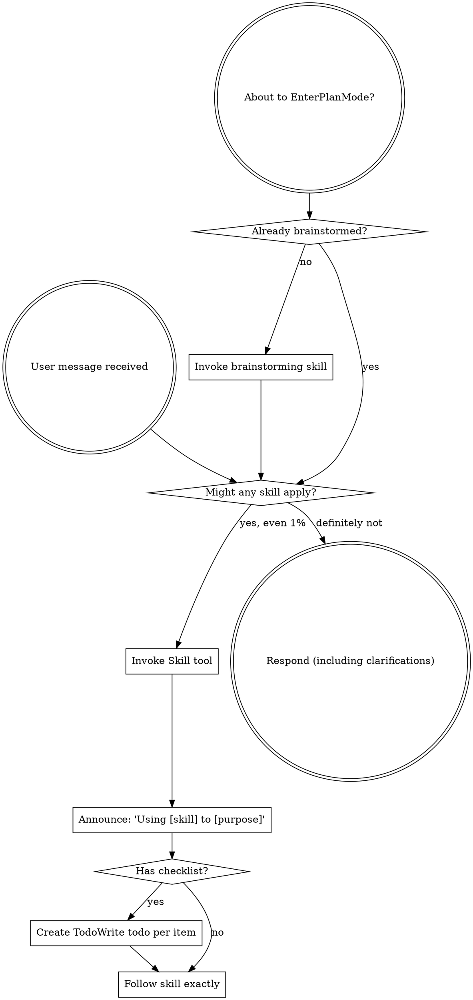

OpenAI Codex v0.128.0 (research preview)
--------
workdir: /Users/houssamr/Projects/syneriva/apps/erp-pos-stabperf
model: gpt-5.5
provider: openai
approval: never
sandbox: workspace-write [workdir, /tmp, $TMPDIR, /Users/houssamr/.codex/memories]
reasoning effort: high
reasoning summaries: none
session id: 019e1c36-c2d4-7730-88e5-801cf61f0e6c
--------
user
changes against 'dev'
2026-05-12T12:43:32.392893Z  WARN codex_core_plugins::manifest: ignoring interface.defaultPrompt: prompt must be at most 128 characters path=/Users/houssamr/.codex/.tmp/plugins/plugins/build-ios-apps/.codex-plugin/plugin.json
2026-05-12T12:43:32.394156Z  WARN codex_core_plugins::manifest: ignoring interface.defaultPrompt: maximum of 3 prompts is supported path=/Users/houssamr/.codex/.tmp/plugins/plugins/plugin-eval/.codex-plugin/plugin.json
2026-05-12T12:43:32.408262Z  WARN codex_core_plugins::manifest: ignoring interface.defaultPrompt: maximum of 3 prompts is supported path=/Users/houssamr/.codex/.tmp/plugins/plugins/twilio-developer-kit/.codex-plugin/plugin.json
2026-05-12T12:43:32.408305Z  WARN codex_core_plugins::manifest: ignoring interface.defaultPrompt: maximum of 3 prompts is supported path=/Users/houssamr/.codex/.tmp/plugins/plugins/openai-developers/.codex-plugin/plugin.json
2026-05-12T12:43:35.985469Z  WARN codex_core_plugins::marketplace: skipping marketplace plugin with unsupported source path=/Users/houssamr/.codex/.tmp/marketplaces/.staging/marketplace-upgrade-YG54oM/.claude-plugin/marketplace.json plugin="fullstory"
2026-05-12T12:43:35.985677Z  WARN codex_core_plugins::marketplace: skipping marketplace plugin with unsupported source path=/Users/houssamr/.codex/.tmp/marketplaces/.staging/marketplace-upgrade-YG54oM/.claude-plugin/marketplace.json plugin="jfrog"
2026-05-12T12:43:35.986522Z  WARN codex_core_plugins::marketplace: skipping invalid marketplace plugin path=/Users/houssamr/.codex/.tmp/marketplaces/.staging/marketplace-upgrade-YG54oM/.claude-plugin/marketplace.json marketplace=claude-plugins-official error=invalid plugin name: only ASCII letters, digits, `_`, and `-` are allowed
2026-05-12T12:43:36.535099Z  WARN codex_core_plugins::marketplace: skipping marketplace plugin with unsupported source path=/Users/houssamr/.codex/.tmp/marketplaces/claude-plugins-official/.claude-plugin/marketplace.json plugin="fullstory"
2026-05-12T12:43:36.535217Z  WARN codex_core_plugins::marketplace: skipping marketplace plugin with unsupported source path=/Users/houssamr/.codex/.tmp/marketplaces/claude-plugins-official/.claude-plugin/marketplace.json plugin="jfrog"
2026-05-12T12:43:36.535575Z  WARN codex_core_plugins::marketplace: skipping invalid marketplace plugin path=/Users/houssamr/.codex/.tmp/marketplaces/claude-plugins-official/.claude-plugin/marketplace.json marketplace=claude-plugins-official error=invalid plugin name: only ASCII letters, digits, `_`, and `-` are allowed
2026-05-12T12:43:36.536154Z  WARN codex_core_plugins::marketplace: skipping marketplace plugin that failed to resolve path=/Users/houssamr/.codex/.tmp/marketplaces/ui-ux-pro-max-skill/.claude-plugin/marketplace.json plugin="ui-ux-pro-max" error=invalid marketplace file `/Users/houssamr/.codex/.tmp/marketplaces/ui-ux-pro-max-skill/.claude-plugin/marketplace.json`: local plugin source path must not be empty
2026-05-12T12:43:36.536940Z  WARN codex_core_plugins::manifest: ignoring interface.defaultPrompt: prompt must be at most 128 characters path=/Users/houssamr/.codex/.tmp/plugins/plugins/build-ios-apps/.codex-plugin/plugin.json
2026-05-12T12:43:36.537466Z  WARN codex_core_plugins::manifest: ignoring interface.defaultPrompt: maximum of 3 prompts is supported path=/Users/houssamr/.codex/.tmp/plugins/plugins/plugin-eval/.codex-plugin/plugin.json
2026-05-12T12:43:36.540504Z  WARN codex_core_plugins::manifest: ignoring interface.defaultPrompt: maximum of 3 prompts is supported path=/Users/houssamr/.codex/.tmp/plugins/plugins/twilio-developer-kit/.codex-plugin/plugin.json
2026-05-12T12:43:36.540599Z  WARN codex_core_plugins::manifest: ignoring interface.defaultPrompt: maximum of 3 prompts is supported path=/Users/houssamr/.codex/.tmp/plugins/plugins/openai-developers/.codex-plugin/plugin.json
2026-05-12T12:43:36.582066Z  WARN codex_core_skills::loader: ignoring interface.icon_small: icon path must not contain '..'
2026-05-12T12:43:36.582076Z  WARN codex_core_skills::loader: ignoring interface.icon_large: icon path must not contain '..'
2026-05-12T12:43:36.583099Z  WARN codex_core_skills::loader: ignoring interface.icon_small: icon path must not contain '..'
2026-05-12T12:43:36.583111Z  WARN codex_core_skills::loader: ignoring interface.icon_large: icon path must not contain '..'
2026-05-12T12:43:36.584569Z  WARN codex_core_skills::loader: ignoring interface.icon_small: icon path must not contain '..'
2026-05-12T12:43:36.584601Z  WARN codex_core_skills::loader: ignoring interface.icon_large: icon path must not contain '..'
2026-05-12T12:43:36.586058Z  WARN codex_core_skills::loader: ignoring interface.icon_small: icon path must not contain '..'
2026-05-12T12:43:36.586064Z  WARN codex_core_skills::loader: ignoring interface.icon_large: icon path must not contain '..'
2026-05-12T12:43:36.587342Z  WARN codex_core_skills::loader: ignoring interface.icon_small: icon path must not contain '..'
2026-05-12T12:43:36.587354Z  WARN codex_core_skills::loader: ignoring interface.icon_large: icon path must not contain '..'
2026-05-12T12:43:36.589069Z  WARN codex_core_skills::loader: ignoring interface.icon_small: icon path must not contain '..'
2026-05-12T12:43:36.589077Z  WARN codex_core_skills::loader: ignoring interface.icon_large: icon path must not contain '..'
2026-05-12T12:43:37.414758Z  WARN codex_core_plugins::marketplace: skipping marketplace plugin with unsupported source path=/Users/houssamr/.codex/.tmp/marketplaces/claude-plugins-official/.claude-plugin/marketplace.json plugin="fullstory"
2026-05-12T12:43:37.414976Z  WARN codex_core_plugins::marketplace: skipping marketplace plugin with unsupported source path=/Users/houssamr/.codex/.tmp/marketplaces/claude-plugins-official/.claude-plugin/marketplace.json plugin="jfrog"
2026-05-12T12:43:37.415676Z  WARN codex_core_plugins::marketplace: skipping invalid marketplace plugin path=/Users/houssamr/.codex/.tmp/marketplaces/claude-plugins-official/.claude-plugin/marketplace.json marketplace=claude-plugins-official error=invalid plugin name: only ASCII letters, digits, `_`, and `-` are allowed
2026-05-12T12:43:37.415802Z  WARN codex_core_plugins::marketplace: skipping marketplace plugin that failed to resolve path=/Users/houssamr/.codex/.tmp/marketplaces/ui-ux-pro-max-skill/.claude-plugin/marketplace.json plugin="ui-ux-pro-max" error=invalid marketplace file `/Users/houssamr/.codex/.tmp/marketplaces/ui-ux-pro-max-skill/.claude-plugin/marketplace.json`: local plugin source path must not be empty
2026-05-12T12:43:37.416592Z  WARN codex_core_plugins::manifest: ignoring interface.defaultPrompt: prompt must be at most 128 characters path=/Users/houssamr/.codex/.tmp/plugins/plugins/build-ios-apps/.codex-plugin/plugin.json
2026-05-12T12:43:37.416957Z  WARN codex_core_plugins::manifest: ignoring interface.defaultPrompt: maximum of 3 prompts is supported path=/Users/houssamr/.codex/.tmp/plugins/plugins/plugin-eval/.codex-plugin/plugin.json
2026-05-12T12:43:37.418661Z  WARN codex_core_plugins::manifest: ignoring interface.defaultPrompt: maximum of 3 prompts is supported path=/Users/houssamr/.codex/.tmp/plugins/plugins/twilio-developer-kit/.codex-plugin/plugin.json
2026-05-12T12:43:37.418686Z  WARN codex_core_plugins::manifest: ignoring interface.defaultPrompt: maximum of 3 prompts is supported path=/Users/houssamr/.codex/.tmp/plugins/plugins/openai-developers/.codex-plugin/plugin.json
2026-05-12T12:43:37.436244Z  WARN codex_core_skills::loader: ignoring interface.icon_small: icon path must not contain '..'
2026-05-12T12:43:37.436255Z  WARN codex_core_skills::loader: ignoring interface.icon_large: icon path must not contain '..'
2026-05-12T12:43:37.436911Z  WARN codex_core_skills::loader: ignoring interface.icon_small: icon path must not contain '..'
2026-05-12T12:43:37.436920Z  WARN codex_core_skills::loader: ignoring interface.icon_large: icon path must not contain '..'
2026-05-12T12:43:37.437617Z  WARN codex_core_skills::loader: ignoring interface.icon_small: icon path must not contain '..'
2026-05-12T12:43:37.437625Z  WARN codex_core_skills::loader: ignoring interface.icon_large: icon path must not contain '..'
2026-05-12T12:43:37.438337Z  WARN codex_core_skills::loader: ignoring interface.icon_small: icon path must not contain '..'
2026-05-12T12:43:37.438345Z  WARN codex_core_skills::loader: ignoring interface.icon_large: icon path must not contain '..'
2026-05-12T12:43:37.439108Z  WARN codex_core_skills::loader: ignoring interface.icon_small: icon path must not contain '..'
2026-05-12T12:43:37.439116Z  WARN codex_core_skills::loader: ignoring interface.icon_large: icon path must not contain '..'
2026-05-12T12:43:37.440470Z  WARN codex_core_skills::loader: ignoring interface.icon_small: icon path must not contain '..'
2026-05-12T12:43:37.440478Z  WARN codex_core_skills::loader: ignoring interface.icon_large: icon path must not contain '..'
2026-05-12T12:43:38.943493Z  WARN codex_core_plugins::marketplace: skipping marketplace plugin with unsupported source path=/Users/houssamr/.codex/.tmp/marketplaces/claude-plugins-official/.claude-plugin/marketplace.json plugin="fullstory"
2026-05-12T12:43:38.943730Z  WARN codex_core_plugins::marketplace: skipping marketplace plugin with unsupported source path=/Users/houssamr/.codex/.tmp/marketplaces/claude-plugins-official/.claude-plugin/marketplace.json plugin="jfrog"
2026-05-12T12:43:38.944395Z  WARN codex_core_plugins::marketplace: skipping invalid marketplace plugin path=/Users/houssamr/.codex/.tmp/marketplaces/claude-plugins-official/.claude-plugin/marketplace.json marketplace=claude-plugins-official error=invalid plugin name: only ASCII letters, digits, `_`, and `-` are allowed
2026-05-12T12:43:38.944468Z  WARN codex_core_plugins::marketplace: skipping marketplace plugin that failed to resolve path=/Users/houssamr/.codex/.tmp/marketplaces/ui-ux-pro-max-skill/.claude-plugin/marketplace.json plugin="ui-ux-pro-max" error=invalid marketplace file `/Users/houssamr/.codex/.tmp/marketplaces/ui-ux-pro-max-skill/.claude-plugin/marketplace.json`: local plugin source path must not be empty
2026-05-12T12:43:38.946043Z  WARN codex_core_plugins::manifest: ignoring interface.defaultPrompt: prompt must be at most 128 characters path=/Users/houssamr/.codex/.tmp/plugins/plugins/build-ios-apps/.codex-plugin/plugin.json
2026-05-12T12:43:38.946522Z  WARN codex_core_plugins::manifest: ignoring interface.defaultPrompt: maximum of 3 prompts is supported path=/Users/houssamr/.codex/.tmp/plugins/plugins/plugin-eval/.codex-plugin/plugin.json
2026-05-12T12:43:38.950714Z  WARN codex_core_plugins::manifest: ignoring interface.defaultPrompt: maximum of 3 prompts is supported path=/Users/houssamr/.codex/.tmp/plugins/plugins/twilio-developer-kit/.codex-plugin/plugin.json
2026-05-12T12:43:38.950748Z  WARN codex_core_plugins::manifest: ignoring interface.defaultPrompt: maximum of 3 prompts is supported path=/Users/houssamr/.codex/.tmp/plugins/plugins/openai-developers/.codex-plugin/plugin.json
2026-05-12T12:43:38.971708Z  WARN codex_core_skills::loader: ignoring interface.icon_small: icon path must not contain '..'
2026-05-12T12:43:38.971722Z  WARN codex_core_skills::loader: ignoring interface.icon_large: icon path must not contain '..'
2026-05-12T12:43:38.972597Z  WARN codex_core_skills::loader: ignoring interface.icon_small: icon path must not contain '..'
2026-05-12T12:43:38.972608Z  WARN codex_core_skills::loader: ignoring interface.icon_large: icon path must not contain '..'
2026-05-12T12:43:38.973420Z  WARN codex_core_skills::loader: ignoring interface.icon_small: icon path must not contain '..'
2026-05-12T12:43:38.973429Z  WARN codex_core_skills::loader: ignoring interface.icon_large: icon path must not contain '..'
2026-05-12T12:43:38.974232Z  WARN codex_core_skills::loader: ignoring interface.icon_small: icon path must not contain '..'
2026-05-12T12:43:38.974243Z  WARN codex_core_skills::loader: ignoring interface.icon_large: icon path must not contain '..'
2026-05-12T12:43:38.975050Z  WARN codex_core_skills::loader: ignoring interface.icon_small: icon path must not contain '..'
2026-05-12T12:43:38.975059Z  WARN codex_core_skills::loader: ignoring interface.icon_large: icon path must not contain '..'
2026-05-12T12:43:38.976820Z  WARN codex_core_skills::loader: ignoring interface.icon_small: icon path must not contain '..'
2026-05-12T12:43:38.976830Z  WARN codex_core_skills::loader: ignoring interface.icon_large: icon path must not contain '..'
2026-05-12T12:43:43.303611Z  WARN codex_core_plugins::marketplace: skipping marketplace plugin that failed to resolve path=/Users/houssamr/.codex/.tmp/marketplaces/.staging/marketplace-upgrade-VG9S71/.claude-plugin/marketplace.json plugin="ui-ux-pro-max" error=invalid marketplace file `/Users/houssamr/.codex/.tmp/marketplaces/.staging/marketplace-upgrade-VG9S71/.claude-plugin/marketplace.json`: local plugin source path must not be empty
2026-05-12T12:43:43.338980Z  WARN codex_core_plugins::marketplace: skipping marketplace plugin with unsupported source path=/Users/houssamr/.codex/.tmp/marketplaces/claude-plugins-official/.claude-plugin/marketplace.json plugin="fullstory"
2026-05-12T12:43:43.339111Z  WARN codex_core_plugins::marketplace: skipping marketplace plugin with unsupported source path=/Users/houssamr/.codex/.tmp/marketplaces/claude-plugins-official/.claude-plugin/marketplace.json plugin="jfrog"
2026-05-12T12:43:43.339577Z  WARN codex_core_plugins::marketplace: skipping invalid marketplace plugin path=/Users/houssamr/.codex/.tmp/marketplaces/claude-plugins-official/.claude-plugin/marketplace.json marketplace=claude-plugins-official error=invalid plugin name: only ASCII letters, digits, `_`, and `-` are allowed
2026-05-12T12:43:43.339661Z  WARN codex_core_plugins::marketplace: skipping marketplace plugin that failed to resolve path=/Users/houssamr/.codex/.tmp/marketplaces/ui-ux-pro-max-skill/.claude-plugin/marketplace.json plugin="ui-ux-pro-max" error=invalid marketplace file `/Users/houssamr/.codex/.tmp/marketplaces/ui-ux-pro-max-skill/.claude-plugin/marketplace.json`: local plugin source path must not be empty
2026-05-12T12:43:43.339751Z  WARN codex_core_plugins::loader: configured non-curated plugin no longer exists in discovered marketplaces during cache refresh plugin="browser-use" marketplace="openai-bundled"
2026-05-12T12:43:43.350802Z  WARN codex_core_plugins::loader: configured non-curated plugin no longer exists in discovered marketplaces during cache refresh plugin="documents" marketplace="openai-primary-runtime"
2026-05-12T12:43:43.354618Z  WARN codex_core_plugins::loader: configured non-curated plugin no longer exists in discovered marketplaces during cache refresh plugin="presentations" marketplace="openai-primary-runtime"
2026-05-12T12:43:43.354628Z  WARN codex_core_plugins::loader: configured non-curated plugin no longer exists in discovered marketplaces during cache refresh plugin="spreadsheets" marketplace="openai-primary-runtime"
2026-05-12T12:43:58.947530Z  WARN codex_otel::events::session_telemetry: metrics counter [codex.skill.injected] failed: tag value contains invalid characters: superpowers:using-superpowers
exec
/bin/zsh -lc "sed -n '1,220p' /Users/houssamr/.codex/plugins/cache/claude-plugins-official/superpowers/5.1.0/skills/using-superpowers/SKILL.md && printf '\\n--- review skill ---\\n' && sed -n '1,220p' /Users/houssamr/.codex/plugins/cache/claude-plugins-official/superpowers/5.1.0/skills/requesting-code-review/SKILL.md" in /Users/houssamr/Projects/syneriva/apps/erp-pos-stabperf
 succeeded in 0ms:
---
name: using-superpowers
description: Use when starting any conversation - establishes how to find and use skills, requiring Skill tool invocation before ANY response including clarifying questions
---

<SUBAGENT-STOP>
If you were dispatched as a subagent to execute a specific task, skip this skill.
</SUBAGENT-STOP>

<EXTREMELY-IMPORTANT>
If you think there is even a 1% chance a skill might apply to what you are doing, you ABSOLUTELY MUST invoke the skill.

IF A SKILL APPLIES TO YOUR TASK, YOU DO NOT HAVE A CHOICE. YOU MUST USE IT.

This is not negotiable. This is not optional. You cannot rationalize your way out of this.
</EXTREMELY-IMPORTANT>

## Instruction Priority

Superpowers skills override default system prompt behavior, but **user instructions always take precedence**:

1. **User's explicit instructions** (CLAUDE.md, GEMINI.md, AGENTS.md, direct requests) — highest priority
2. **Superpowers skills** — override default system behavior where they conflict
3. **Default system prompt** — lowest priority

If CLAUDE.md, GEMINI.md, or AGENTS.md says "don't use TDD" and a skill says "always use TDD," follow the user's instructions. The user is in control.

## How to Access Skills

**In Claude Code:** Use the `Skill` tool. When you invoke a skill, its content is loaded and presented to you—follow it directly. Never use the Read tool on skill files.

**In Copilot CLI:** Use the `skill` tool. Skills are auto-discovered from installed plugins. The `skill` tool works the same as Claude Code's `Skill` tool.

**In Gemini CLI:** Skills activate via the `activate_skill` tool. Gemini loads skill metadata at session start and activates the full content on demand.

**In other environments:** Check your platform's documentation for how skills are loaded.

## Platform Adaptation

Skills use Claude Code tool names. Non-CC platforms: see `references/copilot-tools.md` (Copilot CLI), `references/codex-tools.md` (Codex) for tool equivalents. Gemini CLI users get the tool mapping loaded automatically via GEMINI.md.

# Using Skills

## The Rule

**Invoke relevant or requested skills BEFORE any response or action.** Even a 1% chance a skill might apply means that you should invoke the skill to check. If an invoked skill turns out to be wrong for the situation, you don't need to use it.



## Red Flags

These thoughts mean STOP—you're rationalizing:

| Thought | Reality |
|---------|---------|
| "This is just a simple question" | Questions are tasks. Check for skills. |
| "I need more context first" | Skill check comes BEFORE clarifying questions. |
| "Let me explore the codebase first" | Skills tell you HOW to explore. Check first. |
| "I can check git/files quickly" | Files lack conversation context. Check for skills. |
| "Let me gather information first" | Skills tell you HOW to gather information. |
| "This doesn't need a formal skill" | If a skill exists, use it. |
| "I remember this skill" | Skills evolve. Read current version. |
| "This doesn't count as a task" | Action = task. Check for skills. |
| "The skill is overkill" | Simple things become complex. Use it. |
| "I'll just do this one thing first" | Check BEFORE doing anything. |
| "This feels productive" | Undisciplined action wastes time. Skills prevent this. |
| "I know what that means" | Knowing the concept ≠ using the skill. Invoke it. |

## Skill Priority

When multiple skills could apply, use this order:

1. **Process skills first** (brainstorming, debugging) - these determine HOW to approach the task
2. **Implementation skills second** (frontend-design, mcp-builder) - these guide execution

"Let's build X" → brainstorming first, then implementation skills.
"Fix this bug" → debugging first, then domain-specific skills.

## Skill Types

**Rigid** (TDD, debugging): Follow exactly. Don't adapt away discipline.

**Flexible** (patterns): Adapt principles to context.

The skill itself tells you which.

## User Instructions

Instructions say WHAT, not HOW. "Add X" or "Fix Y" doesn't mean skip workflows.

--- review skill ---
---
name: requesting-code-review
description: Use when completing tasks, implementing major features, or before merging to verify work meets requirements
---

# Requesting Code Review

Dispatch a code reviewer subagent to catch issues before they cascade. The reviewer gets precisely crafted context for evaluation — never your session's history. This keeps the reviewer focused on the work product, not your thought process, and preserves your own context for continued work.

**Core principle:** Review early, review often.

## When to Request Review

**Mandatory:**
- After each task in subagent-driven development
- After completing major feature
- Before merge to main

**Optional but valuable:**
- When stuck (fresh perspective)
- Before refactoring (baseline check)
- After fixing complex bug

## How to Request

**1. Get git SHAs:**
```bash
BASE_SHA=$(git rev-parse HEAD~1)  # or origin/main
HEAD_SHA=$(git rev-parse HEAD)
```

**2. Dispatch code reviewer subagent:**

Use Task tool with `general-purpose` type, fill template at `code-reviewer.md`

**Placeholders:**
- `{DESCRIPTION}` - Brief summary of what you built
- `{PLAN_OR_REQUIREMENTS}` - What it should do
- `{BASE_SHA}` - Starting commit
- `{HEAD_SHA}` - Ending commit

**3. Act on feedback:**
- Fix Critical issues immediately
- Fix Important issues before proceeding
- Note Minor issues for later
- Push back if reviewer is wrong (with reasoning)

## Example

```
[Just completed Task 2: Add verification function]

You: Let me request code review before proceeding.

BASE_SHA=$(git log --oneline | grep "Task 1" | head -1 | awk '{print $1}')
HEAD_SHA=$(git rev-parse HEAD)

[Dispatch code reviewer subagent]
  DESCRIPTION: Added verifyIndex() and repairIndex() with 4 issue types
  PLAN_OR_REQUIREMENTS: Task 2 from docs/superpowers/plans/deployment-plan.md
  BASE_SHA: a7981ec
  HEAD_SHA: 3df7661

[Subagent returns]:
  Strengths: Clean architecture, real tests
  Issues:
    Important: Missing progress indicators
    Minor: Magic number (100) for reporting interval
  Assessment: Ready to proceed

You: [Fix progress indicators]
[Continue to Task 3]
```

## Integration with Workflows

**Subagent-Driven Development:**
- Review after EACH task
- Catch issues before they compound
- Fix before moving to next task

**Executing Plans:**
- Review after each task or at natural checkpoints
- Get feedback, apply, continue

**Ad-Hoc Development:**
- Review before merge
- Review when stuck

## Red Flags

**Never:**
- Skip review because "it's simple"
- Ignore Critical issues
- Proceed with unfixed Important issues
- Argue with valid technical feedback

**If reviewer wrong:**
- Push back with technical reasoning
- Show code/tests that prove it works
- Request clarification

See template at: requesting-code-review/code-reviewer.md

2026-05-12T12:43:59.037162Z  WARN codex_protocol::openai_models: Model personality requested but model_messages is missing, falling back to base instructions. model=gpt-5.5 personality=pragmatic
2026-05-12T12:43:59.097591Z  WARN codex_core_plugins::marketplace: skipping marketplace plugin with unsupported source path=/Users/houssamr/.codex/.tmp/marketplaces/claude-plugins-official/.claude-plugin/marketplace.json plugin="fullstory"
2026-05-12T12:43:59.098509Z  WARN codex_core_plugins::marketplace: skipping marketplace plugin with unsupported source path=/Users/houssamr/.codex/.tmp/marketplaces/claude-plugins-official/.claude-plugin/marketplace.json plugin="jfrog"
2026-05-12T12:43:59.100469Z  WARN codex_core_plugins::marketplace: skipping invalid marketplace plugin path=/Users/houssamr/.codex/.tmp/marketplaces/claude-plugins-official/.claude-plugin/marketplace.json marketplace=claude-plugins-official error=invalid plugin name: only ASCII letters, digits, `_`, and `-` are allowed
2026-05-12T12:43:59.100775Z  WARN codex_core_plugins::marketplace: skipping marketplace plugin that failed to resolve path=/Users/houssamr/.codex/.tmp/marketplaces/ui-ux-pro-max-skill/.claude-plugin/marketplace.json plugin="ui-ux-pro-max" error=invalid marketplace file `/Users/houssamr/.codex/.tmp/marketplaces/ui-ux-pro-max-skill/.claude-plugin/marketplace.json`: local plugin source path must not be empty
2026-05-12T12:43:59.104780Z  WARN codex_core_plugins::manifest: ignoring interface.defaultPrompt: prompt must be at most 128 characters path=/Users/houssamr/.codex/.tmp/plugins/plugins/build-ios-apps/.codex-plugin/plugin.json
2026-05-12T12:43:59.105938Z  WARN codex_core_plugins::manifest: ignoring interface.defaultPrompt: maximum of 3 prompts is supported path=/Users/houssamr/.codex/.tmp/plugins/plugins/plugin-eval/.codex-plugin/plugin.json
2026-05-12T12:43:59.119488Z  WARN codex_core_plugins::manifest: ignoring interface.defaultPrompt: maximum of 3 prompts is supported path=/Users/houssamr/.codex/.tmp/plugins/plugins/twilio-developer-kit/.codex-plugin/plugin.json
2026-05-12T12:43:59.119636Z  WARN codex_core_plugins::manifest: ignoring interface.defaultPrompt: maximum of 3 prompts is supported path=/Users/houssamr/.codex/.tmp/plugins/plugins/openai-developers/.codex-plugin/plugin.json
2026-05-12T12:43:59.141520Z  WARN codex_core_skills::loader: ignoring interface.icon_small: icon path must not contain '..'
2026-05-12T12:43:59.141533Z  WARN codex_core_skills::loader: ignoring interface.icon_large: icon path must not contain '..'
2026-05-12T12:43:59.142680Z  WARN codex_core_skills::loader: ignoring interface.icon_small: icon path must not contain '..'
2026-05-12T12:43:59.142690Z  WARN codex_core_skills::loader: ignoring interface.icon_large: icon path must not contain '..'
2026-05-12T12:43:59.143937Z  WARN codex_core_skills::loader: ignoring interface.icon_small: icon path must not contain '..'
2026-05-12T12:43:59.143941Z  WARN codex_core_skills::loader: ignoring interface.icon_large: icon path must not contain '..'
2026-05-12T12:43:59.145005Z  WARN codex_core_skills::loader: ignoring interface.icon_small: icon path must not contain '..'
2026-05-12T12:43:59.145017Z  WARN codex_core_skills::loader: ignoring interface.icon_large: icon path must not contain '..'
2026-05-12T12:43:59.145921Z  WARN codex_core_skills::loader: ignoring interface.icon_small: icon path must not contain '..'
2026-05-12T12:43:59.145924Z  WARN codex_core_skills::loader: ignoring interface.icon_large: icon path must not contain '..'
2026-05-12T12:43:59.147724Z  WARN codex_core_skills::loader: ignoring interface.icon_small: icon path must not contain '..'
2026-05-12T12:43:59.147734Z  WARN codex_core_skills::loader: ignoring interface.icon_large: icon path must not contain '..'
exec
/bin/zsh -lc 'git status --short && git diff --stat 198c36305038b2cb9cb265085f9185cb7b71e24c && git diff --name-only 198c36305038b2cb9cb265085f9185cb7b71e24c' in /Users/houssamr/Projects/syneriva/apps/erp-pos-stabperf
2026-05-12T12:44:05.593042Z  WARN codex_protocol::openai_models: Model personality requested but model_messages is missing, falling back to base instructions. model=gpt-5.5 personality=pragmatic
2026-05-12T12:44:05.630542Z  WARN codex_core_plugins::marketplace: skipping marketplace plugin with unsupported source path=/Users/houssamr/.codex/.tmp/marketplaces/claude-plugins-official/.claude-plugin/marketplace.json plugin="fullstory"
2026-05-12T12:44:05.630774Z  WARN codex_core_plugins::marketplace: skipping marketplace plugin with unsupported source path=/Users/houssamr/.codex/.tmp/marketplaces/claude-plugins-official/.claude-plugin/marketplace.json plugin="jfrog"
2026-05-12T12:44:05.631307Z  WARN codex_core_plugins::marketplace: skipping invalid marketplace plugin path=/Users/houssamr/.codex/.tmp/marketplaces/claude-plugins-official/.claude-plugin/marketplace.json marketplace=claude-plugins-official error=invalid plugin name: only ASCII letters, digits, `_`, and `-` are allowed
2026-05-12T12:44:05.631371Z  WARN codex_core_plugins::marketplace: skipping marketplace plugin that failed to resolve path=/Users/houssamr/.codex/.tmp/marketplaces/ui-ux-pro-max-skill/.claude-plugin/marketplace.json plugin="ui-ux-pro-max" error=invalid marketplace file `/Users/houssamr/.codex/.tmp/marketplaces/ui-ux-pro-max-skill/.claude-plugin/marketplace.json`: local plugin source path must not be empty
2026-05-12T12:44:05.632803Z  WARN codex_core_plugins::manifest: ignoring interface.defaultPrompt: prompt must be at most 128 characters path=/Users/houssamr/.codex/.tmp/plugins/plugins/build-ios-apps/.codex-plugin/plugin.json
2026-05-12T12:44:05.633188Z  WARN codex_core_plugins::manifest: ignoring interface.defaultPrompt: maximum of 3 prompts is supported path=/Users/houssamr/.codex/.tmp/plugins/plugins/plugin-eval/.codex-plugin/plugin.json
2026-05-12T12:44:05.635345Z  WARN codex_core_plugins::manifest: ignoring interface.defaultPrompt: maximum of 3 prompts is supported path=/Users/houssamr/.codex/.tmp/plugins/plugins/twilio-developer-kit/.codex-plugin/plugin.json
2026-05-12T12:44:05.635376Z  WARN codex_core_plugins::manifest: ignoring interface.defaultPrompt: maximum of 3 prompts is supported path=/Users/houssamr/.codex/.tmp/plugins/plugins/openai-developers/.codex-plugin/plugin.json
2026-05-12T12:44:05.653042Z  WARN codex_core_skills::loader: ignoring interface.icon_small: icon path must not contain '..'
2026-05-12T12:44:05.653054Z  WARN codex_core_skills::loader: ignoring interface.icon_large: icon path must not contain '..'
2026-05-12T12:44:05.653702Z  WARN codex_core_skills::loader: ignoring interface.icon_small: icon path must not contain '..'
2026-05-12T12:44:05.653708Z  WARN codex_core_skills::loader: ignoring interface.icon_large: icon path must not contain '..'
2026-05-12T12:44:05.654334Z  WARN codex_core_skills::loader: ignoring interface.icon_small: icon path must not contain '..'
2026-05-12T12:44:05.654339Z  WARN codex_core_skills::loader: ignoring interface.icon_large: icon path must not contain '..'
2026-05-12T12:44:05.654976Z  WARN codex_core_skills::loader: ignoring interface.icon_small: icon path must not contain '..'
2026-05-12T12:44:05.654982Z  WARN codex_core_skills::loader: ignoring interface.icon_large: icon path must not contain '..'
2026-05-12T12:44:05.655650Z  WARN codex_core_skills::loader: ignoring interface.icon_small: icon path must not contain '..'
2026-05-12T12:44:05.655656Z  WARN codex_core_skills::loader: ignoring interface.icon_large: icon path must not contain '..'
2026-05-12T12:44:05.657003Z  WARN codex_core_skills::loader: ignoring interface.icon_small: icon path must not contain '..'
2026-05-12T12:44:05.657010Z  WARN codex_core_skills::loader: ignoring interface.icon_large: icon path must not contain '..'
 succeeded in 138ms:
 .../Controllers/DiscountController.php             |    45 +-
 .../__tests__/discountApi.terminalContext.test.ts  |    38 +
 apps/pos/src/api/discountApi.ts                    |    15 +-
 .../organisms/DiscountModal/DiscountModal.tsx      |    22 +-
 .../DiscountModal/__tests__/DiscountModal.test.tsx |     2 +
 .../LineDiscountModal/LineDiscountModal.tsx        |    22 +-
 .../__tests__/LineDiscountModal.test.tsx           |     2 +
 apps/pos/src/lib/db/migrations.ts                  |    69 +
 .../lib/db/repositories/operatorPinRepository.ts   |   155 +-
 apps/pos/src/lib/discountPermissions.ts            |   111 +
 apps/pos/src/locales/en/pos.json                   |     3 +
 apps/pos/src/locales/fr/pos.json                   |     3 +
 apps/pos/src/pages/HomePage.tsx                    |    35 +-
 .../__tests__/HomePage.discountFailClosed.test.ts  |   113 +
 .../pos/src/stores/__tests__/operatorStore.test.ts |   328 +-
 .../pos/src/stores/__tests__/terminalStore.test.ts |    21 +
 apps/pos/src/stores/operatorStore.ts               |   120 +-
 apps/pos/src/stores/terminalStore.ts               |     6 +
 ...26-05-12-pos-go-live-pr3-codex-review-round1.md |  3654 ++++
 ...26-05-12-pos-go-live-pr3-codex-review-round2.md |  5667 ++++++
 ...26-05-12-pos-go-live-pr3-codex-review-round3.md | 17863 +++++++++++++++++++
 ...26-05-12-pos-go-live-pr3-codex-review-round4.md |  4336 +++++
 22 files changed, 32590 insertions(+), 40 deletions(-)
apps/api/app/Modules/POS/Presentation/Controllers/DiscountController.php
apps/pos/src/api/__tests__/discountApi.terminalContext.test.ts
apps/pos/src/api/discountApi.ts
apps/pos/src/components/organisms/DiscountModal/DiscountModal.tsx
apps/pos/src/components/organisms/DiscountModal/__tests__/DiscountModal.test.tsx
apps/pos/src/components/organisms/LineDiscountModal/LineDiscountModal.tsx
apps/pos/src/components/organisms/LineDiscountModal/__tests__/LineDiscountModal.test.tsx
apps/pos/src/lib/db/migrations.ts
apps/pos/src/lib/db/repositories/operatorPinRepository.ts
apps/pos/src/lib/discountPermissions.ts
apps/pos/src/locales/en/pos.json
apps/pos/src/locales/fr/pos.json
apps/pos/src/pages/HomePage.tsx
apps/pos/src/pages/__tests__/HomePage.discountFailClosed.test.ts
apps/pos/src/stores/__tests__/operatorStore.test.ts
apps/pos/src/stores/__tests__/terminalStore.test.ts
apps/pos/src/stores/operatorStore.ts
apps/pos/src/stores/terminalStore.ts
docs/superpowers/reviews/2026-05-12-pos-go-live-pr3-codex-review-round1.md
docs/superpowers/reviews/2026-05-12-pos-go-live-pr3-codex-review-round2.md
docs/superpowers/reviews/2026-05-12-pos-go-live-pr3-codex-review-round3.md
docs/superpowers/reviews/2026-05-12-pos-go-live-pr3-codex-review-round4.md

exec
/bin/zsh -lc 'git diff 198c36305038b2cb9cb265085f9185cb7b71e24c -- apps/api/app/Modules/POS/Presentation/Controllers/DiscountController.php apps/pos/src/api/discountApi.ts apps/pos/src/lib/discountPermissions.ts apps/pos/src/stores/operatorStore.ts apps/pos/src/stores/terminalStore.ts apps/pos/src/lib/db/repositories/operatorPinRepository.ts apps/pos/src/lib/db/migrations.ts apps/pos/src/components/organisms/DiscountModal/DiscountModal.tsx apps/pos/src/components/organisms/LineDiscountModal/LineDiscountModal.tsx apps/pos/src/pages/HomePage.tsx' in /Users/houssamr/Projects/syneriva/apps/erp-pos-stabperf
 succeeded in 0ms:
diff --git a/apps/api/app/Modules/POS/Presentation/Controllers/DiscountController.php b/apps/api/app/Modules/POS/Presentation/Controllers/DiscountController.php
index cda30b5f..eaf718eb 100644
--- a/apps/api/app/Modules/POS/Presentation/Controllers/DiscountController.php
+++ b/apps/api/app/Modules/POS/Presentation/Controllers/DiscountController.php
@@ -83,22 +83,47 @@ public function getPermissions(Request $request): JsonResponse
             ], 404);
         }

+        $discountUser = $user;
+        $operatorId = $request->query('operator_id');
+        if (is_string($operatorId) && $operatorId !== '') {
+            $operator = User::where('tenant_id', $user->tenant_id)
+                ->whereKey($operatorId)
+                ->first();
+
+            if (! $operator instanceof User) {
+                return response()->json([
+                    'error' => [
+                        'code' => 'OPERATOR_NOT_FOUND',
+                        'message' => 'Operator not found',
+                    ],
+                ], 404);
+            }
+
+            $discountUser = $operator;
+        }
+
+        $isAdmin = $discountUser->hasRole(['super_admin', 'admin']);
+        $canUserDiscount = $isAdmin || $discountUser->can_discount;
+        $userMaxDiscountPercent = $isAdmin ? 100.0 : $discountUser->max_discount_percent;
+
         // Calculate effective limit (most restrictive)
-        $effectiveLimit = $this->calculateEffectiveLimit($terminal, $user);
+        $effectiveLimit = $this->calculateEffectiveLimit($terminal, $discountUser, $isAdmin);

         // User can discount only if:
         // 1. User has can_discount permission
         // 2. Terminal allows discounts
-        $canDiscount = $user->can_discount && (
-            $terminal->allow_line_discounts ||
-            $terminal->allow_transaction_discounts
-        );
+        $terminalAllowsDiscounts = $terminal->allow_line_discounts ||
+            $terminal->allow_transaction_discounts;
+        $canDiscount = $canUserDiscount && $terminalAllowsDiscounts;

         return response()->json([
             'data' => [
                 'canDiscount' => $canDiscount,
-                'canApplyLineDiscounts' => $user->can_discount && $terminal->allow_line_discounts,
-                'canApplyTransactionDiscounts' => $user->can_discount && $terminal->allow_transaction_discounts,
+                'userCanDiscount' => $canUserDiscount,
+                'userMaxDiscountPercent' => $userMaxDiscountPercent,
+                'terminalAllowsDiscounts' => $terminalAllowsDiscounts,
+                'canApplyLineDiscounts' => $canUserDiscount && $terminal->allow_line_discounts,
+                'canApplyTransactionDiscounts' => $canUserDiscount && $terminal->allow_transaction_discounts,
                 'maxDiscountPercent' => $effectiveLimit,
                 'requiresReason' => $effectiveLimit > 10.00,
                 'effectiveLimit' => $effectiveLimit,
@@ -184,16 +209,14 @@ public function previewDiscounts(Request $request): JsonResponse

     /**
      * Calculate the effective discount limit (most restrictive)
-     *
-     * @param  User  $user
      */
-    private function calculateEffectiveLimit(Terminal $terminal, $user): float
+    private function calculateEffectiveLimit(Terminal $terminal, User $user, bool $isAdmin): float
     {
         // Terminal limit
         $terminalLimit = $terminal->max_discount_percent;

         // User limit (null means no individual limit, use terminal limit)
-        $userLimit = $user->max_discount_percent ?? $terminalLimit;
+        $userLimit = $isAdmin ? 100.0 : ($user->max_discount_percent ?? $terminalLimit);

         // Return the most restrictive (minimum of the two)
         return min($terminalLimit, $userLimit);
diff --git a/apps/pos/src/api/discountApi.ts b/apps/pos/src/api/discountApi.ts
index e7184664..ae5ab7b4 100644
--- a/apps/pos/src/api/discountApi.ts
+++ b/apps/pos/src/api/discountApi.ts
@@ -2,10 +2,21 @@ import { apiGet } from '@/lib/api';

 export interface DiscountPermissions {
   canDiscount: boolean;
+  userCanDiscount: boolean;
+  userMaxDiscountPercent: number | null;
+  terminalAllowsDiscounts: boolean;
+  canApplyLineDiscounts: boolean;
+  canApplyTransactionDiscounts: boolean;
   maxDiscountPercent: number;
   requiresReason: boolean;
 }

-export async function fetchDiscountPermissions(): Promise<DiscountPermissions> {
-  return apiGet<DiscountPermissions>('/pos/discount-permissions');
+export async function fetchDiscountPermissions(
+  terminalCode: string,
+  operatorId?: string,
+): Promise<DiscountPermissions> {
+  return apiGet<DiscountPermissions>('/pos/discount-permissions', {
+    terminal_code: terminalCode,
+    operator_id: operatorId,
+  });
 }
diff --git a/apps/pos/src/components/organisms/DiscountModal/DiscountModal.tsx b/apps/pos/src/components/organisms/DiscountModal/DiscountModal.tsx
index be9fb8cc..274d8646 100644
--- a/apps/pos/src/components/organisms/DiscountModal/DiscountModal.tsx
+++ b/apps/pos/src/components/organisms/DiscountModal/DiscountModal.tsx
@@ -18,6 +18,8 @@ export interface DiscountModalProps {
   }) => void;
   canDiscount: boolean;
   maxDiscountPercent: number;
+  terminalMaxDiscountPercent: number;
+  disabledReason?: string;
   requiresReason: boolean;
 }

@@ -30,6 +32,8 @@ export function DiscountModal({
   onApplyTransactionDiscount,
   canDiscount,
   maxDiscountPercent,
+  terminalMaxDiscountPercent,
+  disabledReason,
   requiresReason,
 }: DiscountModalProps) {
   const { t } = useTranslation('pos');
@@ -97,9 +101,10 @@ export function DiscountModal({
   const numericValue = parseFloat(value) || 0;
   const percentageExceeded =
     discountType === 'percentage' && numericValue > maxDiscountPercent;
-  const needsManagerOverride = !canDiscount || percentageExceeded;
+  const isDiscountDisabled = disabledReason !== undefined;
+  const needsManagerOverride = !isDiscountDisabled && (!canDiscount || percentageExceeded);
   const isValid =
-    numericValue > 0 && (!requiresReason || reason.trim().length > 0);
+    !isDiscountDisabled && numericValue > 0 && (!requiresReason || reason.trim().length > 0);

   const handleApply = useCallback(() => {
     if (!isValid) return;
@@ -134,7 +139,8 @@ export function DiscountModal({
         return;
       }

-      const managerMax = manager.max_discount_percent ?? 100;
+      const managerLimit = manager.max_discount_percent ?? terminalMaxDiscountPercent;
+      const managerMax = Math.min(managerLimit, terminalMaxDiscountPercent);
       if (discountType === 'percentage' && parseFloat(value) > managerMax) {
         setManagerError(t('discount.managerDenied'));
         return;
@@ -155,7 +161,7 @@ export function DiscountModal({
     } finally {
       setVerifyingPin(false);
     }
-  }, [managerPin, discountType, value, reason, onApplyTransactionDiscount, onClose, t]);
+  }, [managerPin, discountType, value, reason, terminalMaxDiscountPercent, onApplyTransactionDiscount, onClose, t]);

   if (!isOpen) return null;

@@ -265,8 +271,10 @@ export function DiscountModal({
                   <button
                     key={key}
                     onClick={() => handleNumpadPress(key)}
+                    disabled={isDiscountDisabled}
                     className={cn(
                       'flex items-center justify-center rounded-xl text-xl font-semibold transition-colors',
+                      isDiscountDisabled && 'cursor-not-allowed opacity-50',
                       key === 'C'
                         ? 'bg-red-50 text-red-700 hover:bg-red-100'
                         : 'bg-gray-50 text-gray-900 hover:bg-gray-100 active:bg-gray-200',
@@ -325,6 +333,12 @@ export function DiscountModal({
           ) : (
             <>
               {/* Max exceeded warning — shown as info since manager can override */}
+              {disabledReason && (
+                <div className="mb-3 rounded-lg border border-red-200 bg-red-50 p-3 text-center text-sm text-red-700">
+                  {disabledReason}
+                </div>
+              )}
+
               {needsManagerOverride && numericValue > 0 && (
                 <div className="mb-3 rounded-lg border border-amber-200 bg-amber-50 p-3 text-center text-sm text-amber-700">
                   {!canDiscount
diff --git a/apps/pos/src/components/organisms/LineDiscountModal/LineDiscountModal.tsx b/apps/pos/src/components/organisms/LineDiscountModal/LineDiscountModal.tsx
index 6e6dceeb..7121c479 100644
--- a/apps/pos/src/components/organisms/LineDiscountModal/LineDiscountModal.tsx
+++ b/apps/pos/src/components/organisms/LineDiscountModal/LineDiscountModal.tsx
@@ -19,6 +19,8 @@ export interface LineDiscountModalProps {
   itemName: string;
   canDiscount: boolean;
   maxDiscountPercent: number;
+  terminalMaxDiscountPercent: number;
+  disabledReason?: string;
 }

 const NUMPAD_KEYS = ['1', '2', '3', '4', '5', '6', '7', '8', '9', '.', '0', 'C'];
@@ -31,6 +33,8 @@ export function LineDiscountModal({
   itemName,
   canDiscount,
   maxDiscountPercent,
+  terminalMaxDiscountPercent,
+  disabledReason,
 }: LineDiscountModalProps) {
   const { t } = useTranslation('pos');
   const dialogRef = useRef<HTMLDivElement>(null);
@@ -96,8 +100,9 @@ export function LineDiscountModal({
   const numericValue = parseFloat(value) || 0;
   const percentageExceeded =
     discountType === 'percentage' && numericValue > maxDiscountPercent;
-  const needsManagerOverride = !canDiscount || percentageExceeded;
-  const isValid = numericValue > 0;
+  const isDiscountDisabled = disabledReason !== undefined;
+  const needsManagerOverride = !isDiscountDisabled && (!canDiscount || percentageExceeded);
+  const isValid = !isDiscountDisabled && numericValue > 0;

   const handleApply = useCallback(() => {
     if (!isValid) return;
@@ -132,7 +137,8 @@ export function LineDiscountModal({
         return;
       }

-      const managerMax = manager.max_discount_percent ?? 100;
+      const managerLimit = manager.max_discount_percent ?? terminalMaxDiscountPercent;
+      const managerMax = Math.min(managerLimit, terminalMaxDiscountPercent);
       if (discountType === 'percentage' && parseFloat(value) > managerMax) {
         setManagerError(t('discount.managerDenied'));
         return;
@@ -153,7 +159,7 @@ export function LineDiscountModal({
     } finally {
       setVerifyingPin(false);
     }
-  }, [managerPin, discountType, value, reason, onApply, onClose, t]);
+  }, [managerPin, discountType, value, reason, terminalMaxDiscountPercent, onApply, onClose, t]);

   if (!isOpen) return null;

@@ -263,8 +269,10 @@ export function LineDiscountModal({
                   <button
                     key={key}
                     onClick={() => handleNumpadPress(key)}
+                    disabled={isDiscountDisabled}
                     className={cn(
                       'flex items-center justify-center rounded-xl text-xl font-semibold transition-colors',
+                      isDiscountDisabled && 'cursor-not-allowed opacity-50',
                       key === 'C'
                         ? 'bg-red-50 text-red-700 hover:bg-red-100'
                         : 'bg-gray-50 text-gray-900 hover:bg-gray-100 active:bg-gray-200',
@@ -328,6 +336,12 @@ export function LineDiscountModal({
           ) : (
             <>
               {/* Max exceeded warning — shown as info since manager can override */}
+              {disabledReason && (
+                <div className="mb-3 rounded-lg border border-red-200 bg-red-50 p-3 text-center text-sm text-red-700">
+                  {disabledReason}
+                </div>
+              )}
+
               {needsManagerOverride && numericValue > 0 && (
                 <div className="mb-3 rounded-lg border border-amber-200 bg-amber-50 p-3 text-center text-sm text-amber-700">
                   {!canDiscount
diff --git a/apps/pos/src/lib/db/migrations.ts b/apps/pos/src/lib/db/migrations.ts
index a87a40ae..d776b9d7 100644
--- a/apps/pos/src/lib/db/migrations.ts
+++ b/apps/pos/src/lib/db/migrations.ts
@@ -827,4 +827,73 @@ export const migrations: Migration[] = [
         AND sync_error LIKE '%database is locked%';
     `,
   },
+  {
+    version: 33,
+    name: 'add_operator_discount_permission_cache_timestamp',
+    sql: '',
+    async run(db) {
+      try {
+        await db.execute('ALTER TABLE operator_pins ADD COLUMN discount_permissions_fetched_at TEXT');
+      } catch (error) {
+        const msg = error instanceof Error ? error.message : '';
+        if (!msg.includes('duplicate column')) {
+          throw error;
+        }
+      }
+    },
+  },
+  {
+    version: 34,
+    name: 'add_operator_discount_permission_cache_status',
+    sql: '',
+    async run(db) {
+      try {
+        await db.execute("ALTER TABLE operator_pins ADD COLUMN discount_permissions_status TEXT DEFAULT 'unavailable'");
+      } catch (error) {
+        const msg = error instanceof Error ? error.message : '';
+        if (!msg.includes('duplicate column')) {
+          throw error;
+        }
+      }
+    },
+  },
+  {
+    version: 35,
+    name: 'add_operator_discount_permission_terminal_code',
+    sql: '',
+    async run(db) {
+      try {
+        await db.execute('ALTER TABLE operator_pins ADD COLUMN discount_permissions_terminal_code TEXT');
+      } catch (error) {
+        const msg = error instanceof Error ? error.message : '';
+        if (!msg.includes('duplicate column')) {
+          throw error;
+        }
+      }
+    },
+  },
+  {
+    version: 36,
+    name: 'add_operator_discount_permission_cache_details',
+    sql: '',
+    async run(db) {
+      const columns = [
+        'ALTER TABLE operator_pins ADD COLUMN discount_permissions_user_can_discount INTEGER',
+        'ALTER TABLE operator_pins ADD COLUMN discount_permissions_user_max_discount_percent REAL',
+        'ALTER TABLE operator_pins ADD COLUMN discount_permissions_can_apply_line_discounts INTEGER',
+        'ALTER TABLE operator_pins ADD COLUMN discount_permissions_can_apply_transaction_discounts INTEGER',
+      ];
+
+      for (const statement of columns) {
+        try {
+          await db.execute(statement);
+        } catch (error) {
+          const msg = error instanceof Error ? error.message : '';
+          if (!msg.includes('duplicate column')) {
+            throw error;
+          }
+        }
+      }
+    },
+  },
 ];
diff --git a/apps/pos/src/lib/db/repositories/operatorPinRepository.ts b/apps/pos/src/lib/db/repositories/operatorPinRepository.ts
index 29e3b46c..8c7a03a3 100644
--- a/apps/pos/src/lib/db/repositories/operatorPinRepository.ts
+++ b/apps/pos/src/lib/db/repositories/operatorPinRepository.ts
@@ -1,5 +1,7 @@
 import type Database from '@tauri-apps/plugin-sql';
 import { queryAll, queryOne, execute } from '@/lib/db';
+import { resolveCachedDiscountStatus } from '@/lib/discountPermissions';
+import type { DiscountPermissionStatus } from '@/lib/discountPermissions';

 export interface CachedOperator {
   id: string;
@@ -9,7 +11,12 @@ export interface CachedOperator {
   roles: string[];
   permissions: string[];
   can_discount: boolean;
+  can_apply_line_discounts?: boolean;
+  can_apply_transaction_discounts?: boolean;
   max_discount_percent: number | null;
+  discount_permissions_fetched_at: string | null;
+  discount_permissions_terminal_code: string | null;
+  discount_permissions_status: DiscountPermissionStatus;
 }

 interface OperatorPinRow {
@@ -21,9 +28,22 @@ interface OperatorPinRow {
   permissions: string;
   can_discount: number;
   max_discount_percent: number | null;
+  discount_permissions_fetched_at?: string | null;
+  discount_permissions_terminal_code?: string | null;
+  discount_permissions_status?: DiscountPermissionStatus | null;
+  discount_permissions_user_can_discount?: number | null;
+  discount_permissions_user_max_discount_percent?: number | null;
+  discount_permissions_can_apply_line_discounts?: number | null;
+  discount_permissions_can_apply_transaction_discounts?: number | null;
 }

 function rowToOperator(row: OperatorPinRow): CachedOperator {
+  const cacheStatus = resolveCachedDiscountStatus(row.discount_permissions_fetched_at);
+  const permissionStatus =
+    cacheStatus === 'fresh' && row.discount_permissions_status === 'terminal_denied'
+      ? 'terminal_denied'
+      : cacheStatus;
+
   return {
     id: row.id,
     name: row.name,
@@ -32,7 +52,12 @@ function rowToOperator(row: OperatorPinRow): CachedOperator {
     roles: JSON.parse(row.roles) as string[],
     permissions: JSON.parse(row.permissions) as string[],
     can_discount: row.can_discount === 1,
+    can_apply_line_discounts: row.discount_permissions_can_apply_line_discounts === 1,
+    can_apply_transaction_discounts: row.discount_permissions_can_apply_transaction_discounts === 1,
     max_discount_percent: row.max_discount_percent,
+    discount_permissions_fetched_at: row.discount_permissions_fetched_at ?? null,
+    discount_permissions_terminal_code: row.discount_permissions_terminal_code ?? null,
+    discount_permissions_status: permissionStatus,
   };
 }

@@ -66,12 +91,92 @@ export async function upsertOperators(
   for (const op of operators) {
     await execute(
       db,
-      `INSERT INTO operator_pins (id, name, email, pin_hash, roles, permissions, can_discount, max_discount_percent, synced_at)
-       VALUES ($1, $2, $3, $4, $5, $6, $7, $8, datetime('now'))
+      `INSERT INTO operator_pins (id, name, email, pin_hash, roles, permissions, can_discount, max_discount_percent, synced_at, discount_permissions_fetched_at, discount_permissions_terminal_code, discount_permissions_status, discount_permissions_user_can_discount, discount_permissions_user_max_discount_percent, discount_permissions_can_apply_line_discounts, discount_permissions_can_apply_transaction_discounts)
+       VALUES ($1, $2, $3, $4, $5, $6, $7, $8, datetime('now'), NULL, NULL, 'unavailable', NULL, NULL, NULL, NULL)
        ON CONFLICT(id) DO UPDATE SET
          name = excluded.name, email = excluded.email, pin_hash = excluded.pin_hash,
          roles = excluded.roles, permissions = excluded.permissions,
-         can_discount = excluded.can_discount, max_discount_percent = excluded.max_discount_percent,
+         can_discount = excluded.can_discount,
+         max_discount_percent = CASE
+           WHEN discount_permissions_fetched_at IS NOT NULL
+             AND discount_permissions_user_can_discount = excluded.can_discount
+             AND (
+               (discount_permissions_user_max_discount_percent IS NULL AND excluded.max_discount_percent IS NULL)
+               OR discount_permissions_user_max_discount_percent = excluded.max_discount_percent
+             )
+           THEN operator_pins.max_discount_percent
+           ELSE excluded.max_discount_percent
+         END,
+         discount_permissions_fetched_at = CASE
+           WHEN discount_permissions_fetched_at IS NOT NULL
+             AND discount_permissions_user_can_discount = excluded.can_discount
+             AND (
+               (discount_permissions_user_max_discount_percent IS NULL AND excluded.max_discount_percent IS NULL)
+               OR discount_permissions_user_max_discount_percent = excluded.max_discount_percent
+             )
+           THEN operator_pins.discount_permissions_fetched_at
+           ELSE NULL
+         END,
+         discount_permissions_terminal_code = CASE
+           WHEN discount_permissions_fetched_at IS NOT NULL
+             AND discount_permissions_user_can_discount = excluded.can_discount
+             AND (
+               (discount_permissions_user_max_discount_percent IS NULL AND excluded.max_discount_percent IS NULL)
+               OR discount_permissions_user_max_discount_percent = excluded.max_discount_percent
+             )
+           THEN operator_pins.discount_permissions_terminal_code
+           ELSE NULL
+         END,
+         discount_permissions_status = CASE
+           WHEN discount_permissions_fetched_at IS NOT NULL
+             AND discount_permissions_user_can_discount = excluded.can_discount
+             AND (
+               (discount_permissions_user_max_discount_percent IS NULL AND excluded.max_discount_percent IS NULL)
+               OR discount_permissions_user_max_discount_percent = excluded.max_discount_percent
+             )
+           THEN operator_pins.discount_permissions_status
+           ELSE 'unavailable'
+         END,
+         discount_permissions_user_can_discount = CASE
+           WHEN discount_permissions_fetched_at IS NOT NULL
+             AND discount_permissions_user_can_discount = excluded.can_discount
+             AND (
+               (discount_permissions_user_max_discount_percent IS NULL AND excluded.max_discount_percent IS NULL)
+               OR discount_permissions_user_max_discount_percent = excluded.max_discount_percent
+             )
+           THEN operator_pins.discount_permissions_user_can_discount
+           ELSE NULL
+         END,
+         discount_permissions_user_max_discount_percent = CASE
+           WHEN discount_permissions_fetched_at IS NOT NULL
+             AND discount_permissions_user_can_discount = excluded.can_discount
+             AND (
+               (discount_permissions_user_max_discount_percent IS NULL AND excluded.max_discount_percent IS NULL)
+               OR discount_permissions_user_max_discount_percent = excluded.max_discount_percent
+             )
+           THEN operator_pins.discount_permissions_user_max_discount_percent
+           ELSE NULL
+         END,
+         discount_permissions_can_apply_line_discounts = CASE
+           WHEN discount_permissions_fetched_at IS NOT NULL
+             AND discount_permissions_user_can_discount = excluded.can_discount
+             AND (
+               (discount_permissions_user_max_discount_percent IS NULL AND excluded.max_discount_percent IS NULL)
+               OR discount_permissions_user_max_discount_percent = excluded.max_discount_percent
+             )
+           THEN operator_pins.discount_permissions_can_apply_line_discounts
+           ELSE NULL
+         END,
+         discount_permissions_can_apply_transaction_discounts = CASE
+           WHEN discount_permissions_fetched_at IS NOT NULL
+             AND discount_permissions_user_can_discount = excluded.can_discount
+             AND (
+               (discount_permissions_user_max_discount_percent IS NULL AND excluded.max_discount_percent IS NULL)
+               OR discount_permissions_user_max_discount_percent = excluded.max_discount_percent
+             )
+           THEN operator_pins.discount_permissions_can_apply_transaction_discounts
+           ELSE NULL
+         END,
          synced_at = datetime('now')`,
       [
         op.id, op.name, op.email, op.pin_hash,
@@ -82,6 +187,50 @@ export async function upsertOperators(
   }
 }

+export async function updateOperatorDiscountPermissions(
+  db: Database,
+  operatorId: string,
+  permissions: {
+    can_discount: boolean;
+    max_discount_percent: number | null;
+    user_can_discount: boolean;
+    user_max_discount_percent: number | null;
+    can_apply_line_discounts: boolean;
+    can_apply_transaction_discounts: boolean;
+    fetched_at: string;
+    terminal_code: string;
+    status: Extract<DiscountPermissionStatus, 'fresh' | 'terminal_denied'>;
+  },
+): Promise<void> {
+  await execute(
+    db,
+    `UPDATE operator_pins
+     SET can_discount = $1,
+         max_discount_percent = $2,
+         discount_permissions_fetched_at = $3,
+         discount_permissions_terminal_code = $4,
+         discount_permissions_status = $5,
+         discount_permissions_user_can_discount = $6,
+         discount_permissions_user_max_discount_percent = $7,
+         discount_permissions_can_apply_line_discounts = $8,
+         discount_permissions_can_apply_transaction_discounts = $9,
+         synced_at = datetime('now')
+     WHERE id = $10`,
+    [
+      permissions.can_discount ? 1 : 0,
+      permissions.max_discount_percent,
+      permissions.fetched_at,
+      permissions.terminal_code,
+      permissions.status,
+      permissions.user_can_discount ? 1 : 0,
+      permissions.user_max_discount_percent,
+      permissions.can_apply_line_discounts ? 1 : 0,
+      permissions.can_apply_transaction_discounts ? 1 : 0,
+      operatorId,
+    ],
+  );
+}
+
 export async function hasOperatorPins(db: Database): Promise<boolean> {
   const result = await queryOne<{ count: number }>(db, 'SELECT COUNT(*) as count FROM operator_pins');
   return (result?.count ?? 0) > 0;
diff --git a/apps/pos/src/lib/discountPermissions.ts b/apps/pos/src/lib/discountPermissions.ts
new file mode 100644
index 00000000..10d3c090
--- /dev/null
+++ b/apps/pos/src/lib/discountPermissions.ts
@@ -0,0 +1,111 @@
+import type { Operator } from '@/stores/operatorStore';
+
+export const DISCOUNT_PERMISSION_CACHE_TTL_MS = 24 * 60 * 60 * 1000;
+
+export type DiscountPermissionStatus = 'fresh' | 'terminal_denied' | 'unavailable' | 'stale';
+
+export interface DiscountAccessState {
+  canDiscount: boolean;
+  maxDiscountPercent: number;
+  disabledReason: string | null;
+}
+
+export function resolveDiscountAccess(
+  operator: Pick<Operator, 'can_discount' | 'max_discount_percent' | 'discount_permissions_status'> | null,
+  terminalMaxDiscountPercent: number | null | undefined,
+  terminalAllowsDiscounts: boolean | null | undefined,
+  operatorAllowsDiscountType: boolean | null | undefined,
+): DiscountAccessState {
+  if (operator === null) {
+    return {
+      canDiscount: false,
+      maxDiscountPercent: 0,
+      disabledReason: 'discount.requiresOperator',
+    };
+  }
+
+  if (operator.discount_permissions_status === 'terminal_denied') {
+    return {
+      canDiscount: false,
+      maxDiscountPercent: 0,
+      disabledReason: 'discount.permissionsUnavailable',
+    };
+  }
+
+  if (operator.discount_permissions_status === 'stale') {
+    return {
+      canDiscount: false,
+      maxDiscountPercent: 0,
+      disabledReason: 'discount.permissionsStale',
+    };
+  }
+
+  if (operator.discount_permissions_status !== 'fresh') {
+    return {
+      canDiscount: false,
+      maxDiscountPercent: 0,
+      disabledReason: 'discount.permissionsUnavailable',
+    };
+  }
+
+  if (
+    terminalAllowsDiscounts !== true
+    || typeof terminalMaxDiscountPercent !== 'number'
+    || terminalMaxDiscountPercent <= 0
+  ) {
+    return {
+      canDiscount: false,
+      maxDiscountPercent: 0,
+      disabledReason: 'discount.permissionsUnavailable',
+    };
+  }
+
+  if (!operator.can_discount) {
+    return {
+      canDiscount: false,
+      maxDiscountPercent: 0,
+      disabledReason: null,
+    };
+  }
+
+  if (operatorAllowsDiscountType !== true) {
+    return {
+      canDiscount: false,
+      maxDiscountPercent: 0,
+      disabledReason: 'discount.permissionsUnavailable',
+    };
+  }
+
+  const operatorLimit = operator.max_discount_percent ?? terminalMaxDiscountPercent;
+  const effectiveLimit = Math.min(operatorLimit, terminalMaxDiscountPercent);
+
+  if (effectiveLimit <= 0) {
+    return {
+      canDiscount: false,
+      maxDiscountPercent: 0,
+      disabledReason: 'discount.permissionsUnavailable',
+    };
+  }
+
+  return {
+    canDiscount: true,
+    maxDiscountPercent: effectiveLimit,
+    disabledReason: null,
+  };
+}
+
+export function resolveCachedDiscountStatus(
+  fetchedAt: string | null | undefined,
+  nowMs: number = Date.now(),
+): DiscountPermissionStatus {
+  if (!fetchedAt) {
+    return 'unavailable';
+  }
+
+  const fetchedAtMs = Date.parse(fetchedAt);
+  if (!Number.isFinite(fetchedAtMs)) {
+    return 'unavailable';
+  }
+
+  return nowMs - fetchedAtMs > DISCOUNT_PERMISSION_CACHE_TTL_MS ? 'stale' : 'fresh';
+}
diff --git a/apps/pos/src/pages/HomePage.tsx b/apps/pos/src/pages/HomePage.tsx
index 8adf0a04..785ca9d8 100644
--- a/apps/pos/src/pages/HomePage.tsx
+++ b/apps/pos/src/pages/HomePage.tsx
@@ -23,6 +23,7 @@ import { ReceiptLocatorScreen } from '@/components/pos/ReceiptLocatorScreen';
 import { ResumeRefundDraftBanner } from '@/components/pos/ResumeRefundDraftBanner';
 import { getErrorMessage } from '@/lib/api';
 import { useCurrency } from '@/lib/currency';
+import { resolveDiscountAccess } from '@/lib/discountPermissions';
 import { fetchReceipt } from '@/api/receiptApi';
 import { buildEscPosReceiptData } from '@/lib/buildReceiptData';
 import type { ReceiptVisibilitySettings } from '@/lib/buildReceiptData';
@@ -198,8 +199,18 @@ export function HomePage() {
   const [discountItemId, setDiscountItemId] = useState<string | null>(null);

   // Operator discount permissions
-  const canDiscount = operator?.can_discount ?? true;
-  const maxDiscountPct = operator?.max_discount_percent ?? 100;
+  const transactionDiscountAccess = resolveDiscountAccess(
+    operator,
+    terminal?.max_discount_percent,
+    terminal?.allow_transaction_discounts,
+    operator?.can_apply_transaction_discounts,
+  );
+  const lineDiscountAccess = resolveDiscountAccess(
+    operator,
+    terminal?.max_discount_percent,
+    terminal?.allow_line_discounts,
+    operator?.can_apply_line_discounts,
+  );

   // Barcode scanner
   const [scanMessage, setScanMessage] = useState<{ text: string; type: 'success' | 'error' | 'info' } | null>(null);
@@ -1159,8 +1170,14 @@ export function HomePage() {
         isOpen={showDiscountModal}
         onClose={() => setShowDiscountModal(false)}
         onApplyTransactionDiscount={handleApplyTransactionDiscount}
-        canDiscount={canDiscount}
-        maxDiscountPercent={maxDiscountPct}
+        canDiscount={transactionDiscountAccess.canDiscount}
+        maxDiscountPercent={transactionDiscountAccess.maxDiscountPercent}
+        terminalMaxDiscountPercent={terminal?.max_discount_percent ?? 0}
+        disabledReason={
+          transactionDiscountAccess.disabledReason
+            ? t(`pos:${transactionDiscountAccess.disabledReason}`)
+            : undefined
+        }
         requiresReason={true}
       />

@@ -1170,8 +1187,14 @@ export function HomePage() {
         onClose={() => setDiscountItemId(null)}
         onApply={handleApplyLineDiscount}
         itemName={discountItem?.product.name ?? ''}
-        canDiscount={canDiscount}
-        maxDiscountPercent={maxDiscountPct}
+        canDiscount={lineDiscountAccess.canDiscount}
+        maxDiscountPercent={lineDiscountAccess.maxDiscountPercent}
+        terminalMaxDiscountPercent={terminal?.max_discount_percent ?? 0}
+        disabledReason={
+          lineDiscountAccess.disabledReason
+            ? t(`pos:${lineDiscountAccess.disabledReason}`)
+            : undefined
+        }
       />

       {/* Modifier selection modal */}
diff --git a/apps/pos/src/stores/operatorStore.ts b/apps/pos/src/stores/operatorStore.ts
index 3a3d94ba..d36a1975 100644
--- a/apps/pos/src/stores/operatorStore.ts
+++ b/apps/pos/src/stores/operatorStore.ts
@@ -1,10 +1,18 @@
 import { create } from 'zustand';
 import bcrypt from 'bcryptjs';
 import { apiGet, apiPost } from '@/lib/api';
+import { fetchDiscountPermissions } from '@/api/discountApi';
 import { getDatabase } from '@/lib/db';
-import { getAllOperators, hasOperatorPins, upsertOperators } from '@/lib/db/repositories/operatorPinRepository';
+import {
+  getAllOperators,
+  hasOperatorPins,
+  updateOperatorDiscountPermissions,
+  upsertOperators,
+} from '@/lib/db/repositories/operatorPinRepository';
 import { enqueuePinUpdate } from '@/lib/db/repositories/queuedPinUpdateRepository';
 import { useAuthStore } from '@/stores/authStore';
+import { useTerminalStore } from '@/stores/terminalStore';
+import type { DiscountPermissionStatus } from '@/lib/discountPermissions';

 export interface Operator {
   id: string;
@@ -13,7 +21,10 @@ export interface Operator {
   roles: string[];
   permissions: string[];
   can_discount: boolean;
+  can_apply_line_discounts?: boolean;
+  can_apply_transaction_discounts?: boolean;
   max_discount_percent: number | null;
+  discount_permissions_status?: DiscountPermissionStatus;
 }

 interface OperatorState {
@@ -46,6 +57,63 @@ async function getDb(): Promise<import('@tauri-apps/plugin-sql').default> {
   return getDatabase(companyId ?? '');
 }

+function operatorWithUnavailableDiscounts(operator: Operator): Operator {
+  return {
+    ...operator,
+    can_discount: false,
+    can_apply_line_discounts: false,
+    can_apply_transaction_discounts: false,
+    max_discount_percent: null,
+    discount_permissions_status: 'unavailable',
+  };
+}
+
+async function resolveOnlineDiscountPermissions(operator: Operator): Promise<Operator> {
+  const terminalCode = useTerminalStore.getState().terminal?.code;
+  if (!terminalCode) {
+    return operatorWithUnavailableDiscounts(operator);
+  }
+
+  let permissions;
+  try {
+    permissions = await fetchDiscountPermissions(terminalCode, operator.id);
+  } catch (error) {
+    console.debug('[POS] Discount permission fetch failed:', error);
+    return operatorWithUnavailableDiscounts(operator);
+  }
+
+  const status: Extract<DiscountPermissionStatus, 'fresh' | 'terminal_denied'> =
+    permissions.terminalAllowsDiscounts ? 'fresh' : 'terminal_denied';
+
+  const resolved: Operator = {
+    ...operator,
+    can_discount: permissions.userCanDiscount,
+    can_apply_line_discounts: permissions.canApplyLineDiscounts,
+    can_apply_transaction_discounts: permissions.canApplyTransactionDiscounts,
+    max_discount_percent: permissions.maxDiscountPercent,
+    discount_permissions_status: status,
+  };
+
+  try {
+    const db = await getDb();
+    await updateOperatorDiscountPermissions(db, operator.id, {
+      can_discount: permissions.userCanDiscount,
+      max_discount_percent: permissions.maxDiscountPercent,
+      user_can_discount: permissions.userCanDiscount,
+      user_max_discount_percent: permissions.userMaxDiscountPercent,
+      can_apply_line_discounts: permissions.canApplyLineDiscounts,
+      can_apply_transaction_discounts: permissions.canApplyTransactionDiscounts,
+      fetched_at: new Date().toISOString(),
+      terminal_code: terminalCode,
+      status,
+    });
+  } catch (error) {
+    console.debug('[POS] Failed to cache discount permissions:', error);
+  }
+
+  return resolved;
+}
+
 export const useOperatorStore = create<OperatorStore>()((set) => ({
   ...initialState,

@@ -58,17 +126,29 @@ export const useOperatorStore = create<OperatorStore>()((set) => ({
     try {
       const db = await getDb();
       const operators = await getAllOperators(db);
+      const terminalCode = useTerminalStore.getState().terminal?.code ?? null;

       for (const op of operators) {
         if (bcrypt.compareSync(pin, op.pin_hash)) {
+          const discountPermissionStatus =
+            terminalCode !== null && op.discount_permissions_terminal_code === terminalCode
+              ? op.discount_permissions_status
+              : 'unavailable';
           offlineMatch = {
             id: op.id,
             name: op.name,
             email: op.email,
             roles: op.roles,
             permissions: op.permissions,
-            can_discount: op.can_discount,
-            max_discount_percent: op.max_discount_percent,
+            can_discount: discountPermissionStatus === 'fresh' ? op.can_discount : false,
+            can_apply_line_discounts: discountPermissionStatus === 'fresh'
+              ? op.can_apply_line_discounts
+              : false,
+            can_apply_transaction_discounts: discountPermissionStatus === 'fresh'
+              ? op.can_apply_transaction_discounts
+              : false,
+            max_discount_percent: discountPermissionStatus === 'fresh' ? op.max_discount_percent : null,
+            discount_permissions_status: discountPermissionStatus,
           };
           break;
         }
@@ -88,12 +168,33 @@ export const useOperatorStore = create<OperatorStore>()((set) => ({
       void apiPost<Operator>('/pos/auth/verify-pin', { pin }).catch((err: unknown) => {
         console.debug('[POS] PIN telemetry call failed (offline-accepted):', err);
       });
+      void resolveOnlineDiscountPermissions(offlineMatch)
+        .then((operator) => {
+          if (useOperatorStore.getState().operator?.id !== offlineMatch.id) {
+            return;
+          }
+          if (
+            offlineMatch.discount_permissions_status === 'fresh'
+            && operator.discount_permissions_status === 'unavailable'
+          ) {
+            return;
+          }
+          set({
+            operator,
+            lastActivity: Date.now(),
+          });
+        })
+        .catch((err: unknown) => {
+          console.debug('[POS] Discount permission refresh failed (offline-accepted):', err);
+        });
       return;
     }

     // Offline miss — fall through to API as the source of truth.
     try {
-      const operator = await apiPost<Operator>('/pos/auth/verify-pin', { pin });
+      const operator = await resolveOnlineDiscountPermissions(
+        await apiPost<Operator>('/pos/auth/verify-pin', { pin }),
+      );
       set({
         operator,
         isLocked: false,
@@ -129,7 +230,9 @@ export const useOperatorStore = create<OperatorStore>()((set) => ({

     // Try the backend now (fire-and-forget semantics on failure).
     try {
-      const operator = await apiPost<Operator>('/pos/auth/setup-pin', { pin });
+      const operator = await resolveOnlineDiscountPermissions(
+        await apiPost<Operator>('/pos/auth/setup-pin', { pin }),
+      );
       set({
         operator,
         isLocked: false,
@@ -147,8 +250,11 @@ export const useOperatorStore = create<OperatorStore>()((set) => ({
           email: user.email ?? '',
           roles: user.roles,
           permissions: user.permissions,
-          can_discount: isAdmin,
-          max_discount_percent: isAdmin ? 100 : null,
+          can_discount: false,
+          can_apply_line_discounts: false,
+          can_apply_transaction_discounts: false,
+          max_discount_percent: null,
+          discount_permissions_status: 'unavailable',
         },
         isLocked: false,
         lastActivity: Date.now(),
diff --git a/apps/pos/src/stores/terminalStore.ts b/apps/pos/src/stores/terminalStore.ts
index 43904cf6..f8150498 100644
--- a/apps/pos/src/stores/terminalStore.ts
+++ b/apps/pos/src/stores/terminalStore.ts
@@ -36,6 +36,9 @@ export interface Terminal {
    * the cashier never confuses training and production at a glance.
    */
   is_training_mode: boolean;
+  max_discount_percent?: number;
+  allow_line_discounts?: boolean;
+  allow_transaction_discounts?: boolean;
   hardware_identifier: string | null;
   location: {
     id: string;
@@ -599,6 +602,9 @@ export const useTerminalStore = create<TerminalStore>()((set, get) => ({
         && stillCurrent.is_active === fresh.is_active
         && stillCurrent.name === fresh.name
         && stillCurrent.code === fresh.code
+        && stillCurrent.max_discount_percent === fresh.max_discount_percent
+        && stillCurrent.allow_line_discounts === fresh.allow_line_discounts
+        && stillCurrent.allow_transaction_discounts === fresh.allow_transaction_discounts
       ) {
         return;
       }

2026-05-12T12:44:16.372148Z  WARN codex_protocol::openai_models: Model personality requested but model_messages is missing, falling back to base instructions. model=gpt-5.5 personality=pragmatic
2026-05-12T12:44:16.407043Z  WARN codex_core_plugins::marketplace: skipping marketplace plugin with unsupported source path=/Users/houssamr/.codex/.tmp/marketplaces/claude-plugins-official/.claude-plugin/marketplace.json plugin="fullstory"
2026-05-12T12:44:16.407165Z  WARN codex_core_plugins::marketplace: skipping marketplace plugin with unsupported source path=/Users/houssamr/.codex/.tmp/marketplaces/claude-plugins-official/.claude-plugin/marketplace.json plugin="jfrog"
2026-05-12T12:44:16.407859Z  WARN codex_core_plugins::marketplace: skipping invalid marketplace plugin path=/Users/houssamr/.codex/.tmp/marketplaces/claude-plugins-official/.claude-plugin/marketplace.json marketplace=claude-plugins-official error=invalid plugin name: only ASCII letters, digits, `_`, and `-` are allowed
2026-05-12T12:44:16.407986Z  WARN codex_core_plugins::marketplace: skipping marketplace plugin that failed to resolve path=/Users/houssamr/.codex/.tmp/marketplaces/ui-ux-pro-max-skill/.claude-plugin/marketplace.json plugin="ui-ux-pro-max" error=invalid marketplace file `/Users/houssamr/.codex/.tmp/marketplaces/ui-ux-pro-max-skill/.claude-plugin/marketplace.json`: local plugin source path must not be empty
2026-05-12T12:44:16.408908Z  WARN codex_core_plugins::manifest: ignoring interface.defaultPrompt: prompt must be at most 128 characters path=/Users/houssamr/.codex/.tmp/plugins/plugins/build-ios-apps/.codex-plugin/plugin.json
2026-05-12T12:44:16.409168Z  WARN codex_core_plugins::manifest: ignoring interface.defaultPrompt: maximum of 3 prompts is supported path=/Users/houssamr/.codex/.tmp/plugins/plugins/plugin-eval/.codex-plugin/plugin.json
2026-05-12T12:44:16.411211Z  WARN codex_core_plugins::manifest: ignoring interface.defaultPrompt: maximum of 3 prompts is supported path=/Users/houssamr/.codex/.tmp/plugins/plugins/twilio-developer-kit/.codex-plugin/plugin.json
2026-05-12T12:44:16.411240Z  WARN codex_core_plugins::manifest: ignoring interface.defaultPrompt: maximum of 3 prompts is supported path=/Users/houssamr/.codex/.tmp/plugins/plugins/openai-developers/.codex-plugin/plugin.json
2026-05-12T12:44:16.428736Z  WARN codex_core_skills::loader: ignoring interface.icon_small: icon path must not contain '..'
2026-05-12T12:44:16.428748Z  WARN codex_core_skills::loader: ignoring interface.icon_large: icon path must not contain '..'
2026-05-12T12:44:16.429394Z  WARN codex_core_skills::loader: ignoring interface.icon_small: icon path must not contain '..'
2026-05-12T12:44:16.429400Z  WARN codex_core_skills::loader: ignoring interface.icon_large: icon path must not contain '..'
2026-05-12T12:44:16.430062Z  WARN codex_core_skills::loader: ignoring interface.icon_small: icon path must not contain '..'
2026-05-12T12:44:16.430070Z  WARN codex_core_skills::loader: ignoring interface.icon_large: icon path must not contain '..'
2026-05-12T12:44:16.430743Z  WARN codex_core_skills::loader: ignoring interface.icon_small: icon path must not contain '..'
2026-05-12T12:44:16.430749Z  WARN codex_core_skills::loader: ignoring interface.icon_large: icon path must not contain '..'
2026-05-12T12:44:16.431412Z  WARN codex_core_skills::loader: ignoring interface.icon_small: icon path must not contain '..'
2026-05-12T12:44:16.431418Z  WARN codex_core_skills::loader: ignoring interface.icon_large: icon path must not contain '..'
2026-05-12T12:44:16.432741Z  WARN codex_core_skills::loader: ignoring interface.icon_small: icon path must not contain '..'
2026-05-12T12:44:16.432748Z  WARN codex_core_skills::loader: ignoring interface.icon_large: icon path must not contain '..'
exec
/bin/zsh -lc "sed -n '1,260p' apps/pos/src/stores/operatorStore.ts && printf '\\n--- repo ---\\n' && sed -n '1,300p' apps/pos/src/lib/db/repositories/operatorPinRepository.ts && printf '\\n--- terminal store around bootstrap ---\\n' && sed -n '520,660p' apps/pos/src/stores/terminalStore.ts && printf '\\n--- migrations context ---\\n' && sed -n '740,910p' apps/pos/src/lib/db/migrations.ts" in /Users/houssamr/Projects/syneriva/apps/erp-pos-stabperf
 succeeded in 0ms:
import { create } from 'zustand';
import bcrypt from 'bcryptjs';
import { apiGet, apiPost } from '@/lib/api';
import { fetchDiscountPermissions } from '@/api/discountApi';
import { getDatabase } from '@/lib/db';
import {
  getAllOperators,
  hasOperatorPins,
  updateOperatorDiscountPermissions,
  upsertOperators,
} from '@/lib/db/repositories/operatorPinRepository';
import { enqueuePinUpdate } from '@/lib/db/repositories/queuedPinUpdateRepository';
import { useAuthStore } from '@/stores/authStore';
import { useTerminalStore } from '@/stores/terminalStore';
import type { DiscountPermissionStatus } from '@/lib/discountPermissions';

export interface Operator {
  id: string;
  name: string;
  email: string;
  roles: string[];
  permissions: string[];
  can_discount: boolean;
  can_apply_line_discounts?: boolean;
  can_apply_transaction_discounts?: boolean;
  max_discount_percent: number | null;
  discount_permissions_status?: DiscountPermissionStatus;
}

interface OperatorState {
  operator: Operator | null;
  isLocked: boolean;
  lastActivity: number;
  hasPins: boolean | null;
}

interface OperatorActions {
  verifyPin: (pin: string) => Promise<void>;
  setupPin: (pin: string) => Promise<void>;
  checkHasPins: (opts?: { signal?: AbortSignal }) => Promise<boolean>;
  lock: () => void;
  clearOperator: () => void;
  resetActivityTimer: () => void;
}

type OperatorStore = OperatorState & OperatorActions;

const initialState: OperatorState = {
  operator: null,
  isLocked: false,
  lastActivity: Date.now(),
  hasPins: null,
};

async function getDb(): Promise<import('@tauri-apps/plugin-sql').default> {
  const { companyId } = useAuthStore.getState();
  return getDatabase(companyId ?? '');
}

function operatorWithUnavailableDiscounts(operator: Operator): Operator {
  return {
    ...operator,
    can_discount: false,
    can_apply_line_discounts: false,
    can_apply_transaction_discounts: false,
    max_discount_percent: null,
    discount_permissions_status: 'unavailable',
  };
}

async function resolveOnlineDiscountPermissions(operator: Operator): Promise<Operator> {
  const terminalCode = useTerminalStore.getState().terminal?.code;
  if (!terminalCode) {
    return operatorWithUnavailableDiscounts(operator);
  }

  let permissions;
  try {
    permissions = await fetchDiscountPermissions(terminalCode, operator.id);
  } catch (error) {
    console.debug('[POS] Discount permission fetch failed:', error);
    return operatorWithUnavailableDiscounts(operator);
  }

  const status: Extract<DiscountPermissionStatus, 'fresh' | 'terminal_denied'> =
    permissions.terminalAllowsDiscounts ? 'fresh' : 'terminal_denied';

  const resolved: Operator = {
    ...operator,
    can_discount: permissions.userCanDiscount,
    can_apply_line_discounts: permissions.canApplyLineDiscounts,
    can_apply_transaction_discounts: permissions.canApplyTransactionDiscounts,
    max_discount_percent: permissions.maxDiscountPercent,
    discount_permissions_status: status,
  };

  try {
    const db = await getDb();
    await updateOperatorDiscountPermissions(db, operator.id, {
      can_discount: permissions.userCanDiscount,
      max_discount_percent: permissions.maxDiscountPercent,
      user_can_discount: permissions.userCanDiscount,
      user_max_discount_percent: permissions.userMaxDiscountPercent,
      can_apply_line_discounts: permissions.canApplyLineDiscounts,
      can_apply_transaction_discounts: permissions.canApplyTransactionDiscounts,
      fetched_at: new Date().toISOString(),
      terminal_code: terminalCode,
      status,
    });
  } catch (error) {
    console.debug('[POS] Failed to cache discount permissions:', error);
  }

  return resolved;
}

export const useOperatorStore = create<OperatorStore>()((set) => ({
  ...initialState,

  verifyPin: async (pin: string) => {
    // Offline-first: check cached bcrypt hashes in SQLite BEFORE the API.
    // The POS is offline-first, so authentication should be offline-first too.
    // If the local cache matches, accept immediately and fire the API call in
    // the background for server-side activity tracking (telemetry).
    let offlineMatch: Operator | null = null;
    try {
      const db = await getDb();
      const operators = await getAllOperators(db);
      const terminalCode = useTerminalStore.getState().terminal?.code ?? null;

      for (const op of operators) {
        if (bcrypt.compareSync(pin, op.pin_hash)) {
          const discountPermissionStatus =
            terminalCode !== null && op.discount_permissions_terminal_code === terminalCode
              ? op.discount_permissions_status
              : 'unavailable';
          offlineMatch = {
            id: op.id,
            name: op.name,
            email: op.email,
            roles: op.roles,
            permissions: op.permissions,
            can_discount: discountPermissionStatus === 'fresh' ? op.can_discount : false,
            can_apply_line_discounts: discountPermissionStatus === 'fresh'
              ? op.can_apply_line_discounts
              : false,
            can_apply_transaction_discounts: discountPermissionStatus === 'fresh'
              ? op.can_apply_transaction_discounts
              : false,
            max_discount_percent: discountPermissionStatus === 'fresh' ? op.max_discount_percent : null,
            discount_permissions_status: discountPermissionStatus,
          };
          break;
        }
      }
    } catch (dbError) {
      console.warn('[POS] Offline PIN verification layer unavailable:', dbError);
    }

    if (offlineMatch !== null) {
      set({
        operator: offlineMatch,
        isLocked: false,
        lastActivity: Date.now(),
      });
      // Fire-and-forget telemetry: tell the server we verified a PIN.
      // Any failure here is swallowed — it must not affect UX.
      void apiPost<Operator>('/pos/auth/verify-pin', { pin }).catch((err: unknown) => {
        console.debug('[POS] PIN telemetry call failed (offline-accepted):', err);
      });
      void resolveOnlineDiscountPermissions(offlineMatch)
        .then((operator) => {
          if (useOperatorStore.getState().operator?.id !== offlineMatch.id) {
            return;
          }
          if (
            offlineMatch.discount_permissions_status === 'fresh'
            && operator.discount_permissions_status === 'unavailable'
          ) {
            return;
          }
          set({
            operator,
            lastActivity: Date.now(),
          });
        })
        .catch((err: unknown) => {
          console.debug('[POS] Discount permission refresh failed (offline-accepted):', err);
        });
      return;
    }

    // Offline miss — fall through to API as the source of truth.
    try {
      const operator = await resolveOnlineDiscountPermissions(
        await apiPost<Operator>('/pos/auth/verify-pin', { pin }),
      );
      set({
        operator,
        isLocked: false,
        lastActivity: Date.now(),
      });
    } catch {
      throw new Error('Invalid PIN');
    }
  },

  setupPin: async (pin: string) => {
    const { user } = useAuthStore.getState();
    if (!user) {
      throw new Error('No authenticated user; log in before setting up a PIN.');
    }

    // Hash locally so the SQLite row matches the bcrypt verification path.
    const pinHash = bcrypt.hashSync(pin, 10);
    const db = await getDb();

    // Always write the local cache first so the PIN works offline immediately.
    const isAdmin = user.roles.includes('super_admin') || user.roles.includes('admin');
    await upsertOperators(db, [{
      id: user.id,
      name: user.name,
      email: user.email ?? '',
      pin_hash: pinHash,
      roles: user.roles,
      permissions: user.permissions,
      can_discount: isAdmin,
      max_discount_percent: isAdmin ? 100 : null,
    }]);

    // Try the backend now (fire-and-forget semantics on failure).
    try {
      const operator = await resolveOnlineDiscountPermissions(
        await apiPost<Operator>('/pos/auth/setup-pin', { pin }),
      );
      set({
        operator,
        isLocked: false,
        lastActivity: Date.now(),
        hasPins: true,
      });
      return;
    } catch {
      // Backend unreachable — enqueue for next sync cycle.
      await enqueuePinUpdate(db, { userId: user.id, pinHash });
      set({
        operator: {
          id: user.id,
          name: user.name,
          email: user.email ?? '',
          roles: user.roles,
          permissions: user.permissions,
          can_discount: false,
          can_apply_line_discounts: false,
          can_apply_transaction_discounts: false,
          max_discount_percent: null,
          discount_permissions_status: 'unavailable',
        },
        isLocked: false,
        lastActivity: Date.now(),

--- repo ---
import type Database from '@tauri-apps/plugin-sql';
import { queryAll, queryOne, execute } from '@/lib/db';
import { resolveCachedDiscountStatus } from '@/lib/discountPermissions';
import type { DiscountPermissionStatus } from '@/lib/discountPermissions';

export interface CachedOperator {
  id: string;
  name: string;
  email: string;
  pin_hash: string;
  roles: string[];
  permissions: string[];
  can_discount: boolean;
  can_apply_line_discounts?: boolean;
  can_apply_transaction_discounts?: boolean;
  max_discount_percent: number | null;
  discount_permissions_fetched_at: string | null;
  discount_permissions_terminal_code: string | null;
  discount_permissions_status: DiscountPermissionStatus;
}

interface OperatorPinRow {
  id: string;
  name: string;
  email: string;
  pin_hash: string;
  roles: string;
  permissions: string;
  can_discount: number;
  max_discount_percent: number | null;
  discount_permissions_fetched_at?: string | null;
  discount_permissions_terminal_code?: string | null;
  discount_permissions_status?: DiscountPermissionStatus | null;
  discount_permissions_user_can_discount?: number | null;
  discount_permissions_user_max_discount_percent?: number | null;
  discount_permissions_can_apply_line_discounts?: number | null;
  discount_permissions_can_apply_transaction_discounts?: number | null;
}

function rowToOperator(row: OperatorPinRow): CachedOperator {
  const cacheStatus = resolveCachedDiscountStatus(row.discount_permissions_fetched_at);
  const permissionStatus =
    cacheStatus === 'fresh' && row.discount_permissions_status === 'terminal_denied'
      ? 'terminal_denied'
      : cacheStatus;

  return {
    id: row.id,
    name: row.name,
    email: row.email,
    pin_hash: row.pin_hash,
    roles: JSON.parse(row.roles) as string[],
    permissions: JSON.parse(row.permissions) as string[],
    can_discount: row.can_discount === 1,
    can_apply_line_discounts: row.discount_permissions_can_apply_line_discounts === 1,
    can_apply_transaction_discounts: row.discount_permissions_can_apply_transaction_discounts === 1,
    max_discount_percent: row.max_discount_percent,
    discount_permissions_fetched_at: row.discount_permissions_fetched_at ?? null,
    discount_permissions_terminal_code: row.discount_permissions_terminal_code ?? null,
    discount_permissions_status: permissionStatus,
  };
}

export async function getAllOperators(db: Database): Promise<CachedOperator[]> {
  const rows = await queryAll<OperatorPinRow>(db, 'SELECT * FROM operator_pins ORDER BY name');
  return rows.map(rowToOperator);
}

export async function getOperatorById(db: Database, id: string): Promise<CachedOperator | null> {
  const row = await queryOne<OperatorPinRow>(
    db,
    'SELECT * FROM operator_pins WHERE id = $1',
    [id]
  );
  return row ? rowToOperator(row) : null;
}

export async function upsertOperators(
  db: Database,
  operators: Array<{
    id: string;
    name: string;
    email: string;
    pin_hash: string;
    roles: string[];
    permissions: string[];
    can_discount: boolean;
    max_discount_percent: number | null;
  }>,
): Promise<void> {
  for (const op of operators) {
    await execute(
      db,
      `INSERT INTO operator_pins (id, name, email, pin_hash, roles, permissions, can_discount, max_discount_percent, synced_at, discount_permissions_fetched_at, discount_permissions_terminal_code, discount_permissions_status, discount_permissions_user_can_discount, discount_permissions_user_max_discount_percent, discount_permissions_can_apply_line_discounts, discount_permissions_can_apply_transaction_discounts)
       VALUES ($1, $2, $3, $4, $5, $6, $7, $8, datetime('now'), NULL, NULL, 'unavailable', NULL, NULL, NULL, NULL)
       ON CONFLICT(id) DO UPDATE SET
         name = excluded.name, email = excluded.email, pin_hash = excluded.pin_hash,
         roles = excluded.roles, permissions = excluded.permissions,
         can_discount = excluded.can_discount,
         max_discount_percent = CASE
           WHEN discount_permissions_fetched_at IS NOT NULL
             AND discount_permissions_user_can_discount = excluded.can_discount
             AND (
               (discount_permissions_user_max_discount_percent IS NULL AND excluded.max_discount_percent IS NULL)
               OR discount_permissions_user_max_discount_percent = excluded.max_discount_percent
             )
           THEN operator_pins.max_discount_percent
           ELSE excluded.max_discount_percent
         END,
         discount_permissions_fetched_at = CASE
           WHEN discount_permissions_fetched_at IS NOT NULL
             AND discount_permissions_user_can_discount = excluded.can_discount
             AND (
               (discount_permissions_user_max_discount_percent IS NULL AND excluded.max_discount_percent IS NULL)
               OR discount_permissions_user_max_discount_percent = excluded.max_discount_percent
             )
           THEN operator_pins.discount_permissions_fetched_at
           ELSE NULL
         END,
         discount_permissions_terminal_code = CASE
           WHEN discount_permissions_fetched_at IS NOT NULL
             AND discount_permissions_user_can_discount = excluded.can_discount
             AND (
               (discount_permissions_user_max_discount_percent IS NULL AND excluded.max_discount_percent IS NULL)
               OR discount_permissions_user_max_discount_percent = excluded.max_discount_percent
             )
           THEN operator_pins.discount_permissions_terminal_code
           ELSE NULL
         END,
         discount_permissions_status = CASE
           WHEN discount_permissions_fetched_at IS NOT NULL
             AND discount_permissions_user_can_discount = excluded.can_discount
             AND (
               (discount_permissions_user_max_discount_percent IS NULL AND excluded.max_discount_percent IS NULL)
               OR discount_permissions_user_max_discount_percent = excluded.max_discount_percent
             )
           THEN operator_pins.discount_permissions_status
           ELSE 'unavailable'
         END,
         discount_permissions_user_can_discount = CASE
           WHEN discount_permissions_fetched_at IS NOT NULL
             AND discount_permissions_user_can_discount = excluded.can_discount
             AND (
               (discount_permissions_user_max_discount_percent IS NULL AND excluded.max_discount_percent IS NULL)
               OR discount_permissions_user_max_discount_percent = excluded.max_discount_percent
             )
           THEN operator_pins.discount_permissions_user_can_discount
           ELSE NULL
         END,
         discount_permissions_user_max_discount_percent = CASE
           WHEN discount_permissions_fetched_at IS NOT NULL
             AND discount_permissions_user_can_discount = excluded.can_discount
             AND (
               (discount_permissions_user_max_discount_percent IS NULL AND excluded.max_discount_percent IS NULL)
               OR discount_permissions_user_max_discount_percent = excluded.max_discount_percent
             )
           THEN operator_pins.discount_permissions_user_max_discount_percent
           ELSE NULL
         END,
         discount_permissions_can_apply_line_discounts = CASE
           WHEN discount_permissions_fetched_at IS NOT NULL
             AND discount_permissions_user_can_discount = excluded.can_discount
             AND (
               (discount_permissions_user_max_discount_percent IS NULL AND excluded.max_discount_percent IS NULL)
               OR discount_permissions_user_max_discount_percent = excluded.max_discount_percent
             )
           THEN operator_pins.discount_permissions_can_apply_line_discounts
           ELSE NULL
         END,
         discount_permissions_can_apply_transaction_discounts = CASE
           WHEN discount_permissions_fetched_at IS NOT NULL
             AND discount_permissions_user_can_discount = excluded.can_discount
             AND (
               (discount_permissions_user_max_discount_percent IS NULL AND excluded.max_discount_percent IS NULL)
               OR discount_permissions_user_max_discount_percent = excluded.max_discount_percent
             )
           THEN operator_pins.discount_permissions_can_apply_transaction_discounts
           ELSE NULL
         END,
         synced_at = datetime('now')`,
      [
        op.id, op.name, op.email, op.pin_hash,
        JSON.stringify(op.roles), JSON.stringify(op.permissions),
        op.can_discount ? 1 : 0, op.max_discount_percent,
      ]
    );
  }
}

export async function updateOperatorDiscountPermissions(
  db: Database,
  operatorId: string,
  permissions: {
    can_discount: boolean;
    max_discount_percent: number | null;
    user_can_discount: boolean;
    user_max_discount_percent: number | null;
    can_apply_line_discounts: boolean;
    can_apply_transaction_discounts: boolean;
    fetched_at: string;
    terminal_code: string;
    status: Extract<DiscountPermissionStatus, 'fresh' | 'terminal_denied'>;
  },
): Promise<void> {
  await execute(
    db,
    `UPDATE operator_pins
     SET can_discount = $1,
         max_discount_percent = $2,
         discount_permissions_fetched_at = $3,
         discount_permissions_terminal_code = $4,
         discount_permissions_status = $5,
         discount_permissions_user_can_discount = $6,
         discount_permissions_user_max_discount_percent = $7,
         discount_permissions_can_apply_line_discounts = $8,
         discount_permissions_can_apply_transaction_discounts = $9,
         synced_at = datetime('now')
     WHERE id = $10`,
    [
      permissions.can_discount ? 1 : 0,
      permissions.max_discount_percent,
      permissions.fetched_at,
      permissions.terminal_code,
      permissions.status,
      permissions.user_can_discount ? 1 : 0,
      permissions.user_max_discount_percent,
      permissions.can_apply_line_discounts ? 1 : 0,
      permissions.can_apply_transaction_discounts ? 1 : 0,
      operatorId,
    ],
  );
}

export async function hasOperatorPins(db: Database): Promise<boolean> {
  const result = await queryOne<{ count: number }>(db, 'SELECT COUNT(*) as count FROM operator_pins');
  return (result?.count ?? 0) > 0;
}

--- terminal store around bootstrap ---

  closeShift: async (actualCash: string) => {
    const { shift } = get();
    if (!shift) throw new Error('No active shift');

    set({ isLoading: true });
    try {
      await apiPost<Shift>(`/pos/shifts/${shift.id}/close`, {
        actual_cash: actualCash,
      });
    } catch {
      console.warn('[Terminal] Shift close API failed (offline), closing locally');
    }
    await removeStoredValue(StorageKeys.SHIFT);
    set({ shift: null, isLoading: false });
  },

  reset: () => {
    useSyncStore.getState().scheduler?.stop();
    useSyncStore.getState().setScheduler(null);
    useSyncStore.getState().reset();
    set(initialState);
    void removeStoredValue(StorageKeys.TERMINAL);
    void removeStoredValue(StorageKeys.PENDING_TERMINAL_ID);
    void removeStoredValue(StorageKeys.SHIFT);
  },

  refreshHashChainReady: async () => {
    const { terminal } = get();
    if (!terminal) {
      set({ hashChainReady: false });
      return;
    }
    const companyId = useAuthStore.getState().companyId;
    if (!companyId) {
      set({ hashChainReady: false });
      return;
    }
    try {
      const db = await getDatabase(companyId);
      const { getTerminalState } = await import('@/lib/db/repositories/terminalStateRepository');
      const state = await getTerminalState(db, terminal.id);
      set({ hashChainReady: state !== null });
    } catch (error) {
      console.error('[Terminal] refreshHashChainReady failed:', error);
      set({ hashChainReady: false });
    }
  },

  /**
   * T2.5 / Codex round-7 P2 (PR #99) — refresh the terminal record
   * from the server during an active POS session. The boot-time
   * refresh in `initialize()` covers the cold-start path; this hook
   * covers in-session changes (a manager toggles
   * `/pos/terminals/{id}/toggle-training` while the POS stays open,
   * which is allowed when no shift is open).
   *
   * Called from `SyncScheduler.tick()` so it piggy-backs on the
   * existing 60s polling cadence — no separate timer.
   *
   * Race-guarded same as `initialize()`'s refresh:
   *   - capture expectedTerminalId pre-await
   *   - skip the write if the in-memory terminal changed during the
   *     await (logout / change-terminal flow)
   *   - keep the cached value on offline / server transient
   *
   * Errors are intentionally swallowed: a flaky sync tick should not
   * crash the cashier, and the next tick will retry.
   */
  refreshTerminalRecord: async () => {
    const current = get().terminal;
    if (!current) return;

    const expectedTerminalId = current.id;
    try {
      const fresh = await apiGet<Terminal>(`/pos/terminals/${expectedTerminalId}`);
      const stillCurrent = get().terminal;
      if (stillCurrent?.id !== expectedTerminalId) return;
      // Avoid spurious re-renders / localStorage writes on no-diff
      // ticks: only persist when something actually changed.
      if (
        stillCurrent.is_training_mode === fresh.is_training_mode
        && stillCurrent.is_active === fresh.is_active
        && stillCurrent.name === fresh.name
        && stillCurrent.code === fresh.code
        && stillCurrent.max_discount_percent === fresh.max_discount_percent
        && stillCurrent.allow_line_discounts === fresh.allow_line_discounts
        && stillCurrent.allow_transaction_discounts === fresh.allow_transaction_discounts
      ) {
        return;
      }
      await setStoredValue(StorageKeys.TERMINAL, fresh);
      set({ terminal: fresh });
    } catch (error) {
      console.error('[Terminal] refreshTerminalRecord failed (non-fatal)', serializeErrorForLog(error));
    }
  },
}));

--- migrations context ---
    //     Menu-tenant rows; NULL for legacy / standard-retail rows).
    //   - `menu_category_id`: the menu category UUID this row belongs to;
    //     NULL for non-Menu rows.
    //
    // No backfill: pre-v30 rows already have `id` = bare sellable UUID and
    // continue to work. The flatten path emits both columns going forward
    // for Menu-tenant tenants, which together with the colon-delimited
    // composite `id` lets the same sellable cross-listed in two categories
    // surface as two distinct rows in the local SQLite catalog (closing
    // the C2 collapse-on-upsert pathology).
    //
    // The wire-payload boundary at `syncService.receiptToPayload` unpacks
    // composite `product_id` / `composite_item_id` to bare sellable IDs
    // before sending to the server, so this column change is purely
    // local — `pos_receipt_lines.product_id` continues to be a bare UUID
    // satisfying the server's existing FK + XOR constraints.
    version: 30,
    name: 'add_menu_composite_columns',
    sql: '',
    async run(db) {
      const statements = [
        'ALTER TABLE products ADD COLUMN sellable_id TEXT',
        'ALTER TABLE products ADD COLUMN menu_category_id TEXT',
      ];
      for (const stmt of statements) {
        try {
          await db.execute(stmt);
        } catch (error) {
          const msg = error instanceof Error ? error.message : '';
          if (!msg.includes('duplicate column')) {
            throw error;
          }
        }
      }
    },
  },
  {
    // C2 post-deploy runtime migration state.
    //
    // The destructive held-cart dump cannot run here because this layer
    // has no company module context. Instead, v31 creates a tiny state
    // table; AppRouter runs the Menu-aware data migration after bootstrap
    // and records completion in this table so it is one-shot per terminal
    // database.
    version: 31,
    name: 'create_pos_migration_state',
    sql: `
      CREATE TABLE IF NOT EXISTS pos_migration_state (
        key TEXT PRIMARY KEY,
        value TEXT NOT NULL,
        updated_at TEXT NOT NULL DEFAULT (datetime('now'))
      );
    `,
  },
  {
    // Bug 5 — retroactive one-shot cleanup for offline_receipts that were
    // dead-lettered because of the SQLITE_BUSY cascade. The Tauri plugin-sql
    // layer throws the libsqlite failure as a raw string; the lock-specific
    // signature is `(code: 5) database is locked`. Before this PR, the sync
    // error serializer collapsed that string to the literal `'Unknown error'`,
    // so existing dead-lettered rows are NOT recoverable here by design —
    // they need PR C's recovery UX (or manual SQLite) since the
    // `'Unknown error'` signature is ambiguous. From this PR onward,
    // `coerceSyncError` preserves the lock signature, and the rerunnable
    // `runStuckReceiptRecovery` hook in `db.ts` (called on every boot AFTER
    // migrations) re-applies this same UPDATE so any new lock-signature
    // failure self-heals on the next launch. This migration row remains
    // as the audit-trail anchor for the initial retroactive sweep.
    //
    // The recovery is intentionally narrow:
    //   - status='failed' only (don't disturb in-flight or synced rows),
    //   - sync_error LIKE '%database is locked%' (the precise libsqlite
    //     wording — SQLite's default LIKE is ASCII-case-insensitive, so
    //     this also matches re-cased variants).
    //
    // The reset (status='pending', retry_count=0, sync_error=NULL) lets
    // the next sync tick re-push under WAL mode. The server's
    // idempotency_key dedup turns any accidental double-send into a
    // `duplicate` result, which the client treats as success.
    version: 32,
    name: 'recover_stuck_offline_receipts_from_db_lock',
    sql: `
      UPDATE offline_receipts
      SET status = 'pending',
          retry_count = 0,
          sync_error = NULL
      WHERE status = 'failed'
        AND sync_error LIKE '%database is locked%';
    `,
  },
  {
    version: 33,
    name: 'add_operator_discount_permission_cache_timestamp',
    sql: '',
    async run(db) {
      try {
        await db.execute('ALTER TABLE operator_pins ADD COLUMN discount_permissions_fetched_at TEXT');
      } catch (error) {
        const msg = error instanceof Error ? error.message : '';
        if (!msg.includes('duplicate column')) {
          throw error;
        }
      }
    },
  },
  {
    version: 34,
    name: 'add_operator_discount_permission_cache_status',
    sql: '',
    async run(db) {
      try {
        await db.execute("ALTER TABLE operator_pins ADD COLUMN discount_permissions_status TEXT DEFAULT 'unavailable'");
      } catch (error) {
        const msg = error instanceof Error ? error.message : '';
        if (!msg.includes('duplicate column')) {
          throw error;
        }
      }
    },
  },
  {
    version: 35,
    name: 'add_operator_discount_permission_terminal_code',
    sql: '',
    async run(db) {
      try {
        await db.execute('ALTER TABLE operator_pins ADD COLUMN discount_permissions_terminal_code TEXT');
      } catch (error) {
        const msg = error instanceof Error ? error.message : '';
        if (!msg.includes('duplicate column')) {
          throw error;
        }
      }
    },
  },
  {
    version: 36,
    name: 'add_operator_discount_permission_cache_details',
    sql: '',
    async run(db) {
      const columns = [
        'ALTER TABLE operator_pins ADD COLUMN discount_permissions_user_can_discount INTEGER',
        'ALTER TABLE operator_pins ADD COLUMN discount_permissions_user_max_discount_percent REAL',
        'ALTER TABLE operator_pins ADD COLUMN discount_permissions_can_apply_line_discounts INTEGER',
        'ALTER TABLE operator_pins ADD COLUMN discount_permissions_can_apply_transaction_discounts INTEGER',
      ];

      for (const statement of columns) {
        try {
          await db.execute(statement);
        } catch (error) {
          const msg = error instanceof Error ? error.message : '';
          if (!msg.includes('duplicate column')) {
            throw error;
          }
        }
      }
    },
  },
];

2026-05-12T12:44:32.098187Z  WARN codex_protocol::openai_models: Model personality requested but model_messages is missing, falling back to base instructions. model=gpt-5.5 personality=pragmatic
2026-05-12T12:44:32.140048Z  WARN codex_core_plugins::marketplace: skipping marketplace plugin with unsupported source path=/Users/houssamr/.codex/.tmp/marketplaces/claude-plugins-official/.claude-plugin/marketplace.json plugin="fullstory"
2026-05-12T12:44:32.140946Z  WARN codex_core_plugins::marketplace: skipping marketplace plugin with unsupported source path=/Users/houssamr/.codex/.tmp/marketplaces/claude-plugins-official/.claude-plugin/marketplace.json plugin="jfrog"
2026-05-12T12:44:32.142896Z  WARN codex_core_plugins::marketplace: skipping invalid marketplace plugin path=/Users/houssamr/.codex/.tmp/marketplaces/claude-plugins-official/.claude-plugin/marketplace.json marketplace=claude-plugins-official error=invalid plugin name: only ASCII letters, digits, `_`, and `-` are allowed
2026-05-12T12:44:32.143197Z  WARN codex_core_plugins::marketplace: skipping marketplace plugin that failed to resolve path=/Users/houssamr/.codex/.tmp/marketplaces/ui-ux-pro-max-skill/.claude-plugin/marketplace.json plugin="ui-ux-pro-max" error=invalid marketplace file `/Users/houssamr/.codex/.tmp/marketplaces/ui-ux-pro-max-skill/.claude-plugin/marketplace.json`: local plugin source path must not be empty
2026-05-12T12:44:32.147611Z  WARN codex_core_plugins::manifest: ignoring interface.defaultPrompt: prompt must be at most 128 characters path=/Users/houssamr/.codex/.tmp/plugins/plugins/build-ios-apps/.codex-plugin/plugin.json
2026-05-12T12:44:32.149411Z  WARN codex_core_plugins::manifest: ignoring interface.defaultPrompt: maximum of 3 prompts is supported path=/Users/houssamr/.codex/.tmp/plugins/plugins/plugin-eval/.codex-plugin/plugin.json
2026-05-12T12:44:32.165812Z  WARN codex_core_plugins::manifest: ignoring interface.defaultPrompt: maximum of 3 prompts is supported path=/Users/houssamr/.codex/.tmp/plugins/plugins/twilio-developer-kit/.codex-plugin/plugin.json
2026-05-12T12:44:32.165969Z  WARN codex_core_plugins::manifest: ignoring interface.defaultPrompt: maximum of 3 prompts is supported path=/Users/houssamr/.codex/.tmp/plugins/plugins/openai-developers/.codex-plugin/plugin.json
2026-05-12T12:44:32.186031Z  WARN codex_core_skills::loader: ignoring interface.icon_small: icon path must not contain '..'
2026-05-12T12:44:32.186036Z  WARN codex_core_skills::loader: ignoring interface.icon_large: icon path must not contain '..'
2026-05-12T12:44:32.186776Z  WARN codex_core_skills::loader: ignoring interface.icon_small: icon path must not contain '..'
2026-05-12T12:44:32.186785Z  WARN codex_core_skills::loader: ignoring interface.icon_large: icon path must not contain '..'
2026-05-12T12:44:32.187510Z  WARN codex_core_skills::loader: ignoring interface.icon_small: icon path must not contain '..'
2026-05-12T12:44:32.187520Z  WARN codex_core_skills::loader: ignoring interface.icon_large: icon path must not contain '..'
2026-05-12T12:44:32.189164Z  WARN codex_core_skills::loader: ignoring interface.icon_small: icon path must not contain '..'
2026-05-12T12:44:32.189175Z  WARN codex_core_skills::loader: ignoring interface.icon_large: icon path must not contain '..'
2026-05-12T12:44:32.190265Z  WARN codex_core_skills::loader: ignoring interface.icon_small: icon path must not contain '..'
2026-05-12T12:44:32.190274Z  WARN codex_core_skills::loader: ignoring interface.icon_large: icon path must not contain '..'
2026-05-12T12:44:32.192268Z  WARN codex_core_skills::loader: ignoring interface.icon_small: icon path must not contain '..'
2026-05-12T12:44:32.192279Z  WARN codex_core_skills::loader: ignoring interface.icon_large: icon path must not contain '..'
exec
/bin/zsh -lc "sed -n '260,560p' apps/pos/src/stores/operatorStore.ts && printf '\\n--- api client ---\\n' && sed -n '1,140p' apps/pos/src/lib/api.ts && printf '\\n--- discount api tests ---\\n' && sed -n '1,220p' apps/pos/src/api/__tests__/discountApi.terminalContext.test.ts && printf '\\n--- controller full ---\\n' && sed -n '1,260p' apps/api/app/Modules/POS/Presentation/Controllers/DiscountController.php" in /Users/houssamr/Projects/syneriva/apps/erp-pos-stabperf
 succeeded in 0ms:
        lastActivity: Date.now(),
        hasPins: true,
      });
    }
  },

  checkHasPins: async (opts?: { signal?: AbortSignal }) => {
    try {
      const result = await apiGet<{ has_pins: boolean }>('/pos/auth/has-pins', undefined, {
        signal: opts?.signal,
      });
      if (opts?.signal?.aborted) {
        return false;
      }
      set({ hasPins: result.has_pins });
      return result.has_pins;
    } catch (error) {
      if (opts?.signal?.aborted) {
        throw error;
      }
      // Offline fallback: check local SQLite cache
      try {
        const db = await getDb();
        const hasPins = await hasOperatorPins(db);
        if (opts?.signal?.aborted) {
          return false;
        }
        set({ hasPins });
        return hasPins;
      } catch {
        return false;
      }
    }
  },

  lock: () => {
    set({ isLocked: true });
  },

  clearOperator: () => {
    set({ operator: null, isLocked: false });
  },

  resetActivityTimer: () => {
    set({ lastActivity: Date.now() });
  },
}));

--- api client ---
import i18n from '@/lib/i18n';
import { useAuthStore } from '@/stores/authStore';
import { serializeErrorForLog } from '@/lib/errorLogging';
import { fetchWithTimeout } from '@/lib/fetchWithTimeout';

/**
 * T0.3 — default request timeout (read / overall) for non-receipt traffic.
 * Receipt sync POSTs override to 30s via the `opts.timeoutMs` parameter on
 * `apiPost`; health probes use connectivity.ts's own 5s.
 */
const DEFAULT_REQUEST_TIMEOUT_MS = 10_000;

export interface ApiResponse<T> {
  data: T;
  meta: {
    timestamp: string;
    request_id: string;
  };
}

export interface ApiError {
  error: {
    code: string;
    message: string;
    details?: Record<string, unknown>;
  };
  meta: {
    timestamp: string;
    request_id: string;
  };
}

export function getErrorMessage(error: unknown): string {
  if (error instanceof ApiRequestError) {
    return error.apiMessage;
  }
  if (error instanceof Error) {
    return error.message;
  }
  return i18n.t('errors.unexpected', { ns: 'pos' });
}

export class ApiRequestError extends Error {
  constructor(
    public readonly status: number,
    public readonly apiMessage: string,
    public readonly code: string,
    public readonly details?: Record<string, unknown>,
  ) {
    super(apiMessage);
    this.name = 'ApiRequestError';
  }
}

function getBaseUrl(): string {
  const { serverUrl } = useAuthStore.getState();
  if (!serverUrl) throw new Error('Server URL not configured');
  return `${serverUrl}/api/v1`;
}

function getHeaders(): Record<string, string> {
  const { token, companyId } = useAuthStore.getState();
  const headers: Record<string, string> = {
    'Content-Type': 'application/json',
    Accept: 'application/json',
    // T1.4 — announces this client to the backend's AuthController, which
    // then issues a 12-month per-token expiry on /auth/login (instead of
    // the 30-day global sanctum default). Web back-office clients omit
    // this header and stay on the default. Set on every outbound request
    // (not just /auth/login) so future server-side routing decisions
    // (e.g. preferred response shape, telemetry) can also key on it.
    'X-Client-Type': 'pos-tauri',
  };
  if (token) {
    headers['Authorization'] = `Bearer ${token}`;
  }
  if (companyId) {
    headers['X-Company-Id'] = companyId;
  }
  return headers;
}

/**
 * Per-call timeout override (T0.3). Null/undefined → DEFAULT_REQUEST_TIMEOUT_MS.
 * Used by callers like the receipt-sync POST at syncService.ts that need a
 * 30s ceiling instead of the 10s default.
 *
 * T1.1 Step 1.5: `signal` lets callers thread a user-initiated cancellation
 * AbortSignal (e.g. LoginPage's Cancel-after-8s button) all the way down to
 * fetchWithTimeout, which combines it with its internal timeout controller.
 * Aborting the user signal rejects the in-flight request without the JS
 * side waiting on the 10s timeout to fire.
 */
export interface ApiRequestOptions {
  timeoutMs?: number;
  signal?: AbortSignal;
}

async function request<T>(
  method: string,
  url: string,
  body?: unknown,
  params?: Record<string, unknown>,
  opts?: ApiRequestOptions,
): Promise<T> {
  let fullUrl = `${getBaseUrl()}${url}`;

  if (params) {
    const searchParams = new URLSearchParams();
    for (const [key, value] of Object.entries(params)) {
      if (value !== undefined && value !== null) {
        searchParams.set(key, String(value));
      }
    }
    const qs = searchParams.toString();
    if (qs) fullUrl += `?${qs}`;
  }

  // T0.3: replace the previous bare `fetch(... { connectTimeout: 10000 })`
  // with the AbortController+race wrapper. connectTimeout still bounds the
  // TCP-connect phase (Tauri plugin-http enforces it Rust-side); timeoutMs
  // bounds the entire request (connect + send + read).
  const timeoutMs = opts?.timeoutMs ?? DEFAULT_REQUEST_TIMEOUT_MS;
  const response = await fetchWithTimeout(fullUrl, {
    method,
    headers: getHeaders(),
    body: body ? JSON.stringify(body) : undefined,
    connectTimeout: 10_000,
    signal: opts?.signal,
  }, timeoutMs);

  if (response.status === 401) {
    // Do NOT call logout() here — authStore.initialize() handles 401 from /auth/me.
    // Calling logout() on any 401 causes a race condition during startup where
    // terminal/sync API calls can trigger logout before session validation completes.
    // Callers should handle 401 errors explicitly if needed.
    throw new ApiRequestError(401, 'Unauthorized', 'UNAUTHORIZED');
  }

  if (!response.ok) {

--- discount api tests ---
import { describe, expect, it, vi } from 'vitest';
import { fetchDiscountPermissions } from '@/api/discountApi';
import { apiGet } from '@/lib/api';

vi.mock('@/lib/api', () => ({
  apiGet: vi.fn(),
}));

describe('fetchDiscountPermissions', () => {
  it('sends terminal context and returns the unwrapped API payload', async () => {
    vi.mocked(apiGet).mockResolvedValueOnce({
      canDiscount: true,
      userCanDiscount: true,
      userMaxDiscountPercent: null,
      terminalAllowsDiscounts: true,
      canApplyLineDiscounts: true,
      canApplyTransactionDiscounts: true,
      maxDiscountPercent: 10,
      requiresReason: false,
    });

    await expect(fetchDiscountPermissions('POS01', 'op-1')).resolves.toEqual({
      canDiscount: true,
      userCanDiscount: true,
      userMaxDiscountPercent: null,
      terminalAllowsDiscounts: true,
      canApplyLineDiscounts: true,
      canApplyTransactionDiscounts: true,
      maxDiscountPercent: 10,
      requiresReason: false,
    });

    expect(apiGet).toHaveBeenCalledWith('/pos/discount-permissions', {
      terminal_code: 'POS01',
      operator_id: 'op-1',
    });
  });
});

--- controller full ---
<?php

declare(strict_types=1);

namespace App\Modules\POS\Presentation\Controllers;

use App\Http\Controllers\Controller;
use App\Modules\Company\Services\CompanyContext;
use App\Modules\Identity\Domain\User;
use App\Modules\POS\Application\Services\DiscountOrchestratorService;
use App\Modules\POS\Domain\Terminal;
use App\Modules\Promotion\Domain\ValueObjects\CartContext;
use App\Modules\Promotion\Domain\ValueObjects\CartItemContext;
use Illuminate\Http\JsonResponse;
use Illuminate\Http\Request;
use Illuminate\Support\Carbon;

/**
 * Controller for POS Discount Permissions.
 *
 * Handles:
 * - Retrieving discount permissions for current terminal and cashier
 * - Calculating effective discount limits
 */
final class DiscountController extends Controller
{
    public function __construct(
        private readonly CompanyContext $companyContext,
        private readonly DiscountOrchestratorService $orchestrator,
    ) {}

    /**
     * Get discount permissions for the current terminal and cashier
     *
     * GET /api/v1/pos/discount-permissions
     *
     * Headers:
     * - X-Terminal-Code: Terminal code (e.g., POS01)
     */
    public function getPermissions(Request $request): JsonResponse
    {
        /** @var User|null $user */
        $user = $request->user();
        if ($user === null) {
            return response()->json([
                'error' => [
                    'code' => 'UNAUTHORIZED',
                    'message' => 'User not authenticated',
                ],
            ], 401);
        }

        $terminalCode = $request->header('X-Terminal-Code') ?? $request->query('terminal_code');
        if ($terminalCode === null) {
            return response()->json([
                'error' => [
                    'code' => 'TERMINAL_CODE_REQUIRED',
                    'message' => 'X-Terminal-Code header or terminal_code query parameter is required',
                ],
            ], 422);
        }

        $companyId = $this->companyContext->getCompanyId();
        if ($companyId === null) {
            return response()->json([
                'error' => [
                    'code' => 'COMPANY_REQUIRED',
                    'message' => 'Company context is required',
                ],
            ], 422);
        }

        $terminal = Terminal::forCompany($companyId)
            ->byCode($terminalCode)
            ->first();

        if ($terminal === null) {
            return response()->json([
                'error' => [
                    'code' => 'TERMINAL_NOT_FOUND',
                    'message' => 'Terminal not found',
                ],
            ], 404);
        }

        $discountUser = $user;
        $operatorId = $request->query('operator_id');
        if (is_string($operatorId) && $operatorId !== '') {
            $operator = User::where('tenant_id', $user->tenant_id)
                ->whereKey($operatorId)
                ->first();

            if (! $operator instanceof User) {
                return response()->json([
                    'error' => [
                        'code' => 'OPERATOR_NOT_FOUND',
                        'message' => 'Operator not found',
                    ],
                ], 404);
            }

            $discountUser = $operator;
        }

        $isAdmin = $discountUser->hasRole(['super_admin', 'admin']);
        $canUserDiscount = $isAdmin || $discountUser->can_discount;
        $userMaxDiscountPercent = $isAdmin ? 100.0 : $discountUser->max_discount_percent;

        // Calculate effective limit (most restrictive)
        $effectiveLimit = $this->calculateEffectiveLimit($terminal, $discountUser, $isAdmin);

        // User can discount only if:
        // 1. User has can_discount permission
        // 2. Terminal allows discounts
        $terminalAllowsDiscounts = $terminal->allow_line_discounts ||
            $terminal->allow_transaction_discounts;
        $canDiscount = $canUserDiscount && $terminalAllowsDiscounts;

        return response()->json([
            'data' => [
                'canDiscount' => $canDiscount,
                'userCanDiscount' => $canUserDiscount,
                'userMaxDiscountPercent' => $userMaxDiscountPercent,
                'terminalAllowsDiscounts' => $terminalAllowsDiscounts,
                'canApplyLineDiscounts' => $canUserDiscount && $terminal->allow_line_discounts,
                'canApplyTransactionDiscounts' => $canUserDiscount && $terminal->allow_transaction_discounts,
                'maxDiscountPercent' => $effectiveLimit,
                'requiresReason' => $effectiveLimit > 10.00,
                'effectiveLimit' => $effectiveLimit,
            ],
        ]);
    }

    /**
     * Preview all discount sources for a cart without persisting.
     *
     * POST /api/v1/pos/cart/preview-discounts
     */
    public function previewDiscounts(Request $request): JsonResponse
    {
        $validated = $request->validate([
            'items' => ['required', 'array', 'min:1'],
            'items.*.product_id' => ['required', 'string'],
            'items.*.category_id' => ['nullable', 'string'],
            'items.*.quantity' => ['required', 'integer', 'min:1'],
            'items.*.unit_price' => ['required', 'numeric', 'gte:0'],
            'items.*.line_total' => ['required', 'numeric', 'gte:0'],
            'subtotal' => ['required', 'numeric', 'gt:0'],
            'manual_discount_amount' => ['nullable', 'numeric', 'gte:0'],
            'manual_discount_reason' => ['nullable', 'string', 'max:255'],
            'coupon_code' => ['nullable', 'string'],
            'customer_id' => ['nullable', 'string'],
            'loyalty_discount_amount' => ['nullable', 'numeric', 'gte:0'],
            'loyalty_reward_id' => ['nullable', 'string'],
        ]);

        $company = $this->companyContext->requireCompany();

        $items = [];
        foreach ($validated['items'] as $item) {
            /** @var numeric-string $unitPrice */
            $unitPrice = (string) $item['unit_price'];
            /** @var numeric-string $lineTotal */
            $lineTotal = (string) $item['line_total'];
            $items[] = new CartItemContext(
                productId: $item['product_id'],
                categoryId: $item['category_id'] ?? null,
                quantity: (int) $item['quantity'],
                unitPrice: $unitPrice,
                lineTotal: $lineTotal,
            );
        }

        /** @var numeric-string $subtotal */
        $subtotal = (string) $validated['subtotal'];

        $cart = new CartContext(
            tenantId: $company->tenant_id,
            companyId: $company->id,
            items: $items,
            subtotal: $subtotal,
            appliedAt: Carbon::now()->toIso8601String(),
        );

        /** @var numeric-string|null $manualAmount */
        $manualAmount = isset($validated['manual_discount_amount'])
            ? (string) $validated['manual_discount_amount']
            : null;

        /** @var numeric-string|null $loyaltyAmount */
        $loyaltyAmount = isset($validated['loyalty_discount_amount'])
            ? (string) $validated['loyalty_discount_amount']
            : null;

        $breakdown = $this->orchestrator->resolve(
            cart: $cart,
            manualDiscountAmount: $manualAmount,
            manualDiscountReason: $validated['manual_discount_reason'] ?? null,
            couponCode: $validated['coupon_code'] ?? null,
            customerId: $validated['customer_id'] ?? null,
            loyaltyDiscountAmount: $loyaltyAmount,
            loyaltyRewardId: $validated['loyalty_reward_id'] ?? null,
        );

        return response()->json([
            'data' => $breakdown->toArray(),
        ]);
    }

    /**
     * Calculate the effective discount limit (most restrictive)
     */
    private function calculateEffectiveLimit(Terminal $terminal, User $user, bool $isAdmin): float
    {
        // Terminal limit
        $terminalLimit = $terminal->max_discount_percent;

        // User limit (null means no individual limit, use terminal limit)
        $userLimit = $isAdmin ? 100.0 : ($user->max_discount_percent ?? $terminalLimit);

        // Return the most restrictive (minimum of the two)
        return min($terminalLimit, $userLimit);
    }
}

2026-05-12T12:44:39.829712Z  WARN codex_protocol::openai_models: Model personality requested but model_messages is missing, falling back to base instructions. model=gpt-5.5 personality=pragmatic
2026-05-12T12:44:39.874667Z  WARN codex_core_plugins::marketplace: skipping marketplace plugin with unsupported source path=/Users/houssamr/.codex/.tmp/marketplaces/claude-plugins-official/.claude-plugin/marketplace.json plugin="fullstory"
2026-05-12T12:44:39.874960Z  WARN codex_core_plugins::marketplace: skipping marketplace plugin with unsupported source path=/Users/houssamr/.codex/.tmp/marketplaces/claude-plugins-official/.claude-plugin/marketplace.json plugin="jfrog"
2026-05-12T12:44:39.876652Z  WARN codex_core_plugins::marketplace: skipping invalid marketplace plugin path=/Users/houssamr/.codex/.tmp/marketplaces/claude-plugins-official/.claude-plugin/marketplace.json marketplace=claude-plugins-official error=invalid plugin name: only ASCII letters, digits, `_`, and `-` are allowed
2026-05-12T12:44:39.876957Z  WARN codex_core_plugins::marketplace: skipping marketplace plugin that failed to resolve path=/Users/houssamr/.codex/.tmp/marketplaces/ui-ux-pro-max-skill/.claude-plugin/marketplace.json plugin="ui-ux-pro-max" error=invalid marketplace file `/Users/houssamr/.codex/.tmp/marketplaces/ui-ux-pro-max-skill/.claude-plugin/marketplace.json`: local plugin source path must not be empty
2026-05-12T12:44:39.879905Z  WARN codex_core_plugins::manifest: ignoring interface.defaultPrompt: prompt must be at most 128 characters path=/Users/houssamr/.codex/.tmp/plugins/plugins/build-ios-apps/.codex-plugin/plugin.json
2026-05-12T12:44:39.881137Z  WARN codex_core_plugins::manifest: ignoring interface.defaultPrompt: maximum of 3 prompts is supported path=/Users/houssamr/.codex/.tmp/plugins/plugins/plugin-eval/.codex-plugin/plugin.json
2026-05-12T12:44:39.894680Z  WARN codex_core_plugins::manifest: ignoring interface.defaultPrompt: maximum of 3 prompts is supported path=/Users/houssamr/.codex/.tmp/plugins/plugins/twilio-developer-kit/.codex-plugin/plugin.json
2026-05-12T12:44:39.894824Z  WARN codex_core_plugins::manifest: ignoring interface.defaultPrompt: maximum of 3 prompts is supported path=/Users/houssamr/.codex/.tmp/plugins/plugins/openai-developers/.codex-plugin/plugin.json
2026-05-12T12:44:39.915080Z  WARN codex_core_skills::loader: ignoring interface.icon_small: icon path must not contain '..'
2026-05-12T12:44:39.915083Z  WARN codex_core_skills::loader: ignoring interface.icon_large: icon path must not contain '..'
2026-05-12T12:44:39.915874Z  WARN codex_core_skills::loader: ignoring interface.icon_small: icon path must not contain '..'
2026-05-12T12:44:39.915884Z  WARN codex_core_skills::loader: ignoring interface.icon_large: icon path must not contain '..'
2026-05-12T12:44:39.916669Z  WARN codex_core_skills::loader: ignoring interface.icon_small: icon path must not contain '..'
2026-05-12T12:44:39.916684Z  WARN codex_core_skills::loader: ignoring interface.icon_large: icon path must not contain '..'
2026-05-12T12:44:39.917389Z  WARN codex_core_skills::loader: ignoring interface.icon_small: icon path must not contain '..'
2026-05-12T12:44:39.917395Z  WARN codex_core_skills::loader: ignoring interface.icon_large: icon path must not contain '..'
2026-05-12T12:44:39.918101Z  WARN codex_core_skills::loader: ignoring interface.icon_small: icon path must not contain '..'
2026-05-12T12:44:39.918106Z  WARN codex_core_skills::loader: ignoring interface.icon_large: icon path must not contain '..'
2026-05-12T12:44:39.919741Z  WARN codex_core_skills::loader: ignoring interface.icon_small: icon path must not contain '..'
2026-05-12T12:44:39.919750Z  WARN codex_core_skills::loader: ignoring interface.icon_large: icon path must not contain '..'
exec
/bin/zsh -lc "sed -n '1,420p' apps/pos/src/components/organisms/DiscountModal/DiscountModal.tsx && printf '\\n--- line modal ---\\n' && sed -n '1,420p' apps/pos/src/components/organisms/LineDiscountModal/LineDiscountModal.tsx" in /Users/houssamr/Projects/syneriva/apps/erp-pos-stabperf
 succeeded in 0ms:
import { useState, useCallback, useEffect, useRef } from 'react';
import { useTranslation } from 'react-i18next';
import { ArrowLeft } from 'lucide-react';
import { apiPost } from '@/lib/api';
import { cn } from '@/lib/utils';
import { useFocusTrap } from '@/hooks/useFocusTrap';
import type { Operator } from '@/stores/operatorStore';

type DiscountType = 'percentage' | 'fixed';

export interface DiscountModalProps {
  isOpen: boolean;
  onClose: () => void;
  onApplyTransactionDiscount: (data: {
    type: 'percentage' | 'fixed';
    value: string;
    reason: string;
  }) => void;
  canDiscount: boolean;
  maxDiscountPercent: number;
  terminalMaxDiscountPercent: number;
  disabledReason?: string;
  requiresReason: boolean;
}

const NUMPAD_KEYS = ['1', '2', '3', '4', '5', '6', '7', '8', '9', '.', '0', 'C'];
const PIN_KEYS = ['1', '2', '3', '4', '5', '6', '7', '8', '9', '', '0', 'C'];

export function DiscountModal({
  isOpen,
  onClose,
  onApplyTransactionDiscount,
  canDiscount,
  maxDiscountPercent,
  terminalMaxDiscountPercent,
  disabledReason,
  requiresReason,
}: DiscountModalProps) {
  const { t } = useTranslation('pos');
  const dialogRef = useRef<HTMLDivElement>(null);
  useFocusTrap({ isActive: isOpen, containerRef: dialogRef });

  const [discountType, setDiscountType] = useState<DiscountType>('percentage');
  const [value, setValue] = useState('');
  const [reason, setReason] = useState('');

  // Manager approval state
  const [needsApproval, setNeedsApproval] = useState(false);
  const [managerPin, setManagerPin] = useState('');
  const [managerError, setManagerError] = useState<string | null>(null);
  const [verifyingPin, setVerifyingPin] = useState(false);

  // Reset state when modal opens/closes
  useEffect(() => {
    if (isOpen) {
      setValue('');
      setReason('');
      setDiscountType('percentage');
      setNeedsApproval(false);
      setManagerPin('');
      setManagerError(null);
    }
  }, [isOpen]);

  // Escape closes the view, but not while the manager PIN entry is active
  // (pressing Escape mid-PIN would silently discard the approval attempt)
  useEffect(() => {
    if (!isOpen || needsApproval) return;
    const handleEscape = (e: KeyboardEvent) => {
      if (e.key === 'Escape') onClose();
    };
    window.addEventListener('keydown', handleEscape);
    return () => window.removeEventListener('keydown', handleEscape);
  }, [isOpen, needsApproval, onClose]);

  const handleNumpadPress = useCallback((key: string) => {
    if (key === 'C') {
      setValue('');
      return;
    }
    setValue((prev) => {
      if (key === '.' && prev.includes('.')) return prev;
      if (prev === '0' && key !== '.') return key;
      return prev + key;
    });
  }, []);

  const handlePinPress = useCallback((key: string) => {
    if (key === '') return;
    if (key === 'C') {
      setManagerPin('');
      setManagerError(null);
      return;
    }
    setManagerPin((prev) => {
      if (prev.length >= 6) return prev;
      return prev + key;
    });
  }, []);

  const numericValue = parseFloat(value) || 0;
  const percentageExceeded =
    discountType === 'percentage' && numericValue > maxDiscountPercent;
  const isDiscountDisabled = disabledReason !== undefined;
  const needsManagerOverride = !isDiscountDisabled && (!canDiscount || percentageExceeded);
  const isValid =
    !isDiscountDisabled && numericValue > 0 && (!requiresReason || reason.trim().length > 0);

  const handleApply = useCallback(() => {
    if (!isValid) return;

    if (needsManagerOverride) {
      setNeedsApproval(true);
      setManagerPin('');
      setManagerError(null);
      return;
    }

    onApplyTransactionDiscount({
      type: discountType,
      value,
      reason: reason.trim(),
    });

    setValue('');
    setReason('');
    onClose();
  }, [isValid, needsManagerOverride, discountType, value, reason, onApplyTransactionDiscount, onClose]);

  const handleManagerPinSubmit = useCallback(async () => {
    if (managerPin.length < 4) return;
    setManagerError(null);
    setVerifyingPin(true);
    try {
      const manager = await apiPost<Operator>('/pos/auth/verify-pin', { pin: managerPin });

      if (!manager.can_discount) {
        setManagerError(t('discount.managerDenied'));
        return;
      }

      const managerLimit = manager.max_discount_percent ?? terminalMaxDiscountPercent;
      const managerMax = Math.min(managerLimit, terminalMaxDiscountPercent);
      if (discountType === 'percentage' && parseFloat(value) > managerMax) {
        setManagerError(t('discount.managerDenied'));
        return;
      }

      onApplyTransactionDiscount({
        type: discountType,
        value,
        reason: reason.trim(),
      });
      setValue('');
      setReason('');
      setManagerPin('');
      setNeedsApproval(false);
      onClose();
    } catch {
      setManagerError(t('discount.invalidPin'));
    } finally {
      setVerifyingPin(false);
    }
  }, [managerPin, discountType, value, reason, terminalMaxDiscountPercent, onApplyTransactionDiscount, onClose, t]);

  if (!isOpen) return null;

  return (
    <div
      ref={dialogRef}
      role="dialog"
      aria-modal="true"
      aria-labelledby="discount-modal-title"
      data-testid="discount-modal-dialog"
      className="fixed inset-0 z-50 flex flex-col bg-gray-50 text-gray-900"
    >
      {/* Header */}
      <div className="flex shrink-0 items-center justify-between border-b border-gray-200 bg-white px-4 py-3">
        <button
          onClick={onClose}
          className="flex items-center gap-2 rounded-lg px-3 py-2 text-sm text-gray-500 hover:bg-gray-100 hover:text-gray-900"
        >
          <ArrowLeft className="h-4 w-4" />
          {t('discount.cancel')}
        </button>
        <span id="discount-modal-title" className="text-lg font-bold text-gray-900">
          {t('discount.transactionDiscount')}
        </span>
        <div className="w-20" />
      </div>

      <div className="flex min-h-0 flex-1 gap-4 p-4">
        {/* Left: Toggle + Value + Numpad OR Manager PIN */}
        <div className="flex flex-[2] flex-col">
          {needsApproval ? (
            <>
              {/* Manager approval mode */}
              <div className="mb-3 text-center">
                <h3 className="text-lg font-bold text-gray-900">
                  {t('discount.managerApproval')}
                </h3>
                <p className="mt-1 text-sm text-gray-500">
                  {t('discount.enterManagerPin')}
                </p>
              </div>

              {/* PIN display */}
              <div className="mb-3 rounded-xl bg-gray-50 px-4 py-4 text-center text-4xl font-bold text-gray-900">
                {'•'.repeat(managerPin.length) || '\u00A0'}
              </div>

              {/* PIN numpad */}
              <div className="grid flex-1 grid-cols-3 gap-2">
                {PIN_KEYS.map((key, idx) => (
                  <button
                    key={`pin-${String(idx)}`}
                    onClick={() => handlePinPress(key)}
                    disabled={key === ''}
                    className={cn(
                      'flex items-center justify-center rounded-xl text-xl font-semibold transition-colors',
                      key === ''
                        ? 'invisible'
                        : key === 'C'
                          ? 'bg-red-50 text-red-700 hover:bg-red-100'
                          : 'bg-gray-50 text-gray-900 hover:bg-gray-100 active:bg-gray-200',
                    )}
                  >
                    {key}
                  </button>
                ))}
              </div>
            </>
          ) : (
            <>
              {/* Normal discount entry mode */}
              {/* Discount type toggle */}
              <div className="mb-3 flex rounded-lg bg-gray-100 p-1">
                <button
                  onClick={() => setDiscountType('percentage')}
                  className={cn(
                    'flex-1 rounded-md px-3 py-2 text-sm font-medium transition-colors',
                    discountType === 'percentage'
                      ? 'bg-white text-gray-900 shadow-sm'
                      : 'text-gray-700 hover:text-gray-900',
                  )}
                >
                  {t('discount.percentage')}
                </button>
                <button
                  onClick={() => setDiscountType('fixed')}
                  className={cn(
                    'flex-1 rounded-md px-3 py-2 text-sm font-medium transition-colors',
                    discountType === 'fixed'
                      ? 'bg-white text-gray-900 shadow-sm'
                      : 'text-gray-700 hover:text-gray-900',
                  )}
                >
                  {t('discount.fixed')}
                </button>
              </div>

              {/* Value display */}
              <div className="mb-3 rounded-xl bg-gray-50 px-4 py-4 text-center text-4xl font-bold text-gray-900">
                {value || '0'}
                {discountType === 'percentage' ? '%' : ''}
              </div>

              {/* Numpad */}
              <div className="grid flex-1 grid-cols-3 gap-2">
                {NUMPAD_KEYS.map((key) => (
                  <button
                    key={key}
                    onClick={() => handleNumpadPress(key)}
                    disabled={isDiscountDisabled}
                    className={cn(
                      'flex items-center justify-center rounded-xl text-xl font-semibold transition-colors',
                      isDiscountDisabled && 'cursor-not-allowed opacity-50',
                      key === 'C'
                        ? 'bg-red-50 text-red-700 hover:bg-red-100'
                        : 'bg-gray-50 text-gray-900 hover:bg-gray-100 active:bg-gray-200',
                    )}
                  >
                    {key}
                  </button>
                ))}
              </div>
            </>
          )}
        </div>

        {/* Right: Summary + Reason + Apply/Authorize */}
        <div className="flex flex-[3] flex-col">
          {needsApproval ? (
            <>
              {/* Show the discount that will be applied */}
              <div className="mb-3 rounded-lg bg-blue-50 border border-blue-200 p-3 text-center text-sm text-blue-700">
                {discountType === 'percentage'
                  ? `${value}% ${t('discount.transactionDiscount').toLowerCase()}`
                  : `${value} ${t('discount.transactionDiscount').toLowerCase()}`}
              </div>

              {/* Manager error */}
              {managerError && (
                <div className="mb-3 rounded-lg border border-red-200 bg-red-50 p-3 text-center text-sm text-red-700">
                  {managerError}
                </div>
              )}

              {/* Spacer */}
              <div className="flex-1" />

              {/* Authorize button */}
              <button
                onClick={() => void handleManagerPinSubmit()}
                disabled={managerPin.length < 4 || verifyingPin}
                className="mb-2 flex min-h-[56px] w-full items-center justify-center rounded-xl bg-blue-600 px-6 py-4 text-lg font-semibold text-white transition-colors hover:bg-blue-700 disabled:cursor-not-allowed disabled:opacity-50"
              >
                {verifyingPin ? t('discount.verifyingPin') : t('discount.authorize')}
              </button>

              {/* Back button */}
              <button
                onClick={() => {
                  setNeedsApproval(false);
                  setManagerPin('');
                  setManagerError(null);
                }}
                className="flex min-h-[44px] w-full items-center justify-center rounded-xl border border-gray-300 px-6 py-3 text-sm font-medium text-gray-700 transition-colors hover:bg-gray-50"
              >
                {t('cashPayment.back')}
              </button>
            </>
          ) : (
            <>
              {/* Max exceeded warning — shown as info since manager can override */}
              {disabledReason && (
                <div className="mb-3 rounded-lg border border-red-200 bg-red-50 p-3 text-center text-sm text-red-700">
                  {disabledReason}
                </div>
              )}

              {needsManagerOverride && numericValue > 0 && (
                <div className="mb-3 rounded-lg border border-amber-200 bg-amber-50 p-3 text-center text-sm text-amber-700">
                  {!canDiscount
                    ? t('discount.managerApproval')
                    : t('discount.maxExceeded', { max: maxDiscountPercent })}
                </div>
              )}

              {/* Spacer to push content toward center */}
              <div className="flex-1" />

              {/* Reason */}
              <div className="mb-4">
                <label className="mb-1 block text-sm font-medium text-gray-700">
                  {t('discount.reason')}
                  {requiresReason && <span className="text-red-500"> *</span>}
                </label>
                <input
                  type="text"
                  value={reason}
                  onChange={(e) => setReason(e.target.value)}
                  className="w-full rounded-lg border border-gray-300 px-3 py-2.5 text-sm focus:border-blue-500 focus:ring-2 focus:ring-blue-500 focus:outline-none"
                />
              </div>

              {/* Apply button */}
              <button
                onClick={handleApply}
                disabled={!isValid}
                className="flex min-h-[56px] w-full items-center justify-center rounded-xl bg-blue-600 px-6 py-4 text-lg font-semibold text-white transition-colors hover:bg-blue-700 disabled:cursor-not-allowed disabled:opacity-50"
              >
                {t('discount.apply')}
              </button>
            </>
          )}
        </div>
      </div>
    </div>
  );
}

--- line modal ---
import { useState, useCallback, useEffect, useRef } from 'react';
import { useTranslation } from 'react-i18next';
import { ArrowLeft } from 'lucide-react';
import { apiPost } from '@/lib/api';
import { cn } from '@/lib/utils';
import { useFocusTrap } from '@/hooks/useFocusTrap';
import type { Operator } from '@/stores/operatorStore';

type DiscountType = 'percentage' | 'fixed';

export interface LineDiscountModalProps {
  isOpen: boolean;
  onClose: () => void;
  onApply: (data: {
    type: DiscountType;
    value: string;
    reason: string;
  }) => void;
  itemName: string;
  canDiscount: boolean;
  maxDiscountPercent: number;
  terminalMaxDiscountPercent: number;
  disabledReason?: string;
}

const NUMPAD_KEYS = ['1', '2', '3', '4', '5', '6', '7', '8', '9', '.', '0', 'C'];
const PIN_KEYS = ['1', '2', '3', '4', '5', '6', '7', '8', '9', '', '0', 'C'];

export function LineDiscountModal({
  isOpen,
  onClose,
  onApply,
  itemName,
  canDiscount,
  maxDiscountPercent,
  terminalMaxDiscountPercent,
  disabledReason,
}: LineDiscountModalProps) {
  const { t } = useTranslation('pos');
  const dialogRef = useRef<HTMLDivElement>(null);
  useFocusTrap({ isActive: isOpen, containerRef: dialogRef });

  const [discountType, setDiscountType] = useState<DiscountType>('percentage');
  const [value, setValue] = useState('');
  const [reason, setReason] = useState('');

  // Manager approval state
  const [needsApproval, setNeedsApproval] = useState(false);
  const [managerPin, setManagerPin] = useState('');
  const [managerError, setManagerError] = useState<string | null>(null);
  const [verifyingPin, setVerifyingPin] = useState(false);

  // Reset state when modal opens/closes
  useEffect(() => {
    if (isOpen) {
      setValue('');
      setReason('');
      setDiscountType('percentage');
      setNeedsApproval(false);
      setManagerPin('');
      setManagerError(null);
    }
  }, [isOpen]);

  // Escape closes the view, but not while the manager PIN entry is active
  useEffect(() => {
    if (!isOpen || needsApproval) return;
    const handleEscape = (e: KeyboardEvent) => {
      if (e.key === 'Escape') onClose();
    };
    window.addEventListener('keydown', handleEscape);
    return () => window.removeEventListener('keydown', handleEscape);
  }, [isOpen, needsApproval, onClose]);

  const handleNumpadPress = useCallback((key: string) => {
    if (key === 'C') {
      setValue('');
      return;
    }
    setValue((prev) => {
      if (key === '.' && prev.includes('.')) return prev;
      if (prev === '0' && key !== '.') return key;
      return prev + key;
    });
  }, []);

  const handlePinPress = useCallback((key: string) => {
    if (key === '') return;
    if (key === 'C') {
      setManagerPin('');
      setManagerError(null);
      return;
    }
    setManagerPin((prev) => {
      if (prev.length >= 6) return prev;
      return prev + key;
    });
  }, []);

  const numericValue = parseFloat(value) || 0;
  const percentageExceeded =
    discountType === 'percentage' && numericValue > maxDiscountPercent;
  const isDiscountDisabled = disabledReason !== undefined;
  const needsManagerOverride = !isDiscountDisabled && (!canDiscount || percentageExceeded);
  const isValid = !isDiscountDisabled && numericValue > 0;

  const handleApply = useCallback(() => {
    if (!isValid) return;

    if (needsManagerOverride) {
      setNeedsApproval(true);
      setManagerPin('');
      setManagerError(null);
      return;
    }

    onApply({
      type: discountType,
      value,
      reason: reason.trim(),
    });

    setValue('');
    setReason('');
    onClose();
  }, [isValid, needsManagerOverride, discountType, value, reason, onApply, onClose]);

  const handleManagerPinSubmit = useCallback(async () => {
    if (managerPin.length < 4) return;
    setManagerError(null);
    setVerifyingPin(true);
    try {
      const manager = await apiPost<Operator>('/pos/auth/verify-pin', { pin: managerPin });

      if (!manager.can_discount) {
        setManagerError(t('discount.managerDenied'));
        return;
      }

      const managerLimit = manager.max_discount_percent ?? terminalMaxDiscountPercent;
      const managerMax = Math.min(managerLimit, terminalMaxDiscountPercent);
      if (discountType === 'percentage' && parseFloat(value) > managerMax) {
        setManagerError(t('discount.managerDenied'));
        return;
      }

      onApply({
        type: discountType,
        value,
        reason: reason.trim(),
      });
      setValue('');
      setReason('');
      setManagerPin('');
      setNeedsApproval(false);
      onClose();
    } catch {
      setManagerError(t('discount.invalidPin'));
    } finally {
      setVerifyingPin(false);
    }
  }, [managerPin, discountType, value, reason, terminalMaxDiscountPercent, onApply, onClose, t]);

  if (!isOpen) return null;

  return (
    <div
      ref={dialogRef}
      role="dialog"
      aria-modal="true"
      aria-labelledby="line-discount-modal-title"
      data-testid="line-discount-modal-dialog"
      className="fixed inset-0 z-50 flex flex-col bg-gray-50 text-gray-900"
    >
      {/* Header */}
      <div className="flex shrink-0 items-center justify-between border-b border-gray-200 bg-white px-4 py-3">
        <button
          onClick={onClose}
          className="flex items-center gap-2 rounded-lg px-3 py-2 text-sm text-gray-500 hover:bg-gray-100 hover:text-gray-900"
        >
          <ArrowLeft className="h-4 w-4" />
          {t('discount.cancel')}
        </button>
        <span id="line-discount-modal-title" className="text-lg font-bold text-gray-900">
          {t('cart.itemDiscount')}
        </span>
        <div className="w-20" />
      </div>

      <div className="flex min-h-0 flex-1 gap-4 p-4">
        {/* Left: Toggle + Value + Numpad OR Manager PIN */}
        <div className="flex flex-[2] flex-col">
          {needsApproval ? (
            <>
              {/* Manager approval mode */}
              <div className="mb-3 text-center">
                <h3 className="text-lg font-bold text-gray-900">
                  {t('discount.managerApproval')}
                </h3>
                <p className="mt-1 text-sm text-gray-500">
                  {t('discount.enterManagerPin')}
                </p>
              </div>

              {/* PIN display */}
              <div className="mb-3 rounded-xl bg-gray-50 px-4 py-4 text-center text-4xl font-bold text-gray-900">
                {'•'.repeat(managerPin.length) || '\u00A0'}
              </div>

              {/* PIN numpad */}
              <div className="grid flex-1 grid-cols-3 gap-2">
                {PIN_KEYS.map((key, idx) => (
                  <button
                    key={`pin-${String(idx)}`}
                    onClick={() => handlePinPress(key)}
                    disabled={key === ''}
                    className={cn(
                      'flex items-center justify-center rounded-xl text-xl font-semibold transition-colors',
                      key === ''
                        ? 'invisible'
                        : key === 'C'
                          ? 'bg-red-50 text-red-700 hover:bg-red-100'
                          : 'bg-gray-50 text-gray-900 hover:bg-gray-100 active:bg-gray-200',
                    )}
                  >
                    {key}
                  </button>
                ))}
              </div>
            </>
          ) : (
            <>
              {/* Normal discount entry mode */}
              {/* Discount type toggle */}
              <div className="mb-3 flex rounded-lg bg-gray-100 p-1">
                <button
                  onClick={() => setDiscountType('percentage')}
                  className={cn(
                    'flex-1 rounded-md px-3 py-2 text-sm font-medium transition-colors',
                    discountType === 'percentage'
                      ? 'bg-white text-gray-900 shadow-sm'
                      : 'text-gray-700 hover:text-gray-900',
                  )}
                >
                  {t('discount.percentage')}
                </button>
                <button
                  onClick={() => setDiscountType('fixed')}
                  className={cn(
                    'flex-1 rounded-md px-3 py-2 text-sm font-medium transition-colors',
                    discountType === 'fixed'
                      ? 'bg-white text-gray-900 shadow-sm'
                      : 'text-gray-700 hover:text-gray-900',
                  )}
                >
                  {t('discount.fixed')}
                </button>
              </div>

              {/* Value display */}
              <div className="mb-3 rounded-xl bg-gray-50 px-4 py-4 text-center text-4xl font-bold text-gray-900">
                {value || '0'}
                {discountType === 'percentage' ? '%' : ''}
              </div>

              {/* Numpad */}
              <div className="grid flex-1 grid-cols-3 gap-2">
                {NUMPAD_KEYS.map((key) => (
                  <button
                    key={key}
                    onClick={() => handleNumpadPress(key)}
                    disabled={isDiscountDisabled}
                    className={cn(
                      'flex items-center justify-center rounded-xl text-xl font-semibold transition-colors',
                      isDiscountDisabled && 'cursor-not-allowed opacity-50',
                      key === 'C'
                        ? 'bg-red-50 text-red-700 hover:bg-red-100'
                        : 'bg-gray-50 text-gray-900 hover:bg-gray-100 active:bg-gray-200',
                    )}
                  >
                    {key}
                  </button>
                ))}
              </div>
            </>
          )}
        </div>

        {/* Right: Item name + Summary + Reason + Apply/Authorize */}
        <div className="flex flex-[3] flex-col">
          {/* Item name — always visible */}
          <div className="mb-3 rounded-lg bg-gray-50 px-3 py-2 text-center text-sm font-medium text-gray-700">
            {itemName}
          </div>

          {needsApproval ? (
            <>
              {/* Show the discount that will be applied */}
              <div className="mb-3 rounded-lg bg-blue-50 border border-blue-200 p-3 text-center text-sm text-blue-700">
                {discountType === 'percentage'
                  ? `${value}% ${t('cart.itemDiscount').toLowerCase()}`
                  : `${value} ${t('cart.itemDiscount').toLowerCase()}`}
              </div>

              {/* Manager error */}
              {managerError && (
                <div className="mb-3 rounded-lg border border-red-200 bg-red-50 p-3 text-center text-sm text-red-700">
                  {managerError}
                </div>
              )}

              {/* Spacer */}
              <div className="flex-1" />

              {/* Authorize button */}
              <button
                onClick={() => void handleManagerPinSubmit()}
                disabled={managerPin.length < 4 || verifyingPin}
                className="mb-2 flex min-h-[56px] w-full items-center justify-center rounded-xl bg-blue-600 px-6 py-4 text-lg font-semibold text-white transition-colors hover:bg-blue-700 disabled:cursor-not-allowed disabled:opacity-50"
              >
                {verifyingPin ? t('discount.verifyingPin') : t('discount.authorize')}
              </button>

              {/* Back button */}
              <button
                onClick={() => {
                  setNeedsApproval(false);
                  setManagerPin('');
                  setManagerError(null);
                }}
                className="flex min-h-[44px] w-full items-center justify-center rounded-xl border border-gray-300 px-6 py-3 text-sm font-medium text-gray-700 transition-colors hover:bg-gray-50"
              >
                {t('cashPayment.back')}
              </button>
            </>
          ) : (
            <>
              {/* Max exceeded warning — shown as info since manager can override */}
              {disabledReason && (
                <div className="mb-3 rounded-lg border border-red-200 bg-red-50 p-3 text-center text-sm text-red-700">
                  {disabledReason}
                </div>
              )}

              {needsManagerOverride && numericValue > 0 && (
                <div className="mb-3 rounded-lg border border-amber-200 bg-amber-50 p-3 text-center text-sm text-amber-700">
                  {!canDiscount
                    ? t('discount.managerApproval')
                    : t('discount.maxExceeded', { max: maxDiscountPercent })}
                </div>
              )}

              {/* Spacer to push content toward center */}
              <div className="flex-1" />

              {/* Reason */}
              <div className="mb-4">
                <label className="mb-1 block text-sm font-medium text-gray-700">
                  {t('discount.reason')}
                </label>
                <input
                  type="text"
                  value={reason}
                  onChange={(e) => setReason(e.target.value)}
                  className="w-full rounded-lg border border-gray-300 px-3 py-2.5 text-sm focus:border-blue-500 focus:ring-2 focus:ring-blue-500 focus:outline-none"
                />
              </div>

              {/* Apply button */}
              <button
                onClick={handleApply}
                disabled={!isValid}
                className="flex min-h-[56px] w-full items-center justify-center rounded-xl bg-blue-600 px-6 py-4 text-lg font-semibold text-white transition-colors hover:bg-blue-700 disabled:cursor-not-allowed disabled:opacity-50"
              >
                {t('cart.applyDiscount')}
              </button>
            </>
          )}
        </div>
      </div>
    </div>
  );
}

2026-05-12T12:45:01.629979Z  WARN codex_protocol::openai_models: Model personality requested but model_messages is missing, falling back to base instructions. model=gpt-5.5 personality=pragmatic
2026-05-12T12:45:01.683553Z  WARN codex_core_plugins::marketplace: skipping marketplace plugin with unsupported source path=/Users/houssamr/.codex/.tmp/marketplaces/claude-plugins-official/.claude-plugin/marketplace.json plugin="fullstory"
2026-05-12T12:45:01.684399Z  WARN codex_core_plugins::marketplace: skipping marketplace plugin with unsupported source path=/Users/houssamr/.codex/.tmp/marketplaces/claude-plugins-official/.claude-plugin/marketplace.json plugin="jfrog"
2026-05-12T12:45:01.686318Z  WARN codex_core_plugins::marketplace: skipping invalid marketplace plugin path=/Users/houssamr/.codex/.tmp/marketplaces/claude-plugins-official/.claude-plugin/marketplace.json marketplace=claude-plugins-official error=invalid plugin name: only ASCII letters, digits, `_`, and `-` are allowed
2026-05-12T12:45:01.686627Z  WARN codex_core_plugins::marketplace: skipping marketplace plugin that failed to resolve path=/Users/houssamr/.codex/.tmp/marketplaces/ui-ux-pro-max-skill/.claude-plugin/marketplace.json plugin="ui-ux-pro-max" error=invalid marketplace file `/Users/houssamr/.codex/.tmp/marketplaces/ui-ux-pro-max-skill/.claude-plugin/marketplace.json`: local plugin source path must not be empty
2026-05-12T12:45:01.691218Z  WARN codex_core_plugins::manifest: ignoring interface.defaultPrompt: prompt must be at most 128 characters path=/Users/houssamr/.codex/.tmp/plugins/plugins/build-ios-apps/.codex-plugin/plugin.json
2026-05-12T12:45:01.692567Z  WARN codex_core_plugins::manifest: ignoring interface.defaultPrompt: maximum of 3 prompts is supported path=/Users/houssamr/.codex/.tmp/plugins/plugins/plugin-eval/.codex-plugin/plugin.json
2026-05-12T12:45:01.706945Z  WARN codex_core_plugins::manifest: ignoring interface.defaultPrompt: maximum of 3 prompts is supported path=/Users/houssamr/.codex/.tmp/plugins/plugins/twilio-developer-kit/.codex-plugin/plugin.json
2026-05-12T12:45:01.707099Z  WARN codex_core_plugins::manifest: ignoring interface.defaultPrompt: maximum of 3 prompts is supported path=/Users/houssamr/.codex/.tmp/plugins/plugins/openai-developers/.codex-plugin/plugin.json
2026-05-12T12:45:01.726706Z  WARN codex_core_skills::loader: ignoring interface.icon_small: icon path must not contain '..'
2026-05-12T12:45:01.726717Z  WARN codex_core_skills::loader: ignoring interface.icon_large: icon path must not contain '..'
2026-05-12T12:45:01.727450Z  WARN codex_core_skills::loader: ignoring interface.icon_small: icon path must not contain '..'
2026-05-12T12:45:01.727456Z  WARN codex_core_skills::loader: ignoring interface.icon_large: icon path must not contain '..'
2026-05-12T12:45:01.728086Z  WARN codex_core_skills::loader: ignoring interface.icon_small: icon path must not contain '..'
2026-05-12T12:45:01.728091Z  WARN codex_core_skills::loader: ignoring interface.icon_large: icon path must not contain '..'
2026-05-12T12:45:01.728900Z  WARN codex_core_skills::loader: ignoring interface.icon_small: icon path must not contain '..'
2026-05-12T12:45:01.728910Z  WARN codex_core_skills::loader: ignoring interface.icon_large: icon path must not contain '..'
2026-05-12T12:45:01.729661Z  WARN codex_core_skills::loader: ignoring interface.icon_small: icon path must not contain '..'
2026-05-12T12:45:01.729670Z  WARN codex_core_skills::loader: ignoring interface.icon_large: icon path must not contain '..'
2026-05-12T12:45:01.731265Z  WARN codex_core_skills::loader: ignoring interface.icon_small: icon path must not contain '..'
2026-05-12T12:45:01.731274Z  WARN codex_core_skills::loader: ignoring interface.icon_large: icon path must not contain '..'
exec
/bin/zsh -lc 'rg "fetchDiscountPermissions|DiscountPermissions|resolveDiscountAccess|discount_permissions" apps/pos/src apps/api -n' in /Users/houssamr/Projects/syneriva/apps/erp-pos-stabperf
 succeeded in 0ms:
apps/pos/src/pages/HomePage.tsx:26:import { resolveDiscountAccess } from '@/lib/discountPermissions';
apps/pos/src/pages/HomePage.tsx:202:  const transactionDiscountAccess = resolveDiscountAccess(
apps/pos/src/pages/HomePage.tsx:208:  const lineDiscountAccess = resolveDiscountAccess(
apps/pos/src/pages/__tests__/HomePage.discountFailClosed.test.ts:2:import { resolveDiscountAccess } from '@/lib/discountPermissions';
apps/pos/src/pages/__tests__/HomePage.discountFailClosed.test.ts:14:    discount_permissions_status: 'fresh',
apps/pos/src/pages/__tests__/HomePage.discountFailClosed.test.ts:21:    expect(resolveDiscountAccess(null, 10, true, true)).toEqual({
apps/pos/src/pages/__tests__/HomePage.discountFailClosed.test.ts:29:    expect(resolveDiscountAccess(makeOperator({ can_discount: false }), 10, true, false)).toEqual({
apps/pos/src/pages/__tests__/HomePage.discountFailClosed.test.ts:37:    expect(resolveDiscountAccess(makeOperator({
apps/pos/src/pages/__tests__/HomePage.discountFailClosed.test.ts:39:      discount_permissions_status: 'terminal_denied',
apps/pos/src/pages/__tests__/HomePage.discountFailClosed.test.ts:49:    delete operator.discount_permissions_status;
apps/pos/src/pages/__tests__/HomePage.discountFailClosed.test.ts:51:    expect(resolveDiscountAccess(operator, 10, true, true)).toEqual({
apps/pos/src/pages/__tests__/HomePage.discountFailClosed.test.ts:59:    expect(resolveDiscountAccess(makeOperator({ max_discount_percent: null }), 10, true, true)).toEqual({
apps/pos/src/pages/__tests__/HomePage.discountFailClosed.test.ts:67:    expect(resolveDiscountAccess(makeOperator({ max_discount_percent: 5 }), 10, true, true)).toEqual({
apps/pos/src/pages/__tests__/HomePage.discountFailClosed.test.ts:75:    expect(resolveDiscountAccess(makeOperator(), 0, true, true)).toEqual({
apps/pos/src/pages/__tests__/HomePage.discountFailClosed.test.ts:83:    expect(resolveDiscountAccess(makeOperator({ can_discount: false }), 0, true, false)).toEqual({
apps/pos/src/pages/__tests__/HomePage.discountFailClosed.test.ts:91:    expect(resolveDiscountAccess(makeOperator({ discount_permissions_status: 'stale' }), 10, true, true)).toEqual({
apps/pos/src/pages/__tests__/HomePage.discountFailClosed.test.ts:99:    expect(resolveDiscountAccess(makeOperator(), 10, false, false)).toEqual({
apps/pos/src/pages/__tests__/HomePage.discountFailClosed.test.ts:107:    expect(resolveDiscountAccess(makeOperator(), 10, true, false)).toEqual({
apps/pos/src/stores/operatorStore.ts:4:import { fetchDiscountPermissions } from '@/api/discountApi';
apps/pos/src/stores/operatorStore.ts:9:  updateOperatorDiscountPermissions,
apps/pos/src/stores/operatorStore.ts:27:  discount_permissions_status?: DiscountPermissionStatus;
apps/pos/src/stores/operatorStore.ts:67:    discount_permissions_status: 'unavailable',
apps/pos/src/stores/operatorStore.ts:71:async function resolveOnlineDiscountPermissions(operator: Operator): Promise<Operator> {
apps/pos/src/stores/operatorStore.ts:79:    permissions = await fetchDiscountPermissions(terminalCode, operator.id);
apps/pos/src/stores/operatorStore.ts:94:    discount_permissions_status: status,
apps/pos/src/stores/operatorStore.ts:99:    await updateOperatorDiscountPermissions(db, operator.id, {
apps/pos/src/stores/operatorStore.ts:134:            terminalCode !== null && op.discount_permissions_terminal_code === terminalCode
apps/pos/src/stores/operatorStore.ts:135:              ? op.discount_permissions_status
apps/pos/src/stores/operatorStore.ts:151:            discount_permissions_status: discountPermissionStatus,
apps/pos/src/stores/operatorStore.ts:171:      void resolveOnlineDiscountPermissions(offlineMatch)
apps/pos/src/stores/operatorStore.ts:177:            offlineMatch.discount_permissions_status === 'fresh'
apps/pos/src/stores/operatorStore.ts:178:            && operator.discount_permissions_status === 'unavailable'
apps/pos/src/stores/operatorStore.ts:195:      const operator = await resolveOnlineDiscountPermissions(
apps/pos/src/stores/operatorStore.ts:233:      const operator = await resolveOnlineDiscountPermissions(
apps/pos/src/stores/operatorStore.ts:257:          discount_permissions_status: 'unavailable',
apps/pos/src/api/__tests__/discountApi.terminalContext.test.ts:2:import { fetchDiscountPermissions } from '@/api/discountApi';
apps/pos/src/api/__tests__/discountApi.terminalContext.test.ts:9:describe('fetchDiscountPermissions', () => {
apps/pos/src/api/__tests__/discountApi.terminalContext.test.ts:22:    await expect(fetchDiscountPermissions('POS01', 'op-1')).resolves.toEqual({
apps/pos/src/stores/__tests__/operatorStore.test.ts:17:  updateOperatorDiscountPermissions: vi.fn().mockResolvedValue(undefined),
apps/pos/src/stores/__tests__/operatorStore.test.ts:22:  fetchDiscountPermissions: vi.fn(),
apps/pos/src/stores/__tests__/operatorStore.test.ts:64:import { fetchDiscountPermissions } from '@/api/discountApi';
apps/pos/src/stores/__tests__/operatorStore.test.ts:70:  updateOperatorDiscountPermissions,
apps/pos/src/stores/__tests__/operatorStore.test.ts:106:    vi.mocked(fetchDiscountPermissions).mockResolvedValue({
apps/pos/src/stores/__tests__/operatorStore.test.ts:137:      discount_permissions_fetched_at: new Date().toISOString(),
apps/pos/src/stores/__tests__/operatorStore.test.ts:138:      discount_permissions_terminal_code: 'POS01',
apps/pos/src/stores/__tests__/operatorStore.test.ts:139:      discount_permissions_status: 'fresh',
apps/pos/src/stores/__tests__/operatorStore.test.ts:164:      discount_permissions_fetched_at: new Date().toISOString(),
apps/pos/src/stores/__tests__/operatorStore.test.ts:165:      discount_permissions_terminal_code: 'POS01',
apps/pos/src/stores/__tests__/operatorStore.test.ts:166:      discount_permissions_status: 'fresh',
apps/pos/src/stores/__tests__/operatorStore.test.ts:188:      discount_permissions_fetched_at: new Date().toISOString(),
apps/pos/src/stores/__tests__/operatorStore.test.ts:189:      discount_permissions_terminal_code: 'POS01',
apps/pos/src/stores/__tests__/operatorStore.test.ts:190:      discount_permissions_status: 'fresh',
apps/pos/src/stores/__tests__/operatorStore.test.ts:202:      discount_permissions_status: 'fresh',
apps/pos/src/stores/__tests__/operatorStore.test.ts:217:      discount_permissions_fetched_at: new Date().toISOString(),
apps/pos/src/stores/__tests__/operatorStore.test.ts:218:      discount_permissions_terminal_code: 'POS01',
apps/pos/src/stores/__tests__/operatorStore.test.ts:219:      discount_permissions_status: 'fresh',
apps/pos/src/stores/__tests__/operatorStore.test.ts:239:      discount_permissions_fetched_at: new Date().toISOString(),
apps/pos/src/stores/__tests__/operatorStore.test.ts:240:      discount_permissions_terminal_code: 'POS01',
apps/pos/src/stores/__tests__/operatorStore.test.ts:241:      discount_permissions_status: 'fresh',
apps/pos/src/stores/__tests__/operatorStore.test.ts:265:      discount_permissions_fetched_at: new Date().toISOString(),
apps/pos/src/stores/__tests__/operatorStore.test.ts:266:      discount_permissions_terminal_code: 'POS01',
apps/pos/src/stores/__tests__/operatorStore.test.ts:267:      discount_permissions_status: 'fresh',
apps/pos/src/stores/__tests__/operatorStore.test.ts:289:        discount_permissions_fetched_at: new Date().toISOString(),
apps/pos/src/stores/__tests__/operatorStore.test.ts:290:        discount_permissions_terminal_code: 'POS01',
apps/pos/src/stores/__tests__/operatorStore.test.ts:291:        discount_permissions_status: 'fresh',
apps/pos/src/stores/__tests__/operatorStore.test.ts:302:        discount_permissions_fetched_at: new Date().toISOString(),
apps/pos/src/stores/__tests__/operatorStore.test.ts:303:        discount_permissions_terminal_code: 'POS01',
apps/pos/src/stores/__tests__/operatorStore.test.ts:304:        discount_permissions_status: 'fresh',
apps/pos/src/stores/__tests__/operatorStore.test.ts:324:      discount_permissions_status: 'fresh',
apps/pos/src/stores/__tests__/operatorStore.test.ts:452:      discount_permissions_fetched_at: new Date().toISOString(),
apps/pos/src/stores/__tests__/operatorStore.test.ts:453:      discount_permissions_terminal_code: 'POS01',
apps/pos/src/stores/__tests__/operatorStore.test.ts:454:      discount_permissions_status: 'fresh',
apps/pos/src/stores/__tests__/operatorStore.test.ts:466:    vi.mocked(fetchDiscountPermissions).mockImplementationOnce(() => new Promise<never>(() => {}));
apps/pos/src/stores/__tests__/operatorStore.test.ts:478:      discount_permissions_fetched_at: new Date().toISOString(),
apps/pos/src/stores/__tests__/operatorStore.test.ts:479:      discount_permissions_terminal_code: 'POS01',
apps/pos/src/stores/__tests__/operatorStore.test.ts:480:      discount_permissions_status: 'fresh',
apps/pos/src/stores/__tests__/operatorStore.test.ts:491:      discount_permissions_status: 'fresh',
apps/pos/src/stores/__tests__/operatorStore.test.ts:496:    vi.mocked(fetchDiscountPermissions).mockImplementationOnce(() => new Promise<never>(() => {}));
apps/pos/src/stores/__tests__/operatorStore.test.ts:508:      discount_permissions_fetched_at: '2026-05-10T10:00:00.000Z',
apps/pos/src/stores/__tests__/operatorStore.test.ts:509:      discount_permissions_terminal_code: 'POS01',
apps/pos/src/stores/__tests__/operatorStore.test.ts:510:      discount_permissions_status: 'stale',
apps/pos/src/stores/__tests__/operatorStore.test.ts:519:      discount_permissions_status: 'stale',
apps/pos/src/stores/__tests__/operatorStore.test.ts:524:    vi.mocked(fetchDiscountPermissions).mockImplementationOnce(() => new Promise<never>(() => {}));
apps/pos/src/stores/__tests__/operatorStore.test.ts:536:      discount_permissions_fetched_at: new Date().toISOString(),
apps/pos/src/stores/__tests__/operatorStore.test.ts:537:      discount_permissions_terminal_code: 'OTHER',
apps/pos/src/stores/__tests__/operatorStore.test.ts:538:      discount_permissions_status: 'fresh',
apps/pos/src/stores/__tests__/operatorStore.test.ts:547:      discount_permissions_status: 'unavailable',
apps/pos/src/stores/__tests__/operatorStore.test.ts:554:    vi.mocked(fetchDiscountPermissions).mockResolvedValue({
apps/pos/src/stores/__tests__/operatorStore.test.ts:567:    expect(fetchDiscountPermissions).toHaveBeenCalledWith('POS01', 'op-1');
apps/pos/src/stores/__tests__/operatorStore.test.ts:568:    expect(updateOperatorDiscountPermissions).toHaveBeenCalledWith(
apps/pos/src/stores/__tests__/operatorStore.test.ts:589:      discount_permissions_status: 'fresh',
apps/pos/src/stores/__tests__/operatorStore.test.ts:596:    vi.mocked(fetchDiscountPermissions).mockResolvedValue({
apps/pos/src/stores/__tests__/operatorStore.test.ts:609:    expect(updateOperatorDiscountPermissions).toHaveBeenCalledWith(
apps/pos/src/stores/__tests__/operatorStore.test.ts:629:      discount_permissions_status: 'terminal_denied',
apps/pos/src/stores/__tests__/operatorStore.test.ts:636:    vi.mocked(fetchDiscountPermissions).mockResolvedValue({
apps/pos/src/stores/__tests__/operatorStore.test.ts:649:    expect(updateOperatorDiscountPermissions).toHaveBeenCalledWith(
apps/pos/src/stores/__tests__/operatorStore.test.ts:666:      discount_permissions_status: 'fresh',
apps/pos/src/stores/__tests__/operatorStore.test.ts:671:    vi.mocked(fetchDiscountPermissions).mockRejectedValueOnce(new Error('offline'));
apps/pos/src/stores/__tests__/operatorStore.test.ts:683:      discount_permissions_fetched_at: new Date().toISOString(),
apps/pos/src/stores/__tests__/operatorStore.test.ts:684:      discount_permissions_terminal_code: 'POS01',
apps/pos/src/stores/__tests__/operatorStore.test.ts:685:      discount_permissions_status: 'fresh',
apps/pos/src/stores/__tests__/operatorStore.test.ts:698:      discount_permissions_status: 'fresh',
apps/pos/src/stores/__tests__/operatorStore.test.ts:709:    expect(fetchDiscountPermissions).not.toHaveBeenCalled();
apps/pos/src/stores/__tests__/operatorStore.test.ts:714:      discount_permissions_status: 'unavailable',
apps/pos/src/api/discountApi.ts:3:export interface DiscountPermissions {
apps/pos/src/api/discountApi.ts:14:export async function fetchDiscountPermissions(
apps/pos/src/api/discountApi.ts:17:): Promise<DiscountPermissions> {
apps/pos/src/api/discountApi.ts:18:  return apiGet<DiscountPermissions>('/pos/discount-permissions', {
apps/pos/src/lib/discountPermissions.ts:13:export function resolveDiscountAccess(
apps/pos/src/lib/discountPermissions.ts:14:  operator: Pick<Operator, 'can_discount' | 'max_discount_percent' | 'discount_permissions_status'> | null,
apps/pos/src/lib/discountPermissions.ts:27:  if (operator.discount_permissions_status === 'terminal_denied') {
apps/pos/src/lib/discountPermissions.ts:35:  if (operator.discount_permissions_status === 'stale') {
apps/pos/src/lib/discountPermissions.ts:43:  if (operator.discount_permissions_status !== 'fresh') {
apps/pos/src/lib/db/repositories/operatorPinRepository.ts:17:  discount_permissions_fetched_at: string | null;
apps/pos/src/lib/db/repositories/operatorPinRepository.ts:18:  discount_permissions_terminal_code: string | null;
apps/pos/src/lib/db/repositories/operatorPinRepository.ts:19:  discount_permissions_status: DiscountPermissionStatus;
apps/pos/src/lib/db/repositories/operatorPinRepository.ts:31:  discount_permissions_fetched_at?: string | null;
apps/pos/src/lib/db/repositories/operatorPinRepository.ts:32:  discount_permissions_terminal_code?: string | null;
apps/pos/src/lib/db/repositories/operatorPinRepository.ts:33:  discount_permissions_status?: DiscountPermissionStatus | null;
apps/pos/src/lib/db/repositories/operatorPinRepository.ts:34:  discount_permissions_user_can_discount?: number | null;
apps/pos/src/lib/db/repositories/operatorPinRepository.ts:35:  discount_permissions_user_max_discount_percent?: number | null;
apps/pos/src/lib/db/repositories/operatorPinRepository.ts:36:  discount_permissions_can_apply_line_discounts?: number | null;
apps/pos/src/lib/db/repositories/operatorPinRepository.ts:37:  discount_permissions_can_apply_transaction_discounts?: number | null;
apps/pos/src/lib/db/repositories/operatorPinRepository.ts:41:  const cacheStatus = resolveCachedDiscountStatus(row.discount_permissions_fetched_at);
apps/pos/src/lib/db/repositories/operatorPinRepository.ts:43:    cacheStatus === 'fresh' && row.discount_permissions_status === 'terminal_denied'
apps/pos/src/lib/db/repositories/operatorPinRepository.ts:55:    can_apply_line_discounts: row.discount_permissions_can_apply_line_discounts === 1,
apps/pos/src/lib/db/repositories/operatorPinRepository.ts:56:    can_apply_transaction_discounts: row.discount_permissions_can_apply_transaction_discounts === 1,
apps/pos/src/lib/db/repositories/operatorPinRepository.ts:58:    discount_permissions_fetched_at: row.discount_permissions_fetched_at ?? null,
apps/pos/src/lib/db/repositories/operatorPinRepository.ts:59:    discount_permissions_terminal_code: row.discount_permissions_terminal_code ?? null,
apps/pos/src/lib/db/repositories/operatorPinRepository.ts:60:    discount_permissions_status: permissionStatus,
apps/pos/src/lib/db/repositories/operatorPinRepository.ts:94:      `INSERT INTO operator_pins (id, name, email, pin_hash, roles, permissions, can_discount, max_discount_percent, synced_at, discount_permissions_fetched_at, discount_permissions_terminal_code, discount_permissions_status, discount_permissions_user_can_discount, discount_permissions_user_max_discount_percent, discount_permissions_can_apply_line_discounts, discount_permissions_can_apply_transaction_discounts)
apps/pos/src/lib/db/repositories/operatorPinRepository.ts:101:           WHEN discount_permissions_fetched_at IS NOT NULL
apps/pos/src/lib/db/repositories/operatorPinRepository.ts:102:             AND discount_permissions_user_can_discount = excluded.can_discount
apps/pos/src/lib/db/repositories/operatorPinRepository.ts:104:               (discount_permissions_user_max_discount_percent IS NULL AND excluded.max_discount_percent IS NULL)
apps/pos/src/lib/db/repositories/operatorPinRepository.ts:105:               OR discount_permissions_user_max_discount_percent = excluded.max_discount_percent
apps/pos/src/lib/db/repositories/operatorPinRepository.ts:110:         discount_permissions_fetched_at = CASE
apps/pos/src/lib/db/repositories/operatorPinRepository.ts:111:           WHEN discount_permissions_fetched_at IS NOT NULL
apps/pos/src/lib/db/repositories/operatorPinRepository.ts:112:             AND discount_permissions_user_can_discount = excluded.can_discount
apps/pos/src/lib/db/repositories/operatorPinRepository.ts:114:               (discount_permissions_user_max_discount_percent IS NULL AND excluded.max_discount_percent IS NULL)
apps/pos/src/lib/db/repositories/operatorPinRepository.ts:115:               OR discount_permissions_user_max_discount_percent = excluded.max_discount_percent
apps/pos/src/lib/db/repositories/operatorPinRepository.ts:117:           THEN operator_pins.discount_permissions_fetched_at
apps/pos/src/lib/db/repositories/operatorPinRepository.ts:120:         discount_permissions_terminal_code = CASE
apps/pos/src/lib/db/repositories/operatorPinRepository.ts:121:           WHEN discount_permissions_fetched_at IS NOT NULL
apps/pos/src/lib/db/repositories/operatorPinRepository.ts:122:             AND discount_permissions_user_can_discount = excluded.can_discount
apps/pos/src/lib/db/repositories/operatorPinRepository.ts:124:               (discount_permissions_user_max_discount_percent IS NULL AND excluded.max_discount_percent IS NULL)
apps/pos/src/lib/db/repositories/operatorPinRepository.ts:125:               OR discount_permissions_user_max_discount_percent = excluded.max_discount_percent
apps/pos/src/lib/db/repositories/operatorPinRepository.ts:127:           THEN operator_pins.discount_permissions_terminal_code
apps/pos/src/lib/db/repositories/operatorPinRepository.ts:130:         discount_permissions_status = CASE
apps/pos/src/lib/db/repositories/operatorPinRepository.ts:131:           WHEN discount_permissions_fetched_at IS NOT NULL
apps/pos/src/lib/db/repositories/operatorPinRepository.ts:132:             AND discount_permissions_user_can_discount = excluded.can_discount
apps/pos/src/lib/db/repositories/operatorPinRepository.ts:134:               (discount_permissions_user_max_discount_percent IS NULL AND excluded.max_discount_percent IS NULL)
apps/pos/src/lib/db/repositories/operatorPinRepository.ts:135:               OR discount_permissions_user_max_discount_percent = excluded.max_discount_percent
apps/pos/src/lib/db/repositories/operatorPinRepository.ts:137:           THEN operator_pins.discount_permissions_status
apps/pos/src/lib/db/repositories/operatorPinRepository.ts:140:         discount_permissions_user_can_discount = CASE
apps/pos/src/lib/db/repositories/operatorPinRepository.ts:141:           WHEN discount_permissions_fetched_at IS NOT NULL
apps/pos/src/lib/db/repositories/operatorPinRepository.ts:142:             AND discount_permissions_user_can_discount = excluded.can_discount
apps/pos/src/lib/db/repositories/operatorPinRepository.ts:144:               (discount_permissions_user_max_discount_percent IS NULL AND excluded.max_discount_percent IS NULL)
apps/pos/src/lib/db/repositories/operatorPinRepository.ts:145:               OR discount_permissions_user_max_discount_percent = excluded.max_discount_percent
apps/pos/src/lib/db/repositories/operatorPinRepository.ts:147:           THEN operator_pins.discount_permissions_user_can_discount
apps/pos/src/lib/db/repositories/operatorPinRepository.ts:150:         discount_permissions_user_max_discount_percent = CASE
apps/pos/src/lib/db/repositories/operatorPinRepository.ts:151:           WHEN discount_permissions_fetched_at IS NOT NULL
apps/pos/src/lib/db/repositories/operatorPinRepository.ts:152:             AND discount_permissions_user_can_discount = excluded.can_discount
apps/pos/src/lib/db/repositories/operatorPinRepository.ts:154:               (discount_permissions_user_max_discount_percent IS NULL AND excluded.max_discount_percent IS NULL)
apps/pos/src/lib/db/repositories/operatorPinRepository.ts:155:               OR discount_permissions_user_max_discount_percent = excluded.max_discount_percent
apps/pos/src/lib/db/repositories/operatorPinRepository.ts:157:           THEN operator_pins.discount_permissions_user_max_discount_percent
apps/pos/src/lib/db/repositories/operatorPinRepository.ts:160:         discount_permissions_can_apply_line_discounts = CASE
apps/pos/src/lib/db/repositories/operatorPinRepository.ts:161:           WHEN discount_permissions_fetched_at IS NOT NULL
apps/pos/src/lib/db/repositories/operatorPinRepository.ts:162:             AND discount_permissions_user_can_discount = excluded.can_discount
apps/pos/src/lib/db/repositories/operatorPinRepository.ts:164:               (discount_permissions_user_max_discount_percent IS NULL AND excluded.max_discount_percent IS NULL)
apps/pos/src/lib/db/repositories/operatorPinRepository.ts:165:               OR discount_permissions_user_max_discount_percent = excluded.max_discount_percent
apps/pos/src/lib/db/repositories/operatorPinRepository.ts:167:           THEN operator_pins.discount_permissions_can_apply_line_discounts
apps/pos/src/lib/db/repositories/operatorPinRepository.ts:170:         discount_permissions_can_apply_transaction_discounts = CASE
apps/pos/src/lib/db/repositories/operatorPinRepository.ts:171:           WHEN discount_permissions_fetched_at IS NOT NULL
apps/pos/src/lib/db/repositories/operatorPinRepository.ts:172:             AND discount_permissions_user_can_discount = excluded.can_discount
apps/pos/src/lib/db/repositories/operatorPinRepository.ts:174:               (discount_permissions_user_max_discount_percent IS NULL AND excluded.max_discount_percent IS NULL)
apps/pos/src/lib/db/repositories/operatorPinRepository.ts:175:               OR discount_permissions_user_max_discount_percent = excluded.max_discount_percent
apps/pos/src/lib/db/repositories/operatorPinRepository.ts:177:           THEN operator_pins.discount_permissions_can_apply_transaction_discounts
apps/pos/src/lib/db/repositories/operatorPinRepository.ts:190:export async function updateOperatorDiscountPermissions(
apps/pos/src/lib/db/repositories/operatorPinRepository.ts:210:         discount_permissions_fetched_at = $3,
apps/pos/src/lib/db/repositories/operatorPinRepository.ts:211:         discount_permissions_terminal_code = $4,
apps/pos/src/lib/db/repositories/operatorPinRepository.ts:212:         discount_permissions_status = $5,
apps/pos/src/lib/db/repositories/operatorPinRepository.ts:213:         discount_permissions_user_can_discount = $6,
apps/pos/src/lib/db/repositories/operatorPinRepository.ts:214:         discount_permissions_user_max_discount_percent = $7,
apps/pos/src/lib/db/repositories/operatorPinRepository.ts:215:         discount_permissions_can_apply_line_discounts = $8,
apps/pos/src/lib/db/repositories/operatorPinRepository.ts:216:         discount_permissions_can_apply_transaction_discounts = $9,
apps/pos/src/lib/db/migrations.ts:836:        await db.execute('ALTER TABLE operator_pins ADD COLUMN discount_permissions_fetched_at TEXT');
apps/pos/src/lib/db/migrations.ts:851:        await db.execute("ALTER TABLE operator_pins ADD COLUMN discount_permissions_status TEXT DEFAULT 'unavailable'");
apps/pos/src/lib/db/migrations.ts:866:        await db.execute('ALTER TABLE operator_pins ADD COLUMN discount_permissions_terminal_code TEXT');
apps/pos/src/lib/db/migrations.ts:881:        'ALTER TABLE operator_pins ADD COLUMN discount_permissions_user_can_discount INTEGER',
apps/pos/src/lib/db/migrations.ts:882:        'ALTER TABLE operator_pins ADD COLUMN discount_permissions_user_max_discount_percent REAL',
apps/pos/src/lib/db/migrations.ts:883:        'ALTER TABLE operator_pins ADD COLUMN discount_permissions_can_apply_line_discounts INTEGER',
apps/pos/src/lib/db/migrations.ts:884:        'ALTER TABLE operator_pins ADD COLUMN discount_permissions_can_apply_transaction_discounts INTEGER',
apps/api/tests/Feature/Identity/UserUpdateDiscountTest.php:86:    public function test_update_user_discount_permissions(): void

2026-05-12T12:45:11.626462Z  WARN codex_protocol::openai_models: Model personality requested but model_messages is missing, falling back to base instructions. model=gpt-5.5 personality=pragmatic
2026-05-12T12:45:11.670080Z  WARN codex_core_plugins::marketplace: skipping marketplace plugin with unsupported source path=/Users/houssamr/.codex/.tmp/marketplaces/claude-plugins-official/.claude-plugin/marketplace.json plugin="fullstory"
2026-05-12T12:45:11.670995Z  WARN codex_core_plugins::marketplace: skipping marketplace plugin with unsupported source path=/Users/houssamr/.codex/.tmp/marketplaces/claude-plugins-official/.claude-plugin/marketplace.json plugin="jfrog"
2026-05-12T12:45:11.672583Z  WARN codex_core_plugins::marketplace: skipping invalid marketplace plugin path=/Users/houssamr/.codex/.tmp/marketplaces/claude-plugins-official/.claude-plugin/marketplace.json marketplace=claude-plugins-official error=invalid plugin name: only ASCII letters, digits, `_`, and `-` are allowed
2026-05-12T12:45:11.672903Z  WARN codex_core_plugins::marketplace: skipping marketplace plugin that failed to resolve path=/Users/houssamr/.codex/.tmp/marketplaces/ui-ux-pro-max-skill/.claude-plugin/marketplace.json plugin="ui-ux-pro-max" error=invalid marketplace file `/Users/houssamr/.codex/.tmp/marketplaces/ui-ux-pro-max-skill/.claude-plugin/marketplace.json`: local plugin source path must not be empty
2026-05-12T12:45:11.676520Z  WARN codex_core_plugins::manifest: ignoring interface.defaultPrompt: prompt must be at most 128 characters path=/Users/houssamr/.codex/.tmp/plugins/plugins/build-ios-apps/.codex-plugin/plugin.json
2026-05-12T12:45:11.677678Z  WARN codex_core_plugins::manifest: ignoring interface.defaultPrompt: maximum of 3 prompts is supported path=/Users/houssamr/.codex/.tmp/plugins/plugins/plugin-eval/.codex-plugin/plugin.json
2026-05-12T12:45:11.691376Z  WARN codex_core_plugins::manifest: ignoring interface.defaultPrompt: maximum of 3 prompts is supported path=/Users/houssamr/.codex/.tmp/plugins/plugins/twilio-developer-kit/.codex-plugin/plugin.json
2026-05-12T12:45:11.691523Z  WARN codex_core_plugins::manifest: ignoring interface.defaultPrompt: maximum of 3 prompts is supported path=/Users/houssamr/.codex/.tmp/plugins/plugins/openai-developers/.codex-plugin/plugin.json
2026-05-12T12:45:11.710913Z  WARN codex_core_skills::loader: ignoring interface.icon_small: icon path must not contain '..'
2026-05-12T12:45:11.710917Z  WARN codex_core_skills::loader: ignoring interface.icon_large: icon path must not contain '..'
2026-05-12T12:45:11.711615Z  WARN codex_core_skills::loader: ignoring interface.icon_small: icon path must not contain '..'
2026-05-12T12:45:11.711624Z  WARN codex_core_skills::loader: ignoring interface.icon_large: icon path must not contain '..'
2026-05-12T12:45:11.712263Z  WARN codex_core_skills::loader: ignoring interface.icon_small: icon path must not contain '..'
2026-05-12T12:45:11.712267Z  WARN codex_core_skills::loader: ignoring interface.icon_large: icon path must not contain '..'
2026-05-12T12:45:11.713002Z  WARN codex_core_skills::loader: ignoring interface.icon_small: icon path must not contain '..'
2026-05-12T12:45:11.713009Z  WARN codex_core_skills::loader: ignoring interface.icon_large: icon path must not contain '..'
2026-05-12T12:45:11.713643Z  WARN codex_core_skills::loader: ignoring interface.icon_small: icon path must not contain '..'
2026-05-12T12:45:11.713648Z  WARN codex_core_skills::loader: ignoring interface.icon_large: icon path must not contain '..'
2026-05-12T12:45:11.715081Z  WARN codex_core_skills::loader: ignoring interface.icon_small: icon path must not contain '..'
2026-05-12T12:45:11.715086Z  WARN codex_core_skills::loader: ignoring interface.icon_large: icon path must not contain '..'
exec
/bin/zsh -lc 'rg "max_discount_percent|allow_line_discounts|allow_transaction_discounts|discount-permissions|TerminalResource|pos/terminals" apps/api apps/pos/src -n' in /Users/houssamr/Projects/syneriva/apps/erp-pos-stabperf
 succeeded in 0ms:
apps/pos/src/pages/HomePage.tsx:204:    terminal?.max_discount_percent,
apps/pos/src/pages/HomePage.tsx:205:    terminal?.allow_transaction_discounts,
apps/pos/src/pages/HomePage.tsx:210:    terminal?.max_discount_percent,
apps/pos/src/pages/HomePage.tsx:211:    terminal?.allow_line_discounts,
apps/pos/src/pages/HomePage.tsx:1175:        terminalMaxDiscountPercent={terminal?.max_discount_percent ?? 0}
apps/pos/src/pages/HomePage.tsx:1192:        terminalMaxDiscountPercent={terminal?.max_discount_percent ?? 0}
apps/pos/src/pages/__tests__/HomePage.discountFailClosed.test.ts:13:    max_discount_percent: null,
apps/pos/src/pages/__tests__/HomePage.discountFailClosed.test.ts:59:    expect(resolveDiscountAccess(makeOperator({ max_discount_percent: null }), 10, true, true)).toEqual({
apps/pos/src/pages/__tests__/HomePage.discountFailClosed.test.ts:67:    expect(resolveDiscountAccess(makeOperator({ max_discount_percent: 5 }), 10, true, true)).toEqual({
apps/pos/src/__tests__/integration/offlineFirstFlow.test.ts:150:      roles: [], permissions: [], can_discount: false, max_discount_percent: null,
apps/pos/src/api/discountApi.ts:18:  return apiGet<DiscountPermissions>('/pos/discount-permissions', {
apps/pos/src/stores/terminalStore.ts:34:   * this end-to-end via TerminalResource → /pos/terminals/{id}/
apps/pos/src/stores/terminalStore.ts:39:  max_discount_percent?: number;
apps/pos/src/stores/terminalStore.ts:40:  allow_line_discounts?: boolean;
apps/pos/src/stores/terminalStore.ts:41:  allow_transaction_discounts?: boolean;
apps/pos/src/stores/terminalStore.ts:89: * 2s is generous for a healthy network (typical /pos/terminals/{id}
apps/pos/src/stores/terminalStore.ts:303:            apiGet<Terminal>(`/pos/terminals/${expectedTerminalId}`, undefined, {
apps/pos/src/stores/terminalStore.ts:357:          const pending = await apiGet<Terminal>(`/pos/terminals/${pendingId}`, undefined, {
apps/pos/src/stores/terminalStore.ts:385:          `/pos/terminals/by-device/${deviceId}`,
apps/pos/src/stores/terminalStore.ts:414:    const terminals = await apiGet<Terminal[]>('/pos/terminals/available');
apps/pos/src/stores/terminalStore.ts:421:      const terminal = await apiPost<Terminal>('/pos/terminals/claim', {
apps/pos/src/stores/terminalStore.ts:438:      const terminal = await apiPost<Terminal>('/pos/terminals/request', {
apps/pos/src/stores/terminalStore.ts:455:    const terminal = await apiGet<Terminal>(`/pos/terminals/${terminalId}`);
apps/pos/src/stores/terminalStore.ts:574:   * `/pos/terminals/{id}/toggle-training` while the POS stays open,
apps/pos/src/stores/terminalStore.ts:595:      const fresh = await apiGet<Terminal>(`/pos/terminals/${expectedTerminalId}`);
apps/pos/src/stores/terminalStore.ts:605:        && stillCurrent.max_discount_percent === fresh.max_discount_percent
apps/pos/src/stores/terminalStore.ts:606:        && stillCurrent.allow_line_discounts === fresh.allow_line_discounts
apps/pos/src/stores/terminalStore.ts:607:        && stillCurrent.allow_transaction_discounts === fresh.allow_transaction_discounts
apps/pos/src/lib/discountPermissions.ts:14:  operator: Pick<Operator, 'can_discount' | 'max_discount_percent' | 'discount_permissions_status'> | null,
apps/pos/src/lib/discountPermissions.ts:79:  const operatorLimit = operator.max_discount_percent ?? terminalMaxDiscountPercent;
apps/pos/src/api/reportApi.ts:229:      return await apiGet<ZReportListItem[]>(`/pos/terminals/${terminalId}/z-reports`);
apps/pos/src/api/__tests__/discountApi.terminalContext.test.ts:33:    expect(apiGet).toHaveBeenCalledWith('/pos/discount-permissions', {
apps/pos/src/stores/operatorStore.ts:26:  max_discount_percent: number | null;
apps/pos/src/stores/operatorStore.ts:66:    max_discount_percent: null,
apps/pos/src/stores/operatorStore.ts:93:    max_discount_percent: permissions.maxDiscountPercent,
apps/pos/src/stores/operatorStore.ts:101:      max_discount_percent: permissions.maxDiscountPercent,
apps/pos/src/stores/operatorStore.ts:103:      user_max_discount_percent: permissions.userMaxDiscountPercent,
apps/pos/src/stores/operatorStore.ts:150:            max_discount_percent: discountPermissionStatus === 'fresh' ? op.max_discount_percent : null,
apps/pos/src/stores/operatorStore.ts:228:      max_discount_percent: isAdmin ? 100 : null,
apps/pos/src/stores/operatorStore.ts:256:          max_discount_percent: null,
apps/pos/src/stores/__tests__/paymentStore.stress.test.ts:72:      operator: { id: 'op1', name: 'O', email: 'o@x', roles: [], permissions: [], can_discount: false, max_discount_percent: null },
apps/pos/src/stores/__tests__/terminalStore.test.ts:245:      max_discount_percent: 20,
apps/pos/src/stores/__tests__/terminalStore.test.ts:246:      allow_line_discounts: true,
apps/pos/src/stores/__tests__/terminalStore.test.ts:247:      allow_transaction_discounts: true,
apps/pos/src/stores/__tests__/terminalStore.test.ts:251:      max_discount_percent: 5,
apps/pos/src/stores/__tests__/terminalStore.test.ts:252:      allow_line_discounts: false,
apps/pos/src/components/organisms/DiscountModal/DiscountModal.tsx:142:      const managerLimit = manager.max_discount_percent ?? terminalMaxDiscountPercent;
apps/pos/src/stores/__tests__/operatorStore.test.ts:54:  terminal: { id: 'term-1', code: 'POS01', max_discount_percent: 10 },
apps/pos/src/stores/__tests__/operatorStore.test.ts:86:  max_discount_percent: 10,
apps/pos/src/stores/__tests__/operatorStore.test.ts:96:      terminal: { id: 'term-1', code: 'POS01', max_discount_percent: 10 },
apps/pos/src/stores/__tests__/operatorStore.test.ts:136:      max_discount_percent: 10,
apps/pos/src/stores/__tests__/operatorStore.test.ts:163:      max_discount_percent: 10,
apps/pos/src/stores/__tests__/operatorStore.test.ts:187:      max_discount_percent: 10,
apps/pos/src/stores/__tests__/operatorStore.test.ts:216:      max_discount_percent: 10,
apps/pos/src/stores/__tests__/operatorStore.test.ts:238:      max_discount_percent: 10,
apps/pos/src/stores/__tests__/operatorStore.test.ts:264:      max_discount_percent: 10,
apps/pos/src/stores/__tests__/operatorStore.test.ts:288:        max_discount_percent: null,
apps/pos/src/stores/__tests__/operatorStore.test.ts:301:        max_discount_percent: 50,
apps/pos/src/stores/__tests__/operatorStore.test.ts:371:      max_discount_percent: 100,
apps/pos/src/stores/__tests__/operatorStore.test.ts:451:      max_discount_percent: 10,
apps/pos/src/stores/__tests__/operatorStore.test.ts:477:      max_discount_percent: 7,
apps/pos/src/stores/__tests__/operatorStore.test.ts:490:      max_discount_percent: 7,
apps/pos/src/stores/__tests__/operatorStore.test.ts:507:      max_discount_percent: 7,
apps/pos/src/stores/__tests__/operatorStore.test.ts:518:      max_discount_percent: null,
apps/pos/src/stores/__tests__/operatorStore.test.ts:535:      max_discount_percent: 7,
apps/pos/src/stores/__tests__/operatorStore.test.ts:546:      max_discount_percent: null,
apps/pos/src/stores/__tests__/operatorStore.test.ts:573:        max_discount_percent: 6,
apps/pos/src/stores/__tests__/operatorStore.test.ts:575:        user_max_discount_percent: null,
apps/pos/src/stores/__tests__/operatorStore.test.ts:588:      max_discount_percent: 6,
apps/pos/src/stores/__tests__/operatorStore.test.ts:614:        max_discount_percent: 10,
apps/pos/src/stores/__tests__/operatorStore.test.ts:616:        user_max_discount_percent: null,
apps/pos/src/stores/__tests__/operatorStore.test.ts:628:      max_discount_percent: 10,
apps/pos/src/stores/__tests__/operatorStore.test.ts:654:        max_discount_percent: 8,
apps/pos/src/stores/__tests__/operatorStore.test.ts:665:      max_discount_percent: 8,
apps/pos/src/stores/__tests__/operatorStore.test.ts:682:      max_discount_percent: 7,
apps/pos/src/stores/__tests__/operatorStore.test.ts:697:      max_discount_percent: 7,
apps/pos/src/stores/__tests__/operatorStore.test.ts:713:      max_discount_percent: null,
apps/pos/src/components/__tests__/TrainingModeBanner.test.tsx:5: * backend's TerminalResource already reports `is_training_mode` on
apps/pos/src/components/__tests__/TrainingModeBanner.test.tsx:6: * /pos/terminals; the POS surfaces it via this banner so the cashier
apps/pos/src/stores/__tests__/paymentStore.offlineFirst.test.ts:71:      operator: { id: 'op-1', name: 'Cashier Alice', email: 'a@x.com', roles: [], permissions: [], can_discount: false, max_discount_percent: null },
apps/pos/src/components/organisms/LineDiscountModal/LineDiscountModal.tsx:140:      const managerLimit = manager.max_discount_percent ?? terminalMaxDiscountPercent;
apps/pos/src/lib/sync/__tests__/pullZChainState.integration.test.ts:6: * GET /api/v1/pos/terminals/{id}/z-chain-state. Previously, pullZChainState
apps/pos/src/lib/db/repositories/operatorPinRepository.ts:16:  max_discount_percent: number | null;
apps/pos/src/lib/db/repositories/operatorPinRepository.ts:30:  max_discount_percent: number | null;
apps/pos/src/lib/db/repositories/operatorPinRepository.ts:35:  discount_permissions_user_max_discount_percent?: number | null;
apps/pos/src/lib/db/repositories/operatorPinRepository.ts:57:    max_discount_percent: row.max_discount_percent,
apps/pos/src/lib/db/repositories/operatorPinRepository.ts:88:    max_discount_percent: number | null;
apps/pos/src/lib/db/repositories/operatorPinRepository.ts:94:      `INSERT INTO operator_pins (id, name, email, pin_hash, roles, permissions, can_discount, max_discount_percent, synced_at, discount_permissions_fetched_at, discount_permissions_terminal_code, discount_permissions_status, discount_permissions_user_can_discount, discount_permissions_user_max_discount_percent, discount_permissions_can_apply_line_discounts, discount_permissions_can_apply_transaction_discounts)
apps/pos/src/lib/db/repositories/operatorPinRepository.ts:100:         max_discount_percent = CASE
apps/pos/src/lib/db/repositories/operatorPinRepository.ts:104:               (discount_permissions_user_max_discount_percent IS NULL AND excluded.max_discount_percent IS NULL)
apps/pos/src/lib/db/repositories/operatorPinRepository.ts:105:               OR discount_permissions_user_max_discount_percent = excluded.max_discount_percent
apps/pos/src/lib/db/repositories/operatorPinRepository.ts:107:           THEN operator_pins.max_discount_percent
apps/pos/src/lib/db/repositories/operatorPinRepository.ts:108:           ELSE excluded.max_discount_percent
apps/pos/src/lib/db/repositories/operatorPinRepository.ts:114:               (discount_permissions_user_max_discount_percent IS NULL AND excluded.max_discount_percent IS NULL)
apps/pos/src/lib/db/repositories/operatorPinRepository.ts:115:               OR discount_permissions_user_max_discount_percent = excluded.max_discount_percent
apps/pos/src/lib/db/repositories/operatorPinRepository.ts:124:               (discount_permissions_user_max_discount_percent IS NULL AND excluded.max_discount_percent IS NULL)
apps/pos/src/lib/db/repositories/operatorPinRepository.ts:125:               OR discount_permissions_user_max_discount_percent = excluded.max_discount_percent
apps/pos/src/lib/db/repositories/operatorPinRepository.ts:134:               (discount_permissions_user_max_discount_percent IS NULL AND excluded.max_discount_percent IS NULL)
apps/pos/src/lib/db/repositories/operatorPinRepository.ts:135:               OR discount_permissions_user_max_discount_percent = excluded.max_discount_percent
apps/pos/src/lib/db/repositories/operatorPinRepository.ts:144:               (discount_permissions_user_max_discount_percent IS NULL AND excluded.max_discount_percent IS NULL)
apps/pos/src/lib/db/repositories/operatorPinRepository.ts:145:               OR discount_permissions_user_max_discount_percent = excluded.max_discount_percent
apps/pos/src/lib/db/repositories/operatorPinRepository.ts:150:         discount_permissions_user_max_discount_percent = CASE
apps/pos/src/lib/db/repositories/operatorPinRepository.ts:154:               (discount_permissions_user_max_discount_percent IS NULL AND excluded.max_discount_percent IS NULL)
apps/pos/src/lib/db/repositories/operatorPinRepository.ts:155:               OR discount_permissions_user_max_discount_percent = excluded.max_discount_percent
apps/pos/src/lib/db/repositories/operatorPinRepository.ts:157:           THEN operator_pins.discount_permissions_user_max_discount_percent
apps/pos/src/lib/db/repositories/operatorPinRepository.ts:164:               (discount_permissions_user_max_discount_percent IS NULL AND excluded.max_discount_percent IS NULL)
apps/pos/src/lib/db/repositories/operatorPinRepository.ts:165:               OR discount_permissions_user_max_discount_percent = excluded.max_discount_percent
apps/pos/src/lib/db/repositories/operatorPinRepository.ts:174:               (discount_permissions_user_max_discount_percent IS NULL AND excluded.max_discount_percent IS NULL)
apps/pos/src/lib/db/repositories/operatorPinRepository.ts:175:               OR discount_permissions_user_max_discount_percent = excluded.max_discount_percent
apps/pos/src/lib/db/repositories/operatorPinRepository.ts:184:        op.can_discount ? 1 : 0, op.max_discount_percent,
apps/pos/src/lib/db/repositories/operatorPinRepository.ts:195:    max_discount_percent: number | null;
apps/pos/src/lib/db/repositories/operatorPinRepository.ts:197:    user_max_discount_percent: number | null;
apps/pos/src/lib/db/repositories/operatorPinRepository.ts:209:         max_discount_percent = $2,
apps/pos/src/lib/db/repositories/operatorPinRepository.ts:214:         discount_permissions_user_max_discount_percent = $7,
apps/pos/src/lib/db/repositories/operatorPinRepository.ts:221:      permissions.max_discount_percent,
apps/pos/src/lib/db/repositories/operatorPinRepository.ts:226:      permissions.user_max_discount_percent,
apps/pos/src/lib/sync/syncService.ts:183:  max_discount_percent: number | null;
apps/pos/src/lib/sync/syncService.ts:930:    const state = await apiGet<TerminalStateResponse>(`/pos/terminals/${terminalId}`);
apps/pos/src/lib/sync/syncService.ts:1034:    const state = await apiGet<ZChainStateResponse>(`/pos/terminals/${terminalId}/z-chain-state`);
apps/pos/src/lib/db/migrations.ts:82:        max_discount_percent REAL,
apps/pos/src/lib/db/migrations.ts:882:        'ALTER TABLE operator_pins ADD COLUMN discount_permissions_user_max_discount_percent REAL',
apps/api/app/Modules/Tenant/Domain/Enums/OnboardingStep.php:43:            self::PosTerminal => '/pos/terminals',
apps/api/app/Modules/Identity/Presentation/Controllers/UserController.php:257:            $fieldsToUpdate = ['name', 'email', 'phone', 'locale', 'timezone', 'can_discount', 'max_discount_percent'];
apps/api/app/Modules/Identity/Presentation/Requests/UpdateUserRequest.php:50:            'max_discount_percent' => ['sometimes', 'nullable', 'numeric', 'min:0', 'max:100'],
apps/api/app/Modules/Identity/Domain/User.php:38: * @property float|null $max_discount_percent Maximum discount percentage (NULL = no individual limit)
apps/api/app/Modules/Identity/Domain/User.php:86:        'max_discount_percent',
apps/api/app/Modules/Identity/Domain/User.php:114:            'max_discount_percent' => 'float',
apps/api/app/Modules/Identity/Application/DTOs/UserData.php:57:            maxDiscountPercent: $user->max_discount_percent,
apps/api/database/seeders/CoffeeShopSeeder.php:1129:            'max_discount_percent' => '25.00',
apps/api/database/seeders/CoffeeShopSeeder.php:1158:            'max_discount_percent' => '25.00',
apps/api/tests/Feature/Voucher/VoucherRedemptionServiceTest.php:833:            'max_discount_percent' => 20.00,
apps/api/tests/Feature/Voucher/VoucherRedemptionServiceTest.php:834:            'allow_line_discounts' => true,
apps/api/tests/Feature/Voucher/VoucherRedemptionServiceTest.php:835:            'allow_transaction_discounts' => true,
apps/api/app/Modules/POS/Presentation/Controllers/PosAuthController.php:48:                        'max_discount_percent' => $isAdmin ? 100.0 : $user->max_discount_percent,
apps/api/app/Modules/POS/Presentation/Controllers/PosAuthController.php:105:                'max_discount_percent' => $isAdmin ? 100.0 : $user->max_discount_percent,
apps/api/app/Modules/POS/Presentation/Controllers/PosAuthController.php:139:                'max_discount_percent' => $isAdmin ? 100.0 : $user->max_discount_percent,
apps/api/app/Modules/POS/Presentation/Controllers/DiscountController.php:35:     * GET /api/v1/pos/discount-permissions
apps/api/app/Modules/POS/Presentation/Controllers/DiscountController.php:107:        $userMaxDiscountPercent = $isAdmin ? 100.0 : $discountUser->max_discount_percent;
apps/api/app/Modules/POS/Presentation/Controllers/DiscountController.php:115:        $terminalAllowsDiscounts = $terminal->allow_line_discounts ||
apps/api/app/Modules/POS/Presentation/Controllers/DiscountController.php:116:            $terminal->allow_transaction_discounts;
apps/api/app/Modules/POS/Presentation/Controllers/DiscountController.php:125:                'canApplyLineDiscounts' => $canUserDiscount && $terminal->allow_line_discounts,
apps/api/app/Modules/POS/Presentation/Controllers/DiscountController.php:126:                'canApplyTransactionDiscounts' => $canUserDiscount && $terminal->allow_transaction_discounts,
apps/api/app/Modules/POS/Presentation/Controllers/DiscountController.php:216:        $terminalLimit = $terminal->max_discount_percent;
apps/api/app/Modules/POS/Presentation/Controllers/DiscountController.php:219:        $userLimit = $isAdmin ? 100.0 : ($user->max_discount_percent ?? $terminalLimit);
apps/api/app/Modules/POS/Presentation/Controllers/TerminalController.php:23:use App\Modules\POS\Presentation\Resources\TerminalResource;
apps/api/app/Modules/POS/Presentation/Controllers/TerminalController.php:48:     * GET /api/v1/pos/terminals
apps/api/app/Modules/POS/Presentation/Controllers/TerminalController.php:61:            'data' => TerminalResource::collection($terminals),
apps/api/app/Modules/POS/Presentation/Controllers/TerminalController.php:68:     * GET /api/v1/pos/terminals/{id}
apps/api/app/Modules/POS/Presentation/Controllers/TerminalController.php:81:            'data' => TerminalResource::make($terminal),
apps/api/app/Modules/POS/Presentation/Controllers/TerminalController.php:88:     * POST /api/v1/pos/terminals
apps/api/app/Modules/POS/Presentation/Controllers/TerminalController.php:119:            'data' => TerminalResource::make($terminal->load('location')),
apps/api/app/Modules/POS/Presentation/Controllers/TerminalController.php:126:     * PATCH /api/v1/pos/terminals/{id}
apps/api/app/Modules/POS/Presentation/Controllers/TerminalController.php:152:            'data' => TerminalResource::make($terminal->load('location')),
apps/api/app/Modules/POS/Presentation/Controllers/TerminalController.php:161:     * PATCH /api/v1/pos/terminals/{id}/archive
apps/api/app/Modules/POS/Presentation/Controllers/TerminalController.php:189:     * DELETE /api/v1/pos/terminals/{id}
apps/api/app/Modules/POS/Presentation/Controllers/TerminalController.php:215:     * PATCH /api/v1/pos/terminals/{id}/activate
apps/api/app/Modules/POS/Presentation/Controllers/TerminalController.php:248:            'data' => TerminalResource::make($terminal->load('location')),
apps/api/app/Modules/POS/Presentation/Controllers/TerminalController.php:255:     * PATCH /api/v1/pos/terminals/{id}/deactivate
apps/api/app/Modules/POS/Presentation/Controllers/TerminalController.php:286:            'data' => TerminalResource::make($terminal->load('location')),
apps/api/app/Modules/POS/Presentation/Controllers/TerminalController.php:293:     * GET /api/v1/pos/terminals/available
apps/api/app/Modules/POS/Presentation/Controllers/TerminalController.php:308:            'data' => TerminalResource::collection($terminals),
apps/api/app/Modules/POS/Presentation/Controllers/TerminalController.php:315:     * POST /api/v1/pos/terminals/claim
apps/api/app/Modules/POS/Presentation/Controllers/TerminalController.php:359:            'data' => TerminalResource::make($terminal->load('location')),
apps/api/app/Modules/POS/Presentation/Controllers/TerminalController.php:366:     * POST /api/v1/pos/terminals/request
apps/api/app/Modules/POS/Presentation/Controllers/TerminalController.php:390:            'data' => TerminalResource::make($terminal->load('location')),
apps/api/app/Modules/POS/Presentation/Controllers/TerminalController.php:397:     * POST /api/v1/pos/terminals/web
apps/api/app/Modules/POS/Presentation/Controllers/TerminalController.php:425:                'data' => TerminalResource::make($terminal->load('location')),
apps/api/app/Modules/POS/Presentation/Controllers/TerminalController.php:450:            'allow_line_discounts' => true,
apps/api/app/Modules/POS/Presentation/Controllers/TerminalController.php:451:            'allow_transaction_discounts' => true,
apps/api/app/Modules/POS/Presentation/Controllers/TerminalController.php:452:            'max_discount_percent' => '20.00',
apps/api/app/Modules/POS/Presentation/Controllers/TerminalController.php:456:            'data' => TerminalResource::make($terminal->load('location')),
apps/api/app/Modules/POS/Presentation/Controllers/TerminalController.php:463:     * GET /api/v1/pos/terminals/by-device/{hardwareIdentifier}
apps/api/app/Modules/POS/Presentation/Controllers/TerminalController.php:481:            'data' => TerminalResource::make($terminal),
apps/api/app/Modules/POS/Presentation/Controllers/TerminalController.php:490:     * POST /api/v1/pos/terminals/{id}/toggle-training
apps/api/app/Modules/POS/Presentation/Controllers/TerminalController.php:523:            'data' => TerminalResource::make($terminal->load('location')),
apps/api/app/Modules/POS/Presentation/Controllers/TerminalController.php:533:     * GET /api/v1/pos/terminals/{id}/z-chain-state
apps/api/app/Modules/POS/Presentation/Controllers/FiscalSchemaCutoverController.php:18: * Route: POST /api/v1/pos/terminals/{terminal}/fiscal-schema-cutover
apps/api/tests/Feature/POS/Sync/VoucherLedgerSyncControllerTest.php:473:            'max_discount_percent' => 20.00,
apps/api/tests/Feature/POS/Sync/VoucherLedgerSyncControllerTest.php:474:            'allow_line_discounts' => true,
apps/api/tests/Feature/POS/Sync/VoucherLedgerSyncControllerTest.php:475:            'allow_transaction_discounts' => true,
apps/api/app/Modules/POS/Presentation/Controllers/SyncController.php:171:                'max_discount_percent' => $t->max_discount_percent,
apps/api/app/Modules/POS/Presentation/Controllers/SyncController.php:172:                'allow_line_discounts' => $t->allow_line_discounts,
apps/api/app/Modules/POS/Presentation/Controllers/SyncController.php:173:                'allow_transaction_discounts' => $t->allow_transaction_discounts,
apps/api/tests/Feature/POS/TrainingModeTest.php:247:        $response = $this->postJson("/api/v1/pos/terminals/{$this->terminal->id}/toggle-training");
apps/api/tests/Feature/POS/TrainingModeTest.php:269:        $response = $this->postJson("/api/v1/pos/terminals/{$this->terminal->id}/toggle-training");
apps/api/tests/Feature/POS/TrainingModeTest.php:292:        $response = $this->postJson("/api/v1/pos/terminals/{$this->terminal->id}/toggle-training");
apps/api/app/Modules/POS/Presentation/Requests/UpdateTerminalRequest.php:42:            'max_discount_percent' => ['sometimes', 'numeric', 'min:0', 'max:100'],
apps/api/app/Modules/POS/Presentation/Requests/UpdateTerminalRequest.php:43:            'allow_line_discounts' => ['sometimes', 'boolean'],
apps/api/app/Modules/POS/Presentation/Requests/UpdateTerminalRequest.php:44:            'allow_transaction_discounts' => ['sometimes', 'boolean'],
apps/api/tests/Feature/POS/ComboReceiptTest.php:497:            'max_discount_percent' => 25.00,
apps/api/tests/Feature/POS/ComboReceiptTest.php:518:            'max_discount_percent' => 20.00,
apps/api/tests/Feature/POS/ComboReceiptTest.php:519:            'allow_line_discounts' => true,
apps/api/tests/Feature/POS/ComboReceiptTest.php:520:            'allow_transaction_discounts' => true,
apps/api/tests/Feature/POS/PosStabilizationTenantIsolationTest.php:92: *     Test exercises POST /api/v1/pos/terminals/web with cross-tenant
apps/api/tests/Feature/POS/PosStabilizationTenantIsolationTest.php:413:            ->postJson('/api/v1/pos/terminals/claim', [
apps/api/tests/Feature/POS/PosStabilizationTenantIsolationTest.php:423:            ->postJson('/api/v1/pos/terminals/claim', [
apps/api/tests/Feature/POS/PosStabilizationTenantIsolationTest.php:432:     * bare `exists:locations,id`. Endpoint: PATCH /api/v1/pos/terminals/{id}.
apps/api/tests/Feature/POS/PosStabilizationTenantIsolationTest.php:437:            ->patchJson("/api/v1/pos/terminals/{$this->terminalA->id}", [
apps/api/tests/Feature/POS/PosStabilizationTenantIsolationTest.php:446:            ->patchJson("/api/v1/pos/terminals/{$this->terminalA->id}", [
apps/api/tests/Feature/POS/PosStabilizationTenantIsolationTest.php:454:     * Endpoint: POST /api/v1/pos/terminals/request.
apps/api/tests/Feature/POS/PosStabilizationTenantIsolationTest.php:459:            ->postJson('/api/v1/pos/terminals/request', [
apps/api/tests/Feature/POS/PosStabilizationTenantIsolationTest.php:469:     * Endpoint: POST /api/v1/pos/terminals.
apps/api/tests/Feature/POS/PosStabilizationTenantIsolationTest.php:474:            ->postJson('/api/v1/pos/terminals', [
apps/api/tests/Feature/POS/PosStabilizationTenantIsolationTest.php:529:            ->postJson('/api/v1/pos/terminals/claim', [
apps/api/tests/Feature/POS/PosStabilizationTenantIsolationTest.php:1263:    // Both reachable from POST /api/v1/pos/terminals/web. locations has
apps/api/tests/Feature/POS/PosStabilizationTenantIsolationTest.php:1282:            ->postJson('/api/v1/pos/terminals/web', [
apps/api/tests/Feature/POS/PosStabilizationTenantIsolationTest.php:1295:            ->postJson('/api/v1/pos/terminals/web', [
apps/api/tests/Feature/POS/PosStabilizationTenantIsolationTest.php:1324:            ->postJson('/api/v1/pos/terminals/web', [
apps/api/tests/Feature/POS/PosStabilizationTenantIsolationTest.php:2024:            ->getJson('/api/v1/pos/terminals');
apps/api/app/Modules/POS/Domain/Services/DiscountCalculationService.php:65:        if (! $terminal->allow_line_discounts) {
apps/api/app/Modules/POS/Domain/Services/DiscountCalculationService.php:101:        if (! $terminal->allow_transaction_discounts) {
apps/api/app/Modules/POS/Domain/Services/DiscountCalculationService.php:200:        $terminalLimit = (float) $terminal->max_discount_percent;
apps/api/app/Modules/POS/Domain/Services/DiscountCalculationService.php:201:        $cashierLimit = $cashier->max_discount_percent !== null
apps/api/app/Modules/POS/Domain/Services/DiscountCalculationService.php:202:            ? (float) $cashier->max_discount_percent
apps/api/tests/Feature/POS/FiscalSchemaCutoverServiceTest.php:169:        $response = $this->postJson("/api/v1/pos/terminals/{$terminal->id}/fiscal-schema-cutover");
apps/api/tests/Feature/POS/FiscalSchemaCutoverServiceTest.php:181:        $response2 = $this->postJson("/api/v1/pos/terminals/{$terminal->id}/fiscal-schema-cutover");
apps/api/tests/Feature/POS/FiscalSchemaCutoverServiceTest.php:221:            'max_discount_percent' => 20.0,
apps/api/tests/Feature/POS/FiscalSchemaCutoverServiceTest.php:222:            'allow_line_discounts' => true,
apps/api/tests/Feature/POS/FiscalSchemaCutoverServiceTest.php:223:            'allow_transaction_discounts' => true,
apps/api/tests/Feature/POS/TerminalLifecycleEventsTest.php:120:        $response = $this->patchJson("/api/v1/pos/terminals/{$this->terminal->id}/activate");
apps/api/tests/Feature/POS/TerminalLifecycleEventsTest.php:146:        $response = $this->patchJson("/api/v1/pos/terminals/{$this->terminal->id}/deactivate", [
apps/api/tests/Feature/POS/TerminalLifecycleEventsTest.php:174:        $response = $this->patchJson("/api/v1/pos/terminals/{$this->terminal->id}/deactivate");
apps/api/tests/Feature/POS/TerminalLifecycleEventsTest.php:198:        $response = $this->patchJson("/api/v1/pos/terminals/{$this->terminal->id}", [
apps/api/tests/Feature/POS/TerminalLifecycleEventsTest.php:230:        $response = $this->patchJson("/api/v1/pos/terminals/{$this->terminal->id}", [
apps/api/app/Modules/POS/Presentation/Resources/TerminalResource.php:14:final class TerminalResource extends JsonResource
apps/api/app/Modules/POS/Presentation/Resources/TerminalResource.php:52:            'max_discount_percent' => (float) $this->max_discount_percent,
apps/api/app/Modules/POS/Presentation/Resources/TerminalResource.php:53:            'allow_line_discounts' => (bool) $this->allow_line_discounts,
apps/api/app/Modules/POS/Presentation/Resources/TerminalResource.php:54:            'allow_transaction_discounts' => (bool) $this->allow_transaction_discounts,
apps/api/app/Modules/POS/Domain/Exceptions/DiscountExceedsLimitException.php:13: * - Cashier tries to apply discount > their max_discount_percent
apps/api/app/Modules/POS/Domain/Exceptions/DiscountExceedsLimitException.php:14: * - Cashier tries to apply discount > terminal's max_discount_percent
apps/api/tests/Feature/POS/PermissionEnforcementTest.php:49:        $response = $this->getJson('/api/v1/pos/terminals');
apps/api/tests/Feature/POS/PermissionEnforcementTest.php:56:        $response = $this->postJson('/api/v1/pos/terminals/web', [
apps/api/tests/Feature/Identity/UserUpdateDiscountTest.php:81:            'max_discount_percent' => null,
apps/api/tests/Feature/Identity/UserUpdateDiscountTest.php:91:                'max_discount_percent' => 25.00,
apps/api/tests/Feature/Identity/UserUpdateDiscountTest.php:102:        $this->assertEquals(25.0, $this->targetUser->max_discount_percent);
apps/api/tests/Feature/Identity/UserUpdateDiscountTest.php:109:            'max_discount_percent' => 50.0,
apps/api/tests/Feature/Identity/UserUpdateDiscountTest.php:114:                'max_discount_percent' => null,
apps/api/tests/Feature/Identity/UserUpdateDiscountTest.php:122:            'max_discount_percent' => null,
apps/api/tests/Feature/Identity/UserUpdateDiscountTest.php:130:                'max_discount_percent' => 150.0,
apps/api/tests/Feature/POS/SyncReceiptsTest.php:87:        // POS client can reconcile local hash_sequence without re-pulling /pos/terminals.
apps/api/tests/Feature/POS/V2ToV3ChainReplayTest.php:362:            'max_discount_percent' => 20.0,
apps/api/tests/Feature/POS/V2ToV3ChainReplayTest.php:363:            'allow_line_discounts' => true,
apps/api/tests/Feature/POS/V2ToV3ChainReplayTest.php:364:            'allow_transaction_discounts' => true,
apps/api/tests/Feature/POS/Nf525DataProviderRefundExtensionTest.php:243:            'max_discount_percent' => 20.0,
apps/api/tests/Feature/POS/Nf525DataProviderRefundExtensionTest.php:244:            'allow_line_discounts' => true,
apps/api/tests/Feature/POS/Nf525DataProviderRefundExtensionTest.php:245:            'allow_transaction_discounts' => true,
apps/api/app/Modules/POS/Domain/Terminal.php:48: * @property float $max_discount_percent Maximum allowed discount percentage (0-100)
apps/api/app/Modules/POS/Domain/Terminal.php:49: * @property bool $allow_line_discounts Whether line-level discounts are allowed
apps/api/app/Modules/POS/Domain/Terminal.php:50: * @property bool $allow_transaction_discounts Whether transaction-level discounts are allowed
apps/api/app/Modules/POS/Domain/Terminal.php:110:        'max_discount_percent',
apps/api/app/Modules/POS/Domain/Terminal.php:111:        'allow_line_discounts',
apps/api/app/Modules/POS/Domain/Terminal.php:112:        'allow_transaction_discounts',
apps/api/app/Modules/POS/Domain/Terminal.php:129:            'max_discount_percent' => 'float',
apps/api/app/Modules/POS/Domain/Terminal.php:130:            'allow_line_discounts' => 'boolean',
apps/api/app/Modules/POS/Domain/Terminal.php:131:            'allow_transaction_discounts' => 'boolean',
apps/api/tests/Feature/POS/TerminalDiscountSettingsTest.php:66:        $response = $this->patchJson("/api/v1/pos/terminals/{$this->terminal->id}", [
apps/api/tests/Feature/POS/TerminalDiscountSettingsTest.php:67:            'max_discount_percent' => 50.00,
apps/api/tests/Feature/POS/TerminalDiscountSettingsTest.php:68:            'allow_line_discounts' => true,
apps/api/tests/Feature/POS/TerminalDiscountSettingsTest.php:69:            'allow_transaction_discounts' => false,
apps/api/tests/Feature/POS/TerminalDiscountSettingsTest.php:75:        $this->assertEquals(50, $data['max_discount_percent']);
apps/api/tests/Feature/POS/TerminalDiscountSettingsTest.php:76:        $this->assertTrue($data['allow_line_discounts']);
apps/api/tests/Feature/POS/TerminalDiscountSettingsTest.php:77:        $this->assertFalse($data['allow_transaction_discounts']);
apps/api/tests/Feature/POS/TerminalDiscountSettingsTest.php:80:        $this->assertEquals(50.0, $this->terminal->max_discount_percent);
apps/api/tests/Feature/POS/TerminalDiscountSettingsTest.php:81:        $this->assertTrue($this->terminal->allow_line_discounts);
apps/api/tests/Feature/POS/TerminalDiscountSettingsTest.php:82:        $this->assertFalse($this->terminal->allow_transaction_discounts);
apps/api/tests/Feature/POS/TerminalDiscountSettingsTest.php:88:            'max_discount_percent' => 25.00,
apps/api/tests/Feature/POS/TerminalDiscountSettingsTest.php:89:            'allow_line_discounts' => false,
apps/api/tests/Feature/POS/TerminalDiscountSettingsTest.php:90:            'allow_transaction_discounts' => true,
apps/api/tests/Feature/POS/TerminalDiscountSettingsTest.php:93:        $response = $this->getJson("/api/v1/pos/terminals/{$this->terminal->id}");
apps/api/tests/Feature/POS/TerminalDiscountSettingsTest.php:98:        $this->assertEquals(25, $data['max_discount_percent']);
apps/api/tests/Feature/POS/TerminalDiscountSettingsTest.php:99:        $this->assertFalse($data['allow_line_discounts']);
apps/api/tests/Feature/POS/TerminalDiscountSettingsTest.php:100:        $this->assertTrue($data['allow_transaction_discounts']);
apps/api/tests/Feature/POS/TerminalDiscountSettingsTest.php:103:    public function test_max_discount_percent_rejects_values_above_100(): void
apps/api/tests/Feature/POS/TerminalDiscountSettingsTest.php:105:        $response = $this->patchJson("/api/v1/pos/terminals/{$this->terminal->id}", [
apps/api/tests/Feature/POS/TerminalDiscountSettingsTest.php:106:            'max_discount_percent' => 101,
apps/api/tests/Feature/POS/TerminalDiscountSettingsTest.php:110:        $response->assertJsonPath('error.errors.max_discount_percent.0', 'The max discount percent field must not be greater than 100.');
apps/api/tests/Feature/POS/TerminalDiscountSettingsTest.php:113:    public function test_max_discount_percent_rejects_negative_values(): void
apps/api/tests/Feature/POS/TerminalDiscountSettingsTest.php:115:        $response = $this->patchJson("/api/v1/pos/terminals/{$this->terminal->id}", [
apps/api/tests/Feature/POS/TerminalDiscountSettingsTest.php:116:            'max_discount_percent' => -5,
apps/api/tests/Feature/POS/TerminalDiscountSettingsTest.php:120:        $response->assertJsonPath('error.errors.max_discount_percent.0', 'The max discount percent field must be at least 0.');
apps/api/tests/Feature/POS/PinDataEndpointTest.php:67:            'max_discount_percent' => 50.0,
apps/api/tests/Feature/POS/PinDataEndpointTest.php:85:            'max_discount_percent' => null,
apps/api/tests/Feature/POS/PinDataEndpointTest.php:118:        $this->assertArrayHasKey('max_discount_percent', $operator);
apps/api/tests/Feature/POS/ZReportV3AggregationTest.php:249:            'max_discount_percent' => 20.0,
apps/api/tests/Feature/POS/ZReportV3AggregationTest.php:250:            'allow_line_discounts' => true,
apps/api/tests/Feature/POS/ZReportV3AggregationTest.php:251:            'allow_transaction_discounts' => true,
apps/api/tests/Feature/POS/TerminalDeviceLookupTest.php:65:        $response = $this->getJson('/api/v1/pos/terminals/by-device/HW-MATCH-001');
apps/api/tests/Feature/POS/TerminalDeviceLookupTest.php:73:        $response = $this->getJson('/api/v1/pos/terminals/by-device/HW-UNKNOWN-999');
apps/api/tests/Feature/POS/TerminalDeviceLookupTest.php:91:        $response = $this->getJson('/api/v1/pos/terminals/by-device/HW-CROSS-COMPANY');
apps/api/tests/Feature/POS/TerminalDeviceLookupTest.php:108:        $response = $this->getJson('/api/v1/pos/terminals/by-device/HW-ANY');
apps/api/app/Modules/POS/Application/DTOs/SyncReceiptResult.php:14: * without an additional /pos/terminals pull (BG4).
apps/api/tests/Feature/POS/DiscountEnforcementTest.php:257:            'max_discount_percent' => 25.00,
apps/api/tests/Feature/POS/DiscountEnforcementTest.php:279:            'max_discount_percent' => 20.00,
apps/api/tests/Feature/POS/DiscountEnforcementTest.php:280:            'allow_line_discounts' => true,
apps/api/tests/Feature/POS/DiscountEnforcementTest.php:281:            'allow_transaction_discounts' => true,
apps/api/tests/Feature/POS/PosAuthVerifyPinTest.php:65:            'max_discount_percent' => 0.0,
apps/api/tests/Feature/POS/PosAuthVerifyPinTest.php:85:        $this->assertEquals(100.0, $response->json('data.max_discount_percent'));
apps/api/tests/Feature/POS/PosAuthVerifyPinTest.php:100:        $this->assertEquals(100.0, $response->json('data.max_discount_percent'));
apps/api/tests/Feature/POS/PosAuthVerifyPinTest.php:115:        $this->assertEquals(100.0, $admin['max_discount_percent']);
apps/api/tests/Feature/POS/PosAuthVerifyPinTest.php:128:            'max_discount_percent' => 10.0,
apps/api/tests/Feature/POS/PosAuthVerifyPinTest.php:145:        $this->assertEquals(10.0, $response->json('data.max_discount_percent'));
apps/api/tests/Feature/POS/TerminalActivationTest.php:72:        $response = $this->patchJson("/api/v1/pos/terminals/{$this->terminal->id}/activate");
apps/api/tests/Feature/POS/TerminalActivationTest.php:101:        $response = $this->patchJson("/api/v1/pos/terminals/{$this->terminal->id}/activate");
apps/api/tests/Feature/POS/TerminalActivationTest.php:117:        $response = $this->patchJson("/api/v1/pos/terminals/{$this->terminal->id}/activate");
apps/api/database/migrations/2026_01_10_063726_add_discount_settings_to_terminals.php:22:            $table->decimal('max_discount_percent', 5, 2)->default(0.00)
apps/api/database/migrations/2026_01_10_063726_add_discount_settings_to_terminals.php:26:            $table->boolean('allow_line_discounts')->default(true)
apps/api/database/migrations/2026_01_10_063726_add_discount_settings_to_terminals.php:27:                ->after('max_discount_percent')
apps/api/database/migrations/2026_01_10_063726_add_discount_settings_to_terminals.php:30:            $table->boolean('allow_transaction_discounts')->default(true)
apps/api/database/migrations/2026_01_10_063726_add_discount_settings_to_terminals.php:31:                ->after('allow_line_discounts')
apps/api/database/migrations/2026_01_10_063726_add_discount_settings_to_terminals.php:37:            DB::statement('ALTER TABLE pos_terminals ADD CONSTRAINT pos_terminals_discount_percent_range CHECK (max_discount_percent BETWEEN 0 AND 100)');
apps/api/database/migrations/2026_01_10_063726_add_discount_settings_to_terminals.php:53:                'max_discount_percent',
apps/api/database/migrations/2026_01_10_063726_add_discount_settings_to_terminals.php:54:                'allow_line_discounts',
apps/api/database/migrations/2026_01_10_063726_add_discount_settings_to_terminals.php:55:                'allow_transaction_discounts',
apps/api/app/Modules/POS/routes.php:39:    Route::get('/pos/terminals', [TerminalController::class, 'index']);
apps/api/app/Modules/POS/routes.php:40:    Route::get('/pos/terminals/available', [TerminalController::class, 'available']);
apps/api/app/Modules/POS/routes.php:41:    Route::post('/pos/terminals/claim', [TerminalController::class, 'claim']);
apps/api/app/Modules/POS/routes.php:42:    Route::post('/pos/terminals/request', [TerminalController::class, 'requestTerminal']);
apps/api/app/Modules/POS/routes.php:43:    Route::post('/pos/terminals/web', [TerminalController::class, 'getOrCreateWebTerminal']);
apps/api/app/Modules/POS/routes.php:44:    Route::get('/pos/terminals/by-device/{hardwareIdentifier}', [TerminalController::class, 'findByDevice']);
apps/api/app/Modules/POS/routes.php:45:    Route::post('/pos/terminals', [TerminalController::class, 'store']);
apps/api/app/Modules/POS/routes.php:46:    Route::get('/pos/terminals/{id}', [TerminalController::class, 'show']);
apps/api/app/Modules/POS/routes.php:47:    Route::patch('/pos/terminals/{id}', [TerminalController::class, 'update']);
apps/api/app/Modules/POS/routes.php:48:    Route::delete('/pos/terminals/{id}', [TerminalController::class, 'destroy']);
apps/api/app/Modules/POS/routes.php:49:    Route::patch('/pos/terminals/{id}/activate', [TerminalController::class, 'activate']);
apps/api/app/Modules/POS/routes.php:50:    Route::patch('/pos/terminals/{id}/deactivate', [TerminalController::class, 'deactivate']);
apps/api/app/Modules/POS/routes.php:51:    Route::patch('/pos/terminals/{id}/archive', [TerminalController::class, 'archive']);
apps/api/app/Modules/POS/routes.php:52:    Route::post('/pos/terminals/{id}/toggle-training', [TerminalController::class, 'toggleTrainingMode']);
apps/api/app/Modules/POS/routes.php:53:    Route::get('/pos/terminals/{id}/z-chain-state', [TerminalController::class, 'zChainState']);
apps/api/app/Modules/POS/routes.php:55:    Route::post('/pos/terminals/{terminal}/fiscal-schema-cutover', FiscalSchemaCutoverController::class);
apps/api/app/Modules/POS/routes.php:106:    Route::get('/pos/discount-permissions', [DiscountController::class, 'getPermissions']);
apps/api/database/migrations/2026_01_10_063755_add_discount_permissions_to_users.php:26:            $table->decimal('max_discount_percent', 5, 2)->nullable()
apps/api/database/migrations/2026_01_10_063755_add_discount_permissions_to_users.php:33:            DB::statement('ALTER TABLE users ADD CONSTRAINT users_discount_percent_range CHECK (max_discount_percent IS NULL OR max_discount_percent BETWEEN 0 AND 100)');
apps/api/database/migrations/2026_01_10_063755_add_discount_permissions_to_users.php:50:                'max_discount_percent',
apps/api/tests/Unit/Treasury/PaymentToleranceQueryServiceTest.php:55:            'max_discount_percent' => 20.00,
apps/api/tests/Unit/Treasury/PaymentToleranceQueryServiceTest.php:56:            'allow_line_discounts' => true,
apps/api/tests/Unit/Treasury/PaymentToleranceQueryServiceTest.php:57:            'allow_transaction_discounts' => true,
apps/api/database/migrations/2026_03_23_200000_fix_discount_permission_defaults.php:14:            DB::table('pos_terminals')->where('max_discount_percent', '0.00')->update(['max_discount_percent' => '100.00']);
apps/api/database/migrations/2026_03_23_200000_fix_discount_permission_defaults.php:34:            SET max_discount_percent = 100.00
apps/api/database/migrations/2026_03_23_200000_fix_discount_permission_defaults.php:35:            WHERE max_discount_percent = 0.00
apps/api/database/migrations/2026_03_23_200000_fix_discount_permission_defaults.php:39:        DB::statement('ALTER TABLE pos_terminals ALTER COLUMN max_discount_percent SET DEFAULT 100.00');
apps/api/database/migrations/2026_01_10_063825_add_transaction_discount_to_receipts.php:32:                ->comment('Cashier max_discount_percent at transaction time (audit trail)');
apps/api/database/migrations/2026_01_10_063825_add_transaction_discount_to_receipts.php:48:            DB::statement('COMMENT ON COLUMN pos_receipts.discount_authorized_by IS \'Snapshot of cashier max_discount_percent at transaction time for audit compliance\'');
apps/api/tests/Feature/Promotion/PromotionReceiptIntegrationTest.php:312:            'max_discount_percent' => 25.00,
apps/api/tests/Feature/Promotion/PromotionReceiptIntegrationTest.php:333:            'max_discount_percent' => 100.00,
apps/api/tests/Feature/Promotion/PromotionReceiptIntegrationTest.php:334:            'allow_line_discounts' => true,
apps/api/tests/Feature/Promotion/PromotionReceiptIntegrationTest.php:335:            'allow_transaction_discounts' => true,
apps/api/tests/Unit/POS/ShiftManagementServiceTest.php:152:            'max_discount_percent' => 20.00,
apps/api/tests/Unit/POS/ShiftManagementServiceTest.php:153:            'allow_line_discounts' => true,
apps/api/tests/Unit/POS/ShiftManagementServiceTest.php:154:            'allow_transaction_discounts' => true,
apps/api/tests/Unit/POS/TransactionDiscountValidationTest.php:36:            'allow_transaction_discounts' => true,
apps/api/tests/Unit/POS/TransactionDiscountValidationTest.php:37:            'max_discount_percent' => 15.00,
apps/api/tests/Unit/POS/TransactionDiscountValidationTest.php:42:            'max_discount_percent' => 20.00,
apps/api/tests/Unit/POS/TransactionDiscountValidationTest.php:61:            'allow_transaction_discounts' => true,
apps/api/tests/Unit/POS/TransactionDiscountValidationTest.php:62:            'max_discount_percent' => 15.00,
apps/api/tests/Unit/POS/TransactionDiscountValidationTest.php:86:            'allow_transaction_discounts' => false, // Disabled
apps/api/tests/Unit/POS/TransactionDiscountValidationTest.php:87:            'max_discount_percent' => 15.00,
apps/api/tests/Unit/POS/TransactionDiscountValidationTest.php:92:            'max_discount_percent' => 20.00,
apps/api/tests/Unit/POS/TransactionDiscountValidationTest.php:110:            'allow_transaction_discounts' => true,
apps/api/tests/Unit/POS/TransactionDiscountValidationTest.php:111:            'max_discount_percent' => 10.00, // Terminal limit 10%
apps/api/tests/Unit/POS/TransactionDiscountValidationTest.php:116:            'max_discount_percent' => 25.00, // Cashier has higher limit
apps/api/tests/Unit/POS/TransactionDiscountValidationTest.php:134:            'allow_transaction_discounts' => true,
apps/api/tests/Unit/POS/TransactionDiscountValidationTest.php:135:            'max_discount_percent' => 20.00, // Terminal has higher limit
apps/api/tests/Unit/POS/TransactionDiscountValidationTest.php:140:            'max_discount_percent' => 10.00, // Cashier limit 10%
apps/api/tests/Unit/POS/TransactionDiscountValidationTest.php:158:            'allow_transaction_discounts' => true,
apps/api/tests/Unit/POS/TransactionDiscountValidationTest.php:159:            'max_discount_percent' => 20.00,
apps/api/tests/Unit/POS/TransactionDiscountValidationTest.php:164:            'max_discount_percent' => 25.00,
apps/api/tests/Unit/POS/TransactionDiscountValidationTest.php:183:            'allow_transaction_discounts' => true,
apps/api/tests/Unit/POS/TransactionDiscountValidationTest.php:184:            'max_discount_percent' => 20.00,
apps/api/tests/Unit/POS/TransactionDiscountValidationTest.php:189:            'max_discount_percent' => 25.00,
apps/api/tests/Unit/POS/TransactionDiscountValidationTest.php:208:            'allow_transaction_discounts' => true,
apps/api/tests/Unit/POS/TransactionDiscountValidationTest.php:209:            'max_discount_percent' => 50.00,
apps/api/tests/Unit/POS/TransactionDiscountValidationTest.php:214:            'max_discount_percent' => 50.00,
apps/api/tests/Unit/POS/TransactionDiscountValidationTest.php:233:            'allow_transaction_discounts' => true,
apps/api/tests/Unit/POS/TransactionDiscountValidationTest.php:234:            'max_discount_percent' => 15.00, // More restrictive
apps/api/tests/Unit/POS/TransactionDiscountValidationTest.php:239:            'max_discount_percent' => 25.00,
apps/api/tests/Unit/POS/TransactionDiscountValidationTest.php:268:            'allow_transaction_discounts' => true,
apps/api/tests/Unit/POS/TransactionDiscountValidationTest.php:269:            'max_discount_percent' => 10.00,
apps/api/tests/Unit/POS/TransactionDiscountValidationTest.php:274:            'max_discount_percent' => 15.00,
apps/api/tests/Unit/POS/TransactionDiscountValidationTest.php:310:            'allow_transaction_discounts' => true,
apps/api/tests/Unit/POS/TransactionDiscountValidationTest.php:311:            'max_discount_percent' => 15.00,
apps/api/tests/Unit/POS/TransactionDiscountValidationTest.php:316:            'max_discount_percent' => 20.00,
apps/api/tests/Unit/POS/DiscountCalculationServiceTest.php:44:        $terminal = $this->createTerminal(['max_discount_percent' => 20.00]);
apps/api/tests/Unit/POS/DiscountCalculationServiceTest.php:58:        $terminal = $this->createTerminal(['max_discount_percent' => 20.00]);
apps/api/tests/Unit/POS/DiscountCalculationServiceTest.php:72:        $terminal = $this->createTerminal(['allow_line_discounts' => false]);
apps/api/tests/Unit/POS/DiscountCalculationServiceTest.php:86:        $terminal = $this->createTerminal(['allow_transaction_discounts' => false]);
apps/api/tests/Unit/POS/DiscountCalculationServiceTest.php:100:        $terminal = $this->createTerminal(['max_discount_percent' => 10.00]);
apps/api/tests/Unit/POS/DiscountCalculationServiceTest.php:103:            'max_discount_percent' => 20.00, // Higher than terminal
apps/api/tests/Unit/POS/DiscountCalculationServiceTest.php:117:        $terminal = $this->createTerminal(['max_discount_percent' => 30.00]);
apps/api/tests/Unit/POS/DiscountCalculationServiceTest.php:120:            'max_discount_percent' => 15.00, // Lower than terminal
apps/api/tests/Unit/POS/DiscountCalculationServiceTest.php:134:        $terminal = $this->createTerminal(['max_discount_percent' => 10.00]);
apps/api/tests/Unit/POS/DiscountCalculationServiceTest.php:137:            'max_discount_percent' => 20.00,
apps/api/tests/Unit/POS/DiscountCalculationServiceTest.php:151:        $terminal = $this->createTerminal(['max_discount_percent' => 25.00]);
apps/api/tests/Unit/POS/DiscountCalculationServiceTest.php:154:            'max_discount_percent' => 12.00,
apps/api/tests/Unit/POS/DiscountCalculationServiceTest.php:168:        $terminal = $this->createTerminal(['max_discount_percent' => 15.00]);
apps/api/tests/Unit/POS/DiscountCalculationServiceTest.php:171:            'max_discount_percent' => null, // No individual limit
apps/api/tests/Unit/POS/DiscountCalculationServiceTest.php:185:        $terminal = $this->createTerminal(['max_discount_percent' => 30.00]);
apps/api/tests/Unit/POS/DiscountCalculationServiceTest.php:188:            'max_discount_percent' => 30.00,
apps/api/tests/Unit/POS/DiscountCalculationServiceTest.php:202:        $terminal = $this->createTerminal(['max_discount_percent' => 30.00]);
apps/api/tests/Unit/POS/DiscountCalculationServiceTest.php:205:            'max_discount_percent' => 30.00,
apps/api/tests/Unit/POS/DiscountCalculationServiceTest.php:219:        $terminal = $this->createTerminal(['max_discount_percent' => 30.00]);
apps/api/tests/Unit/POS/DiscountCalculationServiceTest.php:222:            'max_discount_percent' => 30.00,
apps/api/tests/Unit/POS/DiscountCalculationServiceTest.php:235:        $terminal = $this->createTerminal(['max_discount_percent' => 30.00]);
apps/api/tests/Unit/POS/DiscountCalculationServiceTest.php:238:            'max_discount_percent' => 30.00,
apps/api/tests/Unit/POS/DiscountCalculationServiceTest.php:319:            'max_discount_percent' => 20.00,
apps/api/tests/Unit/POS/DiscountCalculationServiceTest.php:320:            'allow_line_discounts' => true,
apps/api/tests/Unit/POS/DiscountCalculationServiceTest.php:324:            'max_discount_percent' => 25.00,
apps/api/tests/Unit/POS/DiscountCalculationServiceTest.php:338:        $terminal = $this->createTerminal(['max_discount_percent' => 20.00]);
apps/api/tests/Unit/POS/DiscountCalculationServiceTest.php:341:            'max_discount_percent' => 20.00,
apps/api/tests/Unit/POS/DiscountCalculationServiceTest.php:367:            'max_discount_percent' => 20.00,
apps/api/tests/Unit/POS/DiscountCalculationServiceTest.php:368:            'allow_line_discounts' => true,
apps/api/tests/Unit/POS/DiscountCalculationServiceTest.php:369:            'allow_transaction_discounts' => true,
apps/api/tests/Unit/POS/DiscountCalculationServiceTest.php:388:            'max_discount_percent' => 15.00,
apps/api/tests/Unit/POS/CashDrawerServiceTest.php:170:            'max_discount_percent' => 20.00,
apps/api/tests/Unit/POS/CashDrawerServiceTest.php:171:            'allow_line_discounts' => true,
apps/api/tests/Unit/POS/CashDrawerServiceTest.php:172:            'allow_transaction_discounts' => true,
apps/api/tests/Unit/POS/ReportGenerationIdempotencyTest.php:74:            'max_discount_percent' => 20.00,
apps/api/tests/Unit/POS/ReportGenerationIdempotencyTest.php:75:            'allow_line_discounts' => true,
apps/api/tests/Unit/POS/ReportGenerationIdempotencyTest.php:76:            'allow_transaction_discounts' => true,
apps/api/tests/Unit/POS/ReceiptReturnServiceTest.php:293:            'max_discount_percent' => 20.00,
apps/api/tests/Unit/POS/ReceiptReturnServiceTest.php:294:            'allow_line_discounts' => true,
apps/api/tests/Unit/POS/ReceiptReturnServiceTest.php:295:            'allow_transaction_discounts' => true,
apps/api/tests/Unit/POS/ReceiptVoidServiceTest.php:422:            'max_discount_percent' => 20.00,
apps/api/tests/Unit/POS/ReceiptVoidServiceTest.php:423:            'allow_line_discounts' => true,
apps/api/tests/Unit/POS/ReceiptVoidServiceTest.php:424:            'allow_transaction_discounts' => true,
apps/api/tests/Unit/POS/ShiftApplyToleranceWriteoffTest.php:38:            'max_discount_percent' => 20.00,
apps/api/tests/Unit/POS/ShiftApplyToleranceWriteoffTest.php:39:            'allow_line_discounts' => true,
apps/api/tests/Unit/POS/ShiftApplyToleranceWriteoffTest.php:40:            'allow_transaction_discounts' => true,
apps/api/tests/Unit/POS/ZReportHashServiceTest.php:252:            'max_discount_percent' => 20.00,
apps/api/tests/Unit/POS/ZReportHashServiceTest.php:253:            'allow_line_discounts' => true,
apps/api/tests/Unit/POS/ZReportHashServiceTest.php:254:            'allow_transaction_discounts' => true,
apps/api/tests/Unit/POS/GrandtotalServiceTest.php:185:            'max_discount_percent' => 20.00,
apps/api/tests/Unit/POS/GrandtotalServiceTest.php:186:            'allow_line_discounts' => true,
apps/api/tests/Unit/POS/GrandtotalServiceTest.php:187:            'allow_transaction_discounts' => true,
apps/api/tests/Unit/POS/ReportGenerationServiceTest.php:280:            'max_discount_percent' => 20.00,
apps/api/tests/Unit/POS/ReportGenerationServiceTest.php:281:            'allow_line_discounts' => true,
apps/api/tests/Unit/POS/ReportGenerationServiceTest.php:282:            'allow_transaction_discounts' => true,

2026-05-12T12:45:21.213604Z  WARN codex_protocol::openai_models: Model personality requested but model_messages is missing, falling back to base instructions. model=gpt-5.5 personality=pragmatic
2026-05-12T12:45:21.291670Z  WARN codex_core_plugins::marketplace: skipping marketplace plugin with unsupported source path=/Users/houssamr/.codex/.tmp/marketplaces/claude-plugins-official/.claude-plugin/marketplace.json plugin="fullstory"
2026-05-12T12:45:21.291950Z  WARN codex_core_plugins::marketplace: skipping marketplace plugin with unsupported source path=/Users/houssamr/.codex/.tmp/marketplaces/claude-plugins-official/.claude-plugin/marketplace.json plugin="jfrog"
2026-05-12T12:45:21.294528Z  WARN codex_core_plugins::marketplace: skipping invalid marketplace plugin path=/Users/houssamr/.codex/.tmp/marketplaces/claude-plugins-official/.claude-plugin/marketplace.json marketplace=claude-plugins-official error=invalid plugin name: only ASCII letters, digits, `_`, and `-` are allowed
2026-05-12T12:45:21.294934Z  WARN codex_core_plugins::marketplace: skipping marketplace plugin that failed to resolve path=/Users/houssamr/.codex/.tmp/marketplaces/ui-ux-pro-max-skill/.claude-plugin/marketplace.json plugin="ui-ux-pro-max" error=invalid marketplace file `/Users/houssamr/.codex/.tmp/marketplaces/ui-ux-pro-max-skill/.claude-plugin/marketplace.json`: local plugin source path must not be empty
2026-05-12T12:45:21.299159Z  WARN codex_core_plugins::manifest: ignoring interface.defaultPrompt: prompt must be at most 128 characters path=/Users/houssamr/.codex/.tmp/plugins/plugins/build-ios-apps/.codex-plugin/plugin.json
2026-05-12T12:45:21.300678Z  WARN codex_core_plugins::manifest: ignoring interface.defaultPrompt: maximum of 3 prompts is supported path=/Users/houssamr/.codex/.tmp/plugins/plugins/plugin-eval/.codex-plugin/plugin.json
2026-05-12T12:45:21.316482Z  WARN codex_core_plugins::manifest: ignoring interface.defaultPrompt: maximum of 3 prompts is supported path=/Users/houssamr/.codex/.tmp/plugins/plugins/twilio-developer-kit/.codex-plugin/plugin.json
2026-05-12T12:45:21.316655Z  WARN codex_core_plugins::manifest: ignoring interface.defaultPrompt: maximum of 3 prompts is supported path=/Users/houssamr/.codex/.tmp/plugins/plugins/openai-developers/.codex-plugin/plugin.json
2026-05-12T12:45:21.336473Z  WARN codex_core_skills::loader: ignoring interface.icon_small: icon path must not contain '..'
2026-05-12T12:45:21.336486Z  WARN codex_core_skills::loader: ignoring interface.icon_large: icon path must not contain '..'
2026-05-12T12:45:21.337237Z  WARN codex_core_skills::loader: ignoring interface.icon_small: icon path must not contain '..'
2026-05-12T12:45:21.337245Z  WARN codex_core_skills::loader: ignoring interface.icon_large: icon path must not contain '..'
2026-05-12T12:45:21.338055Z  WARN codex_core_skills::loader: ignoring interface.icon_small: icon path must not contain '..'
2026-05-12T12:45:21.338063Z  WARN codex_core_skills::loader: ignoring interface.icon_large: icon path must not contain '..'
2026-05-12T12:45:21.338743Z  WARN codex_core_skills::loader: ignoring interface.icon_small: icon path must not contain '..'
2026-05-12T12:45:21.338748Z  WARN codex_core_skills::loader: ignoring interface.icon_large: icon path must not contain '..'
2026-05-12T12:45:21.339396Z  WARN codex_core_skills::loader: ignoring interface.icon_small: icon path must not contain '..'
2026-05-12T12:45:21.339400Z  WARN codex_core_skills::loader: ignoring interface.icon_large: icon path must not contain '..'
2026-05-12T12:45:21.340895Z  WARN codex_core_skills::loader: ignoring interface.icon_small: icon path must not contain '..'
2026-05-12T12:45:21.340901Z  WARN codex_core_skills::loader: ignoring interface.icon_large: icon path must not contain '..'
exec
/bin/zsh -lc "sed -n '1,180p' apps/api/app/Modules/POS/Presentation/Resources/TerminalResource.php && sed -n '1,190p' apps/api/app/Modules/POS/Presentation/Controllers/PosAuthController.php" in /Users/houssamr/Projects/syneriva/apps/erp-pos-stabperf
 succeeded in 0ms:
<?php

declare(strict_types=1);

namespace App\Modules\POS\Presentation\Resources;

use App\Modules\POS\Domain\Terminal;
use Illuminate\Http\Request;
use Illuminate\Http\Resources\Json\JsonResource;

/**
 * @mixin Terminal
 */
final class TerminalResource extends JsonResource
{
    /**
     * @return array<string, mixed>
     */
    public function toArray(Request $request): array
    {
        return [
            'id' => $this->id,
            'type' => $this->type->value ?? 'physical',
            'code' => $this->code,
            'name' => $this->name,
            'description' => $this->description,
            'location_id' => $this->location_id,
            'location' => $this->whenLoaded('location', function () {
                return [
                    'id' => $this->location->id,
                    'name' => $this->location->name,
                    'code' => $this->location->code,
                ];
            }),
            'hardware_identifier' => $this->hardware_identifier,
            'is_active' => $this->is_active,
            'activated_at' => $this->activated_at?->toISOString(),
            'deactivated_at' => $this->deactivated_at?->toISOString(),
            'deactivation_reason' => $this->deactivation_reason,
            'has_history' => ($this->receipts_count ?? $this->receipts()->count()) > 0
                || ($this->shifts_count ?? $this->shifts()->count()) > 0,
            'genesis_seed' => $this->genesis_seed,
            'last_hash' => $this->last_hash,
            'hash_sequence' => max(0, $this->current_sequence - 1),
            'current_sequence' => $this->current_sequence,
            'current_year' => $this->current_year,
            // Codex review B1 (2026-04-30): expose the fiscal hash schema version
            // so the offline POS client can branch on it (v2 → legacy
            // computeFiscalHash, v3 → canonical-payload SHA-256 builder).
            'fiscal_schema_version' => (int) $this->fiscal_schema_version,
            'is_training_mode' => (bool) $this->is_training_mode,
            'max_discount_percent' => (float) $this->max_discount_percent,
            'allow_line_discounts' => (bool) $this->allow_line_discounts,
            'allow_transaction_discounts' => (bool) $this->allow_transaction_discounts,
            'created_at' => $this->created_at->toISOString(),
            'updated_at' => $this->updated_at->toISOString(),
        ];
    }
}
<?php

declare(strict_types=1);

namespace App\Modules\POS\Presentation\Controllers;

use App\Http\Controllers\Controller;
use App\Modules\Identity\Domain\User;
use App\Modules\POS\Presentation\Requests\VerifyPinRequest;
use Illuminate\Http\JsonResponse;
use Illuminate\Http\Request;
use Illuminate\Support\Facades\DB;
use Illuminate\Support\Facades\Gate;
use Illuminate\Support\Facades\Hash;
use Illuminate\Validation\ValidationException;

final class PosAuthController extends Controller
{
    /**
     * Verify a POS PIN and return the matching operator.
     *
     * POST /api/v1/pos/auth/verify-pin
     */
    public function verifyPin(VerifyPinRequest $request): JsonResponse
    {
        Gate::authorize('pos.operate_terminal');

        /** @var User $currentUser */
        $currentUser = $request->user();
        $pin = $request->validated('pin');

        $users = User::where('tenant_id', $currentUser->tenant_id)
            ->whereNotNull('pos_pin')
            ->get();

        foreach ($users as $user) {
            if ($user->pos_pin !== null && Hash::check($pin, $user->pos_pin)) {
                $isAdmin = $user->hasRole(['super_admin', 'admin']);

                return response()->json([
                    'data' => [
                        'id' => $user->id,
                        'name' => $user->name,
                        'email' => $user->email,
                        'roles' => $user->getRoleNames()->values()->all(),
                        'permissions' => $user->getAllPermissions()->pluck('name')->values()->all(),
                        'can_discount' => $isAdmin || $user->can_discount,
                        'max_discount_percent' => $isAdmin ? 100.0 : $user->max_discount_percent,
                    ],
                ]);
            }
        }

        return response()->json([
            'error' => [
                'code' => 'INVALID_PIN',
                'message' => 'Invalid PIN',
            ],
        ], 422);
    }

    /**
     * Set up a POS PIN for the currently authenticated user.
     *
     * POST /api/v1/pos/auth/setup-pin
     */
    public function setupPin(Request $request): JsonResponse
    {
        Gate::authorize('pos.operate_terminal');

        $validated = $request->validate([
            'pin' => ['required', 'string', 'digits_between:4,6'],
        ]);

        /** @var User $user */
        $user = $request->user();
        $pin = $validated['pin'];

        // Check uniqueness within tenant
        $existingUsers = User::where('tenant_id', $user->tenant_id)
            ->where('id', '!=', $user->id)
            ->whereNotNull('pos_pin')
            ->get();

        foreach ($existingUsers as $existingUser) {
            if ($existingUser->pos_pin !== null && Hash::check($pin, $existingUser->pos_pin)) {
                throw ValidationException::withMessages([
                    'pin' => ['This PIN is already used by another user.'],
                ]);
            }
        }

        $user->update(['pos_pin' => $pin]);

        $isAdmin = $user->hasRole(['super_admin', 'admin']);

        return response()->json([
            'data' => [
                'id' => $user->id,
                'name' => $user->name,
                'email' => $user->email,
                'roles' => $user->getRoleNames()->values()->all(),
                'permissions' => $user->getAllPermissions()->pluck('name')->values()->all(),
                'can_discount' => $isAdmin || $user->can_discount,
                'max_discount_percent' => $isAdmin ? 100.0 : $user->max_discount_percent,
            ],
        ]);
    }

    /**
     * Get all operators with PINs for offline sync.
     *
     * GET /api/v1/pos/auth/pin-data
     *
     * Returns PIN hashes so the POS can verify PINs offline.
     */
    public function pinData(Request $request): JsonResponse
    {
        Gate::authorize('pos.operate_terminal');

        /** @var User $currentUser */
        $currentUser = $request->user();

        $operators = User::where('tenant_id', $currentUser->tenant_id)
            ->whereNotNull('pos_pin')
            ->get();

        $data = $operators->map(function (User $user): array {
            $isAdmin = $user->hasRole(['super_admin', 'admin']);

            return [
                'id' => $user->id,
                'name' => $user->name,
                'email' => $user->email,
                'pin_hash' => $user->pos_pin,
                'roles' => $user->getRoleNames()->values()->all(),
                'permissions' => $user->getAllPermissions()->pluck('name')->values()->all(),
                'can_discount' => $isAdmin || (bool) $user->can_discount,
                'max_discount_percent' => $isAdmin ? 100.0 : $user->max_discount_percent,
            ];
        })->values()->all();

        return response()->json(['data' => $data]);
    }

    /**
     * Sync queued PIN updates from offline POS terminals.
     *
     * POST /api/v1/pos/auth/sync-pins
     *
     * Body: { updates: [{ user_id: uuid, pin_hash: string }, ...] }
     *
     * Idempotent: re-sending the same hash for a user is a no-op.
     * Tenant-scoped: only users in the caller's tenant may be updated.
     * Uses DB::table() to bypass the 'hashed' cast on pos_pin so the
     * already-bcrypt-hashed value from the client is stored verbatim.
     */
    public function syncPins(Request $request): JsonResponse
    {
        Gate::authorize('pos.operate_terminal');

        $validated = $request->validate([
            'updates' => ['required', 'array', 'min:1', 'max:50'],
            'updates.*.user_id' => ['required', 'uuid'],
            'updates.*.pin_hash' => ['required', 'string', 'min:20'],
        ]);

        /** @var User $currentUser */
        $currentUser = $request->user();

        $userIds = array_column($validated['updates'], 'user_id');
        $usersInTenant = User::where('tenant_id', $currentUser->tenant_id)
            ->whereIn('id', $userIds)
            ->get()
            ->keyBy('id');

        if ($usersInTenant->count() !== count($userIds)) {
            throw ValidationException::withMessages([
                'updates' => ['One or more users are outside the current tenant.'],
            ]);
        }

        $synced = 0;
        $skipped = 0;

        foreach ($validated['updates'] as $update) {
            /** @var User $user */
            $user = $usersInTenant[$update['user_id']];

            // Bypass the 'hashed' Eloquent cast: the client already sent a bcrypt hash.

2026-05-12T12:45:26.430572Z  WARN codex_protocol::openai_models: Model personality requested but model_messages is missing, falling back to base instructions. model=gpt-5.5 personality=pragmatic
2026-05-12T12:45:26.483594Z  WARN codex_core_plugins::marketplace: skipping marketplace plugin with unsupported source path=/Users/houssamr/.codex/.tmp/marketplaces/claude-plugins-official/.claude-plugin/marketplace.json plugin="fullstory"
2026-05-12T12:45:26.483864Z  WARN codex_core_plugins::marketplace: skipping marketplace plugin with unsupported source path=/Users/houssamr/.codex/.tmp/marketplaces/claude-plugins-official/.claude-plugin/marketplace.json plugin="jfrog"
2026-05-12T12:45:26.486155Z  WARN codex_core_plugins::marketplace: skipping invalid marketplace plugin path=/Users/houssamr/.codex/.tmp/marketplaces/claude-plugins-official/.claude-plugin/marketplace.json marketplace=claude-plugins-official error=invalid plugin name: only ASCII letters, digits, `_`, and `-` are allowed
2026-05-12T12:45:26.486449Z  WARN codex_core_plugins::marketplace: skipping marketplace plugin that failed to resolve path=/Users/houssamr/.codex/.tmp/marketplaces/ui-ux-pro-max-skill/.claude-plugin/marketplace.json plugin="ui-ux-pro-max" error=invalid marketplace file `/Users/houssamr/.codex/.tmp/marketplaces/ui-ux-pro-max-skill/.claude-plugin/marketplace.json`: local plugin source path must not be empty
2026-05-12T12:45:26.489530Z  WARN codex_core_plugins::manifest: ignoring interface.defaultPrompt: prompt must be at most 128 characters path=/Users/houssamr/.codex/.tmp/plugins/plugins/build-ios-apps/.codex-plugin/plugin.json
2026-05-12T12:45:26.490736Z  WARN codex_core_plugins::manifest: ignoring interface.defaultPrompt: maximum of 3 prompts is supported path=/Users/houssamr/.codex/.tmp/plugins/plugins/plugin-eval/.codex-plugin/plugin.json
2026-05-12T12:45:26.504073Z  WARN codex_core_plugins::manifest: ignoring interface.defaultPrompt: maximum of 3 prompts is supported path=/Users/houssamr/.codex/.tmp/plugins/plugins/twilio-developer-kit/.codex-plugin/plugin.json
2026-05-12T12:45:26.504204Z  WARN codex_core_plugins::manifest: ignoring interface.defaultPrompt: maximum of 3 prompts is supported path=/Users/houssamr/.codex/.tmp/plugins/plugins/openai-developers/.codex-plugin/plugin.json
2026-05-12T12:45:26.526513Z  WARN codex_core_skills::loader: ignoring interface.icon_small: icon path must not contain '..'
2026-05-12T12:45:26.526520Z  WARN codex_core_skills::loader: ignoring interface.icon_large: icon path must not contain '..'
2026-05-12T12:45:26.527460Z  WARN codex_core_skills::loader: ignoring interface.icon_small: icon path must not contain '..'
2026-05-12T12:45:26.527463Z  WARN codex_core_skills::loader: ignoring interface.icon_large: icon path must not contain '..'
2026-05-12T12:45:26.528389Z  WARN codex_core_skills::loader: ignoring interface.icon_small: icon path must not contain '..'
2026-05-12T12:45:26.528400Z  WARN codex_core_skills::loader: ignoring interface.icon_large: icon path must not contain '..'
2026-05-12T12:45:26.529183Z  WARN codex_core_skills::loader: ignoring interface.icon_small: icon path must not contain '..'
2026-05-12T12:45:26.529193Z  WARN codex_core_skills::loader: ignoring interface.icon_large: icon path must not contain '..'
2026-05-12T12:45:26.529961Z  WARN codex_core_skills::loader: ignoring interface.icon_small: icon path must not contain '..'
2026-05-12T12:45:26.529969Z  WARN codex_core_skills::loader: ignoring interface.icon_large: icon path must not contain '..'
2026-05-12T12:45:26.531564Z  WARN codex_core_skills::loader: ignoring interface.icon_small: icon path must not contain '..'
2026-05-12T12:45:26.531573Z  WARN codex_core_skills::loader: ignoring interface.icon_large: icon path must not contain '..'
exec
/bin/zsh -lc 'git diff 198c36305038b2cb9cb265085f9185cb7b71e24c -- apps/pos/src/locales/en/pos.json apps/pos/src/locales/fr/pos.json apps/pos/src/stores/__tests__/operatorStore.test.ts apps/pos/src/stores/__tests__/terminalStore.test.ts apps/pos/src/components/organisms/DiscountModal/__tests__/DiscountModal.test.tsx apps/pos/src/components/organisms/LineDiscountModal/__tests__/LineDiscountModal.test.tsx apps/pos/src/pages/__tests__/HomePage.discountFailClosed.test.ts' in /Users/houssamr/Projects/syneriva/apps/erp-pos-stabperf
 succeeded in 0ms:
diff --git a/apps/pos/src/components/organisms/DiscountModal/__tests__/DiscountModal.test.tsx b/apps/pos/src/components/organisms/DiscountModal/__tests__/DiscountModal.test.tsx
index 8e9a7b47..b06e8733 100644
--- a/apps/pos/src/components/organisms/DiscountModal/__tests__/DiscountModal.test.tsx
+++ b/apps/pos/src/components/organisms/DiscountModal/__tests__/DiscountModal.test.tsx
@@ -18,6 +18,7 @@ function renderModal(overrides: Partial<Parameters<typeof DiscountModal>[0]> = {
     onApplyTransactionDiscount: vi.fn(),
     canDiscount: true,
     maxDiscountPercent: 100,
+    terminalMaxDiscountPercent: 100,
     requiresReason: false,
   };
   return render(<DiscountModal {...defaults} {...overrides} />);
@@ -109,6 +110,7 @@ describe('DiscountModal — focus management (PR #97 follow-up)', () => {
             onApplyTransactionDiscount={vi.fn()}
             canDiscount
             maxDiscountPercent={100}
+            terminalMaxDiscountPercent={100}
             requiresReason={false}
           />
         </>
diff --git a/apps/pos/src/components/organisms/LineDiscountModal/__tests__/LineDiscountModal.test.tsx b/apps/pos/src/components/organisms/LineDiscountModal/__tests__/LineDiscountModal.test.tsx
index 18465c10..1bb47afe 100644
--- a/apps/pos/src/components/organisms/LineDiscountModal/__tests__/LineDiscountModal.test.tsx
+++ b/apps/pos/src/components/organisms/LineDiscountModal/__tests__/LineDiscountModal.test.tsx
@@ -19,6 +19,7 @@ function renderModal(overrides: Partial<Parameters<typeof LineDiscountModal>[0]>
     itemName: 'Espresso',
     canDiscount: true,
     maxDiscountPercent: 100,
+    terminalMaxDiscountPercent: 100,
   };
   return render(<LineDiscountModal {...defaults} {...overrides} />);
 }
@@ -88,6 +89,7 @@ describe('LineDiscountModal — focus management (PR #97 follow-up)', () => {
             itemName="Espresso"
             canDiscount
             maxDiscountPercent={100}
+            terminalMaxDiscountPercent={100}
           />
         </>
       );
diff --git a/apps/pos/src/locales/en/pos.json b/apps/pos/src/locales/en/pos.json
index 5a050146..37c3a8c9 100644
--- a/apps/pos/src/locales/en/pos.json
+++ b/apps/pos/src/locales/en/pos.json
@@ -278,6 +278,9 @@
     "maxExceeded": "Maximum discount is {{max}}%",
     "transactionDiscount": "Transaction Discount",
     "notAllowed": "You are not allowed to apply discounts. Please ask a manager.",
+    "requiresOperator": "Sign in with an operator PIN before applying discounts.",
+    "permissionsUnavailable": "Discount permissions are unavailable for this terminal.",
+    "permissionsStale": "Discount permissions are stale. Go online to refresh before applying discounts.",
     "removeLineDiscount": "Remove discount",
     "managerApproval": "Manager Approval Required",
     "enterManagerPin": "Enter manager PIN to authorize this discount",
diff --git a/apps/pos/src/locales/fr/pos.json b/apps/pos/src/locales/fr/pos.json
index 57319be4..f574b577 100644
--- a/apps/pos/src/locales/fr/pos.json
+++ b/apps/pos/src/locales/fr/pos.json
@@ -278,6 +278,9 @@
     "maxExceeded": "La remise maximale est de {{max}}%",
     "transactionDiscount": "Remise sur transaction",
     "notAllowed": "Vous n'êtes pas autorisé à appliquer des remises. Veuillez demander à un responsable.",
+    "requiresOperator": "Connectez-vous avec un PIN opérateur avant d'appliquer des remises.",
+    "permissionsUnavailable": "Les autorisations de remise ne sont pas disponibles pour ce terminal.",
+    "permissionsStale": "Les autorisations de remise sont expirées. Connectez-vous pour les actualiser avant d'appliquer des remises.",
     "removeLineDiscount": "Supprimer la remise",
     "managerApproval": "Approbation du responsable requise",
     "enterManagerPin": "Entrez le PIN du responsable pour autoriser cette remise",
diff --git a/apps/pos/src/pages/__tests__/HomePage.discountFailClosed.test.ts b/apps/pos/src/pages/__tests__/HomePage.discountFailClosed.test.ts
new file mode 100644
index 00000000..947a482d
--- /dev/null
+++ b/apps/pos/src/pages/__tests__/HomePage.discountFailClosed.test.ts
@@ -0,0 +1,113 @@
+import { describe, expect, it } from 'vitest';
+import { resolveDiscountAccess } from '@/lib/discountPermissions';
+import type { Operator } from '@/stores/operatorStore';
+
+function makeOperator(overrides: Partial<Operator> = {}): Operator {
+  return {
+    id: 'op-1',
+    name: 'Cashier',
+    email: 'cashier@example.com',
+    roles: ['cashier'],
+    permissions: ['pos.sell'],
+    can_discount: true,
+    max_discount_percent: null,
+    discount_permissions_status: 'fresh',
+    ...overrides,
+  };
+}
+
+describe('HomePage discount fail-closed resolution', () => {
+  it('disables discounts when no operator is loaded', () => {
+    expect(resolveDiscountAccess(null, 10, true, true)).toEqual({
+      canDiscount: false,
+      maxDiscountPercent: 0,
+      disabledReason: 'discount.requiresOperator',
+    });
+  });
+
+  it('requires manager approval when the operator cannot discount', () => {
+    expect(resolveDiscountAccess(makeOperator({ can_discount: false }), 10, true, false)).toEqual({
+      canDiscount: false,
+      maxDiscountPercent: 0,
+      disabledReason: null,
+    });
+  });
+
+  it('hard-disables discounts when the terminal denied them', () => {
+    expect(resolveDiscountAccess(makeOperator({
+      can_discount: false,
+      discount_permissions_status: 'terminal_denied',
+    }), 10, true, false)).toEqual({
+      canDiscount: false,
+      maxDiscountPercent: 0,
+      disabledReason: 'discount.permissionsUnavailable',
+    });
+  });
+
+  it('hard-disables discounts when permission status is missing', () => {
+    const operator = makeOperator();
+    delete operator.discount_permissions_status;
+
+    expect(resolveDiscountAccess(operator, 10, true, true)).toEqual({
+      canDiscount: false,
+      maxDiscountPercent: 0,
+      disabledReason: 'discount.permissionsUnavailable',
+    });
+  });
+
+  it('uses the terminal limit when the operator has no individual cap', () => {
+    expect(resolveDiscountAccess(makeOperator({ max_discount_percent: null }), 10, true, true)).toEqual({
+      canDiscount: true,
+      maxDiscountPercent: 10,
+      disabledReason: null,
+    });
+  });
+
+  it('uses the lower operator limit when both operator and terminal limits exist', () => {
+    expect(resolveDiscountAccess(makeOperator({ max_discount_percent: 5 }), 10, true, true)).toEqual({
+      canDiscount: true,
+      maxDiscountPercent: 5,
+      disabledReason: null,
+    });
+  });
+
+  it('disables discounts when the terminal limit is zero', () => {
+    expect(resolveDiscountAccess(makeOperator(), 0, true, true)).toEqual({
+      canDiscount: false,
+      maxDiscountPercent: 0,
+      disabledReason: 'discount.permissionsUnavailable',
+    });
+  });
+
+  it('hard-disables discounts when the operator needs manager approval but the terminal limit is zero', () => {
+    expect(resolveDiscountAccess(makeOperator({ can_discount: false }), 0, true, false)).toEqual({
+      canDiscount: false,
+      maxDiscountPercent: 0,
+      disabledReason: 'discount.permissionsUnavailable',
+    });
+  });
+
+  it('disables discounts when cached permissions are stale', () => {
+    expect(resolveDiscountAccess(makeOperator({ discount_permissions_status: 'stale' }), 10, true, true)).toEqual({
+      canDiscount: false,
+      maxDiscountPercent: 0,
+      disabledReason: 'discount.permissionsStale',
+    });
+  });
+
+  it('hard-disables discounts when that discount type is disabled on the terminal', () => {
+    expect(resolveDiscountAccess(makeOperator(), 10, false, false)).toEqual({
+      canDiscount: false,
+      maxDiscountPercent: 0,
+      disabledReason: 'discount.permissionsUnavailable',
+    });
+  });
+
+  it('hard-disables discounts when the fresh response denies that discount type', () => {
+    expect(resolveDiscountAccess(makeOperator(), 10, true, false)).toEqual({
+      canDiscount: false,
+      maxDiscountPercent: 0,
+      disabledReason: 'discount.permissionsUnavailable',
+    });
+  });
+});
diff --git a/apps/pos/src/stores/__tests__/operatorStore.test.ts b/apps/pos/src/stores/__tests__/operatorStore.test.ts
index 3610ed68..151e9486 100644
--- a/apps/pos/src/stores/__tests__/operatorStore.test.ts
+++ b/apps/pos/src/stores/__tests__/operatorStore.test.ts
@@ -14,9 +14,14 @@ vi.mock('@/lib/db', () => ({
 vi.mock('@/lib/db/repositories/operatorPinRepository', () => ({
   getAllOperators: vi.fn().mockResolvedValue([]),
   hasOperatorPins: vi.fn().mockResolvedValue(false),
+  updateOperatorDiscountPermissions: vi.fn().mockResolvedValue(undefined),
   upsertOperators: vi.fn().mockResolvedValue(undefined),
 }));

+vi.mock('@/api/discountApi', () => ({
+  fetchDiscountPermissions: vi.fn(),
+}));
+
 vi.mock('@/lib/db/repositories/queuedPinUpdateRepository', () => ({
   enqueuePinUpdate: vi.fn().mockResolvedValue(undefined),
   getPendingPinUpdates: vi.fn().mockResolvedValue([]),
@@ -45,11 +50,25 @@ vi.mock('@/stores/authStore', () => ({
   },
 }));

+let _terminalState: Record<string, unknown> = {
+  terminal: { id: 'term-1', code: 'POS01', max_discount_percent: 10 },
+};
+vi.mock('@/stores/terminalStore', () => ({
+  useTerminalStore: {
+    getState: vi.fn(() => _terminalState),
+  },
+}));
+
 // bcryptjs is not mocked — we use the real library for hash verification tests
 import bcrypt from 'bcryptjs';
+import { fetchDiscountPermissions } from '@/api/discountApi';
 import { apiGet, apiPost } from '@/lib/api';
 import { getDatabase } from '@/lib/db';
-import { getAllOperators, hasOperatorPins } from '@/lib/db/repositories/operatorPinRepository';
+import {
+  getAllOperators,
+  hasOperatorPins,
+  updateOperatorDiscountPermissions,
+} from '@/lib/db/repositories/operatorPinRepository';

 const mockDb = {
   execute: vi.fn().mockResolvedValue({ rowsAffected: 0 }),
@@ -73,6 +92,9 @@ const PIN_1234_HASH = bcrypt.hashSync('1234', 10);
 describe('operatorStore', () => {
   beforeEach(() => {
     _authState = { companyId: 'company-1', user: defaultUser };
+    _terminalState = {
+      terminal: { id: 'term-1', code: 'POS01', max_discount_percent: 10 },
+    };
     useOperatorStore.setState({
       operator: null,
       isLocked: false,
@@ -81,6 +103,16 @@ describe('operatorStore', () => {
     });
     vi.clearAllMocks();
     vi.mocked(getDatabase).mockResolvedValue(mockDb);
+    vi.mocked(fetchDiscountPermissions).mockResolvedValue({
+      canDiscount: true,
+      userCanDiscount: true,
+      userMaxDiscountPercent: null,
+      terminalAllowsDiscounts: true,
+      canApplyLineDiscounts: true,
+      canApplyTransactionDiscounts: true,
+      maxDiscountPercent: 10,
+      requiresReason: false,
+    });
   });

   it('has correct initial state', () => {
@@ -102,6 +134,9 @@ describe('operatorStore', () => {
       permissions: ['pos.sell'],
       can_discount: true,
       max_discount_percent: 10,
+      discount_permissions_fetched_at: new Date().toISOString(),
+      discount_permissions_terminal_code: 'POS01',
+      discount_permissions_status: 'fresh',
     }]);

     await useOperatorStore.getState().verifyPin('1234');
@@ -126,6 +161,9 @@ describe('operatorStore', () => {
       permissions: ['pos.sell'],
       can_discount: true,
       max_discount_percent: 10,
+      discount_permissions_fetched_at: new Date().toISOString(),
+      discount_permissions_terminal_code: 'POS01',
+      discount_permissions_status: 'fresh',
     }]);

     await useOperatorStore.getState().verifyPin('1234');
@@ -147,6 +185,9 @@ describe('operatorStore', () => {
       permissions: ['pos.sell'],
       can_discount: true,
       max_discount_percent: 10,
+      discount_permissions_fetched_at: new Date().toISOString(),
+      discount_permissions_terminal_code: 'POS01',
+      discount_permissions_status: 'fresh',
     }]);
     vi.mocked(apiPost).mockResolvedValue(mockOperator);

@@ -154,7 +195,12 @@ describe('operatorStore', () => {

     const state = useOperatorStore.getState();
     // API matched on a different operator (mockOperator).
-    expect(state.operator).toEqual(mockOperator);
+    expect(state.operator).toEqual({
+      ...mockOperator,
+      can_apply_line_discounts: true,
+      can_apply_transaction_discounts: true,
+      discount_permissions_status: 'fresh',
+    });
     expect(state.isLocked).toBe(false);
   });

@@ -168,6 +214,9 @@ describe('operatorStore', () => {
       permissions: ['pos.sell'],
       can_discount: true,
       max_discount_percent: 10,
+      discount_permissions_fetched_at: new Date().toISOString(),
+      discount_permissions_terminal_code: 'POS01',
+      discount_permissions_status: 'fresh',
     }]);
     vi.mocked(apiPost).mockRejectedValue(new Error('Network error'));

@@ -187,6 +236,9 @@ describe('operatorStore', () => {
       permissions: ['pos.sell'],
       can_discount: true,
       max_discount_percent: 10,
+      discount_permissions_fetched_at: new Date().toISOString(),
+      discount_permissions_terminal_code: 'POS01',
+      discount_permissions_status: 'fresh',
     }]);
     vi.mocked(apiPost).mockRejectedValue(new Error('500 server error'));

@@ -210,6 +262,9 @@ describe('operatorStore', () => {
       permissions: ['pos.sell'],
       can_discount: true,
       max_discount_percent: 10,
+      discount_permissions_fetched_at: new Date().toISOString(),
+      discount_permissions_terminal_code: 'POS01',
+      discount_permissions_status: 'fresh',
     }]);

     await expect(
@@ -231,6 +286,9 @@ describe('operatorStore', () => {
         permissions: ['pos.sell'],
         can_discount: false,
         max_discount_percent: null,
+        discount_permissions_fetched_at: new Date().toISOString(),
+        discount_permissions_terminal_code: 'POS01',
+        discount_permissions_status: 'fresh',
       },
       {
         id: 'op-2',
@@ -241,6 +299,9 @@ describe('operatorStore', () => {
         permissions: ['pos.manage'],
         can_discount: true,
         max_discount_percent: 50,
+        discount_permissions_fetched_at: new Date().toISOString(),
+        discount_permissions_terminal_code: 'POS01',
+        discount_permissions_status: 'fresh',
       },
     ]);

@@ -256,7 +317,12 @@ describe('operatorStore', () => {
     await useOperatorStore.getState().setupPin('5678');

     const state = useOperatorStore.getState();
-    expect(state.operator).toEqual(mockOperator);
+    expect(state.operator).toEqual({
+      ...mockOperator,
+      can_apply_line_discounts: true,
+      can_apply_transaction_discounts: true,
+      discount_permissions_status: 'fresh',
+    });
     expect(state.hasPins).toBe(true);
     expect(state.isLocked).toBe(false);
   });
@@ -383,6 +449,9 @@ describe('operatorStore', () => {
       permissions: ['pos.sell'],
       can_discount: true,
       max_discount_percent: 10,
+      discount_permissions_fetched_at: new Date().toISOString(),
+      discount_permissions_terminal_code: 'POS01',
+      discount_permissions_status: 'fresh',
     }]);

     // Under offline-first, the first try must succeed on the local hash
@@ -393,6 +462,259 @@ describe('operatorStore', () => {
     expect(useOperatorStore.getState().operator!.id).toBe('op-1');
   });

+  it('verifyPin uses fresh cached discount permissions for an offline match', async () => {
+    vi.mocked(fetchDiscountPermissions).mockImplementationOnce(() => new Promise<never>(() => {}));
+    vi.mocked(getAllOperators).mockResolvedValue([{
+      id: 'op-1',
+      name: 'Jane Cashier',
+      email: 'jane@example.com',
+      pin_hash: PIN_1234_HASH,
+      roles: ['cashier'],
+      permissions: ['pos.sell'],
+      can_discount: true,
+      can_apply_line_discounts: true,
+      can_apply_transaction_discounts: true,
+      max_discount_percent: 7,
+      discount_permissions_fetched_at: new Date().toISOString(),
+      discount_permissions_terminal_code: 'POS01',
+      discount_permissions_status: 'fresh',
+    }]);
+
+    await useOperatorStore.getState().verifyPin('1234');
+
+    expect(useOperatorStore.getState().operator).toEqual(expect.objectContaining({
+      id: 'op-1',
+      can_discount: true,
+      can_apply_line_discounts: true,
+      can_apply_transaction_discounts: true,
+      max_discount_percent: 7,
+      discount_permissions_status: 'fresh',
+    }));
+  });
+
+  it('verifyPin fails closed when an offline cached permission is stale', async () => {
+    vi.mocked(fetchDiscountPermissions).mockImplementationOnce(() => new Promise<never>(() => {}));
+    vi.mocked(getAllOperators).mockResolvedValue([{
+      id: 'op-1',
+      name: 'Jane Cashier',
+      email: 'jane@example.com',
+      pin_hash: PIN_1234_HASH,
+      roles: ['cashier'],
+      permissions: ['pos.sell'],
+      can_discount: true,
+      can_apply_line_discounts: true,
+      can_apply_transaction_discounts: true,
+      max_discount_percent: 7,
+      discount_permissions_fetched_at: '2026-05-10T10:00:00.000Z',
+      discount_permissions_terminal_code: 'POS01',
+      discount_permissions_status: 'stale',
+    }]);
+
+    await useOperatorStore.getState().verifyPin('1234');
+
+    expect(useOperatorStore.getState().operator).toEqual(expect.objectContaining({
+      id: 'op-1',
+      can_discount: false,
+      max_discount_percent: null,
+      discount_permissions_status: 'stale',
+    }));
+  });
+
+  it('verifyPin fails closed when cached permissions belong to another terminal', async () => {
+    vi.mocked(fetchDiscountPermissions).mockImplementationOnce(() => new Promise<never>(() => {}));
+    vi.mocked(getAllOperators).mockResolvedValue([{
+      id: 'op-1',
+      name: 'Jane Cashier',
+      email: 'jane@example.com',
+      pin_hash: PIN_1234_HASH,
+      roles: ['cashier'],
+      permissions: ['pos.sell'],
+      can_discount: true,
+      can_apply_line_discounts: true,
+      can_apply_transaction_discounts: true,
+      max_discount_percent: 7,
+      discount_permissions_fetched_at: new Date().toISOString(),
+      discount_permissions_terminal_code: 'OTHER',
+      discount_permissions_status: 'fresh',
+    }]);
+
+    await useOperatorStore.getState().verifyPin('1234');
+
+    expect(useOperatorStore.getState().operator).toEqual(expect.objectContaining({
+      id: 'op-1',
+      can_discount: false,
+      max_discount_percent: null,
+      discount_permissions_status: 'unavailable',
+    }));
+  });
+
+  it('verifyPin fetches terminal-aware permissions after online API success and caches them', async () => {
+    vi.mocked(getAllOperators).mockResolvedValue([]);
+    vi.mocked(apiPost).mockResolvedValue(mockOperator);
+    vi.mocked(fetchDiscountPermissions).mockResolvedValue({
+      canDiscount: true,
+      userCanDiscount: true,
+      userMaxDiscountPercent: null,
+      terminalAllowsDiscounts: true,
+      canApplyLineDiscounts: true,
+      canApplyTransactionDiscounts: true,
+      maxDiscountPercent: 6,
+      requiresReason: true,
+    });
+
+    await useOperatorStore.getState().verifyPin('9999');
+
+    expect(fetchDiscountPermissions).toHaveBeenCalledWith('POS01', 'op-1');
+    expect(updateOperatorDiscountPermissions).toHaveBeenCalledWith(
+      mockDb,
+      'op-1',
+      expect.objectContaining({
+        can_discount: true,
+        max_discount_percent: 6,
+        user_can_discount: true,
+        user_max_discount_percent: null,
+        can_apply_line_discounts: true,
+        can_apply_transaction_discounts: true,
+        fetched_at: expect.any(String),
+        terminal_code: 'POS01',
+        status: 'fresh',
+      }),
+    );
+    expect(useOperatorStore.getState().operator).toEqual(expect.objectContaining({
+      id: 'op-1',
+      can_discount: true,
+      can_apply_line_discounts: true,
+      can_apply_transaction_discounts: true,
+      max_discount_percent: 6,
+      discount_permissions_status: 'fresh',
+    }));
+  });
+
+  it('verifyPin preserves terminal denial as a hard discount stop', async () => {
+    vi.mocked(getAllOperators).mockResolvedValue([]);
+    vi.mocked(apiPost).mockResolvedValue(mockOperator);
+    vi.mocked(fetchDiscountPermissions).mockResolvedValue({
+      canDiscount: false,
+      userCanDiscount: true,
+      userMaxDiscountPercent: null,
+      terminalAllowsDiscounts: false,
+      canApplyLineDiscounts: false,
+      canApplyTransactionDiscounts: false,
+      maxDiscountPercent: 10,
+      requiresReason: false,
+    });
+
+    await useOperatorStore.getState().verifyPin('9999');
+
+    expect(updateOperatorDiscountPermissions).toHaveBeenCalledWith(
+      mockDb,
+      'op-1',
+      expect.objectContaining({
+        can_discount: true,
+        max_discount_percent: 10,
+        user_can_discount: true,
+        user_max_discount_percent: null,
+        can_apply_line_discounts: false,
+        can_apply_transaction_discounts: false,
+        terminal_code: 'POS01',
+        status: 'terminal_denied',
+      }),
+    );
+    expect(useOperatorStore.getState().operator).toEqual(expect.objectContaining({
+      id: 'op-1',
+      can_discount: true,
+      can_apply_line_discounts: false,
+      can_apply_transaction_discounts: false,
+      max_discount_percent: 10,
+      discount_permissions_status: 'terminal_denied',
+    }));
+  });
+
+  it('verifyPin stores per-type discount denials from terminal-aware permissions', async () => {
+    vi.mocked(getAllOperators).mockResolvedValue([]);
+    vi.mocked(apiPost).mockResolvedValue(mockOperator);
+    vi.mocked(fetchDiscountPermissions).mockResolvedValue({
+      canDiscount: true,
+      userCanDiscount: true,
+      userMaxDiscountPercent: null,
+      terminalAllowsDiscounts: true,
+      canApplyLineDiscounts: false,
+      canApplyTransactionDiscounts: true,
+      maxDiscountPercent: 8,
+      requiresReason: false,
+    });
+
+    await useOperatorStore.getState().verifyPin('9999');
+
+    expect(updateOperatorDiscountPermissions).toHaveBeenCalledWith(
+      mockDb,
+      'op-1',
+      expect.objectContaining({
+        can_discount: true,
+        max_discount_percent: 8,
+        can_apply_line_discounts: false,
+        can_apply_transaction_discounts: true,
+        status: 'fresh',
+      }),
+    );
+    expect(useOperatorStore.getState().operator).toEqual(expect.objectContaining({
+      id: 'op-1',
+      can_discount: true,
+      can_apply_line_discounts: false,
+      can_apply_transaction_discounts: true,
+      max_discount_percent: 8,
+      discount_permissions_status: 'fresh',
+    }));
+  });
+
+  it('verifyPin keeps a fresh cached permission when the background refresh fails', async () => {
+    vi.mocked(fetchDiscountPermissions).mockRejectedValueOnce(new Error('offline'));
+    vi.mocked(getAllOperators).mockResolvedValue([{
+      id: 'op-1',
+      name: 'Jane Cashier',
+      email: 'jane@example.com',
+      pin_hash: PIN_1234_HASH,
+      roles: ['cashier'],
+      permissions: ['pos.sell'],
+      can_discount: true,
+      can_apply_line_discounts: true,
+      can_apply_transaction_discounts: true,
+      max_discount_percent: 7,
+      discount_permissions_fetched_at: new Date().toISOString(),
+      discount_permissions_terminal_code: 'POS01',
+      discount_permissions_status: 'fresh',
+    }]);
+
+    await useOperatorStore.getState().verifyPin('1234');
+    await Promise.resolve();
+    await Promise.resolve();
+
+    expect(useOperatorStore.getState().operator).toEqual(expect.objectContaining({
+      id: 'op-1',
+      can_discount: true,
+      can_apply_line_discounts: true,
+      can_apply_transaction_discounts: true,
+      max_discount_percent: 7,
+      discount_permissions_status: 'fresh',
+    }));
+  });
+
+  it('verifyPin fails closed when terminal context is unavailable after online API success', async () => {
+    _terminalState = { terminal: null };
+    vi.mocked(getAllOperators).mockResolvedValue([]);
+    vi.mocked(apiPost).mockResolvedValue(mockOperator);
+
+    await useOperatorStore.getState().verifyPin('9999');
+
+    expect(fetchDiscountPermissions).not.toHaveBeenCalled();
+    expect(useOperatorStore.getState().operator).toEqual(expect.objectContaining({
+      id: 'op-1',
+      can_discount: false,
+      max_discount_percent: null,
+      discount_permissions_status: 'unavailable',
+    }));
+  });
+
   it('lock sets isLocked to true', () => {
     useOperatorStore.getState().lock();
     expect(useOperatorStore.getState().isLocked).toBe(true);
diff --git a/apps/pos/src/stores/__tests__/terminalStore.test.ts b/apps/pos/src/stores/__tests__/terminalStore.test.ts
index d3da133e..d05b4b2d 100644
--- a/apps/pos/src/stores/__tests__/terminalStore.test.ts
+++ b/apps/pos/src/stores/__tests__/terminalStore.test.ts
@@ -238,4 +238,25 @@ describe('terminalStore', () => {
     expect(setStoredValue).toHaveBeenCalledWith('current_shift', mockShift);
     expect(useTerminalStore.getState().shift).toEqual(mockShift);
   });
+
+  it('refreshTerminalRecord publishes discount setting changes during an active session', async () => {
+    const cached = {
+      ...mockTerminal,
+      max_discount_percent: 20,
+      allow_line_discounts: true,
+      allow_transaction_discounts: true,
+    };
+    const fresh = {
+      ...cached,
+      max_discount_percent: 5,
+      allow_line_discounts: false,
+    };
+    useTerminalStore.setState({ terminal: cached });
+    vi.mocked(apiGet).mockResolvedValue(fresh);
+
+    await useTerminalStore.getState().refreshTerminalRecord();
+
+    expect(setStoredValue).toHaveBeenCalledWith('terminal', fresh);
+    expect(useTerminalStore.getState().terminal).toEqual(fresh);
+  });
 });

2026-05-12T12:45:36.742681Z  WARN codex_protocol::openai_models: Model personality requested but model_messages is missing, falling back to base instructions. model=gpt-5.5 personality=pragmatic
2026-05-12T12:45:36.782783Z  WARN codex_core_plugins::marketplace: skipping marketplace plugin with unsupported source path=/Users/houssamr/.codex/.tmp/marketplaces/claude-plugins-official/.claude-plugin/marketplace.json plugin="fullstory"
2026-05-12T12:45:36.783558Z  WARN codex_core_plugins::marketplace: skipping marketplace plugin with unsupported source path=/Users/houssamr/.codex/.tmp/marketplaces/claude-plugins-official/.claude-plugin/marketplace.json plugin="jfrog"
2026-05-12T12:45:36.785449Z  WARN codex_core_plugins::marketplace: skipping invalid marketplace plugin path=/Users/houssamr/.codex/.tmp/marketplaces/claude-plugins-official/.claude-plugin/marketplace.json marketplace=claude-plugins-official error=invalid plugin name: only ASCII letters, digits, `_`, and `-` are allowed
2026-05-12T12:45:36.785751Z  WARN codex_core_plugins::marketplace: skipping marketplace plugin that failed to resolve path=/Users/houssamr/.codex/.tmp/marketplaces/ui-ux-pro-max-skill/.claude-plugin/marketplace.json plugin="ui-ux-pro-max" error=invalid marketplace file `/Users/houssamr/.codex/.tmp/marketplaces/ui-ux-pro-max-skill/.claude-plugin/marketplace.json`: local plugin source path must not be empty
2026-05-12T12:45:36.789448Z  WARN codex_core_plugins::manifest: ignoring interface.defaultPrompt: prompt must be at most 128 characters path=/Users/houssamr/.codex/.tmp/plugins/plugins/build-ios-apps/.codex-plugin/plugin.json
2026-05-12T12:45:36.790680Z  WARN codex_core_plugins::manifest: ignoring interface.defaultPrompt: maximum of 3 prompts is supported path=/Users/houssamr/.codex/.tmp/plugins/plugins/plugin-eval/.codex-plugin/plugin.json
2026-05-12T12:45:36.804602Z  WARN codex_core_plugins::manifest: ignoring interface.defaultPrompt: maximum of 3 prompts is supported path=/Users/houssamr/.codex/.tmp/plugins/plugins/twilio-developer-kit/.codex-plugin/plugin.json
2026-05-12T12:45:36.804746Z  WARN codex_core_plugins::manifest: ignoring interface.defaultPrompt: maximum of 3 prompts is supported path=/Users/houssamr/.codex/.tmp/plugins/plugins/openai-developers/.codex-plugin/plugin.json
2026-05-12T12:45:36.823575Z  WARN codex_core_skills::loader: ignoring interface.icon_small: icon path must not contain '..'
2026-05-12T12:45:36.823580Z  WARN codex_core_skills::loader: ignoring interface.icon_large: icon path must not contain '..'
2026-05-12T12:45:36.824312Z  WARN codex_core_skills::loader: ignoring interface.icon_small: icon path must not contain '..'
2026-05-12T12:45:36.824321Z  WARN codex_core_skills::loader: ignoring interface.icon_large: icon path must not contain '..'
2026-05-12T12:45:36.824983Z  WARN codex_core_skills::loader: ignoring interface.icon_small: icon path must not contain '..'
2026-05-12T12:45:36.824991Z  WARN codex_core_skills::loader: ignoring interface.icon_large: icon path must not contain '..'
2026-05-12T12:45:36.825778Z  WARN codex_core_skills::loader: ignoring interface.icon_small: icon path must not contain '..'
2026-05-12T12:45:36.825787Z  WARN codex_core_skills::loader: ignoring interface.icon_large: icon path must not contain '..'
2026-05-12T12:45:36.826565Z  WARN codex_core_skills::loader: ignoring interface.icon_small: icon path must not contain '..'
2026-05-12T12:45:36.826573Z  WARN codex_core_skills::loader: ignoring interface.icon_large: icon path must not contain '..'
2026-05-12T12:45:36.828176Z  WARN codex_core_skills::loader: ignoring interface.icon_small: icon path must not contain '..'
2026-05-12T12:45:36.828184Z  WARN codex_core_skills::loader: ignoring interface.icon_large: icon path must not contain '..'
exec
/bin/zsh -lc "cat apps/pos/package.json | sed -n '1,140p' && printf '\\n--- root package ---\\n' && cat package.json | sed -n '1,120p'" in /Users/houssamr/Projects/syneriva/apps/erp-pos-stabperf
 succeeded in 0ms:
{
  "name": "@autoerp/pos",
  "private": true,
  "version": "0.1.0",
  "type": "module",
  "scripts": {
    "dev": "vite",
    "build": "tsc && vite build",
    "preview": "vite preview",
    "tauri": "tauri",
    "typecheck": "tsc --noEmit",
    "lint": "eslint .",
    "test": "vitest run",
    "test:watch": "vitest"
  },
  "dependencies": {
    "@tanstack/react-query": "^5",
    "@tanstack/react-virtual": "^3.13.23",
    "@tauri-apps/api": "^2",
    "@tauri-apps/plugin-fs": "^2.4.5",
    "@tauri-apps/plugin-http": "^2",
    "@tauri-apps/plugin-log": "^2",
    "@tauri-apps/plugin-notification": "^2",
    "@tauri-apps/plugin-os": "^2",
    "@tauri-apps/plugin-sql": "^2",
    "@tauri-apps/plugin-store": "^2",
    "@tauri-apps/plugin-updater": "^2",
    "@tauri-apps/plugin-window-state": "^2",
    "axios": "^1.13.2",
    "bcryptjs": "^3.0.3",
    "big.js": "^7.0.1",
    "clsx": "^2.1.1",
    "i18next": "^24.2.3",
    "laravel-echo": "^2.2.6",
    "lucide-react": "^0.555.0",
    "pusher-js": "^8.4.0",
    "react": "^19",
    "react-dom": "^19",
    "react-i18next": "^15.7.4",
    "react-router-dom": "^7",
    "sonner": "^2.0.7",
    "tailwind-merge": "^3.4.0",
    "zustand": "^5"
  },
  "devDependencies": {
    "@eslint/js": "^9.39.1",
    "@tailwindcss/vite": "^4.1.17",
    "@tauri-apps/cli": "^2",
    "@testing-library/jest-dom": "^6.9.1",
    "@testing-library/react": "^16.3.0",
    "@types/bcryptjs": "^3.0.0",
    "@types/big.js": "^6.2.2",
    "@types/react": "^19",
    "@types/react-dom": "^19",
    "@vitejs/plugin-react": "^4",
    "autoprefixer": "^10",
    "eslint": "^9.39.1",
    "eslint-plugin-react-hooks": "^7.0.1",
    "eslint-plugin-react-refresh": "^0.4.24",
    "globals": "^16.5.0",
    "jsdom": "^27.2.0",
    "postcss": "^8",
    "tailwindcss": "^4",
    "typescript": "^5.7",
    "typescript-eslint": "^8.48.0",
    "vite": "^6",
    "vitest": "^3.2.4"
  }
}

--- root package ---
{
  "name": "autoerp",
  "version": "0.1.0",
  "private": true,
  "description": "Compliance-ready, tamper-proof ERP system for automotive service businesses",
  "scripts": {
    "dev": "pnpm --parallel -r dev",
    "build": "pnpm -r build",
    "test": "pnpm -r test",
    "lint": "pnpm -r lint",
    "typecheck": "pnpm -r typecheck",
    "preflight": "./scripts/preflight.sh"
  },
  "engines": {
    "node": ">=20.0.0",
    "pnpm": ">=9.0.0"
  },
  "packageManager": "pnpm@9.14.2"
}

2026-05-12T12:45:57.967677Z  WARN codex_protocol::openai_models: Model personality requested but model_messages is missing, falling back to base instructions. model=gpt-5.5 personality=pragmatic
2026-05-12T12:45:58.025441Z  WARN codex_core_plugins::marketplace: skipping marketplace plugin with unsupported source path=/Users/houssamr/.codex/.tmp/marketplaces/claude-plugins-official/.claude-plugin/marketplace.json plugin="fullstory"
2026-05-12T12:45:58.025726Z  WARN codex_core_plugins::marketplace: skipping marketplace plugin with unsupported source path=/Users/houssamr/.codex/.tmp/marketplaces/claude-plugins-official/.claude-plugin/marketplace.json plugin="jfrog"
2026-05-12T12:45:58.027946Z  WARN codex_core_plugins::marketplace: skipping invalid marketplace plugin path=/Users/houssamr/.codex/.tmp/marketplaces/claude-plugins-official/.claude-plugin/marketplace.json marketplace=claude-plugins-official error=invalid plugin name: only ASCII letters, digits, `_`, and `-` are allowed
2026-05-12T12:45:58.028252Z  WARN codex_core_plugins::marketplace: skipping marketplace plugin that failed to resolve path=/Users/houssamr/.codex/.tmp/marketplaces/ui-ux-pro-max-skill/.claude-plugin/marketplace.json plugin="ui-ux-pro-max" error=invalid marketplace file `/Users/houssamr/.codex/.tmp/marketplaces/ui-ux-pro-max-skill/.claude-plugin/marketplace.json`: local plugin source path must not be empty
2026-05-12T12:45:58.032219Z  WARN codex_core_plugins::manifest: ignoring interface.defaultPrompt: prompt must be at most 128 characters path=/Users/houssamr/.codex/.tmp/plugins/plugins/build-ios-apps/.codex-plugin/plugin.json
2026-05-12T12:45:58.033395Z  WARN codex_core_plugins::manifest: ignoring interface.defaultPrompt: maximum of 3 prompts is supported path=/Users/houssamr/.codex/.tmp/plugins/plugins/plugin-eval/.codex-plugin/plugin.json
2026-05-12T12:45:58.047409Z  WARN codex_core_plugins::manifest: ignoring interface.defaultPrompt: maximum of 3 prompts is supported path=/Users/houssamr/.codex/.tmp/plugins/plugins/twilio-developer-kit/.codex-plugin/plugin.json
2026-05-12T12:45:58.047561Z  WARN codex_core_plugins::manifest: ignoring interface.defaultPrompt: maximum of 3 prompts is supported path=/Users/houssamr/.codex/.tmp/plugins/plugins/openai-developers/.codex-plugin/plugin.json
2026-05-12T12:45:58.067181Z  WARN codex_core_skills::loader: ignoring interface.icon_small: icon path must not contain '..'
2026-05-12T12:45:58.067188Z  WARN codex_core_skills::loader: ignoring interface.icon_large: icon path must not contain '..'
2026-05-12T12:45:58.067913Z  WARN codex_core_skills::loader: ignoring interface.icon_small: icon path must not contain '..'
2026-05-12T12:45:58.067921Z  WARN codex_core_skills::loader: ignoring interface.icon_large: icon path must not contain '..'
2026-05-12T12:45:58.068576Z  WARN codex_core_skills::loader: ignoring interface.icon_small: icon path must not contain '..'
2026-05-12T12:45:58.068582Z  WARN codex_core_skills::loader: ignoring interface.icon_large: icon path must not contain '..'
2026-05-12T12:45:58.069256Z  WARN codex_core_skills::loader: ignoring interface.icon_small: icon path must not contain '..'
2026-05-12T12:45:58.069261Z  WARN codex_core_skills::loader: ignoring interface.icon_large: icon path must not contain '..'
2026-05-12T12:45:58.069879Z  WARN codex_core_skills::loader: ignoring interface.icon_small: icon path must not contain '..'
2026-05-12T12:45:58.069884Z  WARN codex_core_skills::loader: ignoring interface.icon_large: icon path must not contain '..'
2026-05-12T12:45:58.071370Z  WARN codex_core_skills::loader: ignoring interface.icon_small: icon path must not contain '..'
2026-05-12T12:45:58.071378Z  WARN codex_core_skills::loader: ignoring interface.icon_large: icon path must not contain '..'
exec
/bin/zsh -lc 'pnpm --filter @autoerp/pos typecheck' in /Users/houssamr/Projects/syneriva/apps/erp-pos-stabperf
2026-05-12T12:46:03.565023Z  WARN codex_protocol::openai_models: Model personality requested but model_messages is missing, falling back to base instructions. model=gpt-5.5 personality=pragmatic
2026-05-12T12:46:03.656419Z  WARN codex_core_plugins::marketplace: skipping marketplace plugin with unsupported source path=/Users/houssamr/.codex/.tmp/marketplaces/claude-plugins-official/.claude-plugin/marketplace.json plugin="fullstory"
2026-05-12T12:46:03.658296Z  WARN codex_core_plugins::marketplace: skipping marketplace plugin with unsupported source path=/Users/houssamr/.codex/.tmp/marketplaces/claude-plugins-official/.claude-plugin/marketplace.json plugin="jfrog"
2026-05-12T12:46:03.660900Z  WARN codex_core_plugins::marketplace: skipping invalid marketplace plugin path=/Users/houssamr/.codex/.tmp/marketplaces/claude-plugins-official/.claude-plugin/marketplace.json marketplace=claude-plugins-official error=invalid plugin name: only ASCII letters, digits, `_`, and `-` are allowed
2026-05-12T12:46:03.661213Z  WARN codex_core_plugins::marketplace: skipping marketplace plugin that failed to resolve path=/Users/houssamr/.codex/.tmp/marketplaces/ui-ux-pro-max-skill/.claude-plugin/marketplace.json plugin="ui-ux-pro-max" error=invalid marketplace file `/Users/houssamr/.codex/.tmp/marketplaces/ui-ux-pro-max-skill/.claude-plugin/marketplace.json`: local plugin source path must not be empty
2026-05-12T12:46:03.664227Z  WARN codex_core_plugins::manifest: ignoring interface.defaultPrompt: prompt must be at most 128 characters path=/Users/houssamr/.codex/.tmp/plugins/plugins/build-ios-apps/.codex-plugin/plugin.json
2026-05-12T12:46:03.665423Z  WARN codex_core_plugins::manifest: ignoring interface.defaultPrompt: maximum of 3 prompts is supported path=/Users/houssamr/.codex/.tmp/plugins/plugins/plugin-eval/.codex-plugin/plugin.json
2026-05-12T12:46:03.678435Z  WARN codex_core_plugins::manifest: ignoring interface.defaultPrompt: maximum of 3 prompts is supported path=/Users/houssamr/.codex/.tmp/plugins/plugins/twilio-developer-kit/.codex-plugin/plugin.json
2026-05-12T12:46:03.678603Z  WARN codex_core_plugins::manifest: ignoring interface.defaultPrompt: maximum of 3 prompts is supported path=/Users/houssamr/.codex/.tmp/plugins/plugins/openai-developers/.codex-plugin/plugin.json
2026-05-12T12:46:03.709289Z  WARN codex_core_skills::loader: ignoring interface.icon_small: icon path must not contain '..'
2026-05-12T12:46:03.709302Z  WARN codex_core_skills::loader: ignoring interface.icon_large: icon path must not contain '..'
2026-05-12T12:46:03.710228Z  WARN codex_core_skills::loader: ignoring interface.icon_small: icon path must not contain '..'
2026-05-12T12:46:03.710234Z  WARN codex_core_skills::loader: ignoring interface.icon_large: icon path must not contain '..'
2026-05-12T12:46:03.710974Z  WARN codex_core_skills::loader: ignoring interface.icon_small: icon path must not contain '..'
2026-05-12T12:46:03.710980Z  WARN codex_core_skills::loader: ignoring interface.icon_large: icon path must not contain '..'
2026-05-12T12:46:03.711759Z  WARN codex_core_skills::loader: ignoring interface.icon_small: icon path must not contain '..'
2026-05-12T12:46:03.711765Z  WARN codex_core_skills::loader: ignoring interface.icon_large: icon path must not contain '..'
2026-05-12T12:46:03.712647Z  WARN codex_core_skills::loader: ignoring interface.icon_small: icon path must not contain '..'
2026-05-12T12:46:03.712656Z  WARN codex_core_skills::loader: ignoring interface.icon_large: icon path must not contain '..'
2026-05-12T12:46:03.714673Z  WARN codex_core_skills::loader: ignoring interface.icon_small: icon path must not contain '..'
2026-05-12T12:46:03.714683Z  WARN codex_core_skills::loader: ignoring interface.icon_large: icon path must not contain '..'
2026-05-12T12:46:07.577367Z  WARN codex_protocol::openai_models: Model personality requested but model_messages is missing, falling back to base instructions. model=gpt-5.5 personality=pragmatic
 succeeded in 5117ms:

> @autoerp/pos@0.1.0 typecheck /Users/houssamr/Projects/syneriva/apps/erp-pos-stabperf/apps/pos
> tsc --noEmit


2026-05-12T12:46:07.678221Z  WARN codex_core_plugins::marketplace: skipping marketplace plugin with unsupported source path=/Users/houssamr/.codex/.tmp/marketplaces/claude-plugins-official/.claude-plugin/marketplace.json plugin="fullstory"
2026-05-12T12:46:07.678345Z  WARN codex_core_plugins::marketplace: skipping marketplace plugin with unsupported source path=/Users/houssamr/.codex/.tmp/marketplaces/claude-plugins-official/.claude-plugin/marketplace.json plugin="jfrog"
2026-05-12T12:46:07.678731Z  WARN codex_core_plugins::marketplace: skipping invalid marketplace plugin path=/Users/houssamr/.codex/.tmp/marketplaces/claude-plugins-official/.claude-plugin/marketplace.json marketplace=claude-plugins-official error=invalid plugin name: only ASCII letters, digits, `_`, and `-` are allowed
2026-05-12T12:46:07.678815Z  WARN codex_core_plugins::marketplace: skipping marketplace plugin that failed to resolve path=/Users/houssamr/.codex/.tmp/marketplaces/ui-ux-pro-max-skill/.claude-plugin/marketplace.json plugin="ui-ux-pro-max" error=invalid marketplace file `/Users/houssamr/.codex/.tmp/marketplaces/ui-ux-pro-max-skill/.claude-plugin/marketplace.json`: local plugin source path must not be empty
2026-05-12T12:46:07.679988Z  WARN codex_core_plugins::manifest: ignoring interface.defaultPrompt: prompt must be at most 128 characters path=/Users/houssamr/.codex/.tmp/plugins/plugins/build-ios-apps/.codex-plugin/plugin.json
2026-05-12T12:46:07.680251Z  WARN codex_core_plugins::manifest: ignoring interface.defaultPrompt: maximum of 3 prompts is supported path=/Users/houssamr/.codex/.tmp/plugins/plugins/plugin-eval/.codex-plugin/plugin.json
2026-05-12T12:46:07.682340Z  WARN codex_core_plugins::manifest: ignoring interface.defaultPrompt: maximum of 3 prompts is supported path=/Users/houssamr/.codex/.tmp/plugins/plugins/twilio-developer-kit/.codex-plugin/plugin.json
2026-05-12T12:46:07.682371Z  WARN codex_core_plugins::manifest: ignoring interface.defaultPrompt: maximum of 3 prompts is supported path=/Users/houssamr/.codex/.tmp/plugins/plugins/openai-developers/.codex-plugin/plugin.json
2026-05-12T12:46:07.738260Z  WARN codex_core_skills::loader: ignoring interface.icon_small: icon path must not contain '..'
2026-05-12T12:46:07.738270Z  WARN codex_core_skills::loader: ignoring interface.icon_large: icon path must not contain '..'
2026-05-12T12:46:07.740430Z  WARN codex_core_skills::loader: ignoring interface.icon_small: icon path must not contain '..'
2026-05-12T12:46:07.740453Z  WARN codex_core_skills::loader: ignoring interface.icon_large: icon path must not contain '..'
2026-05-12T12:46:07.742098Z  WARN codex_core_skills::loader: ignoring interface.icon_small: icon path must not contain '..'
2026-05-12T12:46:07.742109Z  WARN codex_core_skills::loader: ignoring interface.icon_large: icon path must not contain '..'
2026-05-12T12:46:07.745501Z  WARN codex_core_skills::loader: ignoring interface.icon_small: icon path must not contain '..'
2026-05-12T12:46:07.745516Z  WARN codex_core_skills::loader: ignoring interface.icon_large: icon path must not contain '..'
2026-05-12T12:46:07.750543Z  WARN codex_core_skills::loader: ignoring interface.icon_small: icon path must not contain '..'
2026-05-12T12:46:07.750559Z  WARN codex_core_skills::loader: ignoring interface.icon_large: icon path must not contain '..'
2026-05-12T12:46:07.754910Z  WARN codex_core_skills::loader: ignoring interface.icon_small: icon path must not contain '..'
2026-05-12T12:46:07.754954Z  WARN codex_core_skills::loader: ignoring interface.icon_large: icon path must not contain '..'
exec
/bin/zsh -lc "sed -n '1,140p' apps/pos/src/lib/db/migrations.ts && sed -n '1,220p' apps/pos/src/lib/db/index.ts || true && rg \"migrations\" apps/pos/src/lib/db -n" in /Users/houssamr/Projects/syneriva/apps/erp-pos-stabperf
 succeeded in 0ms:
export interface Migration {
  version: number;
  name: string;
  sql: string;
  run?: (db: { execute: (sql: string, params?: unknown[]) => Promise<unknown> }) => Promise<void>;
}

export const migrations: Migration[] = [
  {
    version: 1,
    name: 'create_products_table',
    sql: `
      CREATE TABLE IF NOT EXISTS products (
        id TEXT PRIMARY KEY,
        name TEXT NOT NULL,
        sku TEXT NOT NULL,
        barcode TEXT,
        sale_price TEXT,
        stock_quantity INTEGER NOT NULL DEFAULT 0,
        category TEXT,
        image_url TEXT,
        tax_rate TEXT,
        sellable_type TEXT DEFAULT 'product',
        updated_at TEXT NOT NULL DEFAULT (datetime('now')),
        synced_at TEXT NOT NULL DEFAULT (datetime('now'))
      );
      CREATE INDEX IF NOT EXISTS idx_products_sku ON products(sku);
      CREATE INDEX IF NOT EXISTS idx_products_barcode ON products(barcode);
      CREATE INDEX IF NOT EXISTS idx_products_category ON products(category);
    `,
  },
  {
    version: 2,
    name: 'create_payment_tables',
    sql: `
      CREATE TABLE IF NOT EXISTS payment_methods (
        id TEXT PRIMARY KEY,
        code TEXT NOT NULL,
        name TEXT NOT NULL,
        is_physical INTEGER NOT NULL DEFAULT 0,
        has_maturity INTEGER NOT NULL DEFAULT 0,
        requires_third_party INTEGER NOT NULL DEFAULT 0,
        is_push INTEGER NOT NULL DEFAULT 0,
        has_deducted_fees INTEGER NOT NULL DEFAULT 0,
        is_restricted INTEGER NOT NULL DEFAULT 0,
        fee_type TEXT,
        fee_fixed TEXT NOT NULL DEFAULT '0',
        fee_percent TEXT NOT NULL DEFAULT '0',
        restriction_type TEXT,
        is_active INTEGER NOT NULL DEFAULT 1,
        position INTEGER NOT NULL DEFAULT 0,
        synced_at TEXT NOT NULL DEFAULT (datetime('now'))
      );

      CREATE TABLE IF NOT EXISTS payment_repositories (
        id TEXT PRIMARY KEY,
        code TEXT NOT NULL,
        name TEXT NOT NULL,
        type TEXT NOT NULL,
        bank_name TEXT,
        account_number TEXT,
        iban TEXT,
        bic TEXT,
        balance TEXT NOT NULL DEFAULT '0',
        is_active INTEGER NOT NULL DEFAULT 1,
        synced_at TEXT NOT NULL DEFAULT (datetime('now'))
      );
    `,
  },
  {
    version: 3,
    name: 'create_operator_pins_table',
    sql: `
      CREATE TABLE IF NOT EXISTS operator_pins (
        id TEXT PRIMARY KEY,
        name TEXT NOT NULL,
        email TEXT NOT NULL,
        pin_hash TEXT NOT NULL,
        roles TEXT NOT NULL DEFAULT '[]',
        permissions TEXT NOT NULL DEFAULT '[]',
        can_discount INTEGER NOT NULL DEFAULT 0,
        max_discount_percent REAL,
        synced_at TEXT NOT NULL DEFAULT (datetime('now'))
      );
    `,
  },
  {
    version: 4,
    name: 'create_offline_receipts_table',
    sql: `
      CREATE TABLE IF NOT EXISTS offline_receipts (
        id TEXT PRIMARY KEY,
        idempotency_key TEXT NOT NULL UNIQUE,
        receipt_number TEXT NOT NULL,
        terminal_id TEXT NOT NULL,
        terminal_code TEXT NOT NULL,
        operator_id TEXT NOT NULL,
        operator_name TEXT NOT NULL,
        lines TEXT NOT NULL,
        subtotal TEXT NOT NULL,
        tax_amount TEXT NOT NULL,
        discount_amount TEXT NOT NULL DEFAULT '0',
        total TEXT NOT NULL,
        currency TEXT NOT NULL,
        fiscal_hash TEXT NOT NULL,
        previous_hash TEXT NOT NULL,
        hash_sequence INTEGER NOT NULL,
        transaction_discount_amount TEXT,
        transaction_discount_reason TEXT,
        tendered_amount TEXT,
        change_due TEXT,
        payment_method_id TEXT NOT NULL,
        payment_repository_id TEXT NOT NULL,
        status TEXT NOT NULL DEFAULT 'pending',
        created_at TEXT NOT NULL DEFAULT (datetime('now')),
        synced_at TEXT,
        sync_error TEXT
      );
      CREATE INDEX IF NOT EXISTS idx_offline_receipts_status ON offline_receipts(status);
      CREATE INDEX IF NOT EXISTS idx_offline_receipts_idempotency ON offline_receipts(idempotency_key);
    `,
  },
  {
    version: 5,
    name: 'create_terminal_state_table',
    sql: `
      CREATE TABLE IF NOT EXISTS terminal_state (
        terminal_id TEXT PRIMARY KEY,
        terminal_code TEXT NOT NULL,
        genesis_seed TEXT NOT NULL,
        last_hash TEXT NOT NULL,
        hash_sequence INTEGER NOT NULL DEFAULT 0,
        updated_at TEXT NOT NULL DEFAULT (datetime('now'))
      );
    `,
  },
  {
    version: 6,
    name: 'create_sync_tables',
    sql: `
sed: apps/pos/src/lib/db/index.ts: No such file or directory
apps/pos/src/lib/db/__tests__/migrations.v30.test.ts:12: * Mirrors the v28 / v29 test pattern: run migrations 1..29, run only v30,
apps/pos/src/lib/db/__tests__/migrations.v30.test.ts:19:import { migrations } from '@/lib/db/migrations';
apps/pos/src/lib/db/__tests__/migrations.v30.test.ts:24:    // require() form mirrors `migrations.v28.test.ts`'s availability gate so
apps/pos/src/lib/db/__tests__/migrations.v30.test.ts:36:  for (const m of migrations) {
apps/pos/src/lib/db/__tests__/migrations.v30.test.ts:47:  const v30 = migrations.find((m) => m.version === 30);
apps/pos/src/lib/db/__tests__/migrations.v30.test.ts:49:    throw new Error('Migration v30 not found in migrations.ts');
apps/pos/src/lib/db/migrations.ts:8:export const migrations: Migration[] = [
apps/pos/src/lib/db/migrations.ts:805:    // migrations) re-applies this same UPDATE so any new lock-signature
apps/pos/src/lib/db/__tests__/migrations.integration.test.ts:6: * migrations from migrations.ts in order, and asserts that multi-decimal
apps/pos/src/lib/db/__tests__/migrations.integration.test.ts:16:import { migrations } from '@/lib/db/migrations';
apps/pos/src/lib/db/__tests__/migrations.integration.test.ts:60:  for (const m of migrations) {
apps/pos/src/lib/db/__tests__/migrations.integration.test.ts:150:  it('_migrations table records v21 as applied', async () => {
apps/pos/src/lib/db/__tests__/migrations.integration.test.ts:151:    // migrations.ts inserts into _migrations via getDatabase runMigrations.
apps/pos/src/lib/db/__tests__/migrations.integration.test.ts:153:    // _migrations table isn't populated unless we simulate that.
apps/pos/src/lib/db/__tests__/migrations.integration.test.ts:305:      const v21 = migrations.find((m) => m.version === 21);
apps/pos/src/lib/db/__tests__/migrations.integration.test.ts:435:    // In normal operation, _migrations prevents re-running. But if _migrations
apps/pos/src/lib/db/__tests__/migrations.integration.test.ts:442:    const v21 = migrations.find((m) => m.version === 21);
apps/pos/src/lib/db/__tests__/migrations.integration.test.ts:458:    // Re-run v21 after migrations already applied
apps/pos/src/lib/db/__tests__/migration22.integration.test.ts:5: * actual migrations from migrations.ts in order, and asserts that:
apps/pos/src/lib/db/__tests__/migration22.integration.test.ts:9: *   - Reapplying all migrations over an already-v22 DB doesn't fail
apps/pos/src/lib/db/__tests__/migration22.integration.test.ts:14:import { migrations } from '@/lib/db/migrations';
apps/pos/src/lib/db/__tests__/migration22.integration.test.ts:28:  for (const m of migrations) {
apps/pos/src/lib/db/__tests__/migration22.integration.test.ts:164:  it('running all migrations twice does not fail (runner skips already-applied versions)', async () => {
apps/pos/src/lib/db/__tests__/migration22.integration.test.ts:167:      // First pass — applies all migrations including v22
apps/pos/src/lib/db/__tests__/migration22.integration.test.ts:176:      // Second pass — simulates what the production runner does: skip migrations
apps/pos/src/lib/db/__tests__/migration22.integration.test.ts:177:      // already tracked in _migrations. In raw test mode we replicate skip logic:
apps/pos/src/lib/db/__tests__/migration22.integration.test.ts:178:      // only re-run migrations that are safe (those with IF NOT EXISTS). v22 uses
apps/pos/src/lib/db/__tests__/migration22.integration.test.ts:180:      // production runner guards via the _migrations table — confirmed by the
apps/pos/src/lib/db/__tests__/migration22.integration.test.ts:181:      // existing test pattern in migrations.integration.test.ts (see comment in
apps/pos/src/lib/db/__tests__/migration22.integration.test.ts:182:      // "_migrations table records v21 as applied" test). Here we assert v22 is
apps/pos/src/lib/db/__tests__/migration22.integration.test.ts:183:      // still part of the registered migrations after later versions were added.
apps/pos/src/lib/db/__tests__/migration22.integration.test.ts:184:      const v22Migration = migrations.find((m) => m.version === 22);
apps/pos/src/lib/db/__tests__/migrations.v31.test.ts:2:import { migrations } from '@/lib/db/migrations';
apps/pos/src/lib/db/__tests__/migrations.v31.test.ts:17:  for (const migration of migrations) {
apps/pos/src/lib/db/__tests__/migrations.v31.test.ts:28:  const v31 = migrations.find((migration) => migration.version === 31);
apps/pos/src/lib/db/__tests__/migrations.v31.test.ts:30:    throw new Error('Migration v31 not found in migrations.ts');
apps/pos/src/lib/db/__tests__/migrations.v28.test.ts:26:import { migrations } from '@/lib/db/migrations';
apps/pos/src/lib/db/__tests__/migrations.v28.test.ts:39: * Run migrations [1, maxVersion] in sequence against the adapter.
apps/pos/src/lib/db/__tests__/migrations.v28.test.ts:42:  for (const m of migrations) {
apps/pos/src/lib/db/__tests__/migrations.v28.test.ts:53:  const v28 = migrations.find((m) => m.version === 28);
apps/pos/src/lib/db/__tests__/migrations.v28.test.ts:55:    throw new Error('Migration v28 not found in migrations.ts');
apps/pos/src/lib/db/__tests__/migrations.v28.test.ts:82:    // Run migrations 1..27, then v28 separately so we can assert exactly what
apps/pos/src/lib/db/__tests__/migrations.v28.test.ts:175:    // terminal_state's NOT NULL columns from earlier migrations.
apps/pos/src/lib/db/__tests__/migrations.v32.test.ts:2:import { migrations } from '@/lib/db/migrations';
apps/pos/src/lib/db/__tests__/migrations.v32.test.ts:17:  for (const migration of migrations) {
apps/pos/src/lib/db/__tests__/migrations.v32.test.ts:28:  const v32 = migrations.find((migration) => migration.version === 32);
apps/pos/src/lib/db/__tests__/migrations.v32.test.ts:30:    throw new Error('Migration v32 not found in migrations.ts');
apps/pos/src/lib/db/__tests__/helpers/sqliteTestAdapter.ts:4: * repositories and migrations call:
apps/pos/src/lib/db/__tests__/helpers/sqliteTestAdapter.ts:9: * This lets us exercise the real migrations against a real SQLite engine
apps/pos/src/lib/db/repositories/__tests__/productRepository.composite.integration.test.ts:19:import { migrations } from '@/lib/db/migrations';
apps/pos/src/lib/db/repositories/__tests__/productRepository.composite.integration.test.ts:55:    for (const m of migrations) {
apps/pos/src/lib/db/repositories/__tests__/productSalesAggregateRepository.test.ts:3:import { migrations } from '@/lib/db/migrations';
apps/pos/src/lib/db/repositories/__tests__/productSalesAggregateRepository.test.ts:17:  for (const m of migrations) {
apps/pos/src/lib/db/repositories/__tests__/cashDrawerRepository.recovery.test.ts:23:import { migrations } from '@/lib/db/migrations';
apps/pos/src/lib/db/repositories/__tests__/cashDrawerRepository.recovery.test.ts:40:  for (const m of migrations) {
apps/pos/src/lib/db/repositories/__tests__/offlineReceiptRepository.cleanup.test.ts:21:import { migrations } from '@/lib/db/migrations';
apps/pos/src/lib/db/repositories/__tests__/offlineReceiptRepository.cleanup.test.ts:39:  for (const m of migrations) {

2026-05-12T12:46:14.584201Z  WARN codex_protocol::openai_models: Model personality requested but model_messages is missing, falling back to base instructions. model=gpt-5.5 personality=pragmatic
2026-05-12T12:46:14.619070Z  WARN codex_core_plugins::marketplace: skipping marketplace plugin with unsupported source path=/Users/houssamr/.codex/.tmp/marketplaces/claude-plugins-official/.claude-plugin/marketplace.json plugin="fullstory"
2026-05-12T12:46:14.619299Z  WARN codex_core_plugins::marketplace: skipping marketplace plugin with unsupported source path=/Users/houssamr/.codex/.tmp/marketplaces/claude-plugins-official/.claude-plugin/marketplace.json plugin="jfrog"
2026-05-12T12:46:14.619959Z  WARN codex_core_plugins::marketplace: skipping invalid marketplace plugin path=/Users/houssamr/.codex/.tmp/marketplaces/claude-plugins-official/.claude-plugin/marketplace.json marketplace=claude-plugins-official error=invalid plugin name: only ASCII letters, digits, `_`, and `-` are allowed
2026-05-12T12:46:14.620031Z  WARN codex_core_plugins::marketplace: skipping marketplace plugin that failed to resolve path=/Users/houssamr/.codex/.tmp/marketplaces/ui-ux-pro-max-skill/.claude-plugin/marketplace.json plugin="ui-ux-pro-max" error=invalid marketplace file `/Users/houssamr/.codex/.tmp/marketplaces/ui-ux-pro-max-skill/.claude-plugin/marketplace.json`: local plugin source path must not be empty
2026-05-12T12:46:14.620962Z  WARN codex_core_plugins::manifest: ignoring interface.defaultPrompt: prompt must be at most 128 characters path=/Users/houssamr/.codex/.tmp/plugins/plugins/build-ios-apps/.codex-plugin/plugin.json
2026-05-12T12:46:14.621221Z  WARN codex_core_plugins::manifest: ignoring interface.defaultPrompt: maximum of 3 prompts is supported path=/Users/houssamr/.codex/.tmp/plugins/plugins/plugin-eval/.codex-plugin/plugin.json
2026-05-12T12:46:14.623242Z  WARN codex_core_plugins::manifest: ignoring interface.defaultPrompt: maximum of 3 prompts is supported path=/Users/houssamr/.codex/.tmp/plugins/plugins/twilio-developer-kit/.codex-plugin/plugin.json
2026-05-12T12:46:14.623272Z  WARN codex_core_plugins::manifest: ignoring interface.defaultPrompt: maximum of 3 prompts is supported path=/Users/houssamr/.codex/.tmp/plugins/plugins/openai-developers/.codex-plugin/plugin.json
2026-05-12T12:46:14.643159Z  WARN codex_core_skills::loader: ignoring interface.icon_small: icon path must not contain '..'
2026-05-12T12:46:14.643172Z  WARN codex_core_skills::loader: ignoring interface.icon_large: icon path must not contain '..'
2026-05-12T12:46:14.643924Z  WARN codex_core_skills::loader: ignoring interface.icon_small: icon path must not contain '..'
2026-05-12T12:46:14.643931Z  WARN codex_core_skills::loader: ignoring interface.icon_large: icon path must not contain '..'
2026-05-12T12:46:14.644615Z  WARN codex_core_skills::loader: ignoring interface.icon_small: icon path must not contain '..'
2026-05-12T12:46:14.644621Z  WARN codex_core_skills::loader: ignoring interface.icon_large: icon path must not contain '..'
2026-05-12T12:46:14.645296Z  WARN codex_core_skills::loader: ignoring interface.icon_small: icon path must not contain '..'
2026-05-12T12:46:14.645302Z  WARN codex_core_skills::loader: ignoring interface.icon_large: icon path must not contain '..'
2026-05-12T12:46:14.645982Z  WARN codex_core_skills::loader: ignoring interface.icon_small: icon path must not contain '..'
2026-05-12T12:46:14.645988Z  WARN codex_core_skills::loader: ignoring interface.icon_large: icon path must not contain '..'
2026-05-12T12:46:14.647446Z  WARN codex_core_skills::loader: ignoring interface.icon_small: icon path must not contain '..'
2026-05-12T12:46:14.647454Z  WARN codex_core_skills::loader: ignoring interface.icon_large: icon path must not contain '..'
exec
/bin/zsh -lc "rg \"runMigrations|getDatabase|_migrations\" apps/pos/src/lib -n && sed -n '1,260p' apps/pos/src/lib/db.ts" in /Users/houssamr/Projects/syneriva/apps/erp-pos-stabperf
 succeeded in 0ms:
apps/pos/src/lib/offline/getOfflineReceiptForPrint.ts:1:import { getDatabase } from '@/lib/db';
apps/pos/src/lib/offline/getOfflineReceiptForPrint.ts:73:  const db = await getDatabase(companyId);
apps/pos/src/lib/db/__tests__/migrations.v30.test.ts:35:async function runMigrationsUpTo(adapter: SqliteTestAdapter, maxVersion: number): Promise<void> {
apps/pos/src/lib/db/__tests__/migrations.v30.test.ts:76:    await runMigrationsUpTo(adapter, 29);
apps/pos/src/lib/db/__tests__/migrations.v30.test.ts:94:    await runMigrationsUpTo(adapter, 29);
apps/pos/src/lib/db/__tests__/migrations.v30.test.ts:105:    await runMigrationsUpTo(adapter, 29);
apps/pos/src/lib/db/__tests__/migrations.v30.test.ts:130:    await runMigrationsUpTo(adapter, 29);
apps/pos/src/lib/offline/__tests__/getOfflineReceiptForPrint.test.ts:6:vi.mock('@/lib/db', () => ({ getDatabase: vi.fn(async () => ({ execute: vi.fn() })) }));
apps/pos/src/lib/db/__tests__/migrations.v28.test.ts:41:async function runMigrationsUpTo(adapter: SqliteTestAdapter, maxVersion: number): Promise<void> {
apps/pos/src/lib/db/__tests__/migrations.v28.test.ts:84:    await runMigrationsUpTo(adapter, 27);
apps/pos/src/lib/db/__tests__/migrations.v28.test.ts:107:    await runMigrationsUpTo(adapter, 27);
apps/pos/src/lib/db/__tests__/migrations.v28.test.ts:116:    await runMigrationsUpTo(adapter, 27);
apps/pos/src/lib/db/__tests__/migrations.v28.test.ts:173:    await runMigrationsUpTo(adapter, 27);
apps/pos/src/lib/db/__tests__/migrations.v31.test.ts:16:async function runMigrationsUpTo(adapter: SqliteTestAdapter, maxVersion: number): Promise<void> {
apps/pos/src/lib/db/__tests__/migrations.v31.test.ts:53:    await runMigrationsUpTo(adapter, 30);
apps/pos/src/lib/db/__tests__/migrations.v31.test.ts:64:    await runMigrationsUpTo(adapter, 30);
apps/pos/src/lib/sync/__tests__/syncService.pullProductsMenuGate.test.ts:34:  getDatabase: vi.fn(),
apps/pos/src/lib/db/__tests__/migrations.v32.test.ts:16:async function runMigrationsUpTo(adapter: SqliteTestAdapter, maxVersion: number): Promise<void> {
apps/pos/src/lib/db/__tests__/migrations.v32.test.ts:76:    await runMigrationsUpTo(adapter, 31);
apps/pos/src/lib/db/__tests__/migration22.integration.test.ts:27:async function runMigrationsUpTo(adapter: SqliteTestAdapter, maxVersion: number): Promise<void> {
apps/pos/src/lib/db/__tests__/migration22.integration.test.ts:39:  await runMigrationsUpTo(adapter, Infinity);
apps/pos/src/lib/db/__tests__/migration22.integration.test.ts:177:      // already tracked in _migrations. In raw test mode we replicate skip logic:
apps/pos/src/lib/db/__tests__/migration22.integration.test.ts:180:      // production runner guards via the _migrations table — confirmed by the
apps/pos/src/lib/db/__tests__/migration22.integration.test.ts:182:      // "_migrations table records v21 as applied" test). Here we assert v22 is
apps/pos/src/lib/db/__tests__/migrations.integration.test.ts:59:async function runMigrationsUpTo(adapter: SqliteTestAdapter, maxVersion: number): Promise<void> {
apps/pos/src/lib/db/__tests__/migrations.integration.test.ts:71:  await runMigrationsUpTo(adapter, Infinity);
apps/pos/src/lib/db/__tests__/migrations.integration.test.ts:150:  it('_migrations table records v21 as applied', async () => {
apps/pos/src/lib/db/__tests__/migrations.integration.test.ts:151:    // migrations.ts inserts into _migrations via getDatabase runMigrations.
apps/pos/src/lib/db/__tests__/migrations.integration.test.ts:153:    // _migrations table isn't populated unless we simulate that.
apps/pos/src/lib/db/__tests__/migrations.integration.test.ts:268:      await runMigrationsUpTo(old, 20);
apps/pos/src/lib/db/__tests__/migrations.integration.test.ts:435:    // In normal operation, _migrations prevents re-running. But if _migrations
apps/pos/src/lib/db.ts:7:export async function getDatabase(companyId: string): Promise<Database> {
apps/pos/src/lib/db.ts:43:  await runMigrations(db);
apps/pos/src/lib/db.ts:46:  // (logged in `_migrations`), but lock-signature failures could in principle
apps/pos/src/lib/db.ts:64: * `getDatabase` invoking it automatically after migrations.
apps/pos/src/lib/db.ts:85:async function runMigrations(database: Database): Promise<void> {
apps/pos/src/lib/db.ts:88:    CREATE TABLE IF NOT EXISTS _migrations (
apps/pos/src/lib/db.ts:98:    'SELECT version FROM _migrations ORDER BY version'
apps/pos/src/lib/db.ts:111:        'INSERT INTO _migrations (version, name) VALUES ($1, $2)',
apps/pos/src/lib/__tests__/db-wal.test.ts:3: * migrations, so the first `getDatabase` call of every POS session sets
apps/pos/src/lib/__tests__/db-wal.test.ts:32:// `_migrations` bookkeeping (versions are remembered across boots so the
apps/pos/src/lib/__tests__/db-wal.test.ts:43:      // Record applied migrations so the next `SELECT version FROM _migrations`
apps/pos/src/lib/__tests__/db-wal.test.ts:44:      // returns them — mirroring the real `runMigrations` bookkeeping.
apps/pos/src/lib/__tests__/db-wal.test.ts:45:      const insertMatch = /INSERT\s+INTO\s+_migrations\s*\(\s*version\s*,\s*name\s*\)\s+VALUES\s*\(\s*\$1\s*,\s*\$2\s*\)/i.exec(
apps/pos/src/lib/__tests__/db-wal.test.ts:55:      if (/FROM\s+_migrations/i.test(sql)) {
apps/pos/src/lib/__tests__/db-wal.test.ts:78:    const { getDatabase } = await import('@/lib/db');
apps/pos/src/lib/__tests__/db-wal.test.ts:79:    await getDatabase('test-company-wal');
apps/pos/src/lib/__tests__/db-wal.test.ts:85:      /CREATE\s+TABLE\s+IF\s+NOT\s+EXISTS\s+_migrations/i.test(c.sql),
apps/pos/src/lib/__tests__/db-wal.test.ts:94:    const { getDatabase } = await import('@/lib/db');
apps/pos/src/lib/__tests__/db-wal.test.ts:95:    await getDatabase('test-company-no-busy-timeout');
apps/pos/src/lib/__tests__/db-wal.test.ts:103:  it('runs stuck-receipt recovery AFTER migrations on every getDatabase call (Codex r1 P2)', async () => {
apps/pos/src/lib/__tests__/db-wal.test.ts:105:    // (one-shot via _migrations). The recovery must also fire on subsequent
apps/pos/src/lib/__tests__/db-wal.test.ts:108:    const { getDatabase, closeDatabase } = await import('@/lib/db');
apps/pos/src/lib/__tests__/db-wal.test.ts:110:    await getDatabase('test-company-recovery-1');
apps/pos/src/lib/__tests__/db-wal.test.ts:120:      /CREATE\s+TABLE\s+IF\s+NOT\s+EXISTS\s+_migrations/i.test(c.sql),
apps/pos/src/lib/__tests__/db-wal.test.ts:131:    // Force a second `getDatabase` call against a different company so the
apps/pos/src/lib/__tests__/db-wal.test.ts:139:    await getDatabase('test-company-recovery-2');
apps/pos/src/lib/migration/c2BareCartLineDump.ts:3:import { getDatabase, execute, queryOne } from '@/lib/db';
apps/pos/src/lib/migration/c2BareCartLineDump.ts:67:  const db = options.db ?? (options.companyId ? await getDatabase(options.companyId) : null);
apps/pos/src/lib/scan/__tests__/scanFlow.integration.test.tsx:29:  getDatabase: vi.fn(),
import Database from '@tauri-apps/plugin-sql';
import { migrations } from './db/migrations';

let db: Database | null = null;
let currentDbName: string | null = null;

export async function getDatabase(companyId: string): Promise<Database> {
  const dbName = `izipos-${companyId}.db`;

  if (db && currentDbName === dbName) {
    return db;
  }

  // Close previous connection if switching companies
  if (db && currentDbName !== dbName) {
    await db.close();
    db = null;
  }

  db = await Database.load(`sqlite:${dbName}`);
  currentDbName = dbName;

  // Bug 5 — enable WAL so concurrent readers (the sync scheduler's pending
  // queue read) do not contend with the writer that the cashier-facing
  // `createOfflineReceipt` transaction holds. Default `journal_mode=DELETE`
  // serializes EVERYTHING through an exclusive lock; the Tauri plugin then
  // surfaces `(code: 5) database is locked` as a raw string, the dead-letter
  // cap saturates, and the next sealed receipt's `previous_hash` diverges
  // from the server's `terminal.last_hash` — chain-broken cascade (Bug 4)
  // plus the intermittent "Échec du paiement" the cashier sees (Bug 3).
  //
  // WAL mode is database-file-persistent — a single `PRAGMA journal_mode=WAL`
  // before migrations is sufficient; subsequent connections from the SQLx
  // pool inherit it. busy_timeout is intentionally NOT set in app code —
  // SQLx 0.8.6 already defaults connections to 5s
  // (sqlx-sqlite/src/options/mod.rs:194-201).
  //
  // Operational note: WAL creates `-wal` and `-shm` sidecar files next to
  // the main `.db` file. Any backup tooling must include them OR call
  // `PRAGMA wal_checkpoint(TRUNCATE)` and close the connection first.
  await db.execute('PRAGMA journal_mode=WAL');

  await runMigrations(db);

  // Codex r1 P2 closure — migration v32 is a one-shot retroactive cleanup
  // (logged in `_migrations`), but lock-signature failures could in principle
  // reappear post-WAL (extreme write contention, checkpoint stalls, OS-level
  // file locks on networked storage). Running the same UPDATE as an
  // idempotent startup hook every boot is the rerunnable safety net: empty
  // result when nothing is stuck, costless when there is. The migration row
  // remains as the audit-trail anchor for the initial retroactive sweep.
  await runStuckReceiptRecovery(db);

  return db;
}

/**
 * Bug 5 — rerunnable recovery for offline_receipts dead-lettered with the
 * SQLite lock signature. See migration v32 for the one-shot retroactive
 * counterpart. WHERE clause is intentionally identical so both code paths
 * share a single semantic.
 *
 * Exported for unit testing only — production callers should rely on
 * `getDatabase` invoking it automatically after migrations.
 */
export async function runStuckReceiptRecovery(database: Database): Promise<void> {
  await database.execute(
    `UPDATE offline_receipts
       SET status = 'pending',
           retry_count = 0,
           sync_error = NULL
     WHERE status = 'failed'
       AND sync_error LIKE '%database is locked%'`,
  );
}

export async function closeDatabase(): Promise<void> {
  if (db) {
    await db.close();
    db = null;
    currentDbName = null;
  }
}

async function runMigrations(database: Database): Promise<void> {
  // Create migrations tracking table
  await database.execute(`
    CREATE TABLE IF NOT EXISTS _migrations (
      id INTEGER PRIMARY KEY AUTOINCREMENT,
      version INTEGER NOT NULL UNIQUE,
      name TEXT NOT NULL,
      applied_at TEXT NOT NULL DEFAULT (datetime('now'))
    )
  `);

  // Get applied migration versions
  const applied = await database.select<{ version: number }[]>(
    'SELECT version FROM _migrations ORDER BY version'
  );
  const appliedVersions = new Set(applied.map((r) => r.version));

  // Apply pending migrations in order
  for (const migration of migrations) {
    if (!appliedVersions.has(migration.version)) {
      if (migration.run) {
        await migration.run(database);
      } else if (migration.sql) {
        await database.execute(migration.sql);
      }
      await database.execute(
        'INSERT INTO _migrations (version, name) VALUES ($1, $2)',
        [migration.version, migration.name]
      );
    }
  }
}

// Type-safe query helpers
export async function queryAll<T>(
  database: Database,
  sql: string,
  params: unknown[] = [],
): Promise<T[]> {
  return database.select<T[]>(sql, params);
}

export async function queryOne<T>(
  database: Database,
  sql: string,
  params: unknown[] = [],
): Promise<T | null> {
  const rows = await database.select<T[]>(sql, params);
  return rows[0] ?? null;
}

export async function execute(
  database: Database,
  sql: string,
  params: unknown[] = [],
): Promise<{ rowsAffected: number; lastInsertId?: number }> {
  return database.execute(sql, params);
}

2026-05-12T12:46:19.405217Z  WARN codex_protocol::openai_models: Model personality requested but model_messages is missing, falling back to base instructions. model=gpt-5.5 personality=pragmatic
2026-05-12T12:46:19.447954Z  WARN codex_core_plugins::marketplace: skipping marketplace plugin with unsupported source path=/Users/houssamr/.codex/.tmp/marketplaces/claude-plugins-official/.claude-plugin/marketplace.json plugin="fullstory"
2026-05-12T12:46:19.448264Z  WARN codex_core_plugins::marketplace: skipping marketplace plugin with unsupported source path=/Users/houssamr/.codex/.tmp/marketplaces/claude-plugins-official/.claude-plugin/marketplace.json plugin="jfrog"
2026-05-12T12:46:19.449065Z  WARN codex_core_plugins::marketplace: skipping invalid marketplace plugin path=/Users/houssamr/.codex/.tmp/marketplaces/claude-plugins-official/.claude-plugin/marketplace.json marketplace=claude-plugins-official error=invalid plugin name: only ASCII letters, digits, `_`, and `-` are allowed
2026-05-12T12:46:19.449211Z  WARN codex_core_plugins::marketplace: skipping marketplace plugin that failed to resolve path=/Users/houssamr/.codex/.tmp/marketplaces/ui-ux-pro-max-skill/.claude-plugin/marketplace.json plugin="ui-ux-pro-max" error=invalid marketplace file `/Users/houssamr/.codex/.tmp/marketplaces/ui-ux-pro-max-skill/.claude-plugin/marketplace.json`: local plugin source path must not be empty
2026-05-12T12:46:19.450849Z  WARN codex_core_plugins::manifest: ignoring interface.defaultPrompt: prompt must be at most 128 characters path=/Users/houssamr/.codex/.tmp/plugins/plugins/build-ios-apps/.codex-plugin/plugin.json
2026-05-12T12:46:19.451434Z  WARN codex_core_plugins::manifest: ignoring interface.defaultPrompt: maximum of 3 prompts is supported path=/Users/houssamr/.codex/.tmp/plugins/plugins/plugin-eval/.codex-plugin/plugin.json
2026-05-12T12:46:19.455561Z  WARN codex_core_plugins::manifest: ignoring interface.defaultPrompt: maximum of 3 prompts is supported path=/Users/houssamr/.codex/.tmp/plugins/plugins/twilio-developer-kit/.codex-plugin/plugin.json
2026-05-12T12:46:19.455598Z  WARN codex_core_plugins::manifest: ignoring interface.defaultPrompt: maximum of 3 prompts is supported path=/Users/houssamr/.codex/.tmp/plugins/plugins/openai-developers/.codex-plugin/plugin.json
2026-05-12T12:46:19.479934Z  WARN codex_core_skills::loader: ignoring interface.icon_small: icon path must not contain '..'
2026-05-12T12:46:19.479957Z  WARN codex_core_skills::loader: ignoring interface.icon_large: icon path must not contain '..'
2026-05-12T12:46:19.480719Z  WARN codex_core_skills::loader: ignoring interface.icon_small: icon path must not contain '..'
2026-05-12T12:46:19.480728Z  WARN codex_core_skills::loader: ignoring interface.icon_large: icon path must not contain '..'
2026-05-12T12:46:19.481523Z  WARN codex_core_skills::loader: ignoring interface.icon_small: icon path must not contain '..'
2026-05-12T12:46:19.481532Z  WARN codex_core_skills::loader: ignoring interface.icon_large: icon path must not contain '..'
2026-05-12T12:46:19.482313Z  WARN codex_core_skills::loader: ignoring interface.icon_small: icon path must not contain '..'
2026-05-12T12:46:19.482322Z  WARN codex_core_skills::loader: ignoring interface.icon_large: icon path must not contain '..'
2026-05-12T12:46:19.483077Z  WARN codex_core_skills::loader: ignoring interface.icon_small: icon path must not contain '..'
2026-05-12T12:46:19.483087Z  WARN codex_core_skills::loader: ignoring interface.icon_large: icon path must not contain '..'
2026-05-12T12:46:19.484507Z  WARN codex_core_skills::loader: ignoring interface.icon_small: icon path must not contain '..'
2026-05-12T12:46:19.484516Z  WARN codex_core_skills::loader: ignoring interface.icon_large: icon path must not contain '..'
exec
/bin/zsh -lc "sed -n '1,180p' apps/api/app/Modules/POS/Domain/Terminal.php && sed -n '1,150p' apps/api/app/Modules/Identity/Domain/User.php" in /Users/houssamr/Projects/syneriva/apps/erp-pos-stabperf
 succeeded in 0ms:
<?php

declare(strict_types=1);

namespace App\Modules\POS\Domain;

use App\Modules\Company\Domain\Company;
use App\Modules\Company\Domain\Location;
use App\Modules\POS\Domain\Enums\TerminalType;
use App\Modules\Tenant\Domain\Tenant;
use Database\Factories\TerminalFactory;
use Illuminate\Database\Eloquent\Builder;
use Illuminate\Database\Eloquent\Collection;
use Illuminate\Database\Eloquent\Concerns\HasUuids;
use Illuminate\Database\Eloquent\Factories\HasFactory;
use Illuminate\Database\Eloquent\Model;
use Illuminate\Database\Eloquent\Relations\BelongsTo;
use Illuminate\Database\Eloquent\Relations\HasMany;
use Illuminate\Database\Eloquent\SoftDeletes;
use Illuminate\Support\Carbon;

/**
 * POS Terminal Entity
 *
 * Represents a physical POS device (cash register, tablet, kiosk).
 * Each terminal maintains independent receipt sequences and hash chains for NF525 compliance.
 *
 * @property string $id
 * @property string $tenant_id
 * @property string $company_id
 * @property string $location_id
 * @property TerminalType $type Terminal type (web or physical)
 * @property string $code Terminal code (e.g., POS01, WEB-MAIN)
 * @property string $name Terminal display name
 * @property string|null $description
 * @property string $genesis_seed 256-bit hex string for hash chain initialization
 * @property int $current_sequence Next receipt sequence number for current year
 * @property int $current_year Year for sequence reset logic
 * @property int $fiscal_schema_version Hash-chain schema version for v2/v3 dispatch (default 2)
 * @property string|null $last_hash Hash of most recent receipt (for chain continuity)
 * @property bool $is_active
 * @property bool $is_training_mode
 * @property Carbon|null $activated_at
 * @property Carbon|null $deactivated_at
 * @property string|null $deactivation_reason
 * @property string|null $hardware_identifier MAC address, serial number, etc.
 * @property string|null $pos_software_version Tauri app version
 * @property float $max_discount_percent Maximum allowed discount percentage (0-100)
 * @property bool $allow_line_discounts Whether line-level discounts are allowed
 * @property bool $allow_transaction_discounts Whether transaction-level discounts are allowed
 * @property Carbon $created_at
 * @property Carbon $updated_at
 * @property Carbon|null $deleted_at
 * @property-read Tenant $tenant
 * @property-read Company $company
 * @property-read Location $location
 * @property-read Collection<int, Receipt> $receipts
 *
 * @method static Builder<static> forTenant(string $tenantId)
 * @method static Builder<static> forCompany(string $companyId)
 * @method static Builder<static> forLocation(string $locationId)
 * @method static Builder<static> active()
 * @method static Builder<static> production()
 * @method static Builder<static> training()
 * @method static Builder<static> byCode(string $code)
 * @method static Builder<static> web()
 * @method static Builder<static> physical()
 */
class Terminal extends Model
{
    /** @use HasFactory<TerminalFactory> */
    use HasFactory;

    use HasUuids;
    use SoftDeletes;

    /**
     * @var string
     */
    protected $table = 'pos_terminals';

    protected static function newFactory(): TerminalFactory
    {
        return TerminalFactory::new();
    }

    /**
     * @var list<string>
     */
    protected $fillable = [
        'tenant_id',
        'company_id',
        'location_id',
        'type',
        'code',
        'name',
        'description',
        'genesis_seed',
        'current_sequence',
        'current_year',
        'fiscal_schema_version',
        'last_hash',
        'is_active',
        'is_training_mode',
        'activated_at',
        'deactivated_at',
        'deactivation_reason',
        'hardware_identifier',
        'pos_software_version',
        'max_discount_percent',
        'allow_line_discounts',
        'allow_transaction_discounts',
    ];

    /**
     * @return array<string, string>
     */
    protected function casts(): array
    {
        return [
            'type' => TerminalType::class,
            'current_sequence' => 'integer',
            'current_year' => 'integer',
            'fiscal_schema_version' => 'integer',
            'is_active' => 'boolean',
            'is_training_mode' => 'boolean',
            'activated_at' => 'datetime',
            'deactivated_at' => 'datetime',
            'max_discount_percent' => 'float',
            'allow_line_discounts' => 'boolean',
            'allow_transaction_discounts' => 'boolean',
        ];
    }

    /**
     * @return BelongsTo<Tenant, $this>
     */
    public function tenant(): BelongsTo
    {
        return $this->belongsTo(Tenant::class);
    }

    /**
     * @return BelongsTo<Company, $this>
     */
    public function company(): BelongsTo
    {
        return $this->belongsTo(Company::class);
    }

    /**
     * @return BelongsTo<Location, $this>
     */
    public function location(): BelongsTo
    {
        return $this->belongsTo(Location::class);
    }

    /**
     * @return HasMany<Receipt, $this>
     */
    public function receipts(): HasMany
    {
        return $this->hasMany(Receipt::class, 'terminal_id');
    }

    /**
     * @return HasMany<Shift, $this>
     */
    public function shifts(): HasMany
    {
        return $this->hasMany(Shift::class, 'terminal_id');
    }

    /**
     * Check if terminal is active
     */
    public function isActive(): bool
    {
        return $this->is_active;
<?php

declare(strict_types=1);

namespace App\Modules\Identity\Domain;

use App\Modules\Company\Domain\UserCompanyMembership;
use App\Modules\Identity\Domain\Enums\UserStatus;
use App\Modules\Tenant\Domain\Tenant;
use Carbon\Carbon;
use Database\Factories\UserFactory;
use Illuminate\Database\Eloquent\Concerns\HasUuids;
use Illuminate\Database\Eloquent\Factories\HasFactory;
use Illuminate\Database\Eloquent\Relations\BelongsTo;
use Illuminate\Database\Eloquent\Relations\HasMany;
use Illuminate\Foundation\Auth\User as Authenticatable;
use Illuminate\Notifications\Notifiable;
use Laravel\Sanctum\HasApiTokens;
use Spatie\Permission\Traits\HasRoles;

/**
 * User model for AutoERP.
 *
 * Users belong to a tenant and can have multiple roles/permissions.
 *
 * @property string $id UUID of the user
 * @property string $tenant_id UUID of the tenant
 * @property string $name Full name
 * @property string|null $email Email address (null for PIN-only cashiers)
 * @property string|null $phone Phone number
 * @property string $password Hashed password
 * @property UserStatus $status Account status
 * @property string|null $locale Preferred locale
 * @property string|null $timezone Preferred timezone
 * @property array<string, mixed> $preferences User preferences
 * @property string|null $pos_pin Bcrypt-hashed 4-6 digit PIN for POS operator auth
 * @property bool $can_discount Whether cashier can apply discounts
 * @property float|null $max_discount_percent Maximum discount percentage (NULL = no individual limit)
 * @property Carbon|null $email_verified_at
 * @property Carbon|null $last_login_at
 * @property string|null $last_login_ip
 * @property Carbon $created_at
 * @property Carbon $updated_at
 */
class User extends Authenticatable
{
    use HasApiTokens;

    /** @use HasFactory<UserFactory> */
    use HasFactory;

    use HasRoles;
    use HasUuids;
    use Notifiable;

    /**
     * The table associated with the model.
     */
    protected $table = 'users';

    /**
     * Create a new factory instance for the model.
     */
    protected static function newFactory(): UserFactory
    {
        return UserFactory::new();
    }

    /**
     * The attributes that are mass assignable.
     *
     * @var list<string>
     */
    protected $fillable = [
        'tenant_id',
        'name',
        'email',
        'phone',
        'password',
        'pos_pin',
        'status',
        'locale',
        'timezone',
        'preferences',
        'can_discount',
        'max_discount_percent',
        'email_verified_at',
        'last_login_at',
        'last_login_ip',
    ];

    /**
     * The attributes that should be hidden for serialization.
     *
     * @var list<string>
     */
    protected $hidden = [
        'password',
        'pos_pin',
        'remember_token',
    ];

    /**
     * The attributes that should be cast.
     *
     * @return array<string, string>
     */
    protected function casts(): array
    {
        return [
            'status' => UserStatus::class,
            'preferences' => 'array',
            'can_discount' => 'boolean',
            'max_discount_percent' => 'float',
            'email_verified_at' => 'datetime',
            'last_login_at' => 'datetime',
            'password' => 'hashed',
            'pos_pin' => 'hashed',
        ];
    }

    /**
     * Get the user's devices.
     *
     * @return HasMany<Device, $this>
     */
    public function devices(): HasMany
    {
        return $this->hasMany(Device::class);
    }

    /**
     * Get the user's company memberships.
     *
     * @return HasMany<UserCompanyMembership, $this>
     */
    public function companyMemberships(): HasMany
    {
        return $this->hasMany(UserCompanyMembership::class);
    }

    /**
     * Get the tenant the user belongs to.
     *
     * @return BelongsTo<Tenant, $this>
     */
    public function tenant(): BelongsTo
    {
        return $this->belongsTo(Tenant::class);
    }

2026-05-12T12:46:32.084059Z  WARN codex_protocol::openai_models: Model personality requested but model_messages is missing, falling back to base instructions. model=gpt-5.5 personality=pragmatic
2026-05-12T12:46:32.121424Z  WARN codex_core_plugins::marketplace: skipping marketplace plugin with unsupported source path=/Users/houssamr/.codex/.tmp/marketplaces/claude-plugins-official/.claude-plugin/marketplace.json plugin="fullstory"
2026-05-12T12:46:32.121655Z  WARN codex_core_plugins::marketplace: skipping marketplace plugin with unsupported source path=/Users/houssamr/.codex/.tmp/marketplaces/claude-plugins-official/.claude-plugin/marketplace.json plugin="jfrog"
2026-05-12T12:46:32.122226Z  WARN codex_core_plugins::marketplace: skipping invalid marketplace plugin path=/Users/houssamr/.codex/.tmp/marketplaces/claude-plugins-official/.claude-plugin/marketplace.json marketplace=claude-plugins-official error=invalid plugin name: only ASCII letters, digits, `_`, and `-` are allowed
2026-05-12T12:46:32.122299Z  WARN codex_core_plugins::marketplace: skipping marketplace plugin that failed to resolve path=/Users/houssamr/.codex/.tmp/marketplaces/ui-ux-pro-max-skill/.claude-plugin/marketplace.json plugin="ui-ux-pro-max" error=invalid marketplace file `/Users/houssamr/.codex/.tmp/marketplaces/ui-ux-pro-max-skill/.claude-plugin/marketplace.json`: local plugin source path must not be empty
2026-05-12T12:46:32.123850Z  WARN codex_core_plugins::manifest: ignoring interface.defaultPrompt: prompt must be at most 128 characters path=/Users/houssamr/.codex/.tmp/plugins/plugins/build-ios-apps/.codex-plugin/plugin.json
2026-05-12T12:46:32.124289Z  WARN codex_core_plugins::manifest: ignoring interface.defaultPrompt: maximum of 3 prompts is supported path=/Users/houssamr/.codex/.tmp/plugins/plugins/plugin-eval/.codex-plugin/plugin.json
2026-05-12T12:46:32.127501Z  WARN codex_core_plugins::manifest: ignoring interface.defaultPrompt: maximum of 3 prompts is supported path=/Users/houssamr/.codex/.tmp/plugins/plugins/twilio-developer-kit/.codex-plugin/plugin.json
2026-05-12T12:46:32.127535Z  WARN codex_core_plugins::manifest: ignoring interface.defaultPrompt: maximum of 3 prompts is supported path=/Users/houssamr/.codex/.tmp/plugins/plugins/openai-developers/.codex-plugin/plugin.json
2026-05-12T12:46:32.145046Z  WARN codex_core_skills::loader: ignoring interface.icon_small: icon path must not contain '..'
2026-05-12T12:46:32.145059Z  WARN codex_core_skills::loader: ignoring interface.icon_large: icon path must not contain '..'
2026-05-12T12:46:32.145703Z  WARN codex_core_skills::loader: ignoring interface.icon_small: icon path must not contain '..'
2026-05-12T12:46:32.145719Z  WARN codex_core_skills::loader: ignoring interface.icon_large: icon path must not contain '..'
2026-05-12T12:46:32.146401Z  WARN codex_core_skills::loader: ignoring interface.icon_small: icon path must not contain '..'
2026-05-12T12:46:32.146409Z  WARN codex_core_skills::loader: ignoring interface.icon_large: icon path must not contain '..'
2026-05-12T12:46:32.147121Z  WARN codex_core_skills::loader: ignoring interface.icon_small: icon path must not contain '..'
2026-05-12T12:46:32.147128Z  WARN codex_core_skills::loader: ignoring interface.icon_large: icon path must not contain '..'
2026-05-12T12:46:32.147755Z  WARN codex_core_skills::loader: ignoring interface.icon_small: icon path must not contain '..'
2026-05-12T12:46:32.147761Z  WARN codex_core_skills::loader: ignoring interface.icon_large: icon path must not contain '..'
2026-05-12T12:46:32.149039Z  WARN codex_core_skills::loader: ignoring interface.icon_small: icon path must not contain '..'
2026-05-12T12:46:32.149047Z  WARN codex_core_skills::loader: ignoring interface.icon_large: icon path must not contain '..'
exec
/bin/zsh -lc "sed -n '120,240p' apps/pos/src/lib/api.ts" in /Users/houssamr/Projects/syneriva/apps/erp-pos-stabperf
 succeeded in 0ms:
  // with the AbortController+race wrapper. connectTimeout still bounds the
  // TCP-connect phase (Tauri plugin-http enforces it Rust-side); timeoutMs
  // bounds the entire request (connect + send + read).
  const timeoutMs = opts?.timeoutMs ?? DEFAULT_REQUEST_TIMEOUT_MS;
  const response = await fetchWithTimeout(fullUrl, {
    method,
    headers: getHeaders(),
    body: body ? JSON.stringify(body) : undefined,
    connectTimeout: 10_000,
    signal: opts?.signal,
  }, timeoutMs);

  if (response.status === 401) {
    // Do NOT call logout() here — authStore.initialize() handles 401 from /auth/me.
    // Calling logout() on any 401 causes a race condition during startup where
    // terminal/sync API calls can trigger logout before session validation completes.
    // Callers should handle 401 errors explicitly if needed.
    throw new ApiRequestError(401, 'Unauthorized', 'UNAUTHORIZED');
  }

  if (!response.ok) {
    let apiMessage = `Request failed (${String(response.status)})`;
    let code = 'UNKNOWN';
    let details: Record<string, unknown> | undefined;

    try {
      const errorBody = (await response.json()) as { error?: ApiError['error'] };
      if (errorBody.error) {
        apiMessage = errorBody.error.message;
        code = errorBody.error.code;
        details = errorBody.error.details;
      }
    } catch (parseError) {
      // Response wasn't JSON — log so a non-JSON 5xx (HTML/proxy error page,
      // gateway timeout body, etc.) is visible in devtools rather than vanishing.
      console.error('[POS][api] non-JSON error body', {
        ...serializeErrorForLog(parseError),
        status: response.status,
        url: fullUrl,
        method,
      });
    }

    throw new ApiRequestError(response.status, apiMessage, code, details);
  }

  const json = (await response.json()) as ApiResponse<T>;
  return json.data;
}

export async function apiGet<T>(
  url: string,
  params?: Record<string, unknown>,
  opts?: ApiRequestOptions,
): Promise<T> {
  return request<T>('GET', url, undefined, params, opts);
}

export async function apiPost<T>(
  url: string,
  data?: unknown,
  opts?: ApiRequestOptions,
): Promise<T> {
  return request<T>('POST', url, data, undefined, opts);
}

export async function apiPut<T>(
  url: string,
  data?: unknown,
  opts?: ApiRequestOptions,
): Promise<T> {
  return request<T>('PUT', url, data, undefined, opts);
}

export async function apiDelete<T>(
  url: string,
  opts?: ApiRequestOptions,
): Promise<T> {
  return request<T>('DELETE', url, undefined, undefined, opts);
}

2026-05-12T12:46:39.339746Z  WARN codex_protocol::openai_models: Model personality requested but model_messages is missing, falling back to base instructions. model=gpt-5.5 personality=pragmatic
2026-05-12T12:46:39.381991Z  WARN codex_core_plugins::marketplace: skipping marketplace plugin with unsupported source path=/Users/houssamr/.codex/.tmp/marketplaces/claude-plugins-official/.claude-plugin/marketplace.json plugin="fullstory"
2026-05-12T12:46:39.382130Z  WARN codex_core_plugins::marketplace: skipping marketplace plugin with unsupported source path=/Users/houssamr/.codex/.tmp/marketplaces/claude-plugins-official/.claude-plugin/marketplace.json plugin="jfrog"
2026-05-12T12:46:39.382534Z  WARN codex_core_plugins::marketplace: skipping invalid marketplace plugin path=/Users/houssamr/.codex/.tmp/marketplaces/claude-plugins-official/.claude-plugin/marketplace.json marketplace=claude-plugins-official error=invalid plugin name: only ASCII letters, digits, `_`, and `-` are allowed
2026-05-12T12:46:39.382679Z  WARN codex_core_plugins::marketplace: skipping marketplace plugin that failed to resolve path=/Users/houssamr/.codex/.tmp/marketplaces/ui-ux-pro-max-skill/.claude-plugin/marketplace.json plugin="ui-ux-pro-max" error=invalid marketplace file `/Users/houssamr/.codex/.tmp/marketplaces/ui-ux-pro-max-skill/.claude-plugin/marketplace.json`: local plugin source path must not be empty
2026-05-12T12:46:39.384347Z  WARN codex_core_plugins::manifest: ignoring interface.defaultPrompt: prompt must be at most 128 characters path=/Users/houssamr/.codex/.tmp/plugins/plugins/build-ios-apps/.codex-plugin/plugin.json
2026-05-12T12:46:39.384858Z  WARN codex_core_plugins::manifest: ignoring interface.defaultPrompt: maximum of 3 prompts is supported path=/Users/houssamr/.codex/.tmp/plugins/plugins/plugin-eval/.codex-plugin/plugin.json
2026-05-12T12:46:39.387062Z  WARN codex_core_plugins::manifest: ignoring interface.defaultPrompt: maximum of 3 prompts is supported path=/Users/houssamr/.codex/.tmp/plugins/plugins/twilio-developer-kit/.codex-plugin/plugin.json
2026-05-12T12:46:39.387091Z  WARN codex_core_plugins::manifest: ignoring interface.defaultPrompt: maximum of 3 prompts is supported path=/Users/houssamr/.codex/.tmp/plugins/plugins/openai-developers/.codex-plugin/plugin.json
2026-05-12T12:46:39.405959Z  WARN codex_core_skills::loader: ignoring interface.icon_small: icon path must not contain '..'
2026-05-12T12:46:39.405976Z  WARN codex_core_skills::loader: ignoring interface.icon_large: icon path must not contain '..'
2026-05-12T12:46:39.406649Z  WARN codex_core_skills::loader: ignoring interface.icon_small: icon path must not contain '..'
2026-05-12T12:46:39.406656Z  WARN codex_core_skills::loader: ignoring interface.icon_large: icon path must not contain '..'
2026-05-12T12:46:39.407355Z  WARN codex_core_skills::loader: ignoring interface.icon_small: icon path must not contain '..'
2026-05-12T12:46:39.407359Z  WARN codex_core_skills::loader: ignoring interface.icon_large: icon path must not contain '..'
2026-05-12T12:46:39.408433Z  WARN codex_core_skills::loader: ignoring interface.icon_small: icon path must not contain '..'
2026-05-12T12:46:39.408441Z  WARN codex_core_skills::loader: ignoring interface.icon_large: icon path must not contain '..'
2026-05-12T12:46:39.409111Z  WARN codex_core_skills::loader: ignoring interface.icon_small: icon path must not contain '..'
2026-05-12T12:46:39.409117Z  WARN codex_core_skills::loader: ignoring interface.icon_large: icon path must not contain '..'
2026-05-12T12:46:39.410554Z  WARN codex_core_skills::loader: ignoring interface.icon_small: icon path must not contain '..'
2026-05-12T12:46:39.410563Z  WARN codex_core_skills::loader: ignoring interface.icon_large: icon path must not contain '..'
exec
/bin/zsh -lc "rg \"<DiscountModal|<LineDiscountModal|DiscountModal\\(\" apps/pos/src -n" in /Users/houssamr/Projects/syneriva/apps/erp-pos-stabperf
 succeeded in 0ms:
apps/pos/src/pages/HomePage.tsx:1079:          onDiscount={() => setShowDiscountModal(true)}
apps/pos/src/pages/HomePage.tsx:1169:      <DiscountModal
apps/pos/src/pages/HomePage.tsx:1171:        onClose={() => setShowDiscountModal(false)}
apps/pos/src/pages/HomePage.tsx:1185:      <LineDiscountModal
apps/pos/src/components/organisms/DiscountModal/__tests__/DiscountModal.test.tsx:24:  return render(<DiscountModal {...defaults} {...overrides} />);
apps/pos/src/components/organisms/DiscountModal/__tests__/DiscountModal.test.tsx:107:          <DiscountModal
apps/pos/src/components/organisms/DiscountModal/DiscountModal.tsx:29:export function DiscountModal({
apps/pos/src/components/pos/DiscountModal.tsx:27:export function DiscountModal({
apps/pos/src/components/organisms/LineDiscountModal/__tests__/LineDiscountModal.test.tsx:24:  return render(<LineDiscountModal {...defaults} {...overrides} />);
apps/pos/src/components/organisms/LineDiscountModal/__tests__/LineDiscountModal.test.tsx:85:          <LineDiscountModal
apps/pos/src/components/organisms/LineDiscountModal/LineDiscountModal.tsx:29:export function LineDiscountModal({

2026-05-12T12:46:45.906536Z  WARN codex_protocol::openai_models: Model personality requested but model_messages is missing, falling back to base instructions. model=gpt-5.5 personality=pragmatic
2026-05-12T12:46:45.929589Z  WARN codex_core_plugins::marketplace: skipping marketplace plugin with unsupported source path=/Users/houssamr/.codex/.tmp/marketplaces/claude-plugins-official/.claude-plugin/marketplace.json plugin="fullstory"
2026-05-12T12:46:45.929709Z  WARN codex_core_plugins::marketplace: skipping marketplace plugin with unsupported source path=/Users/houssamr/.codex/.tmp/marketplaces/claude-plugins-official/.claude-plugin/marketplace.json plugin="jfrog"
2026-05-12T12:46:45.930074Z  WARN codex_core_plugins::marketplace: skipping invalid marketplace plugin path=/Users/houssamr/.codex/.tmp/marketplaces/claude-plugins-official/.claude-plugin/marketplace.json marketplace=claude-plugins-official error=invalid plugin name: only ASCII letters, digits, `_`, and `-` are allowed
2026-05-12T12:46:45.930137Z  WARN codex_core_plugins::marketplace: skipping marketplace plugin that failed to resolve path=/Users/houssamr/.codex/.tmp/marketplaces/ui-ux-pro-max-skill/.claude-plugin/marketplace.json plugin="ui-ux-pro-max" error=invalid marketplace file `/Users/houssamr/.codex/.tmp/marketplaces/ui-ux-pro-max-skill/.claude-plugin/marketplace.json`: local plugin source path must not be empty
2026-05-12T12:46:45.930907Z  WARN codex_core_plugins::manifest: ignoring interface.defaultPrompt: prompt must be at most 128 characters path=/Users/houssamr/.codex/.tmp/plugins/plugins/build-ios-apps/.codex-plugin/plugin.json
2026-05-12T12:46:45.931157Z  WARN codex_core_plugins::manifest: ignoring interface.defaultPrompt: maximum of 3 prompts is supported path=/Users/houssamr/.codex/.tmp/plugins/plugins/plugin-eval/.codex-plugin/plugin.json
2026-05-12T12:46:45.933167Z  WARN codex_core_plugins::manifest: ignoring interface.defaultPrompt: maximum of 3 prompts is supported path=/Users/houssamr/.codex/.tmp/plugins/plugins/twilio-developer-kit/.codex-plugin/plugin.json
2026-05-12T12:46:45.933196Z  WARN codex_core_plugins::manifest: ignoring interface.defaultPrompt: maximum of 3 prompts is supported path=/Users/houssamr/.codex/.tmp/plugins/plugins/openai-developers/.codex-plugin/plugin.json
2026-05-12T12:46:45.952329Z  WARN codex_core_skills::loader: ignoring interface.icon_small: icon path must not contain '..'
2026-05-12T12:46:45.952342Z  WARN codex_core_skills::loader: ignoring interface.icon_large: icon path must not contain '..'
2026-05-12T12:46:45.953116Z  WARN codex_core_skills::loader: ignoring interface.icon_small: icon path must not contain '..'
2026-05-12T12:46:45.953124Z  WARN codex_core_skills::loader: ignoring interface.icon_large: icon path must not contain '..'
2026-05-12T12:46:45.953856Z  WARN codex_core_skills::loader: ignoring interface.icon_small: icon path must not contain '..'
2026-05-12T12:46:45.953864Z  WARN codex_core_skills::loader: ignoring interface.icon_large: icon path must not contain '..'
2026-05-12T12:46:45.954588Z  WARN codex_core_skills::loader: ignoring interface.icon_small: icon path must not contain '..'
2026-05-12T12:46:45.954593Z  WARN codex_core_skills::loader: ignoring interface.icon_large: icon path must not contain '..'
2026-05-12T12:46:45.955248Z  WARN codex_core_skills::loader: ignoring interface.icon_small: icon path must not contain '..'
2026-05-12T12:46:45.955254Z  WARN codex_core_skills::loader: ignoring interface.icon_large: icon path must not contain '..'
2026-05-12T12:46:45.956637Z  WARN codex_core_skills::loader: ignoring interface.icon_small: icon path must not contain '..'
2026-05-12T12:46:45.956644Z  WARN codex_core_skills::loader: ignoring interface.icon_large: icon path must not contain '..'
exec
/bin/zsh -lc 'rg "max_discount_percent|allow_line_discounts|allow_transaction_discounts|validate.*discount|TransactionDiscount" apps/api/app/Modules/POS -n' in /Users/houssamr/Projects/syneriva/apps/erp-pos-stabperf
 succeeded in 0ms:
apps/api/app/Modules/POS/Presentation/Controllers/PosAuthController.php:48:                        'max_discount_percent' => $isAdmin ? 100.0 : $user->max_discount_percent,
apps/api/app/Modules/POS/Presentation/Controllers/PosAuthController.php:105:                'max_discount_percent' => $isAdmin ? 100.0 : $user->max_discount_percent,
apps/api/app/Modules/POS/Presentation/Controllers/PosAuthController.php:139:                'max_discount_percent' => $isAdmin ? 100.0 : $user->max_discount_percent,
apps/api/app/Modules/POS/Presentation/Controllers/DiscountController.php:107:        $userMaxDiscountPercent = $isAdmin ? 100.0 : $discountUser->max_discount_percent;
apps/api/app/Modules/POS/Presentation/Controllers/DiscountController.php:115:        $terminalAllowsDiscounts = $terminal->allow_line_discounts ||
apps/api/app/Modules/POS/Presentation/Controllers/DiscountController.php:116:            $terminal->allow_transaction_discounts;
apps/api/app/Modules/POS/Presentation/Controllers/DiscountController.php:125:                'canApplyLineDiscounts' => $canUserDiscount && $terminal->allow_line_discounts,
apps/api/app/Modules/POS/Presentation/Controllers/DiscountController.php:126:                'canApplyTransactionDiscounts' => $canUserDiscount && $terminal->allow_transaction_discounts,
apps/api/app/Modules/POS/Presentation/Controllers/DiscountController.php:186:        $manualAmount = isset($validated['manual_discount_amount'])
apps/api/app/Modules/POS/Presentation/Controllers/DiscountController.php:187:            ? (string) $validated['manual_discount_amount']
apps/api/app/Modules/POS/Presentation/Controllers/DiscountController.php:191:        $loyaltyAmount = isset($validated['loyalty_discount_amount'])
apps/api/app/Modules/POS/Presentation/Controllers/DiscountController.php:192:            ? (string) $validated['loyalty_discount_amount']
apps/api/app/Modules/POS/Presentation/Controllers/DiscountController.php:198:            manualDiscountReason: $validated['manual_discount_reason'] ?? null,
apps/api/app/Modules/POS/Presentation/Controllers/DiscountController.php:216:        $terminalLimit = $terminal->max_discount_percent;
apps/api/app/Modules/POS/Presentation/Controllers/DiscountController.php:219:        $userLimit = $isAdmin ? 100.0 : ($user->max_discount_percent ?? $terminalLimit);
apps/api/app/Modules/POS/Presentation/Controllers/SyncController.php:171:                'max_discount_percent' => $t->max_discount_percent,
apps/api/app/Modules/POS/Presentation/Controllers/SyncController.php:172:                'allow_line_discounts' => $t->allow_line_discounts,
apps/api/app/Modules/POS/Presentation/Controllers/SyncController.php:173:                'allow_transaction_discounts' => $t->allow_transaction_discounts,
apps/api/app/Modules/POS/Presentation/Controllers/ReceiptController.php:290:            $transactionDiscountAmount = isset($validated['transaction_discount_amount'])
apps/api/app/Modules/POS/Presentation/Controllers/ReceiptController.php:291:                ? (string) $validated['transaction_discount_amount']
apps/api/app/Modules/POS/Presentation/Controllers/ReceiptController.php:305:                transactionDiscountReason: $validated['transaction_discount_reason'] ?? null,
apps/api/app/Modules/POS/Presentation/Controllers/ReceiptController.php:307:                loyaltyDiscountAmount: isset($validated['loyalty_discount_amount'])
apps/api/app/Modules/POS/Presentation/Controllers/ReceiptController.php:308:                    ? (string) $validated['loyalty_discount_amount']
apps/api/app/Modules/POS/Presentation/Controllers/OrderController.php:173:                discountAmount: isset($validated['discount_amount']) ? (string) $validated['discount_amount'] : null,
apps/api/app/Modules/POS/Presentation/Controllers/OrderController.php:234:                discountAmount: isset($validated['discount_amount']) ? (string) $validated['discount_amount'] : null,
apps/api/app/Modules/POS/Domain/ValueObjects/DiscountBreakdown.php:14:     * @param  numeric-string  $totalTransactionDiscount
apps/api/app/Modules/POS/Domain/ValueObjects/DiscountBreakdown.php:19:        public string $totalTransactionDiscount,
apps/api/app/Modules/POS/Domain/ValueObjects/DiscountBreakdown.php:29:        $total = $this->totalTransactionDiscount;
apps/api/app/Modules/POS/Domain/ValueObjects/DiscountBreakdown.php:55:            'total_transaction_discount' => $this->totalTransactionDiscount,
apps/api/app/Modules/POS/Presentation/Controllers/TerminalController.php:450:            'allow_line_discounts' => true,
apps/api/app/Modules/POS/Presentation/Controllers/TerminalController.php:451:            'allow_transaction_discounts' => true,
apps/api/app/Modules/POS/Presentation/Controllers/TerminalController.php:452:            'max_discount_percent' => '20.00',
apps/api/app/Modules/POS/Application/Services/ReceiptCreationService.php:350:            $validatedTransactionDiscount = '0.00';
apps/api/app/Modules/POS/Application/Services/ReceiptCreationService.php:364:                $this->discountCalculationService->validateTransactionDiscount(
apps/api/app/Modules/POS/Application/Services/ReceiptCreationService.php:372:                $validatedTransactionDiscount = $numericDiscountAmount;
apps/api/app/Modules/POS/Application/Services/ReceiptCreationService.php:380:            /** @var numeric-string $effectiveTransactionDiscount */
apps/api/app/Modules/POS/Application/Services/ReceiptCreationService.php:381:            $effectiveTransactionDiscount = $validatedTransactionDiscount;
apps/api/app/Modules/POS/Application/Services/ReceiptCreationService.php:426:                    manualDiscountAmount: $validatedTransactionDiscount !== '0.00' ? $validatedTransactionDiscount : null,
apps/api/app/Modules/POS/Application/Services/ReceiptCreationService.php:454:                $effectiveTransactionDiscount = $breakdown->totalTransactionDiscount;
apps/api/app/Modules/POS/Application/Services/ReceiptCreationService.php:468:            $total = bcsub($sumLineTotals, $effectiveTransactionDiscount, $this->scale());
apps/api/app/Modules/POS/Application/Services/ReceiptCreationService.php:574:                'discount_amount' => $effectiveTransactionDiscount,
apps/api/app/Modules/POS/Domain/Services/DiscountCalculationService.php:65:        if (! $terminal->allow_line_discounts) {
apps/api/app/Modules/POS/Domain/Services/DiscountCalculationService.php:70:        $this->validateDiscountLimit($terminal, $cashier, $discountPercent);
apps/api/app/Modules/POS/Domain/Services/DiscountCalculationService.php:73:        $this->validateDiscountReason($discountPercent, $reason);
apps/api/app/Modules/POS/Domain/Services/DiscountCalculationService.php:88:    public function validateTransactionDiscount(
apps/api/app/Modules/POS/Domain/Services/DiscountCalculationService.php:101:        if (! $terminal->allow_transaction_discounts) {
apps/api/app/Modules/POS/Domain/Services/DiscountCalculationService.php:129:        $this->validateDiscountLimit($terminal, $cashier, (float) $discountPercent);
apps/api/app/Modules/POS/Domain/Services/DiscountCalculationService.php:132:        $this->validateDiscountReason((float) $discountPercent, $reason);
apps/api/app/Modules/POS/Domain/Services/DiscountCalculationService.php:168:     * @return numeric-string The validated discount amount (decimal string)
apps/api/app/Modules/POS/Domain/Services/DiscountCalculationService.php:200:        $terminalLimit = (float) $terminal->max_discount_percent;
apps/api/app/Modules/POS/Domain/Services/DiscountCalculationService.php:201:        $cashierLimit = $cashier->max_discount_percent !== null
apps/api/app/Modules/POS/Domain/Services/DiscountCalculationService.php:202:            ? (float) $cashier->max_discount_percent
apps/api/app/Modules/POS/Domain/Services/DiscountCalculationService.php:252:    private function validateDiscountReason(float $discountPercent, ?string $reason): void
apps/api/app/Modules/POS/Domain/Terminal.php:48: * @property float $max_discount_percent Maximum allowed discount percentage (0-100)
apps/api/app/Modules/POS/Domain/Terminal.php:49: * @property bool $allow_line_discounts Whether line-level discounts are allowed
apps/api/app/Modules/POS/Domain/Terminal.php:50: * @property bool $allow_transaction_discounts Whether transaction-level discounts are allowed
apps/api/app/Modules/POS/Domain/Terminal.php:110:        'max_discount_percent',
apps/api/app/Modules/POS/Domain/Terminal.php:111:        'allow_line_discounts',
apps/api/app/Modules/POS/Domain/Terminal.php:112:        'allow_transaction_discounts',
apps/api/app/Modules/POS/Domain/Terminal.php:129:            'max_discount_percent' => 'float',
apps/api/app/Modules/POS/Domain/Terminal.php:130:            'allow_line_discounts' => 'boolean',
apps/api/app/Modules/POS/Domain/Terminal.php:131:            'allow_transaction_discounts' => 'boolean',
apps/api/app/Modules/POS/Domain/Services/DiscountStackingService.php:68:        /** @var numeric-string $totalTransactionDiscount */
apps/api/app/Modules/POS/Domain/Services/DiscountStackingService.php:69:        $totalTransactionDiscount = '0.00';
apps/api/app/Modules/POS/Domain/Services/DiscountStackingService.php:75:                $totalTransactionDiscount = bcadd($totalTransactionDiscount, $line->discountAmount, $this->scale());
apps/api/app/Modules/POS/Domain/Services/DiscountStackingService.php:88:        $grandTotal = $totalTransactionDiscount;
apps/api/app/Modules/POS/Domain/Services/DiscountStackingService.php:96:            $totalTransactionDiscount = bcmul($totalTransactionDiscount, $ratio, $this->scale());
apps/api/app/Modules/POS/Domain/Services/DiscountStackingService.php:103:        return new DiscountBreakdown($resolvedLines, $totalTransactionDiscount, $lineDiscounts);
apps/api/app/Modules/POS/Domain/Exceptions/DiscountExceedsLimitException.php:13: * - Cashier tries to apply discount > their max_discount_percent
apps/api/app/Modules/POS/Domain/Exceptions/DiscountExceedsLimitException.php:14: * - Cashier tries to apply discount > terminal's max_discount_percent
apps/api/app/Modules/POS/Presentation/Requests/UpdateTerminalRequest.php:42:            'max_discount_percent' => ['sometimes', 'numeric', 'min:0', 'max:100'],
apps/api/app/Modules/POS/Presentation/Requests/UpdateTerminalRequest.php:43:            'allow_line_discounts' => ['sometimes', 'boolean'],
apps/api/app/Modules/POS/Presentation/Requests/UpdateTerminalRequest.php:44:            'allow_transaction_discounts' => ['sometimes', 'boolean'],
apps/api/app/Modules/POS/Presentation/Resources/TerminalResource.php:52:            'max_discount_percent' => (float) $this->max_discount_percent,
apps/api/app/Modules/POS/Presentation/Resources/TerminalResource.php:53:            'allow_line_discounts' => (bool) $this->allow_line_discounts,
apps/api/app/Modules/POS/Presentation/Resources/TerminalResource.php:54:            'allow_transaction_discounts' => (bool) $this->allow_transaction_discounts,

2026-05-12T12:47:01.578988Z  WARN codex_protocol::openai_models: Model personality requested but model_messages is missing, falling back to base instructions. model=gpt-5.5 personality=pragmatic
2026-05-12T12:47:01.618509Z  WARN codex_core_plugins::marketplace: skipping marketplace plugin with unsupported source path=/Users/houssamr/.codex/.tmp/marketplaces/claude-plugins-official/.claude-plugin/marketplace.json plugin="fullstory"
2026-05-12T12:47:01.618938Z  WARN codex_core_plugins::marketplace: skipping marketplace plugin with unsupported source path=/Users/houssamr/.codex/.tmp/marketplaces/claude-plugins-official/.claude-plugin/marketplace.json plugin="jfrog"
2026-05-12T12:47:01.620524Z  WARN codex_core_plugins::marketplace: skipping invalid marketplace plugin path=/Users/houssamr/.codex/.tmp/marketplaces/claude-plugins-official/.claude-plugin/marketplace.json marketplace=claude-plugins-official error=invalid plugin name: only ASCII letters, digits, `_`, and `-` are allowed
2026-05-12T12:47:01.620949Z  WARN codex_core_plugins::marketplace: skipping marketplace plugin that failed to resolve path=/Users/houssamr/.codex/.tmp/marketplaces/ui-ux-pro-max-skill/.claude-plugin/marketplace.json plugin="ui-ux-pro-max" error=invalid marketplace file `/Users/houssamr/.codex/.tmp/marketplaces/ui-ux-pro-max-skill/.claude-plugin/marketplace.json`: local plugin source path must not be empty
2026-05-12T12:47:01.625650Z  WARN codex_core_plugins::manifest: ignoring interface.defaultPrompt: prompt must be at most 128 characters path=/Users/houssamr/.codex/.tmp/plugins/plugins/build-ios-apps/.codex-plugin/plugin.json
2026-05-12T12:47:01.627780Z  WARN codex_core_plugins::manifest: ignoring interface.defaultPrompt: maximum of 3 prompts is supported path=/Users/houssamr/.codex/.tmp/plugins/plugins/plugin-eval/.codex-plugin/plugin.json
2026-05-12T12:47:01.644909Z  WARN codex_core_plugins::manifest: ignoring interface.defaultPrompt: maximum of 3 prompts is supported path=/Users/houssamr/.codex/.tmp/plugins/plugins/twilio-developer-kit/.codex-plugin/plugin.json
2026-05-12T12:47:01.645084Z  WARN codex_core_plugins::manifest: ignoring interface.defaultPrompt: maximum of 3 prompts is supported path=/Users/houssamr/.codex/.tmp/plugins/plugins/openai-developers/.codex-plugin/plugin.json
2026-05-12T12:47:01.665051Z  WARN codex_core_skills::loader: ignoring interface.icon_small: icon path must not contain '..'
2026-05-12T12:47:01.665056Z  WARN codex_core_skills::loader: ignoring interface.icon_large: icon path must not contain '..'
2026-05-12T12:47:01.665753Z  WARN codex_core_skills::loader: ignoring interface.icon_small: icon path must not contain '..'
2026-05-12T12:47:01.665762Z  WARN codex_core_skills::loader: ignoring interface.icon_large: icon path must not contain '..'
2026-05-12T12:47:01.666400Z  WARN codex_core_skills::loader: ignoring interface.icon_small: icon path must not contain '..'
2026-05-12T12:47:01.666411Z  WARN codex_core_skills::loader: ignoring interface.icon_large: icon path must not contain '..'
2026-05-12T12:47:01.667047Z  WARN codex_core_skills::loader: ignoring interface.icon_small: icon path must not contain '..'
2026-05-12T12:47:01.667053Z  WARN codex_core_skills::loader: ignoring interface.icon_large: icon path must not contain '..'
2026-05-12T12:47:01.667803Z  WARN codex_core_skills::loader: ignoring interface.icon_small: icon path must not contain '..'
2026-05-12T12:47:01.667810Z  WARN codex_core_skills::loader: ignoring interface.icon_large: icon path must not contain '..'
2026-05-12T12:47:01.669257Z  WARN codex_core_skills::loader: ignoring interface.icon_small: icon path must not contain '..'
2026-05-12T12:47:01.669264Z  WARN codex_core_skills::loader: ignoring interface.icon_large: icon path must not contain '..'
exec
/bin/zsh -lc "sed -n '50,150p' apps/api/app/Modules/POS/Domain/Services/DiscountCalculationService.php && sed -n '150,230p' apps/api/app/Modules/POS/Domain/Services/DiscountCalculationService.php" in /Users/houssamr/Projects/syneriva/apps/erp-pos-stabperf
 succeeded in 0ms:
     * @throws DiscountNotAllowedException If discount is not allowed
     * @throws DiscountExceedsLimitException If discount exceeds limits
     */
    public function validateLineDiscount(
        Terminal $terminal,
        User $cashier,
        float $discountPercent,
        ?string $reason = null
    ): void {
        // Check if cashier has discount permission
        if (! $cashier->can_discount) {
            throw DiscountNotAllowedException::cashierNotAuthorized((string) $cashier->id);
        }

        // Check if terminal allows line discounts
        if (! $terminal->allow_line_discounts) {
            throw DiscountNotAllowedException::lineDiscountsDisabled((string) $terminal->id);
        }

        // Validate discount amount against limits
        $this->validateDiscountLimit($terminal, $cashier, $discountPercent);

        // Check if reason is required
        $this->validateDiscountReason($discountPercent, $reason);
    }

    /**
     * Validate if a transaction-level discount is allowed
     *
     * @param  Terminal  $terminal  The terminal where discount is being applied
     * @param  User  $cashier  The cashier applying the discount
     * @param  numeric-string  $subtotal  The subtotal to calculate discount percentage
     * @param  numeric-string  $discountAmount  The fixed discount amount being requested
     * @param  string|null  $reason  Reason for discount (required for high discounts)
     *
     * @throws DiscountNotAllowedException If discount is not allowed
     * @throws DiscountExceedsLimitException If discount exceeds limits
     */
    public function validateTransactionDiscount(
        Terminal $terminal,
        User $cashier,
        string $subtotal,
        string $discountAmount,
        ?string $reason = null
    ): void {
        // Check if cashier has discount permission
        if (! $cashier->can_discount) {
            throw DiscountNotAllowedException::cashierNotAuthorized((string) $cashier->id);
        }

        // Check if terminal allows transaction discounts
        if (! $terminal->allow_transaction_discounts) {
            throw DiscountNotAllowedException::transactionDiscountsDisabled((string) $terminal->id);
        }

        // Validate subtotal is positive
        if (bccomp($subtotal, '0', 3) <= 0) {
            throw new \InvalidArgumentException('Subtotal must be greater than zero');
        }

        // Validate discount doesn't exceed subtotal
        if (bccomp($discountAmount, $subtotal, 3) > 0) {
            throw new \InvalidArgumentException(
                sprintf(
                    'Discount amount %s cannot exceed subtotal %s',
                    $discountAmount,
                    $subtotal
                )
            );
        }

        /** @var numeric-string $discountPercent */
        $discountPercent = bcdiv(
            bcmul($discountAmount, '100', 10),
            $subtotal,
            2
        );

        // Validate discount amount against limits
        $this->validateDiscountLimit($terminal, $cashier, (float) $discountPercent);

        // Check if reason is required
        $this->validateDiscountReason((float) $discountPercent, $reason);
    }

    /**
     * Calculate discount amount from percentage
     *
     * Uses bcmath for precise decimal calculations.
     *
     * @param  numeric-string  $baseAmount  The base amount to calculate discount on (decimal string)
     * @param  float  $discountPercent  The discount percentage
     * @return numeric-string The calculated discount amount (decimal string)
     */
    public function calculateLineDiscountAmount(string $baseAmount, float $discountPercent): string
    {
        // Convert percentage to decimal (e.g., 10% = 0.10)
        /** @var numeric-string $discountRate */
        $discountRate = bcdiv((string) $discountPercent, '100', 10);

        // Calculate discount amount
        // Calculate discount amount
        /** @var numeric-string $discountAmount */
        $discountAmount = bcmul($baseAmount, $discountRate, 10);

        // Round to 2 decimal places
        /** @var numeric-string $result */
        $result = bcadd($discountAmount, '0', $this->scale());

        return $result;
    }

    /**
     * Calculate discount amount from fixed value
     *
     * Validates that fixed discount doesn't exceed base amount.
     *
     * @param  numeric-string  $baseAmount  The base amount (decimal string)
     * @param  numeric-string  $fixedDiscount  The fixed discount amount (decimal string)
     * @return numeric-string The validated discount amount (decimal string)
     *
     * @throws \InvalidArgumentException If discount exceeds base amount
     */
    public function calculateFixedDiscountAmount(string $baseAmount, string $fixedDiscount): string
    {
        // Ensure discount doesn't exceed base amount
        if (bccomp($fixedDiscount, $baseAmount, $this->scale()) > 0) {
            throw new \InvalidArgumentException(
                sprintf(
                    'Fixed discount %.2f cannot exceed base amount %.2f',
                    (float) $fixedDiscount,
                    (float) $baseAmount
                )
            );
        }

        /** @var numeric-string $result */
        $result = bcadd($fixedDiscount, '0', $this->scale());

        return $result;
    }

    /**
     * Get effective discount limit (most restrictive between terminal and cashier)
     *
     * @param  Terminal  $terminal  The terminal
     * @param  User  $cashier  The cashier
     * @return array{limit: float, source: string} The effective limit and its source
     */
    public function getEffectiveDiscountLimit(Terminal $terminal, User $cashier): array
    {
        $terminalLimit = (float) $terminal->max_discount_percent;
        $cashierLimit = $cashier->max_discount_percent !== null
            ? (float) $cashier->max_discount_percent
            : PHP_FLOAT_MAX;

        // Most restrictive limit wins
        if ($terminalLimit <= $cashierLimit) {
            return [
                'limit' => $terminalLimit,
                'source' => 'terminal',
            ];
        }

        return [
            'limit' => $cashierLimit,
            'source' => 'cashier',
        ];
    }

    /**
     * Validate discount against terminal and cashier limits
     *
     * @param  Terminal  $terminal  The terminal
     * @param  User  $cashier  The cashier
     * @param  float  $discountPercent  Requested discount percentage
     *
     * @throws DiscountExceedsLimitException If discount exceeds limits
     */
    private function validateDiscountLimit(
        Terminal $terminal,
        User $cashier,

2026-05-12T12:47:07.033216Z  WARN codex_protocol::openai_models: Model personality requested but model_messages is missing, falling back to base instructions. model=gpt-5.5 personality=pragmatic
2026-05-12T12:47:07.083862Z  WARN codex_core_plugins::marketplace: skipping marketplace plugin with unsupported source path=/Users/houssamr/.codex/.tmp/marketplaces/claude-plugins-official/.claude-plugin/marketplace.json plugin="fullstory"
2026-05-12T12:47:07.084057Z  WARN codex_core_plugins::marketplace: skipping marketplace plugin with unsupported source path=/Users/houssamr/.codex/.tmp/marketplaces/claude-plugins-official/.claude-plugin/marketplace.json plugin="jfrog"
2026-05-12T12:47:07.084776Z  WARN codex_core_plugins::marketplace: skipping invalid marketplace plugin path=/Users/houssamr/.codex/.tmp/marketplaces/claude-plugins-official/.claude-plugin/marketplace.json marketplace=claude-plugins-official error=invalid plugin name: only ASCII letters, digits, `_`, and `-` are allowed
2026-05-12T12:47:07.084915Z  WARN codex_core_plugins::marketplace: skipping marketplace plugin that failed to resolve path=/Users/houssamr/.codex/.tmp/marketplaces/ui-ux-pro-max-skill/.claude-plugin/marketplace.json plugin="ui-ux-pro-max" error=invalid marketplace file `/Users/houssamr/.codex/.tmp/marketplaces/ui-ux-pro-max-skill/.claude-plugin/marketplace.json`: local plugin source path must not be empty
2026-05-12T12:47:07.085739Z  WARN codex_core_plugins::manifest: ignoring interface.defaultPrompt: prompt must be at most 128 characters path=/Users/houssamr/.codex/.tmp/plugins/plugins/build-ios-apps/.codex-plugin/plugin.json
2026-05-12T12:47:07.086084Z  WARN codex_core_plugins::manifest: ignoring interface.defaultPrompt: maximum of 3 prompts is supported path=/Users/houssamr/.codex/.tmp/plugins/plugins/plugin-eval/.codex-plugin/plugin.json
2026-05-12T12:47:07.087914Z  WARN codex_core_plugins::manifest: ignoring interface.defaultPrompt: maximum of 3 prompts is supported path=/Users/houssamr/.codex/.tmp/plugins/plugins/twilio-developer-kit/.codex-plugin/plugin.json
2026-05-12T12:47:07.087950Z  WARN codex_core_plugins::manifest: ignoring interface.defaultPrompt: maximum of 3 prompts is supported path=/Users/houssamr/.codex/.tmp/plugins/plugins/openai-developers/.codex-plugin/plugin.json
2026-05-12T12:47:07.133091Z  WARN codex_core_skills::loader: ignoring interface.icon_small: icon path must not contain '..'
2026-05-12T12:47:07.133105Z  WARN codex_core_skills::loader: ignoring interface.icon_large: icon path must not contain '..'
2026-05-12T12:47:07.133820Z  WARN codex_core_skills::loader: ignoring interface.icon_small: icon path must not contain '..'
2026-05-12T12:47:07.133829Z  WARN codex_core_skills::loader: ignoring interface.icon_large: icon path must not contain '..'
2026-05-12T12:47:07.134409Z  WARN codex_core_skills::loader: ignoring interface.icon_small: icon path must not contain '..'
2026-05-12T12:47:07.134416Z  WARN codex_core_skills::loader: ignoring interface.icon_large: icon path must not contain '..'
2026-05-12T12:47:07.134989Z  WARN codex_core_skills::loader: ignoring interface.icon_small: icon path must not contain '..'
2026-05-12T12:47:07.134994Z  WARN codex_core_skills::loader: ignoring interface.icon_large: icon path must not contain '..'
2026-05-12T12:47:07.135666Z  WARN codex_core_skills::loader: ignoring interface.icon_small: icon path must not contain '..'
2026-05-12T12:47:07.135674Z  WARN codex_core_skills::loader: ignoring interface.icon_large: icon path must not contain '..'
2026-05-12T12:47:07.137018Z  WARN codex_core_skills::loader: ignoring interface.icon_small: icon path must not contain '..'
2026-05-12T12:47:07.137025Z  WARN codex_core_skills::loader: ignoring interface.icon_large: icon path must not contain '..'
exec
/bin/zsh -lc "sed -n '230,285p' apps/api/app/Modules/POS/Domain/Services/DiscountCalculationService.php" in /Users/houssamr/Projects/syneriva/apps/erp-pos-stabperf
 succeeded in 0ms:
        User $cashier,
        float $discountPercent
    ): void {
        $effectiveLimit = $this->getEffectiveDiscountLimit($terminal, $cashier);

        if ($discountPercent > $effectiveLimit['limit']) {
            throw DiscountExceedsLimitException::forEffectiveLimit(
                $discountPercent,
                $effectiveLimit['limit'],
                $effectiveLimit['source']
            );
        }
    }

    /**
     * Validate that discount reason is provided when required
     *
     * @param  float  $discountPercent  The discount percentage
     * @param  string|null  $reason  The provided reason
     *
     * @throws DiscountNotAllowedException If reason is required but missing
     */
    private function validateDiscountReason(float $discountPercent, ?string $reason): void
    {
        if ($discountPercent > self::REASON_REQUIRED_THRESHOLD && ($reason === null || trim($reason) === '')) {
            throw DiscountNotAllowedException::reasonRequired(
                $discountPercent,
                self::REASON_REQUIRED_THRESHOLD
            );
        }
    }
}

2026-05-12T12:47:11.413886Z  WARN codex_protocol::openai_models: Model personality requested but model_messages is missing, falling back to base instructions. model=gpt-5.5 personality=pragmatic
2026-05-12T12:47:11.444131Z  WARN codex_core_plugins::marketplace: skipping marketplace plugin with unsupported source path=/Users/houssamr/.codex/.tmp/marketplaces/claude-plugins-official/.claude-plugin/marketplace.json plugin="fullstory"
2026-05-12T12:47:11.444402Z  WARN codex_core_plugins::marketplace: skipping marketplace plugin with unsupported source path=/Users/houssamr/.codex/.tmp/marketplaces/claude-plugins-official/.claude-plugin/marketplace.json plugin="jfrog"
2026-05-12T12:47:11.445181Z  WARN codex_core_plugins::marketplace: skipping invalid marketplace plugin path=/Users/houssamr/.codex/.tmp/marketplaces/claude-plugins-official/.claude-plugin/marketplace.json marketplace=claude-plugins-official error=invalid plugin name: only ASCII letters, digits, `_`, and `-` are allowed
2026-05-12T12:47:11.445324Z  WARN codex_core_plugins::marketplace: skipping marketplace plugin that failed to resolve path=/Users/houssamr/.codex/.tmp/marketplaces/ui-ux-pro-max-skill/.claude-plugin/marketplace.json plugin="ui-ux-pro-max" error=invalid marketplace file `/Users/houssamr/.codex/.tmp/marketplaces/ui-ux-pro-max-skill/.claude-plugin/marketplace.json`: local plugin source path must not be empty
2026-05-12T12:47:11.446304Z  WARN codex_core_plugins::manifest: ignoring interface.defaultPrompt: prompt must be at most 128 characters path=/Users/houssamr/.codex/.tmp/plugins/plugins/build-ios-apps/.codex-plugin/plugin.json
2026-05-12T12:47:11.446607Z  WARN codex_core_plugins::manifest: ignoring interface.defaultPrompt: maximum of 3 prompts is supported path=/Users/houssamr/.codex/.tmp/plugins/plugins/plugin-eval/.codex-plugin/plugin.json
2026-05-12T12:47:11.450435Z  WARN codex_core_plugins::manifest: ignoring interface.defaultPrompt: maximum of 3 prompts is supported path=/Users/houssamr/.codex/.tmp/plugins/plugins/twilio-developer-kit/.codex-plugin/plugin.json
2026-05-12T12:47:11.450496Z  WARN codex_core_plugins::manifest: ignoring interface.defaultPrompt: maximum of 3 prompts is supported path=/Users/houssamr/.codex/.tmp/plugins/plugins/openai-developers/.codex-plugin/plugin.json
2026-05-12T12:47:11.468179Z  WARN codex_core_skills::loader: ignoring interface.icon_small: icon path must not contain '..'
2026-05-12T12:47:11.468206Z  WARN codex_core_skills::loader: ignoring interface.icon_large: icon path must not contain '..'
2026-05-12T12:47:11.468883Z  WARN codex_core_skills::loader: ignoring interface.icon_small: icon path must not contain '..'
2026-05-12T12:47:11.468892Z  WARN codex_core_skills::loader: ignoring interface.icon_large: icon path must not contain '..'
2026-05-12T12:47:11.469569Z  WARN codex_core_skills::loader: ignoring interface.icon_small: icon path must not contain '..'
2026-05-12T12:47:11.469577Z  WARN codex_core_skills::loader: ignoring interface.icon_large: icon path must not contain '..'
2026-05-12T12:47:11.470234Z  WARN codex_core_skills::loader: ignoring interface.icon_small: icon path must not contain '..'
2026-05-12T12:47:11.470242Z  WARN codex_core_skills::loader: ignoring interface.icon_large: icon path must not contain '..'
2026-05-12T12:47:11.470936Z  WARN codex_core_skills::loader: ignoring interface.icon_small: icon path must not contain '..'
2026-05-12T12:47:11.470943Z  WARN codex_core_skills::loader: ignoring interface.icon_large: icon path must not contain '..'
2026-05-12T12:47:11.472301Z  WARN codex_core_skills::loader: ignoring interface.icon_small: icon path must not contain '..'
2026-05-12T12:47:11.472308Z  WARN codex_core_skills::loader: ignoring interface.icon_large: icon path must not contain '..'
exec
/bin/zsh -lc "sed -n '300,390p' apps/api/app/Modules/POS/Application/Services/ReceiptCreationService.php && rg \"cashier|operator\" apps/api/app/Modules/POS/Application/Services/ReceiptCreationService.php -n" in /Users/houssamr/Projects/syneriva/apps/erp-pos-stabperf
 succeeded in 0ms:
                }

                // Capture unit cost for margin analytics
                $unitCost = null;
                if ($compositeItem !== null) {
                    $unitCost = $compositeItem->getEffectiveCost();
                } elseif (isset($lineData['product_id'])) {
                    /** @var Product|null $lineProduct */
                    $lineProduct = $products->get($lineData['product_id']);
                    $unitCost = $lineProduct?->cost_price;
                }

                $receiptLines[] = [
                    'line_number' => $index + 1,
                    'product_id' => $compositeItem !== null ? null : ($lineData['product_id'] ?? null),
                    'composite_item_id' => $compositeItem !== null ? ($lineData['composite_item_id'] ?? null) : null,
                    'product_code' => $sellableCode,
                    'product_name' => $sellableName,
                    'product_description' => $sellableDescription,
                    'quantity' => $quantity,
                    'unit' => $sellableUnit,
                    'unit_price' => $unitPrice,
                    'unit_cost' => $unitCost,
                    'line_total' => $lineTotal,
                    'tax_rate' => $taxRate,
                    'tax_amount' => $taxAmount,
                    'modifiers' => $modifiersSnapshot,
                    'discount_amount' => $discountAmount,
                    'discount_reason' => $lineData['discount_reason'] ?? null,
                    'combo_components' => $comboComponents,
                ];
            }

            // 4a-fix. Recalculate VAT aggregates from aggregated net_amount
            // to satisfy DB constraint: vat_amount = round(net_amount * tax_rate / 100, 2)
            // Per-line rounding then summing causes drift vs computing from aggregate.
            /** @var numeric-string $totalTax */
            $totalTax = '0.00';
            foreach ($vatAggregates as &$vatData) {
                $vatData['vat_amount'] = $this->roundVat($vatData['net_amount'], $vatData['tax_rate']);
                /** @var numeric-string $vatNetAmount */
                $vatNetAmount = $vatData['net_amount'];
                /** @var numeric-string $vatAmount */
                $vatAmount = $vatData['vat_amount'];
                $vatData['gross_amount'] = bcadd($vatNetAmount, $vatAmount, $this->scale());
                $totalTax = bcadd($totalTax, $vatAmount, $this->scale());
            }
            unset($vatData);

            // 4b. Validate manual transaction-level discount
            $validatedTransactionDiscount = '0.00';
            $discountReason = null;
            $discountAuthorizedBy = null;

            /** @var numeric-string $txDiscountStr */
            $txDiscountStr = $transactionDiscountAmount ?? '0.00';

            if ($transactionDiscountAmount !== null && bccomp($txDiscountStr, '0', $this->scale()) > 0) {
                /** @var numeric-string $grossTotal */
                $grossTotal = bcadd($subtotal, $totalTax, $this->scale());

                /** @var numeric-string $numericDiscountAmount */
                $numericDiscountAmount = bcadd($txDiscountStr, '0', $this->scale());

                $this->discountCalculationService->validateTransactionDiscount(
                    $terminal,
                    $cashier,
                    $grossTotal,
                    $numericDiscountAmount,
                    $transactionDiscountReason,
                );

                $validatedTransactionDiscount = $numericDiscountAmount;
                $discountReason = $transactionDiscountReason;
                $effectiveLimit = $this->discountCalculationService->getEffectiveDiscountLimit($terminal, $cashier);
                $discountAuthorizedBy = CurrencyScale::bcformat($effectiveLimit['limit'], 2);
            }

            // 4c. Resolve full discount breakdown via orchestrator (promotions + manual + coupon + loyalty)
            $discountBreakdownData = null;
            /** @var numeric-string $effectiveTransactionDiscount */
            $effectiveTransactionDiscount = $validatedTransactionDiscount;

            try {
                /** @var numeric-string $grossTotal */
                $grossTotal = bcadd($subtotal, $totalTax, $this->scale());

                $cartItems = [];
                foreach ($lines as $lineData) {
                    $isComposite = ! empty($lineData['composite_item_id']);
                    /** @var numeric-string $itemUnitPrice */
138:            // 2. Verify active shift (eager-load cashier to avoid lazy load under lock)
139:            $shift = Shift::with('cashier')
176:            /** @var User $cashier */
177:            $cashier = $shift->cashier;
232:                    $cashier,
366:                    $cashier,
374:                $effectiveLimit = $this->discountCalculationService->getEffectiveDiscountLimit($terminal, $cashier);
570:                'cashier_id' => $shift->cashier_id,
571:                'cashier_name' => $cashier->name ?? 'Unknown',
642:                        cashierId: $shift->cashier_id,
665:                        cashierId: $shift->cashier_id,
676:                'cashier',
687:                    cashierId: (string) $freshReceipt->cashier_id,
844:        string $cashierId,
901:            'user_id' => $cashierId,
926:     * Validates against terminal/cashier limits when discount > 0.
931:     * @param  User  $cashier  The cashier for permission/limit checks
941:        User $cashier,
953:                $cashier,
980:                    $cashier,
1137:        string $cashierId,
1166:                    cashierId: $cashierId,
1177:                    cashierId: $cashierId,

2026-05-12T12:47:21.450147Z  WARN codex_protocol::openai_models: Model personality requested but model_messages is missing, falling back to base instructions. model=gpt-5.5 personality=pragmatic
2026-05-12T12:47:21.492645Z  WARN codex_core_plugins::marketplace: skipping marketplace plugin with unsupported source path=/Users/houssamr/.codex/.tmp/marketplaces/claude-plugins-official/.claude-plugin/marketplace.json plugin="fullstory"
2026-05-12T12:47:21.493319Z  WARN codex_core_plugins::marketplace: skipping marketplace plugin with unsupported source path=/Users/houssamr/.codex/.tmp/marketplaces/claude-plugins-official/.claude-plugin/marketplace.json plugin="jfrog"
2026-05-12T12:47:21.495084Z  WARN codex_core_plugins::marketplace: skipping invalid marketplace plugin path=/Users/houssamr/.codex/.tmp/marketplaces/claude-plugins-official/.claude-plugin/marketplace.json marketplace=claude-plugins-official error=invalid plugin name: only ASCII letters, digits, `_`, and `-` are allowed
2026-05-12T12:47:21.495706Z  WARN codex_core_plugins::marketplace: skipping marketplace plugin that failed to resolve path=/Users/houssamr/.codex/.tmp/marketplaces/ui-ux-pro-max-skill/.claude-plugin/marketplace.json plugin="ui-ux-pro-max" error=invalid marketplace file `/Users/houssamr/.codex/.tmp/marketplaces/ui-ux-pro-max-skill/.claude-plugin/marketplace.json`: local plugin source path must not be empty
2026-05-12T12:47:21.499330Z  WARN codex_core_plugins::manifest: ignoring interface.defaultPrompt: prompt must be at most 128 characters path=/Users/houssamr/.codex/.tmp/plugins/plugins/build-ios-apps/.codex-plugin/plugin.json
2026-05-12T12:47:21.500456Z  WARN codex_core_plugins::manifest: ignoring interface.defaultPrompt: maximum of 3 prompts is supported path=/Users/houssamr/.codex/.tmp/plugins/plugins/plugin-eval/.codex-plugin/plugin.json
2026-05-12T12:47:21.514103Z  WARN codex_core_plugins::manifest: ignoring interface.defaultPrompt: maximum of 3 prompts is supported path=/Users/houssamr/.codex/.tmp/plugins/plugins/twilio-developer-kit/.codex-plugin/plugin.json
2026-05-12T12:47:21.514246Z  WARN codex_core_plugins::manifest: ignoring interface.defaultPrompt: maximum of 3 prompts is supported path=/Users/houssamr/.codex/.tmp/plugins/plugins/openai-developers/.codex-plugin/plugin.json
2026-05-12T12:47:21.532802Z  WARN codex_core_skills::loader: ignoring interface.icon_small: icon path must not contain '..'
2026-05-12T12:47:21.532808Z  WARN codex_core_skills::loader: ignoring interface.icon_large: icon path must not contain '..'
2026-05-12T12:47:21.533484Z  WARN codex_core_skills::loader: ignoring interface.icon_small: icon path must not contain '..'
2026-05-12T12:47:21.533487Z  WARN codex_core_skills::loader: ignoring interface.icon_large: icon path must not contain '..'
2026-05-12T12:47:21.534146Z  WARN codex_core_skills::loader: ignoring interface.icon_small: icon path must not contain '..'
2026-05-12T12:47:21.534154Z  WARN codex_core_skills::loader: ignoring interface.icon_large: icon path must not contain '..'
2026-05-12T12:47:21.534795Z  WARN codex_core_skills::loader: ignoring interface.icon_small: icon path must not contain '..'
2026-05-12T12:47:21.534800Z  WARN codex_core_skills::loader: ignoring interface.icon_large: icon path must not contain '..'
2026-05-12T12:47:21.535550Z  WARN codex_core_skills::loader: ignoring interface.icon_small: icon path must not contain '..'
2026-05-12T12:47:21.535558Z  WARN codex_core_skills::loader: ignoring interface.icon_large: icon path must not contain '..'
2026-05-12T12:47:21.537195Z  WARN codex_core_skills::loader: ignoring interface.icon_small: icon path must not contain '..'
2026-05-12T12:47:21.537204Z  WARN codex_core_skills::loader: ignoring interface.icon_large: icon path must not contain '..'
exec
/bin/zsh -lc "sed -n '120,190p' apps/api/app/Modules/POS/Application/Services/ReceiptCreationService.php && sed -n '920,990p' apps/api/app/Modules/POS/Application/Services/ReceiptCreationService.php" in /Users/houssamr/Projects/syneriva/apps/erp-pos-stabperf
 succeeded in 0ms:
        }

        $companyId = $this->companyContext->requireCompanyId();

        return DB::transaction(function () use ($terminalId, $lines, $customerId, $contactId, $notes, $companyId, $transactionDiscountAmount, $transactionDiscountReason, $couponCode, $loyaltyDiscountAmount, $loyaltyRewardId, $consumptionMode, $exchangeGroupId): Receipt {
            // 1. Lock and load terminal with location
            /** @var Terminal $terminal */
            $terminal = Terminal::where('company_id', $companyId)
                ->where('id', $terminalId)
                ->lockForUpdate()
                ->firstOrFail();

            $terminal->load('location:id,code,name');

            if (! $terminal->isActive()) {
                throw new \RuntimeException('Terminal is not active');
            }

            // 2. Verify active shift (eager-load cashier to avoid lazy load under lock)
            $shift = Shift::with('cashier')
                ->where('terminal_id', $terminal->id)
                ->where('status', ShiftStatus::Open)
                ->first();

            if ($shift === null) {
                throw new \RuntimeException('No active shift on this terminal. Open a shift first.');
            }

            // Load company for currency
            /** @var Company $company */
            $company = $terminal->company ?? Company::findOrFail($terminal->company_id);

            // 3. Load and validate sellable items (products and/or composite items)
            $productIds = array_values(array_filter(array_column($lines, 'product_id')));
            $compositeItemIds = array_values(array_filter(array_column($lines, 'composite_item_id')));

            $products = count($productIds) > 0
                ? Product::with('unitOfMeasure')->whereIn('id', $productIds)->get()->keyBy('id')
                : collect();

            $compositeItems = count($compositeItemIds) > 0
                ? CompositeItem::with(['unitOfMeasure', 'activeRecipe.lines.product', 'activeRecipe.lines.compositeItemComponent', 'modifierGroups.modifiers' => function ($query): void {
                    $query->where('is_active', true);
                }])->whereIn('id', $compositeItemIds)->get()->keyBy('id')
                : collect();

            foreach ($lines as $line) {
                if (! empty($line['product_id']) && ! $products->has($line['product_id'])) {
                    throw new \InvalidArgumentException("Product not found: {$line['product_id']}");
                }
                if (! empty($line['composite_item_id']) && ! $compositeItems->has($line['composite_item_id'])) {
                    throw new \InvalidArgumentException("Composite item not found: {$line['composite_item_id']}");
                }
            }

            // 4. Calculate line totals and aggregate VAT
            /** @var User $cashier */
            $cashier = $shift->cashier;
            $receiptLines = [];
            $vatAggregates = []; // keyed by tax_rate
            $subtotal = '0.00';
            $totalTax = '0.00';
            /** @var numeric-string $sumLineTotals Sum of gross line totals (TTC) — used for receipt total to avoid VAT rounding drift */
            $sumLineTotals = '0';

            foreach ($lines as $index => $lineData) {
                $isCompositeItem = ! empty($lineData['composite_item_id']);
                $compositeItem = null;

                if ($isCompositeItem) {
                    /** @var CompositeItem $compositeItem */
    }

    /**
     * Resolve line discount amount from request data.
     *
     * Handles both percentage-based and fixed-amount discounts.
     * Validates against terminal/cashier limits when discount > 0.
     *
     * @param  array{product_id?: string, composite_item_id?: string, quantity: string, unit_price: string, discount_amount?: string, discount_type?: string, discount_percent?: string, discount_reason?: string}  $lineData
     * @param  numeric-string  $grossLineTotal  The gross line total before discount
     * @param  Terminal  $terminal  The terminal for limit checks
     * @param  User  $cashier  The cashier for permission/limit checks
     * @return numeric-string The calculated discount amount
     *
     * @throws DiscountNotAllowedException If line discounts not allowed
     * @throws DiscountExceedsLimitException If discount exceeds limits
     */
    private function resolveLineDiscountAmount(
        array $lineData,
        string $grossLineTotal,
        Terminal $terminal,
        User $cashier,
    ): string {
        $discountType = $lineData['discount_type'] ?? null;
        $discountPercent = isset($lineData['discount_percent']) ? (string) $lineData['discount_percent'] : null;
        /** @var numeric-string|null $discountAmount */
        $discountAmount = isset($lineData['discount_amount']) ? (string) $lineData['discount_amount'] : null;
        $discountReason = $lineData['discount_reason'] ?? null;

        // If percentage-based discount, calculate the amount
        if ($discountType === 'percentage' && $discountPercent !== null && (float) $discountPercent > 0) {
            $this->discountCalculationService->validateLineDiscount(
                $terminal,
                $cashier,
                (float) $discountPercent,
                $discountReason,
            );

            return $this->discountCalculationService->calculateLineDiscountAmount(
                $grossLineTotal,
                (float) $discountPercent,
            );
        }

        // If fixed-amount discount
        if ($discountAmount !== null && bccomp((string) $discountAmount, '0', $this->scale()) > 0) {
            /** @var numeric-string $numericDiscount */
            $numericDiscount = bcadd($discountAmount, '0', $this->scale());

            // Derive percent from amount for validation
            if (bccomp($grossLineTotal, '0', $this->scale()) > 0) {
                /** @var numeric-string $derivedPercent */
                $derivedPercent = bcdiv(
                    bcmul($numericDiscount, '100', 10),
                    $grossLineTotal,
                    2,
                );

                $this->discountCalculationService->validateLineDiscount(
                    $terminal,
                    $cashier,
                    (float) $derivedPercent,
                    $discountReason,
                );
            }

            return $this->discountCalculationService->calculateFixedDiscountAmount(
                $grossLineTotal,
                $numericDiscount,
            );
        }

2026-05-12T12:47:26.427374Z  WARN codex_protocol::openai_models: Model personality requested but model_messages is missing, falling back to base instructions. model=gpt-5.5 personality=pragmatic
2026-05-12T12:47:26.460150Z  WARN codex_core_plugins::marketplace: skipping marketplace plugin with unsupported source path=/Users/houssamr/.codex/.tmp/marketplaces/claude-plugins-official/.claude-plugin/marketplace.json plugin="fullstory"
2026-05-12T12:47:26.460379Z  WARN codex_core_plugins::marketplace: skipping marketplace plugin with unsupported source path=/Users/houssamr/.codex/.tmp/marketplaces/claude-plugins-official/.claude-plugin/marketplace.json plugin="jfrog"
2026-05-12T12:47:26.461231Z  WARN codex_core_plugins::marketplace: skipping invalid marketplace plugin path=/Users/houssamr/.codex/.tmp/marketplaces/claude-plugins-official/.claude-plugin/marketplace.json marketplace=claude-plugins-official error=invalid plugin name: only ASCII letters, digits, `_`, and `-` are allowed
2026-05-12T12:47:26.461409Z  WARN codex_core_plugins::marketplace: skipping marketplace plugin that failed to resolve path=/Users/houssamr/.codex/.tmp/marketplaces/ui-ux-pro-max-skill/.claude-plugin/marketplace.json plugin="ui-ux-pro-max" error=invalid marketplace file `/Users/houssamr/.codex/.tmp/marketplaces/ui-ux-pro-max-skill/.claude-plugin/marketplace.json`: local plugin source path must not be empty
2026-05-12T12:47:26.462979Z  WARN codex_core_plugins::manifest: ignoring interface.defaultPrompt: prompt must be at most 128 characters path=/Users/houssamr/.codex/.tmp/plugins/plugins/build-ios-apps/.codex-plugin/plugin.json
2026-05-12T12:47:26.463625Z  WARN codex_core_plugins::manifest: ignoring interface.defaultPrompt: maximum of 3 prompts is supported path=/Users/houssamr/.codex/.tmp/plugins/plugins/plugin-eval/.codex-plugin/plugin.json
2026-05-12T12:47:26.465922Z  WARN codex_core_plugins::manifest: ignoring interface.defaultPrompt: maximum of 3 prompts is supported path=/Users/houssamr/.codex/.tmp/plugins/plugins/twilio-developer-kit/.codex-plugin/plugin.json
2026-05-12T12:47:26.465958Z  WARN codex_core_plugins::manifest: ignoring interface.defaultPrompt: maximum of 3 prompts is supported path=/Users/houssamr/.codex/.tmp/plugins/plugins/openai-developers/.codex-plugin/plugin.json
2026-05-12T12:47:26.492453Z  WARN codex_core_skills::loader: ignoring interface.icon_small: icon path must not contain '..'
2026-05-12T12:47:26.492466Z  WARN codex_core_skills::loader: ignoring interface.icon_large: icon path must not contain '..'
2026-05-12T12:47:26.493257Z  WARN codex_core_skills::loader: ignoring interface.icon_small: icon path must not contain '..'
2026-05-12T12:47:26.493266Z  WARN codex_core_skills::loader: ignoring interface.icon_large: icon path must not contain '..'
2026-05-12T12:47:26.493995Z  WARN codex_core_skills::loader: ignoring interface.icon_small: icon path must not contain '..'
2026-05-12T12:47:26.494002Z  WARN codex_core_skills::loader: ignoring interface.icon_large: icon path must not contain '..'
2026-05-12T12:47:26.494629Z  WARN codex_core_skills::loader: ignoring interface.icon_small: icon path must not contain '..'
2026-05-12T12:47:26.494634Z  WARN codex_core_skills::loader: ignoring interface.icon_large: icon path must not contain '..'
2026-05-12T12:47:26.495286Z  WARN codex_core_skills::loader: ignoring interface.icon_small: icon path must not contain '..'
2026-05-12T12:47:26.495293Z  WARN codex_core_skills::loader: ignoring interface.icon_large: icon path must not contain '..'
2026-05-12T12:47:26.496656Z  WARN codex_core_skills::loader: ignoring interface.icon_small: icon path must not contain '..'
2026-05-12T12:47:26.496670Z  WARN codex_core_skills::loader: ignoring interface.icon_large: icon path must not contain '..'
exec
/bin/zsh -lc 'rg "operator" apps/pos/src/stores apps/pos/src/pages apps/pos/src/lib/sync apps/pos/src/components -n | head -200' in /Users/houssamr/Projects/syneriva/apps/erp-pos-stabperf
 succeeded in 0ms:
apps/pos/src/stores/refundDraftStore.ts:14:  operatorId: string;
apps/pos/src/stores/refundDraftStore.ts:27:    operatorId: row.operator_id,
apps/pos/src/stores/refundDraftStore.ts:86:      operatorId: payload.operatorId,
apps/pos/src/pages/HomePage.tsx:5:import { useOperatorStore } from '@/stores/operatorStore';
apps/pos/src/pages/HomePage.tsx:84:  const operator = useOperatorStore((s) => s.operator);
apps/pos/src/pages/HomePage.tsx:203:    operator,
apps/pos/src/pages/HomePage.tsx:206:    operator?.can_apply_transaction_discounts,
apps/pos/src/pages/HomePage.tsx:209:    operator,
apps/pos/src/pages/HomePage.tsx:212:    operator?.can_apply_line_discounts,
apps/pos/src/pages/HomePage.tsx:432:  // operator can resume after restart — only the in-memory projection is cleared.
apps/pos/src/pages/HomePage.tsx:444:  // Concern #1: Reset refund local state when operator switches.
apps/pos/src/pages/HomePage.tsx:447:    if (operator !== null) return; // only fire on operator clear
apps/pos/src/pages/HomePage.tsx:455:  }, [operator?.id]);
apps/pos/src/pages/HomePage.tsx:499:        const operatorId = useOperatorStore.getState().operator?.id ?? '';
apps/pos/src/pages/HomePage.tsx:506:          operatorId,
apps/pos/src/pages/HomePage.tsx:529:    const operatorId = useOperatorStore.getState().operator?.id ?? '';
apps/pos/src/pages/HomePage.tsx:550:      operatorId,
apps/pos/src/pages/HomePage.tsx:700:      await openShift(openingCash, operator?.id);
apps/pos/src/pages/HomePage.tsx:704:  }, [openShift, openingCash, operator?.id]);
apps/pos/src/lib/sync/__tests__/computeDegraded.test.ts:8: * valid empty catalogs (e.g., a tenant with no operators yet)").
apps/pos/src/stores/refundFlowStore.ts:47:   * `acceptedReceiptToken`. Called on shift close and operator switch so
apps/pos/src/lib/sync/syncService.ts:14:import { upsertOperators } from '@/lib/db/repositories/operatorPinRepository';
apps/pos/src/lib/sync/syncService.ts:114:  operator_id: string;
apps/pos/src/lib/sync/syncService.ts:214:  operatorsPulled: number;
apps/pos/src/lib/sync/syncService.ts:278: * These errors are unrecoverable without operator intervention.
apps/pos/src/lib/sync/syncService.ts:532:        operator_id: op.operator_id,
apps/pos/src/lib/sync/syncService.ts:900: * Pull operator PIN hashes for offline verification.
apps/pos/src/lib/sync/syncService.ts:904:    const operators = await apiGet<OperatorPinData[]>('/pos/auth/pin-data');
apps/pos/src/lib/sync/syncService.ts:905:    await upsertOperators(db, operators);
apps/pos/src/lib/sync/syncService.ts:906:    await setSyncMetadata(db, 'operators_last_sync', new Date().toISOString());
apps/pos/src/lib/sync/syncService.ts:907:    await logSyncOperation(db, 'pull', 'operators', null, 'success', `${operators.length} operators`);
apps/pos/src/lib/sync/syncService.ts:908:    return operators.length;
apps/pos/src/lib/sync/syncService.ts:911:    await logSyncOperation(db, 'pull', 'operators', null, 'error', message);
apps/pos/src/lib/sync/syncService.ts:1536: *     function; an operator-visible failure surfaces in the sync log.
apps/pos/src/lib/sync/syncService.ts:1653:  const operatorsPulled = await pullOperatorPins(db);
apps/pos/src/lib/sync/syncService.ts:1695:    operatorsPulled,
apps/pos/src/lib/sync/syncService.ts:1851:    operator_id: receipt.operator_id,
apps/pos/src/lib/sync/__tests__/syncService.test.ts:48:vi.mock('@/lib/db/repositories/operatorPinRepository', () => ({
apps/pos/src/lib/sync/__tests__/syncService.test.ts:657:      // existing alarm path MUST fire so the operator can resolve manually.
apps/pos/src/lib/sync/__tests__/syncService.test.ts:1002:    it('pulls operator data', async () => {
apps/pos/src/lib/sync/__tests__/syncService.test.ts:1158:        .mockResolvedValueOnce([]) // operator pins
apps/pos/src/stores/operatorStore.ts:11:} from '@/lib/db/repositories/operatorPinRepository';
apps/pos/src/stores/operatorStore.ts:31:  operator: Operator | null;
apps/pos/src/stores/operatorStore.ts:49:  operator: null,
apps/pos/src/stores/operatorStore.ts:60:function operatorWithUnavailableDiscounts(operator: Operator): Operator {
apps/pos/src/stores/operatorStore.ts:62:    ...operator,
apps/pos/src/stores/operatorStore.ts:71:async function resolveOnlineDiscountPermissions(operator: Operator): Promise<Operator> {
apps/pos/src/stores/operatorStore.ts:74:    return operatorWithUnavailableDiscounts(operator);
apps/pos/src/stores/operatorStore.ts:79:    permissions = await fetchDiscountPermissions(terminalCode, operator.id);
apps/pos/src/stores/operatorStore.ts:82:    return operatorWithUnavailableDiscounts(operator);
apps/pos/src/stores/operatorStore.ts:89:    ...operator,
apps/pos/src/stores/operatorStore.ts:99:    await updateOperatorDiscountPermissions(db, operator.id, {
apps/pos/src/stores/operatorStore.ts:128:      const operators = await getAllOperators(db);
apps/pos/src/stores/operatorStore.ts:131:      for (const op of operators) {
apps/pos/src/stores/operatorStore.ts:162:        operator: offlineMatch,
apps/pos/src/stores/operatorStore.ts:172:        .then((operator) => {
apps/pos/src/stores/operatorStore.ts:173:          if (useOperatorStore.getState().operator?.id !== offlineMatch.id) {
apps/pos/src/stores/operatorStore.ts:178:            && operator.discount_permissions_status === 'unavailable'
apps/pos/src/stores/operatorStore.ts:183:            operator,
apps/pos/src/stores/operatorStore.ts:195:      const operator = await resolveOnlineDiscountPermissions(
apps/pos/src/stores/operatorStore.ts:199:        operator,
apps/pos/src/stores/operatorStore.ts:233:      const operator = await resolveOnlineDiscountPermissions(
apps/pos/src/stores/operatorStore.ts:237:        operator,
apps/pos/src/stores/operatorStore.ts:247:        operator: {
apps/pos/src/stores/operatorStore.ts:300:    set({ operator: null, isLocked: false });
apps/pos/src/stores/holdStore.ts:12:import { useOperatorStore } from '@/stores/operatorStore';
apps/pos/src/stores/holdStore.ts:96:    const operatorId = useOperatorStore.getState().operator?.id;
apps/pos/src/stores/holdStore.ts:97:    if (!terminalId || !operatorId) {
apps/pos/src/stores/holdStore.ts:98:      set({ error: 'Terminal or operator not ready' });
apps/pos/src/stores/holdStore.ts:112:      operator_id: operatorId,
apps/pos/src/pages/PinSetupPage.tsx:4:import { useOperatorStore } from '@/stores/operatorStore';
apps/pos/src/pages/PinEntryPage.tsx:5:import { useOperatorStore } from '@/stores/operatorStore';
apps/pos/src/lib/sync/syncScheduler.ts:111:        // Try to identify the last successfully synced receipt for operator context
apps/pos/src/lib/sync/__tests__/syncScheduler.test.ts:123:    operatorsPulled: 0,
apps/pos/src/stores/paymentStore.ts:5:import { useOperatorStore } from '@/stores/operatorStore';
apps/pos/src/stores/paymentStore.ts:327:  const operatorState = useOperatorStore.getState();
apps/pos/src/stores/paymentStore.ts:336:  // Prefer PIN-verified operator; fall back to logged-in user for pre-PIN terminals
apps/pos/src/stores/paymentStore.ts:337:  const operator = operatorState.operator;
apps/pos/src/stores/paymentStore.ts:338:  const operatorId = operator?.id ?? authState.user?.id;
apps/pos/src/stores/paymentStore.ts:339:  const operatorName = operator?.name ?? authState.user?.name;
apps/pos/src/stores/paymentStore.ts:340:  if (!operatorId || !operatorName) {
apps/pos/src/stores/paymentStore.ts:363:    operatorId,
apps/pos/src/stores/paymentStore.ts:364:    operatorName,
apps/pos/src/stores/bootstrapStore.ts:4:import { useOperatorStore } from '@/stores/operatorStore';
apps/pos/src/stores/bootstrapStore.ts:16: * `operatorStore.checkHasPins` rather than replacing them. Public method
apps/pos/src/stores/bootstrapStore.ts:66: *     route to `PinSetupPage` and bypass the operator PIN gate; we must
apps/pos/src/stores/bootstrapStore.ts:203:      // Codex review (PR #106 round 6, P1): operatorStore.checkHasPins
apps/pos/src/pages/__tests__/HomePage.discountFailClosed.test.ts:3:import type { Operator } from '@/stores/operatorStore';
apps/pos/src/pages/__tests__/HomePage.discountFailClosed.test.ts:20:  it('disables discounts when no operator is loaded', () => {
apps/pos/src/pages/__tests__/HomePage.discountFailClosed.test.ts:28:  it('requires manager approval when the operator cannot discount', () => {
apps/pos/src/pages/__tests__/HomePage.discountFailClosed.test.ts:48:    const operator = makeOperator();
apps/pos/src/pages/__tests__/HomePage.discountFailClosed.test.ts:49:    delete operator.discount_permissions_status;
apps/pos/src/pages/__tests__/HomePage.discountFailClosed.test.ts:51:    expect(resolveDiscountAccess(operator, 10, true, true)).toEqual({
apps/pos/src/pages/__tests__/HomePage.discountFailClosed.test.ts:58:  it('uses the terminal limit when the operator has no individual cap', () => {
apps/pos/src/pages/__tests__/HomePage.discountFailClosed.test.ts:66:  it('uses the lower operator limit when both operator and terminal limits exist', () => {
apps/pos/src/pages/__tests__/HomePage.discountFailClosed.test.ts:82:  it('hard-disables discounts when the operator needs manager approval but the terminal limit is zero', () => {
apps/pos/src/components/organisms/LineDiscountModal/LineDiscountModal.tsx:7:import type { Operator } from '@/stores/operatorStore';
apps/pos/src/stores/__tests__/bootstrapStore.test.ts:11:const operatorSetState = vi.fn();
apps/pos/src/stores/__tests__/bootstrapStore.test.ts:61:vi.mock('@/stores/operatorStore', () => ({
apps/pos/src/stores/__tests__/bootstrapStore.test.ts:69:    // Wrapped so the factory can resolve at hoist time (operatorSetState
apps/pos/src/stores/__tests__/bootstrapStore.test.ts:72:    setState: (...args: unknown[]) => operatorSetState(...args),
apps/pos/src/stores/__tests__/bootstrapStore.test.ts:84:  operatorSetState.mockReset();
apps/pos/src/stores/__tests__/bootstrapStore.test.ts:361:    // operatorStore.checkHasPins resolves false silently when both API
apps/pos/src/stores/__tests__/bootstrapStore.test.ts:364:    // cashier to first-time PinSetupPage — bypassing operator gating
apps/pos/src/stores/__tests__/bootstrapStore.test.ts:383:    // the operator gate. checking-pins is therefore non-recoverable; the
apps/pos/src/components/AppShell.tsx:7:import { useOperatorStore } from '@/stores/operatorStore';
apps/pos/src/components/AppShell.tsx:28:  const operator = useOperatorStore((s) => s.operator);
apps/pos/src/components/AppShell.tsx:67:    if (!operator) return;
apps/pos/src/components/AppShell.tsx:89:  }, [operator, handleActivity, lock]);
apps/pos/src/components/BootstrapErrorScreen.tsx:114:          // scheduler only runs after the operator gate, i.e. phase ===
apps/pos/src/components/Header.tsx:9:import { useOperatorStore } from '@/stores/operatorStore';
apps/pos/src/components/Header.tsx:51:  const operator = useOperatorStore((s) => s.operator);
apps/pos/src/components/Header.tsx:86:  const isManager = operator?.roles?.some((r) =>
apps/pos/src/components/Header.tsx:187:   * Called by EndOfDayPreviewModal when the operator confirms.
apps/pos/src/components/Header.tsx:310:      operatorName: operator?.name ?? '',
apps/pos/src/components/Header.tsx:338:    // T0.2: drop any in-flight idempotency key so the next operator's first
apps/pos/src/components/Header.tsx:340:    // failed attempt would leak across operator switches.
apps/pos/src/components/Header.tsx:411:          {operator && (
apps/pos/src/components/Header.tsx:412:            <span className="text-sm font-medium text-gray-700">{operator.name}</span>
apps/pos/src/components/Header.tsx:415:          {/* Switch operator */}
apps/pos/src/components/Header.tsx:491:          cashierUserId={operator?.id ?? ''}
apps/pos/src/stores/__tests__/refundStateReset.test.ts:2: * Concern #1 — Refund state must not leak across shift close or operator switch.
apps/pos/src/stores/__tests__/refundStateReset.test.ts:56:  // Simulate that pendingScanResult was left dangling (operator walked away before accepting)
apps/pos/src/stores/__tests__/refundStateReset.test.ts:97:      operatorId: 'op-1',
apps/pos/src/stores/__tests__/refundStateReset.test.ts:130:        operatorId: 'op-1',
apps/pos/src/stores/__tests__/refundStateReset.test.ts:153:// ─── Concern #1b: operator-switch resets ──────────────────────────────────────
apps/pos/src/stores/__tests__/refundStateReset.test.ts:156:  it('clearAll() + clearDraftState() + clearVoucherTenders() leave state clean after operator switch', () => {
apps/pos/src/stores/__tests__/refundStateReset.test.ts:163:        operatorId: 'op-A',
apps/pos/src/stores/__tests__/refundStateReset.test.ts:200:        operatorId: 'op-1',
apps/pos/src/stores/__tests__/refundStateReset.test.ts:232:        operatorId: 'op-1',
apps/pos/src/stores/__tests__/refundStateReset.test.ts:254:        operatorId: 'op-1',
apps/pos/src/stores/__tests__/refundStateReset.test.ts:264:    // clearDraftState is only called on shift-close or operator-switch (full teardown).
apps/pos/src/stores/__tests__/paymentStore.cashTenderedAmount.test.ts:23:import { useOperatorStore } from '@/stores/operatorStore';
apps/pos/src/stores/__tests__/paymentStore.cashTenderedAmount.test.ts:107:      operator: { id: 'op-1', name: 'Cashier Alice', email: 'alice@example.com', roles: [] },
apps/pos/src/stores/__tests__/paymentStore.offlineFirst.test.ts:5:import { useOperatorStore } from '@/stores/operatorStore';
apps/pos/src/stores/__tests__/paymentStore.offlineFirst.test.ts:71:      operator: { id: 'op-1', name: 'Cashier Alice', email: 'a@x.com', roles: [], permissions: [], can_discount: false, max_discount_percent: null },
apps/pos/src/stores/__tests__/paymentStore.offlineFirst.test.ts:100:  it('passes operator from useOperatorStore to createOfflineReceipt', async () => {
apps/pos/src/stores/__tests__/paymentStore.offlineFirst.test.ts:109:        operatorId: 'op-1',
apps/pos/src/stores/__tests__/paymentStore.offlineFirst.test.ts:110:        operatorName: 'Cashier Alice',
apps/pos/src/components/organisms/DiscountModal/DiscountModal.tsx:7:import type { Operator } from '@/stores/operatorStore';
apps/pos/src/stores/__tests__/paymentStore.stress.test.ts:5:import { useOperatorStore } from '@/stores/operatorStore';
apps/pos/src/stores/__tests__/paymentStore.stress.test.ts:72:      operator: { id: 'op1', name: 'O', email: 'o@x', roles: [], permissions: [], can_discount: false, max_discount_percent: null },
apps/pos/src/stores/__tests__/syncStore.test.ts:17:    operatorsPulled: 2,
apps/pos/src/stores/__tests__/holdStore.test.ts:26:vi.mock('@/stores/operatorStore', () => ({
apps/pos/src/stores/__tests__/holdStore.test.ts:28:    getState: () => ({ operator: { id: 'op-1' } }),
apps/pos/src/stores/__tests__/holdStore.test.ts:75:    expect(row.operator_id).toBe('op-1');
apps/pos/src/stores/__tests__/holdStore.test.ts:125:        operator_id: 'op-1',
apps/pos/src/stores/__tests__/operatorStore.test.ts:2:import { useOperatorStore } from '../operatorStore';
apps/pos/src/stores/__tests__/operatorStore.test.ts:3:import type { Operator } from '../operatorStore';
apps/pos/src/stores/__tests__/operatorStore.test.ts:14:vi.mock('@/lib/db/repositories/operatorPinRepository', () => ({
apps/pos/src/stores/__tests__/operatorStore.test.ts:71:} from '@/lib/db/repositories/operatorPinRepository';
apps/pos/src/stores/__tests__/operatorStore.test.ts:92:describe('operatorStore', () => {
apps/pos/src/stores/__tests__/operatorStore.test.ts:99:      operator: null,
apps/pos/src/stores/__tests__/operatorStore.test.ts:120:    expect(state.operator).toBeNull();
apps/pos/src/stores/__tests__/operatorStore.test.ts:145:    expect(state.operator).not.toBeNull();
apps/pos/src/stores/__tests__/operatorStore.test.ts:146:    expect(state.operator!.id).toBe('op-1');
apps/pos/src/stores/__tests__/operatorStore.test.ts:172:    expect(state.operator).not.toBeNull();
apps/pos/src/stores/__tests__/operatorStore.test.ts:173:    expect(state.operator!.id).toBe('op-1');
apps/pos/src/stores/__tests__/operatorStore.test.ts:174:    expect(state.operator!.name).toBe('Jane Cashier');
apps/pos/src/stores/__tests__/operatorStore.test.ts:197:    // API matched on a different operator (mockOperator).
apps/pos/src/stores/__tests__/operatorStore.test.ts:198:    expect(state.operator).toEqual({
apps/pos/src/stores/__tests__/operatorStore.test.ts:226:    expect(useOperatorStore.getState().operator).toBeNull();
apps/pos/src/stores/__tests__/operatorStore.test.ts:251:    expect(useOperatorStore.getState().operator!.id).toBe('op-1');
apps/pos/src/stores/__tests__/operatorStore.test.ts:273:    expect(useOperatorStore.getState().operator).toBeNull();
apps/pos/src/stores/__tests__/operatorStore.test.ts:276:  it('matches correct operator among multiple in offline mode', async () => {
apps/pos/src/stores/__tests__/operatorStore.test.ts:310:    expect(useOperatorStore.getState().operator!.id).toBe('op-2');
apps/pos/src/stores/__tests__/operatorStore.test.ts:311:    expect(useOperatorStore.getState().operator!.name).toBe('Bob');
apps/pos/src/stores/__tests__/operatorStore.test.ts:314:  it('setupPin sets operator and marks hasPins true', async () => {
apps/pos/src/stores/__tests__/operatorStore.test.ts:320:    expect(state.operator).toEqual({
apps/pos/src/stores/__tests__/operatorStore.test.ts:333:    const { upsertOperators } = await import('@/lib/db/repositories/operatorPinRepository');
apps/pos/src/stores/__tests__/operatorStore.test.ts:360:    expect(useOperatorStore.getState().operator?.id).toBe('user-1');
apps/pos/src/stores/__tests__/operatorStore.test.ts:462:    expect(useOperatorStore.getState().operator!.id).toBe('op-1');
apps/pos/src/stores/__tests__/operatorStore.test.ts:485:    expect(useOperatorStore.getState().operator).toEqual(expect.objectContaining({
apps/pos/src/stores/__tests__/operatorStore.test.ts:515:    expect(useOperatorStore.getState().operator).toEqual(expect.objectContaining({
apps/pos/src/stores/__tests__/operatorStore.test.ts:543:    expect(useOperatorStore.getState().operator).toEqual(expect.objectContaining({
apps/pos/src/stores/__tests__/operatorStore.test.ts:583:    expect(useOperatorStore.getState().operator).toEqual(expect.objectContaining({
apps/pos/src/stores/__tests__/operatorStore.test.ts:623:    expect(useOperatorStore.getState().operator).toEqual(expect.objectContaining({
apps/pos/src/stores/__tests__/operatorStore.test.ts:660:    expect(useOperatorStore.getState().operator).toEqual(expect.objectContaining({
apps/pos/src/stores/__tests__/operatorStore.test.ts:692:    expect(useOperatorStore.getState().operator).toEqual(expect.objectContaining({
apps/pos/src/stores/__tests__/operatorStore.test.ts:710:    expect(useOperatorStore.getState().operator).toEqual(expect.objectContaining({
apps/pos/src/stores/__tests__/operatorStore.test.ts:723:  it('clearOperator removes operator and resets lock', () => {
apps/pos/src/stores/__tests__/operatorStore.test.ts:724:    useOperatorStore.setState({ operator: mockOperator, isLocked: true });
apps/pos/src/stores/__tests__/operatorStore.test.ts:729:    expect(state.operator).toBeNull();
apps/pos/src/stores/__tests__/holdRecallIntegration.test.ts:28:vi.mock('@/stores/operatorStore', () => ({
apps/pos/src/stores/__tests__/holdRecallIntegration.test.ts:30:    getState: () => ({ operator: { id: 'op-1' } }),
apps/pos/src/components/pos/CashReconciliationSection.tsx:94:  // change must clear the badge so the operator must re-verify.
apps/pos/src/components/pos/ReceiptLocatorScreen.test.tsx:78:vi.mock('@/stores/operatorStore', () => ({
apps/pos/src/components/pos/ReceiptLocatorScreen.test.tsx:141:import { useOperatorStore } from '@/stores/operatorStore';
apps/pos/src/components/pos/ReceiptLocatorScreen.test.tsx:153:    (selector: (s: { operator: { id: string; name: string; permissions: string[]; roles: string[] } | null }) => unknown) =>
apps/pos/src/components/pos/ReceiptLocatorScreen.test.tsx:154:      selector({ operator: { id: 'op-1', name: 'Alice', permissions: [], roles: ['cashier'] } }),

2026-05-12T12:47:34.587682Z  WARN codex_protocol::openai_models: Model personality requested but model_messages is missing, falling back to base instructions. model=gpt-5.5 personality=pragmatic
2026-05-12T12:47:34.622088Z  WARN codex_core_plugins::marketplace: skipping marketplace plugin with unsupported source path=/Users/houssamr/.codex/.tmp/marketplaces/claude-plugins-official/.claude-plugin/marketplace.json plugin="fullstory"
2026-05-12T12:47:34.622386Z  WARN codex_core_plugins::marketplace: skipping marketplace plugin with unsupported source path=/Users/houssamr/.codex/.tmp/marketplaces/claude-plugins-official/.claude-plugin/marketplace.json plugin="jfrog"
2026-05-12T12:47:34.623225Z  WARN codex_core_plugins::marketplace: skipping invalid marketplace plugin path=/Users/houssamr/.codex/.tmp/marketplaces/claude-plugins-official/.claude-plugin/marketplace.json marketplace=claude-plugins-official error=invalid plugin name: only ASCII letters, digits, `_`, and `-` are allowed
2026-05-12T12:47:34.623353Z  WARN codex_core_plugins::marketplace: skipping marketplace plugin that failed to resolve path=/Users/houssamr/.codex/.tmp/marketplaces/ui-ux-pro-max-skill/.claude-plugin/marketplace.json plugin="ui-ux-pro-max" error=invalid marketplace file `/Users/houssamr/.codex/.tmp/marketplaces/ui-ux-pro-max-skill/.claude-plugin/marketplace.json`: local plugin source path must not be empty
2026-05-12T12:47:34.624332Z  WARN codex_core_plugins::manifest: ignoring interface.defaultPrompt: prompt must be at most 128 characters path=/Users/houssamr/.codex/.tmp/plugins/plugins/build-ios-apps/.codex-plugin/plugin.json
2026-05-12T12:47:34.624594Z  WARN codex_core_plugins::manifest: ignoring interface.defaultPrompt: maximum of 3 prompts is supported path=/Users/houssamr/.codex/.tmp/plugins/plugins/plugin-eval/.codex-plugin/plugin.json
2026-05-12T12:47:34.627280Z  WARN codex_core_plugins::manifest: ignoring interface.defaultPrompt: maximum of 3 prompts is supported path=/Users/houssamr/.codex/.tmp/plugins/plugins/twilio-developer-kit/.codex-plugin/plugin.json
2026-05-12T12:47:34.627365Z  WARN codex_core_plugins::manifest: ignoring interface.defaultPrompt: maximum of 3 prompts is supported path=/Users/houssamr/.codex/.tmp/plugins/plugins/openai-developers/.codex-plugin/plugin.json
2026-05-12T12:47:34.653501Z  WARN codex_core_skills::loader: ignoring interface.icon_small: icon path must not contain '..'
2026-05-12T12:47:34.653513Z  WARN codex_core_skills::loader: ignoring interface.icon_large: icon path must not contain '..'
2026-05-12T12:47:34.654174Z  WARN codex_core_skills::loader: ignoring interface.icon_small: icon path must not contain '..'
2026-05-12T12:47:34.654180Z  WARN codex_core_skills::loader: ignoring interface.icon_large: icon path must not contain '..'
2026-05-12T12:47:34.654862Z  WARN codex_core_skills::loader: ignoring interface.icon_small: icon path must not contain '..'
2026-05-12T12:47:34.654869Z  WARN codex_core_skills::loader: ignoring interface.icon_large: icon path must not contain '..'
2026-05-12T12:47:34.655550Z  WARN codex_core_skills::loader: ignoring interface.icon_small: icon path must not contain '..'
2026-05-12T12:47:34.655556Z  WARN codex_core_skills::loader: ignoring interface.icon_large: icon path must not contain '..'
2026-05-12T12:47:34.656257Z  WARN codex_core_skills::loader: ignoring interface.icon_small: icon path must not contain '..'
2026-05-12T12:47:34.656264Z  WARN codex_core_skills::loader: ignoring interface.icon_large: icon path must not contain '..'
2026-05-12T12:47:34.657545Z  WARN codex_core_skills::loader: ignoring interface.icon_small: icon path must not contain '..'
2026-05-12T12:47:34.657553Z  WARN codex_core_skills::loader: ignoring interface.icon_large: icon path must not contain '..'
exec
/bin/zsh -lc "sed -n '300,380p' apps/pos/src/stores/paymentStore.ts && rg \"operator_id\" apps/api/app/Modules/POS/Presentation/Controllers/ReceiptController.php apps/api/app/Modules/POS/Presentation/Requests -n" in /Users/houssamr/Projects/syneriva/apps/erp-pos-stabperf
 succeeded in 0ms:
   */
  instrumentType?: 'store_voucher' | 'restaurant_voucher' | 'gift_card';
  /**
   * Codex review B3 (2026-04-30): voucher serial / gift-card code that
   * tendered this row. Required when instrumentType is set.
   */
  instrumentSerial?: string;
}

async function createReceiptLocalFirst(
  set: (partial: Partial<PaymentState>) => void,
  terminalId: string,
  cartItems: CartItem[],
  payments: LocalFirstPaymentLine[],
  tenderedAmount: number,
  /**
   * T0.2: Caller-allocated idempotency key for this cart submission attempt.
   * Same key is reused across cashier double-clicks so the server-side
   * dedup-on-disk catches the second POST as a duplicate. See
   * `pendingIdempotencyKey` on PaymentState for the lifecycle.
   */
  idempotencyKey: string,
  transactionDiscount?: { type: 'percentage' | 'fixed'; value: string; reason?: string },
  consumptionMode?: string,
  tableId?: string | null,
): Promise<OfflineReceiptResult> {
  const authState = useAuthStore.getState();
  const operatorState = useOperatorStore.getState();

  const companyId = authState.companyId;
  if (!companyId) {
    throw new Error(i18n.t('errors.noCompanySelected', { ns: 'pos' }));
  }
  const company = authState.companies.find((c) => c.id === companyId);
  const currency = company?.currency ?? 'EUR';

  // Prefer PIN-verified operator; fall back to logged-in user for pre-PIN terminals
  const operator = operatorState.operator;
  const operatorId = operator?.id ?? authState.user?.id;
  const operatorName = operator?.name ?? authState.user?.name;
  if (!operatorId || !operatorName) {
    throw new Error(i18n.t('errors.noOperatorIdentified', { ns: 'pos' }));
  }

  const primary = payments[0];
  if (!primary) {
    throw new Error(i18n.t('errors.noPaymentProvided', { ns: 'pos' }));
  }

  const db = await getDatabase(companyId);

  // T2.7 — read training mode from the terminal store and forward it to
  // createOfflineReceipt. The terminal record is hydrated at boot
  // (terminalStore.initialize) and refreshed in-session via
  // refreshTerminalRecord on every sync tick (T2.5), so this snapshot is
  // current at submission time. A null/undefined terminal defaults to
  // production (the safer fallback — a missing flag should never silently
  // turn a real sale into a training receipt).
  const terminal = useTerminalStore.getState().terminal;
  const isTraining = terminal?.is_training_mode === true;

  const result = await createOfflineReceipt(db, {
    terminalId,
    operatorId,
    operatorName,
    cartItems,
    currency,
    paymentMethodId: primary.paymentMethodId,
    paymentRepositoryId: primary.repositoryId,
    tenderedAmount,
    idempotencyKey,
    transactionDiscount,
    payments: payments.map((p) => ({
      methodCode: p.methodCode,
      amount: p.amount,
      paymentMethodId: p.paymentMethodId,
      repositoryId: p.repositoryId,
      cardLastFour: p.cardLastFour,
      transactionReference: p.transactionReference,
      // Codex review B3 (2026-04-30): forward instrument fields end-to-end
      // so a voucher tender's serial enters createOfflineReceipt's v3 hash
apps/api/app/Modules/POS/Presentation/Requests/SyncReceiptsRequest.php:68:            'receipts.*.operator_id' => ['required', 'uuid'],

2026-05-12T12:47:39.943236Z  WARN codex_protocol::openai_models: Model personality requested but model_messages is missing, falling back to base instructions. model=gpt-5.5 personality=pragmatic
2026-05-12T12:47:39.977467Z  WARN codex_core_plugins::marketplace: skipping marketplace plugin with unsupported source path=/Users/houssamr/.codex/.tmp/marketplaces/claude-plugins-official/.claude-plugin/marketplace.json plugin="fullstory"
2026-05-12T12:47:39.977722Z  WARN codex_core_plugins::marketplace: skipping marketplace plugin with unsupported source path=/Users/houssamr/.codex/.tmp/marketplaces/claude-plugins-official/.claude-plugin/marketplace.json plugin="jfrog"
2026-05-12T12:47:39.978731Z  WARN codex_core_plugins::marketplace: skipping invalid marketplace plugin path=/Users/houssamr/.codex/.tmp/marketplaces/claude-plugins-official/.claude-plugin/marketplace.json marketplace=claude-plugins-official error=invalid plugin name: only ASCII letters, digits, `_`, and `-` are allowed
2026-05-12T12:47:39.978898Z  WARN codex_core_plugins::marketplace: skipping marketplace plugin that failed to resolve path=/Users/houssamr/.codex/.tmp/marketplaces/ui-ux-pro-max-skill/.claude-plugin/marketplace.json plugin="ui-ux-pro-max" error=invalid marketplace file `/Users/houssamr/.codex/.tmp/marketplaces/ui-ux-pro-max-skill/.claude-plugin/marketplace.json`: local plugin source path must not be empty
2026-05-12T12:47:39.980214Z  WARN codex_core_plugins::manifest: ignoring interface.defaultPrompt: prompt must be at most 128 characters path=/Users/houssamr/.codex/.tmp/plugins/plugins/build-ios-apps/.codex-plugin/plugin.json
2026-05-12T12:47:39.980489Z  WARN codex_core_plugins::manifest: ignoring interface.defaultPrompt: maximum of 3 prompts is supported path=/Users/houssamr/.codex/.tmp/plugins/plugins/plugin-eval/.codex-plugin/plugin.json
2026-05-12T12:47:39.982589Z  WARN codex_core_plugins::manifest: ignoring interface.defaultPrompt: maximum of 3 prompts is supported path=/Users/houssamr/.codex/.tmp/plugins/plugins/twilio-developer-kit/.codex-plugin/plugin.json
2026-05-12T12:47:39.982619Z  WARN codex_core_plugins::manifest: ignoring interface.defaultPrompt: maximum of 3 prompts is supported path=/Users/houssamr/.codex/.tmp/plugins/plugins/openai-developers/.codex-plugin/plugin.json
2026-05-12T12:47:40.002417Z  WARN codex_core_skills::loader: ignoring interface.icon_small: icon path must not contain '..'
2026-05-12T12:47:40.002431Z  WARN codex_core_skills::loader: ignoring interface.icon_large: icon path must not contain '..'
2026-05-12T12:47:40.003212Z  WARN codex_core_skills::loader: ignoring interface.icon_small: icon path must not contain '..'
2026-05-12T12:47:40.003220Z  WARN codex_core_skills::loader: ignoring interface.icon_large: icon path must not contain '..'
2026-05-12T12:47:40.003942Z  WARN codex_core_skills::loader: ignoring interface.icon_small: icon path must not contain '..'
2026-05-12T12:47:40.003952Z  WARN codex_core_skills::loader: ignoring interface.icon_large: icon path must not contain '..'
2026-05-12T12:47:40.004642Z  WARN codex_core_skills::loader: ignoring interface.icon_small: icon path must not contain '..'
2026-05-12T12:47:40.004649Z  WARN codex_core_skills::loader: ignoring interface.icon_large: icon path must not contain '..'
2026-05-12T12:47:40.005340Z  WARN codex_core_skills::loader: ignoring interface.icon_small: icon path must not contain '..'
2026-05-12T12:47:40.005350Z  WARN codex_core_skills::loader: ignoring interface.icon_large: icon path must not contain '..'
2026-05-12T12:47:40.006832Z  WARN codex_core_skills::loader: ignoring interface.icon_small: icon path must not contain '..'
2026-05-12T12:47:40.006842Z  WARN codex_core_skills::loader: ignoring interface.icon_large: icon path must not contain '..'
exec
/bin/zsh -lc "sed -n '250,330p' apps/api/app/Modules/POS/Presentation/Controllers/ReceiptController.php && sed -n '130,230p' apps/api/app/Modules/POS/Presentation/Controllers/SyncController.php" in /Users/houssamr/Projects/syneriva/apps/erp-pos-stabperf
 succeeded in 0ms:
                        'redemption_mode' => $issuedVoucher->redemption_mode->value,
                        'partner_id' => $issuedVoucher->issued_to_partner_id,
                    ] : null,
                    'lines' => $returnReceipt->lines->map(fn ($line) => [
                        'product_name' => $line->product_name,
                        'quantity' => $line->quantity,
                        'unit_price' => $line->unit_price,
                        'line_total' => $line->line_total,
                    ])->values()->toArray(),
                ],
            ], 201);
        } catch (\RuntimeException $e) {
            return response()->json([
                'error' => [
                    'code' => 'RETURN_FAILED',
                    'message' => $e->getMessage(),
                ],
            ], 422);
        } catch (\InvalidArgumentException $e) {
            return response()->json([
                'error' => [
                    'code' => 'INVALID_RETURN_DATA',
                    'message' => $e->getMessage(),
                ],
            ], 400);
        }
    }

    /**
     * Create a new POS receipt.
     *
     * Creates a receipt with line items, calculates VAT, decrements stock,
     * and computes the fiscal hash chain.
     */
    public function store(StoreReceiptRequest $request): JsonResponse
    {
        Gate::authorize('pos.operate_terminal');

        try {
            $validated = $request->validated();
            $transactionDiscountAmount = isset($validated['transaction_discount_amount'])
                ? (string) $validated['transaction_discount_amount']
                : null;

            $consumptionMode = isset($validated['consumption_mode'])
                ? ConsumptionMode::from($validated['consumption_mode'])
                : null;

            $receipt = $this->receiptCreationService->createReceipt(
                terminalId: $validated['terminal_id'],
                lines: $validated['lines'],
                customerId: $validated['customer_id'] ?? null,
                contactId: $validated['contact_id'] ?? null,
                notes: $validated['notes'] ?? null,
                transactionDiscountAmount: $transactionDiscountAmount,
                transactionDiscountReason: $validated['transaction_discount_reason'] ?? null,
                couponCode: $validated['coupon_code'] ?? null,
                loyaltyDiscountAmount: isset($validated['loyalty_discount_amount'])
                    ? (string) $validated['loyalty_discount_amount']
                    : null,
                loyaltyRewardId: $validated['loyalty_reward_id'] ?? null,
                consumptionMode: $consumptionMode,
            );

            return response()->json([
                'data' => $receipt,
            ], 201);
        } catch (DiscountNotAllowedException|DiscountExceedsLimitException $e) {
            return response()->json([
                'error' => [
                    'code' => 'DISCOUNT_VALIDATION_FAILED',
                    'message' => $e->getMessage(),
                ],
            ], 422);
        } catch (\RuntimeException $e) {
            return response()->json([
                'error' => [
                    'code' => 'RECEIPT_CREATION_FAILED',
                    'message' => $e->getMessage(),
                ],
            ], 422);
            unset($attributes['primary_image']);

            return $attributes;
        });

        // Fetch categories
        $categoriesQuery = Category::where('company_id', $companyId);
        if ($parsedSince !== null) {
            $categoriesQuery->where('updated_at', '>', $parsedSince);
        }
        $categories = $categoriesQuery->get();

        // Fetch payment methods
        $paymentMethodsQuery = PaymentMethod::where('company_id', $companyId)
            ->where('is_active', true);
        if ($parsedSince !== null) {
            $paymentMethodsQuery->where('updated_at', '>', $parsedSince);
        }
        $paymentMethods = $paymentMethodsQuery->get();

        // Fetch payment repositories
        $paymentReposQuery = PaymentRepository::where('company_id', $companyId)
            ->where('is_active', true);
        if ($parsedSince !== null) {
            $paymentReposQuery->where('updated_at', '>', $parsedSince);
        }
        $paymentRepos = $paymentReposQuery->get();

        // Fetch terminal config for this company
        $terminals = Terminal::where('company_id', $companyId)
            ->where('is_active', true)
            ->get()
            ->map(fn (Terminal $t) => [
                'id' => $t->id,
                'code' => $t->code,
                'name' => $t->name,
                'type' => $t->type->value,
                'genesis_seed' => $t->genesis_seed,
                'last_hash' => $t->last_hash,
                'current_sequence' => $t->current_sequence,
                'current_year' => $t->current_year,
                'max_discount_percent' => $t->max_discount_percent,
                'allow_line_discounts' => $t->allow_line_discounts,
                'allow_transaction_discounts' => $t->allow_transaction_discounts,
            ]);

        $payload = [
            'products' => $products,
            'categories' => $categories,
            'payment_methods' => $paymentMethods,
            'payment_repositories' => $paymentRepos,
            'terminals' => $terminals,
            'synced_at' => Carbon::now()->toIso8601String(),
        ];

        // ETag support
        $etag = '"'.md5(json_encode($payload, JSON_THROW_ON_ERROR)).'"';
        $ifNoneMatch = $request->header('If-None-Match');

        if ($ifNoneMatch === $etag) {
            return response()->json(null, 304);
        }

        return response()->json([
            'data' => $payload,
        ])->header('ETag', $etag);
    }

    /**
     * Sync close a shift that was closed offline.
     *
     * POST /api/v1/pos/shifts/{id}/sync-close
     *
     * Accepts shift close data with an offline `closed_at` timestamp.
     */
    public function syncCloseShift(SyncShiftCloseRequest $request, string $id): JsonResponse
    {
        Gate::authorize('pos.manage_shifts');

        $companyId = $this->companyContext->getCompanyId();

        $shift = Shift::with('terminal')
            ->whereHas('terminal', function (Builder $q) use ($companyId): void {
                $q->whereRaw('company_id = ?', [$companyId]);
            })
            ->findOrFail($id);

        if (! $shift->isOpen()) {
            return response()->json([
                'error' => [
                    'code' => 'SHIFT_NOT_OPEN',
                    'message' => 'Shift is not open and cannot be closed.',
                ],
            ], 422);
        }

        /** @var User $user */
        $user = Auth::user();

        $closedAt = Carbon::parse($request->validated('closed_at'));


2026-05-12T12:47:46.020460Z  WARN codex_protocol::openai_models: Model personality requested but model_messages is missing, falling back to base instructions. model=gpt-5.5 personality=pragmatic
2026-05-12T12:47:46.058059Z  WARN codex_core_plugins::marketplace: skipping marketplace plugin with unsupported source path=/Users/houssamr/.codex/.tmp/marketplaces/claude-plugins-official/.claude-plugin/marketplace.json plugin="fullstory"
2026-05-12T12:47:46.058282Z  WARN codex_core_plugins::marketplace: skipping marketplace plugin with unsupported source path=/Users/houssamr/.codex/.tmp/marketplaces/claude-plugins-official/.claude-plugin/marketplace.json plugin="jfrog"
2026-05-12T12:47:46.059041Z  WARN codex_core_plugins::marketplace: skipping invalid marketplace plugin path=/Users/houssamr/.codex/.tmp/marketplaces/claude-plugins-official/.claude-plugin/marketplace.json marketplace=claude-plugins-official error=invalid plugin name: only ASCII letters, digits, `_`, and `-` are allowed
2026-05-12T12:47:46.059184Z  WARN codex_core_plugins::marketplace: skipping marketplace plugin that failed to resolve path=/Users/houssamr/.codex/.tmp/marketplaces/ui-ux-pro-max-skill/.claude-plugin/marketplace.json plugin="ui-ux-pro-max" error=invalid marketplace file `/Users/houssamr/.codex/.tmp/marketplaces/ui-ux-pro-max-skill/.claude-plugin/marketplace.json`: local plugin source path must not be empty
2026-05-12T12:47:46.060102Z  WARN codex_core_plugins::manifest: ignoring interface.defaultPrompt: prompt must be at most 128 characters path=/Users/houssamr/.codex/.tmp/plugins/plugins/build-ios-apps/.codex-plugin/plugin.json
2026-05-12T12:47:46.060371Z  WARN codex_core_plugins::manifest: ignoring interface.defaultPrompt: maximum of 3 prompts is supported path=/Users/houssamr/.codex/.tmp/plugins/plugins/plugin-eval/.codex-plugin/plugin.json
2026-05-12T12:47:46.062401Z  WARN codex_core_plugins::manifest: ignoring interface.defaultPrompt: maximum of 3 prompts is supported path=/Users/houssamr/.codex/.tmp/plugins/plugins/twilio-developer-kit/.codex-plugin/plugin.json
2026-05-12T12:47:46.062431Z  WARN codex_core_plugins::manifest: ignoring interface.defaultPrompt: maximum of 3 prompts is supported path=/Users/houssamr/.codex/.tmp/plugins/plugins/openai-developers/.codex-plugin/plugin.json
2026-05-12T12:47:46.080224Z  WARN codex_core_skills::loader: ignoring interface.icon_small: icon path must not contain '..'
2026-05-12T12:47:46.080235Z  WARN codex_core_skills::loader: ignoring interface.icon_large: icon path must not contain '..'
2026-05-12T12:47:46.080899Z  WARN codex_core_skills::loader: ignoring interface.icon_small: icon path must not contain '..'
2026-05-12T12:47:46.080905Z  WARN codex_core_skills::loader: ignoring interface.icon_large: icon path must not contain '..'
2026-05-12T12:47:46.081555Z  WARN codex_core_skills::loader: ignoring interface.icon_small: icon path must not contain '..'
2026-05-12T12:47:46.081561Z  WARN codex_core_skills::loader: ignoring interface.icon_large: icon path must not contain '..'
2026-05-12T12:47:46.082251Z  WARN codex_core_skills::loader: ignoring interface.icon_small: icon path must not contain '..'
2026-05-12T12:47:46.082257Z  WARN codex_core_skills::loader: ignoring interface.icon_large: icon path must not contain '..'
2026-05-12T12:47:46.082910Z  WARN codex_core_skills::loader: ignoring interface.icon_small: icon path must not contain '..'
2026-05-12T12:47:46.082915Z  WARN codex_core_skills::loader: ignoring interface.icon_large: icon path must not contain '..'
2026-05-12T12:47:46.084202Z  WARN codex_core_skills::loader: ignoring interface.icon_small: icon path must not contain '..'
2026-05-12T12:47:46.084207Z  WARN codex_core_skills::loader: ignoring interface.icon_large: icon path must not contain '..'
exec
/bin/zsh -lc 'rg "SyncReceipts|operator_id|cashier_id|createReceipt" apps/api/app/Modules/POS/Presentation/Controllers/SyncController.php apps/api/app/Modules/POS -n | head -120' in /Users/houssamr/Projects/syneriva/apps/erp-pos-stabperf
 succeeded in 0ms:
apps/api/app/Modules/POS/Presentation/Controllers/SyncController.php:18:use App\Modules\POS\Presentation\Requests\SyncReceiptsRequest;
apps/api/app/Modules/POS/Presentation/Controllers/SyncController.php:54:    public function syncReceipts(SyncReceiptsRequest $request): JsonResponse
apps/api/app/Modules/POS/Presentation/Controllers/ShiftController.php:55:            $cashierId = $request->validated('cashier_id');
apps/api/app/Modules/POS/Presentation/Controllers/ShiftController.php:209:        if ($request->filled('cashier_id')) {
apps/api/app/Modules/POS/Presentation/Controllers/ShiftController.php:210:            $query->where('cashier_id', $request->input('cashier_id'));
apps/api/app/Modules/POS/Presentation/Controllers/ShiftController.php:262:            ->where('cashier_id', $shift->cashier_id)
apps/api/app/Modules/POS/Presentation/Controllers/CustomerHistorySearchAuditController.php:39:     *   cashier_id    UUID
apps/api/app/Modules/POS/Presentation/Controllers/CustomerHistorySearchAuditController.php:57:            ->leftJoin('users as u', 'u.id', '=', 'chs.cashier_id')
apps/api/app/Modules/POS/Presentation/Controllers/CustomerHistorySearchAuditController.php:66:                'chs.cashier_id',
apps/api/app/Modules/POS/Presentation/Controllers/CustomerHistorySearchAuditController.php:80:        if ($request->filled('cashier_id')) {
apps/api/app/Modules/POS/Presentation/Controllers/CustomerHistorySearchAuditController.php:81:            $cashierId = $request->query('cashier_id');
apps/api/app/Modules/POS/Presentation/Controllers/CustomerHistorySearchAuditController.php:83:                $query->where('chs.cashier_id', $cashierId);
apps/api/app/Modules/POS/Presentation/Controllers/SyncController.php:18:use App\Modules\POS\Presentation\Requests\SyncReceiptsRequest;
apps/api/app/Modules/POS/Presentation/Controllers/SyncController.php:54:    public function syncReceipts(SyncReceiptsRequest $request): JsonResponse
apps/api/app/Modules/POS/Presentation/Controllers/ReceiptController.php:72:        if ($request->filled('cashier_id')) {
apps/api/app/Modules/POS/Presentation/Controllers/ReceiptController.php:73:            $query->where('cashier_id', $request->input('cashier_id'));
apps/api/app/Modules/POS/Presentation/Controllers/ReceiptController.php:298:            $receipt = $this->receiptCreationService->createReceipt(
apps/api/app/Modules/POS/Presentation/Controllers/DiscountController.php:87:        $operatorId = $request->query('operator_id');
apps/api/app/Modules/POS/Application/Services/HeldOrderService.php:58:            'cashier_id' => $cashierId,
apps/api/app/Modules/POS/Application/DTOs/SyncReceiptPayload.php:135:        // The request validator (`SyncReceiptsRequest`) is the primary gate — if
apps/api/app/Modules/POS/Application/DTOs/SyncReceiptPayload.php:155:            operatorId: (string) $data['operator_id'],
apps/api/app/Modules/POS/Application/Services/OrderToReceiptService.php:68:        return $this->receiptCreationService->createReceipt(
apps/api/app/Modules/POS/Application/Services/ReceiptCreationService.php:104:    public function createReceipt(
apps/api/app/Modules/POS/Application/Services/ReceiptCreationService.php:570:                'cashier_id' => $shift->cashier_id,
apps/api/app/Modules/POS/Application/Services/ReceiptCreationService.php:642:                        cashierId: $shift->cashier_id,
apps/api/app/Modules/POS/Application/Services/ReceiptCreationService.php:665:                        cashierId: $shift->cashier_id,
apps/api/app/Modules/POS/Application/Services/ReceiptCreationService.php:687:                    cashierId: (string) $freshReceipt->cashier_id,
apps/api/app/Modules/POS/Application/DTOs/HeldOrderData.php:18:        public string $cashier_id,
apps/api/app/Modules/POS/Application/DTOs/HeldOrderData.php:40:            cashier_id: $heldOrder->cashier_id,
apps/api/app/Modules/POS/Application/Services/Nf525DataProvider.php:729:            cashierId: (string) $shift->cashier_id,
apps/api/app/Modules/POS/Application/Services/OrderManagementService.php:161:                'cashier_id' => $shift->cashier_id,
apps/api/app/Modules/POS/Application/Services/PosAnalyticsService.php:162:     * @return array<int, array{cashier_id: string, cashier_name: string, receipt_count: int, total_sales: string, average_ticket: string}>
apps/api/app/Modules/POS/Application/Services/PosAnalyticsService.php:170:            ->groupBy('cashier_id', 'cashier_name')
apps/api/app/Modules/POS/Application/Services/PosAnalyticsService.php:171:            ->selectRaw('cashier_id')
apps/api/app/Modules/POS/Application/Services/PosAnalyticsService.php:180:            'cashier_id' => $row->cashier_id,
apps/api/app/Modules/POS/Application/DTOs/OrderData.php:26:        public string $cashier_id,
apps/api/app/Modules/POS/Application/DTOs/OrderData.php:62:            cashier_id: $order->cashier_id,
apps/api/app/Modules/POS/Presentation/Requests/OpenShiftRequest.php:49:            'cashier_id' => [
apps/api/app/Modules/POS/Application/Services/ExchangeService.php:220:        $saleDraft = $this->createService->createReceipt(
apps/api/app/Modules/POS/Application/Services/ReceiptPaymentService.php:350:                        cashierId: (string) $receipt->cashier_id,
apps/api/app/Modules/POS/Domain/Order.php:37: * @property string $cashier_id
apps/api/app/Modules/POS/Domain/Order.php:95:        'cashier_id',
apps/api/app/Modules/POS/Domain/Order.php:174:        return $this->belongsTo(User::class, 'cashier_id');
apps/api/app/Modules/POS/Application/Services/ReceiptReturnService.php:400:        $todayTotal = (string) Receipt::where('cashier_id', $cashier->id)
apps/api/app/Modules/POS/Application/Services/ReceiptReturnService.php:588:            'cashier_id' => $cashier->id,
apps/api/app/Modules/POS/Application/Services/ReceiptSyncService.php:495:                'cashier_id' => $cashierId,
apps/api/app/Modules/POS/Application/Services/ReceiptSyncService.php:555:            //     wire (`SyncReceiptsRequest.php`) and required-or-throw in the DTO
apps/api/app/Modules/POS/Application/Services/ReceiptSyncService.php:570:                // writer. The HTTP request validator (SyncReceiptsRequest)
apps/api/app/Modules/POS/Application/Services/ReceiptSyncService.php:705:                        cashierId: (string) $receipt->cashier_id,
apps/api/app/Modules/POS/Application/Services/CustomerHistorySearchService.php:360:            'cashier_id' => $cashierId,
apps/api/app/Modules/POS/Application/Services/CustomerHistorySearchService.php:384:            ->where('cashier_id', $cashier->id)
apps/api/app/Modules/POS/Domain/HeldOrder.php:28: * @property string $cashier_id
apps/api/app/Modules/POS/Domain/HeldOrder.php:65:        'cashier_id',
apps/api/app/Modules/POS/Domain/HeldOrder.php:125:        return $this->belongsTo(User::class, 'cashier_id');
apps/api/app/Modules/POS/Domain/Shift.php:23: * @property string $cashier_id
apps/api/app/Modules/POS/Domain/Shift.php:65:        'cashier_id',
apps/api/app/Modules/POS/Domain/Shift.php:116:        return $this->belongsTo(User::class, 'cashier_id');
apps/api/app/Modules/POS/Domain/Shift.php:277:        return $query->where('cashier_id', $cashierId);
apps/api/app/Modules/POS/Domain/Services/ShiftManagementService.php:77:                'cashier_id' => $cashier->id,
apps/api/app/Modules/POS/Domain/Services/ShiftManagementService.php:190:                    cashierId: $freshShift->cashier_id,
apps/api/app/Modules/POS/Domain/Receipt.php:52: * @property string $cashier_id
apps/api/app/Modules/POS/Domain/Receipt.php:148:        'cashier_id',
apps/api/app/Modules/POS/Domain/Receipt.php:266:        return $this->belongsTo(User::class, 'cashier_id');
apps/api/app/Modules/POS/Domain/Receipt.php:457:        return $query->where('cashier_id', $cashierId);
apps/api/app/Modules/POS/Domain/Enums/PaymentInstrumentKind.php:30: *   SyncReceiptsRequest) and writers (ReceiptPaymentService, ReceiptSyncService)
apps/api/app/Modules/POS/Presentation/Requests/SyncReceiptsRequest.php:20:final class SyncReceiptsRequest extends FormRequest
apps/api/app/Modules/POS/Presentation/Requests/SyncReceiptsRequest.php:68:            'receipts.*.operator_id' => ['required', 'uuid'],
apps/api/app/Modules/POS/Domain/Exceptions/InstrumentRequiredException.php:17: * validators (StoreReceiptPaymentsRequest, SyncReceiptsRequest) reject
apps/api/app/Modules/POS/Domain/Events/ReceiptCreated.php:17: * ReceiptDrafted, fired by ReceiptCreationService::createReceipt().
apps/api/app/Modules/POS/Domain/Events/ReceiptDrafted.php:12: * Fired by ReceiptCreationService::createReceipt() after the receipt row is
apps/api/app/Modules/POS/Presentation/Resources/HeldOrderResource.php:27:            'cashier_id' => $this->cashier_id,
apps/api/app/Modules/POS/Presentation/Resources/OrderResource.php:33:            'cashier_id' => $this->cashier_id,
apps/api/app/Modules/POS/Presentation/Resources/ShiftResource.php:26:            'cashier_id' => $this->cashier_id,

2026-05-12T12:47:51.324226Z  WARN codex_protocol::openai_models: Model personality requested but model_messages is missing, falling back to base instructions. model=gpt-5.5 personality=pragmatic
2026-05-12T12:47:51.357289Z  WARN codex_core_plugins::marketplace: skipping marketplace plugin with unsupported source path=/Users/houssamr/.codex/.tmp/marketplaces/claude-plugins-official/.claude-plugin/marketplace.json plugin="fullstory"
2026-05-12T12:47:51.357514Z  WARN codex_core_plugins::marketplace: skipping marketplace plugin with unsupported source path=/Users/houssamr/.codex/.tmp/marketplaces/claude-plugins-official/.claude-plugin/marketplace.json plugin="jfrog"
2026-05-12T12:47:51.358061Z  WARN codex_core_plugins::marketplace: skipping invalid marketplace plugin path=/Users/houssamr/.codex/.tmp/marketplaces/claude-plugins-official/.claude-plugin/marketplace.json marketplace=claude-plugins-official error=invalid plugin name: only ASCII letters, digits, `_`, and `-` are allowed
2026-05-12T12:47:51.358130Z  WARN codex_core_plugins::marketplace: skipping marketplace plugin that failed to resolve path=/Users/houssamr/.codex/.tmp/marketplaces/ui-ux-pro-max-skill/.claude-plugin/marketplace.json plugin="ui-ux-pro-max" error=invalid marketplace file `/Users/houssamr/.codex/.tmp/marketplaces/ui-ux-pro-max-skill/.claude-plugin/marketplace.json`: local plugin source path must not be empty
2026-05-12T12:47:51.359065Z  WARN codex_core_plugins::manifest: ignoring interface.defaultPrompt: prompt must be at most 128 characters path=/Users/houssamr/.codex/.tmp/plugins/plugins/build-ios-apps/.codex-plugin/plugin.json
2026-05-12T12:47:51.359327Z  WARN codex_core_plugins::manifest: ignoring interface.defaultPrompt: maximum of 3 prompts is supported path=/Users/houssamr/.codex/.tmp/plugins/plugins/plugin-eval/.codex-plugin/plugin.json
2026-05-12T12:47:51.361357Z  WARN codex_core_plugins::manifest: ignoring interface.defaultPrompt: maximum of 3 prompts is supported path=/Users/houssamr/.codex/.tmp/plugins/plugins/twilio-developer-kit/.codex-plugin/plugin.json
2026-05-12T12:47:51.361386Z  WARN codex_core_plugins::manifest: ignoring interface.defaultPrompt: maximum of 3 prompts is supported path=/Users/houssamr/.codex/.tmp/plugins/plugins/openai-developers/.codex-plugin/plugin.json
2026-05-12T12:47:51.379759Z  WARN codex_core_skills::loader: ignoring interface.icon_small: icon path must not contain '..'
2026-05-12T12:47:51.379771Z  WARN codex_core_skills::loader: ignoring interface.icon_large: icon path must not contain '..'
2026-05-12T12:47:51.380486Z  WARN codex_core_skills::loader: ignoring interface.icon_small: icon path must not contain '..'
2026-05-12T12:47:51.380496Z  WARN codex_core_skills::loader: ignoring interface.icon_large: icon path must not contain '..'
2026-05-12T12:47:51.381245Z  WARN codex_core_skills::loader: ignoring interface.icon_small: icon path must not contain '..'
2026-05-12T12:47:51.381253Z  WARN codex_core_skills::loader: ignoring interface.icon_large: icon path must not contain '..'
2026-05-12T12:47:51.381980Z  WARN codex_core_skills::loader: ignoring interface.icon_small: icon path must not contain '..'
2026-05-12T12:47:51.381989Z  WARN codex_core_skills::loader: ignoring interface.icon_large: icon path must not contain '..'
2026-05-12T12:47:51.382702Z  WARN codex_core_skills::loader: ignoring interface.icon_small: icon path must not contain '..'
2026-05-12T12:47:51.382713Z  WARN codex_core_skills::loader: ignoring interface.icon_large: icon path must not contain '..'
2026-05-12T12:47:51.384957Z  WARN codex_core_skills::loader: ignoring interface.icon_small: icon path must not contain '..'
2026-05-12T12:47:51.384969Z  WARN codex_core_skills::loader: ignoring interface.icon_large: icon path must not contain '..'
exec
/bin/zsh -lc "sed -n '460,525p' apps/api/app/Modules/POS/Application/Services/ReceiptSyncService.php && sed -n '520,585p' apps/api/app/Modules/POS/Application/Services/ReceiptSyncService.php" in /Users/houssamr/Projects/syneriva/apps/erp-pos-stabperf
 succeeded in 0ms:
            //    `chain_sequence IS NULL OR chain_sequence > 0` (migration
            //    `2026_05_01_000001_prepare_pos_receipts_for_pending_seal.php`)
            //    rejects any row with `chain_sequence = 0`. The unique key on
            //    `(terminal_id, receipt_year, chain_sequence)` would also block
            //    a second training receipt for the same terminal/year if both
            //    used a literal `0`. NULL satisfies both — PG treats NULLs as
            //    not-equal in unique constraints, so multiple training rows
            //    coexist; the CHECK exempts NULL.
            //
            //    Note: the online `ReceiptCreationService.php:540` still writes
            //    `chain_sequence = 0` for training receipts. That path also
            //    fails this constraint and needs a follow-up fix to NULL —
            //    OUT OF SCOPE for this PR (T2.7 backend offline-sync slice).
            //    Tracked in the kickoff doc + this PR's body.
            $receiptId = Str::uuid()->toString();
            $isTraining = $payload->isTraining;
            $trainingFiscalHash = $isTraining ? hash('sha256', 'TRAINING-'.$receiptId) : null;

            $receipt = new Receipt([
                'tenant_id' => $terminal->tenant_id,
                'company_id' => $companyId,
                'location_id' => $terminal->location_id,
                'terminal_id' => $terminal->id,
                'receipt_number' => $payload->receiptNumber,
                'receipt_type' => ReceiptType::Sale,
                // Training: NULL (CHECK constraint forbids 0; NULL keeps rows
                // outside the chain in a way that's both valid against the
                // CHECK and accepted by the unique constraint on (terminal_id,
                // receipt_year, chain_sequence)). Production: null until
                // finalizationService sets the production sequence.
                'chain_sequence' => null,
                'receipt_year' => $currentYear,
                // Training receipts are never part of any chain — no previous_hash.
                'previous_hash' => null,
                'posted_at' => $postedAt,
                'cashier_id' => $cashierId,
                'cashier_name' => $cashierName,
                'subtotal' => $subtotalNorm,
                'tax_amount' => $taxAmountNorm,
                'discount_amount' => $discountAmountNorm,
                'total' => $total,
                'change_due' => $changeDueNorm,
                'currency' => $payload->currency,
                'consumption_mode' => $payload->consumptionMode !== null
                    ? ConsumptionMode::from($payload->consumptionMode)
                    : null,
                'table_id' => $payload->tableId,
                // Training: Fiscalized inline (no pending_seal → finalize transition).
                'fiscal_status' => $isTraining ? FiscalStatus::Fiscalized : FiscalStatus::PendingSeal,
                // Training: inline sentinel hash; production: null until finalize.
                'fiscal_hash' => $trainingFiscalHash,
                'is_training' => $isTraining,
                'is_voided' => false,
                'vat_breakdown_hash' => $vatHash,
                'payment_methods_hash' => $paymentHash,
                'idempotency_key' => $payload->idempotencyKey,
                'synced_at' => Carbon::now(),
                'notes' => null,
            ]);

            $receipt->id = $receiptId;
            $receipt->setRelation('terminal', $terminal);
            $receipt->save();

            // 9. Create receipt lines
            foreach ($receiptLines as $lineData) {
            $receipt->id = $receiptId;
            $receipt->setRelation('terminal', $terminal);
            $receipt->save();

            // 9. Create receipt lines
            foreach ($receiptLines as $lineData) {
                ReceiptLine::create(array_merge($lineData, [
                    'id' => Str::uuid()->toString(),
                    'receipt_id' => $receipt->id,
                ]));
            }

            // 10. Create VAT details
            foreach ($vatAggregates as $vatData) {
                ReceiptVatDetail::create(array_merge($vatData, [
                    'id' => Str::uuid()->toString(),
                    'receipt_id' => $receipt->id,
                ]));
            }

            // 11. Create payment records
            //     (Phase 1: voucher ledger entries are empty.)
            //     payment_method_code is an immutable snapshot of payment_methods.code
            //     bound into the v3 canonical fiscal hash (Codex review B2, 2026-04-30).
            //
            //     Codex review B3 (2026-04-30): the offline POS sealed the v3 hash
            //     with `method_code`, `instrument_type`, and `instrument_serial`
            //     populated. We MUST persist them on the synced row or the server's
            //     post-finalize hash recomputation reads null and rejects the
            //     receipt as a chain break. instrument_type is coerced through the
            //     PaymentInstrumentKind enum so an unknown string fails fast.
            //
            //     B3-followup audit (Finding 2, 2026-05-01): the previous fallback
            //     to a live `PaymentMethod::code` lookup when `method_code` was
            //     absent has been deleted. `method_code` is now REQUIRED on the
            //     wire (`SyncReceiptsRequest.php`) and required-or-throw in the DTO
            //     (`SyncReceiptPayload::fromArray()`). The client-supplied snapshot
            //     is the only acceptable input — anything else risks silent hash-
            //     input substitution that the audit explicitly flagged.
            foreach ($payload->payments as $entry) {
                // api.pos-stabilization.026 — scope PaymentMethod::findOrFail
                // by the anchoring terminal's tenant + company. Cross-tenant
                // payment_method_id raises ModelNotFoundException, aborting
                // the sync transaction before any ReceiptPayment row is written.
                $method = PaymentMethod::query()
                    ->where('tenant_id', $terminal->tenant_id)
                    ->where('company_id', $terminal->company_id)
                    ->findOrFail($entry['payment_method_id']);

                // Codex review B4 (2026-04-30): defense-in-depth at the sync
                // writer. The HTTP request validator (SyncReceiptsRequest)
                // rejects this shape with 422, but a programmatic caller —
                // a queue retry job, a backfill script, a future controller —
                // bypasses FormRequest validation and constructs
                // SyncReceiptPayload directly. Without this guard, a v3
                // receipt could still be sealed with `method_code = store_voucher`
                // and `instrument_serial = null` — the same fiscal-hash hole
                // B4 closes "once and for all." The throw happens before the
                // ReceiptPayment write so the enclosing DB::transaction()
                // rolls back cleanly with no partial chain state. The
                // syncBatch() catch block converts this to SyncStatus::Failed
                // for batch reporting.
                $methodCode = (string) $entry['method_code'];
                if (PaymentInstrumentKind::requiresInstrumentForMethodCode($methodCode)) {
                    $instrumentTypeInput = $entry['instrument_type'] ?? null;
                    $instrumentSerialInput = $entry['instrument_serial'] ?? null;

2026-05-12T12:47:56.579115Z  WARN codex_protocol::openai_models: Model personality requested but model_messages is missing, falling back to base instructions. model=gpt-5.5 personality=pragmatic
2026-05-12T12:47:56.616042Z  WARN codex_core_plugins::marketplace: skipping marketplace plugin with unsupported source path=/Users/houssamr/.codex/.tmp/marketplaces/claude-plugins-official/.claude-plugin/marketplace.json plugin="fullstory"
2026-05-12T12:47:56.616232Z  WARN codex_core_plugins::marketplace: skipping marketplace plugin with unsupported source path=/Users/houssamr/.codex/.tmp/marketplaces/claude-plugins-official/.claude-plugin/marketplace.json plugin="jfrog"
2026-05-12T12:47:56.616897Z  WARN codex_core_plugins::marketplace: skipping invalid marketplace plugin path=/Users/houssamr/.codex/.tmp/marketplaces/claude-plugins-official/.claude-plugin/marketplace.json marketplace=claude-plugins-official error=invalid plugin name: only ASCII letters, digits, `_`, and `-` are allowed
2026-05-12T12:47:56.617004Z  WARN codex_core_plugins::marketplace: skipping marketplace plugin that failed to resolve path=/Users/houssamr/.codex/.tmp/marketplaces/ui-ux-pro-max-skill/.claude-plugin/marketplace.json plugin="ui-ux-pro-max" error=invalid marketplace file `/Users/houssamr/.codex/.tmp/marketplaces/ui-ux-pro-max-skill/.claude-plugin/marketplace.json`: local plugin source path must not be empty
2026-05-12T12:47:56.618506Z  WARN codex_core_plugins::manifest: ignoring interface.defaultPrompt: prompt must be at most 128 characters path=/Users/houssamr/.codex/.tmp/plugins/plugins/build-ios-apps/.codex-plugin/plugin.json
2026-05-12T12:47:56.618822Z  WARN codex_core_plugins::manifest: ignoring interface.defaultPrompt: maximum of 3 prompts is supported path=/Users/houssamr/.codex/.tmp/plugins/plugins/plugin-eval/.codex-plugin/plugin.json
2026-05-12T12:47:56.620479Z  WARN codex_core_plugins::manifest: ignoring interface.defaultPrompt: maximum of 3 prompts is supported path=/Users/houssamr/.codex/.tmp/plugins/plugins/twilio-developer-kit/.codex-plugin/plugin.json
2026-05-12T12:47:56.620504Z  WARN codex_core_plugins::manifest: ignoring interface.defaultPrompt: maximum of 3 prompts is supported path=/Users/houssamr/.codex/.tmp/plugins/plugins/openai-developers/.codex-plugin/plugin.json
2026-05-12T12:47:56.640574Z  WARN codex_core_skills::loader: ignoring interface.icon_small: icon path must not contain '..'
2026-05-12T12:47:56.640586Z  WARN codex_core_skills::loader: ignoring interface.icon_large: icon path must not contain '..'
2026-05-12T12:47:56.641210Z  WARN codex_core_skills::loader: ignoring interface.icon_small: icon path must not contain '..'
2026-05-12T12:47:56.641217Z  WARN codex_core_skills::loader: ignoring interface.icon_large: icon path must not contain '..'
2026-05-12T12:47:56.641907Z  WARN codex_core_skills::loader: ignoring interface.icon_small: icon path must not contain '..'
2026-05-12T12:47:56.641911Z  WARN codex_core_skills::loader: ignoring interface.icon_large: icon path must not contain '..'
2026-05-12T12:47:56.643465Z  WARN codex_core_skills::loader: ignoring interface.icon_small: icon path must not contain '..'
2026-05-12T12:47:56.643469Z  WARN codex_core_skills::loader: ignoring interface.icon_large: icon path must not contain '..'
2026-05-12T12:47:56.644556Z  WARN codex_core_skills::loader: ignoring interface.icon_small: icon path must not contain '..'
2026-05-12T12:47:56.644560Z  WARN codex_core_skills::loader: ignoring interface.icon_large: icon path must not contain '..'
2026-05-12T12:47:56.646337Z  WARN codex_core_skills::loader: ignoring interface.icon_small: icon path must not contain '..'
2026-05-12T12:47:56.646351Z  WARN codex_core_skills::loader: ignoring interface.icon_large: icon path must not contain '..'
exec
/bin/zsh -lc 'rg "cashierId|operatorId|validateLineDiscount|validateTransactionDiscount" apps/api/app/Modules/POS/Application/Services/ReceiptSyncService.php -n' in /Users/houssamr/Projects/syneriva/apps/erp-pos-stabperf
 succeeded in 0ms:
243:            $cashierId = $payload->operatorId;
244:            $cashier = User::find($cashierId);
495:                'cashier_id' => $cashierId,
705:                        cashierId: (string) $receipt->cashier_id,
724:                        cashierId: $cashierId,
751:        string $cashierId,
801:            'user_id' => $cashierId,

2026-05-12T12:48:02.690652Z  WARN codex_protocol::openai_models: Model personality requested but model_messages is missing, falling back to base instructions. model=gpt-5.5 personality=pragmatic
2026-05-12T12:48:02.726879Z  WARN codex_core_plugins::marketplace: skipping marketplace plugin with unsupported source path=/Users/houssamr/.codex/.tmp/marketplaces/claude-plugins-official/.claude-plugin/marketplace.json plugin="fullstory"
2026-05-12T12:48:02.727118Z  WARN codex_core_plugins::marketplace: skipping marketplace plugin with unsupported source path=/Users/houssamr/.codex/.tmp/marketplaces/claude-plugins-official/.claude-plugin/marketplace.json plugin="jfrog"
2026-05-12T12:48:02.728373Z  WARN codex_core_plugins::marketplace: skipping invalid marketplace plugin path=/Users/houssamr/.codex/.tmp/marketplaces/claude-plugins-official/.claude-plugin/marketplace.json marketplace=claude-plugins-official error=invalid plugin name: only ASCII letters, digits, `_`, and `-` are allowed
2026-05-12T12:48:02.728444Z  WARN codex_core_plugins::marketplace: skipping marketplace plugin that failed to resolve path=/Users/houssamr/.codex/.tmp/marketplaces/ui-ux-pro-max-skill/.claude-plugin/marketplace.json plugin="ui-ux-pro-max" error=invalid marketplace file `/Users/houssamr/.codex/.tmp/marketplaces/ui-ux-pro-max-skill/.claude-plugin/marketplace.json`: local plugin source path must not be empty
2026-05-12T12:48:02.729919Z  WARN codex_core_plugins::manifest: ignoring interface.defaultPrompt: prompt must be at most 128 characters path=/Users/houssamr/.codex/.tmp/plugins/plugins/build-ios-apps/.codex-plugin/plugin.json
2026-05-12T12:48:02.730221Z  WARN codex_core_plugins::manifest: ignoring interface.defaultPrompt: maximum of 3 prompts is supported path=/Users/houssamr/.codex/.tmp/plugins/plugins/plugin-eval/.codex-plugin/plugin.json
2026-05-12T12:48:02.732329Z  WARN codex_core_plugins::manifest: ignoring interface.defaultPrompt: maximum of 3 prompts is supported path=/Users/houssamr/.codex/.tmp/plugins/plugins/twilio-developer-kit/.codex-plugin/plugin.json
2026-05-12T12:48:02.732360Z  WARN codex_core_plugins::manifest: ignoring interface.defaultPrompt: maximum of 3 prompts is supported path=/Users/houssamr/.codex/.tmp/plugins/plugins/openai-developers/.codex-plugin/plugin.json
2026-05-12T12:48:02.748951Z  WARN codex_core_skills::loader: ignoring interface.icon_small: icon path must not contain '..'
2026-05-12T12:48:02.748960Z  WARN codex_core_skills::loader: ignoring interface.icon_large: icon path must not contain '..'
2026-05-12T12:48:02.749629Z  WARN codex_core_skills::loader: ignoring interface.icon_small: icon path must not contain '..'
2026-05-12T12:48:02.749635Z  WARN codex_core_skills::loader: ignoring interface.icon_large: icon path must not contain '..'
2026-05-12T12:48:02.750299Z  WARN codex_core_skills::loader: ignoring interface.icon_small: icon path must not contain '..'
2026-05-12T12:48:02.750306Z  WARN codex_core_skills::loader: ignoring interface.icon_large: icon path must not contain '..'
2026-05-12T12:48:02.751020Z  WARN codex_core_skills::loader: ignoring interface.icon_small: icon path must not contain '..'
2026-05-12T12:48:02.751027Z  WARN codex_core_skills::loader: ignoring interface.icon_large: icon path must not contain '..'
2026-05-12T12:48:02.751693Z  WARN codex_core_skills::loader: ignoring interface.icon_small: icon path must not contain '..'
2026-05-12T12:48:02.751699Z  WARN codex_core_skills::loader: ignoring interface.icon_large: icon path must not contain '..'
2026-05-12T12:48:02.753012Z  WARN codex_core_skills::loader: ignoring interface.icon_small: icon path must not contain '..'
2026-05-12T12:48:02.753019Z  WARN codex_core_skills::loader: ignoring interface.icon_large: icon path must not contain '..'
exec
/bin/zsh -lc "sed -n '220,285p' apps/api/app/Modules/POS/Application/Services/ReceiptSyncService.php && sed -n '285,370p' apps/api/app/Modules/POS/Application/Services/ReceiptSyncService.php" in /Users/houssamr/Projects/syneriva/apps/erp-pos-stabperf
 succeeded in 0ms:

            // 4. Validate hash chain continuity (production receipts only).
            // Training receipts (T2.7) never enter the fiscal chain, so the
            // chain-continuity check is skipped — the terminal's last_hash and
            // current_sequence are unchanged by training-mode sync. Mirrors the
            // online `ReceiptCreationService` skip-chain-advance branch at
            // ReceiptCreationService.php:605.
            if (! $payload->isTraining) {
                $clientPreviousHash = $payload->previousHash ?? '';
                $terminalLastHash = $terminal->last_hash ?? '';
                if ($clientPreviousHash !== $terminalLastHash) {
                    return SyncReceiptResult::failed(
                        $payload->idempotencyKey,
                        'Hash chain break: client previous_hash does not match terminal last_hash',
                    );
                }
            }

            // 5. Find active shift (or any shift for this terminal if created offline)
            $shift = Shift::where('terminal_id', $terminal->id)
                ->where('status', ShiftStatus::Open)
                ->first();

            $cashierId = $payload->operatorId;
            $cashier = User::find($cashierId);
            $cashierName = $cashier->name ?? 'Unknown';

            // 6. Resolve line items and compute VAT
            $receiptLines = [];
            $vatAggregates = [];
            $subtotal = '0.00';
            $totalTax = '0.00';

            foreach ($payload->lines as $index => $lineData) {
                $productId = $lineData['product_id'] ?? null;
                $compositeItemId = $lineData['composite_item_id'] ?? null;

                // Resolve product/item names for server-side snapshot
                $sellableName = 'Unknown Product';
                $sellableCode = '';
                $sellableUnit = 'pc';
                $taxRate = '0.00';

                // Round-3 Codex Finding 1 — defense-in-depth: even when the
                // FormRequest validator passes, a programmatic caller (queue
                // retry, backfill) constructing SyncReceiptPayload directly
                // bypasses ScopedExists. We REWRITE the FK columns from the
                // resolved entity ids — a payload UUID that fails scoped
                // resolution is persisted as NULL, never as a raw cross-tenant
                // FK reference.
                $resolvedProductId = null;
                $resolvedCompositeItemId = null;

                if ($productId !== null) {
                    // api.pos-stabilization.025 — scope Product::find by the
                    // anchoring terminal's tenant + company. Cross-tenant
                    // product_id resolves to null and the sellable snapshot
                    // falls back to its 'Unknown Product' default.
                    $product = Product::query()
                        ->where('tenant_id', $terminal->tenant_id)
                        ->where('company_id', $terminal->company_id)
                        ->find($productId);
                    if ($product !== null) {
                        $resolvedProductId = $product->id;
                        $sellableName = $product->name;
                        $sellableCode = $product->sku ?? $product->barcode ?? '';
                        $sellableCode = $product->sku ?? $product->barcode ?? '';
                        $sellableUnit = $product->unit ?? 'pc';
                        // Normalize tax_rate to 2 decimal places so the vatBreakdown hash is
                        // consistent regardless of how the column is returned by the DB driver
                        // (e.g. 0 vs '0.00' vs '0' for a nullable decimal(5,2) column).
                        $taxRate = CurrencyScale::bcformat($product->tax_rate ?? '0', 2);
                    }
                } elseif ($compositeItemId !== null) {
                    // Round-2 Opus Finding 2 — composite_items has T+C cols.
                    // Scope by anchoring terminal's tenant + company to keep
                    // the Treasury invariant on every service-tier find that
                    // a foreign sellable snapshot cannot leak into the
                    // receipt write. Cross-tenant composite_item_id resolves
                    // to null and falls through to 'Unknown Product' default.
                    $compositeItem = CompositeItem::query()
                        ->where('tenant_id', $terminal->tenant_id)
                        ->where('company_id', $terminal->company_id)
                        ->find($compositeItemId);
                    if ($compositeItem !== null) {
                        $resolvedCompositeItemId = $compositeItem->id;
                        $sellableName = $compositeItem->getSellableName();
                        $sellableCode = $compositeItem->code;
                        $sellableUnit = $compositeItem->getSellableUnit() ?? 'pc';
                        $taxRate = CurrencyScale::bcformat($compositeItem->tax_rate ?? '0', 2);
                    }
                }

                /** @var numeric-string $quantity */
                $quantity = (string) $lineData['quantity'];
                /** @var numeric-string $unitPrice */
                $unitPrice = (string) $lineData['unit_price'];
                $grossLineTotal = bcmul($quantity, $unitPrice, $this->scale());

                // Resolve line discount
                $discountAmount = isset($lineData['discount_amount'])
                    ? (string) $lineData['discount_amount']
                    : '0.00';

                /** @var numeric-string $discountAmountStr */
                $discountAmountStr = $discountAmount;
                $lineTotal = bcsub($grossLineTotal, $discountAmountStr, $this->scale());

                // Calculate tax (tax-inclusive)
                $taxRateDecimal = bcdiv($taxRate, '100', 6);
                $divisor = bcadd('1', $taxRateDecimal, 6);
                $netAmount = bcdiv($lineTotal, $divisor, $this->scale());
                $taxAmount = bcsub($lineTotal, $netAmount, $this->scale());

                $subtotal = bcadd($subtotal, $netAmount, $this->scale());
                $totalTax = bcadd($totalTax, $taxAmount, $this->scale());

                $receiptLines[] = [
                    'line_number' => $index + 1,
                    // Round-3 Codex Finding 1 — persist the SCOPED-RESOLVED ids
                    // so a foreign payload UUID is stored as NULL, not as a
                    // cross-tenant FK reference.
                    'product_id' => $resolvedCompositeItemId !== null ? null : $resolvedProductId,
                    'composite_item_id' => $resolvedCompositeItemId,
                    // C2 Day 3 — surface the category context the cashier
                    // sold under. Persisted nullable; Menu tenants populate
                    // it post-Day-3, non-Menu tenants and pre-C2 historical
                    // lines do not. Refund flow uses this to rebuild the
                    // composite POSProduct id so the recall matches the
                    // same priced row the cashier originally rang up.
                    'menu_category_id' => isset($lineData['menu_category_id'])
                        ? (string) $lineData['menu_category_id']
                        : null,
                    'product_code' => $sellableCode,
                    'product_name' => $sellableName,
                    'product_description' => null,
                    'quantity' => $quantity,
                    'unit' => $sellableUnit,
                    'unit_price' => $unitPrice,
                    'line_total' => $lineTotal,
                    'tax_rate' => $taxRate,
                    'tax_amount' => $taxAmount,
                    'modifiers' => $lineData['modifiers'] ?? null,
                    'discount_amount' => $discountAmount,
                    'discount_reason' => $lineData['discount_reason'] ?? null,
                ];

                // Aggregate VAT
                $rateKey = $taxRate;
                if (! isset($vatAggregates[$rateKey])) {
                    $vatAggregates[$rateKey] = [
                        'tax_rate' => $taxRate,

2026-05-12T12:48:07.931384Z  WARN codex_protocol::openai_models: Model personality requested but model_messages is missing, falling back to base instructions. model=gpt-5.5 personality=pragmatic
2026-05-12T12:48:07.967928Z  WARN codex_core_plugins::marketplace: skipping marketplace plugin with unsupported source path=/Users/houssamr/.codex/.tmp/marketplaces/claude-plugins-official/.claude-plugin/marketplace.json plugin="fullstory"
2026-05-12T12:48:07.968030Z  WARN codex_core_plugins::marketplace: skipping marketplace plugin with unsupported source path=/Users/houssamr/.codex/.tmp/marketplaces/claude-plugins-official/.claude-plugin/marketplace.json plugin="jfrog"
2026-05-12T12:48:07.968320Z  WARN codex_core_plugins::marketplace: skipping invalid marketplace plugin path=/Users/houssamr/.codex/.tmp/marketplaces/claude-plugins-official/.claude-plugin/marketplace.json marketplace=claude-plugins-official error=invalid plugin name: only ASCII letters, digits, `_`, and `-` are allowed
2026-05-12T12:48:07.968362Z  WARN codex_core_plugins::marketplace: skipping marketplace plugin that failed to resolve path=/Users/houssamr/.codex/.tmp/marketplaces/ui-ux-pro-max-skill/.claude-plugin/marketplace.json plugin="ui-ux-pro-max" error=invalid marketplace file `/Users/houssamr/.codex/.tmp/marketplaces/ui-ux-pro-max-skill/.claude-plugin/marketplace.json`: local plugin source path must not be empty
2026-05-12T12:48:07.968982Z  WARN codex_core_plugins::manifest: ignoring interface.defaultPrompt: prompt must be at most 128 characters path=/Users/houssamr/.codex/.tmp/plugins/plugins/build-ios-apps/.codex-plugin/plugin.json
2026-05-12T12:48:07.969176Z  WARN codex_core_plugins::manifest: ignoring interface.defaultPrompt: maximum of 3 prompts is supported path=/Users/houssamr/.codex/.tmp/plugins/plugins/plugin-eval/.codex-plugin/plugin.json
2026-05-12T12:48:07.970716Z  WARN codex_core_plugins::manifest: ignoring interface.defaultPrompt: maximum of 3 prompts is supported path=/Users/houssamr/.codex/.tmp/plugins/plugins/twilio-developer-kit/.codex-plugin/plugin.json
2026-05-12T12:48:07.970739Z  WARN codex_core_plugins::manifest: ignoring interface.defaultPrompt: maximum of 3 prompts is supported path=/Users/houssamr/.codex/.tmp/plugins/plugins/openai-developers/.codex-plugin/plugin.json
2026-05-12T12:48:07.988189Z  WARN codex_core_skills::loader: ignoring interface.icon_small: icon path must not contain '..'
2026-05-12T12:48:07.988200Z  WARN codex_core_skills::loader: ignoring interface.icon_large: icon path must not contain '..'
2026-05-12T12:48:07.988807Z  WARN codex_core_skills::loader: ignoring interface.icon_small: icon path must not contain '..'
2026-05-12T12:48:07.988811Z  WARN codex_core_skills::loader: ignoring interface.icon_large: icon path must not contain '..'
2026-05-12T12:48:07.989430Z  WARN codex_core_skills::loader: ignoring interface.icon_small: icon path must not contain '..'
2026-05-12T12:48:07.989435Z  WARN codex_core_skills::loader: ignoring interface.icon_large: icon path must not contain '..'
2026-05-12T12:48:07.990045Z  WARN codex_core_skills::loader: ignoring interface.icon_small: icon path must not contain '..'
2026-05-12T12:48:07.990050Z  WARN codex_core_skills::loader: ignoring interface.icon_large: icon path must not contain '..'
2026-05-12T12:48:07.990642Z  WARN codex_core_skills::loader: ignoring interface.icon_small: icon path must not contain '..'
2026-05-12T12:48:07.990648Z  WARN codex_core_skills::loader: ignoring interface.icon_large: icon path must not contain '..'
2026-05-12T12:48:07.991995Z  WARN codex_core_skills::loader: ignoring interface.icon_small: icon path must not contain '..'
2026-05-12T12:48:07.992013Z  WARN codex_core_skills::loader: ignoring interface.icon_large: icon path must not contain '..'
exec
/bin/zsh -lc "sed -n '1,120p' apps/pos/src/stores/terminalStore.ts && sed -n '260,470p' apps/pos/src/stores/terminalStore.ts" in /Users/houssamr/Projects/syneriva/apps/erp-pos-stabperf
 succeeded in 0ms:
import { create } from 'zustand';
import { apiGet, apiPost } from '@/lib/api';
import { getDeviceId } from '@/lib/device';
import { getStoredValue, setStoredValue, removeStoredValue, StorageKeys } from '@/lib/storage';
import { getDatabase } from '@/lib/db';
import { pullTerminalState, pullZChainState } from '@/lib/sync/syncService';
import { SyncScheduler } from '@/lib/sync/syncScheduler';
import { useAuthStore } from '@/stores/authStore';
import { useSyncStore } from '@/stores/syncStore';
import { usePaymentStore } from '@/stores/paymentStore';
import { serializeErrorForLog } from '@/lib/errorLogging';

export interface Location {
  id: string;
  name: string;
  code: string;
  type: string;
  is_default: boolean;
  pos_enabled: boolean;
}

export interface Terminal {
  id: string;
  code: string;
  name: string;
  type: string;
  is_active: boolean;
  /**
   * T2.5 — when true, the cashier is using a "training" terminal:
   * receipts persist as normal DB rows but skip the fiscal hash chain
   * (no fiscal_hash / previous_hash / chain_sequence written), and
   * are excluded from Z reports / NF525 exports / production-scoped
   * queries via Terminal::scopeProduction(). Backend already wires
   * this end-to-end via TerminalResource → /pos/terminals/{id}/
   * toggle-training. The POS surfaces it via TrainingModeBanner so
   * the cashier never confuses training and production at a glance.
   */
  is_training_mode: boolean;
  max_discount_percent?: number;
  allow_line_discounts?: boolean;
  allow_transaction_discounts?: boolean;
  hardware_identifier: string | null;
  location: {
    id: string;
    name: string;
    code: string;
  };
}

export interface Shift {
  id: string;
  terminal_id: string;
  shift_number: number;
  status: 'OPEN' | 'CLOSED';
  opening_cash: string;
  opened_at: string;
  user: {
    id: string;
    name: string;
  };
}

interface TerminalState {
  terminal: Terminal | null;
  pendingTerminalId: string | null;
  shift: Shift | null;
  isLoading: boolean;
  hashChainReady: boolean;
}

interface TerminalActions {
  initialize: (opts?: { signal?: AbortSignal }) => Promise<void>;
  fetchAvailable: () => Promise<Terminal[]>;
  claimTerminal: (terminalId: string, hardwareIdentifier: string) => Promise<void>;
  requestTerminal: (locationId: string, suggestedName: string, hardwareIdentifier: string) => Promise<Terminal>;
  checkTerminalStatus: (terminalId: string) => Promise<Terminal>;
  fetchCurrentShift: () => Promise<void>;
  openShift: (openingCash: string, cashierId?: string) => Promise<void>;
  closeShift: (actualCash: string) => Promise<void>;
  reset: () => void;
  refreshHashChainReady: () => Promise<void>;
  refreshTerminalRecord: () => Promise<void>;
}

type TerminalStore = TerminalState & TerminalActions;

/**
 * T2.5 / Codex round-3 P2 — ceiling on the boot-time terminal refresh.
 * 2s is generous for a healthy network (typical /pos/terminals/{id}
 * roundtrip is ~100-300ms) and bounded so an offline boot doesn't
 * stall the activation path.
 */
const TERMINAL_REFRESH_TIMEOUT_MS = 2_000;

const initialState: TerminalState = {
  terminal: null,
  pendingTerminalId: null,
  shift: null,
  isLoading: false,
  hashChainReady: false,
};

/**
 * Seed the local SQLite terminal_state and Z-chain state from the server.
 * Must run after a terminal becomes active so offline receipts and Z-reports
 * can compute fiscal hashes.
 *
 * Exported for T1.2 Step 2.4 regression coverage — the test mocks
 * SyncScheduler and usePaymentStore.fetchPaymentConfig to assert the
 * pre-warm fires in the right order. No production callers outside
 * this module.
 */
// TODO(go-live-followup): full offline cold-start mode for fresh devices
//   (Phase 0 deferred). Today the first launch requires online connectivity
//   for auth + initial catalog/payment-config seed; once seeded the terminal
//   is offline-first. Field signal will tell us whether merchants need a
//   one-online-then-offline activation flow vs. a fully-offline activation
//   path. See
//   docs/superpowers/plans/2026-05-09-pos-t2.2-crash-safety-small-wins-kickoff-prompt.md
//   Section 3 Step 5.3 row 7.
      const raw = await getSyncMetadata(db, 'last_sync_at');
      if (raw !== null) {
        const parsed = Number(raw);
        if (Number.isFinite(parsed)) {
          const current = useSyncStore.getState().lastSyncAt;
          if (current === null || parsed > current) {
            useSyncStore.getState().setLastSyncAt(parsed);
          }
        }
      }
    } catch (err) {
      console.error(
        '[POS][terminalStore][hydrate] lastSyncAt failed',
        serializeErrorForLog(err),
      );
    }
  } catch (error) {
    console.error('[Terminal] Failed to seed offline hash chain:', error);
  }
}

export const useTerminalStore = create<TerminalStore>()((set, get) => ({
  ...initialState,

  initialize: async (opts?: { signal?: AbortSignal }) => {
    set({ isLoading: true });
    try {
      // 1. Check localStorage for a fully-activated terminal
      const cachedTerminal = await getStoredValue<Terminal>(StorageKeys.TERMINAL);
      if (cachedTerminal) {
        // Codex round-5 P2 (PR #99) — refresh the terminal record from
        // the server BEFORE publishing it into in-memory state. Doing
        // this AFTER set({ terminal: cached }) opens a window where
        // AppRouter (which unblocks on `terminal !== null`) can render
        // cashier routes with the cached is_training_mode flag — the
        // exact stale-mode the banner is meant to prevent.
        //
        // Round-3 P2 trade-off preserved: 2s ceiling so an offline
        // boot falls back to cache rather than stalling activation.
        const expectedTerminalId = cachedTerminal.id;
        let resolvedTerminal: Terminal = cachedTerminal;
        try {
          const fresh = await Promise.race([
            apiGet<Terminal>(`/pos/terminals/${expectedTerminalId}`, undefined, {
              signal: opts?.signal,
            }),
            new Promise<never>((_, reject) =>
              setTimeout(() => reject(new Error('terminal-refresh-timeout')), TERMINAL_REFRESH_TIMEOUT_MS),
            ),
          ]);
          resolvedTerminal = fresh;
        } catch {
          // Offline / server transient / 2s-timeout — fall back to
          // cached terminal. The cashier sees the cached banner state
          // until the next sync cycle refreshes the catalog. Logging
          // is intentionally omitted: every offline boot would log,
          // and the offline banner state is the documented fallback.
        }
        if (opts?.signal?.aborted) return;

        // Codex round-6/8 P2 — race guard against logout / change-terminal
        // during the refresh await. The previous round-6 guard read
        // StorageKeys.TERMINAL post-await, but reset() schedules
        // `removeStoredValue` async-without-await, so the removal can
        // race with our re-read. Round-8: switch to a synchronous
        // in-memory signal — `useAuthStore.getState().token`. Logout
        // calls authStore.logout() which immediately set()s
        // initialState (token=null) BEFORE any localStorage scheduling,
        // so this check is race-free against the JS event loop.
        const authToken = useAuthStore.getState().token;
        if (authToken === null) {
          // Session ended mid-await — must NOT rehydrate.
          return;
        }

        // Persist + publish only after the guard. The fresh write to
        // localStorage gets the next boot the up-to-date state even
        // if the server is unreachable then.
        await setStoredValue(StorageKeys.TERMINAL, resolvedTerminal);
        if (opts?.signal?.aborted) return;
        set({ terminal: resolvedTerminal });
        // Ensure offline hash chain is seeded (may be missing after DB reset/reinstall)
        await seedOfflineHashChain(resolvedTerminal.id);
        if (opts?.signal?.aborted) return;
        await get().fetchCurrentShift();

        return;
      }

      // 2. Check if there's a pending terminal ID from a previous request
      const pendingId = await getStoredValue<string>(StorageKeys.PENDING_TERMINAL_ID);
      if (pendingId) {
        console.log('[Terminal] Found stored pending terminal ID:', pendingId);
        if (opts?.signal?.aborted) return;
        set({ pendingTerminalId: pendingId });
        // Check if it was activated while we were away
        try {
          const pending = await apiGet<Terminal>(`/pos/terminals/${pendingId}`, undefined, {
            signal: opts?.signal,
          });
          if (opts?.signal?.aborted) return;
          if (pending.is_active) {
            console.log('[Terminal] Pending terminal is now active:', pending.code);
            await setStoredValue(StorageKeys.TERMINAL, pending);
            await removeStoredValue(StorageKeys.PENDING_TERMINAL_ID);
            await seedOfflineHashChain(pending.id);
            if (opts?.signal?.aborted) return;
            set({ terminal: pending, pendingTerminalId: null });
            await get().fetchCurrentShift();
            return;
          }
        } catch (err) {
          if (opts?.signal?.aborted) return;
          // Terminal may have been deleted, clear pending
          console.warn('[Terminal] Pending terminal check failed, clearing stale ID:', pendingId, err);
          await removeStoredValue(StorageKeys.PENDING_TERMINAL_ID);
          set({ pendingTerminalId: null });
        }
        return;
      }

      // 3. Last resort: check if any terminal is assigned to this device
      try {
        const deviceId = getDeviceId();
        const found = await apiGet<Terminal | null>(
          `/pos/terminals/by-device/${deviceId}`,
          undefined,
          { signal: opts?.signal },
        );
        if (opts?.signal?.aborted) return;
        if (found?.is_active) {
          await setStoredValue(StorageKeys.TERMINAL, found);
          await seedOfflineHashChain(found.id);
          if (opts?.signal?.aborted) return;
          set({ terminal: found });
          await get().fetchCurrentShift();
        } else if (found && !found.is_active) {
          // Found but not yet activated — track it as pending
          await setStoredValue(StorageKeys.PENDING_TERMINAL_ID, found.id);
          if (opts?.signal?.aborted) return;
          set({ pendingTerminalId: found.id });
        }
      } catch {
        // No terminal for this device, that's fine
      }
    } catch (error) {
      if (opts?.signal?.aborted) return;
      console.error('Failed to initialize terminal:', error);
    } finally {
      set({ isLoading: false });
    }
  },

  fetchAvailable: async () => {
    const terminals = await apiGet<Terminal[]>('/pos/terminals/available');
    return terminals;
  },

  claimTerminal: async (terminalId: string, hardwareIdentifier: string) => {
    set({ isLoading: true });
    try {
      const terminal = await apiPost<Terminal>('/pos/terminals/claim', {
        terminal_id: terminalId,
        hardware_identifier: hardwareIdentifier,
      });
      await setStoredValue(StorageKeys.TERMINAL, terminal);
      await seedOfflineHashChain(terminal.id);
      set({ terminal, isLoading: false });
    } catch (error) {
      set({ isLoading: false });
      throw error;
    }
  },

  requestTerminal: async (locationId: string, suggestedName: string, hardwareIdentifier: string) => {
    set({ isLoading: true });
    console.log('[Terminal] Requesting terminal:', { locationId, suggestedName, hardwareIdentifier });
    try {
      const terminal = await apiPost<Terminal>('/pos/terminals/request', {
        location_id: locationId,
        hardware_identifier: hardwareIdentifier,
        suggested_name: suggestedName,
      });
      console.log('[Terminal] Request successful, pending ID:', terminal.id);
      await setStoredValue(StorageKeys.PENDING_TERMINAL_ID, terminal.id);
      set({ pendingTerminalId: terminal.id, isLoading: false });
      return terminal;
    } catch (error) {
      console.error('[Terminal] Request failed:', error);
      set({ isLoading: false });
      throw error;
    }
  },

  checkTerminalStatus: async (terminalId: string) => {
    const terminal = await apiGet<Terminal>(`/pos/terminals/${terminalId}`);
    if (terminal.is_active) {
      await setStoredValue(StorageKeys.TERMINAL, terminal);
      await removeStoredValue(StorageKeys.PENDING_TERMINAL_ID);
      await seedOfflineHashChain(terminal.id);
      set({ terminal, pendingTerminalId: null });
    }
    return terminal;
  },

  fetchCurrentShift: async () => {
    const { terminal } = get();
    if (!terminal) return;

    try {
      const shift = await apiGet<Shift | null>(`/pos/shifts/current/${terminal.code}`);

2026-05-12T12:48:41.655152Z  WARN codex_protocol::openai_models: Model personality requested but model_messages is missing, falling back to base instructions. model=gpt-5.5 personality=pragmatic
2026-05-12T12:48:41.713294Z  WARN codex_core_plugins::marketplace: skipping marketplace plugin with unsupported source path=/Users/houssamr/.codex/.tmp/marketplaces/claude-plugins-official/.claude-plugin/marketplace.json plugin="fullstory"
2026-05-12T12:48:41.714162Z  WARN codex_core_plugins::marketplace: skipping marketplace plugin with unsupported source path=/Users/houssamr/.codex/.tmp/marketplaces/claude-plugins-official/.claude-plugin/marketplace.json plugin="jfrog"
2026-05-12T12:48:41.716860Z  WARN codex_core_plugins::marketplace: skipping invalid marketplace plugin path=/Users/houssamr/.codex/.tmp/marketplaces/claude-plugins-official/.claude-plugin/marketplace.json marketplace=claude-plugins-official error=invalid plugin name: only ASCII letters, digits, `_`, and `-` are allowed
2026-05-12T12:48:41.717339Z  WARN codex_core_plugins::marketplace: skipping marketplace plugin that failed to resolve path=/Users/houssamr/.codex/.tmp/marketplaces/ui-ux-pro-max-skill/.claude-plugin/marketplace.json plugin="ui-ux-pro-max" error=invalid marketplace file `/Users/houssamr/.codex/.tmp/marketplaces/ui-ux-pro-max-skill/.claude-plugin/marketplace.json`: local plugin source path must not be empty
2026-05-12T12:48:41.722773Z  WARN codex_core_plugins::manifest: ignoring interface.defaultPrompt: prompt must be at most 128 characters path=/Users/houssamr/.codex/.tmp/plugins/plugins/build-ios-apps/.codex-plugin/plugin.json
2026-05-12T12:48:41.724992Z  WARN codex_core_plugins::manifest: ignoring interface.defaultPrompt: maximum of 3 prompts is supported path=/Users/houssamr/.codex/.tmp/plugins/plugins/plugin-eval/.codex-plugin/plugin.json
2026-05-12T12:48:41.741862Z  WARN codex_core_plugins::manifest: ignoring interface.defaultPrompt: maximum of 3 prompts is supported path=/Users/houssamr/.codex/.tmp/plugins/plugins/twilio-developer-kit/.codex-plugin/plugin.json
2026-05-12T12:48:41.742046Z  WARN codex_core_plugins::manifest: ignoring interface.defaultPrompt: maximum of 3 prompts is supported path=/Users/houssamr/.codex/.tmp/plugins/plugins/openai-developers/.codex-plugin/plugin.json
2026-05-12T12:48:41.761521Z  WARN codex_core_skills::loader: ignoring interface.icon_small: icon path must not contain '..'
2026-05-12T12:48:41.761525Z  WARN codex_core_skills::loader: ignoring interface.icon_large: icon path must not contain '..'
2026-05-12T12:48:41.762753Z  WARN codex_core_skills::loader: ignoring interface.icon_small: icon path must not contain '..'
2026-05-12T12:48:41.762763Z  WARN codex_core_skills::loader: ignoring interface.icon_large: icon path must not contain '..'
2026-05-12T12:48:41.763459Z  WARN codex_core_skills::loader: ignoring interface.icon_small: icon path must not contain '..'
2026-05-12T12:48:41.763464Z  WARN codex_core_skills::loader: ignoring interface.icon_large: icon path must not contain '..'
2026-05-12T12:48:41.764137Z  WARN codex_core_skills::loader: ignoring interface.icon_small: icon path must not contain '..'
2026-05-12T12:48:41.764143Z  WARN codex_core_skills::loader: ignoring interface.icon_large: icon path must not contain '..'
2026-05-12T12:48:41.764831Z  WARN codex_core_skills::loader: ignoring interface.icon_small: icon path must not contain '..'
2026-05-12T12:48:41.764838Z  WARN codex_core_skills::loader: ignoring interface.icon_large: icon path must not contain '..'
2026-05-12T12:48:41.766309Z  WARN codex_core_skills::loader: ignoring interface.icon_small: icon path must not contain '..'
2026-05-12T12:48:41.766316Z  WARN codex_core_skills::loader: ignoring interface.icon_large: icon path must not contain '..'
exec
/bin/zsh -lc 'pnpm --filter @autoerp/pos test -- apps/pos/src/stores/__tests__/operatorStore.test.ts apps/pos/src/pages/__tests__/HomePage.discountFailClosed.test.ts apps/pos/src/api/__tests__/discountApi.terminalContext.test.ts' in /Users/houssamr/Projects/syneriva/apps/erp-pos-stabperf
2026-05-12T12:50:29.493120Z  WARN codex_protocol::openai_models: Model personality requested but model_messages is missing, falling back to base instructions. model=gpt-5.5 personality=pragmatic
2026-05-12T12:50:29.540394Z  WARN codex_core_plugins::marketplace: skipping marketplace plugin with unsupported source path=/Users/houssamr/.codex/.tmp/marketplaces/claude-plugins-official/.claude-plugin/marketplace.json plugin="fullstory"
2026-05-12T12:50:29.540819Z  WARN codex_core_plugins::marketplace: skipping marketplace plugin with unsupported source path=/Users/houssamr/.codex/.tmp/marketplaces/claude-plugins-official/.claude-plugin/marketplace.json plugin="jfrog"
2026-05-12T12:50:29.543173Z  WARN codex_core_plugins::marketplace: skipping invalid marketplace plugin path=/Users/houssamr/.codex/.tmp/marketplaces/claude-plugins-official/.claude-plugin/marketplace.json marketplace=claude-plugins-official error=invalid plugin name: only ASCII letters, digits, `_`, and `-` are allowed
2026-05-12T12:50:29.543802Z  WARN codex_core_plugins::marketplace: skipping marketplace plugin that failed to resolve path=/Users/houssamr/.codex/.tmp/marketplaces/ui-ux-pro-max-skill/.claude-plugin/marketplace.json plugin="ui-ux-pro-max" error=invalid marketplace file `/Users/houssamr/.codex/.tmp/marketplaces/ui-ux-pro-max-skill/.claude-plugin/marketplace.json`: local plugin source path must not be empty
2026-05-12T12:50:29.549626Z  WARN codex_core_plugins::manifest: ignoring interface.defaultPrompt: prompt must be at most 128 characters path=/Users/houssamr/.codex/.tmp/plugins/plugins/build-ios-apps/.codex-plugin/plugin.json
2026-05-12T12:50:29.551563Z  WARN codex_core_plugins::manifest: ignoring interface.defaultPrompt: maximum of 3 prompts is supported path=/Users/houssamr/.codex/.tmp/plugins/plugins/plugin-eval/.codex-plugin/plugin.json
2026-05-12T12:50:29.568554Z  WARN codex_core_plugins::manifest: ignoring interface.defaultPrompt: maximum of 3 prompts is supported path=/Users/houssamr/.codex/.tmp/plugins/plugins/twilio-developer-kit/.codex-plugin/plugin.json
2026-05-12T12:50:29.568727Z  WARN codex_core_plugins::manifest: ignoring interface.defaultPrompt: maximum of 3 prompts is supported path=/Users/houssamr/.codex/.tmp/plugins/plugins/openai-developers/.codex-plugin/plugin.json
 exited 1 in 892ms:

> @autoerp/pos@0.1.0 test /Users/houssamr/Projects/syneriva/apps/erp-pos-stabperf/apps/pos
> vitest run "apps/pos/src/stores/__tests__/operatorStore.test.ts" "apps/pos/src/pages/__tests__/HomePage.discountFailClosed.test.ts" "apps/pos/src/api/__tests__/discountApi.terminalContext.test.ts"


 RUN  v3.2.4 /Users/houssamr/Projects/syneriva/apps/erp-pos-stabperf/apps/pos

No test files found, exiting with code 1

filter: apps/pos/src/stores/__tests__/operatorStore.test.ts, apps/pos/src/pages/__tests__/HomePage.discountFailClosed.test.ts, apps/pos/src/api/__tests__/discountApi.terminalContext.test.ts
include: **/*.{test,spec}.?(c|m)[jt]s?(x)
exclude:  **/node_modules/**, **/dist/**, **/cypress/**, **/.{idea,git,cache,output,temp}/**, **/{karma,rollup,webpack,vite,vitest,jest,ava,babel,nyc,cypress,tsup,build,eslint,prettier}.config.*

/Users/houssamr/Projects/syneriva/apps/erp-pos-stabperf/apps/pos:
 ERR_PNPM_RECURSIVE_RUN_FIRST_FAIL  @autoerp/pos@0.1.0 test: `vitest run "apps/pos/src/stores/__tests__/operatorStore.test.ts" "apps/pos/src/pages/__tests__/HomePage.discountFailClosed.test.ts" "apps/pos/src/api/__tests__/discountApi.terminalContext.test.ts"`
Exit status 1

2026-05-12T12:50:29.591138Z  WARN codex_core_skills::loader: ignoring interface.icon_small: icon path must not contain '..'
2026-05-12T12:50:29.591149Z  WARN codex_core_skills::loader: ignoring interface.icon_large: icon path must not contain '..'
2026-05-12T12:50:29.592133Z  WARN codex_core_skills::loader: ignoring interface.icon_small: icon path must not contain '..'
2026-05-12T12:50:29.592139Z  WARN codex_core_skills::loader: ignoring interface.icon_large: icon path must not contain '..'
2026-05-12T12:50:29.592855Z  WARN codex_core_skills::loader: ignoring interface.icon_small: icon path must not contain '..'
2026-05-12T12:50:29.592863Z  WARN codex_core_skills::loader: ignoring interface.icon_large: icon path must not contain '..'
2026-05-12T12:50:29.593701Z  WARN codex_core_skills::loader: ignoring interface.icon_small: icon path must not contain '..'
2026-05-12T12:50:29.593709Z  WARN codex_core_skills::loader: ignoring interface.icon_large: icon path must not contain '..'
2026-05-12T12:50:29.594439Z  WARN codex_core_skills::loader: ignoring interface.icon_small: icon path must not contain '..'
2026-05-12T12:50:29.594445Z  WARN codex_core_skills::loader: ignoring interface.icon_large: icon path must not contain '..'
2026-05-12T12:50:29.596114Z  WARN codex_core_skills::loader: ignoring interface.icon_small: icon path must not contain '..'
2026-05-12T12:50:29.596123Z  WARN codex_core_skills::loader: ignoring interface.icon_large: icon path must not contain '..'
exec
/bin/zsh -lc 'pnpm --filter @autoerp/pos test -- src/stores/__tests__/operatorStore.test.ts src/pages/__tests__/HomePage.discountFailClosed.test.ts src/api/__tests__/discountApi.terminalContext.test.ts' in /Users/houssamr/Projects/syneriva/apps/erp-pos-stabperf
2026-05-12T12:50:36.890739Z  WARN codex_protocol::openai_models: Model personality requested but model_messages is missing, falling back to base instructions. model=gpt-5.5 personality=pragmatic
2026-05-12T12:50:37.016760Z  WARN codex_core_plugins::marketplace: skipping marketplace plugin with unsupported source path=/Users/houssamr/.codex/.tmp/marketplaces/claude-plugins-official/.claude-plugin/marketplace.json plugin="fullstory"
2026-05-12T12:50:37.017025Z  WARN codex_core_plugins::marketplace: skipping marketplace plugin with unsupported source path=/Users/houssamr/.codex/.tmp/marketplaces/claude-plugins-official/.claude-plugin/marketplace.json plugin="jfrog"
2026-05-12T12:50:37.018991Z  WARN codex_core_plugins::marketplace: skipping invalid marketplace plugin path=/Users/houssamr/.codex/.tmp/marketplaces/claude-plugins-official/.claude-plugin/marketplace.json marketplace=claude-plugins-official error=invalid plugin name: only ASCII letters, digits, `_`, and `-` are allowed
2026-05-12T12:50:37.019383Z  WARN codex_core_plugins::marketplace: skipping marketplace plugin that failed to resolve path=/Users/houssamr/.codex/.tmp/marketplaces/ui-ux-pro-max-skill/.claude-plugin/marketplace.json plugin="ui-ux-pro-max" error=invalid marketplace file `/Users/houssamr/.codex/.tmp/marketplaces/ui-ux-pro-max-skill/.claude-plugin/marketplace.json`: local plugin source path must not be empty
2026-05-12T12:50:37.022345Z  WARN codex_core_plugins::manifest: ignoring interface.defaultPrompt: prompt must be at most 128 characters path=/Users/houssamr/.codex/.tmp/plugins/plugins/build-ios-apps/.codex-plugin/plugin.json
2026-05-12T12:50:37.023579Z  WARN codex_core_plugins::manifest: ignoring interface.defaultPrompt: maximum of 3 prompts is supported path=/Users/houssamr/.codex/.tmp/plugins/plugins/plugin-eval/.codex-plugin/plugin.json
2026-05-12T12:50:37.034996Z  WARN codex_core_plugins::manifest: ignoring interface.defaultPrompt: maximum of 3 prompts is supported path=/Users/houssamr/.codex/.tmp/plugins/plugins/twilio-developer-kit/.codex-plugin/plugin.json
2026-05-12T12:50:37.035134Z  WARN codex_core_plugins::manifest: ignoring interface.defaultPrompt: maximum of 3 prompts is supported path=/Users/houssamr/.codex/.tmp/plugins/plugins/openai-developers/.codex-plugin/plugin.json
2026-05-12T12:50:37.067860Z  WARN codex_core_skills::loader: ignoring interface.icon_small: icon path must not contain '..'
2026-05-12T12:50:37.067869Z  WARN codex_core_skills::loader: ignoring interface.icon_large: icon path must not contain '..'
2026-05-12T12:50:37.069243Z  WARN codex_core_skills::loader: ignoring interface.icon_small: icon path must not contain '..'
2026-05-12T12:50:37.069277Z  WARN codex_core_skills::loader: ignoring interface.icon_large: icon path must not contain '..'
2026-05-12T12:50:37.070763Z  WARN codex_core_skills::loader: ignoring interface.icon_small: icon path must not contain '..'
2026-05-12T12:50:37.070771Z  WARN codex_core_skills::loader: ignoring interface.icon_large: icon path must not contain '..'
2026-05-12T12:50:37.072190Z  WARN codex_core_skills::loader: ignoring interface.icon_small: icon path must not contain '..'
2026-05-12T12:50:37.072200Z  WARN codex_core_skills::loader: ignoring interface.icon_large: icon path must not contain '..'
2026-05-12T12:50:37.073565Z  WARN codex_core_skills::loader: ignoring interface.icon_small: icon path must not contain '..'
2026-05-12T12:50:37.073574Z  WARN codex_core_skills::loader: ignoring interface.icon_large: icon path must not contain '..'
2026-05-12T12:50:37.076737Z  WARN codex_core_skills::loader: ignoring interface.icon_small: icon path must not contain '..'
2026-05-12T12:50:37.076746Z  WARN codex_core_skills::loader: ignoring interface.icon_large: icon path must not contain '..'
 succeeded in 3178ms:

> @autoerp/pos@0.1.0 test /Users/houssamr/Projects/syneriva/apps/erp-pos-stabperf/apps/pos
> vitest run "src/stores/__tests__/operatorStore.test.ts" "src/pages/__tests__/HomePage.discountFailClosed.test.ts" "src/api/__tests__/discountApi.terminalContext.test.ts"


 RUN  v3.2.4 /Users/houssamr/Projects/syneriva/apps/erp-pos-stabperf/apps/pos

 ✓ src/pages/__tests__/HomePage.discountFailClosed.test.ts (11 tests) 4ms
 ✓ src/api/__tests__/discountApi.terminalContext.test.ts (1 test) 4ms
stdout | src/stores/__tests__/operatorStore.test.ts > operatorStore > verifyPin falls back to SQLite+bcrypt when API fails (offline)
[POS] PIN telemetry call failed (offline-accepted): Error: Network error
    at /Users/houssamr/Projects/syneriva/apps/erp-pos-stabperf/apps/pos/src/stores/__tests__/operatorStore.test.ts:154:42
    at file:///Users/houssamr/Projects/syneriva/apps/erp-pos-stabperf/node_modules/.pnpm/@vitest+runner@3.2.4/node_modules/@vitest/runner/dist/chunk-hooks.js:155:11
    at file:///Users/houssamr/Projects/syneriva/apps/erp-pos-stabperf/node_modules/.pnpm/@vitest+runner@3.2.4/node_modules/@vitest/runner/dist/chunk-hooks.js:752:26
    at file:///Users/houssamr/Projects/syneriva/apps/erp-pos-stabperf/node_modules/.pnpm/@vitest+runner@3.2.4/node_modules/@vitest/runner/dist/chunk-hooks.js:1897:20
    at new Promise (<anonymous>)
    at runWithTimeout (file:///Users/houssamr/Projects/syneriva/apps/erp-pos-stabperf/node_modules/.pnpm/@vitest+runner@3.2.4/node_modules/@vitest/runner/dist/chunk-hooks.js:1863:10)
    at runTest (file:///Users/houssamr/Projects/syneriva/apps/erp-pos-stabperf/node_modules/.pnpm/@vitest+runner@3.2.4/node_modules/@vitest/runner/dist/chunk-hooks.js:1574:12)
    at processTicksAndRejections (node:internal/process/task_queues:103:5)
    at runSuite (file:///Users/houssamr/Projects/syneriva/apps/erp-pos-stabperf/node_modules/.pnpm/@vitest+runner@3.2.4/node_modules/@vitest/runner/dist/chunk-hooks.js:1729:8)
    at runSuite (file:///Users/houssamr/Projects/syneriva/apps/erp-pos-stabperf/node_modules/.pnpm/@vitest+runner@3.2.4/node_modules/@vitest/runner/dist/chunk-hooks.js:1729:8)

stdout | src/stores/__tests__/operatorStore.test.ts > operatorStore > verifyPin does not throw if fire-and-forget telemetry API call rejects
[POS] PIN telemetry call failed (offline-accepted): Error: 500 server error
    at /Users/houssamr/Projects/syneriva/apps/erp-pos-stabperf/apps/pos/src/stores/__tests__/operatorStore.test.ts:243:42
    at file:///Users/houssamr/Projects/syneriva/apps/erp-pos-stabperf/node_modules/.pnpm/@vitest+runner@3.2.4/node_modules/@vitest/runner/dist/chunk-hooks.js:155:11
    at file:///Users/houssamr/Projects/syneriva/apps/erp-pos-stabperf/node_modules/.pnpm/@vitest+runner@3.2.4/node_modules/@vitest/runner/dist/chunk-hooks.js:752:26
    at file:///Users/houssamr/Projects/syneriva/apps/erp-pos-stabperf/node_modules/.pnpm/@vitest+runner@3.2.4/node_modules/@vitest/runner/dist/chunk-hooks.js:1897:20
    at new Promise (<anonymous>)
    at runWithTimeout (file:///Users/houssamr/Projects/syneriva/apps/erp-pos-stabperf/node_modules/.pnpm/@vitest+runner@3.2.4/node_modules/@vitest/runner/dist/chunk-hooks.js:1863:10)
    at runTest (file:///Users/houssamr/Projects/syneriva/apps/erp-pos-stabperf/node_modules/.pnpm/@vitest+runner@3.2.4/node_modules/@vitest/runner/dist/chunk-hooks.js:1574:12)
    at processTicksAndRejections (node:internal/process/task_queues:103:5)
    at runSuite (file:///Users/houssamr/Projects/syneriva/apps/erp-pos-stabperf/node_modules/.pnpm/@vitest+runner@3.2.4/node_modules/@vitest/runner/dist/chunk-hooks.js:1729:8)
    at runSuite (file:///Users/houssamr/Projects/syneriva/apps/erp-pos-stabperf/node_modules/.pnpm/@vitest+runner@3.2.4/node_modules/@vitest/runner/dist/chunk-hooks.js:1729:8)

stdout | src/stores/__tests__/operatorStore.test.ts > operatorStore > matches correct operator among multiple in offline mode
[POS] PIN telemetry call failed (offline-accepted): Error: Network error
    at /Users/houssamr/Projects/syneriva/apps/erp-pos-stabperf/apps/pos/src/stores/__tests__/operatorStore.test.ts:278:42
    at file:///Users/houssamr/Projects/syneriva/apps/erp-pos-stabperf/node_modules/.pnpm/@vitest+runner@3.2.4/node_modules/@vitest/runner/dist/chunk-hooks.js:155:11
    at file:///Users/houssamr/Projects/syneriva/apps/erp-pos-stabperf/node_modules/.pnpm/@vitest+runner@3.2.4/node_modules/@vitest/runner/dist/chunk-hooks.js:752:26
    at file:///Users/houssamr/Projects/syneriva/apps/erp-pos-stabperf/node_modules/.pnpm/@vitest+runner@3.2.4/node_modules/@vitest/runner/dist/chunk-hooks.js:1897:20
    at new Promise (<anonymous>)
    at runWithTimeout (file:///Users/houssamr/Projects/syneriva/apps/erp-pos-stabperf/node_modules/.pnpm/@vitest+runner@3.2.4/node_modules/@vitest/runner/dist/chunk-hooks.js:1863:10)
    at runTest (file:///Users/houssamr/Projects/syneriva/apps/erp-pos-stabperf/node_modules/.pnpm/@vitest+runner@3.2.4/node_modules/@vitest/runner/dist/chunk-hooks.js:1574:12)
    at processTicksAndRejections (node:internal/process/task_queues:103:5)
    at runSuite (file:///Users/houssamr/Projects/syneriva/apps/erp-pos-stabperf/node_modules/.pnpm/@vitest+runner@3.2.4/node_modules/@vitest/runner/dist/chunk-hooks.js:1729:8)
    at runSuite (file:///Users/houssamr/Projects/syneriva/apps/erp-pos-stabperf/node_modules/.pnpm/@vitest+runner@3.2.4/node_modules/@vitest/runner/dist/chunk-hooks.js:1729:8)

stdout | src/stores/__tests__/operatorStore.test.ts > operatorStore > flaky API does not cause user-visible failure when offline hash matches
[POS] PIN telemetry call failed (offline-accepted): Error: TCP reset
    at /Users/houssamr/Projects/syneriva/apps/erp-pos-stabperf/apps/pos/src/stores/__tests__/operatorStore.test.ts:441:30
    at file:///Users/houssamr/Projects/syneriva/apps/erp-pos-stabperf/node_modules/.pnpm/@vitest+runner@3.2.4/node_modules/@vitest/runner/dist/chunk-hooks.js:155:11
    at file:///Users/houssamr/Projects/syneriva/apps/erp-pos-stabperf/node_modules/.pnpm/@vitest+runner@3.2.4/node_modules/@vitest/runner/dist/chunk-hooks.js:752:26
    at file:///Users/houssamr/Projects/syneriva/apps/erp-pos-stabperf/node_modules/.pnpm/@vitest+runner@3.2.4/node_modules/@vitest/runner/dist/chunk-hooks.js:1897:20
    at new Promise (<anonymous>)
    at runWithTimeout (file:///Users/houssamr/Projects/syneriva/apps/erp-pos-stabperf/node_modules/.pnpm/@vitest+runner@3.2.4/node_modules/@vitest/runner/dist/chunk-hooks.js:1863:10)
    at runTest (file:///Users/houssamr/Projects/syneriva/apps/erp-pos-stabperf/node_modules/.pnpm/@vitest+runner@3.2.4/node_modules/@vitest/runner/dist/chunk-hooks.js:1574:12)
    at processTicksAndRejections (node:internal/process/task_queues:103:5)
    at runSuite (file:///Users/houssamr/Projects/syneriva/apps/erp-pos-stabperf/node_modules/.pnpm/@vitest+runner@3.2.4/node_modules/@vitest/runner/dist/chunk-hooks.js:1729:8)
    at runSuite (file:///Users/houssamr/Projects/syneriva/apps/erp-pos-stabperf/node_modules/.pnpm/@vitest+runner@3.2.4/node_modules/@vitest/runner/dist/chunk-hooks.js:1729:8)

stdout | src/stores/__tests__/operatorStore.test.ts > operatorStore > verifyPin keeps a fresh cached permission when the background refresh fails
[POS] Discount permission fetch failed: Error: offline
    at /Users/houssamr/Projects/syneriva/apps/erp-pos-stabperf/apps/pos/src/stores/__tests__/operatorStore.test.ts:671:63
    at file:///Users/houssamr/Projects/syneriva/apps/erp-pos-stabperf/node_modules/.pnpm/@vitest+runner@3.2.4/node_modules/@vitest/runner/dist/chunk-hooks.js:155:11
    at file:///Users/houssamr/Projects/syneriva/apps/erp-pos-stabperf/node_modules/.pnpm/@vitest+runner@3.2.4/node_modules/@vitest/runner/dist/chunk-hooks.js:752:26
    at file:///Users/houssamr/Projects/syneriva/apps/erp-pos-stabperf/node_modules/.pnpm/@vitest+runner@3.2.4/node_modules/@vitest/runner/dist/chunk-hooks.js:1897:20
    at new Promise (<anonymous>)
    at runWithTimeout (file:///Users/houssamr/Projects/syneriva/apps/erp-pos-stabperf/node_modules/.pnpm/@vitest+runner@3.2.4/node_modules/@vitest/runner/dist/chunk-hooks.js:1863:10)
    at runTest (file:///Users/houssamr/Projects/syneriva/apps/erp-pos-stabperf/node_modules/.pnpm/@vitest+runner@3.2.4/node_modules/@vitest/runner/dist/chunk-hooks.js:1574:12)
    at processTicksAndRejections (node:internal/process/task_queues:103:5)
    at runSuite (file:///Users/houssamr/Projects/syneriva/apps/erp-pos-stabperf/node_modules/.pnpm/@vitest+runner@3.2.4/node_modules/@vitest/runner/dist/chunk-hooks.js:1729:8)
    at runSuite (file:///Users/houssamr/Projects/syneriva/apps/erp-pos-stabperf/node_modules/.pnpm/@vitest+runner@3.2.4/node_modules/@vitest/runner/dist/chunk-hooks.js:1729:8)

 ✓ src/stores/__tests__/operatorStore.test.ts (27 tests) 1321ms

 Test Files  3 passed (3)
      Tests  39 passed (39)
   Start at  13:50:36
   Duration  2.31s (transform 135ms, setup 197ms, collect 251ms, tests 1.33s, environment 1.27s, prepare 231ms)


2026-05-12T12:50:42.672565Z  WARN codex_protocol::openai_models: Model personality requested but model_messages is missing, falling back to base instructions. model=gpt-5.5 personality=pragmatic
2026-05-12T12:50:42.720745Z  WARN codex_core_plugins::marketplace: skipping marketplace plugin with unsupported source path=/Users/houssamr/.codex/.tmp/marketplaces/claude-plugins-official/.claude-plugin/marketplace.json plugin="fullstory"
2026-05-12T12:50:42.721023Z  WARN codex_core_plugins::marketplace: skipping marketplace plugin with unsupported source path=/Users/houssamr/.codex/.tmp/marketplaces/claude-plugins-official/.claude-plugin/marketplace.json plugin="jfrog"
2026-05-12T12:50:42.722071Z  WARN codex_core_plugins::marketplace: skipping invalid marketplace plugin path=/Users/houssamr/.codex/.tmp/marketplaces/claude-plugins-official/.claude-plugin/marketplace.json marketplace=claude-plugins-official error=invalid plugin name: only ASCII letters, digits, `_`, and `-` are allowed
2026-05-12T12:50:42.722144Z  WARN codex_core_plugins::marketplace: skipping marketplace plugin that failed to resolve path=/Users/houssamr/.codex/.tmp/marketplaces/ui-ux-pro-max-skill/.claude-plugin/marketplace.json plugin="ui-ux-pro-max" error=invalid marketplace file `/Users/houssamr/.codex/.tmp/marketplaces/ui-ux-pro-max-skill/.claude-plugin/marketplace.json`: local plugin source path must not be empty
2026-05-12T12:50:42.723560Z  WARN codex_core_plugins::manifest: ignoring interface.defaultPrompt: prompt must be at most 128 characters path=/Users/houssamr/.codex/.tmp/plugins/plugins/build-ios-apps/.codex-plugin/plugin.json
2026-05-12T12:50:42.723966Z  WARN codex_core_plugins::manifest: ignoring interface.defaultPrompt: maximum of 3 prompts is supported path=/Users/houssamr/.codex/.tmp/plugins/plugins/plugin-eval/.codex-plugin/plugin.json
2026-05-12T12:50:42.726017Z  WARN codex_core_plugins::manifest: ignoring interface.defaultPrompt: maximum of 3 prompts is supported path=/Users/houssamr/.codex/.tmp/plugins/plugins/twilio-developer-kit/.codex-plugin/plugin.json
2026-05-12T12:50:42.726046Z  WARN codex_core_plugins::manifest: ignoring interface.defaultPrompt: maximum of 3 prompts is supported path=/Users/houssamr/.codex/.tmp/plugins/plugins/openai-developers/.codex-plugin/plugin.json
2026-05-12T12:50:42.742226Z  WARN codex_core_skills::loader: ignoring interface.icon_small: icon path must not contain '..'
2026-05-12T12:50:42.742238Z  WARN codex_core_skills::loader: ignoring interface.icon_large: icon path must not contain '..'
2026-05-12T12:50:42.742931Z  WARN codex_core_skills::loader: ignoring interface.icon_small: icon path must not contain '..'
2026-05-12T12:50:42.742937Z  WARN codex_core_skills::loader: ignoring interface.icon_large: icon path must not contain '..'
2026-05-12T12:50:42.743566Z  WARN codex_core_skills::loader: ignoring interface.icon_small: icon path must not contain '..'
2026-05-12T12:50:42.743571Z  WARN codex_core_skills::loader: ignoring interface.icon_large: icon path must not contain '..'
2026-05-12T12:50:42.744213Z  WARN codex_core_skills::loader: ignoring interface.icon_small: icon path must not contain '..'
2026-05-12T12:50:42.744219Z  WARN codex_core_skills::loader: ignoring interface.icon_large: icon path must not contain '..'
2026-05-12T12:50:42.744881Z  WARN codex_core_skills::loader: ignoring interface.icon_small: icon path must not contain '..'
2026-05-12T12:50:42.744887Z  WARN codex_core_skills::loader: ignoring interface.icon_large: icon path must not contain '..'
2026-05-12T12:50:42.746169Z  WARN codex_core_skills::loader: ignoring interface.icon_small: icon path must not contain '..'
2026-05-12T12:50:42.746174Z  WARN codex_core_skills::loader: ignoring interface.icon_large: icon path must not contain '..'
exec
/bin/zsh -lc "nl -ba apps/pos/src/stores/operatorStore.ts | sed -n '70,190p'" in /Users/houssamr/Projects/syneriva/apps/erp-pos-stabperf
 succeeded in 0ms:
    70
    71	async function resolveOnlineDiscountPermissions(operator: Operator): Promise<Operator> {
    72	  const terminalCode = useTerminalStore.getState().terminal?.code;
    73	  if (!terminalCode) {
    74	    return operatorWithUnavailableDiscounts(operator);
    75	  }
    76
    77	  let permissions;
    78	  try {
    79	    permissions = await fetchDiscountPermissions(terminalCode, operator.id);
    80	  } catch (error) {
    81	    console.debug('[POS] Discount permission fetch failed:', error);
    82	    return operatorWithUnavailableDiscounts(operator);
    83	  }
    84
    85	  const status: Extract<DiscountPermissionStatus, 'fresh' | 'terminal_denied'> =
    86	    permissions.terminalAllowsDiscounts ? 'fresh' : 'terminal_denied';
    87
    88	  const resolved: Operator = {
    89	    ...operator,
    90	    can_discount: permissions.userCanDiscount,
    91	    can_apply_line_discounts: permissions.canApplyLineDiscounts,
    92	    can_apply_transaction_discounts: permissions.canApplyTransactionDiscounts,
    93	    max_discount_percent: permissions.maxDiscountPercent,
    94	    discount_permissions_status: status,
    95	  };
    96
    97	  try {
    98	    const db = await getDb();
    99	    await updateOperatorDiscountPermissions(db, operator.id, {
   100	      can_discount: permissions.userCanDiscount,
   101	      max_discount_percent: permissions.maxDiscountPercent,
   102	      user_can_discount: permissions.userCanDiscount,
   103	      user_max_discount_percent: permissions.userMaxDiscountPercent,
   104	      can_apply_line_discounts: permissions.canApplyLineDiscounts,
   105	      can_apply_transaction_discounts: permissions.canApplyTransactionDiscounts,
   106	      fetched_at: new Date().toISOString(),
   107	      terminal_code: terminalCode,
   108	      status,
   109	    });
   110	  } catch (error) {
   111	    console.debug('[POS] Failed to cache discount permissions:', error);
   112	  }
   113
   114	  return resolved;
   115	}
   116
   117	export const useOperatorStore = create<OperatorStore>()((set) => ({
   118	  ...initialState,
   119
   120	  verifyPin: async (pin: string) => {
   121	    // Offline-first: check cached bcrypt hashes in SQLite BEFORE the API.
   122	    // The POS is offline-first, so authentication should be offline-first too.
   123	    // If the local cache matches, accept immediately and fire the API call in
   124	    // the background for server-side activity tracking (telemetry).
   125	    let offlineMatch: Operator | null = null;
   126	    try {
   127	      const db = await getDb();
   128	      const operators = await getAllOperators(db);
   129	      const terminalCode = useTerminalStore.getState().terminal?.code ?? null;
   130
   131	      for (const op of operators) {
   132	        if (bcrypt.compareSync(pin, op.pin_hash)) {
   133	          const discountPermissionStatus =
   134	            terminalCode !== null && op.discount_permissions_terminal_code === terminalCode
   135	              ? op.discount_permissions_status
   136	              : 'unavailable';
   137	          offlineMatch = {
   138	            id: op.id,
   139	            name: op.name,
   140	            email: op.email,
   141	            roles: op.roles,
   142	            permissions: op.permissions,
   143	            can_discount: discountPermissionStatus === 'fresh' ? op.can_discount : false,
   144	            can_apply_line_discounts: discountPermissionStatus === 'fresh'
   145	              ? op.can_apply_line_discounts
   146	              : false,
   147	            can_apply_transaction_discounts: discountPermissionStatus === 'fresh'
   148	              ? op.can_apply_transaction_discounts
   149	              : false,
   150	            max_discount_percent: discountPermissionStatus === 'fresh' ? op.max_discount_percent : null,
   151	            discount_permissions_status: discountPermissionStatus,
   152	          };
   153	          break;
   154	        }
   155	      }
   156	    } catch (dbError) {
   157	      console.warn('[POS] Offline PIN verification layer unavailable:', dbError);
   158	    }
   159
   160	    if (offlineMatch !== null) {
   161	      set({
   162	        operator: offlineMatch,
   163	        isLocked: false,
   164	        lastActivity: Date.now(),
   165	      });
   166	      // Fire-and-forget telemetry: tell the server we verified a PIN.
   167	      // Any failure here is swallowed — it must not affect UX.
   168	      void apiPost<Operator>('/pos/auth/verify-pin', { pin }).catch((err: unknown) => {
   169	        console.debug('[POS] PIN telemetry call failed (offline-accepted):', err);
   170	      });
   171	      void resolveOnlineDiscountPermissions(offlineMatch)
   172	        .then((operator) => {
   173	          if (useOperatorStore.getState().operator?.id !== offlineMatch.id) {
   174	            return;
   175	          }
   176	          if (
   177	            offlineMatch.discount_permissions_status === 'fresh'
   178	            && operator.discount_permissions_status === 'unavailable'
   179	          ) {
   180	            return;
   181	          }
   182	          set({
   183	            operator,
   184	            lastActivity: Date.now(),
   185	          });
   186	        })
   187	        .catch((err: unknown) => {
   188	          console.debug('[POS] Discount permission refresh failed (offline-accepted):', err);
   189	        });
   190	      return;

2026-05-12T12:51:10.884473Z  WARN codex_protocol::openai_models: Model personality requested but model_messages is missing, falling back to base instructions. model=gpt-5.5 personality=pragmatic
2026-05-12T12:51:10.925932Z  WARN codex_core_plugins::marketplace: skipping marketplace plugin with unsupported source path=/Users/houssamr/.codex/.tmp/marketplaces/claude-plugins-official/.claude-plugin/marketplace.json plugin="fullstory"
2026-05-12T12:51:10.926594Z  WARN codex_core_plugins::marketplace: skipping marketplace plugin with unsupported source path=/Users/houssamr/.codex/.tmp/marketplaces/claude-plugins-official/.claude-plugin/marketplace.json plugin="jfrog"
2026-05-12T12:51:10.928702Z  WARN codex_core_plugins::marketplace: skipping invalid marketplace plugin path=/Users/houssamr/.codex/.tmp/marketplaces/claude-plugins-official/.claude-plugin/marketplace.json marketplace=claude-plugins-official error=invalid plugin name: only ASCII letters, digits, `_`, and `-` are allowed
2026-05-12T12:51:10.929329Z  WARN codex_core_plugins::marketplace: skipping marketplace plugin that failed to resolve path=/Users/houssamr/.codex/.tmp/marketplaces/ui-ux-pro-max-skill/.claude-plugin/marketplace.json plugin="ui-ux-pro-max" error=invalid marketplace file `/Users/houssamr/.codex/.tmp/marketplaces/ui-ux-pro-max-skill/.claude-plugin/marketplace.json`: local plugin source path must not be empty
2026-05-12T12:51:10.934482Z  WARN codex_core_plugins::manifest: ignoring interface.defaultPrompt: prompt must be at most 128 characters path=/Users/houssamr/.codex/.tmp/plugins/plugins/build-ios-apps/.codex-plugin/plugin.json
2026-05-12T12:51:10.936505Z  WARN codex_core_plugins::manifest: ignoring interface.defaultPrompt: maximum of 3 prompts is supported path=/Users/houssamr/.codex/.tmp/plugins/plugins/plugin-eval/.codex-plugin/plugin.json
2026-05-12T12:51:10.954632Z  WARN codex_core_plugins::manifest: ignoring interface.defaultPrompt: maximum of 3 prompts is supported path=/Users/houssamr/.codex/.tmp/plugins/plugins/twilio-developer-kit/.codex-plugin/plugin.json
2026-05-12T12:51:10.954804Z  WARN codex_core_plugins::manifest: ignoring interface.defaultPrompt: maximum of 3 prompts is supported path=/Users/houssamr/.codex/.tmp/plugins/plugins/openai-developers/.codex-plugin/plugin.json
2026-05-12T12:51:10.973949Z  WARN codex_core_skills::loader: ignoring interface.icon_small: icon path must not contain '..'
2026-05-12T12:51:10.973960Z  WARN codex_core_skills::loader: ignoring interface.icon_large: icon path must not contain '..'
2026-05-12T12:51:10.974732Z  WARN codex_core_skills::loader: ignoring interface.icon_small: icon path must not contain '..'
2026-05-12T12:51:10.974742Z  WARN codex_core_skills::loader: ignoring interface.icon_large: icon path must not contain '..'
2026-05-12T12:51:10.975471Z  WARN codex_core_skills::loader: ignoring interface.icon_small: icon path must not contain '..'
2026-05-12T12:51:10.975478Z  WARN codex_core_skills::loader: ignoring interface.icon_large: icon path must not contain '..'
2026-05-12T12:51:10.976116Z  WARN codex_core_skills::loader: ignoring interface.icon_small: icon path must not contain '..'
2026-05-12T12:51:10.976121Z  WARN codex_core_skills::loader: ignoring interface.icon_large: icon path must not contain '..'
2026-05-12T12:51:10.976788Z  WARN codex_core_skills::loader: ignoring interface.icon_small: icon path must not contain '..'
2026-05-12T12:51:10.976793Z  WARN codex_core_skills::loader: ignoring interface.icon_large: icon path must not contain '..'
2026-05-12T12:51:10.978285Z  WARN codex_core_skills::loader: ignoring interface.icon_small: icon path must not contain '..'
2026-05-12T12:51:10.978292Z  WARN codex_core_skills::loader: ignoring interface.icon_large: icon path must not contain '..'
2026-05-12T12:51:41.030502Z  WARN codex_protocol::openai_models: Model personality requested but model_messages is missing, falling back to base instructions. model=gpt-5.5 personality=pragmatic
codex
The patch introduces a fail-closed discount permission cache, but authoritative permission refresh failures can be mistaken for transient outages and leave fresh cached discount privileges active. This can preserve revoked/deleted operator discount access while the terminal is online.

Review comment:

- [P2] Fail closed on authoritative permission refresh errors — /Users/houssamr/Projects/syneriva/apps/erp-pos-stabperf/apps/pos/src/stores/operatorStore.ts:176-179
  When an offline PIN match has a fresh cached discount grant, any refresh failure is converted to `discount_permissions_status === 'unavailable'` and this guard suppresses the update. That is safe for network outages, but it also preserves discount rights when the server responds authoritatively (for example `OPERATOR_NOT_FOUND`, 401, or 422 after the operator was deleted or disabled), so an online terminal can keep allowing cached discounts until the TTL expires. Only transient/network failures should keep the fresh cache; server denials should replace it with unavailable.
The patch introduces a fail-closed discount permission cache, but authoritative permission refresh failures can be mistaken for transient outages and leave fresh cached discount privileges active. This can preserve revoked/deleted operator discount access while the terminal is online.

Review comment:

- [P2] Fail closed on authoritative permission refresh errors — /Users/houssamr/Projects/syneriva/apps/erp-pos-stabperf/apps/pos/src/stores/operatorStore.ts:176-179
  When an offline PIN match has a fresh cached discount grant, any refresh failure is converted to `discount_permissions_status === 'unavailable'` and this guard suppresses the update. That is safe for network outages, but it also preserves discount rights when the server responds authoritatively (for example `OPERATOR_NOT_FOUND`, 401, or 422 after the operator was deleted or disabled), so an online terminal can keep allowing cached discounts until the TTL expires. Only transient/network failures should keep the fresh cache; server denials should replace it with unavailable.
