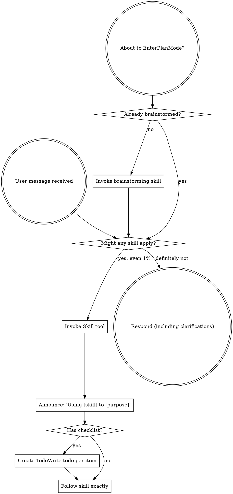

OpenAI Codex v0.128.0 (research preview)
--------
workdir: /Users/houssamr/Projects/syneriva/apps/erp-pos-stabperf
model: gpt-5.5
provider: openai
approval: never
sandbox: workspace-write [workdir, /tmp, $TMPDIR, /Users/houssamr/.codex/memories]
reasoning effort: high
reasoning summaries: none
session id: 019e1c55-665b-72c0-ae2c-dc84473a2259
--------
user
changes against 'dev'
2026-05-12T13:17:00.124812Z  WARN codex_core_plugins::manifest: ignoring interface.defaultPrompt: prompt must be at most 128 characters path=/Users/houssamr/.codex/.tmp/plugins/plugins/build-ios-apps/.codex-plugin/plugin.json
2026-05-12T13:17:00.127502Z  WARN codex_core_plugins::manifest: ignoring interface.defaultPrompt: maximum of 3 prompts is supported path=/Users/houssamr/.codex/.tmp/plugins/plugins/plugin-eval/.codex-plugin/plugin.json
2026-05-12T13:17:00.146625Z  WARN codex_core_plugins::manifest: ignoring interface.defaultPrompt: maximum of 3 prompts is supported path=/Users/houssamr/.codex/.tmp/plugins/plugins/twilio-developer-kit/.codex-plugin/plugin.json
2026-05-12T13:17:00.146780Z  WARN codex_core_plugins::manifest: ignoring interface.defaultPrompt: maximum of 3 prompts is supported path=/Users/houssamr/.codex/.tmp/plugins/plugins/openai-developers/.codex-plugin/plugin.json
2026-05-12T13:17:02.761670Z  WARN codex_core_plugins::marketplace: skipping marketplace plugin with unsupported source path=/Users/houssamr/.codex/.tmp/marketplaces/.staging/marketplace-upgrade-9JBgiv/.claude-plugin/marketplace.json plugin="fullstory"
2026-05-12T13:17:02.762011Z  WARN codex_core_plugins::marketplace: skipping marketplace plugin with unsupported source path=/Users/houssamr/.codex/.tmp/marketplaces/.staging/marketplace-upgrade-9JBgiv/.claude-plugin/marketplace.json plugin="jfrog"
2026-05-12T13:17:02.763779Z  WARN codex_core_plugins::marketplace: skipping invalid marketplace plugin path=/Users/houssamr/.codex/.tmp/marketplaces/.staging/marketplace-upgrade-9JBgiv/.claude-plugin/marketplace.json marketplace=claude-plugins-official error=invalid plugin name: only ASCII letters, digits, `_`, and `-` are allowed
2026-05-12T13:17:05.207335Z  WARN codex_core_plugins::marketplace: skipping marketplace plugin with unsupported source path=/Users/houssamr/.codex/.tmp/marketplaces/claude-plugins-official/.claude-plugin/marketplace.json plugin="fullstory"
2026-05-12T13:17:05.207558Z  WARN codex_core_plugins::marketplace: skipping marketplace plugin with unsupported source path=/Users/houssamr/.codex/.tmp/marketplaces/claude-plugins-official/.claude-plugin/marketplace.json plugin="jfrog"
2026-05-12T13:17:05.208395Z  WARN codex_core_plugins::marketplace: skipping invalid marketplace plugin path=/Users/houssamr/.codex/.tmp/marketplaces/claude-plugins-official/.claude-plugin/marketplace.json marketplace=claude-plugins-official error=invalid plugin name: only ASCII letters, digits, `_`, and `-` are allowed
2026-05-12T13:17:05.208539Z  WARN codex_core_plugins::marketplace: skipping marketplace plugin that failed to resolve path=/Users/houssamr/.codex/.tmp/marketplaces/ui-ux-pro-max-skill/.claude-plugin/marketplace.json plugin="ui-ux-pro-max" error=invalid marketplace file `/Users/houssamr/.codex/.tmp/marketplaces/ui-ux-pro-max-skill/.claude-plugin/marketplace.json`: local plugin source path must not be empty
2026-05-12T13:17:05.209980Z  WARN codex_core_plugins::manifest: ignoring interface.defaultPrompt: prompt must be at most 128 characters path=/Users/houssamr/.codex/.tmp/plugins/plugins/build-ios-apps/.codex-plugin/plugin.json
2026-05-12T13:17:05.210366Z  WARN codex_core_plugins::manifest: ignoring interface.defaultPrompt: maximum of 3 prompts is supported path=/Users/houssamr/.codex/.tmp/plugins/plugins/plugin-eval/.codex-plugin/plugin.json
2026-05-12T13:17:05.212605Z  WARN codex_core_plugins::manifest: ignoring interface.defaultPrompt: maximum of 3 prompts is supported path=/Users/houssamr/.codex/.tmp/plugins/plugins/twilio-developer-kit/.codex-plugin/plugin.json
2026-05-12T13:17:05.212638Z  WARN codex_core_plugins::manifest: ignoring interface.defaultPrompt: maximum of 3 prompts is supported path=/Users/houssamr/.codex/.tmp/plugins/plugins/openai-developers/.codex-plugin/plugin.json
2026-05-12T13:17:05.259530Z  WARN codex_core_skills::loader: ignoring interface.icon_small: icon path must not contain '..'
2026-05-12T13:17:05.259542Z  WARN codex_core_skills::loader: ignoring interface.icon_large: icon path must not contain '..'
2026-05-12T13:17:05.261027Z  WARN codex_core_skills::loader: ignoring interface.icon_small: icon path must not contain '..'
2026-05-12T13:17:05.261039Z  WARN codex_core_skills::loader: ignoring interface.icon_large: icon path must not contain '..'
2026-05-12T13:17:05.262540Z  WARN codex_core_skills::loader: ignoring interface.icon_small: icon path must not contain '..'
2026-05-12T13:17:05.262552Z  WARN codex_core_skills::loader: ignoring interface.icon_large: icon path must not contain '..'
2026-05-12T13:17:05.263309Z  WARN codex_core_skills::loader: ignoring interface.icon_small: icon path must not contain '..'
2026-05-12T13:17:05.263320Z  WARN codex_core_skills::loader: ignoring interface.icon_large: icon path must not contain '..'
2026-05-12T13:17:05.264144Z  WARN codex_core_skills::loader: ignoring interface.icon_small: icon path must not contain '..'
2026-05-12T13:17:05.264155Z  WARN codex_core_skills::loader: ignoring interface.icon_large: icon path must not contain '..'
2026-05-12T13:17:05.265891Z  WARN codex_core_skills::loader: ignoring interface.icon_small: icon path must not contain '..'
2026-05-12T13:17:05.265896Z  WARN codex_core_skills::loader: ignoring interface.icon_large: icon path must not contain '..'
2026-05-12T13:17:07.201339Z  WARN codex_core_plugins::marketplace: skipping marketplace plugin with unsupported source path=/Users/houssamr/.codex/.tmp/marketplaces/claude-plugins-official/.claude-plugin/marketplace.json plugin="fullstory"
2026-05-12T13:17:07.201641Z  WARN codex_core_plugins::marketplace: skipping marketplace plugin with unsupported source path=/Users/houssamr/.codex/.tmp/marketplaces/claude-plugins-official/.claude-plugin/marketplace.json plugin="jfrog"
2026-05-12T13:17:07.202452Z  WARN codex_core_plugins::marketplace: skipping invalid marketplace plugin path=/Users/houssamr/.codex/.tmp/marketplaces/claude-plugins-official/.claude-plugin/marketplace.json marketplace=claude-plugins-official error=invalid plugin name: only ASCII letters, digits, `_`, and `-` are allowed
2026-05-12T13:17:07.202589Z  WARN codex_core_plugins::marketplace: skipping marketplace plugin that failed to resolve path=/Users/houssamr/.codex/.tmp/marketplaces/ui-ux-pro-max-skill/.claude-plugin/marketplace.json plugin="ui-ux-pro-max" error=invalid marketplace file `/Users/houssamr/.codex/.tmp/marketplaces/ui-ux-pro-max-skill/.claude-plugin/marketplace.json`: local plugin source path must not be empty
2026-05-12T13:17:07.204255Z  WARN codex_core_plugins::manifest: ignoring interface.defaultPrompt: prompt must be at most 128 characters path=/Users/houssamr/.codex/.tmp/plugins/plugins/build-ios-apps/.codex-plugin/plugin.json
2026-05-12T13:17:07.204893Z  WARN codex_core_plugins::manifest: ignoring interface.defaultPrompt: maximum of 3 prompts is supported path=/Users/houssamr/.codex/.tmp/plugins/plugins/plugin-eval/.codex-plugin/plugin.json
2026-05-12T13:17:07.207224Z  WARN codex_core_plugins::manifest: ignoring interface.defaultPrompt: maximum of 3 prompts is supported path=/Users/houssamr/.codex/.tmp/plugins/plugins/twilio-developer-kit/.codex-plugin/plugin.json
2026-05-12T13:17:07.207262Z  WARN codex_core_plugins::manifest: ignoring interface.defaultPrompt: maximum of 3 prompts is supported path=/Users/houssamr/.codex/.tmp/plugins/plugins/openai-developers/.codex-plugin/plugin.json
2026-05-12T13:17:07.233141Z  WARN codex_core_skills::loader: ignoring interface.icon_small: icon path must not contain '..'
2026-05-12T13:17:07.233146Z  WARN codex_core_skills::loader: ignoring interface.icon_large: icon path must not contain '..'
2026-05-12T13:17:07.233965Z  WARN codex_core_skills::loader: ignoring interface.icon_small: icon path must not contain '..'
2026-05-12T13:17:07.233969Z  WARN codex_core_skills::loader: ignoring interface.icon_large: icon path must not contain '..'
2026-05-12T13:17:07.234889Z  WARN codex_core_skills::loader: ignoring interface.icon_small: icon path must not contain '..'
2026-05-12T13:17:07.234901Z  WARN codex_core_skills::loader: ignoring interface.icon_large: icon path must not contain '..'
2026-05-12T13:17:07.235651Z  WARN codex_core_skills::loader: ignoring interface.icon_small: icon path must not contain '..'
2026-05-12T13:17:07.235662Z  WARN codex_core_skills::loader: ignoring interface.icon_large: icon path must not contain '..'
2026-05-12T13:17:07.236483Z  WARN codex_core_skills::loader: ignoring interface.icon_small: icon path must not contain '..'
2026-05-12T13:17:07.236493Z  WARN codex_core_skills::loader: ignoring interface.icon_large: icon path must not contain '..'
2026-05-12T13:17:07.238319Z  WARN codex_core_skills::loader: ignoring interface.icon_small: icon path must not contain '..'
2026-05-12T13:17:07.238335Z  WARN codex_core_skills::loader: ignoring interface.icon_large: icon path must not contain '..'
2026-05-12T13:17:08.129063Z  WARN codex_core_plugins::marketplace: skipping marketplace plugin that failed to resolve path=/Users/houssamr/.codex/.tmp/marketplaces/.staging/marketplace-upgrade-zLPiNb/.claude-plugin/marketplace.json plugin="ui-ux-pro-max" error=invalid marketplace file `/Users/houssamr/.codex/.tmp/marketplaces/.staging/marketplace-upgrade-zLPiNb/.claude-plugin/marketplace.json`: local plugin source path must not be empty
2026-05-12T13:17:08.155727Z  WARN codex_core_plugins::marketplace: skipping marketplace plugin with unsupported source path=/Users/houssamr/.codex/.tmp/marketplaces/claude-plugins-official/.claude-plugin/marketplace.json plugin="fullstory"
2026-05-12T13:17:08.155840Z  WARN codex_core_plugins::marketplace: skipping marketplace plugin with unsupported source path=/Users/houssamr/.codex/.tmp/marketplaces/claude-plugins-official/.claude-plugin/marketplace.json plugin="jfrog"
2026-05-12T13:17:08.156197Z  WARN codex_core_plugins::marketplace: skipping invalid marketplace plugin path=/Users/houssamr/.codex/.tmp/marketplaces/claude-plugins-official/.claude-plugin/marketplace.json marketplace=claude-plugins-official error=invalid plugin name: only ASCII letters, digits, `_`, and `-` are allowed
2026-05-12T13:17:08.156264Z  WARN codex_core_plugins::marketplace: skipping marketplace plugin that failed to resolve path=/Users/houssamr/.codex/.tmp/marketplaces/ui-ux-pro-max-skill/.claude-plugin/marketplace.json plugin="ui-ux-pro-max" error=invalid marketplace file `/Users/houssamr/.codex/.tmp/marketplaces/ui-ux-pro-max-skill/.claude-plugin/marketplace.json`: local plugin source path must not be empty
2026-05-12T13:17:08.156349Z  WARN codex_core_plugins::loader: configured non-curated plugin no longer exists in discovered marketplaces during cache refresh plugin="browser-use" marketplace="openai-bundled"
2026-05-12T13:17:08.164751Z  WARN codex_core_plugins::loader: configured non-curated plugin no longer exists in discovered marketplaces during cache refresh plugin="documents" marketplace="openai-primary-runtime"
2026-05-12T13:17:08.167993Z  WARN codex_core_plugins::loader: configured non-curated plugin no longer exists in discovered marketplaces during cache refresh plugin="presentations" marketplace="openai-primary-runtime"
2026-05-12T13:17:08.167998Z  WARN codex_core_plugins::loader: configured non-curated plugin no longer exists in discovered marketplaces during cache refresh plugin="spreadsheets" marketplace="openai-primary-runtime"
2026-05-12T13:17:08.254130Z  WARN codex_core_plugins::marketplace: skipping marketplace plugin with unsupported source path=/Users/houssamr/.codex/.tmp/marketplaces/claude-plugins-official/.claude-plugin/marketplace.json plugin="fullstory"
2026-05-12T13:17:08.254262Z  WARN codex_core_plugins::marketplace: skipping marketplace plugin with unsupported source path=/Users/houssamr/.codex/.tmp/marketplaces/claude-plugins-official/.claude-plugin/marketplace.json plugin="jfrog"
2026-05-12T13:17:08.254987Z  WARN codex_core_plugins::marketplace: skipping invalid marketplace plugin path=/Users/houssamr/.codex/.tmp/marketplaces/claude-plugins-official/.claude-plugin/marketplace.json marketplace=claude-plugins-official error=invalid plugin name: only ASCII letters, digits, `_`, and `-` are allowed
2026-05-12T13:17:08.255151Z  WARN codex_core_plugins::marketplace: skipping marketplace plugin that failed to resolve path=/Users/houssamr/.codex/.tmp/marketplaces/ui-ux-pro-max-skill/.claude-plugin/marketplace.json plugin="ui-ux-pro-max" error=invalid marketplace file `/Users/houssamr/.codex/.tmp/marketplaces/ui-ux-pro-max-skill/.claude-plugin/marketplace.json`: local plugin source path must not be empty
2026-05-12T13:17:08.256181Z  WARN codex_core_plugins::manifest: ignoring interface.defaultPrompt: prompt must be at most 128 characters path=/Users/houssamr/.codex/.tmp/plugins/plugins/build-ios-apps/.codex-plugin/plugin.json
2026-05-12T13:17:08.256458Z  WARN codex_core_plugins::manifest: ignoring interface.defaultPrompt: maximum of 3 prompts is supported path=/Users/houssamr/.codex/.tmp/plugins/plugins/plugin-eval/.codex-plugin/plugin.json
2026-05-12T13:17:08.258505Z  WARN codex_core_plugins::manifest: ignoring interface.defaultPrompt: maximum of 3 prompts is supported path=/Users/houssamr/.codex/.tmp/plugins/plugins/twilio-developer-kit/.codex-plugin/plugin.json
2026-05-12T13:17:08.258535Z  WARN codex_core_plugins::manifest: ignoring interface.defaultPrompt: maximum of 3 prompts is supported path=/Users/houssamr/.codex/.tmp/plugins/plugins/openai-developers/.codex-plugin/plugin.json
2026-05-12T13:17:08.277984Z  WARN codex_core_skills::loader: ignoring interface.icon_small: icon path must not contain '..'
2026-05-12T13:17:08.277997Z  WARN codex_core_skills::loader: ignoring interface.icon_large: icon path must not contain '..'
2026-05-12T13:17:08.278698Z  WARN codex_core_skills::loader: ignoring interface.icon_small: icon path must not contain '..'
2026-05-12T13:17:08.278707Z  WARN codex_core_skills::loader: ignoring interface.icon_large: icon path must not contain '..'
2026-05-12T13:17:08.279439Z  WARN codex_core_skills::loader: ignoring interface.icon_small: icon path must not contain '..'
2026-05-12T13:17:08.279449Z  WARN codex_core_skills::loader: ignoring interface.icon_large: icon path must not contain '..'
2026-05-12T13:17:08.280139Z  WARN codex_core_skills::loader: ignoring interface.icon_small: icon path must not contain '..'
2026-05-12T13:17:08.280148Z  WARN codex_core_skills::loader: ignoring interface.icon_large: icon path must not contain '..'
2026-05-12T13:17:08.280870Z  WARN codex_core_skills::loader: ignoring interface.icon_small: icon path must not contain '..'
2026-05-12T13:17:08.280883Z  WARN codex_core_skills::loader: ignoring interface.icon_large: icon path must not contain '..'
2026-05-12T13:17:08.282314Z  WARN codex_core_skills::loader: ignoring interface.icon_small: icon path must not contain '..'
2026-05-12T13:17:08.282323Z  WARN codex_core_skills::loader: ignoring interface.icon_large: icon path must not contain '..'
2026-05-12T13:17:17.488670Z  WARN codex_otel::events::session_telemetry: metrics counter [codex.skill.injected] failed: tag value contains invalid characters: superpowers:using-superpowers
exec
/bin/zsh -lc "cat /Users/houssamr/.codex/plugins/cache/claude-plugins-official/superpowers/5.1.0/skills/using-superpowers/SKILL.md && printf '\\n---\\n' && cat /Users/houssamr/.codex/plugins/cache/claude-plugins-official/superpowers/5.1.0/skills/requesting-code-review/SKILL.md" in /Users/houssamr/Projects/syneriva/apps/erp-pos-stabperf
 succeeded in 0ms:
---
name: using-superpowers
description: Use when starting any conversation - establishes how to find and use skills, requiring Skill tool invocation before ANY response including clarifying questions
---

<SUBAGENT-STOP>
If you were dispatched as a subagent to execute a specific task, skip this skill.
</SUBAGENT-STOP>

<EXTREMELY-IMPORTANT>
If you think there is even a 1% chance a skill might apply to what you are doing, you ABSOLUTELY MUST invoke the skill.

IF A SKILL APPLIES TO YOUR TASK, YOU DO NOT HAVE A CHOICE. YOU MUST USE IT.

This is not negotiable. This is not optional. You cannot rationalize your way out of this.
</EXTREMELY-IMPORTANT>

## Instruction Priority

Superpowers skills override default system prompt behavior, but **user instructions always take precedence**:

1. **User's explicit instructions** (CLAUDE.md, GEMINI.md, AGENTS.md, direct requests) — highest priority
2. **Superpowers skills** — override default system behavior where they conflict
3. **Default system prompt** — lowest priority

If CLAUDE.md, GEMINI.md, or AGENTS.md says "don't use TDD" and a skill says "always use TDD," follow the user's instructions. The user is in control.

## How to Access Skills

**In Claude Code:** Use the `Skill` tool. When you invoke a skill, its content is loaded and presented to you—follow it directly. Never use the Read tool on skill files.

**In Copilot CLI:** Use the `skill` tool. Skills are auto-discovered from installed plugins. The `skill` tool works the same as Claude Code's `Skill` tool.

**In Gemini CLI:** Skills activate via the `activate_skill` tool. Gemini loads skill metadata at session start and activates the full content on demand.

**In other environments:** Check your platform's documentation for how skills are loaded.

## Platform Adaptation

Skills use Claude Code tool names. Non-CC platforms: see `references/copilot-tools.md` (Copilot CLI), `references/codex-tools.md` (Codex) for tool equivalents. Gemini CLI users get the tool mapping loaded automatically via GEMINI.md.

# Using Skills

## The Rule

**Invoke relevant or requested skills BEFORE any response or action.** Even a 1% chance a skill might apply means that you should invoke the skill to check. If an invoked skill turns out to be wrong for the situation, you don't need to use it.



## Red Flags

These thoughts mean STOP—you're rationalizing:

| Thought | Reality |
|---------|---------|
| "This is just a simple question" | Questions are tasks. Check for skills. |
| "I need more context first" | Skill check comes BEFORE clarifying questions. |
| "Let me explore the codebase first" | Skills tell you HOW to explore. Check first. |
| "I can check git/files quickly" | Files lack conversation context. Check for skills. |
| "Let me gather information first" | Skills tell you HOW to gather information. |
| "This doesn't need a formal skill" | If a skill exists, use it. |
| "I remember this skill" | Skills evolve. Read current version. |
| "This doesn't count as a task" | Action = task. Check for skills. |
| "The skill is overkill" | Simple things become complex. Use it. |
| "I'll just do this one thing first" | Check BEFORE doing anything. |
| "This feels productive" | Undisciplined action wastes time. Skills prevent this. |
| "I know what that means" | Knowing the concept ≠ using the skill. Invoke it. |

## Skill Priority

When multiple skills could apply, use this order:

1. **Process skills first** (brainstorming, debugging) - these determine HOW to approach the task
2. **Implementation skills second** (frontend-design, mcp-builder) - these guide execution

"Let's build X" → brainstorming first, then implementation skills.
"Fix this bug" → debugging first, then domain-specific skills.

## Skill Types

**Rigid** (TDD, debugging): Follow exactly. Don't adapt away discipline.

**Flexible** (patterns): Adapt principles to context.

The skill itself tells you which.

## User Instructions

Instructions say WHAT, not HOW. "Add X" or "Fix Y" doesn't mean skip workflows.

---
---
name: requesting-code-review
description: Use when completing tasks, implementing major features, or before merging to verify work meets requirements
---

# Requesting Code Review

Dispatch a code reviewer subagent to catch issues before they cascade. The reviewer gets precisely crafted context for evaluation — never your session's history. This keeps the reviewer focused on the work product, not your thought process, and preserves your own context for continued work.

**Core principle:** Review early, review often.

## When to Request Review

**Mandatory:**
- After each task in subagent-driven development
- After completing major feature
- Before merge to main

**Optional but valuable:**
- When stuck (fresh perspective)
- Before refactoring (baseline check)
- After fixing complex bug

## How to Request

**1. Get git SHAs:**
```bash
BASE_SHA=$(git rev-parse HEAD~1)  # or origin/main
HEAD_SHA=$(git rev-parse HEAD)
```

**2. Dispatch code reviewer subagent:**

Use Task tool with `general-purpose` type, fill template at `code-reviewer.md`

**Placeholders:**
- `{DESCRIPTION}` - Brief summary of what you built
- `{PLAN_OR_REQUIREMENTS}` - What it should do
- `{BASE_SHA}` - Starting commit
- `{HEAD_SHA}` - Ending commit

**3. Act on feedback:**
- Fix Critical issues immediately
- Fix Important issues before proceeding
- Note Minor issues for later
- Push back if reviewer is wrong (with reasoning)

## Example

```
[Just completed Task 2: Add verification function]

You: Let me request code review before proceeding.

BASE_SHA=$(git log --oneline | grep "Task 1" | head -1 | awk '{print $1}')
HEAD_SHA=$(git rev-parse HEAD)

[Dispatch code reviewer subagent]
  DESCRIPTION: Added verifyIndex() and repairIndex() with 4 issue types
  PLAN_OR_REQUIREMENTS: Task 2 from docs/superpowers/plans/deployment-plan.md
  BASE_SHA: a7981ec
  HEAD_SHA: 3df7661

[Subagent returns]:
  Strengths: Clean architecture, real tests
  Issues:
    Important: Missing progress indicators
    Minor: Magic number (100) for reporting interval
  Assessment: Ready to proceed

You: [Fix progress indicators]
[Continue to Task 3]
```

## Integration with Workflows

**Subagent-Driven Development:**
- Review after EACH task
- Catch issues before they compound
- Fix before moving to next task

**Executing Plans:**
- Review after each task or at natural checkpoints
- Get feedback, apply, continue

**Ad-Hoc Development:**
- Review before merge
- Review when stuck

## Red Flags

**Never:**
- Skip review because "it's simple"
- Ignore Critical issues
- Proceed with unfixed Important issues
- Argue with valid technical feedback

**If reviewer wrong:**
- Push back with technical reasoning
- Show code/tests that prove it works
- Request clarification

See template at: requesting-code-review/code-reviewer.md

2026-05-12T13:17:17.572917Z  WARN codex_protocol::openai_models: Model personality requested but model_messages is missing, falling back to base instructions. model=gpt-5.5 personality=pragmatic
2026-05-12T13:17:17.651891Z  WARN codex_core_plugins::marketplace: skipping marketplace plugin with unsupported source path=/Users/houssamr/.codex/.tmp/marketplaces/claude-plugins-official/.claude-plugin/marketplace.json plugin="fullstory"
2026-05-12T13:17:17.652412Z  WARN codex_core_plugins::marketplace: skipping marketplace plugin with unsupported source path=/Users/houssamr/.codex/.tmp/marketplaces/claude-plugins-official/.claude-plugin/marketplace.json plugin="jfrog"
2026-05-12T13:17:17.653796Z  WARN codex_core_plugins::marketplace: skipping invalid marketplace plugin path=/Users/houssamr/.codex/.tmp/marketplaces/claude-plugins-official/.claude-plugin/marketplace.json marketplace=claude-plugins-official error=invalid plugin name: only ASCII letters, digits, `_`, and `-` are allowed
2026-05-12T13:17:17.654521Z  WARN codex_core_plugins::marketplace: skipping marketplace plugin that failed to resolve path=/Users/houssamr/.codex/.tmp/marketplaces/ui-ux-pro-max-skill/.claude-plugin/marketplace.json plugin="ui-ux-pro-max" error=invalid marketplace file `/Users/houssamr/.codex/.tmp/marketplaces/ui-ux-pro-max-skill/.claude-plugin/marketplace.json`: local plugin source path must not be empty
2026-05-12T13:17:17.658429Z  WARN codex_core_plugins::manifest: ignoring interface.defaultPrompt: prompt must be at most 128 characters path=/Users/houssamr/.codex/.tmp/plugins/plugins/build-ios-apps/.codex-plugin/plugin.json
2026-05-12T13:17:17.659955Z  WARN codex_core_plugins::manifest: ignoring interface.defaultPrompt: maximum of 3 prompts is supported path=/Users/houssamr/.codex/.tmp/plugins/plugins/plugin-eval/.codex-plugin/plugin.json
2026-05-12T13:17:17.674969Z  WARN codex_core_plugins::manifest: ignoring interface.defaultPrompt: maximum of 3 prompts is supported path=/Users/houssamr/.codex/.tmp/plugins/plugins/twilio-developer-kit/.codex-plugin/plugin.json
2026-05-12T13:17:17.675124Z  WARN codex_core_plugins::manifest: ignoring interface.defaultPrompt: maximum of 3 prompts is supported path=/Users/houssamr/.codex/.tmp/plugins/plugins/openai-developers/.codex-plugin/plugin.json
2026-05-12T13:17:17.705815Z  WARN codex_core_skills::loader: ignoring interface.icon_small: icon path must not contain '..'
2026-05-12T13:17:17.705830Z  WARN codex_core_skills::loader: ignoring interface.icon_large: icon path must not contain '..'
2026-05-12T13:17:17.706840Z  WARN codex_core_skills::loader: ignoring interface.icon_small: icon path must not contain '..'
2026-05-12T13:17:17.706851Z  WARN codex_core_skills::loader: ignoring interface.icon_large: icon path must not contain '..'
2026-05-12T13:17:17.707767Z  WARN codex_core_skills::loader: ignoring interface.icon_small: icon path must not contain '..'
2026-05-12T13:17:17.707779Z  WARN codex_core_skills::loader: ignoring interface.icon_large: icon path must not contain '..'
2026-05-12T13:17:17.708784Z  WARN codex_core_skills::loader: ignoring interface.icon_small: icon path must not contain '..'
2026-05-12T13:17:17.708794Z  WARN codex_core_skills::loader: ignoring interface.icon_large: icon path must not contain '..'
2026-05-12T13:17:17.709894Z  WARN codex_core_skills::loader: ignoring interface.icon_small: icon path must not contain '..'
2026-05-12T13:17:17.709904Z  WARN codex_core_skills::loader: ignoring interface.icon_large: icon path must not contain '..'
2026-05-12T13:17:17.712075Z  WARN codex_core_skills::loader: ignoring interface.icon_small: icon path must not contain '..'
2026-05-12T13:17:17.712086Z  WARN codex_core_skills::loader: ignoring interface.icon_large: icon path must not contain '..'
exec
/bin/zsh -lc 'git diff --stat 198c36305038b2cb9cb265085f9185cb7b71e24c && git diff --name-only 198c36305038b2cb9cb265085f9185cb7b71e24c' in /Users/houssamr/Projects/syneriva/apps/erp-pos-stabperf
 succeeded in 0ms:
 .../Controllers/DiscountController.php             |    45 +-
 .../__tests__/discountApi.terminalContext.test.ts  |    38 +
 apps/pos/src/api/discountApi.ts                    |    15 +-
 .../organisms/DiscountModal/DiscountModal.tsx      |    22 +-
 .../DiscountModal/__tests__/DiscountModal.test.tsx |     2 +
 .../LineDiscountModal/LineDiscountModal.tsx        |    22 +-
 .../__tests__/LineDiscountModal.test.tsx           |     2 +
 apps/pos/src/lib/db/migrations.ts                  |    69 +
 .../lib/db/repositories/operatorPinRepository.ts   |   175 +-
 apps/pos/src/lib/discountPermissions.ts            |   111 +
 apps/pos/src/locales/en/pos.json                   |     3 +
 apps/pos/src/locales/fr/pos.json                   |     3 +
 apps/pos/src/pages/HomePage.tsx                    |    35 +-
 .../__tests__/HomePage.discountFailClosed.test.ts  |   113 +
 .../pos/src/stores/__tests__/operatorStore.test.ts |   362 +-
 .../pos/src/stores/__tests__/terminalStore.test.ts |    74 +
 apps/pos/src/stores/operatorStore.ts               |   175 +-
 apps/pos/src/stores/terminalStore.ts               |    51 +
 ...26-05-12-pos-go-live-pr3-codex-review-round1.md |  3654 ++++
 ...26-05-12-pos-go-live-pr3-codex-review-round2.md |  5667 ++++++
 ...26-05-12-pos-go-live-pr3-codex-review-round3.md | 17863 +++++++++++++++++++
 ...26-05-12-pos-go-live-pr3-codex-review-round4.md |  4336 +++++
 ...26-05-12-pos-go-live-pr3-codex-review-round5.md |  8540 +++++++++
 ...26-05-12-pos-go-live-pr3-codex-review-round6.md |  9040 ++++++++++
 24 files changed, 50376 insertions(+), 41 deletions(-)
apps/api/app/Modules/POS/Presentation/Controllers/DiscountController.php
apps/pos/src/api/__tests__/discountApi.terminalContext.test.ts
apps/pos/src/api/discountApi.ts
apps/pos/src/components/organisms/DiscountModal/DiscountModal.tsx
apps/pos/src/components/organisms/DiscountModal/__tests__/DiscountModal.test.tsx
apps/pos/src/components/organisms/LineDiscountModal/LineDiscountModal.tsx
apps/pos/src/components/organisms/LineDiscountModal/__tests__/LineDiscountModal.test.tsx
apps/pos/src/lib/db/migrations.ts
apps/pos/src/lib/db/repositories/operatorPinRepository.ts
apps/pos/src/lib/discountPermissions.ts
apps/pos/src/locales/en/pos.json
apps/pos/src/locales/fr/pos.json
apps/pos/src/pages/HomePage.tsx
apps/pos/src/pages/__tests__/HomePage.discountFailClosed.test.ts
apps/pos/src/stores/__tests__/operatorStore.test.ts
apps/pos/src/stores/__tests__/terminalStore.test.ts
apps/pos/src/stores/operatorStore.ts
apps/pos/src/stores/terminalStore.ts
docs/superpowers/reviews/2026-05-12-pos-go-live-pr3-codex-review-round1.md
docs/superpowers/reviews/2026-05-12-pos-go-live-pr3-codex-review-round2.md
docs/superpowers/reviews/2026-05-12-pos-go-live-pr3-codex-review-round3.md
docs/superpowers/reviews/2026-05-12-pos-go-live-pr3-codex-review-round4.md
docs/superpowers/reviews/2026-05-12-pos-go-live-pr3-codex-review-round5.md
docs/superpowers/reviews/2026-05-12-pos-go-live-pr3-codex-review-round6.md

2026-05-12T13:17:26.254581Z  WARN codex_protocol::openai_models: Model personality requested but model_messages is missing, falling back to base instructions. model=gpt-5.5 personality=pragmatic
2026-05-12T13:17:26.285821Z  WARN codex_core_plugins::marketplace: skipping marketplace plugin with unsupported source path=/Users/houssamr/.codex/.tmp/marketplaces/claude-plugins-official/.claude-plugin/marketplace.json plugin="fullstory"
2026-05-12T13:17:26.286055Z  WARN codex_core_plugins::marketplace: skipping marketplace plugin with unsupported source path=/Users/houssamr/.codex/.tmp/marketplaces/claude-plugins-official/.claude-plugin/marketplace.json plugin="jfrog"
2026-05-12T13:17:26.287268Z  WARN codex_core_plugins::marketplace: skipping invalid marketplace plugin path=/Users/houssamr/.codex/.tmp/marketplaces/claude-plugins-official/.claude-plugin/marketplace.json marketplace=claude-plugins-official error=invalid plugin name: only ASCII letters, digits, `_`, and `-` are allowed
2026-05-12T13:17:26.287953Z  WARN codex_core_plugins::marketplace: skipping marketplace plugin that failed to resolve path=/Users/houssamr/.codex/.tmp/marketplaces/ui-ux-pro-max-skill/.claude-plugin/marketplace.json plugin="ui-ux-pro-max" error=invalid marketplace file `/Users/houssamr/.codex/.tmp/marketplaces/ui-ux-pro-max-skill/.claude-plugin/marketplace.json`: local plugin source path must not be empty
2026-05-12T13:17:26.291044Z  WARN codex_core_plugins::manifest: ignoring interface.defaultPrompt: prompt must be at most 128 characters path=/Users/houssamr/.codex/.tmp/plugins/plugins/build-ios-apps/.codex-plugin/plugin.json
2026-05-12T13:17:26.292218Z  WARN codex_core_plugins::manifest: ignoring interface.defaultPrompt: maximum of 3 prompts is supported path=/Users/houssamr/.codex/.tmp/plugins/plugins/plugin-eval/.codex-plugin/plugin.json
2026-05-12T13:17:26.305231Z  WARN codex_core_plugins::manifest: ignoring interface.defaultPrompt: maximum of 3 prompts is supported path=/Users/houssamr/.codex/.tmp/plugins/plugins/twilio-developer-kit/.codex-plugin/plugin.json
2026-05-12T13:17:26.305380Z  WARN codex_core_plugins::manifest: ignoring interface.defaultPrompt: maximum of 3 prompts is supported path=/Users/houssamr/.codex/.tmp/plugins/plugins/openai-developers/.codex-plugin/plugin.json
2026-05-12T13:17:26.324498Z  WARN codex_core_skills::loader: ignoring interface.icon_small: icon path must not contain '..'
2026-05-12T13:17:26.324503Z  WARN codex_core_skills::loader: ignoring interface.icon_large: icon path must not contain '..'
2026-05-12T13:17:26.325213Z  WARN codex_core_skills::loader: ignoring interface.icon_small: icon path must not contain '..'
2026-05-12T13:17:26.325223Z  WARN codex_core_skills::loader: ignoring interface.icon_large: icon path must not contain '..'
2026-05-12T13:17:26.325884Z  WARN codex_core_skills::loader: ignoring interface.icon_small: icon path must not contain '..'
2026-05-12T13:17:26.325889Z  WARN codex_core_skills::loader: ignoring interface.icon_large: icon path must not contain '..'
2026-05-12T13:17:26.326566Z  WARN codex_core_skills::loader: ignoring interface.icon_small: icon path must not contain '..'
2026-05-12T13:17:26.326571Z  WARN codex_core_skills::loader: ignoring interface.icon_large: icon path must not contain '..'
2026-05-12T13:17:26.327244Z  WARN codex_core_skills::loader: ignoring interface.icon_small: icon path must not contain '..'
2026-05-12T13:17:26.327249Z  WARN codex_core_skills::loader: ignoring interface.icon_large: icon path must not contain '..'
2026-05-12T13:17:26.328721Z  WARN codex_core_skills::loader: ignoring interface.icon_small: icon path must not contain '..'
2026-05-12T13:17:26.328727Z  WARN codex_core_skills::loader: ignoring interface.icon_large: icon path must not contain '..'
exec
/bin/zsh -lc 'git diff --unified=80 198c36305038b2cb9cb265085f9185cb7b71e24c -- apps/api/app/Modules/POS/Presentation/Controllers/DiscountController.php apps/pos/src/api/discountApi.ts apps/pos/src/lib/discountPermissions.ts apps/pos/src/stores/operatorStore.ts apps/pos/src/stores/terminalStore.ts apps/pos/src/lib/db/repositories/operatorPinRepository.ts apps/pos/src/lib/db/migrations.ts apps/pos/src/components/organisms/DiscountModal/DiscountModal.tsx apps/pos/src/components/organisms/LineDiscountModal/LineDiscountModal.tsx apps/pos/src/pages/HomePage.tsx' in /Users/houssamr/Projects/syneriva/apps/erp-pos-stabperf
 succeeded in 0ms:
diff --git a/apps/api/app/Modules/POS/Presentation/Controllers/DiscountController.php b/apps/api/app/Modules/POS/Presentation/Controllers/DiscountController.php
index cda30b5f..eaf718eb 100644
--- a/apps/api/app/Modules/POS/Presentation/Controllers/DiscountController.php
+++ b/apps/api/app/Modules/POS/Presentation/Controllers/DiscountController.php
@@ -6,196 +6,219 @@

 use App\Http\Controllers\Controller;
 use App\Modules\Company\Services\CompanyContext;
 use App\Modules\Identity\Domain\User;
 use App\Modules\POS\Application\Services\DiscountOrchestratorService;
 use App\Modules\POS\Domain\Terminal;
 use App\Modules\Promotion\Domain\ValueObjects\CartContext;
 use App\Modules\Promotion\Domain\ValueObjects\CartItemContext;
 use Illuminate\Http\JsonResponse;
 use Illuminate\Http\Request;
 use Illuminate\Support\Carbon;

 /**
  * Controller for POS Discount Permissions.
  *
  * Handles:
  * - Retrieving discount permissions for current terminal and cashier
  * - Calculating effective discount limits
  */
 final class DiscountController extends Controller
 {
     public function __construct(
         private readonly CompanyContext $companyContext,
         private readonly DiscountOrchestratorService $orchestrator,
     ) {}

     /**
      * Get discount permissions for the current terminal and cashier
      *
      * GET /api/v1/pos/discount-permissions
      *
      * Headers:
      * - X-Terminal-Code: Terminal code (e.g., POS01)
      */
     public function getPermissions(Request $request): JsonResponse
     {
         /** @var User|null $user */
         $user = $request->user();
         if ($user === null) {
             return response()->json([
                 'error' => [
                     'code' => 'UNAUTHORIZED',
                     'message' => 'User not authenticated',
                 ],
             ], 401);
         }

         $terminalCode = $request->header('X-Terminal-Code') ?? $request->query('terminal_code');
         if ($terminalCode === null) {
             return response()->json([
                 'error' => [
                     'code' => 'TERMINAL_CODE_REQUIRED',
                     'message' => 'X-Terminal-Code header or terminal_code query parameter is required',
                 ],
             ], 422);
         }

         $companyId = $this->companyContext->getCompanyId();
         if ($companyId === null) {
             return response()->json([
                 'error' => [
                     'code' => 'COMPANY_REQUIRED',
                     'message' => 'Company context is required',
                 ],
             ], 422);
         }

         $terminal = Terminal::forCompany($companyId)
             ->byCode($terminalCode)
             ->first();

         if ($terminal === null) {
             return response()->json([
                 'error' => [
                     'code' => 'TERMINAL_NOT_FOUND',
                     'message' => 'Terminal not found',
                 ],
             ], 404);
         }

+        $discountUser = $user;
+        $operatorId = $request->query('operator_id');
+        if (is_string($operatorId) && $operatorId !== '') {
+            $operator = User::where('tenant_id', $user->tenant_id)
+                ->whereKey($operatorId)
+                ->first();
+
+            if (! $operator instanceof User) {
+                return response()->json([
+                    'error' => [
+                        'code' => 'OPERATOR_NOT_FOUND',
+                        'message' => 'Operator not found',
+                    ],
+                ], 404);
+            }
+
+            $discountUser = $operator;
+        }
+
+        $isAdmin = $discountUser->hasRole(['super_admin', 'admin']);
+        $canUserDiscount = $isAdmin || $discountUser->can_discount;
+        $userMaxDiscountPercent = $isAdmin ? 100.0 : $discountUser->max_discount_percent;
+
         // Calculate effective limit (most restrictive)
-        $effectiveLimit = $this->calculateEffectiveLimit($terminal, $user);
+        $effectiveLimit = $this->calculateEffectiveLimit($terminal, $discountUser, $isAdmin);

         // User can discount only if:
         // 1. User has can_discount permission
         // 2. Terminal allows discounts
-        $canDiscount = $user->can_discount && (
-            $terminal->allow_line_discounts ||
-            $terminal->allow_transaction_discounts
-        );
+        $terminalAllowsDiscounts = $terminal->allow_line_discounts ||
+            $terminal->allow_transaction_discounts;
+        $canDiscount = $canUserDiscount && $terminalAllowsDiscounts;

         return response()->json([
             'data' => [
                 'canDiscount' => $canDiscount,
-                'canApplyLineDiscounts' => $user->can_discount && $terminal->allow_line_discounts,
-                'canApplyTransactionDiscounts' => $user->can_discount && $terminal->allow_transaction_discounts,
+                'userCanDiscount' => $canUserDiscount,
+                'userMaxDiscountPercent' => $userMaxDiscountPercent,
+                'terminalAllowsDiscounts' => $terminalAllowsDiscounts,
+                'canApplyLineDiscounts' => $canUserDiscount && $terminal->allow_line_discounts,
+                'canApplyTransactionDiscounts' => $canUserDiscount && $terminal->allow_transaction_discounts,
                 'maxDiscountPercent' => $effectiveLimit,
                 'requiresReason' => $effectiveLimit > 10.00,
                 'effectiveLimit' => $effectiveLimit,
             ],
         ]);
     }

     /**
      * Preview all discount sources for a cart without persisting.
      *
      * POST /api/v1/pos/cart/preview-discounts
      */
     public function previewDiscounts(Request $request): JsonResponse
     {
         $validated = $request->validate([
             'items' => ['required', 'array', 'min:1'],
             'items.*.product_id' => ['required', 'string'],
             'items.*.category_id' => ['nullable', 'string'],
             'items.*.quantity' => ['required', 'integer', 'min:1'],
             'items.*.unit_price' => ['required', 'numeric', 'gte:0'],
             'items.*.line_total' => ['required', 'numeric', 'gte:0'],
             'subtotal' => ['required', 'numeric', 'gt:0'],
             'manual_discount_amount' => ['nullable', 'numeric', 'gte:0'],
             'manual_discount_reason' => ['nullable', 'string', 'max:255'],
             'coupon_code' => ['nullable', 'string'],
             'customer_id' => ['nullable', 'string'],
             'loyalty_discount_amount' => ['nullable', 'numeric', 'gte:0'],
             'loyalty_reward_id' => ['nullable', 'string'],
         ]);

         $company = $this->companyContext->requireCompany();

         $items = [];
         foreach ($validated['items'] as $item) {
             /** @var numeric-string $unitPrice */
             $unitPrice = (string) $item['unit_price'];
             /** @var numeric-string $lineTotal */
             $lineTotal = (string) $item['line_total'];
             $items[] = new CartItemContext(
                 productId: $item['product_id'],
                 categoryId: $item['category_id'] ?? null,
                 quantity: (int) $item['quantity'],
                 unitPrice: $unitPrice,
                 lineTotal: $lineTotal,
             );
         }

         /** @var numeric-string $subtotal */
         $subtotal = (string) $validated['subtotal'];

         $cart = new CartContext(
             tenantId: $company->tenant_id,
             companyId: $company->id,
             items: $items,
             subtotal: $subtotal,
             appliedAt: Carbon::now()->toIso8601String(),
         );

         /** @var numeric-string|null $manualAmount */
         $manualAmount = isset($validated['manual_discount_amount'])
             ? (string) $validated['manual_discount_amount']
             : null;

         /** @var numeric-string|null $loyaltyAmount */
         $loyaltyAmount = isset($validated['loyalty_discount_amount'])
             ? (string) $validated['loyalty_discount_amount']
             : null;

         $breakdown = $this->orchestrator->resolve(
             cart: $cart,
             manualDiscountAmount: $manualAmount,
             manualDiscountReason: $validated['manual_discount_reason'] ?? null,
             couponCode: $validated['coupon_code'] ?? null,
             customerId: $validated['customer_id'] ?? null,
             loyaltyDiscountAmount: $loyaltyAmount,
             loyaltyRewardId: $validated['loyalty_reward_id'] ?? null,
         );

         return response()->json([
             'data' => $breakdown->toArray(),
         ]);
     }

     /**
      * Calculate the effective discount limit (most restrictive)
-     *
-     * @param  User  $user
      */
-    private function calculateEffectiveLimit(Terminal $terminal, $user): float
+    private function calculateEffectiveLimit(Terminal $terminal, User $user, bool $isAdmin): float
     {
         // Terminal limit
         $terminalLimit = $terminal->max_discount_percent;

         // User limit (null means no individual limit, use terminal limit)
-        $userLimit = $user->max_discount_percent ?? $terminalLimit;
+        $userLimit = $isAdmin ? 100.0 : ($user->max_discount_percent ?? $terminalLimit);

         // Return the most restrictive (minimum of the two)
         return min($terminalLimit, $userLimit);
     }
 }
diff --git a/apps/pos/src/api/discountApi.ts b/apps/pos/src/api/discountApi.ts
index e7184664..ae5ab7b4 100644
--- a/apps/pos/src/api/discountApi.ts
+++ b/apps/pos/src/api/discountApi.ts
@@ -1,11 +1,22 @@
 import { apiGet } from '@/lib/api';

 export interface DiscountPermissions {
   canDiscount: boolean;
+  userCanDiscount: boolean;
+  userMaxDiscountPercent: number | null;
+  terminalAllowsDiscounts: boolean;
+  canApplyLineDiscounts: boolean;
+  canApplyTransactionDiscounts: boolean;
   maxDiscountPercent: number;
   requiresReason: boolean;
 }

-export async function fetchDiscountPermissions(): Promise<DiscountPermissions> {
-  return apiGet<DiscountPermissions>('/pos/discount-permissions');
+export async function fetchDiscountPermissions(
+  terminalCode: string,
+  operatorId?: string,
+): Promise<DiscountPermissions> {
+  return apiGet<DiscountPermissions>('/pos/discount-permissions', {
+    terminal_code: terminalCode,
+    operator_id: operatorId,
+  });
 }
diff --git a/apps/pos/src/components/organisms/DiscountModal/DiscountModal.tsx b/apps/pos/src/components/organisms/DiscountModal/DiscountModal.tsx
index be9fb8cc..274d8646 100644
--- a/apps/pos/src/components/organisms/DiscountModal/DiscountModal.tsx
+++ b/apps/pos/src/components/organisms/DiscountModal/DiscountModal.tsx
@@ -1,367 +1,381 @@
 import { useState, useCallback, useEffect, useRef } from 'react';
 import { useTranslation } from 'react-i18next';
 import { ArrowLeft } from 'lucide-react';
 import { apiPost } from '@/lib/api';
 import { cn } from '@/lib/utils';
 import { useFocusTrap } from '@/hooks/useFocusTrap';
 import type { Operator } from '@/stores/operatorStore';

 type DiscountType = 'percentage' | 'fixed';

 export interface DiscountModalProps {
   isOpen: boolean;
   onClose: () => void;
   onApplyTransactionDiscount: (data: {
     type: 'percentage' | 'fixed';
     value: string;
     reason: string;
   }) => void;
   canDiscount: boolean;
   maxDiscountPercent: number;
+  terminalMaxDiscountPercent: number;
+  disabledReason?: string;
   requiresReason: boolean;
 }

 const NUMPAD_KEYS = ['1', '2', '3', '4', '5', '6', '7', '8', '9', '.', '0', 'C'];
 const PIN_KEYS = ['1', '2', '3', '4', '5', '6', '7', '8', '9', '', '0', 'C'];

 export function DiscountModal({
   isOpen,
   onClose,
   onApplyTransactionDiscount,
   canDiscount,
   maxDiscountPercent,
+  terminalMaxDiscountPercent,
+  disabledReason,
   requiresReason,
 }: DiscountModalProps) {
   const { t } = useTranslation('pos');
   const dialogRef = useRef<HTMLDivElement>(null);
   useFocusTrap({ isActive: isOpen, containerRef: dialogRef });

   const [discountType, setDiscountType] = useState<DiscountType>('percentage');
   const [value, setValue] = useState('');
   const [reason, setReason] = useState('');

   // Manager approval state
   const [needsApproval, setNeedsApproval] = useState(false);
   const [managerPin, setManagerPin] = useState('');
   const [managerError, setManagerError] = useState<string | null>(null);
   const [verifyingPin, setVerifyingPin] = useState(false);

   // Reset state when modal opens/closes
   useEffect(() => {
     if (isOpen) {
       setValue('');
       setReason('');
       setDiscountType('percentage');
       setNeedsApproval(false);
       setManagerPin('');
       setManagerError(null);
     }
   }, [isOpen]);

   // Escape closes the view, but not while the manager PIN entry is active
   // (pressing Escape mid-PIN would silently discard the approval attempt)
   useEffect(() => {
     if (!isOpen || needsApproval) return;
     const handleEscape = (e: KeyboardEvent) => {
       if (e.key === 'Escape') onClose();
     };
     window.addEventListener('keydown', handleEscape);
     return () => window.removeEventListener('keydown', handleEscape);
   }, [isOpen, needsApproval, onClose]);

   const handleNumpadPress = useCallback((key: string) => {
     if (key === 'C') {
       setValue('');
       return;
     }
     setValue((prev) => {
       if (key === '.' && prev.includes('.')) return prev;
       if (prev === '0' && key !== '.') return key;
       return prev + key;
     });
   }, []);

   const handlePinPress = useCallback((key: string) => {
     if (key === '') return;
     if (key === 'C') {
       setManagerPin('');
       setManagerError(null);
       return;
     }
     setManagerPin((prev) => {
       if (prev.length >= 6) return prev;
       return prev + key;
     });
   }, []);

   const numericValue = parseFloat(value) || 0;
   const percentageExceeded =
     discountType === 'percentage' && numericValue > maxDiscountPercent;
-  const needsManagerOverride = !canDiscount || percentageExceeded;
+  const isDiscountDisabled = disabledReason !== undefined;
+  const needsManagerOverride = !isDiscountDisabled && (!canDiscount || percentageExceeded);
   const isValid =
-    numericValue > 0 && (!requiresReason || reason.trim().length > 0);
+    !isDiscountDisabled && numericValue > 0 && (!requiresReason || reason.trim().length > 0);

   const handleApply = useCallback(() => {
     if (!isValid) return;

     if (needsManagerOverride) {
       setNeedsApproval(true);
       setManagerPin('');
       setManagerError(null);
       return;
     }

     onApplyTransactionDiscount({
       type: discountType,
       value,
       reason: reason.trim(),
     });

     setValue('');
     setReason('');
     onClose();
   }, [isValid, needsManagerOverride, discountType, value, reason, onApplyTransactionDiscount, onClose]);

   const handleManagerPinSubmit = useCallback(async () => {
     if (managerPin.length < 4) return;
     setManagerError(null);
     setVerifyingPin(true);
     try {
       const manager = await apiPost<Operator>('/pos/auth/verify-pin', { pin: managerPin });

       if (!manager.can_discount) {
         setManagerError(t('discount.managerDenied'));
         return;
       }

-      const managerMax = manager.max_discount_percent ?? 100;
+      const managerLimit = manager.max_discount_percent ?? terminalMaxDiscountPercent;
+      const managerMax = Math.min(managerLimit, terminalMaxDiscountPercent);
       if (discountType === 'percentage' && parseFloat(value) > managerMax) {
         setManagerError(t('discount.managerDenied'));
         return;
       }

       onApplyTransactionDiscount({
         type: discountType,
         value,
         reason: reason.trim(),
       });
       setValue('');
       setReason('');
       setManagerPin('');
       setNeedsApproval(false);
       onClose();
     } catch {
       setManagerError(t('discount.invalidPin'));
     } finally {
       setVerifyingPin(false);
     }
-  }, [managerPin, discountType, value, reason, onApplyTransactionDiscount, onClose, t]);
+  }, [managerPin, discountType, value, reason, terminalMaxDiscountPercent, onApplyTransactionDiscount, onClose, t]);

   if (!isOpen) return null;

   return (
     <div
       ref={dialogRef}
       role="dialog"
       aria-modal="true"
       aria-labelledby="discount-modal-title"
       data-testid="discount-modal-dialog"
       className="fixed inset-0 z-50 flex flex-col bg-gray-50 text-gray-900"
     >
       {/* Header */}
       <div className="flex shrink-0 items-center justify-between border-b border-gray-200 bg-white px-4 py-3">
         <button
           onClick={onClose}
           className="flex items-center gap-2 rounded-lg px-3 py-2 text-sm text-gray-500 hover:bg-gray-100 hover:text-gray-900"
         >
           <ArrowLeft className="h-4 w-4" />
           {t('discount.cancel')}
         </button>
         <span id="discount-modal-title" className="text-lg font-bold text-gray-900">
           {t('discount.transactionDiscount')}
         </span>
         <div className="w-20" />
       </div>

       <div className="flex min-h-0 flex-1 gap-4 p-4">
         {/* Left: Toggle + Value + Numpad OR Manager PIN */}
         <div className="flex flex-[2] flex-col">
           {needsApproval ? (
             <>
               {/* Manager approval mode */}
               <div className="mb-3 text-center">
                 <h3 className="text-lg font-bold text-gray-900">
                   {t('discount.managerApproval')}
                 </h3>
                 <p className="mt-1 text-sm text-gray-500">
                   {t('discount.enterManagerPin')}
                 </p>
               </div>

               {/* PIN display */}
               <div className="mb-3 rounded-xl bg-gray-50 px-4 py-4 text-center text-4xl font-bold text-gray-900">
                 {'•'.repeat(managerPin.length) || '\u00A0'}
               </div>

               {/* PIN numpad */}
               <div className="grid flex-1 grid-cols-3 gap-2">
                 {PIN_KEYS.map((key, idx) => (
                   <button
                     key={`pin-${String(idx)}`}
                     onClick={() => handlePinPress(key)}
                     disabled={key === ''}
                     className={cn(
                       'flex items-center justify-center rounded-xl text-xl font-semibold transition-colors',
                       key === ''
                         ? 'invisible'
                         : key === 'C'
                           ? 'bg-red-50 text-red-700 hover:bg-red-100'
                           : 'bg-gray-50 text-gray-900 hover:bg-gray-100 active:bg-gray-200',
                     )}
                   >
                     {key}
                   </button>
                 ))}
               </div>
             </>
           ) : (
             <>
               {/* Normal discount entry mode */}
               {/* Discount type toggle */}
               <div className="mb-3 flex rounded-lg bg-gray-100 p-1">
                 <button
                   onClick={() => setDiscountType('percentage')}
                   className={cn(
                     'flex-1 rounded-md px-3 py-2 text-sm font-medium transition-colors',
                     discountType === 'percentage'
                       ? 'bg-white text-gray-900 shadow-sm'
                       : 'text-gray-700 hover:text-gray-900',
                   )}
                 >
                   {t('discount.percentage')}
                 </button>
                 <button
                   onClick={() => setDiscountType('fixed')}
                   className={cn(
                     'flex-1 rounded-md px-3 py-2 text-sm font-medium transition-colors',
                     discountType === 'fixed'
                       ? 'bg-white text-gray-900 shadow-sm'
                       : 'text-gray-700 hover:text-gray-900',
                   )}
                 >
                   {t('discount.fixed')}
                 </button>
               </div>

               {/* Value display */}
               <div className="mb-3 rounded-xl bg-gray-50 px-4 py-4 text-center text-4xl font-bold text-gray-900">
                 {value || '0'}
                 {discountType === 'percentage' ? '%' : ''}
               </div>

               {/* Numpad */}
               <div className="grid flex-1 grid-cols-3 gap-2">
                 {NUMPAD_KEYS.map((key) => (
                   <button
                     key={key}
                     onClick={() => handleNumpadPress(key)}
+                    disabled={isDiscountDisabled}
                     className={cn(
                       'flex items-center justify-center rounded-xl text-xl font-semibold transition-colors',
+                      isDiscountDisabled && 'cursor-not-allowed opacity-50',
                       key === 'C'
                         ? 'bg-red-50 text-red-700 hover:bg-red-100'
                         : 'bg-gray-50 text-gray-900 hover:bg-gray-100 active:bg-gray-200',
                     )}
                   >
                     {key}
                   </button>
                 ))}
               </div>
             </>
           )}
         </div>

         {/* Right: Summary + Reason + Apply/Authorize */}
         <div className="flex flex-[3] flex-col">
           {needsApproval ? (
             <>
               {/* Show the discount that will be applied */}
               <div className="mb-3 rounded-lg bg-blue-50 border border-blue-200 p-3 text-center text-sm text-blue-700">
                 {discountType === 'percentage'
                   ? `${value}% ${t('discount.transactionDiscount').toLowerCase()}`
                   : `${value} ${t('discount.transactionDiscount').toLowerCase()}`}
               </div>

               {/* Manager error */}
               {managerError && (
                 <div className="mb-3 rounded-lg border border-red-200 bg-red-50 p-3 text-center text-sm text-red-700">
                   {managerError}
                 </div>
               )}

               {/* Spacer */}
               <div className="flex-1" />

               {/* Authorize button */}
               <button
                 onClick={() => void handleManagerPinSubmit()}
                 disabled={managerPin.length < 4 || verifyingPin}
                 className="mb-2 flex min-h-[56px] w-full items-center justify-center rounded-xl bg-blue-600 px-6 py-4 text-lg font-semibold text-white transition-colors hover:bg-blue-700 disabled:cursor-not-allowed disabled:opacity-50"
               >
                 {verifyingPin ? t('discount.verifyingPin') : t('discount.authorize')}
               </button>

               {/* Back button */}
               <button
                 onClick={() => {
                   setNeedsApproval(false);
                   setManagerPin('');
                   setManagerError(null);
                 }}
                 className="flex min-h-[44px] w-full items-center justify-center rounded-xl border border-gray-300 px-6 py-3 text-sm font-medium text-gray-700 transition-colors hover:bg-gray-50"
               >
                 {t('cashPayment.back')}
               </button>
             </>
           ) : (
             <>
               {/* Max exceeded warning — shown as info since manager can override */}
+              {disabledReason && (
+                <div className="mb-3 rounded-lg border border-red-200 bg-red-50 p-3 text-center text-sm text-red-700">
+                  {disabledReason}
+                </div>
+              )}
+
               {needsManagerOverride && numericValue > 0 && (
                 <div className="mb-3 rounded-lg border border-amber-200 bg-amber-50 p-3 text-center text-sm text-amber-700">
                   {!canDiscount
                     ? t('discount.managerApproval')
                     : t('discount.maxExceeded', { max: maxDiscountPercent })}
                 </div>
               )}

               {/* Spacer to push content toward center */}
               <div className="flex-1" />

               {/* Reason */}
               <div className="mb-4">
                 <label className="mb-1 block text-sm font-medium text-gray-700">
                   {t('discount.reason')}
                   {requiresReason && <span className="text-red-500"> *</span>}
                 </label>
                 <input
                   type="text"
                   value={reason}
                   onChange={(e) => setReason(e.target.value)}
                   className="w-full rounded-lg border border-gray-300 px-3 py-2.5 text-sm focus:border-blue-500 focus:ring-2 focus:ring-blue-500 focus:outline-none"
                 />
               </div>

               {/* Apply button */}
               <button
                 onClick={handleApply}
                 disabled={!isValid}
                 className="flex min-h-[56px] w-full items-center justify-center rounded-xl bg-blue-600 px-6 py-4 text-lg font-semibold text-white transition-colors hover:bg-blue-700 disabled:cursor-not-allowed disabled:opacity-50"
               >
                 {t('discount.apply')}
               </button>
             </>
           )}
         </div>
       </div>
     </div>
   );
 }
diff --git a/apps/pos/src/components/organisms/LineDiscountModal/LineDiscountModal.tsx b/apps/pos/src/components/organisms/LineDiscountModal/LineDiscountModal.tsx
index 6e6dceeb..7121c479 100644
--- a/apps/pos/src/components/organisms/LineDiscountModal/LineDiscountModal.tsx
+++ b/apps/pos/src/components/organisms/LineDiscountModal/LineDiscountModal.tsx
@@ -1,369 +1,383 @@
 import { useState, useCallback, useEffect, useRef } from 'react';
 import { useTranslation } from 'react-i18next';
 import { ArrowLeft } from 'lucide-react';
 import { apiPost } from '@/lib/api';
 import { cn } from '@/lib/utils';
 import { useFocusTrap } from '@/hooks/useFocusTrap';
 import type { Operator } from '@/stores/operatorStore';

 type DiscountType = 'percentage' | 'fixed';

 export interface LineDiscountModalProps {
   isOpen: boolean;
   onClose: () => void;
   onApply: (data: {
     type: DiscountType;
     value: string;
     reason: string;
   }) => void;
   itemName: string;
   canDiscount: boolean;
   maxDiscountPercent: number;
+  terminalMaxDiscountPercent: number;
+  disabledReason?: string;
 }

 const NUMPAD_KEYS = ['1', '2', '3', '4', '5', '6', '7', '8', '9', '.', '0', 'C'];
 const PIN_KEYS = ['1', '2', '3', '4', '5', '6', '7', '8', '9', '', '0', 'C'];

 export function LineDiscountModal({
   isOpen,
   onClose,
   onApply,
   itemName,
   canDiscount,
   maxDiscountPercent,
+  terminalMaxDiscountPercent,
+  disabledReason,
 }: LineDiscountModalProps) {
   const { t } = useTranslation('pos');
   const dialogRef = useRef<HTMLDivElement>(null);
   useFocusTrap({ isActive: isOpen, containerRef: dialogRef });

   const [discountType, setDiscountType] = useState<DiscountType>('percentage');
   const [value, setValue] = useState('');
   const [reason, setReason] = useState('');

   // Manager approval state
   const [needsApproval, setNeedsApproval] = useState(false);
   const [managerPin, setManagerPin] = useState('');
   const [managerError, setManagerError] = useState<string | null>(null);
   const [verifyingPin, setVerifyingPin] = useState(false);

   // Reset state when modal opens/closes
   useEffect(() => {
     if (isOpen) {
       setValue('');
       setReason('');
       setDiscountType('percentage');
       setNeedsApproval(false);
       setManagerPin('');
       setManagerError(null);
     }
   }, [isOpen]);

   // Escape closes the view, but not while the manager PIN entry is active
   useEffect(() => {
     if (!isOpen || needsApproval) return;
     const handleEscape = (e: KeyboardEvent) => {
       if (e.key === 'Escape') onClose();
     };
     window.addEventListener('keydown', handleEscape);
     return () => window.removeEventListener('keydown', handleEscape);
   }, [isOpen, needsApproval, onClose]);

   const handleNumpadPress = useCallback((key: string) => {
     if (key === 'C') {
       setValue('');
       return;
     }
     setValue((prev) => {
       if (key === '.' && prev.includes('.')) return prev;
       if (prev === '0' && key !== '.') return key;
       return prev + key;
     });
   }, []);

   const handlePinPress = useCallback((key: string) => {
     if (key === '') return;
     if (key === 'C') {
       setManagerPin('');
       setManagerError(null);
       return;
     }
     setManagerPin((prev) => {
       if (prev.length >= 6) return prev;
       return prev + key;
     });
   }, []);

   const numericValue = parseFloat(value) || 0;
   const percentageExceeded =
     discountType === 'percentage' && numericValue > maxDiscountPercent;
-  const needsManagerOverride = !canDiscount || percentageExceeded;
-  const isValid = numericValue > 0;
+  const isDiscountDisabled = disabledReason !== undefined;
+  const needsManagerOverride = !isDiscountDisabled && (!canDiscount || percentageExceeded);
+  const isValid = !isDiscountDisabled && numericValue > 0;

   const handleApply = useCallback(() => {
     if (!isValid) return;

     if (needsManagerOverride) {
       setNeedsApproval(true);
       setManagerPin('');
       setManagerError(null);
       return;
     }

     onApply({
       type: discountType,
       value,
       reason: reason.trim(),
     });

     setValue('');
     setReason('');
     onClose();
   }, [isValid, needsManagerOverride, discountType, value, reason, onApply, onClose]);

   const handleManagerPinSubmit = useCallback(async () => {
     if (managerPin.length < 4) return;
     setManagerError(null);
     setVerifyingPin(true);
     try {
       const manager = await apiPost<Operator>('/pos/auth/verify-pin', { pin: managerPin });

       if (!manager.can_discount) {
         setManagerError(t('discount.managerDenied'));
         return;
       }

-      const managerMax = manager.max_discount_percent ?? 100;
+      const managerLimit = manager.max_discount_percent ?? terminalMaxDiscountPercent;
+      const managerMax = Math.min(managerLimit, terminalMaxDiscountPercent);
       if (discountType === 'percentage' && parseFloat(value) > managerMax) {
         setManagerError(t('discount.managerDenied'));
         return;
       }

       onApply({
         type: discountType,
         value,
         reason: reason.trim(),
       });
       setValue('');
       setReason('');
       setManagerPin('');
       setNeedsApproval(false);
       onClose();
     } catch {
       setManagerError(t('discount.invalidPin'));
     } finally {
       setVerifyingPin(false);
     }
-  }, [managerPin, discountType, value, reason, onApply, onClose, t]);
+  }, [managerPin, discountType, value, reason, terminalMaxDiscountPercent, onApply, onClose, t]);

   if (!isOpen) return null;

   return (
     <div
       ref={dialogRef}
       role="dialog"
       aria-modal="true"
       aria-labelledby="line-discount-modal-title"
       data-testid="line-discount-modal-dialog"
       className="fixed inset-0 z-50 flex flex-col bg-gray-50 text-gray-900"
     >
       {/* Header */}
       <div className="flex shrink-0 items-center justify-between border-b border-gray-200 bg-white px-4 py-3">
         <button
           onClick={onClose}
           className="flex items-center gap-2 rounded-lg px-3 py-2 text-sm text-gray-500 hover:bg-gray-100 hover:text-gray-900"
         >
           <ArrowLeft className="h-4 w-4" />
           {t('discount.cancel')}
         </button>
         <span id="line-discount-modal-title" className="text-lg font-bold text-gray-900">
           {t('cart.itemDiscount')}
         </span>
         <div className="w-20" />
       </div>

       <div className="flex min-h-0 flex-1 gap-4 p-4">
         {/* Left: Toggle + Value + Numpad OR Manager PIN */}
         <div className="flex flex-[2] flex-col">
           {needsApproval ? (
             <>
               {/* Manager approval mode */}
               <div className="mb-3 text-center">
                 <h3 className="text-lg font-bold text-gray-900">
                   {t('discount.managerApproval')}
                 </h3>
                 <p className="mt-1 text-sm text-gray-500">
                   {t('discount.enterManagerPin')}
                 </p>
               </div>

               {/* PIN display */}
               <div className="mb-3 rounded-xl bg-gray-50 px-4 py-4 text-center text-4xl font-bold text-gray-900">
                 {'•'.repeat(managerPin.length) || '\u00A0'}
               </div>

               {/* PIN numpad */}
               <div className="grid flex-1 grid-cols-3 gap-2">
                 {PIN_KEYS.map((key, idx) => (
                   <button
                     key={`pin-${String(idx)}`}
                     onClick={() => handlePinPress(key)}
                     disabled={key === ''}
                     className={cn(
                       'flex items-center justify-center rounded-xl text-xl font-semibold transition-colors',
                       key === ''
                         ? 'invisible'
                         : key === 'C'
                           ? 'bg-red-50 text-red-700 hover:bg-red-100'
                           : 'bg-gray-50 text-gray-900 hover:bg-gray-100 active:bg-gray-200',
                     )}
                   >
                     {key}
                   </button>
                 ))}
               </div>
             </>
           ) : (
             <>
               {/* Normal discount entry mode */}
               {/* Discount type toggle */}
               <div className="mb-3 flex rounded-lg bg-gray-100 p-1">
                 <button
                   onClick={() => setDiscountType('percentage')}
                   className={cn(
                     'flex-1 rounded-md px-3 py-2 text-sm font-medium transition-colors',
                     discountType === 'percentage'
                       ? 'bg-white text-gray-900 shadow-sm'
                       : 'text-gray-700 hover:text-gray-900',
                   )}
                 >
                   {t('discount.percentage')}
                 </button>
                 <button
                   onClick={() => setDiscountType('fixed')}
                   className={cn(
                     'flex-1 rounded-md px-3 py-2 text-sm font-medium transition-colors',
                     discountType === 'fixed'
                       ? 'bg-white text-gray-900 shadow-sm'
                       : 'text-gray-700 hover:text-gray-900',
                   )}
                 >
                   {t('discount.fixed')}
                 </button>
               </div>

               {/* Value display */}
               <div className="mb-3 rounded-xl bg-gray-50 px-4 py-4 text-center text-4xl font-bold text-gray-900">
                 {value || '0'}
                 {discountType === 'percentage' ? '%' : ''}
               </div>

               {/* Numpad */}
               <div className="grid flex-1 grid-cols-3 gap-2">
                 {NUMPAD_KEYS.map((key) => (
                   <button
                     key={key}
                     onClick={() => handleNumpadPress(key)}
+                    disabled={isDiscountDisabled}
                     className={cn(
                       'flex items-center justify-center rounded-xl text-xl font-semibold transition-colors',
+                      isDiscountDisabled && 'cursor-not-allowed opacity-50',
                       key === 'C'
                         ? 'bg-red-50 text-red-700 hover:bg-red-100'
                         : 'bg-gray-50 text-gray-900 hover:bg-gray-100 active:bg-gray-200',
                     )}
                   >
                     {key}
                   </button>
                 ))}
               </div>
             </>
           )}
         </div>

         {/* Right: Item name + Summary + Reason + Apply/Authorize */}
         <div className="flex flex-[3] flex-col">
           {/* Item name — always visible */}
           <div className="mb-3 rounded-lg bg-gray-50 px-3 py-2 text-center text-sm font-medium text-gray-700">
             {itemName}
           </div>

           {needsApproval ? (
             <>
               {/* Show the discount that will be applied */}
               <div className="mb-3 rounded-lg bg-blue-50 border border-blue-200 p-3 text-center text-sm text-blue-700">
                 {discountType === 'percentage'
                   ? `${value}% ${t('cart.itemDiscount').toLowerCase()}`
                   : `${value} ${t('cart.itemDiscount').toLowerCase()}`}
               </div>

               {/* Manager error */}
               {managerError && (
                 <div className="mb-3 rounded-lg border border-red-200 bg-red-50 p-3 text-center text-sm text-red-700">
                   {managerError}
                 </div>
               )}

               {/* Spacer */}
               <div className="flex-1" />

               {/* Authorize button */}
               <button
                 onClick={() => void handleManagerPinSubmit()}
                 disabled={managerPin.length < 4 || verifyingPin}
                 className="mb-2 flex min-h-[56px] w-full items-center justify-center rounded-xl bg-blue-600 px-6 py-4 text-lg font-semibold text-white transition-colors hover:bg-blue-700 disabled:cursor-not-allowed disabled:opacity-50"
               >
                 {verifyingPin ? t('discount.verifyingPin') : t('discount.authorize')}
               </button>

               {/* Back button */}
               <button
                 onClick={() => {
                   setNeedsApproval(false);
                   setManagerPin('');
                   setManagerError(null);
                 }}
                 className="flex min-h-[44px] w-full items-center justify-center rounded-xl border border-gray-300 px-6 py-3 text-sm font-medium text-gray-700 transition-colors hover:bg-gray-50"
               >
                 {t('cashPayment.back')}
               </button>
             </>
           ) : (
             <>
               {/* Max exceeded warning — shown as info since manager can override */}
+              {disabledReason && (
+                <div className="mb-3 rounded-lg border border-red-200 bg-red-50 p-3 text-center text-sm text-red-700">
+                  {disabledReason}
+                </div>
+              )}
+
               {needsManagerOverride && numericValue > 0 && (
                 <div className="mb-3 rounded-lg border border-amber-200 bg-amber-50 p-3 text-center text-sm text-amber-700">
                   {!canDiscount
                     ? t('discount.managerApproval')
                     : t('discount.maxExceeded', { max: maxDiscountPercent })}
                 </div>
               )}

               {/* Spacer to push content toward center */}
               <div className="flex-1" />

               {/* Reason */}
               <div className="mb-4">
                 <label className="mb-1 block text-sm font-medium text-gray-700">
                   {t('discount.reason')}
                 </label>
                 <input
                   type="text"
                   value={reason}
                   onChange={(e) => setReason(e.target.value)}
                   className="w-full rounded-lg border border-gray-300 px-3 py-2.5 text-sm focus:border-blue-500 focus:ring-2 focus:ring-blue-500 focus:outline-none"
                 />
               </div>

               {/* Apply button */}
               <button
                 onClick={handleApply}
                 disabled={!isValid}
                 className="flex min-h-[56px] w-full items-center justify-center rounded-xl bg-blue-600 px-6 py-4 text-lg font-semibold text-white transition-colors hover:bg-blue-700 disabled:cursor-not-allowed disabled:opacity-50"
               >
                 {t('cart.applyDiscount')}
               </button>
             </>
           )}
         </div>
       </div>
     </div>
   );
 }
diff --git a/apps/pos/src/lib/db/migrations.ts b/apps/pos/src/lib/db/migrations.ts
index a87a40ae..d776b9d7 100644
--- a/apps/pos/src/lib/db/migrations.ts
+++ b/apps/pos/src/lib/db/migrations.ts
@@ -750,81 +750,150 @@ export const migrations: Migration[] = [
     //
     // The wire-payload boundary at `syncService.receiptToPayload` unpacks
     // composite `product_id` / `composite_item_id` to bare sellable IDs
     // before sending to the server, so this column change is purely
     // local — `pos_receipt_lines.product_id` continues to be a bare UUID
     // satisfying the server's existing FK + XOR constraints.
     version: 30,
     name: 'add_menu_composite_columns',
     sql: '',
     async run(db) {
       const statements = [
         'ALTER TABLE products ADD COLUMN sellable_id TEXT',
         'ALTER TABLE products ADD COLUMN menu_category_id TEXT',
       ];
       for (const stmt of statements) {
         try {
           await db.execute(stmt);
         } catch (error) {
           const msg = error instanceof Error ? error.message : '';
           if (!msg.includes('duplicate column')) {
             throw error;
           }
         }
       }
     },
   },
   {
     // C2 post-deploy runtime migration state.
     //
     // The destructive held-cart dump cannot run here because this layer
     // has no company module context. Instead, v31 creates a tiny state
     // table; AppRouter runs the Menu-aware data migration after bootstrap
     // and records completion in this table so it is one-shot per terminal
     // database.
     version: 31,
     name: 'create_pos_migration_state',
     sql: `
       CREATE TABLE IF NOT EXISTS pos_migration_state (
         key TEXT PRIMARY KEY,
         value TEXT NOT NULL,
         updated_at TEXT NOT NULL DEFAULT (datetime('now'))
       );
     `,
   },
   {
     // Bug 5 — retroactive one-shot cleanup for offline_receipts that were
     // dead-lettered because of the SQLITE_BUSY cascade. The Tauri plugin-sql
     // layer throws the libsqlite failure as a raw string; the lock-specific
     // signature is `(code: 5) database is locked`. Before this PR, the sync
     // error serializer collapsed that string to the literal `'Unknown error'`,
     // so existing dead-lettered rows are NOT recoverable here by design —
     // they need PR C's recovery UX (or manual SQLite) since the
     // `'Unknown error'` signature is ambiguous. From this PR onward,
     // `coerceSyncError` preserves the lock signature, and the rerunnable
     // `runStuckReceiptRecovery` hook in `db.ts` (called on every boot AFTER
     // migrations) re-applies this same UPDATE so any new lock-signature
     // failure self-heals on the next launch. This migration row remains
     // as the audit-trail anchor for the initial retroactive sweep.
     //
     // The recovery is intentionally narrow:
     //   - status='failed' only (don't disturb in-flight or synced rows),
     //   - sync_error LIKE '%database is locked%' (the precise libsqlite
     //     wording — SQLite's default LIKE is ASCII-case-insensitive, so
     //     this also matches re-cased variants).
     //
     // The reset (status='pending', retry_count=0, sync_error=NULL) lets
     // the next sync tick re-push under WAL mode. The server's
     // idempotency_key dedup turns any accidental double-send into a
     // `duplicate` result, which the client treats as success.
     version: 32,
     name: 'recover_stuck_offline_receipts_from_db_lock',
     sql: `
       UPDATE offline_receipts
       SET status = 'pending',
           retry_count = 0,
           sync_error = NULL
       WHERE status = 'failed'
         AND sync_error LIKE '%database is locked%';
     `,
   },
+  {
+    version: 33,
+    name: 'add_operator_discount_permission_cache_timestamp',
+    sql: '',
+    async run(db) {
+      try {
+        await db.execute('ALTER TABLE operator_pins ADD COLUMN discount_permissions_fetched_at TEXT');
+      } catch (error) {
+        const msg = error instanceof Error ? error.message : '';
+        if (!msg.includes('duplicate column')) {
+          throw error;
+        }
+      }
+    },
+  },
+  {
+    version: 34,
+    name: 'add_operator_discount_permission_cache_status',
+    sql: '',
+    async run(db) {
+      try {
+        await db.execute("ALTER TABLE operator_pins ADD COLUMN discount_permissions_status TEXT DEFAULT 'unavailable'");
+      } catch (error) {
+        const msg = error instanceof Error ? error.message : '';
+        if (!msg.includes('duplicate column')) {
+          throw error;
+        }
+      }
+    },
+  },
+  {
+    version: 35,
+    name: 'add_operator_discount_permission_terminal_code',
+    sql: '',
+    async run(db) {
+      try {
+        await db.execute('ALTER TABLE operator_pins ADD COLUMN discount_permissions_terminal_code TEXT');
+      } catch (error) {
+        const msg = error instanceof Error ? error.message : '';
+        if (!msg.includes('duplicate column')) {
+          throw error;
+        }
+      }
+    },
+  },
+  {
+    version: 36,
+    name: 'add_operator_discount_permission_cache_details',
+    sql: '',
+    async run(db) {
+      const columns = [
+        'ALTER TABLE operator_pins ADD COLUMN discount_permissions_user_can_discount INTEGER',
+        'ALTER TABLE operator_pins ADD COLUMN discount_permissions_user_max_discount_percent REAL',
+        'ALTER TABLE operator_pins ADD COLUMN discount_permissions_can_apply_line_discounts INTEGER',
+        'ALTER TABLE operator_pins ADD COLUMN discount_permissions_can_apply_transaction_discounts INTEGER',
+      ];
+
+      for (const statement of columns) {
+        try {
+          await db.execute(statement);
+        } catch (error) {
+          const msg = error instanceof Error ? error.message : '';
+          if (!msg.includes('duplicate column')) {
+            throw error;
+          }
+        }
+      }
+    },
+  },
 ];
diff --git a/apps/pos/src/lib/db/repositories/operatorPinRepository.ts b/apps/pos/src/lib/db/repositories/operatorPinRepository.ts
index 29e3b46c..a80f6c1b 100644
--- a/apps/pos/src/lib/db/repositories/operatorPinRepository.ts
+++ b/apps/pos/src/lib/db/repositories/operatorPinRepository.ts
@@ -1,88 +1,257 @@
 import type Database from '@tauri-apps/plugin-sql';
 import { queryAll, queryOne, execute } from '@/lib/db';
+import { resolveCachedDiscountStatus } from '@/lib/discountPermissions';
+import type { DiscountPermissionStatus } from '@/lib/discountPermissions';

 export interface CachedOperator {
   id: string;
   name: string;
   email: string;
   pin_hash: string;
   roles: string[];
   permissions: string[];
   can_discount: boolean;
+  can_apply_line_discounts?: boolean;
+  can_apply_transaction_discounts?: boolean;
   max_discount_percent: number | null;
+  discount_permissions_fetched_at: string | null;
+  discount_permissions_terminal_code: string | null;
+  discount_permissions_status: DiscountPermissionStatus;
 }

 interface OperatorPinRow {
   id: string;
   name: string;
   email: string;
   pin_hash: string;
   roles: string;
   permissions: string;
   can_discount: number;
   max_discount_percent: number | null;
+  discount_permissions_fetched_at?: string | null;
+  discount_permissions_terminal_code?: string | null;
+  discount_permissions_status?: DiscountPermissionStatus | null;
+  discount_permissions_user_can_discount?: number | null;
+  discount_permissions_user_max_discount_percent?: number | null;
+  discount_permissions_can_apply_line_discounts?: number | null;
+  discount_permissions_can_apply_transaction_discounts?: number | null;
 }

 function rowToOperator(row: OperatorPinRow): CachedOperator {
+  const cacheStatus = resolveCachedDiscountStatus(row.discount_permissions_fetched_at);
+  const permissionStatus =
+    cacheStatus === 'fresh' && row.discount_permissions_status === 'terminal_denied'
+      ? 'terminal_denied'
+      : cacheStatus;
+
   return {
     id: row.id,
     name: row.name,
     email: row.email,
     pin_hash: row.pin_hash,
     roles: JSON.parse(row.roles) as string[],
     permissions: JSON.parse(row.permissions) as string[],
     can_discount: row.can_discount === 1,
+    can_apply_line_discounts: row.discount_permissions_can_apply_line_discounts === 1,
+    can_apply_transaction_discounts: row.discount_permissions_can_apply_transaction_discounts === 1,
     max_discount_percent: row.max_discount_percent,
+    discount_permissions_fetched_at: row.discount_permissions_fetched_at ?? null,
+    discount_permissions_terminal_code: row.discount_permissions_terminal_code ?? null,
+    discount_permissions_status: permissionStatus,
   };
 }

 export async function getAllOperators(db: Database): Promise<CachedOperator[]> {
   const rows = await queryAll<OperatorPinRow>(db, 'SELECT * FROM operator_pins ORDER BY name');
   return rows.map(rowToOperator);
 }

 export async function getOperatorById(db: Database, id: string): Promise<CachedOperator | null> {
   const row = await queryOne<OperatorPinRow>(
     db,
     'SELECT * FROM operator_pins WHERE id = $1',
     [id]
   );
   return row ? rowToOperator(row) : null;
 }

 export async function upsertOperators(
   db: Database,
   operators: Array<{
     id: string;
     name: string;
     email: string;
     pin_hash: string;
     roles: string[];
     permissions: string[];
     can_discount: boolean;
     max_discount_percent: number | null;
   }>,
 ): Promise<void> {
   for (const op of operators) {
     await execute(
       db,
-      `INSERT INTO operator_pins (id, name, email, pin_hash, roles, permissions, can_discount, max_discount_percent, synced_at)
-       VALUES ($1, $2, $3, $4, $5, $6, $7, $8, datetime('now'))
+      `INSERT INTO operator_pins (id, name, email, pin_hash, roles, permissions, can_discount, max_discount_percent, synced_at, discount_permissions_fetched_at, discount_permissions_terminal_code, discount_permissions_status, discount_permissions_user_can_discount, discount_permissions_user_max_discount_percent, discount_permissions_can_apply_line_discounts, discount_permissions_can_apply_transaction_discounts)
+       VALUES ($1, $2, $3, $4, $5, $6, $7, $8, datetime('now'), NULL, NULL, 'unavailable', NULL, NULL, NULL, NULL)
        ON CONFLICT(id) DO UPDATE SET
          name = excluded.name, email = excluded.email, pin_hash = excluded.pin_hash,
          roles = excluded.roles, permissions = excluded.permissions,
-         can_discount = excluded.can_discount, max_discount_percent = excluded.max_discount_percent,
+         can_discount = excluded.can_discount,
+         max_discount_percent = CASE
+           WHEN discount_permissions_fetched_at IS NOT NULL
+             AND discount_permissions_user_can_discount = excluded.can_discount
+             AND (
+               (discount_permissions_user_max_discount_percent IS NULL AND excluded.max_discount_percent IS NULL)
+               OR discount_permissions_user_max_discount_percent = excluded.max_discount_percent
+             )
+           THEN operator_pins.max_discount_percent
+           ELSE excluded.max_discount_percent
+         END,
+         discount_permissions_fetched_at = CASE
+           WHEN discount_permissions_fetched_at IS NOT NULL
+             AND discount_permissions_user_can_discount = excluded.can_discount
+             AND (
+               (discount_permissions_user_max_discount_percent IS NULL AND excluded.max_discount_percent IS NULL)
+               OR discount_permissions_user_max_discount_percent = excluded.max_discount_percent
+             )
+           THEN operator_pins.discount_permissions_fetched_at
+           ELSE NULL
+         END,
+         discount_permissions_terminal_code = CASE
+           WHEN discount_permissions_fetched_at IS NOT NULL
+             AND discount_permissions_user_can_discount = excluded.can_discount
+             AND (
+               (discount_permissions_user_max_discount_percent IS NULL AND excluded.max_discount_percent IS NULL)
+               OR discount_permissions_user_max_discount_percent = excluded.max_discount_percent
+             )
+           THEN operator_pins.discount_permissions_terminal_code
+           ELSE NULL
+         END,
+         discount_permissions_status = CASE
+           WHEN discount_permissions_fetched_at IS NOT NULL
+             AND discount_permissions_user_can_discount = excluded.can_discount
+             AND (
+               (discount_permissions_user_max_discount_percent IS NULL AND excluded.max_discount_percent IS NULL)
+               OR discount_permissions_user_max_discount_percent = excluded.max_discount_percent
+             )
+           THEN operator_pins.discount_permissions_status
+           ELSE 'unavailable'
+         END,
+         discount_permissions_user_can_discount = CASE
+           WHEN discount_permissions_fetched_at IS NOT NULL
+             AND discount_permissions_user_can_discount = excluded.can_discount
+             AND (
+               (discount_permissions_user_max_discount_percent IS NULL AND excluded.max_discount_percent IS NULL)
+               OR discount_permissions_user_max_discount_percent = excluded.max_discount_percent
+             )
+           THEN operator_pins.discount_permissions_user_can_discount
+           ELSE NULL
+         END,
+         discount_permissions_user_max_discount_percent = CASE
+           WHEN discount_permissions_fetched_at IS NOT NULL
+             AND discount_permissions_user_can_discount = excluded.can_discount
+             AND (
+               (discount_permissions_user_max_discount_percent IS NULL AND excluded.max_discount_percent IS NULL)
+               OR discount_permissions_user_max_discount_percent = excluded.max_discount_percent
+             )
+           THEN operator_pins.discount_permissions_user_max_discount_percent
+           ELSE NULL
+         END,
+         discount_permissions_can_apply_line_discounts = CASE
+           WHEN discount_permissions_fetched_at IS NOT NULL
+             AND discount_permissions_user_can_discount = excluded.can_discount
+             AND (
+               (discount_permissions_user_max_discount_percent IS NULL AND excluded.max_discount_percent IS NULL)
+               OR discount_permissions_user_max_discount_percent = excluded.max_discount_percent
+             )
+           THEN operator_pins.discount_permissions_can_apply_line_discounts
+           ELSE NULL
+         END,
+         discount_permissions_can_apply_transaction_discounts = CASE
+           WHEN discount_permissions_fetched_at IS NOT NULL
+             AND discount_permissions_user_can_discount = excluded.can_discount
+             AND (
+               (discount_permissions_user_max_discount_percent IS NULL AND excluded.max_discount_percent IS NULL)
+               OR discount_permissions_user_max_discount_percent = excluded.max_discount_percent
+             )
+           THEN operator_pins.discount_permissions_can_apply_transaction_discounts
+           ELSE NULL
+         END,
          synced_at = datetime('now')`,
       [
         op.id, op.name, op.email, op.pin_hash,
         JSON.stringify(op.roles), JSON.stringify(op.permissions),
         op.can_discount ? 1 : 0, op.max_discount_percent,
       ]
     );
   }
 }

+export async function updateOperatorDiscountPermissions(
+  db: Database,
+  operatorId: string,
+  permissions: {
+    can_discount: boolean;
+    max_discount_percent: number | null;
+    user_can_discount: boolean;
+    user_max_discount_percent: number | null;
+    can_apply_line_discounts: boolean;
+    can_apply_transaction_discounts: boolean;
+    fetched_at: string;
+    terminal_code: string;
+    status: Extract<DiscountPermissionStatus, 'fresh' | 'terminal_denied'>;
+  },
+): Promise<void> {
+  await execute(
+    db,
+    `UPDATE operator_pins
+     SET can_discount = $1,
+         max_discount_percent = $2,
+         discount_permissions_fetched_at = $3,
+         discount_permissions_terminal_code = $4,
+         discount_permissions_status = $5,
+         discount_permissions_user_can_discount = $6,
+         discount_permissions_user_max_discount_percent = $7,
+         discount_permissions_can_apply_line_discounts = $8,
+         discount_permissions_can_apply_transaction_discounts = $9,
+         synced_at = datetime('now')
+     WHERE id = $10`,
+    [
+      permissions.can_discount ? 1 : 0,
+      permissions.max_discount_percent,
+      permissions.fetched_at,
+      permissions.terminal_code,
+      permissions.status,
+      permissions.user_can_discount ? 1 : 0,
+      permissions.user_max_discount_percent,
+      permissions.can_apply_line_discounts ? 1 : 0,
+      permissions.can_apply_transaction_discounts ? 1 : 0,
+      operatorId,
+    ],
+  );
+}
+
+export async function invalidateTerminalDiscountPermissions(
+  db: Database,
+  terminalCode: string,
+): Promise<void> {
+  await execute(
+    db,
+    `UPDATE operator_pins
+     SET can_discount = COALESCE(discount_permissions_user_can_discount, can_discount),
+         max_discount_percent = discount_permissions_user_max_discount_percent,
+         discount_permissions_fetched_at = NULL,
+         discount_permissions_terminal_code = NULL,
+         discount_permissions_status = 'unavailable',
+         discount_permissions_can_apply_line_discounts = NULL,
+         discount_permissions_can_apply_transaction_discounts = NULL,
+         synced_at = datetime('now')
+     WHERE discount_permissions_terminal_code = $1`,
+    [terminalCode],
+  );
+}
+
 export async function hasOperatorPins(db: Database): Promise<boolean> {
   const result = await queryOne<{ count: number }>(db, 'SELECT COUNT(*) as count FROM operator_pins');
   return (result?.count ?? 0) > 0;
 }
diff --git a/apps/pos/src/lib/discountPermissions.ts b/apps/pos/src/lib/discountPermissions.ts
new file mode 100644
index 00000000..10d3c090
--- /dev/null
+++ b/apps/pos/src/lib/discountPermissions.ts
@@ -0,0 +1,111 @@
+import type { Operator } from '@/stores/operatorStore';
+
+export const DISCOUNT_PERMISSION_CACHE_TTL_MS = 24 * 60 * 60 * 1000;
+
+export type DiscountPermissionStatus = 'fresh' | 'terminal_denied' | 'unavailable' | 'stale';
+
+export interface DiscountAccessState {
+  canDiscount: boolean;
+  maxDiscountPercent: number;
+  disabledReason: string | null;
+}
+
+export function resolveDiscountAccess(
+  operator: Pick<Operator, 'can_discount' | 'max_discount_percent' | 'discount_permissions_status'> | null,
+  terminalMaxDiscountPercent: number | null | undefined,
+  terminalAllowsDiscounts: boolean | null | undefined,
+  operatorAllowsDiscountType: boolean | null | undefined,
+): DiscountAccessState {
+  if (operator === null) {
+    return {
+      canDiscount: false,
+      maxDiscountPercent: 0,
+      disabledReason: 'discount.requiresOperator',
+    };
+  }
+
+  if (operator.discount_permissions_status === 'terminal_denied') {
+    return {
+      canDiscount: false,
+      maxDiscountPercent: 0,
+      disabledReason: 'discount.permissionsUnavailable',
+    };
+  }
+
+  if (operator.discount_permissions_status === 'stale') {
+    return {
+      canDiscount: false,
+      maxDiscountPercent: 0,
+      disabledReason: 'discount.permissionsStale',
+    };
+  }
+
+  if (operator.discount_permissions_status !== 'fresh') {
+    return {
+      canDiscount: false,
+      maxDiscountPercent: 0,
+      disabledReason: 'discount.permissionsUnavailable',
+    };
+  }
+
+  if (
+    terminalAllowsDiscounts !== true
+    || typeof terminalMaxDiscountPercent !== 'number'
+    || terminalMaxDiscountPercent <= 0
+  ) {
+    return {
+      canDiscount: false,
+      maxDiscountPercent: 0,
+      disabledReason: 'discount.permissionsUnavailable',
+    };
+  }
+
+  if (!operator.can_discount) {
+    return {
+      canDiscount: false,
+      maxDiscountPercent: 0,
+      disabledReason: null,
+    };
+  }
+
+  if (operatorAllowsDiscountType !== true) {
+    return {
+      canDiscount: false,
+      maxDiscountPercent: 0,
+      disabledReason: 'discount.permissionsUnavailable',
+    };
+  }
+
+  const operatorLimit = operator.max_discount_percent ?? terminalMaxDiscountPercent;
+  const effectiveLimit = Math.min(operatorLimit, terminalMaxDiscountPercent);
+
+  if (effectiveLimit <= 0) {
+    return {
+      canDiscount: false,
+      maxDiscountPercent: 0,
+      disabledReason: 'discount.permissionsUnavailable',
+    };
+  }
+
+  return {
+    canDiscount: true,
+    maxDiscountPercent: effectiveLimit,
+    disabledReason: null,
+  };
+}
+
+export function resolveCachedDiscountStatus(
+  fetchedAt: string | null | undefined,
+  nowMs: number = Date.now(),
+): DiscountPermissionStatus {
+  if (!fetchedAt) {
+    return 'unavailable';
+  }
+
+  const fetchedAtMs = Date.parse(fetchedAt);
+  if (!Number.isFinite(fetchedAtMs)) {
+    return 'unavailable';
+  }
+
+  return nowMs - fetchedAtMs > DISCOUNT_PERMISSION_CACHE_TTL_MS ? 'stale' : 'fresh';
+}
diff --git a/apps/pos/src/pages/HomePage.tsx b/apps/pos/src/pages/HomePage.tsx
index 8adf0a04..785ca9d8 100644
--- a/apps/pos/src/pages/HomePage.tsx
+++ b/apps/pos/src/pages/HomePage.tsx
@@ -1,105 +1,106 @@
 import { useState, useEffect, useMemo, useCallback, useRef } from 'react';
 import { useTranslation } from 'react-i18next';
 import { useTerminalStore } from '@/stores/terminalStore';
 import { useAuthStore } from '@/stores/authStore';
 import { useOperatorStore } from '@/stores/operatorStore';
 import { useProductStore } from '@/stores/productStore';
 import { useCartStore, computeTaxAmount } from '@/stores/cartStore';
 import { usePaymentStore } from '@/stores/paymentStore';
 import { useHoldStore } from '@/stores/holdStore';
 import { useScannerStore } from '@/stores/scannerStore';
 import { useBarcodeScanner } from '@/hooks/useBarcodeScanner';
 import { useRefundFlowStore } from '@/stores/refundFlowStore';
 import { useRefundDraftStore } from '@/stores/refundDraftStore';
 import { dispatchScan } from '@/lib/scan/dispatcher';
 import { resolveScannedCode } from '@/lib/scan/resolveScannedCode';
 import { setCachedScan } from '@/lib/scan/scanResolutionCache';
 import { BarcodeChooserModal } from '@/components/molecules/BarcodeChooserModal/BarcodeChooserModal';
 import { getDatabase } from '@/lib/db';
 import { getOfflineReceiptById } from '@/lib/db/repositories/offlineReceiptRepository';
 import { hydrateFromReceipt } from '@/lib/refundFlow/hydrateFromReceipt';
 import { ReceiptScanConfirmationSheet } from '@/components/pos/ReceiptScanConfirmationSheet';
 import { ReceiptLocatorScreen } from '@/components/pos/ReceiptLocatorScreen';
 import { ResumeRefundDraftBanner } from '@/components/pos/ResumeRefundDraftBanner';
 import { getErrorMessage } from '@/lib/api';
 import { useCurrency } from '@/lib/currency';
+import { resolveDiscountAccess } from '@/lib/discountPermissions';
 import { fetchReceipt } from '@/api/receiptApi';
 import { buildEscPosReceiptData } from '@/lib/buildReceiptData';
 import type { ReceiptVisibilitySettings } from '@/lib/buildReceiptData';
 import type { ReceiptData } from '@/lib/printing';
 import { hasModule } from '@/stores/productStore';
 import { ChainBreakAlert } from '@/components/atoms/ChainBreakAlert';
 import { TerminalNotReadyBanner } from '@/components/atoms/TerminalNotReadyBanner';
 import { ConsumptionModeToggle } from '@/components/atoms/ConsumptionModeToggle';
 import { TableSelector } from '@/components/atoms/TableSelector';
 import { ProductGrid } from '@/components/organisms/ProductGrid';
 import { TransactionCart } from '@/components/organisms/TransactionCart';
 import { CashPaymentScreen } from '@/components/organisms/CashPaymentScreen';
 import { CheckoutSuccessModal } from '@/components/organisms/CheckoutSuccessModal';
 import { AdvancedPaymentsModal } from '@/components/organisms/AdvancedPaymentsModal';
 import { HeldTransactionsModal } from '@/components/organisms/HeldTransactionsModal';
 import { DiscountModal } from '@/components/organisms/DiscountModal';
 import { LineDiscountModal } from '@/components/organisms/LineDiscountModal';
 import { ModifierSelectionModal } from '@/components/organisms/ModifierSelectionModal';
 import { VoidReturnModal } from '@/components/organisms/VoidReturnModal';
 import { QuantityNumpad } from '@/components/organisms/QuantityNumpad';
 import { useSmartPromptsStore } from '@/stores/smartPromptsStore';
 import { ToastSmartPrompts } from '@/components/organisms/ToastSmartPrompts';
 import { apiGet } from '@/lib/api';
 import { serializeErrorForLog } from '@/lib/errorLogging';
 import { useSettingsStore } from '@/stores/settingsStore';
 import type { ConsumptionMode } from '@/components/atoms/ConsumptionModeToggle';
 import type { POSProduct } from '@/types/product';
 import type { SelectedModifier } from '@/types/cart';

 /**
  * Look up the receipt's signed QR token from the local SQLite index.
  *
  * The token format is `v:kid:receipt_uuid:mac`. When absent (offline-issued
  * receipt whose token has not been signed back yet), callers should treat the
  * value as null — the printer omits the QR section gracefully.
  *
  * @param receiptNumber  The receipt number to look up (e.g. "R-T1-2026-00000001").
  * @param companyId      The active company ID used to scope the local DB instance.
  */
 async function lookupQrToken(receiptNumber: string, companyId: string | null): Promise<string | null> {
   try {
     if (!companyId) return null;
     const db = await getDatabase(companyId);
     const { findReceiptByNumber } = await import('@/lib/offline/voucherRepository');
     const entry = await findReceiptByNumber(db, receiptNumber);
     return entry?.qr_token ?? null;
   } catch (lookupErr) {
     console.warn('[POS] QR-token lookup failed:', lookupErr);
     return null;
   }
 }

 export function HomePage() {
   const { t } = useTranslation();
   const { decimals: currencyDecimals } = useCurrency();
   const { shift, terminal, openShift, isLoading: terminalLoading } = useTerminalStore();
   const hashChainReady = useTerminalStore((s) => s.hashChainReady);
   const operator = useOperatorStore((s) => s.operator);
   const [openingCash, setOpeningCash] = useState('0.00');
   const [shiftError, setShiftError] = useState<string | null>(null);

   // Product store
   const companyConfig = useProductStore((s) => s.companyConfig);
   const isFnB = hasModule(companyConfig, 'Menu');
   const products = useProductStore((s) => s.products);
   const categories = useProductStore((s) => s.categories);
   const productsLoading = useProductStore((s) => s.isLoading);
   const fetchProducts = useProductStore((s) => s.fetchProducts);

   // Cart store
   const cartItems = useCartStore((s) => s.items);
   const transactionDiscount = useCartStore((s) => s.transactionDiscount);
   const addItem = useCartStore((s) => s.addItem);
   const addItemWithDefaults = useCartStore((s) => s.addItemWithDefaults);
   const updateLineModifiers = useCartStore((s) => s.updateLineModifiers);
   const updateQuantity = useCartStore((s) => s.updateQuantity);
   const removeItem = useCartStore((s) => s.removeItem);
   const clearCart = useCartStore((s) => s.clearCart);
   const subtotal = useCartStore((s) => s.subtotal);
   const taxAmount = useCartStore((s) => s.taxAmount);
@@ -121,162 +122,172 @@ export function HomePage() {
   const fetchPaymentConfig = usePaymentStore((s) => s.fetchPaymentConfig);
   const paymentMethods = usePaymentStore((s) => s.paymentMethods);
   const processCashCheckout = usePaymentStore((s) => s.processCashCheckout);
   const processAdvancedCheckout = usePaymentStore((s) => s.processAdvancedCheckout);
   const paymentRepositories = usePaymentStore((s) => s.paymentRepositories);
   const isProcessing = usePaymentStore((s) => s.isProcessing);
   const lastReceipt = usePaymentStore((s) => s.lastReceipt);
   const changeDue = usePaymentStore((s) => s.changeDue);
   const clearLastReceipt = usePaymentStore((s) => s.clearLastReceipt);
   const lastReceiptIdempotencyKey = usePaymentStore((s) => s.lastReceiptIdempotencyKey);
   const lastReceiptServerId = usePaymentStore((s) => s.lastReceiptServerId);
   const paymentError = usePaymentStore((s) => s.error);

   // Hold store
   const heldTransactions = useHoldStore((s) => s.heldTransactions);
   const holdCurrentCart = useHoldStore((s) => s.holdCurrentCart);
   const recallTransaction = useHoldStore((s) => s.recallTransaction);
   const discardTransaction = useHoldStore((s) => s.discardTransaction);
   const loadHeldTransactions = useHoldStore((s) => s.loadHeldTransactions);

   // Codex review B5 (2026-05-01): SQLite handle for VoucherTenderModal's
   // local-first lookup. AdvancedPaymentsModal mounts VoucherTenderModal
   // when an instrument-bearing tile is tapped; the modal reads vouchers
   // from this handle via `findByCode(db, code)`. Loaded once when
   // companyId is known and reused across modal opens (getDatabase is
   // idempotent for the same companyId — it returns the cached handle).
   const companyIdForVoucherDb = useAuthStore((s) => s.companyId);
   const [voucherDb, setVoucherDb] = useState<import('@tauri-apps/plugin-sql').default | null>(null);
   useEffect(() => {
     let cancelled = false;
     if (!companyIdForVoucherDb) {
       setVoucherDb(null);
       return () => {
         cancelled = true;
       };
     }
     void (async () => {
       try {
         const db = await getDatabase(companyIdForVoucherDb);
         if (!cancelled) setVoucherDb(db);
       } catch (err) {
         console.warn('[POS] Voucher DB handle unavailable; voucher tender flow will fall back to dead-end message:', err);
         if (!cancelled) setVoucherDb(null);
       }
     })();
     return () => {
       cancelled = true;
     };
   }, [companyIdForVoucherDb]);

   // Modal state
   const [showCashModal, setShowCashModal] = useState(false);
   const [showSuccessModal, setShowSuccessModal] = useState(false);
   const [showAdvancedModal, setShowAdvancedModal] = useState(false);
   const [showHeldModal, setShowHeldModal] = useState(false);
   const [showDiscountModal, setShowDiscountModal] = useState(false);
   const [showVoidReturnModal, setShowVoidReturnModal] = useState(false);
   // Receipt locator screen — Returns / Exchange entry point (Task 51)
   const [showReceiptLocator, setShowReceiptLocator] = useState(false);
   const [quantityEditItemId, setQuantityEditItemId] = useState<string | null>(null);

   // ESC/POS receipt data for thermal printing
   const [escPosData, setEscPosData] = useState<ReceiptData | null>(null);
   const [escPosSource, setEscPosSource] = useState<'local' | 'server' | null>(null);

   // Modifier selection state
   const [modifierProduct, setModifierProduct] = useState<POSProduct | null>(null);
   const [editingLineId, setEditingLineId] = useState<string | null>(null);

   // Consumption mode + table selection (F&B only)
   const [consumptionMode, setConsumptionMode] = useState<ConsumptionMode>('SUR_PLACE');
   const [selectedTableId, setSelectedTableId] = useState<string | null>(null);

   // Settings
   const cartPosition = useSettingsStore((s) => s.cartPosition);

   // Line discount state
   const [discountItemId, setDiscountItemId] = useState<string | null>(null);

   // Operator discount permissions
-  const canDiscount = operator?.can_discount ?? true;
-  const maxDiscountPct = operator?.max_discount_percent ?? 100;
+  const transactionDiscountAccess = resolveDiscountAccess(
+    operator,
+    terminal?.max_discount_percent,
+    terminal?.allow_transaction_discounts,
+    operator?.can_apply_transaction_discounts,
+  );
+  const lineDiscountAccess = resolveDiscountAccess(
+    operator,
+    terminal?.max_discount_percent,
+    terminal?.allow_line_discounts,
+    operator?.can_apply_line_discounts,
+  );

   // Barcode scanner
   const [scanMessage, setScanMessage] = useState<{ text: string; type: 'success' | 'error' | 'info' } | null>(null);

   // T2.1 Step B — chooser modal state for collision UX (>1 product matches a code).
   const [chooserState, setChooserState] = useState<{
     scannedCode: string;
     candidates: POSProduct[];
   } | null>(null);

   // T2.1 Step B — abort controller for in-flight scan resolution. A new
   // scan aborts any prior in-flight call so the cashier doesn't get a
   // stale "looking up..." spinner from a superseded scan.
   const scanControllerRef = useRef<AbortController | null>(null);

   // Refund-flow scan dispatcher state (Task 50). The pending entry drives
   // the Receipt-Scan Confirmation Sheet; cart is NEVER mutated here.
   const pendingScanResult = useRefundFlowStore((s) => s.pendingScanResult);
   const setPendingScanResult = useRefundFlowStore((s) => s.setPendingScanResult);
   const acceptPendingScan = useRefundFlowStore((s) => s.acceptPendingScan);
   // Bug 1 fix: subscribe via selector so React sees each new token value
   // and re-fires the hydration effect when a second scan arrives in the same session.
   const acceptedReceiptToken = useRefundFlowStore((s) => s.acceptedReceiptToken);

   // Refund draft store (Task 52) — persist/restore in-progress refund carts.
   const loadDraft = useRefundDraftStore((s) => s.loadDraft);
   const persistDraft = useRefundDraftStore((s) => s.persistDraft);
   const discardDraftAction = useRefundDraftStore((s) => s.discardDraft);
   const existingDraft = useRefundDraftStore((s) => s.draft);
   const clearDraftState = useRefundDraftStore((s) => s.clearDraftState);

   // Active refund context: which receipt is being refunded (Task 52).
   const [activeRefundReceiptUuid, setActiveRefundReceiptUuid] = useState<string | null>(null);
   const [activeRefundReceiptNumber, setActiveRefundReceiptNumber] = useState<string | null>(null);
   const [activeRefundDraftId, setActiveRefundDraftId] = useState<string | null>(null);
   const [exchangeRequestId, setExchangeRequestId] = useState<string | null>(null);
   const [detailsNotLocalWarning, setDetailsNotLocalWarning] = useState(false);

   /**
    * Add a resolved product to the cart with the success-toast UX.
    * Shared by Tier 1/2/3 hits and chooser-modal picks.
    */
   const addProductToCartWithToast = useCallback(
     (product: POSProduct) => {
       const { autoAddToCart } = useScannerStore.getState();
       if (autoAddToCart) {
         addItem(product);
         setScanMessage({ text: t('barcode.productAdded', { name: product.name }), type: 'success' });
         setTimeout(() => setScanMessage(null), 2000);
       }
     },
     [addItem, t],
   );

   /**
    * T2.1 Step B — three-tier scan resolution. Replaces the in-memory-only
    * find with `resolveScannedCode(code, { db, products, signal })`:
    *
    *   1. In-memory `productStore.products` (preserved barcode OR sku match).
    *   2. SQLite `getProductByBarcode(db, code)` — covers the cold-start
    *      window where SQLite has the product but the in-memory snapshot
    *      doesn't yet.
    *   3. API `fetchProductByBarcode(code, { timeoutMs: 5000, signal })` —
    *      covers the case where neither tier has the product (e.g. brand-new
    *      SKU never synced down). Single result auto-picks; multi-result
    *      mounts the BarcodeChooserModal for the cashier to resolve.
    *
    * Concurrent-scan handling: each call aborts the prior in-flight scan's
    * AbortController so a rapid re-scan doesn't leave a stale "looking up..."
    * spinner attached to a superseded code.
    */
   const handleProductBarcode = useCallback(
     (barcode: string) => {
       // Abort any prior in-flight scan.
       scanControllerRef.current?.abort();
       const controller = new AbortController();
       scanControllerRef.current = controller;

       const companyId = useAuthStore.getState().companyId;
       // No tenant context → fall back to in-memory only (prevents a
@@ -1082,172 +1093,184 @@ export function HomePage() {

       {/* Product grid - right panel (second in DOM) */}
       <div className="flex flex-[7] flex-col overflow-hidden bg-gray-50 p-2">
         {isFnB && consumptionMode === 'SUR_PLACE' && (
           <div className="mb-2">
             <TableSelector
               selectedTableId={selectedTableId}
               onSelectTable={setSelectedTableId}
             />
           </div>
         )}
         <ProductGrid
           products={products}
           categories={categories}
           onAddToCart={handleAddToCart}
           onCustomize={handleCustomize}
           cartProductIds={cartProductIds}
           isLoading={productsLoading}
           consumptionModeToggle={isFnB ? (
             <ConsumptionModeToggle
               value={consumptionMode}
               onChange={handleConsumptionModeChange}
             />
           ) : undefined}
         />
         {(smartPromptsVariant === 'toast' || smartPromptsVariant === 'both') && (
           <ToastSmartPrompts {...smartPromptsSharedProps} />
         )}
       </div>

       {/* Cash payment screen */}
       <CashPaymentScreen
         isOpen={showCashModal}
         onClose={() => setShowCashModal(false)}
         onConfirm={(amount) => void handleCashConfirm(amount)}
         total={total()}
         discountAmount={discountAmount()}
         isProcessing={isProcessing}
         error={paymentError}
       />

       {/* Checkout success modal */}
       {lastReceipt && (
         <CheckoutSuccessModal
           isOpen={showSuccessModal}
           onClose={handleNewSale}
           receiptNumber={lastReceipt.receipt_number}
           total={lastReceipt.total}
           changeDue={changeDue}
           receiptData={escPosData ?? undefined}
         />
       )}

       {/* Advanced payments modal */}
       <AdvancedPaymentsModal
         isOpen={showAdvancedModal}
         onClose={() => setShowAdvancedModal(false)}
         total={total()}
         paymentMethods={paymentMethods}
         paymentRepositories={paymentRepositories}
         onComplete={handleAdvancedComplete}
         isProcessing={isProcessing}
         error={paymentError}
         voucherDb={voucherDb}
       />

       {/* Held transactions modal */}
       <HeldTransactionsModal
         isOpen={showHeldModal}
         onClose={() => setShowHeldModal(false)}
         heldTransactions={heldTransactions}
         onRecall={(id) => void handleRecall(id)}
         onDiscard={(id) => void handleDiscard(id)}
       />

       {/* Discount modal (transaction-only) */}
       <DiscountModal
         isOpen={showDiscountModal}
         onClose={() => setShowDiscountModal(false)}
         onApplyTransactionDiscount={handleApplyTransactionDiscount}
-        canDiscount={canDiscount}
-        maxDiscountPercent={maxDiscountPct}
+        canDiscount={transactionDiscountAccess.canDiscount}
+        maxDiscountPercent={transactionDiscountAccess.maxDiscountPercent}
+        terminalMaxDiscountPercent={terminal?.max_discount_percent ?? 0}
+        disabledReason={
+          transactionDiscountAccess.disabledReason
+            ? t(`pos:${transactionDiscountAccess.disabledReason}`)
+            : undefined
+        }
         requiresReason={true}
       />

       {/* Line discount modal */}
       <LineDiscountModal
         isOpen={discountItemId !== null}
         onClose={() => setDiscountItemId(null)}
         onApply={handleApplyLineDiscount}
         itemName={discountItem?.product.name ?? ''}
-        canDiscount={canDiscount}
-        maxDiscountPercent={maxDiscountPct}
+        canDiscount={lineDiscountAccess.canDiscount}
+        maxDiscountPercent={lineDiscountAccess.maxDiscountPercent}
+        terminalMaxDiscountPercent={terminal?.max_discount_percent ?? 0}
+        disabledReason={
+          lineDiscountAccess.disabledReason
+            ? t(`pos:${lineDiscountAccess.disabledReason}`)
+            : undefined
+        }
       />

       {/* Modifier selection modal */}
       <ModifierSelectionModal
         isOpen={modifierProduct !== null}
         onClose={() => { setModifierProduct(null); setEditingLineId(null); }}
         product={modifierProduct}
         onConfirm={handleModifierConfirm}
       />

       {/* Void/Return modal */}
       <VoidReturnModal
         isOpen={showVoidReturnModal}
         onClose={() => setShowVoidReturnModal(false)}
       />

       {/* T2.1 Step B — barcode collision chooser. Mounts when the scan
           resolver finds >1 product matching the scanned code (UPC overlap,
           internal SKU/barcode shared codes, etc.). Cashier picks one →
           add to cart; cashier dismisses → no-op. */}
       <BarcodeChooserModal
         isOpen={chooserState !== null}
         scannedCode={chooserState?.scannedCode ?? ''}
         candidates={chooserState?.candidates ?? []}
         onPick={(product) => {
           // Remember the cashier's pick for this code so the next scan
           // of the same colliding barcode skips the chooser entirely
           // (chooser-pick preference cache; resolves to a Tier 0 LRU
           // hit). Tenant-scoped via companyId — a pick in company A
           // can't bleed into company B after a session switch.
           // Bounded by the cache's session lifetime + LRU eviction
           // window.
           if (chooserState !== null) {
             const companyIdForCache = useAuthStore.getState().companyId;
             if (companyIdForCache) {
               // Codex round-3 P3 (PR #98) — trim parity with the
               // resolver. resolveScannedCode does code = rawCode.trim()
               // before all cache reads/writes, so caching the
               // chooser's scannedCode untrimmed would store under a
               // raw key that the next scan's trimmed lookup never
               // hits — chooser preference would never take effect for
               // scanners that emit surrounding whitespace.
               setCachedScan(chooserState.scannedCode.trim(), product, companyIdForCache);
             }
           }
           setChooserState(null);
           addProductToCartWithToast(product);
         }}
         onDismiss={() => setChooserState(null)}
       />

       {/* Quantity numpad */}
       <QuantityNumpad
         isOpen={quantityEditItemId !== null}
         onClose={() => setQuantityEditItemId(null)}
         currentQuantity={quantityEditItem?.quantity ?? 1}
         onConfirm={handleQuantityConfirm}
       />

       {/* Receipt-Scan Confirmation Sheet (Phase H Task 50, spec §6.1 entry 2).
           Cashier scans an old sale receipt mid-sale → ask before mutating cart. */}
       <ReceiptScanConfirmationSheet
         entry={pendingScanResult}
         onCancel={() => setPendingScanResult(null)}
         onAccept={() => acceptPendingScan()}
       />

       {/* Returns / Exchange receipt-locator screen (Phase H Task 51, spec §6.1).
           Opened by the "Returns / Exchange" quick-action button in the cart.
           Queries are local SQLite only. On "Refund this" the store emits the
           same ReceiptTokenAccepted event as Task 50's scan dispatcher. */}
       <ReceiptLocatorScreen
         isOpen={showReceiptLocator}
         onClose={() => setShowReceiptLocator(false)}
       />
       </div>
     </div>
   );
 }
diff --git a/apps/pos/src/stores/operatorStore.ts b/apps/pos/src/stores/operatorStore.ts
index 3a3d94ba..41e674ef 100644
--- a/apps/pos/src/stores/operatorStore.ts
+++ b/apps/pos/src/stores/operatorStore.ts
@@ -1,200 +1,359 @@
 import { create } from 'zustand';
 import bcrypt from 'bcryptjs';
 import { apiGet, apiPost } from '@/lib/api';
+import { fetchDiscountPermissions } from '@/api/discountApi';
 import { getDatabase } from '@/lib/db';
-import { getAllOperators, hasOperatorPins, upsertOperators } from '@/lib/db/repositories/operatorPinRepository';
+import {
+  getAllOperators,
+  hasOperatorPins,
+  updateOperatorDiscountPermissions,
+  upsertOperators,
+} from '@/lib/db/repositories/operatorPinRepository';
 import { enqueuePinUpdate } from '@/lib/db/repositories/queuedPinUpdateRepository';
 import { useAuthStore } from '@/stores/authStore';
+import { useTerminalStore } from '@/stores/terminalStore';
+import type { DiscountPermissionStatus } from '@/lib/discountPermissions';

 export interface Operator {
   id: string;
   name: string;
   email: string;
   roles: string[];
   permissions: string[];
   can_discount: boolean;
+  can_apply_line_discounts?: boolean;
+  can_apply_transaction_discounts?: boolean;
   max_discount_percent: number | null;
+  discount_permissions_status?: DiscountPermissionStatus;
+  discount_permissions_refresh_error?: 'transient';
 }

 interface OperatorState {
   operator: Operator | null;
   isLocked: boolean;
   lastActivity: number;
   hasPins: boolean | null;
 }

 interface OperatorActions {
   verifyPin: (pin: string) => Promise<void>;
   setupPin: (pin: string) => Promise<void>;
   checkHasPins: (opts?: { signal?: AbortSignal }) => Promise<boolean>;
+  invalidateDiscountPermissions: () => void;
+  refreshDiscountPermissions: () => Promise<void>;
   lock: () => void;
   clearOperator: () => void;
   resetActivityTimer: () => void;
 }

 type OperatorStore = OperatorState & OperatorActions;

 const initialState: OperatorState = {
   operator: null,
   isLocked: false,
   lastActivity: Date.now(),
   hasPins: null,
 };

 async function getDb(): Promise<import('@tauri-apps/plugin-sql').default> {
   const { companyId } = useAuthStore.getState();
   return getDatabase(companyId ?? '');
 }

-export const useOperatorStore = create<OperatorStore>()((set) => ({
+function getApiErrorStatus(error: unknown): number | null {
+  if (typeof error === 'object' && error !== null && 'status' in error) {
+    const status = (error as { status?: unknown }).status;
+    return typeof status === 'number' ? status : null;
+  }
+
+  return null;
+}
+
+function isTransientDiscountPermissionError(error: unknown): boolean {
+  const status = getApiErrorStatus(error);
+  if (status === null) {
+    return true;
+  }
+
+  return status === 408 || status === 429 || status >= 500;
+}
+
+function operatorWithUnavailableDiscounts(
+  operator: Operator,
+  refreshError?: 'transient',
+): Operator {
+  return {
+    ...operator,
+    can_discount: false,
+    can_apply_line_discounts: false,
+    can_apply_transaction_discounts: false,
+    max_discount_percent: null,
+    discount_permissions_status: 'unavailable',
+    discount_permissions_refresh_error: refreshError,
+  };
+}
+
+async function resolveOnlineDiscountPermissions(operator: Operator): Promise<Operator> {
+  const terminalCode = useTerminalStore.getState().terminal?.code;
+  if (!terminalCode) {
+    return operatorWithUnavailableDiscounts(operator);
+  }
+
+  let permissions;
+  try {
+    permissions = await fetchDiscountPermissions(terminalCode, operator.id);
+  } catch (error) {
+    console.debug('[POS] Discount permission fetch failed:', error);
+    return operatorWithUnavailableDiscounts(
+      operator,
+      isTransientDiscountPermissionError(error) ? 'transient' : undefined,
+    );
+  }
+
+  const status: Extract<DiscountPermissionStatus, 'fresh' | 'terminal_denied'> =
+    permissions.terminalAllowsDiscounts ? 'fresh' : 'terminal_denied';
+
+  const resolved: Operator = {
+    ...operator,
+    can_discount: permissions.userCanDiscount,
+    can_apply_line_discounts: permissions.canApplyLineDiscounts,
+    can_apply_transaction_discounts: permissions.canApplyTransactionDiscounts,
+    max_discount_percent: permissions.maxDiscountPercent,
+    discount_permissions_status: status,
+  };
+
+  try {
+    const db = await getDb();
+    await updateOperatorDiscountPermissions(db, operator.id, {
+      can_discount: permissions.userCanDiscount,
+      max_discount_percent: permissions.maxDiscountPercent,
+      user_can_discount: permissions.userCanDiscount,
+      user_max_discount_percent: permissions.userMaxDiscountPercent,
+      can_apply_line_discounts: permissions.canApplyLineDiscounts,
+      can_apply_transaction_discounts: permissions.canApplyTransactionDiscounts,
+      fetched_at: new Date().toISOString(),
+      terminal_code: terminalCode,
+      status,
+    });
+  } catch (error) {
+    console.debug('[POS] Failed to cache discount permissions:', error);
+  }
+
+  return resolved;
+}
+
+export const useOperatorStore = create<OperatorStore>()((set, get) => ({
   ...initialState,

   verifyPin: async (pin: string) => {
     // Offline-first: check cached bcrypt hashes in SQLite BEFORE the API.
     // The POS is offline-first, so authentication should be offline-first too.
     // If the local cache matches, accept immediately and fire the API call in
     // the background for server-side activity tracking (telemetry).
     let offlineMatch: Operator | null = null;
     try {
       const db = await getDb();
       const operators = await getAllOperators(db);
+      const terminalCode = useTerminalStore.getState().terminal?.code ?? null;

       for (const op of operators) {
         if (bcrypt.compareSync(pin, op.pin_hash)) {
+          const discountPermissionStatus =
+            terminalCode !== null && op.discount_permissions_terminal_code === terminalCode
+              ? op.discount_permissions_status
+              : 'unavailable';
           offlineMatch = {
             id: op.id,
             name: op.name,
             email: op.email,
             roles: op.roles,
             permissions: op.permissions,
-            can_discount: op.can_discount,
-            max_discount_percent: op.max_discount_percent,
+            can_discount: discountPermissionStatus === 'fresh' ? op.can_discount : false,
+            can_apply_line_discounts: discountPermissionStatus === 'fresh'
+              ? op.can_apply_line_discounts
+              : false,
+            can_apply_transaction_discounts: discountPermissionStatus === 'fresh'
+              ? op.can_apply_transaction_discounts
+              : false,
+            max_discount_percent: discountPermissionStatus === 'fresh' ? op.max_discount_percent : null,
+            discount_permissions_status: discountPermissionStatus,
           };
           break;
         }
       }
     } catch (dbError) {
       console.warn('[POS] Offline PIN verification layer unavailable:', dbError);
     }

     if (offlineMatch !== null) {
       set({
         operator: offlineMatch,
         isLocked: false,
         lastActivity: Date.now(),
       });
       // Fire-and-forget telemetry: tell the server we verified a PIN.
       // Any failure here is swallowed — it must not affect UX.
       void apiPost<Operator>('/pos/auth/verify-pin', { pin }).catch((err: unknown) => {
         console.debug('[POS] PIN telemetry call failed (offline-accepted):', err);
       });
+      void resolveOnlineDiscountPermissions(offlineMatch)
+        .then((operator) => {
+          if (useOperatorStore.getState().operator?.id !== offlineMatch.id) {
+            return;
+          }
+          if (
+            offlineMatch.discount_permissions_status === 'fresh'
+            && operator.discount_permissions_status === 'unavailable'
+            && operator.discount_permissions_refresh_error === 'transient'
+          ) {
+            return;
+          }
+          set({
+            operator,
+            lastActivity: Date.now(),
+          });
+        })
+        .catch((err: unknown) => {
+          console.debug('[POS] Discount permission refresh failed (offline-accepted):', err);
+        });
       return;
     }

     // Offline miss — fall through to API as the source of truth.
     try {
-      const operator = await apiPost<Operator>('/pos/auth/verify-pin', { pin });
+      const operator = await resolveOnlineDiscountPermissions(
+        await apiPost<Operator>('/pos/auth/verify-pin', { pin }),
+      );
       set({
         operator,
         isLocked: false,
         lastActivity: Date.now(),
       });
     } catch {
       throw new Error('Invalid PIN');
     }
   },

   setupPin: async (pin: string) => {
     const { user } = useAuthStore.getState();
     if (!user) {
       throw new Error('No authenticated user; log in before setting up a PIN.');
     }

     // Hash locally so the SQLite row matches the bcrypt verification path.
     const pinHash = bcrypt.hashSync(pin, 10);
     const db = await getDb();

     // Always write the local cache first so the PIN works offline immediately.
     const isAdmin = user.roles.includes('super_admin') || user.roles.includes('admin');
     await upsertOperators(db, [{
       id: user.id,
       name: user.name,
       email: user.email ?? '',
       pin_hash: pinHash,
       roles: user.roles,
       permissions: user.permissions,
       can_discount: isAdmin,
       max_discount_percent: isAdmin ? 100 : null,
     }]);

     // Try the backend now (fire-and-forget semantics on failure).
     try {
-      const operator = await apiPost<Operator>('/pos/auth/setup-pin', { pin });
+      const operator = await resolveOnlineDiscountPermissions(
+        await apiPost<Operator>('/pos/auth/setup-pin', { pin }),
+      );
       set({
         operator,
         isLocked: false,
         lastActivity: Date.now(),
         hasPins: true,
       });
       return;
     } catch {
       // Backend unreachable — enqueue for next sync cycle.
       await enqueuePinUpdate(db, { userId: user.id, pinHash });
       set({
         operator: {
           id: user.id,
           name: user.name,
           email: user.email ?? '',
           roles: user.roles,
           permissions: user.permissions,
-          can_discount: isAdmin,
-          max_discount_percent: isAdmin ? 100 : null,
+          can_discount: false,
+          can_apply_line_discounts: false,
+          can_apply_transaction_discounts: false,
+          max_discount_percent: null,
+          discount_permissions_status: 'unavailable',
         },
         isLocked: false,
         lastActivity: Date.now(),
         hasPins: true,
       });
     }
   },

   checkHasPins: async (opts?: { signal?: AbortSignal }) => {
     try {
       const result = await apiGet<{ has_pins: boolean }>('/pos/auth/has-pins', undefined, {
         signal: opts?.signal,
       });
       if (opts?.signal?.aborted) {
         return false;
       }
       set({ hasPins: result.has_pins });
       return result.has_pins;
     } catch (error) {
       if (opts?.signal?.aborted) {
         throw error;
       }
       // Offline fallback: check local SQLite cache
       try {
         const db = await getDb();
         const hasPins = await hasOperatorPins(db);
         if (opts?.signal?.aborted) {
           return false;
         }
         set({ hasPins });
         return hasPins;
       } catch {
         return false;
       }
     }
   },

+  invalidateDiscountPermissions: () => {
+    const { operator } = get();
+    if (operator === null) {
+      return;
+    }
+
+    set({ operator: operatorWithUnavailableDiscounts(operator) });
+  },
+
+  refreshDiscountPermissions: async () => {
+    const { operator } = get();
+    if (operator === null) {
+      return;
+    }
+
+    const operatorId = operator.id;
+    const refreshed = await resolveOnlineDiscountPermissions(operator);
+    if (get().operator?.id !== operatorId) {
+      return;
+    }
+
+    set({ operator: refreshed });
+  },
+
   lock: () => {
     set({ isLocked: true });
   },

   clearOperator: () => {
     set({ operator: null, isLocked: false });
   },

   resetActivityTimer: () => {
     set({ lastActivity: Date.now() });
   },
 }));
diff --git a/apps/pos/src/stores/terminalStore.ts b/apps/pos/src/stores/terminalStore.ts
index 43904cf6..4cd2a352 100644
--- a/apps/pos/src/stores/terminalStore.ts
+++ b/apps/pos/src/stores/terminalStore.ts
@@ -1,179 +1,220 @@
 import { create } from 'zustand';
 import { apiGet, apiPost } from '@/lib/api';
 import { getDeviceId } from '@/lib/device';
 import { getStoredValue, setStoredValue, removeStoredValue, StorageKeys } from '@/lib/storage';
 import { getDatabase } from '@/lib/db';
 import { pullTerminalState, pullZChainState } from '@/lib/sync/syncService';
 import { SyncScheduler } from '@/lib/sync/syncScheduler';
 import { useAuthStore } from '@/stores/authStore';
 import { useSyncStore } from '@/stores/syncStore';
 import { usePaymentStore } from '@/stores/paymentStore';
 import { serializeErrorForLog } from '@/lib/errorLogging';

 export interface Location {
   id: string;
   name: string;
   code: string;
   type: string;
   is_default: boolean;
   pos_enabled: boolean;
 }

 export interface Terminal {
   id: string;
   code: string;
   name: string;
   type: string;
   is_active: boolean;
   /**
    * T2.5 — when true, the cashier is using a "training" terminal:
    * receipts persist as normal DB rows but skip the fiscal hash chain
    * (no fiscal_hash / previous_hash / chain_sequence written), and
    * are excluded from Z reports / NF525 exports / production-scoped
    * queries via Terminal::scopeProduction(). Backend already wires
    * this end-to-end via TerminalResource → /pos/terminals/{id}/
    * toggle-training. The POS surfaces it via TrainingModeBanner so
    * the cashier never confuses training and production at a glance.
    */
   is_training_mode: boolean;
+  max_discount_percent?: number;
+  allow_line_discounts?: boolean;
+  allow_transaction_discounts?: boolean;
   hardware_identifier: string | null;
   location: {
     id: string;
     name: string;
     code: string;
   };
 }

 export interface Shift {
   id: string;
   terminal_id: string;
   shift_number: number;
   status: 'OPEN' | 'CLOSED';
   opening_cash: string;
   opened_at: string;
   user: {
     id: string;
     name: string;
   };
 }

 interface TerminalState {
   terminal: Terminal | null;
   pendingTerminalId: string | null;
   shift: Shift | null;
   isLoading: boolean;
   hashChainReady: boolean;
 }

 interface TerminalActions {
   initialize: (opts?: { signal?: AbortSignal }) => Promise<void>;
   fetchAvailable: () => Promise<Terminal[]>;
   claimTerminal: (terminalId: string, hardwareIdentifier: string) => Promise<void>;
   requestTerminal: (locationId: string, suggestedName: string, hardwareIdentifier: string) => Promise<Terminal>;
   checkTerminalStatus: (terminalId: string) => Promise<Terminal>;
   fetchCurrentShift: () => Promise<void>;
   openShift: (openingCash: string, cashierId?: string) => Promise<void>;
   closeShift: (actualCash: string) => Promise<void>;
   reset: () => void;
   refreshHashChainReady: () => Promise<void>;
   refreshTerminalRecord: () => Promise<void>;
 }

 type TerminalStore = TerminalState & TerminalActions;

 /**
  * T2.5 / Codex round-3 P2 — ceiling on the boot-time terminal refresh.
  * 2s is generous for a healthy network (typical /pos/terminals/{id}
  * roundtrip is ~100-300ms) and bounded so an offline boot doesn't
  * stall the activation path.
  */
 const TERMINAL_REFRESH_TIMEOUT_MS = 2_000;

 const initialState: TerminalState = {
   terminal: null,
   pendingTerminalId: null,
   shift: null,
   isLoading: false,
   hashChainReady: false,
 };

+async function refreshOperatorDiscountPermissionsAfterTerminalChange(terminalCode: string): Promise<void> {
+  try {
+    const { useOperatorStore } = await import('@/stores/operatorStore');
+    useOperatorStore.getState().invalidateDiscountPermissions();
+  } catch (error) {
+    console.error(
+      '[Terminal] failed to invalidate active operator discount permissions',
+      serializeErrorForLog(error),
+    );
+  }
+
+  const companyId = useAuthStore.getState().companyId;
+  if (companyId) {
+    try {
+      const db = await getDatabase(companyId);
+      const { invalidateTerminalDiscountPermissions } = await import(
+        '@/lib/db/repositories/operatorPinRepository'
+      );
+      await invalidateTerminalDiscountPermissions(db, terminalCode);
+    } catch (error) {
+      console.error(
+        '[Terminal] failed to invalidate cached discount permissions',
+        serializeErrorForLog(error),
+      );
+    }
+  }
+
+  try {
+    const { useOperatorStore } = await import('@/stores/operatorStore');
+    await useOperatorStore.getState().refreshDiscountPermissions();
+  } catch (error) {
+    console.error(
+      '[Terminal] failed to refresh active operator discount permissions',
+      serializeErrorForLog(error),
+    );
+  }
+}
+
 /**
  * Seed the local SQLite terminal_state and Z-chain state from the server.
  * Must run after a terminal becomes active so offline receipts and Z-reports
  * can compute fiscal hashes.
  *
  * Exported for T1.2 Step 2.4 regression coverage — the test mocks
  * SyncScheduler and usePaymentStore.fetchPaymentConfig to assert the
  * pre-warm fires in the right order. No production callers outside
  * this module.
  */
 // TODO(go-live-followup): full offline cold-start mode for fresh devices
 //   (Phase 0 deferred). Today the first launch requires online connectivity
 //   for auth + initial catalog/payment-config seed; once seeded the terminal
 //   is offline-first. Field signal will tell us whether merchants need a
 //   one-online-then-offline activation flow vs. a fully-offline activation
 //   path. See
 //   docs/superpowers/plans/2026-05-09-pos-t2.2-crash-safety-small-wins-kickoff-prompt.md
 //   Section 3 Step 5.3 row 7.
 export async function seedOfflineHashChain(terminalId: string): Promise<void> {
   const companyId = useAuthStore.getState().companyId;
   if (!companyId) return;
   try {
     const db = await getDatabase(companyId);
     await pullTerminalState(db, terminalId);
     await pullZChainState(db, terminalId);

     // Update the ready flag whether or not the pull succeeded —
     // the flag reflects SQLite state, not network state.
     const { getTerminalState } = await import('@/lib/db/repositories/terminalStateRepository');
     const stateRow = await getTerminalState(db, terminalId);
     useTerminalStore.setState({ hashChainReady: stateRow !== null });

     // Hydrate in-memory image cache from SQLite manifest
     try {
       const { initImageCache } = await import('@/lib/images/imageCache');
       await initImageCache(db);
     } catch { /* image caching is non-critical */ }

     // T2.1 Step D: stranded-syncing receipt recovery. A SIGKILL/power-cut
     // between syncService.updateReceiptStatus(... 'syncing') and the
     // response handler can strand a row at 'syncing' permanently —
     // getPendingReceiptsForSync filters WHERE status IN ('pending',
     // 'failed') so the orphan is invisible to every retry. On boot,
     // demote any such row back to 'pending' so the next sync tick
     // re-attempts it. Idempotent by construction (T0.2 idempotency_key
     // dedups any double-send server-side).
     //
     // Order matters: this MUST run BEFORE scheduler.start() so the
     // first tick sees the demoted rows in getPendingReceiptsForSync.
     // A SQLite-level failure here is logged + serialized but never
     // propagated — letting the scheduler still start matters more than
     // the recovery succeeding (the next boot retries).
     try {
       const { recoverStrandedSyncingReceipts } = await import(
         '@/lib/db/repositories/offlineReceiptRepository'
       );
       const recovered = await recoverStrandedSyncingReceipts(db);
       if (recovered > 0) {
         console.info(
           `[POS][terminalStore][recover] demoted ${String(recovered)} stranded 'syncing' receipt(s) on boot`,
         );
       }
     } catch (err) {
       console.error(
         '[POS][terminalStore][recover] strandedSyncing failed',
         serializeErrorForLog(err),
       );
     }

     // Cash-drawer counterpart of the Step D recovery above. Same crash-
     // stranding pattern at `syncService.pushCashDrawerOps:506`. A SIGKILL/
     // power-cut between updateCashDrawerOpStatus(... 'syncing') and the
     // response handler strands the row at 'syncing' permanently, invisible
     // to getPendingCashDrawerOps's `status IN ('pending','failed')` filter.
     // Recovery demotes back to 'pending' so the next sync tick re-attempts.
     // T0.2 idempotency_key dedups any double-send server-side. Independent
     // try/catch from the receipts recovery so one path's SQLite blip can't
     // strand the other.
     try {
       const { recoverStrandedSyncingCashDrawerOps } = await import(
@@ -522,90 +563,100 @@ export const useTerminalStore = create<TerminalStore>()((set, get) => ({
     set({ isLoading: true });
     try {
       await apiPost<Shift>(`/pos/shifts/${shift.id}/close`, {
         actual_cash: actualCash,
       });
     } catch {
       console.warn('[Terminal] Shift close API failed (offline), closing locally');
     }
     await removeStoredValue(StorageKeys.SHIFT);
     set({ shift: null, isLoading: false });
   },

   reset: () => {
     useSyncStore.getState().scheduler?.stop();
     useSyncStore.getState().setScheduler(null);
     useSyncStore.getState().reset();
     set(initialState);
     void removeStoredValue(StorageKeys.TERMINAL);
     void removeStoredValue(StorageKeys.PENDING_TERMINAL_ID);
     void removeStoredValue(StorageKeys.SHIFT);
   },

   refreshHashChainReady: async () => {
     const { terminal } = get();
     if (!terminal) {
       set({ hashChainReady: false });
       return;
     }
     const companyId = useAuthStore.getState().companyId;
     if (!companyId) {
       set({ hashChainReady: false });
       return;
     }
     try {
       const db = await getDatabase(companyId);
       const { getTerminalState } = await import('@/lib/db/repositories/terminalStateRepository');
       const state = await getTerminalState(db, terminal.id);
       set({ hashChainReady: state !== null });
     } catch (error) {
       console.error('[Terminal] refreshHashChainReady failed:', error);
       set({ hashChainReady: false });
     }
   },

   /**
    * T2.5 / Codex round-7 P2 (PR #99) — refresh the terminal record
    * from the server during an active POS session. The boot-time
    * refresh in `initialize()` covers the cold-start path; this hook
    * covers in-session changes (a manager toggles
    * `/pos/terminals/{id}/toggle-training` while the POS stays open,
    * which is allowed when no shift is open).
    *
    * Called from `SyncScheduler.tick()` so it piggy-backs on the
    * existing 60s polling cadence — no separate timer.
    *
    * Race-guarded same as `initialize()`'s refresh:
    *   - capture expectedTerminalId pre-await
    *   - skip the write if the in-memory terminal changed during the
    *     await (logout / change-terminal flow)
    *   - keep the cached value on offline / server transient
    *
    * Errors are intentionally swallowed: a flaky sync tick should not
    * crash the cashier, and the next tick will retry.
    */
   refreshTerminalRecord: async () => {
     const current = get().terminal;
     if (!current) return;

     const expectedTerminalId = current.id;
     try {
       const fresh = await apiGet<Terminal>(`/pos/terminals/${expectedTerminalId}`);
       const stillCurrent = get().terminal;
       if (stillCurrent?.id !== expectedTerminalId) return;
       // Avoid spurious re-renders / localStorage writes on no-diff
       // ticks: only persist when something actually changed.
       if (
         stillCurrent.is_training_mode === fresh.is_training_mode
         && stillCurrent.is_active === fresh.is_active
         && stillCurrent.name === fresh.name
         && stillCurrent.code === fresh.code
+        && stillCurrent.max_discount_percent === fresh.max_discount_percent
+        && stillCurrent.allow_line_discounts === fresh.allow_line_discounts
+        && stillCurrent.allow_transaction_discounts === fresh.allow_transaction_discounts
       ) {
         return;
       }
+      const discountSettingsChanged =
+        stillCurrent.max_discount_percent !== fresh.max_discount_percent
+        || stillCurrent.allow_line_discounts !== fresh.allow_line_discounts
+        || stillCurrent.allow_transaction_discounts !== fresh.allow_transaction_discounts;
       await setStoredValue(StorageKeys.TERMINAL, fresh);
       set({ terminal: fresh });
+      if (discountSettingsChanged) {
+        await refreshOperatorDiscountPermissionsAfterTerminalChange(stillCurrent.code);
+      }
     } catch (error) {
       console.error('[Terminal] refreshTerminalRecord failed (non-fatal)', serializeErrorForLog(error));
     }
   },
 }));

2026-05-12T13:17:34.132282Z  WARN codex_protocol::openai_models: Model personality requested but model_messages is missing, falling back to base instructions. model=gpt-5.5 personality=pragmatic
2026-05-12T13:17:34.182503Z  WARN codex_core_plugins::marketplace: skipping marketplace plugin with unsupported source path=/Users/houssamr/.codex/.tmp/marketplaces/claude-plugins-official/.claude-plugin/marketplace.json plugin="fullstory"
2026-05-12T13:17:34.183013Z  WARN codex_core_plugins::marketplace: skipping marketplace plugin with unsupported source path=/Users/houssamr/.codex/.tmp/marketplaces/claude-plugins-official/.claude-plugin/marketplace.json plugin="jfrog"
2026-05-12T13:17:34.184194Z  WARN codex_core_plugins::marketplace: skipping invalid marketplace plugin path=/Users/houssamr/.codex/.tmp/marketplaces/claude-plugins-official/.claude-plugin/marketplace.json marketplace=claude-plugins-official error=invalid plugin name: only ASCII letters, digits, `_`, and `-` are allowed
2026-05-12T13:17:34.184884Z  WARN codex_core_plugins::marketplace: skipping marketplace plugin that failed to resolve path=/Users/houssamr/.codex/.tmp/marketplaces/ui-ux-pro-max-skill/.claude-plugin/marketplace.json plugin="ui-ux-pro-max" error=invalid marketplace file `/Users/houssamr/.codex/.tmp/marketplaces/ui-ux-pro-max-skill/.claude-plugin/marketplace.json`: local plugin source path must not be empty
2026-05-12T13:17:34.187746Z  WARN codex_core_plugins::manifest: ignoring interface.defaultPrompt: prompt must be at most 128 characters path=/Users/houssamr/.codex/.tmp/plugins/plugins/build-ios-apps/.codex-plugin/plugin.json
2026-05-12T13:17:34.188995Z  WARN codex_core_plugins::manifest: ignoring interface.defaultPrompt: maximum of 3 prompts is supported path=/Users/houssamr/.codex/.tmp/plugins/plugins/plugin-eval/.codex-plugin/plugin.json
2026-05-12T13:17:34.202042Z  WARN codex_core_plugins::manifest: ignoring interface.defaultPrompt: maximum of 3 prompts is supported path=/Users/houssamr/.codex/.tmp/plugins/plugins/twilio-developer-kit/.codex-plugin/plugin.json
2026-05-12T13:17:34.202193Z  WARN codex_core_plugins::manifest: ignoring interface.defaultPrompt: maximum of 3 prompts is supported path=/Users/houssamr/.codex/.tmp/plugins/plugins/openai-developers/.codex-plugin/plugin.json
2026-05-12T13:17:34.220447Z  WARN codex_core_skills::loader: ignoring interface.icon_small: icon path must not contain '..'
2026-05-12T13:17:34.220458Z  WARN codex_core_skills::loader: ignoring interface.icon_large: icon path must not contain '..'
2026-05-12T13:17:34.221126Z  WARN codex_core_skills::loader: ignoring interface.icon_small: icon path must not contain '..'
2026-05-12T13:17:34.221134Z  WARN codex_core_skills::loader: ignoring interface.icon_large: icon path must not contain '..'
2026-05-12T13:17:34.221845Z  WARN codex_core_skills::loader: ignoring interface.icon_small: icon path must not contain '..'
2026-05-12T13:17:34.221851Z  WARN codex_core_skills::loader: ignoring interface.icon_large: icon path must not contain '..'
2026-05-12T13:17:34.222770Z  WARN codex_core_skills::loader: ignoring interface.icon_small: icon path must not contain '..'
2026-05-12T13:17:34.222773Z  WARN codex_core_skills::loader: ignoring interface.icon_large: icon path must not contain '..'
2026-05-12T13:17:34.223459Z  WARN codex_core_skills::loader: ignoring interface.icon_small: icon path must not contain '..'
2026-05-12T13:17:34.223466Z  WARN codex_core_skills::loader: ignoring interface.icon_large: icon path must not contain '..'
2026-05-12T13:17:34.225113Z  WARN codex_core_skills::loader: ignoring interface.icon_small: icon path must not contain '..'
2026-05-12T13:17:34.225123Z  WARN codex_core_skills::loader: ignoring interface.icon_large: icon path must not contain '..'
exec
/bin/zsh -lc 'git diff --unified=40 198c36305038b2cb9cb265085f9185cb7b71e24c -- apps/pos/src/lib/db/repositories/operatorPinRepository.ts apps/pos/src/stores/operatorStore.ts apps/pos/src/pages/HomePage.tsx' in /Users/houssamr/Projects/syneriva/apps/erp-pos-stabperf
 succeeded in 0ms:
diff --git a/apps/pos/src/lib/db/repositories/operatorPinRepository.ts b/apps/pos/src/lib/db/repositories/operatorPinRepository.ts
index 29e3b46c..a80f6c1b 100644
--- a/apps/pos/src/lib/db/repositories/operatorPinRepository.ts
+++ b/apps/pos/src/lib/db/repositories/operatorPinRepository.ts
@@ -1,88 +1,257 @@
 import type Database from '@tauri-apps/plugin-sql';
 import { queryAll, queryOne, execute } from '@/lib/db';
+import { resolveCachedDiscountStatus } from '@/lib/discountPermissions';
+import type { DiscountPermissionStatus } from '@/lib/discountPermissions';

 export interface CachedOperator {
   id: string;
   name: string;
   email: string;
   pin_hash: string;
   roles: string[];
   permissions: string[];
   can_discount: boolean;
+  can_apply_line_discounts?: boolean;
+  can_apply_transaction_discounts?: boolean;
   max_discount_percent: number | null;
+  discount_permissions_fetched_at: string | null;
+  discount_permissions_terminal_code: string | null;
+  discount_permissions_status: DiscountPermissionStatus;
 }

 interface OperatorPinRow {
   id: string;
   name: string;
   email: string;
   pin_hash: string;
   roles: string;
   permissions: string;
   can_discount: number;
   max_discount_percent: number | null;
+  discount_permissions_fetched_at?: string | null;
+  discount_permissions_terminal_code?: string | null;
+  discount_permissions_status?: DiscountPermissionStatus | null;
+  discount_permissions_user_can_discount?: number | null;
+  discount_permissions_user_max_discount_percent?: number | null;
+  discount_permissions_can_apply_line_discounts?: number | null;
+  discount_permissions_can_apply_transaction_discounts?: number | null;
 }

 function rowToOperator(row: OperatorPinRow): CachedOperator {
+  const cacheStatus = resolveCachedDiscountStatus(row.discount_permissions_fetched_at);
+  const permissionStatus =
+    cacheStatus === 'fresh' && row.discount_permissions_status === 'terminal_denied'
+      ? 'terminal_denied'
+      : cacheStatus;
+
   return {
     id: row.id,
     name: row.name,
     email: row.email,
     pin_hash: row.pin_hash,
     roles: JSON.parse(row.roles) as string[],
     permissions: JSON.parse(row.permissions) as string[],
     can_discount: row.can_discount === 1,
+    can_apply_line_discounts: row.discount_permissions_can_apply_line_discounts === 1,
+    can_apply_transaction_discounts: row.discount_permissions_can_apply_transaction_discounts === 1,
     max_discount_percent: row.max_discount_percent,
+    discount_permissions_fetched_at: row.discount_permissions_fetched_at ?? null,
+    discount_permissions_terminal_code: row.discount_permissions_terminal_code ?? null,
+    discount_permissions_status: permissionStatus,
   };
 }

 export async function getAllOperators(db: Database): Promise<CachedOperator[]> {
   const rows = await queryAll<OperatorPinRow>(db, 'SELECT * FROM operator_pins ORDER BY name');
   return rows.map(rowToOperator);
 }

 export async function getOperatorById(db: Database, id: string): Promise<CachedOperator | null> {
   const row = await queryOne<OperatorPinRow>(
     db,
     'SELECT * FROM operator_pins WHERE id = $1',
     [id]
   );
   return row ? rowToOperator(row) : null;
 }

 export async function upsertOperators(
   db: Database,
   operators: Array<{
     id: string;
     name: string;
     email: string;
     pin_hash: string;
     roles: string[];
     permissions: string[];
     can_discount: boolean;
     max_discount_percent: number | null;
   }>,
 ): Promise<void> {
   for (const op of operators) {
     await execute(
       db,
-      `INSERT INTO operator_pins (id, name, email, pin_hash, roles, permissions, can_discount, max_discount_percent, synced_at)
-       VALUES ($1, $2, $3, $4, $5, $6, $7, $8, datetime('now'))
+      `INSERT INTO operator_pins (id, name, email, pin_hash, roles, permissions, can_discount, max_discount_percent, synced_at, discount_permissions_fetched_at, discount_permissions_terminal_code, discount_permissions_status, discount_permissions_user_can_discount, discount_permissions_user_max_discount_percent, discount_permissions_can_apply_line_discounts, discount_permissions_can_apply_transaction_discounts)
+       VALUES ($1, $2, $3, $4, $5, $6, $7, $8, datetime('now'), NULL, NULL, 'unavailable', NULL, NULL, NULL, NULL)
        ON CONFLICT(id) DO UPDATE SET
          name = excluded.name, email = excluded.email, pin_hash = excluded.pin_hash,
          roles = excluded.roles, permissions = excluded.permissions,
-         can_discount = excluded.can_discount, max_discount_percent = excluded.max_discount_percent,
+         can_discount = excluded.can_discount,
+         max_discount_percent = CASE
+           WHEN discount_permissions_fetched_at IS NOT NULL
+             AND discount_permissions_user_can_discount = excluded.can_discount
+             AND (
+               (discount_permissions_user_max_discount_percent IS NULL AND excluded.max_discount_percent IS NULL)
+               OR discount_permissions_user_max_discount_percent = excluded.max_discount_percent
+             )
+           THEN operator_pins.max_discount_percent
+           ELSE excluded.max_discount_percent
+         END,
+         discount_permissions_fetched_at = CASE
+           WHEN discount_permissions_fetched_at IS NOT NULL
+             AND discount_permissions_user_can_discount = excluded.can_discount
+             AND (
+               (discount_permissions_user_max_discount_percent IS NULL AND excluded.max_discount_percent IS NULL)
+               OR discount_permissions_user_max_discount_percent = excluded.max_discount_percent
+             )
+           THEN operator_pins.discount_permissions_fetched_at
+           ELSE NULL
+         END,
+         discount_permissions_terminal_code = CASE
+           WHEN discount_permissions_fetched_at IS NOT NULL
+             AND discount_permissions_user_can_discount = excluded.can_discount
+             AND (
+               (discount_permissions_user_max_discount_percent IS NULL AND excluded.max_discount_percent IS NULL)
+               OR discount_permissions_user_max_discount_percent = excluded.max_discount_percent
+             )
+           THEN operator_pins.discount_permissions_terminal_code
+           ELSE NULL
+         END,
+         discount_permissions_status = CASE
+           WHEN discount_permissions_fetched_at IS NOT NULL
+             AND discount_permissions_user_can_discount = excluded.can_discount
+             AND (
+               (discount_permissions_user_max_discount_percent IS NULL AND excluded.max_discount_percent IS NULL)
+               OR discount_permissions_user_max_discount_percent = excluded.max_discount_percent
+             )
+           THEN operator_pins.discount_permissions_status
+           ELSE 'unavailable'
+         END,
+         discount_permissions_user_can_discount = CASE
+           WHEN discount_permissions_fetched_at IS NOT NULL
+             AND discount_permissions_user_can_discount = excluded.can_discount
+             AND (
+               (discount_permissions_user_max_discount_percent IS NULL AND excluded.max_discount_percent IS NULL)
+               OR discount_permissions_user_max_discount_percent = excluded.max_discount_percent
+             )
+           THEN operator_pins.discount_permissions_user_can_discount
+           ELSE NULL
+         END,
+         discount_permissions_user_max_discount_percent = CASE
+           WHEN discount_permissions_fetched_at IS NOT NULL
+             AND discount_permissions_user_can_discount = excluded.can_discount
+             AND (
+               (discount_permissions_user_max_discount_percent IS NULL AND excluded.max_discount_percent IS NULL)
+               OR discount_permissions_user_max_discount_percent = excluded.max_discount_percent
+             )
+           THEN operator_pins.discount_permissions_user_max_discount_percent
+           ELSE NULL
+         END,
+         discount_permissions_can_apply_line_discounts = CASE
+           WHEN discount_permissions_fetched_at IS NOT NULL
+             AND discount_permissions_user_can_discount = excluded.can_discount
+             AND (
+               (discount_permissions_user_max_discount_percent IS NULL AND excluded.max_discount_percent IS NULL)
+               OR discount_permissions_user_max_discount_percent = excluded.max_discount_percent
+             )
+           THEN operator_pins.discount_permissions_can_apply_line_discounts
+           ELSE NULL
+         END,
+         discount_permissions_can_apply_transaction_discounts = CASE
+           WHEN discount_permissions_fetched_at IS NOT NULL
+             AND discount_permissions_user_can_discount = excluded.can_discount
+             AND (
+               (discount_permissions_user_max_discount_percent IS NULL AND excluded.max_discount_percent IS NULL)
+               OR discount_permissions_user_max_discount_percent = excluded.max_discount_percent
+             )
+           THEN operator_pins.discount_permissions_can_apply_transaction_discounts
+           ELSE NULL
+         END,
          synced_at = datetime('now')`,
       [
         op.id, op.name, op.email, op.pin_hash,
         JSON.stringify(op.roles), JSON.stringify(op.permissions),
         op.can_discount ? 1 : 0, op.max_discount_percent,
       ]
     );
   }
 }

+export async function updateOperatorDiscountPermissions(
+  db: Database,
+  operatorId: string,
+  permissions: {
+    can_discount: boolean;
+    max_discount_percent: number | null;
+    user_can_discount: boolean;
+    user_max_discount_percent: number | null;
+    can_apply_line_discounts: boolean;
+    can_apply_transaction_discounts: boolean;
+    fetched_at: string;
+    terminal_code: string;
+    status: Extract<DiscountPermissionStatus, 'fresh' | 'terminal_denied'>;
+  },
+): Promise<void> {
+  await execute(
+    db,
+    `UPDATE operator_pins
+     SET can_discount = $1,
+         max_discount_percent = $2,
+         discount_permissions_fetched_at = $3,
+         discount_permissions_terminal_code = $4,
+         discount_permissions_status = $5,
+         discount_permissions_user_can_discount = $6,
+         discount_permissions_user_max_discount_percent = $7,
+         discount_permissions_can_apply_line_discounts = $8,
+         discount_permissions_can_apply_transaction_discounts = $9,
+         synced_at = datetime('now')
+     WHERE id = $10`,
+    [
+      permissions.can_discount ? 1 : 0,
+      permissions.max_discount_percent,
+      permissions.fetched_at,
+      permissions.terminal_code,
+      permissions.status,
+      permissions.user_can_discount ? 1 : 0,
+      permissions.user_max_discount_percent,
+      permissions.can_apply_line_discounts ? 1 : 0,
+      permissions.can_apply_transaction_discounts ? 1 : 0,
+      operatorId,
+    ],
+  );
+}
+
+export async function invalidateTerminalDiscountPermissions(
+  db: Database,
+  terminalCode: string,
+): Promise<void> {
+  await execute(
+    db,
+    `UPDATE operator_pins
+     SET can_discount = COALESCE(discount_permissions_user_can_discount, can_discount),
+         max_discount_percent = discount_permissions_user_max_discount_percent,
+         discount_permissions_fetched_at = NULL,
+         discount_permissions_terminal_code = NULL,
+         discount_permissions_status = 'unavailable',
+         discount_permissions_can_apply_line_discounts = NULL,
+         discount_permissions_can_apply_transaction_discounts = NULL,
+         synced_at = datetime('now')
+     WHERE discount_permissions_terminal_code = $1`,
+    [terminalCode],
+  );
+}
+
 export async function hasOperatorPins(db: Database): Promise<boolean> {
   const result = await queryOne<{ count: number }>(db, 'SELECT COUNT(*) as count FROM operator_pins');
   return (result?.count ?? 0) > 0;
 }
diff --git a/apps/pos/src/pages/HomePage.tsx b/apps/pos/src/pages/HomePage.tsx
index 8adf0a04..785ca9d8 100644
--- a/apps/pos/src/pages/HomePage.tsx
+++ b/apps/pos/src/pages/HomePage.tsx
@@ -1,65 +1,66 @@
 import { useState, useEffect, useMemo, useCallback, useRef } from 'react';
 import { useTranslation } from 'react-i18next';
 import { useTerminalStore } from '@/stores/terminalStore';
 import { useAuthStore } from '@/stores/authStore';
 import { useOperatorStore } from '@/stores/operatorStore';
 import { useProductStore } from '@/stores/productStore';
 import { useCartStore, computeTaxAmount } from '@/stores/cartStore';
 import { usePaymentStore } from '@/stores/paymentStore';
 import { useHoldStore } from '@/stores/holdStore';
 import { useScannerStore } from '@/stores/scannerStore';
 import { useBarcodeScanner } from '@/hooks/useBarcodeScanner';
 import { useRefundFlowStore } from '@/stores/refundFlowStore';
 import { useRefundDraftStore } from '@/stores/refundDraftStore';
 import { dispatchScan } from '@/lib/scan/dispatcher';
 import { resolveScannedCode } from '@/lib/scan/resolveScannedCode';
 import { setCachedScan } from '@/lib/scan/scanResolutionCache';
 import { BarcodeChooserModal } from '@/components/molecules/BarcodeChooserModal/BarcodeChooserModal';
 import { getDatabase } from '@/lib/db';
 import { getOfflineReceiptById } from '@/lib/db/repositories/offlineReceiptRepository';
 import { hydrateFromReceipt } from '@/lib/refundFlow/hydrateFromReceipt';
 import { ReceiptScanConfirmationSheet } from '@/components/pos/ReceiptScanConfirmationSheet';
 import { ReceiptLocatorScreen } from '@/components/pos/ReceiptLocatorScreen';
 import { ResumeRefundDraftBanner } from '@/components/pos/ResumeRefundDraftBanner';
 import { getErrorMessage } from '@/lib/api';
 import { useCurrency } from '@/lib/currency';
+import { resolveDiscountAccess } from '@/lib/discountPermissions';
 import { fetchReceipt } from '@/api/receiptApi';
 import { buildEscPosReceiptData } from '@/lib/buildReceiptData';
 import type { ReceiptVisibilitySettings } from '@/lib/buildReceiptData';
 import type { ReceiptData } from '@/lib/printing';
 import { hasModule } from '@/stores/productStore';
 import { ChainBreakAlert } from '@/components/atoms/ChainBreakAlert';
 import { TerminalNotReadyBanner } from '@/components/atoms/TerminalNotReadyBanner';
 import { ConsumptionModeToggle } from '@/components/atoms/ConsumptionModeToggle';
 import { TableSelector } from '@/components/atoms/TableSelector';
 import { ProductGrid } from '@/components/organisms/ProductGrid';
 import { TransactionCart } from '@/components/organisms/TransactionCart';
 import { CashPaymentScreen } from '@/components/organisms/CashPaymentScreen';
 import { CheckoutSuccessModal } from '@/components/organisms/CheckoutSuccessModal';
 import { AdvancedPaymentsModal } from '@/components/organisms/AdvancedPaymentsModal';
 import { HeldTransactionsModal } from '@/components/organisms/HeldTransactionsModal';
 import { DiscountModal } from '@/components/organisms/DiscountModal';
 import { LineDiscountModal } from '@/components/organisms/LineDiscountModal';
 import { ModifierSelectionModal } from '@/components/organisms/ModifierSelectionModal';
 import { VoidReturnModal } from '@/components/organisms/VoidReturnModal';
 import { QuantityNumpad } from '@/components/organisms/QuantityNumpad';
 import { useSmartPromptsStore } from '@/stores/smartPromptsStore';
 import { ToastSmartPrompts } from '@/components/organisms/ToastSmartPrompts';
 import { apiGet } from '@/lib/api';
 import { serializeErrorForLog } from '@/lib/errorLogging';
 import { useSettingsStore } from '@/stores/settingsStore';
 import type { ConsumptionMode } from '@/components/atoms/ConsumptionModeToggle';
 import type { POSProduct } from '@/types/product';
 import type { SelectedModifier } from '@/types/cart';

 /**
  * Look up the receipt's signed QR token from the local SQLite index.
  *
  * The token format is `v:kid:receipt_uuid:mac`. When absent (offline-issued
  * receipt whose token has not been signed back yet), callers should treat the
  * value as null — the printer omits the QR section gracefully.
  *
  * @param receiptNumber  The receipt number to look up (e.g. "R-T1-2026-00000001").
  * @param companyId      The active company ID used to scope the local DB instance.
  */
 async function lookupQrToken(receiptNumber: string, companyId: string | null): Promise<string | null> {
@@ -161,82 +162,92 @@ export function HomePage() {
       } catch (err) {
         console.warn('[POS] Voucher DB handle unavailable; voucher tender flow will fall back to dead-end message:', err);
         if (!cancelled) setVoucherDb(null);
       }
     })();
     return () => {
       cancelled = true;
     };
   }, [companyIdForVoucherDb]);

   // Modal state
   const [showCashModal, setShowCashModal] = useState(false);
   const [showSuccessModal, setShowSuccessModal] = useState(false);
   const [showAdvancedModal, setShowAdvancedModal] = useState(false);
   const [showHeldModal, setShowHeldModal] = useState(false);
   const [showDiscountModal, setShowDiscountModal] = useState(false);
   const [showVoidReturnModal, setShowVoidReturnModal] = useState(false);
   // Receipt locator screen — Returns / Exchange entry point (Task 51)
   const [showReceiptLocator, setShowReceiptLocator] = useState(false);
   const [quantityEditItemId, setQuantityEditItemId] = useState<string | null>(null);

   // ESC/POS receipt data for thermal printing
   const [escPosData, setEscPosData] = useState<ReceiptData | null>(null);
   const [escPosSource, setEscPosSource] = useState<'local' | 'server' | null>(null);

   // Modifier selection state
   const [modifierProduct, setModifierProduct] = useState<POSProduct | null>(null);
   const [editingLineId, setEditingLineId] = useState<string | null>(null);

   // Consumption mode + table selection (F&B only)
   const [consumptionMode, setConsumptionMode] = useState<ConsumptionMode>('SUR_PLACE');
   const [selectedTableId, setSelectedTableId] = useState<string | null>(null);

   // Settings
   const cartPosition = useSettingsStore((s) => s.cartPosition);

   // Line discount state
   const [discountItemId, setDiscountItemId] = useState<string | null>(null);

   // Operator discount permissions
-  const canDiscount = operator?.can_discount ?? true;
-  const maxDiscountPct = operator?.max_discount_percent ?? 100;
+  const transactionDiscountAccess = resolveDiscountAccess(
+    operator,
+    terminal?.max_discount_percent,
+    terminal?.allow_transaction_discounts,
+    operator?.can_apply_transaction_discounts,
+  );
+  const lineDiscountAccess = resolveDiscountAccess(
+    operator,
+    terminal?.max_discount_percent,
+    terminal?.allow_line_discounts,
+    operator?.can_apply_line_discounts,
+  );

   // Barcode scanner
   const [scanMessage, setScanMessage] = useState<{ text: string; type: 'success' | 'error' | 'info' } | null>(null);

   // T2.1 Step B — chooser modal state for collision UX (>1 product matches a code).
   const [chooserState, setChooserState] = useState<{
     scannedCode: string;
     candidates: POSProduct[];
   } | null>(null);

   // T2.1 Step B — abort controller for in-flight scan resolution. A new
   // scan aborts any prior in-flight call so the cashier doesn't get a
   // stale "looking up..." spinner from a superseded scan.
   const scanControllerRef = useRef<AbortController | null>(null);

   // Refund-flow scan dispatcher state (Task 50). The pending entry drives
   // the Receipt-Scan Confirmation Sheet; cart is NEVER mutated here.
   const pendingScanResult = useRefundFlowStore((s) => s.pendingScanResult);
   const setPendingScanResult = useRefundFlowStore((s) => s.setPendingScanResult);
   const acceptPendingScan = useRefundFlowStore((s) => s.acceptPendingScan);
   // Bug 1 fix: subscribe via selector so React sees each new token value
   // and re-fires the hydration effect when a second scan arrives in the same session.
   const acceptedReceiptToken = useRefundFlowStore((s) => s.acceptedReceiptToken);

   // Refund draft store (Task 52) — persist/restore in-progress refund carts.
   const loadDraft = useRefundDraftStore((s) => s.loadDraft);
   const persistDraft = useRefundDraftStore((s) => s.persistDraft);
   const discardDraftAction = useRefundDraftStore((s) => s.discardDraft);
   const existingDraft = useRefundDraftStore((s) => s.draft);
   const clearDraftState = useRefundDraftStore((s) => s.clearDraftState);

   // Active refund context: which receipt is being refunded (Task 52).
   const [activeRefundReceiptUuid, setActiveRefundReceiptUuid] = useState<string | null>(null);
   const [activeRefundReceiptNumber, setActiveRefundReceiptNumber] = useState<string | null>(null);
   const [activeRefundDraftId, setActiveRefundDraftId] = useState<string | null>(null);
   const [exchangeRequestId, setExchangeRequestId] = useState<string | null>(null);
   const [detailsNotLocalWarning, setDetailsNotLocalWarning] = useState(false);

   /**
    * Add a resolved product to the cart with the success-toast UX.
@@ -1122,93 +1133,105 @@ export function HomePage() {

       {/* Checkout success modal */}
       {lastReceipt && (
         <CheckoutSuccessModal
           isOpen={showSuccessModal}
           onClose={handleNewSale}
           receiptNumber={lastReceipt.receipt_number}
           total={lastReceipt.total}
           changeDue={changeDue}
           receiptData={escPosData ?? undefined}
         />
       )}

       {/* Advanced payments modal */}
       <AdvancedPaymentsModal
         isOpen={showAdvancedModal}
         onClose={() => setShowAdvancedModal(false)}
         total={total()}
         paymentMethods={paymentMethods}
         paymentRepositories={paymentRepositories}
         onComplete={handleAdvancedComplete}
         isProcessing={isProcessing}
         error={paymentError}
         voucherDb={voucherDb}
       />

       {/* Held transactions modal */}
       <HeldTransactionsModal
         isOpen={showHeldModal}
         onClose={() => setShowHeldModal(false)}
         heldTransactions={heldTransactions}
         onRecall={(id) => void handleRecall(id)}
         onDiscard={(id) => void handleDiscard(id)}
       />

       {/* Discount modal (transaction-only) */}
       <DiscountModal
         isOpen={showDiscountModal}
         onClose={() => setShowDiscountModal(false)}
         onApplyTransactionDiscount={handleApplyTransactionDiscount}
-        canDiscount={canDiscount}
-        maxDiscountPercent={maxDiscountPct}
+        canDiscount={transactionDiscountAccess.canDiscount}
+        maxDiscountPercent={transactionDiscountAccess.maxDiscountPercent}
+        terminalMaxDiscountPercent={terminal?.max_discount_percent ?? 0}
+        disabledReason={
+          transactionDiscountAccess.disabledReason
+            ? t(`pos:${transactionDiscountAccess.disabledReason}`)
+            : undefined
+        }
         requiresReason={true}
       />

       {/* Line discount modal */}
       <LineDiscountModal
         isOpen={discountItemId !== null}
         onClose={() => setDiscountItemId(null)}
         onApply={handleApplyLineDiscount}
         itemName={discountItem?.product.name ?? ''}
-        canDiscount={canDiscount}
-        maxDiscountPercent={maxDiscountPct}
+        canDiscount={lineDiscountAccess.canDiscount}
+        maxDiscountPercent={lineDiscountAccess.maxDiscountPercent}
+        terminalMaxDiscountPercent={terminal?.max_discount_percent ?? 0}
+        disabledReason={
+          lineDiscountAccess.disabledReason
+            ? t(`pos:${lineDiscountAccess.disabledReason}`)
+            : undefined
+        }
       />

       {/* Modifier selection modal */}
       <ModifierSelectionModal
         isOpen={modifierProduct !== null}
         onClose={() => { setModifierProduct(null); setEditingLineId(null); }}
         product={modifierProduct}
         onConfirm={handleModifierConfirm}
       />

       {/* Void/Return modal */}
       <VoidReturnModal
         isOpen={showVoidReturnModal}
         onClose={() => setShowVoidReturnModal(false)}
       />

       {/* T2.1 Step B — barcode collision chooser. Mounts when the scan
           resolver finds >1 product matching the scanned code (UPC overlap,
           internal SKU/barcode shared codes, etc.). Cashier picks one →
           add to cart; cashier dismisses → no-op. */}
       <BarcodeChooserModal
         isOpen={chooserState !== null}
         scannedCode={chooserState?.scannedCode ?? ''}
         candidates={chooserState?.candidates ?? []}
         onPick={(product) => {
           // Remember the cashier's pick for this code so the next scan
           // of the same colliding barcode skips the chooser entirely
           // (chooser-pick preference cache; resolves to a Tier 0 LRU
           // hit). Tenant-scoped via companyId — a pick in company A
           // can't bleed into company B after a session switch.
           // Bounded by the cache's session lifetime + LRU eviction
           // window.
           if (chooserState !== null) {
             const companyIdForCache = useAuthStore.getState().companyId;
             if (companyIdForCache) {
               // Codex round-3 P3 (PR #98) — trim parity with the
               // resolver. resolveScannedCode does code = rawCode.trim()
               // before all cache reads/writes, so caching the
               // chooser's scannedCode untrimmed would store under a
               // raw key that the next scan's trimmed lookup never
diff --git a/apps/pos/src/stores/operatorStore.ts b/apps/pos/src/stores/operatorStore.ts
index 3a3d94ba..41e674ef 100644
--- a/apps/pos/src/stores/operatorStore.ts
+++ b/apps/pos/src/stores/operatorStore.ts
@@ -1,200 +1,359 @@
 import { create } from 'zustand';
 import bcrypt from 'bcryptjs';
 import { apiGet, apiPost } from '@/lib/api';
+import { fetchDiscountPermissions } from '@/api/discountApi';
 import { getDatabase } from '@/lib/db';
-import { getAllOperators, hasOperatorPins, upsertOperators } from '@/lib/db/repositories/operatorPinRepository';
+import {
+  getAllOperators,
+  hasOperatorPins,
+  updateOperatorDiscountPermissions,
+  upsertOperators,
+} from '@/lib/db/repositories/operatorPinRepository';
 import { enqueuePinUpdate } from '@/lib/db/repositories/queuedPinUpdateRepository';
 import { useAuthStore } from '@/stores/authStore';
+import { useTerminalStore } from '@/stores/terminalStore';
+import type { DiscountPermissionStatus } from '@/lib/discountPermissions';

 export interface Operator {
   id: string;
   name: string;
   email: string;
   roles: string[];
   permissions: string[];
   can_discount: boolean;
+  can_apply_line_discounts?: boolean;
+  can_apply_transaction_discounts?: boolean;
   max_discount_percent: number | null;
+  discount_permissions_status?: DiscountPermissionStatus;
+  discount_permissions_refresh_error?: 'transient';
 }

 interface OperatorState {
   operator: Operator | null;
   isLocked: boolean;
   lastActivity: number;
   hasPins: boolean | null;
 }

 interface OperatorActions {
   verifyPin: (pin: string) => Promise<void>;
   setupPin: (pin: string) => Promise<void>;
   checkHasPins: (opts?: { signal?: AbortSignal }) => Promise<boolean>;
+  invalidateDiscountPermissions: () => void;
+  refreshDiscountPermissions: () => Promise<void>;
   lock: () => void;
   clearOperator: () => void;
   resetActivityTimer: () => void;
 }

 type OperatorStore = OperatorState & OperatorActions;

 const initialState: OperatorState = {
   operator: null,
   isLocked: false,
   lastActivity: Date.now(),
   hasPins: null,
 };

 async function getDb(): Promise<import('@tauri-apps/plugin-sql').default> {
   const { companyId } = useAuthStore.getState();
   return getDatabase(companyId ?? '');
 }

-export const useOperatorStore = create<OperatorStore>()((set) => ({
+function getApiErrorStatus(error: unknown): number | null {
+  if (typeof error === 'object' && error !== null && 'status' in error) {
+    const status = (error as { status?: unknown }).status;
+    return typeof status === 'number' ? status : null;
+  }
+
+  return null;
+}
+
+function isTransientDiscountPermissionError(error: unknown): boolean {
+  const status = getApiErrorStatus(error);
+  if (status === null) {
+    return true;
+  }
+
+  return status === 408 || status === 429 || status >= 500;
+}
+
+function operatorWithUnavailableDiscounts(
+  operator: Operator,
+  refreshError?: 'transient',
+): Operator {
+  return {
+    ...operator,
+    can_discount: false,
+    can_apply_line_discounts: false,
+    can_apply_transaction_discounts: false,
+    max_discount_percent: null,
+    discount_permissions_status: 'unavailable',
+    discount_permissions_refresh_error: refreshError,
+  };
+}
+
+async function resolveOnlineDiscountPermissions(operator: Operator): Promise<Operator> {
+  const terminalCode = useTerminalStore.getState().terminal?.code;
+  if (!terminalCode) {
+    return operatorWithUnavailableDiscounts(operator);
+  }
+
+  let permissions;
+  try {
+    permissions = await fetchDiscountPermissions(terminalCode, operator.id);
+  } catch (error) {
+    console.debug('[POS] Discount permission fetch failed:', error);
+    return operatorWithUnavailableDiscounts(
+      operator,
+      isTransientDiscountPermissionError(error) ? 'transient' : undefined,
+    );
+  }
+
+  const status: Extract<DiscountPermissionStatus, 'fresh' | 'terminal_denied'> =
+    permissions.terminalAllowsDiscounts ? 'fresh' : 'terminal_denied';
+
+  const resolved: Operator = {
+    ...operator,
+    can_discount: permissions.userCanDiscount,
+    can_apply_line_discounts: permissions.canApplyLineDiscounts,
+    can_apply_transaction_discounts: permissions.canApplyTransactionDiscounts,
+    max_discount_percent: permissions.maxDiscountPercent,
+    discount_permissions_status: status,
+  };
+
+  try {
+    const db = await getDb();
+    await updateOperatorDiscountPermissions(db, operator.id, {
+      can_discount: permissions.userCanDiscount,
+      max_discount_percent: permissions.maxDiscountPercent,
+      user_can_discount: permissions.userCanDiscount,
+      user_max_discount_percent: permissions.userMaxDiscountPercent,
+      can_apply_line_discounts: permissions.canApplyLineDiscounts,
+      can_apply_transaction_discounts: permissions.canApplyTransactionDiscounts,
+      fetched_at: new Date().toISOString(),
+      terminal_code: terminalCode,
+      status,
+    });
+  } catch (error) {
+    console.debug('[POS] Failed to cache discount permissions:', error);
+  }
+
+  return resolved;
+}
+
+export const useOperatorStore = create<OperatorStore>()((set, get) => ({
   ...initialState,

   verifyPin: async (pin: string) => {
     // Offline-first: check cached bcrypt hashes in SQLite BEFORE the API.
     // The POS is offline-first, so authentication should be offline-first too.
     // If the local cache matches, accept immediately and fire the API call in
     // the background for server-side activity tracking (telemetry).
     let offlineMatch: Operator | null = null;
     try {
       const db = await getDb();
       const operators = await getAllOperators(db);
+      const terminalCode = useTerminalStore.getState().terminal?.code ?? null;

       for (const op of operators) {
         if (bcrypt.compareSync(pin, op.pin_hash)) {
+          const discountPermissionStatus =
+            terminalCode !== null && op.discount_permissions_terminal_code === terminalCode
+              ? op.discount_permissions_status
+              : 'unavailable';
           offlineMatch = {
             id: op.id,
             name: op.name,
             email: op.email,
             roles: op.roles,
             permissions: op.permissions,
-            can_discount: op.can_discount,
-            max_discount_percent: op.max_discount_percent,
+            can_discount: discountPermissionStatus === 'fresh' ? op.can_discount : false,
+            can_apply_line_discounts: discountPermissionStatus === 'fresh'
+              ? op.can_apply_line_discounts
+              : false,
+            can_apply_transaction_discounts: discountPermissionStatus === 'fresh'
+              ? op.can_apply_transaction_discounts
+              : false,
+            max_discount_percent: discountPermissionStatus === 'fresh' ? op.max_discount_percent : null,
+            discount_permissions_status: discountPermissionStatus,
           };
           break;
         }
       }
     } catch (dbError) {
       console.warn('[POS] Offline PIN verification layer unavailable:', dbError);
     }

     if (offlineMatch !== null) {
       set({
         operator: offlineMatch,
         isLocked: false,
         lastActivity: Date.now(),
       });
       // Fire-and-forget telemetry: tell the server we verified a PIN.
       // Any failure here is swallowed — it must not affect UX.
       void apiPost<Operator>('/pos/auth/verify-pin', { pin }).catch((err: unknown) => {
         console.debug('[POS] PIN telemetry call failed (offline-accepted):', err);
       });
+      void resolveOnlineDiscountPermissions(offlineMatch)
+        .then((operator) => {
+          if (useOperatorStore.getState().operator?.id !== offlineMatch.id) {
+            return;
+          }
+          if (
+            offlineMatch.discount_permissions_status === 'fresh'
+            && operator.discount_permissions_status === 'unavailable'
+            && operator.discount_permissions_refresh_error === 'transient'
+          ) {
+            return;
+          }
+          set({
+            operator,
+            lastActivity: Date.now(),
+          });
+        })
+        .catch((err: unknown) => {
+          console.debug('[POS] Discount permission refresh failed (offline-accepted):', err);
+        });
       return;
     }

     // Offline miss — fall through to API as the source of truth.
     try {
-      const operator = await apiPost<Operator>('/pos/auth/verify-pin', { pin });
+      const operator = await resolveOnlineDiscountPermissions(
+        await apiPost<Operator>('/pos/auth/verify-pin', { pin }),
+      );
       set({
         operator,
         isLocked: false,
         lastActivity: Date.now(),
       });
     } catch {
       throw new Error('Invalid PIN');
     }
   },

   setupPin: async (pin: string) => {
     const { user } = useAuthStore.getState();
     if (!user) {
       throw new Error('No authenticated user; log in before setting up a PIN.');
     }

     // Hash locally so the SQLite row matches the bcrypt verification path.
     const pinHash = bcrypt.hashSync(pin, 10);
     const db = await getDb();

     // Always write the local cache first so the PIN works offline immediately.
     const isAdmin = user.roles.includes('super_admin') || user.roles.includes('admin');
     await upsertOperators(db, [{
       id: user.id,
       name: user.name,
       email: user.email ?? '',
       pin_hash: pinHash,
       roles: user.roles,
       permissions: user.permissions,
       can_discount: isAdmin,
       max_discount_percent: isAdmin ? 100 : null,
     }]);

     // Try the backend now (fire-and-forget semantics on failure).
     try {
-      const operator = await apiPost<Operator>('/pos/auth/setup-pin', { pin });
+      const operator = await resolveOnlineDiscountPermissions(
+        await apiPost<Operator>('/pos/auth/setup-pin', { pin }),
+      );
       set({
         operator,
         isLocked: false,
         lastActivity: Date.now(),
         hasPins: true,
       });
       return;
     } catch {
       // Backend unreachable — enqueue for next sync cycle.
       await enqueuePinUpdate(db, { userId: user.id, pinHash });
       set({
         operator: {
           id: user.id,
           name: user.name,
           email: user.email ?? '',
           roles: user.roles,
           permissions: user.permissions,
-          can_discount: isAdmin,
-          max_discount_percent: isAdmin ? 100 : null,
+          can_discount: false,
+          can_apply_line_discounts: false,
+          can_apply_transaction_discounts: false,
+          max_discount_percent: null,
+          discount_permissions_status: 'unavailable',
         },
         isLocked: false,
         lastActivity: Date.now(),
         hasPins: true,
       });
     }
   },

   checkHasPins: async (opts?: { signal?: AbortSignal }) => {
     try {
       const result = await apiGet<{ has_pins: boolean }>('/pos/auth/has-pins', undefined, {
         signal: opts?.signal,
       });
       if (opts?.signal?.aborted) {
         return false;
       }
       set({ hasPins: result.has_pins });
       return result.has_pins;
     } catch (error) {
       if (opts?.signal?.aborted) {
         throw error;
       }
       // Offline fallback: check local SQLite cache
       try {
         const db = await getDb();
         const hasPins = await hasOperatorPins(db);
         if (opts?.signal?.aborted) {
           return false;
         }
         set({ hasPins });
         return hasPins;
       } catch {
         return false;
       }
     }
   },

+  invalidateDiscountPermissions: () => {
+    const { operator } = get();
+    if (operator === null) {
+      return;
+    }
+
+    set({ operator: operatorWithUnavailableDiscounts(operator) });
+  },
+
+  refreshDiscountPermissions: async () => {
+    const { operator } = get();
+    if (operator === null) {
+      return;
+    }
+
+    const operatorId = operator.id;
+    const refreshed = await resolveOnlineDiscountPermissions(operator);
+    if (get().operator?.id !== operatorId) {
+      return;
+    }
+
+    set({ operator: refreshed });
+  },
+
   lock: () => {
     set({ isLocked: true });
   },

   clearOperator: () => {
     set({ operator: null, isLocked: false });
   },

   resetActivityTimer: () => {
     set({ lastActivity: Date.now() });
   },
 }));

2026-05-12T13:17:39.625225Z  WARN codex_protocol::openai_models: Model personality requested but model_messages is missing, falling back to base instructions. model=gpt-5.5 personality=pragmatic
2026-05-12T13:17:39.663725Z  WARN codex_core_plugins::marketplace: skipping marketplace plugin with unsupported source path=/Users/houssamr/.codex/.tmp/marketplaces/claude-plugins-official/.claude-plugin/marketplace.json plugin="fullstory"
2026-05-12T13:17:39.663845Z  WARN codex_core_plugins::marketplace: skipping marketplace plugin with unsupported source path=/Users/houssamr/.codex/.tmp/marketplaces/claude-plugins-official/.claude-plugin/marketplace.json plugin="jfrog"
2026-05-12T13:17:39.664567Z  WARN codex_core_plugins::marketplace: skipping invalid marketplace plugin path=/Users/houssamr/.codex/.tmp/marketplaces/claude-plugins-official/.claude-plugin/marketplace.json marketplace=claude-plugins-official error=invalid plugin name: only ASCII letters, digits, `_`, and `-` are allowed
2026-05-12T13:17:39.664702Z  WARN codex_core_plugins::marketplace: skipping marketplace plugin that failed to resolve path=/Users/houssamr/.codex/.tmp/marketplaces/ui-ux-pro-max-skill/.claude-plugin/marketplace.json plugin="ui-ux-pro-max" error=invalid marketplace file `/Users/houssamr/.codex/.tmp/marketplaces/ui-ux-pro-max-skill/.claude-plugin/marketplace.json`: local plugin source path must not be empty
2026-05-12T13:17:39.666385Z  WARN codex_core_plugins::manifest: ignoring interface.defaultPrompt: prompt must be at most 128 characters path=/Users/houssamr/.codex/.tmp/plugins/plugins/build-ios-apps/.codex-plugin/plugin.json
2026-05-12T13:17:39.666651Z  WARN codex_core_plugins::manifest: ignoring interface.defaultPrompt: maximum of 3 prompts is supported path=/Users/houssamr/.codex/.tmp/plugins/plugins/plugin-eval/.codex-plugin/plugin.json
2026-05-12T13:17:39.668652Z  WARN codex_core_plugins::manifest: ignoring interface.defaultPrompt: maximum of 3 prompts is supported path=/Users/houssamr/.codex/.tmp/plugins/plugins/twilio-developer-kit/.codex-plugin/plugin.json
2026-05-12T13:17:39.668681Z  WARN codex_core_plugins::manifest: ignoring interface.defaultPrompt: maximum of 3 prompts is supported path=/Users/houssamr/.codex/.tmp/plugins/plugins/openai-developers/.codex-plugin/plugin.json
2026-05-12T13:17:39.685931Z  WARN codex_core_skills::loader: ignoring interface.icon_small: icon path must not contain '..'
2026-05-12T13:17:39.685943Z  WARN codex_core_skills::loader: ignoring interface.icon_large: icon path must not contain '..'
2026-05-12T13:17:39.686612Z  WARN codex_core_skills::loader: ignoring interface.icon_small: icon path must not contain '..'
2026-05-12T13:17:39.686619Z  WARN codex_core_skills::loader: ignoring interface.icon_large: icon path must not contain '..'
2026-05-12T13:17:39.687277Z  WARN codex_core_skills::loader: ignoring interface.icon_small: icon path must not contain '..'
2026-05-12T13:17:39.687285Z  WARN codex_core_skills::loader: ignoring interface.icon_large: icon path must not contain '..'
2026-05-12T13:17:39.687953Z  WARN codex_core_skills::loader: ignoring interface.icon_small: icon path must not contain '..'
2026-05-12T13:17:39.687961Z  WARN codex_core_skills::loader: ignoring interface.icon_large: icon path must not contain '..'
2026-05-12T13:17:39.688669Z  WARN codex_core_skills::loader: ignoring interface.icon_small: icon path must not contain '..'
2026-05-12T13:17:39.688677Z  WARN codex_core_skills::loader: ignoring interface.icon_large: icon path must not contain '..'
2026-05-12T13:17:39.690041Z  WARN codex_core_skills::loader: ignoring interface.icon_small: icon path must not contain '..'
2026-05-12T13:17:39.690049Z  WARN codex_core_skills::loader: ignoring interface.icon_large: icon path must not contain '..'
exec
/bin/zsh -lc 'git diff --unified=80 198c36305038b2cb9cb265085f9185cb7b71e24c -- apps/pos/src/lib/db/migrations.ts apps/pos/src/lib/discountPermissions.ts apps/pos/src/components/organisms/DiscountModal/DiscountModal.tsx apps/pos/src/components/organisms/LineDiscountModal/LineDiscountModal.tsx apps/pos/src/api/__tests__/discountApi.terminalContext.test.ts' in /Users/houssamr/Projects/syneriva/apps/erp-pos-stabperf
 succeeded in 0ms:
diff --git a/apps/pos/src/api/__tests__/discountApi.terminalContext.test.ts b/apps/pos/src/api/__tests__/discountApi.terminalContext.test.ts
new file mode 100644
index 00000000..5e64fb7e
--- /dev/null
+++ b/apps/pos/src/api/__tests__/discountApi.terminalContext.test.ts
@@ -0,0 +1,38 @@
+import { describe, expect, it, vi } from 'vitest';
+import { fetchDiscountPermissions } from '@/api/discountApi';
+import { apiGet } from '@/lib/api';
+
+vi.mock('@/lib/api', () => ({
+  apiGet: vi.fn(),
+}));
+
+describe('fetchDiscountPermissions', () => {
+  it('sends terminal context and returns the unwrapped API payload', async () => {
+    vi.mocked(apiGet).mockResolvedValueOnce({
+      canDiscount: true,
+      userCanDiscount: true,
+      userMaxDiscountPercent: null,
+      terminalAllowsDiscounts: true,
+      canApplyLineDiscounts: true,
+      canApplyTransactionDiscounts: true,
+      maxDiscountPercent: 10,
+      requiresReason: false,
+    });
+
+    await expect(fetchDiscountPermissions('POS01', 'op-1')).resolves.toEqual({
+      canDiscount: true,
+      userCanDiscount: true,
+      userMaxDiscountPercent: null,
+      terminalAllowsDiscounts: true,
+      canApplyLineDiscounts: true,
+      canApplyTransactionDiscounts: true,
+      maxDiscountPercent: 10,
+      requiresReason: false,
+    });
+
+    expect(apiGet).toHaveBeenCalledWith('/pos/discount-permissions', {
+      terminal_code: 'POS01',
+      operator_id: 'op-1',
+    });
+  });
+});
diff --git a/apps/pos/src/components/organisms/DiscountModal/DiscountModal.tsx b/apps/pos/src/components/organisms/DiscountModal/DiscountModal.tsx
index be9fb8cc..274d8646 100644
--- a/apps/pos/src/components/organisms/DiscountModal/DiscountModal.tsx
+++ b/apps/pos/src/components/organisms/DiscountModal/DiscountModal.tsx
@@ -1,367 +1,381 @@
 import { useState, useCallback, useEffect, useRef } from 'react';
 import { useTranslation } from 'react-i18next';
 import { ArrowLeft } from 'lucide-react';
 import { apiPost } from '@/lib/api';
 import { cn } from '@/lib/utils';
 import { useFocusTrap } from '@/hooks/useFocusTrap';
 import type { Operator } from '@/stores/operatorStore';

 type DiscountType = 'percentage' | 'fixed';

 export interface DiscountModalProps {
   isOpen: boolean;
   onClose: () => void;
   onApplyTransactionDiscount: (data: {
     type: 'percentage' | 'fixed';
     value: string;
     reason: string;
   }) => void;
   canDiscount: boolean;
   maxDiscountPercent: number;
+  terminalMaxDiscountPercent: number;
+  disabledReason?: string;
   requiresReason: boolean;
 }

 const NUMPAD_KEYS = ['1', '2', '3', '4', '5', '6', '7', '8', '9', '.', '0', 'C'];
 const PIN_KEYS = ['1', '2', '3', '4', '5', '6', '7', '8', '9', '', '0', 'C'];

 export function DiscountModal({
   isOpen,
   onClose,
   onApplyTransactionDiscount,
   canDiscount,
   maxDiscountPercent,
+  terminalMaxDiscountPercent,
+  disabledReason,
   requiresReason,
 }: DiscountModalProps) {
   const { t } = useTranslation('pos');
   const dialogRef = useRef<HTMLDivElement>(null);
   useFocusTrap({ isActive: isOpen, containerRef: dialogRef });

   const [discountType, setDiscountType] = useState<DiscountType>('percentage');
   const [value, setValue] = useState('');
   const [reason, setReason] = useState('');

   // Manager approval state
   const [needsApproval, setNeedsApproval] = useState(false);
   const [managerPin, setManagerPin] = useState('');
   const [managerError, setManagerError] = useState<string | null>(null);
   const [verifyingPin, setVerifyingPin] = useState(false);

   // Reset state when modal opens/closes
   useEffect(() => {
     if (isOpen) {
       setValue('');
       setReason('');
       setDiscountType('percentage');
       setNeedsApproval(false);
       setManagerPin('');
       setManagerError(null);
     }
   }, [isOpen]);

   // Escape closes the view, but not while the manager PIN entry is active
   // (pressing Escape mid-PIN would silently discard the approval attempt)
   useEffect(() => {
     if (!isOpen || needsApproval) return;
     const handleEscape = (e: KeyboardEvent) => {
       if (e.key === 'Escape') onClose();
     };
     window.addEventListener('keydown', handleEscape);
     return () => window.removeEventListener('keydown', handleEscape);
   }, [isOpen, needsApproval, onClose]);

   const handleNumpadPress = useCallback((key: string) => {
     if (key === 'C') {
       setValue('');
       return;
     }
     setValue((prev) => {
       if (key === '.' && prev.includes('.')) return prev;
       if (prev === '0' && key !== '.') return key;
       return prev + key;
     });
   }, []);

   const handlePinPress = useCallback((key: string) => {
     if (key === '') return;
     if (key === 'C') {
       setManagerPin('');
       setManagerError(null);
       return;
     }
     setManagerPin((prev) => {
       if (prev.length >= 6) return prev;
       return prev + key;
     });
   }, []);

   const numericValue = parseFloat(value) || 0;
   const percentageExceeded =
     discountType === 'percentage' && numericValue > maxDiscountPercent;
-  const needsManagerOverride = !canDiscount || percentageExceeded;
+  const isDiscountDisabled = disabledReason !== undefined;
+  const needsManagerOverride = !isDiscountDisabled && (!canDiscount || percentageExceeded);
   const isValid =
-    numericValue > 0 && (!requiresReason || reason.trim().length > 0);
+    !isDiscountDisabled && numericValue > 0 && (!requiresReason || reason.trim().length > 0);

   const handleApply = useCallback(() => {
     if (!isValid) return;

     if (needsManagerOverride) {
       setNeedsApproval(true);
       setManagerPin('');
       setManagerError(null);
       return;
     }

     onApplyTransactionDiscount({
       type: discountType,
       value,
       reason: reason.trim(),
     });

     setValue('');
     setReason('');
     onClose();
   }, [isValid, needsManagerOverride, discountType, value, reason, onApplyTransactionDiscount, onClose]);

   const handleManagerPinSubmit = useCallback(async () => {
     if (managerPin.length < 4) return;
     setManagerError(null);
     setVerifyingPin(true);
     try {
       const manager = await apiPost<Operator>('/pos/auth/verify-pin', { pin: managerPin });

       if (!manager.can_discount) {
         setManagerError(t('discount.managerDenied'));
         return;
       }

-      const managerMax = manager.max_discount_percent ?? 100;
+      const managerLimit = manager.max_discount_percent ?? terminalMaxDiscountPercent;
+      const managerMax = Math.min(managerLimit, terminalMaxDiscountPercent);
       if (discountType === 'percentage' && parseFloat(value) > managerMax) {
         setManagerError(t('discount.managerDenied'));
         return;
       }

       onApplyTransactionDiscount({
         type: discountType,
         value,
         reason: reason.trim(),
       });
       setValue('');
       setReason('');
       setManagerPin('');
       setNeedsApproval(false);
       onClose();
     } catch {
       setManagerError(t('discount.invalidPin'));
     } finally {
       setVerifyingPin(false);
     }
-  }, [managerPin, discountType, value, reason, onApplyTransactionDiscount, onClose, t]);
+  }, [managerPin, discountType, value, reason, terminalMaxDiscountPercent, onApplyTransactionDiscount, onClose, t]);

   if (!isOpen) return null;

   return (
     <div
       ref={dialogRef}
       role="dialog"
       aria-modal="true"
       aria-labelledby="discount-modal-title"
       data-testid="discount-modal-dialog"
       className="fixed inset-0 z-50 flex flex-col bg-gray-50 text-gray-900"
     >
       {/* Header */}
       <div className="flex shrink-0 items-center justify-between border-b border-gray-200 bg-white px-4 py-3">
         <button
           onClick={onClose}
           className="flex items-center gap-2 rounded-lg px-3 py-2 text-sm text-gray-500 hover:bg-gray-100 hover:text-gray-900"
         >
           <ArrowLeft className="h-4 w-4" />
           {t('discount.cancel')}
         </button>
         <span id="discount-modal-title" className="text-lg font-bold text-gray-900">
           {t('discount.transactionDiscount')}
         </span>
         <div className="w-20" />
       </div>

       <div className="flex min-h-0 flex-1 gap-4 p-4">
         {/* Left: Toggle + Value + Numpad OR Manager PIN */}
         <div className="flex flex-[2] flex-col">
           {needsApproval ? (
             <>
               {/* Manager approval mode */}
               <div className="mb-3 text-center">
                 <h3 className="text-lg font-bold text-gray-900">
                   {t('discount.managerApproval')}
                 </h3>
                 <p className="mt-1 text-sm text-gray-500">
                   {t('discount.enterManagerPin')}
                 </p>
               </div>

               {/* PIN display */}
               <div className="mb-3 rounded-xl bg-gray-50 px-4 py-4 text-center text-4xl font-bold text-gray-900">
                 {'•'.repeat(managerPin.length) || '\u00A0'}
               </div>

               {/* PIN numpad */}
               <div className="grid flex-1 grid-cols-3 gap-2">
                 {PIN_KEYS.map((key, idx) => (
                   <button
                     key={`pin-${String(idx)}`}
                     onClick={() => handlePinPress(key)}
                     disabled={key === ''}
                     className={cn(
                       'flex items-center justify-center rounded-xl text-xl font-semibold transition-colors',
                       key === ''
                         ? 'invisible'
                         : key === 'C'
                           ? 'bg-red-50 text-red-700 hover:bg-red-100'
                           : 'bg-gray-50 text-gray-900 hover:bg-gray-100 active:bg-gray-200',
                     )}
                   >
                     {key}
                   </button>
                 ))}
               </div>
             </>
           ) : (
             <>
               {/* Normal discount entry mode */}
               {/* Discount type toggle */}
               <div className="mb-3 flex rounded-lg bg-gray-100 p-1">
                 <button
                   onClick={() => setDiscountType('percentage')}
                   className={cn(
                     'flex-1 rounded-md px-3 py-2 text-sm font-medium transition-colors',
                     discountType === 'percentage'
                       ? 'bg-white text-gray-900 shadow-sm'
                       : 'text-gray-700 hover:text-gray-900',
                   )}
                 >
                   {t('discount.percentage')}
                 </button>
                 <button
                   onClick={() => setDiscountType('fixed')}
                   className={cn(
                     'flex-1 rounded-md px-3 py-2 text-sm font-medium transition-colors',
                     discountType === 'fixed'
                       ? 'bg-white text-gray-900 shadow-sm'
                       : 'text-gray-700 hover:text-gray-900',
                   )}
                 >
                   {t('discount.fixed')}
                 </button>
               </div>

               {/* Value display */}
               <div className="mb-3 rounded-xl bg-gray-50 px-4 py-4 text-center text-4xl font-bold text-gray-900">
                 {value || '0'}
                 {discountType === 'percentage' ? '%' : ''}
               </div>

               {/* Numpad */}
               <div className="grid flex-1 grid-cols-3 gap-2">
                 {NUMPAD_KEYS.map((key) => (
                   <button
                     key={key}
                     onClick={() => handleNumpadPress(key)}
+                    disabled={isDiscountDisabled}
                     className={cn(
                       'flex items-center justify-center rounded-xl text-xl font-semibold transition-colors',
+                      isDiscountDisabled && 'cursor-not-allowed opacity-50',
                       key === 'C'
                         ? 'bg-red-50 text-red-700 hover:bg-red-100'
                         : 'bg-gray-50 text-gray-900 hover:bg-gray-100 active:bg-gray-200',
                     )}
                   >
                     {key}
                   </button>
                 ))}
               </div>
             </>
           )}
         </div>

         {/* Right: Summary + Reason + Apply/Authorize */}
         <div className="flex flex-[3] flex-col">
           {needsApproval ? (
             <>
               {/* Show the discount that will be applied */}
               <div className="mb-3 rounded-lg bg-blue-50 border border-blue-200 p-3 text-center text-sm text-blue-700">
                 {discountType === 'percentage'
                   ? `${value}% ${t('discount.transactionDiscount').toLowerCase()}`
                   : `${value} ${t('discount.transactionDiscount').toLowerCase()}`}
               </div>

               {/* Manager error */}
               {managerError && (
                 <div className="mb-3 rounded-lg border border-red-200 bg-red-50 p-3 text-center text-sm text-red-700">
                   {managerError}
                 </div>
               )}

               {/* Spacer */}
               <div className="flex-1" />

               {/* Authorize button */}
               <button
                 onClick={() => void handleManagerPinSubmit()}
                 disabled={managerPin.length < 4 || verifyingPin}
                 className="mb-2 flex min-h-[56px] w-full items-center justify-center rounded-xl bg-blue-600 px-6 py-4 text-lg font-semibold text-white transition-colors hover:bg-blue-700 disabled:cursor-not-allowed disabled:opacity-50"
               >
                 {verifyingPin ? t('discount.verifyingPin') : t('discount.authorize')}
               </button>

               {/* Back button */}
               <button
                 onClick={() => {
                   setNeedsApproval(false);
                   setManagerPin('');
                   setManagerError(null);
                 }}
                 className="flex min-h-[44px] w-full items-center justify-center rounded-xl border border-gray-300 px-6 py-3 text-sm font-medium text-gray-700 transition-colors hover:bg-gray-50"
               >
                 {t('cashPayment.back')}
               </button>
             </>
           ) : (
             <>
               {/* Max exceeded warning — shown as info since manager can override */}
+              {disabledReason && (
+                <div className="mb-3 rounded-lg border border-red-200 bg-red-50 p-3 text-center text-sm text-red-700">
+                  {disabledReason}
+                </div>
+              )}
+
               {needsManagerOverride && numericValue > 0 && (
                 <div className="mb-3 rounded-lg border border-amber-200 bg-amber-50 p-3 text-center text-sm text-amber-700">
                   {!canDiscount
                     ? t('discount.managerApproval')
                     : t('discount.maxExceeded', { max: maxDiscountPercent })}
                 </div>
               )}

               {/* Spacer to push content toward center */}
               <div className="flex-1" />

               {/* Reason */}
               <div className="mb-4">
                 <label className="mb-1 block text-sm font-medium text-gray-700">
                   {t('discount.reason')}
                   {requiresReason && <span className="text-red-500"> *</span>}
                 </label>
                 <input
                   type="text"
                   value={reason}
                   onChange={(e) => setReason(e.target.value)}
                   className="w-full rounded-lg border border-gray-300 px-3 py-2.5 text-sm focus:border-blue-500 focus:ring-2 focus:ring-blue-500 focus:outline-none"
                 />
               </div>

               {/* Apply button */}
               <button
                 onClick={handleApply}
                 disabled={!isValid}
                 className="flex min-h-[56px] w-full items-center justify-center rounded-xl bg-blue-600 px-6 py-4 text-lg font-semibold text-white transition-colors hover:bg-blue-700 disabled:cursor-not-allowed disabled:opacity-50"
               >
                 {t('discount.apply')}
               </button>
             </>
           )}
         </div>
       </div>
     </div>
   );
 }
diff --git a/apps/pos/src/components/organisms/LineDiscountModal/LineDiscountModal.tsx b/apps/pos/src/components/organisms/LineDiscountModal/LineDiscountModal.tsx
index 6e6dceeb..7121c479 100644
--- a/apps/pos/src/components/organisms/LineDiscountModal/LineDiscountModal.tsx
+++ b/apps/pos/src/components/organisms/LineDiscountModal/LineDiscountModal.tsx
@@ -1,369 +1,383 @@
 import { useState, useCallback, useEffect, useRef } from 'react';
 import { useTranslation } from 'react-i18next';
 import { ArrowLeft } from 'lucide-react';
 import { apiPost } from '@/lib/api';
 import { cn } from '@/lib/utils';
 import { useFocusTrap } from '@/hooks/useFocusTrap';
 import type { Operator } from '@/stores/operatorStore';

 type DiscountType = 'percentage' | 'fixed';

 export interface LineDiscountModalProps {
   isOpen: boolean;
   onClose: () => void;
   onApply: (data: {
     type: DiscountType;
     value: string;
     reason: string;
   }) => void;
   itemName: string;
   canDiscount: boolean;
   maxDiscountPercent: number;
+  terminalMaxDiscountPercent: number;
+  disabledReason?: string;
 }

 const NUMPAD_KEYS = ['1', '2', '3', '4', '5', '6', '7', '8', '9', '.', '0', 'C'];
 const PIN_KEYS = ['1', '2', '3', '4', '5', '6', '7', '8', '9', '', '0', 'C'];

 export function LineDiscountModal({
   isOpen,
   onClose,
   onApply,
   itemName,
   canDiscount,
   maxDiscountPercent,
+  terminalMaxDiscountPercent,
+  disabledReason,
 }: LineDiscountModalProps) {
   const { t } = useTranslation('pos');
   const dialogRef = useRef<HTMLDivElement>(null);
   useFocusTrap({ isActive: isOpen, containerRef: dialogRef });

   const [discountType, setDiscountType] = useState<DiscountType>('percentage');
   const [value, setValue] = useState('');
   const [reason, setReason] = useState('');

   // Manager approval state
   const [needsApproval, setNeedsApproval] = useState(false);
   const [managerPin, setManagerPin] = useState('');
   const [managerError, setManagerError] = useState<string | null>(null);
   const [verifyingPin, setVerifyingPin] = useState(false);

   // Reset state when modal opens/closes
   useEffect(() => {
     if (isOpen) {
       setValue('');
       setReason('');
       setDiscountType('percentage');
       setNeedsApproval(false);
       setManagerPin('');
       setManagerError(null);
     }
   }, [isOpen]);

   // Escape closes the view, but not while the manager PIN entry is active
   useEffect(() => {
     if (!isOpen || needsApproval) return;
     const handleEscape = (e: KeyboardEvent) => {
       if (e.key === 'Escape') onClose();
     };
     window.addEventListener('keydown', handleEscape);
     return () => window.removeEventListener('keydown', handleEscape);
   }, [isOpen, needsApproval, onClose]);

   const handleNumpadPress = useCallback((key: string) => {
     if (key === 'C') {
       setValue('');
       return;
     }
     setValue((prev) => {
       if (key === '.' && prev.includes('.')) return prev;
       if (prev === '0' && key !== '.') return key;
       return prev + key;
     });
   }, []);

   const handlePinPress = useCallback((key: string) => {
     if (key === '') return;
     if (key === 'C') {
       setManagerPin('');
       setManagerError(null);
       return;
     }
     setManagerPin((prev) => {
       if (prev.length >= 6) return prev;
       return prev + key;
     });
   }, []);

   const numericValue = parseFloat(value) || 0;
   const percentageExceeded =
     discountType === 'percentage' && numericValue > maxDiscountPercent;
-  const needsManagerOverride = !canDiscount || percentageExceeded;
-  const isValid = numericValue > 0;
+  const isDiscountDisabled = disabledReason !== undefined;
+  const needsManagerOverride = !isDiscountDisabled && (!canDiscount || percentageExceeded);
+  const isValid = !isDiscountDisabled && numericValue > 0;

   const handleApply = useCallback(() => {
     if (!isValid) return;

     if (needsManagerOverride) {
       setNeedsApproval(true);
       setManagerPin('');
       setManagerError(null);
       return;
     }

     onApply({
       type: discountType,
       value,
       reason: reason.trim(),
     });

     setValue('');
     setReason('');
     onClose();
   }, [isValid, needsManagerOverride, discountType, value, reason, onApply, onClose]);

   const handleManagerPinSubmit = useCallback(async () => {
     if (managerPin.length < 4) return;
     setManagerError(null);
     setVerifyingPin(true);
     try {
       const manager = await apiPost<Operator>('/pos/auth/verify-pin', { pin: managerPin });

       if (!manager.can_discount) {
         setManagerError(t('discount.managerDenied'));
         return;
       }

-      const managerMax = manager.max_discount_percent ?? 100;
+      const managerLimit = manager.max_discount_percent ?? terminalMaxDiscountPercent;
+      const managerMax = Math.min(managerLimit, terminalMaxDiscountPercent);
       if (discountType === 'percentage' && parseFloat(value) > managerMax) {
         setManagerError(t('discount.managerDenied'));
         return;
       }

       onApply({
         type: discountType,
         value,
         reason: reason.trim(),
       });
       setValue('');
       setReason('');
       setManagerPin('');
       setNeedsApproval(false);
       onClose();
     } catch {
       setManagerError(t('discount.invalidPin'));
     } finally {
       setVerifyingPin(false);
     }
-  }, [managerPin, discountType, value, reason, onApply, onClose, t]);
+  }, [managerPin, discountType, value, reason, terminalMaxDiscountPercent, onApply, onClose, t]);

   if (!isOpen) return null;

   return (
     <div
       ref={dialogRef}
       role="dialog"
       aria-modal="true"
       aria-labelledby="line-discount-modal-title"
       data-testid="line-discount-modal-dialog"
       className="fixed inset-0 z-50 flex flex-col bg-gray-50 text-gray-900"
     >
       {/* Header */}
       <div className="flex shrink-0 items-center justify-between border-b border-gray-200 bg-white px-4 py-3">
         <button
           onClick={onClose}
           className="flex items-center gap-2 rounded-lg px-3 py-2 text-sm text-gray-500 hover:bg-gray-100 hover:text-gray-900"
         >
           <ArrowLeft className="h-4 w-4" />
           {t('discount.cancel')}
         </button>
         <span id="line-discount-modal-title" className="text-lg font-bold text-gray-900">
           {t('cart.itemDiscount')}
         </span>
         <div className="w-20" />
       </div>

       <div className="flex min-h-0 flex-1 gap-4 p-4">
         {/* Left: Toggle + Value + Numpad OR Manager PIN */}
         <div className="flex flex-[2] flex-col">
           {needsApproval ? (
             <>
               {/* Manager approval mode */}
               <div className="mb-3 text-center">
                 <h3 className="text-lg font-bold text-gray-900">
                   {t('discount.managerApproval')}
                 </h3>
                 <p className="mt-1 text-sm text-gray-500">
                   {t('discount.enterManagerPin')}
                 </p>
               </div>

               {/* PIN display */}
               <div className="mb-3 rounded-xl bg-gray-50 px-4 py-4 text-center text-4xl font-bold text-gray-900">
                 {'•'.repeat(managerPin.length) || '\u00A0'}
               </div>

               {/* PIN numpad */}
               <div className="grid flex-1 grid-cols-3 gap-2">
                 {PIN_KEYS.map((key, idx) => (
                   <button
                     key={`pin-${String(idx)}`}
                     onClick={() => handlePinPress(key)}
                     disabled={key === ''}
                     className={cn(
                       'flex items-center justify-center rounded-xl text-xl font-semibold transition-colors',
                       key === ''
                         ? 'invisible'
                         : key === 'C'
                           ? 'bg-red-50 text-red-700 hover:bg-red-100'
                           : 'bg-gray-50 text-gray-900 hover:bg-gray-100 active:bg-gray-200',
                     )}
                   >
                     {key}
                   </button>
                 ))}
               </div>
             </>
           ) : (
             <>
               {/* Normal discount entry mode */}
               {/* Discount type toggle */}
               <div className="mb-3 flex rounded-lg bg-gray-100 p-1">
                 <button
                   onClick={() => setDiscountType('percentage')}
                   className={cn(
                     'flex-1 rounded-md px-3 py-2 text-sm font-medium transition-colors',
                     discountType === 'percentage'
                       ? 'bg-white text-gray-900 shadow-sm'
                       : 'text-gray-700 hover:text-gray-900',
                   )}
                 >
                   {t('discount.percentage')}
                 </button>
                 <button
                   onClick={() => setDiscountType('fixed')}
                   className={cn(
                     'flex-1 rounded-md px-3 py-2 text-sm font-medium transition-colors',
                     discountType === 'fixed'
                       ? 'bg-white text-gray-900 shadow-sm'
                       : 'text-gray-700 hover:text-gray-900',
                   )}
                 >
                   {t('discount.fixed')}
                 </button>
               </div>

               {/* Value display */}
               <div className="mb-3 rounded-xl bg-gray-50 px-4 py-4 text-center text-4xl font-bold text-gray-900">
                 {value || '0'}
                 {discountType === 'percentage' ? '%' : ''}
               </div>

               {/* Numpad */}
               <div className="grid flex-1 grid-cols-3 gap-2">
                 {NUMPAD_KEYS.map((key) => (
                   <button
                     key={key}
                     onClick={() => handleNumpadPress(key)}
+                    disabled={isDiscountDisabled}
                     className={cn(
                       'flex items-center justify-center rounded-xl text-xl font-semibold transition-colors',
+                      isDiscountDisabled && 'cursor-not-allowed opacity-50',
                       key === 'C'
                         ? 'bg-red-50 text-red-700 hover:bg-red-100'
                         : 'bg-gray-50 text-gray-900 hover:bg-gray-100 active:bg-gray-200',
                     )}
                   >
                     {key}
                   </button>
                 ))}
               </div>
             </>
           )}
         </div>

         {/* Right: Item name + Summary + Reason + Apply/Authorize */}
         <div className="flex flex-[3] flex-col">
           {/* Item name — always visible */}
           <div className="mb-3 rounded-lg bg-gray-50 px-3 py-2 text-center text-sm font-medium text-gray-700">
             {itemName}
           </div>

           {needsApproval ? (
             <>
               {/* Show the discount that will be applied */}
               <div className="mb-3 rounded-lg bg-blue-50 border border-blue-200 p-3 text-center text-sm text-blue-700">
                 {discountType === 'percentage'
                   ? `${value}% ${t('cart.itemDiscount').toLowerCase()}`
                   : `${value} ${t('cart.itemDiscount').toLowerCase()}`}
               </div>

               {/* Manager error */}
               {managerError && (
                 <div className="mb-3 rounded-lg border border-red-200 bg-red-50 p-3 text-center text-sm text-red-700">
                   {managerError}
                 </div>
               )}

               {/* Spacer */}
               <div className="flex-1" />

               {/* Authorize button */}
               <button
                 onClick={() => void handleManagerPinSubmit()}
                 disabled={managerPin.length < 4 || verifyingPin}
                 className="mb-2 flex min-h-[56px] w-full items-center justify-center rounded-xl bg-blue-600 px-6 py-4 text-lg font-semibold text-white transition-colors hover:bg-blue-700 disabled:cursor-not-allowed disabled:opacity-50"
               >
                 {verifyingPin ? t('discount.verifyingPin') : t('discount.authorize')}
               </button>

               {/* Back button */}
               <button
                 onClick={() => {
                   setNeedsApproval(false);
                   setManagerPin('');
                   setManagerError(null);
                 }}
                 className="flex min-h-[44px] w-full items-center justify-center rounded-xl border border-gray-300 px-6 py-3 text-sm font-medium text-gray-700 transition-colors hover:bg-gray-50"
               >
                 {t('cashPayment.back')}
               </button>
             </>
           ) : (
             <>
               {/* Max exceeded warning — shown as info since manager can override */}
+              {disabledReason && (
+                <div className="mb-3 rounded-lg border border-red-200 bg-red-50 p-3 text-center text-sm text-red-700">
+                  {disabledReason}
+                </div>
+              )}
+
               {needsManagerOverride && numericValue > 0 && (
                 <div className="mb-3 rounded-lg border border-amber-200 bg-amber-50 p-3 text-center text-sm text-amber-700">
                   {!canDiscount
                     ? t('discount.managerApproval')
                     : t('discount.maxExceeded', { max: maxDiscountPercent })}
                 </div>
               )}

               {/* Spacer to push content toward center */}
               <div className="flex-1" />

               {/* Reason */}
               <div className="mb-4">
                 <label className="mb-1 block text-sm font-medium text-gray-700">
                   {t('discount.reason')}
                 </label>
                 <input
                   type="text"
                   value={reason}
                   onChange={(e) => setReason(e.target.value)}
                   className="w-full rounded-lg border border-gray-300 px-3 py-2.5 text-sm focus:border-blue-500 focus:ring-2 focus:ring-blue-500 focus:outline-none"
                 />
               </div>

               {/* Apply button */}
               <button
                 onClick={handleApply}
                 disabled={!isValid}
                 className="flex min-h-[56px] w-full items-center justify-center rounded-xl bg-blue-600 px-6 py-4 text-lg font-semibold text-white transition-colors hover:bg-blue-700 disabled:cursor-not-allowed disabled:opacity-50"
               >
                 {t('cart.applyDiscount')}
               </button>
             </>
           )}
         </div>
       </div>
     </div>
   );
 }
diff --git a/apps/pos/src/lib/db/migrations.ts b/apps/pos/src/lib/db/migrations.ts
index a87a40ae..d776b9d7 100644
--- a/apps/pos/src/lib/db/migrations.ts
+++ b/apps/pos/src/lib/db/migrations.ts
@@ -750,81 +750,150 @@ export const migrations: Migration[] = [
     //
     // The wire-payload boundary at `syncService.receiptToPayload` unpacks
     // composite `product_id` / `composite_item_id` to bare sellable IDs
     // before sending to the server, so this column change is purely
     // local — `pos_receipt_lines.product_id` continues to be a bare UUID
     // satisfying the server's existing FK + XOR constraints.
     version: 30,
     name: 'add_menu_composite_columns',
     sql: '',
     async run(db) {
       const statements = [
         'ALTER TABLE products ADD COLUMN sellable_id TEXT',
         'ALTER TABLE products ADD COLUMN menu_category_id TEXT',
       ];
       for (const stmt of statements) {
         try {
           await db.execute(stmt);
         } catch (error) {
           const msg = error instanceof Error ? error.message : '';
           if (!msg.includes('duplicate column')) {
             throw error;
           }
         }
       }
     },
   },
   {
     // C2 post-deploy runtime migration state.
     //
     // The destructive held-cart dump cannot run here because this layer
     // has no company module context. Instead, v31 creates a tiny state
     // table; AppRouter runs the Menu-aware data migration after bootstrap
     // and records completion in this table so it is one-shot per terminal
     // database.
     version: 31,
     name: 'create_pos_migration_state',
     sql: `
       CREATE TABLE IF NOT EXISTS pos_migration_state (
         key TEXT PRIMARY KEY,
         value TEXT NOT NULL,
         updated_at TEXT NOT NULL DEFAULT (datetime('now'))
       );
     `,
   },
   {
     // Bug 5 — retroactive one-shot cleanup for offline_receipts that were
     // dead-lettered because of the SQLITE_BUSY cascade. The Tauri plugin-sql
     // layer throws the libsqlite failure as a raw string; the lock-specific
     // signature is `(code: 5) database is locked`. Before this PR, the sync
     // error serializer collapsed that string to the literal `'Unknown error'`,
     // so existing dead-lettered rows are NOT recoverable here by design —
     // they need PR C's recovery UX (or manual SQLite) since the
     // `'Unknown error'` signature is ambiguous. From this PR onward,
     // `coerceSyncError` preserves the lock signature, and the rerunnable
     // `runStuckReceiptRecovery` hook in `db.ts` (called on every boot AFTER
     // migrations) re-applies this same UPDATE so any new lock-signature
     // failure self-heals on the next launch. This migration row remains
     // as the audit-trail anchor for the initial retroactive sweep.
     //
     // The recovery is intentionally narrow:
     //   - status='failed' only (don't disturb in-flight or synced rows),
     //   - sync_error LIKE '%database is locked%' (the precise libsqlite
     //     wording — SQLite's default LIKE is ASCII-case-insensitive, so
     //     this also matches re-cased variants).
     //
     // The reset (status='pending', retry_count=0, sync_error=NULL) lets
     // the next sync tick re-push under WAL mode. The server's
     // idempotency_key dedup turns any accidental double-send into a
     // `duplicate` result, which the client treats as success.
     version: 32,
     name: 'recover_stuck_offline_receipts_from_db_lock',
     sql: `
       UPDATE offline_receipts
       SET status = 'pending',
           retry_count = 0,
           sync_error = NULL
       WHERE status = 'failed'
         AND sync_error LIKE '%database is locked%';
     `,
   },
+  {
+    version: 33,
+    name: 'add_operator_discount_permission_cache_timestamp',
+    sql: '',
+    async run(db) {
+      try {
+        await db.execute('ALTER TABLE operator_pins ADD COLUMN discount_permissions_fetched_at TEXT');
+      } catch (error) {
+        const msg = error instanceof Error ? error.message : '';
+        if (!msg.includes('duplicate column')) {
+          throw error;
+        }
+      }
+    },
+  },
+  {
+    version: 34,
+    name: 'add_operator_discount_permission_cache_status',
+    sql: '',
+    async run(db) {
+      try {
+        await db.execute("ALTER TABLE operator_pins ADD COLUMN discount_permissions_status TEXT DEFAULT 'unavailable'");
+      } catch (error) {
+        const msg = error instanceof Error ? error.message : '';
+        if (!msg.includes('duplicate column')) {
+          throw error;
+        }
+      }
+    },
+  },
+  {
+    version: 35,
+    name: 'add_operator_discount_permission_terminal_code',
+    sql: '',
+    async run(db) {
+      try {
+        await db.execute('ALTER TABLE operator_pins ADD COLUMN discount_permissions_terminal_code TEXT');
+      } catch (error) {
+        const msg = error instanceof Error ? error.message : '';
+        if (!msg.includes('duplicate column')) {
+          throw error;
+        }
+      }
+    },
+  },
+  {
+    version: 36,
+    name: 'add_operator_discount_permission_cache_details',
+    sql: '',
+    async run(db) {
+      const columns = [
+        'ALTER TABLE operator_pins ADD COLUMN discount_permissions_user_can_discount INTEGER',
+        'ALTER TABLE operator_pins ADD COLUMN discount_permissions_user_max_discount_percent REAL',
+        'ALTER TABLE operator_pins ADD COLUMN discount_permissions_can_apply_line_discounts INTEGER',
+        'ALTER TABLE operator_pins ADD COLUMN discount_permissions_can_apply_transaction_discounts INTEGER',
+      ];
+
+      for (const statement of columns) {
+        try {
+          await db.execute(statement);
+        } catch (error) {
+          const msg = error instanceof Error ? error.message : '';
+          if (!msg.includes('duplicate column')) {
+            throw error;
+          }
+        }
+      }
+    },
+  },
 ];
diff --git a/apps/pos/src/lib/discountPermissions.ts b/apps/pos/src/lib/discountPermissions.ts
new file mode 100644
index 00000000..10d3c090
--- /dev/null
+++ b/apps/pos/src/lib/discountPermissions.ts
@@ -0,0 +1,111 @@
+import type { Operator } from '@/stores/operatorStore';
+
+export const DISCOUNT_PERMISSION_CACHE_TTL_MS = 24 * 60 * 60 * 1000;
+
+export type DiscountPermissionStatus = 'fresh' | 'terminal_denied' | 'unavailable' | 'stale';
+
+export interface DiscountAccessState {
+  canDiscount: boolean;
+  maxDiscountPercent: number;
+  disabledReason: string | null;
+}
+
+export function resolveDiscountAccess(
+  operator: Pick<Operator, 'can_discount' | 'max_discount_percent' | 'discount_permissions_status'> | null,
+  terminalMaxDiscountPercent: number | null | undefined,
+  terminalAllowsDiscounts: boolean | null | undefined,
+  operatorAllowsDiscountType: boolean | null | undefined,
+): DiscountAccessState {
+  if (operator === null) {
+    return {
+      canDiscount: false,
+      maxDiscountPercent: 0,
+      disabledReason: 'discount.requiresOperator',
+    };
+  }
+
+  if (operator.discount_permissions_status === 'terminal_denied') {
+    return {
+      canDiscount: false,
+      maxDiscountPercent: 0,
+      disabledReason: 'discount.permissionsUnavailable',
+    };
+  }
+
+  if (operator.discount_permissions_status === 'stale') {
+    return {
+      canDiscount: false,
+      maxDiscountPercent: 0,
+      disabledReason: 'discount.permissionsStale',
+    };
+  }
+
+  if (operator.discount_permissions_status !== 'fresh') {
+    return {
+      canDiscount: false,
+      maxDiscountPercent: 0,
+      disabledReason: 'discount.permissionsUnavailable',
+    };
+  }
+
+  if (
+    terminalAllowsDiscounts !== true
+    || typeof terminalMaxDiscountPercent !== 'number'
+    || terminalMaxDiscountPercent <= 0
+  ) {
+    return {
+      canDiscount: false,
+      maxDiscountPercent: 0,
+      disabledReason: 'discount.permissionsUnavailable',
+    };
+  }
+
+  if (!operator.can_discount) {
+    return {
+      canDiscount: false,
+      maxDiscountPercent: 0,
+      disabledReason: null,
+    };
+  }
+
+  if (operatorAllowsDiscountType !== true) {
+    return {
+      canDiscount: false,
+      maxDiscountPercent: 0,
+      disabledReason: 'discount.permissionsUnavailable',
+    };
+  }
+
+  const operatorLimit = operator.max_discount_percent ?? terminalMaxDiscountPercent;
+  const effectiveLimit = Math.min(operatorLimit, terminalMaxDiscountPercent);
+
+  if (effectiveLimit <= 0) {
+    return {
+      canDiscount: false,
+      maxDiscountPercent: 0,
+      disabledReason: 'discount.permissionsUnavailable',
+    };
+  }
+
+  return {
+    canDiscount: true,
+    maxDiscountPercent: effectiveLimit,
+    disabledReason: null,
+  };
+}
+
+export function resolveCachedDiscountStatus(
+  fetchedAt: string | null | undefined,
+  nowMs: number = Date.now(),
+): DiscountPermissionStatus {
+  if (!fetchedAt) {
+    return 'unavailable';
+  }
+
+  const fetchedAtMs = Date.parse(fetchedAt);
+  if (!Number.isFinite(fetchedAtMs)) {
+    return 'unavailable';
+  }
+
+  return nowMs - fetchedAtMs > DISCOUNT_PERMISSION_CACHE_TTL_MS ? 'stale' : 'fresh';
+}

2026-05-12T13:17:45.866039Z  WARN codex_protocol::openai_models: Model personality requested but model_messages is missing, falling back to base instructions. model=gpt-5.5 personality=pragmatic
2026-05-12T13:17:45.936773Z  WARN codex_core_plugins::marketplace: skipping marketplace plugin with unsupported source path=/Users/houssamr/.codex/.tmp/marketplaces/claude-plugins-official/.claude-plugin/marketplace.json plugin="fullstory"
2026-05-12T13:17:45.936896Z  WARN codex_core_plugins::marketplace: skipping marketplace plugin with unsupported source path=/Users/houssamr/.codex/.tmp/marketplaces/claude-plugins-official/.claude-plugin/marketplace.json plugin="jfrog"
2026-05-12T13:17:45.937524Z  WARN codex_core_plugins::marketplace: skipping invalid marketplace plugin path=/Users/houssamr/.codex/.tmp/marketplaces/claude-plugins-official/.claude-plugin/marketplace.json marketplace=claude-plugins-official error=invalid plugin name: only ASCII letters, digits, `_`, and `-` are allowed
2026-05-12T13:17:45.937701Z  WARN codex_core_plugins::marketplace: skipping marketplace plugin that failed to resolve path=/Users/houssamr/.codex/.tmp/marketplaces/ui-ux-pro-max-skill/.claude-plugin/marketplace.json plugin="ui-ux-pro-max" error=invalid marketplace file `/Users/houssamr/.codex/.tmp/marketplaces/ui-ux-pro-max-skill/.claude-plugin/marketplace.json`: local plugin source path must not be empty
2026-05-12T13:17:45.938729Z  WARN codex_core_plugins::manifest: ignoring interface.defaultPrompt: prompt must be at most 128 characters path=/Users/houssamr/.codex/.tmp/plugins/plugins/build-ios-apps/.codex-plugin/plugin.json
2026-05-12T13:17:45.938997Z  WARN codex_core_plugins::manifest: ignoring interface.defaultPrompt: maximum of 3 prompts is supported path=/Users/houssamr/.codex/.tmp/plugins/plugins/plugin-eval/.codex-plugin/plugin.json
2026-05-12T13:17:45.941456Z  WARN codex_core_plugins::manifest: ignoring interface.defaultPrompt: maximum of 3 prompts is supported path=/Users/houssamr/.codex/.tmp/plugins/plugins/twilio-developer-kit/.codex-plugin/plugin.json
2026-05-12T13:17:45.941492Z  WARN codex_core_plugins::manifest: ignoring interface.defaultPrompt: maximum of 3 prompts is supported path=/Users/houssamr/.codex/.tmp/plugins/plugins/openai-developers/.codex-plugin/plugin.json
2026-05-12T13:17:45.971097Z  WARN codex_core_skills::loader: ignoring interface.icon_small: icon path must not contain '..'
2026-05-12T13:17:45.971124Z  WARN codex_core_skills::loader: ignoring interface.icon_large: icon path must not contain '..'
2026-05-12T13:17:45.972070Z  WARN codex_core_skills::loader: ignoring interface.icon_small: icon path must not contain '..'
2026-05-12T13:17:45.972080Z  WARN codex_core_skills::loader: ignoring interface.icon_large: icon path must not contain '..'
2026-05-12T13:17:45.973193Z  WARN codex_core_skills::loader: ignoring interface.icon_small: icon path must not contain '..'
2026-05-12T13:17:45.973203Z  WARN codex_core_skills::loader: ignoring interface.icon_large: icon path must not contain '..'
2026-05-12T13:17:45.974123Z  WARN codex_core_skills::loader: ignoring interface.icon_small: icon path must not contain '..'
2026-05-12T13:17:45.974128Z  WARN codex_core_skills::loader: ignoring interface.icon_large: icon path must not contain '..'
2026-05-12T13:17:45.975035Z  WARN codex_core_skills::loader: ignoring interface.icon_small: icon path must not contain '..'
2026-05-12T13:17:45.975045Z  WARN codex_core_skills::loader: ignoring interface.icon_large: icon path must not contain '..'
2026-05-12T13:17:45.976882Z  WARN codex_core_skills::loader: ignoring interface.icon_small: icon path must not contain '..'
2026-05-12T13:17:45.976893Z  WARN codex_core_skills::loader: ignoring interface.icon_large: icon path must not contain '..'
exec
/bin/zsh -lc "nl -ba apps/pos/src/components/organisms/LineDiscountModal/LineDiscountModal.tsx | sed -n '80,150p'; nl -ba apps/pos/src/components/organisms/DiscountModal/DiscountModal.tsx | sed -n '80,150p'; nl -ba apps/pos/src/lib/discountPermissions.ts | sed -n '1,130p'; nl -ba apps/pos/src/stores/operatorStore.ts | sed -n '40,160p'" in /Users/houssamr/Projects/syneriva/apps/erp-pos-stabperf
 succeeded in 0ms:
    80	    setValue((prev) => {
    81	      if (key === '.' && prev.includes('.')) return prev;
    82	      if (prev === '0' && key !== '.') return key;
    83	      return prev + key;
    84	    });
    85	  }, []);
    86
    87	  const handlePinPress = useCallback((key: string) => {
    88	    if (key === '') return;
    89	    if (key === 'C') {
    90	      setManagerPin('');
    91	      setManagerError(null);
    92	      return;
    93	    }
    94	    setManagerPin((prev) => {
    95	      if (prev.length >= 6) return prev;
    96	      return prev + key;
    97	    });
    98	  }, []);
    99
   100	  const numericValue = parseFloat(value) || 0;
   101	  const percentageExceeded =
   102	    discountType === 'percentage' && numericValue > maxDiscountPercent;
   103	  const isDiscountDisabled = disabledReason !== undefined;
   104	  const needsManagerOverride = !isDiscountDisabled && (!canDiscount || percentageExceeded);
   105	  const isValid = !isDiscountDisabled && numericValue > 0;
   106
   107	  const handleApply = useCallback(() => {
   108	    if (!isValid) return;
   109
   110	    if (needsManagerOverride) {
   111	      setNeedsApproval(true);
   112	      setManagerPin('');
   113	      setManagerError(null);
   114	      return;
   115	    }
   116
   117	    onApply({
   118	      type: discountType,
   119	      value,
   120	      reason: reason.trim(),
   121	    });
   122
   123	    setValue('');
   124	    setReason('');
   125	    onClose();
   126	  }, [isValid, needsManagerOverride, discountType, value, reason, onApply, onClose]);
   127
   128	  const handleManagerPinSubmit = useCallback(async () => {
   129	    if (managerPin.length < 4) return;
   130	    setManagerError(null);
   131	    setVerifyingPin(true);
   132	    try {
   133	      const manager = await apiPost<Operator>('/pos/auth/verify-pin', { pin: managerPin });
   134
   135	      if (!manager.can_discount) {
   136	        setManagerError(t('discount.managerDenied'));
   137	        return;
   138	      }
   139
   140	      const managerLimit = manager.max_discount_percent ?? terminalMaxDiscountPercent;
   141	      const managerMax = Math.min(managerLimit, terminalMaxDiscountPercent);
   142	      if (discountType === 'percentage' && parseFloat(value) > managerMax) {
   143	        setManagerError(t('discount.managerDenied'));
   144	        return;
   145	      }
   146
   147	      onApply({
   148	        type: discountType,
   149	        value,
   150	        reason: reason.trim(),
    80	    }
    81	    setValue((prev) => {
    82	      if (key === '.' && prev.includes('.')) return prev;
    83	      if (prev === '0' && key !== '.') return key;
    84	      return prev + key;
    85	    });
    86	  }, []);
    87
    88	  const handlePinPress = useCallback((key: string) => {
    89	    if (key === '') return;
    90	    if (key === 'C') {
    91	      setManagerPin('');
    92	      setManagerError(null);
    93	      return;
    94	    }
    95	    setManagerPin((prev) => {
    96	      if (prev.length >= 6) return prev;
    97	      return prev + key;
    98	    });
    99	  }, []);
   100
   101	  const numericValue = parseFloat(value) || 0;
   102	  const percentageExceeded =
   103	    discountType === 'percentage' && numericValue > maxDiscountPercent;
   104	  const isDiscountDisabled = disabledReason !== undefined;
   105	  const needsManagerOverride = !isDiscountDisabled && (!canDiscount || percentageExceeded);
   106	  const isValid =
   107	    !isDiscountDisabled && numericValue > 0 && (!requiresReason || reason.trim().length > 0);
   108
   109	  const handleApply = useCallback(() => {
   110	    if (!isValid) return;
   111
   112	    if (needsManagerOverride) {
   113	      setNeedsApproval(true);
   114	      setManagerPin('');
   115	      setManagerError(null);
   116	      return;
   117	    }
   118
   119	    onApplyTransactionDiscount({
   120	      type: discountType,
   121	      value,
   122	      reason: reason.trim(),
   123	    });
   124
   125	    setValue('');
   126	    setReason('');
   127	    onClose();
   128	  }, [isValid, needsManagerOverride, discountType, value, reason, onApplyTransactionDiscount, onClose]);
   129
   130	  const handleManagerPinSubmit = useCallback(async () => {
   131	    if (managerPin.length < 4) return;
   132	    setManagerError(null);
   133	    setVerifyingPin(true);
   134	    try {
   135	      const manager = await apiPost<Operator>('/pos/auth/verify-pin', { pin: managerPin });
   136
   137	      if (!manager.can_discount) {
   138	        setManagerError(t('discount.managerDenied'));
   139	        return;
   140	      }
   141
   142	      const managerLimit = manager.max_discount_percent ?? terminalMaxDiscountPercent;
   143	      const managerMax = Math.min(managerLimit, terminalMaxDiscountPercent);
   144	      if (discountType === 'percentage' && parseFloat(value) > managerMax) {
   145	        setManagerError(t('discount.managerDenied'));
   146	        return;
   147	      }
   148
   149	      onApplyTransactionDiscount({
   150	        type: discountType,
     1	import type { Operator } from '@/stores/operatorStore';
     2
     3	export const DISCOUNT_PERMISSION_CACHE_TTL_MS = 24 * 60 * 60 * 1000;
     4
     5	export type DiscountPermissionStatus = 'fresh' | 'terminal_denied' | 'unavailable' | 'stale';
     6
     7	export interface DiscountAccessState {
     8	  canDiscount: boolean;
     9	  maxDiscountPercent: number;
    10	  disabledReason: string | null;
    11	}
    12
    13	export function resolveDiscountAccess(
    14	  operator: Pick<Operator, 'can_discount' | 'max_discount_percent' | 'discount_permissions_status'> | null,
    15	  terminalMaxDiscountPercent: number | null | undefined,
    16	  terminalAllowsDiscounts: boolean | null | undefined,
    17	  operatorAllowsDiscountType: boolean | null | undefined,
    18	): DiscountAccessState {
    19	  if (operator === null) {
    20	    return {
    21	      canDiscount: false,
    22	      maxDiscountPercent: 0,
    23	      disabledReason: 'discount.requiresOperator',
    24	    };
    25	  }
    26
    27	  if (operator.discount_permissions_status === 'terminal_denied') {
    28	    return {
    29	      canDiscount: false,
    30	      maxDiscountPercent: 0,
    31	      disabledReason: 'discount.permissionsUnavailable',
    32	    };
    33	  }
    34
    35	  if (operator.discount_permissions_status === 'stale') {
    36	    return {
    37	      canDiscount: false,
    38	      maxDiscountPercent: 0,
    39	      disabledReason: 'discount.permissionsStale',
    40	    };
    41	  }
    42
    43	  if (operator.discount_permissions_status !== 'fresh') {
    44	    return {
    45	      canDiscount: false,
    46	      maxDiscountPercent: 0,
    47	      disabledReason: 'discount.permissionsUnavailable',
    48	    };
    49	  }
    50
    51	  if (
    52	    terminalAllowsDiscounts !== true
    53	    || typeof terminalMaxDiscountPercent !== 'number'
    54	    || terminalMaxDiscountPercent <= 0
    55	  ) {
    56	    return {
    57	      canDiscount: false,
    58	      maxDiscountPercent: 0,
    59	      disabledReason: 'discount.permissionsUnavailable',
    60	    };
    61	  }
    62
    63	  if (!operator.can_discount) {
    64	    return {
    65	      canDiscount: false,
    66	      maxDiscountPercent: 0,
    67	      disabledReason: null,
    68	    };
    69	  }
    70
    71	  if (operatorAllowsDiscountType !== true) {
    72	    return {
    73	      canDiscount: false,
    74	      maxDiscountPercent: 0,
    75	      disabledReason: 'discount.permissionsUnavailable',
    76	    };
    77	  }
    78
    79	  const operatorLimit = operator.max_discount_percent ?? terminalMaxDiscountPercent;
    80	  const effectiveLimit = Math.min(operatorLimit, terminalMaxDiscountPercent);
    81
    82	  if (effectiveLimit <= 0) {
    83	    return {
    84	      canDiscount: false,
    85	      maxDiscountPercent: 0,
    86	      disabledReason: 'discount.permissionsUnavailable',
    87	    };
    88	  }
    89
    90	  return {
    91	    canDiscount: true,
    92	    maxDiscountPercent: effectiveLimit,
    93	    disabledReason: null,
    94	  };
    95	}
    96
    97	export function resolveCachedDiscountStatus(
    98	  fetchedAt: string | null | undefined,
    99	  nowMs: number = Date.now(),
   100	): DiscountPermissionStatus {
   101	  if (!fetchedAt) {
   102	    return 'unavailable';
   103	  }
   104
   105	  const fetchedAtMs = Date.parse(fetchedAt);
   106	  if (!Number.isFinite(fetchedAtMs)) {
   107	    return 'unavailable';
   108	  }
   109
   110	  return nowMs - fetchedAtMs > DISCOUNT_PERMISSION_CACHE_TTL_MS ? 'stale' : 'fresh';
   111	}
    40	  setupPin: (pin: string) => Promise<void>;
    41	  checkHasPins: (opts?: { signal?: AbortSignal }) => Promise<boolean>;
    42	  invalidateDiscountPermissions: () => void;
    43	  refreshDiscountPermissions: () => Promise<void>;
    44	  lock: () => void;
    45	  clearOperator: () => void;
    46	  resetActivityTimer: () => void;
    47	}
    48
    49	type OperatorStore = OperatorState & OperatorActions;
    50
    51	const initialState: OperatorState = {
    52	  operator: null,
    53	  isLocked: false,
    54	  lastActivity: Date.now(),
    55	  hasPins: null,
    56	};
    57
    58	async function getDb(): Promise<import('@tauri-apps/plugin-sql').default> {
    59	  const { companyId } = useAuthStore.getState();
    60	  return getDatabase(companyId ?? '');
    61	}
    62
    63	function getApiErrorStatus(error: unknown): number | null {
    64	  if (typeof error === 'object' && error !== null && 'status' in error) {
    65	    const status = (error as { status?: unknown }).status;
    66	    return typeof status === 'number' ? status : null;
    67	  }
    68
    69	  return null;
    70	}
    71
    72	function isTransientDiscountPermissionError(error: unknown): boolean {
    73	  const status = getApiErrorStatus(error);
    74	  if (status === null) {
    75	    return true;
    76	  }
    77
    78	  return status === 408 || status === 429 || status >= 500;
    79	}
    80
    81	function operatorWithUnavailableDiscounts(
    82	  operator: Operator,
    83	  refreshError?: 'transient',
    84	): Operator {
    85	  return {
    86	    ...operator,
    87	    can_discount: false,
    88	    can_apply_line_discounts: false,
    89	    can_apply_transaction_discounts: false,
    90	    max_discount_percent: null,
    91	    discount_permissions_status: 'unavailable',
    92	    discount_permissions_refresh_error: refreshError,
    93	  };
    94	}
    95
    96	async function resolveOnlineDiscountPermissions(operator: Operator): Promise<Operator> {
    97	  const terminalCode = useTerminalStore.getState().terminal?.code;
    98	  if (!terminalCode) {
    99	    return operatorWithUnavailableDiscounts(operator);
   100	  }
   101
   102	  let permissions;
   103	  try {
   104	    permissions = await fetchDiscountPermissions(terminalCode, operator.id);
   105	  } catch (error) {
   106	    console.debug('[POS] Discount permission fetch failed:', error);
   107	    return operatorWithUnavailableDiscounts(
   108	      operator,
   109	      isTransientDiscountPermissionError(error) ? 'transient' : undefined,
   110	    );
   111	  }
   112
   113	  const status: Extract<DiscountPermissionStatus, 'fresh' | 'terminal_denied'> =
   114	    permissions.terminalAllowsDiscounts ? 'fresh' : 'terminal_denied';
   115
   116	  const resolved: Operator = {
   117	    ...operator,
   118	    can_discount: permissions.userCanDiscount,
   119	    can_apply_line_discounts: permissions.canApplyLineDiscounts,
   120	    can_apply_transaction_discounts: permissions.canApplyTransactionDiscounts,
   121	    max_discount_percent: permissions.maxDiscountPercent,
   122	    discount_permissions_status: status,
   123	  };
   124
   125	  try {
   126	    const db = await getDb();
   127	    await updateOperatorDiscountPermissions(db, operator.id, {
   128	      can_discount: permissions.userCanDiscount,
   129	      max_discount_percent: permissions.maxDiscountPercent,
   130	      user_can_discount: permissions.userCanDiscount,
   131	      user_max_discount_percent: permissions.userMaxDiscountPercent,
   132	      can_apply_line_discounts: permissions.canApplyLineDiscounts,
   133	      can_apply_transaction_discounts: permissions.canApplyTransactionDiscounts,
   134	      fetched_at: new Date().toISOString(),
   135	      terminal_code: terminalCode,
   136	      status,
   137	    });
   138	  } catch (error) {
   139	    console.debug('[POS] Failed to cache discount permissions:', error);
   140	  }
   141
   142	  return resolved;
   143	}
   144
   145	export const useOperatorStore = create<OperatorStore>()((set, get) => ({
   146	  ...initialState,
   147
   148	  verifyPin: async (pin: string) => {
   149	    // Offline-first: check cached bcrypt hashes in SQLite BEFORE the API.
   150	    // The POS is offline-first, so authentication should be offline-first too.
   151	    // If the local cache matches, accept immediately and fire the API call in
   152	    // the background for server-side activity tracking (telemetry).
   153	    let offlineMatch: Operator | null = null;
   154	    try {
   155	      const db = await getDb();
   156	      const operators = await getAllOperators(db);
   157	      const terminalCode = useTerminalStore.getState().terminal?.code ?? null;
   158
   159	      for (const op of operators) {
   160	        if (bcrypt.compareSync(pin, op.pin_hash)) {

2026-05-12T13:17:52.612862Z  WARN codex_protocol::openai_models: Model personality requested but model_messages is missing, falling back to base instructions. model=gpt-5.5 personality=pragmatic
2026-05-12T13:17:52.651173Z  WARN codex_core_plugins::marketplace: skipping marketplace plugin with unsupported source path=/Users/houssamr/.codex/.tmp/marketplaces/claude-plugins-official/.claude-plugin/marketplace.json plugin="fullstory"
2026-05-12T13:17:52.651501Z  WARN codex_core_plugins::marketplace: skipping marketplace plugin with unsupported source path=/Users/houssamr/.codex/.tmp/marketplaces/claude-plugins-official/.claude-plugin/marketplace.json plugin="jfrog"
2026-05-12T13:17:52.652258Z  WARN codex_core_plugins::marketplace: skipping invalid marketplace plugin path=/Users/houssamr/.codex/.tmp/marketplaces/claude-plugins-official/.claude-plugin/marketplace.json marketplace=claude-plugins-official error=invalid plugin name: only ASCII letters, digits, `_`, and `-` are allowed
2026-05-12T13:17:52.652395Z  WARN codex_core_plugins::marketplace: skipping marketplace plugin that failed to resolve path=/Users/houssamr/.codex/.tmp/marketplaces/ui-ux-pro-max-skill/.claude-plugin/marketplace.json plugin="ui-ux-pro-max" error=invalid marketplace file `/Users/houssamr/.codex/.tmp/marketplaces/ui-ux-pro-max-skill/.claude-plugin/marketplace.json`: local plugin source path must not be empty
2026-05-12T13:17:52.653763Z  WARN codex_core_plugins::manifest: ignoring interface.defaultPrompt: prompt must be at most 128 characters path=/Users/houssamr/.codex/.tmp/plugins/plugins/build-ios-apps/.codex-plugin/plugin.json
2026-05-12T13:17:52.654042Z  WARN codex_core_plugins::manifest: ignoring interface.defaultPrompt: maximum of 3 prompts is supported path=/Users/houssamr/.codex/.tmp/plugins/plugins/plugin-eval/.codex-plugin/plugin.json
2026-05-12T13:17:52.657024Z  WARN codex_core_plugins::manifest: ignoring interface.defaultPrompt: maximum of 3 prompts is supported path=/Users/houssamr/.codex/.tmp/plugins/plugins/twilio-developer-kit/.codex-plugin/plugin.json
2026-05-12T13:17:52.657095Z  WARN codex_core_plugins::manifest: ignoring interface.defaultPrompt: maximum of 3 prompts is supported path=/Users/houssamr/.codex/.tmp/plugins/plugins/openai-developers/.codex-plugin/plugin.json
2026-05-12T13:17:52.673936Z  WARN codex_core_skills::loader: ignoring interface.icon_small: icon path must not contain '..'
2026-05-12T13:17:52.673954Z  WARN codex_core_skills::loader: ignoring interface.icon_large: icon path must not contain '..'
2026-05-12T13:17:52.674446Z  WARN codex_core_skills::loader: ignoring interface.icon_small: icon path must not contain '..'
2026-05-12T13:17:52.674449Z  WARN codex_core_skills::loader: ignoring interface.icon_large: icon path must not contain '..'
2026-05-12T13:17:52.674884Z  WARN codex_core_skills::loader: ignoring interface.icon_small: icon path must not contain '..'
2026-05-12T13:17:52.674889Z  WARN codex_core_skills::loader: ignoring interface.icon_large: icon path must not contain '..'
2026-05-12T13:17:52.675401Z  WARN codex_core_skills::loader: ignoring interface.icon_small: icon path must not contain '..'
2026-05-12T13:17:52.675404Z  WARN codex_core_skills::loader: ignoring interface.icon_large: icon path must not contain '..'
2026-05-12T13:17:52.675841Z  WARN codex_core_skills::loader: ignoring interface.icon_small: icon path must not contain '..'
2026-05-12T13:17:52.675846Z  WARN codex_core_skills::loader: ignoring interface.icon_large: icon path must not contain '..'
2026-05-12T13:17:52.676917Z  WARN codex_core_skills::loader: ignoring interface.icon_small: icon path must not contain '..'
2026-05-12T13:17:52.676922Z  WARN codex_core_skills::loader: ignoring interface.icon_large: icon path must not contain '..'
exec
/bin/zsh -lc "rg \"verify-pin|setup-pin|can_discount|max_discount_percent\" apps/api/app apps/pos/src -g'*.php' -g'*.ts*' | head -80" in /Users/houssamr/Projects/syneriva/apps/erp-pos-stabperf
 succeeded in 0ms:
apps/pos/src/pages/HomePage.tsx:    terminal?.max_discount_percent,
apps/pos/src/pages/HomePage.tsx:    terminal?.max_discount_percent,
apps/pos/src/pages/HomePage.tsx:        terminalMaxDiscountPercent={terminal?.max_discount_percent ?? 0}
apps/pos/src/pages/HomePage.tsx:        terminalMaxDiscountPercent={terminal?.max_discount_percent ?? 0}
apps/pos/src/lib/discountPermissions.ts:  operator: Pick<Operator, 'can_discount' | 'max_discount_percent' | 'discount_permissions_status'> | null,
apps/pos/src/lib/discountPermissions.ts:  if (!operator.can_discount) {
apps/pos/src/lib/discountPermissions.ts:  const operatorLimit = operator.max_discount_percent ?? terminalMaxDiscountPercent;
apps/pos/src/pages/__tests__/HomePage.discountFailClosed.test.ts:    can_discount: true,
apps/pos/src/pages/__tests__/HomePage.discountFailClosed.test.ts:    max_discount_percent: null,
apps/pos/src/pages/__tests__/HomePage.discountFailClosed.test.ts:    expect(resolveDiscountAccess(makeOperator({ can_discount: false }), 10, true, false)).toEqual({
apps/pos/src/pages/__tests__/HomePage.discountFailClosed.test.ts:      can_discount: false,
apps/pos/src/pages/__tests__/HomePage.discountFailClosed.test.ts:    expect(resolveDiscountAccess(makeOperator({ max_discount_percent: null }), 10, true, true)).toEqual({
apps/pos/src/pages/__tests__/HomePage.discountFailClosed.test.ts:    expect(resolveDiscountAccess(makeOperator({ max_discount_percent: 5 }), 10, true, true)).toEqual({
apps/pos/src/pages/__tests__/HomePage.discountFailClosed.test.ts:    expect(resolveDiscountAccess(makeOperator({ can_discount: false }), 0, true, false)).toEqual({
apps/pos/src/__tests__/integration/offlineFirstFlow.test.ts:      roles: [], permissions: [], can_discount: false, max_discount_percent: null,
apps/pos/src/components/organisms/DiscountModal/DiscountModal.tsx:      const manager = await apiPost<Operator>('/pos/auth/verify-pin', { pin: managerPin });
apps/pos/src/components/organisms/DiscountModal/DiscountModal.tsx:      if (!manager.can_discount) {
apps/pos/src/components/organisms/DiscountModal/DiscountModal.tsx:      const managerLimit = manager.max_discount_percent ?? terminalMaxDiscountPercent;
apps/pos/src/stores/operatorStore.ts:  can_discount: boolean;
apps/pos/src/stores/operatorStore.ts:  max_discount_percent: number | null;
apps/pos/src/stores/operatorStore.ts:    can_discount: false,
apps/pos/src/stores/operatorStore.ts:    max_discount_percent: null,
apps/pos/src/stores/operatorStore.ts:    can_discount: permissions.userCanDiscount,
apps/pos/src/stores/operatorStore.ts:    max_discount_percent: permissions.maxDiscountPercent,
apps/pos/src/stores/operatorStore.ts:      can_discount: permissions.userCanDiscount,
apps/pos/src/stores/operatorStore.ts:      max_discount_percent: permissions.maxDiscountPercent,
apps/pos/src/stores/operatorStore.ts:      user_can_discount: permissions.userCanDiscount,
apps/pos/src/stores/operatorStore.ts:      user_max_discount_percent: permissions.userMaxDiscountPercent,
apps/pos/src/stores/operatorStore.ts:            can_discount: discountPermissionStatus === 'fresh' ? op.can_discount : false,
apps/pos/src/stores/operatorStore.ts:            max_discount_percent: discountPermissionStatus === 'fresh' ? op.max_discount_percent : null,
apps/pos/src/stores/operatorStore.ts:      void apiPost<Operator>('/pos/auth/verify-pin', { pin }).catch((err: unknown) => {
apps/pos/src/stores/operatorStore.ts:        await apiPost<Operator>('/pos/auth/verify-pin', { pin }),
apps/pos/src/stores/operatorStore.ts:      can_discount: isAdmin,
apps/pos/src/stores/operatorStore.ts:      max_discount_percent: isAdmin ? 100 : null,
apps/pos/src/stores/operatorStore.ts:        await apiPost<Operator>('/pos/auth/setup-pin', { pin }),
apps/pos/src/stores/operatorStore.ts:          can_discount: false,
apps/pos/src/stores/operatorStore.ts:          max_discount_percent: null,
apps/pos/src/stores/__tests__/paymentStore.stress.test.ts:      operator: { id: 'op1', name: 'O', email: 'o@x', roles: [], permissions: [], can_discount: false, max_discount_percent: null },
apps/pos/src/components/organisms/LineDiscountModal/LineDiscountModal.tsx:      const manager = await apiPost<Operator>('/pos/auth/verify-pin', { pin: managerPin });
apps/pos/src/components/organisms/LineDiscountModal/LineDiscountModal.tsx:      if (!manager.can_discount) {
apps/pos/src/components/organisms/LineDiscountModal/LineDiscountModal.tsx:      const managerLimit = manager.max_discount_percent ?? terminalMaxDiscountPercent;
apps/pos/src/stores/terminalStore.ts:  max_discount_percent?: number;
apps/pos/src/stores/terminalStore.ts:        && stillCurrent.max_discount_percent === fresh.max_discount_percent
apps/pos/src/stores/terminalStore.ts:        stillCurrent.max_discount_percent !== fresh.max_discount_percent
apps/pos/src/stores/__tests__/terminalStore.test.ts:      max_discount_percent: 20,
apps/pos/src/stores/__tests__/terminalStore.test.ts:      max_discount_percent: 5,
apps/pos/src/stores/__tests__/operatorStore.test.ts:  terminal: { id: 'term-1', code: 'POS01', max_discount_percent: 10 },
apps/pos/src/stores/__tests__/operatorStore.test.ts:  can_discount: true,
apps/pos/src/stores/__tests__/operatorStore.test.ts:  max_discount_percent: 10,
apps/pos/src/stores/__tests__/operatorStore.test.ts:      terminal: { id: 'term-1', code: 'POS01', max_discount_percent: 10 },
apps/pos/src/stores/__tests__/operatorStore.test.ts:      can_discount: true,
apps/pos/src/stores/__tests__/operatorStore.test.ts:      max_discount_percent: 10,
apps/pos/src/stores/__tests__/operatorStore.test.ts:    expect(apiPost).toHaveBeenCalledWith('/pos/auth/verify-pin', { pin: '1234' });
apps/pos/src/stores/__tests__/operatorStore.test.ts:      can_discount: true,
apps/pos/src/stores/__tests__/operatorStore.test.ts:      max_discount_percent: 10,
apps/pos/src/stores/__tests__/operatorStore.test.ts:      can_discount: true,
apps/pos/src/stores/__tests__/operatorStore.test.ts:      max_discount_percent: 10,
apps/pos/src/stores/__tests__/operatorStore.test.ts:      can_discount: true,
apps/pos/src/stores/__tests__/operatorStore.test.ts:      max_discount_percent: 10,
apps/pos/src/stores/__tests__/operatorStore.test.ts:      can_discount: true,
apps/pos/src/stores/__tests__/operatorStore.test.ts:      max_discount_percent: 10,
apps/pos/src/stores/__tests__/operatorStore.test.ts:      can_discount: true,
apps/pos/src/stores/__tests__/operatorStore.test.ts:      max_discount_percent: 10,
apps/pos/src/stores/__tests__/operatorStore.test.ts:        can_discount: false,
apps/pos/src/stores/__tests__/operatorStore.test.ts:        max_discount_percent: null,
apps/pos/src/stores/__tests__/operatorStore.test.ts:        can_discount: true,
apps/pos/src/stores/__tests__/operatorStore.test.ts:        max_discount_percent: 50,
apps/pos/src/stores/__tests__/operatorStore.test.ts:      can_discount: true,
apps/pos/src/stores/__tests__/operatorStore.test.ts:      max_discount_percent: 100,
apps/pos/src/stores/__tests__/operatorStore.test.ts:    expect(apiPost).toHaveBeenCalledWith('/pos/auth/setup-pin', expect.any(Object));
apps/pos/src/stores/__tests__/operatorStore.test.ts:      can_discount: true,
apps/pos/src/stores/__tests__/operatorStore.test.ts:      max_discount_percent: 10,
apps/pos/src/stores/__tests__/operatorStore.test.ts:      can_discount: true,
apps/pos/src/stores/__tests__/operatorStore.test.ts:      max_discount_percent: 7,
apps/pos/src/stores/__tests__/operatorStore.test.ts:      can_discount: true,
apps/pos/src/stores/__tests__/operatorStore.test.ts:      max_discount_percent: 7,
apps/pos/src/stores/__tests__/operatorStore.test.ts:      can_discount: true,
apps/pos/src/stores/__tests__/operatorStore.test.ts:      max_discount_percent: 7,
apps/pos/src/stores/__tests__/operatorStore.test.ts:      can_discount: false,
apps/pos/src/stores/__tests__/operatorStore.test.ts:      max_discount_percent: null,

2026-05-12T13:18:13.853165Z  WARN codex_protocol::openai_models: Model personality requested but model_messages is missing, falling back to base instructions. model=gpt-5.5 personality=pragmatic
2026-05-12T13:18:13.887294Z  WARN codex_core_plugins::marketplace: skipping marketplace plugin with unsupported source path=/Users/houssamr/.codex/.tmp/marketplaces/claude-plugins-official/.claude-plugin/marketplace.json plugin="fullstory"
2026-05-12T13:18:13.887416Z  WARN codex_core_plugins::marketplace: skipping marketplace plugin with unsupported source path=/Users/houssamr/.codex/.tmp/marketplaces/claude-plugins-official/.claude-plugin/marketplace.json plugin="jfrog"
2026-05-12T13:18:13.887783Z  WARN codex_core_plugins::marketplace: skipping invalid marketplace plugin path=/Users/houssamr/.codex/.tmp/marketplaces/claude-plugins-official/.claude-plugin/marketplace.json marketplace=claude-plugins-official error=invalid plugin name: only ASCII letters, digits, `_`, and `-` are allowed
2026-05-12T13:18:13.887843Z  WARN codex_core_plugins::marketplace: skipping marketplace plugin that failed to resolve path=/Users/houssamr/.codex/.tmp/marketplaces/ui-ux-pro-max-skill/.claude-plugin/marketplace.json plugin="ui-ux-pro-max" error=invalid marketplace file `/Users/houssamr/.codex/.tmp/marketplaces/ui-ux-pro-max-skill/.claude-plugin/marketplace.json`: local plugin source path must not be empty
2026-05-12T13:18:13.888614Z  WARN codex_core_plugins::manifest: ignoring interface.defaultPrompt: prompt must be at most 128 characters path=/Users/houssamr/.codex/.tmp/plugins/plugins/build-ios-apps/.codex-plugin/plugin.json
2026-05-12T13:18:13.888868Z  WARN codex_core_plugins::manifest: ignoring interface.defaultPrompt: maximum of 3 prompts is supported path=/Users/houssamr/.codex/.tmp/plugins/plugins/plugin-eval/.codex-plugin/plugin.json
2026-05-12T13:18:13.890856Z  WARN codex_core_plugins::manifest: ignoring interface.defaultPrompt: maximum of 3 prompts is supported path=/Users/houssamr/.codex/.tmp/plugins/plugins/twilio-developer-kit/.codex-plugin/plugin.json
2026-05-12T13:18:13.890885Z  WARN codex_core_plugins::manifest: ignoring interface.defaultPrompt: maximum of 3 prompts is supported path=/Users/houssamr/.codex/.tmp/plugins/plugins/openai-developers/.codex-plugin/plugin.json
2026-05-12T13:18:13.909458Z  WARN codex_core_skills::loader: ignoring interface.icon_small: icon path must not contain '..'
2026-05-12T13:18:13.909465Z  WARN codex_core_skills::loader: ignoring interface.icon_large: icon path must not contain '..'
2026-05-12T13:18:13.910187Z  WARN codex_core_skills::loader: ignoring interface.icon_small: icon path must not contain '..'
2026-05-12T13:18:13.910190Z  WARN codex_core_skills::loader: ignoring interface.icon_large: icon path must not contain '..'
2026-05-12T13:18:13.910677Z  WARN codex_core_skills::loader: ignoring interface.icon_small: icon path must not contain '..'
2026-05-12T13:18:13.910681Z  WARN codex_core_skills::loader: ignoring interface.icon_large: icon path must not contain '..'
2026-05-12T13:18:13.911326Z  WARN codex_core_skills::loader: ignoring interface.icon_small: icon path must not contain '..'
2026-05-12T13:18:13.911330Z  WARN codex_core_skills::loader: ignoring interface.icon_large: icon path must not contain '..'
2026-05-12T13:18:13.911933Z  WARN codex_core_skills::loader: ignoring interface.icon_small: icon path must not contain '..'
2026-05-12T13:18:13.911936Z  WARN codex_core_skills::loader: ignoring interface.icon_large: icon path must not contain '..'
2026-05-12T13:18:13.912792Z  WARN codex_core_skills::loader: ignoring interface.icon_small: icon path must not contain '..'
2026-05-12T13:18:13.912795Z  WARN codex_core_skills::loader: ignoring interface.icon_large: icon path must not contain '..'
exec
/bin/zsh -lc 'rg "class .*Pin|verifyPin|setupPin|pos/auth" apps/api/app -n' in /Users/houssamr/Projects/syneriva/apps/erp-pos-stabperf
 succeeded in 0ms:
apps/api/app/Modules/POS/Presentation/Controllers/PosAuthController.php:22:     * POST /api/v1/pos/auth/verify-pin
apps/api/app/Modules/POS/Presentation/Controllers/PosAuthController.php:24:    public function verifyPin(VerifyPinRequest $request): JsonResponse
apps/api/app/Modules/POS/Presentation/Controllers/PosAuthController.php:65:     * POST /api/v1/pos/auth/setup-pin
apps/api/app/Modules/POS/Presentation/Controllers/PosAuthController.php:67:    public function setupPin(Request $request): JsonResponse
apps/api/app/Modules/POS/Presentation/Controllers/PosAuthController.php:113:     * GET /api/v1/pos/auth/pin-data
apps/api/app/Modules/POS/Presentation/Controllers/PosAuthController.php:149:     * POST /api/v1/pos/auth/sync-pins
apps/api/app/Modules/POS/Presentation/Controllers/PosAuthController.php:211:     * GET /api/v1/pos/auth/has-pins
apps/api/app/Modules/POS/Presentation/Controllers/AuthorizedManagersController.php:18: * GET /api/v1/pos/authorized-managers
apps/api/app/Modules/POS/Presentation/Controllers/ManagerPinController.php:29:final class ManagerPinController extends Controller
apps/api/app/Modules/POS/routes.php:32:    Route::post('/pos/auth/verify-pin', [PosAuthController::class, 'verifyPin']);
apps/api/app/Modules/POS/routes.php:33:    Route::post('/pos/auth/setup-pin', [PosAuthController::class, 'setupPin']);
apps/api/app/Modules/POS/routes.php:34:    Route::get('/pos/auth/has-pins', [PosAuthController::class, 'hasPins']);
apps/api/app/Modules/POS/routes.php:35:    Route::get('/pos/auth/pin-data', [PosAuthController::class, 'pinData']);
apps/api/app/Modules/POS/routes.php:36:    Route::post('/pos/auth/sync-pins', [PosAuthController::class, 'syncPins']);
apps/api/app/Modules/POS/routes.php:116:    Route::get('/pos/authorized-managers', [AuthorizedManagersController::class, 'index']);
apps/api/app/Modules/POS/Application/Services/PinVerifier.php:10:final class PinVerifier
apps/api/app/Modules/POS/Presentation/Requests/VerifyPinRequest.php:9:final class VerifyPinRequest extends FormRequest
apps/api/app/Modules/POS/Presentation/Requests/VerifyManagerPinRequest.php:12:final class VerifyManagerPinRequest extends FormRequest

2026-05-12T13:18:18.265210Z  WARN codex_protocol::openai_models: Model personality requested but model_messages is missing, falling back to base instructions. model=gpt-5.5 personality=pragmatic
2026-05-12T13:18:18.296087Z  WARN codex_core_plugins::marketplace: skipping marketplace plugin with unsupported source path=/Users/houssamr/.codex/.tmp/marketplaces/claude-plugins-official/.claude-plugin/marketplace.json plugin="fullstory"
2026-05-12T13:18:18.296399Z  WARN codex_core_plugins::marketplace: skipping marketplace plugin with unsupported source path=/Users/houssamr/.codex/.tmp/marketplaces/claude-plugins-official/.claude-plugin/marketplace.json plugin="jfrog"
2026-05-12T13:18:18.296950Z  WARN codex_core_plugins::marketplace: skipping invalid marketplace plugin path=/Users/houssamr/.codex/.tmp/marketplaces/claude-plugins-official/.claude-plugin/marketplace.json marketplace=claude-plugins-official error=invalid plugin name: only ASCII letters, digits, `_`, and `-` are allowed
2026-05-12T13:18:18.297021Z  WARN codex_core_plugins::marketplace: skipping marketplace plugin that failed to resolve path=/Users/houssamr/.codex/.tmp/marketplaces/ui-ux-pro-max-skill/.claude-plugin/marketplace.json plugin="ui-ux-pro-max" error=invalid marketplace file `/Users/houssamr/.codex/.tmp/marketplaces/ui-ux-pro-max-skill/.claude-plugin/marketplace.json`: local plugin source path must not be empty
2026-05-12T13:18:18.297948Z  WARN codex_core_plugins::manifest: ignoring interface.defaultPrompt: prompt must be at most 128 characters path=/Users/houssamr/.codex/.tmp/plugins/plugins/build-ios-apps/.codex-plugin/plugin.json
2026-05-12T13:18:18.298271Z  WARN codex_core_plugins::manifest: ignoring interface.defaultPrompt: maximum of 3 prompts is supported path=/Users/houssamr/.codex/.tmp/plugins/plugins/plugin-eval/.codex-plugin/plugin.json
2026-05-12T13:18:18.300353Z  WARN codex_core_plugins::manifest: ignoring interface.defaultPrompt: maximum of 3 prompts is supported path=/Users/houssamr/.codex/.tmp/plugins/plugins/twilio-developer-kit/.codex-plugin/plugin.json
2026-05-12T13:18:18.300388Z  WARN codex_core_plugins::manifest: ignoring interface.defaultPrompt: maximum of 3 prompts is supported path=/Users/houssamr/.codex/.tmp/plugins/plugins/openai-developers/.codex-plugin/plugin.json
2026-05-12T13:18:18.317554Z  WARN codex_core_skills::loader: ignoring interface.icon_small: icon path must not contain '..'
2026-05-12T13:18:18.317567Z  WARN codex_core_skills::loader: ignoring interface.icon_large: icon path must not contain '..'
2026-05-12T13:18:18.318209Z  WARN codex_core_skills::loader: ignoring interface.icon_small: icon path must not contain '..'
2026-05-12T13:18:18.318215Z  WARN codex_core_skills::loader: ignoring interface.icon_large: icon path must not contain '..'
2026-05-12T13:18:18.318857Z  WARN codex_core_skills::loader: ignoring interface.icon_small: icon path must not contain '..'
2026-05-12T13:18:18.318862Z  WARN codex_core_skills::loader: ignoring interface.icon_large: icon path must not contain '..'
2026-05-12T13:18:18.319477Z  WARN codex_core_skills::loader: ignoring interface.icon_small: icon path must not contain '..'
2026-05-12T13:18:18.319483Z  WARN codex_core_skills::loader: ignoring interface.icon_large: icon path must not contain '..'
2026-05-12T13:18:18.320132Z  WARN codex_core_skills::loader: ignoring interface.icon_small: icon path must not contain '..'
2026-05-12T13:18:18.320138Z  WARN codex_core_skills::loader: ignoring interface.icon_large: icon path must not contain '..'
2026-05-12T13:18:18.321442Z  WARN codex_core_skills::loader: ignoring interface.icon_small: icon path must not contain '..'
2026-05-12T13:18:18.321450Z  WARN codex_core_skills::loader: ignoring interface.icon_large: icon path must not contain '..'
exec
/bin/zsh -lc "sed -n '1,140p' apps/api/app/Modules/POS/Presentation/Controllers/PosAuthController.php; sed -n '1,80p' apps/api/app/Modules/POS/Application/Services/PinVerifier.php" in /Users/houssamr/Projects/syneriva/apps/erp-pos-stabperf
 succeeded in 0ms:
<?php

declare(strict_types=1);

namespace App\Modules\POS\Presentation\Controllers;

use App\Http\Controllers\Controller;
use App\Modules\Identity\Domain\User;
use App\Modules\POS\Presentation\Requests\VerifyPinRequest;
use Illuminate\Http\JsonResponse;
use Illuminate\Http\Request;
use Illuminate\Support\Facades\DB;
use Illuminate\Support\Facades\Gate;
use Illuminate\Support\Facades\Hash;
use Illuminate\Validation\ValidationException;

final class PosAuthController extends Controller
{
    /**
     * Verify a POS PIN and return the matching operator.
     *
     * POST /api/v1/pos/auth/verify-pin
     */
    public function verifyPin(VerifyPinRequest $request): JsonResponse
    {
        Gate::authorize('pos.operate_terminal');

        /** @var User $currentUser */
        $currentUser = $request->user();
        $pin = $request->validated('pin');

        $users = User::where('tenant_id', $currentUser->tenant_id)
            ->whereNotNull('pos_pin')
            ->get();

        foreach ($users as $user) {
            if ($user->pos_pin !== null && Hash::check($pin, $user->pos_pin)) {
                $isAdmin = $user->hasRole(['super_admin', 'admin']);

                return response()->json([
                    'data' => [
                        'id' => $user->id,
                        'name' => $user->name,
                        'email' => $user->email,
                        'roles' => $user->getRoleNames()->values()->all(),
                        'permissions' => $user->getAllPermissions()->pluck('name')->values()->all(),
                        'can_discount' => $isAdmin || $user->can_discount,
                        'max_discount_percent' => $isAdmin ? 100.0 : $user->max_discount_percent,
                    ],
                ]);
            }
        }

        return response()->json([
            'error' => [
                'code' => 'INVALID_PIN',
                'message' => 'Invalid PIN',
            ],
        ], 422);
    }

    /**
     * Set up a POS PIN for the currently authenticated user.
     *
     * POST /api/v1/pos/auth/setup-pin
     */
    public function setupPin(Request $request): JsonResponse
    {
        Gate::authorize('pos.operate_terminal');

        $validated = $request->validate([
            'pin' => ['required', 'string', 'digits_between:4,6'],
        ]);

        /** @var User $user */
        $user = $request->user();
        $pin = $validated['pin'];

        // Check uniqueness within tenant
        $existingUsers = User::where('tenant_id', $user->tenant_id)
            ->where('id', '!=', $user->id)
            ->whereNotNull('pos_pin')
            ->get();

        foreach ($existingUsers as $existingUser) {
            if ($existingUser->pos_pin !== null && Hash::check($pin, $existingUser->pos_pin)) {
                throw ValidationException::withMessages([
                    'pin' => ['This PIN is already used by another user.'],
                ]);
            }
        }

        $user->update(['pos_pin' => $pin]);

        $isAdmin = $user->hasRole(['super_admin', 'admin']);

        return response()->json([
            'data' => [
                'id' => $user->id,
                'name' => $user->name,
                'email' => $user->email,
                'roles' => $user->getRoleNames()->values()->all(),
                'permissions' => $user->getAllPermissions()->pluck('name')->values()->all(),
                'can_discount' => $isAdmin || $user->can_discount,
                'max_discount_percent' => $isAdmin ? 100.0 : $user->max_discount_percent,
            ],
        ]);
    }

    /**
     * Get all operators with PINs for offline sync.
     *
     * GET /api/v1/pos/auth/pin-data
     *
     * Returns PIN hashes so the POS can verify PINs offline.
     */
    public function pinData(Request $request): JsonResponse
    {
        Gate::authorize('pos.operate_terminal');

        /** @var User $currentUser */
        $currentUser = $request->user();

        $operators = User::where('tenant_id', $currentUser->tenant_id)
            ->whereNotNull('pos_pin')
            ->get();

        $data = $operators->map(function (User $user): array {
            $isAdmin = $user->hasRole(['super_admin', 'admin']);

            return [
                'id' => $user->id,
                'name' => $user->name,
                'email' => $user->email,
                'pin_hash' => $user->pos_pin,
                'roles' => $user->getRoleNames()->values()->all(),
                'permissions' => $user->getAllPermissions()->pluck('name')->values()->all(),
                'can_discount' => $isAdmin || (bool) $user->can_discount,
                'max_discount_percent' => $isAdmin ? 100.0 : $user->max_discount_percent,
            ];
<?php

declare(strict_types=1);

namespace App\Modules\POS\Application\Services;

use App\Modules\Identity\Infrastructure\Repositories\UserRepository;
use Illuminate\Support\Facades\Hash;

final class PinVerifier
{
    public function __construct(
        private readonly UserRepository $userRepository,
    ) {}

    public function verify(string $userId, string $pin): bool
    {
        $user = $this->userRepository->findById($userId);

        if ($user === null) {
            return false;
        }

        if ($user->pos_pin === null) {
            return false;
        }

        return Hash::check($pin, $user->pos_pin);
    }
}

2026-05-12T13:18:22.216884Z  WARN codex_protocol::openai_models: Model personality requested but model_messages is missing, falling back to base instructions. model=gpt-5.5 personality=pragmatic
2026-05-12T13:18:22.253660Z  WARN codex_core_plugins::marketplace: skipping marketplace plugin with unsupported source path=/Users/houssamr/.codex/.tmp/marketplaces/claude-plugins-official/.claude-plugin/marketplace.json plugin="fullstory"
2026-05-12T13:18:22.253880Z  WARN codex_core_plugins::marketplace: skipping marketplace plugin with unsupported source path=/Users/houssamr/.codex/.tmp/marketplaces/claude-plugins-official/.claude-plugin/marketplace.json plugin="jfrog"
2026-05-12T13:18:22.254683Z  WARN codex_core_plugins::marketplace: skipping invalid marketplace plugin path=/Users/houssamr/.codex/.tmp/marketplaces/claude-plugins-official/.claude-plugin/marketplace.json marketplace=claude-plugins-official error=invalid plugin name: only ASCII letters, digits, `_`, and `-` are allowed
2026-05-12T13:18:22.254821Z  WARN codex_core_plugins::marketplace: skipping marketplace plugin that failed to resolve path=/Users/houssamr/.codex/.tmp/marketplaces/ui-ux-pro-max-skill/.claude-plugin/marketplace.json plugin="ui-ux-pro-max" error=invalid marketplace file `/Users/houssamr/.codex/.tmp/marketplaces/ui-ux-pro-max-skill/.claude-plugin/marketplace.json`: local plugin source path must not be empty
2026-05-12T13:18:22.255771Z  WARN codex_core_plugins::manifest: ignoring interface.defaultPrompt: prompt must be at most 128 characters path=/Users/houssamr/.codex/.tmp/plugins/plugins/build-ios-apps/.codex-plugin/plugin.json
2026-05-12T13:18:22.256159Z  WARN codex_core_plugins::manifest: ignoring interface.defaultPrompt: maximum of 3 prompts is supported path=/Users/houssamr/.codex/.tmp/plugins/plugins/plugin-eval/.codex-plugin/plugin.json
2026-05-12T13:18:22.260604Z  WARN codex_core_plugins::manifest: ignoring interface.defaultPrompt: maximum of 3 prompts is supported path=/Users/houssamr/.codex/.tmp/plugins/plugins/twilio-developer-kit/.codex-plugin/plugin.json
2026-05-12T13:18:22.260682Z  WARN codex_core_plugins::manifest: ignoring interface.defaultPrompt: maximum of 3 prompts is supported path=/Users/houssamr/.codex/.tmp/plugins/plugins/openai-developers/.codex-plugin/plugin.json
2026-05-12T13:18:22.279412Z  WARN codex_core_skills::loader: ignoring interface.icon_small: icon path must not contain '..'
2026-05-12T13:18:22.279425Z  WARN codex_core_skills::loader: ignoring interface.icon_large: icon path must not contain '..'
2026-05-12T13:18:22.280088Z  WARN codex_core_skills::loader: ignoring interface.icon_small: icon path must not contain '..'
2026-05-12T13:18:22.280093Z  WARN codex_core_skills::loader: ignoring interface.icon_large: icon path must not contain '..'
2026-05-12T13:18:22.280894Z  WARN codex_core_skills::loader: ignoring interface.icon_small: icon path must not contain '..'
2026-05-12T13:18:22.280904Z  WARN codex_core_skills::loader: ignoring interface.icon_large: icon path must not contain '..'
2026-05-12T13:18:22.281567Z  WARN codex_core_skills::loader: ignoring interface.icon_small: icon path must not contain '..'
2026-05-12T13:18:22.281573Z  WARN codex_core_skills::loader: ignoring interface.icon_large: icon path must not contain '..'
2026-05-12T13:18:22.282208Z  WARN codex_core_skills::loader: ignoring interface.icon_small: icon path must not contain '..'
2026-05-12T13:18:22.282213Z  WARN codex_core_skills::loader: ignoring interface.icon_large: icon path must not contain '..'
2026-05-12T13:18:22.283484Z  WARN codex_core_skills::loader: ignoring interface.icon_small: icon path must not contain '..'
2026-05-12T13:18:22.283489Z  WARN codex_core_skills::loader: ignoring interface.icon_large: icon path must not contain '..'
exec
/bin/zsh -lc "sed -n '1,140p' apps/api/app/Modules/POS/routes.php; rg \"discount-permissions\" -n apps/api apps/pos/src" in /Users/houssamr/Projects/syneriva/apps/erp-pos-stabperf
 succeeded in 0ms:
<?php

declare(strict_types=1);

use App\Modules\Identity\Presentation\Middleware\EnforceTokenTenantClaim;
use App\Modules\Identity\Presentation\Middleware\SetPermissionsTeam;
use App\Modules\POS\Presentation\Controllers\AnalyticsController;
use App\Modules\POS\Presentation\Controllers\AuthorizedManagersController;
use App\Modules\POS\Presentation\Controllers\CashDrawerController;
use App\Modules\POS\Presentation\Controllers\CustomerHistorySearchAuditController;
use App\Modules\POS\Presentation\Controllers\DiscountController;
use App\Modules\POS\Presentation\Controllers\FiscalSchemaCutoverController;
use App\Modules\POS\Presentation\Controllers\FraudSettingsPosController;
use App\Modules\POS\Presentation\Controllers\ManagerPinController;
use App\Modules\POS\Presentation\Controllers\PosAuthController;
use App\Modules\POS\Presentation\Controllers\ReceiptController;
use App\Modules\POS\Presentation\Controllers\ReportController;
use App\Modules\POS\Presentation\Controllers\ShiftController;
use App\Modules\POS\Presentation\Controllers\SyncController;
use App\Modules\POS\Presentation\Controllers\TerminalController;
use App\Modules\POS\Presentation\Controllers\VoucherSyncController;
use App\Modules\POS\Presentation\Controllers\ZReportSyncController;
use Illuminate\Support\Facades\Route;

/**
 * POS Module Routes
 *
 * All routes require authentication and company context.
 */
Route::prefix('api/v1')->middleware(['api', 'auth:sanctum', SetPermissionsTeam::class, EnforceTokenTenantClaim::class])->group(function () {
    // POS Auth
    Route::post('/pos/auth/verify-pin', [PosAuthController::class, 'verifyPin']);
    Route::post('/pos/auth/setup-pin', [PosAuthController::class, 'setupPin']);
    Route::get('/pos/auth/has-pins', [PosAuthController::class, 'hasPins']);
    Route::get('/pos/auth/pin-data', [PosAuthController::class, 'pinData']);
    Route::post('/pos/auth/sync-pins', [PosAuthController::class, 'syncPins']);

    // Terminal Management
    Route::get('/pos/terminals', [TerminalController::class, 'index']);
    Route::get('/pos/terminals/available', [TerminalController::class, 'available']);
    Route::post('/pos/terminals/claim', [TerminalController::class, 'claim']);
    Route::post('/pos/terminals/request', [TerminalController::class, 'requestTerminal']);
    Route::post('/pos/terminals/web', [TerminalController::class, 'getOrCreateWebTerminal']);
    Route::get('/pos/terminals/by-device/{hardwareIdentifier}', [TerminalController::class, 'findByDevice']);
    Route::post('/pos/terminals', [TerminalController::class, 'store']);
    Route::get('/pos/terminals/{id}', [TerminalController::class, 'show']);
    Route::patch('/pos/terminals/{id}', [TerminalController::class, 'update']);
    Route::delete('/pos/terminals/{id}', [TerminalController::class, 'destroy']);
    Route::patch('/pos/terminals/{id}/activate', [TerminalController::class, 'activate']);
    Route::patch('/pos/terminals/{id}/deactivate', [TerminalController::class, 'deactivate']);
    Route::patch('/pos/terminals/{id}/archive', [TerminalController::class, 'archive']);
    Route::post('/pos/terminals/{id}/toggle-training', [TerminalController::class, 'toggleTrainingMode']);
    Route::get('/pos/terminals/{id}/z-chain-state', [TerminalController::class, 'zChainState']);
    // Fiscal-schema cutover: admin-only, gated on no-open-shift + no-unzreported + empty-queue
    Route::post('/pos/terminals/{terminal}/fiscal-schema-cutover', FiscalSchemaCutoverController::class);

    // Shift Management
    Route::post('/pos/shifts/open', [ShiftController::class, 'open']);
    Route::post('/pos/shifts/{id}/close', [ShiftController::class, 'close']);
    Route::get('/pos/shifts/current/{terminalCode}', [ShiftController::class, 'current']);
    Route::get('/pos/shifts/{id}', [ShiftController::class, 'show']);
    Route::get('/pos/shifts', [ShiftController::class, 'index']);

    // Cash Drawer Operations
    Route::post('/pos/cash-drawer/deposit', [CashDrawerController::class, 'deposit']);
    Route::post('/pos/cash-drawer/payout', [CashDrawerController::class, 'payout']);
    Route::get('/pos/cash-drawer/{shiftId}/operations', [CashDrawerController::class, 'operations']);
    Route::get('/pos/cash-drawer/{shiftId}/balance', [CashDrawerController::class, 'balance']);

    // Reports (sync route before parameterized routes)
    Route::post('/pos/reports/z/sync', [ZReportSyncController::class, 'sync']);
    Route::post('/pos/reports/x', [ReportController::class, 'generateXReport']);
    Route::post('/pos/reports/z', [ReportController::class, 'generateZReport']);
    Route::get('/pos/reports/z/{zNumber}', [ReportController::class, 'showZReport']);
    Route::get('/pos/reports/z/{zNumber}/pdf', [ReportController::class, 'downloadPdf']);
    Route::get('/pos/reports/z', [ReportController::class, 'listZReports']);
    Route::post('/pos/reports/z/verify-chain', [ReportController::class, 'verifyZReportChain']);
    Route::post('/pos/reports/receipts/verify-chain', [ReportController::class, 'verifyReceiptChain']);

    // Sync endpoints (offline POS terminal synchronization)
    Route::post('/pos/receipts/sync', [SyncController::class, 'syncReceipts']);
    Route::get('/pos/sync/pull', [SyncController::class, 'pull']);
    Route::get('/pos/sync/menu', [SyncController::class, 'menu']);
    Route::post('/pos/shifts/{id}/sync-close', [SyncController::class, 'syncCloseShift']);

    // Voucher + receipt-QR-index sync (Session 1.5 — offline POS mirror)
    Route::get('/pos/vouchers/sync', [VoucherSyncController::class, 'pullVouchers']);
    Route::get('/pos/voucher-ledger/sync', [VoucherSyncController::class, 'pullVoucherLedger']);
    Route::post('/pos/voucher-ledger/sync', [VoucherSyncController::class, 'pushVoucherLedger']);
    Route::get('/pos/receipts/qr-index', [VoucherSyncController::class, 'pullReceiptQrIndex']);

    // Receipts (collection routes BEFORE parameterized)
    Route::get('/pos/receipts', [ReceiptController::class, 'index']);
    Route::post('/pos/receipts', [ReceiptController::class, 'store']);
    Route::get('/pos/receipts/{id}', [ReceiptController::class, 'show']);
    Route::post('/pos/receipts/{id}/void', [ReceiptController::class, 'void']);
    Route::post('/pos/receipts/{id}/return', [ReceiptController::class, 'processReturn']);
    Route::post('/pos/receipts/{id}/payments', [ReceiptController::class, 'storePayments']);
    Route::get('/pos/receipts/{id}/pdf', [ReceiptController::class, 'streamPdf']);
    Route::get('/pos/receipts/{id}/pdf/download', [ReceiptController::class, 'downloadPdf']);

    // Shift receipts (transaction history)
    Route::get('/pos/shifts/{id}/receipts', [ShiftController::class, 'receipts']);

    // Discount Permissions & Preview
    Route::get('/pos/discount-permissions', [DiscountController::class, 'getPermissions']);
    Route::post('/pos/cart/preview-discounts', [DiscountController::class, 'previewDiscounts']);

    // Manager PIN verification (for shift close with variance override)
    Route::post('/pos/verify-manager-pin', [ManagerPinController::class, 'verify']);

    // Fraud settings cache (POS fetches these to populate local SQLite cache)
    Route::get('/pos/fraud-settings', [FraudSettingsPosController::class, 'show']);

    // Authorized managers for variance-close PIN approval
    Route::get('/pos/authorized-managers', [AuthorizedManagersController::class, 'index']);

    // Customer history search audit log (Manager / Admin only)
    Route::get('/pos/customer-history-searches', [CustomerHistorySearchAuditController::class, 'index'])
        ->middleware('can:pos.search_customer_full_history')
        ->name('pos.customer-history-searches.index');

    // Analytics
    Route::get('/pos/analytics/summary', [AnalyticsController::class, 'summary']);
    Route::get('/pos/analytics/sales-by-category', [AnalyticsController::class, 'salesByCategory']);
    Route::get('/pos/analytics/sales-by-product', [AnalyticsController::class, 'salesByProduct']);
    Route::get('/pos/analytics/sales-by-period', [AnalyticsController::class, 'salesByPeriod']);
    Route::get('/pos/analytics/cashiers', [AnalyticsController::class, 'cashiers']);
    Route::get('/pos/analytics/discounts', [AnalyticsController::class, 'discounts']);
    Route::get('/pos/analytics/customers', [AnalyticsController::class, 'customers']);
    Route::get('/pos/analytics/fnb', [AnalyticsController::class, 'fnb']);
});
apps/pos/src/api/__tests__/discountApi.terminalContext.test.ts:33:    expect(apiGet).toHaveBeenCalledWith('/pos/discount-permissions', {
apps/pos/src/api/discountApi.ts:18:  return apiGet<DiscountPermissions>('/pos/discount-permissions', {
apps/api/app/Modules/POS/Presentation/Controllers/DiscountController.php:35:     * GET /api/v1/pos/discount-permissions
apps/api/app/Modules/POS/routes.php:106:    Route::get('/pos/discount-permissions', [DiscountController::class, 'getPermissions']);

2026-05-12T13:18:26.855993Z  WARN codex_protocol::openai_models: Model personality requested but model_messages is missing, falling back to base instructions. model=gpt-5.5 personality=pragmatic
2026-05-12T13:18:26.888408Z  WARN codex_core_plugins::marketplace: skipping marketplace plugin with unsupported source path=/Users/houssamr/.codex/.tmp/marketplaces/claude-plugins-official/.claude-plugin/marketplace.json plugin="fullstory"
2026-05-12T13:18:26.888574Z  WARN codex_core_plugins::marketplace: skipping marketplace plugin with unsupported source path=/Users/houssamr/.codex/.tmp/marketplaces/claude-plugins-official/.claude-plugin/marketplace.json plugin="jfrog"
2026-05-12T13:18:26.889008Z  WARN codex_core_plugins::marketplace: skipping invalid marketplace plugin path=/Users/houssamr/.codex/.tmp/marketplaces/claude-plugins-official/.claude-plugin/marketplace.json marketplace=claude-plugins-official error=invalid plugin name: only ASCII letters, digits, `_`, and `-` are allowed
2026-05-12T13:18:26.889068Z  WARN codex_core_plugins::marketplace: skipping marketplace plugin that failed to resolve path=/Users/houssamr/.codex/.tmp/marketplaces/ui-ux-pro-max-skill/.claude-plugin/marketplace.json plugin="ui-ux-pro-max" error=invalid marketplace file `/Users/houssamr/.codex/.tmp/marketplaces/ui-ux-pro-max-skill/.claude-plugin/marketplace.json`: local plugin source path must not be empty
2026-05-12T13:18:26.889727Z  WARN codex_core_plugins::manifest: ignoring interface.defaultPrompt: prompt must be at most 128 characters path=/Users/houssamr/.codex/.tmp/plugins/plugins/build-ios-apps/.codex-plugin/plugin.json
2026-05-12T13:18:26.889938Z  WARN codex_core_plugins::manifest: ignoring interface.defaultPrompt: maximum of 3 prompts is supported path=/Users/houssamr/.codex/.tmp/plugins/plugins/plugin-eval/.codex-plugin/plugin.json
2026-05-12T13:18:26.891556Z  WARN codex_core_plugins::manifest: ignoring interface.defaultPrompt: maximum of 3 prompts is supported path=/Users/houssamr/.codex/.tmp/plugins/plugins/twilio-developer-kit/.codex-plugin/plugin.json
2026-05-12T13:18:26.891580Z  WARN codex_core_plugins::manifest: ignoring interface.defaultPrompt: maximum of 3 prompts is supported path=/Users/houssamr/.codex/.tmp/plugins/plugins/openai-developers/.codex-plugin/plugin.json
2026-05-12T13:18:26.908371Z  WARN codex_core_skills::loader: ignoring interface.icon_small: icon path must not contain '..'
2026-05-12T13:18:26.908380Z  WARN codex_core_skills::loader: ignoring interface.icon_large: icon path must not contain '..'
2026-05-12T13:18:26.909064Z  WARN codex_core_skills::loader: ignoring interface.icon_small: icon path must not contain '..'
2026-05-12T13:18:26.909071Z  WARN codex_core_skills::loader: ignoring interface.icon_large: icon path must not contain '..'
2026-05-12T13:18:26.909695Z  WARN codex_core_skills::loader: ignoring interface.icon_small: icon path must not contain '..'
2026-05-12T13:18:26.909703Z  WARN codex_core_skills::loader: ignoring interface.icon_large: icon path must not contain '..'
2026-05-12T13:18:26.910429Z  WARN codex_core_skills::loader: ignoring interface.icon_small: icon path must not contain '..'
2026-05-12T13:18:26.910437Z  WARN codex_core_skills::loader: ignoring interface.icon_large: icon path must not contain '..'
2026-05-12T13:18:26.911077Z  WARN codex_core_skills::loader: ignoring interface.icon_small: icon path must not contain '..'
2026-05-12T13:18:26.911083Z  WARN codex_core_skills::loader: ignoring interface.icon_large: icon path must not contain '..'
2026-05-12T13:18:26.912311Z  WARN codex_core_skills::loader: ignoring interface.icon_small: icon path must not contain '..'
2026-05-12T13:18:26.912317Z  WARN codex_core_skills::loader: ignoring interface.icon_large: icon path must not contain '..'
exec
/bin/zsh -lc "sed -n '1,220p' apps/pos/src/lib/api.ts" in /Users/houssamr/Projects/syneriva/apps/erp-pos-stabperf
 succeeded in 0ms:
import i18n from '@/lib/i18n';
import { useAuthStore } from '@/stores/authStore';
import { serializeErrorForLog } from '@/lib/errorLogging';
import { fetchWithTimeout } from '@/lib/fetchWithTimeout';

/**
 * T0.3 — default request timeout (read / overall) for non-receipt traffic.
 * Receipt sync POSTs override to 30s via the `opts.timeoutMs` parameter on
 * `apiPost`; health probes use connectivity.ts's own 5s.
 */
const DEFAULT_REQUEST_TIMEOUT_MS = 10_000;

export interface ApiResponse<T> {
  data: T;
  meta: {
    timestamp: string;
    request_id: string;
  };
}

export interface ApiError {
  error: {
    code: string;
    message: string;
    details?: Record<string, unknown>;
  };
  meta: {
    timestamp: string;
    request_id: string;
  };
}

export function getErrorMessage(error: unknown): string {
  if (error instanceof ApiRequestError) {
    return error.apiMessage;
  }
  if (error instanceof Error) {
    return error.message;
  }
  return i18n.t('errors.unexpected', { ns: 'pos' });
}

export class ApiRequestError extends Error {
  constructor(
    public readonly status: number,
    public readonly apiMessage: string,
    public readonly code: string,
    public readonly details?: Record<string, unknown>,
  ) {
    super(apiMessage);
    this.name = 'ApiRequestError';
  }
}

function getBaseUrl(): string {
  const { serverUrl } = useAuthStore.getState();
  if (!serverUrl) throw new Error('Server URL not configured');
  return `${serverUrl}/api/v1`;
}

function getHeaders(): Record<string, string> {
  const { token, companyId } = useAuthStore.getState();
  const headers: Record<string, string> = {
    'Content-Type': 'application/json',
    Accept: 'application/json',
    // T1.4 — announces this client to the backend's AuthController, which
    // then issues a 12-month per-token expiry on /auth/login (instead of
    // the 30-day global sanctum default). Web back-office clients omit
    // this header and stay on the default. Set on every outbound request
    // (not just /auth/login) so future server-side routing decisions
    // (e.g. preferred response shape, telemetry) can also key on it.
    'X-Client-Type': 'pos-tauri',
  };
  if (token) {
    headers['Authorization'] = `Bearer ${token}`;
  }
  if (companyId) {
    headers['X-Company-Id'] = companyId;
  }
  return headers;
}

/**
 * Per-call timeout override (T0.3). Null/undefined → DEFAULT_REQUEST_TIMEOUT_MS.
 * Used by callers like the receipt-sync POST at syncService.ts that need a
 * 30s ceiling instead of the 10s default.
 *
 * T1.1 Step 1.5: `signal` lets callers thread a user-initiated cancellation
 * AbortSignal (e.g. LoginPage's Cancel-after-8s button) all the way down to
 * fetchWithTimeout, which combines it with its internal timeout controller.
 * Aborting the user signal rejects the in-flight request without the JS
 * side waiting on the 10s timeout to fire.
 */
export interface ApiRequestOptions {
  timeoutMs?: number;
  signal?: AbortSignal;
}

async function request<T>(
  method: string,
  url: string,
  body?: unknown,
  params?: Record<string, unknown>,
  opts?: ApiRequestOptions,
): Promise<T> {
  let fullUrl = `${getBaseUrl()}${url}`;

  if (params) {
    const searchParams = new URLSearchParams();
    for (const [key, value] of Object.entries(params)) {
      if (value !== undefined && value !== null) {
        searchParams.set(key, String(value));
      }
    }
    const qs = searchParams.toString();
    if (qs) fullUrl += `?${qs}`;
  }

  // T0.3: replace the previous bare `fetch(... { connectTimeout: 10000 })`
  // with the AbortController+race wrapper. connectTimeout still bounds the
  // TCP-connect phase (Tauri plugin-http enforces it Rust-side); timeoutMs
  // bounds the entire request (connect + send + read).
  const timeoutMs = opts?.timeoutMs ?? DEFAULT_REQUEST_TIMEOUT_MS;
  const response = await fetchWithTimeout(fullUrl, {
    method,
    headers: getHeaders(),
    body: body ? JSON.stringify(body) : undefined,
    connectTimeout: 10_000,
    signal: opts?.signal,
  }, timeoutMs);

  if (response.status === 401) {
    // Do NOT call logout() here — authStore.initialize() handles 401 from /auth/me.
    // Calling logout() on any 401 causes a race condition during startup where
    // terminal/sync API calls can trigger logout before session validation completes.
    // Callers should handle 401 errors explicitly if needed.
    throw new ApiRequestError(401, 'Unauthorized', 'UNAUTHORIZED');
  }

  if (!response.ok) {
    let apiMessage = `Request failed (${String(response.status)})`;
    let code = 'UNKNOWN';
    let details: Record<string, unknown> | undefined;

    try {
      const errorBody = (await response.json()) as { error?: ApiError['error'] };
      if (errorBody.error) {
        apiMessage = errorBody.error.message;
        code = errorBody.error.code;
        details = errorBody.error.details;
      }
    } catch (parseError) {
      // Response wasn't JSON — log so a non-JSON 5xx (HTML/proxy error page,
      // gateway timeout body, etc.) is visible in devtools rather than vanishing.
      console.error('[POS][api] non-JSON error body', {
        ...serializeErrorForLog(parseError),
        status: response.status,
        url: fullUrl,
        method,
      });
    }

    throw new ApiRequestError(response.status, apiMessage, code, details);
  }

  const json = (await response.json()) as ApiResponse<T>;
  return json.data;
}

export async function apiGet<T>(
  url: string,
  params?: Record<string, unknown>,
  opts?: ApiRequestOptions,
): Promise<T> {
  return request<T>('GET', url, undefined, params, opts);
}

export async function apiPost<T>(
  url: string,
  data?: unknown,
  opts?: ApiRequestOptions,
): Promise<T> {
  return request<T>('POST', url, data, undefined, opts);
}

export async function apiPut<T>(
  url: string,
  data?: unknown,
  opts?: ApiRequestOptions,
): Promise<T> {
  return request<T>('PUT', url, data, undefined, opts);
}

export async function apiDelete<T>(
  url: string,
  opts?: ApiRequestOptions,
): Promise<T> {
  return request<T>('DELETE', url, undefined, undefined, opts);
}

2026-05-12T13:18:30.778290Z  WARN codex_protocol::openai_models: Model personality requested but model_messages is missing, falling back to base instructions. model=gpt-5.5 personality=pragmatic
2026-05-12T13:18:30.811723Z  WARN codex_core_plugins::marketplace: skipping marketplace plugin with unsupported source path=/Users/houssamr/.codex/.tmp/marketplaces/claude-plugins-official/.claude-plugin/marketplace.json plugin="fullstory"
2026-05-12T13:18:30.811949Z  WARN codex_core_plugins::marketplace: skipping marketplace plugin with unsupported source path=/Users/houssamr/.codex/.tmp/marketplaces/claude-plugins-official/.claude-plugin/marketplace.json plugin="jfrog"
2026-05-12T13:18:30.812763Z  WARN codex_core_plugins::marketplace: skipping invalid marketplace plugin path=/Users/houssamr/.codex/.tmp/marketplaces/claude-plugins-official/.claude-plugin/marketplace.json marketplace=claude-plugins-official error=invalid plugin name: only ASCII letters, digits, `_`, and `-` are allowed
2026-05-12T13:18:30.812884Z  WARN codex_core_plugins::marketplace: skipping marketplace plugin that failed to resolve path=/Users/houssamr/.codex/.tmp/marketplaces/ui-ux-pro-max-skill/.claude-plugin/marketplace.json plugin="ui-ux-pro-max" error=invalid marketplace file `/Users/houssamr/.codex/.tmp/marketplaces/ui-ux-pro-max-skill/.claude-plugin/marketplace.json`: local plugin source path must not be empty
2026-05-12T13:18:30.813881Z  WARN codex_core_plugins::manifest: ignoring interface.defaultPrompt: prompt must be at most 128 characters path=/Users/houssamr/.codex/.tmp/plugins/plugins/build-ios-apps/.codex-plugin/plugin.json
2026-05-12T13:18:30.814145Z  WARN codex_core_plugins::manifest: ignoring interface.defaultPrompt: maximum of 3 prompts is supported path=/Users/houssamr/.codex/.tmp/plugins/plugins/plugin-eval/.codex-plugin/plugin.json
2026-05-12T13:18:30.816172Z  WARN codex_core_plugins::manifest: ignoring interface.defaultPrompt: maximum of 3 prompts is supported path=/Users/houssamr/.codex/.tmp/plugins/plugins/twilio-developer-kit/.codex-plugin/plugin.json
2026-05-12T13:18:30.816210Z  WARN codex_core_plugins::manifest: ignoring interface.defaultPrompt: maximum of 3 prompts is supported path=/Users/houssamr/.codex/.tmp/plugins/plugins/openai-developers/.codex-plugin/plugin.json
2026-05-12T13:18:30.834047Z  WARN codex_core_skills::loader: ignoring interface.icon_small: icon path must not contain '..'
2026-05-12T13:18:30.834059Z  WARN codex_core_skills::loader: ignoring interface.icon_large: icon path must not contain '..'
2026-05-12T13:18:30.834784Z  WARN codex_core_skills::loader: ignoring interface.icon_small: icon path must not contain '..'
2026-05-12T13:18:30.834793Z  WARN codex_core_skills::loader: ignoring interface.icon_large: icon path must not contain '..'
2026-05-12T13:18:30.835495Z  WARN codex_core_skills::loader: ignoring interface.icon_small: icon path must not contain '..'
2026-05-12T13:18:30.835502Z  WARN codex_core_skills::loader: ignoring interface.icon_large: icon path must not contain '..'
2026-05-12T13:18:30.836222Z  WARN codex_core_skills::loader: ignoring interface.icon_small: icon path must not contain '..'
2026-05-12T13:18:30.836230Z  WARN codex_core_skills::loader: ignoring interface.icon_large: icon path must not contain '..'
2026-05-12T13:18:30.837295Z  WARN codex_core_skills::loader: ignoring interface.icon_small: icon path must not contain '..'
2026-05-12T13:18:30.837300Z  WARN codex_core_skills::loader: ignoring interface.icon_large: icon path must not contain '..'
2026-05-12T13:18:30.838820Z  WARN codex_core_skills::loader: ignoring interface.icon_small: icon path must not contain '..'
2026-05-12T13:18:30.838830Z  WARN codex_core_skills::loader: ignoring interface.icon_large: icon path must not contain '..'
exec
/bin/zsh -lc 'git diff --unified=30 198c36305038b2cb9cb265085f9185cb7b71e24c -- apps/pos/src/stores/__tests__/operatorStore.test.ts apps/pos/src/pages/__tests__/HomePage.discountFailClosed.test.ts apps/pos/src/stores/__tests__/terminalStore.test.ts' in /Users/houssamr/Projects/syneriva/apps/erp-pos-stabperf
 succeeded in 0ms:
diff --git a/apps/pos/src/pages/__tests__/HomePage.discountFailClosed.test.ts b/apps/pos/src/pages/__tests__/HomePage.discountFailClosed.test.ts
new file mode 100644
index 00000000..947a482d
--- /dev/null
+++ b/apps/pos/src/pages/__tests__/HomePage.discountFailClosed.test.ts
@@ -0,0 +1,113 @@
+import { describe, expect, it } from 'vitest';
+import { resolveDiscountAccess } from '@/lib/discountPermissions';
+import type { Operator } from '@/stores/operatorStore';
+
+function makeOperator(overrides: Partial<Operator> = {}): Operator {
+  return {
+    id: 'op-1',
+    name: 'Cashier',
+    email: 'cashier@example.com',
+    roles: ['cashier'],
+    permissions: ['pos.sell'],
+    can_discount: true,
+    max_discount_percent: null,
+    discount_permissions_status: 'fresh',
+    ...overrides,
+  };
+}
+
+describe('HomePage discount fail-closed resolution', () => {
+  it('disables discounts when no operator is loaded', () => {
+    expect(resolveDiscountAccess(null, 10, true, true)).toEqual({
+      canDiscount: false,
+      maxDiscountPercent: 0,
+      disabledReason: 'discount.requiresOperator',
+    });
+  });
+
+  it('requires manager approval when the operator cannot discount', () => {
+    expect(resolveDiscountAccess(makeOperator({ can_discount: false }), 10, true, false)).toEqual({
+      canDiscount: false,
+      maxDiscountPercent: 0,
+      disabledReason: null,
+    });
+  });
+
+  it('hard-disables discounts when the terminal denied them', () => {
+    expect(resolveDiscountAccess(makeOperator({
+      can_discount: false,
+      discount_permissions_status: 'terminal_denied',
+    }), 10, true, false)).toEqual({
+      canDiscount: false,
+      maxDiscountPercent: 0,
+      disabledReason: 'discount.permissionsUnavailable',
+    });
+  });
+
+  it('hard-disables discounts when permission status is missing', () => {
+    const operator = makeOperator();
+    delete operator.discount_permissions_status;
+
+    expect(resolveDiscountAccess(operator, 10, true, true)).toEqual({
+      canDiscount: false,
+      maxDiscountPercent: 0,
+      disabledReason: 'discount.permissionsUnavailable',
+    });
+  });
+
+  it('uses the terminal limit when the operator has no individual cap', () => {
+    expect(resolveDiscountAccess(makeOperator({ max_discount_percent: null }), 10, true, true)).toEqual({
+      canDiscount: true,
+      maxDiscountPercent: 10,
+      disabledReason: null,
+    });
+  });
+
+  it('uses the lower operator limit when both operator and terminal limits exist', () => {
+    expect(resolveDiscountAccess(makeOperator({ max_discount_percent: 5 }), 10, true, true)).toEqual({
+      canDiscount: true,
+      maxDiscountPercent: 5,
+      disabledReason: null,
+    });
+  });
+
+  it('disables discounts when the terminal limit is zero', () => {
+    expect(resolveDiscountAccess(makeOperator(), 0, true, true)).toEqual({
+      canDiscount: false,
+      maxDiscountPercent: 0,
+      disabledReason: 'discount.permissionsUnavailable',
+    });
+  });
+
+  it('hard-disables discounts when the operator needs manager approval but the terminal limit is zero', () => {
+    expect(resolveDiscountAccess(makeOperator({ can_discount: false }), 0, true, false)).toEqual({
+      canDiscount: false,
+      maxDiscountPercent: 0,
+      disabledReason: 'discount.permissionsUnavailable',
+    });
+  });
+
+  it('disables discounts when cached permissions are stale', () => {
+    expect(resolveDiscountAccess(makeOperator({ discount_permissions_status: 'stale' }), 10, true, true)).toEqual({
+      canDiscount: false,
+      maxDiscountPercent: 0,
+      disabledReason: 'discount.permissionsStale',
+    });
+  });
+
+  it('hard-disables discounts when that discount type is disabled on the terminal', () => {
+    expect(resolveDiscountAccess(makeOperator(), 10, false, false)).toEqual({
+      canDiscount: false,
+      maxDiscountPercent: 0,
+      disabledReason: 'discount.permissionsUnavailable',
+    });
+  });
+
+  it('hard-disables discounts when the fresh response denies that discount type', () => {
+    expect(resolveDiscountAccess(makeOperator(), 10, true, false)).toEqual({
+      canDiscount: false,
+      maxDiscountPercent: 0,
+      disabledReason: 'discount.permissionsUnavailable',
+    });
+  });
+});
diff --git a/apps/pos/src/stores/__tests__/operatorStore.test.ts b/apps/pos/src/stores/__tests__/operatorStore.test.ts
index 3610ed68..89e1c1b6 100644
--- a/apps/pos/src/stores/__tests__/operatorStore.test.ts
+++ b/apps/pos/src/stores/__tests__/operatorStore.test.ts
@@ -1,289 +1,355 @@
 import { describe, it, expect, beforeEach, vi } from 'vitest';
 import { useOperatorStore } from '../operatorStore';
 import type { Operator } from '../operatorStore';

 vi.mock('@/lib/api', () => ({
   apiGet: vi.fn(),
   apiPost: vi.fn(),
 }));

 vi.mock('@/lib/db', () => ({
   getDatabase: vi.fn(),
 }));

 vi.mock('@/lib/db/repositories/operatorPinRepository', () => ({
   getAllOperators: vi.fn().mockResolvedValue([]),
   hasOperatorPins: vi.fn().mockResolvedValue(false),
+  updateOperatorDiscountPermissions: vi.fn().mockResolvedValue(undefined),
   upsertOperators: vi.fn().mockResolvedValue(undefined),
 }));

+vi.mock('@/api/discountApi', () => ({
+  fetchDiscountPermissions: vi.fn(),
+}));
+
 vi.mock('@/lib/db/repositories/queuedPinUpdateRepository', () => ({
   enqueuePinUpdate: vi.fn().mockResolvedValue(undefined),
   getPendingPinUpdates: vi.fn().mockResolvedValue([]),
   markPinUpdateSynced: vi.fn().mockResolvedValue(undefined),
   markPinUpdateFailed: vi.fn().mockResolvedValue(undefined),
 }));

 const defaultUser = {
   id: 'op-1',
   name: 'Jane Cashier',
   email: 'jane@example.com',
   tenantId: 'tenant-1',
   phone: null,
   status: 'active',
   locale: null,
   timezone: null,
   roles: ['cashier'],
   permissions: ['pos.sell'],
   emailVerified: true,
 };
 let _authState: Record<string, unknown> = { companyId: 'company-1', user: defaultUser };
 vi.mock('@/stores/authStore', () => ({
   useAuthStore: {
     getState: vi.fn(() => _authState),
     setState: vi.fn((patch: Record<string, unknown>) => { _authState = { ..._authState, ...patch }; }),
   },
 }));

+let _terminalState: Record<string, unknown> = {
+  terminal: { id: 'term-1', code: 'POS01', max_discount_percent: 10 },
+};
+vi.mock('@/stores/terminalStore', () => ({
+  useTerminalStore: {
+    getState: vi.fn(() => _terminalState),
+  },
+}));
+
 // bcryptjs is not mocked — we use the real library for hash verification tests
 import bcrypt from 'bcryptjs';
+import { fetchDiscountPermissions } from '@/api/discountApi';
 import { apiGet, apiPost } from '@/lib/api';
 import { getDatabase } from '@/lib/db';
-import { getAllOperators, hasOperatorPins } from '@/lib/db/repositories/operatorPinRepository';
+import {
+  getAllOperators,
+  hasOperatorPins,
+  updateOperatorDiscountPermissions,
+} from '@/lib/db/repositories/operatorPinRepository';

 const mockDb = {
   execute: vi.fn().mockResolvedValue({ rowsAffected: 0 }),
   select: vi.fn().mockResolvedValue([]),
   close: vi.fn().mockResolvedValue(undefined),
 } as unknown as import('@tauri-apps/plugin-sql').default;

 const mockOperator: Operator = {
   id: 'op-1',
   name: 'Jane Cashier',
   email: 'jane@example.com',
   roles: ['cashier'],
   permissions: ['pos.sell'],
   can_discount: true,
   max_discount_percent: 10,
 };

 // Pre-compute a real bcrypt hash of '1234' for offline tests
 const PIN_1234_HASH = bcrypt.hashSync('1234', 10);

 describe('operatorStore', () => {
   beforeEach(() => {
     _authState = { companyId: 'company-1', user: defaultUser };
+    _terminalState = {
+      terminal: { id: 'term-1', code: 'POS01', max_discount_percent: 10 },
+    };
     useOperatorStore.setState({
       operator: null,
       isLocked: false,
       lastActivity: Date.now(),
       hasPins: null,
     });
     vi.clearAllMocks();
     vi.mocked(getDatabase).mockResolvedValue(mockDb);
+    vi.mocked(fetchDiscountPermissions).mockResolvedValue({
+      canDiscount: true,
+      userCanDiscount: true,
+      userMaxDiscountPercent: null,
+      terminalAllowsDiscounts: true,
+      canApplyLineDiscounts: true,
+      canApplyTransactionDiscounts: true,
+      maxDiscountPercent: 10,
+      requiresReason: false,
+    });
   });

   it('has correct initial state', () => {
     const state = useOperatorStore.getState();
     expect(state.operator).toBeNull();
     expect(state.isLocked).toBe(false);
     expect(state.hasPins).toBeNull();
   });

   it('verifyPin succeeds via offline bcrypt FIRST without waiting for API', async () => {
     // Make the API call hang forever to prove we don't block on it.
     vi.mocked(apiPost).mockImplementation(() => new Promise(() => {}));
     vi.mocked(getAllOperators).mockResolvedValue([{
       id: 'op-1',
       name: 'Jane Cashier',
       email: 'jane@example.com',
       pin_hash: PIN_1234_HASH,
       roles: ['cashier'],
       permissions: ['pos.sell'],
       can_discount: true,
       max_discount_percent: 10,
+      discount_permissions_fetched_at: new Date().toISOString(),
+      discount_permissions_terminal_code: 'POS01',
+      discount_permissions_status: 'fresh',
     }]);

     await useOperatorStore.getState().verifyPin('1234');

     const state = useOperatorStore.getState();
     expect(state.operator).not.toBeNull();
     expect(state.operator!.id).toBe('op-1');
     expect(state.isLocked).toBe(false);
     // API should have been fire-and-forget invoked (for telemetry), but
     // verifyPin did not await it.
     expect(apiPost).toHaveBeenCalledWith('/pos/auth/verify-pin', { pin: '1234' });
   });

   it('verifyPin falls back to SQLite+bcrypt when API fails (offline)', async () => {
     vi.mocked(apiPost).mockRejectedValue(new Error('Network error'));
     vi.mocked(getAllOperators).mockResolvedValue([{
       id: 'op-1',
       name: 'Jane Cashier',
       email: 'jane@example.com',
       pin_hash: PIN_1234_HASH,
       roles: ['cashier'],
       permissions: ['pos.sell'],
       can_discount: true,
       max_discount_percent: 10,
+      discount_permissions_fetched_at: new Date().toISOString(),
+      discount_permissions_terminal_code: 'POS01',
+      discount_permissions_status: 'fresh',
     }]);

     await useOperatorStore.getState().verifyPin('1234');

     const state = useOperatorStore.getState();
     expect(state.operator).not.toBeNull();
     expect(state.operator!.id).toBe('op-1');
     expect(state.operator!.name).toBe('Jane Cashier');
     expect(state.isLocked).toBe(false);
   });

   it('verifyPin falls through to API when offline bcrypt has no match', async () => {
     vi.mocked(getAllOperators).mockResolvedValue([{
       id: 'op-1',
       name: 'Jane Cashier',
       email: 'jane@example.com',
       pin_hash: PIN_1234_HASH,
       roles: ['cashier'],
       permissions: ['pos.sell'],
       can_discount: true,
       max_discount_percent: 10,
+      discount_permissions_fetched_at: new Date().toISOString(),
+      discount_permissions_terminal_code: 'POS01',
+      discount_permissions_status: 'fresh',
     }]);
     vi.mocked(apiPost).mockResolvedValue(mockOperator);

     await useOperatorStore.getState().verifyPin('9999');

     const state = useOperatorStore.getState();
     // API matched on a different operator (mockOperator).
-    expect(state.operator).toEqual(mockOperator);
+    expect(state.operator).toEqual({
+      ...mockOperator,
+      can_apply_line_discounts: true,
+      can_apply_transaction_discounts: true,
+      discount_permissions_status: 'fresh',
+    });
     expect(state.isLocked).toBe(false);
   });

   it('verifyPin rejects when offline miss AND API miss', async () => {
     vi.mocked(getAllOperators).mockResolvedValue([{
       id: 'op-1',
       name: 'Jane Cashier',
       email: 'jane@example.com',
       pin_hash: PIN_1234_HASH,
       roles: ['cashier'],
       permissions: ['pos.sell'],
       can_discount: true,
       max_discount_percent: 10,
+      discount_permissions_fetched_at: new Date().toISOString(),
+      discount_permissions_terminal_code: 'POS01',
+      discount_permissions_status: 'fresh',
     }]);
     vi.mocked(apiPost).mockRejectedValue(new Error('Network error'));

     await expect(
       useOperatorStore.getState().verifyPin('9999'),
     ).rejects.toThrow('Invalid PIN');
     expect(useOperatorStore.getState().operator).toBeNull();
   });

   it('verifyPin does not throw if fire-and-forget telemetry API call rejects', async () => {
     vi.mocked(getAllOperators).mockResolvedValue([{
       id: 'op-1',
       name: 'Jane Cashier',
       email: 'jane@example.com',
       pin_hash: PIN_1234_HASH,
       roles: ['cashier'],
       permissions: ['pos.sell'],
       can_discount: true,
       max_discount_percent: 10,
+      discount_permissions_fetched_at: new Date().toISOString(),
+      discount_permissions_terminal_code: 'POS01',
+      discount_permissions_status: 'fresh',
     }]);
     vi.mocked(apiPost).mockRejectedValue(new Error('500 server error'));

     // Offline matches — user-visible result is success — the telemetry
     // rejection must NOT propagate.
     await expect(
       useOperatorStore.getState().verifyPin('1234'),
     ).resolves.toBeUndefined();

     expect(useOperatorStore.getState().operator!.id).toBe('op-1');
   });

   it('rejects wrong PIN in offline mode', async () => {
     vi.mocked(apiPost).mockRejectedValue(new Error('Network error'));
     vi.mocked(getAllOperators).mockResolvedValue([{
       id: 'op-1',
       name: 'Jane Cashier',
       email: 'jane@example.com',
       pin_hash: PIN_1234_HASH,
       roles: ['cashier'],
       permissions: ['pos.sell'],
       can_discount: true,
       max_discount_percent: 10,
+      discount_permissions_fetched_at: new Date().toISOString(),
+      discount_permissions_terminal_code: 'POS01',
+      discount_permissions_status: 'fresh',
     }]);

     await expect(
       useOperatorStore.getState().verifyPin('9999'),
     ).rejects.toThrow('Invalid PIN');
     expect(useOperatorStore.getState().operator).toBeNull();
   });

   it('matches correct operator among multiple in offline mode', async () => {
     const secondHash = bcrypt.hashSync('5678', 10);
     vi.mocked(apiPost).mockRejectedValue(new Error('Network error'));
     vi.mocked(getAllOperators).mockResolvedValue([
       {
         id: 'op-1',
         name: 'Jane',
         email: 'jane@example.com',
         pin_hash: PIN_1234_HASH,
         roles: ['cashier'],
         permissions: ['pos.sell'],
         can_discount: false,
         max_discount_percent: null,
+        discount_permissions_fetched_at: new Date().toISOString(),
+        discount_permissions_terminal_code: 'POS01',
+        discount_permissions_status: 'fresh',
       },
       {
         id: 'op-2',
         name: 'Bob',
         email: 'bob@example.com',
         pin_hash: secondHash,
         roles: ['manager'],
         permissions: ['pos.manage'],
         can_discount: true,
         max_discount_percent: 50,
+        discount_permissions_fetched_at: new Date().toISOString(),
+        discount_permissions_terminal_code: 'POS01',
+        discount_permissions_status: 'fresh',
       },
     ]);

     await useOperatorStore.getState().verifyPin('5678');

     expect(useOperatorStore.getState().operator!.id).toBe('op-2');
     expect(useOperatorStore.getState().operator!.name).toBe('Bob');
   });

   it('setupPin sets operator and marks hasPins true', async () => {
     vi.mocked(apiPost).mockResolvedValue(mockOperator);

     await useOperatorStore.getState().setupPin('5678');

     const state = useOperatorStore.getState();
-    expect(state.operator).toEqual(mockOperator);
+    expect(state.operator).toEqual({
+      ...mockOperator,
+      can_apply_line_discounts: true,
+      can_apply_transaction_discounts: true,
+      discount_permissions_status: 'fresh',
+    });
     expect(state.hasPins).toBe(true);
     expect(state.isLocked).toBe(false);
   });

   it('setupPin writes to SQLite and queues sync when backend unreachable', async () => {
     vi.mocked(apiPost).mockRejectedValueOnce(new Error('network unavailable'));
     const { enqueuePinUpdate } = await import('@/lib/db/repositories/queuedPinUpdateRepository');
     const { upsertOperators } = await import('@/lib/db/repositories/operatorPinRepository');

     _authState = {
       companyId: 'co-1',
       user: {
         id: 'user-1',
         name: 'Admin',
         email: 'admin@example.com',
         tenantId: 't1',
         phone: null,
         status: 'active',
         locale: null,
         timezone: null,
         roles: ['admin'],
         permissions: [],
         emailVerified: true,
       },
     };

     await useOperatorStore.getState().setupPin('4321');

     expect(upsertOperators).toHaveBeenCalled();
     expect(enqueuePinUpdate).toHaveBeenCalledWith(
@@ -356,64 +422,354 @@ describe('operatorStore', () => {

     expect(result).toBe(true);
     expect(useOperatorStore.getState().hasPins).toBe(true);
   });

   it('checkHasPins returns false when both API and SQLite have no pins', async () => {
     vi.mocked(apiGet).mockRejectedValue(new Error('Network error'));
     vi.mocked(hasOperatorPins).mockResolvedValue(false);

     const result = await useOperatorStore.getState().checkHasPins();

     expect(result).toBe(false);
     expect(useOperatorStore.getState().hasPins).toBe(false);
   });

   it('flaky API does not cause user-visible failure when offline hash matches', async () => {
     // Simulate the real-world BG8 failure: the first API call throws
     // (network jitter, CSRF expiry), and the second would succeed.
     vi.mocked(apiPost)
       .mockRejectedValueOnce(new Error('TCP reset'))
       .mockResolvedValueOnce(mockOperator);
     vi.mocked(getAllOperators).mockResolvedValue([{
       id: 'op-1',
       name: 'Jane Cashier',
       email: 'jane@example.com',
       pin_hash: PIN_1234_HASH,
       roles: ['cashier'],
       permissions: ['pos.sell'],
       can_discount: true,
       max_discount_percent: 10,
+      discount_permissions_fetched_at: new Date().toISOString(),
+      discount_permissions_terminal_code: 'POS01',
+      discount_permissions_status: 'fresh',
     }]);

     // Under offline-first, the first try must succeed on the local hash
     // and the user never sees the API failure.
     await expect(
       useOperatorStore.getState().verifyPin('1234'),
     ).resolves.toBeUndefined();
     expect(useOperatorStore.getState().operator!.id).toBe('op-1');
   });

+  it('verifyPin uses fresh cached discount permissions for an offline match', async () => {
+    vi.mocked(fetchDiscountPermissions).mockImplementationOnce(() => new Promise<never>(() => {}));
+    vi.mocked(getAllOperators).mockResolvedValue([{
+      id: 'op-1',
+      name: 'Jane Cashier',
+      email: 'jane@example.com',
+      pin_hash: PIN_1234_HASH,
+      roles: ['cashier'],
+      permissions: ['pos.sell'],
+      can_discount: true,
+      can_apply_line_discounts: true,
+      can_apply_transaction_discounts: true,
+      max_discount_percent: 7,
+      discount_permissions_fetched_at: new Date().toISOString(),
+      discount_permissions_terminal_code: 'POS01',
+      discount_permissions_status: 'fresh',
+    }]);
+
+    await useOperatorStore.getState().verifyPin('1234');
+
+    expect(useOperatorStore.getState().operator).toEqual(expect.objectContaining({
+      id: 'op-1',
+      can_discount: true,
+      can_apply_line_discounts: true,
+      can_apply_transaction_discounts: true,
+      max_discount_percent: 7,
+      discount_permissions_status: 'fresh',
+    }));
+  });
+
+  it('verifyPin fails closed when an offline cached permission is stale', async () => {
+    vi.mocked(fetchDiscountPermissions).mockImplementationOnce(() => new Promise<never>(() => {}));
+    vi.mocked(getAllOperators).mockResolvedValue([{
+      id: 'op-1',
+      name: 'Jane Cashier',
+      email: 'jane@example.com',
+      pin_hash: PIN_1234_HASH,
+      roles: ['cashier'],
+      permissions: ['pos.sell'],
+      can_discount: true,
+      can_apply_line_discounts: true,
+      can_apply_transaction_discounts: true,
+      max_discount_percent: 7,
+      discount_permissions_fetched_at: '2026-05-10T10:00:00.000Z',
+      discount_permissions_terminal_code: 'POS01',
+      discount_permissions_status: 'stale',
+    }]);
+
+    await useOperatorStore.getState().verifyPin('1234');
+
+    expect(useOperatorStore.getState().operator).toEqual(expect.objectContaining({
+      id: 'op-1',
+      can_discount: false,
+      max_discount_percent: null,
+      discount_permissions_status: 'stale',
+    }));
+  });
+
+  it('verifyPin fails closed when cached permissions belong to another terminal', async () => {
+    vi.mocked(fetchDiscountPermissions).mockImplementationOnce(() => new Promise<never>(() => {}));
+    vi.mocked(getAllOperators).mockResolvedValue([{
+      id: 'op-1',
+      name: 'Jane Cashier',
+      email: 'jane@example.com',
+      pin_hash: PIN_1234_HASH,
+      roles: ['cashier'],
+      permissions: ['pos.sell'],
+      can_discount: true,
+      can_apply_line_discounts: true,
+      can_apply_transaction_discounts: true,
+      max_discount_percent: 7,
+      discount_permissions_fetched_at: new Date().toISOString(),
+      discount_permissions_terminal_code: 'OTHER',
+      discount_permissions_status: 'fresh',
+    }]);
+
+    await useOperatorStore.getState().verifyPin('1234');
+
+    expect(useOperatorStore.getState().operator).toEqual(expect.objectContaining({
+      id: 'op-1',
+      can_discount: false,
+      max_discount_percent: null,
+      discount_permissions_status: 'unavailable',
+    }));
+  });
+
+  it('verifyPin fetches terminal-aware permissions after online API success and caches them', async () => {
+    vi.mocked(getAllOperators).mockResolvedValue([]);
+    vi.mocked(apiPost).mockResolvedValue(mockOperator);
+    vi.mocked(fetchDiscountPermissions).mockResolvedValue({
+      canDiscount: true,
+      userCanDiscount: true,
+      userMaxDiscountPercent: null,
+      terminalAllowsDiscounts: true,
+      canApplyLineDiscounts: true,
+      canApplyTransactionDiscounts: true,
+      maxDiscountPercent: 6,
+      requiresReason: true,
+    });
+
+    await useOperatorStore.getState().verifyPin('9999');
+
+    expect(fetchDiscountPermissions).toHaveBeenCalledWith('POS01', 'op-1');
+    expect(updateOperatorDiscountPermissions).toHaveBeenCalledWith(
+      mockDb,
+      'op-1',
+      expect.objectContaining({
+        can_discount: true,
+        max_discount_percent: 6,
+        user_can_discount: true,
+        user_max_discount_percent: null,
+        can_apply_line_discounts: true,
+        can_apply_transaction_discounts: true,
+        fetched_at: expect.any(String),
+        terminal_code: 'POS01',
+        status: 'fresh',
+      }),
+    );
+    expect(useOperatorStore.getState().operator).toEqual(expect.objectContaining({
+      id: 'op-1',
+      can_discount: true,
+      can_apply_line_discounts: true,
+      can_apply_transaction_discounts: true,
+      max_discount_percent: 6,
+      discount_permissions_status: 'fresh',
+    }));
+  });
+
+  it('verifyPin preserves terminal denial as a hard discount stop', async () => {
+    vi.mocked(getAllOperators).mockResolvedValue([]);
+    vi.mocked(apiPost).mockResolvedValue(mockOperator);
+    vi.mocked(fetchDiscountPermissions).mockResolvedValue({
+      canDiscount: false,
+      userCanDiscount: true,
+      userMaxDiscountPercent: null,
+      terminalAllowsDiscounts: false,
+      canApplyLineDiscounts: false,
+      canApplyTransactionDiscounts: false,
+      maxDiscountPercent: 10,
+      requiresReason: false,
+    });
+
+    await useOperatorStore.getState().verifyPin('9999');
+
+    expect(updateOperatorDiscountPermissions).toHaveBeenCalledWith(
+      mockDb,
+      'op-1',
+      expect.objectContaining({
+        can_discount: true,
+        max_discount_percent: 10,
+        user_can_discount: true,
+        user_max_discount_percent: null,
+        can_apply_line_discounts: false,
+        can_apply_transaction_discounts: false,
+        terminal_code: 'POS01',
+        status: 'terminal_denied',
+      }),
+    );
+    expect(useOperatorStore.getState().operator).toEqual(expect.objectContaining({
+      id: 'op-1',
+      can_discount: true,
+      can_apply_line_discounts: false,
+      can_apply_transaction_discounts: false,
+      max_discount_percent: 10,
+      discount_permissions_status: 'terminal_denied',
+    }));
+  });
+
+  it('verifyPin stores per-type discount denials from terminal-aware permissions', async () => {
+    vi.mocked(getAllOperators).mockResolvedValue([]);
+    vi.mocked(apiPost).mockResolvedValue(mockOperator);
+    vi.mocked(fetchDiscountPermissions).mockResolvedValue({
+      canDiscount: true,
+      userCanDiscount: true,
+      userMaxDiscountPercent: null,
+      terminalAllowsDiscounts: true,
+      canApplyLineDiscounts: false,
+      canApplyTransactionDiscounts: true,
+      maxDiscountPercent: 8,
+      requiresReason: false,
+    });
+
+    await useOperatorStore.getState().verifyPin('9999');
+
+    expect(updateOperatorDiscountPermissions).toHaveBeenCalledWith(
+      mockDb,
+      'op-1',
+      expect.objectContaining({
+        can_discount: true,
+        max_discount_percent: 8,
+        can_apply_line_discounts: false,
+        can_apply_transaction_discounts: true,
+        status: 'fresh',
+      }),
+    );
+    expect(useOperatorStore.getState().operator).toEqual(expect.objectContaining({
+      id: 'op-1',
+      can_discount: true,
+      can_apply_line_discounts: false,
+      can_apply_transaction_discounts: true,
+      max_discount_percent: 8,
+      discount_permissions_status: 'fresh',
+    }));
+  });
+
+  it('verifyPin keeps a fresh cached permission when the background refresh fails', async () => {
+    vi.mocked(fetchDiscountPermissions).mockRejectedValueOnce(new Error('offline'));
+    vi.mocked(getAllOperators).mockResolvedValue([{
+      id: 'op-1',
+      name: 'Jane Cashier',
+      email: 'jane@example.com',
+      pin_hash: PIN_1234_HASH,
+      roles: ['cashier'],
+      permissions: ['pos.sell'],
+      can_discount: true,
+      can_apply_line_discounts: true,
+      can_apply_transaction_discounts: true,
+      max_discount_percent: 7,
+      discount_permissions_fetched_at: new Date().toISOString(),
+      discount_permissions_terminal_code: 'POS01',
+      discount_permissions_status: 'fresh',
+    }]);
+
+    await useOperatorStore.getState().verifyPin('1234');
+    await Promise.resolve();
+    await Promise.resolve();
+
+    expect(useOperatorStore.getState().operator).toEqual(expect.objectContaining({
+      id: 'op-1',
+      can_discount: true,
+      can_apply_line_discounts: true,
+      can_apply_transaction_discounts: true,
+      max_discount_percent: 7,
+      discount_permissions_status: 'fresh',
+    }));
+  });
+
+  it('verifyPin fails closed when the background permission refresh returns an authoritative denial', async () => {
+    vi.mocked(fetchDiscountPermissions).mockRejectedValueOnce(
+      Object.assign(new Error('Operator not found'), { status: 404 }),
+    );
+    vi.mocked(getAllOperators).mockResolvedValue([{
+      id: 'op-1',
+      name: 'Jane Cashier',
+      email: 'jane@example.com',
+      pin_hash: PIN_1234_HASH,
+      roles: ['cashier'],
+      permissions: ['pos.sell'],
+      can_discount: true,
+      can_apply_line_discounts: true,
+      can_apply_transaction_discounts: true,
+      max_discount_percent: 7,
+      discount_permissions_fetched_at: new Date().toISOString(),
+      discount_permissions_terminal_code: 'POS01',
+      discount_permissions_status: 'fresh',
+    }]);
+
+    await useOperatorStore.getState().verifyPin('1234');
+    await Promise.resolve();
+    await Promise.resolve();
+
+    expect(useOperatorStore.getState().operator).toEqual(expect.objectContaining({
+      id: 'op-1',
+      can_discount: false,
+      can_apply_line_discounts: false,
+      can_apply_transaction_discounts: false,
+      max_discount_percent: null,
+      discount_permissions_status: 'unavailable',
+    }));
+  });
+
+  it('verifyPin fails closed when terminal context is unavailable after online API success', async () => {
+    _terminalState = { terminal: null };
+    vi.mocked(getAllOperators).mockResolvedValue([]);
+    vi.mocked(apiPost).mockResolvedValue(mockOperator);
+
+    await useOperatorStore.getState().verifyPin('9999');
+
+    expect(fetchDiscountPermissions).not.toHaveBeenCalled();
+    expect(useOperatorStore.getState().operator).toEqual(expect.objectContaining({
+      id: 'op-1',
+      can_discount: false,
+      max_discount_percent: null,
+      discount_permissions_status: 'unavailable',
+    }));
+  });
+
   it('lock sets isLocked to true', () => {
     useOperatorStore.getState().lock();
     expect(useOperatorStore.getState().isLocked).toBe(true);
   });

   it('clearOperator removes operator and resets lock', () => {
     useOperatorStore.setState({ operator: mockOperator, isLocked: true });

     useOperatorStore.getState().clearOperator();

     const state = useOperatorStore.getState();
     expect(state.operator).toBeNull();
     expect(state.isLocked).toBe(false);
   });

   it('resetActivityTimer updates lastActivity', () => {
     const before = Date.now();
     useOperatorStore.setState({ lastActivity: 0 });

     useOperatorStore.getState().resetActivityTimer();

     expect(useOperatorStore.getState().lastActivity).toBeGreaterThanOrEqual(before);
   });
 });
diff --git a/apps/pos/src/stores/__tests__/terminalStore.test.ts b/apps/pos/src/stores/__tests__/terminalStore.test.ts
index d3da133e..b4de6110 100644
--- a/apps/pos/src/stores/__tests__/terminalStore.test.ts
+++ b/apps/pos/src/stores/__tests__/terminalStore.test.ts
@@ -1,92 +1,142 @@
 import { describe, it, expect, beforeEach, vi } from 'vitest';
 import { useTerminalStore } from '../terminalStore';
 import type { Terminal, Shift } from '../terminalStore';

 vi.mock('@/lib/api', () => ({
   apiGet: vi.fn(),
   apiPost: vi.fn(),
 }));

 vi.mock('@/lib/device', () => ({
   getDeviceId: vi.fn(() => 'device-abc'),
 }));

 vi.mock('@/lib/storage', () => ({
   getStoredValue: vi.fn().mockResolvedValue(null),
   setStoredValue: vi.fn().mockResolvedValue(undefined),
   removeStoredValue: vi.fn().mockResolvedValue(undefined),
   StorageKeys: {
     TOKEN: 'auth_token',
     SERVER_URL: 'server_url',
     USER: 'user',
     COMPANY_ID: 'company_id',
     COMPANIES: 'companies',
     TERMINAL: 'terminal',
     PENDING_TERMINAL_ID: 'pending_terminal_id',
     SHIFT: 'current_shift',
   },
 }));

+vi.mock('@/lib/db', () => ({
+  execute: vi.fn().mockResolvedValue({ rowsAffected: 0 }),
+  getDatabase: vi.fn(),
+  queryAll: vi.fn().mockResolvedValue([]),
+  queryOne: vi.fn().mockResolvedValue(null),
+}));
+
+vi.mock('@/stores/authStore', () => ({
+  useAuthStore: {
+    getState: vi.fn(() => ({ companyId: 'company-1', token: 'token-1' })),
+  },
+}));
+
+vi.mock('@/stores/paymentStore', () => ({
+  usePaymentStore: {
+    getState: vi.fn(() => ({
+      fetchPaymentConfig: vi.fn().mockResolvedValue(undefined),
+      refreshFromSQLite: vi.fn().mockResolvedValue(undefined),
+    })),
+  },
+}));
+
+vi.mock('@/lib/db/repositories/operatorPinRepository', () => ({
+  invalidateTerminalDiscountPermissions: vi.fn().mockResolvedValue(undefined),
+}));
+
+const operatorStoreMocks = vi.hoisted(() => ({
+  invalidateDiscountPermissions: vi.fn(),
+  refreshDiscountPermissions: vi.fn(),
+}));
+vi.mock('@/stores/operatorStore', () => ({
+  useOperatorStore: {
+    getState: vi.fn(() => ({
+      invalidateDiscountPermissions: operatorStoreMocks.invalidateDiscountPermissions,
+      refreshDiscountPermissions: operatorStoreMocks.refreshDiscountPermissions,
+    })),
+  },
+}));
+
 import { apiGet, apiPost } from '@/lib/api';
+import { getDatabase } from '@/lib/db';
+import { invalidateTerminalDiscountPermissions } from '@/lib/db/repositories/operatorPinRepository';
 import { getStoredValue, setStoredValue, removeStoredValue } from '@/lib/storage';

+const mockDb = {
+  execute: vi.fn().mockResolvedValue({ rowsAffected: 0 }),
+  select: vi.fn().mockResolvedValue([]),
+  close: vi.fn().mockResolvedValue(undefined),
+} as unknown as import('@tauri-apps/plugin-sql').default;
+
 const mockTerminal: Terminal = {
   id: 'term-1',
   code: 'T001',
   name: 'Register 1',
   type: 'pos',
   is_active: true,
   is_training_mode: false,
   hardware_identifier: 'device-abc',
   location: { id: 'loc-1', name: 'Main Store', code: 'LOC-001' },
 };

 const mockShift: Shift = {
   id: 'shift-1',
   terminal_id: 'term-1',
   shift_number: 1,
   status: 'OPEN',
   opening_cash: '100.00',
   opened_at: '2026-03-12T08:00:00.000Z',
   user: { id: 'user-1', name: 'Jane' },
 };

 describe('terminalStore', () => {
   beforeEach(() => {
     useTerminalStore.setState({
       terminal: null,
       pendingTerminalId: null,
       shift: null,
       isLoading: false,
     });
     vi.clearAllMocks();
+    vi.mocked(getDatabase).mockResolvedValue(mockDb);
+    operatorStoreMocks.invalidateDiscountPermissions.mockReturnValue(undefined);
+    operatorStoreMocks.refreshDiscountPermissions.mockResolvedValue(undefined);
   });

   it('has correct initial state', () => {
     const state = useTerminalStore.getState();
     expect(state.terminal).toBeNull();
     expect(state.pendingTerminalId).toBeNull();
     expect(state.shift).toBeNull();
     expect(state.isLoading).toBe(false);
   });

   it('claimTerminal stores terminal', async () => {
     vi.mocked(apiPost).mockResolvedValue(mockTerminal);

     await useTerminalStore.getState().claimTerminal('term-1', 'device-abc');

     const state = useTerminalStore.getState();
     expect(state.terminal).toEqual(mockTerminal);
     expect(state.isLoading).toBe(false);
   });

   it('claimTerminal propagates errors', async () => {
     vi.mocked(apiPost).mockRejectedValue(new Error('Terminal already claimed'));

     await expect(
       useTerminalStore.getState().claimTerminal('term-1', 'device-abc'),
     ).rejects.toThrow('Terminal already claimed');

     expect(useTerminalStore.getState().isLoading).toBe(false);
   });

@@ -211,31 +261,55 @@ describe('terminalStore', () => {

   it('fetchCurrentShift sets shift to null when API fails and no cached shift', async () => {
     useTerminalStore.setState({ terminal: mockTerminal });
     vi.mocked(apiGet).mockRejectedValue(new Error('Network error'));
     vi.mocked(getStoredValue).mockResolvedValue(null);

     await useTerminalStore.getState().fetchCurrentShift();

     expect(useTerminalStore.getState().shift).toBeNull();
   });

   it('closeShift clears shift even when API fails (offline)', async () => {
     useTerminalStore.setState({ terminal: mockTerminal, shift: mockShift });
     vi.mocked(apiPost).mockRejectedValue(new Error('Network error'));

     await useTerminalStore.getState().closeShift('150.00');

     expect(useTerminalStore.getState().shift).toBeNull();
     expect(removeStoredValue).toHaveBeenCalledWith('current_shift');
   });

   it('fetchCurrentShift persists shift to storage when API succeeds', async () => {
     useTerminalStore.setState({ terminal: mockTerminal });
     vi.mocked(apiGet).mockResolvedValue(mockShift);

     await useTerminalStore.getState().fetchCurrentShift();

     expect(setStoredValue).toHaveBeenCalledWith('current_shift', mockShift);
     expect(useTerminalStore.getState().shift).toEqual(mockShift);
   });
+
+  it('refreshTerminalRecord publishes discount setting changes during an active session', async () => {
+    const cached = {
+      ...mockTerminal,
+      max_discount_percent: 20,
+      allow_line_discounts: true,
+      allow_transaction_discounts: true,
+    };
+    const fresh = {
+      ...cached,
+      max_discount_percent: 5,
+      allow_line_discounts: false,
+    };
+    useTerminalStore.setState({ terminal: cached });
+    vi.mocked(apiGet).mockResolvedValue(fresh);
+
+    await useTerminalStore.getState().refreshTerminalRecord();
+
+    expect(setStoredValue).toHaveBeenCalledWith('terminal', fresh);
+    expect(useTerminalStore.getState().terminal).toEqual(fresh);
+    expect(operatorStoreMocks.invalidateDiscountPermissions).toHaveBeenCalled();
+    expect(invalidateTerminalDiscountPermissions).toHaveBeenCalledWith(mockDb, 'T001');
+    expect(operatorStoreMocks.refreshDiscountPermissions).toHaveBeenCalled();
+  });
 });

2026-05-12T13:18:36.155576Z  WARN codex_protocol::openai_models: Model personality requested but model_messages is missing, falling back to base instructions. model=gpt-5.5 personality=pragmatic
2026-05-12T13:18:36.187333Z  WARN codex_core_plugins::marketplace: skipping marketplace plugin with unsupported source path=/Users/houssamr/.codex/.tmp/marketplaces/claude-plugins-official/.claude-plugin/marketplace.json plugin="fullstory"
2026-05-12T13:18:36.187453Z  WARN codex_core_plugins::marketplace: skipping marketplace plugin with unsupported source path=/Users/houssamr/.codex/.tmp/marketplaces/claude-plugins-official/.claude-plugin/marketplace.json plugin="jfrog"
2026-05-12T13:18:36.187931Z  WARN codex_core_plugins::marketplace: skipping invalid marketplace plugin path=/Users/houssamr/.codex/.tmp/marketplaces/claude-plugins-official/.claude-plugin/marketplace.json marketplace=claude-plugins-official error=invalid plugin name: only ASCII letters, digits, `_`, and `-` are allowed
2026-05-12T13:18:36.187989Z  WARN codex_core_plugins::marketplace: skipping marketplace plugin that failed to resolve path=/Users/houssamr/.codex/.tmp/marketplaces/ui-ux-pro-max-skill/.claude-plugin/marketplace.json plugin="ui-ux-pro-max" error=invalid marketplace file `/Users/houssamr/.codex/.tmp/marketplaces/ui-ux-pro-max-skill/.claude-plugin/marketplace.json`: local plugin source path must not be empty
2026-05-12T13:18:36.188893Z  WARN codex_core_plugins::manifest: ignoring interface.defaultPrompt: prompt must be at most 128 characters path=/Users/houssamr/.codex/.tmp/plugins/plugins/build-ios-apps/.codex-plugin/plugin.json
2026-05-12T13:18:36.189534Z  WARN codex_core_plugins::manifest: ignoring interface.defaultPrompt: maximum of 3 prompts is supported path=/Users/houssamr/.codex/.tmp/plugins/plugins/plugin-eval/.codex-plugin/plugin.json
2026-05-12T13:18:36.193719Z  WARN codex_core_plugins::manifest: ignoring interface.defaultPrompt: maximum of 3 prompts is supported path=/Users/houssamr/.codex/.tmp/plugins/plugins/twilio-developer-kit/.codex-plugin/plugin.json
2026-05-12T13:18:36.193782Z  WARN codex_core_plugins::manifest: ignoring interface.defaultPrompt: maximum of 3 prompts is supported path=/Users/houssamr/.codex/.tmp/plugins/plugins/openai-developers/.codex-plugin/plugin.json
2026-05-12T13:18:36.211300Z  WARN codex_core_skills::loader: ignoring interface.icon_small: icon path must not contain '..'
2026-05-12T13:18:36.211310Z  WARN codex_core_skills::loader: ignoring interface.icon_large: icon path must not contain '..'
2026-05-12T13:18:36.212065Z  WARN codex_core_skills::loader: ignoring interface.icon_small: icon path must not contain '..'
2026-05-12T13:18:36.212074Z  WARN codex_core_skills::loader: ignoring interface.icon_large: icon path must not contain '..'
2026-05-12T13:18:36.212855Z  WARN codex_core_skills::loader: ignoring interface.icon_small: icon path must not contain '..'
2026-05-12T13:18:36.212901Z  WARN codex_core_skills::loader: ignoring interface.icon_large: icon path must not contain '..'
2026-05-12T13:18:36.213651Z  WARN codex_core_skills::loader: ignoring interface.icon_small: icon path must not contain '..'
2026-05-12T13:18:36.213662Z  WARN codex_core_skills::loader: ignoring interface.icon_large: icon path must not contain '..'
2026-05-12T13:18:36.214345Z  WARN codex_core_skills::loader: ignoring interface.icon_small: icon path must not contain '..'
2026-05-12T13:18:36.214351Z  WARN codex_core_skills::loader: ignoring interface.icon_large: icon path must not contain '..'
2026-05-12T13:18:36.215738Z  WARN codex_core_skills::loader: ignoring interface.icon_small: icon path must not contain '..'
2026-05-12T13:18:36.215747Z  WARN codex_core_skills::loader: ignoring interface.icon_large: icon path must not contain '..'
exec
/bin/zsh -lc 'git diff --unified=20 198c36305038b2cb9cb265085f9185cb7b71e24c -- apps/pos/src/stores/terminalStore.ts' in /Users/houssamr/Projects/syneriva/apps/erp-pos-stabperf
 succeeded in 0ms:
diff --git a/apps/pos/src/stores/terminalStore.ts b/apps/pos/src/stores/terminalStore.ts
index 43904cf6..4cd2a352 100644
--- a/apps/pos/src/stores/terminalStore.ts
+++ b/apps/pos/src/stores/terminalStore.ts
@@ -19,40 +19,43 @@ export interface Location {
   pos_enabled: boolean;
 }

 export interface Terminal {
   id: string;
   code: string;
   name: string;
   type: string;
   is_active: boolean;
   /**
    * T2.5 — when true, the cashier is using a "training" terminal:
    * receipts persist as normal DB rows but skip the fiscal hash chain
    * (no fiscal_hash / previous_hash / chain_sequence written), and
    * are excluded from Z reports / NF525 exports / production-scoped
    * queries via Terminal::scopeProduction(). Backend already wires
    * this end-to-end via TerminalResource → /pos/terminals/{id}/
    * toggle-training. The POS surfaces it via TrainingModeBanner so
    * the cashier never confuses training and production at a glance.
    */
   is_training_mode: boolean;
+  max_discount_percent?: number;
+  allow_line_discounts?: boolean;
+  allow_transaction_discounts?: boolean;
   hardware_identifier: string | null;
   location: {
     id: string;
     name: string;
     code: string;
   };
 }

 export interface Shift {
   id: string;
   terminal_id: string;
   shift_number: number;
   status: 'OPEN' | 'CLOSED';
   opening_cash: string;
   opened_at: string;
   user: {
     id: string;
     name: string;
   };
 }
@@ -80,40 +83,78 @@ interface TerminalActions {
 }

 type TerminalStore = TerminalState & TerminalActions;

 /**
  * T2.5 / Codex round-3 P2 — ceiling on the boot-time terminal refresh.
  * 2s is generous for a healthy network (typical /pos/terminals/{id}
  * roundtrip is ~100-300ms) and bounded so an offline boot doesn't
  * stall the activation path.
  */
 const TERMINAL_REFRESH_TIMEOUT_MS = 2_000;

 const initialState: TerminalState = {
   terminal: null,
   pendingTerminalId: null,
   shift: null,
   isLoading: false,
   hashChainReady: false,
 };

+async function refreshOperatorDiscountPermissionsAfterTerminalChange(terminalCode: string): Promise<void> {
+  try {
+    const { useOperatorStore } = await import('@/stores/operatorStore');
+    useOperatorStore.getState().invalidateDiscountPermissions();
+  } catch (error) {
+    console.error(
+      '[Terminal] failed to invalidate active operator discount permissions',
+      serializeErrorForLog(error),
+    );
+  }
+
+  const companyId = useAuthStore.getState().companyId;
+  if (companyId) {
+    try {
+      const db = await getDatabase(companyId);
+      const { invalidateTerminalDiscountPermissions } = await import(
+        '@/lib/db/repositories/operatorPinRepository'
+      );
+      await invalidateTerminalDiscountPermissions(db, terminalCode);
+    } catch (error) {
+      console.error(
+        '[Terminal] failed to invalidate cached discount permissions',
+        serializeErrorForLog(error),
+      );
+    }
+  }
+
+  try {
+    const { useOperatorStore } = await import('@/stores/operatorStore');
+    await useOperatorStore.getState().refreshDiscountPermissions();
+  } catch (error) {
+    console.error(
+      '[Terminal] failed to refresh active operator discount permissions',
+      serializeErrorForLog(error),
+    );
+  }
+}
+
 /**
  * Seed the local SQLite terminal_state and Z-chain state from the server.
  * Must run after a terminal becomes active so offline receipts and Z-reports
  * can compute fiscal hashes.
  *
  * Exported for T1.2 Step 2.4 regression coverage — the test mocks
  * SyncScheduler and usePaymentStore.fetchPaymentConfig to assert the
  * pre-warm fires in the right order. No production callers outside
  * this module.
  */
 // TODO(go-live-followup): full offline cold-start mode for fresh devices
 //   (Phase 0 deferred). Today the first launch requires online connectivity
 //   for auth + initial catalog/payment-config seed; once seeded the terminal
 //   is offline-first. Field signal will tell us whether merchants need a
 //   one-online-then-offline activation flow vs. a fully-offline activation
 //   path. See
 //   docs/superpowers/plans/2026-05-09-pos-t2.2-crash-safety-small-wins-kickoff-prompt.md
 //   Section 3 Step 5.3 row 7.
 export async function seedOfflineHashChain(terminalId: string): Promise<void> {
   const companyId = useAuthStore.getState().companyId;
@@ -582,30 +623,40 @@ export const useTerminalStore = create<TerminalStore>()((set, get) => ({
    *
    * Errors are intentionally swallowed: a flaky sync tick should not
    * crash the cashier, and the next tick will retry.
    */
   refreshTerminalRecord: async () => {
     const current = get().terminal;
     if (!current) return;

     const expectedTerminalId = current.id;
     try {
       const fresh = await apiGet<Terminal>(`/pos/terminals/${expectedTerminalId}`);
       const stillCurrent = get().terminal;
       if (stillCurrent?.id !== expectedTerminalId) return;
       // Avoid spurious re-renders / localStorage writes on no-diff
       // ticks: only persist when something actually changed.
       if (
         stillCurrent.is_training_mode === fresh.is_training_mode
         && stillCurrent.is_active === fresh.is_active
         && stillCurrent.name === fresh.name
         && stillCurrent.code === fresh.code
+        && stillCurrent.max_discount_percent === fresh.max_discount_percent
+        && stillCurrent.allow_line_discounts === fresh.allow_line_discounts
+        && stillCurrent.allow_transaction_discounts === fresh.allow_transaction_discounts
       ) {
         return;
       }
+      const discountSettingsChanged =
+        stillCurrent.max_discount_percent !== fresh.max_discount_percent
+        || stillCurrent.allow_line_discounts !== fresh.allow_line_discounts
+        || stillCurrent.allow_transaction_discounts !== fresh.allow_transaction_discounts;
       await setStoredValue(StorageKeys.TERMINAL, fresh);
       set({ terminal: fresh });
+      if (discountSettingsChanged) {
+        await refreshOperatorDiscountPermissionsAfterTerminalChange(stillCurrent.code);
+      }
     } catch (error) {
       console.error('[Terminal] refreshTerminalRecord failed (non-fatal)', serializeErrorForLog(error));
     }
   },
 }));

2026-05-12T13:18:42.021577Z  WARN codex_protocol::openai_models: Model personality requested but model_messages is missing, falling back to base instructions. model=gpt-5.5 personality=pragmatic
2026-05-12T13:18:42.063570Z  WARN codex_core_plugins::marketplace: skipping marketplace plugin with unsupported source path=/Users/houssamr/.codex/.tmp/marketplaces/claude-plugins-official/.claude-plugin/marketplace.json plugin="fullstory"
2026-05-12T13:18:42.063791Z  WARN codex_core_plugins::marketplace: skipping marketplace plugin with unsupported source path=/Users/houssamr/.codex/.tmp/marketplaces/claude-plugins-official/.claude-plugin/marketplace.json plugin="jfrog"
2026-05-12T13:18:42.064531Z  WARN codex_core_plugins::marketplace: skipping invalid marketplace plugin path=/Users/houssamr/.codex/.tmp/marketplaces/claude-plugins-official/.claude-plugin/marketplace.json marketplace=claude-plugins-official error=invalid plugin name: only ASCII letters, digits, `_`, and `-` are allowed
2026-05-12T13:18:42.064650Z  WARN codex_core_plugins::marketplace: skipping marketplace plugin that failed to resolve path=/Users/houssamr/.codex/.tmp/marketplaces/ui-ux-pro-max-skill/.claude-plugin/marketplace.json plugin="ui-ux-pro-max" error=invalid marketplace file `/Users/houssamr/.codex/.tmp/marketplaces/ui-ux-pro-max-skill/.claude-plugin/marketplace.json`: local plugin source path must not be empty
2026-05-12T13:18:42.065694Z  WARN codex_core_plugins::manifest: ignoring interface.defaultPrompt: prompt must be at most 128 characters path=/Users/houssamr/.codex/.tmp/plugins/plugins/build-ios-apps/.codex-plugin/plugin.json
2026-05-12T13:18:42.066101Z  WARN codex_core_plugins::manifest: ignoring interface.defaultPrompt: maximum of 3 prompts is supported path=/Users/houssamr/.codex/.tmp/plugins/plugins/plugin-eval/.codex-plugin/plugin.json
2026-05-12T13:18:42.068147Z  WARN codex_core_plugins::manifest: ignoring interface.defaultPrompt: maximum of 3 prompts is supported path=/Users/houssamr/.codex/.tmp/plugins/plugins/twilio-developer-kit/.codex-plugin/plugin.json
2026-05-12T13:18:42.068177Z  WARN codex_core_plugins::manifest: ignoring interface.defaultPrompt: maximum of 3 prompts is supported path=/Users/houssamr/.codex/.tmp/plugins/plugins/openai-developers/.codex-plugin/plugin.json
2026-05-12T13:18:42.085404Z  WARN codex_core_skills::loader: ignoring interface.icon_small: icon path must not contain '..'
2026-05-12T13:18:42.085413Z  WARN codex_core_skills::loader: ignoring interface.icon_large: icon path must not contain '..'
2026-05-12T13:18:42.086059Z  WARN codex_core_skills::loader: ignoring interface.icon_small: icon path must not contain '..'
2026-05-12T13:18:42.086066Z  WARN codex_core_skills::loader: ignoring interface.icon_large: icon path must not contain '..'
2026-05-12T13:18:42.086724Z  WARN codex_core_skills::loader: ignoring interface.icon_small: icon path must not contain '..'
2026-05-12T13:18:42.086731Z  WARN codex_core_skills::loader: ignoring interface.icon_large: icon path must not contain '..'
2026-05-12T13:18:42.087357Z  WARN codex_core_skills::loader: ignoring interface.icon_small: icon path must not contain '..'
2026-05-12T13:18:42.087362Z  WARN codex_core_skills::loader: ignoring interface.icon_large: icon path must not contain '..'
2026-05-12T13:18:42.087999Z  WARN codex_core_skills::loader: ignoring interface.icon_small: icon path must not contain '..'
2026-05-12T13:18:42.088004Z  WARN codex_core_skills::loader: ignoring interface.icon_large: icon path must not contain '..'
2026-05-12T13:18:42.089305Z  WARN codex_core_skills::loader: ignoring interface.icon_small: icon path must not contain '..'
2026-05-12T13:18:42.089311Z  WARN codex_core_skills::loader: ignoring interface.icon_large: icon path must not contain '..'
exec
/bin/zsh -lc 'rg "max_discount_percent|allow_line_discounts|allow_transaction_discounts" apps/api/app/Modules/POS -n' in /Users/houssamr/Projects/syneriva/apps/erp-pos-stabperf
 succeeded in 0ms:
apps/api/app/Modules/POS/Presentation/Controllers/TerminalController.php:450:            'allow_line_discounts' => true,
apps/api/app/Modules/POS/Presentation/Controllers/TerminalController.php:451:            'allow_transaction_discounts' => true,
apps/api/app/Modules/POS/Presentation/Controllers/TerminalController.php:452:            'max_discount_percent' => '20.00',
apps/api/app/Modules/POS/Presentation/Controllers/PosAuthController.php:48:                        'max_discount_percent' => $isAdmin ? 100.0 : $user->max_discount_percent,
apps/api/app/Modules/POS/Presentation/Controllers/PosAuthController.php:105:                'max_discount_percent' => $isAdmin ? 100.0 : $user->max_discount_percent,
apps/api/app/Modules/POS/Presentation/Controllers/PosAuthController.php:139:                'max_discount_percent' => $isAdmin ? 100.0 : $user->max_discount_percent,
apps/api/app/Modules/POS/Presentation/Controllers/DiscountController.php:107:        $userMaxDiscountPercent = $isAdmin ? 100.0 : $discountUser->max_discount_percent;
apps/api/app/Modules/POS/Presentation/Controllers/DiscountController.php:115:        $terminalAllowsDiscounts = $terminal->allow_line_discounts ||
apps/api/app/Modules/POS/Presentation/Controllers/DiscountController.php:116:            $terminal->allow_transaction_discounts;
apps/api/app/Modules/POS/Presentation/Controllers/DiscountController.php:125:                'canApplyLineDiscounts' => $canUserDiscount && $terminal->allow_line_discounts,
apps/api/app/Modules/POS/Presentation/Controllers/DiscountController.php:126:                'canApplyTransactionDiscounts' => $canUserDiscount && $terminal->allow_transaction_discounts,
apps/api/app/Modules/POS/Presentation/Controllers/DiscountController.php:216:        $terminalLimit = $terminal->max_discount_percent;
apps/api/app/Modules/POS/Presentation/Controllers/DiscountController.php:219:        $userLimit = $isAdmin ? 100.0 : ($user->max_discount_percent ?? $terminalLimit);
apps/api/app/Modules/POS/Presentation/Resources/TerminalResource.php:52:            'max_discount_percent' => (float) $this->max_discount_percent,
apps/api/app/Modules/POS/Presentation/Resources/TerminalResource.php:53:            'allow_line_discounts' => (bool) $this->allow_line_discounts,
apps/api/app/Modules/POS/Presentation/Resources/TerminalResource.php:54:            'allow_transaction_discounts' => (bool) $this->allow_transaction_discounts,
apps/api/app/Modules/POS/Presentation/Controllers/SyncController.php:171:                'max_discount_percent' => $t->max_discount_percent,
apps/api/app/Modules/POS/Presentation/Controllers/SyncController.php:172:                'allow_line_discounts' => $t->allow_line_discounts,
apps/api/app/Modules/POS/Presentation/Controllers/SyncController.php:173:                'allow_transaction_discounts' => $t->allow_transaction_discounts,
apps/api/app/Modules/POS/Presentation/Requests/UpdateTerminalRequest.php:42:            'max_discount_percent' => ['sometimes', 'numeric', 'min:0', 'max:100'],
apps/api/app/Modules/POS/Presentation/Requests/UpdateTerminalRequest.php:43:            'allow_line_discounts' => ['sometimes', 'boolean'],
apps/api/app/Modules/POS/Presentation/Requests/UpdateTerminalRequest.php:44:            'allow_transaction_discounts' => ['sometimes', 'boolean'],
apps/api/app/Modules/POS/Domain/Services/DiscountCalculationService.php:65:        if (! $terminal->allow_line_discounts) {
apps/api/app/Modules/POS/Domain/Services/DiscountCalculationService.php:101:        if (! $terminal->allow_transaction_discounts) {
apps/api/app/Modules/POS/Domain/Services/DiscountCalculationService.php:200:        $terminalLimit = (float) $terminal->max_discount_percent;
apps/api/app/Modules/POS/Domain/Services/DiscountCalculationService.php:201:        $cashierLimit = $cashier->max_discount_percent !== null
apps/api/app/Modules/POS/Domain/Services/DiscountCalculationService.php:202:            ? (float) $cashier->max_discount_percent
apps/api/app/Modules/POS/Domain/Terminal.php:48: * @property float $max_discount_percent Maximum allowed discount percentage (0-100)
apps/api/app/Modules/POS/Domain/Terminal.php:49: * @property bool $allow_line_discounts Whether line-level discounts are allowed
apps/api/app/Modules/POS/Domain/Terminal.php:50: * @property bool $allow_transaction_discounts Whether transaction-level discounts are allowed
apps/api/app/Modules/POS/Domain/Terminal.php:110:        'max_discount_percent',
apps/api/app/Modules/POS/Domain/Terminal.php:111:        'allow_line_discounts',
apps/api/app/Modules/POS/Domain/Terminal.php:112:        'allow_transaction_discounts',
apps/api/app/Modules/POS/Domain/Terminal.php:129:            'max_discount_percent' => 'float',
apps/api/app/Modules/POS/Domain/Terminal.php:130:            'allow_line_discounts' => 'boolean',
apps/api/app/Modules/POS/Domain/Terminal.php:131:            'allow_transaction_discounts' => 'boolean',
apps/api/app/Modules/POS/Domain/Exceptions/DiscountExceedsLimitException.php:13: * - Cashier tries to apply discount > their max_discount_percent
apps/api/app/Modules/POS/Domain/Exceptions/DiscountExceedsLimitException.php:14: * - Cashier tries to apply discount > terminal's max_discount_percent

2026-05-12T13:18:46.002641Z  WARN codex_protocol::openai_models: Model personality requested but model_messages is missing, falling back to base instructions. model=gpt-5.5 personality=pragmatic
2026-05-12T13:18:46.047970Z  WARN codex_core_plugins::marketplace: skipping marketplace plugin with unsupported source path=/Users/houssamr/.codex/.tmp/marketplaces/claude-plugins-official/.claude-plugin/marketplace.json plugin="fullstory"
2026-05-12T13:18:46.048094Z  WARN codex_core_plugins::marketplace: skipping marketplace plugin with unsupported source path=/Users/houssamr/.codex/.tmp/marketplaces/claude-plugins-official/.claude-plugin/marketplace.json plugin="jfrog"
2026-05-12T13:18:46.048551Z  WARN codex_core_plugins::marketplace: skipping invalid marketplace plugin path=/Users/houssamr/.codex/.tmp/marketplaces/claude-plugins-official/.claude-plugin/marketplace.json marketplace=claude-plugins-official error=invalid plugin name: only ASCII letters, digits, `_`, and `-` are allowed
2026-05-12T13:18:46.048617Z  WARN codex_core_plugins::marketplace: skipping marketplace plugin that failed to resolve path=/Users/houssamr/.codex/.tmp/marketplaces/ui-ux-pro-max-skill/.claude-plugin/marketplace.json plugin="ui-ux-pro-max" error=invalid marketplace file `/Users/houssamr/.codex/.tmp/marketplaces/ui-ux-pro-max-skill/.claude-plugin/marketplace.json`: local plugin source path must not be empty
2026-05-12T13:18:46.049440Z  WARN codex_core_plugins::manifest: ignoring interface.defaultPrompt: prompt must be at most 128 characters path=/Users/houssamr/.codex/.tmp/plugins/plugins/build-ios-apps/.codex-plugin/plugin.json
2026-05-12T13:18:46.049700Z  WARN codex_core_plugins::manifest: ignoring interface.defaultPrompt: maximum of 3 prompts is supported path=/Users/houssamr/.codex/.tmp/plugins/plugins/plugin-eval/.codex-plugin/plugin.json
2026-05-12T13:18:46.051950Z  WARN codex_core_plugins::manifest: ignoring interface.defaultPrompt: maximum of 3 prompts is supported path=/Users/houssamr/.codex/.tmp/plugins/plugins/twilio-developer-kit/.codex-plugin/plugin.json
2026-05-12T13:18:46.051981Z  WARN codex_core_plugins::manifest: ignoring interface.defaultPrompt: maximum of 3 prompts is supported path=/Users/houssamr/.codex/.tmp/plugins/plugins/openai-developers/.codex-plugin/plugin.json
2026-05-12T13:18:46.084475Z  WARN codex_core_skills::loader: ignoring interface.icon_small: icon path must not contain '..'
2026-05-12T13:18:46.084498Z  WARN codex_core_skills::loader: ignoring interface.icon_large: icon path must not contain '..'
2026-05-12T13:18:46.085700Z  WARN codex_core_skills::loader: ignoring interface.icon_small: icon path must not contain '..'
2026-05-12T13:18:46.085712Z  WARN codex_core_skills::loader: ignoring interface.icon_large: icon path must not contain '..'
2026-05-12T13:18:46.086741Z  WARN codex_core_skills::loader: ignoring interface.icon_small: icon path must not contain '..'
2026-05-12T13:18:46.086750Z  WARN codex_core_skills::loader: ignoring interface.icon_large: icon path must not contain '..'
2026-05-12T13:18:46.087762Z  WARN codex_core_skills::loader: ignoring interface.icon_small: icon path must not contain '..'
2026-05-12T13:18:46.087768Z  WARN codex_core_skills::loader: ignoring interface.icon_large: icon path must not contain '..'
2026-05-12T13:18:46.088549Z  WARN codex_core_skills::loader: ignoring interface.icon_small: icon path must not contain '..'
2026-05-12T13:18:46.088560Z  WARN codex_core_skills::loader: ignoring interface.icon_large: icon path must not contain '..'
2026-05-12T13:18:46.090151Z  WARN codex_core_skills::loader: ignoring interface.icon_small: icon path must not contain '..'
2026-05-12T13:18:46.090164Z  WARN codex_core_skills::loader: ignoring interface.icon_large: icon path must not contain '..'
exec
/bin/zsh -lc "rg \"<DiscountModal|<LineDiscountModal|terminalMaxDiscountPercent|fetchDiscountPermissions\\(\" apps/pos/src -n" in /Users/houssamr/Projects/syneriva/apps/erp-pos-stabperf
 succeeded in 0ms:
apps/pos/src/pages/HomePage.tsx:1169:      <DiscountModal
apps/pos/src/pages/HomePage.tsx:1175:        terminalMaxDiscountPercent={terminal?.max_discount_percent ?? 0}
apps/pos/src/pages/HomePage.tsx:1185:      <LineDiscountModal
apps/pos/src/pages/HomePage.tsx:1192:        terminalMaxDiscountPercent={terminal?.max_discount_percent ?? 0}
apps/pos/src/stores/operatorStore.ts:104:    permissions = await fetchDiscountPermissions(terminalCode, operator.id);
apps/pos/src/api/__tests__/discountApi.terminalContext.test.ts:22:    await expect(fetchDiscountPermissions('POS01', 'op-1')).resolves.toEqual({
apps/pos/src/lib/discountPermissions.ts:15:  terminalMaxDiscountPercent: number | null | undefined,
apps/pos/src/lib/discountPermissions.ts:53:    || typeof terminalMaxDiscountPercent !== 'number'
apps/pos/src/lib/discountPermissions.ts:54:    || terminalMaxDiscountPercent <= 0
apps/pos/src/lib/discountPermissions.ts:79:  const operatorLimit = operator.max_discount_percent ?? terminalMaxDiscountPercent;
apps/pos/src/lib/discountPermissions.ts:80:  const effectiveLimit = Math.min(operatorLimit, terminalMaxDiscountPercent);
apps/pos/src/api/discountApi.ts:14:export async function fetchDiscountPermissions(
apps/pos/src/components/organisms/DiscountModal/__tests__/DiscountModal.test.tsx:21:    terminalMaxDiscountPercent: 100,
apps/pos/src/components/organisms/DiscountModal/__tests__/DiscountModal.test.tsx:24:  return render(<DiscountModal {...defaults} {...overrides} />);
apps/pos/src/components/organisms/DiscountModal/__tests__/DiscountModal.test.tsx:107:          <DiscountModal
apps/pos/src/components/organisms/DiscountModal/__tests__/DiscountModal.test.tsx:113:            terminalMaxDiscountPercent={100}
apps/pos/src/components/organisms/LineDiscountModal/LineDiscountModal.tsx:22:  terminalMaxDiscountPercent: number;
apps/pos/src/components/organisms/LineDiscountModal/LineDiscountModal.tsx:36:  terminalMaxDiscountPercent,
apps/pos/src/components/organisms/LineDiscountModal/LineDiscountModal.tsx:140:      const managerLimit = manager.max_discount_percent ?? terminalMaxDiscountPercent;
apps/pos/src/components/organisms/LineDiscountModal/LineDiscountModal.tsx:141:      const managerMax = Math.min(managerLimit, terminalMaxDiscountPercent);
apps/pos/src/components/organisms/LineDiscountModal/LineDiscountModal.tsx:162:  }, [managerPin, discountType, value, reason, terminalMaxDiscountPercent, onApply, onClose, t]);
apps/pos/src/components/organisms/LineDiscountModal/__tests__/LineDiscountModal.test.tsx:22:    terminalMaxDiscountPercent: 100,
apps/pos/src/components/organisms/LineDiscountModal/__tests__/LineDiscountModal.test.tsx:24:  return render(<LineDiscountModal {...defaults} {...overrides} />);
apps/pos/src/components/organisms/LineDiscountModal/__tests__/LineDiscountModal.test.tsx:85:          <LineDiscountModal
apps/pos/src/components/organisms/LineDiscountModal/__tests__/LineDiscountModal.test.tsx:92:            terminalMaxDiscountPercent={100}
apps/pos/src/components/organisms/DiscountModal/DiscountModal.tsx:21:  terminalMaxDiscountPercent: number;
apps/pos/src/components/organisms/DiscountModal/DiscountModal.tsx:35:  terminalMaxDiscountPercent,
apps/pos/src/components/organisms/DiscountModal/DiscountModal.tsx:142:      const managerLimit = manager.max_discount_percent ?? terminalMaxDiscountPercent;
apps/pos/src/components/organisms/DiscountModal/DiscountModal.tsx:143:      const managerMax = Math.min(managerLimit, terminalMaxDiscountPercent);
apps/pos/src/components/organisms/DiscountModal/DiscountModal.tsx:164:  }, [managerPin, discountType, value, reason, terminalMaxDiscountPercent, onApplyTransactionDiscount, onClose, t]);

2026-05-12T13:19:08.618544Z  WARN codex_protocol::openai_models: Model personality requested but model_messages is missing, falling back to base instructions. model=gpt-5.5 personality=pragmatic
2026-05-12T13:19:08.681026Z  WARN codex_core_plugins::marketplace: skipping marketplace plugin with unsupported source path=/Users/houssamr/.codex/.tmp/marketplaces/claude-plugins-official/.claude-plugin/marketplace.json plugin="fullstory"
2026-05-12T13:19:08.682229Z  WARN codex_core_plugins::marketplace: skipping marketplace plugin with unsupported source path=/Users/houssamr/.codex/.tmp/marketplaces/claude-plugins-official/.claude-plugin/marketplace.json plugin="jfrog"
2026-05-12T13:19:08.685054Z  WARN codex_core_plugins::marketplace: skipping invalid marketplace plugin path=/Users/houssamr/.codex/.tmp/marketplaces/claude-plugins-official/.claude-plugin/marketplace.json marketplace=claude-plugins-official error=invalid plugin name: only ASCII letters, digits, `_`, and `-` are allowed
2026-05-12T13:19:08.685841Z  WARN codex_core_plugins::marketplace: skipping marketplace plugin that failed to resolve path=/Users/houssamr/.codex/.tmp/marketplaces/ui-ux-pro-max-skill/.claude-plugin/marketplace.json plugin="ui-ux-pro-max" error=invalid marketplace file `/Users/houssamr/.codex/.tmp/marketplaces/ui-ux-pro-max-skill/.claude-plugin/marketplace.json`: local plugin source path must not be empty
2026-05-12T13:19:08.691704Z  WARN codex_core_plugins::manifest: ignoring interface.defaultPrompt: prompt must be at most 128 characters path=/Users/houssamr/.codex/.tmp/plugins/plugins/build-ios-apps/.codex-plugin/plugin.json
2026-05-12T13:19:08.693961Z  WARN codex_core_plugins::manifest: ignoring interface.defaultPrompt: maximum of 3 prompts is supported path=/Users/houssamr/.codex/.tmp/plugins/plugins/plugin-eval/.codex-plugin/plugin.json
2026-05-12T13:19:08.712040Z  WARN codex_core_plugins::manifest: ignoring interface.defaultPrompt: maximum of 3 prompts is supported path=/Users/houssamr/.codex/.tmp/plugins/plugins/twilio-developer-kit/.codex-plugin/plugin.json
2026-05-12T13:19:08.712256Z  WARN codex_core_plugins::manifest: ignoring interface.defaultPrompt: maximum of 3 prompts is supported path=/Users/houssamr/.codex/.tmp/plugins/plugins/openai-developers/.codex-plugin/plugin.json
2026-05-12T13:19:08.733251Z  WARN codex_core_skills::loader: ignoring interface.icon_small: icon path must not contain '..'
2026-05-12T13:19:08.733261Z  WARN codex_core_skills::loader: ignoring interface.icon_large: icon path must not contain '..'
2026-05-12T13:19:08.734690Z  WARN codex_core_skills::loader: ignoring interface.icon_small: icon path must not contain '..'
2026-05-12T13:19:08.734701Z  WARN codex_core_skills::loader: ignoring interface.icon_large: icon path must not contain '..'
2026-05-12T13:19:08.735582Z  WARN codex_core_skills::loader: ignoring interface.icon_small: icon path must not contain '..'
2026-05-12T13:19:08.735588Z  WARN codex_core_skills::loader: ignoring interface.icon_large: icon path must not contain '..'
2026-05-12T13:19:08.736342Z  WARN codex_core_skills::loader: ignoring interface.icon_small: icon path must not contain '..'
2026-05-12T13:19:08.736347Z  WARN codex_core_skills::loader: ignoring interface.icon_large: icon path must not contain '..'
2026-05-12T13:19:08.737160Z  WARN codex_core_skills::loader: ignoring interface.icon_small: icon path must not contain '..'
2026-05-12T13:19:08.737164Z  WARN codex_core_skills::loader: ignoring interface.icon_large: icon path must not contain '..'
2026-05-12T13:19:08.748667Z  WARN codex_core_skills::loader: ignoring interface.icon_small: icon path must not contain '..'
2026-05-12T13:19:08.748695Z  WARN codex_core_skills::loader: ignoring interface.icon_large: icon path must not contain '..'
exec
/bin/zsh -lc 'pnpm --filter @autoerp/pos test --run apps/pos/src/stores/__tests__/operatorStore.test.ts apps/pos/src/pages/__tests__/HomePage.discountFailClosed.test.ts apps/pos/src/api/__tests__/discountApi.terminalContext.test.ts' in /Users/houssamr/Projects/syneriva/apps/erp-pos-stabperf
2026-05-12T13:19:15.602410Z  WARN codex_protocol::openai_models: Model personality requested but model_messages is missing, falling back to base instructions. model=gpt-5.5 personality=pragmatic
2026-05-12T13:19:15.637154Z  WARN codex_core_plugins::marketplace: skipping marketplace plugin with unsupported source path=/Users/houssamr/.codex/.tmp/marketplaces/claude-plugins-official/.claude-plugin/marketplace.json plugin="fullstory"
2026-05-12T13:19:15.637372Z  WARN codex_core_plugins::marketplace: skipping marketplace plugin with unsupported source path=/Users/houssamr/.codex/.tmp/marketplaces/claude-plugins-official/.claude-plugin/marketplace.json plugin="jfrog"
2026-05-12T13:19:15.637882Z  WARN codex_core_plugins::marketplace: skipping invalid marketplace plugin path=/Users/houssamr/.codex/.tmp/marketplaces/claude-plugins-official/.claude-plugin/marketplace.json marketplace=claude-plugins-official error=invalid plugin name: only ASCII letters, digits, `_`, and `-` are allowed
2026-05-12T13:19:15.637949Z  WARN codex_core_plugins::marketplace: skipping marketplace plugin that failed to resolve path=/Users/houssamr/.codex/.tmp/marketplaces/ui-ux-pro-max-skill/.claude-plugin/marketplace.json plugin="ui-ux-pro-max" error=invalid marketplace file `/Users/houssamr/.codex/.tmp/marketplaces/ui-ux-pro-max-skill/.claude-plugin/marketplace.json`: local plugin source path must not be empty
2026-05-12T13:19:15.638837Z  WARN codex_core_plugins::manifest: ignoring interface.defaultPrompt: prompt must be at most 128 characters path=/Users/houssamr/.codex/.tmp/plugins/plugins/build-ios-apps/.codex-plugin/plugin.json
2026-05-12T13:19:15.639292Z  WARN codex_core_plugins::manifest: ignoring interface.defaultPrompt: maximum of 3 prompts is supported path=/Users/houssamr/.codex/.tmp/plugins/plugins/plugin-eval/.codex-plugin/plugin.json
2026-05-12T13:19:15.641821Z  WARN codex_core_plugins::manifest: ignoring interface.defaultPrompt: maximum of 3 prompts is supported path=/Users/houssamr/.codex/.tmp/plugins/plugins/twilio-developer-kit/.codex-plugin/plugin.json
2026-05-12T13:19:15.641854Z  WARN codex_core_plugins::manifest: ignoring interface.defaultPrompt: maximum of 3 prompts is supported path=/Users/houssamr/.codex/.tmp/plugins/plugins/openai-developers/.codex-plugin/plugin.json
2026-05-12T13:19:15.659437Z  WARN codex_core_skills::loader: ignoring interface.icon_small: icon path must not contain '..'
2026-05-12T13:19:15.659448Z  WARN codex_core_skills::loader: ignoring interface.icon_large: icon path must not contain '..'
2026-05-12T13:19:15.660049Z  WARN codex_core_skills::loader: ignoring interface.icon_small: icon path must not contain '..'
2026-05-12T13:19:15.660055Z  WARN codex_core_skills::loader: ignoring interface.icon_large: icon path must not contain '..'
2026-05-12T13:19:15.660697Z  WARN codex_core_skills::loader: ignoring interface.icon_small: icon path must not contain '..'
2026-05-12T13:19:15.660703Z  WARN codex_core_skills::loader: ignoring interface.icon_large: icon path must not contain '..'
2026-05-12T13:19:15.661338Z  WARN codex_core_skills::loader: ignoring interface.icon_small: icon path must not contain '..'
2026-05-12T13:19:15.661343Z  WARN codex_core_skills::loader: ignoring interface.icon_large: icon path must not contain '..'
2026-05-12T13:19:15.662021Z  WARN codex_core_skills::loader: ignoring interface.icon_small: icon path must not contain '..'
2026-05-12T13:19:15.662028Z  WARN codex_core_skills::loader: ignoring interface.icon_large: icon path must not contain '..'
2026-05-12T13:19:15.663599Z  WARN codex_core_skills::loader: ignoring interface.icon_small: icon path must not contain '..'
2026-05-12T13:19:15.663609Z  WARN codex_core_skills::loader: ignoring interface.icon_large: icon path must not contain '..'
 exited 1 in 431ms:
 ERROR  Unknown option: 'run'
For help, run: pnpm help test

exec
/bin/zsh -lc "cat apps/pos/package.json | jq '.scripts'" in /Users/houssamr/Projects/syneriva/apps/erp-pos-stabperf
 succeeded in 0ms:
{
  "dev": "vite",
  "build": "tsc && vite build",
  "preview": "vite preview",
  "tauri": "tauri",
  "typecheck": "tsc --noEmit",
  "lint": "eslint .",
  "test": "vitest run",
  "test:watch": "vitest"
}

2026-05-12T13:19:20.022297Z  WARN codex_protocol::openai_models: Model personality requested but model_messages is missing, falling back to base instructions. model=gpt-5.5 personality=pragmatic
2026-05-12T13:19:20.053404Z  WARN codex_core_plugins::marketplace: skipping marketplace plugin with unsupported source path=/Users/houssamr/.codex/.tmp/marketplaces/claude-plugins-official/.claude-plugin/marketplace.json plugin="fullstory"
2026-05-12T13:19:20.053625Z  WARN codex_core_plugins::marketplace: skipping marketplace plugin with unsupported source path=/Users/houssamr/.codex/.tmp/marketplaces/claude-plugins-official/.claude-plugin/marketplace.json plugin="jfrog"
2026-05-12T13:19:20.054241Z  WARN codex_core_plugins::marketplace: skipping invalid marketplace plugin path=/Users/houssamr/.codex/.tmp/marketplaces/claude-plugins-official/.claude-plugin/marketplace.json marketplace=claude-plugins-official error=invalid plugin name: only ASCII letters, digits, `_`, and `-` are allowed
2026-05-12T13:19:20.054319Z  WARN codex_core_plugins::marketplace: skipping marketplace plugin that failed to resolve path=/Users/houssamr/.codex/.tmp/marketplaces/ui-ux-pro-max-skill/.claude-plugin/marketplace.json plugin="ui-ux-pro-max" error=invalid marketplace file `/Users/houssamr/.codex/.tmp/marketplaces/ui-ux-pro-max-skill/.claude-plugin/marketplace.json`: local plugin source path must not be empty
2026-05-12T13:19:20.055136Z  WARN codex_core_plugins::manifest: ignoring interface.defaultPrompt: prompt must be at most 128 characters path=/Users/houssamr/.codex/.tmp/plugins/plugins/build-ios-apps/.codex-plugin/plugin.json
2026-05-12T13:19:20.055393Z  WARN codex_core_plugins::manifest: ignoring interface.defaultPrompt: maximum of 3 prompts is supported path=/Users/houssamr/.codex/.tmp/plugins/plugins/plugin-eval/.codex-plugin/plugin.json
2026-05-12T13:19:20.057474Z  WARN codex_core_plugins::manifest: ignoring interface.defaultPrompt: maximum of 3 prompts is supported path=/Users/houssamr/.codex/.tmp/plugins/plugins/twilio-developer-kit/.codex-plugin/plugin.json
2026-05-12T13:19:20.057504Z  WARN codex_core_plugins::manifest: ignoring interface.defaultPrompt: maximum of 3 prompts is supported path=/Users/houssamr/.codex/.tmp/plugins/plugins/openai-developers/.codex-plugin/plugin.json
2026-05-12T13:19:20.075206Z  WARN codex_core_skills::loader: ignoring interface.icon_small: icon path must not contain '..'
2026-05-12T13:19:20.075216Z  WARN codex_core_skills::loader: ignoring interface.icon_large: icon path must not contain '..'
2026-05-12T13:19:20.075866Z  WARN codex_core_skills::loader: ignoring interface.icon_small: icon path must not contain '..'
2026-05-12T13:19:20.075874Z  WARN codex_core_skills::loader: ignoring interface.icon_large: icon path must not contain '..'
2026-05-12T13:19:20.076569Z  WARN codex_core_skills::loader: ignoring interface.icon_small: icon path must not contain '..'
2026-05-12T13:19:20.076577Z  WARN codex_core_skills::loader: ignoring interface.icon_large: icon path must not contain '..'
2026-05-12T13:19:20.077253Z  WARN codex_core_skills::loader: ignoring interface.icon_small: icon path must not contain '..'
2026-05-12T13:19:20.077259Z  WARN codex_core_skills::loader: ignoring interface.icon_large: icon path must not contain '..'
2026-05-12T13:19:20.077928Z  WARN codex_core_skills::loader: ignoring interface.icon_small: icon path must not contain '..'
2026-05-12T13:19:20.077934Z  WARN codex_core_skills::loader: ignoring interface.icon_large: icon path must not contain '..'
2026-05-12T13:19:20.079203Z  WARN codex_core_skills::loader: ignoring interface.icon_small: icon path must not contain '..'
2026-05-12T13:19:20.079209Z  WARN codex_core_skills::loader: ignoring interface.icon_large: icon path must not contain '..'
exec
/bin/zsh -lc 'pnpm --filter @autoerp/pos test apps/pos/src/stores/__tests__/operatorStore.test.ts apps/pos/src/pages/__tests__/HomePage.discountFailClosed.test.ts apps/pos/src/api/__tests__/discountApi.terminalContext.test.ts' in /Users/houssamr/Projects/syneriva/apps/erp-pos-stabperf
2026-05-12T13:19:25.396297Z  WARN codex_protocol::openai_models: Model personality requested but model_messages is missing, falling back to base instructions. model=gpt-5.5 personality=pragmatic
2026-05-12T13:19:25.426910Z  WARN codex_core_plugins::marketplace: skipping marketplace plugin with unsupported source path=/Users/houssamr/.codex/.tmp/marketplaces/claude-plugins-official/.claude-plugin/marketplace.json plugin="fullstory"
2026-05-12T13:19:25.427143Z  WARN codex_core_plugins::marketplace: skipping marketplace plugin with unsupported source path=/Users/houssamr/.codex/.tmp/marketplaces/claude-plugins-official/.claude-plugin/marketplace.json plugin="jfrog"
2026-05-12T13:19:25.427922Z  WARN codex_core_plugins::marketplace: skipping invalid marketplace plugin path=/Users/houssamr/.codex/.tmp/marketplaces/claude-plugins-official/.claude-plugin/marketplace.json marketplace=claude-plugins-official error=invalid plugin name: only ASCII letters, digits, `_`, and `-` are allowed
2026-05-12T13:19:25.428041Z  WARN codex_core_plugins::marketplace: skipping marketplace plugin that failed to resolve path=/Users/houssamr/.codex/.tmp/marketplaces/ui-ux-pro-max-skill/.claude-plugin/marketplace.json plugin="ui-ux-pro-max" error=invalid marketplace file `/Users/houssamr/.codex/.tmp/marketplaces/ui-ux-pro-max-skill/.claude-plugin/marketplace.json`: local plugin source path must not be empty
2026-05-12T13:19:25.429024Z  WARN codex_core_plugins::manifest: ignoring interface.defaultPrompt: prompt must be at most 128 characters path=/Users/houssamr/.codex/.tmp/plugins/plugins/build-ios-apps/.codex-plugin/plugin.json
2026-05-12T13:19:25.429400Z  WARN codex_core_plugins::manifest: ignoring interface.defaultPrompt: maximum of 3 prompts is supported path=/Users/houssamr/.codex/.tmp/plugins/plugins/plugin-eval/.codex-plugin/plugin.json
2026-05-12T13:19:25.433402Z  WARN codex_core_plugins::manifest: ignoring interface.defaultPrompt: maximum of 3 prompts is supported path=/Users/houssamr/.codex/.tmp/plugins/plugins/twilio-developer-kit/.codex-plugin/plugin.json
2026-05-12T13:19:25.433464Z  WARN codex_core_plugins::manifest: ignoring interface.defaultPrompt: maximum of 3 prompts is supported path=/Users/houssamr/.codex/.tmp/plugins/plugins/openai-developers/.codex-plugin/plugin.json
2026-05-12T13:19:25.450490Z  WARN codex_core_skills::loader: ignoring interface.icon_small: icon path must not contain '..'
2026-05-12T13:19:25.450500Z  WARN codex_core_skills::loader: ignoring interface.icon_large: icon path must not contain '..'
2026-05-12T13:19:25.451163Z  WARN codex_core_skills::loader: ignoring interface.icon_small: icon path must not contain '..'
2026-05-12T13:19:25.451169Z  WARN codex_core_skills::loader: ignoring interface.icon_large: icon path must not contain '..'
2026-05-12T13:19:25.451791Z  WARN codex_core_skills::loader: ignoring interface.icon_small: icon path must not contain '..'
2026-05-12T13:19:25.451796Z  WARN codex_core_skills::loader: ignoring interface.icon_large: icon path must not contain '..'
2026-05-12T13:19:25.452429Z  WARN codex_core_skills::loader: ignoring interface.icon_small: icon path must not contain '..'
2026-05-12T13:19:25.452434Z  WARN codex_core_skills::loader: ignoring interface.icon_large: icon path must not contain '..'
2026-05-12T13:19:25.453083Z  WARN codex_core_skills::loader: ignoring interface.icon_small: icon path must not contain '..'
2026-05-12T13:19:25.453089Z  WARN codex_core_skills::loader: ignoring interface.icon_large: icon path must not contain '..'
2026-05-12T13:19:25.454419Z  WARN codex_core_skills::loader: ignoring interface.icon_small: icon path must not contain '..'
2026-05-12T13:19:25.454426Z  WARN codex_core_skills::loader: ignoring interface.icon_large: icon path must not contain '..'
 exited 1 in 824ms:

> @autoerp/pos@0.1.0 test /Users/houssamr/Projects/syneriva/apps/erp-pos-stabperf/apps/pos
> vitest run "apps/pos/src/stores/__tests__/operatorStore.test.ts" "apps/pos/src/pages/__tests__/HomePage.discountFailClosed.test.ts" "apps/pos/src/api/__tests__/discountApi.terminalContext.test.ts"


 RUN  v3.2.4 /Users/houssamr/Projects/syneriva/apps/erp-pos-stabperf/apps/pos

No test files found, exiting with code 1

filter: apps/pos/src/stores/__tests__/operatorStore.test.ts, apps/pos/src/pages/__tests__/HomePage.discountFailClosed.test.ts, apps/pos/src/api/__tests__/discountApi.terminalContext.test.ts
include: **/*.{test,spec}.?(c|m)[jt]s?(x)
exclude:  **/node_modules/**, **/dist/**, **/cypress/**, **/.{idea,git,cache,output,temp}/**, **/{karma,rollup,webpack,vite,vitest,jest,ava,babel,nyc,cypress,tsup,build,eslint,prettier}.config.*

/Users/houssamr/Projects/syneriva/apps/erp-pos-stabperf/apps/pos:
 ERR_PNPM_RECURSIVE_RUN_FIRST_FAIL  @autoerp/pos@0.1.0 test: `vitest run "apps/pos/src/stores/__tests__/operatorStore.test.ts" "apps/pos/src/pages/__tests__/HomePage.discountFailClosed.test.ts" "apps/pos/src/api/__tests__/discountApi.terminalContext.test.ts"`
Exit status 1

exec
/bin/zsh -lc 'pnpm --filter @autoerp/pos test src/stores/__tests__/operatorStore.test.ts src/pages/__tests__/HomePage.discountFailClosed.test.ts src/api/__tests__/discountApi.terminalContext.test.ts' in /Users/houssamr/Projects/syneriva/apps/erp-pos-stabperf
2026-05-12T13:19:31.198009Z  WARN codex_protocol::openai_models: Model personality requested but model_messages is missing, falling back to base instructions. model=gpt-5.5 personality=pragmatic
2026-05-12T13:19:31.407580Z  WARN codex_core_plugins::marketplace: skipping marketplace plugin with unsupported source path=/Users/houssamr/.codex/.tmp/marketplaces/claude-plugins-official/.claude-plugin/marketplace.json plugin="fullstory"
2026-05-12T13:19:31.407708Z  WARN codex_core_plugins::marketplace: skipping marketplace plugin with unsupported source path=/Users/houssamr/.codex/.tmp/marketplaces/claude-plugins-official/.claude-plugin/marketplace.json plugin="jfrog"
2026-05-12T13:19:31.408088Z  WARN codex_core_plugins::marketplace: skipping invalid marketplace plugin path=/Users/houssamr/.codex/.tmp/marketplaces/claude-plugins-official/.claude-plugin/marketplace.json marketplace=claude-plugins-official error=invalid plugin name: only ASCII letters, digits, `_`, and `-` are allowed
2026-05-12T13:19:31.408151Z  WARN codex_core_plugins::marketplace: skipping marketplace plugin that failed to resolve path=/Users/houssamr/.codex/.tmp/marketplaces/ui-ux-pro-max-skill/.claude-plugin/marketplace.json plugin="ui-ux-pro-max" error=invalid marketplace file `/Users/houssamr/.codex/.tmp/marketplaces/ui-ux-pro-max-skill/.claude-plugin/marketplace.json`: local plugin source path must not be empty
2026-05-12T13:19:31.409615Z  WARN codex_core_plugins::manifest: ignoring interface.defaultPrompt: prompt must be at most 128 characters path=/Users/houssamr/.codex/.tmp/plugins/plugins/build-ios-apps/.codex-plugin/plugin.json
2026-05-12T13:19:31.409899Z  WARN codex_core_plugins::manifest: ignoring interface.defaultPrompt: maximum of 3 prompts is supported path=/Users/houssamr/.codex/.tmp/plugins/plugins/plugin-eval/.codex-plugin/plugin.json
2026-05-12T13:19:31.412355Z  WARN codex_core_plugins::manifest: ignoring interface.defaultPrompt: maximum of 3 prompts is supported path=/Users/houssamr/.codex/.tmp/plugins/plugins/twilio-developer-kit/.codex-plugin/plugin.json
2026-05-12T13:19:31.412387Z  WARN codex_core_plugins::manifest: ignoring interface.defaultPrompt: maximum of 3 prompts is supported path=/Users/houssamr/.codex/.tmp/plugins/plugins/openai-developers/.codex-plugin/plugin.json
2026-05-12T13:19:31.880564Z  WARN codex_core_skills::loader: ignoring interface.icon_small: icon path must not contain '..'
2026-05-12T13:19:31.880580Z  WARN codex_core_skills::loader: ignoring interface.icon_large: icon path must not contain '..'
2026-05-12T13:19:31.888780Z  WARN codex_core_skills::loader: ignoring interface.icon_small: icon path must not contain '..'
2026-05-12T13:19:31.888795Z  WARN codex_core_skills::loader: ignoring interface.icon_large: icon path must not contain '..'
2026-05-12T13:19:31.901543Z  WARN codex_core_skills::loader: ignoring interface.icon_small: icon path must not contain '..'
2026-05-12T13:19:31.901558Z  WARN codex_core_skills::loader: ignoring interface.icon_large: icon path must not contain '..'
2026-05-12T13:19:31.930265Z  WARN codex_core_skills::loader: ignoring interface.icon_small: icon path must not contain '..'
2026-05-12T13:19:31.930279Z  WARN codex_core_skills::loader: ignoring interface.icon_large: icon path must not contain '..'
2026-05-12T13:19:31.941370Z  WARN codex_core_skills::loader: ignoring interface.icon_small: icon path must not contain '..'
2026-05-12T13:19:31.941384Z  WARN codex_core_skills::loader: ignoring interface.icon_large: icon path must not contain '..'
2026-05-12T13:19:31.991441Z  WARN codex_core_skills::loader: ignoring interface.icon_small: icon path must not contain '..'
2026-05-12T13:19:31.991456Z  WARN codex_core_skills::loader: ignoring interface.icon_large: icon path must not contain '..'
 succeeded in 3953ms:

> @autoerp/pos@0.1.0 test /Users/houssamr/Projects/syneriva/apps/erp-pos-stabperf/apps/pos
> vitest run "src/stores/__tests__/operatorStore.test.ts" "src/pages/__tests__/HomePage.discountFailClosed.test.ts" "src/api/__tests__/discountApi.terminalContext.test.ts"


 RUN  v3.2.4 /Users/houssamr/Projects/syneriva/apps/erp-pos-stabperf/apps/pos

 ✓ src/pages/__tests__/HomePage.discountFailClosed.test.ts (11 tests) 5ms
 ✓ src/api/__tests__/discountApi.terminalContext.test.ts (1 test) 5ms
stdout | src/stores/__tests__/operatorStore.test.ts > operatorStore > verifyPin falls back to SQLite+bcrypt when API fails (offline)
[POS] PIN telemetry call failed (offline-accepted): Error: Network error
    at /Users/houssamr/Projects/syneriva/apps/erp-pos-stabperf/apps/pos/src/stores/__tests__/operatorStore.test.ts:154:42
    at file:///Users/houssamr/Projects/syneriva/apps/erp-pos-stabperf/node_modules/.pnpm/@vitest+runner@3.2.4/node_modules/@vitest/runner/dist/chunk-hooks.js:155:11
    at file:///Users/houssamr/Projects/syneriva/apps/erp-pos-stabperf/node_modules/.pnpm/@vitest+runner@3.2.4/node_modules/@vitest/runner/dist/chunk-hooks.js:752:26
    at file:///Users/houssamr/Projects/syneriva/apps/erp-pos-stabperf/node_modules/.pnpm/@vitest+runner@3.2.4/node_modules/@vitest/runner/dist/chunk-hooks.js:1897:20
    at new Promise (<anonymous>)
    at runWithTimeout (file:///Users/houssamr/Projects/syneriva/apps/erp-pos-stabperf/node_modules/.pnpm/@vitest+runner@3.2.4/node_modules/@vitest/runner/dist/chunk-hooks.js:1863:10)
    at runTest (file:///Users/houssamr/Projects/syneriva/apps/erp-pos-stabperf/node_modules/.pnpm/@vitest+runner@3.2.4/node_modules/@vitest/runner/dist/chunk-hooks.js:1574:12)
    at processTicksAndRejections (node:internal/process/task_queues:103:5)
    at runSuite (file:///Users/houssamr/Projects/syneriva/apps/erp-pos-stabperf/node_modules/.pnpm/@vitest+runner@3.2.4/node_modules/@vitest/runner/dist/chunk-hooks.js:1729:8)
    at runSuite (file:///Users/houssamr/Projects/syneriva/apps/erp-pos-stabperf/node_modules/.pnpm/@vitest+runner@3.2.4/node_modules/@vitest/runner/dist/chunk-hooks.js:1729:8)

stdout | src/stores/__tests__/operatorStore.test.ts > operatorStore > verifyPin does not throw if fire-and-forget telemetry API call rejects
[POS] PIN telemetry call failed (offline-accepted): Error: 500 server error
    at /Users/houssamr/Projects/syneriva/apps/erp-pos-stabperf/apps/pos/src/stores/__tests__/operatorStore.test.ts:243:42
    at file:///Users/houssamr/Projects/syneriva/apps/erp-pos-stabperf/node_modules/.pnpm/@vitest+runner@3.2.4/node_modules/@vitest/runner/dist/chunk-hooks.js:155:11
    at file:///Users/houssamr/Projects/syneriva/apps/erp-pos-stabperf/node_modules/.pnpm/@vitest+runner@3.2.4/node_modules/@vitest/runner/dist/chunk-hooks.js:752:26
    at file:///Users/houssamr/Projects/syneriva/apps/erp-pos-stabperf/node_modules/.pnpm/@vitest+runner@3.2.4/node_modules/@vitest/runner/dist/chunk-hooks.js:1897:20
    at new Promise (<anonymous>)
    at runWithTimeout (file:///Users/houssamr/Projects/syneriva/apps/erp-pos-stabperf/node_modules/.pnpm/@vitest+runner@3.2.4/node_modules/@vitest/runner/dist/chunk-hooks.js:1863:10)
    at runTest (file:///Users/houssamr/Projects/syneriva/apps/erp-pos-stabperf/node_modules/.pnpm/@vitest+runner@3.2.4/node_modules/@vitest/runner/dist/chunk-hooks.js:1574:12)
    at processTicksAndRejections (node:internal/process/task_queues:103:5)
    at runSuite (file:///Users/houssamr/Projects/syneriva/apps/erp-pos-stabperf/node_modules/.pnpm/@vitest+runner@3.2.4/node_modules/@vitest/runner/dist/chunk-hooks.js:1729:8)
    at runSuite (file:///Users/houssamr/Projects/syneriva/apps/erp-pos-stabperf/node_modules/.pnpm/@vitest+runner@3.2.4/node_modules/@vitest/runner/dist/chunk-hooks.js:1729:8)

stdout | src/stores/__tests__/operatorStore.test.ts > operatorStore > matches correct operator among multiple in offline mode
[POS] PIN telemetry call failed (offline-accepted): Error: Network error
    at /Users/houssamr/Projects/syneriva/apps/erp-pos-stabperf/apps/pos/src/stores/__tests__/operatorStore.test.ts:278:42
    at file:///Users/houssamr/Projects/syneriva/apps/erp-pos-stabperf/node_modules/.pnpm/@vitest+runner@3.2.4/node_modules/@vitest/runner/dist/chunk-hooks.js:155:11
    at file:///Users/houssamr/Projects/syneriva/apps/erp-pos-stabperf/node_modules/.pnpm/@vitest+runner@3.2.4/node_modules/@vitest/runner/dist/chunk-hooks.js:752:26
    at file:///Users/houssamr/Projects/syneriva/apps/erp-pos-stabperf/node_modules/.pnpm/@vitest+runner@3.2.4/node_modules/@vitest/runner/dist/chunk-hooks.js:1897:20
    at new Promise (<anonymous>)
    at runWithTimeout (file:///Users/houssamr/Projects/syneriva/apps/erp-pos-stabperf/node_modules/.pnpm/@vitest+runner@3.2.4/node_modules/@vitest/runner/dist/chunk-hooks.js:1863:10)
    at runTest (file:///Users/houssamr/Projects/syneriva/apps/erp-pos-stabperf/node_modules/.pnpm/@vitest+runner@3.2.4/node_modules/@vitest/runner/dist/chunk-hooks.js:1574:12)
    at processTicksAndRejections (node:internal/process/task_queues:103:5)
    at runSuite (file:///Users/houssamr/Projects/syneriva/apps/erp-pos-stabperf/node_modules/.pnpm/@vitest+runner@3.2.4/node_modules/@vitest/runner/dist/chunk-hooks.js:1729:8)
    at runSuite (file:///Users/houssamr/Projects/syneriva/apps/erp-pos-stabperf/node_modules/.pnpm/@vitest+runner@3.2.4/node_modules/@vitest/runner/dist/chunk-hooks.js:1729:8)

stdout | src/stores/__tests__/operatorStore.test.ts > operatorStore > flaky API does not cause user-visible failure when offline hash matches
[POS] PIN telemetry call failed (offline-accepted): Error: TCP reset
    at /Users/houssamr/Projects/syneriva/apps/erp-pos-stabperf/apps/pos/src/stores/__tests__/operatorStore.test.ts:441:30
    at file:///Users/houssamr/Projects/syneriva/apps/erp-pos-stabperf/node_modules/.pnpm/@vitest+runner@3.2.4/node_modules/@vitest/runner/dist/chunk-hooks.js:155:11
    at file:///Users/houssamr/Projects/syneriva/apps/erp-pos-stabperf/node_modules/.pnpm/@vitest+runner@3.2.4/node_modules/@vitest/runner/dist/chunk-hooks.js:752:26
    at file:///Users/houssamr/Projects/syneriva/apps/erp-pos-stabperf/node_modules/.pnpm/@vitest+runner@3.2.4/node_modules/@vitest/runner/dist/chunk-hooks.js:1897:20
    at new Promise (<anonymous>)
    at runWithTimeout (file:///Users/houssamr/Projects/syneriva/apps/erp-pos-stabperf/node_modules/.pnpm/@vitest+runner@3.2.4/node_modules/@vitest/runner/dist/chunk-hooks.js:1863:10)
    at runTest (file:///Users/houssamr/Projects/syneriva/apps/erp-pos-stabperf/node_modules/.pnpm/@vitest+runner@3.2.4/node_modules/@vitest/runner/dist/chunk-hooks.js:1574:12)
    at processTicksAndRejections (node:internal/process/task_queues:103:5)
    at runSuite (file:///Users/houssamr/Projects/syneriva/apps/erp-pos-stabperf/node_modules/.pnpm/@vitest+runner@3.2.4/node_modules/@vitest/runner/dist/chunk-hooks.js:1729:8)
    at runSuite (file:///Users/houssamr/Projects/syneriva/apps/erp-pos-stabperf/node_modules/.pnpm/@vitest+runner@3.2.4/node_modules/@vitest/runner/dist/chunk-hooks.js:1729:8)

stdout | src/stores/__tests__/operatorStore.test.ts > operatorStore > verifyPin keeps a fresh cached permission when the background refresh fails
[POS] Discount permission fetch failed: Error: offline
    at /Users/houssamr/Projects/syneriva/apps/erp-pos-stabperf/apps/pos/src/stores/__tests__/operatorStore.test.ts:671:63
    at file:///Users/houssamr/Projects/syneriva/apps/erp-pos-stabperf/node_modules/.pnpm/@vitest+runner@3.2.4/node_modules/@vitest/runner/dist/chunk-hooks.js:155:11
    at file:///Users/houssamr/Projects/syneriva/apps/erp-pos-stabperf/node_modules/.pnpm/@vitest+runner@3.2.4/node_modules/@vitest/runner/dist/chunk-hooks.js:752:26
    at file:///Users/houssamr/Projects/syneriva/apps/erp-pos-stabperf/node_modules/.pnpm/@vitest+runner@3.2.4/node_modules/@vitest/runner/dist/chunk-hooks.js:1897:20
    at new Promise (<anonymous>)
    at runWithTimeout (file:///Users/houssamr/Projects/syneriva/apps/erp-pos-stabperf/node_modules/.pnpm/@vitest+runner@3.2.4/node_modules/@vitest/runner/dist/chunk-hooks.js:1863:10)
    at runTest (file:///Users/houssamr/Projects/syneriva/apps/erp-pos-stabperf/node_modules/.pnpm/@vitest+runner@3.2.4/node_modules/@vitest/runner/dist/chunk-hooks.js:1574:12)
    at processTicksAndRejections (node:internal/process/task_queues:103:5)
    at runSuite (file:///Users/houssamr/Projects/syneriva/apps/erp-pos-stabperf/node_modules/.pnpm/@vitest+runner@3.2.4/node_modules/@vitest/runner/dist/chunk-hooks.js:1729:8)
    at runSuite (file:///Users/houssamr/Projects/syneriva/apps/erp-pos-stabperf/node_modules/.pnpm/@vitest+runner@3.2.4/node_modules/@vitest/runner/dist/chunk-hooks.js:1729:8)

stdout | src/stores/__tests__/operatorStore.test.ts > operatorStore > verifyPin fails closed when the background permission refresh returns an authoritative denial
[POS] Discount permission fetch failed: Error: Operator not found
    at /Users/houssamr/Projects/syneriva/apps/erp-pos-stabperf/apps/pos/src/stores/__tests__/operatorStore.test.ts:704:21
    at file:///Users/houssamr/Projects/syneriva/apps/erp-pos-stabperf/node_modules/.pnpm/@vitest+runner@3.2.4/node_modules/@vitest/runner/dist/chunk-hooks.js:155:11
    at file:///Users/houssamr/Projects/syneriva/apps/erp-pos-stabperf/node_modules/.pnpm/@vitest+runner@3.2.4/node_modules/@vitest/runner/dist/chunk-hooks.js:752:26
    at file:///Users/houssamr/Projects/syneriva/apps/erp-pos-stabperf/node_modules/.pnpm/@vitest+runner@3.2.4/node_modules/@vitest/runner/dist/chunk-hooks.js:1897:20
    at new Promise (<anonymous>)
    at runWithTimeout (file:///Users/houssamr/Projects/syneriva/apps/erp-pos-stabperf/node_modules/.pnpm/@vitest+runner@3.2.4/node_modules/@vitest/runner/dist/chunk-hooks.js:1863:10)
    at runTest (file:///Users/houssamr/Projects/syneriva/apps/erp-pos-stabperf/node_modules/.pnpm/@vitest+runner@3.2.4/node_modules/@vitest/runner/dist/chunk-hooks.js:1574:12)
    at processTicksAndRejections (node:internal/process/task_queues:103:5)
    at runSuite (file:///Users/houssamr/Projects/syneriva/apps/erp-pos-stabperf/node_modules/.pnpm/@vitest+runner@3.2.4/node_modules/@vitest/runner/dist/chunk-hooks.js:1729:8)
    at runSuite (file:///Users/houssamr/Projects/syneriva/apps/erp-pos-stabperf/node_modules/.pnpm/@vitest+runner@3.2.4/node_modules/@vitest/runner/dist/chunk-hooks.js:1729:8) {
  status: 404
}

 ✓ src/stores/__tests__/operatorStore.test.ts (28 tests) 1506ms

 Test Files  3 passed (3)
      Tests  40 passed (40)
   Start at  14:19:31
   Duration  2.81s (transform 339ms, setup 328ms, collect 481ms, tests 1.52s, environment 1.49s, prepare 254ms)


2026-05-12T13:19:36.914280Z  WARN codex_protocol::openai_models: Model personality requested but model_messages is missing, falling back to base instructions. model=gpt-5.5 personality=pragmatic
2026-05-12T13:19:36.963714Z  WARN codex_core_plugins::marketplace: skipping marketplace plugin with unsupported source path=/Users/houssamr/.codex/.tmp/marketplaces/claude-plugins-official/.claude-plugin/marketplace.json plugin="fullstory"
2026-05-12T13:19:36.963947Z  WARN codex_core_plugins::marketplace: skipping marketplace plugin with unsupported source path=/Users/houssamr/.codex/.tmp/marketplaces/claude-plugins-official/.claude-plugin/marketplace.json plugin="jfrog"
2026-05-12T13:19:36.964530Z  WARN codex_core_plugins::marketplace: skipping invalid marketplace plugin path=/Users/houssamr/.codex/.tmp/marketplaces/claude-plugins-official/.claude-plugin/marketplace.json marketplace=claude-plugins-official error=invalid plugin name: only ASCII letters, digits, `_`, and `-` are allowed
2026-05-12T13:19:36.964602Z  WARN codex_core_plugins::marketplace: skipping marketplace plugin that failed to resolve path=/Users/houssamr/.codex/.tmp/marketplaces/ui-ux-pro-max-skill/.claude-plugin/marketplace.json plugin="ui-ux-pro-max" error=invalid marketplace file `/Users/houssamr/.codex/.tmp/marketplaces/ui-ux-pro-max-skill/.claude-plugin/marketplace.json`: local plugin source path must not be empty
2026-05-12T13:19:36.965555Z  WARN codex_core_plugins::manifest: ignoring interface.defaultPrompt: prompt must be at most 128 characters path=/Users/houssamr/.codex/.tmp/plugins/plugins/build-ios-apps/.codex-plugin/plugin.json
2026-05-12T13:19:36.965812Z  WARN codex_core_plugins::manifest: ignoring interface.defaultPrompt: maximum of 3 prompts is supported path=/Users/houssamr/.codex/.tmp/plugins/plugins/plugin-eval/.codex-plugin/plugin.json
2026-05-12T13:19:36.967814Z  WARN codex_core_plugins::manifest: ignoring interface.defaultPrompt: maximum of 3 prompts is supported path=/Users/houssamr/.codex/.tmp/plugins/plugins/twilio-developer-kit/.codex-plugin/plugin.json
2026-05-12T13:19:36.967844Z  WARN codex_core_plugins::manifest: ignoring interface.defaultPrompt: maximum of 3 prompts is supported path=/Users/houssamr/.codex/.tmp/plugins/plugins/openai-developers/.codex-plugin/plugin.json
2026-05-12T13:19:36.985885Z  WARN codex_core_skills::loader: ignoring interface.icon_small: icon path must not contain '..'
2026-05-12T13:19:36.985895Z  WARN codex_core_skills::loader: ignoring interface.icon_large: icon path must not contain '..'
2026-05-12T13:19:36.986559Z  WARN codex_core_skills::loader: ignoring interface.icon_small: icon path must not contain '..'
2026-05-12T13:19:36.986564Z  WARN codex_core_skills::loader: ignoring interface.icon_large: icon path must not contain '..'
2026-05-12T13:19:36.987246Z  WARN codex_core_skills::loader: ignoring interface.icon_small: icon path must not contain '..'
2026-05-12T13:19:36.987252Z  WARN codex_core_skills::loader: ignoring interface.icon_large: icon path must not contain '..'
2026-05-12T13:19:36.987903Z  WARN codex_core_skills::loader: ignoring interface.icon_small: icon path must not contain '..'
2026-05-12T13:19:36.987908Z  WARN codex_core_skills::loader: ignoring interface.icon_large: icon path must not contain '..'
2026-05-12T13:19:36.988582Z  WARN codex_core_skills::loader: ignoring interface.icon_small: icon path must not contain '..'
2026-05-12T13:19:36.988587Z  WARN codex_core_skills::loader: ignoring interface.icon_large: icon path must not contain '..'
2026-05-12T13:19:36.989844Z  WARN codex_core_skills::loader: ignoring interface.icon_small: icon path must not contain '..'
2026-05-12T13:19:36.989851Z  WARN codex_core_skills::loader: ignoring interface.icon_large: icon path must not contain '..'
exec
/bin/zsh -lc 'pnpm --filter @autoerp/pos typecheck' in /Users/houssamr/Projects/syneriva/apps/erp-pos-stabperf
2026-05-12T13:19:42.048823Z  WARN codex_protocol::openai_models: Model personality requested but model_messages is missing, falling back to base instructions. model=gpt-5.5 personality=pragmatic
2026-05-12T13:19:42.711234Z  WARN codex_core_plugins::marketplace: skipping marketplace plugin with unsupported source path=/Users/houssamr/.codex/.tmp/marketplaces/claude-plugins-official/.claude-plugin/marketplace.json plugin="fullstory"
2026-05-12T13:19:42.711465Z  WARN codex_core_plugins::marketplace: skipping marketplace plugin with unsupported source path=/Users/houssamr/.codex/.tmp/marketplaces/claude-plugins-official/.claude-plugin/marketplace.json plugin="jfrog"
2026-05-12T13:19:42.712303Z  WARN codex_core_plugins::marketplace: skipping invalid marketplace plugin path=/Users/houssamr/.codex/.tmp/marketplaces/claude-plugins-official/.claude-plugin/marketplace.json marketplace=claude-plugins-official error=invalid plugin name: only ASCII letters, digits, `_`, and `-` are allowed
2026-05-12T13:19:42.712585Z  WARN codex_core_plugins::marketplace: skipping marketplace plugin that failed to resolve path=/Users/houssamr/.codex/.tmp/marketplaces/ui-ux-pro-max-skill/.claude-plugin/marketplace.json plugin="ui-ux-pro-max" error=invalid marketplace file `/Users/houssamr/.codex/.tmp/marketplaces/ui-ux-pro-max-skill/.claude-plugin/marketplace.json`: local plugin source path must not be empty
2026-05-12T13:19:42.714337Z  WARN codex_core_plugins::manifest: ignoring interface.defaultPrompt: prompt must be at most 128 characters path=/Users/houssamr/.codex/.tmp/plugins/plugins/build-ios-apps/.codex-plugin/plugin.json
2026-05-12T13:19:42.714858Z  WARN codex_core_plugins::manifest: ignoring interface.defaultPrompt: maximum of 3 prompts is supported path=/Users/houssamr/.codex/.tmp/plugins/plugins/plugin-eval/.codex-plugin/plugin.json
2026-05-12T13:19:42.724789Z  WARN codex_core_plugins::manifest: ignoring interface.defaultPrompt: maximum of 3 prompts is supported path=/Users/houssamr/.codex/.tmp/plugins/plugins/twilio-developer-kit/.codex-plugin/plugin.json
2026-05-12T13:19:42.724894Z  WARN codex_core_plugins::manifest: ignoring interface.defaultPrompt: maximum of 3 prompts is supported path=/Users/houssamr/.codex/.tmp/plugins/plugins/openai-developers/.codex-plugin/plugin.json
2026-05-12T13:19:43.025625Z  WARN codex_core_skills::loader: ignoring interface.icon_small: icon path must not contain '..'
2026-05-12T13:19:43.025646Z  WARN codex_core_skills::loader: ignoring interface.icon_large: icon path must not contain '..'
2026-05-12T13:19:43.035896Z  WARN codex_core_skills::loader: ignoring interface.icon_small: icon path must not contain '..'
2026-05-12T13:19:43.035914Z  WARN codex_core_skills::loader: ignoring interface.icon_large: icon path must not contain '..'
2026-05-12T13:19:43.066051Z  WARN codex_core_skills::loader: ignoring interface.icon_small: icon path must not contain '..'
2026-05-12T13:19:43.066072Z  WARN codex_core_skills::loader: ignoring interface.icon_large: icon path must not contain '..'
2026-05-12T13:19:43.106658Z  WARN codex_core_skills::loader: ignoring interface.icon_small: icon path must not contain '..'
2026-05-12T13:19:43.106672Z  WARN codex_core_skills::loader: ignoring interface.icon_large: icon path must not contain '..'
2026-05-12T13:19:43.119624Z  WARN codex_core_skills::loader: ignoring interface.icon_small: icon path must not contain '..'
2026-05-12T13:19:43.119639Z  WARN codex_core_skills::loader: ignoring interface.icon_large: icon path must not contain '..'
2026-05-12T13:19:43.181036Z  WARN codex_core_skills::loader: ignoring interface.icon_small: icon path must not contain '..'
2026-05-12T13:19:43.181047Z  WARN codex_core_skills::loader: ignoring interface.icon_large: icon path must not contain '..'
2026-05-12T13:19:48.699973Z  WARN codex_protocol::openai_models: Model personality requested but model_messages is missing, falling back to base instructions. model=gpt-5.5 personality=pragmatic
 succeeded in 7756ms:

> @autoerp/pos@0.1.0 typecheck /Users/houssamr/Projects/syneriva/apps/erp-pos-stabperf/apps/pos
> tsc --noEmit


2026-05-12T13:19:48.980968Z  WARN codex_core_plugins::marketplace: skipping marketplace plugin with unsupported source path=/Users/houssamr/.codex/.tmp/marketplaces/claude-plugins-official/.claude-plugin/marketplace.json plugin="fullstory"
2026-05-12T13:19:48.981246Z  WARN codex_core_plugins::marketplace: skipping marketplace plugin with unsupported source path=/Users/houssamr/.codex/.tmp/marketplaces/claude-plugins-official/.claude-plugin/marketplace.json plugin="jfrog"
2026-05-12T13:19:48.982091Z  WARN codex_core_plugins::marketplace: skipping invalid marketplace plugin path=/Users/houssamr/.codex/.tmp/marketplaces/claude-plugins-official/.claude-plugin/marketplace.json marketplace=claude-plugins-official error=invalid plugin name: only ASCII letters, digits, `_`, and `-` are allowed
2026-05-12T13:19:48.982223Z  WARN codex_core_plugins::marketplace: skipping marketplace plugin that failed to resolve path=/Users/houssamr/.codex/.tmp/marketplaces/ui-ux-pro-max-skill/.claude-plugin/marketplace.json plugin="ui-ux-pro-max" error=invalid marketplace file `/Users/houssamr/.codex/.tmp/marketplaces/ui-ux-pro-max-skill/.claude-plugin/marketplace.json`: local plugin source path must not be empty
2026-05-12T13:19:48.984254Z  WARN codex_core_plugins::manifest: ignoring interface.defaultPrompt: prompt must be at most 128 characters path=/Users/houssamr/.codex/.tmp/plugins/plugins/build-ios-apps/.codex-plugin/plugin.json
2026-05-12T13:19:48.984758Z  WARN codex_core_plugins::manifest: ignoring interface.defaultPrompt: maximum of 3 prompts is supported path=/Users/houssamr/.codex/.tmp/plugins/plugins/plugin-eval/.codex-plugin/plugin.json
2026-05-12T13:19:48.988466Z  WARN codex_core_plugins::manifest: ignoring interface.defaultPrompt: maximum of 3 prompts is supported path=/Users/houssamr/.codex/.tmp/plugins/plugins/twilio-developer-kit/.codex-plugin/plugin.json
2026-05-12T13:19:48.988502Z  WARN codex_core_plugins::manifest: ignoring interface.defaultPrompt: maximum of 3 prompts is supported path=/Users/houssamr/.codex/.tmp/plugins/plugins/openai-developers/.codex-plugin/plugin.json
2026-05-12T13:19:49.015805Z  WARN codex_core_skills::loader: ignoring interface.icon_small: icon path must not contain '..'
2026-05-12T13:19:49.015820Z  WARN codex_core_skills::loader: ignoring interface.icon_large: icon path must not contain '..'
2026-05-12T13:19:49.019498Z  WARN codex_core_skills::loader: ignoring interface.icon_small: icon path must not contain '..'
2026-05-12T13:19:49.019512Z  WARN codex_core_skills::loader: ignoring interface.icon_large: icon path must not contain '..'
2026-05-12T13:19:49.021847Z  WARN codex_core_skills::loader: ignoring interface.icon_small: icon path must not contain '..'
2026-05-12T13:19:49.021859Z  WARN codex_core_skills::loader: ignoring interface.icon_large: icon path must not contain '..'
2026-05-12T13:19:49.024286Z  WARN codex_core_skills::loader: ignoring interface.icon_small: icon path must not contain '..'
2026-05-12T13:19:49.024297Z  WARN codex_core_skills::loader: ignoring interface.icon_large: icon path must not contain '..'
2026-05-12T13:19:49.033408Z  WARN codex_core_skills::loader: ignoring interface.icon_small: icon path must not contain '..'
2026-05-12T13:19:49.033422Z  WARN codex_core_skills::loader: ignoring interface.icon_large: icon path must not contain '..'
2026-05-12T13:19:49.041152Z  WARN codex_core_skills::loader: ignoring interface.icon_small: icon path must not contain '..'
2026-05-12T13:19:49.041167Z  WARN codex_core_skills::loader: ignoring interface.icon_large: icon path must not contain '..'
exec
/bin/zsh -lc 'rg "handleApplyTransactionDiscount|handleApplyLineDiscount|transaction_discount|discount" apps/pos/src/pages/HomePage.tsx apps/pos/src/stores/cartStore.ts -n | head -120' in /Users/houssamr/Projects/syneriva/apps/erp-pos-stabperf
 succeeded in 0ms:
apps/pos/src/stores/cartStore.ts:23:  setTransactionDiscount: (discount: { type: 'percentage' | 'fixed'; value: string; reason?: string } | undefined) => void;
apps/pos/src/stores/cartStore.ts:45:  discountAmount: () => number;
apps/pos/src/stores/cartStore.ts:80:  let discountAmount = 0;
apps/pos/src/stores/cartStore.ts:82:  if (item.discount_type === 'percentage' && item.discount_percent) {
apps/pos/src/stores/cartStore.ts:83:    discountAmount = (grossTotal * parseFloat(item.discount_percent)) / 100;
apps/pos/src/stores/cartStore.ts:84:  } else if (item.discount_amount && item.discount_type === 'fixed') {
apps/pos/src/stores/cartStore.ts:85:    discountAmount = parseFloat(item.discount_amount);
apps/pos/src/stores/cartStore.ts:88:  // For sale lines (positive qty) clamp to 0 so discounts never invert the total.
apps/pos/src/stores/cartStore.ts:90:  const rawTotal = grossTotal - discountAmount;
apps/pos/src/stores/cartStore.ts:96:    ...(item.discount_type === 'percentage'
apps/pos/src/stores/cartStore.ts:97:      ? { discount_amount: discountAmount.toFixed(decimals) }
apps/pos/src/stores/cartStore.ts:248:  setTransactionDiscount: (discount) => {
apps/pos/src/stores/cartStore.ts:249:    set({ transactionDiscount: discount });
apps/pos/src/stores/cartStore.ts:286:    // Adjust tax proportionally for transaction discount
apps/pos/src/stores/cartStore.ts:288:    const discount = get().discountAmount();
apps/pos/src/stores/cartStore.ts:289:    if (discount > 0 && subtotal > 0) {
apps/pos/src/stores/cartStore.ts:290:      const ratio = Math.max(0, (subtotal - discount) / subtotal);
apps/pos/src/stores/cartStore.ts:296:  discountAmount: () => {
apps/pos/src/stores/cartStore.ts:297:    const discount = get().transactionDiscount;
apps/pos/src/stores/cartStore.ts:298:    if (!discount) return 0;
apps/pos/src/stores/cartStore.ts:300:    if (discount.type === 'percentage') {
apps/pos/src/stores/cartStore.ts:301:      return Math.min(subtotal, (subtotal * (parseFloat(discount.value) || 0)) / 100);
apps/pos/src/stores/cartStore.ts:303:    return Math.min(subtotal, parseFloat(discount.value) || 0);
apps/pos/src/stores/cartStore.ts:308:    const discount = get().discountAmount();
apps/pos/src/stores/cartStore.ts:309:    return Math.max(0, subtotal - discount);
apps/pos/src/stores/cartStore.ts:334:    // Apply transaction discount against the net (discount applies to saleItems only)
apps/pos/src/stores/cartStore.ts:335:    const discount = get().discountAmount();
apps/pos/src/stores/cartStore.ts:336:    return net - discount;
apps/pos/src/pages/HomePage.tsx:26:import { resolveDiscountAccess } from '@/lib/discountPermissions';
apps/pos/src/pages/HomePage.tsx:107:  const discountAmount = useCartStore((s) => s.discountAmount);
apps/pos/src/pages/HomePage.tsx:198:  // Line discount state
apps/pos/src/pages/HomePage.tsx:199:  const [discountItemId, setDiscountItemId] = useState<string | null>(null);
apps/pos/src/pages/HomePage.tsx:201:  // Operator discount permissions
apps/pos/src/pages/HomePage.tsx:204:    terminal?.max_discount_percent,
apps/pos/src/pages/HomePage.tsx:205:    terminal?.allow_transaction_discounts,
apps/pos/src/pages/HomePage.tsx:206:    operator?.can_apply_transaction_discounts,
apps/pos/src/pages/HomePage.tsx:210:    terminal?.max_discount_percent,
apps/pos/src/pages/HomePage.tsx:211:    terminal?.allow_line_discounts,
apps/pos/src/pages/HomePage.tsx:212:    operator?.can_apply_line_discounts,
apps/pos/src/pages/HomePage.tsx:522:  // Task 52: Auto-persist draft whenever cart items or discount change while
apps/pos/src/pages/HomePage.tsx:664:  // replaceReturnItems so the discount state is preserved separately.
apps/pos/src/pages/HomePage.tsx:867:  const handleApplyTransactionDiscount = useCallback(
apps/pos/src/pages/HomePage.tsx:893:          discount_type: undefined,
apps/pos/src/pages/HomePage.tsx:894:          discount_percent: undefined,
apps/pos/src/pages/HomePage.tsx:895:          discount_amount: undefined,
apps/pos/src/pages/HomePage.tsx:896:          discount_reason: undefined,
apps/pos/src/pages/HomePage.tsx:904:  const handleApplyLineDiscount = useCallback(
apps/pos/src/pages/HomePage.tsx:906:      if (!discountItemId) return;
apps/pos/src/pages/HomePage.tsx:910:          if (item.id !== discountItemId) return item;
apps/pos/src/pages/HomePage.tsx:912:          let discountAmount = 0;
apps/pos/src/pages/HomePage.tsx:914:            discountAmount = (grossTotal * parseFloat(data.value)) / 100;
apps/pos/src/pages/HomePage.tsx:916:            discountAmount = parseFloat(data.value);
apps/pos/src/pages/HomePage.tsx:918:          const lineTotal = Math.max(0, grossTotal - discountAmount);
apps/pos/src/pages/HomePage.tsx:921:            discount_type: data.type,
apps/pos/src/pages/HomePage.tsx:922:            discount_percent: data.type === 'percentage' ? data.value : undefined,
apps/pos/src/pages/HomePage.tsx:923:            discount_amount: discountAmount.toFixed(currencyDecimals),
apps/pos/src/pages/HomePage.tsx:924:            discount_reason: data.reason || undefined,
apps/pos/src/pages/HomePage.tsx:933:    [discountItemId, currencyDecimals],
apps/pos/src/pages/HomePage.tsx:954:  const discountItem = discountItemId
apps/pos/src/pages/HomePage.tsx:955:    ? cartItems.find((i) => i.id === discountItemId)
apps/pos/src/pages/HomePage.tsx:1069:          discountAmount={discountAmount()}
apps/pos/src/pages/HomePage.tsx:1129:        discountAmount={discountAmount()}
apps/pos/src/pages/HomePage.tsx:1172:        onApplyTransactionDiscount={handleApplyTransactionDiscount}
apps/pos/src/pages/HomePage.tsx:1175:        terminalMaxDiscountPercent={terminal?.max_discount_percent ?? 0}
apps/pos/src/pages/HomePage.tsx:1184:      {/* Line discount modal */}
apps/pos/src/pages/HomePage.tsx:1186:        isOpen={discountItemId !== null}
apps/pos/src/pages/HomePage.tsx:1188:        onApply={handleApplyLineDiscount}
apps/pos/src/pages/HomePage.tsx:1189:        itemName={discountItem?.product.name ?? ''}
apps/pos/src/pages/HomePage.tsx:1192:        terminalMaxDiscountPercent={terminal?.max_discount_percent ?? 0}

2026-05-12T13:19:54.179544Z  WARN codex_protocol::openai_models: Model personality requested but model_messages is missing, falling back to base instructions. model=gpt-5.5 personality=pragmatic
2026-05-12T13:19:54.212560Z  WARN codex_core_plugins::marketplace: skipping marketplace plugin with unsupported source path=/Users/houssamr/.codex/.tmp/marketplaces/claude-plugins-official/.claude-plugin/marketplace.json plugin="fullstory"
2026-05-12T13:19:54.212845Z  WARN codex_core_plugins::marketplace: skipping marketplace plugin with unsupported source path=/Users/houssamr/.codex/.tmp/marketplaces/claude-plugins-official/.claude-plugin/marketplace.json plugin="jfrog"
2026-05-12T13:19:54.213644Z  WARN codex_core_plugins::marketplace: skipping invalid marketplace plugin path=/Users/houssamr/.codex/.tmp/marketplaces/claude-plugins-official/.claude-plugin/marketplace.json marketplace=claude-plugins-official error=invalid plugin name: only ASCII letters, digits, `_`, and `-` are allowed
2026-05-12T13:19:54.213768Z  WARN codex_core_plugins::marketplace: skipping marketplace plugin that failed to resolve path=/Users/houssamr/.codex/.tmp/marketplaces/ui-ux-pro-max-skill/.claude-plugin/marketplace.json plugin="ui-ux-pro-max" error=invalid marketplace file `/Users/houssamr/.codex/.tmp/marketplaces/ui-ux-pro-max-skill/.claude-plugin/marketplace.json`: local plugin source path must not be empty
2026-05-12T13:19:54.214753Z  WARN codex_core_plugins::manifest: ignoring interface.defaultPrompt: prompt must be at most 128 characters path=/Users/houssamr/.codex/.tmp/plugins/plugins/build-ios-apps/.codex-plugin/plugin.json
2026-05-12T13:19:54.215027Z  WARN codex_core_plugins::manifest: ignoring interface.defaultPrompt: maximum of 3 prompts is supported path=/Users/houssamr/.codex/.tmp/plugins/plugins/plugin-eval/.codex-plugin/plugin.json
2026-05-12T13:19:54.219212Z  WARN codex_core_plugins::manifest: ignoring interface.defaultPrompt: maximum of 3 prompts is supported path=/Users/houssamr/.codex/.tmp/plugins/plugins/twilio-developer-kit/.codex-plugin/plugin.json
2026-05-12T13:19:54.219275Z  WARN codex_core_plugins::manifest: ignoring interface.defaultPrompt: maximum of 3 prompts is supported path=/Users/houssamr/.codex/.tmp/plugins/plugins/openai-developers/.codex-plugin/plugin.json
2026-05-12T13:19:54.237232Z  WARN codex_core_skills::loader: ignoring interface.icon_small: icon path must not contain '..'
2026-05-12T13:19:54.237245Z  WARN codex_core_skills::loader: ignoring interface.icon_large: icon path must not contain '..'
2026-05-12T13:19:54.237960Z  WARN codex_core_skills::loader: ignoring interface.icon_small: icon path must not contain '..'
2026-05-12T13:19:54.237967Z  WARN codex_core_skills::loader: ignoring interface.icon_large: icon path must not contain '..'
2026-05-12T13:19:54.238650Z  WARN codex_core_skills::loader: ignoring interface.icon_small: icon path must not contain '..'
2026-05-12T13:19:54.238656Z  WARN codex_core_skills::loader: ignoring interface.icon_large: icon path must not contain '..'
2026-05-12T13:19:54.239319Z  WARN codex_core_skills::loader: ignoring interface.icon_small: icon path must not contain '..'
2026-05-12T13:19:54.239324Z  WARN codex_core_skills::loader: ignoring interface.icon_large: icon path must not contain '..'
2026-05-12T13:19:54.239964Z  WARN codex_core_skills::loader: ignoring interface.icon_small: icon path must not contain '..'
2026-05-12T13:19:54.239969Z  WARN codex_core_skills::loader: ignoring interface.icon_large: icon path must not contain '..'
2026-05-12T13:19:54.241275Z  WARN codex_core_skills::loader: ignoring interface.icon_small: icon path must not contain '..'
2026-05-12T13:19:54.241282Z  WARN codex_core_skills::loader: ignoring interface.icon_large: icon path must not contain '..'
exec
/bin/zsh -lc "sed -n '850,935p' apps/pos/src/pages/HomePage.tsx; sed -n '200,360p' apps/pos/src/stores/cartStore.ts" in /Users/houssamr/Projects/syneriva/apps/erp-pos-stabperf
 succeeded in 0ms:
      const tx = await recallTransaction(id);
      if (!tx) return;

      // Atomic replace — avoids the per-item setState loop that amplified BG3.
      useCartStore.getState().replaceCart(tx.items, tx.transactionDiscount);
      setShowHeldModal(false);
    },
    [recallTransaction],
  );

  const handleDiscard = useCallback(
    async (id: string) => {
      await discardTransaction(id);
    },
    [discardTransaction],
  );

  const handleApplyTransactionDiscount = useCallback(
    (data: { type: 'percentage' | 'fixed'; value: string; reason: string }) => {
      useCartStore.getState().setTransactionDiscount({
        type: data.type,
        value: data.value,
        reason: data.reason || undefined,
      });
    },
    [],
  );

  const handleRemoveDiscount = useCallback(() => {
    useCartStore.getState().setTransactionDiscount(undefined);
  }, []);

  const handleLineDiscount = useCallback((itemId: string) => {
    setDiscountItemId(itemId);
  }, []);

  const handleRemoveLineDiscount = useCallback((itemId: string) => {
    useCartStore.setState((state) => ({
      items: state.items.map((item) => {
        if (item.id !== itemId) return item;
        const grossTotal = parseFloat(item.unit_price) * item.quantity;
        return {
          ...item,
          discount_type: undefined,
          discount_percent: undefined,
          discount_amount: undefined,
          discount_reason: undefined,
          line_total: grossTotal.toFixed(currencyDecimals),
          tax_amount: computeTaxAmount(grossTotal, item.tax_rate),
        };
      }),
    }));
  }, [currencyDecimals]);

  const handleApplyLineDiscount = useCallback(
    (data: { type: 'percentage' | 'fixed'; value: string; reason: string }) => {
      if (!discountItemId) return;

      useCartStore.setState((state) => ({
        items: state.items.map((item) => {
          if (item.id !== discountItemId) return item;
          const grossTotal = parseFloat(item.unit_price) * item.quantity;
          let discountAmount = 0;
          if (data.type === 'percentage') {
            discountAmount = (grossTotal * parseFloat(data.value)) / 100;
          } else {
            discountAmount = parseFloat(data.value);
          }
          const lineTotal = Math.max(0, grossTotal - discountAmount);
          return {
            ...item,
            discount_type: data.type,
            discount_percent: data.type === 'percentage' ? data.value : undefined,
            discount_amount: discountAmount.toFixed(currencyDecimals),
            discount_reason: data.reason || undefined,
            line_total: lineTotal.toFixed(currencyDecimals),
            tax_amount: computeTaxAmount(lineTotal, item.tax_rate),
          };
        }),
      }));

      setDiscountItemId(null);
    },
    [discountItemId, currencyDecimals],
  );

    get().addItem(product, defaults.length > 0 ? defaults : undefined);
  },

  updateQuantity: (itemId: string, quantity: number) => {
    if (quantity === 0) {
      get().removeItem(itemId);
      return;
    }

    set((state) => ({
      items: state.items.map((item) =>
        item.id === itemId ? recalcLineTotal(item, quantity) : item,
      ),
    }));
  },

  updateLineModifiers: (lineId: string, newModifiers: SelectedModifier[]) => {
    set((state) => ({
      items: state.items.map((item) => {
        if (item.id !== lineId) return item;
        const decimals = getDecimals();
        const basePrice = parseFloat(item.product.price) -
          (item.product.selectedModifiers?.reduce((s, m) => s + parseFloat(m.price_adjustment), 0) ?? 0);
        const newAdjustment = newModifiers.reduce((s, m) => s + parseFloat(m.price_adjustment), 0);
        const newUnitPrice = basePrice + newAdjustment;
        const priceValue = newUnitPrice.toFixed(decimals);
        const lineTotal = newUnitPrice * item.quantity;
        return {
          ...item,
          product: { ...item.product, selectedModifiers: newModifiers, price: priceValue },
          unit_price: priceValue,
          line_total: lineTotal.toFixed(decimals),
          tax_amount: computeTaxAmount(lineTotal, item.tax_rate),
        };
      }),
    }));
  },

  removeItem: (itemId: string) => {
    set((state) => ({
      items: state.items.filter((item) => item.id !== itemId),
    }));
  },

  clearCart: () => {
    set({ items: [], transactionDiscount: undefined });
  },

  setTransactionDiscount: (discount) => {
    set({ transactionDiscount: discount });
  },

  replaceCart: (items, transactionDiscount) => {
    set({ items, transactionDiscount });
  },

  replaceReturnItems: (newReturnItems) => {
    set((state) => ({
      items: [
        ...state.items.filter((i) => (i.kind ?? 'sale') !== 'return'),
        ...newReturnItems,
      ],
    }));
  },

  clearReturnItems: () => {
    set((state) => ({
      items: state.items.filter((i) => (i.kind ?? 'sale') !== 'return'),
    }));
  },

  addReturnItems: (newItems) => {
    set((state) => ({
      items: [...state.items, ...newItems],
    }));
  },

  subtotal: () => {
    return get().items.reduce((sum, item) => sum + parseFloat(item.line_total), 0);
  },

  taxAmount: () => {
    const rawTax = get().items.reduce(
      (sum, item) => sum + parseFloat(item.tax_amount ?? '0'),
      0,
    );
    // Adjust tax proportionally for transaction discount
    const subtotal = get().subtotal();
    const discount = get().discountAmount();
    if (discount > 0 && subtotal > 0) {
      const ratio = Math.max(0, (subtotal - discount) / subtotal);
      return rawTax * ratio;
    }
    return rawTax;
  },

  discountAmount: () => {
    const discount = get().transactionDiscount;
    if (!discount) return 0;
    const subtotal = get().subtotal();
    if (discount.type === 'percentage') {
      return Math.min(subtotal, (subtotal * (parseFloat(discount.value) || 0)) / 100);
    }
    return Math.min(subtotal, parseFloat(discount.value) || 0);
  },

  total: () => {
    const subtotal = get().subtotal();
    const discount = get().discountAmount();
    return Math.max(0, subtotal - discount);
  },

  itemCount: () => {
    return get().items.reduce((sum, item) => sum + item.quantity, 0);
  },

  returnItems: () => {
    return get().items.filter((i) => (i.kind ?? 'sale') === 'return');
  },

  saleItems: () => {
    return get().items.filter((i) => (i.kind ?? 'sale') === 'sale');
  },

  netTotal: () => {
    const items = get().items;
    const saleTotal = items
      .filter((i) => (i.kind ?? 'sale') === 'sale')
      .reduce((sum, i) => sum + parseFloat(i.line_total), 0);
    const returnTotal = items
      .filter((i) => (i.kind ?? 'sale') === 'return')
      .reduce((sum, i) => sum + Math.abs(parseFloat(i.line_total)), 0);

    const net = saleTotal - returnTotal;
    // Apply transaction discount against the net (discount applies to saleItems only)
    const discount = get().discountAmount();
    return net - discount;
  },
}));

2026-05-12T13:19:57.986938Z  WARN codex_protocol::openai_models: Model personality requested but model_messages is missing, falling back to base instructions. model=gpt-5.5 personality=pragmatic
2026-05-12T13:19:58.019055Z  WARN codex_core_plugins::marketplace: skipping marketplace plugin with unsupported source path=/Users/houssamr/.codex/.tmp/marketplaces/claude-plugins-official/.claude-plugin/marketplace.json plugin="fullstory"
2026-05-12T13:19:58.019169Z  WARN codex_core_plugins::marketplace: skipping marketplace plugin with unsupported source path=/Users/houssamr/.codex/.tmp/marketplaces/claude-plugins-official/.claude-plugin/marketplace.json plugin="jfrog"
2026-05-12T13:19:58.019784Z  WARN codex_core_plugins::marketplace: skipping invalid marketplace plugin path=/Users/houssamr/.codex/.tmp/marketplaces/claude-plugins-official/.claude-plugin/marketplace.json marketplace=claude-plugins-official error=invalid plugin name: only ASCII letters, digits, `_`, and `-` are allowed
2026-05-12T13:19:58.019836Z  WARN codex_core_plugins::marketplace: skipping marketplace plugin that failed to resolve path=/Users/houssamr/.codex/.tmp/marketplaces/ui-ux-pro-max-skill/.claude-plugin/marketplace.json plugin="ui-ux-pro-max" error=invalid marketplace file `/Users/houssamr/.codex/.tmp/marketplaces/ui-ux-pro-max-skill/.claude-plugin/marketplace.json`: local plugin source path must not be empty
2026-05-12T13:19:58.020486Z  WARN codex_core_plugins::manifest: ignoring interface.defaultPrompt: prompt must be at most 128 characters path=/Users/houssamr/.codex/.tmp/plugins/plugins/build-ios-apps/.codex-plugin/plugin.json
2026-05-12T13:19:58.020683Z  WARN codex_core_plugins::manifest: ignoring interface.defaultPrompt: maximum of 3 prompts is supported path=/Users/houssamr/.codex/.tmp/plugins/plugins/plugin-eval/.codex-plugin/plugin.json
2026-05-12T13:19:58.022276Z  WARN codex_core_plugins::manifest: ignoring interface.defaultPrompt: maximum of 3 prompts is supported path=/Users/houssamr/.codex/.tmp/plugins/plugins/twilio-developer-kit/.codex-plugin/plugin.json
2026-05-12T13:19:58.022299Z  WARN codex_core_plugins::manifest: ignoring interface.defaultPrompt: maximum of 3 prompts is supported path=/Users/houssamr/.codex/.tmp/plugins/plugins/openai-developers/.codex-plugin/plugin.json
2026-05-12T13:19:58.038359Z  WARN codex_core_skills::loader: ignoring interface.icon_small: icon path must not contain '..'
2026-05-12T13:19:58.038370Z  WARN codex_core_skills::loader: ignoring interface.icon_large: icon path must not contain '..'
2026-05-12T13:19:58.039028Z  WARN codex_core_skills::loader: ignoring interface.icon_small: icon path must not contain '..'
2026-05-12T13:19:58.039036Z  WARN codex_core_skills::loader: ignoring interface.icon_large: icon path must not contain '..'
2026-05-12T13:19:58.039666Z  WARN codex_core_skills::loader: ignoring interface.icon_small: icon path must not contain '..'
2026-05-12T13:19:58.039671Z  WARN codex_core_skills::loader: ignoring interface.icon_large: icon path must not contain '..'
2026-05-12T13:19:58.040356Z  WARN codex_core_skills::loader: ignoring interface.icon_small: icon path must not contain '..'
2026-05-12T13:19:58.040364Z  WARN codex_core_skills::loader: ignoring interface.icon_large: icon path must not contain '..'
2026-05-12T13:19:58.041063Z  WARN codex_core_skills::loader: ignoring interface.icon_small: icon path must not contain '..'
2026-05-12T13:19:58.041068Z  WARN codex_core_skills::loader: ignoring interface.icon_large: icon path must not contain '..'
2026-05-12T13:19:58.042342Z  WARN codex_core_skills::loader: ignoring interface.icon_small: icon path must not contain '..'
2026-05-12T13:19:58.042348Z  WARN codex_core_skills::loader: ignoring interface.icon_large: icon path must not contain '..'
exec
/bin/zsh -lc "sed -n '1,90p' apps/api/app/Modules/POS/Presentation/Requests/UpdateTerminalRequest.php; sed -n '1,80p' apps/api/app/Modules/POS/Presentation/Resources/TerminalResource.php" in /Users/houssamr/Projects/syneriva/apps/erp-pos-stabperf
 succeeded in 0ms:
<?php

declare(strict_types=1);

namespace App\Modules\POS\Presentation\Requests;

use App\Modules\Company\Services\CompanyContext;
use App\Shared\Presentation\Validation\ScopedExists;
use Illuminate\Foundation\Http\FormRequest;

final class UpdateTerminalRequest extends FormRequest
{
    public function __construct(
        private readonly CompanyContext $companyContext,
    ) {
        parent::__construct();
    }

    public function authorize(): bool
    {
        return true;
    }

    /**
     * @return array<string, mixed>
     */
    public function rules(): array
    {
        $companyId = $this->companyContext->requireCompanyId();

        return [
            'name' => ['sometimes', 'required', 'string', 'max:100'],
            // api.pos-stabilization.002 — scope locations by company (no tenant_id col).
            'location_id' => [
                'sometimes',
                'required',
                'uuid',
                ScopedExists::company('locations', $companyId),
            ],
            'description' => ['nullable', 'string', 'max:500'],
            'pos_software_version' => ['sometimes', 'nullable', 'string', 'max:20'],
            'max_discount_percent' => ['sometimes', 'numeric', 'min:0', 'max:100'],
            'allow_line_discounts' => ['sometimes', 'boolean'],
            'allow_transaction_discounts' => ['sometimes', 'boolean'],
        ];
    }

    /**
     * @return array<string, string>
     */
    public function messages(): array
    {
        return [
            'location_id.exists' => 'The selected location does not exist.',
        ];
    }
}
<?php

declare(strict_types=1);

namespace App\Modules\POS\Presentation\Resources;

use App\Modules\POS\Domain\Terminal;
use Illuminate\Http\Request;
use Illuminate\Http\Resources\Json\JsonResource;

/**
 * @mixin Terminal
 */
final class TerminalResource extends JsonResource
{
    /**
     * @return array<string, mixed>
     */
    public function toArray(Request $request): array
    {
        return [
            'id' => $this->id,
            'type' => $this->type->value ?? 'physical',
            'code' => $this->code,
            'name' => $this->name,
            'description' => $this->description,
            'location_id' => $this->location_id,
            'location' => $this->whenLoaded('location', function () {
                return [
                    'id' => $this->location->id,
                    'name' => $this->location->name,
                    'code' => $this->location->code,
                ];
            }),
            'hardware_identifier' => $this->hardware_identifier,
            'is_active' => $this->is_active,
            'activated_at' => $this->activated_at?->toISOString(),
            'deactivated_at' => $this->deactivated_at?->toISOString(),
            'deactivation_reason' => $this->deactivation_reason,
            'has_history' => ($this->receipts_count ?? $this->receipts()->count()) > 0
                || ($this->shifts_count ?? $this->shifts()->count()) > 0,
            'genesis_seed' => $this->genesis_seed,
            'last_hash' => $this->last_hash,
            'hash_sequence' => max(0, $this->current_sequence - 1),
            'current_sequence' => $this->current_sequence,
            'current_year' => $this->current_year,
            // Codex review B1 (2026-04-30): expose the fiscal hash schema version
            // so the offline POS client can branch on it (v2 → legacy
            // computeFiscalHash, v3 → canonical-payload SHA-256 builder).
            'fiscal_schema_version' => (int) $this->fiscal_schema_version,
            'is_training_mode' => (bool) $this->is_training_mode,
            'max_discount_percent' => (float) $this->max_discount_percent,
            'allow_line_discounts' => (bool) $this->allow_line_discounts,
            'allow_transaction_discounts' => (bool) $this->allow_transaction_discounts,
            'created_at' => $this->created_at->toISOString(),
            'updated_at' => $this->updated_at->toISOString(),
        ];
    }
}

2026-05-12T13:20:23.322020Z  WARN codex_protocol::openai_models: Model personality requested but model_messages is missing, falling back to base instructions. model=gpt-5.5 personality=pragmatic
2026-05-12T13:20:23.357999Z  WARN codex_core_plugins::marketplace: skipping marketplace plugin with unsupported source path=/Users/houssamr/.codex/.tmp/marketplaces/claude-plugins-official/.claude-plugin/marketplace.json plugin="fullstory"
2026-05-12T13:20:23.358278Z  WARN codex_core_plugins::marketplace: skipping marketplace plugin with unsupported source path=/Users/houssamr/.codex/.tmp/marketplaces/claude-plugins-official/.claude-plugin/marketplace.json plugin="jfrog"
2026-05-12T13:20:23.359009Z  WARN codex_core_plugins::marketplace: skipping invalid marketplace plugin path=/Users/houssamr/.codex/.tmp/marketplaces/claude-plugins-official/.claude-plugin/marketplace.json marketplace=claude-plugins-official error=invalid plugin name: only ASCII letters, digits, `_`, and `-` are allowed
2026-05-12T13:20:23.359180Z  WARN codex_core_plugins::marketplace: skipping marketplace plugin that failed to resolve path=/Users/houssamr/.codex/.tmp/marketplaces/ui-ux-pro-max-skill/.claude-plugin/marketplace.json plugin="ui-ux-pro-max" error=invalid marketplace file `/Users/houssamr/.codex/.tmp/marketplaces/ui-ux-pro-max-skill/.claude-plugin/marketplace.json`: local plugin source path must not be empty
2026-05-12T13:20:23.360279Z  WARN codex_core_plugins::manifest: ignoring interface.defaultPrompt: prompt must be at most 128 characters path=/Users/houssamr/.codex/.tmp/plugins/plugins/build-ios-apps/.codex-plugin/plugin.json
2026-05-12T13:20:23.360548Z  WARN codex_core_plugins::manifest: ignoring interface.defaultPrompt: maximum of 3 prompts is supported path=/Users/houssamr/.codex/.tmp/plugins/plugins/plugin-eval/.codex-plugin/plugin.json
2026-05-12T13:20:23.362603Z  WARN codex_core_plugins::manifest: ignoring interface.defaultPrompt: maximum of 3 prompts is supported path=/Users/houssamr/.codex/.tmp/plugins/plugins/twilio-developer-kit/.codex-plugin/plugin.json
2026-05-12T13:20:23.362633Z  WARN codex_core_plugins::manifest: ignoring interface.defaultPrompt: maximum of 3 prompts is supported path=/Users/houssamr/.codex/.tmp/plugins/plugins/openai-developers/.codex-plugin/plugin.json
2026-05-12T13:20:23.380224Z  WARN codex_core_skills::loader: ignoring interface.icon_small: icon path must not contain '..'
2026-05-12T13:20:23.380233Z  WARN codex_core_skills::loader: ignoring interface.icon_large: icon path must not contain '..'
2026-05-12T13:20:23.380870Z  WARN codex_core_skills::loader: ignoring interface.icon_small: icon path must not contain '..'
2026-05-12T13:20:23.380876Z  WARN codex_core_skills::loader: ignoring interface.icon_large: icon path must not contain '..'
2026-05-12T13:20:23.381510Z  WARN codex_core_skills::loader: ignoring interface.icon_small: icon path must not contain '..'
2026-05-12T13:20:23.381515Z  WARN codex_core_skills::loader: ignoring interface.icon_large: icon path must not contain '..'
2026-05-12T13:20:23.382169Z  WARN codex_core_skills::loader: ignoring interface.icon_small: icon path must not contain '..'
2026-05-12T13:20:23.382178Z  WARN codex_core_skills::loader: ignoring interface.icon_large: icon path must not contain '..'
2026-05-12T13:20:23.382851Z  WARN codex_core_skills::loader: ignoring interface.icon_small: icon path must not contain '..'
2026-05-12T13:20:23.382859Z  WARN codex_core_skills::loader: ignoring interface.icon_large: icon path must not contain '..'
2026-05-12T13:20:23.384202Z  WARN codex_core_skills::loader: ignoring interface.icon_small: icon path must not contain '..'
2026-05-12T13:20:23.384208Z  WARN codex_core_skills::loader: ignoring interface.icon_large: icon path must not contain '..'
exec
/bin/zsh -lc 'rg "DiscountCalculationService|manual_discount|discount_percent|discount_reason|max_discount" apps/api/app/Modules/POS/Presentation/Controllers/ReceiptController.php apps/api/app/Modules/POS/Domain/Services -n' in /Users/houssamr/Projects/syneriva/apps/erp-pos-stabperf
 succeeded in 0ms:
apps/api/app/Modules/POS/Presentation/Controllers/ReceiptController.php:305:                transactionDiscountReason: $validated['transaction_discount_reason'] ?? null,
apps/api/app/Modules/POS/Domain/Services/DiscountCalculationService.php:26:final readonly class DiscountCalculationService
apps/api/app/Modules/POS/Domain/Services/DiscountCalculationService.php:200:        $terminalLimit = (float) $terminal->max_discount_percent;
apps/api/app/Modules/POS/Domain/Services/DiscountCalculationService.php:201:        $cashierLimit = $cashier->max_discount_percent !== null
apps/api/app/Modules/POS/Domain/Services/DiscountCalculationService.php:202:            ? (float) $cashier->max_discount_percent

2026-05-12T13:20:44.740155Z  WARN codex_protocol::openai_models: Model personality requested but model_messages is missing, falling back to base instructions. model=gpt-5.5 personality=pragmatic
2026-05-12T13:20:44.772896Z  WARN codex_core_plugins::marketplace: skipping marketplace plugin with unsupported source path=/Users/houssamr/.codex/.tmp/marketplaces/claude-plugins-official/.claude-plugin/marketplace.json plugin="fullstory"
2026-05-12T13:20:44.773019Z  WARN codex_core_plugins::marketplace: skipping marketplace plugin with unsupported source path=/Users/houssamr/.codex/.tmp/marketplaces/claude-plugins-official/.claude-plugin/marketplace.json plugin="jfrog"
2026-05-12T13:20:44.773749Z  WARN codex_core_plugins::marketplace: skipping invalid marketplace plugin path=/Users/houssamr/.codex/.tmp/marketplaces/claude-plugins-official/.claude-plugin/marketplace.json marketplace=claude-plugins-official error=invalid plugin name: only ASCII letters, digits, `_`, and `-` are allowed
2026-05-12T13:20:44.773884Z  WARN codex_core_plugins::marketplace: skipping marketplace plugin that failed to resolve path=/Users/houssamr/.codex/.tmp/marketplaces/ui-ux-pro-max-skill/.claude-plugin/marketplace.json plugin="ui-ux-pro-max" error=invalid marketplace file `/Users/houssamr/.codex/.tmp/marketplaces/ui-ux-pro-max-skill/.claude-plugin/marketplace.json`: local plugin source path must not be empty
2026-05-12T13:20:44.775170Z  WARN codex_core_plugins::manifest: ignoring interface.defaultPrompt: prompt must be at most 128 characters path=/Users/houssamr/.codex/.tmp/plugins/plugins/build-ios-apps/.codex-plugin/plugin.json
2026-05-12T13:20:44.775479Z  WARN codex_core_plugins::manifest: ignoring interface.defaultPrompt: maximum of 3 prompts is supported path=/Users/houssamr/.codex/.tmp/plugins/plugins/plugin-eval/.codex-plugin/plugin.json
2026-05-12T13:20:44.777514Z  WARN codex_core_plugins::manifest: ignoring interface.defaultPrompt: maximum of 3 prompts is supported path=/Users/houssamr/.codex/.tmp/plugins/plugins/twilio-developer-kit/.codex-plugin/plugin.json
2026-05-12T13:20:44.777544Z  WARN codex_core_plugins::manifest: ignoring interface.defaultPrompt: maximum of 3 prompts is supported path=/Users/houssamr/.codex/.tmp/plugins/plugins/openai-developers/.codex-plugin/plugin.json
2026-05-12T13:20:44.794324Z  WARN codex_core_skills::loader: ignoring interface.icon_small: icon path must not contain '..'
2026-05-12T13:20:44.794334Z  WARN codex_core_skills::loader: ignoring interface.icon_large: icon path must not contain '..'
2026-05-12T13:20:44.795011Z  WARN codex_core_skills::loader: ignoring interface.icon_small: icon path must not contain '..'
2026-05-12T13:20:44.795016Z  WARN codex_core_skills::loader: ignoring interface.icon_large: icon path must not contain '..'
2026-05-12T13:20:44.795650Z  WARN codex_core_skills::loader: ignoring interface.icon_small: icon path must not contain '..'
2026-05-12T13:20:44.795655Z  WARN codex_core_skills::loader: ignoring interface.icon_large: icon path must not contain '..'
2026-05-12T13:20:44.796298Z  WARN codex_core_skills::loader: ignoring interface.icon_small: icon path must not contain '..'
2026-05-12T13:20:44.796303Z  WARN codex_core_skills::loader: ignoring interface.icon_large: icon path must not contain '..'
2026-05-12T13:20:44.796992Z  WARN codex_core_skills::loader: ignoring interface.icon_small: icon path must not contain '..'
2026-05-12T13:20:44.797001Z  WARN codex_core_skills::loader: ignoring interface.icon_large: icon path must not contain '..'
2026-05-12T13:20:44.798424Z  WARN codex_core_skills::loader: ignoring interface.icon_small: icon path must not contain '..'
2026-05-12T13:20:44.798432Z  WARN codex_core_skills::loader: ignoring interface.icon_large: icon path must not contain '..'
exec
/bin/zsh -lc "sed -n '250,330p' apps/api/app/Modules/POS/Presentation/Controllers/ReceiptController.php; sed -n '1,240p' apps/api/app/Modules/POS/Domain/Services/DiscountCalculationService.php" in /Users/houssamr/Projects/syneriva/apps/erp-pos-stabperf
 succeeded in 0ms:
                        'redemption_mode' => $issuedVoucher->redemption_mode->value,
                        'partner_id' => $issuedVoucher->issued_to_partner_id,
                    ] : null,
                    'lines' => $returnReceipt->lines->map(fn ($line) => [
                        'product_name' => $line->product_name,
                        'quantity' => $line->quantity,
                        'unit_price' => $line->unit_price,
                        'line_total' => $line->line_total,
                    ])->values()->toArray(),
                ],
            ], 201);
        } catch (\RuntimeException $e) {
            return response()->json([
                'error' => [
                    'code' => 'RETURN_FAILED',
                    'message' => $e->getMessage(),
                ],
            ], 422);
        } catch (\InvalidArgumentException $e) {
            return response()->json([
                'error' => [
                    'code' => 'INVALID_RETURN_DATA',
                    'message' => $e->getMessage(),
                ],
            ], 400);
        }
    }

    /**
     * Create a new POS receipt.
     *
     * Creates a receipt with line items, calculates VAT, decrements stock,
     * and computes the fiscal hash chain.
     */
    public function store(StoreReceiptRequest $request): JsonResponse
    {
        Gate::authorize('pos.operate_terminal');

        try {
            $validated = $request->validated();
            $transactionDiscountAmount = isset($validated['transaction_discount_amount'])
                ? (string) $validated['transaction_discount_amount']
                : null;

            $consumptionMode = isset($validated['consumption_mode'])
                ? ConsumptionMode::from($validated['consumption_mode'])
                : null;

            $receipt = $this->receiptCreationService->createReceipt(
                terminalId: $validated['terminal_id'],
                lines: $validated['lines'],
                customerId: $validated['customer_id'] ?? null,
                contactId: $validated['contact_id'] ?? null,
                notes: $validated['notes'] ?? null,
                transactionDiscountAmount: $transactionDiscountAmount,
                transactionDiscountReason: $validated['transaction_discount_reason'] ?? null,
                couponCode: $validated['coupon_code'] ?? null,
                loyaltyDiscountAmount: isset($validated['loyalty_discount_amount'])
                    ? (string) $validated['loyalty_discount_amount']
                    : null,
                loyaltyRewardId: $validated['loyalty_reward_id'] ?? null,
                consumptionMode: $consumptionMode,
            );

            return response()->json([
                'data' => $receipt,
            ], 201);
        } catch (DiscountNotAllowedException|DiscountExceedsLimitException $e) {
            return response()->json([
                'error' => [
                    'code' => 'DISCOUNT_VALIDATION_FAILED',
                    'message' => $e->getMessage(),
                ],
            ], 422);
        } catch (\RuntimeException $e) {
            return response()->json([
                'error' => [
                    'code' => 'RECEIPT_CREATION_FAILED',
                    'message' => $e->getMessage(),
                ],
            ], 422);
<?php

declare(strict_types=1);

namespace App\Modules\POS\Domain\Services;

use App\Modules\Identity\Domain\User;
use App\Modules\POS\Domain\Exceptions\DiscountExceedsLimitException;
use App\Modules\POS\Domain\Exceptions\DiscountNotAllowedException;
use App\Modules\POS\Domain\Terminal;
use App\Shared\Contracts\CurrencyScaleResolverInterface;

/**
 * Domain service for discount calculation and validation.
 *
 * Handles validation and calculation of line-level and transaction-level discounts
 * with enforcement of terminal and cashier limits.
 *
 * Business Rules:
 * - Cashier must have can_discount = true
 * - Most restrictive limit applies (terminal vs cashier)
 * - Discount reason required for discounts > 10%
 * - Line discounts can be disabled per terminal
 * - Transaction discounts can be disabled per terminal
 */
final readonly class DiscountCalculationService
{
    /**
     * Threshold percentage requiring a discount reason
     */
    private const REASON_REQUIRED_THRESHOLD = 10.00;

    public function __construct(
        private CurrencyScaleResolverInterface $scaleResolver,
    ) {}

    private function scale(): int
    {
        return $this->scaleResolver->getScale();
    }

    /**
     * Validate if a line-level discount is allowed
     *
     * @param  Terminal  $terminal  The terminal where discount is being applied
     * @param  User  $cashier  The cashier applying the discount
     * @param  float  $discountPercent  The discount percentage being requested
     * @param  string|null  $reason  Reason for discount (required for high discounts)
     *
     * @throws DiscountNotAllowedException If discount is not allowed
     * @throws DiscountExceedsLimitException If discount exceeds limits
     */
    public function validateLineDiscount(
        Terminal $terminal,
        User $cashier,
        float $discountPercent,
        ?string $reason = null
    ): void {
        // Check if cashier has discount permission
        if (! $cashier->can_discount) {
            throw DiscountNotAllowedException::cashierNotAuthorized((string) $cashier->id);
        }

        // Check if terminal allows line discounts
        if (! $terminal->allow_line_discounts) {
            throw DiscountNotAllowedException::lineDiscountsDisabled((string) $terminal->id);
        }

        // Validate discount amount against limits
        $this->validateDiscountLimit($terminal, $cashier, $discountPercent);

        // Check if reason is required
        $this->validateDiscountReason($discountPercent, $reason);
    }

    /**
     * Validate if a transaction-level discount is allowed
     *
     * @param  Terminal  $terminal  The terminal where discount is being applied
     * @param  User  $cashier  The cashier applying the discount
     * @param  numeric-string  $subtotal  The subtotal to calculate discount percentage
     * @param  numeric-string  $discountAmount  The fixed discount amount being requested
     * @param  string|null  $reason  Reason for discount (required for high discounts)
     *
     * @throws DiscountNotAllowedException If discount is not allowed
     * @throws DiscountExceedsLimitException If discount exceeds limits
     */
    public function validateTransactionDiscount(
        Terminal $terminal,
        User $cashier,
        string $subtotal,
        string $discountAmount,
        ?string $reason = null
    ): void {
        // Check if cashier has discount permission
        if (! $cashier->can_discount) {
            throw DiscountNotAllowedException::cashierNotAuthorized((string) $cashier->id);
        }

        // Check if terminal allows transaction discounts
        if (! $terminal->allow_transaction_discounts) {
            throw DiscountNotAllowedException::transactionDiscountsDisabled((string) $terminal->id);
        }

        // Validate subtotal is positive
        if (bccomp($subtotal, '0', 3) <= 0) {
            throw new \InvalidArgumentException('Subtotal must be greater than zero');
        }

        // Validate discount doesn't exceed subtotal
        if (bccomp($discountAmount, $subtotal, 3) > 0) {
            throw new \InvalidArgumentException(
                sprintf(
                    'Discount amount %s cannot exceed subtotal %s',
                    $discountAmount,
                    $subtotal
                )
            );
        }

        /** @var numeric-string $discountPercent */
        $discountPercent = bcdiv(
            bcmul($discountAmount, '100', 10),
            $subtotal,
            2
        );

        // Validate discount amount against limits
        $this->validateDiscountLimit($terminal, $cashier, (float) $discountPercent);

        // Check if reason is required
        $this->validateDiscountReason((float) $discountPercent, $reason);
    }

    /**
     * Calculate discount amount from percentage
     *
     * Uses bcmath for precise decimal calculations.
     *
     * @param  numeric-string  $baseAmount  The base amount to calculate discount on (decimal string)
     * @param  float  $discountPercent  The discount percentage
     * @return numeric-string The calculated discount amount (decimal string)
     */
    public function calculateLineDiscountAmount(string $baseAmount, float $discountPercent): string
    {
        // Convert percentage to decimal (e.g., 10% = 0.10)
        /** @var numeric-string $discountRate */
        $discountRate = bcdiv((string) $discountPercent, '100', 10);

        // Calculate discount amount
        /** @var numeric-string $discountAmount */
        $discountAmount = bcmul($baseAmount, $discountRate, 10);

        // Round to 2 decimal places
        /** @var numeric-string $result */
        $result = bcadd($discountAmount, '0', $this->scale());

        return $result;
    }

    /**
     * Calculate discount amount from fixed value
     *
     * Validates that fixed discount doesn't exceed base amount.
     *
     * @param  numeric-string  $baseAmount  The base amount (decimal string)
     * @param  numeric-string  $fixedDiscount  The fixed discount amount (decimal string)
     * @return numeric-string The validated discount amount (decimal string)
     *
     * @throws \InvalidArgumentException If discount exceeds base amount
     */
    public function calculateFixedDiscountAmount(string $baseAmount, string $fixedDiscount): string
    {
        // Ensure discount doesn't exceed base amount
        if (bccomp($fixedDiscount, $baseAmount, $this->scale()) > 0) {
            throw new \InvalidArgumentException(
                sprintf(
                    'Fixed discount %.2f cannot exceed base amount %.2f',
                    (float) $fixedDiscount,
                    (float) $baseAmount
                )
            );
        }

        /** @var numeric-string $result */
        $result = bcadd($fixedDiscount, '0', $this->scale());

        return $result;
    }

    /**
     * Get effective discount limit (most restrictive between terminal and cashier)
     *
     * @param  Terminal  $terminal  The terminal
     * @param  User  $cashier  The cashier
     * @return array{limit: float, source: string} The effective limit and its source
     */
    public function getEffectiveDiscountLimit(Terminal $terminal, User $cashier): array
    {
        $terminalLimit = (float) $terminal->max_discount_percent;
        $cashierLimit = $cashier->max_discount_percent !== null
            ? (float) $cashier->max_discount_percent
            : PHP_FLOAT_MAX;

        // Most restrictive limit wins
        if ($terminalLimit <= $cashierLimit) {
            return [
                'limit' => $terminalLimit,
                'source' => 'terminal',
            ];
        }

        return [
            'limit' => $cashierLimit,
            'source' => 'cashier',
        ];
    }

    /**
     * Validate discount against terminal and cashier limits
     *
     * @param  Terminal  $terminal  The terminal
     * @param  User  $cashier  The cashier
     * @param  float  $discountPercent  Requested discount percentage
     *
     * @throws DiscountExceedsLimitException If discount exceeds limits
     */
    private function validateDiscountLimit(
        Terminal $terminal,
        User $cashier,
        float $discountPercent
    ): void {
        $effectiveLimit = $this->getEffectiveDiscountLimit($terminal, $cashier);

        if ($discountPercent > $effectiveLimit['limit']) {
            throw DiscountExceedsLimitException::forEffectiveLimit(
                $discountPercent,
                $effectiveLimit['limit'],
                $effectiveLimit['source']
            );

2026-05-12T13:20:50.349136Z  WARN codex_protocol::openai_models: Model personality requested but model_messages is missing, falling back to base instructions. model=gpt-5.5 personality=pragmatic
2026-05-12T13:20:50.391903Z  WARN codex_core_plugins::marketplace: skipping marketplace plugin with unsupported source path=/Users/houssamr/.codex/.tmp/marketplaces/claude-plugins-official/.claude-plugin/marketplace.json plugin="fullstory"
2026-05-12T13:20:50.392033Z  WARN codex_core_plugins::marketplace: skipping marketplace plugin with unsupported source path=/Users/houssamr/.codex/.tmp/marketplaces/claude-plugins-official/.claude-plugin/marketplace.json plugin="jfrog"
2026-05-12T13:20:50.392598Z  WARN codex_core_plugins::marketplace: skipping invalid marketplace plugin path=/Users/houssamr/.codex/.tmp/marketplaces/claude-plugins-official/.claude-plugin/marketplace.json marketplace=claude-plugins-official error=invalid plugin name: only ASCII letters, digits, `_`, and `-` are allowed
2026-05-12T13:20:50.392664Z  WARN codex_core_plugins::marketplace: skipping marketplace plugin that failed to resolve path=/Users/houssamr/.codex/.tmp/marketplaces/ui-ux-pro-max-skill/.claude-plugin/marketplace.json plugin="ui-ux-pro-max" error=invalid marketplace file `/Users/houssamr/.codex/.tmp/marketplaces/ui-ux-pro-max-skill/.claude-plugin/marketplace.json`: local plugin source path must not be empty
2026-05-12T13:20:50.393552Z  WARN codex_core_plugins::manifest: ignoring interface.defaultPrompt: prompt must be at most 128 characters path=/Users/houssamr/.codex/.tmp/plugins/plugins/build-ios-apps/.codex-plugin/plugin.json
2026-05-12T13:20:50.394091Z  WARN codex_core_plugins::manifest: ignoring interface.defaultPrompt: maximum of 3 prompts is supported path=/Users/houssamr/.codex/.tmp/plugins/plugins/plugin-eval/.codex-plugin/plugin.json
2026-05-12T13:20:50.398282Z  WARN codex_core_plugins::manifest: ignoring interface.defaultPrompt: maximum of 3 prompts is supported path=/Users/houssamr/.codex/.tmp/plugins/plugins/twilio-developer-kit/.codex-plugin/plugin.json
2026-05-12T13:20:50.398316Z  WARN codex_core_plugins::manifest: ignoring interface.defaultPrompt: maximum of 3 prompts is supported path=/Users/houssamr/.codex/.tmp/plugins/plugins/openai-developers/.codex-plugin/plugin.json
2026-05-12T13:20:50.414602Z  WARN codex_core_skills::loader: ignoring interface.icon_small: icon path must not contain '..'
2026-05-12T13:20:50.414613Z  WARN codex_core_skills::loader: ignoring interface.icon_large: icon path must not contain '..'
2026-05-12T13:20:50.415539Z  WARN codex_core_skills::loader: ignoring interface.icon_small: icon path must not contain '..'
2026-05-12T13:20:50.415547Z  WARN codex_core_skills::loader: ignoring interface.icon_large: icon path must not contain '..'
2026-05-12T13:20:50.416248Z  WARN codex_core_skills::loader: ignoring interface.icon_small: icon path must not contain '..'
2026-05-12T13:20:50.416254Z  WARN codex_core_skills::loader: ignoring interface.icon_large: icon path must not contain '..'
2026-05-12T13:20:50.416953Z  WARN codex_core_skills::loader: ignoring interface.icon_small: icon path must not contain '..'
2026-05-12T13:20:50.416961Z  WARN codex_core_skills::loader: ignoring interface.icon_large: icon path must not contain '..'
2026-05-12T13:20:50.417631Z  WARN codex_core_skills::loader: ignoring interface.icon_small: icon path must not contain '..'
2026-05-12T13:20:50.417637Z  WARN codex_core_skills::loader: ignoring interface.icon_large: icon path must not contain '..'
2026-05-12T13:20:50.419124Z  WARN codex_core_skills::loader: ignoring interface.icon_small: icon path must not contain '..'
2026-05-12T13:20:50.419128Z  WARN codex_core_skills::loader: ignoring interface.icon_large: icon path must not contain '..'
exec
/bin/zsh -lc "sed -n '240,300p' apps/api/app/Modules/POS/Domain/Services/DiscountCalculationService.php; rg \"createReceipt\\(\" apps/api/app/Modules/POS -n | head -20" in /Users/houssamr/Projects/syneriva/apps/erp-pos-stabperf
 succeeded in 0ms:
            );
        }
    }

    /**
     * Validate that discount reason is provided when required
     *
     * @param  float  $discountPercent  The discount percentage
     * @param  string|null  $reason  The provided reason
     *
     * @throws DiscountNotAllowedException If reason is required but missing
     */
    private function validateDiscountReason(float $discountPercent, ?string $reason): void
    {
        if ($discountPercent > self::REASON_REQUIRED_THRESHOLD && ($reason === null || trim($reason) === '')) {
            throw DiscountNotAllowedException::reasonRequired(
                $discountPercent,
                self::REASON_REQUIRED_THRESHOLD
            );
        }
    }
}
apps/api/app/Modules/POS/Presentation/Controllers/ReceiptController.php:298:            $receipt = $this->receiptCreationService->createReceipt(
apps/api/app/Modules/POS/Application/Services/OrderToReceiptService.php:68:        return $this->receiptCreationService->createReceipt(
apps/api/app/Modules/POS/Application/Services/ExchangeService.php:220:        $saleDraft = $this->createService->createReceipt(
apps/api/app/Modules/POS/Application/Services/ReceiptCreationService.php:104:    public function createReceipt(
apps/api/app/Modules/POS/Domain/Events/ReceiptCreated.php:17: * ReceiptDrafted, fired by ReceiptCreationService::createReceipt().
apps/api/app/Modules/POS/Domain/Events/ReceiptDrafted.php:12: * Fired by ReceiptCreationService::createReceipt() after the receipt row is

2026-05-12T13:20:58.288034Z  WARN codex_protocol::openai_models: Model personality requested but model_messages is missing, falling back to base instructions. model=gpt-5.5 personality=pragmatic
2026-05-12T13:20:58.316901Z  WARN codex_core_plugins::marketplace: skipping marketplace plugin with unsupported source path=/Users/houssamr/.codex/.tmp/marketplaces/claude-plugins-official/.claude-plugin/marketplace.json plugin="fullstory"
2026-05-12T13:20:58.317020Z  WARN codex_core_plugins::marketplace: skipping marketplace plugin with unsupported source path=/Users/houssamr/.codex/.tmp/marketplaces/claude-plugins-official/.claude-plugin/marketplace.json plugin="jfrog"
2026-05-12T13:20:58.317405Z  WARN codex_core_plugins::marketplace: skipping invalid marketplace plugin path=/Users/houssamr/.codex/.tmp/marketplaces/claude-plugins-official/.claude-plugin/marketplace.json marketplace=claude-plugins-official error=invalid plugin name: only ASCII letters, digits, `_`, and `-` are allowed
2026-05-12T13:20:58.317477Z  WARN codex_core_plugins::marketplace: skipping marketplace plugin that failed to resolve path=/Users/houssamr/.codex/.tmp/marketplaces/ui-ux-pro-max-skill/.claude-plugin/marketplace.json plugin="ui-ux-pro-max" error=invalid marketplace file `/Users/houssamr/.codex/.tmp/marketplaces/ui-ux-pro-max-skill/.claude-plugin/marketplace.json`: local plugin source path must not be empty
2026-05-12T13:20:58.318460Z  WARN codex_core_plugins::manifest: ignoring interface.defaultPrompt: prompt must be at most 128 characters path=/Users/houssamr/.codex/.tmp/plugins/plugins/build-ios-apps/.codex-plugin/plugin.json
2026-05-12T13:20:58.318883Z  WARN codex_core_plugins::manifest: ignoring interface.defaultPrompt: maximum of 3 prompts is supported path=/Users/houssamr/.codex/.tmp/plugins/plugins/plugin-eval/.codex-plugin/plugin.json
2026-05-12T13:20:58.321533Z  WARN codex_core_plugins::manifest: ignoring interface.defaultPrompt: maximum of 3 prompts is supported path=/Users/houssamr/.codex/.tmp/plugins/plugins/twilio-developer-kit/.codex-plugin/plugin.json
2026-05-12T13:20:58.321565Z  WARN codex_core_plugins::manifest: ignoring interface.defaultPrompt: maximum of 3 prompts is supported path=/Users/houssamr/.codex/.tmp/plugins/plugins/openai-developers/.codex-plugin/plugin.json
2026-05-12T13:20:58.339374Z  WARN codex_core_skills::loader: ignoring interface.icon_small: icon path must not contain '..'
2026-05-12T13:20:58.339386Z  WARN codex_core_skills::loader: ignoring interface.icon_large: icon path must not contain '..'
2026-05-12T13:20:58.340036Z  WARN codex_core_skills::loader: ignoring interface.icon_small: icon path must not contain '..'
2026-05-12T13:20:58.340042Z  WARN codex_core_skills::loader: ignoring interface.icon_large: icon path must not contain '..'
2026-05-12T13:20:58.340677Z  WARN codex_core_skills::loader: ignoring interface.icon_small: icon path must not contain '..'
2026-05-12T13:20:58.340682Z  WARN codex_core_skills::loader: ignoring interface.icon_large: icon path must not contain '..'
2026-05-12T13:20:58.341320Z  WARN codex_core_skills::loader: ignoring interface.icon_small: icon path must not contain '..'
2026-05-12T13:20:58.341325Z  WARN codex_core_skills::loader: ignoring interface.icon_large: icon path must not contain '..'
2026-05-12T13:20:58.341968Z  WARN codex_core_skills::loader: ignoring interface.icon_small: icon path must not contain '..'
2026-05-12T13:20:58.341973Z  WARN codex_core_skills::loader: ignoring interface.icon_large: icon path must not contain '..'
2026-05-12T13:20:58.343329Z  WARN codex_core_skills::loader: ignoring interface.icon_small: icon path must not contain '..'
2026-05-12T13:20:58.343336Z  WARN codex_core_skills::loader: ignoring interface.icon_large: icon path must not contain '..'
exec
/bin/zsh -lc "sed -n '90,190p' apps/api/app/Modules/POS/Application/Services/ReceiptCreationService.php" in /Users/houssamr/Projects/syneriva/apps/erp-pos-stabperf
 succeeded in 0ms:
     * @param  string|null  $transactionDiscountAmount  Optional transaction-level discount (fixed amount)
     * @param  string|null  $transactionDiscountReason  Optional reason for transaction discount
     * @param  string|null  $couponCode  Optional coupon code to apply
     * @param  string|null  $loyaltyDiscountAmount  Optional loyalty reward discount
     * @param  string|null  $loyaltyRewardId  Optional loyalty reward reference
     * @param  ConsumptionMode|null  $consumptionMode  Optional consumption mode (F&B)
     * @param  string|null  $exchangeGroupId  Exchange group UUID to commit in both halves' v3 hash (Phase F)
     * @return Receipt The created receipt with relationships loaded
     *
     * @throws \RuntimeException If no active shift or insufficient stock
     * @throws \InvalidArgumentException If lines are empty or products not found
     * @throws DiscountNotAllowedException If discount is not permitted
     * @throws DiscountExceedsLimitException If discount exceeds limits
     */
    public function createReceipt(
        string $terminalId,
        array $lines,
        ?string $customerId = null,
        ?string $contactId = null,
        ?string $notes = null,
        ?string $transactionDiscountAmount = null,
        ?string $transactionDiscountReason = null,
        ?string $couponCode = null,
        ?string $loyaltyDiscountAmount = null,
        ?string $loyaltyRewardId = null,
        ?ConsumptionMode $consumptionMode = null,
        ?string $exchangeGroupId = null,
    ): Receipt {
        if (count($lines) === 0) {
            throw new \InvalidArgumentException('At least one line item is required');
        }

        $companyId = $this->companyContext->requireCompanyId();

        return DB::transaction(function () use ($terminalId, $lines, $customerId, $contactId, $notes, $companyId, $transactionDiscountAmount, $transactionDiscountReason, $couponCode, $loyaltyDiscountAmount, $loyaltyRewardId, $consumptionMode, $exchangeGroupId): Receipt {
            // 1. Lock and load terminal with location
            /** @var Terminal $terminal */
            $terminal = Terminal::where('company_id', $companyId)
                ->where('id', $terminalId)
                ->lockForUpdate()
                ->firstOrFail();

            $terminal->load('location:id,code,name');

            if (! $terminal->isActive()) {
                throw new \RuntimeException('Terminal is not active');
            }

            // 2. Verify active shift (eager-load cashier to avoid lazy load under lock)
            $shift = Shift::with('cashier')
                ->where('terminal_id', $terminal->id)
                ->where('status', ShiftStatus::Open)
                ->first();

            if ($shift === null) {
                throw new \RuntimeException('No active shift on this terminal. Open a shift first.');
            }

            // Load company for currency
            /** @var Company $company */
            $company = $terminal->company ?? Company::findOrFail($terminal->company_id);

            // 3. Load and validate sellable items (products and/or composite items)
            $productIds = array_values(array_filter(array_column($lines, 'product_id')));
            $compositeItemIds = array_values(array_filter(array_column($lines, 'composite_item_id')));

            $products = count($productIds) > 0
                ? Product::with('unitOfMeasure')->whereIn('id', $productIds)->get()->keyBy('id')
                : collect();

            $compositeItems = count($compositeItemIds) > 0
                ? CompositeItem::with(['unitOfMeasure', 'activeRecipe.lines.product', 'activeRecipe.lines.compositeItemComponent', 'modifierGroups.modifiers' => function ($query): void {
                    $query->where('is_active', true);
                }])->whereIn('id', $compositeItemIds)->get()->keyBy('id')
                : collect();

            foreach ($lines as $line) {
                if (! empty($line['product_id']) && ! $products->has($line['product_id'])) {
                    throw new \InvalidArgumentException("Product not found: {$line['product_id']}");
                }
                if (! empty($line['composite_item_id']) && ! $compositeItems->has($line['composite_item_id'])) {
                    throw new \InvalidArgumentException("Composite item not found: {$line['composite_item_id']}");
                }
            }

            // 4. Calculate line totals and aggregate VAT
            /** @var User $cashier */
            $cashier = $shift->cashier;
            $receiptLines = [];
            $vatAggregates = []; // keyed by tax_rate
            $subtotal = '0.00';
            $totalTax = '0.00';
            /** @var numeric-string $sumLineTotals Sum of gross line totals (TTC) — used for receipt total to avoid VAT rounding drift */
            $sumLineTotals = '0';

            foreach ($lines as $index => $lineData) {
                $isCompositeItem = ! empty($lineData['composite_item_id']);
                $compositeItem = null;

                if ($isCompositeItem) {
                    /** @var CompositeItem $compositeItem */

2026-05-12T13:21:01.705617Z  WARN codex_protocol::openai_models: Model personality requested but model_messages is missing, falling back to base instructions. model=gpt-5.5 personality=pragmatic
2026-05-12T13:21:01.735479Z  WARN codex_core_plugins::marketplace: skipping marketplace plugin with unsupported source path=/Users/houssamr/.codex/.tmp/marketplaces/claude-plugins-official/.claude-plugin/marketplace.json plugin="fullstory"
2026-05-12T13:21:01.735721Z  WARN codex_core_plugins::marketplace: skipping marketplace plugin with unsupported source path=/Users/houssamr/.codex/.tmp/marketplaces/claude-plugins-official/.claude-plugin/marketplace.json plugin="jfrog"
2026-05-12T13:21:01.736391Z  WARN codex_core_plugins::marketplace: skipping invalid marketplace plugin path=/Users/houssamr/.codex/.tmp/marketplaces/claude-plugins-official/.claude-plugin/marketplace.json marketplace=claude-plugins-official error=invalid plugin name: only ASCII letters, digits, `_`, and `-` are allowed
2026-05-12T13:21:01.736514Z  WARN codex_core_plugins::marketplace: skipping marketplace plugin that failed to resolve path=/Users/houssamr/.codex/.tmp/marketplaces/ui-ux-pro-max-skill/.claude-plugin/marketplace.json plugin="ui-ux-pro-max" error=invalid marketplace file `/Users/houssamr/.codex/.tmp/marketplaces/ui-ux-pro-max-skill/.claude-plugin/marketplace.json`: local plugin source path must not be empty
2026-05-12T13:21:01.737609Z  WARN codex_core_plugins::manifest: ignoring interface.defaultPrompt: prompt must be at most 128 characters path=/Users/houssamr/.codex/.tmp/plugins/plugins/build-ios-apps/.codex-plugin/plugin.json
2026-05-12T13:21:01.738096Z  WARN codex_core_plugins::manifest: ignoring interface.defaultPrompt: maximum of 3 prompts is supported path=/Users/houssamr/.codex/.tmp/plugins/plugins/plugin-eval/.codex-plugin/plugin.json
2026-05-12T13:21:01.740257Z  WARN codex_core_plugins::manifest: ignoring interface.defaultPrompt: maximum of 3 prompts is supported path=/Users/houssamr/.codex/.tmp/plugins/plugins/twilio-developer-kit/.codex-plugin/plugin.json
2026-05-12T13:21:01.740287Z  WARN codex_core_plugins::manifest: ignoring interface.defaultPrompt: maximum of 3 prompts is supported path=/Users/houssamr/.codex/.tmp/plugins/plugins/openai-developers/.codex-plugin/plugin.json
2026-05-12T13:21:01.757338Z  WARN codex_core_skills::loader: ignoring interface.icon_small: icon path must not contain '..'
2026-05-12T13:21:01.757348Z  WARN codex_core_skills::loader: ignoring interface.icon_large: icon path must not contain '..'
2026-05-12T13:21:01.758087Z  WARN codex_core_skills::loader: ignoring interface.icon_small: icon path must not contain '..'
2026-05-12T13:21:01.758096Z  WARN codex_core_skills::loader: ignoring interface.icon_large: icon path must not contain '..'
2026-05-12T13:21:01.758800Z  WARN codex_core_skills::loader: ignoring interface.icon_small: icon path must not contain '..'
2026-05-12T13:21:01.758809Z  WARN codex_core_skills::loader: ignoring interface.icon_large: icon path must not contain '..'
2026-05-12T13:21:01.759716Z  WARN codex_core_skills::loader: ignoring interface.icon_small: icon path must not contain '..'
2026-05-12T13:21:01.759724Z  WARN codex_core_skills::loader: ignoring interface.icon_large: icon path must not contain '..'
2026-05-12T13:21:01.760414Z  WARN codex_core_skills::loader: ignoring interface.icon_small: icon path must not contain '..'
2026-05-12T13:21:01.760420Z  WARN codex_core_skills::loader: ignoring interface.icon_large: icon path must not contain '..'
2026-05-12T13:21:01.761738Z  WARN codex_core_skills::loader: ignoring interface.icon_small: icon path must not contain '..'
2026-05-12T13:21:01.761743Z  WARN codex_core_skills::loader: ignoring interface.icon_large: icon path must not contain '..'
exec
/bin/zsh -lc "sed -n '190,300p' apps/api/app/Modules/POS/Application/Services/ReceiptCreationService.php" in /Users/houssamr/Projects/syneriva/apps/erp-pos-stabperf
 succeeded in 0ms:
                    /** @var CompositeItem $compositeItem */
                    $compositeItem = $compositeItems->get($lineData['composite_item_id']);
                    $sellableName = $compositeItem->getSellableName();
                    $sellableCode = $compositeItem->code;
                    $sellableUnit = $compositeItem->getSellableUnit() ?? 'pc';
                    /** @var numeric-string $taxRate */
                    $taxRate = (string) ($compositeItem->tax_rate ?? '0.00');
                    $sellableDescription = null;
                } else {
                    $productId = $lineData['product_id'] ?? '';
                    /** @var Product $product */
                    $product = $products->get($productId);
                    $sellableName = $product->name;
                    $sellableCode = $product->sku ?? $product->barcode ?? '';
                    $sellableUnit = $product->unitOfMeasure->symbol ?? $product->unit ?? 'pc';
                    /** @var numeric-string $taxRate */
                    $taxRate = (string) ($product->tax_rate ?? '0.00');
                    $sellableDescription = $product->description;
                }

                /** @var numeric-string $quantity */
                $quantity = (string) $lineData['quantity'];
                /** @var numeric-string $unitPrice */
                $unitPrice = (string) $lineData['unit_price'];

                // Process modifiers for composite item lines
                $modifiersSnapshot = null;
                if ($isCompositeItem && ! empty($lineData['modifiers']) && $compositeItem !== null) {
                    $modifiersSnapshot = $this->processModifiers(
                        $compositeItem,
                        $lineData['modifiers'],
                    );
                }

                // Calculate gross line total before discount
                $grossLineTotal = bcmul($quantity, $unitPrice, $this->scale());

                // Resolve line discount amount from type/percent/amount
                $discountAmount = $this->resolveLineDiscountAmount(
                    $lineData,
                    $grossLineTotal,
                    $terminal,
                    $cashier,
                );

                // line_total = (qty * unit_price) - discount
                $lineTotal = bcsub($grossLineTotal, $discountAmount, $this->scale());
                $sumLineTotals = bcadd($sumLineTotals, $lineTotal, $this->scale());

                // Check if this is a fixed_bundle composite item with mixed VAT rates
                $isFixedBundle = $compositeItem !== null
                    && ($compositeItem->pricing_mode ?? null) === PricingMode::FixedBundle;

                $comboComponents = null;

                if ($isFixedBundle) {
                    /** @var CompositeItem $compositeItem (guaranteed non-null by $isFixedBundle check) */
                    // Decompose VAT across components with different rates
                    $vatDecomposition = $this->decomposeFixedBundleVat($compositeItem, $lineTotal);

                    if (count($vatDecomposition) > 0) {
                        /** @var numeric-string $lineNetAmount */
                        $lineNetAmount = '0';
                        /** @var numeric-string $lineTaxAmount */
                        $lineTaxAmount = '0';
                        $comboComponents = [];

                        foreach ($vatDecomposition as $decomp) {
                            /** @var numeric-string $decompNet */
                            $decompNet = $decomp['net_amount'];
                            /** @var numeric-string $decompTax */
                            $decompTax = $decomp['tax_amount'];
                            /** @var numeric-string $decompShare */
                            $decompShare = $decomp['share'];

                            $lineNetAmount = bcadd($lineNetAmount, $decompNet, $this->scale());
                            $lineTaxAmount = bcadd($lineTaxAmount, $decompTax, $this->scale());
                            $comboComponents[] = $decomp['name'];

                            // Aggregate VAT by rate
                            $rateKey = $decomp['tax_rate'];
                            $this->aggregateVat($vatAggregates, $rateKey, $decompNet, $decompTax, $decompShare);
                        }

                        $netAmount = $lineNetAmount;
                        $taxAmount = $lineTaxAmount;
                        $subtotal = bcadd($subtotal, $netAmount, $this->scale());
                        $totalTax = bcadd($totalTax, $taxAmount, $this->scale());
                    } else {
                        // Fallback: use composite item's own tax rate
                        $taxRateDecimal = bcdiv($taxRate, '100', 6);
                        $divisor = bcadd('1', $taxRateDecimal, 6);
                        $netAmount = bcdiv($lineTotal, $divisor, $this->scale());
                        $taxAmount = bcsub($lineTotal, $netAmount, $this->scale());
                        $subtotal = bcadd($subtotal, $netAmount, $this->scale());
                        $totalTax = bcadd($totalTax, $taxAmount, $this->scale());

                        $this->aggregateVat($vatAggregates, $taxRate, $netAmount, $taxAmount, $lineTotal);
                    }
                } else {
                    // Standard VAT calculation
                    $taxRateDecimal = bcdiv($taxRate, '100', 6);
                    $divisor = bcadd('1', $taxRateDecimal, 6);
                    $netAmount = bcdiv($lineTotal, $divisor, $this->scale());
                    $taxAmount = bcsub($lineTotal, $netAmount, $this->scale());

                    $subtotal = bcadd($subtotal, $netAmount, $this->scale());
                    $totalTax = bcadd($totalTax, $taxAmount, $this->scale());

                    $this->aggregateVat($vatAggregates, $taxRate, $netAmount, $taxAmount, $lineTotal);
                }

2026-05-12T13:21:04.986281Z  WARN codex_protocol::openai_models: Model personality requested but model_messages is missing, falling back to base instructions. model=gpt-5.5 personality=pragmatic
2026-05-12T13:21:05.027007Z  WARN codex_core_plugins::marketplace: skipping marketplace plugin with unsupported source path=/Users/houssamr/.codex/.tmp/marketplaces/claude-plugins-official/.claude-plugin/marketplace.json plugin="fullstory"
2026-05-12T13:21:05.027119Z  WARN codex_core_plugins::marketplace: skipping marketplace plugin with unsupported source path=/Users/houssamr/.codex/.tmp/marketplaces/claude-plugins-official/.claude-plugin/marketplace.json plugin="jfrog"
2026-05-12T13:21:05.027448Z  WARN codex_core_plugins::marketplace: skipping invalid marketplace plugin path=/Users/houssamr/.codex/.tmp/marketplaces/claude-plugins-official/.claude-plugin/marketplace.json marketplace=claude-plugins-official error=invalid plugin name: only ASCII letters, digits, `_`, and `-` are allowed
2026-05-12T13:21:05.027497Z  WARN codex_core_plugins::marketplace: skipping marketplace plugin that failed to resolve path=/Users/houssamr/.codex/.tmp/marketplaces/ui-ux-pro-max-skill/.claude-plugin/marketplace.json plugin="ui-ux-pro-max" error=invalid marketplace file `/Users/houssamr/.codex/.tmp/marketplaces/ui-ux-pro-max-skill/.claude-plugin/marketplace.json`: local plugin source path must not be empty
2026-05-12T13:21:05.028218Z  WARN codex_core_plugins::manifest: ignoring interface.defaultPrompt: prompt must be at most 128 characters path=/Users/houssamr/.codex/.tmp/plugins/plugins/build-ios-apps/.codex-plugin/plugin.json
2026-05-12T13:21:05.028448Z  WARN codex_core_plugins::manifest: ignoring interface.defaultPrompt: maximum of 3 prompts is supported path=/Users/houssamr/.codex/.tmp/plugins/plugins/plugin-eval/.codex-plugin/plugin.json
2026-05-12T13:21:05.031033Z  WARN codex_core_plugins::manifest: ignoring interface.defaultPrompt: maximum of 3 prompts is supported path=/Users/houssamr/.codex/.tmp/plugins/plugins/twilio-developer-kit/.codex-plugin/plugin.json
2026-05-12T13:21:05.031062Z  WARN codex_core_plugins::manifest: ignoring interface.defaultPrompt: maximum of 3 prompts is supported path=/Users/houssamr/.codex/.tmp/plugins/plugins/openai-developers/.codex-plugin/plugin.json
2026-05-12T13:21:05.052724Z  WARN codex_core_skills::loader: ignoring interface.icon_small: icon path must not contain '..'
2026-05-12T13:21:05.052737Z  WARN codex_core_skills::loader: ignoring interface.icon_large: icon path must not contain '..'
2026-05-12T13:21:05.053331Z  WARN codex_core_skills::loader: ignoring interface.icon_small: icon path must not contain '..'
2026-05-12T13:21:05.053340Z  WARN codex_core_skills::loader: ignoring interface.icon_large: icon path must not contain '..'
2026-05-12T13:21:05.054053Z  WARN codex_core_skills::loader: ignoring interface.icon_small: icon path must not contain '..'
2026-05-12T13:21:05.054063Z  WARN codex_core_skills::loader: ignoring interface.icon_large: icon path must not contain '..'
2026-05-12T13:21:05.054644Z  WARN codex_core_skills::loader: ignoring interface.icon_small: icon path must not contain '..'
2026-05-12T13:21:05.054651Z  WARN codex_core_skills::loader: ignoring interface.icon_large: icon path must not contain '..'
2026-05-12T13:21:05.055256Z  WARN codex_core_skills::loader: ignoring interface.icon_small: icon path must not contain '..'
2026-05-12T13:21:05.055261Z  WARN codex_core_skills::loader: ignoring interface.icon_large: icon path must not contain '..'
2026-05-12T13:21:05.056370Z  WARN codex_core_skills::loader: ignoring interface.icon_small: icon path must not contain '..'
2026-05-12T13:21:05.056378Z  WARN codex_core_skills::loader: ignoring interface.icon_large: icon path must not contain '..'
exec
/bin/zsh -lc 'rg "resolveLineDiscountAmount|transactionDiscountAmount" -n apps/api/app/Modules/POS/Application/Services/ReceiptCreationService.php' in /Users/houssamr/Projects/syneriva/apps/erp-pos-stabperf
 succeeded in 0ms:
90:     * @param  string|null  $transactionDiscountAmount  Optional transaction-level discount (fixed amount)
110:        ?string $transactionDiscountAmount = null,
124:        return DB::transaction(function () use ($terminalId, $lines, $customerId, $contactId, $notes, $companyId, $transactionDiscountAmount, $transactionDiscountReason, $couponCode, $loyaltyDiscountAmount, $loyaltyRewardId, $consumptionMode, $exchangeGroupId): Receipt {
228:                $discountAmount = $this->resolveLineDiscountAmount(
355:            $txDiscountStr = $transactionDiscountAmount ?? '0.00';
357:            if ($transactionDiscountAmount !== null && bccomp($txDiscountStr, '0', $this->scale()) > 0) {
937:    private function resolveLineDiscountAmount(

2026-05-12T13:21:08.456121Z  WARN codex_protocol::openai_models: Model personality requested but model_messages is missing, falling back to base instructions. model=gpt-5.5 personality=pragmatic
2026-05-12T13:21:08.485046Z  WARN codex_core_plugins::marketplace: skipping marketplace plugin with unsupported source path=/Users/houssamr/.codex/.tmp/marketplaces/claude-plugins-official/.claude-plugin/marketplace.json plugin="fullstory"
2026-05-12T13:21:08.485216Z  WARN codex_core_plugins::marketplace: skipping marketplace plugin with unsupported source path=/Users/houssamr/.codex/.tmp/marketplaces/claude-plugins-official/.claude-plugin/marketplace.json plugin="jfrog"
2026-05-12T13:21:08.485730Z  WARN codex_core_plugins::marketplace: skipping invalid marketplace plugin path=/Users/houssamr/.codex/.tmp/marketplaces/claude-plugins-official/.claude-plugin/marketplace.json marketplace=claude-plugins-official error=invalid plugin name: only ASCII letters, digits, `_`, and `-` are allowed
2026-05-12T13:21:08.485783Z  WARN codex_core_plugins::marketplace: skipping marketplace plugin that failed to resolve path=/Users/houssamr/.codex/.tmp/marketplaces/ui-ux-pro-max-skill/.claude-plugin/marketplace.json plugin="ui-ux-pro-max" error=invalid marketplace file `/Users/houssamr/.codex/.tmp/marketplaces/ui-ux-pro-max-skill/.claude-plugin/marketplace.json`: local plugin source path must not be empty
2026-05-12T13:21:08.487032Z  WARN codex_core_plugins::manifest: ignoring interface.defaultPrompt: prompt must be at most 128 characters path=/Users/houssamr/.codex/.tmp/plugins/plugins/build-ios-apps/.codex-plugin/plugin.json
2026-05-12T13:21:08.487400Z  WARN codex_core_plugins::manifest: ignoring interface.defaultPrompt: maximum of 3 prompts is supported path=/Users/houssamr/.codex/.tmp/plugins/plugins/plugin-eval/.codex-plugin/plugin.json
2026-05-12T13:21:08.489081Z  WARN codex_core_plugins::manifest: ignoring interface.defaultPrompt: maximum of 3 prompts is supported path=/Users/houssamr/.codex/.tmp/plugins/plugins/twilio-developer-kit/.codex-plugin/plugin.json
2026-05-12T13:21:08.489105Z  WARN codex_core_plugins::manifest: ignoring interface.defaultPrompt: maximum of 3 prompts is supported path=/Users/houssamr/.codex/.tmp/plugins/plugins/openai-developers/.codex-plugin/plugin.json
2026-05-12T13:21:08.505141Z  WARN codex_core_skills::loader: ignoring interface.icon_small: icon path must not contain '..'
2026-05-12T13:21:08.505149Z  WARN codex_core_skills::loader: ignoring interface.icon_large: icon path must not contain '..'
2026-05-12T13:21:08.505741Z  WARN codex_core_skills::loader: ignoring interface.icon_small: icon path must not contain '..'
2026-05-12T13:21:08.505746Z  WARN codex_core_skills::loader: ignoring interface.icon_large: icon path must not contain '..'
2026-05-12T13:21:08.506362Z  WARN codex_core_skills::loader: ignoring interface.icon_small: icon path must not contain '..'
2026-05-12T13:21:08.506368Z  WARN codex_core_skills::loader: ignoring interface.icon_large: icon path must not contain '..'
2026-05-12T13:21:08.506965Z  WARN codex_core_skills::loader: ignoring interface.icon_small: icon path must not contain '..'
2026-05-12T13:21:08.506970Z  WARN codex_core_skills::loader: ignoring interface.icon_large: icon path must not contain '..'
2026-05-12T13:21:08.507596Z  WARN codex_core_skills::loader: ignoring interface.icon_small: icon path must not contain '..'
2026-05-12T13:21:08.507602Z  WARN codex_core_skills::loader: ignoring interface.icon_large: icon path must not contain '..'
2026-05-12T13:21:08.508783Z  WARN codex_core_skills::loader: ignoring interface.icon_small: icon path must not contain '..'
2026-05-12T13:21:08.508788Z  WARN codex_core_skills::loader: ignoring interface.icon_large: icon path must not contain '..'
exec
/bin/zsh -lc "sed -n '340,380p' apps/api/app/Modules/POS/Application/Services/ReceiptCreationService.php; sed -n '930,990p' apps/api/app/Modules/POS/Application/Services/ReceiptCreationService.php" in /Users/houssamr/Projects/syneriva/apps/erp-pos-stabperf
 succeeded in 0ms:
                /** @var numeric-string $vatNetAmount */
                $vatNetAmount = $vatData['net_amount'];
                /** @var numeric-string $vatAmount */
                $vatAmount = $vatData['vat_amount'];
                $vatData['gross_amount'] = bcadd($vatNetAmount, $vatAmount, $this->scale());
                $totalTax = bcadd($totalTax, $vatAmount, $this->scale());
            }
            unset($vatData);

            // 4b. Validate manual transaction-level discount
            $validatedTransactionDiscount = '0.00';
            $discountReason = null;
            $discountAuthorizedBy = null;

            /** @var numeric-string $txDiscountStr */
            $txDiscountStr = $transactionDiscountAmount ?? '0.00';

            if ($transactionDiscountAmount !== null && bccomp($txDiscountStr, '0', $this->scale()) > 0) {
                /** @var numeric-string $grossTotal */
                $grossTotal = bcadd($subtotal, $totalTax, $this->scale());

                /** @var numeric-string $numericDiscountAmount */
                $numericDiscountAmount = bcadd($txDiscountStr, '0', $this->scale());

                $this->discountCalculationService->validateTransactionDiscount(
                    $terminal,
                    $cashier,
                    $grossTotal,
                    $numericDiscountAmount,
                    $transactionDiscountReason,
                );

                $validatedTransactionDiscount = $numericDiscountAmount;
                $discountReason = $transactionDiscountReason;
                $effectiveLimit = $this->discountCalculationService->getEffectiveDiscountLimit($terminal, $cashier);
                $discountAuthorizedBy = CurrencyScale::bcformat($effectiveLimit['limit'], 2);
            }

            // 4c. Resolve full discount breakdown via orchestrator (promotions + manual + coupon + loyalty)
            $discountBreakdownData = null;
            /** @var numeric-string $effectiveTransactionDiscount */
     * @param  Terminal  $terminal  The terminal for limit checks
     * @param  User  $cashier  The cashier for permission/limit checks
     * @return numeric-string The calculated discount amount
     *
     * @throws DiscountNotAllowedException If line discounts not allowed
     * @throws DiscountExceedsLimitException If discount exceeds limits
     */
    private function resolveLineDiscountAmount(
        array $lineData,
        string $grossLineTotal,
        Terminal $terminal,
        User $cashier,
    ): string {
        $discountType = $lineData['discount_type'] ?? null;
        $discountPercent = isset($lineData['discount_percent']) ? (string) $lineData['discount_percent'] : null;
        /** @var numeric-string|null $discountAmount */
        $discountAmount = isset($lineData['discount_amount']) ? (string) $lineData['discount_amount'] : null;
        $discountReason = $lineData['discount_reason'] ?? null;

        // If percentage-based discount, calculate the amount
        if ($discountType === 'percentage' && $discountPercent !== null && (float) $discountPercent > 0) {
            $this->discountCalculationService->validateLineDiscount(
                $terminal,
                $cashier,
                (float) $discountPercent,
                $discountReason,
            );

            return $this->discountCalculationService->calculateLineDiscountAmount(
                $grossLineTotal,
                (float) $discountPercent,
            );
        }

        // If fixed-amount discount
        if ($discountAmount !== null && bccomp((string) $discountAmount, '0', $this->scale()) > 0) {
            /** @var numeric-string $numericDiscount */
            $numericDiscount = bcadd($discountAmount, '0', $this->scale());

            // Derive percent from amount for validation
            if (bccomp($grossLineTotal, '0', $this->scale()) > 0) {
                /** @var numeric-string $derivedPercent */
                $derivedPercent = bcdiv(
                    bcmul($numericDiscount, '100', 10),
                    $grossLineTotal,
                    2,
                );

                $this->discountCalculationService->validateLineDiscount(
                    $terminal,
                    $cashier,
                    (float) $derivedPercent,
                    $discountReason,
                );
            }

            return $this->discountCalculationService->calculateFixedDiscountAmount(
                $grossLineTotal,
                $numericDiscount,
            );
        }

2026-05-12T13:21:13.583936Z  WARN codex_protocol::openai_models: Model personality requested but model_messages is missing, falling back to base instructions. model=gpt-5.5 personality=pragmatic
2026-05-12T13:21:13.616966Z  WARN codex_core_plugins::marketplace: skipping marketplace plugin with unsupported source path=/Users/houssamr/.codex/.tmp/marketplaces/claude-plugins-official/.claude-plugin/marketplace.json plugin="fullstory"
2026-05-12T13:21:13.617188Z  WARN codex_core_plugins::marketplace: skipping marketplace plugin with unsupported source path=/Users/houssamr/.codex/.tmp/marketplaces/claude-plugins-official/.claude-plugin/marketplace.json plugin="jfrog"
2026-05-12T13:21:13.617674Z  WARN codex_core_plugins::marketplace: skipping invalid marketplace plugin path=/Users/houssamr/.codex/.tmp/marketplaces/claude-plugins-official/.claude-plugin/marketplace.json marketplace=claude-plugins-official error=invalid plugin name: only ASCII letters, digits, `_`, and `-` are allowed
2026-05-12T13:21:13.617744Z  WARN codex_core_plugins::marketplace: skipping marketplace plugin that failed to resolve path=/Users/houssamr/.codex/.tmp/marketplaces/ui-ux-pro-max-skill/.claude-plugin/marketplace.json plugin="ui-ux-pro-max" error=invalid marketplace file `/Users/houssamr/.codex/.tmp/marketplaces/ui-ux-pro-max-skill/.claude-plugin/marketplace.json`: local plugin source path must not be empty
2026-05-12T13:21:13.618558Z  WARN codex_core_plugins::manifest: ignoring interface.defaultPrompt: prompt must be at most 128 characters path=/Users/houssamr/.codex/.tmp/plugins/plugins/build-ios-apps/.codex-plugin/plugin.json
2026-05-12T13:21:13.618814Z  WARN codex_core_plugins::manifest: ignoring interface.defaultPrompt: maximum of 3 prompts is supported path=/Users/houssamr/.codex/.tmp/plugins/plugins/plugin-eval/.codex-plugin/plugin.json
2026-05-12T13:21:13.620818Z  WARN codex_core_plugins::manifest: ignoring interface.defaultPrompt: maximum of 3 prompts is supported path=/Users/houssamr/.codex/.tmp/plugins/plugins/twilio-developer-kit/.codex-plugin/plugin.json
2026-05-12T13:21:13.620846Z  WARN codex_core_plugins::manifest: ignoring interface.defaultPrompt: maximum of 3 prompts is supported path=/Users/houssamr/.codex/.tmp/plugins/plugins/openai-developers/.codex-plugin/plugin.json
2026-05-12T13:21:13.639860Z  WARN codex_core_skills::loader: ignoring interface.icon_small: icon path must not contain '..'
2026-05-12T13:21:13.639871Z  WARN codex_core_skills::loader: ignoring interface.icon_large: icon path must not contain '..'
2026-05-12T13:21:13.640536Z  WARN codex_core_skills::loader: ignoring interface.icon_small: icon path must not contain '..'
2026-05-12T13:21:13.640545Z  WARN codex_core_skills::loader: ignoring interface.icon_large: icon path must not contain '..'
2026-05-12T13:21:13.641246Z  WARN codex_core_skills::loader: ignoring interface.icon_small: icon path must not contain '..'
2026-05-12T13:21:13.641255Z  WARN codex_core_skills::loader: ignoring interface.icon_large: icon path must not contain '..'
2026-05-12T13:21:13.641942Z  WARN codex_core_skills::loader: ignoring interface.icon_small: icon path must not contain '..'
2026-05-12T13:21:13.641950Z  WARN codex_core_skills::loader: ignoring interface.icon_large: icon path must not contain '..'
2026-05-12T13:21:13.642757Z  WARN codex_core_skills::loader: ignoring interface.icon_small: icon path must not contain '..'
2026-05-12T13:21:13.642766Z  WARN codex_core_skills::loader: ignoring interface.icon_large: icon path must not contain '..'
2026-05-12T13:21:13.646153Z  WARN codex_core_skills::loader: ignoring interface.icon_small: icon path must not contain '..'
2026-05-12T13:21:13.646160Z  WARN codex_core_skills::loader: ignoring interface.icon_large: icon path must not contain '..'
exec
/bin/zsh -lc "rg \"migrations\" apps/pos/src/lib/db -n; sed -n '1,120p' apps/pos/src/lib/db/index.ts 2>/dev/null || true; rg \"migration\" apps/pos/src/lib/db/*.ts -n | head -80" in /Users/houssamr/Projects/syneriva/apps/erp-pos-stabperf
 succeeded in 0ms:
apps/pos/src/lib/db/__tests__/migrations.v30.test.ts:12: * Mirrors the v28 / v29 test pattern: run migrations 1..29, run only v30,
apps/pos/src/lib/db/__tests__/migrations.v30.test.ts:19:import { migrations } from '@/lib/db/migrations';
apps/pos/src/lib/db/__tests__/migrations.v30.test.ts:24:    // require() form mirrors `migrations.v28.test.ts`'s availability gate so
apps/pos/src/lib/db/__tests__/migrations.v30.test.ts:36:  for (const m of migrations) {
apps/pos/src/lib/db/__tests__/migrations.v30.test.ts:47:  const v30 = migrations.find((m) => m.version === 30);
apps/pos/src/lib/db/__tests__/migrations.v30.test.ts:49:    throw new Error('Migration v30 not found in migrations.ts');
apps/pos/src/lib/db/__tests__/migrations.v28.test.ts:26:import { migrations } from '@/lib/db/migrations';
apps/pos/src/lib/db/__tests__/migrations.v28.test.ts:39: * Run migrations [1, maxVersion] in sequence against the adapter.
apps/pos/src/lib/db/__tests__/migrations.v28.test.ts:42:  for (const m of migrations) {
apps/pos/src/lib/db/__tests__/migrations.v28.test.ts:53:  const v28 = migrations.find((m) => m.version === 28);
apps/pos/src/lib/db/__tests__/migrations.v28.test.ts:55:    throw new Error('Migration v28 not found in migrations.ts');
apps/pos/src/lib/db/__tests__/migrations.v28.test.ts:82:    // Run migrations 1..27, then v28 separately so we can assert exactly what
apps/pos/src/lib/db/__tests__/migrations.v28.test.ts:175:    // terminal_state's NOT NULL columns from earlier migrations.
apps/pos/src/lib/db/__tests__/migrations.v32.test.ts:2:import { migrations } from '@/lib/db/migrations';
apps/pos/src/lib/db/__tests__/migrations.v32.test.ts:17:  for (const migration of migrations) {
apps/pos/src/lib/db/__tests__/migrations.v32.test.ts:28:  const v32 = migrations.find((migration) => migration.version === 32);
apps/pos/src/lib/db/__tests__/migrations.v32.test.ts:30:    throw new Error('Migration v32 not found in migrations.ts');
apps/pos/src/lib/db/__tests__/migrations.integration.test.ts:6: * migrations from migrations.ts in order, and asserts that multi-decimal
apps/pos/src/lib/db/__tests__/migrations.integration.test.ts:16:import { migrations } from '@/lib/db/migrations';
apps/pos/src/lib/db/__tests__/migrations.integration.test.ts:60:  for (const m of migrations) {
apps/pos/src/lib/db/__tests__/migrations.integration.test.ts:150:  it('_migrations table records v21 as applied', async () => {
apps/pos/src/lib/db/__tests__/migrations.integration.test.ts:151:    // migrations.ts inserts into _migrations via getDatabase runMigrations.
apps/pos/src/lib/db/__tests__/migrations.integration.test.ts:153:    // _migrations table isn't populated unless we simulate that.
apps/pos/src/lib/db/__tests__/migrations.integration.test.ts:305:      const v21 = migrations.find((m) => m.version === 21);
apps/pos/src/lib/db/__tests__/migrations.integration.test.ts:435:    // In normal operation, _migrations prevents re-running. But if _migrations
apps/pos/src/lib/db/__tests__/migrations.integration.test.ts:442:    const v21 = migrations.find((m) => m.version === 21);
apps/pos/src/lib/db/__tests__/migrations.integration.test.ts:458:    // Re-run v21 after migrations already applied
apps/pos/src/lib/db/__tests__/migrations.v31.test.ts:2:import { migrations } from '@/lib/db/migrations';
apps/pos/src/lib/db/__tests__/migrations.v31.test.ts:17:  for (const migration of migrations) {
apps/pos/src/lib/db/__tests__/migrations.v31.test.ts:28:  const v31 = migrations.find((migration) => migration.version === 31);
apps/pos/src/lib/db/__tests__/migrations.v31.test.ts:30:    throw new Error('Migration v31 not found in migrations.ts');
apps/pos/src/lib/db/__tests__/migration22.integration.test.ts:5: * actual migrations from migrations.ts in order, and asserts that:
apps/pos/src/lib/db/__tests__/migration22.integration.test.ts:9: *   - Reapplying all migrations over an already-v22 DB doesn't fail
apps/pos/src/lib/db/__tests__/migration22.integration.test.ts:14:import { migrations } from '@/lib/db/migrations';
apps/pos/src/lib/db/__tests__/migration22.integration.test.ts:28:  for (const m of migrations) {
apps/pos/src/lib/db/__tests__/migration22.integration.test.ts:164:  it('running all migrations twice does not fail (runner skips already-applied versions)', async () => {
apps/pos/src/lib/db/__tests__/migration22.integration.test.ts:167:      // First pass — applies all migrations including v22
apps/pos/src/lib/db/__tests__/migration22.integration.test.ts:176:      // Second pass — simulates what the production runner does: skip migrations
apps/pos/src/lib/db/__tests__/migration22.integration.test.ts:177:      // already tracked in _migrations. In raw test mode we replicate skip logic:
apps/pos/src/lib/db/__tests__/migration22.integration.test.ts:178:      // only re-run migrations that are safe (those with IF NOT EXISTS). v22 uses
apps/pos/src/lib/db/__tests__/migration22.integration.test.ts:180:      // production runner guards via the _migrations table — confirmed by the
apps/pos/src/lib/db/__tests__/migration22.integration.test.ts:181:      // existing test pattern in migrations.integration.test.ts (see comment in
apps/pos/src/lib/db/__tests__/migration22.integration.test.ts:182:      // "_migrations table records v21 as applied" test). Here we assert v22 is
apps/pos/src/lib/db/__tests__/migration22.integration.test.ts:183:      // still part of the registered migrations after later versions were added.
apps/pos/src/lib/db/__tests__/migration22.integration.test.ts:184:      const v22Migration = migrations.find((m) => m.version === 22);
apps/pos/src/lib/db/migrations.ts:8:export const migrations: Migration[] = [
apps/pos/src/lib/db/migrations.ts:805:    // migrations) re-applies this same UPDATE so any new lock-signature
apps/pos/src/lib/db/__tests__/helpers/sqliteTestAdapter.ts:4: * repositories and migrations call:
apps/pos/src/lib/db/__tests__/helpers/sqliteTestAdapter.ts:9: * This lets us exercise the real migrations against a real SQLite engine
apps/pos/src/lib/db/repositories/__tests__/cashDrawerRepository.recovery.test.ts:23:import { migrations } from '@/lib/db/migrations';
apps/pos/src/lib/db/repositories/__tests__/cashDrawerRepository.recovery.test.ts:40:  for (const m of migrations) {
apps/pos/src/lib/db/repositories/__tests__/productRepository.composite.integration.test.ts:19:import { migrations } from '@/lib/db/migrations';
apps/pos/src/lib/db/repositories/__tests__/productRepository.composite.integration.test.ts:55:    for (const m of migrations) {
apps/pos/src/lib/db/repositories/__tests__/productSalesAggregateRepository.test.ts:3:import { migrations } from '@/lib/db/migrations';
apps/pos/src/lib/db/repositories/__tests__/productSalesAggregateRepository.test.ts:17:  for (const m of migrations) {
apps/pos/src/lib/db/repositories/__tests__/offlineReceiptRepository.cleanup.test.ts:21:import { migrations } from '@/lib/db/migrations';
apps/pos/src/lib/db/repositories/__tests__/offlineReceiptRepository.cleanup.test.ts:39:  for (const m of migrations) {
8:export const migrations: Migration[] = [
436:    // migration skipped SQLite because SQLite has no ALTER COLUMN TYPE.
443:    //     "100.24999999998" and is *locked in* — this migration preserves the
445:    //     float drift. Only writes *after* this migration runs benefit from
532:    // migration 21.
651:    // shape — mirror the held_transactions pattern from migration 17.
777:    // C2 post-deploy runtime migration state.
781:    // table; AppRouter runs the Menu-aware data migration after bootstrap
785:    name: 'create_pos_migration_state',
787:      CREATE TABLE IF NOT EXISTS pos_migration_state (
805:    // migrations) re-applies this same UPDATE so any new lock-signature
806:    // failure self-heals on the next launch. This migration row remains

2026-05-12T13:21:57.075043Z  WARN codex_protocol::openai_models: Model personality requested but model_messages is missing, falling back to base instructions. model=gpt-5.5 personality=pragmatic
2026-05-12T13:21:57.118999Z  WARN codex_core_plugins::marketplace: skipping marketplace plugin with unsupported source path=/Users/houssamr/.codex/.tmp/marketplaces/claude-plugins-official/.claude-plugin/marketplace.json plugin="fullstory"
2026-05-12T13:21:57.119377Z  WARN codex_core_plugins::marketplace: skipping marketplace plugin with unsupported source path=/Users/houssamr/.codex/.tmp/marketplaces/claude-plugins-official/.claude-plugin/marketplace.json plugin="jfrog"
2026-05-12T13:21:57.121154Z  WARN codex_core_plugins::marketplace: skipping invalid marketplace plugin path=/Users/houssamr/.codex/.tmp/marketplaces/claude-plugins-official/.claude-plugin/marketplace.json marketplace=claude-plugins-official error=invalid plugin name: only ASCII letters, digits, `_`, and `-` are allowed
2026-05-12T13:21:57.121908Z  WARN codex_core_plugins::marketplace: skipping marketplace plugin that failed to resolve path=/Users/houssamr/.codex/.tmp/marketplaces/ui-ux-pro-max-skill/.claude-plugin/marketplace.json plugin="ui-ux-pro-max" error=invalid marketplace file `/Users/houssamr/.codex/.tmp/marketplaces/ui-ux-pro-max-skill/.claude-plugin/marketplace.json`: local plugin source path must not be empty
2026-05-12T13:21:57.128467Z  WARN codex_core_plugins::manifest: ignoring interface.defaultPrompt: prompt must be at most 128 characters path=/Users/houssamr/.codex/.tmp/plugins/plugins/build-ios-apps/.codex-plugin/plugin.json
2026-05-12T13:21:57.130416Z  WARN codex_core_plugins::manifest: ignoring interface.defaultPrompt: maximum of 3 prompts is supported path=/Users/houssamr/.codex/.tmp/plugins/plugins/plugin-eval/.codex-plugin/plugin.json
2026-05-12T13:21:57.147419Z  WARN codex_core_plugins::manifest: ignoring interface.defaultPrompt: maximum of 3 prompts is supported path=/Users/houssamr/.codex/.tmp/plugins/plugins/twilio-developer-kit/.codex-plugin/plugin.json
2026-05-12T13:21:57.147589Z  WARN codex_core_plugins::manifest: ignoring interface.defaultPrompt: maximum of 3 prompts is supported path=/Users/houssamr/.codex/.tmp/plugins/plugins/openai-developers/.codex-plugin/plugin.json
2026-05-12T13:21:57.171384Z  WARN codex_core_skills::loader: ignoring interface.icon_small: icon path must not contain '..'
2026-05-12T13:21:57.171399Z  WARN codex_core_skills::loader: ignoring interface.icon_large: icon path must not contain '..'
2026-05-12T13:21:57.172627Z  WARN codex_core_skills::loader: ignoring interface.icon_small: icon path must not contain '..'
2026-05-12T13:21:57.172639Z  WARN codex_core_skills::loader: ignoring interface.icon_large: icon path must not contain '..'
2026-05-12T13:21:57.173428Z  WARN codex_core_skills::loader: ignoring interface.icon_small: icon path must not contain '..'
2026-05-12T13:21:57.173437Z  WARN codex_core_skills::loader: ignoring interface.icon_large: icon path must not contain '..'
2026-05-12T13:21:57.174191Z  WARN codex_core_skills::loader: ignoring interface.icon_small: icon path must not contain '..'
2026-05-12T13:21:57.174200Z  WARN codex_core_skills::loader: ignoring interface.icon_large: icon path must not contain '..'
2026-05-12T13:21:57.174909Z  WARN codex_core_skills::loader: ignoring interface.icon_small: icon path must not contain '..'
2026-05-12T13:21:57.174916Z  WARN codex_core_skills::loader: ignoring interface.icon_large: icon path must not contain '..'
2026-05-12T13:21:57.176681Z  WARN codex_core_skills::loader: ignoring interface.icon_small: icon path must not contain '..'
2026-05-12T13:21:57.176691Z  WARN codex_core_skills::loader: ignoring interface.icon_large: icon path must not contain '..'
exec
/bin/zsh -lc "sed -n '1,120p' apps/pos/src/lib/db/migrations.ts; rg \"runMigrations|getDatabase\" apps/pos/src/lib/db.ts apps/pos/src/lib/db -n | head -80" in /Users/houssamr/Projects/syneriva/apps/erp-pos-stabperf
 succeeded in 0ms:
export interface Migration {
  version: number;
  name: string;
  sql: string;
  run?: (db: { execute: (sql: string, params?: unknown[]) => Promise<unknown> }) => Promise<void>;
}

export const migrations: Migration[] = [
  {
    version: 1,
    name: 'create_products_table',
    sql: `
      CREATE TABLE IF NOT EXISTS products (
        id TEXT PRIMARY KEY,
        name TEXT NOT NULL,
        sku TEXT NOT NULL,
        barcode TEXT,
        sale_price TEXT,
        stock_quantity INTEGER NOT NULL DEFAULT 0,
        category TEXT,
        image_url TEXT,
        tax_rate TEXT,
        sellable_type TEXT DEFAULT 'product',
        updated_at TEXT NOT NULL DEFAULT (datetime('now')),
        synced_at TEXT NOT NULL DEFAULT (datetime('now'))
      );
      CREATE INDEX IF NOT EXISTS idx_products_sku ON products(sku);
      CREATE INDEX IF NOT EXISTS idx_products_barcode ON products(barcode);
      CREATE INDEX IF NOT EXISTS idx_products_category ON products(category);
    `,
  },
  {
    version: 2,
    name: 'create_payment_tables',
    sql: `
      CREATE TABLE IF NOT EXISTS payment_methods (
        id TEXT PRIMARY KEY,
        code TEXT NOT NULL,
        name TEXT NOT NULL,
        is_physical INTEGER NOT NULL DEFAULT 0,
        has_maturity INTEGER NOT NULL DEFAULT 0,
        requires_third_party INTEGER NOT NULL DEFAULT 0,
        is_push INTEGER NOT NULL DEFAULT 0,
        has_deducted_fees INTEGER NOT NULL DEFAULT 0,
        is_restricted INTEGER NOT NULL DEFAULT 0,
        fee_type TEXT,
        fee_fixed TEXT NOT NULL DEFAULT '0',
        fee_percent TEXT NOT NULL DEFAULT '0',
        restriction_type TEXT,
        is_active INTEGER NOT NULL DEFAULT 1,
        position INTEGER NOT NULL DEFAULT 0,
        synced_at TEXT NOT NULL DEFAULT (datetime('now'))
      );

      CREATE TABLE IF NOT EXISTS payment_repositories (
        id TEXT PRIMARY KEY,
        code TEXT NOT NULL,
        name TEXT NOT NULL,
        type TEXT NOT NULL,
        bank_name TEXT,
        account_number TEXT,
        iban TEXT,
        bic TEXT,
        balance TEXT NOT NULL DEFAULT '0',
        is_active INTEGER NOT NULL DEFAULT 1,
        synced_at TEXT NOT NULL DEFAULT (datetime('now'))
      );
    `,
  },
  {
    version: 3,
    name: 'create_operator_pins_table',
    sql: `
      CREATE TABLE IF NOT EXISTS operator_pins (
        id TEXT PRIMARY KEY,
        name TEXT NOT NULL,
        email TEXT NOT NULL,
        pin_hash TEXT NOT NULL,
        roles TEXT NOT NULL DEFAULT '[]',
        permissions TEXT NOT NULL DEFAULT '[]',
        can_discount INTEGER NOT NULL DEFAULT 0,
        max_discount_percent REAL,
        synced_at TEXT NOT NULL DEFAULT (datetime('now'))
      );
    `,
  },
  {
    version: 4,
    name: 'create_offline_receipts_table',
    sql: `
      CREATE TABLE IF NOT EXISTS offline_receipts (
        id TEXT PRIMARY KEY,
        idempotency_key TEXT NOT NULL UNIQUE,
        receipt_number TEXT NOT NULL,
        terminal_id TEXT NOT NULL,
        terminal_code TEXT NOT NULL,
        operator_id TEXT NOT NULL,
        operator_name TEXT NOT NULL,
        lines TEXT NOT NULL,
        subtotal TEXT NOT NULL,
        tax_amount TEXT NOT NULL,
        discount_amount TEXT NOT NULL DEFAULT '0',
        total TEXT NOT NULL,
        currency TEXT NOT NULL,
        fiscal_hash TEXT NOT NULL,
        previous_hash TEXT NOT NULL,
        hash_sequence INTEGER NOT NULL,
        transaction_discount_amount TEXT,
        transaction_discount_reason TEXT,
        tendered_amount TEXT,
        change_due TEXT,
        payment_method_id TEXT NOT NULL,
        payment_repository_id TEXT NOT NULL,
        status TEXT NOT NULL DEFAULT 'pending',
        created_at TEXT NOT NULL DEFAULT (datetime('now')),
        synced_at TEXT,
        sync_error TEXT
      );
      CREATE INDEX IF NOT EXISTS idx_offline_receipts_status ON offline_receipts(status);
      CREATE INDEX IF NOT EXISTS idx_offline_receipts_idempotency ON offline_receipts(idempotency_key);
apps/pos/src/lib/db.ts:7:export async function getDatabase(companyId: string): Promise<Database> {
apps/pos/src/lib/db.ts:43:  await runMigrations(db);
apps/pos/src/lib/db.ts:64: * `getDatabase` invoking it automatically after migrations.
apps/pos/src/lib/db.ts:85:async function runMigrations(database: Database): Promise<void> {
apps/pos/src/lib/db/__tests__/migrations.v30.test.ts:35:async function runMigrationsUpTo(adapter: SqliteTestAdapter, maxVersion: number): Promise<void> {
apps/pos/src/lib/db/__tests__/migrations.v30.test.ts:76:    await runMigrationsUpTo(adapter, 29);
apps/pos/src/lib/db/__tests__/migrations.v30.test.ts:94:    await runMigrationsUpTo(adapter, 29);
apps/pos/src/lib/db/__tests__/migrations.v30.test.ts:105:    await runMigrationsUpTo(adapter, 29);
apps/pos/src/lib/db/__tests__/migrations.v30.test.ts:130:    await runMigrationsUpTo(adapter, 29);
apps/pos/src/lib/db/__tests__/migrations.v28.test.ts:41:async function runMigrationsUpTo(adapter: SqliteTestAdapter, maxVersion: number): Promise<void> {
apps/pos/src/lib/db/__tests__/migrations.v28.test.ts:84:    await runMigrationsUpTo(adapter, 27);
apps/pos/src/lib/db/__tests__/migrations.v28.test.ts:107:    await runMigrationsUpTo(adapter, 27);
apps/pos/src/lib/db/__tests__/migrations.v28.test.ts:116:    await runMigrationsUpTo(adapter, 27);
apps/pos/src/lib/db/__tests__/migrations.v28.test.ts:173:    await runMigrationsUpTo(adapter, 27);
apps/pos/src/lib/db/__tests__/migrations.v31.test.ts:16:async function runMigrationsUpTo(adapter: SqliteTestAdapter, maxVersion: number): Promise<void> {
apps/pos/src/lib/db/__tests__/migrations.v31.test.ts:53:    await runMigrationsUpTo(adapter, 30);
apps/pos/src/lib/db/__tests__/migrations.v31.test.ts:64:    await runMigrationsUpTo(adapter, 30);
apps/pos/src/lib/db/__tests__/migrations.v32.test.ts:16:async function runMigrationsUpTo(adapter: SqliteTestAdapter, maxVersion: number): Promise<void> {
apps/pos/src/lib/db/__tests__/migrations.v32.test.ts:76:    await runMigrationsUpTo(adapter, 31);
apps/pos/src/lib/db/__tests__/migration22.integration.test.ts:27:async function runMigrationsUpTo(adapter: SqliteTestAdapter, maxVersion: number): Promise<void> {
apps/pos/src/lib/db/__tests__/migration22.integration.test.ts:39:  await runMigrationsUpTo(adapter, Infinity);
apps/pos/src/lib/db/__tests__/migrations.integration.test.ts:59:async function runMigrationsUpTo(adapter: SqliteTestAdapter, maxVersion: number): Promise<void> {
apps/pos/src/lib/db/__tests__/migrations.integration.test.ts:71:  await runMigrationsUpTo(adapter, Infinity);
apps/pos/src/lib/db/__tests__/migrations.integration.test.ts:151:    // migrations.ts inserts into _migrations via getDatabase runMigrations.
apps/pos/src/lib/db/__tests__/migrations.integration.test.ts:268:      await runMigrationsUpTo(old, 20);

2026-05-12T13:22:02.793351Z  WARN codex_protocol::openai_models: Model personality requested but model_messages is missing, falling back to base instructions. model=gpt-5.5 personality=pragmatic
2026-05-12T13:22:02.832652Z  WARN codex_core_plugins::marketplace: skipping marketplace plugin with unsupported source path=/Users/houssamr/.codex/.tmp/marketplaces/claude-plugins-official/.claude-plugin/marketplace.json plugin="fullstory"
2026-05-12T13:22:02.832881Z  WARN codex_core_plugins::marketplace: skipping marketplace plugin with unsupported source path=/Users/houssamr/.codex/.tmp/marketplaces/claude-plugins-official/.claude-plugin/marketplace.json plugin="jfrog"
2026-05-12T13:22:02.833664Z  WARN codex_core_plugins::marketplace: skipping invalid marketplace plugin path=/Users/houssamr/.codex/.tmp/marketplaces/claude-plugins-official/.claude-plugin/marketplace.json marketplace=claude-plugins-official error=invalid plugin name: only ASCII letters, digits, `_`, and `-` are allowed
2026-05-12T13:22:02.833793Z  WARN codex_core_plugins::marketplace: skipping marketplace plugin that failed to resolve path=/Users/houssamr/.codex/.tmp/marketplaces/ui-ux-pro-max-skill/.claude-plugin/marketplace.json plugin="ui-ux-pro-max" error=invalid marketplace file `/Users/houssamr/.codex/.tmp/marketplaces/ui-ux-pro-max-skill/.claude-plugin/marketplace.json`: local plugin source path must not be empty
2026-05-12T13:22:02.834679Z  WARN codex_core_plugins::manifest: ignoring interface.defaultPrompt: prompt must be at most 128 characters path=/Users/houssamr/.codex/.tmp/plugins/plugins/build-ios-apps/.codex-plugin/plugin.json
2026-05-12T13:22:02.834945Z  WARN codex_core_plugins::manifest: ignoring interface.defaultPrompt: maximum of 3 prompts is supported path=/Users/houssamr/.codex/.tmp/plugins/plugins/plugin-eval/.codex-plugin/plugin.json
2026-05-12T13:22:02.836998Z  WARN codex_core_plugins::manifest: ignoring interface.defaultPrompt: maximum of 3 prompts is supported path=/Users/houssamr/.codex/.tmp/plugins/plugins/twilio-developer-kit/.codex-plugin/plugin.json
2026-05-12T13:22:02.837027Z  WARN codex_core_plugins::manifest: ignoring interface.defaultPrompt: maximum of 3 prompts is supported path=/Users/houssamr/.codex/.tmp/plugins/plugins/openai-developers/.codex-plugin/plugin.json
2026-05-12T13:22:02.856253Z  WARN codex_core_skills::loader: ignoring interface.icon_small: icon path must not contain '..'
2026-05-12T13:22:02.856266Z  WARN codex_core_skills::loader: ignoring interface.icon_large: icon path must not contain '..'
2026-05-12T13:22:02.856921Z  WARN codex_core_skills::loader: ignoring interface.icon_small: icon path must not contain '..'
2026-05-12T13:22:02.856927Z  WARN codex_core_skills::loader: ignoring interface.icon_large: icon path must not contain '..'
2026-05-12T13:22:02.857603Z  WARN codex_core_skills::loader: ignoring interface.icon_small: icon path must not contain '..'
2026-05-12T13:22:02.857608Z  WARN codex_core_skills::loader: ignoring interface.icon_large: icon path must not contain '..'
2026-05-12T13:22:02.858223Z  WARN codex_core_skills::loader: ignoring interface.icon_small: icon path must not contain '..'
2026-05-12T13:22:02.858228Z  WARN codex_core_skills::loader: ignoring interface.icon_large: icon path must not contain '..'
2026-05-12T13:22:02.858890Z  WARN codex_core_skills::loader: ignoring interface.icon_small: icon path must not contain '..'
2026-05-12T13:22:02.858896Z  WARN codex_core_skills::loader: ignoring interface.icon_large: icon path must not contain '..'
2026-05-12T13:22:02.860186Z  WARN codex_core_skills::loader: ignoring interface.icon_small: icon path must not contain '..'
2026-05-12T13:22:02.860192Z  WARN codex_core_skills::loader: ignoring interface.icon_large: icon path must not contain '..'
exec
/bin/zsh -lc "sed -n '1,130p' apps/pos/src/lib/db.ts" in /Users/houssamr/Projects/syneriva/apps/erp-pos-stabperf
 succeeded in 0ms:
import Database from '@tauri-apps/plugin-sql';
import { migrations } from './db/migrations';

let db: Database | null = null;
let currentDbName: string | null = null;

export async function getDatabase(companyId: string): Promise<Database> {
  const dbName = `izipos-${companyId}.db`;

  if (db && currentDbName === dbName) {
    return db;
  }

  // Close previous connection if switching companies
  if (db && currentDbName !== dbName) {
    await db.close();
    db = null;
  }

  db = await Database.load(`sqlite:${dbName}`);
  currentDbName = dbName;

  // Bug 5 — enable WAL so concurrent readers (the sync scheduler's pending
  // queue read) do not contend with the writer that the cashier-facing
  // `createOfflineReceipt` transaction holds. Default `journal_mode=DELETE`
  // serializes EVERYTHING through an exclusive lock; the Tauri plugin then
  // surfaces `(code: 5) database is locked` as a raw string, the dead-letter
  // cap saturates, and the next sealed receipt's `previous_hash` diverges
  // from the server's `terminal.last_hash` — chain-broken cascade (Bug 4)
  // plus the intermittent "Échec du paiement" the cashier sees (Bug 3).
  //
  // WAL mode is database-file-persistent — a single `PRAGMA journal_mode=WAL`
  // before migrations is sufficient; subsequent connections from the SQLx
  // pool inherit it. busy_timeout is intentionally NOT set in app code —
  // SQLx 0.8.6 already defaults connections to 5s
  // (sqlx-sqlite/src/options/mod.rs:194-201).
  //
  // Operational note: WAL creates `-wal` and `-shm` sidecar files next to
  // the main `.db` file. Any backup tooling must include them OR call
  // `PRAGMA wal_checkpoint(TRUNCATE)` and close the connection first.
  await db.execute('PRAGMA journal_mode=WAL');

  await runMigrations(db);

  // Codex r1 P2 closure — migration v32 is a one-shot retroactive cleanup
  // (logged in `_migrations`), but lock-signature failures could in principle
  // reappear post-WAL (extreme write contention, checkpoint stalls, OS-level
  // file locks on networked storage). Running the same UPDATE as an
  // idempotent startup hook every boot is the rerunnable safety net: empty
  // result when nothing is stuck, costless when there is. The migration row
  // remains as the audit-trail anchor for the initial retroactive sweep.
  await runStuckReceiptRecovery(db);

  return db;
}

/**
 * Bug 5 — rerunnable recovery for offline_receipts dead-lettered with the
 * SQLite lock signature. See migration v32 for the one-shot retroactive
 * counterpart. WHERE clause is intentionally identical so both code paths
 * share a single semantic.
 *
 * Exported for unit testing only — production callers should rely on
 * `getDatabase` invoking it automatically after migrations.
 */
export async function runStuckReceiptRecovery(database: Database): Promise<void> {
  await database.execute(
    `UPDATE offline_receipts
       SET status = 'pending',
           retry_count = 0,
           sync_error = NULL
     WHERE status = 'failed'
       AND sync_error LIKE '%database is locked%'`,
  );
}

export async function closeDatabase(): Promise<void> {
  if (db) {
    await db.close();
    db = null;
    currentDbName = null;
  }
}

async function runMigrations(database: Database): Promise<void> {
  // Create migrations tracking table
  await database.execute(`
    CREATE TABLE IF NOT EXISTS _migrations (
      id INTEGER PRIMARY KEY AUTOINCREMENT,
      version INTEGER NOT NULL UNIQUE,
      name TEXT NOT NULL,
      applied_at TEXT NOT NULL DEFAULT (datetime('now'))
    )
  `);

  // Get applied migration versions
  const applied = await database.select<{ version: number }[]>(
    'SELECT version FROM _migrations ORDER BY version'
  );
  const appliedVersions = new Set(applied.map((r) => r.version));

  // Apply pending migrations in order
  for (const migration of migrations) {
    if (!appliedVersions.has(migration.version)) {
      if (migration.run) {
        await migration.run(database);
      } else if (migration.sql) {
        await database.execute(migration.sql);
      }
      await database.execute(
        'INSERT INTO _migrations (version, name) VALUES ($1, $2)',
        [migration.version, migration.name]
      );
    }
  }
}

// Type-safe query helpers
export async function queryAll<T>(
  database: Database,
  sql: string,
  params: unknown[] = [],
): Promise<T[]> {
  return database.select<T[]>(sql, params);
}

export async function queryOne<T>(
  database: Database,
  sql: string,
  params: unknown[] = [],

2026-05-12T13:22:05.970003Z  WARN codex_protocol::openai_models: Model personality requested but model_messages is missing, falling back to base instructions. model=gpt-5.5 personality=pragmatic
2026-05-12T13:22:06.001505Z  WARN codex_core_plugins::marketplace: skipping marketplace plugin with unsupported source path=/Users/houssamr/.codex/.tmp/marketplaces/claude-plugins-official/.claude-plugin/marketplace.json plugin="fullstory"
2026-05-12T13:22:06.001739Z  WARN codex_core_plugins::marketplace: skipping marketplace plugin with unsupported source path=/Users/houssamr/.codex/.tmp/marketplaces/claude-plugins-official/.claude-plugin/marketplace.json plugin="jfrog"
2026-05-12T13:22:06.002628Z  WARN codex_core_plugins::marketplace: skipping invalid marketplace plugin path=/Users/houssamr/.codex/.tmp/marketplaces/claude-plugins-official/.claude-plugin/marketplace.json marketplace=claude-plugins-official error=invalid plugin name: only ASCII letters, digits, `_`, and `-` are allowed
2026-05-12T13:22:06.002759Z  WARN codex_core_plugins::marketplace: skipping marketplace plugin that failed to resolve path=/Users/houssamr/.codex/.tmp/marketplaces/ui-ux-pro-max-skill/.claude-plugin/marketplace.json plugin="ui-ux-pro-max" error=invalid marketplace file `/Users/houssamr/.codex/.tmp/marketplaces/ui-ux-pro-max-skill/.claude-plugin/marketplace.json`: local plugin source path must not be empty
2026-05-12T13:22:06.003792Z  WARN codex_core_plugins::manifest: ignoring interface.defaultPrompt: prompt must be at most 128 characters path=/Users/houssamr/.codex/.tmp/plugins/plugins/build-ios-apps/.codex-plugin/plugin.json
2026-05-12T13:22:06.004097Z  WARN codex_core_plugins::manifest: ignoring interface.defaultPrompt: maximum of 3 prompts is supported path=/Users/houssamr/.codex/.tmp/plugins/plugins/plugin-eval/.codex-plugin/plugin.json
2026-05-12T13:22:06.006305Z  WARN codex_core_plugins::manifest: ignoring interface.defaultPrompt: maximum of 3 prompts is supported path=/Users/houssamr/.codex/.tmp/plugins/plugins/twilio-developer-kit/.codex-plugin/plugin.json
2026-05-12T13:22:06.006338Z  WARN codex_core_plugins::manifest: ignoring interface.defaultPrompt: maximum of 3 prompts is supported path=/Users/houssamr/.codex/.tmp/plugins/plugins/openai-developers/.codex-plugin/plugin.json
2026-05-12T13:22:06.023951Z  WARN codex_core_skills::loader: ignoring interface.icon_small: icon path must not contain '..'
2026-05-12T13:22:06.023962Z  WARN codex_core_skills::loader: ignoring interface.icon_large: icon path must not contain '..'
2026-05-12T13:22:06.024657Z  WARN codex_core_skills::loader: ignoring interface.icon_small: icon path must not contain '..'
2026-05-12T13:22:06.024664Z  WARN codex_core_skills::loader: ignoring interface.icon_large: icon path must not contain '..'
2026-05-12T13:22:06.025360Z  WARN codex_core_skills::loader: ignoring interface.icon_small: icon path must not contain '..'
2026-05-12T13:22:06.025367Z  WARN codex_core_skills::loader: ignoring interface.icon_large: icon path must not contain '..'
2026-05-12T13:22:06.026012Z  WARN codex_core_skills::loader: ignoring interface.icon_small: icon path must not contain '..'
2026-05-12T13:22:06.026017Z  WARN codex_core_skills::loader: ignoring interface.icon_large: icon path must not contain '..'
2026-05-12T13:22:06.026682Z  WARN codex_core_skills::loader: ignoring interface.icon_small: icon path must not contain '..'
2026-05-12T13:22:06.026687Z  WARN codex_core_skills::loader: ignoring interface.icon_large: icon path must not contain '..'
2026-05-12T13:22:06.028084Z  WARN codex_core_skills::loader: ignoring interface.icon_small: icon path must not contain '..'
2026-05-12T13:22:06.028093Z  WARN codex_core_skills::loader: ignoring interface.icon_large: icon path must not contain '..'
exec
/bin/zsh -lc "sed -n '180,360p' apps/pos/src/stores/terminalStore.ts" in /Users/houssamr/Projects/syneriva/apps/erp-pos-stabperf
 succeeded in 0ms:
    // between syncService.updateReceiptStatus(... 'syncing') and the
    // response handler can strand a row at 'syncing' permanently —
    // getPendingReceiptsForSync filters WHERE status IN ('pending',
    // 'failed') so the orphan is invisible to every retry. On boot,
    // demote any such row back to 'pending' so the next sync tick
    // re-attempts it. Idempotent by construction (T0.2 idempotency_key
    // dedups any double-send server-side).
    //
    // Order matters: this MUST run BEFORE scheduler.start() so the
    // first tick sees the demoted rows in getPendingReceiptsForSync.
    // A SQLite-level failure here is logged + serialized but never
    // propagated — letting the scheduler still start matters more than
    // the recovery succeeding (the next boot retries).
    try {
      const { recoverStrandedSyncingReceipts } = await import(
        '@/lib/db/repositories/offlineReceiptRepository'
      );
      const recovered = await recoverStrandedSyncingReceipts(db);
      if (recovered > 0) {
        console.info(
          `[POS][terminalStore][recover] demoted ${String(recovered)} stranded 'syncing' receipt(s) on boot`,
        );
      }
    } catch (err) {
      console.error(
        '[POS][terminalStore][recover] strandedSyncing failed',
        serializeErrorForLog(err),
      );
    }

    // Cash-drawer counterpart of the Step D recovery above. Same crash-
    // stranding pattern at `syncService.pushCashDrawerOps:506`. A SIGKILL/
    // power-cut between updateCashDrawerOpStatus(... 'syncing') and the
    // response handler strands the row at 'syncing' permanently, invisible
    // to getPendingCashDrawerOps's `status IN ('pending','failed')` filter.
    // Recovery demotes back to 'pending' so the next sync tick re-attempts.
    // T0.2 idempotency_key dedups any double-send server-side. Independent
    // try/catch from the receipts recovery so one path's SQLite blip can't
    // strand the other.
    try {
      const { recoverStrandedSyncingCashDrawerOps } = await import(
        '@/lib/db/repositories/cashDrawerRepository'
      );
      const recovered = await recoverStrandedSyncingCashDrawerOps(db);
      if (recovered > 0) {
        console.info(
          `[POS][terminalStore][recover] demoted ${String(recovered)} stranded 'syncing' cash-drawer op(s) on boot`,
        );
      }
    } catch (err) {
      console.error(
        '[POS][terminalStore][recover] strandedSyncingCashDrawer failed',
        serializeErrorForLog(err),
      );
    }

    // Start the background sync scheduler
    const scheduler = new SyncScheduler(db, terminalId);
    useSyncStore.getState().setScheduler(scheduler);
    scheduler.start();

    // T1.2 Step 2.4: pre-warm payment config so the cashier's first
    // visit to PaymentSummary's gate (Step 2.3) finds paymentMethods +
    // paymentRepositories already populated. Fire-and-forget so the
    // activation path is never blocked on a slow API; the catch uses
    // serializeErrorForLog to keep the structured-log payload safe
    // (T0.1 contract). On a brand-new device with no cached config,
    // the call still works after PIN entry rather than blocking
    // activation. HomePage's lazy fetchPaymentConfig later in the
    // boot is idempotent — last-write-wins on identical data is safe.
    void usePaymentStore
      .getState()
      .fetchPaymentConfig()
      .catch((err: unknown) => {
        console.error(
          '[POS][terminalStore][preWarm] paymentConfig fetch failed',
          serializeErrorForLog(err),
        );
      });

    // T1.3 Step 4.1: hydrate pendingReceiptCount from SQLite so the
    // header badge reflects the truth from boot. The hydration runs
    // AFTER scheduler.start, which fires the first tick immediately
    // (`SyncScheduler.start()` calls `void this.tick()` synchronously
    // — there is no debounce). If the first tick's setPendingCount
    // lands BEFORE this hydration await resolves, both writes source
    // from the same SQLite row so last-write-wins is safe — the
    // count is monotonic-ish across one boot.
    try {
      const { getPendingReceiptCount } = await import(
        '@/lib/db/repositories/offlineReceiptRepository'
      );
      const pendingCount = await getPendingReceiptCount(db);
      useSyncStore.getState().setPendingCount(pendingCount);
    } catch (err) {
      console.error(
        '[POS][terminalStore][hydrate] pendingReceiptCount failed',
        serializeErrorForLog(err),
      );
    }

    // T1.3 Step 4.2: hydrate lastSyncAt from sync_metadata so the
    // SyncButton's "X minutes ago" affordance survives app restarts.
    // Skip the write entirely on null / non-numeric values — leaves
    // the store at its initial null and the SyncButton just hides
    // the affordance until the next tick.
    //
    // T1.3 Codex round-1 finding 2: the hydration await runs AFTER
    // scheduler.start, which fires the first tick immediately. If the
    // tick completes runFullSync and writes a fresh Date.now() before
    // this hydration await resolves, an unguarded write would clobber
    // the fresher in-memory value with the older persisted one. Guard
    // by only writing when the in-memory value is null OR the parsed
    // value is strictly newer (in-memory wins on conflict).
    try {
      const { getSyncMetadata } = await import(
        '@/lib/db/repositories/syncLogRepository'
      );
      const raw = await getSyncMetadata(db, 'last_sync_at');
      if (raw !== null) {
        const parsed = Number(raw);
        if (Number.isFinite(parsed)) {
          const current = useSyncStore.getState().lastSyncAt;
          if (current === null || parsed > current) {
            useSyncStore.getState().setLastSyncAt(parsed);
          }
        }
      }
    } catch (err) {
      console.error(
        '[POS][terminalStore][hydrate] lastSyncAt failed',
        serializeErrorForLog(err),
      );
    }
  } catch (error) {
    console.error('[Terminal] Failed to seed offline hash chain:', error);
  }
}

export const useTerminalStore = create<TerminalStore>()((set, get) => ({
  ...initialState,

  initialize: async (opts?: { signal?: AbortSignal }) => {
    set({ isLoading: true });
    try {
      // 1. Check localStorage for a fully-activated terminal
      const cachedTerminal = await getStoredValue<Terminal>(StorageKeys.TERMINAL);
      if (cachedTerminal) {
        // Codex round-5 P2 (PR #99) — refresh the terminal record from
        // the server BEFORE publishing it into in-memory state. Doing
        // this AFTER set({ terminal: cached }) opens a window where
        // AppRouter (which unblocks on `terminal !== null`) can render
        // cashier routes with the cached is_training_mode flag — the
        // exact stale-mode the banner is meant to prevent.
        //
        // Round-3 P2 trade-off preserved: 2s ceiling so an offline
        // boot falls back to cache rather than stalling activation.
        const expectedTerminalId = cachedTerminal.id;
        let resolvedTerminal: Terminal = cachedTerminal;
        try {
          const fresh = await Promise.race([
            apiGet<Terminal>(`/pos/terminals/${expectedTerminalId}`, undefined, {
              signal: opts?.signal,
            }),
            new Promise<never>((_, reject) =>
              setTimeout(() => reject(new Error('terminal-refresh-timeout')), TERMINAL_REFRESH_TIMEOUT_MS),
            ),
          ]);
          resolvedTerminal = fresh;
        } catch {
          // Offline / server transient / 2s-timeout — fall back to
          // cached terminal. The cashier sees the cached banner state
          // until the next sync cycle refreshes the catalog. Logging
          // is intentionally omitted: every offline boot would log,
          // and the offline banner state is the documented fallback.
        }
        if (opts?.signal?.aborted) return;

        // Codex round-6/8 P2 — race guard against logout / change-terminal
        // during the refresh await. The previous round-6 guard read
        // StorageKeys.TERMINAL post-await, but reset() schedules

2026-05-12T13:22:21.123169Z  WARN codex_protocol::openai_models: Model personality requested but model_messages is missing, falling back to base instructions. model=gpt-5.5 personality=pragmatic
2026-05-12T13:22:21.171142Z  WARN codex_core_plugins::marketplace: skipping marketplace plugin with unsupported source path=/Users/houssamr/.codex/.tmp/marketplaces/claude-plugins-official/.claude-plugin/marketplace.json plugin="fullstory"
2026-05-12T13:22:21.171392Z  WARN codex_core_plugins::marketplace: skipping marketplace plugin with unsupported source path=/Users/houssamr/.codex/.tmp/marketplaces/claude-plugins-official/.claude-plugin/marketplace.json plugin="jfrog"
2026-05-12T13:22:21.172618Z  WARN codex_core_plugins::marketplace: skipping invalid marketplace plugin path=/Users/houssamr/.codex/.tmp/marketplaces/claude-plugins-official/.claude-plugin/marketplace.json marketplace=claude-plugins-official error=invalid plugin name: only ASCII letters, digits, `_`, and `-` are allowed
2026-05-12T13:22:21.173295Z  WARN codex_core_plugins::marketplace: skipping marketplace plugin that failed to resolve path=/Users/houssamr/.codex/.tmp/marketplaces/ui-ux-pro-max-skill/.claude-plugin/marketplace.json plugin="ui-ux-pro-max" error=invalid marketplace file `/Users/houssamr/.codex/.tmp/marketplaces/ui-ux-pro-max-skill/.claude-plugin/marketplace.json`: local plugin source path must not be empty
2026-05-12T13:22:21.177128Z  WARN codex_core_plugins::manifest: ignoring interface.defaultPrompt: prompt must be at most 128 characters path=/Users/houssamr/.codex/.tmp/plugins/plugins/build-ios-apps/.codex-plugin/plugin.json
2026-05-12T13:22:21.178261Z  WARN codex_core_plugins::manifest: ignoring interface.defaultPrompt: maximum of 3 prompts is supported path=/Users/houssamr/.codex/.tmp/plugins/plugins/plugin-eval/.codex-plugin/plugin.json
2026-05-12T13:22:21.192690Z  WARN codex_core_plugins::manifest: ignoring interface.defaultPrompt: maximum of 3 prompts is supported path=/Users/houssamr/.codex/.tmp/plugins/plugins/twilio-developer-kit/.codex-plugin/plugin.json
2026-05-12T13:22:21.192865Z  WARN codex_core_plugins::manifest: ignoring interface.defaultPrompt: maximum of 3 prompts is supported path=/Users/houssamr/.codex/.tmp/plugins/plugins/openai-developers/.codex-plugin/plugin.json
2026-05-12T13:22:21.211754Z  WARN codex_core_skills::loader: ignoring interface.icon_small: icon path must not contain '..'
2026-05-12T13:22:21.211759Z  WARN codex_core_skills::loader: ignoring interface.icon_large: icon path must not contain '..'
2026-05-12T13:22:21.212466Z  WARN codex_core_skills::loader: ignoring interface.icon_small: icon path must not contain '..'
2026-05-12T13:22:21.212475Z  WARN codex_core_skills::loader: ignoring interface.icon_large: icon path must not contain '..'
2026-05-12T13:22:21.213136Z  WARN codex_core_skills::loader: ignoring interface.icon_small: icon path must not contain '..'
2026-05-12T13:22:21.213142Z  WARN codex_core_skills::loader: ignoring interface.icon_large: icon path must not contain '..'
2026-05-12T13:22:21.213791Z  WARN codex_core_skills::loader: ignoring interface.icon_small: icon path must not contain '..'
2026-05-12T13:22:21.213796Z  WARN codex_core_skills::loader: ignoring interface.icon_large: icon path must not contain '..'
2026-05-12T13:22:21.214467Z  WARN codex_core_skills::loader: ignoring interface.icon_small: icon path must not contain '..'
2026-05-12T13:22:21.214473Z  WARN codex_core_skills::loader: ignoring interface.icon_large: icon path must not contain '..'
2026-05-12T13:22:21.215933Z  WARN codex_core_skills::loader: ignoring interface.icon_small: icon path must not contain '..'
2026-05-12T13:22:21.215938Z  WARN codex_core_skills::loader: ignoring interface.icon_large: icon path must not contain '..'
exec
/bin/zsh -lc "sed -n '360,520p' apps/pos/src/stores/terminalStore.ts" in /Users/houssamr/Projects/syneriva/apps/erp-pos-stabperf
 succeeded in 0ms:
        // StorageKeys.TERMINAL post-await, but reset() schedules
        // `removeStoredValue` async-without-await, so the removal can
        // race with our re-read. Round-8: switch to a synchronous
        // in-memory signal — `useAuthStore.getState().token`. Logout
        // calls authStore.logout() which immediately set()s
        // initialState (token=null) BEFORE any localStorage scheduling,
        // so this check is race-free against the JS event loop.
        const authToken = useAuthStore.getState().token;
        if (authToken === null) {
          // Session ended mid-await — must NOT rehydrate.
          return;
        }

        // Persist + publish only after the guard. The fresh write to
        // localStorage gets the next boot the up-to-date state even
        // if the server is unreachable then.
        await setStoredValue(StorageKeys.TERMINAL, resolvedTerminal);
        if (opts?.signal?.aborted) return;
        set({ terminal: resolvedTerminal });
        // Ensure offline hash chain is seeded (may be missing after DB reset/reinstall)
        await seedOfflineHashChain(resolvedTerminal.id);
        if (opts?.signal?.aborted) return;
        await get().fetchCurrentShift();

        return;
      }

      // 2. Check if there's a pending terminal ID from a previous request
      const pendingId = await getStoredValue<string>(StorageKeys.PENDING_TERMINAL_ID);
      if (pendingId) {
        console.log('[Terminal] Found stored pending terminal ID:', pendingId);
        if (opts?.signal?.aborted) return;
        set({ pendingTerminalId: pendingId });
        // Check if it was activated while we were away
        try {
          const pending = await apiGet<Terminal>(`/pos/terminals/${pendingId}`, undefined, {
            signal: opts?.signal,
          });
          if (opts?.signal?.aborted) return;
          if (pending.is_active) {
            console.log('[Terminal] Pending terminal is now active:', pending.code);
            await setStoredValue(StorageKeys.TERMINAL, pending);
            await removeStoredValue(StorageKeys.PENDING_TERMINAL_ID);
            await seedOfflineHashChain(pending.id);
            if (opts?.signal?.aborted) return;
            set({ terminal: pending, pendingTerminalId: null });
            await get().fetchCurrentShift();
            return;
          }
        } catch (err) {
          if (opts?.signal?.aborted) return;
          // Terminal may have been deleted, clear pending
          console.warn('[Terminal] Pending terminal check failed, clearing stale ID:', pendingId, err);
          await removeStoredValue(StorageKeys.PENDING_TERMINAL_ID);
          set({ pendingTerminalId: null });
        }
        return;
      }

      // 3. Last resort: check if any terminal is assigned to this device
      try {
        const deviceId = getDeviceId();
        const found = await apiGet<Terminal | null>(
          `/pos/terminals/by-device/${deviceId}`,
          undefined,
          { signal: opts?.signal },
        );
        if (opts?.signal?.aborted) return;
        if (found?.is_active) {
          await setStoredValue(StorageKeys.TERMINAL, found);
          await seedOfflineHashChain(found.id);
          if (opts?.signal?.aborted) return;
          set({ terminal: found });
          await get().fetchCurrentShift();
        } else if (found && !found.is_active) {
          // Found but not yet activated — track it as pending
          await setStoredValue(StorageKeys.PENDING_TERMINAL_ID, found.id);
          if (opts?.signal?.aborted) return;
          set({ pendingTerminalId: found.id });
        }
      } catch {
        // No terminal for this device, that's fine
      }
    } catch (error) {
      if (opts?.signal?.aborted) return;
      console.error('Failed to initialize terminal:', error);
    } finally {
      set({ isLoading: false });
    }
  },

  fetchAvailable: async () => {
    const terminals = await apiGet<Terminal[]>('/pos/terminals/available');
    return terminals;
  },

  claimTerminal: async (terminalId: string, hardwareIdentifier: string) => {
    set({ isLoading: true });
    try {
      const terminal = await apiPost<Terminal>('/pos/terminals/claim', {
        terminal_id: terminalId,
        hardware_identifier: hardwareIdentifier,
      });
      await setStoredValue(StorageKeys.TERMINAL, terminal);
      await seedOfflineHashChain(terminal.id);
      set({ terminal, isLoading: false });
    } catch (error) {
      set({ isLoading: false });
      throw error;
    }
  },

  requestTerminal: async (locationId: string, suggestedName: string, hardwareIdentifier: string) => {
    set({ isLoading: true });
    console.log('[Terminal] Requesting terminal:', { locationId, suggestedName, hardwareIdentifier });
    try {
      const terminal = await apiPost<Terminal>('/pos/terminals/request', {
        location_id: locationId,
        hardware_identifier: hardwareIdentifier,
        suggested_name: suggestedName,
      });
      console.log('[Terminal] Request successful, pending ID:', terminal.id);
      await setStoredValue(StorageKeys.PENDING_TERMINAL_ID, terminal.id);
      set({ pendingTerminalId: terminal.id, isLoading: false });
      return terminal;
    } catch (error) {
      console.error('[Terminal] Request failed:', error);
      set({ isLoading: false });
      throw error;
    }
  },

  checkTerminalStatus: async (terminalId: string) => {
    const terminal = await apiGet<Terminal>(`/pos/terminals/${terminalId}`);
    if (terminal.is_active) {
      await setStoredValue(StorageKeys.TERMINAL, terminal);
      await removeStoredValue(StorageKeys.PENDING_TERMINAL_ID);
      await seedOfflineHashChain(terminal.id);
      set({ terminal, pendingTerminalId: null });
    }
    return terminal;
  },

  fetchCurrentShift: async () => {
    const { terminal } = get();
    if (!terminal) return;

    try {
      const shift = await apiGet<Shift | null>(`/pos/shifts/current/${terminal.code}`);
      if (shift) {
        await setStoredValue(StorageKeys.SHIFT, shift);
      } else {
        await removeStoredValue(StorageKeys.SHIFT);
      }
      set({ shift });
    } catch {
      // Offline fallback: restore from persistent storage
      const cachedShift = await getStoredValue<Shift>(StorageKeys.SHIFT);
      set({ shift: cachedShift });
    }
  },

2026-05-12T13:22:26.048255Z  WARN codex_protocol::openai_models: Model personality requested but model_messages is missing, falling back to base instructions. model=gpt-5.5 personality=pragmatic
2026-05-12T13:22:26.084215Z  WARN codex_core_plugins::marketplace: skipping marketplace plugin with unsupported source path=/Users/houssamr/.codex/.tmp/marketplaces/claude-plugins-official/.claude-plugin/marketplace.json plugin="fullstory"
2026-05-12T13:22:26.084451Z  WARN codex_core_plugins::marketplace: skipping marketplace plugin with unsupported source path=/Users/houssamr/.codex/.tmp/marketplaces/claude-plugins-official/.claude-plugin/marketplace.json plugin="jfrog"
2026-05-12T13:22:26.085248Z  WARN codex_core_plugins::marketplace: skipping invalid marketplace plugin path=/Users/houssamr/.codex/.tmp/marketplaces/claude-plugins-official/.claude-plugin/marketplace.json marketplace=claude-plugins-official error=invalid plugin name: only ASCII letters, digits, `_`, and `-` are allowed
2026-05-12T13:22:26.085379Z  WARN codex_core_plugins::marketplace: skipping marketplace plugin that failed to resolve path=/Users/houssamr/.codex/.tmp/marketplaces/ui-ux-pro-max-skill/.claude-plugin/marketplace.json plugin="ui-ux-pro-max" error=invalid marketplace file `/Users/houssamr/.codex/.tmp/marketplaces/ui-ux-pro-max-skill/.claude-plugin/marketplace.json`: local plugin source path must not be empty
2026-05-12T13:22:26.087081Z  WARN codex_core_plugins::manifest: ignoring interface.defaultPrompt: prompt must be at most 128 characters path=/Users/houssamr/.codex/.tmp/plugins/plugins/build-ios-apps/.codex-plugin/plugin.json
2026-05-12T13:22:26.087567Z  WARN codex_core_plugins::manifest: ignoring interface.defaultPrompt: maximum of 3 prompts is supported path=/Users/houssamr/.codex/.tmp/plugins/plugins/plugin-eval/.codex-plugin/plugin.json
2026-05-12T13:22:26.089980Z  WARN codex_core_plugins::manifest: ignoring interface.defaultPrompt: maximum of 3 prompts is supported path=/Users/houssamr/.codex/.tmp/plugins/plugins/twilio-developer-kit/.codex-plugin/plugin.json
2026-05-12T13:22:26.090011Z  WARN codex_core_plugins::manifest: ignoring interface.defaultPrompt: maximum of 3 prompts is supported path=/Users/houssamr/.codex/.tmp/plugins/plugins/openai-developers/.codex-plugin/plugin.json
2026-05-12T13:22:26.106966Z  WARN codex_core_skills::loader: ignoring interface.icon_small: icon path must not contain '..'
2026-05-12T13:22:26.106978Z  WARN codex_core_skills::loader: ignoring interface.icon_large: icon path must not contain '..'
2026-05-12T13:22:26.107633Z  WARN codex_core_skills::loader: ignoring interface.icon_small: icon path must not contain '..'
2026-05-12T13:22:26.107640Z  WARN codex_core_skills::loader: ignoring interface.icon_large: icon path must not contain '..'
2026-05-12T13:22:26.108279Z  WARN codex_core_skills::loader: ignoring interface.icon_small: icon path must not contain '..'
2026-05-12T13:22:26.108284Z  WARN codex_core_skills::loader: ignoring interface.icon_large: icon path must not contain '..'
2026-05-12T13:22:26.108947Z  WARN codex_core_skills::loader: ignoring interface.icon_small: icon path must not contain '..'
2026-05-12T13:22:26.108953Z  WARN codex_core_skills::loader: ignoring interface.icon_large: icon path must not contain '..'
2026-05-12T13:22:26.109617Z  WARN codex_core_skills::loader: ignoring interface.icon_small: icon path must not contain '..'
2026-05-12T13:22:26.109623Z  WARN codex_core_skills::loader: ignoring interface.icon_large: icon path must not contain '..'
2026-05-12T13:22:26.110972Z  WARN codex_core_skills::loader: ignoring interface.icon_small: icon path must not contain '..'
2026-05-12T13:22:26.110981Z  WARN codex_core_skills::loader: ignoring interface.icon_large: icon path must not contain '..'
exec
/bin/zsh -lc 'rg "operator_id|cashier|validateLineDiscount|validateTransactionDiscount|discount" apps/api/app/Modules/POS/Presentation/Controllers/SyncController.php apps/api/app/Modules/POS/Application/Services/*Sync* apps/api/app/Modules/POS/Application/Services -n | head -160' in /Users/houssamr/Projects/syneriva/apps/erp-pos-stabperf
 succeeded in 0ms:
apps/api/app/Modules/POS/Presentation/Controllers/SyncController.php:171:                'max_discount_percent' => $t->max_discount_percent,
apps/api/app/Modules/POS/Presentation/Controllers/SyncController.php:172:                'allow_line_discounts' => $t->allow_line_discounts,
apps/api/app/Modules/POS/Presentation/Controllers/SyncController.php:173:                'allow_transaction_discounts' => $t->allow_transaction_discounts,
apps/api/app/Modules/POS/Application/Services/ReceiptSyncService.php:243:            $cashierId = $payload->operatorId;
apps/api/app/Modules/POS/Application/Services/ReceiptSyncService.php:244:            $cashier = User::find($cashierId);
apps/api/app/Modules/POS/Application/Services/ReceiptSyncService.php:245:            $cashierName = $cashier->name ?? 'Unknown';
apps/api/app/Modules/POS/Application/Services/ReceiptSyncService.php:318:                // Resolve line discount
apps/api/app/Modules/POS/Application/Services/ReceiptSyncService.php:319:                $discountAmount = isset($lineData['discount_amount'])
apps/api/app/Modules/POS/Application/Services/ReceiptSyncService.php:320:                    ? (string) $lineData['discount_amount']
apps/api/app/Modules/POS/Application/Services/ReceiptSyncService.php:323:                /** @var numeric-string $discountAmountStr */
apps/api/app/Modules/POS/Application/Services/ReceiptSyncService.php:324:                $discountAmountStr = $discountAmount;
apps/api/app/Modules/POS/Application/Services/ReceiptSyncService.php:325:                $lineTotal = bcsub($grossLineTotal, $discountAmountStr, $this->scale());
apps/api/app/Modules/POS/Application/Services/ReceiptSyncService.php:343:                    // C2 Day 3 — surface the category context the cashier
apps/api/app/Modules/POS/Application/Services/ReceiptSyncService.php:348:                    // same priced row the cashier originally rang up.
apps/api/app/Modules/POS/Application/Services/ReceiptSyncService.php:362:                    'discount_amount' => $discountAmount,
apps/api/app/Modules/POS/Application/Services/ReceiptSyncService.php:363:                    'discount_reason' => $lineData['discount_reason'] ?? null,
apps/api/app/Modules/POS/Application/Services/ReceiptSyncService.php:411:            $payloadDiscountAmount = $payload->discountAmount;
apps/api/app/Modules/POS/Application/Services/ReceiptSyncService.php:415:            $discountAmountNorm = bcadd($payloadDiscountAmount, '0', $scale);
apps/api/app/Modules/POS/Application/Services/ReceiptSyncService.php:495:                'cashier_id' => $cashierId,
apps/api/app/Modules/POS/Application/Services/ReceiptSyncService.php:496:                'cashier_name' => $cashierName,
apps/api/app/Modules/POS/Application/Services/ReceiptSyncService.php:499:                'discount_amount' => $discountAmountNorm,
apps/api/app/Modules/POS/Application/Services/ReceiptSyncService.php:676:            //      training-mode cashier practising voucher tendering must
apps/api/app/Modules/POS/Application/Services/ReceiptSyncService.php:705:                        cashierId: (string) $receipt->cashier_id,
apps/api/app/Modules/POS/Application/Services/ReceiptSyncService.php:724:                        cashierId: $cashierId,
apps/api/app/Modules/POS/Application/Services/ReceiptSyncService.php:751:        string $cashierId,
apps/api/app/Modules/POS/Application/Services/ReceiptSyncService.php:801:            'user_id' => $cashierId,
apps/api/app/Modules/POS/Application/Services/ReceiptSyncService.php:243:            $cashierId = $payload->operatorId;
apps/api/app/Modules/POS/Application/Services/ReceiptSyncService.php:244:            $cashier = User::find($cashierId);
apps/api/app/Modules/POS/Application/Services/ReceiptSyncService.php:245:            $cashierName = $cashier->name ?? 'Unknown';
apps/api/app/Modules/POS/Application/Services/ReceiptSyncService.php:318:                // Resolve line discount
apps/api/app/Modules/POS/Application/Services/ReceiptSyncService.php:319:                $discountAmount = isset($lineData['discount_amount'])
apps/api/app/Modules/POS/Application/Services/ReceiptSyncService.php:320:                    ? (string) $lineData['discount_amount']
apps/api/app/Modules/POS/Application/Services/ReceiptSyncService.php:323:                /** @var numeric-string $discountAmountStr */
apps/api/app/Modules/POS/Application/Services/ReceiptSyncService.php:324:                $discountAmountStr = $discountAmount;
apps/api/app/Modules/POS/Application/Services/ReceiptSyncService.php:325:                $lineTotal = bcsub($grossLineTotal, $discountAmountStr, $this->scale());
apps/api/app/Modules/POS/Application/Services/ReceiptSyncService.php:343:                    // C2 Day 3 — surface the category context the cashier
apps/api/app/Modules/POS/Application/Services/ReceiptSyncService.php:348:                    // same priced row the cashier originally rang up.
apps/api/app/Modules/POS/Application/Services/ReceiptSyncService.php:362:                    'discount_amount' => $discountAmount,
apps/api/app/Modules/POS/Application/Services/ReceiptSyncService.php:363:                    'discount_reason' => $lineData['discount_reason'] ?? null,
apps/api/app/Modules/POS/Application/Services/ReceiptSyncService.php:411:            $payloadDiscountAmount = $payload->discountAmount;
apps/api/app/Modules/POS/Application/Services/ReceiptSyncService.php:415:            $discountAmountNorm = bcadd($payloadDiscountAmount, '0', $scale);
apps/api/app/Modules/POS/Application/Services/ReceiptSyncService.php:495:                'cashier_id' => $cashierId,
apps/api/app/Modules/POS/Application/Services/ReceiptSyncService.php:496:                'cashier_name' => $cashierName,
apps/api/app/Modules/POS/Application/Services/ReceiptSyncService.php:499:                'discount_amount' => $discountAmountNorm,
apps/api/app/Modules/POS/Application/Services/ReceiptSyncService.php:676:            //      training-mode cashier practising voucher tendering must
apps/api/app/Modules/POS/Application/Services/ReceiptSyncService.php:705:                        cashierId: (string) $receipt->cashier_id,
apps/api/app/Modules/POS/Application/Services/ReceiptSyncService.php:724:                        cashierId: $cashierId,
apps/api/app/Modules/POS/Application/Services/ReceiptSyncService.php:751:        string $cashierId,
apps/api/app/Modules/POS/Application/Services/ReceiptSyncService.php:801:            'user_id' => $cashierId,
apps/api/app/Modules/POS/Application/Services/HeldOrderService.php:16: * Held orders allow cashiers to save a cart and recall it later,
apps/api/app/Modules/POS/Application/Services/HeldOrderService.php:36:        string $cashierId,
apps/api/app/Modules/POS/Application/Services/HeldOrderService.php:58:            'cashier_id' => $cashierId,
apps/api/app/Modules/POS/Application/Services/ReceiptPdfService.php:52:            'cashier',
apps/api/app/Modules/POS/Application/Services/ReceiptPdfService.php:145:            'cashier' => $receipt->cashier,
apps/api/app/Modules/POS/Application/Services/ReceiptLookupService.php:21: *   1. QR token scan — cashier scans the QR code on a printed receipt.
apps/api/app/Modules/POS/Application/Services/ReceiptLookupService.php:22: *   2. Manual receipt number entry — cashier types the receipt number.
apps/api/app/Modules/POS/Application/Services/ReceiptLookupService.php:23: *   3. Customer history — cashier searches by partner (privacy-hardened, Task 25).
apps/api/app/Modules/POS/Application/Services/ReceiptLookupService.php:33: *   receipt cannot be refunded (it was already reversed). If a cashier attempts
apps/api/app/Modules/POS/Application/Services/ReceiptLookupService.php:112:     * responsible for masking `total` until the cashier opens an individual row.
apps/api/app/Modules/POS/Application/Services/ReceiptLookupService.php:120:        User $cashier,
apps/api/app/Modules/POS/Application/Services/ReceiptLookupService.php:125:            cashier: $cashier,
apps/api/app/Modules/POS/Application/Services/DiscountOrchestratorService.php:19: * Single resolution point for all discount sources.
apps/api/app/Modules/POS/Application/Services/DiscountOrchestratorService.php:21: * Collects discounts from:
apps/api/app/Modules/POS/Application/Services/DiscountOrchestratorService.php:22: * 1. Manual discounts (cashier-applied)
apps/api/app/Modules/POS/Application/Services/DiscountOrchestratorService.php:44:     * Resolve all discount sources for a cart.
apps/api/app/Modules/POS/Application/Services/DiscountOrchestratorService.php:46:     * @param  numeric-string|null  $manualDiscountAmount  Cashier-applied discount
apps/api/app/Modules/POS/Application/Services/DiscountOrchestratorService.php:60:        // 1. Manual discount (cashier-applied)
apps/api/app/Modules/POS/Application/Services/DiscountOrchestratorService.php:67:                discountAmount: $manualDiscountAmount,
apps/api/app/Modules/POS/Application/Services/DiscountOrchestratorService.php:68:                label: $manualDiscountReason ?? 'Manual discount',
apps/api/app/Modules/POS/Application/Services/DiscountOrchestratorService.php:107:                discountAmount: $loyaltyDiscountAmount,
apps/api/app/Modules/POS/Application/Services/DiscountOrchestratorService.php:120:    private function fromPromotionDiscount(PromotionDiscount $discount, string $source): DiscountLine
apps/api/app/Modules/POS/Application/Services/DiscountOrchestratorService.php:122:        $appliesTo = match ($discount->appliesTo) {
apps/api/app/Modules/POS/Application/Services/DiscountOrchestratorService.php:126:            DiscountAppliesTo::CheapestItem => $discount->targetProductId !== null
apps/api/app/Modules/POS/Application/Services/DiscountOrchestratorService.php:127:                ? "line:{$discount->targetProductId}"
apps/api/app/Modules/POS/Application/Services/DiscountOrchestratorService.php:131:        /** @var numeric-string $discountAmount */
apps/api/app/Modules/POS/Application/Services/DiscountOrchestratorService.php:132:        $discountAmount = $discount->discountAmount;
apps/api/app/Modules/POS/Application/Services/DiscountOrchestratorService.php:136:            stackingGroup: $discount->stackingGroup,
apps/api/app/Modules/POS/Application/Services/DiscountOrchestratorService.php:137:            isExclusive: $discount->isExclusive,
apps/api/app/Modules/POS/Application/Services/DiscountOrchestratorService.php:138:            priority: $discount->priority,
apps/api/app/Modules/POS/Application/Services/DiscountOrchestratorService.php:139:            discountAmount: $discountAmount,
apps/api/app/Modules/POS/Application/Services/DiscountOrchestratorService.php:140:            label: $discount->promotionName,
apps/api/app/Modules/POS/Application/Services/DiscountOrchestratorService.php:141:            referenceId: $discount->promotionId,
apps/api/app/Modules/POS/Application/Services/PosAnalyticsService.php:162:     * @return array<int, array{cashier_id: string, cashier_name: string, receipt_count: int, total_sales: string, average_ticket: string}>
apps/api/app/Modules/POS/Application/Services/PosAnalyticsService.php:170:            ->groupBy('cashier_id', 'cashier_name')
apps/api/app/Modules/POS/Application/Services/PosAnalyticsService.php:171:            ->selectRaw('cashier_id')
apps/api/app/Modules/POS/Application/Services/PosAnalyticsService.php:172:            ->selectRaw('cashier_name')
apps/api/app/Modules/POS/Application/Services/PosAnalyticsService.php:180:            'cashier_id' => $row->cashier_id,
apps/api/app/Modules/POS/Application/Services/PosAnalyticsService.php:181:            'cashier_name' => $row->cashier_name,
apps/api/app/Modules/POS/Application/Services/PosAnalyticsService.php:189:     * Discount analysis: totals, by reason, top discounted products.
apps/api/app/Modules/POS/Application/Services/PosAnalyticsService.php:198:            ->where('pos_receipt_lines.discount_amount', '>', 0)
apps/api/app/Modules/POS/Application/Services/PosAnalyticsService.php:199:            ->selectRaw('COALESCE(SUM(pos_receipt_lines.discount_amount), 0) as total_discount_amount')
apps/api/app/Modules/POS/Application/Services/PosAnalyticsService.php:200:            ->selectRaw('COUNT(*) as discount_count')
apps/api/app/Modules/POS/Application/Services/PosAnalyticsService.php:203:        /** @var object{total_discount_amount: string, discount_count: int} $totals */
apps/api/app/Modules/POS/Application/Services/PosAnalyticsService.php:204:        $totals = $totals ?? (object) ['total_discount_amount' => '0', 'discount_count' => 0];
apps/api/app/Modules/POS/Application/Services/PosAnalyticsService.php:211:            ->where('pos_receipt_lines.discount_amount', '>', 0)
apps/api/app/Modules/POS/Application/Services/PosAnalyticsService.php:212:            ->groupBy('pos_receipt_lines.discount_reason')
apps/api/app/Modules/POS/Application/Services/PosAnalyticsService.php:213:            ->selectRaw("COALESCE(pos_receipt_lines.discount_reason, 'No reason') as reason")
apps/api/app/Modules/POS/Application/Services/PosAnalyticsService.php:214:            ->selectRaw('COALESCE(SUM(pos_receipt_lines.discount_amount), 0) as total_amount')
apps/api/app/Modules/POS/Application/Services/PosAnalyticsService.php:224:            ->where('pos_receipt_lines.discount_amount', '>', 0)
apps/api/app/Modules/POS/Application/Services/PosAnalyticsService.php:227:            ->selectRaw('COALESCE(SUM(pos_receipt_lines.discount_amount), 0) as discount_amount')
apps/api/app/Modules/POS/Application/Services/PosAnalyticsService.php:229:            ->orderByDesc('discount_amount')
apps/api/app/Modules/POS/Application/Services/PosAnalyticsService.php:234:            total_discount_amount: (string) $totals->total_discount_amount,
apps/api/app/Modules/POS/Application/Services/PosAnalyticsService.php:235:            discount_count: (int) $totals->discount_count,
apps/api/app/Modules/POS/Application/Services/PosAnalyticsService.php:241:            top_discounted_products: $topProducts->map(fn (object $row) => [
apps/api/app/Modules/POS/Application/Services/PosAnalyticsService.php:243:                'discount_amount' => (string) $row->discount_amount,
apps/api/app/Modules/POS/Application/Services/CustomerHistorySearchService.php:30: *   2. Rate limiting: per-cashier daily cap from ReservationSettings.
apps/api/app/Modules/POS/Application/Services/CustomerHistorySearchService.php:31: *      On cap exceeded, return empty collection (no error — cashier cannot
apps/api/app/Modules/POS/Application/Services/CustomerHistorySearchService.php:42: *      - The same cashier searches the same partner more than
apps/api/app/Modules/POS/Application/Services/CustomerHistorySearchService.php:49: *   resource layer MUST hide the `total` field until the cashier explicitly opens
apps/api/app/Modules/POS/Application/Services/CustomerHistorySearchService.php:76:        User $cashier,
apps/api/app/Modules/POS/Application/Services/CustomerHistorySearchService.php:85:                cashierId: $cashier->id,
apps/api/app/Modules/POS/Application/Services/CustomerHistorySearchService.php:103:            $cashier->id,
apps/api/app/Modules/POS/Application/Services/CustomerHistorySearchService.php:108:            // Return empty — do NOT expose the rate-limit reason to the cashier.
apps/api/app/Modules/POS/Application/Services/CustomerHistorySearchService.php:110:                cashierId: $cashier->id,
apps/api/app/Modules/POS/Application/Services/CustomerHistorySearchService.php:129:                cashierId: $cashier->id,
apps/api/app/Modules/POS/Application/Services/CustomerHistorySearchService.php:154:        $hasFullHistory = $cashier->can('pos.search_customer_full_history');
apps/api/app/Modules/POS/Application/Services/CustomerHistorySearchService.php:170:            cashierId: $cashier->id,
apps/api/app/Modules/POS/Application/Services/CustomerHistorySearchService.php:183:            cashier: $cashier,
apps/api/app/Modules/POS/Application/Services/CustomerHistorySearchService.php:195:                cashierId: $cashier->id,
apps/api/app/Modules/POS/Application/Services/CustomerHistorySearchService.php:199:                searchCountToday: $this->rateLimiter->countToday($cashier->id),
apps/api/app/Modules/POS/Application/Services/CustomerHistorySearchService.php:218:        User $cashier,
apps/api/app/Modules/POS/Application/Services/CustomerHistorySearchService.php:225:            $cashier->id,
apps/api/app/Modules/POS/Application/Services/CustomerHistorySearchService.php:231:                cashierId: $cashier->id,
apps/api/app/Modules/POS/Application/Services/CustomerHistorySearchService.php:248:        $hasFullHistory = $cashier->can('pos.search_customer_full_history');
apps/api/app/Modules/POS/Application/Services/CustomerHistorySearchService.php:263:            cashierId: $cashier->id,
apps/api/app/Modules/POS/Application/Services/CustomerHistorySearchService.php:274:        $this->maybeDispatchAlert($cashier, $partner, $terminal, $policy);
apps/api/app/Modules/POS/Application/Services/CustomerHistorySearchService.php:346:        string $cashierId,
apps/api/app/Modules/POS/Application/Services/CustomerHistorySearchService.php:360:            'cashier_id' => $cashierId,
apps/api/app/Modules/POS/Application/Services/CustomerHistorySearchService.php:372:     * Check today's search count for a specific partner by this cashier,
apps/api/app/Modules/POS/Application/Services/CustomerHistorySearchService.php:376:        User $cashier,
apps/api/app/Modules/POS/Application/Services/CustomerHistorySearchService.php:384:            ->where('cashier_id', $cashier->id)
apps/api/app/Modules/POS/Application/Services/CustomerHistorySearchService.php:392:                cashierId: $cashier->id,
apps/api/app/Modules/POS/Application/Services/ReceiptReturnService.php:88:     * @param  User  $cashier  The cashier processing the return
apps/api/app/Modules/POS/Application/Services/ReceiptReturnService.php:101:     * @throws DailyRefundCapExceededException If cashier's daily cap would be exceeded
apps/api/app/Modules/POS/Application/Services/ReceiptReturnService.php:107:        User $cashier,
apps/api/app/Modules/POS/Application/Services/ReceiptReturnService.php:126:            $cashier,
apps/api/app/Modules/POS/Application/Services/ReceiptReturnService.php:150:                        'cashier',
apps/api/app/Modules/POS/Application/Services/ReceiptReturnService.php:212:            $cashierPermissions = $cashier->getAllPermissions()->pluck('name')->toArray();
apps/api/app/Modules/POS/Application/Services/ReceiptReturnService.php:216:                    $cashier,
apps/api/app/Modules/POS/Application/Services/ReceiptReturnService.php:220:                    $cashierPermissions,
apps/api/app/Modules/POS/Application/Services/ReceiptReturnService.php:236:                $cashierPermissions,
apps/api/app/Modules/POS/Application/Services/ReceiptReturnService.php:253:                cashier: $cashier,
apps/api/app/Modules/POS/Application/Services/ReceiptReturnService.php:295:                    $cashier,
apps/api/app/Modules/POS/Application/Services/ReceiptReturnService.php:315:                    $cashier,
apps/api/app/Modules/POS/Application/Services/ReceiptReturnService.php:344:                    cashierId: $cashier->id,
apps/api/app/Modules/POS/Application/Services/ReceiptReturnService.php:358:                'cashier',
apps/api/app/Modules/POS/Application/Services/ReceiptReturnService.php:379:     * @param  array<string>  $cashierPermissions
apps/api/app/Modules/POS/Application/Services/ReceiptReturnService.php:384:        User $cashier,
apps/api/app/Modules/POS/Application/Services/ReceiptReturnService.php:388:        array $cashierPermissions,
apps/api/app/Modules/POS/Application/Services/ReceiptReturnService.php:398:        // Query today's total refunds (absolute) for this cashier
apps/api/app/Modules/POS/Application/Services/ReceiptReturnService.php:400:        $todayTotal = (string) Receipt::where('cashier_id', $cashier->id)
apps/api/app/Modules/POS/Application/Services/ReceiptReturnService.php:411:            $hasOverridePerm = in_array('pos.refund_extend_daily_cap', $cashierPermissions, true);
apps/api/app/Modules/POS/Application/Services/ReceiptReturnService.php:414:                throw new DailyRefundCapExceededException($cap, $projected, $cashier->id);
apps/api/app/Modules/POS/Application/Services/ReceiptReturnService.php:457:     * @param  array<string>  $cashierPermissions
apps/api/app/Modules/POS/Application/Services/ReceiptReturnService.php:463:        array $cashierPermissions,
apps/api/app/Modules/POS/Application/Services/ReceiptReturnService.php:476:            $cashierPermissions,
apps/api/app/Modules/POS/Application/Services/ReceiptReturnService.php:537:        User $cashier,
apps/api/app/Modules/POS/Application/Services/ReceiptReturnService.php:588:            'cashier_id' => $cashier->id,
apps/api/app/Modules/POS/Application/Services/ReceiptReturnService.php:589:            'cashier_name' => $cashier->name ?? 'Unknown',
apps/api/app/Modules/POS/Application/Services/ReceiptReturnService.php:592:            'discount_amount' => $totalDiscount,

2026-05-12T13:23:06.672512Z  WARN codex_protocol::openai_models: Model personality requested but model_messages is missing, falling back to base instructions. model=gpt-5.5 personality=pragmatic
2026-05-12T13:23:06.712120Z  WARN codex_core_plugins::marketplace: skipping marketplace plugin with unsupported source path=/Users/houssamr/.codex/.tmp/marketplaces/claude-plugins-official/.claude-plugin/marketplace.json plugin="fullstory"
2026-05-12T13:23:06.712336Z  WARN codex_core_plugins::marketplace: skipping marketplace plugin with unsupported source path=/Users/houssamr/.codex/.tmp/marketplaces/claude-plugins-official/.claude-plugin/marketplace.json plugin="jfrog"
2026-05-12T13:23:06.713496Z  WARN codex_core_plugins::marketplace: skipping invalid marketplace plugin path=/Users/houssamr/.codex/.tmp/marketplaces/claude-plugins-official/.claude-plugin/marketplace.json marketplace=claude-plugins-official error=invalid plugin name: only ASCII letters, digits, `_`, and `-` are allowed
2026-05-12T13:23:06.714175Z  WARN codex_core_plugins::marketplace: skipping marketplace plugin that failed to resolve path=/Users/houssamr/.codex/.tmp/marketplaces/ui-ux-pro-max-skill/.claude-plugin/marketplace.json plugin="ui-ux-pro-max" error=invalid marketplace file `/Users/houssamr/.codex/.tmp/marketplaces/ui-ux-pro-max-skill/.claude-plugin/marketplace.json`: local plugin source path must not be empty
2026-05-12T13:23:06.717985Z  WARN codex_core_plugins::manifest: ignoring interface.defaultPrompt: prompt must be at most 128 characters path=/Users/houssamr/.codex/.tmp/plugins/plugins/build-ios-apps/.codex-plugin/plugin.json
2026-05-12T13:23:06.719102Z  WARN codex_core_plugins::manifest: ignoring interface.defaultPrompt: maximum of 3 prompts is supported path=/Users/houssamr/.codex/.tmp/plugins/plugins/plugin-eval/.codex-plugin/plugin.json
2026-05-12T13:23:06.732729Z  WARN codex_core_plugins::manifest: ignoring interface.defaultPrompt: maximum of 3 prompts is supported path=/Users/houssamr/.codex/.tmp/plugins/plugins/twilio-developer-kit/.codex-plugin/plugin.json
2026-05-12T13:23:06.732876Z  WARN codex_core_plugins::manifest: ignoring interface.defaultPrompt: maximum of 3 prompts is supported path=/Users/houssamr/.codex/.tmp/plugins/plugins/openai-developers/.codex-plugin/plugin.json
2026-05-12T13:23:06.751649Z  WARN codex_core_skills::loader: ignoring interface.icon_small: icon path must not contain '..'
2026-05-12T13:23:06.751658Z  WARN codex_core_skills::loader: ignoring interface.icon_large: icon path must not contain '..'
2026-05-12T13:23:06.752337Z  WARN codex_core_skills::loader: ignoring interface.icon_small: icon path must not contain '..'
2026-05-12T13:23:06.752344Z  WARN codex_core_skills::loader: ignoring interface.icon_large: icon path must not contain '..'
2026-05-12T13:23:06.753034Z  WARN codex_core_skills::loader: ignoring interface.icon_small: icon path must not contain '..'
2026-05-12T13:23:06.753039Z  WARN codex_core_skills::loader: ignoring interface.icon_large: icon path must not contain '..'
2026-05-12T13:23:06.753663Z  WARN codex_core_skills::loader: ignoring interface.icon_small: icon path must not contain '..'
2026-05-12T13:23:06.753668Z  WARN codex_core_skills::loader: ignoring interface.icon_large: icon path must not contain '..'
2026-05-12T13:23:06.754510Z  WARN codex_core_skills::loader: ignoring interface.icon_small: icon path must not contain '..'
2026-05-12T13:23:06.754519Z  WARN codex_core_skills::loader: ignoring interface.icon_large: icon path must not contain '..'
2026-05-12T13:23:06.756033Z  WARN codex_core_skills::loader: ignoring interface.icon_small: icon path must not contain '..'
2026-05-12T13:23:06.756040Z  WARN codex_core_skills::loader: ignoring interface.icon_large: icon path must not contain '..'
exec
/bin/zsh -lc "sed -n '220,430p' apps/api/app/Modules/POS/Application/Services/ReceiptSyncService.php" in /Users/houssamr/Projects/syneriva/apps/erp-pos-stabperf
 succeeded in 0ms:

            // 4. Validate hash chain continuity (production receipts only).
            // Training receipts (T2.7) never enter the fiscal chain, so the
            // chain-continuity check is skipped — the terminal's last_hash and
            // current_sequence are unchanged by training-mode sync. Mirrors the
            // online `ReceiptCreationService` skip-chain-advance branch at
            // ReceiptCreationService.php:605.
            if (! $payload->isTraining) {
                $clientPreviousHash = $payload->previousHash ?? '';
                $terminalLastHash = $terminal->last_hash ?? '';
                if ($clientPreviousHash !== $terminalLastHash) {
                    return SyncReceiptResult::failed(
                        $payload->idempotencyKey,
                        'Hash chain break: client previous_hash does not match terminal last_hash',
                    );
                }
            }

            // 5. Find active shift (or any shift for this terminal if created offline)
            $shift = Shift::where('terminal_id', $terminal->id)
                ->where('status', ShiftStatus::Open)
                ->first();

            $cashierId = $payload->operatorId;
            $cashier = User::find($cashierId);
            $cashierName = $cashier->name ?? 'Unknown';

            // 6. Resolve line items and compute VAT
            $receiptLines = [];
            $vatAggregates = [];
            $subtotal = '0.00';
            $totalTax = '0.00';

            foreach ($payload->lines as $index => $lineData) {
                $productId = $lineData['product_id'] ?? null;
                $compositeItemId = $lineData['composite_item_id'] ?? null;

                // Resolve product/item names for server-side snapshot
                $sellableName = 'Unknown Product';
                $sellableCode = '';
                $sellableUnit = 'pc';
                $taxRate = '0.00';

                // Round-3 Codex Finding 1 — defense-in-depth: even when the
                // FormRequest validator passes, a programmatic caller (queue
                // retry, backfill) constructing SyncReceiptPayload directly
                // bypasses ScopedExists. We REWRITE the FK columns from the
                // resolved entity ids — a payload UUID that fails scoped
                // resolution is persisted as NULL, never as a raw cross-tenant
                // FK reference.
                $resolvedProductId = null;
                $resolvedCompositeItemId = null;

                if ($productId !== null) {
                    // api.pos-stabilization.025 — scope Product::find by the
                    // anchoring terminal's tenant + company. Cross-tenant
                    // product_id resolves to null and the sellable snapshot
                    // falls back to its 'Unknown Product' default.
                    $product = Product::query()
                        ->where('tenant_id', $terminal->tenant_id)
                        ->where('company_id', $terminal->company_id)
                        ->find($productId);
                    if ($product !== null) {
                        $resolvedProductId = $product->id;
                        $sellableName = $product->name;
                        $sellableCode = $product->sku ?? $product->barcode ?? '';
                        $sellableUnit = $product->unit ?? 'pc';
                        // Normalize tax_rate to 2 decimal places so the vatBreakdown hash is
                        // consistent regardless of how the column is returned by the DB driver
                        // (e.g. 0 vs '0.00' vs '0' for a nullable decimal(5,2) column).
                        $taxRate = CurrencyScale::bcformat($product->tax_rate ?? '0', 2);
                    }
                } elseif ($compositeItemId !== null) {
                    // Round-2 Opus Finding 2 — composite_items has T+C cols.
                    // Scope by anchoring terminal's tenant + company to keep
                    // the Treasury invariant on every service-tier find that
                    // a foreign sellable snapshot cannot leak into the
                    // receipt write. Cross-tenant composite_item_id resolves
                    // to null and falls through to 'Unknown Product' default.
                    $compositeItem = CompositeItem::query()
                        ->where('tenant_id', $terminal->tenant_id)
                        ->where('company_id', $terminal->company_id)
                        ->find($compositeItemId);
                    if ($compositeItem !== null) {
                        $resolvedCompositeItemId = $compositeItem->id;
                        $sellableName = $compositeItem->getSellableName();
                        $sellableCode = $compositeItem->code;
                        $sellableUnit = $compositeItem->getSellableUnit() ?? 'pc';
                        $taxRate = CurrencyScale::bcformat($compositeItem->tax_rate ?? '0', 2);
                    }
                }

                /** @var numeric-string $quantity */
                $quantity = (string) $lineData['quantity'];
                /** @var numeric-string $unitPrice */
                $unitPrice = (string) $lineData['unit_price'];
                $grossLineTotal = bcmul($quantity, $unitPrice, $this->scale());

                // Resolve line discount
                $discountAmount = isset($lineData['discount_amount'])
                    ? (string) $lineData['discount_amount']
                    : '0.00';

                /** @var numeric-string $discountAmountStr */
                $discountAmountStr = $discountAmount;
                $lineTotal = bcsub($grossLineTotal, $discountAmountStr, $this->scale());

                // Calculate tax (tax-inclusive)
                $taxRateDecimal = bcdiv($taxRate, '100', 6);
                $divisor = bcadd('1', $taxRateDecimal, 6);
                $netAmount = bcdiv($lineTotal, $divisor, $this->scale());
                $taxAmount = bcsub($lineTotal, $netAmount, $this->scale());

                $subtotal = bcadd($subtotal, $netAmount, $this->scale());
                $totalTax = bcadd($totalTax, $taxAmount, $this->scale());

                $receiptLines[] = [
                    'line_number' => $index + 1,
                    // Round-3 Codex Finding 1 — persist the SCOPED-RESOLVED ids
                    // so a foreign payload UUID is stored as NULL, not as a
                    // cross-tenant FK reference.
                    'product_id' => $resolvedCompositeItemId !== null ? null : $resolvedProductId,
                    'composite_item_id' => $resolvedCompositeItemId,
                    // C2 Day 3 — surface the category context the cashier
                    // sold under. Persisted nullable; Menu tenants populate
                    // it post-Day-3, non-Menu tenants and pre-C2 historical
                    // lines do not. Refund flow uses this to rebuild the
                    // composite POSProduct id so the recall matches the
                    // same priced row the cashier originally rang up.
                    'menu_category_id' => isset($lineData['menu_category_id'])
                        ? (string) $lineData['menu_category_id']
                        : null,
                    'product_code' => $sellableCode,
                    'product_name' => $sellableName,
                    'product_description' => null,
                    'quantity' => $quantity,
                    'unit' => $sellableUnit,
                    'unit_price' => $unitPrice,
                    'line_total' => $lineTotal,
                    'tax_rate' => $taxRate,
                    'tax_amount' => $taxAmount,
                    'modifiers' => $lineData['modifiers'] ?? null,
                    'discount_amount' => $discountAmount,
                    'discount_reason' => $lineData['discount_reason'] ?? null,
                ];

                // Aggregate VAT
                $rateKey = $taxRate;
                if (! isset($vatAggregates[$rateKey])) {
                    $vatAggregates[$rateKey] = [
                        'tax_rate' => $taxRate,
                        'net_amount' => '0.00',
                        'vat_amount' => '0.00',
                        'gross_amount' => '0.00',
                    ];
                }
                $vatAggregates[$rateKey]['net_amount'] = bcadd($vatAggregates[$rateKey]['net_amount'], $netAmount, $this->scale());
                $vatAggregates[$rateKey]['vat_amount'] = bcadd($vatAggregates[$rateKey]['vat_amount'], $taxAmount, $this->scale());
                $vatAggregates[$rateKey]['gross_amount'] = bcadd($vatAggregates[$rateKey]['gross_amount'], $lineTotal, $this->scale());
            }

            // Recalculate VAT aggregates to match DB precision
            /** @var numeric-string $totalTax */
            $totalTax = '0.00';
            foreach ($vatAggregates as &$vatData) {
                /** @var numeric-string $vatNet */
                $vatNet = $vatData['net_amount'];
                /** @var numeric-string $vatRate */
                $vatRate = $vatData['tax_rate'];
                $vatData['vat_amount'] = $this->roundVat($vatNet, $vatRate);
                /** @var numeric-string $vatAmount */
                $vatAmount = $vatData['vat_amount'];
                $vatData['gross_amount'] = bcadd($vatNet, $vatAmount, $this->scale());
                $totalTax = bcadd($totalTax, $vatAmount, $this->scale());
            }
            unset($vatData);

            // Use client-provided totals (they are the fiscal truth from the offline sale).
            // Normalize to the currency scale using bcadd so that the stored value has
            // the correct decimal precision (e.g. '20.00' → '20.000' for TND=3).
            // This is required for v2 hash parity because ReceiptHashService::serializeForHashing()
            // uses $receipt->total as-is; a precision mismatch ('20.00' vs '20.000') produces a
            // different hash than what the ReceiptCreationService (online path) would produce.
            $scale = $this->scale();
            /** @var numeric-string $payloadTotal */
            $payloadTotal = $payload->total;
            /** @var numeric-string $payloadSubtotal */
            $payloadSubtotal = $payload->subtotal;
            /** @var numeric-string $payloadTaxAmount */
            $payloadTaxAmount = $payload->taxAmount;
            /** @var numeric-string $payloadDiscountAmount */
            $payloadDiscountAmount = $payload->discountAmount;
            $total = bcadd($payloadTotal, '0', $scale);
            $subtotalNorm = bcadd($payloadSubtotal, '0', $scale);
            $taxAmountNorm = bcadd($payloadTaxAmount, '0', $scale);
            $discountAmountNorm = bcadd($payloadDiscountAmount, '0', $scale);
            $changeDueNorm = $payload->changeDue !== null
                ? (static function (string $v) use ($scale): string {
                    /** @var numeric-string $v */
                    return bcadd($v, '0', $scale);
                })($payload->changeDue)
                : null;

            // Compute sub-hashes required by v2 ReceiptHashService.
            // These are also stored for auditability in the v3 path (the v3 computer
            // does not read them, but the columns are NOT NULL so they must be populated).
            $vatHash = $this->receiptHashService->hashVATBreakdown(array_values($vatAggregates));
            // Payment rows are not yet persisted when this hash is computed; for the sync
            // path (same as the original code) we pass an empty array.  The hash serves
            // as a column filler; the v2 hash chain itself uses the serialized receipt
            // fields (not this standalone payment-hash column directly).

2026-05-12T13:23:10.996594Z  WARN codex_protocol::openai_models: Model personality requested but model_messages is missing, falling back to base instructions. model=gpt-5.5 personality=pragmatic
2026-05-12T13:23:11.050210Z  WARN codex_core_plugins::marketplace: skipping marketplace plugin with unsupported source path=/Users/houssamr/.codex/.tmp/marketplaces/claude-plugins-official/.claude-plugin/marketplace.json plugin="fullstory"
2026-05-12T13:23:11.050515Z  WARN codex_core_plugins::marketplace: skipping marketplace plugin with unsupported source path=/Users/houssamr/.codex/.tmp/marketplaces/claude-plugins-official/.claude-plugin/marketplace.json plugin="jfrog"
2026-05-12T13:23:11.051366Z  WARN codex_core_plugins::marketplace: skipping invalid marketplace plugin path=/Users/houssamr/.codex/.tmp/marketplaces/claude-plugins-official/.claude-plugin/marketplace.json marketplace=claude-plugins-official error=invalid plugin name: only ASCII letters, digits, `_`, and `-` are allowed
2026-05-12T13:23:11.051754Z  WARN codex_core_plugins::marketplace: skipping marketplace plugin that failed to resolve path=/Users/houssamr/.codex/.tmp/marketplaces/ui-ux-pro-max-skill/.claude-plugin/marketplace.json plugin="ui-ux-pro-max" error=invalid marketplace file `/Users/houssamr/.codex/.tmp/marketplaces/ui-ux-pro-max-skill/.claude-plugin/marketplace.json`: local plugin source path must not be empty
2026-05-12T13:23:11.053338Z  WARN codex_core_plugins::manifest: ignoring interface.defaultPrompt: prompt must be at most 128 characters path=/Users/houssamr/.codex/.tmp/plugins/plugins/build-ios-apps/.codex-plugin/plugin.json
2026-05-12T13:23:11.053716Z  WARN codex_core_plugins::manifest: ignoring interface.defaultPrompt: maximum of 3 prompts is supported path=/Users/houssamr/.codex/.tmp/plugins/plugins/plugin-eval/.codex-plugin/plugin.json
2026-05-12T13:23:11.057985Z  WARN codex_core_plugins::manifest: ignoring interface.defaultPrompt: maximum of 3 prompts is supported path=/Users/houssamr/.codex/.tmp/plugins/plugins/twilio-developer-kit/.codex-plugin/plugin.json
2026-05-12T13:23:11.058091Z  WARN codex_core_plugins::manifest: ignoring interface.defaultPrompt: maximum of 3 prompts is supported path=/Users/houssamr/.codex/.tmp/plugins/plugins/openai-developers/.codex-plugin/plugin.json
2026-05-12T13:23:11.084654Z  WARN codex_core_skills::loader: ignoring interface.icon_small: icon path must not contain '..'
2026-05-12T13:23:11.084664Z  WARN codex_core_skills::loader: ignoring interface.icon_large: icon path must not contain '..'
2026-05-12T13:23:11.085208Z  WARN codex_core_skills::loader: ignoring interface.icon_small: icon path must not contain '..'
2026-05-12T13:23:11.085212Z  WARN codex_core_skills::loader: ignoring interface.icon_large: icon path must not contain '..'
2026-05-12T13:23:11.085566Z  WARN codex_core_skills::loader: ignoring interface.icon_small: icon path must not contain '..'
2026-05-12T13:23:11.085570Z  WARN codex_core_skills::loader: ignoring interface.icon_large: icon path must not contain '..'
2026-05-12T13:23:11.086354Z  WARN codex_core_skills::loader: ignoring interface.icon_small: icon path must not contain '..'
2026-05-12T13:23:11.086366Z  WARN codex_core_skills::loader: ignoring interface.icon_large: icon path must not contain '..'
2026-05-12T13:23:11.086885Z  WARN codex_core_skills::loader: ignoring interface.icon_small: icon path must not contain '..'
2026-05-12T13:23:11.086890Z  WARN codex_core_skills::loader: ignoring interface.icon_large: icon path must not contain '..'
2026-05-12T13:23:11.087609Z  WARN codex_core_skills::loader: ignoring interface.icon_small: icon path must not contain '..'
2026-05-12T13:23:11.087615Z  WARN codex_core_skills::loader: ignoring interface.icon_large: icon path must not contain '..'
exec
/bin/zsh -lc 'git diff 198c36305038b2cb9cb265085f9185cb7b71e24c -- apps/pos/src/locales/en/pos.json apps/pos/src/locales/fr/pos.json' in /Users/houssamr/Projects/syneriva/apps/erp-pos-stabperf
 succeeded in 0ms:
diff --git a/apps/pos/src/locales/en/pos.json b/apps/pos/src/locales/en/pos.json
index 5a050146..37c3a8c9 100644
--- a/apps/pos/src/locales/en/pos.json
+++ b/apps/pos/src/locales/en/pos.json
@@ -278,6 +278,9 @@
     "maxExceeded": "Maximum discount is {{max}}%",
     "transactionDiscount": "Transaction Discount",
     "notAllowed": "You are not allowed to apply discounts. Please ask a manager.",
+    "requiresOperator": "Sign in with an operator PIN before applying discounts.",
+    "permissionsUnavailable": "Discount permissions are unavailable for this terminal.",
+    "permissionsStale": "Discount permissions are stale. Go online to refresh before applying discounts.",
     "removeLineDiscount": "Remove discount",
     "managerApproval": "Manager Approval Required",
     "enterManagerPin": "Enter manager PIN to authorize this discount",
diff --git a/apps/pos/src/locales/fr/pos.json b/apps/pos/src/locales/fr/pos.json
index 57319be4..f574b577 100644
--- a/apps/pos/src/locales/fr/pos.json
+++ b/apps/pos/src/locales/fr/pos.json
@@ -278,6 +278,9 @@
     "maxExceeded": "La remise maximale est de {{max}}%",
     "transactionDiscount": "Remise sur transaction",
     "notAllowed": "Vous n'êtes pas autorisé à appliquer des remises. Veuillez demander à un responsable.",
+    "requiresOperator": "Connectez-vous avec un PIN opérateur avant d'appliquer des remises.",
+    "permissionsUnavailable": "Les autorisations de remise ne sont pas disponibles pour ce terminal.",
+    "permissionsStale": "Les autorisations de remise sont expirées. Connectez-vous pour les actualiser avant d'appliquer des remises.",
     "removeLineDiscount": "Supprimer la remise",
     "managerApproval": "Approbation du responsable requise",
     "enterManagerPin": "Entrez le PIN du responsable pour autoriser cette remise",

2026-05-12T13:23:37.929476Z  WARN codex_protocol::openai_models: Model personality requested but model_messages is missing, falling back to base instructions. model=gpt-5.5 personality=pragmatic
2026-05-12T13:23:37.988195Z  WARN codex_core_plugins::marketplace: skipping marketplace plugin with unsupported source path=/Users/houssamr/.codex/.tmp/marketplaces/claude-plugins-official/.claude-plugin/marketplace.json plugin="fullstory"
2026-05-12T13:23:37.988472Z  WARN codex_core_plugins::marketplace: skipping marketplace plugin with unsupported source path=/Users/houssamr/.codex/.tmp/marketplaces/claude-plugins-official/.claude-plugin/marketplace.json plugin="jfrog"
2026-05-12T13:23:37.990141Z  WARN codex_core_plugins::marketplace: skipping invalid marketplace plugin path=/Users/houssamr/.codex/.tmp/marketplaces/claude-plugins-official/.claude-plugin/marketplace.json marketplace=claude-plugins-official error=invalid plugin name: only ASCII letters, digits, `_`, and `-` are allowed
2026-05-12T13:23:37.990889Z  WARN codex_core_plugins::marketplace: skipping marketplace plugin that failed to resolve path=/Users/houssamr/.codex/.tmp/marketplaces/ui-ux-pro-max-skill/.claude-plugin/marketplace.json plugin="ui-ux-pro-max" error=invalid marketplace file `/Users/houssamr/.codex/.tmp/marketplaces/ui-ux-pro-max-skill/.claude-plugin/marketplace.json`: local plugin source path must not be empty
2026-05-12T13:23:37.996430Z  WARN codex_core_plugins::manifest: ignoring interface.defaultPrompt: prompt must be at most 128 characters path=/Users/houssamr/.codex/.tmp/plugins/plugins/build-ios-apps/.codex-plugin/plugin.json
2026-05-12T13:23:37.997731Z  WARN codex_core_plugins::manifest: ignoring interface.defaultPrompt: maximum of 3 prompts is supported path=/Users/houssamr/.codex/.tmp/plugins/plugins/plugin-eval/.codex-plugin/plugin.json
2026-05-12T13:23:38.016748Z  WARN codex_core_plugins::manifest: ignoring interface.defaultPrompt: maximum of 3 prompts is supported path=/Users/houssamr/.codex/.tmp/plugins/plugins/twilio-developer-kit/.codex-plugin/plugin.json
2026-05-12T13:23:38.016930Z  WARN codex_core_plugins::manifest: ignoring interface.defaultPrompt: maximum of 3 prompts is supported path=/Users/houssamr/.codex/.tmp/plugins/plugins/openai-developers/.codex-plugin/plugin.json
2026-05-12T13:23:38.034871Z  WARN codex_core_skills::loader: ignoring interface.icon_small: icon path must not contain '..'
2026-05-12T13:23:38.034882Z  WARN codex_core_skills::loader: ignoring interface.icon_large: icon path must not contain '..'
2026-05-12T13:23:38.035445Z  WARN codex_core_skills::loader: ignoring interface.icon_small: icon path must not contain '..'
2026-05-12T13:23:38.035448Z  WARN codex_core_skills::loader: ignoring interface.icon_large: icon path must not contain '..'
2026-05-12T13:23:38.035860Z  WARN codex_core_skills::loader: ignoring interface.icon_small: icon path must not contain '..'
2026-05-12T13:23:38.035864Z  WARN codex_core_skills::loader: ignoring interface.icon_large: icon path must not contain '..'
2026-05-12T13:23:38.036301Z  WARN codex_core_skills::loader: ignoring interface.icon_small: icon path must not contain '..'
2026-05-12T13:23:38.036304Z  WARN codex_core_skills::loader: ignoring interface.icon_large: icon path must not contain '..'
2026-05-12T13:23:38.036979Z  WARN codex_core_skills::loader: ignoring interface.icon_small: icon path must not contain '..'
2026-05-12T13:23:38.036992Z  WARN codex_core_skills::loader: ignoring interface.icon_large: icon path must not contain '..'
2026-05-12T13:23:38.039738Z  WARN codex_core_skills::loader: ignoring interface.icon_small: icon path must not contain '..'
2026-05-12T13:23:38.039755Z  WARN codex_core_skills::loader: ignoring interface.icon_large: icon path must not contain '..'
exec
/bin/zsh -lc 'pnpm --filter @autoerp/pos test src/lib/db/__tests__/migrations.integration.test.ts' in /Users/houssamr/Projects/syneriva/apps/erp-pos-stabperf
2026-05-12T13:24:41.035609Z  WARN codex_protocol::openai_models: Model personality requested but model_messages is missing, falling back to base instructions. model=gpt-5.5 personality=pragmatic
2026-05-12T13:24:41.078664Z  WARN codex_core_plugins::marketplace: skipping marketplace plugin with unsupported source path=/Users/houssamr/.codex/.tmp/marketplaces/claude-plugins-official/.claude-plugin/marketplace.json plugin="fullstory"
2026-05-12T13:24:41.079217Z  WARN codex_core_plugins::marketplace: skipping marketplace plugin with unsupported source path=/Users/houssamr/.codex/.tmp/marketplaces/claude-plugins-official/.claude-plugin/marketplace.json plugin="jfrog"
2026-05-12T13:24:41.080566Z  WARN codex_core_plugins::marketplace: skipping invalid marketplace plugin path=/Users/houssamr/.codex/.tmp/marketplaces/claude-plugins-official/.claude-plugin/marketplace.json marketplace=claude-plugins-official error=invalid plugin name: only ASCII letters, digits, `_`, and `-` are allowed
2026-05-12T13:24:41.081251Z  WARN codex_core_plugins::marketplace: skipping marketplace plugin that failed to resolve path=/Users/houssamr/.codex/.tmp/marketplaces/ui-ux-pro-max-skill/.claude-plugin/marketplace.json plugin="ui-ux-pro-max" error=invalid marketplace file `/Users/houssamr/.codex/.tmp/marketplaces/ui-ux-pro-max-skill/.claude-plugin/marketplace.json`: local plugin source path must not be empty
2026-05-12T13:24:41.085150Z  WARN codex_core_plugins::manifest: ignoring interface.defaultPrompt: prompt must be at most 128 characters path=/Users/houssamr/.codex/.tmp/plugins/plugins/build-ios-apps/.codex-plugin/plugin.json
2026-05-12T13:24:41.086340Z  WARN codex_core_plugins::manifest: ignoring interface.defaultPrompt: maximum of 3 prompts is supported path=/Users/houssamr/.codex/.tmp/plugins/plugins/plugin-eval/.codex-plugin/plugin.json
2026-05-12T13:24:41.101511Z  WARN codex_core_plugins::manifest: ignoring interface.defaultPrompt: maximum of 3 prompts is supported path=/Users/houssamr/.codex/.tmp/plugins/plugins/twilio-developer-kit/.codex-plugin/plugin.json
2026-05-12T13:24:41.101658Z  WARN codex_core_plugins::manifest: ignoring interface.defaultPrompt: maximum of 3 prompts is supported path=/Users/houssamr/.codex/.tmp/plugins/plugins/openai-developers/.codex-plugin/plugin.json
2026-05-12T13:24:41.127588Z  WARN codex_core_skills::loader: ignoring interface.icon_small: icon path must not contain '..'
2026-05-12T13:24:41.127601Z  WARN codex_core_skills::loader: ignoring interface.icon_large: icon path must not contain '..'
2026-05-12T13:24:41.128797Z  WARN codex_core_skills::loader: ignoring interface.icon_small: icon path must not contain '..'
2026-05-12T13:24:41.128805Z  WARN codex_core_skills::loader: ignoring interface.icon_large: icon path must not contain '..'
2026-05-12T13:24:41.130354Z  WARN codex_core_skills::loader: ignoring interface.icon_small: icon path must not contain '..'
2026-05-12T13:24:41.130362Z  WARN codex_core_skills::loader: ignoring interface.icon_large: icon path must not contain '..'
2026-05-12T13:24:41.131309Z  WARN codex_core_skills::loader: ignoring interface.icon_small: icon path must not contain '..'
2026-05-12T13:24:41.131315Z  WARN codex_core_skills::loader: ignoring interface.icon_large: icon path must not contain '..'
2026-05-12T13:24:41.132068Z  WARN codex_core_skills::loader: ignoring interface.icon_small: icon path must not contain '..'
2026-05-12T13:24:41.132075Z  WARN codex_core_skills::loader: ignoring interface.icon_large: icon path must not contain '..'
2026-05-12T13:24:41.133979Z  WARN codex_core_skills::loader: ignoring interface.icon_small: icon path must not contain '..'
2026-05-12T13:24:41.133985Z  WARN codex_core_skills::loader: ignoring interface.icon_large: icon path must not contain '..'
 succeeded in 2458ms:

> @autoerp/pos@0.1.0 test /Users/houssamr/Projects/syneriva/apps/erp-pos-stabperf/apps/pos
> vitest run "src/lib/db/__tests__/migrations.integration.test.ts"


 RUN  v3.2.4 /Users/houssamr/Projects/syneriva/apps/erp-pos-stabperf/apps/pos

(node:56842) ExperimentalWarning: SQLite is an experimental feature and might change at any time
(Use `node --trace-warnings ...` to show where the warning was created)
stdout | src/lib/db/__tests__/migrations.integration.test.ts > Monetary precision — round-trip for multi-decimal currencies (TND) > insertZReport + getZReportByShift preserves opening_cash="100.250" byte-for-byte
[fiscal] {
  op: 'upsertTerminalState',
  terminal_id: '11111111-1111-1111-1111-111111111111',
  before: null,
  after: 0,
  last_hash: 'GENESIS'
}

stdout | src/lib/db/__tests__/migrations.integration.test.ts > Monetary precision — round-trip for multi-decimal currencies (TND) > preserves awkward decimals (0.001, 999999.999) exactly
[fiscal] {
  op: 'upsertTerminalState',
  terminal_id: '11111111-1111-1111-1111-111111111111',
  before: null,
  after: 0,
  last_hash: 'GENESIS'
}

stdout | src/lib/db/__tests__/migrations.integration.test.ts > Monetary precision — round-trip for multi-decimal currencies (TND) > upsertZChainState + getZChainState preserves cumulative_* decimals
[fiscal] {
  op: 'upsertTerminalState',
  terminal_id: '11111111-1111-1111-1111-111111111111',
  before: null,
  after: 0,
  last_hash: 'GENESIS'
}

stdout | src/lib/db/__tests__/migrations.integration.test.ts > Monetary precision — round-trip for multi-decimal currencies (TND) > updateGrandTotals accumulates ten 0.001 TND increments to exactly 0.010 (no IEEE 754 drift)
[fiscal] {
  op: 'upsertTerminalState',
  terminal_id: '11111111-1111-1111-1111-111111111111',
  before: null,
  after: 0,
  last_hash: 'GENESIS'
}

stdout | src/lib/db/__tests__/migrations.integration.test.ts > Monetary precision — round-trip for multi-decimal currencies (TND) > updateGrandTotals with a mix of TND increments preserves three-decimal precision
[fiscal] {
  op: 'upsertTerminalState',
  terminal_id: '11111111-1111-1111-1111-111111111111',
  before: null,
  after: 0,
  last_hash: 'GENESIS'
}

stdout | src/lib/db/__tests__/migrations.integration.test.ts > Monetary precision — round-trip for multi-decimal currencies (TND) > backfill — REAL column values carry through v21 as string representations
[fiscal] {
  op: 'upsertTerminalState',
  terminal_id: '11111111-1111-1111-1111-111111111111',
  before: null,
  after: 0,
  last_hash: 'GENESIS'
}

stdout | src/lib/db/__tests__/migrations.integration.test.ts > Monetary precision — round-trip for multi-decimal currencies (TND) > refunds subtract from perpetual_grand_total without float drift
[fiscal] {
  op: 'upsertTerminalState',
  terminal_id: '11111111-1111-1111-1111-111111111111',
  before: null,
  after: 0,
  last_hash: 'GENESIS'
}

stdout | src/lib/db/__tests__/migrations.integration.test.ts > Monetary precision — round-trip for multi-decimal currencies (TND) > EUR 2-decimal values round-trip exactly through updateGrandTotals
[fiscal] {
  op: 'upsertTerminalState',
  terminal_id: '11111111-1111-1111-1111-111111111111',
  before: null,
  after: 0,
  last_hash: 'GENESIS'
}

stdout | src/lib/db/__tests__/migrations.integration.test.ts > Monetary precision — round-trip for multi-decimal currencies (TND) > upsertZChainState defensively coerces numeric grand_totals (server contract drift guard)
[fiscal] {
  op: 'upsertTerminalState',
  terminal_id: '11111111-1111-1111-1111-111111111111',
  before: null,
  after: 0,
  last_hash: 'GENESIS'
}

stdout | src/lib/db/__tests__/migrations.integration.test.ts > Monetary precision — round-trip for multi-decimal currencies (TND) > migration v21 is data-preserving when re-run over already-TEXT columns
[fiscal] {
  op: 'upsertTerminalState',
  terminal_id: '11111111-1111-1111-1111-111111111111',
  before: null,
  after: 0,
  last_hash: 'GENESIS'
}

 ✓ src/lib/db/__tests__/migrations.integration.test.ts (13 tests) 351ms

 Test Files  1 passed (1)
      Tests  13 passed (13)
   Start at  14:24:40
   Duration  1.56s (transform 301ms, setup 57ms, collect 423ms, tests 351ms, environment 358ms, prepare 78ms)


2026-05-12T13:24:44.186261Z  WARN codex_protocol::openai_models: Model personality requested but model_messages is missing, falling back to base instructions. model=gpt-5.5 personality=pragmatic
2026-05-12T13:24:44.225511Z  WARN codex_core_plugins::marketplace: skipping marketplace plugin with unsupported source path=/Users/houssamr/.codex/.tmp/marketplaces/claude-plugins-official/.claude-plugin/marketplace.json plugin="fullstory"
2026-05-12T13:24:44.225791Z  WARN codex_core_plugins::marketplace: skipping marketplace plugin with unsupported source path=/Users/houssamr/.codex/.tmp/marketplaces/claude-plugins-official/.claude-plugin/marketplace.json plugin="jfrog"
2026-05-12T13:24:44.226630Z  WARN codex_core_plugins::marketplace: skipping invalid marketplace plugin path=/Users/houssamr/.codex/.tmp/marketplaces/claude-plugins-official/.claude-plugin/marketplace.json marketplace=claude-plugins-official error=invalid plugin name: only ASCII letters, digits, `_`, and `-` are allowed
2026-05-12T13:24:44.226731Z  WARN codex_core_plugins::marketplace: skipping marketplace plugin that failed to resolve path=/Users/houssamr/.codex/.tmp/marketplaces/ui-ux-pro-max-skill/.claude-plugin/marketplace.json plugin="ui-ux-pro-max" error=invalid marketplace file `/Users/houssamr/.codex/.tmp/marketplaces/ui-ux-pro-max-skill/.claude-plugin/marketplace.json`: local plugin source path must not be empty
2026-05-12T13:24:44.227878Z  WARN codex_core_plugins::manifest: ignoring interface.defaultPrompt: prompt must be at most 128 characters path=/Users/houssamr/.codex/.tmp/plugins/plugins/build-ios-apps/.codex-plugin/plugin.json
2026-05-12T13:24:44.228187Z  WARN codex_core_plugins::manifest: ignoring interface.defaultPrompt: maximum of 3 prompts is supported path=/Users/houssamr/.codex/.tmp/plugins/plugins/plugin-eval/.codex-plugin/plugin.json
2026-05-12T13:24:44.230660Z  WARN codex_core_plugins::manifest: ignoring interface.defaultPrompt: maximum of 3 prompts is supported path=/Users/houssamr/.codex/.tmp/plugins/plugins/twilio-developer-kit/.codex-plugin/plugin.json
2026-05-12T13:24:44.230697Z  WARN codex_core_plugins::manifest: ignoring interface.defaultPrompt: maximum of 3 prompts is supported path=/Users/houssamr/.codex/.tmp/plugins/plugins/openai-developers/.codex-plugin/plugin.json
2026-05-12T13:24:44.250352Z  WARN codex_core_skills::loader: ignoring interface.icon_small: icon path must not contain '..'
2026-05-12T13:24:44.250363Z  WARN codex_core_skills::loader: ignoring interface.icon_large: icon path must not contain '..'
2026-05-12T13:24:44.251190Z  WARN codex_core_skills::loader: ignoring interface.icon_small: icon path must not contain '..'
2026-05-12T13:24:44.251200Z  WARN codex_core_skills::loader: ignoring interface.icon_large: icon path must not contain '..'
2026-05-12T13:24:44.251913Z  WARN codex_core_skills::loader: ignoring interface.icon_small: icon path must not contain '..'
2026-05-12T13:24:44.251924Z  WARN codex_core_skills::loader: ignoring interface.icon_large: icon path must not contain '..'
2026-05-12T13:24:44.252614Z  WARN codex_core_skills::loader: ignoring interface.icon_small: icon path must not contain '..'
2026-05-12T13:24:44.252622Z  WARN codex_core_skills::loader: ignoring interface.icon_large: icon path must not contain '..'
2026-05-12T13:24:44.253287Z  WARN codex_core_skills::loader: ignoring interface.icon_small: icon path must not contain '..'
2026-05-12T13:24:44.253292Z  WARN codex_core_skills::loader: ignoring interface.icon_large: icon path must not contain '..'
2026-05-12T13:24:44.254632Z  WARN codex_core_skills::loader: ignoring interface.icon_small: icon path must not contain '..'
2026-05-12T13:24:44.254639Z  WARN codex_core_skills::loader: ignoring interface.icon_large: icon path must not contain '..'
exec
/bin/zsh -lc "rg \"can_discount|max_discount_percent|casts\" apps/api/app/Modules/Identity/Domain/User.php -n; sed -n '1,180p' apps/api/app/Modules/Identity/Domain/User.php" in /Users/houssamr/Projects/syneriva/apps/erp-pos-stabperf
 succeeded in 0ms:
37: * @property bool $can_discount Whether cashier can apply discounts
38: * @property float|null $max_discount_percent Maximum discount percentage (NULL = no individual limit)
85:        'can_discount',
86:        'max_discount_percent',
108:    protected function casts(): array
113:            'can_discount' => 'boolean',
114:            'max_discount_percent' => 'float',
<?php

declare(strict_types=1);

namespace App\Modules\Identity\Domain;

use App\Modules\Company\Domain\UserCompanyMembership;
use App\Modules\Identity\Domain\Enums\UserStatus;
use App\Modules\Tenant\Domain\Tenant;
use Carbon\Carbon;
use Database\Factories\UserFactory;
use Illuminate\Database\Eloquent\Concerns\HasUuids;
use Illuminate\Database\Eloquent\Factories\HasFactory;
use Illuminate\Database\Eloquent\Relations\BelongsTo;
use Illuminate\Database\Eloquent\Relations\HasMany;
use Illuminate\Foundation\Auth\User as Authenticatable;
use Illuminate\Notifications\Notifiable;
use Laravel\Sanctum\HasApiTokens;
use Spatie\Permission\Traits\HasRoles;

/**
 * User model for AutoERP.
 *
 * Users belong to a tenant and can have multiple roles/permissions.
 *
 * @property string $id UUID of the user
 * @property string $tenant_id UUID of the tenant
 * @property string $name Full name
 * @property string|null $email Email address (null for PIN-only cashiers)
 * @property string|null $phone Phone number
 * @property string $password Hashed password
 * @property UserStatus $status Account status
 * @property string|null $locale Preferred locale
 * @property string|null $timezone Preferred timezone
 * @property array<string, mixed> $preferences User preferences
 * @property string|null $pos_pin Bcrypt-hashed 4-6 digit PIN for POS operator auth
 * @property bool $can_discount Whether cashier can apply discounts
 * @property float|null $max_discount_percent Maximum discount percentage (NULL = no individual limit)
 * @property Carbon|null $email_verified_at
 * @property Carbon|null $last_login_at
 * @property string|null $last_login_ip
 * @property Carbon $created_at
 * @property Carbon $updated_at
 */
class User extends Authenticatable
{
    use HasApiTokens;

    /** @use HasFactory<UserFactory> */
    use HasFactory;

    use HasRoles;
    use HasUuids;
    use Notifiable;

    /**
     * The table associated with the model.
     */
    protected $table = 'users';

    /**
     * Create a new factory instance for the model.
     */
    protected static function newFactory(): UserFactory
    {
        return UserFactory::new();
    }

    /**
     * The attributes that are mass assignable.
     *
     * @var list<string>
     */
    protected $fillable = [
        'tenant_id',
        'name',
        'email',
        'phone',
        'password',
        'pos_pin',
        'status',
        'locale',
        'timezone',
        'preferences',
        'can_discount',
        'max_discount_percent',
        'email_verified_at',
        'last_login_at',
        'last_login_ip',
    ];

    /**
     * The attributes that should be hidden for serialization.
     *
     * @var list<string>
     */
    protected $hidden = [
        'password',
        'pos_pin',
        'remember_token',
    ];

    /**
     * The attributes that should be cast.
     *
     * @return array<string, string>
     */
    protected function casts(): array
    {
        return [
            'status' => UserStatus::class,
            'preferences' => 'array',
            'can_discount' => 'boolean',
            'max_discount_percent' => 'float',
            'email_verified_at' => 'datetime',
            'last_login_at' => 'datetime',
            'password' => 'hashed',
            'pos_pin' => 'hashed',
        ];
    }

    /**
     * Get the user's devices.
     *
     * @return HasMany<Device, $this>
     */
    public function devices(): HasMany
    {
        return $this->hasMany(Device::class);
    }

    /**
     * Get the user's company memberships.
     *
     * @return HasMany<UserCompanyMembership, $this>
     */
    public function companyMemberships(): HasMany
    {
        return $this->hasMany(UserCompanyMembership::class);
    }

    /**
     * Get the tenant the user belongs to.
     *
     * @return BelongsTo<Tenant, $this>
     */
    public function tenant(): BelongsTo
    {
        return $this->belongsTo(Tenant::class);
    }

    /**
     * Get the team (tenant) ID for Spatie Permission multi-tenancy.
     *
     * This method is required by Spatie Permission when teams are enabled.
     * It tells the package which tenant context to use when checking permissions.
     */
    public function getPermissionsTeamId(): string
    {
        return $this->tenant_id;
    }

    /**
     * Check if user has a POS PIN set.
     */
    public function hasPosPin(): bool
    {
        return $this->pos_pin !== null;
    }

    /**
     * Check if the user is active.
     */
    public function isActive(): bool
    {
        return $this->status === UserStatus::Active;
    }

    /**
     * Check if the user's email is verified.

2026-05-12T13:25:11.642051Z  WARN codex_protocol::openai_models: Model personality requested but model_messages is missing, falling back to base instructions. model=gpt-5.5 personality=pragmatic
2026-05-12T13:25:11.683611Z  WARN codex_core_plugins::marketplace: skipping marketplace plugin with unsupported source path=/Users/houssamr/.codex/.tmp/marketplaces/claude-plugins-official/.claude-plugin/marketplace.json plugin="fullstory"
2026-05-12T13:25:11.684251Z  WARN codex_core_plugins::marketplace: skipping marketplace plugin with unsupported source path=/Users/houssamr/.codex/.tmp/marketplaces/claude-plugins-official/.claude-plugin/marketplace.json plugin="jfrog"
2026-05-12T13:25:11.685504Z  WARN codex_core_plugins::marketplace: skipping invalid marketplace plugin path=/Users/houssamr/.codex/.tmp/marketplaces/claude-plugins-official/.claude-plugin/marketplace.json marketplace=claude-plugins-official error=invalid plugin name: only ASCII letters, digits, `_`, and `-` are allowed
2026-05-12T13:25:11.686248Z  WARN codex_core_plugins::marketplace: skipping marketplace plugin that failed to resolve path=/Users/houssamr/.codex/.tmp/marketplaces/ui-ux-pro-max-skill/.claude-plugin/marketplace.json plugin="ui-ux-pro-max" error=invalid marketplace file `/Users/houssamr/.codex/.tmp/marketplaces/ui-ux-pro-max-skill/.claude-plugin/marketplace.json`: local plugin source path must not be empty
2026-05-12T13:25:11.690267Z  WARN codex_core_plugins::manifest: ignoring interface.defaultPrompt: prompt must be at most 128 characters path=/Users/houssamr/.codex/.tmp/plugins/plugins/build-ios-apps/.codex-plugin/plugin.json
2026-05-12T13:25:11.691692Z  WARN codex_core_plugins::manifest: ignoring interface.defaultPrompt: maximum of 3 prompts is supported path=/Users/houssamr/.codex/.tmp/plugins/plugins/plugin-eval/.codex-plugin/plugin.json
2026-05-12T13:25:11.706276Z  WARN codex_core_plugins::manifest: ignoring interface.defaultPrompt: maximum of 3 prompts is supported path=/Users/houssamr/.codex/.tmp/plugins/plugins/twilio-developer-kit/.codex-plugin/plugin.json
2026-05-12T13:25:11.706447Z  WARN codex_core_plugins::manifest: ignoring interface.defaultPrompt: maximum of 3 prompts is supported path=/Users/houssamr/.codex/.tmp/plugins/plugins/openai-developers/.codex-plugin/plugin.json
2026-05-12T13:25:11.729912Z  WARN codex_core_skills::loader: ignoring interface.icon_small: icon path must not contain '..'
2026-05-12T13:25:11.729923Z  WARN codex_core_skills::loader: ignoring interface.icon_large: icon path must not contain '..'
2026-05-12T13:25:11.730728Z  WARN codex_core_skills::loader: ignoring interface.icon_small: icon path must not contain '..'
2026-05-12T13:25:11.730737Z  WARN codex_core_skills::loader: ignoring interface.icon_large: icon path must not contain '..'
2026-05-12T13:25:11.731625Z  WARN codex_core_skills::loader: ignoring interface.icon_small: icon path must not contain '..'
2026-05-12T13:25:11.731634Z  WARN codex_core_skills::loader: ignoring interface.icon_large: icon path must not contain '..'
2026-05-12T13:25:11.732520Z  WARN codex_core_skills::loader: ignoring interface.icon_small: icon path must not contain '..'
2026-05-12T13:25:11.732527Z  WARN codex_core_skills::loader: ignoring interface.icon_large: icon path must not contain '..'
2026-05-12T13:25:11.733342Z  WARN codex_core_skills::loader: ignoring interface.icon_small: icon path must not contain '..'
2026-05-12T13:25:11.733349Z  WARN codex_core_skills::loader: ignoring interface.icon_large: icon path must not contain '..'
2026-05-12T13:25:11.735135Z  WARN codex_core_skills::loader: ignoring interface.icon_small: icon path must not contain '..'
2026-05-12T13:25:11.735142Z  WARN codex_core_skills::loader: ignoring interface.icon_large: icon path must not contain '..'
exec
/bin/zsh -lc 'git diff --check 198c36305038b2cb9cb265085f9185cb7b71e24c' in /Users/houssamr/Projects/syneriva/apps/erp-pos-stabperf
 exited 2 in 0ms:
docs/superpowers/reviews/2026-05-12-pos-go-live-pr3-codex-review-round1.md:257: trailing whitespace.
+
docs/superpowers/reviews/2026-05-12-pos-go-live-pr3-codex-review-round1.md:277: trailing whitespace.
+
docs/superpowers/reviews/2026-05-12-pos-go-live-pr3-codex-review-round1.md:297: trailing whitespace.
+
docs/superpowers/reviews/2026-05-12-pos-go-live-pr3-codex-review-round1.md:303: trailing whitespace.
+
docs/superpowers/reviews/2026-05-12-pos-go-live-pr3-codex-review-round1.md:316: trailing whitespace.
+
docs/superpowers/reviews/2026-05-12-pos-go-live-pr3-codex-review-round1.md:318: trailing whitespace.
+
docs/superpowers/reviews/2026-05-12-pos-go-live-pr3-codex-review-round1.md:354: trailing whitespace.
+
docs/superpowers/reviews/2026-05-12-pos-go-live-pr3-codex-review-round1.md:374: trailing whitespace.
+
docs/superpowers/reviews/2026-05-12-pos-go-live-pr3-codex-review-round1.md:380: trailing whitespace.
+
docs/superpowers/reviews/2026-05-12-pos-go-live-pr3-codex-review-round1.md:393: trailing whitespace.
+
docs/superpowers/reviews/2026-05-12-pos-go-live-pr3-codex-review-round1.md:395: trailing whitespace.
+
docs/superpowers/reviews/2026-05-12-pos-go-live-pr3-codex-review-round1.md:453: trailing whitespace.
+
docs/superpowers/reviews/2026-05-12-pos-go-live-pr3-codex-review-round1.md:463: trailing whitespace.
+
docs/superpowers/reviews/2026-05-12-pos-go-live-pr3-codex-review-round1.md:471: trailing whitespace.
+
docs/superpowers/reviews/2026-05-12-pos-go-live-pr3-codex-review-round1.md:481: trailing whitespace.
+
docs/superpowers/reviews/2026-05-12-pos-go-live-pr3-codex-review-round1.md:485: trailing whitespace.
+
docs/superpowers/reviews/2026-05-12-pos-go-live-pr3-codex-review-round1.md:529: trailing whitespace.
+
docs/superpowers/reviews/2026-05-12-pos-go-live-pr3-codex-review-round1.md:537: trailing whitespace.
+
docs/superpowers/reviews/2026-05-12-pos-go-live-pr3-codex-review-round1.md:548: trailing whitespace.
+
docs/superpowers/reviews/2026-05-12-pos-go-live-pr3-codex-review-round1.md:556: trailing whitespace.
+
docs/superpowers/reviews/2026-05-12-pos-go-live-pr3-codex-review-round1.md:579: trailing whitespace.
+
docs/superpowers/reviews/2026-05-12-pos-go-live-pr3-codex-review-round1.md:588: trailing whitespace.
+
docs/superpowers/reviews/2026-05-12-pos-go-live-pr3-codex-review-round1.md:593: trailing whitespace.
+
docs/superpowers/reviews/2026-05-12-pos-go-live-pr3-codex-review-round1.md:640: trailing whitespace.
+
docs/superpowers/reviews/2026-05-12-pos-go-live-pr3-codex-review-round1.md:672: trailing whitespace.
+
docs/superpowers/reviews/2026-05-12-pos-go-live-pr3-codex-review-round1.md:800: trailing whitespace.
+
docs/superpowers/reviews/2026-05-12-pos-go-live-pr3-codex-review-round1.md:811: trailing whitespace.
+
docs/superpowers/reviews/2026-05-12-pos-go-live-pr3-codex-review-round1.md:832: trailing whitespace.
+
docs/superpowers/reviews/2026-05-12-pos-go-live-pr3-codex-review-round1.md:855: trailing whitespace.
+
docs/superpowers/reviews/2026-05-12-pos-go-live-pr3-codex-review-round1.md:864: trailing whitespace.
+
docs/superpowers/reviews/2026-05-12-pos-go-live-pr3-codex-review-round1.md:873: trailing whitespace.
+
docs/superpowers/reviews/2026-05-12-pos-go-live-pr3-codex-review-round1.md:883: trailing whitespace.
+
docs/superpowers/reviews/2026-05-12-pos-go-live-pr3-codex-review-round1.md:885: trailing whitespace.
+
docs/superpowers/reviews/2026-05-12-pos-go-live-pr3-codex-review-round1.md:895: trailing whitespace.
+
docs/superpowers/reviews/2026-05-12-pos-go-live-pr3-codex-review-round1.md:904: trailing whitespace.
+
docs/superpowers/reviews/2026-05-12-pos-go-live-pr3-codex-review-round1.md:913: trailing whitespace.
+
docs/superpowers/reviews/2026-05-12-pos-go-live-pr3-codex-review-round1.md:921: trailing whitespace.
+
docs/superpowers/reviews/2026-05-12-pos-go-live-pr3-codex-review-round1.md:940: trailing whitespace.
+
docs/superpowers/reviews/2026-05-12-pos-go-live-pr3-codex-review-round1.md:948: trailing whitespace.
+
docs/superpowers/reviews/2026-05-12-pos-go-live-pr3-codex-review-round1.md:953: trailing whitespace.
+
docs/superpowers/reviews/2026-05-12-pos-go-live-pr3-codex-review-round1.md:3430: trailing whitespace.
+    72
docs/superpowers/reviews/2026-05-12-pos-go-live-pr3-codex-review-round1.md:3438: trailing whitespace.
+    80
docs/superpowers/reviews/2026-05-12-pos-go-live-pr3-codex-review-round1.md:3445: trailing whitespace.
+    87
docs/superpowers/reviews/2026-05-12-pos-go-live-pr3-codex-review-round1.md:3471: trailing whitespace.
+  1159
docs/superpowers/reviews/2026-05-12-pos-go-live-pr3-codex-review-round1.md:3483: trailing whitespace.
+  1171
docs/superpowers/reviews/2026-05-12-pos-go-live-pr3-codex-review-round1.md:3499: trailing whitespace.
+   100
docs/superpowers/reviews/2026-05-12-pos-go-live-pr3-codex-review-round1.md:3509: trailing whitespace.
+    99
docs/superpowers/reviews/2026-05-12-pos-go-live-pr3-codex-review-round1.md:3516: trailing whitespace.
+   106
docs/superpowers/reviews/2026-05-12-pos-go-live-pr3-codex-review-round1.md:3581: trailing whitespace.
+    16
docs/superpowers/reviews/2026-05-12-pos-go-live-pr3-codex-review-round1.md:3603: trailing whitespace.
+     5
docs/superpowers/reviews/2026-05-12-pos-go-live-pr3-codex-review-round2.md:160: trailing whitespace.
+
docs/superpowers/reviews/2026-05-12-pos-go-live-pr3-codex-review-round2.md:186: trailing whitespace.
+
docs/superpowers/reviews/2026-05-12-pos-go-live-pr3-codex-review-round2.md:207: trailing whitespace.
+
docs/superpowers/reviews/2026-05-12-pos-go-live-pr3-codex-review-round2.md:218: trailing whitespace.
+
docs/superpowers/reviews/2026-05-12-pos-go-live-pr3-codex-review-round2.md:222: trailing whitespace.
+
docs/superpowers/reviews/2026-05-12-pos-go-live-pr3-codex-review-round2.md:232: trailing whitespace.
+
docs/superpowers/reviews/2026-05-12-pos-go-live-pr3-codex-review-round2.md:277: trailing whitespace.
+
docs/superpowers/reviews/2026-05-12-pos-go-live-pr3-codex-review-round2.md:287: trailing whitespace.
+
docs/superpowers/reviews/2026-05-12-pos-go-live-pr3-codex-review-round2.md:295: trailing whitespace.
+
docs/superpowers/reviews/2026-05-12-pos-go-live-pr3-codex-review-round2.md:305: trailing whitespace.
+
docs/superpowers/reviews/2026-05-12-pos-go-live-pr3-codex-review-round2.md:309: trailing whitespace.
+
docs/superpowers/reviews/2026-05-12-pos-go-live-pr3-codex-review-round2.md:455: trailing whitespace.
+
docs/superpowers/reviews/2026-05-12-pos-go-live-pr3-codex-review-round2.md:464: trailing whitespace.
+
docs/superpowers/reviews/2026-05-12-pos-go-live-pr3-codex-review-round2.md:469: trailing whitespace.
+
docs/superpowers/reviews/2026-05-12-pos-go-live-pr3-codex-review-round2.md:516: trailing whitespace.
+
docs/superpowers/reviews/2026-05-12-pos-go-live-pr3-codex-review-round2.md:548: trailing whitespace.
+
docs/superpowers/reviews/2026-05-12-pos-go-live-pr3-codex-review-round2.md:595: trailing whitespace.
+
docs/superpowers/reviews/2026-05-12-pos-go-live-pr3-codex-review-round2.md:615: trailing whitespace.
+
docs/superpowers/reviews/2026-05-12-pos-go-live-pr3-codex-review-round2.md:621: trailing whitespace.
+
docs/superpowers/reviews/2026-05-12-pos-go-live-pr3-codex-review-round2.md:634: trailing whitespace.
+
docs/superpowers/reviews/2026-05-12-pos-go-live-pr3-codex-review-round2.md:636: trailing whitespace.
+
docs/superpowers/reviews/2026-05-12-pos-go-live-pr3-codex-review-round2.md:672: trailing whitespace.
+
docs/superpowers/reviews/2026-05-12-pos-go-live-pr3-codex-review-round2.md:692: trailing whitespace.
+
docs/superpowers/reviews/2026-05-12-pos-go-live-pr3-codex-review-round2.md:698: trailing whitespace.
+
docs/superpowers/reviews/2026-05-12-pos-go-live-pr3-codex-review-round2.md:711: trailing whitespace.
+
docs/superpowers/reviews/2026-05-12-pos-go-live-pr3-codex-review-round2.md:713: trailing whitespace.
+
docs/superpowers/reviews/2026-05-12-pos-go-live-pr3-codex-review-round2.md:752: trailing whitespace.
+
docs/superpowers/reviews/2026-05-12-pos-go-live-pr3-codex-review-round2.md:760: trailing whitespace.
+
docs/superpowers/reviews/2026-05-12-pos-go-live-pr3-codex-review-round2.md:771: trailing whitespace.
+
docs/superpowers/reviews/2026-05-12-pos-go-live-pr3-codex-review-round2.md:779: trailing whitespace.
+
docs/superpowers/reviews/2026-05-12-pos-go-live-pr3-codex-review-round2.md:802: trailing whitespace.
+
docs/superpowers/reviews/2026-05-12-pos-go-live-pr3-codex-review-round2.md:811: trailing whitespace.
+
docs/superpowers/reviews/2026-05-12-pos-go-live-pr3-codex-review-round2.md:816: trailing whitespace.
+
docs/superpowers/reviews/2026-05-12-pos-go-live-pr3-codex-review-round2.md:863: trailing whitespace.
+
docs/superpowers/reviews/2026-05-12-pos-go-live-pr3-codex-review-round2.md:895: trailing whitespace.
+
docs/superpowers/reviews/2026-05-12-pos-go-live-pr3-codex-review-round2.md:2963: trailing whitespace.
+
docs/superpowers/reviews/2026-05-12-pos-go-live-pr3-codex-review-round2.md:2972: trailing whitespace.
+
docs/superpowers/reviews/2026-05-12-pos-go-live-pr3-codex-review-round2.md:2977: trailing whitespace.
+
docs/superpowers/reviews/2026-05-12-pos-go-live-pr3-codex-review-round2.md:3024: trailing whitespace.
+
docs/superpowers/reviews/2026-05-12-pos-go-live-pr3-codex-review-round2.md:3056: trailing whitespace.
+
docs/superpowers/reviews/2026-05-12-pos-go-live-pr3-codex-review-round2.md:4405: trailing whitespace.
+   160
docs/superpowers/reviews/2026-05-12-pos-go-live-pr3-codex-review-round2.md:4408: trailing whitespace.
+    12
docs/superpowers/reviews/2026-05-12-pos-go-live-pr3-codex-review-round2.md:4420: trailing whitespace.
+    24
docs/superpowers/reviews/2026-05-12-pos-go-live-pr3-codex-review-round2.md:4428: trailing whitespace.
+    32
docs/superpowers/reviews/2026-05-12-pos-go-live-pr3-codex-review-round2.md:4436: trailing whitespace.
+    40
docs/superpowers/reviews/2026-05-12-pos-go-live-pr3-codex-review-round2.md:4443: trailing whitespace.
+   136
docs/superpowers/reviews/2026-05-12-pos-go-live-pr3-codex-review-round2.md:4448: trailing whitespace.
+   141
docs/superpowers/reviews/2026-05-12-pos-go-live-pr3-codex-review-round2.md:4456: trailing whitespace.
+   134
docs/superpowers/reviews/2026-05-12-pos-go-live-pr3-codex-review-round2.md:4461: trailing whitespace.
+   139
docs/superpowers/reviews/2026-05-12-pos-go-live-pr3-codex-review-round2.md:4468: trailing whitespace.
+   146
docs/superpowers/reviews/2026-05-12-pos-go-live-pr3-codex-review-round2.md:5095: trailing whitespace.
+    72
docs/superpowers/reviews/2026-05-12-pos-go-live-pr3-codex-review-round2.md:5103: trailing whitespace.
+    80
docs/superpowers/reviews/2026-05-12-pos-go-live-pr3-codex-review-round2.md:5110: trailing whitespace.
+    87
docs/superpowers/reviews/2026-05-12-pos-go-live-pr3-codex-review-round2.md:5114: trailing whitespace.
+    40
docs/superpowers/reviews/2026-05-12-pos-go-live-pr3-codex-review-round2.md:5122: trailing whitespace.
+    48
docs/superpowers/reviews/2026-05-12-pos-go-live-pr3-codex-review-round3.md:121: trailing whitespace.
+
docs/superpowers/reviews/2026-05-12-pos-go-live-pr3-codex-review-round3.md:147: trailing whitespace.
+
docs/superpowers/reviews/2026-05-12-pos-go-live-pr3-codex-review-round3.md:158: trailing whitespace.
+
docs/superpowers/reviews/2026-05-12-pos-go-live-pr3-codex-review-round3.md:171: trailing whitespace.
+
docs/superpowers/reviews/2026-05-12-pos-go-live-pr3-codex-review-round3.md:182: trailing whitespace.
+
docs/superpowers/reviews/2026-05-12-pos-go-live-pr3-codex-review-round3.md:186: trailing whitespace.
+
docs/superpowers/reviews/2026-05-12-pos-go-live-pr3-codex-review-round3.md:230: trailing whitespace.
+
docs/superpowers/reviews/2026-05-12-pos-go-live-pr3-codex-review-round3.md:237: trailing whitespace.
+
docs/superpowers/reviews/2026-05-12-pos-go-live-pr3-codex-review-round3.md:261: trailing whitespace.
+
docs/superpowers/reviews/2026-05-12-pos-go-live-pr3-codex-review-round3.md:281: trailing whitespace.
+
docs/superpowers/reviews/2026-05-12-pos-go-live-pr3-codex-review-round3.md:287: trailing whitespace.
+
docs/superpowers/reviews/2026-05-12-pos-go-live-pr3-codex-review-round3.md:300: trailing whitespace.
+
docs/superpowers/reviews/2026-05-12-pos-go-live-pr3-codex-review-round3.md:302: trailing whitespace.
+
docs/superpowers/reviews/2026-05-12-pos-go-live-pr3-codex-review-round3.md:358: trailing whitespace.
+
docs/superpowers/reviews/2026-05-12-pos-go-live-pr3-codex-review-round3.md:378: trailing whitespace.
+
docs/superpowers/reviews/2026-05-12-pos-go-live-pr3-codex-review-round3.md:384: trailing whitespace.
+
docs/superpowers/reviews/2026-05-12-pos-go-live-pr3-codex-review-round3.md:397: trailing whitespace.
+
docs/superpowers/reviews/2026-05-12-pos-go-live-pr3-codex-review-round3.md:399: trailing whitespace.
+
docs/superpowers/reviews/2026-05-12-pos-go-live-pr3-codex-review-round3.md:492: trailing whitespace.
+
docs/superpowers/reviews/2026-05-12-pos-go-live-pr3-codex-review-round3.md:502: trailing whitespace.
+
docs/superpowers/reviews/2026-05-12-pos-go-live-pr3-codex-review-round3.md:511: trailing whitespace.
+
docs/superpowers/reviews/2026-05-12-pos-go-live-pr3-codex-review-round3.md:530: trailing whitespace.
+
docs/superpowers/reviews/2026-05-12-pos-go-live-pr3-codex-review-round3.md:551: trailing whitespace.
+
docs/superpowers/reviews/2026-05-12-pos-go-live-pr3-codex-review-round3.md:729: trailing whitespace.
+
docs/superpowers/reviews/2026-05-12-pos-go-live-pr3-codex-review-round3.md:737: trailing whitespace.
+
docs/superpowers/reviews/2026-05-12-pos-go-live-pr3-codex-review-round3.md:748: trailing whitespace.
+
docs/superpowers/reviews/2026-05-12-pos-go-live-pr3-codex-review-round3.md:756: trailing whitespace.
+
docs/superpowers/reviews/2026-05-12-pos-go-live-pr3-codex-review-round3.md:872: trailing whitespace.
+
docs/superpowers/reviews/2026-05-12-pos-go-live-pr3-codex-review-round3.md:883: trailing whitespace.
+
docs/superpowers/reviews/2026-05-12-pos-go-live-pr3-codex-review-round3.md:904: trailing whitespace.
+
docs/superpowers/reviews/2026-05-12-pos-go-live-pr3-codex-review-round3.md:928: trailing whitespace.
+
docs/superpowers/reviews/2026-05-12-pos-go-live-pr3-codex-review-round3.md:937: trailing whitespace.
+
docs/superpowers/reviews/2026-05-12-pos-go-live-pr3-codex-review-round3.md:946: trailing whitespace.
+
docs/superpowers/reviews/2026-05-12-pos-go-live-pr3-codex-review-round3.md:956: trailing whitespace.
+
docs/superpowers/reviews/2026-05-12-pos-go-live-pr3-codex-review-round3.md:958: trailing whitespace.
+
docs/superpowers/reviews/2026-05-12-pos-go-live-pr3-codex-review-round3.md:968: trailing whitespace.
+
docs/superpowers/reviews/2026-05-12-pos-go-live-pr3-codex-review-round3.md:977: trailing whitespace.
+
docs/superpowers/reviews/2026-05-12-pos-go-live-pr3-codex-review-round3.md:986: trailing whitespace.
+
docs/superpowers/reviews/2026-05-12-pos-go-live-pr3-codex-review-round3.md:994: trailing whitespace.
+
docs/superpowers/reviews/2026-05-12-pos-go-live-pr3-codex-review-round3.md:1013: trailing whitespace.
+
docs/superpowers/reviews/2026-05-12-pos-go-live-pr3-codex-review-round3.md:1016: trailing whitespace.
+
docs/superpowers/reviews/2026-05-12-pos-go-live-pr3-codex-review-round3.md:1033: trailing whitespace.
+
docs/superpowers/reviews/2026-05-12-pos-go-live-pr3-codex-review-round3.md:1038: trailing whitespace.
+
docs/superpowers/reviews/2026-05-12-pos-go-live-pr3-codex-review-round3.md:1245: trailing whitespace.
+
docs/superpowers/reviews/2026-05-12-pos-go-live-pr3-codex-review-round3.md:1254: trailing whitespace.
+
docs/superpowers/reviews/2026-05-12-pos-go-live-pr3-codex-review-round3.md:1259: trailing whitespace.
+
docs/superpowers/reviews/2026-05-12-pos-go-live-pr3-codex-review-round3.md:1310: trailing whitespace.
+
docs/superpowers/reviews/2026-05-12-pos-go-live-pr3-codex-review-round3.md:1348: trailing whitespace.
+
docs/superpowers/reviews/2026-05-12-pos-go-live-pr3-codex-review-round3.md:1359: trailing whitespace.
+
docs/superpowers/reviews/2026-05-12-pos-go-live-pr3-codex-review-round3.md:1667: trailing whitespace.
++
docs/superpowers/reviews/2026-05-12-pos-go-live-pr3-codex-review-round3.md:1687: trailing whitespace.
++
docs/superpowers/reviews/2026-05-12-pos-go-live-pr3-codex-review-round3.md:1707: trailing whitespace.
++
docs/superpowers/reviews/2026-05-12-pos-go-live-pr3-codex-review-round3.md:1713: trailing whitespace.
++
docs/superpowers/reviews/2026-05-12-pos-go-live-pr3-codex-review-round3.md:1726: trailing whitespace.
++
docs/superpowers/reviews/2026-05-12-pos-go-live-pr3-codex-review-round3.md:1728: trailing whitespace.
++
docs/superpowers/reviews/2026-05-12-pos-go-live-pr3-codex-review-round3.md:1764: trailing whitespace.
++
docs/superpowers/reviews/2026-05-12-pos-go-live-pr3-codex-review-round3.md:1784: trailing whitespace.
++
docs/superpowers/reviews/2026-05-12-pos-go-live-pr3-codex-review-round3.md:1790: trailing whitespace.
++
docs/superpowers/reviews/2026-05-12-pos-go-live-pr3-codex-review-round3.md:1803: trailing whitespace.
++
docs/superpowers/reviews/2026-05-12-pos-go-live-pr3-codex-review-round3.md:1805: trailing whitespace.
++
docs/superpowers/reviews/2026-05-12-pos-go-live-pr3-codex-review-round3.md:1863: trailing whitespace.
++
docs/superpowers/reviews/2026-05-12-pos-go-live-pr3-codex-review-round3.md:1873: trailing whitespace.
++
docs/superpowers/reviews/2026-05-12-pos-go-live-pr3-codex-review-round3.md:1881: trailing whitespace.
++
docs/superpowers/reviews/2026-05-12-pos-go-live-pr3-codex-review-round3.md:1891: trailing whitespace.
++
docs/superpowers/reviews/2026-05-12-pos-go-live-pr3-codex-review-round3.md:1895: trailing whitespace.
++
docs/superpowers/reviews/2026-05-12-pos-go-live-pr3-codex-review-round3.md:1939: trailing whitespace.
++
docs/superpowers/reviews/2026-05-12-pos-go-live-pr3-codex-review-round3.md:1947: trailing whitespace.
++
docs/superpowers/reviews/2026-05-12-pos-go-live-pr3-codex-review-round3.md:1958: trailing whitespace.
++
docs/superpowers/reviews/2026-05-12-pos-go-live-pr3-codex-review-round3.md:1966: trailing whitespace.
++
docs/superpowers/reviews/2026-05-12-pos-go-live-pr3-codex-review-round3.md:1989: trailing whitespace.
++
docs/superpowers/reviews/2026-05-12-pos-go-live-pr3-codex-review-round3.md:1998: trailing whitespace.
++
docs/superpowers/reviews/2026-05-12-pos-go-live-pr3-codex-review-round3.md:2003: trailing whitespace.
++
docs/superpowers/reviews/2026-05-12-pos-go-live-pr3-codex-review-round3.md:2050: trailing whitespace.
++
docs/superpowers/reviews/2026-05-12-pos-go-live-pr3-codex-review-round3.md:2082: trailing whitespace.
++
docs/superpowers/reviews/2026-05-12-pos-go-live-pr3-codex-review-round3.md:2210: trailing whitespace.
++
docs/superpowers/reviews/2026-05-12-pos-go-live-pr3-codex-review-round3.md:2221: trailing whitespace.
++
docs/superpowers/reviews/2026-05-12-pos-go-live-pr3-codex-review-round3.md:2242: trailing whitespace.
++
docs/superpowers/reviews/2026-05-12-pos-go-live-pr3-codex-review-round3.md:2265: trailing whitespace.
++
docs/superpowers/reviews/2026-05-12-pos-go-live-pr3-codex-review-round3.md:2274: trailing whitespace.
++
docs/superpowers/reviews/2026-05-12-pos-go-live-pr3-codex-review-round3.md:2283: trailing whitespace.
++
docs/superpowers/reviews/2026-05-12-pos-go-live-pr3-codex-review-round3.md:2293: trailing whitespace.
++
docs/superpowers/reviews/2026-05-12-pos-go-live-pr3-codex-review-round3.md:2295: trailing whitespace.
++
docs/superpowers/reviews/2026-05-12-pos-go-live-pr3-codex-review-round3.md:2305: trailing whitespace.
++
docs/superpowers/reviews/2026-05-12-pos-go-live-pr3-codex-review-round3.md:2314: trailing whitespace.
++
docs/superpowers/reviews/2026-05-12-pos-go-live-pr3-codex-review-round3.md:2323: trailing whitespace.
++
docs/superpowers/reviews/2026-05-12-pos-go-live-pr3-codex-review-round3.md:2331: trailing whitespace.
++
docs/superpowers/reviews/2026-05-12-pos-go-live-pr3-codex-review-round3.md:2350: trailing whitespace.
++
docs/superpowers/reviews/2026-05-12-pos-go-live-pr3-codex-review-round3.md:2358: trailing whitespace.
++
docs/superpowers/reviews/2026-05-12-pos-go-live-pr3-codex-review-round3.md:2363: trailing whitespace.
++
docs/superpowers/reviews/2026-05-12-pos-go-live-pr3-codex-review-round3.md:4840: trailing whitespace.
++    72
docs/superpowers/reviews/2026-05-12-pos-go-live-pr3-codex-review-round3.md:4848: trailing whitespace.
++    80
docs/superpowers/reviews/2026-05-12-pos-go-live-pr3-codex-review-round3.md:4855: trailing whitespace.
++    87
docs/superpowers/reviews/2026-05-12-pos-go-live-pr3-codex-review-round3.md:4881: trailing whitespace.
++  1159
docs/superpowers/reviews/2026-05-12-pos-go-live-pr3-codex-review-round3.md:4893: trailing whitespace.
++  1171
docs/superpowers/reviews/2026-05-12-pos-go-live-pr3-codex-review-round3.md:4909: trailing whitespace.
++   100
docs/superpowers/reviews/2026-05-12-pos-go-live-pr3-codex-review-round3.md:4919: trailing whitespace.
++    99
docs/superpowers/reviews/2026-05-12-pos-go-live-pr3-codex-review-round3.md:4926: trailing whitespace.
++   106
docs/superpowers/reviews/2026-05-12-pos-go-live-pr3-codex-review-round3.md:4991: trailing whitespace.
++    16
docs/superpowers/reviews/2026-05-12-pos-go-live-pr3-codex-review-round3.md:5013: trailing whitespace.
++     5
docs/superpowers/reviews/2026-05-12-pos-go-live-pr3-codex-review-round3.md:5230: trailing whitespace.
++
docs/superpowers/reviews/2026-05-12-pos-go-live-pr3-codex-review-round3.md:5256: trailing whitespace.
++
docs/superpowers/reviews/2026-05-12-pos-go-live-pr3-codex-review-round3.md:5277: trailing whitespace.
++
docs/superpowers/reviews/2026-05-12-pos-go-live-pr3-codex-review-round3.md:5288: trailing whitespace.
++
docs/superpowers/reviews/2026-05-12-pos-go-live-pr3-codex-review-round3.md:5292: trailing whitespace.
++
docs/superpowers/reviews/2026-05-12-pos-go-live-pr3-codex-review-round3.md:5302: trailing whitespace.
++
docs/superpowers/reviews/2026-05-12-pos-go-live-pr3-codex-review-round3.md:5347: trailing whitespace.
++
docs/superpowers/reviews/2026-05-12-pos-go-live-pr3-codex-review-round3.md:5357: trailing whitespace.
++
docs/superpowers/reviews/2026-05-12-pos-go-live-pr3-codex-review-round3.md:5365: trailing whitespace.
++
docs/superpowers/reviews/2026-05-12-pos-go-live-pr3-codex-review-round3.md:5375: trailing whitespace.
++
docs/superpowers/reviews/2026-05-12-pos-go-live-pr3-codex-review-round3.md:5379: trailing whitespace.
++
docs/superpowers/reviews/2026-05-12-pos-go-live-pr3-codex-review-round3.md:5525: trailing whitespace.
++
docs/superpowers/reviews/2026-05-12-pos-go-live-pr3-codex-review-round3.md:5534: trailing whitespace.
++
docs/superpowers/reviews/2026-05-12-pos-go-live-pr3-codex-review-round3.md:5539: trailing whitespace.
++
docs/superpowers/reviews/2026-05-12-pos-go-live-pr3-codex-review-round3.md:5586: trailing whitespace.
++
docs/superpowers/reviews/2026-05-12-pos-go-live-pr3-codex-review-round3.md:5618: trailing whitespace.
++
docs/superpowers/reviews/2026-05-12-pos-go-live-pr3-codex-review-round3.md:5665: trailing whitespace.
++
docs/superpowers/reviews/2026-05-12-pos-go-live-pr3-codex-review-round3.md:5685: trailing whitespace.
++
docs/superpowers/reviews/2026-05-12-pos-go-live-pr3-codex-review-round3.md:5691: trailing whitespace.
++
docs/superpowers/reviews/2026-05-12-pos-go-live-pr3-codex-review-round3.md:5704: trailing whitespace.
++
docs/superpowers/reviews/2026-05-12-pos-go-live-pr3-codex-review-round3.md:5706: trailing whitespace.
++
docs/superpowers/reviews/2026-05-12-pos-go-live-pr3-codex-review-round3.md:5742: trailing whitespace.
++
docs/superpowers/reviews/2026-05-12-pos-go-live-pr3-codex-review-round3.md:5762: trailing whitespace.
++
docs/superpowers/reviews/2026-05-12-pos-go-live-pr3-codex-review-round3.md:5768: trailing whitespace.
++
docs/superpowers/reviews/2026-05-12-pos-go-live-pr3-codex-review-round3.md:5781: trailing whitespace.
++
docs/superpowers/reviews/2026-05-12-pos-go-live-pr3-codex-review-round3.md:5783: trailing whitespace.
++
docs/superpowers/reviews/2026-05-12-pos-go-live-pr3-codex-review-round3.md:5822: trailing whitespace.
++
docs/superpowers/reviews/2026-05-12-pos-go-live-pr3-codex-review-round3.md:5830: trailing whitespace.
++
docs/superpowers/reviews/2026-05-12-pos-go-live-pr3-codex-review-round3.md:5841: trailing whitespace.
++
docs/superpowers/reviews/2026-05-12-pos-go-live-pr3-codex-review-round3.md:5849: trailing whitespace.
++
docs/superpowers/reviews/2026-05-12-pos-go-live-pr3-codex-review-round3.md:5872: trailing whitespace.
++
docs/superpowers/reviews/2026-05-12-pos-go-live-pr3-codex-review-round3.md:5881: trailing whitespace.
++
docs/superpowers/reviews/2026-05-12-pos-go-live-pr3-codex-review-round3.md:5886: trailing whitespace.
++
docs/superpowers/reviews/2026-05-12-pos-go-live-pr3-codex-review-round3.md:5933: trailing whitespace.
++
docs/superpowers/reviews/2026-05-12-pos-go-live-pr3-codex-review-round3.md:5965: trailing whitespace.
++
docs/superpowers/reviews/2026-05-12-pos-go-live-pr3-codex-review-round3.md:8033: trailing whitespace.
++
docs/superpowers/reviews/2026-05-12-pos-go-live-pr3-codex-review-round3.md:8042: trailing whitespace.
++
docs/superpowers/reviews/2026-05-12-pos-go-live-pr3-codex-review-round3.md:8047: trailing whitespace.
++
docs/superpowers/reviews/2026-05-12-pos-go-live-pr3-codex-review-round3.md:8094: trailing whitespace.
++
docs/superpowers/reviews/2026-05-12-pos-go-live-pr3-codex-review-round3.md:8126: trailing whitespace.
++
docs/superpowers/reviews/2026-05-12-pos-go-live-pr3-codex-review-round3.md:9475: trailing whitespace.
++   160
docs/superpowers/reviews/2026-05-12-pos-go-live-pr3-codex-review-round3.md:9478: trailing whitespace.
++    12
docs/superpowers/reviews/2026-05-12-pos-go-live-pr3-codex-review-round3.md:9490: trailing whitespace.
++    24
docs/superpowers/reviews/2026-05-12-pos-go-live-pr3-codex-review-round3.md:9498: trailing whitespace.
++    32
docs/superpowers/reviews/2026-05-12-pos-go-live-pr3-codex-review-round3.md:9506: trailing whitespace.
++    40
docs/superpowers/reviews/2026-05-12-pos-go-live-pr3-codex-review-round3.md:9513: trailing whitespace.
++   136
docs/superpowers/reviews/2026-05-12-pos-go-live-pr3-codex-review-round3.md:9518: trailing whitespace.
++   141
docs/superpowers/reviews/2026-05-12-pos-go-live-pr3-codex-review-round3.md:9526: trailing whitespace.
++   134
docs/superpowers/reviews/2026-05-12-pos-go-live-pr3-codex-review-round3.md:9531: trailing whitespace.
++   139
docs/superpowers/reviews/2026-05-12-pos-go-live-pr3-codex-review-round3.md:9538: trailing whitespace.
++   146
docs/superpowers/reviews/2026-05-12-pos-go-live-pr3-codex-review-round3.md:10165: trailing whitespace.
++    72
docs/superpowers/reviews/2026-05-12-pos-go-live-pr3-codex-review-round3.md:10173: trailing whitespace.
++    80
docs/superpowers/reviews/2026-05-12-pos-go-live-pr3-codex-review-round3.md:10180: trailing whitespace.
++    87
docs/superpowers/reviews/2026-05-12-pos-go-live-pr3-codex-review-round3.md:10184: trailing whitespace.
++    40
docs/superpowers/reviews/2026-05-12-pos-go-live-pr3-codex-review-round3.md:10192: trailing whitespace.
++    48
docs/superpowers/reviews/2026-05-12-pos-go-live-pr3-codex-review-round3.md:10815: trailing whitespace.
+
docs/superpowers/reviews/2026-05-12-pos-go-live-pr3-codex-review-round3.md:10841: trailing whitespace.
+
docs/superpowers/reviews/2026-05-12-pos-go-live-pr3-codex-review-round3.md:10852: trailing whitespace.
+
docs/superpowers/reviews/2026-05-12-pos-go-live-pr3-codex-review-round3.md:10865: trailing whitespace.
+
docs/superpowers/reviews/2026-05-12-pos-go-live-pr3-codex-review-round3.md:10876: trailing whitespace.
+
docs/superpowers/reviews/2026-05-12-pos-go-live-pr3-codex-review-round3.md:10880: trailing whitespace.
+
docs/superpowers/reviews/2026-05-12-pos-go-live-pr3-codex-review-round3.md:10892: trailing whitespace.
+
docs/superpowers/reviews/2026-05-12-pos-go-live-pr3-codex-review-round3.md:10902: trailing whitespace.
+
docs/superpowers/reviews/2026-05-12-pos-go-live-pr3-codex-review-round3.md:10911: trailing whitespace.
+
docs/superpowers/reviews/2026-05-12-pos-go-live-pr3-codex-review-round3.md:10930: trailing whitespace.
+
docs/superpowers/reviews/2026-05-12-pos-go-live-pr3-codex-review-round3.md:10951: trailing whitespace.
+
docs/superpowers/reviews/2026-05-12-pos-go-live-pr3-codex-review-round3.md:11101: trailing whitespace.
+
docs/superpowers/reviews/2026-05-12-pos-go-live-pr3-codex-review-round3.md:11109: trailing whitespace.
+
docs/superpowers/reviews/2026-05-12-pos-go-live-pr3-codex-review-round3.md:11120: trailing whitespace.
+
docs/superpowers/reviews/2026-05-12-pos-go-live-pr3-codex-review-round3.md:11128: trailing whitespace.
+
docs/superpowers/reviews/2026-05-12-pos-go-live-pr3-codex-review-round3.md:11151: trailing whitespace.
+
docs/superpowers/reviews/2026-05-12-pos-go-live-pr3-codex-review-round3.md:11160: trailing whitespace.
+
docs/superpowers/reviews/2026-05-12-pos-go-live-pr3-codex-review-round3.md:11165: trailing whitespace.
+
docs/superpowers/reviews/2026-05-12-pos-go-live-pr3-codex-review-round3.md:11216: trailing whitespace.
+
docs/superpowers/reviews/2026-05-12-pos-go-live-pr3-codex-review-round3.md:11254: trailing whitespace.
+
docs/superpowers/reviews/2026-05-12-pos-go-live-pr3-codex-review-round3.md:11265: trailing whitespace.
+
docs/superpowers/reviews/2026-05-12-pos-go-live-pr3-codex-review-round3.md:16054: trailing whitespace.
+
docs/superpowers/reviews/2026-05-12-pos-go-live-pr3-codex-review-round3.md:16082: trailing whitespace.
+
docs/superpowers/reviews/2026-05-12-pos-go-live-pr3-codex-review-round3.md:16103: trailing whitespace.
+
docs/superpowers/reviews/2026-05-12-pos-go-live-pr3-codex-review-round3.md:17672: trailing whitespace.
+    72
docs/superpowers/reviews/2026-05-12-pos-go-live-pr3-codex-review-round3.md:17680: trailing whitespace.
+    80
docs/superpowers/reviews/2026-05-12-pos-go-live-pr3-codex-review-round3.md:17683: trailing whitespace.
+    83
docs/superpowers/reviews/2026-05-12-pos-go-live-pr3-codex-review-round3.md:17690: trailing whitespace.
+    90
docs/superpowers/reviews/2026-05-12-pos-go-live-pr3-codex-review-round3.md:17693: trailing whitespace.
+   200
docs/superpowers/reviews/2026-05-12-pos-go-live-pr3-codex-review-round3.md:17710: trailing whitespace.
+  1171
docs/superpowers/reviews/2026-05-12-pos-go-live-pr3-codex-review-round3.md:17722: trailing whitespace.
+     2
docs/superpowers/reviews/2026-05-12-pos-go-live-pr3-codex-review-round3.md:17729: trailing whitespace.
+     9
docs/superpowers/reviews/2026-05-12-pos-go-live-pr3-codex-review-round3.md:17795: trailing whitespace.
+   100
docs/superpowers/reviews/2026-05-12-pos-go-live-pr3-codex-review-round4.md:263: trailing whitespace.
+
docs/superpowers/reviews/2026-05-12-pos-go-live-pr3-codex-review-round4.md:272: trailing whitespace.
+
docs/superpowers/reviews/2026-05-12-pos-go-live-pr3-codex-review-round4.md:296: trailing whitespace.
+
docs/superpowers/reviews/2026-05-12-pos-go-live-pr3-codex-review-round4.md:316: trailing whitespace.
+
docs/superpowers/reviews/2026-05-12-pos-go-live-pr3-codex-review-round4.md:322: trailing whitespace.
+
docs/superpowers/reviews/2026-05-12-pos-go-live-pr3-codex-review-round4.md:335: trailing whitespace.
+
docs/superpowers/reviews/2026-05-12-pos-go-live-pr3-codex-review-round4.md:337: trailing whitespace.
+
docs/superpowers/reviews/2026-05-12-pos-go-live-pr3-codex-review-round4.md:373: trailing whitespace.
+
docs/superpowers/reviews/2026-05-12-pos-go-live-pr3-codex-review-round4.md:393: trailing whitespace.
+
docs/superpowers/reviews/2026-05-12-pos-go-live-pr3-codex-review-round4.md:399: trailing whitespace.
+
docs/superpowers/reviews/2026-05-12-pos-go-live-pr3-codex-review-round4.md:412: trailing whitespace.
+
docs/superpowers/reviews/2026-05-12-pos-go-live-pr3-codex-review-round4.md:414: trailing whitespace.
+
docs/superpowers/reviews/2026-05-12-pos-go-live-pr3-codex-review-round4.md:502: trailing whitespace.
+
docs/superpowers/reviews/2026-05-12-pos-go-live-pr3-codex-review-round4.md:513: trailing whitespace.
+
docs/superpowers/reviews/2026-05-12-pos-go-live-pr3-codex-review-round4.md:523: trailing whitespace.
+
docs/superpowers/reviews/2026-05-12-pos-go-live-pr3-codex-review-round4.md:543: trailing whitespace.
+
docs/superpowers/reviews/2026-05-12-pos-go-live-pr3-codex-review-round4.md:565: trailing whitespace.
+
docs/superpowers/reviews/2026-05-12-pos-go-live-pr3-codex-review-round4.md:723: trailing whitespace.
+
docs/superpowers/reviews/2026-05-12-pos-go-live-pr3-codex-review-round4.md:737: trailing whitespace.
+
docs/superpowers/reviews/2026-05-12-pos-go-live-pr3-codex-review-round4.md:756: trailing whitespace.
+
docs/superpowers/reviews/2026-05-12-pos-go-live-pr3-codex-review-round4.md:772: trailing whitespace.
+
docs/superpowers/reviews/2026-05-12-pos-go-live-pr3-codex-review-round4.md:795: trailing whitespace.
+
docs/superpowers/reviews/2026-05-12-pos-go-live-pr3-codex-review-round4.md:804: trailing whitespace.
+
docs/superpowers/reviews/2026-05-12-pos-go-live-pr3-codex-review-round4.md:809: trailing whitespace.
+
docs/superpowers/reviews/2026-05-12-pos-go-live-pr3-codex-review-round4.md:861: trailing whitespace.
+
docs/superpowers/reviews/2026-05-12-pos-go-live-pr3-codex-review-round4.md:867: trailing whitespace.
+
docs/superpowers/reviews/2026-05-12-pos-go-live-pr3-codex-review-round4.md:913: trailing whitespace.
+
docs/superpowers/reviews/2026-05-12-pos-go-live-pr3-codex-review-round4.md:924: trailing whitespace.
+
docs/superpowers/reviews/2026-05-12-pos-go-live-pr3-codex-review-round4.md:1002: trailing whitespace.
+
docs/superpowers/reviews/2026-05-12-pos-go-live-pr3-codex-review-round4.md:1028: trailing whitespace.
+
docs/superpowers/reviews/2026-05-12-pos-go-live-pr3-codex-review-round4.md:1039: trailing whitespace.
+
docs/superpowers/reviews/2026-05-12-pos-go-live-pr3-codex-review-round4.md:1052: trailing whitespace.
+
docs/superpowers/reviews/2026-05-12-pos-go-live-pr3-codex-review-round4.md:1063: trailing whitespace.
+
docs/superpowers/reviews/2026-05-12-pos-go-live-pr3-codex-review-round4.md:1067: trailing whitespace.
+
docs/superpowers/reviews/2026-05-12-pos-go-live-pr3-codex-review-round4.md:1232: trailing whitespace.
+
docs/superpowers/reviews/2026-05-12-pos-go-live-pr3-codex-review-round4.md:1243: trailing whitespace.
+
docs/superpowers/reviews/2026-05-12-pos-go-live-pr3-codex-review-round4.md:1264: trailing whitespace.
+
docs/superpowers/reviews/2026-05-12-pos-go-live-pr3-codex-review-round4.md:1290: trailing whitespace.
+
docs/superpowers/reviews/2026-05-12-pos-go-live-pr3-codex-review-round4.md:1300: trailing whitespace.
+
docs/superpowers/reviews/2026-05-12-pos-go-live-pr3-codex-review-round4.md:1310: trailing whitespace.
+
docs/superpowers/reviews/2026-05-12-pos-go-live-pr3-codex-review-round4.md:1321: trailing whitespace.
+
docs/superpowers/reviews/2026-05-12-pos-go-live-pr3-codex-review-round4.md:1323: trailing whitespace.
+
docs/superpowers/reviews/2026-05-12-pos-go-live-pr3-codex-review-round4.md:1333: trailing whitespace.
+
docs/superpowers/reviews/2026-05-12-pos-go-live-pr3-codex-review-round4.md:1343: trailing whitespace.
+
docs/superpowers/reviews/2026-05-12-pos-go-live-pr3-codex-review-round4.md:1353: trailing whitespace.
+
docs/superpowers/reviews/2026-05-12-pos-go-live-pr3-codex-review-round4.md:1362: trailing whitespace.
+
docs/superpowers/reviews/2026-05-12-pos-go-live-pr3-codex-review-round4.md:1383: trailing whitespace.
+
docs/superpowers/reviews/2026-05-12-pos-go-live-pr3-codex-review-round4.md:1386: trailing whitespace.
+
docs/superpowers/reviews/2026-05-12-pos-go-live-pr3-codex-review-round4.md:1404: trailing whitespace.
+
docs/superpowers/reviews/2026-05-12-pos-go-live-pr3-codex-review-round4.md:1409: trailing whitespace.
+
docs/superpowers/reviews/2026-05-12-pos-go-live-pr3-codex-review-round4.md:3686: trailing whitespace.
+    66
docs/superpowers/reviews/2026-05-12-pos-go-live-pr3-codex-review-round4.md:3692: trailing whitespace.
+    72
docs/superpowers/reviews/2026-05-12-pos-go-live-pr3-codex-review-round4.md:3700: trailing whitespace.
+    80
docs/superpowers/reviews/2026-05-12-pos-go-live-pr3-codex-review-round4.md:3703: trailing whitespace.
+    83
docs/superpowers/reviews/2026-05-12-pos-go-live-pr3-codex-review-round4.md:3710: trailing whitespace.
+    90
docs/superpowers/reviews/2026-05-12-pos-go-live-pr3-codex-review-round4.md:3723: trailing whitespace.
+   103
docs/superpowers/reviews/2026-05-12-pos-go-live-pr3-codex-review-round4.md:3728: trailing whitespace.
+   197
docs/superpowers/reviews/2026-05-12-pos-go-live-pr3-codex-review-round4.md:3731: trailing whitespace.
+   200
docs/superpowers/reviews/2026-05-12-pos-go-live-pr3-codex-review-round4.md:3743: trailing whitespace.
+   212
docs/superpowers/reviews/2026-05-12-pos-go-live-pr3-codex-review-round4.md:3746: trailing whitespace.
+   215
docs/superpowers/reviews/2026-05-12-pos-go-live-pr3-codex-review-round4.md:3748: trailing whitespace.
+  1165
docs/superpowers/reviews/2026-05-12-pos-go-live-pr3-codex-review-round4.md:3764: trailing whitespace.
+  1181
docs/superpowers/reviews/2026-05-12-pos-go-live-pr3-codex-review-round4.md:3780: trailing whitespace.
+     2
docs/superpowers/reviews/2026-05-12-pos-go-live-pr3-codex-review-round4.md:3789: trailing whitespace.
+    11
docs/superpowers/reviews/2026-05-12-pos-go-live-pr3-codex-review-round4.md:4285: trailing whitespace.
+    80
docs/superpowers/reviews/2026-05-12-pos-go-live-pr3-codex-review-round4.md:4288: trailing whitespace.
+    83
docs/superpowers/reviews/2026-05-12-pos-go-live-pr3-codex-review-round5.md:418: trailing whitespace.
+
docs/superpowers/reviews/2026-05-12-pos-go-live-pr3-codex-review-round5.md:445: trailing whitespace.
+
docs/superpowers/reviews/2026-05-12-pos-go-live-pr3-codex-review-round5.md:456: trailing whitespace.
+
docs/superpowers/reviews/2026-05-12-pos-go-live-pr3-codex-review-round5.md:471: trailing whitespace.
+
docs/superpowers/reviews/2026-05-12-pos-go-live-pr3-codex-review-round5.md:482: trailing whitespace.
+
docs/superpowers/reviews/2026-05-12-pos-go-live-pr3-codex-review-round5.md:486: trailing whitespace.
+
docs/superpowers/reviews/2026-05-12-pos-go-live-pr3-codex-review-round5.md:494: trailing whitespace.
+
docs/superpowers/reviews/2026-05-12-pos-go-live-pr3-codex-review-round5.md:505: trailing whitespace.
+
docs/superpowers/reviews/2026-05-12-pos-go-live-pr3-codex-review-round5.md:529: trailing whitespace.
+
docs/superpowers/reviews/2026-05-12-pos-go-live-pr3-codex-review-round5.md:549: trailing whitespace.
+
docs/superpowers/reviews/2026-05-12-pos-go-live-pr3-codex-review-round5.md:555: trailing whitespace.
+
docs/superpowers/reviews/2026-05-12-pos-go-live-pr3-codex-review-round5.md:568: trailing whitespace.
+
docs/superpowers/reviews/2026-05-12-pos-go-live-pr3-codex-review-round5.md:570: trailing whitespace.
+
docs/superpowers/reviews/2026-05-12-pos-go-live-pr3-codex-review-round5.md:606: trailing whitespace.
+
docs/superpowers/reviews/2026-05-12-pos-go-live-pr3-codex-review-round5.md:626: trailing whitespace.
+
docs/superpowers/reviews/2026-05-12-pos-go-live-pr3-codex-review-round5.md:632: trailing whitespace.
+
docs/superpowers/reviews/2026-05-12-pos-go-live-pr3-codex-review-round5.md:645: trailing whitespace.
+
docs/superpowers/reviews/2026-05-12-pos-go-live-pr3-codex-review-round5.md:647: trailing whitespace.
+
docs/superpowers/reviews/2026-05-12-pos-go-live-pr3-codex-review-round5.md:759: trailing whitespace.
+
docs/superpowers/reviews/2026-05-12-pos-go-live-pr3-codex-review-round5.md:773: trailing whitespace.
+
docs/superpowers/reviews/2026-05-12-pos-go-live-pr3-codex-review-round5.md:787: trailing whitespace.
+
docs/superpowers/reviews/2026-05-12-pos-go-live-pr3-codex-review-round5.md:810: trailing whitespace.
+
docs/superpowers/reviews/2026-05-12-pos-go-live-pr3-codex-review-round5.md:910: trailing whitespace.
+
docs/superpowers/reviews/2026-05-12-pos-go-live-pr3-codex-review-round5.md:1089: trailing whitespace.
+
docs/superpowers/reviews/2026-05-12-pos-go-live-pr3-codex-review-round5.md:1105: trailing whitespace.
+
docs/superpowers/reviews/2026-05-12-pos-go-live-pr3-codex-review-round5.md:1124: trailing whitespace.
+
docs/superpowers/reviews/2026-05-12-pos-go-live-pr3-codex-review-round5.md:1140: trailing whitespace.
+
docs/superpowers/reviews/2026-05-12-pos-go-live-pr3-codex-review-round5.md:1163: trailing whitespace.
+
docs/superpowers/reviews/2026-05-12-pos-go-live-pr3-codex-review-round5.md:1175: trailing whitespace.
+
docs/superpowers/reviews/2026-05-12-pos-go-live-pr3-codex-review-round5.md:1180: trailing whitespace.
+
docs/superpowers/reviews/2026-05-12-pos-go-live-pr3-codex-review-round5.md:1240: trailing whitespace.
+
docs/superpowers/reviews/2026-05-12-pos-go-live-pr3-codex-review-round5.md:1246: trailing whitespace.
+
docs/superpowers/reviews/2026-05-12-pos-go-live-pr3-codex-review-round5.md:1298: trailing whitespace.
+
docs/superpowers/reviews/2026-05-12-pos-go-live-pr3-codex-review-round5.md:1309: trailing whitespace.
+
docs/superpowers/reviews/2026-05-12-pos-go-live-pr3-codex-review-round5.md:4590: trailing whitespace.
+
docs/superpowers/reviews/2026-05-12-pos-go-live-pr3-codex-review-round5.md:4601: trailing whitespace.
+
docs/superpowers/reviews/2026-05-12-pos-go-live-pr3-codex-review-round5.md:4622: trailing whitespace.
+
docs/superpowers/reviews/2026-05-12-pos-go-live-pr3-codex-review-round5.md:4650: trailing whitespace.
+
docs/superpowers/reviews/2026-05-12-pos-go-live-pr3-codex-review-round5.md:4660: trailing whitespace.
+
docs/superpowers/reviews/2026-05-12-pos-go-live-pr3-codex-review-round5.md:4670: trailing whitespace.
+
docs/superpowers/reviews/2026-05-12-pos-go-live-pr3-codex-review-round5.md:4681: trailing whitespace.
+
docs/superpowers/reviews/2026-05-12-pos-go-live-pr3-codex-review-round5.md:4683: trailing whitespace.
+
docs/superpowers/reviews/2026-05-12-pos-go-live-pr3-codex-review-round5.md:4695: trailing whitespace.
+
docs/superpowers/reviews/2026-05-12-pos-go-live-pr3-codex-review-round5.md:4705: trailing whitespace.
+
docs/superpowers/reviews/2026-05-12-pos-go-live-pr3-codex-review-round5.md:4715: trailing whitespace.
+
docs/superpowers/reviews/2026-05-12-pos-go-live-pr3-codex-review-round5.md:4724: trailing whitespace.
+
docs/superpowers/reviews/2026-05-12-pos-go-live-pr3-codex-review-round5.md:4745: trailing whitespace.
+
docs/superpowers/reviews/2026-05-12-pos-go-live-pr3-codex-review-round5.md:4748: trailing whitespace.
+
docs/superpowers/reviews/2026-05-12-pos-go-live-pr3-codex-review-round5.md:4768: trailing whitespace.
+
docs/superpowers/reviews/2026-05-12-pos-go-live-pr3-codex-review-round5.md:4773: trailing whitespace.
+
docs/superpowers/reviews/2026-05-12-pos-go-live-pr3-codex-review-round5.md:8384: trailing whitespace.
+    70
docs/superpowers/reviews/2026-05-12-pos-go-live-pr3-codex-review-round5.md:8390: trailing whitespace.
+    76
docs/superpowers/reviews/2026-05-12-pos-go-live-pr3-codex-review-round5.md:8398: trailing whitespace.
+    84
docs/superpowers/reviews/2026-05-12-pos-go-live-pr3-codex-review-round5.md:8401: trailing whitespace.
+    87
docs/superpowers/reviews/2026-05-12-pos-go-live-pr3-codex-review-round5.md:8410: trailing whitespace.
+    96
docs/superpowers/reviews/2026-05-12-pos-go-live-pr3-codex-review-round5.md:8427: trailing whitespace.
+   113
docs/superpowers/reviews/2026-05-12-pos-go-live-pr3-codex-review-round5.md:8430: trailing whitespace.
+   116
docs/superpowers/reviews/2026-05-12-pos-go-live-pr3-codex-review-round5.md:8433: trailing whitespace.
+   119
docs/superpowers/reviews/2026-05-12-pos-go-live-pr3-codex-review-round5.md:8444: trailing whitespace.
+   130
docs/superpowers/reviews/2026-05-12-pos-go-live-pr3-codex-review-round5.md:8473: trailing whitespace.
+   159
docs/superpowers/reviews/2026-05-12-pos-go-live-pr3-codex-review-round6.md:172: trailing whitespace.
+
docs/superpowers/reviews/2026-05-12-pos-go-live-pr3-codex-review-round6.md:199: trailing whitespace.
+
docs/superpowers/reviews/2026-05-12-pos-go-live-pr3-codex-review-round6.md:210: trailing whitespace.
+
docs/superpowers/reviews/2026-05-12-pos-go-live-pr3-codex-review-round6.md:225: trailing whitespace.
+
docs/superpowers/reviews/2026-05-12-pos-go-live-pr3-codex-review-round6.md:236: trailing whitespace.
+
docs/superpowers/reviews/2026-05-12-pos-go-live-pr3-codex-review-round6.md:240: trailing whitespace.
+
docs/superpowers/reviews/2026-05-12-pos-go-live-pr3-codex-review-round6.md:248: trailing whitespace.
+
docs/superpowers/reviews/2026-05-12-pos-go-live-pr3-codex-review-round6.md:259: trailing whitespace.
+
docs/superpowers/reviews/2026-05-12-pos-go-live-pr3-codex-review-round6.md:283: trailing whitespace.
+
docs/superpowers/reviews/2026-05-12-pos-go-live-pr3-codex-review-round6.md:303: trailing whitespace.
+
docs/superpowers/reviews/2026-05-12-pos-go-live-pr3-codex-review-round6.md:309: trailing whitespace.
+
docs/superpowers/reviews/2026-05-12-pos-go-live-pr3-codex-review-round6.md:322: trailing whitespace.
+
docs/superpowers/reviews/2026-05-12-pos-go-live-pr3-codex-review-round6.md:324: trailing whitespace.
+
docs/superpowers/reviews/2026-05-12-pos-go-live-pr3-codex-review-round6.md:360: trailing whitespace.
+
docs/superpowers/reviews/2026-05-12-pos-go-live-pr3-codex-review-round6.md:380: trailing whitespace.
+
docs/superpowers/reviews/2026-05-12-pos-go-live-pr3-codex-review-round6.md:386: trailing whitespace.
+
docs/superpowers/reviews/2026-05-12-pos-go-live-pr3-codex-review-round6.md:399: trailing whitespace.
+
docs/superpowers/reviews/2026-05-12-pos-go-live-pr3-codex-review-round6.md:401: trailing whitespace.
+
docs/superpowers/reviews/2026-05-12-pos-go-live-pr3-codex-review-round6.md:513: trailing whitespace.
+
docs/superpowers/reviews/2026-05-12-pos-go-live-pr3-codex-review-round6.md:527: trailing whitespace.
+
docs/superpowers/reviews/2026-05-12-pos-go-live-pr3-codex-review-round6.md:541: trailing whitespace.
+
docs/superpowers/reviews/2026-05-12-pos-go-live-pr3-codex-review-round6.md:564: trailing whitespace.
+
docs/superpowers/reviews/2026-05-12-pos-go-live-pr3-codex-review-round6.md:664: trailing whitespace.
+
docs/superpowers/reviews/2026-05-12-pos-go-live-pr3-codex-review-round6.md:843: trailing whitespace.
+
docs/superpowers/reviews/2026-05-12-pos-go-live-pr3-codex-review-round6.md:859: trailing whitespace.
+
docs/superpowers/reviews/2026-05-12-pos-go-live-pr3-codex-review-round6.md:878: trailing whitespace.
+
docs/superpowers/reviews/2026-05-12-pos-go-live-pr3-codex-review-round6.md:894: trailing whitespace.
+
docs/superpowers/reviews/2026-05-12-pos-go-live-pr3-codex-review-round6.md:917: trailing whitespace.
+
docs/superpowers/reviews/2026-05-12-pos-go-live-pr3-codex-review-round6.md:930: trailing whitespace.
+
docs/superpowers/reviews/2026-05-12-pos-go-live-pr3-codex-review-round6.md:935: trailing whitespace.
+
docs/superpowers/reviews/2026-05-12-pos-go-live-pr3-codex-review-round6.md:1020: trailing whitespace.
+
docs/superpowers/reviews/2026-05-12-pos-go-live-pr3-codex-review-round6.md:1026: trailing whitespace.
+
docs/superpowers/reviews/2026-05-12-pos-go-live-pr3-codex-review-round6.md:1079: trailing whitespace.
+
docs/superpowers/reviews/2026-05-12-pos-go-live-pr3-codex-review-round6.md:1090: trailing whitespace.
+
docs/superpowers/reviews/2026-05-12-pos-go-live-pr3-codex-review-round6.md:3479: trailing whitespace.
+
docs/superpowers/reviews/2026-05-12-pos-go-live-pr3-codex-review-round6.md:3499: trailing whitespace.
+
docs/superpowers/reviews/2026-05-12-pos-go-live-pr3-codex-review-round6.md:3505: trailing whitespace.
+
docs/superpowers/reviews/2026-05-12-pos-go-live-pr3-codex-review-round6.md:3518: trailing whitespace.
+
docs/superpowers/reviews/2026-05-12-pos-go-live-pr3-codex-review-round6.md:3520: trailing whitespace.
+
docs/superpowers/reviews/2026-05-12-pos-go-live-pr3-codex-review-round6.md:3597: trailing whitespace.
+   211
docs/superpowers/reviews/2026-05-12-pos-go-live-pr3-codex-review-round6.md:4107: trailing whitespace.
+
docs/superpowers/reviews/2026-05-12-pos-go-live-pr3-codex-review-round6.md:4118: trailing whitespace.
+
docs/superpowers/reviews/2026-05-12-pos-go-live-pr3-codex-review-round6.md:4139: trailing whitespace.
+
docs/superpowers/reviews/2026-05-12-pos-go-live-pr3-codex-review-round6.md:4167: trailing whitespace.
+
docs/superpowers/reviews/2026-05-12-pos-go-live-pr3-codex-review-round6.md:4177: trailing whitespace.
+
docs/superpowers/reviews/2026-05-12-pos-go-live-pr3-codex-review-round6.md:4187: trailing whitespace.
+
docs/superpowers/reviews/2026-05-12-pos-go-live-pr3-codex-review-round6.md:4198: trailing whitespace.
+
docs/superpowers/reviews/2026-05-12-pos-go-live-pr3-codex-review-round6.md:4200: trailing whitespace.
+
docs/superpowers/reviews/2026-05-12-pos-go-live-pr3-codex-review-round6.md:4212: trailing whitespace.
+
docs/superpowers/reviews/2026-05-12-pos-go-live-pr3-codex-review-round6.md:4222: trailing whitespace.
+
docs/superpowers/reviews/2026-05-12-pos-go-live-pr3-codex-review-round6.md:4232: trailing whitespace.
+
docs/superpowers/reviews/2026-05-12-pos-go-live-pr3-codex-review-round6.md:4241: trailing whitespace.
+
docs/superpowers/reviews/2026-05-12-pos-go-live-pr3-codex-review-round6.md:4262: trailing whitespace.
+
docs/superpowers/reviews/2026-05-12-pos-go-live-pr3-codex-review-round6.md:4265: trailing whitespace.
+
docs/superpowers/reviews/2026-05-12-pos-go-live-pr3-codex-review-round6.md:4285: trailing whitespace.
+
docs/superpowers/reviews/2026-05-12-pos-go-live-pr3-codex-review-round6.md:4290: trailing whitespace.
+
docs/superpowers/reviews/2026-05-12-pos-go-live-pr3-codex-review-round6.md:8070: trailing whitespace.
++
docs/superpowers/reviews/2026-05-12-pos-go-live-pr3-codex-review-round6.md:8072: trailing whitespace.
++
docs/superpowers/reviews/2026-05-12-pos-go-live-pr3-codex-review-round6.md:8074: trailing whitespace.
++
docs/superpowers/reviews/2026-05-12-pos-go-live-pr3-codex-review-round6.md:8076: trailing whitespace.
++
docs/superpowers/reviews/2026-05-12-pos-go-live-pr3-codex-review-round6.md:8078: trailing whitespace.
++
docs/superpowers/reviews/2026-05-12-pos-go-live-pr3-codex-review-round6.md:8080: trailing whitespace.
++
docs/superpowers/reviews/2026-05-12-pos-go-live-pr3-codex-review-round6.md:8082: trailing whitespace.
++
docs/superpowers/reviews/2026-05-12-pos-go-live-pr3-codex-review-round6.md:8084: trailing whitespace.
++
docs/superpowers/reviews/2026-05-12-pos-go-live-pr3-codex-review-round6.md:8086: trailing whitespace.
++
docs/superpowers/reviews/2026-05-12-pos-go-live-pr3-codex-review-round6.md:8088: trailing whitespace.
++
docs/superpowers/reviews/2026-05-12-pos-go-live-pr3-codex-review-round6.md:8090: trailing whitespace.
++
docs/superpowers/reviews/2026-05-12-pos-go-live-pr3-codex-review-round6.md:8092: trailing whitespace.
++
docs/superpowers/reviews/2026-05-12-pos-go-live-pr3-codex-review-round6.md:8094: trailing whitespace.
++
docs/superpowers/reviews/2026-05-12-pos-go-live-pr3-codex-review-round6.md:8096: trailing whitespace.
++
docs/superpowers/reviews/2026-05-12-pos-go-live-pr3-codex-review-round6.md:8098: trailing whitespace.
++
docs/superpowers/reviews/2026-05-12-pos-go-live-pr3-codex-review-round6.md:8100: trailing whitespace.
++
docs/superpowers/reviews/2026-05-12-pos-go-live-pr3-codex-review-round6.md:8102: trailing whitespace.
++
docs/superpowers/reviews/2026-05-12-pos-go-live-pr3-codex-review-round6.md:8104: trailing whitespace.
++
docs/superpowers/reviews/2026-05-12-pos-go-live-pr3-codex-review-round6.md:8106: trailing whitespace.
++
docs/superpowers/reviews/2026-05-12-pos-go-live-pr3-codex-review-round6.md:8108: trailing whitespace.
++
docs/superpowers/reviews/2026-05-12-pos-go-live-pr3-codex-review-round6.md:8110: trailing whitespace.
++
docs/superpowers/reviews/2026-05-12-pos-go-live-pr3-codex-review-round6.md:8112: trailing whitespace.
++
docs/superpowers/reviews/2026-05-12-pos-go-live-pr3-codex-review-round6.md:8114: trailing whitespace.
++
docs/superpowers/reviews/2026-05-12-pos-go-live-pr3-codex-review-round6.md:8116: trailing whitespace.
++
docs/superpowers/reviews/2026-05-12-pos-go-live-pr3-codex-review-round6.md:8118: trailing whitespace.
++
docs/superpowers/reviews/2026-05-12-pos-go-live-pr3-codex-review-round6.md:8120: trailing whitespace.
++
docs/superpowers/reviews/2026-05-12-pos-go-live-pr3-codex-review-round6.md:8122: trailing whitespace.
++
docs/superpowers/reviews/2026-05-12-pos-go-live-pr3-codex-review-round6.md:8124: trailing whitespace.
++
docs/superpowers/reviews/2026-05-12-pos-go-live-pr3-codex-review-round6.md:8126: trailing whitespace.
++
docs/superpowers/reviews/2026-05-12-pos-go-live-pr3-codex-review-round6.md:8128: trailing whitespace.
++
docs/superpowers/reviews/2026-05-12-pos-go-live-pr3-codex-review-round6.md:8130: trailing whitespace.
++
docs/superpowers/reviews/2026-05-12-pos-go-live-pr3-codex-review-round6.md:8132: trailing whitespace.
++
docs/superpowers/reviews/2026-05-12-pos-go-live-pr3-codex-review-round6.md:8134: trailing whitespace.
++
docs/superpowers/reviews/2026-05-12-pos-go-live-pr3-codex-review-round6.md:8136: trailing whitespace.
++
docs/superpowers/reviews/2026-05-12-pos-go-live-pr3-codex-review-round6.md:8138: trailing whitespace.
++
docs/superpowers/reviews/2026-05-12-pos-go-live-pr3-codex-review-round6.md:8140: trailing whitespace.
++
docs/superpowers/reviews/2026-05-12-pos-go-live-pr3-codex-review-round6.md:8142: trailing whitespace.
++
docs/superpowers/reviews/2026-05-12-pos-go-live-pr3-codex-review-round6.md:8144: trailing whitespace.
++
docs/superpowers/reviews/2026-05-12-pos-go-live-pr3-codex-review-round6.md:8146: trailing whitespace.
++
docs/superpowers/reviews/2026-05-12-pos-go-live-pr3-codex-review-round6.md:8148: trailing whitespace.
++
docs/superpowers/reviews/2026-05-12-pos-go-live-pr3-codex-review-round6.md:8150: trailing whitespace.
++    72
docs/superpowers/reviews/2026-05-12-pos-go-live-pr3-codex-review-round6.md:8152: trailing whitespace.
++    80
docs/superpowers/reviews/2026-05-12-pos-go-live-pr3-codex-review-round6.md:8154: trailing whitespace.
++    87
docs/superpowers/reviews/2026-05-12-pos-go-live-pr3-codex-review-round6.md:8156: trailing whitespace.
++  1159
docs/superpowers/reviews/2026-05-12-pos-go-live-pr3-codex-review-round6.md:8158: trailing whitespace.
++  1171
docs/superpowers/reviews/2026-05-12-pos-go-live-pr3-codex-review-round6.md:8160: trailing whitespace.
++   100
docs/superpowers/reviews/2026-05-12-pos-go-live-pr3-codex-review-round6.md:8162: trailing whitespace.
++    99
docs/superpowers/reviews/2026-05-12-pos-go-live-pr3-codex-review-round6.md:8164: trailing whitespace.
++   106
docs/superpowers/reviews/2026-05-12-pos-go-live-pr3-codex-review-round6.md:8166: trailing whitespace.
++    16
docs/superpowers/reviews/2026-05-12-pos-go-live-pr3-codex-review-round6.md:8168: trailing whitespace.
++     5
docs/superpowers/reviews/2026-05-12-pos-go-live-pr3-codex-review-round6.md:8170: trailing whitespace.
++
docs/superpowers/reviews/2026-05-12-pos-go-live-pr3-codex-review-round6.md:8172: trailing whitespace.
++
docs/superpowers/reviews/2026-05-12-pos-go-live-pr3-codex-review-round6.md:8174: trailing whitespace.
++
docs/superpowers/reviews/2026-05-12-pos-go-live-pr3-codex-review-round6.md:8176: trailing whitespace.
++
docs/superpowers/reviews/2026-05-12-pos-go-live-pr3-codex-review-round6.md:8178: trailing whitespace.
++
docs/superpowers/reviews/2026-05-12-pos-go-live-pr3-codex-review-round6.md:8180: trailing whitespace.
++
docs/superpowers/reviews/2026-05-12-pos-go-live-pr3-codex-review-round6.md:8182: trailing whitespace.
++
docs/superpowers/reviews/2026-05-12-pos-go-live-pr3-codex-review-round6.md:8184: trailing whitespace.
++
docs/superpowers/reviews/2026-05-12-pos-go-live-pr3-codex-review-round6.md:8186: trailing whitespace.
++
docs/superpowers/reviews/2026-05-12-pos-go-live-pr3-codex-review-round6.md:8188: trailing whitespace.
++
docs/superpowers/reviews/2026-05-12-pos-go-live-pr3-codex-review-round6.md:8190: trailing whitespace.
++
docs/superpowers/reviews/2026-05-12-pos-go-live-pr3-codex-review-round6.md:8192: trailing whitespace.
++
docs/superpowers/reviews/2026-05-12-pos-go-live-pr3-codex-review-round6.md:8194: trailing whitespace.
++
docs/superpowers/reviews/2026-05-12-pos-go-live-pr3-codex-review-round6.md:8196: trailing whitespace.
++
docs/superpowers/reviews/2026-05-12-pos-go-live-pr3-codex-review-round6.md:8198: trailing whitespace.
++
docs/superpowers/reviews/2026-05-12-pos-go-live-pr3-codex-review-round6.md:8200: trailing whitespace.
++
docs/superpowers/reviews/2026-05-12-pos-go-live-pr3-codex-review-round6.md:8202: trailing whitespace.
++
docs/superpowers/reviews/2026-05-12-pos-go-live-pr3-codex-review-round6.md:8204: trailing whitespace.
++
docs/superpowers/reviews/2026-05-12-pos-go-live-pr3-codex-review-round6.md:8206: trailing whitespace.
++
docs/superpowers/reviews/2026-05-12-pos-go-live-pr3-codex-review-round6.md:8208: trailing whitespace.
++
docs/superpowers/reviews/2026-05-12-pos-go-live-pr3-codex-review-round6.md:8210: trailing whitespace.
++
docs/superpowers/reviews/2026-05-12-pos-go-live-pr3-codex-review-round6.md:8212: trailing whitespace.
++
docs/superpowers/reviews/2026-05-12-pos-go-live-pr3-codex-review-round6.md:8214: trailing whitespace.
++
docs/superpowers/reviews/2026-05-12-pos-go-live-pr3-codex-review-round6.md:8216: trailing whitespace.
++
docs/superpowers/reviews/2026-05-12-pos-go-live-pr3-codex-review-round6.md:8218: trailing whitespace.
++
docs/superpowers/reviews/2026-05-12-pos-go-live-pr3-codex-review-round6.md:8220: trailing whitespace.
++
docs/superpowers/reviews/2026-05-12-pos-go-live-pr3-codex-review-round6.md:8222: trailing whitespace.
++
docs/superpowers/reviews/2026-05-12-pos-go-live-pr3-codex-review-round6.md:8224: trailing whitespace.
++
docs/superpowers/reviews/2026-05-12-pos-go-live-pr3-codex-review-round6.md:8226: trailing whitespace.
++
docs/superpowers/reviews/2026-05-12-pos-go-live-pr3-codex-review-round6.md:8228: trailing whitespace.
++
docs/superpowers/reviews/2026-05-12-pos-go-live-pr3-codex-review-round6.md:8230: trailing whitespace.
++
docs/superpowers/reviews/2026-05-12-pos-go-live-pr3-codex-review-round6.md:8232: trailing whitespace.
++
docs/superpowers/reviews/2026-05-12-pos-go-live-pr3-codex-review-round6.md:8234: trailing whitespace.
++
docs/superpowers/reviews/2026-05-12-pos-go-live-pr3-codex-review-round6.md:8236: trailing whitespace.
++
docs/superpowers/reviews/2026-05-12-pos-go-live-pr3-codex-review-round6.md:8238: trailing whitespace.
++
docs/superpowers/reviews/2026-05-12-pos-go-live-pr3-codex-review-round6.md:8240: trailing whitespace.
++
docs/superpowers/reviews/2026-05-12-pos-go-live-pr3-codex-review-round6.md:8242: trailing whitespace.
++
docs/superpowers/reviews/2026-05-12-pos-go-live-pr3-codex-review-round6.md:8244: trailing whitespace.
++
docs/superpowers/reviews/2026-05-12-pos-go-live-pr3-codex-review-round6.md:8246: trailing whitespace.
++
docs/superpowers/reviews/2026-05-12-pos-go-live-pr3-codex-review-round6.md:8248: trailing whitespace.
++
docs/superpowers/reviews/2026-05-12-pos-go-live-pr3-codex-review-round6.md:8250: trailing whitespace.
++   160
docs/superpowers/reviews/2026-05-12-pos-go-live-pr3-codex-review-round6.md:8252: trailing whitespace.
++    12
docs/superpowers/reviews/2026-05-12-pos-go-live-pr3-codex-review-round6.md:8254: trailing whitespace.
++    24
docs/superpowers/reviews/2026-05-12-pos-go-live-pr3-codex-review-round6.md:8256: trailing whitespace.
++    32
docs/superpowers/reviews/2026-05-12-pos-go-live-pr3-codex-review-round6.md:8258: trailing whitespace.
++    40
docs/superpowers/reviews/2026-05-12-pos-go-live-pr3-codex-review-round6.md:8260: trailing whitespace.
++   136
docs/superpowers/reviews/2026-05-12-pos-go-live-pr3-codex-review-round6.md:8262: trailing whitespace.
++   141
docs/superpowers/reviews/2026-05-12-pos-go-live-pr3-codex-review-round6.md:8264: trailing whitespace.
++   134
docs/superpowers/reviews/2026-05-12-pos-go-live-pr3-codex-review-round6.md:8266: trailing whitespace.
++   139
docs/superpowers/reviews/2026-05-12-pos-go-live-pr3-codex-review-round6.md:8268: trailing whitespace.
++   146
docs/superpowers/reviews/2026-05-12-pos-go-live-pr3-codex-review-round6.md:8270: trailing whitespace.
++    72
docs/superpowers/reviews/2026-05-12-pos-go-live-pr3-codex-review-round6.md:8272: trailing whitespace.
++    80
docs/superpowers/reviews/2026-05-12-pos-go-live-pr3-codex-review-round6.md:8274: trailing whitespace.
++    87
docs/superpowers/reviews/2026-05-12-pos-go-live-pr3-codex-review-round6.md:8276: trailing whitespace.
++    40
docs/superpowers/reviews/2026-05-12-pos-go-live-pr3-codex-review-round6.md:8278: trailing whitespace.
++    48
docs/superpowers/reviews/2026-05-12-pos-go-live-pr3-codex-review-round6.md:8280: trailing whitespace.
++
docs/superpowers/reviews/2026-05-12-pos-go-live-pr3-codex-review-round6.md:8282: trailing whitespace.
++
docs/superpowers/reviews/2026-05-12-pos-go-live-pr3-codex-review-round6.md:8284: trailing whitespace.
++
docs/superpowers/reviews/2026-05-12-pos-go-live-pr3-codex-review-round6.md:8286: trailing whitespace.
++
docs/superpowers/reviews/2026-05-12-pos-go-live-pr3-codex-review-round6.md:8288: trailing whitespace.
++
docs/superpowers/reviews/2026-05-12-pos-go-live-pr3-codex-review-round6.md:8290: trailing whitespace.
++
docs/superpowers/reviews/2026-05-12-pos-go-live-pr3-codex-review-round6.md:8292: trailing whitespace.
++
docs/superpowers/reviews/2026-05-12-pos-go-live-pr3-codex-review-round6.md:8294: trailing whitespace.
++
docs/superpowers/reviews/2026-05-12-pos-go-live-pr3-codex-review-round6.md:8296: trailing whitespace.
++
docs/superpowers/reviews/2026-05-12-pos-go-live-pr3-codex-review-round6.md:8298: trailing whitespace.
++
docs/superpowers/reviews/2026-05-12-pos-go-live-pr3-codex-review-round6.md:8300: trailing whitespace.
++
docs/superpowers/reviews/2026-05-12-pos-go-live-pr3-codex-review-round6.md:8302: trailing whitespace.
++
docs/superpowers/reviews/2026-05-12-pos-go-live-pr3-codex-review-round6.md:8304: trailing whitespace.
++
docs/superpowers/reviews/2026-05-12-pos-go-live-pr3-codex-review-round6.md:8306: trailing whitespace.
++
docs/superpowers/reviews/2026-05-12-pos-go-live-pr3-codex-review-round6.md:8308: trailing whitespace.
++
docs/superpowers/reviews/2026-05-12-pos-go-live-pr3-codex-review-round6.md:8310: trailing whitespace.
++
docs/superpowers/reviews/2026-05-12-pos-go-live-pr3-codex-review-round6.md:8312: trailing whitespace.
++
docs/superpowers/reviews/2026-05-12-pos-go-live-pr3-codex-review-round6.md:8314: trailing whitespace.
++
docs/superpowers/reviews/2026-05-12-pos-go-live-pr3-codex-review-round6.md:8316: trailing whitespace.
++
docs/superpowers/reviews/2026-05-12-pos-go-live-pr3-codex-review-round6.md:8318: trailing whitespace.
++
docs/superpowers/reviews/2026-05-12-pos-go-live-pr3-codex-review-round6.md:8320: trailing whitespace.
++
docs/superpowers/reviews/2026-05-12-pos-go-live-pr3-codex-review-round6.md:8322: trailing whitespace.
++
docs/superpowers/reviews/2026-05-12-pos-go-live-pr3-codex-review-round6.md:8324: trailing whitespace.
++
docs/superpowers/reviews/2026-05-12-pos-go-live-pr3-codex-review-round6.md:8326: trailing whitespace.
++
docs/superpowers/reviews/2026-05-12-pos-go-live-pr3-codex-review-round6.md:8328: trailing whitespace.
++
docs/superpowers/reviews/2026-05-12-pos-go-live-pr3-codex-review-round6.md:8330: trailing whitespace.
++
docs/superpowers/reviews/2026-05-12-pos-go-live-pr3-codex-review-round6.md:8332: trailing whitespace.
++
docs/superpowers/reviews/2026-05-12-pos-go-live-pr3-codex-review-round6.md:8334: trailing whitespace.
++
docs/superpowers/reviews/2026-05-12-pos-go-live-pr3-codex-review-round6.md:8336: trailing whitespace.
++
docs/superpowers/reviews/2026-05-12-pos-go-live-pr3-codex-review-round6.md:8338: trailing whitespace.
++
docs/superpowers/reviews/2026-05-12-pos-go-live-pr3-codex-review-round6.md:8340: trailing whitespace.
++
docs/superpowers/reviews/2026-05-12-pos-go-live-pr3-codex-review-round6.md:8342: trailing whitespace.
++
docs/superpowers/reviews/2026-05-12-pos-go-live-pr3-codex-review-round6.md:8344: trailing whitespace.
++
docs/superpowers/reviews/2026-05-12-pos-go-live-pr3-codex-review-round6.md:8346: trailing whitespace.
++
docs/superpowers/reviews/2026-05-12-pos-go-live-pr3-codex-review-round6.md:8348: trailing whitespace.
++
docs/superpowers/reviews/2026-05-12-pos-go-live-pr3-codex-review-round6.md:8350: trailing whitespace.
++
docs/superpowers/reviews/2026-05-12-pos-go-live-pr3-codex-review-round6.md:8352: trailing whitespace.
++
docs/superpowers/reviews/2026-05-12-pos-go-live-pr3-codex-review-round6.md:8354: trailing whitespace.
++
docs/superpowers/reviews/2026-05-12-pos-go-live-pr3-codex-review-round6.md:8356: trailing whitespace.
++
docs/superpowers/reviews/2026-05-12-pos-go-live-pr3-codex-review-round6.md:8358: trailing whitespace.
++
docs/superpowers/reviews/2026-05-12-pos-go-live-pr3-codex-review-round6.md:8360: trailing whitespace.
++
docs/superpowers/reviews/2026-05-12-pos-go-live-pr3-codex-review-round6.md:8362: trailing whitespace.
++
docs/superpowers/reviews/2026-05-12-pos-go-live-pr3-codex-review-round6.md:8364: trailing whitespace.
++
docs/superpowers/reviews/2026-05-12-pos-go-live-pr3-codex-review-round6.md:8366: trailing whitespace.
++
docs/superpowers/reviews/2026-05-12-pos-go-live-pr3-codex-review-round6.md:8368: trailing whitespace.
++
docs/superpowers/reviews/2026-05-12-pos-go-live-pr3-codex-review-round6.md:8370: trailing whitespace.
++
docs/superpowers/reviews/2026-05-12-pos-go-live-pr3-codex-review-round6.md:8372: trailing whitespace.
++
docs/superpowers/reviews/2026-05-12-pos-go-live-pr3-codex-review-round6.md:8374: trailing whitespace.
++
docs/superpowers/reviews/2026-05-12-pos-go-live-pr3-codex-review-round6.md:8376: trailing whitespace.
++
docs/superpowers/reviews/2026-05-12-pos-go-live-pr3-codex-review-round6.md:8378: trailing whitespace.
+++
docs/superpowers/reviews/2026-05-12-pos-go-live-pr3-codex-review-round6.md:8380: trailing whitespace.
+++
docs/superpowers/reviews/2026-05-12-pos-go-live-pr3-codex-review-round6.md:8382: trailing whitespace.
+++
docs/superpowers/reviews/2026-05-12-pos-go-live-pr3-codex-review-round6.md:8384: trailing whitespace.
+++
docs/superpowers/reviews/2026-05-12-pos-go-live-pr3-codex-review-round6.md:8386: trailing whitespace.
+++
docs/superpowers/reviews/2026-05-12-pos-go-live-pr3-codex-review-round6.md:8388: trailing whitespace.
+++
docs/superpowers/reviews/2026-05-12-pos-go-live-pr3-codex-review-round6.md:8390: trailing whitespace.
+++
docs/superpowers/reviews/2026-05-12-pos-go-live-pr3-codex-review-round6.md:8392: trailing whitespace.
+++
docs/superpowers/reviews/2026-05-12-pos-go-live-pr3-codex-review-round6.md:8394: trailing whitespace.
+++
docs/superpowers/reviews/2026-05-12-pos-go-live-pr3-codex-review-round6.md:8396: trailing whitespace.
+++
docs/superpowers/reviews/2026-05-12-pos-go-live-pr3-codex-review-round6.md:8398: trailing whitespace.
+++
docs/superpowers/reviews/2026-05-12-pos-go-live-pr3-codex-review-round6.md:8400: trailing whitespace.
+++
docs/superpowers/reviews/2026-05-12-pos-go-live-pr3-codex-review-round6.md:8402: trailing whitespace.
+++
docs/superpowers/reviews/2026-05-12-pos-go-live-pr3-codex-review-round6.md:8404: trailing whitespace.
+++
docs/superpowers/reviews/2026-05-12-pos-go-live-pr3-codex-review-round6.md:8406: trailing whitespace.
+++
docs/superpowers/reviews/2026-05-12-pos-go-live-pr3-codex-review-round6.md:8408: trailing whitespace.
+++
docs/superpowers/reviews/2026-05-12-pos-go-live-pr3-codex-review-round6.md:8410: trailing whitespace.
+++
docs/superpowers/reviews/2026-05-12-pos-go-live-pr3-codex-review-round6.md:8412: trailing whitespace.
+++
docs/superpowers/reviews/2026-05-12-pos-go-live-pr3-codex-review-round6.md:8414: trailing whitespace.
+++
docs/superpowers/reviews/2026-05-12-pos-go-live-pr3-codex-review-round6.md:8416: trailing whitespace.
+++
docs/superpowers/reviews/2026-05-12-pos-go-live-pr3-codex-review-round6.md:8418: trailing whitespace.
+++
docs/superpowers/reviews/2026-05-12-pos-go-live-pr3-codex-review-round6.md:8420: trailing whitespace.
+++
docs/superpowers/reviews/2026-05-12-pos-go-live-pr3-codex-review-round6.md:8422: trailing whitespace.
+++
docs/superpowers/reviews/2026-05-12-pos-go-live-pr3-codex-review-round6.md:8424: trailing whitespace.
+++
docs/superpowers/reviews/2026-05-12-pos-go-live-pr3-codex-review-round6.md:8426: trailing whitespace.
+++
docs/superpowers/reviews/2026-05-12-pos-go-live-pr3-codex-review-round6.md:8428: trailing whitespace.
+++
docs/superpowers/reviews/2026-05-12-pos-go-live-pr3-codex-review-round6.md:8430: trailing whitespace.
+++
docs/superpowers/reviews/2026-05-12-pos-go-live-pr3-codex-review-round6.md:8432: trailing whitespace.
+++
docs/superpowers/reviews/2026-05-12-pos-go-live-pr3-codex-review-round6.md:8434: trailing whitespace.
+++
docs/superpowers/reviews/2026-05-12-pos-go-live-pr3-codex-review-round6.md:8436: trailing whitespace.
+++
docs/superpowers/reviews/2026-05-12-pos-go-live-pr3-codex-review-round6.md:8438: trailing whitespace.
+++
docs/superpowers/reviews/2026-05-12-pos-go-live-pr3-codex-review-round6.md:8440: trailing whitespace.
+++
docs/superpowers/reviews/2026-05-12-pos-go-live-pr3-codex-review-round6.md:8442: trailing whitespace.
+++
docs/superpowers/reviews/2026-05-12-pos-go-live-pr3-codex-review-round6.md:8444: trailing whitespace.
+++
docs/superpowers/reviews/2026-05-12-pos-go-live-pr3-codex-review-round6.md:8446: trailing whitespace.
+++
docs/superpowers/reviews/2026-05-12-pos-go-live-pr3-codex-review-round6.md:8448: trailing whitespace.
+++
docs/superpowers/reviews/2026-05-12-pos-go-live-pr3-codex-review-round6.md:8450: trailing whitespace.
+++
docs/superpowers/reviews/2026-05-12-pos-go-live-pr3-codex-review-round6.md:8452: trailing whitespace.
+++
docs/superpowers/reviews/2026-05-12-pos-go-live-pr3-codex-review-round6.md:8454: trailing whitespace.
+++
docs/superpowers/reviews/2026-05-12-pos-go-live-pr3-codex-review-round6.md:8456: trailing whitespace.
+++
docs/superpowers/reviews/2026-05-12-pos-go-live-pr3-codex-review-round6.md:8458: trailing whitespace.
+++    72
docs/superpowers/reviews/2026-05-12-pos-go-live-pr3-codex-review-round6.md:8460: trailing whitespace.
+++    80
docs/superpowers/reviews/2026-05-12-pos-go-live-pr3-codex-review-round6.md:8462: trailing whitespace.
+++    87
docs/superpowers/reviews/2026-05-12-pos-go-live-pr3-codex-review-round6.md:8464: trailing whitespace.
+++  1159
docs/superpowers/reviews/2026-05-12-pos-go-live-pr3-codex-review-round6.md:8466: trailing whitespace.
+++  1171
docs/superpowers/reviews/2026-05-12-pos-go-live-pr3-codex-review-round6.md:8468: trailing whitespace.
+++   100
docs/superpowers/reviews/2026-05-12-pos-go-live-pr3-codex-review-round6.md:8470: trailing whitespace.
+++    99
docs/superpowers/reviews/2026-05-12-pos-go-live-pr3-codex-review-round6.md:8472: trailing whitespace.
+++   106
docs/superpowers/reviews/2026-05-12-pos-go-live-pr3-codex-review-round6.md:8474: trailing whitespace.
+++    16
docs/superpowers/reviews/2026-05-12-pos-go-live-pr3-codex-review-round6.md:8476: trailing whitespace.
+++     5
docs/superpowers/reviews/2026-05-12-pos-go-live-pr3-codex-review-round6.md:8478: trailing whitespace.
+++
docs/superpowers/reviews/2026-05-12-pos-go-live-pr3-codex-review-round6.md:8480: trailing whitespace.
+++
docs/superpowers/reviews/2026-05-12-pos-go-live-pr3-codex-review-round6.md:8482: trailing whitespace.
+++
docs/superpowers/reviews/2026-05-12-pos-go-live-pr3-codex-review-round6.md:8484: trailing whitespace.
+++
docs/superpowers/reviews/2026-05-12-pos-go-live-pr3-codex-review-round6.md:8486: trailing whitespace.
+++
docs/superpowers/reviews/2026-05-12-pos-go-live-pr3-codex-review-round6.md:8488: trailing whitespace.
+++
docs/superpowers/reviews/2026-05-12-pos-go-live-pr3-codex-review-round6.md:8490: trailing whitespace.
+++
docs/superpowers/reviews/2026-05-12-pos-go-live-pr3-codex-review-round6.md:8492: trailing whitespace.
+++
docs/superpowers/reviews/2026-05-12-pos-go-live-pr3-codex-review-round6.md:8494: trailing whitespace.
+++
docs/superpowers/reviews/2026-05-12-pos-go-live-pr3-codex-review-round6.md:8496: trailing whitespace.
+++
docs/superpowers/reviews/2026-05-12-pos-go-live-pr3-codex-review-round6.md:8498: trailing whitespace.
+++
docs/superpowers/reviews/2026-05-12-pos-go-live-pr3-codex-review-round6.md:8500: trailing whitespace.
+++
docs/superpowers/reviews/2026-05-12-pos-go-live-pr3-codex-review-round6.md:8502: trailing whitespace.
+++
docs/superpowers/reviews/2026-05-12-pos-go-live-pr3-codex-review-round6.md:8504: trailing whitespace.
+++
docs/superpowers/reviews/2026-05-12-pos-go-live-pr3-codex-review-round6.md:8506: trailing whitespace.
+++
docs/superpowers/reviews/2026-05-12-pos-go-live-pr3-codex-review-round6.md:8508: trailing whitespace.
+++
docs/superpowers/reviews/2026-05-12-pos-go-live-pr3-codex-review-round6.md:8510: trailing whitespace.
+++
docs/superpowers/reviews/2026-05-12-pos-go-live-pr3-codex-review-round6.md:8512: trailing whitespace.
+++
docs/superpowers/reviews/2026-05-12-pos-go-live-pr3-codex-review-round6.md:8514: trailing whitespace.
+++
docs/superpowers/reviews/2026-05-12-pos-go-live-pr3-codex-review-round6.md:8516: trailing whitespace.
+++
docs/superpowers/reviews/2026-05-12-pos-go-live-pr3-codex-review-round6.md:8518: trailing whitespace.
+++
docs/superpowers/reviews/2026-05-12-pos-go-live-pr3-codex-review-round6.md:8520: trailing whitespace.
+++
docs/superpowers/reviews/2026-05-12-pos-go-live-pr3-codex-review-round6.md:8522: trailing whitespace.
+++
docs/superpowers/reviews/2026-05-12-pos-go-live-pr3-codex-review-round6.md:8524: trailing whitespace.
+++
docs/superpowers/reviews/2026-05-12-pos-go-live-pr3-codex-review-round6.md:8526: trailing whitespace.
+++
docs/superpowers/reviews/2026-05-12-pos-go-live-pr3-codex-review-round6.md:8528: trailing whitespace.
+++
docs/superpowers/reviews/2026-05-12-pos-go-live-pr3-codex-review-round6.md:8530: trailing whitespace.
+++
docs/superpowers/reviews/2026-05-12-pos-go-live-pr3-codex-review-round6.md:8532: trailing whitespace.
+++
docs/superpowers/reviews/2026-05-12-pos-go-live-pr3-codex-review-round6.md:8534: trailing whitespace.
+++
docs/superpowers/reviews/2026-05-12-pos-go-live-pr3-codex-review-round6.md:8536: trailing whitespace.
+++
docs/superpowers/reviews/2026-05-12-pos-go-live-pr3-codex-review-round6.md:8538: trailing whitespace.
+++
docs/superpowers/reviews/2026-05-12-pos-go-live-pr3-codex-review-round6.md:8540: trailing whitespace.
+++
docs/superpowers/reviews/2026-05-12-pos-go-live-pr3-codex-review-round6.md:8542: trailing whitespace.
+++
docs/superpowers/reviews/2026-05-12-pos-go-live-pr3-codex-review-round6.md:8544: trailing whitespace.
+++
docs/superpowers/reviews/2026-05-12-pos-go-live-pr3-codex-review-round6.md:8546: trailing whitespace.
+++
docs/superpowers/reviews/2026-05-12-pos-go-live-pr3-codex-review-round6.md:8548: trailing whitespace.
+++
docs/superpowers/reviews/2026-05-12-pos-go-live-pr3-codex-review-round6.md:8550: trailing whitespace.
+++
docs/superpowers/reviews/2026-05-12-pos-go-live-pr3-codex-review-round6.md:8552: trailing whitespace.
+++
docs/superpowers/reviews/2026-05-12-pos-go-live-pr3-codex-review-round6.md:8554: trailing whitespace.
+++
docs/superpowers/reviews/2026-05-12-pos-go-live-pr3-codex-review-round6.md:8556: trailing whitespace.
+++
docs/superpowers/reviews/2026-05-12-pos-go-live-pr3-codex-review-round6.md:8558: trailing whitespace.
+++   160
docs/superpowers/reviews/2026-05-12-pos-go-live-pr3-codex-review-round6.md:8560: trailing whitespace.
+++    12
docs/superpowers/reviews/2026-05-12-pos-go-live-pr3-codex-review-round6.md:8562: trailing whitespace.
+++    24
docs/superpowers/reviews/2026-05-12-pos-go-live-pr3-codex-review-round6.md:8564: trailing whitespace.
+++    32
docs/superpowers/reviews/2026-05-12-pos-go-live-pr3-codex-review-round6.md:8566: trailing whitespace.
+++    40
docs/superpowers/reviews/2026-05-12-pos-go-live-pr3-codex-review-round6.md:8568: trailing whitespace.
+++   136
docs/superpowers/reviews/2026-05-12-pos-go-live-pr3-codex-review-round6.md:8570: trailing whitespace.
+++   141
docs/superpowers/reviews/2026-05-12-pos-go-live-pr3-codex-review-round6.md:8572: trailing whitespace.
+++   134
docs/superpowers/reviews/2026-05-12-pos-go-live-pr3-codex-review-round6.md:8574: trailing whitespace.
+++   139
docs/superpowers/reviews/2026-05-12-pos-go-live-pr3-codex-review-round6.md:8576: trailing whitespace.
+++   146
docs/superpowers/reviews/2026-05-12-pos-go-live-pr3-codex-review-round6.md:8578: trailing whitespace.
+++    72
docs/superpowers/reviews/2026-05-12-pos-go-live-pr3-codex-review-round6.md:8580: trailing whitespace.
+++    80
docs/superpowers/reviews/2026-05-12-pos-go-live-pr3-codex-review-round6.md:8582: trailing whitespace.
+++    87
docs/superpowers/reviews/2026-05-12-pos-go-live-pr3-codex-review-round6.md:8584: trailing whitespace.
+++    40
docs/superpowers/reviews/2026-05-12-pos-go-live-pr3-codex-review-round6.md:8586: trailing whitespace.
+++    48
docs/superpowers/reviews/2026-05-12-pos-go-live-pr3-codex-review-round6.md:8588: trailing whitespace.
++
docs/superpowers/reviews/2026-05-12-pos-go-live-pr3-codex-review-round6.md:8590: trailing whitespace.
++
docs/superpowers/reviews/2026-05-12-pos-go-live-pr3-codex-review-round6.md:8592: trailing whitespace.
++
docs/superpowers/reviews/2026-05-12-pos-go-live-pr3-codex-review-round6.md:8594: trailing whitespace.
++
docs/superpowers/reviews/2026-05-12-pos-go-live-pr3-codex-review-round6.md:8596: trailing whitespace.
++
docs/superpowers/reviews/2026-05-12-pos-go-live-pr3-codex-review-round6.md:8598: trailing whitespace.
++
docs/superpowers/reviews/2026-05-12-pos-go-live-pr3-codex-review-round6.md:8600: trailing whitespace.
++
docs/superpowers/reviews/2026-05-12-pos-go-live-pr3-codex-review-round6.md:8602: trailing whitespace.
++
docs/superpowers/reviews/2026-05-12-pos-go-live-pr3-codex-review-round6.md:8604: trailing whitespace.
++
docs/superpowers/reviews/2026-05-12-pos-go-live-pr3-codex-review-round6.md:8606: trailing whitespace.
++
docs/superpowers/reviews/2026-05-12-pos-go-live-pr3-codex-review-round6.md:8608: trailing whitespace.
++
docs/superpowers/reviews/2026-05-12-pos-go-live-pr3-codex-review-round6.md:8610: trailing whitespace.
++
docs/superpowers/reviews/2026-05-12-pos-go-live-pr3-codex-review-round6.md:8612: trailing whitespace.
++
docs/superpowers/reviews/2026-05-12-pos-go-live-pr3-codex-review-round6.md:8614: trailing whitespace.
++
docs/superpowers/reviews/2026-05-12-pos-go-live-pr3-codex-review-round6.md:8616: trailing whitespace.
++
docs/superpowers/reviews/2026-05-12-pos-go-live-pr3-codex-review-round6.md:8618: trailing whitespace.
++
docs/superpowers/reviews/2026-05-12-pos-go-live-pr3-codex-review-round6.md:8620: trailing whitespace.
++
docs/superpowers/reviews/2026-05-12-pos-go-live-pr3-codex-review-round6.md:8622: trailing whitespace.
++
docs/superpowers/reviews/2026-05-12-pos-go-live-pr3-codex-review-round6.md:8624: trailing whitespace.
++
docs/superpowers/reviews/2026-05-12-pos-go-live-pr3-codex-review-round6.md:8626: trailing whitespace.
++
docs/superpowers/reviews/2026-05-12-pos-go-live-pr3-codex-review-round6.md:8628: trailing whitespace.
++
docs/superpowers/reviews/2026-05-12-pos-go-live-pr3-codex-review-round6.md:8630: trailing whitespace.
++
docs/superpowers/reviews/2026-05-12-pos-go-live-pr3-codex-review-round6.md:8632: trailing whitespace.
++
docs/superpowers/reviews/2026-05-12-pos-go-live-pr3-codex-review-round6.md:8634: trailing whitespace.
++
docs/superpowers/reviews/2026-05-12-pos-go-live-pr3-codex-review-round6.md:8636: trailing whitespace.
++    72
docs/superpowers/reviews/2026-05-12-pos-go-live-pr3-codex-review-round6.md:8638: trailing whitespace.
++    80
docs/superpowers/reviews/2026-05-12-pos-go-live-pr3-codex-review-round6.md:8640: trailing whitespace.
++    83
docs/superpowers/reviews/2026-05-12-pos-go-live-pr3-codex-review-round6.md:8642: trailing whitespace.
++    90
docs/superpowers/reviews/2026-05-12-pos-go-live-pr3-codex-review-round6.md:8644: trailing whitespace.
++   200
docs/superpowers/reviews/2026-05-12-pos-go-live-pr3-codex-review-round6.md:8646: trailing whitespace.
++  1171
docs/superpowers/reviews/2026-05-12-pos-go-live-pr3-codex-review-round6.md:8648: trailing whitespace.
++     2
docs/superpowers/reviews/2026-05-12-pos-go-live-pr3-codex-review-round6.md:8650: trailing whitespace.
++     9
docs/superpowers/reviews/2026-05-12-pos-go-live-pr3-codex-review-round6.md:8652: trailing whitespace.
++   100
docs/superpowers/reviews/2026-05-12-pos-go-live-pr3-codex-review-round6.md:8654: trailing whitespace.
++
docs/superpowers/reviews/2026-05-12-pos-go-live-pr3-codex-review-round6.md:8656: trailing whitespace.
++
docs/superpowers/reviews/2026-05-12-pos-go-live-pr3-codex-review-round6.md:8658: trailing whitespace.
++
docs/superpowers/reviews/2026-05-12-pos-go-live-pr3-codex-review-round6.md:8660: trailing whitespace.
++
docs/superpowers/reviews/2026-05-12-pos-go-live-pr3-codex-review-round6.md:8662: trailing whitespace.
++
docs/superpowers/reviews/2026-05-12-pos-go-live-pr3-codex-review-round6.md:8664: trailing whitespace.
++
docs/superpowers/reviews/2026-05-12-pos-go-live-pr3-codex-review-round6.md:8666: trailing whitespace.
++
docs/superpowers/reviews/2026-05-12-pos-go-live-pr3-codex-review-round6.md:8668: trailing whitespace.
++
docs/superpowers/reviews/2026-05-12-pos-go-live-pr3-codex-review-round6.md:8670: trailing whitespace.
++
docs/superpowers/reviews/2026-05-12-pos-go-live-pr3-codex-review-round6.md:8672: trailing whitespace.
++
docs/superpowers/reviews/2026-05-12-pos-go-live-pr3-codex-review-round6.md:8674: trailing whitespace.
++
docs/superpowers/reviews/2026-05-12-pos-go-live-pr3-codex-review-round6.md:8676: trailing whitespace.
++
docs/superpowers/reviews/2026-05-12-pos-go-live-pr3-codex-review-round6.md:8678: trailing whitespace.
++
docs/superpowers/reviews/2026-05-12-pos-go-live-pr3-codex-review-round6.md:8680: trailing whitespace.
++
docs/superpowers/reviews/2026-05-12-pos-go-live-pr3-codex-review-round6.md:8682: trailing whitespace.
++
docs/superpowers/reviews/2026-05-12-pos-go-live-pr3-codex-review-round6.md:8684: trailing whitespace.
++
docs/superpowers/reviews/2026-05-12-pos-go-live-pr3-codex-review-round6.md:8686: trailing whitespace.
++
docs/superpowers/reviews/2026-05-12-pos-go-live-pr3-codex-review-round6.md:8688: trailing whitespace.
++
docs/superpowers/reviews/2026-05-12-pos-go-live-pr3-codex-review-round6.md:8690: trailing whitespace.
++
docs/superpowers/reviews/2026-05-12-pos-go-live-pr3-codex-review-round6.md:8692: trailing whitespace.
++
docs/superpowers/reviews/2026-05-12-pos-go-live-pr3-codex-review-round6.md:8694: trailing whitespace.
++
docs/superpowers/reviews/2026-05-12-pos-go-live-pr3-codex-review-round6.md:8696: trailing whitespace.
++
docs/superpowers/reviews/2026-05-12-pos-go-live-pr3-codex-review-round6.md:8698: trailing whitespace.
++
docs/superpowers/reviews/2026-05-12-pos-go-live-pr3-codex-review-round6.md:8700: trailing whitespace.
++
docs/superpowers/reviews/2026-05-12-pos-go-live-pr3-codex-review-round6.md:8702: trailing whitespace.
++
docs/superpowers/reviews/2026-05-12-pos-go-live-pr3-codex-review-round6.md:8704: trailing whitespace.
++
docs/superpowers/reviews/2026-05-12-pos-go-live-pr3-codex-review-round6.md:8706: trailing whitespace.
++
docs/superpowers/reviews/2026-05-12-pos-go-live-pr3-codex-review-round6.md:8708: trailing whitespace.
++
docs/superpowers/reviews/2026-05-12-pos-go-live-pr3-codex-review-round6.md:8710: trailing whitespace.
++
docs/superpowers/reviews/2026-05-12-pos-go-live-pr3-codex-review-round6.md:8712: trailing whitespace.
++
docs/superpowers/reviews/2026-05-12-pos-go-live-pr3-codex-review-round6.md:8714: trailing whitespace.
++
docs/superpowers/reviews/2026-05-12-pos-go-live-pr3-codex-review-round6.md:8716: trailing whitespace.
++
docs/superpowers/reviews/2026-05-12-pos-go-live-pr3-codex-review-round6.md:8718: trailing whitespace.
++
docs/superpowers/reviews/2026-05-12-pos-go-live-pr3-codex-review-round6.md:8720: trailing whitespace.
++
docs/superpowers/reviews/2026-05-12-pos-go-live-pr3-codex-review-round6.md:8722: trailing whitespace.
++
docs/superpowers/reviews/2026-05-12-pos-go-live-pr3-codex-review-round6.md:8724: trailing whitespace.
++
docs/superpowers/reviews/2026-05-12-pos-go-live-pr3-codex-review-round6.md:8726: trailing whitespace.
++
docs/superpowers/reviews/2026-05-12-pos-go-live-pr3-codex-review-round6.md:8728: trailing whitespace.
++
docs/superpowers/reviews/2026-05-12-pos-go-live-pr3-codex-review-round6.md:8730: trailing whitespace.
++
docs/superpowers/reviews/2026-05-12-pos-go-live-pr3-codex-review-round6.md:8732: trailing whitespace.
++
docs/superpowers/reviews/2026-05-12-pos-go-live-pr3-codex-review-round6.md:8734: trailing whitespace.
++
docs/superpowers/reviews/2026-05-12-pos-go-live-pr3-codex-review-round6.md:8736: trailing whitespace.
++
docs/superpowers/reviews/2026-05-12-pos-go-live-pr3-codex-review-round6.md:8738: trailing whitespace.
++
docs/superpowers/reviews/2026-05-12-pos-go-live-pr3-codex-review-round6.md:8740: trailing whitespace.
++
docs/superpowers/reviews/2026-05-12-pos-go-live-pr3-codex-review-round6.md:8742: trailing whitespace.
++
docs/superpowers/reviews/2026-05-12-pos-go-live-pr3-codex-review-round6.md:8744: trailing whitespace.
++
docs/superpowers/reviews/2026-05-12-pos-go-live-pr3-codex-review-round6.md:8746: trailing whitespace.
++
docs/superpowers/reviews/2026-05-12-pos-go-live-pr3-codex-review-round6.md:8748: trailing whitespace.
++
docs/superpowers/reviews/2026-05-12-pos-go-live-pr3-codex-review-round6.md:8750: trailing whitespace.
++
docs/superpowers/reviews/2026-05-12-pos-go-live-pr3-codex-review-round6.md:8752: trailing whitespace.
++
docs/superpowers/reviews/2026-05-12-pos-go-live-pr3-codex-review-round6.md:8754: trailing whitespace.
++    66
docs/superpowers/reviews/2026-05-12-pos-go-live-pr3-codex-review-round6.md:8756: trailing whitespace.
++    72
docs/superpowers/reviews/2026-05-12-pos-go-live-pr3-codex-review-round6.md:8758: trailing whitespace.
++    80
docs/superpowers/reviews/2026-05-12-pos-go-live-pr3-codex-review-round6.md:8760: trailing whitespace.
++    83
docs/superpowers/reviews/2026-05-12-pos-go-live-pr3-codex-review-round6.md:8762: trailing whitespace.
++    90
docs/superpowers/reviews/2026-05-12-pos-go-live-pr3-codex-review-round6.md:8764: trailing whitespace.
++   103
docs/superpowers/reviews/2026-05-12-pos-go-live-pr3-codex-review-round6.md:8766: trailing whitespace.
++   197
docs/superpowers/reviews/2026-05-12-pos-go-live-pr3-codex-review-round6.md:8768: trailing whitespace.
++   200
docs/superpowers/reviews/2026-05-12-pos-go-live-pr3-codex-review-round6.md:8770: trailing whitespace.
++   212
docs/superpowers/reviews/2026-05-12-pos-go-live-pr3-codex-review-round6.md:8772: trailing whitespace.
++   215
docs/superpowers/reviews/2026-05-12-pos-go-live-pr3-codex-review-round6.md:8774: trailing whitespace.
++  1165
docs/superpowers/reviews/2026-05-12-pos-go-live-pr3-codex-review-round6.md:8776: trailing whitespace.
++  1181
docs/superpowers/reviews/2026-05-12-pos-go-live-pr3-codex-review-round6.md:8778: trailing whitespace.
++     2
docs/superpowers/reviews/2026-05-12-pos-go-live-pr3-codex-review-round6.md:8780: trailing whitespace.
++    11
docs/superpowers/reviews/2026-05-12-pos-go-live-pr3-codex-review-round6.md:8782: trailing whitespace.
++    80
docs/superpowers/reviews/2026-05-12-pos-go-live-pr3-codex-review-round6.md:8784: trailing whitespace.
++    83
docs/superpowers/reviews/2026-05-12-pos-go-live-pr3-codex-review-round6.md:8786: trailing whitespace.
++
docs/superpowers/reviews/2026-05-12-pos-go-live-pr3-codex-review-round6.md:8788: trailing whitespace.
++
docs/superpowers/reviews/2026-05-12-pos-go-live-pr3-codex-review-round6.md:8790: trailing whitespace.
++
docs/superpowers/reviews/2026-05-12-pos-go-live-pr3-codex-review-round6.md:8792: trailing whitespace.
++
docs/superpowers/reviews/2026-05-12-pos-go-live-pr3-codex-review-round6.md:8794: trailing whitespace.
++
docs/superpowers/reviews/2026-05-12-pos-go-live-pr3-codex-review-round6.md:8796: trailing whitespace.
++
docs/superpowers/reviews/2026-05-12-pos-go-live-pr3-codex-review-round6.md:8798: trailing whitespace.
++
docs/superpowers/reviews/2026-05-12-pos-go-live-pr3-codex-review-round6.md:8800: trailing whitespace.
++
docs/superpowers/reviews/2026-05-12-pos-go-live-pr3-codex-review-round6.md:8802: trailing whitespace.
++
docs/superpowers/reviews/2026-05-12-pos-go-live-pr3-codex-review-round6.md:8804: trailing whitespace.
++
docs/superpowers/reviews/2026-05-12-pos-go-live-pr3-codex-review-round6.md:8806: trailing whitespace.
++
docs/superpowers/reviews/2026-05-12-pos-go-live-pr3-codex-review-round6.md:8808: trailing whitespace.
++
docs/superpowers/reviews/2026-05-12-pos-go-live-pr3-codex-review-round6.md:8810: trailing whitespace.
++
docs/superpowers/reviews/2026-05-12-pos-go-live-pr3-codex-review-round6.md:8812: trailing whitespace.
++
docs/superpowers/reviews/2026-05-12-pos-go-live-pr3-codex-review-round6.md:8814: trailing whitespace.
++
docs/superpowers/reviews/2026-05-12-pos-go-live-pr3-codex-review-round6.md:8816: trailing whitespace.
++
docs/superpowers/reviews/2026-05-12-pos-go-live-pr3-codex-review-round6.md:8818: trailing whitespace.
++
docs/superpowers/reviews/2026-05-12-pos-go-live-pr3-codex-review-round6.md:8820: trailing whitespace.
++
docs/superpowers/reviews/2026-05-12-pos-go-live-pr3-codex-review-round6.md:8822: trailing whitespace.
++
docs/superpowers/reviews/2026-05-12-pos-go-live-pr3-codex-review-round6.md:8824: trailing whitespace.
++
docs/superpowers/reviews/2026-05-12-pos-go-live-pr3-codex-review-round6.md:8826: trailing whitespace.
++
docs/superpowers/reviews/2026-05-12-pos-go-live-pr3-codex-review-round6.md:8828: trailing whitespace.
++
docs/superpowers/reviews/2026-05-12-pos-go-live-pr3-codex-review-round6.md:8830: trailing whitespace.
++
docs/superpowers/reviews/2026-05-12-pos-go-live-pr3-codex-review-round6.md:8832: trailing whitespace.
++
docs/superpowers/reviews/2026-05-12-pos-go-live-pr3-codex-review-round6.md:8834: trailing whitespace.
++
docs/superpowers/reviews/2026-05-12-pos-go-live-pr3-codex-review-round6.md:8836: trailing whitespace.
++
docs/superpowers/reviews/2026-05-12-pos-go-live-pr3-codex-review-round6.md:8838: trailing whitespace.
++
docs/superpowers/reviews/2026-05-12-pos-go-live-pr3-codex-review-round6.md:8840: trailing whitespace.
++
docs/superpowers/reviews/2026-05-12-pos-go-live-pr3-codex-review-round6.md:8842: trailing whitespace.
++
docs/superpowers/reviews/2026-05-12-pos-go-live-pr3-codex-review-round6.md:8844: trailing whitespace.
++
docs/superpowers/reviews/2026-05-12-pos-go-live-pr3-codex-review-round6.md:8846: trailing whitespace.
++
docs/superpowers/reviews/2026-05-12-pos-go-live-pr3-codex-review-round6.md:8848: trailing whitespace.
++
docs/superpowers/reviews/2026-05-12-pos-go-live-pr3-codex-review-round6.md:8850: trailing whitespace.
++
docs/superpowers/reviews/2026-05-12-pos-go-live-pr3-codex-review-round6.md:8852: trailing whitespace.
++
docs/superpowers/reviews/2026-05-12-pos-go-live-pr3-codex-review-round6.md:8854: trailing whitespace.
++
docs/superpowers/reviews/2026-05-12-pos-go-live-pr3-codex-review-round6.md:8856: trailing whitespace.
++
docs/superpowers/reviews/2026-05-12-pos-go-live-pr3-codex-review-round6.md:8858: trailing whitespace.
++
docs/superpowers/reviews/2026-05-12-pos-go-live-pr3-codex-review-round6.md:8860: trailing whitespace.
++
docs/superpowers/reviews/2026-05-12-pos-go-live-pr3-codex-review-round6.md:8862: trailing whitespace.
++
docs/superpowers/reviews/2026-05-12-pos-go-live-pr3-codex-review-round6.md:8864: trailing whitespace.
++
docs/superpowers/reviews/2026-05-12-pos-go-live-pr3-codex-review-round6.md:8866: trailing whitespace.
++
docs/superpowers/reviews/2026-05-12-pos-go-live-pr3-codex-review-round6.md:8868: trailing whitespace.
++
docs/superpowers/reviews/2026-05-12-pos-go-live-pr3-codex-review-round6.md:8870: trailing whitespace.
++
docs/superpowers/reviews/2026-05-12-pos-go-live-pr3-codex-review-round6.md:8872: trailing whitespace.
++
docs/superpowers/reviews/2026-05-12-pos-go-live-pr3-codex-review-round6.md:8874: trailing whitespace.
++
docs/superpowers/reviews/2026-05-12-pos-go-live-pr3-codex-review-round6.md:8876: trailing whitespace.
++
docs/superpowers/reviews/2026-05-12-pos-go-live-pr3-codex-review-round6.md:8878: trailing whitespace.
++
docs/superpowers/reviews/2026-05-12-pos-go-live-pr3-codex-review-round6.md:8880: trailing whitespace.
++
docs/superpowers/reviews/2026-05-12-pos-go-live-pr3-codex-review-round6.md:8882: trailing whitespace.
++
docs/superpowers/reviews/2026-05-12-pos-go-live-pr3-codex-review-round6.md:8884: trailing whitespace.
++
docs/superpowers/reviews/2026-05-12-pos-go-live-pr3-codex-review-round6.md:8886: trailing whitespace.
++    70
docs/superpowers/reviews/2026-05-12-pos-go-live-pr3-codex-review-round6.md:8888: trailing whitespace.
++    76
docs/superpowers/reviews/2026-05-12-pos-go-live-pr3-codex-review-round6.md:8890: trailing whitespace.
++    84
docs/superpowers/reviews/2026-05-12-pos-go-live-pr3-codex-review-round6.md:8892: trailing whitespace.
++    87
docs/superpowers/reviews/2026-05-12-pos-go-live-pr3-codex-review-round6.md:8894: trailing whitespace.
++    96
docs/superpowers/reviews/2026-05-12-pos-go-live-pr3-codex-review-round6.md:8896: trailing whitespace.
++   113
docs/superpowers/reviews/2026-05-12-pos-go-live-pr3-codex-review-round6.md:8898: trailing whitespace.
++   116
docs/superpowers/reviews/2026-05-12-pos-go-live-pr3-codex-review-round6.md:8900: trailing whitespace.
++   119
docs/superpowers/reviews/2026-05-12-pos-go-live-pr3-codex-review-round6.md:8902: trailing whitespace.
++   130
docs/superpowers/reviews/2026-05-12-pos-go-live-pr3-codex-review-round6.md:8904: trailing whitespace.
++   159
docs/superpowers/reviews/2026-05-12-pos-go-live-pr3-codex-review-round6.md:8934: trailing whitespace.
+    62
docs/superpowers/reviews/2026-05-12-pos-go-live-pr3-codex-review-round6.md:8942: trailing whitespace.
+    70
docs/superpowers/reviews/2026-05-12-pos-go-live-pr3-codex-review-round6.md:8950: trailing whitespace.
+   200
docs/superpowers/reviews/2026-05-12-pos-go-live-pr3-codex-review-round6.md:8964: trailing whitespace.
+   214
docs/superpowers/reviews/2026-05-12-pos-go-live-pr3-codex-review-round6.md:8990: trailing whitespace.
+   110
docs/superpowers/reviews/2026-05-12-pos-go-live-pr3-codex-review-round6.md:8993: trailing whitespace.
+   113
docs/superpowers/reviews/2026-05-12-pos-go-live-pr3-codex-review-round6.md:9002: trailing whitespace.
+   122

2026-05-12T13:25:18.244599Z  WARN codex_protocol::openai_models: Model personality requested but model_messages is missing, falling back to base instructions. model=gpt-5.5 personality=pragmatic
2026-05-12T13:25:18.280695Z  WARN codex_core_plugins::marketplace: skipping marketplace plugin with unsupported source path=/Users/houssamr/.codex/.tmp/marketplaces/claude-plugins-official/.claude-plugin/marketplace.json plugin="fullstory"
2026-05-12T13:25:18.280816Z  WARN codex_core_plugins::marketplace: skipping marketplace plugin with unsupported source path=/Users/houssamr/.codex/.tmp/marketplaces/claude-plugins-official/.claude-plugin/marketplace.json plugin="jfrog"
2026-05-12T13:25:18.281186Z  WARN codex_core_plugins::marketplace: skipping invalid marketplace plugin path=/Users/houssamr/.codex/.tmp/marketplaces/claude-plugins-official/.claude-plugin/marketplace.json marketplace=claude-plugins-official error=invalid plugin name: only ASCII letters, digits, `_`, and `-` are allowed
2026-05-12T13:25:18.281247Z  WARN codex_core_plugins::marketplace: skipping marketplace plugin that failed to resolve path=/Users/houssamr/.codex/.tmp/marketplaces/ui-ux-pro-max-skill/.claude-plugin/marketplace.json plugin="ui-ux-pro-max" error=invalid marketplace file `/Users/houssamr/.codex/.tmp/marketplaces/ui-ux-pro-max-skill/.claude-plugin/marketplace.json`: local plugin source path must not be empty
2026-05-12T13:25:18.282028Z  WARN codex_core_plugins::manifest: ignoring interface.defaultPrompt: prompt must be at most 128 characters path=/Users/houssamr/.codex/.tmp/plugins/plugins/build-ios-apps/.codex-plugin/plugin.json
2026-05-12T13:25:18.282281Z  WARN codex_core_plugins::manifest: ignoring interface.defaultPrompt: maximum of 3 prompts is supported path=/Users/houssamr/.codex/.tmp/plugins/plugins/plugin-eval/.codex-plugin/plugin.json
2026-05-12T13:25:18.284287Z  WARN codex_core_plugins::manifest: ignoring interface.defaultPrompt: maximum of 3 prompts is supported path=/Users/houssamr/.codex/.tmp/plugins/plugins/twilio-developer-kit/.codex-plugin/plugin.json
2026-05-12T13:25:18.284316Z  WARN codex_core_plugins::manifest: ignoring interface.defaultPrompt: maximum of 3 prompts is supported path=/Users/houssamr/.codex/.tmp/plugins/plugins/openai-developers/.codex-plugin/plugin.json
2026-05-12T13:25:18.301388Z  WARN codex_core_skills::loader: ignoring interface.icon_small: icon path must not contain '..'
2026-05-12T13:25:18.301398Z  WARN codex_core_skills::loader: ignoring interface.icon_large: icon path must not contain '..'
2026-05-12T13:25:18.302044Z  WARN codex_core_skills::loader: ignoring interface.icon_small: icon path must not contain '..'
2026-05-12T13:25:18.302049Z  WARN codex_core_skills::loader: ignoring interface.icon_large: icon path must not contain '..'
2026-05-12T13:25:18.302751Z  WARN codex_core_skills::loader: ignoring interface.icon_small: icon path must not contain '..'
2026-05-12T13:25:18.302759Z  WARN codex_core_skills::loader: ignoring interface.icon_large: icon path must not contain '..'
2026-05-12T13:25:18.303462Z  WARN codex_core_skills::loader: ignoring interface.icon_small: icon path must not contain '..'
2026-05-12T13:25:18.303471Z  WARN codex_core_skills::loader: ignoring interface.icon_large: icon path must not contain '..'
2026-05-12T13:25:18.304150Z  WARN codex_core_skills::loader: ignoring interface.icon_small: icon path must not contain '..'
2026-05-12T13:25:18.304159Z  WARN codex_core_skills::loader: ignoring interface.icon_large: icon path must not contain '..'
2026-05-12T13:25:18.305525Z  WARN codex_core_skills::loader: ignoring interface.icon_small: icon path must not contain '..'
2026-05-12T13:25:18.305532Z  WARN codex_core_skills::loader: ignoring interface.icon_large: icon path must not contain '..'
exec
/bin/zsh -lc 'rg "can_discount" apps/pos/src -n | grep -v __tests__' in /Users/houssamr/Projects/syneriva/apps/erp-pos-stabperf
 succeeded in 0ms:
apps/pos/src/lib/discountPermissions.ts:14:  operator: Pick<Operator, 'can_discount' | 'max_discount_percent' | 'discount_permissions_status'> | null,
apps/pos/src/lib/discountPermissions.ts:63:  if (!operator.can_discount) {
apps/pos/src/stores/operatorStore.ts:23:  can_discount: boolean;
apps/pos/src/stores/operatorStore.ts:87:    can_discount: false,
apps/pos/src/stores/operatorStore.ts:118:    can_discount: permissions.userCanDiscount,
apps/pos/src/stores/operatorStore.ts:128:      can_discount: permissions.userCanDiscount,
apps/pos/src/stores/operatorStore.ts:130:      user_can_discount: permissions.userCanDiscount,
apps/pos/src/stores/operatorStore.ts:171:            can_discount: discountPermissionStatus === 'fresh' ? op.can_discount : false,
apps/pos/src/stores/operatorStore.ts:256:      can_discount: isAdmin,
apps/pos/src/stores/operatorStore.ts:282:          can_discount: false,
apps/pos/src/lib/sync/syncService.ts:182:  can_discount: boolean;
apps/pos/src/lib/db/repositories/operatorPinRepository.ts:13:  can_discount: boolean;
apps/pos/src/lib/db/repositories/operatorPinRepository.ts:29:  can_discount: number;
apps/pos/src/lib/db/repositories/operatorPinRepository.ts:34:  discount_permissions_user_can_discount?: number | null;
apps/pos/src/lib/db/repositories/operatorPinRepository.ts:54:    can_discount: row.can_discount === 1,
apps/pos/src/lib/db/repositories/operatorPinRepository.ts:87:    can_discount: boolean;
apps/pos/src/lib/db/repositories/operatorPinRepository.ts:94:      `INSERT INTO operator_pins (id, name, email, pin_hash, roles, permissions, can_discount, max_discount_percent, synced_at, discount_permissions_fetched_at, discount_permissions_terminal_code, discount_permissions_status, discount_permissions_user_can_discount, discount_permissions_user_max_discount_percent, discount_permissions_can_apply_line_discounts, discount_permissions_can_apply_transaction_discounts)
apps/pos/src/lib/db/repositories/operatorPinRepository.ts:99:         can_discount = excluded.can_discount,
apps/pos/src/lib/db/repositories/operatorPinRepository.ts:102:             AND discount_permissions_user_can_discount = excluded.can_discount
apps/pos/src/lib/db/repositories/operatorPinRepository.ts:112:             AND discount_permissions_user_can_discount = excluded.can_discount
apps/pos/src/lib/db/repositories/operatorPinRepository.ts:122:             AND discount_permissions_user_can_discount = excluded.can_discount
apps/pos/src/lib/db/repositories/operatorPinRepository.ts:132:             AND discount_permissions_user_can_discount = excluded.can_discount
apps/pos/src/lib/db/repositories/operatorPinRepository.ts:140:         discount_permissions_user_can_discount = CASE
apps/pos/src/lib/db/repositories/operatorPinRepository.ts:142:             AND discount_permissions_user_can_discount = excluded.can_discount
apps/pos/src/lib/db/repositories/operatorPinRepository.ts:147:           THEN operator_pins.discount_permissions_user_can_discount
apps/pos/src/lib/db/repositories/operatorPinRepository.ts:152:             AND discount_permissions_user_can_discount = excluded.can_discount
apps/pos/src/lib/db/repositories/operatorPinRepository.ts:162:             AND discount_permissions_user_can_discount = excluded.can_discount
apps/pos/src/lib/db/repositories/operatorPinRepository.ts:172:             AND discount_permissions_user_can_discount = excluded.can_discount
apps/pos/src/lib/db/repositories/operatorPinRepository.ts:184:        op.can_discount ? 1 : 0, op.max_discount_percent,
apps/pos/src/lib/db/repositories/operatorPinRepository.ts:194:    can_discount: boolean;
apps/pos/src/lib/db/repositories/operatorPinRepository.ts:196:    user_can_discount: boolean;
apps/pos/src/lib/db/repositories/operatorPinRepository.ts:208:     SET can_discount = $1,
apps/pos/src/lib/db/repositories/operatorPinRepository.ts:213:         discount_permissions_user_can_discount = $6,
apps/pos/src/lib/db/repositories/operatorPinRepository.ts:220:      permissions.can_discount ? 1 : 0,
apps/pos/src/lib/db/repositories/operatorPinRepository.ts:225:      permissions.user_can_discount ? 1 : 0,
apps/pos/src/lib/db/repositories/operatorPinRepository.ts:241:     SET can_discount = COALESCE(discount_permissions_user_can_discount, can_discount),
apps/pos/src/lib/db/migrations.ts:81:        can_discount INTEGER NOT NULL DEFAULT 0,
apps/pos/src/lib/db/migrations.ts:881:        'ALTER TABLE operator_pins ADD COLUMN discount_permissions_user_can_discount INTEGER',
apps/pos/src/components/organisms/LineDiscountModal/LineDiscountModal.tsx:135:      if (!manager.can_discount) {
apps/pos/src/components/organisms/DiscountModal/DiscountModal.tsx:137:      if (!manager.can_discount) {

2026-05-12T13:25:53.636002Z  WARN codex_protocol::openai_models: Model personality requested but model_messages is missing, falling back to base instructions. model=gpt-5.5 personality=pragmatic
2026-05-12T13:25:53.680317Z  WARN codex_core_plugins::marketplace: skipping marketplace plugin with unsupported source path=/Users/houssamr/.codex/.tmp/marketplaces/claude-plugins-official/.claude-plugin/marketplace.json plugin="fullstory"
2026-05-12T13:25:53.680552Z  WARN codex_core_plugins::marketplace: skipping marketplace plugin with unsupported source path=/Users/houssamr/.codex/.tmp/marketplaces/claude-plugins-official/.claude-plugin/marketplace.json plugin="jfrog"
2026-05-12T13:25:53.682201Z  WARN codex_core_plugins::marketplace: skipping invalid marketplace plugin path=/Users/houssamr/.codex/.tmp/marketplaces/claude-plugins-official/.claude-plugin/marketplace.json marketplace=claude-plugins-official error=invalid plugin name: only ASCII letters, digits, `_`, and `-` are allowed
2026-05-12T13:25:53.682870Z  WARN codex_core_plugins::marketplace: skipping marketplace plugin that failed to resolve path=/Users/houssamr/.codex/.tmp/marketplaces/ui-ux-pro-max-skill/.claude-plugin/marketplace.json plugin="ui-ux-pro-max" error=invalid marketplace file `/Users/houssamr/.codex/.tmp/marketplaces/ui-ux-pro-max-skill/.claude-plugin/marketplace.json`: local plugin source path must not be empty
2026-05-12T13:25:53.686532Z  WARN codex_core_plugins::manifest: ignoring interface.defaultPrompt: prompt must be at most 128 characters path=/Users/houssamr/.codex/.tmp/plugins/plugins/build-ios-apps/.codex-plugin/plugin.json
2026-05-12T13:25:53.687693Z  WARN codex_core_plugins::manifest: ignoring interface.defaultPrompt: maximum of 3 prompts is supported path=/Users/houssamr/.codex/.tmp/plugins/plugins/plugin-eval/.codex-plugin/plugin.json
2026-05-12T13:25:53.701341Z  WARN codex_core_plugins::manifest: ignoring interface.defaultPrompt: maximum of 3 prompts is supported path=/Users/houssamr/.codex/.tmp/plugins/plugins/twilio-developer-kit/.codex-plugin/plugin.json
2026-05-12T13:25:53.701471Z  WARN codex_core_plugins::manifest: ignoring interface.defaultPrompt: maximum of 3 prompts is supported path=/Users/houssamr/.codex/.tmp/plugins/plugins/openai-developers/.codex-plugin/plugin.json
2026-05-12T13:25:53.720842Z  WARN codex_core_skills::loader: ignoring interface.icon_small: icon path must not contain '..'
2026-05-12T13:25:53.720849Z  WARN codex_core_skills::loader: ignoring interface.icon_large: icon path must not contain '..'
2026-05-12T13:25:53.721675Z  WARN codex_core_skills::loader: ignoring interface.icon_small: icon path must not contain '..'
2026-05-12T13:25:53.721685Z  WARN codex_core_skills::loader: ignoring interface.icon_large: icon path must not contain '..'
2026-05-12T13:25:53.722530Z  WARN codex_core_skills::loader: ignoring interface.icon_small: icon path must not contain '..'
2026-05-12T13:25:53.722539Z  WARN codex_core_skills::loader: ignoring interface.icon_large: icon path must not contain '..'
2026-05-12T13:25:53.723263Z  WARN codex_core_skills::loader: ignoring interface.icon_small: icon path must not contain '..'
2026-05-12T13:25:53.723270Z  WARN codex_core_skills::loader: ignoring interface.icon_large: icon path must not contain '..'
2026-05-12T13:25:53.724026Z  WARN codex_core_skills::loader: ignoring interface.icon_small: icon path must not contain '..'
2026-05-12T13:25:53.724033Z  WARN codex_core_skills::loader: ignoring interface.icon_large: icon path must not contain '..'
2026-05-12T13:25:53.725562Z  WARN codex_core_skills::loader: ignoring interface.icon_small: icon path must not contain '..'
2026-05-12T13:25:53.725569Z  WARN codex_core_skills::loader: ignoring interface.icon_large: icon path must not contain '..'
exec
/bin/zsh -lc "sed -n '150,210p' apps/pos/src/lib/sync/syncService.ts" in /Users/houssamr/Projects/syneriva/apps/erp-pos-stabperf
 succeeded in 0ms:
   * deliberately, not by accident of an absent key.
   */
  is_training: boolean;
}

interface SyncReceiptResponseItem {
  idempotency_key: string;
  status: 'synced' | 'duplicate' | 'failed' | 'chain_broken';
  receipt_id: string | null;
  server_fiscal_hash: string | null;
  error: string | null;
  /** Server-authoritative hash after this receipt was sealed. Null for failed/chain_broken. */
  terminal_last_hash: string | null;
  /** Server-authoritative sequence number AFTER sealing this receipt. */
  terminal_hash_sequence: number | null;
}

interface SyncReceiptBatchResponse {
  results: SyncReceiptResponseItem[];
  total: number;
  synced: number;
  duplicates: number;
  failed: number;
}

interface OperatorPinData {
  id: string;
  name: string;
  email: string;
  pin_hash: string;
  roles: string[];
  permissions: string[];
  can_discount: boolean;
  max_discount_percent: number | null;
}

interface TerminalStateResponse {
  id: string;
  code: string;
  location: { code: string | null } | null;
  genesis_seed: string;
  last_hash: string | null;
  hash_sequence: number;
  /**
   * Server-side fiscal_schema_version. Optional in the wire shape so a stale
   * server (pre-B1) does not 500 the client; if absent we fall back to 2 —
   * the legacy default. The receipt-creation path always reads the stored
   * column, so a stale pull just keeps the local terminal on v2 until the
   * server roll-out adds the field.
   */
  fiscal_schema_version?: number;
}

export interface SyncResult {
  receiptsPushed: number;
  receiptsFailed: number;
  zReportsPushed: number;
  zReportsFailed: number;
  cashDrawerOpsPushed: number;
  pinUpdatesPushed: number;
  voucherLedgerPushed: number;

2026-05-12T13:25:58.835966Z  WARN codex_protocol::openai_models: Model personality requested but model_messages is missing, falling back to base instructions. model=gpt-5.5 personality=pragmatic
2026-05-12T13:25:58.883365Z  WARN codex_core_plugins::marketplace: skipping marketplace plugin with unsupported source path=/Users/houssamr/.codex/.tmp/marketplaces/claude-plugins-official/.claude-plugin/marketplace.json plugin="fullstory"
2026-05-12T13:25:58.883625Z  WARN codex_core_plugins::marketplace: skipping marketplace plugin with unsupported source path=/Users/houssamr/.codex/.tmp/marketplaces/claude-plugins-official/.claude-plugin/marketplace.json plugin="jfrog"
2026-05-12T13:25:58.884816Z  WARN codex_core_plugins::marketplace: skipping invalid marketplace plugin path=/Users/houssamr/.codex/.tmp/marketplaces/claude-plugins-official/.claude-plugin/marketplace.json marketplace=claude-plugins-official error=invalid plugin name: only ASCII letters, digits, `_`, and `-` are allowed
2026-05-12T13:25:58.885502Z  WARN codex_core_plugins::marketplace: skipping marketplace plugin that failed to resolve path=/Users/houssamr/.codex/.tmp/marketplaces/ui-ux-pro-max-skill/.claude-plugin/marketplace.json plugin="ui-ux-pro-max" error=invalid marketplace file `/Users/houssamr/.codex/.tmp/marketplaces/ui-ux-pro-max-skill/.claude-plugin/marketplace.json`: local plugin source path must not be empty
2026-05-12T13:25:58.888548Z  WARN codex_core_plugins::manifest: ignoring interface.defaultPrompt: prompt must be at most 128 characters path=/Users/houssamr/.codex/.tmp/plugins/plugins/build-ios-apps/.codex-plugin/plugin.json
2026-05-12T13:25:58.889699Z  WARN codex_core_plugins::manifest: ignoring interface.defaultPrompt: maximum of 3 prompts is supported path=/Users/houssamr/.codex/.tmp/plugins/plugins/plugin-eval/.codex-plugin/plugin.json
2026-05-12T13:25:58.899652Z  WARN codex_core_plugins::manifest: ignoring interface.defaultPrompt: maximum of 3 prompts is supported path=/Users/houssamr/.codex/.tmp/plugins/plugins/twilio-developer-kit/.codex-plugin/plugin.json
2026-05-12T13:25:58.899682Z  WARN codex_core_plugins::manifest: ignoring interface.defaultPrompt: maximum of 3 prompts is supported path=/Users/houssamr/.codex/.tmp/plugins/plugins/openai-developers/.codex-plugin/plugin.json
2026-05-12T13:25:58.915076Z  WARN codex_core_skills::loader: ignoring interface.icon_small: icon path must not contain '..'
2026-05-12T13:25:58.915091Z  WARN codex_core_skills::loader: ignoring interface.icon_large: icon path must not contain '..'
2026-05-12T13:25:58.915873Z  WARN codex_core_skills::loader: ignoring interface.icon_small: icon path must not contain '..'
2026-05-12T13:25:58.915882Z  WARN codex_core_skills::loader: ignoring interface.icon_large: icon path must not contain '..'
2026-05-12T13:25:58.917418Z  WARN codex_core_skills::loader: ignoring interface.icon_small: icon path must not contain '..'
2026-05-12T13:25:58.917425Z  WARN codex_core_skills::loader: ignoring interface.icon_large: icon path must not contain '..'
2026-05-12T13:25:58.918097Z  WARN codex_core_skills::loader: ignoring interface.icon_small: icon path must not contain '..'
2026-05-12T13:25:58.918104Z  WARN codex_core_skills::loader: ignoring interface.icon_large: icon path must not contain '..'
2026-05-12T13:25:58.918809Z  WARN codex_core_skills::loader: ignoring interface.icon_small: icon path must not contain '..'
2026-05-12T13:25:58.918815Z  WARN codex_core_skills::loader: ignoring interface.icon_large: icon path must not contain '..'
2026-05-12T13:25:58.920125Z  WARN codex_core_skills::loader: ignoring interface.icon_small: icon path must not contain '..'
2026-05-12T13:25:58.920132Z  WARN codex_core_skills::loader: ignoring interface.icon_large: icon path must not contain '..'
exec
/bin/zsh -lc 'rg "upsertOperators" -n apps/pos/src/lib/sync/syncService.ts apps/pos/src' in /Users/houssamr/Projects/syneriva/apps/erp-pos-stabperf
 succeeded in 0ms:
apps/pos/src/lib/sync/syncService.ts:14:import { upsertOperators } from '@/lib/db/repositories/operatorPinRepository';
apps/pos/src/lib/sync/syncService.ts:905:    await upsertOperators(db, operators);
apps/pos/src/__tests__/integration/offlineFirstFlow.test.ts:79:  upsertOperators: vi.fn().mockResolvedValue(undefined),
apps/pos/src/stores/operatorStore.ts:10:  upsertOperators,
apps/pos/src/stores/operatorStore.ts:249:    await upsertOperators(db, [{
apps/pos/src/lib/sync/syncService.ts:14:import { upsertOperators } from '@/lib/db/repositories/operatorPinRepository';
apps/pos/src/lib/sync/syncService.ts:905:    await upsertOperators(db, operators);
apps/pos/src/stores/__tests__/operatorStore.test.ts:18:  upsertOperators: vi.fn().mockResolvedValue(undefined),
apps/pos/src/stores/__tests__/operatorStore.test.ts:333:    const { upsertOperators } = await import('@/lib/db/repositories/operatorPinRepository');
apps/pos/src/stores/__tests__/operatorStore.test.ts:354:    expect(upsertOperators).toHaveBeenCalled();
apps/pos/src/lib/sync/__tests__/syncService.test.ts:49:  upsertOperators: vi.fn().mockResolvedValue(undefined),
apps/pos/src/lib/db/repositories/operatorPinRepository.ts:78:export async function upsertOperators(

2026-05-12T13:26:02.870370Z  WARN codex_protocol::openai_models: Model personality requested but model_messages is missing, falling back to base instructions. model=gpt-5.5 personality=pragmatic
2026-05-12T13:26:02.903140Z  WARN codex_core_plugins::marketplace: skipping marketplace plugin with unsupported source path=/Users/houssamr/.codex/.tmp/marketplaces/claude-plugins-official/.claude-plugin/marketplace.json plugin="fullstory"
2026-05-12T13:26:02.903385Z  WARN codex_core_plugins::marketplace: skipping marketplace plugin with unsupported source path=/Users/houssamr/.codex/.tmp/marketplaces/claude-plugins-official/.claude-plugin/marketplace.json plugin="jfrog"
2026-05-12T13:26:02.904127Z  WARN codex_core_plugins::marketplace: skipping invalid marketplace plugin path=/Users/houssamr/.codex/.tmp/marketplaces/claude-plugins-official/.claude-plugin/marketplace.json marketplace=claude-plugins-official error=invalid plugin name: only ASCII letters, digits, `_`, and `-` are allowed
2026-05-12T13:26:02.904242Z  WARN codex_core_plugins::marketplace: skipping marketplace plugin that failed to resolve path=/Users/houssamr/.codex/.tmp/marketplaces/ui-ux-pro-max-skill/.claude-plugin/marketplace.json plugin="ui-ux-pro-max" error=invalid marketplace file `/Users/houssamr/.codex/.tmp/marketplaces/ui-ux-pro-max-skill/.claude-plugin/marketplace.json`: local plugin source path must not be empty
2026-05-12T13:26:02.905767Z  WARN codex_core_plugins::manifest: ignoring interface.defaultPrompt: prompt must be at most 128 characters path=/Users/houssamr/.codex/.tmp/plugins/plugins/build-ios-apps/.codex-plugin/plugin.json
2026-05-12T13:26:02.906253Z  WARN codex_core_plugins::manifest: ignoring interface.defaultPrompt: maximum of 3 prompts is supported path=/Users/houssamr/.codex/.tmp/plugins/plugins/plugin-eval/.codex-plugin/plugin.json
2026-05-12T13:26:02.909578Z  WARN codex_core_plugins::manifest: ignoring interface.defaultPrompt: maximum of 3 prompts is supported path=/Users/houssamr/.codex/.tmp/plugins/plugins/twilio-developer-kit/.codex-plugin/plugin.json
2026-05-12T13:26:02.909610Z  WARN codex_core_plugins::manifest: ignoring interface.defaultPrompt: maximum of 3 prompts is supported path=/Users/houssamr/.codex/.tmp/plugins/plugins/openai-developers/.codex-plugin/plugin.json
2026-05-12T13:26:02.926527Z  WARN codex_core_skills::loader: ignoring interface.icon_small: icon path must not contain '..'
2026-05-12T13:26:02.926537Z  WARN codex_core_skills::loader: ignoring interface.icon_large: icon path must not contain '..'
2026-05-12T13:26:02.927154Z  WARN codex_core_skills::loader: ignoring interface.icon_small: icon path must not contain '..'
2026-05-12T13:26:02.927158Z  WARN codex_core_skills::loader: ignoring interface.icon_large: icon path must not contain '..'
2026-05-12T13:26:02.927784Z  WARN codex_core_skills::loader: ignoring interface.icon_small: icon path must not contain '..'
2026-05-12T13:26:02.927789Z  WARN codex_core_skills::loader: ignoring interface.icon_large: icon path must not contain '..'
2026-05-12T13:26:02.928401Z  WARN codex_core_skills::loader: ignoring interface.icon_small: icon path must not contain '..'
2026-05-12T13:26:02.928412Z  WARN codex_core_skills::loader: ignoring interface.icon_large: icon path must not contain '..'
2026-05-12T13:26:02.929053Z  WARN codex_core_skills::loader: ignoring interface.icon_small: icon path must not contain '..'
2026-05-12T13:26:02.929059Z  WARN codex_core_skills::loader: ignoring interface.icon_large: icon path must not contain '..'
2026-05-12T13:26:02.930311Z  WARN codex_core_skills::loader: ignoring interface.icon_small: icon path must not contain '..'
2026-05-12T13:26:02.930316Z  WARN codex_core_skills::loader: ignoring interface.icon_large: icon path must not contain '..'
exec
/bin/zsh -lc "sed -n '880,915p' apps/pos/src/lib/sync/syncService.ts" in /Users/houssamr/Projects/syneriva/apps/erp-pos-stabperf
 succeeded in 0ms:
    // were silently absorbed by the outer try/catch below, leaving payment-
    // config sync as a no-op since the bug shipped.
    const [methods, repositories] = await Promise.all([
      apiGet<PaymentMethod[]>('/payment-methods'),
      apiGet<PaymentRepository[]>('/payment-repositories'),
    ]);

    await upsertPaymentMethods(db, methods);
    await upsertPaymentRepositories(db, repositories);
    await setSyncMetadata(db, 'payment_config_last_sync', new Date().toISOString());
    await logSyncOperation(db, 'pull', 'payment_config', null, 'success');
    return true;
  } catch (error) {
    const message = coerceSyncError(error);
    await logSyncOperation(db, 'pull', 'payment_config', null, 'error', message);
    return false;
  }
}

/**
 * Pull operator PIN hashes for offline verification.
 */
export async function pullOperatorPins(db: Database): Promise<number> {
  try {
    const operators = await apiGet<OperatorPinData[]>('/pos/auth/pin-data');
    await upsertOperators(db, operators);
    await setSyncMetadata(db, 'operators_last_sync', new Date().toISOString());
    await logSyncOperation(db, 'pull', 'operators', null, 'success', `${operators.length} operators`);
    return operators.length;
  } catch (error) {
    const message = coerceSyncError(error);
    await logSyncOperation(db, 'pull', 'operators', null, 'error', message);
    return 0;
  }
}


2026-05-12T13:26:06.398687Z  WARN codex_protocol::openai_models: Model personality requested but model_messages is missing, falling back to base instructions. model=gpt-5.5 personality=pragmatic
2026-05-12T13:26:06.438381Z  WARN codex_core_plugins::marketplace: skipping marketplace plugin with unsupported source path=/Users/houssamr/.codex/.tmp/marketplaces/claude-plugins-official/.claude-plugin/marketplace.json plugin="fullstory"
2026-05-12T13:26:06.438505Z  WARN codex_core_plugins::marketplace: skipping marketplace plugin with unsupported source path=/Users/houssamr/.codex/.tmp/marketplaces/claude-plugins-official/.claude-plugin/marketplace.json plugin="jfrog"
2026-05-12T13:26:06.438905Z  WARN codex_core_plugins::marketplace: skipping invalid marketplace plugin path=/Users/houssamr/.codex/.tmp/marketplaces/claude-plugins-official/.claude-plugin/marketplace.json marketplace=claude-plugins-official error=invalid plugin name: only ASCII letters, digits, `_`, and `-` are allowed
2026-05-12T13:26:06.438978Z  WARN codex_core_plugins::marketplace: skipping marketplace plugin that failed to resolve path=/Users/houssamr/.codex/.tmp/marketplaces/ui-ux-pro-max-skill/.claude-plugin/marketplace.json plugin="ui-ux-pro-max" error=invalid marketplace file `/Users/houssamr/.codex/.tmp/marketplaces/ui-ux-pro-max-skill/.claude-plugin/marketplace.json`: local plugin source path must not be empty
2026-05-12T13:26:06.439768Z  WARN codex_core_plugins::manifest: ignoring interface.defaultPrompt: prompt must be at most 128 characters path=/Users/houssamr/.codex/.tmp/plugins/plugins/build-ios-apps/.codex-plugin/plugin.json
2026-05-12T13:26:06.440022Z  WARN codex_core_plugins::manifest: ignoring interface.defaultPrompt: maximum of 3 prompts is supported path=/Users/houssamr/.codex/.tmp/plugins/plugins/plugin-eval/.codex-plugin/plugin.json
2026-05-12T13:26:06.442022Z  WARN codex_core_plugins::manifest: ignoring interface.defaultPrompt: maximum of 3 prompts is supported path=/Users/houssamr/.codex/.tmp/plugins/plugins/twilio-developer-kit/.codex-plugin/plugin.json
2026-05-12T13:26:06.442051Z  WARN codex_core_plugins::manifest: ignoring interface.defaultPrompt: maximum of 3 prompts is supported path=/Users/houssamr/.codex/.tmp/plugins/plugins/openai-developers/.codex-plugin/plugin.json
2026-05-12T13:26:06.459307Z  WARN codex_core_skills::loader: ignoring interface.icon_small: icon path must not contain '..'
2026-05-12T13:26:06.459318Z  WARN codex_core_skills::loader: ignoring interface.icon_large: icon path must not contain '..'
2026-05-12T13:26:06.460001Z  WARN codex_core_skills::loader: ignoring interface.icon_small: icon path must not contain '..'
2026-05-12T13:26:06.460010Z  WARN codex_core_skills::loader: ignoring interface.icon_large: icon path must not contain '..'
2026-05-12T13:26:06.460690Z  WARN codex_core_skills::loader: ignoring interface.icon_small: icon path must not contain '..'
2026-05-12T13:26:06.460695Z  WARN codex_core_skills::loader: ignoring interface.icon_large: icon path must not contain '..'
2026-05-12T13:26:06.461389Z  WARN codex_core_skills::loader: ignoring interface.icon_small: icon path must not contain '..'
2026-05-12T13:26:06.461395Z  WARN codex_core_skills::loader: ignoring interface.icon_large: icon path must not contain '..'
2026-05-12T13:26:06.462035Z  WARN codex_core_skills::loader: ignoring interface.icon_small: icon path must not contain '..'
2026-05-12T13:26:06.462041Z  WARN codex_core_skills::loader: ignoring interface.icon_large: icon path must not contain '..'
2026-05-12T13:26:06.463308Z  WARN codex_core_skills::loader: ignoring interface.icon_small: icon path must not contain '..'
2026-05-12T13:26:06.463314Z  WARN codex_core_skills::loader: ignoring interface.icon_large: icon path must not contain '..'
exec
/bin/zsh -lc 'ls apps/pos/src/lib/db/repositories/__tests__ | grep operator || true' in /Users/houssamr/Projects/syneriva/apps/erp-pos-stabperf
 succeeded in 0ms:
2026-05-12T13:26:30.404405Z  WARN codex_protocol::openai_models: Model personality requested but model_messages is missing, falling back to base instructions. model=gpt-5.5 personality=pragmatic
2026-05-12T13:26:30.444827Z  WARN codex_core_plugins::marketplace: skipping marketplace plugin with unsupported source path=/Users/houssamr/.codex/.tmp/marketplaces/claude-plugins-official/.claude-plugin/marketplace.json plugin="fullstory"
2026-05-12T13:26:30.445044Z  WARN codex_core_plugins::marketplace: skipping marketplace plugin with unsupported source path=/Users/houssamr/.codex/.tmp/marketplaces/claude-plugins-official/.claude-plugin/marketplace.json plugin="jfrog"
2026-05-12T13:26:30.446331Z  WARN codex_core_plugins::marketplace: skipping invalid marketplace plugin path=/Users/houssamr/.codex/.tmp/marketplaces/claude-plugins-official/.claude-plugin/marketplace.json marketplace=claude-plugins-official error=invalid plugin name: only ASCII letters, digits, `_`, and `-` are allowed
2026-05-12T13:26:30.447012Z  WARN codex_core_plugins::marketplace: skipping marketplace plugin that failed to resolve path=/Users/houssamr/.codex/.tmp/marketplaces/ui-ux-pro-max-skill/.claude-plugin/marketplace.json plugin="ui-ux-pro-max" error=invalid marketplace file `/Users/houssamr/.codex/.tmp/marketplaces/ui-ux-pro-max-skill/.claude-plugin/marketplace.json`: local plugin source path must not be empty
2026-05-12T13:26:30.450622Z  WARN codex_core_plugins::manifest: ignoring interface.defaultPrompt: prompt must be at most 128 characters path=/Users/houssamr/.codex/.tmp/plugins/plugins/build-ios-apps/.codex-plugin/plugin.json
2026-05-12T13:26:30.451884Z  WARN codex_core_plugins::manifest: ignoring interface.defaultPrompt: maximum of 3 prompts is supported path=/Users/houssamr/.codex/.tmp/plugins/plugins/plugin-eval/.codex-plugin/plugin.json
2026-05-12T13:26:30.465513Z  WARN codex_core_plugins::manifest: ignoring interface.defaultPrompt: maximum of 3 prompts is supported path=/Users/houssamr/.codex/.tmp/plugins/plugins/twilio-developer-kit/.codex-plugin/plugin.json
2026-05-12T13:26:30.465661Z  WARN codex_core_plugins::manifest: ignoring interface.defaultPrompt: maximum of 3 prompts is supported path=/Users/houssamr/.codex/.tmp/plugins/plugins/openai-developers/.codex-plugin/plugin.json
2026-05-12T13:26:30.484716Z  WARN codex_core_skills::loader: ignoring interface.icon_small: icon path must not contain '..'
2026-05-12T13:26:30.484720Z  WARN codex_core_skills::loader: ignoring interface.icon_large: icon path must not contain '..'
2026-05-12T13:26:30.485463Z  WARN codex_core_skills::loader: ignoring interface.icon_small: icon path must not contain '..'
2026-05-12T13:26:30.485466Z  WARN codex_core_skills::loader: ignoring interface.icon_large: icon path must not contain '..'
2026-05-12T13:26:30.486136Z  WARN codex_core_skills::loader: ignoring interface.icon_small: icon path must not contain '..'
2026-05-12T13:26:30.486145Z  WARN codex_core_skills::loader: ignoring interface.icon_large: icon path must not contain '..'
2026-05-12T13:26:30.486787Z  WARN codex_core_skills::loader: ignoring interface.icon_small: icon path must not contain '..'
2026-05-12T13:26:30.486792Z  WARN codex_core_skills::loader: ignoring interface.icon_large: icon path must not contain '..'
2026-05-12T13:26:30.487504Z  WARN codex_core_skills::loader: ignoring interface.icon_small: icon path must not contain '..'
2026-05-12T13:26:30.487509Z  WARN codex_core_skills::loader: ignoring interface.icon_large: icon path must not contain '..'
2026-05-12T13:26:30.488988Z  WARN codex_core_skills::loader: ignoring interface.icon_small: icon path must not contain '..'
2026-05-12T13:26:30.488995Z  WARN codex_core_skills::loader: ignoring interface.icon_large: icon path must not contain '..'
2026-05-12T13:26:43.809334Z  WARN codex_protocol::openai_models: Model personality requested but model_messages is missing, falling back to base instructions. model=gpt-5.5 personality=pragmatic
codex
No discrete blocking issues were found in the changed code. The targeted POS tests, typecheck, and migration integration test passed during review.
No discrete blocking issues were found in the changed code. The targeted POS tests, typecheck, and migration integration test passed during review.
