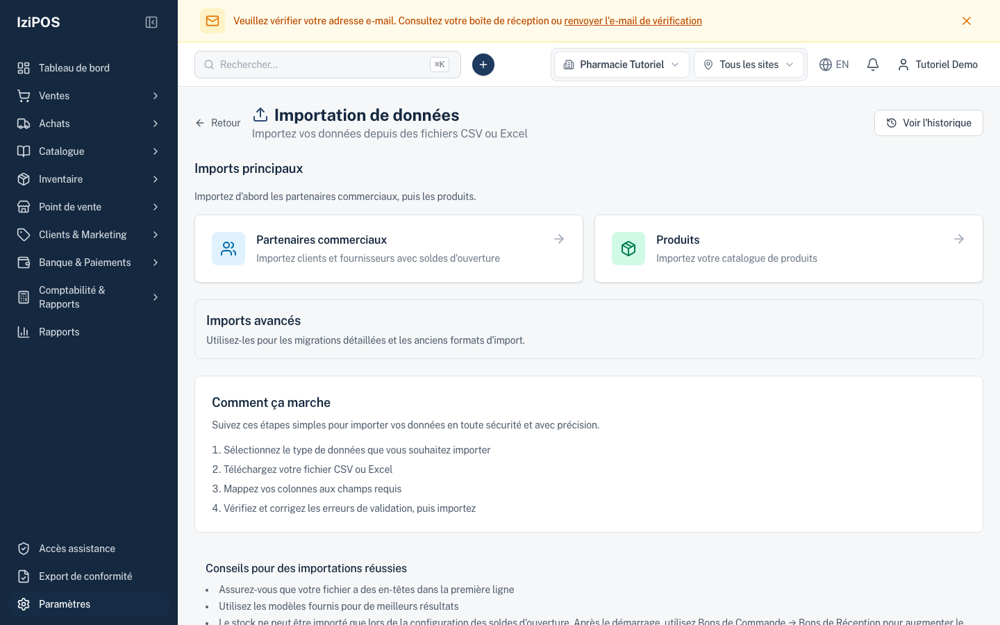
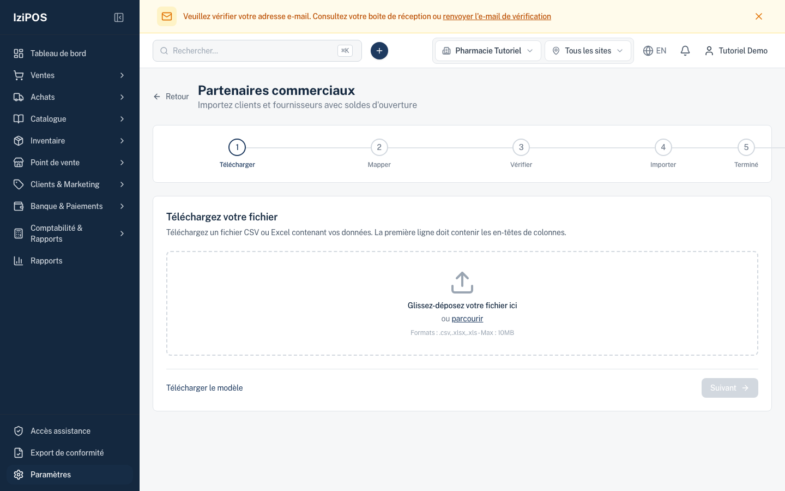
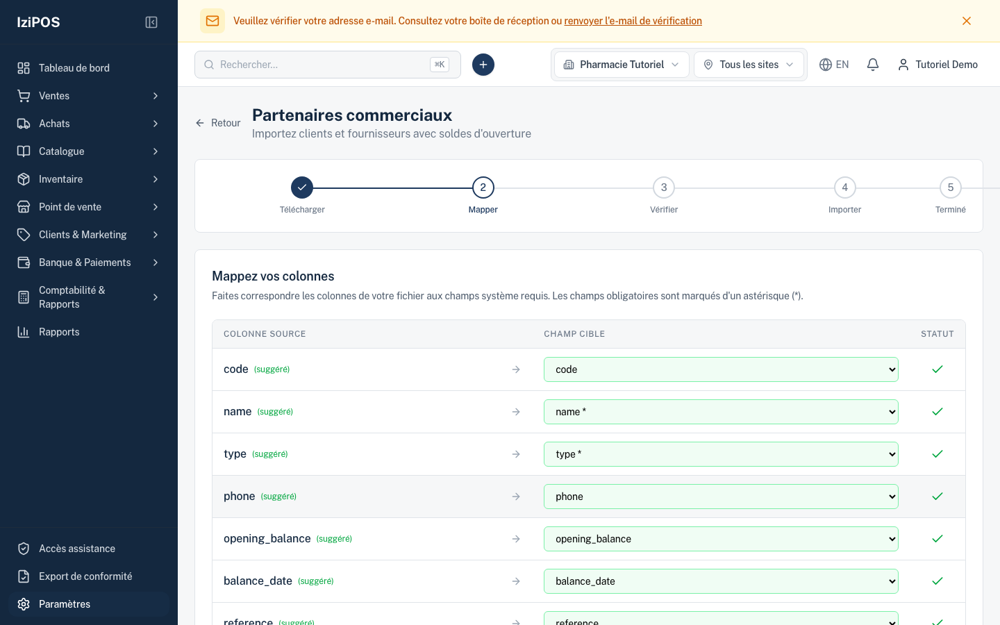
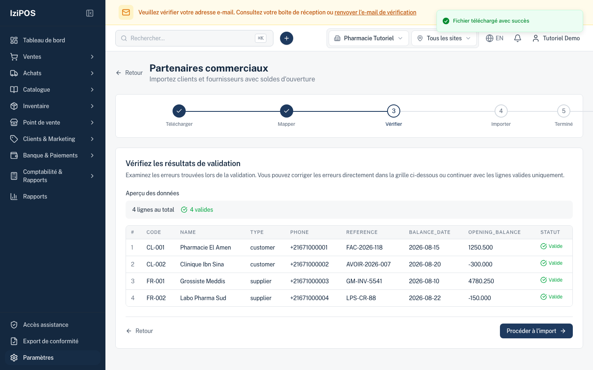
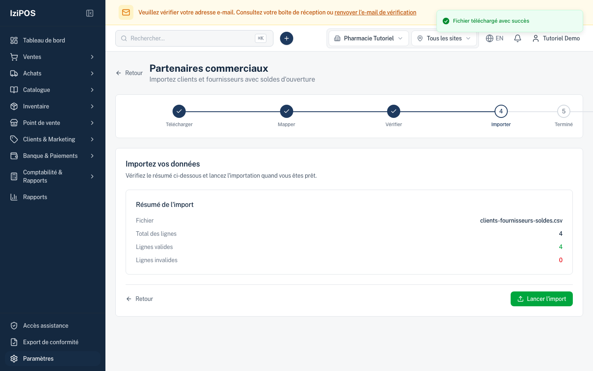
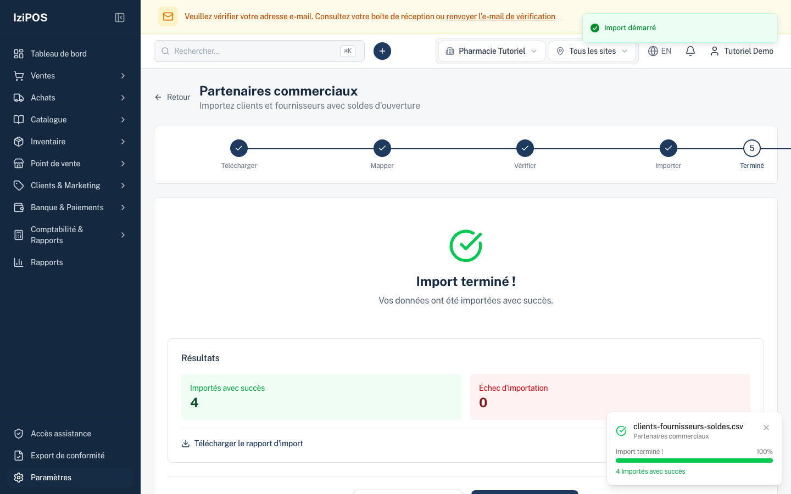
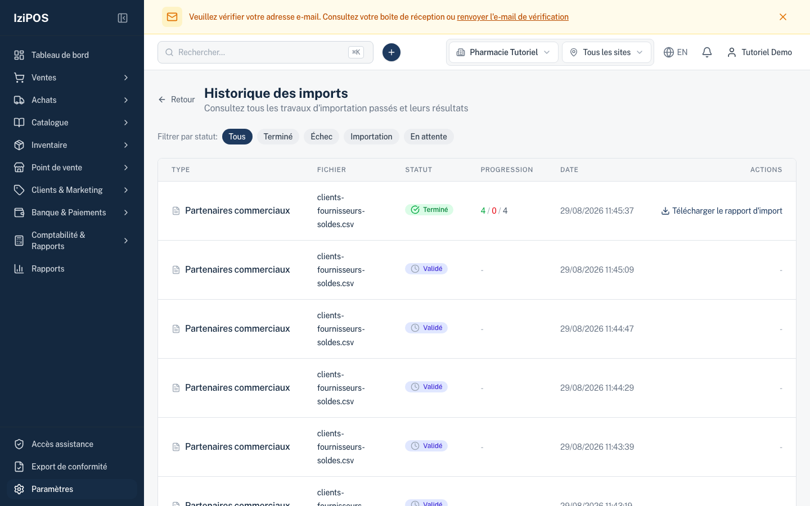
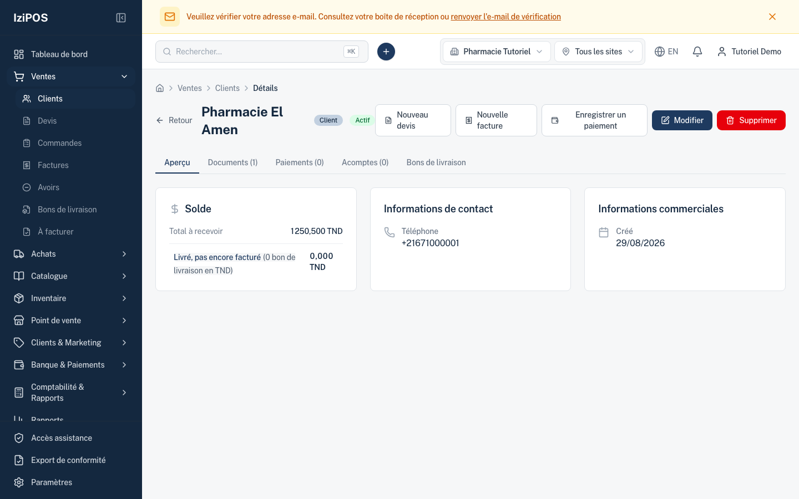

# Tutoriel — Importer les soldes et factures historiques (reprise d'un ancien système)

> **English summary:** step-by-step, with screenshots, for importing legacy customer/supplier balances from a previous ERP. Positive balance = the counterparty owes per its role; negative = imported as a credit note. Each balance becomes a posted historical document (`HIST-*`) that future payments allocate against. Sign conventions: see `docs/guides/legacy-migration-accounting-conventions.md`.

**Cas d'usage :** vous quittez un ancien système et certains clients/fournisseurs ont encore des factures ouvertes. On les reprend pour assurer la continuité : quand le client paie, le règlement solde les bonnes factures.

## 0. Préparer le fichier

CSV ou Excel, une ligne par tiers. Colonnes minimales :

```csv
code,name,type,phone,opening_balance,balance_date,reference
CL-001,Pharmacie El Amen,customer,+21671000001,1250.500,2026-08-15,FAC-2026-118
CL-002,Clinique Ibn Sina,customer,+21671000002,-300.000,2026-08-20,AVOIR-2026-007
FR-001,Grossiste Meddis,supplier,+21671000003,4780.250,2026-08-10,GM-INV-5541
FR-002,Labo Pharma Sud,supplier,+21671000004,-150.000,2026-08-22,LPS-CR-88
```

**Règle de signe (du point de vue de VOTRE société) :**
- Client positif = il vous doit → facture historique. Client négatif = vous lui devez (avance/avoir) → avoir historique.
- Fournisseur positif = vous lui devez → facture fournisseur historique. Négatif = il vous doit → avoir fournisseur.
- Le montant repris est toujours la valeur absolue ; le signe choisit facture vs avoir. Détail : `docs/guides/legacy-migration-accounting-conventions.md`.

## 1. Ouvrir le bon import

`Paramètres → Import de données` → tuile **« Partenaires commerciaux — Importez clients et fournisseurs avec soldes d'ouverture »**.

⚠️ **N'utilisez PAS la tuile « Partenaires »** (sans mention des soldes) : elle importe les fiches mais **perd silencieusement les soldes**. (Duplication connue, en cours de retrait.)



## 2. Télécharger le fichier

Déposez le fichier ; l'assistant détecte les colonnes (« 7 colonnes détectées »). Un modèle est téléchargeable sur cette page.



## 3. Mapper les colonnes

Les colonnes standard sont suggérées automatiquement (« déjà mappé »). Vérifiez surtout `opening_balance`, `balance_date`, `reference`. Cliquez **Suivant**.



## 4. Vérifier

L'aperçu montre chaque ligne avec son statut (`4 lignes au total — 4 valides`). Les lignes en erreur sont signalées ici, avant toute écriture. Cliquez **Valider les données** puis **Procéder à l'import**.



## 5. Lancer l'import

Le résumé récapitule fichier / lignes valides / invalides. Cliquez **Lancer l'import**.



## 6. Résultat

« Import terminé ! » avec le décompte réussites/échecs. En cas d'échecs, le rapport téléchargeable liste chaque ligne et sa raison.



Ce que le système a créé (vérifiable en base et dans les fiches) :

| Ligne du fichier | Document créé |
|---|---|
| CL-001 · +1250.500 | `HIST-INV-2026-00001` facture client, validée, 1250.500 |
| CL-002 · −300.000 | `HIST-CN-2026-00001` avoir client, 300.000 |
| FR-001 · +4780.250 | `HIST-SINV-2026-00001` facture fournisseur, 4780.250 |
| FR-002 · −150.000 | `HIST-SCN-2026-00001` avoir fournisseur, 150.000 |

Ces documents sont **historiques** : validés, datés à leur vraie date, **hors déclaration de TVA** (déjà déclarée dans l'ancien système), sans lignes produit.

## 7. Historique des imports

`Paramètres → Import de données → Voir l'historique` : chaque import passé, son statut et son rapport.



## 8. La continuité en pratique

Ouvrez la fiche du client : le solde d'ouverture apparaît comme poste ouvert. Au prochain règlement, le lettrage s'impute sur ces factures historiques précises et les solde.



## Notes

- **Reprise détaillée (facture par facture)** : pour reprendre chaque facture ouverte avec sa date/référence propre, utilisez l'import **Soldes d'ouverture** (fichiers AR/AP « open items » : montants ≥ 0, sens donné par la colonne `document_type` = `invoice`/`credit_note`).
- **Verrouillage** : une fois le lot d'ouverture **verrouillé**, les imports de soldes sont refusés pour la société — c'est le sceau de fin de migration, à faire avant le démarrage réel.
- Tutoriel réalisé sur staging (tenant `Pharmacie Tutoriel`), captures du 2026-08-29.
